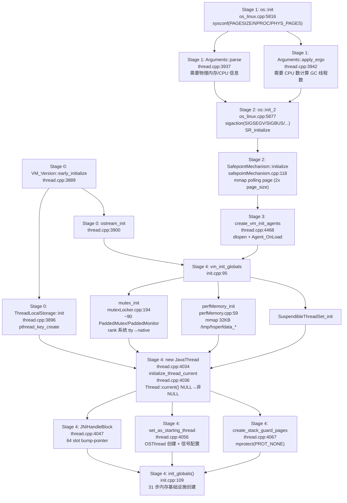

# 00-JNI-CreateJavaVM — 从 JNI 入口到 init_globals() 的骨架构建

> **Phase**：[01-jvm-startup]
> **前置**：[13-launcher]（JLI_Launch → LoadJavaVM → ifn->CreateJavaVM 调用）
> **配套**：[01-Universe-Init]（init_globals() 内部 31 次子调用）、[02-Execution-Engine]（init_globals 第14-31步）、[03-VM-Activation]（Stages 5-10）
> **后续依赖本文**：[01-Universe-Init]（从 init_globals() 执行开始，依赖本文创建的所有基础设施）
> **阅读收益**：追踪 JNI_CreateJavaVM 到 init_globals() 的完整 4 阶段启动——理解 JVM 如何从一无所有（裸 OS 线程）到拥有 90+ 全局锁、PerfMemory 共享内存、主线程绑定、栈保护——为 init_globals 的 31 步安全初始化铺路。掌握每个失败点的错误处理策略和锁层级系统的死锁防护机制。

---

## §〇 生产场景 — Agent 加载失败

```
$ java -Xmx256m -agentlib:jdwp=transport=dt_socket,server=y,suspend=n MyApp
Error occurred during initialization of VM
Could not find agent library jdwp on the library path, with error:
  libjdwp.so: cannot open shared object file: No such file or directory
```

这是一个经典的"JVM 启动了但没起来"的生产诊断场景。JVM 内部已执行以下步骤但在此处失败：

```
os::init() — 页大小 4096 + CPU 检测完成
  ↓
Arguments::parse() — JVM 参数解析完成
  ↓
create_vm_init_agents() — Agent 加载失败（找不到 libjdwp.so）
  ↓ ✗ 失败点：dlopen("libjdwp.so") → NULL → vm_exit_during_initialization()
```

关键诊断问题：JVM 在哪个点上死的？死之前创建了什么、没创建什么？

此时 `vm_init_globals()` 还没执行——全局锁（~90 个 Mutex/Monitor）不存在，Java 堆（G1）不存在，CodeCache 不存在。`Threads::current()` 返回 `NULL`——没有 Java 线程对象。整个 JVM 还只是一堆 OS 资源和已解析的参数字符串。

**反事实**：如果 Agent 加载阶段放在 `vm_init_globals` 之后（即先建好锁和主线程再加载 Agent），`libjdwp.so` 能正常加载，但 Agent_OnLoad 可能触发类加载 → 类加载需要 SystemDictionary_lock → 而这个锁在 mutex_init() 中创建，而 mutex_init() 在 vm_init_globals 中。当前设计（Stage 3 Agent 加载在 Stage 4 vm_init_globals 之前）是合理的——Agent 能看到 JVM 的基础资源但不能做触发 GC 的事情（还没有堆）。

**三步诊断**：

```bash
# 1. 确认 Agent 路径
find /usr -name "libjdwp.so" 2>/dev/null
java -agentlib:jdwp=help  # 快速验证 jdwp 是否可用

# 2. strace 确认 JVM 在哪里停止
strace -f -e trace=openat java -agentlib:jdwp=server=y MyApp 2>&1 | grep "libjdwp"
# 期望: openat(AT_FDCWD, "/usr/lib/jvm/.../libjdwp.so", O_RDONLY) = -1 ENOENT

# 3. GDB 断点定位初始化阶段
gdb -ex "break JNI_CreateJavaVM" \
    -ex "break Threads::create_vm" \
    -ex "break vm_init_globals" \
    -ex "run" \
    --args java -agentlib:jdwp=server=y MyApp
# 如果断在 vm_init_globals 之前就死了 → Agent 加载阶段失败
```

---

## §一 JNI_CreateJavaVM → Threads::create_vm Stages 0-4 全链路走读

**这不是 API 教程——这是 JVM 如何从裸 OS 线程构建 Java 运行时骨架的工程文档。**

### 1.1 JNI_CreateJavaVM 公共入口——atomic vm_created 单 VM 保证

JNI 规范要求一个进程只能有一个 Java VM。JNI_CreateJavaVM 通过两层设计实现这一点：

**外层** `JNI_CreateJavaVM` (`jni.cpp:4143`)——薄封装，仅做 JNI 协议层的原子性保证：

```cpp
// jni.cpp:4143
_JNI_IMPORT_OR_EXPORT_ jint JNICALL JNI_CreateJavaVM(JavaVM **vm, void **penv, void *args) {
  jint result = JNI_ERR;
#if defined(_WIN32) && !defined(USE_VECTORED_EXCEPTION_HANDLING)
  __try {
#endif
    result = JNI_CreateJavaVM_inner(vm, penv, args);
#if defined(_WIN32) && !defined(USE_VECTORED_EXCEPTION_HANDLING)
  } __except(topLevelExceptionFilter((_EXCEPTION_POINTERS*)_exception_info())) {
    // Nothing to do.
  }
#endif
  return result;
}
```

**内层** `JNI_CreateJavaVM_inner` (`jni.cpp:3984`)——真正的实现，做三件关键事：

```cpp
// jni.cpp:4018 — Atomic::xchg 保证单线程初始化
// 此时不能使用 JVM 内部 Mutex，因为 Mutex 依赖于已初始化的 Thread
if (Atomic::xchg(1, &vm_created) == 1) {
    return JNI_EEXIST;   // 已有 VM 创建在进行中
}

// jni.cpp:4027 — 检查是否允许重试
if (Atomic::xchg(0, &safe_to_recreate_vm) == 0) {
    return JNI_ERR;      // 之前失败的 VM 不可重试
}

// jni.cpp:4045 — 调用核心创建函数
result = Threads::create_vm((JavaVMInitArgs*) args, &can_try_again);
```

两层设计实现关注点分离：外层处理 JNI 规范要求的原子性和线程安全，内层处理 JVM 内部逻辑。异常路径也不同——外层失败返回 `JNI_ERR`，内层失败可能设置 `can_try_again = false`（如内存不足时不允许重试）。

> **Beginner Callout 1: JNI_CreateJavaVM vs JNI_CreateJavaVM_inner**
>
> JNI public entry at `jni.cpp:4143` 使用 `Atomic::xchg` 操作 `vm_created` 全局标志来确保单 VM 初始化。`vm_created` 是 `jvm.cpp:443` 定义的全局 volatile 变量，初始值为 0。`xchg(1, &vm_created) == 1` 意味着之前已有线程执行了同样的操作——立即返回 `JNI_EEXIST`。
>
> `_inner` 变体 (`jni.cpp:3984`) 是真正的实现，包括 `can_try_again` 重试机制。如果 `create_vm` 失败且 `can_try_again = true`，`safe_to_recreate_vm` 被重置为 1，允许后续重试。如果 `can_try_again = false`（如 OOM），`safe_to_recreate_vm` 保持 0——后续任何 `JNI_CreateJavaVM` 调用立即失败。

### 1.2 Stage 0 — 预初始化 (thread.cpp:3886-3908)

JVM 启动的"零阶段"建立了最基本的运行环境：

```cpp
// thread.cpp:3886 — Threads::create_vm 的入口
jint Threads::create_vm(JavaVMInitArgs *args, bool *canTryAgain) {
    VM_Version::early_initialize();   // 预初始化 JVM 版本号
    if (!is_supported_jni_version(args->version)) return JNI_EVERSION;

    // thread.cpp:3896 — TLS 初始化
    // 核心思想：每个线程调用 Thread::current() 返回自己的 JavaThread 对象
    ThreadLocalStorage::init();

    // thread.cpp:3900 — 输出流初始化
    ostream_init();
```

`ThreadLocalStorage::init()` 调用 `pthread_key_create`（`man 3`）创建 TLS key——这是后续 `Thread::current()` 能工作的前提。此时 `Thread::current()` 仍返回 NULL，因为还没有 JavaThread 对象绑定到 OS 线程。

### 1.3 Stage 1 — OS 检测 + 参数系统 (thread.cpp:3908-3960)

Stage 1 的核心是 `os::init()` 和 `Arguments::parse()`——必须按这个顺序，因为参数解析依赖 OS 信息。

**os::init()** (`os_linux.cpp:5816`) 获取系统核心参数：

```cpp
// os_linux.cpp:5816 — os::init() Linux 实现
void os::init(void) {
    // os_linux.cpp:5820 — 获取内核时钟滴答频率 (man 3 sysconf)
    clock_tics_per_sec = sysconf(_SC_CLK_TCK);  // 通常 100

    // os_linux.cpp:5824 — 获取内存页大小 (man 3 sysconf)
    Linux::set_page_size(sysconf(_SC_PAGESIZE));  // x86_64: 4096

    // os_linux.cpp:5832 — 获取 CPU 数量 + 物理内存 (man 3 sysconf)
    Linux::initialize_system_info();  // _SC_NPROCESSORS_CONF, _SC_PHYS_PAGES

    // os_linux.cpp:5834 — 获取内核版本 (man 2 uname)
    Linux::initialize_os_info();

    // os_linux.cpp:5851 — 记录主线程的 pthread ID
    Linux::_main_thread = pthread_self();
```

`sysconf(_SC_PAGESIZE)` 返回 `getpagesize()`——glibc 的缓存接口，比直接读 `/proc/cpuinfo` 快且是 POSIX 标准。在容器环境中，某些 glibc 版本会考虑 cgroup 限制。

> **Beginner Callout 2: sysconf vs /proc**
>
> JVM 使用 `sysconf()` (`man 3`) 而非直接读取 `/proc` 获取系统参数：
> - `_SC_PAGESIZE` → `getpagesize()` → 4096 on x86_64
> - `_SC_NPROCESSORS_CONF` → 逻辑 CPU 总数（含超线程）
> - `_SC_PHYS_PAGES` → 物理内存页数
>
> `sysconf` 是 glibc 的缓存抽象，比文件 I/O 快且是 POSIX 标准接口。直接读 `/proc/cpuinfo` 在容器环境下可能读到宿主机的值（取决于 cgroup 配置），而 `sysconf` 在部分 glibc 版本中会考虑 cgroup 限制。

**Arguments::parse()** (`thread.cpp:3937`) 依赖于 os::init() 获取的物理内存和 CPU 数来验证参数合法性并计算默认值：

```cpp
// thread.cpp:3937 — 参数解析必须在 OS 初始化之后
jint parse_result = Arguments::parse(args);
if (parse_result != JNI_OK) return parse_result;

// thread.cpp:3942 — 自动调优（依赖 CPU 数量和物理内存）
jint ergo_result = Arguments::apply_ergo();
if (ergo_result != JNI_OK) return ergo_result;
```

`Arguments::apply_ergo()` 使用 CPU 数量确定 `ParallelGCThreads` 和 `ConcGCThreads`，使用物理内存计算 `-Xms/-Xmx` 默认值。

**反事实：如果先解析参数再检测 OS 信息**：用户指定 `-Xmx256m` 但 JVM 不知道物理内存是 4GB 还是 512MB → 无法验证堆大小是否合理 → 在 512MB 机器上 OOM killer 可能杀死进程而非优雅抛出 OutOfMemoryError。

### 1.4 Stage 2 — Signals + Safepoint (thread.cpp:3962-3988)

**os::init_2()** (`os_linux.cpp:5877`) 安装信号处理器并初始化 Suspend/Resume 机制：

```cpp
// os_linux.cpp:5877 — os::init_2() 必须在参数解析之后
jint os::init_2(void) {
    os::Posix::init_2();                    // POSIX 层初始化（日志输出）
    Linux::fast_thread_clock_init();        // 快速线程时钟

    // os_linux.cpp:5887 — 初始化 Suspend/Resume 支持
    // 涉及 STW、Profiling（获取调用栈）、信号处理
    if (SR_initialize() != 0) {
        perror("SR_initialize failed");
        return JNI_ERR;
    }

    // os_linux.cpp:5892 — 初始化信号集
    Linux::signal_sets_init();

    // os_linux.cpp:5894 — 安装所有 JVM 需要的信号处理器
    Linux::install_signal_handlers();  // SIGSEGV, SIGBUS, SIGFPE, SIGPIPE, SIGQUIT, SIGILL
```

核心信号处理器：
- **SIGSEGV**: 区分 NullPointerException（地址 < vm_page_size()）、implicit null check、safepoint polling page、真实 segfault
- **SIGBUS**: 内存总线错误（mmap 文件被截断等）
- **SIGFPE**: 除零异常 → ArithmeticException
- **SIGPIPE**: 写入关闭的 pipe → 忽略（EPIPE，JDK-6353785）
- **SIGQUIT**: Thread dump（kill -3）→ print_stack_traces()
- **SIGILL**: 非法指令 → abort + hs_err

这些信号处理器必须在 `vm_init_globals` 之前安装，因为 mutex_init() 创建的锁可能在信号处理上下文中被触碰。但 Stage 2 handler 不能依赖 `Thread::current()`（此时还是 NULL）——必须使用 raw `pthread_self()`。

**SafepointMechanism::initialize()** (`thread.cpp:3981`) 创建安全点轮询机制：

```cpp
// safepointMechanism.cpp:42 — 安全点轮询页创建
void SafepointMechanism::default_initialize() {
    if (ThreadLocalHandshakes) {
        // JDK 11 默认：每线程局部轮询
        set_uses_thread_local_poll();
        const size_t page_size = os::vm_page_size();       // 4096
        const size_t allocation_size = 2 * page_size;      // 8192
        char* polling_page = os::reserve_memory(allocation_size, NULL, page_size);
        os::commit_memory_or_exit(polling_page, allocation_size, false, "...");

        // safepointMechanism.cpp:67-68 — 双页设计
        char* bad_page  = polling_page;              // PROT_NONE
        char* good_page = polling_page + page_size;  // PROT_READ
        os::protect_memory(bad_page,  page_size, os::MEM_PROT_NONE);
        os::protect_memory(good_page, page_size, os::MEM_PROT_READ);
    }
}
```

> **Beginner Callout 3: Polling Page（Safepoint Mechanism）**
>
> 安全点轮询页是 JVM 实现协作式线程停止的核心机制。`SafepointMechanism::default_initialize()` 分配两页内存：
> - **Bad page**（低地址）：`mprotect(PROT_NONE)`——不可访问，触发 SIGSEGV
> - **Good page**（高地址）：`PROT_READ`——可读，正常执行
>
> 所有 Java 线程在编译代码中周期性读取轮询地址。正常执行时，线程的 `_polling_page` 指向 good page——读取成功，继续执行。当 JVM 需要全局 safepoint 时，将 `_polling_page` 改为指向 bad page → 线程下次读取触发 SIGSEGV → handler 识别为 safepoint request → 线程自挂起。JDK 11 还引入 ThreadLocalHandshakes（每线程独立轮询），支持更细粒度的 handshake 操作。

**反事实：如果 JVM 不处理 SIGSEGV 而让内核默认处理**：内核默认 action for SIGSEGV 是终止进程 + core dump。NullPointerException → SIGSEGV → core dump → 进程死。没有任何 Java 异常。JVM 的 SIGSEGV handler 通过检查 fault address 和线程上下文来决定：null check → NullPointerException，栈溢出 → StackOverflowError，polling page → safepoint，其他 → hs_err_pid.log + abort。没有这个 handler，Java 的异常语义完全无法工作。

### 1.5 Stage 3 — Agent 加载 (thread.cpp:3990-4009)

```cpp
// thread.cpp:3994 — 将 -Xrun 转换为 -agentlib（向后兼容）
if (Arguments::init_libraries_at_startup()) {
    convert_vm_init_libraries_to_agents();
}

// thread.cpp:4006 — 加载所有 Agent
if (Arguments::init_agents_at_startup()) {
    create_vm_init_agents();  // dlopen + Agent_OnLoad
}
```

`create_vm_init_agents()` (`thread.cpp:4468`) 遍历 agent 列表，对每个 agent：

```cpp
// thread.cpp:4468 — Agent 加载实现
void Threads::create_vm_init_agents() {
    extern struct JavaVM_ main_vm;
    for (agent = Arguments::agents(); agent != NULL; agent = agent->next()) {
        OnLoadEntry_t on_load_entry = lookup_agent_on_load(agent);
        if (on_load_entry != NULL) {
            jint err = (*on_load_entry)(&main_vm, agent->options(), NULL);
            if (err != JNI_OK) {
                vm_exit_during_initialization("agent library failed to init", agent->name());
            }
        }
    }
}
```

Agent 加载必须在 `vm_init_globals` 之前（否则 Agent_OnLoad 可能触发需要 SystemDictionary_lock 的类加载），但必须在 `os::init_2()` 之后（需要信号处理器就位）。

### 1.6 Stage 4 — vm_init_globals + MainThread 创建 (thread.cpp:4011-4084)

#### 1.6.1 vm_init_globals() — 7 个子步骤

`vm_init_globals()` (`init.cpp:95`) 是 JVM 基础设施的创建入口：

```cpp
// init.cpp:95 — vm_init_globals 创建全局基础设施
void vm_init_globals() {
    check_ThreadShadow();          // 断言检查
    basic_types_init();            // 类型大小设置（指针压缩→4字节引用）
    eventlog_init();               // 事件日志初始化
    mutex_init();                  // ★ ~90 个全局互斥锁
    chunkpool_init();              // Chunk 池初始化
    perfMemory_init();             // ★ 性能监控共享内存
    SuspendibleThreadSet_init();   // 可挂起线程集初始化
}
```

#### 1.6.2 mutex_init() — ~90 个全局锁的等级系统

`mutex_init()` (`mutexLocker.cpp:194`) 是 JVM 锁体系的核心。通过 `def()` 宏创建所有全局 Mutex/Monitor：

```cpp
// mutexLocker.cpp:187 — def 宏定义
#define def(var, type, pri, vm_block, safepoint_check_allowed ) {      \
  var = new type(Mutex::pri, #var, vm_block, safepoint_check_allowed); \
  assert(_num_mutex < MAX_NUM_MUTEX, "increase MAX_NUM_MUTEX");        \
  _mutex_array[_num_mutex++] = var;                                     \
}
```

`def` 宏展开为 `new PaddedMutex(rank, name, allow_vm_block, safepoint_check_type)`，其中 `PaddedMutex` (`mutex.hpp:311`) 继承自 `Mutex` 并添加 cache line padding 防止 false sharing：

```cpp
// mutex.hpp:311 — PaddedMutex 防止 false sharing
class PaddedMutex : public Mutex {
  enum {
    CACHE_LINE_PADDING = (int)DEFAULT_CACHE_LINE_SIZE - (int)sizeof(Mutex),
    PADDING_LEN = CACHE_LINE_PADDING > 0 ? CACHE_LINE_PADDING : 1
  };
  char _padding[PADDING_LEN];
};
```

**Lock Ranking 层级系统** (`mutex.hpp:106`)：

```cpp
// mutex.hpp:106 — 锁等级枚举
enum lock_types {
     event,                    // 最低
     access         = event          +   1,
     tty            = access         +   2,
     special        = tty            +   1,
     suspend_resume = special        +   1,
     vmweak         = suspend_resume +   2,
     leaf           = vmweak         +   2,
     safepoint      = leaf           +  10,
     barrier        = safepoint      +   1,
     nonleaf        = barrier        +   1,
     max_nonleaf    = nonleaf        + 900,
     native         = max_nonleaf    +   1  // 最高
};
```

关键锁及其 rank 对照表：

| Lock | Rank | 类型 | 用途 |
|------|------|------|------|
| `tty_lock` | tty | PaddedMutex | 控制台输出锁 |
| `CodeCache_lock` | special | PaddedMutex | 代码缓存分配 |
| `SystemDictionary_lock` | leaf | PaddedMonitor | 类加载字典 |
| `Safepoint_lock` | safepoint | PaddedMonitor | 安全点同步 |
| `Threads_lock` | barrier | PaddedMonitor | 线程列表保护 |
| `VMOperationQueue_lock` | nonleaf | PaddedMonitor | VM 操作队列 |
| `Heap_lock` | nonleaf+1 | PaddedMonitor | 堆分配互斥 |
| `Compile_lock` | nonleaf+3 | PaddedMutex | 编译任务互斥 |
| `MethodCompileQueue_lock` | nonleaf+4 | PaddedMonitor | 编译队列 |
| `PeriodicTask_lock` | nonleaf+5 | PaddedMonitor | 周期性任务 |

**Rank 检查机制**：线程只能按升序获取锁。`Mutex::lock()` 内部调用 `assert_locked_rank()`，检查 `this->_rank <= Thread::current()->_last_lock_rank` → assert fail。这确保开发时就能捕获潜在死锁而非在线上静默挂起。

> **Beginner Callout 4: Lock Ranking（锁等级系统）**
>
> JVM 的锁等级系统通过整数 rank 强制锁获取顺序。rank 从低到高：`tty`（最低）→ `special` → `leaf` → `safepoint` → `barrier` → `nonleaf`（含 +1…+6 变体）→ `max_nonleaf` → `native`（最高）。线程只能按升序获取锁——获取更低 rank 的锁会触发 fatal assert。
>
> 如果没有这个系统：Thread A 持有 `Compile_lock`(nonleaf+3) 等待 `MethodCompileQueue_lock`(nonleaf+4)，Thread B 持有 `MethodCompileQueue_lock` 等待 `Compile_lock` → 经典死锁，进程永久挂起，无任何错误输出。lock ranking 在 Thread B 第二次 lock 时就 assert 崩溃——开发者修复而非运营工程师半夜被 page。

#### 1.6.3 perfMemory_init() — mmap 共享内存

`perfMemory_init()` (`perfMemory.cpp:59`) 创建性能监控共享内存，路径为 `/tmp/hsperfdata_<user>/<pid>`：

```cpp
// perfMemory_linux.cpp:1043 — mmap_create_shared 核心
mapAddress = (char*)::mmap((char*)0, size, PROT_READ|PROT_WRITE, MAP_SHARED, fd, 0);
result = ::close(fd);  // mmap 后 fd 可以关闭，映射仍然有效
```

完整创建流程：
1. `open(/tmp/hsperfdata_<user>/<pid>, O_CREAT|O_EXCL, 0600)` — 创建文件
2. `ftruncate(fd, 32KB)` — 设置大小（默认 PerfMemorySize）
3. `mmap(NULL, 32KB, PROT_READ|PROT_WRITE, MAP_SHARED, fd, 0)` — 映射
4. `close(fd)` — mmap 后文件描述符不需要保持打开
5. `memset(mapAddress, 0, 32KB)` — 清零

`jstat -gc <pid>` 读取此文件：`jstat → PerfMemory::attach(pid) → open + mmap 同一文件 → 读取 header magic (0xc0c0feca) → namespace tree → 获取计数器值`。纯共享内存读取，无 socket、无 RPC、无序列化，延迟 ~1μs per counter。

> **Beginner Callout 5: PerfMemory（mmap 共享内存）**
>
> JVM 使用 `mmap(MAP_SHARED)` 创建性能监控共享内存，路径为 `/tmp/hsperfdata_<user>/<pid>`。`jstat -gc <pid>` 通过 `PerfMemory::attach()` 打开并 mmap 同一文件，零序列化读取 GC 统计。内部计数器包括堆使用率、GC 暂停时间、编译活动、类加载计数。
>
> 关键设计优势是 post-mortem 分析：JVM crash 后文件仍在 `/tmp`，jstat 仍能读取最终状态。这需要 mmap+dumpable 文件，不能用 socket（crash 后不可用）。`MAP_SHARED` 保证 JVM 写入直接修改内核 page cache 中的页，jstat 读取同一页缓存——无需 `msync`。

#### 1.6.4 Main JavaThread 创建与绑定

`new JavaThread()` (`thread.cpp:4034`) 仅分配 C++ 对象，尚未绑定到 OS 线程：

```cpp
// thread.cpp:4034 — 创建 JavaThread 对象
JavaThread *main_thread = new JavaThread();
main_thread->set_thread_state(_thread_in_vm);

// thread.cpp:4036 — ★ 关键绑定时刻
main_thread->initialize_thread_current();
```

`initialize_thread_current()` (`thread.cpp:347`) 建立了"JavaThread 对象 ↔ OS 线程"的绑定：

```cpp
// thread.cpp:347 — 将 JavaThread 绑定到当前 OS 线程
void Thread::initialize_thread_current() {
    assert(_thr_current == NULL, "Thread::current already initialized");
    _thr_current = this;
    assert(ThreadLocalStorage::thread() == NULL, "...");
    ThreadLocalStorage::set_thread(this);  // TLS 设置
    assert(Thread::current() == ThreadLocalStorage::thread(), "TLS mismatch!");
}
```

绑定前后对比：
- **绑定前**：`Thread::current()` 返回 NULL——任何 dereference 导致 SIGSEGV
- **绑定后**：`Thread::current()` 返回 `main_thread`——所有 JVM 代码都能获取当前线程

随后创建 JNIHandleBlock 和栈保护页：

```cpp
// thread.cpp:4047 — 为主线程分配 JNI Handle Block
main_thread->set_active_handles(JNIHandleBlock::allocate_block());

// thread.cpp:4056 — 正式附加主线程到 OS 线程
if (!main_thread->set_as_starting_thread()) {
    vm_shutdown_during_initialization("Failed necessary internal allocation. Out of swap space");
    main_thread->smr_delete();
    *canTryAgain = false;
    return JNI_ENOMEM;
}

// thread.cpp:4067 — 创建栈保护页
main_thread->create_stack_guard_pages();
```

> **Beginner Callout 6: JNIHandleBlock**
>
> 在 `thread.cpp:4047` 创建，通过 `JNIHandleBlock::allocate_block()` 分配。每个 block 包含 64 个 jobject 槽——指向 OopStorage 中条目的索引。当 JNI 代码需要持有 Java 对象引用时（如 `jobject obj = env->GetObjectField(...)`），分配一个槽。Handle 防止 GC 回收对象。Local handle（默认）在 JNI 调用返回时释放，Global handle 持续到显式释放。Block 内部使用 bump-pointer 分配，多个 block 通过链表连接。

> **Beginner Callout 7: Stack Guard Pages（栈保护页）**
>
> `create_stack_guard_pages()` (`thread.cpp:4067`) 调用 `os::guard_memory()` 对线程栈的最低页执行 `mprotect(PROT_NONE)`。当线程栈溢出时触碰此保护页 → SIGSEGV → handler 比较 fault address 与线程的栈边界 → 识别为栈溢出 → 抛出 StackOverflowError（Java）或 abort（native 栈溢出）。没有 guard pages，栈溢出会静默破坏相邻内存区域。

### 1.7 依赖拓扑 DAG 图



**依赖分析**：
- `os::init()` → `Arguments::parse()`：参数解析需要物理内存和 CPU 信息
- `os::init_2()` → `SafepointMechanism::initialize()`：信号处理器必须在 polling page 之前
- `vm_init_globals()` → `new JavaThread()`：锁必须在创建线程之前就绪
- `Stage 2 信号处理器` 不能依赖 `Thread::current()`——必须用 raw `pthread_self()`

### 1.8 面试 Story Format 答案

"从命令行 `java -jar app.jar` 到 `init_globals()` 被调用，经历了完整的 graduated capability building：

**① 谁在调用 CreateJavaVM**：13-launcher 通过 `LoadJavaVM()` 加载 `libjvm.so`，解析 `JNI_CreateJavaVM` 函数指针（`GetExportedJNIFunctions()` at `java_md_macosx.c:197` → `dlsym(libjvm, "JNI_CreateJavaVM")`）→ `ifn->CreateJavaVM(vm, penv, args)`。

**② JNI entry 薄封装**：`JNI_CreateJavaVM` at `jni.cpp:4143` 仅做 Windows SEH 包装，转发到 `JNI_CreateJavaVM_inner` at `jni.cpp:3984`。inner 版本用 `Atomic::xchg(1, &vm_created)` 确保单 VM，检查 `safe_to_recreate_vm` 决定是否允许重试，然后调用 `Threads::create_vm()`。

**③ Stage 0-3 序列化初始化**：
- **Stage 0**：`VM_Version::early_initialize()` + `ThreadLocalStorage::init()`（pthread_key_create）+ `ostream_init()`——此时只能打印和知道 CPU 型号
- **Stage 1**：`os::init()` 通过 `sysconf()` 获取页大小(4096)、CPU 数、物理内存 → `Arguments::parse()` 验证 flags → `apply_ergo()` 自动调优 GC 线程数和堆大小
- **Stage 2**：`os::init_2()` 安装 6 种信号处理器（SIGSEGV/BUS/FPE/PIPE/QUIT/ILL）→ `SafepointMechanism::initialize()` mmap 双页轮询机制
- **Stage 3**：`create_vm_init_agents()` 遍历 agent 列表，dlopen + Agent_OnLoad——Agent 能看到 JVM 基础资源但不能做触发 GC 的事

**④ Stage 4 mutex_init + MainThread**：`vm_init_globals()` at `init.cpp:95` 创建 7 项基础设施：`mutex_init()` 通过 `def()` 宏分配 ~90 个 PaddedMutex/PaddedMonitor（rank tty→native，每次 lock() 检查 rank 递增防止死锁）→ `perfMemory_init()` mmap 32KB 共享内存到 `/tmp/hsperfdata_<user>/<pid>` → `new JavaThread()` 创建主线程对象 → `initialize_thread_current()` 将 JavaThread 绑定到 OS 线程（`Thread::current()` 首次非 NULL）→ `JNIHandleBlock::allocate_block()` 分配 64 槽 jobject 引用 → `create_stack_guard_pages()` mprotect 栈底部为 PROT_NONE

**⑤ 接力给 init_globals 的 Moment**：`init_globals()` at `init.cpp:109` 被调用——此时 JVM 有了 90+ 全局锁、PerfMemory、主线程绑定、栈保护。接下来 31 步将创建 CodeCache、G1 Heap、Metaspace、SymbolTable、StringTable——那是 Document 01 的故事。"

---

## §二 异常路径分析

### 2.1 失败点矩阵

| 失败点 | 位置 | 创建了什么 | 清理策略 | canTryAgain | 返回码 |
|--------|------|-----------|---------|-------------|--------|
| JNI 版本不支持 | jni.cpp:3892 | 无 | 无 | true | JNI_EVERSION |
| vm_created 已设置 | jni.cpp:4018 | 无 | 无 | false | JNI_EEXIST |
| safe_to_recreate_vm=0 | jni.cpp:4027 | 无 | 无 | false | JNI_ERR |
| os::init 失败 | os_linux.cpp | TLS + ostream | 无（ostream 不清理） | true | fatal |
| 参数解析失败 | thread.cpp:3938 | OS 信息 | 无 | true | JNI_EINVAL |
| ergo 失败 | thread.cpp:3943 | 已解析参数 | 无 | true | JNI_EINVAL |
| os::init_2 失败 | thread.cpp:3972 | 信号处理器部分安装 | 部分 | true | JNI_ERR |
| Agent 加载失败 | thread.cpp:4007 | 全部 Stage 0-2 | vm_exit_during_initialization | false | abort |
| mutex_init 失败 | init.cpp:99 | Stage 0-2 | vm_shutdown | false | JNI_ENOMEM |
| perfMemory_init 失败 | init.cpp:101 | 锁已创建 | 降级到标准内存 | false | 降级处理 |
| new JavaThread 失败 | thread.cpp:4034 | 锁+PerfMemory | vm_shutdown | false | JNI_ENOMEM |
| set_as_starting_thread 失败 | thread.cpp:4056 | 锁+PerfMemory+Thread 对象 | vm_shutdown_during_initialization | false | JNI_ENOMEM |
| init_globals 失败 | thread.cpp:4078 | 锁+PerfMemory+MainThread | vm_shutdown | false | JNI_ENOMEM/EINVAL |

### 2.2 canTryAgain 机制

`can_try_again` 是 JVM 启动的核心可恢复性标志。如果失败点认为环境没有永久性损坏（如参数错误），`can_try_again` 保持 true，允许调用者修改参数后重试。如果失败点涉及资源分配（如内存不足），`can_try_again` 设为 false——环境已被污染，重试会导致崩溃。

### 2.3 已创建资源回滚

当 `Threads::create_vm` 失败时，`JNI_CreateJavaVM_inner` 执行回滚：

```cpp
// jni.cpp:4122 — 失败回滚
if (can_try_again) {
    safe_to_recreate_vm = 1;  // 允许重试
}
*vm = 0;                        // 清除返回值
*(JNIEnv**)penv = 0;
OrderAccess::release_store(&vm_created, 0);  // 释放单 VM 锁
```

---

## §三 GDB 断点验证 — 8 断点完整 trace

### 断言 1: JNI_CreateJavaVM entry (jni.cpp:4143)

```gdb
(gdb) break jni.cpp:4143
(gdb) run
(gdb) print args->version → 期望: 0x00010008 (JNI_VERSION_1_8)
(gdb) print vm_created → 期望: false (初始化前)
(gdb) continue → 进入 JNI_CreateJavaVM_inner
```

### 断言 2: os::init() sysconf (os_linux.cpp:5816)

```gdb
(gdb) break os_linux.cpp:5824 (sysconf 调用之后)
(gdb) print os::vm_page_size() → 期望: 4096
(gdb) print os::processor_count() → 期望: ≥1 (CPU 数量)
(gdb) print clock_tics_per_sec → 期望: 100
(gdb) print Linux::_main_thread → 期望: 非 0 (pthread_self())
```

### 断言 3: Arguments::parse() 完成 (thread.cpp:3938)

```gdb
(gdb) break thread.cpp:3938
(gdb) print parse_result → 期望: JNI_OK (0)
(gdb) print UseG1GC → 期望: true (JDK 11 default)
(gdb) print MaxHeapSize → 期望: 自动计算的堆最大值 (~phys_mem/4)
```

### 断言 4: os::init_2() signal handlers (os_linux.cpp:5894 之后)

```gdb
(gdb) break os_linux.cpp:5894
(gdb) continue
(gdb) shell grep SigCgt /proc/$(pidof java)/status
# 期望: SigCgt 包含 SIGSEGV(11), SIGBUS(7), SIGFPE(8)
```

### 断言 5: SafepointMechanism polling page (safepointMechanism.cpp:68)

```gdb
(gdb) break safepointMechanism.cpp:68
(gdb) print polling_page → 期望: 非 NULL
(gdb) print bad_page → 期望: PROT_NONE 页地址
(gdb) print good_page → 期望: PROT_READ 页地址 (bad_page + 4096)
(gdb) shell cat /proc/$(pidof java)/maps | grep "---p"
# 期望: 找到 polling bad page (PROT_NONE)
```

### 断言 6: mutex_init() 完成 (mutexLocker.cpp:353)

```gdb
(gdb) break mutexLocker.cpp:353
(gdb) print _num_mutex → 期望: >60 (~90)
(gdb) print Threads_lock → 期望: 非 NULL
(gdb) print Threads_lock->_rank → 期望: barrier
(gdb) print Safepoint_lock->_rank → 期望: safepoint
(gdb) print tty_lock->_rank → 期望: tty (最低 rank)
(gdb) print Heap_lock->_rank → 期望: nonleaf+1
(gdb) print Compile_lock->_rank → 期望: nonleaf+3
```

### 断言 7: perfMemory_init() mmap (perfMemory_linux.cpp:1043)

```gdb
(gdb) break perfMemory_linux.cpp:1043 (mmap 调用之后)
(gdb) print mapAddress → 期望: 非 NULL (mmap 地址)
(gdb) print PerfMemory::_start → 期望: 非 NULL
(gdb) print PerfMemory::_capacity → 期望: 32768 (32KB)
(gdb) shell ls -la /tmp/hsperfdata_$(whoami)/$(pidof java)
# 期望: 文件存在, 大小 = 32768
```

### 断言 8: Thread::current() 绑定 Moment (thread.cpp:4036)

```gdb
(gdb) break thread.cpp:4035 (initialize_thread_current 之前)
(gdb) print Thread::current() → 期望: NULL (还未绑定)
(gdb) print main_thread → 期望: 非 NULL (JavaThread* 已分配)
(gdb) print main_thread->thread_state() → 期望: _thread_in_vm
(gdb) next  # 执行 initialize_thread_current
(gdb) print Thread::current() → 期望: 非 NULL (= main_thread)
(gdb) print ((JavaThread*)Thread::current())->name() → 期望: "main"
(gdb) print main_thread->active_handles() → 期望: 非 NULL (JNIHandleBlock 已分配)
(gdb) shell cat /proc/$(pidof java)/maps | grep "---p"
# 期望: 找到 stack guard page (PROT_NONE)
```

---

## §四 交叉引用

- **13-launcher**: JLI_Launch → LoadJavaVM → GetExportedJNIFunctions → dlsym("JNI_CreateJavaVM") → ifn->CreateJavaVM()。本文正是这个函数指针调用的展开——JNI_CreateJavaVM 内部发生的一切。
- **01-Universe-Init**: 从 `init_globals()` 的 `management_init()` 开始，到 `universe_init()` 返回。本文创建了 init_globals 需要的前提条件（锁 + PerfMemory + MainThread）。
- **15-core-native**: `os::init_2()` 中安装的 SIGSEGV handler 的详细实现——如何将 NullPointerException/StackOverflowError/safepoint 从硬件异常转化为 Java 异常。
