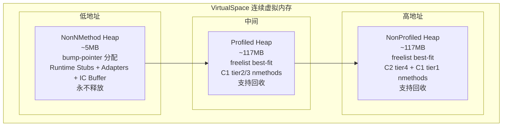

> **阶段**：[01-jvm-startup]
> **前置**：[00-JNI-CreateJavaVM]（codeCache_init 在 init_globals 第 5 步调用）
> **配套**：[02-G1-Heap-Startup]（init_globals 第 9 步 universe_init）、[03-Metaspace]（类元数据内存管理）
> **后续依赖本文**：[09-Interpreter-Init]（解释器 Codelet 分配在 CodeCache）、[12-CompileBroker-Init]（编译任务提交到 CodeCache）
> **阅读收益**：掌握 CodeCache 三段堆设计（bump-pointer + freelist best-fit）、4 个 GrowableArray 子集筛选逻辑、segmap 反向索引 O(log n) 查找与内存开销（1/64 比例）、nmethod 5 态生命周期（not_installed→in_use→not_entrant→zombie→unloaded）、sweeper 两步异步清理（mark_active safepoint + sweep async）、CodeCache Full 时的 emergency flushing 与扩容机制、_needs_cache_clean / 依赖计数 / icache_init 交叉平台 / NMT 内存池注册

---

# 01-CodeCache — JIT 编译代码的三段堆与生命周期管理

## §〇 生产场景 — CodeCache Full 导致 Emergency Flushing

```
$ java -XX:ReservedCodeCacheSize=48m MyApp
# 48MB CodeCache 在大型应用中很快满 → Emergency flushing → JIT 停止

$ jcmd <pid> Compiler.CodeHeap_Analytics aggregate
CodeHeap 'non-nmethods': size=5696Kb used=3072Kb max_used=3328Kb free=2624Kb
CodeHeap 'profiled nmethods': size=118400Kb used=116912Kb max_used=117440Kb free=1488Kb
CodeHeap 'non-profiled nmethods': size=118400Kb used=118208Kb max_used=118336Kb free=192Kb
```

NonProfiled heap 只剩 192KB。再过几个编译请求就满。此时 sweeper 紧急回收 zombie nmethod，但栈上还有活跃帧的 not_entrant 方法不能回收——编译器发 `handle_full_code_cache()` → 暂停新的编译 → 应用程序跌回解释执行 → 吞吐量骤降 10-100×。

**反事实**：如果 CodeCache 不分段（单堆），永久 stubs 卡在中间，nmethod 释放后的空洞无法被 bump-pointer 绕过 → 碎片化严重 → 明明总空闲够但连续空间不足 → CodeCache full 更早触发。三段设计使 NonNMethod 的永久对象在独立堆中（有序增长、无碎片），Profiled/NonProfiled 各自有 freelist + merge_right 合并相邻空闲块。

**三步诊断**：

```bash
# 1. 查看 CodeCache 使用量
jcmd <pid> Compiler.CodeHeap_Analytics aggregate

# 2. 查看 nmethod 状态分布
jcmd <pid> Compiler.CodeHeap_Analytics MethodTypes

# 3. GDB 验证 freelist 状态
gdb -ex "break CodeHeap::search_freelist" \
    -ex "break NMethodSweeper::sweep_code_cache" \
    -ex "run" \
    --args java -XX:ReservedCodeCacheSize=48m MyApp
```

## §一 ★★★ CodeCache 三段堆全链路源码走读

CodeCache 不是一块连续内存——是 3 个独立管理的 CodeHeap，分别存储不同类型的代码，用完全不同的分配策略。NonNMethod 用 bump-pointer（永不释放），Profiled/NonProfiled 用 freelist best-fit（支持回收）。每个 CodeHeap 有一个 `_segmap[]` 字节数组——给定任意 PC 地址，O(log n) 跳转就能找到所属 CodeBlob。nmethod 走 5 态生命周期（not_installed→in_use→not_entrant→zombie→unloaded），最少 3 次 sweep 才能回收空间。

### 1.1 initialize_heaps — 三段大小计算与内存布局

`initialize_heaps()` (`codeCache.cpp:175`) 是 CodeCache 初始化的核心——计算 NonNMethod / Profiled / NonProfiled 各段大小，通过一块连续的 VirtualSpace 切分为三段。

**三段大小计算分三种情况**：

**第一阶段** — 用户一个都没设 (`codeCache.cpp:210-223`):

```cpp
// codeCache.cpp:210-223 — 默认情况
if (!non_nmethod_set && !profiled_set && !non_profiled_set) {
    // NonNMethod = compiler_buffer + 额外预留
    non_nmethod_size = compiler_buffer_size + non_nmethod_code_heap_size_extra();
    // 剩余空间在 Profiled 和 NonProfiled 间均分
    if (cache_size > non_nmethod_size) {
        size_t remaining = cache_size - non_nmethod_size;
        profiled_size = remaining / 2;
        non_profiled_size = remaining - profiled_size;
    } else {
        non_nmethod_size = cache_size - 2 * min_size;
        profiled_size = min_size;
        non_profiled_size = min_size;
    }
}
```

> **Callout: compiler_buffer 预留**  
> `compiler_buffer_size` 来自 `C1::code_buffer_size()` + `C2::code_buffer_size()` 乘以 CompilerThread 数量。C1/C2 线程生成代码时需要这块 buffer 临时存放，生成完成后再写入 CodeCache。如果不预留，C1 线程生成代码时可能 CodeCache full → 部分生成的代码无法写入 → fatal error。

**第二阶段** — 用户至少设了一个但非全部 (`codeCache.cpp:224-262`):

```cpp
// codeCache.cpp:224-262 — 部分设置
diff_size = cache_size - (non_nmethod_size + profiled_size + non_profiled_size);
if (non_profiled_set) {
    profiled_size += diff_size;  // Profiled 吸收剩余
} else if (profiled_set) {
    non_profiled_size += diff_size;  // NonProfiled 吸收剩余
} else {
    // non_nmethod_set 的情况: 剩余均分给两个 method heap
    profiled_size += diff_size / 2;
    non_profiled_size += diff_size - diff_size / 2;
}
```

**第三阶段** — 运行时裁剪 (`codeCache.cpp:265-274`): 若 `!heap_available(MethodProfiled)`（如 `-XX:-TieredCompilation`），profiled heap 不需要 → 其空间合并到 non_profiled 或 non_nmethod。

**check_heap_sizes** (`codeCache.cpp:156-173`) 验证三段之和 ≤ `ReservedCodeCacheSize`。

**内存布局** (`codeCache.cpp:296-313`): 从一块 `ReservedSpace` 切分：

```
高地址:  Non-profiled nmethods  (C2 tier4 最终优化代码 + C1 tier1)
         Profiled nmethods      (C1 tier2/3 带 profiling)
低地址:  Non-nmethods           (runtime stubs, adapters, IC buffer)
```

```cpp
// codeCache.cpp:296-313 — 内存布局
rs.first_part(non_nmethod_size);       // 低地址 NonNMethod
rs.last_part(non_nmethod_size);        // 高地址 NonProfiled + Profiled
// 中间留给 Profiled
```

**NonNMethod 的 compiler buffer 预留逻辑**：C1 的 buffer = `Compiler::code_buffer_size()` — 每个 CompilerThread 需要这个 buffer 来生成代码后写入 CodeCache。如果不预留，C1 线程生成代码时可能 CodeCache full → 部分生成的代码无法写入 → fatal error。

### 1.2 NonNMethod 段 — bump-pointer 分配

NonNMethod heap (`codeBlob.hpp:41`, `CodeBlobType::NonNMethod=2`) 存储 runtime stubs、adapters、IC buffer — 这些永不释放，所以用最简单的 bump-pointer 分配。

> **Callout: bump-pointer vs freelist**  
> bump-pointer = 一个原子自增指针，分配就是 `ptr += size`，永不释放。freelist = 空闲块链表，分配要搜索合适的块（best-fit），释放要插回链表并合并相邻块。NonNMethod 用 bump-pointer（永久 stubs，无释放需求）。Profiled/NonProfiled 用 freelist（nmethod 会被 sweep 回收）。

CodeHeap 内部，当 `search_freelist` 找不到合适空闲块时，从 `_next_segment` 位置分配新空间 (`heap.cpp:285-324`):

```cpp
// heap.cpp:285-324 — bump-pointer 后备路径
if (number_of_segments > _freelist_segments) {
    number_of_segments = MAX2(CodeCacheMinBlockLength, number_of_segments);
    if (_next_segment + number_of_segments <= _number_of_committed_segments) {
        mark_segmap_as_used(_next_segment, _next_segment + number_of_segments, false);
        HeapBlock* b = block_at(_next_segment);
        b->initialize(number_of_segments);
        _next_segment += number_of_segments;
        return b->allocated_space();
    }
}
```

NonNMethod heap 的 `_freelist` 始终为 NULL（从不释放），所以每次分配都走 bump-pointer 路径。

### 1.3 Profiled/NonProfiled 段 — freelist best-fit + merge_right

nmethod 会被 sweep 回收，所以 Profiled 和 NonProfiled heap 使用 freelist 管理空闲空间。

#### 1.3.1 search_freelist — best-fit 查找

`search_freelist()` (`heap.cpp:675-742`) 遍历按地址排序的单链表，找 ≥length 的最小空闲块：

```cpp
// heap.cpp:675-742 — best-fit 核心循环
size_t found_length = _next_segment;  // 初始化为最大值

while (cur != NULL) {
    size_t cur_length = cur->length();
    if (cur_length == length) {
        // 完美匹配 → 立即终止
        found_block = cur; found_prev = prev; found_length = cur_length;
        break;
    } else if (cur_length > length && cur_length < found_length) {
        // 更接近的 fit → 记住但继续搜索
        found_block = cur; found_prev = prev; found_length = cur_length;
    }
    prev = cur; cur = cur->link();
}
```

**分配后处理**: 若 `found_length - length < CodeCacheMinBlockLength` → 整个移除（剩余太小不够做一个块），`_freelist_length--`。否则 `split_block(found_block, found_length - length)` — 切掉尾部归还给 freelist。

**为什么用 best-fit 而非 first-fit**？best-fit 最小化碎片：把刚好够的块分出去，剩余的大块留给后续大请求。first-fit 遇到第一个够大的就分配 → 可能浪费大的连续块 → 后续大请求失败。

**反事实：如果不用 freelist 而用 alloc-only（像 NonNMethod 的 bump-pointer）**？→ nmethod 会被 flush 释放 → bump-pointer 无法重用释放的空间 → 空间永远不回收 → CodeCache 迅速满。

#### 1.3.2 add_to_freelist — 释放空间

`add_to_freelist()` (`heap.cpp:617-669`) 将释放的 HeapBlock 插入按地址排序的空闲链表：

```cpp
// heap.cpp:617-669 — 插入 freelist
_freelist_length++;
b->set_free();
invalidate(bseg, bseg + b->length(), sizeof(FreeBlock));
_freelist_segments += b->length();

if (_freelist == NULL) {
    _freelist = b;  // 第一个空闲块
} else if (b < _freelist) {
    // 插到链表头
    b->set_link(_freelist);
    _freelist = b;
    merge_right(_freelist);  // 尝试与后面的块合并
} else {
    // 遍历找插入位置 (prev < b < cur)
    FreeBlock* cur = _freelist;
    FreeBlock* prev = NULL;
    // 优化: 若 freelist 过长，从 _last_insert_point 开始
    while (cur != NULL && cur < b) {
        prev = cur;
        cur = cur->link();
    }
    insert_after(prev, b);  // 内部调用 merge_right
}
```

> **Callout: merge_right — CodeCache 唯一的碎片化缓解**  
> `merge_right()` (`heap.cpp:592-614`) 检查 `following_block(a) == a->link()` — 若物理相邻的下一块正好也是空闲块，则合并两块。合并后 `_freelist_length--`。CodeCache 没有 compaction，不移动已分配的代码——merge_right 是唯一的碎片化缓解机制。

```cpp
// heap.cpp:592-614 — merge_right
bool CodeHeap::merge_right(FreeBlock* a) {
    if (following_block(a) == a->link()) {
        FreeBlock* b = a->link();
        a->set_length(a->length() + b->length());
        a->set_link(b->link());        // 跳过被合并的块
        _freelist_length--;
        mark_segmap_as_used(segment_for(b), segment_for(a) + a->length(), true);
        invalidate(segment_for(b), segment_for(b) + 1, 0);  // 销毁被合并块的 header
        return true;
    }
    return false;
}
```

### 1.4 ★ Mermaid: 三段堆内存布局



### 1.5 segmap 反向索引 — O(log n) PC→CodeBlob 查找

> **Callout: segmap reverse index**  
> `_segmap[]` 的每个字节对应一个 segment（默认 64 或 128 bytes）。值=0 表示此 segment 是 block header。值=N(1-255) 表示向前跳 N 个 segment 找到 header。值=0xFF 表示 hole/未分配区域。

**给定 PC 地址 0x7f1234abcd，查找所属 CodeBlob** (`heap.cpp:486-509`):

```cpp
// heap.cpp:486-509 — find_start / find_block_for
void* CodeHeap::find_start(void* p) const {
    if (!contains(p)) return NULL;
    size_t seg_idx = segment_for(p);          // (p - low) >> log2_segment_size
    // 反向跳转找 header
    while (_segmap[seg_idx] > 0) {
        seg_idx -= _segmap[seg_idx];          // 向前跳 N 步
    }
    HeapBlock* h = block_at(seg_idx);
    if (h->free()) return NULL;
    return h->allocated_space();              // CodeBlob*
}
```

**segmap 的 hop 计数维护** (`heap.cpp`):
- `mark_segmap_as_used()` — 分配时标记 header 为 0，后续 segment 写递增的 hop 值
- `invalidate()` — 释放时写 0xFF（hole 标记）
- `defrag_segmap()` — 整理 hop 计数但不移动实际数据

**反事实：如果不用 segmap 而用红黑树映射 PC→CodeBlob**？→ 红黑树每次分配/释放 O(log n) 插入删除 → 比当前 O(log n) 查找 + O(1) 更新慢。segmap 的优势是写入 O(1)（写一个字节），查找 O(log n)（hop 跳转），在频繁分配/释放的 CodeCache 中更高效。

### 1.6 nmethod 5 态生命周期 — 状态机

> **Callout: nmethod state machine**  
> `not_installed(0)` → commit → `in_use(1)` → make_not_entrant → `not_entrant(2)` → sweeper 确认栈空 → `zombie(3)` → flush → CodeHeap deallocate。unloaded 是独立状态（类卸载直接标记，跳过 not_entrant）。

**状态定义** (`codeBlob.hpp` 基类):

```cpp
// codeBlob.hpp — 5 个状态
enum { not_installed, in_use, not_entrant, zombie, unloaded };
```

**状态机转换**:

```mermaid
stateDiagram-v2
    [*] --> not_installed: init_defaults()
    not_installed --> in_use: commit()
    in_use --> not_entrant: make_not_entrant()<br/>patch verified_entry →<br/>handle_wrong_method_stub
    not_entrant --> zombie: sweeper 确认栈空<br/>(stack_traversal_mark+1<br/> < traversal_count)
    zombie --> [*]: flush() → CodeCache::free()
    in_use --> unloaded: GC 类卸载
    not_entrant --> unloaded: GC 类卸载
    unloaded --> zombie: sweeper make_zombie()
```

**状态判断方法** (`nmethod.hpp:320-325`):

```cpp
// nmethod.hpp:320-325
bool is_not_installed() { return _state == not_installed; }
bool is_in_use()        { return _state <= in_use; }       // not_installed 也算 in_use
bool is_alive()         { return _state < zombie; }         // not_installed/in_use/not_entrant/unloaded
bool is_not_entrant()   { return _state == not_entrant; }
bool is_zombie()        { return _state == zombie; }
bool is_unloaded()      { return _state == unloaded; }
```

**nmethod::init_defaults** (`nmethod.cpp:404-430`) 初始化所有标志字段，`_state = not_installed`:

```cpp
// nmethod.cpp:404-430 — 关键字段初始化
_state                      = not_installed;
_has_flushed_dependencies   = 0;
_lock_count                 = 0;
_stack_traversal_mark       = 0;
_rtm_state                  = NoRTM;
```

#### 1.6.1 make_not_entrant_or_zombie — 统一状态转换

`make_not_entrant_or_zombie()` (`nmethod.cpp:1161-1313`) 是 nmethod 状态转换的核心函数——`make_not_entrant()` 和 `make_zombie()` 都调用它：

```cpp
// nmethod.cpp:1161-1313 — 核心状态转换
1. 快速路径: 若 _state == target_state → 直接返回 false
2. nmethodLocker 防并发 flush
3. 获取 Patching_lock:
   - 非 OSR 且非 not_entrant → NativeJump::patch_verified_entry()
     将 verified entry 指向 handle_wrong_method_stub
   - _state = target_state
   - method()->clear_code() — 解除 Method* → nmethod* 的关联
4. 若 target == zombie:
   - Universe::heap()->unregister_nmethod(this) — GC 反注册
   - flush_dependencies(true) — 删除依赖
   - post_compiled_method_unload() — JVMTI 事件
```

> **Callout: handle_wrong_method_stub**  
> 当 nmethod 变 not_entrant 时，入口地址被 patch 到 `SharedRuntime::handle_wrong_method_stub`。后续调用者跳转到此桩 → 检查调用点的 Method* → 若 Method 有新编译的 nmethod 就重定向，否则回解释器。这是去优化（deoptimization）的轻量级入口。

**为什么需要 not_entrant 状态，不能直接 zombie**？栈上可能还有活跃帧在执行该方法——如果直接 zombie+flush，活跃帧返回时没有有效的代码 → 崩溃。not_entrant 是个"发送信号"的过程（入口 patch），等 sweeper 确认栈空后才安全转 zombie。

**can_convert_to_zombie** (`nmethod.cpp:1016`) 判断 not_entrant nmethod 能否转为 zombie：`stack_traversal_mark()+1 < NMethodSweeper::traversal_count() && !is_locked_by_vm()` — 至少经过 2 次 sweeper traversal 且没有被 VM 锁定。

#### 1.6.2 nmethod::flush — 物理回收

`flush()` (`nmethod.cpp:1315-1355`) 从 CodeCache 彻底删除 nmethod：

```cpp
// nmethod.cpp:1315-1355 — 物理回收
1. 获取 CodeCache_lock
2. 释放 ExceptionCache 链表
3. 从 scavenge root 链表移除
4. CodeBlob::flush() — 基类清理
5. CodeCache::free(this) — 归还内存到 CodeHeap freelist
```

### 1.7 sweeper 两步清理 — mark_active (safepoint) + sweep (async)

> **Callout: sweeper 两步清理**  
> Step 1 `mark_active_nmethods()`: 在 safepoint 执行，遍历所有线程栈，找到栈上的 not_entrant nmethod → `mark_as_seen_on_stack()` 记录 traversal mark。  
> Step 2 `sweep_code_cache()`: 非 safepoint，遍历所有 nmethod: zombie → flush；not_entrant → 检查 `stack_traversal_mark+1 < traversal_count` → make_zombie。  
> 最少 3 次 sweep 才能释放: sweep1 标记 not_entrant → sweep2 转 zombie → sweep3 flush。

**sweep_code_cache 主循环** (`sweeper.cpp:429+`):

```cpp
// sweeper.cpp:429+ — sweep 主循环
获取 CodeCache_lock
while (!_current.end()):
    nm = _current.method()
    _current.next()
    释放 CodeCache_lock（允许并发分配）
    
    type = process_compiled_method(nm)
    switch(type):
        Flushed:    freed_memory += size; flushed_count++
        MadeZombie: zombified_count++
        None:       (nothing)

    重新获取 CodeCache_lock
    _seen++
    handle_safepoint_request()
```

**process_compiled_method** (`sweeper.cpp:600-692`) 单个 nmethod 的处理：

```cpp
// sweeper.cpp:600-692 — 状态判断
if (cm->is_locked_by_vm()) → 清理 inline cache → None
if (is_zombie()) → flush() → Flushed
if (is_not_entrant()):
    if (can_convert_to_zombie()):
        make_zombie() → MadeZombie
    else → 清理 IC → None
if (is_unloaded()) → make_zombie → MadeZombie
else (alive/in_use) → possibly_flush() + 清理 IC → None
```

### 1.8 possibly_flush — 热度计数器与自适应回收

`possibly_flush()` (`sweeper.cpp:694-774`) 基于热度计数器决定是否将 in_use 的 nmethod 标记为 not_entrant：

```cpp
// sweeper.cpp:694-774 — 热度判断
nm->dec_hotness_counter()    // 每次 sweep 热度 -1

threshold = -reset_val + (reverse_free_ratio(code_blob_type) * NmethodSweepActivity)

if (NmethodSweepActivity > 0 &&
    hotness_counter < threshold &&           // 足够"冷"
    time_since_reset > MinPassesBeforeFlush):  // 至少存活了足够久
    → make_not_entrant = true
```

> **Callout: reverse_free_ratio**  
> `max_capacity / unallocated_capacity`。10% 空闲 → ratio=10 → sweeper 被唤醒且 flushing threshold 更激进。25% 空闲 → ratio=4 → sweeper 较温和。用于自适应调整 sweeper 的紧迫程度。

**热度公式**:
- `hotness_counter` 初始值 = `(ReservedCodeCacheSize / (1024*1024)) * 2`
- 每次 `mark_active_nmethods`（栈扫描）→ 重置为初始值
- 每次 `sweep_code_cache` → `dec_hotness_counter()` 减 1
- 越久没被栈扫描到 → hotness_counter 越低 → 越可能被 flush

**CodeAging 额外检查** (当 `UseCodeAging` 启用时):
- `nmethod_age()` 评估: hot → 更多时间, warm → 重置热度计数器, cold → 确认可 flush

### 1.9 CodeCache 扩容与 Full 处理

**CodeCache::allocate** (`codeCache.cpp:483-540`) 的分配流程：

```cpp
// codeCache.cpp:483-540 — 分配 + 扩容 + fallback
while (true) {
    cb = heap->allocate(size);           // 尝试分配
    if (cb != NULL) break;
    if (heap->expand_by(CodeCacheExpansionSize))  // 扩容
        continue;  // 扩容成功，重试
    if (SegmentedCodeCache) {
        // fallback 到另一个 heap
        type = (type == MethodProfiled) ? MethodNonProfiled : MethodProfiled;
        heap = get_code_heap(type);
        continue;
    }
    // 彻底失败
    CompileBroker::handle_full_code_cache();
    return NULL;
}
```

**扩容机制**: `expand_by(CodeCacheExpansionSize)` 从 reserved 虚拟空间 commit 更多物理页。每次扩展 `CodeCacheExpansionSize`（默认对齐到 page_size）。扩容仅限 reserved 虚拟空间之内——物理内存不足时无法扩展。

**CodeCache Full 时的行为**: `CompileBroker::handle_full_code_cache()` → 停止新编译 → 紧急 flush → 记录 full_count。完全 full 时所有新方法跌回解释执行。

### 1.10 scavenge_root_nmethods — GC root nmethod 单链表

nmethod 可能包含 embedded oop（嵌入的对象指针），如静态字段引用、Class 引用、String 常量等。这些 oop 是 GC root——GC 需要扫描它们来判断对象是否 alive。

```cpp
// codeCache.hpp:98
static nmethod* _scavenge_root_nmethods;  // GC scavenge root 链表
```

`register_scavenge_root_nmethod()` 在 nmethod 包含 scavengable oop 时条件性添加。`drop_scavenge_root_nmethod()` 在 nmethod flush 或 oop 被替换时移出。每个 nmethod 通过 `_scavenge_root_link` 成员形成链表。

GC 遍历此列表而**不需要扫描整个 CodeCache**——这是重要的性能优化：CodeCache 可能包含数千个 nmethod，但只有少数包含 embedded oop。

### 1.11 ★ 面试 Story Format 答案

"CodeCache 用三个独立 CodeHeap 存储所有编译代码和运行时桩。NonNMethod (~5MB) 存 runtime stubs/adapter/IC buffer，用 bump-pointer 分配——这些永不释放，所以最简单最快。Profiled (~117MB) 存 C1 tier2/3 的 profiled nmethod，NonProfiled (~117MB) 存 C2 tier4 的优化代码和 C1 tier1。两个 nmethod heap 各自管理一个 freelist 单链表（按地址排序，best-fit 查找），释放时 `add_to_freelist` 插入并自动 `merge_right` 合并相邻空闲块。每个 heap 的 `_segmap[]` 字节数组是反向索引——给定任意 PC 地址，通过 segment map 的 hop 计数 O(log n) 找到所属 CodeBlob header。nmethod 走 5 态机：`commit()` 使其从 not_installed 变 in_use → 逆优化或依赖失效触发 `make_not_entrant()` patch 入口到 `handle_wrong_method_stub` → sweeper 确认栈上无活跃帧后 `make_zombie()` → 下次 sweep 调用 `flush()` → `CodeHeap::deallocate()` → freelist。flush 需要至少 3 次 sweep，所以 CodeCache 故障时先有 notify 信号（not_entrant）也有延迟（3 sweep 才释放空间）。CodeCache 满时 `CompileBroker::handle_full_code_cache` 停止新编译 + 紧急 flush，reverse_free_ratio 越大 flushing threshold 越激进。"

### 1.12 四个 GrowableArray&lt;CodeHeap*&gt; 的设计意图与选择逻辑

CodeCache 管理者 4 个 `GrowableArray<CodeHeap*>*` (`codeCache.cpp:151-154`)——它们不是冗余副本，而是按**存储内容分类**的视图：

```cpp
// codeCache.cpp:151-154 — 四个子集数组声明
GrowableArray<CodeHeap*>* CodeCache::_heaps = new(...) GrowableArray<CodeHeap*>(CodeBlobType::All, true);
GrowableArray<CodeHeap*>* CodeCache::_compiled_heaps = new(...) GrowableArray<CodeHeap*>(CodeBlobType::All, true);
GrowableArray<CodeHeap*>* CodeCache::_nmethod_heaps = new(...) GrowableArray<CodeHeap*>(CodeBlobType::All, true);
GrowableArray<CodeHeap*>* CodeCache::_allocable_heaps = new(...) GrowableArray<CodeHeap*>(CodeBlobType::All, true);
```

它们都在 `add_heap(CodeHeap*)` (`codeCache.cpp:388-403`) 中按类型分类填充：

```cpp
// codeCache.cpp:388-403 — 填充四个数组
void CodeCache::add_heap(CodeHeap* heap) {
    _heaps->insert_sorted<code_heap_compare>(heap);       // 无条件加入全集
    int type = heap->code_blob_type();
    if (code_blob_type_accepts_compiled(type)) {           // 编译器方法 heap?
        _compiled_heaps->insert_sorted<code_heap_compare>(heap);
    }
    if (code_blob_type_accepts_nmethod(type)) {            // nmethod heap?
        _nmethod_heaps->insert_sorted<code_heap_compare>(heap);
    }
    if (code_blob_type_accepts_allocable(type)) {          // 可分配 heap?
        _allocable_heaps->insert_sorted<code_heap_compare>(heap);
    }
}
```

**三个接受度谓词** (`codeCache.hpp:244-256`) 定义了各数组的内涵：

| 谓词 | 定义 | 接受类型 | 典型内容 |
|------|------|---------|---------|
| `code_blob_type_accepts_compiled` | `type == All \|\| type <= MethodProfiled` | NonProfiled(0), Profiled(1), All(3) | Profiled + NonProfiled heap |
| `code_blob_type_accepts_nmethod` | `type == All \|\| type <= MethodProfiled` | NonProfiled(0), Profiled(1), All(3) | Profiled + NonProfiled heap |
| `code_blob_type_accepts_allocable` | `type <= All` | NonProfiled(0), Profiled(1), NonNMethod(2), All(3) | All 3 heaps |

> **Callout: _compiled_heaps vs _nmethod_heaps 为何看似相同**  
> `code_blob_type_accepts_compiled` 和 `code_blob_type_accepts_nmethod` 有完全相同的判断逻辑，因此在默认 3-segment 配置下两个数组内容一样（都是 Profiled + NonProfiled）。但语义不同：`CompiledMethodIterator` (`codeCache.hpp:401`) 遍历一切编译方法 blob → 使用 `_compiled_heaps`。`NMethodIterator` (`codeCache.hpp:407`) 只遍历 nmethod → 使用 `_nmethod_heaps`。分离两个数组是为未来可能引入非 nmethod 的 compiled blob 类型预留扩展点。

**四个数组的使用场景总览**：

| 遍历目的 | 使用数组 | 原因 |
|---------|---------|------|
| `get_code_heap_containing()` — 给定地址找所属 heap | `_heaps` (`codeCache.cpp:428`) | 需要覆盖所有类型 |
| `CompiledMethodIterator` — IC 验证、依赖清理 | `_compiled_heaps` (`codeCache.hpp:401`) | 只关心编译器生成的方法 |
| `NMethodIterator` — sweeper sweep、GC oops_do | `_nmethod_heaps` (`codeCache.hpp:407`) | 只有 nmethod 有 embedded oop |
| allocation fallback — 本 heap 满后切换到哪个 heap | `_allocable_heaps` (`codeCache.cpp:437-441`) | 排除不可分配的 AOT heap |
| `aggregate()` — 打印 CodeHeap_Analytics 总览 | `_heaps` | 完整统计 |

**关键差别 — AOT 模式**: AOT(4) heap 不可被 `_allocable_heaps` 包含 (`type=4 > All=3`)。运行时 JIT 分配失败时 fallback 到 `_allocable_heaps` 遍历，永远不会把新代码分配到 AOT heaps 中——AOT 堆仅作为只读预编译代码容器。

**内存开销**: 每个 `GrowableArray<CodeHeap*>*` 是一个指针 (8B static) + `GrowableArray` 对象本体 (~24B C_HEAP MT) + capacity * 8B。4 个数组总共 ~128 bytes (default capacity=3)。

```cpp
// codeBlob.hpp:38-47 — CodeBlobType 枚举
struct CodeBlobType {
    enum {
        MethodNonProfiled   = 0,    // C2 tier4 + C1 tier1
        MethodProfiled      = 1,    // C1 tier2/3
        NonNMethod          = 2,    // stubs, adapters, buffers
        All                 = 3,    // 无分段模式下的全部
        AOT                 = 4,    // AOT 编译
        NumTypes            = 5
    };
};
```

### 1.13 _number_of_nmethods_with_dependencies — 依赖计数捷径

**声明**：`codeCache.cpp:146`

```cpp
int CodeCache::_number_of_nmethods_with_dependencies = 0;  // static, 4 bytes, 初始值 0
```

**作用**：跟踪持有类依赖（dependencies）的 nmethod 总数。依赖 nmethod 含有对特定类的假设（如"此类没有子类"、"该方法未被覆盖"），这些假设在类加载/卸载事件中可能失效。

**读写点**：

- `++`: `CodeCache::commit()` (`codeCache.cpp:608-609`) — nmethod 提交后检查 `has_dependencies()` → 若 true 则计数加 1
- `--`: `CodeCache::free()` (`codeCache.cpp:573-575`) — nmethod 释放时同样检查 → 计数减 1
- 读取: `number_of_nmethods_with_dependencies()` accessor (`codeCache.cpp:1149`)

**设计理由 — 避免遍历优化**: 如果没有任何 nmethod 持有依赖，post-GC inline cache cleanup 是纯空转——遍历数百 ~ 数千个 nmethod 逐个 `unload_nmethod_caches()` 纯属浪费。`_number_of_nmethods_with_dependencies` 作为 O(1) 捷径：

```cpp
// codeCache.cpp:940-958 — CleanupTask 逻辑简化示意
void CodeCache::gc_epilogue() {
    // 条件性 shortcut: 无依赖 + 无类卸载 → 跳过全部 cleanup 遍历
    if (needs_cache_clean() || class_unloading_occurred ||
        number_of_nmethods_with_dependencies() > 0) {
        CompiledMethodIterator iter;
        while(iter.next_alive()) {
            cm->unload_nmethod_caches(false, class_unloading_occurred);
        }
    }
    set_needs_cache_clean(false);
}
```

**一个简单的 int 避免 O(n)**。在大部分 GC cycle 中（无类卸载、无新依赖 nmethod），CleanupTask 直接返回——无需获取 CodeCache_lock 遍历。这对于 ZGC 等高频 GC 场景尤为重要。

**反事实**: 如果没有此计数 → 每次 GC 后无条件遍历所有 compiled method → 完整 STW pause 中额外 O(n) 扫描 → 遍历时还需要 CodeCache_lock → 影响并发编译延迟。

### 1.14 _needs_cache_clean — 脏标志与在线卸载

**声明**：`codeCache.cpp:147`

```cpp
bool CodeCache::_needs_cache_clean = false;  // static, 1 byte, 初始值 false
```

**作用**：标记 CodeCache 中存在需要清理的过时 inline cache——当 nmethod 从 `in_use` 直接 transition 到 `unloaded` 时（跳过了 not_entrant→zombie→flush 正常路径）设置此标志。

**唯一的写入点**：`nmethod.cpp:1094` — `make_unloaded()` 检测到直接转换：

```cpp
// nmethod.cpp:1090-1094 — 设置清理标志
if (is_in_use()) {
    // Transitioning directly from live to unloaded
    // → force a cache clean-up; remember this for later on
    CodeCache::set_needs_cache_clean(true);
}
```

**读取点**：`codeCache.cpp:942` — `gc_prologue()` 中前置检查，如果 `needs_cache_clean()` 为 true 则执行全量 IC 清理。

**设计理由**: nmethod 保持 `in_use` 状态时，其他 nmethod 的 inline cache 可能缓存了指向此 nmethod 的跳转地址。若此 nmethod 被类卸载直接标记为 unloaded → 这些 IC 引用变成悬空指针 → 下次调用 hit 一个已释放的代码地址 → SIGSEGV。

`_needs_cache_clean` 是经典的"脏标志"模式——有写入（make_unloaded 设置了标志）→ GC 结束时一次性清理 → 清理完 `set_needs_cache_clean(false)` 复位 (`codeCache.cpp:957`)。

**生命周期**:
```
make_unloaded(in_use → unloaded) → set_needs_cache_clean(true)
    ↓ (next GC cycle)
gc_epilogue() → check needs_cache_clean() → true → sweep all ICs → set clean(false)
```

**反事实**: 若没有脏标志 → 要么每次 GC 无条件做 IC 清理（性能损失），要么 nmethod 的 inline cache 悬空引用无法检测（correctness 丢失）。

### 1.15 icache_init() — 指令缓存刷新的跨平台初始化

**入口**：`codeCache.cpp:1132` 调用 `icache_init()` → `runtime/icache.cpp:110-112` → `ICache::initialize()` → `AbstractICache::initialize()` (`icache.cpp:33-54`)。

```cpp
// codeCache.cpp:1126-1132 — 调用位置
// Initialize ICache flush mechanism
// This service is needed for os::register_code_area
icache_init();
```

**核心工作**：在 NonNMethod heap 中分配一个 `flush_icache_stub` BufferBlob——这是一段**平台相关的机器码 stub**，用于调用 CPU 指令刷新 L1 指令缓存（I-Cache）。

**`AbstractICache::initialize()` 完整流程** (`icache.cpp:33-54`):

```cpp
// icache.cpp:33-54
void AbstractICache::initialize() {
    ResourceMark rm;
    BufferBlob* b = BufferBlob::create("flush_icache_stub", ICache::stub_size);
    if (b == NULL) {
        vm_exit_out_of_memory(ICache::stub_size, OOM_MALLOC_ERROR, "no space for flush_icache_stub");
    }
    CodeBuffer c(b);
    ICacheStubGenerator g(&c);
    g.generate_icache_flush(&_flush_icache_stub);  // ★ 平台相关机器码生成
    // 首次使用: Assembler::flush() → ICache::invalidate_range() → flush stub 自己 flush 自己
}
```

**平台差异表**:

| 平台 | flush_icache_stub 内容 | 是否必需 | 原因 |
|------|----------------------|---------|------|
| **Linux x86_64** | `ret` (接近空操作) | 否 | x86 硬件自动保持 I/D 缓存一致（自修改代码侦测） |
| **AArch64** | `DC CVAU` + `DSB ISH` + `IC IVAU` + `DSB ISH` + `ISB` | **是** | Modified Harvard 架构——I-cache 和 D-cache 分立，不显式刷新会执行旧指令 |
| **PPC** | `dcbst` + `sync` + `icbi` + `isync` | **是** | 分离缓存架构，类似 AArch64 |

**为什么 Linux x86 是空实现但代码仍然存在**：

1. **接口统一**: JIT 编译器只调用 `ICache::invalidate_range()` (`codeCache.cpp:617` — commit 时 flush)，内部通过函数指针 `_flush_icache_stub` 分派到平台实现，无需 `#ifdef`
2. **magic 值自检**: `call_flush_stub()` (`icache.cpp:56-67`) 使用 `0xbaadbabe` magic 值验证 stub 确实被执行
3. **首次 flush 自检**: `invalidate_range()` (`icache.cpp:87-94`) 首次调用时断言 `start == CAST_FROM_FN_PTR(address, _flush_icache_stub)`——即首次 flush 必须 flush stub 自身地址，作为 stub 正确性的自验证

**初始化时机的依赖链**: `icache_init()` 必须在 `os::register_code_area()` (`codeCache.cpp:1138`) 之前调用，因为 register_code_area 在某些平台上需要 flush ICache。尽管 linux 上 `os::register_code_area` 是空实现，但初始化顺序必须满足所有平台的最严格需求。

**反事实**: 如果在 AArch64 上跳过 `icache_init()` → `_flush_icache_stub` 保持 NULL → JIT 编译的第一个 nmethod commit → `ICache::invalidate_range()` → `call_flush_stub()` → 通过 NULL 函数指针调用 → SIGSEGV → JVM crash。

**stub 大小** (`ICache::stub_size`): ~128-256 bytes（取决于平台指令数量）。内存开销极小但保障了 JIT 编译代码的正确执行。

### 1.16 MemoryService::add_code_heap_memory_pool() — NMT 与 JMX 注册

**调用位置**：`codeCache.cpp:424` — `add_heap(ReservedSpace, name, type)` 结尾调用，每个 CodeHeap 注册一次：

```cpp
// codeCache.cpp:423-424
// Register the CodeHeap
MemoryService::add_code_heap_memory_pool(heap, name);
```

**实现** (`memoryService.cpp:93-98`):

```cpp
// memoryService.cpp:93-98
void MemoryService::add_code_heap_memory_pool(CodeHeap* heap, const char* name) {
    MemoryPool* code_heap_pool = new CodeHeapPool(heap, name, true);  // true = support_usage_threshold
    _code_heap_pools->append(code_heap_pool);
}
```

**作用**: 将 CodeHeap 注册到 JVM 的 Memory Management Bean (MXBean) 体系，使 NMT (Native Memory Tracking) 和 JMX 能够跟踪 CodeHeap 的内存使用量——`getUsage().getUsed()`、`.getCommitted()`、`.getMax()`。

**NMT 用户如何查看 CodeCache 内存**:

```bash
# 1. 启动 JVM 时启用 NMT (必须启用，否则 NMT 不做跟踪)
java -XX:NativeMemoryTracking=summary -XX:+UnlockDiagnosticVMOptions MyApp

# 2. 查看 NMT 总览 — Code 区域统计
jcmd <pid> VM.native_memory summary scale=MB
# 输出示例:
# -     Code (reserved=251MB, committed=151MB)
#           (malloc=0MB #539)
#           (mmap: reserved=251MB, committed=150MB)

# 3. 查看 NMT 详细信息 — 各 CodeHeap 细分
jcmd <pid> VM.native_memory detail scale=KB
# CodeHeapPool 注册的 usage 数据在此可见

# 4. 阈值告警 — CodeCache 满检测
jcmd <pid> Compiler.CodeHeap_Analytics aggregate
# 此命令聚合遍历 _heaps 数组 (codeCache.cpp)，独立于 NMT
```

**CodeHeapPool 提供的 JMX MBean 属性**:

| 属性 | 来源 | 含义 |
|------|------|------|
| `Usage.used` | `CodeHeap::allocated_capacity()` | 当前已分配字节数 |
| `Usage.committed` | `CodeHeap::committed_capacity()` | 已 commit 物理页字节数 |
| `Usage.max` | `ReservedCodeCacheSize` (每个 heap 各取上限) | 此 heap 的容量上限 |
| `UsageThresholdSupported` | 构造函数传 `true` | 支持设置使用率阈值 |
| `UsageThreshold` / `UsageThresholdExceeded` | 阈值事件通知 | CodeCache 满告警 |

**实用诊断**: 通过 `jconsole` → MBeans → java.lang:type=MemoryPool,name=CodeHeap 'non-profiled nmethods' → 观察 `Usage.used` 接近 `Usage.max` → CodeCache 即将满 → 提前扩容 `-XX:ReservedCodeCacheSize`。

**内存开销**: 每个 `CodeHeapPool` 对象 ~200 bytes (C_HEAP MT)，3 个 heap → ~600 bytes。`GrowableArray _code_heap_pools` 额外 ~24B + 3 * 8B = ~48B。总计 ~648 bytes——对 240MB CodeCache 而言可忽略。

### 1.17 codeCache_init() 总入口与 ReservedCodeSpace rs

**总入口**：`codeCache_init()` (`codeCache.cpp:1141-1145`)——在 `init_globals` 第 5 步调用：

```cpp
// codeCache.cpp:1141-1145
void codeCache_init() {
    CodeCache::initialize();   // 核心初始化
    AOTLoader::initialize();   // AOT 库加载（默认空）
}
```

`CodeCache::initialize()` (`codeCache.cpp:1087-1146`) 为主线，其中 `ReservedCodeSpace rs = reserve_heap_memory(cache_size)` (`codeCache.cpp:302`) 是关键步骤——从操作系统获取连续虚拟地址空间。

**ReservedCodeSpace rs 对象** (`codeCache.cpp:302`):

```cpp
// codeCache.cpp:302 — 创建 rs 对象
ReservedCodeSpace rs = reserve_heap_memory(cache_size);
```

- **类型**: `ReservedSpace`（继承自 mmap 封装类）
- **大小**: ~64-128 bytes（包含 base, size, alignment, flags 字段）
- **生命周期**: 栈上临时对象。在 `initialize_heaps()` 中用 `rs.first_part()` / `rs.last_part()` 切分为三段后自然析构（`codeCache.cpp:303-306`）

**切分逻辑** (`codeCache.cpp:296-313`):

```cpp
// codeCache.cpp:303-306 — 三分切
ReservedSpace non_method_space    = rs.first_part(non_nmethod_size);    // 低地址: NonNMethod
ReservedSpace rest                = rs.last_part(non_nmethod_size);     // 尾部: Profiled + NonProfiled
ReservedSpace profiled_space      = rest.first_part(profiled_size);     // 中间: Profiled
ReservedSpace non_profiled_space  = rest.last_part(profiled_size);      // 高地址: NonProfiled
```

**rs 对象的三个关键角色**:

1. **临时容器** — 从 `reserve_heap_memory()` 获取连续虚拟空间
2. **切分工具** — `first_part()` 上取、`last_part()` 下取、中间留给剩余的 heap
3. **边界设定** — 析构前通过 `rs.base()` / `rs.size()` 设置 `_low_bound` / `_high_bound` (`codeCache.cpp:341-342`)，后续所有 `contains()` 和 `find_start()` 都依赖这两个全局边界

**反事实**: 如果不用统一 `ReservedCodeSpace` 而用 3 次独立的 `mmap` → 三个 heap 可能不在连续虚拟地址空间 → `_low_bound` 到 `_high_bound` 之间可能包含无关映射 → `contains()` 检查失效 → 需要对每个 heap 分别维护边界 → segmap 查找多一层 heap 判断。

**ReservedCodeSpace 的内存模型** (`codeCache.cpp:329-344`):

```cpp
// codeCache.cpp:329-344 — 预留内存
ReservedCodeSpace CodeCache::reserve_heap_memory(size_t size) {
    const size_t rs_ps = page_size();                                        // 大页或常规页
    const size_t rs_align = MAX2(rs_ps, os::vm_allocation_granularity());    // 对齐
    const size_t rs_size = align_up(size, rs_align);
    ReservedCodeSpace rs(rs_size, rs_align, rs_ps > os::vm_page_size());
    if (!rs.is_reserved()) {
        vm_exit_during_initialization("Could not reserve enough space...");  // :337
    }
    _low_bound = (address)rs.base();       // :341 — 设置全局下界
    _high_bound = _low_bound + rs.size();  // :342 — 设置全局上界
    return rs;
}
```

## §二 ★★★ 7 Beginner Callout 框

> **Callout 1: HeapWord vs segment**
> HeapWord = 8 bytes（堆分配粒度）。segment = 64 或 128 bytes（CodeHeap 管理粒度）。1 segment = 8 或 16 HeapWords。`_segmap[seg]` 的每个字节指向此 segment 所属 block 的 header。`CodeCacheSegmentSize` 默认 64 (product) / 128 (debug) bytes。

> **Callout 2: bump-pointer vs freelist**
> bump-pointer = 一个原子自增指针，分配就是 `ptr += size`，永不释放。freelist = 空闲块链表，分配要搜索合适的块（best-fit），释放要插回链表并合并相邻块。NonNMethod 用 bump-pointer（永久 stubs，无释放需求）。Profiled/NonProfiled 用 freelist（nmethod 会被 sweep 回收）。

> **Callout 3: merge_right**
> `add_to_freelist()` 插入空闲块后自动调用 `merge_right()` — 检查 `following_block(a) == a->link()`，若相邻则合并两个 block 的 segment 计数，减少 `_freelist_length`。这是 CodeCache 唯一的碎片化缓解机制 — 没有 compaction，不移动已分配的代码。

> **Callout 4: segmap reverse index**
> `_segmap[]` 的每个字节对应一个 segment。值=0 表示此 segment 是 block header。值=N(1-255) 表示向前跳 N 个 segment 找到 header。值=0xFF 表示 hole/未分配区域。给定 PC 地址 `p`，`segmentFor(p)` 计算 `(p - low) >> log2_segment_size`，然后读取 `segmap[seg]` 多跳定位 header。

> **Callout 5: nmethod state machine**
> `not_installed(0)` → commit → `in_use(1)` → make_not_entrant → `not_entrant(2)` → sweeper 确认栈空 → `zombie(3)` → flush → CodeHeap deallocate。unloaded 是独立状态（类卸载直接标记，跳过 not_entrant）。

> **Callout 6: reverse_free_ratio**
> `max_capacity / unallocated_capacity`。10% 空闲 → ratio=10 → sweeper 被唤醒且 flushing threshold 更激进。25% 空闲 → ratio=4 → sweeper 较温和。用于自适应调整 sweeper 的紧迫程度。

> **Callout 7: handle_wrong_method_stub**
> 当 nmethod 变 not_entrant 时，入口地址被 patch 到 `SharedRuntime::handle_wrong_method_stub`。后续调用者跳转到此桩 → 检查调用点的 Method* → 若 Method 有新编译的 nmethod 就重定向，否则回解释器。这是去优化（deoptimization）的轻量级入口。

## §三 ★★ 异常路径分析

### 3.1 CodeCache allocation 失败 → expand_by → 扩容失败 → handle_full_code_cache

分配流程 (`codeCache.cpp:483-540`) 中，每次分配失败都尝试 `heap->expand_by(CodeCacheExpansionSize)`。`expand_by` (`heap.cpp:332-350`) 从 reserved 虚拟空间 commit 更多物理页到 `_next_segment` 之后：

```cpp
// heap.cpp:332-350 — expand_by
bool CodeHeap::expand_by(size_t size) {
    size_t dm = align_to_page_size(_next_segment * _segment_size + size)
                - _number_of_committed_segments * _segment_size;
    if (dm == 0) return false;
    if (!_memory.expand_by(dm)) return false;
    _number_of_committed_segments += dm / _segment_size;
    return true;
}
```

若扩容也失败（reserved 空间用完或物理内存不足）→ fallback 到另一个 heap（SegmentedCodeCache 模式下）→ 再失败 → `handle_full_code_cache()`。

### 3.2 nmethod flush 失败 → zombie 积累 → space pressure → sweeper 加快频率

zombie nmethod 的 flush 在 `sweep_code_cache()` 中异步进行。若 CodeCache_lock 竞争激烈或 sweep 被 safepoint 中断 → zombie 可能积累 → CodeCache 可用空间减少 → `reverse_free_ratio` 上升 → `possibly_flush` 的 threshold 更激进 → 更多 in_use nmethod 被标记 not_entrant → 级联效应。

### 3.3 CodeCache lock 竞争

`CodeCache_lock` 是 special rank 锁，`safepoint_check_never` — 获取时不检查 safepoint，因为 CodeCache 操作（alloc/free/lookup）太频繁，每次检查 safepoint 会严重降低性能。但这也意味着持有 CodeCache_lock 的线程不会被 safepoint 中断 → 持有时间必须极短。

**竞争场景**:
- 多个 CompilerThread 同时提交编译结果 → 竞争 allocate
- sweeper sweep 期间需要获取 CodeCache_lock 遍历 nmethod
- GC 遍历 `_scavenge_root_nmethods` 链表 → 需要 lock 保护

### 3.4 segmap 内存开销量化 — 1/64 的隐藏成本

每个 segment 在 `_segmap[]` 中占 **1 字节**。segment 大小由 `CodeCacheSegmentSize` 决定——product 下 **64 bytes**，debug 下 **128 bytes**。因此 segmap 的固定占用比例为 **1/64 = 1.56%** (product) 或 **1/128 = 0.78%** (debug)。

**量化表**:

| CodeCache 总容量 | segment 大小 | segment 数量 | segmap 大小 | 占用比例 |
|-----------------|-------------|-------------|-----------|---------|
| 48 MB | 64 B | 786,432 | **768 KB** | 1.56% |
| 128 MB | 64 B | 2,097,152 | **2 MB** | 1.56% |
| 240 MB (默认) | 64 B | 3,932,160 | **3.75 MB** | 1.56% |
| 512 MB | 64 B | 8,388,608 | **8 MB** | 1.56% |
| 240 MB | 128 B (debug) | 1,966,080 | **1.875 MB** | 0.78% |

**计算公式**:

```
segmap_bytes = CodeCacheSize / CodeCacheSegmentSize
每个 segment 1 字节 → 固定比例 1 / segment_size
```

**segment 大小 64 bytes 的设计理由** — 平衡查找精度与内存开销的取舍：

- **更大（256B）** → segmap 更小（0.39%）但精度更粗 → 一个 segment 可能横跨两个小 CodeBlob（如 32B adapter） → `find_start()` 可能定位到错误的 block header → correctness 错误
- **更小（16B）** → 精度高但 segmap 需 6.25%（512MB CodeCache → 32MB segmap）→ 内存浪费严重
- **64B 是最小 CodeBlob 的 2 倍** → 一个 segment 覆盖 2 个最小的 Blob → 概率上 `find_start()` hop 跳转 0-2 步 → O(log n) 中最坏情况仍是 O(1) 常数

**segmap 的内存位置**: `_segmap[]` 是每个 `CodeHeap` 的内部成员——存放在 CodeHeap 的 VirtualSpace commit 区域的**前端**。在 `CodeHeap::reserve()` 时分配（`heap.cpp`），与 CodeHeap 的 committed memory 同一片 mmap 区域，不额外调用 `malloc/mmap`。

```
CodeHeap VirtualSpace 布局:
[ _segmap[0..N-1] | CodeBlock 区域 | _segmap 之后是可分配空间 ]
   ↑                                              ↑
   reserved 起始                              freelist 管理的 segment 区域
```

**三个 heap 各自的 segmap 开销** (240MB 默认 CodeCache，product mode):

| CodeHeap | 典型大小 | segmap 大小 |
|----------|---------|-----------|
| CodeHeap 'non-nmethods' | ~5 MB | ~80 KB |
| CodeHeap 'profiled nmethods' | ~117 MB | ~1.83 MB |
| CodeHeap 'non-profiled nmethods' | ~117 MB | ~1.83 MB |
| **总计** | **~240 MB** | **~3.75 MB** |

**总内存开销汇总** (240MB CodeCache):

| 开销项 | 大小 | 备注 |
|--------|------|------|
| segmap (3 个 heap) | 3.75 MB | 随 CodeCache 容量线性增长 |
| flush_icache_stub | 128-256 B | BufferBlob in NonNMethod heap |
| 4 个 GrowableArray | ~128 B | 4 × (~32B) C_HEAP MT |
| CodeHeapPool (NMT) | ~648 B | 3 × (~216B) |
| _scavenge_root_nmethods 指针 | 8 B | static volatile |
| _number_of_nmethods_with_dependencies | 4 B | static int |
| _needs_cache_clean | 1 B | static bool |
| **总计** | **~3.75 MB** | segmap 占绝对主导 (>99.9%) |

## §四 ★ GDB 断点验证 — 8 断点

```
断言 1: codeCache_init (codeCache.cpp:1141)
  (gdb) break codeCache.cpp:1141
  (gdb) print CodeCache::_heaps->length() → 期望: 3
  (gdb) print CodeCache::max_capacity() → 期望: ~240MB

断言 2: CodeHeap::allocate (heap.cpp:285) freelist path
  (gdb) break heap.cpp:285
  (gdb) print _freelist → 期望: 非 NULL 或有值
  (gdb) print _next_segment → 期望: bump-pointer 位置

断言 3: segmap lookup (heap.cpp find_start)
  (gdb) break heap.cpp:486
  (gdb) print p → 期望: 有效的 PC 地址
  (gdb) print seg_idx → 期望: segment 索引
  (gdb) print _segmap[seg_idx] → 期望: hop count (0=header, >0=hop, 0xFF=hole)

断言 4: nmethod commit (nmethod.cpp)
  (gdb) break nmethod.cpp (commit 调用后)
  (gdb) print this->_state → 期望: 0→1 (not_installed→in_use)

断言 5: make_not_entrant (nmethod.cpp:1161)
  (gdb) break nmethod.cpp:1161
  (gdb) print this->_state → 期望: in_use(1)
  (gdb) continue
  (gdb) print this->_state → 期望: not_entrant(2)
  (gdb) print verified_entry → 期望: patched to handle_wrong_method_stub 地址

断言 6: sweeper sweep (sweeper.cpp:429)
  (gdb) break sweeper.cpp:429
  (gdb) print _current.method()->state() → 期望: zombie 或 not_entrant
  (gdb) continue (经过 flush)
  (gdb) print freed_memory → 期望: >0

断言 7: expand_by (codeCache.cpp heap->expand_by 调用)
  (gdb) break codeCache.cpp:483 (allocate 失败后)
  (gdb) print heap->_number_of_committed_segments → 期望: 扩容前值
  (gdb) continue (经过 expand_by)
  (gdb) print heap->_number_of_committed_segments → 期望: 扩容后值 (比扩容前大)

断言 8: possibly_flush (sweeper.cpp:694)
  (gdb) break sweeper.cpp:694
  (gdb) print nm->hotness_counter → 期望: 递减中
  (gdb) print threshold → 期望: 动态计算值
  (gdb) print (hotness_counter < threshold) → 期望: true 时触发 make_not_entrant
```

## §五 ★ Cross-Reference

- → [00-JNI-CreateJavaVM]: `codeCache_init()` 在 `init_globals` 第 5 步调用，与 `universe_init`（第 9 步）并列
- → [02-G1-Heap-Startup]: 同样在 `init_globals` 中初始化，同属内存基础设施层
- → [03-Metaspace]: 类元数据内存管理，与 CodeCache 同属 JVM 内存三大支柱（Heap + CodeCache + Metaspace）
- → [09-Interpreter-Init]: 解释器 Codelet（字节码模板代码）分配在 CodeCache 的 NonNMethod heap 中
- → [12-CompileBroker-Init]: 编译任务的结果（nmethod）提交到 CodeCache 的 Profiled/NonProfiled heap
