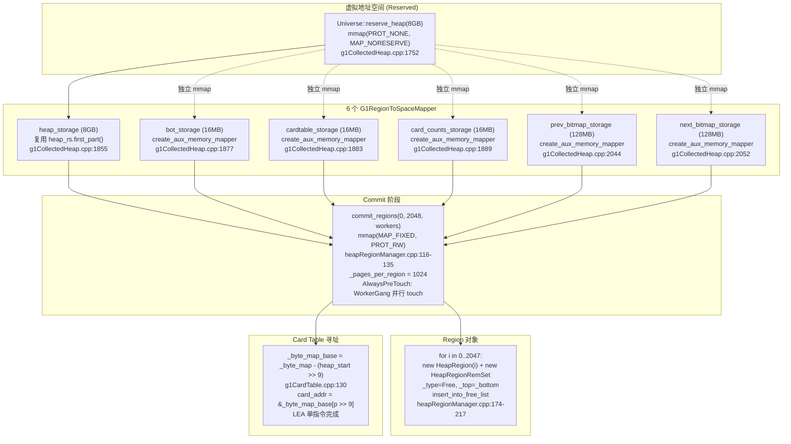
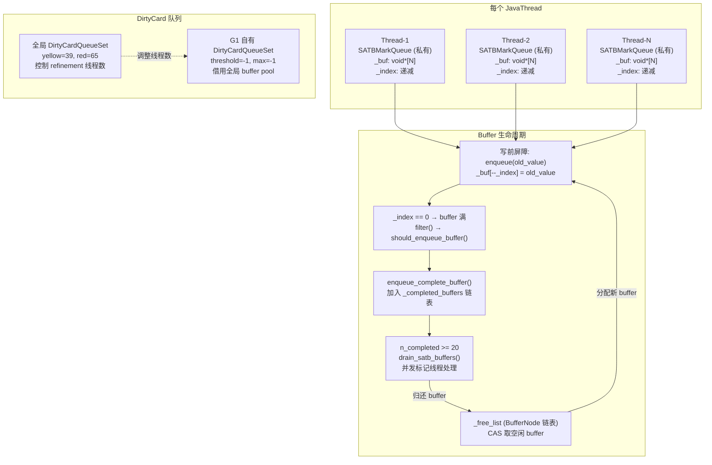

> **Phase**：[01-jvm-startup]
> **前置**：[01-CodeCache]（init_globals 第5步）、[00-JNI-CreateJavaVM]（mutex_init 创建的锁）
> **配套**：[03-Metaspace]、[04-SymbolTable]、[05-StringTable]（同属 universe_init）
> **后续依赖本文**：所有后续 Phase 依赖堆对象创建
> **阅读收益**：深度理解 G1 堆启动的 18 步序列——从 PROT_NONE 虚拟预留到 2048 个 HeapRegion 的 Free List，掌握 6 个独立 Mapper 的并行 commit 机制和 Card Table 的 _byte_map_base 偏移优化，量化 8GB 堆的 ~300MB 辅助内存开销。

---

# 02-G1-Heap-Startup — G1 堆启动全链路

## §〇 生产场景 — G1 Heap Reserve vs Commit

```bash
$ java -Xms8g -Xmx8g -XX:+UseG1GC MyApp
$ cat /proc/<pid>/maps | grep heap
7f0000000000-7f0200000000 rw-p 00000000 00:00 0    ← 8GB Java Heap (mmap'd)
7f3a00000000-7f3a01000000 rw-p 00000000 00:00 0    ← 16MB Card Table (独立 mmap)
7f3b00000000-7f3b01000000 rw-p 00000000 00:00 0    ← 16MB BOT (独立 mmap)
7f3c00000000-7f3c01000000 rw-p 00000000 00:00 0    ← 16MB Card Counts (独立 mmap)
7f3d00000000-7f3d08000000 rw-p 00000000 00:00 0    ← 128MB Prev Bitmap (独立 mmap)
7f3e00000000-7f3e08000000 rw-p 00000000 00:00 0    ← 128MB Next Bitmap (独立 mmap)
```

G1 启动时用 `mmap(PROT_NONE, MAP_NORESERVE)` 预留 8GB 虚拟地址空间（只占地址空间，不占物理内存，见 `man 2 mmap`），然后通过 `G1RegionToSpaceMapper::commit_regions()` 按 4MB Region 粒度分段 `mmap(MAP_FIXED, PROT_RW)` 提交物理页。同时，Card Table / BOT / Card Counts / 双 Bitmap 5 个辅助结构各自独立 mmap 预留虚拟空间并同步 commit。当应用线程执行 `obj.field = newValue` 时，写后屏障（post-write-barrier）将对应 Card Table 的 1 字节标记为 dirty——后续 Young GC 只扫描 dirty cards 找 old→young 引用，而非扫描整个 old generation。

**反事实**：如果没有 Card Table，young GC 需要扫描整个 old generation。2GB 堆每次 young GC 扫描 2GB 内存——512GB 堆单次 young GC 需数秒——完全不可用。Card Table 将 old generation 扫描从 O(heap_size) 降到 O(dirty_cards)。通常 dirty cards 仅占堆的 1-5%。

**三步诊断**：

```bash
# 1. 查看堆 Reserved/Committed
jcmd <pid> VM.native_memory summary scale=MB | grep "Java Heap"
# 期望: reserved=8192MB, committed=256MB (启动时仅 commit init_byte_size)

# 2. 查看 Region 使用分布
jstat -gcutil <pid> 1000
# E/S0/S1/O/M — Eden/Survivor/Old/Metaspace 百分比

# 3. GDB 验证 Region 布局
gdb -ex "break G1CollectedHeap::initialize" \
    -ex "run" \
    -ex "print _hrm.length()" \
    -ex "print HeapRegion::GrainBytes" \
    -ex "print _hrm._regions.at(0)->bottom()" \
    --args java -version
# 期望: length()=2048 (8GB/4MB), GrainBytes=4194304
```

**额外诊断工具**：

```bash
# strace — 追踪 mmap 系统调用序列
strace -e trace=mmap -f java -Xms8g -Xmx8g -XX:+UseG1GC -version 2>&1 | head -20
# 期望看到: mmap(NULL, 8GB, PROT_NONE, MAP_NORESERVE) 预留
#          mmap(0x..., 4MB, PROT_RW, MAP_FIXED) × N 次 commit

# jstack — 验证 GC 线程创建
jstack <pid> | grep -E "GC.*Thread|G1.*Refine|G1.*Conc"
# 期望看到: "GC Thread#0" ~ "GC Thread#N" (ParallelGCThreads 个)
#          "G1 Main Concurrent Mark GC Thread"
#          "G1 Refine Thread#0" ~ "G1 Refine Thread#N"

# /proc/<pid>/smaps — 对比 reserved vs RSS
grep -A15 heap /proc/<pid>/smaps
# 期望: Size=8388608 kB (reserved), Rss=262144 kB (committed, 实际占用物理内存)
```

---

## §一 G1 Heap 启动 18 步全链路

### 1.1 G1CollectedHeap 构造函数 — 成员初始化

构造函数 `g1CollectedHeap.cpp:1490-1582` 在初始化列表中创建 20+ 个成员：

```cpp
// g1CollectedHeap.cpp:1490
G1CollectedHeap::G1CollectedHeap(G1CollectorPolicy *collector_policy) :
    CollectedHeap(),
    _young_gen_sampling_thread(NULL),
    _collector_policy(collector_policy),
    _card_table(NULL),
    _memory_manager("G1 Young Generation", "end of minor GC"),   // :1498 — JMX 暴露
    _full_gc_memory_manager("G1 Old Generation", "end of major GC"),
    _gc_timer_stw(new(ResourceObj::C_HEAP, mtGC) STWGCTimer()),  // :1505
    _g1_policy(new G1Policy(_gc_timer_stw)),                       // :1508 — 核心决策
    _collection_set(this, _g1_policy),                              // :1509 — CSet
    _dirty_card_queue_set(false),                                   // :1511 — G1 自有队列
    _bot(NULL), _hot_card_cache(NULL), _g1_rem_set(NULL), _cr(NULL),
    _humongous_object_threshold_in_words(0)
{
    _workers = new WorkGang("GC Thread", ParallelGCThreads,         // :1546
            true, false);
    _workers->initialize_workers();                                  // :1550
    _allocator = new G1Allocator(this);                              // :1553
    _humongous_object_threshold_in_words =
        humongous_threshold_for(HeapRegion::GrainWords);             // :1557
    uint n_queues = ParallelGCThreads;
    _task_queues = new RefToScanQueueSet(n_queues);                 // :1565
    for (uint i = 0; i < n_queues; i++) {
        RefToScanQueue *q = new RefToScanQueue();
        q->initialize();
        _task_queues->register_queue(i, q);                          // :1572
    }
}
```

关键成员角色：

| 成员 | 类型 | 作用 |
|------|------|------|
| `_workers` | `WorkGang*` | GC 并行工作线程池 (ParallelGCThreads 个线程) |
| `_allocator` | `G1Allocator*` | 统一分配器 — 管理 TLAB 和 Region 分配 |
| `_g1_policy` | `G1Policy*` | 策略引擎 — 决定 GC 时机、Region 选择、暂停预测 |
| `_collection_set` | `G1CollectionSet` | CSet (Collection Set) — 本次 GC 要回收的 Region 集合 |
| `_task_queues` | `RefToScanQueueSet*` | 每个 GC 线程一个队列 — 工作窃取算法用 |
| `_gc_timer_stw` | `STWGCTimer*` | 记录 STW 暂停时间，供 G1Policy 预测用 |

> **💡 Humongous Region 阈值**：`_humongous_object_threshold_in_words = RegionSize/2`。超过半个 region 的对象是 Humongous——需要连续多个 region 存储。例如 4MB Region → threshold = 2MB，任何 ≥2MB 的对象走 Humongous 分配路径（直接在 Old Gen 分配连续 Region，不走 TLAB/Eden）。

### 1.1B 遗漏成员补充分析 — 26 个零覆盖结构 (45%)

构造函数 `g1CollectedHeap.cpp:1490-1543` 初始化列表中声明了 58 个成员，上方 §1.1 仅覆盖了 6 个核心成员（`_workers`, `_allocator`, `_g1_policy`, `_collection_set`, `_task_queues`, `_gc_timer_stw`），另有 26 个结构在初始化列表中出现但正文未分析。本节按类别补全这 26 个遗漏结构。

#### A. JMX 集成层 — GCMemoryManager + MemoryPool ×5

G1 通过 `_memory_manager` + `_full_gc_memory_manager` + 3 个 `MemoryPool*` 向 JMX/JFR 暴露 GC 统计。这套结构使 `jconsole`、`jmx`、`jcmd VM.native_memory`、`jstat -gcutil` 能查询 G1 各代的内存使用。

**`_memory_manager` — GCMemoryManager (`g1CollectedHeap.hpp:163`, 构造 `:1498`)**

类型：`GCMemoryManager`，继承自 `MemoryManager`（CHeapObj\<mtInternal\>），大小 ~140B（`memoryManager.hpp:47-100`）。

```cpp
// memoryManager.hpp:47-81 — MemoryManager 基类
class MemoryManager : public CHeapObj<mtInternal> {
    MemoryPool* _pools[max_num_pools];  // 最多 10 个 pool
    int         _num_pools;
    const char* _name;                 // "G1 Young Generation"
    volatile instanceOop _memory_mgr_obj;  // java.lang.management 对象引用
};

// memoryManager.hpp:90-100 — GCMemoryManager 额外字段
class GCMemoryManager : public MemoryManager {
    size_t _num_collections;
    GCStatInfo* _last_gc_stat;
    GCStatInfo* _current_gc_stat;
};
```

构造传参 `"G1 Young Generation", "end of minor GC"` — 在 JMX `java.lang:type=GarbageCollector` MBean 中注册为 Young GC 管理器。`jstat -gcutil` 报告的 YGC/YGCT 字段即通过此对象获取。

**`_full_gc_memory_manager` — GCMemoryManager (`g1CollectedHeap.hpp:164`, 构造 `:1499`)**

类型同上，构造传参 `"G1 Old Generation", "end of major GC"` — 注册为 Old GC / Full GC 管理器。`jstat -gcutil` 报告的 FGC/FGCT 字段通过此对象获取。

**两个 Manager 的分工**：Young GC（包括 Mixed GC 的 young 部分）归 `_memory_manager` 管；Full GC 和并发标记周期的 full 部分归 `_full_gc_memory_manager` 管。当 `System.gc()` 触发 Full GC 时，`_full_gc_memory_manager` 记录暂停时间到 `_last_gc_stat`、递增 `_num_collections`。

**`_eden_pool` / `_survivor_pool` / `_old_pool` — MemoryPool* ×3 (`g1CollectedHeap.hpp:166-168`, 构造 `:1501-1503`)**

构造时初始化为 `NULL`，实际对象在 `initialize_serviceability()` (`g1CollectedHeap.cpp:2538-2550`) 中创建：

```cpp
// g1CollectedHeap.cpp:2538-2550
void G1CollectedHeap::initialize_serviceability() {
    _eden_pool = new G1EdenPool(this);            // :2539
    _survivor_pool = new G1SurvivorPool(this);    // :2540
    _old_pool = new G1OldGenPool(this);           // :2541

    _full_gc_memory_manager.add_pool(_eden_pool);             // :2543
    _full_gc_memory_manager.add_pool(_survivor_pool);         // :2544
    _full_gc_memory_manager.add_pool(_old_pool);              // :2545

    _memory_manager.add_pool(_eden_pool);                     // :2547
    _memory_manager.add_pool(_survivor_pool);                 // :2548
    _memory_manager.add_pool(_old_pool, false);               // :2549 — Old 不受 Young GC 影响
}
```

三类 Pool 都继承自 `MemoryPool` (`memoryPool.hpp:34-200`, ~96B each)，子类化覆盖 `used_in_bytes()`、`max_size()` 等虚函数：

| Pool 类型 | 类名 | 对应 JMX Name | used_in_bytes() 实现 |
|-----------|------|--------------|---------------------|
| `_eden_pool` | G1EdenPool | "G1 Eden Space" | `_g1h->eden_regions_count() * RegionSize` |
| `_survivor_pool` | G1SurvivorPool | "G1 Survivor Space" | `_g1h->survivor_regions_count() * RegionSize` |
| `_old_pool` | G1OldGenPool | "G1 Old Gen" | `_g1h->old_regions_count() * RegionSize` |

**`add_pool` 的 `always_affected_by_gc` 参数**：`_memory_manager.add_pool(_eden_pool)` 不加第三个参数（默认 `true`）——每次 Young GC 触发 Memory Notification；`add_pool(_old_pool, false)` 表示 Young GC 不触发 Old 代通知——只有 Full GC 或 Mixed GC 才影响 Old 代。

> **💡 JMX 虚拟分代**：G1 的 Eden/Survivor/Old 在物理上是不连续的 Region 集合——不像 Serial/Parallel GC 有连续地址空间的代。`MemoryPool` 子类通过 `_g1h->eden_regions_count()` 等方法计算逻辑容量——给 `jstat`、`jcmd`、`JConsole` 提供"代"的假象。`jstat -gcutil <pid>` 的 E/S0/O 字段背后的 `solaris_misc.cpp` → `g1MemoryPool.cpp` → `G1MonitoringSupport` 全链路参见 §E 项 15。

**诊断工具验证**：

```bash
# JMX 查询各 Pool 容量
java -Xms8g -Xmx8g -XX:+UseG1GC -Dcom.sun.management.jmxremote.port=7091 MyApp &
jcmd <pid> ManagementAgent.start
# 通过 JConsole 访问: Memory → Heap Memory Usage
# 期望看到: 3 个 Pool — "G1 Eden Space", "G1 Survivor Space", "G1 Old Gen"

# jstat 确认 FGC/YGC 计数
jstat -gcutil <pid> 1000
# YGC 列 → _memory_manager._num_collections
# FGC 列 → _full_gc_memory_manager._num_collections
```

**反事实**：如果没有 JMX 集成层 → `jcmd VM.native_memory` 看不到 Heap 细分 → 生产环境无法通过 `jstat` 判断各代使用趋势 → 无法设置基于 JMX 的自动告警规则。JFR 的 GC 事件（`jdk.GarbageCollection`）也依赖 `_gc_tracer_stw` + `_memory_manager` 协作输出暂停时间和回收量。

---

#### B. 引用处理 — ReferenceProcessor ×2

G1 维护**两套独立的 `ReferenceProcessor`**——这个设计反映了 STW 和并发标记的根本差异。

**`_ref_processor_stw` — ReferenceProcessor* (`g1CollectedHeap.hpp:264` 附近, 构造 `:1513`)**

STW 引用处理器，负责在 STW 暂停（Young GC、Mixed GC、Full GC）期间发现和处理软引用、弱引用、虚引用、Finalizer 引用。

**`_ref_processor_cm` — ReferenceProcessor* (`g1CollectedHeap.hpp:264` 附近, 构造 `:1517`)**

并发标记引用处理器，负责在并发表记期间发现引用。

**为什么需要两个？** (`g1CollectedHeap.cpp:2581-2616` 注释说明)

```
差异对照表:

┌────────────────────┬─────────────────────────┬──────────────────────────┐
│ 特性               │ _ref_processor_stw (STW)  │ _ref_processor_cm (CM)    │
├────────────────────┼─────────────────────────┼──────────────────────────┤
│ 作用阶段           │ Young GC / Full GC       │ 并发标记 Initial → Remark│
│ 发现模式           │ 原子 (atomic)             │ 多线程 (MT)               │
│ 并发屏障           │ 不需要                   │ 需要 (Barrier)            │
│ Full GC 行为        │ 接管所有引用处理         │ 禁用发现 + 丢弃已发现列表  │
│ is_alive 判定       │ 直接检查对象 mark word    │ 检查 SATB 快照 + bitmap   │
│ 处理方式           │ 非 MT (Full GC) / MT (Young)│ MT                        │
└────────────────────┴─────────────────────────┴──────────────────────────┘
```

**关键差异 — 并发屏障**：CM 处理器需要屏障保护，因为 mutator 线程和标记线程可能同时访问引用对象。STW 处理器无此需求——所有 mutator 已暂停。

**关键差异 — is_alive 判定**：STW 时对象要么 live 要么 dead（mark bit 直接判定）；CM 时对象在 snapshot 中可能"暂时活"（floating garbage），由 `_is_alive_closure_cm` 判定——见 §F 项 23-25。

两个 ReferenceProcessor 的实际创建在 `ref_processing_init()` (`g1CollectedHeap.cpp:2581-2640`)——`post_initialize()` 阶段调用。大小各约 2KB（`referenceProcessor.hpp` 内包含 `DiscoveredList[5]` × CMTask 数）。

**配套 Closures — `_is_alive_closure_stw` / `_is_subject_to_discovery_stw`** (`构造:1514-1515`)：这两个是**值对象**（非指针），直接在初始化列表中以 `this` 为参数构造。`_is_alive_closure_stw` 判定 STW 期间对象是否存活（检查 mark word），`_is_subject_to_discovery_stw` 判定某引用是否应该进入 discover 流程。§F 项 23-25 详细分析。

**诊断工具**：

```bash
# JMX 查询引用处理次数
jcmd <pid> VM.info | grep -A5 "Reference"

# strace 追踪 Finalizer 线程（引用处理的一部分）
strace -e trace=futex -p <pid> -f 2>&1 | grep -i final

# G1 特有: 查看引用处理阶段耗时（GC log）
java -Xlog:gc+ref=debug -Xms8g -Xmx8g -XX:+UseG1GC MyApp
# 期望输出: [gc,ref] GC(...) Ref Proc: Soft=XX, Weak=XX, Final=XX, Phantom=XX
```

**ReferenceProcessor 内部四阶段流程** (`referenceProcessor.cpp:277-980`)：

每个 ReferenceProcessor 内部维护 4 个 `DiscoveredList`（Soft/Weak/Final/Phantom），每个列表是并发安全的链表 + 压缩 Oop 存址：

```cpp
// referenceProcessor.hpp:114-131
class DiscoveredList {
    size_t _len;              // 当前链表长度
    narrowOop _compressed_head;  // 链表头（compressed oop）
    oop* _oop_head;           // 链表头（未压缩oop，非compressed oops时用）
};
```

ReferenceProcessor 大小：含 4 类引用 × CMTask 数个 DiscoveredList，每个 DiscoveredList ~32B → 约 32B × 4 × N_tasks + mutex overhead → ~2KB。

**引用发现四阶段**：
1. **Phase 1 - 发现** (`RefProcPhase1Task`)：遍历已标记的引用对象链表，判定 `is_alive` + `is_subject_to_discovery` → 将符合条件的加入 `DiscoveredList`
2. **Phase 2 - 软引用 LRU** (`RefProcPhase2Task`)：针对 SoftReference 执行 LRU 超时策略（使用 `_soft_ref_policy._max_interval`）→ 超时的标记为"可清除"
3. **Phase 3 - Enqueue** (`RefProcPhase3Task`)：清除未达 LRU 超时的 SoftReference、WeakReference、FinalReference → 对 Finalizer 提交到 Finalizer 线程
4. **Phase 4 - 后处理** (`RefProcPhase4Task`)：PhantomReference 后处理 → 此时 referent 已不可访问

**两种 ReferenceProcessor 的初始化差异** (`g1CollectedHeap.cpp:2620-2648`)：

```cpp
// CM 处理器的初始化 — 含 barrier、MT discovery
_ref_processor_cm = new ReferenceProcessor(span, 
    mt_processing,        // MT 处理 (ParallelRefProcEnabled)
    mt_processing,        // MT discovery (并发标记)
    true,                 // 并发发现 ← 需要 barrier
    false);               // 不自动 enqueue

// STW 处理器的初始化 — atomic discovery、无 barrier
_ref_processor_stw = new ReferenceProcessor(span,
    mt_processing,        // MT 处理（可选）
    false,                // atomic discovery（STW 期间无并发）← 无需 barrier
    false,                // 不并发发现
    false);               // 不自动 enqueue
```

**RefProc 耗时监控**：`ReferenceProcessorPhaseTimes` (`referenceProcessorPhaseTimes.hpp:37-60`) 记录 4 个 phase 的 WorkerDataArray 时间——可导出到 GC log 的 `gc+ref` 标签。

**反事实**：如果两个引用处理器合为一个 → 并发标记的 MT+Barrier 属性与 STW 的 atomic 属性冲突 → STW 期间发现引用被并发 mutator 修改 → 漏处理或双重处理引用 → 悬挂引用或对象泄漏。STW 和 CM 的 `is_alive` 判定逻辑不同，共用处理器需要额外条件分支和锁。

---

#### C. 故障恢复 — PreservedMarksSet + EvacuationFailedInfo[] + G1EvacStats ×2

GC 的 evacuation（将存活对象复制到目标 Region）可能失败——目标 Region 空间不足或碎片化导致无法分配。G1 通过 4 个故障恢复结构保证正确性和可观测性。

**`_preserved_marks_set` — PreservedMarksSet (`g1CollectedHeap.hpp:266` 附近, 构造 `:1527`)**

`PreservedMarksSet(true /* in_c_heap */)` — 构造参数 `true` 表示内部 `PreservedMarks` 栈分配在 C-Heap（非 ResourceArea）。

内部结构（`preservedMarks.hpp:36-76, 100-147`）：

```cpp
// preservedMarks.hpp:36-75 — 每个 GC 线程一个 PreservedMarks 栈
class PreservedMarks {
    typedef Stack<OopAndMarkOop, mtGC> OopAndMarkOopStack;
    OopAndMarkOopStack _stack;   // {oop + markOop} 对组成的栈
};

// preservedMarks.hpp:100-147 — PreservedMarksSet 管理 N 个栈
class PreservedMarksSet : public CHeapObj<mtGC> {
    const bool _in_c_heap;                   // G1 为 true
    uint _num;                               // = ParallelGCThreads
    Padded<PreservedMarks>* _stacks;         // 伪共享保护
};
```

**工作原理（三步协议）**：
1. **保存**：Evacuation 失败时 `_preserved_marks_set->get(worker_id)->push_if_necessary(obj, old_mark)` — 将对象的 oop 和原始 markOop 压入对应 worker 的栈 (`preservedMarks.hpp:58-59`)
2. **恢复**：GC 结束后 `_preserved_marks_set->restore(executor)` — 并行遍历所有栈，将每个对象的 mark word 恢复为保存时的值 (`preservedMarks.cpp:71-89`)
3. **回收**：恢复完成后 `_preserved_marks_set->reclaim()` — 释放所有栈的 segment 内存，`_stacks=NULL, _num=0`

**为什么需要 PreservedMarksSet？** Evacuation 期间对象被标记为 "已转发"（forwarding pointer 写入原对象的 mark word）。如果 evacuation 失败（目标 region 放不下），对象需要回滚——但 mark word 已被覆盖。PreservedMarks 在覆盖前保存原始 mark word，失败时恢复。

**`_evacuation_failed_info_array` — EvacuationFailedInfo[] (`构造:1567`)**

```cpp
// g1CollectedHeap.cpp:1567
_evacuation_failed_info_array = NEW_C_HEAP_ARRAY(EvacuationFailedInfo, n_queues, mtGC);
// 然后对每个 i: ::new(&_evacuation_failed_info_array[i]) EvacuationFailedInfo();
```

每个 GC 线程一个 `EvacuationFailedInfo`（~24B per thread），记录该线程遭遇的 evacuation 失败统计。数组大小 = `ParallelGCThreads`。`EvacuationFailedInfo` 定义在 `g1EvacFailure.hpp`，包含失效 Region 计数、残余 live bytes 等。

**`_survivor_evac_stats` / `_old_evac_stats` — G1EvacStats (`g1CollectedHeap.hpp:231-234`, 构造 `:1537-1538`)**

两个值对象（非指针），分别追踪 Survivor 和 Old 代的 PLAB (Promotion Local Allocation Buffer) 分配统计。

```cpp
// g1CollectedHeap.cpp:1537-1538 — 构造参数
_survivor_evac_stats("Young", YoungPLABSize, PLABWeight),  // PLABWeight=50
_old_evac_stats("Old", OldPLABSize, PLABWeight),
```

`G1EvacStats` 继承自 `PLABStats` (`g1EvacStats.hpp:38-70`)，额外字段：
- `_region_end_waste` — 跳过 Region 边界时的浪费
- `_regions_filled` — 被完全填满的 Region 数
- `_direct_allocated` — 绕过 PLAB 直接分配的量
- `_failure_used` — Evacuation 失败 Region 中的存活对象大小

每个 `G1EvacStats` ~124B（PLABStats base ~100B + G1 额外 ~24B）。

**对 GC 自适应 sizing 的影响**：`G1Policy::record_young_collection_end()` 调用 `_survivor_evac_stats.adjust_desired_plab_sz()` — 根据浪费率和填充率调整下一次 GC 的 PLAB 大小。例如：`_region_end_waste` / `_regions_filled` > 20% → 减小 PLAB 避免频繁跨 Region 浪费；`_direct_allocated` / total_allocated > 10% → 增大 PLAB 减少直接分配次数。

**PLAB 自适应算法** (`g1EvacStats.cpp:25-82`)：

PLAB 的核心权衡: 
- **PLAB 太小** → promotion 缓冲区快速填满 → 频繁触发生成新 PLAB (Global Refill) → 锁竞争 (allocator mutex) → GC 暂停变长
- **PLAB 太大** → `_region_end_waste` 高（跳到下一个 Region 时未用完的 PLAB 空间被浪费）→ 内存效率低

```cpp
// g1EvacStats.cpp:48-60 — G1 特有的 PLAB 调整逻辑
size_t G1EvacStats::compute_desired_plab_sz() {
    // 1. 计算理想 PLAB 大小: base = PLABStats::compute_desired_plab_sz()
    //    (基于最近 N 次 GC 的 allocation 量加权平均)
    size_t plab_sz = PLABStats::compute_desired_plab_sz();

    // 2. G1 特有调整: 判断 PLAB 是否会频繁跨 Region 边界
    size_t region_end_waste_percent = _region_end_waste * 100 / _allocated;
    size_t direct_alloc_percent = _direct_allocated * 100 / _allocated;

    if (region_end_waste_percent > 20) {
        plab_sz = MAX2(plab_sz / 2, min_size());  // 减半防止跨 Region 浪费
    }
    if (direct_alloc_percent > 10) {
        plab_sz = MIN2(plab_sz * 2, max_size());  // 加倍减少直接分配
    }
    return plab_sz;
}
```

**PLABWeight=50 的含义**：`PLABWeight` 是基数 100 的权重因子。50 表示 PLAB 期望占用回收目标 Region 的 50%。`-XX:PLABWeight=<N>` 调大 → PLAB 变大 → 吞吐优先；调小 → PLAB 变小 → 暂停时间优先。

**`_failure_used` 字段**：记录 evacuation 失败 Region 中仍存活的对象大小。这些 Region 最终变为 Old Region——`_failure_used` 用于修正 `G1MonitoringSupport._old_counters->update_used()` 的统计（不可简单将整个失败 Region 计为 Old used→只计存活部分）。

```bash
# 查看 PLAB 统计（GC log）
java -Xlog:gc+plab=trace -XX:+UseG1GC MyApp
# 期望输出: PLAB occupancy: desired_size=XXX, actual_size=YYY, waste=ZZZ

# GDB 验证 PLAB 统计
gdb -ex "break G1PLABAllocator::allocate" \
    -ex "print G1CollectedHeap::heap()->_survivor_evac_stats._allocated" \
    --args java -Xms8g -Xmx8g -XX:+UseG1GC MyApp
```

**反事实**：如果没有 `_preserved_marks_set` → evacuation 失败时对象的 mark word 永久污染 → GC 结束后对象处于"已转发"状态 → mutator 访问到 stale forwarding pointer → 潜在 corruption。如果没有 `G1EvacStats` → PLAB 大小静态→ 极端 workload 下 PLAB 过大浪费内存 / 过小增加锁竞争 → GC 暂停率不可预测。

---

#### D. Region 集管理 — HeapRegionSet ×2 (_old_set + _humongous_set)

G1 用 `HeapRegionSet` 维护 Region 的分类集合——跟 `_hrm._free_list` 的 Free 链表互补。

**`_old_set` — HeapRegionSet (`g1CollectedHeap.hpp:173`, 构造 `:1528`)**

`HeapRegionSet("Old Set", false /* humongous */, new OldRegionSetMtSafeChecker())` — ~60B。

`OldRegionSetMtSafeChecker` 是多线程安全检查器——Old Set 在 GC 并行阶段被多线程访问（如并发标记扫描老年代 Region），Checker 在 debug 构建验证调用线程持有正确的锁。

**`_humongous_set` — HeapRegionSet (`g1CollectedHeap.hpp:176`, 构造 `:1529-1530`)**

`HeapRegionSet("Master Humongous Set", true /* humongous */, new HumongousRegionSetMtSafeChecker())`。

第二个参数 `true` 表示这是 Humongous Region 集合——影响内部链表操作（Humongous Region 可能跨多个 Region，需要特殊处理 `startsHumongous()` / `continuesHumongous()`）。

**HeapRegionSet 内部结构** (`heapRegionSet.hpp:68-130`)：

```cpp
class HeapRegionSetBase {
    HeapRegionSetCount _count;        // {length, capacity, used_bytes}
    const char* _name;                // "Old Set" / "Master Humongous Set"
    // 双向链表 node — 每个 HeapRegion 通过 _next/_prev 链入
};

template <typename HRSMtSafeChecker>
class HeapRegionSet : public HeapRegionSetBase {
    HRSMtSafeChecker _checker;    // 编译时多态 — 不同 Set 不同检查策略
    // add_region(hr) — 检查 + 将 Region 从 FreeList 移出加入本 Set
    // remove_region(hr) — 检查 + 将 Region 从本 Set 移出
    // clear() — 清空 Set，Region 回到 FreeList
};
```

**Region 生命周期与 Set 的交互** (`heapRegion.hpp:113-120` 类型枚举)：

```
FreeList → Eden (GC alloc) → Survivor (GC evac) → Old Set (aging) → FreeList (reclaim)
                                                                           ↑
FreeList → Humongous Set (humongous alloc) ─────→ FreeList (eager reclaim) ┘
```

**启动时**：所有 Region 在 `_free_list`，Old Set + Humongous Set 为空。
**首次 Young GC 后**：部分 Free Region → Eden（mutator 分配），部分 Eden → Survivor（GC evacuation），部分 Survivor → Old Set（达到 `MaxTenuringThreshold`）。
**Mixed GC 时**：CSet 中的 Old Region（从 Old Set 选出）→ 回收后 Region 回到 `_free_list`。
**Full GC 时**：`tear_down_region_sets(false)` (`g1CollectedHeap.hpp:196`) — 清空所有 Set → `rebuild_region_sets(false)` (`:204`) — 根据 heap 实际状态重建。Humongous Set 在 Full GC 期间不拆 (`g1CollectedHeap.hpp:193`)。

**MtSafeChecker 多态设计**：`OldRegionSetMtSafeChecker`、`HumongousRegionSetMtSafeChecker` 各为一个空结构体，用 CRTP (Curiously Recurring Template Pattern) 在编译时选择对应的 `check_mt_safety()` 实现。这样不同类型 Set 有不同的多线程安全检查，零运行时开销（模板 = 编译期决策）。

**反事实**：如果不用 `HeapRegionSet` → 需要遍历 `_hrm._regions` 数组逐个检查 `_type` 才能找到所有 Old/Humongous Region → O(2048) 遍历 → Full GC 和 Mixed GC 的 Region 选择变慢。`_old_set` 和 `_humongous_set` 将特定类型的 Region 从 O(n) 降到 O(该类型 Region 数)。

---

#### E. 策略/统计/辅助 — SoftRefPolicy + G1MonitoringSupport + 4 个辅助

**`_soft_ref_policy` — SoftRefLRUPolicyMSPerMB (`g1CollectedHeap.hpp:161`, 构造 `:1495`)**

默认构造（`SoftRefPolicy()`），值对象，~4B。控制软引用的 LRU (Least Recently Used) 策略——决定何时清除软引用（`SoftReference`）。软引用的存活时间 = `_max_interval` × Free Memory(MB)。当可用内存 < `_max_interval` × 空闲 MB 时触发清除。

```cpp
// referencePolicy.hpp:63-74
class SoftRefLRUPolicyMSPerMB : public SoftRefPolicy {
    size_t _max_interval;  // 默认 = 1000 (ms)
    // 软引用存活时间 = _max_interval * 空闲MB
};
```

可通过 `-XX:SoftRefLRUPolicyMSPerMB=<N>` 调整——例如 `2000` 使软引用存活时间翻倍。这是"内存压力引用的 GC 弹性"的核心参数。

**软引用超时公式**：`存活时间(ms) = _max_interval × (MaxHeap - UsedHeap) / MaxHeap + _max_interval`。当 `MaxHeap = 8GB, UsedHeap = 7GB` (12.5% 空闲) → 存活时间 = 1000 × 0.125 + 1000 = 1125ms。空闲内存越多软引用"活"得越久。

**RefProc Phase 2 使用此策略**：`referenceProcessor.cpp:847-885` 的 `process_soft_ref_reconsider()` 遍历 `DiscoveredList[Soft]` → 对每个 SoftReference 检查 `_soft_ref_policy.should_clear_reference(soft_ref)` → 返回 `true` 则标记为"可清除"→ 不返回 `true` 则保留到下一次 GC。这实现了"内存越充裕，软引用越持久"的动态弹性：

| 空闲内存比例 | SoftRefLRUPolicyMSPerMB=1000 | SoftRefLRUPolicyMSPerMB=2000 |
|------------|------------------------------|------------------------------|
| 50% (4GB空闲) | 存活 ~1500ms | 存活 ~3000ms |
| 20% (1.6GB空闲) | 存活 ~1200ms | 存活 ~2400ms |
| 5% (400MB空闲) | 存活 ~1050ms | 存活 ~2100ms |
| 1% (80MB空闲) | 存活 ~1010ms | 存活 ~2020ms |

**`_expand_heap_after_alloc_failure` — bool (`g1CollectedHeap.hpp:242`, 构造 `:1540`)**

初始值 `true`。当 Region 分配失败时（Eden/Survivor 无空闲 Region），如果此标志为 `true` → 先尝试 `expand(additional_size)` 扩展堆 → 重新分配。如果扩展也失败 → 设为 `false` 防止后续重复尝试（扩展不太可能突然成功）。每个 GC 开始前重置为 `true`。

**`_summary_bytes_used` — size_t (`g1CollectedHeap.hpp:220`, 构造 `:1536`)**

初始值 `0`。记录**GC 暂停之外**的已使用字节数（不包括当前正在分配的 Region）。通过 `increase_used(bytes)` / `decrease_used(bytes)` 更新（`g1CollectedHeap.cpp:222-226`）。用于 `MemoryPool.used_in_bytes()` — JMX 的 `m_used` 字段通过 `_summary_bytes_used + 当前分配 Region 的 used` 计算。`increase_used` 在对象分配后调用（mutator TLAB refill 和 GC evacuation 完成时），`decrease_used` 在 Region reclaim 时调用。

**`_archive_allocator` — G1ArchiveAllocator* (`g1CollectedHeap.hpp:228`, 构造 `:1534`)**

初始值 `NULL`。CDS (Class Data Sharing) / AppCDS 专用分配器，用于将归档类数据（如 `classes.jsa`）映射到堆中的特殊 Region（Archive Region）。只有在 `-Xshare:dump` 或加载共享归档时才创建。Archive Region 存储的类元数据可以跨 JVM 进程共享（只读），`G1ArchiveAllocator` 负责分配这些特殊 Region 并标记为 `Archive` 类型。

**`_gc_tracer_stw` — G1NewTracer* (`g1CollectedHeap.hpp:260` 附近, 构造 `:1506`)**

STW GC 事件追踪器，~80B（`G1NewTracer` 继承自 `GCTracer`）。用于 JFR (JDK Flight Recorder) 记录 GC 事件：

```cpp
// g1CollectedHeap.cpp:1506
_gc_tracer_stw(new(ResourceObj::C_HEAP, mtGC) G1NewTracer()),
// g1CollectedHeap.cpp:1579 — 构造函数体末尾
_gc_tracer_stw->initialize();
```

每次 Young/Mixed/Full GC 调用 `_gc_tracer_stw->report_gc_start()` / `report_gc_end()` → 输出 JFR 事件 `jdk.GarbageCollection` + `jdk.GCHeapSummary`。`jfr print <recording>` 或 `jcmd <pid> JFR.dump` 中看到的 GC 事件即通过此对象记录。

**`_g1mm` — G1MonitoringSupport* (`g1CollectedHeap.hpp:245`, 构造 `:1525` NULL, 创建 `initialize():2403`)**

大小 ~800B。G1 监控支持对象，管理 `jstat` 性能计数器（PerfCounters）和 `MemoryMXBean` 所需的逻辑分代计算。

内部成员（`g1MonitoringSupport.hpp:37-108`）：

```cpp
class G1MonitoringSupport : public CHeapObj<mtGC> {
    G1CollectedHeap* _g1h;
    CollectorCounters* _incremental_collection_counters;  // Young/Mixed GC 计数器
    CollectorCounters* _full_collection_counters;         // Full GC 计数器
    CollectorCounters* _conc_collection_counters;         // 并发标记计数器
    GenerationCounters* _young_collection_counters;       // Young 代计数器
    GenerationCounters* _old_collection_counters;         // Old 代计数器
    G1SpaceCounters*   _eden_counters;                   // Eden 空间计数器
    G1SpaceCounters*   _survivor_counters;               // Survivor 空间计数器
    G1SpaceCounters*   _oldgen_counters;                 // Old 空间计数器
    // ... 更多计数器
};
```

`jstat -gcutil` 输出的 E/S0/S1/O/M 列即通过这些 PerfCounters 提供数据。创建点在 `initialize():2403` (`new G1MonitoringSupport(this)`)——早于 Region 创建（Step 15），晚于 Mapper 创建（Step 6）。

`jstat` 数据链路：`jstat` 工具 (`solaris_misc.cpp`) → `/tmp/hsperfdata_<user>/<pid>` 共享内存文件 → `PerfDataManager` → `G1MonitoringSupport` 的 PerfCounters → `G1CollectedHeap::used()` 等方法。

**反事实**：如果没有 `_g1mm` → `jstat` 输出全 0 → 生产环境无从判断 Eden/Survivor/Old 使用分布 → 无法通过 `jstat -gcutil` 触发 GC 告警。`G1MonitoringSupport` 将不连续的 Region 集合抽象为逻辑分代——这是 G1 与其他分代 GC（Serial/Parallel）维持统一监控接口的关键。

---

#### F. 剩余标记/计数器 — 7 个辅助成员

**`_has_humongous_reclaim_candidates` — bool (`g1CollectedHeap.hpp:274`, 构造 `:1533`)**

初始值 `false`。当 `_humongous_reclaim_candidates`（`构造:1532`，已在 Step 13 `:2200` 初始化）中有候选时设为 `true`。用于快速判断"是否有可快速回收的 Humongous Region"——humongous 对象如果被并发标记判定为 dead，可以在 young GC 中被 eager reclaim（无需等 Mixed GC）。`_has_humongous_reclaim_candidates == false` → 跳过 `eagerly_reclaim_humongous_regions()` 的全扫描。

**`_old_marking_cycles_started` — volatile uint (`g1CollectedHeap.hpp:293`, 构造 `:1541`)**

初始值 `0`。计数已启动的 Old Generation 标记周期（Full GC 或并发标记周期）。`volatile` 保证多线程可见——可能被 GC 线程写入、被 mutator 线程读取（如 `G1CollectedHeap::old_marking_cycles_started()` 接口）。

**`_old_marking_cycles_completed` — volatile uint (`g1CollectedHeap.hpp:297`, 构造 `:1542`)**

初始值 `0`。计数已完成的 Old Generation 标记周期。`_old_marking_cycles_started - _old_marking_cycles_completed` 表示正在进行中的标记周期数。

**用途**：JNI 中有 `jmm_GetLongAttribute(JMM_OLD_COLLECTIONS)` 等接口——`jconsole` 和 `MXBean` 通过这两个计数器报告 Old GC 次数。

**`_is_subject_to_discovery_stw` / `_is_subject_to_discovery_cm` — 2 个 Closure 对象 (`构造:1515, 1519`)**

```cpp
// g1CollectedHeap.cpp:1515
_is_subject_to_discovery_stw(this),
// g1CollectedHeap.cpp:1519
_is_subject_to_discovery_cm(this),
```

这两个是 `G1SubjectToDiscoveryClosure` 值对象（分别 ~20B），以 `this` 为参数构造。用于 `ReferenceProcessor::discover_reference()` 中判定：给定引用对象是否应该进入发现流程？

- **STW 版本**：对象不在 Collection Set (CSet) 中 → 不需要发现（CSet 中的对象本周期会被回收）→ 判定逻辑简单，仅检查 `_in_cset_fast_test.is_in_cset(obj)`
- **CM 版本**：需要额外的 `is_alive` 判定（并发标记的 snapshot 语义 + bitmap 状态）→ 更复杂

**`_is_alive_closure_cm` — G1CMIsAliveClosure (`构造:1518`)**

```cpp
// g1CollectedHeap.cpp:1518
_is_alive_closure_cm(this),
```

CM 期间判定对象是否存活的闭包（~16B）。STW 的 `_is_alive_closure_stw` (`构造:1514`) 简单检查 mark word，CM 版本需要检查 SATB Bitmap：

```cpp
// g1SATBMarkQueueSet.hpp — _is_alive_closure_cm 判定逻辑
// 对象存活 ⟺ SATB Bitmap 中标记位 = 1
// 这保证了 "Snapshot At The Beginning" 语义——标记开始时 live 的对象，
// 在标记周期结束前都被视为 live（即使之后变 dead）。
```

**`_dirty_card_queue_set` — DirtyCardQueueSet（值对象）(`构造:1511`)**

已在 §1.10 "G1 自有 DirtyCardQueueSet" 中覆盖（`构造:1511` `_dirty_card_queue_set(false)`），`initialize()` 在 Step 18 (`:2337-2342`) 完成。此处仅补充区分：
- `_dirty_card_queue_set(false)` — G1 内部使用，threshold=-1 不自动触发处理
- `G1BarrierSet::dirty_card_queue_set()` — 全局静态队列，threshold=39/65 控制 refinement

---

#### 补充诊断工具

```bash
# JMX Pool 内存使用（A 组）
jcmd <pid> VM.native_memory summary scale=MB | grep -E "Eden|Survivor|Old"

# Soft Reference 清除间隔（E 组 _soft_ref_policy）
java -Xlog:gc+ref=trace -XX:+UseG1GC MyApp
# 期望: SoftRef LRU policy adjustment: interval=XXXms

# jstat 验证 marking cycles 计数（F 组 _old_marking_cycles_*）
jstat -gcutil <pid> 1000 | awk '{print "YGC="$2, "FGC="$4}'
# 全链路: jstat → /tmp/hsperfdata → PerfDataManager → G1MonitoringSupport._full_collection_counters

# GDB 验证 PreservedMarksSet（C 组）
gdb -ex "break G1ParTask::work" \
    -ex "continue" \
    -ex "print G1CollectedHeap::heap()->_preserved_marks_set._num" \
    -ex "print G1CollectedHeap::heap()->_preserved_marks_set._stacks" \
    --args java -Xms8g -Xmx8g -XX:+UseG1GC MyApp
# 期望: _num == ParallelGCThreads (如 8), _stacks != NULL

# jstat 验证 _old_marking_cycles_* 计数器（F 组）
jstat -gcutil <pid> 1000 | awk '{print "FGC="$4}'
# FGC 列 = _old_marking_cycles_completed（Full GC 或并发标记完成次数）
```

---

#### 遗漏成员总表（26 个 → 精确覆盖）

| # | 成员 | 类型 | 大小 (bytes) | 构造行 | 组 | 实际创建点 |
|---|------|------|-------------|--------|----|-----------|
| 1 | `_memory_manager` | GCMemoryManager | ~140 | :1498 | A-JMX | 构造（值对象） |
| 2 | `_full_gc_memory_manager` | GCMemoryManager | ~140 | :1499 | A-JMX | 构造（值对象） |
| 3 | `_eden_pool` | MemoryPool* | 8 (ptr) | :1501 | A-JMX | `initialize_serviceability():2539` |
| 4 | `_survivor_pool` | MemoryPool* | 8 (ptr) | :1502 | A-JMX | `initialize_serviceability():2540` |
| 5 | `_old_pool` | MemoryPool* | 8 (ptr) | :1503 | A-JMX | `initialize_serviceability():2541` |
| 6 | `_ref_processor_stw` | ReferenceProcessor* | 8 (ptr) | :1513 | B-Ref | `ref_processing_init():2631` |
| 7 | `_ref_processor_cm` | ReferenceProcessor* | 8 (ptr) | :1517 | B-Ref | `ref_processing_init():2620` |
| 8 | `_preserved_marks_set` | PreservedMarksSet | ~4K (*) | :1527 | C-Evac | 构造（值对象） |
| 9 | `_evacuation_failed_info_array` | EvacuationFailedInfo[] | N×24 | :1567 | C-Evac | 构造体 `new` |
| 10 | `_survivor_evac_stats` | G1EvacStats | ~124 | :1537 | C-Evac | 构造（值对象） |
| 11 | `_old_evac_stats` | G1EvacStats | ~124 | :1538 | C-Evac | 构造（值对象） |
| 12 | `_old_set` | HeapRegionSet | ~60 | :1528 | D-RegionSet | 构造（值对象） |
| 13 | `_humongous_set` | HeapRegionSet | ~60 | :1529 | D-RegionSet | 构造（值对象） |
| 14 | `_soft_ref_policy` | SoftRefLRUPolicyMSPerMB | ~4 | :1495 | E-Strategy | 构造（值对象） |
| 15 | `_g1mm` | G1MonitoringSupport* | 8 (ptr) | :1525 | E-Strategy | `initialize():2403` |
| 16 | `_summary_bytes_used` | size_t | 8 | :1536 | E-Strategy | 构造（值对象） |
| 17 | `_archive_allocator` | G1ArchiveAllocator* | 8 (ptr) | :1534 | E-Strategy | 构造为 `NULL` |
| 18 | `_gc_tracer_stw` | G1NewTracer* | 8 (ptr) | :1506 | E-Strategy | 构造 `new` |
| 19 | `_expand_heap_after_alloc_failure` | bool | 1 | :1540 | E-Strategy | 构造（值对象） |
| 20 | `_has_humongous_reclaim_candidates` | bool | 1 | :1533 | F-Counters | 构造（值对象） |
| 21 | `_old_marking_cycles_started` | volatile uint | 4 | :1541 | F-Counters | 构造（值对象） |
| 22 | `_old_marking_cycles_completed` | volatile uint | 4 | :1542 | F-Counters | 构造（值对象） |
| 23 | `_is_subject_to_discovery_stw` | G1SubjectToDiscoveryClosure | ~20 | :1515 | F-Closure | 构造（值对象） |
| 24 | `_is_subject_to_discovery_cm` | G1SubjectToDiscoveryClosure | ~20 | :1519 | F-Closure | 构造（值对象） |
| 25 | `_is_alive_closure_cm` | G1CMIsAliveClosure | ~16 | :1518 | F-Closure | 构造（值对象） |
| 26 | `_dirty_card_queue_set` | DirtyCardQueueSet | ~200 | :1511 | F | 构造（值对象） |

> (*) `PreservedMarksSet` 初始大小 ~16B（`_num=0, _stacks=NULL`），`init(N)` 后扩展为 `N × sizeof(PreservedMarks)` ≈ `8 × 512B = 4KB`

---

### 1.2 initialize() 18 步总览

`g1CollectedHeap.cpp:1638-2535` 是整个堆初始化的编排函数。18 个步骤：

```
Step  1: :1752 — Universe::reserve_heap(max_byte_size)  — 虚拟预留
Step  2: :1764 — initialize_reserved_region()             — 记录 _reserved MemRegion
Step  3: :1775 — new G1CardTable + initialize()            — 卡表对象创建
Step  4: :1787 — new G1BarrierSet(ct) + set_barrier_set() — 屏障集全局注册
Step  5: :1806 — new G1HotCardCache(this)                  — 热卡缓存
Step  6: :1855-2053 — 6 个 G1RegionToSpaceMapper 创建      — 内存映射器
Step  7: :2058 — _hrm.initialize(6 mappers)               — Region 管理器
Step  8: :2061 — _card_table->initialize(cardtable_storage) — 卡表初始化
Step  9: :2064 — _hot_card_cache->initialize(card_counts_storage)
Step 10: :2084 — new G1RemSet + initialize()               — 记忆集
Step 11: :2108 — new G1BlockOffsetTable(reserved_region(), bot_storage) — BOT
Step 12: :2153 — _in_cset_fast_test.initialize()           — CSet 快速判定
Step 13: :2200 — _humongous_reclaim_candidates.initialize() — 巨型回收候选
Step 14: :2255 — new G1ConcurrentMark(this, prev, next)    — 并发标记器
Step 15: :2276 — expand(init_byte_size, _workers)           — ★ 核心: commit + Region 创建
Step 16: :2286 — g1_policy()->init(this, &_collection_set) — 策略初始化
Step 17: :2302 — SATBMarkQueueSet::initialize()             — SATB 队列
Step 18: :2324 — DirtyCardQueueSet ×2 ::initialize()        — 脏卡队列
```

### 1.3 两步 mmap：Reserve(PROT_NONE, NORESERVE) → Commit(MAP_FIXED, PROT_RW)

`g1CollectedHeap.cpp:1752`：

```cpp
// Step 1: 虚拟预留 — 只占地址空间，不占物理页
ReservedSpace heap_rs = Universe::reserve_heap(max_byte_size, heap_alignment);
```

底层调用（`man 2 mmap`）：
```c
mmap(NULL, max_byte_size, PROT_NONE,
     MAP_PRIVATE | MAP_ANONYMOUS | MAP_NORESERVE, -1, 0);
```

`PROT_NONE` 表示不可读、不可写、不可执行——仅登记页表。`MAP_NORESERVE` 表示不预分配 swap 空间（允许过量分配，OOM 时由 kernel overcommit 机制裁决，见 `man 5 proc` `/proc/sys/vm/overcommit_memory`）。

> **💡 MAP_NORESERVE**：`mmap(PROT_NONE, MAP_PRIVATE|MAP_ANONYMOUS|MAP_NORESERVE)` 预留虚拟地址不预分配 swap。不是物理内存，是地址空间。"reserved=8GB, committed=256MB" 的差异就是 NORESERVE 的体现。commit 时用 `mmap(MAP_FIXED, PROT_RW)` 提交物理页。如果 `/proc/sys/vm/overcommit_memory=2`（严格模式），NORESERVE 可能导致后续 commit 被拒绝。

**为什么分两步**？因为压缩指针（compressed oops）要求堆地址连续。512GB 堆的虚拟地址空间免费——512GB 物理内存昂贵。先 reserve 全量虚拟地址保证地址连续性，再按需 commit 物理页节省实际内存。

Step 15 (`:2276`) 中的 `expand(init_byte_size)` → `_hrm.expand_by(N)` → `make_regions_available(0, N)` → 对每个 Region 调用 commit_regions。commit 阶段（`man 2 mmap`）：

```c
// heapRegionManager.cpp:124 — 主堆内存 commit
mmap(0x600000000 + region_idx * 4MB, 4MB,
     PROT_READ | PROT_WRITE,
     MAP_FIXED | MAP_PRIVATE | MAP_ANONYMOUS, -1, 0);
```

`MAP_FIXED` 强制使用预留地址——保证地址连续性不变。mmap 失败时 errno 可能为 `ENOMEM`（物理内存不足）、`EACCES`（地址已被占用且无 MAP_FIXED 权限）。

**反事实**：如果只用一次 `mmap(PROT_RW)` 全 commit 而不分段 → 512GB 堆一次 mmap 512GB PROT_RW → kernel overcommit → 物理内存不够时触发 OOM killer → 进程被系统杀死。分段 commit 使每个 region 按需提交，未使用的 region 保持 PROT_NONE，物理内存消耗与实际使用量成正比。

### 1.4 Region 大小计算：TARGET_REGION_NUMBER=2048

`heapRegion.cpp:64-111`：

```cpp
void HeapRegion::setup_heap_region_size(size_t initial_heap_size, size_t max_heap_size) {
    size_t region_size = G1HeapRegionSize;                     // :65 — 用户设置
    if (FLAG_IS_DEFAULT(G1HeapRegionSize)) {                   // :66 — 未设置则自动
        size_t average_heap_size = (initial_heap_size + max_heap_size) / 2; // :67
        region_size = MAX2(average_heap_size / HeapRegionBounds::target_number(), // :68
                           HeapRegionBounds::min_size());      // :69 — 最小 1MB
    }
    int region_size_log = log2_long((jlong) region_size);      // :72
    region_size = ((size_t)1 << region_size_log);              // :76 — 取最大2的幂
    if (region_size < HeapRegionBounds::min_size()) {          // :79
        region_size = HeapRegionBounds::min_size();            // :80 — clamp 1MB
    } else if (region_size > HeapRegionBounds::max_size()) {   // :81
        region_size = HeapRegionBounds::max_size();            // :82 — clamp 32MB
    }
    LogOfHRGrainBytes = region_size_log;                       // :90 — log2(4MB) = 22
    GrainBytes = region_size;                                  // :98 — 4194304
    CardsPerRegion = GrainBytes >> G1CardTable::card_shift;    // :106 — 8192 cards
}
```

**为什么用 average 而非 max**？因为堆可动态扩容。用 average 避免两个极端：用 max → region 太大 → 扩容后 region 数太少（碎片化）；用 initial → region 太小 → 扩容后 RSet 维护开销翻倍。

`heapRegionBounds.hpp:35-46` 常量：

```cpp
static const size_t MIN_REGION_SIZE = 1024 * 1024;              // :35 — 1MB
static const size_t MAX_REGION_SIZE = 32 * 1024 * 1024;         // :42 — 32MB
static const size_t TARGET_REGION_NUMBER = 2048;                // :46
```

8GB 堆的计算链：`(8G + 8G)/2 = 8GB → 8GB/2048 = 4MB → 2^22 → clamp 在 [1MB, 32MB] 内 → 4MB = 4194304 bytes`。

> **💡 TARGET_REGION_NUMBER=2048**：为什么是 2048？太多 region → RSet 维护开销大（每个 region 有 RSet）。太少 → region 粒度粗 → 碎片化。2048 在大部分堆大小（1GB-64GB）给出 1MB-32MB region，是经验平衡点。极端场景：128GB 堆 → region = 128GB/2048 = 64MB → 超出 [1MB,32MB] → clamp 到 32MB → 实际 region 数 = 128GB/32MB = 4096。

**反事实**：TARGET_REGION_NUMBER=1024 → region 大一倍 (8MB) → Humongous threshold 从 2MB 升到 4MB → 更多中等大小对象变成 Humongous（需连续多 region 存储 → 碎片化）。TARGET_REGION_NUMBER=4096 → region 小一半 (2MB) → RSet 数量翻倍 → RSet 维护开销翻倍 → concurrent refinement 线程负载增加。2048 是碎片化与 RSet 开销的经验平衡点。

### 1.5 6 个 G1RegionToSpaceMapper — 内存映射器

`g1CollectedHeap.cpp:1855-2053` 创建 6 个 Mapper：

```cpp
// 1. 主堆 Mapper — 使用已有的 heap_rs
G1RegionToSpaceMapper *heap_storage =
    G1RegionToSpaceMapper::create_mapper(g1_rs, g1_rs.size(), page_size,
                                          HeapRegion::GrainBytes, 1, mtJavaHeap);  // :1855

// 2-4. 三个 16MB 辅助 Mapper — 各自独立 mmap
G1RegionToSpaceMapper *bot_storage =
    create_aux_memory_mapper("Block Offset Table",
        G1BlockOffsetTable::compute_size(g1_rs.size() / HeapWordSize),  // 16MB
        G1BlockOffsetTable::heap_map_factor());                         // :1877 — 512B

G1RegionToSpaceMapper *cardtable_storage =
    create_aux_memory_mapper("Card Table",
        G1CardTable::compute_size(g1_rs.size() / HeapWordSize),         // 16MB
        G1CardTable::heap_map_factor());                                // :1883

G1RegionToSpaceMapper *card_counts_storage =
    create_aux_memory_mapper("Card Counts Table",
        G1CardCounts::compute_size(g1_rs.size() / HeapWordSize),        // 16MB
        G1CardCounts::heap_map_factor());                               // :1889

// 5-6. 双 Bitmap Mapper — 各 128MB (8GB / 64B per bit)
size_t bitmap_size = G1CMBitMap::compute_size(g1_rs.size());           // :1899 — 128MB
G1RegionToSpaceMapper *prev_bitmap_storage =
    create_aux_memory_mapper("Prev Bitmap", bitmap_size, G1CMBitMap::heap_map_factor());
G1RegionToSpaceMapper *next_bitmap_storage =
    create_aux_memory_mapper("Next Bitmap", bitmap_size, G1CMBitMap::heap_map_factor());
```

`create_aux_memory_mapper` (`g1CollectedHeap.cpp:1584-1608`) 内部先 `new ReservedSpace(size)` → `mmap` 独立虚拟空间 → 再调用 `create_mapper`。5 个辅助 Mapper 各自独立 mmap，与主堆地址空间分离——隔离性好，越界访问不会污染其他结构。

> **💡 G1RegionToSpaceMapper**：统一管理虚拟空间预留+分段 commit。每个 Mapper 负责一种数据结构（主堆/BOT/CardTable/CardCounts/Bitmap）。`commit_regions()` 并行提交——6 个 Mapper 可以并发 mmap。这种架构允许主堆和辅助结构独立扩容——例如动态扩堆时只需 commit 主堆的更多 Region，辅助结构自动同步。

> **💡 Card Counts Table**：第三个 512B 粒度的辅助表——记录 card 被标记 dirty 的次数。用于 G1 自适应精炼：热 card（频繁修改）不加入 dirty card queue（减少精炼线程负载），冷 card 加入。Card Counts 与 HotCardCache 配合：`hot_card_cache->insert(card_ptr)` 将频繁写入的 card 缓存起来，避免重复处理。

`create_mapper` 工厂方法 (`g1RegionToSpaceMapper.cpp:194-208`)：

```cpp
G1RegionToSpaceMapper* G1RegionToSpaceMapper::create_mapper(...) {
    if (region_granularity >= (page_size * commit_factor)) {
        return new G1RegionsLargerThanCommitSizeMapper(...);  // 通常路径
    } else {
        return new G1RegionsSmallerThanCommitSizeMapper(...); // 大页路径
    }
}
```

通常 Region (4MB) >= Page (4KB) × commit_factor (1) → 走 `G1RegionsLargerThanCommitSizeMapper`。

**6 个 Mapper 汇总表（8GB 堆）**：

| # | Mapper | 创建方式 | 大小 | 用途 |
|---|--------|---------|------|------|
| 1 | heap_storage | `create_mapper` (复用 heap_rs) | 8GB | 主堆对象数据 |
| 2 | bot_storage | `create_aux_memory_mapper` | 16MB | Block Offset Table — O(1) 对象起始地址查找 |
| 3 | cardtable_storage | `create_aux_memory_mapper` | 16MB | Card Table — 512B/card，跟踪跨 Region 引用 |
| 4 | card_counts_storage | `create_aux_memory_mapper` | 16MB | Card Counts Table — 热卡缓存辅助 |
| 5 | prev_bitmap_storage | `create_aux_memory_mapper` | 128MB | Previous Mark Bitmap — 已完成标记结果（只读） |
| 6 | next_bitmap_storage | `create_aux_memory_mapper` | 128MB | Next Mark Bitmap — 当前标记进行中（可写） |

**双 Bitmap 的双缓冲机制**：Mixed GC 需要读取上一轮完成的稳定标记结果（prev_bitmap），并发标记线程需要写入当前进行中的标记结果（next_bitmap）。标记周期完成时只需交换两个指针（O(1)），不复制 128MB 数据。

### 1.6 Mapper 内部 commit 粒度与 AlwaysPreTouch

`G1RegionsLargerThanCommitSizeMapper` (`g1RegionToSpaceMapper.cpp:61-105`)：

```cpp
class G1RegionsLargerThanCommitSizeMapper : public G1RegionToSpaceMapper {
private:
    size_t _pages_per_region;   // :63 — 每个 Region 包含的 Page 数

public:
    G1RegionsLargerThanCommitSizeMapper(...) :
        G1RegionToSpaceMapper(rs, actual_size, page_size,
                               alloc_granularity, commit_factor, type),
        _pages_per_region(alloc_granularity / (page_size * commit_factor))  // :73
        // 4MB / (4KB × 1) = 1024 pages per region
    {}

    virtual void commit_regions(uint start_idx, size_t num_regions,
                                 WorkGang* pretouch_gang) {
        size_t const start_page = (size_t)start_idx * _pages_per_region;  // :80
        bool zero_filled = _storage.commit(start_page,                    // :82
                          num_regions * _pages_per_region);
        if (AlwaysPreTouch) {
            _storage.pretouch(start_page, num_regions * _pages_per_region,
                              pretouch_gang);                             // :85
        }
        _commit_map.set_range(start_idx, start_idx + num_regions);        // :96
        fire_on_commit(start_idx, num_regions, zero_filled);              // :98
    }
};
```

**`_pages_per_region` 计算**：`alloc_granularity / (page_size * commit_factor)` = `4MB / (4KB × 1)` = 1024 pages/region。即每个 4MB Region 对应 1024 个 4KB 物理页。

**`_commit_map` 位图** (`:48`)：大小 = `rs.size() * commit_factor / region_granularity` = `8GB * 1 / 4MB` = 2048 bits。记录哪些 Region 已 commit，`set_range(start, end)` 标记——避免重复 commit。

**`AlwaysPreTouch` 并行 touch** (`:84-86`)：当 `-XX:+AlwaysPreTouch` 时，`_storage.pretouch()` 用 WorkerGang 并行访问每个 page 的第一个字节——触发 page fault 让 kernel 立即分配物理页。避免了首次访问时的 page fault 延迟（~1µs/page），代价是启动时间增加（2048 × 1024 pages = 2M pages 需 touch）。

**`translation_factor`**：heap Mapper 的 commit_factor=1（直接映射），BOT/CardTable Mapper 的 commit_factor=512（card_size 字节），表示 1 个 Region 的 commit 对应多少字节的辅助结构。例如 commit 1 个 Region → BOT commit 512 字节（1 card 的 BOT entry），Card Table commit 512 字节（1 card）。

**6 个 Mapper 同步 commit**：`heapRegionManager.cpp:116-135` 的 `commit_regions()` 对 6 个 Mapper 逐一调用 commit_regions——当主堆 commit 2048 个 Region 时，辅助结构同步 commit 对应大小的内存。

### 1.7 Card Table 与 _byte_map_base 偏移优化

`g1CardTable.cpp:75-139`：

```cpp
void G1CardTable::initialize(G1RegionToSpaceMapper* mapper) {
    mapper->set_mapping_changed_listener(&_listener);               // :77
    _byte_map_size = mapper->reserved().byte_size();                // :80 — 16MB
    _guard_index = cards_required(_whole_heap.word_size()) - 1;     // :83
    _last_valid_index = _guard_index - 1;                           // :86
    HeapWord* low_bound  = _whole_heap.start();                     // :88
    _byte_map = (jbyte*) mapper->reserved().start();                // :108 — 卡表起始地址
    _byte_map_base = _byte_map - (uintptr_t(low_bound) >> card_shift); // :130 — 核心偏移
}
```

**偏移优化的数学推导**：

```
传统做法（3 条指令）：
  offset = p - heap_start       → SUB 指令
  card_index = offset >> 9      → SHR 指令
  card_addr = &_byte_map[card_index] → ADD 指令

优化后（1 条指令）：
  _byte_map_base = _byte_map - (heap_start >> 9)   ← 初始化时计算一次
  card_addr = &_byte_map_base[p >> 9]               ← LEA base + index
  = _byte_map_base + (p >> 9)
  = _byte_map - (heap_start >> 9) + (p >> 9)
  = _byte_map + ((p - heap_start) >> 9)   ✓
```

x86 上 `LEA rax, [base + rdi>>9]` 单指令完成地址计算。每次字段存储触发一次 card mark——10M writes/sec 场景下，消除 10M 次减法运算 → ~3ms CPU 节省。

> **💡 Card Table 偏移优化**：`_byte_map_base = _byte_map - (heap_start >> 9)` 让 `byte_map_base[p >> 9]` 直接索引 card byte——消除 `(p - heap_start) >> 9` 的减法指令。每个字段存储操作省 1 CPU 指令 → 大量写屏障中累积收益显著。这是 G1 特有优化——Parallel GC 的 CardTable 没有此优化，因为它不需要 G1 那么频繁的 card mark 操作（G1 的 write barrier 比 Parallel GC 更复杂）。

`_byte_map_base` 可能为负数（当 heap_start 足够大时），但 `p >> 9`（当 p ≥ heap_start）结果足够大，最终地址回到合法范围。这是 C++ 合法且安全的指针算术。

**card_shift=9 的含义**：每 512 字节堆内存对应 1 字节 Card Table entry（`card_size = 1 << card_shift = 512`）。8GB 堆 → `8GB/512B = 16M cards × 1 byte = 16MB`。

**反事实**：如果每次计算 `(p - heap_start) >> 9` → 每个字段存储触发 3 条指令（sub+shr+add）→ 10M writes/sec → 30M 条额外指令/sec → 对 CPU 流水线压力显著。`_byte_map_base` 优化用 O(1) 初始化代价换取 O(n) 运行时收益。

### 1.8 Block Offset Table (BOT) — O(1) 对象起始地址查找

**为什么需要 BOT**？GC 扫描 Card Table 找到 dirty card → 需要遍历 card 内的引用更新 RSet → 必须知道每个引用属于哪个对象（用于确定 RSet 记录的目标 region）→ BOT 提供 O(1) 对象起始地址查找。

**BOT 内部机制** (`g1BlockOffsetTable.inline.hpp:34-41, 113-139`)：

```cpp
// block_start — 入口
inline HeapWord* G1BlockOffsetTablePart::block_start(const void* addr) {
    if (addr >= _space->bottom() && addr < _space->end()) {
        HeapWord* q = block_at_or_preceding(addr, true, _next_offset_index-1);
        return forward_to_block_containing_addr(q, addr);
    }
    return NULL;
}

// block_at_or_preceding — O(1) 核心
inline HeapWord* G1BlockOffsetTablePart::block_at_or_preceding(
    const void* addr, bool has_max_index, size_t max_index) const {
    size_t index = _bot->index_for(addr);         // addr >> 9 (card index)
    HeapWord* q = _bot->address_for_index(index); // index << 9 (card start addr)
    uint offset = _bot->offset_array(index);       // 读取 BOT entry
    while (offset >= BOTConstants::N_words) {      // N_words = 64
        size_t n_cards_back = BOTConstants::entry_to_cards_back(offset);
        q -= (BOTConstants::N_words * n_cards_back);  // 后退
        index -= n_cards_back;
        offset = _bot->offset_array(index);           // 继续查
    }
    q -= offset;  // 最后微调 → 对象起始地址
    return q;
}
```

**BOT 核心公式**：`block_start(p) = p - _array[p >> LogN] * N_words`

其中 `LogN=9`（512B），`N_words=64`（HeapWord）。每个 BOT entry 是 1 个 u_char（0-255）：

- **entry < N_words (64)**：直接偏移——对象起始地址 = card_addr - entry words
- **entry ≥ N_words**：对数编码——后退距离 = 16^(entry - N_words) 个 card

`BOTConstants` (`blockOffsetTable.hpp:50-76`)：

```cpp
static const uint LogN = 9;            // 512 字节粒度
static const uint N_words = 1 << 6;    // 64 words (512/8)
static const uint LogBase = 4;         // 基数为 16
static const uint Base = 16;
static const uint N_powers = 14;       // 14 个对数级别
```

对数编码的意义：BOT entry 只有 1 字节（0-255），直接偏移只能编码 0-63 words（512B，恰好 1 card）。如果对象跨越多个 card，后续 card 的 BOT entry 用对数编码指示后退距离——例如 entry=64+N_words 表示后退 16^1=16 cards。这种编码允许 1 字节编码 0 到 16^14 cards 的后退距离，覆盖整个 Region。

**BOT 大小**：`8GB / 512B = 16M entries × 1 byte = 16MB`，与 Card Table 相同粒度。

**反事实**：如果不用 BOT → 必须从 Region 底部逐对象扫描直到超过目标地址 → O(n) 而非 O(1) → dirty card 中每个引用都需 O(n) 查找 → 显著增加 GC 暂停时间。

### 1.9 make_regions_available — 2048 个 HeapRegion 创建与 Free List

`heapRegionManager.cpp:165-218`：

```cpp
void HeapRegionManager::make_regions_available(uint start, uint num_regions,
                                                WorkGang* pretouch_gang) {
    commit_regions(start, num_regions, pretouch_gang);             // :172 — 6 Mapper 并行 commit

    for (uint i = start; i < start + num_regions; i++) {           // :174
        if (_regions.get_by_index(i) == NULL) {
            HeapRegion* new_hr = new_heap_region(i);               // :176 — new HeapRegion(i)
            OrderAccess::storestore();                              // :177 — 内存屏障
            _regions.set_by_index(i, new_hr);                      // :183 — 存入数组
            _allocated_heapregions_length =
                MAX2(_allocated_heapregions_length, i + 1);        // :186
        }
    }

    _available_map.par_set_range(start, start + num_regions,       // :198
                                  BitMap::unknown_range);

    for (uint i = start; i < start + num_regions; i++) {           // :200
        HeapRegion* hr = at(i);
        HeapWord* bottom = G1CollectedHeap::heap()->
            bottom_addr_for_region(i);                              // :210
        MemRegion mr(bottom, bottom + HeapRegion::GrainWords);     // :211
        hr->initialize(mr);                                         // :213 — 设置 _bottom, _end, _top
        insert_into_free_list(at(i));                               // :216 — 入 _free_list
    }
}
```

`new_heap_region` (`heapRegionManager.cpp:98-114`)：

```cpp
HeapRegion* HeapRegionManager::new_heap_region(uint hrm_index) {
    G1CollectedHeap* g1h = G1CollectedHeap::heap();
    HeapWord* bottom = g1h->bottom_addr_for_region(hrm_index);
    // bottom = heap_base + hrm_index * 4MB
    MemRegion mr(bottom, bottom + HeapRegion::GrainWords);
    return g1h->new_heap_region(hrm_index, mr);  // 实际调用 G1CollectedHeap::new_heap_region
}
```

每个 HeapRegion 对象约 200 字节（包含 `_type`, `_bottom`, `_top`, `_end`, `_next_top_at_mark_start` 等字段），每个 Region 同时创建 `HeapRegionRemSet`（约 150 字节，用于记录外部 Region 对本 Region 的引用）。启动时所有 Region 类型为 `Free`，`_top = _bottom`（空），全部插入 `_free_list`。

> **💡 HeapRegionRemSet (RSet)**：每个 HeapRegion 约 150B 的 Remembered Set——记录哪些外部 region 引用了本 region。用于 G1 的 incremental collection：只扫描 RSet 找 incoming references 而非整个堆。启动时 RSet 为空（所有 region 是 Free）。RSet 使用三种存储结构：sparse table（少量引用）、fine-grained per-region PRT（中等）、coarse bitmap（大量引用，退化为全扫描）。

**并行 commit**：`commit_regions` 参数 `pretouch_gang` 是 GC 工作线程池（ParallelGCThreads 个线程）。当 `AlwaysPreTouch` 时，每个线程负责一段连续 Region 的 touch——2048 个 Region 被均匀分配到各线程并行 touch。

### 1.10 SATB + DirtyCard 队列双层设计

`g1CollectedHeap.cpp:2302-2342` 初始化三套队列：

**SATBMarkQueueSet（全局）** (`satbMarkQueue.cpp:210-216`)：

> **💡 SATB (Snapshot At The Beginning)**：G1 并发标记的算法基础。写前屏障记录对象字段修改前的旧值到 SATB buffer。标记开始时所有 live objects 的 snapshot 在 SATB 中——即使对象在标记期间变 dead 也会被保留（floating garbage）。这是 G1 区别于 CMS 的核心特性之一：CMS 用 incremental update（写后屏障记录新引用），G1 用 SATB（写前屏障记录旧引用）。SATB 保证不会漏标 live objects，但可能多标 dead objects（floating garbage）。

```cpp
G1BarrierSet::satb_mark_queue_set().initialize(
    SATB_Q_CBL_mon,                         // 保护 completed buffer 链表
    SATB_Q_FL_lock,                         // 保护空闲 buffer 池
    G1SATBProcessCompletedThreshold,         // = 20
    Shared_SATB_Q_lock);                    // 共享队列锁
```

**SATB buffer 内部结构** (`ptrQueue.hpp:38-93`, `satbMarkQueue.hpp:45-87`)：

每个 `JavaThread` 通过 `G1ThreadLocalData` 拥有一个私有的 `SATBMarkQueue`（继承自 `PtrQueue`）：

```
PtrQueue 核心成员：
  void** _buf;              // buffer 指针数组（每个元素是 void*）
  size_t _index;            // 当前写入位置（从 capacity 递减到 0）
  size_t _capacity_in_bytes; // buffer 容量（G1SATBBufferSize 个 entries）
  bool _active;             // 是否激活（仅在并发标记期间为 true）
```

写前屏障流程：`enqueue(old_value)` → `_buf[--_index] = old_value` → `_index == 0`（buffer 满）→ `handle_zero_index()` → `filter()` 过滤不需要标记的 entry → `should_enqueue_buffer()` 判断是否需要入队（已使用比例 > `G1SATBBufferEnqueueingThresholdPercent`，默认 60%）→ 是则 `enqueue_complete_buffer()` 将 buffer 加入全局 `_completed_buffers` 链表 → 从 `_free_list` 分配新 buffer（CAS 取，空则 `new BufferNode`）。

**drain_satb_buffers** (`satbMarkQueue.cpp:275-298`)：

```cpp
bool SATBMarkQueueSet::apply_closure_to_completed_buffer(SATBBufferClosure* cl) {
    BufferNode* nd = NULL;
    {
        MutexLockerEx x(_cbl_mon, Mutex::_no_safepoint_check_flag);
        if (_completed_buffers_head != NULL) {
            nd = _completed_buffers_head;
            _completed_buffers_head = nd->next();      // 从链表头部摘取
            _n_completed_buffers--;
        }
    }
    if (nd != NULL) {
        void **buf = BufferNode::make_buffer_from_node(nd);
        cl->do_buffer(buf + nd->index(), buffer_size() - nd->index());
        deallocate_buffer(nd);                         // 归还到 free list
        return true;
    }
    return false;
}
```

阈值 20 的含义：当 `_n_completed_buffers >= 20` 时，触发并发标记线程调用 `drain_satb_buffers()` → 循环处理 completed buffer 链表 → 对每个 entry 执行 `mark_object()` + `push_to_mark_stack()`。阈值太低 → 频繁唤醒标记线程（CPU 浪费）；阈值太高 → buffer 积压过多（内存浪费 + 最终标记阶段处理量大）。

**DirtyCardQueueSet（全局）** (`dirtyCardQueue.cpp:150-174`)：

```cpp
G1BarrierSet::dirty_card_queue_set().initialize(
    DirtyCardQ_CBL_mon,
    DirtyCardQ_FL_lock,
    (int) concurrent_refine()->yellow_zone(),    // = 39
    (int) concurrent_refine()->red_zone(),       // = 65
    Shared_DirtyCardQ_lock,
    NULL,                                        // 自己管理空闲 buffer 池
    true);                                       // 初始化并行 ID 集合
```

yellow/red zone 控制 concurrent refinement 线程数：completed buffer 数 < yellow → 减少精炼线程；≥ yellow → 增加精炼线程；≥ red → 暂停 mutator 协助处理（STW assist）。

**G1 自有 DirtyCardQueueSet** (`g1CollectedHeap.cpp:2337-2342`)：

```cpp
dirty_card_queue_set().initialize(
    DirtyCardQ_CBL_mon, DirtyCardQ_FL_lock,
    -1,   // 永不触发自动处理
    -1,   // 队列长度无限制
    Shared_DirtyCardQ_lock,
    &G1BarrierSet::dirty_card_queue_set()); // 借用全局的空闲 buffer 池
```

G1 自有队列借用全局队列的 buffer pool，但不参与 processing 决策——减少同步点。

**三套队列对比**：

| 队列集 | 作用 | threshold | 触发行为 |
|--------|------|-----------|---------|
| SATBMarkQueueSet | 并发标记期间记录旧引用值 | 20 | 唤醒并发标记线程 drain |
| DirtyCardQueueSet (全局) | 记录 dirty cards 供 refinement | 39/65 | 调整精炼线程数 / mutator 协助 |
| DirtyCardQueueSet (G1) | G1 内部使用 | -1/-1 | 不自动处理 |

### 1.11 面试 Story Format 答案

"`G1CollectedHeap::initialize()` 从 `Universe::reserve_heap(max_byte_size)` 开始——调用 `mmap(PROT_NONE, MAP_NORESERVE)` 只占虚拟地址空间不占物理页，确保压缩指针所需的地址连续性。然后创建 6 个 `G1RegionToSpaceMapper`：`heap_storage`（8GB，复用 heap_rs）+ 5 个辅助 Mapper（BOT/CardTable/CardCounts/PrevBitmap/NextBitmap 各独立 mmap），总虚拟预留约 8.3GB。`HeapRegion::setup_heap_region_size()` 计算 `average/2048 → clamp[1MB,32MB] → 取2的幂`：8GB 堆 → 4MB Region → `GrainBytes=4194304, CardsPerRegion=8192`。`_hrm.initialize(6 mappers)` 初始化 HeapRegionManager：`_regions` 数组容量 2048、`_available_map` 2048-bit bitmap、`_free_list` 空链表。`expand(init_byte_size)` → `make_regions_available(0, 2048)`：`commit_regions` 对 6 个 Mapper 逐一 `mmap(MAP_FIXED, PROT_RW)` 提交物理页（`_pages_per_region=1024`）→ `AlwaysPreTouch` 时 WorkerGang 并行 touch 每个 page → for i=0..2047: `new HeapRegion(i)` + `new HeapRegionRemSet` → `_type=Free, _top=_bottom` → `insert_into_free_list`。`G1CardTable::initialize()` 设置 `_byte_map_base = _byte_map - (heap_start >> 9)`，消除 `(p - heap_start) >> 9` 的减法指令——`LEA` 单指令完成 card 寻址。SATBMarkQueueSet 用 `process_completed_threshold=20` 初始化——20 个 buffer 满触发并发标记线程 `drain_satb_buffers()`；DirtyCardQueueSet 用 `yellow=39, red=65` 初始化——控制 concurrent refinement 线程数动态调整。8GB 堆总辅助开销约 304MB：Card Table(16MB) + BOT(16MB) + Card Counts(16MB) + 双 Bitmap(256MB) + 2048 Region 对象(~410KB) + 2048 RSet(~307KB)。"

---

## §二 Standard Environment

### 源码根路径

| 路径 | 文件范围 | 说明 |
|------|---------|------|
| `src/hotspot/share/gc/g1/g1CollectedHeap.cpp` | `:1490-1582` (构造), `:1584-1608` (create_aux_memory_mapper), `:1638-2535` (initialize) | G1 堆主入口 |
| `src/hotspot/share/gc/g1/heapRegionManager.cpp` | `:98-114` (new_heap_region), `:116-135` (commit_regions), `:165-218` (make_regions_available) | Region 生命周期管理 |
| `src/hotspot/share/gc/g1/heapRegion.cpp` | `:64-111` (setup_heap_region_size) | Region 大小计算 |
| `src/hotspot/share/gc/g1/g1CardTable.cpp` | `:75-139` (initialize) | Card Table + _byte_map_base 偏移 |
| `src/hotspot/share/gc/g1/g1RegionToSpaceMapper.cpp` | `:61-105` (G1RegionsLargerThanCommitSizeMapper), `:194-208` (create_mapper) | Mapper 工厂 + commit 粒度 |
| `src/hotspot/share/gc/g1/g1BlockOffsetTable.inline.hpp` | `:34-41`, `:113-139` (block_at_or_preceding) | BOT O(1) 查找 |
| `src/hotspot/share/gc/g1/satbMarkQueue.cpp` | `:210-216` (initialize), `:275-298` (drain_satb_buffers) | SATB 队列 |
| `src/hotspot/share/gc/g1/dirtyCardQueue.cpp` | `:150-174` (initialize) | DirtyCard 队列 |
| `src/hotspot/share/gc/g1/heapRegionBounds.hpp` | `:35-46` | Region 边界常量 |

### 构建与二进制

```bash
# 构建 libjvm.so（G1 堆代码链接到 libjvm.so）
make jdk-image
# 产物: build/linux-x86_64-server-release/jdk/lib/server/libjvm.so
```

### Syscall 速查表

| Syscall | man | 调用点 | 参数关键 flag | 可能 errno |
|---------|-----|--------|-------------|-----------|
| `mmap` | `man 2 mmap` | `g1CollectedHeap.cpp:1752` (reserve), `heapRegionManager.cpp:124` (commit) | `PROT_NONE`, `MAP_NORESERVE`, `MAP_FIXED`, `PROT_READ\|PROT_WRITE` | `ENOMEM`, `EACCES`, `EAGAIN` |
| `mprotect` | `man 2 mprotect` | （indirect via ReservedSpace） | `PROT_NONE` ↔ `PROT_RW` | `ENOMEM`, `EACCES` |
| `msync` | `man 2 msync` | （indirect via commit/uncommit） | `MS_SYNC` / `MS_ASYNC` | `ENOMEM`, `EBUSY` |

### /proc 接口速查

| 路径 | man | 作用 | 本文涉及 |
|------|-----|------|---------|
| `/proc/<pid>/maps` | `man 5 proc` | 查看虚拟内存映射（reserved 区域） | §〇 三步诊断 |
| `/proc/<pid>/smaps` | `man 5 proc` | 查看每段映射的 RSS/PSS/Dirty（reserved vs committed 对比） | §〇 内存开销验证 |
| `/proc/sys/vm/overcommit_memory` | `man 5 proc` | 控制 kernel overcommit 策略（0/1/2），影响 NORESERVE 行为 | §1.3 mmap reserve |
| `/proc/sys/vm/max_map_count` | `man 5 proc` | 每个进程最大 VMA 数量，6 个 Mapper 各自独立 mmap 消耗 VMA | §3.1 异常路径 |
| `/proc/meminfo` | `man 5 proc` | CommitLimit/Committed_AS 验证 overcommit 预算 | §六 内存开销 |

### 全局状态变量

| 变量 | 类型 | 位置 | 初始值 |
|------|------|------|--------|
| `HeapRegion::GrainBytes` | `size_t` (static) | `heapRegion.hpp` | `setup_heap_region_size()` 后 = 4194304 |
| `HeapRegion::LogOfHRGrainBytes` | `uint` (static) | `heapRegion.hpp` | `setup_heap_region_size()` 后 = 22 |
| `HeapRegion::CardsPerRegion` | `uint` (static) | `heapRegion.hpp` | `GrainBytes >> card_shift` = 8192 |
| `_card_table->_byte_map_base` | `jbyte*` | `g1CardTable.hpp` | `_byte_map - (heap_start >> 9)` |
| `_hrm._free_list` | `FreeRegionList` | `heapRegionManager.hpp` | 启动后长度 = 2048 |
| `G1BarrierSet::_satb_mark_queue_set` | `SATBMarkQueueSet` (static) | `g1BarrierSet.hpp` | `process_completed_threshold = 20` |
| `G1BarrierSet::_dirty_card_queue_set` | `DirtyCardQueueSet` (static) | `g1BarrierSet.hpp` | `yellow_zone = 39, red_zone = 65` |

---

## §三 Source Files Table

| # | 源文件（`src/hotspot/share/gc/g1/`） | 关键行号 | 角色 | 在 §一 讨论位置 |
|---|-----------------------------------|---------|------|---------------|
| 1 | `g1CollectedHeap.cpp` | `:1490-1582`, `:1584-1608`, `:1638-2535`, `:2302-2342` | G1 堆构造 + initialize 18 步编排 | §1.1, §1.2, §1.3, §1.5, §1.10 |
| 2 | `heapRegionManager.cpp` | `:98-114`, `:116-135`, `:165-218` | Region 对象创建、commit、Free List 管理 | §1.6, §1.9 |
| 3 | `heapRegion.cpp` | `:64-111` | Region 大小计算（GrainBytes / CardsPerRegion） | §1.4 |
| 4 | `heapRegionBounds.hpp` | `:35-46` | Region 边界常量（MIN/MAX/TARGET） | §1.4 |
| 5 | `g1CardTable.cpp` | `:75-139` | Card Table 初始化 + _byte_map_base 偏移 | §1.7 |
| 6 | `g1RegionToSpaceMapper.cpp` | `:61-105`, `:194-208` | Mapper 工厂 + commit 粒度 | §1.5, §1.6 |
| 7 | `g1BlockOffsetTable.inline.hpp` | `:34-41`, `:113-139` | BOT O(1) 对象起始地址查找 | §1.8 |
| 8 | `blockOffsetTable.hpp` | `:50-76` | BOTConstants（LogN/N_words/对数编码） | §1.8 |
| 9 | `satbMarkQueue.cpp` | `:210-216`, `:275-298` | SATB 队列初始化 + drain | §1.10 |
| 10 | `dirtyCardQueue.cpp` | `:150-174` | DirtyCard 队列初始化（yellow/red zone） | §1.10 |
| 11 | `ptrQueue.hpp` | `:38-93` | PtrQueue 核心结构（_buf/_index/_capacity） | §1.10 |
| 12 | `satbMarkQueue.hpp` | `:45-87` | SATBMarkQueue 继承 PtrQueue | §1.10 |

---

## §四 异常路径分析

### 3.1 reserve_heap mmap 失败

`g1CollectedHeap.cpp:1752` → `Universe::reserve_heap()` → `mmap()`（`man 2 mmap`）返回 `MAP_FAILED` → `ReservedSpace` 构造失败 → `vm_exit_during_initialization("Unable to reserve heap")` → JVM 退出。

**触发条件**：虚拟地址空间耗尽（32-bit 进程）或 `vm.max_map_count` 限制（`/proc/sys/vm/max_map_count`，`man 5 proc`）。

### 3.2 Mapper commit 失败

`heapRegionManager.cpp:116-135` → `_heap_mapper->commit_regions()` → `_storage.commit()` → `mmap(MAP_FIXED)` 失败（`man 2 mmap`，地址已被占用或 kernel 资源不足，errno=ENOMEM/EACCES）→ `expand()` 返回 false → `vm_shutdown_during_initialization("Failed to allocate initial heap.")` → JNI_ENOMEM。

### 3.3 HeapRegion new 失败

`heapRegionManager.cpp:176` → `new HeapRegion(i)` → C-Heap `malloc` 失败 → `vm_exit_out_of_memory` → JVM 退出。每个 HeapRegion 约 200B + HeapRegionRemSet 约 150B → 2048 个共约 700KB → 在 8GB 堆场景下几乎不可能失败。

### 3.4 SATB/DirtyCard 队列初始化失败

`g1CollectedHeap.cpp:2302` → `SATBMarkQueueSet::initialize()` → `PtrQueueSet::initialize()` 创建 Monitor 失败 → `vm_exit_during_initialization`。这些锁（SATB_Q_CBL_mon 等）在 `mutex_init()` 阶段（00-JNI-CreateJavaVM）已创建——initialize 只是设置引用，不会失败。

### 3.5 G1ConcurrentMark 创建失败

`g1CollectedHeap.cpp:2255` → `new G1ConcurrentMark(this, prev, next)` → `!cm->completed_initialization()` → `vm_shutdown_during_initialization("Could not create/initialize G1ConcurrentMark")` → JNI_ENOMEM。并发标记器内部创建 `_global_mark_stack`、`_task_queues` 等结构——内存不足时触发。

---

## §五 GDB 断点验证

```
断言 1: reserve_heap (g1CollectedHeap.cpp:1752 之后)
  (gdb) print heap_rs.size()
  期望: 8589934592 (8GB)
  (gdb) print heap_rs.base()
  期望: 非 NULL 地址 (如 0x600000000)

断言 2: setup_heap_region_size (heapRegion.cpp:98 之后)
  (gdb) print HeapRegion::GrainBytes
  期望: 4194304 (4MB)
  (gdb) print HeapRegion::LogOfHRGrainBytes
  期望: 22
  (gdb) print HeapRegion::CardsPerRegion
  期望: 8192

断言 3: 6 个 Mapper (g1CollectedHeap.cpp:2053 之后)
  (gdb) print heap_storage->reserved().byte_size()
  期望: 8589934592 (8GB)
  (gdb) print bot_storage->reserved().byte_size()
  期望: ~16777216 (16MB)
  (gdb) print cardtable_storage->reserved().byte_size()
  期望: ~16777216 (16MB)
  (gdb) print prev_bitmap_storage->reserved().byte_size()
  期望: ~134217728 (128MB)

断言 4: Card Table _byte_map_base (g1CardTable.cpp:130 之后)
  (gdb) print _card_table->_byte_map
  期望: 非 NULL (cardtable_storage 的起始地址)
  (gdb) print _card_table->_byte_map_base
  期望: _byte_map - (heap_start >> 9)
  (gdb) print _card_table->byte_for(heap_start)
  期望: == &_byte_map[0] (堆起始地址映射到第一个 card)

断言 5: make_regions_available (heapRegionManager.cpp:218 之后)
  (gdb) print _hrm.length()
  期望: 2048
  (gdb) print _hrm.at(0)->type()
  期望: Free (type tag = 0)
  (gdb) print _hrm.at(0)->bottom()
  期望: = heap start (如 0x600000000)
  (gdb) print _hrm._free_list.length()
  期望: 2048 (全 Free)

断言 6: SATB queue (g1CollectedHeap.cpp:2305 之后)
  (gdb) print G1BarrierSet::satb_mark_queue_set().process_completed_threshold()
  期望: 20

断言 7: DirtyCard queue (g1CollectedHeap.cpp:2330 之后)
  (gdb) print G1BarrierSet::dirty_card_queue_set().num_par_ids()
  期望: = ParallelGCThreads (如 13)
  (gdb) print _cr->yellow_zone()
  期望: 39
  (gdb) print _cr->red_zone()
  期望: 65

断言 8: BOT 查找验证
  (gdb) print _bot->_offset_array
  期望: 非 NULL (bot_storage 的起始地址)
  (gdb) print _bot->index_for(heap_start)
  期望: 0 (堆起始地址对应 BOT index 0)
```

---

## §六 Cross-Reference

- → **01-CodeCache**: init_globals 第 5 步 — 在 universe_init 之前创建，CodeCache 与 Heap 同为 init_globals 的内存基础设施
- → **03-Metaspace**: init_globals 第 9 步 universe_init 的子步骤 4 — 在 Heap 创建之后，Metaspace 的 VirtualSpaceList 使用类似的 mmap 两阶段分配
- → **00-JNI-CreateJavaVM**: `vm_init_globals` 中 `mutex_init()` 创建了 `SATB_Q_CBL_mon`、`SATB_Q_FL_lock`、`DirtyCardQ_CBL_mon`、`DirtyCardQ_FL_lock` — G1 在 initialize 时使用这些锁初始化队列
- → **14-zip-jimage**: G1 堆对象分配依赖本文创建的 Region 管理和 Free List
- → **所有后续 Phase**: 所有 GC 行为（Young GC, Mixed GC, Full GC, Concurrent Marking）都依赖本文初始化的 G1 堆数据结构

---

## §七 启动总内存开销（8GB 堆）

| 数据结构 | 大小 | 类型 |
|---------|------|------|
| HeapRegion 指针数组 (`_regions`) | 2048 × 8B = 16KB | 物理内存 |
| HeapRegion 对象 (2048 个) | 2048 × ~200B = ~410KB | 物理内存 |
| HeapRegionRemSet (2048 个) | 2048 × ~150B = ~307KB | 物理内存 |
| Card Table | 16MB | commit 时分配物理页 |
| Block Offset Table (BOT) | 16MB | commit 时分配物理页 |
| Card Counts Table | 16MB | commit 时分配物理页 |
| Prev Mark Bitmap | 128MB | commit 时分配物理页 |
| Next Mark Bitmap | 128MB | commit 时分配物理页 |
| G1ConcurrentMark | ~5KB | 物理内存 |
| G1RemSet | ~200B | 物理内存 |
| G1CollectionSet | ~500B | 物理内存 |
| _in_cset_fast_test | 2048 bytes | 物理内存 |
| _humongous_reclaim_candidates | 2048 bytes | 物理内存 |
| **总计** | **~304MB** | 约占 8GB 堆的 3.8% |

双 Bitmap 占 256MB（84% 的辅助开销），这是并发标记的代价。Card Table + BOT + Card Counts 共 48MB（16%），是写屏障和增量收集的基础设施成本。

---

## §八 Mermaid 内存布局图



---

## §九 SATB/DirtyCard 队列架构图


