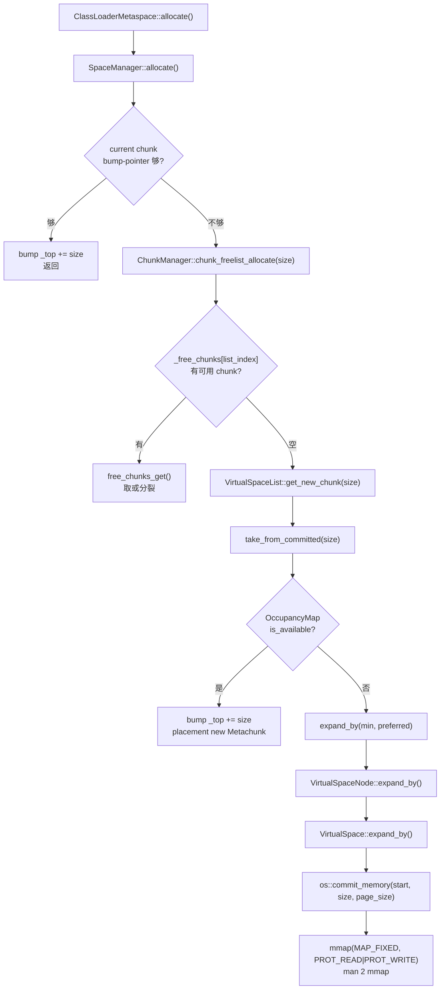
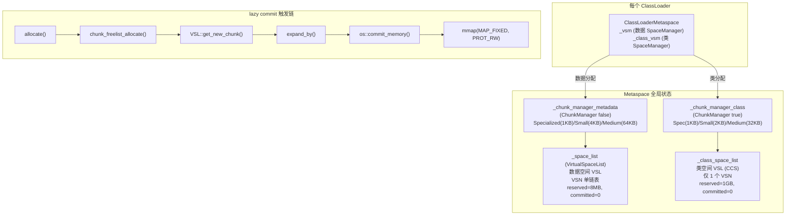

> **Phase**：[01-jvm-startup]
> **前置**：[00-JNI-CreateJavaVM]（init_globals）、[02-G1-Heap-Startup]（universe_init 的 Heap 子步骤，CCS 紧挨 Heap 末尾分配）
> **配套**：[01-CodeCache]（同属 init_globals 内存基础设施）
> **后续依赖本文**：[04-SymbolTable]、[05-StringTable]（universe_init 的子步骤 11-12）
> **阅读收益**：深度理解 Metaspace 启动初始化——从 VirtualSpaceList 的 2× multiplier 策略到 ChunkManager 的三类 fixed-size free list + HumongousDict，掌握 lazy commitment 的完整 6 步触发链路（SpaceManager→ChunkManager→VSL→expand_by→commit_memory→mmap），理解 CompressedClassSpace 独立 VSL 的指针压缩数学推导（Klass* = base + 32bit offset），量化数据空间 vs 类空间的 chunk 大小差异。

---

# 03-Metaspace — 元数据空间的 lazy commitment 与 ChunkManager 三层分配

## §〇 生产场景 — Metaspace OOM + lazy commitment 诊断

```
$ java -XX:MaxMetaspaceSize=128m -XX:MetaspaceSize=64m MyApp
$ jcmd <pid> VM.native_memory summary scale=KB
-    Metaspace (reserved=1052776KB, committed=8920KB, used=7116KB)
-    Compressed Class Space (reserved=1048576KB, committed=260KB, used=4KB)
```

Metaspace reserved=~1GB 虚拟空间（VSL 8MB + CCS 1GB），committed=8MB 物理内存——MAP_NORESERVE lazy commitment 的体现。首次加载类时 `ClassLoaderMetaspace::allocate()` → `SpaceManager::allocate()` → current chunk 用尽 → `ChunkManager::chunk_freelist_allocate()` 查 free list → 空 → `VirtualSpaceList::get_new_chunk()` → `expand_by()` → `os::commit_memory(MAP_FIXED, PROT_RW)` → 此时才真正分配物理页。如果 Committed 接近 Reserved 且无法再 expand，触发 `Metaspace::report_metadata_oome()` → `java.lang.OutOfMemoryError: Metaspace`。

**反事实**：如果不用 lazy commitment——启动时 commit 全部 Metaspace（unlimited → 无法限制 → 无限消耗物理内存）。即使限制 1GB → 大多数应用只用 ~50MB → 浪费 950MB 物理内存。lazy commit 确保每字节物理内存都是实际需要的。

**三步诊断**：

```bash
# 1. jcmd native_memory → reserved vs committed 差异
jcmd <pid> VM.native_memory summary scale=KB | grep -A 3 "Metaspace"

# 2. jstat Metaspace
jstat -gc <pid> | awk '{print "MC:"$7" MU:"$8" CCSC:"$9" CCSU:"$10}'

# 3. strace — 观察 mmap(PROT_NONE) vs mmap(MAP_FIXED, PROT_RW)
strace -e trace=mmap -o /tmp/meta.log java -XX:MetaspaceSize=16m -version
# 搜索 MAP_NORESERVE → reserved（无物理页）
# 搜索 MAP_FIXED|PROT_WRITE → commit（分配物理页）
grep -E "PROT_NONE|MAP_NORESERVE|MAP_FIXED.*PROT_WRITE" /tmp/meta.log

# 4. /proc/<pid>/maps → 查看 reserved 地址范围
cat /proc/<pid>/maps | grep -E "rw-p|r--p" | head -5
# 观察 8MB 区间（数据空间）和 1GB 区间（CCS）

# 5. /proc/<pid>/smaps → 查看 committed 页数（Rss 字段）
cat /proc/<pid>/smaps | grep -A 10 "8MB" | grep Rss
# Rss 初始为 0KB（lazy commitment 的证明）

# 6. GDB break
gdb -ex "break Metaspace::global_initialize" \
    -ex "break VirtualSpaceList::get_new_chunk" \
    -ex "break ChunkManager::chunk_freelist_allocate" \
    -ex "run" --args java -version
```

## §一 ★★★ Metaspace 启动初始化全链路

Metaspace 启动不是"分配一块内存"——是创建 VirtualSpaceList（单链表 VSN）+ CompressedClassSpace（独立 1GB VSL）+ ChunkManager（三类 free list + HumongousDict），通过 lazy commitment 在首次类加载时才真正分配物理页。

### 1.1 global_initialize 完整流程

`Metaspace::global_initialize()` (`metaspace.cpp:1391-1494`) 是 Metaspace 子系统初始化的全局入口：

```cpp
// metaspace.cpp:1391-1494 — global_initialize 9 步序列
0. [ergo_initialize 已先执行]                      // alignment 标量 + flag 对齐
1. MetaspaceGC::initialize()                    // GC 阈值策略（3 个静态变量）
2. [CDS 路径分流]                                 // DumpSharedSpaces/UseSharedSpaces
3. [64-bit] allocate_metaspace_compressed_klass_ptrs(base=heap_end, 0)
   → initialize_class_space(rs)                 // CCS 独立 VSL + ChunkManager
4. _first_chunk_word_size = InitialBootClassLoaderMetaspaceSize / BytesPerWord
   = 4MB / 8 = 524288 words
5. _first_class_chunk_word_size = MIN(MediumChunk*6, (CCS/BytesPerWord)*2)
   = 384KB (故意 > MediumChunk 成为 Humongous)
6. word_size = VIRTUALSPACEMULTIPLIER * _first_chunk_word_size = 2 * 4MB = 8MB
7. _space_list = new VirtualSpaceList(word_size)  // 数据 VSL (8MB reserve, 0 commit)
8. _chunk_manager_metadata = new ChunkManager(false)  // 数据 CM
9. _tracer = new MetaspaceTracer()               // JFR 事件上报
```

**步骤 0 — ergo_initialize 设置的 3 个 alignment 标量** (`metaspace.cpp:1334-1389`)：

`ergo_initialize()` 在 `global_initialize()` 之前被 `universe_init()` 调用，做 Metaspace 相关 flag 的对齐计算：

```cpp
// metaspace.cpp:1334 — ergo_initialize 核心计算
_commit_alignment  = os::vm_page_size();       // 4KB 或 large_page_size()
_reserve_alignment = MAX2(_commit_alignment,    // 典型 64KB
                          os::vm_allocation_granularity());
_compressed_class_space_size = CompressedClassSpaceSize;  // 对齐到 reserve_alignment
```

| 标量 | 类型 | 大小 | 初始值 | 用途 |
|------|------|------|--------|------|
| `_commit_alignment` | `size_t` | 8B | `= os::vm_page_size()` (4KB 或大页) | chunk commit 粒度，expand_by 对齐到它 |
| `_reserve_alignment` | `size_t` | 8B | `= MAX2(page_size, vm_allocation_granularity())` (典型 64KB) | VSN reserve 粒度 |
| `_compressed_class_space_size` | `size_t` | 8B | `= CompressedClassSpaceSize` (已对齐) | CCS 1GB 对齐值 |

**步骤 1 — MetaspaceGC::initialize() 的 3 个静态变量** (`metaspace.cpp:189-201`, 定义在 `metaspace.cpp:73-75`)：

```cpp
void MetaspaceGC::initialize() {
    _capacity_until_GC = MaxMetaspaceSize;  // 设为 SIZE_MAX → 启动期永不触发 GC
    // _shrink_factor 和 _should_concurrent_collect 保持声明时初始值
}
```

| 变量 | 类型 | 大小 | 初始值 | 用途 |
|------|------|------|--------|------|
| `_capacity_until_GC` | `volatile size_t` | 8B | `= MaxMetaspaceSize` (SIZE_MAX) | 高水位线，启动期禁止 Metaspace GC |
| `_shrink_factor` | `uint` | 4B | `= 0` (声明时初始化) | 缩容因子 (0-100)，0 = 不缩容 |
| `_should_concurrent_collect` | `bool` | 1B | `= false` (声明时初始化) | CMS 并发收集标记 |

> **设计决策**: `_capacity_until_GC = SIZE_MAX` 确保启动期间 committed 内存永远不会超过此值 → 绝对不触发 GC。启动完成后 `post_initialize()` 重置为 `MAX2(committed_bytes, MetaspaceSize)`。

### 1.2 VirtualSpaceList: 单链表 VSN (8MB reserve / 0 commit)

> **Callout: MAP_NORESERVE**  
> `mmap(NULL, size, PROT_NONE, MAP_NORESERVE)` 预留虚拟地址不分配 swap (`man 2 mmap`, `man 7 proc` /proc/sys/vm/overcommit_memory)。committed=0 表示 0 物理页消耗。commit 时才用 `mmap(MAP_FIXED, PROT_RW)` 提交。

**VSL 构造函数** (`virtualSpaceList.cpp:168-215`) — 数据空间版本：

```cpp
// virtualSpaceList.cpp:168-215 — VSL 构造
VirtualSpaceList::VirtualSpaceList(size_t word_size) {
    // 创建首个 VirtualSpaceNode
    VirtualSpaceNode* new_entry = new VirtualSpaceNode(is_class(), word_size * BytesPerWord);
    // 内部: mmap(NULL, 8MB, PROT_NONE, MAP_PRIVATE|MAP_ANONYMOUS|MAP_NORESERVE)
    // man 2 mmap: MAP_NORESERVE 不预留 swap 空间
    new_entry->initialize();  // 初始化 VirtualSpace + OccupancyMap
    link_vs(new_entry);       // 链接到链表
    _current_virtual_space = new_entry;
}
```

**关键数据结构**:
- `_virtual_space_list` → `VirtualSpaceNode*` — 单链表头（数据空间可以有多个 VSN，CCS 只允许 1 个）
- `_current_virtual_space` → `VirtualSpaceNode*` — 当前分配用节点
- `_reserved_words` / `_committed_words` — 全局统计（初始 committed=0）

> **Callout: VirtualSpaceList 单链表**  
> `_virtual_space_list` 是 VirtualSpaceNode 单链表。数据空间可以有多个 VSN（每当前一个 VSN commit 满就创建新的）。CCS 只允许 1 个——`create_new_virtual_space` 中 `assert(!is_class())` 拒绝 CCS 多节点。

**VirtualSpaceNode 内部结构** (`virtualSpaceNode.hpp`):

| 成员 | 类型 | 用途 |
|------|------|------|
| `_virtual_space` | `VirtualSpace` | low/high/low_boundary/high_boundary |
| `_top` | `MetaWord*` | bump-pointer 分配边界 |
| `_container_count` | `uintx` | 活跃 chunk 计数 |
| `_occupancy_map` | `OccupancyMap*` | 两层位图（chunk_start + in_use） |

**VirtualSpace 布局**: `low_boundary` → `low`(=bottom) → `_top` → `high`(=end) → `high_boundary`

> **Callout: OccupancyMap**  
> VirtualSpaceNode 内部用位图跟踪每个 128-word 块的提交状态。`take_from_committed()` 检查 occupancy → `is_available` → 可能返回 NULL → 触发 `expand_by`。

### 1.3 ChunkManager: 3 类 free list + HumongousDict + 类空间差异

> **Callout: ChunkManager 三类 free list**  
> `_free_chunks[SpecializedIndex=0]=ChunkList<1KB>, [SmallIndex=1]=ChunkList<4KB>, [MediumIndex=2]=ChunkList<64KB>`。类空间 chunk 更小: ClassSpecialized=1KB, ClassSmall=2KB, ClassMedium=32KB——因为 Klass 对象通常较小。

**ChunkManager 构造** (`chunkManager.cpp:106-112`):

```cpp
// chunkManager.cpp:106-112 — 初始化 freelist 大小
ChunkManager::ChunkManager(bool is_class) {
    _free_chunks[SpecializedIndex].set_size(
        get_size_for_nonhumongous_chunktype(SpecializedIndex, is_class));
    _free_chunks[SmallIndex].set_size(
        get_size_for_nonhumongous_chunktype(SmallIndex, is_class));
    _free_chunks[MediumIndex].set_size(
        get_size_for_nonhumongous_chunktype(MediumIndex, is_class));
}
```

**Chunk 大小定义** (`metaspaceCommon.hpp:35-42`):

| Chunk 类型 | 数据空间 (words/bytes) | 类空间 (words/bytes) | 说明 |
|-----------|----------------------|---------------------|------|
| SpecializedChunk | 128 words / 1 KB | 128 words / 1 KB | 相同 |
| SmallChunk | 512 words / 4 KB | 256 words / 2 KB | **类空间一半** |
| MediumChunk | 8192 words / 64 KB | 4096 words / 32 KB | **类空间一半** |

> **Callout: Chunk 大小映射**  
> `list_index(size)` 决定去哪个 free list: `size==specialized(128 words)` → SpecializedIndex, `size==small(512 words)` → SmallIndex, `size==medium(8K words)` → MediumIndex, `size>medium` → HumongousIndex (BinaryTreeDictionary)。

**为什么类空间 chunk 更小**？Klass 对象（InstanceKlass ~500B-4KB）比 Method 对象（几KB-几百KB）小很多。ClassSmall=2KB 而非 4KB 避免 50% 浪费——如果 1M 个类，ClassSmall=4KB 会浪费 2GB。

> **Callout: HumongousChunk BinaryTreeDict**  
> >64KB 的 chunk 不在 fixed free list 中，而是 `_humongous_dictionary` 二叉搜索树按大小索引。分配时 `chunk_freelist_allocate` → `HumongousIndex` → `dictionary()->get_chunk(size)` → 可能需要 `split` 切开大块。

**free_chunks_get — 核心分配逻辑** (`chunkManager.cpp:497-602`):

```cpp
// chunkManager.cpp:497-602 — 从 freelist 取或分裂大 chunk
Metachunk* ChunkManager::free_chunks_get(size_t word_size) {
    if (!is_humongous(word_size)) {
        // 1. 从对应大小的 freelist 取
        ChunkList* free_list = find_free_chunks_list(word_size);
        Metachunk* chunk = free_list->head();
        if (chunk == NULL) {
            // 2. freelist 空 → 从更大一级分裂
            for (ChunkIndex i = next_chunk_index; i < NumberOfFreeLists; i++) {
                if (list->num_free_chunks() > 0) {
                    chunk = split_chunk(word_size, larger_chunk);
                    break;
                }
            }
        }
        if (chunk != NULL) free_list->remove_chunk(chunk);
    } else {
        // 3. Humongous → 红黑树查找
        chunk = humongous_dictionary()->get_chunk(word_size);
    }
    return chunk;
}
```

**chunk_freelist_allocate — 公开入口** (`chunkManager.cpp:604-639`):
```cpp
// chunkManager.cpp:604-639 — 分配入口
Metachunk* ChunkManager::chunk_freelist_allocate(size_t word_size) {
    Metachunk* chunk = free_chunks_get(word_size);
    return chunk;
}
```

### 1.4 CompressedClassSpace: 独立 1GB VSL + narrow_klass_base/shift

> **Callout: CompressedClassSpace**  
> `-XX:+UseCompressedClassPointers` 默认开启（32GB 堆以下）。CCS 独立 1GB VSL，紧挨堆末尾分配（`align_up(heap->reserved_region().end())`）。`set_narrow_klass_base_and_shift()` 计算 base 和 shift。

**initialize_class_space** (`metaspace.cpp:1257-1330`):

```cpp
// metaspace.cpp:1257-1330 — CCS 初始化
Metaspace::initialize_class_space(ReservedSpace rs) {
    _class_space_list = new VirtualSpaceList(rs);  // 用已预留的 ReservedSpace
    _chunk_manager_class = new ChunkManager(true);  // 类空间 CM
}
```

**为什么 CCS 必须独立 VSL 且只允许 1 个 VirtualSpaceNode**？

`-XX:+UseCompressedClassPointers` 需要 Klass* 在 32-bit offset (4GB) 范围。CCS 提供 1GB 连续虚拟地址空间 → 所有 Klass 从固定 base (`narrow_klass_base`) 分配的 offset 保证 `klass_offset < 1GB << shift` → `Klass* = base + (offset << shift)` = 4 字节。

```cpp
// 指针压缩数学推导
Klass* = narrow_klass_base + (narrow_klass_offset << LogKlassAlignmentInBytes)
// shift = LogKlassAlignmentInBytes = 3 (8-byte aligned)
// 最大地址范围 = 1GB << 3 = 8GB
```

**反事实：如果 CCS 混在 Metaspace 的 VSL 中**？VSL 节点不保证连续 → 无法保证 offset 在 32-bit 范围 → 指针压缩失效 → Klass* = 8 字节。

### 1.5 ★ lazy commitment: 完整 6 步触发链路

Lazy commitment 是 Metaspace 的核心设计——初始 committed=0，首次类加载时才真正分配物理页。

**完整调用链**:



**VSL::get_new_chunk 源码** (`virtualSpaceList.cpp:378-410`):

```cpp
// virtualSpaceList.cpp:378-410 — get_new_chunk
Metachunk* VirtualSpaceList::get_new_chunk(size_t chunk_word_size, size_t commit_granularity) {
    // 1. 尝试从当前节点获取
    Metachunk* next = current_virtual_space()->get_chunk_vs(chunk_word_size);
    if (next != NULL) return next;
    // 2. 不够 → 扩展
    size_t min_word_size = align_up(chunk_word_size + padding, commit_alignment);
    size_t preferred_word_size = align_up(suggested_commit_granularity, commit_alignment);
    expand_by(min_word_size, preferred_word_size);
    // 3. 重试
    return current_virtual_space()->get_chunk_vs(chunk_word_size);
}
```

**expand_by → commit_memory** (`virtualSpaceNode.cpp:467-492`):

```cpp
// virtualSpaceNode.cpp:467-492 — 最终触发 mmap
bool VirtualSpaceNode::expand_by(size_t min_words, size_t preferred_words) {
    size_t commit_bytes = MIN(preferred_bytes, uncommitted_bytes);
    bool result = virtual_space()->expand_by(commit_bytes, false);
    // 内部: os::commit_memory(start, commit_bytes, page_size, !exec)
    // → mmap(MAP_FIXED, PROT_READ|PROT_WRITE) man 2 mmap
    return result;
}
```

> **Callout: BlockFreelist**  
> SpaceManager 的 chunk 内碎片回收。小块归还到 `BlockFreelist`（chunk 内部的小 free list），大块归还 `ChunkManager`。chunk 完全空闲时才可能 coalesce 并归还 VirtualSpaceNode。

**commit_granularity** 通常 = page_size = 4KB。如果请求 50KB → commit 向上对齐到 52KB (13 × 4KB)。

### 1.6 ClassLoaderMetaspace: per-CL 独立 SpaceManager, 共享 VSL+ChunkManager

每个 ClassLoader 有独立的 `ClassLoaderMetaspace`，但共享底层 VSL 和 ChunkManager：

```cpp
// ClassLoaderData::_metaspace → ClassLoaderMetaspace
// ClassLoaderMetaspace 包含两个 SpaceManager:
//   _vsm (数据 SpaceManager) → _chunk_manager_metadata → _space_list
//   _class_vsm (类 SpaceManager) → _chunk_manager_class → _class_space_list
```

**分配路径**: CLMS → SpaceManager → 对应 ChunkManager（metadata vs class）→ 共享的 VSL。

**类卸载时**: `ClassLoaderData::unload()` → `ClassLoaderMetaspace::~ClassLoaderMetaspace()` → 归还所有 chunk → ChunkManager → coalesce。

**反事实：每个 ClassLoader 独立 VSL**？100 个 ClassLoader → 100 × 8MB reserved → 800MB 虚拟空间 → 浪费。CLMS 独立计费（per ClassLoader accounting），但底层共享 VSL+ChunkManager 避免重复虚拟空间预留。

### 1.7 ★ Mermaid: Metaspace 完整内存布局 + lazy commit 链路



### 1.8 ★ 面试 Story Format 答案

**问：Metaspace 启动初始化做了什么？为什么初始 committed=0？**

**答（分层讲述）：**

**第 1 层 — 两套 VSL + 两套 ChunkManager：**

`Metaspace::global_initialize()` (`metaspace.cpp:1391`) 创建两套并行体系：

```cpp
// 数据元空间（存 Method、ConstantPool、Bytecode 等）
_space_list = new VirtualSpaceList(word_size=8MB);
// → 1 个 VSN: mmap(NULL, 8MB, PROT_NONE, MAP_NORESERVE)
// → reserved=8MB, committed=0

_chunk_manager_metadata = new ChunkManager(false);
// → _free_chunks[0]=ChunkList<Specialized=1KB>
// → _free_chunks[1]=ChunkList<Small=4KB>
// → _free_chunks[2]=ChunkList<Medium=64KB>

// 类空间（CCS，存 Klass 对象）
_class_space_list = new VirtualSpaceList(rs=1GB);
// → 1 个 VSN: mmap(heap_end, 1GB, PROT_NONE, MAP_NORESERVE)
// → reserved=1GB, committed=0 (assert: only 1 node allowed)

_chunk_manager_class = new ChunkManager(true);
// → _free_chunks[0]=ChunkList<ClassSpecialized=1KB>
// → _free_chunks[1]=ChunkList<ClassSmall=2KB>   ← 一半大小!
// → _free_chunks[2]=ChunkList<ClassMedium=32KB>  ← 一半大小!
```

**第 2 层 — 为什么 committed=0？lazy commitment 的完整 6 步链路：**

首次类加载 → `ClassLoaderMetaspace::allocate()` → `SpaceManager::allocate()` 的 chunk bump-pointer 不够用 → 查 ChunkManager 的 free list → 空 → `VirtualSpaceList::get_new_chunk()` → `take_from_committed()` 检查 OccupancyMap → 无可用 committed 区域 → `expand_by()` → `VirtualSpace::expand_by()` → `os::commit_memory()` → `mmap(MAP_FIXED, PROT_READ|PROT_WRITE)` (`man 2 mmap`) → 此时才真正分配物理页。

**第 3 层 — CCS 为什么必须独立 VSL？**

`-XX:+UseCompressedClassPointers` 要求 Klass* 在 32-bit offset (4GB) 范围内。CCS 提供 1GB 连续虚拟地址空间 → 所有 Klass 从固定 `narrow_klass_base` 分配 → `Klass* = base + (offset << shift)` = 4 字节。如果 CCS 混在 Metaspace 的 VSL 中，VSN 不保证连续，无法保证 offset 在 32-bit 范围 → 指针压缩失效 → Klass* = 8 字节。

**第 4 层 — 2× multiplier 策略：**

```cpp
word_size = VIRTUALSPACEMULTIPLIER * _first_chunk_word_size
         = 2 * (4MB / 8 bytes/word)
         = 2 * 524288 words
         = 8MB
```

预留 2 倍初始大小，为 JDK 核心类（~4MB metadata）留增长空间。如果 multiplier=1（4MB）→ 加载第一个类可能就需要第二个 VSN → 额外 mmap reserve 延迟。

## §二 ★★★ 完整数据结构清单 — global_initialize 创建的全部对象

`global_initialize()` 不是"创建 6 个全局变量"——而是创建了 **23 个数据结构**（含标量 + C++ 对象 + 嵌套子结构）。下面按执行顺序逐层展开。

### 2.1 前置：ergo_initialize 设置的 alignment 标量

在 `global_initialize` 之前，`ergo_initialize()` (`metaspace.cpp:1334-1389`) 计算并设置 Metaspace 静态成员：

| # | 变量 | 类型 | 大小 | 声明位置 | 初始值 | 用途 |
|---|------|------|------|---------|--------|------|
| 1 | `_commit_alignment` | `size_t` | 8B | `metaspace.cpp:1011` | `= os::vm_page_size()` (4KB) 或大页 | chunk commit 粒度，`expand_by` 时对齐到它 |
| 2 | `_reserve_alignment` | `size_t` | 8B | `metaspace.cpp:1012` | `= MAX2(page_size, os::vm_allocation_granularity())` (典型 64KB) | VSN reserve 粒度 |
| 3 | `_compressed_class_space_size` | `size_t` | 8B | `metaspace.cpp:1013` | `= CompressedClassSpaceSize` (已对齐) | CCS 1GB 对齐值 |

### 2.2 第 1 步：MetaspaceGC::initialize() 的 3 个静态变量

`metaspace.cpp:189-201` — 设置 GC 阈值。3 个静态成员定义在 `metaspace.cpp:73-75`：

| # | 变量 | 类型 | 大小 | 初始值 | 用途 |
|---|------|------|------|--------|------|
| 4 | `_capacity_until_GC` | `volatile size_t` | 8B | `= MaxMetaspaceSize` | 高水位线：设为 `SIZE_MAX`，**启动期禁止 GC** |
| 5 | `_shrink_factor` | `uint` | 4B | `= 0`（声明时初始化） | 缩容因子 (0-100)，0 = 不缩容 |
| 6 | `_should_concurrent_collect` | `bool` | 1B | `= false`（声明时初始化） | CMS：是否应启动并发收集 |

### 2.3 第 2 步：allocate_metaspace_compressed_klass_ptrs → initialize_class_space

`metaspace.cpp:1087-1239` 预留 1GB CCS 虚拟地址空间 + 设置压缩指针编码参数，然后调用 `initialize_class_space()` (`metaspace.cpp:1257-1330`) 创建：

| # | 对象 | 类型 | 大小 | 初始值 | 用途 |
|---|------|------|------|--------|------|
| 7 | `_class_space_list` | `VirtualSpaceList*` | 8B 指针 + ~256B 对象 | 1 个 VSN (1GB reserved, 0 committed) | 类空间 VSL（CCS），`assert: only 1 node allowed` |
| 8 | `_chunk_manager_class` | `ChunkManager*` | 8B 指针 + ~144B 对象 | 空 free list (ClassSpecialized/ClassSmall/ClassMedium) | 类空间空闲 Chunk 管理器 |

### 2.4 第 3 步：计算 chunk 大小标量

`metaspace.cpp:1457-1471` — 计算两个关键标量：

| # | 变量 | 类型 | 大小 | 初始值 | 用途 |
|---|------|------|------|--------|------|
| 9 | `_first_chunk_word_size` | `size_t` | 8B | `= 4MB / BytesPerWord = 524288 words` | Bootstrap CL 首个 chunk 大小 |
| 10 | `_first_class_chunk_word_size` | `size_t` | 8B | `= MIN(MediumChunk×6, CCS×2/BytesPerWord) = 384KB = 49152 words` | 首个类 chunk 大小（故意 > Medium，成为 Humongous） |

### 2.5 第 4 步：创建数据空间 VSL + CM + Tracer

`metaspace.cpp:1473-1488` — 核心对象创建：

| # | 对象 | 类型 | 大小 | 初始值 | 用途 |
|---|------|------|------|--------|------|
| 11 | `_space_list` | `VirtualSpaceList*` | 8B 指针 + ~256B 对象 | 1 个 VSN (8MB reserved, 0 committed) | 数据元空间 VSL |
| 12 | `_chunk_manager_metadata` | `ChunkManager*` | 8B 指针 + ~144B 对象 | 空 free list (Specialized/Small/Medium) | 数据空间空闲 Chunk 管理器 |
| 13 | `_tracer` | `MetaspaceTracer*` | 8B 指针 + ~16B 对象 | `new MetaspaceTracer()` | JFR 事件上报（GC 阈值/分配失败/OOM） |
| 14 | `_initialized` | `bool` | 1B | `= true` | 标记 Metaspace 已初始化 |

### 2.6 嵌套数据结构：VirtualSpaceNode 内部（每个 VSN 自带）

每个 `VirtualSpaceList` 的第一个节点（VirtualSpaceNode）构造时内部创建：

| # | 子对象 | 类型 | 大小 | 初始值 | 用途 |
|---|--------|------|------|--------|------|
| 15 | `_rs` | `ReservedSpace` | ~56B | `_base=mmap 返回地址, _size=8MB/1GB, _alignment=64KB` | 预留地址空间元数据 |
| 16 | `_virtual_space` | `VirtualSpace` | ~120B | 14 个边界指针 + 3 个 alignment 值 | 三区段 MPSS committed 内存管理（lower/middle/upper） |
| 17 | `_occupancy_map` | `OccupancyMap*` | 8B 指针 + 两层位图 | `_map[0]=chunk_start_map, _map[1]=in_use_map` | 双图层位图追踪每个 128-word 块的 chunk 头 + 使用状态 |

**OccupancyMap 位图大小计算**（以 8MB 数据空间为例）：
```
num_bits = 8MB / 128 words / 8 bytes = 8MB / 1KB = 8192 bits
_map_size = (8192 + 7) / 8 = 1025 bytes ≈ 1KB per layer
两层合计: 1KB × 2 = 2KB (C-Heap 分配，os::malloc)
```

对于 CCS 1GB：
```
num_bits = 1GB / 1KB = 1,048,576 bits
_map_size = (1048576 + 7) / 8 = 131,073 bytes ≈ 128KB per layer
两层合计: 128KB × 2 = 256KB
```

**VirtualSpace 三区段模型**（MPSS — Multiple Page Size Support）：
```
_low_boundary                                                  _high_boundary
    |                       |                              |         |
    |<--- lower region --->|<--- middle region ---------->|<-- upper -->|
    |  page_size aligned    | commit_alignment aligned     | page_size  |
    |  _lower_alignment=4K  | _middle_alignment=64K        | _upper=4K  |
    
    初始状态: _low = _high = _low_boundary  (0 commit)
              _lower_high = _low_boundary
              _middle_high = align_up(low, 64K)
              _upper_high = align_down(high, 64K)
```

### 2.7 嵌套数据结构：ChunkManager 内部

每个 ChunkManager 对象内部：

| # | 子对象 | 类型 | 大小 | 初始值 | 用途 |
|---|--------|------|------|--------|------|
| 18 | `_free_chunks[3]` | `FreeList<Metachunk>[3]` | 3 × 32B = 96B | 每元素 `_head=NULL, _tail=NULL, _size=chunk_size, _count=0` | 三级固定大小空闲链表 |
| 19 | `_humongous_dictionary` | `BinaryTreeDictionary` | ~24B | `_total_size=0, _total_free_blocks=0, _root=NULL` | 变长 Humongous chunk 二叉搜索树 |
| 20 | `_free_chunks_total` | `size_t` | 8B | `= 0` | 所有空闲 chunk 总大小 (words) |
| 21 | `_free_chunks_count` | `size_t` | 8B | `= 0` | 所有空闲 chunk 总数 |
| 22 | `_is_class` | `const bool` | 1B | `= is_class 参数` | 区分 class space / non-class space |

**FreeList<Metachunk> 内部结构** (`freeList.hpp:41-49`)：
```
_head:  Metachunk* = NULL   (双向链表头)
_tail:  Metachunk* = NULL   (双向链表尾)
_size:  size_t     = chunk_size_words  (此链表管理 chunk 的固定大小)
_count: ssize_t    = 0      (链表中 chunk 数量)
```

### 2.8 CDS 路径额外创建的数据结构（仅 CDS 启用时）

| # | 对象 | 类型 | 大小 | 创建条件 | 用途 |
|---|------|------|------|---------|------|
| 23 | `_shared_rs` | `ReservedSpace` | ~56B | `DumpSharedSpaces` | CDS 归档 4GB 预留空间（split 为 3GB 归档 + 1GB CCS） |
| 24 | `_shared_vs` | `VirtualSpace` | ~120B | `DumpSharedSpaces` | 共享空间 committed 管理 |
| 25 | `FileMapInfo*` | `CHeapObj` | ~200B | `UseSharedSpaces` | `new FileMapInfo()`，映射 CDS 归档文件 |

### 2.9 总内存开销汇总

```
┌─────────────────────────────────────────────────────────────────────┐
│              global_initialize 总内存开销 (非 CDS 路径)               │
├─────────────────────────────────────────────────────────────────────┤
│                                                                     │
│  Metaspace 静态标量 (C++ .bss 段):                                   │
│    _commit_alignment (8B) + _reserve_alignment (8B)                  │
│    + _compressed_class_space_size (8B)                               │
│    + _first_chunk_word_size (8B) + _first_class_chunk_word_size (8B) │
│    + _initialized (1B)                                              │
│    = 41B                                                            │
│                                                                     │
│  MetaspaceGC 静态变量 (C++ .bss 段):                                  │
│    _capacity_until_GC (8B) + _shrink_factor (4B)                     │
│    + _should_concurrent_collect (1B)                                │
│    = 13B                                                            │
│                                                                     │
│  C-Heap 对象 (os::malloc / CHeapObj::new):                           │
│    VirtualSpaceList × 2 (数据 + 类)           ≈ 512B                 │
│    ChunkManager × 2 (数据 + 类)               ≈ 288B                 │
│    MetaspaceTracer × 1                        ≈ 16B                  │
│    VirtualSpaceNode × 2 (各含 OccupancyMap)    ≈ 2×232B + 位图       │
│    OccupancyMap 位图: 2KB(8MB 数据) + 256KB(1GB CCS)                │
│    = ~258.5KB                                                       │
│                                                                     │
│  虚拟地址空间 (mmap reserved, 非物理内存):                            │
│    数据 VSN: 8MB                                                     │
│    CCS VSN:  1GB                                                    │
│    = 1032MB 虚拟地址 (committed=0)                                   │
│                                                                     │
│  物理内存 (启动时):                                                   │
│    = 258.5KB (C-Heap 对象) + 0 (Metaspace committed=0)              │
│                                                                     │
└─────────────────────────────────────────────────────────────────────┘
```

### 2.10 syscall 速查表

| syscall | 调用点 | 模式 | 作用 | 成本 | man |
|---------|-------|------|------|------|-----|
| `mmap` | `VSN 构造` | `PROT_NONE, MAP_ANONYMOUS\|MAP_PRIVATE\|MAP_NORESERVE` | reserve 虚拟地址空间（不分配物理页） | ~1µs | `man 2 mmap` |
| `mmap` | `expand_by → commit_memory` | `MAP_FIXED, PROT_READ\|PROT_WRITE` | 提交物理页到已预留地址 | ~10-100µs (取决于页数) | `man 2 mmap` |
| `munmap` | `VSL::purge → release` | — | 释放整个 VSN 虚拟空间 | ~1µs | `man 2 munmap` |

### 2.11 关键文件路径

| 路径 | 说明 |
|------|------|
| `src/hotspot/share/memory/metaspace.cpp:1334` | ergo_initialize — alignment 计算 |
| `src/hotspot/share/memory/metaspace.cpp:1391` | global_initialize — 主入口 |
| `src/hotspot/share/memory/metaspace.cpp:1257` | initialize_class_space — CCS 初始化 |
| `src/hotspot/share/memory/metaspace.cpp:1087` | allocate_metaspace_compressed_klass_ptrs — CCS 地址预留 |
| `src/hotspot/share/memory/metaspace/metaspaceGC.cpp` | MetaspaceGC — GC 阈值管理 |
| `src/hotspot/share/memory/metaspace/virtualSpaceList.cpp` | VSL — 链表 + expand_by |
| `src/hotspot/share/memory/metaspace/virtualSpaceNode.cpp` | VSN — OccupancyMap + take_from_committed |
| `src/hotspot/share/memory/metaspace/chunkManager.cpp` | CM — free list + coalesce |
| `src/hotspot/share/memory/metaspace/occupancyMap.hpp` | OccupancyMap — 双图层位图定义 |
| `src/hotspot/share/memory/metaspace/metaspaceCommon.cpp:134` | get_size_for_nonhumongous_chunktype — chunk 大小定义 |

## §三 ★★ 异常路径分析

### 3.1 Metaspace OOM — 4 个触发点

1. **VSL::expand_by 不允许扩展** (`virtualSpaceList.cpp:311-315`): `MetaspaceGC::can_expand()` 返回 false — 已到达 `MaxMetaspaceSize` → 需要先触发 GC → 若 GC 无法释放足够空间 → OOM

2. **commit_memory 失败** (`virtualSpaceNode.cpp:478`): `VirtualSpace::expand_by()` 内部 `os::commit_memory()` 失败 → 物理内存不足 → `report_metadata_oome()`

3. **chunk_freelist_allocate 返回 NULL** — freelist 全空 + VSL expand 失败 → 无可用 chunk → SpaceManager 无法满足分配 → OOM

4. **ChunkManager 构造函数中 Monitor 分配失败** — C-Heap OOM → `vm_exit_during_initialization`

### 3.2 诊断异常路径 — /proc 验证

```bash
# 验证 lazy commitment: /proc/<pid>/maps 显示 reserved 范围
cat /proc/<pid>/maps | grep -E "8MB|1GB"
# 输出: 7fffc29f0000-7fffc31f0000 rw-p 00000000 00:00 0  (8MB, 无文件映射)

# 验证 committed 页数: /proc/<pid>/smaps 的 Rss 字段
cat /proc/<pid>/smaps | awk '/7fffc29f0000/,/7fffc31f0000/' | grep Rss
# Rss: 0 kB ← lazy commitment: 启动时 0 物理页

# 加载类后再次检查
jcmd <pid> GC.class_stats | head -20  # 触发类加载
cat /proc/<pid>/smaps | awk '/7fffc29f0000/,/7fffc31f0000/' | grep Rss
# Rss: 2048 kB ← 已 commit 2MB 物理页
```

### 3.3 GC threshold 触发 Metaspace GC

`MetaspaceGC::compute_new_size()` 检查 committed 是否超过 `MetaspaceSize` 阈值 → 超过 → 触发 Full GC → 类卸载 → chunk 归还 ChunkManager → coalesce → 可能 uncommit → 降低 committed。

### 3.4 类卸载后 chunk 回收 — coalesce 机制

类卸载 → `return_single_chunk()` → `attempt_to_coalesce_around_chunk()` (`chunkManager.cpp:127-218`):

```cpp
// chunkManager.cpp:127-218 — coalesce 规则
// SpecializedChunk × 4 → SmallChunk
// SmallChunk × 16 → MediumChunk
// 合并后重新插入对应大小的 freelist
// 整个 VSN 所有 chunk 都空闲 → VSL::purge() → os::uncommit_memory()
```

## §四 ★ GDB 断点验证 — 8 断点

```
断言 1: global_initialize (metaspace.cpp:1474)
  (gdb) break metaspace.cpp:1474
  (gdb) print _space_list → 期望: 非 NULL VirtualSpaceList*
  (gdb) print _space_list->_virtual_space_list → 期望: 单节点, 8MB reserved
  (gdb) print _space_list->_committed_words → 期望: 0 (初始无 commit)

断言 2: VSL 构造 (virtualSpaceList.cpp:215 之后)
  (gdb) print _reserved_words → 期望: 8MB / 8 = 1M words
  (gdb) print _committed_words → 期望: 0

断言 3: CCS (metaspace.cpp:1323)
  (gdb) break metaspace.cpp:1323
  (gdb) print _class_space_list → 期望: 非 NULL
  (gdb) print _class_space_list->_reserved_words → 期望: 1GB / 8 = 128M words (单节点)
  (gdb) print _class_space_list->_virtual_space_count → 期望: 1 (CCS 只允许 1 个)

断言 4: ChunkManager sizes (chunkManager.cpp:112 之后)
  (gdb) print _chunk_manager_metadata->_free_chunks[0].size() → 期望: 128 words (Specialized)
  (gdb) print _chunk_manager_metadata->_free_chunks[1].size() → 期望: 512 words (Small)
  (gdb) print _chunk_manager_metadata->_free_chunks[2].size() → 期望: 8192 words (Medium)
  (gdb) print _chunk_manager_class->_free_chunks[1].size() → 期望: 256 words (ClassSmall)

断言 5: expand_by (virtualSpaceNode.cpp:478)
  (gdb) break virtualSpaceNode.cpp:478
  (gdb) print committed before → 期望: 初始值
  (gdb) continue (经过 expand_by)
  (gdb) print committed after → 期望: 增加了 commit_bytes

断言 6: chunk allocate (chunkManager.cpp:604)
  (gdb) break chunkManager.cpp:604
  (gdb) print word_size → 期望: 请求的 chunk 大小
  (gdb) print list_index(word_size) → 期望: 对应的 ChunkIndex

断言 7: OccupancyMap (virtualSpaceNode.cpp:430)
  (gdb) break virtualSpaceNode.cpp:430
  (gdb) print occupancy_map()->is_region_in_use(...) → 期望: true/false

断言 8: 类空间 ChunkManager (chunkManager.cpp:112 之后)
  (gdb) print _chunk_manager_class->_free_chunks[0].size() → 期望: 128 words (ClassSpecialized)
  (gdb) print _chunk_manager_class->_free_chunks[1].size() → 期望: 256 words (ClassSmall)
  (gdb) print _chunk_manager_class->_free_chunks[2].size() → 期望: 4096 words (ClassMedium)

辅助验证: /proc 与 GDB 协同
  # 在 GDB 断点后，用另一个终端检查
  $ cat /proc/<pid>/maps | grep -A 2 "8MB\|1GB" | grep "rw-p\|r--p"
  # 期望: 初始时只有 r--p (PROT_NONE)，commit 后出现 rw-p (PROT_READ|PROT_WRITE)
  
  # 验证 committed 页数变化
  $ cat /proc/<pid>/smaps | grep -B 1 Rss | paste - - | awk '/rw-p/{print $2}'
  # 期望: 初始 0 kB → 类加载后 > 0 kB
```

## §五 ★ Cross-Reference

- → [02-G1-Heap-Startup]: CCS 紧挨 Heap 末尾分配（`align_up(heap->reserved_region().end())`），同属 universe_init 的子步骤
- → [01-CodeCache]: 同属 init_globals 内存基础设施层
- → [00-JNI-CreateJavaVM]: `vm_init_globals` 中 `mutex_init()` 创建了 `MetaspaceExpand_lock` — VSL 和 ChunkManager 在分配时使用
- → [04-SymbolTable], [05-StringTable]: universe_init 的子步骤 11-12，使用 Metaspace 存储 interned strings/symbols

**Chunk 大小对比表**（数据空间 vs 类空间）:

| Chunk 类型 | 数据空间 | 类空间 | 类/数据比 |
|-----------|---------|-------|----------|
| Specialized | 128 words (1KB) | 128 words (1KB) | 1:1 |
| Small | 512 words (4KB) | 256 words (2KB) | 1:2 |
| Medium | 8192 words (64KB) | 4096 words (32KB) | 1:2 |

**2× multiplier 策略**: `VIRTUALSPACEMULTIPLIER = 2` (metaspace.hpp) → `word_size = 2 × 4MB = 8MB`。预留 2 倍初始大小，为 JDK 核心类加载（~4MB metadata）留增长空间，避免创建第二个 VSN（额外 mmap reserve 延迟）。

**coalesce 规则表**:

| 源 chunk 类型 | 合并数量 | 目标 chunk 类型 |
|-------------|---------|---------------|
| Specialized × 4 | 4 × 1KB = 4KB | Small (4KB) |
| Small × 16 | 16 × 4KB = 64KB | Medium (64KB) |
| 整个 VSN 空闲 | — | VSL::purge() → os::uncommit_memory() |
