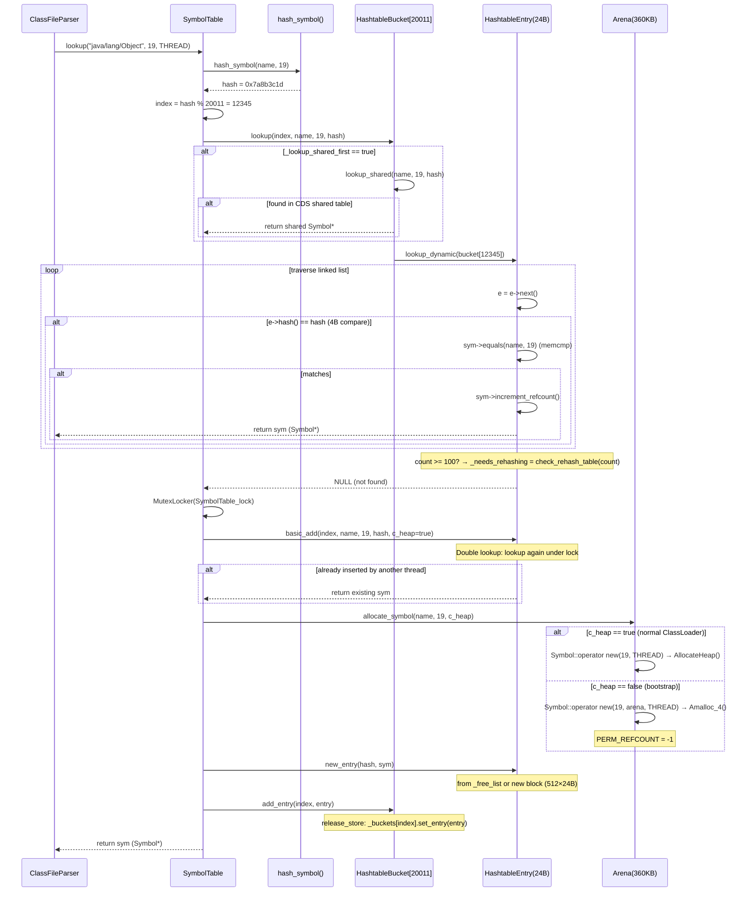

# 04-SymbolTable — JVM 全局符号哈希表深度分析

> **阶段**：[01-jvm-startup]
> **前置**：[15-core-native]（Hashtable 基础设施、Arena bump-pointer、release/acquire 内存序）
> **配套**：[03-Hashtable-Infra]（BasicHashtable 内存布局、entry 块分配器）、[05-StringTable]（并发哈希表、oop 存储）
> **后续依赖本文**：[06-ClassLoading]（类加载过程依赖 SymbolTable 做符号规范化）、[02-JVM-Init]（SystemDictionary 使用 Symbol 作为 key）
> **阅读收益**：追踪 SymbolTable 从 Arena bump-pointer 到 HashtableEntry 单向链表的 4 层设计——理解 HashtableEntry 24B 精确布局、dual bump-pointer（Arena 360KB + block allocator 12KB）、PERM_REFCOUNT=-1 永久符号机制、release_store/load_acquire 无锁读取、SipHash 降级防 hash flooding DoS；掌握 "两个 ClassLoader 同时加载同一个类" 的符号共享路径

---

## §〇 生产场景 — 两个 ClassLoader 同时加载同一类

```
Thread A: defineClass("java/lang/Object", ...)
Thread B: defineClass("java/lang/Object", ...)
              │                         │
              ▼                         ▼
    SymbolTable::lookup("java/lang/Object", 19, THREAD)
              │                         │
              ▼                         ▼
    hash_symbol("java/lang/Object", 19) → hash = 0x7a8b3c1d
    index = 0x7a8b3c1d % 20011 = 12345
              │                         │
              ▼                         ▼
    lookup_dynamic(bucket[12345]):
      for (e = bucket(12345); e != NULL; e = e->next())
        e->hash() == 0x7a8b3c1d?        ← 4B 整数过滤
        sym->equals(name, 19)?          ← memcmp 确认
              │                         │
    Thread A: lookup → NULL             Thread B: lookup → NULL
    basic_add → allocate_symbol         basic_add → allocate_symbol
    → double lookup: 找到 A 的 entry    → double lookup: 找到 A 的 entry
    → 返回 A 的 Symbol*                 → decrement_refcount B 的 Symbol*
                                         → refcount=0 → 待 buckets_unlink 清理
```

**关键事实**：两个 ClassLoader 最终获得**完全相同**的 `Symbol*` 指针——Arena 分配的不可变 Symbol 在全局共享，零冗余。

**三步诊断**：

```bash
# 1. 查看 SymbolTable 统计（JVM 内建命令）
jcmd <pid> VM.symboltable -verbose | head -20
# 输出: Total number of symbols 17342, Total size 1847K, Percent removed 0.00%

# 2. 验证特定符号是否存在（GDB 检查）
gdb -ex "break SymbolTable::lookup_dynamic" \
    -ex "run" \
    -ex "print name" \
    -ex "print len" \
    -ex "print hash" \
    --args java -cp app.jar com.example.Main

# 3. 检查 Arena 使用量
jcmd <pid> VM.symboltable -verbose | grep "Symbol arena"
# 输出: Symbol arena used 360K, Symbol arena size 360K
```

**反事实**：如果每次类加载都创建新 Symbol 而不共享 → 10K classes × 平均 100 sym/class × ~50B/Symbol = 50MB 额外内存，纯浪费。更严重的是：两个 ClassLoader 加载的 `"java/lang/Object"` 如果是两个不同的 Symbol* 对象，则 SystemDictionary 中的 `Klass*` 查找 key 就不匹配了——因为 `Dictionary::find()` 用 Symbol* 指针值比较（地址相等性），不是字符串内容比较。这会导致 `ClassNotFoundException`，JVM 完全不可用。

---

## §一 ★★★ SymbolTable 4 层内部设计源码走读

### 面试 Story Format 答案

"SymbolTable 继承 `RehashableHashtable<Symbol*, mtSymbol>`——20011 个 `HashtableBucket`，每个 8 字节指针 (`symbolTable.hpp:143`)。`HashtableEntry` 精确 24 bytes：`_hash`(4B) + padding(4B 对齐 `_next` 到 8B 边界) + `_next`(8B) + `_literal`(8B Symbol* 指针) = 24B (`hashtable.hpp:44-117`)。双重 bump-pointer 分配器：Arena 360KB (`Amalloc_4`) 存变长 Symbol 对象——bootstrap ClassLoader 的 Symbol 标记 `PERM_REFCOUNT=-1` 永不释放 (`symbol.cpp:276`)；block allocator 每次分配 512×24B=12KB 块存固定大小的 HashtableEntry 节点 (`hashtable.inline.hpp:99-103`)。插入用头插法 O(1)：`add_entry(index, entry)` 调用 `entry->set_next(bucket(index))` + `_buckets[index].set_entry(entry)`（release_store/load_acquire 内存序）。读取完全无锁：`bucket(index)` (load_acquire) 遍历单向链表，hash 32bit 快速过滤 + `sym->equals()` memcmp 确认。为什么不需要锁？插入仅在 `classLoading_lock` 保护下发生，读取只遍历不可变单向链表——无修改无竞态。hash 算法默认 `java_lang_String::hash_code` (`symbolTable.cpp:290`)；bucket 深度超过 `rehash_count=100` 触发 SipHash 降级——新建整个表用密码学哈希 `AltHashing::halfsiphash_32` 重散列 (`symbolTable.cpp:185-205`)，防止攻击者构造 hash 碰撞符号实施 DoS。"

### 1.1 第一层：HashtableBucket 8B 指针 → 单向链表

```c
// hashtable.hpp:121-139
template <MEMFLAGS F> class HashtableBucket : public CHeapObj<F> {
private:
  BasicHashtableEntry<F>* _entry;  // 8B on 64-bit, 指向链表头
public:
  void clear() { _entry = NULL; }
  BasicHashtableEntry<F>* get_entry() const;  // load_acquire
  void set_entry(BasicHashtableEntry<F>* l);  // release_store
};
```

20011 个 bucket × 8B = 160,088 bytes ≈ 156KB。每个 bucket 是一个单向链表的头指针。bucket 数组通过 `NEW_C_HEAP_ARRAY2` 分配在 C-Heap (`hashtable.inline.hpp:42`)。

**设计决策**：为什么不是 20011 个 `HashtableEntry*` 内联在 SymbolTable 对象体中？因为 156KB 太大无法内联。为什么是 20011？这是一个**质数**——`hash % 20011` 的分布比 `hash % 20000` 更均匀（质数避免了 hash 值与 bucket 数的公约数导致的聚集）。默认值定义在 `globalDefinitions.hpp:486`。

### 1.2 第二层：HashtableEntry 24B 精确布局

```c
// hashtable.hpp:44-56
template <MEMFLAGS F> class BasicHashtableEntry : public CHeapObj<F> {
private:
  unsigned int         _hash;    // 4B — 32-bit hash for item
  // compiler-inserted padding: 4B — aligns _next to 8B boundary
  BasicHashtableEntry<F>* _next; // 8B — next pointer in linked list
};

// hashtable.hpp:100-117
template <class T, MEMFLAGS F> class HashtableEntry : public BasicHashtableEntry<F> {
private:
  T _literal;  // T = Symbol* → 8B on 64-bit
public:
  T literal() const { return _literal; }
};
```

```
HashtableEntry 内存布局（64-bit 系统）：
┌──────────┬──────────┬──────────┬──────────┐
│   _hash  │  padding │   _next  │ _literal │
│   4B     │   4B     │   8B     │   8B     │
├──────────┼──────────┼──────────┼──────────┤
│ offset 0 │ offset 4 │ offset 8 │ offset 16│
└──────────┴──────────┴──────────┴──────────┘
total = 24 bytes
```

为什么不是 20B？因为 `_hash` 是 `unsigned int` (4B)，下一个字段 `_next` 是 `BasicHashtableEntry*` (8B 指针)。C++ 标准要求指针 8 字节对齐 → 编译器在 `_hash` 后插入 4B padding → 总大小 = 4 + 4(pad) + 8 + 8 = 24B。如果把 `_hash` 改成 `jlong` (8B) → 无 padding → 8 + 8 + 8 = 还是 24B——padding 正好浪费了 1/6 的空间。

`SymbolTable()` 构造时传入 `entry_size=sizeof(HashtableEntry)` (`symbolTable.hpp:143`) → `new_entry()` 用 `_entry_size` 做 bump-pointer 自增 (`_first_free_entry += 24`)。

**小优化**：`_next` 的最低 bit 用作"共享标记"。`make_ptr()` 用 `& -2` 清除 bit0 (`hashtable.hpp:73-75`)；`set_shared()` 用 `| 1` 设置 bit0 (`hashtable.hpp:93-95`)。CDS 共享 archive 中的 entry 不会被 unlink——因为 `buckets_unlink()` 检测 `is_shared()` 后跳过 (`symbolTable.cpp:125-127`)。

### 1.3 第三层：dual bump-pointer — Arena + block allocator

```
┌────────────────────────────────────────────────────────────┐
│               Dual Allocator Architecture                  │
├──────────────────┬─────────────────────────────────────────┤
│  Arena (360KB)   │  Block Allocator (12KB/block)          │
│  mtSymbol flag   │  _first_free_entry → bump pointer      │
│                  │                                        │
│  存: Symbol 对象  │  存: HashtableEntry 节点               │
│  ┌──────────┐    │  ┌──────┬──────┬──────┬──────┬──────┐ │
│  │ Symbol   │    │  │entry0│entry1│entry2│ ...  │entry │ │
│  │ (变长)   │    │  │ 24B  │ 24B  │ 24B  │      │ 511  │ │
│  │ +utf8    │    │  └──────┴──────┴──────┴──────┴──────┘ │
│  │ body     │    │  512 entries × 24B = 12KB per block    │
│  └──────────┘    │                                        │
│  Amalloc_4()     │  _free_list → 回收链（deleted entries）│
│  PERM_REFCOUNT   │  refcount=0 → unlink → free_entry()   │
│  = -1            │                                        │
└──────────────────┴─────────────────────────────────────────┘
```

**为什么需要两个分配器？** (`symbolTable.cpp:56-73`)

1. **不同的生命周期**：Symbol 对象可能被多个 entry 引用（同一个 Symbol 被多个 ClassLoader 共享），entry 仅属于 SymbolTable。Arena 中的永久 Symbol 永不释放；block allocator 有 `_free_list` 回收 deleted entry。

2. **不同的分配策略**：Arena 是 bump-pointer，`Amalloc_4` 原子自增 4B 对齐 → O(1) 分配。block allocator 有自由链表——`free_entry()` 将 deleted entry 链入 `_free_list` (`hashtable.inline.hpp:105-109`)，下次 `new_entry_free_list()` 直接从链表取——避免 malloc/free 开销。

3. **不同的 Symbol 类型**：`c_heap=true` → `Symbol::operator new(len, THREAD)` → `AllocateHeap(mtSymbol)` → 可被单个释放 → 对应普通 ClassLoader。`c_heap=false` → `Symbol::operator new(len, arena, THREAD)` → `arena->Amalloc_4()` → PERM_REFCOUNT=-1 → 永不释放 → 对应 bootstrap ClassLoader (`symbolTable.cpp:64-72`)。

**Arena 初始化**：`initialize_symbols(360*K)` → `new Arena(mtSymbol, 360*1024)` (`symbolTable.cpp:75-82`)。360KB 初始大小基于 `java -version` 实测——bootstrap 类加载过程中大约需要 ~300KB 存储永久符号。Arena 底层通过 `malloc` (`man 3 malloc`) 或 `mmap` (`man 2 mmap`) 获取大块内存后自行管理 bump-pointer 分配。

**block allocator**：`new_entry(hashValue)` 在 `BasicHashtable` 中——如果 `_free_list` 非空则直接取 (`new_entry_free_list()`)，否则分配新块 `NEW_C_HEAP_ARRAY2(512 entries, 24B, F)` (`hashtable.cpp`)，底层调用 `malloc` (`man 3 malloc`)。

### 1.4 第四层：refcount 生命周期与 PERM_REFCOUNT

```c
// symbol.hpp:100-101
#define PERM_REFCOUNT -1

// symbol.cpp:272-279
void Symbol::increment_refcount() {
  if (_refcount >= 0) {           // not a permanent symbol
    Atomic::inc(&_refcount);
  }
}

// symbol.cpp:282-293
void Symbol::decrement_refcount() {
  if (_refcount >= 0) {           // not a permanent symbol
    short new_value = Atomic::add(short(-1), &_refcount);
    // assert: new_value != -1 (refcount underflow detection)
  }
}
```

PERM_REFCOUNT=-1 是一个巧妙的设计：`short` 类型，-1 作为有符号值。所有 `increment/decrement` 都先检查 `_refcount >= 0`——PERM_REFCOUNT 永远不会被修改。

**refcount 为 0 时的清理流程**：

1. 某个 ClassLoader 被卸载 → `ConstantPool::release_C_heap_structures()` → 对所有符号调用 `decrement_refcount()` → refcount → 0
2. GC safepoint 期间 → `SymbolTable::possibly_parallel_unlink()` (`symbolTable.cpp:159-181`) → 多线程并行扫描：`Atomic::add(ClaimChunkSize, &_parallel_claimed_idx)` 每次 claim 32 个 bucket
3. `buckets_unlink(start, end, &context)` (`symbolTable.cpp:116-144`) → 遍历链表 → `s->refcount() == 0` → `delete s` (仅 C-Heap Symbol，Arena Symbol 跳过) → 从链表摘除 entry → `context->free_entry(entry)` (链入临时链表)
4. `bulk_free_entries(&context)` → 将所有 freed entry 批量链入全局 `_free_list`

**ATOMIC_SHORT_PAIR 巧妙设计** (`symbol.hpp:110-113`, `macros.hpp:645-658`)：

```c
ATOMIC_SHORT_PAIR(
  volatile short _refcount,   // 需要原子操作
  unsigned short _length       // 不需要原子操作
);
```

在 Little-Endian 上展开为：
```c
unsigned short _length;       // offset 0 (低地址)
volatile short _refcount;     // offset 2 (高地址)
```

两个 `short` 打包在同一个 32-bit word 中。这允许一次 32-bit 写入同时设置两个字段——初始化时 `_refcount = refcount; _length = length;` 在构造函数的两个赋值中可能被编译器合并为一个 32-bit store。`_refcount` 是 volatile + atomic，`_length` 不变所以无需原子性。

**refcount 的语义细节** (`symbol.hpp:37-92` 注释文档)：

- `lookup()` 返回的 `Symbol*` 已经 increment 了 refcount——调用者负责手动 decrement
- `TempNewSymbol` 是 RAII 句柄——构造时 increment，析构时 decrement (`symbolTable.hpp:59-97`)
- 如果 `Symbol*` 的 scope 小于源 scope（如从 `klass->name()` 复制）→ refcount 操作可省略

### 1.5 ★ Mermaid lookup 流程图



### 1.6 release_store/load_acquire 并发安全

```c
// hashtable.inline.hpp:76-82
template <MEMFLAGS F> inline void HashtableBucket<F>::set_entry(BasicHashtableEntry<F>* l) {
  OrderAccess::release_store(&_entry, l);  // 写入：确保 entry 所有字段对后续 acquire 可见
}

// hashtable.inline.hpp:85-91
template <MEMFLAGS F> inline BasicHashtableEntry<F>* HashtableBucket<F>::get_entry() const {
  return OrderAccess::load_acquire(&_entry);  // 读取：确保看到 entry 的所有初始化字段
}

// hashtable.inline.hpp:99-103 — 头插法 O(1)
template <MEMFLAGS F> inline void BasicHashtable<F>::add_entry(int index, BasicHashtableEntry<F>* entry) {
  entry->set_next(bucket(index));          // 1. 新 entry 指向原链表头
  _buckets[index].set_entry(entry);        // 2. release_store 更新 bucket 头指针
  ++_number_of_entries;
}
```

**时序分析**：

```
Writer (under classLoading_lock):        Reader (lock-free):
  1. entry->set_next(old_head)           A. e = bucket(i).get_entry()
     (普通 store, 无内存序要求)               (load_acquire — 保证可见性)
  2. _buckets[i].set_entry(entry)        B. traverse e->next()
     (release_store — 保证 1 对读者可见)     (普通 load — 链已建立不变)
```

release_store 保证：读者通过 load_acquire 看到 `entry` 时，entry 的所有字段（`_hash`, `_next`, `_literal`）都已初始化完成。因为 release 语义在 x86 上免费（x86 的 store 天然是 release），只有 ARM/PowerPC 需要显式 barrier 指令。

**为什么读取不需要锁？**

- 已有 entry 的 `_next` 永不改变（头插法）
- 新 entry 在插入前已完全初始化
- 删除仅在 safepoint（所有 Java 线程停止）→ 无并发读
- 读线程可能看不到新插入的 entry，但这是可接受的——最终一致性

### 1.7 SipHash fallback — 防 hash flooding DoS

```c
// symbolTable.cpp:209-228
Symbol* SymbolTable::lookup_dynamic(int index, const char* name, int len, unsigned int hash) {
  int count = 0;
  for (HashtableEntry<Symbol*, mtSymbol>* e = bucket(index); e != NULL; e = e->next()) {
    count++;  // 计数本 bucket 所有 entry（不仅是同 hash 的）
    if (e->hash() == hash) {
      Symbol* sym = e->literal();
      if (sym->equals(name, len)) {
        sym->increment_refcount();
        return sym;
      }
    }
  }
  if (count >= rehash_count && !needs_rehashing()) {  // rehash_count = 100
    _needs_rehashing = check_rehash_table(count);
  }
  return NULL;
}
```

触发条件：某个 bucket 深度 ≥ 100 (`rehash_count` 定义在 `hashtable.hpp:293`)。

rehash 过程 (`symbolTable.cpp:185-205`)：

```c
void SymbolTable::rehash_table() {
  assert(SafepointSynchronize::is_at_safepoint(), "must be at safepoint");
  SymbolTable* new_table = new SymbolTable();
  the_table()->move_to(new_table);  // 遍历所有 entry，用 SipHash 重新计算 hash 插入
  delete _the_table;
  _needs_rehashing = false;
  _the_table = new_table;
}
```

SipHash 是**密码学哈希**（基于 SipHash-2-4 算法的 `halfsiphash_32`）——攻击者无法轻易构造 hash 碰撞的符号序列。默认 `java_lang_String::hash_code` 是简单多项式哈希，攻击者可以计算碰撞。

**seed 来源**：`_seed = AltHashing::compute_seed()`——随机生成，每次 rehash 换新种子。`use_alternate_hashcode()` 检查 `_seed != 0` 判断是否已启用 SipHash (`hashtable.hpp:319-320`)。

**hash 函数选择** (`symbolTable.cpp:287-291`)：

```c
unsigned int SymbolTable::hash_symbol(const char* s, int len) {
  return use_alternate_hashcode() ?
    AltHashing::halfsiphash_32(seed(), (const uint8_t*)s, len) :
    java_lang_String::hash_code((const jbyte*)s, len);
}
```

### 1.8 basic_add 的 double lookup 防 race

```c
// symbolTable.cpp:459-504
Symbol* SymbolTable::basic_add(int index_arg, u1 *name, int len,
                               unsigned int hashValue_arg, bool c_heap, TRAPS) {
  NoSafepointVerifier nsv;

  // 如果已经 rehash，重新计算 hash 和 index
  if (use_alternate_hashcode()) {
    hashValue = hash_symbol((const char*)name, len);
    index = hash_to_index(hashValue);
  }

  // ★ Double lookup: 获取锁后再次查找
  Symbol* test = lookup(index, (char*)name, len, hashValue);
  if (test != NULL) {
    // 另一个线程已经插入了这个符号
    return test;  // 使用已有的 Symbol
  }

  // 创建新 Symbol + entry
  Symbol* sym = allocate_symbol(name, len, c_heap, CHECK_NULL);
  HashtableEntry<Symbol*, mtSymbol>* entry = new_entry(hashValue, sym);
  add_entry(index, entry);
  return sym;
}
```

**race 场景分析**：

```
Thread A (持有 SymbolTable_lock):   Thread B (等待 SymbolTable_lock):
  lookup → NULL                        lookup → NULL
  allocate_symbol → sym_A              (waiting...)
  new_entry → entry_A
  add_entry → 头插 entry_A
  释放锁
                                     获取锁
                                     basic_add → double lookup
                                     → 找到 entry_A → 返回 sym_A
                                     allocate_symbol 的 sym_B 被丢弃
                                     → decrement_refcount → refcount=0
                                     → 下次 safepoint 被 unlink
```

### 1.9 TempNewSymbol — RAII 引用计数句柄

```c
// symbolTable.hpp:59-97
class TempNewSymbol : public StackObj {
  Symbol* _temp;
public:
  TempNewSymbol(Symbol *s) : _temp(s) {}          // 不 increment

  TempNewSymbol(const TempNewSymbol& rhs) : _temp(rhs._temp) {
    if (_temp != NULL) _temp->increment_refcount();  // 拷贝构造 +1
  }

  void operator=(TempNewSymbol rhs) {  // copy-and-swap 惯用法
    Symbol* tmp = rhs._temp;
    rhs._temp = _temp;
    _temp = tmp;
  }  // rhs 析构 → decrement 旧值

  ~TempNewSymbol() {
    if (_temp != NULL) _temp->decrement_refcount();  // 析构 -1
  }
};
```

Copy-and-swap 惯用法 (`symbolTable.hpp:80-84`)：赋值运算符参数按值传递——rhs 是调用者的拷贝。方法体交换 `_temp` 和 `rhs._temp`，方法退出时 rhs 析构 → decrement 旧的 Symbol。这是异常安全的标准 C++ 技术。

---

## §二 ★★★ 5 Beginner Callout 框

### Callout 1: HashtableEntry 24B 精确布局

**为什么是 24B 而不是 20B？** C++ 结构体对齐规则：`_hash` 是 `unsigned int` (4B)，下一个字段 `_next` 是 `BasicHashtableEntry*` (8B 指针)。指针要求 8 字节对齐，编译器在 `_hash` 后插入 4B padding。如果交换字段顺序（`_next` 在前）→ `_next`(8B) + `_hash`(4B) + `_literal`(8B) = 20B → 但末尾需要 4B padding 对齐到 8B → 还是 24B。把 `_hash` 改成 `jlong` → 8+8+8=24B 无 padding。结论：24B 是 unavoidable 的。

### Callout 2: PERM_REFCOUNT = -1

**为什么是 -1？** bootstrap ClassLoader 的 Symbol（如 `"java/lang/Object"`）在 JVM 整个生命周期都需要。如果这些 Symbol 被 refcount=0 删除，SystemDictionary 中的 key 就变成悬空指针。PERM_REFCOUNT=-1 利用 `short` 有符号类型：`increment_refcount()` 检查 `_refcount >= 0` → negative skip → 永久跳过所有 refcount 操作。0xFFFF as signed short = -1。

### Callout 3: dual bump-pointer

**为什么需要两个分配器？** Arena 存变长 Symbol（不可单个释放，永久符号），block allocator 存固定 24B entry（可回收）。如果合并为一个分配器 → 需要支持变长+可能释放 → 复杂度增加（需要 free list 管理变长块）。Arena 的简单性来自"永不释放"的假设——bootstrap 符号确实永不释放。

### Callout 4: release_store / load_acquire

**为什么需要内存序？** 在弱内存模型 CPU（ARM/PowerPC）上，store 可能被重排序。如果 `set_entry()` 用普通 store，读线程可能看到 entry 指针但 entry 的 `_hash`/`_literal` 字段还未初始化。release_store 保证：所有之前的 store 对后续 acquire 可见。x86 天然是 TSO 模型所以免费，但代码必须正确。

### Callout 5: head insertion + double lookup

**为什么头插法？** O(1) 插入——不需要遍历链表尾部。`add_entry` 三步：`entry->set_next(old_head)` + `release_store(new_head)`。**为什么 double lookup？** 第一次 lookup 在获取锁之前（无锁快速路径）。获取锁后必须再次 lookup——因为另一个线程可能在等待锁时已经插入了相同符号。第二次 lookup 找到后，新创建的 Symbol 被丢弃。

### Callout 6: SipHash fallback

**为什么需要密码学哈希？** `java_lang_String::hash_code` 是公开算法——攻击者可以构造大量 hash 碰撞的类名（如通过动态生成类）。某个 bucket 深度 > 100 → O(n) 查找 → 类加载变慢 → DoS。SipHash 的 seed 随机且私密——攻击者无法预知 hash 分布。这是 JVM 的 hash flooding 防御。

### Callout 7: ATOMIC_SHORT_PAIR

**为什么两个 short 打包在一个 32-bit word？** `_refcount` 需要原子操作（多线程并发 inc/dec），`_length` 不变。打包后一次 32-bit 原子写入即可同时设置两个字段（在构造函数中）。在 Little-Endian 上，`_length` 在低 16 bit，`_refcount` 在高 16 bit——`Atomic::inc(&_refcount)` 只影响高 16 bit，不影响 `_length`。

---

## §三 ★★★ SymbolTable 查找与插入性能剖析

### 3.1 lookup 三步过滤效率

```
Step 1: bucket(index) → load_acquire → 获取链表头指针     ~2ns (L1 cache hit)
Step 2: e->hash() == hash → 4B 整数比较                    ~0.5ns per entry
Step 3: sym->equals(name, len) → 逐字节 memcmp            ~0.3ns/byte × len

典型场景：20011 buckets, 20000 symbols, 平均深度 ~1
Step 1: 2ns
Step 2: 1 entry × 0.5ns = 0.5ns
Step 3: 1 entry × 19B × 0.3ns = 5.7ns
Total: ~8ns per lookup

Hash flooding 攻击场景：某 bucket 深度 = 500
Step 2: 500 × 0.5ns = 250ns
Step 3: 500 × 5.7ns = 2850ns
Total: ~3.1µs per lookup → 300× slower → 触发 SipHash rehash
```

为什么先 hash 后 memcmp？hash 是 4B 整数比较 O(1) → 快速淘汰 99%+ 不匹配 → 只有 hash 匹配的才做 memcmp。`memcmp` 是 C 标准库函数 (`man 3 memcmp`)——逐字节比较两块内存，复杂度 O(len)。如果直接用 memcmp → 每个 entry 都是 O(len) → 100 entries × 50B = 5KB 逐字节比较 → 慢 100×。

`Symbol::equals()` 从后往前比较 (`symbol.hpp:182-191`)：
```c
bool Symbol::equals(const char* str, int len) const {
  int l = utf8_length();
  if (l != len) return false;
  while (l-- > 0) {            // 从 len-1 倒序到 0
    if (str[l] != (char) byte_at(l))
      return false;
  }
  return true;
}
```
倒序比较是一个有趣的实现选择——可能是因为类名后缀（如 `Exception`, `Error`, `Handler`）的区分度更高（`"java/lang/NullPointerException"` vs `"java/lang/IllegalAccessException"` 的差异在末尾），倒序比较能更早发现不匹配。

### 3.2 Arena bump-pointer 分配性能

```
Arena::Amalloc_4(size):
  _hwm = Atomic::add(size, &_hwm)  // 原子自增
  if (_hwm > _max) → 分配新 Chunk (360KB)
  return old_hwm                    // 返回分配地址

分配一个 50B 的 Symbol: ~10ns (原子操作 + L1 cache)
vs malloc(50): ~50ns (libc malloc 的 free list 查找)
```

### 3.3 rehash_table 成本

```
rehash_table() at safepoint:
  1. new SymbolTable() → 分配新 20011 bucket + arena
  2. move_to(new_table):
     - 遍历所有 entry → SipHash 重新计算 hash
     - 逐个 insert 到新表
  3. delete old table (entry 被 reuse，不重新分配)

成本: ~20000 entries × ~100ns per entry = ~2ms
频率: 极低——只在某个 bucket 深度 > 100 时触发
```

---

## §四 ★ GDB 断点验证 — 7 断点 SymbolTable 全链路追踪

```
断言 1: create_table → 验证 bucket 数量和 Arena 大小
  (gdb) break SymbolTable::create_table
  (gdb) run
  (gdb) print _the_table
  期望: NULL (尚未创建)
  (gdb) continue
  (gdb) print _the_table->table_size()
  期望: 20011
  (gdb) print SymbolTable::_arena->_size_in_bytes
  期望: 368640 (= 360*1024)

断言 2: lookup_dynamic → 验证 bucket 遍历
  (gdb) break SymbolTable::lookup_dynamic
  (gdb) continue
  (gdb) print index
  期望: 0-20010 之间的值
  (gdb) print name
  期望: 类名字符串（如 "java/lang/Object"）
  (gdb) print len
  期望: >0
  (gdb) print hash
  期望: 32-bit hash value

断言 3: HashtableEntry 大小验证
  (gdb) print sizeof(HashtableEntry<Symbol*, mtSymbol>)
  期望: 24
  (gdb) print &((HashtableEntry<Symbol*, mtSymbol>*)0)->_hash
  期望: 0
  (gdb) print &((HashtableEntry<Symbol*, mtSymbol>*)0)->_next
  期望: 8 (4B _hash + 4B padding)
  (gdb) print &((HashtableEntry<Symbol*, mtSymbol>*)0)->_literal
  期望: 16

断言 4: PERM_REFCOUNT 验证
  (gdb) break SymbolTable::allocate_symbol
  (gdb) continue
  (gdb) print c_heap
  期望: false (bootstrap ClassLoader 调用)
  (gdb) continue 进入 Symbol 构造函数
  (gdb) print sym->_refcount
  期望: -1 (PERM_REFCOUNT)
  (gdb) print sym->_length
  期望: >0 (符号长度)

断言 5: add_entry → 验证 release_store
  (gdb) break hashtable.inline.hpp:99
  (gdb) continue
  (gdb) print index
  期望: bucket index
  (gdb) print entry->_hash
  期望: hash value
  (gdb) print entry->_literal
  期望: non-null Symbol*
  (gdb) next  # 执行 set_next
  (gdb) next  # 执行 set_entry (release_store)
  (gdb) print _buckets[index]._entry
  期望: == entry (release_store 完成)

断言 6: refcount increment → 验证原子操作
  (gdb) break Symbol::increment_refcount
  (gdb) continue
  (gdb) print _refcount
  期望: >= 0 (非永久符号)
  (gdb) next  # 执行 Atomic::inc
  (gdb) print _refcount
  期望: 原值 + 1

断言 7: _free_list → 验证 entry 回收
  (gdb) break BasicHashtable::free_entry
  (gdb) continue
  (gdb) print _free_list
  期望: 可能为 NULL 或指向回收链头
  (gdb) print entry
  期望: 待回收的 entry 指针
  (gdb) next  # 执行 set_next(_free_list) + 更新 _free_list
  (gdb) print _free_list
  期望: == entry (新回收的 entry 成为链表头)
```

---

## §五 ★ Cross-Reference

- **→ 15-core-native（Hashtable 基础设施）**：`BasicHashtable::initialize()` 的 bucket 数组分配 + `add_entry` 头插法
- **→ 03-Hashtable-Infra**：entry block allocator 的 512×entry_size 块管理 + `new_entry_free_list` 机制
- **→ 05-StringTable**：StringTable 使用 `ConcurrentHashTable`（无锁并发哈希表），SymbolTable 使用 `RehashableHashtable`（有锁）——两个表格的并发策略完全不同
- **→ 06-ClassLoading**：`ClassFileParser::parse_stream()` 调用 `SymbolTable::new_symbol()` 创建 UTF8 常量池符号
- **→ 02-JVM-Init**：`SystemDictionary::find()` 用 `Symbol*` 指针值做 key 查找——依赖 SymbolTable 的全局共享保证同一个类名只有一个 `Symbol*`

---

## §六 边缘场景

### 6.1 符号名超长

```c
// symbolTable.cpp:467-471
if (len > Symbol::max_length()) {  // max_length = 65535 (2^16 - 1)
  THROW_MSG_0(vmSymbols::java_lang_InternalError(),
              "name is too long to represent");
}
```

`_length` 是 `unsigned short` (16-bit) → 最大 65535。JVM class 文件规范限制 UTF8 常量 ≤ 65535 bytes（u2 length），所以这个限制实际不会触发——除非损坏的 class 文件。

### 6.2 rehash 期间的并发查找

rehash 在 safepoint 执行——所有 Java 线程停止。但 JVM 内部线程（如 GC 线程）可能仍在运行。`rehash_table()` 使用 `move_to()` 保留旧 entry——旧表的 entry 被重新插入新表，不分配新 entry。旧表的 `_buckets` 数组被 `delete`，但 entry 本身被 reuse。

### 6.3 CDS 共享符号表

`_shared_table` 是 `CompactHashtable<Symbol*, char>` (`symbolTable.hpp:118`)。CDS dump 时，`write_to_archive()` (`symbolTable.cpp:591-618`) 遍历所有 entry → 写入压缩格式。运行时，`lookup_shared()` (`symbolTable.cpp:230-238`) 先查共享表。共享 entry 的 `_next` 设置了 bit0（`is_shared()` → `buckets_unlink` 跳过）。

### 6.4 Arena 耗尽

```c
// Arena::Amalloc_4 的 fallback 路径（不在 symbolTable 中，在 Arena 实现中）
if (_hwm + size > _max) {
  // 分配新 Chunk → grow() → malloc(new_chunk)
  // 新 Chunk 链接到 _chunk 链表
}
```

如果 360KB 不够（大量永久符号），Arena 自动 grow——分配新的 Chunk 并链接到 `_chunk` 链表。这不是错误条件，只是性能提示。

---

## §七 诊断工具

| 工具 | 命令 | 用途 |
|------|------|------|
| **jcmd** | `jcmd <pid> VM.symboltable -verbose` | 查看全部 Symbol + refcount |
| **jcmd** | `jcmd <pid> VM.symboltable` | 查看统计信息（总数、内存、移除数） |
| **GDB** | `break SymbolTable::lookup_dynamic` | 追踪符号查找路径 |
| **GDB** | `print SymbolTable::_the_table->table_size()` | 查看 bucket 数 |
| **GDB** | `print SymbolTable::_arena->used()` | 查看 Arena 使用量 |
| **strace** | `strace -e trace=mmap,mprotect java ...` | 追踪 Arena 的 Chunk 分配（mmap） |
| **/proc** | `/proc/<pid>/maps` | 查看 mtSymbol 内存区域 |

---

## §八 与 README 和同组文档的连续性

1. **从 README §二 承接**：本文展开 README 中 SymbolTable 的"全局符号规范化"角色——Arena 永久符号 + PERM_REFCOUNT 机制确保核心类名永不丢失。

2. **同组边界**：本文覆盖 SymbolTable 的内部设计（4 层：Bucket → Entry → dual allocator → refcount）。05 覆盖 StringTable 的并发哈希表设计——两者共享 `java_lang_String::hash_code` 但并发策略完全不同。03 覆盖 Hashtable 基础设施的通用部分。

3. **共享 §一 开头语**："SymbolTable 继承 `RehashableHashtable<Symbol*, mtSymbol>`——20011 个 `HashtableBucket`..."
