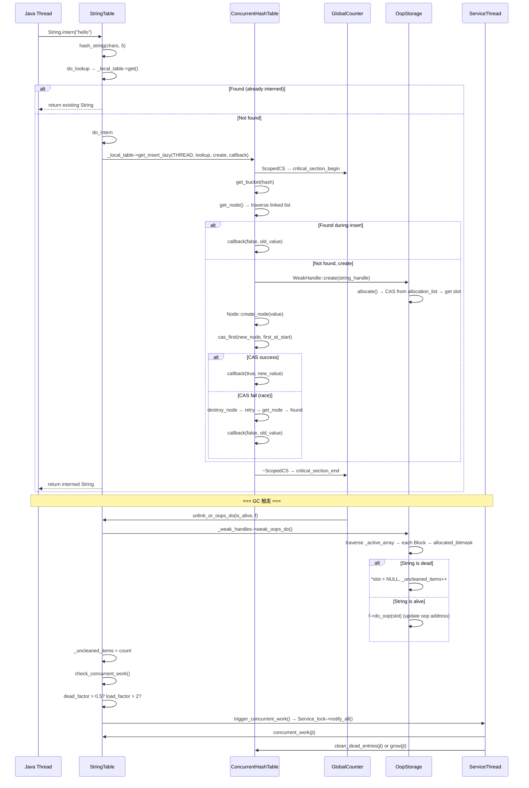

# 05-StringTable — JVM 字符串常量池深度分析

> **阶段**：[01-jvm-startup]
> **前置**：[04-SymbolTable]（哈希表基础 + Symbol 生命周期）、[03-Hashtable-Infra]（BasicHashtable entry 块分配器）
> **配套**：[04-SymbolTable]（共享对比表）
> **后续依赖本文**：[07-PerfMemory]（OopStorage vs PerfMemory 的 mmap 对比）、[15-Thread-Creation]（ServiceThread 触发 cleanup）
> **阅读收益**：追踪 StringTable 从 ConcurrentHashTable Bucket 位锁到 OopStorage 弱引用的 6 层设计——理解 Bucket 的 LOCK_BIT/REDIRECT_BIT 4 态状态机、GlobalCounter epoch 保护读者、CAS 头插法的 spin retry 循环、OopStorage Block 64 slot 管理、GC weak_oops_do → ServiceThread cleanup 的完整链路、ConcurrentHashTable 的 lock→unzip→redirect online resize；掌握 String.intern() 在高并发 JSON parser 中 100K/sec 的无锁实现

---

## §〇 生产场景 — String.intern() 高并发

```
JSON parser 每秒 100K 次 String.intern():
Thread A: intern("total_count")        Thread B: intern("total_count")
  │                                      │
  ▼                                      ▼
StringTable::intern(chars, 12, THREAD)
  │                                      │
  ▼                                      ▼
do_intern → _local_table->get_insert_lazy(THREAD, lookup, create, callback)
  │                                      │
  ▼                                      ▼
ScopedCS(thread, this)                  ScopedCS(thread, this)
  GlobalCounter::critical_section_begin    GlobalCounter::critical_section_begin
  │                                      │
  ▼                                      ▼
get_bucket(hash) → bucket[1234]         get_bucket(hash) → bucket[1234]
get_node() → traverse linked list       get_node() → traverse linked list
  → NULL (not found)                      → NULL (not found)
  │                                      │
  ▼                                      ▼
new_node(first_at_start)                new_node(first_at_start)
cas_first(NewA, first_at_start)         cas_first(NewB, first_at_start)
  → SUCCESS (first was NULL)              → FAIL (first is now NewA)
                                          → SpinPause
                                          → internal_get → 找到 NewA
                                          → destroy_node(NewB)
                                          → callback(已存在, NewA)
```

**三步诊断**：

```bash
# 1. 查看 StringTable 统计
jcmd <pid> VM.stringtable -verbose | head -20
# 输出: Number of entries: 15032, Total bytes: 2563142

# 2. 验证特定字符串是否已 intern
jcmd <pid> VM.stringtable | grep "total_count"
# 找到则表示已 intern

# 3. GDB 断点验证 CAS 竞争
gdb -ex "break ConcurrentHashTable::internal_insert" \
    -ex "run" \
    -ex "print first_at_start" \
    -ex "print cas_first_result" \
    --args java -cp app.jar com.example.Main
```

**反事实**：如果 StringTable 用全局锁（类似 SymbolTable 的 `SymbolTable_lock`）→ 100K intern/sec → 每次 lock/unlock ~50ns → 5ms/sec lock 开销 → 仅 0.5% CPU 开销，仍然可用。但真正的瓶颈是 resize——全局锁下 resize 阻塞所有查找数百微秒 → latency spike。ConcurrentHashTable 的 lock→unzip→redirect 机制使 resize 与查找并发进行。

---

## §一 ★★★ StringTable 6 层内部设计源码走读

### 面试 Story Format 答案

"StringTable 用 `ConcurrentHashTable<WeakHandle<vm_string_table_data>>` (`stringTable.hpp:42-43`)，初始 `2^16=65536` buckets (`stringTable.cpp:193`)。每个 Bucket 的 `_first` 指针低 2 bit 复用位锁：bit0=LOCK_BIT (0x1)，bit1=REDIRECT_BIT (0x2) (`concurrentHashTable.hpp:87-88`)。4 态状态机：unlocked(00)→locked(01)→unlocked(00) 正常插入，unlocked(00)→locked(01)→redirect(11) resize 搬迁终态。查找 `internal_get`：`ScopedCS(thread,this)` 进入 GlobalCounter critical section → `get_bucket(hash)` → 检查 `have_redirect()` → 有则转新表 → `get_node()` 遍历链表。插入 `internal_insert`：循环 `ScopedCS → get_bucket → get_node → NULL → new_node(first_at_start) → cas_first(new, first) → 成功返回/失败 spin retry`。OopStorage 管理弱引用：每 Block 64 slot (64-bit bitmap) (`oopStorage.hpp`)，`_active_array` 动态扩容。GC 清理链路：`weak_oops_do` 遍历所有 slot → `is_alive`? 否 → `*slot=NULL` → `_uncleaned_items++` → `check_concurrent_work()`：`dead_factor > 0.5 ∨ load_factor > 2 ∨ dead_factor > load_factor` → `trigger_concurrent_work()` → ServiceThread 异步执行 `grow()` resize 或 `clean_dead_entries()` 清理。与 SymbolTable 的 5 个核心差异：① 存储 Java oop (GC heap) vs C++ Symbol* (Metaspace)，② 并发插入 CAS vs 全局锁，③ 删除弱引用 GC 驱动 vs refcount safepoint 清理，④ resize online lock→unzip→redirect vs safepoint 建新表，⑤ 分配器 CHeapObj vs Arena bump-pointer。"

### 1.1 第一层：ConcurrentHashTable Bucket 位锁 4 态状态机

```c
// concurrentHashTable.hpp:73-161
class Bucket {
private:
  Node * volatile _first;
  static const uintptr_t STATE_LOCK_BIT     = 0x1;  // bit 0
  static const uintptr_t STATE_REDIRECT_BIT = 0x2;  // bit 1
  static const uintptr_t STATE_MASK         = 0x3;

public:
  bool is_locked() const;       // _first & 0x1
  bool have_redirect() const;   // _first & 0x2
  bool trylock();               // CAS bit0: 0→1
  void lock();                  // spin until trylock succeeds
  void unlock();                // clear bit0
  void redirect();              // set bit1 (must be locked first)
  bool cas_first(Node* node, Node* expect);  // CAS _first
};
```

**4 态状态机**：

```
         正常插入流程                  resize 搬迁流程
         ┌─────────┐                 ┌─────────┐
         │unlocked │                 │unlocked │
         │  (00)   │                 │  (00)   │
         └────┬────┘                 └────┬────┘
              │ trylock()                 │ lock()
              │ CAS 0→1                  │ spin lock
              ▼                           ▼
         ┌─────────┐                 ┌─────────┐
         │ locked  │                 │ locked  │
         │  (01)   │                 │  (01)   │
         └────┬────┘                 └────┬────┘
              │ unlock()                  │ redirect()
              │ clear bit0                │ set bit1
              ▼                           ▼
         ┌─────────┐                 ┌─────────┐
         │unlocked │                 │ redirect│ ← 终态，永不可变
         │  (00)   │                 │  (11)   │
         └─────────┘                 └─────────┘
```

**关键设计决策**：为什么把锁嵌入 `_first` 指针的低 2 bit？`Node*` 指针的最低 2 bit 始终为 0（因为 `Node` 对象 4 字节对齐——`assert((((uintptr_t)this) & 0x3) == 0)` 在 `concurrentHashTable.hpp:48-49`）。复用这 2 bit 存储锁状态节省了额外的锁变量空间，实现零额外内存开销。

**读者如何解析？** 查找时 `get_node()` 先用 `clear_state(first_raw())` 清除低 2 bit → 得到真实的 `Node*` 指针 → 遍历链表。读者只检查 `have_redirect()` 决定是否需要查新表。

**写者如何获取锁？** `trylock()` 用 CAS 将 bit0 从 0 改为 1。`lock()` 在 `trylock()` 失败时 spin + `SpinPause` (x86 PAUSE 指令)，等待持有者释放。注释明确警告：不要 busy-spin 在 `trylock()` 上，必须持有 `_resize_lock` 才能调用 `lock()`，否则可能死锁 (`concurrentHashTable.hpp:77-83`)。

### 1.2 第二层：GlobalCounter epoch — 读者保护

```c
// concurrentHashTable.hpp:246-253
class ScopedCS: public StackObj {
protected:
  Thread* _thread;
  ConcurrentHashTable* _cht;
public:
  ScopedCS(Thread* thread, ConcurrentHashTable* cht) {
    _thread = thread;
    _cht = cht;
    GlobalCounter::critical_section_begin(_thread);  // 标记读开始
  }
  ~ScopedCS() {
    GlobalCounter::critical_section_end(_thread);     // 标记读结束
  }
};
```

**为什么需要 GlobalCounter？** 当 resize 发生时，旧 `InternalTable` 被替换。如果读线程仍在遍历旧表的链表，直接 delete 旧表会导致 use-after-free。GlobalCounter 提供 epoch-based 保护：

1. **读者**：`ScopedCS` 构造/析构自动调用 `critical_section_begin/end`，标记当前 epoch 有读者。
2. **写者**：resize 完成后调用 `write_synchronize()`——等待所有在 resize 开始时已活跃的读者完成 → 安全删除旧表。

**与 RCU 的区别**：GlobalCounter 不需要 RCU 的 grace period callback 机制，也不需要 hazard pointer 的 per-thread retired list。它简单地将等待推迟到所有线程至少一次离开 critical section。底层使用 `futex` (`man 2 futex`) 或 `sched_yield` (`man 2 sched_yield`) 进行等待。

**与 SymbolTable 的区别**：SymbolTable 的 resize 在 safepoint（所有 Java 线程停止）→ 天然无需并发保护。StringTable 必须支持运行时 resize → GlobalCounter 是关键。

### 1.3 第三层：CAS 头插法 — internal_insert

```c
// concurrentHashTable.inline.hpp — internal_insert 简化逻辑
template <typename LOOKUP_FUNC, typename VALUE_FUNC, typename CALLBACK_FUNC>
bool ConcurrentHashTable::internal_insert(Thread* thread,
    LOOKUP_FUNC& lookup_f, VALUE_FUNC& value_f,
    CALLBACK_FUNC& callback, bool* grow_hint) {
  do {
    ScopedCS cs(thread, this);              // 进入 critical section
    Bucket* bucket = get_bucket(hash);      // 获取 bucket（处理 redirect）
    Node* first_at_start = bucket->first(); // 记录当前头指针

    // ★ 先查找是否已存在
    Node* old = get_node(bucket, lookup_f, &have_dead, &loop_count);
    if (old != NULL) {
      callback(false, old->value());        // 已存在，返回旧值
      return true;
    }

    // 创建新节点（指向当前链表头）
    Node* new_node = Node::create_node(value_f(), first_at_start);

    // ★ CAS 头插：仅当 first 仍为 first_at_start 时替换
    if (bucket->cas_first(new_node, first_at_start)) {
      callback(true, new_node->value());    // 插入成功
      return true;
    }

    // ★ CAS 失败 → 另一个线程修改了链表
    Node::destroy_node(new_node);           // 丢弃新节点
    SpinPause();                            // 让出 CPU
  } while (!bucket->is_locked());          // 如果 bucket 被锁则退出
}
```

**为什么 CAS 而不是 lock？** CAS 头插法允许并发插入——多个线程同时插入不同节点到同一个 bucket 时只有一个成功，其他 retry。在低竞争场景下 CAS 比 lock 快 2×（无 lock/unlock 两次原子操作）。

**为什么是头插法？** O(1) 插入无需遍历链表尾部。新节点 `_next` 指向原链表头，CAS 替换头指针。

**SpinPause 的作用**：x86 PAUSE 指令提示 CPU 当前处于 spin-wait 循环——减少流水线 flush 惩罚 + 降低功耗。在 ARM 上等价于 `YIELD`。

### 1.4 第四层：OopStorage Block — 弱引用存储

```
OopStorage Block 布局（64-bit 系统）：
┌──────────────────────────────────────────────────────┐
│                    Block (OopStorage)                 │
├──────────────────────────────────────────────────────┤
│  _data[64]: oop* slots                               │
│  ┌───┬───┬───┬───┬───┬───┬───┬───┬───┬───┬───────┐ │
│  │ s0│ s1│ s2│ s3│ s4│ s5│ s6│ s7│...│ s63│       │ │
│  └───┴───┴───┴───┴───┴───┴───┴───┴───┴───┴───────┘ │
│  _allocated_bitmask: 64-bit bitmap                   │
│  ┌────────────────────────────────────────────────┐  │
│  │ bit[0..63] — 1=已分配, 0=空闲                  │  │
│  └────────────────────────────────────────────────┘  │
│  _owner: OopStorage* (回指)                          │
│  _prev/_next: 链表节点                               │
└──────────────────────────────────────────────────────┘

_active_array 动态扩容：
  初始: 8 Block* 槽
  接近满时 → allocate_new_active_array(2× current) → RCU-style 替换
```

**为什么用 OopStorage？** String 是 Java 对象（oop），存在于 GC heap。StringTable 中的 entry 持有 String 的弱引用——如果 String 在 Java 层不再被引用，GC 应该能回收它。OopStorage 集中管理这些弱引用：
- GC 通过 `weak_oops_do` 一次性遍历所有 slot → 高效
- Block 的 64-bit bitmap 让空 slot 查找是 O(1) (ffs/bsr 指令，`man 3 ffs`)
- 独立的 allocation list 管理空闲 slot
- 底层通过 `mmap` (`man 2 mmap`) 或 `malloc` (`man 3 malloc`) 分配 Block

**WeakHandle 创建** (`stringTable.cpp:357-360`)：
```c
class StringTableCreateEntry : public StackObj {
  WeakHandle<vm_string_table_data> operator()() {
    return WeakHandle<vm_string_table_data>::create(_store);
    // → get_storage()->allocate() (OopStorage 分配 slot)
    // → NativeAccess<ON_PHANTOM_OOP_REF>::oop_store(oop_addr, obj())
  }
};
```

**WeakHandle 释放** (`stringTable.cpp:108-113`)：
```c
static void free_node(void* memory, WeakHandle<vm_string_table_data> const& value) {
  value.release();  // → OopStorage::release(slot) → 归还 slot
  BaseConfig::free_node(memory, value);
  item_removed();
}
```

### 1.5 第五层：GC → cleanup 完整链路

```
GC 触发 (如 G1 Young GC)
  │
  ▼
StringTable::unlink_or_oops_do(is_alive, f)    ← stringTable.cpp:425-445
  │
  ▼
_weak_handles->weak_oops_do(&stiac, tmp)       ← OopStorage 遍历
  │
  ├── 遍历 _active_array 所有 Block
  ├── 每 Block 检查 _allocated_bitmask
  ├── 每 slot: is_alive->do_object_b(*slot)?
  │     │
  │     ├── 是 (String 仍存活)
  │     │   → f->do_oop(slot) (更新 oop 地址，GC 可能移动对象)
  │     │
  │     └── 否 (String 已死)
  │         → *slot = NULL         ← 清空弱引用
  │         → stiac._count++        ← 计数 dead
  │         → _uncleaned_items++
  │
  ▼
_uncleaned_items = stiac._count               ← stringTable.cpp:436
  │
  ▼
check_concurrent_work()                       ← stringTable.cpp:543-560
  │
  ├── dead_factor = _uncleaned_items / _current_size
  ├── load_factor = _items / _current_size
  │
  ├── dead_factor > CLEAN_DEAD_HIGH_WATER_MARK (0.5) ?
  ├── load_factor > PREF_AVG_LIST_LEN (2) ?
  ├── dead_factor > load_factor ?
  │     │
  │     └── 是 → trigger_concurrent_work()   ← stringTable.cpp:230-234
  │              │
  │              ▼
  │           MutexLockerEx(Service_lock)
  │           _has_work = true
  │           Service_lock->notify_all()
  │              │
  │              ▼
  │           ServiceThread 唤醒 → do_concurrent_work(jt)
  │              │                            ← stringTable.cpp:574-576
  │              ▼
  │           concurrent_work(jt)             ← stringTable.cpp:562-572
  │              │
  │              ├── load_factor > 2 && !is_max_size_reached() ?
  │              │   → grow(jt)               ← 扩容（同时清除 dead entry）
  │              │
  │              └── 否则
  │                  → clean_dead_entries(jt)  ← 仅清理 dead entry
```

**为什么不在 GC 中直接删除 Node？** GC 时间敏感（STW 暂停），删除 Node 需要获取 bucket lock（可能阻塞等待其他线程释放）→ 延迟到 ServiceThread 异步处理。GC 只负责标记 dead slot → 清空弱引用指针。

**clean_dead_entries 实现** (`stringTable.cpp:521-541`)：
```c
void StringTable::clean_dead_entries(JavaThread* jt) {
  StringTableHash::BulkDeleteTask bdt(_local_table);
  if (!bdt.prepare(jt)) return;

  StringTableDeleteCheck stdc;  // 检查：val->peek() == NULL → 需要删除
  StringTableDoDelete stdd;     // 删除：no-op (Node 由 BulkDeleteTask 销毁)
  while (bdt.do_task(jt, stdc, stdd)) {
    bdt.pause(jt);
    { ThreadBlockInVM tbivm(jt); }  // 允许 safepoint
    bdt.cont(jt);
  }
  bdt.done(jt);
}
```

### 1.6 第六层：ConcurrentHashTable online resize

```
grow() 流程 (stringTable.cpp:478-497):
  │
  ├── StringTableHash::GrowTask gt(_local_table)
  ├── gt.prepare(jt) → 创建新 InternalTable(2× buckets)
  │
  └── while gt.do_task(jt):
        │
        ├── lock bucket[i]
        ├── unzip_bucket(old_table, new_table, even_idx, odd_idx):
        │     │
        │     └── 按 hash 位拆分：遍历旧 bucket 链表
        │           hash 第 N 位 = 0 → new_table[even_idx] 头插
        │           hash 第 N 位 = 1 → new_table[odd_idx]  头插
        │
        ├── bucket[i]->set_redirect()  ← 标记为 redirect 终态
        ├── bucket[i]->unlock()
        │
        ├── gt.pause(jt) → ThreadBlockInVM (允许 safepoint)
        └── gt.cont(jt)  → 继续下一批

  gt.done(jt) → 更新 _current_size
```

**查找自动适配**：`get_bucket(hash)` → `have_redirect()` → `get_new_table()` → 查新表的 bucket。读者完全无感知 resize 正在进行。

**旧表何时删除？** resize 完成后调用 `write_synchronize()` → 等待所有活跃读者离开 → `delete old_table`。Node 本身不重新分配——`unzip_bucket` 重用已有 Node 对象。

### 1.7 ★ Mermaid: intern 全链路图



### 1.8 StringTableConfig — 配置适配层

```c
// stringTable.cpp:80-114
class StringTableConfig : public StringTableHash::BaseConfig {
public:
  static uintx get_hash(WeakHandle<vm_string_table_data> const& value,
                        bool* is_dead) {
    oop val_oop = value.peek();
    if (val_oop == NULL) {
      *is_dead = true;       // 弱引用已死 → 标记为 dead
      return 0;
    }
    *is_dead = false;
    // 从 String oop 重新计算 hash（unicode 版本）
    jchar* chars = java_lang_String::as_unicode_string(val_oop, length, THREAD);
    return hash_string(chars, length, StringTable::_alt_hash);
  }

  static void* allocate_node(size_t size, const WeakHandle& value) {
    StringTable::item_added();  // _items++
    return BaseConfig::allocate_node(size, value);
  }

  static void free_node(void* memory, const WeakHandle& value) {
    value.release();           // → OopStorage::release() 归还 slot
    BaseConfig::free_node(memory, value);
    StringTable::item_removed();  // _items--
  }
};
```

**为什么需要从 oop 重新计算 hash？** StringTable 存储的是 Java oop（堆对象）→ hash 必须从 String 的内容重新计算——因为 GC 可能移动对象，hash 不能依赖对象地址。这与 SymbolTable 不同——Symbol 是 C++ 对象，地址不变。

### 1.9 check_concurrent_work — 触发条件

```c
// stringTable.cpp:543-560
void StringTable::check_concurrent_work() {
  if (_has_work) return;  // 已有 work 排队

  double load_factor = get_load_factor();   // _items / _current_size
  double dead_factor = get_dead_factor();   // _uncleaned_items / _current_size

  if ((dead_factor > load_factor) ||         // dead 比 alive 多
      (load_factor > PREF_AVG_LIST_LEN) ||   // 平均链长 > 2
      (dead_factor > CLEAN_DEAD_HIGH_WATER_MARK)) {  // dead > 50%
    trigger_concurrent_work();
  }
}
```

三个触发条件：
1. **dead > alive**：大量 dead entry 浪费空间
2. **load > 2**：平均每 bucket 2+ 个 entry → 查找效率下降
3. **dead > 50%**：一半 bucket 位置被 dead entry 占据

---

## §二 ★★★ 7 Beginner Callout 框

### Callout 1: Bucket 位锁 4 态

**为什么低 2 bit 存锁？** `Node*` 指针 4 字节对齐 → 低 2 bit 始终为 0。复用这 2 bit 存储 LOCK_BIT(0x1) + REDIRECT_BIT(0x2) 节省额外 8 字节/桶（如果用独立 Mutex 则需要 16 字节/桶）。65536 桶 × 16B = 1MB 浪费。`is_locked() = _first & 1`，`have_redirect() = _first & 2`。

### Callout 2: GlobalCounter epoch

**为什么不是 RCU？** RCU 需要 grace period callback + 额外的 `rcu_head` 嵌入结构体。GlobalCounter 更简单：读者进入/离开 critical section 时标记 → 写者 `write_synchronize()` 等待所有在线程离开 CS → 安全释放。缺点是写者可能等很久（如果读者长时间持 CS），但 StringTable 的 CS 非常短（仅链表遍历）。

### Callout 3: CAS 头插法重试

**为什么 CAS 而不是 lock？** CAS 原子指令比 lock/unlock 两次 CAS 更快。在高并发下，CAS 重试次数很少（竞争窗口只有 node 创建 + CAS 之间几条指令）。如果 CAS 连续失败 → `SpinPause` (x86 PAUSE) + 可能 `os::naked_yield()` → 让出 CPU 避免 busy-wait。

### Callout 4: OopStorage Block

**为什么 Block 是 64 slot？** 64 = `BitsPerByte × BytesPerWord = 8 × 8`。一个 64-bit word 刚好用作 bitmap → 一个 `ffs`/`bsr` 指令找空 slot。`_active_array` 是 Block* 的数组，初始 8 个槽，翻倍扩容——类似 RCU 的"读旧写新"替换。

### Callout 5: GC weak_oops_do

**为什么 StringTable 用弱引用？** 如果 StringTable 持有强引用 → intern 的 String 永远不被 GC 回收 → 内存泄漏。弱引用允许 GC 在 String 无外部引用时回收它 → 下次 lookup 同一字符串时重新创建 intern entry。这是"intern 是缓存"而非"intern 是所有权"的语义。

### Callout 6: ConcurrentHashTable resize

**为什么 resize 可以在线进行？** 因为 redirect 机制——旧 bucket 被 lock → unzip → set_redirect → unlock。读者发现 redirect 后自动转新表查询。整个过程没有全局 STW。与 SymbolTable 的 safepoint resize 形成对比——StringTable 可能非常大（数百万条目），safepoint resize 会导致明显的 STW。

### Callout 7: WeakHandle 生命周期

**为什么需要 WeakHandle？** 直接存 oop 无法区分"死"和"未设置"。WeakHandle 封装了 OopStorage slot——`peek()` 读取 oop（可能 NULL），`resolve()` 读取并 Handle 化（确保 GC 安全）。`StringTableLookupOop::equals()` 中 `val_oop == NULL → *is_dead = true`——dead entry 触发 `check_concurrent_work()` 清理。

---

## §三 ★★★ SymbolTable vs StringTable 5 维度全对比

| 维度 | SymbolTable | StringTable |
|------|------------|-------------|
| **存储对象** | C++ `Symbol*` (Metaspace, 非 GC 管理) | Java `String` oop (GC heap, GC 可移动) |
| **数据表** | `RehashableHashtable<Symbol*, mtSymbol>` (基于 `BasicHashtable`) | `ConcurrentHashTable<WeakHandle<...>>` (无锁并发哈希表) |
| **bucket 数** | 20011 (质数, `globalDefinitions.hpp:486`) | 65536 (2^16, `stringTable.cpp:193`) |
| **entry 大小** | `HashtableEntry`: 24B (4+4+8+8) | `Node`: 16B (8B `_next` + 8B `WeakHandle`) |
| **entry 分配** | block allocator: 512×24B 块, `_free_list` 回收 | `CHeapObj::new/delete`, 每次独立分配 |
| **value 分配** | Arena bump-pointer (360KB, `Amalloc_4`) 永久符号; `AllocateHeap` 普通符号 | OopStorage Block 64 slot, CAS allocation |
| **并发查找** | `load_acquire`/`release_store` 无锁遍历单向链表 | `ScopedCS` + GlobalCounter epoch 保护 |
| **并发插入** | **否** — `SymbolTable_lock` 全局互斥锁 | **是** — CAS 头插法, 无全局锁 |
| **删除方式** | `refcount=0` → `buckets_unlink()` 在 safepoint | GC `weak_oops_do` 清 slot → ServiceThread `clean_dead_entries()` |
| **GC 关系** | 无关 — Symbol 在 Metaspace, GC 不管理 | 紧密 — `weak_oops_do` 遍历所有 slot, 清理 dead oop |
| **扩容方式** | safepoint 新建表 + `move_to()` 重散列 | online `lock→unzip→redirect`，与查找并发 |
| **hash 算法** | `java_lang_String::hash_code` / SipHash (rehash 后) | 同, `_alt_hash` flag 控制 |
| **SipHash 触发** | bucket 深度 ≥ 100 (`rehash_count`) | bucket 链长 ≥ 100 (`REHASH_LEN`) 或 hash 不平衡 |
| **永久条目** | `PERM_REFCOUNT=-1` — bootstrap 符号永不删除 | 无 — 所有 intern string 可被 GC |
| **初始化时机** | `create_table()` 在 `init_globals()` → JVM 启动早期 | 同 |
| **内存统计** | `jcmd VM.symboltable` | `jcmd VM.stringtable` |
| **CDS 共享** | `CompactHashtable<Symbol*, char>` | `CompactHashtable<oop, char>` |
| **并发策略** | "插入安全因为只有类加载时有锁" | "一切并发因为 String.intern() 随时调用" |

**核心设计差异总结**：

1. **SymbolTable 是编译时优化**：类加载是一次性操作，用全局锁换取简单性。ConcurrentHashTable 的复杂性在 SymbolTable 中不需要。
2. **StringTable 是运行时优化**：`String.intern()` 可能在热路径中被频繁调用，必须无锁。
3. **SymbolTable 存 C++ 对象，StringTable 存 Java 对象**：这是为什么 StringTable 需要 OopStorage 和 GC 协作的根本原因。

---

## §四 ★ GDB 断点验证 — 8 断点 StringTable 全链路追踪

```
断言 1: create_table → 验证初始大小和 OopStorage
  (gdb) break StringTable::StringTable
  (gdb) run
  (gdb) print _local_table
  期望: NULL (尚未创建)
  (gdb) continue 执行 new StringTableHash(16, 24, 100)
  (gdb) print _local_table->get_size_log2(Thread::current())
  期望: 16 (2^16 = 65536)
  (gdb) print _weak_handles
  期望: non-null OopStorage*

断言 2: Bucket 位锁验证
  (gdb) break ConcurrentHashTable::internal_insert
  (gdb) continue
  (gdb) print bucket->_first
  期望: 低 2 bit = 00 (unlocked), 02 (redirect), 或 01 (locked)
  (gdb) print bucket->is_locked()
  期望: false (如果当前未持有锁)
  (gdb) print bucket->have_redirect()
  期望: false (如果未 resize)

断言 3: CAS 头插验证
  (gdb) break ConcurrentHashTable::internal_insert (在 cas_first 行)
  (gdb) print first_at_start
  期望: 当前链表头 Node*
  (gdb) print new_node
  期望: 新创建的 Node*, _next == first_at_start
  (gdb) next  # 执行 cas_first
  (gdb) print cas_first_result
  期望: true (成功) 或 false (失败)

断言 4: OopStorage Block 验证
  (gdb) break OopStorage::allocate
  (gdb) continue
  (gdb) print _allocation_list._head
  期望: Block* (有可用 slot)
  (gdb) continue  # 执行 allocate
  (gdb) print block->_allocated_bitmask
  期望: bitmap 中多了一个 bit 被设置

断言 5: GC weak_oops_do 验证
  (gdb) break StringTable::unlink_or_oops_do
  (gdb) continue (触发 GC 后)
  (gdb) print stiac._count
  期望: ≥ 0 (dead oop 数量)
  (gdb) print stiac._count_total
  期望: ≥ stiac._count (总检查的 oop 数)
  (gdb) continue
  (gdb) print the_table()->_uncleaned_items
  期望: == stiac._count

断言 6: check_concurrent_work 触发条件验证
  (gdb) break StringTable::check_concurrent_work
  (gdb) print get_load_factor()
  期望: 浮点数 (如 1.5)
  (gdb) print get_dead_factor()
  期望: 浮点数 (如 0.3)
  (gdb) print dead_factor > load_factor
  期望: true/false
  (gdb) print load_factor > 2
  期望: true/false
  (gdb) print dead_factor > 0.5
  期望: true/false

断言 7: GlobalCounter write_synchronize
  (gdb) break GlobalCounter::write_synchronize
  (gdb) continue (在 resize 完成后)
  (gdb) print 当前活跃线程数
  期望: 等待所有 reader 离开 critical section

断言 8: resize unzip_bucket 验证
  (gdb) break ConcurrentHashTable::unzip_bucket
  (gdb) continue
  (gdb) print even_index
  期望: 旧表索引 (hash 某位 = 0 的新位置)
  (gdb) print odd_index
  期望: 旧表索引 + 新表一半大小 (hash 某位 = 1 的新位置)
  (gdb) continue  # 完成 unzip
  (gdb) print bucket->have_redirect()
  期望: true (redirect bit 已设置)
```

---

## §五 ★ Cross-Reference

- **→ 04-SymbolTable**：SymbolTable 的 Hashtable 架构、PERM_REFCOUNT、Arena bump-pointer — 本文的 §三 对比表全面对比两者
- **→ 03-Hashtable-Infra**：BasicHashtable 的 entry 块分配器 — StringTable 不用 BasicHashtable 而用 ConcurrentHashTable
- **→ 07-PerfMemory**：OopStorage 的 Block 管理 vs PerfMemory 的 mmap 共享内存
- **→ 15-Thread-Creation**：ServiceThread 的创建和调度 — 触发 StringTable cleanup 的线程
- **→ 09-GC-G1**：GC 的 weak reference processing 触发 `StringTable::unlink_or_oops_do`

---

## §六 边缘场景

### 6.1 resize 与 insert 并发

resize 过程中，正在 unzip 的 bucket 被锁住 → 并发 insert 的 `internal_insert` 检测到 `is_locked()` → 退出循环 → 在调用者的 `get_insert_lazy` 中重试。读者不受影响——`get_node()` 先检查 `have_redirect()` → 有则查新表 → 无则继续查旧表（如果 bucket 仅 locked 未 redirect）。

### 6.2 OopStorage 扩容

`_active_array` 初始 8 个 Block* 槽。当 `_allocation_count` 接近当前容量时，`allocate_new_active_array(2× current_size)` 创建新数组 → 复制旧指针 → RCU-style 替换 `_active_array`。旧的 Block 继续存在于数组中，直到所有 Block 被释放后旧数组被 delete。

### 6.3 hash flooding 防御

与 SymbolTable 相同——bucket 链长 ≥ `REHASH_LEN=100` 时 `_needs_rehashing=true`。`try_rehash_table()` (`stringTable.cpp:602-631`) 的流程：
1. 如果 load > 2 且未达到 max size → 优先 grow 而非 rehash（扩容自然缓解长链）
2. 如果已 rehash 过仍不平衡 → 只触发 concurrent_work
3. 否则 → `_alt_hash_seed = AltHashing::compute_seed()` → `do_rehash()` → 全部 node 用 SipHash 重新插入新表

### 6.4 String deduplication

`do_intern()` 在 intern 之前调用 `Universe::heap()->deduplicate_string(string_h())` (`stringTable.cpp:390`)。G1 的 String Deduplication 会将内容相同的 String 的 `value` 数组指向同一块内存——这减少了 intern 前需要比较的内容。

---

## §七 诊断工具

| 工具 | 命令 | 用途 |
|------|------|------|
| **jcmd** | `jcmd <pid> VM.stringtable -verbose` | 查看全部 intern string + 内存统计 |
| **jcmd** | `jcmd <pid> VM.stringtable` | 查看统计信息（条目数、总字节、平均链长） |
| **jstack** | `jstack <pid>` | 查看 ServiceThread 是否在 `clean_dead_entries` 或 `grow` |
| **GDB** | `break StringTable::do_intern` | 追踪 intern 调用 |
| **GDB** | `print StringTable::the_table()->_items` | 查看当前条目数 |
| **GDB** | `print StringTable::the_table()->_uncleaned_items` | 查看待清理的 dead entry |
| **strace** | `strace -e trace=futex,mprotect java ...` | 追踪 ServiceThread futex 唤醒 (`man 2 futex`) 和 resize 的 mmap 分配 (`man 2 mmap`) |
| **/proc** | `/proc/<pid>/maps` | 查看 CHeapObj 内存区域（ConcurrentHashTable Node） |

---

## §八 与 README 和同组文档的连续性

1. **从 04-SymbolTable 承接**：SymbolTable 用全局锁（类加载不频繁）→ StringTable 用 CAS 无锁（intern 频繁调用）。本文 §三 的 5 维度对比表是两篇文档的核心桥梁。

2. **同组边界**：04 覆盖 SymbolTable 的 Hashtable + refcount + Arena。05 覆盖 StringTable 的 ConcurrentHashTable + OopStorage + GC cleanup。两篇文档共同构成 JVM 字符串处理的完整图景。

3. **后续依赖**：ServiceThread 触发 StringTable cleanup → 15-Thread-Creation。OopStorage Block 管理 → 07-PerfMemory 的 mmap 对比。
