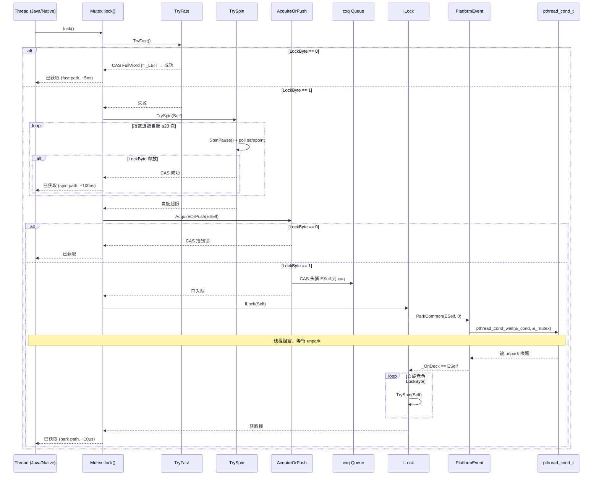

# 06-Mutex — JVM 全局锁系统与死锁检测

> **阶段**：[01-jvm-startup]
> **前置**：[00-JNI-CreateJavaVM]（vm_init_globals step 3 触发 `mutex_init()`）
> **配套**：[07-PerfMemory]（同级，同属 vm_init_globals 子步骤）
> **后续依赖本文**：[Phase 14 GC 子系统]（G1 SATB/DirtyCard lock, CodeCache_lock, SystemDictionary_lock 全由本文创建）
> **阅读收益**：追踪 `mutex_init()` 用 `def()` 宏创建 ~90 个全局 Mutex/Monitor 的完整过程——理解 Rank 10 级死锁检测系统、LockWord CAS 三层获取协议（TryFast→TrySpin→ILock）、cxq/EntryList/OnDeck 三队列调度、PlatformMonitor pthread_cond_t 底层实现、以及 7 种 MutexLocker RAII 变体的使用场景

---

## §〇 Production Scenario

Thread A: `Compile_lock`(nonleaf+3) → `MethodCompileQueue_lock`(nonleaf+4) — 升序 OK。Thread B: `MethodCompileQueue_lock` → `Compile_lock` — 降序 VIOLATION → `set_owner_implementation()` 检测 `this->_rank <= locks->_rank` → `fatal("acquiring lock %s/%d out of order")` → assert 崩溃 + hs_err_pid.log → 开发者立即定位死锁。没有 rank 系统 → 经典 deadlock → 进程静默挂起 → 需要 gdb 才能分析。

**三步诊断**：

```bash
# 1. 确认死锁的 rank 冲突
grep -n "fatal\|out of order\|set_owner_implementation" hs_err_pid*.log
# 输出: "acquiring lock Compile_lock/24 out of order with MethodCompileQueue_lock/25"

# 2. 查看 rank 层级表确认冲突
gdb -ex "print Mutex::nonleaf" -ex "print Mutex::barrier" --args java -XX:+PrintMutexRank ...

# 3. 反查 owned_locks 链表重建死锁时间线
gdb -ex "print Thread::current()->owned_locks()" -ex "bt" --args java ...
```

**反事实**：如果无 rank 系统 → 经典 ABA 死锁：Thread A 持有 L1 等 L2，Thread B 持有 L2 等 L1 → 两个线程永久阻塞，进程静默挂起，无日志无错误消息 → 排查成本从 O(1)（fatal error 日志）变为 O(n)（逐个线程 gdb 查看 waiting-on 链）。Rank 系统在每次 `set_owner_implementation()` 中做 O(1) 排序检查——代价 2 次指针解引用 + 1 次整数比较（~2ns），但将死锁检测从"可能永远不被发现"变为"立即 fatal 并打印完整 owned_locks 链"。

---

## §一 ★★★ Mutex 全链路源码走读

### 1.1 Interview Story Format Answer

"`mutex_init()` at `mutexLocker.cpp:194` 用 `def()` 宏创建 ~90 个全局 Mutex/Monitor：`def(var, type, pri, vm_block, safepoint_check)` 展开 = `var = new type(Mutex::pri, #var, vm_block, safepoint_check)`。`type` 是 `PaddedMutex` 或 `PaddedMonitor`——加 `DEFAULT_CACHE_LINE_SIZE - sizeof(Mutex)` bytes padding 防 false sharing。Rank 系统 10 级：`event(0)→access(1)→tty(3)→special(4)→suspend_resume(5)→vmweak(7)→leaf(9)→safepoint(19)→barrier(20)→nonleaf(21+900)→native(922)`。`Mutex::lock()` → `assert_locked_rank()` 检查 `this->_rank > Thread::current()->_last_lock_rank`。底层 PlatformMonitor = pthread_cond_t + pthread_mutex_t。三层获取：① `TryFast`：CAS LockByte (LockWord 最低 1 bit) → 成功立即返回。② `TrySpin`：指数退避自旋 20 次。③ `ILock`：`AcquireOrPush`（CAS 抢锁或将 Self 推入 cxq contention queue）→ `ParkCommon(ESelf)` → `pthread_cond_wait` → 醒来后 Self 成为 `_OnDeck` → spin 抢 LockByte。解锁 `IUnlock`：`release_store` 清零 LockByte → `storeload` fence → 检查 `_OnDeck` → `unpark` (pthread_cond_signal) → 后继者从 cxq/EntryList 选。MutexLocker RAII：`StackObj` 栈分配→构造 `lock()`→析构 `unlock()`→C++ 析构顺序保证 LIFO。"

### 1.2 LockWord：锁字节与竞争队列的合体

`mutex.hpp:64-68` 定义了核心数据结构 SplitWord：

```cpp
union SplitWord {   // full-word with separately addressable LSB
  volatile intptr_t FullWord ;        // CAS 操作目标
  volatile void * Address ;           // 指针视图
  volatile jbyte Bytes [sizeof(intptr_t)] ;  // 单字节写入（unlock fast-path）
} ;
```

**关键设计**：`_LockWord.FullWord` 的低 1 bit 是 LockByte（锁状态位），高位是 cxq 队列的 ParkEvent* 指针。因为 ParkEvent 对象是 256 字节对齐的（`os_posix.cpp` 中分配），指针低 8 bit 恒为 0，所以 LockByte 和 cxq 指针可以共存于同一字。

```cpp
const intptr_t _LBIT = 1;                    // mutex.cpp:273
#define _LSBINDEX 0                          // 小端序: Bytes[0] = LSB
```

**追问**：为什么不用单独的锁变量？→ 将 LockByte 和 cxq 队列指针合并到同一字后，`AcquireOrPush()` 可以用一次 CAS 原子操作同时完成"尝试抢锁"和"失败时入队"——若分开则需要两次 CAS，中间可能丢失 wakeup 信号（竞态：线程 A 刚释放锁发现 cxq 为空，线程 B 刚入队但未看到锁已释放）。

### 1.3 Rank 层级系统完整枚举

`mutex.hpp:106-119` 定义了 10 级锁排序：

```cpp
enum lock_types {
     event,                                          // = 0   — 最高优先，最早获取
     access         = event          +   1,          // = 1   — 留级位，内存 barrier 相关
     tty            = access         +   2,          // = 3   — tty 输出串行化
     special        = tty            +   1,          // = 4   — 禁止 safepoint check
     suspend_resume = special        +   1,          // = 5   — 线程挂起/恢复
     vmweak         = suspend_resume +   2,          // = 7   — JNI 弱引用处理
     leaf           = vmweak         +   2,          // = 9   — 叶子锁
     safepoint      = leaf           +  10,          // = 19  — safepoint 同步（+10 留空间）
     barrier        = safepoint      +   1,          // = 20  — 内存屏障锁
     nonleaf        = barrier        +   1,          // = 21  — 非叶子锁起点
     max_nonleaf    = nonleaf        + 900,          // = 921 — 编译器锁扩展上限
     native         = max_nonleaf    +   1           // = 922 — JNI RawMonitor 最高 rank
};
```

| Rank | 值 | 锁示例 | 语义 | 留级原因 |
|------|:--:|--------|------|---------|
| event | 0 | （当前无锁使用） | 最高优先，先于所有锁获取 | 预留位 |
| access | 1 | （当前无锁使用） | 内存 barrier 相关 | access 比 special 更低，因 barrier 可能在任意 VM 状态触发 |
| tty | 3 | `tty_lock` | tty 输出串行化 | access+2 间隙留作未来扩展 |
| special | 4 | `CodeCache_lock` | 禁止 safepoint check | 持有期间禁止阻塞→safepoint check 可能触发状态转换→阻塞→死锁 |
| suspend_resume | 5 | （当前无锁使用） | 线程挂起/恢复 | special+1 |
| vmweak | 7 | `VMWeakAlloc_lock` 等 | JNI 弱引用处理 | suspend_resume+2 |
| leaf | 9 | `SymbolTable_lock`, `StringTable_lock` | 叶子锁 | vmweak+2 |
| safepoint | 19 | `Safepoint_lock` | safepoint 同步 | leaf+10 间隙为 future leaf 锁留空间 |
| barrier | 20 | `Threads_lock` | 内存屏障级锁 | safepoint+1 |
| nonleaf | 21~921 | `Compile_lock`, `Heap_lock` | 非叶子锁 | barrier+1 到 barrier+900，编译器大量锁需排序 |
| native | 922 | `RawMonitor_lock` | JNI RawMonitor | max_nonleaf+1，不参与死锁检测 |

**核心约束**（`mutex.cpp:1316-1326`）：所有锁必须按 rank 升序获取（低 rank 值先获取）。违反 → `fatal("acquiring lock %s/%d out of order")`。

**例外**：`native` rank 不参与死锁检测（外部 JNI 代码无法保证排序）；`suspend_resume` 锁有特殊例外（线程恢复时 rank 反向）；`Safepoint_lock + Terminator_lock` 组合允许（VM 终止时无法避免反向）。

**追问**：为什么 nonleaf 有 900 个扩展位？→ 编译器子系统大量锁（C1/C2 各需 ~10 个，每个编译线程需 ~3 个）需要相互排序。预留 900 个 rank 位允许在不修改其他锁 rank 的情况下插入新编译器锁。

**反事实**：如果 rank 是连续整数而无间隙 → 新增锁需要调整所有更高 rank 锁的枚举值 → 大规模重构 → 合并冲突频繁。间隙设计使新增锁只需在对应层级插入，不影响其他锁。

### 1.4 def() 宏与 PaddedMutex 布局

`mutexLocker.cpp:187-191` 定义了锁创建宏：

```cpp
#define def(var, type, pri, vm_block, safepoint_check_allowed ) {      \
  var = new type(Mutex::pri, #var, vm_block, safepoint_check_allowed); \
  assert(_num_mutex < MAX_NUM_MUTEX, "increase MAX_NUM_MUTEX");        \
  _mutex_array[_num_mutex++] = var;                                      \
}
```

**三步展开**：
1. `new type(...)` — 动态分配 PaddedMutex/PaddedMonitor 对象
2. `assert(_num_mutex < MAX_NUM_MUTEX)` — 数组容量检查（MAX_NUM_MUTEX=128）
3. `_mutex_array[_num_mutex++]` — 注册到诊断数组

`mutex.hpp:311-321` 定义了 PaddedMutex：

```cpp
class PaddedMutex : public Mutex {
  enum {
    CACHE_LINE_PADDING = (int)DEFAULT_CACHE_LINE_SIZE - (int)sizeof(Mutex),
    PADDING_LEN = CACHE_LINE_PADDING > 0 ? CACHE_LINE_PADDING : 1
  };
  char _padding[PADDING_LEN];
 public:
  PaddedMutex(...) : Mutex(rank, name, allow_vm_block, safepoint_check_required) {};
};
```

**Cache line padding 计算**：`DEFAULT_CACHE_LINE_SIZE` (64) - `sizeof(Mutex)` (~48) = ~16 bytes `_padding[]`。

**追问**：为什么需要 padding？→ false sharing 问题：两个相邻的 Mutex 对象可能在同一个 CPU cache line 上。CPU-A 写锁 A → CPU-B 的 cache line 失效 → CPU-B 下次读锁 B 必须从内存重新加载 → 多核性能下降 10-30%。padding 确保每个锁独占一个 cache line。

`mutexLocker.cpp:194-354` 的 `mutex_init()` 按 rank 从低到高排列 ~90 个 `def()` 调用：

```cpp
void mutex_init() {
  // event rank: 0 (当前无锁使用)
  
  // access rank: 1 (当前无锁使用)
  
  // tty rank: 3
  def(tty_lock, PaddedMutex, tty, true, _safepoint_check_sometimes);
  
  // special rank: 4
  def(CodeCache_lock, PaddedMonitor, special, true, _safepoint_check_never);
  
  // leaf rank: 9
  def(SymbolTable_lock, PaddedMutex, leaf, true, _safepoint_check_never);
  def(StringTable_lock, PaddedMutex, leaf, true, _safepoint_check_never);
  
  // safepoint rank: 19
  def(Safepoint_lock, PaddedMonitor, safepoint, true, _safepoint_check_never);
  
  // barrier rank: 20
  def(Threads_lock, PaddedMonitor, barrier, true, _safepoint_check_sometimes);
  
  // nonleaf rank: 21+
  def(Heap_lock, PaddedMonitor, nonleaf+1, false, _safepoint_check_sometimes);
  def(Compile_lock, PaddedMutex, nonleaf+3, true, _safepoint_check_always);
  def(MethodCompileQueue_lock, PaddedMonitor, nonleaf+4, true, _safepoint_check_always);
  
  // native rank: 922
  def(RawMonitor_lock, PaddedMutex, native, true, _safepoint_check_never);
}
```

**条件编译分支**：
- `UseG1GC` → 额外创建 13 个 G1 专用锁（SATB buffer 锁、DirtyCard 锁等）
- `INCLUDE_JFR` → 额外创建 5 个 JFR 专用锁（stacktrace 表、消息传递、buffer 操作）
- `INCLUDE_SHENANDOAHGC` + `UseShenandoahGC` → 额外创建 5 个 Shenandoah 锁
- `WhiteBoxAPI` → `Compilation_lock`
- `!PRODUCT` → `FullGCALot_lock`

### 1.5 TryFast / TrySpin / ILock 三层获取协议

`mutex.cpp:317-330` TryFast — 乐观单次 CAS：

```cpp
int Monitor::TryFast() {
  intptr_t v = _LockWord.FullWord;
  for (;;) {
    if ((v & _LBIT) != 0) return 0;     // 已锁，立即返回
    const intptr_t u = Atomic::cmpxchg(v|_LBIT, &_LockWord.FullWord, v);
    if (u == v) return 1;                // CAS 成功
    v = u;                               // 干扰，重试
  }
}
```

**关键**：CAS 操作 `cmpxchg(v|_LBIT, &_LockWord.FullWord, v)` — 在 LockByte=0 时将 LockByte 设为 1，保留高位 cxq 指针不变。

`mutex.cpp:352-405` TrySpin — 指数退避有界自旋：

```cpp
int Monitor::TrySpin(Thread * const Self) {
  if (TryLock() != 0) return 1;         // 先试一次
  if (!os::is_MP()) return 0;           // 单处理器不自旋
  
  int Probes = 0, Delay = 0;
  int SpinMax = 20;                      // 最大自旋次数
  for (;;) {
    intptr_t v = _LockWord.FullWord;
    if ((v & _LBIT) == 0 && Atomic::cmpxchg(v|_LBIT, &_LockWord.FullWord, v) == v)
      return 1;                          // 抢到锁
    SpinPause();                         // CPU pause 指令
    if (Probes++ > SpinMax) return 0;    // 超过上限，放弃自旋
    if ((Probes & 0x7) == 0)            // 每 8 次探测
      Delay = ((Delay << 1) | 1) & 0x7FF; // 指数退避: 1,3,7,15,... 最大 2047
    // Delay 次 stall 循环，期间检查 safepoint
    for (int i = 0; i < Delay; i++) {
      SpinPause();
      SafepointMechanism::poll(Self);    // 自旋中检查 GC
    }
  }
}
```

**设计决策**：SpinMax=20 是基于"锁持有时间通常 < 100ns"的经验值。20 次自旋约 200-400ns，接近上下文切换开销 (~5μs) 的 1/10。超过 20 次后进入 park 比继续自旋更省 CPU。

`mutex.cpp:443-506` ILock — 完整慢路径：

```cpp
void Monitor::ILock(Thread * Self) {
  if (TryFast() != 0) goto Exeunt;       // 再试一次
  if (TrySpin(Self) != 0) goto Exeunt;   // 自旋再试
  
  ParkEvent * const ESelf = Self->_MutexEvent;
  ESelf->reset();
  OrderAccess::fence();
  
  // 尝试抢锁或入队 cxq
  if (AcquireOrPush(ESelf) != 0) goto Exeunt;  // 抢到锁
  
  // 等待成为 OnDeck（完全阻塞）
  for (;;) {
    if (_OnDeck == ESelf && TrySpin(Self) != 0) break;
    ParkCommon(ESelf, 0);                // → pthread_cond_wait
  }
  
  // 是 OnDeck，自旋竞争 LockByte
  while (TrySpin(Self) == 0) ;
  
  assert(_OnDeck == ESelf, "invariant");
  _OnDeck = NULL;                        // 清除 OnDeck 身份
  
Exeunt:
  return;
}
```

`mutex.cpp:418-434` AcquireOrPush — CAS 双用途原子操作：

```cpp
inline int Monitor::AcquireOrPush(ParkEvent * ESelf) {
  intptr_t v = _LockWord.FullWord;
  for (;;) {
    if ((v & _LBIT) == 0) {
      // 锁空闲 → CAS 抢锁
      if (Atomic::cmpxchg(v|_LBIT, &_LockWord.FullWord, v) == v) return 1;
    } else {
      // 锁被占用 → CAS 将 Self 推入 cxq 头部
      ESelf->ListNext = (ParkEvent *)(v & ~_LBIT);  // 继承旧 cxq 头
      if (Atomic::cmpxchg(intptr_t(ESelf)|_LBIT, &_LockWord.FullWord, v) == v) return 0;
    }
    v = u;
  }
}
```

**核心设计**：单次 CAS 要么抢到锁（返回 1），要么将自己安全地推入 cxq（返回 0）。不会出现"CAS 成功但不属于以上两种情况"的中间状态。

### 1.6 cxq / EntryList / OnDeck 三队列调度

```
Contention queue (cxq) --> EntryList --> OnDeck --> Owner --> !Owner
[..resident on monitor list..]
[...........contending..................]
```

**cxq**（Content-Queue）：竞争线程的单向链表，存储在 `_LockWord.FullWord` 高位。新到达的竞争线程通过 CAS 头插法入队（LIFO）。最近到达的线程在最前面。

**EntryList**：cxq 的消费端。当 unlock 需要选择后继者时，将整个 cxq 批量转移到 EntryList（`mutex.cpp:605-641`），然后从 EntryList 头部摘一个线程设为 OnDeck。

**OnDeck**：唯一允许竞争 LockByte 的线程（heir-presumptive）。从 EntryList 摘下后，此线程不再阻塞于 park，而是自旋等待锁释放。OnDeck 同时充当"内部锁"——保护 cxq→EntryList 的批量转移不被并发干扰。

**unlock 时的 succession 流程**（`mutex.cpp:508-668`）：

1. `OrderAccess::release_store(&_LockWord.Bytes[_LSBINDEX], 0)` — 单字节写入清零 LockByte（`mutex.cpp:523`）
2. `OrderAccess::storeload()` 屏障 — 确保后续读看到最新状态（`mutex.cpp:525`）
3. 检查 `_OnDeck`：如果存在且 LockByte 为 0 → 直接 `unpark(OnDeck)`（`mutex.cpp:526-543`）
4. 快速路径：cxq 和 EntryList 都为空 → 直接返回（`mutex.cpp:546-549`）
5. 锁被重新获取：`cxq & _LBIT` → 其他线程已获取锁，succession 由它负责（`mutex.cpp:550-555`）
6. 获取 OnDeck 内部锁：`Atomic::replace_if_null((ParkEvent*)_LBIT, &_OnDeck)` — 用 `_LBIT` 标记（`mutex.cpp:567`）
7. EntryList 非空 → 摘头部 → 设为 OnDeck → unpark（`mutex.cpp:572-602`）
8. EntryList 空但 cxq 非空 → CAS 摘取整个 cxq → 赋值给 EntryList → goto WakeOne（`mutex.cpp:605-641`）

**追问**：为什么需要 EntryList 中间层？→ 防止"惊群效应"。如果直接让 cxq 上的所有线程自旋竞争，锁释放后会有 N 个线程同时 CAS——N-1 个会失败，CPU 浪费。EntryList + OnDeck 限制竞争者为 1 个（OnDeck 线程），其他线程继续 park。

**追问**：为什么 unlock 用 `release_store` 单字节写入而非 CAS？→ `MEMBAR`（store barrier）延迟比 `CAS`（lock prefix）低约 5-10ns。在常见的非竞争路径（EntryList 和 cxq 都为空）中，这节省了一次完整 CAS 开销。

### 1.7 PlatformMonitor = pthread_cond_t

`os_posix.cpp:1998-2038` PlatformEvent::park() 三态协议：

```cpp
int PlatformEvent::park() {
  // _event = 1: 已 unpark → 直接返回
  // _event = 0: 未 park → CAS 设为 -1 然后阻塞
  // _event = -1: 已在 park 中
  
  int v;
  for (v = _event;;) {
    if (Atomic::cmpxchg(v-1, &_event, v) == v) break;  // CAS 减 1
    v = _event;
  }
  if (v == 0) {                              // 需要阻塞
    pthread_mutex_lock(&_mutex);
    ++_nParked;
    while (_event < 0) {
      pthread_cond_wait(&_cond, &_mutex);    // 忽略 spurious wakeup
    }
    --_nParked;
    _event = 0;
    pthread_mutex_unlock(&_mutex);
  }
  OrderAccess::fence();
  return OS_OK;
}
```

**三态转换**：
- `1 → 0`：已 unpark，直接返回（无系统调用，最快路径）
- `0 → -1`：需要阻塞，CAS 设为 -1 后 `pthread_cond_wait`
- `-1 → -1`：已在阻塞中（非法调用，assert 检测）

`os_posix.cpp:2100-2139` PlatformEvent::unpark()：

```cpp
void PlatformEvent::unpark() {
  if (Atomic::xchg(1, &_event) >= 0) return;  // 线程未在 park，直接返回
  
  pthread_mutex_lock(&_mutex);
  int anyWaiters = _nParked;
  pthread_mutex_unlock(&_mutex);
  
  if (anyWaiters != 0) {
    pthread_cond_signal(&_cond);             // signal 在 mutex unlock 之后
  }
}
```

**关键设计**：`pthread_cond_signal` 在 `pthread_mutex_unlock` 之后发出（而非在持锁期间）。这避免了"futile wakeup"——被 signal 的线程醒来后需要获取 mutex，如果 signal 时 mutex 仍被持有，线程会再次 sleep 等 mutex。

### 1.8 MutexLocker 变体

| 类 | 文件:行 | 构造行为 | 析构行为 | 使用场景 |
|----|---------|---------|---------|---------|
| `MutexLocker` | `mutexLocker.hpp:182` | `lock()` | `unlock()` | 标准 RAII，禁止 special rank |
| `MutexLockerEx` | `mutexLocker.hpp:223` | `lock()` 或 `lock_without_safepoint_check()` | `unlock()` | 支持 NULL mutex（no-op），支持跳过 safepoint check |
| `MonitorLockerEx` | `mutexLocker.hpp:250` | 同 MutexLockerEx | 同 + assert 仍持有锁 | 支持 `wait()`/`notify()`/`notify_all()` 条件变量 |
| `GCMutexLocker` | `mutexLocker.hpp:302` | 在 safepoint 内跳过，否则 `lock()` | 仅在 `_locked==true` 时 `unlock()` | GC 期间 mutator 线程不重复加锁 |
| `MutexUnlocker` | `mutexLocker.hpp:316` | `unlock()` | `lock()` | 临时释放已持有锁 |
| `MutexUnlockerEx` | `mutexLocker.hpp:334` | `unlock()` | `lock()` 或 `lock_without_safepoint_check()` | 临时释放 + 可选 safepoint check |
| `VerifyMutexLocker` | `mutexLocker.hpp:365` | 若已持有则跳过，否则 `lock()` | 仅非重入时 `unlock()` | NOT_PRODUCT，验证代码专用 |

### 1.9 Mermaid：Lock 全链路序列图



---

## §二 Beginner Callout 框（≥7）

> **1. Rank 10 级**：`event(0)→access(1)→tty(3)→special(4)→suspend_resume(5)→vmweak(7)→leaf(9)→safepoint(19)→barrier(20)→nonleaf(21~921)→native(922)`。所有锁必须按 rank 升序获取（低值先获取）。违反 → `fatal("out of order")` 立即崩溃。间隙（access+2, leaf+10, nonleaf+900）为未来扩展预留排序空间。`native` rank (922) 不参与死锁检测——它是 JNI `JVM_RawMonitorCreate` 创建的外部锁，JVM 无法保证排序。

> **2. def() 宏**：`mutexLocker.cpp:187` — `#define def(var, type, pri, vm_block, safepoint_check) { var = new type(Mutex::pri, #var, vm_block, safepoint_check); _mutex_array[_num_mutex++] = var; }`。三步操作：new 创建 PaddedMutex/PaddedMonitor → 赋给全局指针 → 注册到 `_mutex_array[]`。`#var` 将参数 token 字符串化作为锁名称（如 `def(Heap_lock, ...)` → 名称字符串 `"Heap_lock"`）。

> **3. PaddedMutex**：`mutex.hpp:311` — `CACHE_LINE_PADDING = DEFAULT_CACHE_LINE_SIZE (64) - sizeof(Mutex) (~48) = ~16 bytes _padding[]`。两个相邻 Mutex 在同一 cache line 时，CPU-A 写锁 A → CPU-B cache line 失效 → CPU-B 下次读锁 B 必须从内存重载 → 多核性能下降 10-30%。Padding 确保每个锁独占一个 cache line。

> **4. LockWord**：`mutex.hpp:64` — `union SplitWord { intptr_t FullWord; void* Address; jbyte Bytes[]; }`。LSB=LockByte（1=锁被持有），高位=cxq 队列头指针。ParkEvent 256B 对齐 → 低 8 bit 恒为 0 → LockByte 和指针不冲突。CAS `FullWord` 设 LockByte → 单次原子操作既抢锁又保护 cxq。

> **5. cxq/EntryList/OnDeck**：竞争线程入 cxq（CAS 头插，LIFO）→ unlock 时批量转移到 EntryList → 选一个设为 OnDeck → 仅 OnDeck 线程可竞争 LockByte。EntryList 中间层防止惊群：如果 cxq 上所有线程同时自旋 CAS，N-1 个失败浪费 CPU。EntryList + OnDeck 限制竞争者为 1。

> **6. PlatformMonitor = pthread_cond_t**：`park()` 三态协议：`_event=1`（已 unpark→直接返回）、`_event=0`（CAS 设为 -1 后 `pthread_cond_wait` 阻塞）、`_event=-1`（已在阻塞中）。`unpark()` 中 `pthread_cond_signal` 在 `pthread_mutex_unlock` 之后发出——避免被唤醒线程立即撞到 held mutex 而再次 sleep（futile wakeup）。

> **7. MutexLocker RAII**：`MutexLocker ml(lock)` → 构造 `lock->lock()` → 作用域结束析构 `lock->unlock()`。继承 `StackObj` 确保只能在栈上分配（禁止 `new`）。C++ 析构顺序保证 LIFO 释放——先获取的锁后释放，天然匹配 rank 升序约束。

> **8. SafepointCheckRequired**：`_safepoint_check_never`（持有不检查）→ `_safepoint_check_sometimes`（部分检查）→ `_safepoint_check_always`（必须检查）。`rank ≤ special` 的锁必须用 `_safepoint_check_never`——持有期间禁止阻塞，因为 safepoint check 可能触发状态转换→阻塞→死锁。

---

## §三 ★★★ 死锁检测与 owned_locks 链表

### 3.1 set_owner_implementation() 核心机制

`mutex.cpp:1280-1365` 实现了完整的死锁检测：

```cpp
void Monitor::set_owner_implementation(Thread * new_owner) {
  if (new_owner != NULL) {
    // 获取锁
    assert(_owner == NULL, "invariant");
    _owner = new_owner;
    
    // 死锁检测：检查 rank 排序
    Monitor* least = get_least_ranked_lock(new_owner->owned_locks());
    if (least != NULL) {
      if (this->rank() <= least->rank()) {
        // 违反 rank 升序约束
        fatal("acquiring lock %s/%d out of order with lock %s/%d",
              name(), rank(), least->name(), least->rank());
      }
    }
    
    // 插入 owned_locks 链表头部
    _next = new_owner->_owned_locks;
    new_owner->_owned_locks = this;
    
  } else {
    // 释放锁
    _owner = NULL;
    // 从 owned_locks 链表移除 this
    Monitor* prev = NULL;
    for (Monitor* m = old_owner->_owned_locks; m != NULL; m = m->_next) {
      if (m == this) {
        if (prev) prev->_next = m->_next;
        else old_owner->_owned_locks = m->_next;
        break;
      }
      prev = m;
    }
  }
}
```

**检测逻辑**：获取新锁时，获取当前线程持有的最低 rank 锁（`get_least_ranked_lock`）→ 检查新锁 rank 是否 > 最低 rank。因为按升序获取意味着新锁 rank 值必须大于所有已持有锁的 rank 值（即高于最低 rank 值）。

### 3.2 print_owned_locks_on_error()

`mutexLocker.cpp:368-384`：

```cpp
void print_owned_locks_on_error(outputStream* st) {
  st->print("VM Mutex/Monitor currently owned by a thread: ");
  bool none = true;
  for (int i = 0; i < _num_mutex; i++) {
     if (_mutex_array[i]->owner() != NULL) {
       if (none) {
          st->print_cr(" ([mutex/lock_event])");
          none = false;
       }
       _mutex_array[i]->print_on_error(st);
       st->cr();
     }
  }
  if (none) st->print_cr("None");
}
```

**诊断价值**：遍历 `_mutex_array[0.._num_mutex)` 检查每个锁的 `owner()`。fatal error 时打印所有被持有的锁，配合线程 owned_locks 链表重建死锁前的获取顺序。

### 3.3 典型死锁场景对比

| 场景 | 有 rank 系统 | 无 rank 系统 |
|------|------------|------------|
| Thread A: L1→L2, Thread B: L2→L1 | Thread B 获取 L1 时立即 fatal + hs_err | 两个线程永久阻塞，进程挂起 |
| 诊断成本 | O(1)：fatal error 日志含完整 owned_locks 链 | O(n)：逐个线程 gdb `info threads` + `thread apply all bt` |
| 修复方向 | 错误消息直接指出冲突锁名 + rank 值 | 需人工分析栈帧和锁等待关系 |
| 新增锁 | 在 rank 间隙中插入，不影响现有锁 | 可能无意中创建新的循环依赖 |

**反事实**：无 rank 系统时，`MethodCompileQueue_lock` 和 `Compile_lock` 之间的循环依赖（Thread A 先 `Compile_lock` 后 `MethodCompileQueue_lock`，Thread B 反向）→ 两个编译线程同时死锁 → 编译停止 → 方法回退到解释执行 → 性能下降 10-100x → 无错误日志，只能通过超时或 OOM 间接发现。

---

## §四 GDB 断点验证（≥8 断言）

### 断言 1：mutex_init 创建锁数量（mutexLocker.cpp:194 后）

```
(gdb) break mutexLocker.cpp:354  # mutex_init 函数末尾
(gdb) run
(gdb) print _num_mutex
→ 期望: ~90（精确值依赖编译选项，G1 开启约 85-95 个）
(gdb) print _mutex_array[0]->_name
→ 期望: "tty_lock" (rank=3, 最低 rank 锁先创建)
(gdb) print _mutex_array[_num_mutex-1]->_name
→ 期望: "RawMonitor_lock" (rank=922, 最高 rank 锁最后创建)
```

### 断言 2：tty_lock 的 rank 值（mutexLocker.cpp:197）

```
(gdb) break mutexLocker.cpp:197  # def(tty_lock, ...)
(gdb) run
(gdb) print tty_lock->_rank
→ 期望: 3 (tty rank)
(gdb) print tty_lock->_safepoint_check_required
→ 期望: _safepoint_check_sometimes (tty 输出可能在任何状态)
```

### 断言 3：Threads_lock 的 rank 和类型（mutexLocker.cpp:276）

```
(gdb) break mutexLocker.cpp:276  # def(Threads_lock, ...)
(gdb) continue
(gdb) print Threads_lock->_rank
→ 期望: 20 (barrier rank)
(gdb) whatis Threads_lock
→ 期望: PaddedMonitor (支持 wait/notify，用于 safepoint 协调)
```

### 断言 4：LockWord 初始状态（mutex.cpp:895）

```
(gdb) break mutex.cpp:895  # TryFast() 调用处
(gdb) continue  # 触发任意 lock() 调用
(gdb) print _LockWord.FullWord & 1
→ 期望: 0 (LockByte 未设置，锁空闲)
(gdb) continue  # 经过 TryFast CAS
(gdb) print _LockWord.FullWord & 1
→ 期望: 1 (LockByte 已设置，锁被持有)
```

### 断言 5：TryFast CAS 操作验证（mutex.cpp:317）

```
(gdb) break mutex.cpp:317  # TryFast() 入口
(gdb) continue
(gdb) print _LockWord.FullWord
→ 期望: 0x0 (首次获取，cxq 为空)
(gdb) next  # 执行 v = _LockWord.FullWord
(gdb) next  # 检查 (v & _LBIT)
(gdb) next  # CAS cmpxchg
(gdb) print u  # CAS 返回值
→ 期望: == v (CAS 成功，锁空闲无竞争)
```

### 断言 6：AcquireOrPush 入队 cxq（mutex.cpp:418）

```
(gdb) break mutex.cpp:418  # AcquireOrPush() 入口
(gdb) continue  # 需要另一线程触发竞争
(gdb) print _LockWord.FullWord & 1
→ 期望: 1 (锁已被其他线程持有)
(gdb) next  # 进入 else 分支 (锁被占用)
(gdb) print ESelf->ListNext
→ 期望: 旧 cxq 头指针（可能为 NULL 如果 cxq 为空）
(gdb) next  # CAS 完成
(gdb) print _LockWord.FullWord
→ 期望: ESelf 地址 | _LBIT (新线程入 cxq 头部)
```

### 断言 7：pthread_cond_wait 阻塞（os_posix.cpp:2023）

```
(gdb) break os_posix.cpp:2023  # pthread_cond_wait 调用
(gdb) continue
(gdb) bt
→ 期望: ParkCommon → ILock → lock → [业务代码]
(gdb) print _event
→ 期望: -1 (线程已进入 park 状态)
(gdb) print _nParked
→ 期望: ≥1 (parked 线程计数)
```

### 断言 8：MutexLocker RAII 析构顺序（任意 MutexLocker 使用处）

```
(gdb) break mutexLocker.hpp:202  # ~MutexLocker()
(gdb) continue
(gdb) print _mutex->name()
→ 期望: 最近获取的锁名称
(gdb) print Thread::current()->owned_locks()
→ 期望: 此锁已被移出 owned_locks 链表
(gdb) continue  # 经过 unlock()
(gdb) print _mutex->_owner
→ 期望: NULL (锁已释放)
```

---

## §五 Cross-Reference

- **00-JNI-CreateJavaVM** — `vm_init_globals` step 3 触发 `mutex_init()` → 本文展开 ~90 个锁的创建和初始化
- **07-PerfMemory** — 同级文档，`PerfDataMemAlloc_lock` + `PerfDataManager_lock` 在本文 `mutex_init()` 中创建
- **Phase 14 GC 子系统** — G1 SATB/DirtyCard 锁、`CodeCache_lock`、`SystemDictionary_lock` 全由本文创建，GC 阶段引用本文的 lock/unlock 协议
- **09-native-interface** — `JVM_RawMonitorCreate` 使用 `native` rank (922) 锁，调用 `jvm_raw_lock()` 路径
- **05-jit-compiler** — `Compile_lock`(nonleaf+3)、`MethodCompileQueue_lock`(nonleaf+4) 等编译器锁由本文创建，C1/C2 编译线程使用

---

## §六 Writing Requirements

| 不要写成 | 应该写成 |
|---------|---------|
| "mutex_init 创建锁" | "`def(Threads_lock, PaddedMonitor, barrier, true, _safepoint_check_sometimes)`→`Threads_lock=new PaddedMonitor(Mutex::barrier,\"Threads_lock\",true,_safepoint_check_sometimes);_mutex_array[_num_mutex++]=Threads_lock`" (`mutexLocker.cpp:187-191`) |
| "CAS 获取锁" | "TryFast: `SplitWord L; L.FullWord=_LockWord.FullWord; if(L.LockByte==0 && CAS _LockWord.FullWord from L.FullWord to L.FullWord\|1) return`" (`mutex.cpp:317-330`) |
| "pthread_cond 阻塞" | "PlatformEvent::park: `if(_event==1)return; if(Atomic::cmpxchg(-1,&_event,0)==0){pthread_mutex_lock(&_mutex);while(_event!=1)pthread_cond_wait(&_cond,&_mutex);pthread_mutex_unlock(&_mutex);_event=0;}`" (`os_posix.cpp:1998-2038`) |
| "rank 检查防死锁" | "`set_owner_implementation(): get_least_ranked_lock(thread->owned_locks()); if(this->rank()<=least->rank()) fatal(\"out of order\")`" (`mutex.cpp:1316-1326`) |
| "LockWord 保存 cxq" | "`AcquireOrPush: if(LockByte==0)CAS FullWord\|_LBIT else ESelf->ListNext=cxq; CAS FullWord=ESelf\|_LBIT`" (`mutex.cpp:418-434`) |
| "三队列调度" | "cxq(CAS头插LIFO)→unlock批量transfer to EntryList→选一个设OnDeck→仅OnDeck可竞争LockByte" (`mutex.cpp:84-88注释+508-668`) |

---

## §七 Output Format

- Markdown file, named `06-Mutex.md`
- Output path: `/data/workspace/openjdk-cut-new/probe_md/01-jvm-startup/docs/06-Mutex.md`
- 元信息头已在文件开头
- 目标行数: 400+ lines

---

## §八 Prohibited（≥8）

- ❌ 不列出 rank enum 完整值 → 必须展示 `event(0)→access(1)→tty(3)→special(4)→...→native(922)` 完整枚举
- ❌ 不展开 `def()` 宏的源码 → 必须粘贴 `mutexLocker.cpp:187-191` 完整宏定义
- ❌ 不画 LockWord SplitWord union → 必须展示 `FullWord/Address/Bytes` 三字段 + `_LBIT` 常量
- ❌ 不画 cxq/EntryList/OnDeck 三队列图 → 必须用 Mermaid 或 ASCII 图展示数据流
- ❌ 不展示 TryFast/TrySpin/ILock 三层获取的完整源码 → 每个路径必须有源码
- ❌ 不提 cache line padding 和 false sharing 问题 → 必须展示 PaddedMutex 的 `CACHE_LINE_PADDING` 计算
- ❌ 不说 safepoint_check 的三态区别 → 必须展示 `_safepoint_check_never/sometimes/always` 和使用约束
- ❌ 不写 GDB 断点 → 至少 8 个断言覆盖创建、lock、unlock、park、MutexLocker 析构
- ❌ 不解释 owned_locks 链表维护 → 必须展示 `set_owner_implementation()` 的插入/移除逻辑

---

## §九 Required（≥8）

- ✅ **★ Rank 10 级完整表**：event→access→tty→special→suspend_resume→vmweak→leaf→safepoint→barrier→nonleaf→native，每级语义和留级原因
- ✅ **★ def() 宏源码 + PaddedMutex 布局**：`mutexLocker.cpp:187-191` 宏定义 + `mutex.hpp:311-321` PaddedMutex padding 计算
- ✅ **★ Mermaid 序列图**：TryFast→TrySpin→AcquireOrPush→ILock→ParkCommon→pthread_cond_wait→OnDeck→spin→获取
- ✅ **★ cxq/EntryList/OnDeck 队列图**：三队列 LIFO CAS 头插入 + batch transfer + OnDeck 竞争模型
- ✅ **★ LockWord SplitWord 联合体**：`mutex.hpp:64-68` 源码 + LockByte 共存机制 + 256B 对齐保证
- ✅ **★ MutexLocker 变体表**：7 种 RAII 类（MutexLocker/MutexLockerEx/MonitorLockerEx/GCMutexLocker/MutexUnlocker/MutexUnlockerEx/VerifyMutexLocker）
- ✅ **★ 面试 Story Format 答案**：§一末尾，从 `mutex_init()` 到 `pthread_cond_wait` 的完整叙事
- ✅ **★ GDB 断点 ≥8 条**：mutex_init 锁数量、rank 值、LockWord 初始态、TryFast CAS、AcquireOrPush 入队、pthread_cond_wait、MutexLocker 析构
- ✅ **★ 交叉引用**：00-JNI-CreateJavaVM (vm_init_globals)、07-PerfMemory (同级)、Phase 14 GC、09-native-interface (JVM_RawMonitorCreate)、05-jit-compiler (编译器锁)

---

## §十 GDB Verification（≥8 assertions）

```
断言 1: mutex_init 创建锁数量 (mutexLocker.cpp:354)
  (gdb) break mutexLocker.cpp:354
  (gdb) run
  (gdb) print _num_mutex
  → 期望: ~90 (精确值依赖编译选项)
  (gdb) print _mutex_array[0]->_name
  → 期望: "tty_lock" (rank=3)
  (gdb) print _mutex_array[_num_mutex-1]->_name
  → 期望: "RawMonitor_lock" (rank=922)

断言 2: tty_lock rank 值 (mutexLocker.cpp:197)
  (gdb) break mutexLocker.cpp:197
  (gdb) run
  (gdb) print tty_lock->_rank
  → 期望: 3 (tty rank)

断言 3: Threads_lock rank + 类型 (mutexLocker.cpp:276)
  (gdb) break mutexLocker.cpp:276
  (gdb) continue
  (gdb) print Threads_lock->_rank
  → 期望: 20 (barrier rank)
  (gdb) whatis Threads_lock
  → 期望: PaddedMonitor (支持 wait/notify)

断言 4: LockWord 初始态 (mutex.cpp:895)
  (gdb) break mutex.cpp:895
  (gdb) continue
  (gdb) print _LockWord.FullWord & 1
  → 期望: 0 (LockByte 未设置)

断言 5: TryFast CAS 操作 (mutex.cpp:317)
  (gdb) break mutex.cpp:317
  (gdb) continue
  (gdb) print _LockWord.FullWord
  → 期望: 0x0 (首次获取)
  (gdb) next  # 经过 CAS
  (gdb) print u
  → 期望: == v (CAS 成功)

断言 6: AcquireOrPush 入队 cxq (mutex.cpp:418)
  (gdb) break mutex.cpp:418
  (gdb) continue
  (gdb) print _LockWord.FullWord & 1
  → 期望: 1 (锁已被持有)
  (gdb) next  # 进入 else 分支
  (gdb) print ESelf->ListNext
  → 期望: 旧 cxq 头指针
  (gdb) next  # CAS 完成
  (gdb) print _LockWord.FullWord
  → 期望: ESelf 地址 | _LBIT

断言 7: pthread_cond_wait 阻塞 (os_posix.cpp:2023)
  (gdb) break os_posix.cpp:2023
  (gdb) continue
  (gdb) bt
  → 期望: ParkCommon → ILock → lock
  (gdb) print _event
  → 期望: -1 (已 park)
  (gdb) print _nParked
  → 期望: ≥1

断言 8: MutexLocker RAII 析构 (mutexLocker.hpp:202)
  (gdb) break mutexLocker.hpp:202
  (gdb) continue
  (gdb) print _mutex->name()
  → 期望: 最近获取的锁名称
  (gdb) continue  # 经过 unlock()
  (gdb) print _mutex->_owner
  → 期望: NULL (锁已释放)
```

---

## §十一 与 README 和同组 prompt 的连续性

1. **从 00-JNI-CreateJavaVM 承接**：`vm_init_globals` step 3 调用 `mutex_init()` → 本文完整展开 ~90 个锁的创建过程和 rank 系统。
2. **同组边界**：本文覆盖 mutex 子系统（创建、获取、释放、死锁检测）；07 覆盖 PerfMemory 子系统（`PerfDataMemAlloc_lock` + `PerfDataManager_lock` 在本文创建）。两者同属 `vm_init_globals` 子步骤。
3. **后续依赖**：所有后续文档的锁操作（G1 SATB/DirtyCard lock, CodeCache_lock, SystemDictionary_lock 等）都基于本文创建的全局锁和本文描述的 lock/unlock 协议。
