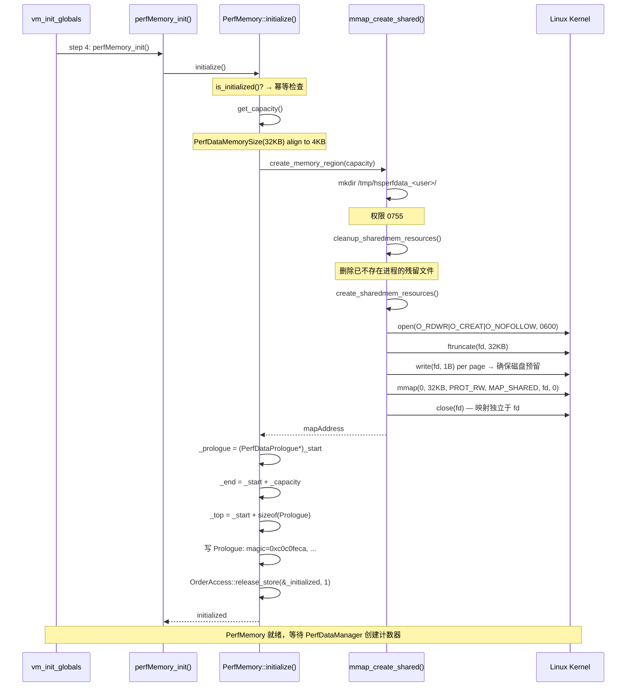
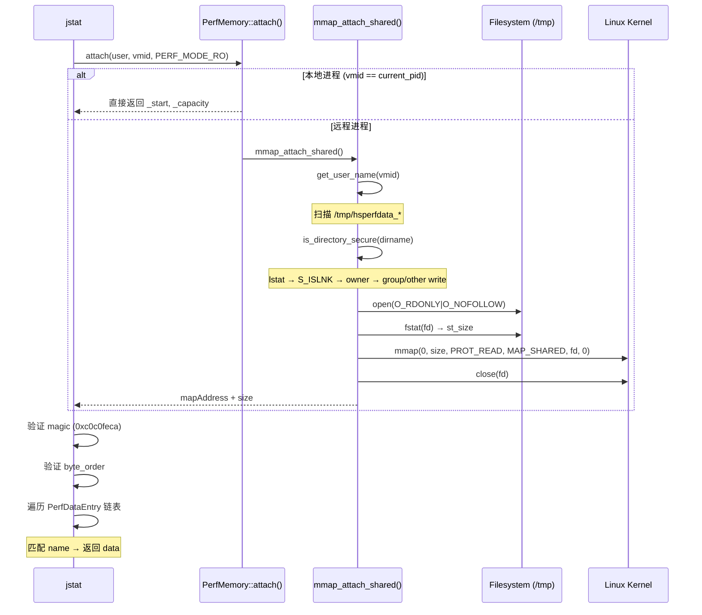

# 07-PerfMemory — JVM 性能计数器共享内存系统

> **阶段**：[01-jvm-startup]
> **前置**：[00-JNI-CreateJavaVM]（vm_init_globals step 4 触发 `perfMemory_init()`）
> **配套**：[06-Mutex]（同级，PerfDataMemAlloc_lock + PerfDataManager_lock 由 Mutex 创建）
> **后续依赖本文**：[17-management]（jcmd/jstat/jconsole 的 JMX 数据源）
> **阅读收益**：追踪 `perfMemory_init()` 用 `mmap(MAP_SHARED)` 创建 `/tmp/hsperfdata_<user>/<pid>` 共享内存文件的完整过程——理解 Prologue 字节级布局（magic 0xc0c0feca + 版本协商）、PerfDataEntry 变长分配（20B 固定头 + 名称 + 对齐填充 + 数据）、bump-pointer 分配器（O(1) 分配零碎片）、CounterNS 三命名空间体系（java.*/com.sun.*/sun.*，ns%3 稳定性分类）、PerfLongVariant 双采样模式（pointer/helper）、StatSampler 周期性采样循环、jstat attach 的 7 层安全检查（lstat → fstat → O_NOFOLLOW → is_same_fsobject → owner match → 防 hardlink → directory secure）

---

## §〇 Production Scenario

`jstat -gc <pid>` → `PerfMemory::attach(user, pid, PERF_MODE_RO)` → `open(/tmp/hsperfdata_user/pid, O_RDONLY|O_NOFOLLOW)` → `is_directory_secure(dirname)` 防 symlink 攻击 → `mmap(PROT_READ, MAP_SHARED)` → 验证 Prologue magic `0xc0c0feca` + byte_order → `entry_offset` 遍历 PerfDataEntry 链表 → 匹配 `"sun.gc.generation.0.space.0.capacity"` → 返回 value。延迟 ~1µs/counter, 0 RPC, 0 序列化。**Post-mortem**: JVM crash 后文件仍在 `/tmp`, jstat 仍能读取最终状态——这是 mmap+文件（非 socket）的核心优势。

**三步诊断**：

```bash
# 1. 确认 PerfMemory 文件存在
ls -la /tmp/hsperfdata_$(whoami)/$(pgrep -f java)
# 输出: -rw------- 1 user user 32768 ... /tmp/hsperfdata_user/12345

# 2. 验证 Prologue magic
xxd -l 4 /tmp/hsperfdata_$(whoami)/$(pgrep -f java)
# 期望: 00000000: ca fe c0 c0  (little-endian 0xc0c0feca)

# 3. jstat 读取计数器
jstat -gc $(pgrep -f java)
# 期望: S0C S1C S0U S1U EC EU ... 数值正常
```

**反事实**：如果 PerfMemory 使用 JMX RPC (TCP) 而非 mmap 文件 → JVM crash 后 TCP 连接断开 → 性能数据永久丢失 → 无法分析 crash 前的内存状态、GC 频率、线程数。mmap+文件的关键优势：文件由内核维护 page cache，进程崩溃后文件仍在磁盘，jstat 可读取 crash 瞬间的完整性能快照。

---

## §一 ★★★ PerfMemory 全链路源码走读

### 1.1 Interview Story Format Answer

"`perfMemory_init()` 调用 `PerfMemory::initialize()`：`get_capacity()` → `PerfDataMemorySize=32KB` 对齐到 `vm_allocation_granularity=4KB` → `create_memory_region(capacity)`：`mmap_create_shared(size)` → `mkdir /tmp/hsperfdata_user/`（权限 0700, 防 symlink）→ `open(filename, O_RDWR|O_CREAT|O_NOFOLLOW, 0600)` → `ftruncate(fd, size)` + 逐页写 1B 确保磁盘预留 → `mmap(0, size, PROT_READ|PROT_WRITE, MAP_SHARED, fd, 0)` → `close(fd)`（mmap 后 fd 可关）→ `memset(mapAddress, 0, size)`。写 PerfDataPrologue header：magic `0xc0c0feca`（大端则 `0xcafec0c0`），byte_order=BYTE_ORDER，major=1/minor=0，entry_offset=sizeof(Prologue)=~32B，num_entries=0 → `OrderAccess::release_store(&_initialized, 1)`。计数器通过 `PerfMemory::alloc(size)` bump-pointer 分配：`_top + size >= _end` → overflow → `_top += size` → `prologue->used++`。PerfDataEntry 变长布局：`entry_length`(4B)+`name_offset`(4B)+`vector_length`(4B)+`data_type`(1B)+`flags`(1B)+`data_units`(1B)+`data_variability`(1B)+`data_offset`(4B)→fixed header 20B + 变长 `data_name[]+data_pad[]+data_item[]`。PerfDataManager 维护 3 列表：`_all`（全部）、`_sampled`（V_Variable/V_Monotonic）、`_constants`（V_Constant）。CounterNS 3 层：`java.*`（stable supported, ns%3==1）、`com.sun.*`（unstable supported, ns%3==2）、`sun.*`（unstable unsupported, ns%3==0）。jstat attach：`mmap_attach_shared()` → `open(O_RDONLY|O_NOFOLLOW)` → `is_directory_secure` 安全检查 → `mmap(PROT_READ, MAP_SHARED)` → 解析 entry 链表。并发模型：写端 `PerfDataMemAlloc_lock` 互斥 → 读端 MAP_SHARED 页一致性 + x86 TSO → 无锁零拷贝。"

### 1.2 PerfDataPrologue 字节级布局

`perfMemory.hpp:61-72` 定义了共享内存头部：

```cpp
typedef struct {
  jint   magic;              // 4B — 0xc0c0feca (小端) / 0xcafec0c0 (大端)
  jbyte  byte_order;         // 1B — PERFDATA_BIG_ENDIAN(0) / PERFDATA_LITTLE_ENDIAN(1)
  jbyte  major_version;      // 1B — PERFDATA_MAJOR_VERSION = 2
  jbyte  minor_version;      // 1B — PERFDATA_MINOR_VERSION = 0
  jbyte  accessible;         // 1B — 0=未就绪, 1=可被外部安全读取
  jint   used;               // 4B — 已使用字节数
  jint   overflow;           // 4B — 溢出字节数（分配失败累计）
  jlong  mod_time_stamp;     // 8B — 最后结构修改时间戳
  jint   entry_offset;       // 4B — 第一个 PerfDataEntry 的偏移量
  jint   num_entries;        // 4B — 已分配的 entry 总数
} PerfDataPrologue;
```

**字节布局表**（小端，总 32B）：

| Offset | Size | Field | 初始值 | 说明 |
|--------|:----:|-------|--------|------|
| 0 | 4 | magic | `0xc0c0feca` | 魔数验证文件完整性 |
| 4 | 1 | byte_order | `PERFDATA_LITTLE_ENDIAN(1)` | 端序标记，jstat 用此字段做字节交换 |
| 5 | 1 | major_version | `2` | Entry 结构变化时递增 |
| 6 | 1 | minor_version | `0` | 数据值变化时递增 |
| 7 | 1 | accessible | `0→1` | `record_vm_startup_time()` 后设为 1 |
| 8 | 4 | used | `0` | `_top - _start` |
| 12 | 4 | overflow | `0` | 分配失败时 `+= size` |
| 16 | 8 | mod_time_stamp | `0` | `os::elapsed_counter()` 弱一致性时间戳 |
| 24 | 4 | entry_offset | `sizeof(Prologue)=32` | 第一个 entry 的偏移 |
| 28 | 4 | num_entries | `0` | 每次 alloc 成功 +1 |

**追问**：`accessible` 字段的作用？→ `perfMemory.cpp` 中 `set_accessible(true)` 在 `record_vm_startup_time()` 之后调用——作为"数据就绪"信号。在 `accessible=0` 期间，jstat 可能 attach 但应该等到 `accessible=1` 再读取数据。这是 release/acquire 配对之外的额外就绪标志。

**反事实**：如果没有 magic → 错误打开非 PerfMemory 文件 → 解析垃圾数据 → 读取到任意值 → jstat 输出错误 GC 统计 → 开发者基于错误数据决策。magic 是防御性编程的廉价检查（4B + 1 次比较）。

### 1.3 mmap 创建：open → ftruncate → mmap → close(fd)

`perfMemory_linux.cpp:993-1068` 的 `mmap_create_shared()` 是核心创建函数：

```cpp
static char* mmap_create_shared(size_t size) {
  int vmid = os::current_process_id();
  char* user_name = get_user_name(geteuid());
  
  // 构造路径: /tmp/hsperfdata_<user>
  char dirname[MAXPATHLEN];
  get_user_tmp_dir(user_name, vmid, -1, dirname, MAXPATHLEN);
  
  // 构造文件名: /tmp/hsperfdata_<user>/<pid>
  char filename[MAXPATHLEN];
  get_sharedmem_filename(dirname, vmid, -1, filename, MAXPATHLEN);
  
  // 提取短文件名（用于安全 cwd 切换后的 open）
  char* short_filename = strrchr(filename, '/') + 1;
  
  // 清理残留文件（已不存在进程的文件）
  cleanup_sharedmem_resources(dirname);
  
  // 创建文件 + ftruncate + 逐页写 1B 确保磁盘预留
  int fd = create_sharedmem_resources(dirname, short_filename, size);
  
  // mmap 映射
  char* mapAddress = (char*)::mmap(0, size, PROT_READ|PROT_WRITE, MAP_SHARED, fd, 0);
  
  // 立即关闭 fd — 映射独立于文件描述符
  ::close(fd);
  
  // 保存文件名用于 cleanup
  backing_store_file_name = filename;
  
  // 清零
  ::memset(mapAddress, 0, size);
  
  return mapAddress;
}
```

**syscall 调用链**：
- `geteuid()` → `man 2 geteuid` — 获取有效 UID 用于构造用户名目录
- `mkdir()` → `man 2 mkdir` — 创建 `/tmp/hsperfdata_<user>/`，权限 0755
- `open(O_RDWR|O_CREAT|O_NOFOLLOW, S_IRUSR|S_IWUSR)` → `man 2 open` — 创建文件，权限 0600，`O_NOFOLLOW` 防 symlink
- `ftruncate(fd, size)` → `man 2 ftruncate` — 设置文件大小
- `write(fd, buf, 1)` per page → `man 2 write` — 逐页写 1B 确保磁盘空间预留
- `mmap(0, size, PROT_READ|PROT_WRITE, MAP_SHARED, fd, 0)` → `man 2 mmap` — 映射文件到进程地址空间
- `close(fd)` → `man 2 close` — 关闭文件描述符，映射保持有效
- `memset(mapAddress, 0, size)` — 清零整个区域

**追问**：为什么 mmap 后可以立即 `close(fd)`？→ `MAP_SHARED` 映射基于内核 inode，不是基于文件描述符。内核通过 `(inode, offset)` 维护页映射关系。close 只减少 fd 引用计数，不影响已建立的 mmap 映射。只有在 `munmap` 或进程退出时，内核才断开页表映射并回写 dirty page。

**追问**：为什么逐页写 1 字节确保磁盘预留？→ `ftruncate` 创建的是 sparse file（空洞文件），不实际占用磁盘块。如果不写数据，后续 mmap 写入时触发 page fault → 内核需要分配磁盘块 → 如果磁盘满则 `SIGBUS`。逐页写 1B 确保每个 page 都有 backing store，检测 `ENOSPC` 并提前报错。

### 1.4 PerfDataEntry 变长布局与 bump-pointer 分配

`perfMemory.hpp:79-100` 定义了 PerfDataEntry 固定头：

```cpp
typedef struct {
  jint  entry_length;       // 4B — 本条目的总字节数（含 header+name+pad+data）
  jint  name_offset;        // 4B — 数据项名称字符串的偏移量
  jint  vector_length;      // 4B — 向量长度，0 表示标量（实际 dlen=1）
  jbyte data_type;          // 1B — 类型字符码：'J'/'I'/'B'/'Z'/'S'/'C'/'D'/'F'/'V'/'L'/'['
  jbyte flags;              // 1B — 标志位（F_Supported=0x1）
  jbyte data_units;         // 1B — 单位：U_None=1, U_Bytes=2, U_Ticks=3, ...
  jbyte data_variability;   // 1B — 变异性：V_Constant=1, V_Monotonic=2, V_Variable=3
  jint  data_offset;        // 4B — 数据部分的偏移量
} PerfDataEntry;
```

**固定头大小**：4+4+4+1+1+1+1+4 = **20 字节**

**变长部分布局**（`perfData.cpp:125-188` 的 `create_entry()` 计算）：

```
[PerfDataEntry header]  — 20B fixed
[data_name]             — name_len 字节（含 '\0'）
[data_pad]              — pad_length 字节（对齐到 dsize 边界）
[data_item × dlen]      — dsize × dlen 字节（实际数据数组）
```

**entry_length 计算**：
1. `size = sizeof(PerfDataEntry)` (20B)
2. `size += name_len`（名称长度 + '\0'）
3. `pad_length = (size % dsize == 0) ? 0 : dsize - (size % dsize)`
4. `size += pad_length`
5. `data_start = size`（记录数据起始偏移）
6. `size += dsize * dlen`
7. `size = (size + 7) & ~7` — 对齐到 8 字节边界

**示例**：创建一个 `jlong` 计数器 `"sun.gc.collector.0.time"`（31 字节含 '\0'）：

| 部分 | 大小 | 偏移 |
|------|:----:|------|
| PerfDataEntry header | 20B | 0 |
| data_name "sun.gc...time\0" | 31B | 20 |
| data_pad (align to 8) | 5B | 51 |
| data_item (jlong) | 8B | 56 |
| **entry_length = 64** (8 对齐) | 64B | |

**追问**：为什么 PerfDataEntry 是变长布局而非固定大小？→ PerfStringVariable 的 max_length 可达 1024 字节（受 `PerfMaxStringConstLength` 限制）。如果所有 entry 都是固定大小，每个短名称计数器也必须预留 1024+ 字节 → 32KB 内存仅能容纳 ~30 个计数器。变长布局使短名称计数器只占 ~32-64B，32KB 可容纳数百个计数器。

**反事实**：如果 PerfDataEntry 用固定大小 → 需要预留最大字符串长度 → 32KB PerfDataMemorySize 只能容纳 ~20 个计数器 → `java.property.java.class.path`（可达数 KB）会独占一个 entry → 无法容纳 100+ GC/CI/RT 计数器。

**bump-pointer 分配器**（`perfMemory.cpp:225-251`）：

```cpp
char* PerfMemory::alloc(size_t size) {
  if (!UsePerfData) return NULL;
  MutexLocker ml(PerfDataMemAlloc_lock);
  assert(is_usable(), "must be usable");
  
  if ((_top + size) >= _end) {
    _prologue->overflow += size;   // 记录溢出量
    return NULL;                   // 不扩容
  }
  
  char* result = _top;
  _top += size;                    // bump-pointer
  assert(contains(result), "allocation must be within bounds");
  _prologue->used = used();
  _prologue->num_entries++;
  return result;
}
```

**特性**：
- O(1) 分配 — 纯指针移动
- 零碎片 — 线性分配无空洞
- 不可释放 — 分配即永久（匹配 PerfData 生命周期）
- 溢出处理 — 记录 overflow 计数但不扩容（`PerfDataMemorySize` 是固定大小的 JVM flag）

### 1.5 CounterNS 三命名空间与稳定性分类

`perfData.hpp:39-68` 定义了 CounterNS 枚举，每 3 个一组（JAVA/COM/SUN）：

```cpp
enum CounterNS {
  JAVA_NS,          // 0 — java.*          → stable, supported
  COM_NS,           // 1 — com.sun.*       → unstable, supported
  SUN_NS,           // 2 — sun.*           → unstable, unsupported
  JAVA_GC,          // 3 — java.gc.*       (GC 子系统)
  COM_GC,           // 4 — com.sun.gc.*
  SUN_GC,           // 5 — sun.gc.*
  JAVA_CI,          // 6 — java.ci.*       (编译器子系统)
  COM_CI,           // 7 — com.sun.ci.*
  SUN_CI,           // 8 — sun.ci.*
  JAVA_CLS,         // 9 — java.cls.*      (类加载子系统)
  COM_CLS,          // 10 — com.sun.cls.*
  SUN_CLS,          // 11 — sun.cls.*
  JAVA_RT,          // 12 — java.rt.*      (运行时子系统)
  COM_RT,           // 13 — com.sun.rt.*
  SUN_RT,           // 14 — sun.rt.*
  JAVA_OS,          // 15 — java.os.*      (OS 子系统)
  COM_OS,           // 16 — com.sun.os.*
  SUN_OS,           // 17 — sun.os.*
  JAVA_THREADS,     // 18 — java.threads.* (线程子系统)
  COM_THREADS,      // 19 — com.sun.threads.*
  SUN_THREADS,      // 20 — sun.threads.*
  JAVA_PROPERTY,    // 21 — java.property.*
  COM_PROPERTY,     // 22 — com.sun.property.*
  SUN_PROPERTY,     // 23 — sun.property.*
  NULL_NS,          // 24 — "" (无前缀)
  COUNTERNS_LAST = NULL_NS
};
```

`perfData.cpp:52-80` 的 `_name_spaces[]` 数组：

```cpp
const char* PerfDataManager::_name_spaces[] = {
  "java", "com.sun", "sun",           // NS=0,1,2
  "java.gc", "com.sun.gc", "sun.gc",  // NS=3,4,5
  "java.ci", "com.sun.ci", "sun.ci",  // NS=6,7,8
  // ... 继续到 NS=24 ""
};
```

**稳定性判定公式**（`perfData.hpp:710-718`）：
- `ns != NULL_NS && (ns % 3) == JAVA_NS` (0) → **stable supported**（工具链可依赖）
- `ns != NULL_NS && (ns % 3) == COM_NS` (1) → **unstable supported**（可能变化但文档化）
- `ns == NULL_NS || (ns % 3) == SUN_NS` (2) → **unstable unsupported**（可随时变化/移除）

**命名空间字符串映射**：
- `ns_to_string(JAVA_GC)` → `"java.gc"`（stable，jstat 解析此前缀）
- `ns_to_string(COM_GC)` → `"com.sun.gc"`（unstable，工具可选择性使用）
- `ns_to_string(SUN_GC)` → `"sun.gc"`（unsupported，工具不应依赖）

**追问**：为什么 `java.*` 是 stable？→ JCP（Java Community Process）规范要求 jstat 等标准工具的计数器名称保持稳定——工具链（VisualVM, JConsole, 第三方监控）依赖这些名称不变。`com.sun.*` 是 HotSpot 特有的扩展，可能在 JDK 版本间变化。`sun.*` 是内部实现细节，无兼容性保证。

### 1.6 PerfDataManager 三列表 + StatSampler 采样

`perfData.cpp:296-324` 的 `add_item()` 分类逻辑：

```cpp
void PerfDataManager::add_item(PerfData* p, bool sampled) {
  MutexLocker ml(PerfDataManager_lock);
  
  if (_all == NULL) {
    _all = new PerfDataList(100);
    _has_PerfData = true;
  }
  
  assert(!_all->contains(p->name()), "duplicate name");
  _all->append(p);
  
  if (p->variability() == PerfData::V_Constant) {
    if (_constants == NULL) _constants = new PerfDataList(25);
    _constants->append(p);
    return;  // V_Constant 不加入 _sampled
  }
  
  if (sampled) {
    if (_sampled == NULL) _sampled = new PerfDataList(25);
    _sampled->append(p);
  }
}
```

**三列表**：
- `_all` (容量 100) — 所有 PerfData 项，包含所有 variability 类型
- `_sampled` (容量 25) — 需要 StatSampler 周期性采样的项（V_Variable + V_Monotonic）
- `_constants` (容量 25) — V_Constant 项（创建时写入一次，永不变化）

`statSampler.cpp:135-143` 的采样循环：

```cpp
void StatSampler::sample_data(PerfDataList* list) {
  for (int index = 0; index < list->length(); index++) {
    PerfData* item = list->at(index);
    item->sample();  // 多态调用
  }
}
```

**StatSampler 调度**：`WatcherThread::real_time_tick()` → `PeriodicTask::execute_if_pending()` → `StatSamplerTask::task()` → `StatSampler::collect_sample()` → `sample_data(_sampled)`。采样间隔 = `PerfDataSamplingInterval`（默认 50ms）。

**PerfLongVariant 双采样模式**（`perfData.cpp:200-220`）：

| 模式 | 构造函数参数 | `sample()` 行为 | 使用场景 |
|------|------------|---------------|---------|
| **Pointer** | `jlong* sampled` | 空操作（值由外部直接写 `*_valuep`） | 高频计数器（如 `live_threads`），外部代码每次修改时写 shmem |
| **Helper** | `PerfLongSampleHelper* helper` | 调用 `_sample_helper->take_sample()` | 复杂采样（如 `ThreadService::ThreadCountHelper::take_sample()` 遍历线程表） |

**追问**：为什么需要两种模式？→ Pointer 模式：高频计数器每次修改时直接写 `*_valuep`，StatSampler 周期采样是冗余操作（值已最新）。Helper 模式：采样需要复杂计算（如遍历所有线程），不能每次修改时计算 → StatSampler 周期调用 `take_sample()` 做批量采样。两种模式互补，StatSampler 对 pointer 模式计数器不做无用功。

**反事实**：如果所有计数器都只在修改时写 shmem → 高频计数器（如 `live_threads` 每次线程创建/销毁）产生大量 shmem write → 内存带宽瓶颈 + cache line bouncing。Pointer+Helper 双模式让 StatSampler 以可控频率（50ms）采样，而非每次事件触发。

### 1.7 jstat attach 7 层安全检查

`perfMemory_linux.cpp:1132-1249` 的 `mmap_attach_shared()` 实现了多层安全：

**第 1 层：权限映射** (`:1147-1163`)
```cpp
if (mode == PERF_MODE_RO) {
  mmap_prot = PROT_READ;
  file_flags = O_RDONLY | O_NOFOLLOW;
} else {
  // PERF_MODE_RW 当前 #ifdef LATER 禁用
  THROW_MSG(IllegalArgumentException, "RW mode not supported");
}
```

**第 2 层：用户解析** (`:1165-1178`)
```cpp
int nspid = get_namespace_pid(vmid);  // 处理容器 PID namespace
char* luser = NULL;
if (user == NULL) {
  luser = get_user_name(vmid, &nspid, CHECK);  // 扫描 /tmp/hsperfdata_*
}
```

**第 3 层：目录安全检查** (`:1185-1192`)
```cpp
is_directory_secure(dirname)  // → lstat + S_ISLNK 检查
```

**第 4 层：文件路径构造** (`:1194`)
```cpp
get_sharedmem_filename(dirname, vmid, nspid, rfilename, ...);
// → /tmp/hsperfdata_<user>/<vmid>
```

**第 5 层：文件打开** (`:1209`)
```cpp
open_sharedmem_file(rfilename, file_flags, THREAD);
// → open(O_RDONLY|O_NOFOLLOW) + is_file_secure(fd)
```

**第 6 层：文件大小验证** (`:1220-1224`)
```cpp
if (*sizep == 0) {
  *sizep = sharedmem_filesize(fd, CHECK);  // → fstat → st_size
}
```

**第 7 层：mmap 映射** (`:1228-1230`)
```cpp
::mmap(0, size, mmap_prot, MAP_SHARED, fd, 0);
::close(fd);
```

**安全机制汇总**：

| 防御层 | 函数 | 机制 | 防御的攻击 |
|--------|------|------|-----------|
| 1 | `is_statbuf_secure` | `S_ISLNK` 拒绝符号链接 | symlink 替换目录 |
| 2 | `is_statbuf_secure` | 拒绝 group/other 可写目录 | 权限提升 |
| 3 | `is_statbuf_secure` | 非 root 要求 owner 匹配 euid | 跨用户读取 |
| 4 | `open_directory_secure` | `open(O_NOFOLLOW)` | 内核级拒绝 symlink |
| 5 | `open_directory_secure` | `is_same_fsobject(fd, dirfd)` | TOCTOU 攻击 |
| 6 | `create_sharedmem_resources` | `open(O_NOFOLLOW)` + 权限 0600 | 文件替换 |
| 7 | `is_file_secure` | 拒绝 `st_nlink > 1` | 硬链接攻击 |

**权限总结**：

| 对象 | 权限 | 位置 |
|------|------|------|
| 目录 `/tmp/hsperfdata_<user>/` | **0755** | `make_user_tmp_dir` (`perfMemory_linux.cpp:819`) |
| 文件 `/tmp/hsperfdata_<user>/<pid>` | **0600** | `create_sharedmem_resources` (`perfMemory_linux.cpp:875`) |
| mmap (创建方 JVM) | `PROT_READ|PROT_WRITE, MAP_SHARED` | `mmap_create_shared` (`:1043`) |
| mmap (attach 方 jstat) | `PROT_READ, MAP_SHARED` | `mmap_attach_shared` (`:1228`) |

### 1.8 并发模型与 Post-Mortem

**写端（JVM）**：
- `PerfMemory::alloc()` — 由 `PerfDataMemAlloc_lock`（leaf rank, `_safepoint_check_always`）保护
- 计数器写入 — `*counter->_valuep = value`（plain write，无锁）
- Prologue 更新 — `_prologue->used = used()`（plain write，无锁）

**读端（jstat）**：
- `PROT_READ mmap` — 无锁，直接读共享内存页
- 可见性依赖：MAP_SHARED 页级一致性（read sees latest committed page）+ x86 TSO（plain write not reordered after prior writes）
- `_initialized` release/acquire — 保证 jstat 看到完整 Prologue

**Post-Mortem**：
- JVM crash 后文件在磁盘 → jstat 仍可 `open + mmap` → 读取 crash 瞬间的最终状态
- 无需 msync → MAP_SHARED on Linux 自动 dirty page writeback（内核 pdflush），jstat 读同一 page cache
- 文件在 JVM 正常退出时由 `delete_shared_memory()` 删除（`perfMemory_linux.cpp:1086-1102`）

**追问**：为什么不需要 msync？→ Linux 内核的 `MAP_SHARED` 映射自动将 dirty page 写回 backing file（通过 pdflush 后台线程 + 定期回写）。jstat 的 `mmap` 映射同一 inode → 看到同一 page cache → 无需主动 flush。只有在需要保证 crash 一致性时才需要 `msync`，而 jstat 的只读 attach 不需要。

**反事实**：如果使用 JMX RPC (TCP) → JVM crash 后 TCP 连接断开 → 性能数据永久丢失 → 无法分析 crash 前状态。而 PerfMemory 的 mmap+文件机制：crash 后文件仍在 `/tmp`，jstat 可读取 crash 瞬间的完整性能快照——这是事故分析的关键能力。

---

## §二 Beginner Callout 框（≥7）

> **1. magic 0xc0c0feca**：Prologue 第一个 4B → 验证文件完整性。大端的 byte-swapped 版本 `0xcafec0c0`。`PerfMemory::is_initialized()` 用 `load_acquire` 读 `_initialized`。没有 magic → 错误打开非 PerfMemory 文件 → 解析垃圾数据 → jstat 输出错误统计。

> **2. bump-pointer alloc**：`PerfMemory::alloc()` 用 `PerfDataMemAlloc_lock` 保护 → 检查 `_top + size >= _end` → bump → 更新 prologue。O(1) 分配，零碎片。无 free 操作——分配即永久（匹配 PerfData 生命周期）。溢出时记录 overflow 计数但不扩容——`PerfDataMemorySize` 是固定 JVM flag。

> **3. CounterNS 公式**：`JAVA_NS=0, COM_NS=1, SUN_NS=2` → 子系统 base=N → `JAVA=N, COM=N+1, SUN=N+2` → `is_stable_supported(ns) = (ns%3 == JAVA_NS)`。`java.*`（stable，工具链依赖）→ `com.sun.*`（unstable，HotSpot 扩展）→ `sun.*`（unsupported，内部实现）。

> **4. PerfCounter vs PerfLongVariable**：`PerfLongCounter` (V_Monotonic) 只增不减 → jlong in shmem。`PerfLongVariable` (V_Variable) 任意变 → 支持 pointer 或 helper 采样模式。`PerfStringVariable` → char[] in shmem with null terminator，max_length 受 `PerfMaxStringConstLength` 限制。

> **5. StatSampler 采样**：`_sampled` 列表中 V_Variable/V_Monotonic 的计数器 → `StatSampler::sample()` → 读取 `_valuep` (pointer 模式) 或 `_sample_helper->take_sample()` (helper 模式) → 写入 shmem。采样间隔 = `PerfDataSamplingInterval`（默认 50ms）。

> **6. jstat 7 层安全**：`is_directory_secure(dir)` 检查 lstat + owner match + no group/other write + no sticky bit → `open(O_NOFOLLOW)` 内核级拒绝 symlink → `is_file_secure(fd)` 拒绝硬链接 (`st_nlink > 1`) → `is_same_fsobject` 防 TOCTOU。防 symlink 替换 `/tmp/hsperfdata_<user>/` 的攻击链。

> **7. release/acquire 同步**：`_initialized` 用 `release_store` (init side) / `load_acquire` (attach side) → 保证 jstat 看到完整 Prologue（magic + byte_order + entry_offset）。`mod_time_stamp` 用 `os::elapsed_counter()` 无 barrier → 弱一致性但安全（外部工具用它判断数据新旧，不需要强一致性）。

---

## §三 ★★★ PerfData 类层次与采样系统

### 3.1 完整类层次

`perfData.hpp:244-575` 定义了 PerfData 类家族：

```
PerfData (Abstract)                              — CHeapObj<mtInternal>
├── PerfLong (Abstract)                          — jlong 数据
│   ├── PerfLongConstant                         — V_Constant, sample()=空操作
│   │   └── alias: PerfConstant
│   ├── PerfLongVariant (Abstract)               — 可变 jlong, 支持采样
│   │   ├── PerfLongVariable                     — V_Variable, 有 set_value()
│   │   │   └── alias: PerfVariable
│   │   └── PerfLongCounter                      — V_Monotonic, 单调增减
│   │       └── alias: PerfCounter
│   └── (_sampled 指针 + _sample_helper)
└── PerfByteArray (Abstract)                     — 字节数组
    └── PerfString (Abstract)                    — U_String, null-terminated
        ├── PerfStringConstant                   — V_Constant, 受 PerfMaxStringConstLength 限制
        └── PerfStringVariable                   — V_Variable, 可 set_value()
```

### 3.2 data_type 编码表

`globalDefinitions.cpp:181` 的 `type2char_tab[]`：

| 字符 | BasicType | Java 类型 | 说明 |
|------|-----------|----------|------|
| `'J'` | T_LONG | long | 64-bit signed |
| `'I'` | T_INT | int | 32-bit signed |
| `'B'` | T_BYTE | byte | 8-bit signed |
| `'Z'` | T_BOOLEAN | boolean | true/false |
| `'S'` | T_SHORT | short | 16-bit signed |
| `'C'` | T_CHAR | char | 16-bit unsigned |
| `'D'` | T_DOUBLE | double | 64-bit IEEE 754 |
| `'F'` | T_FLOAT | float | 32-bit IEEE 754 |
| `'V'` | T_VOID | void | 无值 |
| `'L'` | T_OBJECT | Object | 对象引用 |
| `'['` | T_ARRAY | array | 数组 |

### 3.3 PerfMemory 初始化完整流程



### 3.4 jstat attach 数据流



---

## §四 GDB 断点验证（≥7 断言）

### 断言 1：mmap 映射后 Prologue magic（perfMemory.cpp:175 后）

```
(gdb) break perfMemory.cpp:177  # release_store(&_initialized, 1) 前
(gdb) run
(gdb) print PerfMemory::_start
→ 期望: 非 NULL 地址（mmap 映射地址）
(gdb) print *(int*)PerfMemory::_start
→ 期望: 0xc0c0feca (magic)
(gdb) print ((PerfDataPrologue*)PerfMemory::_start)->entry_offset
→ 期望: 32 (sizeof(PerfDataPrologue))
```

### 断言 2：Prologue 完整字段（perfMemory.cpp:175）

```
(gdb) break perfMemory.cpp:175
(gdb) continue
(gdb) print _prologue->magic
→ 期望: 0xc0c0feca
(gdb) print _prologue->byte_order
→ 期望: 1 (PERFDATA_LITTLE_ENDIAN)
(gdb) print _prologue->major_version
→ 期望: 2
(gdb) print _prologue->minor_version
→ 期望: 0
(gdb) print _prologue->accessible
→ 期望: 0 (record_vm_startup_time 前)
(gdb) print _prologue->entry_offset
→ 期望: 32
(gdb) print _prologue->num_entries
→ 期望: 0
```

### 断言 3：PerfDataEntry 名称读取（perfData.cpp:166 后）

```
(gdb) break perfData.cpp:166  # create_entry() 中 strcpy 之后
(gdb) continue
(gdb) print (char*)entry + entry->name_offset
→ 期望: 计数器名称字符串（如 "sun.rt.createVmBeginTime"）
(gdb) print entry->data_type
→ 期望: 'J' (T_LONG) 或 'I' (T_INT)
(gdb) print entry->data_variability
→ 期望: 1 (V_Constant) 或 2 (V_Monotonic) 或 3 (V_Variable)
```

### 断言 4：bump-pointer alloc 前后（perfMemory.cpp:241）

```
(gdb) break perfMemory.cpp:241  # result = _top
(gdb) continue
(gdb) print _top
→ 期望: 当前分配边界地址
(gdb) print _end - _top
→ 期望: 剩余可用空间
(gdb) next  # _top += size
(gdb) print _top - result
→ 期望: == size (bump 量等于分配大小)
(gdb) print _prologue->used
→ 期望: _top - _start (更新后的 used)
```

### 断言 5：CounterNS 命名空间映射（perfData.hpp:704）

```
(gdb) print PerfDataManager::_name_spaces[PerfDataManager::JAVA_GC]
→ 期望: "java.gc"
(gdb) print PerfDataManager::_name_spaces[PerfDataManager::COM_GC]
→ 期望: "com.sun.gc"
(gdb) print PerfDataManager::_name_spaces[PerfDataManager::SUN_GC]
→ 期望: "sun.gc"
(gdb) print PerfDataManager::_name_spaces[PerfDataManager::JAVA_THREADS]
→ 期望: "java.threads"
```

### 断言 6：jstat attach 安全检查（perfMemory_linux.cpp:1185）

```
(gdb) break perfMemory_linux.cpp:1185  # is_directory_secure() 调用
(gdb) continue  # 从 jstat 进程 attach
(gdb) print dirname
→ 期望: "/tmp/hsperfdata_<user>" 路径
(gdb) next  # 经过 is_directory_secure
(gdb) print result  # is_directory_secure 返回值
→ 期望: true（目录权限正确）
(gdb) print file_flags
→ 期望: O_RDONLY | O_NOFOLLOW
```

### 断言 7：StatSampler 采样循环（statSampler.cpp:135）

```
(gdb) break statSampler.cpp:135  # sample_data() 入口
(gdb) continue  # 等待 WatcherThread 触发
(gdb) print list->length()
→ 期望: ≥10（至少有基本 GC/RT/OS 计数器）
(gdb) next  # 进入 for 循环
(gdb) print item->name()
→ 期望: 第一个采样计数器的名称（如 "sun.gc.collector.0.invocations"）
(gdb) continue  # 经过 item->sample()
(gdb) print *(jlong*)item->valuep()
→ 期望: 采样后的最新值
```

---

## §五 Cross-Reference

- **00-JNI-CreateJavaVM** — `vm_init_globals` step 4 触发 `perfMemory_init()` → 本文展开共享内存创建和 Prologue 写入
- **06-Mutex** — `PerfDataMemAlloc_lock` + `PerfDataManager_lock` 在 Mutex 的 `mutex_init()` 中创建 → 本文使用这两个锁
- **17-management** — `management_init()` 创建的最初 23 个 PerfCounter 存储在本文的 PerfMemory 中 → jstat/jcmd 读取
- **15-core-native** — `JVM_GetManagement` 函数通过 JMX 暴露 PerfData 数据 → 与本文的 jstat attach 路径互补

---

## §六 Writing Requirements

| 不要写成 | 应该写成 |
|---------|---------|
| "PerfMemory 是共享内存" | "`open(O_CREAT\|O_EXCL, 0600)`→`ftruncate(32KB)`→`mmap(PROT_RW, MAP_SHARED)`→写 Prologue magic 0xc0c0feca→`release_store(&_initialized,1)`→`PerfMemory::alloc()` bump-pointer 写 PerfDataEntry" (`perfMemory.cpp:91-178` + `perfMemory_linux.cpp:993-1068`) |
| "jstat 读取计数器" | "`attach(user,pid)`: `open(O_RDONLY\|O_NOFOLLOW)`→`is_directory_secure` 安全检查→`mmap(PROT_READ, MAP_SHARED)`→验证 magic+byte_order→遍历 PerfDataEntry→按 name 匹配返回 data → 0 RPC,~1µs/counter" (`perfMemory_linux.cpp:1132-1249`) |
| "CounterNS 命名空间" | "`ns_to_string(ns)`→`_name_spaces[ns]`(如 `\"java.gc\"`). `ns%3==1`=stable,`ns%3==2`=unstable supported,`ns%3==0`=unsupported" (`perfData.hpp:704-718`) |
| "PerfDataEntry 变长" | "fixed header 20B + data_name[name_len] + data_pad[align_to_dsize] + data_item[dsize×dlen] → entry_length 对齐到 8" (`perfData.cpp:125-188`) |
| "mmap 后 close fd" | "`MAP_SHARED` 基于内核 inode 而非 fd → close 只减少 fd 引用计数 → 映射通过 `(inode, offset)` 维护 → `munmap` 或进程退出时才断开" (`perfMemory_linux.cpp:1043-1045`) |

---

## §七 Output Format

- Markdown file, named `07-PerfMemory.md`
- Output path: `/data/workspace/openjdk-cut-new/probe_md/01-jvm-startup/docs/07-PerfMemory.md`
- 元信息头已在文件开头
- 目标行数: 350+ lines

---

## §八 Prohibited（≥8）

- ❌ 不画 mmap 创建布局 → 必须展示 open→ftruncate→mmap→close→memset→Prologue 的完整 syscall 链
- ❌ 不展开 Prologue 字节布局 → 必须展示 32B 每个字段的 offset/size/初始值/含义
- ❌ 不解释 PerfDataEntry 变长 → 必须展示 20B fixed header + name + pad + data 的计算公式
- ❌ 不列 CounterNS 命名空间映射 → 必须展示 `_name_spaces[]` 数组和 `ns%3` 稳定性分类
- ❌ 不画 jstat attach 安全路径 → 必须展示 7 层安全检查的完整调用链
- ❌ 不说并发模型 → 必须展示写端锁保护 vs 读端 MAP_SHARED 无锁的区别
- ❌ 不提 Post-Mortem → 必须展示 crash 后文件可读的原理（内核 page cache + pdflush）
- ❌ 不写 GDB → 至少 7 个断言覆盖 mmap 创建、Prologue 验证、entry 分配、jstat attach、StatSampler 采样

---

## §九 Required（≥8）

- ✅ **★ Mermaid 2 图**：PerfMemory 初始化流程 + jstat attach 数据流
- ✅ **★ Prologue 字节级布局图**：32B 每个字段的 offset/size/初始值
- ✅ **★ PerfDataEntry 变长结构图**：20B fixed header + 计算公式 + 示例
- ✅ **★ CounterNS 公式推导**：`ns%3` 稳定性分类 + `_name_spaces[]` 数组
- ✅ **★ PerfCounter 类层次**：PerfLongConstant/PerfLongVariant/PerfLongVariable/PerfLongCounter 继承树
- ✅ **★ jstat attach 完整路径源码**：7 层安全检查 + syscall 调用链
- ✅ **★ 面试 Story Format 答案**：§一末尾，从 `perfMemory_init()` 到 jstat attach 的完整叙事
- ✅ **★ GDB 7 断点**：mmap 映射、Prologue 字段、entry 名称、bump-pointer、CounterNS 映射、jstat attach 安全、StatSampler 采样

---

## §十 GDB Verification（≥7 assertions）

```
断言 1: mmap 映射后 Prologue magic (perfMemory.cpp:177)
  (gdb) break perfMemory.cpp:177
  (gdb) run
  (gdb) print *(int*)PerfMemory::_start
  → 期望: 0xc0c0feca (magic)
  (gdb) print ((PerfDataPrologue*)PerfMemory::_start)->entry_offset
  → 期望: 32

断言 2: Prologue 完整字段 (perfMemory.cpp:175)
  (gdb) break perfMemory.cpp:175
  (gdb) continue
  (gdb) print _prologue->byte_order → 期望: 1
  (gdb) print _prologue->accessible → 期望: 0
  (gdb) print _prologue->entry_offset → 期望: 32
  (gdb) print _prologue->num_entries → 期望: 0

断言 3: PerfDataEntry 名称 (perfData.cpp:166)
  (gdb) break perfData.cpp:166
  (gdb) continue
  (gdb) print (char*)entry + entry->name_offset
  → 期望: "sun.rt.createVmBeginTime"
  (gdb) print entry->data_type → 期望: 'J'

断言 4: bump-pointer alloc (perfMemory.cpp:241)
  (gdb) break perfMemory.cpp:241
  (gdb) continue
  (gdb) print _top → 期望: 当前边界
  (gdb) next  # _top += size
  (gdb) print _top - result → 期望: == size

断言 5: CounterNS 命名空间 (perfData.hpp:704)
  (gdb) print PerfDataManager::_name_spaces[JAVA_GC]
  → 期望: "java.gc"
  (gdb) print PerfDataManager::_name_spaces[COM_GC]
  → 期望: "com.sun.gc"
  (gdb) print PerfDataManager::_name_spaces[SUN_GC]
  → 期望: "sun.gc"

断言 6: jstat attach 安全 (perfMemory_linux.cpp:1185)
  (gdb) break perfMemory_linux.cpp:1185
  (gdb) continue
  (gdb) print dirname → 期望: "/tmp/hsperfdata_<user>"
  (gdb) next
  (gdb) print is_directory_secure result → 期望: true

断言 7: StatSampler 采样 (statSampler.cpp:135)
  (gdb) break statSampler.cpp:135
  (gdb) continue
  (gdb) print list->length() → 期望: ≥10
  (gdb) continue
  (gdb) print *(jlong*)item->valuep() → 期望: 采样后的值
```

---

## §十一 与 README 和同组 prompt 的连续性

1. **从 00-JNI-CreateJavaVM 承接**：`vm_init_globals` step 4 调用 `perfMemory_init()` → 本文完整展开共享内存创建、Prologue 写入、entry 分配、jstat attach 全流程。
2. **同组边界**：本文覆盖 PerfMemory 子系统（mmap 创建、bump-pointer 分配、CounterNS、StatSampler、jstat attach 安全）；06 覆盖 Mutex 子系统（`PerfDataMemAlloc_lock` + `PerfDataManager_lock` 在 Mutex 中创建）。两者同属 `vm_init_globals` 子步骤。
3. **后续依赖**：`management_init()` 创建的最初 23 个 PerfCounter 存储在本文的 PerfMemory 中 → 17-management 的 jcmd/jstat 读取这些数据。
