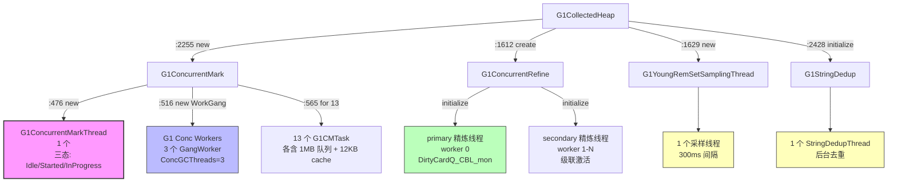

> **Phase**：[01-jvm-startup]
> **前置**：[02-G1-Heap-Startup]（堆内存布局 + SATB/DirtyCard 队列）+ [08-G1-Policy-Analytics]（G1Policy 决策引擎）
> **配套**：[08-G1-Policy-Analytics] — Policy 层负责决策"何时 GC"，Concurrent Mark 层（本文）负责执行"如何标记"
> **后续依赖本文**：所有 GC 运行时 Phase 依赖本文创建的标记执行引擎
> **阅读收益**：深度理解 G1ConcurrentMark 构造函数的 240 行初始化——双缓冲位图（O(1) 交换，1 bit=8B heap）→ G1CMMarkStack chunk 链表（4 cache-line padded 字段，8KB/chunk，1023 条目）→ 13 个 G1CMTaskQueue（各 1MB，131070 条目）→ 13 个 G1CMTask（各含 12KB 统计缓存）→ ParallelTaskTerminator + 双溢出屏障 → 三色区域精炼线程（green=13/yellow=39/red=65）→ 300ms RSet 采样线程 → StringDedup 初始化。量化总内存开销 ~45MB。

---

# 09-G1-Concurrent-Marking-Infra — G1 并发标记执行引擎与辅助线程

## §〇 Production Scenario — 并发标记的 1.2 秒与三色区域

```bash
$ java -Xms8g -Xmx8g -XX:+UseG1GC \
    -XX:ParallelGCThreads=13 \
    -XX:ConcGCThreads=3 \
    -XX:InitiatingHeapOccupancyPercent=45 \
    -XX:+UseStringDeduplication \
    MyApp
```

GC 日志中出现 `[GC concurrent-root-region-scan-start]` → `[GC concurrent-mark-start]` → `[GC concurrent-mark-end, 1.2345678 secs]`。1.2 秒的并发标记是如何执行的？13 个 `G1CMTask` 如何通过工作窃取并行标记整个堆？全局 `G1CMMarkStack`（32MB chunk 链表）如何在任务队列溢出时接管灰色对象？`G1ConcurrentRefine` 的三色区域（green=13/yellow=39/red=65）如何动态调整精炼线程数？

这些问题的答案在 `G1ConcurrentMark` 构造函数（`g1ConcurrentMark.cpp:371-613`，~240 行）创建的完整并发标记基础设施中。

**反事实**：如果并发标记没有全局溢出栈（`G1CMMarkStack`）→ 当某个 worker 的本地队列满时 → push 灰色对象失败 → 丢失待标记对象 → live object 被错误回收 → JVM crash 或静默数据损坏。`G1CMMarkStack` 用 chunk 链表（每个 chunk 8KB，1023 个 entry）提供无限溢出能力——初始 4096 chunks (32MB)，最大 16384 chunks (128MB)。`_first_overflow_barrier_sync` 和 `_second_overflow_barrier_sync` 双屏障协议确保所有 worker 在溢出后同步重启，不会遗漏任何灰色对象。

**三步诊断**：

```bash
# 1. 查看并发标记线程
jstack <pid> | grep -A2 "G1 Main Concurrent Mark"
# 期望: "G1 Main Concurrent Mark GC Thread" os_prio=0 tid=... runnable

# 2. 查看并发精炼线程
jstack <pid> | grep "G1 Refine"
# 期望: "G1 Refine Thread#0" (primary), "G1 Refine Thread#1" (secondary)...

# 3. 查看字符串去重线程
jstack <pid> | grep "StringDedup"
# 期望: "String Deduplication Thread" (如果 -XX:+UseStringDeduplication)

# 4. GDB 验证标记基础设施
gdb -ex "break G1ConcurrentMark::G1ConcurrentMark" \
    -ex "run" \
    -ex "print _max_num_tasks" \
    -ex "print _task_queues->_n" \
    -ex "print _global_mark_stack.capacity()" \
    -ex "print _cm_thread" \
    --args java -version
# 期望: _max_num_tasks=13, _n=13, capacity()=4096, _cm_thread 非 NULL
```

**额外诊断工具**：

```bash
# strace — 追踪 mmap（位图存储关联）
strace -e trace=mmap -f java -version 2>&1 | grep "MAP_FIXED"
# 期望看到: 位图的 MAP_FIXED mmap

# /proc/<pid>/maps — 查看位图 mmap 区域
grep "bitmap" /proc/<pid>/maps
# 双位图各 1GB 虚拟预留（8GB 堆）

# /proc/<pid>/status — 查看线程数
grep "Threads:" /proc/<pid>/status
# 期望: 含 G1ConcMark(1) + G1Conc workers(3) + G1Refine(1-N) + RSetSampling(1) + StringDedup(1)
```

---

## §一 G1 并发标记基础设施初始化

### 1.1 G1ConcurrentMark 构造函数初始化列表

`G1ConcurrentMark::G1ConcurrentMark()`（`g1ConcurrentMark.cpp:371-468`）在初始化列表中创建 ~15 个对象/数组：

```cpp
// g1ConcurrentMark.cpp:371-468 — 初始化列表（按声明顺序）
G1ConcurrentMark::G1ConcurrentMark(G1CollectedHeap* g1h,
                                    G1RegionToSpaceMapper* prev_bitmap_storage,
                                    G1RegionToSpaceMapper* next_bitmap_storage) :
  _g1h(g1h),                                              // :372
  _completed_initialization(false),
  _heap(_g1h->reserved_region()),                         // :377
  _prev_mark_bitmap(&_mark_bitmap_1),                     // :378
  _next_mark_bitmap(&_mark_bitmap_2),                     // :379
  _global_mark_stack(),                                   // :380
  _task_queues(new G1CMTaskQueueSet(ParallelGCThreads)),  // :381
  _terminator(ParallelTaskTerminator(
      ParallelGCThreads, _task_queues)),                  // :382-383
  _first_overflow_barrier_sync(ParallelGCThreads),        // :384
  _second_overflow_barrier_sync(ParallelGCThreads),
  _worker_id_offset(DirtyCardQueueSet::num_par_ids()
      + G1ConcRefinementThreads),                         // :385
  _max_num_tasks(ParallelGCThreads),                      // :386
  _max_worker_id(MAX2(_max_num_tasks,
      (uint)ParallelGCThreads)),                          // :387
  _concurrent(false),
  _has_overflown(false), _has_aborted(false),
  _concurrent_workers(NULL), _cm_thread(NULL),
  // ... 时间统计字段 ...
  _region_mark_stats(NEW_C_HEAP_ARRAY(
      G1RegionMarkStats, _g1h->max_regions(), mtGC)),    // :418 — 2048×8B=16KB
  _top_at_rebuild_starts(NEW_C_HEAP_ARRAY(
      HeapWord*, _g1h->max_regions(), mtGC)),             // :419 — 2048×8B=16KB
  _total_prev_pause_time(0.0), _total_cleanup_time(0.0),
  _mark_cleanup_start_sec(0.0),
  _cleanup_list(),
  _region_mark_stats_cache(),
  _accum_task_vtime(NULL),                                // :467
  _concurrent_marking_started(false)                      // :468
```

**初始化列表顺序的 C++ 保证**：`_mark_bitmap_1`（`:317`）在 `_prev_mark_bitmap`（`:319`）之前声明 → C++ 保证 `_mark_bitmap_1` 先构造，`_prev_mark_bitmap(&_mark_bitmap_1)` 可以安全引用。`_heap(_g1h->reserved_region())`（`:377`）依赖 `_g1h`（`:372`）——两者声明顺序也匹配。

**`_worker_id_offset` 的 ID 空间避让**（`:385`）：

```cpp
_worker_id_offset = DirtyCardQueueSet::num_par_ids() + G1ConcRefinementThreads;
```

GC worker 线程的 ID 需要避让 DirtyCard 队列线程和精炼线程——这些线程共享一个 ID 空间。`num_par_ids()` 返回 DirtyCard 队列的并行线程数，`G1ConcRefinementThreads` 是精炼线程数。

**`_max_num_tasks = ParallelGCThreads`（`:386`）而非 ConcGCThreads**：并发标记的 task 数等于 GC worker 数——因为 remark/cleanup 的 STW 阶段也需要这些 task 并行处理。

**反事实**：如果初始化列表顺序错误（如 `_prev_mark_bitmap(&_mark_bitmap_1)` 在 `_mark_bitmap_1()` 之前）→ 引用未构造对象 → 未定义行为（UB）→ 可能 crash 或静默错误。C++ 标准保证声明顺序初始化，但初始化列表的书写顺序可以不同——如果写错顺序，编译器只警告不报错。

### 1.2 G1ConcurrentMarkThread — 三态状态机

`G1ConcurrentMarkThread`（`g1ConcurrentMarkThread.hpp:36-99`）是驱动并发标记周期的专用线程：

```cpp
// g1ConcurrentMarkThread.hpp:36-99
class G1ConcurrentMarkThread : public ConcurrentGCThread {
  enum State {
    Idle,         // 无标记周期进行
    Started,      // initial-mark pause 已设置，CM 线程尚未唤醒
    InProgress    // CM 线程正在执行标记工作
  };

  volatile State _state;          // :43
  ConcurrentGCPhaseManager _phase_manager_stack; // :88

  bool during_cycle() { return !idle(); }  // 覆盖 Started + InProgress
  void sleep_before_next_cycle();
  double delay_to_keep_mmu(G1Policy* policy, bool remark);
};
```

**状态转换**：
```
Idle ──(initial-mark pause)──▶ Started ──(CM thread wakes)──▶ InProgress ──(cleanup done)──▶ Idle
```

`during_cycle()` 覆盖 Started + InProgress——防止标记周期重叠。状态转换有严格的 assert 守卫：`set_started()` 要求当前 Idle，`set_in_progress()` 要求当前 Started。继承链：`G1ConcurrentMarkThread` → `ConcurrentGCThread` → `NamedThread` → `NonJavaThread` → `Thread`。

### 1.3 双缓冲位图 — G1CMBitMap

`G1CMBitMap`（`g1CMBitMap.hpp:62-125`）实现双缓冲位图机制：

```cpp
// g1CMBitMap.hpp:62-125
class G1CMBitMap : public CMBitMap {
  static int _shifter;  // = LogMinObjAlignment = 0 (8B 对齐)

  size_t addr_to_offset(HeapWord* addr) const {
    return pointer_delta(addr, _covered.start()) >> _shifter;
  }
  HeapWord* offset_to_addr(size_t offset) const {
    return _covered.start() + (offset << _shifter);
  }

public:
  size_t mark_distance() { return 1 << LogMinObjAlignment; }  // = 8
  size_t heap_map_factor() { return mark_distance(); }        // 1 bit = 8 bytes
  bool is_marked(HeapWord* addr) const {
    return _bm.at(addr_to_offset(addr));
  }
  bool par_mark(HeapWord* addr) {
    return _bm.par_set_bit(addr_to_offset(addr));  // 原子操作
  }
  bool mark(HeapWord* addr) {
    return _bm.set_bit(addr_to_offset(addr));       // 非原子
  }
};
```

**`mark_distance() = 8` 的物理含义**：每个 bit 对应 8 字节堆内存。Java 对象最小对齐 8 字节（`LogMinObjAlignment=0` → `1<<0=1` → 实际上是 8B 对齐，因为 `HeapWordSize=8`）。8GB 堆 → 1GB 位图。

**`is_marked()` / `par_mark()` / `mark()` 的区别**：
- `par_mark(addr)` 用 `_bm.par_set_bit()` 原子操作——并发安全，标记线程和 mutator 线程可同时写入
- `mark(addr)` 用 `_bm.set_bit()` 非原子操作——仅在 STW 阶段（remark/cleanup）使用

**双缓冲交换**：`_prev_mark_bitmap` 指向已完成标记的位图（Mixed GC 读取），`_next_mark_bitmap` 指向当前标记位图（并发标记线程写入）。标记周期结束时交换两个指针——O(1) 而非 O(1GB)。

> **💡 双缓冲位图 (Double-Buffered Bitmap)**：`_mark_bitmap_1` 和 `_mark_bitmap_2` 是两个独立 `G1CMBitMap` 对象（各 ~76B）。`_prev_mark_bitmap` 和 `_next_mark_bitmap` 是 `G1CMBitMap*` 指针——标记完成时交换指针 O(1)，不复制 1GB 位图数据。`mark_distance()` = 8 表示 1 bit = 8 heap bytes——因为 Java 对象最小对齐 8 字节，按 1 字节粒度浪费 8× 内存。

**反事实**：如果只用 1 个位图 → 并发标记写入时 Mixed GC 无法读取稳定的上一轮标记结果 → 必须等标记完成才能 Mixed GC → 标记和回收串行化 → 吞吐量大幅下降。

### 1.4 G1CMMarkStack — chunk 链表的无锁溢出栈

`G1CMMarkStack`（`g1ConcurrentMark.hpp:151-239`）用 chunk 链表管理灰色对象的溢出：

```cpp
// g1ConcurrentMark.hpp:151-239
class G1CMMarkStack {
  static const int EntriesPerChunk = 1024 - 1;  // = 1023

  struct TaskQueueEntryChunk {
    TaskQueueEntryChunk* next;          // 8B
    G1TaskQueueEntry data[1023];        // 1023 × 8B = 8184B
  };  // 总计 8192B = 8KB

  volatile TaskQueueEntryChunk* _chunk_list;  // :170 — CL2, 已使用 chunk 链表
  volatile TaskQueueEntryChunk* _free_list;   // :172 — CL1, 空闲 chunk 链表
  volatile size_t _hwm;                       // :176 — CL3, 高水位标记
  size_t _chunk_capacity;                     // 初始 4096
  size_t _max_chunk_capacity;                 // 最大 16384
  char _pad0[DEFAULT_CACHE_LINE_SIZE];        // cache line padding
  char _pad1[DEFAULT_CACHE_LINE_SIZE];
  char _pad2[DEFAULT_CACHE_LINE_SIZE];
  char _pad4[DEFAULT_CACHE_LINE_SIZE];
};
```

**为什么 EntriesPerChunk = 1023 而非 1024**：1 个位置留给 `next` 指针的 cache line 对齐——`next`(8B) + `data[1023]`(8184B) = 8192B = 8KB，正好是 2 个 4KB 页。

**4 个 cache line padding 的 false sharing 防护**：
- `_free_list`（CL1）：push 线程写（CAS pop chunk）
- `_chunk_list`（CL2）：push/pop 线程竞争（CAS push/pop chunk）
- `_hwm`（CL3）：push 线程写（递增分配新 chunk）
- 分离到不同 cache line 避免并发修改时的 false sharing

**`par_push(entry)` 算法**：
1. 从 `_free_list` CAS pop 一个 chunk
2. 填充 entry
3. CAS push 到 `_chunk_list` 头部
4. 如果 `_free_list` 空 → 从预留空间中分配新 chunk（`_hwm` 递增）

**`par_pop(entry)` 算法**：
1. 从 `_chunk_list` 头部取 chunk
2. 取最后一个 entry
3. chunk 空了则 CAS 从 `_chunk_list` 摘除 → 归还到 `_free_list`

> **💡 G1CMMarkStack 的 chunk 链表设计**：不是连续数组——是 `TaskQueueEntryChunk` 链表。每个 chunk 8KB（1 个 8B next 指针 + 1023 个 8B entry）。`_free_list`（CL1）维护空闲 chunk，`_chunk_list`（CL2）维护已使用 chunk。初始 4096 chunks (32MB 虚拟内存)，最大 16384 (128MB)。4 个 cache line padding 防止 push/pop 的 false sharing。

**反事实**：如果标记栈用连续数组而非 chunk 链表 → 需要预分配最大容量（128MB）→ 即使大多数 GC 只用到几 MB → 浪费 ~120MB 虚拟内存。chunk 链表按需分配——初始 4096 chunks (32MB)，不够再扩——节省内存。

### 1.5 13 个 G1CMTaskQueue + G1CMTaskQueueSet

`G1ConcurrentMark` 构造函数体（`:565-591`）为每个 ParallelGC 线程创建 1MB 任务队列和 G1CMTask：

```cpp
// g1ConcurrentMark.hpp:111-112 — 类型别名
typedef GenericTaskQueue<G1TaskQueueEntry, mtGC> G1CMTaskQueue;
typedef GenericTaskQueueSet<G1CMTaskQueue, mtGC> G1CMTaskQueueSet;

// g1ConcurrentMark.cpp:565-591 — 创建 13 个队列和 task
for (uint i = 0; i < _max_num_tasks; ++i) {
  G1CMTaskQueue* task_queue = new G1CMTaskQueue();
  task_queue->initialize();                     // 分配 _elems[131072]
  _task_queues->register_queue(i, task_queue);  // 注册到队列集

  _tasks[i] = new G1CMTask(i, this, task_queue, _region_mark_stats, _g1h->max_regions());
  _accum_task_vtime[i] = 0.0;
}
```

**`GenericTaskQueue<G1TaskQueueEntry>` 的 1MB 环形缓冲区**：

```cpp
// taskqueue.hpp — GenericTaskQueue 模板
static const uint N = TASKQUEUE_SIZE;  // = 131072
G1TaskQueueEntry _elems[N];            // 131072 × 8B = 1MB
uint max_elems() { return N - 2; }     // = 131070
```

`max_elems() = N - 2 = 131070`——减 2 用于区分 full/empty。环形缓冲区的 `_bottom`（owner 写）和 `_age`（CAS 保护的 pop 端）之间的 gap 判断满状态。

**`OverflowTaskQueue` 的溢出栈**：当本地队列满时，push 到溢出栈（`_overflow_stack`）而非丢失——溢出栈用 `G1CMMarkStack` 的 chunk 链表。

**`G1CMTaskQueueSet::steal()` 的工作窃取**：

```
steal(queue_num, seed, t):
  seed = (seed + 1) % _n   // round-robin 选 victim
  return queue(seed)->pop_global(t)  // 从 victim 队列底部窃取
```

`pop_global` 用 CAS 保护队列底部（`_age` 字段），`push` 只被 owner 写入队列顶部（`_bottom` 字段）——push/pop 在队列两端，减少竞争。

> **💡 工作窃取 (Work Stealing)**：13 个 worker 各自有本地 `G1CMTaskQueue`（1MB 环形缓冲区）。worker 的本地队列空时 → 随机选另一个 worker（`_hash_seed` 决定）→ `steal()` 从队列底部窃取。`ParallelTaskTerminator` 用 `_offered_termination` 计数——所有 worker 都 `offer_termination()` 后标记阶段结束。

**反事实**：如果队列太小（如 1KB）→ 频繁溢出到全局 `G1CMMarkStack` → 增加 CAS 竞争和 cache miss → 标记吞吐量下降。1MB 队列在大多数 GC 中足够容纳一个 Region 的灰色对象——溢出是异常路径。

### 1.6 ParallelTaskTerminator + 双溢出屏障

`ParallelTaskTerminator`（`:382-383`）和双 `WorkGangBarrierSync`（`:384`）协同管理标记终止和溢出处理：

```cpp
// g1ConcurrentMark.cpp:382-384
_terminator(ParallelTaskTerminator(_max_num_tasks, _task_queues)),
_first_overflow_barrier_sync(_max_num_tasks),
_second_overflow_barrier_sync(_max_num_tasks),
```

**`ParallelTaskTerminator::offer_termination()` 协议**：
1. Worker 检查本地队列是否空 + 尝试窃取
2. 如果队列空且窃取失败 → `_offered_termination` 原子递增
3. 如果 `_offered_termination == _n_threads` → 所有 worker 都 offer → 标记阶段结束
4. 如果其他 worker 在等待期间 push 了新的 work → 重置 `_offered_termination` → 继续工作

**双溢出屏障协议**：
- `_first_overflow_barrier_sync`：所有 worker 暂停 → drain 全局栈到各自本地队列 → 继续
- `_second_overflow_barrier_sync`：二次溢出（第一次 drain 后仍不够）→ 全部暂停 → 完全 drain → 重启

### 1.7 G1CMTask — 单个标记任务的执行单元

`G1CMTask`（`g1ConcurrentMark.hpp:637-863`）是每个标记 worker 的执行上下文：

```cpp
class G1CMTask : public TerminatorTerminator {
  G1CMObjArrayProcessor _objArray_processor;  // 大对象数组处理
  G1CMTaskQueue* _task_queue;                 // 1MB 本地队列
  G1RegionMarkStatsCache _mark_stats_cache;   // 1024 条目统计缓存 (12KB)
  HeapWord* _finger;                          // 本地扫描指针
  HeapWord* _region_limit;                    // 扫描上限
  size_t _words_scanned_limit;                // 每次 step 最多 12K words
  size_t _refs_reached_limit;                 // 每次 step 最多 1024 refs
  bool _has_timed_out;                        // 超时标志
  bool _draining_satb_buffers;                // 是否在 drain SATB
};
```

**`_mark_stats_cache`（G1RegionMarkStatsCache）**：1024 条目缓存（`g1RegionMarkStatsCache.hpp:62-128`），每条目 12B（`uint region_idx + size_t live_words`），共 12KB 每 worker。标记 worker 频繁更新 Region 的 `_live_words`——如果每次直接写全局 `_region_mark_stats[2048]`，13 个 worker 的原子操作会严重竞争。缓存批量 flush 到全局数组，减少原子操作竞争。

> **💡 G1CMTask 的 _mark_stats_cache**：1024 条目缓存（`G1RegionMarkStatsCache`，每条目 12B）。标记 worker 频繁更新 Region 的 `_live_words`——如果每次直接写全局 `_region_mark_stats[2048]`，13 个 worker 的原子操作会严重竞争。缓存批量 flush 到全局数组，减少原子操作竞争。`G1RegionMarkStats` 仅 `_live_words` 一个字段（8B）。

### 1.8 G1RegionMarkStats + G1RegionMarkStatsCache

```cpp
// g1RegionMarkStatsCache.hpp:39-52
class G1RegionMarkStats {
  size_t _live_words;   // 8B — 该 Region 的存活字数
};

// g1RegionMarkStatsCache.hpp:62-128
class G1RegionMarkStatsCache {
  static const size_t CacheSize = 1024;
  // 每条目: uint region_idx (4B) + size_t live_words (8B) = 12B
  // 哈希: hash(idx) = idx & mask（2 的幂次方大小）
  // Evict-on-collision: 槽被占用时先 flush 旧条目到全局数组
};
```

**Cache 设计**：1024 条目远小于 2048 个 Region——利用标记的局部性（相邻 Region 的标记倾向于集中在同一 worker）。overflow 时 `clear_during_overflow()` 是空操作——因为 overflow 后不重新标记对象，已有 `_live_words` 通过原子操作保持正确。

### 1.9 G1ConcurrentRefine — 三色区域 + 精炼线程

`G1ConcurrentRefine::create()`（`g1ConcurrentRefine.cpp:283-331`）计算三色区域：

```cpp
// g1ConcurrentRefine.cpp:283-331
G1ConcurrentRefine* G1ConcurrentRefine::create(jint* ecode) {
  // 1. 计算最小 yellow 区域
  size_t min_yellow_zone_size = calc_min_yellow_zone_size();  // = 26

  // 2. 计算三色区域
  size_t green_zone = calc_init_green_zone();   // = ParallelGCThreads = 13
  size_t yellow_zone = calc_init_yellow_zone(); // = green × 2 = 26, 但 ≥ min_yellow → 39
  size_t red_zone = calc_init_red_zone();       // = yellow + (yellow - green) = 65

  // 3. 创建精炼器
  G1ConcurrentRefine* cr = new G1ConcurrentRefine(
      green_zone, yellow_zone, red_zone, min_yellow_zone_size);

  // 4. 初始化线程
  cr->initialize();  // 动态模式下只创建 1 个 primary 线程
  return cr;
}
```

**三色区域激活阶梯**：

| 区间 | dirty card buffer 数 | 行为 |
|------|---------------------|------|
| `[0, 13)` | 极少 | 不处理——利用 card 缓存效应 |
| `[13, 39)` | 中等 | 逐步激活精炼线程 |
| `[39, 65)` | 较多 | 所有精炼线程运行 |
| `[65, ∞)` | 严重 | 应用线程也参与处理 |

**primary 线程（worker 0）的特殊性**：`_monitor = DirtyCardQ_CBL_mon`——由 mutator 的写屏障直接通知。其他 secondary 线程的 monitor 由前一个线程 `notify()` 唤醒，形成级联激活链。

**green_zone = ParallelGCThreads（13）的原因**：经验值——当 completed dirty card buffers 少于 GC 线程数时，意味着每个线程平均不到 1 个 buffer → 不值得启动精炼线程——card 的缓存效应使重复 dirty 的 card 被合并。

> **💡 三色区域与精炼线程激活**：`[0, green=13)` 不处理——利用 card 缓存效应，连续写入同一 card 时只标记一次。`[green=13, yellow=39)` 逐步激活——primary 线程处理，若 `_completed_buffers` 继续增长则激活 secondary。`[yellow=39, red=65)` 全线程运行。≥65 应用线程也参与处理（STW assist）。

**反事实**：如果没有精炼线程 → 所有 RSet 更新在 mutator 的写屏障中同步完成 → 每次引用存储触发 RSet 更新 → 10M writes/sec → 10M 次 RSet 操作 → mutator 吞吐量下降 20-30%。精炼线程将 RSet 更新从 mutator 的热路径移出——mutator 只需标记 card 为 dirty（1 条指令），精炼线程异步处理 dirty card。

### 1.10 G1YoungRemSetSamplingThread

`G1YoungRemSetSamplingThread`（`g1YoungRemSetSamplingThread.hpp:42-58`）每 300ms 采样年轻代 Region 的 RSet 长度：

```cpp
class G1YoungRemSetSamplingThread : public ConcurrentGCThread {
  Monitor _monitor;  // 等待/通知

  void sample_young_list_rs_lengths() {
    // 遍历所有 young region → 读取 RSet 长度
    // → 反馈给 G1Policy::revise_young_list_target_length_if_necessary()
  }

  void sleep_before_next_cycle() {
    _monitor.wait(G1YoungRemSetSamplingIntervalMillis);  // 默认 300ms
  }
};
```

**为什么需要采样**：RSet 长度决定 GC 暂停时间——如果 young gen 太大，RSet 总长度超出预测 → 暂停超标 → 下次 GC 缩小 young gen。采样提供独立于 GC 暂停时间的 RSet 信号。

**反事实**：如果没有采样线程 → young gen 大小调整只能依赖 GC 暂停时间反馈——但 GC 暂停时间受多种因素影响（allocation rate、RSet 长度、evacuation failure 等）→ 难以分离 RSet 的影响。

### 1.11 G1StringDedup 初始化

`G1StringDedup::initialize()`（`g1StringDedup.cpp:39-44`）：

```cpp
void G1StringDedup::initialize() {
  StringDedup::initialize_impl<G1StringDedupQueue, G1StringDedupStat>();
}
```

这是模板方法的包装——`initialize_impl<G1StringDedupQueue, G1StringDedupStat>()` 创建：
1. `StringDedupThread` — 后台去重线程
2. `G1StringDedupQueue` — 去重候选队列（基于 G1 的并发队列）
3. `StringDedupTable` — 共享哈希表（存储 hash→char[] 映射）

**为什么用模板**：不同 GC 实现需要不同的队列和统计类型——G1 用 `G1StringDedupQueue`（基于 G1 的并发队列），ZGC 可能有自己的实现。G1 独占：`assert(UseG1GC)` 确保只在 G1 下使用。

> **💡 StringDedup 的初始化**：`G1StringDedup::initialize()` 是模板方法的包装——`StringDedup::initialize_impl<G1StringDedupQueue, G1StringDedupStat>()`。模板参数决定队列类型（G1StringDedupQueue）和统计类型（G1StringDedupStat）。创建 `StringDedupThread` 后台线程 + `StringDedupTable`（共享哈希表）。G1 的 StringDedup 区别于其他 GC——只在 G1 下可用。

**反事实**：如果没有 StringDedup → 大量重复字符串（如 XML 标签名、JSON key、SQL 列名）→ 每个副本占用独立的 char[] → 内存浪费。StringDedup 将多个 String 对象指向同一个 char[]——减少 char[] 内存使用（通常节省 10-20% 堆内存）。

### §一 末尾 — Interview Story Format Answer

"`G1ConcurrentMark` 构造函数（`g1ConcurrentMark.cpp:371-613`）在初始化列表中创建双缓冲位图（`_mark_bitmap_1/2` 各 ~76B，通过 `_prev/_next_mark_bitmap` 指针引用——标记完成时交换指针 O(1)）→ 全局溢出栈 `G1CMMarkStack`（4 cache-line padded 字段，`TaskQueueEntryChunk` 链表每个 8KB 含 1023 个 8B entry，初始 4096 chunks=32MB，最大 16384=128MB）→ 13 个 `G1CMTaskQueue` 指针数组（104B）→ `ParallelTaskTerminator`（`_n_threads=13, _offered_termination=0`）→ 双溢出屏障 `WorkGangBarrierSync`（`_first/_second_overflow_barrier_sync`，`_n_workers=13`）→ `_region_mark_stats`（2048 个 `G1RegionMarkStats`，每个 8B=16KB）→ `_top_at_rebuild_starts`（2048 个 `HeapWord*`，16KB）。

构造函数体（`:470-613`）中：`_mark_bitmap_1.initialize(heap_region, prev_bitmap_storage)` 将位图关联到 128MB 物理存储 → `new G1ConcurrentMarkThread(this)` 创建标记主控线程（~264B，三态状态机 Idle/Started/InProgress）→ 配置 SATB buffer_size=1024 → `_root_regions.init(survivor_regions, this)` 注册 Survivor 为根 → 计算 `ConcGCThreads = max((ParallelGCThreads+2)/4, 1) = 3` → `new WorkGang("G1 Conc", 3)` 创建 3 个 GangWorker 线程 → `_global_mark_stack.initialize(4096, 16384)` 预分配 32MB chunk 内存 → for i=0..12: `new G1CMTaskQueue()`（1MB `_elems`）→ `new G1CMTask(i, this, queue, region_mark_stats, max_regions)`（~360B + `_mark_stats_cache` 12KB）。

`G1ConcurrentRefine::create()`（`g1ConcurrentRefine.cpp:283-331`）计算 `min_yellow=26, green=13, yellow=39, red=65` → `new G1ConcurrentRefine(green, yellow, red, min_yellow)`（~56B）→ `cr->initialize()` 创建 1 个 primary 精炼线程（`G1ConcurrentRefineThread` ~248B，`_worker_id=0, _monitor=DirtyCardQ_CBL_mon`）。

`G1YoungRemSetSamplingThread`（~256B）构造函数内 `set_name("G1 Young RemSet Sampling")` + `create_and_start()` → 每 `G1YoungRemSetSamplingIntervalMillis=300` ms 采样一次。`G1StringDedup::initialize()`（`g1StringDedup.cpp:39-44`）调用 `StringDedup::initialize_impl<G1StringDedupQueue, G1StringDedupStat>()` → 创建去重线程 + 去重表。总内存开销（不含位图物理存储）：~14MB（主要是 13 个 1MB 任务队列 + 32MB 标记栈 chunk），含位图存储 2GB + 14MB（双 1GB 位图）。"

---

## §二 Standard Environment

### Source Roots

| 文件 | 关键行号 | 角色 |
|------|---------|------|
| `src/hotspot/share/gc/g1/g1ConcurrentMark.cpp` | `:371-613` (构造函数) | G1ConcurrentMark 主类实现 |
| `src/hotspot/share/gc/g1/g1ConcurrentMark.hpp` | `:111-112` (类型别名), `:151-239` (G1CMMarkStack), `:301-634` (类定义), `:637-863` (G1CMTask) | G1ConcurrentMark 类定义 |
| `src/hotspot/share/gc/g1/g1ConcurrentMarkThread.hpp` | `:36-99` (三态状态机) | 标记主控线程 |
| `src/hotspot/share/gc/g1/g1CMBitMap.hpp` | `:62-125` (mark_distance=8B/bit) | 并发标记位图 |
| `src/hotspot/share/gc/g1/g1RegionMarkStatsCache.hpp` | `:39-52` (G1RegionMarkStats), `:62-128` (Cache) | Region 标记统计缓存 |
| `src/hotspot/share/gc/g1/g1ConcurrentRefine.cpp` | `:283-331` (create + 三色区域计算) | 并发精炼器创建 |
| `src/hotspot/share/gc/g1/g1ConcurrentRefine.hpp` | `:71-137` (类定义 + 三色区域) | G1ConcurrentRefine 类 |
| `src/hotspot/share/gc/g1/g1ConcurrentRefineThread.hpp` | `:37-69` (类定义) | 精炼线程类 |
| `src/hotspot/share/gc/g1/g1YoungRemSetSamplingThread.hpp` | `:42-58` (类定义) | RSet 采样线程 |
| `src/hotspot/share/gc/g1/g1StringDedup.cpp` | `:39-44` (initialize) | 字符串去重初始化 |
| `src/hotspot/share/gc/g1/g1StringDedup.hpp` | `:63-86` (类定义) | G1StringDedup 接口 |
| `src/hotspot/share/gc/g1/g1OldGenAllocationTracker.hpp` | `:34-67` (类定义) | 老年代分配追踪 |
| `src/hotspot/share/gc/g1/g1CollectedHeap.cpp` | `:1610-1635`, `:2255`, `:2428` | 线程创建包装 + CM 创建 + StringDedup |

### Build & Binary

```bash
make jdk-image
# 产物: build/linux-x86_64-server-release/jdk/lib/server/libjvm.so
```

### Syscall 速查表

| Syscall | man | 调用点 | 说明 |
|---------|-----|--------|------|
| `mmap` | `man 2 mmap` | `g1ConcurrentMark.cpp:471-472` | `G1CMBitMap::initialize()` 将位图关联到 `G1RegionToSpaceMapper` 预留的虚拟空间 |
| `pthread_create` | `man 3 pthread_create` | `WorkGang::initialize_workers()` → `os::create_thread()` | 创建 3 个 GangWorker + 1 个 CM 线程 + 1-N 个精炼线程 |

### /proc 接口速查

| 路径 | man | 作用 | 本文涉及 |
|------|-----|------|---------|
| `/proc/<pid>/maps` | `man 5 proc` | 查看位图 mmap 区域 | 双位图各 1GB 虚拟预留（8GB 堆） |
| `/proc/<pid>/status` | `man 5 proc` | 查看线程数 | CM + Conc workers + Refine + Sampling + StringDedup |
| `jstack <pid>` | - | 查看线程栈 | 验证 G1ConcMark/G1Refine/StringDedup 线程 |

### 全局状态变量

| 变量 | 类型 | 位置 | 初始值 |
|------|------|------|--------|
| `_cm->_prev_mark_bitmap` | `G1CMBitMap*` | `g1ConcurrentMark.hpp:319` | `&_mark_bitmap_1` |
| `_cm->_next_mark_bitmap` | `G1CMBitMap*` | `g1ConcurrentMark.hpp:320` | `&_mark_bitmap_2` |
| `_cm->_global_mark_stack` | `G1CMMarkStack` | `g1ConcurrentMark.hpp:331` | `_chunk_capacity=4096` |
| `_cm->_max_num_tasks` | `uint` | `g1ConcurrentMark.hpp:337` | `ParallelGCThreads=13` |
| `_cm->_concurrent_workers` | `WorkGang*` | `g1ConcurrentMark.hpp:382` | `"G1 Conc", 3 threads` |
| `_cm->_cm_thread` | `G1ConcurrentMarkThread*` | `g1ConcurrentMark.hpp:312` | 三态 Idle |
| `_cr->_green_zone` | `size_t` | `g1ConcurrentRefine.hpp:90` | 13 |
| `_cr->_yellow_zone` | `size_t` | `g1ConcurrentRefine.hpp:91` | 39 |
| `_cr->_red_zone` | `size_t` | `g1ConcurrentRefine.hpp:92` | 65 |
| `_young_gen_sampling_thread` | `G1YoungRemSetSamplingThread*` | `g1CollectedHeap.hpp` | 每 300ms 采样 |

---

## §三 Source Files Table

| # | 源文件 | 关键行号 | 角色 | 在本文讨论 |
|---|--------|---------|------|----------|
| 1 | `src/hotspot/share/gc/g1/g1ConcurrentMark.cpp` | `:371-613` | G1ConcurrentMark 构造函数（~240 行） | §1.1-§1.8 |
| 2 | `src/hotspot/share/gc/g1/g1ConcurrentMark.hpp` | `:111-112`, `:151-239`, `:301-634`, `:637-863` | 类定义 + G1CMMarkStack + G1CMTask | §1.1-§1.8 |
| 3 | `src/hotspot/share/gc/g1/g1ConcurrentMarkThread.hpp` | `:36-99` | 标记主控线程（三态状态机） | §1.2 |
| 4 | `src/hotspot/share/gc/g1/g1CMBitMap.hpp` | `:62-125` | 并发标记位图（mark_distance=8B/bit） | §1.3 |
| 5 | `src/hotspot/share/gc/g1/g1RegionMarkStatsCache.hpp` | `:39-52`, `:62-128` | Region 标记统计缓存（1024 条目） | §1.7 |
| 6 | `src/hotspot/share/gc/g1/g1ConcurrentRefine.cpp` | `:283-331` | create() — 三色区域计算 + 线程启动 | §1.9 |
| 7 | `src/hotspot/share/gc/g1/g1ConcurrentRefine.hpp` | `:71-137` | G1ConcurrentRefine 类定义 | §1.9 |
| 8 | `src/hotspot/share/gc/g1/g1ConcurrentRefineThread.hpp` | `:37-69` | 精炼线程类定义 | §1.9 |
| 9 | `src/hotspot/share/gc/g1/g1YoungRemSetSamplingThread.hpp` | `:42-58` | RSet 采样线程类定义 | §1.10 |
| 10 | `src/hotspot/share/gc/g1/g1StringDedup.cpp` | `:39-44` | initialize() | §1.11 |
| 11 | `src/hotspot/share/gc/g1/g1StringDedup.hpp` | `:63-86` | G1StringDedup 接口 | §1.11 |
| 12 | `src/hotspot/share/gc/g1/g1OldGenAllocationTracker.hpp` | `:34-67` | 老年代分配追踪（5×size_t） | §1.8 |
| 13 | `src/hotspot/share/gc/g1/g1CollectedHeap.cpp` | `:1610-1635`, `:2255`, `:2428` | 线程创建包装 + G1ConcurrentMark 创建 | §1.9-§1.11 |

---

## §四 异常路径分析

### 4.1 G1ConcurrentMark 构造函数失败

`G1ConcurrentMarkThread` 创建失败（`:476-479`）：`new G1ConcurrentMarkThread(this)` 可能因 `os::create_thread()` 失败而返回 NULL → `vm_shutdown_during_initialization("...")` → 直接终止 VM。OOM 路径：`_region_mark_stats`（`:418`，`NEW_C_HEAP_ARRAY` 16KB）或 `_top_at_rebuild_starts`（`:419`，16KB）——在 8GB 堆上分配 32KB 失败概率极低。

### 4.2 精炼线程 OOM

`G1ConcurrentRefine::create()` 中 `new G1ConcurrentRefineThread()` 可能 OOM → `_thread_control` 中线程数组为空 → 精炼被跳过（card table 更新回退到 mutator 同步处理）→ 性能下降但不 crash。

### 4.3 采样线程创建失败

`G1YoungRemSetSamplingThread` 构造函数中 `create_and_start()` 可能失败 → 线程未启动 → young gen sizing 无法获取 RSet 采样数据 → 回退到仅依赖 GC 暂停时间反馈。

### 4.4 StringDedup 初始化失败

`StringDedup::initialize_impl()` 中 `StringDedupThread::create()` 或 `StringDedupTable` 分配可能 OOM → `StringDedup::is_enabled()` 返回 false → 去重被跳过。不影响 GC 正确性。

### 4.5 SATB Buffer 大小计算

`MarkStackSize` 计算（`:519-551`）：`MarkStackSize = min(Max, max(Min, workers × TASKQUEUE_SIZE))`。如果超出 `[1, Max]` 范围 → 警告并返回 → `G1ConcurrentMark` 对象处于半初始化状态。

---

## §五 GDB 断点验证

```
断言 1: G1ConcurrentMark 构造完成 (g1ConcurrentMark.cpp:613 之后)
  (gdb) print _cm
  期望: 非 NULL
  (gdb) print _cm->_max_num_tasks
  期望: 13 (= ParallelGCThreads)

断言 2: 双缓冲位图 (g1ConcurrentMark.cpp:472 之后)
  (gdb) print _cm->_prev_mark_bitmap
  期望: == &_cm->_mark_bitmap_1
  (gdb) print _cm->_next_mark_bitmap
  期望: == &_cm->_mark_bitmap_2
  (gdb) print _cm->_prev_mark_bitmap->mark_distance()
  期望: 8

断言 3: 全局标记栈 (g1ConcurrentMark.cpp:554 之后)
  (gdb) print _cm->_global_mark_stack.capacity()
  期望: 4096 (初始 chunk 数)
  (gdb) print _cm->_global_mark_stack.is_empty()
  期望: true

断言 4: 13 个任务队列 (g1ConcurrentMark.cpp:579 之后)
  (gdb) print _cm->_task_queues->_n
  期望: 13
  (gdb) print _cm->_task_queues->queue(0)->max_elems()
  期望: 131070

断言 5: 并发工作线程池 (g1ConcurrentMark.cpp:517 之后)
  (gdb) print _cm->_concurrent_workers->total_workers()
  期望: 3 (= ConcGCThreads)
  (gdb) print _cm->_cm_thread
  期望: 非 NULL

断言 6: 并发精炼器 (g1ConcurrentRefine.cpp:331 之后)
  (gdb) print _cr->_green_zone
  期望: 13
  (gdb) print _cr->_yellow_zone
  期望: 39
  (gdb) print _cr->_red_zone
  期望: 65

断言 7: 采样线程 + 字符串去重 (g1CollectedHeap.cpp:2428 之后)
  (gdb) print _young_gen_sampling_thread
  期望: 非 NULL
  (gdb) print G1StringDedup::is_enabled()
  期望: true (如果 -XX:+UseStringDeduplication)
```

---

## §六 总内存开销

| 组件 | 大小估算 | 说明 |
|------|---------|------|
| G1ConcurrentMark | ~450B | 30+ 成员变量 |
| G1CMBitMap × 2 | ~152B | 各 ~76B |
| 双位图物理存储 | 2GB | 8GB 堆，1 bit = 8B |
| G1CMMarkStack | ~256B + 32MB | 对象头 + 4096 chunks × 8KB |
| G1CMTaskQueue × 13 | 13MB | 各 1MB _elems[131072] |
| G1CMTask × 13 | ~4.7KB + 156KB | ~360B 对象 + 12KB cache 每 task |
| G1RegionMarkStats[2048] | 16KB | 2048 × 8B |
| G1ConcurrentMarkThread | ~264B | 三态状态机 |
| WorkGang ("G1 Conc") | ~1KB | 3 个 GangWorker 线程对象 |
| G1ConcurrentRefine | ~56B | 三色区域值 |
| G1ConcurrentRefineThread × 1 | ~248B | primary 线程 |
| G1YoungRemSetSamplingThread | ~256B | 采样线程 |
| **总计** | **~45MB** | 含 32MB mark stack + 13MB 任务队列 |

---

## §七 Cross-Reference

- **前置**：[02-G1-Heap-Startup]（堆内存布局 + SATB/DirtyCard 队列）+ [08-G1-Policy-Analytics]（G1Policy 决策引擎）
- **配套**：[08-G1-Policy-Analytics] — Policy 层负责决策"何时 GC"，Concurrent Mark 层（本文）负责执行"如何标记"
- **后续**：所有 GC 运行时 Phase 依赖本文创建的标记执行引擎
- **与 init_globals 的关系**：本文覆盖的子系统在 `init_globals` 第 9 步 `universe_init()` 中创建——G1ConcurrentMark 在 `G1CollectedHeap::initialize()` 的 `:2255` 创建，精炼线程在 `:2307` 创建，采样线程在 `:2312` 创建，StringDedup 在 `:2428` 初始化

---

## §八 Mermaid 架构图

### 双缓冲位图 + chunk 链表 + 工作窃取

```mermaid
graph TB
    subgraph 双缓冲位图
        B1[G1CMBitMap<br/>_mark_bitmap_1<br/>~76B]
        B2[G1CMBitMap<br/>_mark_bitmap_2<br/>~76B]
        PREV[_prev_mark_bitmap<br/>8B 指针 → B1]
        NEXT[_next_mark_bitmap<br/>8B 指针 → B2]
        STORAGE[G1RegionToSpaceMapper<br/>128MB 物理存储]
        B1 -->|initialize| STORAGE
        B2 -->|initialize| STORAGE
        PREV -.->|swap O1| NEXT
    end

    subgraph G1CMMarkStack
        FL[CL1: _free_list<br/>空闲 chunk 链表]
        CL[CL2: _chunk_list<br/>已使用 chunk 链表]
        HW[CL3: _hwm<br/>高水位标记]
        CHUNK[TaskQueueEntryChunk<br/>next8B + data[1023]×8B<br/>= 8KB]
        FL --> CHUNK
        CL --> CHUNK
    end

    subgraph 工作窃取
        W1[Worker 0<br/>G1CMTask<br/>_task_queue 1MB]
        W2[Worker 1<br/>G1CMTask<br/>_task_queue 1MB]
        W3[...]
        W13[Worker 12<br/>G1CMTask<br/>_task_queue 1MB]
        W1 -.->|steal| W2
        W2 -.->|steal| W3
        W13 -.->|steal| W1
        W1 -->|overflow| CL
    end

    subgraph 并发精炼
        GREEN[green=13<br/>不处理]
        YELLOW[yellow=39<br/>逐步激活]
        RED[red=65<br/>全线程+mutator]
        PTH[primary 线程<br/>_monitor=DirtyCardQ_CBL_mon]
        STH[secondary 线程<br/>级联激活]
    end

    style B1 fill:#bbf,stroke:#333
    style B2 fill:#bbf,stroke:#333
    style FL fill:#fbb,stroke:#333
    style CL fill:#fbb,stroke:#333
    style HW fill:#fbb,stroke:#333
```

---

## §九 Mermaid 线程关系图


