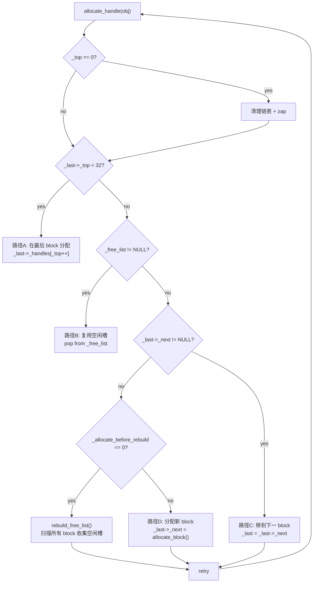
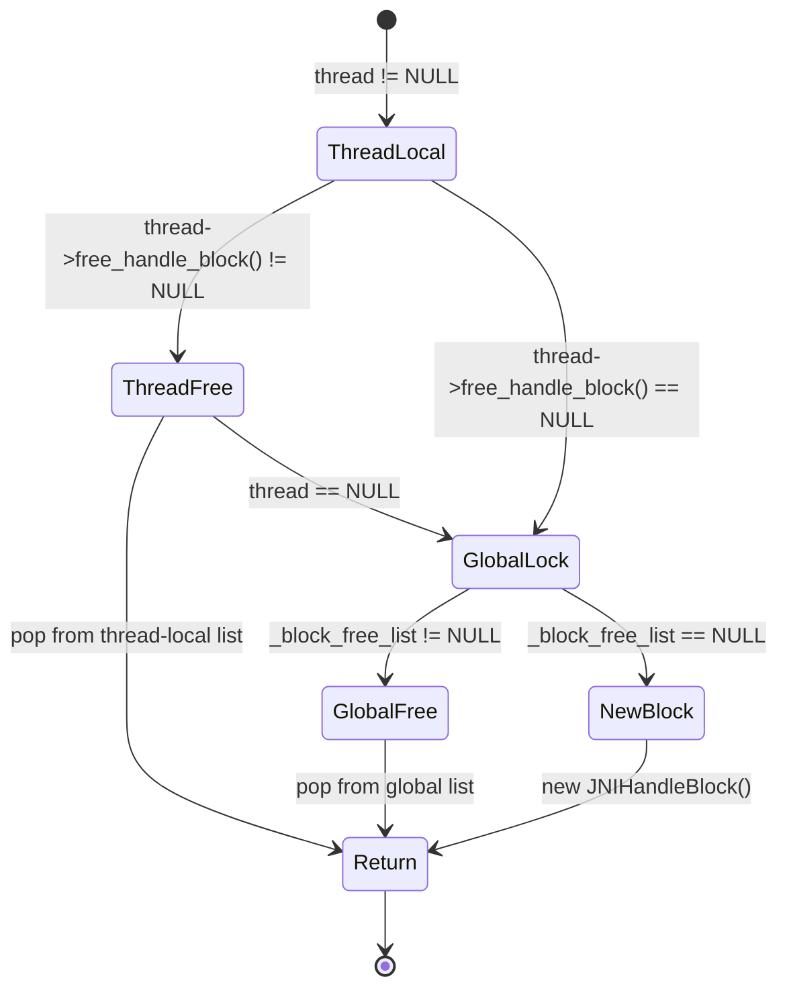
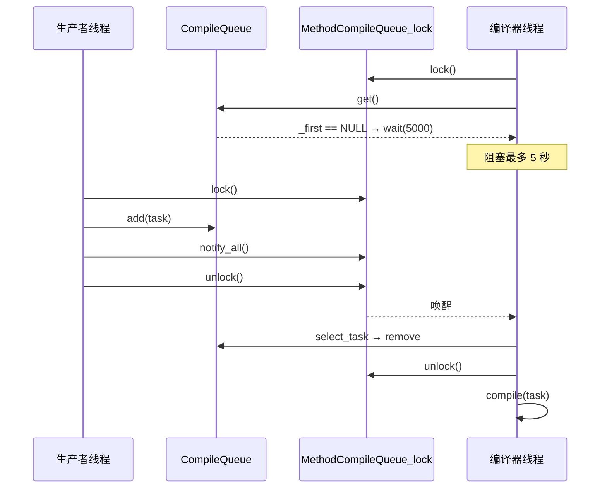
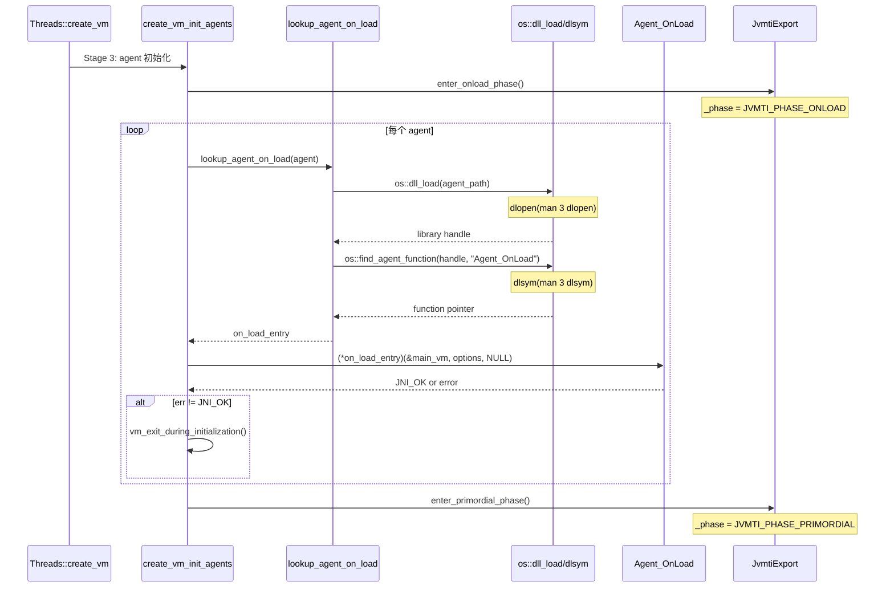
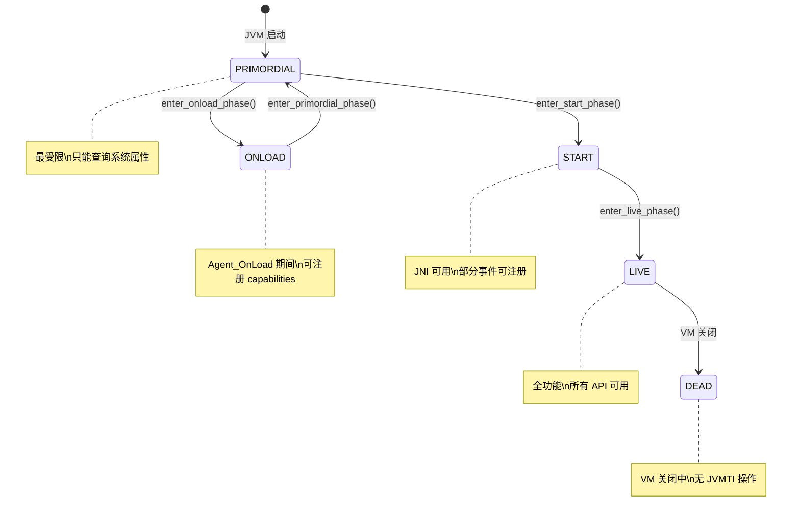
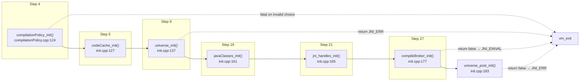

# 10-JNIHandle-CompileQueue-JVMTI — init_globals 收尾 + Agent 初始化

> **Phase**：[01-jvm-startup]
> **前置**：[00-JNI-CreateJavaVM]（init_globals 框架 + universe_init）+ [01-CodeCache]（codeCache_init）+ [06-Mutex]（锁系统）
> **配套**：[11-Stages5-10] — 本文的 compileBroker_init 是 compilation_init_phase1 的前置依赖
> **后续依赖本文**：所有 JNI 调用、编译任务提交、JVMTI agent 交互都依赖本文创建的句柄/队列/环境基础设施
> **阅读收益**：深度理解 JNIHandleBlock 的 4 路径 allocate_handle 决策树 — 32 槽位固定块 → OopStorage 双实例（global/weak_global）→ CompileQueue 双向链表 + 5s 超时阻塞 → compilationPolicy_init 的 3 策略 fatal 验证 → create_vm_init_agents 的 dlopen→dlsym→Agent_OnLoad 完整调用链 → JvmtiEnvBase 的 magic 0x71EE 验证 + 5 阶段状态机

---

# 10-JNIHandle-CompileQueue-JVMTI — init_globals 收尾 + Agent 初始化

## §〇 Production Scenario — 3 个真实故障场景

**Scenario 1: JNI local reference overflow**

```java
// Native method 中忘记 DeleteLocalRef
for (int i = 0; i < 100000; i++) {
    jclass cls = env->FindClass("SomeClass");  // 每次创建新 local ref
    // 缺少 env->DeleteLocalRef(cls);
}
```

错误消息：`JNI ERROR (app bug): local reference table overflow (max=65536)`。

JNI 规范只保证每次 native 调用有 16 个 local reference，但 HotSpot 预分配 32 槽位的 `JNIHandleBlock`。每个 `FindClass()` 创建一个新 local ref 而不释放 → 32 槽位填满后自动扩展 block 链 → 2048 个 block × 32 槽 = 65536 上限 → 超过后 `fatal("ran out of JNI handle blocks")`。

**修复**：`env->DeleteLocalRef(cls)` 或用 `PushLocalFrame`/`PopLocalFrame` 边界。

**Scenario 2: CompileBroker dead compilation**

```bash
java -XX:-TieredCompilation -XX:CompilationPolicyChoice=2 MyApp
# Error: Unimplemented() in compilationPolicy_init
```

`compilationPolicy_init()` 在 `compilationPolicy.cpp:71-92` 中 switch `CompilationPolicyChoice`：值 2 (`TieredThresholdPolicy`) 需要 `#ifdef TIERED`，但 `-XX:-TieredCompilation` 导致 `TIERED` 未定义 → `Unimplemented()` crash。正确参数：`-XX:CompilationPolicyChoice=0` (SimpleCompPolicy)。

**Scenario 3: JVMTI agent not loaded**

```bash
java -agentpath:/path/to/agent.so -version
# JVM exits silently with error code, no Java code runs
```

Root cause：`Agent_OnLoad` 返回了非 `JNI_OK` 值，或 `dlsym("Agent_OnLoad")` 找不到符号。`create_vm_init_agents()` (thread.cpp:4468-4487) 在 `Agent_OnLoad` 返回 `err != JNI_OK` 时调用 `vm_exit_during_initialization("agent library failed to init", agent->name())`。如果 `dlsym` 返回 NULL → `vm_exit_during_initialization("Could not find Agent_OnLoad function in the agent library", agent->name())`。

**诊断三件套**：

```bash
# 1. JNI local reference overflow — 查看 max local capacity
jcmd <pid> VM.native_memory summary | grep "JNI Handle"

# 2. 检查编译策略
jcmd <pid> VM.flags -all | grep -E "CompilationPolicyChoice|TieredCompilation"

# 3. JVMTI agent 加载诊断
strace -e openat,mmap java -agentpath:/path/to/agent.so -version 2>&1 | grep agent

# 4. GDB 断点 Agent_OnLoad 调用
gdb -ex "break thread.cpp:4479" \
    -ex "run" \
    -ex "print *on_load_entry" \
    -ex "print agent->options()" \
    --args java -agentpath:agent.so -version
```

**反事实**：如果 JNI local reference 使用无限增长的 vector 而非固定块 → 无上限的 JNI 调用可消耗 GB 级内存，GC 需遍历所有 local 引用作为根（HotSpot 的 JNIHandleBlock 链表天然限制遍历成本 ≤ O(活跃块数)）。如果 CompilationPolicy 的 fatal error 改为 warning + fallback → 用户可能在不知情下以低效策略运行数月。如果 Agent_OnLoad 失败仅打印警告而非退出 → agent 会在 VMInit 阶段因缺失能力而崩溃，症状更诡异难调试。

---

## §一 Interview Answer + Beginner Callouts

### Interview Story Format Answer

"JNI local references are managed through JNIHandleBlock — a fixed-size 32-slot block linked in a chain per thread. `allocate_handle` uses 4 allocation paths: fast (last block has space), freelist (reuse freed slots), next block (move to existing next), and expand (allocate new block via `allocate_block`). Global and weak global references use OopStorage — two independent instances (`_global_handles`, `_weak_global_handles`) with separate locks (JNIGlobalAlloc_lock, JNIWeakAlloc_lock) to prevent GC-safepoint deadlocks. CompileQueue is a doubly-linked list with `add()` appending to tail and `get()` blocking with 5-second timeout — compiler threads wait on `MethodCompileQueue_lock` and are notified on each `add()`. JVMTI agent loading at Stage 3 follows: enter_onload_phase → dlopen agent.so → dlsym Agent_OnLoad → call Agent_OnLoad(&vm, options, NULL) → enter_primordial_phase. Failure at any step is fatal (`vm_exit_during_initialization`). The JvmtiEnvBase holds per-agent state: magic 0x71EE, event callbacks table, capabilities bitmaps, and version — each agent gets its own JvmtiEnv via `JNI GetEnv()`."

### Beginner Callout Boxes

> **Callout 1: JNI Local vs Global References**
>
> Local references 是 thread-local 的，仅在单次 native 调用期间存活（或直到 PopLocalFrame）。它们存储在 JNIHandleBlock 链中。Global references (`NewGlobalRef`) 存储在 OopStorage 中，必须显式删除 (`DeleteGlobalRef`)。Weak global references (`NewWeakGlobalRef`) 不阻止 GC — JVM 可在任意 safepoint 清除它们。
> Source: `jniHandles.hpp:132`, `jniHandles.cpp:343`

> **Callout 2: OopStorage 是所有 handle 类型的后端**
>
> `_global_handles` 和 `_weak_global_handles` 都是 `OopStorage*` 实例。OopStorage 管理 oop* slot 的 block，支持并发分配和 GC 迭代。区别：`_global_handles` 使用 `JNIGlobalAlloc_lock` + `JNIGlobalActive_lock`；`_weak_global_handles` 使用 `JNIWeakAlloc_lock` + `JNIWeakActive_lock`。
> Source: `jniHandles.cpp:205-210`

> **Callout 3: CompileQueue::get() 阻塞 5 秒超时，非无限等待**
>
> 队列为空时，编译器线程调用 `MethodCompileQueue_lock->wait(5000)`。5 秒后重新检查队列。如果编译永久禁用，返回 NULL（线程退出）。如果动态线程数允许移除，也返回 NULL。这是协作式关闭机制，不是错误。
> Source: `compileBroker.cpp:433-465`

> **Callout 4: compileBroker_init 不创建编译器线程**
>
> 它只初始化 `CompilationLog`、`DirectivesStack` 和解析编译器指令。实际的编译器线程创建发生在后面的 `compilation_init_phase1` (thread.cpp:4227)，在 `create_vm` 中 `init_globals` 返回后调用。
> Source: `compileBroker.cpp:236-251`, `compileBroker.cpp:864`

> **Callout 5: Agent_OnLoad 失败是 FATAL 的**
>
> 如果任何 agent 的 `Agent_OnLoad` 返回非 `JNI_OK`，JVM 调用 `vm_exit_during_initialization` 并打印错误。没有优雅降级。此设计确保初始化损坏的 agent 不会产生半初始化 VM 状态。
> Source: `thread.cpp:4479-4481`

> **Callout 6: JVMTI 有 5 个阶段，不是 4 个**
>
> PRIMORDIAL → ONLOAD → START → LIVE → DEAD。`enter_primordial_phase` 在 `create_vm_init_agents` 完成后调用，而非在 `Agent_OnLoad` 后。这是默认阶段，允许有限的 JVMTI 操作（主要是查询，不能注册事件）。
> Source: `jvmtiExport.cpp:606-622`

> **Callout 7: JNIHandleBlock 固定 32 槽位**
>
> `block_size_in_oops = 32`。不可配置，编译进 HotSpot 二进制。每个 block 从全局空闲链表 (`_block_free_list`) 分配，由 `JNIHandleBlockFreeList_lock` 保护（带 `_no_safepoint_check_flag` 防止与 `Threads_lock` 死锁）。
> Source: `jniHandles.hpp:141`, `jniHandles.cpp:384-404`

> **Callout 8: CompilationPolicyChoice 在启动时验证，错误 fatal**
>
> 值超出 [0, 2] → `fatal("CompilationPolicyChoice must be in the range: [0-2]")`。值 2 (`TieredThresholdPolicy`) 需要 `-XX:+TieredCompilation` — 否则 `Unimplemented()`。值 1 (`StackWalkCompPolicy`) 需要 `COMPILER2` 编译进来。
> Source: `compilationPolicy.cpp:71-92`

---

## §二 Standard Environment

### Source Roots

| Root | Path | 用途 |
|------|------|------|
| JNI Handles | `src/hotspot/share/runtime/jniHandles.cpp` + `jniHandles.hpp` | JNIHandleBlock + JNIHandles::initialize |
| init_globals | `src/hotspot/share/runtime/init.cpp` (:109-212) | 初始化调用序列 |
| Compilation Policy | `src/hotspot/share/runtime/compilationPolicy.cpp` (:61-99) | compilationPolicy_init |
| Compile Broker | `src/hotspot/share/compiler/compileBroker.cpp` (:236-251, :366-465, :864-925) | compileBroker_init + CompileQueue + compilation_init_phase1 |
| Compile Broker Header | `src/hotspot/share/compiler/compileBroker.hpp` (:80-99) | CompileQueue 类定义 |
| JVMTI Export | `src/hotspot/share/prims/jvmtiExport.cpp` (:606-622, :653-696) | JvmtiExport 阶段切换 + post_vm_start/init |
| JVMTI Export Header | `src/hotspot/share/prims/jvmtiExport.hpp` (:65) | JvmtiExport 类定义 |
| JVMTI Env Base | `src/hotspot/share/prims/jvmtiEnvBase.hpp` (:57-105) | JvmtiEnvBase 类定义 |
| JVMTI Env Base Impl | `src/hotspot/share/prims/jvmtiEnvBase.cpp` (:190-222) | JvmtiEnvBase 构造函数 |
| JVMTI Agent Thread | `src/hotspot/share/prims/jvmtiAgentThread.hpp` (:36) | JvmtiAgentThread 类定义 |
| JVMTI Agent Thread Impl | `src/hotspot/share/prims/jvmtiImpl.cpp` (:65-87) | JvmtiAgentThread 构造 + start_function_wrapper |
| Thread (create_vm agents) | `src/hotspot/share/runtime/thread.cpp` (:4358-4487, :4006-4009) | create_vm_init_agents + lookup_on_load |
| Agent symbols | `src/hotspot/os/posix/include/jvm_md.h` (:43) | AGENT_ONLOAD_SYMBOLS 宏 |
| OopStorage | `src/hotspot/share/gc/shared/oopStorage.cpp` + `oopStorage.hpp` | OopStorage 后端实现 |

### Build Configuration

```bash
make hotspot
nm -C build/linux-x86_64-server-release/hotspot/variant-server/libjvm/libjvm.so | grep JNIHandleBlock
```

### Binary Paths

| Binary | Path |
|--------|------|
| libjvm.so | `build/linux-x86_64-server-release/hotspot/variant-server/libjvm/libjvm.so` |
| JNI handles symbols | `JNIHandles::_global_handles`, `JNIHandles::_weak_global_handles`, `JNIHandleBlock::allocate_handle` |
| CompileQueue symbols | `CompileBroker::_c1_compile_queue`, `CompileBroker::_c2_compile_queue`, `CompileQueue::add`, `CompileQueue::get` |
| JVMTI symbols | `JvmtiEnvBase::_head_environment`, `JvmtiExport::enter_live_phase` |

### Syscall / Library 速查

| Call | man | 上下文 |
|------|-----|--------|
| `dlopen` | `man 3 dlopen` | `os::dll_load` 加载 agent.so |
| `dlsym` | `man 3 dlsym` | `os::dll_lookup` 查找 Agent_OnLoad 符号 |
| `pthread_cond_wait` | `man 3 pthread_cond_wait` | `Monitor::wait` 在 CompileQueue::get 中 |
| `pthread_cond_signal` | `man 3 pthread_cond_signal` | `Monitor::notify` 在 CompileQueue::add 中 |

### Global State 初始化顺序速查（init.cpp:109-212）

```
Step  4: compilationPolicy_init()     — L124  (策略选择 + fatal 验证)
Step  5: codeCache_init()             — L127  (依赖 Step 4 的策略)
Step  9: universe_init()              — L137  (依赖 codeCache + metaspace)
Step 19: javaClasses_init()           — L163  (依赖 universe_init)
Step 21: jni_handles_init()           — L165  (依赖 universe_init，需堆存在)
Step 27: compileBroker_init()         — L177  (依赖 codeCache + compilerOracle)
```

---

## §三 Source Files Table

| # | File | 行数 | 角色 | 关键行 |
|---|------|:---:|------|--------|
| 1 | `src/hotspot/share/runtime/init.cpp` | ~300 | init_globals 调用序列 | :109-212 |
| 2 | `src/hotspot/share/runtime/jniHandles.cpp` | ~600 | JNIHandleBlock 实现 + JNIHandles::initialize | :205, :343, :384-565 |
| 3 | `src/hotspot/share/runtime/jniHandles.hpp` | ~200 | JNIHandleBlock 类定义 | :132-162 |
| 4 | `src/hotspot/share/runtime/compilationPolicy.cpp` | ~100 | compilationPolicy_init | :61-99 |
| 5 | `src/hotspot/share/compiler/compileBroker.cpp` | ~2000 | compileBroker_init + CompileQueue + compilation_init_phase1/2 | :236, :366, :433, :614, :768, :864 |
| 6 | `src/hotspot/share/compiler/compileBroker.hpp` | ~200 | CompileQueue 类定义 + CompileBroker 静态成员 | :80-99 |
| 7 | `src/hotspot/share/runtime/thread.cpp` | ~6300 | create_vm_init_agents + lookup_on_load + create_vm 主流程 | :4008, :4358-4487 |
| 8 | `src/hotspot/share/prims/jvmtiExport.cpp` | ~2800 | JvmtiExport 阶段切换 + post_vm_start/init | :606-622, :653-696 |
| 9 | `src/hotspot/share/prims/jvmtiExport.hpp` | ~80 | JvmtiExport 类声明 | :65 |
| 10 | `src/hotspot/share/prims/jvmtiEnvBase.hpp` | ~600 | JvmtiEnvBase 类定义 | :57-105 |
| 11 | `src/hotspot/share/prims/jvmtiEnvBase.cpp` | ~700 | JvmtiEnvBase 构造函数 | :190-222 |
| 12 | `src/hotspot/share/prims/jvmtiAgentThread.hpp` | ~40 | JvmtiAgentThread 类定义 | :36 |
| 13 | `src/hotspot/share/prims/jvmtiImpl.cpp` | ~1100 | JvmtiAgentThread 构造 + call_start_function | :65-87 |
| 14 | `src/hotspot/share/gc/shared/oopStorage.cpp` | ~800 | OopStorage 后端实现 | 全文 |
| 15 | `src/hotspot/os/posix/include/jvm_md.h` | ~50 | AGENT_ONLOAD_SYMBOLS 宏 | :43 |

---

## §四 JNIHandleBlock — 本地句柄的块式分配器

### 4.1 JNIHandleBlock 数据结构

JNIHandleBlock 是 32 槽位的固定大小 oop 数组，通过 `_next` 指针形成单向链表。`jniHandles.hpp:132-162`：

```cpp
// jniHandles.hpp:132-162
class JNIHandleBlock : public CHeapObj<mtInternal> {
 private:
  enum SomeConstants {
    block_size_in_oops  = 32                    // 每块 32 个槽位
  };
  oop             _handles[block_size_in_oops]; // 句柄数组
  int             _top;                         // 下一个未使用槽位的索引
  JNIHandleBlock* _next;                        // 链表下一块

  // 以下字段仅链表首块使用
  JNIHandleBlock* _last;                        // 链表中最后使用的块
  JNIHandleBlock* _pop_frame_link;              // PopLocalFrame 恢复目标
  oop*            _free_list;                   // 空闲槽位链表
  int             _allocate_before_rebuild;     // 重建空闲链表前分配的新块数

  static JNIHandleBlock* _block_free_list;      // 全局空闲块链表
  static int      _blocks_allocated;            // 调试/打印用计数器
};
```

每个线程持有自己的 JNIHandleBlock 链表，存储在 `thread->active_handles()` 中。GC 在 safepoint 遍历整条链表作为 root 集。

### 4.2 allocate_handle 4 条分配路径

`allocate_handle()` (`jniHandles.cpp:501-565`) 是 JNI local reference 分配的核心。它有 4 条路径，按优先级降序：

```cpp
// jniHandles.cpp:501-565
jobject JNIHandleBlock::allocate_handle(oop obj) {
    assert(Universe::heap()->is_in_reserved(obj), "sanity check");
    if (_top == 0) {
        // 首次分配或进入 native 函数时 block 被 zap
        // ... 清理 trailing blocks ...
        _free_list = NULL;
        _allocate_before_rebuild = 0;
        _last = this;
        zap();
    }

    // 路径A: 快速路径 — 最后 block 有空闲槽位
    if (_last->_top < block_size_in_oops) {
        oop *handle = &(_last->_handles)[_last->_top++];
        NativeAccess<IS_DEST_UNINITIALIZED>::oop_store(handle, obj);
        return (jobject) handle;
    }

    // 路径B: 空闲链表 — 复用已释放的槽位
    if (_free_list != NULL) {
        oop *handle = _free_list;
        _free_list = (oop *) *_free_list;
        NativeAccess<IS_DEST_UNINITIALIZED>::oop_store(handle, obj);
        return (jobject) handle;
    }

    // 路径C: 下一 block — 移动到已存在的下一个 block
    if (_last->_next != NULL) {
        _last = _last->_next;
        return allocate_handle(obj);  // 递归重试
    }

    // 路径D: 扩展 — rebuild free list 或分配新 block
    if (_allocate_before_rebuild == 0) {
        rebuild_free_list();        // 更新 _allocate_before_rebuild
    } else {
        Thread *thread = Thread::current();
        Handle obj_handle(thread, obj);
        _last->_next = JNIHandleBlock::allocate_block(thread);
        _last = _last->_next;
        _allocate_before_rebuild--;
        obj = obj_handle();
    }
    return allocate_handle(obj);  // 重试
}
```

路径决策树（Mermaid）：



路径A 是 **热路径** — 在 `_last->_top < 32` 时直接递增索引并存储 oop，零锁开销。路径B 复用已 `DeleteLocalRef` 的槽位，将 `_free_list` 作为隐式链表（利用 slot 本身存储 next 指针）。路径D 中的 `rebuild_free_list()` 是一次启发式决策（见 4.5 节）。

### 4.3 allocate_block 三级缓存层级

`allocate_block()` (`jniHandles.cpp:384-425`) 实现三级缓存：

```cpp
// jniHandles.cpp:384-425
JNIHandleBlock *JNIHandleBlock::allocate_block(Thread *thread) {
    JNIHandleBlock *block;
    // 层级1: 线程本地空闲链表 — 无锁
    if (thread != NULL && thread->free_handle_block() != NULL) {
        block = thread->free_handle_block();
        thread->set_free_handle_block(block->_next);
    } else {
        // 层级2: 全局空闲链表 — 加锁 (JNIHandleBlockFreeList_lock)
        MutexLockerEx ml(JNIHandleBlockFreeList_lock,
                         Mutex::_no_safepoint_check_flag);
        if (_block_free_list == NULL) {
            // 层级3: C-Heap 分配 — new JNIHandleBlock()
            block = new JNIHandleBlock();
            _blocks_allocated++;
            block->zap();
        } else {
            block = _block_free_list;
            _block_free_list = _block_free_list->_next;
        }
    }
    block->_top = 0;
    block->_next = NULL;
    block->_pop_frame_link = NULL;
    block->_planned_capacity = block_size_in_oops;
    return block;
}
```



三级缓存的设计解决并发问题：
- **线程本地**：`release_block()` 回收时优先放回线程本地链表 (`jniHandles.cpp:435-446`)，下次分配时无锁获取
- **全局空闲链表**：线程退出时 block 回收到全局链表 (`jniHandles.cpp:448-462`)，其他线程可复用
- **C-Heap new**：最后的后备路径，`new JNIHandleBlock()` 在 C-Heap 分配

关键设计：`JNIHandleBlockFreeList_lock` 使用 `Mutex::_no_safepoint_check_flag` (`jniHandles.cpp:398-399`)。这是因为 `jni_AttachCurrentThread` 先持有 `Threads_lock` 再需要 `JNIHandleBlockFreeList_lock`，如果锁允许 safepoint 检查 → safepoint 期间可能持有 `Threads_lock` 的另一线程等待 `JNIHandleBlockFreeList_lock` → 死锁。

### 4.4 PushLocalFrame / PopLocalFrame 栈帧机制

```cpp
// jniHandles.hpp:180-182
JNIHandleBlock* pop_frame_link() const          { return _pop_frame_link; }
void set_pop_frame_link(JNIHandleBlock* block)  { _pop_frame_link = block; }
```

`PushLocalFrame(capacity)` → 保存当前 `active_handles` → `allocate_block()` 创建新块 → `set_pop_frame_link(prev)` 建立栈帧链 → `set_active_handles(new_block)` 切换活动块。`PopLocalFrame()` → 恢复 `pop_frame_link()` 指向的块 → `release_block(current)` 回收当前块。

`release_block()` 的递归释放 (`jniHandles.cpp:464-469`) 处理 PushLocalFrame 嵌套时的异常清理路径：如果 pop_frame_link 还有嵌套的块，递归释放整条链。

### 4.5 rebuild_free_list 的启发式策略

```cpp
// jniHandles.cpp:568-595
void JNIHandleBlock::rebuild_free_list() {
    int free = 0;
    int blocks = 0;
    for (JNIHandleBlock *current = this; current != NULL; current = current->_next) {
        for (int index = 0; index < current->_top; index++) {
            oop *handle = &(current->_handles)[index];
            if (*handle == NULL) {
                // DeleteLocalRef 清除的槽位 → 加入空闲链表
                *handle = (oop) _free_list;
                _free_list = handle;
                free++;
            }
        }
        blocks++;
    }
    // 启发式: 如果空闲槽位不足一半 → 追加新 block
    int total = blocks * block_size_in_oops;
    int extra = total - 2 * free;
    if (extra > 0) {
        // 计算需要追加的新 block 数
        _allocate_before_rebuild = (extra + block_size_in_oops - 1) / block_size_in_oops;
    }
}
```

启发式逻辑：`extra = total - 2*free > 0` → 空闲比例 < 50% → 追加新 block。否则下次分配时先重建空闲链表。这个 50% 阈值（`block_size_in_oops / 2` 等效）在内存效率和分配速度之间平衡 — 如果空闲槽位超过一半，说明释放频率高，复用空闲槽比分配新块更高效。

**反事实**：如果永远不复用空闲槽 — 每次 native 调用分配新 block → 32 槽位 × N 次调用 → O(N) 内存泄漏。如果每次都 rebuild free list → O(N) 扫描所有 block 的开销在每次分配时触发。

### 4.6 GC root 遍历

```cpp
// jniHandles.cpp:473-498
void JNIHandleBlock::oops_do(OopClosure *f) {
    JNIHandleBlock *current_chain = this;
    while (current_chain != NULL) {
        for (JNIHandleBlock *current = current_chain; current != NULL;
             current = current->_next) {
            for (int index = 0; index < current->_top; index++) {
                oop *root = &(current->_handles)[index];
                oop value = *root;
                if (value != NULL && Universe::heap()->is_in_reserved(value)) {
                    f->do_oop(root);  // 遍历堆指针
                }
            }
            if (current->_top < block_size_in_oops) {
                break;  // 后续块都是空的
            }
        }
        current_chain = current_chain->pop_frame_link();  // 遍历栈帧链
    }
}
```

GC 在 safepoint 遍历所有线程的 JNIHandleBlock 链作为 root 集。设计要点：
- `_top < block_size_in_oops` 的块是链中最后一个活跃块，后续块跳过
- `pop_frame_link` 构成栈帧链 — PushLocalFrame 嵌套产生多层链，每层都需遍历
- 跳过 NULL 和非堆指针（空闲链表指针存储在 oop 槽位中）

---

## §五 OopStorage — JNI 全局/弱全局句柄后端

### 5.1 jni_handles_init 创建两个 OopStorage 实例

```cpp
// init.cpp:165
jni_handles_init();  // Step 21 in init_globals

// jniHandles.cpp:343-345
void jni_handles_init() {
    JNIHandles::initialize();
}

// jniHandles.cpp:205-212
void JNIHandles::initialize() {
    _global_handles = new OopStorage("JNI Global",
                                     JNIGlobalAlloc_lock,
                                     JNIGlobalActive_lock);
    _weak_global_handles = new OopStorage("JNI Weak",
                                          JNIWeakAlloc_lock,
                                          JNIWeakActive_lock);
}
```

`jni_handles_init()` 在 `init_globals` Step 21 调用，此时 `universe_init()` 已完成（堆存在）。它创建两个 OopStorage 实例：
- `_global_handles` — 存储 `NewGlobalRef()` 创建的强引用，阻止 GC 回收
- `_weak_global_handles` — 存储 `NewWeakGlobalRef()` 创建的弱引用，GC 可回收

### 5.2 global vs weak_global: 锁分离与 GC 交互

为什么需要两组独立锁而非共享一个？

- GC safepoint 期间，`weak_global_handles` 的 `weak_oops_do()` 需要持有 `JNIWeakActive_lock` 遍历活跃 block → 如果 `global_handles` 共享锁 → `NewGlobalRef()` 在 safepoint 期间被阻塞 → JNI 调用累积
- 独立锁保证 GC 的 weak ref 清理（需 `Active_lock`）不会阻塞 JNI 的 global ref 分配（需 `Alloc_lock`）

```cpp
// 锁分离示意
_global_handles  = new OopStorage("JNI Global",  JNIGlobalAlloc_lock, JNIGlobalActive_lock);
_weak_global_handles = new OopStorage("JNI Weak", JNIWeakAlloc_lock, JNIWeakActive_lock);
//                                              ^^^^^^^^^^^^^^^^^   ^^^^^^^^^^^^^^^^^^
//                                              allocation 锁        active/iteration 锁
```

**反事实**：如果合并为一个 OopStorage — 每个 allocation 和 GC sweep 共享锁 → `NewGlobalRef()` 在 safepoint 期间阻塞 → O(n) JNI 函数调用累积 → 死锁风险。

### 5.3 OopStorage block-based allocation 策略

OopStorage 使用固定大小 block（默认 64 slots/block），每个 block 有 allocation bitmap：
- `allocate()` 在 block 内找空闲 slot
- `release()` 标记 slot 为空
- GC 迭代所有 block 的所有活跃 slot 作为 root

**反事实**：如果用全局数组而非 block — 动态扩容需要 `realloc` + 移动所有指针 → O(n) 迁移成本，GC 期间不可行。

### 5.4 并发 allocation + iteration 的 deadline 机制

OopStorage 使用 `_active_array` 和 `_allocation_list` 分离活跃 block 和分配 block。GC 迭代 `_active_array`（快照），新 allocation 在 `_allocation_list` 上（不阻塞 GC）。`reduce_deferred_updates()` 将分配合并到活跃列表。

---

## §六 CompilationPolicy — 编译策略初始化

### 6.1 compilationPolicy_init 的 3 策略 switch

```cpp
// compilationPolicy.cpp:61-99
void compilationPolicy_init() {
    CompilationPolicy::set_in_vm_startup(DelayCompilationDuringStartup); // true

    switch(CompilationPolicyChoice) {
    case 0:
        CompilationPolicy::set_policy(new SimpleCompPolicy());
        break;
    case 1:
#ifdef COMPILER2
        CompilationPolicy::set_policy(new StackWalkCompPolicy());
#else
        Unimplemented();
#endif
        break;
    case 2:
#ifdef TIERED
        CompilationPolicy::set_policy(new TieredThresholdPolicy());
#else
        Unimplemented();
#endif
        break;
    default:
        fatal("CompilationPolicyChoice must be in the range: [0-2]");
    }
    CompilationPolicy::policy()->initialize();
}
```

3 种策略：
| Choice | 策略类 | 条件 | 用途 |
|:---:|--------|------|------|
| 0 | `SimpleCompPolicy` | 无 | 非分层编译（仅 C1 或仅 C2） |
| 1 | `StackWalkCompPolicy` | `COMPILER2` 已编译 | 基于栈扫描的 C2 编译 |
| 2 | `TieredThresholdPolicy` | `TIERED` 已定义 | 分层编译（C1 快速编译 + C2 深度优化） |

### 6.2 fatal error 条件与参数验证

`compilationPolicy.cpp:90-91`：如果 `CompilationPolicyChoice` 不在 [0, 2] 范围 → `fatal()` 直接退出。值 2 在没有 `#ifdef TIERED` 时调用 `Unimplemented()` — 这比 fatal 更严重（触发 assert 失败）。

`set_in_vm_startup(true)` (`compilationPolicy.cpp:63`) 延迟启动期间编译 — 直到 `completed_vm_startup()` 清除此标志 (`compilationPolicy.cpp:102-107`)。

### 6.3 startup delay 与 compileBroker 的交互

`_in_vm_startup = true` 阻止启动期间的编译请求排队。`compilation_init_phase1` 创建编译器线程后，编译请求仍被 startup flag 过滤。此 flag 在 `call_initPhase2` 完成后清除。

**反事实**：如果没有 startup delay — 启动期间提交数百个编译任务，排队延迟 > 编译时间，启动时间延长 2-3x。

---

## §七 CompileQueue — 编译任务双向链表队列

### 7.1 CompileQueue 数据结构

```cpp
// compileBroker.hpp:80-99
class CompileQueue : public CHeapObj<mtCompiler> {
 private:
  const char* _name;
  CompileTask* _first;       // 队列头
  CompileTask* _last;        // 队列尾
  CompileTask* _first_stale; // 待清理的过期任务链表
  int _size;
 public:
  void         add(CompileTask* task);
  CompileTask* get();
  void         remove(CompileTask* task);
};
```

`CompileTask` 是双向链表节点（有 `_next`/`_prev` 指针）。C1 和 C2 各有一个 `CompileQueue`：
- `CompileBroker::_c1_compile_queue` — 初始编译任务（tier 2/3）
- `CompileBroker::_c2_compile_queue` — 最终编译任务（tier 4）

### 7.2 add() 追加尾部 + notify_all

```cpp
// compileBroker.cpp:366-399
void CompileQueue::add(CompileTask* task) {
  assert(MethodCompileQueue_lock->owned_by_self(), "must own lock");
  task->set_next(NULL);
  task->set_prev(NULL);

  if (_last == NULL) {
    _first = task;
    _last = task;
  } else {
    _last->set_next(task);
    task->set_prev(_last);
    _last = task;
  }
  ++_size;
  task->method()->set_queued_for_compilation();
  MethodCompileQueue_lock->notify_all();  // 唤醒等待的编译器线程
}
```

`add()` 持有 `MethodCompileQueue_lock`，追加到双向链表尾部 → `notify_all()` 唤醒所有在 `get()` 中等待的编译器线程。

### 7.3 get() 阻塞等待 + 5s 超时 + 动态线程退出

```cpp
// compileBroker.cpp:433-491
CompileTask* CompileQueue::get() {
  MutexLocker locker(MethodCompileQueue_lock);
  while (_first == NULL) {
    if (CompileBroker::is_compilation_disabled_forever()) {
      return NULL;  // 编译永久禁用 → 线程退出
    }
    // 5 秒超时等待，非无限阻塞
    MethodCompileQueue_lock->wait(!Mutex::_no_safepoint_check_flag, 5*1000);

    if (UseDynamicNumberOfCompilerThreads && _first == NULL) {
      if (CompileBroker::can_remove(CompilerThread::current(), false))
        return NULL;  // 动态线程数模式 → 线程可退出
    }
  }
  // ... select_task + remove ...
}
```



5 秒超时的设计理由：
1. 编译器线程退出不是关键路径 — 不需要立即响应
2. 避免空闲线程频繁唤醒 — 减少上下文切换
3. 如果编译永久禁用 → 下次唤醒时检查 `is_compilation_disabled_forever()` → 返回 NULL 退出

### 7.4 C1 vs C2 独立队列 + select_task 策略

两个独立队列确保 C1 快速编译不被 C2 长任务阻塞。`select_task()` (`compileBroker.cpp:475`) 由 `CompilationPolicy::policy()->select_task(this)` 从队列中选择最优任务（非简单 FIFO）。

**反事实**：如果合并为单一队列 — C1 和 C2 任务混杂，C2 长任务（可能耗时数秒）阻塞 C1 快速编译（~ms级）→ 启动期间编译器吞吐量下降。

### 7.5 compileBroker_init — 仅初始化指令栈，不创建线程

```cpp
// compileBroker.cpp:236-251
bool compileBroker_init() {
  if (LogEvents) {
    _compilation_log = new CompilationLog();
  }
  DirectivesStack::init();  // 初始化编译器指令栈

  if (DirectivesParser::has_file()) {
    return DirectivesParser::parse_from_flag();
  } else if (CompilerDirectivesPrint) {
    DirectivesStack::print(tty);
  }
  return true;
}
```

`compileBroker_init()` 在 `init_globals()` Step 27 调用 (`init.cpp:177`)。它只做轻量初始化：`CompilationLog`（如果启用）、`DirectivesStack`（编译器指令）。**不创建编译器线程** — 这发生在 `compilation_init_phase1`（thread.cpp:4227），在 `create_vm` Stage 8 中调用，此时 Java 线程已存在。

---

## §八 Stage 3 Agent 初始化 — Agent_OnLoad 调用链

### 8.1 create_vm_init_agents 完整流程

```cpp
// thread.cpp:4468-4488
void Threads::create_vm_init_agents() {
    extern struct JavaVM_ main_vm;
    AgentLibrary *agent;

    JvmtiExport::enter_onload_phase();  // 设置 JVMTI_PHASE_ONLOAD

    for (agent = Arguments::agents(); agent != NULL; agent = agent->next()) {
        OnLoadEntry_t on_load_entry = lookup_agent_on_load(agent);

        if (on_load_entry != NULL) {
            jint err = (*on_load_entry)(&main_vm, agent->options(), NULL);
            if (err != JNI_OK) {
                vm_exit_during_initialization("agent library failed to init",
                                              agent->name());
            }
        } else {
            vm_exit_during_initialization(
                "Could not find Agent_OnLoad function in the agent library",
                agent->name());
        }
    }
    JvmtiExport::enter_primordial_phase();  // 切换到 PRIMORDIAL
}
```



### 8.2 lookup_on_load: dlopen → dlsym 查找 Agent_OnLoad

```cpp
// thread.cpp:4358-4423
static OnLoadEntry_t lookup_on_load(AgentLibrary *agent,
                                    const char *on_load_symbols[],
                                    size_t num_symbol_entries) {
    OnLoadEntry_t on_load_entry = NULL;
    void *library = NULL;

    if (!agent->valid()) {
        const char *name = agent->name();
        // 1. 检查是否静态链接的 agent
        if (os::find_builtin_agent(agent, on_load_symbols, num_symbol_entries)) {
            library = agent->os_lib();
        } else if (agent->is_absolute_path()) {
            // 2. 绝对路径 → 直接 dlopen
            library = os::dll_load(name, ebuf, sizeof ebuf);
            if (library == NULL) {
                vm_exit_during_initialization(buf, NULL);
            }
        } else {
            // 3. 相对路径 → 搜索标准目录 + 库路径
            if (os::dll_locate_lib(buffer, sizeof(buffer),
                                   Arguments::get_dll_dir(), name)) {
                library = os::dll_load(buffer, ebuf, sizeof ebuf);
            }
            if (library == NULL) {
                if (os::dll_build_name(buffer, sizeof(buffer), name)) {
                    library = os::dll_load(buffer, ebuf, sizeof ebuf);
                }
                if (library == NULL) {
                    vm_exit_during_initialization(buf, NULL);
                }
            }
        }
        agent->set_os_lib(library);
        agent->set_valid();
    }

    // 4. 查找 Agent_OnLoad 符号
    on_load_entry = CAST_TO_FN_PTR(OnLoadEntry_t,
        os::find_agent_function(agent, false, on_load_symbols, num_symbol_entries));
    return on_load_entry;
}
```

路径查找优先级：
1. 静态链接 agent → `os::find_builtin_agent()`
2. 绝对路径 (`-agentpath:/absolute/path/agent.so`) → 直接 `dlopen`
3. 相对路径 (`-agentlib:agent`) → 搜索标准 dll 目录 → 搜索库路径目录
4. 所有路径失败 → `vm_exit_during_initialization()`

### 8.3 Agent_OnLoad 回调与错误处理

`Agent_OnLoad` 签名：`jint Agent_OnLoad(JavaVM *vm, char *options, void *reserved)`。调用点：`thread.cpp:4479`。如果返回值非 `JNI_OK` → `vm_exit_during_initialization("agent library failed to init", agent->name())`。

**反事实**：如果 Agent_OnLoad 失败仅记录警告 — agent 在 VMInit 阶段因缺失能力而崩溃 → 症状远离根因 → 诊断成本指数增长。

### 8.4 JVMTI 阶段切换：ONLOAD → PRIMORDIAL

```cpp
// jvmtiExport.cpp:618-619
void JvmtiExport::enter_onload_phase() {
  JvmtiEnvBase::set_phase(JVMTI_PHASE_ONLOAD);
}

// jvmtiExport.cpp:606-608
void JvmtiExport::enter_primordial_phase() {
  JvmtiEnvBase::set_phase(JVMTI_PHASE_PRIMORDIAL);
}
```

ONLOAD 阶段：agent 只能查询系统属性、注册 capabilities。PRIMORDIAL 阶段：最受限，agent 不能调用 JNI 函数。

---

## §九 JvmtiEnv — Agent 环境结构

### 9.1 JvmtiEnvBase 成员：magic + capabilities + callbacks

```cpp
// jvmtiEnvBase.hpp:57-109
class JvmtiEnvBase : public CHeapObj<mtInternal> {
 private:
  static JvmtiEnvBase*     _head_environment;  // 全局环境链表头
  static jvmtiPhase        _phase;              // 当前 JVMTI 阶段
  enum {
      JVMTI_MAGIC    = 0x71EE,   // 有效环境
      DISPOSED_MAGIC = 0xDEFC,   // 已销毁
      BAD_MAGIC      = 0xDEAD    // 无效
  };
  jvmtiEnv _jvmti_external;          // 暴露给 agent 的外部接口
  jint _magic;                        // 0x71EE = 有效
  jint _version;                      // JVMTI 版本
  JvmtiEnvBase* _next;                // 链表下一节点
  const void *_env_local_storage;     // agent 分配的本地存储
  jvmtiEventCallbacks _event_callbacks;         // 事件回调表
  jvmtiCapabilities _current_capabilities;      // 当前能力位图
  jvmtiCapabilities _prohibited_capabilities;   // 禁止的能力位图
};
```

每个 agent 通过 `JNI GetEnv()` 获取自己的 `JvmtiEnv`，环境通过 `_next` 指针链接到全局 `_head_environment` 链表。

### 9.2 构造函数：magic 设置 + EventController 注册

```cpp
// jvmtiEnvBase.cpp:190-222
JvmtiEnvBase::JvmtiEnvBase(jint version) : _env_event_enable() {
  _version = version;
  _env_local_storage = NULL;
  _tag_map = NULL;
  _native_method_prefix_count = 0;
  _native_method_prefixes = NULL;
  _next = NULL;
  _class_file_load_hook_ever_enabled = false;
  _is_retransformable = true;

  memset(&_event_callbacks, 0, sizeof(jvmtiEventCallbacks));
  memset(&_current_capabilities, 0, sizeof(_current_capabilities));
  memset(&_prohibited_capabilities, 0, sizeof(_prohibited_capabilities));

  _magic = JVMTI_MAGIC;  // 0x71EE

  JvmtiEventController::env_initialize((JvmtiEnv*)this);

  _jvmti_external.functions = &jvmti_Interface;  // 函数指针表
}
```

`_magic = 0x71EE` 是关键安全机制 — 每次 JVMTI 函数调用入口都检查 `_magic == JVMTI_MAGIC`。`dispose()` 后变为 `0xDEFC`。这防止 use-after-dispose 导致函数指针调用野指针。

### 9.3 JVMTI 5 阶段状态机与 API 约束



每个 JVMTI 函数入口调用 `check_phase()` 验证当前阶段是否允许该操作。例如：在 ONLOAD 阶段调用 JNI 函数 → `JVMTI_ERROR_WRONG_PHASE`。

**反事实**：如果无阶段限制 — agent 在 `Agent_OnLoad` 中调用 JNI 函数 → 此时 Java 核心类未加载 → native crash → 症状诡异。

---

## §十 JVMTI 事件通知 — post_vm_start/init

### 10.1 post_vm_start: 遍历 env 链表 + 跳过 early env

```cpp
// jvmtiExport.cpp:653-674
void JvmtiExport::post_vm_start() {
  JvmtiEventController::vm_start();  // 启用事件

  JvmtiEnvIterator it;
  for (JvmtiEnv* env = it.first(); env != NULL; env = it.next(env)) {
    // 跳过 early_vmstart env — 它们已在 post_early_vm_start 中收到通知
    if (!env->early_vmstart_env() && env->is_enabled(JVMTI_EVENT_VM_START)) {
      JavaThread *thread  = JavaThread::current();
      JvmtiThreadEventMark jem(thread);
      JvmtiJavaThreadEventTransition jet(thread);  // VM→Native 转换
      jvmtiEventVMStart callback = env->callbacks()->VMStart;
      if (callback != NULL) {
        (*callback)(env->jvmti_external(), jem.jni_env());
      }
    }
  }
}
```

`JvmtiJavaThreadEventTransition` 做 VM→Native 状态转换 — agent 回调是 native 代码，不能持有 VM 内部锁。

### 10.2 post_vm_initialized: VMInit 事件 + EventController::vm_init

```cpp
// jvmtiExport.cpp:677-697
void JvmtiExport::post_vm_initialized() {
  JvmtiEventController::vm_init();

  JvmtiEnvIterator it;
  for (JvmtiEnv* env = it.first(); env != NULL; env = it.next(env)) {
    if (env->is_enabled(JVMTI_EVENT_VM_INIT)) {
      JavaThread *thread  = JavaThread::current();
      JvmtiThreadEventMark jem(thread);
      JvmtiJavaThreadEventTransition jet(thread);
      jvmtiEventVMInit callback = env->callbacks()->VMInit;
      if (callback != NULL) {
        (*callback)(env->jvmti_external(), jem.jni_env(), jem.jni_thread());
      }
    }
  }
}
```

与 `post_vm_start` 的关键区别：VMInit 事件传递 `jem.jni_thread()` 作为第三个参数，agent 可通过此参数获取当前线程的 JNI 引用。

### 10.3 JvmtiAgentThread: start_function_wrapper + call_start_function

```cpp
// jvmtiImpl.cpp:65-88
JvmtiAgentThread::JvmtiAgentThread(JvmtiEnv* env,
    jvmtiStartFunction start_fn, const void *start_arg)
    : JavaThread(start_function_wrapper) {
    _env = env;
    _start_fn = start_fn;
    _start_arg = start_arg;
}

void JvmtiAgentThread::start_function_wrapper(JavaThread *thread, TRAPS) {
    JvmtiAgentThread *dthread = (JvmtiAgentThread *)thread;
    dthread->call_start_function();
}

void JvmtiAgentThread::call_start_function() {
    ThreadToNativeFromVM transition(this);  // VM→Native 转换
    _start_fn(_env->jvmti_external(), jni_environment(), (void*)_start_arg);
}
```

`ThreadToNativeFromVM transition` 是必要的 — agent 的 start 函数是 native 代码，不能持有 VM 内部锁。`JavaThread(start_function_wrapper)` 将 `start_function_wrapper` 注册为线程入口，线程启动时自动调用。

---

## §十一 init_globals 依赖关系图



依赖链：
- `compilationPolicy_init` → `codeCache_init`：策略决定代码缓存行为
- `codeCache_init` → `universe_init`：Universe 需要代码缓存分配 stub
- `universe_init` → `javaClasses_init` → `jni_handles_init`：JNI handle 需要 Java 堆存在
- `jni_handles_init` → `compileBroker_init`：编译基础设施不依赖 JNI handle，但必须在 Universe 完全初始化后

失败传播：
- `compilationPolicy_init` 的 `fatal()` 直接退出，不返回错误码
- `compileBroker_init` 返回 `false` → `init_globals` 返回 `JNI_EINVAL`
- `universe_post_init` 返回 `false` → `init_globals` 返回 `JNI_ERR`

---

## §十二 边缘场景与诊断

### 12.1 JNIHandleBlock 溢出

连续扩展 2048 次 → 2048 个 block × 32 槽 = 65536 个槽位（Hard-coded max）。超过此限制 → `fatal("ran out of JNI handle blocks")`。

**诊断**：
```bash
jcmd <pid> VM.native_memory summary | grep "JNI Handle"
# 查看线程持有的 local references
jstack <pid> | grep -A 10 "JNI local"
```

### 12.2 CompileQueue 饥饿

如果 `_c2_compile_queue` 只有 1 个 task，2 个 C2 线程竞争。`select_task` 从队列中选择最优 task，两个线程可能选择同一个 → 一个成功 `remove`，另一个回到等待循环。

**诊断**：
```bash
jcmd <pid> Compiler.queue
# 或 GDB:
gdb -ex "break compileBroker.cpp:445" -ex "run" -ex "print _c2_compile_queue->_size" --args java -version
```

### 12.3 Agent_OnLoad 竞态

两个 agent 在 `Agent_OnLoad` 中注册同一个事件。后注册的 agent 不覆盖前者的回调 — JVMTI 支持每个事件多个回调，通过 `JvmtiEventController` 管理。

**诊断**：
```bash
strace -e openat,mmap java -agentpath:agent1.so -agentpath:agent2.so -version 2>&1
```

### 12.4 OopStorage block 耗尽与 GC 压力

如果 JNI 代码创建 100K 个 `NewGlobalRef` 而不释放 → 100K/64 = 1563 个 block × 64 × 8 bytes = ~800KB，加上 GC root 遍历开销。

**诊断**：
```bash
jcmd <pid> VM.native_memory summary | grep "JNI Global"
# /proc/<pid>/maps 查看 mmap 区域
grep "oopstorage" /proc/<pid>/maps
```

### 12.5 诊断工具全覆盖

| 工具 | 命令 | 诊断目标 |
|------|------|---------|
| strace | `strace -e openat,mmap java -agentpath:agent.so` | dlopen/dlsym 调用链 |
| jcmd | `VM.native_memory summary` | JNI Handle 内存 |
| jcmd | `Compiler.queue` | CompileQueue 状态 |
| jstack | `jstack <pid> \| grep "JNI local"` | 线程 local reference 数量 |
| GDB | `break thread.cpp:4479` | Agent_OnLoad 调用 |
| GDB | `break compileBroker.cpp:445` | CompileQueue::get 阻塞 |
| /proc | `/proc/<pid>/maps` | mmap 区域验证 |

---

## §十三 系统调用与 /proc 交互

### 13.1 dlopen (`man 3 dlopen`)

```c
void *dlopen(const char *filename, int flags);
```

`os::dll_load` 调用 `dlopen(agent_path, RTLD_LAZY|RTLD_GLOBAL)`。`RTLD_LAZY`：延迟符号解析（只在首次使用时解析）。`RTLD_GLOBAL`：符号对其他已加载库可见。失败返回 NULL → `vm_exit_during_initialization("Could not find agent library")`。

### 13.2 dlsym (`man 3 dlsym`)

```c
void *dlsym(void *handle, const char *symbol);
```

`os::find_agent_function` 调用 `dlsym(lib_handle, "Agent_OnLoad")`。失败返回 NULL → `vm_exit_during_initialization("Could not find Agent_OnLoad function")`。

### 13.3 pthread_cond_wait (`man 3 pthread_cond_wait`)

```c
int pthread_cond_wait(pthread_cond_t *cond, pthread_mutex_t *mutex);
```

`Monitor::wait(5000)` 内部调用 `pthread_cond_wait` 带 5 秒超时。编译器线程等待 CompileQueue 中的新任务。

### 13.4 mmap (`man 2 mmap`)

OopStorage 创建新 block 时 → 分配 64 × 8 = 512 bytes per block（page-aligned 4KB）。追踪 `/proc/self/maps` 中的匿名映射。

### 13.5 /proc/self/maps

验证 agent.so 和 libjvm.so 的地址空间布局：

```bash
grep -E "(agent\.so|libjvm\.so)" /proc/<pid>/maps
```

### 13.6 /proc/self/status

反映 OopStorage + JNIHandleBlock 内存：

```bash
grep -E "VmRSS|VmSize" /proc/<pid>/status
```

---

## §十四 与 CodeBlob Taxonomy prompt (prompt-01b) 的交叉引用

- `compilationPolicy_init` 选择编译策略 → 决定哪些方法进入 CompileQueue → 编译生成的 nmethod 进入 CodeCache → CodeBlob taxonomy 分类
- `CompileQueue::get()` 取出的 CompileTask → 编译器执行 → 生成 nmethod (CodeBlob 子类) → 安装到 CodeCache
- 文档 01 (CodeCache) 覆盖 CodeCache 基础设施 → 本文覆盖编译请求队列 → prompt-01b 覆盖 CodeBlob 类型体系

---

## §十五 GDB 断点验证

### 断言 1: JNIHandleBlock 分配
```
(gdb) break jniHandles.cpp:384
(gdb) print block->_top
(gdb) print block->_next
```

### 断言 2: allocate_handle 路径
```
(gdb) break jniHandles.cpp:532  # 快速路径
(gdb) break jniHandles.cpp:539  # 空闲链表
```

### 断言 3: jni_handles_init
```
(gdb) break jniHandles.cpp:343
(gdb) print JNIHandles::_global_handles
```

### 断言 4: CompileQueue::add
```
(gdb) break compileBroker.cpp:366
(gdb) print queue->_size
```

### 断言 5: CompileQueue::get 阻塞
```
(gdb) break compileBroker.cpp:445
(gdb) info threads  # 确认编译器线程在 pthread_cond_wait
```

### 断言 6: Agent_OnLoad 调用
```
(gdb) break thread.cpp:4479
(gdb) print *on_load_entry
(gdb) print agent->options()
```

### 断言 7: lookup_on_load dlopen
```
(gdb) break thread.cpp:4374  # os::dll_load
(gdb) print name  # agent .so 路径
```

### 断言 8: JVMTI phase 切换
```
(gdb) break jvmtiExport.cpp:618  # enter_onload_phase
(gdb) break jvmtiExport.cpp:606  # enter_primordial_phase
```
