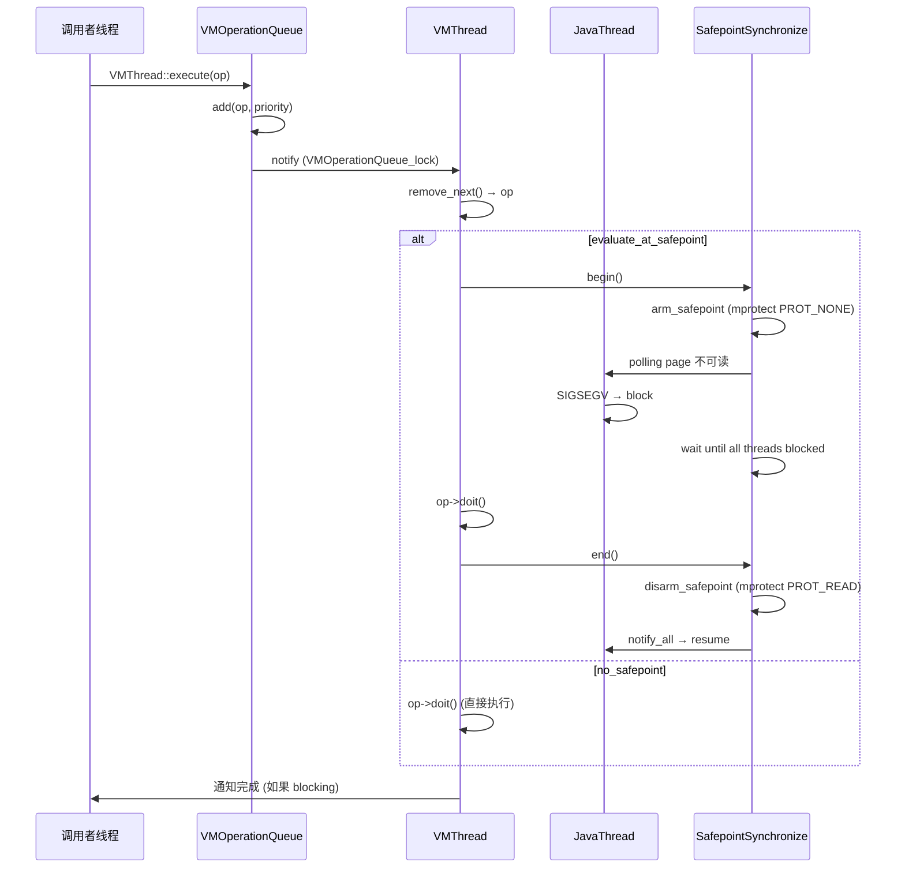
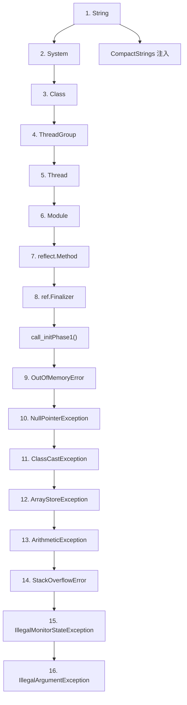
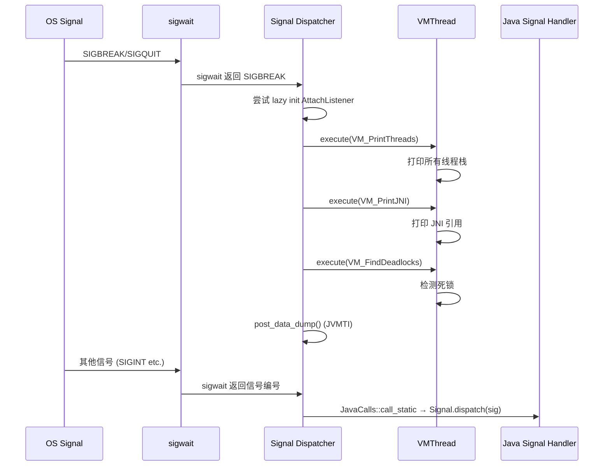
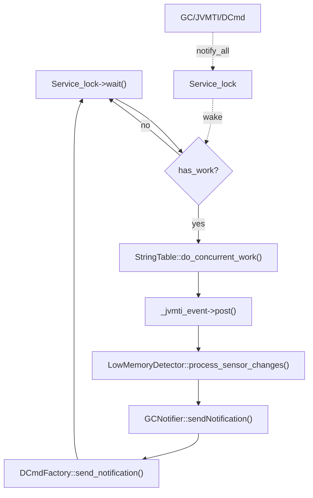
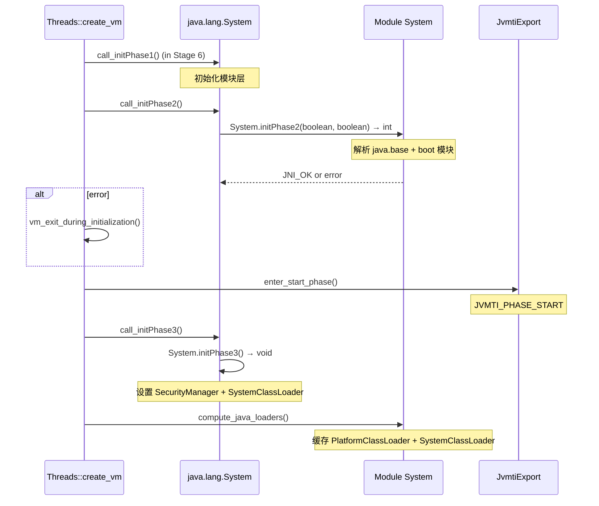
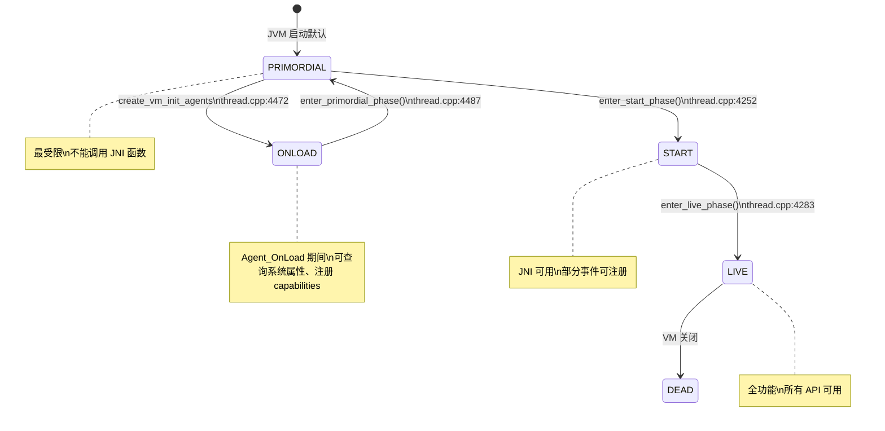

# 11-Stages5-10-Threads-And-ClassLoading — VMThread 到 Live Phase

> **Phase**：[01-jvm-startup]
> **前置**：[00-JNI-CreateJavaVM]（Stages 0-4 + init_globals）+ [10-JNIHandle-CompileQueue-JVMTI]（CompileQueue + JVMTI 环境）
> **配套**：[10-JNIHandle-CompileQueue-JVMTI] — compilation_init_phase1 消费 CompileQueue
> **后续依赖本文**：所有运行时 Phase 依赖本文创建的 VMThread/Safepoint 基础设施和 Java 核心类
> **阅读收益**：完整追踪 create_vm Stages 5-10 — VMThread 单例 + VMOperationQueue 3 优先级循环双向链表 → SafepointSynchronize::begin/end 握手协议（polling page mprotect）→ 17 个 java.lang 核心类依赖顺序加载 → Signal Dispatcher (sigwait + SIGBREAK → thread dump) → AttachListener lazy init (/tmp/.java_pid<PID>) → ServiceThread 5 事件循环 → C1/C2 编译器线程创建 → 模块系统 3 Phase → enter_live_phase → BiasedLocking 延迟启用 → WatcherThread MaxPriority → return JNI_OK

---

# 11-Stages5-10-Threads-And-ClassLoading — VMThread 到 Live Phase

## §〇 Production Scenario — 3 个真实故障

**Scenario 1: VM Thread hung during GC**

Application freezes with `[GC (Allocation Failure) ...` in GC log but never completes. `jstack <pid>` shows VM Thread in `VMThread::run()` waiting on `VMOperationQueue::remove_next()`. Root cause: previous `VM_Operation` (biased locking revocation) held `SafepointSynchronize_lock` without releasing, blocking all subsequent safepoint operations. Fix: `-XX:-UseBiasedLocking`.

**Scenario 2: Module system bootstrap failure**

`Error: Unable to initialize main class ... Caused by: java.lang.module.FindException: Module java.base not found`. `call_initPhase2()` called `System.initPhase2()` but boot layer module resolution failed. Failure occurs at thread.cpp:3791 where `vm_exit_during_initialization` is called with no message — JVM simply exits with error code.

**Scenario 3: WatcherThread priority inversion**

GC pauses spike to 200ms when `-XX:+ProfileVM` is enabled. Root cause: `WatcherThread` runs at `MaxPriority` (higher than `VMThread`), and its profiling callback preempts `VMThread` during safepoint exit, extending the pause.

**诊断三件套**：

```bash
# 1. VM Thread 阻塞诊断
jstack <pid> | grep -A 20 "VM Thread"

# 2. 模块系统初始化失败
strace -e openat java --module-path broken/path -version 2>&1 | grep modules

# 3. WatcherThread 抢占诊断
jstack <pid> | grep -A 5 "WatcherThread"

# 4. GDB 断点 VM_Operation 执行
gdb -ex "break vmThread.cpp:465" \
    -ex "run" \
    -ex "print _cur_vm_operation->name()" \
    -ex "print _vm_queue->_queue_length[0]" \
    --args java -XX:+PrintSafepointStatistics app.jar
```

**反事实**：如果 VMThread 没有优先级队列（Safepoint/Medium/Low 三级）→ GC safepoint 操作可能被低优先级的 JVMTI 事件回调排在后面。如果 call_initPhase2 失败只打印警告而不退出 → 后续代码依赖 `java.base` 模块已初始化，所有 Java 调用都抛出 `InternalError`。如果 WatcherThread 优先级等于 VMThread → profiling 采样和 PeriodicTask 调度与 safepoint 操作竞争。

---

## §一 Interview Answer + Beginner Callouts

### Interview Story Format Answer

"After `init_globals()` completes, `create_vm` enters Stage 5: `VMThread::create()` allocates the VMThread singleton and `VMOperationQueue` — a 3-priority circular doubly-linked list (Safepoint/Medium/Low). `os::create_thread` spawns the OS thread which enters `VMThread::run()` → `VMThread::loop()`, an infinite loop that dequeues `VM_Operation` from the queue, executes `evaluate()` at safepoint, and calls `SafepointSynchronize::end()`. Stage 6: `initialize_java_lang_classes()` loads 17 java.lang classes in strict dependency order — String→System→Class→ThreadGroup→Thread→Module→reflect.Method→ref.Finalizer→8 exception classes — each via `SystemDictionary::resolve_or_fail()` which triggers class loading, linking, verification, and `<clinit>` execution. Stage 7 creates Signal Dispatcher (handles SIGBREAK→thread dump) and AttachListener (UNIX domain socket for jcmd/jmap). Stage 8: ServiceThread (JVMTI deferred events + StringTable cleanup + GC notifications) and Compiler threads (C1/C2 via `compilation_init_phase1`). Stage 9: `call_initPhase2()` calls `System.initPhase2()` — the Java module system resolves `java.base` module → `call_initPhase3()` sets up SecurityManager and SystemClassLoader → `compute_java_loaders()` caches platform/system class loader oops. Stage 10: `enter_live_phase()` marks JVMTI_PHASE_LIVE → `post_vm_initialized()` fires VMInit callbacks to agents → `BiasedLocking::init()` schedules delayed biased lock enabling via PeriodicTask → `WatcherThread::start()` spawns the highest-priority thread (MaxPriority) for profiling and periodic tasks → `return JNI_OK`."

### Beginner Callout Boxes

> **Callout 1: VMThread is the ONLY thread that can execute safepoint operations**
>
> 所有 GC 暂停、偏向锁撤销、代码缓存扫描和 JVMTI 数据 dump 都通过 `VMThread::execute(VM_Operation*)` 执行。其他线程不能进入 safepoint 或修改需要 stop-the-world 暂停的全局 VM 状态。VMThread 运行在 `NearMaxPriority` 优先级。
> Source: `vmThread.cpp:250-293`

> **Callout 2: VM_Operation has 4 execution modes**
>
> `_safepoint` (需要 safepoint，阻塞调用者 — GC 暂停)、`_no_safepoint` (不需要 safepoint，阻塞调用者 — 线程 dump)、`_concurrent` (不需要 safepoint，非阻塞 — JVMTI 数据 dump)、`_async_safepoint` (需要 safepoint，非阻塞 — 偏向锁撤销)。模式决定是否调用 `SafepointSynchronize::begin()` 和调用线程是否等待。
> Source: `vmOperations.hpp:134`

> **Callout 3: Java class loading is NOT just reading .class files**
>
> `initialize_class()` 触发 5 步管线：load (找 .class 字节) → link (verify + prepare + resolve) → initialize (执行 `<clinit>`)。对于 17 个 java.lang 核心类，这发生在任何 Java 代码运行之前 — JVM 在引导自己的类型系统。
> Source: `thread.cpp:3822-3873`

> **Callout 4: Module system initialization is a 3-phase Java callback**
>
> Phase 1 (`call_initPhase1`) 初始化模块层。Phase 2 (`call_initPhase2`) 解析 `java.base` 和其他 boot 模块 — 失败是 fatal 的（`vm_exit_during_initialization` 没有错误消息）。Phase 3 (`call_initPhase3`) 设置 SecurityManager 和 SystemClassLoader。
> Source: `thread.cpp:3773-3815`

> **Callout 5: The 17 java.lang classes have a strict dependency order**
>
> `String` 必须先加载（Class 的名字是 String）、`System` 在 `Thread` 之前（initPhase1 创建主线程组）、`Class` 在 `Thread` 之前（Thread extends Object）、`Thread` 在 `Module` 之前（模块系统需要线程上下文）。违反顺序 → 循环依赖 → `ClassCircularityError`。
> Source: `thread.cpp:3822-3873`

> **Callout 6: Signal Dispatcher is a JavaThread that handles OS signals**
>
> 它不是 signal handler（那些在信号上下文中运行，有严重限制）。它是一个 daemon JavaThread，在 `os::signal_wait()` 上阻塞，通过 `JavaCalls::call_static` 将信号分派给 Java 层 `jdk.internal.misc.Signal` 处理器。
> Source: `os.cpp:346-470`

> **Callout 7: WatcherThread has HIGHER priority than VMThread**
>
> `MaxPriority` (Linux 上 SCHED_OTHER max，nice -20) vs VMThread 的 `NearMaxPriority`。这是故意的：WatcherThread 中的 profiling 回调不能被 safepoint 操作延迟。然而，如果 WatcherThread 在 safepoint 退出期间运行，这种优先级反转可能延长 GC 暂停。
> Source: `thread.cpp:1477-1523`

> **Callout 8: AttachListener has a lazy initialization pattern**
>
> 如果 `StartAttachListener` 为 false（默认），listener 不在启动时创建。相反，Signal Dispatcher 在 SIGBREAK 上检查 attach 触发文件并调用 `AttachListener::init()` 延迟初始化。这为从不使用 jcmd/jmap 的应用节省一个线程 + socket。
> Source: `attachListener.cpp:435-445`, `os.cpp:346-360`

---

## §二 Standard Environment

### Source Roots

| Root | Path | 用途 |
|------|------|------|
| create_vm 主流程 | `src/hotspot/share/runtime/thread.cpp` (:3886-4347) | Stages 5-10 全部逻辑 |
| VMThread | `src/hotspot/share/runtime/vmThread.cpp` + `vmThread.hpp` | VMThread::create/run/loop + VMOperationQueue |
| VM Operations | `src/hotspot/share/runtime/vmOperations.hpp` | VM_Operation 基类 + 4 种模式 |
| Safepoint | `src/hotspot/share/runtime/safepoint.cpp` (:156, :527) | SafepointSynchronize::begin/end |
| Class Loading | `src/hotspot/share/classfile/systemDictionary.cpp` | resolve_well_known_classes |
| Signal Dispatcher | `src/hotspot/share/runtime/os.cpp` (:346-530) | signal_thread_entry |
| Attach Listener | `src/hotspot/share/services/attachListener.cpp` + `os/linux/attachListener_linux.cpp` | init + socket |
| ServiceThread | `src/hotspot/share/runtime/serviceThread.cpp` | initialize + 5-event loop |
| Compile Broker | `src/hotspot/share/compiler/compileBroker.cpp` (:614-925) | compilation_init_phase1/2 |
| Biased Locking | `src/hotspot/share/runtime/biasedLocking.cpp` (:95) | init + EnableBiasedLockingTask |
| WatcherThread | `src/hotspot/share/runtime/thread.cpp` (:1477-1630) | WatcherThread constructor + start |

### Build Configuration

```bash
make hotspot
nm -C build/linux-x86_64-server-release/hotspot/variant-server/libjvm/libjvm.so | grep -E "VMThread::(create|run|loop)"
```

### Syscall / Library 速查

| Call | man | 上下文 |
|------|-----|--------|
| `pthread_create` | `man 3 pthread_create` | VMThread/ServiceThread/CompilerThread/SignalDispatcher/WatcherThread 创建 |
| `pthread_cond_wait` | `man 3 pthread_cond_wait` | `VMOperationQueue::remove_next` 中等待 VM 操作 |
| `sched_setscheduler` | `man 2 sched_setscheduler` | `os::set_native_priority` 设置线程优先级 |
| `sigwait`/`sigwaitinfo` | `man 2 sigwait` | `os::signal_wait` Signal Dispatcher 阻塞 |
| `socket`/`bind`/`listen`/`accept` | `man 2 socket` | AttachListener UNIX domain socket |
| `unlink` | `man 2 unlink` | AttachListener::vm_start 清理残留 socket |

---

## §三 Source Files Table

| # | File | 行数 | 角色 | 关键行 |
|---|------|:---:|------|--------|
| 1 | `src/hotspot/share/runtime/thread.cpp` | ~6300 | create_vm Stages 5-10 + 类加载 + JSR292 | :3822-4347 |
| 2 | `src/hotspot/share/runtime/vmThread.cpp` | ~500 | VMThread::create/run/loop + VMOperationQueue | :56, :250, :293, :465 |
| 3 | `src/hotspot/share/runtime/vmThread.hpp` | ~200 | VMThread + VMOperationQueue 类定义 | :39 |
| 4 | `src/hotspot/share/runtime/vmOperations.hpp` | ~300 | VM_Operation 基类 + 4 种执行模式 | :134 |
| 5 | `src/hotspot/share/runtime/safepoint.cpp` | ~800 | SafepointSynchronize::begin/end | :156, :527 |
| 6 | `src/hotspot/share/runtime/os.cpp` | ~1500 | signal_thread_entry + init_before_ergo | :346, :477 |
| 7 | `src/hotspot/share/services/attachListener.cpp` | ~500 | AttachListener::init | :435 |
| 8 | `src/hotspot/share/runtime/serviceThread.cpp` | ~150 | ServiceThread::initialize + service_thread_entry | :51, :90 |
| 9 | `src/hotspot/share/compiler/compileBroker.cpp` | ~2000 | compilation_init_phase1/2 | :614, :768, :864 |
| 10 | `src/hotspot/share/prims/jvmtiExport.cpp` | ~2800 | enter_start/live_phase + post_vm_start/init | :606-696 |
| 11 | `src/hotspot/share/runtime/biasedLocking.cpp` | ~500 | BiasedLocking::init + EnableBiasedLockingTask | :95 |
| 12 | `src/hotspot/share/classfile/moduleEntry.cpp` | ~400 | ModuleEntryTable 构造函数 | :316 |
| 13 | `src/hotspot/share/classfile/packageEntry.cpp` | ~200 | PackageEntryTable 构造函数 | :170 |
| 14 | `src/hotspot/share/memory/universe.cpp` | ~2000 | genesis + initialize_basic_type_mirrors | :323, :466 |
| 15 | `src/hotspot/share/memory/metaspace.cpp` | ~1500 | Metaspace::post_initialize | :1496 |
| 16 | `src/hotspot/share/classfile/systemDictionary.cpp` | ~3200 | initialize + compute_java_loaders | :131, :1937 |
| 17 | `src/hotspot/os/linux/attachListener_linux.cpp` | ~600 | AttachListener Linux 实现 | :461, :495 |

---

## §四 Stage 5: VMThread — 安全点执行引擎

### 4.1 VMThread::create(): 单例 + VMOperationQueue 3 优先级

```cpp
// vmThread.cpp:240-247 — 静态成员
VMThread*         VMThread::_vm_thread          = NULL;
VM_Operation*     VMThread::_cur_vm_operation   = NULL;
VMOperationQueue* VMThread::_vm_queue           = NULL;
Monitor*          VMThread::_terminate_lock     = NULL;

// vmThread.cpp:250-283 — create()
void VMThread::create() {
  assert(vm_thread() == NULL, "we can only allocate one VMThread");
  _vm_thread = new VMThread();                 // C++ 对象

  if (AbortVMOnVMOperationTimeout) {
    _timeout_task = new VMOperationTimeoutTask(interval);
    _timeout_task->enroll();
  }

  _vm_queue = new VMOperationQueue();          // VM 操作队列
  _terminate_lock = new Monitor(Mutex::safepoint, "VMThread::_terminate_lock", true,
                                Monitor::_safepoint_check_never);
  if (UsePerfData) {
    _perf_accumulated_vm_operation_time =
      PerfDataManager::create_counter(SUN_THREADS, "vmOperationTime",
                                       PerfData::U_Ticks, CHECK);
  }
}
```

`create()` 创建 C++ 对象但**不创建 OS 线程** — 调用方 `create_vm` 负责 `os::create_thread`。这种分离允许在 OS 线程创建前完成初始化。

`VMOperationQueue` 是 3 优先级循环双向链表，每个优先级用 `VM_Dummy` 哨兵节点自环：

```
┌─────────────────────────────────────────────────────┐
│  VMOperationQueue                                   │
│  _queue_length[SafepointPriority] = N               │
│  _queue_length[MediumPriority]    = M               │
│  _queue_length[LowPriority]       = K               │
│                                                     │
│  [Safepoint Priority]  Dummy ↔ Op1 ↔ Op2 ↔ Dummy   │
│  [Medium Priority]     Dummy ↔ Op3 ↔ Dummy          │
│  [Low Priority]        Dummy ↔ Op4 ↔ Op5 ↔ Dummy    │
└─────────────────────────────────────────────────────┘
```

### 4.2 VMThread::run() → loop(): 无限循环消费 VM_Operation

```cpp
// vmThread.cpp:293-367 — run()
void VMThread::run() {
  this->initialize_named_thread();
  this->set_active_handles(JNIHandleBlock::allocate_block());

  { MutexLocker ml(Notify_lock);  // 通知 create_vm: VMThread 就绪
    Notify_lock->notify();
  }

  int prio = (VMThreadPriority == -1)
    ? os::java_to_os_priority[NearMaxPriority] : VMThreadPriority;
  os::set_native_priority(this, prio);      // NearMaxPriority

  this->loop();  // 主循环

  // 终止协议
  _no_op_reason = "Halt";
  SafepointSynchronize::begin();
  // ... 最终 safepoint 中的清理 ...
  CompileBroker::set_should_block();
  VM_Exit::wait_for_threads_in_native_to_block();
  { MutexLockerEx ml(_terminate_lock, Mutex::_no_safepoint_check_flag);
    _terminated = true;
    _terminate_lock->notify();
  }
}
```

`run()` 的生命周期：创建 JNIHandleBlock → 通知 create_vm 就绪 → 设置优先级 → 进入 `loop()` → 终止时通过 `_terminate_lock` 通知等待者。

```cpp
// vmThread.cpp:465-580 — loop() 核心
void VMThread::loop() {
  while(true) {
    VM_Operation* safepoint_ops = NULL;
    {
      MutexLockerEx mu_queue(VMOperationQueue_lock,
                             Mutex::_no_safepoint_check_flag);
      _cur_vm_operation = _vm_queue->remove_next();  // 从队列取操作

      while (!should_terminate() && _cur_vm_operation == NULL) {
        // 带超时的等待，保证定时 safepoint
        bool timedout = VMOperationQueue_lock->wait(
            Mutex::_no_safepoint_check_flag, GuaranteedSafepointInterval);

        if (timedout && VMThread::no_op_safepoint_needed(false)) {
          MutexUnlockerEx mul(VMOperationQueue_lock, Mutex::_no_safepoint_check_flag);
          SafepointSynchronize::begin();  // 强制 no-op safepoint
          SafepointSynchronize::end();
        }
        _cur_vm_operation = _vm_queue->remove_next();

        // 批量排空同优先级的 safepoint 操作
        if (_cur_vm_operation != NULL &&
            _cur_vm_operation->evaluate_at_safepoint()) {
          safepoint_ops = _vm_queue->drain_at_safepoint_priority();
        }
      }
      if (should_terminate()) break;
    }

    // 执行 VM 操作
    if (_cur_vm_operation->evaluate_at_safepoint()) {
      _vm_queue->set_drain_list(safepoint_ops);
      SafepointSynchronize::begin();
      evaluate_operation(_cur_vm_operation);
      // 批量执行排空的所有 safepoint 操作
      do {
        _cur_vm_operation = safepoint_ops;
        if (_cur_vm_operation != NULL) {
          do {
            evaluate_operation(_cur_vm_operation);
            _cur_vm_operation = safepoint_ops->next();
          } while (_cur_vm_operation != safepoint_ops);
        }
      } while (_vm_queue->drain_at_safepoint_priority() != NULL);
      SafepointSynchronize::end();
    } else {
      evaluate_operation(_cur_vm_operation);  // 无 safepoint 直接执行
    }
  }
}
```



### 4.3 VM_Operation 4 种执行模式

```cpp
// vmOperations.hpp:134-141
class VM_Operation: public CHeapObj<mtInternal> {
 public:
  enum Mode {
    _safepoint,       // blocking,        safepoint, vm_op C-heap allocated
    _no_safepoint,    // blocking,     no safepoint, vm_op C-Heap allocated
    _concurrent,      // non-blocking, no safepoint, vm_op C-Heap allocated
    _async_safepoint  // non-blocking,    safepoint, vm_op C-Heap allocated
  };
};
```

| 模式 | Safepoint | 阻塞调用者 | 典型用例 |
|------|:---------:|:---------:|---------|
| `_safepoint` | 需要 | 是 | GC 暂停、偏向锁撤销、代码缓存扫描 |
| `_no_safepoint` | 不需要 | 是 | 线程 dump、JNI 打印 |
| `_concurrent` | 不需要 | 否 | JVMTI 数据 dump |
| `_async_safepoint` | 需要 | 否 | 异步偏向锁撤销 |

### 4.4 SafepointSynchronize::begin/end 握手协议

```cpp
// safepoint.cpp:156 — begin()
void SafepointSynchronize::begin() {
  Thread* myThread = Thread::current();
  assert(myThread->is_VM_thread(), "Only VM thread may execute a safepoint");

  Threads_lock->lock();                    // 阻止线程创建/退出
  MutexLocker mu(Safepoint_lock);

  _waiting_to_block = nof_threads;         // 设置等待计数

  // 武装 polling page: mprotect PROT_NONE
  // JavaThread 在 3 种状态停止：
  // 1. 解释执行：dispatch table 被修改为检查 safepoint
  // 2. Native 代码：返回时检查 _state 标志
  // 3. 编译代码：读取 polling page → SIGSEGV → 阻塞
  arm_safepoint();

  // 自旋 + yield 等待所有线程阻塞
  while (still_running > 0) {
    // ... 自旋等待 ...
    if (iterations > safepoint_spin_before_yield) {
      os::naked_yield();  // 让出 CPU
    }
    // ... 超时后 Safepoint_lock->wait() ...
  }
}
```

**反事实**：如果没有 polling page → 每个 Java 方法必须在每个 safepoint poll 点显式检查全局变量 → 每次检查需要从内存加载 → ~5ns per poll vs polling page 的 ~1ns (page 在 L1 cache)。

---

## §五 Stage 6: Java 核心类加载

### 5.1 initialize_java_lang_classes(): 17 个类的依赖顺序

```cpp
// thread.cpp:3822-3873
void Threads::initialize_java_lang_classes(JavaThread *main_thread, TRAPS) {
    // 严格依赖顺序 — 违反则 ClassCircularityError
    initialize_class(vmSymbols::java_lang_String(), CHECK);           // 1
    java_lang_String::set_compact_strings(CompactStrings);            // CompactStrings 注入

    initialize_class(vmSymbols::java_lang_System(), CHECK);           // 2
    initialize_class(vmSymbols::java_lang_Class(), CHECK);            // 3
    initialize_class(vmSymbols::java_lang_ThreadGroup(), CHECK);      // 4
    // 创建主线程组 → Universe::set_main_thread_group()
    Handle thread_group = create_initial_thread_group(CHECK);

    initialize_class(vmSymbols::java_lang_Thread(), CHECK);           // 5
    oop thread_object = create_initial_thread(thread_group, main_thread, CHECK);
    main_thread->set_threadObj(thread_object);
    java_lang_Thread::set_thread_status(thread_object,
                                        java_lang_Thread::RUNNABLE);  // 标记 RUNNABLE

    initialize_class(vmSymbols::java_lang_Module(), CHECK);           // 6

    initialize_class(vmSymbols::java_lang_reflect_Method(), CHECK);   // 7
    initialize_class(vmSymbols::java_lang_ref_Finalizer(), CHECK);    // 8

    call_initPhase1(CHECK);  // 模块系统 Phase 1: 初始化模块层

    // 8 个异常类预初始化
    initialize_class(vmSymbols::java_lang_OutOfMemoryError(), CHECK);           // 9
    initialize_class(vmSymbols::java_lang_NullPointerException(), CHECK);       // 10
    initialize_class(vmSymbols::java_lang_ClassCastException(), CHECK);         // 11
    initialize_class(vmSymbols::java_lang_ArrayStoreException(), CHECK);        // 12
    initialize_class(vmSymbols::java_lang_ArithmeticException(), CHECK);        // 13
    initialize_class(vmSymbols::java_lang_StackOverflowError(), CHECK);         // 14
    initialize_class(vmSymbols::java_lang_IllegalMonitorStateException(), CHECK);// 15
    initialize_class(vmSymbols::java_lang_IllegalArgumentException(), CHECK);   // 16
}
```



为什么是这个顺序？
- `String` 必须最先：所有类名是 String，Class 的 name 字段是 String
- `System` 在 `Thread` 之前：initPhase1 创建主线程组需要 System 类
- `Class` 在 `Thread` 之前：Thread extends Object，Object 的 Class 必须存在
- `Thread` 在 `Module` 之前：模块系统需要线程上下文
- 8 个异常类在 `call_initPhase1` 之后：模块系统就绪后预分配异常实例

### 5.2 8 个预分配异常类的存储位置

这些异常在 `universe_post_init()` 中预分配实例，存储在 `Universe::_out_of_memory_error_*` 等静态 oop 中。预分配的原因是：这些异常在 JVM 内部抛出时（GC OOM、NPE on null receiver），JVM 没有 Java 线程上下文去分配对象，必须使用预分配实例。

**反事实**：如果不预分配 — JVM 需要在 OOM 条件下再分配 OOM 对象 → 递归 OOM → 死循环。

---

## §六 Stage 7: Signal Dispatcher + AttachListener

### 6.1 Signal Dispatcher: signal_thread_entry + SIGBREAK 处理

```cpp
// os.cpp:346-448 — signal_thread_entry()
static void signal_thread_entry(JavaThread* thread, TRAPS) {
  os::set_priority(thread, NearMaxPriority);
  while (true) {
    int sig;
    sig = os::signal_wait();  // sigwait/sigwaitinfo (man 2 sigwait)

    if (sig == os::sigexitnum_pd()) {
      return;  // 终止 Signal Dispatcher
    }

    switch (sig) {
      case SIGBREAK: {
        // 1. 尝试 lazy init AttachListener
        if (!DisableAttachMechanism) {
          AttachListenerState cur_state = AttachListener::transit_state(
              AL_INITIALIZING, AL_NOT_INITIALIZED);
          if (cur_state == AL_NOT_INITIALIZED) {
            if (AttachListener::is_init_trigger()) {
              continue;  // Attach Listener 已初始化
            }
          }
        }
        // 2. 打印线程栈 (VMThread::execute — _no_safepoint 模式)
        VM_PrintThreads op;
        VMThread::execute(&op);
        // 3. 打印 JNI 引用
        VM_PrintJNI jni_op;
        VMThread::execute(&jni_op);
        // 4. 检测死锁
        VM_FindDeadlocks op1(tty);
        VMThread::execute(&op1);
        // 5. 堆直方图 (可选)
        if (PrintClassHistogram) {
          VM_GC_HeapInspection op2(tty, true);
          VMThread::execute(&op2);
        }
        // 6. JVMTI 数据 dump
        if (JvmtiExport::should_post_data_dump()) {
          JvmtiExport::post_data_dump();
        }
        break;
      }
      default: {
        // 分派给 Java 层 jdk.internal.misc.Signal.dispatch(sig)
        JavaCalls::call_static(&result, klass,
            vmSymbols::dispatch_name(),
            vmSymbols::int_void_signature(), &args, THREAD);
      }
    }
  }
}
```



Signal Dispatcher 是 `NearMaxPriority` 的 daemon JavaThread，在 `os::initialize_jdk_signal_support()` (os.cpp:477-524) 中创建：

```cpp
// os.cpp:477-524 — initialize_jdk_signal_support()
void os::initialize_jdk_signal_support(TRAPS) {
  if (!ReduceSignalUsage) {
    // 创建 Java Thread 对象
    Handle thread_oop = JavaCalls::construct_new_instance(
        SystemDictionary::Thread_klass(), ...);
    // 加入系统线程组
    JavaCalls::call_special(&result, thread_group, group,
        vmSymbols::add_method_name(), ...);

    { MutexLocker mu(Threads_lock);
      JavaThread* signal_thread = new JavaThread(&signal_thread_entry);
      java_lang_Thread::set_thread(thread_oop(), signal_thread);
      java_lang_Thread::set_priority(thread_oop(), NearMaxPriority);
      java_lang_Thread::set_daemon(thread_oop());
      signal_thread->set_threadObj(thread_oop());
      Threads::add(signal_thread);
      Thread::start(signal_thread);
    }
    os::signal(SIGBREAK, os::user_handler());  // 注册信号处理器
  }
}
```

### 6.2 AttachListener: UNIX domain socket + lazy initialization

```bash
# Socket 路径
/tmp/.java_pid<PID>
```

`AttachListener::vm_start()` 在启动时 `unlink(fn)` 删除残留 socket 文件，防止上次异常退出留下的文件导致 `bind()` 失败。`init()` 创建 socket → `bind()` → `listen()` → JavaThread 循环 `accept()`。

Lazy initialization 状态机：
```
AL_NOT_INITIALIZED → AL_INITIALIZING → AL_INITIALIZED
```

SIGBREAK 触发 `is_init_trigger()` → `transit_state(AL_INITIALIZING)` → `AttachListener::init()`。如果 `bind()` 失败 (Address already in use) → `set_state(AL_NOT_INITIALIZED)` 允许后续 lazy init 重试。

**反事实**：如果所有 JVM 都启动 AttachListener — 每个 JVM 进程多一个线程 + socket，容器中 1000 个 JVM 多 1000 个 socket 和文件描述符。

---

## §七 Stage 8: ServiceThread + Compiler 线程

### 7.1 ServiceThread: 5 种事件处理 + Service_lock 等待

```cpp
// serviceThread.cpp:51-88 — initialize()
void ServiceThread::initialize() {
  // 创建 Java Thread 对象 + 加入系统线程组
  Handle thread_oop = JavaCalls::construct_new_instance(...);
  { MutexLocker mu(Threads_lock);
    ServiceThread* thread = new ServiceThread(&service_thread_entry);
    java_lang_Thread::set_thread(thread_oop(), thread);
    java_lang_Thread::set_priority(thread_oop(), NearMaxPriority);
    java_lang_Thread::set_daemon(thread_oop());
    thread->set_threadObj(thread_oop());
    _instance = thread;
    Threads::add(thread);
    Thread::start(thread);
  }
}

// serviceThread.cpp:90-149 — service_thread_entry()
void ServiceThread::service_thread_entry(JavaThread* jt, TRAPS) {
  while (true) {
    bool sensors_changed, has_jvmti_events, has_gc_notification_event;
    bool has_dcmd_notification_event, stringtable_work;

    {
      ThreadBlockInVM tbivm(jt);  // 状态转换: 允许 safepoint 处理此线程
      MutexLockerEx ml(Service_lock, Mutex::_no_safepoint_check_flag);

      while (!(sensors_changed = LowMemoryDetector::has_pending_requests()) &&
             !(has_jvmti_events = _jvmti_service_queue.has_events()) &&
             !(has_gc_notification_event = GCNotifier::has_event()) &&
             !(has_dcmd_notification_event = DCmdFactory::has_pending_jmx_notification()) &&
             !(stringtable_work = StringTable::has_work())) {
        Service_lock->wait(Mutex::_no_safepoint_check_flag);  // 永久等待
      }
      if (has_jvmti_events) {
        jvmti_event = _jvmti_service_queue.dequeue();
      }
    }  // 释放 Service_lock

    // 5 种事件处理 (无锁)
    if (stringtable_work)         StringTable::do_concurrent_work(jt);
    if (has_jvmti_events)         _jvmti_event->post();
    if (sensors_changed)          LowMemoryDetector::process_sensor_changes(jt);
    if (has_gc_notification_event) GCNotifier::sendNotification(CHECK);
    if (has_dcmd_notification_event) DCmdFactory::send_notification(CHECK);
  }
}
```



为什么这些事件不能在各自触发线程中直接处理？
- JVMTI 事件：不能在 safepoint 内发送（会触发 `JVMTI_ERROR_WRONG_PHASE`），必须延迟
- 低内存检测：需要分配 Java 对象 → 不能在 GC 中执行
- StringTable 清理：并发操作，不应阻塞 mutator 线程

### 7.2 CompileBroker::compilation_init_phase1: C1/C2 线程 + sweeper

```cpp
// compileBroker.cpp:614-766 — compilation_init_phase1()
void CompileBroker::compilation_init_phase1(TRAPS) {
  // 1. 计算编译器线程数
  int c1_count = CompilationPolicy::policy()->compiler_count(CompLevel_simple);
  int c2_count = CompilationPolicy::policy()->compiler_count(CompLevel_full_optimization);

  // 2. 创建编译器实例
  if (c1_count > 0) {
    Compiler *compiler = Compiler::create_compiler(compiler1, CHECK);
    _compilers[0] = compiler;
  }
  if (c2_count > 0) {
    Compiler *compiler = Compiler::create_compiler(compiler2, CHECK);
    _compilers[1] = compiler;
  }

  // 3. 创建编译器线程 + sweeper 线程
  init_compiler_sweeper_threads(c1_count, c2_count);
}
```

编译器线程数默认值：`CICompilerCount` 默认 = `max(log2(NCores), 1) * 3/2` for tiered, 或 1 for non-tiered。C1:C2 比例约为 1:2。

### 7.3 JSR292 核心类预加载

```cpp
// thread.cpp:3876-3883
void Threads::initialize_jsr292_core_classes(TRAPS) {
  initialize_class(vmSymbols::java_lang_invoke_MethodHandle(), CHECK);
  initialize_class(vmSymbols::java_lang_invoke_ResolvedMethodName(), CHECK);
  initialize_class(vmSymbols::java_lang_invoke_MemberName(), CHECK);
  initialize_class(vmSymbols::java_lang_invoke_MethodHandleNatives(), CHECK);
}
```

必须在编译器初始化之后：MethodHandle 的 signature polymorphic 方法需要 `SystemDictionary::find_method_handle_intrinsic` 在编译器初始化后才能解析。提前加载避免后续类加载死锁。

---

## §八 Stage 9: 模块系统 — call_initPhase2/3

```cpp
// thread.cpp:4243-4264 — Stage 9 in create_vm
call_initPhase2(CHECK_JNI_ERR);  // Phase 2: 解析 java.base 模块

JvmtiExport::enter_start_phase();  // JVMTI_PHASE_START
JvmtiExport::post_vm_start();

call_initPhase3(CHECK_JNI_ERR);  // Phase 3: SecurityManager + SystemClassLoader

SystemDictionary::compute_java_loaders(CHECK_JNI_ERR);  // 缓存类加载器 oop
```



Phase 2 失败是 fatal 的：`vm_exit_during_initialization` 直接退出进程，没有异常消息。因为此时 `java.base` 不可用，异常处理机制本身依赖 `java.lang.Throwable` 已加载。Phase 3 无返回值检查因为 `initPhase3` 声明为 void。

**反事实**：如果 Phase2 失败后尝试降级运行 — 任何 Java 调用都会触发 `NoClassDefFoundError` → 症状远离根因。

---

## §九 Stage 10: Live Phase + 收尾

### 9.1 enter_live_phase() + post_vm_initialized()

```cpp
// thread.cpp:4282-4347 — Stage 10 in create_vm
JvmtiExport::enter_live_phase();           // JVMTI_PHASE_LIVE
JvmtiExport::post_vm_initialized();        // VMInit 回调给所有 agent

Management::initialize(THREAD);            // JMX agent
StatSampler::engage();                     // PerfData 采样
if (CheckJNICalls) JniPeriodicChecker::engage();

BiasedLocking::init();                     // 延迟启用偏向锁

call_postVMInitHook(THREAD);               // Java 回调钩子

{
  MutexLocker ml(PeriodicTask_lock);
  WatcherThread::make_startable();
  if (PeriodicTask::num_tasks() > 0) {
    WatcherThread::start();                // 创建最高优先级线程
  }
}

return JNI_OK;
```


### 9.2 BiasedLocking::init() 的延迟策略

```cpp
// biasedLocking.cpp:95-112
void BiasedLocking::init() {
  if (UseBiasedLocking) {
    if (BiasedLockingStartupDelay > 0) {
      // 延迟启用：注册 PeriodicTask，由 WatcherThread 执行
      EnableBiasedLockingTask* task = new EnableBiasedLockingTask(
          BiasedLockingStartupDelay);
      task->enroll();
    } else {
      // 立即启用：VMThread 执行 safepoint 操作
      VM_EnableBiasedLocking op(false);
      VMThread::execute(&op);
    }
  }
}
```

延迟启用的原因：启动期间大量类加载和初始化触发频繁的 safepoint，如果立即启用偏向锁 → 每次 safepoint 撤销所有偏向锁 → 启动时间增加 30-50%。

**反事实**：如果不延迟 — 启动期间偏向锁撤销风暴，CPU 消耗在 `BiasedLocking::revoke_at_safepoint()` 上。

### 9.3 WatcherThread::start() + MaxPriority 设计

```cpp
// thread.cpp:1477-1493 — WatcherThread 构造
WatcherThread::WatcherThread() : NonJavaThread() {
  if (os::create_thread(this, os::watcher_thread)) {
    _watcher_thread = this;
    os::set_priority(this, MaxPriority);  // 高于 VMThread!
    if (!DisableStartThread) {
      os::start_thread(this);
    }
  }
}

// thread.cpp:1614-1622 — start()
void WatcherThread::start() {
  assert(PeriodicTask_lock->owned_by_self(), "PeriodicTask_lock required");
  if (watcher_thread() == NULL && _startable) {
    _should_terminate = false;
    new WatcherThread();
  }
}
```

```cpp
// thread.cpp:1553-1612 — WatcherThread::run()
void WatcherThread::run() {
  this->set_active_handles(JNIHandleBlock::allocate_block());
  while (true) {
    int time_waited = sleep();  // 计算最小到期时间 → sleep

    if (_should_terminate) break;

    PeriodicTask::real_time_tick(time_waited);  // 执行到期 task
  }
  // 终止通知
  { MutexLockerEx mu(Terminator_lock, Mutex::_no_safepoint_check_flag);
    _watcher_thread = NULL;
    Terminator_lock->notify();
  }
}
```

WatcherThread 的 PeriodicTask 队列：`StatSamplerTask` (perfdata 采样)、`EnableBiasedLockingTask` (偏向锁启用)、`JniPeriodicCheckerTask`、`MemProfilerTask`、JFR `VM_PeriodicTask`。

WatcherThread 优先级高于 VMThread 的设计原因：profiling 采样必须在固定间隔执行，不能被 safepoint 延迟。代价：WatcherThread profiling 在 safepoint 退出期间抢占 VMThread → GC 暂停延长。

---

## §十 线程优先级总览

| 线程 | 类型 | 优先级 | Linux nice | 入口函数 | 创建位置 |
|------|------|:------:|:----------:|---------|---------|
| **WatcherThread** | NonJavaThread | MaxPriority | -20 | `WatcherThread::run()` | `thread.cpp:1477` |
| **VMThread** | NamedThread | NearMaxPriority | -10 | `VMThread::loop()` | `vmThread.cpp:250` |
| **Signal Dispatcher** | JavaThread | NearMaxPriority | -10 | `signal_thread_entry()` | `os.cpp:502` |
| **Attach Listener** | JavaThread | NearMaxPriority | -10 | `attach_listener_thread_entry()` | `attachListener_linux.cpp` |
| **ServiceThread** | JavaThread | NearMaxPriority | -10 | `service_thread_entry()` | `serviceThread.cpp:68` |
| **C1 Compiler** | JavaThread | NearMaxPriority | -10 | `compiler_thread_entry()` | `compileBroker.cpp:864` |
| **C2 Compiler** | JavaThread | NearMaxPriority | -10 | `compiler_thread_entry()` | `compileBroker.cpp:864` |
| **CodeCache Sweeper** | JavaThread | NearMaxPriority | -10 | `sweeper_thread_entry()` | `compileBroker.cpp:864` |

优先级设计原理：
- `WatcherThread` (MaxPriority) > `VMThread` (NearMaxPriority) — profiling 不能被延迟
- `VMThread` > `Compiler/Service/Signal/Attach` — safepoint 操作优先于后台工作
- 编译器线程 (`NearMaxPriority`) — 不影响 safepoint，但需要足够优先级避免饥饿

**反事实**：如果 WatcherThread 优先级等于 VMThread — profiling 采样和 PeriodicTask 调度与 safepoint 操作竞争 → GC 延迟不可预测。

---

## §十一 JVMTI Phase 转变时间线



| 切换点 | create_vm 位置 | 行号 | 可用 API |
|--------|:---:|:---:|---------|
| PRIMORDIAL → ONLOAD | `create_vm_init_agents` 开始 | thread.cpp:4472 | 查询系统属性、注册 capabilities |
| ONLOAD → PRIMORDIAL | `create_vm_init_agents` 结束 | thread.cpp:4487 | 最受限，仅查询 |
| PRIMORDIAL → START | `call_initPhase2` 之后 | thread.cpp:4252 | JNI 可用，部分事件 |
| START → LIVE | `call_initPhase3` 之后 | thread.cpp:4283 | 全功能 |

---

## §十二 边缘场景与诊断

### 12.1 VM_Operation 队列堆积

```bash
# 诊断：jstack 查看 VM Thread
jstack <pid> | grep -A 20 "VM Thread"
# 期望看到当前 VM_Operation 类型和 _vm_queue 长度

# GDB
gdb -ex "break vmThread.cpp:465" -ex "run" \
    -ex "print _vm_queue->_queue_length[0]" \
    -ex "print _vm_queue->_queue_length[1]" \
    -ex "print _vm_queue->_queue_length[2]" \
    --args java -version
```

### 12.2 模块系统初始化失败

```bash
# strace + module log
strace -e openat java --module-path broken/path -version 2>&1 | grep modules
# 或
java -Xlog:modules=debug -version
```

### 12.3 偏向锁撤销风暴

```bash
jstack <pid> | grep -A 5 "safepoint"
# 检查 safepoint 频率和操作类型
java -XX:+TraceBiasedLocking -XX:+PrintSafepointStatistics -version
```

### 12.4 WatcherThread 优先级反转

```bash
# 检查线程优先级
grep -E "Name|SigCgt" /proc/<pid>/task/*/status
# 或
perf sched record -a sleep 5 && perf sched latency
```

### 12.5 Signal Dispatcher 死锁

如果 Signal Dispatcher 调用需要 safepoint 的 VM_Operation → 死锁（因为它已经持有某些锁）。这应该永远不会发生 — 所有 VM_Operation 在 Signal Dispatcher 中都是 `_no_safepoint` 模式。

---

## §十三 系统调用与 /proc 交互

### 13.1 pthread_create (`man 3 pthread_create`)

所有后台线程创建最终调用 `pthread_create` → Linux `clone(CLONE_VM|CLONE_FS|CLONE_FILES|CLONE_SIGHAND|CLONE_THREAD|CLONE_SYSVSEM|CLONE_SETTLS|CLONE_PARENT_SETTID|CLONE_CHILD_CLEARTID)`。

### 13.2 sched_setscheduler (`man 2 sched_setscheduler`)

`os::set_native_priority` 调用 `sched_setscheduler` 设置 SCHED_OTHER nice 值。WatcherThread 的 MaxPriority → nice -20。

### 13.3 sigwait/sigwaitinfo (`man 2 sigwait`)

`os::signal_wait()` 内部调用 `sigwaitinfo` — Signal Dispatcher 阻塞等待 OS 信号。

### 13.4 socket/bind/listen/accept (`man 2 socket`)

AttachListener 创建 UNIX domain socket (`AF_UNIX`, `SOCK_STREAM`) → `bind()` 到 `/tmp/.java_pid<PID>` → `listen()` → 循环 `accept()`。

### 13.5 /proc/self/task/<tid>/stat

验证线程优先级 (field 19 = nice)：
```bash
cat /proc/<pid>/task/<tid>/stat | awk '{print $19}'  # nice 值
```

### 13.6 /proc/self/task/<tid>/sched

验证调度策略：
```bash
grep "policy" /proc/<pid>/task/<tid>/sched  # SCHED_OTHER/SCHED_FIFO/SCHED_RR
```

---

## §十四 GDB 断点验证

### 断言 1: VMThread 创建
```
(gdb) break vmThread.cpp:250
(gdb) print _vm_queue
(gdb) print _vm_queue->_queue_length[0]  # 期望: 0
```

### 断言 2: VMThread::loop 取操作
```
(gdb) break vmThread.cpp:465
(gdb) print _cur_vm_operation->name()
```

### 断言 3: Safepoint begin
```
(gdb) break safepoint.cpp:156
(gdb) print SafepointSynchronize::_state  # 期望: _not_synchronized → _synchronizing
```

### 断言 4: initialize_class
```
(gdb) break thread.cpp:3829  # initialize_class(String)
(gdb) print name  # 期望: "java/lang/String"
(gdb) continue  # 验证 17 个类按顺序加载
```

### 断言 5: Signal Dispatcher
```
(gdb) break os.cpp:502
(gdb) info threads  # 确认 "Signal Dispatcher" 线程
```

### 断言 6: call_initPhase2 返回值
```
(gdb) break thread.cpp:3791
(gdb) continue  # 通过 JavaCalls::call_static
(gdb) print return_value  # 期望: JNI_OK (0)
```

### 断言 7: enter_live_phase
```
(gdb) break jvmtiExport.cpp:622
(gdb) print JvmtiEnvBase::_phase  # 期望: JVMTI_PHASE_LIVE
```

### 断言 8: WatcherThread 创建
```
(gdb) break thread.cpp:1477
(gdb) info threads  # 确认 MaxPriority 线程存在
```
