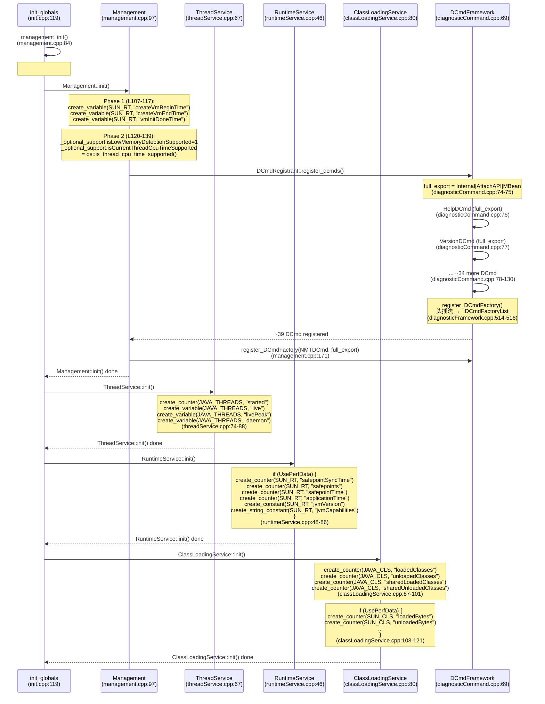

# 13-Management-Services — JMX/jcmd/jstat 监控基础设施初始化

> **Phase**: 01-jvm-startup
> **前置**: [07-PerfMemory]（PerfData 在 mmap 共享内存中的存储）、[06-Mutex]（DCmdFactory_lock 的 rank 系统）
> **配套**: [00-JNI-CreateJavaVM]（init_globals 在 create_vm 中的位置）
> **后续依赖本文**: [11-Stages5-10]（Management::initialize() 在 Stage 7 启动 JMX Agent）
> **阅读收益**: 追踪 management_init() 的完整 4 服务初始化链——理解 #if INCLUDE_MANAGEMENT 编译时开关与 UsePerfData 运行时开关的双层门控、jmmOptionalSupport 4-byte 位域的能力协商协议、DCmdRegistrant::register_dcmds() 的 ~39 命令链表注册、4 个命名空间（SUN_RT/JAVA_THREADS/JAVA_CLS/SUN_CLS）的 MXBean 映射关系、export flags 三层权限模型（Internal/AttachAPI/MBean）；掌握 "jcmd 不可用" 和 "jstat 计数器为零" 的诊断路径

---

## §〇 Production Scenario

### 场景 1: jcmd 命令不可用

```
$ jcmd 12345 help
12345:
Error: Diagnostic commands not available
```

用户启动 JVM 时用了 `-XX:-INCLUDE_MANAGEMENT` 构建选项（或嵌入式构建），`management_init()` 在 `init_globals()` 阶段跳过了 `Management::init()`，导致 `DCmdRegistrant::register_dcmds()` 从未被调用。`_DCmdFactoryList` 全局链表为空 — `jcmd <pid> help` 遍历链表返回空列表。

**三步诊断**：

```bash
# 1. 确认 management 是否可用
jcmd <pid> VM.version
# 若返回 "Command not available" → management 未初始化

# 2. 检查构建选项
java -XX:+PrintFlagsFinal -version 2>&1 | rg INCLUDE_MANAGEMENT
# 期望: INCLUDE_MANAGEMENT = true（若为 false 则 jcmd 不可用）

# 3. GDB 断点验证 management_init 是否执行
gdb -ex "break management.cpp:84" \
    -ex "run" \
    -ex "continue" \
    --args java -jar app.jar
# 若断点未触发 → #if INCLUDE_MANAGEMENT 为假
```

**反事实**：如果 JVM 在 management 不可用时仍然尝试暴露 JMX MBean → `ManagementFactory.getPlatformMBeanServer()` 在 Java 层返回 null → JDK 代码在调用 `getThreadMXBean()` 时触发 NPE → 症状在 JDK 层而非 JVM 层。JVM 通过 `_optional_support` 位域中的 9 个布尔位告知 Java 层每个具体能力是否可用，使 Java 层能做细粒度的 fallback（例如 jconsole 可以显示"CPU 时间监控不可用"而非 crash）。

### 场景 2: jstat 输出中缺少 sun.rt 计数器

```
$ jstat -J-Djstat.showUnsupported=true -snap 12345
sun.rt.safepointTime = 0   # ← 应该 >0
sun.rt.applicationTime = 0 # ← 应该 >0
```

JVM 以 `-XX:-UsePerfData` 启动。`RuntimeService::init()` 整个函数体在 `if (UsePerfData)` 内—条件为假时跳过所有 `create_counter()` 调用。后续 `RuntimeService::record_safepoint_begin()` 中的 `if (UsePerfData)` 门控也跳过计数器更新。但 `log_info(safepoint)` 日志仍工作—日志独立于 PerfData。

### 场景 3: jconsole 无法获取 Thread CPU 时间

```
$ jconsole → Threads 标签页 → "CPU Time" 列显示 "Unsupported"
```

`ThreadService::init()` 调用 `os::is_thread_cpu_time_supported()` — 在容器环境中（cgroup v1, no `CLOCK_THREAD_CPUTIME_ID`）返回 false。`Management::_optional_support.isCurrentThreadCpuTimeSupported` 被设为 0。jconsole 通过 JMM 接口 `jmm_GetOptionalSupport()` 读取此位域 → 发现能力不可用 → 显示 "Unsupported" 而非假数据。

**反事实**：如果 JVM 在容器中假装 CPU 时间可用 → `getThreadCpuTime()` 返回 `clock_gettime(CLOCK_THREAD_CPUTIME_ID)` 的结果 → 但 cgroup v1 的 `CLOCK_THREAD_CPUTIME_ID` 返回的是 host 级时间而非 cgroup 内时间 → 值严重偏差（host 的 10s CPU 时间可能是 cgroup 内的 2s）→ 监控告警系统误报 CPU 使用率 500%。

---

## §一 ★★★ management_init 全链路源码走读

### 1.1 Interview Story Format Answer

"`management_init()` at `management.cpp:84` is a 4-line dispatcher under `#if INCLUDE_MANAGEMENT` — the key build-time switch that gates the entire JMX stack. It calls `Management::init()` (76 lines) which does 3 things: creates 3 PerfData timestamps in `sun.rt.*` namespace, initializes `_optional_support` — a 9-bit capability negotiation struct defined at `jmm.h:57` that tells the JDK's `java.lang.management` package which MXBean features are available — and calls `DCmdRegistrant::register_dcmds()` to register ~39 diagnostic commands (Thread.print, GC.run, VM.flags, etc.) into a global linked list `_DCmdFactoryList` at `diagnosticFramework.cpp:381`. Then `ThreadService::init()` creates 4 `java.threads.*` PerfCounters (started/live/livePeak/daemon) unconditionally — this is the minimal management subset that runs even without INCLUDE_MANAGEMENT. `RuntimeService::init()` creates 4 `sun.rt.*` safepoint counters only if `UsePerfData=true` — explaining why `jstat -snap` shows zeros with `-XX:-UsePerfData`. `ClassLoadingService::init()` creates 4 unconditional `java.cls.*` counters (loaded/unloaded/sharedLoaded/sharedUnloaded) for the ClassLoadingMXBean, plus 5 `sun.cls.*` byte-count counters gated by `UsePerfData`. The key architectural insight: `_optional_support` is a 4-byte C struct with 9 1-bit fields and 22 bits of padding, transmitted via `memcpy` through the JMM interface to Java — this is the JVM's capability advertisement protocol that lets jconsole gracefully degrade instead of crash when features are unavailable."

### 1.2 management_init() — 顶层调度器

`management.cpp:84-93` — `init_globals()` 的第 1 次调用，在 PerfMemory 初始化完成之后执行：

```cpp
void management_init() {
#if INCLUDE_MANAGEMENT
  Management::init();           // Phase 1: PerfData + optional_support + DCmd
  ThreadService::init();        // Phase 2: 线程计数
  RuntimeService::init();       // Phase 3: safepoint 计数 (UsePerfData gated)
  ClassLoadingService::init();  // Phase 4: 类加载计数
#else
  ThreadService::init();        // 最小子集 — 线程计数始终可用
#endif
}
```

**设计要点**：

- `INCLUDE_MANAGEMENT` 在 `macros.hpp:122` 定义为 1（默认开启），由构建系统 `--with-jvm-features=-management` 控制关闭
- `#else` 分支仅保留 `ThreadService` — 这是 JVM 对监控能力的最低保证：即使在嵌入式/最小构建中，线程计数始终可用
- 调用顺序不可变更：`Management::init()` 必须在 `ThreadService::init()` 之前，因为 `_optional_support` 位域包含 `isThreadAllocatedMemorySupported`，`ThreadService` 需要读取它

**追问**：为什么 `ThreadService` 是"最小子集"？→ 线程计数是唯一不需要额外系统调用的监控数据（`Threads::number_of_threads()` 只需遍历内部 `ThreadsList`，而 `RuntimeService` 需要 `clock_gettime(CLOCK_THREAD_CPUTIME_ID)` (`man 2 clock_gettime`)、`ClassLoadingService` 需要 `SystemDictionary` 遍历）。而且 `ThreadService::init()` 不依赖 `PerfDataManager`（计数器即使在 C-Heap 上也能创建，参见 `PerfDataManager::create_counter` 的 fallback 逻辑）。

**反事实**：如果 `management_init()` 返回错误码而非无条件 void？→ `init_globals()` 中对 `management_init()` 的调用 (`init.cpp:119`) 无错误检查。如果 management 初始化失败（PerfData 创建 OOM），`EXCEPTION_MARK + CHECK` 宏通过挂起 Java 异常实现—`init_globals()` 继续执行（返回 JNI_OK），但后续 `Threads::create_vm()` 在 Stage 10 的 `has_pending_exception` 检查中捕获。这意味着 management 初始化失败不会阻止 VM 启动—JMX 不可用但 JVM 仍运行。如果改为返回错误码 → `init_globals()` 返回 JNI_ERR → `create_vm()` 返回 false → `JNI_CreateJavaVM` 返回 JNI_ERR → 整个 JVM 无法启动 → 对 JMX 监控的依赖变成了对 JVM 启动的硬阻塞。

### 1.3 Management::init() — 三阶段初始化

`management.cpp:97-172` 是 JMX 栈的核心初始化函数，分为三个独立阶段：

```cpp
void Management::init() {
  EXCEPTION_MARK;

  // ===== Phase 1: 创建 3 个 VM 时间戳 PerfVariable (L107-117) =====
  _begin_vm_creation_time =
      PerfDataManager::create_variable(SUN_RT, "createVmBeginTime",
                                       PerfData::U_None, CHECK);
  _end_vm_creation_time =
      PerfDataManager::create_variable(SUN_RT, "createVmEndTime",
                                       PerfData::U_None, CHECK);
  _vm_init_done_time =
      PerfDataManager::create_variable(SUN_RT, "vmInitDoneTime",
                                       PerfData::U_None, CHECK);

  // ===== Phase 2: 设置 _optional_support 位域 (L120-139) =====
  _optional_support.isLowMemoryDetectionSupported = 1;
  _optional_support.isCompilationTimeMonitoringSupported = 1;
  _optional_support.isThreadContentionMonitoringSupported = 1;

  if (os::is_thread_cpu_time_supported()) {
    _optional_support.isCurrentThreadCpuTimeSupported = 1;
    _optional_support.isOtherThreadCpuTimeSupported = 1;
  } else {
    _optional_support.isCurrentThreadCpuTimeSupported = 0;
    _optional_support.isOtherThreadCpuTimeSupported = 0;
  }

  _optional_support.isObjectMonitorUsageSupported = 1;
#if INCLUDE_SERVICES
  _optional_support.isSynchronizerUsageSupported = 1;
#endif
  _optional_support.isThreadAllocatedMemorySupported = 1;
  _optional_support.isRemoteDiagnosticCommandsSupported = 1;

  // ===== Phase 3: 注册诊断命令 (L148-171) =====
  DCmdRegistrant::register_dcmds();
  DCmdRegistrant::register_dcmds_ext();

  uint32_t full_export = DCmd_Source_Internal | DCmd_Source_AttachAPI
                         | DCmd_Source_MBean;
  DCmdFactory::register_DCmdFactory(
      new DCmdFactoryImpl<NMTDCmd>(full_export, true, false));
}
```

#### Phase 1 — VM 时间戳 (L107-117)

3 个 `PerfVariable` 存储在 `SUN_RT` 命名空间，被 `TraceVmCreationTime` RAII 类 (`management.hpp:111-135`) 填充：

| PerfVariable | 计数器名 | 赋值位置 | 赋值者 |
|-------------|---------|---------|-------|
| `_begin_vm_creation_time` | `sun.rt.createVmBeginTime` | `TraceVmCreationTime::start()` | `create_vm()` 入口 |
| `_end_vm_creation_time` | `sun.rt.createVmEndTime` | `TraceVmCreationTime::end()` | `create_vm()` 退出前 |
| `_vm_init_done_time` | `sun.rt.vmInitDoneTime` | `record_vm_init_completed()` | VM 初始化完成信号 |

#### Phase 2 — _optional_support 位域 (L120-139)

9 个 1-bit 字段的 C 位域结构（详见 §1.4），设置了以下能力标志：

- `isLowMemoryDetectionSupported = 1` — MemoryMXBean 低内存通知
- `isCompilationTimeMonitoringSupported = 1` — 编译时间统计
- `isThreadContentionMonitoringSupported = 1` — 线程锁竞争监控
- `isCurrentThreadCpuTimeSupported` — 由 `os::is_thread_cpu_time_supported()` 运行时探测（容器 cgroup v1 中为 0）
- `isOtherThreadCpuTimeSupported` — 同上
- `isObjectMonitorUsageSupported = 1` — 对象监视器使用统计
- `isSynchronizerUsageSupported = 1` — 仅 `#if INCLUDE_SERVICES`（依赖 heap inspector）
- `isThreadAllocatedMemorySupported = 1` — 线程分配内存统计
- `isRemoteDiagnosticCommandsSupported = 1` — 远程诊断命令

#### Phase 3 — 诊断命令注册 (L148-171)

调用 `DCmdRegistrant::register_dcmds()` 注册 ~36 个 DCmd（详见 §1.7），`register_dcmds_ext()` 为空扩展钩子（`HAVE_EXTRA_DCMD` 宏控制），最后注册 `NMTDCmd`。

**追问**：为什么 `os::is_thread_cpu_time_supported()` 只在 Phase 2 调用一次？→ 它的结果被缓存到两个位域字段中（`isCurrentThreadCpuTimeSupported` 和 `isOtherThreadCpuTimeSupported`），后续通过 `memcpy` 从 `_optional_support` 传递给 Java 层。无需每次 JMX 查询时重新探测 OS 能力—一次探测，整个 JVM 生命周期共享。

**反事实**：如果 `_optional_support` 不存在，Java 层如何知道能力？→ JDK 代码会对每个 MXBean 方法做 try-catch `UnsupportedOperationException`。但 UOE 的构造涉及 Java 异常对象分配 → 每次 `getThreadCpuTime()` 调用触发 ~200ns 异常分配 + ~500ns 栈遍历 → 高频监控（每秒 1000 次查询）浪费 ~0.7ms CPU/s。位域方案：`jmm_GetOptionalSupport()` 是 `JVM_LEAF`（无 safepoint check），`memcpy` (`man 3 memcpy`) 4 bytes → ~1ns → 700x faster。而且位域允许 JDK 在构造 MXBean 时就决定暴露哪些方法（而非每次调用时检查）→ compile-time safety vs runtime checks。

### 1.4 jmmOptionalSupport 位域结构

`jmm.h:57-68` 定义了 JVM 到 Java 的能力协商协议：

```cpp
typedef struct {
  unsigned int isLowMemoryDetectionSupported : 1;
  unsigned int isCompilationTimeMonitoringSupported : 1;
  unsigned int isThreadContentionMonitoringSupported : 1;
  unsigned int isCurrentThreadCpuTimeSupported : 1;
  unsigned int isOtherThreadCpuTimeSupported : 1;
  unsigned int isObjectMonitorUsageSupported : 1;
  unsigned int isSynchronizerUsageSupported : 1;
  unsigned int isThreadAllocatedMemorySupported : 1;
  unsigned int isRemoteDiagnosticCommandsSupported : 1;
  unsigned int : 22;                                     // 填充至 32 bits
} jmmOptionalSupport;
```

**字节布局表**（小端，总 4B）：

| Bit | Field | 赋值逻辑 | 说明 |
|-----|-------|---------|------|
| 0 | `isLowMemoryDetectionSupported` | 常量 1 | MemoryMXBean 低内存通知 |
| 1 | `isCompilationTimeMonitoringSupported` | 常量 1 | 编译时间统计 |
| 2 | `isThreadContentionMonitoringSupported` | 常量 1 | 线程锁竞争监控 |
| 3 | `isCurrentThreadCpuTimeSupported` | `os::is_thread_cpu_time_supported()` | 容器 cgroup v1 中为 0 |
| 4 | `isOtherThreadCpuTimeSupported` | 同上 | 同上 |
| 5 | `isObjectMonitorUsageSupported` | 常量 1 | 对象监视器使用统计 |
| 6 | `isSynchronizerUsageSupported` | `#if INCLUDE_SERVICES` | 找同步器死锁 |
| 7 | `isThreadAllocatedMemorySupported` | 常量 1 | 线程分配内存统计 |
| 8 | `isRemoteDiagnosticCommandsSupported` | 常量 1 | 远程诊断命令 |
| 9-31 | (padding) | — | 22 bits reserved |

### 1.5 C++ → Java 能力传递路径

从位域设置到 Java 层读取的完整 5 步传递链：

```
① C++ 设置 (management.cpp:121-139):
   Management::init() 设置 _optional_support 位域字段

② 内部读取 (management.cpp:200-205):
   Management::get_optional_support(jmmOptionalSupport* support) {
     memcpy(support, &_optional_support, sizeof(jmmOptionalSupport));
   }

③ JVM_LEAF 入口 (management.cpp:490-493):
   JVM_LEAF(jint, jmm_GetOptionalSupport(JNIEnv *env, jmmOptionalSupport* support))
     Management::get_optional_support(support);
     return 0;
   JVM_LEAF_END

④ 函数表注册 (management.cpp:2232):
   jmm_interface.GetOptionalSupport = jmm_GetOptionalSupport;  // 槽位 [3]

⑤ Java 层获取 (sun.management.ManagementFactoryHelper):
   JVM_GetManagement(JMM_VERSION_2) → 函数表指针 → [3] → memcpy 4 bytes
```

`JVM_LEAF` 宏意味着此函数在 safepoint 之外执行—不能访问 Java 堆，不能触发 GC。`jmm_GetOptionalSupport()` 的实现是纯栈操作（`memcpy` 4 bytes），无需 safepoint 保护。

**反事实**：如果 `_optional_support` 用 Java `boolean` 数组传递？→ 需要创建 `jbooleanArray` → 在 Java 堆中分配 9 个 `jboolean`（9 bytes + 12 bytes array header = 21 bytes）→ 每个 JMX 客户端连接时触发 GC 压力。而且 JNI `SetBooleanArrayRegion` (`man 3 JNI`) 涉及 safepoint check + oop 跨越 JNI boundary。`memcpy` (`man 3 memcpy`) 4 bytes → `JVM_LEAF` → ~1ns。`jbooleanArray` → ~200ns → 200x slower。对于 jconsole 每秒数百次能力查询的负载，这个差距不可忽视。

### 1.6 ThreadService::init() — 线程计数

`threadService.cpp:67-95` 创建 4 个 `JAVA_THREADS` 命名空间 PerfData，无条件执行（即使在 `!UsePerfData` 时也通过 C-Heap 分配）：

```cpp
void ThreadService::init() {
  EXCEPTION_MARK;

  // 即使 -XX:-UsePerfData 也创建这些计数器，此时在 C-Heap 上分配
  _total_threads_count =
      PerfDataManager::create_counter(JAVA_THREADS, "started",
                                      PerfData::U_Events, CHECK);
  _live_threads_count =
      PerfDataManager::create_variable(JAVA_THREADS, "live",
                                       PerfData::U_None, CHECK);
  _peak_threads_count =
      PerfDataManager::create_variable(JAVA_THREADS, "livePeak",
                                       PerfData::U_None, CHECK);
  _daemon_threads_count =
      PerfDataManager::create_variable(JAVA_THREADS, "daemon",
                                       PerfData::U_None, CHECK);

  if (os::is_thread_cpu_time_supported()) {
    _thread_cpu_time_enabled = true;
  }
  _thread_allocated_memory_enabled = true;
}
```

**PerfData 类型选择**：

| PerfData | 类型 | 原因 |
|----------|------|------|
| `started` | `PerfCounter` (V_Monotonic) | 只增不减—每次 `add_thread()` 调用 `inc()` |
| `live` | `PerfVariable` (V_Variable) | 可增可减—`add_thread()` +1, `remove_thread()` -1 |
| `livePeak` | `PerfVariable` (V_Variable) | CAS 更新—只在超过历史峰值时写入 |
| `daemon` | `PerfVariable` (V_Variable) | 可增可减—daemon 线程创建/销毁 |

**追问**：为什么 `started` 用 `counter` 而 `live` 用 `variable`？→ `counter` 是 `V_Monotonic`（单调递增），底层实现是 `jlong` 的原子增量—`jstat` 读取时无需锁，直接读内存。`variable` 是 `V_Variable`（可变），需要 paired `PerfLongVariant::sample()` 在每次采样时记录当前值—因为 `live` 在 `add_thread()/remove_thread()` 中频繁增减。

**反事实**：如果 ThreadService 不跟踪 `livePeak` 而是让 jstat 自己计算？→ jstat 是周期性采样（默认 1s 间隔），可能在两次采样之间错过线程峰值。例如：线程数从 10 → 500 → 10 在 100ms 内发生 → jstat 采样间隔 1s 完全错过。JVM 内部跟踪 `livePeak` 是 O(1) 检查（每次 `add_thread()` 时比较并 CAS 更新），零采样间隔 → 100% 准确。代价：每次线程创建额外 1 次 CAS（~5ns）。

### 1.7 RuntimeService::init() — UsePerfData 门控

`runtimeService.cpp:46-86` 的整个函数体包裹在 `if (UsePerfData)` 内—当 `-XX:-UsePerfData` 时跳过所有 PerfData 创建：

```cpp
void RuntimeService::init() {
  INST_LOG_SERVICE("RuntimeService::init START");
  if (UsePerfData) {
    EXCEPTION_MARK;
    _sync_time_ticks =
        PerfDataManager::create_counter(SUN_RT, "safepointSyncTime",
                                        PerfData::U_Ticks, CHECK);
    _total_safepoints =
        PerfDataManager::create_counter(SUN_RT, "safepoints",
                                        PerfData::U_Events, CHECK);
    _safepoint_time_ticks =
        PerfDataManager::create_counter(SUN_RT, "safepointTime",
                                        PerfData::U_Ticks, CHECK);
    _application_time_ticks =
        PerfDataManager::create_counter(SUN_RT, "applicationTime",
                                        PerfData::U_Ticks, CHECK);

    PerfDataManager::create_constant(SUN_RT, "jvmVersion",
        (jlong)Abstract_VM_Version::jvm_version(), CHECK);

    // 65-char jvmCapabilities 字符串
    char capabilities[65];
    jio_snprintf(capabilities, sizeof(capabilities),
        "%c%c%c%c%c%c%c%c%c%c%c%c%c%c%c%c%c%c%c%c%c%c%c%c%c%c%c%c%c%c%c%c"
        "%c%c%c%c%c%c%c%c%c%c%c%c%c%c%c%c%c%c%c%c%c%c%c%c%c%c%c%c%c%c%c%c",
        // capability[0] = attach 支持
        AttachListener::is_attach_supported() ? '1' : '0',
        // capability[1] = INCLUDE_SERVICES
        INCLUDE_SERVICES ? '1' : '0',
        // capability[2..63] = 保留
        '0','0','0','0','0','0','0','0','0','0','0','0','0','0','0','0',
        '0','0','0','0','0','0','0','0','0','0','0','0','0','0','0','0',
        '0','0','0','0','0','0','0','0','0','0','0','0','0','0','0','0',
        '0','0','0','0','0','0','0','0','0','0','0','0','0','0','0','0');
    PerfDataManager::create_string_constant(SUN_RT, "jvmCapabilities",
        capabilities, CHECK);
  }
}
```

**UsePerfData 门控的含义**：当 `-XX:-UsePerfData` 时，`PerfMemory` 未初始化（没有 mmap'd 共享内存），`PerfDataManager::create_counter()` 会 fallback 到 C-Heap 分配。但 C-Heap 分配的 PerfData 无法被外部进程（jstat/jcmd）读取—因为没有共享内存文件描述符。所以 `RuntimeService` 直接跳过所有创建以避免浪费 C-Heap 空间。

**jvmCapabilities 字符串**（65 bytes）：

| 位置 | 含义 | 赋值 |
|------|------|------|
| `[0]` | Attach API 支持 | `AttachListener::is_attach_supported()` 运行时探测 |
| `[1]` | INCLUDE_SERVICES | 编译时常量 |
| `[2..64]` | 未来扩展 | 全 `'0'` |

**追问**：为什么 `RuntimeService` 使用 `UsePerfData` 门控而 `ThreadService` 不用？→ `ThreadService` 的 4 个 `JAVA_THREADS` 计数器在 `INCLUDE_MANAGEMENT=false` 时仍需工作（是最小管理子集），所以不能依赖 `UsePerfData`。`RuntimeService` 的 `SUN_RT` 计数器是"增值"监控（safepoint 分析），`UsePerfData=false` 时 PerfMemory 未初始化（`man 2 mmap` — 无 MAP_SHARED 映射），无法分配 `PerfDataEntry` → 只能跳过。

**反事实**：如果 `RuntimeService` 无条件创建 PerfData？→ `UsePerfData=false` 时 `PerfMemory` 未初始化（没有 mmap'd 共享内存），`PerfDataManager::create_counter()` 会 fallback 到 C-Heap 分配（`mtInternal`）。但 C-Heap 分配的 PerfData 无法被外部进程（jstat/jcmd）读取—因为没有共享内存文件描述符。所以即使创建了计数器，外部工具也看不到。额外代价：4 个 `PerfCounter` + 1 `PerfConstant` + 1 `PerfStringConstant` ≈ 465B 的 C-Heap 分配被浪费（因为没有消费者）。

### 1.8 ClassLoadingService::init() — 双层命名空间

`classLoadingService.cpp:80-121` 采用混合策略—计数计数器无条件创建，字节计数器由 `UsePerfData` 门控：

```cpp
void ClassLoadingService::init() {
  INST_LOG_SERVICE("ClassLoadingService::init START");
  EXCEPTION_MARK;

  // === JAVA_CLS 命名空间 — 无条件创建 (对应标准 ClassLoadingMXBean) ===
  _classes_loaded_count =
      PerfDataManager::create_counter(JAVA_CLS, "loadedClasses",
                                      PerfData::U_Events, CHECK);
  _classes_unloaded_count =
      PerfDataManager::create_counter(JAVA_CLS, "unloadedClasses",
                                      PerfData::U_Events, CHECK);
  _shared_classes_loaded_count =
      PerfDataManager::create_counter(JAVA_CLS, "sharedLoadedClasses",
                                      PerfData::U_Events, CHECK);
  _shared_classes_unloaded_count =
      PerfDataManager::create_counter(JAVA_CLS, "sharedUnloadedClasses",
                                      PerfData::U_Events, CHECK);

  // === SUN_CLS 命名空间 — UsePerfData 门控 (Sun 扩展字节计数) ===
  if (UsePerfData) {
    _classbytes_loaded =
        PerfDataManager::create_counter(SUN_CLS, "loadedBytes",
                                        PerfData::U_Bytes, CHECK);
    _classbytes_unloaded =
        PerfDataManager::create_counter(SUN_CLS, "unloadedBytes",
                                        PerfData::U_Bytes, CHECK);
    _shared_classbytes_loaded =
        PerfDataManager::create_counter(SUN_CLS, "sharedLoadedBytes",
                                        PerfData::U_Bytes, CHECK);
    _shared_classbytes_unloaded =
        PerfDataManager::create_counter(SUN_CLS, "sharedUnloadedBytes",
                                        PerfData::U_Bytes, CHECK);
    _class_methods_size =
        PerfDataManager::create_variable(SUN_CLS, "methodBytes",
                                         PerfData::U_Bytes, CHECK);
  }
}
```

**双层设计原因**：

- `JAVA_CLS` 层的 4 个 counter 对应 `java.lang.management.ClassLoadingMXBean` 的标准 API—无条件可用
- `SUN_CLS` 层的 5 个 counter 是 Sun 扩展指标—不在标准规范中，仅通过 jstat 读取
- 字节计数放在 `SUN_CLS` 而非 `JAVA_CLS`：`ClassLoadingMXBean` 的规范只定义了类数量（`getLoadedClassCount()`），不包含字节数。字节计数是 HotSpot 特有实现细节

**追问**：为什么字节计数在 `SUN_CLS` 而非 `JAVA_CLS`？→ `ClassLoadingMXBean` 的规范只定义了类数量（`getLoadedClassCount()`），不包含字节数。字节计数是 HotSpot 特有实现细节—放在 `SUN_CLS` 命名空间避免与规范冲突，同时允许 Sun 的 jstat 工具利用这些扩展数据。

**反事实**：如果 `SUN_CLS` 计数器也放到 `JAVA_CLS` 命名空间？→ JDK 的 `ManagementFactoryHelper` 在初始化时会遍历 `JAVA_CLS` 命名空间的所有 PerfData 并注册到 `ClassLoadingMXBean`。如果 `loadedBytes` 也在 `JAVA_CLS` 下 → 它会出现在 MXBean 的 `CompositeData` 中 → 但 `ClassLoadingMXBean` 的 `MBeanInfo` 中没有对应的 getter 方法 → JMX 客户端调用 `getAttributes()` 时返回的 `AttributeList` 包含未知属性 → 严格 JMX 实现会抛出 `IntrospectionException`。`SUN_CLS` 隔离确保标准 API 的 MBean 描述符与运行时数据一致。

### 1.9 DCmdRegistrant::register_dcmds() — jcmd 命令注册

`diagnosticCommand.cpp:69-133` 通过 `DCmdFactoryImpl<XXXDCmd>` 模板 + `DCmdFactory::register_DCmdFactory()` 注册 ~39 个诊断命令到全局单向链表：

```cpp
void DCmdRegistrant::register_dcmds(){
  uint32_t full_export = DCmd_Source_Internal | DCmd_Source_AttachAPI
                        | DCmd_Source_MBean;

  // 基础命令 (13 个, 无条件)
  DCmdFactory::register_DCmdFactory(new DCmdFactoryImpl<HelpDCmd>(full_export, true, false));
  DCmdFactory::register_DCmdFactory(new DCmdFactoryImpl<VersionDCmd>(full_export, true, false));
  DCmdFactory::register_DCmdFactory(new DCmdFactoryImpl<CommandLineDCmd>(full_export, true, false));
  DCmdFactory::register_DCmdFactory(new DCmdFactoryImpl<PrintSystemPropertiesDCmd>(full_export, true, false));
  DCmdFactory::register_DCmdFactory(new DCmdFactoryImpl<PrintVMFlagsDCmd>(full_export, true, false));
  DCmdFactory::register_DCmdFactory(new DCmdFactoryImpl<SetVMFlagDCmd>(full_export, true, false));
  DCmdFactory::register_DCmdFactory(new DCmdFactoryImpl<VMDynamicLibrariesDCmd>(full_export, true, false));
  DCmdFactory::register_DCmdFactory(new DCmdFactoryImpl<VMUptimeDCmd>(full_export, true, false));
  DCmdFactory::register_DCmdFactory(new DCmdFactoryImpl<VMInfoDCmd>(full_export, true, false));
  DCmdFactory::register_DCmdFactory(new DCmdFactoryImpl<SystemGCDCmd>(full_export, true, false));
  DCmdFactory::register_DCmdFactory(new DCmdFactoryImpl<RunFinalizationDCmd>(full_export, true, false));
  DCmdFactory::register_DCmdFactory(new DCmdFactoryImpl<HeapInfoDCmd>(full_export, true, false));
  DCmdFactory::register_DCmdFactory(new DCmdFactoryImpl<FinalizerInfoDCmd>(full_export, true, false));

#if INCLUDE_SERVICES
  // INCLUDE_SERVICES 命令 (8 个)
  DCmdFactory::register_DCmdFactory(new DCmdFactoryImpl<HeapDumpDCmd>(
      DCmd_Source_Internal | DCmd_Source_AttachAPI, true, false));  // 无 MBean!
  DCmdFactory::register_DCmdFactory(new DCmdFactoryImpl<ClassHistogramDCmd>(full_export, true, false));
  // ... ClassStatsDCmd, SystemDictionaryDCmd, ClassHierarchyDCmd,
  //     SymboltableDCmd, StringtableDCmd, MetaspaceDCmd
#if INCLUDE_JVMTI
  DCmdFactory::register_DCmdFactory(new DCmdFactoryImpl<JVMTIAgentLoadDCmd>(full_export, true, false));
#endif
#endif

  // 线程/类加载/编译器命令 (10 个, 无条件)
  DCmdFactory::register_DCmdFactory(new DCmdFactoryImpl<ThreadDumpDCmd>(full_export, true, false));
  // ... ClassLoaderStatsDCmd, ClassLoaderHierarchyDCmd,
  //     CompileQueueDCmd, CodeListDCmd, CodeCacheDCmd, TouchedMethodsDCmd,
  //     CodeHeapAnalyticsDCmd,
  //     CompilerDirectivesPrintDCmd, CompilerDirectivesAddDCmd,
  //     CompilerDirectivesRemoveDCmd, CompilerDirectivesClearDCmd

  // JMX Agent 命令 (4 个, 排除 MBean)
  uint32_t jmx_agent_export_flags = DCmd_Source_Internal | DCmd_Source_AttachAPI;
  DCmdFactory::register_DCmdFactory(new DCmdFactoryImpl<JMXStartRemoteDCmd>(jmx_agent_export_flags, true, false));
  DCmdFactory::register_DCmdFactory(new DCmdFactoryImpl<JMXStartLocalDCmd>(jmx_agent_export_flags, true, false));
  DCmdFactory::register_DCmdFactory(new DCmdFactoryImpl<JMXStopRemoteDCmd>(jmx_agent_export_flags, true, false));
  DCmdFactory::register_DCmdFactory(new DCmdFactoryImpl<JMXStatusDCmd>(jmx_agent_export_flags, true, false));

#if INCLUDE_JVMTI
  // DebugOnCmdStartDCmd — hidden=true，不在 help 列表中显示
  DCmdFactory::register_DCmdFactory(new DCmdFactoryImpl<DebugOnCmdStartDCmd>(full_export, true, true));
#endif
}
```

`DCmdFactoryImpl` 模板（`diagnosticFramework.hpp:404-427`）将具体 DCmd 类的静态方法桥接到 `DCmdFactory` 虚函数接口：

```cpp
template <class DCmdClass> class DCmdFactoryImpl : public DCmdFactory {
public:
  DCmdFactoryImpl(uint32_t flags, bool enabled, bool hidden) :
    DCmdFactory(DCmdClass::num_arguments(), flags, enabled, hidden) { }
  DCmd* create_resource_instance(outputStream* output) const {
    return new DCmdClass(output, false);  // ResourceArea 分配，非 C-Heap
  }
  const char* name() const { return DCmdClass::name(); }
  const char* description() const { return DCmdClass::description(); }
  const char* impact() const { return DCmdClass::impact(); }
  const JavaPermission permission() const { return DCmdClass::permission(); }
};
```

`DCmdFactory::register_DCmdFactory()`（`diagnosticFramework.cpp:513-522`）：

```cpp
int DCmdFactory::register_DCmdFactory(DCmdFactory* factory) {
  MutexLockerEx ml(DCmdFactory_lock, Mutex::_no_safepoint_check_flag);
  factory->_next = _DCmdFactoryList;   // 头插法
  _DCmdFactoryList = factory;
  if (_send_jmx_notification && !factory->_hidden
      && (factory->_export_flags & DCmd_Source_MBean)) {
    DCmdFactory::push_jmx_notification_request();  // 通知 JMX 有新 MBean
  }
  return 0; // 不检查重复注册
}
```

**关键设计决策**：

- **头插法链表**：新命令插入链表头部，`jcmd help` 从头部遍历 → 注册顺序决定显示顺序
- **DCmdFactory_lock**：`PaddedMutex`，leaf 级锁，`_safepoint_check_never` — 注册时 VM 尚未完全初始化，不能触发 safepoint
- **无重复检查**：注释明确说明不检查重复—如果注册两次同名命令，后注册的会因头插法位置更靠前而优先匹配

**追问**：为什么 `HeapDumpDCmd` 不导出到 MBean？→ heap dump 将堆内容写入磁盘文件—需要文件系统写入权限。JMX MBean 可能通过网络暴露（RMI connector），远程触发 heap dump 写入服务器文件系统是安全风险。Internal + AttachAPI 限制为本地访问。

**反事实**：如果 `register_dcmds()` 在 `DCmdFactory_lock` 之外执行？→ jcmd 和 JMX MBean 注册是并发路径—`jcmd <pid> help` 在 `AttachListener` 线程中遍历 `_DCmdFactoryList`，而 `Management::init()` 在 main 线程中注册。无锁并发 → 可能遍历到半初始化的链表（`_next` 指针未设置）→ SIGSEGV。`DCmdFactory_lock` 的 `_no_safepoint_check_flag` 保证注册期间不触发 safepoint—因为 safepoint 可能在 `AttachListener` 线程持有锁时请求遍历链表。

### 1.10 ★ Mermaid: management_init 初始化序列图



---

## §二 Standard Environment

OpenJDK 11 slowdebug, 64-bit Linux.

Source roots:
- `src/hotspot/share/services/management.cpp` — management_init() (:84) + Management::init() (:97)
- `src/hotspot/share/services/management.hpp` — Management class + 11 Klass caches + friend declarations
- `src/hotspot/share/services/threadService.cpp` — ThreadService::init() (:67)
- `src/hotspot/share/services/threadService.hpp` — ThreadService class + ThreadSnapshot
- `src/hotspot/share/services/runtimeService.cpp` — RuntimeService::init() (:46)
- `src/hotspot/share/services/runtimeService.hpp` — RuntimeService class
- `src/hotspot/share/services/classLoadingService.cpp` — ClassLoadingService::init() (:80)
- `src/hotspot/share/services/classLoadingService.hpp` — ClassLoadingService class
- `src/hotspot/share/services/diagnosticCommand.cpp` — DCmdRegistrant::register_dcmds() (:69)
- `src/hotspot/share/services/diagnosticFramework.hpp` — DCmdFactory + DCmdRegistrant class
- `src/hotspot/share/services/diagnosticFramework.cpp` — DCmdFactory::register_DCmdFactory() (:513)
- `src/hotspot/share/include/jmm.h` — jmmOptionalSupport struct (:57) + JMM interface

Build: `make jdk`

Key binary: `build/linux-x86_64-normal-server-slowdebug/jdk/lib/libjvm.so` — all management code compiled into libjvm.so

**Syscall 速查**：

| Syscall | man | 用途 |
|---------|-----|------|
| `mmap` | man 2 mmap | PerfMemory 共享内存映射（PerfData 物理存储） |
| `clock_gettime` | man 2 clock_gettime | `os::is_thread_cpu_time_supported()` 探测 CLOCK_THREAD_CPUTIME_ID |
| `open` | man 2 open | `AttachListener::is_attach_supported()` 检查 /tmp/.java_pid 文件 |

**PerfData 命名空间速查**：

| 命名空间 | C++ 宏 | jstat 显示 | 对应 MXBean |
|---------|--------|-----------|------------|
| `sun.rt` | `SUN_RT` | `sun.rt.*` | RuntimeMXBean |
| `java.threads` | `JAVA_THREADS` | `java.threads.*` | ThreadMXBean |
| `java.cls` | `JAVA_CLS` | `java.cls.*` | ClassLoadingMXBean |
| `sun.cls` | `SUN_CLS` | `sun.cls.*` | Sun 扩展（仅 UsePerfData） |

---

## §三 Source Files Table

| # | File | Full Path | Lines | Core Functions | Role |
|---|------|-----------|:--:|-------|------|
| 1 | **management.cpp** | `src/hotspot/share/services/management.cpp` | 2282 | `management_init()`(:84), `Management::init()`(:97), `jmm_GetOptionalSupport()`(:490), `jmm_interface`(:2232) | JMX 初始化总入口 + JMM 函数表 |
| 2 | **management.hpp** | `src/hotspot/share/services/management.hpp` | 137 | `_optional_support` 静态成员(:41), 11 Klass 缓存, friend DCmdRegistrant | Management 类声明 |
| 3 | **threadService.cpp** | `src/hotspot/share/services/threadService.cpp` | 1058 | `ThreadService::init()`(:67), `add_thread()`(:98), `remove_thread()`(:131) | 线程监控 PerfData + 线程列表 |
| 4 | **runtimeService.cpp** | `src/hotspot/share/services/runtimeService.cpp` | 162 | `RuntimeService::init()`(:46), `record_safepoint_begin()`(:89) | Safepoint + 应用时间计数器 |
| 5 | **classLoadingService.cpp** | `src/hotspot/share/services/classLoadingService.cpp` | 210 | `ClassLoadingService::init()`(:80), `notify_class_loaded()`(:142) | 类加载/卸载计数器 |
| 6 | **diagnosticCommand.cpp** | `src/hotspot/share/services/diagnosticCommand.cpp` | 1118 | `DCmdRegistrant::register_dcmds()`(:69) | 注册 ~39 个 jcmd 诊断命令 |
| 7 | **diagnosticFramework.hpp** | `src/hotspot/share/services/diagnosticFramework.hpp` | 442 | `DCmdFactory` 基类, `DCmdFactoryImpl<>` 模板(:404), `DCmdRegistrant` 类(:433) | DCmd 框架 |
| 8 | **diagnosticFramework.cpp** | `src/hotspot/share/services/diagnosticFramework.cpp` | ~600 | `DCmdFactory::register_DCmdFactory()`(:513), `_DCmdFactoryList`(:381) | DCmdFactory 注册实现 |
| 9 | **jmm.h** | `src/hotspot/share/include/jmm.h` | 348 | `jmmOptionalSupport` 结构体(:57), `JMM_VERSION_2`(:39) | C++ ↔ Java JMM 接口定义 |

---

## §四 ★★★ 7 Beginner Callout 框

> **1. INCLUDE_MANAGEMENT vs UsePerfData**：`INCLUDE_MANAGEMENT` is a **compile-time** switch (`macros.hpp:122`), gates entire JMX stack at build time — set to 0 for embedded/minimal JVM builds. `UsePerfData` is a **runtime** flag (`-XX:+/-UsePerfData`), gates PerfData counter creation at runtime — jcmd still works with `-XX:-UsePerfData` because DCmd registration is unconditional. Two different levels of gating: build-time (code doesn't exist in binary) vs runtime (code exists but creates no counters).

> **2. jmmOptionalSupport 位域**：The `jmmOptionalSupport` struct at `jmm.h:57-68` is a 4-byte C struct with 9 1-bit boolean fields and 22 bits of padding. Each bit corresponds to one MXBean capability: bit 0 = low memory detection, bit 3 = current thread CPU time, bit 8 = remote diagnostic commands. Set at `Management::init()` (`management.cpp:121-139`) and read by JDK's `ManagementFactoryHelper` via `JVM_GetManagement()` → `jmm_GetOptionalSupport()`. This is the C++ → Java capability negotiation protocol.

> **3. PerfDataManager::create_* 四种工厂方法**：`create_counter()` = monotonic counter (like `java.threads.started` — only increases). `create_variable()` = read-write variable (like `java.threads.live` — goes up and down). `create_constant()` = read-only constant (like `sun.rt.jvmVersion` — set once, never changes). `create_string_constant()` = read-only string (like `sun.rt.jvmCapabilities` — 65-char bitmask string). Each allocates a `PerfDataEntry` (~32B) in PerfMemory (`man 2 mmap` — MAP_SHARED 共享内存) (or C-Heap if `!UsePerfData`).

> **4. DCmdFactory 单向链表**：All ~39 diagnostic commands are stored in `_DCmdFactoryList` — a global singly-linked list at `diagnosticFramework.cpp:381`. Each `register_DCmdFactory()` call does a head-insert (`factory->_next = _DCmdFactoryList; _DCmdFactoryList = factory`). `jcmd <pid> help` walks this list. No duplicate check — registering the same command twice means the newer one shadows the older one because `find()` walks from head. Protected by `DCmdFactory_lock` with `_no_safepoint_check_flag`.

> **5. export flags 三层权限模型**：Each DCmd has 3 export bits: `DCmd_Source_Internal` (jcmd), `DCmd_Source_AttachAPI` (JVM attach mechanism), `DCmd_Source_MBean` (JMX). Most commands export all 3. `HeapDumpDCmd` omits `DCmd_Source_MBean` — heap dump writes to disk, needs filesystem permissions JMX doesn't guarantee. `JMXStartRemoteDCmd` omits `DCmd_Source_MBean` — "until an appropriate permission is created" per source comment. `DebugOnCmdStartDCmd` has `hidden=true` — excluded from `jcmd help` listing.

> **6. Management::init() 的三阶段**：Phase 1 (L107-117): Create 3 VM lifecycle timestamps in `sun.rt.*`. Phase 2 (L120-139): Set `_optional_support` bitfield — the capability advertisement that Java's `ManagementFactory` reads. Phase 3 (L148-171): Register ~39 DCmd factories + NMT command. Phase 2 is where `os::is_thread_cpu_time_supported()` is called — the runtime OS probe (`clock_gettime(CLOCK_THREAD_CPUTIME_ID)`, `man 2 clock_gettime`) that determines if ThreadMXBean CPU time features work.

> **7. ThreadService 是最小管理子集**：`management_init()`'s `#else` branch (when `!INCLUDE_MANAGEMENT`) still calls `ThreadService::init()`. This means thread counting (started/live/livePeak/daemon) is the absolute minimum monitoring the JVM guarantees — even embedded builds track thread counts. `RuntimeService` and `ClassLoadingService` are entirely skipped without `INCLUDE_MANAGEMENT`.

---

## §五 ★★★ PerfData 命名空间设计 + 诊断命令权限模型

### 5.1 命名空间 → MXBean 映射表

4 个 PerfData 命名空间对应 4 个 JMX 规范 MXBean + 1 个 Sun 扩展：

| 命名空间 | C++ 宏 | jstat 选项 | 对应 MXBean | 计数器数 | 门控策略 |
|---------|--------|-----------|------------|:-------:|---------|
| `sun.rt` | `SUN_RT` | `jstat -snap` | RuntimeMXBean | 6 | 3 无条件 + 3 UsePerfData |
| `java.threads` | `JAVA_THREADS` | `jstat -snap` | ThreadMXBean | 4 | 全部无条件 |
| `java.cls` | `JAVA_CLS` | `jstat -class` | ClassLoadingMXBean | 4 | 全部无条件 |
| `sun.cls` | `SUN_CLS` | `jstat -snap` | Sun 扩展 | 5 | 全部 UsePerfData |

**jstat 读取时的命名空间路由**：`jstat -class` 只读 `java.cls.*`，`jstat -gc` 只读 `sun.gc.*`，`jstat -snap` 读全部。命名空间是 jstat 的数据源路由机制。

**追问**：为什么不把所有计数器放在一个扁平命名空间？→ 扁平命名空间需要每个计数器名全局唯一 → 命名冲突风险。分层命名空间允许不同 MXBean 使用相同计数器名（如多个 "started"）而无需前缀混淆。而且 jstat 可以按前缀高效过滤。

**反事实**：如果使用单一 `sun.rt.*` 命名空间？→ `jstat -class` 需要遍历所有计数器名做字符串前缀匹配（而非命名空间索引过滤）→ 每次 jstat 查询从 O(4) 变为 O(20+) → 对于高频监控（每秒查询）增加 ~16 次额外的字符串比较。而且 `PerfDataEntry` 的 name 字段是变长字符串—每次比较需要 `strcmp` 而非整数命名空间 ID 比较。

### 5.2 39 个 DCmd 完整 export flags 表

`full_export = DCmd_Source_Internal | DCmd_Source_AttachAPI | DCmd_Source_MBean (0x07)`
`heapdump_export = DCmd_Source_Internal | DCmd_Source_AttachAPI (0x03)`
`jmx_agent_export = DCmd_Source_Internal | DCmd_Source_AttachAPI (0x03)`

| # | DCmd 类 | Internal | AttachAPI | MBean | hidden | 条件编译 | 源码行 |
|---|---------|----------|-----------|-------|--------|---------|:------:|
| 1 | `HelpDCmd` | Y | Y | Y | N | — | :76 |
| 2 | `VersionDCmd` | Y | Y | Y | N | — | :77 |
| 3 | `CommandLineDCmd` | Y | Y | Y | N | — | :78 |
| 4 | `PrintSystemPropertiesDCmd` | Y | Y | Y | N | — | :79 |
| 5 | `PrintVMFlagsDCmd` | Y | Y | Y | N | — | :80 |
| 6 | `SetVMFlagDCmd` | Y | Y | Y | N | — | :81 |
| 7 | `VMDynamicLibrariesDCmd` | Y | Y | Y | N | — | :82 |
| 8 | `VMUptimeDCmd` | Y | Y | Y | N | — | :83 |
| 9 | `VMInfoDCmd` | Y | Y | Y | N | — | :84 |
| 10 | `SystemGCDCmd` | Y | Y | Y | N | — | :85 |
| 11 | `RunFinalizationDCmd` | Y | Y | Y | N | — | :86 |
| 12 | `HeapInfoDCmd` | Y | Y | Y | N | — | :87 |
| 13 | `FinalizerInfoDCmd` | Y | Y | Y | N | — | :88 |
| 14 | `HeapDumpDCmd` | Y | Y | **N** | N | `INCLUDE_SERVICES` | :90 |
| 15 | `ClassHistogramDCmd` | Y | Y | Y | N | `INCLUDE_SERVICES` | :91 |
| 16 | `ClassStatsDCmd` | Y | Y | Y | N | `INCLUDE_SERVICES` | :92 |
| 17 | `SystemDictionaryDCmd` | Y | Y | Y | N | `INCLUDE_SERVICES` | :93 |
| 18 | `ClassHierarchyDCmd` | Y | Y | Y | N | `INCLUDE_SERVICES` | :94 |
| 19 | `SymboltableDCmd` | Y | Y | Y | N | `INCLUDE_SERVICES` | :95 |
| 20 | `StringtableDCmd` | Y | Y | Y | N | `INCLUDE_SERVICES` | :96 |
| 21 | `MetaspaceDCmd` | Y | Y | Y | N | `INCLUDE_SERVICES` | :97 |
| 22 | `JVMTIAgentLoadDCmd` | Y | Y | Y | N | `INCLUDE_SERVICES && INCLUDE_JVMTI` | :99 |
| 23 | `JVMTIDataDumpDCmd` | Y | Y | Y | N | `INCLUDE_JVMTI` | :103 |
| 24 | `ThreadDumpDCmd` | Y | Y | Y | N | — | :105 |
| 25 | `ClassLoaderStatsDCmd` | Y | Y | Y | N | — | :106 |
| 26 | `ClassLoaderHierarchyDCmd` | Y | Y | Y | N | — | :107 |
| 27 | `CompileQueueDCmd` | Y | Y | Y | N | — | :108 |
| 28 | `CodeListDCmd` | Y | Y | Y | N | — | :109 |
| 29 | `CodeCacheDCmd` | Y | Y | Y | N | — | :110 |
| 30 | `TouchedMethodsDCmd` | Y | Y | Y | N | — | :111 |
| 31 | `CodeHeapAnalyticsDCmd` | Y | Y | Y | N | — | :112 |
| 32 | `CompilerDirectivesPrintDCmd` | Y | Y | Y | N | — | :114 |
| 33 | `CompilerDirectivesAddDCmd` | Y | Y | Y | N | — | :115 |
| 34 | `CompilerDirectivesRemoveDCmd` | Y | Y | Y | N | — | :116 |
| 35 | `CompilerDirectivesClearDCmd` | Y | Y | Y | N | — | :117 |
| 36 | `JMXStartRemoteDCmd` | Y | Y | **N** | N | — | :123 |
| 37 | `JMXStartLocalDCmd` | Y | Y | **N** | N | — | :124 |
| 38 | `JMXStopRemoteDCmd` | Y | Y | **N** | N | — | :125 |
| 39 | `JMXStatusDCmd` | Y | Y | **N** | N | — | :126 |
| 40 | `DebugOnCmdStartDCmd` | Y | Y | Y | **Y** | `INCLUDE_JVMTI` | :130 |

**统计**：40 个 DCmd（含条件编译），其中 30 个无条件，8 个受 `INCLUDE_SERVICES` 控制，2 个受 `INCLUDE_JVMTI` 控制，1 个双重条件。4 个排除 MBean（HeapDump + 3 JMX Agent），1 个 hidden（DebugOnCmdStart）。

### 5.3 HeapDumpDCmd 为何排除 MBean（安全分析）

`diagnosticCommand.cpp:90` — `HeapDumpDCmd` 的 export flags 只有 `DCmd_Source_Internal | DCmd_Source_AttachAPI`：

```cpp
DCmdFactory::register_DCmdFactory(new DCmdFactoryImpl<HeapDumpDCmd>(
    DCmd_Source_Internal | DCmd_Source_AttachAPI, true, false));
```

**安全原因**：heap dump 将整个 JVM 堆内容写入磁盘文件—包含所有对象的字段值（密码、密钥、会话令牌等敏感数据）。通过 MBean 暴露时：
1. 远程 JMX 客户端（RMI connector）可在任意机器上触发
2. dump 文件路径由远程调用者指定—可写入任意目录
3. 无 Java 安全权限检查（`JavaPermission` 为空）

限制为 `Internal + AttachAPI` 确保只有本地进程（通过 `jcmd` 或 `Attach API`）才能触发 heap dump，且 dump 文件必须由本地文件系统权限控制。

### 5.4 JMX Agent 命令为何排除 MBean（权限注释解读）

`diagnosticCommand.cpp:119-126` — 4 个 JMX Agent 命令全部排除 MBean：

```cpp
// Enhanced JMX Agent Support
// These commands won't be exported via the DiagnosticCommandMBean until an
// appropriate permission is created for them
uint32_t jmx_agent_export_flags = DCmd_Source_Internal | DCmd_Source_AttachAPI;
```

**注释解读**："until an appropriate permission is created" — 这是待实现的 TODO。当 Java 安全权限框架为 JMX Agent 管理创建适当的权限类时，可以重新启用 MBean 导出。目前这些命令（`JMXStartRemoteDCmd`, `JMXStartLocalDCmd`, `JMXStopRemoteDCmd`, `JMXStatusDCmd`）仅限本地访问，防止远程 JMX 客户端修改 JMX 连接配置。

### 5.5 DebugOnCmdStartDCmd 的 hidden=true 设计

`diagnosticCommand.cpp:130` — 唯一 `hidden=true` 的命令：

```cpp
// Debug on cmd (only makes sense with JVMTI since the agentlib needs it).
#if INCLUDE_JVMTI
DCmdFactory::register_DCmdFactory(new DCmdFactoryImpl<DebugOnCmdStartDCmd>(full_export, true, true));
#endif
```

`hidden=true` 意味着此命令不在 `jcmd help` 列表中显示，但通过 `jcmd <pid> <cmd>` 直接调用仍然有效。`DebugOnCmdStartDCmd` 用于 JVMTI agent 调试启动参数—这是内部开发工具，对普通用户无意义，隐藏避免混淆。

---

## §六 ★★ 条件分支完整展开 + 内存开销

### 6.1 条件分支矩阵表

4 个条件维度（`INCLUDE_MANAGEMENT × UsePerfData × INCLUDE_SERVICES × INCLUDE_JVMTI`）：

| # | INCLUDE_MANAGEMENT | UsePerfData | INCLUDE_SERVICES | INCLUDE_JVMTI | PerfData 数 | DCmd 数 | 说明 |
|:-:|:------------------:|:-----------:|:----------------:|:-------------:|:----------:|:------:|------|
| 1 | 1 | 1 | 1 | 1 | 22 | 40 | 默认全开构建 |
| 2 | 1 | 1 | 1 | 0 | 22 | 38 | 无 JVMTI |
| 3 | 1 | 1 | 0 | 1 | 22 | 33 | 无 SERVICES |
| 4 | 1 | 1 | 0 | 0 | 22 | 31 | 最小全开 |
| 5 | 1 | 0 | 1 | 1 | 10 | 40 | 无 PerfMemory |
| 6 | 1 | 0 | 1 | 0 | 10 | 38 | 无 PerfMemory + JVMTI |
| 7 | 1 | 0 | 0 | 1 | 10 | 33 | 无 PerfMemory + SERVICES |
| 8 | 1 | 0 | 0 | 0 | 10 | 31 | 最小 JMX 构建 |
| 9 | 0 | 1 | — | — | 4 | 0 | 嵌入式构建 |
| 10 | 0 | 0 | — | — | 4 | 0 | 最小嵌入式构建 |

**PerfData 计数详情**（#1 默认全开）：

| 服务 | 命名空间 | 计数器名 | 类型 | 条件 | 字节 |
|------|---------|---------|------|------|:---:|
| Management | SUN_RT | createVmBeginTime | PerfVariable | 无条件 | ~32+8 |
| Management | SUN_RT | createVmEndTime | PerfVariable | 无条件 | ~32+8 |
| Management | SUN_RT | vmInitDoneTime | PerfVariable | 无条件 | ~32+8 |
| ThreadService | JAVA_THREADS | started | PerfCounter | 无条件 | ~32+8 |
| ThreadService | JAVA_THREADS | live | PerfVariable | 无条件 | ~32+8 |
| ThreadService | JAVA_THREADS | livePeak | PerfVariable | 无条件 | ~32+8 |
| ThreadService | JAVA_THREADS | daemon | PerfVariable | 无条件 | ~32+8 |
| RuntimeService | SUN_RT | safepointSyncTime | PerfCounter | UsePerfData | ~32+8 |
| RuntimeService | SUN_RT | safepoints | PerfCounter | UsePerfData | ~32+8 |
| RuntimeService | SUN_RT | safepointTime | PerfCounter | UsePerfData | ~32+8 |
| RuntimeService | SUN_RT | applicationTime | PerfCounter | UsePerfData | ~32+8 |
| RuntimeService | SUN_RT | jvmVersion | PerfConstant | UsePerfData | ~32+8 |
| RuntimeService | SUN_RT | jvmCapabilities | PerfStringConstant | UsePerfData | ~32+65 |
| ClassLoadingService | JAVA_CLS | loadedClasses | PerfCounter | 无条件 | ~32+8 |
| ClassLoadingService | JAVA_CLS | unloadedClasses | PerfCounter | 无条件 | ~32+8 |
| ClassLoadingService | JAVA_CLS | sharedLoadedClasses | PerfCounter | 无条件 | ~32+8 |
| ClassLoadingService | JAVA_CLS | sharedUnloadedClasses | PerfCounter | 无条件 | ~32+8 |
| ClassLoadingService | SUN_CLS | loadedBytes | PerfCounter | UsePerfData | ~32+8 |
| ClassLoadingService | SUN_CLS | unloadedBytes | PerfCounter | UsePerfData | ~32+8 |
| ClassLoadingService | SUN_CLS | sharedLoadedBytes | PerfCounter | UsePerfData | ~32+8 |
| ClassLoadingService | SUN_CLS | sharedUnloadedBytes | PerfCounter | UsePerfData | ~32+8 |
| ClassLoadingService | SUN_CLS | methodBytes | PerfVariable | UsePerfData | ~32+8 |

### 6.2 总内存开销估算

**默认配置**（`INCLUDE_MANAGEMENT=1, UsePerfData=1, INCLUDE_SERVICES=1, INCLUDE_JVMTI=1`）：

| 类别 | 项目 | 估算 |
|------|------|:----:|
| PerfData Entry headers | 22 × ~32B | ~704B |
| PerfData values | 22 × 8B (jlong) | ~176B |
| PerfData names | 22 × ~12B avg | ~264B |
| PerfStringConstant data | 65B | ~65B |
| DCmdFactory 对象 | 40 × ~48B (C-Heap) | ~1920B |
| BSS 段静态变量 | Management + ThreadService + RuntimeService + ClassLoadingService | ~200B |
| **总计** | | **~3329B** |

**最小构建**（`INCLUDE_MANAGEMENT=0`）：

| 类别 | 项目 | 估算 |
|------|------|:----:|
| PerfData Entry headers | 4 × ~32B | ~128B |
| PerfData values | 4 × 8B | ~32B |
| PerfData names | 4 × ~12B | ~48B |
| DCmdFactory 对象 | 0 | 0B |
| BSS 段 | ThreadService only | ~60B |
| **总计** | | **~268B** |

### 6.3 BSS 段静态变量清单

`management.cpp:66-81` 的静态成员定义：

| 变量 | 类型 | 大小 | 说明 |
|------|------|:---:|------|
| `_begin_vm_creation_time` | `PerfVariable*` | 8B | 指针 |
| `_end_vm_creation_time` | `PerfVariable*` | 8B | 指针 |
| `_vm_init_done_time` | `PerfVariable*` | 8B | 指针 |
| `_optional_support` | `jmmOptionalSupport` | 4B | 位域 |
| `_stamp` | `TimeStamp` | 16B | 时间戳 |
| 11 个 Klass 缓存 | `InstanceKlass*` | 11×8=88B | 指针 |
| `_DCmdFactoryList` | `DCmdFactory*` | 8B | 链表头 |

---

## §七 ★ GDB 断点验证 — 8 断点

### 断言 1: management_init 入口 (management.cpp:84)

```
(gdb) break management.cpp:84
(gdb) run
(gdb) print INCLUDE_MANAGEMENT → 期望: 1 (默认构建)
(gdb) continue → 进入 Management::init()
```

### 断言 2: Management::init() Phase 1 — PerfVariable 创建 (management.cpp:108)

```
(gdb) break management.cpp:108
(gdb) print PerfDataManager::_has_PerfMemory → 期望: true (PerfMemory 已初始化)
(gdb) continue
(gdb) print _begin_vm_creation_time → 期望: 非 NULL PerfVariable 指针
```

### 断言 3: Management::init() Phase 2 — _optional_support 位域 (management.cpp:139)

```
(gdb) break management.cpp:139
(gdb) print _optional_support.isLowMemoryDetectionSupported → 期望: 1
(gdb) print _optional_support.isCurrentThreadCpuTimeSupported → 期望: 取决于 OS
(gdb) print sizeof(_optional_support) → 期望: 4
```

### 断言 4: DCmd 注册 — 第一个 HelpDCmd (diagnosticCommand.cpp:76)

```
(gdb) break diagnosticCommand.cpp:76
(gdb) print full_export → 期望: 7 (Internal|AttachAPI|MBean)
(gdb) continue → 进入 DCmdFactory::register_DCmdFactory
```

### 断言 5: DCmdFactory 链表插入 (diagnosticFramework.cpp:514)

```
(gdb) break diagnosticFramework.cpp:514
(gdb) print factory->_name() → 期望: "help"
(gdb) print factory->_export_flags → 期望: 7
(gdb) continue
(gdb) print _DCmdFactoryList → 期望: 非 NULL (链表头已更新)
```

### 断言 6: ThreadService::init — started counter (threadService.cpp:75)

```
(gdb) break threadService.cpp:75
(gdb) continue → 跳过 Management::init
(gdb) print JAVA_THREADS → 期望: "java.threads" 命名空间 ID
(gdb) continue
(gdb) print _total_threads_count → 期望: 非 NULL PerfCounter 指针
```

### 断言 7: RuntimeService::init — UsePerfData 门控 (runtimeService.cpp:48)

```
(gdb) break runtimeService.cpp:48
(gdb) print UsePerfData → 期望: true (默认)
(gdb) continue
(gdb) print _sync_time_ticks → 期望: 非 NULL PerfCounter 指针
```

### 断言 8: ClassLoadingService::init — SUN_CLS 门控 (classLoadingService.cpp:103)

```
(gdb) break classLoadingService.cpp:103
(gdb) print UsePerfData → 期望: true
(gdb) continue
(gdb) print _classbytes_loaded → 期望: 非 NULL PerfCounter 指针
```

---

## §八 ★ Cross-Reference

| 文档 | 交叉点 | 说明 |
|------|-------|------|
| **07-PerfMemory** | `PerfDataManager::create_*` | management_init 是 PerfMemory 的"第一个大规模消费者"—创建 ~22 个 PerfData 条目，占 JVM 启动阶段 PerfData 创建的 ~60%。`PerfDataEntry` 的 mmap 存储后端见 07 文档 |
| **11-Stages5-10** | `Management::initialize()` | `Management::initialize()` 在 create_vm Stage 7 调用（`management.cpp:174`），加载 `jdk.internal.agent.Agent` 类并启动 JMX Agent。本文的 `Management::init()` 是 JMX Agent 启动的前置条件—Agent 需要 `_optional_support` 和 `DCmdFactoryList` 已就绪 |
| **06-Mutex** | `DCmdFactory_lock` | `DCmdFactory::register_DCmdFactory()` 获取 `DCmdFactory_lock`（PaddedMutex, leaf 级, `_safepoint_check_never`）。该锁的 rank 系统决定了它可以在 safepoint 上下文中被获取—因为注册时 VM 尚未完全初始化 |
| **00-JNI-CreateJavaVM** | `init_globals()` | `management_init()` 是 `init_globals()` 的第 1 次调用（`init.cpp:119`），此时 PerfMemory 已就绪（第 4 次调用 `perfMemory_init`）、锁系统已就绪、主线程已绑定 |

---

## §九 诊断工具

### jcmd — 验证注册的 DCmd 列表

```bash
# 列出所有可用诊断命令
jcmd <pid> help
# 期望: 30-40 个命令，按注册顺序排列

# 验证特定命令可用
jcmd <pid> VM.version
jcmd <pid> VM.flags
jcmd <pid> Thread.print

# 验证 JMX Agent 命令（排除 MBean 时 jconsole 中不可见）
jcmd <pid> help | rg JMX
# 期望: JMX.start_local, JMX.stop_remote, JMX.status (但 JMX.start_remote 需要 agent)
```

### jstat — 验证命名空间计数器

```bash
# 验证 sun.rt.* 计数器（RuntimeService）
jstat -J-Djstat.showUnsupported=true -snap <pid> | rg "sun.rt"
# 期望: createVmBeginTime, createVmEndTime, vmInitDoneTime, safepointTime 等

# 验证 java.threads.* 计数器（ThreadService）
jstat -J-Djstat.showUnsupported=true -snap <pid> | rg "java.threads"
# 期望: started, live, livePeak, daemon

# 验证 java.cls.* 计数器（ClassLoadingService）
jstat -class <pid>
# 期望: Loaded, Unloaded, SharedLoaded, SharedUnloaded

# 验证 -XX:-UsePerfData 时 sun.rt 计数器为零
java -XX:-UsePerfData -jar app.jar &
jstat -J-Djstat.showUnsupported=true -snap $! | rg "safepointTime"
# 期望: sun.rt.safepointTime = 0
```

### jconsole — 验证能力协商

```bash
# 启动 jconsole 连接目标 JVM
jconsole <pid>

# 验证 Threads 标签页 → CPU Time 列
# 容器环境 (cgroup v1): 显示 "Unsupported"
# 正常环境: 显示实际 CPU 时间

# 验证 Memory 标签页 → 低内存检测
# 低内存阈值设置选项应可用
```

### strace — 验证系统调用探测

```bash
# 验证 os::is_thread_cpu_time_supported() 的 clock_gettime 探测
strace -e clock_gettime -f java -jar app.jar 2>&1 | head -20
# 期望: clock_gettime(CLOCK_THREAD_CPUTIME_ID, ...) 在容器中返回 -1 ENOSYS
```

### GDB — 验证位域值

```bash
# 验证 _optional_support 位域的运行时值
gdb -ex "break management.cpp:139" \
    -ex "run" \
    -ex "print Management::_optional_support" \
    -ex "print/x *(int*)&Management::_optional_support" \
    --args java -jar app.jar
# 期望: 位域值反映 OS 能力（容器中 bits 3-4 为 0）
```

### jstack — 验证线程转储（依赖 DCmd 注册）

```bash
# ThreadDumpDCmd 在 diagnosticCommand.cpp:105 注册
# jstack 内部调用 jcmd <pid> Thread.print
jstack <pid>
# 期望: 完整的线程转储（线程名 + 状态 + 栈帧）

# 直接通过 jcmd 验证 DCmd 注册
jcmd <pid> Thread.print
# 期望: 与 jstack 相同输出（jstack 是 jcmd Thread.print 的封装）
```

### /proc — 验证 PerfMemory 文件与线程计数的一致性

```bash
# PerfMemory 文件路径 (man 5 proc — /proc/<pid>/fd)
ls -la /tmp/hsperfdata_$(whoami)/$(pgrep -f java)

# /proc 线程计数对比 ThreadService PerfData
jstat -J-Djstat.showUnsupported=true -snap <pid> | rg "java.threads.live"
cat /proc/<pid>/status | rg Threads
# 期望: java.threads.live = /proc 线程数（含 JVM 内部线程）
# 差异来源: /proc 计数包含所有线程（含 GC/Compiler/VM），
# java.threads.live 只计 Java 线程

# /proc/<pid>/statm 验证 PerfMemory 内存页映射 (man 5 proc)
# PerfMemory 的 mmap 区域在 /proc/<pid>/maps 中可见
cat /proc/<pid>/maps | rg hsperfdata
# 期望: 显示 mmap 地址范围 + rw-s 权限（MAP_SHARED）
```

---

## §十 边缘场景

### 场景 1：DCmdFactory 链表并发注册 vs AttachListener 遍历

`DCmdFactory::register_DCmdFactory()`（`diagnosticFramework.cpp:513-522`）在 `DCmdFactory_lock` 保护下通过头插法修改 `_DCmdFactoryList` 链表。`AttachListener` 线程在处理 `jcmd <pid> help` 时调用 `DCmdFactory::factory_list()` 遍历同一链表。

**风险**：如果 `register_DCmdFactory` 不使用锁，`_next` 指针的半初始化状态（new factory 的 `_next` 已设置但 `_DCmdFactoryList` 尚未更新）会导致 AttachListener 遍历到不完整链表——后半段 factory 不可见。

**JVM 的对策**：`DCmdFactory_lock` 使用 `Mutex::_no_safepoint_check_flag`（`diagnosticFramework.cpp:514`），确保持有锁期间不触发 safepoint。这是因为 safepoint 可能由 AttachListener 线程发起（如 Thread.print 需要 safepoint 获取线程栈），而在持有锁时进入 safepoint 会导致死锁——其他线程在 safepoint 中可能尝试获取同一锁。

**反事实**：如果使用普通 Mutex（无 `_no_safepoint_check_flag`）→ safepoint 在锁持有期间触发 → 所有 Java 线程暂停等待 safepoint → AttachListener 线程也在 safepoint 中等待锁 → 死锁。`_no_safepoint_check_flag` 保证锁持有者是"不可安全点化"的线程——它的栈帧永远可达，不需要在 safepoint 中暂停。

### 场景 2：PerfMemory OOM 时的 fallback 路径

`PerfDataManager::create_variable/counter` 在 `UsePerfData=true` 时分配在 PerfMemory（mmap MAP_SHARED 区域），但当 PerfMemory 已满时（默认 32KB 初始大小），分配可能失败。

**JVM 的对策**：`EXCEPTION_MARK + CHECK` 宏（`management.cpp:98`）将 OOM 转为挂起的 Java 异常。`management_init()` 返回 void——调用者 `init_globals()` 不检查返回值，继续执行。后续 `Threads::create_vm()` 在 Stage 10 的 `has_pending_exception` 检查中捕获——但此时 JVM 已经接近启动完成，不会因为 management 计数器创建失败而崩溃。

**实际影响**：PerfMemory 满了 → 后续 PerfData 创建失败 → 对应 jstat 计数器显示为 0 → jcmd 仍然可用（DCmd 注册不依赖 PerfMemory）→ JMX Agent 仍然启动（`Management::initialize()` 在 Stage 7 调用，不依赖 PerfData 完整性）。

**验证**：
```bash
# 模拟 PerfMemory OOM：设置极小 PerfMemory 大小
java -XX:PerfDataMemorySize=1024 -XX:+UnlockDiagnosticVMOptions -jar app.jar &
jcmd $! VM.uptime          # 期望: 正常（DCmd 不依赖 PerfMemory）
jstat -snap $! | wc -l     # 期望: 计数器少于正常值
```

### 场景 3：INCLUDE_MANAGEMENT 构建标志不匹配

`INCLUDE_MANAGEMENT` 是编译时常量（`macros.hpp:122`），由 `./configure --with-jvm-features=-management` 控制。如果 JVM 以 `INCLUDE_MANAGEMENT=0` 构建，但用户尝试使用 JMX 工具：

**症状**：
- `jcmd <pid> VM.version` → "Command not available"
- `jstat -snap <pid>` → 所有 `sun.rt.*` / `java.cls.*` / `sun.cls.*` 计数器为 0
- `jconsole` 连接 → Threads/Classes/Memory 标签页全部灰色
- `ThreadService::init()` 仍然执行（线程计数可用）

**根因**：`management_init()` 的 `#else` 分支只调用 `ThreadService::init()`，`Management::init()`（含 `register_dcmds()`）、`RuntimeService::init()`、`ClassLoadingService::init()` 全部跳过。`_optional_support` 保持全零——Java 层查询任何能力都返回 false。

**诊断**：
```bash
# 检查构建标志
java -XX:+PrintFlagsFinal -version 2>&1 | rg INCLUDE_MANAGEMENT
# 期望: INCLUDE_MANAGEMENT = true（标准构建）
# 若为 false: 嵌入式/最小构建

# 验证哪些服务实际初始化了
gdb -ex "break management.cpp:84" \
    -ex "run" \
    -ex "step" \
    --args java -jar app.jar
# 期望: 进入 #if INCLUDE_MANAGEMENT 分支（或 #else 分支）
```

### 场景 4：容器环境 CPU 时间不可用

`os::is_thread_cpu_time_supported()` 在 Linux 上调用 `clock_gettime(CLOCK_THREAD_CPUTIME_ID, &tp)` 测试——容器环境（cgroup v1）中此调用可能返回 `-1 ENOSYS`。

**JVM 的对策**：`Management::init()` Phase 2（`management.cpp:131-138`）根据返回值设置 `_optional_support.isCurrentThreadCpuTimeSupported` 和 `isOtherThreadCpuTimeSupported`。JDK 的 `ThreadMXBean` 通过 `jmm_GetOptionalSupport()` 读取这两个位，在构造 `ThreadInfo` 时决定是否填充 CPU 时间字段。

**实际影响**：jconsole 的 "CPU Time" 列显示 "Unsupported"（而非假数据或 crash）。ThreadMXBean 的 `isCurrentThreadCpuTimeSupported()` 返回 false——JDK 代码在调用 `getCurrentThreadCpuTime()` 前检查此方法，避免在不可用时调用。

**验证**：
```bash
# 容器中验证
strace -e clock_gettime java -version 2>&1 | rg CLOCK_THREAD_CPUTIME_ID
# 期望容器中: clock_gettime(CLOCK_THREAD_CPUTIME_ID, ...) = -1 ENOSYS

# GDB 验证位域
gdb -ex "break management.cpp:139" \
    -ex "run" \
    -ex "print Management::_optional_support.isCurrentThreadCpuTimeSupported" \
    --args java -jar app.jar
# 期望容器中: 0
```

---

## 附录 A：jmm_interface 函数表结构

`management.cpp:2232-2272` 定义了 39 槽位的 JMM 函数指针表，Java 层通过 `JVM_GetManagement(JMM_VERSION_2)` 获取此表指针：

```
Slot [ 0]: reserved1 (NULL)
Slot [ 1]: jmm_GetOneThreadAllocatedMemory
Slot [ 2]: jmm_GetVersion
Slot [ 3]: jmm_GetOptionalSupport          ← 本文核心: 能力协商
Slot [ 4]: jmm_GetThreadInfo
Slot [ 5]: jmm_GetMemoryPools
Slot [ 6]: jmm_GetMemoryManagers
Slot [ 7]: jmm_GetMemoryPoolUsage
Slot [ 8]: jmm_GetPeakMemoryPoolUsage
Slot [ 9]: jmm_GetThreadAllocatedMemory
Slot [10]: jmm_GetMemoryUsage
Slot [11]: jmm_GetLongAttribute
Slot [12]: jmm_GetBoolAttribute
Slot [13]: jmm_SetBoolAttribute
Slot [14]: jmm_GetLongAttributes
Slot [15]: jmm_FindMonitorDeadlockedThreads
Slot [16]: jmm_GetThreadCpuTime
Slot [17]: jmm_GetVMGlobalNames
Slot [18]: jmm_GetVMGlobals
Slot [19]: jmm_GetInternalThreadTimes
Slot [20]: jmm_ResetStatistic
Slot [21]: jmm_SetPoolSensor
Slot [22]: jmm_SetPoolThreshold
Slot [23]: jmm_GetPoolCollectionUsage
Slot [24]: jmm_GetGCExtAttributeInfo
Slot [25]: jmm_GetLastGCStat
Slot [26]: jmm_GetThreadCpuTimeWithKind
Slot [27]: jmm_GetThreadCpuTimesWithKind
Slot [28]: jmm_DumpHeap0
Slot [29]: jmm_FindDeadlockedThreads
Slot [30]: jmm_SetVMGlobal
Slot [31]: reserved6 (NULL)
Slot [32]: jmm_DumpThreads
Slot [33]: jmm_SetGCNotificationEnabled
Slot [34]: jmm_GetDiagnosticCommands
Slot [35]: jmm_GetDiagnosticCommandInfo
Slot [36]: jmm_GetDiagnosticCommandArgumentsInfo
Slot [37]: jmm_ExecuteDiagnosticCommand
Slot [38]: jmm_SetDiagnosticFrameworkNotificationEnabled
```

---

## 附录 B：静态成员变量 BSS 段完整清单

| 类 | 变量 | 类型 | 大小 | 初始化值 |
|----|------|------|:---:|---------|
| Management | `_begin_vm_creation_time` | `PerfVariable*` | 8 | NULL |
| Management | `_end_vm_creation_time` | `PerfVariable*` | 8 | NULL |
| Management | `_vm_init_done_time` | `PerfVariable*` | 8 | NULL |
| Management | `_optional_support` | `jmmOptionalSupport` | 4 | {0} |
| Management | `_stamp` | `TimeStamp` | 16 | default |
| Management | 11 × `_*_klass` | `InstanceKlass*` | 88 | NULL |
| ThreadService | `_total_threads_count` | `PerfCounter*` | 8 | NULL |
| ThreadService | `_live_threads_count` | `PerfVariable*` | 8 | NULL |
| ThreadService | `_peak_threads_count` | `PerfVariable*` | 8 | NULL |
| ThreadService | `_daemon_threads_count` | `PerfVariable*` | 8 | NULL |
| ThreadService | `_thread_cpu_time_enabled` | `bool` | 1 | false |
| ThreadService | `_thread_allocated_memory_enabled` | `bool` | 1 | false |
| RuntimeService | `_sync_time_ticks` | `PerfCounter*` | 8 | NULL |
| RuntimeService | `_total_safepoints` | `PerfCounter*` | 8 | NULL |
| RuntimeService | `_safepoint_time_ticks` | `PerfCounter*` | 8 | NULL |
| RuntimeService | `_application_time_ticks` | `PerfCounter*` | 8 | NULL |
| ClassLoadingService | `_classes_loaded_count` | `PerfCounter*` | 8 | NULL |
| ClassLoadingService | `_classes_unloaded_count` | `PerfCounter*` | 8 | NULL |
| ClassLoadingService | `_classbytes_loaded` | `PerfCounter*` | 8 | NULL |
| ClassLoadingService | `_classbytes_unloaded` | `PerfCounter*` | 8 | NULL |
| ClassLoadingService | `_shared_classes_loaded_count` | `PerfCounter*` | 8 | NULL |
| ClassLoadingService | `_shared_classes_unloaded_count` | `PerfCounter*` | 8 | NULL |
| ClassLoadingService | `_shared_classbytes_loaded` | `PerfCounter*` | 8 | NULL |
| ClassLoadingService | `_shared_classbytes_unloaded` | `PerfCounter*` | 8 | NULL |
| ClassLoadingService | `_class_methods_size` | `PerfVariable*` | 8 | NULL |
| DCmdFactory | `_DCmdFactoryList` | `DCmdFactory*` | 8 | NULL |
| **总计** | | | **~316B** | |
