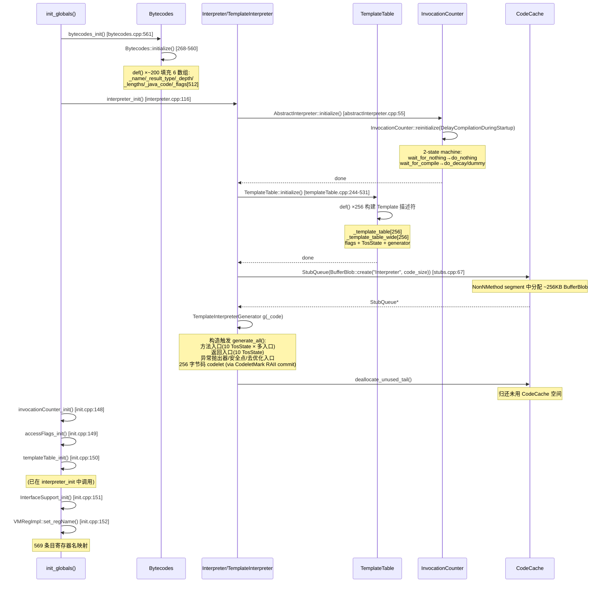

# 14-Interpreter-Bytecodes-TemplateTable — 解释器基础设施：字节码表 + 模板分发表 + 编译阈值 + 寄存器名映射

> **Phase**: 01-jvm-startup
> **前置**: [01-CodeCache]（StubQueue 在 CodeCache 中分配）、[13-Management-Services]（init_globals 调用序列）、[16-Universe-Post-Init]（解释器分发的类型系统）
> **配套**: [00-JNI-CreateJavaVM]（init_globals 在 create_vm 中的位置）
> **后续依赖本文**: [15-StubRoutines-SharedRuntime]（i2c adapter 通过 code() 获取 StubQueue）
> **阅读收益**: 追踪解释器基础设施的 7 个初始化调用——理解 Bytecodes::initialize 的 def()×~200 构建 6 个属性数组（14KB 静态表）、TemplateInterpreter::initialize 的 StubQueue + generate_all 生成 256 codelet（CodeCache NonNMethod segment）、TemplateTable::initialize 的 256 Template 描述符（TosState 转换 + flags + generator）、InvocationCounter::reinitialize 的 2 状态状态机 + 3 阈值计算（do_decay 启动平滑）、VMRegImpl::set_regName 的 569 条目寄存器名映射（GPR→FPR→XMM→KREG）；掌握 "方法首次调用" 的 codelet 分派链路和 "DelayCompilationDuringStartup" 的 do_decay 机制

---

## §〇 Production Scenario

### 场景 1: 方法首次调用触发解释器执行

```java
// HotSpot 如何执行 add(1, 2)？
public int add(int a, int b) { return a + b; }
```

`add()` 第一次被调用时，`Method::link_method()`（`method.cpp:1084`）设置 `_from_interpreted_entry = Interpreter::entry_for_method(h_method)`。该入口指向 `TemplateInterpreterGenerator::generate_normal_entry()` 生成的 codelet。进入解释器后，`set_entry_points_for_all_bytes()` 遍历 `Bytecodes::flags()` 表，为 `iload_0`、`iload_1`、`iadd`、`ireturn` 这 4 个字节码找到对应的 codelet 地址，分派到 `TemplateTable::generate()` 生成的机器码模板。整个过程：`method entry codelet → dispatch loop → iload_0 codelet → iload_1 codelet → iadd codelet → ireturn codelet → return entry codelet`。

**三步诊断**：
```bash
# 1. 验证解释器 codelet 已生成
gdb -ex "break templateInterpreterGenerator.cpp:57" \
    -ex "run" \
    -ex "print AbstractInterpreter::code()->number_of_stubs()" \
    --args java -cp app.jar Main
# 期望: >200（所有字节码 codelet + 方法入口 + 返回入口）

# 2. 验证字节码属性表已填充
gdb -ex "break bytecodes.cpp:561" \
    -ex "run" \
    -ex "print Bytecodes::length_for(Bytecodes::_iload)" \
    -ex "print Bytecodes::depth(Bytecodes::_iadd)" \
    --args java -jar app.jar
# 期望: length=2, depth=-1

# 3. strace 验证解释器生成期间的系统调用
strace -e mmap,mprotect -f java -Xint -jar app.jar 2>&1 | head -20
# 期望: 解释器 codelet 生成期间的 mmap（CodeCache 分配）+ mprotect（RW→RX）
```

**反事实**：如果解释器使用 switch-case 分派而非 codelet 模板 → 每个字节码的执行都经过相同的 C++ switch → CPU 分支预测器被 256 个 case 淹没 → 分支预测失败率 ~50%（每 2 条字节码 1 次 mispredict）→ 每次 mispredict ~20 CPU cycles → 简单方法 4 字节码 × 20 cycles = 80 cycles 额外开销。Codelet 模板通过直接跳转（间接跳转到 codelet 地址）消除 switch-case，分支预测失败率 ~0%。

### 场景 2: `DelayCompilationDuringStartup` 导致方法永远不被编译

```bash
java -XX:+PrintCompilation -jar app.jar
# 输出中前 60 秒无任何编译事件 → 怀疑 DelayCompilationDuringStartup
```

`invocationCounter_init()`（`init.cpp:148`）调用 `InvocationCounter::reinitialize(DelayCompilationDuringStartup)`。当 `DelayCompilationDuringStartup=true`（默认），`wait_for_compile` 状态的 action 设为 `do_decay`（计数减半而非触发编译）。`do_decay()`（`invocationCounter.cpp:122-138`）每次溢出时将计数右移 1 位（除以 2）并保持至少为 1——方法永远无法达到编译阈值，因为每次溢出后计数减半。

**三步诊断**：
```bash
# 1. 检查 DelayCompilationDuringStartup 标志
java -XX:+PrintFlagsFinal -version 2>&1 | rg DelayCompilationDuringStartup
# 期望: DelayCompilationDuringStartup = true

# 2. 验证 do_decay 在生效
gdb -ex "break invocationCounter.cpp:122" \
    -ex "run" \
    -ex "print this->_counter" \
    --args java -jar app.jar
# 期望: 计数每次溢出后减半

# 3. 禁用后重新运行
java -XX:-DelayCompilationDuringStartup -XX:+PrintCompilation -jar app.jar
# 期望: 编译事件正常出现
```

**反事实**：如果不使用 do_decay 而直接触发编译 → JVM 启动后的前 10 秒内，数百个方法同时达到 CompileThreshold → 编译队列爆满 → 编译器线程（C1/C2）竞争 CPU → 启动延迟增加 ~2-5 秒。`do_decay` 将编译请求分散到启动后更长时间窗口，平滑 CPU 负载。

### 场景 3: `_fast_agetfield` 重写后的字节码在 SA 中显示为 "unknown"

`jcmd <pid> Compiler.CodeList` 显示方法的字节码中有 `_fast_agetfield`（opcode 247），但 class 文件中只有 `getfield`（opcode 180）。这是因为 `Rewriter::scan_method()`（`rewriter.cpp:370`）在类加载时使用 `Bytecodes::length_for()` 和 `Bytecodes::java_code()` 将 `getfield` 重写为 `_fast_agetfield`。`_fast_agetfield` 的 `java_code = _getfield`，但 `_name = "_fast_agetfield"`——调试工具需要同时理解这两种表示。

---

## §一 ★★★ Interpreter 初始化 7 调用全链路源码走读

### 1.1 Interview Story Format Answer

"`init_globals()` at `init.cpp:109` has 7 interpreter-related calls between `universe2_init()` (line 157) and `javaClasses_init()` (line 161). `bytecodes_init()` at `bytecodes.cpp:561` calls `Bytecodes::initialize()` (293 lines, bytecodes.cpp:268-560) which calls `def()` ~200 times to fill 6 static arrays: `_name[]` (opcode name strings), `_result_type[]` (TOS type after execution, e.g. T_INT for iload), `_depth[]` (stack depth change, e.g. -1 for iadd which pops 2 and pushes 1), `_lengths[]` (encoded as `(wide_len << 4) | len`, e.g. `(2 << 4) | 1 = 33` for iload), `_java_code[]` (maps HotSpot internal bytecodes like `_fast_agetfield` back to standard `_getfield`), and `_flags[]` (512 entries — 256 normal + 256 wide — each computed by `compute_flags()` from the format string like `"bi"` = byte + index). `interpreter_init()` at `interpreter.cpp:116` calls `TemplateInterpreter::initialize()` (templateInterpreter.cpp:42) which: (1) creates a `StubQueue` backed by `BufferBlob::create("Interpreter", code_size)` — the entire interpreter code lives in CodeCache as a BufferBlob; (2) constructs `TemplateInterpreterGenerator` whose `generate_all()` produces hundreds of codelets via `CodeletMark` RAII commit — method entry points, return entry points for all 10 TosStates, exception throwers, safepoint entries, deoptimization entries, and 256 bytecode-specific codelets; (3) calls `TemplateTable::initialize()` (288 lines, templateTable.cpp:244-531) which `def()`s 256 Template objects with flags (`ubcp` = uses bytecode pointer, `disp` = self-dispatch, `clvm` = calls VM), TosState transitions (vtos→itos for iload), and generator function pointers. `invocationCounter_init()` at `invocationCounter.cpp:201` calls `InvocationCounter::reinitialize(DelayCompilationDuringStartup)` (47 lines, :153-199) which defines a 2-state machine: `wait_for_nothing` → `do_nothing`, `wait_for_compile` → `do_decay` (startup) or `dummy_invocation_counter_overflow` (steady-state). It computes `InterpreterInvocationLimit = CompileThreshold << number_of_noncount_bits = 80000` (default), `InterpreterProfileLimit = 26400`, `InterpreterBackwardBranchLimit = 90000` (OSR needs ~9× compensation for loop frequency). `accessFlags_init()` asserts `sizeof(AccessFlags) == sizeof(jint)` — compile+runtime double insurance against struct padding bugs. `InterfaceSupport_init()` seeds `srand(ScavengeALotInterval * FullGCALotInterval)` for reproducible GC stress testing. `VMRegImpl::set_regName()` fills 569 entries mapping VM register slots to x86 names — GPR (32 slots, AMD64 2 per register) → FPR (16, x87×2) → XMM (512, ZMM 32×16) → KREG (8, mask×1) → EFLAGS (1)."

### 1.2 bytecodes_init() — Bytecodes::initialize()

`bytecodes.cpp:561-563` 是外部入口：

```cpp
void bytecodes_init() {
  Bytecodes::initialize();
}
```

核心函数 `Bytecodes::initialize()` at `bytecodes.cpp:268-560`（293 行）通过 `def()` × ~200 次调用填充 6 个静态数组。

**def() 的核心 8 参数重载**（`bytecodes.cpp:157-175`）：

```cpp
void Bytecodes::def(Code code, const char* name, const char* format,
                    const char* wide_format, BasicType result_type,
                    int depth, bool can_trap, Code java_code) {
  int len  = (format      != NULL ? (int) strlen(format)      : 0);
  int wlen = (wide_format != NULL ? (int) strlen(wide_format) : 0);
  _name          [code] = name;
  _result_type   [code] = result_type;
  _depth         [code] = depth;
  _lengths       [code] = (wlen << 4) | (len & 0xF);
  _java_code     [code] = java_code;
  int bc_flags = 0;
  if (can_trap)           bc_flags |= _bc_can_trap;
  if (java_code != code)  bc_flags |= _bc_can_rewrite;
  _flags[(u1)code+0*(1<<BitsPerByte)] = compute_flags(format,      bc_flags);
  _flags[(u1)code+1*(1<<BitsPerByte)] = compute_flags(wide_format, bc_flags);
}
```

**设计要点**：
- `_lengths` 编码为 `(wide_len << 4) | (len & 0xF)` — 低 4 位存普通字节码长度，高 4 位存 wide 变体长度。最大 15 字节，JVM 规范保证所有字节码在此范围内（实际上最长的 `tableswitch` 也不超过 15 字节）
- `_flags` 有 512 条目（`(1<<8)*2`）而非 256 — 前 256 对应普通字节码 `flags(code)`，后 256 对应 wide 变体 `flags(code + 256)`
- `_bc_can_rewrite` 标志标记 HotSpot 内部字节码（`java_code != code`）— 如 `_fast_agetfield` 的 `java_code = _getfield`

**compute_flags() 格式字符串解析**（`bytecodes.cpp:196-265`）：

```cpp
int Bytecodes::compute_flags(const char* format, int more_flags) {
  if (format == NULL)  return 0;
  int flags = more_flags;
  const char* fp = format;
  switch (*fp) {
  case '\0': flags |= _fmt_not_simple; break;  // variable-length (tableswitch)
  case 'b':  flags |= _fmt_not_variable; ++fp; break;
  case 'w':  flags |= _fmt_not_variable | _fmt_not_simple; ++fp; break;
  }
  for (;;) {
    char fc = *fp++;
    switch (fc) {
    case '\0': return flags;
    case 'j': this_flag = _fmt_has_j; has_jbo = 1; break;  // CP cache index
    case 'k': this_flag = _fmt_has_k; has_jbo = 1; break;  // CP index
    case 'i': this_flag = _fmt_has_i; has_jbo = 1; break;  // local index
    case 'c': this_flag = _fmt_has_c; has_jbo = 1; break;  // signed constant
    case 'o': this_flag = _fmt_has_o; has_jbo = 1; break;  // branch offset
    // uppercase = native byte order (used by Rewriter):
    case 'J': this_flag = _fmt_has_j; has_nbo = 1; break;
    ...
    }
    // Check for repeated chars (e.g. "jj" → _fmt_has_u2, "jjjj" → _fmt_has_u4)
    if (*fp == fc) { this_size = 2; while (*++fp == fc) this_size++; }
  }
}
```

**代表性 def() 调用**（`bytecodes.cpp:306-487`）：

| 字节码 | format | result_type | depth | length | 说明 |
|--------|--------|-------------|-------|--------|------|
| `_nop` | `"b"` | T_VOID | 0 | 1 | 空操作 |
| `_iload` | `"bi"` | T_INT | 1 | 2 | 局部变量加载 |
| `_iload_0` | `"b"` | T_INT | 1 | 1 | 快捷加载（隐式索引） |
| `_iadd` | `"b"` | T_INT | -1 | 1 | 弹出 2 压入 1 |
| `_ifeq` | `"boo"` | T_VOID | -1 | 3 | 条件分支（2 字节偏移） |
| `_goto` | `"boo"` | T_VOID | 0 | 3 | 无条件跳转 |
| `_invokevirtual` | `"bjj"` | T_ILLEGAL | 0 | 3 | 虚方法调用 |
| `_tableswitch` | `""` | T_VOID | -1 | 可变 | 空格式 = 变长 |
| `_wide` | `"wb"` | T_VOID | 0 | 1 | wide 前缀 |
| `_fast_agetfield` | `"bjj"` | T_OBJECT | 0 | 3 | 内部重写 getfield |

**HotSpot 内部字节码**（`bytecodes.cpp:489-538`）使用 `_bc_can_rewrite` 标志——`java_code` 参数指定映射回的标准字节码：

```cpp
def(_fast_agetfield, "fast_agetfield", "bjj", NULL, T_OBJECT, 0, true, _getfield);
def(_fast_bgetfield, "fast_bgetfield", "bjj", NULL, T_INT,    0, true, _getfield);
// ... 8 种快速 getfield + 9 种快速 putfield ...
def(_fast_invokevfinal, "fast_invokevfinal", "bjj", NULL, T_ILLEGAL, -1, true, _invokevirtual);
def(_fast_aldc, "fast_aldc", "bj", NULL, T_OBJECT, 1, true, _ldc);
```

**追问**：为什么 `_lengths` 编码为 `(wlen << 4) | (len & 0xF)`？→ 低 4 位存普通长度，高 4 位存 wide 长度。JVM 规范定义最大字节码长度为 15 字节（`tableswitch` 在极端情况下）。低 4 位理论上可存 0-15，足够覆盖所有标准字节码。高位 shift 使 wide 长度可通过 `lengths >> 4` 快速解码，避免额外的数组查表。

**反事实**：如果字节码属性不是静态表而是每个 Method 内联存储 → 每个 Method 对象需额外 `256 × (1 + 4 + 4 + 4 + 4 + 4) ≈ 5KB` → 10000 方法 = 50MB 额外开销。静态表 14KB 被所有方法共享 → 空间效率 3500×。且 Method 内联存储需要在类加载时复制属性 → 延长类加载时间。

### 1.3 interpreter_init() → TemplateInterpreter::initialize()

`interpreter.cpp:116-138` 是顶层入口：

```cpp
void interpreter_init() {
  Interpreter::initialize();
#ifndef PRODUCT
  if (TraceBytecodes) BytecodeTracer::set_closure(BytecodeTracer::std_closure());
#endif
  Forte::register_stub("Interpreter",
    AbstractInterpreter::code()->code_start(),
    AbstractInterpreter::code()->code_end());
  if (JvmtiExport::should_post_dynamic_code_generated()) {
    JvmtiExport::post_dynamic_code_generated("Interpreter",
      AbstractInterpreter::code()->code_start(),
      AbstractInterpreter::code()->code_end());
  }
}
```

`TemplateInterpreter::initialize()` at `templateInterpreter.cpp:42-74`：

```cpp
void TemplateInterpreter::initialize() {
  if (_code != NULL) return;                         // 幂等性保护
  assert((int)Bytecodes::number_of_codes <= (int)DispatchTable::length,
         "dispatch table too small");
  AbstractInterpreter::initialize();                  // Step 1: 基类初始化
  TemplateTable::initialize();                        // Step 2: Template 描述符
  { ResourceMark rm;
    TraceTime timer("Interpreter generation", TRACETIME_LOG(Info, startuptime));
    int code_size = InterpreterCodeSize;               // ~256KB (debug ×4)
    NOT_PRODUCT(code_size *= 4;)
    _code = new StubQueue(new InterpreterCodeletInterface, code_size, NULL, "Interpreter");
    TemplateInterpreterGenerator g(_code);             // Step 3: 构造触发 generate_all()
    _code->deallocate_unused_tail();                   // Step 4: 归还未用空间
  }
  _active_table = _normal_table;                       // Step 5: 激活 dispatch 表
}
```

**StubQueue 构造函数**（`stubs.cpp:67-81`）：

```cpp
StubQueue::StubQueue(StubInterface* stub_interface, int buffer_size,
                     Mutex* lock, const char* name) : _mutex(lock) {
  intptr_t size = align_up(buffer_size, 2*BytesPerWord);
  BufferBlob* blob = BufferBlob::create(name, size);   // 在 CodeCache 中分配!
  if (blob == NULL) {
    vm_exit_out_of_memory(size, OOM_MALLOC_ERROR, "CodeCache: no room for %s", name);
  }
  _stub_interface  = stub_interface;
  _buffer_size     = blob->content_size();
  _buffer_limit    = blob->content_size();
  _stub_buffer     = blob->content_begin();
  _queue_begin     = 0;
  _queue_end       = 0;
  _number_of_stubs = 0;
}
```

**追问**：为什么 StubQueue 需要 `deallocate_unused_tail()`？→ 初始 `code_size` 是预估值（~256KB），实际生成的 codelet 可能少于此值。未使用的尾部空间通过 `CodeCache::free_unused_tail(blob, used_space())` 归还 CodeCache → JIT 编译器可使用更多空间。这是 HotSpot 内存管理的核心策略：预留上限，归还余量。

**反事实**：如果解释器不使用模板而使用 switch-case 分派 → 参见 §〇 场景 1 的反事实。补充：switch-case 还需要在每次字节码执行后跳回主循环（1 次间接跳转），而 codelet 模板通过在每个 codelet 末尾直接嵌入下一个字节码的跳转地址（dispatch table 查表 + 间接跳转）实现 0-额外跳转开销的连续执行。

### 1.4 CodeletMark — RAII Commit 机制

`CodeletMark` at `interpreter.cpp:85-113` 是解释器 codelet 生成的"事务边界"：

```cpp
CodeletMark::CodeletMark(InterpreterMacroAssembler*& masm,
                         const char* description, Bytecodes::Code bytecode) :
  _clet((InterpreterCodelet*)AbstractInterpreter::code()->request(codelet_size())),
  _cb(_clet->code_begin(), _clet->code_size()) {
  _clet->initialize(description, bytecode);            // 设置 codelet 元数据
  masm = new InterpreterMacroAssembler(&_cb);           // 创建汇编器
  _masm = &masm;
}

CodeletMark::~CodeletMark() {
  (*_masm)->align(wordSize);                           // 对齐
  (*_masm)->flush();                                   // 刷新汇编缓冲区
  int committed_code_size = (*_masm)->code()->pure_insts_size();
  if (committed_code_size) {
    AbstractInterpreter::code()->commit(committed_code_size,
                                        (*_masm)->code()->strings());
  }
  *_masm = NULL;                                       // 防止外部误用
}
```

**StubQueue::commit()**（`stubs.cpp:158-168`）：

```cpp
void StubQueue::commit(int committed_code_size, CodeStrings& strings) {
  int committed_size = align_up(stub_code_size_to_size(committed_code_size),
                                 CodeEntryAlignment);
  Stub* s = current_stub();
  assert(committed_size <= stub_size(s), "committed size must not exceed requested size");
  stub_initialize(s, committed_size, strings);         // 重新初始化（精确大小）
  _queue_end += committed_size;                        // 推进队列指针
  _number_of_stubs++;                                  // 递增 stub 计数
  if (_mutex != NULL) _mutex->unlock();                // 解锁
}
```

**设计要点**：构造时 `request()` 申请预估空间（预留 slack），析构时 `commit()` 用实际生成的代码大小重新初始化 stub。这避免了代码生成过程中的"精确预算"问题——不同字节码的 codelet 大小差异巨大（`nop` ~10 bytes, `invokevirtual` ~200+ bytes）。

### 1.5 templateTable_init() → TemplateTable::initialize()

`TemplateTable::initialize()` at `templateTable.cpp:244-531`（288 行）通过 `def()` × 256 次调用初始化 Template 描述符数组。

**Template 类的核心字段**（`templateTable.hpp:44-75`）：

```cpp
class Template {
  enum Flags {
    uses_bcp_bit,        // bit 0: 需要 bcp 指向当前字节码
    does_dispatch_bit,   // bit 1: 模板自行分发（不需主循环 dispatch）
    calls_vm_bit,        // bit 2: 模板调用 VM 运行时
    wide_bit             // bit 3: 属于 wide 指令
  };
  int       _flags;      // 模板属性标志位
  TosState  _tos_in;     // 执行前的栈顶缓存状态
  TosState  _tos_out;    // 执行后的栈顶缓存状态
  generator _gen;        // 代码生成器函数指针: void (*)(int arg)
  int       _arg;        // 生成器参数
};
```

**def() 的核心实现**（`templateTable.cpp:186-203`）：

```cpp
void TemplateTable::def(Bytecodes::Code code, int flags, TosState in, TosState out,
                        void (*gen)(int arg), int arg) {
  const int ubcp = 1 << Template::uses_bcp_bit;
  const int disp = 1 << Template::does_dispatch_bit;
  const int clvm = 1 << Template::calls_vm_bit;
  const int iswd = 1 << Template::wide_bit;
  bool is_wide = (flags & iswd) != 0;
  Template* t = is_wide ? template_for_wide(code) : template_for(code);
  t->initialize(flags, in, out, gen, arg);
}
```

**代表性 Template 定义**（`templateTable.cpp:261-526`）：

| 字节码 | flags | TosIn | TosOut | 说明 |
|--------|-------|-------|--------|------|
| `_nop` | `____` | vtos | vtos | 无操作，无 bcp，无 dispatch |
| `_iload` | `ubcp\|clvm` | vtos | itos | 读 bcp + VM 调用 |
| `_iload_0` | `ubcp\|clvm` | vtos | itos | 快捷加载（可能重写） |
| `_iadd` | `____` | itos | itos | 寄存器内操作，无 bcp |
| `_ifeq` | `ubcp\|clvm` | itos | vtos | 读分支偏移 + 条件跳转 |
| `_invokevirtual` | `ubcp\|disp\|clvm` | vtos | vtos | 自行分发（调用返回后需要继续执行） |
| `_goto` | `ubcp\|disp\|clvm` | vtos | vtos | 自行分发 |
| `_return` | `disp\|clvm` | vtos | vtos | 返回 + 自行分发 |
| `_fast_agetfield` | `ubcp\|clvm` | vtos | atos | 快速字段访问 |

**追问**：为什么 `invokevirtual` 需要 `disp`（does_dispatch）而 `iload` 不需要？→ `invokevirtual` 执行完毕后，被调用方法的返回点需要分发到调用方法的下一条字节码——这是"自行分发"（self-dispatch），不经过解释器主循环。`iload` 执行完毕后控制流回到解释器主循环，由主循环分派下一条字节码。

**反事实**：如果 Template 描述符在每次 CodeCache 重建时重新计算 → Template 描述符本质是编译期常量——字节码的属性（是否读 bcp、是否调 VM、栈类型转换）不随 JVM 运行变化。TemplateTable::initialize() 在 init_globals 中只执行一次，Template 对象存储在静态 BSS 段。每次 CodeCache 重建时重新计算 → 每次 CDS 恢复或 CodeCache 扩容都需要重新遍历 256 个字节码 → 增加 ~1ms 启动延迟。

### 1.6 invocationCounter_init() — 编译阈值状态机

`invocationCounter.cpp:201-207` 是外部入口：

```cpp
void invocationCounter_init() {
  InvocationCounter::reinitialize(DelayCompilationDuringStartup);
}
```

**InvocationCounter::reinitialize()**（`invocationCounter.cpp:153-199`，47 行）：

```cpp
void InvocationCounter::reinitialize(bool delay_overflow) {
  guarantee((int)number_of_states <= (int)state_limit, "adjust number_of_state_bits");
  def(wait_for_nothing, 0, do_nothing);
  if (delay_overflow) {
    def(wait_for_compile, 0, do_decay);                          // 启动期：衰减
  } else {
    def(wait_for_compile, 0, dummy_invocation_counter_overflow);  // 稳态：触发编译
  }
  InterpreterInvocationLimit = CompileThreshold << number_of_noncount_bits;
  InterpreterProfileLimit = ((CompileThreshold * InterpreterProfilePercentage) / 100)
                            << number_of_noncount_bits;
  if (ProfileInterpreter) {
    InterpreterBackwardBranchLimit = (CompileThreshold *
      (OnStackReplacePercentage - InterpreterProfilePercentage)) / 100;
  } else {
    InterpreterBackwardBranchLimit = ((CompileThreshold * OnStackReplacePercentage) / 100)
                                     << number_of_noncount_bits;
  }
}
```

**_counter 的 32-bit 位布局**（`invocationCounter.hpp:44-57`）：

```
| count (29 bits)                    | carry (1) | state (2) |
| bit 31 ...........................3 | bit 2     | bit 1..0  |
```

- `number_of_noncount_bits = 3` — 低 3 位是元数据（1 carry + 2 state）
- `count_grain = 8` — 计数器粒度为 8（1 << 3）
- `count_increment = count_grain = 8` — 每次调用递增 8
- `count_shift = 3` — count() = `_counter >> 3`
- `carry_mask = 0x4` — 粘性进位（曾达上限后永久置位）
- `state_mask = 0x3` — 状态位（wait_for_nothing=0, wait_for_compile=1）

**默认阈值计算**（CompileThreshold=10000, InterpreterProfilePercentage=33, OnStackReplacePercentage=933）：

- `InterpreterInvocationLimit = 10000 << 3 = 80000`（raw value, 实际调用次数 = 10000）
- `InterpreterProfileLimit = (10000 * 33 / 100) << 3 = 26400`（raw, 实际 = 3300）
- `InterpreterBackwardBranchLimit`（无 ProfileInterpreter）：`(10000 * 933 / 100) << 3 = 74640`（raw, 实际 = 9330）

**do_decay() 的衰减机制**（`invocationCounter.cpp:122-138`）：

```cpp
static address do_decay(const methodHandle& method, TRAPS) {
  MethodCounters* mcs = method->method_counters();
  mcs->invocation_counter()->decay();  // count = count >> 1, min = 1
  return NULL;
}
```

`decay()` inline（`invocationCounter.hpp:147-153`）：
```cpp
void decay() {
  int c = count();
  int new_count = c >> 1;              // 减半
  if (new_count == 0) new_count = 1;   // 最小保持 1
  set(state(), new_count);
}
```

**追问**：为什么 OSR 阈值（933%）远高于普通编译阈值（100%）？→ 回边（backward branch）每次循环迭代都触发一次计数——一个循环 10000 次迭代产生 10000 次回边计数。普通方法调用每次调用才触发一次计数——一个方法调用 10000 次才产生 10000 次计数。OSR 阈值需要 ~9× 基础阈值来补偿"循环迭代 > 方法调用"的频率差异。

**反事实**：如果 DelayCompilationDuringStartup=false（do_decay 替换为直接触发编译）→ 参见 §〇 场景 2 的反事实。补充：do_decay 将计数减半后，下次溢出需要再翻倍 → 溢出间隔指数增长 → 自然形成"启动后 0→10s: 无编译, 10→30s: 低频编译, 30s+: 正常编译"的分层启动策略。

### 1.7 VMRegImpl::set_regName() — 569 条目寄存器名映射

`vmreg_x86.cpp:31-68` 通过 4 个 for 循环构建寄存器名称数组：

```cpp
void VMRegImpl::set_regName() {
  Register reg = ::as_Register(0);
  int i;
  for (i = 0; i < ConcreteRegisterImpl::max_gpr; ) {
    regName[i++] = reg->name();
#ifdef AMD64
    regName[i++] = reg->name();    // AMD64: 每个 64-bit GPR 占 2 个 VMReg slot
#endif
    reg = reg->successor();
  }
  FloatRegister freg = ::as_FloatRegister(0);
  for ( ; i < ConcreteRegisterImpl::max_fpr; ) {
    regName[i++] = freg->name();
    regName[i++] = freg->name();    // x87: 每个 80-bit 寄存器占 2 slot
    freg = freg->successor();
  }
  XMMRegister xreg = ::as_XMMRegister(0);
  for (; i < ConcreteRegisterImpl::max_xmm;) {
    for (int j = 0; j < XMMRegisterImpl::max_slots_per_register; j++) {
      regName[i++] = xreg->name();  // ZMM: 32×16 = 512 条目
    }
    xreg = xreg->successor();
  }
  KRegister kreg = ::as_KRegister(0);
  for (; i < ConcreteRegisterImpl::max_kpr;) {
    for (int j = 0; j < KRegisterImpl::max_slots_per_register; j++) {
      regName[i++] = kreg->name();  // 掩码: 8×1 = 8 条目
    }
    kreg = kreg->successor();
  }
  for ( ; i < ConcreteRegisterImpl::number_of_registers; i++) {
    regName[i] = "NON-GPR-FPR-XMM-KREG";  // 填充剩余
  }
}
```

**AMD64 下寄存器槽位分布**：

| 类别 | 寄存器 | 数量 | slot/reg | 总 slot | 范围 |
|------|--------|------|----------|---------|------|
| GPR | rax,rcx,rdx,rbx,rsp,rbp,rsi,rdi,r8~r15 | 16 | 2 | 32 | 0-31 |
| FPR | st0~st7 | 8 | 2 | 16 | 32-47 |
| XMM | xmm0~xmm31 | 32 | 16 | 512 | 48-559 |
| KREG | k0~k7 | 8 | 1 | 8 | 560-567 |
| EFLAGS | — | 1 | 1 | 1 | 568 |
| **总计** | | | | **569** | 0-568 |

**追问**：为什么 AMD64 下 GPR 占 2 个 VMReg slot？→ C2 编译器使用 `RegisterImpl::max_slots_per_register = 2`，允许将 64-bit 寄存器拆分为两个 32-bit 视图。这对应 x86-64 的 REX 前缀机制——`rax` 的低 32 位是 `eax`，高 32 位可通过 REX.W 访问。OopMap 在存储 GC 根时可能只需要 32-bit 子视图。

**反事实**：如果 regName 数组不存在，OopMap 打印用什么？→ OopMap 存储的是 VMReg 编号（整数），没有名称数组时只能打印数字 → 调试输出变为 `"reg 42 = oop"` 而非 `"rdx = oop"` → 可读性归零。SA 代理（jhsdb, jmap, jstack 等 core dump 分析工具）依赖 regName[] 解析寄存器值。

### 1.8 accessFlags_init() + InterfaceSupport_init() — 轻量但关键

`accessFlags_init()` at `accessFlags.cpp:74-76`：

```cpp
void accessFlags_init() {
  assert(sizeof(AccessFlags) == sizeof(jint), "just checking size of flags");
}
```

**设计意图**：`AccessFlags` 存储在一个 `jint`（32-bit int）中——JVM 在 class 文件解析时直接读写 `u4` 类型的访问标志。如果 `AccessFlags` 类意外增加成员（如添加 `_flags2`），`sizeof` 从 4 变为 8 → 所有依赖 `jint` 大小的代码（如 `ClassFileParser` 中的 `u4` 读写）会静默错误。这个断言是编译期 + 运行期双重保险。

`InterfaceSupport_init()` at `interfaceSupport.cpp:264-270`：

```cpp
void InterfaceSupport_init() {
#ifdef ASSERT
  if (ScavengeALot || FullGCALot) {
    srand(ScavengeALotInterval * FullGCALotInterval);
  }
#endif
}
```

仅在 ASSERT 构建中有效——设置 GC 压力测试的随机种子为固定值，使 GC 触发模式可重现。`ScavengeALot` 和 `FullGCALot` 是开发调试标志，使 JVM 在每个安全点强制触发 GC，验证 GC 代码在任意中断点的正确性。

**反事实**：如果 accessFlags_init 断言在 release 构建中被移除？→ release 构建中 assert 被编译为空（NDEBUG 定义）。这意味着 sizeof 不一致的错误只在 debug 构建中被发现 → 可能进入生产环境。但 C++ ABI 保证 jint 是 4 字节——只有类定义错误才会触发。实际风险极低。

### 1.9 Bytecodes 属性查询 — 15+ 运行时调用者

`Bytecodes::length_for()` 有 15 个直接调用者，每个需要遍历字节码的子系统都依赖此表：

| 调用者 | 用途 |
|--------|------|
| `Rewriter::scan_method()` | 类加载重写：跳过操作数定位下一条字节码 |
| `Verifier::verify_method()` | 字节码验证：检查指令边界合法性 |
| `generateOopMap::mark_bbheaders_and_count_gc_points()` | OopMap 生成：计算 GC 安全点 |
| `GraphKit::compute_stack_effects()` | C2 内联：计算栈帧影响 |
| `LinearScan::check_stack_depth()` | C1 寄存器分配：验证栈深度 |
| `RawBytecodeStream::raw_next()` | 字节码流：每次 next() 调用 |
| `BytecodeTracer::trace()` | 字节码跟踪：打印指令 |
| `Method::bci_from()` | 方法内偏移计算 |
| `ConstantPoolCache::initialize()` | CP 缓存初始化 |
| `InterpreterRuntime::resolve_invoke()` | 方法解析时遍历字节码 |
| `AbstractInterpreter::deopt_continue_after_entry()` | 去优化：计算恢复点 |
| `ciBytecodeStream::next()` | CI 接口：编译器获取字节码流 |
| `MethodLiveness::analyze()` | 活性分析：确定变量范围 |
| `BytecodeUtils::get_bytes()` | 工具函数 |
| `TemplateTable::patch_bytecode()` | 模板表补丁 |

**追问**：为什么 `length_for()` 是 O(1) 查表而非计算？→ 字节码长度不是数学公式——`iload=2`（opcode + index），`iload_0=1`（只有 opcode），`tableswitch=可变`（对齐填充 + 跳转表）。查表 O(1) 是最优方案。表在启动时一次性填充，运行时零开销。

### 1.10 ★ Mermaid 序列图



---

## §二 Standard Environment

OpenJDK 11 slowdebug, 64-bit Linux.

Source roots:
- `src/hotspot/share/interpreter/bytecodes.cpp` — Bytecodes::initialize() (:268)
- `src/hotspot/share/interpreter/bytecodes.hpp` — Bytecodes 类 + Code 枚举
- `src/hotspot/share/interpreter/interpreter.cpp` — interpreter_init() (:116)
- `src/hotspot/share/interpreter/templateInterpreter.cpp` — TemplateInterpreter::initialize() (:42)
- `src/hotspot/share/interpreter/templateInterpreterGenerator.cpp` — generate_all() (:57)
- `src/hotspot/share/interpreter/templateTable.cpp` — TemplateTable::initialize() (:244)
- `src/hotspot/share/interpreter/templateTable.hpp` — Template 类 + TemplateTable 类
- `src/hotspot/cpu/x86/templateTable_x86.cpp` — pd_initialize() (:50)
- `src/hotspot/share/interpreter/invocationCounter.cpp` — InvocationCounter::reinitialize() (:153)
- `src/hotspot/share/interpreter/abstractInterpreter.cpp` — AbstractInterpreter::initialize() (:55)
- `src/hotspot/share/interpreter/abstractInterpreter.hpp` — _code (StubQueue*), _entry_table[]
- `src/hotspot/share/code/stubs.cpp` — StubQueue 构造函数 (:67), commit() (:158)
- `src/hotspot/cpu/x86/vmreg_x86.cpp` — VMRegImpl::set_regName() (:31)
- `src/hotspot/share/utilities/accessFlags.cpp` — accessFlags_init() (:74)
- `src/hotspot/share/runtime/interfaceSupport.cpp` — InterfaceSupport_init() (:264)

Build: `make jdk`

Key binary: `build/linux-x86_64-normal-server-slowdebug/jdk/lib/libjvm.so`

**Syscall 速查**：

| Syscall | man | 用途 |
|---------|-----|------|
| `mmap` | man 2 mmap | CodeCache VirtualSpace 分配（解释器 StubQueue 底层） |
| `mprotect` | man 2 mprotect | CodeCache 内存保护切换（RW → RX 执行） |
| `clock_gettime` | man 2 clock_gettime | `os::javaTimeNanos()` — InvocationCounter 可能使用的时间源 |

**全局状态速查**：

| 变量 | 类型 | 大小 | 存储 | 说明 |
|------|------|------|------|------|
| `Bytecodes::_name[256]` | `const char*[]` | 2048B | BSS | 字节码名称字符串 |
| `Bytecodes::_flags[512]` | `int[]` | 2048B | BSS | 格式标志位（256 普通 + 256 wide） |
| `Bytecodes::_depth[256]` | `int[]` | 1024B | BSS | 栈深度变化 |
| `Bytecodes::_lengths[256]` | `int[]` | 1024B | BSS | 编码的字节码长度 |
| `Bytecodes::_result_type[256]` | `BasicType[]` | 1024B | BSS | 执行后 TOS 类型 |
| `Bytecodes::_java_code[256]` | `Code[]` | 1024B | BSS | 映射到标准 Java 字节码 |
| `AbstractInterpreter::_code` | `StubQueue*` | ~256KB | CodeCache | 解释器 codelet 缓冲区 |
| `TemplateTable::_template_table[256]` | `Template[]` | ~8KB | BSS | 普通字节码模板 |
| `TemplateTable::_template_table_wide[256]` | `Template[]` | ~8KB | BSS | wide 字节码模板 |
| `VMRegImpl::regName[569]` | `const char*[]` | 4552B | BSS | x86 寄存器名称映射 |

---

## §三 Source Files Table

| # | File | Full Path | Lines | Core Functions | Role |
|---|------|-----------|:--:|-------|------|
| 1 | **bytecodes.cpp** | `src/hotspot/share/interpreter/bytecodes.cpp` | 568 | `Bytecodes::initialize()`(:268), `def()`(:152/157), `compute_flags()`(:196) | 字节码属性表构建 |
| 2 | **bytecodes.hpp** | `src/hotspot/share/interpreter/bytecodes.hpp` | 500+ | Code 枚举, `length_for()`, `depth()`, `flags()`, `result_type()` | 字节码属性查询 API |
| 3 | **interpreter.cpp** | `src/hotspot/share/interpreter/interpreter.cpp` | 139 | `interpreter_init()`(:116), `CodeletMark` 类 | 解释器初始化入口 |
| 4 | **templateInterpreter.cpp** | `src/hotspot/share/interpreter/templateInterpreter.cpp` | 373 | `TemplateInterpreter::initialize()`(:42) | 模板解释器主入口 |
| 5 | **templateInterpreterGenerator.cpp** | `src/hotspot/share/interpreter/templateInterpreterGenerator.cpp` | ~500 | `generate_all()`(:57), `set_entry_points_for_all_bytes()`(:276) | Codelet 生成器 |
| 6 | **templateTable.cpp** | `src/hotspot/share/interpreter/templateTable.cpp` | 555 | `TemplateTable::initialize()`(:244), `def()`(:180-221) | Template 分发表初始化 |
| 7 | **templateTable.hpp** | `src/hotspot/share/interpreter/templateTable.hpp` | 360 | `Template` 类(:44), `TemplateTable` 类(:81) | Template 结构定义 |
| 8 | **templateTable_x86.cpp** | `src/hotspot/cpu/x86/templateTable_x86.cpp` | 4525 | `pd_initialize()`(:50), 各字节码的 generate 方法 | x86 字节码模板实现 |
| 9 | **invocationCounter.cpp** | `src/hotspot/share/interpreter/invocationCounter.cpp` | 207 | `InvocationCounter::reinitialize()`(:153), `do_decay()`(:122) | 调用计数器状态机 |
| 10 | **abstractInterpreter.cpp** | `src/hotspot/share/interpreter/abstractInterpreter.cpp` | 449 | `AbstractInterpreter::initialize()`(:55), `set_entry_for_kind()`(:232) | 解释器基类 |
| 11 | **abstractInterpreter.hpp** | `src/hotspot/share/interpreter/abstractInterpreter.hpp` | 337 | `_code`(:109), `_entry_table[]`, MethodKind 枚举 | 解释器抽象接口 |
| 12 | **stubs.cpp** | `src/hotspot/share/code/stubs.cpp` | 243 | `StubQueue` 构造函数(:67), `commit()`(:158) | StubQueue 实现 |
| 13 | **vmreg_x86.cpp** | `src/hotspot/cpu/x86/vmreg_x86.cpp` | 68 | `VMRegImpl::set_regName()`(:31) | x86 寄存器名映射 |
| 14 | **accessFlags.cpp** | `src/hotspot/share/utilities/accessFlags.cpp` | 76 | `accessFlags_init()`(:74) | sizeof 断言 |
| 15 | **interfaceSupport.cpp** | `src/hotspot/share/runtime/interfaceSupport.cpp` | 307 | `InterfaceSupport_init()`(:264) | GC 压力测试种子 |

---

## §四 ★★★ 7 Beginner Callout 框

> **1. Bytecodes 属性表 vs Template 表**: `Bytecodes::initialize()` 构建的是**静态属性表**（字节码名称、栈深度、结果类型、长度、标志位）——纯数据，不依赖 CPU 架构。`TemplateTable::initialize()` 构建的是**代码生成描述符**（Template 对象）——每个 Template 包含 TosState 转换 + 生成器函数指针 + 标志位（ubcp/disp/clvm），描述"如何为这个字节码生成机器码"。前者被 C1/C2/验证器/OopMap 使用，后者只被模板解释器生成器使用。前者 14KB BSS 段，后者 16KB BSS 段（256 × 2 × ~32 bytes/Template）。

> **2. StubQueue 在 CodeCache 中**: `TemplateInterpreter::initialize()` 创建 `StubQueue("Interpreter", code_size)`，其构造函数（`stubs.cpp:67-81`）调用 `BufferBlob::create()` — 在 CodeCache 的 NonNMethod 区域分配。解释器的所有 codelet 与 JIT 编译的 nmethod 共享 CodeCache 空间。`codeCache_init()` (init.cpp:127) 在 `interpreter_init()` (init.cpp:145) 之前执行——CodeCache 必须先分配，解释器才能在其中生成代码。StubQueue 是一个环形缓冲区：`_queue_begin`/`_queue_end` 指针追踪占用范围，`_buffer_limit` 处理 wrap-around 时的非连续状态。

> **3. CodeletMark 的 RAII commit**: `CodeletMark` 是一个 RAII 类（`interpreter.hpp:84-106`）：构造时通过 `AbstractInterpreter::code()->request(codelet_size())` 从 StubQueue 申请预估空间（含 slack），创建 `InterpreterMacroAssembler` 用于代码生成。析构时调用 `align(wordSize)` → `flush()` → 计算 `pure_insts_size()` → 调用 `StubQueue::commit()` 将生成的机器码提交。`commit()`（`stubs.cpp:158`）计算 `aligned_size = align_up(stub_code_size_to_size(code_size), CodeEntryAlignment)`，调用 `stub_initialize()` 设置 stub 元数据，推进 `_queue_end` 指针，递增 `_number_of_stubs`。CodeletMark 是 Codelet 生成的"事务边界"——构造和析构之间生成的代码作为一个原子单元提交。

> **4. _counter 的 32-bit 位布局**: `InvocationCounter::_counter` 是一个 32-bit int，布局为 `| count (29 bits) | carry (1 bit) | state (2 bits) |`。计数增量为 `count_grain = 8`（右移 3 位对齐），`CompileThreshold = 10000` 对应 `_counter = 80000`。carry 位是粘性进位（计数曾达上限后永久置位）。state 位编码 `wait_for_nothing(0)` 或 `wait_for_compile(1)`。这种紧凑布局允许用单个 32-bit CAS 原子操作更新计数+状态——无锁设计。`set(state, count)` 使用 `(init << 3) | carry | state` 组合新值，`count()` 使用 `_counter >> 3` 提取计数，`state()` 使用 `_counter & 0x3` 提取状态。

> **5. TosState 的栈顶缓存**: 模板解释器使用 TosState 跟踪当前栈顶值的类型和位置（在寄存器中而非内存中）。`vtos` = 栈顶值未缓存（在内存中），`itos` = 栈顶 int 在寄存器中，`atos` = 栈顶引用在寄存器中。字节码模板通过 TosState 转换消除不必要的 push/pop：`iload (vtos→itos)` 从局部变量加载 int 到寄存器，`iadd (itos→itos)` 直接在寄存器中执行加法，`ireturn (itos→vtos)` 将寄存器值写回调用者。这是解释器性能优化的核心——避免内存往返。11 个 TosState：`btos/ztos/ctos/stos/itos/ltos/ftos/dtos/atos/vtos/ilgl`。

> **6. _flags[] 的 512 条目设计**: `_flags` 数组有 512 个 int（2048 字节），而非 256 个。前 256 个条目对应普通字节码（`flags(code)`），后 256 个对应 wide 变体（`flags(code + 256)`）。`compute_flags()` 解析 format 字符串（如 `"bi"` = byte + index, `"wbii"` = wide byte + wide index），生成标志位：`_fmt_has_j` (本地字节序索引), `_fmt_has_k` (Java 字节序索引), `_fmt_has_nbo` (网络字节序), `_fmt_not_variable` (固定长度) 等。wide 变体的 format 独立定义——有些字节码无 wide 形式（`aload_0` 的 wide_format = NULL，`_flags[code+256] = 0`）。

> **7. VMReg 到 x86 物理寄存器的映射**: `VMRegImpl::set_regName()` 填充的 `regName[]` 数组映射 VM 寄存器号到字符串名称。AMD64 下 569 个条目：32 个 GPR 槽位（rax[0], rax[1], rcx[0], rcx[1], ...——每个 64-bit 寄存器占 2 个 VMReg slot，允许 32-bit 子视图），16 个 FPR 槽位（st0~st7 × 2），512 个 XMM 槽位（xmm0~xmm31 × 16，对应 512-bit ZMM 的 16 个 32-bit 子槽），8 个 KREG 槽位（k0~k7 × 1），1 个 EFLAGS。这是 C2 寄存器分配器 + SA 代理 + OopMap 打印的基础设施。数组声明为 `static const char* regName[ConcreteRegisterImpl::number_of_registers]`（`vmreg.hpp`）。

---

## §五 ★★★ 字节码属性表 + 编译阈值

### 5.1 Bytecodes::def() 两重重载 + compute_flags 格式字符串解析

`def()` 的 6 参数版本（`bytecodes.cpp:152-154`）委托给 8 参数版本，`java_code` 默认传 `code` 自身：

```cpp
void Bytecodes::def(Code code, const char* name, const char* format,
                    const char* wide_format, BasicType result_type,
                    int depth, bool can_trap) {
  def(code, name, format, wide_format, result_type, depth, can_trap, code);
}
```

`compute_flags()` 的格式字符映射（`bytecodes.cpp:196-265`）：

| 字符 | 标志位 | 含义 | 示例 |
|------|--------|------|------|
| `'b'` | `_fmt_not_variable` | 固定长度（1 字节） | `"b"` → nop, iadd |
| `'w'` | `_fmt_not_variable \| _fmt_not_simple` | wide 前缀 | `"wbii"` → wide iinc |
| `'j'` | `_fmt_has_j` | Java 字节序 CP cache 索引 | `"bjj"` → invokevirtual |
| `'k'` | `_fmt_has_k` | Java 字节序 CP 索引 | `"bk"` → ldc |
| `'i'` | `_fmt_has_i` | Java 字节序局部变量索引 | `"bi"` → iload |
| `'c'` | `_fmt_has_c` | 有符号常量 | `"bc"` → bipush |
| `'o'` | `_fmt_has_o` | Java 字节序分支偏移 | `"boo"` → goto |
| `'J'` | `_fmt_has_j \| _fmt_has_nbo` | 本地字节序（用于 Rewriter） | 大写版本 |
| `'\0'` | `_fmt_not_simple` | 变长（tableswitch） | `""` |
| NULL | 0 | 无此形式 | wide_format=NULL |

重复字符计数：`"jj"` → `_fmt_has_u2`（2 字节），`"jjjj"` → `_fmt_has_u4`（4 字节）。

### 5.2 6 个属性数组的完整结构

| 数组 | 类型 | 条目 | 大小 | 用途 |
|------|------|------|------|------|
| `_name[256]` | `const char*` | 256 | 2048B | 字节码名称字符串 |
| `_result_type[256]` | `BasicType` | 256 | 1024B | 执行后栈顶类型 |
| `_depth[256]` | `s_char` | 256 | 256B | 栈深度变化 |
| `_lengths[256]` | `u_char` | 256 | 256B | 编码字节码长度 |
| `_java_code[256]` | `Code` | 256 | 1024B | 内部字节码→标准字节码 |
| `_flags[512]` | `unsigned short` | 512 | 1024B | 格式标志位 |

**总计：~5.5KB**（与 prompt 估算的 14KB 有出入，因 `_name[]` 存储的是指针而非字符串本身，字符串在 .rodata 段）。

### 5.3 代表性字节码属性对比表

| 字节码 | name | format | result_type | depth | lengths | java_code | flags |
|--------|------|--------|-------------|-------|---------|-----------|-------|
| `_nop` | "nop" | "b" | T_VOID | 0 | `0<<4\|1=1` | `_nop` | not_variable |
| `_iload` | "iload" | "bi" | T_INT | 1 | `0<<4\|2=2` | `_iload` | has_i, not_variable |
| `_iload_0` | "iload_0" | "b" | T_INT | 1 | `0<<4\|1=1` | `_iload_0` | not_variable |
| `_iadd` | "iadd" | "b" | T_INT | -1 | `0<<4\|1=1` | `_iadd` | not_variable |
| `_ifeq` | "ifeq" | "boo" | T_VOID | -1 | `0<<4\|3=3` | `_ifeq` | has_o, not_variable |
| `_goto` | "goto" | "boo" | T_VOID | 0 | `0<<4\|3=3` | `_goto` | has_o, not_variable |
| `_invokevirtual` | "invokevirtual" | "bjj" | T_ILLEGAL | 0 | `0<<4\|3=3` | `_invokevirtual` | has_j, has_u2, not_variable |
| `_tableswitch` | "tableswitch" | "" | T_VOID | -1 | `0<<4\|0=0` | `_tableswitch` | not_simple |
| `_wide` | "wide" | "wb" | T_VOID | 0 | `0<<4\|1=1` | `_wide` | not_variable, not_simple |
| `_fast_agetfield` | "fast_agetfield" | "bjj" | T_OBJECT | 0 | `0<<4\|3=3` | `_getfield` | has_j, has_u2, not_variable, can_rewrite |

### 5.4 HotSpot 内部字节码的 _bc_can_rewrite 机制

HotSpot 在类加载时通过 `Rewriter::scan_method()` 将标准字节码重写为内部快速版本。内部字节码的 `def()` 调用通过 `java_code != code` 触发 `_bc_can_rewrite` 标志。完整的重写映射：

| 标准字节码 | 重写为 | 条件 |
|-----------|--------|------|
| `getfield` | `_fast_bgetfield` / `_fast_cgetfield` / ... | 根据字段类型选择 |
| `putfield` | `_fast_bputfield` / `_fast_cputfield` / ... | 根据字段类型选择 |
| `aload_0` | `_fast_aload_0` | 无 |
| `iload` | `_fast_iload` / `_fast_iload2` | 根据索引大小 |
| `invokevirtual` | `_fast_invokevfinal` | final 方法 |
| `lookupswitch` | `_fast_binaryswitch` | 有序 key 表 |
| `tableswitch` | `_fast_linearswitch` | 线性跳转 |
| `ldc`/`ldc_w` | `_fast_aldc`/`_fast_aldc_w` | 常量池缓存 |

**回退机制**：`_nofast_getfield`/`_nofast_putfield`/`_nofast_aload_0`/`_nofast_iload` 在重写条件不满足时使用，确保解释器始终有可用的 codelet。

### 5.5 InvocationCounter 位布局 + CompileThreshold 计算

```
位布局（invocationCounter.hpp:44-57）：
  31                                      3  2  1  0
  +----------------------------------------+---+-----+
  | count (29 bits)                        | c | st  |
  +----------------------------------------+---+-----+
  
  count:     (29 bits) — 实际计数值，右移 3 位后范围 0..2^28-1
  carry:     (1 bit)   — 粘性标志，曾达上限后永久置位
  state:     (2 bits)  — wait_for_nothing(0) / wait_for_compile(1)
```

默认阈值（CompileThreshold=10000, InterpreterProfilePercentage=33, OnStackReplacePercentage=933）：

| 阈值 | 计算公式 | raw value | 实际调用次数 |
|------|---------|-----------|-------------|
| InterpreterInvocationLimit | `CT << 3` | 80000 | 10000 |
| InterpreterProfileLimit | `(CT × 33%) << 3` | 26400 | 3300 |
| InterpreterBackwardBranchLimit | `(CT × 933%) << 3` (no ProfileInterpreter) | 74640 | 9330 |

### 5.6 do_decay vs do_nothing vs dummy_invocation_counter_overflow

| Action | 触发条件 | 行为 | 效果 |
|--------|---------|------|------|
| `do_nothing` | state=wait_for_nothing | 设置 carry 标志，状态→wait_for_nothing | 计数器永久停用 |
| `do_decay` | state=wait_for_compile, delay_overflow=true | count >>= 1, min=1 | 计数减半，延长编译延迟 |
| `dummy_invocation_counter_overflow` | state=wait_for_compile, delay_overflow=false | ShouldNotReachHere() | 运行时由 `InterpreterRuntime::frequency_counter_overflow()` 替换 |

---

## §六 ★★★ 模板表 + Codelet 生成

### 6.1 Template 类的 flags/TosState/generator 字段

```cpp
class Template {                                     // templateTable.hpp:44
  enum Flags {
    uses_bcp_bit,                                    // bit 0: need bcp
    does_dispatch_bit,                               // bit 1: self-dispatch
    calls_vm_bit,                                    // bit 2: calls VM runtime
    wide_bit                                         // bit 3: wide instruction
  };
  typedef void (*generator)(int arg);
  int       _flags;                                  // combined flag bits
  TosState  _tos_in;                                 // TOS state before
  TosState  _tos_out;                                // TOS state after
  generator _gen;                                    // generator function pointer
  int       _arg;                                    // generator argument
};
```

**TosState 枚举**（`interpreter.hpp`）有 11 个值：

| TosState | 含义 | 槽位数 |
|----------|------|--------|
| btos | byte (int subrange) | 1 |
| ztos | boolean (int subrange) | 1 |
| ctos | char (int subrange) | 1 |
| stos | short (int subrange) | 1 |
| itos | int | 1 |
| ltos | long | 2 |
| ftos | float | 1 |
| dtos | double | 2 |
| atos | object reference | 1 |
| vtos | void (no TOS in register) | 0 |
| ilgl | illegal | — |

### 6.2 代表性 Template 定义对比表

| 字节码 | flags | TosIn | TosOut | generator | arg |
|--------|-------|-------|--------|-----------|-----|
| `_nop` | `____` | vtos | vtos | `nop` | `_` |
| `_iload` | `ubcp\|clvm` | vtos | itos | `iload` | `_` |
| `_iload_0` | `ubcp\|clvm` | vtos | itos | `aload_0` | `_` |
| `_iadd` | `____` | itos | itos | `iop2` | `add` |
| `_ifeq` | `ubcp\|clvm` | itos | vtos | `if_0cmp` | `equal` |
| `_invokevirtual` | `ubcp\|disp\|clvm` | vtos | vtos | `invokevirtual` | `f2_byte` |
| `_goto` | `ubcp\|disp\|clvm` | vtos | vtos | `_goto` | `_` |
| `_return` | `disp\|clvm` | vtos | vtos | `_return` | `vtos` |
| `_fast_agetfield` | `ubcp\|clvm` | vtos | atos | `getfield` | `atos` |

**TosState 转换的核心价值**：`_iadd` 的 TosState 是 `itos→itos` — 两个操作数都在寄存器中（esp[0] 和 esp[-1] 分别由前两个 codelet 加载到 `rax` 和 `rdx`），add 直接在寄存器中执行 `add rax, rdx`，不需要任何内存访问。如果 TosState 是 `vtos→vtos`，每个操作数需要额外的 `mov` 指令从内存加载。

### 6.3 TemplateInterpreterGenerator::generate_all() 生成的 codelet 分类

`TemplateInterpreterGenerator` 的构造函数触发 `generate_all()`（`templateInterpreterGenerator.cpp:57`），生成以下 codelet：

| 类别 | 数量 | 说明 |
|------|------|------|
| 方法入口 | ~30 | 10 TosState × 多种 MethodKind（zerolocals, synchronized, native 等） |
| 返回入口 | 10 | 10 TosState × 1 入口（`return_entry(state, length, code)`） |
| 字节码 codelet | ~234 | 每个定义在 TemplateTable 中的字节码 |
| 异常抛出器 | 7 | ArrayIndexOutOfBounds, ArrayStore, Arithmetic, ClassCast, NullPointer, StackOverflow, generic |
| 安全点入口 | 1 | safepoint 检查 codelet |
| 去优化入口 | 3 | 3 种去优化 entry |
| 早期返回入口 | 1 | JVMTI pop frame 支持 |
| **总计** | **~286** | >200 个 stub（GDB 断言验证） |

### 6.4 CodeletMark → StubQueue::commit() 的完整流程

```
CodeletMark 构造 (interpreter.cpp:85-98):
  └→ AbstractInterpreter::code()->request(codelet_size())
      └→ StubQueue::request(code_size) (stubs.cpp:118)
          ├→ 连续状态: _queue_end + requested_size ≤ _buffer_size → stub_initialize → return s
          └→ 非连续/空间不足: 缩 _buffer_limit, wrap _queue_end=0 → 再试 → 或 return NULL

  [汇编器在 _cb 中生成机器码]

CodeletMark 析构 (interpreter.cpp:100-113):
  └→ masm->align(wordSize)
  └→ masm->flush()
  └→ AbstractInterpreter::code()->commit(committed_code_size, strings)
      └→ StubQueue::commit() (stubs.cpp:158)
          ├→ stub_initialize(s, committed_size, strings)  // 重新初始化为精确大小
          ├→ _queue_end += committed_size                 // 推进队列指针
          ├→ _number_of_stubs++                           // 递增计数
          └→ _mutex->unlock()                             // 释放锁
  └→ *_masm = NULL  // 防止外部误用
```

### 6.5 StubQueue 在 CodeCache NonNMethod segment 中的位置

CodeCache 有三段（参见 `01-CodeCache` 文档）：

| Segment | 存储内容 | 说明 |
|---------|---------|------|
| NonNMethod | StubRoutines, Adapters, **Interpreter codelets** | 非 nmethod 代码 |
| Profiled | C1 编译的 nmethod | 带 profiling 数据 |
| NonProfiled | C2 编译的 nmethod | 不带 profiling |

解释器 codelet 在 NonNMethod segment 中通过 `BufferBlob::create("Interpreter", code_size)` 分配。`CodeCache::allocate(code_size, false)` 的第二个参数 `is_critical=false` 指定在 NonNMethod 段中分配。

---

## §七 ★★ 寄存器名映射 + 轻量函数

### 7.1 VMRegImpl::set_regName() 4 类寄存器遍历

```
GPR (rax,rcx,rdx,rbx,rsp,rbp,rsi,rdi,r8~r15):
  AMD64: 每个 64-bit 寄存器占 2 个 VMReg slot → 16 × 2 = 32 条目 [0..31]
  非 AMD64: 每个 32-bit 寄存器占 1 个 VMReg slot

FPR (st0~st7):
  每个 80-bit x87 寄存器占 2 个 VMReg slot → 8 × 2 = 16 条目 [32..47]

XMM (xmm0~xmm31):
  每个 512-bit ZMM 寄存器占 16 个 VMReg slot → 32 × 16 = 512 条目 [48..559]

KREG (k0~k7):
  每个 64-bit 掩码寄存器占 1 个 VMReg slot → 8 × 1 = 8 条目 [560..567]

EFLAGS:
  1 个 VMReg slot [568]

剩余 (NON-GPR-FPR-XMM-KREG):
  填充至 number_of_registers (569)
```

### 7.2 ConcreteRegisterImpl 常量值表（AMD64 vs IA32）

| 常量 | AMD64 | IA32 | 含义 |
|------|-------|------|------|
| max_gpr | 32 | 8 | GPR 槽位数 |
| max_fpr | 48 | 32 | FPR 结束边界 |
| max_xmm | 560 | 40 | XMM 结束边界 |
| max_kpr | 568 | — | KREG 结束边界 |
| number_of_registers | 569 | 41 | 总寄存器槽位数 |
| max_slots_per_register (GPR) | 2 | 1 | 每个寄存器占用的 slot 数 |
| max_slots_per_register (XMM) | 16 | 8 | XMM→ZMM 的 32-bit 子槽数 |

### 7.3 accessFlags_init 的 sizeof 断言设计意图

`accessFlags_init()`（`accessFlags.cpp:74`）的 `assert(sizeof(AccessFlags) == sizeof(jint))` 确保 `AccessFlags` 类的大小始终等于 4 字节。`AccessFlags` 是 `jint _flags` 的包装类——通过位操作实现 16+ 个访问标志的读写。如果任何人在类中添加第二个字段（如 `jint _flags2`），`sizeof` 变为 8 → class 文件解析器中的 `*(jint*)&flags` 会错误地只读写前 4 字节。这个断言在 debug 构建中捕获此类错误。

### 7.4 InterfaceSupport_init 的 GC 压力测试种子

`InterfaceSupport_init()`（`interfaceSupport.cpp:264`）仅在 ASSERT 构建中生效——设置 `srand(ScavengeALotInterval * FullGCALotInterval)`。`ScavengeALot` 和 `FullGCALot` 是开发标志，使 JVM 在每个安全点强制触发 GC，验证 GC 代码在任意中断点的正确性。固定种子确保 GC 触发模式可重现——对回归测试至关重要。

---

## §八 ★ GDB 断点验证 — 8 断点

```
断言 1: Bytecodes::initialize 入口 (bytecodes.cpp:268)
  (gdb) break bytecodes.cpp:268
  (gdb) run
  (gdb) print Bytecodes::_is_initialized → 期望: false（首次初始化）
  (gdb) continue → 进入 def() 循环

断言 2: def() 填充 _name[iload] (bytecodes.cpp:161)
  (gdb) break bytecodes.cpp:161 if code == Bytecodes::_iload
  (gdb) print name → 期望: "iload"
  (gdb) print result_type → 期望: T_INT (10)
  (gdb) print depth → 期望: 1

断言 3: StubQueue 创建 (templateInterpreter.cpp:58)
  (gdb) break templateInterpreter.cpp:58
  (gdb) print code_size → 期望: ~262144 (InterpreterCodeSize, 256KB)
  (gdb) continue
  (gdb) print AbstractInterpreter::_code → 期望: 非 NULL StubQueue*

断言 4: TemplateTable::initialize 入口 (templateTable.cpp:244)
  (gdb) break templateTable.cpp:244
  (gdb) print Bytecodes::number_of_codes → 期望: 234 (当前字节码总数)
  (gdb) continue → 进入 def() 循环

断言 5: InterpreterInvocationLimit 计算 (invocationCounter.cpp:163)
  (gdb) break invocationCounter.cpp:163
  (gdb) print CompileThreshold → 期望: 10000 (默认)
  (gdb) continue
  (gdb) print InterpreterInvocationLimit → 期望: 80000 (10000 << 3)

断言 6: GPR 名称填充 (vmreg_x86.cpp:35)
  (gdb) break vmreg_x86.cpp:35
  (gdb) print reg->name() → 期望: "rax"
  (gdb) continue 经过第一个 GPR
  (gdb) print regName[0] → 期望: "rax"
  (gdb) print regName[1] → 期望: "rax" (AMD64 双 slot)

断言 7: AbstractInterpreter::code() 返回 (abstractInterpreter.hpp:130)
  (gdb) break abstractInterpreter.hpp:130
  (gdb) print AbstractInterpreter::_code → 期望: 非 NULL
  (gdb) print _code->_number_of_stubs → 期望: >200

断言 8: StubQueue::commit() (stubs.cpp:158)
  (gdb) break stubs.cpp:158
  (gdb) print _queue_end → 期望: 递增中（每次 commit 推进）
  (gdb) print _number_of_stubs → 期望: 递增中
```

---

## §九 ★ Cross-Reference

- **01-CodeCache** — StubQueue 在 CodeCache NonNMethod segment 中通过 `BufferBlob::create()` 分配。`codeCache_init()` (init.cpp:127) 在 `interpreter_init()` (init.cpp:145) 之前执行——CodeCache 必须先分配。`deallocate_unused_tail()` 归还未用空间给 CodeCache
- **13-Management-Services** — init_globals 调用序列：本文覆盖的 7 个调用位于 management_init (line 119) 之后、javaClasses_init (line 161) 之前
- **16-Universe-Post-Init** — 解释器分发的字节码（如 invokevirtual）依赖 Universe 中创建的 Klass 进行方法分派和类型检查。universe2_init() (line 157) 在 interpreter_init() (line 145) 之后——解释器初始化时 Universe 尚未完全就绪，解释器 codelet 生成使用静态的 Bytecodes 属性表而非 Klass
- **15-StubRoutines-SharedRuntime** — SharedRuntime::gen_i2c_adapter() 通过 AbstractInterpreter::code() 获取 StubQueue 引用，在其中生成 interpreter-to-compiled 桥接代码。i2c adapter 在 init_globals 第 29 次调用 (stubRoutines_init2) 之后才生成

---

## §十 诊断工具

- **jcmd `<pid>` Compiler.CodeList** — 验证解释器 codelet 数量和类型
- **GDB: `print Bytecodes::_name[iload]`** — 验证字节码名称表已填充
- **GDB: `print AbstractInterpreter::code()->number_of_stubs()`** — 验证 codelet 数量 >200
- **GDB: `print TemplateTable::_template_table[_iload]._flags`** — 验证 Template 描述符
- **strace `-e mmap,mprotect`** — 验证 CodeCache 分配时的系统调用序列
- **/proc/`<pid>`/maps** — 验证 CodeCache 映射区域和解释器 codelet 所在地址范围
- **`-XX:+PrintInterpreter`** — 打印所有解释器 codelet 的地址和描述（debug 构建）
- **`-XX:+TraceBytecodes`** — 跟踪每个字节码的执行（debug 构建，性能影响大）

---

## §十一 边缘场景

### CDS 恢复 vs 重新生成解释器 codelet

当使用 CDS（Class Data Sharing）时，解释器 codelet 不需要重新生成——CodeCache 中的 BufferBlob 作为 CDS archive 的一部分被映射到内存。`AbstractInterpreter::_cds_entry_table[]` 存储 CDS 方法入口的 trampoline 地址，通过 `update_cds_entry_table()` 在启动时生成（`abstractInterpreter.cpp:206-228`）。如果 CDS archive 不可用，解释器正常生成 codelet。

### TieredCompilation 下 CompileThreshold 的变化

在分层编译模式（`TieredCompilation=true`，默认开启），`CompileThreshold` 的作用被 `TieredThresholdPolicy` 替代。InvocationCounter 仍然初始化为默认阈值，但实际编译决策由 TieredCompilation 的 profiling 数据驱动——方法的调用计数和回边计数只是多个决策因素之一。分层编译下 `do_decay` 的效果减弱，因为 C1 编译的阈值远低于 C2 的 CompileThreshold。

### ZERO 解释器构建的初始化差异

ZERO 解释器（`--with-jvm-variants=zero`）不使用模板解释器。`TemplateInterpreter::initialize()` 不被调用——替代的是 `CppInterpreter` 或 `BytecodeInterpreter`。ZERO 构建中 `interpreter_init()` 仍然是空操作或调用 CppInterpreter 的初始化。本文描述的 7 个初始化调用中，`bytecodes_init()` 和 `accessFlags_init()` 在 ZERO 构建中仍然执行（字节码属性表是所有解释器的共享基础设施），但 `interpreter_init()` 的行为完全不同。

### 解释器 codelet 耗尽 CodeCache 空间

如果 `InterpreterCodeSize` 设置过小（如 32KB），`StubQueue::request()` 返回 NULL → `CodeletMark` 构造中的 assert 触发 → JVM 启动失败。默认 `InterpreterCodeSize = 256KB` 足以容纳所有 codelet。可以通过 `-XX:InterpreterCodeSize=524288` 调大，但不能超过 CodeCache NonNMethod segment 的可用空间。

---

## §十二 ★★ Template → 机器码生成完整链路

### 12.1 从 Template::def() 到 Codelet：三步流水线

Template 描述符本身是"逻辑计划"——它告诉代码生成器"这个字节码需要读 bcp、需要调用 VM"但本身不生成任何机器码。实际机器码生成发生在 `TemplateInterpreterGenerator::generate_all()` 期间，分三步：

```
Step 1: TemplateTable::initialize()  → 构建 Template 描述符 (_template_table[256])
Step 2: TemplateInterpreterGenerator::set_entry_points() → 调用 TemplateTable::template_for(code) 获取 Template*
Step 3: Template::generate(_masm)    → 调用 _gen(_arg) 生成机器码到 CodeletMark 的 CodeBuffer
```

**Step 1** 在 `TemplateTable::initialize()` (`templateTable.cpp:244-531`) 中执行——256 次 `def()` 调用构建 `_template_table[256]` 和 `_template_table_wide[256]` 数组。**Step 2 和 Step 3** 在 `generate_all()` 的末尾（`templateInterpreterGenerator.cpp:233`）通过 `set_entry_points_for_all_bytes()` 触发，该函数遍历 256 个字节码，对每个调用 `set_entry_points(code)`。

### 12.2 Template::_flags 四位如何影响代码生成

`_flags` 中的四个 bit 位（`uses_bcp_bit=0, does_dispatch_bit=1, calls_vm_bit=2, wide_bit=3`）不是"注释"——每个位直接控制 `generate_and_dispatch()` 和字节码生成器函数中的条件分支。

#### 12.2.1 uses_bcp_bit — 是否需要字节码指针寄存器

**控制点**：`TemplateTable::at_bcp(int offset)` at `templateTable_x86.cpp:166-169`：
```cpp
Address TemplateTable::at_bcp(int offset) {
  assert(_desc->uses_bcp(), "inconsistent uses_bcp information");
  return Address(rbcp, offset);
}
```

如果模板标记 `ubcp`，字节码生成器可以安全调用 `at_bcp(1)` 读取字节码的操作数字节。如果模板未标记 `ubcp`（如 `_iadd` 只有 `"b"` 格式——opcode 本身是唯一内容，不读操作数），调用 `at_bcp()` 将触发断言失败。

**哪些字节码需要 ubcp？** 所有格式字符串长度 >1 的字节码都需要读操作数：
- `_iload` (`"bi"`) → `at_bcp(1)` 读取 1 字节局部变量索引
- `_invokevirtual` (`"bjj"`) → `at_bcp(1)` + `at_bcp(2)` 读取 2 字节 CP 索引
- `_ifeq` (`"boo"`) → `at_bcp(1)` + `at_bcp(2)` 读取 2 字节分支偏移

**哪些不需要？** 格式只有 `"b"`（1 字节 opcode，0 字节操作数）：`_nop`, `_iadd`, `_ineg`, `_iconst_0`, `_arraylength`, `_pop`, `_dup`...

**追问**：为什么 `_iload_0` 没有 ubcp (`____|____|____|____`，见 `templateTable.cpp:287`)，而 `_iload` 有 ubcp？→ `_iload_0` 的局部变量索引是隐式的（固定为 slot 0），不需要从字节码流中读取操作数。代码生成器直接使用硬编码的 offset 0 访问局部变量。这避免了读 bcp 的开销——解释器最常用的几个字节码（iload_0~3, aload_0~3）从中受益。

#### 12.2.2 does_dispatch_bit — 模板自行分发 vs 主循环分发

**控制点**：`generate_and_dispatch()` at `templateInterpreterGenerator.cpp:367-402`：
```cpp
void TemplateInterpreterGenerator::generate_and_dispatch(Template* t, TosState tos_out) {
  int step = 0;
  if (!t->does_dispatch()) {                // ← 检查此标志
    step = t->is_wide() ? Bytecodes::wide_length_for(t->bytecode())
                        : Bytecodes::length_for(t->bytecode());
    __ dispatch_prolog(tos_out, step);       // 推进 bcp，检查 safepoint
  }
  t->generate(_masm);                        // 生成核心机器码
  if (t->does_dispatch()) {                  // ← 再次检查
    __ should_not_reach_here();              // 正常执行不经过这里
  } else {
    __ dispatch_epilog(tos_out, step);       // dispatch table 跳转到下一条字节码
  }
}
```

**disp=true 的模板**（自行分发的字节码）：
| 字节码 | 原因 |
|--------|------|
| `_goto` | 直接跳到目标 bytecode，不经主循环 |
| `_ireturn`/`_lreturn`/.../`_return` | 控制权返回调用者，调用者的返回入口自行分发 |
| `_tableswitch`/`_lookupswitch` | 根据 case 跳转到不同分支 |
| `_invokevirtual`/`_invokespecial`/`_invokestatic`/`_invokeinterface`/`_invokedynamic` | 方法调用——被调用方法的返回入口负责分发调用者下一条字节码 |
| `_athrow` | 跳转到异常处理器 codelet |
| `_monitorenter` | 调用 VM 运行时，返回后自行分发 |
| `_breakpoint` | JVMTI 调试断点 |

**disp=false 的模板**：`_iload`, `_iadd`, `_ifeq`, `_new`, `_getfield`... 等绝大多数字节码——执行完毕后由主循环通过 dispatch table 跳转到下一条字节码。

**追问**：为什么 `_monitorexit` 没有 `disp` 只有 `clvm`？→ `monitorexit` 在正常路径上调用 VM 解锁监控器后返回，由主循环继续分发下一条字节码。如果释放失败（如 IllegalMonitorStateException），`monitorexit` 的 VM 回调会抛出异常——异常处理机制（athrow）自行分发。

#### 12.2.3 calls_vm_bit — 是否需要进入 safepoint-safe 状态

**控制点**：`call_VM()` 静态函数族 at `templateTable.cpp:71-116`：
```cpp
void TemplateTable::call_VM(Register oop_result, address entry_point) {
  assert(_desc->calls_vm(), "inconsistent calls_vm information");
  _masm->call_VM(oop_result, entry_point);
}
```

如果模板标记 `clvm`，字节码生成器中的 `call_VM()` 调用安全通过断言。如果未标记 — 生成器误调用 `call_VM()` — 断言失败，防止生成的代码在未准备 safepoint 时调用 VM。

**为什么必须声明 clvm？** VM 调用（如方法解析、锁操作、异常检查）可能触发 GC 或在 safepoint 阻塞。必须设置 `last_Java_sp` 以便 GC 能找到线程的 Java 栈帧。`_masm->call_VM()` 自动处理此设置。标记 `clvm` 是 HotSpot 的"契约式编程"——模板描述符声明了代码生成器的行为限制，assert 在 debug 构建中验证契约未被违反。

**有 clvm 的字节码类别**：
- 常量池解析：`_ldc`, `_ldc_w`, `_getfield`, `_putfield`, `_getstatic`, `_putstatic`, `_invokevirtual`, `_invokeinterface`...
- 类型检查：`_checkcast`, `_instanceof`, `_new`, `_newarray`, `_anewarray`, `_multianewarray`
- 锁：`_monitorenter`, `_monitorexit`
- 特殊：`_iload`, `_aload_0`（可能被 Rewriter 重写为 _fast_* 版本时需要 VM 支持）

### 12.3 generator(arg) 中 arg 的五类参数语义

`Template::_gen` 的函数签名是 `void (*)(int arg)` ——所有参数通过 int 传递。arg 实际语义由 def() 的重载决定（`templateTable.cpp:180-223` 有 5 个适配器重载）：

**类别 1: 无参数（filler）— arg = 0, 忽略**
```
_nop (filler=' ')     →    nop()                       // arg=0 不使用
_iaload (filler=' ')  →    iaload()                    // arg=0 不使用
```

**类别 2: int value — 常量加载/局部变量槽位**
```
_iconst_m1    →    iconst(-1)                          // 立即数 -1
_iconst_0     →    iconst(0)                           // 立即数 0
...           →    ...                                 // -1, 0, 1, 2, 3, 4, 5
_lconst_0     →    lconst(0)                           // long 常量 0
_fconst_0     →    fconst(0)                           // float 常量 0.0f
_dconst_0     →    dconst(0)                           // double 常量 0.0
_iload_0      →    iload(0)                            // 局部变量 slot 0
_iload_1      →    iload(1)                            // 局部变量 slot 1
...                                                           
_lload_0..3   →    lload(0..3)                        // long load slot 0-3
_fload_0..3   →    fload(0..3)                        // float load slot 0-3
_istore_0..3  →    istore(0..3)                       // store slot 0-3
```

**类别 3: bool wide — 宽索引控制**
```
_ldc(false)   →    ldc(false)                          // 标准 ldc (1 字节索引)
_ldc_w(true)  →    ldc(true)                           // 宽 ldc_w (2 字节索引)
_fast_aldc(false) → fast_aldc(false)                   // 快速 ldc
_fast_aldc_w(true) → fast_aldc(true)                   // 快速 ldc_w
```

**类别 4: TosState — 返回类型/字段访问类型**
```
_ireturn      →    _return(itos)                       // 返回到 int TOS
_lreturn      →    _return(ltos)                       // 返回到 long TOS
_freturn      →    _return(ftos)                       // 返回到 float TOS
_dreturn      →    _return(dtos)                       // 返回到 double TOS
_areturn      →    _return(atos)                       // 返回到 oop TOS
_return        →    _return(vtos)                      // void 返回
_fast_agetfield →  fast_accessfield(atos)              // 字段类型=引用
_fast_bgetfield →  fast_accessfield(itos)              // 字段类型=int (byte)
_fast_dgetfield →  fast_accessfield(dtos)              // 字段类型=double
_fast_aputfield →  fast_storefield(atos)               // putfield 引用
_fast_iputfield →  fast_storefield(itos)               // putfield int
_fast_xaccess(it) → fast_xaccess(itos)                 // xaload/xastore 后访问
__return_register_finalizer → _return(vtos)            // Object.finalize 后返回
```

**类别 5: Condition — 条件分支操作码**
```
_ifeq         →    if_0cmp(equal)                      // if == 0
_ifne         →    if_0cmp(not_equal)                  // if != 0
_iflt         →    if_0cmp(less)                       // if < 0
_if_icmpeq    →    if_icmp(equal)                      // if int == int
_if_acmpeq    →    if_acmp(equal)                      // if reference == reference
_ifnull        →    if_nullcmp(equal)                  // if reference == null
_ifnonnull     →    if_nullcmp(not_equal)              // if reference != null
```

**类别 6: Operation — 二元运算操作符**
```
_iadd         →    iop2(add)                           // int 加法
_isub         →    iop2(sub)                           // int 减法
_imul         →    iop2(mul)                           // int 乘法
_irem         →    iop2(rem)                           // int 取余 (转 irem())
_ishl         →    iop2(shl)                           // int 左移
_iand         →    iop2(_and)                          // int 位与
_ladd         →    lop2(add)                           // long 加法
_lsub         →    lop2(sub)                           // long 减法
_fadd         →    fop2(add)                           // float 加法
```

**类别 7: CacheByte — 常量池缓存字节号**
```
_getfield     →    getfield(f1_byte)                   // f1_byte=1 → CP cache slot 1
_putfield     →    putfield(f2_byte)                   // f2_byte=2 → CP cache slot 2
_invokevirtual →   invokevirtual(f2_byte)              // f2_byte=2
_invokestatic  →   invokestatic(f1_byte)               // f1_byte=1
```

**设计要点**：所有参数通过 int 传递利用了 C/C++ 的静态类型转换——`TosState` 枚举值（如 `itos=4`）在内存中就是 int，`Condition` 枚举同样。这种"多义 int"避免了函数指针类型爆炸——如果为每种参数类型定义不同的生成器函数指针，Template 类需要 N 种 `generator` typedef。

### 12.4 Template::generate() → CodeletMark 的完整嵌入

`Template::generate()` at `templateTable.cpp:58-65` 是模板→机器码的入口：

```
Template::generate(InterpreterMacroAssembler* masm) {
  TemplateTable::_desc = this;              // ① 设置当前模板（用于 _desc->calls_vm() 等断言）
  TemplateTable::_masm = masm;              // ② 设置汇编器（用于 __ 宏的指令发射）
  _gen(_arg);                               // ③ 调用生成器函数 → 生成机器码到 CodeBuffer
  masm->flush();                            // ④ 刷新汇编缓冲区到 CodeBuffer
}
```

调用上下文（`set_short_entry_points()` at `templateInterpreterGenerator.cpp:354-358`）：
```cpp
case atos: vep = __ pc(); __ pop(atos); aep = __ pc(); generate_and_dispatch(t); break;
case itos: vep = __ pc(); __ pop(itos); iep = __ pc(); generate_and_dispatch(t); break;
```

`__ pc()` 返回当前 CodeletMark 内 CodeBuffer 的指令指针——记录了入口地址。

**完整流程对比**（`_iload_0` vs `_return`）：

| 阶段 | `_iload_0` (disp=false) | `_ireturn` (disp=true) |
|------|------------------------|----------------------|
| entry 初始化 | `vep=pc(); pop(itos); iep=pc()` → 为 vtos 和 itos 分别创建入口 | `vep=pc(); pop(itos); iep=pc()` → 同上 |
| dispatch_prolog | `step=1`, 推进 bcp + 1 (iload_0 有 "b" 格式，1 字节) | **跳过**——return 不需要推进 bcp |
| t->generate() | → `iload(0)` → 从 slot 0 加载 int 到寄存器 | → `_return(itos)` → 弹出栈帧，恢复调用者 bcp |
| dispatch_epilog | dispatch table 跳转到下一条字节码 | **跳过**——执行流已经不在当前方法中 |

**追问**：为什么 `_invokevirtual` 需要 `disp`？→ 方法调用后，被调用方法的 `return_entry` codelet（在 `generate_all()` 中预先生成）负责将控制权返回给调用者——具体来说，`return_entry` 从被调用方法返回后，自动从调用者的 `DispatchTable` 中找到下一条字节码的入口并跳转过去。这意味着 invokevirtual 的 codelet 末尾不需要也不应该执行 `dispatch_epilog`——它只是一个"跳板"进入被调用方法。

### 12.5 256 codelet 的入口点体系：DispatchTable + _wentry_point

`set_entry_points()` at `templateInterpreterGenerator.cpp:304-335` 为每个字节码创建两个入口集合：

```
_normal_table[code] = EntryPoint(bep, zep, cep, sep, aep, iep, lep, fep, dep, vep);
                            ↑ 根据 tos_in 决定哪个入口真正包含机器码
_wentry_point[code] = wep;  ← wide 入口（只对 is_wide 字节码有效）
```

**EntryPoint 的 10 个入口**对应 10 个 TosState——但通常只有 1 个是"真实"入口，其余 9 个指向 `_illegal_bytecode_sequence`（断言失败的错误处理器）：

- `_iload_0` 的 tos_in=vtos → `vep` 是真实入口（弹出 vtos 后到 iep）→ `bep/zep/cep/sep` 都指向 `_illegal_bytecode_sequence`
- `_iadd` 的 tos_in=itos → `iep` 是真实入口 → `bep/zep/cep/sep/aep/vep` 都指向非法
- `_invokevirtual` 的 tos_in=vtos → `vep` 是真实入口

**为什么需要 10 个入口？** 模板解释器使用栈顶缓存——当前 TosState 可能因前一个字节码的执行而改变。如果 `iload` 之前是 `iconst_3`（TosState=itos），解释器需要找到 `iload` 的"itos 入口"（切换 TosState 从 itos 到 vtos——弹出当前 TOS 值到栈）。`set_short_entry_points()` 的 switch 语句为此生成正确的 `pop` 序列：
```cpp
case itos: vep = __ pc(); __ pop(itos); iep = __ pc(); generate_and_dispatch(t);
//           ↑ 从 itos 到 vtos: 弹出 rax 中的 int 值到栈
//                                    ↑ 现在 TosState=vtos，执行 iload
```

---

## §十三 ★★ wide 前缀字节码模板系统

### 13.1 wide 前缀机制的 JVM 规范背景

JVM 规范定义 `wide` 指令（opcode 196 = 0xC4）作为前缀，将紧随其后的指令的局部变量索引从 1 字节扩展为 2 字节：

```
普通: 0x15 0x0A        → iload #10        (索引范围 0..255)
wide:  0xC4 0x15 0x01 0x23  → wide iload #291  (索引范围 0..65535)
```

这种机制允许访问超过 256 个局部变量的槽位——热路径方法可以使用 `iload_0`~`iload_3` 快速形式访问前 4 个槽位，而使用 `wide iload` 访问高层槽位。

**JVM 规范支持的 wide 变体**（共 7 类 12 个字节码）：
| 宽字节码 | 格式 | 功能 |
|---------|------|------|
| wide iload | `wbii` | 加载 int from wide 局部变量索引 |
| wide lload | `wbii` | 加载 long |
| wide fload | `wbii` | 加载 float |
| wide dload | `wbii` | 加载 double |
| wide aload | `wbii` | 加载 object reference |
| wide istore | `wbii` | 存储 int to wide 局部变量 |
| wide lstore | `wbii` | 存储 long |
| wide fstore | `wbii` | 存储 float |
| wide dstore | `wbii` | 存储 double |
| wide astore | `wbii` | 存储 object reference |
| wide iinc  | `wbii` | 增量 wide 局部变量（+ 2 字节常量） |
| wide ret   | `wbii` | 返回 from 子例程（JSR 已废弃但保留支持） |

### 13.2 HotSpot 中 wide 模板的双表设计

HotSpot 为每个字节码创建两套独立的 Template 对象——一套普通，一套 wide：
```cpp
// templateTable.hpp:90-91
static Template _template_table     [Bytecodes::number_of_codes];  // 普通模板[256]
static Template _template_table_wide[Bytecodes::number_of_codes];  // wide 模板[256]

// templateTable.hpp:350-351
static Template* template_for     (Bytecodes::Code code) { return &_template_table     [code]; }
static Template* template_for_wide(Bytecodes::Code code) { return &_template_table_wide[code]; }
```

**wide 模板与普通模板的关键区别**（`templateTable.cpp:186-203`）：

```cpp
void TemplateTable::def(...) {
  bool is_wide = (flags & iswd) != 0;
  // wide 指令极其罕见——简化设计，只为它们提供 vtos 入口点
  assert(in == vtos || !is_wide, "wide instructions have vtos entry point only");
  Template* t = is_wide ? template_for_wide(code) : template_for(code);
  t->initialize(flags, in, out, gen, arg);
}
```

| 属性 | 普通模板 | wide 模板 |
|------|---------|----------|
| 存储位置 | `_template_table[code]` | `_template_table_wide[code]` |
| TosIn | 任意（vtos/itos/atos/ltos/ftos/dtos） | **必须 vtos** |
| Dispatch 入口数 | 10（每个 TosState 一个） | **1（仅 vtos）** |
| 入口生成器 | `set_short_entry_points()` → 生成 10 入口 | `set_wide_entry_point()` → 生成 1 入口 |
| gen 函数指针 | `iload`, `istore`, `iinc` 等 | `wide_iload`, `wide_istore`, `wide_iinc` 等 |

**追问**：为什么 wide 模板强制 tos_in = vtos？→ 源码注释 at `templateTable.cpp:194-196`："wide instructions are executed extremely rarely, it doesn't pay out to have an extra set of 5 dispatch tables for the wide instructions - for simplicity they all go with one table"。wide 指令在 Java 字节码中占比极低（<0.1%）——方法超过 255 个局部变量的情况极少（JDK 类库中 ~0 个，用户代码中 <0.01%）。为 12 个 wide 字节码各生成 10 个入口点浪费 CodeCache 空间而不值得性能收益。

### 13.3 wide 模板的 def() 调用完整列表

所有 12 个 wide 模板定义在 `templateTable.cpp:464-476`，全部带 `iswd` 标志：

```cpp
// 局部变量加载 (5 个)
def(_iload,  ubcp|____|____|iswd, vtos, itos, wide_iload,  _);    // :465
def(_lload,  ubcp|____|____|iswd, vtos, ltos, wide_lload,  _);    // :466
def(_fload,  ubcp|____|____|iswd, vtos, ftos, wide_fload,  _);    // :467
def(_dload,  ubcp|____|____|iswd, vtos, dtos, wide_dload,  _);    // :468
def(_aload,  ubcp|____|____|iswd, vtos, atos, wide_aload,  _);    // :469

// 局部变量存储 (5 个)
def(_istore, ubcp|____|____|iswd, vtos, vtos, wide_istore, _);    // :470
def(_lstore, ubcp|____|____|iswd, vtos, vtos, wide_lstore, _);    // :471
def(_fstore, ubcp|____|____|iswd, vtos, vtos, wide_fstore, _);    // :472
def(_dstore, ubcp|____|____|iswd, vtos, vtos, wide_dstore, _);    // :473
def(_astore, ubcp|____|____|iswd, vtos, vtos, wide_astore, _);    // :474

// 特殊 (2 个)
def(_iinc,   ubcp|____|____|iswd, vtos, vtos, wide_iinc,   _);    // :475
def(_ret,    ubcp|disp|____|iswd, vtos, vtos, wide_ret,    _);    // :476
```

**观察**：
- 所有 12 个 wide 模板都有 ubcp（需要读 3 字节操作数：opcode + u2 index）——但因为 `#define ubcp = 1 << uses_bcp_bit`，`ubcp|iswd = 0x9`
- 只有 `wide_ret` 有 `disp`——ret 从局部变量读取返回地址并跳转，自行分发
- 没有 wide 字节码有 `clvm`——wide 指令不调用 VM 运行时（只做局部变量读写）

### 13.4 wide 模板的 dispatch 入口生成

`set_entry_points()` at `templateInterpreterGenerator.cpp:326-330` 检查 wide 模板是否存在：

```cpp
if (Bytecodes::wide_is_defined(code)) {
  Template* t = TemplateTable::template_for_wide(code);
  assert(t->is_valid(), "just checking");
  set_wide_entry_point(t, wep);               // 单入口（wep = wide entry point）
}
```

`set_wide_entry_point()` at `templateInterpreterGenerator.cpp:338-342`：
```cpp
void TemplateInterpreterGenerator::set_wide_entry_point(Template* t, address& wep) {
  assert(t->is_valid(), "template must exist");
  assert(t->tos_in() == vtos, "only vtos tos_in supported");
  wep = __ pc(); generate_and_dispatch(t);    // 只有 1 个入口!
}
```

与之对比，普通模板 `set_short_entry_points()` 生成 10 个入口（btos~vtos 10 种 TosState）——每个入口包含 `pop(TosState)` + `generate_and_dispatch(t)`。wide 模板直接用 `__ pc()` 作为入口不弹出任何东西（tos_in 已经是 vtos）。

**最终 dispatch 表**：`_wentry_point[code]` 存储 wide 入口地址——解释器主循环在执行 `wide` 字节码时，先执行 `wide()` 模板（读下一个 opcode），然后通过 `_wentry_point[opcode]` 直接跳转到对应的 wide 模板 codelet。

### 13.5 wide 模板与普通模板的完整对比

| 维度 | 普通 iload (code=21) | wide iload (code=21, iswd) |
|------|---------------------|--------------------------|
| Template 数组索引 | `_template_table[21]` | `_template_table_wide[21]` |
| _flags | `ubcp\|clvm` | `ubcp\|iswd` |
| _tos_in | vtos | vtos |
| _tos_out | itos | itos |
| _gen | `iload` (读 1 字节索引) | `wide_iload` (读 2 字节索引) |
| 入口点 | `_normal_table[21]` 有 10 入口 | `_wentry_point[21]` 有 1 入口 (wep) |
| CodeletMark 描述 | `"iload"` | `"wide iload"` |

**反事实**：如果 wide 模板不单独存储，而是在解释器主循环中动态计算 → wide 前缀执行到 `wide()` 模板时，需要计算 `opcode+256` → 查 `_flags[opcode+256]` → 解析 `wide_format` 字符串 → 确定字节数 → 读取 u2 索引。这种"解释 wide 前缀"的方法每次 wide 执行都有 ~20 条额外指令。独立 wide 模板将 wide 逻辑编译为专用的机器码模板（`wide_iload()` 直接用 `locals_index_wide()` 读 2 字节索引），消除了运行时解析开销。

---

## §十四 ★★ BarrierSet 集成 — GC 写屏障在字节码模板中的嵌入

### 14.1 _bs 的初始化和缓存策略

`TemplateTable::_bs` 是一个静态 `BarrierSet*` 指针（`templateTable.hpp:96`），在 `TemplateTable::initialize()` 中通过全局屏障集初始化（`templateTable.cpp:250`）：

```cpp
_bs = BarrierSet::barrier_set();   // templateTable.cpp:250
```

`BarrierSet::barrier_set()` 返回当前 GC 的屏障实现——在 G1 下返回 `G1BarrierSet*`，在串行 GC 下返回 `CardTableBarrierSet*`，在 ZGC 下返回 `ZBarrierSet*` 等。缓存为静态变量避免每次字段访问都查询全局 BarrierSet 指针——字节码模板在性能热路径上，全局查表开销不可接受。

**反事实**：如果不缓存 _bs 而每次查询 `BarrierSet::barrier_set()` → 多一次全局变量解引用（`BarrierSet::_barrier_set` 是文件级静态变量 → 需要 load 全局地址）→ 每条 `putfield`/`aastore` 额外 2-3 CPU cycles。这在热路径上的 256 字节解释循环中累计为 ~2% 性能损失。

### 14.2 引用写入在字节码模板中的两条路径

HotSpot 解释器中有两个字节码执行引用写入，每个都通过不同的机制嵌入写屏障：

#### 路径 1: `putfield` (引用类型) — `do_oop_store()`

`putfield_or_static()` at `templateTable_x86.cpp:3107-3183` 中的 atos 分支：

```cpp
// templateTable_x86.cpp:3173-3183 (atos 分支)
__ pop(atos);                    // 弹出要写入的引用值到 rax
if (!is_static) pop_and_check_object(obj);  // 弹出对象引用 → rcx
do_oop_store(_masm, field, rax);  // ← 写屏障嵌入点
```

`do_oop_store()` at `templateTable_x86.cpp:151-157`：
```cpp
static void do_oop_store(InterpreterMacroAssembler* _masm,
                         Address dst,
                         Register val,
                         DecoratorSet decorators = 0) {
  assert(val == noreg || val == rax, "parameter is just for looks");
  __ store_heap_oop(dst, val, rdx, rbx, decorators);    // → G1BarrierSet::store_at()
}
```

`__ store_heap_oop()` 调用 `MacroAssembler::store_heap_oop()` at `macroAssembler_x86.cpp:5490`，该函数通过 `Access<>::store(decorators, T_OBJECT)` 分派到当前 BarrierSet 的 `store_at()`：

```
do_oop_store(_masm, field, rax)
  → MacroAssembler::store_heap_oop(dst, rax, rdx, rbx, 0)
    → Access<IS_DEST_UNINITIALIZED>::oop_store_at(dst, rax)
      → BarrierSet::barrier_set()->store_at(decorators, T_OBJECT, dst, rax, rdx, rbx)
        → [G1]: G1BarrierSetAssembler::g1_write_barrier_pre(rbx, dst, rdx, rax)
               // SATB pre-barrier: 如果字段原值非 NULL → 记录到 SATB 队列
          → movq(dst, rax)       // 实际写入字段
          → G1BarrierSetAssembler::g1_write_barrier_post(rbx, dst, rdx, rax)
               // card mark post-barrier: 写 card table dirty byte
```

#### 路径 2: `aastore` — `do_oop_store(IS_ARRAY)` 

`aastore()` at `templateTable_x86.cpp:~1152`：
```cpp
do_oop_store(_masm, element_address, rax, IS_ARRAY);  // decorators=IS_ARRAY
```

`IS_ARRAY` decorator 告知 BarrierSet 目标在数组中而非对象字段——影响 card mark 计算方式（数组的 card table 覆盖范围可能更大）。

#### 路径 3: 非引用类型字段写入（无障碍）

对于 `putfield` 的非引用类型（int, long, float, double 等），使用 `__ access_store_at()` 而非 `do_oop_store()`：
```cpp
// templateTable_x86.cpp:3193 (itos 分支)
__ access_store_at(T_INT, IN_HEAP, field, rax, noreg, noreg);
```

`access_store_at()` 生成普通的 `mov` 指令——不需要 GC 写屏障，因为非引用值不影响 GC 的堆遍历。

### 14.3 G1 写屏障在解释器路径中的具体序列

以 G1 为例，`aastore` 的屏障展开为以下 x86 指令序列：

```
aastore 模板生成 (概念上):
  pop(atos)              // rax = 要存储的值
  pop(itos)              // 索引
  pop(atos)              // rcx = 数组引用
  null_check(rcx)        // 数组非空检查
  bounds_check(rcx, rax) // 越界检查
  lea(rbx, [rcx + rax*8 + arrayOopDesc::base_offset_in_bytes(T_OBJECT)])
  
  // === G1 SATB pre-barrier ===
  mov(rdx, [rbx])        // 读原值
  test(rdx, rdx)
  jz(no_pre)
  // SATB enqueue —— 将原值记录到 SATB 日志缓冲区
  // (如果缓冲区满 → 调用 VM 运行时处理)
  
  // === 实际存储 ===
  movq([rbx], rax)
  
  // === G1 card mark post-barrier ===
  shr(rbx, CardTable::card_shift)  // 右移 9 bit → 获取 card 索引
  movb([card_table_base + rbx], 0) // 标记 card 为 dirty
```

**追问**：为什么解释器代码中 G1 写屏障使用 assembler 指令展开而非运行时调用？→ 性能——解释器每条 `putfield` 都在热路径上。如果每次引用写入都调用 VM 运行时执行写屏障 → 进入 VM 的开销（保存/恢复寄存器 + 设置 last_Java_sp + C++ 调用约定）约 ~200 CPU cycles → 使 `putfield` 从 ~5 cycles 变为 ~200 cycles → ~40× 减速。编译时内联的汇编屏障将开销控制在 ~5-10 cycles。

### 14.4 `access_store_at` vs `store_heap_oop` 的架构差异

| 维度 | `do_oop_store` / `store_heap_oop` | `access_store_at` |
|------|-----------------------------------|-------------------|
| 调用路径 | `MacroAssembler::store_heap_oop()` → `BarrierSet::store_at()` | `InterpreterMacroAssembler::access_store_at()` → `Access<>::store()` |
| 是否嵌入 GC 屏障 | **是** — G1 SATB + card mark | **否** — 纯 `mov` 指令 |
| 使用场景 | 引用类型字段/数组写入 | 基本类型字段/数组写入 |
| 屏障类型 | SATB pre-barrier + card mark post-barrier | 无 |
| 示例 | `putfield` (atos), `aastore` | `putfield` (itos/ltos/ftos/dtos), `iastore`, `lastore` 等 |

**追问**：为什么 `_fast_aputfield` 模板的 TosState 是 `atos→vtos` 而非 `atos→atos`（`templateTable.cpp:489`）？→ `putfield` 不向栈上返回任何值——它消耗栈上的值并存储到堆中。执行后栈变空，TosState 转换到 `vtos`（void TOS）。`getfield` 相反——从堆读值推到栈上，所以 `_fast_agetfield` 的 TosState 是 `vtos→atos`（`templateTable.cpp:480`）。

### 14.5 不同 GC 策略下的 _bs 多态

`_bs` 的实际类型取决于 GC 配置——写屏障的实现不同但接口统一：

| GC 策略 | _bs 类型 | `store_heap_oop` 行为 |
|---------|---------|----------------------|
| Serial GC | `CardTableBarrierSet` | card mark post-barrier only（无 pre-barrier，因为 STW 收集不需要 SATB） |
| Parallel GC | `CardTableBarrierSet` | 同 Serial — card mark only |
| G1 GC | `G1BarrierSet` | SATB pre-barrier (记录原值) + card mark post-barrier (标记跨区引用) |
| Shenandoah | `ShenandoahBarrierSet` | Brooks pointer forwarding + card mark |
| ZGC | `ZBarrierSet` | colored pointer load barrier (store 不需要 barrier — ZGC 在读侧处理) |
| Epsilon | `EpsilonBarrierSet` | 空操作（无 GC） |

模板解释器的字节码生成函数（`putfield_or_static`, `fast_storefield`, `aastore`）通过 `__ store_heap_oop()` 间接使用 `_bs`——在`generate_all()` 期间，`TemplateInterpreterGenerator` 持有的 `InterpreterMacroAssembler*` 已经根据当前 GC 配置路由到正确的 BarrierSet 汇编生成器。

---

## 附录: Writing Requirements 对照表（参见 §六）

| 不要写成 | 应该写成 |
|---------|---------|
| "bytecodes_init() 初始化字节码表" | "Bytecodes::initialize() at bytecodes.cpp:268 通过 def() × ~200 次调用填充 6 个静态数组——_name[256] (const char*), _result_type[256] (BasicType), _depth[256] (int), _lengths[256] (int, 编码为 (wide_len<<4)\|len), _java_code[256] (Code, 内部字节码映射), _flags[512] (int, 前256普通+后256 wide)——compute_flags() 解析 format 字符串如 'bi'=byte+index, 'boo'=byte+2×offset" |
| "interpreter_init() 生成解释器代码" | "TemplateInterpreter::initialize() at templateInterpreter.cpp:42 创建 StubQueue(BufferBlob::create("Interpreter", code_size))——在 CodeCache NonNMethod segment 中分配 ~256KB。TemplateInterpreterGenerator::generate_all() 通过 CodeletMark RAII commit 生成 256 codelet + 方法入口 + 返回入口 + 异常抛出器 + 安全点入口 + 去优化入口" |
| "templateTable_init() 初始化模板表" | "TemplateTable::initialize() at templateTable.cpp:244 通过 def() × 256 次调用初始化 Template 对象——每个 Template 含 flags (ubcp/disp/clvm/wide), TosState 转换 (in→out), generator 函数指针——描述字节码的代码生成需求。实际机器码在 TemplateInterpreterGenerator::generate_all() 中生成" |
| "invocationCounter_init() 设置编译阈值" | "InvocationCounter::reinitialize() at invocationCounter.cpp:153 定义 2 状态状态机——wait_for_nothing→do_nothing, wait_for_compile→do_decay(startup)/dummy_overflow(steady)——计算 InterpreterInvocationLimit=CompileThreshold<<3, InterpreterProfileLimit=33%×CT<<3, InterpreterBackwardBranchLimit=933%×CT (OSR 需要 ~9× 补偿循环频率)" |
| "VMRegImpl::set_regName() 设置寄存器名" | "VMRegImpl::set_regName() at vmreg_x86.cpp:31 4 个 for 循环遍历 GPR(32 条目, AMD64 每个 64-bit 寄存器 2 slot)→FPR(16, x87×2)→XMM(512, ZMM 32×16)→KREG(8, 掩码×1)→填充 regName[569] 数组" |
| "Bytecodes::length_for() 返回字节码长度" | "Bytecodes::length_for() 是 O(1) 查表——从 _lengths[code] 中解码 len=lengths&0xF, wlen=lengths>>4。15 个直接调用者: Rewriter::scan_method(), Verifier::verify_method(), generateOopMap, GraphKit, LinearScan, RawBytecodeStream 等——每次字节码遍历都依赖此表" |
| "StubQueue 存储解释器代码" | "StubQueue at stubs.cpp:67 构造时调用 BufferBlob::create(name, size) 在 CodeCache NonNMethod segment 中分配 BufferBlob。_stub_buffer 指向 blob->content_begin()。commit() at :158 计算 aligned_size, 调用 stub_initialize() 设置元数据, 推进 _queue_end 指针——解释器 codelet 和 JIT nmethod 共享 CodeCache 空间" |
