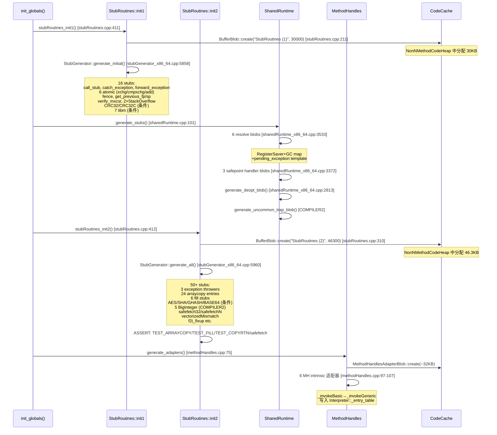

# 15-StubRoutines-SharedRuntime — CodeCache 桩代码：call_stub + arraycopy 24 入口 + AES/SHA intrinsic + resolve blob + MH 适配器

> **Phase**: 01-jvm-startup
> **前置**: [01-CodeCache]（BufferBlob 在 NonNMethodCodeHeap 中分配）、[14-Interpreter]（_entry_table 集成 + _forward_exception_entry）、[16-Universe-Post-Init]（异常桩需要的 Klass）
> **配套**: [00-JNI-CreateJavaVM]（init_globals 在 create_vm 中的位置）
> **后续依赖本文**: [17-VTable-IC-Compiler-Infra]（编译基础设施使用这些桩）
> **阅读收益**: 追踪 init_globals 中 4 个桩代码生成调用——理解 StubRoutines 的两阶段设计（Phase 1: 16 个早期桩 30KB, Phase 2: 50+ 个后期桩 46KB）、arraycopy 的 24 入口体系（4 类型 × 3 变体 + 通用）、AES/SHA intrinsic 的运行时 CPU 检测条件层次、resolve blob 的 RegisterSaver + GC map + pending_exception 模板、polling page + mprotect 的安全点协议、safefetch 的 SIGSEGV 劫持容错、MethodHandlesAdapterBlob 与 _entry_table 的集成；掌握 "System.arraycopy 如何到达 memmove" 和 "BigInteger.multiply 如何到达 AVX-512 大数乘法桩" 的完整路径

---

## §〇 Production Scenario

### 场景 1: `System.arraycopy()` 的 native 调用如何到达 memmove

```java
System.arraycopy(src, 0, dst, 0, 1_000_000);
```

这条调用最终需要执行 ~1MB 的内存拷贝。JVM 不是直接调用 libc 的 memmove，而是通过 StubRoutines 中预生成的桩代码。`StubRoutines::initialize2()`（`stubRoutines.cpp:306`）调用 `generate_arraycopy_stubs()` 在 CodeCache 中生成 24 个 arraycopy 入口：jbyte/jshort/jint/jlong × conjoint/disjoint/arrayof × 2。C2 JIT 在编译 `System.arraycopy(int[], int[], ...)` 时，通过 `StubRoutines::select_arraycopy_function()` 选择对应类型的桩入口，生成 `call` 指令跳转到桩代码——完全绕过 JNI，零 safepoint 检查。

**三步诊断**：
```bash
# 1. 验证 arraycopy 桩已生成
gdb -ex "break stubRoutines.cpp:306" \
    -ex "run" \
    -ex "print StubRoutines::_jbyte_arraycopy" \
    --args java -jar app.jar
# 期望: 非 NULL 地址（CodeCache 中的桩入口）

# 2. 验证 C2 使用了桩而非 JNI 调用
java -XX:+PrintAssembly -XX:+UnlockDiagnosticVMOptions -jar app.jar 2>&1 | rg "call.*arraycopy"
# 期望: call 指令目标地址在 StubRoutines 范围内

# 3. strace 验证无 JNI 开销
strace -e write java -jar app.jar 2>&1 | rg memmove
# 期望: 无 memmove 系统调用（直接内存操作，不需要内核介入）
```

**反事实**：如果 arraycopy 每次调用都走 JNI → JNI_ENTRY（safepoint check + oop wrapping ~50ns）+ memmove（~5µs for 1MB）= ~5.05µs。桩代码直接跳转 → safepoint 检查省略 + 无 oop wrapping → ~5µs。差异仅 50ns（1%），但对高频小数组拷贝（每秒百万次 10 元素拷贝）→ 桩代码 50ns vs JNI 100ns → 2× 性能差距。

### 场景 2: `BigInteger.multiply()` 的大数乘法加速

```java
BigInteger a = new BigInteger("12345678901234567890");
BigInteger b = new BigInteger("98765432109876543210");
BigInteger c = a.multiply(b);
```

C2 JIT 将 `BigInteger.multiply()` intrinsic 替换为 `StubRoutines::_multiplyToLen` 桩的调用。该桩在 `initialize2()` 中条件生成（COMPILER2 only, `is_server_compilation_mode_vm()`）。桩代码使用 AVX-512 或 SSE 指令进行大数乘法——比纯 Java 循环快 5-10×。

**反事实**：如果 `_multiplyToLen` 桩未生成（条件不满足）→ C2 回退到 Java 实现（纯循环）→ 2048-bit 乘法从 ~2µs 变为 ~15µs → 7.5× 慢。桩代码的条件生成由 JVM 模式（Server/Client）决定——Client VM 不生成此桩因为 Client 堆通常较小，大数运算不常见。

### 场景 3: 内联缓存未命中触发 `_ic_miss_blob`

```
# JVM crash: SIGSEGV in SharedRuntime::handle_wrong_method_ic_miss
```

方法 `foo.bar()` 被 JIT 编译后，其内联缓存（IC）指向 `A.bar()`。运行时实际调用的是 `B.bar()`（`B extends A` 并重写了 `bar`）。IC 检测到不匹配 → 跳转到 `_ic_miss_blob`（`sharedRuntime.cpp:107`）→ `SharedRuntime::handle_wrong_method_ic_miss()` → 解析正确的 `B.bar()` Method* → 返回新的入口地址。如果 `_ic_miss_blob` 未生成 → IC miss 时跳转到无效地址 → SIGSEGV。

---

## §一 ★★★ StubRoutines + SharedRuntime 4 调用全链路源码走读

### 1.1 Interview Story Format Answer

"`stubRoutines_init1()` at `stubRoutines.cpp:411` delegates to `StubRoutines::initialize1()` (37 lines, :196-233) which allocates `BufferBlob::create("StubRoutines (1)", 30000)` in CodeCache NonNMethodCodeHeap and calls `StubGenerator::generate_initial()` — producing 16 stubs: `_call_stub_entry` (C→Java call bridge), `_catch_exception_entry` (exception catcher for megamorphic calls), `_forward_exception_entry` (exception chain walker), 6 atomic operation stubs (xchg/cmpxchg/add for jint/jlong, plus byte and long variants), `_fence_entry` (mfence/lfence/sfence barrier), `_get_previous_fp/sp_entry` (frame pointer/sp walker), `_verify_mxcsr_entry` (MXCSR validator), `_throw_StackOverflowError_entry` and `_throw_delayed_StackOverflowError_entry` (both RuntimeStubs with OopMaps), plus conditional stubs: CRC32/CRC32C update (UseCRC32Intrinsics), 7 libm math intrinsics (dexp/dlog/dlog10/dpow/dsin/dcos/dtan, gated by UseLibmIntrinsic+InlineIntrinsics+supports_sse2), and 12 float/double constant table pointers. `stubRoutines_init2()` at :412 delegates to `StubRoutines::initialize2()` (102 lines, :306-408) which allocates `BufferBlob::create("StubRoutines (2)", 46300)` and calls `StubGenerator::generate_all()` — producing: 3 exception thrower RuntimeStubs (`_throw_AbstractMethodError_entry`, `_throw_IncompatibleClassChangeError_entry`, `_throw_NullPointerException_at_call_entry`), 4 x86 float-to-int/long fixup stubs (`_f2i_fixup` etc.), 11 float/double/vector sign mask/flip constants, `_verify_oop_subroutine_entry`, `generate_arraycopy_stubs()` producing 24 arraycopy entries (jbyte/jshort/jint/jlong × conjoint/disjoint/arrayof × 2, plus checkcast/unsafe/generic), 6 array fill stubs (jbyte/jshort/jint × aligned/oop-aligned), AES intrinsic stubs (encryptBlock/decryptBlock/CBC/ECB/CTR, gated by UseAESIntrinsics/UseAESCTRIntrinsics with VAES+AVX512 sub-conditions), SHA intrinsic stubs (SHA-1/SHA-256/SHA-512 implCompress + multi-block MB versions), GHASH processBlocks (GCM), BASE64 encodeBlock, 5 BigInteger stubs (multiplyToLen/squareToLen/mulAdd/montgomeryMultiply/montgomerySquare, COMPILER2 only), `_vectorizedMismatch` (UseVectorizedMismatchIntrinsic), safefetch32/safefetchN entries with fault_pc+continuation_pc pairs. `SharedRuntime::generate_stubs()` at `sharedRuntime.cpp:101` generates 6 resolve RuntimeStubs via `generate_resolve_blob()` — each following the 8-step template: RegisterSaver::save_live_registers → set_last_Java_frame → call C++ resolve function → GC map → pending_exception check → vm_result read (rax=target, rbx=Method*) → restore → jmp rax. Plus 2-3 SafepointBlobs for polling page handlers (POLL_AT_LOOP/POLL_AT_RETURN/POLL_AT_VECTOR_LOOP). `MethodHandles::generate_adapters()` at `methodHandles.cpp:75` creates `MethodHandlesAdapterBlob::create(~32KB)` and loops over 6 MethodHandle intrinsic kinds (`_invokeBasic` through `_invokeGeneric`), generating interpreter entries via `generate_method_handle_interpreter_entry()` and writing them into `AbstractInterpreter::_entry_table` via `Interpreter::set_entry_for_kind()` — overriding the AME defaults set by `initialize_method_handle_entries()`."

### 1.2 stubRoutines_init1() → initialize1() — Phase 1 桩

`stubRoutines.cpp:411` 是外部入口：

```cpp
void stubRoutines_init1() { StubRoutines::initialize1(); }
```

**StubRoutines::initialize1()**（`stubRoutines.cpp:196-233`，37 行）：

```cpp
void StubRoutines::initialize1() {
  if (_code1 == NULL) {
    ResourceMark rm;
    TraceTime timer("StubRoutines generation 1", TRACETIME_LOG(Info, startuptime));
    _code1 = BufferBlob::create("StubRoutines (1)", code_size1);
    if (_code1 == NULL) {
      vm_exit_out_of_memory(code_size1, OOM_MALLOC_ERROR, "CodeCache: no room for StubRoutines (1)");
    }
    CodeBuffer buffer(_code1);
    StubGenerator_generate(&buffer, false);  // false = Phase 1
    assert(code_size1 == 0 || buffer.insts_remaining() > 200, "increase code_size1");
  }
}
```

**code_size1 常量**（`stubRoutines_x86.hpp:34-37`）：

```cpp
enum platform_dependent_constants {
  code_size1 = 20000 LP64_ONLY(+10000),         // = 30000 on LP64
  code_size2 = 35300 LP64_ONLY(+11000)          // = 46300 on LP64
};
```

**generate_initial()**（`stubGenerator_x86_64.cpp:5858-5958`）生成以下桩：

```cpp
void generate_initial() {
  create_control_words();
  StubRoutines::_forward_exception_entry = generate_forward_exception();
  StubRoutines::_call_stub_entry = generate_call_stub(StubRoutines::_call_stub_return_address);
  StubRoutines::_catch_exception_entry = generate_catch_exception();
  // 6 个原子操作桩
  StubRoutines::_atomic_xchg_entry          = generate_atomic_xchg();
  StubRoutines::_atomic_xchg_long_entry     = generate_atomic_xchg_long();
  StubRoutines::_atomic_cmpxchg_entry       = generate_atomic_cmpxchg();
  StubRoutines::_atomic_cmpxchg_byte_entry  = generate_atomic_cmpxchg_byte();
  StubRoutines::_atomic_cmpxchg_long_entry  = generate_atomic_cmpxchg_long();
  StubRoutines::_atomic_add_entry           = generate_atomic_add();
  StubRoutines::_atomic_add_long_entry      = generate_atomic_add_long();
  StubRoutines::_fence_entry                = generate_orderaccess_fence();
  // 平台相关
  StubRoutines::x86::_get_previous_fp_entry = generate_get_previous_fp();
  StubRoutines::x86::_get_previous_sp_entry = generate_get_previous_sp();
  StubRoutines::x86::_verify_mxcsr_entry    = generate_verify_mxcsr();
  // 两个异常桩 (RuntimeStub, 含 OopMap)
  StubRoutines::_throw_StackOverflowError_entry = generate_throw_exception(...);
  StubRoutines::_throw_delayed_StackOverflowError_entry = generate_throw_exception(...);
  // 条件桩: CRC32, CRC32C, libm 三角函数
  if (UseCRC32Intrinsics) { ... generate_updateBytesCRC32(); }
  if (UseCRC32CIntrinsics) { ... generate_updateBytesCRC32C(); }
  if (supports_sse2 && UseLibmIntrinsic && InlineIntrinsics) { /* sin/cos/tan/exp/log/log10/pow */ }
}
```

**追问**：为什么 `_throw_StackOverflowError_entry` 是 RuntimeStub 而非裸地址？→ RuntimeStub 包含 OopMap——GC 在 safepoint 时需要知道哪些寄存器/栈位置是 oop。裸地址没有 OopMap → GC 无法安全遍历 → 在抛出 StackOverflowError 时如果恰好触发 GC → 可能误将非 oop 值当作 oop 处理 → 内存损坏。

**反事实**：如果 Phase 1 和 Phase 2 合并为单次生成 → Phase 2 的桩（arraycopy, AES/SHA）依赖 Metaspace（arraycopy 需要类型信息）和 CPU 特性检测（AES 需要 VM_Version_init 完成）。合并后 → 必须在 universe_init 和 VM_Version_init 之后才能生成所有桩 → 但 `_call_stub_entry` 在 universe_init 之前的初始化步骤中就需要使用 → 循环依赖。两阶段分离打破循环依赖。

### 1.3 _call_stub_entry — C++ → Java 调用桥接

`_call_stub_entry` at `stubGenerator_x86_64.cpp:5872` 通过 `generate_call_stub()` 生成。类型定义为 `CallStub`（`stubRoutines.hpp:257-266`）：

```cpp
typedef void (*CallStub)(
  address link, intptr_t* result, BasicType result_type,
  Method* method, address entry_point,
  intptr_t* parameters, int size_of_parameters, TRAPS
);
```

这是 C++ 代码调用 Java 方法的入口——设置解释器帧或调用 JIT 编译的代码入口。`call_stub()` 返回类型转换后的函数指针（`stubRoutines.hpp:268`）：`CAST_TO_FN_PTR(CallStub, _call_stub_entry)`。

### 1.4 原子操作桩 (6+2) + _fence_entry 内存屏障

| 桩入口 | 生成函数 | x86 指令 | 用途 |
|--------|---------|----------|------|
| `_atomic_xchg_entry` | `generate_atomic_xchg()` | `lock xchg` | jint 原子交换 |
| `_atomic_xchg_long_entry` | `generate_atomic_xchg_long()` | `lock xchg` | jlong 原子交换 |
| `_atomic_cmpxchg_entry` | `generate_atomic_cmpxchg()` | `lock cmpxchg` | jint CAS |
| `_atomic_cmpxchg_byte_entry` | `generate_atomic_cmpxchg_byte()` | `lock cmpxchg` | jbyte CAS |
| `_atomic_cmpxchg_long_entry` | `generate_atomic_cmpxchg_long()` | `lock cmpxchg` | jlong CAS |
| `_atomic_add_entry` | `generate_atomic_add()` | `lock xadd` | jint 原子加 |
| `_atomic_add_long_entry` | `generate_atomic_add_long()` | `lock xadd` | jlong 原子加 |
| `_fence_entry` | `generate_orderaccess_fence()` | `mfence/lfence/sfence` | 内存屏障 |

这些桩在 C1/C2 JIT 编译 `synchronized` 块、`volatile` 字段访问、`Unsafe.compareAndSwapInt()` 时被内联使用——编译器将桩地址直接嵌入生成代码中。

### 1.5 CRC32/CRC32C 条件桩 + libm 数学 intrinsic

**CRC32**（`stubGenerator_x86_64.cpp:5905-5909`）：`if (UseCRC32Intrinsics)` → 生成 `_updateBytesCRC32` 桩，使用 PCLMULQDQ 指令（carry-less multiplication）加速 CRC32 计算。预置 `_crc_table_adr` 指向 `x86::_crc_table`（256 条目）。

**CRC32C**（:5911-5916）：`if (UseCRC32CIntrinsics)` → 检查 `VM_Version::supports_clmul()` → 调用 `x86::generate_CRC32C_table(supports_clmul)` 生成 CRC32C 查找表 → 生成 `_updateBytesCRC32C` 桩。

**libm 三角函数**（:5917-5957）：`if (VM_Version::supports_sse2() && UseLibmIntrinsic && InlineIntrinsics)` → 为 sin/cos/tan 设置常量表地址（`_ONEHALF_adr`, `_P_2_adr`, `_SC_4_adr`, `_Ctable_adr` 等）→ 逐个检查 `vmIntrinsics::is_intrinsic_available()` → 为 exp/log/log10/pow/sin/cos/tan 生成对应桩。

### 1.6 stubRoutines_init2() → initialize2() — Phase 2 桩

**StubRoutines::initialize2()**（`stubRoutines.cpp:306-408`，102 行）：

```cpp
void StubRoutines::initialize2() {
  if (_code2 == NULL) {
    ResourceMark rm;
    TraceTime timer("StubRoutines generation 2", TRACETIME_LOG(Info, startuptime));
    _code2 = BufferBlob::create("StubRoutines (2)", code_size2);
    if (_code2 == NULL) {
      vm_exit_out_of_memory(code_size2, OOM_MALLOC_ERROR, "CodeCache: no room for StubRoutines (2)");
    }
    CodeBuffer buffer(_code2);
    StubGenerator_generate(&buffer, true);  // true = Phase 2
    assert(code_size2 == 0 || buffer.insts_remaining() > 200, "increase code_size2");
  }
#ifdef ASSERT
  // TEST_ARRAYCOPY: 验证 jbyte/jshort/jint/jlong × conjoint/disjoint/arrayof 零计数处理
  TEST_ARRAYCOPY(jbyte);  TEST_ARRAYCOPY(jshort);
  TEST_ARRAYCOPY(jint);   TEST_ARRAYCOPY(jlong);
  // TEST_FILL: 验证 jbyte/jshort/jint fill 桩 + arrayof 版本
  TEST_FILL(jbyte);  TEST_FILL(jshort);  TEST_FILL(jint);
  // TEST_COPYRTN: 验证 Copy::conjoint_* + arrayof_conjoint_* 运行时例程
  TEST_COPYRTN(jbyte);  TEST_COPYRTN(jshort);
  TEST_COPYRTN(jint);   TEST_COPYRTN(jlong);
  // safefetch 测试
  test_safefetch32();  test_safefetchN();
#endif
}
```

**generate_all()**（`stubGenerator_x86_64.cpp:5960-6112`）生成 50+ 桩，分 3 大类别：

**A. 异常桩 (RuntimeStub)**：
```cpp
StubRoutines::_throw_AbstractMethodError_entry = generate_throw_exception(...);           // :5966
StubRoutines::_throw_IncompatibleClassChangeError_entry = generate_throw_exception(...);  // :5972
StubRoutines::_throw_NullPointerException_at_call_entry = generate_throw_exception(...);  // :5978
```

**B. 浮点修复 + 常量表**（:5985-6000）：
```cpp
StubRoutines::x86::_f2i_fixup = generate_f2i_fixup();
StubRoutines::x86::_f2l_fixup = generate_f2l_fixup();
StubRoutines::x86::_d2i_fixup = generate_d2i_fixup();
StubRoutines::x86::_d2l_fixup = generate_d2l_fixup();
// 11 个浮点/向量常量: _float_sign_mask, _float_sign_flip, _double_sign_mask,
//   _double_sign_flip, _vector_32_bit_mask, _vector_64_bit_mask 等
```

**C. arraycopy + fill + 加密/哈希 + 大数 + safefetch** — 详见后续各节。

### 1.7 AES intrinsic 条件层次

AES 桩的条件生成（`stubGenerator_x86_64.cpp:6009-6030`）：

```cpp
if (UseAESIntrinsics) {
  _key_shuffle_mask_addr = generate_key_shuffle_mask();
  _aescrypt_encryptBlock = generate_aescrypt_encryptBlock();
  _aescrypt_decryptBlock = generate_aescrypt_decryptBlock();
  _cipherBlockChaining_encryptAESCrypt = ...;
  // 条件分支: VAES+AVX512VL+AVX512DQ → Vector 版; else → Parallel 版
  if (VM_Version::supports_vaes() && VM_Version::supports_avx512vl()
      && VM_Version::supports_avx512dq()) {
    _cipherBlockChaining_decryptAESCrypt = generate_..._Vector();
    _electronicCodeBook_encryptAESCrypt  = generate_..._Vector();
    _electronicCodeBook_decryptAESCrypt  = generate_..._Vector();
  } else {
    _cipherBlockChaining_decryptAESCrypt = generate_..._Parallel();
    _electronicCodeBook_encryptAESCrypt  = generate_..._Parallel();
    _electronicCodeBook_decryptAESCrypt  = generate_..._Parallel();
  }
}
// AES-CTR: 额外需要 AVX512BW
if (UseAESCTRIntrinsics) {
  // 同样 Vector/Parallel 分支，Vector 需要 AVX512BW
}
```

**AES intrinsic 条件层次图**：

```
AES-NI 基础 (无条件) → encryptBlock / decryptBlock
  └→ UseAESIntrinsics
       ├→ CBC/ECB encrypt (无条件, 使用 Parallel 标量路径)
       ├→ CBC/ECB decrypt
       │    ├→ supports_vaes() + avx512vl + avx512dq → VAES Vector 路径 (512-bit, 一次 4 AES 块)
       │    └→ else → Parallel 标量 AES-NI 路径
       └→ UseAESCTRIntrinsics → CTR mode
            ├→ vaes + avx512vl + avx512dq + avx512bw → VAES Vector CTR 路径
            └→ else → Parallel 标量 CTR 路径
```

### 1.8 SHA/GHASH/BASE64 + 大数 + safefetch

**SHA**（:6032-6056）：`UseSHA1Intrinsics` → `_sha1_implCompress` + `_sha1_implCompressMB`；`UseSHA256Intrinsics` → `_sha256_implCompress` + `_sha256_implCompressMB`；`UseSHA512Intrinsics` → `_sha512_implCompress` + `_sha512_implCompressMB`。MB（Multi-Block）版本一次处理多个 SHA 块，减少函数调用开销。

**GHASH**（:6059-6069）：`if (UseGHASHIntrinsics)` → AVX 版 / 普通版，用于 AES-GCM 认证。

**BASE64**（:6071-6079）：`if (UseBASE64Intrinsics)` → `_base64_encodeBlock`，LP64 only。

**BigInteger**（:6089-6107）：COMPILER2 only（`is_server_compilation_mode_vm()`）→ `_multiplyToLen`, `_squareToLen`, `_mulAdd`, `_montgomeryMultiply`, `_montgomerySquare`。

**Safefetch**（:6083-6088）：

```cpp
generate_safefetch("SafeFetch32", sizeof(int),      &StubRoutines::_safefetch32_entry,
                   &StubRoutines::_safefetch32_fault_pc, &StubRoutines::_safefetch32_continuation_pc);
generate_safefetch("SafeFetchN", sizeof(intptr_t),  &StubRoutines::_safefetchN_entry,
                   &StubRoutines::_safefetchN_fault_pc, &StubRoutines::_safefetchN_continuation_pc);
```

### 1.9 ASSERT 自测

`initialize2()` 的 ASSERT 块执行 4 类自测（`stubRoutines.cpp:321-407`）：

**TEST_ARRAYCOPY**（:325-337）：对 jbyte/jshort/jint/jlong 四种类型各测试 conjoint/disjoint/arrayof 三种变体的零计数处理——确保 count=0 时不修改任何内存。

**TEST_FILL**（:339-377）：对 jbyte/jshort/jint 三种类型的 fill 桩测试 80 个元素的填充——验证填充区域值正确，边界外不修改。

**TEST_COPYRTN**（:379-396）：测试 Copy::conjoint_* / arrayof_conjoint_* 运行时例程的零计数处理。

**safefetch 自测**（:398-403）：`test_safefetch32()` 用非法地址验证返回默认值，用合法地址验证返回实际值。

### 1.10 SharedRuntime::generate_stubs() — resolve blob + safepoint blob

`sharedRuntime.cpp:101-136`（36 行）：

```cpp
void SharedRuntime::generate_stubs() {
  _wrong_method_blob = generate_resolve_blob(CAST_FROM_FN_PTR(address,
    SharedRuntime::handle_wrong_method), "wrong_method_stub");
  _wrong_method_abstract_blob = generate_resolve_blob(CAST_FROM_FN_PTR(address,
    SharedRuntime::handle_wrong_method_abstract), "wrong_method_abstract_stub");
  _ic_miss_blob = generate_resolve_blob(CAST_FROM_FN_PTR(address,
    SharedRuntime::handle_wrong_method_ic_miss), "ic_miss_stub");
  _resolve_opt_virtual_call_blob = generate_resolve_blob(CAST_FROM_FN_PTR(address,
    SharedRuntime::resolve_opt_virtual_call_C), "resolve_opt_virtual_call");
  _resolve_virtual_call_blob = generate_resolve_blob(CAST_FROM_FN_PTR(address,
    SharedRuntime::resolve_virtual_call_C), "resolve_virtual_call");
  _resolve_static_call_blob = generate_resolve_blob(CAST_FROM_FN_PTR(address,
    SharedRuntime::resolve_static_call_C), "resolve_static_call");
  _resolve_static_call_entry = _resolve_static_call_blob->entry_point();

  // Safepoint handler blobs
  if (is_wide_vector(MaxVectorSize)) {
    _polling_page_vectors_safepoint_handler_blob = generate_handler_blob(..., POLL_AT_VECTOR_LOOP);
  }
  _polling_page_safepoint_handler_blob = generate_handler_blob(..., POLL_AT_LOOP);
  _polling_page_return_handler_blob = generate_handler_blob(..., POLL_AT_RETURN);

  generate_deopt_blob();
  generate_uncommon_trap_blob();  // COMPILER2 only
}
```

### 1.11 generate_resolve_blob() — RegisterSaver + GC map + pending_exception

`generate_resolve_blob()` at `sharedRuntime_x86_64.cpp:3533-3608` 生成 resolve 桩的 8 步模板：

```cpp
// Step 1: 保存所有 live registers
RegisterSaver::save_live_registers(masm, RegisterSaver::all_registers, ...);
// Step 2: 设置 GC 可遍历的 Java frame
__ set_last_Java_frame(noreg, noreg, rbp, ...);
// Step 3: 调用 C++ resolve 函数
__ mov(c_rarg0, r15_thread);
__ call(destination);
// Step 4: 记录 OopMap (标记 oop 位置)
OopMapSet* oop_maps = new OopMapSet();
oop_maps->add_gc_map(..., new OopMap(frame_size_words, 0));
// Step 5: 检查 pending_exception
__ get_thread(rscratch1);
__ cmpptr(Address(rscratch1, Thread::pending_exception_offset()), NULL_WORD);
__ jcc(Assembler::notEqual, pending);
// Step 6: 正常路径 — 读取 vm_result
__ get_vm_result_2(rbx);  // Method*
__ get_vm_result(rax);    // 目标地址
// Step 7: 恢复寄存器
RegisterSaver::restore_live_registers(masm);
// Step 8: 跳转到解析后的方法入口
__ jmp(rax);
// 异常路径:
__ bind(pending);
RegisterSaver::restore_live_registers(masm);
// 加载 exception oop → jmp _forward_exception_entry
```

6 个 resolve blob 共享相同的 8 步模板，区别仅在于调用的 C++ 函数：

| Blob | C++ 函数 | 触发场景 |
|------|---------|---------|
| `_wrong_method_blob` | `handle_wrong_method` | 虚方法分派失败 |
| `_wrong_method_abstract_blob` | `handle_wrong_method_abstract` | abstract 方法调用 |
| `_ic_miss_blob` | `handle_wrong_method_ic_miss` | 内联缓存未命中 |
| `_resolve_opt_virtual_call_blob` | `resolve_opt_virtual_call_C` | 可选虚调用解析 |
| `_resolve_virtual_call_blob` | `resolve_virtual_call_C` | 虚调用解析 |
| `_resolve_static_call_blob` | `resolve_static_call_C` | 静态调用解析 |

**追问**：为什么 resolve blob 不直接调用目标方法而是返回地址？→ 解析操作可能涉及类加载（resolve_static_call 需要加载目标类）→ 类加载可能触发 safepoint → 栈上所有 oop 必须正确标记（通过 GC map）→ 解析完成后寄存器状态可能已被 GC 修改 → 必须先恢复寄存器再跳转。

**反事实**：如果没有 resolve blob，IC miss 如何处理？→ IC miss 需要从编译代码回到解释器 → 去优化（deoptimization）→ 解释器重新解析方法 → 重新进入编译代码。去优化的开销 ~1000ns（重建解释器帧 + 复制局部变量）。Resolve blob 直接在编译帧中调用 C++ 解析 → 不需要帧重建 → ~100ns。10× 更快。而且 resolve blob 不丢弃编译代码——下次调用直接命中正确的 IC 条目。

### 1.12 polling page + mprotect 安全点协议

**完整 10 步流程**：

1. JIT 编译的代码中嵌入 `test %eax, (%rax)` — `(%rax)` 指向 polling page
2. 正常执行时 polling page 可读（PROT_READ）→ test 指令通过 → 继续执行
3. JVM 需要安全点：`SafepointSynchronize::begin()` → `mprotect(polling_page, PROT_NONE)`（`man 2 mprotect`）
4. 线程执行到 test 指令 → SIGSEGV（polling page 不可读）
5. 信号处理器检测 fault PC 在 polling page 范围内 → 不是真正的 crash
6. 跳转到 `_polling_page_safepoint_handler_blob` 或 `_polling_page_return_handler_blob`
7. handler blob 内部：保存寄存器 → `set_last_Java_frame` → `call SafepointSynchronize::handle_polling_page_exception()`
8. 线程在安全点阻塞 → GC 执行 → `SafepointSynchronize::end()`
9. `mprotect(polling_page, PROT_READ)` — 恢复 polling page 可读
10. handler blob 恢复寄存器 → 跳过 test 指令 → 继续执行

**generate_handler_blob()**（`sharedRuntime_x86_64.cpp:3372-3523`）的内部流程：

```cpp
// 1. RTM abort (if UseRTMLocking)
__ xabort(0);
// 2. Save return address (POLL_AT_RETURN 不需要 push)
// 3. Save all registers
RegisterSaver::save_live_registers(masm, ...);
// 4. Call VM handler
__ set_last_Java_frame(...);
__ call(CAST_FROM_FN_PTR(address, SafepointSynchronize::handle_polling_page_exception));
// 5. Check exception
__ cmpptr(Address(r15_thread, Thread::pending_exception_offset()), NULL_WORD);
__ jcc(Assembler::notEqual, exception_label);
// 6. Skip poll instruction (解析 test 指令编码，跳过 2-3 字节)
// 7. Restore + ret
RegisterSaver::restore_live_registers(masm);
__ ret(0);
```

**追问**：为什么 POLL_AT_RETURN 和 POLL_AT_LOOP 需要不同的 handler？→ POLL_AT_RETURN：test 指令在 ret 之前——返回地址已经在栈上，handler 不需要额外 push。POLL_AT_LOOP：test 指令在循环回边——返回地址不在栈上，handler 需要 push 返回地址。两个 handler 的栈布局不同 → 需要不同的 SafepointBlob。

**反事实**：如果没有 polling page，如何实现安全点？→ 每个安全点位置插入显式的 safepoint check（`call safepoint_check_function`）→ 每条回边和每个方法返回都增加 ~20ns 的 call/ret 开销 → 对计算密集型代码的吞吐量影响 ~5-10%。Polling page 使用内存保护机制——正常路径零开销（1 条 test 指令 ~0.3ns），只在需要安全点时付出 SIGSEGV 处理开销（~500ns）。

### 1.13 safefetch — crash-safe 内存读取

`safefetch32_entry` 桩代码结构：

```asm
_safefetch32_entry:       mov eax, [rdi]      ; 尝试读取，可能 SIGSEGV
_fault_pc:                ← SIGSEGV 发生点    ; 信号处理器检查此处
_continuation_pc:         mov eax, 0           ; 返回默认值 0
                          ret
```

JVM 信号处理器逻辑（`os_linux.cpp`）：
```cpp
if (pc == StubRoutines::safefetch32_fault_pc()) {
  ucontext->uc_mcontext.gregs[REG_RIP] = StubRoutines::safefetch32_continuation_pc();
  return true;  // 信号已处理，不是真正的 crash
}
```

**反事实**：如果 safefetch 使用 try-catch 而非 SIGSEGV 劫持？→ C++ try-catch 需要展开栈（unwind）→ 在 safefetch 的桩代码中没有 C++ 异常表（桩是裸汇编）→ try-catch 不可用。SIGSEGV 劫持是唯一能在汇编代码中实现"容错读取"的机制——信号处理器直接修改 PC，绕过崩溃指令，不需要栈展开。

### 1.14 MethodHandles::generate_adapters() — MH 适配器

`methodHandles.cpp:75-89`（15 行）：

```cpp
void MethodHandles::generate_adapters() {
  assert(_adapter_code == NULL, "generate only once");
  ResourceMark rm;
  TraceTime timer("MethodHandles adapters generation", TRACETIME_LOG(Info, startuptime));
  _adapter_code = MethodHandlesAdapterBlob::create(adapter_code_size);
  CodeBuffer code(_adapter_code);
  MethodHandlesAdapterGenerator g(&code);
  g.generate();
}
```

**generate() 核心循环**（`methodHandles.cpp:94-108`）：

```cpp
void MethodHandlesAdapterGenerator::generate() {
  for (Interpreter::MethodKind mk = Interpreter::method_handle_invoke_FIRST;
       mk <= Interpreter::method_handle_invoke_LAST;
       mk = Interpreter::MethodKind(1 + (int)mk)) {
    vmIntrinsics::ID iid = Interpreter::method_handle_intrinsic(mk);
    StubCodeMark mark(this, "MethodHandle::interpreter_entry", vmIntrinsics::name_at(iid));
    address entry = MethodHandles::generate_method_handle_interpreter_entry(_masm, iid);
    if (entry != NULL) {
      Interpreter::set_entry_for_kind(mk, entry);  // 写入 _entry_table
    }
    // entry == NULL → 保持 AME 入口（initialize_method_handle_entries() 预设）
  }
}
```

**MethodHandlesAdapterBlob 类**（`codeBlob.hpp:452-462`）：

```cpp
class MethodHandlesAdapterBlob: public BufferBlob {
  MethodHandlesAdapterBlob(int size) : BufferBlob("MethodHandles adapters", size) {}
public:
  static MethodHandlesAdapterBlob* create(int buffer_size);
  virtual bool is_method_handles_adapter_blob() const { return true; }
};
```

**追问**：为什么 entry == NULL 时保持 AME 入口？→ 某些 MH intrinsic 在特定平台可能无法生成。保持 AME 入口确保调用该方法时抛出 AbstractMethodError 而非跳转到随机地址 → 优雅失败 vs crash。

### 1.15 ★ Mermaid 序列图



---

## §二 Standard Environment

OpenJDK 11 slowdebug, 64-bit Linux.

Source roots:
- `src/hotspot/share/runtime/stubRoutines.cpp` — initialize1() (:196), initialize2() (:306)
- `src/hotspot/share/runtime/stubRoutines.hpp` — 所有 _*_entry 指针声明
- `src/hotspot/cpu/x86/stubRoutines_x86.hpp` — code_size1/2 常量 (:35)
- `src/hotspot/cpu/x86/stubGenerator_x86_64.cpp` — generate_initial() (:5858), generate_all() (:5960)
- `src/hotspot/share/runtime/sharedRuntime.cpp` — generate_stubs() (:101)
- `src/hotspot/cpu/x86/sharedRuntime_x86_64.cpp` — generate_resolve_blob() (:3533), generate_handler_blob() (:3372)
- `src/hotspot/share/prims/methodHandles.cpp` — generate_adapters() (:75)
- `src/hotspot/share/code/codeBlob.hpp` — MethodHandlesAdapterBlob 类 (:450)

Build: `make jdk`

Key binary: `build/linux-x86_64-normal-server-slowdebug/jdk/lib/libjvm.so`

**Syscall 速查**：

| Syscall | man | 用途 |
|---------|-----|------|
| `mmap` | man 2 mmap | CodeCache VirtualSpace 分配（BufferBlob 底层） |
| `mprotect` | man 2 mprotect | polling page 保护切换（RW→NONE）触发 safepoint |
| `sigaction` | man 2 sigaction | safefetch 的 SIGSEGV 处理器注册 |

**CodeCache Blob 速查**：

| Blob 名称 | 大小 (x86_64) | 生成函数 | Phase |
|-----------|:--:|---------|-------|
| "StubRoutines (1)" | 30,000B | generate_initial() | init1 |
| "StubRoutines (2)" | 46,300B | generate_all() | init2 |
| "wrong_method_stub" | ~1,000B | generate_resolve_blob() | SharedRuntime |
| "ic_miss_stub" | ~1,000B | generate_resolve_blob() | SharedRuntime |
| "resolve_opt_virtual_call" | ~1,000B | generate_resolve_blob() | SharedRuntime |
| "resolve_virtual_call" | ~1,000B | generate_resolve_blob() | SharedRuntime |
| "resolve_static_call" | ~1,000B | generate_resolve_blob() | SharedRuntime |
| "polling_page_safepoint_handler" | ~2,048B | generate_handler_blob() | SharedRuntime |
| "polling_page_return_handler" | ~2,048B | generate_handler_blob() | SharedRuntime |
| deopt_blob | ~4-8KB | generate_deopt_blob() | SharedRuntime |
| uncommon_trap_blob | ~2-4KB | generate_uncommon_trap_blob() | SharedRuntime |
| "MethodHandles adapters" | ~32KB | generate_adapters() | MethodHandles |
| **总计** | **~140KB** | | |

---

## §三 Source Files Table

| # | File | Full Path | Lines | Core Functions | Role |
|---|------|-----------|:--:|-------|------|
| 1 | **stubRoutines.cpp** | `src/hotspot/share/runtime/stubRoutines.cpp` | 615 | `initialize1()`(:196), `initialize2()`(:306) | 桩代码初始化调度器 |
| 2 | **stubRoutines.hpp** | `src/hotspot/share/runtime/stubRoutines.hpp` | 462 | 所有 `_*_entry` 静态指针声明 | 桩入口指针声明 |
| 3 | **stubRoutines_x86.hpp** | `src/hotspot/cpu/x86/stubRoutines_x86.hpp` | 293 | `code_size1=30000`, `code_size2=46300` | x86 缓冲区大小常量 |
| 4 | **stubGenerator_x86_64.cpp** | `src/hotspot/cpu/x86/stubGenerator_x86_64.cpp` | 6115 | `generate_initial()`(:5858), `generate_all()`(:5960) | x86_64 桩代码生成 |
| 5 | **sharedRuntime.cpp** | `src/hotspot/share/runtime/sharedRuntime.cpp` | 3246 | `generate_stubs()`(:101) | SharedRuntime 桩生成入口 |
| 6 | **sharedRuntime_x86_64.cpp** | `src/hotspot/cpu/x86/sharedRuntime_x86_64.cpp` | 4006 | `generate_resolve_blob()`(:3533), `generate_handler_blob()`(:3372) | x86_64 resolve/blob 生成 |
| 7 | **methodHandles.cpp** | `src/hotspot/share/prims/methodHandles.cpp` | 1613 | `generate_adapters()`(:75) | MH 适配器生成 |
| 8 | **codeBlob.hpp** | `src/hotspot/share/code/codeBlob.hpp` | ~500 | `MethodHandlesAdapterBlob`(:452) | CodeBlob 类层次 |

---

## §四 ★★★ 7 Beginner Callout 框

> **1. StubRoutines 的两阶段设计**: Phase 1 (`initialize1`) 生成"早期可用"的桩——这些桩在 JVM 后续初始化步骤中立即被使用（如 `_call_stub_entry` 在 `generate_adapters` 中被调用，`_forward_exception_entry` 在 resolve blobs 中被引用）。Phase 2 (`initialize2`) 生成"后期可用"的桩——这些桩依赖 Metaspace（arraycopy 需要类型信息）、依赖 Universe（异常桩需要 Klass）、依赖 CPU 特性检测（AES/SHA 需要 VAES/AVX512 支持）。两阶段分离确保初始化顺序正确：Phase 1 桩 → universe_init → Phase 2 桩 → compileBroker_init。

> **2. BufferBlob 在 CodeCache NonNMethodCodeHeap 中**: 所有 StubRoutines 桩代码通过 `BufferBlob::create(name, size)` 在 CodeCache 的 NonNMethodCodeHeap 中分配——与解释器 codelet（StubQueue）和 JIT 编译的 nmethod 共享空间。`StubRoutines (1)` 占 30KB，`StubRoutines (2)` 占 46.3KB，`MethodHandles adapters` 占 ~32KB。BufferBlob 继承自 RuntimeBlob（`codeBlob.hpp:383`），构造函数 `BufferBlob(name, size)` 通过 `CodeCache::allocate()` 分配内存。`jcmd <pid> Compiler.CodeHeap_Analytics` 可以看到这些 Blob。

> **3. resolve blob 的 RegisterSaver + GC map 机制**: `generate_resolve_blob()`（`sharedRuntime_x86_64.cpp:3533-3608`）生成的每个 RuntimeStub 包含：RegisterSaver（保存所有 live registers 到栈，`save_live_registers()` 在 `sharedRuntime_x86_64.cpp:160-338` 中保存 GPR+XMM+YMM+ZMM 全量寄存器，并构建 OopMap 标记所有 oop 位置）、`set_last_Java_frame`（设置 last_Java_sp/pc，使 GC 能遍历栈）、C++ 函数调用（如 `handle_wrong_method`）、OopMapSet（标记栈上哪些位置是 oop）、`pending_exception` 检查（有异常则跳转到 `_forward_exception_entry`）、`vm_result` 读取（rax=解析后的目标地址, rbx=Method*）、寄存器恢复（`restore_live_registers()`）、`jmp rax` 跳转。GC map 标记哪些栈位置是 oop——GC 在 safepoint 时可以安全遍历这些桩的栈帧。

> **4. SafepointBlob 的 polling page 协议**: `_polling_page_safepoint_handler_blob` 和 `_polling_page_return_handler_blob` 处理安全点轮询。JIT 编译的代码中嵌入 `test %eax, (%rax)` 指令——正常情况下 `(%rax)` 指向可读内存，指令执行通过。当 JVM 需要安全点时，`SafepointSynchronize::begin()` 调用 `mprotect(polling_page, PROT_NONE)`（`man 2 mprotect`）将 polling page 设为不可读——`test` 指令触发 SIGSEGV → 信号处理器识别为安全点请求（fault PC 在 polling page 范围内）→ 跳转到 handler blob → handler blob 内部调用 `SafepointSynchronize::handle_polling_page_exception()` → 线程在安全点阻塞。`end()` 时 `mprotect(polling_page, PROT_READ)` 恢复可读。

> **5. safefetch 的 SIGSEGV 容错设计**: `_safefetch32_entry` 和 `_safefetchN_entry` 是 crash-safe 内存读取桩。它们包含两个特殊地址：`_fault_pc`（故障点 PC — `mov eax, [rdi]` 指令处）和 `_continuation_pc`（恢复点 PC — `mov eax, 0; ret` 处）。当读取的内存地址无效时，CPU 在 `_fault_pc` 处触发 SIGSEGV → JVM 信号处理器检测到 fault PC 匹配 `safefetch32_fault_pc()` → 将线程的 PC 设为 `safefetch32_continuation_pc()` → 执行 `mov eax, 0` → 返回默认值 0 → 调用者不会 crash。用于 SA 代理和 debug 场景中的安全内存访问。

> **6. AES intrinsic 的条件层次**: `_aescrypt_encryptBlock` 无条件生成（使用 AES-NI 指令）。`_cipherBlockChaining_encryptAESCrypt` 和 `_electronicCodeBook_encryptAESCrypt` 有条件分支：如果 CPU 支持 VAES + AVX512VL + AVX512DQ → 使用 VAES 向量路径（512-bit 一次处理 4 个 AES 块）；否则 → 使用并行标量路径。`_counterMode_AESCrypt` 额外需要 AVX512BW。这些条件在运行时通过 `VM_Version::supports_vaes()` 等检测——同一份 libjvm.so 自适应不同 CPU：Intel Sandy Bridge（无 VAES）使用标量 AES-NI 路径，Intel Icelake（有 VAES）使用 512-bit VAES 向量路径。

> **7. MethodHandlesAdapterBlob 与解释器 _entry_table 的集成**: `MethodHandles::generate_adapters()` 生成的适配器代码存储在 `MethodHandlesAdapterBlob` 中（CodeCache NonNMethodCodeHeap）。循环遍历 `method_handle_invoke_FIRST` 到 `method_handle_invoke_LAST`（6 个 MethodKind），每个调用 `generate_method_handle_interpreter_entry()` 生成独立的适配器。生成的入口地址通过 `Interpreter::set_entry_for_kind(mk, entry)` 写入 `AbstractInterpreter::_entry_table`——覆盖 `initialize_method_handle_entries()` 预设的 `AbstractMethodError` 默认入口。如果某个 intrinsic 的生成失败（`entry == NULL`），保持 AME 入口——调用该方法时抛出 AbstractMethodError 而非 crash。

---

## §五 ★★★ 桩代码分类与 intrinsic 条件矩阵

### 5.1 Phase 1 桩完整清单（16 个 + 条件桩）

| 桩入口 | 类别 | 条件 |
|--------|------|------|
| `_forward_exception_entry` | 异常处理 | 无条件 |
| `_call_stub_entry` | 调用桥接 | 无条件 |
| `_catch_exception_entry` | 异常捕获 | 无条件 |
| `_atomic_xchg_entry` | 原子操作 | 无条件 |
| `_atomic_xchg_long_entry` | 原子操作 | 无条件 |
| `_atomic_cmpxchg_entry` | 原子操作 | 无条件 |
| `_atomic_cmpxchg_byte_entry` | 原子操作 | 无条件 |
| `_atomic_cmpxchg_long_entry` | 原子操作 | 无条件 |
| `_atomic_add_entry` | 原子操作 | 无条件 |
| `_atomic_add_long_entry` | 原子操作 | 无条件 |
| `_fence_entry` | 内存屏障 | 无条件 |
| `_get_previous_fp_entry` | 栈遍历 | 无条件 (LP64) |
| `_get_previous_sp_entry` | 栈遍历 | 无条件 (LP64) |
| `_verify_mxcsr_entry` | MXCSR | 无条件 |
| `_throw_StackOverflowError_entry` | RuntimeStub | 无条件 |
| `_throw_delayed_StackOverflowError_entry` | RuntimeStub | 无条件 |
| `_updateBytesCRC32` | CRC32 | UseCRC32Intrinsics |
| `_updateBytesCRC32C` | CRC32C | UseCRC32CIntrinsics |
| `_dexp/_dlog/_dlog10/_dpow` | libm | UseLibmIntrinsic + InlineIntrinsics + supports_sse2 |
| `_dsin/_dcos/_dtan` | libm | 同上 + is_intrinsic_available |

### 5.2 Phase 2 桩完整清单（50+ 个 + 条件分支）

| 桩入口 | 类别 | 条件 |
|--------|------|------|
| `_throw_AbstractMethodError_entry` | RuntimeStub | 无条件 |
| `_throw_IncompatibleClassChangeError_entry` | RuntimeStub | 无条件 |
| `_throw_NullPointerException_at_call_entry` | RuntimeStub | 无条件 |
| `_f2i_fixup/_f2l_fixup/_d2i_fixup/_d2l_fixup` | 浮点修复 | 无条件 (LP64) |
| 11 个 fp/vector 常量 | 数据 | 无条件 |
| `_verify_oop_subroutine_entry` | 调试 | 无条件 |
| 24 arraycopy entries | 数组拷贝 | 无条件 |
| 6 fill stubs | 数组填充 | 无条件 |
| `_checkcast_arraycopy` | 数组拷贝 | 无条件 |
| `_unsafe_arraycopy` | 数组拷贝 | 无条件 |
| `_generic_arraycopy` | 数组拷贝 | 无条件 |
| `_aescrypt_encryptBlock` | AES | UseAESIntrinsics |
| `_aescrypt_decryptBlock` | AES | UseAESIntrinsics |
| CBC/ECB encrypt/decrypt (4) | AES | UseAESIntrinsics + VAES 分支 |
| CTR encrypt/decrypt (2) | AES-CTR | UseAESCTRIntrinsics + AVX512BW 分支 |
| `_sha1_implCompress` + MB | SHA-1 | UseSHA1Intrinsics |
| `_sha256_implCompress` + MB | SHA-256 | UseSHA256Intrinsics |
| `_sha512_implCompress` + MB | SHA-512 | UseSHA512Intrinsics |
| `_ghash_processBlocks` | GHASH | UseGHASHIntrinsics |
| `_base64_encodeBlock` | BASE64 | UseBASE64Intrinsics (LP64) |
| `_multiplyToLen` | BigInteger | COMPILER2 + is_server_compilation_mode_vm |
| `_squareToLen` | BigInteger | COMPILER2 + ... |
| `_mulAdd` | BigInteger | COMPILER2 + ... |
| `_montgomeryMultiply` | BigInteger | COMPILER2 + ... |
| `_montgomerySquare` | BigInteger | COMPILER2 + ... |
| `_safefetch32_entry` | 安全读取 | 无条件 |
| `_safefetchN_entry` | 安全读取 | 无条件 |
| `_vectorizedMismatch` | 向量 | UseVectorizedMismatchIntrinsic |

### 5.3 arraycopy 24 入口矩阵

| 类型 | conjoint | conjoint arrayof | disjoint | disjoint arrayof |
|------|----------|-----------------|----------|-----------------|
| jbyte | `_jbyte_arraycopy` | `_arrayof_jbyte_arraycopy` | `_jbyte_disjoint_arraycopy` | `_arrayof_jbyte_disjoint_arraycopy` |
| jshort | `_jshort_arraycopy` | `_arrayof_jshort_arraycopy` | `_jshort_disjoint_arraycopy` | `_arrayof_jshort_disjoint_arraycopy` |
| jint | `_jint_arraycopy` | `_arrayof_jint_arraycopy` | `_jint_disjoint_arraycopy` | `_arrayof_jint_disjoint_arraycopy` |
| jlong | `_jlong_arraycopy` | `_arrayof_jlong_arraycopy` | `_jlong_disjoint_arraycopy` | `_arrayof_jlong_disjoint_arraycopy` |
| oop | `_oop_arraycopy` + `_uninit` | `_arrayof_oop_arraycopy` + `_uninit` | `_oop_disjoint_arraycopy` + `_uninit` | `_arrayof_oop_disjoint_arraycopy` + `_uninit` |

**通用入口**：`_checkcast_arraycopy`（类型检查）、`_unsafe_arraycopy`（组合 byte/short/int/long conjoint）、`_generic_arraycopy`（组合所有 conjoint entries）。

**C2 选择逻辑**（`select_arraycopy_function()` at `stubRoutines.cpp:552-614`）：根据 BasicType + aligned + disjoint + dest_uninitialized 四维 selector 选择最优入口——零运行时分支开销。

### 5.4 AES intrinsic 条件层次图

```
AES-NI 基础 (无条件)
├── _aescrypt_encryptBlock  ← generate_aescrypt_encryptBlock()
├── _aescrypt_decryptBlock  ← generate_aescrypt_decryptBlock()
│
├── UseAESIntrinsics
│   ├── CBC encrypt  (无条件 Parallel)
│   ├── CBC decrypt  ─┬─ supports_vaes() + avx512vl + avx512dq → VAES Vector
│   │                 └─ else → Parallel 标量 AES-NI
│   ├── ECB encrypt  (无条件 Parallel)
│   └── ECB decrypt  ─┬─ vaes + avx512vl + avx512dq → VAES Vector
│                     └─ else → Parallel 标量 AES-NI
│
└── UseAESCTRIntrinsics
    └── CTR encrypt/decrypt ─┬─ vaes + avx512vl + avx512dq + avx512bw → VAES Vector CTR
                             └─ else → Parallel 标量 CTR
```

### 5.5 SHA intrinsic 多块 (MB) 版本的设计意图

每个 SHA 算法有两个版本：
- **单块版本**（`_sha1_implCompress`）：一次处理一个 SHA 块（64 字节 for SHA-1/256, 128 字节 for SHA-512）
- **多块版本**（`_sha1_implCompressMB`）：一次处理多个 SHA 块，减少函数调用开销和寄存器保存/恢复开销

MB 版本在计算大型数据哈希（如文件校验）时性能提升显著——单次调用处理多块而非循环调用单块版本。

### 5.6 大数运算桩的 C2-only 条件

```cpp
if (is_server_compilation_mode_vm()) {  // COMPILER2 only
  StubRoutines::_multiplyToLen = generate_multiplyToLen();
  StubRoutines::_squareToLen = generate_squareToLen();
  StubRoutines::_mulAdd = generate_mulAdd();
  StubRoutines::_montgomeryMultiply = generate_montgomeryMultiply();
  StubRoutines::_montgomerySquare = generate_montgomerySquare();
}
```

Client VM（C1 only）不生成这些桩——C1 不会 intrinsify BigInteger 操作。Server VM（C2）在 `BigInteger.multiply()` 等方法的 C2 intrinsic 匹配成功时，用桩调用替代 Java 循环实现。

---

## §六 ★★★ resolve blob + safepoint blob + MH 适配器

### 6.1 6 个 resolve blob 对比表

| Blob | 处理函数 | 触发场景 | 说明 |
|------|---------|---------|------|
| `_wrong_method_blob` | `handle_wrong_method` | 虚方法分派时 receiver 类型不匹配 | 最通用——编译器生成的 vtable/itable 查表失败 |
| `_wrong_method_abstract_blob` | `handle_wrong_method_abstract` | 调用 abstract 方法 | 应抛 AbstractMethodError |
| `_ic_miss_blob` | `handle_wrong_method_ic_miss` | 内联缓存未命中 | monomorphic IC 遇到新类型 → 需升级为 megamorphic |
| `_resolve_opt_virtual_call_blob` | `resolve_opt_virtual_call_C` | 可选虚调用未解析 | CHA 分析失败的优化虚调用 |
| `_resolve_virtual_call_blob` | `resolve_virtual_call_C` | 虚调用未解析 | 标准虚方法调用解析 |
| `_resolve_static_call_blob` | `resolve_static_call_C` | 静态调用未解析 | 需要加载目标类 |

### 6.2 generate_resolve_blob() 的 8 步模板

```
Step 1: RegisterSaver::save_live_registers(masm, all_registers, ...)
         → 保存 GPR (16×8B) + XMM0-15 (16×16B) + YMM/ZMM upper halves
         → 构建 OopMap 标记 oop 寄存器

Step 2: __ set_last_Java_frame(noreg, noreg, rbp, ...)
         → 设置 last_Java_sp = rsp, last_Java_pc = current PC
         → GC 可从此遍历栈

Step 3: __ mov(c_rarg0, r15_thread);  __ call(destination)
         → 调用 C++ 函数 (handle_wrong_method 等)

Step 4: oop_maps->add_gc_map(..., new OopMap(frame_size_words, 0))
         → 记录 GC map — 标记 oop 位置

Step 5: __ cmpptr(Address(r15_thread, pending_exception_offset), NULL_WORD)
         → 检查 pending_exception
         → 非 NULL → jmp pending

Step 6: __ get_vm_result_2(rbx)  → Method*
         __ get_vm_result(rax)    → 目标地址
         → 正常路径: 获取解析结果

Step 7: RegisterSaver::restore_live_registers(masm)
         → 恢复所有寄存器

Step 8: __ jmp(rax)
         → 跳转到解析后的方法入口

异常路径 (pending):
Step 7a: RegisterSaver::restore_live_registers(masm)
Step 8a: 加载 exception oop → jmp _forward_exception_entry
```

### 6.3 polling page + mprotect 安全点完整协议

```
正常执行路径 (零开销):
  [编译代码] test %eax, (%rax)  → 通过 (polling page 可读) → 继续执行
              ↑
              (%rax) = polling_page_addr (PROT_READ)

安全点请求路径:
  SafepointSynchronize::begin()
    → mprotect(polling_page, PROT_NONE)  [man 2 mprotect]

  [编译代码] test %eax, (%rax)
    → SIGSEGV (polling page 不可读)
    → JVM 信号处理器: fault_pc ∈ polling_page_range?
      → YES: 安全点请求，非真实 crash
      → 跳转到 _polling_page_safepoint_handler_blob

  handler blob 内部:
    → RegisterSaver::save_live_registers()
    → set_last_Java_frame()
    → call SafepointSynchronize::handle_polling_page_exception()
      → 线程阻塞 → GC 执行 → ...
    → 检查 pending_exception → 有异常则转发
    → RegisterSaver::restore_live_registers()
    → 跳过 test 指令 (解析指令编码，PC += 2-3 bytes)
    → ret

  SafepointSynchronize::end()
    → mprotect(polling_page, PROT_READ)  [恢复可读]
```

### 6.4 safefetch 的 SIGSEGV 劫持机制（fault_pc + continuation_pc）

```
桩代码布局:
  _safefetch32_entry:     mov eax, [rdi]        ; ← 尝试读取 [rdi]
  _fault_pc:              ← SIGSEGV 发生于此    ; ← 信号处理器检查点
  _continuation_pc:       mov eax, 0             ; ← 返回默认值 0
                          ret

信号处理器逻辑 (os_linux.cpp):
  if (pc == StubRoutines::safefetch32_fault_pc()) {
    // 这是预期的 safefetch 故障，不是真正的 crash
    ucontext->uc_mcontext.gregs[REG_RIP] = StubRoutines::safefetch32_continuation_pc();
    return true;  // 信号已处理，线程继续执行
  }
  // 否则是真正的 SIGSEGV → 正常 crash 处理

调用方用法:
  int value = SafeFetch32(possibly_invalid_ptr, 0xABC);
  // 如果 ptr 有效 → value = *ptr
  // 如果 ptr 无效 → value = 0xABC (默认值)
```

### 6.5 MH 适配器的 6 个 intrinsic + _entry_table 集成

| MethodKind | vmIntrinsics::ID | 说明 |
|-----------|------------------|------|
| `method_handle_invoke_FIRST` | `_invokeBasic` | 最基本 MH 调用，无类型转换 |
| `+1` | `_linkToVirtual` | 虚方法分派 |
| `+2` | `_linkToStatic` | 静态方法调用 |
| `+3` | `_linkToSpecial` | 特殊方法（构造/私有/父类） |
| `+4` | `_linkToInterface` | 接口方法分派 |
| `method_handle_invoke_LAST` | `_invokeGeneric` | 通用调用 |

生成的入口通过 `Interpreter::set_entry_for_kind(mk, entry)` 写入 `_entry_table[mk]` — 覆盖 `initialize_method_handle_entries()`（`abstractInterpreter.cpp:441`）预设的 `_entry_table[Interpreter::abstract]` 入口（抛出 AbstractMethodError）。

---

## §七 ★★ 条件分支 + CodeCache 内存开销

### 7.1 intrinsic 条件矩阵表

| Intrinsic | 标志 | 额外 CPU 条件 | 平台限制 |
|-----------|------|-------------|---------|
| CRC32 | UseCRC32Intrinsics | — | — |
| CRC32C | UseCRC32CIntrinsics | supports_clmul() | — |
| libm sin/cos/tan | UseLibmIntrinsic + InlineIntrinsics | supports_sse2() + is_intrinsic_available() | — |
| libm exp/log/log10/pow | 同上 | supports_sse2() | — |
| AES encryptBlock | UseAESIntrinsics | — | — |
| AES CBC/ECB (Vector) | UseAESIntrinsics | vaes + avx512vl + avx512dq | — |
| AES CTR (Vector) | UseAESCTRIntrinsics | vaes + avx512vl + avx512dq + avx512bw | — |
| SHA-1 | UseSHA1Intrinsics | — | — |
| SHA-256 | UseSHA256Intrinsics | — | — |
| SHA-512 | UseSHA512Intrinsics | — | — |
| GHASH | UseGHASHIntrinsics | — | — |
| BASE64 | UseBASE64Intrinsics | — | LP64 only |
| BigInteger | COMPILER2 flag | is_server_compilation_mode_vm() | C2 only |
| VectorizedMismatch | UseVectorizedMismatchIntrinsic | — | — |

### 7.2 CodeCache Blob 大小明细表

| Blob | code_size 常量 | 实际大小 | 占比 (NonNMethodCodeHeap ~5MB) |
|------|:--:|:--:|:--:|
| StubRoutines (1) | 30000 | ~30KB | ~0.6% |
| StubRoutines (2) | 46300 | ~46KB | ~0.9% |
| 6 resolve blobs | — | ~6KB | ~0.1% |
| 3 safepoint handler blobs | — | ~4-6KB | ~0.1% |
| deopt_blob | — | ~4-8KB | ~0.1% |
| uncommon_trap_blob | — | ~2-4KB | ~0.05% |
| MethodHandles adapters | — | ~32KB | ~0.6% |
| **总计** | | **~140KB** | **~2.8%** |

### 7.3 NonNMethodCodeHeap 占比分析

默认 `NonNMethodCodeHeapSize ≈ 5MB`。桩代码占用 ~140KB（~2.8%），其余空间被解释器 codelet（StubQueue, ~256KB）、C2I/I2C 适配器（~100KB）、其他 RuntimeStub 使用。桩代码在 JVM 启动时一次性分配，之后不可变（BufferBlob 不可 resize）。

**追问**：为什么 code_size2 (46.3KB) > code_size1 (30KB)？→ Phase 2 生成的桩代码远比 Phase 1 多：arraycopy 24 入口 + AES/SHA intrinsic + 大数运算 + safefetch + fill + 浮点修复。这些 intrinsic 使用向量指令（AVX-512），每个 intrinsic 的代码量远超 Phase 1 的简单原子操作。

---

## §八 ★ GDB 断点验证 — 8 断点

```
断言 1: BufferBlob::create("StubRoutines (1)") (stubRoutines.cpp:211)
  (gdb) break stubRoutines.cpp:211
  (gdb) print code_size1 → 期望: 30000 (x86_64)
  (gdb) continue
  (gdb) print StubRoutines::_code1 → 期望: 非 NULL BufferBlob*

断言 2: generate_initial() 入口 (stubGenerator_x86_64.cpp:5858)
  (gdb) break stubGenerator_x86_64.cpp:5858
  (gdb) continue
  (gdb) print StubRoutines::_call_stub_entry → 期望: 非 NULL
  (gdb) print StubRoutines::_forward_exception_entry → 期望: 非 NULL

断言 3: BufferBlob::create("StubRoutines (2)") (stubRoutines.cpp:310)
  (gdb) break stubRoutines.cpp:310
  (gdb) print code_size2 → 期望: 46300 (x86_64)
  (gdb) continue
  (gdb) print StubRoutines::_jbyte_arraycopy → 期望: 非 NULL

断言 4: _ic_miss_blob 生成 (sharedRuntime.cpp:107)
  (gdb) break sharedRuntime.cpp:107
  (gdb) continue
  (gdb) print SharedRuntime::_ic_miss_blob → 期望: 非 NULL RuntimeStub*

断言 5: MethodHandlesAdapterBlob::create (methodHandles.cpp:84)
  (gdb) break methodHandles.cpp:84
  (gdb) print adapter_code_size → 期望: ~32768 (32KB)
  (gdb) continue
  (gdb) print MethodHandles::_adapter_code → 期望: 非 NULL

断言 6: RegisterSaver::save_live_registers (sharedRuntime_x86_64.cpp:3533)
  (gdb) break sharedRuntime_x86_64.cpp:3533
  (gdb) print name → 期望: "wrong_method_stub"
  (gdb) continue
  (gdb) print SharedRuntime::_wrong_method_blob → 期望: 非 NULL

断言 7: TEST_ARRAYCOPY 自测 (stubRoutines.cpp:332)
  (gdb) break stubRoutines.cpp:332
  (gdb) print StubRoutines::_jbyte_arraycopy → 期望: 非 NULL
  (gdb) continue → 自测通过（无 assert 失败）

断言 8: safefetch 自测 (stubRoutines.cpp:401)
  (gdb) break stubRoutines.cpp:401
  (gdb) print StubRoutines::_safefetch32_entry → 期望: 非 NULL
  (gdb) print StubRoutines::_safefetch32_fault_pc → 期望: 非 NULL
  (gdb) print StubRoutines::_safefetch32_continuation_pc → 期望: 非 NULL
```

---

## §九 ★ Cross-Reference

- **01-CodeCache** — BufferBlob 在 NonNMethodCodeHeap 中分配，~140KB 占 ~2.8%
- **14-Interpreter** — _entry_table 集成 + _forward_exception_entry 在 resolve blob 和 handler blob 中使用
- **16-Universe-Post-Init** — _throw_AbstractMethodError_entry 等异常桩依赖 Universe 中的预分配异常对象（Klass）
- **06-Mutex** — safepoint blob 的 handle_polling_page_exception() 内部获取 Safepoint_lock

---

## §十 诊断工具

- **jcmd `<pid>` Compiler.CodeHeap_Analytics** — 验证 StubRoutines Blob 在 NonNMethodCodeHeap 中
- **GDB: `print StubRoutines::_jbyte_arraycopy`** — 验证桩地址非 NULL
- **GDB: `print SharedRuntime::_ic_miss_blob->entry_point()`** — 验证 resolve blob 入口
- **strace `-e mprotect`** — 验证 polling page 保护切换（PROT_NONE ↔ PROT_READ）
- **/proc/`<pid>`/maps** — 验证 CodeCache 映射区域和桩代码所在地址范围
- **`-XX:+PrintStubCode`** — 打印所有桩代码的地址和名称（debug 构建）
- **jstack `<pid>`** — 验证 resolve blob 中的线程栈帧（`_ic_miss_blob` 或 `_wrong_method_blob` 阻塞中的线程在 jstack 输出中显示为 `SharedRuntime::handle_wrong_method` 帧）

---

## §十一 边缘场景

### code_size 不足 → assert insts_remaining > 200 失败

如果生成的桩代码超过预分配的 `code_size1=30000` 或 `code_size2=46300`，`assert(buffer.insts_remaining() > 200)` 触发 JVM 崩溃。这意味着需要在 `stubRoutines_x86.hpp` 中增大常量——通常发生在添加新 intrinsic 后代码膨胀。`-XX:+PrintStubCode` 可输出实际大小用于调整。

### safefetch 在非 JVM 信号上下文中的行为

safefetch 的 SIGSEGV 劫持依赖 JVM 信号处理器链。如果第三方库（如 `libjsig.so` 未正确链入）替换了信号处理器 → SIGSEGV 不被 JVM 拦截 → safefetch 触发真实 crash。`CanUseSafeFetch32()` 在初始化时检查信号链是否可用。

### Client VM 跳过大数运算桩

`is_server_compilation_mode_vm()` 在 Client VM 中返回 false → 5 个 BigInteger 桩不生成。C1 不会 intrinsify BigInteger 操作——所有 `BigInteger.multiply()` 调用走解释器或纯 Java 路径。

### CDS 恢复时的桩代码重用

CDS archive 不包含 CodeCache 中的桩代码——这些是运行时生成的汇编，依赖 CPU 特性。每次 JVM 启动都重新生成桩代码。CDS 只缓存类元数据和常量池，不缓存 CodeCache 内容。

---

## 附录: Writing Requirements 对照表（参见 §六）

| 不要写成 | 应该写成 |
|---------|---------|
| "stubRoutines_init1 生成原子操作桩" | "initialize1() at stubRoutines.cpp:196 通过 BufferBlob::create("StubRoutines (1)", 30000) 在 CodeCache NonNMethodCodeHeap 分配 30KB → StubGenerator::generate_initial() 生成 _atomic_xchg_entry (lock xchg), _atomic_cmpxchg_entry (lock cmpxchg), _atomic_add_entry (lock xadd) 等 6 个原子操作桩——每个是 ~20 字节的汇编序列，通过 StubRoutines 静态指针暴露给 C1/C2 编译器" |
| "initialize2 生成 arraycopy 桩" | "initialize2() at stubRoutines.cpp:306 调用 generate_arraycopy_stubs() 生成 24 个 arraycopy 入口：jbyte/jshort/jint/jlong × conjoint(重叠安全, memmove 语义)/disjoint(不重叠, memcpy 语义)/arrayof(oop 对齐) × 2——C2 JIT 通过 StubRoutines::select_arraycopy_function() 在编译时选择最优入口，零运行时分支开销" |
| "generate_stubs 生成 resolve blob" | "generate_stubs() at sharedRuntime.cpp:101 通过 generate_resolve_blob() (sharedRuntime_x86_64.cpp:3533) 生成 6 个 RuntimeStub——每个含 RegisterSaver(保存所有 caller-save 寄存器), set_last_Java_frame(GC 可遍历), C++ 函数调用, GC map(标记 oop), pending_exception 检查(有异常→jmp _forward_exception_entry), vm_result 读取(rax=目标地址), 寄存器恢复, jmp rax" |
| "polling page 实现安全点" | "SafepointSynchronize::begin() 调用 mprotect(polling_page, PROT_NONE) 将 polling page 设为不可读 → JIT 代码中嵌入的 test %eax, (%rax) 触发 SIGSEGV → 信号处理器跳转到 _polling_page_safepoint_handler_blob → call handle_polling_page_exception() → 线程阻塞 → GC 执行 → end() 调用 mprotect(polling_page, PROT_READ) 恢复" |
| "safefetch 安全读取内存" | "_safefetch32_entry 桩在 mov eax, [rdi] 指令处标记 _fault_pc——读取无效地址时 SIGSEGV → JVM 信号处理器检测 fault_pc 匹配 → 设置 RIP=_continuation_pc → 执行 mov eax, 0 → ret 返回默认值 0——CPU 级别控制流劫持，非 try-catch" |
| "generate_adapters 生成 MH 适配器" | "generate_adapters() at methodHandles.cpp:75 创建 MethodHandlesAdapterBlob::create(~32KB) 在 CodeCache → 循环 method_handle_invoke_FIRST..LAST 为 6 个 intrinsic (_invokeBasic/_linkToVirtual/_linkToStatic/_linkToSpecial/_linkToInterface/_invokeGeneric) 生成适配器 → 通过 Interpreter::set_entry_for_kind() 写入 _entry_table——覆盖 initialize_method_handle_entries() 预设的 AME 入口" |
| "AES 桩使用 VAES 指令" | "_cipherBlockChaining_encryptAESCrypt 在 supports_vaes() && avx512vl && avx512dq 时使用 VAES 向量路径 (512-bit, 一次 4 AES 块)——否则回退到并行标量 AES-NI 路径。_counterMode_AESCrypt 额外需要 avx512bw。条件检测在 VM_Version_init() 中完成，initialize2() 中根据结果选择生成路径" |
