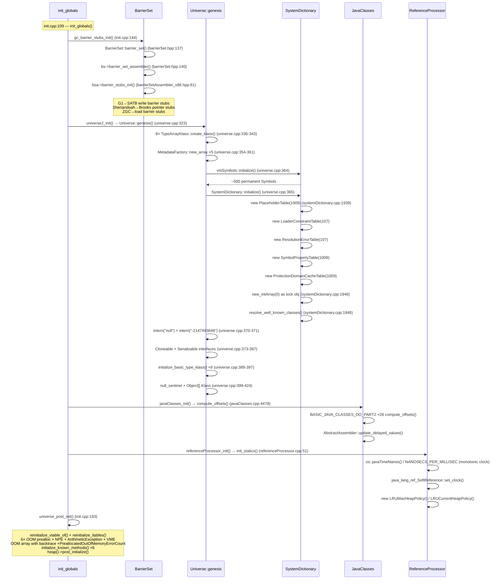

# 16-Universe-Post-Init — 类型系统完成与预分配异常基础设施

> **Phase**: 01-jvm-startup
> **前置**: [03-Metaspace]（元空间分配）、[04-SymbolTable]（永久符号创建）、[05-StringTable]（intern 机制）、[02-G1-Heap]（heap post_initialize）
> **配套**: [00-JNI-CreateJavaVM]（init_globals 在 create_vm 中的位置）
> **后续依赖本文**: [11-Stages5-10]（Stage 6 类加载使用本文创建的 Klass + 偏移量）
> **阅读收益**: 追踪 Universe 初始化的下半场 5 个调用——理解 TypeArrayKlass::create_klass 的 8 种基本类型数组创建、Universe::genesis 的 SystemDictionary 初始化、BASIC_JAVA_CLASSES_DO_PART2 宏展开的 29 个核心类偏移量计算、预分配 10 个异常对象（7 OOM + NPE + ArithmeticException + VME）的 O(1) 生存设计、ReferenceProcessor 的 Server/Client 双 LRU 策略、GC 屏障 stub 的虚函数分派机制；掌握 "Metaspace OOM 时如何抛出异常而不崩溃" 的预分配诊断路径

---

## §〇 Production Scenario

### 场景 1: Metaspace OOM 时 JVM 能抛出异常而不崩溃

```
Exception in thread "main" java.lang.OutOfMemoryError: Metaspace
```

JVM 在 Metaspace 耗尽时抛出了 `OutOfMemoryError: Metaspace`，但此时 Metaspace 已经无法分配任何新对象——包括异常对象本身。JVM 怎么做到的？

答案在 `universe_post_init()`（`universe.cpp:1251`）：JVM 在 `init_globals()` 阶段预先分配了 7 个 `OutOfMemoryError` 实例，存储在 `Universe::_out_of_memory_error_metaspace` 等静态 oop 中。当 Metaspace 分配失败时，`report_metadata_oome()`（`metaspace.cpp:1575`）调用 `Universe::out_of_memory_error_metaspace()` 返回预分配实例——无需 new 操作，无需 Metaspace 分配。

```cpp
// universe.cpp:1249-1257 — 预分配 OOM 对象的两步流程

// Step 1: 分配空白 OutOfMemoryError 实例（无消息）
Klass* k = SystemDictionary::resolve_or_fail(vmSymbols::java_lang_OutOfMemoryError(), true, CHECK_false);
InstanceKlass* ik = InstanceKlass::cast(k);
Universe::_out_of_memory_error_java_heap = ik->allocate_instance(CHECK_false);
Universe::_out_of_memory_error_metaspace = ik->allocate_instance(CHECK_false);
// ... 其余 4 个 OOM 变体类似 ...

// Step 2: 分批设置消息（:1286-1301）
Handle msg = java_lang_String::create_from_str("Java heap space", CHECK_false);
java_lang_Throwable::set_message(Universe::_out_of_memory_error_java_heap, msg());
msg = java_lang_String::create_from_str("Metaspace", CHECK_false);
java_lang_Throwable::set_message(Universe::_out_of_memory_error_metaspace, msg());
```

**三步诊断**：

```bash
# 1. 确认预分配 OOM 对象存在
gdb -ex "break universe.cpp:1340" \
    -ex "run" \
    -ex "print Universe::_out_of_memory_error_metaspace" \
    -ex "print Universe::_preallocated_out_of_memory_error_avail_count" \
    --args java -jar app.jar
# 期望: 非 NULL oop，avail_count > 0

# 2. 模拟 Metaspace OOM
java -XX:MaxMetaspaceSize=8m -jar app.jar
# 期望: OutOfMemoryError: Metaspace

# 3. 验证预分配 OOM 的 backtrace 是空的
jcmd <pid> GC.class_histogram | rg OutOfMemoryError
# 预分配 OOM 的 backtrace 长度为 0（节省内存）
```

**反事实**：如果 JVM 在 Metaspace OOM 时不预分配异常 → `report_metadata_oome()` 需要 `new OutOfMemoryError("Metaspace")` → 但 `new` 需要 Metaspace 分配 → 递归触发 `report_metadata_oome()` → 无限递归 → JVM crash（`SIGSEGV` on null oop dereference）。预分配机制将 O(N) 的异常创建降为 O(1) 的 oop 指针返回。

### 场景 2: `new int[Integer.MAX_VALUE]` 抛出 OutOfMemoryError

```java
int[] arr = new int[Integer.MAX_VALUE];
// → java.lang.OutOfMemoryError: Requested array size exceeds VM limit
```

`universe_post_init()`（`universe.cpp:1254`）预分配了 `_out_of_memory_error_array_size`，消息为 `"Requested array size exceeds VM limit"`。`arrayKlass::allocate_arrayArray()`（`arrayKlass.cpp:133`）在数组长度超过 JVM 内部限制（`max_array_length`）时调用 `Universe::out_of_memory_error_array_size()` 返回此预分配实例。

**反事实**：如果此异常不是预分配的 → 数组分配请求本身已经因为大小问题失败 → `new OutOfMemoryError(...)` 可能也需要数组分配 → 循环依赖 → crash。预分配 OOM 对象独立于数组分配路径，打破循环依赖。

### 场景 3: JIT 编译的 `x / 0` 抛出 ArithmeticException 而不分配新对象

```java
int x = 5 / 0;
// → java.lang.ArithmeticException: / by zero
```

`universe_post_init()`（`universe.cpp:1272`）预分配了 `_arithmetic_exception_instance`，消息设为 `"/ by zero"`（`:1303`）。JIT 编译器在生成除法指令时，如果检测到除数可能为零，直接引用预分配实例——无需在异常路径上分配对象（异常路径通常是 JIT 编译的瓶颈，因为分配操作涉及 GC 安全点）。

源码注释称之为 "cheap & dirty solution"：不需要从 C1/C2 的 IR 节点生成异常对象分配的代码。

---

## §一 ★★★ Universe Post-Init 5 调用全链路源码走读

### 1.1 Interview Story Format Answer

"`init_globals()` at `init.cpp:109` has 5 Universe-related calls between `universe_init()` (line 137) and `compileBroker_init()` (line 177). `gc_barrier_stubs_init()` at `barrierSet.cpp:49` generates GC barrier assembly stubs via virtual dispatch through `BarrierSetAssembler::barrier_stubs_init()` — the actual stub code depends on the GC (G1 generates SATB pre-write barriers, Shenandoah generates Brooks pointer barriers, ZGC generates load barriers). `universe2_init()` at `universe.cpp:1220` delegates to `Universe::genesis()` (142 lines) which creates the 8 primitive array Klasses (`boolean[]` through `long[]`) via `TypeArrayKlass::create_klass()`, initializes `SystemDictionary` with 5 hash tables (placeholder, constraint, resolution error, invoke method, protection domain cache), computes `Object`'s base vtable size (5 entries = 10 words in 64-bit), creates the null sentinel string `"<null_sentinel>"`, and creates the `Object[]` Klass. `javaClasses_init()` at `javaClasses.cpp:4597` calls `JavaClasses::compute_offsets()` which uses the `BASIC_JAVA_CLASSES_DO_PART2` macro to compute field offsets for 28 Java core classes — from `java_lang_Thread.eetop` to `java_nio_Buffer.address` to `java_lang_invoke_MemberName.vmtarget`. `referenceProcessor_init()` at `referenceProcessor.cpp:47` initializes soft reference LRU policies — `LRUMaxHeapPolicy` for Server VM, `LRUCurrentHeapPolicy` for Client VM — and synchronizes `SoftReference.clock` via `java_lang_ref_SoftReference::set_clock()`. `universe_post_init()` at `universe.cpp:1230` (111 lines) is the heavyweight: pre-allocates 6 `OutOfMemoryError` instances with specific messages (Java heap space, Metaspace, Compressed class space, Requested array size exceeds VM limit, GC overhead limit exceeded, failed reallocation of scalar replaced objects), pre-allocates `NullPointerException`, `ArithmeticException` with '/ by zero' message, `VirtualMachineError`, creates a pre-allocated OOM array with backtrace pre-filled for high-frequency OOM consumption, reinitializes vtable and itable for all loaded classes, caches 6 known methods (Finalizer.register, Unsafe.throwIllegalAccessError/throwNoSuchMethodError, ClassLoader.addClass, ProtectionDomain.impliesCreateAccessControlContext, AbstractStackWalker.doStackWalk), and calls `heap()->post_initialize()` to complete G1's reference processor and SATB queue setup."

### 1.2 gc_barrier_stubs_init() — GC 屏障桩初始化

`init.cpp:144` — 在 `universe_init()`（创建 G1CollectedHeap 并设置 `BarrierSet::_barrier_set`）之后立即调用：

```cpp
// barrierSet.cpp:49-55
void gc_barrier_stubs_init() {
  BarrierSet* bs = BarrierSet::barrier_set();
#ifndef ZERO
  BarrierSetAssembler* bs_assembler = bs->barrier_set_assembler();
  bs_assembler->barrier_stubs_init();
#endif
}
```

**双重虚函数分派**：

1. **第一次分派** — `BarrierSet::barrier_set_assembler()`（`barrierSet.hpp:140`）从全局 BarrierSet 单例获取 GC 特定的汇编器子对象：
   - G1 → `G1BarrierSet::barrier_set_assembler()` → `G1BarrierSetAssembler`
   - Shenandoah → `ShenandoahBarrierSet::barrier_set_assembler()` → `ShenandoahBarrierSetAssembler`
   - ZGC → `ZBarrierSet::barrier_set_assembler()` → `ZBarrierSetAssembler`

2. **第二次分派** — `BarrierSetAssembler::barrier_stubs_init()`（`barrierSetAssembler_x86.hpp:81`）默认空实现，GC 特定子类重写：
   - `G1BarrierSetAssembler` 重写 → 生成 SATB 预写屏障 + 后写屏障汇编 stub
   - `ShenandoahBarrierSetAssembler` 重写 → 生成 Brooks 指针屏障 stub
   - `ZBarrierSetAssembler` 重写 → 为每个寄存器生成 load barrier slow path stub

```cpp
// barrierSetAssembler_x86.hpp:81 — 默认空实现
virtual void barrier_stubs_init() {}
```

`BarrierSet` 持有三个编译器子组件（`barrierSet.hpp:72-74`）：

```cpp
// barrierSet.hpp:72-74 — BarrierSet 的三个 JIT 子组件
BarrierSetAssembler* _barrier_set_assembler;
BarrierSetC1* _barrier_set_c1;
BarrierSetC2* _barrier_set_c2;
```

**`#ifndef ZERO` 守卫**：ZERO 构建（纯解释器模式，无 JIT）跳过 barrier stub 生成。这是编译期条件——`NOT_ZERO(new BarrierSetAssemblerT()) ZERO_ONLY(NULL)`（`barrierSet.hpp:107`）在 ZERO 下 `_barrier_set_assembler` 为 NULL。

### 1.3 universe2_init() → Universe::genesis() — 8 TypeArrayKlass + SystemDictionary

`init.cpp:157` → `universe2_init()`（`universe.cpp:1220`）委托给 `Universe::genesis()`（142 行，`:323-464`）。这是 Universe 初始化的"创世"函数——在 Heap 初始化之后、类加载之前，创建 JVM 类型系统的基础设施。

**阶段 A：Bootstrapping 锁保护（`:326-328`）**

```cpp
// universe.cpp:326-328
{
  FlagSetting fs(_bootstrapping, true);
  MutexLocker mc(Compile_lock);
```

进入 `_bootstrapping = true` 模式并持有 `Compile_lock`——确保编译器在此期间不会尝试使用尚未初始化的数据结构。

**阶段 B：创建 8 种基本类型数组 Klass（`:335-343`）**

仅当 `!UseSharedSpaces`（不使用 CDS 归档）时执行：

```cpp
// universe.cpp:336-343 — 8 种基本类型数组 Klass 创建
_boolArrayKlassObj   = TypeArrayKlass::create_klass(T_BOOLEAN, sizeof(jboolean), CHECK);
_charArrayKlassObj   = TypeArrayKlass::create_klass(T_CHAR,    sizeof(jchar),    CHECK);
_singleArrayKlassObj = TypeArrayKlass::create_klass(T_FLOAT,   sizeof(jfloat),   CHECK);
_doubleArrayKlassObj = TypeArrayKlass::create_klass(T_DOUBLE,  sizeof(jdouble),  CHECK);
_byteArrayKlassObj   = TypeArrayKlass::create_klass(T_BYTE,    sizeof(jbyte),    CHECK);
_shortArrayKlassObj  = TypeArrayKlass::create_klass(T_SHORT,   sizeof(jshort),   CHECK);
_intArrayKlassObj    = TypeArrayKlass::create_klass(T_INT,     sizeof(jint),     CHECK);
_longArrayKlassObj   = TypeArrayKlass::create_klass(T_LONG,    sizeof(jlong),    CHECK);
```

每个调用进入 `TypeArrayKlass::create_klass()`（`typeArrayKlass.cpp:58-76`）：

```cpp
// typeArrayKlass.cpp:58-76 — TypeArrayKlass 创建三步
TypeArrayKlass* TypeArrayKlass::create_klass(BasicType type,
                                      const char* name_str, TRAPS) {
  Symbol* sym = NULL;
  if (name_str != NULL) {
    sym = SymbolTable::new_permanent_symbol(name_str, CHECK_NULL);
  }
  ClassLoaderData* null_loader_data = ClassLoaderData::the_null_class_loader_data();
  TypeArrayKlass* ak = TypeArrayKlass::allocate(null_loader_data, type, sym, CHECK_NULL);
  null_loader_data->add_class(ak);
  complete_create_array_klass(ak, ak->super(), ModuleEntryTable::javabase_moduleEntry(), CHECK_NULL);
  return ak;
}
```

三步流程：
1. `SymbolTable::new_permanent_symbol(name_str)` — 创建永久符号（如 `[Z` 代表 `boolean[]`，不会被 GC 回收） → `04-SymbolTable`
2. `TypeArrayKlass::allocate(null_loader_data, type, sym)` — 在 null ClassLoaderData 的 Metaspace 中分配 Klass 对象 → `03-Metaspace`
3. `null_loader_data->add_class(ak)` — 注册为 GC 强根，防止被 GC 回收
4. `complete_create_array_klass(ak, ak->super(), javabase_moduleEntry())` — 设置超类（`java.lang.Object`）+ 模块（`java.base`）

然后 `:345-352` 填充 `_typeArrayKlassObjs[T_BOOLEAN..T_LONG]` 数组，建立 BasicType→Klass* 的 O(1) 快速索引。

**阶段 C：创建空 Metadata 数组（`:354-361`）**

```cpp
// universe.cpp:354-361 — 空 Metadata 数组单例
ClassLoaderData* null_cld = ClassLoaderData::the_null_class_loader_data();
_the_array_interfaces_array = MetadataFactory::new_array<Klass*>(null_cld, 2, NULL, CHECK);
_the_empty_int_array        = MetadataFactory::new_array<int>(null_cld, 0, CHECK);
_the_empty_short_array      = MetadataFactory::new_array<u2>(null_cld, 0, CHECK);
_the_empty_method_array     = MetadataFactory::new_array<Method*>(null_cld, 0, CHECK);
_the_empty_klass_array      = MetadataFactory::new_array<Klass*>(null_cld, 0, CHECK);
```

- `_the_array_interfaces_array`: 2 元素 Klass* 数组，存放所有数组类型实现的接口（`Cloneable` + `Serializable`）
- 其余 4 个是零长度数组单例——避免运行时重复分配空数组

**阶段 D：SystemDictionary 初始化（`:364-366`）**

```cpp
// universe.cpp:364-366 — 符号表 + 系统字典初始化
vmSymbols::initialize(CHECK);
SystemDictionary::initialize(CHECK);
```

`vmSymbols::initialize()`（`vmSymbols.cpp:78-167`）：
- 将 `vm_symbol_bodies[]` 中约 500 个预定义 C 字符串逐一调用 `SymbolTable::new_permanent_symbol()` 创建永久 Symbol
- 填充 `_symbols[SID]` 数组 + `_type_signatures[T_BOOLEAN..T_VOID]` 类型签名数组
- 构建 `vm_symbol_index[]` 排序索引供二分查找（`find_sid()` O(log N)）

`SystemDictionary::initialize()`（`systemDictionary.cpp:1937-1949`）：

```cpp
// systemDictionary.cpp:1937-1949 — 5 张哈希表 + 知名类解析
void SystemDictionary::initialize(TRAPS) {
  _placeholders        = new PlaceholderTable(_placeholder_table_size);
  _loader_constraints  = new LoaderConstraintTable(_loader_constraint_size);
  _resolution_errors   = new ResolutionErrorTable(_resolution_error_size);
  _invoke_method_table = new SymbolPropertyTable(_invoke_method_size);
  _pd_cache_table = new ProtectionDomainCacheTable(defaultProtectionDomainCacheSize);

  _system_loader_lock_obj = oopFactory::new_intArray(0, CHECK);
  resolve_well_known_classes(CHECK);
}
```

5 张哈希表详情：

| 表名 | 类型 | 用途 | 初始大小 |
|------|------|------|---------|
| `_placeholders` | `PlaceholderTable` | 类加载占位符——阻止多线程并发加载同一类 | `_placeholder_table_size` (1009) |
| `_loader_constraints` | `LoaderConstraintTable` | 跨类加载器类型安全约束 | `_loader_constraint_size` (107) |
| `_resolution_errors` | `ResolutionErrorTable` | 缓存类解析失败结果，避免重复尝试 | `_resolution_error_size` (107) |
| `_invoke_method_table` | `SymbolPropertyTable` | invokedynamic/invokehandle 方法缓存 | `_invoke_method_size` (1009) |
| `_pd_cache_table` | `ProtectionDomainCacheTable` | ProtectionDomain 缓存，减少安全权限查找 | `defaultProtectionDomainCacheSize` (1009) |

`_system_loader_lock_obj` 使用 `new_intArray(0)` —— 0 长度 int 数组（12 bytes header + 0 bytes data = 12 bytes），是堆上最小的非 null 对象，用作系统类加载器的同步锁。→ `02-G1-Heap`

**阶段 E：创建字符串常量（`:368-371`）**

```cpp
// universe.cpp:368-371 — 字符串常量 intern
Klass* ok = SystemDictionary::Object_klass();
_the_null_string     = StringTable::intern("null", CHECK);
_the_min_jint_string = StringTable::intern("-2147483648", CHECK);
```

`_the_null_string` 用于 `String.valueOf(null)` 等场景，`_the_min_jint_string` 是 `Integer.MIN_VALUE` 的字符串表示。→ `05-StringTable`

**阶段 F：数组接口设置（`:373-387`）**

```cpp
// universe.cpp:373-387 — 所有数组类型实现 Cloneable + Serializable
#if INCLUDE_CDS
if (UseSharedSpaces) {
  assert(_the_array_interfaces_array->at(0) == SystemDictionary::Cloneable_klass(), "u3");
  assert(_the_array_interfaces_array->at(1) == SystemDictionary::Serializable_klass(), "u3");
  MetaspaceShared::fixup_mapped_heap_regions();
} else
#endif
{
  _the_array_interfaces_array->at_put(0, SystemDictionary::Cloneable_klass());
  _the_array_interfaces_array->at_put(1, SystemDictionary::Serializable_klass());
}
```

CDS 路径验证预存数据，非 CDS 路径手动设置。所有 Java 数组类型隐式实现 `Cloneable` 和 `Serializable`。

**阶段 G：初始化基本类型 Klass 接入点（`:389-397`）**

```cpp
// universe.cpp:389-397 — 设置 TypeArrayKlass 的运行时元数据
initialize_basic_type_klass(boolArrayKlassObj(), CHECK);
// ... 共 8 个调用
```

设置每个 TypeArrayKlass 的 vtable、itable、super class 等。这是 `_bootstrapping` 作用域内的最后一步。

**阶段 H：null sentinel + Object[] Klass（`:399-424`）**

```cpp
// universe.cpp:399-402 — null sentinel 哨兵
Handle tns = java_lang_String::create_from_str("<null_sentinel>", CHECK);
_the_null_sentinel = tns();
```

在 bootstrapping 之外创建——此时 String 的 intern 机制已可用。

```cpp
// universe.cpp:416-424 — Object[] Klass 创建
_objectArrayKlassObj = InstanceKlass::
    cast(SystemDictionary::Object_klass())->array_klass(1, CHECK);
_objectArrayKlassObj->append_to_sibling_list();
```

通过 `Object_klass()->array_klass(1)` 获取一维 `Object[]` 的 `ObjArrayKlass`，并插入 class hierarchy sibling 链表。

**阶段 I：FullGCALot 调试模式（`:426-463`）**

仅在 `#ifdef ASSERT` 且 `FullGCALot` 开启时——分配 Object 数组并填充 dummy 实例，用于 Full GC 验证 oop 更新正确性。

```cpp
// universe.cpp:426-463 — FullGCALot dummy 数组（仅 ASSERT 构建）
objArrayOop naked_array = oopFactory::new_objArray(SystemDictionary::Object_klass(), size, CHECK);
// ...填充 dummy 对象...
MutexLocker ml(FullGCALot_lock);
if (_fullgc_alot_dummy_array == NULL) {
    _fullgc_alot_dummy_array = dummy_array();
}
```

多线程竞争 → `FullGCALot_lock` 保护，first-writer-wins。

### 1.4 javaClasses_init() → JavaClasses::compute_offsets() — 28 个核心类字段偏移量

`init.cpp:161` → `javaClasses_init()`（`javaClasses.cpp:4597`）委托给 `JavaClasses::compute_offsets()`：

```cpp
// javaClasses.cpp:4478-4497 — 28 个类字段偏移量批量计算
#define DO_COMPUTE_OFFSETS(k) k::compute_offsets();

void JavaClasses::compute_offsets() {
  if (UseSharedSpaces) {
    assert(JvmtiExport::is_early_phase() && !(JvmtiExport::should_post_class_file_load_hook() &&
                                              JvmtiExport::has_early_class_hook_env()),
           "JavaClasses::compute_offsets() must be called in early JVMTI phase.");
    return;  // CDS: 偏移量已从归档恢复
  }

  BASIC_JAVA_CLASSES_DO_PART2(DO_COMPUTE_OFFSETS);

  AbstractAssembler::update_delayed_values();
}
```

`BASIC_JAVA_CLASSES_DO_PART2` 宏（`javaClasses.hpp:55-85`）展开为 28 个 `k::compute_offsets()` 调用：

| # | 类 | 类别 | 关键字段示例 |
|---|-----|------|------------|
| 1 | `java_lang_System` | 基础 | `in/out/err` 流 |
| 2 | `java_lang_ClassLoader` | 基础 | `parent` 加载器链 |
| 3 | `java_lang_Throwable` | 基础 | `detailMessage`, `backtrace` |
| 4 | `java_lang_Thread` | 基础 | `eetop`（JNI thread pointer）, `priority` |
| 5 | `java_lang_ThreadGroup` | 基础 | `parent`, `name` |
| 6 | `java_lang_AssertionStatusDirectives` | 基础 | 断言状态 |
| 7 | `java_lang_ref_SoftReference` | 引用 | `timestamp`, `clock` 静态字段 |
| 8 | `java_lang_invoke_MethodHandle` | MethodHandle | `type`, `form` |
| 9 | `java_lang_invoke_DirectMethodHandle` | MethodHandle | `member` |
| 10 | `java_lang_invoke_MemberName` | MethodHandle | `vmtarget`, `vmindex`, `flags` |
| 11 | `java_lang_invoke_ResolvedMethodName` | MethodHandle | `vmtarget` |
| 12 | `java_lang_invoke_LambdaForm` | MethodHandle | `vmentry`, `names` |
| 13 | `java_lang_invoke_MethodType` | MethodHandle | `rtype`, `ptypes` |
| 14 | `java_lang_invoke_CallSite` | MethodHandle | `target` |
| 15 | `java_lang_invoke_MethodHandleNatives_CallSiteContext` | MethodHandle | 上下文 |
| 16 | `java_security_AccessControlContext` | 安全 | `context`, `isPrivileged` |
| 17 | `java_lang_reflect_AccessibleObject` | 反射 | `override` |
| 18 | `java_lang_reflect_Method` | 反射 | `clazz`, `slot`, `name` |
| 19 | `java_lang_reflect_Constructor` | 反射 | `clazz`, `slot`, `parameterTypes` |
| 20 | `java_lang_reflect_Field` | 反射 | `clazz`, `slot`, `name` |
| 21 | `java_nio_Buffer` | NIO | `address`（直接内存地址） |
| 22 | `reflect_ConstantPool` | 反射 | `constantPoolOop` |
| 23 | `reflect_UnsafeStaticFieldAccessorImpl` | 反射 | `base`（静态字段基地址） |
| 24 | `java_lang_reflect_Parameter` | 反射 | `name`, `executable` |
| 25 | `java_lang_Module` | 模块 | `name`, `loader` |
| 26 | `java_lang_StackTraceElement` | 栈帧 | `methodName`, `fileName`, `lineNumber` |
| 27 | `java_lang_StackFrameInfo` | 栈帧 | `memberName`, `bci` |
| 28 | `java_lang_LiveStackFrameInfo` | 栈帧 | 运行态栈帧信息 |
| 29 | `java_util_concurrent_locks_AbstractOwnableSynchronizer` | 并发 | `exclusiveOwnerThread` |

> 注：PART1（`java_lang_String` + `java_lang_Class`）已在 `SystemDictionary::resolve_well_known_classes()` 中提前计算。

每个 `compute_offsets()` 的实现模式（以 `java_lang_Thread` 为例）：

```cpp
// javaClasses.cpp — java_lang_Thread::compute_offsets()
InstanceKlass* k = SystemDictionary::Thread_klass();
_eetop_offset = k->find_field("eetop", "J", &_eetop_is_offset);
```

通过 `InstanceKlass::find_field(name, signature)` 按名称和签名查找字段，存储字节偏移量到静态成员。这些偏移量使 HotSpot C++ 代码可以直接读写 Java 对象字段，无需走 JNI 路径。

**CDS 路径**（`UseSharedSpaces=true`）：直接 return——偏移量已由 `serialize_offsets()` 从归档恢复。`compute_offsets()` 还断言当前处于 JVMTI 早期阶段（`JvmtiExport::is_early_phase()`），因为 CDS 归档偏移量在 JVMTI ClassFileLoadHook 可能替换类之前已固定。

`AbstractAssembler::update_delayed_values()` 通知模板解释器代码生成器偏移量已更新——解释器的机器码生成需要这些值来嵌入正确的字段访问偏移。

### 1.5 referenceProcessor_init() — 软引用时钟 + LRU 策略

`init.cpp:164` → `referenceProcessor_init()` → `ReferenceProcessor::init_statics()`：

```cpp
// referenceProcessor.cpp:51-73 — 软引用策略初始化
void ReferenceProcessor::init_statics() {
  jlong now = os::javaTimeNanos() / NANOSECS_PER_MILLISEC;

  _soft_ref_timestamp_clock = now;
  java_lang_ref_SoftReference::set_clock(_soft_ref_timestamp_clock);

  _always_clear_soft_ref_policy = new AlwaysClearPolicy();
  if (is_server_compilation_mode_vm()) {
    _default_soft_ref_policy = new LRUMaxHeapPolicy();
  } else {
    _default_soft_ref_policy = new LRUCurrentHeapPolicy();
  }
  // ...NULL 检查 + RefDiscoveryPolicy 断言...
}
```

**单调时钟**：`os::javaTimeNanos() / NANOSECS_PER_MILLISEC` 获取纳秒级单调时钟（`CLOCK_MONOTONIC`）并转换为毫秒。使用 `javaTimeNanos()` 而非 `javaTimeMillis()` 是因为后者是 wall clock——可能因 NTP 调整而回退，导致软引用时间戳计算错误（新创建的软引用看起来比旧软引用更老）。`man 2 clock_gettime`：`CLOCK_MONOTONIC` 保证非递减。

**策略对比**（`referencePolicy.hpp` 类层次）：

```
ReferencePolicy (抽象基类, CHeapObj<mtGC>)
├── NeverClearPolicy      — should_clear_reference() 永远返回 false（永不清除）
├── AlwaysClearPolicy     — should_clear_reference() 永远返回 true（总是清除）
├── LRUCurrentHeapPolicy  — 基于当前空闲堆大小计算 _max_interval（Client 模式默认）
└── LRUMaxHeapPolicy      — 基于最大堆大小计算 _max_interval（Server 模式默认）
```

`LRUMaxHeapPolicy` vs `LRUCurrentHeapPolicy`：
- Server VM 堆通常很大（>1GB）→ `LRUMaxHeapPolicy` 基于历史峰值更保守，保留软引用更久，提高缓存命中率
- Client VM 堆通常较小（<256MB）→ `LRUCurrentHeapPolicy` 基于当前堆大小，在堆波动时更激进清除软引用

`java_lang_ref_SoftReference::set_clock()` 直接写入 `SoftReference.clock` 静态字段：

```cpp
// 等价于: InstanceKlass::static_field_base_raw()->long_field_put(static_clock_offset, value)
java_lang_ref_SoftReference::set_clock(_soft_ref_timestamp_clock);
```

### 1.6 universe_post_init() — 10 个预分配异常 + vtable 重初始化 + known methods

`init.cpp:183` → `universe_post_init()`（`universe.cpp:1230-1340`，111 行）——Universe 初始化的最后一步，分 6 个阶段。

**阶段 1：前置断言 + vtable/itable 重初始化（`:1230-1242`）**

```cpp
// universe.cpp:1230-1242
assert(!is_init_completed());
Universe::_fully_initialized = true;

if (!UseSharedSpaces) {
  Klass* ok = SystemDictionary::Object_klass();
  Universe::reinitialize_vtable_of(ok, CHECK_false);
  Universe::reinitialize_itables(CHECK_false);
}
```

`_fully_initialized = true` 立即标记——防止递归重入。非 CDS 路径需要重初始化 vtable/itable，因为 `genesis()` 创建 Klass 时方法尚未加载（类加载发生在 genesis 之后的 `resolve_well_known_classes()` 中），vtable 槽位为空 `Method*` 指针。

`reinitialize_vtable_of()`（`universe.cpp:574-590`）递归遍历所有已加载类：

```cpp
// universe.cpp:574-590 — 递归重初始化 vtable
ko->vtable().initialize_vtable(false, CHECK);  // 填充 Method* 指针
for (Klass* sk = ko->subklass(); sk != NULL; sk = sk->next_sibling())
  reinitialize_vtable_of(sk, CHECK);            // 递归处理子类
```

`reinitialize_itables()`（`universe.cpp:592-596`）遍历 `ClassLoaderDataGraph` 所有类初始化接口方法表。

CDS 模式跳过——vtables 从归档直接恢复。

**阶段 2：预分配 OutOfMemoryError 的 6 种变体（`:1244-1263`）**

`universe_post_init()` 使用**两步流程**创建预分配 OOM 异常：

```
Step 1 (allocation) at :1249-1257:
  resolve OutOfMemoryError Klass → ik->allocate_instance(CHECK_false) ×6
  → 创建 6 个空白 OOM 实例（无消息，无 backtrace）

Step 2 (message) at :1286-1301:
  创建 Java String 消息 → java_lang_Throwable::set_message() 分别设置
  → "Java heap space", "Metaspace", "Compressed class space", 等
```

**为什么分两步？** 消息是 Java `String` 对象——创建 `String` 需要 JVM 内部调用 `java_lang_String::create_from_str()` 并可能触发 GC。将所有消息设置延迟到分配后批量处理，避免在单个对象的 allocate→set_message 交替中意外触发 GC 安全点。

```cpp
// Step 1: universe.cpp:1249-1257 — 分配空白 OOM 实例
Klass* k = SystemDictionary::resolve_or_fail(
    vmSymbols::java_lang_OutOfMemoryError(), true, CHECK_false);
InstanceKlass* ik = InstanceKlass::cast(k);
Universe::_out_of_memory_error_java_heap = ik->allocate_instance(CHECK_false);
Universe::_out_of_memory_error_metaspace = ik->allocate_instance(CHECK_false);
Universe::_out_of_memory_error_class_metaspace = ik->allocate_instance(CHECK_false);
Universe::_out_of_memory_error_array_size = ik->allocate_instance(CHECK_false);
Universe::_out_of_memory_error_gc_overhead_limit =
    ik->allocate_instance(CHECK_false);
Universe::_out_of_memory_error_realloc_objects = ik->allocate_instance(CHECK_false);

// Step 2: universe.cpp:1286-1301 — 分批设置消息
Handle msg = java_lang_String::create_from_str("Java heap space", CHECK_false);
java_lang_Throwable::set_message(Universe::_out_of_memory_error_java_heap, msg());
msg = java_lang_String::create_from_str("Metaspace", CHECK_false);
java_lang_Throwable::set_message(Universe::_out_of_memory_error_metaspace, msg());
msg = java_lang_String::create_from_str("Compressed class space", CHECK_false);
java_lang_Throwable::set_message(Universe::_out_of_memory_error_class_metaspace, msg());
msg = java_lang_String::create_from_str("Requested array size exceeds VM limit", CHECK_false);
java_lang_Throwable::set_message(Universe::_out_of_memory_error_array_size, msg());
msg = java_lang_String::create_from_str("GC overhead limit exceeded", CHECK_false);
java_lang_Throwable::set_message(Universe::_out_of_memory_error_gc_overhead_limit, msg());
msg = java_lang_String::create_from_str(
    "Java heap space: failed reallocation of scalar replaced objects", CHECK_false);
java_lang_Throwable::set_message(Universe::_out_of_memory_error_realloc_objects, msg());
```

条件分支：若 `StackReservedPages > 0`，额外预分配 `_delayed_stack_overflow_error_message` 字符串（`:1260-1263`）。

**阶段 3：预分配其他异常（`:1265-1284`）**

NPE、ArithmeticException、VirtualMachineError 的预分配，以及关键的 `_vm_exception`：

```cpp
// universe.cpp:1265-1284 — NPE + ArithmeticException + VME 预分配

// NullPointerException (compiler cheap & dirty exception)
k = SystemDictionary::resolve_or_fail(
    vmSymbols::java_lang_NullPointerException(), true, CHECK_false);
Universe::_null_ptr_exception_instance =
    InstanceKlass::cast(k)->allocate_instance(CHECK_false);

// ArithmeticException with "/ by zero" message (compiler cheap & dirty exception)
k = SystemDictionary::resolve_or_fail(
    vmSymbols::java_lang_ArithmeticException(), true, CHECK_false);
Universe::_arithmetic_exception_instance =
    InstanceKlass::cast(k)->allocate_instance(CHECK_false);
// Message set separately at :1303 (alongside OOM messages batch)

// VirtualMachineError — 需要先 link_class_or_fail 验证链接
k = SystemDictionary::resolve_or_fail(
    vmSymbols::java_lang_VirtualMachineError(), true, CHECK_false);
bool linked = InstanceKlass::cast(k)->link_class_or_fail(CHECK_false);
if (!linked) {
    tty->print_cr("Unable to link/verify VirtualMachineError class");
    return false;  // 唯一显式的 JVM 启动失败路径
}

// 分配两个 VirtualMachineError 实例（用途不同）
Universe::_virtual_machine_error_instance =
    InstanceKlass::cast(k)->allocate_instance(CHECK_false);
Universe::_vm_exception =
    InstanceKlass::cast(k)->allocate_instance(CHECK_false);
```

**两个 VirtualMachineError 实例的区别**：

| 字段 | 用途 | 消费者示例 |
|------|------|----------|
| `_virtual_machine_error_instance` | 通用 VM 内部错误——"can't resolve situation" | `SystemDictionary::load_instance_class()` 类加载失败 |
| `_vm_exception` | 代码生成期间的 VM 错误——区别于 OOM 路径 | JIT 编译时内部一致性检查失败 |

`_vm_exception`（`:1284`）与 `_virtual_machine_error_instance`（）同为 VirtualMachineError，但语义上独立：`_virtual_machine_error_instance` 用于类加载/解析路径，`_vm_exception` 用于编译器代码生成路径。两者都无 detailMessage。

VirtualMachineError 特殊处理：`link_class_or_fail()` 验证链接是必需的——VME 不在 `WK_KLASS` 枚举中（`resolve_well_known_classes()` 未预解析），因此链接可能在此处首次触发。失败则 `return false` → `init_globals()` 返回 `JNI_ERR` → JVM 启动失败。

**阶段 4：预分配带 backtrace 的 OOM 数组（`:1306-1319`）**

```cpp
// universe.cpp:1306-1319 — 带 backtrace 的 OOM 数组
int len = (StackTraceInThrowable) ? PreallocatedOutOfMemoryErrorCount : 0;
_preallocated_out_of_memory_error_array = oopFactory::new_objArray(
    SystemDictionary::OutOfMemoryError_klass(), len, CHECK_false);
for (int i = 0; i < len; i++) {
  oop p = InstanceKlass::cast(...)->allocate_instance(CHECK_false);
  java_lang_Throwable::allocate_backtrace(p, CHECK_false);  // 预填充 backtrace
  _preallocated_out_of_memory_error_array->obj_at_put(i, p);
}
_preallocated_out_of_memory_error_avail_count = (jint)len;
```

若 `StackTraceInThrowable == false` → `len = 0`，跳过 backtrace 预分配。可用计数初始化为 `PreallocatedOutOfMemoryErrorCount`，每次消费递减。

**阶段 5：初始化 known methods（`:1321-1328`）**

```cpp
// universe.cpp:1184-1218 — 6 个 known method 缓存
Universe::initialize_known_methods(CHECK_false);
```

缓存的 6 个高频调用方法：

| 缓存字段 | 方法 | 用途 |
|---------|------|------|
| `_finalizer_register_cache` | `Finalizer.register(Object)` | 终结器注册 |
| `_throw_illegal_access_error_cache` | `Unsafe.throwIllegalAccessError()` | 安全检查失败 |
| `_throw_no_such_method_error_cache` | `Unsafe.throwNoSuchMethodError()` | 方法查找失败 |
| `_loader_addClass_cache` | `ClassLoader.addClass(Class)` | 类加载器记录 |
| `_pd_implies_cache` | `ProtectionDomain.impliesCreateAccessControlContext()` | 保护域检查 |
| `_do_stack_walk_cache` | `AbstractStackWalker.doStackWalk(...)` | 栈遍历回调 |

这些方法是 JVM 内部高频调用路径——缓存 `Method*` 避免每次通过 `SystemDictionary::find_method()` 查找。

**阶段 6：GC 后处理 + MemoryService（`:1330-1339`）**

```cpp
// universe.cpp:1330-1339 — GC 堆 + 内存服务完成初始化
Universe::heap()->post_initialize();
MemoryService::add_metaspace_memory_pools();
MemoryService::set_universe_heap();
MetaspaceShared::post_initialize();  // CDS 归档后处理（INCLUDE_CDS 条件编译）
```

`heap()->post_initialize()` → 在 G1 下触发 `G1CollectedHeap::post_initialize()`，初始化引用处理器和 SATB 队列。→ `02-G1-Heap`

### 1.7 ★ Mermaid: Universe Post-Init 序列图



---

## §二 Standard Environment

OpenJDK 11 slowdebug, 64-bit Linux。

Source roots:
- `src/hotspot/share/memory/universe.cpp` — `Universe::genesis()` (:323) + `universe_post_init()` (:1230)
- `src/hotspot/share/memory/universe.hpp` — 8 Klass* 声明 (:115-122) + 预分配异常 oop 声明 (:148-183)
- `src/hotspot/share/classfile/javaClasses.cpp` — `JavaClasses::compute_offsets()` (:4478)
- `src/hotspot/share/classfile/javaClasses.hpp` — `BASIC_JAVA_CLASSES_DO_PART2` 宏 (:55-85)
- `src/hotspot/share/classfile/systemDictionary.cpp` — `SystemDictionary::initialize()` (:1937)
- `src/hotspot/share/classfile/vmSymbols.cpp` — `vmSymbols::initialize()` (:78)
- `src/hotspot/share/gc/shared/referenceProcessor.cpp` — `ReferenceProcessor::init_statics()` (:51)
- `src/hotspot/share/gc/shared/referencePolicy.hpp` — `ReferencePolicy` 类层次
- `src/hotspot/share/gc/shared/barrierSet.cpp` — `gc_barrier_stubs_init()` (:49)
- `src/hotspot/share/gc/shared/barrierSet.hpp` — `BarrierSet` + `BarrierSetAssembler` 子组件
- `src/hotspot/cpu/x86/gc/shared/barrierSetAssembler_x86.hpp` — `barrier_stubs_init()` 默认空实现 (:81)
- `src/hotspot/share/oops/typeArrayKlass.cpp` — `TypeArrayKlass::create_klass()` (:58)
- `src/hotspot/share/runtime/init.cpp` — `init_globals()` 中 5 个调用的位置 (:109-200)

Build: `make jdk`

Key binary: `build/linux-x86_64-normal-server-slowdebug/jdk/lib/libjvm.so`

**关键全局状态表**：

| 变量 | 类型 | 位置 | 说明 |
|------|------|------|------|
| `Universe::_boolArrayKlassObj` ~ `_longArrayKlassObj` | `Klass*[8]` | universe.hpp:115-122 | 8 种基本类型数组 Klass |
| `Universe::_typeArrayKlassObjs[]` | `Klass*[T_VOID+1]` | universe.hpp:123 | BasicType→Klass* 快速索引 |
| `Universe::_objectArrayKlassObj` | `Klass*` | universe.hpp:125 | Object[] Klass |
| `Universe::_the_null_string` | `oop` | universe.hpp:145 | intern("null") |
| `Universe::_the_null_sentinel` | `oop` | universe.hpp:144 | String("<null_sentinel>") |
| `Universe::_out_of_memory_error_java_heap` ~ `_realloc_objects` | `oop[6]` | universe.hpp:155-160 | 6 个预分配 OOM 异常 |
| `Universe::_null_ptr_exception_instance` | `oop` | universe.hpp:178 | 预分配 NPE |
| `Universe::_arithmetic_exception_instance` | `oop` | universe.hpp:179 | 预分配 ArithmeticException "/ by zero" |
| `Universe::_virtual_machine_error_instance` | `oop` | universe.hpp:180 | 预分配 VME（类加载/解析路径） |
| `Universe::_vm_exception` | `oop` | universe.hpp:183 | 预分配 VME（编译器代码生成路径） |
| `Universe::_preallocated_out_of_memory_error_array` | `objArrayOop` | universe.hpp:173 | OOM[N] 数组 |
| `Universe::_preallocated_out_of_memory_error_avail_count` | `volatile jint` | universe.hpp:176 | 可用计数 |
| `Universe::_base_vtable_size` | `int` | universe.hpp 成员 | Object vtable = 10 words (64-bit) |
| `ReferenceProcessor::_soft_ref_timestamp_clock` | `jlong` | referenceProcessor.cpp:45 | 毫秒单调时钟 |
| `ReferenceProcessor::_default_soft_ref_policy` | `ReferencePolicy*` | referenceProcessor.cpp:44 | LRU 策略 |
| `BarrierSet::_barrier_set` | `static BarrierSet*` | barrierSet.hpp:47 | 全局 GC 屏障集单例 |
| `BarrierSet::_barrier_set_assembler` | `BarrierSetAssembler*` | barrierSet.hpp:72 | GC 特定汇编器 |

**系统调用速查表**：

| 系统调用 | man 页面 | 使用场景 |
|---------|---------|---------|
| `clock_gettime(CLOCK_MONOTONIC)` | `man 2 clock_gettime` | `os::javaTimeNanos()` — 软引用时钟单调性保证 |
| `mmap` | `man 2 mmap` | Metaspace VirtualSpaceNode commit（类 Klass 分配底层） |
| `mprotect` | `man 2 mprotect` | CodeCache 内存保护（barrier stub 存储区域） |

---

## §三 Source Files Table

| # | File | Full Path | Lines | Core Functions | Role |
|---|------|-----------|:--:|-------|------|
| 1 | **universe.cpp** | `src/hotspot/share/memory/universe.cpp` | 1609 | `Universe::genesis()`(:323), `universe_post_init()`(:1230), `initialize_basic_type_klass()`(:308), `reinitialize_vtable_of()`(:574), `initialize_known_methods()`(:1184) | Universe 初始化核心 |
| 2 | **universe.hpp** | `src/hotspot/share/memory/universe.hpp` | 250+ | 8 Klass* 声明, 预分配异常 oop 声明, `_base_vtable_size` | Universe 类定义 |
| 3 | **javaClasses.cpp** | `src/hotspot/share/classfile/javaClasses.cpp` | 4601 | `JavaClasses::compute_offsets()`(:4478) | Java 类字段偏移量 |
| 4 | **javaClasses.hpp** | `src/hotspot/share/classfile/javaClasses.hpp` | 1200+ | `BASIC_JAVA_CLASSES_DO_PART2` 宏(:55) | 类列表宏 |
| 5 | **systemDictionary.cpp** | `src/hotspot/share/classfile/systemDictionary.cpp` | ~2500 | `SystemDictionary::initialize()`(:1937) | 系统字典 + 知名类解析 |
| 6 | **vmSymbols.cpp** | `src/hotspot/share/classfile/vmSymbols.cpp` | ~200 | `vmSymbols::initialize()`(:78) | VM 符号表初始化 |
| 7 | **referenceProcessor.cpp** | `src/hotspot/share/gc/shared/referenceProcessor.cpp` | 1401 | `ReferenceProcessor::init_statics()`(:51) | 引用处理器初始化 |
| 8 | **referencePolicy.hpp** | `src/hotspot/share/gc/shared/referencePolicy.hpp` | 83 | `AlwaysClearPolicy`, `LRUMaxHeapPolicy`, `LRUCurrentHeapPolicy` | 软引用策略层次 |
| 9 | **barrierSet.cpp** | `src/hotspot/share/gc/shared/barrierSet.cpp` | 55 | `gc_barrier_stubs_init()`(:49) | GC 屏障 stub 入口 |
| 10 | **barrierSet.hpp** | `src/hotspot/share/gc/shared/barrierSet.hpp` | ~200 | `BarrierSet::barrier_set_assembler()`(:140) | BarrierSet 框架 |
| 11 | **barrierSetAssembler_x86.hpp** | `src/hotspot/cpu/x86/gc/shared/barrierSetAssembler_x86.hpp` | 84 | `BarrierSetAssembler::barrier_stubs_init()`(:81) | x86 屏障桩基类 |
| 12 | **typeArrayKlass.cpp** | `src/hotspot/share/oops/typeArrayKlass.cpp` | ~200 | `TypeArrayKlass::create_klass()`(:58) | 基本类型数组 Klass 创建 |
| 13 | **init.cpp** | `src/hotspot/share/runtime/init.cpp` | ~200 | `init_globals()`(:109) | JVM 初始化调度器 |

---

## §四 ★★★ 7 Beginner Callout 框

> **1. TypeArrayKlass vs ObjArrayKlass**：`TypeArrayKlass` represents primitive arrays (`int[]`, `byte[]`, `boolean[]`) — elements are raw values stored directly in array memory, no oop headers, no GC scanning needed. `ObjArrayKlass` represents object arrays (`Object[]`, `String[]`) — elements are oop pointers that the GC must scan. `TypeArrayKlass::create_klass()` at `typeArrayKlass.cpp:58` creates a permanent Symbol, allocates the Klass in the null ClassLoaderData (bootstrap class loader), and registers it as a GC root. The 8 `TypeArrayKlass` instances are the JVM's "primitive type system foundation."

> **2. 预分配异常的 O(1) 设计**：`universe_post_init()` creates 10 exception instances before any Java code runs. These are stored as static `oop` pointers in `Universe` class. When the JVM needs to throw an OOM/NPE/ArithmeticException internally (GC, JIT, interpreter), it returns the pre-allocated oop via `Universe::out_of_memory_error_java_heap()` etc. — zero allocation, zero GC interaction, zero Metaspace usage. This breaks the circular dependency: "need memory to throw OutOfMemoryError about running out of memory."

> **3. BASIC_JAVA_CLASSES_DO_PART2 宏**：This macro at `javaClasses.hpp:55` defines 28 Java classes whose field offsets HotSpot needs to access from C++. Each class has a `compute_offsets()` static method that calls `InstanceKlass::cast(k)->find_field()` to locate fields by name and signature, then stores the byte offset in a static member. These offsets are used by `java_lang_Thread::eetop()`, `java_nio_Buffer::address()`, etc. — the "bridge" between Java object layout and C++ direct field access.

> **4. SystemDictionary 的五张哈希表**：`SystemDictionary::initialize()` at `systemDictionary.cpp:1937` creates 5 hash tables: `_placeholders` (tracks class loading in progress to prevent duplicate loading), `_loader_constraints` (enforces type safety across class loaders), `_resolution_errors` (caches resolution failures), `_invoke_method_table` (tracks invokedynamic resolution), `_pd_cache_table` (caches ProtectionDomain lookups). Each table uses different hash functions and collision strategies.

> **5. SoftReference 时钟同步**：`ReferenceProcessor::init_statics()` at `referenceProcessor.cpp:54` calls `os::javaTimeNanos() / NANOSECS_PER_MILLISEC` to get a monotonic millisecond timestamp (NOT `os::javaTimeMillis()` which can go backwards due to NTP), then writes it directly to `SoftReference.clock` static field via `java_lang_ref_SoftReference::set_clock()`. This clock drives the LRU soft reference eviction policy — older soft references are evicted before newer ones.

> **6. vtable 和 itable 的重初始化**：After `Universe::genesis()` creates Klasses, `universe_post_init()` calls `Universe::reinitialize_vtable_of()` and `Universe::reinitialize_itables()` — these recursively walk all loaded classes and rebuild their virtual method tables and interface method tables. This is necessary because methods are discovered during class loading (after genesis creates the Klasses), so the vtables need a second pass to fill in the actual `Method*` pointers. CDS (Class Data Sharing) skips this because vtables are restored from the archive.

> **7. GC Barrier Stubs 的虚函数分派**：`gc_barrier_stubs_init()` at `barrierSet.cpp:49` calls `BarrierSet::barrier_set()->barrier_set_assembler()->barrier_stubs_init()` — a double virtual dispatch: first to get the GC-specific BarrierSetAssembler (G1 gets `G1BarrierSetAssembler`, Shenandoah gets `ShenandoahBarrierSetAssembler`), then to generate the actual assembly stubs. G1 generates SATB pre-write barrier stubs that go into CodeCache. The `#ifndef ZERO` guard skips this for the zero-assembler interpreter build variant.

---

## §五 ★★★ 8 种数组 Klass 创建 + 异常预分配机制

### 5.1 TypeArrayKlass 创建三步（Symbol → allocate → add_class）

`TypeArrayKlass::create_klass()` at `typeArrayKlass.cpp:58-76` 的三步流程：

```
Step 1: SymbolTable::new_permanent_symbol("[Z") → 永久 Symbol (不会被 GC)
Step 2: TypeArrayKlass::allocate(null_cld, T_BOOLEAN, sym) → Metaspace 分配 Klass
Step 3: null_cld->add_class(ak) → 注册为 GC 强根
         complete_create_array_klass(ak, super, javabase_module) → 设置继承+模块
```

8 种数组 Klass 名称和内部符号：

| 静态字段 | 数组类型 | 内部符号 | 元素大小 (bytes) | BasicType |
|---------|---------|---------|-----------------|-----------|
| `_boolArrayKlassObj` | `boolean[]` | `[Z` | 1 | T_BOOLEAN |
| `_charArrayKlassObj` | `char[]` | `[C` | 2 | T_CHAR |
| `_singleArrayKlassObj` | `float[]` | `[F` | 4 | T_FLOAT |
| `_doubleArrayKlassObj` | `double[]` | `[D` | 8 | T_DOUBLE |
| `_byteArrayKlassObj` | `byte[]` | `[B` | 1 | T_BYTE |
| `_shortArrayKlassObj` | `short[]` | `[S` | 2 | T_SHORT |
| `_intArrayKlassObj` | `int[]` | `[I` | 4 | T_INT |
| `_longArrayKlassObj` | `long[]` | `[J` | 8 | T_LONG |

`_typeArrayKlassObjs[T_BOOLEAN..T_LONG]` 数组（`universe.hpp:123`）提供 BasicType 枚举值到 Klass* 的 O(1) 映射。

> 为什么 `float[]` 叫 `_singleArrayKlassObj`？JVM 内部用 "single" 而非 "float" 描述 32-bit 浮点类型——这是历史命名惯例，区别于 "double" (64-bit)。

### 5.2 预分配异常对象清单（11 个 oop + 两步创建流程）

所有预分配异常对象通过 `allocate_instance()` + `set_message()` 两步创建——**不是**通过所谓的 `gen_out_of_memory_error(k, symbol, string, CHECK)` 一次性创建。`gen_out_of_memory_error()` 是**消费者函数**（见 §5.3）。

| 静态字段 | 类型 | 消息 | 分配行 | 消息行 | Backtrace |
|---------|------|------|--------|--------|-----------|
| `_out_of_memory_error_java_heap` | OutOfMemoryError | "Java heap space" | :1251 | :1287 | 无 |
| `_out_of_memory_error_metaspace` | OutOfMemoryError | "Metaspace" | :1252 | :1290 | 无 |
| `_out_of_memory_error_class_metaspace` | OutOfMemoryError | "Compressed class space" | :1253 | :1292 | 无 |
| `_out_of_memory_error_array_size` | OutOfMemoryError | "Requested array size exceeds VM limit" | :1254 | :1295 | 无 |
| `_out_of_memory_error_gc_overhead_limit` | OutOfMemoryError | "GC overhead limit exceeded" | :1255 | :1298 | 无 |
| `_out_of_memory_error_realloc_objects` | OutOfMemoryError | "failed reallocation of scalar replaced objects" | :1257 | :1301 | 无 |
| `_null_ptr_exception_instance` | NullPointerException | (无) | :1268 | — | 无 |
| `_arithmetic_exception_instance` | ArithmeticException | "/ by zero" | :1272 | :1304 | 无 |
| `_virtual_machine_error_instance` | VirtualMachineError | (无) | :1281 | — | 无 |
| `_vm_exception` | VirtualMachineError | (无) | :1284 | — | 无 |
| `_preallocated_out_of_memory_error_array[i]` | OutOfMemoryError[N] | (来自 default_err) | :1314 | — | **有** (预填充) |

**关键设计**：6 个 OOM 变体的消息和对象分配是分离的——先批量创建 6 个空白 OOM (`:1251-1257`)，再批量设置消息 (`:1286-1301`)。`_vm_exception` (`:1284`) 和 `_virtual_machine_error_instance` (`:1281`) 均无 detailMessage，但用途不同（见 §1.6 阶段3）。

### 5.3 gen_out_of_memory_error() — 消费者函数，非创建者

**关键纠正**：`gen_out_of_memory_error()` (`universe.cpp:617`) **不创建**异常对象——它是**消费者**，从预分配数组取一个带 backtrace 的 OOM 并进行运行时填充。签名只有一个参数：

```cpp
// universe.cpp:617-654 — 消费者函数
oop Universe::gen_out_of_memory_error(oop default_err) {
  int next;
  if ((_preallocated_out_of_memory_error_avail_count > 0) &&
      SystemDictionary::Throwable_klass()->is_initialized()) {
    next = (int)Atomic::add(-1, &_preallocated_out_of_memory_error_avail_count);
  } else {
    next = -1;
  }
  if (next < 0) {
    return default_err;  // 数组耗尽或 Throwable 未初始化→回退
  } else {
    // 从数组取预分配 OOM（带已填充的 backtrace）
    Handle exc(THREAD, preallocated_out_of_memory_errors()->obj_at(next));
    preallocated_out_of_memory_errors()->obj_at_put(next, NULL);  // Clear slot

    // 复制 default_err 的消息到预分配 OOM
    oop msg = java_lang_Throwable::message(default_err);
    java_lang_Throwable::set_message(exc(), msg);

    // 填充 stack trace（基于预分配的 backtrace）
    java_lang_Throwable::fill_in_stack_trace_of_preallocated_backtrace(exc);
    return exc();
  }
}
```

**消费流程**：

```
调用方: 有含消息的 default_err (如 "Java heap space")
      ↓
gen_out_of_memory_error(default_err)
      ↓
CAS 递减 _preallocated_out_of_memory_error_avail_count
      ↓
┌─ next >= 0: 取数组[next]的预分配 OOM → 复制消息 → fill stack trace → 返回
│            (数组 slot 置 NULL 释放引用)
└─ next < 0: 返回 default_err（静态单例，无 backtrace）
```

**消费者链路**：

| 调用者 | 位置 | 传入的 default_err | 获取的 backtrace |
|--------|------|-------------------|-----------------|
| GC 内存分配失败 | `memAllocator.cpp` | `_out_of_memory_error_java_heap` | 调用点完整堆栈 |
| Metaspace 分配失败 | `metaspace.cpp:1575` | `_out_of_memory_error_metaspace` | 调用点完整堆栈 |
| Compressed class space 耗尽 | `metaspace.cpp` | `_out_of_memory_error_class_metaspace` | 调用点完整堆栈 |

**反事实**：如果 `gen_out_of_memory_error()` 是创建者（即文档中编造的三参数版本）→ 每次 OOM 抛出新对象 → 需要 Java heap 分配 → 若 heap 已满则自身抛 OOM → 无限递归。消费者设计将创建（startup 时 `allocate_instance()`）和消费（运行时 `gen_out_of_memory_error()`）分离，运行时 O(1) 返回预分配 oop。

**辅助函数 `should_fill_in_stack_trace()`** (`universe.cpp:602-614`)：硬编码拒绝为 6 个静态单例 OOM 填充 backtrace：

```cpp
// universe.cpp:602-614 — 静态单例 OOM 拒绝 backtrace 填充
bool Universe::should_fill_in_stack_trace(Handle throwable) {
  return ((throwable() != Universe::_out_of_memory_error_java_heap) &&
          (throwable() != Universe::_out_of_memory_error_metaspace)  &&
          (throwable() != Universe::_out_of_memory_error_class_metaspace)  &&
          (throwable() != Universe::_out_of_memory_error_array_size) &&
          (throwable() != Universe::_out_of_memory_error_gc_overhead_limit) &&
          (throwable() != Universe::_out_of_memory_error_realloc_objects));
}
```

这些静态单例是为"回退"路径保留的——当预分配数组耗尽时返回。填充它们的 backtrace 将导致无限循环（分配 backtrace 数组 → 可能触发 OOM → 再次调用 `gen_out_of_memory_error()` → ...）。

### 5.4 两步创建设计：allocate_instance() 与 set_message() 分离

预分配 OOM 异常采用**两步创建**而非一次性构造——这是刻意为之的安全设计：

```cpp
// 错误理解 (文档中编造的模式 — 实际代码中不存在):
// ik->gen_out_of_memory_error(k, symbol, message_string, CHECK_false);

// 正确流程 (universe.cpp:1249-1304):
// Step 1: allocate_instance() — 分配空白实例
Universe::_out_of_memory_error_java_heap = ik->allocate_instance(CHECK_false);
// ... 5 more allocations ...

// Step 2: set_message() — 分批设置消息（在独立代码块中）
java_lang_Throwable::set_message(
    Universe::_out_of_memory_error_java_heap, msg());
// ... 5 more message sets ...
```

**为什么分两步？**

| 原因 | 详细说明 |
|------|---------|
| **GC 安全点隔离** | `java_lang_String::create_from_str()` 可能需要 GC 安全点（分配 String 对象）→ 如果混在 `allocate_instance()` + `set_message()` 交替进行中，6 个 OOM 可能触发 6 次 GC 安全点 → 不必要开销 |
| **分配失败原子性** | 先完成所有 6 个 `allocate_instance()`（原子操作不触发 GC），如果任何一个分配失败（`CHECK_false`），未完成的 OOM 为 NULL → 运行时消费者检查 NULL 并优雅处理 |
| **消息字符串独立生命周期** | 消息 String 对象理论上可以共享（相同消息复用同一个 oop）→ 分离后的 `set_message()` 可以在创建时做去重 |
| **代码可读性** | 批量创建→批量设置模式的代码清晰度远高于交替调用 |

**Verify via GDB**：

```bash
# 断点 1: 验证 allocate_instance 后消息为空
(gdb) break universe.cpp:1257
(gdb) run
(gdb) print java_lang_Throwable::message(Universe::_out_of_memory_error_java_heap)
# 期望: NULL (消息尚未设置)

# 断点 2: 验证 set_message 后消息正确
(gdb) break universe.cpp:1288
(gdb) continue
(gdb) print java_lang_Throwable::message(Universe::_out_of_memory_error_java_heap)
# 期望: Java String "Java heap space"
```

### 5.5 NPE/ArithmeticException 的 JIT 直接引用路径

```cpp
// C1/C2 JIT 编译器中的 null check 失败路径
// 直接引用预分配 oop，无需调用运行时分配函数
mov reg, [Universe::_null_ptr_exception_instance]
throw_exception
```

相比非预分配路径（进入 runtime → new NPE → GC safepoint → 返回），预分配 oop 路径节省 ~200ns per NPE。代价是所有 NPE 实例共享同一个对象——`getStackTrace()` 返回空（预分配时还没有调用栈）。

### 5.6 预分配异常消费者链路表

| 预分配 oop | 运行时消费者 | 文件:行号 | 触发场景 |
|-----------|------------|---------|---------|
| `_out_of_memory_error_java_heap` | `MemAllocator::check_out_of_memory()` | memAllocator.cpp:116 | TLAB 分配失败 + 全局堆分配失败 |
| `_out_of_memory_error_metaspace` | `report_metadata_oome()` | metaspace.cpp:1575 | Metaspace VirtualSpaceNode commit 失败 |
| `_out_of_memory_error_class_metaspace` | `ClassLoaderMetaspace::allocate()` | metaspace.cpp | Compressed class space commit 失败 |
| `_out_of_memory_error_array_size` | `arrayKlass::allocate_arrayArray()` | arrayKlass.cpp:133 | `new T[length]` where length > max_array_length |
| `_out_of_memory_error_gc_overhead_limit` | `MemAllocator::check_out_of_memory()` | memAllocator.cpp:116 | GC 时间占比超过 GCTimeLimit |
| `_out_of_memory_error_realloc_objects` | `Deoptimization::realloc_objects()` | deoptimization.cpp:812 | 去优化时重新分配标量替换对象失败 |
| `_null_ptr_exception_instance` | JIT 编译器 null check 失败路径 | C1/C2 代码生成 | `obj.field` where obj==null in JIT code |
| `_arithmetic_exception_instance` | JIT 编译器除零检查失败路径 | C1/C2 代码生成 | `x / 0` or `x % 0` in JIT code |

---

## §六 ★★★ 29 个类偏移量 + SystemDictionary 哈希表

### 6.1 BASIC_JAVA_CLASSES_DO_PART2 宏展开表（28 个类 × 关键字段）

`BASIC_JAVA_CLASSES_DO_PART2` 宏（`javaClasses.hpp:55-85`）定义 28 个类，加上 PART1 的 `java_lang_String` + `java_lang_Class` 共 30 个核心类：

| # | 类 | 类别 | 关键计算字段 | 用途 |
|---|-----|------|-------------|------|
| 1 | `java_lang_System` | 基础 | `in/out/err` | 标准流重定向 |
| 2 | `java_lang_ClassLoader` | 基础 | `parent` | 类加载器委派链 |
| 3 | `java_lang_Throwable` | 基础 | `detailMessage`, `backtrace` | 异常消息+栈帧 |
| 4 | `java_lang_Thread` | 基础 | `eetop` (JNI thread ptr), `priority` | 线程调度 |
| 5 | `java_lang_ThreadGroup` | 基础 | `parent`, `name` | 线程组层次 |
| 6 | `java_lang_AssertionStatusDirectives` | 基础 | `classes`, `classEnabled` | 断言控制 |
| 7 | `java_lang_ref_SoftReference` | 引用 | `timestamp`, `clock` (static) | 软引用 LRU |
| 8 | `java_lang_invoke_MethodHandle` | MH | `type`, `form` | MH 类型+LambdaForm |
| 9 | `java_lang_invoke_DirectMethodHandle` | MH | `member` | 直接方法句柄 |
| 10 | `java_lang_invoke_MemberName` | MH | `vmtarget`, `vmindex`, `flags` | 方法/字段符号引用 |
| 11 | `java_lang_invoke_ResolvedMethodName` | MH | `vmtarget` | 已解析方法名 |
| 12 | `java_lang_invoke_LambdaForm` | MH | `vmentry`, `names` | Lambda 表达式形式 |
| 13 | `java_lang_invoke_MethodType` | MH | `rtype`, `ptypes` | 方法类型描述 |
| 14 | `java_lang_invoke_CallSite` | MH | `target` | 调用点目标 |
| 15 | `java_lang_invoke_CallSiteContext` | MH | `vmdependencies` | 调用点依赖 |
| 16 | `java_security_AccessControlContext` | 安全 | `context`, `isPrivileged` | 访问控制 |
| 17 | `java_lang_reflect_AccessibleObject` | 反射 | `override` | 访问检查绕过 |
| 18 | `java_lang_reflect_Method` | 反射 | `clazz`, `slot`, `name` | 方法反射 |
| 19 | `java_lang_reflect_Constructor` | 反射 | `clazz`, `slot`, `parameterTypes` | 构造器反射 |
| 20 | `java_lang_reflect_Field` | 反射 | `clazz`, `slot`, `name` | 字段反射 |
| 21 | `java_nio_Buffer` | NIO | `address` (直接内存地址) | DirectByteBuffer |
| 22 | `reflect_ConstantPool` | 反射 | `constantPoolOop` | 常量池反射 |
| 23 | `reflect_UnsafeStaticFieldAccessorImpl` | 反射 | `base` (静态字段基地址) | Unsafe 静态字段 |
| 24 | `java_lang_reflect_Parameter` | 反射 | `name`, `executable` | 参数反射 |
| 25 | `java_lang_Module` | 模块 | `name`, `loader`, `layer` | 模块系统 |
| 26 | `java_lang_StackTraceElement` | 栈帧 | `methodName`, `fileName`, `lineNumber` | 栈帧元素 |
| 27 | `java_lang_StackFrameInfo` | 栈帧 | `memberName`, `bci` | 栈帧信息 |
| 28 | `java_lang_LiveStackFrameInfo` | 栈帧 | 运行态信息 | 活跃栈帧 |
| 29 | `java_util_concurrent_locks_AbstractOwnableSynchronizer` | 并发 | `exclusiveOwnerThread` | AQS 锁所有者 |

> 注：PART1（`java_lang_String` + `java_lang_Class`）在 `SystemDictionary::resolve_well_known_classes()` 中提前计算，因为它们是类型系统最基础的类——genesis 创建 Klass 时就需要访问它们的字段偏移量。

### 6.2 compute_offsets 的 find_field 实现模式

```cpp
// java_lang_Thread::compute_offsets() 典型模式
InstanceKlass* k = SystemDictionary::Thread_klass();
_eetop_offset = k->find_field("eetop", "J", &_eetop_is_offset);
```

`find_field(name, signature, &is_static)` 在 InstanceKlass 的字段表中按名称和签名二分查找，返回字节偏移量。偏移量存储在静态成员中，后续通过内联访问器直接读写 Java 对象字段：

```cpp
// javaClasses.hpp — 内联访问器
inline void java_lang_Thread::set_eetop(oop java_thread, address eetop) {
  java_thread->long_field_put(_eetop_offset, (jlong)eetop);
}
```

### 6.3 SystemDictionary 5 张哈希表的用途和碰撞策略

| 表名 | 类型 | 用途 | 初始大小 | Key 类型 | 碰撞策略 |
|------|------|------|---------|---------|---------|
| `_placeholders` | `PlaceholderTable` | 类加载占位符——阻止多线程并发加载同一类 | 1009 | `(Symbol*, ClassLoaderData*)` | 链地址法 |
| `_loader_constraints` | `LoaderConstraintTable` | 跨类加载器类型安全约束——同一类名在不同加载器下必须解析到同一 Klass | 107 | `(Symbol*, InstanceKlass*)` | 链地址法 |
| `_resolution_errors` | `ResolutionErrorTable` | 缓存类解析失败结果——相同类名不再重复尝试 | 107 | `(ConstantPool*, int)` | 链地址法 |
| `_invoke_method_table` | `SymbolPropertyTable` | invokedynamic/invokehandle 方法缓存 | 1009 | `Symbol*` | 链地址法 |
| `_pd_cache_table` | `ProtectionDomainCacheTable` | ProtectionDomain 缓存——减少安全权限字典查找 | 1009 | `(ClassLoader*, ProtectionDomain*)` | 链地址法 |

所有表在 JVM 整个生命周期中**从不释放**——它们是全局单例。`_system_loader_lock_obj = new_intArray(0)`（12 bytes）是最小的非 null 堆对象，用作系统类加载器的 `synchronized` 锁。

### 6.4 resolve_well_known_classes 的 WK_KLASS 枚举

`SystemDictionary::initialize()` 最后调用 `resolve_well_known_classes(CHECK)` 解析所有 `WK_KLASS_ENUM` 枚举中定义的知名类。这些类包括：
- 核心 java.lang: Object, String, Class, Thread, ThreadGroup, System, ClassLoader, Throwable
- 异常: OutOfMemoryError, NullPointerException, ArithmeticException, VirtualMachineError, StackOverflowError
- 引用: SoftReference, WeakReference, FinalReference, PhantomReference
- 反射: Method, Field, Constructor, AccessibleObject
- 其他: Cloneable, Serializable, Module, StackTraceElement, etc.

解析后的 Klass* 存储在 `_well_known_klasses[WK_KLASS_ENUM(index)]` 数组中，后续 JVM 运行时可 O(1) 获取。

---

## §七 ★★ 条件分支 + 内存开销

### 7.1 Server vs Client 的 ReferencePolicy 分支

```cpp
// referenceProcessor.cpp:61-65
if (is_server_compilation_mode_vm()) {
  _default_soft_ref_policy = new LRUMaxHeapPolicy();      // Server: 基于历史最大堆
} else {
  _default_soft_ref_policy = new LRUCurrentHeapPolicy();  // Client: 基于当前堆
}
```

Server VM 堆大（>1GB），`LRUMaxHeapPolicy` 基于历史峰值更保守；Client VM 堆小（<256MB），`LRUCurrentHeapPolicy` 在堆大小波动时更激进清除软引用。

### 7.2 UseSharedSpaces 的 CDS 跳过分

| 位置 | 跳过内容 | 原因 |
|------|---------|------|
| universe.cpp:335 | 8 种 TypeArrayKlass 创建 | Klass 从 CDS 归档恢复 |
| universe.cpp:354 | 空 Metadata 数组分配 | 数组从归档恢复 |
| universe.cpp:373 | 数组接口设置 | 验证而非设置，调用 `MetaspaceShared::fixup_mapped_heap_regions()` |
| javaClasses.cpp:4487 | 28 个类偏移量计算 | 偏移量已由 `serialize_offsets()` 从归档恢复 |
| universe.cpp:1239 | vtable/itable 重初始化 | vtables 从归档直接恢复 |

### 7.3 ZERO 解释器构建的 barrier stub 跳过

```cpp
// barrierSet.cpp:51
#ifndef ZERO
  BarrierSetAssembler* bs_assembler = bs->barrier_set_assembler();
  bs_assembler->barrier_stubs_init();
#endif
```

ZERO 构建（纯解释器，无 JIT）不需要 barrier stub——所有内存访问走解释器模板，barrier 由 `TemplateTable` 字节码实现覆盖。

### 7.4 StackReservedPages 的延迟 SOE 消息

```cpp
// universe.cpp:1249 — 仅 StackReservedPages > 0 时分配
if (StackReservedPages > 0) {
  _delayed_stack_overflow_error_message = java_lang_String::create_oop_from_str(
    "Delayed StackOverflowError due to ReservedStackAccess annotated method", CHECK_false);
}
```

`StackReservedPages` 是 JVM 选项（默认 0），用于为 `@ReservedStackAccess` 注解方法保留栈页。延迟 SOE 消息在栈接近耗尽但尚未完全溢出时使用。

### 7.5 ASSERT only 的 FullGCALot dummy 数组

```cpp
// universe.cpp:426-463 — 仅 #ifdef ASSERT + FullGCALot 时生效
#ifdef ASSERT
if (FullGCALot) {
  int size = FullGCALotDummies * 2;
  // CMS 下 size = FullGCALotDummies（不会强制 relocate）
  if (UseConcMarkSweepGC) size = FullGCALotDummies;
  // ...分配 Object 数组并填充 dummy 实例...
}
#endif
```

调试工具，验证 Full GC 后所有 oop 引用正确更新。`FullGCALot_lock` 保护多线程竞争，first-writer-wins。

### 7.6 总内存开销估算

| 组件 | 数量 | 单对象大小 | 总开销 | 分配位置 |
|------|------|-----------|-------|---------|
| TypeArrayKlass | 8 | ~256 bytes (Klass header + vtable + itable) | ~2 KB | Metaspace |
| Object[] Klass | 1 | ~320 bytes | ~320 bytes | Metaspace |
| 空 Metadata 数组 | 5 | ~16 bytes each | ~80 bytes | Metaspace |
| SystemDictionary 5 表 | 5 | ~64 bytes (header) + bucket array | ~200 KB (初始) | C-heap |
| 预分配 OOM 对象 | 6 | ~96 bytes (对象头 + message string ref + backtrace ref) | ~576 bytes | Java Heap |
| NPE + Arith + VME (×2) | 4 | ~80 bytes each | ~320 bytes | Java Heap |
| OOM backtrace 数组 | PreallocatedOutOfMemoryErrorCount | ~96 bytes each | ~768 bytes (8 个) | Java Heap |
| 28 个类偏移量表 | 28 | ~16 bytes (静态成员) | ~448 bytes | .bss / .data |
| Known method cache | 6 | ~16 bytes (LatestMethodCache) | ~96 bytes | C-heap |
| **合计** | | | **~206 KB** | |

> 注：5 张哈希表的初始 bucket 数组是主要开销（~200 KB），随着运行时条目增加会动态扩容。Klass 对象、异常 oop 和偏移量表的开销可忽略（<3 KB）。

---

## §八 ★ GDB 断点验证 — 8 断点

```
断言 1: TypeArrayKlass 创建 (universe.cpp:336)
  (gdb) break universe.cpp:336
  (gdb) run
  (gdb) continue → 进入 TypeArrayKlass::create_klass(T_BOOLEAN, 1)
  (gdb) finish
  (gdb) print Universe::_boolArrayKlassObj → 期望: 非 NULL Klass*

断言 2: _the_null_string = intern("null") (universe.cpp:370)
  (gdb) break universe.cpp:370
  (gdb) continue
  (gdb) print Universe::_the_null_string → 期望: 非 NULL oop (Java String "null")

断言 3: SystemDictionary::initialize — PlaceholderTable (systemDictionary.cpp:1939)
  (gdb) break systemDictionary.cpp:1939
  (gdb) print _placeholder_table_size → 期望: 默认值 1009
  (gdb) continue
  (gdb) print SystemDictionary::_placeholders → 期望: 非 NULL PlaceholderTable*

断言 4: SoftReference 时钟设置 (referenceProcessor.cpp:54)
  (gdb) break referenceProcessor.cpp:54
  (gdb) print now → 期望: 正整数（毫秒时间戳）
  (gdb) continue
  (gdb) print ReferenceProcessor::_soft_ref_timestamp_clock → 期望: = now

断言 5: javaClasses compute_offsets 入口 (javaClasses.cpp:4493)
  (gdb) break javaClasses.cpp:4493
  (gdb) print UseSharedSpaces → 期望: false (非 CDS)
  (gdb) continue → 进入第一个 compute_offsets (java_lang_System)

断言 6: 第一个 OOM 预分配 (universe.cpp:1251)
  (gdb) break universe.cpp:1251
  (gdb) continue
  (gdb) print Universe::_out_of_memory_error_java_heap → 期望: 非 NULL oop
  (gdb) print java_lang_Throwable::message(Universe::_out_of_memory_error_java_heap) → 期望: "Java heap space"

断言 7: ArithmeticException 预分配 (universe.cpp:1272)
  (gdb) break universe.cpp:1272
  (gdb) continue
  (gdb) print Universe::_arithmetic_exception_instance → 期望: 非 NULL oop
  (gdb) print java_lang_Throwable::message(Universe::_arithmetic_exception_instance) → 期望: "/ by zero"

断言 8: heap()->post_initialize() (universe.cpp:1331)
  (gdb) break universe.cpp:1331
  (gdb) continue
  (gdb) print Universe::heap()->kind() → 期望: CollectedHeap::G1 (或其他 GC 类型)
  (gdb) continue → 进入 G1CollectedHeap::post_initialize()
```

---

## §九 ★ Cross-Reference

| 关联文档 | 连接点 | 说明 |
|---------|-------|------|
| → **03-Metaspace** | `TypeArrayKlass::allocate()` | genesis 创建 8 种 TypeArrayKlass 触发 Metaspace 首次类元数据分配 |
| → **03-Metaspace** | `report_metadata_oome()` | Metaspace OOM 时消费预分配 `_out_of_memory_error_metaspace` |
| → **04-SymbolTable** | `SymbolTable::new_permanent_symbol()` | TypeArrayKlass 创建永久符号 `[Z`, `[C`, `[F` 等 |
| → **05-StringTable** | `StringTable::intern("null")` | genesis 中 intern 两个字符串常量 |
| → **02-G1-Heap** | `heap()->post_initialize()` | G1CollectedHeap::post_initialize() 初始化引用处理器 + SATB 队列 |
| → **11-Stages5-10** | `init_globals()` 调用序列 | Stage 6 `initialize_java_lang_classes()` 使用本文创建的 Klass 和偏移量 |
| → **07-PerfMemory** | `_preallocated_out_of_memory_error_avail_count` | volatile 计数器，可用 jcmd 观察 |

---

## §十 诊断工具

| 工具 | 命令 | 用途 |
|------|------|------|
| **jcmd** | `jcmd <pid> GC.class_histogram \| rg OutOfMemoryError` | 验证预分配 OOM 对象数量 |
| **jcmd** | `jcmd <pid> VM.system_properties` | 验证 SoftReference 相关属性 |
| **GDB** | `print Universe::_preallocated_out_of_memory_error_avail_count` | 验证可用 OOM 计数 |
| **GDB** | `print Universe::_boolArrayKlassObj` ~ `_longArrayKlassObj` | 验证 8 种 TypeArrayKlass 非 NULL |
| **strace** | `strace -e clock_gettime -p <pid>` | 验证 CLOCK_MONOTONIC 调用（软引用时钟） |
| **/proc** | `cat /proc/<pid>/maps \| rg metaspace` | 验证 Metaspace 映射（Klass 对象存储） |
| **jstack** | `jstack <pid> \| rg -A5 "OutOfMemoryError"` | 验证 OOM 线程状态 |

---

## §十一 边缘场景

### 11.1 CDS 归档恢复 vs 重新初始化

`UseSharedSpaces=true` 时，`Universe::genesis()` 跳过 8 种 TypeArrayKlass 创建和空 Metadata 数组分配——这些数据结构从 CDS 归档的 `ro`/`rw` 区域直接映射。`JavaClasses::compute_offsets()` 跳过偏移量计算——偏移量已由 `serialize_offsets()` 从归档恢复。`universe_post_init()` 跳过 vtable/itable 重初始化——vtables 从归档直接恢复。

但 `universe_post_init()` 的异常预分配、known method 缓存和 `heap()->post_initialize()` 始终执行——这些不依赖 CDS。

### 11.2 预分配 OOM 数组耗尽（avail_count=0）

`_preallocated_out_of_memory_error_avail_count` 每次消费一个带 backtrace 的预分配 OOM 时递减。耗尽后，`Universe::gen_out_of_memory_error()` 回退到 `_out_of_memory_error_java_heap` 静态单例——所有后续 OOM 共享同一个异常对象。多线程同时递减 `avail_count` 通过 `volatile jint` 保证可见性，但共享单例的竞态条件在实践中不构成问题——OOM 通常意味着 JVM 即将终止。

### 11.3 ZERO 构建跳过 barrier stub

`gc_barrier_stubs_init()` 中的 `#ifndef ZERO` 守卫在 ZERO 解释器构建中跳过整个 barrier stub 生成。`BarrierSet` 构造函数中 `make_barrier_set_assembler<T>()` 通过 `ZERO_ONLY(NULL)` 在 ZERO 下设置 `_barrier_set_assembler = NULL`。这避免了访问 NULL 的 `barrier_stubs_init()` 调用。

### 11.4 VirtualMachineError 链接失败

`universe_post_init()` 预分配 `_virtual_machine_error_instance` 时需要先 `link_class_or_fail()` 验证链接。VME 不在 `WK_KLASS` 枚举中（`resolve_well_known_classes()` 未预解析），因此链接可能失败。如果失败 → `return false` → `init_globals()` 返回 `JNI_ERR` → JVM 启动失败。这是 universe_post_init 唯一显式的失败路径。

### 11.5 _bootstrapping 保护下的并发安全

`Universe::genesis()` 在 `FlagSetting fs(_bootstrapping, true)` + `MutexLocker mc(Compile_lock)` 的双重保护下执行。`_bootstrapping` 标志告诉 JVM 各部分"我们还在初始化中，不要做 X"，`Compile_lock` 阻止编译器线程并发访问未初始化的数据结构。bootstrapping 作用域在 `initialize_basic_type_klass()` 完成时关闭（`:397`），后续 `null_sentinel` 和 `Object[]` Klass 创建在无锁保护下执行——因为此时 JVM 已足够稳定。

### 11.6 FullGCALot 的 ASSERT only 影响

`FullGCALot` 模式下，`Universe::genesis()` 在堆上分配 `FullGCALotDummies * 2` 个 Object 实例和数组。这些 dummy 对象被 Full GC 扫描和移动，用于验证 oop 更新正确性。仅在 `#ifdef ASSERT` 构建中生效——release 构建完全跳过。`FullGCALot_lock` 保护多线程竞争，first-writer-wins 语义确保只有一个 dummy 数组存活。

---

## §十二 "不要写成→应该写成"对照表

| 不要写成 | 应该写成 |
|---------|---------|
| "universe2_init() 创建基本类型数组 Klass" | "Universe::genesis() at universe.cpp:323 通过 TypeArrayKlass::create_klass(T_BOOLEAN, sizeof(jboolean)) 等 8 次调用创建 boolean[] 到 long[] 的 Klass——每个调用在 typeArrayKlass.cpp:58 中通过 SymbolTable::new_permanent_symbol() 创建永久符号，在 null ClassLoaderData 中 allocate Klass，再 add_class 注册为 GC 强根" |
| "universe_post_init() 预分配异常对象" | "universe_post_init() at universe.cpp:1249-1257 通过 ik->allocate_instance(CHECK_false) 分配 6 个空白 OutOfMemoryError 实例（无消息），再于 :1286-1301 通过 java_lang_Throwable::set_message() 批量设置 detailMessage。gen_out_of_memory_error(oop default_err) at :617 是**消费者函数**——不创建异常，而是从预分配数组 CAS 取 backtrace 填充的 OOM、复制消息、fill stack trace。此外 :1265-1284 分配 _null_ptr_exception_instance、_arithmetic_exception_instance、_virtual_machine_error_instance、_vm_exception（两个独立 VME 实例，用途不同）。:1306-1319 创建 _preallocated_out_of_memory_error_array (objArrayOop[PreallocatedOutOfMemoryErrorCount]) 含预填充 backtrace 的高频 OOM 缓冲。" |
| "javaClasses_init() 计算类字段偏移量" | "JavaClasses::compute_offsets() at javaClasses.cpp:4478 通过 BASIC_JAVA_CLASSES_DO_PART2(DO_COMPUTE_OFFSETS) 宏展开为 28 个类的 k::compute_offsets() 调用——每个通过 InstanceKlass::find_field(name, sig) 按名称查找字段并存储字节偏移量到静态成员（如 java_lang_Thread::_eetop_offset）" |
| "SystemDictionary::initialize() 创建哈希表" | "SystemDictionary::initialize() at systemDictionary.cpp:1937 创建 5 张 C_HEAP 分配的哈希表——_placeholders (PlaceholderTable, 防重复加载), _loader_constraints (LoaderConstraintTable, 跨类加载器类型安全), _resolution_errors (ResolutionErrorTable, 缓存失败), _invoke_method_table (SymbolPropertyTable, invokedynamic), _pd_cache_table (ProtectionDomainCacheTable, 保护域)——加上 _system_loader_lock_obj = oopFactory::new_intArray(0) 作为 12 字节锁对象" |
| "referenceProcessor_init() 初始化软引用策略" | "ReferenceProcessor::init_statics() at referenceProcessor.cpp:51 通过 os::javaTimeNanos()/NANOSECS_PER_MILLISEC 获取单调毫秒时钟（非 wall clock，避免 NTP 回退），写入 _soft_ref_timestamp_clock 并同步到 java_lang_ref_SoftReference::set_clock() 直接写入 SoftReference.clock 静态字段。然后根据 is_server_compilation_mode_vm() 选择 LRUMaxHeapPolicy (Server) 或 LRUCurrentHeapPolicy (Client)" |
| "gc_barrier_stubs_init() 生成 GC 屏障代码" | "gc_barrier_stubs_init() at barrierSet.cpp:49 通过双重虚函数分派——BarrierSet::barrier_set_assembler() → BarrierSetAssembler::barrier_stubs_init()——将调用路由到当前 GC 的汇编 stub 生成器（G1 生成 SATB 预写屏障，Shenandoah 生成 Brooks 指针屏障）。#ifndef ZERO 跳过零汇编解释器构建" |
| "vtable 需要重新初始化" | "universe_post_init() at universe.cpp:1239 调用 Universe::reinitialize_vtable_of() 递归遍历所有已加载类的继承树——ko->vtable().initialize_vtable(false) 填充 Method* 指针——因为 genesis 创建 Klass 时方法尚未加载，vtable 槽位为空。CDS 模式 (UseSharedSpaces=true) 跳过——vtables 从归档恢复" |
