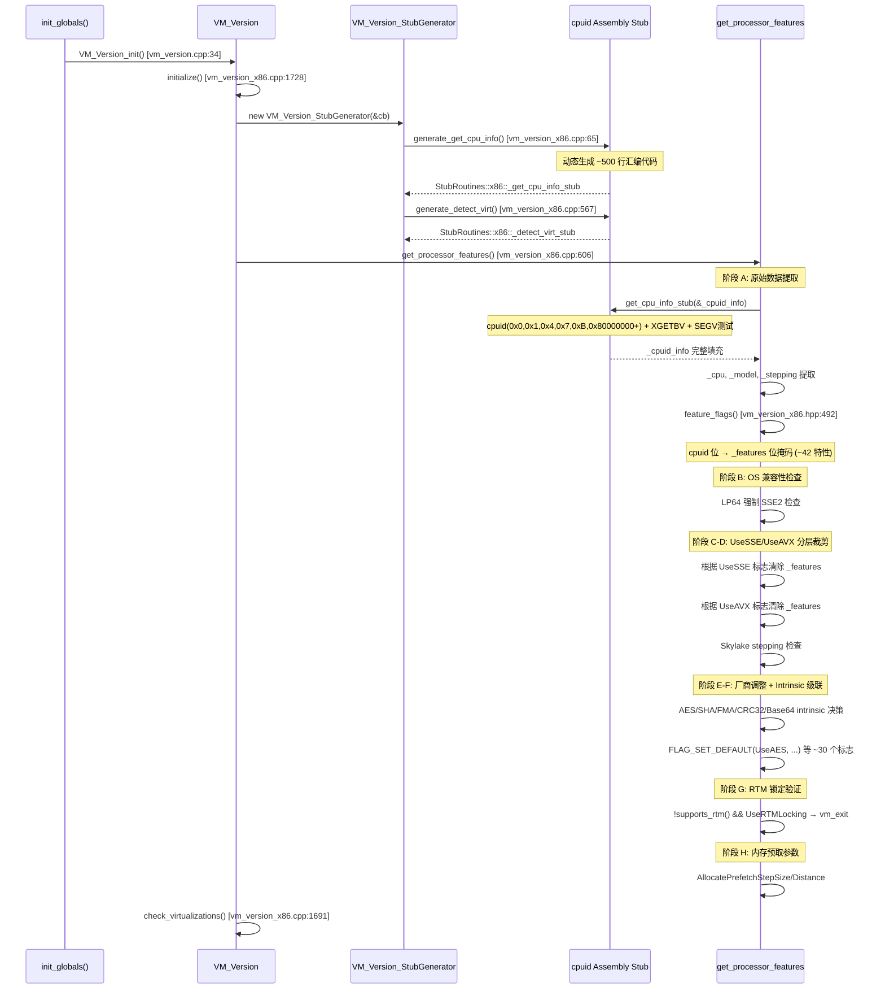

# 18-VM-Version-CPU-Detection — CPU 特性检测与 Intrinsic 级联启用

> **Phase**: 01-jvm-startup
> **前置**: [01-CodeCache]（VM_Version_init 在 init_globals 第 6 步，codeCache_init 第 5 步先执行）
> **配套**: [00-init-globals-overview]（init_globals 30 调用全景）
> **后续依赖本文**: [15-StubRoutines-SharedRuntime]（stubRoutines_init2 的 AES/SHA intrinsic 路径选择依赖 VM_Version_init 结果）
> **阅读收益**: 追踪 VM_Version_init 的完整 CPU 检测链路——从汇编级 cpuid stub 生成到 ~42 个特性位解析再到 ~30 个 JVM 全局标志的级联设置；理解 AVX 的 4 条件门控（硬件+OS+XCR0+OS信号测试）、AVX-512 的更严格条件、UseSSE/UseAVX 分层裁剪机制、以及 AES/SHA/FMA/RTM 等 intrinsic 的启用决策树

---

## §〇 Production Scenario

### 场景 1: `-XX:UseAVX=2` 在 Skylake 上生效但 AVX-512 被禁用

```bash
java -XX:+UnlockDiagnosticVMOptions -XX:+PrintAssembly -jar app.jar 2>&1 | grep "vaddpd"
# 期望看到 ymm 寄存器（AVX2 256-bit），不期望看到 zmm（AVX-512 512-bit）
```

`get_processor_features()` (`vm_version_x86.cpp:684-735`) 计算 `use_avx_limit`：
- `UseAVX=0` → 清除所有 AVX 位
- `UseAVX=1` → 只保留 AVX1
- `UseAVX=2` → 保留 AVX1+AVX2，清除 AVX-512
- `UseAVX=3` → 保留全部

但如果 CPU 是 Skylake stepping < 5，`UseAVX=3` 仍被强制降级——早期 Skylake 有 AVX-512 微码 bug。

**三步诊断**：
```bash
# 1. 确认 CPU 型号和 stepping
gdb -ex "break vm_version_x86.cpp:1728" \
    -ex "run" \
    -ex "print _cpu" \
    -ex "print _model" \
    -ex "print _stepping" \
    --args java -Xlog:cpu*=info -version

# 2. 确认 UseAVX 最终值
java -XX:+PrintFlagsFinal -version 2>&1 | grep UseAVX
# 期望: UseAVX=2 (或 3 如果 stepping >= 5)

# 3. 查看 CPU 特性字符串
java -Xlog:cpu*=info -version 2>&1 | grep "cpu features"
```

**反事实**：如果 AVX 条件不检查 OS XCR0 支持 → 在旧版 Linux（内核 < 2.6.30）上启用 AVX → 上下文切换时 YMM 上半部分被 clobber → 静默数据损坏 → 极难诊断的浮点计算结果错误。

### 场景 2: AES intrinsic 在虚拟机中失效

```bash
java -XX:+UseAES -XX:+UseAESIntrinsics -jar crypto-app.jar
# javax.crypto.Cipher 加密速度未提升——AES intrinsic 未生效
```

`get_processor_features()` (`vm_version_x86.cpp:814-870`) 的 AES 级联启用条件：
1. `supports_aes()` — CPU 硬件 AES-NI
2. `supports_sse3()` — SSE3（AES intrinsic 的向量化依赖）
3. `FLAG_IS_DEFAULT(UseAES)` — 用户未显式设置

如果 CPU 支持 AES 但虚拟机管理器未透传 AES-NI cpuid 位 → `_features` 中 `CPU_AES` 位为 0 → `UseAES=false` → AES intrinsic 不启用 → 加密回退到纯 Java 实现。

### 场景 3: OS 信号处理不保存 YMM 寄存器 → AVX 被静默禁用

```bash
# JVM 启动时自动执行 SEGV 测试：
# get_cpu_info_stub() 故意对 NULL 解引用触发 SIGSEGV
# 信号处理后检查 YMM/ZMM 寄存器上半部分是否完整
# 如果 OS 未保存 → 清除 CPU_AVX 位
```

`generate_get_cpu_info()` (`vm_version_x86.cpp:65-551`) 中的汇编 stub 在执行完 cpuid 指令后，会执行 `mov [0], rax`（NULL 写），触发 SIGSEGV。信号处理返回后，检查 `_cpuid_info.ymm_save[16..31]` 是否全零——如果 OS 的上下文切换正确保存了 YMM 上半部分，这些值应该非零。

> **Callout 1: AVX 的 4 条件门控**  
> AVX 不是"硬件支持就能用"。它需要 4 个条件全部满足：
> 1. CPU 硬件支持（cpuid.1.ECX.bit28）
> 2. OS 支持 XSAVE（cpuid.1.ECX.bit27）
> 3. XCR0 中 SSE+YMM 状态已启用（bit1+bit2）
> 4. **运行时信号测试**：OS 上下文切换是否正确保存 YMM 寄存器上半部分  
> 缺任何一个条件 → `_features` 中 `CPU_AVX` 位为 0 → 所有 AVX 指令路径不可用。

---

## §一 源码走读

### 1.1 VM_Version_init() 入口 — 极简调度器

```cpp
// src/hotspot/share/runtime/vm_version.cpp:34
void VM_Version_init() {
  VM_Version::initialize();       // 平台相关的 CPU 检测
#ifdef ASSERT
  VM_Version::print_cpu_info();   // Debug 构建打印 CPU 信息
#endif
}
```

`vm_version.cpp` 是跨平台的薄包装。真正的实现在 `src/hotspot/cpu/x86/vm_version_x86.cpp`（x86 平台，~1750 行）。

### 1.2 VM_Version::initialize() — 平台初始化主流程

```cpp
// src/hotspot/cpu/x86/vm_version_x86.cpp:1728
void VM_Version::initialize() {
  ResourceMark rm;
  // 1. 为 cpuid 汇编 stub 分配可执行内存
  BufferBlob* bb = BufferBlob::create("get_cpu_info_stub", CODE_SIZE);
  CodeBuffer cb(bb);
  VM_Version_StubGenerator g(&cb);
  
  // 2. 生成汇编 stub：执行 cpuid 指令 + AVX 寄存器测试
  StubRoutines::x86::_get_cpu_info_stub = g.generate_get_cpu_info();
  
  // 3. 生成虚拟化检测 stub
  StubRoutines::x86::_detect_virt_stub = g.generate_detect_virt();
  
  // 4. 核心：解析 cpuid 原始数据
  get_processor_features();
  
  // 5. 虚拟化环境检测
  check_virtualizations();
}
```

> **Callout 2: 为什么 cpuid 检测要生成汇编 stub？**  
> `cpuid` 指令会修改 EAX/EBX/ECX/EDX 全部 4 个寄存器，而 C 编译器不知道这一副作用。如果直接在 C 代码中内联汇编调用 cpuid，编译器可能在寄存器中保存了变量 → cpuid 后寄存器被破坏 → 未定义行为。生成独立的汇编 stub 函数（通过 StubCodeGenerator）确保了调用约定正确——所有调用者保存寄存器在 stub 入口处 push，出口处 pop。

### 1.3 get_cpu_info_stub — 汇编级 cpuid 遍历

`generate_get_cpu_info()` (`vm_version_x86.cpp:65-551`) 是**在 JVM 初始化时动态生成的汇编函数**（~500 行汇编生成代码），功能：

| 步骤 | 检测内容 | 汇编操作 | 写入目标 |
|------|---------|---------|---------|
| 1 | 检测 386 | 翻转 EFLAGS.AC 位 | 若失败判定为 386 |
| 2 | 检测 486 | 翻转 EFLAGS.ID 位 | 若失败判定为 486（无 cpuid） |
| 3 | cpuid(0x0) | `cpuid` | `std_max_function`, 厂商名 |
| 4 | cpuid(0xB) | `cpuid` | 处理器拓扑（SMT/Core/Package） |
| 5 | cpuid(0x4) | `cpuid` | 确定性缓存参数（L1 行大小） |
| 6 | cpuid(0x1) ★ | `cpuid` | **核心**：家族/型号/步进 + SSE/AVX/AES 位 |
| 7 | XGETBV | `xgetbv` | XCR0 寄存器（OS 是否启用 YMM/ZMM） |
| 8 | cpuid(0x7) | `cpuid` | 结构化扩展（AVX2/AVX-512/SHA/BMI/RTM） |
| 9 | cpuid(0x80000000+) | `cpuid` | 扩展 cpuid（AMD 特性、长模式） |
| 10 | **AVX SEGV 测试** | `mov [0], rax` | YMM/ZMM 寄存器保存验证 |

**AVX SEGV 测试的汇编逻辑**（`vm_version_x86.cpp:~300-400`）：

```
push_all_ymm_registers_with_value_0xCAFEBABE   ; 填充 YMM 寄存器
push_all_zmm_registers_with_value_0xDEADBEEF   ; 填充 ZMM 寄存器
mov rax, 0xCAFEBABE                             ; 标志值
mov [0], rax                                    ; ← SIGSEGV 触发
; --- 信号处理发生在这里 ---
; 信号处理后，检查 YMM/ZMM 寄存器是否保持填充值
compare_ymm_registers_with_0xCAFEBABE           ; YMM 上半部分还在吗？
compare_zmm_registers_with_0xDEADBEEF           ; ZMM 还在吗？
```

信号处理函数通过 `_cpuinfo_segv_addr` 和 `_cpuinfo_cont_addr` 将执行流重定向到检查代码——如果 OS 的上下文切换没有保存 YMM/ZMM 上半部分，这些寄存器在信号返回后为 0 → AVX 被标记为不可用。

### 1.4 feature_flags() — cpuid 位 → _features 转换

```cpp
// src/hotspot/cpu/x86/vm_version_x86.hpp:492-610
static uint64_t feature_flags() {
  uint64_t result = 0;
  const CpuidInfo& c = _cpuid_info;
  
  // 基础 SSE/SSE2/SSE3/SSSE3 (line 497-502)
  if (c.std_cpuid1_ecx.bits.sse3)    result |= CPU_SSE3;
  if (c.std_cpuid1_ecx.bits.ssse3)   result |= CPU_SSSE3;
  if (c.std_cpuid1_ecx.bits.sse4_1)  result |= CPU_SSE4_1;
  if (c.std_cpuid1_ecx.bits.sse4_2)  result |= CPU_SSE4_2;
  
  // AVX 的 4 条件门控 (line 521-525)
  bool avx = c.std_cpuid1_ecx.bits.avx != 0;        // 1. 硬件支持
  bool osxsave = c.std_cpuid1_ecx.bits.osxsave != 0; // 2. OS XSAVE
  bool xcr0_sse = c.xem_xcr0_eax.bits.sse != 0;      // 3. XCR0 SSE
  bool xcr0_ymm = c.xem_xcr0_eax.bits.ymm != 0;      // 3. XCR0 YMM
  if (avx && osxsave && xcr0_sse && xcr0_ymm)
    result |= CPU_AVX;  // 4 条件全满足
  
  // AVX-512 的更严格条件 (line 529-532)
  bool xcr0_opmask = c.xem_xcr0_eax.bits.opmask != 0;
  bool xcr0_zmm512 = c.xem_xcr0_eax.bits.zmm512 != 0;
  bool xcr0_zmm32 = c.xem_xcr0_eax.bits.zmm32 != 0;
  if (c.sef_cpuid7_ebx.bits.avx512f && osxsave && xcr0_sse && xcr0_ymm
      && xcr0_opmask && xcr0_zmm512 && xcr0_zmm32)
    result |= CPU_AVX512F;  // 7 条件全满足
  
  // AES/CLMUL/SHA/FMA (line 534-560)
  if (c.std_cpuid1_ecx.bits.aes)    result |= CPU_AES;
  if (c.std_cpuid1_ecx.bits.clmul)  result |= CPU_CLMUL;
  if (c.sef_cpuid7_ebx.bits.sha)    result |= CPU_SHA;
  if (c.std_cpuid1_ecx.bits.fma)    result |= CPU_FMA;
  // ... ~42 个特性位
  
  return result;
}
```

### 1.5 get_processor_features() — 核心决策逻辑（~900+ 行）

这是整个 CPU 检测的**决策中心**，分 8 个阶段：

**阶段 A — 原始数据提取**（`vm_version_x86.cpp:608-631`）：
```cpp
get_cpu_info_stub(&_cpuid_info);          // 调用汇编 stub
_cpu = extended_cpu_family() + extended_cpu_model();
_model = ...;
_stepping = ...;
if (cpu_family() > 4)
  _features = feature_flags();            // 将 cpuid 位转换为 _features
_supports_cx8 = true;                     // LP64 平台总是支持 8 字节 CAS
```

**阶段 B — OS 兼容性检查**（`:640-665`）：
```cpp
#ifdef _LP64
if (!supports_sse2()) {
  vm_exit_during_initialization("SSE2 is required on this platform");
}
#endif
if (!os::supports_sse()) {
  _features &= ~(CPU_SSE | CPU_SSE2 | CPU_SSE3 | CPU_SSSE3 | ...);
}
```

LP64 平台上 SSE2 是硬性要求——如果 CPU 不支持 SSE2，JVM 直接退出。

**阶段 C — UseSSE 分层裁剪**（`:667-682`）：
```cpp
if (UseSSE < 4) {
  _features &= ~CPU_SSE4_1;
  _features &= ~CPU_SSE4_2;
}
if (UseSSE < 3) {
  _features &= ~CPU_SSSE3;
  _features &= ~CPU_SSE3;
}
// ... 依此类推
```

> **Callout 3: UseSSE 分层裁剪机制**  
> `UseSSE` 是用户可见的 JVM 标志（0-4），允许**降级** CPU 特性：
> - `UseSSE=4`（默认）：使用 CPU 支持的最高 SSE 级别
> - `UseSSE=3`：禁用 SSE4.1/4.2
> - `UseSSE=2`：仅使用 SSE2  
> - `UseSSE=1`：仅使用 SSE  
> - `UseSSE=0`：禁用所有 SSE  
> 这不是"请求启用"而是"请求禁用"——硬件不支持的特性永远不会被启用。降级的典型场景：虚拟机环境中的 SSE4 指令模拟存在 bug。

**阶段 D — UseAVX 分层裁剪**（`:684-735`）：
```cpp
// Zhaoxin 处理器：AVX 在某些 ZX CPU 上比 SSE 慢
if (is_zx() && ((cpu_family() == 6) || (cpu_family() == 7))) {
  if (FLAG_IS_DEFAULT(UseAVX)) {
    FLAG_SET_DEFAULT(UseAVX, 0);  // 强制禁用
  }
}

// Skylake stepping < 5：AVX-512 微码 bug
if (is_intel() && cpu_family() == 6 && cpu_model() == 85 && stepping < 5) {
  _features &= ~CPU_AVX512F;
}

// 根据 UseAVX 最终值裁剪
if (UseAVX < 3) { _features &= ~CPU_AVX512F; /* ... */ }
if (UseAVX < 2) { _features &= ~CPU_AVX2; }
if (UseAVX < 1) { _features &= ~CPU_AVX; }
```

**阶段 E — 厂商特定调整**（`:737-1394`）：
- Intel Knights 家族：清除 `VZEROUPPER`
- 生成 `_features_string`（32 种特性，用于日志）
- 各厂商特定优化标志（`UseAddressNop`, `UseXMMForArrayCopy`, `MaxLoopPad` 等）

**阶段 F — Intrinsic 级联启用**（`:814-1500+`）：

每种 intrinsic 都遵循"硬件支持 + 依赖满足 → 启用"模式：

| Intrinsic 组 | 硬件条件 | 依赖条件 | 设置的 JVM 标志 |
|-------------|---------|---------|---------------|
| AES | `CPU_AES` | `CPU_SSE3` | `UseAES`, `UseAESIntrinsics` |
| AES-CTR | `CPU_AES` | `CPU_SSE4_1` | `UseAESCTRIntrinsics` |
| CLMUL/CRC32 | `CPU_CLMUL` | — | `UseCLMUL`, `UseCRC32Intrinsics` |
| CRC32C | `CPU_SSE4_2` | `CPU_CLMUL` | `UseCRC32CIntrinsics` |
| GHASH | `CPU_CLMUL` | SSE2 | `UseGHASHIntrinsics` |
| Base64 | `CPU_AVX512VL` | `CPU_AVX512BW` | `UseBASE64Intrinsics` |
| FMA | `CPU_FMA` | SSE2 | `UseFMA` |
| SHA-1 | `CPU_SHA` | `CPU_SSE4_1` | `UseSHA`, `UseSHA1Intrinsics` |
| SHA-256 | `CPU_SSE4_1` | `UseSHA` | `UseSHA256Intrinsics` |
| SHA-512 | `CPU_AVX2` | `CPU_BMI2` (LP64) | `UseSHA512Intrinsics` |
| BMI1/BMI2 | `CPU_BMI1/2` | `CPU_AVX` | `UseBMI1Instructions`, `UseBMI2Instructions` |
| POPCNT | `CPU_POPCNT` | — | `UsePopCountInstruction` |
| LZCNT | `CPU_LZCNT` | — | `UseCountLeadingZerosInstruction` |
| ERMS | `CPU_ERMS` | — | `UseFastStosb` |

每种 intrinsic 的错误处理模式：
```cpp
// 示例：AES intrinsic 启用逻辑 (vm_version_x86.cpp:~814)
if (supports_aes()) {
  if (FLAG_IS_DEFAULT(UseAES)) {
    FLAG_SET_DEFAULT(UseAES, true);       // 硬件支持 → 自动启用
  }
  if (UseAES) {
    if (FLAG_IS_DEFAULT(UseAESIntrinsics)) {
      FLAG_SET_DEFAULT(UseAESIntrinsics, true);
    }
    // 依赖检查
    if (!supports_sse3()) {
      if (UseAESIntrinsics) {
        warning("AES intrinsics require SSE3 -- disabling");
        FLAG_SET_DEFAULT(UseAESIntrinsics, false);
      }
    }
  }
} else if (UseAES) {
  warning("AES instructions not available -- disabling");
  FLAG_SET_DEFAULT(UseAES, false);
}
```

**阶段 G — RTM 锁定验证**（`:994-1049`）：
```cpp
if (!supports_rtm() && UseRTMLocking) {
  vm_exit_during_initialization("RTM locking requested but not available");
  // 致命！UseRTMLocking 影响 UseBiasedLocking 的早期决策
}
// Haswell E3/E7 stepping < 3, Broadwell stepping < 4 → 实验性选项
```

RTM 检查是唯一在 `get_processor_features()` 中调用 `vm_exit_during_initialization` 的——因为 `UseRTMLocking` 在 `vm_init_globals()` 阶段已经影响了 `UseBiasedLocking` 的决策，此时发现不支持已无法回退。

**阶段 H — 内存分配预取**（`:1498-1524`）：
```cpp
// 根据缓存行大小设置 AllocatePrefetchStepSize
if (FLAG_IS_DEFAULT(AllocatePrefetchStepSize)) {
  FLAG_SET_DEFAULT(AllocatePrefetchStepSize, _L1_data_cache_line_size);
}
// 根据 AllocatePrefetchStyle 计算 AllocatePrefetchDistance
```

### 1.6 supports_*() 系列 — 内联位测试

全部在 `vm_version_x86.hpp:799-837`，是简单的位测试内联函数：

```cpp
static bool supports_sse2()   { return (_features & CPU_SSE2) != 0; }
static bool supports_avx()    { return (_features & CPU_AVX) != 0; }
static bool supports_aes()    { return (_features & CPU_AES) != 0; }
static bool supports_avx2()   { return (_features & CPU_AVX2) != 0; }
static bool supports_evex()   { return (_features & CPU_AVX512F) != 0; }
static bool supports_sha()    { return (_features & CPU_SHA) != 0; }
static bool supports_fma()    { return (_features & CPU_FMA) != 0 && supports_avx(); }
static bool supports_bmi1()   { return (_features & CPU_BMI1) != 0; }
static bool supports_bmi2()   { return (_features & CPU_BMI2) != 0; }
```

组合特性函数（`:825-832`）：
```cpp
static bool supports_avx512vlbw()  { return supports_evex() && supports_avx512bw() && supports_avx512vl(); }
static bool supports_avx256only()  { return supports_avx2() && !supports_evex(); }
static bool supports_avxonly()     { return (supports_avx2() || supports_avx()) && !supports_evex(); }
```

厂商识别（`:718-721`）：
```cpp
static bool is_amd()    { return std_vendor_name_0 == 0x68747541; } // 'htuA' → "AuthenticAMD"
static bool is_intel()  { return std_vendor_name_0 == 0x756e6547; } // 'uneG' → "GenuineIntel"
static bool is_zx()     { return std_vendor_name_0 == 0x746e6543 || ...; } // Zhaoxin
```

### 1.7 check_virtualizations() — 虚拟化环境检测

```cpp
// src/hotspot/cpu/x86/vm_version_x86.cpp:1691
void VM_Version::check_virtualizations() {
  _detected_virtualization = NoDetectedVirtualization;
  if (is_virtual()) {
    detect_virt_stub(&_cpuid_info);
    // 扫描 0x40000000-0x40010000 范围的 cpuid 叶子
    // 匹配 VMware ("VMwareVMware") / HyperV ("Microsoft Hv") / KVM ("KVMKVMKVM") / Xen
  }
}
```

检测到的虚拟化类型影响后续优化决策——例如 VMware 环境中的 `UseFastStosb` 默认禁用（VMware 的 `rep stosb` 模拟性能差）。

### 1.8 ★ Mermaid: VM_Version_init 完整序列图



---

## §二 关键数据结构

### 2.1 类继承链

```
AllStatic
  └─ Abstract_VM_Version          (abstract_vm_version.hpp:47)
       └─ VM_Version              (vm_version_x86.hpp:31) — x86 特化
```

### 2.2 Abstract_VM_Version 静态成员（`abstract_vm_version.hpp:51-76`）

| 成员 | 类型 | 含义 | 使用方 |
|------|------|------|--------|
| `_features` | `uint64_t` | CPU 特性位掩码 | `supports_*()` 位测试 |
| `_features_string` | `const char*` | 人类可读特性列表 | 日志输出 |
| `_supports_cx8` | `bool` | 8 字节 CAS | `Atomic::cmpxchg` 路径选择 |
| `_supports_atomic_getset4/8` | `bool` | 原子 get-and-set | `Atomic::xchg` |
| `_supports_atomic_getadd4/8` | `bool` | 原子 get-and-add | `Atomic::add` |
| `_logical_processors_per_package` | `unsigned int` | 逻辑处理器数 | GC 线程数计算 |
| `_L1_data_cache_line_size` | `unsigned int` | L1 缓存行大小 | 内存分配预取 |
| `_data_cache_line_flush_size` | `unsigned int` | 缓存行刷新大小 | `clflush` 指令使用 |
| `_detected_virtualization` | `VirtualizationType` | 虚拟化类型枚举 | 优化标志选择 |

### 2.3 VM_Version x86 扩展成员（`vm_version_x86.hpp:287-467`）

| 成员 | 类型 | 含义 |
|------|------|------|
| `_cpu` | `static int` | CPU 家族号（6=Core, 15=NetBurst, 25=Zen3...） |
| `_model` | `static int` | CPU 型号 |
| `_stepping` | `static int` | 步进版本（微码修订） |
| `_cpuid_info` | `static CpuidInfo` | cpuid 原始数据仓库 |
| `_cpuinfo_segv_addr` | `static address` | SEGV 触发地址 |
| `_cpuinfo_cont_addr` | `static address` | SEGV 后继续地址 |

### 2.4 CpuidInfo 结构体（`vm_version_x86.hpp:370-464`）

```
struct CpuidInfo {
  uint32_t std_max_function;       // cpuid(0x0).EAX
  char     std_vendor_name[12];    // "GenuineIntel" / "AuthenticAMD"
  union {
    uint32_t value;
    struct {                      // cpuid(0x1).EAX
      uint32_t stepping    : 4;
      uint32_t model       : 4;
      uint32_t family      : 4;
      uint32_t type        : 2;
      uint32_t extmodel    : 4;
      uint32_t extfamily   : 8;
      uint32_t reserved    : 6;
    } bits;
  } std_cpuid1_eax;
  
  union { uint32_t value; struct { /* SSE/AVX/AES 等 ~32 个位 */ } bits; } std_cpuid1_ecx;
  union { uint32_t value; struct { /* FPU/SSE/SSE2 等 ~32 个位 */ } bits; } std_cpuid1_edx;
  
  // cpuid(0x4) — 确定性缓存参数
  uint32_t dcp_cpuid4_eax;        // L1 缓存行大小编码
  uint32_t dcp_cpuid4_ebx;        // 物理核心数
  
  // cpuid(0x7) — 结构化扩展特性
  union { uint32_t value; struct { /* AVX2/SHA/BMI/RTM 等 */ } bits; } sef_cpuid7_ebx;
  union { uint32_t value; struct { /* AVX512 等 */ } bits; } sef_cpuid7_ecx;
  
  // cpuid(0xB) — 处理器拓扑
  uint32_t tpl_cpuidB0_ebx;       // SMT 级逻辑处理器数
  uint32_t tpl_cpuidB1_ebx;       // Core 级逻辑处理器数
  
  // XGETBV — XCR0 寄存器
  union { uint64_t value; struct { /* x87/SSE/YMM/opmask/ZMM */ } bits; } xem_xcr0_eax;
  
  // AVX 寄存器保存测试
  uint64_t ymm_save[32];          // YMM 寄存器保存区
  uint64_t zmm_save[64];          // ZMM 寄存器保存区（AVX-512）
};
```

### 2.5 Feature_Flag 枚举（`vm_version_x86.hpp:295-339`）

```cpp
enum Feature_Flag {
  CPU_CX8      = (1 << 0),    // CMPXCHG8B
  CPU_CMOV     = (1 << 1),    // 条件移动
  CPU_FXSR     = (1 << 2),    // FXSAVE/FXRSTOR
  CPU_HT       = (1 << 3),    // 超线程
  CPU_MMX      = (1 << 4),
  CPU_3DNOW_PREFETCH = (1 << 5),
  CPU_SSE      = (1 << 6),
  CPU_SSE2     = (1 << 7),
  CPU_SSE3     = (1 << 8),
  CPU_SSSE3    = (1 << 9),
  CPU_SSE4A    = (1 << 10),
  CPU_SSE4_1   = (1 << 11),
  CPU_SSE4_2   = (1 << 12),
  CPU_POPCNT   = (1 << 13),
  CPU_LZCNT    = (1 << 14),
  CPU_TSC      = (1 << 15),
  CPU_TSCINV   = (1 << 16),
  CPU_AVX      = (1 << 17),   // ★ 4 条件门控
  CPU_AVX2     = (1 << 18),
  CPU_AES      = (1 << 19),
  CPU_ERMS     = (1 << 20),
  CPU_CLMUL    = (1 << 21),
  CPU_BMI1     = (1 << 22),
  CPU_BMI2     = (1 << 23),
  CPU_RTM      = (1 << 24),
  CPU_ADX      = (1 << 25),
  CPU_AVX512F  = (1 << 26),   // ★ 7 条件门控
  CPU_AVX512DQ = (1 << 27),
  CPU_AVX512PF = (1 << 28),
  CPU_AVX512ER = (1 << 29),
  CPU_AVX512CD = (1 << 30),
  CPU_AVX512BW = (1 << 31),
  // 64-bit 扩展宏
  #define CPU_AVX512VL  ((uint64_t)1 << 32)
  #define CPU_SHA       ((uint64_t)1 << 33)
  #define CPU_FMA       ((uint64_t)1 << 34)
  // ... 共 ~42 个特性位
};
```

---

## §三 VM_Version_init 返回后的全局状态

返回后，以下全局静态变量和 JVM 标志已被设置：

### 3.1 Abstract_VM_Version 层（跨平台）

```
_features                       → CPU 特性位掩码（~42 特性）
_features_string                → 人类可读特性列表
_supports_cx8                   → 8 字节 CAS
_supports_atomic_getset4/8      → 原子 get-and-set
_supports_atomic_getadd4/8      → 原子 get-and-add
_logical_processors_per_package → 逻辑处理器数
_L1_data_cache_line_size        → L1 缓存行大小（通常 64 字节）
_data_cache_line_flush_size     → clflush 操作大小
_detected_virtualization        → NoDetected/VMWare/HyperV/KVM/XenHVM
```

### 3.2 VM_Version x86 层

```
_cpu        → CPU 家族号
_model      → CPU 型号
_stepping   → 步进版本
_cpuid_info → 完整 cpuid 原始数据
```

### 3.3 JVM 全局标志（~30 个，通过 FLAG_SET_DEFAULT 设置）

**向量化相关**：
```
UseSSE (0-4), UseAVX (0-3)
MaxVectorSize, AVX3Threshold
```

**Intrinsic 相关**：
```
UseAES, UseAESIntrinsics, UseAESCTRIntrinsics
UseCLMUL, UseCRC32Intrinsics, UseCRC32CIntrinsics
UseGHASHIntrinsics, UseBASE64Intrinsics
UseFMA, UseSHA, UseSHA1/256/512Intrinsics
UseBMI1/2Instructions, UsePopCountInstruction
UseCountLeadingZeros/TrailingZerosInstruction
```

**内存/优化相关**：
```
UseFastStosb, UseXMMForObjInit
UseSSE42Intrinsics, UseVectorizedMismatchIntrinsic
AllocatePrefetchStyle/Distance/StepSize/Lines
UseAddressNop, UseXmmLoadAndClearUpper, UseXmmRegToRegMoveAll
UseMultiplyToLenIntrinsic, UseSquareToLenIntrinsic, UseMulAddIntrinsic
```

---

## §四 边缘场景与错误路径

### 4.1 场景 1: 386/486 CPU → cpuid 指令不可用

`generate_get_cpu_info()` 中首先检测 386（翻转 EFLAGS.AC）和 486（翻转 EFLAGS.ID）。如果 CPU 不支持 cpuid → `_cpuid_info` 大部分字段为零 → `feature_flags()` 返回 0 → 仅最基本功能可用 → SSE2 检查失败 → LP64 构建下 `vm_exit_during_initialization("SSE2 is required")`。

### 4.2 场景 2: 虚拟机中 cpuid 特性位被屏蔽

```bash
# 虚拟机管理器可能不暴露所有 cpuid 特性
# 例如：CPU 支持 AES-NI 但 VM 配置中未透传
grep -o 'aes' /proc/cpuinfo | wc -l  # 检查宿主机
# 如果宿主机有 AES 但 JVM 的 UseAES=false → 虚拟机配置问题
```

### 4.3 场景 3: OS 不支持 XSAVE → AVX 无法启用

`feature_flags()` 中 AVX 条件包括 `osxsave`（cpuid.1.ECX.bit27）。旧版 Linux（内核 < 2.6.30）或某些容器运行时可能不支持 XSAVE → AVX 静默不可用 → 向量化操作回退到 SSE 路径 → 性能下降。

### 4.4 场景 4: 用户显式设置 UseAES 但硬件不支持

```bash
java -XX:+UseAES -version
# Warning: AES instructions not available on this CPU
#          Intrinsics for AES will not be used
```

`get_processor_features()` 中：`supports_aes()` 返回 false → `UseAES` 被强制设为 false → warning 输出。**不会 crash**——这是设计选择，因为 AES intrinsic 不是核心功能。

### 4.5 场景 5: RTM 不支持但用户显式启用 → 致命错误

```bash
java -XX:+UseRTMLocking -version
# Error: RTM locking requested but not available on this CPU
# JVM 退出（vm_exit_during_initialization）
```

这是唯一导致 `vm_exit_during_initialization` 的 intrinsic 检查——因为 `UseRTMLocking` 影响 `UseBiasedLocking` 的早期决策（`vm_init_globals` 阶段），此时发现不支持已无法安全回退。

### 4.6 场景 6: AVX-512 在 Skylake stepping < 5 上被禁用

Intel Skylake（`family=6, model=85`）早期步进存在 AVX-512 微码 bug——JVM 硬编码了此限制（`vm_version_x86.cpp:~730`）。即使用户显式设置 `UseAVX=3`，AVX-512 也被清除。

---

## §五 与其他 init_globals 调用的交互

### 5.1 下游依赖

| 依赖 VM_Version_init 的调用 | 如何使用 | 影响 |
|---------------------------|---------|------|
| `stubRoutines_init1()` (#8) | 原子操作桩生成可能使用 SSE 指令 | 中等 |
| `interpreter_init()` (#11) | 解释器 codelet 中的向量化路径 | 低 |
| `stubRoutines_init2()` (#29) | **AES/SHA/CRC32 intrinsic 的汇编路径选择** | **极高** |
| `compileBroker_init()` (#27) | 编译器线程创建的标志依赖 | 中等 |
| JIT 编译器（Stage 8+） | `supports_avx()` 等决定 IR 节点的向量化 | **极高** |

### 5.2 前置依赖

| VM_Version_init 依赖的调用 | 依赖内容 | 原因 |
|--------------------------|---------|------|
| `codeCache_init()` (#5) | CodeCache 内存 | cpuid stub 的 BufferBlob 分配在 CodeCache 中 |
| （无其他前置） | — | VM_Version_init 几乎无依赖——它只需要 CodeCache 分配 stub 内存 |

---

## §六 诊断工具

### 6.1 GDB 断点验证

```bash
# 1. 验证 VM_Version_init 入口
gdb -ex "break vm_version.cpp:34" \
    -ex "run" \
    -ex "bt" \
    --args java -version
# 期望: 在 init_globals() 的调用栈中

# 2. 查看 _features 位掩码
gdb -ex "break vm_version_x86.cpp:1728" \
    -ex "run" \
    -ex "finish" \
    -ex "print Abstract_VM_Version::_features" \
    --args java -version
# 期望: 非零值，如 0x0000001FC97FFFFF (x86_64 典型值)

# 3. 查看 CPU 型号
gdb -ex "break vm_version_x86.cpp:1728" \
    -ex "run" \
    -ex "finish" \
    -ex "print VM_Version::_cpu" \
    -ex "print VM_Version::_model" \
    -ex "print VM_Version::_stepping" \
    --args java -version

# 4. 验证 UseAES 标志
gdb -ex "break vm_version_x86.cpp:814" \
    -ex "run" \
    -ex "print supports_aes()" \
    -ex "print UseAES" \
    --args java -version

# 5. 验证虚拟化检测
gdb -ex "break vm_version_x86.cpp:1691" \
    -ex "run" \
    -ex "finish" \
    -ex "print Abstract_VM_Version::_detected_virtualization" \
    --args java -version

# 6. 查看特性字符串
gdb -ex "break vm_version.cpp:34" \
    -ex "run" \
    -ex "finish" \
    -ex "print Abstract_VM_Version::_features_string" \
    --args java -version

# 7. 验证 AVX 条件（在 feature_flags 中）
gdb -ex "break vm_version_x86.hpp:521" \
    -ex "run" \
    -ex "print c.std_cpuid1_ecx.bits.avx" \
    -ex "print c.std_cpuid1_ecx.bits.osxsave" \
    -ex "print c.xem_xcr0_eax.bits.ymm" \
    --args java -version
```

### 6.2 JVM 日志

```bash
# 打印 CPU 特性
java -Xlog:cpu*=info -version 2>&1

# 打印所有 CPU 相关标志
java -XX:+PrintFlagsFinal -version 2>&1 | grep -E "Use(AVX|SSE|AES|SHA|FMA|CRC|CLMUL|BMI|POPCNT|LZCNT|RTM)"

# 检查 Intrinsic 启用状态
java -XX:+UnlockDiagnosticVMOptions -XX:+PrintIntrinsics -version 2>&1 | head -50
```

### 6.3 /proc/cpuinfo 交叉验证

```bash
# 宿主机 CPU 特性
cat /proc/cpuinfo | grep -E "flags|model name" | head -5

# 对比 JVM 检测到的特性
java -Xlog:cpu*=info -version 2>&1 | grep "cpu features"
# 如果两者不一致 → 虚拟机未透传 cpuid 位或 UseSSE/UseAVX 裁剪生效
```

### 6.4 strace 观察

```bash
# VM_Version_init 不涉及系统调用（cpuid 是用户态指令）
# 但可以观察 BufferBlob 分配的 mmap
strace -e trace=mmap,mprotect java -version 2>&1 | grep "get_cpu_info"
```

### 6.5 jcmd 验证

```bash
# 打印所有 VM 标志（包含 UseAES/UseAVX 等）
jcmd <pid> VM.flags -all | grep -E "Use(AVX|SSE|AES|SHA)"
```

---

## §七 反事实分析

### 反事实 1: 如果 AVX 不检查 OS XSAVE 支持？

→ 在旧版 Linux（内核 < 2.6.30）或某些容器运行时上，`xsave`/`xrstor` 指令不保存 YMM 寄存器上半部分 → 上下文切换后 YMM 上半部分被随机值覆盖 → 使用 AVX 指令的计算结果错误 → 极难诊断的浮点精度问题或 SIGFPE。

**JVM 的设计选择**：4 条件门控中的 `osxsave` + `xcr0_sse` + `xcr0_ymm` 检查保证了 OS 确实承诺保存 YMM 寄存器。加上运行时 SEGV 测试（场景 3）——这是防御深度：即使 OS 声称支持 XSAVE，也通过实际触发信号来验证。

### 反事实 2: 如果 UseSSE/UseAVX 不能分层裁剪？

→ 虚拟机环境中的 SSE4/AVX 模拟 bug 无法规避 → 用户无法在命令行禁用有问题的指令集 → 只能在虚拟机配置层面解决 → 运维复杂度增加。

**JVM 的设计选择**：`UseSSE` (0-4) 和 `UseAVX` (0-3) 提供精细的降级控制——不是"启用"而是"限制上限"。硬件不支持的特性永远不会被启用，但用户可以选择不使用硬件支持的特性。

### 反事实 3: 如果 stubRoutines_init1/init2 合并不做两阶段？

→ AES/SHA intrinsic 需要 VM_Version_init 的 CPU 特性检测结果 → 但 `_call_stub_entry` 在 universe_init 之前就需要 → 循环依赖。

**JVM 的设计选择**：`VM_Version_init()` (#6) 在 `stubRoutines_init1()` (#8) 之前执行——Phase 1 桩只需要原子操作（不依赖 CPU 特性），Phase 2 桩（AES/SHA/CRC32）在 `stubRoutines_init2()` (#29) 中生成，此时 CPU 特性已就绪。

---

## §八 源码文件

| 文件 | 行数 | 关键内容 |
|------|------|---------|
| `src/hotspot/share/runtime/vm_version.cpp` | ~40 | `VM_Version_init()` 入口 |
| `src/hotspot/share/runtime/abstract_vm_version.hpp` | ~80 | `Abstract_VM_Version` 基类定义 |
| `src/hotspot/cpu/x86/vm_version_x86.hpp` | ~850 | `VM_Version` 类定义 + Feature_Flag + CpuidInfo + `supports_*()` |
| `src/hotspot/cpu/x86/vm_version_x86.cpp` | ~1750 | `initialize()` + `get_processor_features()` + `generate_get_cpu_info()` |

---

## §九 总结

`VM_Version_init()` 是 init_globals 中**影响面最大但几乎无前置依赖**的调用。它的输出（`_features` 位掩码 + ~30 个 JVM 标志）决定了后续所有汇编代码生成（stubRoutines、解释器 codelet、JIT 编译）的指令选择。核心机制：

1. **汇编级 cpuid**：动态生成 ~500 行 x86 汇编 stub，遍历所有 cpuid 叶子
2. **4 条件 AVX 门控**：硬件 + OS XSAVE + XCR0 + 运行时信号测试
3. **UseSSE/UseAVX 分层裁剪**：用户可降级但不能升级
4. **Intrinsic 级联启用**：AES/SHA/FMA/CRC32 等 ~15 组 intrinsic 的依赖链决策
5. **RTM 致命检查**：唯一导致 `vm_exit` 的 intrinsic（影响 UseBiasedLocking）
