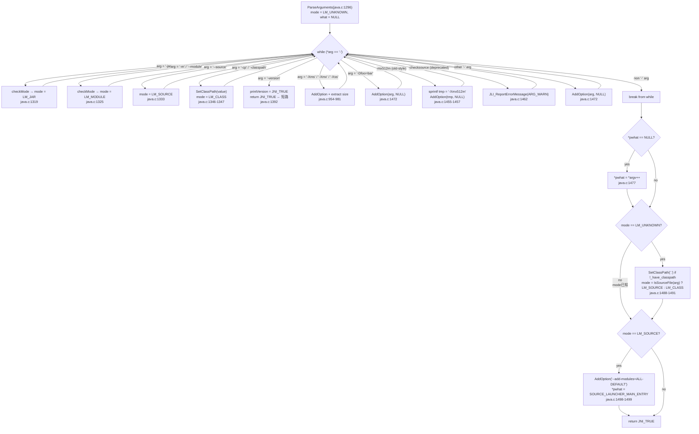

# 01-Argument-Parsing — ParseArguments 的 300 行状态机：4 类参数的分类、透传和灾难

> **阶段**：[13-launcher]
> **前置**：[00-Libjli-Overview]（理解 JLI_Launch 的 8 步全链路和参数在何时被解析）
> **配套**：[02-JVM-Loading]（classpath 路径如何影响 JVM 启动）、[03-Main-Class-Loading]（ParseArguments 的 mode + what 如何被 LoadMainClass 使用）
> **后续依赖本文**：[02-class-classloading]（FindClass 从 classpath 中查找类——classpath 来源是本文的核心输出）
> **阅读收益**：理解 ParseArguments 的 ~300 行状态机如何区分 4 类参数（JVM options / launcher options / application args / properties）——从 LaunchMode 的 4 个分支到 AddOption 的 ×2 扩容到 WildcardExpansion 的 opendir 展开到选项别名向后兼容；掌握 "JVM 选项 vs 应用参数" 的分类边界和分类错误的 3 种灾难性后果

---

## §〇 生产场景——JDK 11 上 `-XX:+UseZGC`：实验性 flag 的穿透式崩溃

JDK 11 生产环境。工程师为降低延迟添加了 `-XX:+UseZGC`。启动正常——没有错误消息。JVM 预热 1 秒。C2 开始编译。

`ZBarrierSetC2::emit_barrier_stub()` → NullPointerException → SIGSEGV。

hs_err（`hs_err_pidXXXXX.log`）只显示了崩溃函数名：

```
# V  [libjvm.so+0x...]  ZBarrierSetC2::emit_barrier_stub()+0x...
```

没有明确说明 "ZGC needs `-XX:+UnlockExperimentalVMOptions`"。崩溃消化的两小时里没有任何线索指向 flag 问题。

### 发生了什么

```
bash$ java -XX:+UseZGC -jar app.jar
          │
          ▼
ParseArguments(java.c:1296) — while (*arg == '-') 循环
          │
          ▼ AddOption("-XX:+UseZGC", NULL)  ← libjli 透传，不验证语义
          │
          ▼ options[] 数组 → JavaVMInitArgs → JNI_CreateJavaVM(java.c:1545)
          │
          ▼ HotSpot Arguments::parse() — 接受该选项（实验性选项不拒绝）
          │
          ▼ JVM 正常启动（~2s），C2 编译器线程开始工作
          │
          ▼ ZBarrierSetC2 数据结构未完整初始化 → SIGSEGV
```

**核心问题**：应该在 libjli 还是 libjvm 中拦截缺少 `-XX:+UnlockExperimentalVMOptions` 的 `-XX:+UseZGC`？

**答案**：libjli 不能——它只做字符串匹配分类（`java.c:1307` 的 `while (*arg == '-')`），不知道 `-XX:` 选项的语义约束。拦截必须在 libjvm 的 `Arguments::parse()` 中。但 libjli 可以改进：在 `AddOption()` 中对已知危险选项（如 JDK < 15 上的 `-XX:+UseZGC`）打印 stderr warning——early warning without blocking。

**反事实**：如果 libjli 在每个 `AddOption` 调用时检查选项合法性 → libjli 需要维护 libjvm 的所有选项约束 → 两份代码同步维护 → 总是过时（libjvm 添加新选项 libjli 不知道）。正确的分层：**libjli = transport layer（分类 + 透传），libjvm = semantic layer（验证）。**

### 诊断命令

```bash
# 1. 查看传给 JNI_CreateJavaVM 的完整选项列表
java -XX:+PrintCommandLineFlags -XX:+UseZGC -XX:+UnlockExperimentalVMOptions -version

# 2. 查看所有 -XX 选项的值和来源
java -XX:+PrintFlagsFinal -version 2>&1 | grep -i zgc

# 3. 使用排除法确认 ZGC 为根因
java -XX:-UseZGC -jar app.jar    # 显式排除 ZGC → 如果不再 crash → ZGC 是根因
```

**`-XX:-UseZGC` 排除确认后的三种路径**：
- (a) 添加 `-XX:+UnlockExperimentalVMOptions`（生产环境有风险，可能暴露其他实验性特性）
- (b) 升级到 JDK 15+（ZGC production-ready，不需要 unlock flag）
- (c) 完全移除 ZGC flag，使用 G1GC/Shenandoah

### 用 GDB 看 ParseArguments 是否抽走了 flag

```bash
gdb -ex "break java.c:1545" \
    -ex "run" \
    -ex "print args.nOptions" \
    -ex "print args.options[0].optionString" \
    --args java -XX:+UseZGC -jar app.jar
```

如果 `args.options[0].optionString = "-XX:+UseZGC"` → libjli 正确透传了选项 → 崩溃在 libjvm 内部。

---

## Environment

Same as [00-Libjli-Overview] §二. OpenJDK 11 slowdebug, Linux x86_64, TencentOS Server 4.2.

Source roots：
- `src/java.base/share/native/libjli/` — `ParseArguments`、`AddOption`、`SetClassPath` 在 `java.c`
- `src/java.base/share/native/libjli/args.c` — `JLI_PreprocessArg`(:409), `JLI_AddArgsFromEnvVar`(:470), `nextToken`(:163), `expand`(:498), `checkArg`(:110), `isTerminalOpt`(:453)
- `src/java.base/share/native/libjli/wildcard.c` — `JLI_WildcardExpandClasspath`(:303), `isJarFileName`(:222), `WildcardIterator_for`(:382→opendir)

Key data structures (in `java.h`):
- `LaunchMode` enum (`java.h:231`): `LM_UNKNOWN=0, LM_CLASS=1, LM_JAR=2, LM_MODULE=3, LM_SOURCE=4`
- `JavaVMOption` (`jni.h`): `{ char *optionString; void *extraInfo; }`
- `JavaVMInitArgs` (`jni.h`): `{ jint version; jint nOptions; JavaVMOption *options; jboolean ignoreUnrecognized; }`
- `JLI_List` (`jli_util.h:135-141`): `{ char **elements; size_t size; size_t capacity; }` — 以 ×2 倍增扩容的字符串数组

Global state (in `java.c:205-207`):
```c
static jlong threadStackSize    = 0;  /* stack size of the new thread */
static jlong maxHeapSize        = 0;  /* max heap size */
static jlong initialHeapSize    = 0;  /* inital heap size */
```

Key global state (in `args.c:73-80`):
```c
#define NOT_FOUND -1
static int firstAppArgIndex = NOT_FOUND;    // 主类/JAR 在参数列表中的位置
static jboolean expectingNoDashArg = JNI_FALSE; // 期待一个不带 - 的参数（如 -cp 后）
static jboolean stopExpansion = JNI_FALSE;  // 停止 @argfile 展开
static jboolean relaunch = JNI_FALSE;       // 二次启动标志
```

### 关键系统调用/库函数速查
| Function | man | 使用点 | 失败时 |
|----------|-----|--------|--------|
| `opendir()` | `man 3 opendir` | `wildcard.c:382` — 打开通配符目录 | 返回 NULL（ENOENT/EACCES/ENOTDIR） |
| `readdir()` | `man 3 readdir` | 通配符展开遍历目录 | 返回 NULL → 停止 |
| `qsort()` | `man 3 qsort` | `wildcard.c:210` — 按字母排序 JAR 列表 | O(n²) 最坏（pivot 选择） |
| `getenv()` | `man 3 getenv` | `java.c:322` — CLASSPATH; `args.c:473` — JDK_JAVA_OPTIONS | 返回 NULL（未设置） |
| `stat()` | `man 2 stat` | `args.c:368` — 获取 @argfile 大小 | 返回 -1 → CFG_ERROR6 |
| `fopen()` | `man 3 fopen` | `args.c:374` — 打开 @argfile | 返回 NULL → CFG_ERROR6 |

---

## Source Files Table

| # | File | Full Path | Lines | Core Functions | Role |
|---|------|-----------|-------|----------------|------|
| 1 | `java.c` | `src/java.base/share/native/libjli/java.c` | ~2415 | `ParseArguments`(:1296), `AddOption`(:932), `SetClassPath`(:985), `checkMode`(:647), `IsClassPathOption`(:581), `IsLauncherMainOption`(:591) | 参数分类 + 分发 |
| 2 | `args.c` | `src/java.base/share/native/libjli/args.c` | ~715 | `JLI_PreprocessArg`(:409), `JLI_AddArgsFromEnvVar`(:470), `nextToken`(:163, 六状态机), `expand`(:498), `checkArg`(:110), `isTerminalOpt`(:453), `readArgFile`(:306), `expandArgFile`(:360), `JLI_InitArgProcessing`(:87) | @argfile 展开 + JDK_JAVA_OPTIONS 注入 |
| 3 | `wildcard.c` | `src/java.base/share/native/libjli/wildcard.c` | ~394 | `JLI_WildcardExpandClasspath`(:303), `isJarFileName`(:222), `wildcardFileList`(:246), `WildcardIterator_for/next/close` | Classpath 通配符 `*` → dir scan |
| 4 | `java.h` | `src/java.base/share/native/libjli/java.h` | ~278 | `LaunchMode`(:231), `IsWhiteSpaceOption`(:641 声明), `AddOption`(:173 声明) | 数据结构 + 共享声明 |
| 5 | `emessages.h` | `src/java.base/share/native/libjli/emessages.h` | ~123 | `ARG_ERROR1`-`ARG_ERROR17`, `ARG_WARN`(:40), `JVM_ERROR1`(:60) | 参数错误消息宏 |

**跨模块说明**：`ParseArguments` 是 `JLI_Launch` 中的第 4 步（`java.c:333`），在 `LoadJavaVM` 之后执行。为什么在这个顺序？因为 `ParseArguments` 调用 `AddOption` 收集 JVM 选项 → 这些选项必须在 `JNI_CreateJavaVM`（`java.c:1545`）之前就准备好。先 dlopen libjvm 拿到函数指针 → 再解析参数 → 再调用 CreateJavaVM。

---

## §一 ParseArguments 状态机：4 类参数的分类引擎

`ParseArguments(java.c:1296-1515)` 不是"按照空格 split 再遍历"。它是一个**mode discovery 状态机**——约 300 行 C 代码区分 4 类参数：**JVM options**（`-Xms`、`-XX:+UseG1GC` → `AddOption` → `options[]` → `JNI_CreateJavaVM`），**launcher options**（`-jar`、`-cp`、`-m`、`--source` → set `mode` + `what`），**application arguments**（`Main arg1 arg2` → preserved in `argc/argv` for `main(String[] args)`），**properties**（`-Dfoo=bar` → `AddOption` → `options[]`）。

一次 misclassification → JVM 收到错误的选项 → 崩溃或静默失败。

### 3 个 Beginner Callout 框

> **LaunchMode** — `java.h:231` 的枚举。`LM_CLASS(1)` = `-cp` 或直接类名，`LM_JAR(2)` = `-jar`，`LM_MODULE(3)` = `-m` 模块模式，`LM_SOURCE(4)` = 源代码文件。ParseArguments 的第一个任务就是检测 `mode`——因为模式决定了后续 300 lines 的控制流走向（`-cp` 在 `LM_JAR` 下无用，`-m` 禁止和 `-jar` 同时出现）。

> **Wildcard expansion** — `java -cp 'lib/*.jar'` 中的 `*` 不是 shell glob——它是 libjli 在 `SetClassPath(java.c:997)` 中调用的 `JLI_WildcardExpandClasspath()`（`wildcard.c:303`）展开的。内部：`opendir()` + `readdir()` 枚举目录 → `isJarFileName()` 筛选 `.jar`/`.JAR` 后缀（`wildcard.c:222-231`）→ `qsort()` 按字母排序（`wildcard.c:210`）→ `:` 分隔符 join。注意：manifest `Class-Path` 属性不支持通配符（`wildcard.c:70-71`）。

> **JVM option vs application arg** — 分类的核心。`AddOption()`（`java.c:932`）将 JVM 选项 push 到全局 `options[]` 数组，该数组在 `InitializeJVM(java.c:1524-1531)` 中转为 `JavaVMInitArgs.options` → 传给 `JNI_CreateJavaVM`。不以 `-` 开头的参数 = 应用参数 → 原样保留在 `argv` 中传给 `main(String[] args)`。以 `-` 开头但不在已知列表中的 → 被 `AddOption` 透传（libjli 不知道的 `-XX:` 选项直接透传给 JVM，JVM 自己验证）。

> **GetOpt** — `java.c:1233-1287` 定义的参数拆分器。它遍历 `argv`，将 `-Xms8g`（紧凑格式）分类为 `LAUNCHER_OPTION`（option=`"-Xms8g"`, value=NULL），**不拆分 name 和 value**。真正的拆分发生在 `AddOption`（`java.c:954-981`）中——通过 `JLI_StrCCmp(str, "-Xms")`（前缀比较）+ `parse_size(str+4, &tmp)`（偏移 4 字符跳过 `-Xms` 后解析 `8g`）。但对于 `--module-path=foo`（长选项含 `=`），`GetOpt` 分支 ❸（`java.c:1270-1280`）通过 `JLI_StrChr(arg, '=')` 拆分，返回 `poption="--module-path"`, `pvalue="foo"`。核心区别：`-X` short options → AddOption 做前缀匹配；`--` long options → GetOpt 做 `=` 拆分。

> **JavaVMOption ↔ JavaVMInitArgs** — JNI Invocation API 的标准数据结构（定义在 `jni.h`，OpenJDK 源码中通过 `JNI_VERSION_1_2` 引用）。`JavaVMOption` 是一个 tuple：`{ char *optionString; void *extraInfo; }`。`JavaVMInitArgs` 聚合它们：`{ jint version; jint nOptions; JavaVMOption *options; jboolean ignoreUnrecognized; }`。libjli 的 `AddOption` 将每个 JVM 选项编码为 `JavaVMOption`（extraInfo=NULL）→ 存入全局 `options[]` 数组 → `InitializeJVM`（`java.c:1524-1531`）将 `options` 指针 + `numOptions` 计数组装为 `JavaVMInitArgs` → 传给 `JNI_CreateJavaVM`。`ignoreUnrecognized = JNI_FALSE` 是安全的 fail-fast 策略——任何未知 `-XX:` 选项 → JVM 立即拒绝启动。

> **@argfile 展开** — `args.c:409-451` 中 `JLI_PreprocessArg` 函数的核心能力。以 `@` 开头的命令行参数被解释为**参数文件名**——其内容被逐 token 解析并插入到 argv 中（`expandArgFile` + `nextToken` 状态机，`args.c:163-304`）。同时 `JLI_AddArgsFromEnvVar(args, "JDK_JAVA_OPTIONS")`（`args.c:470-489`）读取 `JDK_JAVA_OPTIONS` 环境变量展开后注入参数列表。`--disable-@files` 可以关闭文件展开（`args.c:133-134`），`@@` 转义为字面量 `@`（`args.c:440-446`）。关键安全限制：`-jar`/`-m`/`-version` 等终端选项**禁止**出现在环境变量或 @argfile 中（`isTerminalOpt`，`args.c:453-468`）。

> **错误消息宏** — `emessages.h`（123 行）定义了所有 libjli 错误消息的宏字符串。参数相关：`ARG_ERROR1`~`ARG_ERROR17`（`emessages.h:42-58`），涵盖 classpath 缺失、jar 文件缺失、环境变量引号不匹配、环境变量中禁止终端选项等。`ARG_WARN`（`emessages.h:40`）：废弃选项警告。`ARG_INFO_ENVVAR`（`emessages.h:39`）：`"NOTE: Picked up JDK_JAVA_OPTIONS: ..."`——告诉用户环境变量注入了额外参数。所有宏在 `ParseArguments` 和 `JLI_AddArgsFromEnvVar` 中通过 `JLI_ReportErrorMessage` 输出。

---

### Phase 1：标志检测——while (*arg == '-') 循环

**WHY**：因为模式必须先于其他处理被确定。如果不知道是 `-jar` 还是 `-cp` 还是 `-m`，就无法知道后续参数是 JVM 选项还是应用参数。

```c
// java.c:1307
while ((arg = *argv) != 0 && *arg == '-') {
    char *option = NULL;
    char *value = NULL;
    int kind = GetOpt(&argc, &argv, &option, &value);
```

`GetOpt` 将 `-Xms8g` 拆分为 `option="-Xms"` 和 `value="8g"`。对于 `-XX:+UseG1GC`，`kind=VM_LONG_OPTION`。

每迭代一次处理一个 `-` 开头的参数。如果 arg 是：
- `-jar` → `checkMode(mode, LM_JAR, arg)`（`java.c:1319`）
- `-m` 或 `--module` → `checkMode(mode, LM_MODULE, arg)`（`java.c:1325`）
- `--source` → `mode = LM_SOURCE`（`java.c:1333`）
- `-cp` / `-classpath` → `SetClassPath(value)` + `mode = LM_CLASS`（`java.c:1346-1347`）

```c
// java.c:1317-1319
if (JLI_StrCmp(arg, "-jar") == 0) {
    ARG_CHECK(argc, ARG_ERROR2, arg);  // 需要 jar 文件名参数
    mode = checkMode(mode, LM_JAR, arg);
}
```

**`checkMode` 检查互斥性**（`java.c:647`）：如果 mode 已经是 `!= LM_UNKNOWN` 且 `!= 正在设置的模式` → 打印错误。`-jar` 和 `-m` 同时出现 → `ARG_ERROR15`。

### Phase 2：选项收集——AddOption + SetClassPath

**WHY**：因为 JVM 选项必须被收集到 `options[]` 数组中（稍后作为 `JavaVMInitArgs` 传给 `JNI_CreateJavaVM`），而 classpath 需要通配符展开。

已知选项被识别并处理（`java.c:1363-1472`）：
- `-Xss` / `-Xmx` / `-Xms` → `AddOption` 同时提取数值到全局变量（`java.c:954-981`）
- `-XshowSettings` → 存入 `showSettings` 全局变量
- `-version` → 设 `printVersion = JNI_TRUE` → **return JNI_TRUE**（短路——不启动 JVM）
- `-showversion` → 设 `showVersion = JNI_TRUE` → 继续执行
- `-verbosegc` → 转换为 `AddOption("-verbose:gc")`（`java.c:1434`）
- `-mx512m`（旧式）→ 转换为 `AddOption("-Xmx512m")`（`java.c:1455-1457`）
- 任何其他以 `-` 开头的 → `AddOption(arg, NULL)`（`java.c:1472`）

### Phase 3：后处理——mode defaulting + what 提取

**WHY**：因为不是所有用户都指定了 mode flag（`-jar`/`-m`/`-cp`）。第一个不以 `-` 开头的参数是目标名称。

```c
// java.c:1476-1477
if (*pwhat == NULL && --argc >= 0) {
    *pwhat = *argv++;
}
```

如果 mode 仍是 `LM_UNKNOWN`（`java.c:1485-1491`）：

```c
} else if (mode == LM_UNKNOWN) {
    if (!_have_classpath) {
        SetClassPath(".");   // 默认 classpath = 当前目录
    }
    mode = IsSourceFile(arg) ? LM_SOURCE : LM_CLASS;
}
```

**反事实**：如果 mode 默认不是 LM_CLASS → 无参数启动 `java` 将打印 usage → 这不是用户期望的行为。当前目录作为默认 classpath 是最小惊讶原则。

### Key Design Decisions

**互斥性检查**：`-jar` 和 `-cp` 同时使用 → `-cp` 被 `JLI_Launch` 中的 `if (mode == LM_JAR) SetClassPath(what)`（`java.c:338-339`）覆盖。libjli 选择 silently ignore 而不是报错——向后兼容旧脚本。

**`-version` 的短路**：`-version` 在 ParseArguments 中处理（`java.c:1392`），不等待 `JNI_CreateJavaVM`。原因：版本信息来自 `_fVersion` 全局变量（在 `JLI_Launch` 入口已设置），不需要 dlopen libjvm.so。反事实：如果 `-version` 等到 JNI_CreateJavaVM 之后 → 每次 `java -version` 白等 ~2s。

---

### Story-Format Interview Answer

**Q："-Xms8g 是怎么从 bash 命令行到达 JNI_CreateJavaVM 的？"**

```
bash$ java -Xms8g -jar app.jar
              │
              ▼
JLI_Launch(java.c:220) → ParseArguments(java.c:1296)
              │
              ▼
while (*arg == '-' && arg != NULL) {
    迭代 1: arg = "-Xms8g"
      GetOpt → option="-Xms", value="8g"
              │
              ▼
    not -jar, not -m, not -cp, not --source...
              │
              ▼
    进入 else 分支 (java.c:1472) → AddOption("-Xms8g", NULL)
              │                                    │
              │                                    ▼
              │                    AddOption(java.c:932):
              │                      if (numOptions >= maxOptions)
              │                        maxOptions *= 2, realloc
              │                      options[numOptions++] = "-Xms8g"
              │                      │
              │                      ▼
              │                    JLI_StrCCmp(str, "-Xms") == 0
              │                      → parse_size("8g") → initialHeapSize = 8G
    迭代 2: arg = "-jar"
      → mode = LM_JAR
    迭代 3: arg = "app.jar" → *arg != '-' → break
}

ParseArguments returns:
  *pmode = LM_JAR
  *pwhat = "app.jar"
  options[] = [ "-Djava.class.path=app.jar", "-Xms8g" ]

JLI_Launch continues → InitializeJVM(java.c:1522):
  args.options = options   ← "-Xms8g" 在这里
  args.nOptions = numOptions
  ifn->CreateJavaVM(&vm, &env, &args)
              │
              ▼
  HotSpot Arguments::parse() 解析 "-Xms8g" → 设置 heap 配置
```

---

## §二 AddOption：JVM 选项的收集器与 ×2 扩容

**WHY**：因为 JVM 启动时可能有 5-100 个选项（`-D` 属性每个都是一个选项），需要一个动态扩容的数组。

```c
// java.c:932-982
AddOption(char *str, void *info)
{
    if (numOptions >= maxOptions) {
        if (options == 0) {
            maxOptions = 4;
            options = JLI_MemAlloc(maxOptions * sizeof(JavaVMOption));
        } else {
            JavaVMOption *tmp;
            maxOptions *= 2;
            tmp = JLI_MemAlloc(maxOptions * sizeof(JavaVMOption));
            memcpy(tmp, options, numOptions * sizeof(JavaVMOption));
            JLI_MemFree(options);
            options = tmp;
        }
    }
    options[numOptions].optionString = str;
    options[numOptions++].extraInfo = info;
```

**扩容策略**：初始 4 个槽位 → 每满时 ×2 倍增。这是一个经典的摊销 O(1) 设计。4 是合理初始值——大多数启动只有 ~5-20 个选项。1000 个选项 → 扩容约 8 次（4→8→16→32→64→128→256→512→1024）→ 总 memcpy 约 2N 字节。

**特殊处理——为什么 -Xss/-Xmx/-Xms 被解析两次**：

```c
// java.c:954-981
if (JLI_StrCCmp(str, "-Xss") == 0) {
    jlong tmp;
    if (parse_size(str + 4, &tmp)) {
        threadStackSize = tmp;
        if (threadStackSize < (jlong)STACK_SIZE_MINIMUM) {
            threadStackSize = STACK_SIZE_MINIMUM;
        }
    }
}
if (JLI_StrCCmp(str, "-Xmx") == 0) {
    jlong tmp;
    if (parse_size(str + 4, &tmp)) {
        maxHeapSize = tmp;
    }
}
if (JLI_StrCCmp(str, "-Xms") == 0) {
    jlong tmp;
    if (parse_size(str + 4, &tmp)) {
       initialHeapSize = tmp;
    }
}
```

libjli 提取这些值用于 `ShowSettings()`（`java.c:1912`）诊断输出。libjvm 做深层解析——实际分配堆内存（需要 GC-specific 知识如 G1 最小堆 1MB）。**Dual-parsing 模式**：libjli 提取可显示值，libjvm 做语义分配。

**反事实**：如果 libjli 试图验证堆大小 → 需要维护 GC 特定的约束（每个 GC 的最小/最大堆不同）→ 重复逻辑 → 维护噩梦。

**`options[]` → JavaVMInitArgs 的完整数据流**：

```
bash "-Xms8g"
  → ParseArguments while loop
    → AddOption("-Xms8g", NULL) → options[0] = "-Xms8g"
    → AddOption("-Dfoo=bar", NULL) → options[1] = "-Dfoo=bar"
  → ...
  → InitializeJVM(java.c:1524-1531):
      args.version  = JNI_VERSION_1_2
      args.nOptions = numOptions
      args.options  = options         ← 全局数组
      args.ignoreUnrecognized = JNI_FALSE
  → ifn->CreateJavaVM(&vm, &env, &args)  (java.c:1545)
  → JLI_MemFree(options)                   (java.c:1546)
```

`options` 数组在 `JNI_CreateJavaVM` 调用后立即释放——JVM 已复制选项到内部结构。

**反事实**：如果 `AddOption` 没有扩容 → `options[]` 越界写 → heap corruption → 可能覆盖 `numOptions` 本身 → 静默数据损坏 → SIGSEGV 在完全无关的位置 → 无法定位。

---

## §三 Wildcard expansion：opendir + readdir，不是 shell glob

**WHY**：因为 `java -cp 'lib/*' MyClass` 中的 `*` 需要被展开成 `lib/foo.jar:lib/bar.jar`。如果让 ClassLoader 每次 `FindClass` 都扫描目录 → 1000 个类 × 2ms opendir = 2s 额外开销。启动时一次性展开是唯一的正确选择。

```c
// wildcard.c:303-320
const char *
JLI_WildcardExpandClasspath(const char *classpath)
{
    const char *expanded;
    JLI_List fl;
    if (JLI_StrChr(classpath, '*') == NULL)
        return classpath;           // 无通配符 → 直接返回
    fl = JLI_List_split(classpath, PATH_SEPARATOR);  // 按 ':' 分段
    expanded = FileList_expandWildcards(fl) ?
        JLI_List_join(fl, PATH_SEPARATOR) : classpath;
    JLI_List_free(fl);
    return expanded;
}
```

**isJarFileName —— 只匹配 .jar/.JAR**（`wildcard.c:222-231`）：

```c
static int
isJarFileName(const char *filename)
{
    int len = (int)JLI_StrLen(filename);
    return (len >= 4) &&
        (filename[len - 4] == '.') &&
        (equal(filename + len - 3, "jar") ||
         equal(filename + len - 3, "JAR")) &&
        (JLI_StrChr(filename, PATH_SEPARATOR) == NULL);
}
```

**WildcardIterator 模式**（`wildcard.c:188-211`）：

```c
static WildcardIterator
WildcardIterator_for(const char *wildcard) {
    DIR *dir = opendir(dirname);
    if (dir == NULL) return NULL;
    WildcardIterator it = NEW_(WildcardIterator);
    it->dir = dir;
    return it;
}

static char *
WildcardIterator_next(WildcardIterator it) {
    struct dirent* dirp = readdir(it->dir);
    return dirp ? dirp->d_name : NULL;
}
```

**为什么排序**：`qsort` 确保 classpath 顺序确定 → `ClassLoader` 加载类时不依赖目录 inode 顺序 → 跨机器 / 跨文件系统的可重复性。

**展开开销**：opendir 枚举 1000 个 JAR 需要 ~2ms（readdir × 1000）。这是大 classpath 启动慢的一个根因。Java 9+ 模块化系统（`jmod`/`jimage`）的设计动机之一就是消除通配符展开需求——模块通过 `module-info.class` 声明依赖，不需要运行时扫描目录。

**通配符展开 vs shell glob 的关键区别**：
- Shell `*.jar` 可能匹配非 JAR 文件（`.zip`、`.txt`）——libjli 的 `isJarFileName` 精确匹配 `.jar`/`.JAR`
- Shell glob 排序取决于 `LC_COLLATE` locale——在不同语言环境可能产生不同顺序
- manifest 的 `Class-Path` 属性不支持通配符（`wildcard.c:70-71` 注释明确说明）

**反事实**：如果通配符不由 libjli 展开 → ClassLoader 每次 `FindClass` 扫描目录 → 1000 次 × 2ms = 2s 延迟 → 100 个类 = 200s → 不可用。

---

## §四 Classpath 构造的优先级链

**WHY**：因为 classpath 可能从多个来源被设置——环境变量、`-cp` 选项、`-jar` 覆盖——优先级决定最终行为。

### CLASSPATH 环境变量（在 ParseArguments 之前）

```c
// java.c:322-324
char* cpath = getenv("CLASSPATH");
if (cpath != NULL) {
    SetClassPath(cpath);
}
```

这是在 ParseArguments 之前的第一个 classpath 来源。

### ParseArguments 中的 -cp 处理

```c
// java.c:1344-1347
} else if (JLI_StrCmp(arg, "-classpath") == 0 ||
           JLI_StrCmp(arg, "-cp") == 0) {
    REPORT_ERROR (has_arg_any_len, ARG_ERROR1, arg);
    SetClassPath(value);
    mode = LM_CLASS;
}
```

### JLI_Launch 中的 -jar 覆盖

```c
// java.c:338-340
if (mode == LM_JAR) {
    SetClassPath(what);     /* Override class path */
}
```

**优先级链**：`-jar` > `-cp` > `CLASSPATH` 环境变量 > `"."`（默认）

**-jar 为什么覆盖一切**：JAR 文件规范说 JAR 应该是自包含的——所有依赖通过 manifest `Class-Path` 指定。如果 libjli 同时使用 `-cp` 和 JAR classpath → 类加载顺序非确定性 → 同一个类名可能从两个路径加载 → 行为取决于路径顺序 → Heisenbug。

**反事实**：如果 `-cp` 补充 `-jar` classpath → 同一个类在两个 jar 中 → 哪个先加载？取决于 classpath 顺序 → 非确定性 → 生产隐患。

### SetClassPath——将 classpath 格式化为 JVM 属性

```c
// java.c:985-1010
static void
SetClassPath(const char *s)
{
    char *def;
    static const char format[] = "-Djava.class.path=%s";
    s = JLI_WildcardExpandClasspath(s);
    def = JLI_MemAlloc(sizeof(format) - 2 + JLI_StrLen(s));
    sprintf(def, format, s);
    AddOption(def, NULL);  ← 作为 -D 属性注入 options[]
    if (s != orig)
        JLI_MemFree((char *) s);
    _have_classpath = JNI_TRUE;
}
```

classpath 不是单独的 JVM 参数——它是一个 `-Djava.class.path=...` 系统属性。JVM 的 ClassLoader 在初始化时读取 `System.getProperty("java.class.path")`。

---

## §五 旧式选项的向后兼容——libjli 作为翻译层

**WHY**：因为 JDK 的历史很长。`-mx512m`（JDK 1.1 风格）仍然需要被支持。

```c
// java.c:1451-1457
} else if (JLI_StrCCmp(arg, "-ss") == 0 ||
           JLI_StrCCmp(arg, "-oss") == 0 ||
           JLI_StrCCmp(arg, "-ms") == 0 ||
           JLI_StrCCmp(arg, "-mx") == 0) {
    char *tmp = JLI_MemAlloc(JLI_StrLen(arg) + 6);
    sprintf(tmp, "-X%s", arg + 1); /* skip '-' */
    AddOption(tmp, NULL);
}
```

`-mx512m` → `sprintf(tmp, "-X%s", "mx512m")` → `"-Xmx512m"` → `AddOption`。JVM 只看到标准化后的 `-X` 前缀选项。这是 libjli 的另一层价值——向后兼容的选项规范化。

**完全废弃但只 warn 不 block**（`java.c:1458-1462`）：

```c
} else if (JLI_StrCmp(arg, "-checksource") == 0 ||
           JLI_StrCmp(arg, "-cs") == 0 ||
           JLI_StrCmp(arg, "-noasyncgc") == 0) {
    JLI_ReportErrorMessage(ARG_WARN, arg);
}
```

这些 JDK 1.1 时代的选项现在已无效果——libjli 打印 stderr warning 给用户迁移时间。

**其他向后兼容转换**：

| 旧选项 | 转换 | 代码行 |
|--------|------|--------|
| `-verbosegc` | `-verbose:gc` | `java.c:1434` |
| `-debug` | `-Xdebug` | `java.c:1440` |
| `-noclassgc` | `-Xnoclassgc` | `java.c:1442` |
| `-Xfuture` | `-Xverify:all` | `java.c:1444` |
| `-verify` | `-Xverify:all` | `java.c:1446` |
| `-noverify` | `-Xverify:none` | `java.c:1450` |
| `-ms<size>` | `-Xms<size>` | `java.c:1454-1456` |
| `-mx<size>` | `-Xmx<size>` | `java.c:1454-1456` |
| `-ss<size>` | `-Xss<size>` | `java.c:1451-1456` |

---

## §六 参数来源的完整路径——不只是命令行 argv

**WHY**：因为 `ParseArguments` 处理的参数不只来自命令行 `argv`。JDK 9+ 中，参数有三个来源：命令行（直接）、`@argfile`（间接，通过文件展开）、`JDK_JAVA_OPTIONS` 环境变量（间接，环境注入）。理解这条链路的每个节点，才能诊断"我的 JVM 参数从哪来"。

### Source 1: @argfile — 文件参数展开

`@argfile` 语法允许将大量参数写入文件，然后在命令行引用。`args.c:306-353` 实现 `readArgFile` + `nextToken` 状态机（`args.c:163-304`）解析文件内容。

```
bash$ cat myargs.txt
-Xms8g
-Xmx16g
-XX:+UseG1GC
bash$ java @myargs -jar app.jar
```

**JLI_PreprocessArg — 展开决策树**（`args.c:409-451`）：

| 条件 | 行为 | 对应代码 |
|------|------|---------|
| `arg[0] == '@' && arg[1] != '@' && arg[1] != '\0'` | 展开文件内容 | `args.c:436` → `expandArgFile(arg+1)` |
| `arg[0] == '@' && arg[1] == '@'` | 转义 — 去一个 `@` 作为普通参数 | `args.c:440-446` |
| `arg[0] == '@' && arg[1] == '\0'` | 单独的 `@` → 字面参数字符 `@` | `args.c:432-434` |
| `firstAppArgIndex > 0` | 已进入应用参数区 → 不展开 | `args.c:416-417` |
| `stopExpansion == TRUE` | `--disable-@files` 生效 → 不展开 | `args.c:419-421` |

**nextToken 状态机**（`args.c:163-304`，六状态：FIND_NEXT / IN_TOKEN / IN_QUOTE / IN_ESCAPE / SKIP_LEAD_WS / IN_COMMENT）支持：引号内保留空格、`\` 转义序列（`\n` `\r` `\t` `\f` 被替换为真实控制字符）、`#` 注释直到行尾、`\` + 换行 = 行接续。

**安全限制**（`args.c:453-468`）：`isTerminalOpt` 禁止 `-jar`/`-m`/`--module`/`-version`/`--help` 等终端选项出现在 `@argfile` 或环境变量中。违反 → `exit(1)`。

**注意 `checkArg`**（`args.c:110-145`）在每个 token 处理时被调用，用于检测主类位置。它是 `firstAppArgIndex` 的维护者——一旦发现第一个不以 `-` 开头且不在期待值位置的参数，就标记为 `firstAppArgIndex`。后续所有参数不再展开。

### Source 2: JDK_JAVA_OPTIONS — 静默环境注入

JDK 9+ 引入的 `JDK_JAVA_OPTIONS` 环境变量允许运维/容器编排系统静默注入 JVM 参数。

`JLI_AddArgsFromEnvVar(args, "JDK_JAVA_OPTIONS")`（`args.c:470-489`）：

```c
// args.c:470-489
JNIEXPORT jboolean JNICALL
JLI_AddArgsFromEnvVar(JLI_List args, const char *var_name) {
    char *env = getenv(var_name);
    if (firstAppArgIndex == 0) return JNI_FALSE;  // 工具模式不处理
    if (relaunch) return JNI_FALSE;                // 二次启动不重复注入
    if (NULL == env) return JNI_FALSE;             // 未设置 → 静默跳过
    JLI_ReportMessage(ARG_INFO_ENVVAR, var_name, env);
    // 输出: "NOTE: Picked up JDK_JAVA_OPTIONS: -Xlog:gc*"
    return expand(args, env, var_name);
}
```

**三步守卫**：
1. `firstAppArgIndex == 0` → 工具模式（如 `javac`）不读取 `JDK_JAVA_OPTIONS`
2. `relaunch == TRUE` → JVM 第二次启动时不重复注入
3. `NULL == env` → 未设置则静默跳过

**expand 函数**（`args.c:498-588`）展开环境变量值：
1. 按空白分割 token → 支持 `"..."` 和 `'...'` 引号（去除引号保护内部空格）
2. 每个 token 调用 `JLI_PreprocessArg` → **支持嵌套 @argfile！** 即 `JDK_JAVA_OPTIONS="@mygcflags"`
3. 对 `isTerminalOpt` 的 token 报错退出（`ARG_ERROR9`，`emessages.h:49`）
4. 最终检查：`firstAppArgIndex` 仍是 `NOT_FOUND`（禁止主类出现在环境变量中，`ARG_ERROR11`，`emessages.h:52`）

**生产关键**：Kubernetes 的 `env` 字段静默注入 `JDK_JAVA_OPTIONS=-Xlog:gc*=info` → 所有 Java 进程的 GC 日志被重定向。如果不知道这个环境变量，运维排查 GC 行为时会困惑"为什么突然开了 GC 日志？"。

**优先级链**（展开顺序）：
```
CLASSPATH 环境变量 (java.c:322-324, 在 ParseArguments 之前)
  → @argfile 展开 (JLI_PreprocessArg, args.c:409)
    → JDK_JAVA_OPTIONS 注入 (JLI_AddArgsFromEnvVar, args.c:470)
      → 命令行 argv (ParseArguments, java.c:1296)
```

注意：`JLI_AddArgsFromEnvVar` 的调用发生在 `ParseArguments` **之前**（在 `main()` 中 `JLI_List args` 构建时的 `JLI_PreprocessArg` 循环之后），所以 `JDK_JAVA_OPTIONS` 的参数会被插入到命令行参数**之前**。这意味着如果 `JDK_JAVA_OPTIONS="-Xms1g"` 但命令行也有 `-Xms2g`，JVM 的 `Arguments::parse()` 使用**最后出现的值**——命令行覆盖环境变量。

---

## §七 边缘场景——参数分类的边界条件

### 场景 1：opendir 失败 — wildcard 展开回退

**触发条件**：`wildcard.c:303-320` 的 `JLI_WildcardExpandClasspath` 调用 `opendir()` 打开 `-cp` 中指定的目录（如 `lib/*`）。如果目录不存在（ENOENT）、无权限（EACCES）、或不是目录（ENOTDIR），`opendir` 返回 NULL → `WildcardIterator_for` 返回 NULL → 通配符不展开 → `JLI_List_join` 失败 → 原始 classpath 字符串原样传给 `-Djava.class.path`。

**结果**：`-Djava.class.path=lib/*` — 字面量字符串含 `*` 传给 JVM。ClassLoader 尝试加载 `lib/*` 目录 → 所有 FindClass 失败 → `ClassNotFoundException`。

**诊断**：
```bash
# 1. 确认目录权限和存在性
ls -ld lib/
stat lib/
# 2. strace 查看 opendir 返回值
strace -e write=all java -cp 'lib/*' Main 2>&1 | grep 'java.class.path'
# 3. 如果展开失败 → -Djava.class.path 将保留字面 '*'
```

### 场景 2：PATH_MAX 溢出 — 超长 classpath

**触发条件**：通配符展开后 classpath 字符串长度超过 `PATH_MAX`（Linux 上通常 4096）。这在企业级应用中常见——`lib/` 目录下有 200+ 个 JAR，每个路径 ~50 字符 → 总长度 ~10KB → 超过 PATH_MAX。

**源码行为**：`java_md_solinux.c:324` 调用 `SetExecname` 分配 `PATH_MAX` 缓冲区。`java.c:993` 的 `SetClassPath` 中 `JLI_MemAlloc` 分配的是动态大小（`sizeof(format)-2 + JLI_StrLen(s)`）— 不受 PATH_MAX 限制。但 `-Djava.class.path=%s` 作为 JVM 系统属性传给 `JNI_CreateJavaVM`，JVM 内部的属性系统使用 `SystemPropertySet` 存储，有 65535 字符限制。超长 classpath → JVM 启动失败 → 无明确错误消息直接指出"classpath 太长"。

**诊断**：
```bash
# 1. 计算展开后的 classpath 长度
java -cp 'lib/*' -XshowSettings:all 2>&1 | grep java.class.path | wc -c
# 2. 如果 > 65535 字符 → 分批引入或使用 --class-path 拆分
# 3. 使用 @argfile 减少 shell 展开长度
echo "-cp $(find lib -name '*.jar' | tr '\n' ':')" > classpath_args
java @classpath_args -jar app.jar
```

### 场景 3：并发启动 I/O 风暴

**触发条件**：Kubernetes 启动 50 个 Pod 时，每个 Pod 同时 `java -cp 'lib/*'` → 50 个 opendir + 50×200 readdir → 目录 inode 被 50 个进程同时读取 → 文件系统缓存压力。

**量化**：单个 `opendir` + 1000 个 `readdir` ≈ 2ms。50 并发 × 1000 读操作 → ~100 页缓存失效 → ~50ms 延迟恶化（每个 Pod）。实际上，由于内核的 dentry cache（`d_alloc` 和 `lookup_fast`），这个开销通常不可见——除非 lib/ 目录最近没有被访问。

**诊断**：
```bash
# 1. 检查目录缓存命中率
slabtop -s c | grep dentry
# 2. 使用 strace + timestamp 可见串行化
strace -ttT -e openat java -cp 'lib/*' Main 2>&1
# 3. 缓解：使用 @argfile 预计算 classpath，避免每个 Pod 重复 opendir
```

### 场景 4：@argfile 内部嵌套 @argfile — 递归展开

**触发条件**：@argfile 内部包含 `@anotherfile` — `expand()` → `JLI_PreprocessArg` → `expandArgFile` → 递归。理论上无限递归。

**源码行为**：无显式递归深度限制——`JLI_PreprocessArg` 和 `expand` 形成递归环。但因为 `firstAppArgIndex` 只设置一次（如果参数确认了主类），且递归中不会重新设置 `expectingNoDashArg`，实际递归深度受文件大小和系统内存限制。内核的 `RLIMIT_STACK` 默认 8MB → ~8000 层递归。

**实用上限**：args.c 的 `MAX_ARGF_SIZE`（0x7fffffffL ≈ 128MB）限制单个参数文件大小。嵌套 10 层 × 10KB = 100KB → 通常在合理范围内。

---

## §八 分类错误的3种灾难

### 灾难 1：未知选项透传 → JVM 拒绝启动

```
bash$ java --enable-preview -jar app.jar
```

`--enable-preview` 以 `--` 开头 → 进入 `while (*arg == '-')` → 没有匹配任何已知选项 → `AddOption("--enable-preview", NULL)` → options[] → `JNI_CreateJavaVM` → HotSpot 不认识此选项 → `ignoreUnrecognized = JNI_FALSE` → 返回 `JNI_EINVAL` → `JVM_ERROR1`。

libjli 的透传策略的代价就在这里：它不验证，只透传。JVM 拒绝启动是正确行为——但不是有帮助的错误消息。

### 灾难 2：-jar 与 -cp 同时使用 → classpath 被静默覆盖

```
bash$ java -cp external-libs/* -jar app.jar
```

`ParseArguments` 先处理 `-cp external-libs/*` → `SetClassPath("external-libs/*")`（通配符展开 + 格式化为 `-Djava.class.path=...`）。然后 `-jar` → `mode = LM_JAR`。`JLI_Launch` 的 `java.c:338-340` 覆盖 classpath → `SetClassPath("app.jar")`。`external-libs/` 中的所有 JAR 被静默忽略。如果 app.jar 依赖这些库 → `ClassNotFoundException`。

### 灾难 3：-Xms 被当作类名 → ClassNotFoundException

```
bash$ java -Xms
```

`ParseArguments` 的 `while (*arg == '-')` 捕获 `-Xms` → 但 `-Xms` 需要后续值 → `GetOpt` 处理失败 → `-Xms` 可能被 `AddOption("-Xms", NULL)` 作为无参数选项添加。如果没有后续值且用户意图是运行一个名叫 `-Xms` 的类（不太可能）→ 无类名被提取 → usage 打印。

---

## §九 Mermaid：ParseArguments 分类决策树



---

## §十 GDB 断点验证——5 断点 trace 参数分类

### 断言 1: ParseArguments 入口（java.c:1296）

```
(gdb) break java.c:1296
(gdb) print argc → 期望: 命令行参数数量
(gdb) print argv[0] → 期望: 第一个 `-` 参数（如 "-jar"）
(gdb) print *pmode → 期望: LM_UNKNOWN (0)
```

### 断言 2: -jar flag 检测（java.c:1317）

```
(gdb) break java.c:1317
(gdb) print arg → 期望: "-jar"
(gdb) continue
(gdb) print *pmode → 期望: LM_JAR (2)
```

### 断言 3: AddOption 调用（java.c:932）

```
(gdb) break java.c:932
(gdb) print str → 期望: JVM 选项字符串（如 "-Xmx8g"）
(gdb) print numOptions → 期望: 当前已收集数量
(gdb) continue
(gdb) print numOptions → 期望: 之前数量 +1
```

### 断言 4: AddOption 扩容触发（java.c:938）

```
(gdb) break java.c:938 if numOptions >= maxOptions
(gdb) print numOptions → 期望: == maxOptions
(gdb) print maxOptions → 期望: 扩容前大小
(gdb) continue
(gdb) print maxOptions → 期望: 扩容前 × 2
```

### 断言 5: -Xms/-Xmx 特殊解析（java.c:969）

```
(gdb) break java.c:969
(gdb) print str → 期望: 以 "-Xmx" 开头
(gdb) continue
(gdb) print maxHeapSize → 期望: 解析出的 jlong 值
```

### 断言 6: SetClassPath 调用（java.c:985）

```
(gdb) break java.c:985
(gdb) print s → 期望: classpath 字符串（可能含 `*` 通配符）
(gdb) continue
(gdb) print def → 期望: "-Djava.class.path=expanded/paths:..." 格式
```

### 断言 7: ParseArguments 出口——mode defaulting（java.c:1485）

```
(gdb) break java.c:1485
(gdb) print *pmode → 期望: LM_CLASS(1) / LM_JAR(2) / LM_MODULE(3) / LM_SOURCE(4)
(gdb) print *pwhat → 期望: 类名 / jar 文件名 / 模块名
(gdb) print options[0]@numOptions → 期望: 所有收集的 JVM 选项
```

### 断言 8: -version 提前退出（java.c:1392）

```
(gdb) break java.c:1392
(gdb) print arg → 期望: "-version"
(gdb) print printVersion → 期望: JNI_TRUE (1)
(gdb) finish → ParseArguments 返回 JNI_TRUE
```

### 断言 9: -cp 处理（java.c:1345）

```
(gdb) break java.c:1345
(gdb) print arg → 期望: "-cp" 或 "-classpath"
(gdb) print value → 期望: classpath 字符串值
```

### 断言 10: 旧式选项别名转换（java.c:1455）

```
(gdb) break java.c:1455
(gdb) print arg → 期望: "-mx512m"（旧式）
(gdb) continue
(gdb) print tmp → 期望: "-Xmx512m"（标准化后）
```

---

## §十一 Cross-References

| 阶段 | 关联点 | 关系 |
|------|--------|------|
| **00-Libjli-Overview** | `JLI_Launch` → `ParseArguments`(java.c:333) | ParseArguments 是 JLI_Launch 的 Step 4 |
| **02-class-loading** | `SetClassPath` 的输出 → `FindClass` 的 classpath 输入 | classpath 来源是本文核心输出 |
| **04-system-preload** | `-D` 属性作为 `JavaVMOption` → SystemDictionary 消费 | AddOption 收集的属性路径 |
| **18-agent-instrument** | `-javaagent` → `AddOption` → `JNI_CreateJavaVM` | 参数分类+透传 |
| **14-zip-jimage** | JAR manifest 中的 `Main-Class` 解析 → `SelectVersion` | LaunchMode 决定 manifest 定位行为 |

---

## §十二 ADDITIONAL PROHIBITIONS（≥8）

- ❌ 只列举选项不做分类原理——必须解释 while loop 状态机
- ❌ 忽略 LaunchMode 对后续行为的影响
- ❌ 不解释 AddOption 的 ×2 扩容算法和 initialSize=4 的理由
- ❌ 把 AddOption 当纯 collector——必须展示 dual parsing（提取 heap size 给 ShowSettings）
- ❌ 忽略 wildcard expansion 开销——必须量化 1000 JAR = ~2ms
- ❌ 不提 -jar 模式下 classpath 覆盖
- ❌ 不做分类错误案例——`--unknown-flag` → JVM_ERROR1
- ❌ 忽略旧式选项别名表
- ❌ 不做 GDB 断点 trace（≥5 条）
- ❌ 忘记交叉引用 02-class-loading
- ❌ 解释 C 语言基础（argc parsing, string comparison）
- ❌ 忽略 args.c 的 @argfile + JDK_JAVA_OPTIONS——这是参数的第一来源<br/>（`JLI_PreprocessArg` args.c:409, `JLI_AddArgsFromEnvVar` args.c:470）
- ❌ 不解释 GetOpt vs AddOption 的 name/value 拆分职责分工<br/>（GetOpt 只做分类→java.c:1233; AddOption 做前缀匹配→java.c:954）
- ❌ 不做 man 手册引用——`man 3 opendir`（`wildcard.c:382`）、`man 3 readdir`（`wildcard.c:393`）、`man 3 qsort`（`wildcard.c:210`）、`man 3 getenv`（`java.c:322`）
- ❌ 忽略边缘场景：opendir 失败回退（glib `'*'`）、PATH_MAX 溢出、并发 I/O 风暴、@argfile 嵌套递归
