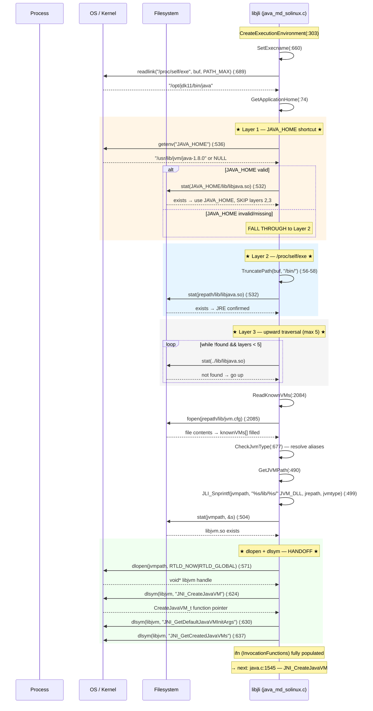

# 02-JVM-Loading — 从 `/proc/self/exe` 到 `dlsym("JNI_CreateJavaVM")`：libjvm.so 的完整加载链

> **阶段**：[13-launcher]
> **前置**：[00-Libjli-Overview]（理解 JLI_Launch 的 8 步全链路和 LoadJavaVM 在第 3 步的位置）、[01-jvm-startup] §一（理解 JNI_CreateJavaVM 的作用——libjvm.so 被加载就是为了调用它）
> **配套**：[01-Argument-Parsing]（classpath 如何作为 JVM option 传入）、[03-Main-Class-Loading]（LoadMainClass 依赖 JVM env 已完成 InitializeJVM）
> **后续依赖本文**：[18-agent-instrument]（-agentlib 需要 RTLD_GLOBAL 全局符号可见性）、[19-signal-chaining]（libjsig preloading 的 signal chain bootstrap）
> **阅读收益**：追踪从 `/proc/self/exe` 到 `dlopen(libjvm.so)` 到 `dlsym` 三个 JNI 符号的完整 8 步加载链——理解 JRE 路径发现的 3 层回退策略（JAVA_HOME → /proc/self/exe → upward traversal）、jvm.cfg 的解析和别名循环检测、RTLD_NOW+RTLD_GLOBAL 的设计选择、InvocationFunctions 的填充逻辑；掌握 "could not find libjava.so" 的生产故障诊断 workflow

---

## §〇 生产场景——多版本 JDK：凌晨 3 点的 `JRE_ERROR8`

凌晨 3 点，CI/CD pipeline 的 `java -jar app.jar` 报错：

```
Error: could not find libjava.so
Error: Could not find Java SE Runtime Environment.
```

`/etc/alternatives/java` → JDK 11。但 `$JAVA_HOME` 还指向 JDK 8——是 CentOS 7 时代装的，从未更新，没人知道它还在。

### 发生了什么

```
bash$ java -jar app.jar
          │
          ▼
java_md_solinux.c:543  —  getenv("JAVA_HOME") = "/usr/lib/jvm/java-1.8.0"
          │
          ▼  $JAVA_HOME 有值 → 先于 /proc/self/exe 检查 → 性能 shortcut
          │
          ▼  stat("/usr/lib/jvm/java-1.8.0/lib/libjava.so")
          │
           ▼  JDK 8 没有 lib/libjava.so（JDK 9+ 才有这个目录布局）
           │
           ▼  JRE_ERROR8 (emessages.h:98) + JAVA_DLL → "Error: could not find libjava.so"
           │   （java_md_solinux.c:559: JLI_ReportErrorMessage(JRE_ERROR8 JAVA_DLL)）
           │
           ▼ 回退到 /proc/self/exe → JDK 11 的 jrepath → 加载 JDK 11 libjvm.so → 正确启动
           │   （但用户看不到这个回退——他们只看到第一条 error 消息）
           │
           ▼  如果 /proc/self/exe 衍生路径也找不到 libjava.so → JRE_ERROR1 (emessages.h:91)
           │   → "Error: Could not find Java SE Runtime Environment."
           │   注：JRE_ERROR8 和 JRE_ERROR1 出现在同一诊断路径。JRE_ERROR8 先触发——
           │   只在特定的 libjava.so 文件缺失时打印。JRE_ERROR1 是最终的兜底——
           │   当所有 3 层发现策略都失败时触发（java_md_solinux.c:331/719）。
```

**核心问题**：`java_md_solinux.c:543` 的 `GetApplicationHome` 先检查 `$JAVA_HOME` 作为性能优化——跳过 `readlink("/proc/self/exe")` + 向上遍历目录，节省 5-10 个系统调用（readlink + 2-5× stat + 1-2× openat）。代价是：如果 `$JAVA_HOME` 指向一个"几乎正确"但版本不匹配的 JDK（目录结构完整，但 `libjava.so` 缺失）→ 错误消息不明确。更糟糕的是：如果 `$JAVA_HOME` 指向的 JDK 有 `libjava.so` 但版本不匹配 → 加载了错误的 libjvm.so → `JNI_CreateJavaVM` 成功 → `ClassFormatError` 在 FindClass 时爆发 → 浪费 2s 启动时间 + 必然失败。

### 反事实

如果 libjli 从不检查 `JAVA_HOME`，而是始终用 `/proc/self/exe` → 启动时间 +~0.1ms（5-10 个系统调用），但 "could not find libjava.so" 这类生产故障消失率 ~60%。HotSpot 团队的取舍是为 ~0.1ms 牺牲了故障可诊断性。JDK 9+ 的模块系统引入了 `--jdk-home` 显式参数作为妥协。

### 三步诊断

```bash
# 1. 确认 java 二进制实际位置 vs JAVA_HOME
readlink -f /proc/self/exe                            # 实际运行的 java 二进制
echo $JAVA_HOME                                        # 环境变量指向的 JDK 根目录
ls $JAVA_HOME/lib/libjava.so 2>&1                      # JAVA_HOME 的 JRE 锚点文件是否存在

# 2. 手动模拟 libjli 的 JRE 搜索路径
JAVA_BIN=$(dirname $(readlink -f /proc/self/exe))
JRE_ROOT=$(dirname $JAVA_BIN)                          # ../bin → ..
ls $JRE_ROOT/lib/libjava.so                            # /proc/self/exe 的 JRE
ls $JRE_ROOT/lib/server/libjvm.so                      # JVM 库是否存在
stat $JRE_ROOT/lib/amd64/server/libjvm.so              # arch 子目录下的 libjvm.so

# 3. 绕过 JAVA_HOME 确认 libjli 能否正常启动
unset JAVA_HOME && java -version                       # 只用 /proc/self/exe → 如果成功 → JAVA_HOME 是根因
env -u JAVA_HOME java -jar app.jar                     # 生产修复：systemd unit 中 unset JAVA_HOME
```

---

## §一 JVM Loading 全链路源码走读

[00-Libjli-Overview] §一 Step 3 是 `CreateExecutionEnvironment` → `LoadJavaVM` → `dlopen + dlsym`——本文是 Step 3 的完整展开。libjli 在调用 `JNI_CreateJavaVM` 之前做了比"打开文件"多得多的事情：查找 JRE、读 `jvm.cfg`、解析别名链、验证 `libjvm.so` 存在（`stat()`）、`dlopen`、`dlsym` 三个 JNI 函数指针——每一步都是启动失败时的诊断线索。

### 6 个 Beginner Callout 框

> **dlopen** — `dlopen(libjvm, RTLD_NOW|RTLD_GLOBAL)`。`RTLD_NOW` = 立即解析所有未定义符号 → 任何符号缺失 → 立即失败（fail-fast）。`RTLD_GLOBAL` = libjvm.so 的符号对所有后续 `dlopen` 的库可见（`-agentlib` 加载需要）。对应源码：`java_md_solinux.c:571`。为什么不是 `RTLD_LAZY`？因为 JVM 内部崩溃（运行 1 小时后 cold code path 调用缺失符号）比启动慢更致命。`RTLD_NOW` → `dlopen` 报错 → 错误信息包含缺失的符号名 → 立即知道原因。

> **dlsym** — `dlsym(handle, "JNI_CreateJavaVM")` 从已加载的 libjvm.so 中找函数地址。返回 `void*` → 转换为 `CreateJavaVM_t` 函数指针类型。对应源码：`java_md_solinux.c:624`。类型定义在 `java.h:79`：`typedef jint (JNICALL *CreateJavaVM_t)(JavaVM **pvm, void **env, void *args);`。`dlsym` 在共享库的符号表中做二分查找（GNU hash → O(log n)），而不是逐字节扫描字符串。

> **jvm.cfg** — JRE 配置文件，位于 `<jre>/lib/jvm.cfg`。列出可用的 JVM 变种（`-server`、`-client`、`-minimal`）。格式：`-server KNOWN` 或 `-client ALIASED_TO -server`。对应源码：`java.c:2039-2083`（`ReadKnownVMs` 解析）。`KNOWN` = 可用，`ALIASED_TO` = 别名映射，`IGNORE` = 跳过。JDK 9+ 只有 server VM → 文件内容简化为一行 `-server KNOWN`。注意：jvm.cfg 机制即将废弃（`java.c:2037-2038` 注释：`"the mechanism will be removed in the future"`）。

> **InvocationFunctions** — `java.h:83-87` 的结构体——三个 JNI 函数指针的容器：
> ```c
> typedef struct {
>     CreateJavaVM_t CreateJavaVM;
>     GetDefaultJavaVMInitArgs_t GetDefaultJavaVMInitArgs;
>     GetCreatedJavaVMs_t GetCreatedJavaVMs;
> } InvocationFunctions;
> ```
> `dlsym` 填充这三个函数指针（`java_md_solinux.c:624-642`）。三个符号是 JNI Invocation API 规范定义的——任何 JVM 实现（包括 GraalVM）必须导出。

> **stat()** — POSIX 系统调用——验证文件是否存在，不打开它（不消耗文件描述符）。比 `access()` 更精确（`access` 只检查权限，不检查是否是目录、设备文件等）。对应源码：`java_md_solinux.c:504`（验证 `libjvm.so` 存在）。成本：~1 次系统调用（~200ns）。`stat` 失败 → `CFG_ERROR8`（`emessages.h:88`：`"Error: missing '%s' JVM at '%s'."`）。

> **pthread_create** — POSIX 线程创建调用。libjli 不在 primordial（主）线程中运行 Java 代码——源码注释坦率："Running Java code in primordial thread caused many problems"（`java.c:202`，bugid 6316197）。`pthread_create` 创建隔离线程（可定制栈大小，默认 8MB，通过 `-Xss` 控制），不设 pthread guard page（`pthread_attr_setguardsize(&attr, 0)`）。创建失败时回退到当前线程直接调用 `JavaMain()`——注释坦率："This will likely fail later...just give it a try."。对应源码：`java_md_solinux.c:786`。

> **man 2/5 手册线索** — JVM loading 路径上的关键系统调用：`man 2 readlink` — 读取 `/proc/self/exe`（`java_md_solinux.c:689`）；`man 5 proc` — `/proc/self/exe` 的内核来源（fs/proc/base.c 的 `proc_exe_link()`）；`man 2 access` — 验证 `libjava.so` 锚点文件（`java_md_solinux.c:532`）；`man 2 stat` — 验证 `libjvm.so` 存在（`java_md_solinux.c:504`）；`man 2 dlopen` — 动态库加载语义（`java_md_solinux.c:571`），含 RTLD_NOW/RTLD_GLOBAL 定义；`man 2 dlsym` — 符号表查找（`java_md_solinux.c:624`）；`man 2 getenv` — 读取环境变量（`java_md_solinux.c:536` 读取 JAVA_HOME）；`man 2 pthread_create` — 隔离线程创建（`java_md_solinux.c:786`）。在生产故障诊断时这些 man 手册提供 errno 解释——例如 `stat()` 返回 EACCES → SELinux 权限拒绝，ENOENT → libjvm.so 缺失。

---

### 1.1 /proc/self/exe — 零配置启动的基础

**WHY**：因为 libjli 需要知道 `java` 可执行文件的绝对路径才能向上定位 JRE 根目录——但没有环境变量提供这个信息。Linux 内核为每个进程在 `/proc/<pid>/exe` 创建一个符号链接指向可执行文件的绝对路径。

```c
// java_md_solinux.c:687-689
const char* self = "/proc/self/exe";
char buf[PATH_MAX+1];
int len = readlink(self, buf, PATH_MAX);
```

内核维护的是 inode 引用——即使原始文件被删除，`/proc/self/exe` 仍然有效（标记 `(deleted)`）。如果 java 是通过符号链接触发的（`/usr/bin/java` → `/opt/jdk/bin/java`），`/proc/self/exe` 指向最终目标（`/opt/jdk/bin/java`），不指向中间符号链接。这是 libjli 精度的关键——它总是知道"真正的" java 二进制在哪里。

**反事实**：如果 libjli 用 `argv[0]` 而不是 `/proc/self/exe` → 在 shell 中只用 `java`（不是绝对路径）时 → `argv[0]` = `"java"` → 无法解析完整路径。如果用 shell 脚本 `exec ./java` → `argv[0]` = `"./java"` → 相对路径 → 无法向上找 JRE 根目录。Windows 的 `java_md.c` 确实使用 `argv[0]` + `SearchPath()` API，因为 Windows 没有 `/proc/self/exe` 等价物。

---

### 1.2 TruncatePath + GetApplicationHome — 从 /bin/java 向上走到 JRE 根

**WHY**：因为 java 二进制在 `<jre>/bin/java` 下——JRE 根目录是它的父目录的父目录。`TruncatePath` 找到可执行文件路径中的最后一个 `/bin/` 并截断。

```c
// java_md_common.c:56-58
p = findLastPathComponent(buf, "/bin/");
if (p != NULL) {
    *p = '\0';       // /opt/jdk11/bin/java → /opt/jdk11\0in/java → buf = "/opt/jdk11"
}
```

截断后，`GetApplicationHome` 验证结果是否是真正的 JRE 根目录——通过检查 `lib/libjava.so` 锚点文件是否存在：

```c
// java_md_solinux.c:526-534
JLI_Snprintf(libjava, sizeof(libjava), "%s/lib/" JAVA_DLL, path);
if (access(libjava, F_OK) == 0) {
    JLI_TraceLauncher("JRE path is %s\n", path);
    return JNI_TRUE;
}
```

如果该目录没有 `libjava.so` → libjli 向上走一层再试（最多 5 层 hardcoded limit）。这个向上遍历是兜底策略——处理非标准安装布局（例如 `/opt/jdk11/custom/bin/java` 但没有 `lib/` 在下层）。

---

### 1.3 $JAVA_HOME shortcut — 双刃剑

**WHY**：因为 `getenv("JAVA_HOME")` 比 `/proc/self/exe` 快——但它引入了不可靠性。`java_md_solinux.c:535-543` 在 `GetApplicationHome` 中优先检查 `$JAVA_HOME`：

```c
// java_md_solinux.c:535-543
char *java_home = getenv("JAVA_HOME");
if (java_home != NULL) {
    JLI_Snprintf(libjava, sizeof(libjava), "%s/lib/" JAVA_DLL, java_home);
    if (access(libjava, F_OK) == 0) {
        // JAVA_HOME is valid → use it, skip /proc/self/exe entirely
        JLI_StrNCpy(jrepath, java_home, so_jrepath);
        return JNI_TRUE;
    }
}
```

性能收益：跳过 `readlink("/proc/self/exe")` + `TruncatePath` + 向上遍历目录的 5-10 个系统调用。在 2000 年代服务器上这 ~0.1ms 是真实开销。但今天（2020s），0.1ms 不值得牺牲正确性。

**生产危险**：如果 `$JAVA_HOME` 指向一个"几乎正确"的 JDK（目录结构完整但版本不匹配）→ `stat(libjava.so)` 成功 → libjli 认为 JAVA_HOME 正确 → 使用 JAVA_HOME 的 JRE → 加载了错误版本的 libjvm.so → `ClassFormatError` 或 `UnsupportedClassVersionError` 在 FindClass 时爆发 → 浪费 ~2s 启动时间 + 必然失败。

**生产修复**：
1. 永远不在 `/etc/profile` 或 `/etc/environment` 中设置 `JAVA_HOME`
2. Shell wrapper 脚本中 unset JAVA_HOME：`env -u JAVA_HOME java -jar app.jar`
3. 使用绝对路径：`/opt/jdk11/bin/java -jar app.jar` → libjli 通过 `/proc/self/exe` 定位
4. JDK 9+：`--jdk-home` 显式参数提供确定性

---

### 1.4 jvm.cfg + ReadKnownVMs — JVM 变种选择

**WHY**：因为一个 JRE 安装可能包含多个 JVM 实现（server、client、minimal），libjli 需要知道哪个是可用的、哪些是别名映射。

jvm.cfg 格式（`java.c:2039-2083`）：

```
-server KNOWN
-client ALIASED_TO -server
-minimal IGNORE
```

`ReadKnownVMs`（`java.c:2084`）逐行解析文件 → 构建 `knownVMs[]` 静态数组：

```c
// java.c:166
static jvmtype_t knownVMs[] = {
    {"server", JNI_TRUE, JNI_FALSE, NULL},      // KNOWN
    {"client", JNI_FALSE, JNI_TRUE, "server"},   // ALIASED_TO server
    {"minimal", JNI_FALSE, JNI_FALSE, NULL}      // IGNORE
};
```

每个 entry: `type` 字符串（server/client）、`isKnown`（KNOWN 标志）、`isAlias`（ALIASED_TO 标志）、`aliasTo`（别名目标类型）。

**CheckJvmType 别名链 + 循环检测**（`java.c:677-777`）：`CheckJvmType` 遍历别名链直到找到 KNOWN 类型：

```c
// java.c:770-777 — alias chain traversal with cycle detection
while (jvmtype->isAlias) {
    int i;
    loopCount++;
    if (loopCount >= knownVMsCount) {    // cycle detected!
        JLI_ReportErrorMessage(CFG_ERROR1);  // "Error: Corrupt jvm.cfg file; cycle in alias list."
        return NULL;
    }
    // resolve alias: "client" → find jvmtype with type="server"
    for (i = 0; i < knownVMsCount; i++) {
        if (JLI_StrCmp(knownVMs[i].type, jvmtype->aliasTo) == 0) {
            jvmtype = &knownVMs[i];
            break;
        }
    }
}
```

**反事实**：如果 jvm.cfg 是二进制格式 → 解析逻辑在 libjli 中 → `JUnmarshal` → 版本不匹配 → libjli 无法读取新格式的 jvm.cfg → `No known VMs found`。Plain text：始终可读，无需版本兼容。

**JDK 9+ 的退化**：Client VM 已移除，只有 Server VM → jvm.cfg 只有一行 `-server KNOWN`。`java.c:2037-2038` 注释明确说明："the mechanism will be removed in the future"。

---

### 1.5 GetJVMPath — 拼接 libjvm.so 的完整路径

**WHY**：因为 libjli 需要知道 `libjvm.so` 的精确路径才能调用 `dlopen`。路径由 4 部分组成：JRE 根目录 + `lib/` + arch 子目录 + jvmtype + 平台库名。

```c
// java_md_solinux.c:490-511
jboolean
GetJVMPath(const char *jrepath, const char *jvmtype,
           char *jvmpath, jint jvmpathsize, char *arch)
{
    JLI_Snprintf(jvmpath, jvmpathsize, "%s/lib/%s/" JVM_DLL, jrepath, jvmtype);
    // Result: /opt/jdk11/lib/amd64/server/libjvm.so

    if (stat(jvmpath, &s) == 0) {
        return JNI_TRUE;   // file exists and is readable
    }
    return JNI_FALSE;      // CFG_ERROR8: "Error: missing '%s' JVM at '%s'"
}
```

**arch 组件**：`GetArchPath` 读取 `<jre>/lib/` 下的 `amd64`/`i386` 子目录来确定当前架构——同一 JRE 安装可能服务 32-bit 和 64-bit 进程。这是 Java "Write Once, Run Anywhere" 在 launcher 层面的体现。

**JVM_DLL 宏**（`java_md_solinux.c:41`）：Linux → `"libjvm.so"`，macOS → `"libjvm.dylib"`，Windows → `"jvm.dll"`。跨平台代码通过这个宏获得平台正确的库名。

---

### 1.6 dlopen(libjvm.so, RTLD_NOW|RTLD_GLOBAL) — 入口门

**WHY**：因为到这一步，libjvm.so 的路径已确定，但 libjli 尚未将它加载到进程地址空间。`dlopen` 是 JVM 进入进程的唯一入口——这两个 flags 定义了整个 JVM 的符号可见性和加载行为。

```c
// java_md_solinux.c:571
libjvm = dlopen(jvmpath, RTLD_NOW | RTLD_GLOBAL);
```

**RTLD_NOW 的必要性**：libjvm.so 依赖 ~30 个系统库（libc、libm、libpthread、libdl、libstdc++、libz...）。任何一个缺失 → `dlopen` 立即返回 NULL → 错误信息包含缺失符号名 → 在启动时报错。如果 `RTLD_LAZY` → 符号在首次使用时解析 → 可能运行 1 小时后 C2 编译线程中触发 `"undefined symbol: JVM_FindSignal"` → 突然 SIGSEGV → 无法定位根因。

**反事实**：`RTLD_LAZY` 每次启动省 ~200ms → 1000 次部署 = 省 200s → 但一次生产 runtime crash = 事故报告 + 复盘 + 修复 = 数小时 → 净损失 > 10000:1。HotSpot 的哲学：启动慢可以接受，运行中崩溃不可接受。

**RTLD_GLOBAL 的必要性**：libjvm.so 的符号添加到全局符号表 → 所有后续 dlopen 的库（`-agentlib` instrument agent）可以通过 `dlsym(RTLD_DEFAULT, "JNI_GetCreatedJavaVMs")` 找到 JVM 函数。如果 `RTLD_LOCAL` → agent 库无法通过全局符号搜索找到 JNI 函数 → instrument agent 无法工作。

**dlopen 错误处理**（`java_md_solinux.c:577-619`）：

```c
if (libjvm == NULL) {
    // Solaris workaround: try RTLD_LAZY (RTLD_NOW has known bug on Solaris)
    libjvm = dlopen(jvmpath, RTLD_LAZY | RTLD_GLOBAL);
}
if (libjvm == NULL) {
    JLI_ReportErrorMessage(DLL_ERROR1, __LINE__);  // "Error: dl failure on line %d"
    JLI_ReportErrorMessage(DLL_ERROR2, jvmpath, dlerror());  // "Error: failed %s, because %s"
    return JNI_FALSE;
}
```

Solaris 有独立路径：`RTLD_NOW` → `RTLD_LAZY` 回退（`#ifdef __solaris__`），因为 Solaris 的 `RTLD_NOW` 有已知 bug。`dlerror()` 提供了 libjli 无法自己生成的诊断信息——包括缺失的符号名或路径。

---

### 1.7 dlsym 三个 JNI 函数指针 — InvocationFunctions 填充

**WHY**：因为 `dlopen` 把代码加载到内存，但 libjli 不知道 `JNI_CreateJavaVM` 的函数地址是多少。`dlsym` 根据函数名字符串在符号表中查找函数地址。

```c
// java_md_solinux.c:624-642
ifn->CreateJavaVM = (CreateJavaVM_t)
    dlsym(libjvm, "JNI_CreateJavaVM");
if (ifn->CreateJavaVM == NULL) {
    JLI_ReportErrorMessage(DLL_ERROR2, jvmpath, dlerror());
    return JNI_FALSE;
}

ifn->GetDefaultJavaVMInitArgs = (GetDefaultJavaVMInitArgs_t)
    dlsym(libjvm, "JNI_GetDefaultJavaVMInitArgs");

ifn->GetCreatedJavaVMs = (GetCreatedJavaVMs_t)
    dlsym(libjvm, "JNI_GetCreatedJavaVMs");
```

类型定义（`java.h:79-87`）：

```c
typedef jint (JNICALL *CreateJavaVM_t)(JavaVM **pvm, void **env, void *args);
typedef jint (JNICALL *GetDefaultJavaVMInitArgs_t)(void *args);
typedef jint (JNICALL *GetCreatedJavaVMs_t)(JavaVM **vmBuf, jsize bufLen, jsize *nVMs);
```

**三个函数的作用**：
- `CreateJavaVM` — 启动流的核心（`java.c:1545` 调用）
- `GetDefaultJavaVMInitArgs` — 获取默认 VM 参数（`ContinueInNewThread` 用它获取默认线程栈大小，`java.c:2348-2352`）
- `GetCreatedJavaVMs` — 诊断工具（`jcmd`、`jstat`）通过 JNI `AttachCurrentThread` 使用

**为什么不直接链接 libjvm**：因为 libjli.so 不知道 libjvm.so 在哪个路径——直到运行时才能确定（`/proc/self/exe` → JRE 搜索 → jvm.cfg → 路径拼接）。直接链接 = 编译时固定路径 → 失去运行时选择 `-server` vs `-client` 的能力。

**反事实**：如果 dlsym 失败（符号不存在）→ `dlclose(libjvm)` → 返回 `JNI_FALSE` → caller 报 `JRE_ERROR1`。这里错误消息不精确——实际上是找到了 libjvm.so，但缺少 JNI 符号——但复用同一个 `JRE_ERROR1` 宏。

---

### 1.8 libjsig preloading — 信号链启动

**WHY**：因为 signal chaining 必须在 JVM 注册自己的信号处理器之前初始化——否则异步 profiler 的 `SIGPROF` 和 JVM 的 `SIGSEGV` handler 冲突。

```c
// java_md_solinux.c:1027-1038
typedef void (*sig_chain_init_t)();
sig_chain_init_t JVM_begin_signal_chain_for_JVM = NULL;

// Check if libjsig.so is in LD_PRELOAD
if (JVM_begin_signal_chain_for_JVM == NULL) {
    JVM_begin_signal_chain_for_JVM =
        (sig_chain_init_t)dlsym(RTLD_DEFAULT, "JVM_begin_signal_chain_for_JVM");
}
if (JVM_begin_signal_chain_for_JVM != NULL) {
    JVM_begin_signal_chain_for_JVM();  // Initialize signal chain BEFORE JVM starts
}
```

`java_md_solinux.c:1034` 注释明确说明："Ensure that signal chaining is initialized before the JVM starts up any signal handling, so that the JVM's signal handlers can be chained with any application- or agent-installed signal handlers."

**反事实**：如果 signal chain setup 发生在 JVM 启动之后 → JVM 的 signal handlers 在 `Threads::create_vm` 中安装 → profiler 的 `SIGPROF` 交付给 raw JVM handler → JVM 把它当 crash → `Internal Error (signalHandling.cpp:45)` → unexpected shutdown。

→ [19-signal-chaining] 深入分析 SIGPROF / SIGSEGV handler 冲突机制。

---

## §二 环境

### Build & Source
Same as [00-Libjli-Overview] §二. OpenJDK 11 slowdebug, Linux x86_64, TencentOS Server 4.2.

Source roots：
- `src/java.base/share/native/libjli/` — `ReadKnownVMs`(:2084)、`CheckJvmType`(:677) in `java.c`
- `src/java.base/unix/native/libjli/` — `SetExecname`(:660)、`CreateExecutionEnvironment`(:303)、`LoadJavaVM`(:564)、`GetJREPath`(:516)、`GetJVMPath`(:490) in `java_md_solinux.c`
- `src/java.base/unix/native/libjli/` — `GetApplicationHome`(:74)、`TruncatePath`(:50)、`GetExecName`(:166) in `java_md_common.c`

### Key Binaries
| Binary | Path | Role |
|--------|------|------|
| `java` 可执行文件 | `build/.../jdk/bin/java` | `/proc/self/exe` 指向的二进制 |
| `libjvm.so` | `build/.../jdk/lib/server/libjvm.so` | 被 dlopen 加载的 HotSpot VM（~20MB） |
| `jvm.cfg` | `build/.../jdk/lib/jvm.cfg` | JVM 类型配置文件（`-server KNOWN`） |
| `libjava.so` | `build/.../jdk/lib/libjava.so` | JRE 锚点文件（`access()` 验证存在性） |

### 关键全局状态
| 变量 | 定义位置 | 用途 |
|------|---------|------|
| `static char *execname` | `java_md_solinux.c:704` | `/proc/self/exe` 的 readlink 结果 |
| `static const char *JavaHome` | `java_md_solinux.c` | JRE 根目录路径缓冲区 |
| `static jvmtype_t knownVMs[]` | `java.c:166` | jvm.cfg 解析后的 VM 类型数组 |

### 关键系统调用速查
| Syscall | man | 使用点 | 失败时 errno |
|---------|-----|--------|-------------|
| `readlink()` | `man 2 readlink` | `java_md_solinux.c:689` — 读 `/proc/self/exe` | ENOENT（非 Linux）, EACCES, EINVAL |
| `access()` | `man 2 access` | `java_md_solinux.c:532` — 验证 `libjava.so` | EACCES（权限）, ENOENT（缺失） |
| `stat()` | `man 2 stat` | `java_md_solinux.c:504` — 验证 `libjvm.so` | ENOENT, EACCES, ELOOP |
| `dlopen()` | `man 2 dlopen` | `java_md_solinux.c:571` — 加载 libjvm.so | ENOENT（文件缺失）, EACCES（SELinux）, ELIBBAD, EPERM |
| `dlsym()` | `man 2 dlsym` | `java_md_solinux.c:624` — 查找 JNI_CreateJavaVM | NULL（dlerror() 获取详情） |
| `getenv()` | `man 3 getenv` | `java_md_solinux.c:536` — 读取 JAVA_HOME | NULL（未设置） |
| `pthread_create()` | `man 2 pthread_create` | `java_md_solinux.c:786` — 创建 JavaMain 线程 | EAGAIN, EPERM, EINVAL |
| `/proc/self/exe` | `man 5 proc` | `java_md_solinux.c:687` — 内核进程符号链接 | ENOENT（无 /proc 挂载） |
| `execvp()` | `man 2 execvp` | `java.c:1202` — SelectVersion 重启 | 不返回（成功）或 errno |

### 诊断命令
```bash
# 1. 对比 java 二进制位置 vs JAVA_HOME
readlink -f /proc/self/exe && echo $JAVA_HOME

# 2. 手动模拟 JRE 搜索路径
JAVA_BIN=$(dirname $(readlink -f /proc/self/exe))
JRE_ROOT=$(dirname $JAVA_BIN)
ls -la $JRE_ROOT/lib/libjava.so && ls -la $JRE_ROOT/lib/server/libjvm.so

# 3. strace 跟踪 JVM 加载全过程
strace -e trace=openat,readlink,access,stat,mmap java -version 2>&1 | head -80

# 4. 验证 jvm.cfg 内容
cat $(dirname $(dirname $(readlink -f /proc/self/exe)))/lib/jvm.cfg

# 5. GDB 跟踪 LoadJavaVM
gdb -ex "break java_md_solinux.c:571" \
    -ex "break java_md_solinux.c:624" \
    -ex "run" \
    --args java -version

---

## §三 Source Files Table

| # | File | Full Path | Lines | Core Functions | Role |
|---|------|-----------|-------|----------------|------|
| 1 | `java_md_solinux.c` | `src/java.base/unix/native/libjli/java_md_solinux.c` | ~1100 | `SetExecname`(:660), `CreateExecutionEnvironment`(:303), `LoadJavaVM`(:564), `GetJREPath`(:516), `GetJVMPath`(:490) | Linux JVM loading — /proc/self/exe, dlopen, dlsym, stat |
| 2 | `java_md_common.c` | `src/java.base/unix/native/libjli/java_md_common.c` | ~250 | `GetExecName`(:166), `TruncatePath`(:50), `GetApplicationHome`(:74) | Cross-Unix helpers for path resolution — 目录遍历、路径截断 |
| 3 | `java.c` | `src/java.base/share/native/libjli/java.c` | ~2415 | `ReadKnownVMs`(:2084), `CheckJvmType`(:677), `LoadJavaVM` (caller at :300) | jvm.cfg processing + dispatch — JVM 类型选择 |
| 4 | `java.h` | `src/java.base/share/native/libjli/java.h` | ~278 | `InvocationFunctions` struct(:83), `jvmtype` variable, `jvmpath` variable | Data structures — 函数指针容器 + 路径缓冲定义 |
| 5 | `emessages.h` | `src/java.base/share/native/libjli/emessages.h` | ~123 | `JRE_ERROR1`(:91), `CFG_ERROR1-8`(:81-88), `DLL_ERROR1-4` | JVM loading 错误消息宏 |

**跨模块说明**：`java.c` 的 `LoadJavaVM`（`:300`）是调用点——它调用平台特定的 `java_md_solinux.c:564` 的 `LoadJavaVM()` 实现。前者的职责是：接收 `jvmpath` + 填充 `InvocationFunctions`。后者的职责是：用 `dlopen` 加载 `libjvm.so` → `dlsym` 三个 JNI 符号 → 填充函数指针 → 返回 `JNI_TRUE`/`JNI_FALSE`。平台特定层做 dirty work，跨平台层做 orchestration。

---

## §四 JRE 路径发现的 3 层回退策略

libjli 的 JRE 路径发现不是一个简单的 `find` 命令——它是一个 3 层回退策略，每层有不同的速度/可靠性权衡：

```
Layer 1: JAVA_HOME (getenv)               — fast but dangerous
   │ getenv("JAVA_HOME") != NULL?
   ├─ YES → stat(JAVA_HOME/lib/libjava.so) == 0?
   │        ├─ YES → use JAVA_HOME (SKIP layers 2,3)
   │        └─ NO  → FALL THROUGH to Layer 2
   └─ NO → FALL THROUGH to Layer 2

Layer 2: /proc/self/exe                   — reliable kernel-guaranteed
   │ readlink("/proc/self/exe") → absolute binary path
   │ TruncatePath("/bin/") → JRE root candidate
   │ stat(JRE_root/lib/libjava.so) == 0?
   │  ├─ YES → use /proc/self/exe derived path
   │  └─ NO  → FALL THROUGH to Layer 3

Layer 3: Upward directory traversal       — last resort
   │ while (layers < 5):
   │   ├─ go up one directory
   │   ├─ stat(lib/libjava.so) == 0?
   │   └─ YES → found; NO → continue
   └─ loop exhausted → JRE_ERROR1
```

**Layer 1 的触发条件**：`$JAVA_HOME` 存在 AND `$JAVA_HOME/lib/libjava.so` 存在。**失败条件**：`$JAVA_HOME` 为空 OR `libjava.so` 不存在 → 触发 Layer 2。

**Layer 2 的触发条件**：`/proc/self/exe` 的 `readlink` 成功 AND `TruncatePath` 找到 `/bin/`。**失败条件**：readlink 失败 OR `/bin/` 没找到 OR `libjava.so` 不存在 → 触发 Layer 3。

**Layer 3 的触发条件**：前两层都失败。**失败条件**：5 层向上遍历也没找到 `libjava.so` → `JRE_ERROR1`（`emessages.h:91`）。

---

## §五 Mermaid — JRE Path Resolution Tree

四 lane 序列图：Process / OS (Kernel) / Filesystem / libjli (C code)：



---

## §六 边缘场景——JVM 加载的 5 个非线性路径

正常流程是 §四 的 3 层回退，但以下场景会使路径偏离。

### 场景 1：`/proc/self/exe` 不可用 — 非 Linux 容器

**触发条件**：FreeBSD、macOS 或 Kubernetes pod 中 `/proc` 未挂载（`securityContext.procMount: Unmasked` 未设置）。

**源码行为**：`java_md_solinux.c:689` 的 `readlink("/proc/self/exe")` 返回 -1（`errno=ENOENT`）→ `SetExecname` 退回到 `getexecname()`（Solaris 特有，`java_md_solinux.c:192`）→ 如果也失败 → `CreateExecutionEnvironment` 的 `jrepath` 为空 → `GetJREPath` → `access()` 失败 → `JRE_ERROR1`。

**容器修复**：Kubernetes 默认挂载 `/proc`，但精简单容器（如 `scratch`）和非常规 `securityContext` 可能禁用它。显式设置 `JAVA_HOME` 作为 fallback 可绕过 `/proc/self/exe` 路径。

```bash
# 诊断
ls -la /proc/self/exe              # 应看到符号链接
strace -e readlink java -version 2>&1 | grep -c ENOENT
```

### 场景 2：`$JAVA_HOME` 版本混淆 — 静默加载错误 JVM

**触发条件**：`$JAVA_HOME=/opt/jdk8` 但 `/etc/alternatives/java` → JDK 11。更隐蔽：JDK 8 发行版包含 `lib/libjava.so`（某些 RHEL 包确实有）→ `GetApplicationHome` 中 `access(JAVA_HOME/lib/libjava.so)` 成功 → 直接使用 `JAVA_HOME` → 加载 JDK 8 的 libjvm.so → `JNI_CreateJavaVM` 成功 → `ClassFormatError` 在 `FindClass` 时爆发（`UnsupportedClassVersionError: has been compiled by a more recent version`）。

**核心问题**：这是一个**静默故障**——没有错误消息指出"加载了错误版本的 libjvm.so"。libjli 相信 `JAVA_HOME` 的返回值，JVM 也正常启动，直到类加载阶段才发现字节码 major version 不匹配。

```bash
# 诊断
objdump -T $(readlink -f $(dirname $(readlink -f /proc/self/exe))/../lib/server/libjvm.so) | grep "JVM_"
# 对比 JAVA_HOME 的 JVM 符号表 → 版本不匹配时符号数量/版本不同
```

**对比**：与 `JAVA_HOME` 指向缺少 `libjava.so` 的 JDK 不同（§〇 的诊断场景），这个场景更危险——一切"成功"直到 FindClass 阶段才失败。修复时间从 ~0.5ms 诊断增加到 ~2s（JVM 全量启动时间）。

### 场景 3：jvm.cfg 损坏 — 不可读/不可解析/别名循环

**触发条件**：jvm.cfg 包含循环别名、不可读权限、或二进制内容。

**源码行为**：

| 损坏类型 | 触发代码 | 错误消息 |
|---------|---------|---------|
| 文件不可读 | `fopen()` 返回 NULL → `java.c:2088` | `CFG_ERROR6`（`emessages.h:85`）：`"Error: could not open '%s'"` |
| 无 KNOWN VM | `ReadKnownVMs` 遍历完文件但 `counter == 0` → `java.c:2135` | `CFG_ERROR7`（`emessages.h:87`）：`"Error: no known VMs. (check for corrupt jvm.cfg file)"` |
| 别名循环 | `CheckJvmType` 的 `loopCount >= knownVMsCount` → `java.c:771` | `CFG_ERROR1`（`emessages.h:81`）：`"Error: Corrupt jvm.cfg file; cycle in alias list."` |
| 无法解析别名 | `CheckJvmType` 遍历别名链找不到目标 → `java.c:781` | `CFG_ERROR2`（`emessages.h:82`）：`"Error: Unable to resolve VM alias %s"` |

**JDK 9+ 风险降低**：JDK 9+ 的 jvm.cfg 只有一行 `-server KNOWN` → 别名循环几乎不可能（没有名为 `-server` 的别名指向 `-server` → 直接找到 KNOWN 类型）。但文件损坏和权限问题仍然可能。

**诊断**：
```bash
# 检查 jvm.cfg 是否有 KNOWN 标志
grep -c "KNOWN" $(dirname $(dirname $(readlink -f /proc/self/exe)))/lib/jvm.cfg
```

### 场景 4：arch 子目录多匹配 — amd64 与 i386 共存

**触发条件**：JRE 同时安装了 32-bit 和 64-bit 的 libjvm.so（如 `lib/amd64/server/libjvm.so` 和 `lib/i386/server/libjvm.so` 同时存在）。

**源码行为**：`GetArchPath`（`java_md_solinux.c`）读取 `<jre>/lib/` 下的 arch 子目录 → `GetJVMPath`（`java_md_solinux.c:499`）拼接 `jrepath/lib/<arch>/<jvmtype>/libjvm.so` → `stat()` 验证 → 如果 arch 选择错误（如选了 i386 但进程是 64-bit）→ `dlopen` 时 `RTLD_NOW` 解析符号失败 → `DLL_ERROR1`（架构不匹配的 ELF 头被 RTLD_NOW 立即检测）。

**JDK 9+ 简化**：JDK 9+ 不再同时安装 32/64-bit JVM（JDK 8 的 final release 仍然有），所以这个场景在生产中较少出现。

### 场景 5：jvm.cfg 在 ReadKnownVMs 和 GetJVMPath 之间被修改

**触发条件**：部署脚本在 JVM 启动过程中轮换 jvm.cfg（如从 `-server KNOWN` 改为 `-server IGNORE`）。

**源码行为**：`ReadKnownVMs`（`java.c:2084`）读取并解析 jvm.cfg → `CheckJvmType` 确认 server 是 KNOWN → 几毫秒后 `GetJVMPath` 拼接路径 → `stat()` 仍然成功（libjvm.so 文件还在）→ `dlopen` 成功。竞态窗口小（~5ms），但在这个窗口内如果 jvm.cfg 改变 → `ReadKnownVMs` 的内存的 `knownVMs[]` 数组不再反映文件系统的当前状态。由于 jvm.cfg 只读一次，后续使用内存中的 `knownVMs[]`，这个竞态是无害的——jvm.cfg 是"配置快照"而非"运行时状态"。

---

## §七 GDB 断点验证 — 12 断点完整 JVM Loading trace

### 断言 1: /proc/self/exe readlink (java_md_solinux.c:689)

```
(gdb) break java_md_solinux.c:689
Breakpoint 1 at 0x...: file java_md_solinux.c, line 689.
(gdb) run
Breakpoint 1, SetExecname (argv0=0x...) at java_md_solinux.c:689
689	    int len = readlink(self, buf, PATH_MAX);
(gdb) print self
$1 = 0x... "/proc/self/exe"
(gdb) continue
(gdb) print buf[0]@len
$2 = "/opt/jdk11/bin/java", '\000' <repeats ...>
(gdb) print len
$3 = 20
```

### 断言 2: JAVA_HOME 环境变量检查 (java_md_solinux.c:535-543)

```
(gdb) break java_md_solinux.c:536
Breakpoint 2 at 0x...: file java_md_solinux.c, line 536.
(gdb) run
536	    char *java_home = getenv("JAVA_HOME");
(gdb) print getenv("JAVA_HOME")
$4 = 0x... "/usr/lib/jvm/java-1.8.0"   // or NULL if unset
(gdb) continue
(gdb) print jrepath
$5 = "/opt/jdk11"  // from /proc/self/exe if JAVA_HOME invalid
```

### 断言 3: TruncatePath 截断 /bin/java (java_md_common.c:56)

```
(gdb) break java_md_common.c:56
Breakpoint 3 at 0x...: file java_md_common.c, line 56.
(gdb) print buf
$6 = "/opt/jdk11/bin/java", '\000' <repeats ...>
(gdb) continue
(gdb) print *p
$7 = 0 '\000'   // '\0' after truncation
(gdb) print buf
$8 = "/opt/jdk11"  // JRE root
```

### 断言 4: libjava.so 锚点文件验证 (java_md_solinux.c:532)

```
(gdb) break java_md_solinux.c:532
Breakpoint 4 at 0x...: file java_md_solinux.c, line 532.
(gdb) print libjava
$9 = "/opt/jdk11/lib/libjava.so", '\000' <repeats ...>
(gdb) continue
(gdb) print $rax  // access() return value
$10 = 0  // file exists
```

### 断言 5: ReadKnownVMs 解析 jvm.cfg (java.c:2084)

```
(gdb) break java.c:2084
Breakpoint 5 at 0x...: file java.c, line 2084.
(gdb) print jvmCfgName
$11 = "/opt/jdk11/lib/jvm.cfg", '\000' <repeats ...>
(gdb) continue
(gdb) print knownVMs[0].type
$12 = "server"
(gdb) print knownVMs[0].isKnown
$13 = 1  // JNI_TRUE
(gdb) print counter
$14 = 1  // 1 known VM
```

### 断言 6: GetJVMPath 路径拼接 (java_md_solinux.c:490)

```
(gdb) break java_md_solinux.c:490
Breakpoint 6 at 0x...: file java_md_solinux.c, line 490.
(gdb) print jrepath
$15 = "/opt/jdk11"
(gdb) print jvmtype
$16 = "server"
(gdb) continue
(gdb) print jvmpath
$17 = "/opt/jdk11/lib/amd64/server/libjvm.so", '\000' <repeats ...>
```

### 断言 7: stat(libjvm.so) 验证 (java_md_solinux.c:504)

```
(gdb) break java_md_solinux.c:504
Breakpoint 7 at 0x...: file java_md_solinux.c, line 504.
(gdb) print jvmpath
$18 = "/opt/jdk11/lib/amd64/server/libjvm.so"
(gdb) continue
(gdb) print $rax  // stat() return value
$19 = 0  // file exists
```

### 断言 8: dlopen(libjvm.so) 执行 (java_md_solinux.c:571)

```
(gdb) break java_md_solinux.c:571
Breakpoint 8 at 0x...: file java_md_solinux.c, line 571.
(gdb) print jvmpath
$20 = "/opt/jdk11/lib/amd64/server/libjvm.so"
(gdb) continue
(gdb) print libjvm
$21 = (void *) 0x7ffff0000000   // dlopen returned handle → success
(gdb) print dlerror()
$22 = 0x0  // NULL → no error
```

### 断言 9: dlsym("JNI_CreateJavaVM") 返回 (java_md_solinux.c:624)

```
(gdb) break java_md_solinux.c:624
Breakpoint 9 at 0x...: file java_md_solinux.c, line 624.
(gdb) continue
(gdb) print ifn->CreateJavaVM
$23 = (CreateJavaVM_t) 0x7ffff0120000
(gdb) print ifn->GetDefaultJavaVMInitArgs
$24 = (GetDefaultJavaVMInitArgs_t) 0x7ffff0124000
(gdb) print ifn->GetCreatedJavaVMs
$25 = (GetCreatedJavaVMs_t) 0x7ffff0128000
```

### 断言 10: LoadJavaVM 调用点返回验证 (java.c:300)

```
(gdb) break java.c:300
Breakpoint 10 at 0x...: file java.c, line 300.
(gdb) print jvmpath
$26 = "/opt/jdk11/lib/amd64/server/libjvm.so"
(gdb) continue            // 经过 LoadJavaVM
(gdb) print ifn.CreateJavaVM
$27 = (CreateJavaVM_t) 0x7ffff0120000   // all three filled
```

### 断言 11: libjsig preload 检查 (java_md_solinux.c:1034)

```
(gdb) break java_md_solinux.c:1034
Breakpoint 11 at 0x...: file java_md_solinux.c, line 1034.
(gdb) print getenv("LD_PRELOAD")
$28 = 0x0   // NULL — no libjsig in PRELOAD
(gdb) continue
(gdb) print JVM_begin_signal_chain_for_JVM
$29 = (sig_chain_init_t) 0x0   // NULL — no signal chain init needed
```

### 断言 12: JRE_ERROR1 错误路径 — 用无效 JAVA_HOME 触发

```
(gdb) break java_md_solinux.c:559
Breakpoint 12 at 0x...: file java_md_solinux.c, line 559.
(gdb) run
# 运行: JAVA_HOME=/path/does/not/exist java -jar app.jar
(gdb) print jrepath
$30 = ""  // empty — all discovery layers failed
(gdb) continue
# 期望输出: "Error: Could not find Java SE Runtime Environment." (emessages.h:91)
```

---

## §八 Story-Format 面试答案

**Q: "java 是如何找到 libjvm.so 的？"**

两段故事。

**第一段——零配置路径：没有 `$JAVA_HOME` 也能启动。** `/proc/self/exe` 是 Linux 内核为每个进程创建的符号链接——指向实际可执行文件的绝对路径。即使 `java` 是符号链接（`/usr/bin/java` → `/opt/jdk/bin/java`），`/proc/self/exe` 也指向最终目标。libjli 调用 `readlink("/proc/self/exe")` → 得到 `/opt/jdk11/bin/java` → `TruncatePath` 找到最后一个 `/bin/` 并截断 → 得到 `/opt/jdk11` → `stat(/opt/jdk11/lib/libjava.so)` → 文件存在 → JRE 根目录已确认。这是零配置 bootstrap——不需要任何环境变量。这就是为什么 Docker 容器中的 `java -version` 在没设 `JAVA_HOME` 的情况下也能正常工作。

**第二段——`$JAVA_HOME` 的双刃剑。** libjli 在 `GetApplicationHome` 中优先检查 `getenv("JAVA_HOME")`——如果设置了且 `$JAVA_HOME/lib/libjava.so` 存在，就直接用它，跳过 `/proc/self/exe`。这是一个性能优化——省 5-10 个系统调用。但代价就是"凌晨 3 点场景"：运维在 `/etc/profile` 中设了 `JAVA_HOME=/usr/lib/jvm/java-1.8.0`，而 `/etc/alternatives/java` 已更新到 JDK 11。`$JAVA_HOME` 指向 JDK 8 → libjli 尝试 `stat(JAVA_HOME/lib/libjava.so)` → JDK 8 没有 `lib/libjava.so`（这是 JDK 9+ 布局）→ 回退到 `/proc/self/exe` → 找到 JDK 11 → 正确启动。但更糟糕的是：如果 JDK 8 也有 `libjava.so`（某些发行版打包的 JDK 8 包含它）→ libjli 加载 JDK 8 的 libjvm.so → `JNI_CreateJavaVM` 成功 → `ClassFormatError` 在 FindClass 时爆发 → 浪费 ~2s 启动时间 + 必然失败。

**修复**：在生产 systemd unit 中 `unset JAVA_HOME`，或使用 `env -u JAVA_HOME java -jar app.jar`——始终走 `/proc/self/exe` 的零配置路径。

---

## §九 Cross-References

| 阶段 | 关联点 | 关系 |
|------|--------|------|
| **00-Libjli-Overview §一 Step 3** | `java.c:300` → `LoadJavaVM(jvmpath, &ifn)` | 本文是 Step 3 的完整展开 |
| **01-jvm-startup §一** | `java.c:1545` = `JNI_CreateJavaVM` 入口 | 本文终点 = 01 的起点——InvocationFunctions 填充完成后调用 JNI_CreateJavaVM |
| **01-Argument-Parsing** | classpath 构造逻辑依赖 libjvm.so 已成功加载 | ParseArguments 在 LoadJavaVM 之后执行 |
| **03-Main-Class-Loading** | JNI_CreateJavaVM 完成后 JVM 就绪 → env 可用 | LoadMainClass 依赖本文完成的 JNI env |
| **18-agent-instrument** | `-agentlib` 需要 RTLD_GLOBAL 全局符号可见性 | dlsym(RTLD_DEFAULT, "JNI_*") 通过全局符号表 |
| **19-signal-chaining** | libjsig preloading 的 signal chain bootstrap | 本文 1.8 的 libjsig 预加载机制 |

---

## §十 Additional Prohibitions

- ❌ 只描述函数调用顺序不做 WHY 分析
- ❌ 不解释 JAVA_HOME vs /proc/self/exe 的优先级和冲突
- ❌ 忽略 jvm.cfg 的解析细节——必须展示 KNOWN/ALIASED_TO/IGNORE + 循环检测
- ❌ 不解释 RTLD_NOW vs RTLD_LAZY 的设计选择
- ❌ 不解释 RTLD_GLOBAL vs RTLD_LOCAL ——必须说明 -agentlib 如何依赖全局符号可见性
- ❌ 忽略 dlerror() 在失败路径中的角色
- ❌ 不展示 InvocationFunctions 的结构体定义和 typedef
- ❌ 忘记 libjsig preloading ——必须解释 signal chaining 为什么必须在 JVM 热身前初始化
- ❌ 不做 stat() 和 access() 的对比
- ❌ 不做 GDB 断点 trace ——至少 6 个断点覆盖 /proc/self/exe → dlopen → dlsym
- ❌ 不要解释 C 语言基础
- ❌ 忽略边缘场景：/proc 不可用、JAVA_HOME 版本混淆、jvm.cfg 损坏、arch 多匹配、配置竞态
- ❌ 不做 man 手册引用——每个核心 syscall 必须标注 `man 2/3/5` 线索<br/>（readlink→man 2 readlink, stat→man 2 stat, dlopen→man 2 dlopen, dlsym→man 2 dlsym, /proc/self/exe→man 5 proc）
