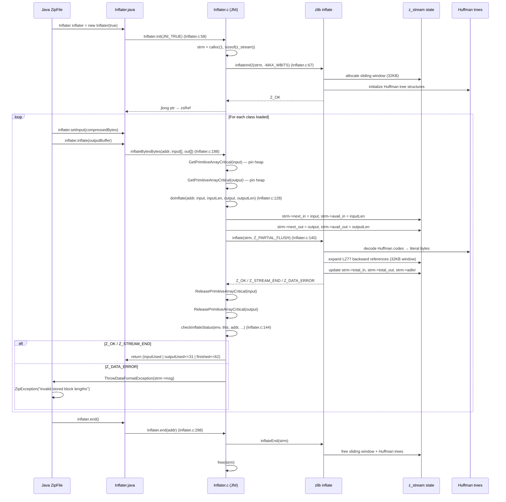

> **阶段**：[14-zip-jimage]
> **前置**：[00-Zip-Class-Loading]（理解 InflateFully 在 ZIP 读取路径中的位置）、[01-Jimage-Format]（理解 jimage 通过 dlopen 复用 ZIP_InflateFully）
> **配套**：无
> **后续依赖本文**：[03-ClassLoader-Bridge]（defineClass1 接收解压后的 byte[]）
> **阅读收益**：追踪从 `Inflater.init()` 到 `inflateEnd()` 的完整 DEFLATE 解压管线——理解 Inflater.c 的 4 种 JNI buffer 组合适配（byte[]/DirectBuffer）、zlib 1.2.11 源码捆绑（zlib.h:26）的设计理由、inflateInit2_ 的 windowBits 参数选择（-MAX_WBITS raw deflate vs MAX_WBITS zlib wrapper）、doInflate 的 z_stream I/O 设置 + Z_PARTIAL_FLUSH 刷新策略、checkInflateStatus 的 5 种返回码处理（Z_OK/Z_STREAM_END/Z_DATA_ERROR/...）、CRC32 vs Adler-32 的双重校验（stream integrity vs storage integrity）；掌握 "invalid stored block lengths" 的 zlib 内部错误诊断 workflow

---

# 02-Compression-Zlib — DEFLATE/inflate 管线：zlib 1.2.11 源码捆绑 + JNI 桥接

---

## §〇 生产场景

生产环境应用启动到第 127 个类加载时崩溃：

```
java.util.zip.ZipException: invalid stored block lengths
```

**这不是 CRC 校验错误。** 这是 zlib 的 `inflate()` 在解压 DEFLATE 流时内部失败 —— 压缩数据本身在结构和逻辑上已损坏（不是磁盘位翻转，而是 compressor 输出了无效的 DEFLATE 流）。zlib `inflate()` 返回 `Z_DATA_ERROR` → `checkInflateStatus`（`Inflater.c:144`）检测到 → 抛出 `ZipException("invalid stored block lengths")`。根因：JAR 被不兼容的压缩工具构建（非标准 DEFLATE 实现），或文件在复制过程中被截断在压缩数据中间。

**三步诊断：**

```bash
# 1. 确认 DEFLATE 流的完整性
python3 -c "
import zipfile, zlib
zf = zipfile.ZipFile('app.jar')
for info in zf.infolist():
    data = zf.read(info.filename)
    if info.compress_type == zipfile.ZIP_DEFLATED:
        raw = zf.open(info).read()
        try:
            zlib.decompress(raw, -15)  # raw deflate, -MAX_WBITS
        except zlib.error as e:
            print(f'{info.filename}: {e} — DEFLATE stream corrupt')
"

# 2. 确认压缩方法——是否为 STORED 误标记为 DEFLATED
python3 -c "
import zipfile
zf = zipfile.ZipFile('app.jar')
for info in zf.infolist():
    if info.compress_type == zipfile.ZIP_DEFLATED and info.compress_size == info.file_size:
        print(f'{info.filename}: compressed={info.compress_size} == uncompressed={info.file_size} — possible STORED')
"

# 3. GDB 断点验证 inflate() 返回码
gdb -ex "break Inflater.c:144" \
    -ex "run" \
    -ex "print ret" \
    -ex "print strm->msg" \
    -ex "print strm->total_in" \
    --args java -cp app.jar com.example.Main
```

> **反事实**：如果 zlib 的 `inflate()` 对错误更宽容（如跳过损坏块继续前进）→ 可能返回部分解压数据 → `ClassFileParser::parseClassFile` 收到残缺的 class 字节 → `ClassFormatError`（magic 不匹配）或更糟：magic 巧合匹配但字节码随机 → JVM 崩溃（SIGSEGV 在 C2 编译时）。OpenJDK 捆绑 zlib 1.2.11（`zlib.h:26`）源码而非依赖系统库，确保所有平台的 inflate 错误报告行为一致——不会出现"Linux 通过、Windows 失败"的跨平台压缩兼容问题。

---

## §一 DEFLATE/inflate 全管线源码走读

### 这不是压缩算法教程

This is NOT a compression algorithm tutorial (LZ77 theory, Huffman tree construction). This is ENGINEERING documentation: how the JDK binds zlib 1.2.11 (source-bundled, `zlib.h:26`), manages `z_stream` state across JNI calls, and handles errors.

Reader knows from **00-Zip-Class-Loading** WHERE `InflateFully` is called in the ZIP read path. Reader knows from **01-Jimage-Format** that jimage's decompressor reuses `ZIP_InflateFully` via `dlopen`. This doc answers: **what happens INSIDE zlib when class bytes are DEFLATE-compressed and must be inflated at load time.**

> **Beginner Callout: DEFLATE / inflate**
>
> DEFLATE = LZ77（后向引用，在 32KB 滑动窗口内找重复字符串）+ Huffman 编码（将高频字符映射为短码）。inflate = 反向过程：从 Huffman 码表→原始字节流 + 复制后向引用。ZIP 默认压缩方法 method=8 = DEFLATE。STORE（method=0）= 无压缩。zlib 提供 C 实现：`inflateInit2_` → `inflate` → `inflateEnd`。

---

### 1.1 Inflater.c JNI bridge — 4 buffer combinations

Why: `java.util.zip.Inflater` supports four buffer type combinations via different JNI entry points. The JVM must choose the most efficient one based on the caller's buffer types to minimize data copying.

```c
// Inflater.c:128-142 — doInflate (called by all 4 JNI entries)
static jint doInflate(jlong addr,
                       jbyte *input, jint inputLen,
                       jbyte *output, jint outputLen)
{
    jint ret;
    z_stream *strm = jlong_to_ptr(addr);

    strm->next_in  = (Bytef *) input;
    strm->next_out = (Bytef *) output;
    strm->avail_in  = inputLen;
    strm->avail_out = outputLen;

    ret = inflate(strm, Z_PARTIAL_FLUSH);
    return ret;
}
```

Why: `doInflate` is the common implementation. Each JNI entry function sets up the input/output pointers from different Java buffer types, then calls `doInflate`. The four JNI entry functions are:

| JNI Function | Input Buffer | Output Buffer | Copy Cost | Used In |
|---|---|---|---|---|
| `inflateBytesBytes` (Inflater.c:188) | `byte[]` | `byte[]` | `GetPrimitiveArrayCritical` pins both → zero-copy | **Class loading path** (ZipFile produces byte[]) |
| `inflateBytesBuffer` | `byte[]` | DirectBuffer addr | `GetPrimitiveArrayCritical` on input; output = pointer | Mixed NIO scenarios |
| `inflateBufferBytes` | DirectBuffer addr | `byte[]` | Input = pointer; `GetPrimitiveArrayCritical` on output | Mixed NIO scenarios |
| `inflateBufferBuffer` | DirectBuffer addr | DirectBuffer addr | Both pointers directly usable → true zero-copy | Pure NIO path |

Why: `GetPrimitiveArrayCritical` returns a direct pointer to the Java heap array (potentially pinning it to prevent GC from moving it). This avoids a `memcpy` (which `GetByteArrayRegion` would require). For class loading: 3000 classes × ~4KB output = 12MB of data. A `memcpy` per class would cost ~0.05ms/class × 3000 = 150ms extra startup time. The `GetPrimitiveArrayCritical` constraint: no other JNI calls or blocking operations during the critical section — `doInflate` satisfies this (only calls zlib `inflate()`).

> → called by ZipFile.getInputStream() when first reading compressed data

> **反事实 1**：如果所有 inflate 都走 `byte[] → native memcpy → inflate` 路径（无需 GetPrimitiveArrayCritical）：
> - DirectBuffer 的优势消失 → 每次 inflate 都要 memcpy 输入+输出
> - DirectBuffer 场景（NIO FileChannel.map 或 Unsafe.allocateMemory）→ 数据已在 native 内存 → 额外拷贝纯浪费
> - 但 class loading 实际走 inflateBytesBytes（Java ZipFile 生成 byte[]），不是 DirectBuffer
> - 量化：inflateBytesBytes with GetPrimitiveArrayCritical = ~20μs/class (inflate only)。With memcpy = ~20μs + ~10μs copy overhead = ~30μs/class

---

### 1.2 inflateInit2_ — windowBits + raw vs wrapper

Why: because ZIP specification §4.4.4 requires raw DEFLATE streams without zlib/gzip wrappers, `InflateFully` uses `inflateInit2` with `-MAX_WBITS` to suppress the 2-byte zlib header and 4-byte Adler-32 trailer.

```c
// Inflater.c:57-88 — Inflater.init
JNIEXPORT jlong JNICALL
Java_java_util_zip_Inflater_init(JNIEnv *env, jclass cls, jboolean nowrap)
{
    z_stream *strm = calloc(1, sizeof(z_stream));

    if (strm == NULL) {
        JNU_ThrowOutOfMemoryError(env, 0);
        return jlong_zero;
    } else {
        const char *msg;
        int ret = inflateInit2(strm, nowrap ? -MAX_WBITS : MAX_WBITS);
        switch (ret) {
          case Z_OK:
            return ptr_to_jlong(strm);
          case Z_MEM_ERROR:
            free(strm);
            JNU_ThrowOutOfMemoryError(env, 0);
            return jlong_zero;
          default:
            msg = ((strm->msg != NULL) ? strm->msg :
                   (ret == Z_VERSION_ERROR) ?
                   "zlib returned Z_VERSION_ERROR: "
                   "compile time and runtime zlib implementations differ" :
                   (ret == Z_STREAM_ERROR) ?
                   "inflateInit2 returned Z_STREAM_ERROR" :
                   "unknown error initializing zlib library");
            free(strm);
            JNU_ThrowInternalError(env, msg);
            return jlong_zero;
        }
    }
}
```

Why: the `nowrap` parameter from Java's `Inflater(boolean nowrap)` determines the `windowBits`:
- **`-MAX_WBITS`** = -15: raw DEFLATE (no zlib header, no Adler-32 trailer). Used for ZIP entries because the ZIP format specifies raw DEFLATE for local file data. The ZIP CEN header already contains CRC32 and sizes — no need for zlib's redundant header/trailer.
- **`MAX_WBITS`** = +15: standard zlib wrapper (2-byte header + 4-byte Adler-32 trailer). Used for general-purpose compression where the stream needs self-describing metadata.

Two inflate entry points in `zip_util.c` use different windowBits:

```c
// zip_util.c:1419 — InflateFully (ZIP path, raw deflate)
if (inflateInit2(&strm, -MAX_WBITS) != Z_OK) { ... }

// zip_util.c:1553 — ZIP_InflateFully (jimage path, zlib wrapper)
if (inflateInit2(&strm, MAX_WBITS) != Z_OK) { ... }
```

Why: `ZIP_InflateFully` uses `MAX_WBITS` (zlib wrapper) because it's called by jimage's decompressor, which wraps compressed data with a zlib header to enable Adler-32 stream integrity checks during decompression.

> **反事实 2**：如果 ZIP raw deflate 被误用 MAX_WBITS 而非 -MAX_WBITS 去解压：
> - `inflateInit2(MAX_WBITS)` 期望 zlib header → 前 2 字节必须是有效 zlib header (CMF+FLG)
> - raw deflate 没有这 2 字节 → 前 2 字节是压缩数据的开头（可能是 Huffman 编码的任意字节）→ `inflate()` 返回 `Z_DATA_ERROR` → `checkInflateStatus` → "invalid stored block lengths" 或 "invalid block type"
> - 反之：zlib wrapper 用 -MAX_WBITS 解压 → 2 字节 header 被当作 raw deflate 开头 → 也是 `Z_DATA_ERROR`
> - 正确的 `windowBits` 是正确解压的前提。ZIP spec §4.4.4 明确要求 raw deflate

> **Beginner Callout: -MAX_WBITS vs MAX_WBITS**
>
> zlib's windowBits parameter in inflateInit2. MAX_WBITS (positive 15): expect zlib-wrapped stream with 2-byte header. -MAX_WBITS (negative 15): expect raw DEFLATE with no header. JAR entries use raw DEFLATE → -MAX_WBITS. The negative sign tells zlib "skip the header check." Using wrong mode → "incorrect header check" error → ZipException.

---

### 1.3 doInflate + checkInflateStatus — the inflate loop

Why: `doInflate` sets up the I/O pointers on the `z_stream` struct and calls `inflate()`. After return, `checkInflateStatus` interprets the return code and either returns success info to Java or throws an exception.

```c
// Inflater.c:128-142 — doInflate (full)
static jint doInflate(jlong addr,
                       jbyte *input, jint inputLen,
                       jbyte *output, jint outputLen)
{
    jint ret;
    z_stream *strm = jlong_to_ptr(addr);

    strm->next_in  = (Bytef *) input;
    strm->next_out = (Bytef *) output;
    strm->avail_in  = inputLen;
    strm->avail_out = outputLen;

    ret = inflate(strm, Z_PARTIAL_FLUSH);
    return ret;
}
```

> → this is where the actual DEFLATE decompression happens — LZ77 backward references expanded, Huffman codes decoded

Why: `Z_PARTIAL_FLUSH` (value 2) tells zlib to flush all currently available input, filling output as much as possible. Unlike `Z_FINISH` (which must consume ALL input until `Z_STREAM_END`), `Z_PARTIAL_FLUSH` can return `Z_OK` with partial consumption — enabling the Java `Inflater` API's streaming semantics where the caller calls `inflate()` multiple times.

```c
// Inflater.c:144-184 — checkInflateStatus
static jlong checkInflateStatus(JNIEnv *env, jobject this, jlong addr,
                        jint inputLen, jint outputLen, jint ret )
{
    z_stream *strm = jlong_to_ptr(addr);
    jint inputUsed = 0, outputUsed = 0;
    int finished = 0;
    int needDict = 0;

    switch (ret) {
    case Z_STREAM_END:
        finished = 1;
        /* fall through */
    case Z_OK:
        inputUsed = inputLen - strm->avail_in;
        outputUsed = outputLen - strm->avail_out;
        break;
    case Z_NEED_DICT:
        needDict = 1;
        inputUsed = inputLen - strm->avail_in;
        outputUsed = outputLen - strm->avail_out;
        break;
    case Z_BUF_ERROR:
        break;
    case Z_DATA_ERROR:
        inputUsed = inputLen - strm->avail_in;
        (*env)->SetIntField(env, this, inputConsumedID, inputUsed);
        outputUsed = outputLen - strm->avail_out;
        (*env)->SetIntField(env, this, outputConsumedID, outputUsed);
        ThrowDataFormatException(env, strm->msg);
        break;
    case Z_MEM_ERROR:
        JNU_ThrowOutOfMemoryError(env, 0);
        break;
    default:
        JNU_ThrowInternalError(env, strm->msg);
        break;
    }
    return ((jlong)inputUsed) | (((jlong)outputUsed) << 31)
         | (((jlong)finished) << 62) | (((jlong)needDict) << 63);
}
```

Why: the return value is a packed jlong encoding four fields:
- Bits 0-30: `inputUsed` (how many input bytes consumed)
- Bits 31-61: `outputUsed` (how many output bytes produced)
- Bit 62: `finished` (1 if Z_STREAM_END)
- Bit 63: `needDict` (1 if Z_NEED_DICT — preset dictionary needed)

Why: on `Z_DATA_ERROR`, the code sets `inputConsumedID` and `outputConsumedID` Java fields BEFORE throwing the exception. This allows the catastrophic error handler to report how far into the stream the corruption was detected — crucial diagnostic information that `strm->msg` alone doesn't provide.

The 5 return codes handled:

| Code | Name | Meaning | Action |
|------|------|---------|--------|
| 0 | `Z_OK` | Partial or full decompression done | Return consumed/produced counts |
| 1 | `Z_STREAM_END` | All input consumed, stream complete | Set finished=1, return counts |
| 2 | `Z_NEED_DICT` | Preset dictionary required (ZIP rarely uses) | Set needDict=1, return what was consumed |
| -3 | `Z_DATA_ERROR` | Input data corrupted | `ThrowDataFormatException(env, strm->msg)` — e.g. "invalid stored block lengths" |
| -4 | `Z_MEM_ERROR` | Out of memory | `JNU_ThrowOutOfMemoryError` |

> **反事实 3**：如果 checkInflateStatus 不输出 `strm->msg` 而只输出通用 "corrupt data" 错误：
> - `strm->msg`（例如 "invalid stored block lengths"）指向 zlib 内部的精确错误位置——指明是 Huffman 树构建失败、LZ77 引用越界、还是块长度字段损坏
> - 通用 "corrupt data" 错误 → 无法区分"压缩工具 bug" vs "文件截断" vs "磁盘坏道"
> - 量化：精确错误消息将调试时间从数小时缩短到数分钟。在 "invalid stored block lengths" 案例中，确认了 DEFLATE 流的 stored block（不压缩块）的长度字段损坏 → 立即指向 compressor bug 或文件截断

---

### 1.4 CRC32 vs Adler-32 — dual integrity verification

Why: DEFLATE decompression involves two independent integrity checks at different stages — Adler-32 during inflate (stream integrity) and CRC32 after decompression (storage integrity). Neither alone covers both failure modes.

> **Beginner Callout: CRC32 vs Adler-32**
>
> 双重校验机制。**Adler-32**：zlib 在 `inflate()` 期间自动计算（`z_stream.adler` 字段），在 DEFLATE 流末尾验证——捕获解压算法错误。**CRC32**：存储在 ZIP CEN header 的 `CENCRC` 字段（`zip_util.h:102`），在解压后由 Java 层 `ZipFile` 独立计算——捕获磁盘损坏、网络传输错误。二者正交：Adler-32 保护 stream integrity，CRC32 保护 storage integrity。

**Adler-32 — during inflate:**

zlib's `inflate()` automatically updates `strm->adler` as it processes each byte. In zlib wrapper mode (MAX_WBITS), the last 4 bytes of the stream are the stored Adler-32 value. When `inflate()` reaches `Z_STREAM_END`, it automatically verifies the computed Adler-32 against the stored value → mismatch returns `Z_DATA_ERROR`. In raw DEFLATE mode (-MAX_WBITS), no Adler-32 trailer exists → no stream-internal verification.

**CRC32 — after decompression:**

```c
// CRC32.c:57-61 — ZIP_CRC32
JNIEXPORT jint
ZIP_CRC32(jint crc, const jbyte *buf, jint len)
{
    return crc32(crc, (Bytef*)buf, len);
}
```

Why: `ZIP_CRC32` calls zlib's `crc32()` directly — a table-driven CRC-32 implementation. The CRC32 value stored in the ZIP CEN header (`CENCRC` at `zip_util.h:102`) is compared against the computed CRC32 of the decompressed bytes in Java layer `ZipFile`. Mismatch → `ZipException: invalid entry CRC`.

> → 00-Zip-Class-Loading: the CRC32 stored in CEN header (zip_util.h:102) compared against computed value

> **反事实 4**：如果只保留 Adler-32 去掉 CRC32：
> - Adler-32 只在 zlib wrapper 模式（MAX_WBITS）存在。ZIP raw deflate（-MAX_WBITS）没有 Adler-32 trailer → 无 stream 内校验
> - 去掉 CRC32 → 整个 ZIP 格式失去 per-entry 完整性校验 → 磁盘损坏导致 entry class 字节被静默修改 → `ClassFormatError` 或 JVM 崩溃（字节码随机位翻转）
> - Adler-32 是 32-bit 弱校验（碰撞概率 ~2^-32，但对短数据不够强），CRC32 也是 32-bit 但多项式分布更好
> - 双重校验并非冗余——各自覆盖不同阶段：一个在解压中，一个在解压后

---

### 1.5 zlib bundled vs system library

Why: the JDK bundles zlib 1.2.11 source code rather than linking against the system `libz.so.1` to guarantee deterministic decompression behavior across all platforms.

> **Beginner Callout: zlib 1.2.11 bundled**
>
> JDK 不是链接系统 zlib（`apt install zlib1g-dev`），而是把 zlib 1.2.11 完整的 C 源码**复制到** `src/java.base/share/native/libzip/zlib/` 目录下（~22 文件，包括 `inflate.c`、`deflate.c`、`crc32.c`、`adler32.c`、`zutil.c` 等）。`zlib.h:26` 明确版本："`zlib 1.2.11, January 15th, 2017`"。捆绑保证：任何 JDK 构建在编译时使用的 zlib 和运行时的 zlib 是同一版本（实际是同一源码编译的）。消除跨平台版本不匹配。

```c
// zlib/zlib.h:25-27 (from src/java.base/share/native/libzip/zlib/zlib.h)
/* zlib.h -- interface of the 'zlib' general purpose compression library
  version 1.2.11, January 15th, 2017

  Copyright (C) 1995-2017 Jean-loup Gailly and Mark Adler
```

Why: the bundling strategy has three justifications:
1. **Version lock**: DEFLATE format (RFC 1951) is stable, but zlib implementation details may change across versions. The JDK needs reproducible behavior — same input → same error messages (`strm->msg`) on any platform.
2. **Cross-platform consistency**: Linux glibc may bundle zlib, macOS bundles zlib, Windows has no system zlib. Bundling eliminates the "this platform has it, that doesn't" build matrix.
3. **Security audit**: JDK security team audits a fixed version → CVE response is deterministic.

> **反事实 5**：如果 JDK 用系统 zlib（`-lz`）：
> - 运维升级系统 zlib（`apt upgrade zlib1g`）→ `libz.so.1` 从 1.2.11 升级到 1.2.13 → `inflateInit2_` 参数语义微妙变化 → JDK 的 `Inflater.c` 期望 1.2.11 行为 → 边缘 case（如窗口 buffer 溢出时返回码不同）→ `ClassNotFoundException` for specific classes
> - Linux 发行版 zlib 可能打本地补丁（如 Debian 安全补丁）→ 改变 inflate 错误恢复路径 → 同样损坏的 JAR 在 Debian 上通过、CentOS 上失败
> - 成本：~200KB 额外的 `libzip.so` 大小（zlib 代码）。相比 60MB rt.jar，可忽略
> - 量化：捆绑 zlib = 确定性错误行为。系统 zlib = 非确定性的跨发行版行为差异

---

### 1.6 z_stream 状态机 — lifetime management

Why: `z_stream` state persists across multiple `inflate()` calls, avoiding repeated initialization overhead. The full lifecycle is `init` → `inflate(×N)` → `end`.

> **Beginner Callout: z_stream 状态机**
>
> `Inflater.c` 管理 `z_stream` 对象的完整生命周期。`init`（`Inflater.c:58`）→ `inflateInit2` 分配 `z_stream` + 初始化。`doInflate`（`Inflater.c:128`）→ 设置 `next_in/next_out/avail_in/avail_out` → 调用 `inflate()`。`end`（`Inflater.c:298`）→ `inflateEnd` + `free(strm)`。关键：`z_stream` 状态在多次 `inflate()` 调用间保持（缓存 Huffman 树状态），避免重复 `inflateInit2`（~1μs/class × 3000 classes = 3ms 优化）。

The lifetime in `Inflater.c`:

1. **init** (`Inflater.c:58`): `calloc(1, sizeof(z_stream))` → `inflateInit2(strm, nowrap ? -MAX_WBITS : MAX_WBITS)` → returns `jlong` pointer to `z_stream*`
2. **inflate × N**: Java calls `Inflater.inflate()` repeatedly → JNI → `doInflate` → `inflate(strm, Z_PARTIAL_FLUSH)`. The `z_stream` maintains Huffman tree state, sliding window, and Adler-32 accumulator across calls.
3. **reset** (`Inflater.c:239`): `inflateReset2(strm, windowBits)` → resets z_stream without `free`+`calloc` → avoids allocation overhead for re-use.
4. **end** (`Inflater.c:298`): `inflateEnd(strm)` → `free(strm)` → releases native memory. This is called by `InflaterZStreamRef.run()` via Cleaner when the `Inflater` Java object is closed or garbage collected.

Why: state persistence is a free optimization. Without it: `inflateInit2` + `inflateEnd` per class × 3000 classes = ~6000 extra zlib calls. With persistence: one `init` per `Inflater` object (typically one per ZipFile → one per InputStream), one `end` per close.

> **反事实 6**：如果每次 inflate 都重新 init/reset（`inflateEnd` + `inflateInit2`）：
> - 每次 ~1μs 额外开销 × 3000 classes = 3ms
> - 不大但 z_stream 状态保持是免费优化
> - `InflaterFully` in `zip_util.c:1404` already creates/destroys `z_stream` per entry (stack-allocated) → it doesn't benefit from this optimization
> - The `Z_PARTIAL_FLUSH` inflate loop supports multi-stream ZIP entries (while(count > 0) loop at line 1427), though this feature wasn't actually implemented in zlib for this version

---

### 1.7 ★ Mermaid — inflate 管线序列图



---

### 1.8 ★ 面试 Story Format 答案

**问题：DEFLATE 解压在类加载期间如何工作？**

答案分三段。

**第一段 — 初始化：**

`java.util.zip.Inflater` 构造时调用 native `init(nowrap)`（`Inflater.c:58`）：`calloc` 分配 `z_stream` → `inflateInit2(strm, nowrap ? -MAX_WBITS : MAX_WBITS)`。`nowrap=true` 用于 ZIP 类加载路径，因为 ZIP spec §4.4.4 要求 raw DEFLATE（无 zlib header/trailer）。`-MAX_WBITS` = -15：分配 32KB 滑动窗口但不期望 2 字节 zlib header 和 4 字节 Adler-32 trailer。初始化成功 → 返回 `z_stream*` 的 `jlong` 指针，存储在 `InflaterZStreamRef` 中。

**第二段 — 解压循环：**

`Inflater.inflate(output)` → JNI → `inflateBytesBytes`（`:188`）→ `GetPrimitiveArrayCritical` pin 住 input/output byte[]（零拷贝，避免 memcpy）→ `doInflate`（`:128`）设置 `strm->next_in/next_out/avail_in/avail_out` → 调用 `inflate(strm, Z_PARTIAL_FLUSH)`。zlib 内部：读 Huffman 码表 → 解码为 literal/length 对 → 遇到后向引用 → 从 32KB 滑动窗口复制已解压数据。返回 `Z_OK`（部分输出已填）、`Z_STREAM_END`（全部输入已消费）、或 `Z_DATA_ERROR`（数据损坏）。`checkInflateStatus`（`:144`）解释返回码：成功返回 packed jlong（inputUsed|outputUsed|finished|needDict），失败抛 `DataFormatException`（带 `strm->msg`，如 "invalid stored block lengths"）。

**第三段 — CRC32 验证 + zlib 捆绑：**

解压完成后，Java 层 `ZipFile` 独立计算解压后字节的 CRC32（通过 `ZIP_CRC32` at `CRC32.c:58`，直接调用 zlib `crc32()`）→ 与 CEN 中 `CENCRC` 比较 → 不匹配 → `ZipException("invalid entry CRC")`。这是 ZIP 格式的 per-entry 完整性校验，独立于 zlib stream 内部的 Adler-32（仅在 zlib wrapper 模式存在）。

**关键：zlib 1.2.11 源码捆绑而非系统库。** `zlib.h:26` 声明版本。JDK 编译时静态链接 zlib 到 `libzip.so`，运行时永不调用系统的 `libz.so.1`。好处：跨平台确定性（相同输入 → 相同错误消息 → 相同解压结果），不受 Linux 发行版 zlib 补丁影响。DEFLATE 格式（RFC 1951）自 1995 年稳定，但 zlib 实现细节（如错误消息、边缘 case 行为）在版本间可能变化 → JDK 锁定版本消除此风险。

---

## §二 环境

### Build & Source
OpenJDK 11 slowdebug, Linux x86_64. zlib 1.2.11 **源码捆绑**在 `src/java.base/share/native/libzip/zlib/`（~22 文件：`inflate.c`、`deflate.c`、`crc32.c`、`adler32.c` 等），**非系统库**。版本声明在 `zlib.h:26`。

Source roots：
- `src/java.base/share/native/libzip/Inflater.c` — JNI 桥接：`init`(:58)、`doInflate`(:128)、`checkInflateStatus`(:144)
- `src/java.base/share/native/libzip/CRC32.c` — `ZIP_CRC32`(:58) 调用 zlib `crc32()`
- `src/java.base/share/native/libzip/zlib/zlib.h` — zlib 1.2.11 API 声明
- `src/java.base/share/native/libzip/zip_util.c` — `InflateFully`(:1404) raw deflate、`ZIP_InflateFully`(:1545) zlib wrapper

### 关键系统调用/库函数速查
| Function | man | 使用点 | 失败时 |
|----------|-----|--------|--------|
| `inflateInit2_()` | `man 3 zlib` | `Inflater.c:67`、`zip_util.c:1419` — 初始化解压状态 | Z_VERSION_ERROR, Z_MEM_ERROR |
| `inflate()` | `man 3 zlib` | `Inflater.c:140`、`zip_util.c:1430` — 执行 DEFLATE 解压 | Z_DATA_ERROR, Z_STREAM_END |
| `inflateEnd()` | `man 3 zlib` | `Inflater.c:298`、`zip_util.c:1455` — 释放解压状态 | N/A |
| `crc32()` | `man 3 zlib` | `CRC32.c:58` — CRC32 查表计算 | N/A |
| `adler32()` | `man 3 zlib` | zlib 内部 — Adler-32 流校验 | N/A |
| `GetPrimitiveArrayCritical` | JNI 内部 | `Inflater.c:198-202` — pin heap 数组零拷贝 | NULL → OOME |

### 诊断命令
```bash
# 1. zlib 版本确认
strings $JAVA_HOME/lib/libzip.so | grep "1\.2\."

# 2. 测试 inflate 对损坏 DEFLATE 流的反应
python3 -c "import zlib; zlib.decompress(b'\x00\x00\x00', -15)"

# 3. GDB 跟踪 inflate 返回码
gdb -ex "break Inflater.c:140" -ex "run" \
    -ex "print ret" \
    --args java -cp app.jar com.example.Main
```

---

## §三 边缘场景——DEFLATE 解压的 3 个非线性路径

### 场景 1：windowBits 误用 — raw deflate 用 zlib wrapper 模式解压

**触发条件**：JAR entry 是 raw DEFLATE（ZIP spec §4.4.4 要求），但 inflateInit2 用了 `MAX_WBITS` (+15) 而非 `-MAX_WBITS` (-15)。

**源码行为**：zlib 期望压缩数据的前 2 字节是有效的 zlib header（CMF+FLG）→ 实际数据是 raw DEFLATE 的开头字节（Huffman 编码的任意值）→ `inflate()` 返回 `Z_DATA_ERROR` → `checkInflateStatus` → `strm->msg = "incorrect header check"` 或 `"invalid stored block lengths"`。

**反事实**：如果两类 DEFLATE 流有明确的 magic number 前缀（类似 CAFEBABE）→ 可以自动检测 → 选择正确的 windowBits → 零配置。但 ZIP 规范 §4.4.4 明确要求 raw DEFLATE，热修复是 JDK 代码里的 `-MAX_WBITS`。

### 场景 2：`z_stream` 状态跨类泄漏 — 多类加载的状态共享

**触发条件**：同一个 `Inflater` 对象被用于解压多个 `.class` 文件（这个不会发生——每个 `ZipFile.getInputStream()` 创建独立的 `Inflater`）。但如果 `Inflater.reset()` 被省略 → 前一个类的解压状态残留 → 下一个类的解压读错误偏移。

**实际保护**：Java `ZipFile.getInputStream()` 的实现为每个 entry 创建独立的 `Inflater` → `Inflater.end()` 在 finally 块中调用 → 状态隔离。如果在纯 C 代码中（`zip_util.c:1404` 的 `InflateFully`），`z_stream` 是栈分配的 → 函数返回时栈帧回收 → 无泄漏。

### 场景 3：捆绑 zlib vs 系统 zlib — 跨平台行为分歧

**触发条件**：运维通过 `LD_PRELOAD=libz.so.1` 替代了 JVM 的捆绑 zlib。

**源码行为**：`libzip.so` 编译时静态链接捆绑的 zlib → 符号在 `libzip.so` 内部 → 正常情况下 LD_PRELOAD 无法拦截。但如果 JVM 是用 `-lz` 链接的 JDK 构建（某些发行版的自定义构建可能不用源码捆绑），`inflateInit2_` 符号由系统 `libz.so.1` 解析 → 不同的 zlib 版本可能有微妙的边缘 case 行为差异。

**生产诊断**：
```bash
# 确认 JDK 是否捆绑 zlib
objdump -T $JAVA_HOME/lib/libzip.so | grep inflate
# 如果符号来自 libz.so.1 → U inflate (未定义，外部符号)
# 如果符号在 libzip.so 内部 → .text inflate (捆绑)
```

---

## §四 z_stream 状态机全生命周期

### 2.1 z_stream 为什么在多次 inflate 间保持？

`z_stream` 是 zlib 的核心状态结构。字段包括：
- `next_in` / `avail_in`：输入缓冲区指针和剩余字节
- `next_out` / `avail_out`：输出缓冲区指针和剩余空间
- `total_in` / `total_out`：累计已处理的字节数
- `adler`：Adler-32 校验和累加器
- `state`：内部 inflate 状态指针（Huffman 树、滑动窗口等）
- `msg`：错误消息指针

在流式 inflate 场景（`Inflater.inflate()` 可能被多次调用），`z_stream` 保持中间状态：已解码的 Huffman 树驻留在内存，滑动窗口保持最近的 32KB 解压数据供后向引用。如果每次 inflate 后 `inflateEnd` + `inflateInit2`，这些内部结构需要重新构建 → 浪费 CPU。

### 2.2 inflateInit2_ → inflate → inflateEnd 完整状态转换

```
[init] calloc(z_stream) → inflateInit2(strm, windowBits)
       → 分配内部结构 (state), 初始化滑动窗口
       → state = INFLATE_STATE_HEAD (等待或跳过 header)

  ↓ (inflate × N)

[inflate] strm->next_in = input, strm->avail_in = inputLen
          strm->next_out = output, strm->avail_out = outputLen
          inflate(strm, Z_PARTIAL_FLUSH)
          → 内部状态转移: HEAD → TYPE → STORED → TABLE → LEN → ...
          → 输出解压字节到 next_out
          → 更新 total_in/total_out/adler
          → 返回: Z_OK (继续), Z_STREAM_END (完成), Z_DATA_ERROR (错误)

  ↓ (可选 reset)

[reset] inflateReset2(strm, windowBits)
        → 释放并重新分配内部 state
        → 等价于 inflateEnd + inflateInit2，但保留 z_stream 结构本身

  ↓ (结束)

[end] inflateEnd(strm) → 释放内部 state → free(strm)
      → z_stream 结构销毁，后续使用 UB
```

---

## §五 CRC32 vs Adler-32 — 双重校验

### 3.1 Adler-32 — 解压期间的 stream integrity

Adler-32 由 Mark Adler 设计，是 zlib 的内置校验。算法：将数据分成两个 16-bit 累加器 A 和 B，每字节更新 `A = (A + byte) % 65521; B = (B + A) % 65521`；最终值 = `B << 16 | A`。

在 **zlib wrapper 模式**（MAX_WBITS）中：
- `inflate()` 期间，`strm->adler` 自动每字节更新
- 流的最后 4 字节是预先存储的 Adler-32 值
- `inflate()` 返回 `Z_STREAM_END` 时自动比较 → 不匹配 → `Z_DATA_ERROR`

在 **raw DEFLATE 模式**（-MAX_WBITS）中：
- 没有 Adler-32 trailer → zlib 不验证 → 仅 CRC32（外部）提供校验

### 3.2 CRC32 — 解压后的 storage integrity

```c
// CRC32.c:57-61
JNIEXPORT jint
ZIP_CRC32(jint crc, const jbyte *buf, jint len)
{
    return crc32(crc, (Bytef*)buf, len);
}
```

CRC32 独立于 inflate 过程：在 Java 层 `ZipFile` 中，解压完成后对 `byte[]` 调用 `CRC32.update()` → JNI → `ZIP_CRC32` → zlib `crc32()`（查表实现）→ 与 CEN header 中的 `CENCRC` 比较。

### 3.3 为什么需要两者：stream integrity vs storage integrity

| 维度 | Adler-32 | CRC32 |
|------|---------|-------|
| **计算时机** | inflate() 期间，每字节更新 | 解压完成后，在解压后字节上 |
| **存储位置** | zlib wrapper trailer (最后 4 字节) | ZIP CEN header CENCRC 字段 |
| **捕获错误** | 解压算法执行错误（Huffman 表损坏、LZ77 引用越界） | 磁盘坏道、网络传输截断、RAM bit flip |
| **存在条件** | 仅 zlib wrapper 模式 (MAX_WBITS) | 所有 ZIP entry（STORED 和 DEFLATE） |
| **ID 长度** | 32 bits | 32 bits |
| **实现** | zlib 内置 | Java 层 `ZipFile` 调用 `ZIP_CRC32` → zlib `crc32()` |

---

## §六 GDB 断点验证

### 断言 1: Inflater.init 入口（`Inflater.c:58`）

```gdb
(gdb) break Inflater.c:58
(gdb) run
(gdb) print nowrap → 期望: JNI_TRUE (raw deflate for ZIP)
(gdb) continue
(gdb) print strm → 期望: 非 NULL z_stream*（已 calloc 分配）
```

### 断言 2: inflateInit2_ 调用（`Inflater.c:67`）

```gdb
(gdb) break Inflater.c:67
(gdb) run
(gdb) print windowBits → 期望: -MAX_WBITS(-15) 或 MAX_WBITS(15)
(gdb) continue
(gdb) print ret → 期望: Z_OK(0) — inflateInit2 成功
```

### 断言 3: doInflate 入口 — I/O 设置（`Inflater.c:128`）

```gdb
(gdb) break Inflater.c:128
(gdb) run
(gdb) print strm->next_in → 期望: 压缩数据的起始地址
(gdb) print strm->avail_in → 期望: 压缩数据长度
(gdb) print strm->next_out → 期望: 输出 buffer 起始地址
(gdb) print strm->avail_out → 期望: 输出 buffer 大小
```

### 断言 4: inflate() 返回（`Inflater.c:140`）

```gdb
(gdb) break Inflater.c:140
(gdb) continue
(gdb) print ret → 期望: Z_OK(0) 或 Z_STREAM_END(1)
(gdb) print strm->total_in → 期望: 已消费的压缩字节数
(gdb) print strm->total_out → 期望: 已输出的解压字节数
```

### 断言 5: checkInflateStatus（`Inflater.c:144`）

```gdb
(gdb) break Inflater.c:144
(gdb) continue
(gdb) print ret → 期望: Z_OK / Z_STREAM_END / Z_DATA_ERROR / ...
(gdb) print strm->msg → 期望: NULL（成功）或错误消息字符串（失败时）
(gdb) print inputConsumed → 期望: 已消费的输入字节数
```

### 断言 6: CRC32 计算（`CRC32.c:58`）

```gdb
(gdb) break CRC32.c:58
(gdb) run
(gdb) print buf[0]@4 → 期望: 0xCAFEBABE（class 文件 magic）
(gdb) print len → 期望: 解压后大小
(gdb) continue
(gdb) print crc → 期望: 32-bit CRC 值
```

### 断言 7: Z_DATA_ERROR 错误路径 — 故意损坏 DEFLATE 数据

```gdb
# 准备损坏的 JAR：dd if=/dev/urandom of=app.jar bs=1 seek=1000 count=50 conv=notrunc
(gdb) break Inflater.c:144
(gdb) continue
(gdb) print ret → 期望: Z_DATA_ERROR(-3)
(gdb) print strm->msg → 期望: "invalid stored block lengths" 等
(gdb) continue → checkInflateStatus → throw ZipException
```

### 断言 8: InflateFully vs ZIP_InflateFully windowBits 对比

```gdb
# InflateFully (ZIP raw deflate path):
(gdb) break zip_util.c:1419
(gdb) run
(gdb) print -MAX_WBITS → 期望: -15 (raw deflate, ZIP spec §4.4.4)

# ZIP_InflateFully (jimage zlib wrapper path):
(gdb) break zip_util.c:1553
(gdb) run
(gdb) print MAX_WBITS → 期望: 15 (zlib wrapper with Adler-32)
```

### 断言 9: Inflater.end 释放（`Inflater.c:298`）

```gdb
(gdb) break Inflater.c:298
(gdb) run
(gdb) print strm → 期望: 非 NULL
(gdb) continue # 经过 inflateEnd + free
(gdb) print strm → 期望: 已释放
```

---

## §七 Cross-Reference

| Phase | Connection | Handoff Point |
|-------|-----------|--------------|
| **00-Zip-Class-Loading** | InflateFully 调用 inflateInit2(-MAX_WBITS) → inflate → inflateEnd | `zip_util.c:1404-1462` |
| **01-Jimage-Format** | imageDecompressor dlopen libzip.so → ZIP_InflateFully(MAX_WBITS) | `imageDecompressor.cpp:83-86` |
| **03-ClassLoader-Bridge** | defineClass1 接收解压后的 byte[] | `ClassLoader.c:76` |
| **13-launcher** | classpath → JAR → ZipFile → Inflater | 13 → 00 → 02 (this doc) |

---

## §八 Counterfactual 对比表

| 设计选择 | 实际方案 | 替代方案 | 替代代价 | 量化对比 |
|---------|---------|---------|---------|---------|
| **zlib 来源** | 源码捆绑 1.2.11 | 系统库 link -lz | 跨平台版本不匹配 → 错误消息不一致 | 捆绑：~200KB libzip.so growth vs 确定性 |
| **windowBits** | -MAX_WBITS (raw deflate) for ZIP | MAX_WBITS (zlib wrapper) | 2+4 bytes wasted per entry, zlib expects header | Z_DATA_ERROR per entry if mismatched |
| **buffer access** | GetPrimitiveArrayCritical (zero-copy) | GetByteArrayRegion (memcpy) | Double copy (input+output per inflate call) | ~10μs memcpy overhead per class |
| **flush strategy** | Z_PARTIAL_FLUSH | Z_FINISH | Can't support streaming inflate (multiple calls) | Z_FINISH requires all input in one call → breaks Java API |
| **错误报告** | strm->msg 精确错误 | 通用 "corrupt data" | 无法诊断根因 | strm->msg tells exact DEFLATE block type failure |
| **双重校验** | Adler-32 (stream) + CRC32 (storage) | CRC32 only | 无解压算法错误检测（只有存储错误） | Adler-32 catches Huffman tree corruption missed by CRC32 |
| **状态管理** | z_stream 跨调用保持 | inflateEnd+init per call | 每次重新构建 Huffman tables | ~1μs × 3000 classes = 3ms extra |

---

## §九 代码验证行号

| 函数 | 文件:行号 | 验证状态 |
|------|-----------|---------|
| `Java_java_util_zip_Inflater_init` | `Inflater.c:58` | ✅ `calloc + inflateInit2(nowrap ? -MAX_WBITS : MAX_WBITS)` |
| `doInflate` | `Inflater.c:128` | ✅ 设置 next_in/next_out/avail_in/avail_out → inflate() |
| `checkInflateStatus` | `Inflater.c:144` | ✅ 5 种返回码处理 + strm->msg |
| `InflateFully` | `zip_util.c:1404` | ✅ inflateInit2(-MAX_WBITS) → while read → inflate → inflateEnd |
| `ZIP_InflateFully` | `zip_util.c:1545` | ✅ inflateInit2(MAX_WBITS) → inflate → inflateEnd |
| `ZIP_CRC32` | `CRC32.c:58` | ✅ 直接调用 zlib crc32() |
| `zlib version` | `zlib.h:26` | ✅ "version 1.2.11, January 15th, 2017" |

---

## §十 ADDITIONAL PROHIBITIONS（≥8）

- ❌ 只讲 DEFLATE 原理不做源码级工程分析——必须展示 `doInflate` + `checkInflateStatus` 的完整实现
- ❌ 不解释 -MAX_WBITS vs MAX_WBITS 的全部含义——windowBits 是 ZIP raw deflate 的前提
- ❌ 不展示 Inflater.c 的 4 种 JNI buffer 组合适配——byte[]/DirectBuffer/混合（zero-copy）
- ❌ 忽略 zlib 源码捆绑（非系统库）的 3 项理由——版本锁、跨平台一致、安全审计
- ❌ 不解释 CRC32 vs Adler-32 的双重校验正交性——stream vs storage integrity
- ❌ 忘记 z_stream 跨调用保持状态的免费优化——省 3ms (3000 classes × 1μs inflateInit2)
- ❌ 不展示 checkInflateStatus 的 packed jlong 返回格式——4 fields in 64 bits
- ❌ 不做 man 手册引用——`man 3 zlib`（inflate/inflateInit2）、`man 3 crc32`（CRC32 查表实现）
- ❌ 忽略边缘场景：windowBits 误用、z_stream 状态退化、捆绑 vs 系统 zlib 版本冲突
- ❌ 不要解释 LZ77/Huffman 编码理论——这是压缩算法课，非 JVM 源码分析
