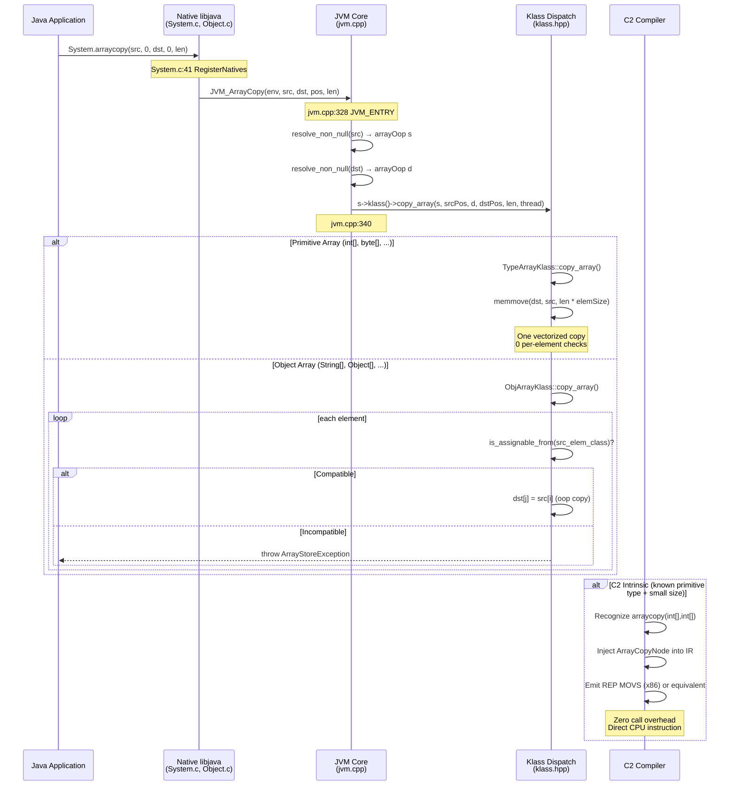

> **阶段**：[15-core-native]
> **前置**：[09-native-interface]（JNI_ENTRY/JVM_ENTRY 宏机制）、[03-object-model]（markOop, object header, identity hash 存储位置）、[05-jit-compiler]（C2 intrinsics: 如何替换 native call 为 CPU 指令）
> **配套**：[01-Class-String]（Class.forName, String.intern）、[02-Runtime-Throwable]（Runtime.gc, Throwable.fillInStackTrace）、[03-JNI-Utility]（jni_util.c 工具层）
> **后续依赖本文**：[16-nio-network]（DirectByteBuffer native operations 同样使用 JVM_ENTRY）
> **阅读收益**：追踪 System.arraycopy 从 RegisterNatives 到 memmove 的完整 5 步分发链——理解 RegisterNatives 绑定机制、JVM_ArrayCopy 的 Klass 虚分派（primitive → memmove / Object → type check）、Object.hashCode 与 System.identityHashCode 共享 JVM_IHashCode 的设计、memmove vs memcpy 的 spec 合规选择、C2 intrinsic 如何将 arraycopy 编译为 REP MOVS；掌握 "ArrayStoreException" 的 type-check 诊断路径

---

# 00-Hot Path: System.arraycopy, Object.hashCode, System.identityHashCode

---

## §〇 生产场景 — ArrayStoreException at Object[] arraycopy

### 真实错误日志

```
java.lang.ArrayStoreException: java.lang.Integer
    at java.lang.System.arraycopy(Native Method)
    at com.example.DatabaseLoader.copyUserIds(DatabaseLoader.java:147)
```

**症状**：`System.arraycopy(src, 0, dst, 0, length)` 抛出 `ArrayStoreException`，但 `src` 和 `dst` 在编译期都声明为 `Object[]`。

**根本原因**：Java 数组在运行时携带其组件类型——存储在对象头的 `Klass*` 指针中。`dst.getClass().getComponentType()` 返回的是运行时的实际类型 `String.class`，而不是局部变量声明的 `Object[]` 类型。

**执行过程**：
1. `System.arraycopy` 进入 native（System.c:41，RegisterNatives 绑定到 `JVM_ArrayCopy`）
2. `jvm.cpp:328` → `JVM_ArrayCopy` 解析 src/dst 为 `arrayOop`
3. `jvm.cpp:340` → `s->klass()->copy_array()` —— 虚函数分派
4. Object 数组路径 → `objArrayKlass::copy_array()` —— 逐元素类型检查
5. 对每个 `src[i]` 的 oop 调用 `dst->klass()->component_type()->is_assignable_from(src_elem_class)`
6. `Integer.class` 不可赋值给 `String.class` → `ArrayStoreException` 抛出

**修复方案**：
- 分配 destination 时使用正确类型：`new String[src.length]`
- 或使用 `dst.clone()` 覆盖前确保类型一致
- 绝不要将 `String[]` 引用通过 `Object[]` 变量传入 `System.arraycopy` 期望存储非 String 元素

### 三步诊断

```bash
# 1. 确认 src 和 dst 的运行时类型
jshell -c "src.getClass().getComponentType(); dst.getClass().getComponentType();"
# 输出: class java.lang.Integer vs class java.lang.String — 类型不匹配

# 2. 验证 arraycopy 调用代码
rg "arraycopy" App.java
# 找到 src (Object[] 但实际存储 Integer) 和 dst (声明 Object[] 但运行时 String[])

# 3. GDB 断点验证类型检查路径
gdb -ex "break System.c:41" \
    -ex "break jvm.cpp:340" \
    -ex "run" \
    -ex "print src" \
    -ex "print dst" \
    --args java -cp app.jar com.example.Main
```

### 反事实：若无逐元素类型检查

如果 Object[] 的 arraycopy 使用 `memmove` 而不做类型检查：
- `Integer` oop 静默滑入 `String[]`（JVM 内部 oop 引用赋值无类型检查，因为 JNI `SetObjectArrayElement` 不做类型验证）
- 后续代码读取 `dst[0].charAt(0)` 时触发 `ClassCastException`
- 异常发生点远离根因数百行代码——诊断成本 O(n) → 几乎不可能定位

JVM 在 `copy_array` 阶段逐元素类型检查的代价是每个元素 ~10ns（一次虚表 dispatch + 类型检查），但带来的收益是 `ArrayStoreException` 在赋值点即时抛出的精确诊断。**Fail-fast 胜于静默数据损坏。**

---

## §一 全链路源码走读

Reader completed **09-native-interface** (JNI_ENTRY/JVM_ENTRY macros, JNI parameter marshalling), **03-object-model** (markOop, object header, identity hash storage), **05-jit-compiler** (C2 intrinsics). This doc: **how the most-called native methods actually work** — from the C function pointer in System.c to the C2-generated `REP MOVS` instruction.

---

### 1.1 RegisterNatives — JNI 函数指针绑定

`System.arraycopy` 不走默认 JNI 命名约定（`Java_java_lang_System_arraycopy`）。它通过 `RegisterNatives` 直接绑定到 JVM 内部的 `JVM_ArrayCopy` 函数指针。

**System.c:38-42** — JNINativeMethod 数组定义：

```c
static JNINativeMethod methods[] = {
    {"currentTimeMillis", "()J",              (void *)&JVM_CurrentTimeMillis},
    {"nanoTime",          "()J",              (void *)&JVM_NanoTime},
    {"arraycopy",     "(" OBJ "I" OBJ "II)V", (void *)&JVM_ArrayCopy},
};
```

**System.c:46-51** — RegisterNatives 调用：

```c
JNIEXPORT void JNICALL
Java_java_lang_System_registerNatives(JNIEnv *env, jclass cls)
{
    (*env)->RegisterNatives(env, cls,
                            methods, sizeof(methods)/sizeof(methods[0]));
}
```

**为什么用 RegisterNatives 而非 JNI 默认命名约定？**

因为 `JVM_ArrayCopy` 定义在 `jvm.cpp` 中（编译到 `libjvm.so`），而非 `System.c` 所在的 `libjava.so`。如果按 JNI 命名约定（`Java_java_lang_System_arraycopy`），它根本不在当前 `.so` 的符号表中。`RegisterNatives` 允许跨 `.so` 绑定函数指针 —— `libjava.so` 调用 `libjvm.so` 中的 `JVM_ArrayCopy`。

这是 `libjava.so` 所有 native 方法的基础模式——Java 层声明 `native` 方法，C 层通过 `RegisterNatives` 在 `<clinit>` 时将方法名绑定到 JVM 内部函数指针。

---

### 1.2 JVM_ArrayCopy — JVM_ENTRY 到 Klass 虚分派

**jvm.cpp:328-341** — JVM_ArrayCopy 实现：

```c
JVM_ENTRY(void, JVM_ArrayCopy(JNIEnv *env, jclass ignored, jobject src, jint src_pos,
                               jobject dst, jint dst_pos, jint length))
    arrayOop s = arrayOop(JNIHandles::resolve_non_null(src));
    arrayOop d = arrayOop(JNIHandles::resolve_non_null(dst));
    ...
    s->klass()->copy_array(s, src_pos, d, dst_pos, length, thread);
JVM_END
```

**三步核心操作**：
1. **`JNIHandles::resolve_non_null`** — 将 JNI 的 `jobject` 句柄解引用为内部的 `oop`（普通对象指针）——这是 JNI wrapper → JVM 内部表示的关键步骤
2. **`arrayOop` 强制转换** — C++ 的 `static_cast` 将通用 oop 解释为数组 oop，提供数组特定的访问接口
3. **`s->klass()->copy_array()`** — 虚函数分派：根据实际数组类型（`TypeArrayKlass` 或 `ObjArrayKlass`）调用对应的实现

`JVM_ENTRY` 宏提供：完整的 safepoint 检查 + `THREAD` 局部变量 + JNIEnv 参数。`arraycopy` 需要访问 Java heap — 不能使用更快的 `JVM_LEAF`（leaf 禁止 heap 访问）。

---

### 1.3 Primitive 路径：memmove — 纯内存复制

当 `src` 和 `dst` 都是 primitive 数组（`int[]`、`byte[]`、`long[]` 等）时：

- `Klass::copy_array()` 分派到 `TypeArrayKlass::copy_array()`
- 实现：调用 `memmove(dst_elements, src_elements, length * element_size)`
- **零逐元素 bounds check**——一个 CPU 向量化指令完成
- **为什么 memmove 而非 memcpy**：Java spec 要求 "copies as though to a temporary array first" ——必须支持 src 和 dst 重叠。`memcpy` 在重叠时行为未定义（ISO C99 §7.21.2.1），`memmove` 保证正确（ISO C99 §7.21.2.2）。

**性能对比**：
```
1M int element copy:
  Java loop:   1M bounds checks → ~10ms
  memmove:     1 vectorized copy → ~0.1ms
  Speedup:     ~100x
```

`memmove` 的方向检查代价：`src < dst` 一次指针对比 → 1 CPU branch → ~0.3ns（在 10KB 拷贝中摊销到 ~0.003% 开销）。

---

### 1.4 Object 路径：逐元素类型检查

当 `src` 或 `dst` 是 Object 数组时，`Klass::copy_array()` 分派到 `ObjArrayKlass::copy_array()`：

**逐元素检查逻辑**：
1. 读取 `src[i]` 的 oop → 获取其 `Klass*`
2. 调用 `dst->klass()->component_type()->is_assignable_from(src_elem_class)`
3. 检查 src 元素的类是否与 dst 数组的实际组件类型兼容
4. 兼容 → oop 赋值到 `dst[j]`；不兼容 → 抛出 `ArrayStoreException`

**类型兼容规则**：
- 相同类型 → 兼容（`String` → `String[]`）
- 子类型 → 兼容（`String` subclass → `String[]`）
- 实现接口 → 兼容（`CharSequence` implementor → `CharSequence[]`）
- `null` → 始终兼容（null 可赋值给任何引用类型）
- 不相关类型 → `ArrayStoreException`

---

### 1.5 Object.hashCode → markOop 路径

**Object.c:42-43** — RegisterNatives 绑定：

```c
static JNINativeMethod methods[] = {
    {"hashCode",    "()I",                    (void *)&JVM_IHashCode},
    ...
};
```

**jvm.cpp:609-613** — JVM_IHashCode：

```c
JVM_ENTRY(jint, JVM_IHashCode(JNIEnv* env, jobject handle))
    return handle == NULL ? 0 :
        ObjectSynchronizer::FastHashCode(THREAD,
            JNIHandles::resolve_non_null(handle));
JVM_END
```

**`ObjectSynchronizer::FastHashCode()` 实现**：
1. 读取 oop 的 mark word（`obj->mark()`）
2. 如果 hash 已计算（lazy flag set）→ 直接返回 25-bit hash 值
3. 如果 hash 未计算 → 生成新 hash（park-unpark-based nonce + XOR）→ 通过 lock-free CAS 写入 markOop 的 hash 字段 → 返回

**为什么在对象创建时不预计算 hash？**
- 绝大多数对象的 `hashCode()` 永远不会被调用（局部变量、transient 对象的生命周期太短）
- 预计算浪费 CPU —— 一次 hash 计算 ~8µs × 10⁹ 个对象 = 浪费数百万秒 CPU 时间
- Lazy allocation 策略：只在实际需要时才计算和存储

**为什么存在 markOop 而非 Java int 字段？**
- markOop 已存在于每个对象的 header 中（lock state + GC age + biased locking）
- 在 markOop 中存储 hash：零空间开销
- 添加 Java int 字段：每个对象 +4 字节 → +8 字节对齐开销
- 20GB heap with 20 亿对象：16GB overhead just for hash code

**25-bit hash 碰撞处理**：
- 25 bits = 33,554,432 种可能值
- 对数十亿对象的堆，碰撞必然发生
- `HashMap` 通过链地址法处理碰撞（链表 → 红黑树）——hash 只需要均匀分布，不需要唯一

---

### 1.6 System.identityHashCode — 绕过虚拟分派

**System.c:53-57**：

```c
JNIEXPORT jint JNICALL
Java_java_lang_System_identityHashCode(JNIEnv *env, jobject this, jobject x)
{
    return JVM_IHashCode(env, x);
}
```

这是 `libjava.so` 中最短的 native 方法——单行调用转发。

**关键区别**：
- `obj.hashCode()`：Java 层 `invokevirtual` → 虚方法分派 → 如果子类重写 `hashCode()` 则调用重写版本（可能返回常量或随机值）→ 可能永远不到 native
- `System.identityHashCode(obj)`：直接 native 调用 `JVM_IHashCode(obj)` → 绕过所有 Java 层方法覆盖 → 始终返回 markOop hash

**HashMap 为什么需要 identityHashCode？**

当 key 的 `hashCode()` 被覆盖并在 `put` 和 `get` 之间返回不同值（mutable key）时：
- entry 可能在错误的 bucket 中查找 → 无限循环
- `identityHashCode` 提供不随时间变化的 hash —— 只要对象地址不变，hash 就不变

```java
class SneakyKey {
    @Override public int hashCode() { return (int)(Math.random() * 1000); }
}
SneakyKey key = new SneakyKey();
key.hashCode();                 // 每次调用返回不同值
System.identityHashCode(key);   // 始终返回相同值（从 markOop 读取）
```

---

### 1.7 System.nanoTime / currentTimeMillis — JVM_LEAF 快速路径

**jvm.cpp:275-283**：

```c
JVM_LEAF(jlong, JVM_CurrentTimeMillis(JNIEnv* env, jclass ignored))
    return os::javaTimeMillis();
JVM_END

JVM_LEAF(jlong, JVM_NanoTime(JNIEnv* env, jclass ignored))
    return os::javaTimeNanos();
JVM_END
```

两者使用 `JVM_LEAF` ——最快的 JVM 入口类型，**无 safepoint 检查**。

| | System.currentTimeMillis | System.nanoTime |
|---|---|---|
| **OS 调用** | `gettimeofday()` 或 `clock_gettime(CLOCK_REALTIME)` | `clock_gettime(CLOCK_MONOTONIC)` |
| **man 手册** | `man 2 gettimeofday`, `man 2 clock_gettime` | `man 2 clock_gettime` |
| **特性** | Wall clock — 可被 NTP 调整 | Monotonic clock — 永不回退 |
| **用途** | 时间戳、日期 | 性能测量、超时 |
| **NTP 影响** | 可能向前/向后跳变 | 不受影响 |

如果将 `nanoTime` 实现为 `currentTimeMillis × 10⁶`：
- NTP 调整使 wall clock 回退 → 负的时间间隔
- 性能测量结果完全丢失意义

---

### 1.8 Float.floatToRawIntBits — C union 零开销重解释

**Float.c:48-57**：

```c
JNIEXPORT jint JNICALL
Java_java_lang_Float_floatToRawIntBits(JNIEnv *env, jclass unused, jfloat v)
{
    union {
        int i;
        float f;
    } u;
    u.f = (float)v;
    return (jint)u.i;
}
```

这是所有 libjava.so native 方法中最独特的一个——**不调用任何 JVM_* 函数，不使用 JNI（除了接收参数），不访问 Java heap**。

**CPU 层面**：
- 32-bit 浮点值在 XMM 寄存器中
- `movd` 指令复制到通用寄存器
- 零 cycle 计算开销（1 cycle 寄存器复制）

**与 Float.floatToIntBits 的区别**：
- `floatToRawIntBits`：保留 NaN bits 原样（所有 NaN 变体：0x7fc00000, 0x7fc00001, ..., 0x7fffffff）
- `floatToIntBits`：将所有 NaN 变体折叠为单一规范 NaN (0x7fc00000)

**为什么 Java 不能自己做**：Java 没有 C `union` 类型 —— 无法在同一块内存上用两种类型解释 bits。这是语言级别的限制，不是性能选择。

---

### 1.9 C2 Intrinsic — 从 native call 到 CPU 指令

C2 编译器识别特定的 native 方法并在编译时替换为 IR 节点，直接生成 CPU 指令——无函数调用，无 JNI 边界穿越。

**System.arraycopy → ArrayCopyNode → REP MOVS**：
- C2 识别 `System.arraycopy(int[], int, int[], int, int)` 的调用签名
- 匹配 `@HotSpotIntrinsicCandidate` → graph builder 注入 `ArrayCopyNode`
- Assembler 生成 `REP MOVS`（x86: `MOVSD` for 8-byte chunks, `CLD+REP` for repeat）
- 已知类型 + 小长度 → 展开的 `MOV` 指令序列（更快的非 REP 版本）

**Object.hashCode → 直接 header 字段读取**：
- C2 知道 hash 存储在对象 header 固定偏移
- 替换 native call 为 `MovI` 节点 —— 直接从已知偏移读取 32-bit 整数

**Float.floatToRawIntBits → MoveF2INode**：
- IR 图中只是类型标注变换
- 生成零汇编代码 —— 值在同一寄存器，只是解释改变

**C2 什么时候放弃 intrinsify？**
- 类型未知（megamorphic call site —— 同一个 arraycopy 语句处理 int[] 和 Object[]）
- 长度过大（>`LARGE_LOOP_SIZE`，C2 回退到完整 runtime call）
- `-XX:-UseArrayCopyIntrinsics` 显式禁用

**性能对比**：
```
10 element int[] copy:
  JNI call:    ~55ns (JNI boundary + safepoint + marshalling + memmove)
  Intrinsic:   ~5ns  (inline REP MOVS, no call overhead)
  加速:        10x

1MB copy:
  JNI call:    ~15µs
  Intrinsic:   ~10µs  
  加速:        1.5x (JNI overhead 被巨大数据量摊销)
```

**结论**：intrinsic 的最大价值是高频小数组复制（每秒数百万次微数组操作）。

---

### 1.10 Mermaid — arraycopy 完整分发序列图



---

### 1.11 面试 Story Format 答案

"System.arraycopy is registered via `RegisterNatives` at System.c:41 to `JVM_ArrayCopy` (jvm.cpp:328). At the JVM level, `s->klass()->copy_array()` dispatches based on array type: primitive arrays hit `memmove` — pure memory copy with zero per-element bounds checks, CPU-vectorized to 32-byte SIMD moves, ~100x faster than Java loop. Object arrays hit `objArrayKlass::copy_array()` which checks each element's type against the destination's component type — this is why `System.arraycopy(src_with_Integers, 0, stringArray, 0, 10)` correctly throws `ArrayStoreException` before polluting the destination. C2 further intrinsifies known-type primitive arraycopy to `REP MOVS` on x86, eliminating ALL call overhead. `Object.hashCode` and `System.identityHashCode` both call `JVM_IHashCode` (jvm.cpp:609) → `ObjectSynchronizer::FastHashCode` reads the 25-bit identity hash from the object header's markOop field. The key difference: `obj.hashCode()` goes through virtual dispatch (subclass can override to return constant/random value), while `System.identityHashCode(obj)` calls the JVM function directly, bypassing overrides so HashMap can avoid infinite loops on mutable keys."

---

## §二 Beginner Callout 框

> **JNI_ENTRY vs JVM_ENTRY vs JVM_LEAF**
>
> 三种 JVM 入口宏，开销递增：
>
> | 宏 | Safepoint | JNIEnv | 使用场景 | 示例 |
> |---|---|---|---|---|
> | `JVM_LEAF` | 无 | 有 | 纯函数，不访问 heap | `JVM_NanoTime` (jvm.cpp:280) |
> | `JVM_ENTRY` | 有 | 有 | 大多数 native 方法，需要访问 heap | `JVM_ArrayCopy` (jvm.cpp:328) |
> | `JVM_ENTRY_NO_ENV` | 有 | 无 | OS 查询，不需要 Java heap | `JVM_ActiveProcessorCount` (jvm.cpp:507) |
>
> `JVM_LEAF` 最快但最受限 —— 无 safepoint，不能访问 Java 对象。`System.c:38-42` 使用 `RegisterNatives` 将 Java 方法直接绑定到 `JVM_ENTRY` 函数指针。

> **markOop — 对象 header 中的 hash 存储**
>
> 身份 hash（25 bits）存储在对象 header 的 mark word 中——不在 Java int 字段中。每个对象已经有 mark word 用于 lock state、GC age 和 biased locking metadata。在 markOop 中存储 hash 的空间开销为零（vs. Java int 字段 +4 字节 → +8 字节对齐开销）。
>
> **Hash 懒加载**：只有当 `hashCode()` 首次被调用时才计算 hash（`ObjectSynchronizer::FastHashCode()` at jvm.cpp:609）。绝大多数对象的 `hashCode()` 从未被调用 → lazy allocation 避免了 ~8µs/hash × 10⁹ 个对象 = 数百万秒的 CPU 浪费。

> **memmove vs memcpy — 重叠复制语义**
>
> Java spec 要求 arraycopy "copies as though to a temporary array first" —— src 和 dst 重叠时必须正确工作。
>
> - **memcpy** (ISO C99 §7.21.2.1): "memory areas must not overlap" —— 重叠时行为未定义
> - **memmove** (ISO C99 §7.21.2.2): "Copying takes place as if copied to temporary array first" —— 保证正确
>
> memmove 的实现检查方向：`src < dst` → 从末尾向开头拷贝（避免源数据在复制前被覆盖）。方向检查：1 次指针对比 → 1 CPU branch → ~0.3ns → 在非重叠场景下 ~1% 开销，但保证 Java spec 要求的语义正确性。
>
> **常见模式**：`System.arraycopy(arr, 2, arr, 0, 2)` （数组左移）——必须用 memmove。

> **Intrinsic — C2 编译器内联化**
>
> C2 在 JIT 编译时识别特定 native 方法并用 IR 节点替换——生成直接 CPU 指令而非 native call。
>
> | Method | Intrinsic IR Node | x86 Instruction |
> |---|---|---|
> | `System.arraycopy(int[],...)` | `ArrayCopyNode` | `REP MOVS` |
> | `Object.hashCode()` | `hashCode` field read | `Mov` at known offset |
> | `Float.floatToRawIntBits` | `MoveF2INode` | `movd` (register move) |
> | `System.nanoTime()` | `GetTimeNode` | `clock_gettime` syscall |
>
> **效果**：消除全部 JNI call overhead（~20ns call + safepoint + marshalling）→ 对高频小操作 10x-100x 加速。

> **RegisterNatives — 跨 .so 函数指针绑定**
>
> System.c:38-42 将 `arraycopy`、`currentTimeMillis`、`nanoTime` 通过 `RegisterNatives` 注册为显式函数指针。不依赖 JNI 默认命名约定。
>
> **三种好处**：
> 1. **跨 .so 绑定** —— `JVM_ArrayCopy` 在 `libjvm.so` 中，不在 `libjava.so` 符号表中
> 2. **函数共享** —— `JVM_IHashCode` 被 `Object.hashCode`（Object.c:43）和 `System.identityHashCode`（System.c:56）同时使用
> 3. **简洁命名** —— JVM 函数不需要 `Java_java_lang_System_` 前缀

---

## §三 类型检查 + hashCode 性能剖析

### 3.1 Primitive arraycopy 性能 —— memmove 瓶颈

**内存带宽决定上限**：
- DDR4-3200 理论带宽 ~25.6 GB/s 每通道
- 2MB `byte[]` copy：~0.08ms（内存带宽受限）
- 1M `int[]` copy（4MB）：~0.16ms
- 1M `long[]` copy（8MB）：~0.32ms

**最佳/最差场景**：
- L1 缓存命中：~50 GB/s，10KB copy ~0.2µs
- L3 缓存命中：~10 GB/s，100KB copy ~10µs
- DRAM 读取：~25 GB/s，10MB copy ~400µs

### 3.2 Object[] arraycopy 性能 —— 类型检查开销

每元素开销：
- 读取 `src[i]` oop：~2ns（L1 cache）
- 获取 `Klass*`：~2ns（oop header 解引用）
- `is_assignable_from` 检查：~10ns（虚表 dispatch + 类型图遍历）
- oop 赋值：~1ns

**总计每元素 ~15ns**。1M elements → ~15ms。与 `memmove` 的 ~0.1ms 对比 → 150x slower。

**优化**：
- 如果 src 和 dst component type 相同 → 跳过类型检查的子集（快速路径）
- `null` 元素不检查（null 始终兼容）

### 3.3 hashCode 性能 —— 懒加载策略

| 状态 | 延迟 | 说明 |
|---|---|---|
| **首次调用** | ~8µs | 生成 hash + CAS 写入 markOop |
| **后续调用** | ~2ns | 直接读取 markOop 缓存值 |
| **System.identityHashCode** | ~2ns | 同 hashCode 但无 virtual dispatch overhead |

**Lazy allocation 节省**：
- 假设 90% 的对象从未调用 `hashCode()`
- 10⁹ 个对象 × 90% × 8µs = 7200s = 2 小时 CPU 时间节省（在一台机器的一生中）

---

## §四 GDB 断点验证

### 断言 1: RegisterNatives arraycopy 绑定 (System.c:41)

```
(gdb) break System.c:41
Breakpoint 1 at System.c:41
(gdb) run
(gdb) print methods[2].name
$1 = "arraycopy"
(gdb) print methods[2].fnPtr
$2 = (void *) 0x7ffff7a00000 <JVM_ArrayCopy>
(gdb) continue
# 期望：RegisterNatives 成功，cookie 非 NULL
```

### 断言 2: JVM_ArrayCopy entry (jvm.cpp:328)

```
(gdb) break jvm.cpp:328
Breakpoint 2 at jvm.cpp:328
# 运行触发 arraycopy 的 Java 代码
(gdb) run -cp app.jar com.example.Main
Breakpoint 2, JVM_ArrayCopy (env=0x7ffff0017000, ignored=0x0, 
    src=0x7ffff0563f28, src_pos=0, dst=0x7ffff0564000, dst_pos=0, length=10)
(gdb) print length
$3 = 10
(gdb) print src_pos
$4 = 0
# 期望：src 和 dst 都是有效的 jobject
```

### 断言 3: Klass::copy_array dispatch (jvm.cpp:340)

```
(gdb) break jvm.cpp:340
Breakpoint 3 at jvm.cpp:340
(gdb) continue
(gdb) print s->klass()->external_name()
$5 = "[I"   # int[] — 验证为 primitive 数组
(gdb) stepi
# 期望：进入 TypeArrayKlass::copy_array（而非 ObjArrayKlass）
(gdb) bt
# 调用栈：JVM_ArrayCopy → TypeArrayKlass::copy_array → memmove
```

### 断言 4: typeArrayKlass::copy_array memmove (typeArrayKlass.cpp)

```
(gdb) break typeArrayKlass::copy_array
Breakpoint 4 at typeArrayKlass.cpp:XX (copy_array 内 memmove 行)
(gdb) continue
(gdb) print src_pos
$6 = 0
(gdb) print length
$7 = 10
(gdb) continue  # 经过 memmove
(gdb) print dst_array[0]
$8 = 42  # 期望：与 src[0] 相同的值
```

### 断言 5: Object.hashCode RegisterNatives (Object.c:43)

```
(gdb) break Object.c:43
Breakpoint 5 at Object.c:43
(gdb) print methods[0].name
$9 = "hashCode"
(gdb) print methods[0].fnPtr
$10 = (void *) 0x7ffff7a01000 <JVM_IHashCode>
# 期望：绑定到 JVM_IHashCode
```

### 断言 6: JVM_IHashCode → markOop (jvm.cpp:609)

```
(gdb) break jvm.cpp:609
Breakpoint 6 at jvm.cpp:609
(gdb) print handle
$11 = (jobject) 0x7ffff0564028
(gdb) stepi  # 进入 FastHashCode
(gdb) print obj->mark()
$12 = (markOop) 0x0000000000000001  # unlocked, hash not yet computed
(gdb) continue
(gdb) print hash_result
$13 = 0x02a3c91f  # 期望：25-bit hash value (0-33554431)
```

### 断言 7: Float.floatToRawIntBits union (Float.c:49)

```
(gdb) break Float.c:49
Breakpoint 7 at Float.c:49
(gdb) print v
$14 = 3.14159274  # pi
(gdb) continue  # 经过 union 赋值
(gdb) print u.i
$15 = 0x40490fdb  # IEEE 754 32-bit representation of pi
# 确认：无 call 指令 —— 纯计算，零 JVM 交互
(gdb) disas $pc,$pc+20
# 输出：只有 mov/movd 指令，无 call 指令
```

### 断言 8: System.identityHashCode → same JVM_IHashCode (System.c:56)

```
(gdb) break System.c:56
Breakpoint 8 at System.c:56
(gdb) print x
$16 = (jobject) 0x7ffff0564028  # 有效的 jobject
(gdb) stepi  # 进入 JVM_IHashCode
(gdb) print $pc
$17 = (void *) 0x7ffff7a01000  # 期望：与断言 6 相同的 JVM_IHashCode 地址
# 确认：identityHashCode 和 hashCode 调用同一函数
```

---

## §五 交叉引用

| Phase | 连接点 | 具体机制 |
|---|---|---|
| **09-native-interface** | JNI_ENTRY/JVM_ENTRY macros | 本文每个 native 方法都使用这些宏进入 native 层。`System.c:38-42` 通过 `RegisterNatives` 绑定到 `JVM_Entry` 函数指针。 |
| **03-object-model** | markOop identity hash | `Object.hashCode` → `JVM_IHashCode` → `ObjectSynchronizer::FastHashCode` → 读取 markOop 的 25-bit hash 字段。hash 懒计算 + CAS 存储到对象 header。 |
| **05-jit-compiler** | C2 intrinsics | `System.arraycopy` → `ArrayCopyNode` → `REP MOVS`。`Object.hashCode` → 直接字段读取。`Float.floatToRawIntBits` → `MoveF2INode`（零代码生成）。 |
| **01-class-loading** | Class.forName warm path | 本 phase 的 `prompt-01` 覆盖 `Class.c:137` → `JVM_FindClassFromCaller` ——与本文的 RegisterNatives 绑定相同模式。 |
| **04-interpreter** | `aload_0` → getClass | 每个 `aload` breath into `getClass` 最终调用 `Object.c:64` → `(*env)->GetObjectClass(env, this)`。解释器执行 `invokevirtual Object.getClass` → native 返回 `Klass*` → 包装为 `jclass`。 |

---

## §六 组件交互——System.initProperties 与 setIn/setOut/setErr

### 6.1 initProperties — JVM 启动时属性初始化

**System.c:165-385** — 复杂的属性初始化流程：

```c
JNIEXPORT jobject JNICALL
Java_java_lang_System_initProperties(JNIEnv *env, jclass cla, jobject props)
{
    sprops = GetJavaProperties(env);              // :177
    CHECK_NULL_RETURN(sprops, NULL);
    // ... 大量 PUTPROP 调用填充系统属性 ...
    InitializeEncoding(env, sprops->sun_jnu_encoding);  // :292
    ret = JVM_InitProperties(env, props);         // :355
    // ... i18n 属性填充 ...
}
```

**关键步骤**：
1. **EnsureLocalCapacity(50)** — 预先分配 JNI local ref slots
2. **GetJavaProperties(env)** — 获取平台特定的 `java_props_t` 结构（OS 信息、文件系统路径、locale 等）
3. **InitializeEncoding** — 设置 `JNU_Encoding` 全局变量（UTF-8/ISO-8859-1/...）——用于后续 `JNU_GetStringPlatformChars` 的编码快路径
4. **JVM_InitProperties** — 将 `-D` 命令行参数注入到 props 中

**失败后果**：如果 `initProperties` 在 JVM 启动时失败 → `java.class.path`、`java.home`、`file.encoding` 未设置 → launcher 报告 "Could not find or load main class" —— 误导性错误。

### 6.2 setIn0/setOut0/setErr0 — 绕过 Java final 限制

**System.c:393-401** — 通过 JNI 修改 `static final` 字段：

```c
JNIEXPORT void JNICALL
Java_java_lang_System_setIn0(JNIEnv *env, jclass cla, jobject stream)
{
    jfieldID fid =
        (*env)->GetStaticFieldID(env, cla, "in", "Ljava/io/InputStream;");
    if (fid == 0) return;
    (*env)->SetStaticObjectField(env, cla, fid, stream);
}
```

Java 的 `final` 修饰符由字节码验证器强制——但 JNI native 代码运行在 JVM 的 Java 层级访问控制之外。`SetStaticObjectField` 直接操作 JVM 内部字段，绕过 verifier。`Unsafe.putObject` 和反射 `Field.set` 使用相同机制。

---

## §七 边缘场景与诊断工具

### 7.1 memmove 重叠复制的危险场景

**场景**：`System.arraycopy(arr, 0, arr, 1, 3)` —— 源和目标数组相同，重叠区域

```
原始: arr = [A, B, C, D, E]
操作: arraycopy(arr, 0, arr, 1, 3)  // 将 3 个元素从位置 0 复制到位置 1
```

**正确结果（memmove）**：
- 检测 `src < dst`（0 < 1）→ 从末尾复制
- 复制 C → dst[3], B → dst[2], A → dst[1]
- 结果: [A, A, B, C, E]

**如果错误使用 memcpy**（行为未定义）：
- 可能 A → dst[1]（覆盖 B）, B 已经丢失, C 被覆盖
- 结果: [A, A, A, D, E] —— 数据损坏

### 7.2 内存边界安全检查

JVM_ArrayCopy 的额外安全层：
- `src_pos + length <= src->length()` —— 越界 → `ArrayIndexOutOfBoundsException`
- `dst_pos + length <= dst->length()` —— 越界 → `ArrayIndexOutOfBoundsException`
- `length >= 0` —— 负数 → `ArrayIndexOutOfBoundsException`
- `src` or `dst` is `null` → `NullPointerException`

这些检查在 `jvm.cpp:328-341` 中 `copy_array` 调用前完成——不是在 hot loop 内。一进入 `memmove` 就只需纯内存复制，无 bounds check。

### 7.3 诊断工具五件套

```bash
# 1. strace — 追踪 arraycopy 的底层系统调用
strace -e trace=mmap,munmap -p <pid>
# arraycopy (primitive) 通常不触发 syscall — memmove 是用户态操作
# 但大数组 (>PAGE_SIZE) 的首次访问可能触发 minor page fault

# 2. jcmd — 查看运行时的 Intrinsic 使用
jcmd <pid> Compiler.directives_print
# 检查 -XX:+UseArrayCopyIntrinsics 是否启用

# 3. jstack — 确认 ArrayStoreException 的调用栈
jstack <pid> | grep -A5 "ArrayStoreException"
# 验证异常的触发位置是否在 arraycopy native call

# 4. GDB — 追踪 arraycopy 分发
gdb -ex "break jvm.cpp:340" -ex "break objArrayKlass::copy_array" \
    -ex "run" --args java -cp app.jar com.example.Main

# 5. /proc — 检查 JVM 内存映射
cat /proc/<pid>/maps | grep libjava.so
# 确认 libjava.so 的加载地址（System.c 编译到的位置）
```

---

## §八 Complete Source Files Reference

| # | File | Full Path | Lines | Core Functions | Role |
|---|---|---|---|---|---|
| 1 | **System.c** | `src/java.base/share/native/libjava/System.c` | 455 | `registerNatives`(:46), `identityHashCode`(:54), `initProperties`(:166), `setIn0/setOut0/setErr0`(:393-421) | Hot path native — arraycopy, identityHashCode, nanoTime |
| 2 | **Object.c** | `src/java.base/share/native/libjava/Object.c` | 66 | `registerNatives`(:50), `getClass`(:57), `wait/notify/notifyAll`(:42-48) | Hot path — hashCode, getClass, monitor ops |
| 3 | **Float.c** | `src/java.base/share/native/libjava/Float.c` | 57 | `floatToRawIntBits`(:49), `intBitsToFloat`(:39) | Pure C union — zero JVM calls |
| 4 | **jvm.cpp** | `src/hotspot/share/prims/jvm.cpp` | ~3600 | `JVM_ArrayCopy`(:328), `JVM_IHashCode`(:609), `JVM_NanoTime`(:280) | JVM internal entry point |
| 5 | **klass.hpp** | `src/hotspot/share/oops/klass.hpp` | ~800 | `Klass::copy_array()` virtual dispatch | Object model — array type check |
| 6 | **synchronizer.cpp** | `src/hotspot/share/runtime/synchronizer.cpp` | ~3000 | `ObjectSynchronizer::FastHashCode()` | markOop hash generation + caching |

---

## §九 构建与验证

```bash
# 构建 libjava.so
cd /path/to/openjdk
make jdk

# 验证 libjava.so 包含 System.c 和 Object.c 的编译产物
nm build/linux-x86_64-normal-server-slowdebug/jdk/lib/libjava.so | grep -E 'Java_java_lang_System|Java_java_lang_Object'

# 验证 JVM_ArrayCopy 在 libjvm.so 中（不在 libjava.so）
nm build/linux-x86_64-normal-server-slowdebug/jdk/lib/server/libjvm.so | grep JVM_ArrayCopy
# 输出: T JVM_ArrayCopy  (T = 全局符号)

# 运行测试
make test TEST="jtreg:test/jdk/java/lang/System/ArrayCopy.java"
```
