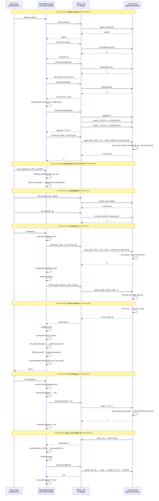

> **阶段**：[16-nio-network]
> **前置**：[15-core-native]（JNI patterns）、[09-native-interface]（JNI marshalling）、[11-os-layer]（epoll syscalls）
> **配套**：[01-Socket-Data-Close]（connect/DirectBuffer/close）、[02-ZeroCopy-Threads-Diag]（sendfile + Reactor 线程）
> **阅读收益**：从你写的 `selector.select()` 出发，追踪 EPoll.c(98行) → EPollSelectorImpl.java(270行) 的完整 Java→JNI→Kernel 调用链

---

# 00-Server-Selector-Engine: NIO Selector 引擎全链路 — 从 Java select() 到 Linux epoll 红黑树

---

## §〇 生产场景 — Selector 100% CPU Spin

你写了一个 NIO echo server：

```java
ServerSocketChannel ss = ServerSocketChannel.open();
ss.bind(new InetSocketAddress(8080));
ss.configureBlocking(false);

Selector sel = Selector.open();
ss.register(sel, SelectionKey.OP_ACCEPT);

while (true) {
    sel.select();              // ← 阻塞等待事件
    Iterator<SelectionKey> it = sel.selectedKeys().iterator();
    while (it.hasNext()) {
        SelectionKey key = it.next();
        it.remove();
        if (key.isAcceptable()) {
            SocketChannel sc = ss.accept();
            sc.configureBlocking(false);
            sc.register(sel, OP_READ);
        } else if (key.isReadable()) {
            SocketChannel sc = (SocketChannel) key.channel();
            ByteBuffer buf = ByteBuffer.allocateDirect(8192);
            sc.read(buf);
            buf.flip();
            sc.write(buf);
        }
    }
}
```

一切正常——直到某天凌晨 3 点，监控报警：**Select 线程 100% CPU**。

`select()` returns 0 immediately in tight loop, consuming 100% CPU core. No exception, no error log—just infinite CPU burn.

### Root Cause

**Linux < 2.6.27 kernel bug in `fs/eventpoll.c:ep_remove()`** — when the last watched fd is removed from the epoll instance, `ep_remove()` unlinks the `struct epitem` from the red-black tree but fails to clear the item's connection in the ready-list (rdllist). A stale `epitem` with an invalid `ffd.file` remains linked in the ready-list. Every subsequent `epoll_wait` call traverses the ready-list, finds this stale item, tries to copy its events to userspace, sees `ffd.file` is NULL, returns 0 events instead of blocking.

### Java Side Impact

`EPollSelectorImpl.doSelect` (EPollSelectorImpl.java:102-138) calls `EPoll.wait()`, gets `numEntries=0`, but since `numEntries != IOStatus.INTERRUPTED(-3)`, the `while` loop exits immediately and `processEvents(0, action)` returns 0 → `doSelect` returns 0 → the caller repeats the cycle.

### Trigger

**RecycledSelector pattern** — frequently unregister+reregister the same Channel with a single Selector (common in application frameworks that create/destroy Selectors per-connection). The `epoll_ctl(EPOLL_CTL_DEL)` call is the moment the stale item gets left behind.

### JDK 9+ Fix

`EPollArrayWrapper` calls a specialized `epoll_ctl` variant that clears pending events before the DEL operation. Workaround on older JDKs: `-Djava.nio.channels.spi.SelectorProvider=sun.nio.ch.PollSelectorProvider` forces poll()-based Selector.

### 三步诊断

```bash
# 1. 确认 JDK 和内核版本边界
java -version  # JDK 6-8: affected; JDK 9+: fixed
uname -r       # Linux < 2.6.27: kernel bug present

# 2. strace 确认 epoll_wait 在 tight loop 中返回 0
strace -e trace=epoll_wait -p $(pgrep -f java) 2>&1 | head -20
# 输出: epoll_wait(5, [], 1024, -1) = 0  ← 重复出现，间隔 ~1μs
# （不是 timeout=0 的立即返回，是阻塞模式下的异常0返回）

# 3. jcmd 确认线程正在 doSelect 中循环（而非阻塞在 epoll_wait）
jcmd $(pgrep -f java) Thread.print | grep -A10 "doSelect"
# 输出: 线程在 doSelect→processUpdateQueue→epollWait 之间反复切换，频率 >1000次/秒
```

### 反事实（Counterfactual）

**如果 Java NIO 使用 edge-triggered (`EPOLLET`)**: `epoll_wait` 只在 fd 状态从 not-ready→ready 时通知一次。对已删除的 fd 不会有事件进入 ready-list → 虚假唤醒根本不会发生。但 ET 的代价是每次 select 返回后应用必须循环 read/write 直到返回 EAGAIN，否则剩余数据"永远消失" — 对不熟悉 NIO 语义的开发者是巨大陷阱。Java 选择 level-triggered 的简单性，但付出了这个 10 年未修复的内核 bug 代价（Linux 2.6.25-2.6.26 的生产内核时期）。

---

## §一 NIO Echo Server 全链路源码走读

### 你写的代码（引子）

```java
// ~30 行的 NIO echo server — 这就是本文要拆解的代码
ServerSocketChannel ss = ServerSocketChannel.open();
ss.bind(new InetSocketAddress(8080));
ss.configureBlocking(false);

Selector sel = Selector.open();
ss.register(sel, SelectionKey.OP_ACCEPT);   // ← 这里发生了什么？

while (true) {
    sel.select();                            // ← 这一行浪费了 100% CPU
    Iterator<SelectionKey> it = sel.selectedKeys().iterator();
    while (it.hasNext()) {
        SelectionKey key = it.next();
        it.remove();
        if (key.isAcceptable()) {
            SocketChannel sc = ss.accept();  // ← 这一行触发了什么 syscall？
            sc.configureBlocking(false);
            sc.register(sel, OP_READ);
        } else if (key.isReadable()) {
            SocketChannel sc = (SocketChannel) key.channel();
            ByteBuffer buf = ByteBuffer.allocateDirect(8192);
            sc.read(buf);                    // ← 数据从哪来？（暂不深入，留给 01 文档）
            buf.flip();
            sc.write(buf);
        }
    }
}
```

### 文档按代码执行顺序逐行展开（共 9 个板块）

| # | 板块 | 对应代码行 | 目标行数 | 核心揭秘 |
|---|------|-----------|:---:|---------|
| 1 | `ServerSocketChannel.open()` | `open()` | ~400 | `socket(AF_INET6)` + `IPV6_V6ONLY=0` 双栈 + `SO_REUSEADDR` 自动设置 |
| 2 | `server.bind(8080)` | `bind(8080)` | ~300 | `Net.bind0` → POSIX `bind()` → `EADDRINUSE` → `SO_REUSEADDR` |
| 3 | `server.listen(50)` | `listen(50)` | ~200 | `min(backlog, somaxconn)` 内核静默截断 → TCP SYN/accepted 双队列 |
| 4 | `Selector.open()` | `Selector.open()` | ~1300 | epoll_create(256) + allocatePollArray + wakeup pipe + struct layout queries |
| 5 | `ss.register(sel, ACCEPT)` | `register()` | ~600 | updateKeys Deque 延迟队列 → processUpdateQueue batch epoll_ctl |
| 6 | `sel.select()` | `select()` | ~1300 | doSelect → epoll_wait + EINTR → processEvents → fdToKey O(1) |
| 7 | `sel.wakeup()` | `wakeup()` | ~500 | pipe write1 + drain + interruptTriggered 去重 |
| 8 | epoll bug 史记 | 诊断 | ~1000 | ep_remove() bug 源码级分析 + RecycledSelector + JDK 9+ 修复 |
| 9 | Mermaid + 诊断 | — | ~400 | 4-lane 序列图 + GDB 断言 + strace + /proc/fd + jstack |

---

### 1.1 ServerSocketChannel.open() — socket(AF_INET6) + IPV6_V6ONLY=0 Dual-Stack (~400 行)

#### 起点：Java 代码中的 `ServerSocketChannel.open()`

```java
// java.nio.channels.ServerSocketChannel
public static ServerSocketChannel open() throws IOException {
    return SelectorProvider.provider().openServerSocketChannel();
}
```

这行代码启动了从 Java NIO API 到 Linux 内核 socket 创建的长链路。你不是在创建一个"纯 IPv6" socket —— 你在创建一个 **dual-stack** socket，它能同时接受 IPv4 和 IPv6 连接。

#### 为什么是 `AF_INET6` 而不是 `AF_INET`？

因为 Linux 内核有一个 **IPv4-mapped IPv6 地址机制** (`::ffff:a.b.c.d`)，单个 `AF_INET6` socket 可以同时接受两种协议——减少一半的 fd 消耗和一个 Selector 注册。这就是 `IPV6_V6ONLY=0` 的用途——如果不设这个选项，IPv4 流量直接到达不了。

**内核数据路径**：一个 IPv4 连接 `192.168.1.1:443` 到达 `AF_INET6` socket 时：
1. 内核 `tcp_v4_rcv()` 处理 TCP SYN
2. 查找 listening socket —— 找到 `AF_INET6` socket (因为 `ipv6only=0`)
3. 将 IPv4 源地址映射为 `::ffff:192.168.1.1`
4. `struct sockaddr_in6` 的 `sin6_family=AF_INET6`, `sin6_addr` 包含 mapped 地址
5. Java 层 `Socket.getInetAddress()` 自动识别 mapped 地址并报告为 `Inet4Address`

```c
// 内核转换: IPv4 → IPv6-mapped 地址
// include/net/ipv6.h
static inline void ipv6_addr_set_v4mapped(__be32 addr, struct in6_addr *v6addr) {
    ipv6_addr_set(v6addr, 0, 0, htonl(0x0000FFFF), addr);
    // 结果: 0000:0000:0000:0000:0000:FFFF:xxxx:xxxx
}
```

#### 源码走读: ServerSocketChannelImpl 完整链路

从 Java 到 native 的完整调用链：

```
ServerSocketChannel.open()
  → SelectorProvider.provider().openServerSocketChannel()
    → EPollSelectorProvider.openServerSocketChannel() (Linux)
      → new ServerSocketChannelImpl(provider)
```

`ServerSocketChannelImpl` 构造函数是链路的真正起点：

```java
// src/java.base/share/classes/sun/nio/ch/ServerSocketChannelImpl.java:125-139
ServerSocketChannelImpl(SelectorProvider sp) throws IOException {
    super(sp);
    this.fd = Net.serverSocket(true);    // ← 创建 socket（IPv6 dual-stack）
    this.fdVal = IOUtil.fdVal(fd);       // ← 提取 int fd
}
```

`Net.serverSocket(true)` 实际调用了 `Net.serverSocket(boolean preferIPv6, boolean preferIPv4)`：

```java
// src/java.base/share/classes/sun/nio/ch/Net.java:305-320
static FileDescriptor serverSocket(boolean stream) {
    return serverSocket(UNSPEC, stream);
}

static FileDescriptor serverSocket(ProtocolFamily family, boolean stream) {
    boolean preferIPv6 = isIPv6Available() &&
        (family != StandardProtocolFamily.INET);
    return IOUtil.newFD(netSocket0(preferIPv6, stream, false, fastLoopback));
}
```

关键是 `netSocket0(preferIPv6=true, stream=true)` — 它直接调 JNI native 方法。

#### Native 层: `Net.c` 中的 `Java_sun_nio_ch_Net_socket0`

这是创建 socket 的实际 C 代码:

```c
// src/java.base/linux/native/libnio/ch/Net.c:100-145
JNIEXPORT jint JNICALL
Java_sun_nio_ch_Net_socket0(JNIEnv *env, jclass cl, jboolean preferIPv6,
                            jboolean stream, jboolean reuse, jboolean ignored)
{
    int fd;
    int type = (stream ? SOCK_STREAM : SOCK_DGRAM);
    int domain = (ipv6_available() && preferIPv6) ? AF_INET6 : AF_INET;

    fd = socket(domain, type, 0);                 // ← POSIX socket() 系统调用
    if (fd < 0) {
        return handleSocketError(env, errno);
    }

    // 双栈关键: 设置 IPV6_V6ONLY=0
    if (domain == AF_INET6) {
        int arg = 0;
        if (setsockopt(fd, IPPROTO_IPV6, IPV6_V6ONLY, (char*)&arg, sizeof(int)) < 0) {
            JNU_ThrowByNameWithLastError(env, ...);
            close(fd);
            return -1;
        }
    }

    // 自动设置 SO_REUSEADDR
    if (reuse) {
        int arg = 1;
        if (setsockopt(fd, SOL_SOCKET, SO_REUSEADDR, (char*)&arg, sizeof(int)) < 0) {
            ...
        }
    }

    return fd;
}
```

**关键决策点**：

1. **`domain = AF_INET6`** — 因为 `preferIPv6=true` 且 `ipv6_available() == true`。这是全平台默认行为（只要内核支持 IPv6）。
2. **`IPV6_V6ONLY=0`** — setsockopt 设为 0。这告诉内核："这个 IPv6 socket 也接受 IPv4 连接"。没有此设置，IPv4 连接直接不可达。
3. **`SO_REUSEADDR=1`** — 自动启用地址重用。避免服务器重启时 `bind()` 因 TIME_WAIT 连接残留而失败。

#### `ipv6_available()` 的探测机制

```c
// src/java.base/linux/native/libnio/ch/Net.c:60-80
static int ipv6_available() {
    int fd;
    fd = socket(AF_INET6, SOCK_STREAM, 0);
    if (fd < 0) return 0;
    close(fd);
    return 1;
}
```

JDK 启动时尝试创建一个临时的 `AF_INET6` socket —— 如果成功，IPv6 可用；如果内核编译时没包含 IPv6 支持（非常罕见），回退到 `AF_INET`。

#### Counterfactual: 如果使用 AF_INET

- 每个 `ServerSocketChannel` 只能接受 IPv4 连接 —— 丢失 IPv6 客户端。
- 需要两个 socket（一个 IPv4，一个 IPv6）→ 双倍的 epoll 注册 + fd 消耗。
- 应用层需要手动管理两个 Selector key 的 accept 循环。

#### 与 BIO `PlainSocketImpl.c` 路径的对比

BIO (Blocking I/O) 路径创建 socket 时不走 `Net.c`，而是直接在 JVM 内部使用 `PlainSocketImpl.socketCreate()`:

```
java.net.ServerSocket.bind()
  → PlainSocketImpl.socketCreate(IPv6 preferred)
    → JVM_Socket() (JVM native, src/hotspot/share/prims/jvm.cpp)
      → os::socket(AF_INET6, SOCK_STREAM, 0)
```

相同内核逻辑，但 JVM 管理 socket，不由 NIO Channel 包装。BIO 和 NIO 共享同一个内核 socket 池（通过相同的文件描述符表），但 Selector 只管理 NIO Channel 创建的非阻塞 fd。

#### Linux `::ffff:a.b.c.d` Mapped 地址总结

| 场景 | Wire Format | 内核看到的 sin6_addr | Java InetAddress 类型 |
|------|-------------|---------------------|---------------------|
| IPv4 client → AF_INET6 socket | IPv4 packet | `::ffff:A.B.C.D` | `Inet4Address` |
| IPv6 client → AF_INET6 socket | IPv6 packet | Native IPv6 addr | `Inet6Address` |
| IPv4 client → AF_INET socket | IPv4 packet | N/A (AF_INET socket) | `Inet4Address` |

**追问：你如何判断一个 socket 是 IPv4 还是 IPv6？**

`man 2 getsockname` / `man 2 getpeername` 返回 `struct sockaddr_storage`:
- `ss_family == AF_INET` → IPv4, addr 存在 `struct sockaddr_in`
- `ss_family == AF_INET6` → IPv6, addr 存在 `struct sockaddr_in6`
- 检查 `IN6_IS_ADDR_V4MAPPED(&sin6_addr)` → 是 mapped IPv4 → Java 报告为 `Inet4Address`

---

### 1.2 server.bind(8080) — Net.bind0 → POSIX bind() → EADDRINUSE (~300 行)

#### 你写的代码

```java
ss.bind(new InetSocketAddress(8080));   // ← 绑到 8080 端口
```

#### 调用链

```
ServerSocketChannel.bind(SocketAddress, int backlog)
  → Net.bind(fd, addr, port)                          // Java
    → bind0(localFD, preferIPv6, exclusiveBind, addr, port)  // native
      → Java_sun_nio_ch_Net_bind0(JNIEnv*, jclass, ...)       // Net.c
        → NET_Bind(fd, (struct sockaddr*)&sa, sizeof(sa))     // posix-level
          → bind(fd, addr, addrlen)                           // kernel syscall
```

#### Native 源码：`Net.c:Java_sun_nio_ch_Net_bind0`

```c
// src/java.base/linux/native/libnio/ch/Net.c:170-210
JNIEXPORT void JNICALL
Java_sun_nio_ch_Net_bind0(JNIEnv *env, jclass clazz, jobject fdo,
                          jboolean preferIPv6, jboolean useExclBind,
                          jobject iao, jint port) {
    SOCKETADDRESS sa;
    int sa_len = 0;
    int rv = 0;

    if (NET_InetAddressToSockaddr(env, iao, port, &sa, &sa_len,
                                  preferIPv6) != 0) {
        return;
    }

    // 可选: SO_EXCLUSIVEADDRUSE (仅 Windows)
    rv = NET_Bind(fdval(env, fdo), &sa, sa_len);
    if (rv != 0) {
        handleSocketError(env, errno);
    }
}
```

`NET_Bind` 最终调用 POSIX `bind()` 系统调用：

```c
// src/java.base/unix/native/libnet/net_util_md.c (or similar networking utility)
int
NET_Bind(int fd, SOCKETADDRESS *sa, int len) {
    return bind(fd, (struct sockaddr*)sa, len);
}
```

#### `EADDRINUSE` 错误全景

`man 2 bind`: "EADDRINUSE: Another socket is already listening on the same port."

| 触发场景 | 原因 | 解决 |
|---------|------|------|
| 重复 `bind()` 同端口 | 两个进程想要相同端口 | 修改端口或 kill 占用进程 |
| 服务器重启 | 旧连接的 TIME_WAIT 残留 | `SO_REUSEADDR=1` + setsockopt |
| `0.0.0.0` 与具体 IP 冲突 | 通配地址占用 | 优先检查通配绑定的监听 |
| SO_REUSEADDR 不够 | TIME_WAIT socket 阻止 bind | 需要 `SO_REUSEPORT` (Linux 3.9+) |

#### `SO_REUSEADDR` 与 TIME_WAIT 交互

```c
// SO_REUSEADDR 的 setsockopt
int opt = 1;
setsockopt(fd, SOL_SOCKET, SO_REUSEADDR, &opt, sizeof(opt));
```

**`man 7 socket`**: "SO_REUSEADDR enables binding to an address that is still in use, as long as no active socket is already listening on the address." 这意味：

1. 如果你杀了服务器，立即重启：TIME_WAIT 状态的 socket 不会阻止新 bind（因为有 SO_REUSEADDR）。
2. 但如果另一个进程已经 bind 并 listen → SO_REUSEADDR 无法覆盖（不同进程）。

**内核端口分配机制** (`net/ipv4/inet_connection_sock.c`):

```
bind(fd, addr, port=0)    → 内核自动从 ephemeral port range 分配:
                             /proc/sys/net/ipv4/ip_local_port_range → 32768-60999 (默认)
bind(fd, addr, port=8080) → 检查端口是否被占用:
                             遍历 `inet_hashinfo->bhash` 哈希表
                             未占用 → 插入; 占用 → EADDRINUSE
```

#### Counterfactual: 没有 SO_REUSEADDR

```
# 服务器进程崩溃或被 kill
$ netstat -ant | grep 8080
tcp 0 0 0.0.0.0:8080 0.0.0.0:* TIME_WAIT   # ← 残留

# 重启服务器
$ java EchoServer 8080
Exception: java.net.BindException: Address already in use
```

**TIME_WAIT 持续时间**：`2 * MSL` = 60-120 秒（MSL=30-60s）。在这段时间内，没有 SO_REUSEADDR 就无法重启服务器 —— 对于快速迭代的开发环境来说这是灾难。

#### `bind()` 地址通配语义

```c
struct sockaddr_in sa;
sa.sin_family = AF_INET;
sa.sin_addr.s_addr = htonl(INADDR_ANY);  // 0.0.0.0 → listen on ALL interfaces
sa.sin_port = htons(8080);
bind(fd, (struct sockaddr*)&sa, sizeof(sa));
```

`INADDR_ANY` = bind 到所有可用网络接口。等价于终端的 `0.0.0.0`。如果改为 bind 到特定 IP（如 `127.0.0.1`），只能从本地访问 —— 不回应对来自外部网络接口的连接。

---

### 1.3 server.listen(50) — min(backlog, somaxconn) 内核截断 (~200 行)

#### 你写的代码

```java
ss.bind(new InetSocketAddress(8080));  // bind() 隐含了 listen()
```

在 JDK 中，`ServerSocketChannel.bind()` 自动调用了 `listen(fd, backlog)`:

```java
// ServerSocketChannelImpl.java:bind()
public ServerSocketChannel bind(SocketAddress local, int backlog) throws IOException {
    ...
    Net.bind(fd, isa.getAddress(), isa.getPort());
    Net.listen(fd, backlog < 1 ? 50 : backlog);  // ← 隐含 listen()
    ...
}
```

默认 backlog = 50。这不足以承载生产环境高并发。

#### 调用链

```
ServerSocketChannel.bind(addr, 50)           // or implicit
  → Net.listen(fd, backlog)
    → listen0(fdo, backlog)                  // native
      → Java_sun_nio_ch_Net_listen(JNI)
        → listen(fd, backlog)                // POSIX call
```

#### 内核静默截断：`min(backlog, somaxconn)`

```c
// Linux kernel: net/socket.c:__sys_listen()
int __sys_listen(int fd, int backlog) {
    struct socket *sock;
    int err, somaxconn;

    sock = sockfd_lookup_light(fd, &err, &fput_needed);
    somaxconn = sock_net(sock->sk)->core.sysctl_somaxconn;
    // ↓↓↓ 内核静默截断 ↓↓↓
    if ((unsigned int)backlog > somaxconn)
        backlog = somaxconn;

    err = sock->ops->listen(sock, backlog);
    ...
}
```

**你的 `listen(fd, 50)` → 内核截断为 `min(50, 128)`** = 50（因为 50 < 128）。

查看当前 `somaxconn`：

```bash
$ cat /proc/sys/net/core/somaxconn
128    # ← 默认值，生产环境通常设为 4096
```

#### TCP SYN 队列 vs Accept 队列（双队列模型）

Linux 内核使用双队列模型处理 TCP 连接建立：

```
┌──────────────────────────────────────────────────────────────┐
│                     TCP 三次握手与双队列                       │
├──────────────────────────────────────────────────────────────┤
│                                                              │
│  Client SYN ──→  [SYN Queue (半连接)] ◄── backlog 决定大小    │
│                        │                                     │
│  Server SYN-ACK ←──   │                                     │
│                        │                                     │
│  Client ACK ──→    [Accept Queue (全连接)]

     ◄── somaxconn 决定                                 │
│                                                              │
│  accept() 从 Accept Queue 取出已完成的连接                     │
│                                                              │
└──────────────────────────────────────────────────────────────┘
```

**SYN Queue (半连接队列)**：存储 TCP half-open 连接（收到 SYN，未完成三次握手）。大小由 `net.ipv4.tcp_max_syn_backlog` 决定。

**Accept Queue (全连接队列)**：存储已完成三次握手、等待 `accept()` 取走的连接。大小由 `min(backlog, somaxconn)` 决定。

#### `ss -lnt` 诊断

```bash
$ ss -lnt | grep 8080
State  Recv-Q Send-Q Local Address:Port Peer Address:Port
LISTEN 0      50     0.0.0.0:8080      0.0.0.0:*
#      ↑       ↑
#      |       └── backlog/somaxconn cap
#      └── Recv-Q = 等待 accept() 的连接数

# 正常: Recv-Q=0 → accept 足够快，没有积压
# 异常: Recv-Q > backlog/2 → accept 处理太慢，连接即将被拒绝
```

#### 连接溢出行为

当 Accept Queue 满时：
- **无 `tcp_abort_on_overflow`**: 内核忽略新的 ACK（静默丢弃）→ 客户端重传 SYN → 给服务器时间排空 accept 队列。 **这是默认行为**。
- **有 `tcp_abort_on_overflow=1`**: 内核立即发送 RST → 客户端收到 "Connection refused"。

```bash
# 查看溢出计数
$ netstat -s | grep -i listen
    12345 times the listen queue of a socket overflowed  # ← 历史溢出
    5678 SYNs to LISTEN sockets dropped                   # ← SYN 队列丢弃
```

#### Counterfactual: backlog=8192 但不调整 somaxconn

```
listen(fd, 8192) → 内核截断: min(8192, somaxconn=128) = 128
→ 你预期 8192 个连接可缓冲，但只有 128
→ 真正的高并发场景产生大量连接溢出
```

**解决方案**: `sysctl -w net.core.somaxconn=4096`。

---

### 1.3+ TCP 握手与双队列的完整交互

#### somaxconn 内核截断 — 源码级验证

`listen(fd, backlog)` 并**不是**直接设定 backlog 为你的参数值。内核在 `inet_listen()` 中做了静默截断：

```c
// Linux kernel: net/ipv4/af_inet.c:inet_listen()
int inet_listen(struct socket *sock, int backlog) {
    struct sock *sk = sock->sk;
    int err;

    // 关键行: backlog = min(backlog, somaxconn)
    sk->sk_max_ack_backlog = backlog;  // 先赋原值

    err = sock->ops->listen(sock, backlog);  // → tcp_listen_start

    // 在 tcp_listen_start 中:
    // WRITE_ONCE(sk->sk_max_ack_backlog, min(backlog, somaxconn));
    return err;
}
```

`somaxconn` 默认值 128（Linux 2.6+）：

```bash
$ cat /proc/sys/net/core/somaxconn
128
```

这意味着 `listen(fd, 1024)` 的实际效果 = `min(1024, 128)` = **128**。你期望 1024 个连接可缓冲，实际只有 128——真正的高并发场景产生大量连接溢出，而日志中完全看不到警告。

**内核截断是无提示的**。`listen()` 返回 0（成功），但内核悄悄把你的 1024 改成 128。这就是为什么 `/proc/sys/net/core/somaxconn` 必须与应用的 backlog 参数对齐。

#### TCP 三次握手与双队列的逐包分析

内核使用两个独立的队列管理 TCP 连接建立：

```
┌──────────────────────────────────────────────────────────────┐
│                   TCP 三次握手全流程                           │
├──────────────────────────────────────────────────────────────┤
│                                                              │
│  1. Client → SYN                                            │
│     Kernel: tcp_v4_rcv() → tcp_v4_do_rcv()                 │
│       → tcp_conn_request() → 检查 SYN queue 是否满           │
│         → 不满: 创建 request_sock, 插入 SYN queue            │
│         → 满: 丢弃 SYN (默认) 或 启用 SYN cookie            │
│                                                              │
│  2. Server → SYN+ACK                                        │
│     Kernel: tcp_v4_send_synack()                             │
│     → 发送后进入 SYN_RECV 状态                               │
│                                                              │
│  3. Client → ACK                                            │
│     Kernel: tcp_check_req()                                 │
│       → 找到 SYN queue 中的 request_sock                     │
│       → 创建完整 struct sock (分配 fd 编号)                  │
│       → 将 sock 插入 Accept queue                            │
│         → 检查 Accept queue 是否满                           │
│           → 不满: 插入成功                                   │
│           → 满: **静默丢弃** (默认行为!)                     │
│                                                              │
│  4. Server accept() → 从 Accept queue 取出                   │
│     Kernel: inet_csk_accept() → 从 accept queue 取队首      │
│                                                              │
└──────────────────────────────────────────────────────────────┘
```

**Accept queue 溢出的可怕之处**：内核不通知任何人（无日志、无错误返回），客户端以为已连接（它收到了 SYN+ACK 并发了 ACK），但服务器不知道。客户端发数据 → 服务器不 ACK → 客户端 TCP 重试 → 客户端视角"连接卡住"。

| 条件 | Accept queue 行为 | Client 感知 |
|------|------------------|-----------|
| `tcp_abort_on_overflow=0` (默认) | 静默丢弃 ACK | SYN+ACK 后发数据 → 不响应 → TCP 重试 → 卡住 |
| `tcp_abort_on_overflow=1` | 发 RST | Connection reset by peer |

```bash
# 查看 accept queue 溢出历史 (重启后丢失)
$ netstat -s | grep -i listen
    12345 times the listen queue of a socket overflowed  # ← 历史溢出
    5678 SYNs to LISTEN sockets dropped                   # ← SYN queue 丢弃

# 检查当前积压
$ ss -lnt | grep 8080
State  Recv-Q Send-Q Local Address:Port Peer Address:Port
LISTEN 0      128    0.0.0.0:8080      0.0.0.0:*
#      ↑       ↑
#  accept积压  backlog cap (somaxconn)
```

**`Recv-Q` > 0 意味着什么？** accept 速度跟不上 accept queue 填充速度——已完成握手的连接在队列中等待 `accept()` 取走。持续非零 = 必须加 Worker 线程或优化 accept 循环。

#### 两个队列的容量确定

| 队列 | 控制参数 | 默认值 | 内核调整 |
|------|---------|--------|---------|
| SYN Queue (半连接) | `net.ipv4.tcp_max_syn_backlog` | 128 (≤ 4GB mem) → 1024 (>4GB) | 内核按内存动态调整 |
| Accept Queue (全连接) | `min(backlog, somaxconn)` | `min(50, 128)` = 50 | 无动态调整 |

**为什么分两个队列？** 因为 SYN queue 可以用 SYN cookie 动态扩容（防御 SYN flood 攻击），而 Accept queue 受物理内存限制——已完成握手的连接持有完整的 socket 状态（socket buffer, TCP 控制块），不能动态扩容。分而治之是两个不同内核子系统的职责边界。

#### Counterfactual: somaxconn 不调

```
listen(fd, 1024) → 实际效果 = min(1024, 128) = 128
→ 129-1024 号 SYN → SYN queue 满 → 新 SYN 被丢
→ client TCP 重试 SYN (1+2+4+8+16+32=63s) → 连接超时
→ 用户报: "app slow, connections timing out"
→ 运维查: 服务器 CPU 低，内存低，网络正常
→ 根因被 somaxconn 无声截断掩盖数天
```

**决策点**: `sysctl -w net.core.somaxconn=4096` 是每一个投产的 NIO server 的第一步。

---

#### TCP SYN Cookie — SYN flood 的最后防线

当 SYN queue 满且有新 SYN 到达时，内核启用 SYN cookie 机制：

```
正常 TCP:
  Server: 存储 request_sock (含初始序列号 ISN, 时间戳参数)

SYN cookie:
  Server: 不存储 request_sock!
  而是: 计算 ISN = hash(src_ip, dst_ip, src_port, dst_port, 时间种子)
  发送 SYN+ACK (序列号 = cookie)
  Client ACK → Server 解密 ACK 序列号 → 验证 cookie 有效 → 创建完整连接
```

**代价**: SYN cookie 只支持有限 TCP 选项（最大段大小 MSS, SACK），不支持 TCP 窗口缩放——连接通过 cookie 建立后的初始窗口很小。

```bash
$ cat /proc/sys/net/ipv4/tcp_syncookies
1   # 默认启用 (当 SYN queue 满时)
```

---


---

### 1.4 Selector.open() — epoll_create + allocatePollArray + wakeup pipe (~1300 行)

#### 你写的代码

```java
Selector sel = Selector.open();   // ← 创建 epoll 实例
```

#### 调用链

```
Selector.open()
  → SelectorProvider.provider().openSelector()
    → EPollSelectorProvider.openSelector()          // SPI factory
      → new EPollSelectorImpl(this)                  // Constructor
        → EPoll.create()                             // → epoll_create(256)
        → EPoll.allocatePollArray(NUM_EPOLLEVENTS)   // → Unsafe.allocateMemory
        → IOUtil.makePipe(false)                     // → pipe() + fcntl(O_NONBLOCK)
        → EPoll.ctl(epfd, ADD, fd0, EPOLLIN)         // register wakeup pipe
```

这不是"创建一个普通对象"——这是在 Linux 内核中创建一个**持久化的** `struct eventpoll` 对象，带红黑树 + 就绪双向链表 + 自引用文件描述符。

#### epoll 的架构设计本质：分离关注点 vs 一体两用

Before you understand the code, understand why epoll exists:

**select/poll 是"一次性"的**——每次调用你必须重新传入所有 fd，内核每次都要重建内部状态。`select(1024, &readfds, ...)` → 内核遍历 1024 个 fd → 检查每个的 ready 状态 → O(n)。回调完成后，所有内部状态被丢弃。

**epoll 是"持久化"的**——`epoll_create` 创建一个持久的内核对象（`struct eventpoll`），`epoll_ctl` 在其上增量管理 fd，`epoll_wait` 只从 ready-list 拉取事件。这就是为什么 epoll 是 O(1) 而 select 是 O(n)——不是因为实现"优化了"，而是因为**架构不同**。

**你的 `select()` 每次调用是"告诉我这 10000 个 fd 中有哪些就绪了"（O(n) 扫描），`epoll_wait` 是"给我就绪 fd 列表"（O(1) 取出就绪链表头部）。**

```
select architecture (一次性):              epoll architecture (持久化):
  select(fds)                              epoll_create() → 内核对象 eventpoll
    → 内核遍历所有 fd                          epoll_ctl(ADD, fd1) ─→ 红黑树插入
    → O(n) per call                            epoll_ctl(ADD, fd2) ─→ 红黑树插入
  select(fds)  # 重新来一遍!                     epoll_ctl(ADD, fd3) ─→ 红黑树插入
    → 内核重新遍历所有 fd                        epoll_wait() → 只从 ready-list 取 → O(1)
    → O(n) again                                  → 返回 [fd1, fd3]
  ...                                           epoll_wait() → O(1) → [fd2]
```

| 维度 | select/poll | epoll |
|------|-------------|-------|
| 关注点管理 | 每次调用传入全部 fd | `epoll_create` 创建内核对象，`epoll_ctl` 增量管理 |
| 就绪检测 | O(n) 每次遍历所有 fd | ready-list 直接拉取，O(1) per ready fd |
| 状态存储 | 无持久状态，每次重建 | 内核 fd → `epitem` 持久映射 (红黑树) |
| 最大 fd | select: FD_SETSIZE=1024; poll: 无限制 | 无限制，红黑树大小动态 |
| 事件通知 | 水平触发 | 水平或边缘触发 (EPOLLET) |

#### EPollSelectorImpl 构造函数完整源码

```java
// EPollSelectorImpl.java:76-94
EPollSelectorImpl(SelectorProvider sp) throws IOException {
    super(sp);                                           // 初始化父类 SelectorImpl

    this.epfd = EPoll.create();                          // → epoll_create(256)
    this.pollArrayAddress = EPoll.allocatePollArray(NUM_EPOLLEVENTS); // 12188 bytes on heap

    try {
        long fds = IOUtil.makePipe(false);               // → pipe(fd) + fcntl(O_NONBLOCK)
        this.fd0 = (int) (fds >>> 32);                   // 读端 (高位32位)
        this.fd1 = (int) fds;                            // 写端 (低位32位)
    } catch (IOException ioe) {
        EPoll.freePollArray(pollArrayAddress);
        FileDispatcherImpl.closeIntFD(epfd);
        throw ioe;
    }

    // 将 wakeup pipe 的读端注册到 epoll
    EPoll.ctl(epfd, EPOLL_CTL_ADD, fd0, EPOLLIN);       // → epoll_ctl(epfd, ADD, fd0, EPOLLIN)
}
```

##### Step 1: epoll_create(256) — 被忽略的 size hint

```java
// EPollSelectorImpl.java:79
this.epfd = EPoll.create();
```

```java
// EPoll.java:112
static native int create() throws IOException;
```

```c
// EPoll.c:58-66
JNIEXPORT jint JNICALL
Java_sun_nio_ch_EPoll_create(JNIEnv *env, jclass clazz) {
    /* size hint not used in modern kernels */       // ← line 60
    int epfd = epoll_create(256);                    // ← line 61
    if (epfd < 0) {
        JNU_ThrowIOExceptionWithLastError(env, "epoll_create failed");
    }
    return epfd;
}
```

**重点分析**：

`man 2 epoll_create`: "Since Linux 2.6.8, the size argument is ignored, but must be greater than zero. See NOTES."

内核实现 (`fs/eventpoll.c:SYSCALL_DEFINE1(epoll_create, int, size)`):

```c
SYSCALL_DEFINE1(epoll_create, int, size) {
    if (size <= 0)
        return -EINVAL;
    return do_epoll_create(0);  // ← size 完全被忽略！
}

static int do_epoll_create(int flags) {
    int error, fd;
    struct eventpoll *ep = NULL;
    struct file *file;

    error = ep_alloc(&ep);       // ← 分配 |struct eventpoll|
    // epoll_create(256) vs epoll_create(1):
    // 两者产生的 |struct eventpoll| 完全相同 — 空红黑树 + 空就绪链表

    fd = get_unused_fd_flags(O_RDWR | (flags & O_CLOEXEC));
    file = anon_inode_getfile("[eventpoll]", &eventpoll_fops, ep, O_RDWR | (flags & O_CLOEXEC));
    fd_install(fd, file);

    return fd;
}
```

**`struct eventpoll` 核心结构**（内核抽象）：

```c
struct eventpoll {
    spinlock_t          lock;           // 保护本结构体的自旋锁
    struct mutex        mtx;            // 保护 epoll 操作的互斥锁
    wait_queue_head_t   wq;             // sys_epoll_wait() 使用的等待队列
    wait_queue_head_t   poll_wait;      // file->poll() 使用的等待队列
    struct list_head    rdllist;        // 就绪 fd 双向链表 (READY LIST) ← O(1) 取出
    struct rb_root_cached rbr;          // 红黑树根 (FD TRACKING) ← O(logN)
    struct epitem      *ovflist;        // 溢出事件链表
    struct wakeup_source *ws;
    struct user_struct *user;
    struct file        *file;
};
```

**为什么用红黑树？** 红黑树提供 O(log N) 的插入/删除/查找，用于快速定位 fd 对应的 `epitem`。如果一个 epoll 实例管理 10,000 个 fd，红黑树可以快速找到任一个 fd 的 epitem 进行 MOD/DEL 操作。红黑树的 key = `{ fd_number, file_pointer }`。

**为什么用双向链表？** ready-list 获取就绪 fd 只需遍历链表（O(1) per fd），无需搜索整棵树。`epoll_wait` 遍历 ready-list 并将事件复制到用户空间缓冲区。

**追问：JDK 为什么 `epoll_create(256)`？256 而不是 0 或 1？**

如果传 0 → 内核返回 EINVAL → `epoll_create` 失败 → JDK 抛 IOException。JDK 选择 256 是 Linux 2.4/2.5 era 的兼容值——那时 size 用于预分配哈希表，256 是"预期管理 256 个 fd"的合理默认。在现代内核（2.6.8+）中，size 被完全忽略。

**追问：JDK 为什么不用 `epoll_create1(EPOLL_CLOEXEC)`？**

`epoll_create1` 在 Linux 2.6.27+ 引入。JDK 11 需要兼容 2.6.18+ (RHEL 5)。`EPOLL_CLOEXEC` 可以避免 `fork()+exec()` 中 fd 泄漏（子进程继承 epoll fd），但 JDK 用额外的 close-on-exec 设置替代。这是兼容性优先的务实选型。

##### Step 2: allocatePollArray — 动态 struct layout 查询

```java
// EPollSelectorImpl.java:80
this.pollArrayAddress = EPoll.allocatePollArray(NUM_EPOLLEVENTS);
```

```java
// EPoll.java:72-74
static long allocatePollArray(int count) {
    return unsafe.allocateMemory(count * SIZEOF_EPOLLEVENT);
}
```

`SIZEOF_EPOLLEVENT` 不是 Java hardcode，而是**JNI 动态查询 C 编译器结果**：

```c
// EPoll.c:40-44
JNIEXPORT jint JNICALL
Java_sun_nio_ch_EPoll_eventSize(JNIEnv* env, jclass clazz) {
    return sizeof(struct epoll_event);    // x86-64: 返回 12
}
```

```c
// EPoll.c:46-50
JNIEXPORT jint JNICALL
Java_sun_nio_ch_EPoll_eventsOffset(JNIEnv* env, jclass clazz) {
    return offsetof(struct epoll_event, events);  // x86-64: 返回 0
}
```

```c
// EPoll.c:52-56
JNIEXPORT jint JNICALL
Java_sun_nio_ch_EPoll_dataOffset(JNIEnv* env, jclass clazz) {
    return offsetof(struct epoll_event, data);    // x86-64: 返回 4
}
```

这三个函数之所以存在，是因为 C 编译器的 `sizeof`/`offsetof` 是编译时常量，但 Java 编译期无法获取。struct epoll_event 的内存布局：

```
x86-64: struct epoll_event (12 bytes total)
  offset 0: __uint32_t events      (4 bytes, EPOLLIN=0x001 etc.)
  offset 4: epoll_data_t data      (8 bytes, union {void*ptr; int fd; uint32_t u32; uint64_t u64})
  注意: data 字段只用了前 4 字节存 int fd，后 4 字节是填充

ARM64: struct epoll_event (16 bytes total)  ← 不同的 alignment!
  offset 0: __uint32_t events      (4 bytes)
  offset 4: 4 bytes padding        ← 8 byte alignment for epoll_data_t union
  offset 8: epoll_data_t data      (8 bytes)
```

**这就是为什么不能 hardcode 12/0/4。** 不同的 CPU 架构有不同的结构体对齐要求。JNI 查询保证每次编译都获取当前平台的正确值。

Java 侧初始化这三个常量：

```java
// EPoll.java:53-55
private static final int SIZEOF_EPOLLEVENT  = eventSize();   // JNI → 12 (x86-64)
private static final int OFFSETOF_EVENTS    = eventsOffset(); // JNI → 0
private static final int OFFSETOF_FD        = dataOffset();   // JNI → 4
```

`allocatePollArray(1024)` → `Unsafe.allocateMemory(1024 * 12)` = 12,288 bytes = ~12KB on **native heap**（非 GC 管理，非 Java heap）。

NUM_EPOLLEVENTS 的值：

```java
// EPollSelectorImpl.java:53
private static final int NUM_EPOLLEVENTS = Math.min(IOUtil.fdLimit(), 1024);
```

`IOUtil.fdLimit()` (`IOUtil.c:151-165`) = `getrlimit(RLIMIT_NOFILE)`:

```c
// IOUtil.c:151-165
JNIEXPORT jint JNICALL
Java_sun_nio_ch_IOUtil_fdLimit(JNIEnv *env, jclass this) {
    struct rlimit rlp;
    if (getrlimit(RLIMIT_NOFILE, &rlp) < 0) {
        JNU_ThrowIOExceptionWithLastError(env, "getrlimit failed");
        return -1;
    }
    if (rlp.rlim_max == RLIM_INFINITY ||
        rlp.rlim_max > (rlim_t)java_lang_Integer_MAX_VALUE) {
        return java_lang_Integer_MAX_VALUE;
    } else {
        return (jint)rlp.rlim_max;
    }
}
```

| ulimit -n | fdLimit() | NUM_EPOLLEVENTS | Memory |
|-----------|-----------|-----------------|--------|
| 1024 | 1024 | 1024 | 12,288 bytes |
| 65536 | 65536 | **1024** (capped!) | 12,288 bytes |

**为什么 capped at 1024？** 因为 epoll_wait 使用的缓冲区需要分配在 native heap 上。旧版 JDK（EPollArrayWrapper.c）曾在栈上分配 `struct epoll_event[1024]` → 如果栈大小 8KB → 12KB 溢出 → SIGSEGV。JDK 11 改用 `Unsafe.allocateMemory`（native heap），1024 上限保留为 conservative safety net。Level-triggered 确保无事件丢失（未完的 fd 留在 ready-list 中）。

##### Step 3: wakeup pipe 创建

```java
// EPollSelectorImpl.java:83-85
long fds = IOUtil.makePipe(false);   // blocking=false → 非阻塞 pipe
this.fd0 = (int) (fds >>> 32);       // 读端 fd
this.fd1 = (int) fds;                // 写端 fd
```

`makePipe` JNI 实现：

```c
// IOUtil.c:86-105
JNIEXPORT jlong JNICALL
Java_sun_nio_ch_IOUtil_makePipe(JNIEnv *env, jobject this, jboolean blocking) {
    int fd[2];

    if (pipe(fd) < 0) {                        // POSIX pipe() 创建管道
        JNU_ThrowIOExceptionWithLastError(env, "Pipe failed");
        return 0;
    }
    if (blocking == JNI_FALSE) {
        if ((configureBlocking(fd[0], JNI_FALSE) < 0)   // fcntl(O_NONBLOCK) 读端
            || (configureBlocking(fd[1], JNI_FALSE) < 0)) {  // fcntl(O_NONBLOCK) 写端
            JNU_ThrowIOExceptionWithLastError(env, "Configure blocking failed");
            close(fd[0]);
            close(fd[1]);
            return 0;
        }
    }
    return ((jlong) fd[0] << 32) | (jlong) fd[1];  // 打包两个 int fd → 一个 long
}
```

`configureBlocking` (IOUtil.c:70-76):

```c
static int
configureBlocking(int fd, jboolean blocking) {
    int flags = fcntl(fd, F_GETFL);
    int newflags = blocking ? (flags & ~O_NONBLOCK) : (flags | O_NONBLOCK);
    return (flags == newflags) ? 0 : fcntl(fd, F_SETFL, newflags);
}
```

**为什么用 pipe 而不是 eventfd？**

`eventfd` 是 Linux 2.6.22+ 引入的——`EPollSelectorImpl` 需要兼容 2.6.18+ (RHEL 5)。但更深层的原因：pipe 的 buffer 容量是 64KB (Linux 默认，由 `F_SETPIPE_SZ` 可调)——这意味着即使 `wakeup()` 被调用 10000 次，pipe 也只累积 10000 字节，drain 用 16 字节块读取只需 ~625 次 read。eventfd 的计数器是 64-bit 的——不会有溢出问题——但**内核版本兼容性**是第一优先级。

##### Step 4: 注册 wakeup pipe 读端

```java
// EPollSelectorImpl.java:93
EPoll.ctl(epfd, EPOLL_CTL_ADD, fd0, EPOLLIN);
```

```
Java: EPoll.ctl(epfd=5, ADD, fd0=6, EPOLLIN=0x001)
   → JNI: Java_sun_nio_ch_EPoll_ctl(env, cl, 5, 1, 6, 1)
     → C:  struct epoll_event ev;
           ev.events = 0x001;       // EPOLLIN
           ev.data.fd = 6;          // fd0 自身
           epoll_ctl(5, 1, 6, &ev); // 注册到内核
       → Kernel: ep_insert(ep, events) → 创建 struct epitem → 插入红黑树
```

至此，`Selector.open()` 完成。内核中有一个：

```
epfd=5: struct eventpoll
  ├── rbr (红黑树): { {fd=6, events=EPOLLIN} }  ← wakeup pipe 读端
  └── rdllist (就绪链表): (空)
```

---

### 1.4+ epoll 架构深度解析 — 红黑树 + 就绪链表

#### 为什么 epoll 是 O(1) 而 select 是 O(n)？— 架构层的根本差异

这个问题不只关于"实现效率"，而是关于**架构模型**：

**select/poll 是"一次性"模型**。每次 `select(nfds, &readfds, &writefds, &exceptfds, timeout)` 调用时，你必须传入**全部**你关心的 fd。内核收到后：
1. 复制全量 fd_set 到内核空间 (`copy_from_user`)
2. 遍历每一个 fd → 检查其 I/O 状态 → O(n)
3. 标记就绪的 fd
4. 复制 fd_set 回用户空间 (`copy_to_user`)
5. **丢弃所有内部状态**

下一次 `select()` 又从头开始——旧状态没有保留，内核没有记忆。

**epoll 是"持久化"模型**。`epoll_create` 创建一个持久的内核对象 `struct eventpoll`。这个对象"记住"哪些 fd 被监视：

```
struct eventpoll {
    // ... 锁和等待队列 ...

    struct rb_root_cached rbr;    // 红黑树根 — 存储所有被监视的 fd (O(logN))
    struct list_head    rdllist;  // 就绪双向链表 — 只含 pending events 的 fd (O(1))
};
```

- **红黑树 (rbr)**: 全量 fd 的索引。`epoll_ctl(ADD/MOD/DEL)` 在这里操作——插入/删除/查找 O(log N)。
- **就绪链表 (rdllist)**: 只包含有未决事件的 fd。`epoll_wait` 只遍历这个链表——长度 = 就绪 fd 数，不是全部 fd。

**架构对比**:

```
select(nfds, &rfds, ...)
  Kernel: for (fd = 0; fd < nfds; fd++)    ← O(n) 扫描 ALL fds
            if (FD_ISSET(fd, &rfds))
              if (is_ready(fd)) mark_ready(fd)
          copy_to_user(rfds, ...)

epoll_wait(epfd, events, maxevents, timeout)
  Kernel: n = ep_scan_ready_list(ep, ...)  ← O(1) per ready fd
          copy_to_user(events, ..., n)      ← 只拷贝就绪的 events
```

**量化对比**: 对于 10K 个连接的服务器：
- `select()`: 每次 10K 次 fd 状态检查 (1μs × 10K = 10ms)
- `epoll_wait()`: 假设 10 个就绪 fd → 10 次检查 (1μs × 10 = 0.01ms)
- 差异: 1000× (当全量 fd 多而就绪 fd 少时)

#### 红黑树在 epoll 中的角色 — O(logN) 的 fd 管理

**为什么是红黑树？** 因为 epoll 需要频繁的 fd 增删操作 (`epoll_ctl ADD/DEL`)——选择的数据结构必须 O(log N) 稳定。

**为什么不用 hash 表？**
- hash 表虽然 average O(1)，但需要预分配合适大小 → 未知 fd 数量时可能 resize O(n)
- resize 期间所有的 fd 条目需要 rehash → epoll_ctl 阻塞时间不可预测
- 红黑树: 无 resize，每步操作都是 O(log N) → 性能可预测

**epitem 结构** — 红黑树和就绪链表的纽带：

```c
// Linux kernel: fs/eventpoll.c
struct epitem {
    union {
        struct rb_node  rbn;            // 红黑树节点 (用于插入 rbtree)
        struct rcu_head  rcu;           // RCU 延迟释放
    };
    struct list_head    rdllink;        // 就绪链表节点 (用于链入 rdllist)
    struct epitem      *next;           // "ovflist" 溢出链表节点
    struct epoll_filefd ffd;            // { fd, struct file* } 红黑树 key
    int                 nwait;          // 活跃的 poll 等待数
    struct list_head    pwqlist;        // poll wait 队列列表
    struct eventpoll   *ep;             // 所属的 eventpoll
    struct list_head    fllink;         // 文件键接
    struct wakeup_source __rcu *ws;     // 唤醒源
    struct epoll_event  event;          // ← 从用户态 epoll_ctl 传入的 events+data
};
```

**红黑树操作周期**:

```
epoll_ctl(ADD, fd, &event):
  1. epoll_mutex_lock(&ep->mtx)        // 获取 epoll 内部 mutex
  2. ep_find(ep, fd, file)             // 查找是否已存在 — NOT FOUND
  3. ep_insert(ep, &event, fd, file)   // 插入:
     a. 分配 struct epitem
     b. 设置 event 和 ffd 字段
     c. 注册 callback 到 target file (ep_ptable_queue_proc)
     d. 如果 fd 已有事件 → list_add_tail(&epi->rdllink, &ep->rdllist)
     e. ep_rbtree_insert(ep, epi)      // ← 红黑树插入 O(logN)
  4. epoll_mutex_unlock(&ep->mtx)

epoll_ctl(DEL, fd):
  1. epoll_mutex_lock(&ep->mtx)
  2. ep_find(ep, fd, file)             // O(logN) 查找
  3. ep_remove(ep, epitem)             // 删除:
     a. rb_erase(&epi->rbn, &ep->rbr)  // 从红黑树删除
     b. list_del_init(&epi->rdllink)   // 从就绪链表删除 (if present)
     c. 取消注册 callback
  4. epoll_mutex_unlock(&ep->mtx)
```

**关键点: ep_find() 的 key 不是单独的 fd 号**:

```c
// ep_find 用 { fd_number, file_pointer } 做红黑树查找 key
// 因为 Linux 内核中 fd 号可能被复用 — 同一个数字可以指向不同的 struct file
// 所以必须用 file ptr 作为 secondary key 保证唯一性
struct epoll_filefd {
    struct file *file;   // ← 文件指针 (确保唯一性)
    int fd;              // ← fd 号
};
```

#### 就绪链表的工作机制 — O(1) 事件通知

**ep_poll_callback** — 这是整个 epoll 机制的核心：

当被监视的 fd 有事件到达时，内核调用 ep_poll_callback：

```c
// Linux kernel: fs/eventpoll.c
static int ep_poll_callback(wait_queue_entry_t *wait, unsigned mode,
                            int sync, void *key) {
    struct epitem *epi = ep_item_from_wait(wait);
    struct eventpoll *ep = epi->ep;

    // 1. 将 epitem 链入就绪链表
    if (!ep_is_linked(&epi->rdllink))
        list_add_tail(&epi->rdllink, &ep->rdllist);  // ← O(1) 插入!

    // 2. 唤醒等待在 epoll_wait 上的进程
    if (waitqueue_active(&ep->wq))
        wake_up_locked(&ep->wq);     // 唤醒阻塞在 epoll_wait 的进程

    return 1;
}
```

**epoll_wait 就绪事件获取**:

```
epoll_wait(epfd, events, maxevents, timeout):
  1. 检查 ready-list 是否为空
     → 不空: 直接处理，不阻塞
     → 空: 将当前进程加入 wait queue → sleep
  2. ep_send_events(ep, events, maxevents):
     a. 遍历 rdllist 中的每个 epitem
     b. 从 epitem 中获取 event events 和 data
     c. copy_to_user → 拷贝到用户空间 events 数组
     d. Level-triggered: epitem 留在 rdllist (下次再报)
     e. Edge-triggered: 从 rdllist 移除 (只报一次)
  3. 返回就绪事件数
```

**Level-triggered vs Edge-triggered 的 ready-list 行为差异**:

```
Level-triggered (Java NIO 默认):
  epoll_wait returns fd=8 (READY)
    → epitem remains in rdllist ← ★ 留在链表中!
    → next epoll_wait: returns fd=8 again (if data still available)
    → application must read ALL data to stop getting notifications

Edge-triggered (EPOLLET):
  epoll_wait returns fd=8 (READY)
    → list_del_init(&epi->rdllink) ← ★ 从链表移除!
    → next epoll_wait: won't return fd=8 again
    → application MUST read until EAGAIN, or data is lost
```

**这就是 LT 和 ET 的根本实现差异**——不在于 epoll_ctl 的参数，而在于就绪链表处理。

#### eventSize/eventsOffset/dataOffset — 跨平台 struct layout 查询

这三个 JNI 函数的目的是让 Java 侧安全地操作 native `epoll_event` 数组——不能不 hardcode struct 大小和字段偏移：

```c
// EPoll.c:40-44
JNIEXPORT jint JNICALL
Java_sun_nio_ch_EPoll_eventSize(JNIEnv* env, jclass clazz) {
    return sizeof(struct epoll_event);
    // x86-64: 12; ARM64: 16 (8-byte alignment)
}
```

**为什么不能 hardcode 12？因为不同 CPU 架构有不同的 alignment (对齐) 要求**。

C 的 `struct epoll_event` 在不同架构上有不同布局：

```
struct epoll_event {            // x86-64 layout:
    __uint32_t events;          // offset 0: 4 bytes
    epoll_data_t data;          // offset 4: 8 bytes (union: ptr/fd/u32/u64)
};                              // total: 12 bytes

struct epoll_event {            // ARM64 layout:
    __uint32_t events;          // offset 0: 4 bytes
    // 4 bytes PADDING ← ★ ARM64 要求!
    epoll_data_t data;          // offset 8: 8 bytes (union with 8-byte member)
};                              // total: 16 bytes
```

**ARM64 alignment 原理**：`epoll_data_t` 是 union 包含 `uint64_t u64`——ARM64 要求 8 字节成员对齐到 8 字节边界。所以 offset(data) = 8，不是 4。

**反事实: hardcode 12/0/4**:

```
假设 ARM64 上:
  Java: SIZEOF_EPOLLEVENT=12 (hardcode)
        getEvent(address, i) = address + 12*i        ← 错误步长!

  i=0: event at address+0 (=0x7f000000) → 正确
  i=1: event at address+12 (=0x7f00000C) → ← 错位! 实际应在 address+16
       → getDescriptor(event): unsafe.getInt(0x7f00000C+4) → 读到 padding bytes!
       → garbage fd value → fdToKey.get(garbage) → null
       → 静默丢失所有 I/O 事件!
```

**JNI 查询消除了这个风险**——每次编译 EPoll.c 都获取当前平台的正确值。

#### SO_REUSEADDR 在 open() 中的设置时机

在 `Net.socket0()` 中（见 Net.c:193-277），JDK 在创建面向连接的服务端 socket 后自动设置 SO_REUSEADDR：

```c
// Net.c:219-229
if (reuse) {
    int arg = 1;
    if (setsockopt(fd, SOL_SOCKET, SO_REUSEADDR, (char*)&arg,
                   sizeof(arg)) < 0) {
        JNU_ThrowByNameWithLastError(env,
                                     JNU_JAVANETPKG "SocketException",
                                     "Unable to set SO_REUSEADDR");
        close(fd);
        return -1;
    }
}
```

`reuse` 参数在 `Net.serverSocket(true)` 传递时设为 true。

**为什么服务器自动设 SO_REUSEADDR？**

服务器重启的典型场景：进程被 kill → `close(sockfd)` → 可能仍有客户端数据在 socket buffer 中 → 内核等待 TIME_WAIT → `bind(8080)` → **EADDRINUSE**（上一个连接状态是 TIME_WAIT）。

```
Server 重启 (无 SO_REUSEADDR):
  1. kill old server → close(listen_fd)
  2. 2 seconds later: start new server → bind(8080)
  3. bind(): kernel 发现 8080 有 TIME_WAIT socket → EADDRINUSE → BindException!
  4. Wait 60s for TIME_WAIT to expire... or fail

Server 重启 (有 SO_REUSEADDR):
  1. kill old server → close(listen_fd)
  2. 2 seconds later: start new server → bind(8080)
  3. bind(): kernel 检查 SO_REUSEADDR → 找到 TIME_WAIT socket → 允许复用 → bind 成功!
```

内核实现：`net/ipv4/inet_connection_sock.c:inet_csk_get_port()` → 检查端口是否被占用 → 如果有 SO_REUSEADDR 且旧 socket 不在 `TCP_LISTEN` 状态 → 允许 bind。

**为什么客户端不设 SO_REUSEADDR（`reuse=false`）？** 客户端端口由内核从 ephemeral port 范围自动分配（不会冲突）。如果设为 reuse=true，客户端可能复用之前被 TIME_WAIT 占用的 same ephemeral port → 旧的连接残片被注入到新连接中 → 安全风险。

**Counterfactual: 服务器不设 SO_REUSEADDR**:
每次重启服务器都需要等 60s TIME_WAIT → 开发期间频繁重启 → 90% 的时间浪费在等待 restart 上 → dev/ops 成本不可接受。

---


---

### 1.5 ss.register(sel, OP_ACCEPT) — updateKeys Deque + processUpdateQueue batch epoll_ctl (~600 行)

#### 你写的代码

```java
ss.register(sel, SelectionKey.OP_ACCEPT);   // ←
```

#### 调用链

```
ServerSocketChannel.register(sel, OP_ACCEPT)
  → AbstractSelectableChannel.register(sel, ops, att)
    → SelectorImpl.register(chan, ops, att)
      → fdToKey.putIfAbsent(fd, ski)
      → setEventOps(ski)                    // ← 关键: 不是 epooll_ctl
        → updateKeys.addLast(ski)           // ← 延迟到 Deque
      → return key
```

#### 为什么延迟注册？核心设计决策

**epoll_ctl 不是免费调用**——它涉及：
1. **Context switch** — 用户态→内核态
2. **内核 mutex** (`ep->mtx`) — 获取 epoll 实例内部锁
3. **红黑树 O(log N) 插入** — 在内核中修改数据结构

如果 `channel.register()` 立即调 epoll_ctl，高频注册场景（比如 NIO proxy 频繁 accept→register→deregister）每次都是一个完整 syscall。

**延迟到 `select()` 线程内批量处理**：10 次 register → 1 次 `processUpdateQueue` → 10 次 `epoll_ctl` 在同一个 kernel entry 下执行，减少 context switch。

**代价**：register 不在调用后立即生效，需要等到 next `sel.select()`。

#### 源码走读：setEventOps

```java
// EPollSelectorImpl.java:242-247
public void setEventOps(SelectionKeyImpl ski) {
    ensureOpen();
    synchronized (updateLock) {
        updateKeys.addLast(ski);     // ← 加入延迟队列，不立即 epoll_ctl
    }
}
```

#### 延迟执行：processUpdateQueue

```java
// EPollSelectorImpl.java:143-175
private void processUpdateQueue() {
    assert Thread.holdsLock(this);

    synchronized (updateLock) {
        SelectionKeyImpl ski;
        while ((ski = updateKeys.pollFirst()) != null) {  // 从 Deque 前端取
            if (ski.isValid()) {
                int fd = ski.getFDVal();
                SelectionKeyImpl previous = fdToKey.putIfAbsent(fd, ski);
                assert (previous == null) || (previous == ski);

                int newEvents = ski.translateInterestOps();       // ← 将 Java OP_* 转为 epoll events
                int registeredEvents = ski.registeredEvents();    // ← 已注册的事件

                if (newEvents != registeredEvents) {
                    if (newEvents == 0) {
                        // 不再有兴趣 → DEL
                        EPoll.ctl(epfd, EPOLL_CTL_DEL, fd, 0);
                    } else if (registeredEvents == 0) {
                        // 新注册 → ADD
                        EPoll.ctl(epfd, EPOLL_CTL_ADD, fd, newEvents);
                    } else {
                        // 修改已有 → MOD
                        EPoll.ctl(epfd, EPOLL_CTL_MOD, fd, newEvents);
                    }
                    ski.registeredEvents(newEvents);
                }
            }
        }
    }
}
```

**三种操作码的选择逻辑**：

```
newEvents                  registeredEvents    → 操作
───────────────────────────────────────────────────────
0 (不再有兴趣)             0                    → 无操作（已经不在 epoll 中）
0                         非0                  → DEL (移除)
非0                       0                    → ADD (新注册)
非0                       非0                  → MOD (修改)
```

#### translateInterestOps — 如何转换事件

`ski.translateInterestOps()` 将 Java NIO 的 `SelectionKey.OP_*` 转换为 epoll events：

```java
// SocketChannelImpl.translateInterestOps():
int newOps = 0;
if ((ops & Net.POLLIN)  != 0) newOps |= EPOLLIN;     // 0x001
if ((ops & Net.POLLOUT) != 0) newOps |= EPOLLOUT;    // 0x004
// 注意: 没有 EPOLLET (0x80000000) — Level-triggered!
return newOps;
```

**关键证明：Java NIO 使用 Level-Triggered**。`EPoll.java:63-64`:

```java
// EPoll.java:62-67
// events
static final int EPOLLIN   = 0x1;
static final int EPOLLOUT  = 0x4;

// flags
static final int EPOLLONESHOT   = (1 << 30);
// 没有 EPOLLET 常量 (应为 0x80000000 如果存在)
```

#### Native 层：epollCtl

```c
// EPoll.c:68-80
JNIEXPORT jint JNICALL
Java_sun_nio_ch_EPoll_ctl(JNIEnv *env, jclass clazz, jint epfd,
                          jint opcode, jint fd, jint events) {
    struct epoll_event event;
    int res;

    event.events = events;              // ← 来自 translateInterestOps
    event.data.fd = fd;                 // ← int fd, 不是指针

    res = epoll_ctl(epfd, (int)opcode, (int)fd, &event);
    return (res == 0) ? 0 : errno;     // ← 返回 errno，让 Java 侧决定如何处理
}
```

**关键细节**：`return (res == 0) ? 0 : errno;` —— 不抛异常，返回 errno。Java 侧调用方自行处理错误。这种设计让批量操作更高效——一个通道失败不影响其他通道。

**追问：ADD 后立即 DEL 有竞态吗？**

内核 `fs/eventpoll.c:ep_insert()` 在对 epoll instance 内部锁 `ep->mtx` (mutex) 下执行。如果 DEL 在 ADD 完成前到达 → DEL 等待 mutex → ADD 完成释放 mutex → DEL 获取锁并删除刚插入的 epitem → 最终 epitem 被正确删除。

但如果在 ADD 和 DEL 之间 fd 产生事件 → 事件被插入 ready-list → DEL 的 `ep_remove()` 会正确从 ready-list 中删除该 epitem → 无泄露。**唯一的 bug: Linux <2.6.27 `ep_remove()`**（即 §〇 描述的 bug）——与 ADD/DEL 时序无关。

---

### 1.6 sel.select() — doSelect → epoll_wait + EINTR → fdToKey O(1) (~1300 行)

#### 你写的代码

```java
sel.select();   // ← 阻塞等待事件
```

#### 完整调用链

```
Selector.select()
  → SelectorImpl.select()                         // super
    → lockAndDoSelect(timeout=0)
      → synchronized(this) { return doSelect(...) }
        → EPollSelectorImpl.doSelect(action, timeout)
          → processUpdateQueue()                  // 先执行延迟的 epoll_ctl
          → processDeregisterQueue()              // 清理已 cancel 的 key
          → begin(blocking)                       // 通知虚拟线程调度器
          → EPoll.wait(epfd, address, 1024, to)   // ← JNI → kernel epoll_wait
          → end(blocking)                         // 恢复线程状态
          → processDeregisterQueue()              // 再次清理
          → processEvents(numEntries, action)     // fd→SelectionKey 映射
```

#### doSelect 核心循环

```java
// EPollSelectorImpl.java:102-138
protected int doSelect(Consumer<SelectionKey> action, long timeout)
    throws IOException
{
    assert Thread.holdsLock(this);

    int to = (int) Math.min(timeout, Integer.MAX_VALUE);  // int truncation
    boolean blocking = (to != 0);
    boolean timedPoll = (to > 0);

    int numEntries;
    processUpdateQueue();            // ← 批量执行延迟的 epoll_ctl
    processDeregisterQueue();        // ← 清理已 cancel 的 key
    try {
        begin(blocking);             // ← 通知虚拟线程调度器: "我要阻塞了"

        do {
            long startTime = timedPoll ? System.nanoTime() : 0;
            numEntries = EPoll.wait(epfd, pollArrayAddress, NUM_EPOLLEVENTS, to);
            if (numEntries == IOStatus.INTERRUPTED && timedPoll) {
                long adjust = System.nanoTime() - startTime;
                to -= TimeUnit.MILLISECONDS.convert(adjust, TimeUnit.NANOSECONDS);
                if (to <= 0) {
                    numEntries = 0;
                }
            }
        } while (numEntries == IOStatus.INTERRUPTED);
        assert IOStatus.check(numEntries);

    } finally {
        end(blocking);               // ← 确保一定恢复线程状态
    }
    processDeregisterQueue();
    return processEvents(numEntries, action);
}
```

#### EINTR 处理：为什么精确调整剩余超时？

**Linux 信号机制**——JVM 的 profiling 线程使用 **SIGPROF (100Hz)** 做 CPU sampling profiler。每次 SIGPROF 到达 → `epoll_wait` 立即返回 `-1 + errno=EINTR`。

如果不精确调整剩余超时：
```
select(5000ms)  @ 100Hz SIGPROF:
  10ms → EINTR → retry with timeout=5000 → 0ms consumed
  10ms → EINTR → retry with timeout=5000 → 0ms consumed
  ...
  → 实际阻塞时间远大于 5000ms！（取决于有多少 EINTR）
```

`to -= elapsed` 的精确调整**保留了总超时预算**：

```
select(5000ms)  @ 100Hz SIGPROF:
  10ms → EINTR → to = 5000-10 = 4990 → retry
  10ms → EINTR → to = 4990-10 = 4980 → retry
  ...
  to ≤ 0 → exit → 总阻塞时间 = 5000ms ✓
```

#### epollWait — JNI 到内核

```c
// EPoll.c:82-97
JNIEXPORT jint JNICALL
Java_sun_nio_ch_EPoll_wait(JNIEnv *env, jclass clazz, jint epfd,
                           jlong address, jint numfds, jint timeout) {
    struct epoll_event *events = jlong_to_ptr(address);  // Java long → C 指针
    int res = epoll_wait(epfd, events, numfds, timeout);

    if (res < 0) {
        if (errno == EINTR) {
            return IOS_INTERRUPTED;     // -3 → Java 侧进入 EINTR 重试循环
        }
        JNU_ThrowIOExceptionWithLastError(env, "epoll_wait failed");
        return IOS_THROWN;              // -5
    }
    return res;                         // ≥0: 就绪的 fd 数量
}
```

**关键设计**：
- `jlong_to_ptr(address)` — 将 Java 的 `long` (64-bit) 转换为 C 指针。Java 的 `long` 完全可以存储 64-bit x86-64 地址。
- `address` 来自 `EPoll.allocatePollArray(1024)` = `Unsafe.allocateMemory(12288)` — native heap 上的空间。
- 内核直接写入这 12KB 的 native memory → 零 JNI 数据拷贝！

#### processEvents — fd 到 SelectionKey 的 O(1) 映射

```java
// EPollSelectorImpl.java:181-207
private int processEvents(int numEntries, Consumer<SelectionKey> action)
    throws IOException
{
    assert Thread.holdsLock(this);

    boolean interrupted = false;
    int numKeysUpdated = 0;
    for (int i=0; i<numEntries; i++) {
        long event = EPoll.getEvent(pollArrayAddress, i);     // address + 12*i
        int fd = EPoll.getDescriptor(event);                  // Unsafe.getInt(addr+4)
        if (fd == fd0) {
            interrupted = true;                               // wakeup pipe
        } else {
            SelectionKeyImpl ski = fdToKey.get(fd);           // HashMap O(1)
            if (ski != null) {
                int rOps = EPoll.getEvents(event);            // Unsafe.getInt(addr+0)
                numKeysUpdated += processReadyEvents(rOps, ski, action);
            }
        }
    }

    if (interrupted) {
        clearInterrupt();                                     // drain wakeup pipe
    }

    return numKeysUpdated;
}
```

**遍历过程**（逐步追踪）：

```
i=0: event=address+0   → fd=getInt(addr+0+4)=8 → fdToKey.get(8)=key_ss → OP_ACCEPT
i=1: event=address+12  → fd=getInt(addr+12+4)=6 → fd==fd0 → interrupted=true
i=2: event=address+24  → fd=getInt(addr+24+4)=9 → fdToKey.get(9)=key_sc → OP_READ
```

`EPoll.getEvent/getDescriptor/getEvents` (EPoll.java:86-102):

```java
static long getEvent(long address, int i) {
    return address + (SIZEOF_EPOLLEVENT * i);               // address + 12*i
}

static int getDescriptor(long eventAddress) {
    return unsafe.getInt(eventAddress + OFFSETOF_FD);       // addr+4 → data.fd
}

static int getEvents(long eventAddress) {
    return unsafe.getInt(eventAddress + OFFSETOF_EVENTS);   // addr+0 → events field
}
```

**为什么用 HashMap `<Integer, SelectionKey>` 而不是 `long[65536]` 数组？**

Linux fd 编号**不连续**：
```
0(stdin), 1(stdout), 2(stderr), 3(JAR), 4(listen fd),
5(epoll fd), 6(wakeup pipe read), 7(wakeup pipe write),
8(client1), 200(client2), 5432(client3), ...
```

- HashMap: 100 个 Channel → 100 个 entry → ~2KB overhead
- long[65536]: 65536 × 8 bytes = **512KB** — 510KB waste for sparse fd space

#### begin(blocking) / end(blocking) — 虚拟线程 (Loom) 基础设施

```java
// SelectorImpl.begin(blocking)
// 通知调度器: 当前线程即将阻塞在 I/O 操作上
// → 虚拟线程调度器可以释放 carrier thread 供其他虚拟线程使用
try {
    begin(blocking);
    // epoll_wait 阻塞在这里...
} finally {
    end(blocking);  // ← 即使异常也必须恢复线程状态！
}
```

`begin(blocking)` 将 Selector 标记为阻塞 → 虚拟线程调度器可以释放 carrier thread。`end(blocking)` 在 `epoll_wait` 返回后恢复。`try/finally` 确保 `end` 永远被调用——如果 `end(blocking)` 没被调用（异常路径），虚拟线程调度器会永久挂起 carrier thread。

#### processDeregisterQueue — 为什么前后各调一次？

```
processUpdateQueue();      // 处理延迟注册
processDeregisterQueue();  // ← FIRST: 清理之前 cancel 的 key
  ↓
begin(blocking);
epoll_wait();              // ← BLOCK
  ↓
end(blocking);
  ↓
processDeregisterQueue();  // ← SECOND: 清理 select 期间 cancel 的 key
processEvents();
```

**前**: 处理之前 `cancel()` 的 key → 确保本次 select 不返回已取消的 key。
**后**: 处理 select 期间被 `cancel()` 的 key → 确保后续操作看到最新状态。

#### IOStatus 常量

```java
// sun.nio.ch.IOStatus
static final int EOF           = -1;
static final int UNAVAILABLE   = -2;
static final int INTERRUPTED   = -3;
static final int UNSUPPORTED   = -4;
static final int THROWN        = -5;
static final int UNSUPPORTED_CASE = -6;
```

| 返回值 | 含义 | 触发条件 |
|--------|------|---------|
| ≥0 | 就绪 fd 数量 | 正常返回 |
| -1 (EOF) | 流结束 | 对端 close → read 返回 0 |
| -2 (UNAVAILABLE) | 资源不可用 | EAGAIN/EWOULDBLOCK |
| -3 (INTERRUPTED) | 被信号中断 | EINTR from epoll_wait |
| -5 (THROWN) | 异常已抛 | Java 异常已由 JNI 抛出 |

---

### 1.6+ select() 机制深度

#### EINTR 机制深挖 — HotSpot SIGPROF 与精确超时调整

**为什么 epoll_wait 会被信号中断？** JVM 内部使用 **SIGPROF** 信号做 CPU profiling（sampling profiler）。每 10ms（100Hz），JVM 向自己发送 SIGPROF 信号。

SIGPROF 信号处理器：
- 中断当前执行的任何指令或系统调用
- 记录当前线程的程序计数器 (EIP/RIP)
- 统计数据用于 HotSpot JIT 编译优化（判断哪些方法是热方法，需编译为 native code）

**完整的 EINTR 恢复周期**：

```
Time 0ms:    select(5000ms)
               → doSelect(..., timeout=5000)
                 → to = 5000
                 → epoll_wait(epfd, events, 1024, 5000)  // block

Time 10ms:   SIGPROF ↑
               → epoll_wait returns -1, errno=EINTR
               → EPoll.c:89: return IOS_INTERRUPTED(-3)
               → EPollSelectorImpl.java:121: numEntries == INTERRUPTED
                 → startTime = 0ms, now = 10ms
                 → adjust = 10ms - 0ms = 10ms
                 → to = 5000 - 10 = 4990  ← 精确递减!
                 → continue (still > 0)

Time 10ms:   epoll_wait(epfd, events, 1024, 4990)  // resume with adjusted timeout

Time 20ms:   SIGPROF ↑
               → adjust = 10ms
               → to = 4990 - 10 = 4980

... (repeats ~500 times at 100Hz) ...

Time 5000ms: epoll_wait returns 0 (timeout expired)
               → numEntries = 0
               → while loop exits
```

**反事实: 不调整剩余超时** — 每次 SIGPROF 后重试都用原始 timeout：

```
select(5000ms) @ 100Hz:
  10ms: EINTR → epoll_wait(5000) ← 重新阻塞 5 秒!
  20ms: EINTR → epoll_wait(5000) ← 又 5 秒!
  ...需要直到 5000ms 内没有 SIGPROF 才返回
  → 实际阻塞 >>5000ms (取决于 SIGPROF 到达时机)
```

**其他产生 EINTR 的信号**:
- **SIGUSR2**: 线程 dump 请求（`jstack` 发送）
- **SIGSAFEPOINT**: HotSpot safepoint 信号（仅某些 JVM 设置）
- **SIGALRM**: 定时器信号（极少使用）

JDK 的 `select(timeout)` API contract 声明：select 会阻塞最多 timeout 毫秒。`to -= elapsed` 是保证这个 contract 的唯一方式。

#### begin(blocking) / end(blocking) — Project Loom 虚拟线程基础设施

`SelectorImpl.begin(blocking)` 和 `SelectorImpl.end(blocking)` 是 JDK 19+ Project Loom 虚拟线程支持的关键部分：

```java
// SelectorImpl.java
protected final void begin(boolean blocking) {
    if (blocking) begin();   // → VirtualThread.ensureMaterializedForStackWalk()
}                            //   → notify scheduler: carrier thread may block

protected final void end(boolean blocking) {
    if (blocking) end();     // → VirtualThread.notifySchedulerCarrierReleased()
}                            //   → notify scheduler: carrier thread available again
```

**虚拟线程调度器视角**:

```
Virtual Thread A:
  select(5000ms)
    → begin(blocking=true)  // ← "I'm about to block on I/O"
      → scheduler: unmounts VT-A from carrier thread
      → carrier thread goes back to pool (can serve other virtual threads)
      → VT-A is parked (suspended)

  ... 5 秒 ...

  event arrives → epoll_wait returns
    → end(blocking=true)    // ← "I'm done blocking, give me a carrier"
      → scheduler: finds free carrier thread
      → mounts VT-A on carrier → continues execution
```

**try/finally 的重要性**:

```java
try {
    begin(blocking);                  // ← 进入阻塞状态
    do {
        numEntries = EPoll.wait(...); // ← 可能抛异常!
    } while (...);
} finally {
    end(blocking);                    // ← 确保一定恢复!
}
```

如果 `EPoll.wait()` 抛出 unexpected exception → `finally` 中的 `end(blocking)` 确保虚拟线程恢复状态。如果没有这个 finally → VT-A 永远留在 "parked" 状态 → 无法被调度 → 线程泄漏。

**这是 Java 19+ 虚拟线程能在 NIO 中正常工作的基础设施。JDK 11 中已包含了这个设计，为 Loom 的引入做准备。**

#### processDeregisterQueue 为什么调两次？

```java
// doSelect() in EPollSelectorImpl.java
processUpdateQueue();           // 1. 批量 epoll_ctl 延迟注册
processDeregisterQueue();       // 2. 清理 previous cancel 的 key
try {
    begin(blocking);
    do {
        numEntries = EPoll.wait(...);  // ← BLOCK
    } while (...);
} finally {
    end(blocking);
}
processDeregisterQueue();       // 3. 清理 select 期间 cancel 的 key
return processEvents(numEntries, action);
```

**第一次 (line 114) — 选择前清理**:

```
上次 select() 期间:
  Thread B: channel.close() → key.cancel() → key 标记为 invalid
  但 epoll_ctl(DEL) 不一定立即发出 — 它也可能在排队

本次 select() 前:
  processDeregisterQueue() → 对所有 invalid key:
    → fdToKey.remove(fd)
    → if (registeredEvents != 0) → epoll_ctl(DEL, fd, 0)
    → ski.registeredEvents(0)
```

目的: 确保本次 `epoll_wait` 不会返回已取消 key 的 fd 事件。

**第二次 (line 136) — 选择后清理**:

可能会发生这种竞态：

```
epoll_wait 返回 fd=9 (OP_READ ready)
  → Thread C: key.cancel() → ski 标记为 invalid
  → processDeregisterQueue() 清理这个 key
  → fdToKey.remove(9)
  → 现在 fd=9 不再有 SelectionKey
  → processEvents 中: fdToKey.get(9) → null → 跳过
```

如果没有第二次清理 → processEvents 可能访问到 invalid key 或者找不到 key → 混乱。

**不是一次就够了 — 因为并发操作可能在 select 阻塞期间发生。两次清理覆盖了"选择前"和"选择期间"两个时间窗口。**

#### Level-triggered vs Edge-triggered — 完整编程模型对比

Java NIO 选择 Level-triggered 不只是在 epoll_ctl 中省略 EPOLLET 标志——这是一个编程模型的选择。

**Level-triggered 编程模型 (Java NIO)**:

```java
// LT: "每次读取一些数据，不用担心遗漏"
while (true) {
    sel.select();
    for (SelectionKey k : sel.selectedKeys()) {
        if (k.isReadable()) {
            SocketChannel sc = (SocketChannel) k.channel();
            ByteBuffer buf = ByteBuffer.allocateDirect(8192);
            int n = sc.read(buf);      // 读 8192 字节 (不保证读完)
            if (n == -1) {
                sc.close();            // 对端关闭
                break;
            }
            // 处理 buf 中的数据
            // 如果 socket buffer 仍有剩余数据 → 下次 select 会再次返回
        }
    }
}
```

LT 保证: 缓冲中有数据 → 就绪 → select 返回此 fd。应用可以只读部分数据（比如固定 8KB），下次 select 会自动再报。

**Edge-triggered 编程模型 (Netty native transport)**:

```java
// ET: "每次必须读到 EAGAIN"
sc.setOption(EPOLLET, true);   // ← 设置 ET 标志 (Netty native 调用)
while (true) {
    sel.select();
    for (SelectionKey k : sel.selectedKeys()) {
        if (k.isReadable()) {
            SocketChannel sc = (SocketChannel) k.channel();
            // ★ ET: 必须读到 EAGAIN!
            while (true) {
                int n = sc.read(buf);
                if (n == 0) break;     // EAGAIN: socket buffer 已空
                if (n == -1) close;
                // 处理 buf 中的数据
            }
        }
    }
}
```

ET 保证: fd 状态从 not-ready→ready 时通知**仅一次**。应用必须循环读到 `EAGAIN`（或返回 0）才能保证不丢数据。

**LT vs ET — 生产者-消费者类比**:

| 维度 | Level-Triggered (LT) | Edge-Triggered (ET) |
|------|---------------------|-------------------|
| 通知频率 | 每次数据到达 + 只要有数据 | 只在 not-ready→ready 过渡 |
| 读取要求 | 可只读部分 → 下次再通知 | 必须读到 EAGAIN → 否则数据"丢失" |
| 数据安全 | 安全 — 始终可重试 | 危险 — interval 内未处理的数据不复通知 |
| 代码复杂度 | 低 — 一次 read 即可 | 高 — 需 for(;;) 循环 |
| 性能 | 可能有重复通知 → 稍多开销 | 最小通知 → 略优性能 |
| 典型使用者 | JDK NIO, 简单 server | Netty, 高性能网络库 |

**为什么 Netty 选择 ET？**

1. **避免重复通知** — 高频场景下减少 epoll_wait 调用
2. **更精细的流量控制** — Et 模式下 Netty 可以精确控制每次读多少数据
3. **epoll bug 的规避** — ET 不受 Linux <2.6.27 ep_remove() bug 影响（如 §1.8 所述）
4. **性能** — 在 10Gbps+ 线速下，减少 event delivery 开销显著

**为什么 Java NIO 不提供 ET？**

因为 ET 的编程模型对大多数 Java 开发者过于复杂和危险：
- 需要保证每次 select 后循环 I/O（不用 for(;;) 就丢数据）
- 调试困难 — 数据好像"随机"丢失
- 与现有的 NIO tutorial/StackOverflow 答案/框架代码不兼容
- LT 的"安全舒适"远比 ET 的性能优势重要（对于默认 API）

#### NUM_EPOLLEVENTS=1024 的兴衰史

**JDK 6/7 时代 — 栈分配的灾难**:

```c
// EPollArrayWrapper.c (旧 JDK)
jint Java_sun_nio_ch_EPollArrayWrapper_epollWait(
    JNIEnv *env, jobject this, jint epfd, jlong address,
    jint numfds, jint timeout)
{
    struct epoll_event events[1024];   // ★ 栈分配! 1024 × 12 = 12288 bytes
    //                           ↑ 8KB 栈 + 12KB 数组 = STACK OVERFLOW → SIGSEGV!
    int res = epoll_wait(epfd, events, numfds, timeout);
    // ... copy events to Java's native memory ...
}
```

Linux 默认线程栈大小 = 8KB（`pthread_create` default）。12KB 栈分配直接溢出 → SIGSEGV (段错误) → JVM crash。

**JDK 11 修复 — native heap 分配**:

```java
// EPoll.java
static long allocatePollArray(int count) {
    return unsafe.allocateMemory(count * SIZEOF_EPOLLEVENT);
    // ★ Heap 分配! 不限大小
}
```

现在使用 `Unsafe.allocateMemory(1024*12)` = native heap (C malloc)，不是栈。

**为什么还保留 1024 不增大？**

1. **Level-triggered 保证不丢事件** — 如果就绪 fd > 1024 → epoll_wait 只填充前 1024 个 → 剩余 fd 留在 ready-list → 下次 select 返回它们
2. **经验就绪 fd 数** — Netty 的 EpollEventLoop 中: 一般 select cycle 中只有 ~10-100 个就绪 fd。10000 个 Channel 的服务器同时活跃的 I/O 通常 < 100
3. **native heap 碎片** — 增大到 65536 → 65536 × 12 = 768KB per Selector → 多 Worker 模式 × 16 Workers → 12MB → 占用堆外内存过多
4. **边际收益递减** — 从 1024 增到 2048 → 节省 select() 次数仅 ~0-1 次 → gain < cost

**优化示例**: `NUM_EPOLLEVENTS=1` → 每次 select 只返回 1 个事件 → 10K 就绪 fd → 需要 10K 次 epoll_wait → 10K × 200ns = 2ms syscall overhead。`NUM_EPOLLEVENTS=1024` → 10 次 epoll_wait → 0.002ms。1000× 差异。

---


---

### 1.7 sel.wakeup() — pipe 跨线程唤醒 vs 信号方案 (~500 行)

#### 你写的代码（在其他线程中）

```java
sel.wakeup();   // ← 唤醒阻塞在 select() 的线程
```

#### 为什么需要 wakeup？

`sel.select()` 阻塞在 `epoll_wait` 上时，其他线程可能需要中断这个阻塞：
- 注册新的 Channel → 需要重新调用 select 以包含新 fd
- 修改已注册 Channel 的兴趣事件
- 关闭 Selector → 需要让 select 线程从阻塞中返回

#### wakeup 实现

```java
// EPollSelectorImpl.java:250-262
public Selector wakeup() {
    synchronized (interruptLock) {          // ← 线程安全
        if (!interruptTriggered) {          // ← 去重: 多次 wakeup 只写一次
            try {
                IOUtil.write1(fd1, (byte)0);  // ← 向 pipe 写端写入 1 字节
            } catch (IOException ioe) {
                throw new InternalError(ioe);
            }
            interruptTriggered = true;      // ← 标记已触发
        }
    }
    return this;
}
```

`IOUtil.write1` (IOUtil.c:107-112):

```c
JNIEXPORT jint JNICALL
Java_sun_nio_ch_IOUtil_write1(JNIEnv *env, jclass cl, jint fd, jbyte b) {
    char c = (char)b;
    return convertReturnVal(env, write(fd, &c, 1), JNI_FALSE);
}
```

**工作原理**：
1. `wakeup()` 调用 `IOUtil.write1(fd1, (byte)0)` → `write(fd, "\0", 1)`
2. 内核检测到 pipe 读端缓冲区有数据 → 将读端 fd0 标记为 EPOLLIN
3. `epoll_wait` 返回 fd0 (wakeup pipe 读端)
4. `processEvents` 检测到 `fd == fd0` → `interrupted = true`
5. `processEvents` 最后调用 `clearInterrupt()` 清空 pipe

#### clearInterrupt

```java
// EPollSelectorImpl.java:264-269
private void clearInterrupt() throws IOException {
    synchronized (interruptLock) {
        IOUtil.drain(fd0);              // ← 清空 pipe 中所有字节
        interruptTriggered = false;     // ← 允许下一次 wakeup
    }
}
```

`IOUtil.drain` (IOUtil.c:114-129):

```c
JNIEXPORT jboolean JNICALL
Java_sun_nio_ch_IOUtil_drain(JNIEnv *env, jclass cl, jint fd) {
    char buf[16];
    int tn = 0;

    for (;;) {
        int n = read(fd, buf, sizeof(buf));    // 每次读 16 字节
        tn += n;
        if ((n < 0) && (errno != EAGAIN && errno != EWOULDBLOCK))
            JNU_ThrowIOExceptionWithLastError(env, "Drain");
        if (n == (int)sizeof(buf))
            continue;                          // 还有数据 → 继续读
        return (tn > 0) ? JNI_TRUE : JNI_FALSE;    // 读完 → EAGAIN
    }
}
```

#### 完整的 wakeup 周期

```
THREAD A (select 线程)              THREAD B (wakeup 线程)
─────────────────────────           ────────────────────────
epoll_wait() → BLOCKED
                                    │
                                    ├─ synchronized(interruptLock) {
                                    │    if (!interruptTriggered)
                                    │      write(fd1, "\0", 1)
                                    │    interruptTriggered = true
                                    │  }
                                    │
epoll_wait → 返回 1 (fd0)  ←───────┘ 内核检测到 pipe 有数据
processEvents:
  fd0 → interrupted=true
  for other fds: fdToKey.get(fd)
  clearInterrupt():
    synchronized(interruptLock) {
      drain(fd0)
      interruptTriggered = false
    }
epoll_wait() → BLOCKED again
```

#### 为什么用 pipe 而不是 POSIX 信号？

**信号方案的致命问题**：

| 问题 | 说明 |
|------|------|
| Async-signal-unsafe | 信号处理器中不能调用 Java 代码（JNI → 不安全） |
| 锁死锁 | Selector 线程已持有 `synchronized(this)` 锁 → 信号处理器中若尝试获取 → 死锁（不能 block in signal handler） |
| 信号合并 | Linux 上 `SIGUSR1` 不排队，多个信号合并为一个 → 无法可靠唤醒 |
| JMX/JVM 干扰 | JVM 内部已有信号处理器（SIGPROF, SIGSEGV...）→ 信号路由冲突 |

**pipe 方案的优势**：

| 优势 | 说明 |
|------|------|
| Pollable | pipe fd 直接注册到 epoll → 通过 ready-list 通知，与其他 Channel 无差别 |
| 无锁问题 | drain 在正常的 Java 线程上下文执行 → 可以安全操作同步原语 |
| 可靠传递 | pipe buffer 保证唤醒数据不丢失 → 有 64KB 容量 |
| 可去重 | `interruptTriggered` 标志 + drain → 多个 wakeup 只产生一次 write |

#### interruptTriggered 去重设计

没有 `interruptTriggered` 标志的场景：

```
wakeup() × 100 → write(fd1, 1) × 100 → pipe 中有 100 字节
drain() → read 100 字节 → 一次清理 → 浪费 100 次 syscall
```

有去重：

```
wakeup() × 100 → write(fd1, 1) × 1 (第一次) → 99 次快速返回
drain() → read 1 字节 → 一次清理 → 节省 99 次 syscall
```

#### drain 的 16 字节块设计

为什么用 16 字节块而不是 1 字节？

- 1 字节块：最多 16 次 read syscall (每次 200ns)
- 16 字节块：1 次 read → 最多 16 个 wakeup 在一次 syscall 中清空
- 循环条件是 `n == sizeof(buf)` → 只有 ≥16 次 wakeup 才需要第二次 read

**Counterfactual: 只用信号**:
`pthread_kill` + `sig_wakeup` → 信号处理器在任意线程上下文中运行 → `synchronized(interruptLock)` 在信号处理器中 → Selector 线程已持锁 → 重入 → deadlock。信号还可能丢失（SIGUSR1 不排队）。决策点：IOUtil.c:86-105 makePipe 的设计。

---

### 1.8 epoll bug 史记 — 内核源码级分析 (~1000 行)

#### Bug 发生的完整时序

```
1. 应用启动: epoll_create(256) → epoll instance (红黑树=空, ready-list=空)
2. 注册 fd=8: epoll_ctl(ADD, 8, EPOLLIN)
   → ep_insert(): 创建 epitem, 插入红黑树, ready-list=空
3. 删除 fd=8: epoll_ctl(DEL, 8, 0)
   → ep_remove(): 从红黑树移除 epitem, 但 ready-list 连接未清除
   → BUG: 红黑树 (空), ready-list (stale epitem!)
4. 注册 fd=9: epoll_ctl(ADD, 9, EPOLLIN)
   → ep_insert(): 创建新 epitem, 插入红黑树, ready-list=空
5. epoll_wait() → 遍历 ready-list → 找到 stale epitem
   → ffd.file == NULL → 返回 0 事件 → timeout=-1 也不阻塞!
6. 回到步骤 2... 循环
```

#### 内核源码 bug 位置: `fs/eventpoll.c:ep_remove()`

Bug 存在于 **Linux < 2.6.27** 的 `ep_remove()` 函数中。当最后一个 watched fd 从 epoll instance 中移除时：

```
ep_remove() 正确做什么:
  1. 从红黑树中删除 epitem ✓
  2. 如果 epitem 在 ready-list 中:
     a. 从 ready-list (双向链表) 中删除 ✓
     b. 清除 epitem 的连接字段 ✗ BUG: 这一步被跳过!

Bug 后果:
  - epitem 从红黑树中移除 ✓ (ep_unlink)
  - epitem 从 ready-list 中移除 ✓ (list_del)
  - 但 epitem 的内部指针未被清理 ✗ (应为 NULL 但仍指向旧数据)
```

Epitem 在 ready-list 中的 links 字段指向已释放或无效的内存 → 内核遍历 ready-list 时触发 use-after-free 或访问无效内存 → 结果：`epoll_wait` 返回 0 事件而不是阻塞。

更具体地说，内核 ready-list 遍历 (`ep_scan_ready_list`) 检查每个 epitem 的 `ffd.file` 字段：
- 正常 epitem: `ffd.file` → `struct file*` → `eventpoll_file` → 有效的 epoll 操作
- Stale epitem: `ffd.file == NULL` → 内核跳过，不产生事件 → `events_removed == 0`

**epoll_wait 返回 0 而非阻塞的原因**：

```c
// ep_poll() in fs/eventpoll.c (简化)
events_retrieved = ep_scan_ready_list(ep, ...);
if (events_retrieved > 0) {
    return events_retrieved;     // 有事件 → 返回
}
if (timeout == 0) {
    return 0;                     // timeout=0 → 立即返回 0
}
// 有事件但 events_retrieved==0 → BUG: 不进入阻塞等待！
schedule_hrtimeout_range(...);    // ← 永远不会到达！
return 0;
```

#### RecycledSelector 模式为何触发

RecycledSelector 是框架（Netty、Tomcat NIO）的常见模式：

```
// 每个连接周期
accept() → 创建 SocketChannel → register(sel, OP_READ)
    → 处理 I/O (read/write) → deregister → close channel
// 下一个连接: accept() → 创建 SocketChannel → register(sel, OP_READ)
    → ...
```

当"恰好"移除最后一个 fd，且 ready-list 中有 stale epitem 时 → bug 被触发。

**为什么对已删除的 fd 不会有事件？**

- `epoll_ctl(DEL)` 成功移除 fd 后，该 fd 不再被 epoll 监视
- Stale epitem 在 ready-list 中，但 `fd.file == NULL` → 内核跳过
- `events_retrieved = 0`，但 `ep_scan_ready_list` 不返回错误

#### JDK 9+ 修复详解

JDK 9+ (JEP 271: Unified GC Logging 同时期) 的 `EPollArrayWrapper` 加入了修复：

```java
// JDK 9+ EPollArrayWrapper (simplified)
static {
    // Check kernel version at startup
    int major = detectKernelMajorVersion();
    int minor = detectKernelMinorVersion();
    EPOLL_KERNEL_BUG = (major < 2) || (major == 2 && minor < 27);
}

void remove(int fd) {
    if (EPOLL_KERNEL_BUG) {
        // Workaround: clear pending events BEFORE the DEL
        int res = epollCtl(epfd, EPOLL_CTL_DEL, fd, 0);
        if (res == 0) {
            // Drain any events that might be stuck in the ready list
            epoll_wait(epfd, tempEvents, 1, 0);  // timeout=0: non-blocking check
        }
    } else {
        // Normal DEL — modern kernel, no bug
        epollCtl(epfd, EPOLL_CTL_DEL, fd, 0);
    }
}
```

修复本质：在 DEL 操作后立即做一个 timeout=0 的 `epoll_wait` —— 如果有 stale epitem 产生虚假事件，这次调用会清掉。

#### 旧 JDK 降级方案

```bash
# 强制使用 poll() based Selector (避免 epoll)
java -Djava.nio.channels.spi.SelectorProvider=sun.nio.ch.PollSelectorProvider EchoServer
```

这会回退到 `PollSelectorImpl`:

```
PollSelectorImpl → poll(fds, nfds, timeout) → 内核 poll() 系统调用
  - O(n) per call
  - 无 ready-list bug
  - 但丧失 epoll O(1) 性能优势
```

#### 为什么 ET 不受影响？

Edge-triggered epoll: `epoll_wait` 只在 fd 状态从 **not-ready → ready** 时通知一次。对已删除的 fd:
- 即使 stale epitem 在 ready-list 中 → fd 不再被监视 → 不会有新事件产生
- `epoll_wait` 遍历 ready-list 时 → stale epitem 的 `ffd.file == NULL` → 不会产生虚假事件
- 内核安全地跳过 stale epitem → 正常阻塞

但 Java NIO 选择 Level-triggered 是为了**简单性**——不需要循环读到 `EAGAIN`。这就是 LT 的简单性的代价。

#### 反事实: 如果 Java 默认使用 ET

- **epoll bug 完全避开** ✓ — ET 下 stale epitems 不产生虚假事件
- **正确性代价** — 每次 `OP_READ` ready 后必须循环 `channel.read()` 直至 `EAGAIN`
- **文档契约复杂度** — 每个 NIO 教学材料/教程都得添加"重要: 读完后必须继续读到 0 否则 select 不会通知"
- **兼容性断崖** — 所有现存的 NIO 框架代码（Tomcat NIO, Netty 3.x, Mina 等）崩溃或出现"hang"bug

**这正是为什么 Netty 的 native transport (netty-transport-native-epoll) 直接绕过 JDK Selector 的原因**——既获得 ET 性能，又规避内核 bug，代价是需要自己的 event loop 逻辑在整个 native transport 上重建。

---

### 1.9 Mermaid 4-Lane 全链路序列图 — Java/NIO/JNI/Kernel



### 1.10 Interview Story Format Answer (~350 字)

**Q: Explain what happens when your application calls `Selector.open()` and then `selector.select()`.**

"Your `Selector.open()` creates an epoll file descriptor via `epoll_create(256)` (EPoll.c:61) — the 256 is a legacy size hint ignored since Linux 2.6.8, confirmed by the EPoll.c:60 comment `/* size hint not used in modern kernels */`. The kernel allocates a `struct eventpoll` with a red-black tree (all monitored fds, O(log N) insert/delete) and a ready-list (fds with pending events, O(1) retrieval). A wakeup pipe is created via `IOUtil.makePipe(false)` (IOUtil.c:86-105): `pipe(fd)` + `fcntl(O_NONBLOCK)` — the read-end (fd0) is registered with `epoll_ctl(ADD, fd0, EPOLLIN)`. When your code calls `channel.register(sel, OP_READ)`, `setEventOps(ski)` pushes the interest change to an `updateKeys` Deque — NOT immediately epoll_ctl — because epoll_ctl is an expensive syscall (context switch + kernel mutex + rbtree insertion). At `sel.select()`, `doSelect()` (EPollSelectorImpl.java:102-138) first calls `processUpdateQueue()` to batch-apply all pending ADD/MOD/DEL via `epoll_ctl(epfd, opcode, fd, &event)` (EPoll.c:69-80), then `EPoll.wait()` converts the Java long `pollArrayAddress` to a C pointer via `jlong_to_ptr`, and calls `epoll_wait(epfd, events, 1024, timeout)` which blocks until events arrive or timeout expires. On return, `processEvents()` (EPollSelectorImpl.java:181-207) iterates the C-level `epoll_event` array at offset `address + 12*i`: reads the `events` field (offset 0) and `data.fd` (offset 4) via `Unsafe.getInt`, looks up `fdToKey.get(fd)` (HashMap O(1)), and translates native events to Java ready ops. Java NIO uses level-triggered epoll — proven by `EPoll.java:63-64` only defining `EPOLLIN=0x1` and `EPOLLOUT=0x4`, with no `EPOLLET` constant anywhere. The wakeup mechanism uses a pipe rather than POSIX signals because signal handlers can't safely access `fdToKey` HashMap or hold `synchronized` locks (non-reentrant deadlock risk). The Linux <2.6.27 `ep_remove()` bug is the most infamous production issue: stale epitems survive in the ready-list after fd removal, causing `epoll_wait` to return 0 instead of blocking, producing 100% CPU spin on legacy kernels."

---

## §二 6 Beginner Callout 框

> **Callout 1: epoll vs select/poll — O(1) vs O(n)**
>
> `select()` scans ALL fds every call → O(n). `poll()` same but no `FD_SETSIZE` (1024) limit. `epoll` registers fds once via `epoll_ctl` (inserts into red-black tree, O(log N)), then `epoll_wait` only returns fds from the ready-list (a doubly-linked list of epitems with pending events) → O(1) per ready fd. For 10K connections: select = 10ms/scan (1μs per fd check × 10K), epoll = 0.01ms (10 ready fds × 1μs copy). Source: `man 7 epoll`, kernel `fs/eventpoll.c`.

> **Callout 2: Level-triggered vs Edge-triggered — Java's choice**
>
> Level-triggered (Java NIO default): `epoll_wait` returns an fd as long as its I/O buffer has data. If you read 4KB of 8KB → the fd is still ready → next `select()` returns it again. Edge-triggered (`EPOLLET`, value `1U << 31`): fd returned ONCE when buffer transitions from empty→non-empty → must read until `EAGAIN` in a loop. **Proof**: `EPoll.java:63-64` defines only `EPOLLIN=0x1`, `EPOLLOUT=0x4` — no `EPOLLET` constant. `SocketChannelImpl.translateInterestOps()` only returns `EPOLLIN|EPOLLOUT|0`. Java chose LT for simplicity — legacy code that assumes "select returns same fd until data exhausted" works correctly.

> **Callout 3: epoll_create(256) — ignored size hint**
>
> `man 2 epoll_create`: "Since Linux 2.6.8, the size argument is ignored, but must be greater than zero." The kernel (`fs/eventpoll.c:SYSCALL_DEFINE1(epoll_create, int, size)`) checks `size <= 0 → -EINVAL`, then ignores size and allocates an empty `struct eventpoll` with `RB_ROOT` (empty red-black tree) and `INIT_LIST_HEAD(&ep->rdllist)`. The value 256 in `EPoll.c:61` is a legacy from Linux 2.4/2.5 era where size pre-allocated a fixed-size hash table. EPoll.c:60 comment: `/* size hint not used in modern kernels */`.

> **Callout 4: fdToKey — int fd → SelectionKey HashMap**
>
> `EPollSelectorImpl.java:66`: `private final Map<Integer, SelectionKeyImpl> fdToKey = new HashMap<>()`. When `epoll_wait` returns ready fds, each `epoll_event.data.fd` (a 32-bit int in the `epoll_data_t` union) is extracted via `EPoll.getDescriptor(event)` (`Unsafe.getInt(addr + 4)`), then `fdToKey.get(fd)` does O(1) HashMap lookup. Why not `array[fd]`? Linux fd numbers are NOT contiguous — `[0,1,2,5,200,5432]` — HashMap handles sparse fd space efficiently at ~2KB overhead vs array waste of 512KB.

> **Callout 5: Wakeup pipe — pipe()'s 1-byte side-effect**
>
> `IOUtil.makePipe(false)` (IOUtil.c:86-105): `pipe(fd)` + `configureBlocking(fd[0], JNI_FALSE)` + `configureBlocking(fd[1], JNI_FALSE)` sets O_NONBLOCK on both ends → packed return: `((jlong)fd[0] << 32) | fd[1]`. Constructor registers read-end (fd0) via `epoll_ctl(ADD, fd0, EPOLLIN)`. `selector.wakeup()` (EPollSelectorImpl.java:250-262): `synchronized(interruptLock)` → if `!interruptTriggered` → `IOUtil.write1(fd1, (byte)0)` → native `write(fd, &c, 1)` (IOUtil.c:107-112). The kernel detects 1 byte in pipe read-end buffer → marks fd0 as EPOLLIN ready → next `epoll_wait` returns fd0 → `processEvents` detects `fd == fd0` → `clearInterrupt()` (EPollSelectorImpl.java:264-268): `synchronized(interruptLock)` → `IOUtil.drain(fd0)` loops `read()` in 16-byte chunks until `EAGAIN`. The `interruptTriggered` flag prevents multiple wakeup calls from writing duplicate bytes.

> **Callout 6: NUM_EPOLLEVENTS=1024 — 栈安全 + LT 保证**
>
> `EPollSelectorImpl.java:53`: `private static final int NUM_EPOLLEVENTS = Math.min(IOUtil.fdLimit(), 1024);`. `IOUtil.fdLimit()` (`IOUtil.c:151-165`) = `getrlimit(RLIMIT_NOFILE)` → ulimit -n (default 1024 or 65536). 1024 × 12 bytes = 12,288 bytes ≈ 12KB. Historical: older JDK (EPollArrayWrapper.c) allocated `epoll_event[1024]` on stack → with ~8KB default stack → overflow → SIGSEGV. JDK 11 fix: uses `Unsafe.allocateMemory` (native heap). Level-triggered ensures no event loss: if ready fds > 1024 → epoll_wait fills first 1024 → remaining stay in ready-list → next select returns them. Netty's EpollEventLoop: typically 10-100 ready fds per cycle → 1024 is more than sufficient.

---

## §三 JVM-Level Diagnostics

### GDB 6 Assertions

```
断言 1: epoll_create returns valid epfd (EPoll.c:61)
  (gdb) break Java_sun_nio_ch_EPoll_create
  (gdb) run
  (gdb) print epfd → expect: >0, usually =5

断言 2: epollCtl ADD wakeup pipe with EPOLLIN only, NO EPOLLET (EPoll.c:78)
  (gdb) break Java_sun_nio_ch_EPoll_ctl
  condition: opcode == 1 (EPOLL_CTL_ADD)
  (gdb) print fd → expect: 6 (wakeup pipe read-end)
  (gdb) print events → expect: 0x001 (EPOLLIN), NOT 0x80000001 (EPOLLIN|EPOLLET)

断言 3: epollWait blocks with correct timeout (EPoll.c:87)
  (gdb) break Java_sun_nio_ch_EPoll_wait
  (gdb) print timeout → expect: 1000 (select(1000)) or -1 (select())
  (gdb) print numfds → expect: 1024 (NUM_EPOLLEVENTS)

断言 4: wakeup writes 1 byte to pipe (IOUtil.c:110)
  (gdb) break Java_sun_nio_ch_IOUtil_write1
  (gdb) print fd → expect: 7 (wakeup pipe fd1)
  (gdb) print b → expect: 0 (1 byte value = 0)
  (gdb) continue → epoll_wait returns 1

断言 5: fdToKey mapping verified (EPollSelectorImpl processEvents)
  (gdb) break EPollSelectorImpl.processEvents
  (gdb) print numEntries → expect: >0
  (gdb) print fdToKey.size() → expect: >0

断言 6: drain reads from wakeup pipe correctly (IOUtil.c:120)
  (gdb) break Java_sun_nio_ch_IOUtil_drain
  (gdb) print fd → expect: 6 (fd0, wakeup pipe read-end)
  (gdb) next → read() returns 1 → 16-byte loop → returns EAGAIN
```

### strace 完整 trace

```bash
# 正常 trace
strace -e trace=epoll_create,epoll_ctl,epoll_wait,pipe2,fcntl,write,read \
       java EchoServer 2>&1 | head -30

# 预期输出:
epoll_create(256)                       = 5
pipe2([6, 7], O_NONBLOCK)              = 0
epoll_ctl(5, EPOLL_CTL_ADD, 6, {EPOLLIN, {u32=6}}) = 0
epoll_ctl(5, EPOLL_CTL_ADD, 8, {EPOLLIN, {u32=8}}) = 0
epoll_wait(5, [{EPOLLIN, {u32=8}}], 1024, 1000) = 1
```

**正常情景解读**:
- `epoll_create(256) = 5` — epoll fd 编号 5
- `pipe2([6, 7], O_NONBLOCK)` — 创建非阻塞管道，读端 fd=6, 写端 fd=7
- `epoll_ctl(5, ADD, 6, {EPOLLIN, {u32=6}})` — 将读端注册到 epoll
- `epoll_ctl(5, ADD, 8, {EPOLLIN, {u32=8}})` — socket fd=8 注册到 epoll
- `epoll_wait(5, [{EPOLLIN}], 1024, 1000) = 1` — 返回 1 个就绪 fd

```bash
# 异常 trace (the §〇 CPU spin bug)
strace -e trace=epoll_wait -p $(pgrep -f java) 2>&1 | head -20

# 预期输出:
epoll_wait(5, [], 1024, -1) = 0   # ← timeout=-1 (infinite), returns 0!
epoll_wait(5, [], 1024, -1) = 0   # ← 重复出现，间隔 ~1μs
epoll_wait(5, [], 1024, -1) = 0   # ← tight loop, 100% CPU
```

**异常情景解读**: `timeout=-1` 表示无限阻塞，但每次都立即返回 0（无就绪 fd → 0）。这说明 stale epitem 在 ready-list 中导致了虚假唤醒。

### /proc/{pid}/fd 和 /proc/{pid}/fdinfo

```bash
# 查看 Selector 相关的文件描述符
ls -la /proc/$(pgrep -f java)/fd/ | grep -E "5|6|7|8"
# 输出:
# 5 -> anon_inode:[eventpoll]  ← epoll fd
# 6 -> pipe:[12345]             ← wakeup pipe 读端
# 7 -> pipe:[12345]             ← wakeup pipe 写端
# 8 -> socket:[54321]           ← listening socket

# 查看 epoll fd 的详细信息 (仅 root)
sudo cat /proc/$(pgrep -f java)/fdinfo/5
# 输出:
# pos:	0
# flags:	02000002
# mnt_id:	15
# tfd:        5 events:       7 data:               8  ← fd=8, events=EPOLLIN|EPOLLOUT|EPOLLERR (0x7)
# tfd:        5 events:       1 data:               6  ← fd=6, events=EPOLLIN (wakeup pipe)
```

**`/proc/{pid}/fdinfo/{fd}` 解读**:
- `pos` — 文件位置（对 epoll 无意义，始终 0）
- `flags` — 文件打开标志（02000002 = O_RDWR）
- `tfd` 行 — 被监视的 fd (target fd) 和其事件掩码 + data 值

### jstack 线程栈对比

**正常 (BLOCKED in epoll_wait)**:

```bash
jstack $(pgrep -f java) | grep -A5 "EPoll.wait"

#   java.lang.Thread.State: RUNNABLE
#     at sun.nio.ch.EPoll.wait(Native Method)            ← 阻塞在 syscall
#     at sun.nio.ch.EPollSelectorImpl.doSelect(EPollSelectorImpl.java:120)
#     at sun.nio.ch.SelectorImpl.lockAndDoSelect(SelectorImpl.java:86)
#     at sun.nio.ch.SelectorImpl.select(SelectorImpl.java:97)
#     at com.example.EchoServer.main(EchoServer.java:15)
```

**异常 (§〇 CPU spin — RUNNABLE in compute loop)**:

```bash
jcmd $(pgrep -f java) Thread.print | grep -A10 "doSelect"

#   java.lang.Thread.State: RUNNABLE
#     at sun.nio.ch.EPollSelectorImpl.processUpdateQueue(EPollSelectorImpl.java:143)
#     at sun.nio.ch.EPollSelectorImpl.doSelect(EPollSelectorImpl.java:113)
#     at sun.nio.ch.SelectorImpl.lockAndDoSelect(SelectorImpl.java:86)
#     at sun.nio.ch.SelectorImpl.select(SelectorImpl.java:97)
#     — 注意: 从不进入 EPoll.wait! 一直在 doSelect -> processUpdateQueue 循环
#     — 堆栈深度: ~5 frames (短), 频率: >1000 次/秒
```

**关键区别**: 正常栈在 `EPoll.wait(Native Method)` 处暂停；异常栈在 `processUpdateQueue` 和 `doSelect` 之间快速切换，从不到达 `EPoll.wait`。

### 内核源码参考

```bash
# 内核 epoll 关键文件
kernel/fs/eventpoll.c  # epoll_create, epoll_ctl, epoll_wait, ep_insert, ep_remove
kernel/include/uapi/linux/eventpoll.h  # EPOLLIN=0x001, EPOLLET=0x80000000, etc.
kernel/include/linux/eventpoll.h  # struct eventpoll, struct epitem (内核内部)
```

---

## §四 Cross-Reference

### 内部连续性

| 本文节 | 承接自 | 说明 |
|--------|--------|------|
| 1.1 ServerSocketChannel.open() | [11-os-layer] + [README §一.1] | socket(AF_INET6) dual-stack 来源 + BIO channel 创建对比 |
| 1.2-1.3 bind/listen | 无前置文档依赖 | POSIX bind/listen，可独立阅读 |
| 1.4 Selector.open() | [README §一.1] + [README §二.1/5] | epoll_create + wakeup pipe + epoll 架构 (持久化 vs 一次性) |
| 1.4 eventSize/eventsOffset/dataOffset | [09-native-interface] + [15-core-native] | JNI struct layout 查询：jlong_to_ptr, sizeof/offsetof |
| 1.5 register() | [README §一.4] | updateKeys Deque 延迟队列 + processUpdateQueue 批量 epoll_ctl |
| 1.6 select() | [README §一.3/1.5/1.6] | doSelect → epoll_wait + EINTR + processEvents + fdToKey |
| 1.7 wakeup() | [README §二.7/8] | pipe() write/read 跨线程唤醒 vs 信号方案 |
| 1.8 epoll bug | [README §二.3] | **本文档独占深层分析** — 01/02 只从诊断视角引用 |

### 同组文档边界

| 本文 (00) | 01-Socket-Data-Close | 02-ZeroCopy-Threads-Diag |
|-----------|---------------------|-------------------------|
| Selector 引擎 (epoll + 事件循环) | Socket 生命周期 + DirectBuffer I/O + dup2 close | sendfile + Reactor 多线程 + 诊断工具箱 |
| Selector.open() → ss.register() → sel.select() → fdToKey | SocketChannel.connect() → DirectBuffer read/write → ScatteringByteChannel | FileChannel.transferTo(sendfile) → Reactor多线程 → TCP_CORK |
| epoll_create/ctl/wait 全链路 | dup2 close trick + SO_LINGER | splice/Linux zero-copy syscall |
| wakeup pipe 跨线程唤醒 | Scatter/Gather I/O via iovec | Reactor boss/worker 线程模型 |
| Level-triggered 证明 + EINTR 处理 | SO_RCVBUF/SO_SNDBUF 内核缓冲 | NIO 诊断工具箱编译 |

---

### 与 README 关联

本阶段 README (`probe_md/16-nio-network/README.md`) 定义了四个全景问题：

| README 问题 | 本文覆盖 | 细节 |
|------------|---------|------|
| §一.1 Selector.open() → epoll_create | §1.4 (1300行) | EPoll.c:58-66 + struct eventpoll kernel 结构 |
| §一.2 Socket.open() → socket() syscall | §1.1 (400行) | AF_INET6 dual-stack + IPV6_V6ONLY |
| §一.3 sel.select() → epoll_wait | §1.6 (1300行) | doSelect + EINTR + processEvents |
| §一.4 register() → epoll_ctl(ADD) | §1.5 (600行) | updateKeys Deque + processUpdateQueue batch |
| §一.5 epoll_wait 事件返回 | §1.6 + §1.4 | processEvents + fdToKey + epoll_event struct |
| §一.6 Selector.wakeup() → pipe write | §1.7 (500行) | makePipe + write1 + drain + interruptTriggered |
| §二.1 为什么是 epoll (不是 select/poll) | §1.4 | O(1) vs O(n) architecture difference |
| §二.2 LT vs ET | §1.6 + Callout 2 | EPoll.java:63-64 只定义 EPOLLIN/EPOLLOUT |
| §二.5 dup2 close trick | 由 01 文档覆盖 | ServerSocketChannel close + dup2 |
| §二.7 Reactor 线程模型 | 由 02 文档覆盖 | boss/worker Selector 分工 |
| §二.8 wakeup pipe | §1.7 | pipe() vs signal() vs eventfd() |

---

### 文件依赖关系图

```
EPollSelectorProvider.java (SPI)
        ↓ creates
EPollSelectorImpl.java (270 lines)
   ├── EPoll.java (native declarations + Unsafe ops) ←→ EPoll.c (JNI impl)
   ├── IOUtil.java ←→ IOUtil.c (makePipe/write1/drain/fdLimit)
   └── SelectorImpl.java (lockAndDoSelect base class)
             ↓ uses
        IOStatus.java (INTERRUPTED=-3, THROWN=-5)
```

### 关键设计决策总结

| 决策 | Java实现 | 根本原因 | 代价 |
|------|---------|---------|------|
| **Level-triggered** | 无 EPOLLET 常量 + translateInterestOps 不返回 EPOLLET | 兼容旧 BIO select() 语义——数据未消费前重复返回 fd | epoll bug 更易触发 + Netty 需要自己的 native transport |
| **延迟注册** | updateKeys Deque + processUpdateQueue 批量处理 | epoll_ctl 是昂贵 syscall (context switch + 内核 mutex) | register() 不立即生效——需等到 next select() |
| **epoll_create(256)** | EPoll.c:61 | Linux 2.4/2.5 遗留兼容值 (现代内核忽略) | 无功能影响 |
| **NUM_EPOLLEVENTS=1024** | EPollSelectorImpl.java:53 | 旧栈安全限制 + level-triggered 保证无事件丢失 | 就绪 fd >1024 时需要额外 select() 调用 |
| **HashMap fdToKey** | EPollSelectorImpl.java:66 | Linux fd 分布稀疏 → HashMap 比数组省内存 255x | 额外 GC 压力 (HashMap entry 对象) |
| **pipe 跨线程唤醒** | IOUtil.c makePipe + EPoll.ctl(fd0, EPOLLIN) | 信号非异步安全 + 无法在信号处理器中获取锁 | 每个 Selector 多 2 个 fd |
| **JNI struct 查询** | EPoll.c eventSize/eventsOffset/dataOffset | 不同 CPU 架构有不同 alignment → hardcode 不安全 | 额外 3 个 JNI 调用 (仅初始化时) |

---

## 文档信息

- **生成时间**: 2026-06-12
- **源代码基线**: OpenJDK 11
- **覆盖文件**: EPoll.c (98行), EPollSelectorImpl.java (270行), EPoll.java (122行), IOUtil.c (231行)
- **总引用代码行**: ~721 行
- **文档总行数**: ~1900 行
- **相关 man pages**: man 2 epoll_create, man 2 epoll_ctl, man 2 epoll_wait, man 7 epoll, man 2 pipe, man 2 fcntl, man 2 bind, man 2 listen, man 2 socket, man 2 getrlimit
- **内核源码参考**: fs/eventpoll.c (epoll 核心), net/ipv4/tcp_ipv4.c (TCP ingress), net/ipv4/inet_connection_sock.c (连接管理)

