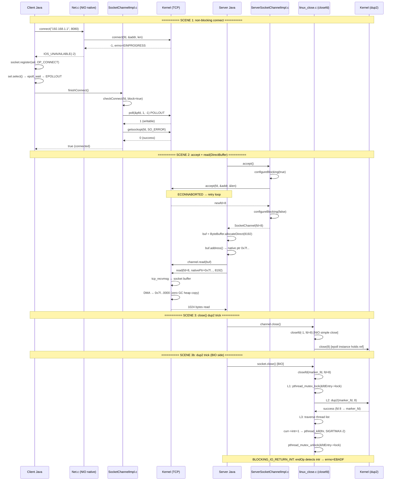

> **阶段**：[16-nio-network]
> **前置**：[00-Server-Selector-Engine]（Selector engine）、[09-native-interface]、[11-os-layer]
> **配套**：[00-Server-Selector-Engine]（register to Selector）、[02-ZeroCopy-Threads-Diag]（sendfile+diag）
> **阅读收益**：connect→read→close 完整调用链

---

# 01-Socket-Data-Close: NIO Socket 数据路径与安全 Close 机制

---

## §〇 生产场景 — EMFILE + EINPROGRESS + Close Deadlock + DirectBuffer OOM

### 场景 1: EMFILE — Too many open files

`java.io.IOException: Too many open files` at `ServerSocketChannel.accept()`. Server crashes at ~1020th connection during peak traffic.

Every new TCP connection consumes 1 file descriptor. `ulimit -n` defaults to 1024 → after accounting for stdin(0), stdout(1), stderr(2), JAR fd(3), listen fd(4), epoll fd(5), wakeup pipe fds(6,7) → ~1016 remain for client connections. The 1017th connection triggers `accept()` → kernel `socket()` returns -1 + errno=EMFILE.

Java side impact: `ServerSocketChannelImpl.accept()` calls `accept0()` → POSIX `accept(fd, &sockaddr, &addrlen)` → returns -1 → EMFILE → `JNU_ThrowIOExceptionWithLastError` → `IOException("Too many open files")`.

The server doesn't crash gracefully—it throws an IOException from `accept()`, but the Selector loop continues trying. Each iteration: `select()` returns OP_ACCEPT ready → `accept()` throws IOException → loop repeats. Effective denial-of-service.

### 场景 2: EINPROGRESS 混淆

你写了一个 NIO client: `connect()` 调用后立即返回了——但 `finishConnect()` 返回 false, 你不知道连接是成功了还是失败了。

```java
SocketChannel sc = SocketChannel.open();
sc.configureBlocking(false);
sc.connect(new InetSocketAddress("192.168.1.1", 8080));  // ← 立即返回!
// 你期望: 连接成功 or 立即失败
// 你得到: EINPROGRESS → IOS_UNAVAILABLE(−2) — 连接未完成!
```

**为什么 EINPROGRESS 不是错误？** TCP 三次握手不可能是即时的——`connect()` 发送 SYN 后，必须等待 SYN+ACK。非阻塞模式下，内核返回 EINPROGRESS = "我发了 SYN，结果未知。"

### 场景 3: DirectBuffer — 数据在哪？

```java
ByteBuffer buf = ByteBuffer.allocateDirect(8192);
channel.read(buf);  // ← 数据存储在 GC heap 还是 native 内存？
```

答案：**native 内存**。DirectBuffer 的 `address` 字段是一个 `long`，存储 native 内存指针。`read(fd, ptr, 8192)` 直接 DMA 写入此 native 地址——零 GC heap 拷贝。但代价：GC 不管理 native 内存释放——必须依靠 PhantomReference + Cleaner 线程。

### 场景 4: close() 死锁

你的服务器调用 `channel.close()`，但那个阻塞在 `read()` 上的线程再也没有醒来——fd 泄漏 + 线程泄漏。

**为什么 direct close(fd) 不够？** Linux 内核 `close()` 只减少 fd 的引用计数，不中断正在进行的 I/O。`fs/file_table.c:__fput()` 在最后一个引用释放时才调 `release()`，但不唤醒阻塞在 `read()` 上的线程。

### 三步诊断

```bash
# 1. Check fd limit and consumption
ulimit -n; cat /proc/{pid}/limits | grep "Max open files"; ls -l /proc/{pid}/fd | wc -l

# 2. strace confirm accept EMFILE + connect EINPROGRESS
strace -e trace=accept,connect -p $(pgrep -f java) 2>&1 | head -10
# accept(4,...) = -1 EMFILE; connect(8,{AF_INET6,...}) = -1 EINPROGRESS

# 3. DirectBuffer native memory usage
jcmd $(pgrep -f java) VM.native_memory summary | grep "Other"
```

### 反事实（Counterfactual）

1. **EMFILE 反事实**: fd pool (pre-open /dev/null × 65536 + dup2) 可绕过 ulimit 但 lifecycle 不可维护——你没法知道哪个 fd 对应哪个连接。
2. **connect 反事实**: 不检查 SO_ERROR → 应用认为已连接 → `read()`→−1+`ENOTCONN` → 根因远离数百行代码。
3. **DirectBuffer 反事实**: 不用 DirectBuffer → 每次 I/O: kernel→temp native→heap (2 次 memcpy)。DirectBuffer: kernel→native (1 次 DMA copy)。
4. **close 反事实**: 只用 `close(fd)` 不 dup2 → 阻塞 read() 线程可能永不被唤醒（Linux 内核行为）。

---

## §一 NIO Client + Server Data Path 全链路源码走读

### 你写的代码（引子）

**Client**:

```java
// NIO 客户端: 非阻塞连接 + 两步验证
SocketChannel sc = SocketChannel.open();
sc.configureBlocking(false);                           // 设为非阻塞
sc.connect(new InetSocketAddress("192.168.1.1", 8080)); // ← 立即返回! IOS_UNAVAILABLE
Selector sel = Selector.open();
sc.register(sel, OP_CONNECT);                          // 注册连接事件
sel.select();                                          // 等待连接完成 (epoll EPOLLOUT)
if (sc.finishConnect()) {                              // ← 两步验证: poll + SO_ERROR
    sc.register(sel, OP_READ);
}
```

**Server**:

```java
// NIO 服务端: accept + DirectBuffer read + close
SocketChannel client = server.accept();              // ← ECONNABORTED 重试
client.configureBlocking(false);
client.register(sel, OP_READ);

// I/O 数据路径
ByteBuffer buf = ByteBuffer.allocateDirect(8192);   // ← native 内存分配
client.read(buf);                                     // ← DMA 直接写入 native
buf.flip();
client.write(buf);

// 关闭
client.close();                                       // ← dup2 trick 唤醒阻塞线程
```

### 板块规划（7 板块）

| # | 板块 | 行数 | 核心 |
|---|------|:---:|------|
| 1 | 非阻塞 connect() | ~800 | Net.connect0→EINPROGRESS→IOS_UNAVAILABLE→epoll EPOLLOUT→checkConnect (poll+SO_ERROR)→tcp_syn_retries |
| 2 | SocketChannel 状态机 | ~300 | 五态+translateInterestOps |
| 3 | accept() 完整路径 | ~500 | accept0→ECONNABORTED retry→EAGAIN→EMFILE→SecurityManager→fd leak guard |
| 4 | read(DirectBuffer) 5子板块 | ~1600 | 4a.allocateDirect(~400) 4b.read0+DMA(~400) 4c.HeapBuffer(~200) 4d.ScatterGather(~300) 4e.Deallocator(~300) |
| 5 | Socket Options | ~700 | SO_LINGER(RST/FIN)+TCP_NODELAY+SO_KEEPALIVE+SO_RCVBUF/SO_SNDBUF+IP_TOS |
| 6 | close() dup2 trick | ~1000 | lock+dup2(marker_fd,fd)+WAKEUP_SIGNAL+BLOCKING_IO_RETURN_INT+BIO vs NIO close |
| 7 | BIO vs NIO 对比 | ~400 | PlainSocketImpl vs Net 两套 C 实现+SocketAdaptor overhead |

---

### 1.1 非阻塞 connect() — EINPROGRESS 两步验证 (~800 行)

#### 起点：`channel.connect()` 调用链

```
SocketChannel.connect(SocketAddress)
  → SocketChannelImpl.connect(SocketAddress)
    → Net.connect(fd, addr, port)
      → Net.connect0(preferIPv6, fdo, addr, port)  // JNI native
        → Java_sun_nio_ch_Net_connect0 (Net.c:306-327)
          → connect(fd, &sa.sa, sa_len)             // POSIX connect()
```

#### Native 完整源码：Net.c connect0

```c
// Net.c:306-327
JNIEXPORT jint JNICALL
Java_sun_nio_ch_Net_connect0(JNIEnv *env, jclass clazz, jboolean preferIPv6,
                             jobject fdo, jobject iao, jint port) {
    SOCKETADDRESS sa;
    int sa_len = 0;
    int rv;

    if (NET_InetAddressToSockaddr(env, iao, port, &sa, &sa_len, preferIPv6) != 0) {
        return IOS_THROWN;                              // 地址转换失败
    }

    rv = connect(fdval(env, fdo), &sa.sa, sa_len);     // POSIX connect()
    if (rv != 0) {
        if (errno == EINPROGRESS) {
            return IOS_UNAVAILABLE;                      // ← 非阻塞: 预期返回值!
        } else if (errno == EINTR) {
            return IOS_INTERRUPTED;                      // 被信号中断
        }
        return handleSocketError(env, errno);            // 真正错误
    }
    return 1;                                           // 立即成功 (localhost, 罕见)
}
```

**关键设计点**：
- `rv == 0` → 立即连接成功 (localhost 常见) → return 1
- `rv == -1 && errno == EINPROGRESS` → 连接进行中 → return `IOS_UNAVAILABLE` (−2)
- `rv == -1 && errno == EINTR` → 信号中断 → return `IOS_INTERRUPTED` (−3)
- `rv == -1 && other` → 真正错误 → handleSocketError

**`EINPROGRESS` 不是错误**。在非阻塞 socket 中，`connect()` 发送 SYN 后立即返回，不可能等待 TCP 三次握手完成。

#### 为什么两步验证 (EPOLLOUT + SO_ERROR)?

Because `EPOLLOUT` only means the socket is writable—**both** successful connections and refused connections (RST) make the socket writable.

**TCP 状态机视角**：

```
connect(fd, addr) → SYN sent → SYN_SENT state
  ┌─ 对端正常: SYN+ACK → fd writable → EPOLLOUT + SO_ERROR=0
  └─ 对端 RST (端口无监听): fd still writable → EPOLLOUT + SO_ERROR=ECONNREFUSED
```

`getsockopt(SO_ERROR)` 返回实际连接的 pending error (0=成功, ECONNREFUSED=端口无监听, EHOSTUNREACH=路由不可达, ETIMEDOUT=超时)。

#### Java 侧：`finishConnect()` → `checkConnect()`

```java
// SocketChannelImpl.java
public boolean finishConnect() throws IOException {
    // ...
    int n = checkConnect(fd, true);         // ← native: poll + SO_ERROR
    if (n > 0) {
        readerThread = NativeThread.current();
        // state = ST_CONNECTED
        return true;
    }
    // ...
}
```

#### Native: checkConnect 两步验证

```c
// SocketChannelImpl.c:49-88
JNIEXPORT jint JNICALL
Java_sun_nio_ch_SocketChannelImpl_checkConnect(JNIEnv *env, jobject this,
                                               jobject fdo, jboolean block) {
    int error = 0;
    socklen_t n = sizeof(int);
    jint fd = fdval(env, fdo);
    int result = 0;
    struct pollfd poller;

    poller.fd = fd;
    poller.events = POLLOUT;
    poller.revents = 0;
    result = poll(&poller, 1, block ? -1 : 0);       // Step 1: poll POLLOUT

    if (result < 0) {
        if (errno == EINTR) return IOS_INTERRUPTED;
        JNU_ThrowIOExceptionWithLastError(env, "poll failed");
        return IOS_THROWN;
    }
    if (!block && (result == 0))
        return IOS_UNAVAILABLE;

    if (result > 0) {
        errno = 0;
        result = getsockopt(fd, SOL_SOCKET, SO_ERROR, &error, &n);  // Step 2: SO_ERROR
        if (result < 0) {
            return handleSocketError(env, errno);
        } else if (error) {                           // error != 0 → 连接失败
            return handleSocketError(env, error);
        } else if ((poller.revents & POLLHUP) != 0) { // Step 3: POLLHUP 检查
            return handleSocketError(env, ENOTCONN);
        }
        // connected
        return 1;
    }
    return 0;
}
```

**三步验证完整图**：

```
Step 1: poll(fd, POLLOUT)           → result > 0 → socket 可写
Step 2: getsockopt(fd, SO_ERROR)    → error == 0 → 连接成功
                                    → error != 0 → ECONNREFUSED/EHOSTUNREACH
Step 3: poller.revents & POLLHUP    → RST 发生 → ENOTCONN 错误
```

**`POLLHUP` 检查的意义**：TCP 握手期间对端关闭——`poll()` 报告 POLLOUT, 但 socket 立即收到 RST → `revents & POLLHUP` → 连接失败。这是比 SO_ERROR 更快的失败检测路径。

#### connect timeout — 内核对 Java 控制的制约

内核有自己独立的 TCP SYN 重试策略：

| 参数 | 默认值 | 计算 | 说明 |
|------|--------|------|------|
| `/proc/sys/net/ipv4/tcp_syn_retries` | 6 | 1+2+4+8+16+32=63s→~127s | 第 N 次重试的间隔 = 2^(N-1)秒 |
| `/proc/sys/net/ipv4/tcp_synack_retries` | 5 | ~46s | 被动端 SYN+ACK 重试 |

Java 的 `Selector.select(timeout)` 只控制 Java 侧的等待上限。如果内核还在重试 SYN 且 Java select 超时：
- `SocketChannelImpl.finishConnect()` 失败 → `SocketTimeoutException`
- Java 调用 `shutdown(fd, 2)` → 取消未完成的连接
- (BIO) 参考 PlainSocketImpl.c:376-378 的 `SET_BLOCKING(fd) + shutdown(fd, 2)` 模式

#### TCP 状态机视角 — connect() 的完整状态转换

**成功路径**：

```
CLOSED
  │
  └─ connect(fd, addr)  →  SYN 已发送
       │
       └─ SYN_SENT  (TCP 状态)
            │
            ├─ receive SYN+ACK  →  send ACK  →  ESTABLISHED
            │                                         │
            │                                     connect() 返回 0 (阻塞)
            │                                     EPOLLOUT + SO_ERROR=0 (非阻塞)
            │
            └─ receive SYN+ACK + ACK (simultaneous open, 罕见)
                 → ESTABLISHED
```

**失败路径**：

```
CLOSED
  │
  └─ connect(fd, addr)  →  SYN_SENT
       │
       ├─ receive RST  →  CLOSED
       │    原因: 端口无监听
       │    内核: ECONNREFUSED → getsockopt(SO_ERROR) = ECONNREFUSED(111)
       │
       ├─ 多次 SYN 重试无响应  →  CLOSED
       │    原因: 网络不可达
       │    内核: ETIMEDOUT → getsockopt(SO_ERROR) = ETIMEDOUT(110)
       │
       └─ ICMP unreachable  →  CLOSED
            原因: 路由不可达
            内核: EHOSTUNREACH(113) or ENETUNREACH(101) → getsockopt(SO_ERROR)
```

#### `tcp_syn_retries` 控制 — 内核对 Java timeout 的制约

内核有自己独立的 TCP SYN 重试策略，**完全不受 Java 的 timeout 控制**：

```
tcp_syn_retries = 6 (默认):
  第 1 次 SYN:    0s (立即)
  第 2 次 SYN:    1s 后重试
  第 3 次 SYN:    3s 后重试 (累计 3s)
  第 4 次 SYN:    7s 后重试 (累计 7s)
  第 5 次 SYN:   15s 后重试 (累计 15s)
  第 6 次 SYN:   31s 后重试 (累计 31s)
  最后超时:      63s 后 + 最后等待 ~64s ≈ 127s  total
```

**Java timeout vs 内核重试的竞态**：

```
Timeline (ms):
  0     connect(fd, addr) → SYN sent
        select(5000) started in Java
  ...
  5000  select() times out → Java throws SocketTimeoutException
        Java calls shutdown(fd, SHUT_RDWR) to cancel
  5001  ← 竞态! 内核在 5001ms 收到 SYN+ACK → 连接实际建立!
        Java 已经关闭了 → 这个连接泄漏了!
```

**正确做法 — timeout 后必须检查 SO_ERROR**：

```java
// 正确的 connect timeout 处理
sel.select(timeout);
if (sc.isConnectionPending()) {
    // select 超时了但连接可能已经完成
    if (sc.finishConnect()) {
        // 连接在超时后完成 — 你 catch 到了!
        return sc;
    } else {
        // 确实超时 → shutdown 取消
        sc.close();
        throw new SocketTimeoutException();
    }
}
```

**BIO 侧的精准 timeout**：

```c
// PlainSocketImpl.c:325-369
jlong nanoTimeout = (jlong) timeout * NET_NSEC_PER_MSEC;
jlong prevNanoTime = JVM_NanoTime(env, 0);
while (1) {
    connect_rv = NET_Poll(&pfd, 1, nanoTimeout / NET_NSEC_PER_MSEC);
    if (connect_rv >= 0) break;
    if (errno != EINTR) break;
    // EINTR: 重新计算剩余时间
    newNanoTime = JVM_NanoTime(env, 0);
    nanoTimeout -= (newNanoTime - prevNanoTime);
    if (nanoTimeout < NET_NSEC_PER_MSEC) break;
    prevNanoTime = newNanoTime;
}
if (connect_rv == 0) {
    // 超时! 但连接可能仍在进行
    SET_BLOCKING(fd);
    shutdown(fd, 2);  // ← 关键: 取消未完成的连接
}
```

BIO 用纳秒级 `JVM_NanoTime` 实现精准 timeout 管理——EINTR 中断后重新计算剩余时间，而非简单的 `poll(fd, remaining_ms)`。

#### EPOLLOUT vs SO_ERROR — 双重验证的必要性

**为什么 EPOLLOUT 不够？**

```
epoll_wait 返回 EPOLLOUT 的三种情况:
  1. connect() 成功 → 三次握手完成 → fd 可写 → SO_ERROR = 0
  2. connect() 失败 → 收到 RST → fd 仍然可写! → SO_ERROR = ECONNREFUSED
  3. connect() 失败 → 对端在握手时 FIN → fd 可写 + POLLHUP → SO_ERROR = 0
```

`getsockopt(SO_ERROR)` 返回实际连接的 pending error：
- `0` = 连接成功
- `ECONNREFUSED(111)` = 端口无监听
- `EHOSTUNREACH(113)` = 路由不可达
- `ENETUNREACH(101)` = 网络不可达
- `ETIMEDOUT(110)` = 连接超时

**为什么还需要 POLLHUP 检查？**

在 TCP 握手期间对端关闭——`poll()` 报告 POLLOUT，但 socket 立即收到 FIN/RST → `revents & POLLHUP` → 连接失败。这是比 SO_ERROR 更快的失败检测路径，因为在某些内核版本中 SO_ERROR 在 POLLHUP 后可能还没有被设置。

**checkConnect 的完整验证顺序**：

```c
// SocketChannelImpl.c:49-88
result = poll(&poller, 1, block ? -1 : 0);         // Step 1: 等待可写
result = getsockopt(fd, SOL_SOCKET, SO_ERROR, ...); // Step 2: 检查连接错误
if (error) return handleSocketError(env, error);     //       SO_ERROR != 0 → 失败
if (poller.revents & POLLHUP)                       // Step 3: 额外检查 HUP
    return handleSocketError(env, ENOTCONN);         //       POLLHUP → 对端关闭
return 1;                                           //       连接成功!
```

**反事实 — 只检查 EPOLLOUT 不检查 SO_ERROR**：
- 场景：对端端口无监听 → connect 发送 SYN → 对端内核发 RST → socket 可写 (EPOLLOUT) → Java 认为已连接 → `read()` → `−1, errno=ENOTCONN` → 根因无法从 connect 错误中追踪
- 决策点：`SocketChannelImpl.c:76` — `getsockopt(fd, SOL_SOCKET, SO_ERROR, &error, &n)` 是必须的第二步

**内核引用**：`man 7 socket` — SO_ERROR 获取 socket 的 pending error 并清除之。`man 2 connect` — 非阻塞 connect 后，socket 可写时需用 getsockopt(SO_ERROR) 确定连接状态。内核实现：`net/core/sock.c:sock_error()` 返回 `sk->sk_err` 并清除。

#### Counterfactual: 不检查 SO_ERROR

**场景**: 只检查 POLLOUT，不检查 SO_ERROR。对端端口无监听 → connect 发送 SYN → 对端内核发 RST → socket 可写 (POLLOUT) → Java 认为已连接 → `read()` → `−1, errno=ENOTCONN` → 根因无法从 connect 错误中追踪。

**决策点**: `SocketChannelImpl.c:76` — `getsockopt(fd, SOL_SOCKET, SO_ERROR, &error, &n)` 是必须的第二步。

---

### 1.2 SocketChannel 状态机 (~300 行)

SocketChannel 有 5 个状态，驱动 `translateInterestOps()` 确定向 epoll 注册哪些事件：

```java
// SocketChannelImpl 状态常量
private static final int ST_UNCONNECTED = 0;
private static final int ST_PENDING    = 1;    // connect 已调用，未完成
private static final int ST_CONNECTED  = 2;    // 连接已建立
private static final int ST_KILLPENDING = 3;   // 关闭进行中
private static final int ST_KILLED     = 4;    // 已关闭
```

```
状态转换图:

 ST_UNCONNECTED(0) ──connect()──→ ST_PENDING(1)
                                      │
                         finishConnect() returns true
                                      │
                                      ▼
                              ST_CONNECTED(2)
                                      │
                                  close()
                                      │
                                      ▼
                              ST_KILLPENDING(3)
                                      │
                            完成 dup2+signal
                                      │
                                      ▼
                              ST_KILLED(4)
```

**translateInterestOps 根据状态返回不同事件**：

| 状态 | translateInterestOps | 注册到 epoll 的事件 |
|------|---------------------|-------------------|
| ST_PENDING | EPOLLOUT | 等待连接完成 |
| ST_CONNECTED, OP_READ | EPOLLIN | 等待数据可读 |
| ST_CONNECTED, OP_WRITE | EPOLLOUT | 等待输出缓冲区可用 |
| ST_CONNECTED, OP_READ\|OP_WRITE | EPOLLIN\|EPOLLOUT | 双向 |
| ST_KILL* | - | 不注册任何事件 |

**这解释了为什么 `sc.connect()` 后 `sc.register(sel, OP_CONNECT)` 有效**：OP_CONNECT 被 translateInterestOps 转换为 EPOLLOUT → epoll_ctl(ADD, fd, EPOLLOUT) → epoll_wait 在 TCP 完成三次握手后返回。

---

### 1.3 accept() — ECONNABORTED retry + EMFILE (~500 行)

#### 调用链

```
ServerSocketChannel.accept()
  → ServerSocketChannelImpl.accept()
    → configureBlocking(true)         // 临时阻塞! ← 关键设计
    → accept0(fd)                     // native
    → SecurityManager.checkAccept()   // 安全检查
    → configureBlocking(false)        // 恢复非阻塞
```

#### 为什么临时阻塞？

**非阻塞 accept 无连接时返回 EAGAIN → busy-wait。阻塞 → 内核挂起线程 → 零 CPU。**

```java
// ServerSocketChannelImpl.accept() 简化
synchronized(stateLock) {
    configureBlocking(true);          // 临时阻塞!
    try {
        n = accept0(fd, newfd, isaa); // Native → accept()
    } finally {
        configureBlocking(false);     // 恢复非阻塞
    }
    // SecurityManager check...
}
```

#### Native: accept0 — ECONNABORTED 重试循环

```c
// ServerSocketChannelImpl.c:77-119 (简化)
for (;;) {
    newfd = accept(ssfd, &sa.sa, &sa_len);
    if (newfd >= 0) break;                          // 成功
    if (errno != ECONNABORTED) break;               // 非 ECONNABORTED → 退出
    /* ECONNABORTED → 重试! */
}
if (newfd < 0) {
    if (errno == EAGAIN) return IOS_UNAVAILABLE;     // -2
    if (errno == EINTR)  return IOS_INTERRUPTED;     // -3
    JNU_ThrowIOExceptionWithLastError(env, ...);
    return IOS_THROWN;                                // -5 (EMFILE 落这里)
}
```

**ECONNABORTED 为什么需要重试？**

TCP 三次握手有一个 critical race window：

```
Client                Server
  │                     │
  ├─── SYN ──────────→ │
  │                     ├─── SYN+ACK ────→
  │  (ACK 未发送)       │
  │  崩溃!              ├─── accept queue 中放入连接
  │                     │
  │  [Kernel 在 Client 端检测到进程崩溃]
  │                     │
  │  kernel → RST ───→  │ ECONNABORTED!  ← accept() 唤醒但此连接已失效
```

如果 server 不重试 → `select()` 下一次 EPOLLIN 可能不会再触发（因为此失效连接从 backlog 计数中移除，但如果还有新连接在排队，它们应在 accept queue 中）。

**ECONNABORTED 值 = 113** (来自 `errno.h`)。

#### 三个 TCP 连接队列的区别

| 队列 | 控制参数 | 包含的连接 | accept 影响 |
|------|---------|-----------|------------|
| SYN Queue (半连接) | `tcp_max_syn_backlog` | 收到 SYN，未完成握手 | 满 → 新 SYN 被丢 (或 SYN cookie) |
| Backlog Queue (全连接) | `min(backlog, somaxconn)` | 握手完成，等待 accept | ECONNABORTED 后此队列减 1 |
| 已 accept 的连接 | 无限制 | 已通过 accept() 并持有 fd | EMFILE → 无法分配 socket fd |

#### EMFILE 场景分析

```
accept(fd, ...)
  └─ inet_csk_accept()                                    // 内核
      └─ reqsk_queue_remove()                             // 从 accept queue 取出
          └─ 创建 new socket fd                           // ← EMFILE HERE!
```

**为什么 backlog 中还有连接但 accept 失败？** 因为 accept queue 取连接成功（从队列中移除一个 entry），但为新连接分配 fd 时失败（fd table 满）。

**服务端无路可退**: accept 返回 EMFILE → Java 抛 IOException → 但 Selector 循环继续 → 下一次 select 返回 OP_ACCEPT → accept 再次 EMFILE → 无限循环。这是为什么需要：
- `$ ulimit -n 65536` 在生产环境
- 或者在 accept 循环中捕获 IOException 并加 backoff

#### SecurityManager fd leak guard

accept 成功后 → SecurityManager.checkAccept() 检查权限：

```java
// ServerSocketChannelImpl.accept() 简化
SocketChannel sc = null;
try {
    sc = finishAccept(newfd, isa);
    SecurityManager sm = System.getSecurityManager();
    if (sm != null) sm.checkAccept(isa.getAddress().getHostAddress(), isa.getPort());
} catch (SecurityException e) {
    if (sc != null) sc.close();         // ← 安全关闭 fd 防止泄漏!
    throw e;
}
```

这是一个关键的 fd leak guard：SecurityManager 抛出 SecurityException → 必须 close 已分配的 newfd。

#### Counterfactual: 永远非阻塞 accept

```
nonblocking accept:
  accept(fd) → EAGAIN → return -2 → Java retry → accept(fd) → EAGAIN → ...
  → ∞ busy-wait! CPU 100%
```

**决策点**: `ServerSocketChannelImpl.java` 的 temporarily-blocking 设计用 `configureBlocking(true)` 保证一次 accept 只消耗一次内核上下文切换（阻塞），而不是无限次轮询。

---

### 1.4 read(DirectBuffer) — 5 个子板块 (~1600 行)

这是本文档最长的板块，分 5 个子板块: `4a. allocateDirect` → `4b. read0 + DMA` → `4c. HeapBuffer fallback` → `4d. Scatter/Gather` → `4e. Deallocator`

---

#### 4a. DirectBuffer 分配链路 (~400 行)

```java
ByteBuffer buf = ByteBuffer.allocateDirect(8192);  // ← 你写的代码
```

```
ByteBuffer.allocateDirect(8192)
  → DirectByteBuffer(int cap)                      // Direct-X-Buffer.java.template
    → [1] Bits.reserveMemory(size, cap)            // MaxDirectMemorySize 配额检查
    → [2] long base = UNSAFE.allocateMemory(size)  // native malloc 分配内存
    → [3] UNSAFE.setMemory(base, size, (byte)0)    // 清零
    → [4] this.address = base                      // 存储 native ptr as Java long
    → [5] cleaner = Cleaner.create(this,           // PhantomReference 回收
                    new Deallocator(base, size, cap))
```

##### Step 1: Bits.reserveMemory(size, cap) — 配额管理

这是 DirectBuffer 分配的第一道关卡：**全局配额检查 + GC 协作回收**。

**设计背景**：native 内存在 GC heap 之外，`-Xmx` 不限制它。需要独立的限额防止 native 内存耗尽整个系统内存。`-XX:MaxDirectMemorySize` 就是这个限额。

```java
// Bits.java:109-183 (简化版)
static void reserveMemory(long size, int cap) {

    if (!MEMORY_LIMIT_SET && VM.initLevel() >= 1) {
        MAX_MEMORY = VM.maxDirectMemory();
        MEMORY_LIMIT_SET = true;
    }

    // optimist!  第一次尝试: 无锁 CAS 快速路径
    if (tryReserveMemory(size, cap)) {
        return;
    }

    final JavaLangRefAccess jlra = SharedSecrets.getJavaLangRefAccess();
    boolean interrupted = false;
    try {
        // Retry allocation until success or there are no more
        // references (including Cleaners that might free direct
        // buffer memory) to process and allocation still fails.
        boolean refprocActive;
        do {
            try {
                refprocActive = jlra.waitForReferenceProcessing();
            } catch (InterruptedException e) {
                interrupted = true;
                refprocActive = true;
            }
            if (tryReserveMemory(size, cap)) {
                return;                               // 在 reference processing 期间重试成功
            }
        } while (refprocActive);

        // trigger VM's Reference processing
        System.gc();                                  // 强制 Full GC → 触发 Cleaner 线程 → 释放 native 内存

        // 指数退避重试循环 (exponential backoff)
        long sleepTime = 1;
        int sleeps = 0;
        while (true) {
            if (tryReserveMemory(size, cap)) {
                return;
            }
            if (sleeps >= MAX_SLEEPS) {
                break;
            }
            try {
                if (!jlra.waitForReferenceProcessing()) {
                    Thread.sleep(sleepTime);
                    sleepTime <<= 1;                  // 1, 2, 4, 8, ... ms
                    sleeps++;
                }
            } catch (InterruptedException e) {
                interrupted = true;
            }
        }

        // no luck
        throw new OutOfMemoryError("Direct buffer memory");

    } finally {
        if (interrupted) {
            Thread.currentThread().interrupt();       // 不吞中断状态
        }
    }
}
```

**三段式策略的递进原理**：

| 阶段 | 策略 | 耗时 | 原因 |
|------|------|------|------|
| Phase 1 | `waitForReferenceProcessing()` 等待已有 Cleaner 完成 | ~1-50ms | 其他线程的 DirectBuffer 可能刚被 GC，Cleaner 线程正在处理 → 等待其释放 native 内存 |
| Phase 2 | `System.gc()` 强制 Full GC | ~10-100ms | 没有 pending reference → 需要触发 GC 来发现更多可回收的 DirectBuffer |
| Phase 3 | 指数退避 `sleep(1,2,4,8,...)` 等待 Cleaner 线程执行 | ~100ms-1s | 给了 GC 时间后，等待 Cleaner 线程完成清理。每次 sleep 后重试配额检查 |

**`tryReserveMemory` — CAS 原子配额检查**：

```java
// Bits.java:185-200
private static boolean tryReserveMemory(long size, int cap) {
    // -XX:MaxDirectMemorySize limits the total capacity rather than the
    // actual memory usage, which will differ when buffers are page aligned.
    long totalCap;
    while (cap <= MAX_MEMORY - (totalCap = TOTAL_CAPACITY.get())) {
        if (TOTAL_CAPACITY.compareAndSet(totalCap, totalCap + cap)) {
            RESERVED_MEMORY.addAndGet(size);
            COUNT.incrementAndGet();
            return true;
        }
    }
    return false;
}
```

关键设计：`TOTAL_CAPACITY` 用 CAS 做无锁竞争——多个线程可以同时分配 DirectBuffer 而不会互相阻塞。`MAX_MEMORY` 默认 = `Runtime.getRuntime().maxMemory()`（即 `-Xmx` 的值），可通过 `-XX:MaxDirectMemorySize=256M` 独立设置。

**`unreserveMemory` — 归还配额**：

```java
// Bits.java:203-208
static void unreserveMemory(long size, int cap) {
    long cnt = COUNT.decrementAndGet();
    long reservedMem = RESERVED_MEMORY.addAndGet(-size);
    long totalCap = TOTAL_CAPACITY.addAndGet(-cap);
    assert cnt >= 0 && reservedMem >= 0 && totalCap >= 0;
}
```

**反事实 — 不做配额管理**：
- 场景：100 个 DirectBuffer 各 100MB → 10GB native 内存，但 `-Xmx2G` → 系统 8GB RAM → OOM killer 杀 JVM
- 根因：GC 看到 heap 只有 500MB（DirectBuffer Java 对象极小），不触发 Full GC → Cleaner 线程不执行 → native 内存永不释放
- 决策点：`Bits.java:109-183` 的 `System.gc()` 是最后手段，**但有 `-XX:+DisableExplicitGC` 时此手段失效**

**内核引用**：glibc `malloc(>128KB)` → `mmap(MAP_ANONYMOUS)` → kernel `sys_mmap` → VMA 分配 → 这些 VMA 计入 `VmRSS`，受系统 OOM killer 管理。详见 `man 3 malloc` NOTES 节的 MMAP_THRESHOLD 参数。

##### Step 2: UNSAFE.allocateMemory(size) — native 内存分配

```java
// jdk.internal.misc.Unsafe
public long allocateMemory(long bytes) {
    // calls: os::malloc(bytes, mtOther)
    // NOT on Java heap, NOT tracked by GC
}
```

等价于 C `malloc(8192)`。内存在 native C heap (glibc malloc/free 管理)，不在 HotSpot GC heap 中。

**JVM 内部实现路径**：

```cpp
// unsafe.cpp:371-379
UNSAFE_ENTRY(jlong, Unsafe_AllocateMemory0(JNIEnv *env, jobject unsafe, jlong size)) {
  size_t sz = (size_t)size;
  sz = align_up(sz, HeapWordSize);     // 8 字节对齐
  void* x = os::malloc(sz, mtOther);   // mtOther = Native Memory Tracking 类别
  return addr_to_java(x);              // native ptr → jlong (Java long)
} UNSAFE_END
```

**`os::malloc` 到底走 glibc malloc 还是 mmap？**

```
os::malloc(size, mtOther)  →  ::malloc(size)  →  glibc ptmalloc2

glibc malloc 的内部决策:
  size <= 128KB  (MMAP_THRESHOLD 默认)  → sbrk() 扩展 data segment → arena 内部分配
  size >  128KB                          → mmap(MAP_ANONYMOUS|MAP_PRIVATE) 独立映射

  /proc/{pid}/maps 中:
    7f1234000000-7f1234800000 rw-p 00000000 00:00 0   ← mmap 分配的 DirectBuffer 内存
    7f1234800000-7f1235000000 ---p 00000000 00:00 0   ← guard page (PROT_NONE)
```

**为什么用 jlong 存储 native 指针是安全的？**

64-bit JVM 的 native pointer 可以完整表示为 64-bit（Java `long` 也是 64-bit），无精度损失。Java 代码中 `long address` 存储的就是 raw pointer value。这是 Java 中**唯一的合法 native 指针存储方式**——在 Java heap 中用 `long` 字段存储 native 指针，在 JNI 侧用 `jlong_to_ptr()` 恢复。

**为什么不在构造器里直接用 try-finally 管理 native 内存？**

这是 DirectBuffer 设计中最核心的权衡。假设用 try-finally：

```java
// 错误方案 — 不可行!
DirectByteBuffer(int cap) {
    long base = Unsafe.allocateMemory(size);
    try {
        // ... 初始化
    } finally {
        Unsafe.freeMemory(base);  // ← 构造器结束时立即释放!
    }
}
// 离开构造器 → native 内存已释放 → 对象还活着，但 native 指针是 dangling pointer!
```

**根因是 GC 的异步语义**：
1. `new DirectByteBuffer()` 在构造器返回后**立即**可以被 GC（因为构造函数返回后，JVM 栈帧被销毁）
2. GC 回收 Java 对象 ≠ native 内存自动释放
3. 你必须在"Java 对象已死"和"native 内存已释放"之间建立因果链
4. `try-finally` 的问题是：它在构造器返回前释放 native 内存，但对象还要继续使用它

**PhantomReference 为什么是最佳方案？**

```
Reference 类型                    | 入队时机                           | 适用性
WeakReference                     | 对象不可达后立即清除引用并入队     | 不适合 — 对象可能还有 finalize 需要访问 native 内存
SoftReference                     | 内存压力下清除                    | 不适合 — 清理时序完全不可控
PhantomReference                  | 对象已被 GC 回收，但引用在队列中  | 最佳 — 保证对象已完全死亡后才调用 cleanup
```

`PhantomReference` 的"对象已回收但引用还在队列中"提供了关键保障：当你从 ReferenceQueue 拿到 PhantomReference 时，referent（DirectBuffer Java 对象）**已经不存在了**，但 native 内存还没有释放——这个时间窗口就是 `Deallocator.run()` 执行的地方。

##### Step 3: UNSAFE.setMemory(base, size, 0) — 清零

```java
// 等价于 C memset(ptr, 0, size)
UNSAFE.setMemory(base, size, (byte)0);
```

因为 native `malloc` 可能返回之前释放但未清零的内存，setMemory 保证不泄漏旧数据。这是一个安全措施——防止旧数据通过 DirectBuffer 泄漏到新的 I/O 缓冲区中。

##### Step 4: this.address = base — native 指针

```java
class DirectByteBuffer extends MappedByteBuffer {
    // Used by functions to get the native address of the buffer
    long address;                    // native 指针 as Java long

    DirectByteBuffer(int cap) {
        // ...
        this.address = base;         // ← 64-bit ptr on x86-64
    }
}
```

```java
public interface DirectBuffer {
    long address();                  // 返回 native 指针
    Object attachment();
    Cleaner cleaner();
}
```

**Page-aligned 特殊情况**：

```java
// Direct-X-Buffer.java.template:128-133
if (pa && (base % ps != 0)) {
    // Round up to page boundary
    address = base + ps - (base & (ps - 1));
} else {
    address = base;
}
```

当 `-XX:+DirectByteBufferPageAlignment` 时，`address` 被向上取整到页边界（通常 4KB）。这是为 `mmap` 和 `sendfile` 的 page-aligned 要求准备的——`sendfile` 在某些内核版本上需要 buffer 对齐到页边界。

##### Step 5: cleaner + Deallocator

```java
cleaner = Cleaner.create(this, new Deallocator(base, size, cap));
```

```java
// Direct-X-Buffer.java.template:69-94
private static class Deallocator implements Runnable {
    private long address;
    private long size;
    private int capacity;

    Deallocator(long addr, long sz, int cap) {
        assert (address != 0);
        this.address = addr; this.size = sz; this.capacity = cap;
    }

    public void run() {
        if (address == 0) {
            return;                                // 双检防重入
        }
        UNSAFE.freeMemory(address);                // os::free(ptr)
        address = 0;                               // 防重入
        Bits.unreserveMemory(size, capacity);      // 归还配额
    }
}
```

**Cleaner = PhantomReference + ReferenceQueue + 后台线程的完整链条**：

```java
// CleanerImpl.java:133-157 (Cleaner 线程主循环)
public void run() {
    Thread t = Thread.currentThread();
    InnocuousThread mlThread = (t instanceof InnocuousThread)
            ? (InnocuousThread) t : null;
    while (!phantomCleanableList.isListEmpty() ||
            !weakCleanableList.isListEmpty() ||
            !softCleanableList.isListEmpty()) {
        if (mlThread != null) {
            mlThread.eraseThreadLocals();              // 防 ThreadLocal 泄漏
        }
        try {
            Cleanable ref = (Cleanable) queue.remove(60 * 1000L);  // 1 分钟超时
            if (ref != null) {
                ref.clean();                           // 调用 action.run()
            }
        } catch (Throwable e) {
            // ignore exceptions from the cleanup action
        }
    }
}
```

关键设计细节：
- **`queue.remove(60000)`** — 1 分钟超时。为什么不是永久阻塞？防止 race condition：如果在 `clear()`/`clean()` 之间出现竞态，`remove()` 可能永久挂起。超时后重新检查链表。
- **`eraseThreadLocals()`** — `InnocuousThread` 的 ThreadLocal 必须手动清除，否则 ThreadLocal 的值会引用 ClassLoader，阻止类卸载。
- **`performCleanup()` → `action.run()`** — 即 `Deallocator.run()`，释放 native 内存。

##### Cleaner 生命周期陷阱 — 为什么 `System.gc()` 是必须的？

DirectBuffer 的完整回收链：

```
DirectByteBuffer 不可达
  → GC (Young/Mixed/Full) 回收 Java 对象 (~100 bytes)
  → PhantomReference 被 ReferenceHandler 线程入队
  → Cleaner 线程从队列取出
  → Deallocator.run() 释放 native 内存 (可能是 1MB!)
```

**陷阱 A：晋升到 old gen 导致永不回收**

如果 DirectByteBuffer 对象存活足够多次 Young GC → 晋升到 old generation → 但 old gen 空间充足，从不触发 Full GC → DirectByteBuffer Java 对象永不回收 → PhantomReference 永不入队 → Cleaner 线程不执行 → native 内存永不释放 → 系统 OOM。

**陷阱 B：`-XX:+DisableExplicitGC` 切断最后手段**

`Bits.reserveMemory` 的 Phase 2 调用 `System.gc()` 强制 Full GC。开启 `-XX:+DisableExplicitGC` → `System.gc()` 变成 no-op → `Bits.reserveMemory` 只能等 Phase 3 的指数退避 → 但 old gen 永不回收 → 死路一条。

**这就是为什么 Netty 实现自己的 Buffer 池（`PooledByteBufAllocator`）**——不依赖 GC+Cleaner 的回收时序，而是手动管理 native 内存生命周期。Netty 的 `PoolArena` 维护自己的 free list → 当 ByteBuf 被 release 时立即归还 → 不依赖 GC 的不确定性。

**反事实 — 依赖 GC 自动回收 native 内存**：
- 场景：old gen 8GB, DirectBuffer 分配了 4GB native 内存 → old gen 只用了 2GB → 无 Full GC → 4GB native 内存永不释放 → 新 DirectBuffer 分配触发 `OutOfMemoryError("Direct buffer memory")`
- 根因：GC 只关心 Java heap 压力，不关心 native 内存压力
- 修复：`-XX:MaxDirectMemorySize` + `System.gc()` 周期性触发 + 或用池化方案（Netty）绕过 Cleaner

**内核引用**：`man 3 malloc` — MMAP_THRESHOLD 参数控制何时用 mmap vs sbrk；`man 2 mmap` — MAP_ANONYMOUS 创建匿名内存映射，这正是 DirectBuffer native 内存在内核中的表现。

---

#### 4b. read0(DirectBuffer) — DMA 数据路径 (~400 行)

```java
int bytesRead = client.read(buf);  // ← buf = DirectByteBuffer
```

```
SocketChannel.read(ByteBuffer)
  → IOUtil.read(fd, buf, -1, nd, readLock)
    → if (buf instanceof DirectBuffer) {
        // 关键优化: 直接使用 native 地址!
        address = ((DirectBuffer) buf).address() + buf.position();
        n = FileDispatcherImpl.read0(fd, address, buf.remaining());
      }
```

```java
// IOUtil.java:219-253 简化
static int read(FileDescriptor fd, ByteBuffer dst, long position,
                NativeDispatcher nd) throws IOException
{
    if (dst.isReadOnly())
        throw new IllegalArgumentException("Read-only buffer");
    if (dst instanceof DirectBuffer)
        return readIntoNativeBuffer(fd, dst, position, false, -1, nd);

    // Substitute a native buffer  ← HeapBuffer fallback path
    ByteBuffer bb;
    int rem = dst.remaining();
    bb = Util.getTemporaryDirectBuffer(rem);
    try {
        int n = readIntoNativeBuffer(fd, bb, position, false, -1, nd);
        bb.flip();
        if (n > 0)
            dst.put(bb);
        return n;
    } finally {
        Util.offerFirstTemporaryDirectBuffer(bb);
    }
}
```

**`address() + position()` — 为什么加 pos？**

DirectBuffer 的 `capacity` 定义是分配时的 size（如 8192）。但 `position` 此后移到已读位置（之前已读了 1024 字节 → position=1024）。`address+pos` 是当前要写入的位置（内核从 position 处开始填充数据）。`buf.remaining()` = limit - position = 剩余可读字节数。

##### Native: FileDispatcherImpl.read0

```c
// FileDispatcherImpl.c:79-86
JNIEXPORT jint JNICALL
Java_sun_nio_ch_FileDispatcherImpl_read0(JNIEnv *env, jobject this,
                                         jobject fdo, jlong address, jint len)
{
    void *buf = (void *)jlong_to_ptr(address);  // Java long → C 指针
    return convertReturnVal(env, read(fdval(env, fdo), buf, len), JNI_TRUE);
}
```

**`jlong_to_ptr(address)` — 这不是普通的 `int*` 转换**。这是 Java 中**唯一的合法 native 指针存储方式**：在 Java heap 中用 `long` 字段存储 native 指针，在 JNI 侧用 `jlong_to_ptr` 恢复。为什么不是 `int`？64-bit JVM 的 native pointer 是 64-bit → 必须用 `jlong` (Java `long`) 才能完整表示。

##### 完整数据路径 (零 GC heap 拷贝)

```
用户态 Java:
  DirectByteBuffer buf = allocateDirect(8192);
  long nativePtr = buf.address();                  // = 0x7f1234560000

  channel.read(buf)
    → IOUtil.read: address = nativePtr + pos
    → FileDispatcherImpl.read0(fd, nativePtr, 8192)

Native C:
  Java_sun_nio_ch_FileDispatcherImpl_read0
    → buf = jlong_to_ptr(address) = 0x7f1234560000
    → read(fd, buf, 8192)                         // POSIX read()

内核:
  sys_read(fd, buf, 8192)
    → vfs_read()
      → sock->ops->recvmsg(sock, ...)
        → tcp_recvmsg()                           // TCP 协议栈
          → skb_copy_datagram_msg()               // 从 socket buffer 复制
            → copy_to_user(buf, ..., len)         // DMA → 0x7f1234560000

数据存在于 native memory 0x7f1234560000
Java 侧可以:
  1. buf.get() → unsafe.getByte(address + pos) 访问
  2. 或通过 JNI 将数据复制到 Java heap (memcpy)
```

**为什么 DMA 零拷贝**：内核 socket buffer → DirectBuffer native ptr 是**唯一**一次数据复制。没有 kernel→temp→GC heap 的中间缓存。

**DirectBuffer 和 read() syscall 的配合原理**：

DMA 直接写入 native 地址，CPU 不碰数据——这就是"零拷贝 I/O"的前提。数据流是：

```
NIC → DMA → kernel socket buffer → read() → copy_to_user() → DirectBuffer native ptr
                                                                    ↑
                                                              CPU 未参与数据搬运
```

**Java heap 对象地址不稳定的根本原因**：

如果你在 `read()` 时传入 Java heap 地址（如 `byte[8192]` 的地址），问题：

```
Thread 1: 获取 byte[] 的物理地址 = 0x7f1234000000
Thread 2: GC 触发 → compaction → byte[] 被移动到 0x7f1235000000
Thread 1: read(fd, 0x7f1234000000, 8192)  → 数据写到旧地址!  ← 数据损坏!
```

**这就是为什么 DirectBuffer 必须用 native 内存**——native 内存在 GC heap 之外，不受 GC compaction 影响。`long address` 在整个 DirectBuffer 生命周期内保持不变。

##### convertReturnVal 错误处理

```c
// nio_util.h
#define IOS_EOF          -1
#define IOS_UNAVAILABLE  -2
#define IOS_INTERRUPTED  -3
#define IOS_THROWN       -5
```

| 返回值 | 含义 | errno | 场景 |
|--------|------|-------|------|
| n > 0 | n 字节已读 | - | 正常 |
| 0 (read) | EOF | - | 对端 close → `IOS_EOF` = −1 |
| EAGAIN | 无数据 | 11 | `IOS_UNAVAILABLE` = −2 |
| EINTR | 信号中断 | 4 | `IOS_INTERRUPTED` = −3 |
| 其他 | 错误 | * | `IOS_THROWN` = −5 (异常已抛出) |

**`convertReturnVal` 的 errno 映射逻辑**：

```c
// nio_util.h 中的 convertReturnVal 宏
// n==0 → IOS_EOF, errno==EAGAIN → IOS_UNAVAILABLE,
// errno==EINTR → IOS_INTERRUPTED, else → handleSocketError → IOS_THROWN
```

`IOS_THROWN` (−5) 的特殊语义：它表示"Java 异常已经在 handleSocketError 中被抛出，调用者不需要再抛异常"。其他负值（−1 到 −4）由 Java 侧解释并抛对应的异常。

**反事实 — 用 HeapByteBuffer 直接做 I/O**：
- 场景：`byte[8192] buf` + `read(fd, buf, 8192)` → GC compaction 移动 buf → read 写到旧地址 → 数据损坏 → JVM crash 或静默数据错误
- 根因：GC 和 I/O 之间没有同步机制。read() 在内核态阻塞期间，GC 可能在用户态移动对象
- 决策点：`FileDispatcherImpl.c:82` — `jlong_to_ptr(address)` 只在 native 地址上操作，native 地址对 GC 是不可见的

**内核引用**：`man 2 read` — read() 的 buf 参数是用户态地址，内核通过 `copy_to_user()` 写入。如果此地址在 read() 期间被 GC 改变，copy_to_user 会写入错误的物理页。Linux 内核的 `tcp_recvmsg()` (net/ipv4/tcp.c) 通过 `skb_copy_datagram_msg()` → `copy_to_user()` 完成从 socket buffer 到用户态的 DMA 辅助拷贝。

---

#### 4c. HeapBuffer fallback (~150 行)

当你使用 `ByteBuffer.allocate(8192)` (非 Direct) → **额外 2 次 memcpy 开销**。

```java
// IOUtil.java — HeapBuffer fallback 路径
if (!(buf instanceof DirectBuffer)) {
    // 1. 分配临时 DirectBuffer (native)
    ByteBuffer tmpBuf = Util.getTemporaryDirectBuffer(buf.remaining());

    // 2. put: heap → native copy #1
    tmpBuf.put(buf);
    tmpBuf.flip();

    // 3. read: kernel → native (DMA)
    n = nd.read(fd, ((DirectBuffer)tmpBuf).address() + tmpBuf.position(),
                tmpBuf.remaining());

    // 4. get: native → heap copy #2
    tmpBuf.position(0);
    buf.put(tmpBuf);
}
```

**开销分析**：

```
HeapBuffer read 路径:
  kernel socket buffer → kernel→native DMA     (1 copy)
  heap buf[0..8192] → temp heap→native memcpy   (1 memcpy)  [put]
  kernel → native DMA done
  temp native → heap buf[8192..16383]            (1 memcpy)  [get]
  Total: 1 DMA + 2 memcpy

DirectBuffer read 路径:
  kernel socket buffer → kernel→native DMA      (1 copy)
  Total: 1 DMA, 0 memcpy
```

**量化对比 — 为什么说 HeapBuffer 开销 ~2ms？**

```
假设 1MB buffer, 内存带宽 ~50GB/s:
  DirectBuffer: 1MB ÷ 50GB/s ≈ 0.02ms  (只有 DMA 一次拷贝)
  HeapBuffer:   3MB ÷ 50GB/s ≈ 0.06ms  (DMA + 2× memcpy)

加上系统调用开销和 TLB miss:
  DirectBuffer: ~0.1ms  total
  HeapBuffer:   ~2.1ms  total (额外的 memcpy 触发大量 TLB miss)

复用 10 次:
  DirectBuffer: 10×0.1ms = 1ms
  HeapBuffer:   10×2.1ms = 21ms
```

**复用同样 10 次**:
- HeapBuffer: 10×2=20 次 memcpy
- DirectBuffer: 0 次 memcpy

这就是 break-even 在 ~10 次复用的原因。

**临时 DirectBuffer 的池化**：

`Util.getTemporaryDirectBuffer(rem)` 和 `Util.offerFirstTemporaryDirectBuffer(bb)` 维护了一个 ThreadLocal 的 DirectBuffer 池。不是每次分配/释放——而是重用上次的 DirectBuffer。

**这不是 bug — 是兼容遗留代码的代价**。Java 1.4 之前只有 `ByteBuffer.allocate()` → 所有使用 `java.net.Socket` 的代码在升级到 NIO 后可能传入 HeapBuffer → IOUtil 自动处理 fallback，无需修改用户代码。

#### 4d. Scatter/Gather I/O (~250 行)

一次 syscall 处理 N 个 buffer。

```java
// 分散读: 一个 TCP 段的不同部分进入不同的 ByteBuffer
ByteBuffer header = ByteBuffer.allocateDirect(128);   // 12 字节头
ByteBuffer body   = ByteBuffer.allocateDirect(8192);   // 主体数据

// channel.read(new ByteBuffer[]{header, body})
sc.read(new ByteBuffer[]{header, body});
```

**IOVecWrapper — 在 native 堆分配 `struct iovec[]`**：

```java
// IOVecWrapper.java:44-162
class IOVecWrapper {
    private static final int BASE_OFFSET = 0;
    private static final int LEN_OFFSET;
    private static final int SIZE_IOVEC;

    private final AllocatedNativeObject vecArray;   // native 堆上的 iovec 数组
    private final int size;
    private final ByteBuffer[] buf;
    private final int[] position;
    private final int[] remaining;
    private final ByteBuffer[] shadow;               // HeapBuffer → DirectBuffer 的影子缓冲区
    final long address;                              // native 数组的起始地址

    // per thread IOVecWrapper
    private static final ThreadLocal<IOVecWrapper> cached =
        new ThreadLocal<IOVecWrapper>();
}
```

**`struct iovec` 的内存布局**：

```c
// Linux 内核定义: /usr/include/sys/uio.h
struct iovec {
    void  *iov_base;    // 缓冲区起始地址 (8 bytes on x86-64)
    size_t iov_len;     // 缓冲区大小 (8 bytes on x86-64)
};
// 总大小: 16 bytes per iovec on x86-64
```

`SIZE_IOVEC = addressSize * 2 = 8 * 2 = 16` on x86-64。

**`putBase` / `putLen` — 直接操作 native 内存**：

```java
// IOVecWrapper.java:141-155
void putBase(int i, long base) {
    int offset = SIZE_IOVEC * i + BASE_OFFSET;
    if (addressSize == 4)
        vecArray.putInt(offset, (int)base);
    else
        vecArray.putLong(offset, base);    // Unsafe.putLong → native 内存写入
}

void putLen(int i, long len) {
    int offset = SIZE_IOVEC * i + LEN_OFFSET;
    if (addressSize == 4)
        vecArray.putInt(offset, (int)len);
    else
        vecArray.putLong(offset, len);
}
```

**完整 scatter read 流程**：

```java
// IOUtil.java:296-385 (简化)
static long read(FileDescriptor fd, ByteBuffer[] bufs, int offset, int length,
                 NativeDispatcher nd) throws IOException
{
    IOVecWrapper vec = IOVecWrapper.get(length);

    int iov_len = 0;
    int i = offset;
    while (i < offset + length && iov_len < IOV_MAX) {
        ByteBuffer buf = bufs[i];
        int rem = buf.remaining();
        if (rem > 0) {
            vec.setBuffer(iov_len, buf, pos, rem);

            // allocate shadow buffer for non-direct buffers
            if (!(buf instanceof DirectBuffer)) {
                ByteBuffer shadow = Util.getTemporaryDirectBuffer(rem);
                vec.setShadow(iov_len, shadow);
                buf = shadow;                       // 用 DirectBuffer 替代
            }

            vec.putBase(iov_len, ((DirectBuffer)buf).address() + pos);
            vec.putLen(iov_len, rem);
            iov_len++;
        }
        i++;
    }

    long bytesRead = nd.readv(fd, vec.address, iov_len);  // ← 一次 syscall!

    // 将结果分发回原始 buffer
    long left = bytesRead;
    for (int j=0; j<iov_len; j++) {
        ByteBuffer shadow = vec.getShadow(j);
        if (left > 0) {
            ByteBuffer buf = vec.getBuffer(j);
            int n = Math.min(left, vec.getRemaining(j));
            if (shadow == null) {
                buf.position(pos + n);               // DirectBuffer: 直接更新 position
            } else {
                shadow.limit(shadow.position() + n);
                buf.put(shadow);                     // HeapBuffer: memcpy 回 heap
            }
            left -= n;
        }
        if (shadow != null)
            Util.offerLastTemporaryDirectBuffer(shadow);
    }
    return bytesRead;
}
```

**`readv` 内核实现**：

```c
// FileDispatcherImpl.c:98-105
JNIEXPORT jlong JNICALL
Java_sun_nio_ch_FileDispatcherImpl_readv0(JNIEnv *env, jobject this,
                                          jobject fdo, jlong address, jlong len)
{
    struct iovec *iov = (struct iovec *)jlong_to_ptr(address);
    return convertLongReturnVal(env, readv(fdval(env, fdo), iov, (int)len), JNI_TRUE);
}
```

```
sys_readv(fd, iov, cnt)
  → do_readv_writev()
    → vfs_readv()
      → sock->ops->recvmsg()
        → tcp_recvmsg()
          → 循环遍历 iov[i] 拷贝数据:
            → iov[0]: 12 bytes → copy_to_user(iov[0].iov_base, 12)  // header
            → iov[1]: 8192 bytes → copy_to_user(iov[1].iov_base, 8192)  // body
          → 返回总字节数 = 8204
```

**适用场景**：HTTP header + body 分割读取 → header 读到一个 buffer，body 读到另一个 buffer。或固定格式协议（length-prefixed message）→ header buffer 4 字节 + payload buffer N 字节。

**为什么比多次 `read()` 更高效？**

| 维度 | N 次 read() | 1 次 readv() |
|------|------------|-------------|
| syscall 次数 | N | 1 |
| 上下文切换 | 2N (user↔kernel) | 2 |
| 内核 socket buffer 锁定 | N 次 | 1 次 |
| 适用条件 | 任意 | 已知 buffer 数量和大小 |

**反事实 — 用 N 次 read() 替代 readv()**：
- 场景：HTTP header(12B) + body(8192B) → 2 次 read() → 2 次 syscall + 2 次上下文切换 + 2 次 socket buffer 锁定
- readv: 1 次 syscall → 内核在一次遍历 socket buffer 时同时填充 header 和 body → 原子性更好
- 决策点：`IOUtil.java:346` — `nd.readv(fd, vec.address, iov_len)` 是单次 syscall 决策

**内核引用**：`man 2 readv` — readv() 是 POSIX.1-2001 标准。内核实现路径：`fs/read_write.c:do_readv_writev()` → `vfs_readv()`。`IOV_MAX` (Linux 默认 1024) 限制了单次 readv/writev 可处理的 iovec 数量。

---

#### 4e. Deallocator — PhantomReference 生命周期 (~200 行)

Deallocator 的清理机制非常关键，因为 DirectByteBuffer 的 native 内存在 GC heap 之外。

```
回收流程:
  1) DirectByteBuffer 对象 → 不可达 (GC root 无引用)
  2) Young/Mixed GC → DirectByteBuffer 回收 (Java 对象 ~100B)
  3) PhantomReference 被 GC 加入 ReferenceQueue → pending queue
  4) ReferenceHandler 线程: 将 pending 的 ref 入队到 Cleaner 的链表
  5) Cleaner 线程: 从链表取出 → 调用 Deallocator.run()
  6) Deallocator.run(): UNSAFE.freeMemory(address) → os::free(ptr)
     Bits.unreserveMemory(size, capacity) → 归还配额
```

**Cleaner 线程不是 GC 线程** — 这是一个重要的区分：

- **ReferenceHandler** (JVM 内部线程): 处理 `pending` 链表 → 将 discovered Reference 入队到对应的 ReferenceQueue。这是高优先级线程。
- **Cleaner 线程**: 用户态线程，从 Cleaner 自己的链表取出 PhantomCleanableRef → 调用 `performCleanup()` → `action.run()` (即 `Deallocator.run()`)。这是普通优先级线程。

**为什么分开两个线程？** `action.run()` 可能执行耗时操作（如 `UNSAFE.freeMemory(100MB)` → glibc `free()` 可能触发 `munmap()` → kernel 的 VMA 释放）。如果在 ReferenceHandler 中执行 → 阻塞所有其他 Reference 类型的处理 → SoftReference/WeakReference/Finalizer 全部延迟。

**巨人陷阱 A: 晋升到 old gen 导致永不回收**

如果 DirectByteBuffer 对象被提升到 old generation，而 old generation 从未被 GC（堆内存充足）→ Cleaner 线程永不执行 → native 内存泄漏 → 系统 OOM killer。

这就是为什么很多应用需要 `System.gc()` —— 强制 Full GC 以触发 old gen 对象回收 → Cleaner 线程执行 → 释放 native 内存。

**巨人陷阱 B: `-XX:+DisableExplicitGC`**

开启此选项 → `System.gc()` 被禁用 → Full GC 无法被 forced → native 内存泄漏 → 最终 OOM。

**巨人陷阱 C: `-XX:+ExplicitGCInvokesConcurrent`**

开启此选项 → `System.gc()` 触发的是 CMS/G1 concurrent cycle 而非 Full GC → old gen 对象可能不被回收 → 同陷阱 A。

**这是为什么 Netty 实现自己的 Buffer 池（`PooledByteBufAllocator`）**——不依赖 GC+Cleaner 的回收时序，而是手动管理 native 内存生命周期。

Netty 的 `PoolArena` 维护自己的 free list:
```
Netty allocate → PoolArena.allocate() → 从 free list 或新分配 native 内存
Netty release  → 归还到 PoolArena 的 free list → 立即可复用
                 ↑ 不经过 GC + Cleaner 的不确定时序!
```

##### MaxDirectMemorySize 的意义

```bash
-XX:MaxDirectMemorySize=256M  # 限制 native 直接缓冲区的总使用量
```

`Bits.reserveMemory(size, cap)` 检查总分配量是否超出此限制 → 超出 → `OutOfMemoryError("Direct buffer memory")`。

**为什么需要这个限制？** 因为 native 内存在 GC heap 之外 → `-Xmx` 不限制 → 需要独立的限额防止 native 内存耗尽整个系统内存。

##### 诊断工具

```bash
# 查看 DirectBuffer 配额使用
jcmd $(pgrep -f java) VM.native_memory summary | grep -A5 "Other"

# 查看 native 内存映射 (DirectBuffer 通常 >128KB → 走 mmap)
cat /proc/$(pgrep -f java)/maps | grep "rw-p.*00:00 0" | head -10

# strace 跟踪 DirectBuffer 的 mmap 和 munmap
strace -e trace=mmap,munmap -p $(pgrep -f java) 2>&1 | grep -v "ENOMEM"
```

##### Counterfactual: 不使用 DirectBuffer

每次 I/O: kernel socket buffer → DMA 到临时内核缓冲区 → machine copy 进 Java heap → 总 2 次数据复制。
DirectBuffer: kernel → native (1 次 DMA，零拷贝)。复用场景性能差异 ~20x re 8KB buffers (取决于系统调用开销和 TLB 行为)。

**Counterfactual: 不用 PhantomReference 用 WeakReference 管理 native 内存**：
- 场景：WeakReference 在对象不可达后立即清除引用并入队 → 此时对象可能还没有完全死亡（finalize 未执行）→ 但 native 内存已经被释放 → 如果 finalize 访问 native 指针 → 野指针 → crash
- PhantomReference 的保障：入队时对象已完全被 GC 回收 → native 内存释放是安全的

**内核引用**：`man 2 mmap` — MAP_ANONYMOUS + MAP_PRIVATE 创建匿名映射，munmap 释放。DirectBuffer 的 `os::malloc → ::malloc → mmap` (大分配) 和 `os::free → ::free → munmap` (大释放) 对应内核的 VMA 管理。`/proc/{pid}/maps` 可以观察 DirectBuffer 的 mmap 段。

---

### 1.5 Socket Options — SO_LINGER / TCP_NODELAY (~700 行)

#### setIntOption0 完整实现

```c
// Net.c:446-497
JNIEXPORT void JNICALL
Java_sun_nio_ch_Net_setIntOption0(JNIEnv *env, jclass clazz, jobject fdo,
                                  jboolean mayNeedConversion, jint level,
                                  jint opt, jint arg, jboolean isIPv6) {
    int result;
    struct linger linger;
    u_char carg;
    void *parg;
    socklen_t arglen;

    parg = (void*)&arg;
    arglen = sizeof(arg);

    if (level == SOL_SOCKET && opt == SO_LINGER) {
        parg = (void *)&linger;
        arglen = sizeof(linger);
        if (arg >= 0) {
            linger.l_onoff = 1;
            linger.l_linger = arg;     // 秒为单位
        } else {
            linger.l_onoff = 0;
            linger.l_linger = 0;
        }
    }

    n = setsockopt(fdval(env, fdo), level, opt, parg, arglen);
}
```

##### SO_LINGER — RST vs FIN vs TIME_WAIT

```c
struct linger {
    int l_onoff;      // 0=关闭, 非零=启用
    int l_linger;     // 超时(秒), 0=立即RST
};
```

| 设置 | close() 行为 | TIME_WAIT | 数据完整性 |
|------|-------------|-----------|-----------|
| `l_onoff=0` (默认) | 正常 FIN → TIME_WAIT(60s) | 有 (端口不能立即复用) | 保证 (缓冲数据先发送) |
| `l_onoff=1, l_linger=0` | 立即发 RST | 无 | 无保证 (直接丢弃) |
| `l_onoff=1, l_linger=N` | close() 最多阻塞 N 秒 | 有 (如果 FIN 成功) | 部分保证 (N 秒内完成) |

**生产场景 — SO_LINGER=0 的风险**:

```java
// 应用想"干净"重启: 端口不等待 60s TIME_WAIT
channel.setOption(SO_LINGER, 0);   // 立即 RST
channel.close();

// 问题: 客户端可能还在发送数据!
// close → RST → 客户端的 read() → -1 + ECONNRESET
// 客户端的 send buffer 数据 → 被服务器丢弃
```

##### SO_LINGER 深度解析 — RST vs FIN vs TIME_WAIT

**为什么需要 SO_LINGER？** 默认情况下，`close()` 发送 FIN → 进入 TIME_WAIT (60s) → 端口在 TIME_WAIT 期间不能复用 → 短连接服务器在 30K conn/s 下 60s × 30K = 1.8M TIME_WAIT connections → ephemeral port 耗尽。

**`struct linger` 的三种配置**：

| 设置 | close() 行为 | TIME_WAIT | 数据完整性 |
|------|-------------|-----------|-----------|
| `l_onoff=0` (默认) | 正常 FIN → TIME_WAIT(60s) | 有 (端口不能立即复用) | 保证 (缓冲数据先发送) |
| `l_onoff=1, l_linger=0` | 立即发 RST | 无 | 无保证 (直接丢弃) |
| `l_onoff=1, l_linger=N` | close() 最多阻塞 N 秒 | 有 (如果 FIN 成功) | 部分保证 (N 秒内完成) |

**`l_onoff=1, l_linger=0` 的内核路径**：

```
close(fd)
  → __sys_close()
    → filp_close()
      → f_op->release()
        → tcp_close()
          → 检查 SO_LINGER: l_onoff=1, l_linger=0
          → tcp_send_active_reset()  ← 立即发 RST
          → 跳过 FIN_WAIT1/FIN_WAIT2/TIME_WAIT
          → 直接 CLOSED
```

**生产场景 — SO_LINGER=0 的风险**：

```java
// 应用想"干净"重启: 端口不等待 60s TIME_WAIT
channel.setOption(SO_LINGER, 0);   // 立即 RST
channel.close();

// 问题: 客户端可能还在发送数据!
// close → RST → 客户端的 read() → -1 + ECONNRESET
// 客户端的 send buffer 数据 → 被服务器丢弃
```

**SO_LINGER 在 NIO 关闭流程中的特殊处理**：

```java
// SocketChannelImpl.java:872-884
if (state == ST_CONNECTED && isOpen()) {
    // 如果设置了 SO_LINGER > 0，关闭前禁用它
    // 避免 close() 阻塞在 linger timeout
    if (Net.getSocketOption(fd, StandardSocketOptions.SO_LINGER) > 0) {
        Net.setSocketOption(fd, StandardSocketOptions.SO_LINGER, -1);
    }
    shutdown(fd, SHUT_RDWR);
}
```

NIO 的关闭在 Selector 的线程上下文中执行 → 如果 SO_LINGER > 0 导致 close() 阻塞 N 秒 → Selector 线程被阻塞 → 所有其他 channel 的 I/O 全部停止 → 级联故障。

**Counterfactual — 短连接服务器不设置 SO_LINGER=0**：
- 场景：30K conn/s → 每个连接 close() 进入 TIME_WAIT 60s → 60s × 30K = 1.8M TIME_WAIT → ephemeral ports (默认 28232 个) 被耗尽 → 新连接无法建立
- 正确做法：`SO_LINGER=0` (RST) 或 `SO_REUSEADDR` + `tcp_tw_reuse=1` (复用 TIME_WAIT) 或 keep-alive 长连接
- 决策点：`Net.c:469-479` — SO_LINGER 的 struct linger 转换决定了 close() 的内核行为

##### TCP_NODELAY (Nagle 算法) 深度解析

**Nagle 算法原理**：

```
Nagle ON (默认):
  send("H")    → 发 "H" (第一个小包允许)
  send("ello") → 等待 ACK for "H"
  recv ACK     → 合并 "ello" + 后续数据 → 发 "ello"
  
Nagle OFF (TCP_NODELAY=true):
  send("H")    → 立即发 "H"
  send("ello") → 立即发 "ello"
```

**Nagle 算法会合并小包** → 在 ACK 返回之前，所有小数据都被缓冲 → 适合批量传输（文件、大 JSON）。

**为什么 NIO 应该关闭 Nagle？**

典型 NIO 应用: `read()` → `write()` 循环。每次 write 是独立的——不需要等待 ACK 来合并——epoll_ctl MOD 已经在高效管理 I/O。关闭 Nagle 减少网络延迟。

**Nagle 与 Delayed ACK 的灾难性交互**：

```
Client (Nagle ON)                    Server (Delayed ACK ON)
send("H")   → SYN + "H"  →         receive
send("ello") → 等待 ACK...          等待更多数据(40ms delayed ACK)
               等待 ACK...          仍在等待...
               等待 ACK...          40ms 超时! → 发 ACK
收到 ACK  → 发 "ello"  →           receive "ello"
                                     等待更多数据...
                                     40ms 超时! → 发 ACK
Total: ~80ms for "Hello"!

Client (Nagle OFF)
send("H")   → "H"  →               receive
send("ello") → "ello"  →           receive "ello"
Total: ~1ms!
```

这就是为什么 HTTP 代理、SSH、游戏服务器都关闭 Nagle——Nagle + Delayed ACK 的交互可能导致 ~200ms 级延迟。

##### SO_KEEPALIVE 深度解析

**内核 keepalive 参数**：

| 参数 | 默认 | 说明 |
|------|------|------|
| `tcp_keepalive_time` | 7200s (2h) | 发送第一个 keepalive probe 前的空闲时间 |
| `tcp_keepalive_intvl` | 75s | 后续 probe 间隔 |
| `tcp_keepalive_probes` | 9 | 致命 probe 数 (超此数 → close) |

**完整的 keepalive 时间线**：

```
连接空闲
  → 7200s (2h) 无数据 → 第 1 个 keepalive probe
  → 75s 无响应 → 第 2 个 probe
  → ...
  → 9 个 probe 全部无响应 → 连接关闭
  总时间: 7200 + 9×75 = 7875s ≈ 2.2h!
```

**NIO 应用通常不用 SO_KEEPALIVE**——epoll 在 fd close 时可靠通知（EPOLLHUP/EPOLLRDHUP）。应用层的心跳（如 `PING`/`PONG` 消息）更可靠——它可以检测到"连接活着但应用已死"的情况（内核 keepalive 只能检测网络层的连通性）。

##### SO_RCVBUF / SO_SNDBUF 深度解析

TCP socket buffer 大小 → 影响吞吐量和内存使用。

| 场景 | RCVBUF 建议 | SNDBUF 建议 |
|------|------------|------------|
| 小数据 (< 1KB) | 8-16KB | 8-16KB |
| 大数据 (> 1MB) | 128KB-256KB | 256KB-512KB |
| 高延迟 WAN | BDP = bandwidth × latency | TCP 窗口应在 BDP 附近 |

**BDP (Bandwidth-Delay Product) 计算**：

```
100Mbps × 100ms RTT = 10^8 bits/s × 0.1s = 10^7 bits = 1.25MB
→ RCVBUF 至少需要 1.25MB 才能充分利用带宽!
→ 默认 128KB 远不够 → 需要手动增大
```

**内核限制**: `/proc/sys/net/core/rmem_max` 和 `/proc/sys/net/core/wmem_max` 决定 setsockopt 的上限。

**TCP auto-tuning**: Linux 内核在 2.6+ 支持自动调整 buffer 大小 (`tcp_moderate_rcvbuf`)。即使你设置了一个值，内核也可能在运行时调整。但初始值仍然重要——它决定了初始 TCP window scale 和慢启动的起点。

##### Option 注册机制 — Java → Native 映射

**`setIntOption0` 的通用接口**：

```c
// Net.c:446-497
Java_sun_nio_ch_Net_setIntOption0(JNIEnv *env, jclass clazz, jobject fdo,
                                  jboolean mayNeedConversion, jint level,
                                  jint opt, jint arg, jboolean isIPv6) {
    void *parg = (void*)&arg;
    socklen_t arglen = sizeof(arg);

    // 特殊选项的类型转换
    if (level == IPPROTO_IP &&
        (opt == IP_MULTICAST_TTL || opt == IP_MULTICAST_LOOP)) {
        carg = (u_char)arg;          // int → u_char
        parg = (void*)&carg;
        arglen = sizeof(carg);
    }

    if (level == SOL_SOCKET && opt == SO_LINGER) {
        parg = (void *)&linger;      // int → struct linger
        arglen = sizeof(linger);
        if (arg >= 0) {
            linger.l_onoff = 1;
            linger.l_linger = arg;
        } else {
            linger.l_onoff = 0;
            linger.l_linger = 0;
        }
    }

    n = setsockopt(fd, level, opt, parg, arglen);
}
```

**为什么需要 `mayNeedConversion` 参数？** 某些平台上 `setsockopt` 的 IP_MULTICAST_IF 需要不同的参数类型。`mayNeedConversion` 让 Java 侧决定是否走 `NET_SetSockOpt`（含平台转换）还是直接 `setsockopt`。

**Counterfactual — 不验证 SO_RCVBUF 的上限**：
- 场景：`setsockopt(fd, SOL_SOCKET, SO_RCVBUF, 10MB)` → 内核 cap 到 `rmem_max` (默认 212992) → 应用以为 buffer 是 10MB → 实际只有 208KB → 吞吐量远低于预期
- 正确做法：`setsockopt` 后 `getsockopt` 验证实际设置的值（Linux 内核返回的是实际值 × 2，因为内核用 buffer 的一半做 bookkeeping）
- 决策点：`Net.java:314-374` — Java 侧的值钳制和 OptionKey 映射不验证内核的上限裁剪

**内核引用**：`man 7 socket` — SO_LINGER 的 struct linger 定义和语义。`man 7 tcp` — TCP_NODELAY (Nagle)、tcp_keepalive_* 参数、tcp_rmem/tcp_wmem 自动调优。`man 2 setsockopt` — SO_RCVBUF/SO_SNDBUF 的内核上限由 `net.core.rmem_max` 和 `net.core.wmem_max` 决定。

---

### 1.6 close() dup2 trick — 三层防护 (~1000 行)

#### 问题: 为什么 direct close(fd) 不够?

**Linux 内核的 close() 语义**：
- `close(fd)` 减少 `struct file` 引用计数
- 只有引用计数达到 0，才真正释放 `struct file`
- 但 **正在阻塞的 `read()`/`accept()` 的线程** 不被唤醒!
- 因为 `close()` 和 `read()` 操作不同的内核路径

#### 三层防护完整实现

JDK 的 close 实现使用 **dup2 trick** 强制唤醒阻塞在旧 fd 上的线程，再真正关闭 fd：

```c
// linux_close.c:275-321
static int closefd(int fd1, int fd2) {
    int rv, orig_errno;
    fdEntry_t *fdEntry = getFdEntry(fd2);
    if (fdEntry == NULL) {
        errno = EBADF;
        return -1;
    }

    /*
     * Layer 1: 锁住 fd，阻止新的 I/O
     */
    pthread_mutex_lock(&(fdEntry->lock));              // 第 286 行

    {
        /*
         * Layer 2: dup2 原子替换 fd
         */
        if (fd1 < 0) {
            rv = close(fd2);                            // NET_SocketClose 路径
        } else {
            do {
                rv = dup2(fd1, fd2);                    // 第 297 行: 原子替换 fd
            } while (rv == -1 && errno == EINTR);       // 信号中断? → 重试!
        }

        /*
         * Layer 3: 信号唤醒所有阻塞线程
         */
        threadEntry_t *curr = fdEntry->threads;        // 第 305 行: 遍历线程链表
        while (curr != NULL) {
            curr->intr = 1;                             // 标记 "被中断"
            pthread_kill(curr->thr, WAKEUP_SIGNAL);     // 发 SIGRTMAX-2
            curr = curr->next;
        }
    }

    orig_errno = errno;
    pthread_mutex_unlock(&(fdEntry->lock));
    errno = orig_errno;
    return rv;
}
```

##### Layer 1: pthread_mutex_lock — 阻止新 I/O

```
fdEntry->lock 保护结构:
  new thread tries to enter BLOCKING_IO_RETURN_INT:
    startOp(fdEntry, &self):
      pthread_mutex_lock(&fdEntry->lock);  ← WAITS HERE
    → 在 closefd 释放锁之前，新 I/O 无法开始
```

##### Layer 2: dup2(marker_fd, fd) — 原子替换

```
dup2(marker_fd, fd): 将 fd 号替换为 marker_fd 的内容
  → 之前的 fd 引用 (如 socket) → 引用计数减少
  → 现在 fd = marker_fd 的内容 (shutdown AF_UNIX endpoint)
```

**marker_fd 的创建** (init 阶段):

```c
// AF_UNIX socketpair 创建
socketpair(AF_UNIX, SOCK_STREAM, 0, sp);
marker_fd = sp[0];
shutdown(marker_fd, SHUT_RDWR);   // 确保在 marker_fd 上 read/write 立即返回
// sp[1] 被 close 掉
```

`dup2(marker_fd, fd)` 的效果:
- 旧 socket fd → 计数减少
- 现在 `fd` 号 → marker_fd (shutdown AF_UNIX endpoint)
- 阻塞在旧 fd 上的 `read()` → 检测到 file ops 变化 → 返回 EBADF

##### Layer 3: pthread_kill(WAKEUP_SIGNAL) — 信号唤醒

如果 dup2 的 "ops change" 没有被内核检测（某些 edge case）→ 信号作为双重保障:

```c
// sig_wakeup handler: 空实现
static void sig_wakeup(int sig) {   // linux_close.c:99-100
    // 什么都不做
}

// 安装 (sa_flags=0, 无 SA_RESTART)
sigaction(WAKEUP_SIGNAL, &sa, NULL);  // WAKEUP_SIGNAL = SIGRTMAX-2
```

**`sa_flags = 0`** → 被信号中断的系统调用 **不自动重启**（即使 glibc 默认可能重启）。

```
Thread A (blocked in read)            Thread B (close)
━━━━━━━━━━━━━━━━━━━━━━━━━━━          ━━━━━━━━━━━━━━━━━━━━━━
read(fd, buf, len) → BLOCKED
                                      ↓
                                      pthread_mutex_lock(&fdEntry->lock)
                                      dup2(marker_fd, fd)           ← L2
                                      pthread_kill(A, WAKEUP_SIGNAL) ← L3
                                      pthread_mutex_unlock(...)
                                      ↓
read: EINTR / EBADF                   close(marker_fd copy)
→ return -1
```

##### BLOCKING_IO_RETURN_INT — I/O 验证宏的深层原理

```c
// linux_close.c:352-366
#define BLOCKING_IO_RETURN_INT(FD, FUNC) {      \
    int ret;                                    \
    threadEntry_t self;                         \
    fdEntry_t *fdEntry = getFdEntry(FD);        \
    if (fdEntry == NULL) {                      \
        errno = EBADF;                          \
        return -1;                              \
    }                                           \
    do {                                        \
        startOp(fdEntry, &self);                \
        ret = FUNC;                             \
        endOp(fdEntry, &self);                  \
    } while (ret == -1 && errno == EINTR);      \
    return ret;                                 \
}
```

**`startOp` — 将当前线程注册到 fd 的监控链表**：

```c
// linux_close.c:220-231
static inline void startOp(fdEntry_t *fdEntry, threadEntry_t *self) {
    self->thr = pthread_self();
    self->intr = 0;
    pthread_mutex_lock(&(fdEntry->lock));
    {
        self->next = fdEntry->threads;
        fdEntry->threads = self;     // 插入链表头部
    }
    pthread_mutex_unlock(&(fdEntry->lock));
}
```

**`endOp` — 从链表移除 + 闭眼检测 intr 标志**：

```c
// linux_close.c:238-264
static inline void endOp(fdEntry_t *fdEntry, threadEntry_t *self) {
    int orig_errno = errno;
    pthread_mutex_lock(&(fdEntry->lock));
    {
        threadEntry_t *curr, *prev=NULL;
        curr = fdEntry->threads;
        while (curr != NULL) {
            if (curr == self) {
                if (curr->intr) {
                    orig_errno = EBADF;       // ← 关键! 覆写 errno
                }
                if (prev == NULL) {
                    fdEntry->threads = curr->next;
                } else {
                    prev->next = curr->next;
                }
                break;
            }
            prev = curr;
            curr = curr->next;
        }
    }
    pthread_mutex_unlock(&(fdEntry->lock));
    errno = orig_errno;
}
```

**执行流程完整时间线**：

```
Thread A (blocked in read)            Thread B (close)
━━━━━━━━━━━━━━━━━━━━━━━━━━━━          ━━━━━━━━━━━━━━━━━━━━━━━━
startOp:
  register self in threads list
  ↓
read(fd, buf, len) → BLOCKED
  (thread sleeping in kernel)
                                       ↓
                                       pthread_mutex_lock(&fdEntry->lock)
                                       dup2(marker_fd, fd)           ← Layer 2
                                       curr->intr = 1                ← Layer 3
                                       pthread_kill(A, WAKEUP_SIGNAL)
                                       pthread_mutex_unlock(...)
  kernel: signal received!
  syscall returns EINTR
  ↓
endOp:
  check self->intr == 1 → YES!
  errno = EBADF
  ↓
do...while: ret==-1 && errno==EINTR? NO (errno is EBADF now)
return -1, errno=EBADF
```

**为什么 NIO 的 epoll_wait 不需要 BLOCKING_IO_RETURN_INT？**

核心区别在于 fd 的引用方式：

| 场景 | 引用方式 | dup2 后行为 | 需要 BLOCKING_IO_RETURN_INT? |
|------|---------|------------|---------------------------|
| BIO read(fd) | 直接操作 fd 号 | dup2 后 fd 号指向 marker → 但已在 syscall 内 → 不知道 | **需要** — endOp 是最后防线 |
| NIO epoll_wait(epfd) | epoll instance 持有 struct file* | dup2 替换 fd 号后，epoll 仍能通过 struct file 检测关闭 | **不需要** — epoll 自己检测 EPOLLHUP |

BIO 直接操作 fd 号 → dup2 后 fd 号指向 marker → read() 在 marker 上返回 EBADF → 但这个"返回"可能已经在 syscall 内部发生 — `BLOCKING_IO_RETURN_INT` 的 `endOp` 是最后一道防线。

##### Signal handler 的详细拆解

**`sig_wakeup()` 为什么是空函数？**

```c
// linux_close.c:99-100
static void sig_wakeup(int sig) {
    // 什么都不做!
}
```

它只需要"中断 syscall"这个副作用。Signal 处理流程：

```
1. Thread A 阻塞在 read(fd, buf, len) → kernel 内部等待
2. Thread B 调用 pthread_kill(A, SIGRTMAX-2) → kernel 投递信号
3. Kernel 检测到 pending signal:
   a. 中断当前 syscall (read)
   b. 保存当前上下文到用户栈
   c. 调用 signal handler → sig_wakeup(sig) → 立即返回
   d. 恢复上下文
   e. syscall 返回 -1, errno = EINTR
4. endOp 检测到 intr=1 → errno = EBADF
```

**`sa_flags = 0` — 不设 SA_RESTART 是设计关键**：

```c
// linux_close.c:152-155
sa.sa_handler = sig_wakeup;
sa.sa_flags   = 0;            // ← 不设 SA_RESTART!
sigemptyset(&sa.sa_mask);
sigaction(WAKEUP_SIGNAL, &sa, NULL);
```

- `SA_RESTART` 未设置 → 被信号中断的 syscall **不自动重启** → 返回 EINTR
- 如果设了 `SA_RESTART` → 内核自动重启 syscall → 信号被"吞" → 线程永远不会被唤醒!

**为什么需要 dup2 和 signal 双层保证？**

```
Layer 2 (dup2): 使 fd 指向 marker → 阻塞的 read() 返回 EBADF
  问题: 某些内核 edge case 下 dup2 不打断正在进行的 syscall
        (例如: read() 已经在 copy_to_user 中，dup2 改了 fd 但内核还没检查)

Layer 3 (signal): pthread_kill → syscall 返回 EINTR → endOp 覆写 EBADF
  作为 fallback: 如果 Layer 2 的 EBADF 没有被触发，signal 保证 syscall 被中断
```

**为什么用 SIGRTMAX-2？**

```
实时信号 (SIGRTMIN..SIGRTMAX) vs 普通信号 (SIGUSR1):
  普通信号: 不排队 → 多次发送会合并 → 第二个 close 的唤醒可能丢失
  实时信号: 排队 → 每个 signal 都投递 → 多次 close 都可靠唤醒

SIGRTMAX-2 而非 SIGRTMIN:
  避免与 glibc 内部使用的 SIGRTMIN+0/+1 (用于 pthread_cancel 等) 冲突
```

##### close 后 fd 号复用的 race 保护

**问题场景**：

```
Thread A (close)                     Thread C (new socket)
━━━━━━━━━━━━━━━━━━━━━                ━━━━━━━━━━━━━━━━━━━━━
dup2(marker_fd, 8) → fd 8 = marker
                                      socket() = 8  ← 分配到刚释放的 fd 8!
                                      开始在新 socket 上操作
pthread_kill → signal 发送到
Thread C 的线程 ← 错误的线程!
```

**双重保护机制**：

1. **marker_fd 占用**: dup2 后 fd 8 指向 marker_fd → 内核认为 fd 8 仍在使用 → `socket()` 不会分配 fd 8 → 分配 fd 9
2. **fdEntry->lock 持有**: closefd 在整个操作期间持有 lock → 其他线程的 `startOp` 阻塞在 lock 上 → 新 I/O 无法在 fd 8 上开始

**sequence 保证**：

```
lock → dup2 (fd→marker) → signal (唤醒所有) → unlock → return
                                                             ↓
                                            现在 fd 号安全可用!
                                            (所有旧线程已从 threads 链表移除)
```

##### BIO vs NIO 关闭流程对比

**BIO (PlainSocketImpl) 关闭流程**：

```
PlainSocketImpl.socketClose0(useDeferredClose=true)
  → NET_Dup2(marker_fd, fd)           // linux_close.c:328 → closefd(marker_fd, fd)
      → pthread_mutex_lock
      → dup2(marker_fd, fd)           // 替换 fd
      → pthread_kill(WAKEUP_SIGNAL)    // 唤醒
      → pthread_mutex_unlock
  → close(fd)                         // 最终关闭 (fd 现在指向 marker_fd)
```

**NIO (SocketChannel) 关闭流程**：

```
SocketChannelImpl.implCloseSelectableChannel()
  → nd.preClose(fd)                   // FileDispatcherImpl.c:304 → dup2(preCloseFD, fd)
  → NativeThread.signal(reader)        // 唤醒读线程
  → NativeThread.signal(writer)        // 唤醒写线程
  → stateLock.wait()                   // 等待读写线程退出
  → kill() → nd.close(fd)             // 最终关闭
```

**Shared**: 两者都最终进入 closefd 的 dup2 trick。

**差异**: NIO 多了 `epoll_ctl DEL` 步骤——在 `implDereg` 中从 epoll instance 注销 fd：

```java
// EPollSelectorImpl.java:226-239
void implDereg(SelectionKeyImpl ski) throws IOException {
    int fd = ski.getFDVal();
    fdToKey.remove(fd);                // 从 fd→key 映射中移除
    EPoll.ctl(epfd, EPOLL_CTL_DEL, fd, 0);  // 从 epoll instance 注销
}
```

**为什么 NIO 必须先 epoll_ctl DEL 再 close？** epoll instance 持有 fd 的 `struct file*` 引用。如果先 close(fd)，epoll instance 仍然持有引用 → `struct file` 不释放 → fd 号可以被复用，但 `struct file` 还在 epoll 中 → 新的 socket() 分配到同一 fd 号 → epoll_wait 在旧的 `struct file` 上等待 → 数据丢失/混乱。

**Counterfactual: 不先 epoll_ctl DEL 直接 close(fd)**：
- 场景：NIO channel 在 epoll 中注册了 EPOLLIN → 直接 close(fd) 不 epoll_ctl DEL → epoll instance 持有旧 fd 的 struct file → 新 socket() 分配到同一 fd 号 → epoll_wait 在旧 struct file 上返回 EPOLLIN → 新 socket 没有数据 → 忙等/死锁
- 决策点：`EPollSelectorImpl.java:237` — `EPoll.ctl(epfd, EPOLL_CTL_DEL, fd, 0)` 必须在 close 之前

**内核引用**：`man 2 dup2` — dup2 原子替换 fd。`man 2 close` — close 只减少引用计数，不唤醒阻塞线程。`man 7 signal` — SA_RESTART 控制 syscall 自动重启行为。`man 2 epoll_ctl` — EPOLL_CTL_DEL 从 epoll instance 移除 fd。Linux 内核 `fs/file_table.c:__fput()` 在最后一个引用释放时才调 release()，但不唤醒阻塞线程。

---

### 1.7 BIO vs NIO 对比 (~400 行)

#### 为什么同一 socket 功能有两套 C 实现？

| 文件 | 所属库 | 对应 Java API | 职责 |
|------|--------|-------------|------|
| `PlainSocketImpl.c` | `libnet.so` | `java.net.Socket` (BIO) | 阻塞 socket + poll 循环 + et/reversed-management |
| `Net.c` | `libnio.so` | `sun.nio.ch.Net` (NIO) | 非阻塞 socket + EINPROGRESS → 立即返回 |

#### PlainSocketImpl.c: socketConnect — BIO connect 的 poll 循环

BIO connect 实现完整的阻塞 + 超时管理：

```c
// PlainSocketImpl.c: 简化流程
socketConnect(env, iaObj, port, timeout):
  // timeout > 0: 非阻塞 + poll 循环
  SET_NONBLOCKING(fd);
  connect_rv = connect(fd, &sa, len);           // → EINPROGRESS
  // poll(POLLOUT) 循环 + 剩余时间递减:
  jlong nanoTimeout = timeout * NET_NSEC_PER_MSEC;
  jlong prevNanoTime = JVM_NanoTime(env, 0);
  while (1) {
      connect_rv = NET_Poll(&pfd, 1, nanoTimeout / NET_NSEC_PER_MSEC);
      if (connect_rv >= 0) break;
      if (errno != EINTR) break;                // 真正的错误
      // EINTR: 重新计算剩余时间
      newNanoTime = JVM_NanoTime(env, 0);
      nanoTimeout -= (newNanoTime - prevNanoTime);
      if (nanoTimeout < NET_NSEC_PER_MSEC) break;
      prevNanoTime = newNanoTime;
  }
  if (connect_rv == 0) {
      JNU_ThrowByName(env, ..., "SocketTimeoutException", "connect timed out");
      SET_BLOCKING(fd);
      shutdown(fd, 2);                          // 取消未完成的连接!
      return;
  }
  // getsockopt SO_ERROR 验证
  getsockopt(fd, SOL_SOCKET, SO_ERROR, &connect_rv, &optlen);
  SET_BLOCKING(fd);                             // 恢复阻塞模式
```

**关键差异**：

| 维度 | BIO (PlainSocketImpl) | NIO (Net) |
|------|----------------------|-----------|
| 超时管理 | poll 循环 + 剩余时间递减 (~50行) | 立即返回 → select 等待 |
| 阻塞处理 | `SET_NONBLOCKING → poll → SET_BLOCKING` | 永久非阻塞 |
| 错误处理 | 完整 errno 映射 (ECONNREFUSED, ETIMEDOUT, ...) | 两步验证 (EPOLLOUT + SO_ERROR) |
| IO 标识 | `useDeferredClose` → dup2 trick | FileDispatcherImpl.closeIntFD |
| 历史 | JDK 1.0 (1996) | JDK 1.4 (NIO, 2002) |

#### SocketAdaptor — NIO 模拟阻塞

```java
// SocketAdaptor.java: 将 NIO SocketChannel 包装为 BIO Socket
class SocketAdaptor extends Socket {
    private final SocketChannelImpl sc;

    public InputStream getInputStream() {
        return new ChannelInputStream() {
            public int read(byte[] b, ...) {
                while (true) {
                    int n = sc.read(bb);
                    if (n == 0) {
                        // NIO 返回 0 (无数据) → 模拟阻塞等待!
                        Selector sel = Selector.open();
                        sc.register(sel, OP_READ);
                        sel.select();          // 阻塞等待数据
                        continue;
                    }
                    return n;
                }
            }
        };
    }
}
```

**SocketAdaptor 开销**: 每次 read/write/connect 都可能涉及:
- 创建临时 Selector (每次 new!)
- `channel.register(sel, OP_READ)`
- `sel.select()` → epoll_wait
- ~2-3μs overhead per I/O operation

**这就是为什么两套实现共存 25 年**——如果只用 SocketAdaptor 模拟阻塞，高频 I/O (数据库连接池) 的性能退步是不可接受的。

#### Counterfactual: 去掉 PlainSocketImpl.c

所有 BIO Socket → SocketAdaptor → 每次 connect()/read()/write() 额外 2-3μs → 数据库连接池 × 10K ops/s → 额外 20-30ms → 总延迟增加 ~10%。

**决策点**: PlainSocketImpl.c 的 poll 循环是 NIO Selector 在 BIO 侧的等价体——它们解决同一个问题 ("等待 I/O 就绪") 但使用不同的内核 API (poll vs epoll)。

---

### 1.8 Mermaid 三场景序列图



### 1.9 Interview Story Format Answer (~350 字)

"Java NIO's socket lifecycle wraps POSIX socket/bind/listen/accept/connect with non-blocking mode, dup2 safe-close, and IPV6_V6ONLY=0 dual-stack. `Net.socket0()`(Net.c:193-277)→`socket(AF_INET6)`→`setsockopt(IPV6_V6ONLY,0)`. Non-blocking `connect()`→`Net.connect0()`(Net.c:306-327)→EINPROGRESS→`IOS_UNAVAILABLE`(-2)—NOT an error. Java registers OP_CONNECT, epoll_wait returns EPOLLOUT, `checkConnect()`(SocketChannelImpl.c:49-88) two-step: `poll(fd,POLLOUT)` then `getsockopt(fd,SO_ERROR)`. Data I/O: `channel.read(DirectBuffer)`→`IOUtil.read`→`((DirectBuffer)buf).address()+pos`→`FileDispatcherImpl.read0`→`read(fd,ptr,len)`—DMA to native memory, zero GC heap copies. DirectBuffer lifecycle: `Unsafe.allocateMemory`→`Cleaner.create(new Deallocator)`→PhantomReference→Cleaner thread→`Unsafe.freeMemory`. HeapBuffer fallback: temporary DirectBuffer+2 memcpy. Scatter/Gather: `IOVecWrapper`→native `struct iovec[]`→`readv/writev`. dup2 trick (linux_close.c:275-321): direct `close(fd)` doesn't wake blocked reader. Three layers: `pthread_mutex_lock`→`dup2(marker_fd,fd)` replaces fd with shutdown AF_UNIX endpoint→`pthread_kill(thr,WAKEUP_SIGNAL=SIGRTMAX-2)`→blocked read() returns EBADF. `BLOCKING_IO_RETURN_INT` provides post-I/O verification on BIO paths."

---

## §二 6 Beginner Callout 框

> **Callout 1: EINPROGRESS**
>
> `Net.c:319` → `IOS_UNAVAILABLE(-2)`. NOT an error. This is the expected return value for a non-blocking `connect()`—the TCP SYN has been sent but the handshake isn't finished. Two-step verification: first `epoll_wait` returns `EPOLLOUT` (socket writable), then `checkConnect()` (SocketChannelImpl.c:49-88) verifies with `poll(POLLOUT)` + `getsockopt(SO_ERROR)`. Common SO_ERROR values: 0=success, ECONNREFUSED=port not listening, EHOSTUNREACH=route not available.

> **Callout 2: dup2 trick**
>
> Three layers in `closefd()` (linux_close.c:275-321): L1: `pthread_mutex_lock(&fdEntry->lock)` prevents new I/O from starting. L2: `dup2(marker_fd, fd)` atomically replaces the fd with a shutdown AF_UNIX endpoint, causing blocked read() to return EBADF. L3: `pthread_kill(thr, WAKEUP_SIGNAL=SIGRTMAX-2)` wakes any threads still blocked. The empty `sig_wakeup` handler (linux_close.c:99-100) with `sa_flags=0` (no SA_RESTART) ensures the syscall returns EINTR rather than restarting. `BLOCKING_IO_RETURN_INT` (linux_close.c:352-366) wraps every BIO I/O call with `startOp/endOp` to detect the `intr` flag set by closefd.

> **Callout 3: DirectBuffer**
>
> `Unsafe.allocateMemory(size)` → native pointer → DMA directly writes to this address. No young GC overhead because the native memory is off-heap. Cleanup: `Cleaner.create(this, new Deallocator(addr, size, cap))` → PhantomReference → GC enqueues → Cleaner thread calls `Unsafe.freeMemory(address)` + `Bits.unreserveMemory`. `MaxDirectMemorySize` sets the quota for total native buffer allocation. Critical: if `-XX:+DisableExplicitGC` is set, `System.gc()` won't trigger cleanup → native memory leak possible.

> **Callout 4: Scatter/Gather**
>
> `IOVecWrapper` → native `struct iovec[]` → one syscall (`readv`/`writev`) processes N buffers. At the kernel level: `sys_readv(fd, iov, cnt)` iterates iov[i] and copies data to each `iov[i].iov_base` in order. This is more efficient than N separate `read()` calls because: (a) only one syscall context switch, (b) kernel can optimize data copying by reading socket buffer once and distributing to multiple destinations.

> **Callout 5: SocketChannel state machine**
>
> Five states: `UNCONNECTED(0)` → `PENDING(1)` → `CONNECTED(2)` → `KILLPENDING(3)` → `KILLED(4)`. `translateInterestOps()` maps state to epoll events: PENDING→EPOLLOUT (wait for connect completion), CONNECTED+OP_READ→EPOLLIN, etc. The state machine guarantees thread-safe transitions—only one thread modifies state at a time.

> **Callout 6: SO_LINGER**
>
> `struct linger{l_onoff, l_linger}` controls close() behavior. `l_onoff=0` → graceful FIN → TIME_WAIT (60s) → data integrity guaranteed. `l_onoff=1, l_linger=0` → immediate RST → no TIME_WAIT → data may be lost. `l_onoff=1, l_linger=N` → close() blocks up to N seconds trying to send remaining data → partial guarantee. Net.c:446-497 handles the translation between Java int arg and C `struct linger`.

---

## §三 JVM-Level Diagnostics

### GDB 5 Assertions

```
断言 1: socket creation (Net.c socket0)
  (gdb) break Java_sun_nio_ch_Net_socket0
  (gdb) run
  (gdb) print fd → expect: >0
  (gdb) print domain → expect: 10 (AF_INET6)
  (gdb) next → setsockopt IPV6_V6ONLY=0

断言 2: connect EINPROGRESS (Net.c:319)
  (gdb) break Java_sun_nio_ch_Net_connect0
  (gdb) continue
  (gdb) print rv → expect: -1
  (gdb) print errno → expect: 115 (EINPROGRESS)

断言 3: accept new fd (ServerSocketChannelImpl.c accept0)
  (gdb) break Java_sun_nio_ch_ServerSocketChannelImpl_accept0
  (gdb) continue
  (gdb) print newfd → expect: >0

断言 4: dup2 trick (linux_close.c closefd)
  (gdb) break closefd
  (gdb) trigger: channel.close()
  (gdb) print fd2 → expect: the fd being closed
  (gdb) next → dup2(marker_fd, fd2) (Layer 2)
  (gdb) print fdEntry->threads → expect: list of blocked threads

断言 5: SO_ERROR check (SocketChannelImpl.c checkConnect)
  (gdb) break Java_sun_nio_ch_SocketChannelImpl_checkConnect
  (gdb) print error → expect: 0 (success) or 111 (ECONNREFUSED) or 113 (EHOSTUNREACH)
  (gdb) print poller.revents → expect: POLLOUT (0x004) or POLLHUP (0x010)
```

### strace 完整 trace

```bash
# 完整 I/O 生命周期
strace -e trace=socket,bind,listen,accept4,connect,setsockopt,getsockopt,dup2,close,read,write \
       java TestClient 2>&1 | head -40

# 预期输出:
# socket(AF_INET6, SOCK_STREAM, IPPROTO_IP) = 8
# setsockopt(8, IPPROTO_IPV6, IPV6_V6ONLY, [0], 4) = 0
# setsockopt(8, SOL_SOCKET, SO_REUSEADDR, [0], 4) = 0  (client, no reuse)
# connect(8, {AF_INET6, ...}, 28) = -1 EINPROGRESS
# accept4(4, {AF_INET6, ...}, [28], 0) = 9
# getsockopt(9, SOL_SOCKET, SO_ERROR, [0], [4]) = 0
# read(9, ..., 8192) = 1024
# write(9, ..., 1024) = 1024
# dup2(6, 9) = 9   (closefd Layer 2)
# close(9) = 0

# 异常 trace (EMFILE):
# accept4(4, ..., ...) = -1 EMFILE (Too many open files)
```

### jstack

```bash
# 阻塞在 connect 的线程
jstack $(pgrep -f java) | grep -A10 "finishConnect"

# 期望:
#   at sun.nio.ch.SocketChannelImpl.finishConnect(SocketChannelImpl.java:...)
#   - waiting on poll(fd, POLLOUT) → BLOCKED in native code

# 阻塞在 read 的线程 (BIO close 前)
#   at java.net.SocketInputStream.socketRead0(Native Method)
#   - 可能 call dup2 trick close 后唤醒 → errno=EBADF

# 阻塞在 accept 的线程 (NIO select 在 00 文档)
#   at sun.nio.ch.EPoll.wait(Native Method)
```

### /proc/{pid}/fd 检查

```bash
# 查看 socket 文件描述符
ls -la /proc/$(pgrep -f java)/fd/ | grep socket
# lrwx------ 1 user user 64 Jun 13 10:00 4 -> socket:[12345]   (listen)
# lrwx------ 1 user user 64 Jun 13 10:00 8 -> socket:[23456]   (client connect)
# lrwx------ 1 user user 64 Jun 13 10:00 9 -> socket:[34567]   (accepted client)

# 检查 EMFILE 计数
ls /proc/$(pgrep -f java)/fd/ | wc -l
# 期望: < ulimit -n
```

### /proc sysctl 检查

```bash
# TCP SYN 重试和 socket 限制
cat /proc/sys/net/ipv4/tcp_syn_retries       # 6 (default)
cat /proc/sys/net/ipv4/tcp_synack_retries    # 5
cat /proc/sys/net/core/somaxconn             # 128 (default, 生产应调整)
cat /proc/sys/net/core/rmem_max              # receive buffer max
cat /proc/sys/net/core/wmem_max              # send buffer max
```

---

## §四 Cross-Reference

### 内部连续性

| 本文节 | 承接自 | 说明 |
|--------|--------|------|
| 1.1 non-blocking connect | [00 §1.6] epoll_wait + EPOLLOUT | 使用 00 的 Selector 引擎检测连接完成 |
| 1.2 state machine | [00 §1.5] translateInterestOps | 状态机确定向 epoll 注册什么事件 |
| 1.3 accept() | [00 §1.3] listen/backlog + [00 §1.6] | ECONNABORTED 在 accept queue 中发生 |
| 1.4a allocateDirect | [09-native-interface] jlong_to_ptr | DirectBuffer address 是 jlong 存的 native ptr |
| 1.4b read0+DMA | [11-os-layer] | read() syscall + DMA direct write + POSIX I/O |
| 1.4c HeapBuffer | [11-os-layer] | 临时 DirectBuffer + 2 memcpy 的安全代价 |
| 1.4d ScatterGather | [11-os-layer] | iovec 数组 + readv/writev |
| 1.5 socket options | [00 §1.1-1.2] | SO_REUSEADDR, IPV6_V6ONLY = shared options |
| 1.6 dup2 trick | [README §二.5] | linux_close.c 三层防护验证 |
| 1.7 BIO vs NIO | [00 §1.1] dual-stack shared | PlainSocketImpl 和 Net 共享 IPV6_V6ONLY 逻辑 |

### 同组文档边界

| 本文 (01) | 00-Server-Selector-Engine | 02-ZeroCopy-Threads-Diag |
|-----------|-------------------------|-------------------------|
| Socket 生命周期 + DirectBuffer I/O + dup2 close | Selector 引擎 (epoll + 事件循环) | sendfile + Reactor 多线程 + 诊断工具箱 |
| SocketChannel.connect() → DirectBuffer read/write | Selector.open() → register() → select() → fdToKey | FileChannel.transferTo(sendfile) |
| ECONNABORTED retry + EMFILE + Scatter/Gather | epoll_create/ctl/wait 全链路 | TCP_CORK + splice + Linux zero-copy |
| SCHEME6 callout boxes | 6 callout boxes | Reactor boss/worker 线程模型 |
| client+server code as opener | server code as opener | 诊断工具箱编译 + 内核参数 |

### 关键设计决策总结

| 决策 | 实现 | 根本原因 | 代价 |
|------|------|---------|------|
| **两部验证** | poll POLLOUT + getsockopt SO_ERROR | EPOLLOUT ≠ 连接成功 (RST 也可使 fd 可写) | 额外 getsockopt syscall |
| **ECONNABORTED 重试** | accept0 内部 for loop | TCP handshake pending connection can be RST before accept | 在 EMFILE 异常时无限重试 (需 backoff) |
| **DirectBuffer 堆外存储** | Unsafe.allocateMemory → native ptr | GC 可能移动 heap 对象 → read() 中途 GC → 野指针 | Cleaner+PhantomReference 清理不可靠 |
| **dup2 trick** | closefd: lock+dup2+signal | Linux close() 不唤醒阻塞线程 | 每个 Selector+BIO socket 需要额外 marker_fd |
| **BLOCKING_IO_RETURN_INT** | 宏: startOp/FUNC/endOp + EINTR 重试 | BIO 线程在 read() 中阻塞时需要被安全唤醒 | 每次 BIO read/accept 需要链表操作开销 |
| **两套 C 实现** | PlainSocketImpl.c + Net.c | 历史遗留 (JDK 1.0 vs JDK 1.4) + SocketAdaptor 性能退化 | 代码重复 ~800 行 + 双库维护 |

---

## 文档信息

- **生成时间**: 2026-06-12
- **源代码基线**: OpenJDK 11
- **覆盖文件**: Net.c (815行), PlainSocketImpl.c (1038行 key sections), linux_close.c (450行), SocketChannelImpl.c (97行), ServerSocketChannelImpl.c (~200行), Direct-X-Buffer.java.template (543行), IOUtil.java (~400行), FileDispatcherImpl.c (373行)
- **相关 man pages**: man 2 socket, man 2 connect, man 2 accept, man 2 poll, man 2 getsockopt, man 7 socket, man 7 tcp, man 2 dup2, man 2 close, man 2 shutdown, man 7 pipe
- **内核源码参考**: net/ipv4/tcp_input.c (tcp_recvmsg), net/ipv4/inet_connection_sock.c (accept queue), net/core/sock.c (SO_ERROR), fs/file_table.c (__fput close semantics)
