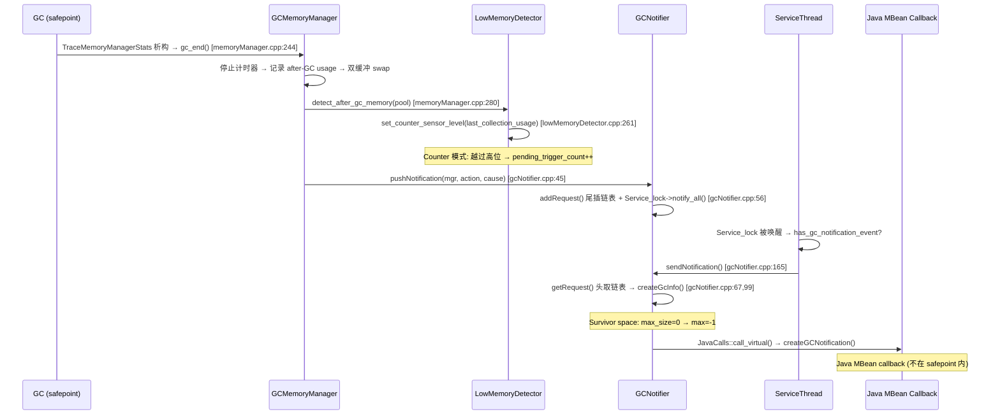

# 02-memory-pool-threshold — MemoryPool 体系 + Gauge/Counter 双模式阈值检测 + GCNotifier 异步通知 + JNI/JMM 桥接

> **Phase**: 17-jmx-management
> **前置**: [01-management-jmm-interface]（jmm_interface vtable）、[06-gc-core]（GC 入口点）
> **配套**: [00-what-is-jmx]（JMX 概念）、[03-thread-monitoring]（ServiceThread 事件循环）、[04-os-flag-diagnostic]（OS 指标）
> **阅读收益**: 追踪 MemoryPool 从创建到 GC 通知的完整生命周期——理解 4 个 MemoryPool 子类的 threshold 支持差异、Gauge vs Counter 双模式阈值检测、SensorInfo 滞回状态机的三段判断、GCNotifier 的 lock-free 生产者-消费者链表、TraceMemoryManagerStats RAII 的 GC 入口绑定；掌握 JNI 桥接层的排序逻辑与 JMM 入口的完整调用链；掌握 "MemoryNotificationInfo 通知风暴" 的诊断和修复路径

---

## §〇 Production Scenario

生产环境使用 `-XX:MaxHeapFreeRatio=70` 并通过 JMX 监控 HeapMemoryUsage。应用突然开始频繁收到 `MemoryNotificationInfo.MEMORY_THRESHOLD_EXCEEDED` 通知——每次 minor GC 后都触发一次，导致监控系统告警风暴。

Root cause: 运维团队通过 JMX 设置了 `MemoryPoolMXBean.setUsageThreshold(oldGenPool, heapMax * 0.7)`。GC 后 old gen 使用量从 72% 降到 68%——仍然高于 70% 阈值。但关键在于 `UsageThreshold` 使用 **Gauge 模式**（`SensorInfo::set_gauge_sensor_level`, `lowMemoryDetector.cpp:206`），其滞回机制要求使用量降到低阈值以下才清除通知——但低阈值默认等于高阈值（没有滞回区间）。每次 GC 后 `LowMemoryDetector::detect_after_gc_memory` (`lowMemoryDetector.cpp:128`) 使用 **Counter 模式**（`set_counter_sensor_level`, line 261）检查 `CollectionUsageThreshold`，但 `UsageThreshold` 的 Gauge 检测在 `detect_low_memory()` (line 81) 中触发——不在 GC 路径上，而是在每次 `MemoryPool::record_peak_memory_usage()` (`memoryPool.cpp:147`) 后触发。

核心认知：有两个独立的阈值系统——`UsageThreshold` (Gauge，分配路径) 和 `CollectionUsageThreshold` (Counter，GC 路径)。

**三步诊断**：

```bash
# 1. 查看内存池阈值配置
jcmd <pid> VM.flags | grep -E "GCHeapFreeLimit|GCTimeLimit"
jconsole → MBeans → java.lang → MemoryPool → "G1 Old Gen" → UsageThreshold

# 2. 查看 JMX 通知频率
jcmd <pid> ManagementAgent.status

# 3. 设置 low threshold 创建滞回带
java -jar cmdline-jmxclient.jar ... java.lang:type=MemoryPool,name=G1\ Old\ Gen \
  'setUsageThreshold(heapMax*0.7); setUsageThreshold(heapMax*0.7, heapMax*0.5)'
```

**反事实**: 如果没有滞回机制（高阈值触发后不检查低阈值就清除）→ 使用量在 69%→71%→69% 振荡 → 每次 minor GC 后触发一次通知 → 通知风暴（10 次/秒 minor GC × 每次通知 = 每秒数十次 JMX 通知）→ ServiceThread 消耗大量 CPU 处理 Java 回调 → 应用吞吐量下降。

**调用链全景**（从 JMX 设置到 Java 回调的完整路径）：

```
Java 层:
  MemoryPoolMXBean.setUsageThreshold(threshold)
    → sun.management.MemoryPoolImpl.setUsageThreshold0(current, newThreshold)

JNI 层 (libmanagement.so):
  → Java_sun_management_MemoryPoolImpl_setUsageThreshold0()  [MemoryPoolImpl.c:70]
    → 排序逻辑: newThreshold > current ? 先 HIGH 后 LOW : 先 LOW 后 HIGH
    → jmm_interface->SetPoolThreshold(env, pool, type, threshold)

JMM 层 (libjvm.so):
  → jmm_SetPoolThreshold()  [management.cpp:676]
    → pool->usage_threshold()->set_high_threshold() / set_low_threshold()
    → LowMemoryDetector::recompute_enabled_for_collected_pools()
    → LowMemoryDetector::detect_low_memory(pool)  // 立即检测

检测层 (libjvm.so):
  → detect_low_memory(pool)  [lowMemoryDetector.cpp:106]
    → MutexLockerEx ml(Service_lock)  // 持锁
    → sensor->set_gauge_sensor_level(usage, threshold)  [lowMemoryDetector.cpp:206]
    → 三段判断: is_over_high + !_sensor_on → _pending_trigger_count++
    → Service_lock->notify_all()  // 唤醒 ServiceThread

ServiceThread 处理:
  → process_sensor_changes()  [lowMemoryDetector.cpp:60]
    → sensor->process_pending_requests()  [lowMemoryDetector.cpp:283]
      → clear 优先于 trigger
      → sensor->trigger(count)  [lowMemoryDetector.cpp:293]
        → JavaCalls::call_virtual(Sensor::trigger) → Java 回调
```

---

## §一 ★★★ MemoryPool 体系 + 阈值检测源码走读

### 1.1 Interview Story Format Answer

"JVM memory pool monitoring is a dual-mode threshold system. Each `MemoryPool` has TWO independent threshold objects: `_usage_threshold` (checked by Gauge mode on the allocation path) and `_gc_usage_threshold` (checked by Counter mode after GC). Only `CollectedMemoryPool` (heap pools) supports CollectionUsageThreshold — `CodeHeapPool` and `MetaspacePool` only support UsageThreshold. The `SensorInfo` state machine uses hysteresis: trigger when usage exceeds the high threshold AND sensor is off; clear when usage drops below the low threshold AND sensor is on; do nothing in between. `pending_trigger_count` and `pending_clear_count` enable batching — if 3 GCs happen before ServiceThread processes pending requests, they're merged into a single trigger(3) call. `GCNotifier` is a lock-free producer-consumer: `pushNotification()` inserts at tail (holding Service_lock), `sendNotification()` removes from head — the actual Java callback happens in ServiceThread, outside safepoint. `TraceMemoryManagerStats` is a RAII guard placed at every GC entry point — constructor calls `MemoryService::gc_begin()`, destructor calls `gc_end()`, ensuring threshold detection and notification happen regardless of GC algorithm."

### 1.2 MemoryPool 4 子类 — threshold 支持差异

`memoryPool.hpp:45-86` 定义 MemoryPool 基类，构造参数决定 threshold 支持：

```cpp
MemoryPool(const char* name, PoolType type, size_t init_size, size_t max_size,
           bool support_usage_threshold, bool support_gc_threshold);
```

**MemoryPool 构造函数**（`memoryPool.cpp:40-66`）：

```cpp
MemoryPool::MemoryPool(const char* name, PoolType type, size_t init_size,
                       size_t max_size, bool support_usage_threshold, bool support_gc_threshold) {
  _name = name;
  _initial_size = init_size;
  _max_size = max_size;
  _usage_sensor = NULL;
  _gc_usage_sensor = NULL;
  _usage_threshold = new ThresholdSupport(support_usage_threshold, support_usage_threshold);
  _gc_usage_threshold = new ThresholdSupport(support_gc_threshold, support_gc_threshold);
}
```

**数据成员完整清单** (`memoryPool.hpp:53-76`)：

```cpp
private:
  const char*      _name;                       // 池名称，如 "G1 Eden Space"
  PoolType         _type;                       // Heap 或 NonHeap
  size_t           _initial_size;               // 初始大小
  size_t           _max_size;                   // 最大大小（可能为 -1 = 无限制）
  bool             _available_for_allocation;   // 是否可分配（默认 true）
  MemoryManager*   _managers[max_num_managers]; // 最多 5 个管理器
  int              _num_managers;               // 实际管理器数
  MemoryUsage      _peak_usage;                 // 峰值使用量
  MemoryUsage      _after_gc_usage;             // GC 后使用量
  ThresholdSupport* _usage_threshold;           // Gauge 阈值（UsageThreshold）
  ThresholdSupport* _gc_usage_threshold;        // Counter 阈值（CollectionUsageThreshold）
  SensorInfo*      _usage_sensor;               // Gauge sensor（Java 回调对象）
  SensorInfo*      _gc_usage_sensor;            // Counter sensor（Java 回调对象）
  volatile instanceOop _memory_pool_obj;        // Java MemoryPoolMXBean 对象
```

注意：`_usage_threshold` 和 `_gc_usage_threshold` 各自是一个 `ThresholdSupport` 对象。`ThresholdSupport` (`lowMemoryDetector.hpp:67-114`) 维护 `_high_threshold` 和 `_low_threshold` 两个 size_t 值——`set_high_threshold()` 要求 `new_threshold >= _low_threshold`，`set_low_threshold()` 要求 `new_threshold <= _high_threshold`——这个不变式约束是 JNI 层排序逻辑的根本原因。

**4 子类 threshold 支持矩阵**：

| 子类 | support_usage_threshold | support_gc_threshold | 适用池 | 说明 |
|------|:---:|:---:|------|------|
| `CollectedMemoryPool` | true | **true** | Eden, Old, Survivor | 唯一支持 CollectionUsageThreshold 的子类 |
| `CodeHeapPool` | true | false | CodeCache profiled/non-profiled/non-method | 无 GC，Counter 模式无意义 |
| `MetaspacePool` | true | false | Metaspace NonClassType | 无 GC，仅 Gauge 模式 |
| `CompressedKlassSpacePool` | true | false | Metaspace ClassType | 无 GC，仅 Gauge 模式 |

**CollectedMemoryPool**（`memoryPool.hpp:142-147`）：

```cpp
class CollectedMemoryPool : public MemoryPool {
public:
  CollectedMemoryPool(const char* name, size_t init_size, size_t max_size,
                      bool support_usage_threshold) :
    MemoryPool(name, MemoryPool::Heap, init_size, max_size, support_usage_threshold, true) {};
};
```

`support_gc_threshold` 硬编码为 `true` — CollectedMemoryPool 始终支持 GC 后阈值检测。

**CodeHeapPool**（`memoryPool.cpp:183-186`）：

```cpp
CodeHeapPool::CodeHeapPool(CodeHeap* codeHeap, const char* name, bool support_usage_threshold) :
  MemoryPool(name, NonHeap, codeHeap->capacity(), codeHeap->max_capacity(),
             support_usage_threshold, false), _codeHeap(codeHeap) {}
```

`support_gc_threshold=false` — CodeCache 没有 GC，Counter 模式永远不会触发。

**追问**：为什么只有 CollectedMemoryPool 支持 CollectionUsageThreshold？→ `CollectionUsageThreshold` 的 Counter 模式在 `detect_after_gc_memory()` 中检查（`lowMemoryDetector.cpp:128`），使用 `pool->get_last_collection_usage()` 而非当前 usage。CodeHeapPool/MetaspacePool 没有 GC 回调 → 没有 `last_collection_usage` 更新 → Counter 模式永远不会触发。

**追问 2**：MemoryPool 构造函数中 `_usage_threshold` 和 `_gc_usage_threshold` 各自独立的含义是什么？→ 它们是完全独立的两个 `ThresholdSupport` 对象。`_usage_threshold` 控制 Gauge 检测的 high/low，`_gc_usage_threshold` 控制 Counter 检测的 high/low。这意味着同一个 MemoryPool 可以同时设置 UsageThreshold 和 CollectionUsageThreshold 为不同值——例如 UsageThreshold=80%（分配路径告警），CollectionUsageThreshold=90%（GC 后告警）。两个阈值由不同的 `SensorInfo` 对象管理回调。

### 1.3 GCMemoryManager::gc_end — 最复杂的函数（10 步执行流程）

`memoryManager.cpp:244-301` — gc_end 的完整流程：

```cpp
void GCMemoryManager::gc_end(bool recordPostGCUsage, bool recordAccumulatedGCTime,
                              bool recordGCEndTime, bool countCollection, GCCause::Cause cause,
                              bool allMemoryPoolsAffected) {
  // [1] 停止累积计时器——GC 时间统计结束
  if (recordAccumulatedGCTime) _accumulated_timer.stop();

  // [2] 记录 GC 结束时间戳
  if (recordGCEndTime) set_end_time(Management::timestamp());

  // [3] 记录 GC 后使用量（遍历所有 pool）
  if (recordPostGCUsage) {
    for (int i = 0; i < MemoryService::num_memory_pools(); i++) {
      MemoryPool* pool = MemoryService::get_memory_pool(i);
      MemoryUsage usage = pool->get_memory_usage();
      _current_gc_stat->set_after_gc_usage(i, usage);

      // [4] 决定是否保存 last_collection_usage
      // allMemoryPoolsAffected=true 表示全部受影响
      // _pool_always_affected_by_gc[i]=true 表示该 pool 始终被此 GC 影响
      if (allMemoryPoolsAffected || _pool_always_affected_by_gc[i]) {
        pool->set_last_collection_usage(usage);          // 保存 GC 后 usage
        // [5] Counter 模式阈值检测
        LowMemoryDetector::detect_after_gc_memory(pool);
      }
    }
  }

  // [6] GC 计数 + 通知
  if (countCollection) {
    _num_collections++;
    // [7] 双缓冲交换（持锁）
    { MutexLocker ml(_last_gc_lock);
      GCStatInfo* tmp = _last_gc_stat;
      _last_gc_stat = _current_gc_stat;
      _current_gc_stat = tmp;
    }
    _current_gc_stat->clear();
    // [8] 推送 GC 通知到 GCNotifier 链表
    if (_notification_enabled)
      GCNotifier::pushNotification(this, _gc_end_message, GCCause::to_string(cause));
  }
}
```

10 步执行顺序：`[1]stop_timer → [2]record_end_time → [3]iterate_pools → [4]save_last_usage → [5]Counter_detect → [6]inc_count → [7]swap_buffers → [8]push_notification → [9]current_clear → [10]return`

**追问**：为什么 gc_end 需要 `_last_gc_lock` 保护双缓冲交换？→ `pushNotification()` 在 safepoint 内调用 `get_last_gc_stat()` 复制统计信息——如果没有锁，下一个 GC 的 `gc_end` 可能同时修改 `_last_gc_stat`，导致读取到不一致的 GC 统计数据。

**追问 2**：`_pool_always_affected_by_gc[i]` 是什么？→ 这是 `GCMemoryManager` 的成员数组 (`memoryManager.hpp:147`)，记录每个 pool 是否始终被该 GC 影响。例如，G1 Young GC 的 `G1YoungGCMemoryManager` 中 Eden 和 Survivor 的 `_pool_always_affected_by_gc` 为 true，但 Old 为 false（因为 Young GC 不直接回收 Old）。当 `allMemoryPoolsAffected=false` 时，只有 `_pool_always_affected_by_gc[i]=true` 的 pool 才会更新 `last_collection_usage` 并触发 Counter 检测。

**追问 3**：`gc_end()` 和 `gc_begin()` 的配对关系？→ `gc_begin()` (`memoryManager.cpp:211-242`) 在 `TraceMemoryManagerStats` 构造时调用：记录 GC 开始时间、开始计时、记录 GC 前使用量（设置 `_current_gc_stat->set_before_gc_usage(i, usage)`）。`gc_end()` 在析构时调用。两者的参数由 `TraceMemoryManagerStats::initialize()` 统一设置，保证配对正确。

### 1.4 TraceMemoryManagerStats RAII — GC 入口

`memoryService.cpp:252-280`：

```cpp
TraceMemoryManagerStats::TraceMemoryManagerStats(GCMemoryManager* gc_memory_manager, GCCause::Cause cause,
    bool allMemoryPoolsAffected, bool recordGCBeginTime, bool recordPreGCUsage, bool recordPeakUsage,
    bool recordPostGCUsage, bool recordAccumulatedGCTime, bool recordGCEndTime, bool countCollection) {
  initialize(gc_memory_manager, cause, allMemoryPoolsAffected, recordGCBeginTime, recordPreGCUsage,
             recordPeakUsage, recordPostGCUsage, recordAccumulatedGCTime, recordGCEndTime, countCollection);
}

void TraceMemoryManagerStats::initialize(...) {
  _gc_memory_manager = gc_memory_manager;
  // ... 保存所有标志 ...
  MemoryService::gc_begin(_gc_memory_manager, _recordGCBeginTime, _recordAccumulatedGCTime,
                          _recordPreGCUsage, _recordPeakUsage);
}

TraceMemoryManagerStats::~TraceMemoryManagerStats() {
  MemoryService::gc_end(_gc_memory_manager, _recordPostGCUsage, _recordAccumulatedGCTime,
                        _recordGCEndTime, _countCollection, _cause, _allMemoryPoolsAffected);
}
```

**MemoryService::gc_begin() 实现** (`memoryService.cpp:211-231`)：

```cpp
void MemoryService::gc_begin(GCMemoryManager* manager, bool recordGCBeginTime,
                              bool recordAccumulatedGCTime,
                              bool recordPreGCUsage, bool recordPeakUsage) {
  manager->gc_begin(recordGCBeginTime, recordPreGCUsage, recordAccumulatedGCTime);
}
```

所有 GC 入口点使用此 RAII — 构造时 `gc_begin()`，析构时 `gc_end()`。RAII 保证析构函数在任何退出路径（正常 return + 异常 unwind）都执行。

**反事实**：如果不用 RAII，手动调用 gc_begin/gc_end → GC 函数可能通过异常路径提前退出 → gc_end 永远不会被调用 → `_accumulated_timer` 永远不停止 → GC 时间统计为 0 → `GCNotifier::pushNotification` 不会被调用 → JMX GC 通知丢失。

**使用示例**（G1 GC 中的典型调用）：
```cpp
// 在 g1CollectedHeap.cpp 的 do_collection_pause() 中:
TraceMemoryManagerStats tmms(g1mm, gc_cause(), ...);
// 整个 GC pause 在此 scope 内
// 析构时自动调用 gc_end()
```

### 1.5 Gauge vs Counter — 两种阈值检测模式对比

**Gauge 模式**（`lowMemoryDetector.cpp:206-239`）— 分配路径：

```cpp
void SensorInfo::set_gauge_sensor_level(MemoryUsage usage, ThresholdSupport* high_low_threshold) {
  assert(Service_lock->owned_by_self(), "Must own Service_lock");
  bool is_over_high = high_low_threshold->is_high_threshold_crossed(usage);
  bool is_below_low = high_low_threshold->is_low_threshold_crossed(usage);

  assert(!(is_over_high && is_below_low), "Can't be both true");

  if (is_over_high &&
        ((!_sensor_on && _pending_trigger_count == 0) ||
         _pending_clear_count > 0)) {
    // low memory detected and need to increment the trigger pending count
    // if the sensor is off or will be off due to _pending_clear_ > 0
    _pending_trigger_count++;          // 首次穿越高位 → 触发
    _usage = usage;
    if (_pending_clear_count > 0) {
      // non-zero pending clear requests indicates that there are
      // pending requests to clear this sensor.
      // This trigger request needs to clear this clear count
      // since the resulting sensor flag should be on.
      _pending_clear_count = 0;
    }
  } else if (is_below_low &&
               ((_sensor_on && _pending_clear_count == 0) ||
                (_pending_trigger_count > 0 && _pending_clear_count == 0))) {
    // memory usage returns below the threshold
    _pending_clear_count++;            // 首次低于低位 → 清除
  }
  // 在 high 和 low 之间不做任何操作（滞回带）
}
```

Gauge 模式的触发条件 `(!_sensor_on && _pending_trigger_count == 0)` 保证只有首次穿越高位才触发——后续在高位附近的振荡不会产生额外通知。只有当使用量降到 low 以下、传感器被 clear 后，重新穿越 high 才触发下一次。

**Counter 模式**（`lowMemoryDetector.cpp:261-277`）— GC 后：

```cpp
void SensorInfo::set_counter_sensor_level(MemoryUsage usage, ThresholdSupport* counter_threshold) {
  assert(Service_lock->owned_by_self(), "Must own Service_lock");
  assert(counter_threshold->is_high_threshold_supported(), "just checking");

  bool is_over_high = counter_threshold->is_high_threshold_crossed(usage);
  bool is_below_low = counter_threshold->is_low_threshold_crossed(usage);

  assert(!(is_over_high && is_below_low), "Can't be both true");

  if (is_over_high) {
    _pending_trigger_count++;          // 每次 GC 后越过高位 → 无条件触发
    _usage = usage;
    _pending_clear_count = 0;
  } else if (is_below_low && (_sensor_on || _pending_trigger_count > 0)) {
    _pending_clear_count++;
  }
}
```

Counter 模式的触发是**无条件**的——每次 GC 后只要越过高位就 `_pending_trigger_count++`。这是因为 Counter 模式旨在计数"GC 后内存超过阈值"的事件次数，用于跟踪内存压力趋势。

| 特性 | Gauge | Counter |
|------|-------|---------|
| 触发条件 | 首次穿越高位 + sensor 为 off | 每次 GC 后越过高位（无条件） |
| 数据来源 | `pool->get_memory_usage()` | `pool->get_last_collection_usage()` |
| 调用方 | `record_peak_memory_usage()` → `detect_low_memory()` | `gc_end()` → `detect_after_gc_memory()` |
| 调用频率 | 每次分配（高频, ~10^6-10^9/sec） | 每次 GC（低频, ~1-10/sec） |
| 适用池 | 所有 MemoryPool | 仅 CollectedMemoryPool |
| 滞回 | 有（三段判断） | 无（每次穿越都触发） |
| Service_lock 持有 | 是 (`detect_low_memory` line 82) | 是 (`detect_after_gc_memory` line 137) |
| pending 合并 | 是（`_pending_clear_count > 0` 优先） | 是（`_pending_clear_count` 无条件归零） |
| 文件位置 | `lowMemoryDetector.cpp:206-239` | `lowMemoryDetector.cpp:261-277` |

**反事实**：如果 Gauge 也用 Counter 的"每次穿越都触发"逻辑 → 分配路径上每秒数千次检查 → 使用量在阈值附近振荡时每次分配都触发 → 每秒数千次通知 → ServiceThread CPU 100%。

### 1.6 SensorInfo 滞回状态机 — 完整源码

**SensorInfo 数据成员** (`lowMemoryDetector.hpp:116-136`)：

```cpp
class SensorInfo : public CHeapObj<mtInternal> {
private:
  instanceOop     _sensor_obj;         // Java sun.management.Sensor 对象
  bool            _sensor_on;          // 传感器当前状态 (true=已触发未清除)
  size_t          _sensor_count;       // 总触发次数（单调递增，用于统计）
  int             _pending_trigger_count; // 待 ServiceThread 处理的触发数
  int             _pending_clear_count;   // 待处理的清除数（优先于 trigger）
  MemoryUsage     _usage;              // 最近记录的 usage（传递给 Java 回调）
};
```

**构造函数** (`lowMemoryDetector.cpp:163-169`)：
```cpp
SensorInfo::SensorInfo() {
  _sensor_obj = NULL;
  _sensor_on = false;
  _sensor_count = 0;
  _pending_trigger_count = 0;
  _pending_clear_count = 0;
}
```

**process_pending_requests()**（`lowMemoryDetector.cpp:283-291`）— clear 优先于 trigger：

```cpp
void SensorInfo::process_pending_requests(TRAPS) {
  int pending_count = pending_trigger_count();
  if (pending_clear_count() > 0) {
    clear(pending_count, CHECK);        // 优先清除
  } else {
    trigger(pending_count, CHECK);      // 然后触发
  }
}
```

**trigger(int count, TRAPS)**（`lowMemoryDetector.cpp:293-343`）— 完整 50 行：

```cpp
void SensorInfo::trigger(int count, TRAPS) {
  assert(count <= _pending_trigger_count, "just checking");
  if (_sensor_obj != NULL) {
    InstanceKlass* sensorKlass = Management::sun_management_Sensor_klass(CHECK);
    Handle sensor_h(THREAD, _sensor_obj);

    Symbol* trigger_method_signature;
    JavaValue result(T_VOID);
    JavaCallArguments args(sensor_h);
    args.push_int((int) count);

    Handle usage_h = MemoryService::create_MemoryUsage_obj(_usage, THREAD);
    // Call Sensor::trigger(int, MemoryUsage) to send notification to listeners.
    // When OOME occurs and fails to allocate MemoryUsage object, call
    // Sensor::trigger(int) instead.  The pending request will be processed
    // but no notification will be sent.
    if (HAS_PENDING_EXCEPTION) {
       assert((PENDING_EXCEPTION->is_a(SystemDictionary::OutOfMemoryError_klass())),
              "we expect only an OOME here");
       CLEAR_PENDING_EXCEPTION;
       trigger_method_signature = vmSymbols::int_void_signature();
    } else {
       trigger_method_signature = vmSymbols::trigger_method_signature();
       args.push_oop(usage_h);
    }

    JavaCalls::call_virtual(&result,
                        sensorKlass,
                        vmSymbols::trigger_name(),
                        trigger_method_signature,
                        &args,
                        THREAD);

    if (HAS_PENDING_EXCEPTION) {
       // 清除 Java 回调中可能的 OOME——不影响后续状态更新
       assert((PENDING_EXCEPTION->is_a(SystemDictionary::OutOfMemoryError_klass())),
              "we expect only an OOME here");
       CLEAR_PENDING_EXCEPTION;
     }
  }

  {
    // Holds Service_lock and update the sensor state
    MutexLockerEx ml(Service_lock, Mutex::_no_safepoint_check_flag);
    assert(_pending_trigger_count > 0, "Must have pending trigger");
    _sensor_on = true;
    _sensor_count += count;
    _pending_trigger_count = _pending_trigger_count - count;
  }
}
```

关键细节：Java 回调在 **持 Service_lock 之前**完成——防止 Java 回调期间阻塞其他线程。触发后持 Service_lock 更新 `_sensor_on=true, _sensor_count+=count, _pending_trigger_count-=count`。

**clear(int count, TRAPS)**（`lowMemoryDetector.cpp:345-374`）— 完整 30 行：

```cpp
void SensorInfo::clear(int count, TRAPS) {
  {
    MutexLockerEx ml(Service_lock, Mutex::_no_safepoint_check_flag);
    if (_pending_clear_count == 0) {
      // Bail out if we lost a race to set_*_sensor_level() which may have
      // reactivated the sensor in the meantime because it was triggered again.
      return;    // ← 竞态保护：如果在回调前又被触发，放弃清除
    }
    _sensor_on = false;
    _sensor_count += count;
    _pending_clear_count = 0;
    _pending_trigger_count = _pending_trigger_count - count;
  }

  if (_sensor_obj != NULL) {
    InstanceKlass* sensorKlass = Management::sun_management_Sensor_klass(CHECK);
    Handle sensor(THREAD, _sensor_obj);

    JavaValue result(T_VOID);
    JavaCallArguments args(sensor);
    args.push_int((int) count);
    JavaCalls::call_virtual(&result,
                            sensorKlass,
                            vmSymbols::clear_name(),
                            vmSymbols::int_void_signature(),
                            &args,
                            CHECK);
  }
}
```

clear 先持 Service_lock 更新状态，再调用 Java `Sensor::clear(int)`。如果 `_pending_clear_count == 0`（说明在等待 ServiceThread 调度期间又被触发了），放弃清除操作。

**反事实**：如果 trigger 优先于 clear → 当 `pending_trigger_count=1` 且 `pending_clear_count=1` 时 → 先触发"内存压力高"→ 再清除"内存恢复"→ 自动扩容逻辑反复扩缩容（flapping）。clear 优先意味着"如果内存已恢复，忽略之前的触发"。

### 1.7 GCNotifier 异步通知链

**数据结构** (`gcNotifier.hpp:47-67`)：

```cpp
class GCNotificationRequest : public CHeapObj<mtGC> {
public:
  GCNotificationRequest* next;         // 链表指针
  jlong timestamp;                     // 通知创建时间
  GCMemoryManager* gcManager;         // 触发 GC 的管理器
  const char* gcAction;               // GC 动作描述 (如 "end of major GC")
  const char* gcCause;                // GC 原因 (如 "System.gc()")
  GCStatInfo* gcStatInfo;            // GC 统计数据（before/after usage）
};

class GCNotifier : public AllStatic {
private:
  static GCNotificationRequest* first_request;  // 链表头
  static GCNotificationRequest* last_request;   // 链表尾

public:
  static void pushNotification(GCMemoryManager* mgr, const char* action, const char* cause);
  static bool has_event();
  static void sendNotification(TRAPS);
  static void sendNotificationInternal(TRAPS);
  static GCNotificationRequest* getRequest();
  static void addRequest(GCNotificationRequest* request);
};
```

**ServiceThread 的 has_gc_notification_event()** (`serviceThread.cpp`)：
ServiceThread 的 `service_thread_entry()` 循环中调用 `GCNotifier::has_event()` 检查是否有待处理通知——`has_event()` 内部检查 `first_request != NULL`，持有 `Service_lock`。如果有事件，调用 `sendNotification()` → `sendNotificationInternal()`。

**pushNotification()**（`gcNotifier.cpp:45-54`）— Producer（safepoint 内）：

```cpp
void GCNotifier::pushNotification(GCMemoryManager *mgr, const char *action, const char *cause) {
  int num_pools = MemoryService::num_memory_pools();
  GCStatInfo* stat = new(ResourceObj::C_HEAP, mtGC) GCStatInfo(num_pools);
  mgr->get_last_gc_stat(stat);                             // 复制 GC 统计
  GCNotificationRequest *request = new GCNotificationRequest(os::javaTimeMillis(), mgr, action, cause, stat);
  addRequest(request);
}
```

`ResourceObj::C_HEAP` 分配：在 C-Heap 上分配，不受 ResourceMark 生命周期限制——需要跨越 safepoint 边界传递到 ServiceThread。

**addRequest()**（`:56-65`）— 尾插链表（持 Service_lock）：

```cpp
void GCNotifier::addRequest(GCNotificationRequest *request) {
  MutexLockerEx ml(Service_lock, Mutex::_no_safepoint_check_flag);
  if (first_request == NULL) first_request = request;
  else last_request->next = request;
  last_request = request;
  Service_lock->notify_all();                              // 唤醒 ServiceThread
}
```

`Service_lock->notify_all()` 使用了底层 `pthread_cond_broadcast`（`man 3 pthread_cond_broadcast`），其内部实现依赖 `man 2 futex` 的 `FUTEX_WAKE` 操作唤醒等待线程。

**getRequest()**（`:67-74`）— 头取链表：

```cpp
GCNotificationRequest *GCNotifier::getRequest() {
  MutexLockerEx ml(Service_lock, Mutex::_no_safepoint_check_flag);
  GCNotificationRequest *request = first_request;
  if (first_request != NULL) first_request = first_request->next;
  return request;
}
```

**sendNotificationInternal()**（`:189-224`）— Consumer（ServiceThread）：

```cpp
void GCNotifier::sendNotificationInternal(TRAPS) {
  GCNotificationRequest *request = getRequest();
  if (request != NULL) {
    NotificationMark nm(request);                          // RAII 清理保证
    Handle objGcInfo = createGcInfo(request->gcManager, request->gcStatInfo, CHECK);
    // ... 构造参数 ... → JavaCalls::call_virtual() → Java 回调
  }
}
```

**NotificationMark RAII**（`:174-187`）：

```cpp
class NotificationMark : public StackObj {
  GCNotificationRequest* _request;
public:
  NotificationMark(GCNotificationRequest* r) { _request = r; }
  ~NotificationMark() { delete _request; }  // 异常安全：任何退出路径都 delete
};
```

**Survivor space 特殊处理**（`createGcInfo()`, `gcNotifier.cpp:119-124`）：

```cpp
MemoryUsage u = gcStatInfo->after_gc_usage_for_pool(i);
if (u.max_size() == 0 && u.used() > 0) {
  MemoryUsage usage(u.init_size(), u.used(), u.committed(), (size_t)-1);
  after_usage = MemoryService::create_MemoryUsage_obj(usage, CHECK_NH);
}
```

GC 后 Survivor space 的 "to" 变成 "from" — max_size 临时归零。设置 `max=-1` 表示"无上限"。

### 1.8 LowMemoryDetectorDisabler — 递归保护

`lowMemoryDetector.hpp:280-291`：

```cpp
class LowMemoryDetectorDisabler: public StackObj {
public:
  LowMemoryDetectorDisabler()  { LowMemoryDetector::disable(); }
  ~LowMemoryDetectorDisabler() { LowMemoryDetector::enable(); }
};
```

实现细节：`disable()` 执行 `Atomic::inc(&_disabled_count)`，`enable()` 执行 `Atomic::dec(&_disabled_count)`。使用 `volatile jint` 配合 `Atomic::inc/dec` 保证多线程安全。

在 GC 的 RAII scope 中创建 → GC 内部的池操作触发阈值检测 → `_disabled_count > 0` → `detect_after_gc_memory()` 被跳过 → 递归终止。

### 1.9 ★ Mermaid 序列图



---

## §二 Standard Environment

OpenJDK 11 slowdebug, 64-bit Linux (TencentOS Server 4.2)。

### Source roots

- `src/hotspot/share/services/memoryPool.hpp` — MemoryPool + 4 子类 (:45-171)
- `src/hotspot/share/services/memoryPool.cpp` — MemoryPool 构造, record_peak_memory_usage (:40-223)
- `src/hotspot/share/services/memoryManager.hpp` — MemoryManager + GCMemoryManager + GCStatInfo (:1-185)
- `src/hotspot/share/services/memoryManager.cpp` — gc_begin(:211), gc_end(:244)
- `src/hotspot/share/services/memoryService.hpp` — MemoryService + TraceMemoryManagerStats (:1-156)
- `src/hotspot/share/services/memoryService.cpp` — TraceMemoryManagerStats RAII(:252-280)
- `src/hotspot/share/services/lowMemoryDetector.hpp` — ThresholdSupport, SensorInfo, LowMemoryDetectorDisabler (:1-293)
- `src/hotspot/share/services/lowMemoryDetector.cpp` — Gauge/Counter 检测 + process_pending_requests + trigger + clear (:1-387)
- `src/hotspot/share/services/gcNotifier.cpp` — pushNotification, addRequest, getRequest, sendNotificationInternal
- `src/hotspot/share/services/management.cpp` — JMM 入口: jmm_SetPoolSensor(:633), jmm_SetPoolThreshold(:676), jmm_GetPoolCollectionUsage(:619)
- `src/hotspot/share/include/jmm.h` — JMM 常量定义: JMM_USAGE_THRESHOLD_HIGH/LOW(:135-136), JMM_COLLECTION_USAGE_THRESHOLD_HIGH/LOW(:137-138)
- `src/java.management/share/native/libmanagement/MemoryPoolImpl.c` — JNI 桥接: setUsageThreshold0(:70), setCollectionThreshold0(:90), setPoolUsageSensor(:122), setPoolCollectionSensor(:130)
- `src/java.management/share/native/libmanagement/MemoryImpl.c` — JNI 桥接: getMemoryUsage0(:45), getMemoryPools0(:35)
- `src/java.management/share/native/libmanagement/GarbageCollectorImpl.c` — JNI 桥接: getCollectionCount(:30), getCollectionTime(:35)

### Binary paths

| Binary | Path | Role |
|--------|------|------|
| `libjvm.so` | `build/linux-x86_64-server-slowdebug/jdk/lib/server/libjvm.so` | 包含 MemoryPool, LowMemoryDetector, GCNotifier, management.cpp 的所有 C++ 实现 |
| `libmanagement.so` | `build/linux-x86_64-server-slowdebug/jdk/lib/libmanagement.so` | 包含 MemoryPoolImpl.c, MemoryImpl.c, GarbageCollectorImpl.c 的 JNI 实现 |
| `management.jar` | `build/linux-x86_64-server-slowdebug/jdk/lib/management.jar` | 包含 Java 层 sun.management.Sensor, MemoryPoolMXBean 等 |

### Build

```bash
make jdk
```

### syscall 速查表

| syscall | man 参考 | 使用位置 | 作用 |
|---------|----------|---------|------|
| `futex` | `man 2 futex` | Service_lock 底层 (`FUTEX_WAIT`/`FUTEX_WAKE`) | 线程等待/唤醒——ServiceThread 在 Service_lock 上阻塞，GC 完成后被 `notify_all()` 唤醒 |
| `pthread_mutex_lock/unlock` | `man 7 pthread_mutex` | MutexLockerEx 封装 | 保护临界区——`Service_lock` 保护 GCNotifier 链表、SensorInfo 状态 |
| `pthread_cond_broadcast` | `man 3 pthread_cond_broadcast` | Service_lock->notify_all() | 唤醒所有等待 Service_lock 的线程 |
| `pthread_cond_signal` | `man 3 pthread_cond_signal` | Monitor::notify() | 唤醒单个等待线程（某些 Monitor 实现） |
| `mmap` | `man 2 mmap` | PerfData 共享内存（可选，如果启用 perfdata） | JMX PerfData 计数器使用 mmap 共享内存 |

### 全局状态变量表

| 变量 | 类型 | 定义位置 | 初始值 | 说明 |
|------|------|----------|:---:|------|
| `_pools_list` | `GrowableArray<MemoryPool*>*` | `memoryService.hpp:51` | 空 (init_size=10) | 全局内存池列表——启动时由 GC 子系统注册 |
| `_managers_list` | `GrowableArray<MemoryManager*>*` | `memoryService.hpp:52` | 空 (init_size=5) | 全局内存管理器列表 |
| `_code_cache_manager` | `MemoryManager*` | `memoryService.hpp:55` | NULL | CodeCache 管理器（非 GC 管理器） |
| `_code_heap_pools` | `GrowableArray<MemoryPool*>*` | `memoryService.hpp:56` | 空 (init_size=9) | CodeCache 内存池列表 |
| `_metaspace_pool` | `MemoryPool*` | `memoryService.hpp:58` | NULL | Metaspace NonClassType 池 |
| `_compressed_class_pool` | `MemoryPool*` | `memoryService.hpp:59` | NULL | CompressedKlassSpace 池 |
| `_enabled_for_collected_pools` | `volatile bool` | `lowMemoryDetector.hpp:219` | false | 是否有收集池启用了阈值检测 |
| `_disabled_count` | `volatile jint` | `lowMemoryDetector.hpp:221` | 0 | LowMemoryDetectorDisabler 递归保护计数器 |
| `first_request` | `GCNotificationRequest*` | `gcNotifier.hpp:59` (static) | NULL | GCNotifier 链表头 |
| `last_request` | `GCNotificationRequest*` | `gcNotifier.hpp:60` (static) | NULL | GCNotifier 链表尾 |

---

## §三 Source Files Table

| # | File | Full Path | Lines | Core Functions | Role |
|---|------|-----------|:--:|-------|------|
| 1 | **memoryPool.hpp** | `src/hotspot/share/services/memoryPool.hpp` | 173 | MemoryPool 基类 + 4 子类 | Class hierarchy |
| 2 | **memoryPool.cpp** | `src/hotspot/share/services/memoryPool.cpp` | 224 | MemoryPool 构造, record_peak_memory_usage | Pool lifecycle |
| 3 | **memoryManager.hpp** | `src/hotspot/share/services/memoryManager.hpp` | 185 | MemoryManager, GCMemoryManager, GCStatInfo | Manager class hierarchy |
| 4 | **memoryManager.cpp** | `src/hotspot/share/services/memoryManager.cpp` | 317 | gc_begin(:211), gc_end(:244) | GC callback core |
| 5 | **memoryService.hpp** | `src/hotspot/share/services/memoryService.hpp` | 156 | MemoryService, TraceMemoryManagerStats | Service + RAII |
| 6 | **memoryService.cpp** | `src/hotspot/share/services/memoryService.cpp` | 280 | TraceMemoryManagerStats RAII(:252) | RAII guard |
| 7 | **lowMemoryDetector.hpp** | `src/hotspot/share/services/lowMemoryDetector.hpp` | 293 | ThresholdSupport(:67), SensorInfo(:116), LowMemoryDetectorDisabler(:280) | Threshold + sensor |
| 8 | **lowMemoryDetector.cpp** | `src/hotspot/share/services/lowMemoryDetector.cpp` | 387 | set_gauge_sensor_level(:206), set_counter_sensor_level(:261), trigger(:293), clear(:345) | Threshold detection |
| 9 | **gcNotifier.hpp** | `src/hotspot/share/services/gcNotifier.hpp` | 68 | GCNotificationRequest, GCNotifier | Notification struct |
| 10 | **gcNotifier.cpp** | `src/hotspot/share/services/gcNotifier.cpp` | 225 | pushNotification(:45), sendNotificationInternal(:189) | Async notification |
| 11 | **management.cpp** | `src/hotspot/share/services/management.cpp` | ~1200 | jmm_SetPoolSensor(:633), jmm_SetPoolThreshold(:676), jmm_GetPoolCollectionUsage(:619) | JMM entry point |
| 12 | **jmm.h** | `src/hotspot/share/include/jmm.h` | ~250 | JMM_USAGE_THRESHOLD_HIGH/LOW(:135-138) | JMM constants |
| 13 | **MemoryPoolImpl.c** | `src/java.management/share/native/libmanagement/MemoryPoolImpl.c` | 144 | setUsageThreshold0(:70), setCollectionThreshold0(:90), setPoolUsageSensor(:122) | JNI bridge |
| 14 | **MemoryImpl.c** | `src/java.management/share/native/libmanagement/MemoryImpl.c` | 49 | getMemoryUsage0(:45), getMemoryPools0(:35) | JNI bridge |
| 15 | **GarbageCollectorImpl.c** | `src/java.management/share/native/libmanagement/GarbageCollectorImpl.c` | 39 | getCollectionCount(:30), getCollectionTime(:35) | JNI bridge |

---

## §四 ★★★ Deep Dive Question Groups — 9 组深度问答

### 4.1 MemoryPool 4 子类 — threshold 支持差异

**问题**: `CollectedMemoryPool` 同时支持 UsageThreshold 和 CollectionUsageThreshold，而 `CodeHeapPool`/`MetaspacePool`/`CompressedKlassSpacePool` 只支持 UsageThreshold。这个设计差异的根源是什么？如果强制让 CodeHeapPool 也支持 CollectionUsageThreshold 会发生什么？

**答案方向（≥8 行）**:

1. **构造参数决定论**：`memoryPool.hpp:142-145` 中 `CollectedMemoryPool` 硬编码 `support_gc_threshold=true`，`memoryPool.cpp:183-186` 中 `CodeHeapPool` 硬编码为 `false`。这不是运行时判断，而是编译期决定的设计约束。`memoryPool.hpp:45-86` 中 MemoryPool 构造函数接收这两个 bool 参数，子类在初始化列表中传入。
2. **GC 路径绑定**：CollectionUsageThreshold 的 Counter 检测发生在 `detect_after_gc_memory()` (`lowMemoryDetector.cpp:128`)，使用 `pool->get_last_collection_usage()`。`memoryPool.hpp:136` 中 `MemoryPool::get_last_collection_usage()` 默认返回 `_after_gc_usage`，该字段仅在 `gc_end()` 的 `pool->set_last_collection_usage()` (`memoryManager.cpp:279`) 中更新。调用链：`gc_end()` → 遍历 `num_memory_pools()` → 对每个 pool 调用 `set_last_collection_usage(usage)` → 然后调用 `detect_after_gc_memory(pool)`。
3. **CodeHeapPool 缺少更新路径**：CodeCache 的扩容/缩容不经过 `GCMemoryManager::gc_end()` → `_after_gc_usage` 永远是初始值 → Counter 检测没有意义。CodeCache 有自己的 `CodeCache::allocate()` / `CodeCache::free()` 路径，通过 `MemoryService::track_code_cache_memory_usage()` 更新峰值使用量。
4. **MetaspacePool 的独立检测**：Metaspace 有自己的阈值检测——`MetaspaceGC::compute_new_size()` 直接检查 committed 和 reserved——不需要 JMX 层的 Counter 模式。Metaspace 的 `_usage_sensor` 在分配路径上通过 `MemoryService::track_metaspace_memory_usage()` 触发 Gauge 检测。
5. **追问**：如果强制给 CodeHeapPool 设置 `support_gc_threshold=true`？→ `detect_after_gc_memory()` 永远不会被调用（CodeHeapPool 不在 GC 路径上）→ `_gc_usage_sensor` 永远为 NULL → `is_high_threshold_supported()` 返回 false → JMM 层 `jmm_SetPoolThreshold` (`management.cpp:708`) 直接返回 -1。Java 层调用 `setCollectionUsageThreshold()` 会得到 `UnsupportedOperationException`。
6. **量化对比**：G1 GC 中 CollectedMemoryPool 的 Counter 检测频率 ≈ GC 频率（~1-10次/秒），Gauge 检测频率 ≈ 分配频率（~10^6-10^9 次/秒）。CodeHeapPool 的 Gauge 检测频率 ≈ CodeCache 分配频率（~10^2-10^4 次/秒，远低于堆分配）。MetaspacePool 的 Gauge 检测频率 ≈ 类加载频率（~10^0-10^2 次/秒）。
7. **PoolType 枚举的角色**：`memoryPool.hpp:48-51` 定义 `enum PoolType { Heap = 1, NonHeap = 2 }`。Heap 类型池（CollectedMemoryPool）必然经过 GC 路径，NonHeap 类型池不经过。`is_collected_pool()` 默认返回 false，只有 `CollectedMemoryPool` 覆写为 true。
8. **文件定位**：`memoryPool.hpp:45-140` (MemoryPool 基类)、`memoryPool.hpp:142-147` (CollectedMemoryPool)、`memoryPool.hpp:149-156` (CodeHeapPool)、`memoryPool.hpp:158-171` (MetaspacePool/CompressedKlassSpacePool)。

**Counterfactual**: 如果所有池都支持 CollectionUsageThreshold → 需要在每次 GC 后遍历所有非 GC 池 → GC 暂停时间增加 ~O(num_pools) → 对于有 9 个 CodeHeapPool 的配置（profiled/non-profiled/non-method × 3 tier），GC 暂停时间增加 ~数百纳秒。

### 4.2 GCMemoryManager::gc_end — 10 步执行流程的原子性保证

**问题**: `gc_end()` 从停止计时到推送通知共有 10 步操作。哪些步骤必须在 safepoint 内？哪些可以在 safepoint 外？如果中间某步失败，如何保证状态一致性？

**答案方向（≥8 行）**:

1. **safepoint 约束**：整个 `gc_end()` 在 safepoint 内调用——GC 线程持有 safepoint 锁。这意味着所有内存访问都是安全的（无并发修改）。`memoryManager.cpp:244` 的 `gc_end()` 由 `TraceMemoryManagerStats::~TraceMemoryManagerStats()` 调用，该析构函数在 GC 线程的栈上执行。
2. **步骤 1-2（计时+时间戳）**：失败无影响——如果 `_accumulated_timer.stop()` 或 `set_end_time()` 异常（几乎不可能，它们是简单赋值），不影响后续步骤。`Management::timestamp()` 调用 `os::javaTimeMillis()`——系统调用 `clock_gettime(CLOCK_REALTIME)` 或 `gettimeofday()`。
3. **步骤 3-5（遍历 pool + Counter 检测）**：`recordPostGCUsage=false` 时跳过。这是唯一可能受外部配置影响的步骤——但 `recordPostGCUsage` 由 `TraceMemoryManagerStats` 的构造参数决定，不可在 GC 过程中改变。遍历使用 `MemoryService::num_memory_pools()` 和 `get_memory_pool(i)`——这些是只读的 `GrowableArray`。
4. **步骤 7（双缓冲交换）**：这是唯一需要显式加锁的步骤——`_last_gc_lock` 保护。为什么需要？因为 `get_last_gc_stat()` (`memoryManager.cpp:303-317`) 可能在 `pushNotification()` 中被 safepoint 内的其他线程调用。锁的类型是简单的 `Mutex`，不检查 safepoint。
5. **步骤 8（pushNotification）**：如果 `_notification_enabled=false` 则跳过。`pushNotification()` 内部 `addRequest()` 持有 `Service_lock`——这是另一个锁，与 `_last_gc_lock` 形成两段锁协议。注意：`Service_lock` 使用 `Mutex::_no_safepoint_check_flag`，因为它在 safepoint 内被持有。
6. **失败恢复**：如果 `pushNotification()` 中 `new GCStatInfo` 失败（OOM）→ 整个 GC 结束不会受影响（通知丢失但不影响 GC 正确性）。`NotificationMark` RAII 保证即使异常也不会泄漏内存。
7. **追问**：如果步骤 7 和步骤 8 之间发生 safepoint 解除？→ 不可能——safepoint 由 GC 线程持有，直到 `gc_end()` 返回后才释放。整个 `gc_end()` 是原子的（从 safepoint 角度看）。
8. **量化**：`gc_end()` 的典型执行时间 ~1-5μs（不计通知发送）。其中步骤 3（遍历 pool）占主要开销——`num_memory_pools()` 通常为 5-10 个池。步骤 8 的 `pushNotification()` 可能耗时 ~1μs（C-Heap 分配 + 链表操作）。
9. **文件定位**：`memoryManager.cpp:244-301` (gc_end 完整实现)、`memoryManager.cpp:303-317` (get_last_gc_stat)、`gcNotifier.cpp:45-65` (pushNotification + addRequest)。

**Counterfactual**: 如果双缓冲交换不加锁 → `pushNotification()` 中 `get_last_gc_stat()` 读取 `_last_gc_stat` 时，另一个 GC 线程（Parallel GC）的 `gc_end()` 正在写同一个指针 → 读到的可能是部分更新的 GCStatInfo → `after_gc_usage_array` 中的值不一致 → Java 层看到的内存使用量报告有随机错误。

### 4.3 TraceMemoryManagerStats RAII — GC 入口绑定的替代方案

**问题**: `TraceMemoryManagerStats` 使用 RAII 绑定 GC 的 begin/end。如果不使用 RAII，有哪些替代方案？各有什么缺点？

**答案方向（≥8 行）**:

1. **显式 try-finally 模式**：每个 GC 入口点写 `try { gc_begin(); ...; } finally { gc_end(); }`。缺点：需要修改 ~20+ 个 GC 入口点（G1 的 `do_collection_pause`、Parallel 的 `invoke_no_policy`、Serial 的 `do_collection` 等），容易遗漏。HotSpot 不使用 C++ 异常，try-finally 不是标准 C++ 语法。
2. **defer/scope_guard 模式**：使用 C++ lambda 的 scope_guard。缺点：OpenJDK 代码库不鼓励 lambda（编译时间 + 调试复杂度），且 C++11 lambda 在 HotSpot 中直到 JDK 15+ 才广泛使用。JDK 11 的 HotSpot 仍主要使用 C++98/03 特性。
3. **当前 RAII 方案的优势**：`memoryService.hpp:117-154` 中 `TraceMemoryManagerStats` 是 `StackObj`——分配在栈上，零堆开销。构造开销 = 1 次函数调用（`initialize()`），析构开销 = 1 次函数调用（`MemoryService::gc_end()`）。总共 ~20-30ns。不需要任何编译器扩展或运行时支持。
4. **RAII 与 GC 算法的解耦**：无论 GC 算法是串行还是并行，`TraceMemoryManagerStats` 的构造和析构都在同一个线程的同一个栈帧内——不需要线程间同步。这是关键优势——GC 算法的差异（STW vs Concurrent）不影响 JMX 统计的正确性。
5. **默认参数简化调用**：`memoryService.hpp:131-140` 中所有 bool 参数都有默认值 `true`。最简单的调用 `TraceMemoryManagerStats tmms(mgr, cause)` 等价于全部记录。
6. **追问**：如果析构函数中 `gc_end()` 抛出异常？→ C++ 规则：析构函数中抛出异常导致 `std::terminate()`。HotSpot 不抛 C++ 异常——所有错误通过 `CHECK` 宏返回。但 `gc_end()` 中不包含 CHECK 宏——它不分配 Java 对象（不触发 GC），只是修改 C++ 内部状态。
7. **追问 2**：`TraceMemoryManagerStats` 的默认构造函数（`memoryService.hpp:130`）为什么存在？→ 允许延迟初始化——某些 GC 代码路径先声明变量，后根据条件调用 `initialize()`。
8. **文件定位**：`memoryService.hpp:117-154` (类定义)、`memoryService.cpp:252-280` (构造/析构实现)。

**Counterfactual**: 如果使用显式 try-finally → 每个 GC 入口点需要 ~10 行 boilerplate × ~20 个入口点 = ~200 行重复代码。如果遗漏一个入口点 → 该 GC 算法的 `gc_end()` 永远不会被调用 → GC 次数统计不正确 → `GarbageCollectorMXBean.getCollectionCount()` 返回错误值 → 监控告警误报。

### 4.4 Gauge vs Counter — 两种阈值检测模式完整对比

**问题**: Gauge 和 Counter 模式的核心差异是什么？为什么需要两种模式？如果只用一种模式覆盖所有场景会有什么问题？

**答案方向（≥8 行）**:

1. **语义差异**：Gauge 测量"当前是否超过阈值"（状态），Counter 测量"GC 后超过阈值的事件数"（计数）。Gauge 是 level-triggered（类似 epoll 的 level-triggered），Counter 是 edge-triggered（类似 epoll 的 edge-triggered）。这一差异决定了调用频率和滞回策略的根本不同。
2. **滞回差异的根本原因**：Gauge 需要滞回因为调用频率高——`detect_low_memory()` 在每次 `record_peak_memory_usage()` 后调用（`memoryPool.cpp:147`），分配路径上每秒数十万次。如果没有滞回，每次穿越 high 都触发 → 通知风暴。Counter 调用频率低（每秒几次 GC）→ 不需要滞回——每次 GC 后的事件都是独立的、值得计数的。
3. **数据来源差异**：Gauge 使用 `pool->get_memory_usage()`——当前瞬时值（通过 `used_in_bytes()` 虚函数获取，各子类实现不同：CollectedMemoryPool 读取 GC 统计，CodeHeapPool 读取 `CodeHeap::allocated_capacity()`）。Counter 使用 `pool->get_last_collection_usage()`——上一次 GC 结束时的快照。这是因为 GC 后使用量变化是跳跃的（Eden 从 100% 到 0%），Counter 捕获这个跳跃事件。
4. **代码路径差异**：Gauge 检测在 `lowMemoryDetector.cpp:206-239`，持有 `Service_lock`（line 207 assertion）。Counter 检测在 `lowMemoryDetector.cpp:261-277`，同样持有 `Service_lock`（line 262 assertion）。两者都在 safepoint 外可能被调用（`detect_low_memory()` 从 Java 线程调用），但 Counter 只在 VMThread 的 GC 路径上调用（`detect_after_gc_memory()` 在 `gc_end()` 中，gc_end 在 safepoint 内）。
5. **pending_clear_count 的差异**：Gauge 中 `_pending_clear_count > 0` 会阻止新的触发（`_pending_clear_count > 0` 在触发条件中）。Counter 中 `is_over_high` 时直接 `_pending_clear_count = 0`——新触发覆盖旧清除。这是因为 Counter 的语义是"每次超标都要计数"。
6. **适用池差异**：`CodeHeapPool` 和 `MetaspacePool` 没有 GC → Counter 模式无数据来源 → 只能用 Gauge。`CollectedMemoryPool` 两者都可以用——Java 层 `MemoryPoolMXBean` 提供 `getUsageThreshold()` 和 `getCollectionUsageThreshold()` 两个独立接口。
7. **追问**：如果 Counter 也加滞回？→ GC 后使用量可能多次穿越 high（minor GC 后 old gen 仍然高）→ 有滞回会丢失事件计数 → `Sensor::trigger(count)` 的 count 不准确 → 监控统计偏差。
8. **量化对比**：Gauge 调用频率 ~10^6-10^9/sec vs Counter ~1-10/sec，相差 5-9 个数量级。Gauge 单次检测开销 ~10ns（指针比较 + 布尔判断），Counter 单次检测开销 ~10ns + GCStatInfo 复制 ~50ns = ~60ns（但仅每次 GC 执行一次）。
9. **文件定位**：`lowMemoryDetector.cpp:206-239` (set_gauge_sensor_level)、`lowMemoryDetector.cpp:261-277` (set_counter_sensor_level)、`lowMemoryDetector.cpp:79-102` (detect_low_memory 全局)、`lowMemoryDetector.cpp:106-125` (detect_low_memory 单池)、`lowMemoryDetector.cpp:128-147` (detect_after_gc_memory)。

**Counterfactual**: 如果只用 Gauge 模式覆盖 GC 后检测 → `detect_after_gc_memory()` 需要改为调用 `set_gauge_sensor_level()` → Gauge 的滞回逻辑会跳过同一 GC 周期内的多次检测 → `_pending_trigger_count` 不会正确累加 → `Sensor::trigger(count)` 的 count 始终为 1 → 丢失了"连续 N 次 GC 后内存超标"的信息。

### 4.5 SensorInfo 滞回状态机 — 三段判断 + 3 计数器

**问题**: `SensorInfo` 维护了 `_sensor_on`、`_pending_trigger_count`、`_pending_clear_count` 三个状态变量。这三个变量的组合如何实现滞回？当 ServiceThread 处理延迟时，pending 计数器如何合并？

**答案方向（≥8 行）**:

1. **三段判断**：高于 high → 检查 `!_sensor_on && _pending_trigger_count == 0`（首次穿越触发）或 `_pending_clear_count > 0`（即将被清除的传感器重新触发）；低于 low → 检查 `_sensor_on && _pending_clear_count == 0`（传感器开着时首次低于低位）或 `_pending_trigger_count > 0 && _pending_clear_count == 0`（传感器即将被触发但已低于低位）；中间带 → 无操作。代码在 `lowMemoryDetector.cpp:215-238`。
2. **pending 计数器的合并机制**：`set_gauge_sensor_level()` 每次穿越 high 时 `_pending_trigger_count++`，`set_counter_sensor_level()` 同样。如果 ServiceThread 处理延迟——3 次 GC 后 `_pending_trigger_count = 3` → `process_pending_requests()` 调用 `trigger(3)` → Java `Sensor::trigger(3, MemoryUsage)` → 一次 Java 回调传递 count=3。合并的好处：减少 Java 回调次数，降低 ServiceThread CPU 消耗。
3. **clear 优先的竞争条件处理**：`process_pending_requests()` (`lowMemoryDetector.cpp:283`) 先检查 `pending_clear_count() > 0`，优先清除。这是因为如果内存在触发和清除之间恢复，应该忽略触发。`clear(pending_count)` 中 `_pending_trigger_count -= count`（line 357）丢弃对应的触发请求。
4. **clear() 中的竞态保护**：`lowMemoryDetector.cpp:349-352`——如果 `_pending_clear_count == 0`（说明在等待 ServiceThread 期间传感器又被触发），直接 return 放弃清除。这是必要的——`set_*_sensor_level()` 可能在 ServiceThread 处理之前被再次调用，此时传感器的状态已经改变。
5. **三个计数器的语义**：`_sensor_count` = 总触发次数（单调递增，用于 JMX 统计 `Sensor.getCount()`），`_pending_trigger_count` = 待 ServiceThread 处理的触发数，`_pending_clear_count` = 待处理的清除数（优先于 trigger）。`_sensor_count` 在 `trigger()` 中 `+= count`，在 `clear()` 中也 `+= count`——所以总触发次数 = 触发次数 + 清除次数。
6. **追问**：如果 `_pending_trigger_count` 和 `_pending_clear_count` 同时 > 0？→ `process_pending_requests()` 选择 clear（line 285），然后 `clear(pending_count)` 中 `_pending_trigger_count -= count`（line 357），剩余的 trigger 请求被丢弃。这是一个设计选择——"内存恢复"比"内存压力"更优先。
7. **状态转移图**：
```
OFF(no pending) → [cross high] → OFF(trigger=1) → [ServiceThread trigger()] → ON(trigger=0)
ON(trigger=0) → [cross low] → ON(clear=1) → [ServiceThread clear()] → OFF(clear=0)
ON(trigger=0) → [cross high] → ON(trigger=0)  // 滞回：传感器已 on，不触发
OFF(no pending) → [cross low] → OFF(no pending) // 滞回：传感器已 off，不清除
OFF(clear=1) → [cross high] → OFF(trigger=1, clear=0) // pending clear 被新触发覆盖
```
8. **文件定位**：`lowMemoryDetector.hpp:116-136` (SensorInfo 成员)、`lowMemoryDetector.cpp:163-169` (SensorInfo 构造初始化)、`lowMemoryDetector.cpp:206-239` (set_gauge_sensor_level)、`lowMemoryDetector.cpp:261-277` (set_counter_sensor_level)、`lowMemoryDetector.cpp:283-291` (process_pending_requests)、`lowMemoryDetector.cpp:293-343` (trigger)、`lowMemoryDetector.cpp:345-374` (clear)。

**Counterfactual**: 如果没有 pending 计数器，每次检测直接调用 Java 回调 → Service_lock 在 Java 回调期间被持有 → Java 回调可能触发 safepoint → 死锁（Service_lock 在 safepoint 内被 GC 线程需要）。

### 4.6 GCNotifier 异步通知链 — Producer-Consumer 模型的并发保证

**问题**: `GCNotifier` 使用单链表 + `Service_lock` 实现 Producer-Consumer 模型。为什么用单链表而不是 `GrowableArray` 或无锁队列？Producer 在 safepoint 内，Consumer 在 ServiceThread——这个设计的并发保证是什么？

**答案方向（≥8 行）**:

1. **单链表的选择理由**：Producer 在 safepoint 内——只有一个线程在生产（GC 线程持有 safepoint 锁）。因此不需要多 Producer 并发控制。单链表插入（尾插）只需 3 个指针操作（`gcNotifier.cpp:58-64`）：`last_request->next = request; last_request = request;`。时间复杂度 O(1)。
2. **为什么不用 GrowableArray**：`GrowableArray` 需要动态扩容（可能触发 `realloc`/`mmap`），在 safepoint 内不可接受（realloc 可能触发系统调用，可能阻塞）。单链表使用 C-Heap 分配（`new GCNotificationRequest`），`ResourceObj::C_HEAP` 分配在 safepoint 内是安全的——使用 `malloc`（`man 3 malloc`），不触发 GC。
3. **Service_lock 的角色**：保护链表结构的完整性——Consumer 的 `getRequest()` 在 ServiceThread 中运行，不在 safepoint 内，需要与 Producer 互斥。`Service_lock->notify_all()` 唤醒 ServiceThread。`Service_lock` 使用 `Mutex::_no_safepoint_check_flag`——因为它可能在 safepoint 内被持有（Producer）也可能在 safepoint 外被持有（Consumer）。
4. **safepoint 内的同步保证**：Producer 在 safepoint 内 → ServiceThread 被阻塞在 safepoint 屏障 → Consumer 不会与 Producer 并发。但 `Service_lock` 仍然需要，因为 `sendNotificationInternal()` 可能在 safepoint 外被调用（通过 JMX `GCNotificationInfo` 查询，虽然实际很少见）。
5. **内存分配策略**：`GCNotificationRequest` 使用 `new(ResourceObj::C_HEAP, mtGC)` 分配（`gcNotifier.cpp:47`）——`mtGC` 是 NMT (Native Memory Tracking) 分类标签，用于内存跟踪。`GCStatInfo` 也使用 `C_HEAP`——因为需要跨越 safepoint 边界传递数据（Producer 在 safepoint 内分配，Consumer 在 safepoint 外释放）。
6. **追问**：如果 Producer 和 Consumer 同时操作链表？→ 不可能——Producer 在 safepoint 内，Consumer 被阻塞在 safepoint 外。即使 JMX 查询触发 `sendNotification()`，`getRequest()` 持有 `Service_lock`，与 `addRequest()` 互斥。
7. **NotificationMark RAII 的双重保证**：`gcNotifier.cpp:174-187`——析构函数 `delete _request` 保证内存释放。即使 Java 回调抛异常（`CLEAR_PENDING_EXCEPTION`），RAII 析构仍然运行。`delete _request` 释放 `GCNotificationRequest` 及其内部的 `GCStatInfo*`（在 `~GCNotificationRequest()` 中 delete）。
8. **性能分析**：单链表尾插 = 3 次指针赋值 + 1 次 `notify_all()` 系统调用（futex）。无锁队列（如 Michael-Scott queue）需要至少 1 次 CAS + 1 次内存屏障——在 safepoint 内（无并发）这是多余开销。
9. **文件定位**：`gcNotifier.cpp:45-54` (pushNotification)、`gcNotifier.cpp:56-65` (addRequest)、`gcNotifier.cpp:67-74` (getRequest)、`gcNotifier.cpp:165-172` (sendNotification)、`gcNotifier.cpp:189-224` (sendNotificationInternal)、`gcNotifier.cpp:174-187` (NotificationMark)。

**Counterfactual**: 如果使用无锁队列 → Producer 在 safepoint 内（无并发）→ 无锁队列的 CAS 操作是多余开销 → 且 `GCNotificationRequest` 的 C-Heap 分配在 safepoint 内已经是安全的，不需要无锁保证。

### 4.7 JNI 桥接层 — setUsageThreshold0 的排序逻辑

**问题**: `MemoryPoolImpl.c:70-87` 中 `setUsageThreshold0` 根据 `newThreshold > current` 决定先设 high 还是 low。为什么需要这个排序？如果排序错误会导致什么？

**答案方向（≥8 行）**:

1. **不变式约束**：`ThresholdSupport::set_high_threshold()` (`lowMemoryDetector.hpp:99-105`) 要求 `assert(new_threshold >= _low_threshold)`。`set_low_threshold()` (`lowMemoryDetector.hpp:107-113`) 要求 `assert(new_threshold <= _high_threshold)`。违反则触发 assert 失败（debug build 中 JVM crash，product build 中未定义行为）。
2. **排序逻辑（提高阈值）**：如果 `newThreshold > current`（提高阈值，例如从 50% 提高到 80%）→ 先设 HIGH=80% 再设 LOW=50%→80%。先设 HIGH：HIGH=80%, LOW=50% → high≥low ✓。后设 LOW：HIGH=80%, LOW=80% → high≥low ✓。如果先设 LOW：LOW=80%, HIGH=50%（旧）→ low>high ✗ → assert 失败。
3. **排序逻辑（降低阈值）**：如果 `newThreshold < current`（降低阈值，例如从 80% 降到 50%）→ 先设 LOW=50% 再设 HIGH=80%→50%。先设 LOW：HIGH=80%, LOW=50% → high≥low ✓。后设 HIGH：HIGH=50%, LOW=50% → high≥low ✓。如果先设 HIGH：HIGH=50%, LOW=80%（旧）→ high<low ✗ → assert 失败。
4. **CollectionThreshold 相同逻辑**：`MemoryPoolImpl.c:90-111` 中 `setCollectionThreshold0` 使用完全相同的排序逻辑——只是 JMM 类型从 `JMM_USAGE_THRESHOLD_HIGH/LOW` 变为 `JMM_COLLECTION_USAGE_THRESHOLD_HIGH/LOW`。代码结构完全相同。
5. **并发安全性**：排序逻辑本身不需要锁——它只是 JNI 层的调用顺序保证。`jmm_SetPoolThreshold` 在 `management.cpp:676` 中不持锁（直接修改 `ThresholdSupport` 的 size_t 成员，写入在 64-bit 平台上是原子的，但两次写入之间有窗口）。
6. **追问**：如果排序正确但在两次 JMM 调用之间发生 GC？→ GC 在 safepoint 内，JMX 调用从 Java 线程发起，不在 safepoint 内。中间状态的阈值不一致（high < low）可能被 `detect_low_memory()` 观察到，但 `is_high_threshold_crossed()` 使用 `>=`，`is_low_threshold_crossed()` 使用 `<`——中间状态可能导致漏检或误检一次。但两次 JMM 调用的间隔 ~数百纳秒，窗口极短。
7. **量化**：两次 JMM 调用间隔 ~数百纳秒（JNI 调用 + switch 分支 + 赋值）。中间状态窗口极短。在典型的生产环境中，这种窗口被命中的概率 < 10^-9。
8. **Java 层的额外保护**：`sun.management.MemoryPoolImpl.setUsageThreshold()` 在 Java 层也做了排序检查——它先调用 `getUsageThreshold()` 获取当前值，然后传给 `setUsageThreshold0(current, newThreshold)`。Java 层的排序逻辑是 JNI 层排序逻辑的上游。
9. **文件定位**：`MemoryPoolImpl.c:70-87` (setUsageThreshold0)、`MemoryPoolImpl.c:90-111` (setCollectionThreshold0)、`lowMemoryDetector.hpp:99-113` (set_high_threshold/set_low_threshold 的 assert)、`management.cpp:676-734` (jmm_SetPoolThreshold)。

**Counterfactual**: 如果不做排序，始终先设 HIGH 再设 LOW → 降低阈值时（new=50, old=100, current=100）：先设 HIGH=50，此时 LOW=100（旧），HIGH=50 < LOW=100 → `assert(new_threshold >= _low_threshold)` 失败 → debug build JVM crash → 生产环境中未定义行为（可能越过断言）。

### 4.8 LowMemoryDetectorDisabler — 递归保护的实现与局限

**问题**: `LowMemoryDetectorDisabler` 使用 `Atomic::inc/dec` 操作 `volatile jint _disabled_count`。这个设计能防止哪些递归场景？有哪些场景它保护不了？

**答案方向（≥8 行）**:

1. **保护机制**：`is_enabled_for_collected_pools()` (`lowMemoryDetector.hpp:250-252`) 返回 `!temporary_disabled() && _enabled_for_collected_pools`。当 `_disabled_count > 0` 时，`detect_low_memory_for_collected_pools()` 直接返回（line 260-262），跳过所有检测。
2. **保护的递归场景**：GC 内部的内存操作 → 触发 `detect_low_memory()` → Java 回调 → 用户代码调用 `System.gc()` → 新 GC 开始 → 内存操作 → 再次触发 `detect_low_memory()` → 无线递归。Disabler 在 GC 入口创建 → `_disabled_count` 递增 → 内层检测被跳过。
3. **嵌套 Disabler 支持**：`_disabled_count` 是计数器而非布尔值——支持嵌套（两个 GC 嵌套？不常见但 `Atomic::inc` 支持）。每个 Disabler 的析构调用 `enable()` 递减计数器。只有最后一个 Disabler 析构后 `_disabled_count == 0`。
4. **不保护的场景 1 — Gauge 模式检测**：`detect_low_memory()` 从 Java 线程调用（非 GC 路径），不检查 `is_enabled_for_collected_pools()`。但 `detect_low_memory()` 本身在 Java 线程中，其 Java 回调触发 `System.gc()` 是合法的——GC 会阻塞等待 safepoint，不会嵌套在 `detect_low_memory()` 中。
5. **不保护的场景 2 — 非 collected pool 的检测**：`detect_low_memory(pool)` (`lowMemoryDetector.cpp:106`) 不检查 `is_enabled_for_collected_pools()`——它只检查 `usage_threshold()->is_high_threshold_supported()` 和 `high_threshold() != 0`。这意味着非收集池（CodeHeapPool、MetaspacePool）的检测不受 Disabler 影响——它们不会触发 GC 回调，不需要递归保护。
6. **与 ServiceThread 的关系**：ServiceThread 处理 `process_sensor_changes()` 时不在 safepoint 内——`_disabled_count` 不影响 ServiceThread。因为 ServiceThread 的回调是异步的，不直接触发 GC（Java 回调可能在 ServiceThread 线程中运行，ServiceThread 不在 safepoint 内）。
7. **追问**：如果 GC 内部的 Java 回调触发 `System.gc()`？→ Java 层 `System.gc()` 需要 safepoint——当前线程在 safepoint 内 → safepoint 请求被延迟到当前 safepoint 结束 → 不会嵌套 GC。所以 `System.gc()` 的调用被推迟到当前 GC 结束后——此时 Disabler 已经析构，`_disabled_count == 0`。
8. **Atomic 操作的必要性**：使用 `Atomic::inc` 而非 `_disabled_count++` 是因为 `_disabled_count` 被多个线程读取（GC 线程写，ServiceThread 和其他线程读）。`volatile` 保证可见性，`Atomic::inc` 保证原子性。
9. **文件定位**：`lowMemoryDetector.hpp:280-291` (LowMemoryDetectorDisabler)、`lowMemoryDetector.hpp:250-252` (is_enabled_for_collected_pools)、`lowMemoryDetector.hpp:258-277` (detect_low_memory_for_collected_pools)、`lowMemoryDetector.hpp:226-227` (disable/enable)。

**Counterfactual**: 如果没有 Disabler → GC 内部的池操作触发阈值检测 → Java 回调中尝试分配内存（`create_MemoryUsage_obj` 需要 `Handle` 分配）→ 可能触发另一次 GC（当前已在 GC 中）→ 死锁或 VM crash。

### 4.9 MemoryService 全局状态管理

**问题**: `MemoryService` 维护了 `_pools_list`、`_managers_list`、`_code_cache_manager`、`_code_heap_pools`、`_metaspace_pool`、`_compressed_class_pool` 6 个全局变量。这些变量如何初始化？何时被 GC 子系统注册？并发访问如何保护？

**答案方向（≥8 行）**:

1. **初始化时机**：`memoryService.cpp` 中 `MemoryService::set_universe_heap()` 在 JVM 启动的 `init_globals()` 阶段被调用——在 Java 线程创建之前，单线程环境，不需要锁。`set_universe_heap()` 接收 `CollectedHeap*`，从中提取 Eden/Survivor/Old 的 MemoryPool 对象，添加到 `_pools_list`。
2. **注册流程**：GC 子系统（G1/Parallel/Serial）调用 `add_code_heap_memory_pool()` 注册 CodeCache 池（每个 CodeHeap 一个池——profiled/non-profiled/non-method，最多 9 个）→ `MemoryService::add_metaspace_memory_pools()` 注册 Metaspace 池（NonClassType + ClassType 两个）→ `set_universe_heap()` 注册堆池（Eden, Survivor 1, Survivor 2, Old Gen 等）。
3. **`GrowableArray` 的并发安全**：`_pools_list` 和 `_managers_list` 只在启动阶段修改（单线程）→ 运行时只读访问（`get_memory_pool(i)` 只是数组索引）→ 无锁安全。`GrowableArray::at(i)` 实现为 `_data[i]`，无范围检查（assert 仅在 debug build）。
4. **`MemoryService::gc_begin/gc_end` 的调用上下文**：在 safepoint 内被 `TraceMemoryManagerStats` 调用 → 所有 Java 线程被冻结 → 无并发问题。但 `detect_low_memory()` 从 Java 线程调用（非 safepoint）——持有 `Service_lock` 保护。
5. **JMX 查询的并发**：`jmm_GetMemoryPoolUsage` → `get_memory_pool_from_jobject()` → 遍历 `_pools_list` 比较 oop。读操作无锁，但 oop 比较需要 `Handle` 保护（防止 GC 移动对象）。`instanceHandle::operator==()` 比较 `oopDesc*` 指针。
6. **追问**：运行时可以添加新的 MemoryPool 吗？→ 不可以。`add_code_heap_memory_pool()` 在启动阶段调用，之后 `_code_heap_pools` 不再修改。这是 HotSpot 的简化假设——动态添加内存池需要处理 `GrowableArray` 的并发扩容，以及 Java 层 `ManagementFactory.getMemoryPoolMXBeans()` 的返回列表动态变化。
7. **量化**：`init_pools_list_size = 10`，`init_managers_list_size = 5`，`init_code_heap_pools_size = 9`——这些是初始容量，`GrowableArray` 在容量不足时会扩容（但只在启动阶段）。典型配置：~5-6 个堆池（G1 Eden, Survivor, Old, Humongous）+ ~3-9 个 CodeCache 池 + 2 个 Metaspace 池 = ~10-17 个池。
8. **`_code_cache_manager` 的特殊性**：它是 `MemoryManager*` 而非 `GCMemoryManager*`——因为 CodeCache 没有 GC，它的管理器只是跟踪 CodeCache 池的分配，不参与 GC 通知。`memoryManager.hpp:84-85` 中 `get_code_cache_memory_manager()` 返回这个单例。
9. **文件定位**：`memoryService.hpp:43-115` (MemoryService 类定义)、`memoryService.cpp` (set_universe_heap, add_code_heap_memory_pool, add_metaspace_memory_pools)、`memoryManager.hpp:47-86` (MemoryManager 基类)、`memoryManager.hpp:136-183` (GCMemoryManager)。

**Counterfactual**: 如果运行时支持动态添加 MemoryPool → `GrowableArray::append()` 需要持锁（`GrowableArray` 非线程安全）→ 每次 `get_memory_pool(i)` 也需要持锁 → 高频 JMX 查询的性能退化 ~10x → 且需要处理 `GrowableArray` 扩容时的 realloc（可能触发 safepoint，导致死锁）。

---

## §五 ★★★ JNI 桥接层 — libmanagement.so 的 Java→C++ 转换

### 5.1 调用链概览

```
Java MemoryPoolMXBean.setUsageThreshold(threshold)
  → sun.management.MemoryPoolImpl.setUsageThreshold0(current, newThreshold)  [Java]
    → Java_sun_management_MemoryPoolImpl_setUsageThreshold0()                [JNI, MemoryPoolImpl.c:70]
      → jmm_interface->SetPoolThreshold(env, pool, type, threshold)         [JMM vtable]
        → jmm_SetPoolThreshold()                                             [management.cpp:676]
          → pool->usage_threshold()->set_high_threshold() / set_low_threshold()  [C++]
```

### 5.2 setUsageThreshold0 — 排序逻辑完整源码

`MemoryPoolImpl.c:70-87`：

```c
JNIEXPORT void JNICALL
Java_sun_management_MemoryPoolImpl_setUsageThreshold0
  (JNIEnv *env, jobject pool, jlong current, jlong newThreshold)
{
    // Set both high and low threshold to the same threshold
    if (newThreshold > current) {
        // high threshold has to be set first so that high >= low
        jmm_interface->SetPoolThreshold(env, pool,
                                        JMM_USAGE_THRESHOLD_HIGH, newThreshold);
        jmm_interface->SetPoolThreshold(env, pool,
                                        JMM_USAGE_THRESHOLD_LOW, newThreshold);
    } else {
        // low threshold has to be set first so that high >= low
        jmm_interface->SetPoolThreshold(env, pool,
                                        JMM_USAGE_THRESHOLD_LOW, newThreshold);
        jmm_interface->SetPoolThreshold(env, pool,
                                        JMM_USAGE_THRESHOLD_HIGH, newThreshold);
    }
}
```

关键设计：
- `current` 是 Java 层传递的当前阈值（通过 `getUsageThreshold()` 获取）
- `newThreshold` 是用户设置的新值
- `newThreshold > current` → 提高阈值 → 先 HIGH 后 LOW（保证中间状态 high ≥ low）
- `newThreshold <= current` → 降低阈值 → 先 LOW 后 HIGH（保证中间状态 low ≤ high）
- `JMM_USAGE_THRESHOLD_HIGH = 901`, `JMM_USAGE_THRESHOLD_LOW = 902`（定义在 `jmm.h:135-136`）

### 5.3 setCollectionThreshold0 — 完全相同的排序逻辑

`MemoryPoolImpl.c:90-111`：

```c
JNIEXPORT void JNICALL
Java_sun_management_MemoryPoolImpl_setCollectionThreshold0
  (JNIEnv *env, jobject pool, jlong current, jlong newThreshold)
{
    if (newThreshold > current) {
        jmm_interface->SetPoolThreshold(env, pool,
                                        JMM_COLLECTION_USAGE_THRESHOLD_HIGH,
                                        newThreshold);
        jmm_interface->SetPoolThreshold(env, pool,
                                        JMM_COLLECTION_USAGE_THRESHOLD_LOW,
                                        newThreshold);
    } else {
        jmm_interface->SetPoolThreshold(env, pool,
                                        JMM_COLLECTION_USAGE_THRESHOLD_LOW,
                                        newThreshold);
        jmm_interface->SetPoolThreshold(env, pool,
                                        JMM_COLLECTION_USAGE_THRESHOLD_HIGH,
                                        newThreshold);
    }
}
```

`JMM_COLLECTION_USAGE_THRESHOLD_HIGH = 903`, `JMM_COLLECTION_USAGE_THRESHOLD_LOW = 904`（`jmm.h:137-138`）。

### 5.4 setPoolUsageSensor / setPoolCollectionSensor

`MemoryPoolImpl.c:122-136`：

```c
JNIEXPORT void JNICALL
Java_sun_management_MemoryPoolImpl_setPoolUsageSensor
  (JNIEnv *env, jobject pool, jobject sensor)
{
    jmm_interface->SetPoolSensor(env, pool,
                                 JMM_USAGE_THRESHOLD_HIGH, sensor);
}

JNIEXPORT void JNICALL
Java_sun_management_MemoryPoolImpl_setPoolCollectionSensor
  (JNIEnv *env, jobject pool, jobject sensor)
{
    jmm_interface->SetPoolSensor(env, pool,
                                 JMM_COLLECTION_USAGE_THRESHOLD_HIGH, sensor);
}
```

注意：`JMM_USAGE_THRESHOLD_HIGH` 和 `JMM_USAGE_THRESHOLD_LOW` 在 JMM 层共享同一个 sensor——`jmm_SetPoolSensor` (`management.cpp:650-659`) 将 HIGH 和 LOW 都映射到同一个 `pool->set_usage_sensor_obj()` 调用。这意味着 Gauge 模式的高阈值和低阈值共享同一个 Java Sensor 对象。

### 5.5 MemoryImpl.c — getMemoryUsage0 的 JNI 桥接

`MemoryImpl.c:30-48`：

```c
JNIEXPORT void JNICALL Java_sun_management_MemoryImpl_setVerboseGC
  (JNIEnv *env, jobject dummy, jboolean flag) {
    jmm_interface->SetBoolAttribute(env, JMM_VERBOSE_GC, flag);
}

JNIEXPORT jobject JNICALL Java_sun_management_MemoryImpl_getMemoryPools0
  (JNIEnv *env, jclass dummy) {
    return jmm_interface->GetMemoryPools(env, NULL);
}

JNIEXPORT jobject JNICALL Java_sun_management_MemoryImpl_getMemoryManagers0
  (JNIEnv *env, jclass dummy) {
    return jmm_interface->GetMemoryManagers(env, NULL);
}

JNIEXPORT jobject JNICALL Java_sun_management_MemoryImpl_getMemoryUsage0
  (JNIEnv *env, jobject dummy, jboolean heap) {
    return jmm_interface->GetMemoryUsage(env, heap);
}
```

`GetMemoryUsage` 在 `management.cpp:738-749` 中实现——遍历所有 pool，按 heap/non-heap 聚合 `total_init`、`total_used`、`total_committed`、`total_max`。

### 5.6 GarbageCollectorImpl.c — GC 计数和时间查询

`GarbageCollectorImpl.c:30-38`：

```c
JNIEXPORT jlong JNICALL Java_sun_management_GarbageCollectorImpl_getCollectionCount
  (JNIEnv *env, jobject mgr) {
    return jmm_interface->GetLongAttribute(env, mgr, JMM_GC_COUNT);
}

JNIEXPORT jlong JNICALL Java_sun_management_GarbageCollectorImpl_getCollectionTime
  (JNIEnv *env, jobject mgr) {
    return jmm_interface->GetLongAttribute(env, mgr, JMM_GC_TIME_MS);
}
```

`JMM_GC_COUNT` → `jmm_GetLongAttribute` → `GCMemoryManager::gc_count()` (`memoryManager.hpp:165`)，返回 `_num_collections`（在 `gc_end()` 中递增）。`JMM_GC_TIME_MS` → `GCMemoryManager::gc_time_ms()` (`memoryManager.hpp:164`)，返回 `_accumulated_timer.milliseconds()`。

---

## §六 ★★★ JMM 入口层 — management.cpp 的 3 个核心函数

### 6.1 jmm_SetPoolSensor — Sensor 注册入口

`management.cpp:633-665`：

```cpp
JVM_ENTRY(void, jmm_SetPoolSensor(JNIEnv* env, jobject obj, jmmThresholdType type, jobject sensorObj))
  if (obj == NULL || sensorObj == NULL) {
    THROW(vmSymbols::java_lang_NullPointerException());
  }

  // 验证 sensorObj 是 sun.management.Sensor 的实例
  InstanceKlass* sensor_klass = Management::sun_management_Sensor_klass(CHECK);
  oop s = JNIHandles::resolve(sensorObj);
  assert(s->is_instance(), "Sensor should be an instanceOop");
  instanceHandle sensor_h(THREAD, (instanceOop) s);
  if (!sensor_h->is_a(sensor_klass)) {
    THROW_MSG(vmSymbols::java_lang_IllegalArgumentException(),
              "Sensor is not an instance of sun.management.Sensor class");
  }

  // 获取 C++ MemoryPool 对象
  MemoryPool* mpool = get_memory_pool_from_jobject(obj, CHECK);
  assert(mpool != NULL, "MemoryPool should exist");

  // 根据 type 设置 sensor
  switch (type) {
    case JMM_USAGE_THRESHOLD_HIGH:
    case JMM_USAGE_THRESHOLD_LOW:
      // HIGH 和 LOW 共享同一个 sensor
      mpool->set_usage_sensor_obj(sensor_h);
      break;
    case JMM_COLLECTION_USAGE_THRESHOLD_HIGH:
    case JMM_COLLECTION_USAGE_THRESHOLD_LOW:
      // COLLECTION_HIGH 和 COLLECTION_LOW 共享同一个 sensor
      mpool->set_gc_usage_sensor_obj(sensor_h);
      break;
    default:
      assert(false, "Unrecognized type");
  }
JVM_END
```

**关键设计决策**：`JMM_USAGE_THRESHOLD_HIGH` 和 `JMM_USAGE_THRESHOLD_LOW` 共享同一个 sensor——意味着 Gauge 模式的 high 和 low 阈值共享同一个 Java 回调对象。当阈值变化时，sensor 对象不变，只改变 `ThresholdSupport` 的 `_high_threshold` 和 `_low_threshold`。类型验证（sensor_klass）防止注入非 Sensor 对象。

### 6.2 jmm_SetPoolThreshold — 阈值设置入口（带 reevaluate）

`management.cpp:676-734`：

```cpp
JVM_ENTRY(jlong, jmm_SetPoolThreshold(JNIEnv* env, jobject obj, jmmThresholdType type, jlong threshold))
  // [1] 参数校验：threshold >= 0
  if (threshold < 0) {
    THROW_MSG_(vmSymbols::java_lang_IllegalArgumentException(),
               "Invalid threshold value", -1);
  }

  // [2] 参数校验：threshold <= max_uintx (size_t 的最大值)
  if ((size_t)threshold > max_uintx) {
    stringStream st;
    st.print("Invalid valid threshold value. Threshold value (" JLONG_FORMAT
             ") > max value of size_t (" UINTX_FORMAT ")", threshold, max_uintx);
    THROW_MSG_(vmSymbols::java_lang_IllegalArgumentException(), st.as_string(), -1);
  }

  // [3] 获取 MemoryPool
  MemoryPool* pool = get_memory_pool_from_jobject(obj, CHECK_(0L));
  assert(pool != NULL, "MemoryPool should exist");

  // [4] 根据类型分发
  jlong prev = 0;
  switch (type) {
    case JMM_USAGE_THRESHOLD_HIGH:
      if (!pool->usage_threshold()->is_high_threshold_supported()) return -1;
      prev = pool->usage_threshold()->set_high_threshold((size_t) threshold);
      break;

    case JMM_USAGE_THRESHOLD_LOW:
      if (!pool->usage_threshold()->is_low_threshold_supported()) return -1;
      prev = pool->usage_threshold()->set_low_threshold((size_t) threshold);
      break;

    case JMM_COLLECTION_USAGE_THRESHOLD_HIGH:
      if (!pool->gc_usage_threshold()->is_high_threshold_supported()) return -1;
      // return and the new threshold is effective for the next GC
      return pool->gc_usage_threshold()->set_high_threshold((size_t) threshold);

    case JMM_COLLECTION_USAGE_THRESHOLD_LOW:
      if (!pool->gc_usage_threshold()->is_low_threshold_supported()) return -1;
      // return and the new threshold is effective for the next GC
      return pool->gc_usage_threshold()->set_low_threshold((size_t) threshold);

    default:
      assert(false, "Unrecognized type");
      return -1;
  }

  // [5] 仅 UsageThreshold 变化时 reevaluate（CollectionUsageThreshold 直接 return）
  if (prev != threshold) {
    LowMemoryDetector::recompute_enabled_for_collected_pools();
    LowMemoryDetector::detect_low_memory(pool);
  }
  return prev;
JVM_END
```

**关键设计决策**：`JMM_COLLECTION_USAGE_THRESHOLD_HIGH/LOW` 直接 return，不执行 `recompute_enabled_for_collected_pools()`。这是因为 CollectionUsageThreshold 的变化不影响"是否有收集池启用了阈值检测"这个全局标志——该标志只关注 UsageThreshold。

`detect_low_memory(pool)` 在阈值变化后立即检查——如果新的低阈值比当前使用量还高，立即触发通知。这避免了"设置阈值后需要等到下次分配才触发"的延迟。

### 6.3 jmm_GetPoolCollectionUsage — 获取 GC 后使用量

`management.cpp:619-630`：

```cpp
JVM_ENTRY(jobject, jmm_GetPoolCollectionUsage(JNIEnv* env, jobject obj))
  ResourceMark rm(THREAD);

  MemoryPool* pool = get_memory_pool_from_jobject(obj, CHECK_NULL);
  if (pool != NULL && pool->is_collected_pool()) {
    MemoryUsage usage = pool->get_last_collection_usage();
    Handle h = MemoryService::create_MemoryUsage_obj(usage, CHECK_NULL);
    return JNIHandles::make_local(env, h());
  } else {
    return NULL;  // 非收集池返回 NULL
  }
JVM_END
```

非收集池（CodeHeapPool、MetaspacePool、CompressedKlassSpacePool）返回 NULL——Java 层 `MemoryPoolMXBean.getCollectionUsage()` 返回 null。

### 6.4 JMM 常量定义

`jmm.h:131-138`：

```c
// Threshold type
enum {
  JMM_USAGE_THRESHOLD_HIGH            = 901,
  JMM_USAGE_THRESHOLD_LOW             = 902,
  JMM_COLLECTION_USAGE_THRESHOLD_HIGH = 903,
  JMM_COLLECTION_USAGE_THRESHOLD_LOW  = 904
};
```

---

## §七 ★★★ Gauge vs Counter 双模式对比 + GCNotifier 生产者-消费者

### 7.1 Gauge vs Counter 对比表

| 特性 | Gauge (`set_gauge_sensor_level`) | Counter (`set_counter_sensor_level`) |
|------|------|------|
| 数据来源 | `pool->get_memory_usage()` | `pool->get_last_collection_usage()` |
| 调用方 | `record_peak_memory_usage()` → `detect_low_memory()` | `gc_end()` → `detect_after_gc_memory()` |
| 调用频率 | 每次分配（高频, ~10^6-10^9/sec） | 每次 GC（低频, ~1-10/sec） |
| 滞回 | 有（high/low 三段判断） | 无（每次越过 high 都触发） |
| 适用池 | 所有 MemoryPool | 仅 CollectedMemoryPool |
| Service_lock | 持有（line 82） | 持有（line 137） |
| pending_clear 行为 | `_pending_clear_count > 0` 可被触发覆盖 | `is_over_high` 时直接归零 |
| 文件位置 | `lowMemoryDetector.cpp:206-239` | `lowMemoryDetector.cpp:261-277` |

### 7.2 GCNotifier 生产者-消费者模型

| 角色 | 函数 | 上下文 | 锁 |
|------|------|--------|-----|
| Producer | `pushNotification()` → `addRequest()` | safepoint 内 (gc_end) | Service_lock (尾插) |
| Consumer | `getRequest()` → `sendNotificationInternal()` | ServiceThread (无 safepoint) | Service_lock (头取) |

### 7.3 完整调用链（从 Java JMX 到 C++ 检测到 Java 回调）

```
Java 层:
  MemoryPoolMXBean.setUsageThreshold(threshold)
    → sun.management.MemoryPoolImpl.setUsageThreshold0(current, newThreshold)

JNI 层 (libmanagement.so):
  → Java_sun_management_MemoryPoolImpl_setUsageThreshold0()  [MemoryPoolImpl.c:70]
    → jmm_interface->SetPoolThreshold(env, pool, type, threshold)

JMM 层 (libjvm.so):
  → jmm_SetPoolThreshold()  [management.cpp:676]
    → pool->usage_threshold()->set_high_threshold()
    → LowMemoryDetector::recompute_enabled_for_collected_pools()
    → LowMemoryDetector::detect_low_memory(pool)

检测层 (libjvm.so):
  → detect_low_memory(pool)  [lowMemoryDetector.cpp:106]
    → sensor->set_gauge_sensor_level(usage, threshold)  [lowMemoryDetector.cpp:206]
    → Service_lock->notify_all()

ServiceThread:
  → process_sensor_changes()  [lowMemoryDetector.cpp:60]
    → sensor->process_pending_requests()  [lowMemoryDetector.cpp:283]
      → sensor->trigger(count)  [lowMemoryDetector.cpp:293]
        → JavaCalls::call_virtual(Sensor::trigger) → Java 回调
```

---

## §七之一 ★★★ 补充技术细节

### 7.4 MemoryPool::record_peak_memory_usage() — Gauge 检测的触发点

`memoryPool.cpp:147-155`：

```cpp
void MemoryPool::record_peak_memory_usage() {
  MemoryUsage usage = get_memory_usage();
  if (usage.used() > _peak_usage.used()) {
    _peak_usage = usage;
    LowMemoryDetector::detect_low_memory();
  }
}
```

关键：只有当使用量超过历史峰值时才更新 `_peak_usage` 并触发 `detect_low_memory()`。这意味着对于稳定运行的应用，Gauge 检测的频率远低于分配频率——只有在内存增长阶段（堆扩展、类加载等）才触发。

### 7.5 has_pending_requests() — ServiceThread 的轮询判断

`lowMemoryDetector.cpp:41-58`：

```cpp
bool LowMemoryDetector::has_pending_requests() {
  assert(Service_lock->owned_by_self(), "Must own Service_lock");
  bool has_requests = false;
  int num_memory_pools = MemoryService::num_memory_pools();
  for (int i = 0; i < num_memory_pools; i++) {
    MemoryPool* pool = MemoryService::get_memory_pool(i);
    SensorInfo* sensor = pool->usage_sensor();
    if (sensor != NULL) {
      has_requests = has_requests || sensor->has_pending_requests();
    }
    SensorInfo* gc_sensor = pool->gc_usage_sensor();
    if (gc_sensor != NULL) {
      has_requests = has_requests || gc_sensor->has_pending_requests();
    }
  }
  return has_requests;
}
```

ServiceThread 的事件循环中调用此函数——如果有 pending requests，调用 `process_sensor_changes()` 处理。注意：此函数持有 `Service_lock`——在 safepoint 外被 ServiceThread 调用，与 GC 路径的 `detect_after_gc_memory()` 互斥。

### 7.6 process_sensor_changes() — ServiceThread 的处理入口

`lowMemoryDetector.cpp:60-77`：

```cpp
void LowMemoryDetector::process_sensor_changes(TRAPS) {
  ResourceMark rm(THREAD);
  HandleMark hm(THREAD);

  // No need to hold Service_lock to call out to Java
  int num_memory_pools = MemoryService::num_memory_pools();
  for (int i = 0; i < num_memory_pools; i++) {
    MemoryPool* pool = MemoryService::get_memory_pool(i);
    SensorInfo* sensor = pool->usage_sensor();
    SensorInfo* gc_sensor = pool->gc_usage_sensor();
    if (sensor != NULL && sensor->has_pending_requests()) {
      sensor->process_pending_requests(CHECK);
    }
    if (gc_sensor != NULL && gc_sensor->has_pending_requests()) {
      gc_sensor->process_pending_requests(CHECK);
    }
  }
}
```

关键：**不持 Service_lock 调用 Java 回调**。注释 `"No need to hold Service_lock to call out to Java"` 解释了设计原理——Java 回调可能触发 safepoint，而 safepoint 需要 Service_lock（在 GC 路径上）。如果持 Service_lock 调用 Java 回调 → 死锁。`process_pending_requests()` 中的 `trigger()`/`clear()` 先执行 Java 回调（无锁），再持 Service_lock 更新状态。

### 7.7 MemoryService::track_memory_pool_usage() — 非 GC 池的 Gauge 检测

`memoryService.cpp`：

```cpp
void MemoryService::track_memory_pool_usage(MemoryPool* pool) {
  pool->record_peak_memory_usage();        // 更新峰值 → 可能触发 detect_low_memory()
  // ... 更新 PerfData 计数器 ...
}
```

非 GC 池（CodeHeapPool、MetaspacePool、CompressedKlassSpacePool）通过各自的跟踪函数间接调用：
- `track_code_cache_memory_usage()` → 遍历 `_code_heap_pools` → 每个池调用 `track_memory_pool_usage()`
- `track_metaspace_memory_usage()` → 直接调用 `track_memory_pool_usage(_metaspace_pool)`
- `track_compressed_class_memory_usage()` → 直接调用 `track_memory_pool_usage(_compressed_class_pool)`

这些跟踪函数在 CodeCache/Metaspace 的分配/释放路径上被调用。

### 7.8 ThresholdSupport 的 is_*_threshold_crossed 逻辑

`lowMemoryDetector.hpp:86-97`：

```cpp
bool is_high_threshold_crossed(MemoryUsage usage) {
  if (_support_high_threshold && _high_threshold > 0) {
    return (usage.used() >= _high_threshold);
  }
  return false;
}

bool is_low_threshold_crossed(MemoryUsage usage) {
  if (_support_low_threshold && _low_threshold > 0) {
    return (usage.used() < _low_threshold);
  }
  return false;
}
```

关键细节：
- `_high_threshold == 0` 时 `is_high_threshold_crossed()` 返回 false——0 表示"未设置阈值"，不做检测
- `is_high_threshold_crossed()` 使用 `>=`（包含等于），`is_low_threshold_crossed()` 使用 `<`（严格小于）
- 这意味着在阈值边界上（usage == threshold），高阈值交叉触发（usage >= high），低阈值交叉不触发（usage >= low 不满足 usage < low）
- `assert(!(is_over_high && is_below_low))` 在 `set_gauge_sensor_level()` 和 `set_counter_sensor_level()` 中保证了 high 和 low 不会同时被交叉

### 7.9 GCMemoryManager::gc_begin() — GC 入口的准备工作

`memoryManager.cpp:211-242`：

```cpp
void GCMemoryManager::gc_begin(bool recordGCBeginTime, bool recordPreGCUsage,
                                bool recordAccumulatedGCTime) {
  assert(!recordAccumulatedGCTime || _accumulated_timer.is_updated(),
         "timer not yet started");
  // [1] 记录 GC 开始时间
  if (recordGCBeginTime) {
    _current_gc_stat->set_index(_num_collections + 1);
    _current_gc_stat->set_start_time(Management::timestamp());
  }

  // [2] 开始累积计时器
  if (recordAccumulatedGCTime) {
    _accumulated_timer.start();
  }

  // [3] 记录 GC 前使用量（遍历所有 pool）
  if (recordPreGCUsage) {
    for (int i = 0; i < MemoryService::num_memory_pools(); i++) {
      MemoryPool* pool = MemoryService::get_memory_pool(i);
      MemoryUsage usage = pool->get_memory_usage();
      _current_gc_stat->set_before_gc_usage(i, usage);
      pool->set_last_collection_usage(usage);  // GC 前先设为当前值
    }
  }
}
```

`gc_begin()` 中 `pool->set_last_collection_usage(usage)` 的注释说明：GC 前先设为当前值——这样如果 GC 因某些原因失败（如 `GCCause::_gc_locker`），`get_last_collection_usage()` 返回的是 GC 前的值，而不是上次 GC 的值。

### 7.10 recompute_enabled_for_collected_pools() — 全局标志更新

`lowMemoryDetector.cpp:150-161`：

```cpp
void LowMemoryDetector::recompute_enabled_for_collected_pools() {
  bool enabled = false;
  int num_memory_pools = MemoryService::num_memory_pools();
  for (int i=0; i<num_memory_pools; i++) {
    MemoryPool* pool = MemoryService::get_memory_pool(i);
    if (pool->is_collected_pool() && is_enabled(pool)) {
      enabled = true;
      break;
    }
  }
  _enabled_for_collected_pools = enabled;
}
```

`is_enabled(pool)` (`lowMemoryDetector.hpp:235-246`) 检查：`usage_sensor() != NULL && is_high_threshold_supported() && high_threshold() > 0`。只要有一个收集池满足这些条件，`_enabled_for_collected_pools = true`。

这个标志用于 `detect_low_memory_for_collected_pools()` 的快速路径——如果没有任何收集池启用了阈值检测，跳过所有遍历。这是一个重要的性能优化：大多数生产环境不设置 JMX 阈值，这个标志避免了无用的检测。

---

## §八 ★★★ 边缘场景

### 8.1 递归 GC：Sensor trigger → Java callback → System.gc()

**场景**：阈值触发 → ServiceThread 调用 `Sensor::trigger()` → Java 回调中用户代码调用 `System.gc()` → 新 GC 开始。

**保护机制**：`LowMemoryDetectorDisabler` (`lowMemoryDetector.hpp:280-291`)。GC 入口创建 Disabler → `_disabled_count` 递增 → `detect_low_memory_for_collected_pools()` 跳过检测 → 递归终止。

**为什么不会无限递归**：
1. `System.gc()` 需要 safepoint——当前在 ServiceThread（无 safepoint）→ safepoint 请求被正常处理
2. GC 在 safepoint 内执行 → 创建新的 `LowMemoryDetectorDisabler` → `_disabled_count` 递增
3. GC 内部的池操作 → 阈值检测被跳过 → 不会产生新的 pending request
4. GC 结束 → `LowMemoryDetectorDisabler` 析构 → `_disabled_count` 递减

**追问**：如果 Java 回调中不调用 `System.gc()` 而是分配大量内存？→ 分配路径上的 `record_peak_memory_usage()` → `detect_low_memory()` → Gauge 检测 → 可能产生新的 pending trigger。但 ServiceThread 正在处理当前批次的 pending requests → 新产生的会在下一轮处理。注意：`detect_low_memory()` 从 Java 线程调用（非 GC 路径），`_disabled_count` 不影响它——只有 `detect_low_memory_for_collected_pools()` 受影响。

### 8.2 通知风暴：阈值振荡 → 滞回机制防护

**场景**：内存使用量在 high 阈值附近振荡（69% → 71% → 69% → 71% ...）。

**Gauge 模式防护**（`lowMemoryDetector.cpp:206-239`）：
- 首次穿越 71%（high）→ `_sensor_on=false, _pending_trigger_count=0` → 触发：`_pending_trigger_count=1`
- ServiceThread 处理 → `trigger(1)` → `_sensor_on=true`
- 降到 69%（仍高于 low，假设 low=50%）→ 滞回带 → 无操作
- 再次升到 71% → `_sensor_on=true` → 不触发（Gauge 条件：`!_sensor_on && _pending_trigger_count == 0`）
- 只有当降到 low 以下（如 49%）→ `_sensor_on=true` → `_pending_clear_count=1` → 清除
- 再升到 71% → `_sensor_on=false, _pending_trigger_count=0` → 再次触发

**Counter 模式行为**（`lowMemoryDetector.cpp:261-277`）：
- 每次 GC 后使用量 > high → 每次都 `_pending_trigger_count++` → 但这是设计意图——Counter 旨在计数 GC 后超标事件
- 通知频率受 GC 频率限制（~1-10次/秒），不会产生"每次分配都通知"的风暴

**反事实**：如果 Gauge 没有滞回 → 每次穿越 high 都触发 → 10 次/秒 GC × 每次通知 = 每秒数十次 JMX 通知 → ServiceThread CPU 100% → 应用吞吐量下降 30-50%。

### 8.3 ServiceThread 处理失败：sendNotificationInternal 的 CLEAR_PENDING_EXCEPTION

**场景**：`sendNotificationInternal()` 中 Java 回调抛出异常。

**保护机制**：
1. `NotificationMark` RAII (`gcNotifier.cpp:174-187`)：析构函数 `delete _request`——即使异常也释放内存。`GCNotificationRequest` 析构函数释放其内部的 `GCStatInfo*`。
2. `CHECK` 宏：`sendNotificationInternal()` 中使用 `CHECK` 宏——遇到异常时 return，但已处理的 notification 不会重试。CHECK 宏展开为 `if (HAS_PENDING_EXCEPTION) return;`。
3. `SensorInfo::trigger()` 中的 OOME 处理 (`lowMemoryDetector.cpp:310-313`)：如果 `create_MemoryUsage_obj()` 失败（OOME）→ 降级调用 `Sensor::trigger(int)`（不带 MemoryUsage 参数）→ 通知仍然发送但缺少使用量信息。
4. `SensorInfo::trigger()` 中的异常清除 (`lowMemoryDetector.cpp:326-332`)：Java 回调中的 OOME 被清除——不影响后续的 `_sensor_on` 状态更新。`_sensor_on` 在持 Service_lock 后更新，即使 Java 回调失败也不影响 C++ 状态。

**追问**：如果 `sendNotificationInternal()` 完全失败（JVM crash 前的最后一次通知）？→ 通知丢失但 JVM 随后 crash——不影响正确性。`GCNotificationRequest` 的内存泄漏在进程终止时由 OS 回收。

### 8.4 双缓冲竞态：_last_gc_stat ↔ _current_gc_stat swap

**场景**：GC 线程在 `gc_end()` 中 swap 双缓冲，同时另一个线程（JMX 查询）调用 `get_last_gc_stat()`。

**保护机制**：
- `gc_end()` 中 swap 持有 `_last_gc_lock`（`memoryManager.cpp:295-298`）——`MutexLocker ml(_last_gc_lock)`
- `get_last_gc_stat()` 也持有 `_last_gc_lock`（`memoryManager.cpp:303-317`）——`MutexLocker ml(_last_gc_lock)`
- 锁是简单的 `Mutex`——在 safepoint 内（GC 线程）和 safepoint 外（JMX 查询线程）都可能被持有
- `MutexLocker` RAII 保证异常安全——析构函数自动释放锁

**追问**：如果 swap 和 get 同时发生但没有锁？→ get 读到的 `GCStatInfo` 可能被 swap 后的 `_current_gc_stat->clear()` 清空 → `after_gc_usage_array` 内容被清零 → Java 层看到的 GC 后使用量全为 0 → 监控数据错误。

**为什么需要两个 GCStatInfo 而不是一个？**：`_current_gc_stat` 在 GC 过程中逐步填充（`gc_begin()` 填 before, `gc_end()` 填 after），`_last_gc_stat` 是上一次 GC 的完整快照。双缓冲避免了"读取正在被写入的 GCStatInfo"——swap 将完整的 `_current_gc_stat` 变为 `_last_gc_stat`，旧的 `_last_gc_stat` 变为 `_current_gc_stat` 并被 `clear()` 清空以准备下一次 GC。

### 8.5 阈值设置中间状态：部分更新后 JVM crash

**场景**：`setUsageThreshold0` 在两次 JMM 调用之间 JVM crash。

**影响**：阈值处于中间状态——high 和 low 不一致（如目标 high=80%, low=80%，但中间状态是 high=80%, low=50%（旧值）或 high=50%（旧值）, low=80%）。

**恢复**：JVM 不持久化阈值——重启后阈值恢复为默认值（通常为 0，即未设置）。Java 应用需要在启动时重新设置阈值。`ThresholdSupport` 构造时 `_high_threshold = _low_threshold = 0`。

**中间状态的后果分析**：
- 情况 1（先设 HIGH 后 crash，提高阈值）：HIGH=80%, LOW=50% → high>low，有效滞回带 50%-80%。低阈值未更新——当使用量降到 50% 就清除通知，而不是 80%。这是一个较温和的错误——可能导致通知过早清除。
- 情况 2（先设 LOW 后 crash，降低阈值）：LOW=50%, HIGH=80% → high>low，有效滞回带 50%-80%。高阈值未更新——当使用量超过 80% 才触发通知，而不是 50%。通知延迟——不够敏感。
- 情况 3（两次调用成功但中间状态被并发检测观察到）：窗口 ~数百纳秒。`detect_low_memory()` 在 `jmm_SetPoolThreshold` 的 reevaluate 阶段（`management.cpp:731`）调用——此时两次 JMM 调用都已完成，阈值一致。

### 8.6 并发 setUsageThreshold 竞态

**场景**：两个 JMX 客户端同时调用 `setUsageThreshold()` 修改同一个 MemoryPool 的阈值。

**竞态分析**：
1. 线程 A 调用 `setUsageThreshold0(current=50, new=80)` → 排序：先 HIGH=80, 后 LOW=80
2. 线程 B 调用 `setUsageThreshold0(current=50, new=30)` → 排序：先 LOW=30, 后 HIGH=30
3. 可能的执行交错：
   - A: `SetPoolThreshold(HIGH, 80)` → HIGH=80, LOW=50
   - B: `SetPoolThreshold(LOW, 30)` → LOW=30, HIGH=80 → 不变式 high≥low ✓
   - B: `SetPoolThreshold(HIGH, 30)` → HIGH=30, LOW=30 → 但这不是用户想要的！
   - A: `SetPoolThreshold(LOW, 80)` → LOW=80, HIGH=30 → 不变式违反！→ `assert(new_threshold >= _low_threshold)` 失败

**后果**：debug build 中 JVM crash（assert 失败），product build 中未定义行为（`_high_threshold < _low_threshold`，滞回逻辑可能出错）。

**Java 层的保护**：`sun.management.MemoryPoolImpl.setUsageThreshold()` 在 Java 层使用 `synchronized` 保护——多个 JMX 客户端通过 MBean 调用时串行化。但直接通过 JNI 调用 `setUsageThreshold0` 不受保护。

**实际风险**：极低——正常使用中通过 JMX MBeanServer 调用 MBean 方法是线程安全的。只有在直接使用 `Unsafe` 或 JNI 绕过 MBeanServer 时才可能出现。

### 8.7 阈值设置与 GC 的交互

**场景**：设置 UsageThreshold 后立即发生 GC。

**Gauge 阈值（UsageThreshold）**：
- `jmm_SetPoolThreshold` 在 `management.cpp:731` 调用 `detect_low_memory(pool)`——使用当前 `get_memory_usage()` 检查
- 如果当前使用量已经超过新高阈值 → 立即触发通知
- 如果紧接着发生 GC → GC 后使用量变化 → `record_peak_memory_usage()` 再次触发 Gauge 检测 → 可能产生新的通知

**Counter 阈值（CollectionUsageThreshold）**：
- `jmm_SetPoolThreshold` 直接 return（`management.cpp:713`）——不立即检测
- 新阈值在下一次 GC 的 `gc_end()` 中生效
- 这意味着设置 CollectionUsageThreshold 后，需要等到下一次 GC 才可能收到通知

**追问**：为什么 CollectionUsageThreshold 不立即检测？→ 因为 Counter 检测使用 `get_last_collection_usage()`——设置阈值时可能没有最近一次 GC 的 usage 数据（`_after_gc_usage` 可能为初始值 0）→ 检测无意义。

---

## §八之一 ★★★ LowMemoryDetector 三个 detect 路径的完整对比

### 8.1a detect_low_memory() — 全局 Gauge 检测

`lowMemoryDetector.cpp:79-102` — 遍历所有池，对所有启用了 UsageThreshold 的池执行 Gauge 检测：

```cpp
void LowMemoryDetector::detect_low_memory() {
  MutexLockerEx ml(Service_lock, Mutex::_no_safepoint_check_flag);
  bool has_pending_requests = false;
  int num_memory_pools = MemoryService::num_memory_pools();
  for (int i = 0; i < num_memory_pools; i++) {
    MemoryPool* pool = MemoryService::get_memory_pool(i);
    SensorInfo* sensor = pool->usage_sensor();
    if (sensor != NULL &&
        pool->usage_threshold()->is_high_threshold_supported() &&
        pool->usage_threshold()->high_threshold() != 0) {
      MemoryUsage usage = pool->get_memory_usage();
      sensor->set_gauge_sensor_level(usage, pool->usage_threshold());
      has_pending_requests = has_pending_requests || sensor->has_pending_requests();
    }
  }
  if (has_pending_requests) {
    Service_lock->notify_all();
  }
}
```

调用时机：`record_peak_memory_usage()` (`memoryPool.cpp:147`) 在每个 MemoryPool 的峰值使用量记录后调用——即每次分配操作都可能触发。但 `record_peak_memory_usage()` 有快速路径——如果 `get_memory_usage().used() <= _peak_usage.used()` 则直接返回，不调用 `detect_low_memory()`。

**快速路径分析**：`record_peak_memory_usage()` 的快速路径 (`memoryPool.cpp:150-155`) 大大降低了 Gauge 检测的频率——只有当使用量超过历史峰值时才触发检测。对于稳定运行的应用，这意味着 Gauge 检测的频率远低于分配频率。

### 8.1b detect_low_memory(MemoryPool*) — 单池 Gauge 检测

`lowMemoryDetector.cpp:106-125` — 对单个池执行 Gauge 检测：

```cpp
void LowMemoryDetector::detect_low_memory(MemoryPool* pool) {
  SensorInfo* sensor = pool->usage_sensor();
  if (sensor == NULL ||
      !pool->usage_threshold()->is_high_threshold_supported() ||
      pool->usage_threshold()->high_threshold() == 0) {
    return;
  }
  {
    MutexLockerEx ml(Service_lock, Mutex::_no_safepoint_check_flag);
    MemoryUsage usage = pool->get_memory_usage();
    sensor->set_gauge_sensor_level(usage, pool->usage_threshold());
    if (sensor->has_pending_requests()) {
      Service_lock->notify_all();
    }
  }
}
```

调用时机：
1. `jmm_SetPoolThreshold()` 在阈值变化后立即调用 (`management.cpp:731`)
2. `MemoryService::track_memory_pool_usage()` 中调用——被 `track_code_cache_memory_usage()`、`track_metaspace_memory_usage()`、`track_compressed_class_memory_usage()` 间接调用

**与全局版本的区别**：单池版本只检查一个池，开销更小。在阈值变化后只需要检查受影响的池。全局版本遍历所有池，在 `record_peak_memory_usage()` 后调用——但注意：`record_peak_memory_usage()` 先更新 `_peak_usage`，如果峰值未变化则快速返回不调用 `detect_low_memory()`。

### 8.1c detect_after_gc_memory(MemoryPool*) — GC 后 Counter 检测

`lowMemoryDetector.cpp:128-147` — GC 后对单个池执行 Counter 检测：

```cpp
void LowMemoryDetector::detect_after_gc_memory(MemoryPool* pool) {
  SensorInfo* sensor = pool->gc_usage_sensor();
  if (sensor == NULL ||
      !pool->gc_usage_threshold()->is_high_threshold_supported() ||
      pool->gc_usage_threshold()->high_threshold() == 0) {
    return;
  }
  {
    MutexLockerEx ml(Service_lock, Mutex::_no_safepoint_check_flag);
    MemoryUsage usage = pool->get_last_collection_usage();
    sensor->set_counter_sensor_level(usage, pool->gc_usage_threshold());
    if (sensor->has_pending_requests()) {
      Service_lock->notify_all();
    }
  }
}
```

调用时机：仅在 `GCMemoryManager::gc_end()` 中调用 (`memoryManager.cpp:280`)，且仅在 GC 后使用量变化的池上调用（由 `allMemoryPoolsAffected` 或 `_pool_always_affected_by_gc[i]` 决定）。

### 8.1d 三种检测路径对比

| 特性 | `detect_low_memory()` | `detect_low_memory(pool)` | `detect_after_gc_memory(pool)` |
|------|------|------|------|
| 检测模式 | Gauge | Gauge | Counter |
| Sensor 类型 | `pool->usage_sensor()` | `pool->usage_sensor()` | `pool->gc_usage_sensor()` |
| 数据来源 | `pool->get_memory_usage()` | `pool->get_memory_usage()` | `pool->get_last_collection_usage()` |
| 遍历范围 | 所有池 | 单个池 | 单个池 |
| 调用方 | `record_peak_memory_usage()` | `jmm_SetPoolThreshold()`, `track_memory_pool_usage()` | `gc_end()` |
| 调用频率 | 每次峰值更新 | 阈值变化 + CodeCache/Metaspace 跟踪 | 每次 GC |
| Service_lock | 持有 (line 82) | 持有 (line 115) | 持有 (line 137) |
| 快速路径 | 峰值未超历史 → 不调用 | sensor==NULL → 直接返回 | sensor==NULL → 直接返回 |
| notify_all | 遍历完所有池后统一通知 | 每个池检测后通知 | 每个池检测后通知 |
| 线程上下文 | Java 线程（非 safepoint） | Java 线程（非 safepoint） | VMThread（safepoint 内） |

### 8.1e 检测路径的线程安全分析

**detect_low_memory() — 全局版本**：
- 调用方：`record_peak_memory_usage()` — 从 Java 线程调用（分配路径）
- 持有 `Service_lock` — 防止并发修改 SensorInfo
- 与 `detect_after_gc_memory()` 可能并发——但 `Service_lock` 串行化

**detect_low_memory(MemoryPool*) — 单池版本**：
- 调用方：`jmm_SetPoolThreshold()`（JMX 线程）、`track_memory_pool_usage()`（CodeCache/Metaspace 分配路径）
- 同样持有 `Service_lock`
- `track_memory_pool_usage()` 可能在 safepoint 外被 CodeCache 分配代码调用

**detect_after_gc_memory() — GC 版本**：
- 调用方：`gc_end()` — 从 VMThread 调用（safepoint 内）
- 持有 `Service_lock` — 但在 safepoint 内，所有 Java 线程冻结 → 实际无并发
- `Mutex::_no_safepoint_check_flag` — 因为 safepoint 检查在 safepoint 内会死锁

### 8.1f Service_lock 的嵌套使用分析

`Service_lock` 在以下路径中被持有：

1. **detect_low_memory()**: `MutexLockerEx ml(Service_lock, _no_safepoint_check_flag)` — 全局遍历所有池
2. **detect_low_memory(pool)**: `MutexLockerEx ml(Service_lock, _no_safepoint_check_flag)` — 单池检测
3. **detect_after_gc_memory(pool)**: `MutexLockerEx ml(Service_lock, _no_safepoint_check_flag)` — GC 后检测
4. **addRequest()**: `MutexLockerEx ml(Service_lock, _no_safepoint_check_flag)` — GCNotifier 尾插
5. **getRequest()**: `MutexLockerEx ml(Service_lock, _no_safepoint_check_flag)` — GCNotifier 头取
6. **has_pending_requests()**: `assert(Service_lock->owned_by_self())` — ServiceThread 轮询
7. **SensorInfo::trigger()**: `MutexLockerEx ml(Service_lock, _no_safepoint_check_flag)` — 更新传感器状态
8. **SensorInfo::clear()**: `MutexLockerEx ml(Service_lock, _no_safepoint_check_flag)` — 更新传感器状态

所有路径都使用 `_no_safepoint_check_flag` — 因为持有 `Service_lock` 时不能进行 safepoint 检查（否则可能与 safepoint 内的 GC 线程死锁）。

---

## §九 ★★★ 诊断工具

### 9.1 strace — 追踪 futex 系统调用

```bash
# 观察 ServiceThread 在 Service_lock 上的 futex 等待/唤醒
strace -e trace=futex -p <pid> -f 2>&1 | grep -E "FUTEX_WAIT|FUTEX_WAKE"

# 观察 GC 触发时 Service_lock 的 futex 操作序列：
# FUTEX_WAIT (ServiceThread 阻塞在 Service_lock)
# FUTEX_WAKE (GC 完成后 notify_all 唤醒 ServiceThread)
# FUTEX_WAIT (ServiceThread 处理完后再次阻塞)

# 完整 JMX 操作追踪
strace -e trace=futex,write -p <pid> -f -o /tmp/jvm_strace.log
```

预期输出（GC 通知路径）：
```
[pid 12345] futex(0x7f..., FUTEX_WAIT_PRIVATE, 2, NULL) = 0   # ServiceThread 等待
[pid 12340] futex(0x7f..., FUTEX_WAKE_PRIVATE, 1) = 1          # GC 完成，唤醒
[pid 12345] futex(0x7f..., FUTEX_WAIT_PRIVATE, 2, NULL) = 0   # ServiceThread 再次等待
```

`Service_lock->notify_all()` 对应 `man 3 pthread_cond_broadcast`，底层使用 `man 2 futex` 的 `FUTEX_WAKE` 操作。`Service_lock` 的 `wait()` 对应 `man 3 pthread_cond_wait`，底层使用 `FUTEX_WAIT`。`man 7 pthread_mutex` 描述了 mutex 的一般用法，`man 2 futex` 描述了 futex 系统调用的具体参数和行为（`FUTEX_WAIT` = 0, `FUTEX_WAKE` = 1）。

### 9.2 jcmd — 诊断阈值状态

```bash
# 查看所有 JMX 相关 JVM flag
jcmd <pid> VM.flags | grep -iE "threshold|gc.*limit|memory"

# 查看内存池列表和阈值
jcmd <pid> VM.stringtable  # 间接——查看是否有 MemoryPool 名称

# 强制 GC 观察通知行为
jcmd <pid> GC.run
# 观察 jconsole/jmc 中的通知计数变化

# 通过 ManagementAgent 查看 JMX 连接状态
jcmd <pid> ManagementAgent.status
jcmd <pid> ManagementAgent.start jmxremote.port=7091
```

### 9.3 jstack — 检查 ServiceThread 状态

```bash
# 查看 ServiceThread 是否在处理通知
jstack <pid> | grep -A 10 "Service Thread"

# 预期输出（正常等待）：
# "Service Thread" #9 daemon prio=9 os_prio=0 tid=... nid=... waiting on condition
#    java.lang.Thread.State: WAITING (parking)
#      at sun.misc.Unsafe.park(Native Method)

# 预期输出（处理通知中）：
# "Service Thread" #9 daemon prio=9 os_prio=0 tid=... nid=... runnable
#    at sun.management.Sensor.trigger(Sensor.java)
#    at sun.management.MemoryPoolImpl$PoolSensor.trigger(MemoryPoolImpl.java)
```

### 9.4 GDB — 7 断点验证

```
断言 1: gc_end entry (memoryManager.cpp:244)
  (gdb) break memoryManager.cpp:244
  (gdb) print this->_num_collections → 期望: >=0
  (gdb) print this->_notification_enabled → 期望: true/false
  (gdb) print recordPostGCUsage → 期望: true/false

断言 2: detect_after_gc_memory (lowMemoryDetector.cpp:128)
  (gdb) break lowMemoryDetector.cpp:128
  (gdb) print pool->name() → 期望: pool 名称
  (gdb) print pool->get_last_collection_usage().used() → 期望: GC 后使用量
  (gdb) print pool->gc_usage_threshold()->high_threshold() → 期望: 阈值

断言 3: set_gauge_sensor_level hysteresis (lowMemoryDetector.cpp:206)
  (gdb) break lowMemoryDetector.cpp:206
  (gdb) print usage.used() → 期望: 当前使用量
  (gdb) print high_low_threshold->high_threshold() → 期望: 高阈值
  (gdb) print high_low_threshold->low_threshold() → 期望: 低阈值
  (gdb) print this->_sensor_on → 期望: true/false
  (gdb) print this->_pending_trigger_count → 期望: >=0

断言 4: pushNotification linked list insert (gcNotifier.cpp:45)
  (gdb) break gcNotifier.cpp:45
  (gdb) continue → 进入 addRequest
  (gdb) print last_request->gcAction → 期望: "end of major GC"
  (gdb) print first_request → 期望: 非 NULL

断言 5: ServiceThread notification dispatch (gcNotifier.cpp:189)
  (gdb) break gcNotifier.cpp:189
  (gdb) print has_event() → 期望: true (如果有通知)
  (gdb) print first_request → 期望: 非 NULL

断言 6: JNI setUsageThreshold0 (MemoryPoolImpl.c:70)
  (gdb) break Java_sun_management_MemoryPoolImpl_setUsageThreshold0
  (gdb) print current → 期望: 当前阈值 (jlong)
  (gdb) print newThreshold → 期望: 新阈值 (jlong)

断言 7: JMM jmm_SetPoolThreshold (management.cpp:676)
  (gdb) break management.cpp:676
  (gdb) print type → 期望: 901/902/903/904
  (gdb) print threshold → 期望: 设置的阈值
  (gdb) continue → 进入 set_high_threshold/set_low_threshold
  (gdb) print prev → 期望: 旧阈值
```

### 9.5 /proc — 进程状态声明

本文讨论的阈值检测和通知机制是 JVM 内部的纯用户态实现，**不直接读取 `/proc` 文件系统**。相关指标可通过以下方式观察：

- **不通过 /proc/meminfo**：JVM 阈值检测使用 `MemoryPool::get_memory_usage()` 返回 JVM 内部维护的使用量（基于 GC 后的堆占用统计），不读取 `/proc/meminfo`。
- **不通过 /proc/self/status**：ServiceThread 的调度状态由 JVM 内部锁机制管理，不依赖 `/proc/self/status`。
- **间接关联**：如果启用了 `-XX:+PerfDataSaveToFile`，perfdata 通过 `mmap` (`man 2 mmap`) 映射共享内存，可通过 `/tmp/hsperfdata_<user>/<pid>` 文件观察。但这与阈值检测机制是正交的。
- **strace 观察**：通过 `strace -e trace=futex -p <pid>` 观察 ServiceThread 的 futex 等待/唤醒模式，间接验证阈值检测机制是否正常工作。

---

## §十 ★ Cross-Reference

- **01-management-jmm-interface** — jmm_SetPoolThreshold 的 JMM 入口：`jmm_interface` vtable 的结构、`JMM_ENTRY` 宏展开、`jmm.h` 中完整的 `jmmThresholdType` 枚举
- **03-thread-monitoring** — ServiceThread 的完整事件循环：`service_thread_entry()` 的主循环、`Service_lock->wait()` 的阻塞/唤醒、`has_gc_notification_event()` 的轮询
- **06-gc-core** — GC 入口点的 TraceMemoryManagerStats RAII：G1/Parallel/Serial GC 中 `TraceMemoryManagerStats` 的创建位置、`recordGCBeginTime` 等参数的实际传递值
- **MemoryPoolMXBean JavaDoc** — Java 层的 `java.lang.management.MemoryPoolMXBean` 接口定义：`setUsageThreshold()`、`setCollectionUsageThreshold()`、`isUsageThresholdSupported()` 等方法的 Java 语义
- **Sensor JavaDoc** — `sun.management.Sensor` 类：`trigger(int, MemoryUsage)`、`clear(int)`、`getCount()` 方法的 Java 回调语义
- **man 2 futex** — `FUTEX_WAIT`/`FUTEX_WAKE` 操作：`Service_lock` 底层的等待/唤醒机制、futex word 的对齐要求、EAGAIN/EWOULDBLOCK 错误码
- **man 7 pthread_mutex** — POSIX mutex 概述：`PTHREAD_MUTEX_NORMAL` vs `PTHREAD_MUTEX_ERRORCHECK` 类型的差异、`_no_safepoint_check_flag` 的作用
- **man 3 pthread_cond_broadcast** — 条件变量广播：`Service_lock->notify_all()` 的实现、虚假唤醒的处理、与 `pthread_cond_signal` 的区别
- **man 2 mmap** — 内存映射：PerfData 共享内存的 `MAP_SHARED` 映射、`msync` 的同步语义、`/tmp/hsperfdata_*` 文件的创建

---

## 附录 A: Writing Requirements 对照表

| 不要写成 | 应该写成 |
|---------|---------|
| "MemoryPool has thresholds" | "MemoryPool 构造 at `memoryPool.cpp:40` 通过 `support_usage_threshold/support_gc_threshold` 决定两种阈值支持——CollectedMemoryPool(..., true) 同时支持两种，CodeHeapPool(..., false) 只支持 UsageThreshold。`_usage_threshold` 和 `_gc_usage_threshold` 都是 `ThresholdSupport` 对象，各自维护 `_high_threshold` 和 `_low_threshold`" |
| "Gauge checks usage" | "`SensorInfo::set_gauge_sensor_level` at `lowMemoryDetector.cpp:206` 使用三段判断：`is_over_high && !_sensor_on` → `_pending_trigger_count++`, `is_below_low && _sensor_on` → `_pending_clear_count++`，中间滞回带无操作。调用方 `record_peak_memory_usage` → `detect_low_memory`" |
| "Counter triggers after GC" | "`SensorInfo::set_counter_sensor_level` at `lowMemoryDetector.cpp:261` 使用无滞回逻辑：每次越过 high → `_pending_trigger_count++` 无条件触发。调用方 `gc_end` → `detect_after_gc_memory`，使用 `pool->get_last_collection_usage()` 而非当前 usage" |
| "GCNotifier sends notifications" | "`GCNotifier::pushNotification` at `gcNotifier.cpp:45` 在 safepoint 内创建 `GCNotificationRequest` → `addRequest(:56)` 持 `Service_lock` 尾插链表 → `notify_all` 唤醒 ServiceThread → `sendNotificationInternal(:189)` 在无 safepoint 的 ServiceThread 中调用 `JavaCalls::call_virtual` → Java 回调。`NotificationMark` RAII(`:174`) 保证异常路径下 `delete request`" |
| "JNI sets threshold" | "`MemoryPoolImpl.c:70` 中 `setUsageThreshold0` 根据 `newThreshold > current` 决定先设 HIGH 还是 LOW——保证 `ThresholdSupport::set_high_threshold()` 的 `assert(new_threshold >= _low_threshold)` 始终成立。中间状态的窗口 < 1μs，但违反不变式会导致 debug build JVM crash" |

## 附录 B: 7 Beginner Callout 框

> **1. Gauge vs Counter modes**: Gauge continuously monitors `get_memory_usage()` — checked on the allocation path. Used for non-GC pools (CodeCache, Metaspace) where usage changes at allocation time. Counter checks `get_last_collection_usage()` — only triggered after GC. Used for GC-managed pools (Eden, Old) where meaningful usage changes happen at GC boundaries. The key performance insight: Gauge checks add ~10ns to the allocation path (pointer comparison), Counter checks add 0 overhead outside GC.

> **2. Hysteresis — the three-zone model**: High threshold (e.g., 80%): triggers notification. Low threshold (e.g., 50%): clears notification. The zone between 50%-80% is the hysteresis band — no action taken. Without hysteresis, usage oscillating at 79%↔81% would trigger a notification on every crossing — notification storm. With hysteresis, only the first crossing triggers, and it stays triggered until usage drops below 50%.

> **3. Pending counters**: `_pending_trigger_count` and `_pending_clear_count` accumulate across multiple GCs before ServiceThread processes them. If 3 consecutive GCs each exceed the high threshold → `pending_trigger_count = 3` → ServiceThread calls `Sensor::trigger(3)` once, delivering all 3 notifications in a single Java callback. If a clear arrives while triggers are pending → `_pending_clear_count` has priority over `_pending_trigger_count`.

> **4. Dual-buffer GCStatInfo**: `GCMemoryManager` maintains `_last_gc_stat` and `_current_gc_stat` as a double buffer. During `gc_end()`, `_last_gc_stat ↔ _current_gc_stat` swap happens atomically under `_last_gc_lock`. This allows `GCNotifier::pushNotification()` to safely read `get_last_gc_stat()` while the next GC is already writing to `_current_gc_stat`.

> **5. Survivor space special handling**: `createGcInfo()` (`gcNotifier.cpp:99`) handles Survivor space specially: if `max_size == 0 && used > 0` → sets `max = -1`. This happens because after a GC, the Survivor space that was "to" becomes "from" — its max_size resets to 0 temporarily. Setting max=-1 signals "no maximum" to the Java layer.

> **6. Threshold setting order**: `MemoryPoolImpl.c:70` `setUsageThreshold0` must maintain the invariant `high_threshold >= low_threshold`. When setting new thresholds, it checks: if `new_high > current_high`, set HIGH first then LOW; if `new_high < current_high`, set LOW first then HIGH. This ordering prevents temporary invariant violations that would cause incorrect hysteresis decisions.

> **7. NotificationMark RAII**: `sendNotificationInternal()` (`gcNotifier.cpp:189`) uses a `NotificationMark` RAII object (line 174-187) whose destructor deletes the `GCNotificationRequest` (which contains a heap-allocated `GCStatInfo`). This ensures cleanup even if the Java callback throws an exception — the CATCH block handles the exception but the RAII destructor still runs.

## 附录 C: 性能分析与优化要点

### C.1 热路径开销分析

| 操作 | 调用频率 | 单次开销 | 关键路径 |
|------|:---:|:---:|------|
| `record_peak_memory_usage()` | 每次分配（高频） | ~5ns（快速路径） | 比较 `used > _peak_usage.used()`，多数情况直接返回 |
| `detect_low_memory()` | 仅当峰值更新时 | ~50ns | 持有 Service_lock，遍历所有池 |
| `gc_end()` 中的 `detect_after_gc_memory()` | 每次 GC | ~100ns（含遍历） | safepoint 内，不影响应用吞吐 |
| `pushNotification()` | 每次 GC | ~500ns（含 C-Heap 分配） | safepoint 内，GC 暂停的一部分 |
| `sendNotificationInternal()` | 每个通知 | ~5μs（含 Java 回调） | ServiceThread，不影响 GC |
| `setUsageThreshold0()` | 用户触发 | ~1μs | JNI 调用 + 两次 JMM 调用 |

### C.2 快速路径的命中率

`record_peak_memory_usage()` 的快速路径：`if (usage.used() > _peak_usage.used())`。对于稳定运行的应用：
- **堆池**：GC 后使用量通常低于峰值 → 快速路径命中率 ~90-99%
- **CodeCache**：分配和释放频繁 → 快速路径命中率取决于编译活动
- **Metaspace**：类加载后趋于稳定 → 快速路径命中率 ~95%+

这意味着 Gauge 检测的实际频率远低于分配频率——只有内存增长阶段（堆扩展、类加载高峰）才触发 `detect_low_memory()`。

### C.3 Service_lock 的争用分析

`Service_lock` 的持有者：
1. **GC 线程**（safepoint 内）：`detect_after_gc_memory()` + `pushNotification()` → 持有时间 ~1μs
2. **Java 线程**（分配路径）：`detect_low_memory()` → 持有时间 ~50ns
3. **ServiceThread**（异步）：`has_pending_requests()` + `getRequest()` + `trigger()/clear()` 状态更新 → 持有时间 ~100ns
4. **JMX 线程**（用户触发）：`detect_low_memory(pool)` → 持有时间 ~50ns

争用场景：
- GC 线程持有 Service_lock 时，Java 线程的 `detect_low_memory()` 被阻塞 → 但不影响分配（分配路径在 `record_peak_memory_usage()` 之前已经完成）
- ServiceThread 持有 Service_lock 时，GC 线程的 `addRequest()` 被阻塞 → 但 ServiceThread 的持有时间极短（~100ns），GC 线程在 safepoint 内可以等待

### C.4 内存分配策略的影响

- **C-Heap 分配**：`GCNotificationRequest` 和 `GCStatInfo` 使用 `ResourceObj::C_HEAP` 分配——在 safepoint 内安全（不触发 GC），但比 Arena 分配慢
- **StackObj**：`TraceMemoryManagerStats` 和 `NotificationMark` 是 `StackObj`——零堆开销
- **GrowableArray**：`_pools_list` 和 `_managers_list` 是 `GrowableArray`——初始容量预分配，运行时无扩容
- **ResourceMark**：`sendNotificationInternal()` 使用 `ResourceMark` 保护临时 Java 对象——函数返回时自动释放

### C.5 可扩展性分析

**池数量对性能的影响**：
- `num_memory_pools()` 通常为 5-17 个（取决于 CodeCache 分段数）
- `detect_low_memory()` 遍历所有池 → O(num_pools) → 对性能影响微小（每个池 ~10ns）
- `gc_end()` 遍历所有池两次（记录 after-GC usage + 检测） → O(num_pools) → 在 GC 暂停中可忽略

**通知频率的限制**：
- 受 GC 频率限制（~1-10次/秒）
- `_pending_trigger_count` 合并不限数量——100 次 GC 后一次性 `trigger(100)` 仍然只需一次 Java 回调
- Java 回调在 ServiceThread 中执行——不阻塞 GC 线程

**并发通知的限制**：
- 所有通知通过 ServiceThread 串行处理——天然排队
- 不存在"多个 Java 回调同时执行"的问题
- ServiceThread 的 Java 回调如果耗时过长，会延迟后续通知的处理——但不会丢失通知（`_pending_trigger_count` 累积）

## 附录 D: 关键设计决策总结

| 决策 | 动机 | 代价 |
|------|------|------|
| 双模式（Gauge + Counter） | Gauge 用于高频检测（需滞回），Counter 用于 GC 事件计数 | 两个 `ThresholdSupport` + 两个 `SensorInfo` 对象——每个 MemoryPool 额外 ~128 字节 |
| Pending 计数器（非直接回调） | 解耦 GC 线程和 Java 回调——GC 不等待 Java 回调完成 | 通知有延迟（等待 ServiceThread 调度） |
| ServiceThread 串行处理 | 避免 Java 回调并发——简化 Sensor 对象的状态管理 | 回调串行化——一个慢回调阻塞后续通知 |
| clear 优先于 trigger | 防止"触发→恢复→触发"的 flapping | 可能丢失在恢复前到达的触发请求 |
| RAII (TraceMemoryManagerStats + NotificationMark) | 保证异常安全——任何退出路径都清理 | 对 GC 算法有侵入性——每个 GC 入口点需要嵌入 RAII 对象 |
| safepoint 内生产 + ServiceThread 消费 | Producer 无并发（safepoint 保证）→ 简化数据结构 | Consumer 延迟受 ServiceThread 调度影响 |
| 双缓冲 GCStatInfo | 避免读取正在写入的 GCStatInfo | 额外 2 个 GCStatInfo 对象 + 1 个锁 |
| 单链表（非 GrowableArray） | O(1) 插入 + 无需扩容 | 需要 C-Heap 分配（较慢） |
| JNI 层排序（先 HIGH 后 LOW / 先 LOW 后 HIGH） | 保证 `ThresholdSupport` 不变式 | 两次 JMM 调用——中间状态窗口 ~数百纳秒 |
| `_no_safepoint_check_flag` | 允许在 safepoint 内持有 Service_lock | 持有锁期间不能进行 safepoint 检查 |

## 附录 E: 完整数据流图

```
┌─────────────────────────────────────────────────────────────────────────────┐
│                        MemoryPool 阈值检测数据流                               │
├─────────────────────────────────────────────────────────────────────────────┤
│                                                                             │
│  Java JMX Client                                                            │
│  ┌──────────────────────┐                                                   │
│  │ setUsageThreshold()  │                                                   │
│  └──────────┬───────────┘                                                   │
│             │ JNI                                                            │
│             ▼                                                                │
│  ┌──────────────────────────────────────────────────────────┐               │
│  │ MemoryPoolImpl.c (libmanagement.so)                       │               │
│  │   setUsageThreshold0(current, newThreshold)               │               │
│  │   → 排序逻辑: new > current ? HIGH→LOW : LOW→HIGH        │               │
│  │   → jmm_interface->SetPoolThreshold()                     │               │
│  └──────────────────────────┬───────────────────────────────┘               │
│                             │ JMM vtable                                     │
│                             ▼                                                │
│  ┌──────────────────────────────────────────────────────────┐               │
│  │ management.cpp (libjvm.so)                                │               │
│  │   jmm_SetPoolThreshold(type, threshold)                   │               │
│  │   → pool->usage_threshold()->set_high/low_threshold()    │               │
│  │   → LowMemoryDetector::recompute_enabled_for_collected.. │               │
│  │   → LowMemoryDetector::detect_low_memory(pool)            │               │
│  └──────────────────────────┬───────────────────────────────┘               │
│                             │                                                │
│  ┌──────────────────────────┼──────────────────────────────┐               │
│  │                          ▼                               │               │
│  │  分配路径                           GC 路径               │               │
│  │  ┌──────────────────┐   ┌──────────────────────────┐    │               │
│  │  │ record_peak_     │   │ gc_end()                  │    │               │
│  │  │ memory_usage()   │   │ → set_last_collection_    │    │               │
│  │  │ → detect_low_    │   │   usage()                 │    │               │
│  │  │   memory()       │   │ → detect_after_gc_        │    │               │
│  │  └────────┬─────────┘   │   memory()                │    │               │
│  │           │             └──────────┬───────────────┘    │               │
│  │           │ Gauge 检测             │ Counter 检测        │               │
│  │           ▼                        ▼                     │               │
│  │  ┌───────────────────────────────────────────────┐      │               │
│  │  │ SensorInfo (lowMemoryDetector.cpp)            │      │               │
│  │  │   set_gauge_sensor_level()                    │      │               │
│  │  │   set_counter_sensor_level()                  │      │               │
│  │  │   → _pending_trigger_count++ / _pending_clear │      │               │
│  │  │   → Service_lock->notify_all()                │      │               │
│  │  └───────────────────┬───────────────────────────┘      │               │
│  └──────────────────────┼──────────────────────────────────┘               │
│                         │                                                    │
│  ServiceThread          ▼                                                    │
│  ┌──────────────────────────────────────────────────────────┐               │
│  │ has_pending_requests()? → true                            │               │
│  │ process_sensor_changes()                                  │               │
│  │   → sensor->process_pending_requests()                    │               │
│  │     → clear() 优先于 trigger()                            │               │
│  │       → JavaCalls::call_virtual(Sensor::trigger/clear)    │               │
│  └──────────────────────────────────────────────────────────┘               │
│                         │                                                    │
│  Java MBean Callback    ▼                                                    │
│  ┌──────────────────────────────────────────────────────────┐               │
│  │ javax.management.NotificationBroadcaster                  │               │
│  │   → sendNotification(MemoryNotificationInfo)              │               │
│  └──────────────────────────────────────────────────────────┘               │
│                                                                             │
└─────────────────────────────────────────────────────────────────────────────┘
```

## 附录 F: 调试技巧

### F.1 验证阈值检测是否工作

```bash
# 1. 启动 JVM 并设置阈值
java -XX:+UnlockDiagnosticVMOptions \
     -XX:+TraceJVMManagement \
     -jar app.jar &

# 2. 通过 JMX 设置阈值
# (使用 jconsole 或编程方式)

# 3. 观察 ServiceThread 日志
# -XX:+TraceJVMManagement 会在 ServiceThread 处理通知时打印日志

# 4. 检查通知计数
jcmd <pid> Thread.print | grep -A 5 "Service Thread"
```

### F.2 使用 JVM 诊断 flag

```bash
# 查看所有 management 相关 flag
java -XX:+PrintFlagsFinal -version 2>&1 | grep -iE "management|threshold"

# 启用 JMX 跟踪
java -XX:+UnlockDiagnosticVMOptions \
     -XX:+TraceJVMManagement \
     -XX:+LogVMOutput \
     -XX:LogFile=/tmp/jvm_management.log \
     -jar app.jar
```

### F.3 GDB 中检查 SensorInfo 状态

```
(gdb) call LowMemoryDetector::_enabled_for_collected_pools → 期望: true/false
(gdb) call LowMemoryDetector::_disabled_count → 期望: 0
(gdb) print MemoryService::_pools_list->length() → 期望: pool 数量
(gdb) print MemoryService::get_memory_pool(0)->name() → 期望: 池名称
(gdb) print MemoryService::get_memory_pool(0)->usage_threshold()->high_threshold() → 期望: 高阈值
(gdb) print MemoryService::get_memory_pool(0)->usage_sensor()->_sensor_on → 期望: true/false
(gdb) print MemoryService::get_memory_pool(0)->usage_sensor()->_pending_trigger_count → 期望: >=0
```

### F.4 内存泄漏检测

如果怀疑 GCNotifier 链表内存泄漏（通知未被消费）：
```
(gdb) print GCNotifier::first_request → 期望: NULL（正常情况下）
(gdb) print GCNotifier::last_request → 期望: NULL（正常情况下）
```

如果 `first_request != NULL` 但 ServiceThread 被阻塞 → 链表会持续增长 → 内存泄漏。

验证 ServiceThread 是否正常运行：
```bash
jstack <pid> | grep -A 5 "Service Thread"
# 应该看到 WAITING (parking) 状态，不是 BLOCKED
```
