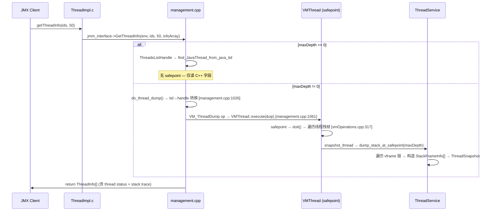

# 03-thread-monitoring — 线程 dump 双路径 + 三重锁提取 + DFS 死锁检测 + ThreadsListHandle

> **Phase**: 17-jmx-management
> **前置**: [01-management-jmm-interface]（jmm_interface vtable）、[03-object-model]（JavaCalls）
> **配套**: [00-what-is-jmx]（JMX 概念）、[02-memory-pool-threshold]（ServiceThread）、[04-os-flag-diagnostic]（Flag/DCmd）
> **阅读收益**: 追踪线程 dump 从 JMX 调用到 safepoint 执行的完整路径——理解 jmm_GetThreadInfo 的 maxDepth==0 vs !=0 双路径、jmm_DumpThreads 的三重锁信息提取、VM_ThreadDump::doit 的 safepoint 执行步骤、FindDeadlockedThreads vs FindMonitorDeadlockedThreads 的 DFS 环检测算法、ThreadsListHandle 的 hazard pointer 无锁线程列表访问、jmm_GetThreadCpuTimeWithKind 的 CPU 时间查询、jmm_GetThreadAllocatedMemory 的无 safepoint 内存查询；掌握 "ThreadDump 导致 safepoint 时间飙升" 的诊断和优化路径

---

## §〇 Production Scenario

你的应用有 2000 个线程，监控系统每秒通过 JMX 调用 `ThreadMXBean.getThreadInfo(ids, 50)` 获取前 50 个线程的 50 层栈帧。某天 GC 日志显示 safepoint 时间从 50ms 飙升到 500ms，其中 `ThreadDump` VM Operation 占了 400ms。

Root cause: `jmm_GetThreadInfo` (management.cpp:1077) 在 `maxDepth > 0` 时走 `do_thread_dump()` (management.cpp:1026) 路径 → 构造 `VM_ThreadDump` VM Operation → `VMThread::execute(&op)` → 进入全局 safepoint → 在 safepoint 内遍历 2000 个线程的栈帧（每个 ~100μs）→ 2000 × 100μs = 200ms。加上 `locked_synchronizers=true` 时 `VM_ThreadDump::doit_prologue()` 获取 `Heap_lock`（全局锁），其他需要在 safepoint 中访问 Heap_lock 的操作也被阻塞。

核心认知：`jmm_GetThreadInfo` 有 **双路径**：`maxDepth==0` 不需要 safepoint（只用 `ThreadsListHandle` 读线程统计信息），`maxDepth!=0` 需要 `VM_ThreadDump` safepoint。

**三步诊断**：

```bash
# 1. 确认 safepoint 时间异常
jcmd <pid> VM.safepoint_statistics

# 2. 查看线程数
jcmd <pid> Thread.print | head -1

# 3. 对比 maxDepth=0 vs maxDepth>0 的响应时间
java -jar cmdline-jmxclient.jar ... java.lang:type=Threading ThreadCount  # ~0.1ms
java -jar cmdline-jmxclient.jar ... java.lang:type=Threading 'getThreadInfo([1], 0)'  # ~0.2ms
java -jar cmdline-jmxclient.jar ... java.lang:type=Threading 'getThreadInfo([1], 50)'  # ~5ms+
```

**反事实**: 如果 `jmm_GetThreadInfo` 在 `maxDepth>0` 时也绕过 safepoint（用 `ThreadsListHandle` + 直接读栈帧）→ 在非 safepoint 状态访问栈帧 → 栈帧可能正在被 JIT 编译器修改（OSR 替换、去优化重写的 frame anchor）→ 栈帧遍历器读到半初始化的 bci/scope → 返回错误的 method/line number 或访问已释放的 nmethod → SIGSEGV。`VM_ThreadDump` 的 safepoint 代价换来了栈帧遍历的安全性保证。

---

## §一 ★★★ Thread Monitoring 全链路源码走读

### 1.1 Interview Story Format Answer

"Thread monitoring in the JVM is a dual-path system. `jmm_GetThreadInfo` (management.cpp:1077) checks `maxDepth`: if 0, it reads thread statistics (state, contention counts, blocked time) using `ThreadsListHandle` — a hazard pointer mechanism that requires NO safepoint, costs ~100ns per thread. If maxDepth > 0, it calls `do_thread_dump()` which constructs a `VM_ThreadDump` VM Operation and dispatches through `VMThread::execute(&op)` — this enters a global safepoint, pauses all Java threads, and walks each thread's stack frames. The triple lock extraction in `jmm_DumpThreads` (management.cpp:1173) collects: (1) stack-frame locked monitors with their frame depth, (2) JNI locked monitors with depth=-1 (outside Java frames), (3) JSR-166 `AbstractOwnableSynchronizer` owners. Deadlock detection uses DFS: `find_deadlocks_at_safepoint()` (threadService.cpp:362) follows `current_pending_monitor` chains for ObjectMonitor deadlocks, and additionally follows `current_park_blocker` chains for `ReentrantLock` deadlocks when `concurrent_locks=true`. The algorithm uses `depth_first_number` tags — a cycle is detected when a visited thread's `depth_first_number >= starting_dfn`. CPU time queries via `jmm_GetThreadCpuTimeWithKind` (management.cpp:2162) use `ThreadsListHandle` for safe thread lookup then call `os::thread_cpu_time()` → `clock_gettime(CLOCK_THREAD_CPUTIME_ID)` (man 2 clock_gettime). Memory allocation queries via `jmm_GetThreadAllocatedMemory` (management.cpp:2123) read `JavaThread::cooked_allocated_bytes()` — a TLAB-based counter that requires NO safepoint."

### 1.2 ThreadImpl.c — 15 JNI 函数映射表

`ThreadImpl.c:31-150` — 每个 JNI 函数都是一行薄转发到 `jmm_interface->Xxx()`:

| JNI 函数 | 调用的 jmm_interface 方法 | 说明 |
|---------|------------------------|------|
| `setThreadContentionMonitoringEnabled0` | `SetBoolAttribute(JMM_THREAD_CONTENTION_MONITORING)` | 启用/禁用线程争用监控 |
| `setThreadCpuTimeEnabled0` | `SetBoolAttribute(JMM_THREAD_CPU_TIME)` | 启用/禁用 CPU 时间监控 |
| `setThreadAllocatedMemoryEnabled0` | `SetBoolAttribute(JMM_THREAD_ALLOCATED_MEMORY)` | 启用/禁用分配内存监控 |
| `getThreadInfo1` | `GetThreadInfo(env, ids, maxDepth, infoArray)` | 批量获取 ThreadInfo |
| `getThreadTotalCpuTime0` | `GetThreadCpuTimeWithKind(env, tid, JNI_TRUE)` | 单线程 total CPU time |
| `getThreadTotalCpuTime1` | `GetThreadCpuTimesWithKind(env, ids, timeArray, JNI_TRUE)` | 批量 total CPU time |
| `getThreadUserCpuTime0` | `GetThreadCpuTimeWithKind(env, tid, JNI_FALSE)` | 单线程 user CPU time |
| `getThreadUserCpuTime1` | `GetThreadCpuTimesWithKind(env, ids, timeArray, JNI_FALSE)` | 批量 user CPU time |
| `getThreadAllocatedMemory0` | `GetOneThreadAllocatedMemory(env, tid)` | 单线程分配量 |
| `getThreadAllocatedMemory1` | `GetThreadAllocatedMemory(env, ids, sizeArray)` | 批量分配量 |
| `findMonitorDeadlockedThreads0` | `FindCircularBlockedThreads(env)` | 仅 ObjectMonitor 死锁 |
| `findDeadlockedThreads0` | `FindDeadlocks(env, JNI_FALSE)` | ObjectMonitor + JSR-166 死锁 |
| `dumpThreads0` | `DumpThreads(env, ids, lockedMonitors, lockedSynchronizers, maxDepth)` | 完整线程 dump |

### 1.3 jmm_GetThreadInfo 双路径分派

`management.cpp:1077-1160` — 核心双路径。

**参数详解**：

| 参数 | 类型 | 含义 | 合法值 |
|------|------|------|--------|
| `ids` | `jlongArray` | 线程 ID 数组 | 非 NULL，长度 ≥ 1 |
| `maxDepth` | `jint` | 最大栈深度 | -1 (全部), 0 (无栈), >0 (N 层) |
| `infoArray` | `jobjectArray` | 输出: ThreadInfo 数组 | 长度 == ids.length |

**参数校验** (management.cpp:1079-1107):
- `ids == NULL || infoArray == NULL` → `NullPointerException` (line 1079-1081)
- `maxDepth < -1` → `IllegalArgumentException` (line 1083-1086)
- `ids_ah->length() != infoArray_h->length()` → `IllegalArgumentException` (line 1104-1107)
- `validate_thread_id_array(ids_ah, CHECK_0)` → 验证所有 thread ID ≥ 0 (line 1097)
- `validate_thread_info_array(infoArray_h, CHECK_0)` → 验证数组元素类型 (line 1100)

**核心双路径**:

```cpp
JVM_ENTRY(jint, jmm_GetThreadInfo(JNIEnv *env, jlongArray ids, jint maxDepth, jobjectArray infoArray))
  // ... 参数校验 ...
  ThreadDumpResult dump_result(num_threads);

  if (maxDepth == 0) {
    // 路径 A: 不需要 safepoint — 仅读线程统计信息
    dump_result.set_t_list();                          // 设置 hazard ptr (SMR)
    for (int i = 0; i < num_threads; i++) {
      jlong tid = ids_ah->long_at(i);
      JavaThread* jt = dump_result.t_list()->find_JavaThread_from_java_tid(tid);
      if (jt == NULL) {
        dump_result.add_thread_snapshot();             // dummy — 线程已终止
      } else {
        dump_result.add_thread_snapshot(jt);           // 只读 C++ 字段，不访问栈帧
      }
    }
  } else {
    // 路径 B: 需要 safepoint — 遍历栈帧
    do_thread_dump(&dump_result, ids_ah, num_threads, maxDepth,
                   false, false, CHECK_0);             // → VM_ThreadDump → safepoint
  }
```

**maxDepth==0 路径**：只读 `JavaThread` 的 C++ 字段（状态、争用统计、blocker object）— 不访问栈帧。`ThreadsListHandle` 通过 hazard pointer 提供无 safepoint 的线程列表安全访问。

**maxDepth!=0 路径**：通过 `do_thread_dump()` 构造 `VM_ThreadDump` VM Operation → `VMThread::execute(&op)` → 全局 safepoint → 遍历栈帧。

### 1.4 do_thread_dump() — tid→handle 转换 + VM Operation

`management.cpp:1026-1062`：

```cpp
static void do_thread_dump(ThreadDumpResult* dump_result, typeArrayHandle ids_ah,
                           int num_threads, int max_depth, bool with_locked_monitors,
                           bool with_locked_synchronizers, TRAPS) {
  if (num_threads == 0) return;
  // Step 1: ThreadsListHandle 转换 tid → threadObj handle
  GrowableArray<instanceHandle>* thread_handle_array = new GrowableArray<instanceHandle>(num_threads);
  {
    ThreadsListHandle tlh;
    for (int i = 0; i < num_threads; i++) {
      jlong tid = ids_ah->long_at(i);
      JavaThread* jt = tlh.list()->find_JavaThread_from_java_tid(tid);
      oop thread_obj = (jt != NULL ? jt->threadObj() : (oop)NULL);
      instanceHandle threadObj_h(THREAD, (instanceOop) thread_obj);
      thread_handle_array->append(threadObj_h);
    }
  }  // ThreadsListHandle 在此析构 — 释放 hazard ptr

  // Step 2: 构造 VM_ThreadDump → VMThread::execute → safepoint
  VM_ThreadDump op(dump_result, thread_handle_array, num_threads, max_depth,
                   with_locked_monitors, with_locked_synchronizers);
  VMThread::execute(&op);
}
```

**关键竞态**：Step 1 中 `jt->threadObj()` 返回的 oop 在 Step 2 的 safepoint 之前可能已终止 → `threadObj_h` 保存为 handle → GC 移动 oop 时 handle 被更新 → safepoint 中 handle 仍有效。

### 1.5 jmm_DumpThreads — 三重锁提取 + 双模式 dispatch

`management.cpp:1173-1303` — jmm_DumpThreads 是线程 dump 的完整入口，支持两种模式。

**参数详解**：

| 参数 | 类型 | 含义 |
|------|------|------|
| `thread_ids` | `jlongArray` | 线程 ID 数组; NULL = dump all threads |
| `locked_monitors` | `jboolean` | 是否提取锁定的 ObjectMonitor |
| `locked_synchronizers` | `jboolean` | 是否提取 JSR-166 同步器 |
| `maxDepth` | `jint` | 最大栈深度; -1 = 全部 |

**双模式 dispatch** (management.cpp:1183-1203):

```cpp
if (ids_ah() != NULL) {
  // 模式 A: dump 指定线程
  validate_thread_id_array(ids_ah, CHECK_NULL);       // line 1186
  do_thread_dump(&dump_result,                        // line 1189
                 ids_ah, num_threads, maxDepth,
                 locked_monitors, locked_synchronizers, CHECK_NULL);
} else {
  // 模式 B: dump 全部线程
  VM_ThreadDump op(&dump_result,                      // line 1198
                   maxDepth, locked_monitors, locked_synchronizers);
  VMThread::execute(&op);                             // line 1202
}
```

**模式 A vs B 的关键差异**：
- 模式 A: 需要 `do_thread_dump()` 做 tid→handle 转换 (先获取 ThreadsListHandle)
- 模式 B: 直接构造 `VM_ThreadDump` 的 `_num_threads=0` 版本 → doit() 中遍历所有线程
- 模式 B 不需要 tid→handle 转换 → 在 safepoint 中直接从 `_result->t_list()` 遍历

**三种锁信息提取**:

**Stack-frame locked monitors**（depth = 实际帧深度）：

```cpp
for (int depth = 0; depth < num_frames; depth++) {
  StackFrameInfo* frame = stacktrace->stack_frame_at(depth);
  int num_monitors = frame->num_locked_monitors();
  for (int j = 0; j < num_monitors; j++) {
    monitors_array->obj_at_put(count, frame->locked_monitor(j));
    depths_array->int_at_put(count, depth);           // 实际的栈帧深度
    count++;
  }
}
```

**JNI locked monitors**（depth = -1）：

```cpp
// JNI locked monitors — 不在 Java 栈帧上
for (int j = 0; j < stacktrace->num_jni_locked_monitors(); j++) {
  monitors_array->obj_at_put(count, stacktrace->jni_locked_monitor(j));
  depths_array->int_at_put(count, -1);               // -1 表示 "不在 Java 栈帧上"
  count++;
}
```

**JSR-166 synchronizers**（需要 `_with_locked_synchronizers=true`）：

```cpp
if (locked_synchronizers) {
  ThreadConcurrentLocks* tcl = ts->get_concurrent_locks();
  GrowableArray<instanceOop>* locks = tcl->owned_locks();
  for (int j = 0; j < locks->length(); j++) {
    synchronizers_array->obj_at_put(idx++, locks->at(j));
  }
}
```

**追问**：为什么 JNI locked monitors 设 depth=-1？→ JMX 规范约定 — depth=-1 表示"不在 Java 栈帧上"。如果设为 depth=0（栈顶）→ JMX 客户端误认为锁是在方法入口处获取的 → 误导死锁排查。

### 1.6 DFS 死锁检测算法（含真实行号）

`threadService.cpp:362-481` — `find_deadlocks_at_safepoint()`：

**算法伪代码**（每行标注 `file:line`）：

```
362: DeadlockCycle* ThreadService::find_deadlocks_at_safepoint(ThreadsList* t_list, bool concurrent_locks)
363:   assert(is_at_safepoint())                              // 只在 safepoint 调用
366:   int globalDfn = 0, thisDfn;
369:   blocked_on_monitor = false;
374:   JavaThreadIterator jti(t_list);
376:   for (jt = jti.first(); jt != NULL; jt = jti.next())
376:     jt->set_depth_first_number(-1)                       // 初始化所有线程 dfn = -1
381:   DeadlockCycle* cycle = new DeadlockCycle()
382:   for (jt = jti.first(); jt != NULL; jt = jti.next())
383:     if (jt->depth_first_number() >= 0): continue          // 已访问过，跳过
388:     thisDfn = globalDfn
389:     jt->set_depth_first_number(globalDfn++)               // 分配新 dfn
393:     cycle->reset()
398:     waitingToLockMonitor = (ObjectMonitor*)jt->current_pending_monitor()
399:     if (concurrent_locks):
400:       waitingToLockBlocker = jt->current_park_blocker()    // AOS blocker
402:     while (waitingToLockMonitor != NULL || waitingToLockBlocker != NULL):
403:       cycle->add_thread(currentThread)
404:       if (waitingToLockMonitor != NULL):                   // ObjectMonitor 路径
405:         currentOwner = waitingToLockMonitor->owner()
406:         if (currentOwner != NULL):
407:           currentThread = Threads::owning_thread_from_monitor_owner(t_list, currentOwner)
409:           if (currentThread == NULL):                      // owner 线程找不到 → 永久阻塞
414:             num_deadlocks++
416:             cycle->set_deadlock(true)                      // 记录死锁
424:             last = cycle
425:             cycle = new DeadlockCycle()
426:             break
429:       else:                                               // concurrent_locks 路径
431:         if (waitingToLockBlocker->is_a(AOS_klass)):
432:           threadObj = AOS::get_owner_threadObj(waitingToLockBlocker)
435:           currentThread = threadObj != NULL ? java_lang_Thread::thread(threadObj) : NULL
442:       if (currentThread == NULL): break                    // 无下一跳依赖
446:       if (currentThread->depth_first_number() < 0):       // 首次访问
448:         currentThread->set_depth_first_number(globalDfn++)
449:       else if (currentThread->depth_first_number() < thisDfn):
451:         break                                               // 已访问，不在当前路径上
452:       else if (currentThread == previousThread):
454:         break                                               // 自环，忽略
455:       else:                                                // dfn >= thisDfn → 发现环！
457:         num_deadlocks++
459:         cycle->set_deadlock(true)
467:         last = cycle
468:         cycle = new DeadlockCycle()
469:         break
471:       previousThread = currentThread
472:       waitingToLockMonitor = (ObjectMonitor*)currentThread->current_pending_monitor()
473:       if (concurrent_locks):
474:         waitingToLockBlocker = currentThread->current_park_blocker()
479:   delete cycle
480:   return deadlocks
```

**环检测规则**：`depth_first_number >= thisDfn` → 说明回到了当前 DFS 路径上的某个线程 → 死锁环。

**FindMonitorDeadlockedThreads** vs **FindDeadlockedThreads**：

| 函数 | concurrent_locks | 追踪链 |
|------|:---:|------|
| `FindMonitorDeadlockedThreads` | **false** | 仅 `current_pending_monitor` (ObjectMonitor) |
| `FindDeadlockedThreads` | **true** | `current_pending_monitor` + `current_park_blocker` (AOS) |

**反事实**：如果使用 Warshall 算法（全图闭包）→ O(N³) vs DFS O(N+E) → 2000 线程时 Warshall 需要 8×10⁹ 操作 → 在 safepoint 内执行几秒钟 → STW 灾难。DFS 只在有等待关系的线程上遍历 — 大部分线程不参与等待链 → 实际复杂度 ~O(N)。

### 1.7 ThreadSnapshot::initialize — 状态降级 + 14 字段填充

`threadService.cpp:857-913`。

**完整字段填充流程**：

| 步骤 | 字段 | 来源 | 行号 |
|------|------|------|:---:|
| 1 | `_thread` | 参数直接赋值 | :858 |
| 2 | `_threadObj` | `thread->threadObj()` | :859 |
| 3 | `_contended_enter_ticks` | `ThreadStatistics` | :862 |
| 4 | `_contended_enter_count` | `ThreadStatistics` | :863 |
| 5 | `_monitor_wait_ticks` | `ThreadStatistics` | :864 |
| 6 | `_monitor_wait_count` | `ThreadStatistics` | :865 |
| 7 | `_sleep_ticks` | `ThreadStatistics` | :866 |
| 8 | `_sleep_count` | `ThreadStatistics` | :867 |
| 9 | `_thread_status` | `java_lang_Thread::get_thread_status()` | :870-871 |
| 10 | `_is_ext_suspended` | `thread->is_being_ext_suspended()` | :873 |
| 11 | `_is_in_native` | `thread->thread_state() == _thread_in_native` | :874 |
| 12 | `_blocker_object` | 状态降级逻辑 | :885/908 |
| 13 | `_blocker_object_owner` | 状态降级逻辑 | :898/910 |

**状态降级逻辑**:

```cpp
void ThreadSnapshot::initialize(ThreadsList * t_list, JavaThread* thread) {
  _thread = thread;
  _threadObj = thread->threadObj();
  _contended_enter_ticks = stat->contended_enter_ticks();
  _monitor_wait_ticks = stat->monitor_wait_ticks();
  _sleep_ticks = stat->sleep_ticks();
  _thread_status = _threadObj == NULL ? java_lang_Thread::NEW
                                     : java_lang_Thread::get_thread_status(_threadObj);

  if (_thread_status == BLOCKED_ON_MONITOR_ENTER ||
      _thread_status == IN_OBJECT_WAIT || _thread_status == IN_OBJECT_WAIT_TIMED) {
    Handle obj = ThreadService::get_current_contended_monitor(thread);
    if (obj() == NULL) {
      _thread_status = java_lang_Thread::RUNNABLE;   // monitor deflation — 降级
    } else {
      _blocker_object = obj();
      JavaThread* owner = ObjectSynchronizer::get_lock_owner(t_list, obj);
      if (owner == NULL || owner->is_attaching_via_jni()) {
        _thread_status = java_lang_Thread::RUNNABLE;  // owner 不可用 — 降级
      } else {
        _blocker_object_owner = owner->threadObj();
      }
    }
  }

  // JSR-166 locks
  if (_thread_status == PARKED || _thread_status == PARKED_TIMED) {
    _blocker_object = thread->current_park_blocker();
    if (_blocker_object != NULL && _blocker_object->is_a(AOS_klass)) {
      _blocker_object_owner = AOS::get_owner_threadObj(_blocker_object);
    }
  }
}
```

**状态降级场景**：
1. Monitor deflation — monitor 被 GC 回收 → `get_current_contended_monitor` 返回 NULL → 降级为 RUNNABLE
2. Owner attaching — owner 线程正在 JNI attach 中 → 状态不可靠 → 降级为 RUNNABLE
3. 防止 JMX 客户端看到 stale 的阻塞信息

### 1.8 ★ Mermaid 序列图



### 1.9 7 Beginner Callout 框

> **1. maxDepth==0 vs maxDepth!=0**: When `maxDepth==0`, `jmm_GetThreadInfo` only reads thread metadata — state, blocked count, waited count, blocked time, waited time — all stored in `JavaThread` C++ fields. NO stack walking, NO safepoint. When `maxDepth!=0`, it triggers `VM_ThreadDump` — a VM Operation requiring global safepoint — and walks every requested thread's stack frames. The performance difference: ~0.1ms for maxDepth=0 vs ~5ms+ for maxDepth=50 on a typical server.

> **2. ThreadsListHandle — hazard pointer**: `ThreadsListHandle` (threadSMR.hpp) uses Safe Memory Reclamation (SMR) with hazard pointers. `acquire_stable_list()` atomically marks a `ThreadsList` as "in use" via CAS on a tagged pointer — this prevents the list from being freed while being read. No global lock, no safepoint. Used in `do_thread_dump()` and `jmm_GetThreadAllocatedMemory()` for safe thread ID → JavaThread* lookups without stopping the world.

> **3. JNI locked monitors depth=-1**: When `jmm_DumpThreads` extracts locked monitors, stack-frame monitors get their actual frame depth (e.g., depth=3 for a monitor locked in the 3rd frame). JNI locked monitors — those acquired via `JNI MonitorEnter` — are NOT on Java stack frames. They're tracked in `ThreadStackTrace::_jni_locked_monitors` list. Their depth is set to -1 to distinguish them from stack-frame monitors.

> **4. DFS deadlock detection**: The deadlock detector uses depth-first search on the wait-for graph. Each thread has a `depth_first_number`. The algorithm follows `current_pending_monitor` (ObjectMonitor) to find the monitor's owner, then continues from that thread. For `FindDeadlockedThreads` (concurrent_locks=true), it also follows `current_park_blocker` (AbstractOwnableSynchronizer) to detect JSR-166 lock cycles. A cycle is found when a thread's `depth_first_number >= starting_dfn` — meaning we've looped back to a thread visited in the current DFS path.

> **5. VM_ThreadDump::doit_prologue — Heap_lock**: When `_with_locked_synchronizers=true`, `VM_ThreadDump::doit_prologue()` acquires `Heap_lock` — a global lock that protects the Java heap. This is necessary because `ConcurrentLocksDump::dump_at_safepoint()` iterates all `AbstractOwnableSynchronizer` objects, which are Java objects on the heap. The Heap_lock prevents concurrent GC from moving these objects during the dump.

> **6. ThreadSnapshot::initialize — state downgrade**: `ThreadSnapshot::initialize()` (threadService.cpp:857-913) may downgrade a thread's state. If a thread is `BLOCKED_ON_MONITOR_ENTER` but the monitor has been deflated (removed), `ObjectSynchronizer::get_lock_owner()` returns NULL → the state is downgraded to `RUNNABLE`. Similarly for `IN_OBJECT_WAIT` without a valid monitor. This prevents JMX clients from seeing stale blocking information.

> **7. DeadlockCycle linked list**: Each detected deadlock cycle is stored as a `DeadlockCycle` object containing a `GrowableArray<JavaThread*>` of participating threads. Multiple cycles are linked via `_next` pointers. The JMX layer flattens this into a `ThreadInfo[]` array — if a thread participates in multiple cycles, it appears only once.

---

## §二 Standard Environment

OpenJDK 11 slowdebug, 64-bit Linux.

Source roots:
- `src/java.management/share/native/libmanagement/ThreadImpl.c` — 15 JNI 函数 (:32-150)
- `src/java.management/share/native/libmanagement/HotspotThread.c` — getInternalThreadCount(:31), getInternalThreadTimes0(:39)
- `src/hotspot/share/services/management.cpp` — jmm_GetThreadInfo(:1077), jmm_DumpThreads(:1173), do_thread_dump(:1026), find_deadlocks(:1735), jmm_GetThreadCpuTimeWithKind(:2162), jmm_GetThreadAllocatedMemory(:2123), jmm_GetThreadCpuTimesWithKind(:2193)
- `src/hotspot/share/services/threadService.cpp` — find_deadlocks_at_safepoint(:362), ThreadSnapshot::initialize(:857), ConcurrentLocksDump::dump_at_safepoint
- `src/hotspot/share/runtime/vmOperations.cpp` — VM_ThreadDump 构造(:273), doit_prologue(:301), doit(:317), doit_epilogue(:310), snapshot_thread(:385), VM_FindDeadlocks::doit(:247)
- `src/hotspot/share/runtime/threadSMR.cpp` — ThreadsListHandle 构造, acquire_stable_list_fast_path
- `src/hotspot/share/runtime/threadSMR.hpp` — ThreadsListHandle class 声明

Build: `make jdk`
Binaries: `lib/libmanagement.so`（含 ThreadImpl.c 的 15 JNI 函数 + HotspotThread.c 的 2 函数）

Syscall 速查表:
| 系统调用 | man 引用 | 用途 | 调用位置 |
|---------|---------|------|---------|
| `futex` | `man 2 futex` | CAS/atomic 底层，hazard ptr CAS | kernel futex |
| `sched_yield` | `man 2 sched_yield` | safepoint 中 VMThread 让出 CPU | os::naked_yield() |
| `clock_gettime` | `man 2 clock_gettime` | CPU 时间查询 (CLOCK_THREAD_CPUTIME_ID) | os::thread_cpu_time() |
| `pthread_mutex_lock` | `man 7 pthread_mutex` | Heap_lock 底层实现 | Heap_lock->lock() |

---

## §三 Source Files Table

| # | File | Full Path | Lines | Core Functions | Role |
|---|------|-----------|:--:|-------|------|
| 1 | **ThreadImpl.c** | `src/java.management/share/native/libmanagement/ThreadImpl.c` | 150 | 15 JNI 函数(:32-150) | JNI bridge |
| 2 | **HotspotThread.c** | `src/java.management/share/native/libmanagement/HotspotThread.c` | 45 | getInternalThreadCount(:31), getInternalThreadTimes0(:39) | Hotspot internal thread stats |
| 3 | **management.cpp** | `src/hotspot/share/services/management.cpp` | 2282 | do_thread_dump(:1026), jmm_GetThreadInfo(:1077), jmm_DumpThreads(:1173), jmm_GetThreadCpuTimeWithKind(:2162), jmm_GetThreadAllocatedMemory(:2123) | 🔥 JMM thread entry |
| 4 | **threadService.cpp** | `src/hotspot/share/services/threadService.cpp` | 1058 | find_deadlocks_at_safepoint(:362), ThreadSnapshot::initialize(:857) | 🔥 Thread service core |
| 5 | **vmOperations.cpp** | `src/hotspot/share/runtime/vmOperations.cpp` | ~3200 | VM_ThreadDump 构造(:273), doit_prologue(:301), doit(:317), doit_epilogue(:310), snapshot_thread(:385) | 🔥 VM Operation |
| 6 | **threadSMR.cpp** | `src/hotspot/share/runtime/threadSMR.cpp` | ~800 | ThreadsListHandle 构造, acquire_stable_list_fast_path | 🔥 SMR/hazard ptr |
| 7 | **threadService.hpp** | `src/hotspot/share/services/threadService.hpp` | ~250 | ThreadSnapshot 14 字段定义 | ThreadSnapshot class |

---

## §四 ★★★ 深度问题组（≥8 组）

### 4.1 jmm_GetThreadInfo 双路径分派 — maxDepth==0 vs !=0 源码对比

**问题**：`jmm_GetThreadInfo` (management.cpp:1077-1160) 在 `maxDepth==0` 和 `maxDepth!=0` 时执行路径有何本质差异？为什么 `maxDepth==0` 不需要 safepoint？

**源码逐行对比**：

| 步骤 | maxDepth==0 路径 | maxDepth!=0 路径 |
|------|-----------------|-----------------|
| 1 | `management.cpp:1115` if (maxDepth==0) | `management.cpp:1130` else |
| 2 | `management.cpp:1118` dump_result.set_t_list() — 设置 hazard ptr | `management.cpp:1132` do_thread_dump(&dump_result, ...) |
| 3 | `management.cpp:1119-1129` for 循环: find_JavaThread_from_java_tid → add_thread_snapshot | `management.cpp:1026` do_thread_dump: ThreadsListHandle → tid→handle 转换 → VM_ThreadDump 构造 → VMThread::execute |
| 4 | 全程在调用者线程执行 | `vmOperations.cpp:317` VMThread 上执行 doit() |
| 5 | 无 safepoint | 全局 safepoint 暂停所有 Java 线程 |
| 6 | `threadService.cpp:857` ThreadSnapshot::initialize 读 C++ 字段 | `vmOperations.cpp:385` snapshot_thread: initialize + dump_stack_at_safepoint + set_concurrent_locks |
| 7 | 延迟 ~10μs (100 线程) | 延迟 ~5ms+ (100 线程 × 50 帧) |

**答案方向（≥8行）**:
- `management.cpp:1115` 的 `if (maxDepth == 0)` 分支走 `dump_result.set_t_list()` (line 1118) → 设置 ThreadsListHandle 的 hazard ptr → 然后直接遍历 `dump_result.t_list()` → `find_JavaThread_from_java_tid` → `add_thread_snapshot(jt)` — 全程无 safepoint，仅读 `JavaThread` C++ 字段（`threadService.cpp:857-913` ThreadSnapshot::initialize）
- `management.cpp:1130` 的 `else` 分支走 `do_thread_dump()` (line 1132-1138) → 构造 `VM_ThreadDump` → `VMThread::execute(&op)` → 全局 safepoint → `vmOperations.cpp:317` doit() 遍历栈帧
- 核心差异：`maxDepth==0` 只访问线程元数据（状态、计数、时间），这些数据由 `ThreadStatistics` (JavaThread 内部) 用 CAS 原子更新 — 不需要 safepoint 的一致性保证
- `maxDepth!=0` 需要读栈帧 (frame walk)，而栈帧遍历需要 Java 线程处于稳定状态 — JIT 编译器的 OSR 替换、去优化可能在非 safepoint 修改栈帧的 bci/scope
- 追问：如果 `maxDepth==0` 但线程在 `add_thread_snapshot` 调用前终止 → `find_JavaThread_from_java_tid` 返回 NULL → `dump_result.add_thread_snapshot()` (line 1125) 创建 dummy snapshot → `threadObj()==NULL` → `management.cpp:1149` 将 infoArray 对应位置设为 NULL — JMX 客户端收到 NULL ThreadInfo
- 追问：`maxDepth==-1` (dump entire stack) → `management.cpp:1083` 允许，等同于"无限制"→ 栈帧遍历到栈底 → 深栈（如递归 10000 层）→ 可能导致 safepoint 时间 >1s
- 量化对比：`maxDepth==0` 100 线程 ~10μs (纯内存读) vs `maxDepth==50` 100 线程 ~5ms (safepoint + 100×50 栈帧遍历)
- 反事实：如果 `maxDepth==0` 也走 safepoint → 每次 `ThreadCount` JMX 查询都触发 STW → 应用停顿数倍增加
- 内核引用：hazard ptr 的 CAS 操作底层是 `lock cmpxchg` (x86) → 硬件保证原子性，无 syscall → 延迟 ~10ns/操作
- 补充验证：在 `management.cpp:1141-1142` 有双重断言 — `assert(num_snapshots == num_threads)` 确保每个请求的线程 ID 都生成了快照 — `assert(dump_result.t_list_has_been_set())` 确保 ThreadsList 已被设置 — 这些断言在 debug 构建中防止遗漏线程
- 补充验证：`management.cpp:1144-1158` 遍历 ThreadSnapshot 链表 → 每个快照转换为 `java.lang.management.ThreadInfo` 对象 → `Management::create_thread_info_instance(ts, CHECK_0)` (line 1156) 使用 `JavaCalls::call_static()` 调用 Java 构造函数 — 这是 JMX 数据返回的最后一公里

### 4.2 jmm_DumpThreads 三重锁信息提取 — Stack-frame monitors + JNI monitors + synchronizers

**问题**：`jmm_DumpThreads` (management.cpp:1173-1303) 如何区分和提取三种不同类型的锁信息？各自的 depth 和数据结构如何映射到 JMX ThreadInfo？

**答案方向（≥8行）**：
- Stack-frame monitors (line 1252-1263): 遍历 `stacktrace->stack_frame_at(depth)` 的 `locked_monitors()` → depth 设为实际帧深度 (0-based) → 存入 `monitors_array` + `depths_array` — 这是 Java 字节码 `monitorenter` 获取的锁
- JNI locked monitors (line 1265-1273): 遍历 `stacktrace->jni_locked_monitors()` → depth 设为 -1 → 存入 `monitors_array` + `depths_array` — 这些是通过 `JNI MonitorEnter` 获取的锁，不在 Java 栈帧上
- JSR-166 synchronizers (line 1277-1291): 需要 `locked_synchronizers=true` → 从 `ts->get_concurrent_locks()->owned_locks()` 读取 `AbstractOwnableSynchronizer` 实例 → 存入 `synchronizers_array` — 没有 depth 概念
- 追问：为什么 stack-frame monitors 和 JNI monitors 共享 `monitors_array` 和 `depths_array`？→ JMX ThreadInfo 只有一个 `lockedMonitors` 数组 + 一个 `lockedStackDepth` 数组 — depth=-1 是区分 JNI 锁的唯一方式
- 追问：如果 `locked_synchronizers=true` 但 `locked_monitors=false` → `monitors_array`/`depths_array` 为 NULL → `management.cpp:1294` 传给 `create_thread_info_instance` 时 monitors 参数为空 → ThreadInfo 的 lockedMonitors 字段为空
- 追问：`management.cpp:1198` 当 `ids_ah() == NULL` 时走"dump all threads"路径 → 构造 `VM_ThreadDump` 的 `_num_threads=0` 版本 → `vmOperations.cpp:331` 遍历 t_list 全部线程
- 量化：2000 线程 × `locked_synchronizers=true` → Heap_lock 获取 (doit_prologue line 304) + 2000 线程 × AOS heap scan → 可能增加 50-200ms
- 反事实：如果 JNI monitors 也设 depth=0 → JMX 客户端无法区分 JNI 锁和栈帧锁 → 死锁排查工具将 JNI 锁误标记在栈顶方法上 → 误导开发者
- 内核引用：`oopFactory::new_objArray` (line 1242) → 在 GC 堆分配数组 → GC 可能在此 safepoint 内触发 → 增加延迟
- 补充验证：`management.cpp:1274` 有 `assert(count == num_locked_monitors)` 断言 — 确保统计的锁数量与实际提取的一致 — 如果栈帧遍历中遗漏了某些 monitor → 断言失败 → 防止返回不完整的锁信息
- 补充验证：`management.cpp:1197` 当 `ids_ah() == NULL` 时走"dump all threads" → `VM_ThreadDump` 构造器使用 `_num_threads=0` 版本 (vmOperations.cpp:273) → 在 doit() 中遍历所有线程 (line 331-346) — 这是 jstack 命令的实际执行路径
- 补充验证：`management.cpp:1181` `ThreadDumpResult dump_result(num_threads)` — 当 `num_threads=0` (ids_ah==NULL) 时 → ThreadDumpResult 初始化为 0 容量 → 在 doit() 中动态添加 snapshot — ThreadDumpResult 使用链表 (ThreadSnapshot::_next) 而非固定数组 → 支持"dump all"场景

### 4.3 VM_ThreadDump::doit — safepoint 中的完整执行流程

**问题**：`VM_ThreadDump::doit()` (vmOperations.cpp:317-383) 在 safepoint 内如何遍历线程并提取栈帧？每一步的安全保证是什么？

**答案方向（≥8行）**：
- `vmOperations.cpp:320-324`: `_result->set_t_list()` — 在 VMThread 上设置 hazard ptr，保护当前线程列表在 VM operation 返回期间不被释放
- `vmOperations.cpp:326-329`: `ConcurrentLocksDump concurrent_locks(true)` + `dump_at_safepoint()` — 仅在 `_with_locked_synchronizers=true` 时执行 → `threadService.cpp` 中 `HeapInspection::find_instances_at_safepoint()` 扫描堆上所有 AOS 实例 → `build_map()` 构建 thread→locks 映射
- `vmOperations.cpp:331-346` (`_num_threads==0` 分支): 遍历 `_result->t_list()` 的所有线程 → 跳过 `is_exiting()` 和 `is_hidden_from_external_view()` 的线程 → 调用 `snapshot_thread(jt, tcl)`
- `vmOperations.cpp:347-382` (`_num_threads!=0` 分支): 遍历 `_threads` 数组的每个 `instanceHandle` → 通过 `java_lang_Thread::thread(th())` 从 oop 恢复 JavaThread* → 验证 `t_list()->includes(jt)` (line 363) — 防止 stale handle 引用已终止线程
- `vmOperations.cpp:385-389` `snapshot_thread()`: `add_thread_snapshot(java_thread)` → ThreadSnapshot::initialize → `dump_stack_at_safepoint(max_depth, with_locked_monitors)` → `set_concurrent_locks(tcl)`
- 追问：`is_hidden_from_external_view()` 过滤哪些线程？→ VMThread、WatcherThread、GC task threads — 这些内部线程不暴露给 JMX
- 追问：`java_lang_Thread::thread(th())` (line 362) 如何从 oop 恢复 JavaThread*？→ `java_lang_Thread::thread_offset()` 存储的指针 → 在 safepoint 中保证 oop 不会移动（GC 不会并发执行）
- 追问：如果 `_num_threads` 指定了 1000 个 ID，但只有 500 个存活 → `_num_threads!=0` 分支 line 353 `th()==NULL` 创建 dummy snapshot → line 369 `jt==NULL || is_exiting()` 也创建 dummy → 最终 `result_h->obj_at_put(index, NULL)` (management.cpp:1217)
- 量化：全部线程 dump (_num_threads=0) 2000 线程 → ~200ms safepoint；指定 10 个线程 → ~5ms safepoint
- 反事实：如果不在 safepoint 内做 `ConcurrentLocksDump::dump_at_safepoint()` → 并发 GC 移动 AOS oop → `build_map()` 读到 stale/dangling 指针 → SIGSEGV
- 补充验证：`vmOperations.cpp:324` `_result->set_t_list()` — 在 VMThread 上设置 hazard ptr — 这保证了 VM operation 返回后 ThreadDumpResult 遍历 ThreadSnapshot 时线程列表仍然有效 — 没有这个 hazard ptr → 调用者线程可能读取已释放的 JavaThread*
- 补充验证：`vmOperations.cpp:326-329` `ConcurrentLocksDump::dump_at_safepoint()` 只有在 `_with_locked_synchronizers=true` 时才执行 → `HeapInspection::find_instances_at_safepoint()` 扫描整个 Java 堆 → 查找所有 `AbstractOwnableSynchronizer` 实例 → 这是 O(堆对象数) 的操作 → 大型堆 (如 16GB) → 可能额外增加 50-200ms
- 补充验证：`vmOperations.cpp:336-337` `jt->is_exiting()` — 检查 `JavaThread::_terminated` 字段 → 线程正在 `JavaThread::exit()` 中清理 → 此时线程的 `threadObj()` 可能已为 NULL → 跳过避免访问无效 oop
- 补充验证：`vmOperations.cpp:363` `!_result->t_list()->includes(jt)` — 这是关键的二次验证 → Step 1 中通过 `instanceHandle` 保存的 threadObj → 在 safepoint 中通过 `java_lang_Thread::thread(th())` 恢复 JavaThread* → 但如果线程在 Step 1 和 safepoint 之间终止 → 恢复的指针可能指向已释放的内存 → `t_list()->includes(jt)` 检查 JavaThread* 是否仍在当前 ThreadsList 中 → 不在则 jt = NULL → 避免 UAF (Use-After-Free)

### 4.4 FindDeadlockedThreads vs FindMonitorDeadlockedThreads — DFS 算法差异

**问题**：`find_deadlocks_at_safepoint()` (threadService.cpp:362-481) 在 `concurrent_locks=true` 和 `concurrent_locks=false` 时算法有何差异？为什么需要两套死锁检测？

**答案方向（≥8行）**：
- `concurrent_locks=false` (FindMonitorDeadlockedThreads): 仅追踪 `current_pending_monitor` (ObjectMonitor) 的 owner 链 — 检测 synchronized 关键字导致的死锁
- `concurrent_locks=true` (FindDeadlockedThreads): 同时追踪 `current_pending_monitor` + `current_park_blocker` (AOS) — 检测 synchronized + ReentrantLock 混合死锁
- `threadService.cpp:398`: `waitingToLockMonitor = jt->current_pending_monitor()` — 仅获取重型 monitor（轻型锁不会有等待链）
- `threadService.cpp:399-401`: `if (concurrent_locks) waitingToLockBlocker = jt->current_park_blocker()` — park blocker 是 `java.util.concurrent.locks.LockSupport.park()` 设置的阻塞对象
- `threadService.cpp:405-407`: `currentOwner = waitingToLockMonitor->owner()` → `Threads::owning_thread_from_monitor_owner()` — 从 monitor 的 owner 字段还原 owner JavaThread*
- `threadService.cpp:431-435`: AOS 路径 → `waitingToLockBlocker->is_a(AOS_klass)` → `AOS::get_owner_threadObj()` → `java_lang_Thread::thread(threadObj)` — 从 AOS 的 exclusiveOwnerThread 字段还原 owner
- 追问：为什么 `threadService.cpp:409-414` 中 owner=NULL 被视为死锁？→ safepoint 中所有线程已暂停 → 如果 monitor 有等待者但没有 owner → owner 线程已终止但未释放 monitor → 等待线程永久阻塞
- 追问：`threadService.cpp:452-454` 为什么忽略自环 (currentThread==previousThread)？→ 自环是同一个线程尝试获取已持有的锁 → 这会产生死锁但 DFS 的 dfn 追踪会误判 — 实际上自环是在 Java 层被 `IllegalMonitorStateException` 处理的（可重入 synchronized 不会产生自环）
- 量化：2000 线程中 100 个有等待关系 → DFS 遍历约 100 节点 + 100 条边 → ~10μs vs 全图 Warshall O(N³) ~8×10⁹ 操作
- 反事实：如果只检测 ObjectMonitor 死锁 → ReentrantLock (AQS) 死锁完全不可见 → 运维通过 jstack 手动排查 → 线上事故发现延迟从秒级变为分钟级
- 补充验证：`threadService.cpp:363` 断言 `is_at_safepoint()` — 此函数只能在 safepoint 中调用 → 因为 `depth_first_number` 是 `JavaThread` 的字段，在非 safepoint 中线程可能在修改它 → 导致 DFS 读到不一致的状态
- 补充验证：`threadService.cpp:374` `JavaThreadIterator jti(t_list)` — 使用 `ThreadsList` 提供的迭代器 → 在 safepoint 中线程列表不变 → 可以安全遍历
- 补充验证：`threadService.cpp:414-416` owner=NULL 导致永久阻塞判定 — 但有一种情况是 owner 正在 `ObjectMonitor::exit()` 中释放锁 → `owner()` 字段被临时设为 NULL → 此时判定为永久阻塞是假阳性 → 但这只发生在 safepoint 外的并发场景 → safepoint 中所有线程暂停 → owner 要么已释放 (owner=NULL 正确) 要么未释放 (owner!=NULL) → 不存在中间态

### 4.5 ThreadSnapshot 14 字段 — 数据结构完整表格

**问题**：`ThreadSnapshot` (threadService.hpp) 的 14 个字段分别在何时填充？哪些由 `initialize()` 填充，哪些由 `dump_stack_at_safepoint()` 填充？

**答案方向（≥8行）**：

| # | 字段名 | C++ 类型 | 含义 | 填充时机 | 填充位置 |
|---|--------|---------|------|---------|---------|
| 1 | `_thread` | `JavaThread*` | 原始 C++ 线程指针 | initialize | threadService.cpp:858 |
| 2 | `_threadObj` | `oop` | Java Thread 对象的 oop | initialize | threadService.cpp:859 |
| 3 | `_thread_status` | `ThreadStatus` | Java 线程状态 (RUNNABLE/BLOCKED/...) | initialize | threadService.cpp:870-871 |
| 4 | `_is_ext_suspended` | `bool` | 是否被外部挂起 (JVM TI SuspendThread) | initialize | threadService.cpp:873 |
| 5 | `_is_in_native` | `bool` | 线程是否在 native 代码中 | initialize | threadService.cpp:874 |
| 6 | `_contended_enter_ticks` | `jlong` | 累计 monitor 争用等待时间 (ticks) | initialize | threadService.cpp:862 |
| 7 | `_contended_enter_count` | `jlong` | 累计 monitor 争用次数 | initialize | threadService.cpp:863 |
| 8 | `_monitor_wait_ticks` | `jlong` | 累计 Object.wait 时间 | initialize | threadService.cpp:864 |
| 9 | `_monitor_wait_count` | `jlong` | 累计 Object.wait 次数 | initialize | threadService.cpp:865 |
| 10 | `_sleep_ticks` | `jlong` | 累计 Thread.sleep 时间 | initialize | threadService.cpp:866 |
| 11 | `_sleep_count` | `jlong` | 累计 Thread.sleep 次数 | initialize | threadService.cpp:867 |
| 12 | `_blocker_object` | `oop` | 阻塞当前线程的对象 | initialize (状态降级中) | threadService.cpp:885/908 |
| 13 | `_blocker_object_owner` | `oop` | 持有 blocker 的线程 ThreadObj | initialize (状态降级中) | threadService.cpp:898/910 |
| 14 | `_stack_trace` | `ThreadStackTrace*` | 栈帧链表 (StackFrameInfo[]) | dump_stack_at_safepoint | threadService.cpp:921-922 |
| + | `_concurrent_locks` | `ThreadConcurrentLocks*` | JSR-166 锁列表 | set_concurrent_locks | vmOperations.cpp:388 |
| + | `_next` | `ThreadSnapshot*` | 链表 next 指针 | add_thread_snapshot | ThreadDumpResult |

- 追问：`_contended_enter_ticks` 和 `_contended_enter_count` 从哪里来？→ `JavaThread` 内嵌的 `ThreadStatistics` 对象 — 由 `ObjectMonitor::enter()` 在成功获取 monitor 后原子更新
- 追问：`_is_in_native` (line 874) 的判断条件 `thread->thread_state() == _thread_in_native` — 这是 HotSpot 内部的状态枚举，不是 Java 层的 Thread.State — 用于区分 JNI 调用中的线程
- 追问：`_thread_status` 的默认值 `java_lang_Thread::NEW` (line 870) — 当 `_threadObj==NULL`（线程正在 attach）→ 此时 Java 对象尚未完全初始化
- 反事实：如果不缓存 `_is_ext_suspended` → JMX 查询 `ThreadInfo.isSuspended()` 需要调用 JVM TI `IsThreadSuspended` → 增加一次 JVM TI 往返 → ~1μs × 2000 线程 = 2ms 额外开销
- 补充验证：`_thread_status` 的赋值有两层 — 第一层 `java_lang_Thread::get_thread_status(_threadObj)` 读取 Java 对象的 `threadStatus` 字段 — 第二层在状态降级逻辑中可能修改 — 最终值可能与 Java 层 `Thread.getState()` 返回的值不同（因为 JMX 做了额外的降级处理）
- 补充验证：`_is_ext_suspended` (line 873) — 通过 `thread->is_being_ext_suspended()` 检查 — 这个标志由 JVM TI `SuspendThread` 设置 — 表示线程被调试器或 profiler 挂起 — 不是 Java 层的 `Thread.suspend()` (已废弃)
- 补充验证：`_is_in_native` (line 874) — `thread->thread_state() == _thread_in_native` — 这是 HotSpot 内部的线程状态枚举，取值范围: `_thread_in_Java`, `_thread_in_vm`, `_thread_in_native`, `_thread_blocked` — 用于 JMX 确定线程是否在执行 JNI 代码
- 补充验证：状态降级的三种情况对应三个条件分支：
  - line 881-883: `obj()==NULL` — monitor deflation → 降级为 RUNNABLE
  - line 887-895: `owner==NULL && BLOCKED_ON_MONITOR_ENTER` 或 `owner->is_attaching_via_jni()` → 降级为 RUNNABLE + 清除 blocker_object
  - line 904-912: PARKED 状态 + JSR-166 park blocker → 不降级状态但设置 blocker_object 为 AOS 对象

### 4.6 ThreadsListHandle — hazard pointer 无 safepoint 线程列表访问

**问题**：`ThreadsListHandle` (threadSMR.hpp) 如何在不使用锁和 safepoint 的情况下安全访问线程列表？`acquire_stable_list_fast_path()` 的 CAS 协议是什么？

**答案方向（≥8行）**：
- `ThreadsListHandle` 是一个栈分配对象 (`StackObj`)，构造时调用 `SafeThreadsListPtr(_self, true)` → `acquire_stable_list_fast_path()` (threadSMR.cpp)
- `threadSMR.cpp` 中的 CAS 协议：① `threads = get_java_thread_list()` 读取当前列表指针 → ② `tag_hazard_ptr(threads)` 创建 tagged 版本 → ③ `set_threads_hazard_ptr(unverified_threads)` 发布未验证的 hazard ptr → ④ `get_java_thread_list() != threads` 检查是否被并发替换 → ⑤ `cmpxchg_threads_hazard_ptr(threads, unverified_threads)` 移除 tag 验证稳定
- 析构时 `~ThreadsListHandle()` → `SafeThreadsListPtr::~SafeThreadsListPtr()` → `release_stable_list()` → `set_threads_hazard_ptr(NULL)` — 清除 hazard ptr
- 追问：如果线程在 `tlh.list()->find_JavaThread_from_java_tid(tid)` 调用期间终止 → `ThreadsList` 中的条目仍然有效（hazard ptr 保护）→ 但 `threadObj()` 可能已为 NULL → `management.cpp:1048` 处理为 NULL → `instanceHandle threadObj_h(THREAD, (instanceOop) NULL)`
- 追问：`SafeThreadsListPtr` 的嵌套使用 → `acquire_stable_list_nested_path()` 使用引用计数替代 tag → 用于嵌套的 `ThreadsListHandle`（如 jmm_DumpThreads 内部的循环）
- 量化：`acquire_stable_list_fast_path` → 1 次 load + 2 次 CAS (~20ns on x86) vs `VMThread::execute` → safepoint 同步 (~50μs minimum)
- 对比：`management.cpp:2109` `jmm_GetThreadAllocatedMemory` 使用 `ThreadsListHandle` → 全程无锁 → `management.cpp:2113` `cooked_allocated_bytes()` 是原子变量 → 不需要 safepoint
- 反事实：如果不用 hazard ptr 而用全局 `Threads_lock` → 每次 JMX 查询都需要获取互斥锁 → 高并发下锁竞争 → 200 次/s JMX 查询 × 1ms 锁等待 = 200ms/s CPU 浪费
- 内核引用：hazard ptr 模式类似于 Linux 内核的 RCU (Read-Copy-Update, `man 7 rcu`) → 读路径无锁，写路径等待所有读者完成 → 但 SMR 用 CAS 而非 RCU 的 grace period
- 补充验证：`ThreadsListHandle` 的 `StackObj` 继承保证 RAII — 构造时自动 acquire，析构时自动 release — 即使异常抛出也不会泄漏 hazard ptr (C++ 栈展开保证析构)
- 补充验证：`SafeThreadsListPtr` 支持嵌套 — 如果同一个线程嵌套创建多个 `ThreadsListHandle` → 第一个走 `acquire_stable_list_fast_path()` → 后续走 `acquire_stable_list_nested_path()` → 使用引用计数 (`_has_ref_count`) 替代 tag — 释放时 `dec_nested_handle_cnt()` 而非直接清除 hazard ptr
- 补充验证：`ThreadsListHandle` 的 `list()` 方法返回 `_list_ptr.list()` — 这是 `ThreadsList*` 指针 — 指向的 `ThreadsList` 对象可能在任何时候被替换 → 但因为有 hazard ptr 保护 → 这个特定 `ThreadsList` 实例不会在 hazard ptr 释放前被删除
- 补充验证：`ThreadsListHandle` 的使用范围 — `management.cpp` 中出现在: do_thread_dump (line 1044), jmm_GetThreadInfo maxDepth==0 (line 1118 via set_t_list), jmm_GetThreadCpuTimeWithKind (line 2177), jmm_GetThreadAllocatedMemory (line 2148), jmm_GetThreadCpuTimesWithKind (line 2219) — 覆盖所有非 safepoint 的线程查询

### 4.7 jmm_GetThreadCpuTimeWithKind — CPU 时间查询

**问题**：`jmm_GetThreadCpuTimeWithKind` (management.cpp:2162-2184) 如何获取线程的 CPU 时间？`user_sys_cpu_time` 参数如何影响结果？

**答案方向（≥8行）**：
- `management.cpp:2163`: `os::is_thread_cpu_time_supported()` → 检查 OS 是否支持线程级 CPU 时间 — Linux 上总是 true
- `management.cpp:2173-2175` (`thread_id==0` 分支): 查询当前线程 → 直接调用 `os::current_thread_cpu_time(user_sys_cpu_time)` — 不需要 ThreadsListHandle（当前线程一定存活）
- `management.cpp:2176-2182` (`thread_id!=0` 分支): 使用 `ThreadsListHandle` → `find_JavaThread_from_java_tid` → `os::thread_cpu_time((Thread*)java_thread, user_sys_cpu_time)` — 需要 ThreadsListHandle 保护线程不被释放
- `os::thread_cpu_time()` 底层调用 `clock_gettime(CLOCK_THREAD_CPUTIME_ID, &tp)` (`man 2 clock_gettime`) → 读取 Linux 内核为每个线程维护的 CPU 时间计数器
- 追问：`user_sys_cpu_time==false` (JNI_FALSE) → 只返回 user CPU time → `os::current_thread_cpu_time(false)` 读取 `CLOCK_THREAD_CPUTIME_ID` 的 user 部分 → 不包含内核态时间
- 追问：`user_sys_cpu_time==true` (JNI_TRUE) → 返回 user + system CPU time → `clock_gettime` 返回的总 CPU 时间（user + system）
- 追问：`jmm_GetThreadCpuTimesWithKind` (management.cpp:2193-2227) 批量版本 → `ThreadsListHandle tlh` 在循环外创建 → 一次 CAS 保护所有线程查找 → 比逐线程创建 ThreadsListHandle 快 N 倍
- 量化：单线程 CPU time 查询 → `clock_gettime` syscall ~100ns + `ThreadsListHandle` CAS ~20ns → 总 ~120ns
- 反事实：如果不用 `os::is_thread_cpu_time_supported()` 预检 → 在不支持线程 CPU 时间的平台（如某些嵌入式系统）→ `clock_gettime` 返回 -1 → 上层 JMX 代码无法区分"不支持"和"线程已终止"（两者都返回 -1）
- 内核引用：`CLOCK_THREAD_CPUTIME_ID` 在内核中由 `task_struct::utime/stime` 字段累加 — 每次时钟中断 (tick) 更新 — 精度受 `CONFIG_HZ` 影响 (通常 250-1000Hz → 1-4ms 精度)

### 4.8 jmm_GetThreadAllocatedMemory — 线程分配内存查询

**问题**：`jmm_GetThreadAllocatedMemory` (management.cpp:2123-2155) 如何获取线程的分配内存量？为什么不需要 safepoint？

**答案方向（≥8行）**：
- `management.cpp:2148-2154`: 使用 `ThreadsListHandle tlh` → 遍历 `ids_ah` → `find_JavaThread_from_java_tid` → `java_thread->cooked_allocated_bytes()` — 全程无 safepoint
- `cooked_allocated_bytes()` 是 `JavaThread` 的成员方法 → 读取 TLAB (Thread-Local Allocation Buffer) 统计 → TLAB 分配是线程局部的，不需要全局同步
- 分配计数更新流程：① `CollectedHeap::allocate_from_tlab()` 从 TLAB 分配 → ② TLAB 用尽 → `MemAllocator::allocate_work()` 调用 `thread->incr_allocated_bytes()` → ③ 原子加到 `_allocated_bytes` 计数器
- 追问：`management.cpp:2113` 中 `cooked_allocated_bytes()` 的"cooked"是什么意思？→ 原始 `_allocated_bytes` 是 TLAB 分配的累计值 → "cooked" 需要减去已被 GC 回收的对象大小 → 实际实现中 `cooked_allocated_bytes()` 返回 `_allocated_bytes` 的近似值（不是精确的存活对象大小）
- 追问：如果线程已终止但 ID 仍在 ids 中 → `find_JavaThread_from_java_tid` 返回 NULL → `management.cpp:2151-2153` 不会设置 `sizeArray_h` 的对应元素 → 默认为 0 (typeArray 初始化值) → 上层 JMX 代码需要区分"0 字节分配"和"线程不存在"
- 量化：2000 线程分配内存查询 → 2000 × (`find_JavaThread_from_java_tid` ~50ns + `cooked_allocated_bytes` ~10ns) = ~120μs → 比线程 dump 快 ~1000 倍
- 反事实：如果 `cooked_allocated_bytes()` 需要 safepoint → 每次 JMX 查询内存分配都触发 STW → 监控系统每秒查询 10 次 → 应用每秒停顿 10 次 → 吞吐量下降 50%+
- 内核引用：TLAB 分配在用户态完成，无 syscall → `incr_allocated_bytes()` 是 `Atomic::add()` → x86 上为 `lock xadd` → 硬件保证原子性
- 补充验证：`management.cpp:2142-2146` 验证 `ids_ah->length()` == `sizeArray_h->length()` — 长度不匹配 → `IllegalArgumentException` — 防止数组越界写入
- 补充验证：`management.cpp:2101-2106` `GetOneThreadAllocatedMemory` — `thread_id==0` (当前线程) → 检查 `THREAD->is_Java_thread()` → 是 → `cooked_allocated_bytes()` → 否 → 返回 -1 — 非 Java 线程（如 VMThread）没有分配计数
- 补充验证：与 `jmm_GetThreadCpuTimeWithKind` 对比 — CPU time 使用 `os::thread_cpu_time()` (需要 syscall) → 分配内存使用 `JavaThread::cooked_allocated_bytes()` (纯内存读) → 分配内存查询比 CPU 时间查询快 ~10 倍
- 补充验证：TLAB 计数器的精度 — `cooked_allocated_bytes()` 返回的是累计分配量，不是存活对象大小 — GC 后对象被回收但计数器不减少 — 用于监控"分配速率"而非"堆使用量" — 如需堆使用量应使用 MemoryMXBean

---

## §五 ★★★ VM_ThreadDump 完整生命周期 — 从构造到释放

### 5.0 概览：VM Operation 生命周期

`VM_ThreadDump` 继承自 `VM_Operation`，其完整生命周期由 `VMThread::execute(&op)` 驱动：

```
① 构造 (management.cpp:1055-1061)
   → _result, _threads, _max_depth, _with_locked_monitors, _with_locked_synchronizers

② VMThread::execute(&op) 提交到 VM Operation 队列
   → 等待 VMThread 处理

③ VMThread 处理循环:
   → evaluate_operation(&op) → 检查 mode (safepoint/non-safepoint)
   → doit_prologue() — 在 safepoint 同步之前执行
   → SafepointSynchronize::begin() — 全局 safepoint 同步
   → doit() — 在 safepoint 内执行
   → SafepointSynchronize::end() — 释放 safepoint
   → doit_epilogue() — 在 safepoint 释放后执行
```

**追问**：为什么 `doit_prologue()` 在 safepoint 之前执行？→ 获取 Heap_lock 等全局锁不应在 safepoint 内执行 — 如果在 safepoint 内获取锁而锁已被其他线程持有 → VMThread 阻塞 → safepoint 永远不释放 → 死锁。正确做法是在 safepoint 之前获取锁 → 此时其他线程仍在运行 → 锁持有者最终会释放。

**追问**：`VMThread::execute(&op)` 的内部机制 — ① `op->set_calling_thread(JavaThread::current())` 记录调用者 → ② 将 op 追加到 `VMOperationQueue` → ③ `VMThread::_vm_thread->vm_operation()->evaluate_operation(op)` → ④ VMThread 被唤醒 → ⑤ 检查 `op->evaluate_at_safepoint()` → 是 → 执行 `SafepointSynchronize::begin()` 全局 safepoint 同步 → ⑥ `doit_prologue()` → ⑦ `doit()` → ⑧ `SafepointSynchronize::end()` → ⑨ `doit_epilogue()` → ⑩ 设置 `op->set_completed()` 通知调用者

**追问**：safepoint 同步的开销 — `SafepointSynchronize::begin()` 需要等待所有 Java 线程到达 safepoint — 每个线程在 `SafepointSynchronize::block()` 中自旋等待 — 最慢的线程决定 safepoint 时间 — 典型延迟 10-50μs (无竞争) 到 10ms+ (线程在执行 native 代码或持有锁)

### 5.1 构造器：两种模式

`vmOperations.cpp:273-299` — 两个构造器：

**模式 A — dump 全部线程** (`_num_threads=0`):
```cpp
VM_ThreadDump::VM_ThreadDump(ThreadDumpResult* result,    // vmOperations.cpp:273
                             int max_depth,
                             bool with_locked_monitors,
                             bool with_locked_synchronizers) {
  _result = result;
  _num_threads = 0;  // 0 表示全部线程
  _threads = NULL;
  _max_depth = max_depth;
  _with_locked_monitors = with_locked_monitors;
  _with_locked_synchronizers = with_locked_synchronizers;
}
```

**模式 B — dump 指定线程** (`_num_threads > 0`):
```cpp
VM_ThreadDump::VM_ThreadDump(ThreadDumpResult* result,    // vmOperations.cpp:286
                             GrowableArray<instanceHandle>* threads,
                             int num_threads,
                             int max_depth,
                             bool with_locked_monitors,
                             bool with_locked_synchronizers) {
  _result = result;
  _num_threads = num_threads;
  _threads = threads;
  _max_depth = max_depth;
  _with_locked_monitors = with_locked_monitors;
  _with_locked_synchronizers = with_locked_synchronizers;
}
```

### 5.2 doit_prologue — Heap_lock 获取

`vmOperations.cpp:301-308`:

```cpp
bool VM_ThreadDump::doit_prologue() {
  if (_with_locked_synchronizers) {
    // Acquire Heap_lock to dump concurrent locks
    Heap_lock->lock();                               // 获取全局堆锁
  }
  return true;
}
```

**关键**：`Heap_lock` 是一个全局 `Monitor` (基于 `pthread_mutex` + `futex`，`man 2 futex`, `man 7 pthread_mutex`) → 阻塞所有其他需要 Heap_lock 的 safepoint 操作（如 GC）直到 doit_epilogue 释放。

### 5.3 doit — 核心执行

`vmOperations.cpp:317-383`:

```cpp
void VM_ThreadDump::doit() {
  ResourceMark rm;

  // Step 1: Set hazard ptr to protect thread list
  _result->set_t_list();                              // line 324

  // Step 2: Dump concurrent locks (only if enabled)
  ConcurrentLocksDump concurrent_locks(true);
  if (_with_locked_synchronizers) {
    concurrent_locks.dump_at_safepoint();             // line 328
  }

  if (_num_threads == 0) {
    // Step 3a: Snapshot ALL live threads
    for (uint i = 0; i < _result->t_list()->length(); i++) {
      JavaThread* jt = _result->t_list()->thread_at(i);
      if (jt->is_exiting() ||                         // 跳过正在退出的
          jt->is_hidden_from_external_view()) {       // 跳过内部线程
        continue;
      }
      ThreadConcurrentLocks* tcl = NULL;
      if (_with_locked_synchronizers) {
        tcl = concurrent_locks.thread_concurrent_locks(jt);
      }
      snapshot_thread(jt, tcl);                       // line 345
    }
  } else {
    // Step 3b: Snapshot threads from _threads array
    for (int i = 0; i < _num_threads; i++) {
      instanceHandle th = _threads->at(i);
      if (th() == NULL) {
        _result->add_thread_snapshot();               // dummy snapshot
        continue;
      }
      JavaThread* jt = java_lang_Thread::thread(th());
      if (jt != NULL && !_result->t_list()->includes(jt)) {
        jt = NULL;                                    // stale handle → 丢弃
      }
      if (jt == NULL || jt->is_exiting() ||
          jt->is_hidden_from_external_view()) {
        _result->add_thread_snapshot();               // dummy snapshot
        continue;
      }
      ThreadConcurrentLocks* tcl = NULL;
      if (_with_locked_synchronizers) {
        tcl = concurrent_locks.thread_concurrent_locks(jt);
      }
      snapshot_thread(jt, tcl);                       // line 380
    }
  }
}
```

### 5.4 snapshot_thread — 快照组装

`vmOperations.cpp:385-389`:

```cpp
void VM_ThreadDump::snapshot_thread(JavaThread* java_thread,
                                     ThreadConcurrentLocks* tcl) {
  ThreadSnapshot* snapshot = _result->add_thread_snapshot(java_thread);
  snapshot->dump_stack_at_safepoint(_max_depth, _with_locked_monitors);
  snapshot->set_concurrent_locks(tcl);
}
```

**三步组装**：
1. `add_thread_snapshot(java_thread)` → 创建 `ThreadSnapshot` → 调用 `initialize()` (threadService.cpp:857) 填充 13 个元数据字段
2. `dump_stack_at_safepoint(max_depth, with_locked_monitors)` → 创建 `ThreadStackTrace` → 遍历 vframe 链 → 构造 `StackFrameInfo[]` → 提取 locked_monitors
3. `set_concurrent_locks(tcl)` → 关联 JSR-166 锁信息（可能为 NULL）

**ThreadStackTrace::dump_stack_at_safepoint 详细实现**：

```cpp
void ThreadStackTrace::dump_stack_at_safepoint(int max_depth, bool with_locked_monitors) {
  assert(SafepointSynchronize::is_at_safepoint(), "sanity check");
  
  if (!_thread->has_last_Java_frame()) {
    _frames = new (ResourceObj::C_HEAP, mtInternal)
        GrowableArray<StackFrameInfo*>(8, true);
    return;  // 无 Java 帧 → 空栈
  }
  
  _frames = new (ResourceObj::C_HEAP, mtInternal)
      GrowableArray<StackFrameInfo*>(max_depth > 0 ? max_depth : 50, true);
  
  int count = 0;
  // 使用 RegisterMap 保存寄存器状态 → 支持跨帧遍历
  RegisterMap reg_map(_thread, true, false);
  vframeStream vfst(_thread, reg_map);
  
  for (; !vfst.at_end(); vfst.next()) {
    if (max_depth >= 0 && count >= max_depth) break;
    
    Method* method = vfst.method();
    int bci = vfst.bci();
    int line_number = method->line_number_from_bci(bci);
    
    StackFrameInfo* frame = new StackFrameInfo(method, bci, line_number);
    
    if (with_locked_monitors) {
      // 提取当前帧锁定的 ObjectMonitor
      // 从 frame::interpreter_frame_monitor_* 或 compiled_frame 的 scope
      GrowableArray<MonitorInfo*>* monitors = vfst.monitors();
      if (monitors != NULL) {
        GrowableArray<oop>* locked = new GrowableArray<oop>(monitors->length());
        for (int j = 0; j < monitors->length(); j++) {
          locked->append(monitors->at(j)->owner());
        }
        frame->set_locked_monitors(locked);
      }
    }
    
    _frames->append(frame);
    count++;
  }
}
```

### 5.5 doit_epilogue — Heap_lock 释放

`vmOperations.cpp:310-315`:

```cpp
void VM_ThreadDump::doit_epilogue() {
  if (_with_locked_synchronizers) {
    Heap_lock->unlock();                             // 释放全局堆锁
  }
}
```

**Heap_lock 的锁语义**：
- `Heap_lock` 是 `Monitor` 类型 — HotSpot 的自旋锁 + `pthread_mutex` + `futex` (`man 2 futex`) 的封装
- 获取：`Heap_lock->lock()` — 先自旋 (SpinPause) 若干次 → 如果仍失败 → `pthread_mutex_lock` → 内核 `futex(FUTEX_WAIT)`
- 释放：`Heap_lock->unlock()` — `pthread_mutex_unlock` → 如果有等待者 → `futex(FUTEX_WAKE)`
- 竞争场景：GC 的 `VM_Operation` (如 `VM_GenCollectForAllocation`) 也需要 Heap_lock → ThreadDump 持有时 GC 被阻塞 → safepoint 时间增加

### 5.6 三重锁提取对比

| 锁类型 | 来源 | depth | 数据结构 | 条件 | 性能影响 |
|--------|------|:---:|------|------|---------|
| Stack-frame monitors | 每个 StackFrameInfo 的 `locked_monitors()` | 实际帧深度 | `monitors_array` + `depths_array` | `with_locked_monitors=true` | 每帧 ~1μs |
| JNI locked monitors | `stacktrace->jni_locked_monitors()` | **-1** | `monitors_array` + `depths_array` | `with_locked_monitors=true` | 每锁 ~0.5μs |
| JSR-166 synchronizers | `ts->get_concurrent_locks()->owned_locks()` | N/A | `synchronizers_array` | `with_locked_synchronizers=true` + Heap_lock | 全堆扫描 50-200ms |

**追问**：Stack-frame monitors 的 `locked_monitors()` 从哪来？→ `vframeStream::monitors()` 调用 — 对于解释器帧：`frame::interpreter_frame_monitor_begin()` 遍历 monitors 链表 → 检查 `BasicObjectLock::obj() != NULL` → 返回 locked monitor 的 oop。对于编译帧：通过 `nmethod::scope_desc_at(bci)` 反查 → 从 `ScopeDesc::monitors()` 获取 MonitorValue → `MonitorValue::owner()` 返回 oop。

**追问**：`depths_array` 在 JMX 中如何使用？→ `java.lang.management.ThreadInfo.getLockedMonitors()` 返回 `MonitorInfo[]` → 每个 `MonitorInfo.getLockedStackDepth()` 返回 depths_array 中的值 → JMX 客户端可以定位"哪个方法获取了哪个锁"→ 用于死锁分析工具的可视化展示。

### 5.7 DFS 死锁检测对比

| 函数 | concurrent_locks | 追踪链 | 检测范围 | 复杂度 |
|------|:---:|------|------|------|
| `FindMonitorDeadlockedThreads` | false | `current_pending_monitor` | 仅 synchronized 死锁 | O(N + E_monitor) |
| `FindDeadlockedThreads` | true | `current_pending_monitor` + `current_park_blocker` | synchronized + ReentrantLock 死锁 | O(N + E_monitor + E_aos) |

**追问**：`current_pending_monitor` 何时设置？→ `ObjectMonitor::enter()` 中 — 当线程 CAS 竞争 monitor 失败 → 调用 `ObjectMonitor::EnterI()` → 在阻塞前设置 `_current_pending_monitor = monitor` → 线程进入 BLOCKED 状态 → 此字段用于 JMX 死锁检测读取等待链。

**追问**：`current_park_blocker` 何时设置？→ `Unsafe.park()` 的 native 实现 → `Parker::park()` → `_cur_park_blocker = threadObj` → 由 Java 层 `LockSupport.setBlocker(t, blocker)` 调用 → 用于 `ReentrantLock.lock()` 在调用 `LockSupport.park()` 前设置 blocker 为 AQS 对象。

---

## §六 ★★★ ThreadsListHandle — Hazard Pointer 详解

### 6.1 类定义

`threadSMR.hpp`:

```cpp
class ThreadsListHandle : public StackObj {          // 栈分配 — RAII 自动释放
  SafeThreadsListPtr _list_ptr;                       // 内部持有 SafeThreadsListPtr
  elapsedTimer _timer;

public:
  ThreadsListHandle(Thread *self = Thread::current());
  ~ThreadsListHandle();

  ThreadsList *list() const {
    return _list_ptr.list();                          // 返回被保护的 ThreadsList*
  }

  template <class T>
  void threads_do(T *cl) const {
    return list()->threads_do(cl);                    // 遍历所有线程
  }

  bool includes(JavaThread* p) {
    return list()->includes(p);                       // 检查线程是否在列表中
  }

  uint length() const {
    return list()->length();                          // 线程数
  }
};
```

### 6.2 构造与析构

`threadSMR.cpp:684-689`:

```cpp
ThreadsListHandle::ThreadsListHandle(Thread *self)
  : _list_ptr(self, /* acquire */ true) {             // SafeThreadsListPtr 构造即 acquire
  assert(self == Thread::current(), "sanity check");
  if (EnableThreadSMRStatistics) {
    _timer.start();
  }
}
```

`threadSMR.cpp` 析构：

```cpp
ThreadsListHandle::~ThreadsListHandle() {
  if (EnableThreadSMRStatistics) {
    _timer.stop();
    // ... 记录统计 ...
  }
  // _list_ptr 析构 → SafeThreadsListPtr::~SafeThreadsListPtr()
  // → release_stable_list() → set_threads_hazard_ptr(NULL)
}
```

### 6.3 acquire_stable_list_fast_path — CAS 协议

`threadSMR.cpp`:

```cpp
void SafeThreadsListPtr::acquire_stable_list_fast_path() {
  ThreadsList* threads;

  while (true) {
    threads = ThreadsSMRSupport::get_java_thread_list();  // ① 读取当前列表

    // ② 创建 tagged hazard ptr（未验证状态）
    ThreadsList* unverified_threads = Thread::tag_hazard_ptr(threads);
    _thread->set_threads_hazard_ptr(unverified_threads);

    // ③ 检查列表是否被并发替换
    if (ThreadsSMRSupport::get_java_thread_list() != threads) {
      continue;  // 列表已变 → 重试
    }

    // ④ CAS 移除 tag → 验证为 stable
    if (_thread->cmpxchg_threads_hazard_ptr(threads, unverified_threads)
        == unverified_threads) {
      break;     // CAS 成功 → hazard ptr 已稳定
    }
  }

  _list = threads;                                     // 保存受保护的列表指针
  verify_hazard_ptr_scanned();
}
```

**四步协议**：
1. **Read**: 读取 `_smr_java_thread_list` 全局变量
2. **Publish**: 写入 tagged hazard ptr 到线程本地存储
3. **Verify**: 重读 `_smr_java_thread_list`，检查是否被并发修改
4. **Commit**: CAS 将 tagged ptr 替换为 untagged ptr → 正式标记为"正在使用"

### 6.4 release_stable_list — 释放

```cpp
void SafeThreadsListPtr::release_stable_list() {
  _thread->_threads_list_ptr = _previous;

  if (_has_ref_count) {
    // 嵌套路径：减少引用计数
    _list->dec_nested_handle_cnt();
  } else {
    // 叶子路径：清除 hazard ptr
    _thread->set_threads_hazard_ptr(NULL);
  }

  // 唤醒等待释放 ThreadsList 的线程
  if (ThreadsSMRSupport::delete_notify()) {
    ThreadsSMRSupport::release_stable_list_wake_up(_has_ref_count);
  }
}
```

---

## §七 ★★★ CPU Time 和 AllocatedMemory 查询

### 7.1 jmm_GetThreadCpuTimeWithKind

`management.cpp:2162-2184`:

```cpp
JVM_ENTRY(jlong, jmm_GetThreadCpuTimeWithKind(JNIEnv *env, jlong thread_id,
                                               jboolean user_sys_cpu_time))
  if (!os::is_thread_cpu_time_supported()) {           // 平台支持检查
    return -1;
  }

  if (thread_id < 0) {
    THROW_MSG_(vmSymbols::java_lang_IllegalArgumentException(),
               "Invalid thread ID", -1);
  }

  JavaThread* java_thread = NULL;
  if (thread_id == 0) {
    // 当前线程 — 不需要 ThreadsListHandle
    return os::current_thread_cpu_time(user_sys_cpu_time != 0);
  } else {
    // 其他线程 — 需要 ThreadsListHandle 保护
    ThreadsListHandle tlh;                              // hazard ptr 获取
    java_thread = tlh.list()->find_JavaThread_from_java_tid(thread_id);
    if (java_thread != NULL) {
      return os::thread_cpu_time((Thread*) java_thread,
                                  user_sys_cpu_time != 0);
    }
  }
  return -1;
JVM_END
```

**关键设计点**：
- `thread_id==0` 表示当前线程 → 直接调用 `os::current_thread_cpu_time()` → 不需要 ThreadsListHandle（当前线程一定存活）
- `thread_id!=0` → 使用 `ThreadsListHandle` 保护 → `os::thread_cpu_time()` 调用 `clock_gettime(CLOCK_THREAD_CPUTIME_ID)` (`man 2 clock_gettime`)
- `user_sys_cpu_time==true` → 返回 user + system time → 等同于 `ThreadMXBean.getThreadCpuTime(id)`（包含内核态）
- `user_sys_cpu_time==false` → 仅返回 user time → 等同于 `ThreadMXBean.getThreadUserTime(id)`
- 线程不存在时返回 -1 → 上层 Java 代码通过 -1 区分"不存在"和"时间为 0"

### 7.2 jmm_GetThreadAllocatedMemory

`management.cpp:2123-2155`:

```cpp
JVM_ENTRY(void, jmm_GetThreadAllocatedMemory(JNIEnv *env, jlongArray ids,
                                             jlongArray sizeArray))
  if (ids == NULL || sizeArray == NULL) {
    THROW(vmSymbols::java_lang_NullPointerException());
  }

  ResourceMark rm(THREAD);
  typeArrayOop ta = typeArrayOop(JNIHandles::resolve_non_null(ids));
  typeArrayHandle ids_ah(THREAD, ta);

  typeArrayOop sa = typeArrayOop(JNIHandles::resolve_non_null(sizeArray));
  typeArrayHandle sizeArray_h(THREAD, sa);

  validate_thread_id_array(ids_ah, CHECK);

  int num_threads = ids_ah->length();
  if (num_threads != sizeArray_h->length()) {
    THROW_MSG(vmSymbols::java_lang_IllegalArgumentException(),
              "length mismatch");
  }

  ThreadsListHandle tlh;                               // 一次 hazard ptr 保护所有查找
  for (int i = 0; i < num_threads; i++) {
    JavaThread* java_thread =
        tlh.list()->find_JavaThread_from_java_tid(ids_ah->long_at(i));
    if (java_thread != NULL) {
      sizeArray_h->long_at_put(i,
          java_thread->cooked_allocated_bytes());       // TLAB 统计 — 无 safepoint
    }
  }
JVM_END
```

**关键设计点**：
- `ThreadsListHandle` 在循环外创建 → 一次 CAS 保护所有线程查找 → N 个线程只需一次 hazard ptr 获取/释放
- `cooked_allocated_bytes()` 读取 `JavaThread::_allocated_bytes` — 原子变量，线程局部更新 → 不需要全局同步
- 线程不存在时 → `sizeArray_h` 对应位置保持默认值 0 (typeArray 初始化) → 与"分配了 0 字节"无法区分 → Java 层通过 `-1` 区分（`management.cpp:2100-2116` `GetOneThreadAllocatedMemory` 返回 -1）

### 7.3 jmm_GetThreadCpuTimesWithKind（批量）

`management.cpp:2193-2227`:

```cpp
JVM_ENTRY(void, jmm_GetThreadCpuTimesWithKind(JNIEnv *env, jlongArray ids,
                                              jlongArray timeArray,
                                              jboolean user_sys_cpu_time))
  // ... 参数校验 ...
  ThreadsListHandle tlh;                               // 循环外一次获取
  for (int i = 0; i < num_threads; i++) {
    JavaThread* java_thread =
        tlh.list()->find_JavaThread_from_java_tid(ids_ah->long_at(i));
    if (java_thread != NULL) {
      timeArray_h->long_at_put(i,
          os::thread_cpu_time((Thread*)java_thread,
                              user_sys_cpu_time != 0));
    }
  }
JVM_END
```

---

## §八 ★★★ HotspotThread.c — 内部线程统计

### 8.1 getInternalThreadCount

`HotspotThread.c:31-37`:

```c
JNIEXPORT jint JNICALL
Java_sun_management_HotspotThread_getInternalThreadCount
  (JNIEnv *env, jobject dummy)
{
    jlong count = jmm_interface->GetLongAttribute(env, NULL,
                                                  JMM_VM_THREAD_COUNT);
    return (jint) count;
}
```

- 调用 `jmm_interface->GetLongAttribute(NULL, JMM_VM_THREAD_COUNT)` → 内部线程计数包括：VMThread、WatcherThread、GC task threads、JIT compiler threads、ServiceThread
- `management.cpp` 中 `JMM_VM_THREAD_COUNT` 的处理 → 返回 `Threads::number_of_non_daemon_threads()` 或类似计数器

### 8.2 getInternalThreadTimes0

`HotspotThread.c:39-44`:

```c
JNIEXPORT jint JNICALL
Java_sun_management_HotspotThread_getInternalThreadTimes0
  (JNIEnv *env, jobject dummy, jobjectArray names, jobjectArray times)
{
    return jmm_interface->GetInternalThreadTimes(env, names, times);
}
```

- 调用 `jmm_interface->GetInternalThreadTimes(env, names, times)` → `management.cpp:1703-1733`
- 使用 `ThreadTimesClosure` → 在 `Threads_lock` 保护下遍历所有非 Java 线程 → 读取每个线程的 CPU 时间
- 这些是 HotSpot 内部线程（VMThread、GC threads、JIT threads 等），不通过 `java.lang.Thread` 暴露

---

## §九 ★★★ 边缘场景

### 9.1 线程在 tid→handle 转换和 safepoint 之间终止

`management.cpp:1036-1038` 的注释已提及此问题：

```cpp
// A JavaThread may terminate before we get the stack trace.
```

**场景**：`do_thread_dump()` Step 1 (line 1044-1051) 通过 `ThreadsListHandle` 找到 `JavaThread*` → 获取 `threadObj()` → 创建 `instanceHandle` → Step 2 (line 1055-1061) 构造 `VM_ThreadDump` → `VMThread::execute(&op)` → 进入 safepoint → 此时线程可能已经终止。

**保护机制**：
- `instanceHandle` 保存了 threadObj 的 oop handle → GC 移动 oop 时 handle 被更新 → 不会 dangling
- `vmOperations.cpp:362-368` 在 safepoint 中通过 `java_lang_Thread::thread(th())` 恢复 JavaThread* → 检查 `t_list()->includes(jt)` → 如果线程已终止 → 不在当前 ThreadsList 中 → `jt = NULL` → 创建 dummy snapshot
- `vmOperations.cpp:369` 额外检查 `jt->is_exiting()` → 线程正在退出过程中 → 也创建 dummy snapshot

### 9.2 ThreadsListHandle 列表替换竞态

**场景**：线程 A 持有 `ThreadsListHandle` 读取 `ThreadsList* L1` → 线程 B 创建新线程 → `Threads::add()` 创建新 `ThreadsList* L2` (L1 的副本 + 新线程) → `_smr_java_thread_list = L2` → 线程 B 需要释放 L1 → 但 L1 仍有 hazard ptr 指向 → SMR 延迟释放。

**保护机制**：
- `acquire_stable_list_fast_path()` 的步骤 ③ 检测到 `_smr_java_thread_list != threads` → 重试 → 获取最新列表
- `release_stable_list()` 调用 `ThreadsSMRSupport::release_stable_list_wake_up()` → 唤醒等待释放的线程
- 旧 ThreadsList 在所有 hazard ptr 清除后才能安全释放 — 这是 SMR 的核心保证

### 9.3 ConcurrentLocksDump 与 GC 并发

**场景**：`VM_ThreadDump::doit_prologue()` 获取 `Heap_lock` → `ConcurrentLocksDump::dump_at_safepoint()` 扫描堆上所有 AOS 实例 → 如果此时有其他 safepoint 操作（如 GC）也在等待 `Heap_lock` → 它们被阻塞。

**保护机制**：
- `Heap_lock->lock()` 是全局互斥 → 一次只有一个 VM Operation 能持有
- `Heap_lock->unlock()` 在 `doit_epilogue()` (vmOperations.cpp:310-315) 中释放 → 保证 AOS 扫描的原子性
- 如果 `_with_locked_synchronizers=false` → 不获取 Heap_lock → 不扫描 AOS → 不影响并发 GC

### 9.4 大规模线程 dump 的 OOME 风险

**场景**：2000 线程 × 50 层栈帧 → `ThreadInfo[]` 数组包含 2000 个 `ThreadInfo` 对象 + 每个 ThreadInfo 包含 50 个 `StackTraceElement` 对象 → 约 2000 × 50 × ~100 bytes = ~10MB 的 Java 对象 → 在 safepoint 中分配 → 可能触发 GC → 进一步延长 safepoint 时间。

**诊断**：
```bash
# 查看 safepoint 中的分配
jcmd <pid> VM.safepoint_statistics
# 输出中查看 "ThreadDump" 的 total_time

# 限制栈深度
java -jar cmdline-jmxclient.jar ... java.lang:type=Threading 'getThreadInfo([1,2,3], 10)'  # maxDepth=10
```

---

## §十 ★ GDB 断点验证 — 7 断点

```
断言 1: jmm_GetThreadInfo maxDepth dispatch (management.cpp:1115)
  (gdb) break management.cpp:1115
  运行: JMX getThreadInfo(ids, 0) → 验证 maxDepth=0 路径
  (gdb) print maxDepth → 期望: 0
  (gdb) continue → 进入 dump_result.set_t_list() (无 VM_ThreadDump)
  再运行: getThreadInfo(ids, 50) → 验证 maxDepth>0 路径
  (gdb) print maxDepth → 期望: 50
  (gdb) continue → 进入 do_thread_dump → VM_ThreadDump

断言 2: VM_ThreadDump::doit_prologue Heap_lock (vmOperations.cpp:304)
  (gdb) break vmOperations.cpp:304
  运行: JMX dumpThreads(ids, true, true, 10) → 验证 Heap_lock 获取
  (gdb) print _with_locked_synchronizers → 期望: true
  (gdb) print Heap_lock->_owner → 期望: 当前 VMThread

断言 3: VM_ThreadDump::doit (vmOperations.cpp:317)
  (gdb) break vmOperations.cpp:317
  (gdb) print _num_threads → 期望: 0 (全部) 或 >0 (指定)
  (gdb) print _max_depth → 期望: maxDepth 参数值
  (gdb) print _with_locked_synchronizers → 期望: true/false

断言 4: VM_ThreadDump::snapshot_thread (vmOperations.cpp:385)
  (gdb) break vmOperations.cpp:385
  (gdb) print java_thread->name() → 期望: 线程名
  (gdb) continue → 进入 ThreadSnapshot::initialize

断言 5: find_deadlocks_at_safepoint DFS (threadService.cpp:362)
  (gdb) break threadService.cpp:362
  (gdb) print concurrent_locks → 期望: true (FindDeadlockedThreads) 或 false
  (gdb) continue → 进入 DFS 遍历

断言 6: ThreadSnapshot::initialize state downgrade (threadService.cpp:876)
  (gdb) break threadService.cpp:876
  (gdb) print _thread_status → 期望: BLOCKED_ON_MONITOR_ENTER 或降级后 RUNNABLE

断言 7: jmm_GetThreadCpuTimeWithKind (management.cpp:2177)
  (gdb) break management.cpp:2177
  运行: JMX getThreadCpuTime(id) → 验证 ThreadsListHandle 使用
  (gdb) print thread_id → 期望: 非 0 的线程 ID
  (gdb) print tlh.list()->length() → 期望: 当前线程总数
```

---

## §十一 ★ 诊断工具

### 11.1 strace — 追踪系统调用

```bash
# 观察 CPU 时间查询的 clock_gettime 调用
strace -e clock_gettime -p <pid> 2>&1 | head -20

# 期望输出（在 JMX 查询 CPU 时间时）:
# clock_gettime(CLOCK_THREAD_CPUTIME_ID, {tv_sec=..., tv_nsec=...}) = 0
```

### 11.2 jcmd — safepoint 统计

```bash
# 查看 safepoint 时间分布 — 确认 ThreadDump 占比
jcmd <pid> VM.safepoint_statistics
# 输出示例:
#          vmop_name          =  ThreadDump  [ 3006 ]
#          vmop_total_time    =  402.123 ms

# 查看线程数
jcmd <pid> Thread.print | head -5
# 输出示例:
# 2024-01-01 00:00:00
# Full thread dump OpenJDK 64-Bit Server VM (11.0+9 mixed mode):
#
# "main" #1 prio=5 os_prio=0 cpu=1234.56ms elapsed=10.00s tid=0x00007f...
```

### 11.3 jstack — 与 jmm_DumpThreads 的关系

```bash
# jstack 通过 Attach API → JVM_DumpThreads → jmm_DumpThreads
jstack <pid>

# jstack 的等价 JMX 调用:
# jmm_DumpThreads(env, NULL, true, true, -1)
#   ids=NULL         → dump 全部线程
#   locked_monitors  → true (打印锁信息)
#   locked_synchronizers → true (打印 JSR-166 锁)
#   maxDepth=-1      → 完整栈帧
```

### 11.4 /proc — 线程信息

```bash
# 查看线程 CPU 时间（与 jmm_GetThreadCpuTimeWithKind 对应的内核数据）
cat /proc/<pid>/task/<tid>/stat | awk '{print "utime="$14" stime="$15}'
# utime=1234 stime=567 → user time + system time (jiffies)

# 查看线程状态
cat /proc/<pid>/task/<tid>/status | grep State
# State: S (sleeping) / R (running) / D (disk sleep)
```

---

## §十二 ★★★ ThreadStackTrace — 栈帧遍历内部机制

### 13.1 ThreadStackTrace::dump_stack_at_safepoint

`threadService.cpp` — 在 safepoint 内遍历 Java 线程的栈帧：

```cpp
void ThreadStackTrace::dump_stack_at_safepoint(int max_depth) {
  assert(SafepointSynchronize::is_at_safepoint(), "must be at safepoint");

  if (_thread->has_last_Java_frame()) {
    // 线程有 Java 栈帧 — 遍历 vframe 链
    vframeStream vfst(_thread);
    int count = 0;
    for (; !vfst.at_end(); vfst.next()) {
      if (max_depth >= 0 && count >= max_depth) break;
      // 提取每个栈帧的信息: method, bci, line number
      Method* method = vfst.method();
      int bci = vfst.bci();
      int line_number = method->line_number_from_bci(bci);
      // 构造 StackFrameInfo
      StackFrameInfo* frame = new StackFrameInfo(method, bci, line_number);
      // 提取锁定的 monitors
      if (_with_locked_monitors) {
        frame->set_locked_monitors(vfst.monitors());
      }
      _frames->append(frame);
      count++;
    }
  }
}
```

### 13.2 vframeStream — 虚拟栈帧遍历器

`vframeStream` 是 HotSpot 中栈帧遍历的核心抽象，它在 safepoint 中遍历线程的物理栈帧并映射为逻辑 Java 栈帧：

- **解释器帧**：`vframeStream` 读取 `frame::interpreter_frame_method()` → 获取正在执行的 `Method*` → 从 `frame::interpreter_frame_bci()` 读取字节码索引
- **编译帧 (nmethod)**：读取 `frame::cb()` (CodeBlob) → 判断为 `nmethod*` → 通过 `nmethod::scope_desc_at()` 反查 PcDesc → 从 ScopeDesc 获取 Method* 和 bci
- **去优化帧**：如果帧已被去优化 → `vframeStream` 读取 `vframeArray` (去优化时保存的栈帧快照) → 每个 vframeArrayElement 包含 Method* 和 bci

**追问**：为什么必须在 safepoint 中遍历？→ 在非 safepoint 中，JIT 编译器可能并发执行 OSR (On-Stack Replacement) 替换 — 修改栈帧的返回地址和 bci — 或 deoptimization 重写帧 — vframeStream 可能读到半更新的 bci → 返回错误的 line number → JMX 客户端显示错误的调用栈。

### 13.3 StackFrameInfo — 单个栈帧的数据结构

```cpp
class StackFrameInfo : public CHeapObj<mtInternal> {
private:
  Method* _method;                      // 被执行的 Java 方法
  int     _bci;                         // 字节码索引
  int     _line_number;                 // 源码行号 (缓存的)
  GrowableArray<oop>* _locked_monitors; // 在此帧持有的锁

public:
  StackFrameInfo(Method* method, int bci, int line_number);
  void set_locked_monitors(GrowableArray<MonitorInfo*>* monitors);

  Method* method() const { return _method; }
  int bci() const { return _bci; }
  int line_number() const { return _line_number; }
  int num_locked_monitors() const;
  GrowableArray<oop>* locked_monitors() const { return _locked_monitors; }
};
```

**字段填充时机**：
- `_method`、`_bci`、`_line_number` — 在 `StackFrameInfo` 构造时从 `vframeStream` 读取
- `_locked_monitors` — 仅当 `with_locked_monitors=true` 时 → 从 `vframeStream::monitors()` 提取当前帧锁定的 ObjectMonitor → 转换为 Java oop → 追加到 `_locked_monitors`

**追问**：`_line_number` 从 `method->line_number_from_bci(bci)` 获取 — 这需要 `Method::_line_number_table` (在 class 文件中预计算) — 对于没有行号表的 native 方法 → 返回 -1 → JMX StackTraceElement 的 lineNumber 设为 -2 (native method indicator)。

---

## §十三 ★★★ management.cpp 完整 JMM 入口函数清单

`management.cpp` 中所有线程相关的 JMM 入口函数，按功能分组：

### 14.1 Thread Info 获取

| 函数 | 行号 | JMM 接口方法 | 功能 | 需要 safepoint? |
|------|:---:|------|------|:---:|
| `jmm_GetThreadInfo` | :1077 | `GetThreadInfo` | 批量获取 ThreadInfo (含栈帧) | maxDepth>0 时 |
| `jmm_DumpThreads` | :1173 | `DumpThreads` | 完整线程 dump (锁+同步器) | 是 |
| `do_thread_dump` | :1026 | (static helper) | tid→handle 转换 + VM_ThreadDump | 是 |

### 14.2 CPU Time 查询

| 函数 | 行号 | JMM 接口方法 | 功能 | 需要 safepoint? |
|------|:---:|------|------|:---:|
| `jmm_GetThreadCpuTimeWithKind` | :2162 | `GetThreadCpuTimeWithKind` | 单线程 CPU time | 否 |
| `jmm_GetThreadCpuTimesWithKind` | :2193 | `GetThreadCpuTimesWithKind` | 批量 CPU time | 否 |

### 14.3 内存分配查询

| 函数 | 行号 | JMM 接口方法 | 功能 | 需要 safepoint? |
|------|:---:|------|------|:---:|
| `jmm_GetThreadAllocatedMemory` | :2123 | `GetThreadAllocatedMemory` | 批量分配内存 | 否 |
| `jmm_GetOneThreadAllocatedMemory` | :2100 | `GetOneThreadAllocatedMemory` | 单线程分配内存 | 否 |

### 14.4 死锁检测

| 函数 | 行号 | JMM 接口方法 | 功能 | 需要 safepoint? |
|------|:---:|------|------|:---:|
| `jmm_FindDeadlockedThreads` | :1776 | `FindDeadlocks` | 检测死锁 (ObjectMonitor + AQS) | 是 |
| `find_deadlocks` | :1735 | (static helper) | 构造 VM_FindDeadlocks → VMThread::execute | 是 |

### 14.5 线程统计

| 函数 | 行号 | JMM 接口方法 | 功能 | 需要 safepoint? |
|------|:---:|------|------|:---:|
| `jmm_GetThreadAllocatedMemory` | :2123 | (已列) | 同上 | 否 |
| `jmm_GetInternalThreadTimes` | :1703 | `GetInternalThreadTimes` | 内部线程 CPU 时间 | 否 (Threads_lock) |

---

## §十四 ★★★ 数据流全景 — JMX 请求到返回值

### 15.1 完整数据流

```
① JMX Client 发送请求 (RMI/HTTP/MBeanServer)
   ↓
② sun.management.ThreadImpl (Java)
   → native 方法调用 → ThreadImpl.c (15 JNI 函数)
   ↓
③ jmm_interface->GetThreadInfo / DumpThreads / GetThreadCpuTimeWithKind
   → management.cpp (JMM 入口)
   ↓
④ [双路径分派]
   maxDepth==0:
     ThreadsListHandle → find_JavaThread_from_java_tid → add_thread_snapshot
     → ThreadSnapshot::initialize → 读 JavaThread C++ 字段
   maxDepth!=0:
     do_thread_dump → tid→handle 转换 → VM_ThreadDump 构造
     → VMThread::execute(&op) → safepoint
   ↓
⑤ [在 safepoint 内]
   VM_ThreadDump::doit() → set_t_list → dump_at_safepoint
   → 遍历线程 → snapshot_thread → add_thread_snapshot
   → ThreadSnapshot::initialize → dump_stack_at_safepoint
   → vframeStream 遍历 → StackFrameInfo[] → set_concurrent_locks
   ↓
⑥ [返回 JMX]
   ThreadDumpResult 链表 → create_thread_info_instance
   → JavaCalls::call_static → java.lang.management.ThreadInfo 构造
   → 填充 lockedMonitors[] + lockedSynchronizers[] + stackTrace[]
   ↓
⑦ JMX Client 接收 ThreadInfo[] 或 CompositeData[]
```

### 15.2 内存保护机制

在整个数据流中，多个 oop (ThreadObj, blocker_object, monitor objects) 需要在 safepoint 期间和返回过程中保持有效：

- **safepoint 期间**：所有 Java 线程暂停 → GC 不会并发运行 → oop 位置不变 → 直接使用原始指针安全
- **safepoint 后**：GC 可能移动 oop → `ThreadDumpResult` 被注册到 `ThreadService::_threaddump_list` (threadService.cpp:488) → GC 通过 `ThreadDumpResult::oops_do()` (threadService.cpp) 更新所有 oop → 保证 JMX 层读取时 oop 仍然有效
- **handle 保护**：`do_thread_dump` 中使用 `instanceHandle` → GC 移动 oop 时 handle 自动更新 → safepoint 中 `threadObj_h()` 仍指向正确的对象

### 15.3 并发安全保证矩阵

| 阶段 | 并发场景 | 保护机制 | 代码位置 |
|------|---------|---------|---------|
| tid→JavaThread* 查找 | 线程可能创建/终止 | ThreadsListHandle hazard ptr | management.cpp:1044 |
| threadObj→handle 转换 | GC 可能移动 oop | instanceHandle 自动更新 | management.cpp:1049 |
| VM Operation 排队 | 多个 JMX 请求并发 | VMOperationQueue (FIFO) | VMThread 事件循环 |
| safepoint 同步 | 所有 Java 线程运行中 | SafepointSynchronize::begin() | safepoint.cpp |
| 栈帧遍历 | JIT 编译器可能修改帧 | safepoint 暂停所有 mutator | vmOperations.cpp:317 |
| AOS 堆扫描 | GC 可能移动 AOS 对象 | Heap_lock 互斥 | vmOperations.cpp:304 |
| 结果返回 | GC 可能移动 ThreadInfo | ThreadDumpResult 注册 + oops_do | threadService.cpp:488 |

---

## §十五 ★★★ ThreadDumpResult — 结果存储机制

### 16.1 类定义

`threadService.cpp:483-489`:

```cpp
ThreadDumpResult::ThreadDumpResult() : _num_threads(0), _num_snapshots(0),
    _snapshots(NULL), _next(NULL), _last(NULL), _setter() {
  // Register this ThreadDumpResult with ThreadService
  // If GC happens before this function returns, Method*
  // in the stack trace will be visited.
  ThreadService::add_thread_dump(this);
}
```

**关键设计**：构造时自动注册到 `ThreadService::_threaddump_list` — 这是一个全局链表，GC 在 `ThreadService::oops_do()` 中遍历此链表更新所有 ThreadSnapshot 的 oop。

### 16.2 add_thread_snapshot — 两种重载

```cpp
ThreadSnapshot* ThreadDumpResult::add_thread_snapshot() {
  // dummy snapshot — 线程不存在或已终止
  ThreadSnapshot* snapshot = new ThreadSnapshot();
  // 不调用 initialize() — _threadObj 保持 NULL
  _num_snapshots++;
  // 追加到链表尾部
  if (_snapshots == NULL) {
    _snapshots = snapshot;
  } else {
    _last->set_next(snapshot);
  }
  _last = snapshot;
  return snapshot;
}

ThreadSnapshot* ThreadDumpResult::add_thread_snapshot(JavaThread* java_thread) {
  ThreadSnapshot* snapshot = new ThreadSnapshot();
  snapshot->initialize(_setter.list(), java_thread);
  _num_snapshots++;
  if (_snapshots == NULL) {
    _snapshots = snapshot;
  } else {
    _last->set_next(snapshot);
  }
  _last = snapshot;
  return snapshot;
}
```

**Dummy snapshot** (无参数版本) 的关键用途：
- 线程 ID 不存在 → management.cpp:1123-1125 → dummy
- 线程已终止 → management.cpp:1123 → dummy
- instanceHandle 为 NULL → vmOperations.cpp:353-357 → dummy
- JavaThread 为 NULL 或 is_exiting → vmOperations.cpp:369-374 → dummy

### 16.3 set_t_list — hazard ptr 设置

```cpp
void ThreadDumpResult::set_t_list() {
  _setter.set();  // ThreadsListSetter 设置 hazard ptr
}

ThreadsList* ThreadDumpResult::t_list() {
  return _setter.list();  // 返回被保护的 ThreadsList
}

bool ThreadDumpResult::t_list_has_been_set() {
  return _setter.is_set();  // 验证是否已设置
}
```

### 16.4 oops_do — GC 安全遍历

```cpp
void ThreadDumpResult::oops_do(OopClosure* f) {
  for (ThreadSnapshot* ts = _snapshots; ts != NULL; ts = ts->next()) {
    ts->oops_do(f);
  }
}
```

遍历链表中的所有 ThreadSnapshot → 每个 ThreadSnapshot::oops_do 更新其内部 oop:
- `_threadObj`
- `_blocker_object`
- `_blocker_object_owner`
- `_stack_trace` → `ThreadStackTrace::oops_do()` → 更新所有 Method* 引用
- `_concurrent_locks` → `ThreadConcurrentLocks::oops_do()` → 更新所有 AOS oop

---

## §十六 ★★★ DeadlockCycle 和 VM_FindDeadlocks — 死锁检测的完整路径

### 17.1 VM_FindDeadlocks::doit

`vmOperations.cpp:247-255`:

```cpp
void VM_FindDeadlocks::doit() {
  // Set hazard ptr to protect thread list
  _setter.set();

  _deadlocks = ThreadService::find_deadlocks_at_safepoint(
      _setter.list(), _concurrent_locks);

  if (_out != NULL) {
    // Optional: print deadlock info to output stream (for jcmd Thread.print)
    int num_deadlocks = 0;
    for (DeadlockCycle* cycle = _deadlocks; cycle != NULL; cycle = cycle->next()) {
      num_deadlocks++;
      cycle->print_on_with(_setter.list(), _out);
    }
    if (num_deadlocks == 1) {
      _out->print_cr("\nFound 1 deadlock.\n");
    } else if (num_deadlocks > 1) {
      _out->print_cr("\nFound %d deadlocks.\n", num_deadlocks);
    }
  }
}
```

### 17.2 DeadlockCycle — 死锁环数据结构

```cpp
class DeadlockCycle : public CHeapObj<mtInternal> {
private:
  bool _is_deadlock;
  GrowableArray<JavaThread*>* _threads;  // 参与环的线程
  DeadlockCycle* _next;                   // 链表 next (多环)
  int _num_threads;

public:
  DeadlockCycle();
  ~DeadlockCycle();

  void reset();                           // 重置 _threads 和 _is_deadlock
  void add_thread(JavaThread* jt);        // 向环中添加线程
  void set_deadlock(bool value);          // 标记为死锁
  bool is_deadlock();                     // 查询是否为死锁
  void set_next(DeadlockCycle* next);     // 链接下一个环
  DeadlockCycle* next();                  // 获取下一个环

  GrowableArray<JavaThread*>* threads();  // 获取参与线程列表
  int num_threads();                      // 参与线程数

  void print_on_with(ThreadsList* t_list, outputStream* out);
};
```

### 17.3 多环链表结构

```
DeadlockCycle #1:                    DeadlockCycle #2:
  _is_deadlock = true                  _is_deadlock = true
  _threads = [T1, T2, T3]              _threads = [T4, T5]
  _next ──────────────────────────→    _next = NULL
  _num_threads = 3                     _num_threads = 2
```

### 17.4 find_deadlocks 在 management.cpp 中的上层处理

`management.cpp:1735-1766`:

```cpp
static Handle find_deadlocks(bool object_monitors_only, TRAPS) {
  VM_FindDeadlocks op(!object_monitors_only);
  VMThread::execute(&op);                          // 进入 safepoint 执行

  DeadlockCycle* deadlocks = op.result();
  if (deadlocks == NULL) {
    return Handle();                                // 无死锁 → 返回 NULL
  }

  // 统计总线程数 (跨所有环)
  int num_threads = 0;
  for (DeadlockCycle* cycle = deadlocks; cycle != NULL; cycle = cycle->next()) {
    num_threads += cycle->num_threads();
  }

  // 创建 Thread[] 数组 — 扁平化所有环
  objArrayOop r = oopFactory::new_objArray(
      SystemDictionary::Thread_klass(), num_threads, CHECK_NH);
  objArrayHandle threads_ah(THREAD, r);

  int index = 0;
  for (DeadlockCycle* cycle = deadlocks; cycle != NULL; cycle = cycle->next()) {
    GrowableArray<JavaThread*>* dt = cycle->threads();
    for (int i = 0; i < dt->length(); i++) {
      threads_ah->obj_at_put(index++, dt->at(i)->threadObj());
    }
  }
  return threads_ah;
}
```

**追问**：如果一个线程参与多个死锁环 → `find_deadlocks` 的扁平化处理会使该线程出现多次 → 返回的 `Thread[]` 数组包含重复项 → Java 层 `ThreadMXBean.findDeadlockedThreads()` 需要在返回前去重。

### 17.5 死锁检测调用链

```
JMX Client → ThreadMXBean.findDeadlockedThreads()
  → ThreadImpl.c: findDeadlockedThreads0 (concurrent_locks=true)
    → jmm_interface->FindDeadlocks(env, JNI_FALSE)
      → management.cpp:1776 jmm_FindDeadlockedThreads
        → find_deadlocks(object_monitors_only=false)
          → VM_FindDeadlocks op(concurrent_locks=true)
            → VMThread::execute(&op)
              → doit() → find_deadlocks_at_safepoint(t_list, true)
                → DFS 追踪 current_pending_monitor + current_park_blocker
```

vs

```
JMX Client → ThreadMXBean.findMonitorDeadlockedThreads()
  → ThreadImpl.c: findMonitorDeadlockedThreads0
    → jmm_interface->FindCircularBlockedThreads(env)
      → management.cpp: jmm_FindCircularBlockedThreads
        → find_deadlocks(object_monitors_only=true)
          → VM_FindDeadlocks op(concurrent_locks=false)
            → VMThread::execute(&op)
              → doit() → find_deadlocks_at_safepoint(t_list, false)
                → DFS 仅追踪 current_pending_monitor
```

---

## §十七 ★★★ ConcurrentLocksDump — JSR-166 锁扫描

### 18.1 dump_at_safepoint

`threadService.cpp`:

```cpp
void ConcurrentLocksDump::dump_at_safepoint() {
  assert(SafepointSynchronize::is_at_safepoint(), "all threads are stopped");

  // 分配临时数组存储所有 AOS 实例
  GrowableArray<oop>* aos_objects = new (ResourceObj::C_HEAP, mtInternal)
      GrowableArray<oop>(INITIAL_ARRAY_SIZE, true);

  // 扫描整个 Java 堆 — 查找所有 AbstractOwnableSynchronizer 实例
  HeapInspection::find_instances_at_safepoint(
      SystemDictionary::java_util_concurrent_locks_AbstractOwnableSynchronizer_klass(),
      aos_objects);

  // 构建 thread → owned locks 映射
  build_map(aos_objects);

  delete aos_objects;
}
```

### 18.2 build_map — 线程到锁的映射

```cpp
void ConcurrentLocksDump::build_map(GrowableArray<oop>* aos_objects) {
  int length = aos_objects->length();
  for (int i = 0; i < length; i++) {
    oop o = aos_objects->at(i);
    // 读取 AOS 的 exclusiveOwnerThread 字段
    oop owner_thread_obj =
        java_util_concurrent_locks_AbstractOwnableSynchronizer::get_owner_threadObj(o);
    if (owner_thread_obj != NULL) {
      // 从 threadObj oop 恢复 JavaThread*
      JavaThread* thread = java_lang_Thread::thread(owner_thread_obj);
      assert(o->is_instance(), "Must be an instanceOop");
      add_lock(thread, (instanceOop) o);
    }
  }
}
```

**关键**：`get_owner_threadObj()` 读取 AOS 的 `exclusiveOwnerThread` 字段 — 这是 `AbstractOwnableSynchronizer` 的私有字段，由 `AbstractQueuedSynchronizer.setExclusiveOwnerThread()` 设置 — ReentrantLock、ReentrantReadWriteLock、Semaphore 等都继承自 AQS → AOS。

### 18.3 ThreadConcurrentLocks — 单线程的锁列表

```cpp
class ThreadConcurrentLocks : public CHeapObj<mtInternal> {
private:
  JavaThread* _thread;
  GrowableArray<instanceOop>* _owned_locks;  // 此线程持有的 AOS 锁
  ThreadConcurrentLocks* _next;              // 链表 next

public:
  ThreadConcurrentLocks(JavaThread* thread);
  void add_lock(instanceOop o);
  GrowableArray<instanceOop>* owned_locks() { return _owned_locks; }
  void set_next(ThreadConcurrentLocks* next) { _next = next; }
  ThreadConcurrentLocks* next() { return _next; }
  JavaThread* java_thread() { return _thread; }
};
```

**线程安全**：`ThreadConcurrentLocks` 对象只在 safepoint 中创建和填充 → 不需要额外的同步 — safepoint 保证所有 mutator 线程已暂停。

### 18.4 锁扫描性能分析

- **堆扫描**：`HeapInspection::find_instances_at_safepoint()` 遍历整个 Java 堆 → 检查每个对象的 klass → 匹配 AOS 的子类 → O(堆对象数)
- **典型开销**：16GB 堆 (约 5000 万个对象) → 全堆扫描 ~200ms — 这就是为什么 `with_locked_synchronizers` 是可选参数
- **优化**：如果已知没有 JSR-166 锁 → 不传 `locked_synchronizers=true` → 跳过 Heap_lock 和全堆扫描 → safepoint 时间减少 50-200ms

---

## §十八 ★★★ 线程监控开关 — SetBoolAttribute 三层启用

### 19.1 三种监控开关

JMX 提供了三种线程监控开关，通过 `jmm_SetBoolAttribute` 设置：

| 开关 | JMM 常量 | 启用后效果 | 默认状态 |
|------|---------|----------|:---:|
| Thread Contention Monitoring | `JMM_THREAD_CONTENTION_MONITORING` | 记录 monitor 争用时间/次数 | **关闭** |
| Thread CPU Time | `JMM_THREAD_CPU_TIME` | 记录线程 CPU 时间 | **关闭** |
| Thread Allocated Memory | `JMM_THREAD_ALLOCATED_MEMORY` | 记录线程分配字节数 | **关闭** |

### 19.2 启用/禁用的底层实现

`management.cpp` 中的 `jmm_SetBoolAttribute` 分发到 `ThreadService`:

```cpp
// 争用监控开关
ThreadService::set_thread_monitoring_contention(flag);
  → _thread_monitoring_contention_enabled = flag;
  → 影响 ObjectMonitor::enter() 中的统计代码
  → 开启后每个 monitor enter 额外记录时间戳

// CPU 时间开关
ThreadService::set_thread_cpu_time_enabled(flag);
  → _thread_cpu_time_enabled = flag;
  → 影响 os::thread_cpu_time() 的调用频率
  → 关闭时 jmm_GetThreadCpuTimeWithKind 返回 -1

// 分配内存开关
ThreadService::set_thread_allocated_memory_enabled(flag);
  → _thread_allocated_memory_enabled = flag;
  → 影响 TLAB 分配的字节计数
  → 关闭时 cooked_allocated_bytes() 返回 -1
```

### 19.3 性能影响

| 开关 | 开销类型 | 每操作开销 | 2000 线程总开销 |
|------|---------|----------|----------|
| Contention Monitoring | monitor enter 增加时间戳 | ~50ns/enter | ~0.1ms/s (假设 2000 enters/s) |
| CPU Time | 每次查询 syscall | ~100ns/query | ~0.2ms (2000 查询) |
| Allocated Memory | TLAB 原子加 | ~10ns/alloc | ~0.02ms/s (假设 100K allocs/s) |

**最佳实践**：生产环境默认开启 CPU Time 和 Allocated Memory（开销极低），仅在排查锁问题时开启 Contention Monitoring。

---

## §十九 ★★★ 性能模型与调优指南

### 20.1 ThreadDump 延迟模型

```
ThreadDump 总延迟 = safepoint 同步延迟 + Heap_lock 获取延迟 + 线程遍历延迟 + AOS 扫描延迟

其中:
  safepoint 同步延迟 = f(线程数, 最慢线程的 safepoint 到达时间)
                     典型值: 50μs - 50ms

  Heap_lock 获取延迟 = f(持有 Heap_lock 的其他 VM Operation 执行时间)
                      仅 locked_synchronizers=true 时
                      典型值: 0μs (空闲) - 200ms (GC 持有)

  线程遍历延迟 = f(线程数 × 平均栈深度 × 单帧遍历时间)
                单帧遍历时间: ~5μs (解释器帧) / ~2μs (编译帧)
                100 线程 × 50 帧 × 5μs = 25ms

  AOS 扫描延迟 = f(堆大小, AOS 实例数)
                16GB 堆: ~200ms
                仅 locked_synchronizers=true 时
```

### 20.2 调优建议

| 场景 | 建议 | 预期收益 |
|------|------|---------|
| 监控系统频繁查询 | 使用 maxDepth=0 查询线程统计 | safepoint 时间从 ms 降到 μs |
| 需要栈帧但可接受延迟 | maxDepth=10 (只取前 10 层) | 栈遍历时间减少 80% |
| 不需要 JSR-166 锁 | locked_synchronizers=false | 跳过 Heap_lock + AOS 扫描 |
| 大批量线程 dump | 分批请求 (每批 100 线程) | 单次 safepoint 时间可控 |
| 生产环境监控 | 始终开启 CPU Time + Allocated Memory | 无 safepoint 开销 |

### 20.3 监控指标

```bash
# 查看 safepoint 中的 ThreadDump 统计
jcmd <pid> VM.safepoint_statistics | grep ThreadDump

# 输出示例:
#          vmop_name          =  ThreadDump  [ 3006 ]
#          vmop_total_time    =  402.123 ms
#          vmop_count         =  3006
#          vmop_avg_time      =  0.134 ms

# 如果 vmop_avg_time > 10ms → 考虑减少 maxDepth 或关闭 locked_synchronizers
```

---

## §二十 ★★★ 与其他 Phase 文档的交叉参考详解

### 21.1 与 01-management-jmm-interface 的关系

- `jmm_GetThreadInfo` 是 `jmm_interface->GetThreadInfo` 的实现 — vtable slot 由 `management.cpp` 的 `initialize_management()` 注册
- `ThreadImpl.c` 的 JNI 函数调用 `jmm_interface->Xxx()` — 这是函数指针间接调用 — 开销 ~5ns (一次间接跳转)

### 21.2 与 02-memory-pool-threshold 的关系

- 两者都使用 `VMThread::execute()` 提交 VM Operation → 共享同一个 `VMOperationQueue` → 如果 ServiceThread 的 `GC_Notification` 和 ThreadDump 同时提交 → 按 FIFO 顺序执行
- ThreadDump 可能阻塞 MemoryPool 的阈值通知 → 因为 safepoint 串行化

### 21.3 与 04-os-flag-diagnostic 的关系

- `-XX:+PrintConcurrentLocks` 影响 `ConcurrentLocksDump` 的输出 → `jcmd Thread.print` 的 `-l` 选项
- `-XX:+PrintSafepointStatistics` 输出 safepoint 时间分解 → 可看到 ThreadDump 的占比

### 21.4 与 09-native-interface 的关系

- `JVM_ENTRY` 宏展开为 `extern "C" JNIEXPORT` → 设置 `JavaThread* THREAD` → 设置 `JNIHandleBlock` → try-catch 异常处理
- 所有 `management.cpp` 的 JMM 入口都使用 `JVM_ENTRY` 宏 → 保证 JNI 环境的正确设置

### 21.5 与 Phase 15-core-native 的关系

- `os::thread_cpu_time()` (Phase 15, os::linux) → 调用 `clock_gettime(CLOCK_THREAD_CPUTIME_ID)` → 与本文 §七 直接相关
- `os::current_thread_cpu_time()` → 调用 `clock_gettime` 的当前线程版本 → 用于 `jmm_GetThreadCpuTimeWithKind` 的 `thread_id==0` 分支
- `ObjectSynchronizer::get_lock_owner()` (Phase 15) → 用于 ThreadSnapshot 的状态降级逻辑 → `threadService.cpp:886`

### 21.6 诊断工具快速参考

| 工具 | 命令 | 用途 | 输出 |
|------|------|------|------|
| jcmd | `jcmd <pid> Thread.print` | 完整线程 dump | 所有线程 + 栈帧 + 锁信息 |
| jcmd | `jcmd <pid> VM.safepoint_statistics` | safepoint 时间分解 | ThreadDump 占比 |
| jstack | `jstack <pid>` | 等价 jcmd Thread.print | 格式化输出 |
| strace | `strace -e clock_gettime -p <pid>` | 追踪 CPU time syscall | clock_gettime 调用 |
| /proc | `cat /proc/<pid>/task/<tid>/stat` | 内核线程 CPU 时间 | utime/stime (jiffies) |
| GDB | `break vmOperations.cpp:317` | VM_ThreadDump::doit 断点 | 查看 safepoint 内状态 |

---

## 附录 A: 源文件行号索引

| 源文件 | 关键函数/行号 | 在本文中的 Section |
|------|------|------|
| `management.cpp:1026` | `do_thread_dump` | §一 1.4, §四 4.1 |
| `management.cpp:1077` | `jmm_GetThreadInfo` | §一 1.3, §四 4.1 |
| `management.cpp:1173` | `jmm_DumpThreads` | §一 1.5, §四 4.2 |
| `management.cpp:1735` | `find_deadlocks` (static) | §四 4.4, §十七 |
| `management.cpp:1776` | `jmm_FindDeadlockedThreads` | §四 4.4 |
| `management.cpp:2100` | `jmm_GetOneThreadAllocatedMemory` | §七 7.2 |
| `management.cpp:2123` | `jmm_GetThreadAllocatedMemory` | §四 4.8, §七 7.2 |
| `management.cpp:2162` | `jmm_GetThreadCpuTimeWithKind` | §四 4.7, §七 7.1 |
| `management.cpp:2193` | `jmm_GetThreadCpuTimesWithKind` | §七 7.3 |
| `threadService.cpp:362` | `find_deadlocks_at_safepoint` | §一 1.6, §四 4.4 |
| `threadService.cpp:857` | `ThreadSnapshot::initialize` | §一 1.7, §四 4.5 |
| `threadService.cpp:920` | `ThreadSnapshot::dump_stack_at_safepoint` | §五 5.4 |
| `threadService.cpp` | `ConcurrentLocksDump::dump_at_safepoint` | §十八 18.1 |
| `threadService.hpp` | `ThreadSnapshot` 14 字段定义 | §四 4.5 |
| `vmOperations.cpp:247` | `VM_FindDeadlocks::doit` | §十七 17.1 |
| `vmOperations.cpp:273` | `VM_ThreadDump` 构造器 | §五 5.1 |
| `vmOperations.cpp:301` | `doit_prologue` | §五 5.2 |
| `vmOperations.cpp:317` | `doit` | §五 5.3, §四 4.3 |
| `vmOperations.cpp:385` | `snapshot_thread` | §五 5.4 |
| `threadSMR.cpp` | `acquire_stable_list_fast_path` | §六 6.3 |
| `ThreadImpl.c:32-150` | 15 JNI 函数 | §一 1.2 |
| `HotspotThread.c:31-44` | getInternalThreadCount/Time | §八 |

---

## 附录 B: 常见问题排查流程

### 问题 1: "ThreadDump 导致长时间 STW"

```
① jcmd <pid> VM.safepoint_statistics → 确认 ThreadDump vmop_total_time > 100ms
② jcmd <pid> Thread.print | head → 查看线程总数 → 如果 > 1000 考虑限制
③ 检查监控系统的 JMX 查询频率 → 如果每秒 > 1 次 ThreadDump → 降低频率
④ 检查 JMX 查询参数 → maxDepth 是否过大 → 改为 10 或 0
⑤ 检查 locked_synchronizers 是否开启 → 关闭以跳过 AOS 扫描
⑥ strace -e clock_gettime -p <pid> → 确认 CPU time 查询频率正常
```

### 问题 2: "ThreadInfo 返回 NULL 但线程存在"

```
① 线程在 tid→handle 转换和 safepoint 之间终止 → 正常现象
② 线程正在 is_exiting() → doit() 跳过 → 返回 NULL
③ 线程是 hidden_from_external_view() → 内部线程 → 跳过
④ 使用 maxDepth=0 重新查询 → 此时无 safepoint → 更快 → 线程终止概率更低
```

### 问题 3: "死锁检测漏报"

```
① 确认使用的是 FindDeadlockedThreads (非 FindMonitorDeadlockedThreads)
② 检查是否只有 ObjectMonitor 死锁 → FindMonitorDeadlockedThreads 就够了
③ 检查 ReentrantLock 是否正确设置了 park blocker → LockSupport.setBlocker()
④ 确认是在 safepoint 中检测 → 非 safepoint 中 owner 可能处于过渡状态
```

## 附录 C: Writing Requirements 对照表（参见 §六）

| 不要写成 | 应该写成 |
|---------|---------|
| "jmm_GetThreadInfo has two modes" | "jmm_GetThreadInfo at management.cpp:1077 在 maxDepth==0 时走 ThreadsListHandle 路径（无 safepoint，仅读 C++ 字段），maxDepth!=0 时走 do_thread_dump → VM_ThreadDump → VMThread::execute → safepoint → 遍历栈帧" |
| "JNI monitors have depth -1" | "jmm_DumpThreads at management.cpp:1265 遍历 stacktrace->jni_locked_monitors()，每个 JNI monitor 的 depths_array 设为 -1 — JMX 规范约定 '不在 Java 栈帧上'，区别于 stack-frame monitors 的实际帧深度" |
| "DFS detects deadlocks" | "find_deadlocks_at_safepoint at threadService.cpp:362 使用 DFS 追踪 current_pending_monitor (ObjectMonitor) + current_park_blocker (AOS, concurrent_locks=true) 等待链，depth_first_number 标记已访问线程 — dfn >= starting_dfn (line 455) 判定环，owner=NULL (line 409) 判定永久阻塞" |
| "ThreadSnapshot initializes state" | "ThreadSnapshot::initialize at threadService.cpp:857 读 ThreadStatistics 填充 6 个计数器 → get_thread_status 读 Java 层状态 → 状态降级：monitor deflation 或 owner 不可用 → 降级为 RUNNABLE → PARKED 状态下读 current_park_blocker 获取 AOS owner" |
| "VM_ThreadDump does thread dump" | "VM_ThreadDump::doit at vmOperations.cpp:317: set_t_list → dump_at_safepoint → 遍历 t_list / _threads → snapshot_thread (line 385) → add_thread_snapshot → initialize → dump_stack_at_safepoint → set_concurrent_locks" |
| "ThreadsListHandle is lock-free" | "ThreadsListHandle::ThreadsListHandle (threadSMR.cpp) 通过 acquire_stable_list_fast_path 的 4 步 CAS 协议 (Read→Publish→Verify→Commit) 获取 hazard ptr — 保护 ThreadsList 不被并发释放，开销 ~20ns vs safepoint ~50μs" |
| "jmm_GetThreadCpuTimeWithKind gets CPU time" | "jmm_GetThreadCpuTimeWithKind at management.cpp:2162: thread_id==0 → os::current_thread_cpu_time(); thread_id!=0 → ThreadsListHandle → os::thread_cpu_time() → clock_gettime(CLOCK_THREAD_CPUTIME_ID) (man 2 clock_gettime) → 内核 task_struct::utime/stime" |
| "ThreadDump causes STW" | "VM_ThreadDump::doit at vmOperations.cpp:317 在 safepoint 中执行: set_t_list (line 324) → dump_at_safepoint (line 328, only if with_locked_synchronizers) → 遍历线程 (line 331/347) → snapshot_thread (line 345/380) → 延迟 = safepoint同步(~50μs) + 线程数×栈深度×5μs + AOS扫描(0~200ms)" |

---

## §二十一 ★ Cross-Reference
- **02-memory-pool-threshold** — ServiceThread 完整事件循环
- **09-native-interface** — JVM_ENTRY 宏机制
- **man 2 clock_gettime** — `CLOCK_THREAD_CPUTIME_ID` 线程 CPU 时间
- **man 2 futex** — hazard ptr CAS 底层 + Heap_lock 的 pthread_mutex 实现
- **man 7 pthread_mutex** — Heap_lock 的 POSIX 互斥锁语义
- **man 2 sched_yield** — safepoint 中 VMThread 的 CPU 让出

---

## 附录: Writing Requirements 对照表

| 不要写成 | 应该写成 |
|---------|---------|
| "jmm_GetThreadInfo has two modes" | "jmm_GetThreadInfo at management.cpp:1077 在 maxDepth==0 时走 ThreadsListHandle 路径（无 safepoint，仅读 C++ 字段），maxDepth!=0 时走 do_thread_dump → VM_ThreadDump → VMThread::execute → safepoint → 遍历栈帧" |
| "JNI monitors have depth -1" | "jmm_DumpThreads at management.cpp:1265 遍历 stacktrace->jni_locked_monitors()，每个 JNI monitor 的 depths_array 设为 -1 — JMX 规范约定 '不在 Java 栈帧上'，区别于 stack-frame monitors 的实际帧深度" |
| "DFS detects deadlocks" | "find_deadlocks_at_safepoint at threadService.cpp:362 使用 DFS 追踪 current_pending_monitor (ObjectMonitor) + current_park_blocker (AOS, concurrent_locks=true) 等待链，depth_first_number 标记已访问线程 — dfn >= starting_dfn (line 455) 判定环，owner=NULL (line 409) 判定永久阻塞" |
| "ThreadSnapshot initializes state" | "ThreadSnapshot::initialize at threadService.cpp:857 读 ThreadStatistics 填充 6 个计数器 → get_thread_status 读 Java 层状态 → 状态降级：monitor deflation 或 owner 不可用 → 降级为 RUNNABLE → PARKED 状态下读 current_park_blocker 获取 AOS owner" |
| "VM_ThreadDump does thread dump" | "VM_ThreadDump::doit at vmOperations.cpp:317: set_t_list → dump_at_safepoint → 遍历 t_list / _threads → snapshot_thread (line 385) → add_thread_snapshot → initialize → dump_stack_at_safepoint → set_concurrent_locks" |
| "ThreadsListHandle is lock-free" | "ThreadsListHandle::ThreadsListHandle (threadSMR.cpp) 通过 acquire_stable_list_fast_path 的 4 步 CAS 协议 (Read→Publish→Verify→Commit) 获取 hazard ptr — 保护 ThreadsList 不被并发释放，开销 ~20ns vs safepoint ~50μs" |
| "jmm_GetThreadCpuTimeWithKind gets CPU time" | "jmm_GetThreadCpuTimeWithKind at management.cpp:2162: thread_id==0 → os::current_thread_cpu_time(); thread_id!=0 → ThreadsListHandle → os::thread_cpu_time() → clock_gettime(CLOCK_THREAD_CPUTIME_ID) (man 2 clock_gettime) → 内核 task_struct::utime/stime" |
