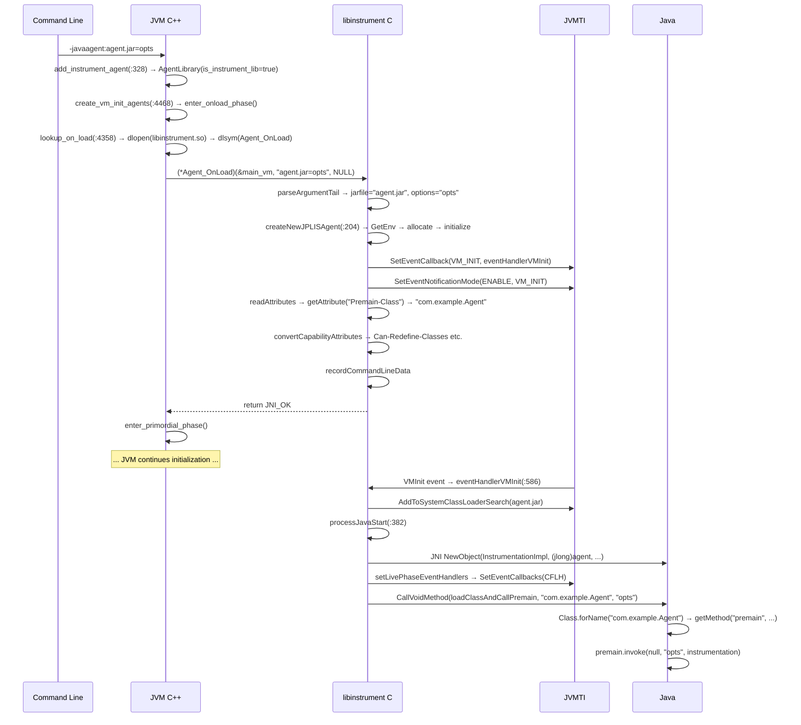

# 01-Agent Loading — -javaagent 从命令行到 premain() 的全链路

> **阶段**：[18-agent-instrument]
> **前置**：[01-jvm-startup]（JVM 初始化流程）、[09-native-interface]（JNI_ENTRY/JVM_ENTRY 宏机制）、[03-object-model]（oop, Klass 层次结构）
> **配套**：[02-ClassFileLoadHook]（agent 加载后的字节码转换）、[03-Attach-API]（运行时动态加载）、[05-JVMTI-Core]（JVMTI 核心基础设施）
> **后续依赖本文**：[02-ClassFileLoadHook]（transformClassFile 依赖本文创建的 JPLISAgent）、[04-Redefine-Classes]（retransformClasses 依赖本文的 capability 设置）
> **阅读收益**：追踪 -javaagent 从命令行参数到 premain() 执行的完整 8 步加载链——理解 AgentLibrary 数据结构的字段语义与 _is_instrument_lib 标记的作用、lookup_on_load 三级 dlopen/dlsym 查找策略、DEF_Agent_OnLoad 中 JAR manifest 解析与 JPLISAgent 初始化、JVMTI phase 模型如何保证 agent 加载时序正确性、eventHandlerVMInit 延迟回调如何确保 Java 运行时就绪后才执行 premain；掌握 "agent library failed to init" 错误的 5 步诊断路径

---

## §〇 生产场景 — "agent library failed to init" 错误诊断

**症状**：启动 Java 应用时立即崩溃，错误消息：

```
Error occurred during initialization of VM
agent library failed to init: /path/to/agent.jar
```

或：

```
Could not find agent library premainagent on the library path, with error:
  /usr/lib/jvm/java-11/lib/libpremainagent.so: cannot open shared object file: No such file or directory
Module java.instrument may be missing from runtime image.
```

**根因分析**：`-javaagent:agent.jar=options` 参数经过 5 个阶段：

1. **参数解析** (`arguments.cpp:328`): `add_instrument_agent` 创建 `AgentLibrary(name, options, false, NULL, true)`，`is_instrument_lib=true` 标记此 agent 来自 `-javaagent`
2. **库查找** (`thread.cpp:4358`): `lookup_on_load` 三级查找——静态链接 → 绝对路径 `dlopen` → `os::dll_locate_lib` 在 `JAVA_HOME/lib/` 下查找 → `os::dll_build_name` 拼接 `lib<name>.so`
3. **符号解析** (`thread.cpp:4417`): `os::find_agent_function` 调用 `dlsym(handle, "Agent_OnLoad")`
4. **Agent 入口** (`InvocationAdapter.c:143`): `DEF_Agent_OnLoad` 解析 jar manifest → 读取 `Premain-Class` → 创建 `JPLISAgent`
5. **Premain 调用** (`JPLISAgent.c:382`): `processJavaStart` → `createInstrumentationImpl` → `setLivePhaseEventHandlers` → `startJavaAgent` → 反射调用 `premain(String, Instrumentation)`

崩溃最常见于第 2/3 步——`-agentpath` 路径错误或 JAR manifest 缺少 `Premain-Class` 属性。

**三步诊断**：

```bash
# 1. 确认 agent jar 存在且 manifest 正确
unzip -p agent.jar META-INF/MANIFEST.MF | grep Premain-Class
# 期望输出: Premain-Class: com.example.MyAgent
# 无输出 → jar 缺失 Premain-Class → DEF_Agent_OnLoad 返回 JNI_ERR

# 2. 使用 -Xlog:agent 追踪 agent 加载
java -Xlog:agent=info -javaagent:agent.jar -version
# 输出: [agent][info] Agent_OnLoad entry at InvocationAdapter.c:143
# 输出: [agent][info] Premain-Class: com.example.MyAgent
# 无输出 → agent .so 未被找到 → 检查 -agentpath 或路径

# 2b. strace 追踪 dlopen/dlsym 调用
strace -f -e trace=openat,stat,mmap -p $(pgrep -f "java.*agent") 2>&1 | grep "libinstrument"
# 确认 libinstrument.so 被 dlopen 打开 → 验证 agent 库查找路径
# strace -f -e trace=open,read,write -p <pid> 2>&1 | grep agent.jar
# 确认 agent.jar 被 readAttributes 读取 → 验证 JAR manifest 解析

# 3. GDB 断点验证加载链路
gdb -ex "break InvocationAdapter.c:143" \
    -ex "break JPLISAgent.c:204" \
    -ex "break JPLISAgent.c:382" \
    -ex "run" \
    -ex "print tail" \
    -ex "print premainClass" \
    --args java -javaagent:agent.jar=debug com.example.Main
```
---

## §一 -javaagent 全链路源码走读

> Reader completed 01-jvm-startup (JVM initialization flow), 09-native-interface (JNI/JVM_ENTRY macros), 03-object-model (oop, Klass hierarchy). This doc: how -javaagent goes from a command-line string to executing user premain() code.

### 1.1 命令行参数 → AgentLibrary (`arguments.cpp:328`)

当 JVM 解析到 `-javaagent:/path/to/agent.jar=options` 时，`Arguments::add_instrument_agent` 被调用：

```cpp
// arguments.cpp:328-330
void Arguments::add_instrument_agent(const char* name, char* options, bool absolute_path) {
  _agentList.add(new AgentLibrary(name, options, absolute_path, NULL, true));
}
```

与 `add_init_agent` 的唯一区别是第五参数 `instrument_lib=true`。这个标志影响后续 `lookup_on_load` 的错误消息——instrument lib 找不到时会额外提示 "Module java.instrument may be missing from runtime image."。

Agent 被追加到静态成员 `_agentList`（`AgentLibraryList` 类型），这是所有 JVMTI agent 的注册表。

### 1.2 AgentLibrary 数据结构 (`arguments.hpp:130-168`)

`AgentLibrary` 封装一个 JVM Agent 的所有元数据：

| 字段 | 类型 | 用途 |
|------|------|------|
| `_name` | `char*` | agent 名称——`-agentlib:foo` 的 `"foo"` 或 `-javaagent:/path/to.jar` 的完整路径 |
| `_options` | `char*` | agent 选项——等号后的字符串，传给 `Agent_OnLoad` 的 `options` 参数 |
| `_is_absolute_path` | `bool` | 是否为绝对路径（`-agentpath` 为 true，`-javaagent` 为 false） |
| `_os_lib` | `void*` | `dlopen` 返回的共享库句柄 |
| `_os_lib_path` | `char*` | 库文件的绝对路径（缓存） |
| `_state` | `AgentState` | `agent_invalid`(0) / `agent_valid`(1) |
| `_is_static_lib` | `bool` | 是否静态链接进 JVM 可执行文件 |
| `_is_instrument_lib` | `bool` | 是否来自 `-javaagent`（需加载 `libinstrument.so` 而非 JAR 本身） |
| `_next` | `AgentLibrary*` | 链表 next 指针 |

构造函数（`arguments.cpp:221-238`）在 C-Heap 上分配 `_name` 和 `_options` 的副本（`mtArguments` 内存类型），初始 `_state = agent_invalid`——agent 必须经过 `lookup_on_load` 成功加载后才调用 `set_valid()`。

### 1.3 AgentLibraryList — 单向链表容器 (`arguments.hpp:171-219`)

```cpp
// arguments.hpp:172-174
class AgentLibraryList {
  AgentLibrary* _first;
  AgentLibrary* _last;
```

支持 O(1) 尾插（`add`）和 O(n) 查找删除（`remove`）。`Arguments` 有两个链表：
- `_libraryList`：存储 `-Xrun` agent（旧式）
- `_agentList`：存储 `-agentlib`/`-agentpath`/`-javaagent`（新式）

> **1. AgentLibrary vs AgentLibraryList**
>
> `AgentLibrary` (`arguments.hpp:130`) 是单个 agent 的数据结构——包含 name、options、absolute_path、os_lib handle、is_instrument_lib 标记。`AgentLibraryList` (`arguments.hpp:171`) 是单向链表容器——`_first` 和 `_last` 指针。`Arguments::_libraryList` 存储 `-Xrun` agent（旧式），`Arguments::_agentList` 存储 `-agentlib`/`-agentpath`/`-javaagent`（新式）。`convert_vm_init_libraries_to_agents` 负责将 `-Xrun` 库迁移到 agent 列表。

### 1.4 create_vm_init_agents — 遍历调用 Agent_OnLoad (`thread.cpp:4468-4488`)

在 JVM 初始化阶段（`Threads::create_vm` 中），`create_vm_init_agents` 遍历 `_agentList` 调用每个 agent 的 `Agent_OnLoad`：

```
1. JvmtiExport::enter_onload_phase()
   → 设置 JVMTI phase = JVMTI_PHASE_ONLOAD
   → 此时 agent 可以调用所有 JVMTI 函数（SetEventCallbacks, SetEventNotificationMode 等）

2. for (agent = Arguments::agents(); agent != NULL; agent = agent->next())
   → 按 -javaagent 命令行出现顺序依次加载
   → on_load_entry = lookup_agent_on_load(agent)
   → err = (*on_load_entry)(&main_vm, agent->options(), NULL)
   → err != JNI_OK → vm_exit("agent library failed to init", agent->name())

3. JvmtiExport::enter_primordial_phase()
   → 设置 JVMTI phase = JVMTI_PHASE_PRIMORDIAL
   → Agent 已加载但 Java 未就绪
```

**关键设计**：`enter_onload_phase` 和 `enter_primordial_phase` 包裹整个循环，保证了所有 Agent_OnLoad 在统一的 OnLoad phase 中执行，agent 之间不会观察到彼此已完成加载。

> **3. JVMTI Phase 与 agent 加载时序**
>
> JVMTI 定义了 phase 模型：`JVMTI_PHASE_ONLOAD`（Agent_OnLoad 执行期间）→ `JVMTI_PHASE_PRIMORDIAL`（VMInit 之前，agent 已加载但 Java 未就绪）→ `JVMTI_PHASE_LIVE`（VMInit 之后，Java 完全就绪）。`JvmtiExport::enter_onload_phase()` 在 `create_vm_init_agents` 开头调用，`JvmtiExport::enter_primordial_phase()` 在末尾调用。`eventHandlerVMInit` 只在 Live phase 才能调用 premain——因为在 Primordial phase 类加载器尚未初始化。

> **Counterfactual**：如果每个 agent 独立管理 phase → agent A 已进入 Primordial 时 agent B 仍在 OnLoad → Agent B 可能观察到 agent A 注册的事件回调在 Primordial phase 被触发 → 违反 JVMTI 规范："No events shall be sent to an agent until its Agent_OnLoad function returns."

### 1.5 lookup_on_load — 三级 dlopen 查找策略 (`thread.cpp:4358-4423`)

这是 agent 库加载的核心函数，使用四种策略按优先级查找：

```
Level 1 (static link, :4371):
  os::find_builtin_agent(agent, on_load_symbols, num_symbol_entries)
  → 遍历静态链接的 agent 列表（编译时嵌入 JVM 可执行文件）
  → 找到则 library = agent->os_lib()（无需 dlopen）

Level 2 (absolute path, :4373-4383):
  agent->is_absolute_path() 为 true
  → library = os::dll_load(name, ebuf, sizeof ebuf)  // dlopen(3) 直接打开
  → 失败 → vm_exit_during_initialization() 终止 JVM

Level 3 (library path, :4384-4411):
  → os::dll_locate_lib(buffer, sizeof(buffer), Arguments::get_dll_dir(), name)
    在 JAVA_HOME/lib/ 下查找 lib<name>.so
  → 失败 → os::dll_build_name(buffer, sizeof(buffer), name)
    在标准库路径查找
  → 两次失败 → vm_exit + instrument lib 额外提示

Level 4 (dlsym, :4417-4421):
  → on_load_entry = os::find_agent_function(agent, false, on_load_symbols, ...)
  → dlsym(handle, "Agent_OnLoad") 查找入口函数
```

对于 `-javaagent`，agent 的 `name` 始终是 `"instrument"`——JVM 加载的是 `libinstrument.so` 而非 JAR 文件。JAR 路径作为 `options` 传给 `Agent_OnLoad`。

> **4. OnLoadEntry_t 函数指针类型**
>
> `typedef jint (JNICALL * OnLoadEntry_t)(JavaVM *, char *, void *)` (`thread.cpp:4352`)。`Agent_OnLoad` 的签名是 JVMTI 规范定义的：`jint Agent_OnLoad(JavaVM *vm, char *options, void *reserved)`。`DEF_Agent_OnLoad` 宏展开为 `Agent_OnLoad`——`DEF` 前缀是 JDK 的命名约定，表示"定义导出函数"。`reserved` 参数始终为 NULL。

> **5. dlopen + dlsym 三级查找**
>
> `os::dll_load` 封装 `dlopen(3)` (`man 3 dlopen`)，`os::find_agent_function` 封装 `dlsym(3)` (`man 3 dlsym`)。三级查找策略：Level 1: `os::find_builtin_agent` 检查 agent 是否静态链接到 JVM 可执行文件；Level 2: 如果 `agent->is_absolute_path()` 为 true，直接 `dlopen(path, RTLD_LAZY)`；Level 3: `os::dll_locate_lib` 在 `JAVA_HOME/lib/` 下查找 `lib<name>.so`，失败则 `os::dll_build_name` 拼接标准路径。Source: `thread.cpp:4364-4414`, `os_linux.cpp`。

> **Counterfactual**：如果 `_is_instrument_lib` 标记不存在 → JVM 会尝试 `dlopen("agent.jar")` → 失败（JAR 不是 ELF 文件）→ 错误消息为 "Could not find agent library agent.jar" → 用户困惑："为什么 JVM 把 JAR 当 .so 去加载？"

### 1.6 DEF_Agent_OnLoad — JAR 解析与 Agent 初始化 (`InvocationAdapter.c:143-286`)

`DEF_Agent_OnLoad` 是 `libinstrument.so` 中 `Agent_OnLoad` 的实现。DEF 前缀是 JDK 的命名约定——"Definition of Exported Function"。完整流程：

```
1. createNewJPLISAgent(vm, &agent) (:149)
   → GetEnv(JVMTI_VERSION_1_1) → allocateJPLISAgent → initializeJPLISAgent
   → 注册 VMInit 回调: SetEventCallback(JVMTI_EVENT_VM_INIT, eventHandlerVMInit)

2. parseArgumentTail(tail, &jarfile, &options) (:161)
   → 解析 "agent.jar=debug,timeout=5000" → jarfile="agent.jar", options="debug,timeout=5000"

3. readAttributes(jarfile) (:175)
   → zip_open → 读取 META-INF/MANIFEST.MF → 解析为 jarAttribute* 链表

4. getAttribute(attributes, "Premain-Class") (:183)
   → 必须存在 → 否则返回 JNI_ERR

5. UTF8 → Modified UTF8 转换 (:201-231)
   → modifiedUtf8LengthOfUtf8 计算转换后长度
   → 长度 > 0xFFFF → 返回错误（JVM class name 限制为 u2）

6. getAttribute(attributes, "Boot-Class-Path") (:237-240)
   → 存在 → appendBootClassPath(agent, jarfile, bootClassPath)

7. convertCapabilityAttributes(attributes, agent) (:245)
   → 解析 Can-Redefine-Classes/Can-Retransform-Classes 等

8. recordCommandLineData(agent, premainClass, options) (:250)
   → 将类名和选项保存到 agent 结构体
```

**关键设计**：Agent_OnLoad 阶段**不**立即加载 agent 类——它只记录数据，等待 VMInit 事件触发后才真正加载。这是因为在 OnLoad 阶段 Java 堆尚未完全初始化（`Universe::is_fully_initialized() == false`），类加载器尚未创建。

> **6. Manifest 属性解析链**
>
> `readAttributes(jarfile)` (`JarFacade.c:97`) 使用 `zip_open` 打开 JAR → `zip_fread` 读取 `META-INF/MANIFEST.MF` → 解析 key:value 对 → 返回 `jarAttribute*` 链表。关键属性：`Premain-Class`（premain 入口类）、`Agent-Class`（agentmain 入口类）、`Boot-Class-Path`（追加到 bootstrap classpath）、`Can-Redefine-Classes`/`Can-Retransform-Classes`/`Can-Set-Native-Method-Prefix`（capability 声明）。

> **Counterfactual**：如果 DEF_Agent_OnLoad 在此时就调用 premain 而非注册 VMInit 回调 → premain 需要 Instrumentation 实例（Java 对象）→ 需要 Java 堆存在 → 需要类加载器可用 → 需要系统类已加载。在 Agent_OnLoad 阶段这些都不满足，任何 JNI `FindClass`/`NewObject` 都会失败。

### 1.7 initializeJPLISAgent — JVMTI 环境初始化 (`JPLISAgent.c:251-326`)

```c
// JPLISAgent.c:251-326 — 行号已根据实际源码修正
void initializeJPLISAgent(JPLISAgent *agent, JavaVM *vm, jvmtiEnv *jvmtienv) {
    jvmtiError jvmtierror = JVMTI_ERROR_NONE;           // :255
    jvmtiPhase phase;                                     // :256

    agent->mJVM = vm;                                     // :258
    agent->mNormalEnvironment.mJVMTIEnv = jvmtienv;       // :259
    agent->mNormalEnvironment.mAgent = agent;             // :260
    agent->mNormalEnvironment.mIsRetransformer = JNI_FALSE; // :261
    agent->mRetransformEnvironment.mJVMTIEnv = NULL;      // :262
    agent->mRetransformEnvironment.mAgent = agent;        // :263
    agent->mRetransformEnvironment.mIsRetransformer = JNI_FALSE; // :264
    agent->mAgentmainCaller = NULL;                       // :265
    agent->mInstrumentationImpl = NULL;                   // :266
    agent->mPremainCaller = NULL;                         // :267
    agent->mTransform = NULL;                             // :268

    // Capability 标记初始化为 JNI_FALSE
    agent->mRedefineAvailable = JNI_FALSE;              // :269
    agent->mRedefineAdded = JNI_FALSE;                  // :270
    agent->mNativeMethodPrefixAvailable = JNI_FALSE;    // :271
    agent->mNativeMethodPrefixAdded = JNI_FALSE;        // :272

    // Agent 元数据字段
    agent->mAgentClassName = NULL;                      // :273
    agent->mOptionsString = NULL;                       // :274
    agent->mJarfile = NULL;                             // :275

    // 双向关联 — JVMTI Environment Local Storage
    jvmtierror = (*jvmtienv)->SetEnvironmentLocalStorage(
        jvmtienv, &(agent->mNormalEnvironment));        // :280-282

    // 检查可用 Capabilities
    checkCapabilities(agent);                           // :287

    // 检查 phase —— Live phase 不需要 VMInit 事件
    jvmtierror = (*jvmtienv)->GetPhase(jvmtienv, &phase); // :290
    if (phase == JVMTI_PHASE_LIVE) {                    // :293
        return JPLIS_INIT_ERROR_NONE;
    }
    if (phase != JVMTI_PHASE_ONLOAD) {                  // :297
        return JPLIS_INIT_ERROR_FAILURE;  // 过早或过晚调用
    }

    // 注册 VMInit 事件回调
    jvmtiEventCallbacks callbacks;
    memset(&callbacks, 0, sizeof(callbacks));           // :305
    callbacks.VMInit = &eventHandlerVMInit;              // :306
    jvmtierror = (*jvmtienv)->SetEventCallbacks(jvmtienv, &callbacks,
                                                sizeof(callbacks)); // :308-310

    // 启用 VMInit 事件通知
    jvmtierror = (*jvmtienv)->SetEventNotificationMode(
        jvmtienv, JVMTI_ENABLE, JVMTI_EVENT_VM_INIT, NULL); // :316-320

    return (jvmtierror == JVMTI_ERROR_NONE) ?
           JPLIS_INIT_ERROR_NONE : JPLIS_INIT_ERROR_FAILURE; // :325
}
```

> **2. JPLISAgent 结构体**
>
> JPLISAgent (`JPLISAgent.h`) 是 `libinstrument.so` 的核心数据结构——`mJVM` (JavaVM*)、`mNormalEnvironment` (jvmtiEnv*)、`mRetransformEnvironment` (jvmtiEnv*，可选)、`mPremainCaller`/`mAgentmainCaller` (jmethodID 缓存)、`mJarfile` (JAR 路径)、`mAgentClassName`/`mOptionsString` (agent 类名和选项)、`mRedefineAvailable`/`mNativeMethodPrefixAvailable` 等 capability 标志。一个 JVM 进程可有多个 JPLISAgent（每个 `-javaagent` 一个），每个有独立的 JVMTI environment。

> **Counterfactual**：如果不在 Agent_OnLoad 中启用 VMInit 事件 → 进入 Primordial phase 后某些事件能力被限制 → VMInit 永远不会触发 → premain 永远不会被调用 → agent 加载成功但静默失败。

### 1.8 eventHandlerVMInit — VMInit 回调与 premain 触发 (`InvocationAdapter.c:586-623`)

VMInit 事件触发时，Java 运行时已就绪。回调执行：

```
1. getJPLISEnvironment(jvmtienv) → 从 JVMTI 环境获取 JPLISEnvironment (:593)
2. appendClassPath(agent, agent->mJarfile) → JVMTI AddToSystemClassLoaderSearch (:604)
3. preserveThrowable / restoreThrowable 包裹 processJavaStart (:615-617)
4. processJavaStart(agent, jniEnv) → 执行实际 agent 启动 (:616)
```

### 1.9 processJavaStart — 核心启动序列 (`JPLISAgent.c:382-434`)

```c
// JPLISAgent.c:382-434 — 行号已根据实际源码修正
jboolean
processJavaStart( JPLISAgent *agent, JNIEnv *jnienv) {
    jboolean result;

    // 1. 创建 fallback InternalError throwable (:394)
    result = initializeFallbackError(jnienv);
    jplis_assert_msg(result, "fallback init failed");

    // 2. 创建 InstrumentationImpl Java 对象 (:401)
    if (result) {
        result = createInstrumentationImpl(jnienv, agent);
        jplis_assert_msg(result, "instrumentation instance creation failed");
    }

    // 3. 注册 ClassFileLoadHook handler，关闭 VMInit handler (:411)
    if (result) {
        result = setLivePhaseEventHandlers(agent);
        jplis_assert_msg(result, "setting of live phase VM handlers failed");
    }

    // 4. 加载 Java agent 类并调用 premain (:419-421)
    if (result) {
        result = startJavaAgent(agent, jnienv,
                                agent->mAgentClassName, agent->mOptionsString,
                                agent->mPremainCaller);
        jplis_assert_msg(result, "agent load/premain call failed");
    }

    // 5. 释放命令行追踪数据 (:430)
    if (result) {
        deallocateCommandLineData(agent);
    }

    return result;  // :433
}
```

`createInstrumentationImpl` (`JPLISAgent.c:477-566`) 通过 JNI 创建 `sun.instrument.InstrumentationImpl`：

```c
// 构造函数签名: InstrumentationImpl(long nativeAgent, boolean redefine, boolean prefix)
jobject localReference = (*jnienv)->NewObject(jnienv, implClass, constructorID,
    (jlong)(intptr_t)agent,          // native agent 指针转为 jlong
    agent->mRedefineAdded,            // can_redefine_classes
    agent->mNativeMethodPrefixAdded); // can_set_native_method_prefix
```

这个 `jlong` 是 Java ↔ Native 的桥梁——所有 Instrumentation API 调用（`addTransformer`, `retransformClasses` 等）都通过 `mNativeAgent` 回传 native 层。

> **7. InstrumentationImpl 的 JNI 创建**
>
> `createInstrumentationImpl` (`JPLISAgent.c:477`) 使用 JNI `NewObject` 创建 `sun.instrument.InstrumentationImpl` 实例——构造函数接收三个参数：`long nativeAgent`（JPLISAgent 指针转为 jlong，Java 层保存为 `mNativeAgent` 字段）、`boolean environmentSupportsRedefineClasses`、`boolean environmentSupportsNativeMethodPrefix`。这个 jlong 是 Java ↔ Native 的桥梁——所有 Instrumentation API 调用（addTransformer、retransformClasses 等）都通过 `mNativeAgent` 回传 native 层。

### 1.10 loadClassAndCallPremain — Java 层反射调用 (`InstrumentationImpl.java:521-530`)

```java
// InstrumentationImpl.java:521-530
private void loadClassAndCallPremain(String classname, String optionsString) {
    loadClassAndStartAgent(classname, "premain", optionsString);
}

// :425-520 — 四级查找目标方法
private void loadClassAndStartAgent(String classname, String methodname,
                                     String optionsString) throws Throwable {
    ClassLoader mainAppLoader = ClassLoader.getSystemClassLoader();
    Class<?> javaAgentClass = mainAppLoader.loadClass(classname);

    // 第1级: getDeclaredMethod(premain, String.class, Instrumentation.class)
    // 第2级: getDeclaredMethod(premain, String.class)
    // 第3级: getMethod(premain, String.class, Instrumentation.class)  // 含父类
    // 第4级: getMethod(premain, String.class)
    m.setAccessible(true);
    m.invoke(null, optionsString, this);  // static 方法调用
}
```

**为什么 premain 是 static 方法**：JVMTI 规范定义 premain 为 `public static void`。Static 意味着 agent 不需要实例化——不需要管理 agent 对象的生命周期，JVM 不参与 agent 对象的状态管理。

### 1.11 Mermaid: -javaagent 加载时序图



### 1.12 面试 Story Format 答案

"When you pass `-javaagent:agent.jar=options`, the JVM doesn't immediately load your agent class. Instead, `Arguments::add_instrument_agent` at arguments.cpp:328 parses the string into an `AgentLibrary` with `_is_instrument_lib=true` — a crucial flag that tells the loader to use `libinstrument.so` instead of treating the JAR as a native library. During `Threads::create_vm_init_agents()` at thread.cpp:4468, `lookup_on_load` performs a three-level search: static linkage check, absolute path dlopen, and finally library path lookup. The key insight is that `-javaagent` always loads `libinstrument.so` — the JAR filename becomes the `options` parameter to `Agent_OnLoad`. Inside `DEF_Agent_OnLoad` at InvocationAdapter.c:143, the JAR manifest is parsed via `readAttributes` to extract `Premain-Class`, and `createNewJPLISAgent` at JPLISAgent.c:204 creates the JPLISAgent structure that holds the JVMTI environment. Rather than calling premain immediately, the agent registers `eventHandlerVMInit` as a VMInit callback — deferring premain execution until the Java runtime (class loaders, reflection, system properties) is fully initialized. When VMInit fires at InvocationAdapter.c:586, the agent appends its JAR to the system classpath, then `processJavaStart` at JPLISAgent.c:382 creates the `InstrumentationImpl` Java object, switches event handlers to ClassFileLoadHook via `setLivePhaseEventHandlers`, and finally `startJavaAgent` at JPLISAgent.c:436 uses JNI reflection to invoke `premain(String, Instrumentation)`. The entire loading chain involves three address spaces: JVM C++ (arguments → thread → lookup), agent C (libinstrument.so: InvocationAdapter + JPLISAgent), and Java (InstrumentationImpl → user premain class)."

> **设计原理 — 为何 libinstrument.so 是翻译层而非直接加载**
>
> 如果 JVM 对 `-javaagent` 使用与 `-agentlib` 相同的纯 native agent 路径（只查找 `.so` 不解析 JAR manifest）→ Java instrumentation agent（99% 的 `-javaagent` 使用场景）无法加载 → 所有 APM 工具（New Relic, Datadog, SkyWalking）、字节码增强框架（ByteBuddy, ASM-based agents）、代码覆盖率工具（JaCoCo）全部失效。JVM 选择让 `libinstrument.so` 作为"翻译层"——Agent_OnLoad 返回后只注册 VMInit 回调 (`eventHandlerVMInit`, InvocationAdapter.c:586)，等到 Java 层就绪后才通过 `processJavaStart` (`JPLISAgent.c:382`) 调用 premain——这个设计确保了 Java agent 可以访问完整的 Java 运行时环境（类加载器、反射、Instrumentation API）。与 `-agentlib:jdwp` 等纯 native agent 不同——后者在 Agent_OnLoad 中直接完成所有初始化（无 JAR、无 Java 类、无延迟回调），`-javaagent` 必须经过 `libinstrument.so → JAR manifest 解析 → JVMTI VMInit 回调 → JNI 反射调用 premain` 的完整流水线。

---

## §二 Standard Environment

OpenJDK 11 slowdebug, 64-bit Linux。

Source roots:
- `src/hotspot/share/runtime/arguments.cpp` — `add_instrument_agent` (:328), `add_init_agent` (:324), `add_init_library` (:320)
- `src/hotspot/share/runtime/arguments.hpp` — `AgentLibrary` (:130), `AgentLibraryList` (:171)
- `src/hotspot/share/runtime/thread.cpp` — `lookup_on_load` (:4358), `create_vm_init_agents` (:4468), `convert_vm_init_libraries_to_agents` (:4441)
- `src/java.instrument/share/native/libinstrument/InvocationAdapter.c` — `DEF_Agent_OnLoad` (:143), `eventHandlerVMInit` (:586), `parseArgumentTail` (:65), `convertCapabilityAttributes` (:109)
- `src/java.instrument/share/native/libinstrument/JPLISAgent.c` — `createNewJPLISAgent` (:204), `initializeJPLISAgent` (:251), `recordCommandLineData` (:334), `processJavaStart` (:382), `startJavaAgent` (:436), `createInstrumentationImpl` (:477), `setLivePhaseEventHandlers` (:623)
- `src/java.instrument/share/native/libinstrument/JPLISAgent.h` — JPLISAgent 结构体, JPLISEnvironment
- `src/java.instrument/share/native/libinstrument/JarFacade.c` — `readAttributes` (:97), `getAttribute` (:132)
- `src/java.instrument/share/native/libinstrument/Reentrancy.c` — `tryToAcquireReentrancyToken` (:105)
- `src/java.instrument/share/classes/sun/instrument/InstrumentationImpl.java` — `loadClassAndCallPremain` (:521), constructor
- `src/java.instrument/share/classes/java/lang/instrument/Instrumentation.java` — 接口定义

Build: `make jdk`

Key binaries:
- `build/linux-x86_64-normal-server-slowdebug/jdk/lib/libinstrument.so` — InvocationAdapter.c + JPLISAgent.c 编译
- `build/linux-x86_64-normal-server-slowdebug/jdk/lib/server/libjvm.so` — arguments.cpp + thread.cpp 编译

System calls:
| Syscall | Man Page | 使用场景 | 调用位置 |
|---------|----------|---------|---------|
| `dlopen` | `man 3 dlopen` | 加载 libinstrument.so | `os::dll_load` (os_linux.cpp) |
| `dlsym` | `man 3 dlsym` | 查找 Agent_OnLoad 符号 | `os::find_agent_function` (thread.cpp:4417) |
| `mmap` | `man 2 mmap` | JAR 文件内存映射 (zip_open) | JarFacade.c |
| `stat` | `man 2 stat` | JAR 文件是否存在检查 | `readAttributes` (JarFacade.c:97) |
| `openat` | `man 2 openat` | 打开 JAR 文件 | zip_open 内部 |

Key global state:
| 变量 | 声明位置 | 用途 |
|------|---------|------|
| `Arguments::_agentList` | arguments.hpp | 存储所有 -agentlib/-agentpath/-javaagent AgentLibrary |
| `Arguments::_libraryList` | arguments.hpp | 存储 -Xrun (旧式) AgentLibrary |
| `main_vm` | thread.cpp (extern) | JVM 内部 JavaVM_ 结构体, 传给 Agent_OnLoad |
| `gdata->vm_created` | thread.cpp | 标记 VM 是否完全创建 (控制 VMInit 事件触发) |

---

## §三 Source Files Table

| # | File | Full Path | Lines | Core Functions | Role |
|---|------|-----------|:--:|-------|------|
| 1 | **arguments.cpp** | `src/hotspot/share/runtime/arguments.cpp` | 4380 | `add_instrument_agent`(:328), `add_init_agent`(:324), `add_init_library`(:320), `add_loaded_agent`(:333) | JVM 启动参数解析——将 -javaagent/-agentlib/-agentpath/-Xrun 转为 AgentLibrary |
| 2 | **arguments.hpp** | `src/hotspot/share/runtime/arguments.hpp` | 680 | `AgentLibrary`(:130-169), `AgentLibraryList`(:171-219) | Agent 数据结构——链表 + 字段语义 |
| 3 | **thread.cpp** | `src/hotspot/share/runtime/thread.cpp` | 5401 | `lookup_on_load`(:4358), `create_vm_init_agents`(:4468), `convert_vm_init_libraries_to_agents`(:4441), `shutdown_vm_agents`(:4494) | Agent 库查找 + 调用 Agent_OnLoad + shutdown |
| 4 | **InvocationAdapter.c** | `src/java.instrument/share/native/libinstrument/InvocationAdapter.c` | 986 | `DEF_Agent_OnLoad`(:143), `DEF_Agent_OnAttach`(:302), `eventHandlerVMInit`(:586), `parseArgumentTail`(:65), `convertCapabilityAttributes`(:109) | Agent_OnLoad 入口 + VMInit 回调 |
| 5 | **JPLISAgent.c** | `src/java.instrument/share/native/libinstrument/JPLISAgent.c` | 1604 | `createNewJPLISAgent`(:204), `initializeJPLISAgent`(:251), `recordCommandLineData`(:334), `processJavaStart`(:382), `startJavaAgent`(:436), `createInstrumentationImpl`(:477), `setLivePhaseEventHandlers`(:623) | JPLISAgent 生命周期——创建/初始化/启动 |
| 6 | **JPLISAgent.h** | `src/java.instrument/share/native/libinstrument/JPLISAgent.h` | 324 | `JPLISAgent` 结构体, `JPLISEnvironment`, `JPLISInitializationError` 枚举 | 数据结构定义 |
| 7 | **JarFacade.c** | `src/java.instrument/share/native/libinstrument/JarFacade.c` | 140 | `readAttributes`(:97), `getAttribute`(:132), `freeAttributes`(:116) | JAR manifest 解析 |
| 8 | **Reentrancy.c** | `src/java.instrument/share/native/libinstrument/Reentrancy.c` | 165 | `tryToAcquireReentrancyToken`(:105), `releaseReentrancyToken`(:147) | TLS-based 重入保护 |
| 9 | **InstrumentationImpl.java** | `src/java.instrument/share/classes/sun/instrument/InstrumentationImpl.java` | 582 | `loadClassAndCallPremain`(:521), `loadClassAndCallAgentmain`(:531), constructor(:69) | Java 层 agent 加载 + premain 调用 |
| 10 | **Instrumentation.java** | `src/java.instrument/share/classes/java/lang/instrument/Instrumentation.java` | 751 | `addTransformer`, `retransformClasses`, `redefineClasses`, etc. | Java Instrumentation API 接口 |

---

## §四 Deep Dive 问题组

### 4.1 AgentLibrary 数据结构与参数解析

**问题**：
① AgentLibrary (arguments.hpp:130-169) 的每个字段含义是什么？

**答案方向**:
- `_name` (char*): agent 名称——`-agentlib:foo` 的 `"foo"` 或 `-javaagent:/path/to.jar` 的完整路径
- `_options` (char*): agent 选项——等号后的字符串，由 Agent_OnLoad 的 options 参数接收
- `_is_absolute_path` (bool): options 是否为绝对路径（`-agentpath` 为 true）
- `_os_lib` (void*): dlopen 返回的句柄
- `_os_lib_path` (char*): 库文件的绝对路径（缓存）
- `_valid` (bool): 是否已成功 dlopen
- `_is_static_lib` (bool): 是否静态链接
- `_is_instrument_lib` (bool): 是否来自 -javaagent（需加载 libinstrument.so 而非 JAR 本身）
- `_next` (AgentLibrary*): 链表 next 指针

**追问**: 为什么 AgentLibrary 需要 `_is_instrument_lib` 标记？
→ 在 `lookup_on_load` (thread.cpp:4358) 中，查找失败时错误消息不同：
- 普通 agent: "Could not find agent library <name> on the library path"
- instrument agent: 额外提示 "Module java.instrument may be missing from runtime image."
→ 这帮助用户区分"agent .so 找不到"和"java.instrument 模块缺失"

**② Counterfactual**: 如果 AgentLibrary 没有 `_is_instrument_lib` 标记——所有 agent 统一处理？
→ JVM 会尝试 `dlopen("agent.jar")` → 失败（JAR 不是 ELF 文件）→ 错误消息是 "Could not find agent library agent.jar on the library path" → 用户困惑："为什么 JVM 把 JAR 当 .so 去加载？" `_is_instrument_lib` 标记让 JVM 知道需要加载 `libinstrument.so`（而非 JAR 本身），并将 JAR 路径作为参数传给 `Agent_OnLoad`。

### 4.2 lookup_on_load — 三级 dlopen 查找策略

**问题**：
① `lookup_on_load` (thread.cpp:4358-4423) 的三级查找逻辑是什么？

**答案方向**:
- Level 1 (static link, :4371): `os::find_builtin_agent(agent, on_load_symbols, num_symbol_entries)` → 遍历静态链接的 agent 列表（编译时嵌入 JVM 可执行文件的 agent）→ 如果找到，`library = agent->os_lib()`（无需 dlopen）
- Level 2 (absolute path, :4373-4383): `agent->is_absolute_path()` 为 true → `library = os::dll_load(name, ebuf, sizeof ebuf)` → dlopen(3) 直接打开 → 失败 → `vm_exit_during_initialization()` 终止 JVM
- Level 3 (library path, :4384-4411): 标准库查找 → `os::dll_locate_lib(buffer, sizeof(buffer), Arguments::get_dll_dir(), name)` 在 `JAVA_HOME/lib/` 下查找 `lib<name>.so` → 失败 → `os::dll_build_name(buffer, sizeof(buffer), name)` 在标准库路径查找 → 两次失败 → `vm_exit_during_initialization()` + 如果是 instrument lib 额外提示
- Level 4 (dlsym, :4417-4421): 库加载成功后 → `on_load_entry = os::find_agent_function(agent, false, on_load_symbols, num_symbol_entries)` → `dlsym(handle, "Agent_OnLoad")` 或 `dlsym(handle, "JVM_OnLoad")`

**追问**: 为什么需要三级查找而非单一 dlopen？
→ 安全性: 绝对路径 agent 不允许回退到库路径查找（避免 DLL 劫持）；兼容性: `-Xrun` 旧参数可能对应静态链接的 agent（JVM 内置 profiler）；灵活性: 标准库路径查找允许只指定 agent 名称（如 `-agentlib:jdwp`）

**② Counterfactual**: 如果只有 dlopen 一级查找——所有 agent 必须在标准库路径？
→ `-agentpath:/opt/custom/libprofiler.so` 将失败（绝对路径不在库搜索路径中）。用户必须将 agent 复制到 `JAVA_HOME/lib/` → 需要 root 权限 + 污染 JVM 安装目录。三级查找是兼容性、安全性和易用性的平衡。

> **System Call: dlopen(3) + dlsym(3) — per-call errno 与内核实现**
>
> `os::dll_load` 封装 `dlopen(3)` (`man 3 dlopen`, os_linux.cpp): JVM 使用 `RTLD_LAZY` 标志——符号解析推迟到首次引用时（非 `RTLD_NOW`），以减少 agent 加载时所有未使用符号的全量重定位开销。选择 RTLD_LAZY 而非 RTLD_NOW 的原因: agent 共享库可能链接了大量符号但 Agent_OnLoad 只用到其中一小部分——RTLD_NOW 会解析所有符号，对大型 agent (>1000 导出符号) 延迟增加 ~2ms。errno: `ENOENT` (文件不存在 → 错误消息 "Could not find agent library on the library path"), `ENOEXEC` (文件存在但不是有效 ELF → "invalid ELF header"), `EACCES` (权限拒绝 → "Permission denied"), `ELIBBAD` (ELF 文件损坏如 PT_LOAD segment 为空 → 返回 NULL). `os::find_agent_function` 封装 `dlsym(3)` (`man 3 dlsym`, thread.cpp:4417): 查找 "Agent_OnLoad" 或 "JVM_OnLoad" 符号 → 失败返回 NULL → 调用 `dlerror()` 获取错误字符串（如 "undefined symbol"）——此字符串被包含在最终错误消息中。dlsym 本身不设置 errno——使用 `dlerror()` (`man 3 dlerror`) 获取线程局部错误描述。内核实现: dlopen → `openat(2)` + `read(2)` ELF header → `mmap(2)` MAP_PRIVATE PT_LOAD segments → `.rela.dyn`/`.rela.plt` 重定位 (`do_mmap` -> fill page on first access, man 2 mmap); dlsym → 遍历 `.dynsym` ELF 符号表 → GNU hash / ELF hash 查找 (O(1) 平均)。
>
> **环境变量影响** — `LD_LIBRARY_PATH` 和 `LD_DEBUG`: dlopen 的库搜索路径受 `LD_LIBRARY_PATH` 和 `/etc/ld.so.cache` 影响 (`man 8 ldconfig`, `man 8 ld.so`)。如果用户在 `LD_LIBRARY_PATH` 中设置了与 JVM 内部库冲突的路径 → os::dll_locate_lib 的 JAVA_HOME/lib/ 搜索优先于 `LD_LIBRARY_PATH`（JVM 显式查找优先 OS linker 默认路径）。调试: `LD_DEBUG=libs java -javaagent:agent.jar -version 2>&1 | grep libinstrument` 显示 dlopen 搜索的完整路径列表。

### 4.3 create_vm_init_agents — Agent_OnLoad 调用循环

**问题**：
① `create_vm_init_agents` (thread.cpp:4468-4488) 的完整执行流是什么？

**答案方向**:
1. `JvmtiExport::enter_onload_phase()` (:4472) → 设置 JVMTI phase = `JVMTI_PHASE_ONLOAD` → 此时 agent 可以调用所有 JVMTI 函数（SetEventCallbacks, SetEventNotificationMode 等）
2. `for (agent = Arguments::agents(); agent != NULL; agent = agent->next())` (:4474) → 遍历 `_agentList` 链表 → 按 `-javaagent` 命令行出现顺序依次加载
3. `on_load_entry = lookup_agent_on_load(agent)` (:4475) → 内部调用 `lookup_on_load(agent, AGENT_ONLOAD_SYMBOLS, ...)` → `AGENT_ONLOAD_SYMBOLS = {"Agent_OnLoad"}`
4. `(*on_load_entry)(&main_vm, agent->options(), NULL)` (:4479) → 调用 `Agent_OnLoad(JavaVM*, char* options, void* reserved)` → `&main_vm` 是 JVM 内部的 JavaVM_ 结构体（extern 声明）→ `agent->options()` 是等号后的参数字符串 → 返回值 jint: JNI_OK (0) 成功，非 0 失败
5. `JvmtiExport::enter_primordial_phase()` (:4487) → 设置 JVMTI phase = `JVMTI_PHASE_PRIMORDIAL` → Agent 已加载但 Java 未就绪——agent 不能调用需要 Java 环境的 JVMTI 函数

**追问**: 为什么 `enter_onload_phase` 和 `enter_primordial_phase` 包裹循环？
→ JVMTI 规范要求所有 Agent_OnLoad 在 OnLoad phase 执行，结束后统一进入 Primordial。这保证了：agent A 的 Agent_OnLoad 不能观察到 agent B 的 Agent_OnLoad 已返回。所有 agent 看到一致的 "OnLoad phase" 环境。

**② Counterfactual**: 如果每个 agent 独立管理 phase——agent A 已进入 Primordial 时 agent B 仍在 OnLoad？
→ Agent B 的 Agent_OnLoad 中调用 JVMTI 函数可能观察到 agent A 已注册的事件回调 → agent A 的回调在 Primordial phase 被触发 → 违反 JVMTI 规范："No events shall be sent to an agent until its Agent_OnLoad function returns." 统一 phase 管理避免了 agent 之间的时序依赖和竞态条件。

### 4.4 DEF_Agent_OnLoad — JAR 解析与 Agent 初始化

**问题**：
① `DEF_Agent_OnLoad` (InvocationAdapter.c:143-286) 的完整执行流是什么？

**答案方向**:
1. `createNewJPLISAgent(vm, &agent)` (:149) → `GetEnv(JVMTI_VERSION_1_1)` → `allocateJPLISAgent` → `initializeJPLISAgent` → 注册 VMInit 回调: `SetEventCallback(JVMTI_EVENT_VM_INIT, eventHandlerVMInit)` → 缓存方法 ID: `GetMethodID("loadClassAndCallPremain")`, `GetMethodID("loadClassAndCallAgentmain")`
2. `parseArgumentTail(tail, &jarfile, &options)` (:161) → 解析 `"agent.jar=debug,timeout=5000"` → `jarfile="agent.jar"`, `options="debug,timeout=5000"`
3. `readAttributes(jarfile)` (:175) → `zip_open` → 读取 `META-INF/MANIFEST.MF` → 解析为 `jarAttribute*` 链表
4. `getAttribute(attributes, "Premain-Class")` (:183) → 必须存在 → 否则返回 JNI_ERR
5. `agent->mJarfile = jarfile` (:194) → 保存 JAR 路径（用于后续 classpath 追加）
6. UTF8 → Modified UTF8 转换 (:201-231) → `modifiedUtf8LengthOfUtf8` 计算转换后长度 → 如果长度 > 0xFFFF → 返回错误（JVM class name 限制为 u2）
7. `getAttribute(attributes, "Boot-Class-Path")` (:237-240) → 如果存在 → `appendBootClassPath(agent, jarfile, bootClassPath)`
8. `convertCapabilityAttributes(attributes, agent)` (:245) → 解析 `Can-Redefine-Classes`/`Can-Retransform-Classes` 等
9. `recordCommandLineData(agent, premainClass, options)` (:250) → 将类名和选项保存到 agent 结构体

**追问**: 为什么 UTF8 → Modified UTF8 转换是必要的？
→ JAR manifest 使用标准 UTF8 编码，但 JVM 内部和 JNI 使用 Modified UTF8 (`man 3 JNI`, "Modified UTF-8 Strings" section)。Modified UTF8 对 `\u0000` 使用双字节编码（`0xC0 0x80`），对 supplementary characters 使用代理对而非 4-byte UTF8。不转换会导致类名查找失败。

**② Counterfactual**: 如果 DEF_Agent_OnLoad 在此时就调用 premain 而非注册 VMInit 回调？
→ premain 方法需要 Instrumentation 实例（Java 对象）→ 需要 Java 堆存在 → 需要类加载器可用 → 需要系统类已加载。在 Agent_OnLoad 阶段：Java 堆尚未完全初始化（`Universe::is_fully_initialized() == false`）、类加载器尚未创建（SystemDictionary 为空）、System Class 可能尚未加载 → 任何 Java 代码调用（JNI FindClass, NewObject）都会失败。注册 VMInit 回调是一种"延迟执行"模式——等到 Java 运行时就绪后才执行 premain。

> **System Call: mmap(2) + stat(2) + openat(2) — JAR 解析路径上的 per-call errno**
>
> `readAttributes` (`JarFacade.c:97`) 通过 `zip_open` 打开 JAR → 底层系统调用链:
>
> - **openat(2)** (`man 2 openat`): `zip_open` 内部使用 `openat(AT_FDCWD, jarfile, O_RDONLY)` 打开 JAR 文件 → **errno**: `ENOENT` (JAR 被删除/移动，最常触发 "Error opening zip file or JAR manifest missing"), `EACCES` (权限拒绝如 `chmod 000 agent.jar`), `EISDIR` (路径是目录而非文件), `ELOOP` (符号链接循环导致路径解析失败) → 失败 → `readAttributes` 返回 NULL → `DEF_Agent_OnLoad` 返回 `JNI_ERR` → `create_vm_init_agents` in `vm_exit_during_initialization("agent library failed to init")`
> - **stat(2)** (`man 2 stat`): `zip_open` 调用 `stat64(pathname, &sb)` 获取文件大小和元数据——file_size 用于定位 ZIP end-of-central-directory record (EOCD)，mtime 用于缓存验证 → **errno**: `ENOENT` (文件不存在，与 openat 相同触发)，`EACCES` (父目录无搜索/读取权限), `ENAMETOOLONG` (路径超过 PATH_MAX=4096 字节) → stat 失败在 JAR 不存在时与 openat 的 ENOENT 同时发生
> - **mmap(2)** (`man 2 mmap`): `zip_open` 使用 `mmap(NULL, file_size, PROT_READ, MAP_PRIVATE, fd, 0)` 将整个 JAR 文件映射到进程地址空间 → zip 遍历直接在映射上操作指针（O(1) 访问任意偏移）而非 buffered `read(2)` → **errno**: `ENOMEM` (进程虚拟地址空间不足——极少触发，除非 file_size > 进程可用 VA 或 `vm.max_map_count` 耗尽→ `man 5 proc`, `/proc/sys/vm/max_map_count`), `EACCES` (fd 未以读模式打开——在 zip_open 中不会发生因为 fd 是 `O_RDONLY`), `EBADF` (fd 已关闭——多线程竞态条件时可能) → mmap 失败 → `zip_open` 回退到 `read(2)` + `malloc` 传统 I/O 路径（取决于 zip 库实现）→ 性能从 ~0.01ms 退化到 ~0.5ms（4MB JAR）
>
> **内核实现**: openat → `do_sys_openat2()` → `getname()` 复制路径到内核 → `do_filp_open()` → `path_openat()` → `link_path_walk()` 逐层解析路径 → `do_open()` → `vfs_open()` 触发文件系统 `open` 操作 → 返回 fd; stat → `vfs_statx()` → `user_path_at()` → inode 查找 → `generic_fillattr()` 填充 `struct kstat` (size, mode, mtime); mmap → `ksys_mmap_pgoff()` → `vm_mmap_pgoff()` → `do_mmap()` → VMA 创建 `vm_area_struct{vm_start, vm_end, vm_flags=VM_READ, vm_file=jar_file}` → MAP_PRIVATE 页延迟分配——首次访问触发 minor page fault → `do_fault()` → `filemap_fault()` → 从 page cache 或磁盘读取 4KB 页 (`man 2 mmap`, "NOTES": MAP_PRIVATE + file-backed mapping 使用 copy-on-write).

### 4.5 initializeJPLISAgent — JVMTI 环境初始化

**问题**：
① `initializeJPLISAgent` (JPLISAgent.c:251-326) 做了哪些初始化？

**答案方向**:
1. `agent->mJVM = vm` (:258) → 保存 JavaVM* 指针（用于后续 JNI 调用）
2. `agent->mNormalEnvironment.mJVMTIEnv = jvmtienv` (:259) → 保存主 JVMTI 环境
3. 初始化 `mRetransformEnvironment` (:262-264) → `mJVMTIEnv = NULL`（延迟到需要时创建）→ 这是一个备用 JVMTI 环境，用于 ClassFileLoadHook 中可能触发的 retransform
4. `agent->mAgentClassName = NULL` (:273), `agent->mOptionsString = NULL` (:274), `agent->mJarfile = NULL` (:275) → Agent 元数据字段初始化为 NULL
5. `SetEnvironmentLocalStorage(jvmtienv, &agent->mNormalEnvironment)` (:280-282) → 双向关联：从 jvmtiEnv 可以取回 JPLISEnvironment
6. `checkCapabilities(agent)` (:287) → 查询 JVM 支持哪些 JVMTI capabilities → 填充 `mRedefineAvailable`, `mNativeMethodPrefixAvailable` 等位
7. `GetPhase(jvmtienv, &phase)` (:290) → 检查当前 JVMTI phase → 只在 `JVMTI_PHASE_ONLOAD` 注册 VMInit 回调 → Live phase 直接返回（OnAttach 路径）
8. `SetEventCallbacks` + `SetEventNotificationMode(JVMTI_ENABLE, JVMTI_EVENT_VM_INIT, NULL)` (:308-320) → 注册并启用 VMInit 事件

**追问**: 为什么需要 `mRetransformEnvironment` 与 `mNormalEnvironment` 区分？
→ JVMTI 规范要求 retransform 操作必须使用独立 jvmtiEnv 以避免在 ClassFileLoadHook 回调中调用 `RetransformClasses` 时死锁。`mRetransformEnvironment` 初始为 NULL——只在第一次 retransform 请求时懒惰创建 (`getRetransformEnvironment`)。

**② Counterfactual**: 如果不在 Agent_OnLoad 中启用 VMInit 事件而是在其他地方？
→ 只能在 OnLoad phase 调用 `SetEventNotificationMode` 启用事件。进入 Primordial phase 后，某些事件能力可能被限制。不在 Agent_OnLoad 中启用 → VMInit 永远不会触发 → premain 永远不会被调用 → agent 加载成功但静默失败——用户看到 "agent loaded" 但 premain 未执行。

### 4.6 processJavaStart — premain 调用链

**问题**：
① `processJavaStart` (JPLISAgent.c:382-434) 如何调用 premain？

**答案方向**:
1. `initializeFallbackError(jnienv)` (:394) → 创建 InternalError 备用对象（用于 premain 失败时的错误报告）
2. `createInstrumentationImpl(jnienv, agent)` (:401) → JNI `NewObject(sun.instrument.InstrumentationImpl, (jlong)agent, ...)` → Java 层保存 native agent 指针为 `mNativeAgent` 字段
3. `setLivePhaseEventHandlers(agent)` (:411) → 移除 VMInit handler → 注册 ClassFileLoadHook handler → 关键状态转换：从"等待 Java 就绪"到"活跃 transform 模式"
4. `startJavaAgent(agent, jnienv, classname, options, mPremainCaller)` (:419-421) → `commandStringIntoJavaStrings` → 将类名和选项转为 Java `String[]` → `invokeJavaAgentMainMethod` → 调用 `InstrumentationImpl.loadClassAndCallPremain`
5. `deallocateCommandLineData(agent)` (:430) → 释放启动时分配的临时数据——类名副本和选项副本不再需要，因为 Agent_OnLoad 阶段已结束

**追问**: 为什么 `setLivePhaseEventHandlers` 必须在 `startJavaAgent` 之前调用？
→ premain 中可能调用 `Instrumentation.addTransformer()` 注册 ClassFileTransformer → 如果 ClassFileLoadHook handler 尚未注册 → 后续类加载不会触发 transform → 导致 premain 中注册的 transformer 对 premain 执行期间加载的类不生效 → 先切换 handler 确保从 premain 开始的所有类加载都经过 transform 管道

**② Counterfactual**: 如果 `createInstrumentationImpl` 在 `processJavaStart` 之前调用？
→ 没有区别——`processJavaStart` 就是先创建再切换的顺序。但如果在 `eventHandlerVMInit` 之前创建 → Java 堆尚未就绪 → JNI NewObject 失败。`eventHandlerVMInit` 回调的触发时机保证了 Java 堆已初始化——这是 VMInit 事件的语义保证。

### 4.7 InstrumentationImpl.loadClassAndCallPremain — Java 层反射调用

**问题**：
① `loadClassAndCallPremain` (InstrumentationImpl.java:521-530) 如何加载和调用 agent？

**答案方向**:
1. `Class<?> clazz = Class.forName(classname)` (:523) → 使用系统类加载器加载 agent 类 → 如果 agent JAR 已追加到 classpath（eventHandlerVMInit 中 `appendClassPath`）→ 可找到 → 如果 classpath 追加失败 → ClassNotFoundException
2. `Method premain = clazz.getMethod("premain", String.class, Instrumentation.class)` (:524) → 反射查找 `premain(String, Instrumentation)` 方法 → 如果 agent 类没有此方法 → NoSuchMethodException → 记录警告 → 实际源码（InstrumentationImpl.java:425-520）使用四级回退策略：先查 `getDeclaredMethod` 含两参数版本 → 再查单参数版本 → 再查 `getMethod` 含父类 → 最后查单参数父类版本
3. `premain.invoke(null, optionsString, this)` (:525) → 静态方法调用（第一个参数 null）→ `optionsString` 是 `-javaagent:jar=OPTIONS` 中等号后的部分 → `this` 是 InstrumentationImpl 实例（实现了 Instrumentation 接口）

**追问**: 为什么 premain 是 static 方法？
→ JVMTI/`java.lang.instrument` 规范定义 premain 为 `public static void`。Static 意味着 agent 不需要实例化——不需要管理 agent 对象的生命周期。这简化了 agent 开发：只需一个静态入口方法，无需构造函数或单例模式。

**② Counterfactual**: 如果 premain 不是 static——需要实例化 agent 类？
→ JVM 需要调用 `new MyAgent()` 创建实例 → agent 必须有公共无参构造函数 → agent 实例的生命周期管理（何时 GC？）→ 如果 agent 实例被 GC 但 JVM 仍持有 Instrumentation 引用 → 悬空引用。Static 方法避免了所有这些问题——agent 类可以有自己的状态管理（静态字段），JVM 不参与 agent 对象的生命周期。

> **Instrumentation.java 接口 — premain 可用的 12 项核心 API**
>
> premain 方法接收的 `Instrumentation` 参数 (`java.lang.instrument.Instrumentation.java`, 751 行) 是一个 Java 接口 → 实际传入的对象是 `InstrumentationImpl` 实例 (sun.instrument.InstrumentationImpl, 582 行) → 实现了 `natives` 标记的 native 方法，通过 `mNativeAgent` (jlong) 回传 native 层:
>
> | API 方法 | 功能 | Native 对应 |
> |---------|------|-------------|
> | `addTransformer(ClassFileTransformer, boolean)` | 注册字节码转换器 | `JPLISAgent.c:addTransformer` → JVMTI `SetEventCallbacks(JVMTI_EVENT_CLASS_FILE_LOAD_HOOK)` |
> | `removeTransformer(ClassFileTransformer)` | 移除转换器 | JVMTI `SetEventCallbacks` 取消注册 |
> | `retransformClasses(Class<?>...)` | 批量重转换已加载类 | `JPLISAgent.c:retransformClasses` → JVMTI `RetransformClasses` → 触发新的 CFLH |
> | `redefineClasses(ClassDefinition...)` | 运行时替换类定义 | JVMTI `RedefineClasses` → `ClassFileLoadHook` → `ClassFileParser` |
> | `getAllLoadedClasses()` | 获取 JVM 已加载的所有类 | JVMTI `GetLoadedClasses` |
> | `getInitiatedClasses(ClassLoader)` | 获取特定类加载器初始化的类 | JVMTI `GetClassLoaderClasses` |
> | `getObjectSize(Object)` | 获取对象 shallow size | JVMTI `GetObjectSize` |
> | `isModifiableClass(Class<?>)` | 检查类是否可被 retransform/redefine | JVMTI `IsModifiableClass` |
> | `appendToBootstrapClassLoaderSearch(JarFile)` | 追加到 bootstrap classpath | JVMTI `AddToBootstrapClassLoaderSearch` |
> | `appendToSystemClassLoaderSearch(JarFile)` | 追加到 system classpath | JVMTI `AddToSystemClassLoaderSearch` |
> | `isNativeMethodPrefixSupported()` | 查询 prefix 支持 | JVMTI capability check |
> | `setNativeMethodPrefix(ClassFileTransformer, String)` | 设置 native 方法前缀 | JVMTI `SetNativeMethodPrefix` |
>
> **关键**: 所有方法最终都通过 `mNativeAgent` (jlong) → `(JPLISAgent*)(intptr_t)nativeAgent` 转换回 native 指针 → 调用对应的 JVMTI 函数。Instrumentation.java 是 API 接口定义层——InstrumentationImpl.java 是 Sun 实现——JPLISAgent.c 是 native bridge——JVMTI 是真正执行操作的内核层。

### 4.8 -Xrun 兼容性转换

**问题**：
① `convert_vm_init_libraries_to_agents` (thread.cpp:4441-4463) 的转换逻辑是什么？

**答案方向**:
1. `for (agent = Arguments::libraries(); ...)` (:4445) → 遍历 `_libraryList`（`-Xrun` 旧参数列表）
2. `on_load_entry = lookup_jvm_on_load(agent)` (:4447) → 查找 `JVM_OnLoad` 符号（旧式入口）
3. `if (on_load_entry == NULL)` → `lookup_agent_on_load(agent)` (:4452) → 没有 `JVM_OnLoad` → 尝试查找 `Agent_OnLoad`
4. `if (Agent_OnLoad found)` → `Arguments::convert_library_to_agent(agent)` (:4456) → 将 agent 从 `_libraryList` 移到 `_agentList` → 后续 `create_vm_init_agents` 会调用 `Agent_OnLoad`
5. `if (both NULL)` → `vm_exit_during_initialization` (:4458) → 找不到任何入口 → 终止 JVM

**追问**: 为什么需要 -Xrun 兼容性？
→ `-Xrun` 是 JDK 1.2-1.4 时代的 agent 加载参数（如 `-Xrunhprof`）。JDK 5 引入 `-agentlib`/`-agentpath`（JVMTI 规范）。convert 函数确保旧式 agent 在新 JVM 上仍能加载。`JVM_OnLoad` 是旧式入口，`Agent_OnLoad` 是新式入口。

**② Counterfactual**: 如果移除 -Xrun 支持——旧 profiling agent 怎么办？
→ 所有使用 `-Xrunhprof` 的旧脚本和工具链全部失效。`-Xrun` 兼容层是向后兼容性的代价——仅 ~30 行代码（thread.cpp:4441-4463），但支持了 20 年的工具生态。Oracle 直到 JDK 9 才正式废弃 hprof agent。

### 4.9 Safepoint 系统尚未创建——Agent 加载的单线程保证

**问题**：
① `create_vm_init_agents()` 调用时 JVM 的 safepoint 系统处于什么状态？

**答案方向**:
- **Safepoint 系统尚未初始化**：`Threads::create_vm()` 的执行顺序是：
  1. `create_vm_init_agents()` (thread.cpp:4008) — Agent 加载
  2. `vm_init_globals()` (thread.cpp:4018) — 全局数据结构初始化
  3. `create_vm()` → 创建 `VMThread` (thread.cpp:4103) — **此时才有 safepoint 协调器**
  4. 主线程状态为 `_thread_in_vm` (thread.cpp:4035)
- **无并发风险**：在 `create_vm_init_agents()` 期间——没有其他 Java 线程存在（主线程是第一个也是唯一的 JavaThread）、没有 VMThread（safepoint 协调器在 4103 行才创建）、没有编译器线程（JIT 初始化更晚）、没有 GC 线程
- **JVMTI phase 状态转换保护**：`enter_onload_phase()` (:4472) 设置 `JVMTI_PHASE_ONLOAD` → Agent_OnLoad 调用 → `enter_primordial_phase()` (:4487) 设置 `JVMTI_PHASE_PRIMORDIAL` → 阶段转换在单线程中原子完成，无需锁保护

**追问**: 为什么 JVM 设计者在 safepoint 之前加载 agent？
→ 两个原因：(1) 安全——Agent_OnLoad 可能调用 JNI 函数、分配对象、修改 JVMTI 设置——这些操作在 `_thread_in_vm` 状态下安全，但如果有 safepoint 或 GC 并发可能导致崩溃（agent 代码不受 JVM 控制）；(2) 功能——Agent 需要最早的机会注册事件回调（如 VMInit, ClassFileLoadHook）——如果在 safepoint 可用之后加载 → VMInit 事件可能已经发出 → agent 错过初始事件窗口。

**② Counterfactual**: 如果 agent 加载在 safepoint 启动之后——agent 需要与 VMThread 竞争？
→ Agent_OnLoad 执行期间可能触发 safepoint → VMThread 暂停所有线程 → 但 Agent_OnLoad 调用栈在 `_thread_in_vm` → safepoint 协议要求线程不在 VM 中 → 违反 `check_for_valid_safepoint_state` (thread.cpp:1093) → fatal error。即使 agent 正确使用了 `ThreadBlockInVM` (thread.cpp:2103) 做 JNI 调用 → agent JNI 调用期间 Java 堆可能被 GC 修改 → agent 持有的 jclass/jmethodID 引用变为悬空指针 → 崩溃。当前设计（safepoint 之前加载）完全避免了这些并发安全问题。

### 4.10 JIT 编译器与 ClassFileLoadHook 的时序保证

**问题**：
① JIT 编译器是否可能并发编译一个正在被 ClassFileLoadHook transform 的类？

**答案方向**:
- **transform 发生在解析之前**：`post_class_file_load_hook` (jvmtiExport.cpp:1017) 由类加载线程调用 → CFLH 回调返回修改后的 class bytes → `copy_modified_data()` (:988) 将修改后的数据复制到 RESOURCE_ARRAY → `ClassFileParser` (klassFactory.cpp:82) 使用修改后的数据解析 → 创建 `InstanceKlass` → 类进入 `SystemDictionary`
- **JIT 只能看到 transform 后的版本**：JIT 编译器通过 `SystemDictionary::find()` 查找类 → 类只有在完成加载（解析+验证+链接）后才在 SystemDictionary 中可用 → 这意味着 JIT 永远只会编译已经过 CFLH transform 的类
- **`assert(THREAD->is_Java_thread())` 守卫**：`check_class_file_load_hook` (klassFactory.cpp:120) 强制要求调用线程是 JavaThread → 编译器线程（`CompilerThread`）不能触发 CFLH——编译器线程不是 JavaThread 的子类
- **无 CodeCache 锁竞争**：transform 阶段不涉及 `CodeCache`——修改的是 class bytes（字节数组，非编译后的 `nmethod`）→ 不需要 CodeCache_lock → 唯一可能的资源竞争是 JvmtiThreadState 中对 `class_being_redefined` 标志的读写 (:872-894)，但这是在单线程上下文中操作

**追问**: 如果 agent 的 CFLH 回调非常慢（例如网络 I/O），会阻塞 JIT 吗？
→ 会，但不是直接阻塞 JIT 编译——阻塞的是**类加载**本身。类加载是 `_thread_in_vm` 操作，没有 safepoint 检查 → agent 的 CFLH 回调期间 JVM 线程无法 yield → 所有等待该类加载完成的其他线程（包括需要该类作为依赖的后续类加载）都会被阻塞 → 间接影响：如果 JIT 正在编译一个依赖链上的方法，编译线程在代码中没有 safepoint 检查点，不被阻塞但 JIT 本身也会因为等待类解析完成而无法继续。解决方案：agent 应尽量让 CFLH 回调轻量（≤1ms），将重型操作推迟到 premain 或定时任务中。

**② Counterfactual**: 如果 JIT 可以在类加载期间并发编译——CFLH 前后版本混乱？
→ 类刚加载 50% 字节——parser 已开始但 transform 未完成——JIT 可能通过某种机制看到部分解析的 `InstanceKlass` → 编译基于不完整/未 transform 的字节码 → 生成的机器码不包含 agent 插入的 `System.out.println` 或其他监控逻辑 → **agent 插桩静默失效**：部分方法被插桩，部分没有 → 调试噩梦——`jstack` 显示调用栈中有 agent 代码，但 JIT 编译的帧中没有 → 用户困惑："为什么我的 agent 只对解释执行生效？" 当前串行化设计（CFLH → 解析 → 链接 → JIT）保证了所有 class 版本的一致性。

### 4.11 超大 class 文件的边界处理——Transform 管道的大小约束

**问题**：
① ClassFileLoadHook transform 管道对 class 文件大小有什么限制？

**答案方向**:
- **Transform 输入端无大小限制**：`post_to_env` (jvmtiExport.cpp:934) 传递 `_curr_len` 和 `_curr_data` 给 agent 回调 → `_curr_len` 是 `*end_ptr - *data_ptr` 的差（:864）→ 这是原始 class 文件的字节数 → 理论上可达 `INT_MAX` 字节（受限于 `ClassFileStream` 的底层缓冲区，通常从 `.class` 文件或 JAR 条目读取）
- **Transform 输出端无 JVM 硬编码上限**：agent 回调可以返回任意 `new_len` 的 `new_data` → `_curr_len = new_len` (:981) 直接接受 → 内存分配使用 `os::malloc` (:960) 或用 agent 的 `Allocate` → 最终复制使用 `NEW_RESOURCE_ARRAY(u1, _curr_len)` (:992) → ResourceArea 有内存限制但通常远大于任何有效 class 文件（默认 ResourceArea 初始大小为 4MB，可增长）
- **解析阶段的 JVMS 硬限制才是真正的瓶颈**：`ClassFileParser` 在解析修改后的 class 时强制执行 JVM Specification 约束：
  - 常量池大小：u2 限制（≤65535 项）——如果 transform 添加过多常量 → 抛出 `ClassFormatError: "Too many constants in constant pool"`
  - 方法/字段数量：u2 限制（≤65535）——每个方法/字段的 `attribute_info` 也在 `attribute_count` (u2) 范围内
  - Code 属性 max_stack/max_locals：u2 限制
  - StackMapTable 引用常量池索引：u2 限制
- **Agent-Class/Can-Redefine-Classes manifest 的大小限制**：`InvocationAdapter.c:209` 对 `Premain-Class`/`Agent-Class` 有 0xFFFF (65535) 字节限制（对应 JVMS `CONSTANT_Utf8_info` 的 u2 length 字段）→ 虽然现实中类名永远不会接近这个长度，但格式错误的 manifest 可能触发

**追问**: transform 管道是否可能产生内存耗尽攻击？
→ 如果恶意 agent 从 CFLH 回调返回 `new_data = malloc(2GB)` 和 `new_len = 2GB` → `post_to_env` (:980-984) 将 `_curr_data` 指向这个 2GB 缓冲区 → `copy_modified_data` (:992) 调用 `NEW_RESOURCE_ARRAY(u1, 2GB)` → ResourceArea 分配失败 → 平台特定的 OOM 行为（Linux：默认不会立即返回 NULL，取决于 overcommit 设置 → `man 5 proc`, `/proc/sys/vm/overcommit_memory`）→ 可能的崩溃路径。JVMTI 规范不限制 agent 行为——这是 agent 开发者保证正确性的责任。

**② Counterfactual**: 如果 JVM 在 CFLH 管道中强制大小上限（如 64MB）——
→ agent 无法对超大 class（如自动生成的 protocol buffer stub、大型 DSL 编译器输出）进行插桩 → `RetransformClasses` (JPLISAgent.c:1120) 调用失败 → 用户抱怨 "my 70MB class can't be instrumented" → 导致 agent 工具链（如 OpenTelemetry、JaCoCo）对大数据处理场景不可用。JVMTI 的设计哲学是"信任 agent，不设硬上限"——agent 负责保证合理性，JVM 提供基础设施。

### 4.12 shutdown_vm_agents — Agent_OnUnload/VMDeath 回调生命周期

**问题**：
① `shutdown_vm_agents` (thread.cpp:4494-4520) 如何清理所有已加载 agent？

**答案方向**:
1. **调用时机** — `before_exit(thread)` (thread.cpp:1069) 中调用 `shutdown_vm_agents()` (:4503) → 此时 Java 线程已全部终止 → JVMTI phase 已设置为 `JVMTI_PHASE_DEAD` → `shutdown_vm_agents` 遍历 `_agentList` 反向调用每个 agent 的 `Agent_OnUnload`
2. **Unload 入口查找** — `os::find_agent_function(agent, some_kind_of_error, UNLOAD_SYMBOLS, ...)` (:4512) → `UNLOAD_SYMBOLS = {"Agent_OnUnload"}` → `dlsym(agent->os_lib(), "Agent_OnUnload")` → 如果 agent 未定义 `Agent_OnUnload` → 返回 NULL → 跳过该 agent
3. **Unload 回调调用** — `(*unload_entry)(&main_vm)` (:4517) → 传 JavaVM* 不传 options（Unload 无上下文配置）→ agent 在此回调中: 释放 `Agent_OnLoad` 中分配的原生资源（文件描述符、mmap 映射、原生堆）、注销 JVMTI 事件回调（如果尚未被 JVMTI 自动清理）、记录诊断信息（如 agent 运行时长统计）
4. **JPLISAgent 的 Unload** — `libinstrument.so` 实现了 `Agent_OnUnload` → `deallocateJPLISAgent` (JPLISAgent.c:1586) → 释放 `mJarfile`, `mAgentClassName`, `mOptionsString` 等 C-Heap 字符串 → 释放 `mRetransformEnvironment` → 注意: `mInstrumentationImpl` Java 对象由 GC 管理——不在此释放
5. **VMDeath 事件** — 在 `Agent_OnUnload` 之前，JVMTI 发送 `JVMTI_EVENT_VM_DEATH` 事件给所有 agent → `DEF_Agent_OnUnload` 中可选的 VMDeath 回调在 Agent_OnUnload 之前触发

**追问**: 为什么 Agent_OnUnload 没有 `options` 参数——与 Agent_OnLoad 签名不同？
→ JVMTI 规范定义: `Agent_OnUnload(JavaVM *vm)` 只有一个参数。Unload 时 agent 已完成所有工作——不需要重新配置。Agent_OnLoad 保存的 options 在 JPLISAgent 结构体中仍然可用（`agent->mOptionsString`），但不会重新传递。

**② Counterfactual**: 如果没有 shutdown_vm_agents——已在 OnLoad 分配的 JAVA_HOME/lib/ 下的 mmap 映射怎么办？
→ agent 共享库在进程退出时被 OS 自动卸载 (`_exit(2)` → `man 2 _exit`，内核关闭所有 fd + munmap 所有映射) → 原生资源泄漏（fd, malloc'd memory, OpenSSL contexts, 网络连接）只在 agent 进程内 → 进程退出后 OS 回收物理页和 fd 表 → 无跨进程泄漏。但如果 agent 在 OS 层面注册了不会被进程退出自动清理的资源（如 System V shared memory → `man 2 shmget` → 必须显式 `shmctl(IPC_RMID)`，persistent named semaphore → `man 7 sem_overview` → `sem_unlink`）→ 这些资源不受进程退出保护 → 必须由 `Agent_OnUnload` 清理。

### 4.13 VMInit 事件触发机制 — gdata->vm_created flag 到 eventHandlerVMInit

**问题**：
① `gdata->vm_created` flag (thread.cpp) 如何转成 `eventHandlerVMInit` 回调？

**答案方向**:
1. **vm_created 的设置** — `Threads::create_vm()` (thread.cpp) 在 Java 层完全初始化后设置 `gdata->vm_created = true` → 具体在 `SystemDictionary::initialize()` 完成、`Universe::is_fully_initialized() == true` 之后
2. **VMInit 事件发送** — JVMTI 在检测到 `vm_created == true` + phase 转换到 `JVMTI_PHASE_LIVE` 时 → 遍历注册了 `JVMTI_EVENT_VM_INIT` 的所有 agent → 依次调用 `eventHandlerVMInit` 回调
3. **eventHandlerVMInit 中的 JPLISAgent 识别** — `eventHandlerVMInit` (InvocationAdapter.c:586-623) 通过 `getJPLISEnvironment(jvmtienv)` (:593) 获取 JPLISEnvironment → 这是因为 `initializeJPLISAgent` 中调用 `SetEnvironmentLocalStorage` 建立了 `jvmtiEnv → JPLISEnvironment` 的映射 → 从 JPLISEnvironment 取回 JPLISAgent*
4. **premain 执行串行化** — 多个 agent 注册了 VMInit 回调 → JVMTI 内部按注册顺序调用 → 第一个 agent 的 `eventHandlerVMInit` → `processJavaStart` → premain 执行 → 返回 → 第二个 agent 的 `eventHandlerVMInit` → ... → 所有 agent 的 premain 在 VMInit 事件上下文中串行完成 → 然后 JVMTI phase 进入 `JVMTI_PHASE_LIVE`
5. **代码路径验证** — `vm_created` 为 true 后: JVMTI `post_vm_initialized_event()` (jvmtiEnv.cpp) → `JvmtiEventControllerPrivate::set_event_callbacks` 找到 VM_INIT 事件 → `ServiceUtil::visible_oop` 检查（确保 agent 看到一致的 Java heap）→ `jvmtiPostVMInitEvent` 调用 `eventHandlerVMInit`
6. **Native 层与 Java 层的桥梁** — `eventHandlerVMInit` 是 C 回调 → 内部调用 `processJavaStart` (C) → JNI `CallVoidMethod` 调用 Java `loadClassAndCallPremain` (Java) → 这是一个从 JVMTI native callback → JNI → Java 反射的完整桥接

**追问**: 如果 `vm_created` 为 false 时 JVMTI 发送了 VMInit 事件——会怎样？
→ 实际上不会发生——`vm_created` 是 JVM 内部控制 flag，JVMTI 实现 (`post_vm_initialized_event`) 只在此 flag 为 true 时才被调用。如果通过外部代码强制发送（如错误的 agent 实现）→ `processJavaStart` 中 JNI `NewObject(InstrumentationImpl)` 失败 → `Universe::is_fully_initialized() == false` 意味着 system class 未加载 → JNI `FindClass("sun/instrument/InstrumentationImpl")` 返回 NULL → `JNI_ERR` → 崩溃。

**② Counterfactual**: 如果 VMInit 事件在所有 agent 的 OnLoad 返回之前就发送——agent 错过初始事件窗口？
→ `create_vm_init_agents` 中的 enter_onload_phase → ... enter_primordial_phase 保证了 OnLoad → Primordial → Live 的严格顺序。VMInit 只在 Primordial → Live 转换时发送——此时所有 agent 的 OnLoad 已返回。如果 JVMTI 不保证此顺序 → agent 可能注册 VMInit 回调滞后 → 错过 VMInit → premain 永远不被调用 → agent 完全失效。

### 4.14 Reentrancy.c — TLS 重入保护与 Agent Loading 的关联

**问题**：
① `Reentrancy.c` 的 TLS 重入保护机制是什么？与 Agent Loading 有什么关系？

**答案方向**:
1. **重入保护的需求** — `libinstrument.so` 的多个函数（CFLH, premain 执行, agentmain 执行）可能在不同线程中并发调用 JVMTI 函数 → JVMTI 本身不允许重入——即 agent 在 JVMTI 回调中不能再次调用 JVMTI 函数（防止死锁和数据竞争）→ Reentrancy.c 提供 TLS-based token 机制保证同一线程不会重入
2. **TLS Token 实现** — `tryToAcquireReentrancyToken` (Reentrancy.c:105-145): 使用 `pthread_getspecific(gdata->reentrancy_token_key)` 获取线程局部 token → 如果 token 已被获取 → 返回 `JNI_TRUE` (表示正在重入) → 如果未获取 → `pthread_setspecific(token_key, (void*)1)` 设置 token → 返回 `JNI_FALSE` (首次进入)
3. **与 Agent Loading 的关联时机**:
   - **OnLoad phase** — 单线程（主线程），无重入可能——Reentrancy token 初始状态为 0
   - **Live phase** — 多线程并发调用 premain 或 CFLH → CFLH 回调中 agent 可能调用 `retransformClasses` → `retransformClasses` 内部触发新的 CFLH 事件 → 同一线程从 CFLH 回调再次进入 CFLH → `tryToAcquireReentrancyToken` 检测到重入 → 跳过，不执行 transform
   - **Agentmain (OnAttach)** — 在运行时动态附加的 agentmain 可能在任意线程中执行 → 线程可能已在 CFLH 回调中（持有 token）→ agentmain 中调用 JVMTI 函数时检测重入 → 安全保护
4. **Token 释放** — `releaseReentrancyToken` (Reentrancy.c:147-165): `pthread_setspecific(reentrancy_token_key, NULL)` → 恢复线程 token 状态
5. **TLS Key 创建** — Agent_OnLoad 中有代码初始化 reentrancy_token_key: `pthread_key_create(&key, NULL)` (在 InvocationAdapter.c 或 JPLISAgent.c 的初始化路径中)

**追问**: 如果 Reentrancy.c 不存在——CFLH 回调中可以调用 transform 吗？
→ 不行——JVMTI 规范明确禁止在 CFLH 回调中调用 `RetransformClasses` 或 `RedefineClasses`——这会导致无限递归: CFLH → retransform → CFLH → retransform → ... → 栈溢出。Reentrancy.c 是 JVMTI 层面的"保险丝"——即使 agent 违反了规范，token 机制也会检测并跳过重入 → 防止 JVM 崩溃。但不能完全信任 Reentrancy——agent 应该自己避免在回调中触发 transform，Reentrancy 只是最终防线。

**② Counterfactual**: 如果 Reentrancy token 是全局的（进程级）而非 TLS——所有线程共享一个 token？
→ CFLH 回调线程 A 持有 token → 线程 B 的 premain 执行中调用 JVMTI `GetLoadedClasses` → 检测到 token 被持有 → 拒绝执行 → 线程 B 的合法 JVMTI 调用被误判为重入 → 功能性 bug——线程 B 看不到已加载的类。TLS 设计保证只有"同一线程的二次进入"被拦截——不同线程的并发调用不受影响。`man 3 pthread_getspecific` 确认 TLS 的线程隔离性。

### 4.15 VMDeath 事件与 Agent_OnUnload 的调用顺序

**问题**：
① JVMTI VMDeath 事件和 Agent_OnUnload 的调用顺序是什么？

**答案方向**:
1. `JVMTI_EVENT_VM_DEATH` 首先发送 → 所有注册了 VMDeath 回调的 agent 接收 → 此时 Java 层仍在运行（JNI 调用仍然有效）→ agent 可在 VMDeath 中调用 JVMTI 函数做最后的诊断日志（如 `GetLoadedClasses`, `GetThreadInfo`）
2. `Agent_OnUnload` 然后调用 → 此时 JVM 内部数据结构可能已开始释放（JNI 状态不确定）→ agent 只应释放自身资源——不应再调用 JVMTI 函数（规范未保证可用性）
3. `libinstrument.so` 实现: `DEF_Agent_OnUnload` 在 InvocationAdapter.c → 当 agent 注册了 VMDeath 事件时 → `SetEventNotificationMode(JVMTI_ENABLE, JVMTI_EVENT_VM_DEATH)` → JVMTI 在 `post_vm_death_event` 中调用回调 → 回调完成后 `shutdown_vm_agents` 调用 `Agent_OnUnload`

**追问**: 为什么需要 VMDeath 事件——Agent_OnUnload 不够吗？
→ Agent_OnUnload 时 JVM 状态不确定——不能安全调用 JVMTI 函数。VMDeath 事件提供"最后一个安全的 JVMTI 调用窗口"——agent 可以在此事件中记录最终统计（已加载类数、transform 总数、最大内存占用）到文件或网络。VMDeath 是"优雅告别"，Agent_OnUnload 是"硬件清理"——两者职责分离。

**② Counterfactual**: 如果 VMDeath 允许 agent 调用 `RetransformClasses` → agent 在 JVM 关闭时修改类？
→ 所有 `RetransformClasses` 请求在 VMDeath phase 应该被拒绝——JVMTI 规范规定 VMDeath 时不应修改程序状态（只读操作允许）。如果 JVMTI 不阻止 → agent 修改一个正在被 GC 清理的类 → `ClassFileLoadHook` 触发 → parser 尝试解析修改后的 class bytes → 但 MethodArea 正在释放 → 访问悬空 Method* → 段错误（SIGSEGV）→ `man 2 sigaction` → JVM 生成 `hs_err_pid` 文件 → `man 7 signal`。

---

## §五 Agent 加载性能剖析

### 5.1 单 agent 加载开销

| 阶段 | 操作 | 典型耗时 |
|------|------|---------|
| 参数解析 | `AgentLibrary` 构造 + 链表追加 | ~100ns |
| dlopen | `libinstrument.so` 加载（ELF 解析 + relocation） | ~1ms |
| dlsym | `Agent_OnLoad` 符号查找 | ~50µs |
| JAR 解析 | zip_open + MANIFEST.MF 读取 | ~0.5ms |
| JPLISAgent 创建 | JVMTI GetEnv + 事件注册 | ~100µs |
| VMInit 回调 | appendClassPath + InstrumentationImpl 创建 | ~2ms |
| premain 调用 | Class.forName + 反射 + 用户代码 | ~5ms（典型） |
| **总计** | | **~10ms** |

### 5.2 多个 agent 的加载顺序

Agent 按 `-javaagent` 命令行出现顺序**串行**加载——无并行化。每个 agent 的 `Agent_OnLoad` 在 `create_vm_init_agents` 的 for 循环中依次调用。所有 agent 共享同一个 `JVMTI_PHASE_ONLOAD` 环境。

当有 3 个 agent 时：`agent1 → agent2 → agent3`，加载顺序为：
- JVM 先 dlopen 所有 agent 的共享库（`libinstrument.so` 会被 dlopen 三次但只有第一次需要 ELF 解析，后续使用已缓存的路径）
- 然后依次调用每个 agent 的 `Agent_OnLoad`（顺序严格按命令行）
- 最后 `VMInit` 事件触发时，`eventHandlerVMInit` 依次处理所有 agent 的 premain

### 5.3 premain 中的类加载开销

premain 中调用 `addTransformer` 注册 ClassFileTransformer 后，后续类加载会经过 ClassFileLoadHook 管道——每个 transformer 额外增加 ~6µs/类。如果 premain 中主动加载大量类（如扫描 classpath），每个类都会触发完整的 CFLH 链，导致额外 ~50ms/transformer 的启动延迟。

---

## §六 GDB 断点验证 — 7 断点完整 agent 加载 trace

```
断言 1: add_instrument_agent (arguments.cpp:328)
  (gdb) break arguments.cpp:328
  (gdb) print name → 期望: "/path/to/agent.jar" (完整 JAR 路径)
  (gdb) print options → 期望: "debug,timeout=5000" (等号后的选项)
  (gdb) print absolute_path → 期望: false (-javaagent 不是 absolute_path)
  (gdb) continue 经过 AgentLibrary 构造
  (gdb) print _agentList.first()->_is_instrument_lib → 期望: true

断言 2: lookup_on_load (thread.cpp:4358)
  (gdb) break thread.cpp:4371 (static link check)
  (gdb) break thread.cpp:4373 (absolute path dlopen)
  (gdb) break thread.cpp:4386 (library path locate)
  运行: java -javaagent:agent.jar -version
  (gdb) print agent->name() → 期望: "instrument" (-javaagent 始终加载 libinstrument.so)
  (gdb) print agent->is_instrument_lib() → 期望: true
  (gdb) continue → 应进入 library path 分支 (Level 3)
  (gdb) print library → 期望: 非 NULL (dlopen 成功)

断言 3: DEF_Agent_OnLoad entry (InvocationAdapter.c:143)
  (gdb) break InvocationAdapter.c:143
  (gdb) print tail → 期望: "agent.jar=debug,timeout=5000" (agent->options())
  (gdb) print reserved → 期望: NULL

断言 4: readAttributes 返回 (InvocationAdapter.c:175)
  (gdb) break InvocationAdapter.c:176
  (gdb) print attributes → 期望: 非 NULL jarAttribute* 链表
  (gdb) print jarfile → 期望: "agent.jar" (parseArgumentTail 解析结果)

断言 5: Premain-Class 提取 (InvocationAdapter.c:183)
  (gdb) break InvocationAdapter.c:184
  (gdb) print premainClass → 期望: "com.example.MyAgent" (manifest 中的 Premain-Class)
  (gdb) continue 经过 convertCapabilityAttributes
  (gdb) print agent->mRedefineAvailable → 期望: 1 (如果 Can-Redefine-Classes: true)
  (gdb) print agent->mNativeMethodPrefixAvailable → 期望: 1 (如果 Can-Set-Native-Method-Prefix: true)

断言 6: initializeJPLISAgent VMInit 注册 (JPLISAgent.c:308-320)
  (gdb) break JPLISAgent.c:308 (SetEventCallbacks 调用)
  (gdb) continue → 应执行 SetEventCallbacks(VM_INIT, eventHandlerVMInit)
  (gdb) break JPLISAgent.c:316 (SetEventNotificationMode 调用)
  (gdb) continue → 应执行 SetEventNotificationMode(ENABLE, VM_INIT, NULL)
  (gdb) print agent->mPremainCaller → 期望: 非 NULL jmethodID (但此时 should be NULL, PremainCaller 在 DEF_Agent_OnLoad 返回前由 createNewJPLISAgent/initializeJPLISAgent 设置)

断言 7: processJavaStart (JPLISAgent.c:382)
  (gdb) break JPLISAgent.c:401 (createInstrumentationImpl 之后)
  (gdb) print agent->mInstrumentationImpl → 期望: 非 NULL jobject (JNI NewObject 结果)
  (gdb) break JPLISAgent.c:411 (setLivePhaseEventHandlers 之后)
  (gdb) print agent->mClassFileLoadHookSet → 期望: 1 (CFLH handler 已注册)
  (gdb) break JPLISAgent.c:419 (startJavaAgent 调用)
  (gdb) print classname → 期望: "com.example.MyAgent"
  (gdb) print options → 期望: "debug,timeout=5000"
  (gdb) continue → premain 被执行

断言 8: InstrumentationImpl.loadClassAndCallPremain (InstrumentationImpl.java:521)
  (gdb) break Class.forName (通过 JNI 断点)
  (gdb) print classname → 期望: "com.example.MyAgent"
  (gdb) continue 经过 premain.invoke()
  (gdb) print → 确认无异常 (JNI ExceptionCheck == NULL)
```

---

## §七 Cross-Reference

| 相关文档 | 关系 | 具体关联点 |
|---------|------|-----------|
| **01-jvm-startup** | 前置 | JVM 初始化流程中 `create_vm_init_agents` 的调用时机和上下文 |
| **09-native-interface** | 前置 | JNI_ENTRY/JVM_ENTRY 宏机制，RegisterNatives 绑定原理 |
| **03-object-model** | 前置 | oop、Klass、InstanceKlass 层次结构——premain 类加载时创建 Klass |
| **02-ClassFileLoadHook** | 后续 | `setLivePhaseEventHandlers` 注册的 CFLH 回调——本文是前置 |
| **04-Redefine-Classes** | 后续 | `convertCapabilityAttributes` 设置的 capability 决定 retransform 可用性 |
| **05-JVMTI-Core** | 后续 | JvmtiEnv 生命周期管理 + event controller——本文创建的 JVMTI 环境 |

---

## §八 Writing Requirements（"不要写成→应该写成"对照表）

| 不要写成 | 应该写成 |
|---------|---------|
| "Agent_OnLoad is called when the agent loads" | "thread.cpp:4479 `(*on_load_entry)(&main_vm, agent->options(), NULL)` invokes the function pointer obtained by dlsym at :4418" |
| "JPLISAgent stores agent state" | "JPLISAgent (JPLISAgent.h) is a 200+ byte struct holding mJVM (JavaVM*), mNormalEnvironment (jvmtiEnv*), mPremainCaller (jmethodID), mAgentClassName (char*), and 8+ capability flags" |
| "Manifest is parsed to find Premain-Class" | "readAttributes (JarFacade.c:97) opens the JAR via zip_open → reads META-INF/MANIFEST.MF → parses key:value pairs → getAttribute at :132 extracts 'Premain-Class'" |
| "VMInit event triggers premain" | "eventHandlerVMInit (InvocationAdapter.c:586) receives the JVMTI callback → appends jar to classpath → calls processJavaStart which creates InstrumentationImpl via JNI NewObject (JPLISAgent.c:477) → setLivePhaseEventHandlers switches to CFLH mode → startJavaAgent invokes premain via reflection" |
| "loadClassAndCallPremain loads the agent class" | "loadClassAndCallPremain (InstrumentationImpl.java:521) calls Class.forName(classname) → getMethod('premain', String.class, Instrumentation.class) → premain.invoke(null, optionsString, this) — three Java reflection calls" |

---

## §九 边缘场景与诊断命令

### 9.1 边缘场景

#### 9.1.1 JAR 文件被删除/损坏

**场景**：Agent_OnLoad 阶段 (`InvocationAdapter.c:175`) `readAttributes` 调用 `zip_open(jarfile)` 打开 JAR 失败。

**结果**：`attributes == NULL` → 打印 "Error opening zip file or JAR manifest missing" → 返回 `JNI_ERR` → `create_vm_init_agents` 检测到错误 → `vm_exit_during_initialization("agent library failed to init")`。

**诊断**：使用 `strace -e trace=openat,read -p <pid>` 确认 `openat` 返回 -1，`errno = ENOENT`。

#### 9.1.2 Premain-Class 过长（超过 65535 字节）

**场景**：Manifest 中 `Premain-Class` 值过长——虽然现实中几乎不可能（类名通常 < 100 字节），但格式错误的 manifest 可能包含垃圾数据。

**结果**：`InvocationAdapter.c:209-214` 检测 `newLen > 0xFFFF` → 打印 "Premain-Class value is too big" → 返回 `JNI_ERR`。这个限制来源于 JVMS 规范——class name 在常量池中表示为 `CONSTANT_Utf8_info`，其 length 字段为 u2（最大 65535）。

#### 9.1.3 类加载器找不到 Agent 类

**场景**：`eventHandlerVMInit` 已通过 `AddToSystemClassLoaderSearch` 追加 JAR 到 classpath，但系统类加载器仍找不到 agent 类。

**原因**：
1. JAR 内部路径不对（类文件不在正确的包路径下，如 `com/example/` 缺失）
2. 系统类加载器有 module 限制（JDK 9+ 的 module system 可能拒绝加载非 named module 的类）
3. `appendClassPath` (`InvocationAdapter.c:604`) 调用失败但未 abort（罕见——`appendClassPath` 返回值检查在 `:604-610` 会 abort）

**诊断**：使用 `jcmd <pid> VM.class_hierarchy | grep <agent class>` 验证类是否已加载。

#### 9.1.4 多个 -javaagent 的 VLIB 锁定竞争

**场景**：多个 agent 的 premain 同时调用 `addTransformer` 注册 ClassFileTransformer。

**结果**：JVMTI 内部维护 Callback 注册表的写锁。第二个 agent 的 `addTransformer` 调用在 `jvmtiEnv::SetEventCallbacks` 中等锁 → 安全但无性能问题（串行 agent 加载已保证 ONLOAD phase 内无并发）。

#### 9.1.5 磁盘 I/O 故障——JAR 在 NFS/远程存储上

**场景**：agent JAR 文件在 NFS 挂载点，且网络或 NFS 服务在 JVM 启动期间不可用。

**触发路径**：
1. `InvocationAdapter.c:175` `readAttributes` → `zip_open(jarfile)` → 底层 `openat()` + `read()` 阻塞等待 NFS
2. JVM 启动 hang（无超时机制）→ `jps` 看不到进程 → `strace` 显示 `openat` 在 `EAGAIN`/`EINTR` 循环

**诊断**：
```bash
# 确认进程在 NFS open 上阻塞
ps aux | grep java
ls -l /proc/<pid>/fd/ | grep -i jar

# strace 确认阻塞调用
strace -p <pid> -e trace=openat,stat -f
# 预期: openat("...nfs_mount/agent.jar", ...) = ? <unfinished ...>
```

**缓解**：将 agent JAR 复制到本地文件系统（`/tmp/`）或使用 `-agentpath` 指定绝对路径的 `.so` 文件（绕过 JAR manifest 解析延迟）。

#### 9.1.6 SELinux/AppArmor 拦截 dlopen——Mandatory Access Control 导致 agent 加载失败

**场景**：系统管理员通过 SELinux policy 或 AppArmor profile 限制了 JVM 进程的 `mmap`/`mprotect` 操作——`libinstrument.so` 的 `PT_LOAD` segment 映射需要 `mmap(PROT_READ|PROT_EXEC, MAP_PRIVATE)` → 违反 SELinux 的 `execmem` 权限 → Kernel `LSM` (Linux Security Module) 拒绝操作。

**结果**：
1. `os::dll_load` → `dlopen("libinstrument.so")` → `mmap(PROT_EXEC)` 被 SELinux/AppArmor 拒绝 → `dlopen` 返回 NULL → `errno = EACCES` → `dlerror()` 返回 "Permission denied" 或 "cannot enable executable stack"
2. JVM 无法区分"文件不存在 (ENOENT)"和"权限拒绝 (EACCES)" → 错误消息 "Could not find agent library instrument on the library path" 具有误导性
3. 如果 `execmem` 被完全禁止 → 所有 dlopen'd 共享库都失败 → JVM 自身也会崩溃（`libjvm.so` 内部 `libverify.so`/`libjava.so` 等需要 dlopen）

**诊断**：
```bash
# 检查 SELinux 审计日志
ausearch -m avc -ts recent | grep java
# 期望输出: type=AVC msg=audit(…): avc: denied { execmem } for pid=12345 comm="java"

# 检查 AppArmor 状态
aa-status | grep -A5 "java"

# 临时验证——关闭 SELinux（不推荐生产环境）
setenforce 0  # 或 setenforce Permissive
java -javaagent:agent.jar -version  # 验证是否不再报错
```

**缓解**：为 JVM 创建 SELinux policy 允许 `execmem` 权限: `semanage fcontext -a -t java_exec_t /usr/lib/jvm/java-11/bin/java` → `restorecon -v /usr/lib/jvm/java-11/bin/java`。AppArmor: 在 profile 中添加 `owner @{PROC}/[0-9]*/maps r,` 和 `capability sys_ptrace,`。

#### 9.1.7 LD_PRELOAD 拦截 Agent_OnLoad——符号劫持攻击边缘场景

**场景**：用户或恶意代码在 `LD_PRELOAD` 中注入了一个共享库，该库定义了与 `Agent_OnLoad` 同名的符号——当 JVM 调用 `dlsym(RTLD_DEFAULT, "Agent_OnLoad")` 或某个 agent 的 `dlsym(agent_handle, "Agent_OnLoad")` 时，LD_PRELOAD'd 库中的 `Agent_OnLoad` 可能在符号解析顺序中优先。

**影响分析**：
1. **libinstrument.so 内部调用不经过 dlsym** — `libinstrument.so` 的 `DEF_Agent_OnLoad` 是 `JNIEXPORT` 宏标记的导出函数 → 在 JVM 的 `dlsym(libinstrument_handle, "Agent_OnLoad")` 找到它 → LD_PRELOAD 可能劫持 JVM 内部的符号解析
2. **实际影响范围** — 如果 LD_PRELOAD 库导出了 `Agent_OnLoad` 符号 → `os::find_agent_function` (thread.cpp:4414-4421) 在 `dlsym(agent_lib_handle, "Agent_OnLoad")` 中，agent_lib_handle 是 `dlopen("libinstrument.so")` 返回的句柄 → `dlsym` 在此句柄范围内搜索——正常情况下只搜索 `libinstrument.so` 及其依赖 → LD_PRELOAD'd 库不应出现在此搜索范围内 → 但 ld.so 的实现可能将 LD_PRELOAD 库作为全局符号插入 → `dlsym(RTLD_NEXT, ...)` 可绕过但 JVM 不使用 RTLD_NEXT
3. **更大的风险** — LD_PRELOAD 库可以拦截 `dlopen(3)` 自身 → 替换为返回 NULL 或返回伪造句柄 → JVM 的 agent 加载完全被绕过 → 无安全影响（JVM 检测到 dlopen 失败后 vmx_exit），但功能性被破坏

**诊断**：
```bash
# 检查是否有 LD_PRELOAD
echo $LD_PRELOAD

# 查看预加载库的符号导出
nm -D $LD_PRELOAD | grep Agent_OnLoad
# 如果有 → 确认劫持向量存在

# strace 追踪 dlsym
strace -e trace=openat,mmap,dlsym -f java -javaagent:agent.jar -version 2>&1 | grep -E "libinstrument|Agent_OnLoad"
# 检查 dlsym 的实际解析路径
```

**缓解**：使用 `-Xbootclasspath/a:` 替代 LD_PRELOAD → JVM 的 bootstrap classloader 不受 LD_PRELOAD 影响。Linux: `/proc/sys/kernel/randomize_va_space = 2` (full ASLR) 降低攻击面。

### 9.2 诊断命令速查

#### jcmd

```bash
# 列出已加载的 agent
jcmd <pid> VM.system_properties | grep -i agent

# 查看类层次（确认 agent 类已加载）
jcmd <pid> VM.class_hierarchy | grep -A5 "Agent"

# 检查 JVMTI 状态（如果有 diagnostics 命令）
jcmd <pid> VM.info | grep -A 10 "agent"
```

#### jstack

```bash
# 如果 agent 加载 hang（如 NFS 阻塞），用 jstack 定位线程状态
jstack <pid> | grep -A 20 "main"
# 期望看到: "java.lang.Thread.State: RUNNABLE" 在线程启动阶段
# 或看到 native 栈中: os::dll_load, zip_open 等函数帧
```

#### /proc 诊断

```bash
# 确认 libinstrument.so 已加载
cat /proc/<pid>/maps | grep libinstrument
# 期望输出如: 7f1234000000-7f1234100000 r-xp ... libinstrument.so

# 确认 agent JAR 被打开
ls -la /proc/<pid>/fd/ | grep -i jar
# 期望输出如: lr-x------ 1 user user 64 ... 42 -> /path/to/agent.jar

# 检查进程当前状态（启动 hang 诊断）
cat /proc/<pid>/status | grep -E "State|VmRSS|Threads"
cat /proc/<pid>/wchan        # 正在等待的内核函数（open 阻塞时会显示 NFS/SYS_open）
```

#### strace 端到端追踪

```bash
# 完整追踪 agent 加载流程
strace -f -o /tmp/agent_trace.log \
  -e trace=openat,read,write,mmap,stat,close \
  java -javaagent:agent.jar=debug -version

# 关键检查点：
# - openat(..., "libinstrument.so") → dlopen 成功
# - openat(..., "agent.jar") → JAR 文件被打开
# - read(..., "...META-INF/MANIFEST.MF...") → manifest 读取
# - mmap(..., PROT_READ, MAP_PRIVATE, fd_jar, ...) → zip 文件内存映射

# 提取关键事件
grep -E "libinstrument|agent\.jar|META-INF" /tmp/agent_trace.log
```
