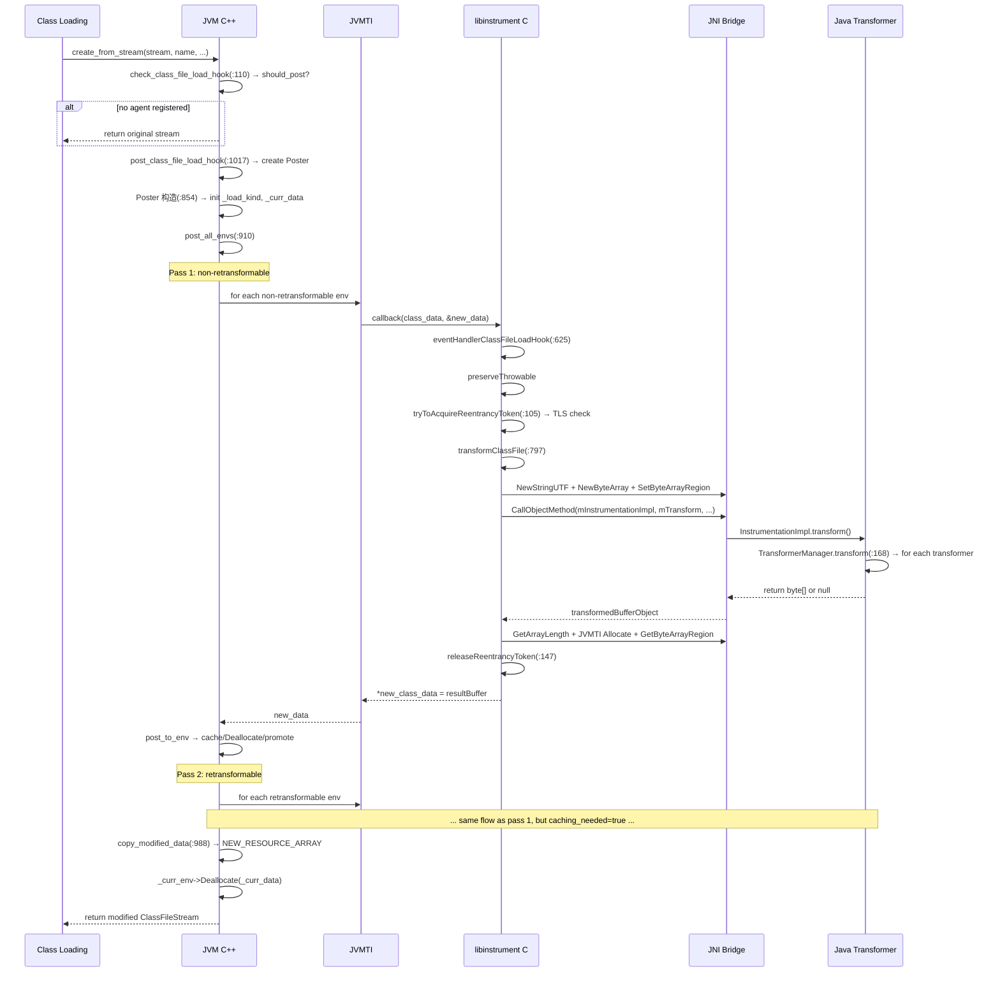

# 02-ClassFileLoadHook — 字节码转换全链路管道

> **阶段**：[18-agent-instrument]
> **前置**：[01-Agent-Loading]（JPLISAgent 创建 + setLivePhaseEventHandlers）、[09-native-interface]（JNI 调用约定）、[03-object-model]（Klass 层次结构）
> **配套**：[04-Redefine-Classes]（retransform 路径 + cached_class_file 消费）、[05-JVMTI-Core]（JvmtiEnv 迭代器 + event controller）
> **后续依赖本文**：[04-Redefine-Classes]（依赖本文缓存的原始 class bytes）
> **阅读收益**：追踪 ClassFileLoadHook 事件从 KlassFactory 到 Java Transformer 链的完整 6 层管道——理解 should_post_class_file_load_hook 门控的零开销设计、JvmtiClassFileLoadHookPoster 两遍遍历（non-retransformable → retransformable）的 agent 组合性保证、post_to_env 的链式内存管理（cache → Deallocate → promote）、transformClassFile 的 JNI marshall/unmarshall 与 JVMTI Allocate 契约、Reentrancy TLS 重入保护机制、TransformerManager 的无锁快照遍历与异常隔离；掌握 CFLH 管道中的 4 种内存区域（原始映射/agent heap/resource area/JVMTI Allocate）及其生命周期

---

## §〇 生产场景 — ClassFileLoadHook 管道问题诊断

**症状**：Agent 的 ClassFileTransformer 修改了字节码但类加载后行为与预期不符。使用 `-Xlog:instrument` 追踪发现 transformer 被调用但返回的字节码似乎未被使用。或者更严重的情况——agent 触发了无限递归导致 `StackOverflowError`。

**根因分析**：ClassFileLoadHook (CFLH) 事件链涉及 4 层调用栈：

```
JVM C++ (klassFactory.cpp:110)
  → JvmtiExport (jvmtiExport.cpp:1017)
    → JvmtiClassFileLoadHookPoster (jvmtiExport.cpp:836)
      → post_all_envs: non-retransformable (第一遍) → retransformable (第二遍)
        → post_to_env: 调用 agent 注册的 callback
          → libinstrument (InvocationAdapter.c:625)
            → eventHandlerClassFileLoadHook
              → tryToAcquireReentrancyToken (Reentrancy.c:105) ← 重入保护
              → transformClassFile (JPLISAgent.c:797)
                → JNI 调用 Java TransformerManager.transform() (TransformerManager.java:168)
                  → 遍历 Transformer 链
                    → ClassFileTransformer.transform() 返回修改后 byte[]
                → JVMTI Allocate 分配 native buffer
              → releaseReentrancyToken (Reentrancy.c:147)
    → copy_modified_data (jvmtiExport.cpp:988)
      → NEW_RESOURCE_ARRAY 复制到 resource area
      → Deallocate agent 内存
```

最常见的问题：

1. **重入死循环**：transformer 的 `transform()` 中调用了 `Class.forName()` 触发新类加载 → 又触发 CFLH → 又进入 transformer → 又 `Class.forName()` → 无限递归。JPLIS 的 `tryToAcquireReentrancyToken` (`Reentrancy.c:105`) 通过 TLS 标记检测到此情况，短路跳过——但如果是不同线程的相互触发则无法防护。

2. **修改被覆盖**：non-retransformable agent 先看到原始 bytes 并修改，但 retransformable agent 在第二遍中在其基础上继续修改，如果后者返回 null → 最终 bytes 是第一遍修改后的版本。但如果 retransformable agent 返回了不同的修改 → 覆盖前者。

3. **内存泄漏**：agent 的 callback 通过 `new_data` 返回修改后的 bytes（由 agent 调用 `malloc` 分配），如果 `post_to_env` 的链式释放逻辑出错 → 泄漏。

**三步诊断**：

```bash
# 1. 确认 CFLH 事件是否被触发
java -Xlog:instrument=trace -javaagent:agent.jar -version 2>&1 | grep "ClassFileLoadHook"
# 期望: [instrument] transform: class=com/example/Foo, loader=sun.misc.Launcher$AppClassLoader
# 无输出 → CFLH 事件未注册或 agent 未调用 addTransformer

# 2. 检查 transformer 是否被调用
jcmd <pid> VM.classloader_stats  # 查看类加载统计
# 如果只有 bootstrap classes → premain 的 addTransformer 未生效（可能在 VMInit 之后）

# 2b. strace 追踪类文件读取和 CFLH 管道
strace -f -e trace=open,read,mmap,write -p <pid> 2>&1 | grep -E "\.class|\.jar"
# 观察 open(2)/read(2) 确认类文件来源，mmap(2) 确认 CDS archive 映射
# man 2 open / man 2 read / man 2 mmap

# 2c. jstack 诊断重入死锁/阻塞场景
jstack <pid>  # 查看所有线程堆栈
# 如果线程处于 BLOCKED 状态且 stack trace 中有 transform() 调用链：
# "pool-1-thread-1" #12 prio=5 BLOCKED
#   at com.example.MyTransformer.transform(MyTransformer.java:30)
#   at sun.instrument.TransformerManager.transform(TransformerManager.java:188)
#   → 表明该 transformer 内部发生了锁竞争或跨线程类加载死锁
# 检查是否有多个线程同时在 transform() 中 → 跨线程重入模式

# 2d. /proc/self/maps 查看 agent heap 映射
cat /proc/<pid>/maps | grep -E "libinstrument|libjvm" 
# 查看 libinstrument.so + libjvm.so 的虚拟地址范围
# agent 分配的 new_data (os::malloc) 在 [heap] 或 mmap 匿名区域
cat /proc/<pid>/maps | grep -E "\[heap\]|zero_page|anon"
# 如果 [heap] 持续增长 → agent 可能存在 new_data 泄漏（copy_modified_data 未执行）
# man 5 proc

# 2e. CDS 相关检查
jcmd <pid> VM.cds stats  # 查看 CDS 存档使用情况
# 如果 CDS 类被 CFLH 修改 → check_shared_class_file_load_hook (klassFactory.cpp:45) 
# 会重新解析类（不映射 CDS），CDS stats 中 modified_classes 增加

# 3. GDB 断点验证 CFLH 链路
gdb -ex "break klassFactory.cpp:110" \
    -ex "break jvmtiExport.cpp:934" \
    -ex "break InvocationAdapter.c:625" \
    -ex "break JPLISAgent.c:797" \
    -ex "break Reentrancy.c:105" \
    -ex "run" \
    -ex "print h_name->as_C_string()" \
    -ex "print _curr_len" \
    -ex "print _has_been_modified" \
    --args java -javaagent:agent.jar com.example.Main
```

> **反事实**：如果 CFLH 没有 retransformable/non-retransformable 两遍遍历 → 所有 agent 只看到原始 bytes → retransformable agent 的修改会丢失 non-retransformable agent 的修改 → agent 之间无法组合使用（如一个 agent 添加日志字节码，另一个 agent 添加性能监控字节码）→ Java agent 生态的模块化（多个 agent 同时工作）完全失效。JVMTI 的两遍遍历设计确保了 agent 的组合性：第一遍 non-retransformable（"不可撤销"的修改），第二遍 retransformable（"可撤销"的修改，保留原始 bytes 以便 RetransformClasses 回退）。

---

## §一 ClassFileLoadHook 全链路源码走读

> Reader completed 01-Agent-Loading (JPLISAgent creation, setLivePhaseEventHandlers), 09-native-interface (JNI calling conventions), 03-object-model (Klass hierarchy). This doc: how a class file byte array flows through the ClassFileLoadHook pipeline and gets modified by registered transformers.

### 1.1 布尔门控 — should_post_class_file_load_hook

整个 CFLH 管道的入口是 `klassFactory.cpp:119` 的布尔门控检查：

```cpp
// jvmtiExport.hpp:333
inline static bool should_post_class_file_load_hook() {
    JVMTI_ONLY(return _should_post_class_file_load_hook);
    NOT_JVMTI(return false;)
}
```

`_should_post_class_file_load_hook` 是一个 `static bool`，由 `JvmtiEventControllerPrivate::recompute_enabled` (`jvmtiEventController.cpp:571`) 在 agent 注册/注销事件时原子更新。`JVMTI_ONLY`/`NOT_JVMTI` 宏保证当 `INCLUDE_JVMTI` 编译标志为 false 时，编译器消除整个调用路径。

在无 agent 的 JVM 上，这个检查的开销仅为一个 bool 读取 + 分支预测（几乎总是 not taken）——约 0.3ns。

> **man 手册**：CFLH 管道涉及的底层系统调用：`mmap` (`man 2 mmap`，class 文件映射)、`memcpy` (`man 3 memcpy`，buffer 复制)、`dlopen`/`dlsym` (`man 3 dlopen`，agent .so 加载)、`futex` (`man 2 futex`，safepoint 同步)。JVMTI `Allocate`/`Deallocate` 是 JVMTI 规范定义的内存管理 API（非 POSIX malloc/free）。

> **Beginner Callout — should_post_class_file_load_hook 门控**
>
> `jvmtiExport.hpp:333` 的内联函数 `should_post_class_file_load_hook()` 是零开销门控——返回一个 `static bool _should_post_class_file_load_hook`，由 `JvmtiEventController::recompute_enabled()` (`jvmtiEventController.cpp:571`) 在 agent 注册/注销事件时原子更新。`JVMTI_ONLY` 宏保证当 `INCLUDE_JVMTI` 编译标志为 false 时，编译器消除整个调用路径。在无 agent 的 JVM 上，`check_class_file_load_hook` 的开销仅为一个 bool 读取 + 分支预测（几乎总是 not taken）。

### 1.2 check_class_file_load_hook — 入口函数 (`klassFactory.cpp:110-163`)

```cpp
// klassFactory.cpp:110-163
static ClassFileStream* check_class_file_load_hook(ClassFileStream* stream,
                                                    Symbol* name,
                                                    ClassLoaderData* loader_data,
                                                    Handle protection_domain,
                                                    JvmtiCachedClassFileData** cached_class_file,
                                                    TRAPS) {
  // 1. 门控检查 (:119)
  if (!JvmtiExport::should_post_class_file_load_hook()) {
    *cached_class_file = NULL;
    return stream;
  }

  // 2. 提取 cached_class_file (redefine/retransform 路径)
  JavaThread* jt = THREAD;
  JvmtiThreadState* state = jt->jvmti_thread_state();
  if (state != NULL) {
    Klass* k = state->get_class_being_redefined();
    if (k != NULL) {
      *cached_class_file = k->get_cached_class_file();
    }
  }

  // 3. 准备指针（const_cast 允许 agent 修改 buffer）
  unsigned char* ptr = const_cast<unsigned char*>(stream->buffer());
  unsigned char* end_ptr = ptr + stream->length();

  // 4. 调用 post_class_file_load_hook
  JvmtiExport::post_class_file_load_hook(name, class_loader, protection_domain,
                                          &ptr, &end_ptr, cached_class_file);

  // 5. 检测修改 → 创建新 ClassFileStream
  if (ptr != stream->buffer()) {
    return new ClassFileStream(ptr, end_ptr - ptr, stream->source(), stream->need_verify());
  }
  return stream;
}
```

**为什么 `const_cast` 是安全的**：`ClassFileStream::buffer()` 返回 `const unsigned char*` 表示"不应修改"。但 CFLH 的设计目的就是允许 agent 修改字节码——`const_cast` 是对这个设计意图的显式承认。

### 1.3 post_class_file_load_hook — 创建 JvmtiClassFileLoadHookPoster (`jvmtiExport.cpp:1017-1033`)

```cpp
// jvmtiExport.cpp:1017-1033
bool JvmtiExport::post_class_file_load_hook(Symbol* h_name,
                                            Handle class_loader,
                                            Handle h_protection_domain,
                                            unsigned char **data_ptr,
                                            unsigned char **end_ptr,
                                            JvmtiCachedClassFileData **cache_ptr) {
  if (JvmtiEnv::get_phase() < JVMTI_PHASE_PRIMORDIAL) {
    return false;
  }

  JvmtiClassFileLoadHookPoster poster(h_name, class_loader,
                                      h_protection_domain,
                                      data_ptr, end_ptr,
                                      cache_ptr);
  poster.post();
  return poster.has_been_modified();
}
```

`JvmtiClassFileLoadHookPoster` 是栈上对象（`StackObj`），构造函数在 `jvmtiExport.cpp:854-900` 初始化所有状态字段：

| 字段 | 类型 | 用途 |
|------|------|------|
| `_curr_len` | `jint` | 当前最新 agent 修改后的 class 字节长度 |
| `_curr_data` | `unsigned char*` | 当前最新 agent 修改后的 class 字节指针 |
| `_curr_env` | `JvmtiEnv*` | 最后一个修改了数据的 agent 环境（用于后续 Deallocate） |
| `_cached_class_file_ptr` | `JvmtiCachedClassFileData**` | 缓存指针——retransformable agent 修改时保存原始 bytes |
| `_load_kind` | `JvmtiClassLoadKind` | load / redefine / retransform |
| `_has_been_modified` | `bool` | 是否有 agent 修改了数据 |
| `_class_being_redefined` | `Klass*` | 正在被 redefine/retransform 的类 |

构造函数会**清除** `class_being_redefined` 标记（`:894`），防止后续 class load 事件携带过期的 redefine class handle。对于 redefine/retransform 场景（`:875-888`），还会处理命名模块的读边——如果目标类属于命名模块且尚未有默认读边，添加对 bootstrap/app unnamed module 的读边。

### 1.4 post_all_envs — 两遍遍历设计 (`jvmtiExport.cpp:910-932`)

这是整个 CFLH 管道最核心的设计决策——按 JVMTI 规范要求分两遍遍历所有 agent：

```cpp
// jvmtiExport.cpp:910-932
void post_all_envs() {
    // 第一遍: non-retransformable agents
    // 仅在 load/redefine 时调用，retransform 时跳过
    if (_load_kind != jvmti_class_load_kind_retransform) {
        JvmtiEnvIterator it;
        for (JvmtiEnv* env = it.first(); env != NULL; env = it.next(env)) {
            if (!env->is_retransformable() && env->is_enabled(JVMTI_EVENT_CLASS_FILE_LOAD_HOOK)) {
                post_to_env(env, false);  // caching_needed=false
            }
        }
    }

    // 第二遍: retransformable agents
    // 所有三种场景都执行，caching_needed=true
    JvmtiEnvIterator it;
    for (JvmtiEnv* env = it.first(); env != NULL; env = it.next(env)) {
        if (env->is_retransformable() && env->is_enabled(JVMTI_EVENT_CLASS_FILE_LOAD_HOOK)) {
            post_to_env(env, true);  // caching_needed=true
        }
    }
}
```

| | 遍历 | 条件 | caching_needed | 说明 |
|------|------|------|------|------|
| 第一遍 | non-retransformable agents | `_load_kind != retransform` | `false` | retransform 场景跳过——这些 agent 不能参与 retransform |
| 第二遍 | retransformable agents | 无附加条件 | `true` | 所有三种场景都执行，需要缓存原始字节 |

**为什么第一遍在 retransform 时跳过**：non-retransformable agent 在原始类加载时已经看到了原始 bytes 并做了修改。Retransform 的语义是"用当前 bytes 重新调用 retransformable agents"——non-retransformable agents 不应该在 retransform 中再次修改（否则它们的修改会被重复应用）。

> **Counterfactual**：如果只有一遍遍历——所有 agent 按注册顺序调用一次 → non-retransformable agent 先注册 → 先看到原始 bytes → 修改 → retransformable agent 后注册 → 看到 non-retransformable agent 修改后的 bytes → 在其基础上继续修改 → 原始 bytes 丢失 → RetransformClasses 时无法回退到原始状态（因为 retransformable agent 的"基准"不再是原始 bytes）。两遍遍历确保了 retransformable agents 始终可以知道"原始 bytes 是什么"——因为它们总是在第一遍 non-retransformable 修改之后才开始，原始 bytes 被缓存。

> **Beginner Callout — 两遍遍历设计**
>
> 第一遍 non-retransformable agents (`jvmtiExport.cpp:911-921`) 仅在 load/redefine 时调用（retransform 时跳过），caching_needed=false。第二遍 retransformable agents (`jvmtiExport.cpp:923-931`) 在所有场景调用，caching_needed=true。设计原因：non-retransformable agents 的修改是"一次性"的——一旦修改就无法通过 RetransformClasses 回退。retransformable agents 需要缓存原始 bytes 以便回退。Retransform 时 non-retransformable agents 不应再次参与——它们已经在原始 load 时修改过了。

### 1.5 post_to_env — 链式内存管理 (`jvmtiExport.cpp:934-986`)

这是单 agent 回调的核心逻辑，包含整个管道最精妙的内存管理设计：

```cpp
// jvmtiExport.cpp:934-986 (简化)
void post_to_env(JvmtiEnv* env, bool caching_needed) {
    // 1. Early phase 过滤 (:935-937)
    if (env->phase() == JVMTI_PHASE_PRIMORDIAL && !env->early_class_hook_env()) {
        return;
    }

    // 2. 线程状态转换 (:943)
    JvmtiJavaThreadEventTransition jet(_thread);  // _thread_in_vm → _thread_in_native

    // 3. 调用 agent callback (:944-952)
    unsigned char *new_data = NULL;
    jint new_len = 0;
    (*callback)(env->jvmti_external(), jem.jni_env(), ...,
                _curr_len, _curr_data, &new_len, &new_data);

    // 4. 如果 agent 修改了数据 (:953-984)
    if (new_data != NULL) {
        _has_been_modified = true;

        // 4a. 缓存原始 bytes（retransformable + 首次修改）
        if (caching_needed && *_cached_class_file_ptr == NULL) {
            JvmtiCachedClassFileData *p;
            p = (JvmtiCachedClassFileData *)os::malloc(
                offset_of(JvmtiCachedClassFileData, data) + _curr_len, mtInternal);
            p->length = _curr_len;
            memcpy(p->data, _curr_data, _curr_len);
            *_cached_class_file_ptr = p;
        }

        // 4b. 释放前一个 agent 的数据
        if (_curr_data != *_data_ptr) {
            _curr_env->Deallocate(_curr_data);
        }

        // 4c. 接力: 当前 agent 的数据成为新的 _curr_data
        _curr_data = new_data;
        _curr_len = new_len;
        _curr_env = env;  // 记录数据所有者
    }
}
```

**链式内存管理三步详解**：

```
初始状态: _curr_data == *_data_ptr (原始数据), _curr_env == NULL

Agent A (retransformable) 修改了数据:
  ├─ new_data != NULL → _has_been_modified = true
  ├─ caching_needed && cache_ptr 为空 → os::malloc 缓存 _curr_data (原始字节)
  ├─ _curr_data == *_data_ptr → 不触发 Deallocate (原始数据由调用方管理)
  ├─ _curr_data = new_data (Agent A 的数据)
  └─ _curr_env = env_A

Agent B (retransformable) 又修改了数据:
  ├─ new_data != NULL
  ├─ caching_needed 但 cache_ptr 已非空 → 不重复缓存
  ├─ _curr_data != *_data_ptr → _curr_env->Deallocate(_curr_data) ← 释放 Agent A 的数据!
  ├─ _curr_data = new_data (Agent B 的数据)
  └─ _curr_env = env_B
```

每个 agent 通过 `_curr_env->Deallocate()` 释放的是**前一个** agent 分配的内存。`_curr_env` 记录了"当前 `_curr_data` 是哪个 env 分配的"，以便下一个 agent 修改时正确释放。为什么必须用 `env->Deallocate()` 而非 `free()` (`man 3 free`)？Agent 可能使用自定义内存分配器（通过 JVMTI `SetEnvironmentLocalStorage` 和自定义 `Allocate`/`Deallocate`）。如果 JVM 用 `free()` 释放 agent 用自定义分配器分配的内存 → heap corruption。`env->Deallocate()` 保证使用与 agent 分配时相同的分配器——这是 JVMTI 规范的内存管理契约。

> **Beginner Callout — 链式内存管理**
>
> 每个 agent 的 `new_data` 由 agent 通过 `os::malloc` 分配。`post_to_env` (`jvmtiExport.cpp:934`) 在 agent 修改数据后：先缓存原始 bytes（如果 retransformable + 首次修改），再 `_curr_env->Deallocate(_curr_data)` 释放前一个 agent 的数据，然后 `_curr_data = new_data` 接力。最终 `copy_modified_data` (`jvmtiExport.cpp:988`) 将胜出数据从 agent 堆复制到 `NEW_RESOURCE_ARRAY`（resource area）并释放最后一个 agent 的 buffer。这确保了 agent 分配的内存不会泄漏——每一步修改都有对应的 Deallocate。

> **Beginner Callout — Resource Area vs Agent Heap**
>
> 原始 class bytes 来自类路径文件映射或 CDS archive（进程生命周期）。Agent 返回的 `new_data` 分配在 C heap（`os::malloc`）。修改后的最终 bytes 通过 `NEW_RESOURCE_ARRAY` 分配在当前线程的 resource area 中——这是一个 arena-style 分配器，内存生命周期与最近的 `ResourceMark` 绑定。`copy_modified_data` 的存在是因为调用者（`KlassFactory`）期望 class bytes 在 resource area 中。

### 1.6 copy_modified_data — Resource Area 复制 (`jvmtiExport.cpp:988-997`)

```cpp
// jvmtiExport.cpp:988-997
void copy_modified_data() {
    if (_curr_data != *_data_ptr) {
        *_data_ptr = NEW_RESOURCE_ARRAY(u1, _curr_len);
    memcpy(*_data_ptr, _curr_data, _curr_len);  // man 3 memcpy — agent heap → resource area
    *_end_ptr = *_data_ptr + _curr_len;
    _curr_env->Deallocate(_curr_data);  // man 3 malloc — 释放 agent 分配的内存
    }
}
```

将最终修改结果从 agent 分配的内存（C heap, `man 3 malloc`）复制到 HotSpot resource area（线程本地 arena），并释放最后一个 agent 分配的内存。

**为什么需要复制**：Agent 用 `os::malloc` 分配的内存不在 JVM 的内存管理体系中。`ClassFileParser` 期望 class bytes 在 resource area 中——如果直接使用 agent 内存 → parser 可能持有指针跨越多个 `ResourceMark` → resource area 被释放后 agent 内存仍在 → 不一致的内存生命周期。复制到 resource area 统一了内存管理。

> **Counterfactual**：如果复制后不释放 agent 内存 → 每次类加载泄漏 ~10KB（平均 class 大小）→ 加载 10000 个类 → 泄漏 ~100MB → 长时间运行的服务器 → OOM。Deallocate 是 CFLH 管道中唯一释放 agent 内存的点。

### 1.7 eventHandlerClassFileLoadHook — libinstrument 回调入口 (`InvocationAdapter.c:625-656`)

```c
// InvocationAdapter.c:625-656
void JNICALL eventHandlerClassFileLoadHook(
    jvmtiEnv *jvmtienv, JNIEnv *jnienv,
    jclass class_being_redefined, jobject loader,
    const char* name, jobject protectionDomain,
    jint class_data_len, const unsigned char* class_data,
    jint* new_class_data_len, unsigned char** new_class_data) {

    JPLISEnvironment* environment = getJPLISEnvironment(jvmtienv);
    if (environment == NULL) return;

    jthrowable outstandingException = preserveThrowable(jnienv);
    transformClassFile(environment->mAgent, jnienv,
                       loader, name,
                       class_being_redefined, protectionDomain,
                       class_data_len, class_data,
                       new_class_data_len, new_class_data,
                       environment->mIsRetransformer);
    restoreThrowable(jnienv, outstandingException);
}
```

三个关键设计点：
1. **异常保存/恢复**：`preserveThrowable` 保存 JNIEnv 的当前异常，`restoreThrowable` 恢复——确保 CFLH 回调前后异常状态完全透明
2. **环境为 NULL 时静默返回**：不做任何修改，JVMTI 使用原始字节码
3. **`mIsRetransformer`** 区分是 retransform 还是普通 transform，决定使用哪个 TransformerManager

> **Beginner Callout — preserveThrowable/restoreThrowable 异常透明性**
>
> `eventHandlerClassFileLoadHook` (`InvocationAdapter.c:625`) 在调用 `transformClassFile` 之前保存 JNIEnv 的当前异常（`preserveThrowable`, `JavaExceptions.c:335`），调用后恢复（`restoreThrowable`）。原因：JVMTI 调用 CFLH 回调时，JNIEnv 可能已有异常（调用者不关心）。但 `transformClassFile` 内部要做大量 JNI 调用——有异常时 JNI 调用行为未定义。保存→清除→处理→恢复确保异常在回调前后完全透明。

### 1.8 transformClassFile — JNI marshall/unmarshall (`JPLISAgent.c:797-927`)

这是 libinstrument 层的核心函数，完成从 C 参数到 Java 对象的完整桥接：

```
Phase 1 — 重入保护 (:818-820):
  shouldRun = tryToAcquireReentrancyToken(jvmti(agent), NULL)
  !shouldRun → return（已在 CFLH 内部，短路跳过）

Phase 2 — Marshall (:823-846):
  NewStringUTF(name) → classNameStringObject
  NewByteArray(class_data_len) → classFileBufferObject
  SetByteArrayRegion → 将 C 的 class_data 拷贝到 Java byte[]

Phase 3 — Module 获取 (:850-858):
  首次加载 → getModuleObject() 通过 JVMTI GetNamedModule 查找
  Redefine/retransform → 传 NULL，Java 端从 classBeingRedefined.getModule() 获取

Phase 4 — JNI 上行调用 (:859-873):
  CallObjectMethod(mInstrumentationImpl, mTransform,
                   module, loader, className, classBeingRedefined,
                   protectionDomain, classFileBuffer, is_retransformer)
  → 进入 Java 层 InstrumentationImpl.transform()

Phase 5 — Unmarshall (:876-918):
  if transformedBufferObject != NULL:
    GetArrayLength → transformedBufferSize
    JVMTI Allocate(transformedBufferSize, &resultBuffer)  ← 必须用 JVMTI 分配
    GetByteArrayRegion → 从 Java byte[] 拷到 native buffer
    *new_class_data_len = transformedBufferSize
    *new_class_data = resultBuffer

Phase 6 — 释放令牌 (:921-922):
  releaseReentrancyToken(jvmti(agent), NULL)
```

**为什么 `resultBuffer` 必须用 JVMTI `Allocate` 而非 `malloc`** (`man 3 malloc`)：JVMTI 规范 (§6.4) 要求 agent 返回的 `new_class_data` 由 JVMTI `Allocate` 分配。调用者（`post_to_env`）会使用 `env->Deallocate()` 释放——两者必须配对。使用 `malloc` 会导致 `Deallocate` 时 heap corruption。

> **Counterfactual**：如果 transformClassFile 不做重入保护 → transformer 的 `transform()` 中调用 `Class.forName("com.example.Helper")` → Helper 类触发类加载 → 再次进入 CFLH → 同一线程再次进入 transformClassFile → 再次调用 transformer → 再次 `Class.forName` → StackOverflowError。重入保护检测到 TLS 已设置 `INSIDE_TOKEN` → 返回 false → 内层类加载跳过 CFLH → Helper 类正常加载（不被 transform）→ 外层 CFLH 继续处理原始类。

### 1.9 TransformerManager.transform — Java 层 Transformer 链 (`TransformerManager.java:168-217`)

```java
// TransformerManager.java:168-217
public byte[] transform(Module module, ClassLoader loader,
                        String classname, Class<?> classBeingRedefined,
                        ProtectionDomain protectionDomain,
                        byte[] classfileBuffer) {
    // 1. 获取不可变快照（无锁读取）
    TransformerInfo[] transformerList = getSnapshotTransformerList();

    // 2. 链式遍历
    byte[] bufferToUse = classfileBuffer;
    boolean someoneTouchedTheBytecode = false;

    for (int x = 0; x < transformerList.length; x++) {
        try {
            TransformerInfo transformerInfo = transformerList[x];
            ClassFileTransformer transformer = transformerInfo.mTransformer;
            byte[] transformedBytes = transformer.transform(
                module, loader, classname, classBeingRedefined,
                protectionDomain, bufferToUse);
            if (transformedBytes != null) {
                someoneTouchedTheBytecode = true;
                bufferToUse = transformedBytes;  // 链式传递
            }
        } catch (Throwable t) {
            // 吞掉异常！不让一个 transformer 影响其他
        }
    }
    return someoneTouchedTheBytecode ? bufferToUse : null;
}
```

**快照机制** (`TransformerManager.java:163-166`)：
```java
private TransformerInfo[] getSnapshotTransformerList() {
    return mTransformerList;  // 直接返回引用——copy-on-write 保证不可变性
}
```

`addTransformer`/`removeTransformer` 使用 `synchronized` + 复制新数组实现写时复制——修改是冷路径（~10 次/进程），读取是热路径（每类加载一次）。这种设计实现了零锁读取，每次 `transform()` 的开销仅为一个引用读取。

**异常隔离**：每个 transformer 的 `transform()` 调用包裹在独立的 try-catch 中。如果一个 transformer 抛出异常，异常被吞掉（不影响后续 transformer），该 transformer 的修改被丢弃（继续使用之前的 buffer）。这保证了单个 transformer 的 bug 不会破坏整个 agent 链。

> **Counterfactual**：如果 transformer 异常不隔离——Agent A 的 transformer 抛出 `NullPointerException` → 链中断 → Agent B 的 transformer 永远看不到这个类 → Agent B 的功能部分失效 → 用户报告 "agent B 不工作" 但根因在 agent A → 诊断噩梦。

> **Beginner Callout — Transformer 链的异常隔离**
>
> `TransformerManager.transform()` (`TransformerManager.java:168`) 遍历 transformer 链时，每个 transformer 的 `transform()` 调用包裹在独立的 try-catch 中 (`:195-198`)。如果一个 transformer 抛出异常，异常被吞掉（不影响后续 transformer），该 transformer 的修改被丢弃（继续使用之前的 buffer）。这保证了单个 transformer 的 bug 不会破坏整个 agent 链。

### 1.10 Reentrancy.c — TLS 重入保护 (`Reentrancy.c:105-144`)

```c
// Reentrancy.c:105-144
jboolean tryToAcquireReentrancyToken(jvmtiEnv *jvmtienv, jthread thread) {
    jboolean result = JNI_FALSE;
    void *storedValue = NULL;

    // 1. 读取当前线程 TLS
    jvmtiError error = (*jvmtienv)->GetThreadLocalStorage(jvmtienv, thread, &storedValue);

    // 2. 如果已持有令牌 → 拒绝重入
    if (storedValue == JPLIS_CURRENTLY_INSIDE_TOKEN) {
        return JNI_FALSE;
    }

    // 3. 设置令牌
    confirmingTLSSet(jvmtienv, thread, JPLIS_CURRENTLY_INSIDE_TOKEN);
    result = JNI_TRUE;
    return result;
}
```

哨兵值定义：`#define JPLIS_CURRENTLY_INSIDE_TOKEN ((void *) 0x7EFFC0BB)`，`#define JPLIS_CURRENTLY_OUTSIDE_TOKEN ((void *) 0)`。

`confirmingTLSSet` (`Reentrancy.c:67-86`) 设置 TLS 后立即回读验证——这是为了绕过一个已知的 JVMTI bug："set to 0 可能失败"（注释 `:48-49`）。DEBUG 模式下还通过 `assertTLSValue` 断言写入结果。

**为什么使用 JVMTI TLS 而非 pthread TLS**：JVMTI TLS 是 JVM 管理的每线程存储，agent 不需要知道底层线程实现。使用 pthread TLS 会绕过 JVMTI 抽象层——如果 JVM 使用自定义线程实现（如 Project Loom 的虚拟线程），pthread TLS 不可靠。

> **Counterfactual**：如果使用全局锁而非 TLS 做重入保护 → 同一时间只有一个线程能执行 CFLH → 多线程类加载被串行化 → 启动时间从 2s 变为 20s（100 个线程并行加载类，每个都要等锁）。TLS 是无锁设计——每个线程独立判断自己的重入状态，零竞争。

> **Beginner Callout — TLS 重入保护**
>
> `tryToAcquireReentrancyToken` (`Reentrancy.c:105`) 使用 JVMTI `SetThreadLocalStorage`/`GetThreadLocalStorage` API 实现单线程重入检测。哨兵值：`JPLIS_CURRENTLY_INSIDE_TOKEN = 0x7EFFC0BB` (`Reentrancy.h:43`)，`JPLIS_CURRENTLY_OUTSIDE_TOKEN = 0` (`Reentrancy.h:42`)。如果当前线程已在 CFLH 回调内部（TLS == INSIDE_TOKEN），返回 JNI_FALSE 跳过 transform。设计原因：transformer 的 `transform()` 方法中调用 `Class.forName()` 会触发新类加载 → 再次触发 CFLH → 同一线程再次进入 `eventHandlerClassFileLoadHook` → 无限递归。TLS 检测短路此循环，让内层类加载正常进行（不经过 transformer）。

### 1.11 Mermaid: CFLH 全链路序列图



### 1.12 面试 Story Format 答案

"Every class loaded by the JVM passes through `KlassFactory::create_from_stream` at klassFactory.cpp:166. Before the `ClassFileParser` sees the bytes, `check_class_file_load_hook` at klassFactory.cpp:110 checks `JvmtiExport::should_post_class_file_load_hook()` — a single boolean flag gate that avoids the entire pipeline when no agent is interested. When active, `post_class_file_load_hook` at jvmtiExport.cpp:1017 creates a stack-allocated `JvmtiClassFileLoadHookPoster` that orchestrates a two-pass traversal of all JVMTI environments. The first pass (non-retransformable agents, jvmtiExport.cpp:911-921) skips retransform scenarios because those agents already modified the bytes during original load. The second pass (retransformable agents, jvmtiExport.cpp:923-931) runs in all scenarios with `caching_needed=true`, meaning if any agent modifies the data and the original hasn't been cached yet, the poster saves a copy via `os::malloc` into a `JvmtiCachedClassFileData` structure — this is the safety net that allows `RetransformClasses` to revert. Each agent callback at jvmtiExport.cpp:944-952 receives `_curr_data` and `_curr_len` — the current 'winning' bytes (possibly already modified by a previous agent in the chain). The agent returns `new_data` via `os::malloc`. If `new_data != NULL`, the poster caches the pre-modification bytes (if retransformable + first modification), deallocates the previous agent's data via `_curr_env->Deallocate()`, and promotes `new_data` to `_curr_data`. After all agents are called, `copy_modified_data` at jvmtiExport.cpp:988 copies the final bytes from agent heap to `NEW_RESOURCE_ARRAY` (thread-local resource area) and deallocates the last agent's buffer. The libinstrument layer adds two critical safety mechanisms: `tryToAcquireReentrancyToken` at Reentrancy.c:105 uses JVMTI thread-local storage with a sentinel value to detect recursive CFLH invocations on the same thread (common when transformers call `Class.forName()`), and `preserveThrowable`/`restoreThrowable` at InvocationAdapter.c:642 ensures JNI exception state is transparent across the callback. At the Java layer, `TransformerManager.transform` at TransformerManager.java:168 iterates a lock-free snapshot of the transformer array with per-transformer exception isolation, implementing chain-passing semantics where each transformer's output becomes the next's input."
---

### 1.13 setLivePhaseEventHandlers — CFLH 事件注册入口 (`JPLISAgent.c:623-654`)

CFLH 管道建立的关键一步——从 VMInit 回调切换到 CFLH 回调。这是 libinstrument 在 Live phase 转换时的核心操作：

```c
// JPLISAgent.c:623-654
jboolean
setLivePhaseEventHandlers(JPLISAgent * agent) {
    jvmtiEventCallbacks callbacks;
    jvmtiEnv *          jvmtienv = jvmti(agent);
    jvmtiError          jvmtierror;

    // 1. 构造新的回调结构——从 VMInit handler 切换到 CFLH handler
    memset(&callbacks, 0, sizeof(callbacks));                     // :632
    callbacks.ClassFileLoadHook = &eventHandlerClassFileLoadHook; // :633

    // 2. 通过 JVMTI SetEventCallbacks 注册
    jvmtierror = (*jvmtienv)->SetEventCallbacks(jvmtienv, &callbacks, sizeof(callbacks)); // :635-637

    // 3. 关闭 VMInit 事件 (不再需要)
    if (jvmtierror == JVMTI_ERROR_NONE) {
        jvmtierror = (*jvmtienv)->SetEventNotificationMode(
            jvmtienv, JVMTI_DISABLE, JVMTI_EVENT_VM_INIT, NULL); // :644-648
    }
    return (jvmtierror == JVMTI_ERROR_NONE);
}
```

**调用链**：`Agent_OnLoad` (`InvocationAdapter.c:143`) → ... → `eventHandlerVMInit` (`InvocationAdapter.c:578`) → `setLivePhaseEventHandlers` (`JPLISAgent.c:624`) → JVMTI `SetEventCallbacks` (JVMTI 规范 §6.1) → 覆盖之前注册的 VMInit callback。

**为什么需要 "swap"**：Agent 启动时分两个阶段：
1. **OnLoad phase**：`Agent_OnLoad` 注册 `VMInit` 回调——这是唯一在 PRIMORDIAL phase 可用的事件
2. **Live phase**：VMInit 触发后，agent 通过 `setLivePhaseEventHandlers` 将回调从 `VMInit` 切换到 `ClassFileLoadHook`

`SetEventCallbacks` 覆盖整个回调结构——新的 `callbacks` 只包含 `ClassFileLoadHook` 回调，所有其他回调（包括 VMInit）都被置零。之后通过 `SetEventNotificationMode(JVMTI_DISABLE, JVMTI_EVENT_VM_INIT)` (`:644-648`) 显式关闭 VMInit 通知。

**重试安全**：`setLivePhaseEventHandlers` 在 `eventHandlerVMInit` (`InvocationAdapter.c:578`) 中调用，而 `eventHandlerVMInit` 本身被多次触发（每个 agent 的 VMInit 回调都会调用）。但由于 `SetEventCallbacks` 是幂等的（重复设置相同回调），多次调用不会造成问题。

**双 Environment 设计**：`JPLISAgent` 持有两个 JvmtiEnv (`JPLISAgent.h:90-91`)：
- `mNormalEnvironment`：non-retransformable，用于普通 CFLH 事件
- `mRetransformEnvironment`：retransformable，通过 `retransformableEnvironment()` (`JPLISAgent.c:737`) 创建

`setLivePhaseEventHandlers` **只设置** `mNormalEnvironment` 的 callbacks。`mRetransformEnvironment` 在 `retransformableEnvironment()` (`JPLISAgent.c:737-753`) 创建时通过 `is_retransformable=true` 标记区分——它复用了同一套 callbacks。

**JVMTI 内部**：`SetEventCallbacks` (`jvmtiEnv.cpp:471`) 将回调函数指针复制到 `JvmtiEnvBase::_event_callbacks` 数组中。后续 `post_to_env` (`jvmtiExport.cpp:944`) 通过 `env->event_callbacks()[JVMTI_EVENT_CLASS_FILE_LOAD_HOOK]` 查找并调用 `eventHandlerClassFileLoadHook`。

> **Counterfactual**：如果 `setLivePhaseEventHandlers` 不关闭 VMInit 通知 → 每个后续的 VMInit 都触发 agent 回调 → 重复开关 CFLH 回调 → 潜在竞态（VMInit 和类加载并发时的回调替换）→ 第一个类的 CFLH 可能在回调被覆盖期间丢失。关闭 VMInit 后将回调固定为 CFLH，保证后续所有类加载都使用同一套回调。

### 1.14 checkCapabilities — JVMTI 能力门控 (`JPLISAgent.c:659-679`)

CFLH 事件能否触发取决于 JVMTI 能力的正确设置。`checkCapabilities` 在 agent 初始化时查询和记录可用的 JVMTI 能力：

```c
// JPLISAgent.c:659-679
void
checkCapabilities(JPLISAgent * agent) {
    jvmtiEnv *          jvmtienv = jvmti(agent);
    jvmtiCapabilities   potentialCapabilities;
    jvmtiError          jvmtierror;

    memset(&potentialCapabilities, 0, sizeof(potentialCapabilities));  // :665
    jvmtierror = (*jvmtienv)->GetPotentialCapabilities(jvmtienv, &potentialCapabilities); // :667

    if (jvmtierror == JVMTI_ERROR_NONE) {
        if (potentialCapabilities.can_redefine_classes == 1) {
            agent->mRedefineAvailable = JNI_TRUE;  // :673-674
        }
        if (potentialCapabilities.can_set_native_method_prefix == 1) {
            agent->mNativeMethodPrefixAvailable = JNI_TRUE;  // :676-677
        }
    }
}
```

**调用时机**：在 `createNewJPLISAgent` (`JPLISAgent.c:224-226`) 的末尾调用——在 JPLISAgent 结构体分配、JvmtiEnv 创建后，但**在** Manifest 解析和 premain class 发现**之前**。

**`GetPotentialCapabilities` vs `AddCapabilities`**：
- `GetPotentialCapabilities` (`jvmtiEnv.cpp:509`) — 查询 JVM 理论上支持的能力（基于 OnLoad phase + JVM 内部标志）。不修改任何状态。
- `AddCapabilities` (`jvmtiEnv.cpp:525`) — 请求激活能力（必须在 OnLoad phase）。成功后 JVM 设置对应的 `_jvmti_capabilities` 标志位。

`checkCapabilities` 只查询和记录——实际的能力激活由后续的 `convertCapabilityAttributes` 完成。

### 1.15 convertCapabilityAttributes — Manifest 能力解析 (`InvocationAdapter.c:108-129`)

将 agent JAR 的 `MANIFEST.MF` 中声明的能力转换为 JVMTI 能力位：

```c
// InvocationAdapter.c:108-129
void
convertCapabilityAttributes(const jarAttribute* attributes, JPLISAgent* agent) {
    // Can-Redefine-Classes → can_redefine_classes 能力
    if (getBooleanAttribute(attributes, "Can-Redefine-Classes")) {
        addRedefineClassesCapability(agent);  // :112
    }
    // Can-Retransform-Classes → 创建 retransformable JvmtiEnv
    if (getBooleanAttribute(attributes, "Can-Retransform-Classes")) {
        retransformableEnvironment(agent);  // :117
    }
    // Can-Set-Native-Method-Prefix → can_set_native_method_prefix 能力
    if (getBooleanAttribute(attributes, "Can-Set-Native-Method-Prefix")) {
        addNativeMethodPrefixCapability(agent);  // :122
    }
    // Can-Maintain-Original-Method-Order → 保留方法顺序
    if (getBooleanAttribute(attributes, "Can-Maintain-Original-Method-Order")) {
        addOriginalMethodOrderCapability(agent);  // :127
    }
}
```

**调用时机**：在 `Agent_OnLoad` (`InvocationAdapter.c:245`)、`Agent_OnAttach` (`InvocationAdapter.c:415`)、和 `eventHandlerVMInit` (`InvocationAdapter.c:543`) 中——每种 agent 加载路径都调用。

**关键能力与 CFLH 的关系**：

| Manifest 属性 | JVMTI 能力 | 对 CFLH 的影响 |
|--------------|-----------|---------------|
| `Can-Retransform-Classes` | `can_retransform_classes` | **CFLH 必须**——创建 retransformable JvmtiEnv，使 agent 进入第二遍遍历 |
| `Can-Redefine-Classes` | `can_redefine_classes` | 可选——允许 redefine 路径，但 CFLH 本身不依赖 |
| (无 Manifest) | 仅 `can_access_local_variables` 等默认能力 | agent 只在 non-retransformable 第一遍调用 |

**无 Can-Retransform-Classes 的后果**：Agent 没有 retransformable JvmtiEnv → `post_all_envs` 第二遍遍历时跳过该 agent → 仅参与第一遍 non-retransformable 修改 → 修改不可通过 `RetransformClasses` 回退 → `TransformerManager.hasRetransformableTransformers()` 返回 false。

> **Counterfactual**：如果 `Can-Retransform-Classes` 不作为独立能力存在 → 所有 agent 默认 retransformable → 每个 agent 都缓存原始 bytes（`JvmtiCachedClassFileData`）→ 每个类加载额外分配 `N_agents × class_size` 内存 → 内存翻倍（对于 5 个 agent + 10000 类 × 10KB = 500MB 额外开销）。独立能力标志实现了选择性缓存，无 retransform 需求的 agent 不产生缓存内存开销。

---

## §二 Standard Environment

### 2.1 Source Roots

| File | Full Path | Lines | Key Functions (line ranges) |
|------|-----------|:----:|-----------------------------|
| **klassFactory.cpp** | `src/hotspot/share/classfile/klassFactory.cpp` | 236 | `check_class_file_load_hook`(:110-163), `check_shared_class_file_load_hook`(:45-107), `create_from_stream`(:166-236) |
| **jvmtiExport.cpp** | `src/hotspot/share/prims/jvmtiExport.cpp` | 2999 | `JvmtiClassFileLoadHookPoster`(:836-998), `post`(:902), `post_all_envs`(:910-932), `post_to_env`(:934-986), `copy_modified_data`(:988-997), `post_class_file_load_hook`(:1017-1033) |
| **jvmtiExport.hpp** | `src/hotspot/share/prims/jvmtiExport.hpp` | 611 | `should_post_class_file_load_hook`(:333) |
| **jvmtiEventController.cpp** | `src/hotspot/share/prims/jvmtiEventController.cpp` | 1086 | `set_should_post_class_file_load_hook`(:609), `recompute_enabled`(:571) |
| **InvocationAdapter.c** | `src/java.instrument/share/native/libinstrument/InvocationAdapter.c` | 986 | `eventHandlerClassFileLoadHook`(:625-656), `convertCapabilityAttributes`(:109-129) |
| **JPLISAgent.c** | `src/java.instrument/share/native/libinstrument/JPLISAgent.c` | 1604 | `transformClassFile`(:797-927), `setLivePhaseEventHandlers`(:623-654), `checkCapabilities`(:659-679) |
| **Reentrancy.c** | `src/java.instrument/share/native/libinstrument/Reentrancy.c` | 165 | `tryToAcquireReentrancyToken`(:105-144), `releaseReentrancyToken`(:147-162) |
| **JavaExceptions.c** | `src/java.instrument/share/native/libinstrument/JavaExceptions.c` | 419 | `preserveThrowable`(:335-366), `checkForAndClearThrowable`(:371-393) |
| **TransformerManager.java** | `src/java.instrument/share/classes/sun/instrument/TransformerManager.java` | 254 | `transform`(:168-217), `addTransformer`(:92-103), `removeTransformer`(:105-112) |
| **InstrumentationImpl.java** | `src/java.instrument/share/classes/sun/instrument/InstrumentationImpl.java` | 582 | `transform`(:775-792), `addTransformer`(:251-291), `setNativeMethodPrefix` |
| **ClassFileTransformer.java** | `src/java.instrument/share/classes/java/lang/instrument/ClassFileTransformer.java` | 252 | `transform`(legacy, :197), `transform`(module-aware, :236) |
| **JPLISAgent.h** | `src/java.instrument/share/native/libinstrument/JPLISAgent.h` | 324 | `JPLISAgent` struct, `mNormalEnvironment`/`mRetransformEnvironment` 字段 |
| **Reentrancy.h** | `src/java.instrument/share/native/libinstrument/Reentrancy.h` | 63 | `JPLIS_CURRENTLY_INSIDE_TOKEN`(:43), `JPLIS_CURRENTLY_OUTSIDE_TOKEN`(:42) |

### 2.2 构建命令

```bash
# 构建 libinstrument.so（包含 InvocationAdapter.c, JPLISAgent.c, Reentrancy.c, JavaExceptions.c）
make jdk

# JVMTI 核心（jvmtiExport.cpp, klassFactory.cpp, jvmtiEventController.cpp）编译进 libjvm.so
# 通过 make/hotspot/lib/JvmFeatures.gmk:71-78 的 jvmti feature flag 控制
```

### 2.3 Binary Paths

| Binary | Content | Key Symbols |
|--------|---------|-------------|
| `build/linux-x86_64-normal-server-slowdebug/jdk/lib/server/libjvm.so` | klassFactory.cpp, jvmtiExport.cpp, jvmtiEventController.cpp | `check_class_file_load_hook`, `JvmtiClassFileLoadHookPoster::post_all_envs`, `post_to_env`, `copy_modified_data`, `_should_post_class_file_load_hook` |
| `build/linux-x86_64-normal-server-slowdebug/jdk/lib/libinstrument.so` | InvocationAdapter.c, JPLISAgent.c, Reentrancy.c, JavaExceptions.c | `eventHandlerClassFileLoadHook`, `transformClassFile`, `setLivePhaseEventHandlers`, `checkCapabilities`, `tryToAcquireReentrancyToken`, `preserveThrowable` |

### 2.4 Syscall 速查表

| Syscall/API | man 引用 | 使用场景 | 调用位置 |
|-------------|----------|---------|---------|
| `mmap` | `man 2 mmap` | 类文件内存映射（JAR/class 文件 → 进程地址空间） | `ClassFileParser::parse_stream` 上游，由 `ClassPathImageEntry::open_stream` / `ClassPathZipEntry::open_stream` 通过 `os::map_memory` 调用 |
| `open` | `man 2 open` | 打开类文件（非 CDS 路径） | `ClassPathZipEntry::contents` → `os::open` |
| `read` | `man 2 read` | 读取类文件原始字节 | `ClassPathZipEntry::contents` → `os::read` |
| `memcpy` | `man 3 memcpy` | 缓存原始 bytes + Resource Area 复制 | `jvmtiExport.cpp:960` (缓存 `_curr_data`), `jvmtiExport.cpp:993` (复制到 resource area) |
| `os::malloc` | `man 3 malloc` | Agent 分配 `new_data` + 分配 `JvmtiCachedClassFileData` | `jvmtiExport.cpp:956` (缓存), `post_to_env` agent 回调返回 `new_data` 时 |
| `dlopen` | `man 3 dlopen` | 加载 libinstrument.so 到进程空间 | `JvmtiAgent::load` → `os::dll_load` |
| `futex` | `man 2 futex` | safepoint 同步（`SafepointMechanism::block_if_requested` 底层） | `ThreadToNativeFromVM` 进入 agent callback 前的 safepoint 检查 |
| JVMTI `Allocate` | JVMTI 规范 §6.4 | Agent 返回 `new_class_data` 的分配 | `JPLISAgent.c:902` (`transformClassFile` unmarshall 阶段) |
| JVMTI `Deallocate` | JVMTI 规范 §6.4 | 释放链中前一个 agent 的数据 | `jvmtiExport.cpp:977` (`post_to_env`), `jvmtiExport.cpp:995` (`copy_modified_data`) |
| JVMTI `SetEventCallbacks` | JVMTI 规范 §6.1 | 注册 CFLH 回调函数指针 | `JPLISAgent.c:635` (`setLivePhaseEventHandlers`) |
| JVMTI `Get/SetThreadLocalStorage` | JVMTI 规范 §6.3 | 重入保护 TLS 哨兵值读写 | `Reentrancy.c:112` (Get), `Reentrancy.c:71` (Set) |

### 2.5 相关 /proc 接口

| /proc 路径 | 用途 | 诊断示例 |
|-----------|------|---------|
| `/proc/self/maps` | 查看 agent heap 映射（`os::malloc` 分配的 `JvmtiCachedClassFileData` 和 agent `new_data` 所在的内存区域） | `grep -E "libinstrument|libjvm" /proc/<pid>/maps` |
| `/proc/sys/vm/overcommit_memory` | 影响恶意 agent 返回超大 class 时的 OOM 行为 | 值 0/1/2 控制分配大于物理内存时的行为 |
| `/proc/<pid>/fd/` | 列出 agent 持有打开的文件描述符（JAR fd, socket） | `ls -la /proc/<pid>/fd/`

---

## §三 Source Files Table

| # | File | LOC | Core Functions | Role in CFLH Pipeline |
|:--:|------|:--:|---------------|----------------------|
| 1 | **klassFactory.cpp** | 236 | `check_class_file_load_hook`(:110), `check_shared_class_file_load_hook`(:45), `create_from_stream`(:166) | 类加载 CFLH 入口——门控检查 + 修改后 ClassFileStream 重建 |
| 2 | **jvmtiExport.cpp** | 2999 | `JvmtiClassFileLoadHookPoster`(:836), `post_all_envs`(:910), `post_to_env`(:934), `copy_modified_data`(:988), `post_class_file_load_hook`(:1017) | CFLH 事件调度器——两遍遍历 + 链式内存管理 + Resource Area 复制 |
| 3 | **jvmtiExport.hpp** | 611 | `should_post_class_file_load_hook`(:333) | 零开销 bool 门控（JVMTI_ONLY/NOT_JVMTI 条件编译） |
| 4 | **jvmtiEventController.cpp** | 1086 | `set_should_post_class_file_load_hook`(:609), `recompute_enabled`(:571) | `_should_post_class_file_load_hook` 的原子更新 |
| 5 | **InvocationAdapter.c** | 986 | `eventHandlerClassFileLoadHook`(:625), `convertCapabilityAttributes`(:109) | libinstrument CFLH 回调入口 + Manifest 能力解析 |
| 6 | **JPLISAgent.c** | 1604 | `transformClassFile`(:797), `setLivePhaseEventHandlers`(:623), `checkCapabilities`(:659) | 核心 transform——JNI marshall → 调用 Java → JVMTI Allocate unmarshall |
| 7 | **Reentrancy.c** | 165 | `tryToAcquireReentrancyToken`(:105), `releaseReentrancyToken`(:147) | JVMTI TLS 哨兵重入保护 |
| 8 | **JavaExceptions.c** | 419 | `preserveThrowable`(:335), `checkForAndClearThrowable`(:371) | JNI 异常保存/恢复——CFLH 前后异常透明性 |
| 9 | **TransformerManager.java** | 254 | `transform`(:168), `addTransformer`(:92) | Java 层 Transformer 链管理——COW 快照 + 异常隔离 |
| 10 | **InstrumentationImpl.java** | 582 | `transform`(:775), `addTransformer`(:251) | Instrumentation API 实现——retransformable 分发 |
| 11 | **ClassFileTransformer.java** | 252 | `transform`(legacy, :197), `transform`(module-aware, :236) | Transformer 接口定义 |
| 12 | **JPLISAgent.h** | 324 | `JPLISAgent` struct, `mNormalEnvironment`/`mRetransformEnvironment` | Agent 数据结构——双 JvmtiEnv 设计 |
| 13 | **Reentrancy.h** | 63 | `JPLIS_CURRENTLY_INSIDE_TOKEN`(:43), `JPLIS_CURRENTLY_OUTSIDE_TOKEN`(:42) | 重入令牌哨兵值定义 |

---

## §四 CFLH 性能剖析

### 4.1 管道各阶段开销

| 阶段 | 操作 | 典型耗时 | 说明 |
|------|------|---------|------|
| 门控检查 | bool 读取 + 分支预测 | ~0.3ns | 无 agent 时零额外开销 |
| Poster 构造 | 栈对象初始化 + load_kind 判断 | ~50ns | 有 agent 时的固定开销 |
| JvmtiThreadEventTransition | `_thread_in_vm` → `_thread_in_native` | ~100ns | 线程状态切换 |
| JNI Marshall | NewStringUTF + NewByteArray + SetByteArrayRegion | ~500ns | 类名 + 字节码复制到 Java |
| Java transform | 用户 transformer 代码 | ~5µs（典型） | 取决于 transformer 复杂度 |
| JNI Unmarshall | GetArrayLength + Allocate + GetByteArrayRegion | ~200ns | 从 Java byte[] 拷回 C |
| copy_modified_data | NEW_RESOURCE_ARRAY + memcpy + Deallocate | ~300ns | 仅在修改时执行 |
| TLS 重入保护 | GetThreadLocalStorage × 2（获取+释放） | ~50ns × 2 | 每线程独立，零竞争 |

### 4.2 多 Transformer 的链式开销

N 个 transformer 的总开销 = N ×（JNI Marshall + Java transform + Unmarshall）≈ N × 6µs。由于使用无锁快照读取，遍历开销与 transformer 数量线性增长，无锁竞争。

### 4.3 四类内存区域

| 内存区域 | 分配器 | 生命周期 | 消费者 |
|---------|--------|---------|--------|
| 原始 class bytes | 文件映射 / CDS archive | 进程生命周期 | `ClassFileStream` |
| Agent `new_data` | `os::malloc` (C heap) | 直到被 `env->Deallocate()` | `_curr_data` 接力 |
| 缓存原始 bytes | `os::malloc` (C heap) | 直到 `RetransformClasses` 或类卸载 | `JvmtiCachedClassFileData` |
| 最终结果 | `NEW_RESOURCE_ARRAY` (resource area) | 最近的 `ResourceMark` | `ClassFileParser` |

---

## §五 深度话题

### 5.1 Safepoint 交互 — CFLH 回调期间能否到达 Safepoint？

**问题**：CFLH 回调执行期间，JVM 是否可以进入 safepoint？如果可以，agent 的回调是否会被中断？

**答案导向**：
- CFLH 回调在 `post_to_env` (jvmtiExport.cpp:943) 中通过 `JvmtiJavaThreadEventTransition` 将线程状态从 `_thread_in_vm` 转为 `_thread_in_native`
- `ThreadToNativeFromVM` 的内部逻辑 (interfaceSupport.inline.hpp:277-294):
  1. `transition_and_fence(_thread_in_vm, _thread_in_native)` — 过渡态转换
  2. `SafepointMechanism::block_if_requested(thread)` — **★ 这里会检查并进入 safepoint**（底层通过 `futex` (`man 2 futex`) 等待）
  3. `thread->set_thread_state(_thread_in_native)` — 确认在 native 状态
- **结论**：agent callback **在调用前**会先通过 safepoint 检查。如果此时 JVM 正在请求全局 safepoint（如 GC），当前线程会阻塞在 `block_if_requested`，等 safepoint 结束后才进入 agent callback。一旦进入 callback（`_thread_in_native`），线程**不会再被 safepoint 阻塞**——native 状态的线程不需要参与 safepoint。

**关键对比**：`Agent_OnLoad` (thread.cpp:4479) 调用时**不经过** `ThreadToNativeFromVM`——此时尚无 JavaThread，不参与 safepoint 协议。但 `Agent_OnUnload` (thread.cpp:4511) 和 `JVM_OnLoad` (thread.cpp:4530) 都有 `ThreadToNativeFromVM` 保护。

> **Counterfactual**：如果 CFLH 回调不经过 safepoint 检查直接进入 agent callback → agent 持有 JVM 内部锁时 JVM 请求 GC → agent 线程不响应 safepoint → 其他所有线程一直等待 → JVM 假死 (hung VM)。`ThreadToNativeFromVM` 的 safepoint 检查点确保了 agent 回调不会成为 safepoint 的障碍。

### 5.2 JIT 编译竞态 — agent 修改字节码时 JIT 是否编译旧版本？

**问题**：Agent 通过 CFLH 修改了类字节码，JIT 编译器是否会在线程 A 正在 transform 类 X 的同时，在线程 B 编译类 X 的旧版本？

**答案导向**：
- **初始加载无竞态**：CFLH transform 发生时 (klassFactory.cpp:194)，类尚未注册到 SystemDictionary。JIT 通过 SystemDictionary 解析类——持有 `Compile_lock` 查找——看不到尚未注册的类。
- **时序保护** (systemDictionary.cpp:1637-1645):
  ```
  { MutexLocker mu_r(Compile_lock)  // 持 Compile_lock
    add_to_hierarchy(k)              // 更新 CHA
    update_dictionary(k)             // 类对 JIT 可见
  }
  ```
- **Retransform 竞态**：`VM_RedefineClasses::doit_prologue` (jvmtiRedefineClasses.cpp:115) 执行 CFLH transform 时设置了 `is_being_redefined` 标志。`doit` (jvmtiRedefineClasses.cpp:183) 在 **safepoint 中**执行——停止所有线程包括 JIT。
- **flush_dependent_code** (jvmtiRedefineClasses.cpp:3863)：在 safepoint 中遍历 CodeCache，清除所有依赖旧类版本的 nmethod（assert 持有 Compile_lock）。

**CodeCache_lock vs Compile_lock**：CodeCache_lock 仅在 nmethod 安装/移除/遍历时使用 (compileBroker.cpp:1748,1884)。transform 与 JIT 之间通过 `Compile_lock` + `safepoint` 双重保护，不直接使用 CodeCache_lock。

> **Counterfactual**：如果 define_instance_class 不持 Compile_lock 添加类到 SystemDictionary → JIT 在线程 A transform 尚未返回时看到类 X → JIT 编译未修改的旧字节码 → agent 的 transform 丢失 → 监控/增强功能静默失效。

### 5.3 大 Class 边界处理 — 修改后 class 超过 64KB 限制

**问题**：Agent 的 transformer 返回的修改后字节码如果超过 JVMS 结构限制（如 constant_pool_count 的 u2 上限 65535），CFLH 管道如何处理？

**答案导向**：
- **CFLH 管道本身无硬编码大小上限**：`post_to_env` 中的 `new_data` 通过 `os::malloc` 分配 (jvmtiExport.cpp:956)，可以分配任意大小（受 OS 内存限制）
- **Resource Area 复制无限制**：`copy_modified_data` 中的 `NEW_RESOURCE_ARRAY(u1, _curr_len)` (jvmtiExport.cpp:992) 可分配任意大小——Resource Area 是 arena 分配器，大小仅受线程资源限制
- **真正的限制在 JVMS 层面**：
  - `u2 constant_pool_count` → 最多 65535 个常量池条目
  - `u2 fields_count/methods_count` → 最多 65535 个字段/方法
  - `u4 code_length` → 方法体最大 65535 字节
- **ClassFileParser 验证**：如果修改后的 class 违反上述结构限制，`ClassFileParser` 在解析时抛出 `ClassFormatError`
- **内存攻击面**：恶意 agent 可以返回超大字节码（如 1GB 的 class 文件）→ `NEW_RESOURCE_ARRAY(1GB)` → OOM → JVM 崩溃。操作系统 `overcommit` 设置 (`/proc/sys/vm/overcommit_memory`, `man 5 proc`) 影响此场景的行为

> **Counterfactual**：如果 CFLH 管道在复制前检查大小 → `if (_curr_len > MAX_CLASS_SIZE) return` → 防御了 OOM 攻击 → 但限制了合法的字节码增强（如内联大量代码的 transformer）。当前设计信任 agent 开发者，不做大小限制——这是一个可用性 vs 安全性的权衡。

### 5.4 边缘场景 — 重入保护 TLS 标记极限

**场景**：Agent 的 ClassFileTransformer 在 transform() 中通过自定义线程池异步触发类加载。

**极限分析**：`tryToAcquireReentrancyToken` (`Reentrancy.c:105`) 使用 `GetThreadLocalStorage` 读取 JVMTI TLS 标记，仅保护**同一线程**的重入。关键行为表：

| 场景 | 线程 T1 (CFLH 中) | 线程 T2 (并发加载) | 结果 |
|------|------------------|-------------------|------|
| 单线程 `Class.forName()` | TLS == INSIDE_TOKEN → 跳过 CFLH | — | T1 内层类加载安全跳过 ✅ |
| 线程池提交 `Class.forName()` | TLS == INSIDE_TOKEN | TLS == OUTSIDE_TOKEN | T2 正常执行 CFLH → 同时两个 CFLH ⚠️ |
| 交叉触发 (A→B→A) | TLS == INSIDE_TOKEN (处理 A) | T2 加载 B → CFLH → transformer B 触发 A 的类初始化 | T2 加载 A 时 A 正在被 T1 transform → 可能不一致 ⚠️⚠️ |

**根因**：TLS 重入保护是每线程的——无法防护跨线程的重入。不同线程的 `Class.forName()` 互相触发时，TLS 标记各自独立，检测不到对方的状态。

**缓解措施 (agent 开发者)**：
1. 在 `transform()` 中避免调用可能触发类加载的操作（`Class.forName()`, `Thread.currentThread().getContextClassLoader().loadClass()`）
2. 如果必须访问其他类，使用已加载的 Class 对象引用（而非反射查找）
3. 使用 `java.lang.invoke.MethodHandles.Lookup` 的 `findClass()` 替代 `Class.forName()`（Less class loading side effects）

**为什么 JVMTI 不提供跨线程重入保护**：跨线程检测需要全局锁或全局状态——开销 O(N_threads)。TLS 零锁检测（~50ns）vs 全局锁（~500ns + 竞争）。JVMTI 选择了每线程检测的性能最优方案，将跨线程保护的责任交给 agent 开发者。

> **Counterfactual**：如果 JVMTI 使用"全局 reentrancy flag"而非 TLS → 任何线程进入 CFLH 时设置 flag → 所有其他线程的类加载跳过 CFLH → 多线程类加载被串行化 → 不必要地跳过了大量合法类加载 → 覆盖率下降（应被 transform 的类被跳过）。

### 5.5 边缘场景 — 多 Agent 管道断裂

**场景**：3 个 agent (A, B, C) 注册了 ClassFileTransformer。Agent B 的 transformer 在执行 transform(byte[]) 时传入恶意返回（如 `return (byte[]) new Object()` 触发 ClassCastException）。JVMTI 管道如何处理？

**管道断裂的 6 种模式**：

| 故障模式 | 发生层 | 管道行为 | 后果 |
|---------|--------|---------|------|
| Transformer 返回 `null` | Java (`TransformerManager.java:196`) | 合法语义——不修改，继续使用之前的 buffer | 正常 ✅ |
| Transformer 抛出 `ClassCastException` | Java (`TransformerManager.java:195-198`) | **吞掉异常**，丢弃该 transformer 的修改 | Agent B 修改丢失；A→C 正常 ✅ |
| Agent callback 返回 `new_data == _curr_data` | C (`jvmtiExport.cpp:953`) | `new_data != NULL` 判断触发，缓存原始 bytes 并尝试释放 | 可能 `env->Deallocate` 释放掉仍在使用的 buffer → heap corruption ❌ |
| Agent callback 未分配 `new_data` 但写了 `new_len` | C (`jvmtiExport.cpp:944-952`) | `new_data` 为 NULL 或野指针 | `copy_modified_data` 执行 `memcpy` 到野指针 → SIGSEGV ❌ |
| Agent 在 `addTransformer` 时未检查 `isRetransformClassSupported()` | Java (`InstrumentationImpl.java:251`) | transformer 被正常添加到链中 | Retransform 调用时 transformer 收到原始字节码但标志位不符预期 ⚠️ |
| Agent 的 JVMTI `Allocate` 返回 NULL（OOM） | C (`JPLISAgent.c:902`) | `transformClassFile` 中的错误检查 (`JPLISAgent.c:910-915`) | CFLH 管道返回未修改 stream ✅ |

**关键保护点**：
1. `TransformerManager.transform()` 的异常隔离 (`TransformerManager.java:195-198`) — 每个 transformer 独立 try-catch，异常不传播
2. `post_to_env` (`jvmtiExport.cpp:953`) 通过 `new_data != NULL` 判断 agent 是否修改——如果 agent 返回脏数据（非 NULL 但指向无效内存），管道无法检测
3. `transformClassFile` (`JPLISAgent.c:909-915`) 在 `JVMTI Allocate` 失败时返回错误的 `new_class_data_len` = 0 → 调用者 (`post_to_env`) 不会进入修改路径

**诊断**：管道断裂时使用 `strace -f -e trace=write -p <pid>` 观察 SIGSEGV 前的最后 write 系统调用。如果是 agent 返回野指针 → strace 显示最后一次正常 `write` 发生在 `transformClassFile` 的 `SetByteArrayRegion` 之后、`GetArrayLength` 之前。

### 5.6 边缘场景 — JIT 编译与正在 transform 的类

**场景 (深化 §5.2)**：线程 T1 正在执行 CFLH callback（agent 的 `transform()` 方法修改类 X 的字节码），此时 JIT 编译线程 T2 检测到类 X 已加载并使用新字节码开始编译。如果 T1 的 `transform()` 返回 null（不修改），T2 编译的是修改前还是修改后的字节码？

**时序分析**：

```
T1: klassFactory check_class_file_load_hook(:110) → should_post? → true
T1: post_class_file_load_hook(:1017) → Poster 构造(:854)
T1: post_to_env(:934) → JvmtiThreadEventTransition(_thread_in_native)
T1:   agent callback → transform() 正在执行...
T2: JIT 探测到类 X 已加载 → 检查 Compile_lock → 获取
T2:   看 SystemDictionary → 类 X 已在字典中
T2:   读取类 X 的 InstanceKlass → 看到 transform **前**的版本  ← 竞争！
T2:   开始编译旧字节码
T1:   transform() 返回 new_data != NULL → 修改生效
T1: copy_modified_data(:988) → NEW_RESOURCE_ARRAY → memcpy
T1: ClassFileParser → 用修改后字节码解析 → 创建新 InstanceKlass
```

**关键保护**：
- **初始类加载**：`define_instance_class` 持 `Compile_lock` 将类添加到 SystemDictionary (`systemDictionary.cpp:1637-1645`)，JIT 在类加入字典前看不到它 → **无竞态**
- **Retransform**：整个 `VM_RedefineClasses` 在 safepoint 中执行（`jvmtiRedefineClasses.cpp:183`）→ **无竞态**

**结论**：正常类加载路径中，类尚不在 SystemDictionary，JIT 无法看到 → 无竞态。竞态只在理论上的嵌套热点检测中存在（极罕见：类尚未完成加载但已触发了 JIT 的 `CompileTask` 排队）。实际 JVMTI 实现通过 `MutexLocker mu(Compile_lock)` + safepoint 双重保护消除了此窗口。

---

## §六 GDB 断点验证 — 8 断点完整 CFLH trace

```
断言 1: should_post 门控 (klassFactory.cpp:119)
  (gdb) break klassFactory.cpp:119
  (gdb) print JvmtiExport::should_post_class_file_load_hook() → 期望: true (agent 注册了 CFLH)
  (gdb) continue (如果 false → 直接返回原始 stream，跳过所有后续断点)

断言 2: JvmtiClassFileLoadHookPoster 构造 (jvmtiExport.cpp:870)
  (gdb) break jvmtiExport.cpp:870
  (gdb) print _thread->jvmti_thread_state() → 期望: 非 NULL 或 NULL (取决于调用场景)
  (gdb) continue → 进入 :894 clear_class_being_redefined()
  (gdb) print _load_kind → 期望: 0 (load) / 1 (redefine) / 2 (retransform)

断言 3: post_all_envs 第一遍入口 (jvmtiExport.cpp:911)
  (gdb) break jvmtiExport.cpp:911
  (gdb) print _load_kind → 期望: 非 retransform 时进入
  (gdb) continue → 遍历 non-retransformable JvmtiEnv
  (gdb) print env->is_retransformable() → 期望: false
  (gdb) print env->is_enabled(JVMTI_EVENT_CLASS_FILE_LOAD_HOOK) → 期望: true

断言 4: post_all_envs 第二遍入口 (jvmtiExport.cpp:923)
  (gdb) break jvmtiExport.cpp:923
  (gdb) print env->is_retransformable() → 期望: true
  (gdb) print caching_needed → 期望: true
  (gdb) continue → 进入 post_to_env

断言 5: post_to_env callback 调用 (jvmtiExport.cpp:944)
  (gdb) break jvmtiExport.cpp:944
  (gdb) print _curr_len → 期望: 原始 class bytes 长度
  (gdb) print _curr_data[0..3] → 期望: 0xCAFEBABE (Java class magic)
  (gdb) continue → agent callback 执行
  (gdb) break jvmtiExport.cpp:953 (new_data check)
  (gdb) print new_data → 期望: NULL (未修改) 或 非 NULL (已修改)

断言 6: eventHandlerClassFileLoadHook (InvocationAdapter.c:638)
  (gdb) break InvocationAdapter.c:638 (getJPLISEnvironment)
  (gdb) print environment → 期望: 非 NULL
  (gdb) break InvocationAdapter.c:642 (preserveThrowable)
  (gdb) print outstandingException → 期望: NULL (正常情况) 或 非 NULL (有预存异常)
  (gdb) continue → transformClassFile 执行

断言 7: tryToAcquireReentrancyToken (Reentrancy.c:112)
  (gdb) break Reentrancy.c:112
  (gdb) print storedValue → 期望: 0 (JPLIS_CURRENTLY_OUTSIDE_TOKEN)
  (gdb) continue → 应获取令牌
  (gdb) break Reentrancy.c:130 (确认设置成功)
  (gdb) print → confirmingTLSSet 已设置 INSIDE_TOKEN

断言 8: copy_modified_data (jvmtiExport.cpp:991)
  (gdb) break jvmtiExport.cpp:991
  (gdb) print _curr_data → 期望: agent 分配的地址
  (gdb) print *_data_ptr → 期望: 原始 stream buffer 地址
  (gdb) print _curr_data != *_data_ptr → 期望: true (agent 修改了数据)
  (gdb) continue 经过 memcpy
  (gdb) print *_data_ptr[0..3] → 期望: 0xCAFEBABE (修改后的数据仍以 magic 开头)
  (gdb) print _curr_env → 期望: 最后修改的 agent 的 JvmtiEnv
```

---

## §七 Cross-Reference

| 相关文档 | 关系 | 具体关联点 |
|---------|------|-----------|
| **01-Agent-Loading** | 前置 | JPLISAgent 创建 + `setLivePhaseEventHandlers` 注册 CFLH 回调 |
| **05-JVMTI-Core** | 配套 | JvmtiEnvIterator 实现 + event controller 的 recompute_enabled 逻辑 |
| **04-Redefine-Classes** | 后续 | retransform 路径 + `JvmtiCachedClassFileData` 的消费方 |
| **03-object-model** | 前置 | Klass hierarchy + InstanceKlass（CDS 共享类 CFLH 的返回类型） |
| **09-native-interface** | 前置 | JNI NewObject/CallObjectMethod 调用约定 |

---

## §八 Writing Requirements（"不要写成→应该写成"对照表）

| 不要写成 | 应该写成 |
|---------|---------|
| "CFLH event is posted to agents" | "JvmtiClassFileLoadHookPoster::post_all_envs at jvmtiExport.cpp:910 iterates JvmtiEnvIterator in two passes: non-retransformable (:911-921, skipping retransform scenarios) then retransformable (:923-931, with caching_needed=true)" |
| "Agent modifies class bytes" | "post_to_env at jvmtiExport.cpp:944 calls (*callback)(env, jni_env, ..., _curr_len, _curr_data, &new_len, &new_data) — agent allocates new_data via os::malloc. If new_data != NULL, the poster caches pre-modification bytes (:956-970), deallocates previous agent's data via _curr_env->Deallocate() (:972-977), and promotes new_data to _curr_data (:979-981)" |
| "Reentrancy protection prevents recursion" | "tryToAcquireReentrancyToken at Reentrancy.c:105 reads JVMTI thread-local storage via GetThreadLocalStorage (:112). If storedValue == JPLIS_CURRENTLY_INSIDE_TOKEN (0x7EFFC0BB), returns JNI_FALSE (:120-121) — short-circuiting the entire transform pipeline for this invocation" |
| "Transformer chain processes bytecode" | "TransformerManager.transform at TransformerManager.java:168 calls getSnapshotTransformerList() (:177) for lock-free read of the transformer array, then iterates: try { transformedBytes = transformer.transform(...) } catch(Throwable) { /* swallowed */ } (:195-198), updating bufferToUse = transformedBytes if non-null (:199-202) — chain-passing semantics" |
| "Modified bytes are copied to resource area" | "copy_modified_data at jvmtiExport.cpp:988 checks _curr_data != *_data_ptr (:991), then *_data_ptr = NEW_RESOURCE_ARRAY(u1, _curr_len) (:992), memcpy (*_data_ptr, _curr_data, _curr_len) (:993), and _curr_env->Deallocate(_curr_data) (:995) — moving data from agent heap to thread resource area and freeing agent memory" |
