> **阶段**：[18-agent-instrument]
> **前置**：[01-Agent-Loading]（Agent_OnLoad vs Agent_OnAttach 对比）、[02-ClassFileLoadHook]（agent 加载后的 CFLH 注册）、[05-JVMTI-Core]（JvmtiExport::load_agent_library 实现）
> **配套**：[04-Redefine-Classes]（agentmain 触发的 redefine/retransform）、[06-JDWP-Transport]（JDWP 使用相同 Attach 机制）
> **后续依赖本文**：[04-Redefine-Classes]（load_agent 加载的 agent 调用 retransformClasses）、[06-JDWP-Transport]（dt_socket 使用 attach 建立调试连接）
> **阅读收益**：追踪 Attach API 从客户端 jcmd 到服务端命令执行的完整 6 阶段流程——理解 VirtualMachine.attach 的 PID namespace 穿透与延迟初始化机制、SIGQUIT handler 的 CAS 状态机与双重用途设计、LinuxAttachListener 的 Unix Domain Socket 创建（socket+bind+listen+chmod 0600+atomic rename）、SO_PEERCRED 内核级安全验证、null-delimited 协议格式的解析逻辑、funcs[] 函数表的命令分发机制；掌握 "Unable to open socket file" 错误的 5 步诊断路径

---

# 03-Attach-API — 动态 Attach 全链路源码分析

## §〇 生产场景 — "Unable to open socket file" 错误诊断

**症状**：使用 `jcmd` 或 `jstack` 无法连接到目标 Java 进程：

```
$ jcmd 12345 VM.version
12345:
com.sun.tools.attach.AttachNotSupportedException:
  Unable to open socket file /proc/12345/root/tmp/.java_pid12345: target process not responding or HotSpot VM not loaded
```

或者：

```
$ jstack -l 12345
12345: Unable to open socket file: target process not responding or HotSpot VM not loaded
  - The VM has not been started with -XX:+StartAttachListener
  - The VM has been started with -XX:+DisableAttachMechanism
  - The VM is running with an incompatible version of HotSpot
```

**根因分析**：Attach 机制经过 6 个阶段——任何一个阶段失败都会导致上述错误：

1. **客户端触发**（`VirtualMachineImpl.java:281`）：`createAttachFile(pid)` 创建 `/proc/<pid>/cwd/.attach_pid<ns_pid>` 触发文件
2. **信号发送**（`VirtualMachineImpl.c:123`）：`kill(pid, SIGQUIT)` 向目标进程发信号
3. **信号处理**（`os.cpp:374`）：`signal_thread_entry` 的 SIGBREAK handler 调用 `AttachListener::is_init_trigger()` 检测触发文件
4. **状态转换**（`os.cpp:368`）：CAS 原子操作 `transit_state(AL_INITIALIZING, AL_NOT_INITIALIZED)` 防止并发
5. **Socket 创建**（`attachListener_linux.cpp:182`）：`LinuxAttachListener::init()` 创建 Unix Domain Socket → `socket(PF_UNIX)` → `bind(.java_pid<pid>.tmp)` → `chmod 0600` → `rename` 为最终路径
6. **主循环**（`attachListener.cpp:348`）：`attach_listener_thread_entry` → `dequeue()` → `accept()` 阻塞等待客户端连接 → `read_request()` 解析协议 → `funcs[]` 分发命令 → `complete()` 写回结果

最常见失败原因：第 5 步未完成（socket 文件未出现），客户端轮询超时。

**三步诊断**：

```bash
# 1. 检查目标 JVM 是否支持 Attach
jcmd <pid> VM.flags -all | grep -E "StartAttachListener|DisableAttachMechanism"
# 期望: DisableAttachMechanism=false
# 或: jinfo <pid> | grep DisableAttachMechanism

# 2. 检查 socket 文件是否存在
ls -la /proc/<pid>/root/tmp/.java_pid* 2>/dev/null
# 期望: srwx------ 1 <user> <group> ... .java_pid<ns_pid>
# 不存在 → 发送 SIGQUIT 触发: kill -SIGQUIT <pid>
# 再次检查: sleep 1 && ls -la /proc/<pid>/root/tmp/.java_pid*

# 3. GDB 断点验证 Attach 全链路
gdb -ex "break os.cpp:374" \
    -ex "break attachListener_linux.cpp:182" \
    -ex "break attachListener.cpp:348" \
    -ex "break attachListener.cpp:134" \
    -ex "run" \
    -ex "print AttachListener::get_state()" \
    -ex "print LinuxAttachListener::_listener" \
    --args java -XX:+StartAttachListener com.example.Main
```

---

## §一 Attach API 全链路源码走读

### 1.1 VirtualMachineImpl 构造函数 — PID Namespace 穿透 + Socket 查找 + SIGQUIT 触发

`VirtualMachineImpl.java:54-123` 的构造函数是客户端 attach 的入口。完整流程分为 5 步：

**Step 1 — PID 解析与 Namespace 穿透**（`:61-68`）：

```java
// VirtualMachineImpl.java:62-68
pid = Integer.parseInt(vmid);              // :62
int ns_pid = getNamespacePid(pid);         // :68
```

`getNamespacePid`（`:325-354`）读取 `/proc/<pid>/status` 的 `NSpid` 字段获取容器内 PID——在 Docker/K8s 环境中，进程在容器内看到 PID=1，宿主机看到 PID=12345。socket 文件名 `.java_pid<ns_pid>` 中的 pid 必须是容器视角的 PID。

**Step 2 — Socket 文件查找**（`:73`）：

```java
// VirtualMachineImpl.java:73
File socket_file = findSocketFile(pid, ns_pid);   // :269-275
```

`findSocketFile`（`:269-275`）通过 `/proc/<pid>/root/tmp/.java_pid<ns_pid>` 穿透 mount namespace 访问目标进程的文件系统。`/proc/<pid>/root` 是目标进程的根文件系统视图，确保即使在不同 mount namespace 中也能正确找到 socket 文件。

**Step 3 — 延迟初始化触发**（`:75-108`）：

```java
// VirtualMachineImpl.java:75-108
if (!socket_file.exists()) {
    File f = createAttachFile(pid, ns_pid);  // :76
    sendQuitTo(pid);                          // :78
    // 指数退避轮询: delay 100ms→200ms→300ms→...
    do {
        delay += delay_step;                  // :87
        Thread.sleep(delay);                  // :89
        time_spend += delay;                  // :92
        if (time_spend > timeout/2 && !socket_file.exists()) {
            sendQuitTo(pid);                  // :95  last chance
        }
    } while (time_spend <= timeout && !socket_file.exists());
}
```

`createAttachFile`（`:281-301`）创建 `/proc/<pid>/cwd/.attach_pid<ns_pid>` 触发文件——如果 cwd 目录不可写，fallback 到 `/proc/<pid>/root/tmp/`。`sendQuitTo` 调用 native 方法（`VirtualMachineImpl.c:123`）：

```c
// VirtualMachineImpl.c:120-126
JNIEXPORT void JNICALL Java_sun_tools_attach_VirtualMachineImpl_sendQuitTo
  (JNIEnv *env, jclass cls, jint pid)
{
    if (kill((pid_t)pid, SIGQUIT)) {
        JNU_ThrowIOExceptionWithLastError(env, "kill");
    }
}
```

客户端指数退避轮询：延迟从 100ms 开始，每次增加 100ms，超时过半时再发一次 SIGQUIT 作为 "last chance"——防止第一次信号因目标 VM GC safepoint 延迟而丢失。

**Step 4 — 权限检查**（`:112`）：

```java
// VirtualMachineImpl.java:112
checkPermissions(socket_path);
```

Native 方法 `checkPermissions`（`VirtualMachineImpl.c:133-191`）执行 `stat64` + `geteuid/getegid`，验证 socket 文件的 owner/group 与当前进程一致，且权限为 0600（无 group/other 访问）。

**Step 5 — 连通性验证**（`:117-122`）：创建临时 socket → connect → close，确保后续 execute() 不会在连接阶段失败。

---

### 1.2 SIGQUIT Handler — Signal Dispatcher 线程的 Attach 触发

Signal Dispatcher 线程的 `signal_thread_entry`（`os.cpp:346-409`）是 JVM 内所有信号的统一处理入口。SIGQUIT（在 HotSpot 中别名为 SIGBREAK）的处理逻辑如下：

```cpp
// os.cpp:361-388
switch (sig) {
  case SIGBREAK: {
    if (!DisableAttachMechanism) {
      AttachListenerState cur_state =
          AttachListener::transit_state(AL_INITIALIZING, AL_NOT_INITIALIZED); // :368
      if (cur_state == AL_INITIALIZING) {
        continue;                    // 已被其他线程初始化，跳过
      } else if (cur_state == AL_NOT_INITIALIZED) {
        if (AttachListener::is_init_trigger()) {  // :374
          continue;                  // Attach Listener 已初始化
        } else {
          AttachListener::set_state(AL_NOT_INITIALIZED);  // :381
        }
      } else if (AttachListener::check_socket_file()) {  // :383
        continue;                    // socket 文件丢失，重启
      }
    }
    // 标准 thread dump
    VM_PrintThreads op;  VMThread::execute(&op);     // :394
    VM_PrintJNI jni_op;  VMThread::execute(&jni_op); // :396
    VM_FindDeadlocks op1(tty);  VMThread::execute(&op1); // :398
    Universe::print_heap_at_SIGBREAK();              // :400
    break;
  }
}
```

`transit_state` 使用 `Atomic::cmpxchg`（`attachListener.hpp:96-99`）：

```cpp
// attachListener.hpp:96-99
static AttachListenerState transit_state(AttachListenerState new_state,
                                         AttachListenerState cmp_state) {
  return Atomic::cmpxchg(new_state, &_state, cmp_state);
}
```

三态状态机：`AL_NOT_INITIALIZED(0)` → `AL_INITIALIZING(1)` → `AL_INITIALIZED(2)`。只有 CAS 成功的线程才能进入初始化路径——多个客户端同时发送 SIGQUIT 时，只有一个线程执行 `is_init_trigger()`，其他线程回退到 thread dump 或 continue。

`is_init_trigger()`（`attachListener_linux.cpp:531-561`）检测触发文件：

```cpp
// attachListener_linux.cpp:531-561
bool AttachListener::is_init_trigger() {
  if (init_at_startup() || is_initialized()) {
    return false;
  }
  char fn[PATH_MAX + 1];
  sprintf(fn, ".attach_pid%d", os::current_process_id());   // :538
  RESTARTABLE(::stat64(fn, &st), ret);                       // :539
  if (ret == -1) {
    snprintf(fn, sizeof(fn), "%s/.attach_pid%d",
             os::get_temp_directory(), os::current_process_id()); // :542-543
    RESTARTABLE(::stat64(fn, &st), ret);                     // :544
  }
  if (ret == 0) {
    if (os::Posix::matches_effective_uid_or_root(st.st_uid)) { // :552
      init();               // :553 — 启动 Attach Listener
      return true;
    }
  }
  return false;
}
```

先检查当前目录，再检查 `/tmp` 目录，防止非 root 用户创建的伪造触发文件（`st.st_uid` 验证）。

---

### 1.3 AttachListener::init() — JNI 创建 Attach Listener 线程

`AttachListener::init()`（`attachListener.cpp:435-487`）通过 JNI 创建名为 "Attach Listener" 的守护线程：

```cpp
// attachListener.cpp:435-487
void AttachListener::init() {
  EXCEPTION_MARK;
  const char thread_name[] = "Attach Listener";
  Handle string = java_lang_String::create_from_str(thread_name, THREAD); // :439
  // 将线程加入 system ThreadGroup
  Handle thread_group (THREAD, Universe::system_thread_group());
  Handle thread_oop = JavaCalls::construct_new_instance(
      SystemDictionary::Thread_klass(),
      vmSymbols::threadgroup_string_void_signature(),
      thread_group, string, THREAD);                     // :447-451
  // 将 thread_oop 添加到 ThreadGroup
  JavaCalls::call_special(..., group, vmSymbols::add_method_name(),
                          vmSymbols::thread_void_signature(), thread_oop, THREAD); // :459-465
  {
    MutexLocker mu(Threads_lock);
    JavaThread* listener_thread = new JavaThread(&attach_listener_thread_entry); // :472
    java_lang_Thread::set_thread(thread_oop(), listener_thread);  // :480
    java_lang_Thread::set_daemon(thread_oop());                   // :481
    Threads::add(listener_thread);                                // :484
    Thread::start(listener_thread);                               // :485
  }
}
```

关键点：`new JavaThread(&attach_listener_thread_entry)` 将 `attach_listener_thread_entry` 作为线程入口函数——线程启动后立即执行 `attach_listener_thread_entry`（`:348`）。

---

### 1.4 LinuxAttachListener::init() — Unix Domain Socket 创建

`attach_listener_thread_entry` 首先调用 `pd_init()` → `LinuxAttachListener::init()`（`attachListener_linux.cpp:182-242`）创建 Unix Domain Socket：

```cpp
// attachListener_linux.cpp:182-242
int LinuxAttachListener::init() {
  char path[UNIX_PATH_MAX];          // socket file
  char initial_path[UNIX_PATH_MAX];  // socket file during setup
  int listener;

  // Step 1: 注册进程退出时自动清理
  if (!_atexit_registered) {
    _atexit_registered = true;
    ::atexit(listener_cleanup);       // :190
  }

  // Step 2: 构建 socket 路径
  int n = snprintf(path, UNIX_PATH_MAX, "%s/.java_pid%d",
                   os::get_temp_directory(), os::current_process_id()); // :193-194
  n = snprintf(initial_path, UNIX_PATH_MAX, "%s.tmp", path);           // :196

  // Step 3: socket(PF_UNIX, SOCK_STREAM, 0) — man 2 socket
  listener = ::socket(PF_UNIX, SOCK_STREAM, 0);  // :203

  // Step 4: bind 到临时路径 — man 2 bind
  struct sockaddr_un addr;
  memset((void *)&addr, 0, sizeof(addr));
  addr.sun_family = AF_UNIX;
  strcpy(addr.sun_path, initial_path);            // :212
  ::unlink(initial_path);                         // :213 清理残留
  int res = ::bind(listener, (struct sockaddr*)&addr, sizeof(addr)); // :214

  // Step 5: listen(5) + chmod 0600 + chown + atomic rename
  res = ::listen(listener, 5);                    // :221  man 2 listen
  if (res == 0) {
    RESTARTABLE(::chmod(initial_path, S_IREAD|S_IWRITE), res); // :223 man 2 chmod
    if (res == 0) {
      RESTARTABLE(::chown(initial_path, geteuid(), getegid()), res); // :227
      if (res == 0) {
        res = ::rename(initial_path, path);       // :229  man 2 rename
      }
    }
  }
  set_path(path);
  set_listener(listener);
  return 0;
}
```

10 步 socket 创建流程：

1. `atexit(listener_cleanup)` — 注册进程退出时 `shutdown` + `close` + `unlink` 清理
2. `snprintf(path, "/tmp/.java_pid%d", pid)` — 构建最终路径
3. `snprintf(initial_path, path + ".tmp")` — 构建临时路径
4. `socket(PF_UNIX, SOCK_STREAM, 0)` — 创建 socket fd
5. `unlink(initial_path)` — 清理残留 .tmp 文件
6. `bind(listener, &addr)` — 绑定地址
7. `listen(listener, 5)` — 开始监听，backlog=5
8. `chmod(initial_path, S_IREAD|S_IWRITE)` — 权限 0600
9. `chown(initial_path, geteuid(), getegid())` — 修复目录 s-bit 导致的 group 继承
10. `rename(initial_path, path)` — 原子重命名

**为什么需要 .tmp 中间文件 + rename？** 原子性：`bind` 成功后 socket 文件立即对客户端可见。如果先 bind 到最终路径再 chmod/chown → 客户端可能在权限设置前尝试 connect → 权限错误。先 bind 到 `.tmp` → 设置权限 → `rename` → 客户端只在 rename 后才看到文件 → 保证客户端始终看到权限正确的 socket 文件。

**为什么需要 chown 修复？** 目录的 setgid bit 导致新创建的文件继承目录的 group（而非进程的 egid）。如果 `/tmp` 目录有 setgid bit → socket 文件的 group 是 `/tmp` 的 group → 客户端 `checkPermissions` 检查 `sb.st_gid != getegid()` → 权限检查失败。`chown` 修复了这个 corner case。

`listener_cleanup`（`:166-178`）在进程退出时调用：

```cpp
static void listener_cleanup() {
  int s = LinuxAttachListener::listener();
  if (s != -1) {
    LinuxAttachListener::set_listener(-1);
    ::shutdown(s, SHUT_RDWR);
    ::close(s);
  }
  if (LinuxAttachListener::has_path()) {
    ::unlink(LinuxAttachListener::path());
    LinuxAttachListener::set_path(NULL);
  }
}
```

---

### 1.5 attach_listener_thread_entry — 主循环与命令分发

Socket 创建完成后，`attach_listener_thread_entry` 进入主循环（`attachListener.cpp:348-418`）：

```cpp
// attachListener.cpp:348-418
static void attach_listener_thread_entry(JavaThread* thread, TRAPS) {
  os::set_priority(thread, NearMaxPriority);       // :349

  if (AttachListener::pd_init() != 0) {             // :358
    AttachListener::set_state(AL_NOT_INITIALIZED);  // :359
    return;
  }
  AttachListener::set_initialized();                // :362

  for (;;) {
    AttachOperation* op = AttachListener::dequeue(); // :365
    if (op == NULL) {
      AttachListener::set_state(AL_NOT_INITIALIZED); // :367
      return;
    }

    ResourceMark rm;
    bufferedStream st;
    jint res = JNI_OK;

    if (strcmp(op->name(), "detachall") == 0) {      // :381
      AttachListener::detachall();
    } else if (!EnableDynamicAgentLoading && strcmp(op->name(), "load") == 0) { // :383
      st.print("Dynamic agent loading is not enabled. ...");
      res = JNI_ERR;
    } else {
      AttachOperationFunctionInfo* info = NULL;
      for (int i=0; funcs[i].name != NULL; i++) {    // :390
        if (strcmp(op->name(), funcs[i].name) == 0) {
          info = &(funcs[i]);
          break;
        }
      }
      if (info == NULL) {
        info = AttachListener::pd_find_operation(op->name()); // :401
      }
      if (info != NULL) {
        res = (info->func)(op, &st);                 // :406
      } else {
        st.print("Operation %s not recognized!", op->name());
        res = JNI_ERR;
      }
    }
    op->complete(res, &st);                          // :414
  }
}
```

命令函数表 `funcs[]`（`attachListener.cpp:328-340`）：

```cpp
static AttachOperationFunctionInfo funcs[] = {
  { "agentProperties",  get_agent_properties },
  { "datadump",         data_dump },
  { "dumpheap",         dump_heap },
  { "load",             load_agent },
  { "properties",       get_system_properties },
  { "threaddump",       thread_dump },
  { "inspectheap",      heap_inspection },
  { "setflag",          set_flag },
  { "printflag",        print_flag },
  { "jcmd",             jcmd },
  { NULL,               NULL }
};
```

10 个命令 × O(10) 线性搜索 ≈ 50ns/请求——对于每秒最多数百次的 attach 请求频率，线性搜索已足够。`detachall` 不走 `funcs[]` 而是硬编码——因为 detachall 的语义是"关闭 listener socket 但不结束线程，等待下一个 attach 连接"，而非"返回结果给客户端"。

---

### 1.6 LinuxAttachListener::dequeue() — accept + SO_PEERCRED 安全验证

`dequeue()`（`attachListener_linux.cpp:347-384`）阻塞等待客户端连接：

```cpp
// attachListener_linux.cpp:347-384
LinuxAttachOperation* LinuxAttachListener::dequeue() {
  for (;;) {
    int s;
    struct sockaddr addr;
    socklen_t len = sizeof(addr);
    RESTARTABLE(::accept(listener(), &addr, &len), s);  // :354  man 2 accept
    if (s == -1) {
      return NULL;
    }

    // SO_PEERCRED 内核级安全验证 — man 7 socket
    struct ucred cred_info;
    socklen_t optlen = sizeof(cred_info);
    if (::getsockopt(s, SOL_SOCKET, SO_PEERCRED, (void*)&cred_info, &optlen) == -1) { // :362
      ::close(s);
      continue;
    }

    if (!os::Posix::matches_effective_uid_and_gid_or_root(cred_info.uid, cred_info.gid)) { // :368
      ::close(s);
      continue;
    }

    LinuxAttachOperation* op = read_request(s);   // :376
    if (op == NULL) {
      ::close(s);
      continue;
    } else {
      return op;
    }
  }
}
```

`SO_PEERCRED`（`man 7 socket`）是 Linux 内核功能——内核在 `accept()` 时自动记录对端 socket 的 credentials（uid, gid, pid），用户态程序无法修改。`getsockopt(SOL_SOCKET, SO_PEERCRED)` 读取内核记录的 uid/gid → `matches_effective_uid_and_gid_or_root()` 验证与当前进程一致（root 豁免）。这是不可伪造的身份验证。

---

### 1.7 read_request — null-delimited 协议解析

`read_request()`（`attachListener_linux.cpp:250-339`）解析客户端发送的协议：

```cpp
// attachListener_linux.cpp:250-339
LinuxAttachOperation* LinuxAttachListener::read_request(int s) {
  char ver_str[8];
  sprintf(ver_str, "%d", ATTACH_PROTOCOL_VER);      // :252

  // 协议格式: <ver>0<cmd>0<arg>0<arg>0<arg>0
  int expected_str_count = 2 + AttachOperation::arg_count_max; // :260 = 5
  const int max_len = (sizeof(ver_str) + 1) + (name_length_max + 1) +
    arg_count_max*(arg_length_max + 1);              // :261-262 ≈ 3107

  char buf[max_len];
  int off = 0, left = max_len, str_count = 0;
  do {
    int n;
    RESTARTABLE(read(s, buf+off, left), n);          // :275  man 2 read
    for (int i=0; i<n; i++) {
      if (buf[off+i] == 0) {                        // :285 null 字节检测
        str_count++;
        if (str_count == 1) {                       // :291 版本检查
          if (strcmp(buf, ver_str) != 0) {
            char msg[32];
            sprintf(msg, "%d\n", ATTACH_ERROR_BADVERSION); // 101
            write_fully(s, msg, strlen(msg));        // :296
            return NULL;
          }
        }
      }
    }
    off += n; left -= n;
  } while (left > 0 && str_count < expected_str_count);

  // ArgumentIterator 解析
  ArgumentIterator args(buf, (max_len)-left);        // :312
  char* v = args.next();  // skip version
  char* name = args.next();                          // :317
  LinuxAttachOperation* op = new LinuxAttachOperation(name);
  for (int i=0; i<arg_count_max; i++) {
    char* arg = args.next();
    op->set_arg(i, arg);
  }
  op->set_socket(s);                                 // :337
  return op;
}
```

协议格式：`"1\0<cmd>\0<arg0>\0<arg1>\0<arg2>\0"`——固定 5 个字段，null 字节分隔。`max_len` 限制 3107 字节，防止恶意客户端发送无限数据耗尽服务端内存（DoS 防护）。

`ArgumentIterator`（`:135-160`）使用 `strchr` 逐个查找 `\0` 分隔符遍历字符串：

```cpp
class ArgumentIterator : public StackObj {
  char* _pos; char* _end;
  char* next() {
    if (*_pos == '\0') { _pos += 1; return NULL; }
    char* res = _pos;
    char* next_pos = strchr(_pos, '\0');             // :153
    if (next_pos < _end) { next_pos++; }
    _pos = next_pos;
    return res;
  }
};
```

---

### 1.8 客户端 execute() — 协议写入与响应读取

`VirtualMachineImpl.execute()`（`VirtualMachineImpl.java:145-230`）通过 socket 发送命令并读取响应：

```java
// VirtualMachineImpl.java:145-230
InputStream execute(String cmd, Object ... args) {
    int s = socket();                                // :156
    connect(s, socket_path);                         // :160

    // 写入 null-delimited 协议
    writeString(s, PROTOCOL_VERSION);                // :171 "1"
    writeString(s, cmd);                             // :172
    for (int i=0; i<3; i++) {                        // :174
        writeString(s, (String)args[i]);             // :176 或 ""
    }

    SocketInputStream sis = new SocketInputStream(s);
    int completionStatus = readInt(sis);              // :192
    if (completionStatus != 0) {
        String message = readErrorMessage(sis);       // :204
        if (completionStatus == ATTACH_ERROR_BADVERSION) {  // 101
            throw new IOException("Protocol mismatch...");
        }
        if (cmd.equals("load")) {
            throw new AgentLoadException(...);        // :220
        } else {
            throw new AttachOperationFailedException(...); // :224
        }
    }
    return sis;                                      // :229
}
```

`writeString`（`:307-320`）UTF-8 编码后发送字符串 + 结尾 `\0` 字节。UTF-8 保证 `\0` 只出现在字符串终止处（UTF-8 不包含嵌入的 null 字节）——如果使用 UTF-16，null 字节可能出现在字符内部，导致服务端提前截断。

响应格式：第一行是十进制状态码（0=成功，101=协议版本不匹配），后续行为命令输出。客户端先读状态码再决定如何解释后续数据——这是健壮的协议设计。

---

### 1.9 load_agent → Agent_OnAttach — 运行时 Agent 加载

`load_agent`（`attachListener.cpp:108-135`）处理 `load` 命令：

```cpp
// attachListener.cpp:108-135
static jint load_agent(AttachOperation* op, outputStream* out) {
  const char* agent = op->arg(0);
  const char* absParam = op->arg(1);
  const char* options = op->arg(2);

  // 加载 java.instrument 模块
  if (strcmp(agent, "instrument") == 0) {            // :115
    Thread* THREAD = Thread::current();
    JavaValue result(T_OBJECT);
    Handle h_module_name = java_lang_String::create_from_str("java.instrument", THREAD);
    JavaCalls::call_static(&result,
        SystemDictionary::module_Modules_klass(),
        vmSymbols::loadModule_name(),
        vmSymbols::loadModule_signature(),
        h_module_name, THREAD);                      // :121-126
  }

  return JvmtiExport::load_agent_library(agent, absParam, options, out); // :134
}
```

`JvmtiExport::load_agent_library()`（`jvmtiExport.cpp:2636-2724`）执行实际的 agent 加载：

```cpp
// jvmtiExport.cpp:2636-2724
jint JvmtiExport::load_agent_library(const char *agent, const char *absParam,
                                     const char *options, outputStream* st) {
  void* library = NULL;
  // Step 1: dlopen — man 3 dlopen
  if (!os::find_builtin_agent(agent_lib, on_attach_symbols, num_symbol_entries)) {
    if (is_absolute_path) {
      library = os::dll_load(agent, ebuf, sizeof ebuf);  // :2657
    } else {
      os::dll_locate_lib(buffer, sizeof(buffer), Arguments::get_dll_dir(), agent); // :2660
      library = os::dll_load(buffer, ebuf, sizeof ebuf);  // :2662
    }
  }
  // Step 2: dlsym("Agent_OnAttach") — man 3 dlsym
  if (agent_lib->valid()) {
    OnAttachEntry_t on_attach_entry = CAST_TO_FN_PTR(OnAttachEntry_t,
        os::find_agent_function(agent_lib, false, on_attach_symbols, num_symbol_entries)); // :2681-2682
    // Step 3: 调用 Agent_OnAttach
    {
      extern struct JavaVM_ main_vm;
      result = (*on_attach_entry)(&main_vm, (char*)options, NULL);  // :2699
    }
    if (result == JNI_OK) {
      Arguments::add_loaded_agent(agent_lib);        // :2710
    }
  }
  return result;
}
```

与 `Agent_OnLoad` 的关键区别：
- `Agent_OnLoad` 在 JVM 启动时通过 `create_vm_init_agents` 调用，JVMTI phase = ONLOAD → PRIMORDIAL → LIVE
- `Agent_OnAttach` 在运行时通过 Attach Listener 调用，JVMTI phase = LIVE（Java 完全就绪）
- OnAttach 不需要 VMInit 回调延迟——可以直接调用 agentmain

`EnableDynamicAgentLoading` 安全门控（`attachListener.cpp:383-386`）：JDK 9+ 默认 `false`，只有通过 `-XX:+EnableDynamicAgentLoading` 或 JVMTI `SetEventNotificationMode` 明确允许的 agent 才能动态加载。

---

### 1.10 libmanagement_agent.so — isAccessUserOnly0

`FileSystemImpl.c`（`src/jdk.management.agent/unix/native/libmanagement_agent/FileSystemImpl.c`）仅 74 行，提供 `isAccessUserOnly0` 用于管理 agent 验证 socket 文件权限——与客户端 `checkPermissions` 对应。

---

### 1.11 Mermaid 时序图 — Attach 全链路 5-Lane

```mermaid
sequenceDiagram
    participant Client as Client Tool<br/>(jcmd/jstack)
    participant libattach as libattach.so<br/>(VirtualMachineImpl.c)
    participant SigDisp as Signal Dispatcher<br/>(os.cpp:346)
    participant Attach as Attach Listener<br/>(attachListener.cpp:348)
    participant JVMTI as JVMTI<br/>(jvmtiExport.cpp:2636)

    Client->>Client: VirtualMachine.attach(pid)<br/>VirtualMachineImpl.java:54
    Client->>Client: getNamespacePid(pid)<br/>read /proc/pid/status NSpid:325
    Client->>Client: findSocketFile(pid, ns_pid)<br/>/proc/pid/root/tmp/.java_pidNsPid:269

    alt Socket 不存在
        Client->>Client: createAttachFile(pid, ns_pid)<br/>.attach_pidNsPid:281
        Client->>libattach: sendQuitTo(pid):359
        libattach->>libattach: kill(pid, SIGQUIT):123<br/>man 2 kill
        Client->>Client: 指数退避轮询<br/>delay 100ms→200ms→...
    end

    libattach-->>SigDisp: SIGQUIT (SIGBREAK)
    SigDisp->>SigDisp: signal_wait():354
    SigDisp->>SigDisp: transit_state(AL_INITIALIZING,<br/>AL_NOT_INITIALIZED):368<br/>Atomic::cmpxchg CAS
    SigDisp->>SigDisp: is_init_trigger():374<br/>stat64(.attach_pidNsPid):531
    SigDisp->>Attach: init():435

    Attach->>Attach: JNI 创建 "Attach Listener" 线程:435-487
    Attach->>Attach: pd_init():358<br/>LinuxAttachListener::init():182
    Attach->>Attach: socket(PF_UNIX, SOCK_STREAM, 0):203<br/>man 2 socket
    Attach->>Attach: bind(.java_pidNsPid.tmp):214<br/>man 2 bind
    Attach->>Attach: listen(5):221<br/>man 2 listen
    Attach->>Attach: chmod(0600):223<br/>man 2 chmod
    Attach->>Attach: chown(euid, egid):227
    Attach->>Attach: rename(.tmp → final):229<br/>man 2 rename
    Attach->>Attach: set_initialized():362

    Client->>Client: socket_file.exists() = true
    Client->>libattach: checkPermissions(socket_path):112<br/>stat64 + euid/egid check:133
    Client->>libattach: socket():62 socket(PF_UNIX):62<br/>connect():88 connect(s, path):88

    loop 每个命令
        Client->>libattach: writeString("1"):171<br/>writeString(cmd):172<br/>writeString(args...):174-179
        libattach->>Attach: connect to socket
    end

    Attach->>Attach: accept():354<br/>man 2 accept
    Attach->>Attach: getsockopt(SO_PEERCRED):362<br/>man 7 socket
    Attach->>Attach: matches_effective_uid_and_gid:368
    Attach->>Attach: read_request(s):376<br/>parse "1\0cmd\0arg0\0arg1\0arg2\0":250

    Attach->>Attach: funcs[] 线性匹配:390
    Attach->>Attach: func(op, &st):406

    alt cmd == "load"
        Attach->>Attach: EnableDynamicAgentLoading check:383
        Attach->>Attach: load_agent():108
        Attach->>JVMTI: load_agent_library():134
        JVMTI->>JVMTI: dlopen(agent):2657<br/>man 3 dlopen
        JVMTI->>JVMTI: dlsym(Agent_OnAttach):2682<br/>man 3 dlsym
        JVMTI->>JVMTI: (*Agent_OnAttach)(&main_vm, options, NULL):2699
    else cmd == "jcmd"
        Attach->>Attach: jcmd():202<br/>DCmd::parse_and_execute():208
    else cmd == "datadump"
        Attach->>Attach: data_dump():155<br/>SIGBREAK or DataDumpRequest:157-161
    else cmd == "threaddump"
        Attach->>Attach: thread_dump():169<br/>VM_PrintThreads+VM_PrintJNI+VM_FindDeadlocks:186-195
    else cmd == "dumpheap"
        Attach->>Attach: dump_heap():224<br/>HeapDumper::dump():243
    end

    Attach->>Attach: complete(res, &st):414<br/>write_fully(status):420<br/>write_fully(output):424<br/>shutdown+close:425,429
    Attach-->>Client: 状态码 + 命令输出
    Client->>Client: readInt(sis):192<br/>解析状态码:202-226
```



---

### 1.12 面试 Story Format 答案

"When you run `jcmd 12345 GC.run`, the client first calls `VirtualMachine.attach("12345")` at VirtualMachine.java:194. The Linux implementation at VirtualMachineImpl.java:54 resolves the target process's PID namespace by reading `/proc/12345/status` (:325-354) to handle containerized environments. It then checks for an existing socket file at `/proc/12345/root/tmp/.java_pid<ns_pid>` (:73). If the socket doesn't exist—meaning the Attach Listener hasn't been started—the client creates a trigger file `.attach_pid<ns_pid>` in the target's working directory (:281) and sends `kill(pid, SIGQUIT)` at VirtualMachineImpl.c:123. The target JVM's Signal Dispatcher thread (`signal_thread_entry` at os.cpp:346) receives SIGQUIT (aliased as SIGBREAK in HotSpot). It first tries a CAS state transition from `AL_NOT_INITIALIZED` to `AL_INITIALIZING` at os.cpp:368. If successful, it calls `AttachListener::is_init_trigger()` at attachListener_linux.cpp:531 which checks for the `.attach_pid<ns_pid>` file and calls `AttachListener::init()` at attachListener.cpp:435. This creates the Attach Listener thread, which calls `pd_init()` → `LinuxAttachListener::init()` at attachListener_linux.cpp:182—creating a Unix Domain Socket at `/tmp/.java_pid<ns_pid>`, binding it with 0600 permissions (:223), listening with backlog=5 (:221), and atomically renaming the socket file into place. The Attach Listener thread then enters an infinite loop at attachListener.cpp:348: `dequeue()` blocks on `accept()` (:354 in attachListener_linux.cpp), `read_request()` parses the null-delimited protocol (`1\0GC.run\0\0\0\0`), and a function table (`funcs[]` at attachListener.cpp:328-340) dispatches to the command handler. For `GC.run`, this goes through the `jcmd` handler (:202) → `DCmd::parse_and_execute()` → `VM_Operation` via `VMThread::execute()`. The result is written back via `write_fully()` and the socket is closed. The entire mechanism spans three process boundaries: the external tool (client), the JVM's Signal Dispatcher, and the Attach Listener thread—all coordinated through filesystem signals (.attach_pid trigger file + .java_pid socket file) and the SIGQUIT signal's dual-purpose design."

---

> **反事实 — 延迟初始化的性能权衡**: 如果 Attach 机制没有延迟初始化（on-demand via SIGQUIT）而是 JVM 启动时总是创建 socket → 每个 Java 进程都创建 `/tmp/.java_pid<N>` socket 文件 → 启动时间增加 ~2ms（socket + bind + chmod + rename）→ 对于短生命周期进程（如 `java -version`）这是纯开销 → 浪费一个 fd（系统 fd 限制 ~1024/4096）→ `/tmp/` 目录被数百个 socket 文件污染。延迟初始化确保了只有被显式 attach 的进程才承担这些开销。SIGQUIT 在 HotSpot 中的双重用途（attach 触发 + thread dump）使得这个设计零额外信号成本。Source: `os.cpp:368, attachListener_linux.cpp:531`.

> **Unix Domain Socket vs TCP**: Attach 使用 `AF_UNIX` (`man 7 unix`) 而非 TCP——socket 文件位于 `/tmp/.java_pid<N>`，权限 `0600` 仅允许同用户连接。Unix Domain Socket 比 TCP loopback 快 ~2x（无 TCP 协议栈开销），内核级 `SO_PEERCRED` (`man 7 socket`) 提供不可伪造的 uid/gid 验证。Source: `attachListener_linux.cpp:203, 362`.

> **SIGQUIT 的双重用途**: HotSpot 中 SIGQUIT（`kill -3`）有两个功能：(1) 当 `AttachListener` 未初始化时，触发 `AttachListener::init()` 启动 Attach Listener；(2) 当已初始化时，执行标准 thread dump（`VM_PrintThreads` + `VM_PrintJNI` + `VM_FindDeadlocks`）。这个双重用途由 `signal_thread_entry` 中的 CAS 状态转换控制——CAS 成功 = attach 触发，CAS 失败 = thread dump。Source: `os.cpp:362-400`.

> **CAS 状态机与并发保护**: `AttachListenerState` 三态状态机：`AL_NOT_INITIALIZED(0)` → `AL_INITIALIZING(1)` → `AL_INITIALIZED(2)`。状态转换通过 `Atomic::cmpxchg` (`attachListener.hpp:96`) 保证只有一个线程能启动 Attach Listener。多个客户端同时发送 SIGQUIT 时，只有第一个 CAS 成功的线程执行初始化，其他线程回退到 thread dump 或 wait。Source: `attachListener.hpp:54-101`.

> **PID Namespace 穿透**: 容器化环境下，进程在不同 PID namespace 中看到不同的 PID。客户端通过 `/proc/<pid>/status`（`man 5 proc`）的 `NSpid` 字段获取目标进程视角的 PID (`VirtualMachineImpl.java:325-354`)，通过 `/proc/<pid>/root/tmp/` 穿透 mount namespace 访问目标进程的文件系统 (`VirtualMachineImpl.java:269`)。Source: `VirtualMachineImpl.java:325, 269`.

> **Attach 协议格式**: 客户端通过 Unix Domain Socket 发送 null-delimited 请求：`"1\0<cmd>\0<arg0>\0<arg1>\0<arg2>\0"`（固定 5 个字段，版本号 + 命令 + 3 参数）。服务端 `read_request()` (`attachListener_linux.cpp:250`) 逐字节读取直到收集到 5 个 `\0` 终止符，用 `ArgumentIterator` 解析。响应第一行是十进制状态码（0=成功），后续行为命令输出。Source: `VirtualMachineImpl.java:170-183, attachListener_linux.cpp:250-339`.

> **SO_PEERCRED 内核级安全**: `LinuxAttachListener::dequeue()` (`attachListener_linux.cpp:362`) 在 `accept()` 后调用 `getsockopt(s, SOL_SOCKET, SO_PEERCRED, &cred_info)`（`man 7 socket`）获取对端进程的 uid/gid——这是内核提供的，无法伪造。`matches_effective_uid_and_gid_or_root()` 验证对端 uid/gid 与当前进程一致（root 豁免）。加上 socket 文件权限 `0600`，形成双重安全边界。Source: `attachListener_linux.cpp:362-370`.

> **EnableDynamicAgentLoading 安全门控**: JDK 9+ 引入的全局 flag，默认 `false`。`attach_listener_thread_entry` 在处理 `load` 命令时检查此 flag (`attachListener.cpp:383`)——如果 `EnableDynamicAgentLoading` 为 false 且未通过 JVMTI 明确允许，`load` 命令被拒绝。这是对运行时动态 agent 注入的安全防护。Source: `attachListener.cpp:383-386`.

---

### 1.10 startJavaAgent → agentmain Java 层完整路径

**为什么这是文档的关键 gap**：1.9 节追踪了 `Agent_OnAttach` 的 native 层调用，但 Agent_OnAttach 返回后如何调用 agent 的 Java 方法 `agentmain` 是缺失的环节。这是 Attach API 的最终目的——让 agent 在运行时对 JVM 执行 instrument 操作。

**完整调用链（9 步）**：

**Step 1 — Agent_OnAttach 入口**（`InvocationAdapter.c:302-457`）：`JvmtiExport::load_agent_library`（`jvmtiExport.cpp:2699`）调用 `(*Agent_OnAttach)(&main_vm, options, NULL)`。对于 java.instrument agent，这映射到 `DEF_Agent_OnAttach`。

```c
// InvocationAdapter.c:303-304
JNIEXPORT jint JNICALL
DEF_Agent_OnAttach(JavaVM* vm, char *args, void * reserved) {
```

**Step 2 — 创建 JPLISAgent + 解析 jar 清单**（`:316-347`）：
```c
// InvocationAdapter.c:316
initerror = createNewJPLISAgent(vm, &agent);
// :336 attributes = readAttributes(jarfile);
// :344 agentClass = getAttribute(attributes, "Agent-Class");
```
关键区别：OnAttach 读取 `Agent-Class` 清单属性（而非 OnLoad 的 `Premain-Class`）：`InvocationAdapter.c:344`。

**Step 3 — appendClassPath + convertCapabilityAttributes**（`:357-415`）：
```c
// InvocationAdapter.c:357
if (appendClassPath(agent, jarfile)) { return AGENT_ERROR_NOTONCP; }
// :415 convertCapabilityAttributes(attributes, agent);
```
`appendClassPath` (`:780-802`) 调用 JVMTI `AddToSystemClassLoaderSearch`——在 LIVE phase 中向系统类加载器追加 jar。`convertCapabilityAttributes` (`:108-129`) 根据 `Can-Redefine-Classes` / `Can-Retransform-Classes` / `Can-Set-Native-Method-Prefix` manifest 属性设置 JVMTI capabilities。

**Step 4 — 创建 InstrumentationImpl 实例**（`:420`）：
```c
// InvocationAdapter.c:420
success = createInstrumentationImpl(jni_env, agent);
```
`createInstrumentationImpl`（`JPLISAgent.c:477-566`）创建 `sun.instrument.InstrumentationImpl` 对象 (`:490`)，它持有 native agent 指针 (`mNativeAgent = nativeAgent`, `InstrumentationImpl.java:75`)，并缓存三个关键 method ID：
- `agent->mAgentmainCaller` → `InstrumentationImpl.loadClassAndCallAgentmain` (`JPLISAgent.c:561`)
- `agent->mPremainCaller` → `InstrumentationImpl.loadClassAndCallPremain`
- `agent->mTransform` → `InstrumentationImpl.transform`

**Step 5 — 设置 Live Phase EventHandlers**（`:426-429`）：
```c
// InvocationAdapter.c:427
success = setLivePhaseEventHandlers(agent);
```
`setLivePhaseEventHandlers`（`JPLISAgent.c:623-655`）设置 `ClassFileLoadHook` 回调 (`:633`)，并启用该 JVMTI event (`:644`)。OnAttach 直接设置 Live phase handler——不像 OnLoad 需要先注册 VMInit handler（`eventHandlerVMInit`, `InvocationAdapter.c:586-623`）等待 VM 就绪。

**Step 6 — startJavaAgent 调用**（`:435-439`）：
```c
// InvocationAdapter.c:435-439
success = startJavaAgent(agent, jni_env, agentClass, options,
                         agent->mAgentmainCaller);
```
`startJavaAgent`（`JPLISAgent.c:436-461`）的核心逻辑：

```c
// JPLISAgent.c:436-461
jboolean startJavaAgent(JPLISAgent *agent, JNIEnv *jnienv,
                        const char *classname, const char *optionsString,
                        jmethodID agentMainMethod) {
    jstring classNameObject = NULL, optionsStringObject = NULL;
    // Step 6a: C string → Java String 转换
    success = commandStringIntoJavaStrings(jnienv, classname,
                optionsString, &classNameObject, &optionsStringObject); // :446
    // Step 6b: 调用 Java 方法
    success = invokeJavaAgentMainMethod(jnienv,
                agent->mInstrumentationImpl, agentMainMethod,
                classNameObject, optionsStringObject);                  // :453
}
```

**Step 7 — invokeJavaAgentMainMethod → JNI CallVoidMethod**（`JPLISAgent.c:599-621`）：
```c
// JPLISAgent.c:609-613
(*jnienv)->CallVoidMethod(jnienv,
    instrumentationImpl,          // jobject: InstrumentationImpl 实例
    mainCallingMethod,            // jmethodID: loadClassAndCallAgentmain
    className,                    // jstring: agent Class 名（来自 Agent-Class）
    optionsString);               // jstring: agent 选项字符串
```
JNI `CallVoidMethod` 将控制权从 native 切换到 Java——关键点：调用目标不是 `agentmain` 方法本身，而是 `InstrumentationImpl.loadClassAndCallAgentmain`。

**Step 8 — InstrumentationImpl.loadClassAndCallAgentmain**（`InstrumentationImpl.java:530-536`）：
```java
// InstrumentationImpl.java:530-536
private void loadClassAndCallAgentmain(String classname, String optionsString)
        throws Throwable {
    loadClassAndStartAgent(classname, "agentmain", optionsString); // :535
}
```

**Step 9 — loadClassAndStartAgent → reflect invoke agentmain**（`:424-517`）：
```java
// InstrumentationImpl.java:430-431
ClassLoader mainAppLoader = ClassLoader.getSystemClassLoader();
Class<?> javaAgentClass = mainAppLoader.loadClass(classname);
```
然后按 4 种签名优先级查找 `agentmain` 方法（`:453-503`）：
1. `getDeclaredMethod("agentmain", String, Instrumentation)` — 声明的双参数
2. `getDeclaredMethod("agentmain", String)` — 声明的单参数  
3. `getMethod("agentmain", String, Instrumentation)` — 继承的双参数
4. `getMethod("agentmain", String)` — 继承的单参数

找到后 `setAccessible(m, true)` 允许调用非 public 方法，然后 `m.invoke(null, [optionsString, this])` ——反射调用 `agentmain`（`:512-516`）。

**OnAttach vs OnLoad 路径对比**：
| 维度 | Agent_OnLoad (premain) | Agent_OnAttach (agentmain) |
|------|----------------------|--------------------------|
| 入口函数 | `DEF_Agent_OnLoad` (`InvocationAdapter.c:143`) | `DEF_Agent_OnAttach` (`InvocationAdapter.c:302`) |
| 清单属性 | `Premain-Class` | `Agent-Class` |
| JVMTI Phase | ONLOAD → PRIMORDIAL → LIVE | LIVE（直接就绪） |
| classpath 追加 | 延迟到 VMInit callback | 立即 `AddToSystemClassLoaderSearch` |
| startJavaAgent 参数 | `agent->mPremainCaller` | `agent->mAgentmainCaller` |
| 目标方法 | `premain(String, Instrumentation)` | `agentmain(String, Instrumentation)` |

**错误码**（`InvocationAdapter.c:294-296`）：
- `AGENT_ERROR_BADJAR` (100)：JAR 找不到或无 `Agent-Class` 属性
- `AGENT_ERROR_NOTONCP` (101)：无法追加到系统 class path
- `AGENT_ERROR_STARTFAIL` (102)：无 `agentmain` 方法或调用失败

---

### 1.11 isAccessUserOnly0 深度展开 — libmanagement_agent.so

`FileSystemImpl.c`（`src/jdk.management.agent/unix/native/libmanagement_agent/FileSystemImpl.c`）仅 74 行，提供单个 JNI 函数 `Java_jdk_internal_agent_FileSystemImpl_isAccessUserOnly0`，用于管理 agent 验证 socket 文件的用户访问限制：

```c
// FileSystemImpl.c:56-74
JNIEXPORT jboolean JNICALL Java_jdk_internal_agent_FileSystemImpl_isAccessUserOnly0
  (JNIEnv *env, jclass ignored, jstring str)
{
    jboolean res = JNI_FALSE;
    jboolean isCopy;
    const char *path = JNU_GetStringPlatformChars(env, str, &isCopy); // :61
    if (path != NULL) {
        struct stat64 sb;
        if (stat64(path, &sb) == 0) {                    // :64 — man 2 stat64
            // 关键位掩码检查: S_IRGRP|S_IWGRP|S_IROTH|S_IWOTH
            res = ((sb.st_mode & (S_IRGRP|S_IWGRP|S_IROTH|S_IWOTH)) == 0)
                   ? JNI_TRUE : JNI_FALSE;               // :65
        } else {
            JNU_ThrowIOExceptionWithLastError(env, "stat64 failed"); // :67
        }
        if (isCopy) {
            JNU_ReleaseStringPlatformChars(env, str, path); // :70
        }
    }
    return res;
}
```

**逐行深入分析**：

**1. `stat64(path, &sb)` — `man 2 stat64`**（:64）：
`stat64` 获取文件元数据到 `struct stat64 sb`。成功返回 0，失败返回 -1 并设置 errno：
- `ENOENT`：socket 文件不存在（Attach Listener 未启动或已退出）
- `EACCES`：路径中某级目录无搜索权限
- `ELOOP`：符号链接循环
- `ENAMETOOLONG`：路径过长

**2. 位掩码权限检查**（:65）：
```c
sb.st_mode & (S_IRGRP|S_IWGRP|S_IROTH|S_IWOTH)
```
`st_mode` 字段包含文件类型 + 权限位。位掩码检查所有 group 和 other 的读/写权限位——如果任何一个为 1，文件就不是 "仅 owner 可访问"。等价于 `(st_mode & 077) == 0`（与 chmod 0600 对应）。

为什么只检查读/写不检查执行？socket 文件不需要执行权限（`S_IXGRP`, `S_IXOTH`），且 `chmod(0600)` 只设置 `S_IREAD|S_IWRITE`（`attachListener_linux.cpp:223`）。

**3. `JNU_GetStringPlatformChars` / `JNU_ReleaseStringPlatformChars`**（:61, :70）：
将 Java String 转换为平台编码的 C 字符串。`isCopy` 标记是否需要手动释放——如果 JVM 返回的是原始 UTF-16 缓冲区的拷贝，`isCopy=JNI_TRUE` → 调用 `ReleaseStringPlatformChars` 释放。

**4. 错误处理**（:67）：
`JNU_ThrowIOExceptionWithLastError` 是 JNU（JNI Utilities）提供的便捷函数——读取 `errno`，创建带详细错误消息的 `java.io.IOException`。底层实现调用 `strerror(errno)` + `JNI ThrowNew`。

**5. 使用场景**：管理 agent（`com.sun.management` JMX agent）在绑定 JMX 连接器端口前，调用此函数验证 socket 文件权限符合安全要求。这与客户端 `checkPermissions`（`VirtualMachineImpl.c:133-191`）形成安全对称——两端独立验证 socket 权限。

**6. 平台差异**（:33-35）：
```c
#ifdef _ALLBSD_SOURCE
#define stat64 stat
#endif
```
BSD/macOS 中 `stat64` 不是独立函数——`stat` 本身支持 64-bit。用宏统一 API。

---

### 1.12 strace 诊断 — Attach 全链路 syscall 追踪

Attach API 是 syscall 密集型操作，strace 是最自然的诊断工具：

**场景 A — 客户端视角**（jcmd attach 到目标 JVM）：
```bash
# 追踪客户端 attach 过程的全部 syscall
# -f: follow forks; -e: filter syscalls
strace -f -e trace=socket,connect,kill,read,write,close \
       jcmd 12345 VM.version 2>&1 | grep -v "futex\|mmap\|mprotect"

# 关键断点判断：
# kill(12345, SIGQUIT) = 0 → 信号发送成功
# kill(12345, SIGQUIT) = -1 EPERM → 权限不足，非 root/非同一用户
# kill(12345, SIGQUIT) = -1 ESRCH → 进程不存在
# socket(PF_UNIX, SOCK_STREAM, 0) = 3 → 客户端 socket 创建
# connect(3, {.sun_path="/proc/12345/root/tmp/.java_pid12345"}, ...) = 0 → 连接成功
# connect(...) = -1 ENOENT → socket 文件不存在（Attach Listener 未启动）
# connect(...) = -1 ECONNREFUSED → socket 文件存在但无人 listen
# write(3, "1\0VM.version\0\0\0\0", 17) = 17 → 协议写入成功
# read(3, "0\n...", ...) → 响应读取
```

**场景 B — 服务端视角**（目标 JVM 的 Attach Listener）：
```bash
# 追踪目标 JVM 的 Attach 相关 syscall
strace -p <pid> -e trace=socket,bind,listen,chmod,rename,accept,read,write,close \
       -f 2>&1 | grep -E "socket|bind|accept|chmod|rename"

# 或跟踪 Attach Listener 线程：
# 1. 找到线程 TID: ps -T -p <pid> | grep "Attach Listener"
# 2. strace -p <tid> ...
```

**场景 C — 信号密集诊断**（多次 jcmd + thread dump 并发）：
```bash
# 同时追踪信号和 attach syscall
strace -p <pid> -e trace=signal,kill -f 2>&1 | \
    grep -E "SIGQUIT|rt_sigaction"

# 关注：SIGQUIT 是否被正确投递到 Signal Dispatcher 线程
```

**场景 D — 安全审计**（SO_PEERCRED + 权限验证）：
```bash
# 追踪 credential 验证的 syscall
strace -p <pid> -e trace=getsockopt,geteuid,getegid -f 2>&1

# 关键输出：
# getsockopt(5, SOL_SOCKET, SO_PEERCRED, {uid=1000, gid=1000, pid=12346}, [12]) = 0
# geteuid() = 1000  → 当前进程 effective uid
# getegid() = 1000  → uid/gid 匹配 → SO_PEERCRED 验证通过
```

**strace 输出解读技巧**：
- `= -1 EACCES (Permission denied)`：SELinux/AppArmor 或文件权限拒绝。检查 `ls -laZ` (SELinux context) 或 `aa-status`
- `= -1 EMFILE (Too many open files)`：fd 耗尽，用 `ls /proc/<pid>/fd | wc -l` 确认
- `= -1 ECONNRESET (Connection reset by peer)`：对端 `close()` 或 `shutdown()` 过早
- `socket(PF_UNIX, SOCK_STREAM, 0) = -1 ENFILE`：系统级 fd 限制（`/proc/sys/fs/file-max`）

---

## §二 Standard Environment

### Source Roots

| File | Path | Role |
|------|------|------|
| VirtualMachineImpl.java | `src/jdk.attach/linux/classes/sun/tools/attach/VirtualMachineImpl.java` | 客户端 attach 入口，PID namespace 穿透，socket 查找，指数退避轮询 |
| VirtualMachineImpl.c | `src/jdk.attach/linux/native/libattach/VirtualMachineImpl.c` | Native 客户端的 kill(SIGQUIT), stat64, connect, checkPermissions |
| attachListener.cpp | `src/hotspot/share/services/attachListener.cpp` | Attach Listener 线程入口，funcs[] 命令表，load_agent |
| attachListener_linux.cpp | `src/hotspot/os/linux/attachListener_linux.cpp` | LinuxAttachListener: socket/bind/listen/accept/read_request/SO_PEERCRED |
| attachListener.hpp | `src/hotspot/share/services/attachListener.hpp` | AttachListenerState 三态状态机，Atomic::cmpxchg CAS |
| jvmtiExport.cpp | `src/hotspot/share/prims/jvmtiExport.cpp` | JvmtiExport::load_agent_library：dlopen + dlsym(Agent_OnAttach) + 调用 |
| InvocationAdapter.c | `src/java.instrument/share/native/libinstrument/InvocationAdapter.c` | DEF_Agent_OnAttach：JPLISAgent 创建 + startJavaAgent → agentmain 桥 |
| InstrumentationImpl.java | `src/java.instrument/share/classes/sun/instrument/InstrumentationImpl.java` | loadClassAndCallAgentmain：反射查找 + 调用 agentmain |
| JPLISAgent.c | `src/java.instrument/share/native/libinstrument/JPLISAgent.c` | startJavaAgent, invokeJavaAgentMainMethod, commandStringIntoJavaStrings |
| FileSystemImpl.c | `src/jdk.management.agent/unix/native/libmanagement_agent/FileSystemImpl.c` | isAccessUserOnly0：stat64 + 权限位掩码验证 |
| os.cpp | `src/hotspot/os/linux/os.cpp` | signal_thread_entry：SIGQUIT CAS dispatch |

### Build Commands & Binary Paths

```bash
# 构建 libattach.so (JDK 工具 attach 库)
make jdk.attach
# 产物: build/linux-x86_64-server-release/support/modules_libs/jdk.attach/libattach.so

# 构建 libinstrument.so (JPLIS agent)
make java.instrument
# 产物: build/linux-x86_64-server-release/support/modules_libs/java.instrument/libinstrument.so

# 构建 libjvm.so (HotSpot VM，含 attachListener)
make hotspot
# 产物: build/linux-x86_64-server-release/jdk/lib/server/libjvm.so

# 构建 libmanagement_agent.so
make jdk.management.agent
# 产物: build/linux-x86_64-server-release/support/modules_libs/jdk.management.agent/libmanagement_agent.so

# 验证 Attach 相关符号
nm -D libjvm.so | grep -E "AttachListener|LinuxAttachListener"
nm -D libattach.so | grep -E "sendQuitTo|checkPermissions"
nm -D libinstrument.so | grep -E "Agent_OnAttach|startJavaAgent"
```

### Syscall 速查表

| Syscall | Man | 使用场景 | File:Line | 关键 errno |
|---------|-----|---------|-----------|-----------|
| `socket(PF_UNIX)` | `man 2 socket` | 创建 Unix Domain Socket | `attachListener_linux.cpp:203` | EACCES, EMFILE, ENFILE, EAFNOSUPPORT |
| `bind()` | `man 2 bind` | 绑定 socket 到临时路径 | `attachListener_linux.cpp:214` | EADDRINUSE, EACCES, ELOOP, ENOENT |
| `listen(5)` | `man 2 listen` | 开始监听（backlog=5） | `attachListener_linux.cpp:221` | EADDRINUSE, EOPNOTSUPP |
| `chmod(0600)` | `man 2 chmod` | 设置 socket 文件权限 0600 | `attachListener_linux.cpp:223` | EACCES, EPERM, EROFS |
| `rename()` | `man 2 rename` | 原子重命名 .tmp → 最终名 | `attachListener_linux.cpp:229` | EACCES, ENOENT, EXDEV |
| `accept()` | `man 2 accept` | 阻塞等待客户端连接 | `attachListener_linux.cpp:354` | EAGAIN, EINTR, EMFILE, ECONNABORTED |
| `read()` | `man 2 read` | 读取客户端协议字节 | `attachListener_linux.cpp:275` | EAGAIN, EINTR, ECONNRESET |
| `kill(pid, SIGQUIT)` | `man 2 kill` | 发送 SIGQUIT 触发 Attach | `VirtualMachineImpl.c:123` | EPERM, ESRCH, EINVAL |
| `stat64()` | `man 2 stat64` | 检测触发文件、权限验证 | `attachListener_linux.cpp:539, VirtualMachineImpl.c:150, FileSystemImpl.c:64` | ENOENT, EACCES, ELOOP |
| `dlopen()` | `man 3 dlopen` | 加载 agent .so 文件 | `jvmtiExport.cpp:2657` | 见 dlerror() |
| `dlsym()` | `man 3 dlsym` | 查找 Agent_OnAttach 符号 | `jvmtiExport.cpp:2682` | 见 dlerror() |
| `connect()` | `man 2 connect` | 客户端连接 socket | `VirtualMachineImpl.c:88` | ENOENT, ECONNREFUSED, EACCES |
| `shutdown()` | `man 2 shutdown` | 半关闭 socket 连接 | `attachListener_linux.cpp:168` | EBADF, ENOTCONN, ENOTSOCK |
| `close()` | `man 2 close` | 关闭 fd，释放资源 | `attachListener_linux.cpp:170, VirtualMachineImpl.c:113` | EBADF, EINTR |
| `getsockopt(SO_PEERCRED)` | `man 7 socket` | 内核级 uid/gid 对端验证 | `attachListener_linux.cpp:362` | ENOPROTOOPT, EBADF |
| `unlink()` | `man 2 unlink` | 清理残留 socket 文件 | `attachListener_linux.cpp:213` | EACCES, EPERM, ENOENT |
| `/proc/<pid>/status` | `man 5 proc` | 读取 NSpid 字段穿透 PID namespace | `VirtualMachineImpl.java:335` | ENOENT (进程退出) |
| `/proc/<pid>/root/` | `man 5 proc` | 穿透 mount namespace 访问目标文件系统 | `VirtualMachineImpl.java:270` | ENOENT, EACCES |

---

## §三 Source Files Table

| File | LOC | Core Functions | Role |
|------|-----|---------------|------|
| `VirtualMachineImpl.java` | ~360 | `VirtualMachineImpl(pid)`, `getNamespacePid(pid)`, `findSocketFile(pid, ns_pid)`, `createAttachFile(pid, ns_pid)`, `checkPermissions(path)`, `execute(cmd, args)` | 客户端 attach 入口：PID namespace 穿透、socket 文件查找、指数退避轮询、协议写入、响应读取 |
| `VirtualMachineImpl.c` | ~200 | `Java_..._sendQuitTo(pid)`, `Java_..._checkPermissions(path)`, `Java_..._socket()`, `Java_..._connect(s, path)`, `Java_..._close(s)` | libattach.so Native 层：kill(SIGQUIT)、stat64 权限验证、socket/connect/close |
| `attachListener.cpp` | ~500 | `AttachListener::init()`, `attach_listener_thread_entry`, `load_agent(op, out)`, `detachall()`, `funcs[]` 10 命令表 | Attach Listener 线程入口：JNI 线程创建、funcs[] 命令分发、load_agent → JvmtiExport |
| `attachListener_linux.cpp` | ~570 | `LinuxAttachListener::init()`, `dequeue()`, `read_request(s)`, `is_init_trigger()`, `listener_cleanup()` | Linux Attach Listener 平台实现：socket/bind/listen/chmod/rename、accept/SO_PEERCRED、null-delimited 协议解析 |
| `attachListener.hpp` | ~110 | `AttachListenerState` enum, `transit_state(new, cmp)`, `is_initialized()`, `set_initialized()` | 三态状态机 + Atomic::cmpxchg CAS、AttachOperation 数据结构 |
| `jvmtiExport.cpp` | ~100 (相关段) | `JvmtiExport::load_agent_library(agent, absParam, options, out)` | Agent 加载引擎：dlopen + dlsym(Agent_OnAttach) + 调用 + loaded_agent 注册 |
| `InvocationAdapter.c` | ~160 (相关段) | `DEF_Agent_OnAttach(vm, args, reserved)`, `appendClassPath(agent, jar)`, `convertCapabilityAttributes(attr, agent)` | libinstrument.so 入口：JPLISAgent 创建、Agent-Class 清单解析、startJavaAgent → agentmain 桥 |
| `InstrumentationImpl.java` | ~100 (相关段) | `loadClassAndCallAgentmain(classname, options)`, `loadClassAndStartAgent(class, method, options)` | Java 层 agentmain 调度：反射方法查找（4 优先级）+ reflect invoke |
| `JPLISAgent.c` | ~80 (相关段) | `startJavaAgent(agent, env, class, opts, methodID)`, `invokeJavaAgentMainMethod(...)`, `createInstrumentationImpl(env, agent)` | C→Java 桥：JNI NewStringUTF + CallVoidMethod + InstrumentationImpl 构造函数 |
| `FileSystemImpl.c` | 74 | `Java_..._isAccessUserOnly0(env, cls, path)` | libmanagement_agent.so：stat64 + 权限位掩码（S_IRGRP\|S_IWGRP\|S_IROTH\|S_IWOTH）验证 |
| `os.cpp` | ~70 (相关段) | `signal_thread_entry(thread, sig)` | Signal Dispatcher：SIGBREAK/QUIT 的 CAS dispatch → is_init_trigger / thread_dump |

---

## §四 Attach 性能剖析

### 4.1 延迟初始化的性能收益

- **无 Attach 时**：零开销——不创建 socket，不创建线程，不占用 fd
- **Attach 启动延迟**：socket+bind+chmod+rename ≈ 2ms + SIGQUIT 传递 ≈ 5ms = 总计约 7ms
- **对比常驻初始化**：每个 JVM 进程启动时都创建 socket → 启动时间增加 2ms + 占用 1 个 fd（系统限制 ~1024/4096）+ `/tmp` 目录污染

### 4.2 命令处理延迟分解

| 阶段 | 操作 | 延迟 | 说明 |
|------|------|------|------|
| accept | `accept()` | ~10µs | 内核唤醒 + fd 分配 |
| 安全验证 | `getsockopt(SO_PEERCRED)` | ~1µs | 内核查询 credential |
| 协议解析 | `read_request()` | ~5µs | 5 字段 null-delimited 解析 |
| 命令查找 | `funcs[]` 线性搜索 | ~50ns | 10 项字符串比较 |
| 命令执行 | 命令依赖 | ~1-100ms | GC.run ≈ 50ms, VM.version ≈ 1ms |
| 结果返回 | `write_fully()` | ~5µs | 状态码 + 输出流 |

### 4.3 libmanagement_agent.so

仅 74 行 C 代码（`FileSystemImpl.c`），`isAccessUserOnly0` 的完整分析见 §一 1.11——管理 agent 的核心逻辑在 Java 层。

---

## §五 边缘场景与异常处理

### 5.1 SELinux/AppArmor 拒绝 socket 创建

**场景**：SELinux enforcing 模式下，`jcmd` 无法连接到目标 JVM：

```bash
# 错误信息
$ jcmd 12345 VM.version
com.sun.tools.attach.AttachNotSupportedException:
  Unable to open socket file /proc/12345/root/tmp/.java_pid12345

# strace 确认
$ strace -e trace=socket,bind,accept jcmd 12345 VM.version 2>&1
socket(PF_UNIX, SOCK_STREAM, 0) = 3
connect(3, {.sun_path="/proc/12345/root/tmp/.java_pid12345"}, ...) = -1 EACCES (Permission denied)
```

**根因**：SELinux 策略禁止 JVM 进程在 `/tmp` 创建 Unix Domain Socket。即使 socket 文件已存在，跨进程访问也可能被 SELinux 拒绝。

**验证**：
```bash
# 检查 SELinux 状态
getenforce        # Enforcing/Permissive/Disabled
sestatus          # 详细信息

# 检查 JVM 进程的 SELinux context
ps -eZ | grep java  # system_u:system_r:initrc_t:s0 java
ls -Z /tmp/.java_pid*  # context 与进程不匹配 → 拒绝

# 临时诊断（非生产）
setenforce 0      # 切换到 Permissive 模式
jcmd 12345 VM.version  # 应该能连接 → 确认是 SELinux 问题
setenforce 1      # 恢复 Enforcing

# 审计日志
ausearch -m avc -ts recent | grep java_pid
# type=AVC ... avc: denied { connectto } for pid=... comm="jcmd" 
#   path="/tmp/.java_pid12345" ...
```

**修复**（非本文重点，仅供参考）：
```bash
# 方案 1: 创建 SELinux 策略模块
audit2allow -a -M jcmd_attach
semodule -i jcmd_attach.pp

# 方案 2: 修改 socket 文件 context
chcon -t bin_t /tmp/.java_pid*
```

**AppArmor 类似诊断**：
```bash
aa-status | grep -A5 java
# /usr/lib/jvm/java-11/bin/java (enforce)
#   → 检查 /tmp/.java_pid* 的 write 权限

dmesg | grep -i apparmor | grep java
# [AppArmor] audit: type=1400 apparmor="DENIED" 
#   operation="connect" name="/tmp/.java_pid12345" ...
```

---

### 5.2 EMFILE — fd 耗尽时 accept 行为

**场景**：目标 JVM 打开文件描述符数量达到 `ulimit -n` 上限时，`accept()` 返回 `EMFILE`：

```c
// attachListener_linux.cpp:354
RESTARTABLE(::accept(listener(), &addr, &len), s);
// s = -1, errno = EMFILE (24: Too many open files)
```

**行为**：`accept()` 返回 -1 → `dequeue()` 返回 NULL → `attach_listener_thread_entry` 检测到 op == NULL → 设置 `AL_NOT_INITIALIZED` 并退出 Attach Listener 线程（`attachListener.cpp:367-368`）。下次收到 SIGQUIT 时，`is_init_trigger` 会重新启动。

**诊断**：
```bash
# 检查 fd 使用情况
ls /proc/<pid>/fd | wc -l
ulimit -n  # 当前限制

# 查看 fd 分布
ls -la /proc/<pid>/fd/ | sort -k11 | head -20

# strace 捕获
strace -p <pid> -e trace=accept 2>&1 | grep "EMFILE"
# accept(4, ..., ...) = -1 EMFILE (Too many open files)
# → Attach Listener 线程静默退出
# → 下一次 jcmd 需要重新触发 SIGQUIT
```

**防护**：`LinuxAttachListener::init()` 设置 `listen(listener, 5)` (`attachListener_linux.cpp:221`)——backlog 5 限制了内核为等待 `accept()` 的客户端连接分配的内存量，防止 listen 队列在 fd 耗尽时无限增长。

---

### 5.3 /tmp/.java_pid 目录 setgid 权限继承

**场景**：当 `/tmp` 目录有 setgid bit 时，新建 socket 文件的 group 继承目录的 group 而非进程的 egid：

```bash
# /tmp 有 setgid bit
$ ls -ld /tmp
drwxrwxrwt 12 root root 4096 ... /tmp
#                                        ↑ t = sticky + setgid? No, sticky only
# 但如果系统管理员设置了:
$ chmod g+s /tmp
# → 新文件继承 /tmp 的 group (root)

# socket 创建后
$ ls -la /tmp/.java_pid*
srwx------ 1 appuser root 0 ... /tmp/.java_pid12345
#                                   ↑ 继承目录 group，非进程 egid
```

**问题**：客户端 `checkPermissions`（`VirtualMachineImpl.c:150-160`）使用 `stat64` + `getegid()` 验证 socket 的 gid：
```c
// VirtualMachineImpl.c:150-160 (简化)
struct stat64 sb;
stat64(path, &sb);                           // man 2 stat64
if (sb.st_uid != geteuid() || sb.st_gid != getegid()) {
    return JNI_FALSE;  // 权限检查失败
}
```
如果 socket 的 `st_gid` 是 root（继承目录）但进程的 egid 是 appuser → 权限拒绝。

**JVM 的修复**：`LinuxAttachListener::init()` 在 `chmod` 之后显式调用 `chown(initial_path, geteuid(), getegid())`（`attachListener_linux.cpp:227`）：
```c
// attachListener_linux.cpp:227
RESTARTABLE(::chown(initial_path, geteuid(), getegid()), res);
```
在 `rename` 到最终路径之前（`:229`），`chown` 将 socket 的 uid/gid 恢复为进程的有效身份——setgid 继承被显式覆盖。

---

### 5.4 PID/Mount Namespace 隔离失败

**场景**：在容器环境中，客户端的 PID namespace 与目标 JVM 不同：

```bash
# 容器内进程 (PID=1)
$ jcmd 1 VM.version
com.sun.tools.attach.AttachNotSupportedException:
  Unable to open socket file ...

# 原因：/proc/1/status 的 NSpid 字段
$ cat /proc/1/status | grep NSpid
NSpid:  1   12345
#            ↑ 宿主机 PID
```

**穿透机制**（`VirtualMachineImpl.java:325-354`）：
```java
// VirtualMachineImpl.java:335-350
String line;
while ((line = reader.readLine()) != null) {
    if (line.startsWith("NSpid:")) {
        // "NSpid:\t1\t12345" → parts = ["NSpid:", "1", "12345"]
        // 取最后一个元素 → 目标进程视角的 PID
        parts = line.split("\\s+");
        return Integer.parseInt(parts[parts.length - 1]);
    }
}
```

**常见失败场景**：
- `/proc/<pid>/root/` 不可访问（`man 5 proc`）：容器安全策略限制了 `/proc` 的可见性
- Socket 文件路径不在 `/tmp` 而在容器特定的临时目录
- `kill(pid, SIGQUIT)` 被容器 init 进程拦截（PID 1 不转发信号）
- Mount namespace 隔离导致 `/proc/<pid>/root/tmp/` 路径解析失败

**诊断**：
```bash
# 验证 mount namespace
ls -la /proc/12345/root/tmp/
# Permission denied → mount namespace 隔离

# 验证 PID namespace  
cat /proc/12345/status | grep NSpid
# NSpid:  <容器PID>  <宿主机PID>

# 在同一 namespace 内执行 jcmd
nsenter -t 12345 -m -p jcmd 1 VM.version
# -t: 目标 PID (宿主机)
# -m: 进入 mount namespace
# -p: 进入 PID namespace
```

---

## §六 GDB 断点验证 — 8 断点完整 Attach Trace

```
断言 1: 客户端 kill(SIGQUIT) (VirtualMachineImpl.c:123)
  (gdb) break Java_sun_tools_attach_VirtualMachineImpl_sendQuitTo
  (gdb) print pid → 期望: 目标 JVM PID
  (gdb) continue → kill(pid, SIGQUIT) 执行
  (gdb) print errno → 期望: 0 (成功)

断言 2: SIGBREAK handler CAS 转换 (os.cpp:368)
  (gdb) break os.cpp:368
  在另一个终端: jcmd <pid> VM.version
  (gdb) print cur_state → 期望: AL_NOT_INITIALIZED (0)
  (gdb) print new_state → 期望: AL_INITIALIZING (1)
  (gdb) continue → CAS 成功

断言 3: is_init_trigger 检测 (os.cpp:374)
  (gdb) break os.cpp:374
  (gdb) continue → 进入 is_init_trigger
  (gdb) print path → 期望: ".attach_pid<ns_pid>" 或 "/tmp/.attach_pid<ns_pid>"
  (gdb) print stat64 result → 期望: 0 (文件存在)

断言 4: LinuxAttachListener::init (attachListener_linux.cpp:182)
  (gdb) break attachListener_linux.cpp:182
  (gdb) continue → 进入 init
  (gdb) break attachListener_linux.cpp:203 (socket 创建后)
  (gdb) print listener → 期望: fd ≥ 0
  (gdb) break attachListener_linux.cpp:223 (chmod 后)
  (gdb) print path → 期望: "/tmp/.java_pid<ns_pid>.tmp"
  (gdb) continue → rename 后 socket 文件出现

断言 5: accept 阻塞 (attachListener_linux.cpp:354)
  (gdb) break attachListener_linux.cpp:354
  (gdb) continue → 应在 accept() 处停止
  (gdb) print _listener → 期望: fd ≥ 0
  (gdb) continue → 客户端 connect → accept 返回
  (gdb) print s → 期望: 新连接 fd ≥ 0

断言 6: SO_PEERCRED 检查 (attachListener_linux.cpp:362)
  (gdb) break attachListener_linux.cpp:362
  (gdb) continue → getsockopt 执行后
  (gdb) print cred_info.uid → 期望: 当前用户 uid
  (gdb) print cred_info.gid → 期望: 当前用户 gid
  (gdb) continue → matches_effective_uid_and_gid_or_root 应返回 true

断言 7: read_request 协议解析 (attachListener_linux.cpp:275)
  (gdb) break attachListener_linux.cpp:275
  (gdb) continue → 读取协议字节
  (gdb) print buf[0..10] → 期望: "1\0load\0inst" (版本+命令+参数开头)
  (gdb) print str_count → 期望: 逐步增加到 5
  (gdb) continue → ArgumentIterator 解析
  (gdb) print op->name() → 期望: "load" 或其他命令名

断言 8: load_agent → Agent_OnAttach (attachListener.cpp:134)
  (gdb) break attachListener.cpp:134
  (gdb) print op->arg(0) → 期望: "instrument" (Java agent) 或 "jdwp" (debug agent)
  (gdb) break jvmtiExport.cpp:2636 (load_agent_library)
  (gdb) continue → dlopen + dlsym 执行
  (gdb) print agent_name → 期望: agent 库名
  (gdb) continue → Agent_OnAttach 被调用
```

---

## §七 Cross-Reference

- **01-Agent-Loading** — Agent_OnLoad vs Agent_OnAttach 路径对比：OnLoad 在 JVM 启动时通过 `create_vm_init_agents` 调用，JVMTI phase = ONLOAD → LIVE；OnAttach 在运行时通过 Attach Listener → `load_agent_library` 调用，phase = LIVE
- **02-ClassFileLoadHook** — Agent_OnAttach 后如何注册 CFLH：agent 在 `Agent_OnAttach` 中调用 `SetEventCallbacks` + `SetEventNotificationMode(JVMTI_EVENT_CLASS_FILE_LOAD_HOOK)` → CFLH pipeline 与 OnLoad 加载的 agent 共享
- **05-JVMTI-Core** — `JvmtiExport::load_agent_library` 的内部实现细节（dlopen 路径解析、Agent_OnAttach 符号查找、错误处理）
- **04-Redefine-Classes** — load_agent 加载的 agent 如何触发 redefine/retransform：`Agent_OnAttach` → `agentmain` → `redefineClasses()` / `retransformClasses()` → ClassFileLoadHook 事件

---

## §八 Writing Requirements

### "不要写成→应该写成" 对照表

| 不要写成 | 应该写成 |
|---------|---------|
| "jcmd connects to the JVM via socket" | "VirtualMachineImpl.execute at VirtualMachineImpl.java:145 creates a PF_UNIX socket (:156), connects to /proc/<pid>/root/tmp/.java_pid<ns_pid> (:160), and writes the null-delimited protocol: '1\\0GC.run\\0\\0\\0\\0' (:170-183)" |
| "SIGQUIT triggers the Attach Listener" | "signal_thread_entry at os.cpp:368 CAS-transitions state from AL_NOT_INITIALIZED to AL_INITIALIZING. If successful, is_init_trigger at attachListener_linux.cpp:531 stat64('.attach_pid<pid>') → init() → pd_init() → LinuxAttachListener::init() at :182 creates the socket" |
| "The Attach Listener thread accepts connections" | "attach_listener_thread_entry at attachListener.cpp:348 enters infinite loop: dequeue() at :440 → ThreadBlockInVM → LinuxAttachListener::dequeue() at :347 → accept() at :354 blocks → SO_PEERCRED check at :362 → read_request at :376 parses the null-delimited protocol" |
| "SO_PEERCRED verifies the client" | "getsockopt(s, SOL_SOCKET, SO_PEERCRED, &cred_info) at attachListener_linux.cpp:362 reads kernel-provided uid/gid (man 7 socket). matches_effective_uid_and_gid_or_root at :368 verifies the peer's identity—non-forgeable because the kernel, not the client, populates these fields" |
| "load_agent loads an agent at runtime" | "load_agent at attachListener.cpp:108 extracts agent name from op->arg(0), loads java.instrument module if needed (:119), then JvmtiExport::load_agent_library at :134 → dlopen(:2657) → dlsym(Agent_OnAttach)(:2682) → (*Agent_OnAttach)(&main_vm, options, NULL)(:2699) — the same function signature as Agent_OnLoad but called in JVMTI_PHASE_LIVE" |
