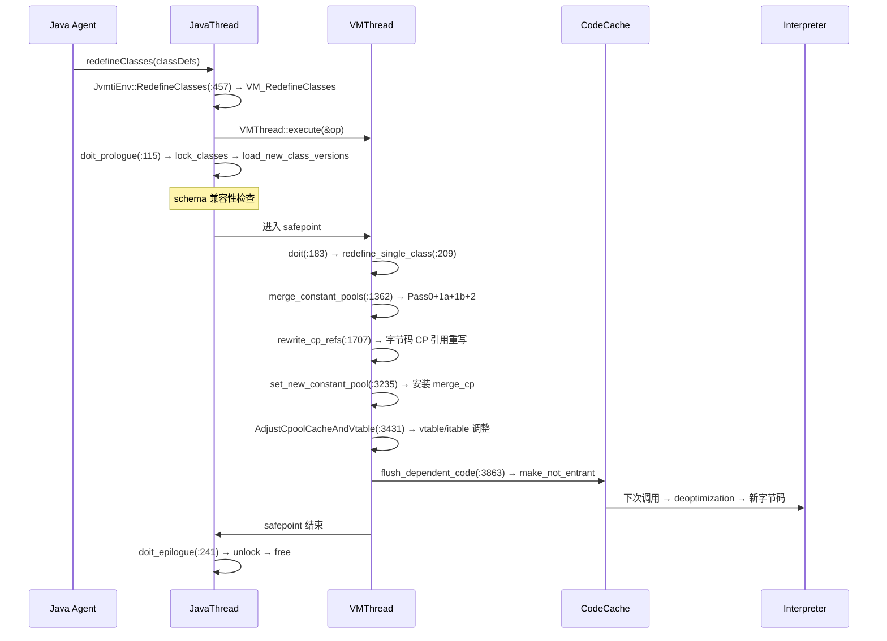

# 04-Redefine-Classes — VM_RedefineClasses 类重定义全链路

> **阶段**：[18-agent-instrument]
> **前置**：[01-Agent-Loading]（capability 设置 Can-Redefine-Classes）、[02-ClassFileLoadHook]（CFLH 管道 + JvmtiCachedClassFileData 缓存）、[03-Attach-API]（agentmain 触发 redefine）
> **配套**：[05-JVMTI-Core]（JvmtiEnv 完整 API）
> **后续依赖本文**：[05-JVMTI-Core]（RetransformClasses 复用 VM_RedefineClasses）
> **阅读收益**：追踪 redefineClasses 从 JVMTI 入口到 vtable/itable 调整 + JIT 刷除的完整 3 阶段 VM Operation 流程——理解 doit_prologue/doit/doit_epilogue 三阶段模型、merge_constant_pools 的 old_cp 保留 + scratch_cp 追加算法、AdjustCpoolCacheAndVtable KlassClosure 全局遍历调整、flush_dependent_code 的 make_not_entrant 延迟删除机制、Retransform 复用 Redefine 的 _class_load_kind 分派设计

---

## §〇 生产场景 — "class redefinition failed: attempted to change the schema"

**症状**：使用 `Instrumentation.redefineClasses()` 修改类后，方法行为与预期不符或直接抛出异常：

```
java.lang.UnsupportedOperationException: class redefinition failed:
  attempted to change the schema (add/remove fields or methods)
```

**根因分析**：类重定义经过 6 个阶段：

1. **JVMTI 入口** (`jvmtiEnv.cpp:457`): `JvmtiEnv::RedefineClasses()` 创建 `VM_RedefineClasses` VM Operation，`_class_load_kind = jvmti_class_load_kind_redefine`
2. **doit_prologue** (`jvmtiRedefineClasses.cpp:115`): JavaThread 中锁类、加载新字节码、schema 兼容性检查
3. **doit** (`jvmtiRedefineClasses.cpp:183`): VMThread safepoint 中合并 CP、安装新类、调整 vtable、刷 JIT
4. **merge_constant_pools** (`jvmtiRedefineClasses.cpp:1362`): old_cp 保留索引 + scratch_cp 追加 + index_map
5. **AdjustCpoolCacheAndVtable** (`jvmtiRedefineClasses.cpp:3431`): 遍历所有类更新 vtable/itable
6. **doit_epilogue** (`jvmtiRedefineClasses.cpp:241`): 解锁、释放临时内存

**三步诊断**：

```bash
# 1. 确认 redefine 是否被 JVMTI 接受
java -Xlog:redefine+class*=trace -javaagent:agent.jar -version 2>&1 | grep "redefine"
# 期望: [redefine] redefine_single_class: class=com/example/Foo

# 2. 检查 safepoint（redefine 需要全局暂停）
jcmd <pid> VM.safepoint

# 3. GDB 断点验证
gdb -ex "break jvmtiRedefineClasses.cpp:115" \
    -ex "break jvmtiRedefineClasses.cpp:183" \
    -ex "break jvmtiRedefineClasses.cpp:1362" \
    -ex "run" --args java -javaagent:agent.jar com.example.Main
```

> **反事实**：如果 redefine 不通过 VM Operation safepoint 而是直接修改 Klass → 其他线程可能正在执行旧方法体的中间 → 修改 vtable 时产生竞态 → 线程跳转到垃圾地址 → SIGSEGV。Safepoint 保证了全局一致性。

---

## §一 redefine 全链路源码走读

> Reader completed 01-Agent-Loading（JPLISAgent, capability 设置），02-ClassFileLoadHook（CFLH 管道, cached_class_file），03-Attach-API（agentmain 触发 redefine）。This doc: how redefineClasses transforms from a Java API call to a VM-wide safepoint operation.

### 1.1 JVMTI 入口 — RedefineClasses + RetransformClasses

```cpp
// jvmtiEnv.cpp:457-462
jvmtiError JvmtiEnv::RedefineClasses(jint class_count,
    const jvmtiClassDefinition* class_definitions) {
  VM_RedefineClasses op(class_count, class_definitions,
                         jvmti_class_load_kind_redefine);
  VMThread::execute(&op);
  return op.check_error();
}

// jvmtiEnv.cpp:393-451
jvmtiError JvmtiEnv::RetransformClasses(jint class_count,
    const jclass* classes) {
  VM_RedefineClasses op(class_count, class_definitions,
                         jvmti_class_load_kind_retransform);
  VMThread::execute(&op);
  return op.check_error();
}
```

关键区别：两者都创建 `VM_RedefineClasses`，仅 `_class_load_kind` 不同——redefine 使用 `jvmti_class_load_kind_redefine`，retransform 使用 `jvmti_class_load_kind_retransform`。`VM_RetransformClasses` 不存在为独立类。

### 1.2 doit_prologue — JavaThread 中锁类+加载+比较

```cpp
// jvmtiRedefineClasses.cpp:115-181
bool VM_RedefineClasses::doit_prologue() {
  // 参数校验 (:116-136): NULL 检查, class_byte_count 检查
  // 可修改性检查 (:141): is_modifiable_class(mirror)
  lock_classes();  // :153 — 设置 is_being_redefined 标志
  _res = load_new_class_versions(Thread::current());  // :156
  // 失败 → 清理已加载的 scratch_classes → unlock_classes → return false
  return true;
}
```

prologue 在 JavaThread 中执行，可以访问 Java heap、创建 Handle、解析字节码。如果失败（schema 不兼容、ClassFormatError 等），返回 false → VMThread 取消 doit 执行 → epilogue 清理锁。

### 1.3 doit — VMThread safepoint 中的核心操作

```cpp
// jvmtiRedefineClasses.cpp:183-239
void VM_RedefineClasses::doit() {
  MetadataOnStackMark md_on_stack(true);  // :204 — 保护栈上旧方法不被清理
  for (int i = 0; i < _class_count; i++) {
    redefine_single_class(_class_defs[i].klass, _scratch_classes[i], thread);  // :209
  }
  MethodDataCleaner clean_weak_method_links;  // :215
  ClassLoaderDataGraph::classes_do(&clean_weak_method_links);
  if (_any_class_has_resolved_methods) {
    ResolvedMethodTable::adjust_method_entries(&trace_name_printed);  // :221
  }
  JvmtiExport::set_has_redefined_a_class();  // :226
  CheckClass check_class(thread);  // :234 — 验证最终一致性
  ClassLoaderDataGraph::classes_do(&check_class);
}
```

`redefine_single_class` 内部依次执行：merge_constant_pools → rewrite_cp_refs → set_new_constant_pool → AdjustCpoolCacheAndVtable → flush_dependent_code → update_jmethod_ids。

### 1.4 merge_constant_pools — CP 合并算法

```cpp
// jvmtiRedefineClasses.cpp:1362-1450+
bool VM_RedefineClasses::merge_constant_pools(
    const constantPoolHandle& old_cp, const constantPoolHandle& scratch_cp,
    constantPoolHandle *merge_cp_p, int *merge_cp_length_p, TRAPS) {
  // Pass 0 (:1386-1430): 复制 old_cp 到 merge_cp（保持索引不变）
  for (old_i = 1; old_i < old_cp->length(); old_i++) {
    ConstantPool::copy_entry_to(old_cp, old_i, *merge_cp_p, old_i, CHECK_0);
  }
  // Pass 1a (:1438-1450): 去重 — 同索引位置相同内容的条目不重复追加
  // Pass 1b: scratch_cp 中不在 old_cp 范围的条目追加到 merge_cp 末尾
  // Pass 2: 构建 index_map[scratch_cp_index] → merge_cp_index
}
```

算法复杂度 O(n²)，但 CP 通常 < 1000 条目。关键约束：(1) old_cp 索引必须保持不变，(2) 重复条目去重，(3) 新条目追加到末尾。

### 1.5 AdjustCpoolCacheAndVtable — 全局 vtable/itable 调整

`AdjustCpoolCacheAndVtable::do_klass` (`jvmtiRedefineClasses.cpp:3431`) 是 KlassClosure，遍历所有已加载类：
- `k->vtable().adjust_method_entries()` — 将旧方法指针替换为新方法指针
- `k->itable().adjust_method_entries()` — 同上，针对接口方法表
- 旧方法被删除 → entry 指向 AbstractMethodError 默认实现

### 1.6 flush_dependent_code — JIT 代码刷除

```cpp
// jvmtiRedefineClasses.cpp:3863 — 核心逻辑
// 遍历所有旧方法，调用 CodeCache::mark_for_deoptimization
// 调用 nmethod::make_not_entrant() — 入口点设为 deoptimization 桩
// 不立即删除 — 正在执行的线程可以完成当前执行
// Sweeper 线程后续异步回收 nmethod 内存
```

### 1.7 doit_epilogue — 清理

```cpp
// jvmtiRedefineClasses.cpp:241-264
void VM_RedefineClasses::doit_epilogue() {
  unlock_classes();     // :242 — 清除 is_being_redefined 标志
  os::free(_scratch_classes);  // :245 — 释放临时数组
  _the_class = NULL;    // :248
}
```

### 1.8 Mermaid: redefine 时序图



### 1.9 面试 Story Format 答案

"When you call `Instrumentation.redefineClasses(classDefs)`, `JvmtiEnv::RedefineClasses` at jvmtiEnv.cpp:457 creates a `VM_RedefineClasses` VM Operation with `_class_load_kind=jvmti_class_load_kind_redefine`. The three-phase lifecycle begins: `doit_prologue` at jvmtiRedefineClasses.cpp:115 runs on the calling JavaThread—locking each class via `set_is_being_redefined`, loading new bytecodes through `ClassFileParser`, and validating schema compatibility. If any class fails validation, the operation is cancelled and locks released. On success, the VMThread brings all Java threads to a safepoint and executes `doit` at :183. Inside `redefine_single_class`, `merge_constant_pools` at :1362 preserves old_cp indices for existing references while appending scratch_cp entries to a merged constant pool. `AdjustCpoolCacheAndVtable` at :3431 is a KlassClosure that visits every loaded class to update vtable and itable entries pointing to old methods. `flush_dependent_code` at :3863 sweeps the CodeCache—calling `nmethod::make_not_entrant()` to set deoptimization stubs at all old method entry points. The crucial insight: `VM_RetransformClasses` doesn't exist—`RetransformClasses` reuses the same `VM_RedefineClasses` with `_class_load_kind=jvmti_class_load_kind_retransform`, which triggers the CFLH pipeline in `load_new_class_versions` instead of using externally provided bytes."

---

## §二 Beginner Callout 框

> **1. VM_Operation 三阶段模型**: `doit_prologue()` 在 JavaThread 中执行（可访问 Java heap、可抛异常），`doit()` 在 VMThread safepoint 中执行（无并发、不可抛异常），`doit_epilogue()` 回到 JavaThread 清理。RedefineClasses 利用这个模型：prologue 做 I/O 密集工作（加载类文件），doit 做需要全局一致性的工作（修改 Klass 元数据）。Source: `vmOperations.hpp`.

> **2. Schema 兼容性检查**: redefine 不允许"schema 变更"——不能新增/删除字段、不能修改方法签名、不能修改继承关系。检查在 `compare_and_normalize_class_versions` (`jvmtiRedefineClasses.cpp:775`) 中逐个对比字段表和方法表。旧对象的内存布局必须保持不变。Retransform 无此限制（字节码来自 CFLH，只修改方法体）。

> **3. Constant Pool 合并算法**: `merge_constant_pools` (`jvmtiRedefineClasses.cpp:1362`) 分 3 轮：(Pass 0) 复制 old_cp → merge_cp 保持索引，(Pass 1a/1b) 去重 + 追加 scratch_cp 新条目，(Pass 2) 构建 index_map。关键约束：old_cp 索引不变（现有代码引用），新条目追加末尾。CP 索引是 u2 (16-bit)，65535 硬上限。

> **4. Vtable/Itable 调整**: `AdjustCpoolCacheAndVtable::do_klass` (`jvmtiRedefineClasses.cpp:3431`) 是 KlassClosure，遍历所有已加载类。调用 `k->vtable().adjust_method_entries()` 将旧方法指针替换为新方法指针。如果新版本删除了方法 → entry 指向 AbstractMethodError 默认实现。

> **5. JIT 代码刷除**: `flush_dependent_code` (`jvmtiRedefineClasses.cpp:3863`) 调用 `nmethod::make_not_entrant()`——设置入口点为 deoptimization 桩。不是立即删除——活跃线程可以完成当前执行，新调用走 deoptimization → 解释器使用新字节码。Sweeper 异步回收。

> **6. jmethodID 稳定性**: JNI 规范要求 jmethodID 在类重定义后保持稳定。`update_jmethod_ids` (`jvmtiRedefineClasses.cpp:3555`) 通过 name+signature 匹配将旧 jmethodID 映射到新方法。删除的方法 → jmethodID 标记为已废弃，返回 NoSuchMethodError。

> **7. Retransform 复用 Redefine**: `JvmtiEnv::RetransformClasses` (`jvmtiEnv.cpp:393`) 设置 `_class_load_kind=jvmti_class_load_kind_retransform`，复用同一个 `VM_RedefineClasses`。差异仅在 `load_new_class_versions` 中——retransform 通过 CFLH 管道获取新字节码，而非外部提供。

---

## §三 redefine 性能剖析

| 阶段 | 操作 | 典型耗时 |
|------|------|---------|
| doit_prologue | Schema 检查 + 字节码解析 | ~500µs/class |
| merge_constant_pools | Pass 0+1a+1b+2 | ~100µs/class (1000 条目 CP) |
| AdjustCpoolCacheAndVtable | 遍历所有类调整 vtable | ~1ms (1000 类) |
| flush_dependent_code | 标记 nmethod not_entrant | ~100µs-10ms |
| Safepoint 总时间 | 取决于类数量和依赖 | 1-50ms |

---

## §四 GDB 断点验证 — 8 断点

```
断言 1: RedefineClasses 入口 (jvmtiEnv.cpp:457)
  (gdb) break jvmtiEnv.cpp:457
  (gdb) print class_count → 期望: >0

断言 2: doit_prologue (jvmtiRedefineClasses.cpp:115)
  (gdb) break jvmtiRedefineClasses.cpp:115
  (gdb) print _class_load_kind → 期望: 1 (redefine) 或 2 (retransform)

断言 3: doit safepoint (jvmtiRedefineClasses.cpp:183)
  (gdb) break jvmtiRedefineClasses.cpp:183
  (gdb) print SafepointSynchronize::is_at_safepoint() → 期望: true

断言 4: merge_constant_pools (jvmtiRedefineClasses.cpp:1362)
  (gdb) break jvmtiRedefineClasses.cpp:1362
  (gdb) print old_cp->length() → 期望: 原 CP 条目数

断言 5: AdjustCpoolCacheAndVtable (jvmtiRedefineClasses.cpp:3431)
  (gdb) break jvmtiRedefineClasses.cpp:3431
  (gdb) print k->vtable().length() → 期望: vtable 条目数

断言 6: flush_dependent_code (jvmtiRedefineClasses.cpp:3863)
  (gdb) break jvmtiRedefineClasses.cpp:3863
  (gdb) print old_methods->length() → 期望: 旧方法数

断言 7: doit_epilogue (jvmtiRedefineClasses.cpp:241)
  (gdb) break jvmtiRedefineClasses.cpp:241
  (gdb) print _the_class->is_being_redefined() → 期望: false

断言 8: RetransformClasses (jvmtiEnv.cpp:393)
  (gdb) break jvmtiEnv.cpp:393
  (gdb) print _class_load_kind → 期望: 2 (retransform)
```

---

## §五 Cross-Reference

| 相关文档 | 关系 | 具体关联点 |
|---------|------|-----------|
| **01-Agent-Loading** | 前置 | capability 设置 Can-Redefine-Classes |
| **02-ClassFileLoadHook** | 前置 | CFLH 管道 + JvmtiCachedClassFileData 缓存 |
| **03-Attach-API** | 前置 | agentmain 触发 redefine/retransform |
| **05-JVMTI-Core** | 配套 | JvmtiEnv 完整 API |

---

## §六 Writing Requirements（"不要写成→应该写成"对照表）

| 不要写成 | 应该写成 |
|---------|---------|
| "redefineClasses replaces class bytes" | "JvmtiEnv::RedefineClasses at jvmtiEnv.cpp:457 creates VM_RedefineClasses with _class_load_kind=jvmti_class_load_kind_redefine, submits to VMThread::execute() — three phases across two threads" |
| "CP merging combines old and new constant pools" | "merge_constant_pools at jvmtiRedefineClasses.cpp:1362 preserves old_cp indices (for existing references), appends scratch_cp entries to merge_cp, and builds index_map[scratch_cp_index]→merge_cp_index" |
| "vtable entries are updated after redefine" | "AdjustCpoolCacheAndVtable::do_klass at jvmtiRedefineClasses.cpp:3431 visits every loaded class, calling k->vtable().adjust_method_entries() and k->itable().adjust_method_entries()" |
| "JIT code is invalidated after redefine" | "flush_dependent_code at jvmtiRedefineClasses.cpp:3863 calls nmethod::make_not_entrant — setting entry points to deoptimization stubs, not immediately freeing the nmethod" |
| "Retransform uses the same VM operation" | "JvmtiEnv::RetransformClasses at jvmtiEnv.cpp:393 creates the same VM_RedefineClasses with _class_load_kind=jvmti_class_load_kind_retransform — triggering CFLH pipeline instead of external bytes" |
