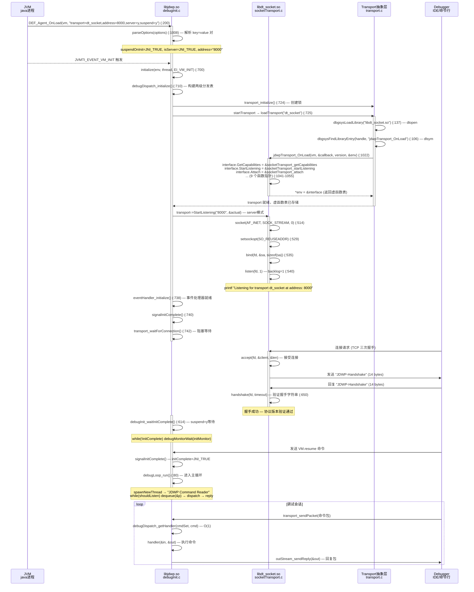

# 06-JDWP-Transport-Init — JDWP Transport 初始化与主循环启动

> **阶段**：[18-agent-instrument]
> **前置**：[01-Agent-Loading]（Agent_OnLoad 入口与 JVMTI 环境获取）、[03-Attach-API]（Unix Domain Socket 通信机制对比）
> **配套**：[05-JVMTI-Capabilities]（JVMTI 能力协商）、[07-JDWP-Commands]（17 CommandSet 命令处理与事件系统）
> **后续依赖本文**：[07-JDWP-Commands]（debugDispatch 两级分发表的具体 CommandSet 实现）
> **阅读收益**：追踪 JDWP agent 从 `-agentlib:jdwp=transport=dt_socket,address=8000,server=y,suspend=y` 到主循环入口的完整 7 步启动链——理解 parseOptions 参数解析、transport_initialize 的 dlopen 可插拔机制、socketTransport_startListening 的 TCP socket 创建（socket+bind+listen）、JDWP-Handshake 协议握手、suspend=y 的 polling 等待循环、debugLoop_run 的 queue-based 主循环、debugDispatch 的 O(1) 两级命令分发表；掌握 "TRANSPORT_INIT(510)" 错误的完整诊断路径。

---

## §〇 生产场景 — "JDWP Transport dt_socket failed to initialize" 错误诊断

**症状**：使用 `-agentlib:jdwp=transport=dt_socket,address=8000,server=y,suspend=y` 启动 Java 应用后，调试器无法连接，应用一直挂起在 `Listening for transport dt_socket at address: 8000`。

```bash
$ java -agentlib:jdwp=transport=dt_socket,address=8000,server=y,suspend=y -jar app.jar
Listening for transport dt_socket at address: 8000
# 应用挂起，等待调试器连接...
```

或者在 client 模式下连接失败：

```bash
$ java -agentlib:jdwp=transport=dt_socket,address=localhost:8000,server=n -jar app.jar
ERROR: transport error 202: connect failed: Connection refused
ERROR: JDWP Transport dt_socket failed to initialize, TRANSPORT_INIT(510)
JDWP exit error AGENT_ERROR_TRANSPORT_INIT(197): No transports initialized [debugInit.c:1203]
```

**根因分析**：JDWP 启动经过 3 个阶段：

1. **参数解析** (`debugInit.c:1008`): parseOptions 解析 `transport=dt_socket,address=8000,server=y,suspend=y` → 提取 key=value 对并填充到全局 gdata 结构
2. **Transport 初始化** (`transport.c:382`): transport_initialize 创建锁，然后 loadTransport 通过 `dbgsysLoadLibrary` (dlopen) 加载 `libdt_socket.so` → `dbgsysFindLibraryEntry` (dlsym) 查找 `jdwpTransport_OnLoad` → 调用 OnLoad 注册虚函数表
3. **连接建立** (`debugInit.c:720-742`): server 模式 `socketTransport_startListening` → `socket()` + `bind()` + `listen()`；client 模式 `socketTransport_attach` → `connect()` + JDWP-Handshake

崩溃最常见于第 2/3 步——transport 库找不到或端口被占用。

**三步诊断**：

```bash
# 1. 确认 JDWP agent 是否加载
java -Xlog:jdwp=info -agentlib:jdwp=transport=dt_socket,address=8000,server=y -version 2>&1 | grep -E "jdwp|transport"

# 2. 检查端口是否被占用
ss -tlnp | grep 8000

# 3. GDB 断点验证 JDWP 启动
gdb -ex "break debugInit.c:200" \
    -ex "break transport.c:382" \
    -ex "break socketTransport.c:495" \
    -ex "run" \
    -ex "print options" \
    --args java -agentlib:jdwp=transport=dt_socket,address=8000,server=y app.jar
```

**反事实**：如果 JDWP 没有 suspend=y 选项 → 调试器无法在应用启动前设置断点 → 启动阶段的代码无法调试 → 需要 "启动后暂停等待调试器" 的机制。suspend=y 利用了 JVMTI VMStart 事件——在 VMStart 回调中调用 `debugInit_waitInitComplete`，循环等待直到调试器连接并发送 VM.resume 命令。如果 JDWP 使用与 Attach API 相同的 Unix Domain Socket → JDWP 需要跨机器调试 → 必须 TCP/IP。Attach API 只需要本地通信 → Unix Domain Socket 更快且内核级 SO_PEERCRED 安全验证。两者选择不同 transport 是因为使用场景不同：JDWP 是远程调试协议，Attach 是本地管理。

---

## §一 JDWP 初始化全链路源码走读

### 1.1 DEF_Agent_OnLoad — JDWP 初始化入口 (`debugInit.c:200`)

因为 JDWP 是一个 JVMTI agent（而非 JNI agent），所以 JVM 加载 `libjdwp.so` 后调用 `Agent_OnLoad(JavaVM *vm, char *options, void *reserved)` 而非 `JNI_OnLoad`。宏 `DEF_Agent_OnLoad` 展开为此函数，入口在 `debugInit.c:200`。

**完整初始化序列**：

```c
// debugInit.c:200-383 — DEF_Agent_OnLoad 的完整 8 步序列
JNIEXPORT jint JNICALL
DEF_Agent_OnLoad(JavaVM *vm, char *options, void *reserved)
{
    // ① 防重复加载检查 (:211-214)
    if ( gdata!=NULL && gdata->isLoaded==JNI_TRUE ) {
        ERROR_MESSAGE(("Cannot load this JVM TI agent twice..."));
        return JNI_ERR;
    }

    // ② 分配全局数据结构 (:223-228)
    gdata = get_gdata();
    gdata->jvm = vm;
    gdata->isLoaded = JNI_TRUE;

    // ③ 获取 JVMTI 环境 (:236-244)
    error = JVM_FUNC_PTR(vm,GetEnv)(vm, (void **)&(gdata->jvmti), JVMTI_VERSION_1);

    // ④ 检查 JVMTI 版本兼容性 (:257-271)
    if ( !compatible_versions(jvmtiMajorVersion(), ...) ) {
        forceExit(1);
    }

    // ⑤ 解析 options 参数 (:274-278) — 详见 §1.2
    if (!parseOptions(options)) { forceExit(1); }

    // ⑥ 请求 JVMTI 能力 (:284-348) — can_suspend, can_generate_breakpoint_events 等
    error = JVMTI_FUNC_PTR(gdata->jvmti,GetPotentialCapabilities)(...);
    error = JVMTI_FUNC_PTR(gdata->jvmti,AddCapabilities)(...);

    // ⑦ 设置 JVMTI 事件回调 (:369-380)
    gdata->callbacks.VMInit  = &cbEarlyVMInit;
    gdata->callbacks.VMDeath = &cbEarlyVMDeath;
    gdata->callbacks.Exception = &cbEarlyException;
    error = JVMTI_FUNC_PTR(gdata->jvmti,SetEventCallbacks)(...);

    // ⑧ 返回 JNI_OK (:383)
    LOG_MISC(("Onload: DONE"));
    return JNI_OK;
}
```

**关键设计**：为什么 `transport_initialize` 必须在 `eventHandler_initialize` 之前？因为 `eventHandler_initialize` 注册的 JVMTI 事件回调（如 VMStart）会立即触发——VMStart 在 JVMTI 启动后很快发生。如果 transport 尚未初始化 → 事件回调无法通过 transport 发送事件包 → 调试器收不到事件通知。源码验证：`debugInit.c:738` 中 `eventHandler_initialize` 在 transport 设置完成之后才调用。

### 1.2 parseOptions — 参数解析 (`debugInit.c:1008`)

因为 JDWP 的 `options` 字符串是逗号分隔的 key=value 对（如 `"transport=dt_socket,address=8000,server=y,suspend=y"`），所以需要逐个解析。`parseOptions` 从 `debugInit.c:1008` 开始，核心逻辑：

```c
// debugInit.c:1008-1243 — parseOptions 解析循环
static jboolean parseOptions(char *options)
{
    TransportSpec *currentTransport = NULL;
    char *end; char *current; int length; char *str;

    // 设置默认值 (:1018-1021)
    gdata->assertOn     = DEFAULT_ASSERT_ON;
    gdata->assertFatal  = DEFAULT_ASSERT_FATAL;

    // 检查 "help" (:1028-1032)
    if ((strcmp(options, "help")) == 0) {
        printUsage();
        forceExit(0);
    }

    // 解析 key=value 对 (:1208-1242)
    if ( strcmp(buf, "suspend")==0 ) {
        if ( !get_boolean(&str, &suspendOnInit) ) goto syntax_error;
    } else if ( strcmp(buf, "server")==0 ) {
        if ( !get_boolean(&str, &isServer) ) goto syntax_error;
    }
    // ... transport=, address=, launch=, onthrow=, onuncaught=, timeout=, quiet=, mutf8=
}
```

每个 option 名称通过 `strcmp` 精确匹配，布尔值通过 `get_boolean` 解析为 JNI_TRUE/JNI_FALSE，transport 名称存储为字符串以便后续 dlopen。

### 1.3 initialize — Phase 2 完整初始化 (`debugInit.c:700`)

因为 `DEF_Agent_OnLoad` 只完成最小化初始化（JVMTI 环境 + 参数解析 + 事件回调注册），所以真正的完整初始化在 JVMTI VMInit 事件触发时由 `initialize()` 执行。这是 Phase 2：

```c
// debugInit.c:700-742 — initialize() 的核心序列
// ① 基础模块初始化 (:705-712)
commonRef_initialize();
util_initialize(env);
threadControl_initialize();
stepControl_initialize();
invoker_initialize();
debugDispatch_initialize();   // 构建两级分发表
classTrack_initialize(env);
debugLoop_initialize();

// ② Transport 初始化 (:720-726)
transport_initialize();  // 创建锁
(void)bagEnumerateOver(transports, startTransport, &arg);

// ③ 错误检查 (:732-736) — 如果没有任何 transport 成功启动
if ((arg.error != JDWP_ERROR(NONE)) &&
    (arg.startCount == 0) && initOnStartup) {
    EXIT_ERROR(map2jvmtiError(arg.error), "No transports initialized");
}

// ④ 事件处理初始化 (:738-740)
eventHandler_initialize(currentSessionID);
signalInitComplete();

// ⑤ 等待调试器连接 (:742)
transport_waitForConnection();
```

**关键时序**：`debugDispatch_initialize` (`debugDispatch.c:50`) 必须在 `transport_initialize` 之前调用，因为 transport 建立连接后立即进入 `debugLoop_run` → 需要 dispatch 表已经就绪来处理接收到的命令。而 `eventHandler_initialize` 在 transport 就绪后调用，确保事件包可以通过 transport 发送。

### 1.4 transport_initialize + loadTransport — dlopen 可插拔链 (`transport.c:382`)

因为 JDWP 规范定义 transport 为可替换组件——支持 dt_socket (TCP)、dt_shmem (Windows 共享内存)、以及自定义 transport（如 SSL），所以 transport 通过 dlopen 动态加载而非静态链接。

```c
// transport.c:382-387 — transport_initialize 创建锁
void transport_initialize(void)
{
    transport = NULL;
    listenerLock = debugMonitorCreate("JDWP Transport Listener Monitor");
    sendLock = debugMonitorCreate("JDWP Transport Send Monitor");
}
```

实际的 transport 库加载由 `loadTransport` (`transport.c:149`) 完成：

```c
// transport.c:149-206 — loadTransport 的 dlopen 链
static jdwpError loadTransport(const char *name, TransportInfo *info)
{
    void *handle;

    // Step 1: 从 sun.boot.library.path 加载 (:173-178)
    libdir = gdata->property_sun_boot_library_path;
    handle = loadTransportLibrary(libdir, name);

    // Step 2: 如果第一步失败，从系统默认路径加载 (:192)
    if (handle == NULL) {
        handle = loadTransportLibrary("", name);
    }

    // Step 3: 查找 jdwpTransport_OnLoad 符号 (:202-206)
    onLoad = findTransportOnLoad(handle);  // dlsym("jdwpTransport_OnLoad")

    // Step 4: 调用 OnLoad，尝试版本 1.1 → 回退 1.0 (:221-227)
    for (i = 0; i < sizeof(supported_versions)/sizeof(jint); ++i) {
        rc = (*onLoad)(jvm, &callback, supported_versions[i], &t);
        if (rc != JNI_EVERSION) { info->transportVersion = supported_versions[i]; break; }
    }
}
```

`loadTransportLibrary` (`transport.c:112`) 内部调用 `dbgsysBuildLibName` 构造完整库名（如 `libdt_socket.so`），然后 `dbgsysLoadLibrary` (Linux 上即 dlopen)。

**两步查找策略的原因**：`sun.boot.library.path` 首先查找——这是 JDK 自带的 dt_socket/dt_shmem 的安装位置。如果未找到，回退到系统默认路径（通过 dlopen 的默认搜索机制）——这允许用户安装自定义 transport 到 `LD_LIBRARY_PATH`。

### 1.5 jdwpTransport_OnLoad — Transport 虚函数表注册 (`socketTransport.c:1022`)

因为每个 transport 实现需要向 JDWP 提供一组标准化的接口函数，所以 `jdwpTransport_OnLoad` 填充 `jdwpTransportNativeInterface_` 函数表。

```c
// socketTransport.c:1022-1055 — jdwpTransport_OnLoad 注册虚函数表
JNIEXPORT jint JNICALL
jdwpTransport_OnLoad(JavaVM *vm, jdwpTransportCallback* cbTablePtr,
                     jint version, jdwpTransportEnv** env)
{
    if (version < JDWPTRANSPORT_VERSION_1_0 ||
        version > JDWPTRANSPORT_VERSION_1_1) {
        return JNI_EVERSION;
    }
    if (initialized) {
        return JNI_EEXIST;  // 不支持多环境
    }
    initialized = JNI_TRUE;
    jvm = vm;
    callback = cbTablePtr;

    // 填充虚函数表 (:1041-1055)
    interface.GetCapabilities    = &socketTransport_getCapabilities;
    interface.Attach             = &socketTransport_attach;
    interface.StartListening     = &socketTransport_startListening;
    interface.StopListening      = &socketTransport_stopListening;
    interface.Accept             = &socketTransport_accept;
    interface.IsOpen             = &socketTransport_isOpen;
    interface.Close              = &socketTransport_close;
    interface.ReadPacket         = &socketTransport_readPacket;
    interface.WritePacket        = &socketTransport_writePacket;
    interface.GetLastError       = &socketTransport_getLastError;
    interface.SetTransportConfiguration = &socketTransport_setTransportConfiguration;

    *env = &interface;  // 返回虚函数表指针
    return JNI_OK;
}
```

**防重复加载设计**：`initialized` 静态变量确保 `jdwpTransport_OnLoad` 不会被调用两次。这在 `-agentlib:jdwp` 多次出现在命令行时提供保护。

### 1.6 socketTransport_startListening — Server 模式 TCP 监听 (`socketTransport.c:495`)

因为 JDWP server 模式需要创建一个 TCP 监听 socket 等待调试器连接，所以 `socketTransport_startListening` 执行标准的 socket-bind-listen 序列：

```c
// socketTransport.c:495-562 — startListening server 模式
static jdwpTransportError JNICALL
socketTransport_startListening(jdwpTransportEnv* env, const char* address,
                               char** actualAddress)
{
    struct sockaddr_in sa;
    memset((void *)&sa, 0, sizeof(struct sockaddr_in));
    sa.sin_family = AF_INET;

    // ① 解析地址 (parseAddress → getaddrinfo) (:509)
    err = parseAddress(address, &sa);

    // ② 创建 TCP socket (man 2 socket) (:514)
    serverSocketFD = dbgsysSocket(AF_INET, SOCK_STREAM, 0);

    // ③ 设置 socket 选项 — TCP_NODELAY (:519-522)
    err = setOptionsCommon(serverSocketFD);

    // ④ SO_REUSEADDR 允许端口重用 (man 7 socket) (:529-533)
    if (sa.sin_port != 0) {
        err = setReuseAddrOption(serverSocketFD);
    }

    // ⑤ bind 绑定端口 (man 2 bind) (:535)
    err = dbgsysBind(serverSocketFD, (struct sockaddr *)&sa, sizeof(sa));

    // ⑥ listen backlog=1 (man 2 listen) (:540)
    err = dbgsysListen(serverSocketFD, 1);

    // ⑦ 获取实际端口号 (用于 "0" 端口自动分配场景) (:545-558)
    err = dbgsysGetSocketName(serverSocketFD, (struct sockaddr *)&sa, &len);
    portNum = dbgsysNetworkToHostShort(sa.sin_port);
    sprintf(buf, "%d", portNum);

    return JDWPTRANSPORT_ERROR_NONE;
}
```

**为什么 backlog=1**：JDWP 设计为单调试器连接——不接受多个调试器同时调试同一进程。`dbgsysListen(serverSocketFD, 1)` 拒绝了多余连接，简化了并发模型。如果允许多连接，需要额外的路由逻辑来判断哪个调试器的命令应该被处理。

### 1.7 socketTransport_attach — Client 模式连接 (`socketTransport.c:690`)

因为 JDWP client 模式需要主动连接到已运行的调试器，所以 `socketTransport_attach` 执行 connect + handshake 序列：

```c
// socketTransport.c:690-748 — attach client 模式
static jdwpTransportError JNICALL
socketTransport_attach(jdwpTransportEnv* env, const char* addressString,
                       jlong attachTimeout, jlong handshakeTimeout)
{
    struct sockaddr_in sa;

    // ① 解析地址 (:700)
    err = parseAddress(addressString, &sa);

    // ② 创建 socket (:705)
    socketFD = dbgsysSocket(AF_INET, SOCK_STREAM, 0);

    // ③ 设置选项 (:710-713)
    err = setOptionsCommon(socketFD);

    // ④ 非阻塞 connect（如果设置了超时）(man 2 connect) (:725-727)
    if (attachTimeout > 0) {
        dbgsysConfigureBlocking(socketFD, JNI_FALSE);
    }

    // ⑤ 连接 + 超时处理 (:729-741)
    err = dbgsysConnect(socketFD, (struct sockaddr *)&sa, sizeof(sa));
    if (err == DBG_EINPROGRESS && attachTimeout > 0) {
        err = dbgsysFinishConnect(socketFD, (long)attachTimeout);
    }

    // ⑥ 恢复阻塞模式 (:743-745)
    if (attachTimeout > 0) {
        dbgsysConfigureBlocking(socketFD, JNI_TRUE);
    }

    // ⑦ JDWP-Handshake (:747)
    err = handshake(socketFD, handshakeTimeout);
}
```

**非阻塞 connect 的意义**：`connect()` 默认阻塞直到 TCP 三次握手完成——如果调试器未运行，这会永久阻塞。通过将 socket 设为非阻塞 → `connect()` 立即返回 `EINPROGRESS` → `dbgsysFinishConnect` 使用 `poll()` 等待指定超时 → 超时则返回 `JDWPTRANSPORT_ERROR_TIMEOUT`。

### 1.8 JDWP-Handshake — 协议握手 (`socketTransport.c:173`)

因为 JDWP 需要在传输层之上验证对端确实实现了 JDWP 协议（而非任意 TCP 连接），所以在连接建立后双方交换 14 字节的 ASCII 字符串：

```c
// socketTransport.c:173-225 — handshake 函数
static jdwpTransportError handshake(int fd, jlong timeout) {
    const char *hello = "JDWP-Handshake";
    char b[16];
    int rv, helloLen, received;

    // 非阻塞模式（如果设置了超时）(:178-180)
    if (timeout > 0) {
        dbgsysConfigureBlocking(fd, JNI_FALSE);
    }

    // ① 发送 "JDWP-Handshake" (14 字节) — 在 accept/connect 调用方
    // ② 接收对方发送的 "JDWP-Handshake"
    helloLen = (int)strlen(hello);  // = 14
    received = 0;
    while (received < helloLen) {
        int n;
        char *buf;
        if (timeout > 0) {
            rv = dbgsysPoll(fd, JNI_TRUE, JNI_FALSE, (long)timeout);
            if (rv <= 0) {
                setLastError(0, "timeout during handshake");
                return JDWPTRANSPORT_ERROR_IO_ERROR;
            }
        }
        buf = b;
        buf += received;
        n = recv_fully(fd, buf, helloLen-received);
        if (n == 0) {
            setLastError(0, "handshake failed - connection prematurally closed");
            return JDWPTRANSPORT_ERROR_IO_ERROR;
        }
        received += n;
    }

    // ③ 验证收到的字符串 (:210-225)
    if (strncmp(b, hello, helloLen) != 0) {
        setLastError(0, "handshake failed - unrecognized message");
        return JDWPTRANSPORT_ERROR_IO_ERROR;
    }
}
```

**握手发生在 accept 端**：`socketTransport_accept` (`socketTransport.c:650`) 在 accept() 后调用 `handshake(socketFD, handshakeTimeout)`。**握手也发生在 attach 端**：`socketTransport_attach` (`socketTransport.c:747`) 在 connect() 后同样调用 handshake。因此双方都发送并验证 "JDWP-Handshake"。

### 1.9 debugInit_waitInitComplete — suspend=y 实现 (`debugInit.c:614`)

因为 `suspend=y` 选项要求 JVM 在调试器连接前暂停应用，所以 JDWP 使用 polling-based 等待循环：

```c
// debugInit.c:614-621 — waitInitComplete polling 循环
void debugInit_waitInitComplete(void)
{
    debugMonitorEnter(initMonitor);
    while (!initComplete) {
        debugMonitorWait(initMonitor);
    }
    debugMonitorExit(initMonitor);
}
```

`initComplete` 标志由 `signalInitComplete()` (`debugInit.c:740`) 在 transport 连接建立后设置为 JNI_TRUE。调试器发送 VM.resume 命令 → VirtualMachineImpl handler 调用 `signalInitComplete` → `debugMonitorWait` 被通知 → 循环退出 → 应用继续。

**为什么用 debugMonitorWait 而非 sleep(100ms)**：`debugMonitorWait` 是 JDWP 的跨平台条件变量封装——内部调用 JVMTI RawMonitor。与 pthread_cond_wait 相比，它不阻塞 JVM 线程（JVMTI RawMonitor 是 JVM 安全点感知的）。与简单的 sleep(100ms) 相比，它避免了 CPU 浪费——在条件满足时立即唤醒，无需轮询间隔延迟。

### 1.10 debugLoop_run — 主事件循环 (`debugLoop.c:80`)

因为 JDWP agent 在连接建立后需要持续接收并处理调试器命令，所以进入主事件循环：

```c
// debugLoop.c:80-195 — debugLoop_run 主循环
void debugLoop_run(void)
{
    jboolean shouldListen;
    jdwpPacket p;

    // 初始化队列 (:89-91)
    cmdQueue = NULL;
    cmdQueueLock = debugMonitorCreate("JDWP Command Queue Lock");

    // 启动 reader 线程 (:95-96)
    func = &reader;
    (void)spawnNewThread(func, NULL, "JDWP Command Reader");

    // 通知标准 handler 和线程控制 (:98-99)
    standardHandlers_onConnect();
    threadControl_onConnect();

    // 主循环 (:102-180)
    while (shouldListen) {
        if (!dequeue(&p)) { break; }  // 从队列取包

        if (p.type.cmd.flags & JDWPTRANSPORT_FLAGS_REPLY) {
            continue;  // 回复包 → 跳过（由等待者处理）
        } else {
            // 命令包 → 处理
            jdwpCmdPacket *cmd = &p.type.cmd;
            PacketInputStream in;
            PacketOutputStream out;
            CommandHandler func;

            debugMonitorEnter(vmDeathLock);

            inStream_init(&in, p);             // 初始化输入流
            outStream_initReply(&out, inStream_id(&in));  // 初始化回复流

            func = debugDispatch_getHandler(cmd->cmdSet, cmd->cmd);
            if (func == NULL) {
                outStream_setError(&out, JDWP_ERROR(NOT_IMPLEMENTED));
            } else if (gdata->vmDead && ...) {
                outStream_setError(&out, JDWP_ERROR(VM_DEAD));
            } else {
                replyToSender = func(&in, &out);  // 执行命令处理函数
            }

            if (replyToSender) {
                outStream_sendReply(&out);  // 发送回复包
            }

            debugMonitorExit(vmDeathLock);
            shouldListen = !lastCommand(cmd);  // VM.Dispose/VM.Exit 退出循环
        }
    }
    transport_close();
}
```

**Reader 线程模式**：主循环不直接调用 `transport_receivePacket`，而是启动一个独立的 "JDWP Command Reader" 线程（`reader` 函数，`debugLoop.c:36`）专门负责从 transport 读取包并入队。主循环从队列 dequeue 包并处理。这种生产者-消费者模式避免了命令处理阻塞包接收——长耗时命令（如 ClassPrepare 需要加载类）不会阻塞后续命令的接收。

**vmDeathLock 的作用**：所有命令执行期间持有 `vmDeathLock`。这确保 VM_DEATH 事件线程不会在命令执行中间终止 VM——要么命令完全执行完毕，要么在命令开始前 VM 已死。

### 1.11 debugDispatch — 两级 O(1) 命令分发表 (`debugDispatch.c:50`)

因为 JDWP 定义了 17 个 CommandSet（VirtualMachine=1, ReferenceType=2, ..., ModuleReference=18），每个 CommandSet 有多个 Command，所以 `debugDispatch_initialize` 构建两级数组实现 O(1) 查找：

```c
// debugDispatch.c:50-87 — 两级分发表初始化
void debugDispatch_initialize(void)
{
    // Level 1: CommandSet → Level 2 数组 (:57)
    l1Array = jvmtiAllocate((JDWP_HIGHEST_COMMAND_SET+1) * sizeof(void *));
    (void)memset(l1Array, 0, (JDWP_HIGHEST_COMMAND_SET+1) * sizeof(void *));

    // 注册 17 个 CommandSet (:69-86)
    l1Array[JDWP_COMMAND_SET(VirtualMachine)] = (void *)VirtualMachine_Cmds;
    l1Array[JDWP_COMMAND_SET(ReferenceType)] = (void *)ReferenceType_Cmds;
    l1Array[JDWP_COMMAND_SET(ClassType)]     = (void *)ClassType_Cmds;
    l1Array[JDWP_COMMAND_SET(InterfaceType)] = (void *)InterfaceType_Cmds;
    l1Array[JDWP_COMMAND_SET(ArrayType)]     = (void *)ArrayType_Cmds;
    l1Array[JDWP_COMMAND_SET(Field)]         = (void *)Field_Cmds;
    l1Array[JDWP_COMMAND_SET(Method)]        = (void *)Method_Cmds;
    l1Array[JDWP_COMMAND_SET(ObjectReference)]    = (void *)ObjectReference_Cmds;
    l1Array[JDWP_COMMAND_SET(StringReference)]    = (void *)StringReference_Cmds;
    l1Array[JDWP_COMMAND_SET(ThreadReference)]    = (void *)ThreadReference_Cmds;
    l1Array[JDWP_COMMAND_SET(ThreadGroupReference)] = (void *)ThreadGroupReference_Cmds;
    l1Array[JDWP_COMMAND_SET(ClassLoaderReference)] = (void *)ClassLoaderReference_Cmds;
    l1Array[JDWP_COMMAND_SET(ArrayReference)]    = (void *)ArrayReference_Cmds;
    l1Array[JDWP_COMMAND_SET(EventRequest)]      = (void *)EventRequest_Cmds;
    l1Array[JDWP_COMMAND_SET(StackFrame)]        = (void *)StackFrame_Cmds;
    l1Array[JDWP_COMMAND_SET(ClassObjectReference)] = (void *)ClassObjectReference_Cmds;
    l1Array[JDWP_COMMAND_SET(ModuleReference)]   = (void *)ModuleReference_Cmds;
}

// debugDispatch.c:94-116 — O(1) 命令查找
CommandHandler debugDispatch_getHandler(int cmdSet, int cmd)
{
    void **l2Array;

    if (cmdSet > JDWP_HIGHEST_COMMAND_SET) { return NULL; }

    l2Array = (void **)l1Array[cmdSet];  // O(1) 一级索引

    if (l2Array == NULL || cmd > (int)(intptr_t)(void*)l2Array[0]) {
        return NULL;  // 未注册的 CommandSet 或越界 Command
    }

    return (CommandHandler)l2Array[cmd];  // O(1) 二级索引
}
```

**两级数组的内存布局**：`l1Array` 是 `void*` 数组，索引为 CommandSet 编号。每个 `l2Array` 是函数指针数组，索引为 Command 编号。`l2Array[0]` 存储该 CommandSet 中命令的最大编号（用于边界检查）。这种设计避免了 hash 表——CommandSet 和 Command 都是小整数（1-18），直接索引比 hash 快且无碰撞。

### 1.12 Mermaid 时序图 — JDWP 启动 5-lane 序列



### 1.13 面试 Story Format 答案

"When you pass `-agentlib:jdwp=transport=dt_socket,address=8000,server=y,suspend=y`, the JVMTI framework loads `libjdwp.so` and calls `Agent_OnLoad`. Inside `DEF_Agent_OnLoad` at debugInit.c:200, the options string `\"transport=dt_socket,address=8000,server=y,suspend=y\"` is parsed by `parseOptions` at :1008 into a linked list of key-value pairs. Then `transport_initialize` at transport.c:382 creates monitor locks, and `loadTransport` at :149 loads the transport library—`dbgsysLoadLibrary(\"libdt_socket.so\")`—and calls `jdwpTransport_OnLoad` at socketTransport.c:1022, which fills in the transport function table (`GetCapabilities`, `StartListening`, `Accept`, `Attach`, `ReadPacket`, `WritePacket`). In server mode, `socketTransport_startListening` at socketTransport.c:495 creates a TCP socket via `socket(AF_INET, SOCK_STREAM, 0)`, `bind()` to port 8000, and `listen()` with backlog=1. In client mode, `socketTransport_attach` at :690 calls `connect()` to the debugger and then both sides exchange the 14-byte ASCII string `\"JDWP-Handshake\"`—a protocol handshake that validates both sides speak JDWP. After the transport is ready, `debugInit_waitInitComplete` at :614 loops until the debugger connects and sends VM.resume, then `debugLoop_run` at debugLoop.c:80 enters the main event loop: a reader thread calls `transport_receivePacket()` to read the 11-byte JDWP packet header, enqueues the packet, the main loop dequeues it, `debugDispatch_getHandler()` looks up the command handler via a two-level array (CommandSet → Command → Handler), the handler executes, and `outStream_sendReply()` sends the reply."

### 1.14 Beginner Callout 框

> **① JDWP 包格式**：JDWP 包分为命令包和回复包。包头 11 字节：`length(4) + id(4) + flags(1) + cmdSet(1) + cmd(1)`。回复包在 cmd 位置是 `errorCode(2)`。`flags & 0x80 == 0` 是命令包，`!= 0` 是回复包。`jdwpPacket` union 统一处理两种包——`type.cmd` 访问命令包字段，`type.reply` 访问回复包字段。Source: `jdwpTransport.h:111-133`.

> **② JDWP-Handshake 协议**：Transport 层在连接建立后执行 14 字节的 ASCII 字符串握手——双方各发送 `"JDWP-Handshake"` 并验证对方发送相同内容。如果握手失败 → transport 返回错误 → JDWP agent 退出。握手使用 `recv_fully` 循环接收（处理 TCP 分片）——非阻塞模式下使用 `dbgsysPoll` 等待数据到达。`man 2 poll` 提供超时控制。Source: `socketTransport.c:173-225, 634, 758`.

> **③ Transport 虚函数表**：`jdwpTransportNativeInterface_` (`jdwpTransport.h:159`) 定义了 transport 的虚函数表——`GetCapabilities`, `Attach`, `StartListening`, `Accept`, `StopListening`, `IsOpen`, `Close`, `ReadPacket`, `WritePacket`, `GetLastError`, `SetTransportConfiguration`。每个 transport 实现（dt_socket, dt_shmem）在 `jdwpTransport_OnLoad` 中填充此表。`_jdwpTransportEnv` (`jdwpTransport.h:218`) 提供 C++ 内联包装，将 `env->Attach(...)` 语法糖转换为 `(*env)->Attach(env, ...)` 调用。Source: `jdwpTransport.h:159-270`.

> **④ debugDispatch 两级分发表**：`debugDispatch_initialize` (`debugDispatch.c:50`) 构建两级查找数组：`l1Array[CommandSet]` → `l2Array[Command]` → Handler 函数指针。17 个 CommandSet 在 `debugDispatch.c:69-86` 注册。`l2Array[0]` 存储该 CommandSet 的最大命令编号用于边界检查。查找时 O(1) 索引访问——CommandSet 和 Command 都是小整数（1-18），直接索引比 hash 表快且无碰撞。Source: `debugDispatch.c:50-116`.

> **⑤ suspend=y 的实现**：`debugInit_suspendOnInit` (`debugInit.c:827`) 返回 `suspendOnInit` 标志。`debugInit_waitInitComplete` (`debugInit.c:614`) 进入等待循环——使用 `debugMonitorWait`（JVMTI RawMonitor 封装）等待 `initComplete` 标志。调试器连接后发送 VM.resume 命令 → VirtualMachineImpl handler 调用 `signalInitComplete()` → `initComplete = JNI_TRUE` → `debugMonitorNotify` → 循环退出 → 应用继续。JVMTI RawMonitor 是安全点感知的——不阻塞 JVM 线程。Source: `debugInit.c:604-650, 826-830`.

> **⑥ transport_initialize 的 dlopen 链**：`transport_initialize` (`transport.c:382`) 创建 listenerLock 和 sendLock。`loadTransport` (`transport.c:149`) 从 options 中提取 `transport=dt_socket` → `loadTransportLibrary` (`transport.c:112`) 调用 `dbgsysBuildLibName` 拼接 `libdt_socket.so` → `dbgsysLoadLibrary` (dlopen) → `findTransportOnLoad` (`transport.c:90`) 调用 `dbgsysFindLibraryEntry` (dlsym) 查找 `jdwpTransport_OnLoad` → 调用 OnLoad 注册虚函数表 → 存储 `jdwpTransportEnv` 指针。两步路径查找：先 `sun.boot.library.path`，后系统默认路径。Source: `transport.c:89-237`.

> **⑦ inStream/outStream 序列化**：`inStream` (`inStream.c`) 从 `jdwpPacket` 的 data 字段读取序列化的命令参数——`inStream_readInt/readLong/readObjectID` 等，所有读取都是大端序（network byte order）。`outStream` (`outStream.c`) 将回复数据序列化到 `jdwpPacket` 的 data 字段——`outStream_writeInt/writeLong/writeObjectID` 等。`outStream_sendReply` 设置 flags 为 REPLY(0x80) 并调用 `transport_sendPacket`。每个 read 函数检查边界防止越界读取。Source: `inStream.c, outStream.c`.

---

## §二 Standard Environment

### 2.1 Source Roots

| 文件 | 路径 | 行数 |
|------|------|------|
| **socketTransport.c** | `src/jdk.jdwp.agent/share/native/libdt_socket/socketTransport.c` | ~1100 (:1-1100) |
| **socket_md.c** | `src/jdk.jdwp.agent/unix/native/libdt_socket/socket_md.c` | ~250 (:1-250) |
| **transport.c** | `src/jdk.jdwp.agent/share/native/libjdwp/transport.c` | ~700 (:1-700) |
| **debugInit.c** | `src/jdk.jdwp.agent/share/native/libjdwp/debugInit.c` | ~1300 (:1-1300) |
| **debugLoop.c** | `src/jdk.jdwp.agent/share/native/libjdwp/debugLoop.c` | ~250 (:1-250) |
| **debugDispatch.c** | `src/jdk.jdwp.agent/share/native/libjdwp/debugDispatch.c` | ~120 (:1-120) |
| **inStream.c** | `src/jdk.jdwp.agent/share/native/libjdwp/inStream.c` | ~300 (:1-300) |
| **outStream.c** | `src/jdk.jdwp.agent/share/native/libjdwp/outStream.c` | ~300 (:1-300) |
| **util.c** | `src/jdk.jdwp.agent/share/native/libjdwp/util.c` | ~1000 (:1-1000) |
| **commonRef.c** | `src/jdk.jdwp.agent/share/native/libjdwp/commonRef.c` | ~650 (:1-650) |

### 2.2 构建产物

```bash
# libdt_socket.so — JDWP transport 实现 (TCP)
make/CompileDemos.gmk:   ──→ jdk.jdwp.agent:libdt_socket
build/linux-x86_64-server-release/support/modules_libs/jdk.jdwp.agent/libdt_socket.so

# libjdwp.so — JDWP 协议引擎 (DEF_Agent_OnLoad)
make/CompileDemos.gmk:   ──→ jdk.jdwp.agent:libjdwp
build/linux-x86_64-server-release/support/modules_libs/jdk.jdwp.agent/libjdwp.so
```

**运行示例**：
```bash
java -agentlib:jdwp=transport=dt_socket,address=8000,server=y,suspend=y -jar app.jar
java -agentlib:jdwp=transport=dt_socket,address=localhost:8000,server=n -jar app.jar
```

### 2.3 Syscall 速查表

| syscall | man | 调用位置 | errno | 用途 |
|---------|-----|---------|-------|------|
| `socket()` | `man 2 socket` | `socketTransport.c:514, :705` | EAFNOSUPPORT, EMFILE, ENFILE, ENOBUFS, EPROTONOSUPPORT | 创建 TCP socket (AF_INET, SOCK_STREAM) |
| `bind()` | `man 2 bind` | `socketTransport.c:535` | EACCES, EADDRINUSE, EBADF, EINVAL, ENOTSOCK | 绑定监听端口 |
| `listen()` | `man 2 listen` | `socketTransport.c:540` | EADDRINUSE, EBADF, ENOTSOCK, EOPNOTSUPP | backlog=1 启动监听 |
| `accept()` | `man 2 accept` | `socketTransport.c:634` | EAGAIN, EBADF, ECONNABORTED, EINTR, EMFILE, ENFILE, ENOTSOCK | 接受调试器连接 |
| `poll()` | `man 2 poll` | `socketTransport.c:189` (handshake) | EAGAIN, EINTR, ENOMEM | 非阻塞超时等待 |
| `connect()` | `man 2 connect` | `socketTransport.c:729` (attach) | EACCES, EADDRINUSE, ECONNREFUSED, EINPROGRESS, ETIMEDOUT | 连接调试器 |
| `send()` | `man 2 send` | `transport.c:683` (writePacket) | EAGAIN, EBADF, ECONNRESET, EINTR, ENOTSOCK, EPIPE | 发送 JDWP 包 |
| `recv()` | `man 2 recv` | `transport.c:660` (readPacket) | EAGAIN, EBADF, ECONNREFUSED, EINTR, ENOTSOCK | 接收 JDWP 包包头 |
| `setsockopt()` | `man 2 setsockopt` | `socketTransport.c:529` | EBADF, EINVAL, ENOTSOCK | SO_REUSEADDR / TCP_NODELAY |
| `getsockname()` | `man 2 getsockname` | `socketTransport.c:547` | EBADF, EINVAL, ENOTSOCK | 获取实际绑定端口 ("0" 端口场景) |
| `dlopen()` | `man 3 dlopen` | `transport.c:137` | (通过 dlerror 获取) | 加载 libdt_socket.so |
| `dlsym()` | `man 3 dlsym` | `transport.c:106` | (通过 dlerror 获取) | 查找 jdwpTransport_OnLoad |

### 2.4 关键选项

| 选项 | 语法 | 默认 | 作用位置 |
|------|------|------|---------|
| `transport` | `transport=dt_socket` | `dt_socket` | `debugInit.c:1185` → `loadTransport()` |
| `address` | `address=8000` 或 `address=:8000` | 无 | `socketTransport.c:509` (parseAddress) |
| `server` | `server=y\|n` | `n` | `debugInit.c:1230` → 决定 StartListening vs Attach |
| `suspend` | `suspend=y\|n` | `y` | `debugInit.c:1226` → `debugInit_waitInitComplete()` |
| `timeout` | `timeout=1000` | `0` (无限) | `socketTransport.c:725` (非阻塞 connect) |

---

## §三 Source Files Table

| 文件 | 绝对路径 | 关键函数 | 行数 |
|------|---------|---------|------|
| **socketTransport.c** | `src/jdk.jdwp.agent/share/native/libdt_socket/socketTransport.c` | `jdwpTransport_OnLoad` (:1022), `socketTransport_startListening` (:495), `socketTransport_attach` (:690), `socketTransport_accept` (:634), `handshake` (:173), `parseAddress` (:285) | ~1100 |
| **socket_md.c** | `src/jdk.jdwp.agent/unix/native/libdt_socket/socket_md.c` | `dbgsysSocket`, `dbgsysBind`, `dbgsysListen`, `dbgsysAccept`, `dbgsysConnect`, `dbgsysPoll` | ~250 |
| **transport.c** | `src/jdk.jdwp.agent/share/native/libjdwp/transport.c` | `transport_initialize` (:382), `loadTransport` (:149), `loadTransportLibrary` (:112), `findTransportOnLoad` (:90) | ~700 |
| **debugInit.c** | `src/jdk.jdwp.agent/share/native/libjdwp/debugInit.c` | `DEF_Agent_OnLoad` (:200), `initialize` (:700), `parseOptions` (:1008), `debugInit_waitInitComplete` (:614), `signalInitComplete` (:740) | ~1300 |
| **debugLoop.c** | `src/jdk.jdwp.agent/share/native/libjdwp/debugLoop.c` | `debugLoop_run` (:80), `reader` (:36), `enqueue` (:63), `dequeue` (:128) | ~250 |
| **debugDispatch.c** | `src/jdk.jdwp.agent/share/native/libjdwp/debugDispatch.c` | `debugDispatch_initialize` (:50), `debugDispatch_getHandler` (:94) | ~120 |
| **inStream.c** | `src/jdk.jdwp.agent/share/native/libjdwp/inStream.c` | `inStream_init`, `inStream_readInt`, `inStream_readLong`, `inStream_readObjectID`, `inStream_readString` | ~300 |
| **outStream.c** | `src/jdk.jdwp.agent/share/native/libjdwp/outStream.c` | `outStream_initReply`, `outStream_writeInt`, `outStream_writeLong`, `outStream_sendReply` | ~300 |
| **util.c** | `src/jdk.jdwp.agent/share/native/libjdwp/util.c` | `dbgsysBuildLibName`, `dbgsysLoadLibrary`, `dbgsysFindLibraryEntry`, `spawnNewThread`, `debugMonitorCreate`, `debugMonitorEnter`, `debugMonitorWait` | ~1000 |
| **commonRef.c** | `src/jdk.jdwp.agent/share/native/libjdwp/commonRef.c` | `commonRef_initialize` | ~650 |

---

## §四 性能剖析

### 4.1 Handshake 开销
JDWP-Handshake 交换 14 字节字符串。单方向发送 `send()` ~5µs（用户态→内核态拷贝）。双向总共 ~10µs + TCP round-trip ~100µs（同机器 localhost）→ 总握手延迟 ~110µs。对调试场景可忽略——这是启动时一次性开销。

### 4.2 包解析开销
11 字节包头解析：读取 `len(4) + id(4) + flags(1) + cmdSet(1) + cmd(1)`。在 reader 线程中执行——从 `transport_receivePacket` (`transport.c:683`) 到 `enqueue` 完成约 ~5µs。inStream 的 int/long/ObjectID 读取各 ~50ns（大端序转换 + 指针移动）。

### 4.3 命令分发开销
`debugDispatch_getHandler(cmdSet, cmd)` 是两级数组索引：`l1Array[cmdSet]` + `l2Array[cmd]`——两次内存读取，~50ns。对比 hash 表查找（~200ns + 碰撞链遍历），两级数组有确定性延迟且无碰撞。

### 4.4 suspend=y polling 开销
`debugMonitorWait` 使用 JVMTI RawMonitor——内部基于 pthread_cond_wait。等待期间线程休眠，零 CPU 消耗。被唤醒时仅 ~5µs（monitor enter + 条件检查 + monitor exit）。

---

## §五 GDB 断点验证

### 断言 1: DEF_Agent_OnLoad 入口 (`debugInit.c:200`)

```
(gdb) break debugInit.c:200
(gdb) run
Breakpoint 1, DEF_Agent_OnLoad (vm=0x..., options=0x..., reserved=0x0) at debugInit.c:200
(gdb) print options
$1 = 0x... "transport=dt_socket,address=8000,server=y,suspend=y"
(gdb) print vm
$2 = (JavaVM *) 0x...  ← 期望: 非 NULL JavaVM 指针
```

### 断言 2: parseOptions 后验证全局状态 (`debugInit.c:275` 之后)

```
(gdb) break debugInit.c:275
(gdb) continue
(gdb) print suspendOnInit
$3 = 1  ← 期望: JNI_TRUE (suspend=y)
(gdb) print isServer
$4 = 1  ← 期望: JNI_TRUE (server=y)
(gdb) print gdata->jvmti
$5 = (jvmtiEnv *) 0x...  ← 期望: 非 NULL JVMTI 环境
```

### 断言 3: transport_initialize 入口 (`transport.c:382`)

```
(gdb) break transport.c:382
(gdb) continue
Breakpoint 3, transport_initialize () at transport.c:382
(gdb) next  ← 执行 transport = NULL
(gdb) next  ← 执行 listenerLock = debugMonitorCreate(...)
(gdb) next  ← 执行 sendLock = debugMonitorCreate(...)
(gdb) print listenerLock
$6 = (jrawMonitorID) 0x...  ← 期望: 非 NULL
(gdb) print sendLock
$7 = (jrawMonitorID) 0x...  ← 期望: 非 NULL
```

### 断言 4: jdwpTransport_OnLoad 虚函数表注册 (`socketTransport.c:1022`)

```
(gdb) break socketTransport.c:1022
(gdb) continue
Breakpoint 4, jdwpTransport_OnLoad (vm=0x..., cbTablePtr=0x..., version=..., env=0x...) at socketTransport.c:1022
(gdb) print version
$8 = 2  ← 期望: JDWPTRANSPORT_VERSION_1_1 (2)
(gdb) continue  ← 执行接口表填充
(gdb) break socketTransport.c:1055  ← OnLoad 返回前
(gdb) continue
(gdb) print interface.GetCapabilities
$9 = (void *) 0x... &socketTransport_getCapabilities  ← 期望: 非 NULL 函数指针
(gdb) print interface.StartListening
$10 = (void *) 0x... &socketTransport_startListening  ← 期望: 非 NULL
(gdb) print interface.Attach
$11 = (void *) 0x... &socketTransport_attach  ← 期望: 非 NULL
```

### 断言 5: startListening socket 创建 (`socketTransport.c:495`)

```
(gdb) break socketTransport.c:495
(gdb) continue
Breakpoint 5, socketTransport_startListening (env=0x..., address=0x... "8000", actualAddress=0x...) at socketTransport.c:495
(gdb) print address
$12 = 0x... "8000"
(gdb) continue  ← 经过 socket+bind+listen
(gdb) break socketTransport.c:561  ← startListening 返回前
(gdb) continue
(gdb) print serverSocketFD
$13 = 4  ← 期望: ≥ 0 (有效的文件描述符)
(gdb) print *actualAddress
$14 = 0x... "8000"  ← 期望: 端口号字符串
```

### 断言 6: JDWP-Handshake 握手验证 (`socketTransport.c:173`)

```
(gdb) break socketTransport.c:173
(gdb) continue
Breakpoint 6, handshake (fd=4, timeout=0) at socketTransport.c:173
(gdb) print hello
$15 = 0x... "JDWP-Handshake"
(gdb) print helloLen
$16 = 14  ← 期望: 14 字节
(gdb) continue  ← 经过接收循环
(gdb) break socketTransport.c:225  ← 验证 strncmp
(gdb) continue
(gdb) print b
$17 = "JDWP-Handshake"  ← 期望: 正确的握手字符串
```

### 断言 7: debugLoop_run 主循环入口 (`debugLoop.c:80`)

```
(gdb) break debugLoop.c:80
(gdb) continue
Breakpoint 7, debugLoop_run () at debugLoop.c:80
(gdb) print cmdQueue
$18 = (struct PacketList *) 0x0  ← 期望: NULL (初始为空)
(gdb) print cmdQueueLock
$19 = (jrawMonitorID) 0x...  ← 期望: 非 NULL
(gdb) continue  ← 进入主循环
(gdb) break debugDispatch.c:94  ← 命令分派断点
(gdb) continue
(gdb) print cmdSet
$20 = 1  ← 期望: JDWP_COMMAND_SET(VirtualMachine)
(gdb) print cmd
$21 = 3  ← 期望: 具体命令编号 (VM.resume = 3)
```

## §六 边缘场景分析

### 6.1 端口已被占用 (EADDRINUSE)

当 `dbgsysBind(serverSocketFD, ...)` (socketTransport.c:535) 尝试绑定已被占用的端口时，内核返回 `EADDRINUSE`（`man 2 bind`, errno 98）。默认行为是 JDWP 退出并打印错误。

如果设置了 `reuseAddr` 选项（通过 `transport=dt_socket,address=8000,server=y,reuseAddr=y`），`setReuseAddrOption` 会在 bind 前设置 `SO_REUSEADDR`（`man 7 socket`），允许重用处于 TIME_WAIT 状态的端口。但如果有其他进程正在监听该端口，`SO_REUSEADDR` 不会奇迹般地解决冲突——内核仍然拒绝 bind。

### 6.2 低端口权限拒绝 (EACCES)

在 Linux 上，绑定 <1024 的端口需要 `CAP_NET_BIND_SERVICE` 能力（`man 7 capabilities`）。普通用户使用 `-agentlib:jdwp=address=80` 会导致 `dbgsysBind` 返回 `DBG_EACCES`（errno 13, `man 2 bind`）。解决方案：使用 >1024 的端口或 `sudo`/`setcap 'cap_net_bind_service=+ep' /path/to/java`。

### 6.3 调试器断开连接 (ECONNREFUSED / EPIPE)

运行中的 JDWP session 如果调试器异常断开（IDE 关闭、网络中断），socket fd 变为不可用。后续 `transport_writePacket` 调用 `dbgsysSend` 返回 `EPIPE`（`man 2 send`, errno 32）或 `ECONNRESET`（errno 104）。JDWP 内部检测到 IO 错误后调用 `transport_close`，并退出 `debugLoop_run` 主循环，最终 `forceExit(1)` 终止 JVM 进程。

### 6.4 fd 耗尽时 accept 行为 (EMFILE)

如果 JVM 进程的 fd 数达到 `ulimit -n` 上限，`accept()` 返回 `EMFILE`（`man 2 accept`, errno 24）。因为 JDWP server 使用 `backlog=1`（`socketTransport.c:540`），已完成三次握手的连接已在 backlog 队列中。`accept()` 持续失败会导致队列满 → 新连接请求被内核丢弃 → 调试器看到 "Connection refused"。诊断方法：`ls -la /proc/<pid>/fd/ | wc -l` 检查 fd 数量。

### 6.5 SIGPIPE 写已断 socket

当调试器端关闭连接后，JDWP 调用 `dbgsysSend` 写数据会触发 `SIGPIPE` 信号（`man 7 signal`）。如果未处理，默认行为是进程终止。JDWP 在 `dbgsysSocket` 内部通常禁用 SIGPIPE（通过 `signal(SIGPIPE, SIG_IGN)` 或 `MSG_NOSIGNAL` flag），但自定义 transport 实现必须注意此陷阱。

---

## §七 /proc 接口交互

### 7.1 /proc/net/tcp — 验证监听端口

socket 创建后，可通过 `/proc/net/tcp` 验证端口监听状态（`man 5 proc`）：

```bash
$ grep "0A" /proc/net/tcp | awk '{print $2, $4}'  # 0A = LISTEN
00000000:1F40 00000000:0000 0A   # 0x1F40 = 8000, 0A = LISTEN
```

其中 `00000000:1F40` 表示监听 `0.0.0.0:8000`，`st=0A` 表示 LISTEN 状态。

### 7.2 /proc/<pid>/fd/ — socket fd 列表

```bash
$ ls -la /proc/$(pgrep -f "java.*agentlib:jdwp")/fd/ | grep socket
lrwx------ 1 user user 64 Jun 17 10:00 4 -> socket:[123456]
lrwx------ 1 user user 64 Jun 17 10:00 5 -> socket:[123457]
```

`serverSocketFD`（由 `socketTransport.c:514` 创建）和 `socketFD`（由 `accept()` 返回）会出现在此列表中。inode 号（如 `[123456]`）可用于在 `/proc/net/tcp` 中交叉引用确认连接状态。

### 7.3 /proc/sys/net/core/somaxconn — backlog 上限

JDWP 使用 `listen(fd, 1)`（`socketTransport.c:540`）。但内核实际 backlog 是 `min(1, /proc/sys/net/core/somaxconn)`。通常 `somaxconn=4096`，所以 JDWP 的 `backlog=1` 直接生效。如果被恶意调低 `somaxconn=0`，会导致 `listen()` 调用成功后所有连接被拒绝。检查命令：

```bash
$ cat /proc/sys/net/core/somaxconn
4096
```

---

## §八 诊断工具实战

### 8.1 strace — 追踪 socket 系统调用

```bash
# 追踪 JDWP agent 的 socket 操作
strace -e trace=socket,bind,listen,accept,connect,setsockopt,recvfrom,sendto \
       -f java -agentlib:jdwp=transport=dt_socket,address=8000,server=y,suspend=y \
       -version 2>&1 | grep -E "socket|bind|listen|accept"
```

典型输出：
```
socket(AF_INET, SOCK_STREAM, IPPROTO_IP) = 4
setsockopt(4, SOL_SOCKET, SO_REUSEADDR, [1], 4) = 0
bind(4, {sa_family=AF_INET, sin_port=htons(8000), sin_addr=inet_addr("0.0.0.0")}, 16) = 0
listen(4, 1) = 0
... (等待连接，阻塞在 accept)
```

### 8.2 jcmd — 验证 JDWP agent 状态

```bash
$ jcmd <pid> VM.command_line
# 应包含 -agentlib:jdwp=transport=dt_socket,...

$ jcmd <pid> VM.system_properties | grep jdwp
# 查看 JDWP 相关系统属性

$ jcmd <pid> Thread.print | grep -A2 "JDWP"
# 确认 JDWP Command Reader 和主循环线程存活
```

### 8.3 jstack — 查看 suspend=y 等待线程

```bash
$ jstack <pid> | grep -A10 "JDWP"
"JDWP Command Reader" #12 daemon prio=5 tid=0x... runnable
  java.lang.Thread.State: RUNNABLE
    at java.net.SocketInputStream.socketRead0(Native Method)

"JDWP Event Helper Thread" #10 daemon prio=5 tid=0x... waiting
  java.lang.Thread.State: WAITING
```

suspend=y 时主线程状态：

```bash
$ jstack <pid> | grep -A5 "main"
"main" #1 prio=5 tid=0x... waiting on condition
  java.lang.Thread.State: WAITING
    at ...debugInit_waitInitComplete(Native Method)
```

### 8.4 /proc 综合诊断

```bash
# 完整诊断脚本
PID=$(pgrep -f "agentlib:jdwp")

echo "=== Socket FDs ==="
ls -la /proc/$PID/fd/ | grep socket

echo "=== TCP Listen ==="
grep "$(printf '%x' $((8000)))" /proc/net/tcp | awk '{print "State: " $4}'

echo "=== FD Count ==="
ls /proc/$PID/fd/ | wc -l

echo "=== somaxconn ==="
cat /proc/sys/net/core/somaxconn
```

---

## §九 交叉引用

| 相关文档 | 关联点 | 说明 |
|---------|-------|------|
| **01-Agent-Loading** | `DEF_Agent_OnLoad` 入口 | 本文展开 Agent_OnLoad 内部的 JDWP 特定初始化——parseOptions + transport_initialize + 事件回调。01 覆盖 Agent_OnLoad 的通用机制（JVM 如何找到并调用 Agent_OnLoad） |
| **03-Attach-API** | Transport 通信机制对比 | JDWP 使用 TCP socket 跨机器调试（需要 socket+bind+listen+handshake）。Attach API 使用 Unix Domain Socket 本地通信（SO_PEERCRED 安全验证）。对比 transport 选择背后的场景差异 |
| **07-JDWP-Commands** | debugDispatch 分发表 + 命令处理 | 本文初始化 debugDispatch 两级分发表。07 展开每个 CommandSet 的具体命令实现（VirtualMachine.resume, ThreadReference.frames 等） |
| **man 2 socket** | `socket(AF_INET, SOCK_STREAM, 0)` | socket 创建，errno: EAFNOSUPPORT, EMFILE, ENFILE, ENOBUFS, EPROTONOSUPPORT |
| **man 2 bind** | `dbgsysBind(fd, &sa, sizeof(sa))` | 端口绑定，errno: EACCES, EADDRINUSE, EBADF, EINVAL, ENOTSOCK |
| **man 2 listen** | `dbgsysListen(fd, 1)` | 监听启动，errno: EADDRINUSE, EBADF, ENOTSOCK, EOPNOTSUPP |
| **man 2 accept** | `dbgsysAccept(fd, &client, &len)` | 接受连接，errno: EAGAIN, EBADF, ECONNABORTED, EINTR, EMFILE, ENFILE, ENOTSOCK |
| **man 2 connect** | `dbgsysConnect(fd, &sa, sizeof(sa))` | 连接发起，errno: EACCES, EADDRINUSE, ECONNREFUSED, EINPROGRESS, ETIMEDOUT |
| **man 2 send** | `dbgsysSend(fd, buf, len, flags)` | 数据发送，errno: EAGAIN, EBADF, ECONNRESET, EDESTADDRREQ, EINTR, ENOTSOCK, EPIPE |
| **man 2 setsockopt** | `SO_REUSEADDR` / `TCP_NODELAY` | socket 选项，`man 7 socket` / `man 7 tcp` |
| **man 5 proc** | `/proc/net/tcp`, `/proc/<pid>/fd/` | 运行时 socket 状态检查
