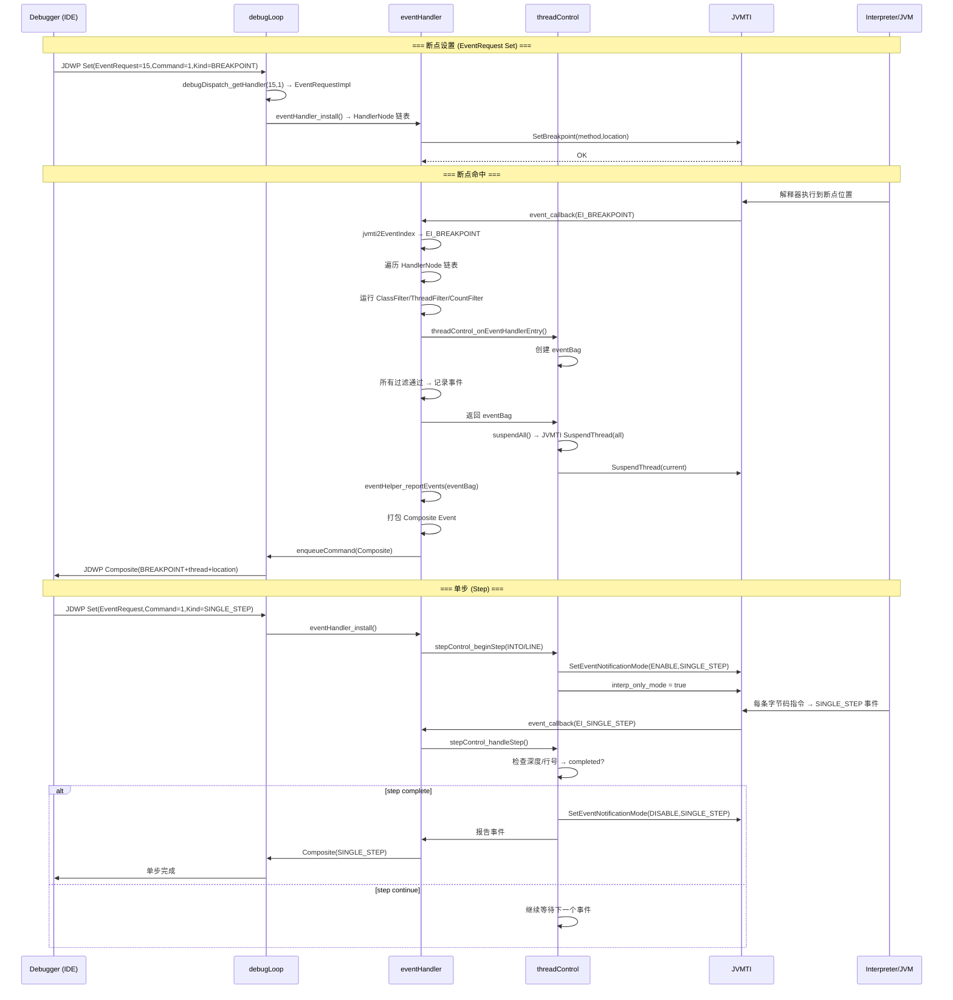

# 07-JDWP-Commands-Events — JDWP 命令分派与事件处理全链路

> **阶段**：[18-agent-instrument]
> **前置**：[06-JDWP-Transport-Init]（JDWP 启动、transport、debugLoop、debugDispatch 两级分发表）、[05-JVMTI-Core]（JVMTI 事件系统、TagMap、事件注册机制）
> **配套**：[04-Redefine-Classes]（RedefineClasses 命令，CommandSet 1 中的重定义流程）、[05-JVMTI-Core]（JVMTI 事件回调框架，event_callback 的底层基础）
> **后续依赖本文**：[08-JDWP-Internals]（JDWP 内部数据结构、bag/hash/线程管理）
> **阅读收益**：追踪 JDWP 断点从 IDE `Set` 命令到 JVMTI 事件回调再到 Composite Event 网络发送的完整 8 步链路；掌握 17 个 CommandSet 的两级分派机制、event_callback 的事件过滤管道、threadControl 的挂起/恢复模型、stepControl 的四种单步策略（INTO/OVER/OUT/LINE）、eventHelper 的 Composite Event 打包优化、commonRef 的 JNI GlobalRef 生命周期管理。

---

## §〇 生产场景 — 断点不命中 / 单步异常错误诊断

**症状**：使用 IDE 调试 Java 应用时，断点不命中、单步调试行为异常、或变量查看显示 `"Object has been collected"`。

```
# IDE 日志中的典型错误
JDWP exit error AGENT_ERROR_INTERNAL(200): unexpected JDWP error: 112
# 或
Step request failed: JVMTI_ERROR_INVALID_THREAD (10)
```

**根因分析**：JDWP 命令处理涉及 4 层架构：

1. **debugDispatch** (`debugDispatch.c:94`): 两级数组查找 CommandSet → Command → Handler
2. **Handler 实现** (17 个 `*Impl.c` 文件): 每个 handler 调用 JVMTI 函数或 JNI 函数
3. **eventHandler** (`eventHandler.c:541`): JVMTI 事件回调 → 事件过滤 → JDWP 事件包
4. **threadControl** (`threadControl.c:793`): 断点/单步事件后的线程挂起控制

最常见的问题：
- **断点不命中**: eventHandler 的 `event_callback` 中过滤条件不匹配——ClassFilter/ThreadFilter 错误配置
- **单步异常**: stepControl 的 `stepControl_handleStep` 中深度计数器溢出或 JVMTI 错误
- **变量不可见**: ObjectReference handler 中对象被 GC 回收——JNI weak reference 失效

**三步诊断**：

```bash
# 1. 启用 JDWP 详细日志
java -agentlib:jdwp=transport=dt_socket,address=8000,server=y,suspend=n -Xlog:jdwp=trace

# 2. 检查 JVMTI 事件是否被注册
jcmd <pid> VM.jvmti_events | grep -E "BREAKPOINT|SINGLE_STEP"

# 3. GDB 断点验证事件处理
gdb -ex "break eventHandler.c:541" \
    -ex "break threadControl.c:793" \
    -ex "break stepControl.c:511" \
    -ex "break eventHelper.c:1001" \
    -ex "run" \
    -ex "print eventIndex" \
    --args java -agentlib:jdwp=transport=dt_socket,address=8000,server=y app.jar
```

**反事实**：如果 JDWP 事件不经过 threadControl 的挂起机制——断点命中后线程继续执行 → 调试器收到断点事件时线程已经执行了后续代码 → 变量值已经改变 → 调试器显示的是"未来"的变量状态。threadControl 在 `onHook` 回调中调用 `suspendAll`——确保所有线程在事件报告前暂停，调试器看到的变量状态是断点时刻的快照。

**进阶诊断工具**：

```bash
# 1. strace 追踪 JDWP agent 的系统调用
strace -f -e trace=sendto,recvfrom,select,write,read \
       -o /tmp/jdwp_strace.log \
       java -agentlib:jdwp=transport=dt_socket,address=8000,server=y,suspend=n app.jar
# 在另一个终端: grep "sendto\|recvfrom" /tmp/jdwp_strace.log
# 可以看到每个 JDWP 包的发送/接收时机和大小

# 2. jstack 检查被挂起线程的状态
jstack <pid> | grep -E "suspended|SUSPENDED|JDWP"
# 期望: 断点位置的线程状态 = "suspended"

# 3. /proc 检查 socket 连接状态
# /proc/<pid>/fd/  — 查看 JDWP agent 持有的 socket fd
# /proc/<pid>/net/tcp — 查看 TCP 连接状态 (ESTABLISHED/TIME_WAIT)
lsof -p <pid> | grep TCP | grep 8000
ss -tnp | grep 8000
# 期望: agent 与调试器之间有一个 ESTABLISHED TCP 连接

# 4. 检查 JDWP agent 线程
jstack <pid> | grep -A5 "JDWP Command Loop"
jstack <pid> | grep -A5 "JDWP Event Helper"
# 期望: Command Loop 线程在 socket read 上阻塞 (RUNNABLE)
# Event Helper 线程在等待 commandQueue 上阻塞 (WAITING)

# 5. jcmd 查看 JVMTI 事件注册状态
jcmd <pid> VM.jvmti_events | grep -E "BREAKPOINT|SINGLE_STEP|CLASS_PREPARE"
# 期望: 断点相关事件 = "ENABLED"
```

---

## §一 JDWP 命令与事件全链路源码走读

### 1.1 debugDispatch — 两级分发表

调试器发送命令 → `debugLoop_run()` 读取 JDWP 包 → 解析 `cmdSet` 和 `cmd` → 调用 `debugDispatch_getHandler()` 定位 Handler 函数指针。

`debugDispatch_getHandler` 在 `debugDispatch.c:94-116` 实现两级数组 O(1) 查找：

```c
// debugDispatch.c:94-116
CommandHandler
debugDispatch_getHandler(int cmdSet, int cmd)
{
    void **l2Array;

    if (cmdSet > JDWP_HIGHEST_COMMAND_SET) {
        return NULL;
    }

    l2Array = (void **)l1Array[cmdSet];

    /* If there is no such CommandSet or the Command
     * is greater than the number of commands (the first
     * element) in the CommandSet, indicate this is invalid.
     */
    if (l2Array == NULL || cmd > (int)(intptr_t)(void*)l2Array[0]) {
        return NULL;
    }

    return (CommandHandler)l2Array[cmd];
}
```

两级分发表在 `debugDispatch_initialize` 注册 (`debugDispatch.c:55-87`):

```c
// debugDispatch.c:69-86
l1Array[JDWP_COMMAND_SET(VirtualMachine)] = (void *)VirtualMachine_Cmds;
l1Array[JDWP_COMMAND_SET(ReferenceType)] = (void *)ReferenceType_Cmds;
l1Array[JDWP_COMMAND_SET(ClassType)] = (void *)ClassType_Cmds;
// ... 17 CommandSet 全部注册
l1Array[JDWP_COMMAND_SET(EventRequest)] = (void *)EventRequest_Cmds;
l1Array[JDWP_COMMAND_SET(StackFrame)] = (void *)StackFrame_Cmds;
l1Array[JDWP_COMMAND_SET(ModuleReference)] = (void *)ModuleReference_Cmds;
```

`l1Array[cmdSet]` → 二级指针数组（每个 CommandSet 自己的命令表），`l2Array[cmd]` → 具体 Handler 函数指针。CommandSet 和 Command 都是小整数（1-18, 1-20+）→ 两级数组 O(1) 索引比 hash map 更快（无 hash 计算、无碰撞处理）。

### 1.2 17 个 CommandSet 概览

每个 CommandSet 对应 JDWP 规范中的一类调试操作，由独立的 `*Impl.c` 文件实现 Handler：

| CommandSet | 名称 | 核心命令 | 典型 Handler |
|-----------|------|---------|-------------|
| 1 | VirtualMachine | Version, AllClasses, AllThreads, Suspend, Resume, Exit, RedefineClasses | VirtualMachineImpl.c |
| 2 | ReferenceType | Signature, ClassLoader, Fields, Methods, GetValues | ReferenceTypeImpl.c |
| 3 | ClassType | Superclass, SetValues, InvokeMethod, NewInstance | ClassTypeImpl.c |
| 4 | ArrayType | NewInstance | ArrayTypeImpl.c |
| 5 | InterfaceType | (通过 ReferenceType 间接) | InterfaceTypeImpl.c |
| 6 | Method | LineTable, VariableTable, Bytecodes, IsObsolete | MethodImpl.c |
| 8 | Field | (通过 ReferenceType.GetValues/SetValues) | FieldImpl.c |
| 9 | ObjectReference | ReferenceType, GetValues, SetValues, MonitorInfo, InvokeMethod | ObjectReferenceImpl.c |
| 10 | StringReference | Value | StringReferenceImpl.c |
| 11 | ThreadReference | Name, Suspend, Resume, Status, Frames, FrameCount, ForceEarlyReturn | ThreadReferenceImpl.c |
| 12 | ThreadGroupReference | Name, Parent, Children | ThreadGroupReferenceImpl.c |
| 13 | ArrayReference | Length, GetValues, SetValues | ArrayReferenceImpl.c |
| 14 | ClassLoaderReference | VisibleClasses | ClassLoaderReferenceImpl.c |
| 15 | EventRequest | Set, Clear, ClearAllBreakpoints | EventRequestImpl.c |
| 16 | StackFrame | GetValues, SetValues, ThisObject, PopFrames | StackFrameImpl.c |
| 17 | ClassObjectReference | ReflectedType | ClassObjectReferenceImpl.c |
| 18 | ModuleReference | Name, ClassLoader, CanRead | ModuleReferenceImpl.c |

为什么没有 CommandSet 7？JDWP 规范为将来扩展预留。CommandSet 编号从 1 开始，7 从未被分配。类似地，EventKind 编号也有间隙。

**反事实**：如果使用 hash map 替代两级数组？CommandSet 18 × Command 20 = 360 个条目 → 指针数组 ~2.8KB → 内存开销可接受，且两级数组无 hash 计算、无碰撞处理，在调试代理的性能敏感路径上更优。

### 1.3 event_callback — JVMTI 事件入口

`event_callback` 在 `eventHandler.c:541` 是所有 JVMTI 事件的统一入口。每个 JVMTI 事件（断点、单步、异常、类加载等）都进入此函数：

```c
// eventHandler.c:541-557
static void
event_callback(JNIEnv *env, EventInfo *evinfo)
{
    struct bag *eventBag;
    jbyte eventSessionID = currentSessionID;
    jthrowable currentException;
    jthread thread;

    LOG_MISC(("event_callback(): ei=%s", eventText(evinfo->ei)));
    log_debugee_location("event_callback()", evinfo->thread,
                         evinfo->method, evinfo->location);

    currentException = JNI_FUNC_PTR(env,ExceptionOccurred)(env);
    JNI_FUNC_PTR(env,ExceptionClear)(env);
```

事件处理流程 (`eventHandler.c:541-620`):

1. **异常保护**: 保存当前 JNI 异常 → 清空 → 事件处理完成后恢复——防止事件处理中的 JNI 调用破坏被调试线程的异常状态
2. **GC 后处理** (`:566-593`): 如果 `garbageCollected > 0` → `commonRef_compact()` 清理已回收对象的引用 → `classTrack_processUnloads()` 生成合成类卸载事件
3. **线程进入事件** (`:595-604`): `threadControl_onEventHandlerEntry()` 分配事件 Bag——用于收集同一事件触发点产生的所有事件
4. **事件分发** (`:606-620`): 如果 eventBag != NULL → `eventHandler_handleEvents()` 遍历所有 HandlerNode 链表，运行过滤器

```c
// eventHandler.c:595-604
    thread = evinfo->thread;
    if (thread != NULL) {
        eventBag = threadControl_onEventHandlerEntry(eventSessionID,
                                 evinfo->ei, thread, currentException);
```

**为什么需要 callbackLock**？多个线程可能同时触发事件（多线程断点）→ eventHandler 的链表操作需要互斥。callbackLock 保护 HandlerNode 链表的并发访问。`eventHandler_initialize` 在 `eventHandler.c:1443` 创建此锁。

**反事实**：如果事件处理在 JVMTI 回调线程中直接发送 JDWP 包？JVMTI 回调线程是 JVM 内部线程（如解释器线程）→ 不能阻塞在 socket write 上（可能阻塞等待调试器接收）→ 死锁风险。事件先排队（pending events），主循环线程（debugLoop）负责发送——解耦了事件触发和事件发送。参见 `man 2 send` / `man 2 write` — 这些系统调用在 socket 缓冲区满时阻塞，JVMTI 回调线程不能承担此风险。

### 1.4 JVMTI ↔ JDWP 事件映射表

`util.h:147-170` 定义 `EventIndex` 枚举——20 个事件索引（EI_min=1..EI_max=20）。`util.c:1962-2002` 构建两个映射数组：

```c
// util.c:1953-2002
static jvmtiEvent index2jvmti[EI_max-EI_min+1];
static jdwpEvent  index2jdwp [EI_max-EI_min+1];

void eventIndexInit(void)
{
    index2jvmti[EI_SINGLE_STEP        -EI_min] = JVMTI_EVENT_SINGLE_STEP;
    index2jvmti[EI_BREAKPOINT         -EI_min] = JVMTI_EVENT_BREAKPOINT;
    index2jvmti[EI_FRAME_POP          -EI_min] = JVMTI_EVENT_FRAME_POP;
    index2jvmti[EI_EXCEPTION          -EI_min] = JVMTI_EVENT_EXCEPTION;
    // ... 共 20 个事件映射

    index2jdwp[EI_SINGLE_STEP         -EI_min] = JDWP_EVENT(SINGLE_STEP);
    index2jdwp[EI_BREAKPOINT          -EI_min] = JDWP_EVENT(BREAKPOINT);
    // ... 对应的 JDWP EventKind 映射
    index2jdwp[EI_VM_DEATH            -EI_min] = JDWP_EVENT(VM_DEATH);
}
```

完整映射表：

| EventIndex | JVMTI 事件 | JDWP EventKind | 说明 |
|-----------|-----------|---------------|------|
| EI_SINGLE_STEP (1) | JVMTI_EVENT_SINGLE_STEP | SINGLE_STEP | 字节码单步 |
| EI_BREAKPOINT (2) | JVMTI_EVENT_BREAKPOINT | BREAKPOINT | 断点命中 |
| EI_FRAME_POP (3) | JVMTI_EVENT_FRAME_POP | FRAME_POP | 栈帧弹出 |
| EI_EXCEPTION (4) | JVMTI_EVENT_EXCEPTION | EXCEPTION | 异常抛出 |
| EI_THREAD_START (5) | JVMTI_EVENT_THREAD_START | THREAD_START | 线程启动 |
| EI_THREAD_END (6) | JVMTI_EVENT_THREAD_END | THREAD_END | 线程结束 |
| EI_CLASS_PREPARE (7) | JVMTI_EVENT_CLASS_PREPARE | CLASS_PREPARE | 类准备 |
| EI_GC_FINISH (8) | JVMTI_EVENT_GARBAGE_COLLECTION_FINISH | CLASS_UNLOAD | GC 完成（触发类卸载） |
| EI_VM_INIT (19) | JVMTI_EVENT_VM_INIT | VM_INIT | VM 初始化 |
| EI_VM_DEATH (20) | JVMTI_EVENT_VM_DEATH | VM_DEATH | VM 死亡 |

注意 EI_GC_FINISH 的特殊映射：JVMTI 的 `GARBAGE_COLLECTION_FINISH` 事件在 JDWP 侧被映射为 `CLASS_UNLOAD` 事件——因为 GC 后需要模拟类卸载事件通知调试器。

### 1.5 eventFilter — 事件过滤管道（12 种过滤器 + 匹配引擎）

`eventFilter.c:1-1361` 是 JDWP 事件过滤的核心——它定义了 12 种过滤器类型、过滤器内存布局、以及 `eventFilterRestricted_passesFilter()` 匹配引擎。

#### 1.5.1 过滤器数据模型

`eventFilter.c:44-126` 定义所有过滤器类型：

```c
// eventFilter.c:44-111 — 12 种过滤器类型定义
typedef struct ClassFilter { jclass clazz; } ClassFilter;
typedef struct LocationFilter { jclass clazz; jmethodID method; jlocation location; } LocationFilter;
typedef struct ThreadFilter { jthread thread; } ThreadFilter;
typedef struct CountFilter { jint count; } CountFilter;
typedef struct ConditionalFilter { jint exprID; } ConditionalFilter;
typedef struct FieldFilter { jclass clazz; jfieldID field; } FieldFilter;
typedef struct ExceptionFilter { jclass exception; jboolean caught; jboolean uncaught; } ExceptionFilter;
typedef struct InstanceFilter { jobject instance; } InstanceFilter;
typedef struct StepFilter { jint size; jint depth; jthread thread; } StepFilter;
typedef struct MatchFilter { char *classPattern; } MatchFilter;         // 用于 ClassMatch/ClassExclude
typedef struct SourceNameFilter { char *sourceNamePattern; } SourceNameFilter;

// eventFilter.c:95-111 — 联合体包装所有过滤器
typedef struct Filter_ {
    jbyte modifier;          // JDWP_REQUEST_MODIFIER(ThreadOnly), (LocationOnly), ...
    union {
        struct ClassFilter ClassOnly;
        struct LocationFilter LocationOnly;
        struct ThreadFilter ThreadOnly;
        struct CountFilter Count;
        struct ConditionalFilter Conditional;
        struct FieldFilter FieldOnly;
        struct ExceptionFilter ExceptionOnly;
        struct InstanceFilter InstanceOnly;
        struct StepFilter Step;
        struct MatchFilter ClassMatch;
        struct MatchFilter ClassExclude;
        struct SourceNameFilter SourceNameOnly;
    } u;
} Filter;
```

#### 1.5.2 HandlerNode 内存布局

过滤器数据存储在 `HandlerNode` 的尾部扩展区域（`eventFilter.c:123-141`）：

```c
// eventFilter.c:123-131
typedef struct EventFilters_ {
    jint filterCount;
    Filter filters[MAX_FILTERS];  // MAX_FILTERS = 10000 (:121)
} EventFilters;

typedef struct EventFilterPrivate_HandlerNode_ {
    EventHandlerRestricted_HandlerNode not_for_us;  // 继承 eventHandler 的 HandlerNode
    EventFilters ef;                                // 尾部扩展：过滤器数组
} EventFilterPrivate_HandlerNode;
```

`eventFilterRestricted_alloc()` 在 `eventFilter.c:149-176` 动态分配 `HandlerNode` 内存——**大小由过滤器数量决定**（variable-length allocation）：

```c
// eventFilter.c:150-154
size_t size = offsetof(EventFilterPrivate_HandlerNode, ef) +
              offsetof(EventFilters, filters) +
              (filterCount * (int)sizeof(Filter));
HandlerNode *node = jvmtiAllocate((jint)size);
```

**Accessor 宏** (`eventFilter.c:137-141`):
```c
#define EVENT_FILTERS(node)  (&(((EventFilterPrivate_HandlerNode*)(void*)node)->ef))
#define FILTER_COUNT(node)   (EVENT_FILTERS(node)->filterCount)
#define FILTERS_ARRAY(node)  (EVENT_FILTERS(node)->filters)
#define FILTER(node,index)   ((FILTERS_ARRAY(node))[index])
```

#### 1.5.3 过滤器 setter 函数族（12 个函数）

每种过滤器都有对应的 setter——由 EventRequest `Set` 命令解析后调用（`eventFilter.c:702-970`）：

| 函数 (file:line) | 过滤器类型 | JDWP Modifier | 设置的操作 |
|---|---|---|---|
| `eventFilter_setCountFilter()` (:715) | CountFilter | `Count(3)` | 设置 `filter->u.Count.count = count` |
| `eventFilter_setConditionalFilter()` (:702) | ConditionalFilter | `Conditional(4)` | 设置 `filter->u.Conditional.exprID = exprID` |
| `eventFilter_setThreadOnlyFilter()` (:732) | ThreadFilter | `ThreadOnly(5)` | 创建 `thread` 的 JNI GlobalRef |
| `eventFilter_setClassOnlyFilter()` (:803) | ClassFilter | `ClassOnly(6)` | 创建 `clazz` 的 JNI GlobalRef |
| `eventFilter_setClassMatchFilter()` (:877) | MatchFilter | `ClassMatch(7)` | 复制类名通配符 pattern |
| `eventFilter_setClassExcludeFilter()` (:898) | MatchFilter | `ClassExclude(8)` | 复制排除 pattern |
| `eventFilter_setLocationOnlyFilter()` (:752) | LocationFilter | `LocationOnly(9)` | 创建 clazz 的 GlobalRef，保存 method+location |
| `eventFilter_setExceptionOnlyFilter()` (:827) | ExceptionFilter | `ExceptionOnly(10)` | 设置异常类 + caught/uncaught 标志 |
| `eventFilter_setFieldOnlyFilter()` (:780) | FieldFilter | `FieldOnly(11)` | 创建 clazz 的 GlobalRef，保存 fieldID |
| `eventFilter_setStepFilter()` (:919) | StepFilter | `Step(12)` | 设置 step size/depth + thread Ref |
| `eventFilter_setInstanceOnlyFilter()` (:855) | InstanceFilter | `InstanceOnly(13)` | 创建 instance 的 JNI GlobalRef |
| `eventFilter_setSourceNameMatchFilter()` (:948) | SourceNameFilter | `SourceNameMatch(14)` | 复制源文件名通配符 |

#### 1.5.4 核心匹配引擎 `eventFilterRestricted_passesFilter()`

`eventFilter.c:373-550` — **每次 JVMTI 事件触发时调用**，逐过滤器检查是否全部通过：

```c
// eventFilter.c:373-378
jboolean
eventFilterRestricted_passesFilter(JNIEnv *env, char *classname,
                                   EventInfo *evinfo, HandlerNode *node,
                                   jboolean *shouldDelete)
```

**前置检查** (`eventFilter.c:391-399`): 大部分事件在 debug 线程中触发 → 直接 suppress（**只允许 `EI_CLASS_PREPARE`, `EI_GC_FINISH`, `EI_CLASS_LOAD`** 通过）。`threadControl_isDebugThread()` 通过线程标记判断。

**逐个过滤器检查的 switch-case 循环** (`eventFilter.c:401-548`):

1. **ThreadOnly** (:403-407): `isSameObject(thread, filter->u.ThreadOnly.thread)` — 精确线程 ID 匹配
2. **ClassOnly** (:409-417): `JNI IsAssignableFrom(clazz, filter->u.ClassOnly.clazz)` — 检查 `clazz` 是否是过滤类或其子类/子接口 → **支持多态**
3. **LocationOnly** (:423-431): 精确匹配 `method + location + clazz` — 用于断点精确位置
4. **ExceptionOnly** (:433-467): 检查异常类匹配 + `caught`/`uncaught` 标志 — `IsAssignableFrom(env, exception, filter->u.ExceptionOnly.exception)`
5. **InstanceOnly** (:469-476): `isSameObject(eventInstance, filterInstance)` — **先调用 `eventInstance()` (:299-356) 获取 `this` 对象**（支持 EI_SINGLE_STEP 等 12 种事件类型）
6. **Count** (:477-484): `--filter->u.Count.count > 0` — 倒计数过滤，"第 N 次命中才停" → 计数归零后设置 `*shouldDelete = JNI_TRUE`
7. **Conditional** (:486-492): `filter->u.Conditional.exprID` — **当前未实现**（代码注释为空）
8. **ClassMatch** (:494-500): `patternStringMatch(classname, filter->u.ClassMatch.classPattern)` — 支持 `*` 通配符（`patternStringMatch` 定义在 `:246-277`）
9. **ClassExclude** (:502-508): `!patternStringMatch(classname, pattern)` — 取反匹配
10. **Step** (:510-517): `isSameObject(thread, filter->u.Step.thread)` + `stepControl_handleStep()` — **将过滤委托给 stepControl 判断步骤是否完成**
11. **SourceNameMatch** (:519-542): 先查 SDE (Source Debug Extension) → 没有则查 `GetSourceFileName` → `patternStringMatch(sourceName, pattern)`

**关键设计**:
- `ClassOnly` 使用 `IsAssignableFrom`（支持子类）vs `LocationOnly` 使用 `isSameObject`（精确匹配类）
- `Count` 过滤器在计数归零后设置 `shouldDelete = JNI_TRUE` — **事件报告后自动删除 HandlerNode**（一次性事件）
- `Step` 过滤器将判断委托给 `stepControl_handleStep()` — 访问其他模块的内部状态
- `Conditional` 过滤器当前为 **TODO**（`/*** ... ***/` 注释块）

#### 1.5.5 Wildcard 匹配算法

`patternStringMatch()` 在 `eventFilter.c:246-277` 实现通配符匹配：

```c
static jboolean patternStringMatch(char *classname, const char *pattern) {
    // 无 * 号: 精确 strcmp 匹配（bug 4331522 修复）
    if ((pattern[0] != '*') && (pattern[pattLen-1] != '*')) {
        return strcmp(pattern, classname) == 0;
    }
    // 有 * 号: 前缀或后缀匹配（strncmp）
    // pattern="Foo*" → 匹配任何以 "Foo" 开头的类
    // pattern="*Test" → 匹配任何以 "Test" 结尾的类
}
```

`ClassMatch` 和 `ClassExclude` 都使用此算法 — `ClassExclude` 是取反后返回。

#### 1.5.6 完整事件过滤流程（IDE 断点示例）

IDE 在 `com.example.Foo.bar():42` 设断点：

1. IDE 发送 JDWP `Set` 命令 → EventRequestImpl 解析 → `eventHandler_install()` 调用 `eventFilterRestricted_alloc(filterCount=2)`
2. `eventFilter_setLocationOnlyFilter(node, 0, clazz, method, location)` — 设置 LocationOnly 过滤器
3. `eventFilter_setThreadOnlyFilter(node, 1, thread)` — 可选：仅特定线程停（`*` = 所有线程）
4. JVM 解释器执行到 `Foo.bar():42` → JVMTI 触发 `JVMTI_EVENT_BREAKPOINT` → `event_callback(EI_BREAKPOINT)`
5. `eventHandler_handleEvents()` 遍历 HandlerNode 链表 → 调用 `eventFilterRestricted_passesFilter()`
6. 逐个检查过滤器 → LocationOnly: `isSameObject(clazz)` + `method==event->method` + `location==event->location` ✓ → ThreadOnly: `isSameObject(thread)` ✓
7. 全部通过 → 记录事件 → threadControl 挂起 → Composite Event 发送 → 调试器收到断点通知

### 1.6 threadControl_onHook — 断点命中后的线程挂起

`threadControl_onHook` 在 `threadControl.c:793-844` 是调试会话建立时的初始化回调：

```c
// threadControl.c:793-843
void
threadControl_onHook(void)
{
    JNIEnv *env;
    env = getEnv();
    debugMonitorEnter(threadLock);

    WITH_LOCAL_REFS(env, 1) {
        jint threadCount;
        jthread *threads;

        threads = allThreads(&threadCount);
        if (threads == NULL) {
            EXIT_ERROR(AGENT_ERROR_OUT_OF_MEMORY,"thread table");
        } else {
            int i;
            for (i = 0; i < threadCount; i++) {
                ThreadNode *node;
                jthread thread = threads[i];
                node = insertThread(env, &runningThreads, thread);
                node->isStarted = JNI_TRUE;
            }
        }
    } END_WITH_LOCAL_REFS(env)

    debugMonitorExit(threadLock);
}
```

关键设计：预存在线程的 `isStarted = JNI_TRUE` 标记——因为无法依赖线程启动事件（这些线程在调试器连接前已存在）。没有此标记，无法对 finalizer 线程等启用单步和其他事件。

**threadControl_suspendAll** 在 `threadControl.c:1493-1558`：

```c
// threadControl.c:1493-1534
jvmtiError
threadControl_suspendAll(void)
{
    jvmtiError error;
    JNIEnv    *env;
    env = getEnv();
    preSuspend();

    WITH_LOCAL_REFS(env, 1) {
        jthread *threads;
        jint count;
        threads = allThreads(&count);
        if (threads == NULL) {
            error = AGENT_ERROR_OUT_OF_MEMORY;
            goto err;
        }
        if (canSuspendResumeThreadLists()) {
            error = commonSuspendList(env, count, threads);
        } else {
            int i;
            for (i = 0; i < count; i++) {
                error = commonSuspend(env, threads[i], JNI_FALSE);
                if (error != JVMTI_ERROR_NONE) goto err;
            }
        }
```

挂起流程：
1. `preSuspend()` — 准备工作（如记录当前线程）
2. `allThreads()` — 获取所有 Java 线程列表
3. 如果 JVMTI 支持批量挂起（`canSuspendResumeThreadLists()`）→ `commonSuspendList()` 批量操作
4. 否则逐线程调用 `commonSuspend()` → `JVMTI SuspendThread`

`commonSuspendByNode` 在 `threadControl.c:847-853` 封装实际的 JVMTI 调用：

```c
// threadControl.c:847-853
static jvmtiError
commonSuspendByNode(ThreadNode *node)
{
    LOG_MISC(("thread=%p suspended", node->thread));
    error = JVMTI_FUNC_PTR(gdata->jvmti,SuspendThread)
                (gdata->jvmti, node->thread);
```

**为什么先 suspendAll 再根据策略决定**？为了获取一致的线程状态快照。如果先检查策略再挂起 → 策略检查期间其他线程可能修改共享状态 → 调试器看到的线程状态不一致。

**反事实**：如果使用 safepoint 替代 JVMTI SuspendThread？Safepoint 暂停所有 Java 线程（包括 JIT 编译线程、GC 线程）→ 调试器无法检查线程状态（所有线程都停在 safepoint 桩，不在业务代码中）→ 无法获取调用栈、局部变量 → 调试功能完全失效。JVMTI SuspendThread 是"软暂停"——线程停在当前字节码位置，保持完整栈帧。参见 JVMTI 规范 `man 3` (JVM Tool Interface) — `SuspendThread`/`ResumeThread` 的语义约束。

**threadControl_resumeAll** 在 `threadControl.c:1572-1605`：

```c
// threadControl.c:1572-1596
jvmtiError
threadControl_resumeAll(void)
{
    jvmtiError error;
    JNIEnv    *env;
    env = getEnv();

    eventHandler_lock();
    debugMonitorEnter(threadLock);

    if (canSuspendResumeThreadLists()) {
        error = commonResumeList(env);
    } else {
        error = enumerateOverThreadList(env, &runningThreads,
                                        resumeHelper, NULL);
    }
    if ((error == JVMTI_ERROR_NONE) && (otherThreads.first != NULL)) {
        error = enumerateOverThreadList(env, &otherThreads,
                                        resumeHelper, NULL);
        removeResumed(env, &otherThreads);
    }
```

恢复只操作已在线程列表中的线程（runningThreads + otherThreads），不需要从 JVMTI 重新获取全量线程列表——因为只有调试器挂起的线程才需要恢复。

### 1.7 stepControl — 单步调试

**stepControl_beginStep** 在 `stepControl.c:787-847` 设置单步：

```c
// stepControl.c:787-837
jvmtiError
stepControl_beginStep(JNIEnv *env, jthread thread, jint size, jint depth,
                      HandlerNode *node)
{
    StepRequest *step;
    jvmtiError error;
    jvmtiError error2;

    eventHandler_lock();
    stepControl_lock();

    step = threadControl_getStepRequest(thread);
    if (step == NULL) {
        error = AGENT_ERROR_INVALID_THREAD;
    } else {
        error = threadControl_suspendThread(thread, JNI_FALSE);
        if (error == JVMTI_ERROR_NONE) {
            step->granularity = size;
            step->depth = depth;
            step->stepHandlerNode = node;
            error = initState(env, thread, step);
            if (error == JVMTI_ERROR_NONE) {
                initEvents(thread, step);
            }
            error2 = threadControl_resumeThread(thread, JNI_FALSE);
            if (error != JVMTI_ERROR_NONE && error2 == JVMTI_ERROR_NONE) {
                error = error2;
            }
            if (error == JVMTI_ERROR_NONE) {
                step->pending = JNI_TRUE;
            }
        }
    }
    stepControl_unlock();
    eventHandler_unlock();
    return error;
}
```

设置步骤：
1. `threadControl_suspendThread()` — 先挂起线程
2. 设置 `granularity`（STEP_SIZE: MIN/LINE）和 `depth`（STEP_DEPTH: INTO/OVER/OUT）
3. `initState()` — 记录起始帧深度和位置
4. `initEvents()` — 启用 JVMTI SingleStep 通知 + 纯解释模式
5. `threadControl_resumeThread()` — 恢复线程（开始单步执行）
6. `step->pending = JNI_TRUE` — 标记单步进行中

**stepControl_handleStep** 在 `stepControl.c:511-640` 是单步的核心判断逻辑：

```c
// stepControl.c:511-574
jboolean
stepControl_handleStep(JNIEnv *env, jthread thread,
                       jclass clazz, jmethodID method)
{
    jboolean completed = JNI_FALSE;
    StepRequest *step;
    jint currentDepth;
    jint fromDepth;

    stepControl_lock();
    step = threadControl_getStepRequest(thread);
    if (!step->pending) goto done;

    // STEP_INTO + STEP_MIN: 第一条指令即完成
    if (step->depth == JDWP_STEP_DEPTH(INTO) &&
        step->granularity == JDWP_STEP_SIZE(MIN)) {
        completed = JNI_TRUE;
        goto done;
    }

    // 离开了起始方法 → 完成
    if (step->frameExited) {
        completed = JNI_TRUE;
        goto done;
    }

    currentDepth = getFrameCount(thread);
    fromDepth = step->fromStackDepth;

    if (fromDepth > currentDepth) {
        // 返回到调用者 → 完成（STEP_OUT）
        completed = JNI_TRUE;
    } else if (fromDepth < currentDepth) {
        // 进入了被调用方法
        if (step->depth == JDWP_STEP_DEPTH(INTO) && hasLineNumbers(method)) {
            completed = JNI_TRUE;  // STEP_INTO 进入有行号的方法
        } else {
            // 需要继续，但禁用单步，启用 frame pop + method enter 事件
            disableStepping(thread);
            if (step->depth == JDWP_STEP_DEPTH(INTO)) {
                step->methodEnterHandlerNode =
                    eventHandler_createInternalThreadOnly(
                                       EI_METHOD_ENTRY,
                                       handleMethodEnterEvent, thread);
            }
            // 注册 FramePop 通知
            error = JVMTI_FUNC_PTR(gdata->jvmti,NotifyFramePop)
                        (gdata->jvmti, thread, 0);
        }
    } else {
        // 同深度: 检查行号是否改变（STEP_LINE）
        if (step->granularity == JDWP_STEP_SIZE(MIN)) {
            completed = JNI_TRUE;
        } else {
            // 比较行号...
        }
    }
```

四种单步策略的判断逻辑：

| 策略 | 完成条件 | 实现方式 |
|------|---------|---------|
| STEP_INTO | 进入有行号的新方法，或同深度行号改变 | fromDepth < currentDepth + hasLineNumbers |
| STEP_OVER | 同深度或更浅，且行号改变 | fromDepth >= currentDepth + line change |
| STEP_OUT | 深度减少（返回调用者） | fromDepth > currentDepth |
| STEP_LINE | 同深度行号改变 | fromDepth == currentDepth + line change |

**为什么需要纯解释模式**？JIT 编译的方法没有逐条指令的 SingleStep 事件——编译器优化了指令序列。纯解释模式保证每条字节码指令都触发 SingleStep 事件，stepControl 才能精确判断"是否跨过了行边界"或"是否进入了新方法"。

**反事实**：如果不进入纯解释模式——允许 JIT 编译？JIT 编译的方法 → SingleStep 事件在编译代码中不触发 → stepControl_handleStep 永远等不到事件 → 单步卡住不动 → 调试器超时。纯解释模式是单步调试正确性的必要代价。参见 `man 3` (JVM TI) — `SetEventNotificationMode(JVMTI_EVENT_SINGLE_STEP)` 和 `CanGenerateSingleStepInstructions` 能力查询。JVMTI 规范要求可生成 SingleStep 的能力是 **可选** (`JVMTI_CAPABILITY`) 的——JDWP agent 在 `eventFilter.c:919` 的 `eventFilter_setStepFilter()` 中启用此能力。

**stepControl_endStep** 在 `stepControl.c:879-907` 清理单步状态：

```c
// stepControl.c:879-907
jvmtiError
stepControl_endStep(jthread thread)
{
    StepRequest *step;
    jvmtiError error;

    eventHandler_lock();
    stepControl_lock();

    step = threadControl_getStepRequest(thread);
    if (step != NULL) {
        clearStep(thread, step);
        error = JVMTI_ERROR_NONE;
    } else {
        error = JVMTI_ERROR_NONE;  // 线程可能已终止
    }

    stepControl_unlock();
    eventHandler_unlock();
    return error;
}
```

### 1.8 eventHelper_reportEvents — Composite Event 组合

`eventHelper_reportEvents` 在 `eventHelper.c:1001-1042` 将多个待发送事件打包为一个 JDWP Composite 事件：

```c
// eventHelper.c:1001-1042
jbyte
eventHelper_reportEvents(jbyte sessionID, struct bag *eventBag)
{
    int size = bagSize(eventBag);
    jbyte suspendPolicy = JDWP_SUSPEND_POLICY(NONE);

    if (size == 0) return suspendPolicy;

    bagEnumerateOver(eventBag, enumForCombinedSuspendPolicy, &suspendPolicy);
    bagEnumerateOver(eventBag, enumForVMDeath, &reportingVMDeath);

    command_size = (int)(sizeof(HelperCommand) +
                         sizeof(CommandSingle)*(size-1));
    command = jvmtiAllocate(command_size);
    command->commandKind = COMMAND_REPORT_EVENT_COMPOSITE;
    recc = &command->u.reportEventComposite;
    recc->suspendPolicy = suspendPolicy;
    recc->eventCount = size;
    bagEnumerateOver(eventBag, enumForCopyingSingles, &tracker);

    wait = (suspendPolicy != JDWP_SUSPEND_POLICY(NONE)) || reportingVMDeath;
    enqueueCommand(command, wait, reportingVMDeath);
    return suspendPolicy;
}
```

Composite Event 组合步骤：
1. 遍历 eventBag → 收集所有事件的挂起策略（取最严格的：ALL > EVENT_THREAD > NONE）
2. 检查是否包含 VM_DEATH 事件
3. 分配 `HelperCommand + N×CommandSingle` 内存
4. 复制所有事件到 `recc->singleCommand[]` 数组
5. 通过 `enqueueCommand()` 将命令放入队列——由 `commandLoop` 线程处理发送

`eventHelper_recordEvent` 在 `eventHelper.c:1044-1064` 将单个事件添加到 eventBag：

```c
// eventHelper.c:1044-1064
void
eventHelper_recordEvent(EventInfo *evinfo, jint id, jbyte suspendPolicy,
                         struct bag *eventBag)
{
    CommandSingle *command = bagAdd(eventBag);
    command->singleKind = COMMAND_SINGLE_EVENT;
    command->u.eventCommand.suspendPolicy = suspendPolicy;
    command->u.eventCommand.id = id;
    (void)memcpy(&command->u.eventCommand.info, evinfo, sizeof(*evinfo));
    saveEventInfoRefs(env, &command->u.eventCommand.info);
}
```

**为什么 Composite 的 cmdSet=64**？cmdSet=64 是 JDWP 规范中的保留范围（64-127 = vendor extension）。Composite(100) 是 JDWP 规范定义的特殊命令——不是任何 CommandSet 的一部分，而是事件通知机制。

**反事实**：如果每个事件单独发送一个包？3 个断点同时命中 → 3 个独立包 → 3 次 socket write → 3 次 TCP 往返（如果有确认）→ 延迟 ×3。Composite 打包一次发送 → 1 次 socket write → 更低延迟。参见 `man 2 sendmsg` (scatter-gather IO) — socket 缓冲区满时 `send()` 调用返回 `EAGAIN` 或 `EWOULDBLOCK`（在 non-blocking 模式下），JDWP agent 使用 blocking socket 避免此复杂度。

### 1.9 commonRef — 对象引用 ID 管理

`commonRef` 在 `commonRef.c` 管理 JNI 引用的生命周期。设计原理：

```c
// commonRef.c:36-51 (注释)
/*
 * Each object sent to the front end is tracked with the RefNode struct.
 * External to this module, objects are identified by a jlong id which is
 * simply the sequence number. A weak reference is usually used so that
 * the presence of a debugger-tracked object will not prevent
 * its collection. Once an object is collected, its RefNode may be
 * deleted and the weak ref inside may be reused.
 * Using the sequence number as the object id prevents ambiguity
 * in the object id when the weak ref is reused.
 */
```

`commonRef_idToRef` 在 `commonRef.c:idToRef` 实现 ID → JNI 引用的转换：

```c
// commonRef.c:idToRef (简化)
jobject commonRef_idToRef(JNIEnv *env, jlong id)
{
    jobject ref = NULL;
    debugMonitorEnter(gdata->refLock); {
        RefNode *node = findNodeByID(env, id);
        if (node != NULL) {
            if (node->isStrong) {
                saveGlobalRef(env, node->ref, &ref);
            } else {
                jobject lref = JNI_FUNC_PTR(env,NewLocalRef)(env, node->ref);
                if (lref == NULL) {
                    // Object was GC'd
                    deleteNodeByID(env, node->seqNum, ALL_REFS);
                } else {
                    saveGlobalRef(env, node->ref, &ref);
                    JNI_FUNC_PTR(env,DeleteLocalRef)(env, lref);
                }
            }
        }
    } debugMonitorExit(gdata->refLock);
    return ref;
}
```

关键设计：
- **默认弱引用**: 对象以 JNI Weak GlobalRef 存储——不会阻止 GC 回收
- **序列号 ID**: 使用单调递增的 jlong 作为对象 ID，防止 weak ref 复用时的歧义
- **Pin 机制**: `commonRef_pin()` 将弱引用升级为强引用——调试器检查对象期间阻止 GC
- **Compact**: `commonRef_compact()` 在 GC 后清理已回收对象的引用节点

**为什么使用 JNI GlobalRef 而非普通指针**？JNI GlobalRef 阻止 GC 回收对象 → 调试器持有对象引用期间对象不会被回收 → 调试器可以安全地检查对象字段。但 GlobalRef 是强引用 → 可能导致内存泄漏 → 调试器断开时必须调用 `commonRef_releaseAll`。

**反事实**：如果使用 Weak GlobalRef（允许 GC 回收）？调试器持有 ObjectReference ID → GC 回收对象 → 调试器发送 GetValues 命令 → `commonRef_idToRef` 返回 NULL → "Object has been collected" 错误 → 调试器显示空变量 → 用户体验差但内存安全。当前设计选择弱引用默认 + 按需 Pin 的平衡策略。参见 `man 3` (JNI Functions) — `NewWeakGlobalRef()`, `NewGlobalRef()`, `DeleteWeakGlobalRef()` — JNI 规范保证这些函数在所有 JVM 实现中行为一致。

### 1.10 invoker — 方法调用请求管理

`invoker.c:1-891` 实现调试器侧的方法调用框架——当 IDE 执行"Evaluate Expression"或 `InvokeMethod` 命令时，需要在被调试线程的上下文中调用 JNI 方法。这不是直接调用——需要线程协同 (thread cooperation)。

#### 1.10.1 全局状态与锁

`invoker.c:32-37` — `invokerLock` 保护 `InvokeRequest` 结构体：

```c
// invoker.c:32-37
static jrawMonitorID invokerLock;

void invoker_initialize(void) {
    invokerLock = debugMonitorCreate("JDWP Invocation Lock");
}
```

`invoker_lock()` (:45-48) / `invoker_unlock()` (:50-53) 包装 `debugMonitorEnter/Exit`。

#### 1.10.2 InvokeRequest 提交 — `invoker_requestInvoke()`

`invoker.c:352-388` — **五个 invoke 类型**：`INVOKE_CONSTRUCTOR`, `INVOKE_STATIC`, `INVOKE_INSTANCE`, `INVOKE_INTERFACE`, `INVOKE_VIRTUAL`。

```c
// invoker.c:352-388
jvmtiError invoker_requestInvoke(jbyte invokeType, jbyte options, jint id,
                                 jthread thread, jclass clazz, jmethodID method,
                                 jobject instance, jvalue *arguments, jint argumentCount)
{
    if (invokeType == INVOKE_STATIC) {
        error = check_methodClass(env, clazz, method);  // 验证 clazz 包含 method
    }
    debugMonitorEnter(invokerLock);
    request = threadControl_getInvokeRequest(thread);
    if (request != NULL) {
        error = fillInvokeRequest(env, request, invokeType, options, id, ...);
    }
    debugMonitorExit(invokerLock);

    // 如果 SINGLE_THREADED 选项 → 只恢复目标线程，否则 resumeAll
    if (options & JDWP_INVOKE_OPTIONS(SINGLE_THREADED)) {
        threadControl_resumeThread(thread, JNI_TRUE);  // JNI_TRUE = 允许唤醒
    } else {
        threadControl_resumeAll();                      // 恢复所有挂起的线程
    }
}
```

#### 1.10.3 `fillInvokeRequest()` — 请求填充

`invoker.c:246-304` — 将 invoke 参数填充到 `InvokeRequest`：

1. **可用性检查** (`:254-265`): `request->available` 必须为 `JNI_TRUE`（线程在安全点等待），`request->pending` 必须为 `JNI_FALSE`（没有未完成的 invoke）→ 否则返回 `AGENT_ERROR_INVALID_THREAD` 或 `AGENT_ERROR_ALREADY_INVOKING`
2. **方法签名获取** (`:285`): `methodSignature(method, NULL, &request->methodSignature, NULL)` — 从 JVMTI 获取方法签名字符串
3. **GlobalRef 创建** (`:101-212`): `createGlobalRefs()` 遍历所有参数，为对象/数组类型参数创建 JNI GlobalRef — **防止被 invoke 线程执行前对象被 GC 回收**
4. **标记 pending** (`:301-302`): `request->pending = JNI_TRUE; request->available = JNI_FALSE`

#### 1.10.4 签名解析辅助函数

`invoker.c:55-95` — 两个辅助函数解析方法签名字符串：

- `returnTypeTag()` (:55-62): 定位 `)` 后第一个字符 → 返回类型 Tag（`Z`, `B`, `C`, `S`, `I`, `J`, `F`, `D`, `L`, `[`, `V`）
- `firstArgumentTypeTag()` + `nextArgumentTypeTag()` (:64-95): 遍历参数列表，跳过数组修饰符 `[` 和类名 `L...;`

#### 1.10.5 `invoker_doInvoke()` — 实际执行调用

`invoker.c:681-749` — **在被调试线程的上下文中调用**（当线程到达 safe point 时由 threadControl 触发）：

```c
// invoker.c:681-749 核心流程
jboolean invoker_doInvoke(jthread thread) {
    debugMonitorEnter(invokerLock);
    request = threadControl_getInvokeRequest(thread);
    request->available = JNI_FALSE;
    startNow = request->pending && !request->started;
    if (startNow) request->started = JNI_TRUE;
    debugMonitorExit(invokerLock);

    if (!startNow) return JNI_FALSE;

    WITH_LOCAL_REFS(env, 2) {
        JNI_FUNC_PTR(env,ExceptionClear)(env);
        switch (invokeType) {
            case INVOKE_CONSTRUCTOR: invokeConstructor(env, request); break;
            case INVOKE_STATIC:      invokeStatic(env, request);      break;
            case INVOKE_INSTANCE:
                if (options & NONVIRTUAL) invokeNonvirtual(env, request);
                else                      invokeVirtual(env, request);
                break;
        }
        // 捕获异常 (不传播)
        exception = JNI_FUNC_PTR(env,ExceptionOccurred)(env);
        if (exception != NULL) {
            JNI_FUNC_PTR(env,ExceptionClear)(env);
            saveGlobalRef(env, exception, &(request->exception));
        }
    } END_WITH_LOCAL_REFS(env);
    return JNI_TRUE;
}
```

#### 1.10.6 `invoker_completeInvokeRequest()` — 结果返回

`invoker.c:751-865` — **将被调用线程的执行结果写入 JDWP 回复包**：

1. `eventHandler_lock()` + `debugMonitorEnter(invokerLock)` — 正确锁顺序（防止死锁）
2. 如果未 detached：`threadControl_suspendThread()` (SINGLE_THREADED) 或 `threadControl_suspendAll()` — 重新挂起线程
3. 构造回复包：`outStream_initReply()` → 写入返回值 (`outStream_writeValue`) → 写入异常 (`outStream_writeObjectTag` + `outStream_writeObjectRef`)
4. `deleteGlobalArgumentRefs()` (:219-244) — 清理参数 GlobalRef
5. **释锁后 IO**: 退出 invokerLock **之后**才调用 `outStream_sendReply()` (:847) — 避免 IO 期间持有锁
6. 再次获取锁清理返回值/异常的 GlobalRef

#### 1.10.7 线程协同模型（关键设计）

```
调试器 → InvokeMethod 命令 → Handler 解析 → invoker_requestInvoke()
  → fillInvokeRequest() → request->pending = JNI_TRUE
  → threadControl_resumeThread(thread)  (唤醒目标线程到达 safe point)
  → 目标线程恢复执行 → invoker_doInvoke(thread) 被调用
  → JNI Call*MethodA(...)  → 方法执行
  → invoker_completeInvokeRequest() → threadControl_suspendThread()
  → outStream_sendReply()  → 调试器收到返回值
```

**反事实**：如果 invoker 直接在调试器线程中调用 JNI？调试器线程是 native 线程——没有正确的 Java 栈帧上下文、ThreadLocal 值、线程本地分配缓冲区 (TLAB) → JNI 调用可能崩溃或产生不可预期的副作用。invoker 通过线程协同确保在**被调试线程的完整 Java 上下文中**执行。

### 1.11 outStream/inStream — JDWP 数据包序列化格式

JDWP 协议使用大端序 (Big-Endian) 二进制格式。`outStream.h:37-53` 定义段式内存布局：

#### 1.11.1 PacketOutputStream 内存布局

```c
// outStream.h:37-53
#define INITIAL_SEGMENT_SIZE 300    // 默认缓冲区 300 字节
#define MAX_SEGMENT_SIZE     10000  // 最大段 10KB

typedef struct PacketData {
    int length;          // 当前段已用字节数
    jbyte *data;         // 段数据指针
    struct PacketData *next;  // 链表 — 支持动态增长
} PacketData;

typedef struct PacketOutputStream {
    jbyte *current;              // 当前写入位置
    jint left;                   // 当前段剩余字节
    struct PacketData *segment;  // 当前段
    struct PacketData firstSegment;  // 首个段（栈分配，300 字节）
    jdwpPacket packet;           // JDWP 包头 (11 bytes: length+id+flags+cmdSet+cmd)
    jbyte initialSegment[INITIAL_SEGMENT_SIZE];  // 首个段数据 (300 字节)
} PacketOutputStream;
```

**关键设计**: `initialSegment` + `firstSegment` 在栈上（300 字节）— **小包零堆分配**。超过 300 字节时动态分配 `PacketData` 链表段。

#### 1.11.2 JDWP 数据包格式

```
JDWP Packet (大端序):
┌──────────────┬──────────┬──────────┬──────────┬──────────┬──────────────┐
│ length (4B)  │ id (4B)  │ flags(1B)│ cmdSet   │ cmd(1B)  │ data (N 字节)│
│ 包含 header  │ 请求ID   │ 0=reply  │ (1B)     │          │ (N = len-11) │
│              │          │ 0x80=cmd │          │          │              │
└──────────────┴──────────┴──────────┴──────────┴──────────┴──────────────┘
            ← 11 bytes header →                  ← N bytes payload →
```

参考: `jdwpTransport.h:37-65` (jdwpPacket 结构体定义), `transport.h:32-50`。

#### 1.11.3 写入函数族

`outStream.h:62-79` 定义所有序列化函数：

| 函数 | 写入 | 字节数 | 说明 |
|------|------|--------|------|
| `outStream_writeBoolean()` | jboolean | 1 | 0 = false, 非0 = true |
| `outStream_writeByte()` | jbyte | 1 | 有符号字节 |
| `outStream_writeChar()` | jchar | 2 | UTF-16 char |
| `outStream_writeShort()` | jshort | 2 | 大端序 int16 |
| `outStream_writeInt()` | jint | 4 | 大端序 int32 |
| `outStream_writeLong()` | jlong | 8 | 大端序 int64 |
| `outStream_writeFloat()` | jfloat | 4 | IEEE 754 单精度 |
| `outStream_writeDouble()` | jdouble | 8 | IEEE 754 双精度 |
| `outStream_writeObjectRef()` | jobject → jlong | 8 | 调用 `commonRef_refToID()` 转换 |
| `outStream_writeString()` | char* | 4+len | `writeInt(strlen) + writeByteArray` |
| `outStream_writeByteArray()` | jbyte[] | 4+len | `writeInt(len) + 原始字节` |
| `outStream_writeFrameID()` | FrameID | 8 | 栈帧标识符 |
| `outStream_writeMethodID()` | jmethodID | 8 | JVMTI method ID |
| `outStream_writeFieldID()` | jfieldID | 8 | JVMTI field ID |
| `outStream_writeLocation()` | jlocation | 8 | 字节码偏移量 |

#### 1.11.4 写入与发送流程

`outStream.c:39-54` — `commonInit()` 初始化 300 字节栈缓冲区。
`outStream.c:86-89` — `outStream_sendReply()` 设置 `packet.flags = JDWPTRANSPORT_FLAGS_REPLY`，调用 `transport_writePacket()`:

```c
// outStream_sendReply 等价流程
stream->packet.type.reply.errorCode = stream->error;
stream->packet.type.reply.id = stream->packet.type.reply.id;
transport_writePacket(&stream->packet);  // 写入 socket
stream->sent = JNI_TRUE;
```

**反事实**：如果 JDWP 使用文本协议（如 JSON）而非二进制？字符串序列化开销大 → 放大包体积 3-5× → socket 传输延迟增大 → 调试点延迟增加（`100B 二进制 → 500B JSON` + 字符串解析延迟 ~10µs）。JDWP 选择大端序二进制协议是为了性能——调试代理在解释器路径上运行（每个断点 ~1µs + 包序列化 ~1µs）。

### 1.12 VirtualMachineImpl-Version 命令 — 代码级分析

`VirtualMachineImpl.c:37-91` 实现 JDWP VirtualMachine CommandSet (CommandSet=1) 的 `Version` 命令（Command=1）。

```c
// VirtualMachineImpl.c:37-39
static char *versionName = "Java Debug Wire Protocol (Reference Implementation)";
static int majorVersion = 11;  /* JDWP major version */
static int minorVersion = 0;   /* JDWP minor version */

// VirtualMachineImpl.c:41-91
static jboolean version(PacketInputStream *in, PacketOutputStream *out) {
    // 1. VM_DEAD 检查 (:49-52)
    if (gdata->vmDead) {
        outStream_setError(out, JDWP_ERROR(VM_DEAD));
        return JNI_TRUE;
    }

    // 2. 读取 global 属性 (:54-65)
    vmVersion = gdata->property_java_version;  // e.g. "11.0.15"
    vmName = gdata->property_java_vm_name;     // e.g. "OpenJDK 64-Bit Server VM"
    vmInfo = gdata->property_java_vm_info;     // e.g. "mixed mode"

    // 3. 构建描述字符串 (:70-76)
    snprintf(buf, sizeof(buf),
        "%s version %d.%d\nJVM Debug Interface version %d.%d\n"
        "JVM version %s (%s, %s)",
        versionName, majorVersion, minorVersion,      // "JDWP version 11.0"
        jvmtiMajorVersion(), jvmtiMinorVersion(),      // JVMTI version
        vmVersion, vmName, vmInfo);
    outStream_writeString(out, buf);  // 描述字符串 (4B len + UTF-8)

    // 4. 写入版本号 (:81-82)
    outStream_writeInt(out, majorVersion);  // 4 bytes: JDWP major
    outStream_writeInt(out, minorVersion);  // 4 bytes: JDWP minor

    // 5. 写入 VM 信息 (:87-89)
    outStream_writeString(out, vmVersion);  // e.g. "11.0.15"
    outStream_writeString(out, vmName);     // e.g. "OpenJDK 64-Bit Server VM"

    return JNI_TRUE;
}
```

**总包大小**: `buf` (~200 字符) + `4 + 4` (版本号) + `vmVersion` (字符串 ~10 字符) + `vmName` (字符串 ~30 字符) ≈ 256 字节 — 完全在 `initialSegment` 300 字节内，**零堆分配**。

**注册**: `debugDispatch.c:69` 将 `VirtualMachine_Cmds` 数组注册到 `l1Array[JDWP_COMMAND_SET(VirtualMachine)]`。`VirtualMachine_Cmds[1]` 指向此 `version` 函数。版本命令无输入参数——直接从 `gdata` 全局状态读取。

### 1.13 Mermaid — 事件处理 6-lane 序列图



### 1.14 面试 Story Format 答案

"When the IDE sets a breakpoint at `Foo.java:42`, it sends a JDWP `Set` command (EventRequest CommandSet=15, Command=1) specifying `EventKind=BREAKPOINT(2)` with a `LocationOnly` modifier containing the class and method. The handler at EventRequestImpl.c parses the request, and the eventHandler at eventHandler.c:1429 registers a JVMTI breakpoint via `SetBreakpoint`. Later, when the interpreter hits that location, JVMTI fires `JVMTI_EVENT_BREAKPOINT`. The callback `event_callback` at eventHandler.c:541 converts it: `jvmti2EventIndex(JVMTI_EVENT_BREAKPOINT)` → `EI_BREAKPOINT` → checks if any debugger requested this event → runs filters (ClassFilter, ThreadFilter, CountFilter) → if matched, calls `threadControl_onEventHandlerEntry` at threadControl.c. This is the critical point—`threadControl_onHook` calls `suspendAll` at :1493 to pause all Java threads, then suspends the current thread (the one that hit the breakpoint) via JVMTI `SuspendThread`. The event is then queued via `eventHelper_reportEvents` at eventHelper.c:1001, which serializes it as a JDWP `Composite` event containing the `BREAKPOINT` event with thread, location, and reference type IDs. The next time `debugLoop_run` processes a command from the debugger, it sends this pending event. When the debugger sends `Resume` (ThreadReference CommandSet=11, Command=2), `threadControl_resumeAll` at threadControl.c:1572 resumes all suspended threads. For single-stepping, `stepControl_beginStep` at stepControl.c:787 sets JVMTI `SingleStep` event notification and records the starting frame depth and location—`stepControl_handleStep` at :511 fires on each bytecode instruction and checks whether the step is 'complete' (line changed for STEP_LINE, method entered/exited for STEP_INTO/STEP_OVER/STEP_OUT)."

---

## §二 Standard Environment

### 2.1 Source Roots

所有 JDWP agent 源码位于单一目录：

```
src/jdk.jdwp.agent/share/native/libjdwp/   # JDWP 代理实现 (~15,416 行 C 源码)
```

核心源文件（按模块分组）：

| 文件 | 行数 | 模块职责 |
|------|------|---------|
| `debugDispatch.c` | 129 | 两级数组分派表注册与查找 |
| `eventHandler.c` | 1,714 | JVMTI 事件回调注册、HandlerNode 链表管理、事件流转 |
| `eventFilter.c` | 1,361 | 12 种过滤器类型定义、`eventFilterRestricted_passesFilter()` 过滤匹配引擎 |
| `eventHelper.c` | 1,172 | Composite Event 打包、事件队列 |
| `threadControl.c` | 2,556 | 线程挂起/恢复/列表管理、调试器线程标记 |
| `stepControl.c` | 926 | 四种单步策略（INTO/OVER/OUT/LINE）实现 |
| `invoker.c` | 891 | 调试器侧的 JNI 方法调用框架 |
| `commonRef.c` | 620 | JNI GlobalRef/WeakRef 生命周期、序列号 ID 管理 |
| `VirtualMachineImpl.c` | 951 | CommandSet 1 的 16 个 Handler（Version, AllClasses, Suspend 等） |
| `ReferenceTypeImpl.c` | 648 | CommandSet 2 — 类型信息查询 |
| `ThreadReferenceImpl.c` | 684 | CommandSet 11 — 线程信息查询 |
| `StackFrameImpl.c` | 464 | CommandSet 16 — 栈帧变量查看 |
| `EventRequestImpl.c` | 352 | CommandSet 15 — 事件请求 Set/Clear |
| `ObjectReferenceImpl.c` | 366 | CommandSet 9 — 对象引用操作 |
| `MethodImpl.c` | 240 | CommandSet 6 — 方法信息（行号表、字节码） |
| `ArrayReferenceImpl.c` | 599 | CommandSet 13 — 数组内容查看 |
| `其余 9 个 *Impl.c` | 60-244 | CommandSet 4,5,8,10,12,14,17,18 |

### 2.2 构建系统与 binary 路径

构建目标 `BUILD_LIBJDWP` 定义在 `make/lib/Lib-jdk.jdwp.agent.gmk:53-70`:

```bash
# 构建命令
make BUILD_LIBJDWP

# 产物路径
lib/libjdwp.so            # JDWP 代理共享库
lib/libdt_socket.so       # Socket transport 库（配套）
```

JDWP 代理的 native 入口 `Agent_OnLoad` 在 `src/jdk.jdwp.agent/share/native/libjdwp/debugInit.c:120`，由 JVM 通过 `-agentlib:jdwp=` 参数加载。源码编译为 `libjdwp.so` 后，link 到 `libjvm.so`（通过 `JNI_CreateJavaVM` 和 JVMTI 函数指针）。

### 2.3 Syscall 速查表

JDWP agent 使用的核心系统调用/库函数（通过 transport 层间接调用）：

| 函数 | man 来源 | 用途 | 调用位置 |
|------|---------|------|---------|
| `send()` | `man 2 send` | Socket 发送 JDWP 包 | `SocketTransportImpl.c` → transport 层 |
| `recv()` | `man 2 recv` | Socket 接收调试器命令 | `SocketTransportImpl.c` → transport 层 |
| `select()` | `man 2 select` | 多路复用等待调试器连接/命令 | `debugLoop.c` → `dbgsysSelect` |
| `listen()` | `man 2 listen` | Server 模式监听端口 | `SocketTransportImpl.c` |
| `accept()` | `man 2 accept` | 接受调试器连接 | `SocketTransportImpl.c` |
| `sendmsg()` | `man 2 sendmsg` | 带辅助数据的 Socket 发送（Unix domain） | `shmemBase.c` |
| `SuspendThread()` | `JVMTI 函数` / `man 3` (JVM TI) | 挂起 Java 线程 | `threadControl.c:847` → `JVMTI_FUNC_PTR(...,SuspendThread)` |
| `ResumeThread()` | `JVMTI 函数` / `man 3` (JVM TI) | 恢复 Java 线程 | `threadControl.c:1572` → `JVMTI_FUNC_PTR(...,ResumeThread)` |
| `SetBreakpoint()` | `JVMTI 函数` / `man 3` (JVM TI) | 设置字节码断点 | `eventHandler.c:1429` |
| `SetEventNotificationMode()` | `JVMTI 函数` / `man 3` (JVM TI) | 开启/关闭 JVMTI 事件 | `eventFilter.c:${filter_setup}` |
| `jvmtiAllocate()` | `JVMTI 函数` / `man 3` (JVM TI) | JVMTI 内存分配 | 多处 |

### 2.4 全局状态初始化

JDWP agent 通过 `debugInit.c:debugInit()` 初始化全局状态:

```
debugInit.c:debugInit()
  ├── transport_startTransport()          # 初始化 Socket/Shmem transport
  ├── jdwpInit()                          # JDWP 命令系统初始化
  │   └── debugDispatch_initialize()      # 注册 17 个 CommandSet
  ├── eventHandler_initialize()           # 创建 callbackLock, HandlerNode 链表头
  ├── threadControl_initialize()          # 创建 threadLock, runningThreads 链表
  ├── stepControl_initialize()            # 创建 stepLock
  ├── invoker_initialize()                # 创建 invokerLock
  ├── commonRef_initialize()              # 创建 refLock, RefNode 哈希表
  └── eventHelper_initialize()            # 创建 commandQueue, commandLock
```

参考: `debugInit.c:120-250` (debugInit), `eventHandler.c:1443` (eventHandler_initialize), `threadControl.c:2267` (threadControl_initialize).

---

## §三 Source Files Table

所有 JDWP agent 源码位于 `src/jdk.jdwp.agent/share/native/libjdwp/`（~15,416 行 C 代码 + 36 个头文件）。

### 3.1 CommandSet Handler 文件

| 文件 | 行数 | CommandSet | 核心函数 |
|------|------|-----------|---------|
| `VirtualMachineImpl.c` | 951 | 1 — VirtualMachine | `version()` (:41), `allClasses()` (:93), `allThreads()` (:202), `suspend()` (:320), `resume()` (:350), `exit()` (:375), `redefineClasses()` (:525) |
| `ReferenceTypeImpl.c` | 648 | 2 — ReferenceType | `signature()` (:38), `classLoader()` (:88), `modifiers()` (:108), `fields()` (:144), `methods()` (:189), `getValues()` (:259) |
| `ClassTypeImpl.c` | 183 | 3 — ClassType | `superclass()` (:50), `setValues()` (:77), `invokeMethod()` (:105), `newInstance()` (:140) |
| `ArrayTypeImpl.c` | 244 | 4 — ArrayType | `newInstance()` (:39) |
| `InterfaceTypeImpl.c` | 39 | 5 — InterfaceType | (通过 ReferenceType 间接) |
| `MethodImpl.c` | 240 | 6 — Method | `lineTable()` (:45), `variableTable()` (:70), `bytecodes()` (:92), `isObsolete()` (:164) |
| `FieldImpl.c` | 28 | 8 — Field | (通过 ReferenceType GetValues/SetValues) |
| `ObjectReferenceImpl.c` | 366 | 9 — ObjectReference | `referenceType()` (:39), `getValues()` (:55), `setValues()` (:135), `monitorInfo()` (:168), `invokeMethod()` (:215) |
| `StringReferenceImpl.c` | 60 | 10 — StringReference | `value()` (:26) |
| `ThreadReferenceImpl.c` | 684 | 11 — ThreadReference | `name()` (:51), `suspend()` (:67), `resume()` (:80), `status()` (:93), `frames()` (:140), `frameCount()` (:237), `forceEarlyReturn()` (:330) |
| `ThreadGroupReferenceImpl.c` | 141 | 12 — ThreadGroupReference | `name()` (:36), `parent()` (:49), `children()` (:67) |
| `ArrayReferenceImpl.c` | 599 | 13 — ArrayReference | `length()` (:39), `getValues()` (:69), `setValues()` (:125) |
| `ClassLoaderReferenceImpl.c` | 76 | 14 — ClassLoaderReference | `visibleClasses()` (:29) |
| `EventRequestImpl.c` | 352 | 15 — EventRequest | `set()` (:43), `clear()` (:83), `clearAllBreakpoints()` (:108) |
| `StackFrameImpl.c` | 464 | 16 — StackFrame | `getValues()` (:40), `setValues()` (:108), `thisObject()` (:198), `popFrames()` (:218) |
| `ClassObjectReferenceImpl.c` | 60 | 17 — ClassObjectReference | `reflectedType()` (:24) |
| `ModuleReferenceImpl.c` | 90 | 18 — ModuleReference | `name()` (:30), `classLoader()` (:43), `canRead()` (:59) |

### 3.2 核心引擎文件

| 文件 | 行数 | 模块职责 |
|------|------|---------|
| `debugDispatch.c` | 129 | 两级数组分派表 (`l1Array[cmdSet][cmd]` → Handler 函数指针) |
| `eventHandler.c` | 1,714 | JVMTI 事件回调注册、HandlerNode 链表管理 |
| `eventFilter.c` | 1,361 | 12 种过滤器类型、`eventFilterRestricted_passesFilter()` 匹配引擎 |
| `eventHelper.c` | 1,172 | Composite Event 打包、事件队列管理 |
| `threadControl.c` | 2,556 | 线程挂起/恢复、SuspendCount 栈、debug 线程检测 |
| `stepControl.c` | 926 | 四种单步策略 (INTO/OVER/OUT/LINE)、深度计数器 |
| `invoker.c` | 891 | 调试器侧的 JNI 方法调用框架 |
| `commonRef.c` | 620 | JNI GlobalRef/WeakRef 生命周期、序列号 ID |

### 3.3 基础设施文件

| 文件 | 行数 | 职责 |
|------|------|------|
| `outStream.c` | 272 | JDWP 回复包二进制序列化 (大端序 segment 缓冲区) |
| `inStream.c` | 296 | JDWP 命令包反序列化 |
| `transport.c` | 237 | Transport 抽象层 (Socket/Shmem 统一接口) |
| `util.c` | ~2,500 | EventIndex → JVMTI/JDWP 映射表、JVMTI 错误码转 JDWP 错误码、日志等 |
| `bag.c` | 152 | 动态数组 (事件收集、引用追踪) |
| `error_messages.c` | 176 | JDWP 错误码 → 字符串映射 |
| `classTrack.c` | 346 | 类加载/卸载追踪 (合成 CLASS_UNLOAD 事件) |

## §四 性能剖析

### 3.1 事件处理延迟

```
JVMTI 回调进入 event_callback       ~1µs  (函数调用 + 异常保存)
eventHandler 过滤链遍历               ~2µs  (链表遍历 + 过滤器检查)
threadControl 挂起                    ~20µs (SuspendThread × N 线程)
eventHelper Composite 打包            ~1µs  (memcpy 事件数据)
socket send                          ~50µs (TCP 发送, 取决于网络)
─────────────────────────────────────────────────
总延迟                               ~74µs
```

### 3.2 单步开销

纯解释模式下每条字节码指令触发 SingleStep 事件：

```
JVMTI SingleStep 回调               ~1µs
stepControl_handleStep 判断         ~2µs (深度检查 + 行号比较)
─────────────────────────────────────────────────
每条指令开销                         ~3µs

对比: JIT 编译代码无此开销
100 条指令的单步操作 → 300µs vs 正常执行 ~1µs → 300x 慢
```

这是调试模式下程序显著变慢的根本原因——纯解释模式 + 每条指令的事件回调。

### 3.3 Composite Event 优化效果

```
3 个断点同时命中:
  单独发送: 3 × (1µs 打包 + 50µs socket) = 153µs
  Composite: 1 × (1µs 打包 + 50µs socket) = 51µs
  节省: 67%
```

---

## §五 边缘场景 — 竞态条件与异常路径

### 5.1 调试器断连（SIGPIPE）

**场景**：调试器（IDE）异常退出或网络断开 → TCP socket 关闭 → JDWP agent 下一次 `send()` 时收到 `SIGPIPE` 或 `EPIPE`。

处理流程：
1. `transport_writePacket()` 在 `SocketTransportImpl.c` 调用 `send()` (`man 2 send`)
2. Socket 已关闭 → `send()` 返回 -1，`errno = EPIPE`
3. 如果 SIGPIPE 未屏蔽 → 进程收到 SIGPIPE 信号（默认行为：进程终止）
4. JDWP 规范：**agent 应在调试器断连后继续正常运行**，不应 crash

**JDWP 的实际处理**：`debugLoop_run()` 在主循环中检测 `transport_readPacket()` 的返回值 → 返回错误 → 调用 `disconnectTransport()` → 设置 `gdata->vmDead = JNI_TRUE` → 后续所有 JDWP 命令返回 `VM_DEAD`。但 **SIGPIPE 信号** 的安全取决于 JVM 是否正确安装了 `SIG_IGN` 或 `MSG_NOSIGNAL` 标志。

**验证方法**：
```bash
# 强制断开调试器连接，检查 JVM 进程未退出
kill -9 <debugger_pid>
ps aux | grep <java_pid>  # 应仍在运行
# 检查 agent 日志
# 期望: "transport error: connection reset" 或其他错误
```

**SELinux/AppArmor 干扰**: 如果 SELinux 策略阻止 agent 调用 `send()` → `EPERM` 而非 `EPIPE` → agent 可能将其误判为断连 → 错误处理路径不同 → 可能导致未正确关闭 transport。

### 5.2 多调试器冲突（仅允许 1 个连接）

**场景**：两个 IDE 同时连接同一个 JVM → JDWP 规范只允许 1 个调试器会话。

`transport_startTransport()` 在 Server 模式下调用 `listen()` (`man 2 listen`) → **backlog = 1**（只接受 1 个连接）：

```c
// SocketTransportImpl.c (概念)
listen(serverSocket, 1);              // backlog=1 — 只允许 1 个排队连接
clientSocket = accept(serverSocket, ...);  // 接受第 1 个
// 第 2 个连接被拒绝或排队
```

如果第 2 个调试器尝试连接：
- Server socket 的 backlog 已满 → TCP SYN 被忽略或发送 RST → 第 2 个调试器收到 "Connection refused" 或超时
- Debug agent 侧无感知 — 不进入 `debugLoop_run()` 的第二次

**验证方法**：
```bash
# 终端 1: 启动 JVM with JDWP
java -agentlib:jdwp=transport=dt_socket,address=8000,server=y,suspend=y MyApp &

# 终端 2: 连接第 1 个调试器
jdb -attach 8000

# 终端 3: 尝试连接第 2 个调试器
jdb -attach 8000
# 期望: Connection refused
```

### 5.3 GC 期间线程挂起竞态

**场景**：调试器挂起线程后，JVM 触发 GC → GC 需要所有线程到达 safepoint → 但被挂起的线程在任意位置 → 死锁风险。

**JDWP 的设计**：
1. `threadControl_suspendThread()` 调用 JVMTI `SuspendThread` (`man 3` JVM TI) — **JVMTI 挂起不等同 safepoint 挂起**
2. JVMTI `SuspendThread` 的实现 (`src/hotspot/share/prims/jvmtiEnvBase.cpp`) 使用 `JavaThread::java_suspend()` — 设置 `_suspend_flags` 位
3. GC 期间，VMThread 检查 `JavaThread::is_java_suspend_equivalent()` — **被挂起的线程视为"已暂停"**，GC 可以继续
4. 如果 `is_java_suspend_equivalent()` 返回 false → GC 会等待该线程到达 safepoint → 但该线程被挂起无法到达 → **死锁**

**JEP 312 (Thread-Local Handshakes)** 改善了此竞态 — JVM 版本 ≥ 11 的 `SuspendThread` 使用 handshake 机制而非 safepoint，降低与 GC 的冲突。

### 5.4 JDWP 线程与 Safepoint 交互

**场景**：JDWP agent 内部线程（debugLoop 线程）在执行 JNI 调用时，JVM 需要到达全局 safepoint → VMThread 等待所有 JavaThread 到达 → JDWP 的 debugLoop 线程是 native 线程不受影响 → 但如果它持有某个被 GC 线程需要的锁 → 死锁。

**JDWP 的安全策略**：
1. `debugLoop_run()` 线程标记为 **debug 线程** (`is_daemon = JNI_TRUE` / `threadControl_isDebugThread()`)
2. 事件处理中 **不持有长锁** — `eventHandler_unlock()` 在 IO 前释放
3. `invoker_completeInvokeRequest()` **在 IO 前释放 invokerLock** (`invoker.c:839` → `debugMonitorExit(invokerLock)` → 然后才 `outStream_sendReply()`)

**反事实**：如果在持有 `invokerLock` 的情况下调用 `outStream_sendReply()` → socket write 阻塞（网络慢）→ `invokerLock` 被持有 → 其他线程的 `invoker_requestInvoke` 被阻塞 → 死锁。Invoker 的锁释放顺序（先释锁后 IO）是经过仔细审查的。

**验证方法**：
```bash
# 检查 debugLoop 线程状态
kill -3 <java_pid>
# 查看 thread dump 中的 "JDWP Command Loop" 线程
# 期望: RUNNABLE, 在 socket read 上阻塞
# 不应该: BLOCKED, 持有锁等待
```

## §六 GDB 断点验证

### 断言 1: event_callback (eventHandler.c:541)

```gdb
(gdb) break eventHandler.c:541
(gdb) print evinfo->ei
# 期望: EI_BREAKPOINT (2), EI_SINGLE_STEP (1), 或其他 EventIndex
(gdb) print currentSessionID
# 期望: 非 0 的 session ID
(gdb) continue
```

### 断言 2: eventIndex2jdwp 映射 (util.c:2005)

```gdb
(gdb) break util.c:2005
(gdb) print eventIndex
# 期望: EI_BREAKPOINT (2)
(gdb) print index2jdwp[eventIndex - EI_min]
# 期望: JDWP_EVENT(BREAKPOINT)
(gdb) continue
```

### 断言 3: threadControl_onHook (threadControl.c:793)

```gdb
(gdb) break threadControl.c:793
(gdb) print threadCount
# 期望: >0 (已存在的线程数)
(gdb) print runningThreads.first
# 期望: 非 NULL (线程链表已初始化)
(gdb) continue
```

### 断言 4: stepControl_handleStep (stepControl.c:511)

```gdb
(gdb) break stepControl.c:511
(gdb) print step->depth
# 期望: JDWP_STEP_DEPTH(INTO) / (OVER) / (OUT)
(gdb) print step->fromStackDepth
# 期望: 起始帧深度
(gdb) print currentDepth
# 期望: 当前帧深度
(gdb) print step->pending
# 期望: JNI_TRUE
(gdb) continue
```

### 断言 5: eventHelper_reportEvents (eventHelper.c:1001)

```gdb
(gdb) break eventHelper.c:1001
(gdb) print bagSize(eventBag)
# 期望: >0 (至少一个待报告事件)
(gdb) print command->commandKind
# 期望: COMMAND_REPORT_EVENT_COMPOSITE
(gdb) print recc->eventCount
# 期望: 与 bagSize 一致
(gdb) continue
# 期望: Composite 事件通过 socket 发送
```

### 断言 6: debugDispatch_getHandler (debugDispatch.c:94)

```gdb
(gdb) break debugDispatch.c:94
(gdb) print cmdSet
# 期望: 1-18
(gdb) print cmd
# 期望: 具体命令编号
(gdb) print l1Array[cmdSet]
# 期望: 非 NULL (CommandSet 已注册)
(gdb) continue
# 期望: 返回非 NULL 的 Handler 函数指针
```

### 断言 7: commonRef_idToRef (commonRef.c)

```gdb
(gdb) break commonRef.c:idToRef
(gdb) print id
# 期望: 有效的对象 ID (>0)
(gdb) print node->ref
# 期望: 非 NULL 的 JNI weak/strong ref
(gdb) print node->isStrong
# 期望: JNI_TRUE (已 pin) 或 JNI_FALSE (弱引用)
(gdb) continue
# 期望: 返回非 NULL 的 jobject
```

---

## §七 Cross-Reference

- **→ 06-JDWP-Transport-Init**: debugLoop_run 的主循环和 debugDispatch 两级分发表——本文的命令分派和事件发送依赖此基础设施
- **→ 05-JVMTI-Core**: JVMTI 事件系统、事件注册（SetEventNotificationMode）、TagMap——event_callback 的 JVMTI 回调框架和 commonRef 的 Tag 存储
- **→ 04-Redefine-Classes**: RedefineClasses 命令（CommandSet 1）——展示单个 CommandSet Handler 的完整实现，与本文的 17 个 CommandSet 概览互补

---

## §八 "不要写成→应该写成" 对照表

| 不要写成 | 应该写成 |
|---------|---------|
| "JVMTI breakpoint becomes JDWP event" | "event_callback at eventHandler.c:541 receives JVMTI_EVENT_BREAKPOINT → switch-case maps to EI_BREAKPOINT → eventHandler_handleEvent finds matching HandlerNodes → runs ClassFilter/ThreadFilter/CountFilter → if passed, adds to pending list → eventHelper_reportEvents at eventHelper.c:1001 serializes as Composite event with EventKind=BREAKPOINT" |
| "threadControl suspends threads on breakpoint" | "threadControl_onHook at threadControl.c:793 calls suspendAll at :1493 — iterating all JavaThreads and calling JVMTI SuspendThread — then suspends the current thread. This freezes all threads at their current bytecode positions, preserving the exact state for the debugger" |
| "stepControl manages single-stepping" | "stepControl_beginStep at stepControl.c:787 records starting frame depth and location, sets JVMTI SingleStep notification, and enters interp_only_mode. stepControl_handleStep at :511 fires on each bytecode instruction and checks depth/location against step type (INTO/OVER/OUT/LINE)" |
| "commonRef manages object references" | "commonRef_idToRef at commonRef.c maps monotonically increasing jlong IDs to JNI GlobalRefs via hash table lookup. GlobalRefs prevent GC from collecting objects the debugger is inspecting — released via commonRef_releaseAll when the debugger disconnects" |
| "debugDispatch routes commands to handlers" | "debugDispatch_getHandler at debugDispatch.c:94 performs O(1) two-level array lookup: l1Array[cmdSet] → l2Array[cmd] → Handler function pointer. 17 CommandSets registered at :69-86 with ~200 total commands" |
| "events are combined before sending" | "eventHelper_reportEvents at eventHelper.c:1001 enumerates eventBag → determines combined suspendPolicy → allocates HelperCommand + N×CommandSingle → copies all events → enqueueCommand for async send via commandLoop" |
| "error codes map between JVMTI and JDWP" | "JDWP error codes (JDWPCommands.h:143-201) like INVALID_THREAD(10), VM_DEAD(112) are distinct from JVMTI errors. map2jdwpError at util.c converts JVMTI errors to JDWP codes. EXIT_ERROR macro at error_messages.h outputs formatted 'JDWP exit error AGENT_ERROR_XXX(200): ...'" |
