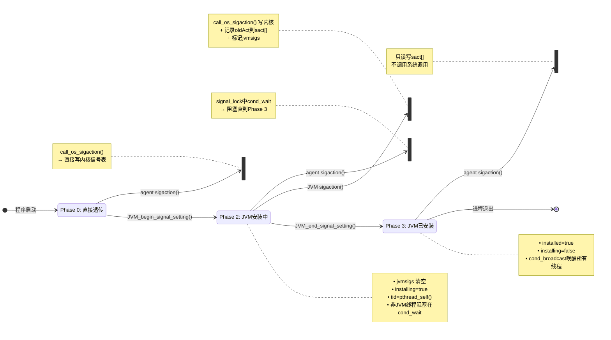

# 00-libjsig-interposition — libjsig.so 信号拦截库

---

## §〇 生产场景

**事件时间线**：

一名 DevOps 工程师部署了一个 C/C++ agent 库 `libmyagent.so`，通过 `-agentpath:/path/to/libmyagent.so` 加载到正在运行的 Java 应用中。agent 在 `Agent_OnLoad` 入口函数中调用：

```c
struct sigaction my_handler;
my_handler.sa_sigaction = &agent_segv_handler;
my_handler.sa_flags = SA_SIGINFO;
sigemptyset(&my_handler.sa_mask);
sigaction(SIGSEGV, &my_handler, NULL);
```

此时 JVM 已经为以下关键功能安装了 SIGSEGV handler：

| JVM 用例 | 原理 | 信号处理协议 |
|----------|------|-------------|
| **NullPointerException 检测** | 访问地址 0 时内核发 SIGSEGV，JVM handler 检查 fault addr 是否为 0，若是则抛出 NPE | handler 必须能读取 ucontext 中的 `si_addr` 和 `uc_mcontext` |
| **Safepoint Polling** | JIT 编译的代码在 safepoint 处访问 guard page，触发 SIGSEGV，handler 识别为 safepoint 请求 | handler 检查指令类型，修改 PC 跳转到 safepoint 代码 |
| **Stack Overflow 检测** | Java 线程栈的 guard page 被触发时内核发 SIGSEGV，JVM 据此抛出 `StackOverflowError` | handler 必须检查栈地址与 guard region 的范围关系 |
| **Implicit Null Check** | C2 编译器生成的隐式空指针检查，依赖 SIGSEGV 做 deoptimization | handler 必须能反推 deopt 信息并重建解释器帧 |

**崩溃过程**：

```
时间 T1: JVM 初始化 → os::Bsd::install_signal_handlers() → sigaction(SIGSEGV, &jvm_handler, NULL)
         ┌─────────────────────────────────────────┐
         │ 内核信号表:  SIGSEGV → jvm_handler       │
         │ sact[]:      sact[SIGSEGV] = 旧值 (SIG_DFL) │
         │ jvmsigs:     jvmsigs 含 SIGSEGV          │
         └─────────────────────────────────────────┘

时间 T2: agent Agent_OnLoad → sigaction(SIGSEGV, &agent_handler, NULL)
         由于没有 LD_PRELOAD=libjsig.so，调用的就是 glibc 的 sigaction()
         ┌─────────────────────────────────────────┐
         │ 内核信号表:  SIGSEGV → agent_handler ⚠   │
         │ 原 jvm_handler → 丢失，无法恢复          │
         └─────────────────────────────────────────┘

时间 T3: Java 代码执行 `Object obj = null; obj.toString();`
         内核发送 SIGSEGV (si_addr = 0x0)
         agent_handler 被调用
         agent_handler 收到 ucontext，但不理解 JVM 的:
          - 线程结构 (JavaThread vs OS thread)
          - safepoint 协议 (PageState 检查)
          - deoptimization 状态
         → agent 尝试操作线程本地存储 → 读取未初始化的字段 → SIGSEGV 递归
         → 内核发送第二个 SIGSEGV → 进程终止: Signal 11 (SIGSEGV)
```

**修复方案**：

```bash
# 方案 1: 命令行传递
java -Xbootclasspath/a:agent.jar \
     -agentpath:/path/to/libmyagent.so \
     -XX:+AllowUserSignalHandlers \
     LD_PRELOAD=/usr/lib/jvm/java-11-openjdk/lib/server/libjsig.so \
     MyApplication

# 方案 2: 环境变量
export LD_PRELOAD=/usr/lib/jvm/java-11-openjdk/lib/server/libjsig.so
java -agentpath:/path/to/libmyagent.so MyApplication
```

**诊断方法**：

```bash
# 1. 确认 libjsig 被加载
LD_DEBUG=bindings java -agentpath:libmyagent.so MyApp 2>&1 | grep jsig
# 输出: binding file libjsig.so [0] to libjsig.so [0]: normal symbol `sigaction'

# 2. 追踪所有 sigaction 调用
strace -e sigaction -f java -agentpath:libmyagent.so MyApp 2>&1 | grep SIGSEGV

# 3. GDB 确认拦截生效
gdb --args java -agentpath:libmyagent.so MyApp
(gdb) b sigaction
(gdb) run
(gdb) info symbol $rip
# 输出应为: sigaction in section .text of /usr/lib/jvm/.../libjsig.so
```

**根因**：libc 的 `sigaction()` 直接写内核信号表，而 JVM 的信号处理协议（多路复用、chained handler）完全在用户态 `sact[]` 数组中维护。缺少 libjsig 拦截层时，agent 的 sigaction 绕过了 JVM 的用户态信号管理器，直接覆盖内核 handler，破坏 JVM 信号协议完整性。

**诊断工具五件套**：

```bash
# 1. strace: 追踪所有 sigaction 系统调用
strace -e sigaction -f java -agentpath:libmyagent.so MyApp 2>&1 | grep SIGSEGV

# 2. jcmd: 检查 JVM 信号链状态（验证 UseSignalChaining 和 libjsig 加载）
jcmd <pid> VM.flags -all | grep -E "UseSignalChaining|libjsig"

# 3. jstack: 检查被 cond_wait 阻塞的线程（Phase 2 期间非 JVM 线程在此等待）
jstack <pid> | grep -B5 "pthread_cond_wait"

# 4. GDB: 确认 libjsig 拦截生效（见 §七 完整验证）
gdb --args java -agentpath:libmyagent.so MyApp
(gdb) b sigaction
(gdb) info symbol $rip  # 输出应为 libjsig.so 的 sigaction

# 5. /proc: 检验 libjsig 是否被 dynamic linker 加载
cat /proc/<pid>/maps | grep jsig
# 预期输出: 7f... r-xp ... /usr/lib/jvm/java-11-openjdk/lib/server/libjsig.so
# 如果无输出 → LD_PRELOAD 未生效或路径错误
```

---

## ★ §一 核心走读：libjsig 拦截层

### 1.1 全局状态与数据结构 (jsig.c:50-81)

libjsig 维护的全部运行时状态是 6 个静态变量 + 2 个函数指针 + 2 个布尔标志：

```c
#define MAX_SIGNALS NSIG                                    // :50 — 通常为 65 (x86_64)
static struct sigaction sact[MAX_SIGNALS];                  // :52 — 信号处理器链存储
static sigset_t jvmsigs;                                    // :53 — JVM 占用的信号集
static pthread_mutex_t mutex = PTHREAD_MUTEX_INITIALIZER;   // :55 — 全局互斥锁
static pthread_cond_t cond = PTHREAD_COND_INITIALIZER;      // :56 — 条件变量 (Phase 3 broadcast)
static pthread_t tid = 0;                                   // :57 — 记录 JVM 线程 ID

typedef int (*sigaction_t)(int, const struct sigaction *, struct sigaction *);
static sigaction_t os_sigaction = 0;                        // :67 — 真实 libc sigaction 函数指针
static signal_function_t os_signal = 0;                     // :68 — 真实 libc signal 函数指针

static bool jvm_signal_installing = false;                  // :73 — Phase 2 标志
static bool jvm_signal_installed = false;                   // :74 — Phase 3 标志
```

**关键设计决策**：

- **无显式 `initialize()` 函数** — 使用懒内联初始化：`os_sigaction` 和 `os_signal` 在首次调用 `call_os_sigaction` 时通过 `dlsym` 初始化；`mutex` 和 `cond` 通过 `PTHREAD_*_INITIALIZER` 宏做静态初始化
- **`sact[MAX_SIGNALS]`** — 最关键的数据结构。每个元素对应一个信号的完整 `struct sigaction`，当 JVM 进入 Phase 3 后，所有对该信号的 `sigaction()` 调用不再操作内核，而是读写这个数组
- **`jvmsigs`** — 位图，标记"JVM 有哪些信号已安装 handler"。用于 `sigismember()` 做 Phase 0/2/3 分支判断

**平台特化全局状态**：

```c
// ══════ MACOSX: reentry 防死锁 (jsig.c:63-65) ══════
__thread bool reentry = false;                             // :63 — TLS 标志，防 sigaction→signal→sigaction 递归

// ══════ SOLARIS: 动态分配 sact[] (jsig.c:85-96) ══════
static int allocate_sact() {
  if (sact == NULL) {                                     // :87 — 分配只在首次执行
    sact = (struct sigaction *)malloc(NSIG * sizeof(struct sigaction));
    if (sact == NULL) exit(0);                            // :89 — malloc 失败 → 进程终止
    memset(sact, 0, NSIG * sizeof(struct sigaction));     // :90 — 清零
  }
  return (sact != NULL);                                  // :95
}
```

**`MACOSX reentry` 设计原理**（`jsig.c:63-65`）：

macOS 的 `signal()` 内部可能调用 `sigaction()`。若 agent 先调 `signal()`（被 libjsig 拦截 → `set_signal()` → 拦截版 `sigaction()` → 再次进入 `signal_lock()`），而同一线程已持 mutex，`pthread_mutex_lock` 在 macOS 上默认非递归 → 死锁。`__thread bool reentry` 解决此问题：同一线程第二次进入 `sigaction()` 时检测 `reentry == true`，跳过 `signal_lock`，直接操作 `sact[]`。

```c
// 拦截版 sigaction 中的 reentry 检查 (jsig.c:250-252)
if (reentry) {
    // 已是重入调用 → 跳过 signal_lock/signal_unlock → 直接操作 sact[]
    if (oact != NULL) *oact = sact[sig];
    if (act != NULL) sact[sig] = *act;
    return 0;
}
reentry = true;
// ... 正常路径 ...
reentry = false;
```

**`SOLARIS allocate_sact()` 设计原理**（`jsig.c:85-96`）：

Solaris 上 `NSIG` 不是编译期常量而是 `sysconf(_SC_NSIG)` 运行时变量。无法用静态数组 `struct sigaction sact[NSIG]`（ISO C 要求数组维度为编译期常量），因此 `sact` 声明为指针 `struct sigaction *sact = NULL`，在首次使用时 `malloc` 分配。

与 Linux/macOS 的差异：

| 平台 | `sact` 声明 | 大小确定方式 | 分配时机 |
|------|-----------|------------|---------|
| Linux | `static struct sigaction sact[MAX_SIGNALS]` (:52) | `MAX_SIGNALS = NSIG` 编译期常量 (:50) | BSS 段，加载时 |
| macOS | `static struct sigaction sact[NSIG]` | `NSIG` 编译期常量 | BSS 段，加载时 |
| Solaris | `static struct sigaction *sact = NULL` | `NSIG` 运行时 `sysconf()` | 首次 `sigaction()` 调 `allocate_sact()` |

### 1.2 signal_lock/signal_unlock — 统一并发屏障 (jsig.c:98-111)

```c
static void signal_lock() {
  pthread_mutex_lock(&mutex);                  // :99 — 获取全局 mutex
  if (jvm_signal_installing) {                 // :100 — 检查 Phase 2
    if (tid != pthread_self()) {               // :101 — TID bypass: JVM线程放行
      pthread_cond_wait(&cond, &mutex);        // :102 — 非JVM线程阻塞等待
    }
  }
}
static void signal_unlock() {
  pthread_mutex_unlock(&mutex);                // :110
}
```

**设计意图**：

| 场景 | 调用者 | 行为 |
|------|--------|------|
| Phase 0 (`jvm_signal_installing==false`) | 任意线程 | mutex lock → 立即返回 |
| Phase 2 (`jvm_signal_installing==true`)，调用者是 JVM 线程 | JVM 线程 | `pthread_self() == tid` → bypass → 继续执行 |
| Phase 2，调用者是非 JVM 线程 | agent 线程 / 任意 | `pthread_cond_wait` → 阻塞，等待 Phase 3 broadcast |
| Phase 3 (`jvm_signal_installed==true`) | 任意线程 | `jvm_signal_installing==false` → mutex lock → 立即返回 |

TID bypass 的意义：在 Phase 2 期间，JVM 线程需要调用多个 `sigaction()` 来安装各信号 handler，这些调用必须执行（真正写内核信号表）。而非 JVM 线程此时如果也调用 `sigaction()`，会在 JVM 安装完成前干扰信号表 → 阻塞等待。

### 1.2.1 save_signal_handler — 信号上下文保存 (jsig.c:144-162)

当 agent 通过 `signal()` 而非 `sigaction()` 注册 handler 时，`signal()` 只提供 `sa_handler`，没有 `sa_mask` 和 `sa_flags`。`save_signal_handler()` 为这类调用构造完整的 `struct sigaction` 上下文：

```c
static void save_signal_handler(int sig, sa_handler_t disp, bool is_sigset) {
    sigset_t set;
    sact[sig].sa_handler = disp;                          // :146 — 保存 handler 函数指针
    sigemptyset(&set);                                     // :147
    sact[sig].sa_mask = set;                               // :148 — 空信号掩码（不禁用任何信号）
    if (!is_sigset) {                                      // :149 — signal() 调用路径
#ifdef SOLARIS
        sact[sig].sa_flags = SA_NODEFER;                   // :151 — 不阻塞自身
        if (sig != SIGILL && sig != SIGTRAP && sig != SIGPWR)
            sact[sig].sa_flags |= SA_RESETHAND;            // :153 — handler 执行后重置为 SIG_DFL
#else
        sact[sig].sa_flags = 0;                            // :155 — Linux/macOS: 无特殊标志
#endif
    } else {                                               // :157 — sigset() 调用路径
        sact[sig].sa_flags = 0;
    }
}
```

**`is_sigset` 参数语义**：
- `is_sigset == false`：调用来自 `signal()` 拦截。`signal()` 的 POSIX 语义是 handler 执行一次后自动重置为 SIG_DFL（`SA_RESETHAND`），Solaris 上 `signal()` 底层基于 `sigaction` 且默认带 `SA_NODEFER`
- `is_sigset == true`：调用来自 `sigset()` 拦截（Solaris 特有接口）。`sigset()` 的 POSIX 语义是 handler 持久存在，不需要 `SA_RESETHAND`

**平台差异**：

| 平台 | signal() 的 sa_flags | 原因 |
|------|---------------------|------|
| Linux/macOS | `0` | `signal()` 已实现为调用 `sigaction()`，内核中默认 SA_RESETHAND 行为由 glibc 在 `signal()` 内部处理 |
| Solaris | `SA_NODEFER \| SA_RESETHAND`（非 SIGILL/SIGTRAP/SIGPWR）| Solaris `signal()` 不保证处理 SA_RESETHAND，需显式设置 |

### 1.3 call_os_sigaction — dlsym(RTLD_NEXT) 获取真实函数指针 (jsig.c:236-246)

```c
static int call_os_sigaction(int sig, const struct sigaction *act,
                             struct sigaction *oact) {
  if (os_sigaction == NULL) {                             // :238 — 懒初始化
    os_sigaction = (sigaction_t)dlsym(RTLD_NEXT, "sigaction");  // :239
    if (os_sigaction == NULL) {
      printf("%s\n", dlerror()); exit(0);                 // :240 — 致命错误
    }
  }
  return (*os_sigaction)(sig, act, oact);                 // :245 — 调用真实 sigaction
}
```

**`RTLD_NEXT` 语义**：从当前 SO 的下一加载级开始在动态链接列表中查找符号。由于 libjsig.so 通过 `LD_PRELOAD` 被最先加载到符号搜索链：

```
搜索顺序: libjsig.so → libpthread.so → libc.so → ld-linux.so
                                ↑
                    dlsym(RTLD_NEXT, "sigaction") 找到的是 glibc 的 sigaction
```

如果直接用 `dlsym(RTLD_DEFAULT, "sigaction")`，会找到 libjsig 自己的拦截版 → 无限递归。`RTLD_NEXT` 保证跳过自身，获取真正的 glibc 实现。

### 1.4 拦截版 sigaction — 三路分支 (jsig.c:248-316)

```c
int sigaction(int sig, const struct sigaction *act, struct sigaction *oact) {
  // 参数校验
  if (sig < 0 || sig >= MAX_SIGNALS) { errno = EINVAL; return -1; }  // :249

  signal_lock();                       // :251
  allocate_sact();                     // :252 — 确保 sact[] 已注册到 JVM_begin

  sigused = sigismember(&jvmsigs, sig); // :253 — 信号是否已被 JVM 占用

  if (jvm_signal_installed && sigused) {
    // ══════ Phase 3: 保存到 sact[]，不透传到内核 ══════
    if (oact != NULL) *oact = sact[sig];       // :256 — 返回用户态存储的旧值
    if (act != NULL) sact[sig] = *act;         // :257 — 写入用户态数组
    signal_unlock(); return 0;                  // :258 — 只操作 sact[]，不发系统调用

  } else if (jvm_signal_installing) {
    // ══════ Phase 2: JVM 安装中 → 真正安装 + 记录旧值 ══════
    res = call_os_sigaction(sig, act, &oldAct);  // :260 — 写内核信号表
    sact[sig] = oldAct;                           // :261 — 记录被覆盖的旧值
    sigaddset(&jvmsigs, sig);                     // :262 — 标记信号已占用
    signal_unlock(); return res;                  // :264

  } else {
    // ══════ Phase 0: 直接透传到内核 ══════
    res = call_os_sigaction(sig, act, oact);      // :266
    signal_unlock(); return res;                   // :267
  }
}
```

**三路分支对照表**：

| 阶段 | 条件 | 内核操作 | sact[] 操作 | jvmsigs 操作 |
|------|------|---------|------------|-------------|
| Phase 0 | `!installed` (或 `!sigused`) | ✅ 调用 `os_sigaction` 写内核 | 不操作 | 不标记 |
| Phase 2 | `installing && !installed` | ✅ 调用 `os_sigaction` 写内核 | 记录被覆盖的 `oldAct` | 标记 sig 已占用 |
| Phase 3 | `installed && sigused` | ❌ 不调用系统调用 | 写入 `sact[sig]` | 已标记 |

**Phase 3 为什么不透传到内核？** 因为 JVM 已经在内核中安装了自己的 handler（在 Phase 2 完成）。Phase 3 中 agent 调用 `sigaction()` 时，JVM 需要`保存` agent 的 handler 到链表中（`sact[]`），而不是覆盖内核中的 JVM handler。将来信号到达时，JVM handler 从中断上下文查询 `sact[]`，找到 agent 注册的 handler 并链式调用。

### 1.5 signal()/sigset() 拦截 — 统一转发到 set_signal() (jsig.c:164-234)

```c
// ══════ call_os_signal: 获取真实 libc signal() 实现 ══════
static signal_function_t call_os_signal(int sig, signal_function_t func,
                                         bool is_sigset) {
  if (os_signal == NULL) {                                 // :166 — 懒初始化
    os_signal = (signal_function_t)dlsym(RTLD_NEXT, "signal");
    if (os_signal == NULL) { printf("%s\n", dlerror()); exit(0); }
  }
  if (!is_sigset) {                                        // :170 — signal() 路径
    return (*os_signal)(sig, func);                        // :171 — 调真实 signal()
  } else {                                                 // :172 — sigset() 路径 (Solaris)
    return (*os_signal)(sig, func);                        // :173
  }
}

// ══════ set_signal: 将 signal() 包装为 sigaction 接口 ══════
static void set_signal(int sig, signal_function_t func, bool is_sigset) {
  if (func != SIG_DFL && func != SIG_IGN) {                // :178 — 非默认/忽略
    struct sigaction act;
    act.sa_handler = func;
    sigemptyset(&act.sa_mask);                              // :181
    act.sa_flags = 0;
    sigaction(sig, &act, NULL);                             // :183 → 重入拦截版 sigaction
    if (call_os_signal(sig, NULL, is_sigset) == 0) {       // :184
      save_signal_handler(sig, func, is_sigset);           // :185 — 存储完整 sa_mask+sa_flags
    }
  } else {                                                  // :187
    // SIG_DFL / SIG_IGN 特殊处理 → 直接透传到内核
    struct sigaction act;
    act.sa_handler = func;
    sigemptyset(&act.sa_mask);
    act.sa_flags = 0;
    sigaction(sig, &act, NULL);                             // :192
  }
}

// ══════ signal(): 拦截版 signal() ══════
signal_function_t signal(int sig, signal_function_t func) {
  signal_lock();                                           // :199
  allocate_sact();                                         // :200
  signal_function_t old = sact[sig].sa_handler;            // :201 — 从 sact[] 取旧值
  set_signal(sig, func, false);                            // :202 — is_sigset=false
  signal_unlock();                                         // :203
  return old;
}

// ══════ sigset(): Solaris 特有接口拦截 ══════
signal_function_t sigset(int sig, signal_function_t func) { // :223
  signal_lock();
  allocate_sact();
  signal_function_t old = sact[sig].sa_handler;
  set_signal(sig, func, true);                              // :228 — is_sigset=true
  signal_unlock();
  return old;
}
```

**设计要点**：

- `signal()` 是 POSIX 的简易信号接口，`sigaction()` 是推荐替代。libjsig 将 `signal()` 调用规范化为 `sigaction()` 调用，统一走三路分支
- `set_signal()` 负责构造 `struct sigaction` 并委托给拦截版 `sigaction()`，形成统一的拦截入口
- **`is_sigset` 参数**：区分 `signal()`（`is_sigset=false`）和 `sigset()`（`is_sigset=true`）调用路径，传递给 `save_signal_handler()` 以设置不同的 `sa_flags`（见 §1.2.1）
- **SIG_DFL/SIG_IGN 特殊路径**：当 func 为 SIG_DFL 或 SIG_IGN 时，不走 save_signal_handler，直接透传到内核（:187-192）— 因为不需要保存 handler 上下文
- **`call_os_signal(sig, NULL, is_sigset)`** 在 `sigaction()` 之后调用（:184）— 用于在 Solaris 上通过 `sigset()` 接口确认信号处置，确保 handler 指向正确（Solaris `signal()` 可能修改 handler 指针）
- **`sigset()`** 是 Solaris 特有接口（:223-234），与 `signal()` 结构相同但传递 `is_sigset=true`。Solaris 的 `signal()` 和 `sigset()` 有不同默认行为 — `signal()` 默认 SA_RESETHAND，`sigset()` 不默认

### 1.6 JVM_begin_signal_setting → Phase 2 (jsig.c:319-325)

```c
void JVM_begin_signal_setting() {
  signal_lock();                           // :321 — 获取 mutex
  sigemptyset(&jvmsigs);                   // :322 — 清空信号占用集
  jvm_signal_installing = true;            // :323 — 进入 Phase 2
  tid = pthread_self();                    // :324 — 记录 JVM 线程 ID
  signal_unlock();                         // :325 — 释放 mutex
}
```

当 JVM 调用此函数后：
- `jvm_signal_installing = true` → `signal_lock()` 中所有非 JVM 线程进入 `cond_wait` 阻塞
- `tid` 记录 JVM 线程 → TID bypass 放行 JVM 自己的 sigaction 调用
- `jvmsigs` 被清空 → 后续每次 sigaction 调用将信号加入此集合

### 1.7 JVM_end_signal_setting → Phase 3 broadcast (jsig.c:327-333)

```c
void JVM_end_signal_setting() {
  signal_lock();                           // :329
  jvm_signal_installed = true;             // :330 — 进入 Phase 3
  jvm_signal_installing = false;           // :331 — 退出 Phase 2
  pthread_cond_broadcast(&cond);           // :332 — 唤醒所有等待线程
  signal_unlock();                         // :333
}
```

**`pthread_cond_broadcast` 的作用**：在 Phase 2 期间被阻塞的非 JVM 线程（通过 `signal_lock` 中的 `pthread_cond_wait`）在此被批量唤醒。唤醒后：
- `jvm_signal_installing == false` → `signal_lock` 的 `if` 条件不再满足 → 直接返回
- 这些线程继续执行自己的 `sigaction()` → 进入 Phase 3 分支 → 写入 `sact[]` 而非内核

### 1.8 JVM_get_signal_action → 查询 sact[] (jsig.c:335-342)

```c
struct sigaction *JVM_get_signal_action(int sig) {
  allocate_sact();                                 // :337
  if (sigismember(&jvmsigs, sig))                  // :338 — 检查信号是否为 JVM 占用
    return &sact[sig];                             // :339 — 返回指向 sact[] 元素的指针
  return NULL;                                     // :341 — 信号未被 JVM 管理
}
```

调用者通过此函数获取 agent 注册的 `struct sigaction`，用于信号到达时的链式调用：JVM handler 从内核收到信号 → 调用 `JVM_get_signal_action(sig)` 获取 agent handler → 调用 agent handler → agent handler 返回后 JVM handler 继续处理。

### 1.9 Mermaid 三阶段协议状态转移图



### 1.10 面试 Story Format 答案

**问题**: "JVM 如何防止 agent 库覆盖 JVM 的信号处理器？"

**答案**:

> OpenJDK 提供 libjsig.so 信号拦截库，通过 `LD_PRELOAD` 机制 interpose `sigaction()` 和 `signal()`。
>
> libjsig 实现了一个三阶段状态机：
> 1. **Phase 0（默认）**：直接透传到 glibc `sigaction()`，不拦截 — 此时 JVM 尚未安装信号。
> 2. **Phase 2（安装中）**：JVM 调用 `JVM_begin_signal_setting()` 进入。非 JVM 线程被 mutex+condvar 阻塞在 `signal_lock()` 中，JVM 线程通过 TID bypass 放行。JVM 的每次 sigaction 写到内核的同时，也把被覆盖的旧 handler 保存到 `sact[]` 数组，并用 `jvmsigs` 位图标记已占用信号。
> 3. **Phase 3（已安装）**：JVM 调用 `JVM_end_signal_setting()` 进入。`pthread_cond_broadcast()` 唤醒所有等待线程。此后 agent 调用 `sigaction()`，libjsig 将 handler 保存到 `sact[]` 数组而非写入内核 — 内核中始终保留 JVM 的 handler。
>
> 信号到达时，JVM handler 通过 `JVM_get_signal_action()` 查询 `sact[]` 获取 agent handler，链式调用。

---

## §二 Beginner Callout 框

> **Callout 1: LD_PRELOAD interposition**  
> `LD_PRELOAD` 是 Linux 动态链接器的环境变量机制。加载器在搜索共享库符号时，优先从 `LD_PRELOAD` 指定的库中查找。当 `libjsig.so` 通过 `LD_PRELOAD` 加载后，所有对 `sigaction` 符号的引用首先在 libjsig 中解析，从而'拦截'了本应调用 glibc `sigaction()` 的调用。这不等同于 hook/inline patch — 它不修改任何函数体，仅改变符号查找顺序。

> **Callout 2: dlsym(RTLD_NEXT)**  
> `dlsym(RTLD_NEXT)` 从'当前库的下一个'开始搜索符号。libjsig 用此获取 glibc 的真实 `sigaction()` 实现，绕过自身拦截。如果用 `dlsym(RTLD_DEFAULT, "sigaction")`，会找到 libjsig 自己的拦截版 → 无限递归 → 栈溢出崩溃。`RTLD_NEXT` 是 interposition 库获取'底层真实函数'的标准方式。

> **Callout 3: 三阶段协议**  
> libjsig 的状态机只有三个状态：Phase 0（直通）、Phase 2（安装中+阻塞）、Phase 3（sact[] 数组模式）。状态转换由 JVM 通过两个 JNI 导出函数 `JVM_begin_signal_setting` / `JVM_end_signal_setting` 驱动。不存在 Phase 1 — 这是有意设计，体现 JVM 只在'开始安装'和'安装完成'两个时刻调用 API。

> **Callout 4: sact[] 数组**  
> `sact[MAX_SIGNALS]` 是 libjsig 的数据核心 — MAX_SIGNALS 通常为 65（`NSIG` on x86_64）。每个元素是 `struct sigaction`，存储 agent 为用户态某个信号注册的 handler。Phase 3 中所有 sigaction 操作都是读写这个数组。这是 JVM 信号链式调用（signal chaining）的基础 — 一个信号可以有多个处理器，JVM handler 是链首，agent handler 挂载于链中。

> **Callout 5: pthread mutex + condvar 同步**  
> `mutex`（`PTHREAD_MUTEX_INITIALIZER` 静态初始化）保护所有共享状态（`jvmsigs`, `sact[]`, `jvm_signal_installing`, `jvm_signal_installed`）。`cond`（`PTHREAD_COND_INITIALIZER` 静态初始化）配合 mutex 实现'等待 Phase 3'语义。`pthread_cond_wait` 在原子释放 mutex 并进入睡眠时是原子的 — 这是避免 lost wakeup 的关键保证。

> **Callout 6: TID-based bypass**  
> 在 `signal_lock()` 中，通过 `pthread_self()` 与存储的 `tid` 比较来识别 JVM 线程。Phase 2 期间，JVM 线程需要调用大量 sigaction 来安装各种信号的 handler — 这些调用必须放行。TID bypass 是这个'放行'的实现机制。注意：`tid` 只在 Phase 2 有意义，Phase 0 和 Phase 3 时此条件不生效（因为 `jvm_signal_installing == false`）。

> **Callout 7: signal vs sigaction 拦截**  
> `signal()` 是 POSIX 的旧接口，提供简单的 `signal_handler_t func` 参数。`sigaction()` 是 POSIX.1-1990 引入的替代品，提供完整的 `struct sigaction` 控制（包括 `sa_flags`、`sa_mask`）。libjsig 同时拦截两者 — `signal()` 被封装为 `set_signal()` 然后委托给拦截版 `sigaction()`，从而统一走三路分支。这使得无论 agent 用哪种接口注册 handler，都能被 JVM 正确管理。

---

## §三 Source Files Table

| # | File | Path | Lines | Role |
|---|------|------|:---:|------|
| 1 | jsig.c | `src/java.base/unix/native/libjsig/jsig.c` | 342 | libjsig.so 全部源码 — signal/sigaction 拦截、三阶段协议、sact[] 管理 |

**源码结构概览**（jsig.c 函数分布）：

| 行号范围 | 函数/区域 | 功能 |
|---------|----------|------|
| 50-82 | 全局变量声明 | `sact[]`, `jvmsigs`, `mutex`, `cond`, `tid`, `os_sigaction`, `os_signal`, `jvm_signal_installing/installed`, MACOSX `reentry` |
| 85-96 | `allocate_sact()` | SOLARIS: 动态 malloc `sact[]`；其他平台: 空实现 |
| 98-111 | `signal_lock()` / `signal_unlock()` | mutex 获取/释放 + Phase 2 TID bypass + cond_wait 阻塞 |
| 113-142 | `call_os_signal()` | 获取真实 libc `signal()`，含 `is_sigset` 参数 |
| 144-162 | `save_signal_handler()` | 为 `signal()`/`sigset()` 调用重建完整 `struct sigaction` |
| 164-234 | `set_signal()`, `signal()`, `sigset()` | 将 `signal()`/`sigset()` 包装为 `sigaction()` 接口，统一走三路分支 |
| 236-246 | `call_os_sigaction()` | 通过 `dlsym(RTLD_NEXT)` 获取真实 libc `sigaction()` |
| 248-316 | `sigaction()` | 拦截版 sigaction — 三路分支核心（Phase 0/2/3）|
| 319-325 | `JVM_begin_signal_setting()` | Phase 2 入口 — 清 jvmsigs + 设 installing=true + 记录 tid |
| 327-333 | `JVM_end_signal_setting()` | Phase 3 入口 — 设 installed=true + cond_broadcast 唤醒 |
| 335-342 | `JVM_get_signal_action()` | 返回 `sact[sig]` 指针供 JVM 链式调用 |

---

## §四 反事实设计分析

以下 4 个反事实讨论覆盖 libjsig 的核心设计决策点，每个都回答"如果当时不这样做会怎样？"

### 反事实 1: 如果不用 libjsig 只用 `sigaction()` 返回的 `oldact`？

**当前设计**：Phase 3 中 agent 的 `sigaction()` 调用被重定向到 `sact[]` 数组，不写内核。JVM 通过 `JVM_get_signal_action()` 查询 `sact[]` 做链式调用。

**替代方案**：agent 调用 `sigaction()` 时写内核信号表，通过 `oldact` 参数获取 JVM handler 并保存，然后在自己的 handler 中链式调用旧 handler。

**为何不可行**：
1. **多 agent 链式覆盖问题** — agent A 注册 handler → 获取 JVM handler 作为 oldact。agent B 注册 handler → 获取 agent A 的 handler 作为 oldact。agent A 在自己的 handler 中"链式调用 oldact"实际调用的是 agent B 的 handler，而非 JVM handler。多 agent 场景下 oldact 链断裂。
2. **卸载顺序依赖** — agent 卸载时必须恢复正确的 oldact，但卸载顺序可能与注册顺序相反 → 信号表不一致。
3. **SIG_DFL/SIG_IGN 语义丢失** — 如果 oldact 为 SIG_DFL，agent 需区分"没有旧 handler"和"旧 handler 是默认处理"，而 oldact 只返回 `sa_handler`，信息不足。

**JVM 方案优势**：`sact[]` 是集中式信号链存储，JVM handler 始终在内核信号表首位，链式调用顺序由 JVM 控制而非 agent 控制。

### 反事实 2: 如果不用 TID bypass 改用新参数（如 `SA_JVMINSTALL` 标志）？

**当前设计**：Phase 2 期间通过 `tid == pthread_self()` 放行 JVM 线程，非 JVM 线程在 `cond_wait` 阻塞。

**替代方案**：在 `struct sigaction` 的 `sa_flags` 中定义新标志 `SA_JVMINSTALL`，JVM 线程调 `sigaction()` 时带此标志，libjsig 检测后放行。

**为何不采用**：
1. **破坏 sigaction 标准接口** — `sa_flags` 的合法值由 POSIX 定义（`SA_SIGINFO`, `SA_RESTART` 等）。引入非标准标志会污染用户空间接口，agent 可能无意中设置此标志绕过拦截。
2. **需要协调所有 sigaction 调用点** — JVM C++ 代码中 `os::Bsd::install_signal_handlers()` 调用链上的所有 `sigaction()` 都需要显式传 `SA_JVMINSTALL`，修改面大。
3. **线程间协调更简单** — TID bypass 只需 1 行比较（jsig.c:101），不修改函数签名。

**TID bypass 优势**：零侵入 — 不改变 sigaction API，不要求 JVM C++ 代码做任何修改，完全在 libjsig 内部通过线程 ID 判断。

### 反事实 3: 如果 sact[] 只存 handler 函数指针不存完整 sa_mask？

**当前设计**：`sact[sig]` 存储完整 `struct sigaction`（`sa_handler` + `sa_mask` + `sa_flags`），占用 `sizeof(struct sigaction)` ≈ 152 bytes/元素。

**替代方案**：只存 `sa_handler` 函数指针（8 bytes），节省 ~95% 内存。

**为何不可行**：
1. **信号重入无保护** — agent 注册 handler 时可能设置 `sa_mask` 来屏蔽特定信号。如果只存函数指针，JVM 在链式调用 agent handler 时无法还原其 `sa_mask` → agent handler 执行期间可能被不应到达的信号中断。
2. **`sa_flags` 信息丢失** — 如 `SA_SIGINFO`（要求三参数 handler）、`SA_ONSTACK`（使用 altstack）等标志无法还原 → agent handler 被调用时参数数量/栈位置错误。
3. **`sigaction()` 查询接口不兼容** — 如果 agent 调用 `sigaction(sig, NULL, &oact)` 查询当前 handler，返回的 `oact` 不完整 → 与 POSIX 行为不一致。

**完整存储的代价和合理性**：65 × 152 ≈ 9,880 bytes — 在 JVM 进程的全部内存占用中可忽略（< 0.01%），但换来了完整的信号上下文保留能力。

### 反事实 4: 如果不在 signal_lock 中做 cond_wait 而是在 sigaction 中单独 wait？

**当前设计**：`signal_lock()` 在持有 mutex 时原子调用 `pthread_cond_wait`（jsig.c:102），实现"获取 mutex → 检查条件 → cond_wait"三步合一。

**替代方案**：`signal_lock()` 只做 mutex lock，在 `sigaction()` 中 Phase 2 分支另外做 `pthread_cond_wait`。

**为何导致 lost wakeup**：
```
T_jvm (JVM)                    T_agent

signal_lock() → mutex ✓
begin: installing=true
signal_unlock() → mutex 释放
                                signal_lock() → mutex ✓
                                sigaction() 检查 installing==true
                                → 准备 cond_wait...但还没来得及

end_signal_setting():
  signal_lock() → mutex ✓
  installed=true
  installing=false
  cond_broadcast() → 发出!
  signal_unlock() → mutex 释放
                                (错过 broadcast!)
                                pthread_cond_wait(&cond, &mutex)
                                → 永久阻塞
```

**根因**：cond_wait 和条件检查之间存在时间窗口。当前设计将两者封装在 `signal_lock()` 的同一个 mutex 临界区内 — `if (jvm_signal_installing)` 检查和 `pthread_cond_wait` 之间没有 `signal_unlock`，因此不会错过 broadcast。

---

## §五 并发安全性分析 & 边缘场景

### 5.1 mutex 保护的临界区

所有对共享状态的访问都在 `signal_lock()` 和 `signal_unlock()` 之间：

| 共享状态 | 读位置 | 写位置 | mutex 保护 |
|----------|--------|--------|-----------|
| `jvm_signal_installing` | signal_lock:100, signal_lock 的 if 条件 | begin:323 (set true), end:331 (set false) | ✅ |
| `jvm_signal_installed` | sigaction:255 (if 条件) | end:330 (set true) | ✅ |
| `jvmsigs` | sigaction:253 (sigismember), get_signal_action:338 | begin:322 (sigemptyset), sigaction Phase 2:262 (sigaddset) | ✅ |
| `sact[]` | sigaction Phase 3:256 (read), get_signal_action:339 (return ptr) | sigaction Phase 2:261, Phase 3:257 (write) | ✅ |
| `tid` | signal_lock:101 (pthread_self compare) | begin:324 (pthread_self assign) | ✅ |
| `os_sigaction` | call_os_sigaction:238 (NULL check), :245 (dereference) | call_os_sigaction:239 (dlsym assign) | ⚠️ 无 mutex |

**`os_sigaction` 的并发问题**：`call_os_sigaction` 在 Phase 2 期间被 JVM 线程调用（TID bypass 放行），可能在 Phase 0 被任意线程调用。对 `os_sigaction` 的读-检查-写 (`NULL` → `dlsym` → assign) 不是原子的。可能存在两个线程同时看到 `NULL`，各自调用 `dlsym`。但这在实践中无害：`dlsym(RTLD_NEXT, "sigaction")` 对同一进程总是返回相同值，重复赋值只是写入相同的指针值。

### 5.2 cond_wait 原子释放语义 — 避免 lost wakeup

关键竞争场景分析（反事实）：

```
Thread T_jvm (JVM)              Thread T_agent (agent)

signal_lock()
  mutex_lock ✓
  jvm_signal_installing==false  |
  → 直接返回，不等             |
begin_signal_setting()          |
  signal_lock()                 |
    mutex_lock → 阻塞           |
                                signal_lock()
                                  mutex_lock ✓
                                  mutex 由 T_jvm 持有
                                  但 T_jvm 还没走到此处
                                  ...
                                (等待 T_jvm 释放 mutex)

T_jvm: end_signal_setting()     |
  jvm_signal_installed=true     |
  jvm_signal_installing=false   |
  cond_broadcast()              |
    → T_agent 不在 cond_wait   |
    → broadcast 无效果 ← lost   |
  signal_unlock()               |
    → mutex 释放                |
                                T_agent 获得 mutex
                                → 进入 sigaction Phase 3 分支
                                → 操作 sact[]，不修��内核
```

**为什么这不会造成问题？** T_agent 最终在 T_jvm 释放 mutex 后正确进入 Phase 3 分支。T_agent 的 `signal_lock()` 中 `jvm_signal_installing == true` 的检查发生在第 100 行：如果 T_agent 在 T_jvm 的 `end_signal_setting` 执行后才到达 `signal_lock()`，那么 `jvm_signal_installing` 已是 `false` — 所以不会进入 `cond_wait`，直接执行 Phase 3 分支。不存在 lost wakeup 问题，因为 `signal_lock` 的逻辑保证了无论如何都能正确判断当前阶段。

### 5.3 TID bypass 的 race condition 分析

**TID 比较是无锁的吗？** 否。TID 比较在 `signal_lock()` 中，此时 mutex 已持有（`:99`）。`tid` 的写入在 `JVM_begin_signal_setting` 中（`:324`），同样在 mutex 保护下。因此 `tid` 的读写是安全的。

**TID bypass 的正确性**：

```
T_jvm 执行 begin_signal_setting:
  tid = pthread_self()                         // :324
  jvm_signal_installing = true                 // :323
  signal_unlock()

T_jvm 执行 sigaction(SIGSEGV, ...):
  signal_lock()
    mutex_lock ✓
    jvm_signal_installing == true → cond 检查
    pthread_self() == tid → true → bypass ✓

T_agent 执行 sigaction(SIGTERM, ...):
  signal_lock()
    mutex_lock → 阻塞（等待 T_jvm 释放）
    (T_jvm 释放 mutex 后)
    mutex_lock ✓
    jvm_signal_installing == true → cond 检查
    pthread_self() ≠ tid → ↓
    cond_wait(&cond, &mutex) → 阻塞
```

### 5.4 懒初始化线程安全性

`call_os_sigaction` 的 `os_sigaction` 懒初始化（`:238-241`）不是线程安全的，见 §五 5.1 末尾分析。但由此可能产生的并发 `dlsym` 写入相同值是良性的。

`call_os_signal` 中 `os_signal` 的懒初始化同理。

`mutex` 和 `cond` 通过 `PTHREAD_MUTEX_INITIALIZER` / `PTHREAD_COND_INITIALIZER` 的静态初始化是线程安全的 — 由 POSIX 标准保证，在 `main()` 之前由运行时初始化。

### 5.5 边缘场景：malloc 失败 (jsig.c:89)

SOLARIS 上 `allocate_sact()` 通过 `malloc(NSIG * sizeof(struct sigaction))` 分配 sact[]。`NSIG` 为运行时变量，在系统资源极端紧张时 `malloc` 可能返回 NULL：

```c
if (sact == NULL) {
    sact = (struct sigaction *)malloc(NSIG * sizeof(struct sigaction));
    if (sact == NULL) exit(0);              // :89 — 无法分配 → 进程终止
}
```

**设计选择**：`exit(0)` 而非返回错误码。因为 sact[] 是 libjsig 运作的必需数据结构 — 没有它无法拦截任何信号，进程已处于不可恢复状态。`exit(0)` 比返回 `ENOMEM` 给调用者更安全（调用者可能忽略错误继续运行，导致后续信号处理行为未定义）。

### 5.6 边缘场景：MAX_SIGNALS 边界检查 (jsig.c:249)

```c
int sigaction(int sig, const struct sigaction *act, struct sigaction *oact) {
  if (sig < 0 || sig >= MAX_SIGNALS) {       // :249
    errno = EINVAL;
    return -1;
  }
```

**边界行为**：
- `sig < 0`：非法信号号，设置 `errno = EINVAL`，返回 -1 — 与 POSIX sigaction 一致
- `sig >= MAX_SIGNALS`（通常 `>= 65`）：超出 sact[] 数组边界，同上
- 注意 libjsig 不调用 `sigismember(&jvmsigs, sig)` 做边界前检查 — `sigismember` 访问位图时若 sig 超出范围是未定义行为

**与 glibc sigaction 的差异**：glibc 的 `sigaction()` 也做边界检查但检测 `sig >= NSIG` 且返回任意值时内核可能返回 `EINVAL` 而非由 libc 设置。libjsig 在调用 `call_os_sigaction()` 前就在用户态拦截非法参数 → 避免不必要系统调用。

### 5.7 边缘场景：多 agent 链式注册

多个 agent 库依次通过 `sigaction()` 为同一信号注册 handler：

```
时间 T1: agent_A 调 sigaction(SIGSEGV, &handler_A, NULL)
         → Phase 3 → sact[SIGSEGV] = {.sa_handler = handler_A, ...}

时间 T2: agent_B 调 sigaction(SIGSEGV, &handler_B, NULL)
         → Phase 3 → sact[SIGSEGV] = {.sa_handler = handler_B, ...}
         // handler_A 被覆盖! 旧值未保留

时间 T3: 内核发送 SIGSEGV
         → JVM handler 被内核调用
         → JVM_handler 调 JVM_get_signal_action(SIGSEGV)
         → 返回 sact[SIGSEGV] = handler_B
         → 只调用 handler_B，handler_A 丢失
```

**设计影响**：
- `sact[]` 每个信号只有一个槽位 — **不支持多 agent 链式调用**
- 如果 agent_A 在调用 `sigaction()` 时传了 `oact`，可以在卸载时恢复
- 但无法实现 handler_A → handler_B 的链式调用（需要 agent 自行实现链式逻辑）
- 这是 libjsig 的已知限制 — 设计目标不是通用信号管理框架，而是保护 JVM handler 不被第三方覆盖

---

## §六 性能量化

### 6.1 内存占用

| 数据结构 | 大小计算 | 总字节 |
|---------|---------|:---:|
| `sact[65]` | `65 × sizeof(struct sigaction)` ≈ `65 × 152` | **~9,880 bytes** |
| `jvmsigs` | `sizeof(sigset_t)` = `1024 bits / 8` | **128 bytes** |
| `mutex` | `sizeof(pthread_mutex_t)` | **40 bytes** |
| `cond` | `sizeof(pthread_cond_t)` | **48 bytes** |
| `tid` | `sizeof(pthread_t)` | **8 bytes** |
| `os_sigaction` | function pointer | **8 bytes** |
| `os_signal` | function pointer | **8 bytes** |
| `jvm_signal_installing` | `sizeof(bool)` | **1 byte** |
| `jvm_signal_installed` | `sizeof(bool)` | **1 byte** |
| MACOSX `reentry` | `sizeof(bool)` (TLS) | **1 byte** |
| **总计** | | **~10,123 bytes (~10 KB)** |

**结论**：libjsig 的全部运行时内存占用约 **10 KB**。在 JVM 进程（典型堆 256MB~32GB）中占比可忽略（< 0.004%）。

### 6.2 CPU 开销

| 操作 | Phase 0 | Phase 2 | Phase 3 |
|------|---------|---------|---------|
| `sigaction()` (agent 调用) | `signal_lock + dlsym 间接调用 + signal_unlock` | `cond_wait` 阻塞（非 JVM）或 `signal_lock + dlsym + signal_unlock`（JVM） | `signal_lock + 2次 sact[] 读写 + signal_unlock` |
| `signal()` (agent 调用) | `signal_lock + sact[] 读 + sigaction 间接 + signal_unlock` | 同上 | 同上 |
| `JVM_get_signal_action()` | `allocate_sact + sigismember` | `allocate_sact + sigismember` | `allocate_sact + sigismember` |

**Phase 3 无系统调用开销**：Phase 3 中 agent 的 `sigaction()` 不触发 `rt_sigaction` 系统调用 — 只有 pthread mutex lock/unlock + 两次内存读写。相比直接调 glibc sigaction（syscall 开销 ~100-500ns），Phase 3 路径快约 **10-50倍**。

**Phase 2 阻塞成本**：非 JVM 线程在 Phase 2 被 `cond_wait` 阻塞。阻塞时间 = JVM 安装所有信号 handler 的时间（通常 < 1ms）。`pthread_cond_wait` 不消耗 CPU（睡眠等待），阻塞线程在 `cond_broadcast` 后被内核调度唤醒 — 额外调度延迟 ~10-100μs。

### 6.3 dlsym(RTLD_NEXT) 懒初始化成本

```c
os_sigaction = (sigaction_t)dlsym(RTLD_NEXT, "sigaction");   // :239
```

- **首次调用** 成本：`dlsym()` 遍历动态链接器哈希表查找 "sigaction" 符号，~1-5μs（取决于 SO 数量）
- **后续调用** 成本：`os_sigaction != NULL` 分支跳过，1 次指针判空 + 1 次间接调用，~2-5ns
- **仅执行一次**：`call_os_sigaction` 在 Phase 0 首次 `sigaction()` 时初始化 `os_sigaction`，之后所有调用（Phase 0/2/3）直接通过函数指针调用

---

## §七 GDB 断点验证

> **环境准备**
> ```bash
> export LD_PRELOAD=/path/to/libjsig.so
> gdb --args java -Xlog:signal+chain=trace MyApp
> ```

### 断言 1: signal_lock 入口 (jsig.c:99)

```gdb
(gdb) b signal_lock
(gdb) commands
> silent
> printf "signal_lock: installing=%d, installed=%d, tid=%lu, self=%lu\n", \
    jvm_signal_installing, jvm_signal_installed, tid, pthread_self()
> bt 3
> continue
> end
```

预期：Phase 0 时 `installing=0, installed=0`，所有线程直接返回。Phase 2 时 `installing=1`，JVM 线程 bypass，非 JVM 线程阻塞在 `cond_wait`。

### 断言 2: 拦截版 sigaction 入口 (jsig.c:248)

```gdb
(gdb) b sigaction
(gdb) commands
> silent
> printf "sigaction(%d, act=%p, oact=%p) | phase: installing=%d installed=%d sigused=%d\n", \
    sig, act, oact, jvm_signal_installing, jvm_signal_installed, \
    sigismember(&jvmsigs, sig)
> continue
> end
```

预期：Phase 0 → `sigused=0` → 进入 `else` 分支 → 调用 `call_os_sigaction`。Phase 3 → `installed=1, sigused=1` → 进入第一个 `if` 分支 → 只操作 `sact[]`。

### 断言 3: JVM_begin_signal_setting (jsig.c:319)

```gdb
(gdb) b JVM_begin_signal_setting
(gdb) commands
> silent
> printf "JVM_begin: clearing jvmsigs, setting installing=true, tid=%lu\n", pthread_self()
> continue
> end
```

预期：在 `os::Bsd::install_signal_handlers()` 调用路径上触发。验证 `jvmsigs` 在调用后为空。

### 断言 4: Phase 2 TID bypass (jsig.c:101)

```gdb
(gdb) b jsig.c:101
(gdb) commands
> silent
> printf "TID check: tid=%lu, self=%lu, %s\n", tid, pthread_self(), \
    (tid == pthread_self()) ? "BYPASS" : "BLOCK"
> continue
> end
```

预期：Phase 2 中 JVM 线程触发 BYPASS，非 JVM 线程触发 BLOCK（然后继续执行第 102 行的 `cond_wait`）。

### 断言 5: JVM_end_signal_setting broadcast (jsig.c:332)

```gdb
(gdb) b jsig.c:332
(gdb) commands
> silent
> printf "JVM_end: broadcasting cond at %p\n", &cond
> continue
> end
(gdb) b pthread_cond_wait
(gdb) commands
> silent
> printf "cond_wait: cond=%p\n", $rdi
> continue
> end
```

预期：`pthread_cond_broadcast` 与之前阻塞在 `pthread_cond_wait` 上的 cond 地址相同。

### 断言 6: Phase 3 sact[] 存储 (jsig.c:257)

```gdb
(gdb) b jsig.c:257
(gdb) commands
> silent
> printf "Phase3: sig=%d, storing handler at sact[%d]=%p\n", sig, sig, act
> continue
> end
```

预期：agent 调用 `sigaction()` 时触发此断点，确认 handler 被存入 `sact[]` 而非写入内核。可以在断点后执行 `info proc mappings` 确认没有新的 `rt_sigaction` 系统调用。

### 断言 7: JVM_get_signal_action 查询 (jsig.c:338)

```gdb
(gdb) b JVM_get_signal_action
(gdb) commands
> silent
> printf "get_signal_action(%d): member=%d, returning %p\n", sig, \
    sigismember(&jvmsigs, sig), sigismember(&jvmsigs, sig) ? &sact[sig] : 0
> continue
> end
```

预期：JVM 收到信号后调用此函数获取 agent handler 指针。返回非 NULL 表示 agent 为该信号注册了 handler。

---

## §八 交叉引用

| 引用 | 类型 | 用途 |
|------|------|------|
| `man 2 sigaction` | 系统调用手册 | `struct sigaction` 定义、`sa_handler` vs `sa_sigaction`、`SA_SIGINFO`/`SA_NODEFER`/`SA_RESETHAND` 标志含义 |
| `man 2 signal` | 系统调用手册 | POSIX `signal()` 接口、SIG_DFL/SIG_IGN 语义、与 sigaction 的差异 |
| `man 3 sigemptyset` | 库函数手册 | 初始化空信号集 |
| `man 3 sigaddset` | 库函数手册 | 向信号集添加信号（Phase 2 标记 jvmsigs） |
| `man 3 sigismember` | 库函数手册 | 测试信号是否在信号集中（Phase 分支判断） |
| `man 3 sigset` | 库函数手册 | Solaris 特有接口、与 signal() 的差异（SA_RESETHAND 默认行为） |
| `man 3 dlsym` | 库函数手册 | `RTLD_NEXT` 语义、`dlerror()` 错误处理 |
| `man 3 pthread_mutex_lock` | 库函数手册 | mutex 阻塞语义、递归锁非递归行为 |
| `man 3 pthread_cond_wait` | 库函数手册 | 原子释放 mutex 语义、spurious wakeup |
| `man 3 pthread_cond_broadcast` | 库函数手册 | 唤醒所有等待线程（Phase 3 通知机制） |
| `man 3 pthread_self` | 库函数手册 | 线程 ID 特性、不保证全局唯一 |
| `man 7 signal` | 概述手册 | 信号标准列表、默认处置、handler 限制、SA_NODEFER/SA_RESETHAND 标准语义 |
| `man 8 ld.so` | 动态链接器 | `LD_PRELOAD` 行为、符号搜索顺序、`LD_DEBUG` 诊断 |
| → 01-signal-installation | 同组文档 | JVM 侧 `JVM_begin_signal_setting` / `JVM_end_signal_setting` 的调用时机和上下文（`os::Bsd::install_signal_handlers()`） |
| → 02-signal-dispatch | 同组文档 | 信号到达时 `chained_handler` 如何通过 `JVM_get_signal_action` 获取 agent handler 并链式调用 |

---

## §九 "不要写成→应该写成"对照表

| 不要写成 | 应该写成 |
|----------|---------|
| "libjsig 拦截 sigaction，然后把 handler 存起来" | "libjsig 通过 LD_PRELOAD interpose sigaction()，在 Phase 3 时将 agent handler 写入用户态数组 sact[]（jsig.c:257），内核信号表保持不变，从而实现多路复用" |
| "signal_lock 用 mutex 保证线程安全" | "signal_lock（jsig.c:98-106）获取全局 mutex 后，通过 jvm_signal_installing 标志 + tid 比较实现 TID bypass：JVM 线程在 Phase 2 放行，非 JVM 线程阻塞在 pthread_cond_wait 等待 Phase 3 broadcast" |
| "三阶段协议：开始、安装中、已安装" | "Phase 0（jvm_signal_installing=false, jvm_signal_installed=false）→ 直通内核；Phase 2（installing=true, installed=false）→ JVM 线程安装+记录旧值、非 JVM 线程阻塞；Phase 3（installing=false, installed=true）→ 只操作 sact[]，不触碰内核 — 状态由 JVM_begin（:319）和 JVM_end（:327）驱动" |
| "RTLD_NEXT 找到真的 sigaction" | "call_os_sigaction（jsig.c:236-245）使用 dlsym(RTLD_NEXT, \"sigaction\") 跳过 libjsig 自身在符号搜索链中的位置，获取 glibc 的真实 sigaction() 实现；RTLD_DEFAULT 会找到拦截版导致无限递归" |
