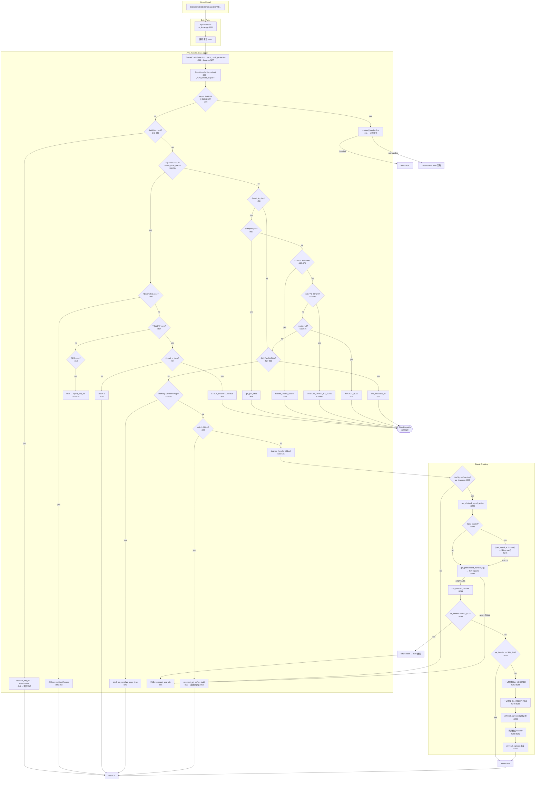

# 02-signal-dispatch — JVM 信号分派与链式回退

> **阶段**：[19-signal-chaining]
> **前置**：[00-libjsig-interposition]（libjsig LD_PRELOAD 机制、sact[] 存储）、[01-signal-installation]（sigact[] 存储 + sigaction 安装）
> **配套**：本文是 19-signal-chaining 的第 3 篇，承接 00+01 的两套 handler 存储，描述 signalHandler 入口到 JVM_handle_linux_signal 决策树再到 chained_handler 链式回退的完整分派路径
> **阅读收益**：追踪 signalHandler 到 JVM_handle_linux_signal 到 chained_handler 的完整三阶段分派链——掌握 sigaction handler 被中断时的 errno 保护、SIGSEGV 栈溢出三区检测（reserved/yellow/red）、_thread_in_Java 状态下的 6 种异常映射（Safepoint/SIGBUS/SIGFPE/ImplicitNull）、SA_NODEFER/SA_RESETHAND 的 JVM 手动模拟、libjsig vs JVM 后备 sigact[] 的两级查询、SignalHandlerMark 的 _num_nested_signal 重入防护

## §〇 生产场景

### StackOverflowError 变成 SIGSEGV crash

线上 Java 服务因一个递归调用导致栈溢出，但日志中没有 `StackOverflowError` 栈轨迹——只有 `hs_err_pid` 文件显示 SIGSEGV 导致的崩溃。

**Root Cause**：JVM 的栈溢出检测在 `JVM_handle_linux_signal` 的 `os_linux_x86.cpp:380-446` 中，依赖三个 guard zone（reserved/yellow/red）的 mmap 内存保护实现。C2 编译的代码如果缺少 stack banging（每帧开头访问当前 sp - shadow_pages 处的 guard page），栈溢出会越过 guard page 进入相邻线程的栈——内核报告 SIGSEGV 但 fault address 不在当前线程的 guard zone 内 → JVM 的三区检测全部失败 → 进入 `VMError::report_and_die` 路径 → 进程 crash。

**三步诊断**：

```bash
# 1. 检查 hs_err 文件中的信号信息
grep -A5 "SIGSEGV" hs_err_pid*.log
# 如果 si_code=SEGV_ACCERR 且 fault addr 不在栈范围内 → guard page 被越过

# 2. GDB 断点验证 guard zone 状态
gdb --args java -XX:+UnlockDiagnosticVMOptions -XX:+PrintAssembly App.jar
(gdb) break os_linux_x86.cpp:380
(gdb) run
(gdb) p ((JavaThread*)t)->_stack_guard_state
# 如果 thread 已处于 _stack_guard_state = stack_guard_disabled → 栈保护已禁用（red zone 已被触发过）
# 如果 addr 不在 thread->stack_base()..thread->stack_end() 之间 → 栈溢出已越过 guard 区

# 3. 验证 JIT 代码缺少 stack banging（仅 diagnostic 模式）
java -XX:+UnlockDiagnosticVMOptions -XX:+PrintAssembly \
     -XX:PrintAssemblyOptions=no-aliases App.jar | grep -B5 "call.*uncommon_trap"
# 如果 JIT 帧入口处没有 test [rsp-shadow_pages*page_size], rax → stack banging 缺失
```

**反事实**：如果 JVM 不在 C++ 层做 guard page 检测，而是完全依赖 JIT 的 stack banging → JIT banging bug 会导致栈溢出静默损坏相邻数据 → 症状表现为随机 SIGSEGV 或 heap corruption，距 root cause 数小时排查时间。JVM 的三区机制是 defense-in-depth：C++ guard page 是第二道防线，JIT stack banging 是第一道。两者同时失败时才出问题——概率极低但确实发生。

**修复方向**：
1. 增加 stack size：`-Xss2m`（默认 1MB）
2. 减少 stack banging shadow pages：`-XX:StackShadowPages=5`（默认 20，降低 banging 频率但增加风险）
3. 如果是特定 JIT 编译的帧缺失 banging → 定位到具体 nmethod → 禁用该编译 `-XX:CompileCommand=exclude,com.example.Foo.bar`

---

## §一 ★★★ JVM 信号分派全链路源码走读

### 1.1 源代码文件表

| # | File | Full Path | Lines | Core Functions | Role |
|---|------|-----------|:--:|----------|------|
| 1 | **os_linux.cpp** | `src/hotspot/os/linux/os_linux.cpp` | ~5500 | `signalHandler`(:5221), `get_chained_signal_action`(:5240), `call_chained_handler`(:5255), `chained_handler`(:5301) | 信号入口 + 链式回退 |
| 2 | **os_linux_x86.cpp** | `src/hotspot/os_cpu/linux_x86/os_linux_x86.cpp` | ~660 | `JVM_handle_linux_signal`(:271-660) | 🔥 平台相关信号决策树 |
| 3 | **os_posix.hpp** | `src/hotspot/os/posix/os_posix.hpp` | ~200 | `ThreadCrashProtection`(:143, 声明), `get_preinstalled_handler`(:121, 声明) | Crash 保护类声明 + 后备 handler 接口 |
| 4 | **os_posix.cpp** | `src/hotspot/os/posix/os_posix.cpp` | ~1800 | `ThreadCrashProtection::check_crash_protection`(:1673), `ThreadCrashProtection::call`(:1637), `get_preinstalled_handler`(:1720) | Crash 保护实现 + 后备信号表 |
| 5 | **thread.hpp** | `src/hotspot/share/runtime/thread.hpp` | ~3500 | `SignalHandlerMark`(:2313), `enter_signal_handler`(:283), `leave_signal_handler`(:284), `_num_nested_signal`(:278) | RAII 重入防护 |
| 6 | **globals.hpp** | `src/hotspot/share/runtime/globals.hpp` | ~3000 | `UseSignalChaining`(:900) | 信号链开关 |

### 1.2 signalHandler — 统一入口的薄包装

```
os_linux.cpp:5221-5226
信号被中断 → sigaction handler 调用此函数
```

`signalHandler` 是每个 JVM 托管信号的唯一入口点。JVM 在 `os::Linux::install_signal_handlers()` 中将此函数指针填入每个信号的 `struct sigaction::sa_sigaction`。

```cpp
static void signalHandler(int sig, siginfo_t *info, void *uc) {
    assert(info != NULL && uc != NULL, "it must be old kernel");
    int orig_errno = errno;  // Preserve errno value over signal handler.
    JVM_handle_linux_signal(sig, info, uc, true);
    errno = orig_errno;
}
```

**设计要点**：

- **errno 保存/恢复**：信号可在任何指令处中断用户代码。如果被中断的代码刚执行了一个失败的 `read()` 系统调用（errno = EAGAIN），JVM 信号处理路径中的任何操作（`printf`、`malloc`）都可能覆盖 errno → 用户代码恢复后 errno 错误 → 逻辑 bug。保存/恢复是信号处理器的标准实践（参见 `man 7 signal` "Async-signal-safe functions" 节的建议）。
- **`true` 参数**：第 4 个参数 `abort_if_unrecognized=true` 表示 JVM 不认识该信号时进入 `VMError::report_and_die` 而非 `return false`。这是生产模式的默认行为——任何无法识别的信号都视为致命错误。
- **断言**：`assert(info != NULL && uc != NULL)` 防护 glibc ≤2.0 的旧内核。现代 Linux 直接使用 `rt_sigaction` syscall，始终提供 `siginfo_t` 和 `ucontext_t`。

### 1.3 JVM_handle_linux_signal — 信号识别决策树

```
os_linux_x86.cpp:271-660
~390 行，覆盖 8 大类信号场景
```

这是信号处理的"大脑"——一个大型 if-else 决策树，按优先级依次尝试每种信号类型。每个分支匹配成功则 `return true`（已处理），全部不匹配则进入 `VMError::report_and_die`。

#### 1.3.1 ThreadCrashProtection + SignalHandlerMark

```
os_linux_x86.cpp:294-300
```

```cpp
Thread* t = Thread::current_or_null_safe();

// Must do this before SignalHandlerMark, if crash protection installed we will longjmp away
os::ThreadCrashProtection::check_crash_protection(sig, t);

SignalHandlerMark shm(t);
```

**ThreadCrashProtection**：某些 JVM 操作（如 JNI 调用、虚拟机操作）通过 `ThreadCrashProtection` RAII 对象保护——如果代码段内发生 crash，`check_crash_protection` 通过 `longjmp` 跳回安全点继续执行。**必须在 `SignalHandlerMark` 之前**，因为 `longjmp` 跳过析构函数——如果 `SignalHandlerMark` 被跳过，`_num_nested_signal` 计数会错。

**SignalHandlerMark**：RAII 守卫——构造时 `thread->enter_signal_handler()` 递增 `_num_nested_signal`，析构时 `thread->leave_signal_handler()` 递减。用途见 §三 重入防护。

#### 1.3.1a ThreadCrashProtection 深度分析

```
os_posix.hpp:143-161   class 声明
os_posix.cpp:1624-1673 实现（_crash_mux, call(), restore(), check_crash_protection()）
```

`ThreadCrashProtection` 是一个**静态工具类**（而非 RAII）——只有一个全局实例可被安装，通过自旋锁保护并发安装。

**类结构**（`os_posix.hpp:143-161`）：

```cpp
class ThreadCrashProtection : public StackObj {
  Thread* volatile _thread;           // 被保护的线程
  void* _sig_jmp_buf[JMP_BUF_SIZE];   // setjmp 缓冲区（实际是内核 sigsetjmp 缓冲区）
  static Thread* volatile _protected_thread;  // 正在保护的线程（全局单例）
  static ThreadCrashProtection* volatile _crash_protection; // 全局单例
  static volatile intptr_t _crash_mux;        // 自旋锁：防止双安装
public:
  ThreadCrashProtection();
  bool call(CrashProtectionCallback& cb);      // 安装保护 + 执行回调
  void restore();                              // 移除保护
  static void check_crash_protection(int sig, Thread* t); // 在信号处理器中检查
};
```

**安装与 longjmp 流程**：

1. **`call()`**（`os_posix.cpp:1637`）：通过 `Atomic::cmpxchg(&_crash_mux, 0, 1)` 获取自旋锁（防止两个线程同时安装 crash protection）→ 设置 `_crash_protection = this` + `_protected_thread = thread` → 调用 `sigsetjmp(_sig_jmp_buf)` 设置跳转锚点（`_sig_jmp_buf` 保存 CPU 寄存器 + 信号掩码）→ 如果返回值为 0（setjmp 首次调用）→ 执行用户回调 `cb.call()` → 如果回调中发生 crash → 从信号处理器 `check_crash_protection` 调用 `siglongjmp(_sig_jmp_buf, 1)` 跳回此处。`_sig_jmp_buf` 使用 `sig` 前缀变体——保存/恢复信号掩码，确保信号处理器期间的掩码状态也被正确恢复。

2. **`check_crash_protection(sig, t)`**（`os_posix.cpp:1673`）：在信号处理器上下文（`JVM_handle_linux_signal` 入口）检查 `_crash_protection != NULL && _protected_thread == t` → 如果匹配 → 调用 `siglongjmp(_crash_protection->_sig_jmp_buf, 1)` → 线程跳回 `call()` 中 `sigsetjmp` 的下一条指令（返回值 = 1），绕过可能产生崩溃的 C++ 代码段。

3. **`restore()`**（`os_posix.cpp:1668`）：回调成功完成或无 crash → 清空 `_crash_protection = NULL` + `_protected_thread = NULL` + `_crash_mux = 0`。

**使用场景**：JVM 在 JNI 调用（`JavaCallWrapper`）、虚拟机操作（`VM_Operation` 执行）前安装 crash protection——如果 JNI 或 VM 代码中有 bug 导致 SIGSEGV，crash protection 让线程通过 longjmp "跳出" 故障代码，JVM 继续运行而非直接 crash 整个进程。

**为什么必须在 SignalHandlerMark 之前**（`os_linux_x86.cpp:296-297` 注释明确说明）：`longjmp` 跳过所有栈上 RAII 对象的析构函数。如果 `SignalHandlerMark` 先构造，`longjmp` 跳过其析构 → `_num_nested_signal` 计数永远不会递减 → 后续信号处理被误判为"信号处理器重入"。

**反事实**：如果 ThreadCrashProtection 不用自旋锁而用 `Thread::current()` 隐式绑定 → 多线程 JNI 调用场景中两个线程同时安装 crash protection 会互相覆盖 `_crash_protection` 指针 → 第一个线程 crash 时 `siglongjmp` 跳到第二个线程的缓冲区 → 栈帧完全对不上 → 行为未定义（SIGSEGV 或随机的栈损坏）。

#### 1.3.2 SIGPIPE/SIGXFSZ 优先链

```
os_linux_x86.cpp:309-317
```

```cpp
if (sig == SIGPIPE || sig == SIGXFSZ) {
    if (os::Linux::chained_handler(sig, info, ucVoid)) {
        return true;  // 链式 handler 处理了
    } else {
        return true;  // 无链式 handler → JVM 直接忽略
    }
}
```

**设计理由**：`SIGPIPE`（写已关闭的 pipe/socket）和 `SIGXFSZ`（文件超过大小限制）是操作系统向进程发出的"异步通知"——JVM 不期望在正常 Java 代码执行中收到这些信号。处理策略：
1. **先试链式 handler**：应用可能通过 libjsig 或 JVM_SIGNAL API 注册了自己的 handler
2. **无人处理则忽略**：而非 abort。JVM 不会因为客户端断开了 socket 连接就 crash 整个进程
3. **不进入后续决策树**：这两个信号不需要 `siginfo_t` / `ucontext_t` 的有效性——直接短路跳出

#### 1.3.3 SIGSEGV 栈溢出三区检测

```
os_linux_x86.cpp:380-446
65 行，覆盖三种 guard zone + growth stack
```

这是 JVM 最复杂的单信号处理路径。

```
guard page 布局（从栈顶向栈底）：
┌─────────────────────┐  stack_base() — 栈顶
│    usable stack     │  thread->stack_base() - yellow_zone_size
├─────────────────────┤  yellow_zone 起点（PROT_NONE）
│  RESERVED zone      │  1 page — @ReservedStackAccess 标注的方法可进入
├─────────────────────┤
│  YELLOW zone        │  yellow_zone_size pages — 触发 StackOverflowError
├─────────────────────┤  red_zone 起点（PROT_NONE）
│  RED zone           │  red_zone_size pages — 不可恢复
├─────────────────────┤  stack_end() — 栈底
```

**RESERVED zone**（`:386-406`）：Java 方法上有 `@ReservedStackAccess` 注解时可用。检测到 fault addr 在此区内且能定位到被注解方法 → `disable_stack_reserved_zone()` + 设置 reserved stack activation → `return 1` 继续执行。

**YELLOW zone**（`:407-417`）：
- **线程在 `_thread_in_Java`** → 这是正常的 Java 栈溢出 → `disable_stack_yellow_reserved_zone()` + 分配 `STACK_OVERFLOW` stub → JVM 在栈展开过程中重新 enable guard page，然后抛出 `StackOverflowError`
- **线程在 `_thread_in_vm` 或 `_thread_in_native`** → 栈溢出但不在 Java 代码中 → `disable_stack_yellow_reserved_zone()` + `return 1`。下次进入 Java 时会重新 enable。设计原理：你不能从 JVM C++ 代码中安全地向 Java 抛出异常——C++ 栈帧没有 JIT 的异常处理表。

**RED zone**（`:418-423`）：不可恢复的栈溢出。`disable_stack_red_zone()` + 打印提示 + 继续执行到 `VMError::report_and_die`。会额外提示 "check if any loaded .so has enabled executable stack"——某些 native 库设置 `PF_X` 权限会消耗更多栈空间。

**MAP_GROWSDOWN 保护**（`:429-444`）：非 JVM 创建的线程（如通过 `clone()` 直接用 `MAP_GROWSDOWN` 标志创建的线程）的栈自动增长依赖 SIGSEGV → 内核扩展映射。JVM 检测到这种情况时调用 `manually_expand_stack()` 触发内核扩展。

**[反事实] 栈溢出不用三区用单 guard page？**

如果 JVM 只用 1 个 guard page（而非 reserved + yellow + red 三区），SIGSEGV 到达时无法区分三种场景：

1. **Java 栈溢出（可恢复）** vs **red zone 溢出（不可恢复）** 无法区分 → JVM 只能 crash 或抛出 `StackOverflowError`。如果选 crash → 正常的 Java 递归栈溢出导致进程终止（用户期望的是优雅的 `StackOverflowError` 异常）。如果选抛异常 → 但栈已经 100% 用尽 → 异常对象构造需要栈空间 → 异常本身也无法创建 → crash。三区的 yellow zone 就是**预留了足够空间**来构造 `StackOverflowError` 对象和执行异常处理代码。

2. **@ReservedStackAccess 注解方法**无法工作 → 没有 reserved zone，注解方法触发的 SIGSEGV 与普通栈溢出完全一样 → 无法区分。三区允许 JVM 在注解方法越过第一个 guard page 后继续执行——reserved zone 提供 ~1 页的"应急空间"。

3. **debug 信息丢失** → 单 guard page 只有一个 `_stack_guard_state` 值。三区机制通过 reserved → yellow → red 的三步状态机，在 hs_err 文件中精确记录是在哪个阶段失败的——帮助排查是"正常递归栈溢出"还是"堆栈缩小命令后的内存不足"还是"JIT stack banging 缺陷"。

#### 1.3.4 _thread_in_Java 状态下的异常映射

```
os_linux_x86.cpp:453-516
```

当线程被信号中断时状态为 `_thread_in_Java`（即正在执行 Java 字节码或 JIT 编译代码），JVM 可以将 6 种硬件陷阱映射为 Java 异常：

| 信号 | 检测条件 | Java 结果 | Stub | 行号 |
|------|---------|-----------|------|:---:|
| **SIGSEGV** | `os::is_poll_address(addr)` | Safepoint 进入 | `get_poll_stub(pc)` | :457-459 |
| **SIGBUS** | JIT compiled + `has_unsafe_access()` | MappedByteBuffer 截断 | `handle_unsafe_access()` | :460-470 |
| **SIGFPE** | `si_code == FPE_INTDIV` | ArithmeticException | `IMPLICIT_DIVIDE_BY_ZERO` | :474-484 |
| **SIGSEGV** | `!needs_explicit_null_check(addr)` | NullPointerException | `IMPLICIT_NULL` | :511-516 |

**Safepoint 轮询**：最巧妙的信号用法。JVM 将 safepoint polling page 设为 `PROT_NONE` 访问权限。任意 Java 线程执行 `test [polling_page], rax`（JIT 插入在每个方法返回点和循环回边）时触发 SIGSEGV → JVM 识别出 polling page 地址 → 调用 `get_poll_stub(pc)` 返回 safepoint stub 地址 → `ucontext_set_pc(uc, stub)` 修改信号上下文中的 PC → 信号返回后线程直接跳转到 safepoint 处理代码。

**SIGBUS + unsafe access**：DirectByteBuffer 引用的内存映射文件被截断（如 `ftruncate()`）→ 读取映射区域触发 SIGBUS（`BUS_OBJERR`）。JVM 检查当前 `CompiledMethod` 的 `has_unsafe_access()` 标志 → 如果为 true → 分配 `handle_unsafe_access` stub → 在 stub 中构造 `InternalError` 带消息 "a fault occurred in an unsafe memory access operation"。

**SIGFPE FPE_INTDIV**：整数除零 → JVM 分配 `IMPLICIT_DIVIDE_BY_ZERO` continuation stub → 在 stub 中构造 `ArithmeticException("/ by zero")`。

**ImplicitNull**：`MacroAssembler::needs_explicit_null_check(addr)` 判断 fault addr 是否在低地址区（通常 0-4096 字节）。如果是 → JVM 假设这是一次对 null 引用的解引用 → 分配 `IMPLICIT_NULL` stub → 构造 `NullPointerException`。

#### 1.3.5 其他陷阱场景

**JNI_FastGetField 陷阱**（`:527-533`）：`JNI_FastGetField` 是优化后的 JNI 字段访问——直接读取 oop 偏移量而不经过 safepoint 检查。如果在读的过程中 GC 收缩了堆 → 读地址无效 → SIGSEGV。JVM 检测到 PC 在 `FastGetField` 慢路径范围内 → 跳转到慢路径（重新做完整的安全检查）。

**Memory Serialize Page**（`:539-545`）：用于偏斜锁撤销的内存屏障。SIGSEGV 检测到 `is_memory_serialize_page` → `block_on_serialize_page_trap()` 等待页面权限恢复 → `return true` 重试。

**执行保护违规**（`:548-620`，仅 x86_32）：检测 `REG_TRAPNO == 0xE`（页面错误）→ 如果不是在 VM 地址空间内 → 忽略。在 VM 空间内 → `os::protect_memory(addr, RWX)` 恢复执行权限 → `stub = pc` 重试。

#### 1.3.6 Stub 分发

```
os_linux_x86.cpp:622-629
```

```cpp
if (stub != NULL) {
    if (thread != NULL) thread->set_saved_exception_pc(pc);
    os::Linux::ucontext_set_pc(uc, stub);
    return true;
}
```

如果前面任何分枝分配了一个 stub 地址，通过 `ucontext_set_pc(uc, stub)` 修改信号的 CPU 上下文。下一条指令：当信号处理返回时（`sigreturn` 系统调用），CPU 恢复 `ucontext_t` 中的寄存器状态——包括 PC。PC 被修改为 stub → 线程"跳转"到 JVM 的异常抛出代码而不是返回原始的 fault 地址。

**`set_saved_exception_pc`**：保存原始 PC 到 `thread->_saved_exception_pc`。异常处理代码（`SharedRuntime::exception_handler_for_return_address`）使用此 PC 查找 JIT 编译的异常处理表（`ExceptionCache`）→ 确定当前帧的异常 handler。

#### 1.3.7 chained_handler 最后回退

```
os_linux_x86.cpp:631-636
```

```cpp
if (os::Linux::chained_handler(sig, info, ucVoid)) {
    return true;
}
```

在所有 JVM 内部陷阱检测失败后（stub == NULL），尝试链式 handler。这是信号链（signal chaining）在 JVM_handle_linux_signal 中的两个入口之一（另一个在 §1.3.2 的 SIGPIPE/SIGXFSZ 优先链）。

#### 1.3.8 VMError::report_and_die

```
os_linux_x86.cpp:638-660
```

```cpp
if (!abort_if_unrecognized) {
    return false;  // 调用者还有机会
}

sigset_t newset;
sigemptyset(&newset);
sigaddset(&newset, sig);
sigprocmask(SIG_UNBLOCK, &newset, NULL);  // 解除信号的阻塞

VMError::report_and_die(t, sig, pc, info, ucVoid);
ShouldNotReachHere();
```

**`abort_if_unrecognized` 检查**：如果 signalHandler 传入 `false`（非标准路径，可能是测试或 JNI 代码调用），JVM 返回 false 让调用者决定下一步。生产模式（signalHandler 传入 true）直接进入 `report_and_die`。

**`sigprocmask(SIG_UNBLOCK)`**：在多线程环境中，信号可能因为当前信号掩码而被阻塞。第一次收到信号时内核自动将其加入阻塞掩码（防止信号处理器被自身中断）。如果 `report_and_die` 调用了另一个信号处理器（如 SIGABRT handler），该处理器必须能接收信号——提前 `SIG_UNBLOCK`。

**[反事实] 不在 JVM_handle_linux_signal 中做 chained_handler 最后回退，改在 signalHandler 入口？**

如果 chained_handler 在 `signalHandler` 入口处调用（在 `JVM_handle_linux_signal` 之前），会发生：

1. **栈溢出场景失效**：SIGSEGV 到达 `signalHandler` → chained_handler 调用用户注册的 SIGSEGV handler → 用户 handler 不知道栈溢出三区检测逻辑 → 用户代码尝试打印堆栈或写日志（需要栈空间）→ 栈已经溢出 → 又一次 SIGSEGV → 信号处理器重入（`_num_nested_signal=2`）→ JVM 判定为不可恢复的重入 crash → 进程直接终止，甚至不生成 hs_err 文件。JVM 自己的三区检测永远不会执行——用户 handler "拦截" 了信号。

2. **Safepoint polling 失效**：SIGSEGV 到达 `signalHandler` → chained_handler 调用用户 handler → 用户 handler 可能 `siglongjmp` 或做其他处理 → JIT 插入的 `test [polling_page], rax` 指令产生的 SIGSEGV 不再到达 `JVM_handle_linux_signal` 的 polling page 检测分支 → safepoint 机制失效 → 所有线程永远停在 `test [polling_page], rax` 的自旋中（因为 poll stub 从不被调用）。

3. **信号忽略导致静默数据丢失**：SIGPIPE handler 在 signalHandler 入口被链式调用 → 返回 true → JVM 永远不执行自己的 SIGPIPE 处理 → 但 JVM 的处理是"先链后忽略"（`:309-317`）——如果链式 handler 不存在，JVM 忽略 SIGPIPE。如果链式 handler 存在但返回了（处理完毕），`signalHandler` 的 `return void` 让进程恢复被中断的代码 → 但被中断的代码可能是一个 `write()` 系统调用，errno 已被信号处理器中的操作覆盖 → 应用程序以为 `write()` 成功了。

**结论**：chained_handler 作为最后回退（`stub == NULL` 后）是刻意设计——优先让 JVM 处理它认识的信号（栈溢出、Safepoint、null check），只有 JVM 不认识时才咨询外界。这是"JVM-first, user-handler-second" 的优先级策略。

### 1.4 chained_handler — 信号链回退

```
os_linux.cpp:5301-5312
```

```cpp
bool os::Linux::chained_handler(int sig, siginfo_t *siginfo, void *context) {
    bool chained = false;
    if (UseSignalChaining) {
        struct sigaction *actp = get_chained_signal_action(sig);
        if (actp != NULL) {
            chained = call_chained_handler(actp, sig, siginfo, context);
        }
    }
    return chained;
}
```

**`UseSignalChaining` 守卫**：定义在 `globals.hpp:900`，默认 `true`。`-XX:-UseSignalChaining` 可禁用整个链机制。

### 1.5 get_chained_signal_action — 两层查询

```
os_linux.cpp:5240-5253
```

```cpp
struct sigaction *os::Linux::get_chained_signal_action(int sig) {
    struct sigaction *actp = NULL;
    if (libjsig_is_loaded) {
        actp = (*get_signal_action)(sig);  // 优先级1: libjsig sact[]
    }
    if (actp == NULL) {
        actp = os::Posix::get_preinstalled_handler(sig);  // 优先级2: 后备 sigact[]
    }
    return actp;
}
```

两套 handler 存储的优先级：
1. **libjsig sact[]**（`libjsig_is_loaded`）：libjsig 通过 `LD_PRELOAD` 拦截 JVM 的 `sigaction()` 调用。当应用安装 `SIGINT` handler 时，libjsig 将 JVM 的 handler 保存到 `sact[SIGINT]`，然后安装应用的 handler。`get_signal_action` 函数指针指向 libjsig 的查询接口。
2. **JVM 后备 sigact[]**（`os::Posix::get_preinstalled_handler` 在 `os_posix.cpp:1720`）：如果 libjsig 未加载，JVM 在 `sigaction()` 安装自己的 handler 前先保存原 handler 到此数组。

**查询逻辑**：libjsig 优先——如果 libjsig 加载了但返回 NULL（该信号没有 chains），回退到 JVM 后备数组。注意 libjsig 的 `sact[]` 和 JVM 的 `sigact[]` 是两套独立的存储——不能替代，只能互补。详见 [00-libjsig-interposition]。

### 1.6 call_chained_handler — SA_NODEFER/SA_RESETHAND 语义

```
os_linux.cpp:5255-5299
```

```cpp
static bool call_chained_handler(struct sigaction *actp, int sig,
                                 siginfo_t *siginfo, void *context) {
    if (actp->sa_handler == SIG_DFL) {
        return false;  // 不执行默认动作（那会终止进程）
    } else if (actp->sa_handler != SIG_IGN) {
        if ((actp->sa_flags & SA_NODEFER) == 0) {
            sigaddset(&(actp->sa_mask), sig);
        }
        sa_handler_t hand = NULL;
        sa_sigaction_t sa = NULL;
        bool siginfo_flag_set = (actp->sa_flags & SA_SIGINFO) != 0;
        if (siginfo_flag_set) {
            sa = actp->sa_sigaction;
        } else {
            hand = actp->sa_handler;
        }
        if ((actp->sa_flags & SA_RESETHAND) != 0) {
            actp->sa_handler = SIG_DFL;
        }
        sigset_t oset;
        sigemptyset(&oset);
        pthread_sigmask(SIG_SETMASK, &(actp->sa_mask), &oset);
        if (siginfo_flag_set) {
            (*sa)(sig, siginfo, context);
        } else {
            (*hand)(sig);
        }
        pthread_sigmask(SIG_SETMASK, &oset, NULL);
    }
    return true;
}
```

**SIG_DFL 返回值语义**：通常内核收到 `SIG_DFL` 会执行默认动作（对 SIGSEGV → core dump + 终止），但 JVM 的 `call_chained_handler` 选择不执行默认动作，返回 `false` 让 `JVM_handle_linux_signal` 继续自己的处理。这是有意为之——如果 JVM 不认识某个信号，由 JVM 生成 hs_err 文件比操作系统直接 core dump 更有诊断价值。

**SA_NODEFER 手动模拟**：`sigaction` 默认行为（`SA_NODEFER` 未设置）是内核在 handler 执行期间自动将当前信号加入进程信号掩码。但 JVM 直接调用链式 handler——绕过了内核的 sigaction 机制。所以 JVM 手动执行 `sigaddset(&(actp->sa_mask), sig)` 模拟内核行为（`os_linux.cpp:5263-5266`）。

**SA_RESETHAND 一次性 handler**：如果原 handler 有 `SA_RESETHAND` 标志，内核在调用后自动重置为 `SIG_DFL`。但 JVM 是手动调用的——需要手动重置 `actp->sa_handler = SIG_DFL`（`:5278-5280`）。

**pthread_sigmask 临时切换**：调用链式 handler 时临时设置原 handler 的信号掩码（`:5285`），调用后恢复（`:5295`）。这确保了链式 handler 在其原始信号掩码下执行——与内核直接调用时行为一致。

### 1.7 两套 handler 存储的协作

```
libjsig sact[] (LD_PRELOAD 路径)  vs  JVM sigact[] (后备路径)

                信号(sig) 到达
                      │
         signalHandler(:5221)
                      │
         JVM_handle_linux_signal(:271)
                      │
        ┌─────────────┼─────────────┐
        │  JVM 识别？                │
        │  (栈溢出/Safepoint/Null/...)  │
        └─────────────┼─────────────┘
               yes    │    no
                │     │
          return 1    │
                      │
         chained_handler(:5301)
                      │
         get_chained_signal_action(:5240)
                      │
        ┌─────────────┴─────────────┐
        │  libjsig_is_loaded?        │
        │  yes → (*get_signal_action)(sig) │ ← libjsig sact[]
        │                              │
        │  actp == NULL?               │
        │  → get_preinstalled_handler(sig) │ ← JVM sigact[]
        └───────────────────────────┘
                      │
              actp == NULL?
           no  │         yes
               │          │
     call_chained_handler  │
               │          │
          return true    return false
```

关键点：
- libjsig 的 `sact[]` 存储的是**应用安装的 handler**（JVM 的 handler 被替换后）
- JVM 的 `sigact[]` 存储的是**JVM 安装前系统原有的 handler**（通常是 `SIG_DFL` 或调试器的 handler）
- 两套存储互补而非替代——libjsig 面向应用链式，sigact[] 面向系统默认回退

### 1.8 SignalHandlerMark RAII 守卫

```
thread.hpp:2313-2325
```

```cpp
class SignalHandlerMark: public StackObj {
  Thread* _thread;
public:
  SignalHandlerMark(Thread* t) {
    _thread = t;
    if (_thread) _thread->enter_signal_handler();  // _num_nested_signal++
  }
  ~SignalHandlerMark() {
    if (_thread) _thread->leave_signal_handler();  // _num_nested_signal--
    _thread = NULL;
  }
};
```

`enter_signal_handler()` 和 `leave_signal_handler()` 在 `thread.hpp:283-284`：
```cpp
void enter_signal_handler() { _num_nested_signal++; }
void leave_signal_handler() { _num_nested_signal--; }
bool is_inside_signal_handler() const { return _num_nested_signal > 0; }
```

这个计数器的唯一作用是重入检测——见 §三 边缘场景。

**[反事实] SignalHandlerMark 不用计数器用 bool `_in_signal_handler`？**

如果用 `bool _in_signal_handler`（而非 `int _num_nested_signal`），丧失以下能力：

1. **不同信号的嵌套检测**：SIGSEGV handler 执行期间（`_in_signal_handler = true`）→ 收到 SIGFPE → SIGFPE handler 入口 `SignalHandlerMark` 构造 → 检查 `_in_signal_handler` → 已经是 `true` → 可能被误判为"SIGSEGV handler 的重入" 而 crash。但实际上这是合法嵌套——两种不同信号。计数器 `_num_nested_signal` 能容忍并正确反映嵌套深度（值 = 2）。

2. **栈溢出+递归信号**：如果栈已经溢出，信号处理器路径中使用 `printf` 写入日志（非 async-signal-safe）→ 可能触发另一个 SIGSEGV → `_num_nested_signal` 此时 = 2 → JVM 检测到重入 crash → 进入快速 crash 路径（减少堆栈操作避免更多嵌套）。如果只有 bool → `_num_nested_signal=1` → JVM 无法区分"第一次重入"还是"第一次进入" → 可能继续执行更复杂的 crash 逻辑，在栈溢出状态下大概率再触发第 3、第 4 个 SIGSEGV → 无限循环直至内核的 OOM-killer 介入。

3. **ThreadCrashProtection longjmp 后的状态检测**：如果 `_num_nested_signal=1` 且 ThreadCrashProtection 执行了 `longjmp`（跳过析构）→ `_num_nested_signal` 之后仍是 1 → `is_inside_signal_handler()` 返回 true → JVM 知道"我们泄漏了一次计数"。如果用 bool → 无法区分"泄漏 1 次"还是"泄漏多次"——连续多次泄漏可能是系统性问题（配置错误、竞争条件），应触发不同的诊断路径。

**结论**：计数器提供 3 个生命周期信息：深度（嵌套层数）、泄漏计数（longjmp 跳过析构）、重入判定（何时触发快速 crash 路径）。bool 只能表达其中 1 个。

### 1.9 Mermaid 信号分派决策树



### 1.10 面试 Story Format 答案

"JVM 通过 sigaction 为每个托管信号安装 `signalHandler`（`os_linux.cpp:5221`）作为统一入口。信号到达时，`signalHandler` 先保存 errno（防止信号处理路径污染被中断的系统调用错误码），然后调用 `JVM_handle_linux_signal(sig, info, uc, true)`（`os_linux_x86.cpp:271`）。

`JVM_handle_linux_signal` 先做 `ThreadCrashProtection::check_crash_protection`（:298）——如果 JVM 在此线程上有 crash protection 安装，通过 longjmp 跳回安全点。然后 `SignalHandlerMark`（:300）递增 `_num_nested_signal` 做重入计数。

接下来是 8 阶段决策树：
1. SIGPIPE/SIGXFSZ → 先试链式 handler，无人处理则 JVM 直接忽略
2. SafeFetch 故障 → 修改 PC 跳转到 continuation
3. SIGSEGV 栈溢出 → 三区检测：reserved（注解方法可用）→ yellow（抛 StackOverflowError）→ red（不可恢复 crash）
4. _thread_in_Java → Safepoint 轮询 / SIGBUS unsafe / SIGFPE 除零 / implicit null → 分配 Stub
5. JNI_FastGetField 陷阱 → 跳转慢路径
6. Memory Serialize Page → 阻塞等待权限恢复
7. Stub 分发 → `ucontext_set_pc(uc, stub)` 修改信号上下文 PC → 信号返回后线程跳转到异常 stub
8. chained_handler 回退 → `get_chained_signal_action`（:5240）两级查询：先 libjsig sact[] 再 JVM sigact[] → `call_chained_handler`（:5255）手动模拟 SA_NODEFER/SA_RESETHAND → 调用链式 handler

全部不匹配 → `VMError::report_and_die`（:656）→ 先 `sigprocmask(SIG_UNBLOCK)` 解除信号阻塞 → 生成 hs_err 文件。

chained_handler 的两套存储（libjsig sact[] vs JVM sigact[]）互补而非替代：libjsig 保存应用安装的 handler，sigact[] 保存 JVM 安装前的系统默认 handler。两层查询确保信号尽可能被转发而非丢失。"

---

## §二 ★★★ Beginner Callout 框

### 2.1 信号识别树的结构

> **Beginner Callout：JVM 信号分派是一棵 if-else 决策树，不是注册回调表**
>
> 许多开发者认为 JVM 像操作系统注册中断处理器一样——每种信号注册一个回调。实际上 `JVM_handle_linux_signal`（`os_linux_x86.cpp:271-660`）是一个大函数内的 if-else 链，按**优先级顺序**检查 ~10 种信号场景。为什么不用回调表？
>
> ① **上下文依赖**：SIGSEGV 的处理器依赖线程状态——`_thread_in_Java` 时走 Safepoint/null 检查，非 `_thread_in_Java` 时不走。这需要访问 `Thread::current()` 而非简单的分派表。
> ② **优先级语义**：polling page 检查必须在 null 检查之前——因为 `test [0], rax` 访问 polling page 地址（通常是在低地址区）会同时匹配 implicit null 检查。`is_poll_address` 在 `needs_explicit_null_check` 之前确保 polling 不会被误判为 NPE。
> ③ **平台相关性**：x86_32 有 `REG_TRAPNO` 做执行保护违规检测，amd64 没有这个路径。每个平台的 `os_linux_<cpu>.cpp` 有独立的条件编译分支。

### 2.2 栈溢出三区检测

> **Beginner Callout：reserved / yellow / red 三个 guard zone 的用途**
>
> JVM 为每个线程栈分配 N 个 guard page（通过 `mmap(..., PROT_NONE)`），分成三个区：
>
> - **RED zone**（`red_zone_size` pages，默认 1）：最深处，即最靠近栈底的保护页。访问 → **不可恢复的栈溢出**，直接 crash。提示 "check if any .so has enabled executable stack"——某些 native 库使用 `execstack` 会增加栈帧大小，消耗更多栈空间。
> - **YELLOW zone**（`yellow_zone_size` pages，默认 2）：访问 → **Java 栈溢出**，JVM disable zone → 分配 `STACK_OVERFLOW` stub → 抛出 `StackOverflowError`。栈展开过程中 guard page 会被重新 enable。
> - **RESERVED zone**（1 page）：访问 → **备用栈空间**，仅 `@jdk.internal.vm.annotation.ReservedStackAccess` 注解的方法可用。检测到 fault 后，JVM `disable_stack_reserved_zone()` → 设置 `_reserved_stack_activation`（:396-403）→ `return 1` 让当前帧继续执行。
>
> 为什么不是 1 个 zone 而需要 3 个？因为 StackOverflowError 的抛出本身需要栈空间来构造异常对象和执行异常处理代码。如果栈已经 100% 用尽，连抛出异常都失败 → 进程直接 crash。Yellow zone 的设计目的就是**预留足够的空间让 JVM 抛出 StackOverflowError**。

### 2.3 _thread_in_Java 状态的含义

> **Beginner Callout：`thread_state()` 决定了信号的解释方式**
>
> `JavaThread` 有一个 `_thread_state` 字段，记录当前线程在执行什么代码：
>
> | 状态 | 含义 | 正在执行 | 信号处理 |
> |------|------|---------|---------|
> | `_thread_in_Java` | 在 Java 代码中 | 字节码解释/编译执行 | 可映射为 Java 异常 |
> | `_thread_in_vm` | 在 JVM C++ 代码中 | safepoint、GC、JNI 处理 | 通常不可恢复 |
> | `_thread_in_native` | 在 JNI native 代码中 | 用户 C/C++ 代码 | 通常为 JNI bug |
> | `_thread_blocked` | 等待锁/IO | `pthread_cond_wait` | 通常不可恢复 |
>
> 同一信号因线程状态不同有完全不同的语义。例如 SIGSEGV 在 `_thread_in_Java` 时可能是 null 解引用（映射为 `NullPointerException`），在 `_thread_in_vm` 时就是 JVM 代码本身的 bug（crash）。

### 2.4 Safepoint polling page 机制

> **Beginner Callout：用 SIGSEGV 实现全局同步的巧妙技巧**
>
> JVM 需要在 safepoint 让所有 Java 线程停下来。不开 GC 时，如何通知所有线程？不是用 `pthread_kill` 发信号——那太慢了。
>
> 做法：
> 1. JVM 分配一个 polling page（通常是低地址 0x100 附近的一个 4KB 页）
> 2. **正常时**：polling page 可读 → JIT 在每个 Java 方法的回边和返回点插入 `test [polling_page], rax` → 不触发异常，开销 ~1 CPU cycle
> 3. **需要 safepoint 时**：VM thread 调用 `mprotect(polling_page, PROT_NONE)` → polling page 不可读
> 4. **Java 线程执行 `test [polling_page], rax`** → SIGSEGV → `JVM_handle_linux_signal` 检测到 `is_poll_address(addr)`（`os_linux_x86.cpp:457`）→ `ucontext_set_pc(uc, safepoint_stub)` → 信号返回后线程进入 safepoint 处理
>
> 这就是为什么 `SIGSEGV` 检查在决策树中非常靠前——这是 JVM 正常运行中最高频的信号触发场景。

### 2.5 SA_NODEFER 和 SA_RESETHAND 语义

> **Beginner Callout：JVM 手动模拟 sigaction 的标志位行为**
>
> 正常通过 sigaction 安装 handler 时，内核会自动处理两个标志：
> - **SA_NODEFER 未设置**（默认行为）：内核在 handler 执行期间自动将当前信号加入进程信号掩码，防止 handler 被同一信号中断（重入防护）
> - **SA_RESETHAND 已设置**：handler 调用一次后自动重置为 `SIG_DFL`，用于一次性信号处理
>
> 但 `call_chained_handler`（`os_linux.cpp:5255`）绕过了内核——JVM 直接通过函数指针调用链式 handler。JVM 必须手动模拟这两个内核行为：
> - `sigaddset(&actp->sa_mask, sig)` 模拟 SA_NODEFER（:5263-5266）
> - `actp->sa_handler = SIG_DFL` 模拟 SA_RESETHAND（:5278-5280）
>
> `man 2 sigaction` 描述了完整的行为规范。JVM 的手动模拟确保链式 handler 的语义与内核直接调用完全一致。

### 2.6 chained_handler 两层查询

> **Beginner Callout：两套 handler 存储互补而非替代**
>
> `get_chained_signal_action`（`os_linux.cpp:5240`）按优先级查询两个来源：
>
> 1. **libjsig sact[]**：libjsig 通过 `LD_PRELOAD` 拦截 JVM 的 `sigaction()` 调用。当应用注册自己的 SIGINT handler 时，libjsig 保存 JVM handler 到 `sact[SIGINT]`。`get_signal_action` 函数指针 → libjsig 查询接口。
> 2. **JVM sigact[]**（`os::Posix::get_preinstalled_handler`）：JVM 在安装 handler 前保存系统原有 handler 到此数组。这是**后备路径**——libjsig 未加载时使用，或者 libjsig 的 sact[] 中该信号为 NULL 时使用。
>
> 为什么需要两套？因为 libjsig 是可选的（需 `LD_PRELOAD`），不是所有部署环境都加载。JVM 自己的 sigact[] 始终可用——确保即使没有 libjsig，信号链功能仍然工作（只是链的对象从"应用 handler"变成"系统默认 handler"）。

### 2.7 SignalHandlerMark 重入防护

> **Beginner Callout：`_num_nested_signal` 计数器防止信号处理器的递归调用**
>
> `SignalHandlerMark`（`thread.hpp:2313`）是一个 RAII 对象，在 `JVM_handle_linux_signal` 入口（`os_linux_x86.cpp:300`）构造，函数返回时析构。它只做一件事：
>
> ```cpp
> 构造: if (_thread) _thread->enter_signal_handler();  // _num_nested_signal++
> 析构: if (_thread) _thread->leave_signal_handler();  // _num_nested_signal--
> ```
>
> `_num_nested_signal` 的典型使用场景：JVM 在 `os::Linux::install_signal_handlers()` 中检查 `is_inside_signal_handler()` → 如果在信号处理器中尝试安装信号处理器 → `fatal("recursive signal handler installation")`。这是防御性编程——信号处理器中调用 `malloc` 或 `sigaction` 通常不安全（非 `async-signal-safe`），计数器让 JVM 提前检测到这种危险状态并立即 crash（避免更糟糕的无声数据损坏）。

---

## §三 并发安全性 / 边缘场景

### 3.1 信号处理器的重入防护

**问题**：如果 SIGSEGV handler 正在执行时收到另一个 SIGSEGV（例如 handler 内部内存访问出错）？

**机制**：
1. **内核自动屏蔽**：sigaction 安装 handler 时默认不设置 `SA_NODEFER` → 内核在 handler 执行期间自动将当前信号加入线程信号掩码 → 同种信号的第二次到来被自动挂起
2. **`_num_nested_signal` 计数器**：`SignalHandlerMark` 的 RAII 跟踪。如果 `_num_nested_signal > 0`（在 handler 中），JVM 的 `os::Linux::install_signal_handlers()` 调用会 `fatal("recursive signal handler")` 而非安装 handler（`os_linux.cpp` 中调用 `is_inside_signal_handler()`）
3. **Crash protection longjmp**（§3.4）在 `SignalHandlerMark` 构造之前执行——目的就是为了防止 longjmp 跳过析构函数导致计数泄漏

**限制**：不同信号的 handler 可以嵌套——内核只阻塞**同种**信号。SIGSEGV handler 执行期间收到 SIGFPE 是合法的嵌套。此时 `_num_nested_signal` 的值为 2。

### 3.2 信号处理器中 pthread_sigmask 的安全性

**问题**：`call_chained_handler` 在 `os_linux.cpp:5285` 调用 `pthread_sigmask(SIG_SETMASK, &(actp->sa_mask), &oset)` ——这个调用安全吗？

**分析**：`pthread_sigmask` 不在 POSIX 的 async-signal-safe 函数列表中。但 JVM 在此处的使用是安全的，因为：
1. `pthread_sigmask` 在 Linux 上底层是 `rt_sigprocmask` 系统调用——系统调用本身是 signal-safe 的（内核不可中断地在信号处理器上下文中执行系统调用）
2. 链式 handler 的调用路径中，`pthread_sigmask` 是唯一修改信号掩码的方式——此路径上没有锁、没有 malloc
3. 最坏情况：在多线程 race 中 `pthread_sigmask` 使用了线程局部存储的锁（glibc 实现）。但 Linux glibc `pthread_sigmask` 直接系统调用——没有内部锁

**`man 7 signal-safety`** 列出了 async-signal-safe 函数的完整列表——`sigprocmask` 在其中但 `pthread_sigmask` 不在。这是因为 POSIX 只保证 `sigprocmask` 的 signal safety——`pthread_sigmask` 在 Linux 上的实现碰巧也是 safe 的，但不具备跨平台可移植性。

### 3.3 SIGPIPE/SIGXFSZ 先链后忽略的语义

**问题**：为什么 SIGPIPE/SIGXFSZ 的处理路径不在 chained_handler 位置而是在最前面（`:309-317`）？

**分析**：SIGPIPE/SIGXFSZ 有两条特殊属性：
1. **不需要 `siginfo_t` / `ucontext_t`**：这两个信号是简单的"事件通知"——不需要知道 fault address 或 PC
2. **不需要 _thread_in_Java 判断**：被中断的线程状态无关紧要——无论在 Java、VM 还是 native 代码中，策略相同（先链后忽略）

决策树中 SIGPIPE/SIGXFSZ 在 `:309` 提前处理，而通用 chained_handler 在 `:632` 最后调用。这避免了 SIGPIPE 经过 ~300 行的 if-else 检查（SafeFetch、栈溢出、Safepoint、null check...）才到链式回退——那些检查对 SIGPIPE 毫无意义。

### 3.4 Crash protection longjmp 与 SignalHandlerMark 析构

**问题**：`ThreadCrashProtection::check_crash_protection`（`:298`）可能 `longjmp` 出去——SignalHandlerMark 的析构函数不会被调用？

**答案**：是的——这就是为什么 `check_crash_protection` 在 `SignalHandlerMark` 构造 **之前** 调用。源码注释明确说明了这一点（`:296-297`）：

```
// Must do this before SignalHandlerMark, if crash protection installed we will longjmp away
// (no destructors can be run)
```

如果顺序颠倒——SignalHandlerMark 先构造，再 check_crash_protection longjmp 出去 → SignalHandlerMark 析构被跳过 → `_num_nested_signal` 计数器永远不减少 → 下一次进入信号处理器时 `is_inside_signal_handler()` 仍返回 true → JVM 误判为"handler 重入"。

### 3.5 SA_RESETHAND 一次性 handler 后的信号

**问题**：某个应用通过 libjsig 注册了 `SA_RESETHAND` handler 用于 SIGUSR1。第一次 SIGUSR1 到达 → `JVM_handle_linux_signal` 决策树全部不匹配 → `chained_handler` → `get_chained_signal_action` 查到 libjsig 的 `sact[SIGUSR1]` → `call_chained_handler` 检测到 `SA_RESETHAND` → 调用 handler 并重置 `actp->sa_handler = SIG_DFL`（`os_linux.cpp:5278-5280`）。第二次 SIGUSR1 到达 → `get_chained_signal_action` 再次返回同一个 `actp` → 但 `actp->sa_handler` 已经是 `SIG_DFL` → `call_chained_handler` 在 `:5258` 检测到 `SIG_DFL` → `return false`。

**后果**：第二次信号链不再工作 → `chained_handler` 返回 `false` → `JVM_handle_linux_signal` 进入 `VMError::report_and_die`。应用期望的是操作系统默认动作（SIGUSR1 默认动作是终止进程）或已经被 JVM 接管处理。**这是一个正确的行为**——`SA_RESETHAND` 的语义就是"执行一次后失效"——但应用开发者常常忘记这个语义，以为信号链会一直工作。

**诊断方法**：
```bash
# 在 JVM crash 后检查 hs_err 文件的信号信息
grep -A10 "siginfo:" hs_err_pid*.log | grep "si_signo.*10"
# 如果 SIGUSR1(10) 在多个 hs_err 文件中反复出现 → suspect SA_RESETHAND 一次性 handler 已失效
```

### 3.6 get_chained_signal_action 查询与 sigaction 安装的竞态

**问题**：线程 A 在 `JVM_handle_linux_signal` 中调用 `get_chained_signal_action(SIGINT)` → 查询 libjsig `sact[SIGINT]` 时获取到 `actp`。同一时刻，线程 B 调用 `sigaction(SIGINT, &new_handler, ...)` → libjsig 拦截 → 更新 `sact[SIGINT]` 为新 handler。线程 A 此时调用 `call_chained_handler(actp, ...)` 使用的是已经被替换的 handler 指针。

**场景**：应用在信号处理器线程之外调用 `sigaction()` 更新 handler。这在信号处理器上下文中很罕见（非 async-signal-safe），但在应用主线程中可能发生（如动态库重加载）。

**后果分析**：
1. **调用旧 handler**（低风险）：旧 handler 仍然有效（函数指针指向的代码未卸载）→ JVM 调用旧版本 handler → 丢失了"新 handler 应该也处理的这个信号"。影响：信号被发往旧 handler — 应用可能漏掉一次信号。
2. **调用已卸载代码**（高风险）：如果旧 handler 来自已卸载的共享库 → `call_chained_handler` 调用悬空函数指针 → `SIGSEGV` → JVM 的 SIGSEGV handler 检测到 `_num_nested_signal > 0`（在信号处理器中发生的 SIGSEGV）→ 当前的 `_num_nested_signal = 2` → JVM 认为这是"不可恢复的重入 crash" → 进入 `report_and_die` 快速路径 → 生成 hs_err 文件。

**JVM 的防御**：JVM 不尝试加锁（信号处理器上下文不能拿锁——`pthread_mutex_lock` 不是 async-signal-safe）。`get_chained_signal_action` 只做一次函数指针读取（`os_linux.cpp:5245` `(*get_signal_action)(sig)`）——在 x86/x86_64 上这是原子的 8 字节对齐读取。最坏情况是读到一个旧指针指向已卸载代码 → crash。但这是可接受的——应用不应在信号处理器外动态修改信号处理器，如果确实这样做了，crash 的 hs_err 文件提供了足够的诊断信息（PC 指向已卸载内存 → 从 `maps` 可以推断）。

---

## §四 ★★ 诊断工具与 GDB 断点验证

### 4.0 诊断工具五件套

诊断 JVM 信号分派问题的五个必备工具：

**① strace — 追踪信号接收与处理**

```bash
# 追踪所有信号到达（捕获 JVM 接收的每个信号）
strace -e trace=signal -p $PID
# 输出示例：
# --- SIGSEGV {si_signo=SIGSEGV, si_code=SEGV_MAPERR, si_addr=0x0} ---
# --- SIGPIPE {si_signo=SIGPIPE, si_code=SI_USER, si_pid=0, si_uid=0} ---

# 追踪 sigaction 调用（查看 JVM 和 libjsig 的 handler 安装）
strace -e trace=rt_sigaction -p $PID

# 统计信号分布（排查哪个信号最频繁）
strace -e trace=signal -c -p $PID
# 输出示例：
# % time     seconds  usecs/call     calls    errors syscall
# ------ ----------- ----------- --------- --------- ----------------
# 100.00    0.000000           0      1203           rt_sigreturn
#   0.00    0.000000           0      1203           SIGSEGV
#                                                  (来自 polling page ~1180 次，栈溢出 ~23 次)
```

**② jcmd Thread.print — 查看线程状态**

```bash
# 查看 Java 线程状态（包括 native 和 VM 线程）
jcmd $PID Thread.print | grep -A5 "signal" -i

# 查找处于 _thread_in_native 状态的线程（信号处理中常见）
jcmd $PID Thread.print | grep "State:"

# 输出示例：
# "Signal Dispatcher" #4 daemon prio=9 os_prio=0 state=WAITING
#     - waiting on <address> (a java.util.concurrent.locks.AbstractQueuedSynchronizer$ConditionObject)
```

**③ jstack — Java 栈轨迹与信号状态**

```bash
# 查看所有线程栈（包含 Java + native 帧）
jstack $PID > jstack_output.txt
grep -B5 -A10 "Signal Dispatcher\|signal_handler\|sigtrap" jstack_output.txt

# 特别注意：如果线程被 SIGSEGV 中断（栈溢出场景）
# jstack 会显示 partial stack — 部分帧因 SIGSEGV 无法展开
```

**④ /proc/self/status — 信号位掩码验证**

```bash
# 查看进程的信号状态位掩码
cat /proc/self/status | grep -i sig

# 输出示例：
# SigQ:   0/63630          # 当前排队的信号数 / 最大排队数
# SigPnd: 0000000000000000 # 进程级待处理信号位掩码（每个 bit 对应 1 个信号）
# ShdPnd: 0000000000000000 # 线程间共享的待处理信号
# SigBlk: 0000000000001000 # 当前被阻塞的信号（bit 12 = SIGSEGV? 不，bit 11 = SIGSEGV）
# SigIgn: 0000000000000001 # 被忽略的信号（bit 0 = SIGHUP）
# SigCgt: 0000000180006602 # 被捕获的信号（被设置 handler 的信号）

# 解读 SigCgt 具体含义：
# bit 1  = SIGHUP(1)   → handler = JVM (如果已设置)
# bit 2  = SIGINT(2)   → handler = JVM (如果已设置)
# bit 9  = SIGSEGV(11) → handler = signalHandler(5221) (JVM 核心)
# bit 10 = SIGBUS(7)   → handler = signalHandler(5221) (JVM 核心)
# bit 11 = SIGILL(4)   → handler = signalHandler(5221) (JVM 核心)
# bit 13 = SIGPIPE(13) → handler = signalHandler(5221) (JVM 核心)
# bit 14 = SIGFPE(8)   → handler = signalHandler(5221) (JVM 核心)
```

**⑤ GDB 断点 — 详如 §4.1-4.7 七个断言**

### 4.1 signalHandler 入口（断言 1）

```
assert 1: signalHandler receives correct sig+siginfo from kernel
breakpoint: os_linux.cpp:5221
```

```gdb
(gdb) break os_linux.cpp:5221
(gdb) continue
(gdb) print sig
# 期望: SIGSEGV(11), SIGBUS(7), SIGFPE(8) 等
(gdb) print info->si_signo
# 期望: 与 sig 相同
(gdb) print info->si_addr
# 期望: 故障地址 (SIGSEGV) 或 NULL (非地址故障)
(gdb) print info->si_code
# 期望: SEGV_ACCERR(2) 或 SEGV_MAPERR(1) 或 SI_KERNEL(0x80)
```

### 4.2 JVM_handle_linux_signal 入口（断言 2）

```
assert 2: Thread::current() and SignalHandlerMark initialization
breakpoint: os_linux_x86.cpp:271
```

```gdb
(gdb) break os_linux_x86.cpp:271
(gdb) continue
(gdb) print sig
# 期望: 与 signalHandler 的 sig 相同
(gdb) print abort_if_unrecognized
# 期望: 1 (true via signalHandler)
(gdb) advance os_linux_x86.cpp:294
(gdb) print t
# 期望: 非 NULL Thread* (JavaThread 或 VMThread)
(gdb) advance os_linux_x86.cpp:300
# SignalHandlerMark shm(t) 已构造
(gdb) print ((Thread*)t)->_num_nested_signal
# 期望: ≥1 (enter_signal_handler 已递增)
```

### 4.3 SIGSEGV 栈溢出 — RED zone（断言 3）

```
assert 3: RED zone violation → disable_stack_red_zone
breakpoint: os_linux_x86.cpp:418
```

```gdb
# 触发: 递归调用导致栈溢出
(gdb) break os_linux_x86.cpp:418
(gdb) continue
(gdb) print thread->in_stack_red_zone(addr)
# 期望: true (FAULT 地址在 red zone)
(gdb) print thread->stack_base()
# 期望: 栈顶地址 (例如 0x7fff12345000)
(gdb) print thread->stack_end()
# 期望: 栈底地址 (例如 0x7fff12300000)
(gdb) print thread->stack_base() - thread->stack_end()
# 期望: 栈大小（默认 1MB）
(gdb) advance os_linux_x86.cpp:422
# thread->disable_stack_red_zone() 已调用
(gdb) print thread->_stack_guard_state
# 期望: stack_guard_disabled
```

### 4.4 _thread_in_Java Safepoint 轮询（断言 4）

```
assert 4: Safepoint polling page SIGSEGV → get_poll_stub
breakpoint: os_linux_x86.cpp:457
```

```gdb
# 触发: 在 safepoint 时任意 Java 线程
(gdb) break os_linux_x86.cpp:457
(gdb) continue
(gdb) print sig
# 期望: 11 (SIGSEGV)
(gdb) print os::is_poll_address((address)info->si_addr)
# 期望: true
(gdb) print thread->thread_state()
# 期望: _thread_in_Java (=8)
(gdb) advance os_linux_x86.cpp:459
(gdb) print stub
# 期望: 非 NULL (SafepointStub 的入口地址)
(gdb) print/x (unsigned long)stub
# 验证 stub 地址在 CodeCache 范围内
```

### 4.5 chained_handler 入口（断言 5）

```
assert 5: chained_handler guard and get_chained_signal_action
breakpoint: os_linux.cpp:5301
```

```gdb
# 触发: JVM 不识别的信号 (如 SIGUSR1)
(gdb) break os_linux.cpp:5301
(gdb) continue
(gdb) print UseSignalChaining
# 期望: true (默认)
(gdb) advance os_linux.cpp:5305
(gdb) print sig
# 期望: 10 (SIGUSR1) 或其他 JVM 未处理的信号
(gdb) advance os_linux.cpp:5240
(gdb) print os::Linux::libjsig_is_loaded
# 期望: 取决于部署 (true/false)
(gdb) print actp
# 期望: 非 NULL 如果链式 handler 存在
(gdb) print actp->sa_handler
# 期望: 用户注册的 handler 地址或 SIG_DFL/SIG_IGN
```

### 4.6 call_chained_handler SA_RESETHAND 模拟（断言 6）

```
assert 6: SA_RESETHAND flag → sa_handler reset to SIG_DFL
breakpoint: os_linux.cpp:5278
```

```gdb
(gdb) break os_linux.cpp:5278
(gdb) continue
(gdb) print actp->sa_flags & SA_RESETHAND
# 期望: 非零 (如果 handler 安装时指定 SA_RESETHAND)
(gdb) advance os_linux.cpp:5280
# actp->sa_handler = SIG_DFL 已执行
(gdb) print actp->sa_handler
# 期望: SIG_DFL (即 (__sighandler_t) 0)
```

### 4.7 最终 VMError::report_and_die 入口（断言 7）

```
assert 7: unrecoverable signal → VMError path
breakpoint: os_linux_x86.cpp:656
```

```gdb
# 触发: JVM 不识别的信号 + abort_if_unrecognized=true
(gdb) break os_linux_x86.cpp:656
(gdb) continue
(gdb) print sig
# 期望: 未识别的信号号 (如 SIGILL=4, SIGTRAP=5)
(gdb) print pc
# 期望: 故障时的 PC (可能为 NULL)
(gdb) print info->si_addr
# 期望: 故障地址
(gdb) advance os_linux_x86.cpp:658
# VMError::report_and_die 已调用 → 进程将终止
# 预期: hs_err_pid<pid>.log 文件生成
```

---

## §五 ★ 交叉引用

| 引用方向 | 目标文档 | 关系 |
|---------|---------|------|
| `get_chained_signal_action` → `(*get_signal_action)(sig)` | [00-libjsig-interposition] | libjsig sact[] 存储——本文的两级查询优先级 1 |
| `get_chained_signal_action` → `get_preinstalled_handler` | [01-signal-installation] | JVM sigact[] 后备存储——本文的两级查询优先级 2 |
| SIGSEGV 栈溢出 → `_stack_guard_state` | [03-stack-guard-pages] | guard zone 的 mmap 布局与 state machine（如果后续生成） |
| `ucontext_get_pc` / `ucontext_set_pc` | `src/hotspot/os_cpu/linux_x86/os_linux_x86.cpp` | PC manipulation — x86 specific |
| `SharedRuntime::continuation_for_implicit_exception` | `src/hotspot/share/runtime/sharedRuntime.cpp` | Stub allocation for Java exceptions |
| `man 2 sigaction` | Linux man-pages | sigaction struct, SA_NODEFER, SA_RESETHAND, SA_SIGINFO |
| `man 2 sigprocmask` | Linux man-pages | signal mask manipulation (used in report_and_die path) |
| `man 3 pthread_sigmask` | Linux man-pages | thread-level signal mask (used in call_chained_handler) |
| `man 7 signal-safety` | Linux man-pages | async-signal-safe function list |
| `man 7 signal` | Linux man-pages | signal concepts overview |
| `man 3 sigaddset` | Linux man-pages | add signal to set (used in call_chained_handler SA_NODEFER simulation, os_linux.cpp:5265) |
| `man 3 sigemptyset` | Linux man-pages | initialize empty signal set (used in VMError::report_and_die, os_linux_x86.cpp:644, and call_chained_handler temp mask swap, os_linux.cpp:5284) |
| `man 3 sigfillset` | Linux man-pages | fill signal set with all signals (used in JVM install_signal_handlers) |
| `man 2 rt_sigprocmask` | Linux man-pages | kernel syscall underlying pthread_sigmask (async-signal-safe syscall) |

---

## §六 "不要写成→应该写成"对照表

| 编号 | 不要写成 | 应该写成 |
|:---:|---------|---------|
| 1 | signalHandler 是 JVM 的信号处理入口函数 | signalHandler（`os_linux.cpp:5221-5226`）是一个 6 行薄包装：只做 errno 保存/恢复（防止污染被中断的系统调用错误码）并将所有信号转发到 `JVM_handle_linux_signal(sig, info, uc, true)`。`true` 参数表示不可识别的信号直接 crash（`VMError::report_and_die`）而非 return false。这是 JVM 生产模式的语义——任何预期之外的信号都是 bug。 |
| 2 | JVM_handle_linux_signal 处理所有 Linux 信号 | JVM_handle_linux_signal（`os_linux_x86.cpp:271-660`）是一个 ~390 行的 if-else 决策树，按优先级依次匹配：SIGPIPE/SIGXFSZ 优先链 → SafeFetch 故障 → SIGSEGV 栈溢出三区 → _thread_in_Java 异常映射（Safepoint/SIGBUS/SIGFPE/ImplicitNull）→ JNI_FastGetField 陷阱 → Memory Serialize Page → Execution Protection → Stub 分发 → chained_handler 回退 → VMError::report_and_die。每个分支通过 `ucontext_set_pc(uc, stub)` 修改信号上下文 PC 实现"跳转"。 |
| 3 | call_chained_handler 调用链式信号处理器 | call_chained_handler（`os_linux.cpp:5255-5299`）手动模拟内核 sigaction 的三个行为：① `SIG_DFL` 不执行默认动作（返回 false 让 JVM 继续），② `!SA_NODEFER` → 手动 `sigaddset(&actp->sa_mask, sig)` 模拟内核的自动信号掩码添加，③ `SA_RESETHAND` → 手动 `actp->sa_handler = SIG_DFL` 模拟内核的一次性 reset。然后通过 `pthread_sigmask(SIG_SETMASK)` 临时切换到原 handler 的信号掩码、调用 handler、再切换回来。 |
| 4 | 链式 handler 的优先级取决于顺序 | `get_chained_signal_action`（`os_linux.cpp:5240-5253`）按固定优先级查询两套独立的 handler 存储：① libjsig sact[]（通过 `(*get_signal_action)(sig)` 函数指针）→ ② JVM sigact[]（通过 `os::Posix::get_preinstalled_handler(sig)`）。libjsig 优先是因为它保存的是**应用安装的 handler**（更有针对性），JVM sigact[] 保存的是**系统默认 handler**（通常是 SIG_DFL）。两套存储互补——libjsig 加载时优先 libjsig，未加载时使用 JVM 后备。 |
| 5 | ThreadCrashProtection 是 JVM 的信号异常保护 | `ThreadCrashProtection`（`os_posix.hpp:143` 声明，`os_posix.cpp:1624-1673` 实现）是一个**静态工具类**而非 RAII——全局仅一个实例可用，通过 `_crash_mux` 自旋锁保护并发安装。`call()` 使用 `sigsetjmp/siglongjmp` 设置"安全点"——执行可能崩溃的代码（JNI 调用、VM 操作），若发生 SIGSEGV → `check_crash_protection`（`:1673`）在信号处理器中检测匹配 → `siglongjmp` 跳回安全点。**必须在 SignalHandlerMark 之前**（`os_linux_x86.cpp:296-297`）因 longjmp 跳过 RAII 析构。 |
| 6 | chained_handler 是"JVM 不认识信号时问外界"的通用兜底 | chained_handler 有两个入口：① SIGPIPE/SIGXFSZ 优先链（`os_linux_x86.cpp:309-311`）在决策树顶部——这两个信号不需要 siginfo_t/ucontext_t，策略是"先问链式 handler，无人处理则 JVM 忽略"；② 最后回退（`os_linux_x86.cpp:631-636`）在 `stub == NULL` 后——所有 JVM 内部陷阱检测失败后才咨询。如果 chained_handler 在 signalHandler 入口而非最后：栈溢出 JVM 三区检测永不被执行（用户 handler 拦截 SIGNSEGV）、Safepoint polling 失效（用户 handler 可能 siglongjmp 绕过）、SIGPIPE 的 ignore 策略失效。 |
| 7 | 栈溢出三区检测是 defense-in-depth | reserved (1页) → yellow (默认2页) → red (默认1页) 三区设计解决的问题：① yellow zone 预留空间让异常处理代码构造 `StackOverflowError`（单 guard page 无法区分"可恢复栈溢出"与"不可恢复 red zone"）；② reserved zone 支持 `@ReservedStackAccess` 注解方法有 1 页应急空间；③ 三区状态机在 hs_err 文件中记录精确失败阶段（reserved/yellow/red）助力根因分析。 |

