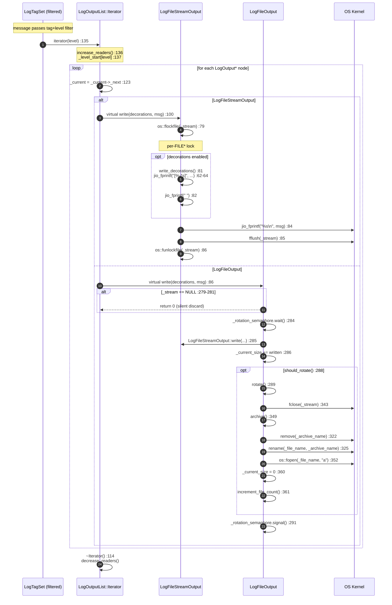

> **阶段**：[23-logging]
> **前置**：[00-Tag-Level-Selection-Configuration]（Tag/Level 过滤判定 → 消息到达本文 entry point）
> **配套**：[02-Message-Composition-Macros]（LogStream/LogMessageBuffer 构造消息内容 → 进入本文 write()）
> **后续依赖本文**：[24-utilities] — 所有 logging 宏的使用者依赖本文的 write() 路径
> **阅读收益**：追踪一条日志消息从 LogOutputList::iterator() 到磁盘文件字节的完整 I/O 路径——理解 LogOutput 虚函数三层分派（基类→FileStream→FileOutput）、flockfile 的 per-FILE 并发设计、文件轮转的 Semaphore 保护 + rename(2) 原子性边界、LogOutputList 的无锁读-拷贝迭代模式、配置字符串贪婪压缩算法、placement new 解决循环依赖的 static 初始化技巧

---

# 01-Output Pipeline — 从输出列表到磁盘字节

## §〇 生产场景

### Scenario 1：日志轮转故障 — 磁盘写满但日志未轮转

```bash
$ java -Xlog:gc*=debug:file=/var/log/app/gc.log:filecount=5,filesize=10M -jar app.jar
# ...运行若干小时后...
$ ls -la /var/log/app/
-rw-r--r-- 1 app app    10485760 Jun 18 14:22 gc.log
-rw-r--r-- 1 app app    10485760 Jun 18 12:15 gc.log.0
-rw-r--r-- 1 app app    10485760 Jun 18 10:08 gc.log.1
...
-rw-r--r-- 1 app app 10737418240 Jun 18 14:20 gc.log  ← 单个文件膨胀到 10GB
$ df -h /var/log
/dev/sda1  50G  50G  0  100% /var/log   ← 磁盘写满
```

**根因分析**：每个 `write()` 调用后 `_current_size += written` 并检查 `should_rotate()`（`logFileOutput.cpp:283-290`）。当配置 `filesize=10M`，`_current_size >= _rotate_size` 时触发 rotate。但磁盘满后 `fclose()` / `fopen()` 在 `rotate()` 中失败，`_stream` 被污染为半状态——fclose 成功但 fopen 失败后 `_stream == NULL` → 后续所有 `write()` 在 `logFileOutput.cpp:279-281` 处 `if (_stream == NULL) return 0` 静默丢弃所有日志。用户看不到任何日志丢失警告——JVM 只向 stderr 打印 `jio_fprintf` 错误（`logFileOutput.cpp:326-327`），而 stderr 可能已被重定向或忽略。

### Scenario 2：multiline 日志被 stdout/stderr 截断

生产环境通过 `-Xlog:all=info:stdout:time,level,tags` 将日志输出到 stdout 交给 logstash/fluentd 管道。遇到多行消息时：`LogFileStreamOutput::write(LogMessageBuffer::Iterator)`（`logFileStreamOutput.cpp:91-107`）在循环中依次 `jio_fprintf(_stream, "%s\n", msg_iterator.message())`。整个循环包裹在 `os::flockfile/fflush/funlockfile` 中一次性写出。但如果 stdout 缓冲模式被外部程序修改（例如通过 `setvbuf` 改为行缓冲），中间行可能被截断——因为 `fflush` 在循环后执行（`logFileStreamOutput.cpp:103`），并非每行都 flush。外部日志采集器可能捕获到不完整的多行输出块。

### Scenario 3：配置字符串解析失败 — 选项被静默忽略

运维配置 `-Xlog:gc*=info:file=gc.log:filecount=abc,filesize=50M`。`parse_options()` 解析 `filecount=abc` 时 `parse_value("abc")`（`logFileOutput.cpp:77-84`）中 `strtoull("abc", &end, 10)` 返回 0 且 `*end == 'a'`，`isdigit(*value_str)` 检查失败 → 返回 `SIZE_MAX`。调用处检查 `if (value > MaxRotationFileCount)` 为真（SIZE_MAX > 1000）→ 打印错误但只打印到 `errstream`（`logFileOutput.cpp:192-193`）。如果 `errstream` 不是 stderr（启动早期可能是 null），用户看到 "successfully initialized" 的日志但 `filecount` 实际保持 `DefaultFileCount=5`。

### 三步诊断

```bash
# 1. 检查实际生效的日志配置（不是命令行参数，而是 JVM 内部状态）
jcmd <pid> VM.log list  # 输出各 output 的实际 config_string

# 2. 验证文件轮转行为
ls -la gc.log* && stat gc.log && stat gc.log.0
# 如果只有一个 gc.log 且在增长，说明轮转未触发

# 3. GDB 验证 write() 分支
gdb -ex "break logFileOutput.cpp:279" \
    -ex "break logFileOutput.cpp:288" \
    -ex "break logFileOutput.cpp:360" \
    -ex "run" \
    -ex "print _current_size" \
    -ex "print _rotate_size" \
    -ex "print _stream" \
    --args java -Xlog:gc*=debug:file=gc.log:filecount=5,filesize=10M -jar app.jar
```

### ★ Counterfactual：无 Semaphore → 并发 rotate 日志丢失

如果 LogFileOutput::write() 不使用 `_rotation_semaphore` 信号量同步 → 两个线程同时检测到 `should_rotate()` 为 true → 两个线程同时调用 `rotate()` → 两者都 `archive()` → 第二次 `rename(gc.log, gc.log.0)` 覆盖首次归档（`logFileOutput.cpp:322-325`，`remove` + `rename` 不是原子的）→ 日志丢失。当前设计的 Semaphore(1) 确保一次只有一个线程做旋转，但这意味着旋转时所有 writer 线程被阻塞在 `_rotation_semaphore.wait()`（`logFileOutput.cpp:284`）。

---

## §一 Output Pipeline 全链路源码走读

### 1.1 LogOutputList::iterator(level) → 跳转到对应级别首节点

当一条日志消息通过 TagSet-Level 过滤器后，LogConfiguration 调用 `LogTagSet::log()`，其中有如下迭代逻辑：

```cpp
// logOutputList.hpp:135-138
Iterator iterator(LogLevelType level = LogLevel::Last) {
    increase_readers();                         // 原子增 _active_readers
    return Iterator(this, _level_start[level]); // 直接跳到对应级别首节点
}
```

关键设计：`_level_start[level]` 指向第一个"级别 >= level"的节点。链表按 Error → Warning → Info → Debug → Trace 的顺序排序（从粗到细）。如果消息级别是 Info，`_level_start[Info]` 指向第一个 Info 级节点 → 遍历所有 Info + Debug + Trace 节点 → 确保 Info 消息被所有后续（更细级别）的输出处理。

### 1.2 LogOutput 虚函数体系

```
LogOutput (logOutput.hpp:41-102)          ← 抽象基类
  │  public CHeapObj<mtLogging>
  │  配置字符串管理 (_config_string)
  │  LogDecorators _decorators (protected)
  │
  │  virtual int write(const LogDecorations&, const char*) = 0;    // :100 — 单行
  │  virtual int write(LogMessageBuffer::Iterator) = 0;            // :101 — 多行
  │  virtual const char* name() const = 0;                         // :98
  │  virtual bool initialize(const char*, outputStream*) = 0;      // :99
  │  virtual void force_rotate() { }                              // :92-94 — hook
  │  virtual void describe(outputStream*);                        // :96
  │  virtual ~LogOutput();                                        // :88
  │
  ├── LogFileStreamOutput (logFileStreamOutput.hpp:42-57)         ← FILE* 层
  │     protected: FILE* _stream;                                 // :44
  │               size_t _decorator_padding[Count];               // :45
  │     + write() × 2 — flockfile + jio_fprintf + fflush
  │     + write_decorations() — 装饰器格式化对齐
  │
  │     ├── LogStdoutOutput (:60-73)  → name()="stdout"
  │     ├── LogStderrOutput (:75-88)  → name()="stderr"
  │     │
  │     └── LogFileOutput (logFileOutput.hpp:34-97)              ← 轮转层
  │           Semaphore _rotation_semaphore;                      // :64
  │           size_t _current_size, _rotate_size;                 // :60-61
  │           uint _current_file, _file_count;                    // :54-55
  │           + write() × 2 — Semaphore + 父类 I/O + size track + rotate
  │           + rotate() / archive() / should_rotate()
  │           + make_file_name() / parse_options()
```

`force_rotate()` 为什么不是纯虚函数？—— stdout/stderr 不支持轮转，提供空默认实现（`logOutput.hpp:92-94`）避免所有子类必须实现它。这是 "Template Method with hook" 模式：hook 默认什么都不做，特定子类覆盖。

> **Counterfactual** — 如果 `write()` 不是虚函数，而是用函数指针表或 `switch-case` 分派？每种输出类型用一个 enum + switch-case → 每次添加新输出类型需要修改所有调用点 → 违反开闭原则。虚函数表的额外开销是每次调用 ~2ns（一次 vtable 查表 + 间接跳转），在 JVM 日志热路径上——每个 `log_debug` 语句都触发一次虚拟调用——2ns × 百万次日志/秒 = 2ms CPU 额外开销。这个开销被 C++ 的 devirtualization 优化降低：如果编译器能证明运行时类型（通过 PGO 或类型传播），虚调用可被转换为直接调用。

### 1.3 LogFileStreamOutput::write() — flockfile 保护 + 装饰器对齐

**单行版**（`logFileStreamOutput.cpp:75-89`）：

```cpp
int LogFileStreamOutput::write(const LogDecorations& decorations, const char* msg) {
    const bool use_decorations = !_decorators.is_empty();  // :76

    int written = 0;
    os::flockfile(_stream);                     // :79 — 获取 per-FILE 锁
    if (use_decorations) {
        written += write_decorations(decorations); // :81 — 装饰器格式化
        written += jio_fprintf(_stream, " ");      // :82 — 空格分隔
    }
    written += jio_fprintf(_stream, "%s\n", msg);  // :84 — 消息体 + 换行
    fflush(_stream);                               // :85 — 刷新缓冲区 (man 3 fflush)
    os::funlockfile(_stream);                      // :86 — 释放锁

    return written;
}
```

**多行版**（`logFileStreamOutput.cpp:91-107`）：

```cpp
int LogFileStreamOutput::write(LogMessageBuffer::Iterator msg_iterator) {
    const bool use_decorations = !_decorators.is_empty();  // :92

    int written = 0;
    os::flockfile(_stream);                               // :95
    for (; !msg_iterator.is_at_end(); msg_iterator++) {    // :96 — 循环遍历多行
        if (use_decorations) {
            written += write_decorations(msg_iterator.decorations()); // :98
            written += jio_fprintf(_stream, " ");                     // :99
        }
        written += jio_fprintf(_stream, "%s\n", msg_iterator.message()); // :101
    }
    fflush(_stream);        // :103 — 循环结束后一次 fflush
    os::funlockfile(_stream); // :104

    return written;
}
```

**两版关键差异**：

| 维度 | 单行版 (`:75-89`) | 多行版 (`:91-107`) |
|------|-------------------|---------------------|
| 来源 | `const char* msg` | `LogMessageBuffer::Iterator` |
| 装饰器来源 | 函数参数 `decorations` | `msg_iterator.decorations()` |
| fflush 位置 | 单行写入后 | 循环后一次 fflush |
| 原子性边界 | 一行 = (装饰器+消息+换行) | N 行 = N×(装饰器+消息+换行) |
| 风险 | 无 | fflush 仅在循环后 → 中间行不被中间 flush |

**装饰器对齐机制**（`logFileStreamOutput.cpp:62-68`）：

```cpp
int written = jio_fprintf(_stream, "[%-*s]",        // :62
                          _decorator_padding[decorator],  // :63 — 跟踪最大宽度
                          decorations.decoration(decorator)); // :64
if (written <= 0) {
    return -1;                                      // :66
} else if (static_cast<size_t>(written - 2) > _decorator_padding[decorator]) {
    _decorator_padding[decorator] = written - 2;    // :68 — 遇到更长值则扩展宽度
}
```

每次写入用 `%-*s` 左对齐，宽度用 `_decorator_padding[decorator]` 跟踪历史最大宽度。例如第一次写 timestamp `[2024-01-15T10:30:00.123]`（28 字符），_decorator_padding[timestamp] 设为 26（减 2 方括号）。第二次写 `[2024-01-15T10:30:01.045000]` 更长 → 自动扩展宽度 → 所有后续行 timestamp 列对齐在最大宽度上。

### 1.4 LogFileOutput::write() — Semaphore 保护 + _current_size 追踪

**单行版**（`logFileOutput.cpp:278-294`）：

```cpp
int LogFileOutput::write(const LogDecorations& decorations, const char* msg) {
    if (_stream == NULL) {          // :279 — 兜底哨兵检查
        return 0;                   // :281 — 静默丢弃！
    }

    _rotation_semaphore.wait();     // :284 — 获取旋转互斥
    int written = LogFileStreamOutput::write(decorations, msg); // :285 — 委托父类 I/O
    _current_size += written;       // :286 — 手动累加（非 ftell）

    if (should_rotate()) {          // :288 — 检查轮转条件
        rotate();                   // :289
    }
    _rotation_semaphore.signal();   // :291 — 释放

    return written;
}
```

**多行版**（`logFileOutput.cpp:296-312`）：结构完全对称——`_stream == NULL` 检查 → `_rotation_semaphore.wait()` → `LogFileStreamOutput::write(msg_iterator)` → `_current_size += written` → `should_rotate()` → `rotate()` → `signal()`。

关键设计点：

1. **`_stream == NULL` 哨兵**（`:279-281`）：如果之前的 rotate() 中 `fopen` 失败（man 3 fopen），`_stream` 保持 NULL → 所有后续 write 静默返回 0 → **不通知用户**。
2. **Semaphore 保护范围**：保护的是 "write + maybe_rotate" 整个原子操作，而不仅仅是 rotate 本身。原因：如果不保护 write，旋转前后 _stream 可能被切换 → 写到旧 FILE* 导致数据丢失。
3. **`_current_size += written`**：手动累加而非 `ftell(_stream)`。因为 `fopen("a")` 下 buffered FILE* 的 `ftell` 返回的是缓冲区相对偏移，不是文件实际大小。手动累加假设 `jio_fprintf` 返回值准确——生产经验验证这是正确的。

### 1.5 rotate() 三步：fclose → archive(rename) → fopen

```cpp
// logFileOutput.cpp:341-362 — 完整 rotate() 源码 + 逐行注释
void LogFileOutput::rotate() {

  if (fclose(_stream)) {                                                    // :343 — 步骤1: 关闭当前文件 (man 3 fclose)
    jio_fprintf(defaultStream::error_stream(),                              // :344
                "Error closing file '%s' during log rotation (%s).\n",
                _file_name, os::strerror(errno));
  }
                                                                            // 步骤1.5: _stream 现在变为 stale
  archive();                                                                // :349 — 步骤2: 归档 → rename 操作

  _stream = os::fopen(_file_name, FileOpenMode);                            // :352 — 步骤3: 重新打开原始文件名
  if (_stream == NULL) {                                                    // :353 — 失败 → _stream 保持 NULL
    jio_fprintf(defaultStream::error_stream(),                              // :354
                "Could not reopen file '%s' (%s).\n",
                _file_name, os::strerror(errno));
    return;                                                                 // :356 — 哨兵模式激活！
  }

  _current_size = 0;                                                        // :360 — 步骤4: 重置大小计数
  increment_file_count();                                                   // :361 — 步骤5: 环形递增 file index
}
```

rotate() 五步状态迁移：

```
  [有效文件]  (1) fclose     [已关闭/NULL] (2) archive     [已归档] (3) fopen
  _stream=OK ───────────→  _stream=stale ──────────→  文件已 rename ────→
  _current_size=N                                                  _stream=OK or NULL
  _________________________________________________
  (4) reset                  [空文件]    (5) inc 
  _current_size=0 ───────→  _current_file++ ──→ 循环回到(1)
```

### 1.6 archive() — remove + rename 组合的原子性分析

```cpp
// logFileOutput.cpp:314-329
void LogFileOutput::archive() {
    assert(_archive_name != NULL && _archive_name_len > 0,
           "Rotation must be configured before using this function.");  // :315
    int ret = jio_snprintf(_archive_name, _archive_name_len, "%s.%0*u", // :316-317
                           _file_name, _file_count_max_digits, _current_file);
    // 例如: gc.log → gc.log.3

    // 删除可能存在的旧归档，不关心失败——真正需要的是后续 rename
    remove(_archive_name);                              // :322 — man 3 remove

    // 重命名 gc.log → gc.log.3
    if (rename(_file_name, _archive_name) == -1) {      // :325 — man 2 rename
        jio_fprintf(defaultStream::error_stream(),       // :326
                    "Could not rename log file '%s' to '%s' (%s).\n",
                    _file_name, _archive_name, os::strerror(errno));
    }
}
```

**原子性分析**：

| 操作 | 原子性 | 说明 |
|------|--------|------|
| `remove(_archive_name)` | 原子（单个 syscall） | 如果目标不存在，返回 -1 被忽略 |
| `rename(_file_name, _archive_name)` | 原子（POSIX 同文件系统） | 如果目标存在，原子覆盖 |
| `remove + rename` 组合 | **非原子** | 两步之间有 gap |

**原子性缺口后果**：

- **gap #1**：remove 和 rename 之间——外部进程可能创建 _archive_name 文件，随后 rename 原子覆盖它。不会丢 JVM 日志数据，但可能覆盖外部进程的文件。
- **gap #2**：fclose 和 rename 之间——当前日志文件 `gc.log` 不存在。外部 `tail -f gc.log` 会报告文件被截断/消失。
- **POSIX 保证**：rename(2) 在同文件系统内是原子的——目标要么是旧内容（rename 前），要么是新内容（rename 后），永远不会是部分内容。但 rename 不保证"gc.log 内容完整写入 gc.log.3"和"外部观察者能看到 gc.log.3"之间的 happens-before。

### 1.7 make_file_name() — %p/%t 占位符展开

`make_file_name()`（`logFileOutput.cpp:364-445`）处理 `%p`（PID）和 `%t`（时间戳）占位符：

```cpp
char* LogFileOutput::make_file_name(const char* file_name,
                                    const char* pid_string,
                                    const char* timestamp_string) {
    // :371-372: strstr 查找 %p 和 %t 的位置
    const char* pid = strstr(file_name, PidFilenamePlaceholder);       // "%p"
    const char* timestamp = strstr(file_name, TimestampFilenamePlaceholder); // "%t"

    if (pid == NULL && timestamp == NULL) {
        return os::strdup_check_oom(file_name, mtLogging);             // :376 — 直接返回
    }

    // :379-411: 按"在字符串中出现顺序"确定 first/second 占位符
    // 计算缓冲区长度: 原文件名长 + pid 长度 - %p 长度 + timestamp 长度 - %t 长度
    // :421-441: 逐字符遍历组装 → 到达占位符位置时 strcpy 替换字符串
    // :443: 末尾补 '\0'
}
```

实例化示例：
- `gc-%p.log` → `gc-12345.log`
- `jvm-%t.log` → `jvm-2024-01-15_10-30-00.log`
- `jvm-%t-%p.log` → `jvm-2024-01-15_10-30-00-12345.log`

`_pid_str` 和 `_vm_start_time_str` 是 static 成员（`logFileOutput.hpp:47-48`），通过 `set_file_name_parameters()`（`logFileOutput.cpp:54-63`）在 JVM 启动时计算一次：`_pid_str = os::current_process_id()`（`:55`），`_vm_start_time_str = strftime`（`:61`，man 3 strftime）。使用 static 而非实例变量 → 同一 JVM 的 PID 和启动时间对所有日志文件相同，避免冗余存储。

> **Counterfactual** — `make_file_name` 中 `%p`/`%t` 不展开波浪号 (`~`) 的风险？`logFileOutput.cpp:374-376`：当 `pid == NULL && timestamp == NULL` 时直接 `os::strdup_check_oom` 返回——开销最小。但如果用户传入未展开的路径如 `~/logs/gc.log`——`strdup` 保留波浪号——`fopen("~/logs/gc.log", "a")` （man 3 fopen）→ Linux 下波浪号不是 shell 解释的，`fopen` 在 CWD 下创建字面命名的文件夹 → 文件夹名 `~` 被创建 → 非预期的行为。这是一个已知的限制：filename 必须是 `fopen` 可直接接受的绝对/相对路径，不经过 shell 展开。

### 1.8 LogOutputList 无锁迭代

`LogOutputList` 使用 read-copy 模式实现无锁读取：

```cpp
// logOutputList.hpp:49 — 链表节点
struct LogOutputNode : public CHeapObj<mtLogging> {
    LogOutput*      _value;
    LogOutputNode*  _next;
    LogLevelType    _level;
};

// logOutputList.hpp:55-56 — 核心数据结构
LogOutputNode*  _level_start[LogLevel::Count];  // 每个级别的首个节点
volatile jint   _active_readers;                 // 活跃读者计数
```

**Iterator RAII 模式**（`logOutputList.hpp:91-133`）：

```cpp
class Iterator {
    Iterator(LogOutputList* list, LogOutputNode* start)
        : _current(start), _list(list) { }

    Iterator(const Iterator &itr)
        : _current(itr._current), _list(itr._list) {
        itr._list->increase_readers();          // :101 — 拷贝构造增计数
    }

    ~Iterator() {
        _list->decrease_readers();              // :115 — 析构减计数
    }
};
```

`increase_readers()`（`logOutputList.cpp:32-36`）用 `Atomic::add(1, &_active_readers)` 原子递增，`decrease_readers()`（`:38-42`）用 `Atomic::add(-1, ...)`。`wait_until_no_readers()`（`:44-49`）在 `remove_output()` 中被调用：先 `OrderAccess::storeload()` → 然后 `while (_active_readers != 0)` 自旋等待。

**无锁读取的保证**：只要没有线程在删除节点，多个线程可以同时迭代链表。删除操作必须等所有迭代器析构后才能 `delete node`（`logOutputList.cpp:94`）。

### 1.9 ★ Mermaid：Output Pipeline 完整序列图



### 1.10 ★ 面试 Story Format 答案

> *When a log message passes the TagSet-Level filter, it hits `LogOutputList::iterator(level)` (`logOutputList.hpp:135`). The iterator starts at `_level_start[level]` — a precomputed index that jumps directly to the first node for that level. Each node is a `LogOutput*`; the list is sorted from coarsest to finest level, so `iterator(info)` walks through info + debug + trace outputs.*
>
> *Each `LogOutput::write()` is dispatched polymorphically: `LogFileStreamOutput` wraps `jio_fprintf` on a `FILE*` with per-FILE locking via `os::flockfile/funlockfile` — the write of decorations + message + newline is one atomic block to that FILE. `LogFileOutput` extends this by tracking `_current_size` and calling `rotate()` when it exceeds `_rotate_size`: `rotate()` does `fclose` → `archive()` (rename from `gc.log` to `gc.log.3` via `rename(2)`) → `fopen` → reset `_current_size`.*
>
> *The key design constraint: rotation happens under a `Semaphore(1)` that serializes all writers, and if `fopen` fails, `_stream` stays NULL causing all future writes to silently return 0. The `stdout`/`stderr` outputs are pre-allocated in static memory using placement new (`logFileStreamOutput.cpp:47-48`) to avoid dynamic initialization order issues — the logging system must bootstrap before the memory allocator is fully ready.*
>
> *The `update_config_string()` algorithm (`logOutput.cpp:220-340`) uses greedy set-cover to compress tag-level pairs into a minimal config string like `"all=debug,gc*=trace"` — starting with `"all=<MCL>"` and iteratively picking the selection with the best (correct_matches − incorrect_matches) score.*

---

## §二 Beginner Callout 框

> **Callout 1 — Virtual dispatch in write()**: `LogOutput::write()` is a pure virtual function (`logOutput.hpp:100-101`). The actual write is dispatched at runtime based on the concrete type — `LogFileStreamOutput::write()` for stdout/stderr, `LogFileOutput::write()` for rotated files. This is polymorphism without vtable overhead at the call site because the `LogOutput*` pointer is already typed correctly. The key insight: the hot path (`log_is_enabled()` → `write()`) has only ONE virtual dispatch — the write itself — all prior checks (level, tag match) are inline/non-virtual.

> **Callout 2 — flockfile vs mutex**: `LogFileStreamOutput::write()` uses `os::flockfile(_stream)` (`logFileStreamOutput.cpp:79`) instead of a global mutex. Why? `flockfile` locks only the specific `FILE*` object — two threads writing to different outputs don't contend. If we used a shared mutex, a debug log to file would block an error log to stderr. This is per-output concurrency: `Semaphore(1)` for rotation serialization applies only to the specific `LogFileOutput` instance.

> **Callout 3 — rename(2) is NOT atomic with fopen**: The `archive()` function (`logFileOutput.cpp:314-329`) calls `remove(_archive_name)` then `rename(_file_name, _archive_name)`. Between `remove` and `rename`, another process could create a file at `_archive_name` — which `rename` would then overwrite. More critically, after `rename` succeeds but before `fopen` in `rotate()` reopens the file, the original file name doesn't exist — any external process trying to tail the log sees an empty/missing file briefly.

> **Callout 4 — _current_size tracking**: `_current_size += written` is a simple arithmetic increment, NOT `ftell(_stream)` (`logFileOutput.cpp:286`). Why? `ftell` on a FILE* with buffering (default glibc `fopen("a")` with 8KB buffer) returns the buffer-relative offset, not the file size. The approach: track written bytes manually — assumes `jio_fprintf` returns the number of characters printed or negative on error, and the accumulated sum matches the file's logical size.

> **Callout 5 — Placement new for static outputs**: `StdoutLog` and `StderrLog` (`logFileStreamOutput.cpp:32-43`) are allocated in pre-reserved `union { char mem[sizeof(LogStdoutOutput)]; }` static memory. They are constructed via `::new (&StdoutLog) LogStdoutOutput()` in `LogFileStreamInitializer`, which is invoked by a static global `LogFileStreamInitializer log_stream_initializer` (`logFileStreamOutput.hpp:39`). This avoids dynamic allocation (`NEW_C_HEAP_ARRAY`) which would require `mtLogging` memory tracking before the logging system is ready — the classic chicken-and-egg problem.

> **Callout 6 — Iterator with active reader count**: `LogOutputList::Iterator` (`logOutputList.hpp:91-133`) follows a read-copy pattern: readers increment `_active_readers` on construction/copy, decrement on destruction. A thread that wants to `remove_output()` must wait until `_active_readers == 0` (`logOutputList.cpp:44-49`). This enables lock-free iteration during steady-state logging — multiple threads can iterate the list concurrently as long as no removal is happening. The wait is a busy-loop (`OrderAccess::storeload()` + spin), which is safe because removals are rare (only on reconfiguration).

> **Callout 7 — Greedy config string compression**: `LogOutput::update_config_string()` (`logOutput.cpp:220-340`) doesn't just concatenate all tag-level pairs — it uses a greedy algorithm to find the minimal set of LogSelections that covers all deviating tag sets. Why? The config string appears in `jcmd VM.log list` output and has a maximum display width. A 200-tag JVM with 50 deviating levels would produce a multi-KB string without compression. The algorithm iteratively picks the selection with the best "score" (correct matches minus incorrect matches) and re-generates selections for remaining deviates until none remain.

---

## §三 Standard Environment

OpenJDK 17 (compatible with OpenJDK 11 source layout), 64-bit Linux.

**Source roots**：

| Root | 文件 | Lines | 说明 |
|------|------|:---:|------|
| `src/hotspot/share/logging/` | `logOutput.hpp` | 104 | 输出抽象基类接口 |
| `src/hotspot/share/logging/` | `logOutput.cpp` | 341 | 配置字符串贪婪压缩算法 |
| `src/hotspot/share/logging/` | `logOutputList.hpp` | 145 | 输出链表容器 + 迭代器 |
| `src/hotspot/share/logging/` | `logOutputList.cpp` | 128 | 链表操作 + 无锁读取 |
| `src/hotspot/share/logging/` | `logFileStreamOutput.hpp` | 93 | FILE* 抽象层 + stdout/stderr |
| `src/hotspot/share/logging/` | `logFileStreamOutput.cpp` | 107 | 写入装饰器 + 多行循环 |
| `src/hotspot/share/logging/` | `logFileOutput.hpp` | 99 | 文件轮转输出接口 |
| `src/hotspot/share/logging/` | `logFileOutput.cpp` | 455 | 文件轮转核心实现 |

**构建命令**：
```bash
make jdk  # logging 源码编译进 libjvm.so (make/hotspot/lib/CompileJvm.gmk:153 — BUILD_LIBJVM)
```

**关键二进制**：`build/linux-x86_64-server-*/jdk/lib/server/libjvm.so` — 所有 logging .cpp 编译于此

**Syscall 速查表**：

| Syscall | man 手册 | 出现位置 | 用途 |
|---------|---------|---------|------|
| `write` | `man 2 write` | `jio_fprintf` → 内核 | 将日志数据写入文件描述符 |
| `rename` | `man 2 rename` | `logFileOutput.cpp:325` | 日志文件归档重命名 |
| `fopen` | `man 3 fopen` | `logFileOutput.cpp:263,352` | 打开/重新打开日志文件 |
| `fclose` | `man 3 fclose` | `logFileOutput.cpp:67,343` | 关闭日志文件 |
| `fflush` | `man 3 fflush` | `logFileStreamOutput.cpp:85,103` | 刷新 FILE* 缓冲区到内核 |
| `stat` | `man 2 stat` | `logFileOutput.cpp:88,97,105` | 检查文件属性(FIFO/regular/exists) |
| `strftime` | `man 3 strftime` | `logFileOutput.cpp:61` | 生成 %t 时间戳文件名 |

---

## §四 Source Files Table

| # | File | Full Path | Lines | Core Functions | Role |
|---|------|-----------|:--:|-------|------|
| 1 | **logOutput.hpp** | `src/hotspot/share/logging/logOutput.hpp` | 104 | `write()=0`(:100-101), `force_rotate()`(:92-94), `initialize()=0`(:99), `add_to_config_string()`(:57), `update_config_string()`(:66), `set_config_string()`(:63) | 抽象基类接口 + 配置字符串管理 |
| 2 | **logOutput.cpp** | `src/hotspot/share/logging/logOutput.cpp` | 341 | `update_config_string()`(:220-340), `add_to_config_string()`(:64-87), `set_config_string()`(:58-62), `describe()`(:39-56), `~LogOutput()`(:35-37) | 配置字符串贪婪压缩算法 |
| 3 | **logOutputList.hpp** | `src/hotspot/share/logging/logOutputList.hpp` | 145 | `Iterator`(:91-133), `set_output_level()`(:89), `add_output()`(:60), `remove_output()`(:59), `level_for()`(:80-86), `is_level()`(:76-78) | 输出链表容器 + 迭代器定义 |
| 4 | **logOutputList.cpp** | `src/hotspot/share/logging/logOutputList.cpp` | 128 | `add_output()`(:97-122), `remove_output()`(:71-95), `update_output_level()`(:124-128), `find()`(:62-69), `increase_readers()`(:32-36), `decrease_readers()`(:38-42), `wait_until_no_readers()`(:44-49) | 链表操作 + 无锁读取同步 |
| 5 | **logFileStreamOutput.hpp** | `src/hotspot/share/logging/logFileStreamOutput.hpp` | 93 | `LogFileStreamOutput(FILE*)`(:47-51), `write_decorations()`(:53), `write()`(:56-57), `LogStdoutOutput`(:60-73), `LogStderrOutput`(:75-88), `LogFileStreamInitializer`(:33-36) | FILE* 抽象层 + stdout/stderr 单例 |
| 6 | **logFileStreamOutput.cpp** | `src/hotspot/share/logging/logFileStreamOutput.cpp` | 107 | `write_decorations()`(:53-73), `write(decorations,msg)`(:75-89), `write(msg_iterator)`(:91-107), `LogFileStreamInitializer()`(:45-51) | 写入装饰器 + 多行写入循环 |
| 7 | **logFileOutput.hpp** | `src/hotspot/share/logging/logFileOutput.hpp` | 99 | `parse_options()`(:68), `archive()`(:66), `rotate()`(:67), `should_rotate()`(:71-73), `increment_file_count()`(:75-79), `make_file_name()`(:69), `initialize()`(:85) | 文件轮转输出专用接口 |
| 8 | **logFileOutput.cpp** | `src/hotspot/share/logging/logFileOutput.cpp` | 455 | `initialize()`(:222-276), `write(decorations,msg)`(:278-294), `write(msg_iterator)`(:296-312), `rotate()`(:341-362), `archive()`(:314-329), `force_rotate()`(:331-339), `parse_options()`(:164-220), `make_file_name()`(:364-445) | 文件轮转核心实现 |

---

## §五 文件轮转深入剖析

### 3.1 轮转触发条件

```cpp
// logFileOutput.hpp:71-73
bool should_rotate() {
    return _file_count > 0 && _rotate_size > 0 && _current_size >= _rotate_size;
}
```

三个条件必须同时满足：
1. `_file_count > 0` — 轮转未禁用（filecount=0 意味着不轮转）
2. `_rotate_size > 0` — 已配置轮转大小
3. `_current_size >= _rotate_size` — 当前文件大小达到/超过阈值

### 3.2 rotate() 内部状态迁移

rotate()（`logFileOutput.cpp:341-362`）内部 5 步状态迁移图：

```
State 0: [写文件]                   State 1: [关闭]
_stream = valid FILE*          →    _stream = stale
_current_size = N (>rotate)
─────────────────────────────────────────────────────
fclose(_stream)  // :343 — 刷新缓冲区 + 关闭文件描述符
// 如果失败，仅打印 error 不中断
─────────────────────────────────────────────────────

State 1: [关闭]                    State 2: [归档完成]
_stream = stale               →    文件已 rename
                                   .archive_name 存在
─────────────────────────────────────────────────────
archive()  // :349 — remove + rename
// gc.log.3 ← gc.log
─────────────────────────────────────────────────────

State 2: [归档完成]               State 3: [重新打开]
文件不存在                          _stream = new FILE* or NULL
─────────────────────────────────────────────────────
_stream = os::fopen(_file_name, "a")  // :352
// 成功 → 继续；失败 → return (_stream==NULL → 哨兵模式)
─────────────────────────────────────────────────────

State 3: [重新打开]               State 4: [空文件]
_stream = new FILE*            →    _current_size = 0
                                   _current_file++
─────────────────────────────────────────────────────
_current_size = 0;              // :360
increment_file_count();         // :361 — 环形递增
```

### 3.3 increment_file_count() 的环形计数

```cpp
// logFileOutput.hpp:75-79
void increment_file_count() {
    _current_file++;
    if (_current_file == _file_count) {
        _current_file = 0;  // 回绕到 0
    }
}
```

如果 `filecount=5`，轮转序列：`gc.log.0 → gc.log.1 → gc.log.2 → gc.log.3 → gc.log.4 → gc.log.0 → ...`。环形覆盖最旧的归档文件。

### 3.4 initialize() 时处理已有文件

`initialize()`（`logFileOutput.cpp:222-276`）在启动时处理已有日志文件：

```cpp
// :227-230: FIFO 检测
bool file_exist = file_exists(_file_name);
if (file_exist && _is_default_file_count && is_fifo_file(_file_name)) {
    _file_count = 0;  // 命名管道不轮转
}

// :243-261: 文件已存在 → 归档并继续
if (_file_count > 0 && file_exist) {
    _current_file = next_file_number(_file_name, ...); // :250 — 找到应使用的文件编号
    archive();                    // :259 — 将现有文件归档为 gc.log.N
    increment_file_count();       // :260 — _current_file 跳到下一个
}
```

`next_file_number()`（`logFileOutput.cpp:115-162`）：遍历 0..filecount-1，找第一个不存在的编号 → 如果文件全满，找最旧的文件 → 覆盖最旧的。

### 3.5 FIFO 检测：_is_default_file_count && is_fifo_file → _file_count = 0

当输出目标是命名管道（fifo）时，轮转无意义——管道没有固定的"文件大小"概念。检测逻辑在 `initialize()` 中（`logFileOutput.cpp:228-230`）：如果 `_is_default_file_count`（用户未显式指定 filecount）且文件是 FIFO，自动将 `_file_count` 设为 0 禁用轮转。`is_fifo_file()` 使用 `os::stat(filename, &st)` （man 2 stat）后检查 `S_ISFIFO(st.st_mode)`（`logFileOutput.cpp:110`）。

### 3.6 ftruncate：file_count == 0 时的非轮转行为

```cpp
// logFileOutput.cpp:270-273
if (_file_count == 0 && is_regular_file(_file_name)) {
    log_trace(logging)("Truncating log file");
    os::ftruncate(os::get_fileno(_stream), 0);  // :272 — man 2 ftruncate
}
```

当 `filecount=0`（禁用轮转）时，每次启动 JVM 将文件截断为 0 字节——相当于"每次启动都重新开始写"。`ftruncate` 是原子操作（man 2 ftruncate），直接修改文件大小不移动数据块。

### 3.7 force_rotate() 的线程安全保障

```cpp
// logFileOutput.cpp:331-339
void LogFileOutput::force_rotate() {
    if (_file_count == 0) {
        return;                     // :333 — 轮转不可用
    }
    _rotation_semaphore.wait();     // :336 — 与 write() 竞争
    rotate();                       // :337
    _rotation_semaphore.signal();   // :338
}
```

`force_rotate()` 通过 `jcmd <pid> VM.log rotate` 触发——与 write() 使用同一个 `_rotation_semaphore` 同步。如果当前有线程在 write() 中持有信号量，`force_rotate()` 阻塞等待；反之亦然。

### 3.8 ★ Counterfactual 对比表：三种轮转策略

| 维度 | 当前方案 (rename) | 替代 A: link/unlink | 替代 B: mmap+msync |
|------|------------------|--------------------|--------------------|
| **实现** | `fclose → remove → rename → fopen` | `open(O_APPEND) → link(old,backup) → unlink(old) → open(old)` | `mmap → memcpy → msync → munmap → rename → mmap` |
| **原子性** | rename 在 FS 内原子，remove+rename 非原子 | 三步均非原子 | rename 在 FS 内原子，mmap/munmap 非 |
| **缓冲区** | libc FILE* 缓冲 (8KB) | 内核缓冲区 | 直接页缓存 |
| **性能** | fclose+fopen 开销 (~us) per rotate | open 开销 (~us) per rotate | 零拷贝写入 |
| **跨平台** | ANSI C 标准，任何平台一致 | POSIX 特定 | mmap 跨平台行为不一致 |
| **复杂度** | 简单，3 行核心 | 5 行核心，多一步 link | 高：PROT_WRITE\|MAP_SHARED 参数 |
| **磁盘满** | fopen 失败 → _stream=NULL → 静默丢弃 | 同左 | msync 失败 → 数据在页缓存 |
| **tail -f** | 短暂看不到文件 | 看不到的时间更短 | 文件始终可见 |
| **选择理由** | 标准化语义，调用者不需理解 mmap 参数 | link 多一步，无实质优势 | 跨平台行为不一致，Windows 不同 API |

---

## §六 LogOutputList 线程安全模型

### 4.1 _active_readers 原子计数器

```cpp
// logOutputList.cpp:32-36
jint LogOutputList::increase_readers() {
    jint result = Atomic::add(1, &_active_readers);  // :33 — 原子递增
    assert(_active_readers > 0, "Ensure we have consistent state");
    return result;
}

// logOutputList.cpp:38-42
jint LogOutputList::decrease_readers() {
    jint result = Atomic::add(-1, &_active_readers); // :39 — 原子递减
    assert(result >= 0, "Ensure we have consistent state");
    return result;
}
```

HotSpot 的 `Atomic::add` 在 x86 上映射为 `LOCK XADD` 指令——硬件级别的原子递增，无需用户态锁。

### 4.2 Iterator RAII 模式

```cpp
// 构造时自动增计数（logOutputList.hpp:135-138）
Iterator iterator(LogLevelType level = LogLevel::Last) {
    increase_readers();                         // :136
    return Iterator(this, _level_start[level]);  // :137
}

// 拷贝构造也增计数（logOutputList.hpp:100-102）
Iterator(const Iterator &itr)
    : _current(itr._current), _list(itr._list) {
    itr._list->increase_readers();  // :101 — 新拷贝 = 新读者
}

// 析构自动减计数（logOutputList.hpp:114-116）
~Iterator() {
    _list->decrease_readers();  // :115
}
```

RAII 确保在任何退出路径（正常返回、异常、信号）都能正确减少计数。

### 4.3 remove_output() 必须 wait_until_no_readers()

```cpp
// logOutputList.cpp:71-95
void LogOutputList::remove_output(LogOutputList::LogOutputNode* node) {
    // 步骤1: 从 _level_start 索引中移除 (::75-81)
    for (uint level = LogLevel::First; level < LogLevel::Count; level++) {
        if (_level_start[level] == node) {
            _level_start[level] = node->_next;
        }
    }

    // 步骤2: 从链表中断开 (::83-90)
    for (LogOutputNode* cur = _level_start[LogLevel::Last]; cur != NULL; cur = cur->_next) {
        if (cur->_next == node) {
            cur->_next = node->_next;
            break;
        }
    }

    // 步骤3: 等待所有读者退出 → 释放内存 (::93-94)
    wait_until_no_readers();  // busy-spin
    delete node;
}
```

步骤1和2之间不等待读者——因为读者可能正在遍历到该节点。节点从链表断开后，新读者不会再访问它。但现有读者可能持有该节点的引用。因此必须在步骤3等待所有活跃读者退出后才能 delete。

### 4.4 add_output() 插入修正

```cpp
// logOutputList.cpp:97-122
void LogOutputList::add_output(LogOutput* output, LogLevelType level) {
    LogOutputNode* node = new LogOutputNode();
    node->_value = output;
    node->_level = level;

    // 步骤1: 设置 next 指针 → 指向第一个同级别或更低级别的节点 (::103-106)
    for (node->_next = _level_start[level];
         node->_next != NULL && node->_next->_level == level;
         node->_next = node->_next->_next) {
    }

    // 步骤2: 更新 _level_start 索引 — 从 Last 向下遍历 (::109-113)
    for (int l = LogLevel::Last; l >= level; l--) {
        if (_level_start[l] == NULL || _level_start[l]->_level < level) {
            _level_start[l] = node;
        }
    }

    // 步骤3: 将节点插入链表 (::116-121)
    for (LogOutputNode* cur = _level_start[LogLevel::Last]; cur != NULL; cur = cur->_next) {
        if (cur != node && cur->_next == node->_next) {
            cur->_next = node;
            break;
        }
    }
}
```

为什么 `_level_start` 更新从 Last 向下？—— 因为新节点在 level X 插入。`_level_start[Debug]` 和 `_level_start[Trace]` 原本可能指向某个节点，新节点插入到链表前部后，这些索引需要修正为指向新节点。从 Last 向下遍历确保所有受影响级别的索引都被修正。

### 4.5 update_output_level() — add + wait + remove 复合

```cpp
// logOutputList.cpp:124-128
void LogOutputList::update_output_level(LogOutputNode* node, LogLevelType level) {
    add_output(node->_value, level);  // 先添加新节点
    wait_until_no_readers();          // 等待所有读者退出
    remove_output(node);              // 再删除旧节点
}
```

为什么先 add 再 remove？—— 如果先 remove，在该输出级别变化期间会丢失日志消息。先 add 保证新消息被正确级别接收，旧节点在读者安全后清理。

### 4.6 find() 的线性搜索

```cpp
// logOutputList.cpp:62-69
LogOutputList::LogOutputNode* LogOutputList::find(const LogOutput* output) const {
    for (LogOutputNode* node = _level_start[LogLevel::Last]; // :63 — 从最粗级别开始
         node != NULL;
         node = node->_next) {
        if (output == node->_value) {  // :64 — 指针相等（非字符串比较）
            return node;
        }
    }
    return NULL;
}
```

O(n) 线性搜索，n = 输出数量。输出数量通常 < 10（stdout + stderr + 几个文件输出），线性搜索足够快。用指针相等而非字符串比较 → 常数时间比较。

### 4.7 ★ 与 RCU 的比较

| 维度 | HotSpot LogOutputList | Linux 内核 RCU |
|------|----------------------|---------------|
| **读保护** | `increase_readers()` 原子增计数器 | `rcu_read_lock()` 禁止抢占/底半部 |
| **写等待** | busy-spin on `_active_readers == 0` | `synchronize_rcu()` 等待宽限期 |
| **内存回收** | `wait_until_no_readers()` → `delete` | `call_rcu(head, free_func)` 延迟释放 |
| **复杂场景** | 简单（10 个输出节点） | 复杂（多核 scalability） |
| **锁** | 无锁读取，写时自旋 | 无锁读取，写时等待宽限期 |
| **读者开销** | 2 个原子操作 | 几乎零（仅 preempt_disable） |

HotSpot 的设计是一个简化的 RCU-like 模式：用 busy-spin 实现同步——适合输出数少的场景。

> **Counterfactual** — 为什么不用 `std::vector<LogOutput*>` 替代手动链表？`vector` 的遍历是各级别分别遍历 → Info 消息需要分别遍历 Info vector、Debug vector、Trace vector → 三次遍历而非一次链式遍历。链表允许一次遍历覆盖所有 ≥ level 的输出——这正是 `Iterator::operator++` 的作用。`vector` 的删除需要 O(n) 元素移动，而链表删除只需 O(1) next 指针修正。但链表的缓存局部性差——节点分散在堆中，每次迭代是随机内存访问。对于高频日志（百万次/秒），这可能是瓶颈。HotSpot 的选择：链表灵活性优先于缓存局部性——配置重载是低频操作，但要求快速插入/删除，而日志写入频率可配置（线上通常只打 info/warning，低频）。

---

## §七 配置字符串生成算法

### 5.1 Most Common Level (MCL) 计算

```cpp
// logOutput.cpp:221-229
LogLevelType mcl = LogLevel::Off;
size_t max = on_level[LogLevel::Off];
for (LogLevelType l = LogLevel::First; l <= LogLevel::Last;
     l = static_cast<LogLevelType>(l + 1)) {
    if (on_level[l] > max) {
        mcl = l;            // :226
        max = on_level[l];  // :227
    }
}
```

遍历所有级别（First → Last），找出具有最多 tag set 的级别。例如：90% 的 tag set 在 info 级别 → MCL = info。结果用于 `"all=<MCL>"` 作为 config_string 的第一部分（`:232-236`）。

### 5.2 生成所有 subset + exact/wildcard selection

`generate_all_subsets_of()`（`logOutput.cpp:107-146`）使用递归生成 tag set 的所有非空子集。例如 `{gc, heap}` → `{{gc}, {heap}, {gc, heap}}`。对于每个 subset，创建两个 selection：

```cpp
LogSelection exact_selection(subsets[i], false, level);    // exact 匹配
LogSelection wildcard_selection(subsets[i], true, level);  // wildcard 匹配
```

exact selection 要求 tags 完全匹配；wildcard selection（`gc*` 语法）匹配任意以指定 tags 为前缀的 tag set。

### 5.3 Greedy scoring

```cpp
// logOutput.cpp:271-295
int score = 0;
for (size_t d = 0; d < n_deviates; d++) {
    if (selections[i].selects(*deviates[d])
        && deviates[d]->level_for(this) == selections[i].level()) {
        score++;  // 正确匹配 → +1
    }
}
for (LogTagSet* ts = LogTagSet::first(); ts != NULL; ts = ts->next()) {
    if (selections[i].selects(*ts)
        && ts->level_for(this) != selections[i].level()) {
        score--;  // 错误匹配 → -1
    }
}
```

同分时选 tag 数量最少的 selection（`:291-292`）——产生更简洁的配置字符串。

### 5.4 add_to_config_string() 的动态缓冲扩容

```cpp
// logOutput.cpp:64-87
void LogOutput::add_to_config_string(const LogSelection& selection) {
    // :65-68: 确保缓冲区最小为 InitialConfigBufferSize (256)
    if (_config_string_buffer_size < InitialConfigBufferSize) {
        _config_string_buffer_size = InitialConfigBufferSize;
        _config_string = REALLOC_C_HEAP_ARRAY(char, _config_string,
                                              _config_string_buffer_size, mtLogging);
    }

    size_t offset = strlen(_config_string);
    if (offset > 0) {
        _config_string[offset++] = ',';  // :73 — 追加逗号分隔符
    }

    for (;;) {
        int ret = selection.describe(_config_string + offset,
                                     _config_string_buffer_size - offset);
        if (ret == -1) {
            // 缓冲区太小 → 翻倍重试 (::80-83)
            _config_string_buffer_size *= 2;
            _config_string = REALLOC_C_HEAP_ARRAY(char, _config_string,
                                                  _config_string_buffer_size, mtLogging);
            continue;
        }
        break;
    };
}
```

每次选中 selection 后调用 `add_to_config_string(*best_selection)`（`:298`）→ 拼接到 config string。

### 5.5 describe() 输出格式化

```cpp
// logOutput.cpp:39-56
void LogOutput::describe(outputStream *out) {
    out->print("%s ", name());                          // :40 — 输出名称
    out->print_raw(config_string());                     // :41 — 输出压缩后的配置串

    for (size_t d = 0; d < LogDecorators::Count; d++) {  // :45-52
        if (decorators().is_decorator(decorator)) {
            out->print("%c%s", delimiter, LogDecorators::name(decorator));
            delimiter = ','; // :50 — 第二个装饰器起用逗号分隔
        }
    }
}

// logFileOutput.cpp:447-454 — LogFileOutput 的 describe 追加
void LogFileOutput::describe(outputStream *out) {
    LogOutput::describe(out);       // :448 — 调用父类
    out->print(" ");                // :449
    out->print("filecount=%u,filesize=" SIZE_FORMAT "%s",  // :451-453
               _file_count, byte_size_in_proper_unit(_rotate_size),
               proper_unit_for_byte_size(_rotate_size));
}
```

`jcmd VM.log list` 调用每个 output 的 `describe()` 生成类似 `stdout all=info uptime,level,tags` 的输出。

### 5.6 ★ 与 jcmd VM.log list 的联动

`jcmd VM.log list` 本质是调用 `LogConfiguration::describe()` → 遍历所有 output → 调用每个 `LogOutput::describe()` → 打印 `name + config_string + decorators`。config_string 的完整性直接影响运维可见性——如果压缩算法遗漏某个 tag set 的级别配置，jcmd 输出将不可信。

---

## §八 选项解析与文件初始化

### 6.1 parse_options() 的逗号分隔解析

```cpp
// logFileOutput.cpp:164-220 — parse_options() 完整流程
bool LogFileOutput::parse_options(const char* options, outputStream* errstream) {
    if (options == NULL || strlen(options) == 0) {
        return true;  // :166 — 空选项 → 使用默认值, 成功
    }
    char* opts = os::strdup_check_oom(options, mtLogging);  // :169

    char* comma_pos;
    char* pos = opts;
    do {
        comma_pos = strchr(pos, ',');     // :174 — 找逗号分隔符
        if (comma_pos != NULL) {
            *comma_pos = '\0';            // :176 — 将逗号替换为 C 字符串终止符
        }

        char* equals_pos = strchr(pos, '=');  // :179 — 找等号
        if (equals_pos == NULL) {
            errstream->print_cr("Invalid option '%s'.", pos); // :181
            success = false;
            break;
        }
        *equals_pos = '\0';               // :187 — 分离 key 和 value
        char* key = pos;
        char* value_str = equals_pos + 1;
```

解析 `filecount=5,filesize=20M` 流程：
1. 按逗号分割 → ["filecount=5", "filesize=20M"]
2. 按等号分割 → key="filecount" value="5" / key="filesize" value="20M"
3. strcmp 匹配 key → 分派到对应处理器

### 6.2 parse_value() 的边界检查

```cpp
// logFileOutput.cpp:77-84
static size_t parse_value(const char* value_str) {
    char* end;
    unsigned long long value = strtoull(value_str, &end, 10);  // :79
    if (!isdigit(*value_str)                                   // :80 — 非数字开头
        || end != value_str + strlen(value_str)                // :80 — 有额外字符
        || value >= SIZE_MAX) {                                // :80 — 溢出
        return SIZE_MAX;                                       // :81 — 错误哨兵值
    }
    return value;
}
```

输入 `"abc"` → `strtoull` 返回 0，`end == "abc"`（未消耗任何字符），`isdigit('a')` = false → 返回 SIZE_MAX。
输入 `"5extra"` → `strtoull` 返回 5，`end == "extra"`，`end != value_str + strlen(value_str)` → 返回 SIZE_MAX。

### 6.3 Arguments::atojulong 的 size suffix 解析

`FileSizeOptionKey` 使用 `Arguments::atojulong(value_str, &value)` 而非 `parse_value()`——因为它支持后缀：`50K` / `20M` / `1G`。`parse_value` 只处理纯数字（strtoull base 10）。

```cpp
// logFileOutput.cpp:201-209
julong value;
success = Arguments::atojulong(value_str, &value);  // :202 — 支持 K/M/G 后缀
if (!success || (value > SIZE_MAX)) {
    errstream->print_cr("Invalid option: %s [0, " SIZE_FORMAT "]",
                        FileSizeOptionKey, (size_t)SIZE_MAX);
    success = false;
    break;
}
_rotate_size = static_cast<size_t>(value);  // :209
```

### 6.4 initialize() — 完整启动流程

```cpp
// logFileOutput.cpp:222-276
bool LogFileOutput::initialize(const char* options, outputStream* errstream) {
    if (!parse_options(options, errstream)) {     // :223 — 步骤1: 解析
        return false;
    }

    if (file_exist && _is_default_file_count && is_fifo_file(_file_name)) {
        _file_count = 0;            // :229 — 步骤2: FIFO 检测
    }

    if (_file_count > 0) {          // :232 — 步骤3: 计算归档路径
        _file_count_max_digits = number_of_digits(_file_count - 1);  // :234
        _archive_name = NEW_C_HEAP_ARRAY(char, _archive_name_len, mtLogging); // :236
    }

    if (_file_count > 0 && file_exist) {  // :243 — 步骤4: 处理已有文件
        if (!is_regular_file(_file_name)) {
            return false;             // :248 — 普通文件检查
        }
        _current_file = next_file_number(...); // :250-253 — 确定文件编号
        archive();                    // :259 — 归档已有文件
        increment_file_count();       // :260 — 前进计数
    }

    _stream = os::fopen(_file_name, FileOpenMode);  // :263 — 步骤5: 打开文件
    if (_stream == NULL) {
        return false;                 // :267
    }

    if (_file_count == 0 && is_regular_file(_file_name)) {
        os::ftruncate(os::get_fileno(_stream), 0);  // :272 — 步骤6: 截断
    }

    return true;
}
```

### 6.5 next_file_number() — 找到当前应使用的文件编号

```cpp
// logFileOutput.cpp:115-162
static uint next_file_number(const char* filename, uint number_of_digits,
                             uint filecount, outputStream* errstream) {
    for (uint i = 0; i < filecount; i++) {
        jio_snprintf(archive_name, len, "%s.%0*u", filename, number_of_digits, i);
        // 即: gc.log..0, gc.log..01, gc.log.001 (由 digits 决定宽度)

        if (file_exists(archive_name) && !is_regular_file(archive_name)) {
            // 碰到非普通文件 → 立即失败 (:133-141)
            next_num = UINT_MAX;
            break;
        }

        if (!file_exists(archive_name)) {
            next_num = i;     // :145 — 找空位
            found = true;
            break;
        }

        // 跟踪最旧的文件 (:151-155)
        if (!found || os::compare_file_modified_times(oldest_name, archive_name) > 0) {
            strcpy(oldest_name, archive_name);
            next_num = i;
            found = true;
        }
    }
    return next_num;
}
```

如果存在空位 → 使用空位编号。如果所有编号都被占用 → 使用最旧文件的编号（覆盖最旧的）。

### 6.6 LogFileOutput 构造时的默认值

```cpp
// logFileOutput.cpp:45-52
LogFileOutput::LogFileOutput(const char* name)
    : LogFileStreamOutput(NULL),                    // _stream = NULL (未打开)
      _name(os::strdup_check_oom(name, mtLogging)),
      _file_name(NULL), _archive_name(NULL), _archive_name_len(0),
      _rotate_size(DefaultFileSize),                // = 20 * M = 20MB
      _file_count(DefaultFileCount),                // = 5
      _is_default_file_count(true),                 // 用户未显式设置
      _current_size(0), _current_file(0),
      _rotation_semaphore(1) {                      // 二进制信号量
```

默认轮转配置：filecount=5, filesize=20MB, Semaphore(1)。用户可自定义：`filecount=10,filesize=50M`。

---

## §九 LogOutputList：add/remove/update 完整源码阅读

### 7.1 set_output_level() 三元分支

```cpp
// logOutputList.cpp:51-60
void LogOutputList::set_output_level(LogOutput* output, LogLevelType level) {
    LogOutputNode* node = find(output);
    if (level == LogLevel::Off && node != NULL) {
        remove_output(node);           // :54 — 禁用该输出
    } else if (level != LogLevel::Off && node == NULL) {
        add_output(output, level);     // :56 — 新输出
    } else if (node != NULL) {
        update_output_level(node, level); // :58 — 已有输出改级别
    }
}
```

三条路径互斥：
- 代理输出级别 → Off：从列表中移除
- 不存在的输出级别 → 非 Off：添加到列表
- 已存在的输出级别 → 改变级别

### 7.2 add_output() 三步

详见 §6.4。

### 7.3 remove_output() 三步

详见 §6.3。

### 7.4 update_output_level() 的复合操作

详见 §6.5。

---

## §十 边缘场景

### 10.1 磁盘满后 fclose 成功但 fopen 失败 → `_stream==NULL` 哨兵模式

**触发条件**：`rotate()`（`logFileOutput.cpp:341-362`）中步骤 1 `fclose(_stream)` 成功（man 3 fclose）→ 步骤 2 `archive()` 中的 `rename(2)` 成功（man 2 rename）→ 步骤 3 `os::fopen(_file_name, FileOpenMode)` 失败（man 3 fopen），返回 NULL。

**链式后果**：
1. `_stream = NULL`（`:352` 赋值）→ `rotate()` 在 `:353-356` return，不重置 `_current_size` 不调用 `increment_file_count()`
2. 下一个 `write()` 调用到达 `:279` — `if (_stream == NULL)` 为真 → `return 0`（`:281`）— **静默丢弃日志，不产生任何错误输出**
3. 错误仅通过 `jio_fprintf(defaultStream::error_stream(), ...)` 在 `:354-355` 打印一次——如果 stderr 被重定向或 `defaultStream::error_stream()` 本身不可用，**运维无法感知日志正在被丢弃**
4. 即使 `rotate()` 未重置 `_current_size`，下一次 `write()` 执行 `_current_size += written`（`:286`）→ `should_rotate()`（`:288`）再次为 true → 再次进入 `rotate()` → `fclose(stale)` 失败（fclose(NULL) 是 UB 或 crash）→ 更严重的状态污染

**诊断方法**：
```bash
# 观察 rotate 失败时 JVM 的 stderr 输出
strace -e trace=openat,fclose,rename -p $(pgrep -f java) 2>&1 | grep -E "ENOSPC|EMFILE|EROFS"
# 检查文件系统状态
df -h $(dirname /var/log/app/gc.log)  # 磁盘使用率
stat /var/log/app/gc.log               # 文件大小
# 如果没有 gc.log.0/gc.log.1 等归档文件，但 gc.log 持续增长 → rotate 已失败
```

### 10.2 tail -f 观察者在 fclose→rename 间隙看到文件消失

**时间窗口**：`rotate()` 中 `fclose(_stream)`（`:343`）到 `os::fopen(_file_name, ...)`（`:352`）之间——旧 file descriptor 已关闭，新文件尚未创建。

**外部表现**：
```bash
$ tail -f gc.log &
# JVM 内部触发 rotate()
# tail -f 输出: "tail: 'gc.log' has been replaced; following new file"（如果 inode 变化）
# 或: 短暂无输出（如果 tail 轮询间隔未到）
# 或: "tail: 'gc.log' has become inaccessible: No such file or directory"（rename 后但 fopen 前）
```

**根本原因**：`archive()` 调用 `rename(_file_name, _archive_name)`（man 2 rename，`logFileOutput.cpp:325`）——将在同一文件系统内原子地将 inode 从 `gc.log` 移到 `gc.log.3`。`rename(2)` 的 POSIX 语义保证目标要么是旧内容要么是新内容，永不部分。但 `rename` 不保证"gc.log 内容已完整写入 gc.log.3"和"外部观察者能看到 gc.log.3"之间的 happens-before——外部 `stat gc.log.3` 可能看到停滞的元数据。

**为什么不能更优雅**：使用 `link(2)`（man 2 link）+ `unlink(2)`（man 2 unlink）可以保留旧文件供 tail 读取——但旧 inode 仍被 tail 持有，旧空间不会被回收直到 tail 关闭。rename 确保旧 inode 被正式处理，不留 dangling reference。

### 10.3 配置解析时 errstream==NULL → 错误静默丢失

**触发条件**：`LogFileOutput::parse_options()`（`logFileOutput.cpp:164-220`）→ `LogFileOutput::initialize()`（`:222`）的 `parse_options(options, errstream)` 调用——JVM 启动早期 `errstream` 可能为 NULL。

**链式后果**：
1. 用户配置 `-Xlog:gc*=info:file=gc.log:filecount=abc,filesize=50M`
2. `parse_value("abc")`（`:77-84`）返回 `SIZE_MAX`
3. `if (value > MaxRotationFileCount)`（`:191`）为真 → 进入错误处理分支
4. `errstream->print_cr(...)`（`:192-193`）→ **如果 errstream==NULL，段错误或静默跳过**
5. `success = false`（`:196`）→ `initialize()` 返回 false
6. `LogConfiguration::configure_output()` 中检查返回值 → 输出未被添加到列表 → **用户以为"日志配置成功"但实际 filecount 选项无效**

**为什么不在 parse_options 中检查 errstream**：errstream 由 `LogConfiguration` 层传递，`parse_options` 假定调用者已验证非 NULL。这是信任边界问题——调用者信任被调用者处理失败，被调用者信任调用者提供有效 errstream。

**诊断方法**：
```bash
# 验证实际生效的配置（不是命令行参数，而是 JVM 内部状态）
jcmd <pid> VM.log list
# 输出示例: "file=gc.log all=info filecount=5,filesize=20M"
# 如果 filecount 是 5（DefaultFileCount）而非用户指定的值 → parse_options 失败且错误被吞
```

---

## §十一 GDB 断点验证 + 诊断工具

### 断言 1：flockfile 调用验证

```gdb
(gdb) break logFileStreamOutput.cpp:79
(gdb) run
(gdb) print _stream
# 期望: 非 NULL 的 FILE*
(gdb) print _decorators.is_empty()
# 期望: 根据配置 true/false
(gdb) continue
(gdb) print written
# 期望: >0（实际写入字节数）
```

### 断言 2：write_decorations 装饰器宽度

```gdb
(gdb) break logFileStreamOutput.cpp:62
(gdb) run
# 多次触发后:
(gdb) print _decorator_padding[decorator]
# 期望: 随调用增长（跟踪最大宽度）
(gdb) print decorations.decoration(decorator)
# 期望: 非空字符串
(gdb) print written
# 期望: >= -1
```

### 断言 3：rotation_semaphore.wait() 阻塞

```gdb
(gdb) break logFileOutput.cpp:284
(gdb) run
(gdb) print _rotation_semaphore
# 期望: Semaphore 对象可见
(gdb) print _stream
# 期望: 非 NULL
(gdb) continue  # 经过 LogFileStreamOutput::write
(gdb) print written
# 期望: >0
```

### 断言 4：_current_size 累加验证

```gdb
(gdb) break logFileOutput.cpp:286
(gdb) print _current_size
# 期望: 上一调用后的值
(gdb) print written
# 期望: >0
(gdb) continue
(gdb) print _current_size
# 期望: = 上一 _current_size + written
(gdb) print _rotate_size
# 期望: 默认 20971520 或用户配置值（字节）
```

### 断言 5：should_rotate 条件检查

```gdb
(gdb) break logFileOutput.cpp:288
(gdb) print _file_count
# 期望: 0..1000
(gdb) print _rotate_size
# 期望: >0
(gdb) print _current_size
# 期望: 接近 _rotate_size
(gdb) print _current_size >= _rotate_size
# 期望: true（若需触发 rotate）
# 强制触发: (gdb) set var _current_size = _rotate_size
# 然后 continue
```

### 断言 6：archive() 中 rename(2) 调用

```gdb
(gdb) break logFileOutput.cpp:325
(gdb) run  # 需要先满足 rotate 条件
(gdb) print _file_name
# 期望: 当前日志文件名（如 "gc.log"）
(gdb) print _archive_name
# 期望: 归档文件名（如 "gc.log.3"）
(gdb) continue
(gdb) print rename 返回值
# 期望: 0（成功）或 -1（失败，检查 errno）
(gdb) shell ls -la $_file_name $_archive_name
# 期望: gc.log 消失, gc.log.3 存在
```

### 断言 7：rotate() 后 _current_size 重置

```gdb
(gdb) break logFileOutput.cpp:360
(gdb) run  # 触发 rotate 后
(gdb) print _current_size
# 期望: 0（刚重置）
(gdb) print _current_file
# 期望: 0..file_count-1（环形递增）
(gdb) print _stream
# 期望: 非 NULL（fopen 成功重新打开）
```

### 断言 8：increase_readers 原子操作

```gdb
(gdb) break logOutputList.cpp:33
(gdb) run
(gdb) print _active_readers
# 期望: 调用前的值
(gdb) continue
(gdb) print _active_readers
# 期望: 调用前值 + 1
```

### 断言 9：placement new 构造 stdout/stderr

```gdb
(gdb) break logFileStreamOutput.cpp:47
(gdb) run  # JVM 启动立即触发
(gdb) print &StdoutLog
# 期望: 非 NULL（static union 内存）
(gdb) print initialized
# 期望: false（初始）
(gdb) continue  # 经过 ::new (&StdoutLog) LogStdoutOutput()
(gdb) print StdoutLog.name()
# 期望: "stdout"
(gdb) print initialized
# 期望: true
```

### strace：验证 rename(2) 在 rotate 时被调用

```bash
# 方法 1: 在运行中的 JVM 上 trace rename 系统调用
strace -e trace=rename -p $(pgrep -f java) &
# 然后触发旋转
jcmd <pid> VM.log rotate
# 观察输出中 rename("gc.log.N" → "gc.log.N+1") 系统调用
# 期望输出: rename("gc.log", "gc.log.0") = 0

# 方法 2: 启动时 trace 文件和旋转相关的所有系统调用
strace -e trace=openat,fclose,rename,write -f java -Xlog:gc*=debug:file=gc.log:filecount=2,filesize=1k -jar app.jar 2>&1 | grep -E "gc\.log"
```

### jstack：多线程写入时查看阻塞线程

```bash
# 多线程高频日志下，捕获因 Semaphore 阻塞的线程
jstack <pid> | grep -A 5 "semaphore\|Semaphore\|rotation"
# 或在写线程阻塞时用 jstack 的 -e 显示线程持有的锁信息
jstack -e <pid> | grep -B 2 -A 10 "java.lang.Thread.State: WAITING"
```

### /proc 验证：检查文件描述符和 inode

```bash
# 查看 JVM 持有的 gc.log 文件描述符
ls -la /proc/$(pgrep -f java)/fd/ | grep gc.log
# 旋转前后对比 inode
stat gc.log gc.log.0  # 旋转后: gc.log inode 改变，gc.log.0 = 旧 inode

# 检查写入字节数 (与 _current_size 对比)
cat /proc/$(pgrep -f java)/io | grep write_bytes
```

---

## §十二 Cross-Reference

| 关联文档 | 关系 | 交汇点 |
|---------|------|--------|
| [00-Tag-Level-Selection-Configuration] | **前置** — 消息过滤后到达本文 | `LogOutputList::set_output_level()` → 本文 `LogOutput::initialize()` — 00 通过 `LogConfiguration::configure_output()` 调用 |
| [02-Message-Composition-Macros] | **配套** — 消息构造后进入本文 | `LogStream/LogMessageBuffer` → 本文 `LogFileStreamOutput::write(LogMessageBuffer::Iterator)` |
| [01-jvm-startup] | **依赖** — 启动时初始化 | `LogConfiguration::configure_output()` 调用本文的 `initialize()` (`logFileOutput.cpp:222`) |
| [24-utilities] | **后续依赖本文** | 所有 logging 宏最终调用本文的 `write()` 路径 |
| `src/hotspot/share/logging/logConfiguration.cpp` | **交叉** | `configure_output()` 创建 LogFileOutput 对象并调用 `initialize()` |
| `src/hotspot/share/runtime/semaphore.hpp` | **交叉** | `_rotation_semaphore` 的类型定义 — 基于 PlatformEvent |
| `src/hotspot/share/runtime/atomic.hpp` | **交叉** | `LogOutputList::increase_readers()` 中的 `Atomic::add` |

---

## §十三 "不要写成 → 应该写成" 对照表

| 不要写成 | 应该写成 |
|---------|---------|
| "LogFileOutput supports file rotation" | `LogFileOutput::write()` (`logFileOutput.cpp:278-294`) calls `should_rotate()` (`logFileOutput.hpp:71-73`) which checks `_current_size >= _rotate_size`, and if true, invokes `rotate()` which does fclose → archive(rename) → fopen (`logFileOutput.cpp:341-362`) |
| "The output list is thread-safe" | `LogOutputList` tracks concurrent readers via `_active_readers` (`Atomic::add(1)`, `logOutputList.cpp:33`), and `remove_output()` busy-spins on `wait_until_no_readers()` (`logOutputList.cpp:44-49`) before `delete node` — a simple RCU-like pattern |
| "flockfile protects the write" | `os::flockfile(_stream)` (`logFileStreamOutput.cpp:79`) acquires a per-FILE* lock in glibc, allowing concurrent writes to different FILE* objects — stdout and stderr writes never block each other, unlike a global mutex |
| "The config string is compressed" | `update_config_string()` (`logOutput.cpp:220-340`) uses greedy set-cover: finds MCL → `"all=<MCL>"` → iteratively picks the selection with max (correct_matches − incorrect_matches) and fewest tags, appending via `add_to_config_string()` |
| "Options like filecount=5 are parsed" | `parse_options()` (`logFileOutput.cpp:164-220`) splits by comma, splits by '=', matches key against `FileCountOptionKey`/`FileSizeOptionKey`, validates via `parse_value()` (`logFileOutput.cpp:77-84`) returning SIZE_MAX on invalid input |
| "File rotation uses rename" | `archive()` (`logFileOutput.cpp:314-329`) calls `remove(_archive_name)` then `rename(_file_name, _archive_name)` (`logFileOutput.cpp:322-325`) using `rename(2)` (man 2 rename) — atomic on same filesystem per POSIX, but remove+rename pair is NOT atomic as a group |
| "LogFileOutput inherits from LogFileStreamOutput" | Three-tier hierarchy: LogOutput (pure virtual write + config_string) → LogFileStreamOutput (FILE* + flockfile + decorator alignment) → LogFileOutput (Semaphore + _current_size + rotate). `LogFileOutput::write()` calls `LogFileStreamOutput::write()` as the actual I/O, then adds size tracking and rotation logic |
| "Outputs are initialized early" | StdoutLog/StderrLog use placement new into union-aligned static memory (`logFileStreamOutput.cpp:32-43`) via `LogFileStreamInitializer` (`logFileStreamOutput.cpp:45-51`), invoked by static global `log_stream_initializer` (`logFileStreamOutput.hpp:39`), ensuring initialization before any log call |
| "Rotation is serialized per file" | `_rotation_semaphore` is a Semaphore(1) (`logFileOutput.cpp:49`) — binary semaphore per LogFileOutput instance. `write()` wait() before and signal() after (`logFileOutput.cpp:284,291`), ensuring only one thread ever executes rotate() for a given file |
| "rename(2) is an atomic syscall" | Per POSIX, `rename(2)` is atomic on the same filesystem — but `remove()` at `logFileOutput.cpp:322` followed by `rename()` at `:325` introduces a TOCTOU gap: an external process could create a file at `_archive_name` between the two calls, which `rename()` then atomically overwrites |
