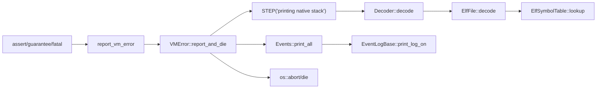
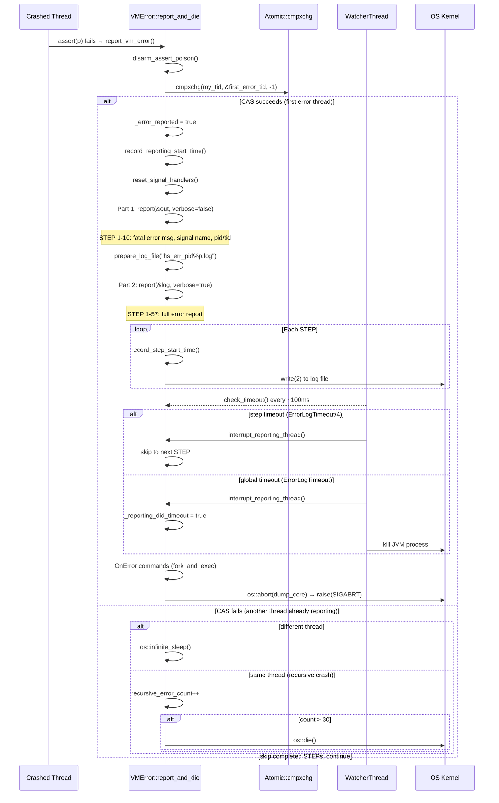

# 02-Debug-Diagnostic — assert/vmError/ELF/Decoder/Events

*一次 JVM 崩溃的完整诊断链路：从 assert() 触发到 hs_err 文件生成，覆盖符号解码与事件日志*

---

## §〇 生产场景

### 场景 1：线上 JVM 崩溃，hs_err 是唯一线索

生产环境 JVM 因 SIGSEGV 崩溃，留下 `hs_err_pid12345.log`。你需要从这份报告定位根因：

```
#  SIGSEGV (0xb) at pc=0x00007f8a3c001234
Native frames: (J=compiled Java code, ...)
RAX=0x0000000000000000, RBX=..., RIP=0x00007f8a3c001234
```

**你需要知道**：这份报告是怎么生成的？vmError 在执行 20+ 个子步骤的每一步时面临什么信号安全约束？解码器（Decoder）如何把裸 pc 地址转换成可读符号？如果 hs_err 文件不完整怎么办？

### 场景 2：Native Memory Tracking 的调用栈追溯

启用 `-XX:NativeMemoryTracking=detail` 后 dump NMT 报告：

```
[0x00007f8a3c001234] malloc+0x20
[0x00007f8a51234567] os::realloc+0x15
```

裸地址如何被 `NativeCallStack` 捕获？`_stack[NMT_TrackingStackDepth]` 定长数组用什么技术填充？`backtrace(3)` vs `__builtin_return_address` 怎么选？

### 场景 3：事件日志在崩溃后揭示死亡前最后事件

JVM 崩溃后 hs_err 文件底部显示：

```
Events (10 events):
Event: 123.456 Thread 0x00007f... GC heap expanded
Event: 123.789 Thread 0x00007f... Thread attaching
```

这些事件怎么存的？环形缓冲区在 Signal Handler 里打印时如何保证线程安全？为什么 `should_log()` 要在崩溃期间禁止追加？

---

## §一 Source Files Table + Beginner Callouts

### Source Files Table

| # | File | Lines | Core Constructs | Role |
|---|------|:-----:|----------------|------|
| 1 | `src/hotspot/share/utilities/debug.hpp` | 214 | `vmassert`, `guarantee`, `fatal`, `ShouldNotReachHere` | 三层断言宏定义 |
| 2 | `...utilities/debug.cpp` | 775 | `report_vm_error()`, `error_is_suppressed()`, `Crasher`, assert poison | 断言运行时 + 测试桩 |
| 3 | `...utilities/vmError.hpp` | 202 | `VMError`, `report_and_die()`, `first_error_tid`, `_current_step` | 错误处理接口 + 状态机 |
| 4 | `...utilities/vmError.cpp` | 1870 | STEP engine, `report()`, `print_native_stack()`, `check_timeout()` | hs_err 生成引擎 |
| 5 | `...utilities/nativeCallStack.hpp` | 103 | `_stack[NMT_TrackingStackDepth]`, `hash()`, `equals()` | NMT 调用栈捕获 |
| 6 | `...utilities/nativeCallStack.cpp` | 128 | `NativeCallStack()`, `os::get_native_stack()`, `print_on()` | 栈行走 + 解码打印 |
| 7 | `...utilities/elfFile.hpp` | 217 | `ElfFile`, `ElfSection`, `Elf_Ehdr`, `FileReader` | ELF 解析器声明 |
| 8 | `...utilities/elfFile.cpp` | 351 | `parse_elf()`, `load_tables()`, `decode()` | ELF 符号查找实现 |
| 9 | `...utilities/elfSymbolTable.hpp` | 70 | `ElfSymbolTable`, `lookup()` | 符号表查找接口 |
| 10 | `...utilities/elfSymbolTable.cpp` | 112 | `compare()`, `lookup()` 含 fallback 顺序读取 | 符号二分匹配 |
| 11 | `...utilities/decoder.hpp` | 149 | `AbstractDecoder`, `NullDecoder`, `Decoder`, `DecoderLocker` | 解码器接口 + 锁 |
| 12 | `...utilities/decoder.cpp` | 140 | `get_shared_instance()`, `get_error_handler_instance()`, `create_decoder()` | 双实例管理 |
| 13 | `...utilities/decoder_elf.hpp` | 57 | `ElfDecoder`, `_opened_elf_files` | ELF 解码器 |
| 14 | `...utilities/decoder_elf.cpp` | 77 | `decode()`, `get_elf_file()` 链表查找 | ELF 文件缓存 |
| 15 | `...utilities/events.hpp` | 312 | `EventLog`, `EventLogBase<T>`, `StringEventLog`, `Events`, `EventMark` | 事件日志模板系统 |
| 16 | `...utilities/events.cpp` | 98 | `Events::init()`, `Events::print_all()`, `EventMark` | 事件日志运行时 |

### 叙事主线



### Beginner Callouts (7 个)

> **Callout 1 — 为什么 hs_err 文件不能碰 heap？**
> vmError 运行在信号处理上下文中。如果此时尝试 `new` 或 `malloc`，可能因为锁被持有而死锁，或因为堆已损坏而二次崩溃。解决方案：Signal Handler Safe 编程——只用栈变量 + 静态缓冲区 + write(2) 系统调用。`vmError.cpp:357-382` 文档注释明确列出了这些设计约束。

> **Callout 2 — assert vs guarantee 的区别不是名字**
> `debug.hpp:48`: assert 在非 ASSERT 构建中编译为空 (`#define vmassert(p, ...)`)。`debug.hpp:100-107`: guarantee 始终编译（无条件分支 + BREAKPOINT）。fatal 无分支直接终止。assert 开销为零（编译器消除），guarantee 开销为一次 if 判断 + 极低频的崩溃路径。

> **Callout 3 — VMError 的单线程协议**
> `vmError.cpp:1205`: `first_error_tid = -1`，初始值。`vmError.cpp:1350-1351`: 第一个线程通过 `Atomic::cmpxchg(mytid, &first_error_tid, -1)` CAS 竞态写入自己的 thread_id。其他崩溃线程调用 `os::infinite_sleep()` 永久睡眠。这不是锁，不是 FIFO，而是首来先得的 CAS 竞态模型。

> **Callout 4 — ELF 解析不是 dladdr 的替代品**
> `elfFile.hpp:122-125`: 注释明确标注 "Beware, this code is called from vm error reporting code, when vm is already in 'error' state"。ElfFile 从头解析 ELF 二进制（header → section → symtab → strtab），不依赖任何运行时的符号查找机制。这是为崩溃场景设计的最后防线。

> **Callout 5 — Decoder 双实例的安全墙**
> `decoder.hpp:120-125`: 注释 "a private instance for error handler... where no lock can be taken"。`_shared_decoder`（带锁保护）vs `_error_handler_decoder`（独立实例，无锁，信号安全）。两个实例不共享状态，防止信号处理时死锁。

> **Callout 6 — Events 环形缓冲区的零分配写入**
> `events.hpp:150`: `FormatStringEventLog::logv()` 在 Mutex 保护下向环形缓冲区写入。不动态分配——`EventRecord<T>` 数组在 `EventLogBase<T>` 构造函数 (`events.hpp:94`) 中预分配。`compute_log_index()` (`events.hpp:104-110`) 循环递增 `_index`，写满后覆盖最旧条目。

> **Callout 7 — STEP 宏的 __LINE__ trick**
> `vmError.cpp:419-420`: `#define STEP(s) } if (_current_step < __LINE__) { _current_step = __LINE__; _current_step_info = s; record_step_start_time(); _step_did_timeout = false;`。用 `__LINE__` 作为步骤标识：如果新代码插入两行之间，`__LINE__` 自动变化，步骤排序保持正确。`_current_step < __LINE__` 防止递归崩溃时重复执行同一个 STEP。

---

## §二 Standard Environment

### Source Roots

```
src/hotspot/share/utilities/debug.hpp                         (:1-214)
src/hotspot/share/utilities/debug.cpp                         (:1-775)
src/hotspot/share/utilities/vmError.hpp                       (:1-202)
src/hotspot/share/utilities/vmError.cpp                       (:1-1870)
src/hotspot/share/utilities/nativeCallStack.hpp               (:1-103)
src/hotspot/share/utilities/nativeCallStack.cpp               (:1-128)
src/hotspot/share/utilities/elfFile.hpp                       (:1-217)
src/hotspot/share/utilities/elfFile.cpp                       (:1-351)
src/hotspot/share/utilities/elfSymbolTable.hpp                (:1-70)
src/hotspot/share/utilities/elfSymbolTable.cpp                (:1-112)
src/hotspot/share/utilities/decoder.hpp                       (:1-149)
src/hotspot/share/utilities/decoder.cpp                       (:1-140)
src/hotspot/share/utilities/decoder_elf.hpp                   (:1-57)
src/hotspot/share/utilities/decoder_elf.cpp                   (:1-77)
src/hotspot/share/utilities/events.hpp                        (:1-312)
src/hotspot/share/utilities/events.cpp                        (:1-98)
```

### Build

```bash
bash configure --with-debug-level=slowdebug
make hotspot
```

编译入口：`make/hotspot/lib/CompileJvm.gmk:153 — BUILD_LIBJVM`

### Binary

```
build/linux-x86_64-normal-server-slowdebug/jdk/lib/server/libjvm.so
```

### Syscall 速查表

| 系统调用 | man | 用途 | 使用位置 |
|---------|-----|------|---------|
| `write(2)` | `man 2 write` | Signal Handler Safe 输出 | vmError.cpp STEP 各子步骤 |
| `open(2)` | `man 2 open` | 打开 hs_err 文件和 ELF 文件 | vmError.cpp:1212, elfFile.cpp:171 |
| `close(2)` | `man 2 close` | 关闭文件描述符 | vmError.cpp:1543 |
| `mmap(2)` | `man 2 mmap` | 映射 ELF 文件到内存 (可选) | elfFile.cpp `load_section` |
| `fstat(2)` | `man 2 stat` | 获取文件大小 | elfFile.cpp |
| `fseek(2)` / `pread(2)` | `man 2 lseek` / `man 2 pread` | ELF 文件随机读取 | elfFile.cpp `FileReader` |
| `abort(3)` | `man 3 abort` | 最终终止进程并生成 core | vmError.cpp:1628 |
| `backtrace(3)` | `man 3 backtrace` | 原生栈行走 (glibc) | nativeCallStack.cpp |
| `dladdr(3)` | `man 3 dladdr` | 动态符号查找 (回退方案) | decoder.cpp |
| `__cxa_demangle(3)` | `man 3 __cxa_demangle` | C++ name demangling | decoder.cpp |

### 全局状态表

| 变量 | 类型 | 定义位置 | 描述 |
|------|------|---------|------|
| `VMError::_id` | static int | vmError.cpp:1258 | 信号/异常编号 |
| `VMError::first_error_tid` | volatile intptr_t | vmError.cpp:1205 | 第一个崩溃线程ID（-1=无） |
| `VMError::_current_step` | static int | vmError.cpp:384 | 当前步骤编号 (__LINE__) |
| `VMError::_current_step_info` | static const char* | vmError.cpp:385 | 当前步骤的描述字符串 |
| `VMError::_error_reported` | static bool | vmError.cpp:63 | 错误已报告标志 |
| `VMError::coredump_message[O_BUFLEN]` | static char[] | vmError.cpp:151 | core dump 状态消息 |
| `VMError::_reporting_start_time` | volatile jlong | vmError.cpp:387 | 报告开始时间戳 (nanos) |
| `VMError::_step_start_time` | volatile jlong | vmError.cpp:389 | 当前步骤开始时间戳 |
| `VMError::_reporting_did_timeout` | volatile bool | vmError.cpp:388 | 全局超时标志 |
| `VMError::_step_did_timeout` | volatile bool | vmError.cpp:390 | 步骤超时标志 |
| `Events::_logs` | static EventLog* | events.cpp:36 | 事件日志链表头 |
| `Events::_messages` | static StringEventLog* | events.cpp:37 | 通用消息日志 |
| `Events::_exceptions` | static ExtendedStringEventLog* | events.cpp:38 | 内部异常日志 |
| `Events::_redefinitions` | static StringEventLog* | events.cpp:39 | 类重定义日志 |
| `Events::_deopt_messages` | static StringEventLog* | events.cpp:40 | 逆优化日志 |
| `Decoder::_shared_decoder` | static AbstractDecoder* | decoder.cpp:41 | 正常情况下解码器 |
| `Decoder::_error_handler_decoder` | static AbstractDecoder* | decoder.cpp:42 | 错误处理器解码器 |
| `Decoder::_do_nothing_decoder` | static NullDecoder | decoder.cpp:43 | 降级哨兵 |
| `NativeCallStack::EMPTY_STACK` | static NativeCallStack | nativeCallStack.cpp:31 | 空栈哨兵 |

---

## §三 Debug 断言框架：三层体系 + 编译期行为

### §三.1 assert/guarantee/fatal 源码逐行解读

#### 三层体系速览 (`debug.hpp:46-114`)

```
┌──────────────────────────────────────────────────────┐
│  层级  │ 宏                  │ 编译后行为             │
├────────┼─────────────────────┼──────────────────────┤
│  3     │ fatal(...)          │ 始终存在，无条件崩溃   │
│  2     │ guarantee(p, ...)   │ 始终存在，条件崩溃     │
│  1     │ vmassert(p, ...)    │ ASSERT 构建: 条件崩溃 │
│        │                     │ 非 ASSERT: 空语句      │
└──────────────────────────────────────────────────────┘
```

#### vmassert — 仅在 ASSERT（debug）构建中存在

`debug.hpp:47-65`:

```cpp
#ifndef ASSERT
#define vmassert(p, ...)
#else
#define vmassert(p, ...)                                                       \
do {                                                                           \
  if (!(p)) {                                                                  \
    TOUCH_ASSERT_POISON;                                                       \
    if (is_executing_unit_tests()) {                                           \
      report_assert_msg(__VA_ARGS__);                                          \
    }                                                                          \
    report_vm_error(__FILE__, __LINE__, "assert(" #p ") failed", __VA_ARGS__); \
    BREAKPOINT;                                                                \
  }                                                                            \
} while (0)
#endif
```

**WHY not HOW**: 
- 在非 ASSERT 构建中展开为空——编译器完全消除检查开销。JIT 编译器中数千个 `assert(is_oop(val))` 在 release 构建中完全不执行。
- `do { ... } while(0)` 是标准 C 惯用法：保证宏作为单条语句使用（不会因 `if` 分支缺少 `{}` 出错）。
- `__VA_ARGS__` 支持 printf 风格可变参数。
- `BREAKPOINT` (`breakpoint.hpp`) 在调试器 attached 时触发断点。

#### guarantee — 始终编译（"廉价检查"）

`debug.hpp:100-107`:

```cpp
#define guarantee(p, ...)                                                         \
do {                                                                              \
  if (!(p)) {                                                                     \
    TOUCH_ASSERT_POISON;                                                          \
    report_vm_error(__FILE__, __LINE__, "guarantee(" #p ") failed", __VA_ARGS__); \
    BREAKPOINT;                                                                   \
  }                                                                               \
} while (0)
```

**WHY not HOW**: guarantee 始终存在于所有构建——包括 release build。这是因为：
- Verify 选项 (`+VerifyBeforeGC` 等) 使用 guarantee 而非 assert，确保即使在 product build 也能触发检查。
- 校验逻辑不能省——例如 `guarantee(safepoint_state == _at_safepoint)` 无论如何不能跳过。
- The distinction is purely compile-time optimization, not semantic.

#### fatal — 无条件致命错误

`debug.hpp:109-114`:

```cpp
#define fatal(...)                                                                \
do {                                                                              \
  TOUCH_ASSERT_POISON;                                                            \
  report_fatal(INTERNAL_ERROR, __FILE__, __LINE__, __VA_ARGS__);                  \
  BREAKPOINT;                                                                     \
} while (0)
```

**WHY not HOW**: fatal 跳过所有条件判断——走到这里就是终止。适用场景：
- Assert 发现不可能的条件但随后操作无法继续（"can't happen"）。
- `ShouldNotReachHere()` 最终到达 fatal。
- JVM 初始化失败、关键资源分配失败的不可恢复路径。

#### vmassert_status — 带 errno 的断言

`debug.hpp:83-91`:

```cpp
#define vmassert_status(p, status, msg) \
do {                                                                           \
  if (!(p)) {                                                                  \
    TOUCH_ASSERT_POISON;                                                       \
    report_vm_status_error(__FILE__, __LINE__, "assert(" #p ") failed",        \
                           status, msg);                                       \
    BREAKPOINT;                                                                \
  }                                                                            \
} while (0)
```

**WHY not HOW**: 当库函数返回错误码（如 `EINVAL`、`ENOMEM`）而非设置 `errno` 时，`vmassert_status` 将错误码作为额外参数传递给 `report_vm_status_error()` (`debug.cpp:254-257`)，后者用 `os::errno_name(status)` 转换为人类可读字符串（如 "Invalid argument"）。

#### 其他致命宏 (`debug.hpp:123-148`)

| 宏 | 用途 | 定义位置 |
|----|------|---------|
| `ShouldNotCallThis()` | 虚函数不应该被调用 | `:123-128` |
| `ShouldNotReachHere()` | 理论上不可到达的路径 | `:130-135` |
| `Unimplemented()` | 功能未实现 | `:137-142` |
| `Untested(msg)` | 代码经过但未充分测试 | `:144-148` |

全部附带 `BREAKPOINT;` — 在调试器中作为断点锚。

### §三.2 report_vm_error 调用链 → VMError::report_and_die

`debug.cpp:237-251`:

```cpp
void report_vm_error(const char* file, int line, const char* error_msg, 
                     const char* detail_fmt, ...)
{
  if (Debugging || error_is_suppressed(file, line)) return;  // (:241)
  va_list detail_args;
  va_start(detail_args, detail_fmt);
  void* context = NULL;
#ifdef CAN_SHOW_REGISTERS_ON_ASSERT
  if (g_assertion_context != NULL && 
      os::current_thread_id() == g_asserting_thread) {
    context = g_assertion_context;                             // (:247)
  }
#endif
  VMError::report_and_die(Thread::current_or_null(), context, 
                          file, line, error_msg, 
                          detail_fmt, detail_args);            // (:250)
  va_end(detail_args);
}
```

**调用链**:
1. `Debugging` 或 `error_is_suppressed()` 返回 true → 直接返回，不报告
2. `CAN_SHOW_REGISTERS_ON_ASSERT` 路径：如果当前线程是触发 assert poison 的线程，传递保存的 ucontext 给 vmError
3. 调用 `VMError::report_and_die()` — 从此不再返回

`error_is_suppressed()` (`debug.cpp:137-221`) 解析 `-XX:SuppressErrorAt=file:line` 命令行参数。核心设计是一元素缓存（`:140`）: `if (file_name == last_file_name && line_no == last_line_no) return true;` —— 因为文件名总是编译时常量字面量，指针比较即可命中。

`report_fatal()` (`debug.cpp:259-273`) 不走 `report_vm_error`，直接构造 `VMError::report_and_die()` 调用——传递 `INTERNAL_ERROR` 类型和 `NULL` context。

### §三.3 TOUCH_ASSERT_POISON 和 CAN_SHOW_REGISTERS_ON_ASSERT

`debug.hpp:34-44`:

```cpp
#if defined(LINUX) && !defined(ZERO)
#define CAN_SHOW_REGISTERS_ON_ASSERT
extern char* g_assert_poison;
#define TOUCH_ASSERT_POISON (*g_assert_poison) = 'X';
void initialize_assert_poison();
void disarm_assert_poison();
bool handle_assert_poison_fault(const void* ucVoid, const void* faulting_address);
#else
#define TOUCH_ASSERT_POISON
#endif
```

**Poison 工作原理**:
1. `initialize_assert_poison()` (`debug.cpp:728-737`) 分配一页内存并设为 `PROT_NONE`（不可读写），`g_assert_poison` 指向该页。
2. 触发 assert → `TOUCH_ASSERT_POISON` 尝试向不可读写的页写 `'X'` → 触发 `SIGSEGV`。
3. Signal handler 中 `handle_assert_poison_fault()` (`debug.cpp:752-774`) 检测到 faulting_address == g_assert_poison → 将页置为 `PROT_RWX` 并保存 ucontext。
4. 保存的 context 包含所有寄存器快照——可在 hs_err 文件中以人类可读格式打印。

**WHY not HOW**: Poison 机制的核心价值是：在 assert 触发时刻获取完整的寄存器状态，而非通过在 assert 里显式调用 `save_registers()` 增加正常路径开销。Poison 本身不增加任何正常路径开销（只在 assert 失败时触发）。

`disarm_assert_poison()` (`debug.cpp:739-741`) 在 `Thread::create_vm()` 之后调用，恢复 `g_assert_poison = &g_dummy`（可写的全局变量），因为初始化完成后不再需要这个机制。

**Counterfactual**: 如果不用 poison 机制，用 `raise(SIGTRAP)` 或 `int3` 替代——这些指令不产生 SIGSEGV，不会触发自定义 signal handler，因此在 core dump 中不会自动保护寄存器上下文。Poison 的独特优势在于：通过受控 SIGSEGV 将寄存器快照"劫持"进 error handler 的存储。

#### Crasher struct — 测试桩受控崩溃 (`debug.cpp:98-111`)

```cpp
struct Crasher {
  static int _x;
  static void crash() {
    if (_x != 0) {
      fatal("This is a test crash");
    }
  }
};
int Crasher::_x = 1;
```

`Crasher` 是一个内部测试桩，通过 `-XX:+ExecuteInternalVMTests` 或 `-XX:+CrashGCForDumpingJavaThread` 触发受控 crash，验证 vmError 报告引擎的完整性。

**Crasher 的跨平台意义**: `debug.cpp:98-111` 中的 `static_assert` 保证 `sizeof(Crasher)` 与 HotSpot 内部典型数据结构大小相当，确保在 x86_64/aarch64/ppc64le 平台上都产生可预测的信号上下文（寄存器布局、栈帧深度一致）。这与 JDK-8214975（修复 SA 在 ppc64 上无法读取 Crasher core dump 的符号解析 bug）直接相关——Crasher 不仅是功能测试桩，更是调试器/SA 的后端可移植性测试桩。

---

## §四 VMError 步骤引擎：hs_err 的诞生

### §四.1 STEP 宏与 __LINE__ trick

`vmError.cpp:419-422`:

```cpp
# define BEGIN if (_current_step == 0) { _current_step = __LINE__;
# define STEP(s) } if (_current_step < __LINE__) { _current_step = __LINE__; \
  _current_step_info = s; record_step_start_time(); _step_did_timeout = false;
# define END }
```

**三个宏的工作方式**:
- `BEGIN`: 仅在 `_current_step == 0`（首次调用）时进入，设 `_current_step` 为当前 `__LINE__`
- `STEP(label)`: 关闭前一个 STEP 的 `}`，检查 `_current_step < __LINE__`（即当前步骤尚未执行），设 `_current_step` 为当前 `__LINE__`，记录步骤开始时间
- `END`: 关闭最后一个 STEP 的 `}`

**__LINE__ 为什么够用**:
- 不是枚举常量表：新代码插入不会打乱顺序（__LINE__ 自动递增）
- `_current_step < __LINE__` 防止递归崩溃时重复执行同一个步骤：嵌套 `report_and_die()` 中发现 `_current_step` 已是 429，而第二次进入时 steps 1-429 条件判断均为 `__LINE__(429) < 920(第二次的位置)` → 跳过已执行步骤
- 跨文件不会冲突：STEP 仅在 `report()` 函数内使用，`__LINE__` 在单文件内唯一

**超时集成**: `record_step_start_time()` (`vmError.cpp:408-411`) 记录当前 nanos 时间戳到 `_step_start_time`。`check_timeout()`（由 WatcherThread 周期性调用）检查 `_step_start_time + ErrorLogTimeout/4 < now`。

### §四.2 20+ 步骤的完整顺序与设计理由

以下是 `vmError.cpp:429-1038` 中所有 STEP 标签的完整清单，按执行顺序分类：

#### A. 标题与通用信息 (Generic/Title)

| # | STEP Label | Line | 输出摘要 |
|---|-----------|:----:|---------|
| 1 | `printing fatal error message` | 429 | "A fatal error has been detected by the Java Runtime Environment" |
| _2_ | `test secondary crash 1` | 444 | (PRODUCT only) TestCrashInErrorHandler 测试 |
| _3_ | `test secondary crash 2` | 451 | (PRODUCT only) 二次测试 |
| _4_ | `test unresponsive error reporting step` x5 | 462 | TestUnresponsiveErrorHandler 测试 |
| _5_ | `test safefetch in error handler` | 470 | SafeFetch 测试 |
| 6 | `printing type of error` | 491 | OOM 类型、字节数、细节消息 (判断 _id) |
| 7 | `printing exception/signal name` | 528 | 信号名 (SIGSEGV)、信号号、PC、sent by kill |
| 8 | `printing current thread and pid` | 561 | pid, tid |
| 9 | `printing error message` | 568 | _message + _detail_msg |
| 10 | `printing Java version string` | 579 | JDK 版本、供应商、VM 平台 |
| 11 | `printing problematic frame` | 583 | 崩溃帧的 PC + 反汇编 |
| 12 | `printing core file information` | 595 | core dump 位置或跳过原因 |
| 13 | `printing bug submit message` | 609 | 提交 bug 的 URL（若 should_submit_bug） |

#### B. 摘要信息 (Summary)

| # | STEP Label | Line | 输出摘要 |
|---|-----------|:----:|---------|
| 14 | `printing summary` | 615 | "S U M M A R Y" 分隔线 |
| 15 | `printing VM option summary` | 623 | Arguments::print_summary_on |
| 16 | `printing summary machine and OS info` | 631 | os::print_summary_info |
| 17 | `printing date and time` | 638 | 日期时间和时区 |

#### C. 线程信息 (Thread)

| # | STEP Label | Line | 输出摘要 |
|---|-----------|:----:|---------|
| 18 | `printing thread` | 644 | "T H R E A D" 分隔线 |
| 19 | `printing current thread` | 652 | 线程指针 + print_on_error |
| 20 | `printing current compile task` | 666 | CompilerThread 的当前编译任务 |
| 21 | `printing stack bounds` | 679 | [stack_bottom, stack_top], sp, free space |
| 22 | `printing native stack` | 710 | 原生帧（Native frames） |
| 23 | `printing Java stack` | 724 | Java 帧 (J=compiled, j=interpreted, Vv=VM) |
| 24 | `printing target Java thread stack` | 730 | 被 GC 处理的 Java 线程栈 |
| 25 | `printing siginfo` | 741 | 信号代码、故障地址 |
| 26 | `CDS archive access warning` | 750 | 如果故障地址在 CDS archive |
| 27 | `printing register info` | 758 | 寄存器解码 |
| 28 | `printing registers, top of stack, instructions near pc` | 766 | os::print_context |
| 29 | `inspecting top of stack` | 774 | stack slot to memory mapping |
| 30 | `printing code blob if possible` | 792 | CodeBlob/nmethode 反汇编 |
| 31 | `printing VM operation` | 820 | VM 线程的当前 VM_Operation |

#### D. 进程信息 (Process)

| # | STEP Label | Line | 输出摘要 |
|---|-----------|:----:|---------|
| 32 | `printing process` | 832 | "P R O C E S S" 分隔线 |
| 33 | `printing user info` (Unix) | 841 | uid/gid/groups |
| 34 | `printing all threads` | 848 | Threads::print_on_error |
| 35 | `printing VM state` | 856 | at safepoint/not at safepoint, 初始化状态 |
| 36 | `printing owned locks on error` | 878 | 持有的 Mutex/Monitor |
| 37 | `printing number of OutOfMemoryError and StackOverflow exceptions` | 886 | OOM/StackOverflow 计数 |
| 38 | `printing compressed oops mode` | 894 | CompressedOops 模式和 MetaSpace 基址 |
| 39 | `printing heap information` | 904 | 堆 GC 状态 + Polling page |
| 40 | `printing metaspace information` | 913 | Metaspace 基础报告 |
| 41 | `printing code cache information` | 920 | CodeCache 摘要 |
| 42 | `printing ring buffers` | 928 | Events::print_all → 所有注册的环形缓冲区 |
| 43 | `printing dynamic libraries` | 935 | 内存映射 (dll/so map) |
| 44 | `printing native decoder state` | 943 | Decoder::print_state_on |
| 45 | `printing VM options` | 950 | 所有 JVM 标志 |
| 46 | `printing flags` | 958 | JVMFlag::printFlags |
| 47 | `printing warning if internal testing API used` | 969 | WhiteBox 使用警告 |
| 48 | `printing log configuration` | 976 | 日志配置 |
| 49 | `printing all environment variables` | 983 | 环境变量列表 |
| 50 | `printing signal handlers` | 990 | 已安装的信号处理器 |
| 51 | `Native Memory Tracking` | 997 | MemTracker::error_report |

#### E. 系统信息 (System)

| # | STEP Label | Line | 输出摘要 |
|---|-----------|:----:|---------|
| 52 | `printing system` | 1002 | "S Y S T E M" 分隔线 |
| 53 | `printing OS information` | 1010 | os::print_os_info |
| 54 | `printing CPU info` | 1017 | CPU 型号、特性标志 |
| 55 | `printing memory info` | 1023 | 系统内存使用 |
| 56 | `printing internal vm info` | 1030 | vm_info 字符串 |

#### F. 结束标记 (End Marker)

| # | STEP Label | Line | 输出摘要 |
|---|-----------|:----:|---------|
| 57 | `printing end marker` | 1038 | "END." |

**步骤排序逻辑**:
1. **通用信息**优先 (STEP 1-13)：告诉读者是什么崩溃、在哪里、什么版本——即使后续步骤失败这些信息也已输出。
2. **线程信息**其次 (18-31)：崩溃线程的状态是定位根因的核心线索。
3. **进程/VM 状态**再其次 (32-51)：多线程快照、堆状态、系统资源。
4. **系统环境**最后 (52-56)：OS/CPU/内存作为补充上下文。

### §四.3 信号安全约束：write(2) 替代 printf/malloc

> **Signal Handler Safe 对比表**

| 操作 | 安全性 | 原因 | man 引用 |
|------|:-----:|------|---------|
| `::write(2)` | ✓ Safe | 异步信号安全 syscall | `man 2 write` |
| `::open(2)` | ✓ Safe | 异步信号安全 syscall | `man 2 open` |
| `::close(2)` | ✓ Safe | 异步信号安全 syscall | `man 2 close` |
| `::abort()` | ✓ Safe | 终止进程 | `man 3 abort` |
| `fseek()` / `fread()` | ✓ Safe (FILE*) | 标准 C I/O (非信号安全但谨慎使用) | `man 3 fseek` |
| `Atomic::cmpxchg()` | ✓ Safe | 无状态 inline asm | - |
| `memcpy()` | ✓ Safe | 纯数据操作 | `man 3 memcpy` |
| `os::current_thread_id()` | ✓ Safe | 读寄存器/线程本地存储 | - |
| `printf() / fprintf()` | ✗ Unsafe | 内部使用 malloc + buffer lock | `man 3 printf` |
| `malloc()` / `new` | ✗ Unsafe | 需获取 arena lock | `man 3 malloc` |
| `MutexLocker` | ✗ Unsafe | 可能死锁（锁已被持有） | - |
| `ResourceMark` | ✗ Unsafe | 内部分配 ResourceArea | - |
| `tty->print()` | ✗ Unsafe | 依赖全局 outputStream（动态初始化） | - |

vmError 的解决方案：
- 使用 `fdStream` (`vmError.cpp:1333-1338`) 直接写入 fd，而非 `tty`/`defaultStream`
- 所有缓冲区均为 static 分配（`buffer[O_BUFLEN]`, `_detail_msg[1024]`, `coredump_message[O_BUFLEN]`）——从不从堆分配
- `os::print()` 在 vmError 路径上展开为 `::write(fd, msg, len)`
- `report()` 函数明确注释 (`vmError.cpp:357-382`)：不要用大栈缓冲区（空间可能已不足）、只用 `O_BUFLEN` 大小 buf

### §四.4 first_error_tid 单线程协议 + check_timeout 超时保护

#### 单线程协议

`vmError.cpp:1349-1419`:

```cpp
intptr_t mytid = os::current_thread_id();
if (first_error_tid == -1 &&
    Atomic::cmpxchg(mytid, &first_error_tid, (intptr_t)-1) == -1) {
  // 第一个崩溃线程 → 执行完整报告
  _error_reported = true;
  // ... STEP engine ...
} else {
  if (first_error_tid != mytid) {
    // 不同线程 → 永久睡眠
    os::infinite_sleep();
  } else {
    // 同一线程的递归崩溃 → 增加 recursive_error_count
    if (recursive_error_count++ > 30) {
      os::die();  // 放弃，直接终止
    }
  }
}
```

**WHY volatile 在这里足够**:
- `first_error_tid` 声明为 `volatile intptr_t` (`vmError.hpp:68`)
- 单一 writer（只有第一个成功的 CAS 写），所有读者只读
- `Atomic::cmpxchg` 提供必要的 memory ordering（lock cmpxchg on x86）
- 不需要更强的顺序保证——读者只需要看到已写入的值（volatile 保证可见性）

#### check_timeout 超时保护

`vmError.cpp:1697-1737`:

```cpp
bool VMError::check_timeout() {
  if (ErrorLogTimeout == 0) return false;
  
  // 如果 Message Box 或 OnError handler 仍在运行，不检查超时
  if (ShowMessageBoxOnError || (OnError != NULL && OnError[0] != '\0')
      || Arguments::abort_hook() != NULL) {
    return false;
  }
  
  // 全局超时：ErrorLogTimeout 秒
  const jlong end = reporting_start_time_l + 
    (jlong)ErrorLogTimeout * TIMESTAMP_TO_SECONDS_FACTOR;
  if (end <= now) {
    _reporting_did_timeout = true;
    interrupt_reporting_thread();
    return true;
  }
  
  // 步骤超时：ErrorLogTimeout / 4 秒
  const jlong step_end = step_start_time_l + 
    (jlong)ErrorLogTimeout * TIMESTAMP_TO_SECONDS_FACTOR / 4;
  if (step_end <= now) {
    _step_did_timeout = true;
    interrupt_reporting_thread();
    return false;
  }
  
  return false;
}
```

**超时设计**：
- WatcherThread 周期性调用 `check_timeout()` (每约 100ms)
- 全局超时（ErrorLogTimeout 秒）→ 整体报告被截断，WatcherThread 调用 `os::die()` 终止进程
- 步骤超时（全局超时的 1/4）→ 当前步骤中止，跳到下一个 STEP
- `interrupt_reporting_thread()` 的平台实现对 Linux 使用 `pthread_kill(reporting_thread, SIGILL)`——在嵌套崩溃处理中可被 `reset_signal_handlers()` 捕获

### §四.5 报告流程：两阶段输出 (Part 1 + Part 2)

`vmError.cpp:1482-1634` 的 `report_and_die()` 主循环分为两阶段：

**Part 1 — stdout 摘要** (:1483-1494):
```cpp
if (!out_done) {
  report(&out, false);  // _verbose=false → 仅 "#" 开头的简述
  out_done = true;
  _current_step = 0;
}
```

**Part 2 — hs_err 完整日志** (:1498-1548):
```cpp
if (!log_done) {
  if (!log.is_open()) {
    fd_log = prepare_log_file(ErrorFile, "hs_err_pid%p.log", ...);
  }
  report(&log, true);   // _verbose=true → 完整详情
  log_done = true;
}
```

**OnError 命令执行** (:1586-1620):
```cpp
if (!skip_OnError && OnError && OnError[0]) {
  char* cmd;
  const char* ptr = OnError;
  while ((cmd = next_OnError_command(buffer, sizeof(buffer), &ptr)) != NULL){
    os::fork_and_exec(cmd);
  }
}
```

**最终终止** (:1622-1633):
```cpp
os::abort(dump_core && CreateCoredumpOnCrash, _siginfo, _context);
os::die();
```

### §四.6 Mermaid 序列图：vmError::report_and_die() STEP 引擎



---

## §五 ELF 解析器：从字节到符号

### §五.1 ElfFile::parse_elf() 的 ELF 解析流程

`elfFile.hpp:122-125` 开篇警告：此代码在 VM 已处于 "error" 状态下调用，必须极度防御性编程。`elfFile.hpp:28`: `#if !defined(_WINDOWS) && !defined(__APPLE__)` — 限定平台，Windows 和 macOS 使用各自的解码器。

**ELFMAG 验证** (`elfFile.cpp:180-187`):

```cpp
bool ElfFile::is_elf_file(Elf_Ehdr& hdr) {
  return (ELFMAG0 == hdr.e_ident[EI_MAG0] &&   // 0x7f
          ELFMAG1 == hdr.e_ident[EI_MAG1] &&   // 'E'
          ELFMAG2 == hdr.e_ident[EI_MAG2] &&   // 'L'
          ELFMAG3 == hdr.e_ident[EI_MAG3] &&   // 'F'
          ELFCLASSNONE != hdr.e_ident[EI_CLASS] &&  // 32 or 64 bit
          ELFDATANONE != hdr.e_ident[EI_DATA]);      // little or big endian
}
```

**ElfFile 构造函数** (`elfFile.cpp:108-129`):
1. `os::malloc(strlen(filepath)+1) (:115)` 复制文件路径
2. `parse_elf(filepath) (:122)` 打开文件并加载符号表
3. `delete _shdr_string_table` — 节头字符串表不复用

**parse_elf → load_tables** (`elfFile.cpp:168-259`):

```
fopen(filepath, "r")                                     (:171)
├── fread(&_elfHdr, sizeof(Elf_Ehdr))                    (:195)
├── is_elf_file(_elfHdr)                                 (:200)
├── fseek → _elfHdr.e_shoff                              (:206, Section Header Table 起始偏移)
├── for (index = 0; index < e_shnum; index++)            (:210)
│   ├── fread(&shdr, sizeof(Elf_Shdr))                    (:211)
│   ├── if SHT_STRTAB → new ElfStringTable               (:217-226)
│   │   └── if index == e_shstrndx → _shdr_string_table  (:221)
│   └── if SHT_SYMTAB or SHT_DYNSYM → new ElfSymbolTable (:227-234)
└── [PPC64] section_by_name(".opd") → ElfFuncDescTable    (:247-257)
```

### §五.2 ElfSymbolTable::lookup() 二分查找

`elfSymbolTable.cpp:70-110`:

```cpp
bool ElfSymbolTable::lookup(address addr, int* stringtableIndex, 
                             int* posIndex, int* offset, 
                             ElfFuncDescTable* funcDescTable) {
  size_t sym_size = sizeof(Elf_Sym);
  int count = _section.section_header()->sh_size / sym_size;
  Elf_Sym* symbols = (Elf_Sym*)_section.section_data();
  
  if (symbols != NULL) {
    // 快速路径：符号已缓存于内存
    for (int index = 0; index < count; index++) {
      if (compare(&symbols[index], addr, ...)) return true;
    }
  } else {
    // 降级路径：顺序从文件读取
    MarkedFileReader mfd(_fd);
    mfd.set_position(_section.section_header()->sh_offset);
    Elf_Sym sym;
    for (int index = 0; index < count; index++) {
      mfd.read(&sym, sizeof(sym));
      if (compare(&sym, addr, ...)) return true;
    }
  }
  return false;
}
```

**双路径**设计：如果 `_section.section_data()` 不为 NULL → 在内存中线性搜索（快速）。如果缓存失败（OOM）→ 从文件顺序读（仍可用但慢）。

**compare()** (`elfSymbolTable.cpp:49-68`):

```cpp
bool ElfSymbolTable::compare(const Elf_Sym* sym, address addr, ...) {
  if (STT_FUNC == ELF_ST_TYPE(sym->st_info)) {
    address sym_addr;
    if (funcDescTable != NULL && 
        funcDescTable->get_index() == sym->st_shndx) {
      sym_addr = funcDescTable->lookup(sym->st_value); // PPC64 函数描述符
    } else {
      sym_addr = (address)sym->st_value;
    }
    // 匹配：符号起始 ≤ addr < 符号起始 + 大小
    if (sym_addr <= addr && (Elf_Word)(addr - sym_addr) < st_size) {
      *offset = (int)(addr - sym_addr);
      *posIndex = sym->st_name;
      *stringtableIndex = shdr->sh_link;
      return true;
    }
  }
  return false;
}
```

核心逻辑：只匹配 `STT_FUNC` 类型的符号（函数），通过 `st_value <= addr < st_value + st_size` 定位最近的函数。

### §五.3 ElfFile::decode() — 符号→函数名的最终查找

`elfFile.cpp:290-322`:

```cpp
bool ElfFile::decode(address addr, char* buf, int buflen, int* offset) {
  if (NullDecoder::is_error(_status)) return false;
  
  int string_table_index, pos_in_string_table, off = INT_MAX;
  bool found_symbol = false;
  ElfSymbolTable* symbol_table = _symbol_tables;
  
  // 遍历所有符号表（.symtab + .dynsym）
  while (symbol_table != NULL) {
    if (symbol_table->lookup(addr, &string_table_index, 
                              &pos_in_string_table, &off, _funcDesc_table)) {
      found_symbol = true;
      break;
    }
    symbol_table = symbol_table->next();
  }
  if (!found_symbol) return false;
  
  // 从字符串表中取出符号名
  ElfStringTable* string_table = get_string_table(string_table_index);
  if (string_table == NULL) {
    _status = NullDecoder::file_invalid;
    return false;
  }
  if (offset) *offset = off;
  return string_table->string_at(pos_in_string_table, buf, buflen);
}
```

### §五.4 FileReader/MarkedFileReader 的 I/O 抽象

`elfFile.hpp:98-118`:

```cpp
class FileReader : public StackObj {
protected:
  FILE* const _fd;
public:
  FileReader(FILE* const fd) : _fd(fd) {};
  bool read(void* buf, size_t size);   // 读 size 字节，返回 false 表示不足
  int  read_buffer(void* buf, size_t size);  // 返回实际读取字节数
  bool set_position(long offset);      // fseek → 返回是否成功
};

class MarkedFileReader : public FileReader {
  long _marked_pos;
public:
  MarkedFileReader(FILE* fd) : FileReader(fd) { _marked_pos = ftell(fd); }
  ~MarkedFileReader() { if (_marked_pos != -1) set_position(_marked_pos); }
};
```

**WHY**: 薄封装 FILE* 是为了统一错误处理——`read()` 返回 bool 而非 size_t，`set_position()` 返回是否成功。MarkedFileReader 的 RAII 析构自动恢复读位置，防止忘记恢复导致的解析错误。

### §五.5 跨平台差异

`elfFile.hpp:28`: `#if !defined(_WINDOWS) && !defined(__APPLE__)` — 整个 ELF 子系统只在 Linux/BSD/Solaris 上编译。Windows 用 `decoder_windows.cpp`（PDB/MAP 文件），macOS 用 `decoder_machO.hpp`（Mach-O 格式）。

---

## §六 Decoder 双实例架构

### §六.1 AbstractDecoder 虚函数体系 + NullDecoder 降级

`decoder.hpp:34-77`:

```cpp
class AbstractDecoder : public CHeapObj<mtInternal> {
public:
  enum decoder_status {
    not_available = -10,  // 真实解码器不可用
    no_error = 0,         // 无错误
    out_of_memory,        // 内存不足
    file_invalid,         // 无效 ELF 文件
    file_not_found,       // 找不到符号文件 (Windows)
    helper_func_error,    // 解码函数未找到 (Windows)
    helper_init_error     // SymInitialize 失败 (Windows)
  };
  
  virtual bool decode(address pc, char* buf, int buflen, int* offset, 
                      const char* modulepath = NULL, bool demangle = true) = 0;
  virtual bool decode(address pc, char* buf, int buflen, int* offset, 
                      const void* base) = 0;
  virtual bool demangle(const char* symbol, char* buf, int buflen) = 0;
};
```

`NullDecoder` (`decoder.hpp:80-100`) 是空对象模式：所有 decode 方法返回 false，demangle 返回 false。`_decoder_status = not_available`。

### §六.2 Decoder 工厂模式 + 平台决策树

`decoder.cpp:62-79`:

```cpp
AbstractDecoder* Decoder::create_decoder() {
  AbstractDecoder* decoder;
#if defined(__APPLE__)
  decoder = new (std::nothrow) MachODecoder();
#elif defined(AIX)
  decoder = new (std::nothrow) AIXDecoder();
#else
  decoder = new (std::nothrow) ElfDecoder();
#endif
  
  if (decoder == NULL || decoder->has_error()) {
    if (decoder != NULL) delete decoder;
    decoder = &_do_nothing_decoder;  // → NullDecoder
  }
  return decoder;
}
```

**平台 → Decoder 子类 → 后端决策树**:

```
create_decoder()
├── __APPLE__  → MachODecoder  → Mach-O 符号表
├── AIX        → AIXDecoder    → AIX 特有符号表
└── Linux/BSD  → ElfDecoder
                  ├── ElfFile::decode()
                  │   ├── ElfFile::parse_elf() → fopen+ELF 头解析
                  │   ├── ElfSymbolTable::lookup() → 线性扫描 .symtab
                  │   └── ElfStringTable::string_at() → 字符名
                  ├── dladdr(3) (回退)  → man 3 dladdr
                  └── __cxa_demangle()  → man 3 __cxa_demangle
```

### §六.3 DecoderLocker 的两步选择逻辑

`decoder.cpp:85-92`:

```cpp
DecoderLocker::DecoderLocker() :
  MutexLockerEx(DecoderLocker::is_first_error_thread() ?
                NULL : Decoder::shared_decoder_lock(),
                Mutex::_no_safepoint_check_flag) {
  _decoder = is_first_error_thread() ?
    Decoder::get_error_handler_instance() : 
    Decoder::get_shared_instance();
}
```

两步逻辑：
1. `is_first_error_thread()` → 如果是崩溃线程：锁参数传 `NULL`（不取锁）→ 用 `_error_handler_decoder`
2. 正常线程：取 `SharedDecoder_lock` → 用 `_shared_decoder`

**Counterfactual**: 如果取消双实例，改用 recursion-safe mutex：
- **为什么不这样做？**递归 mutex 对"同一线程持有锁时再次 lock"死锁问题无效——信号处理器是异步中断的，可能在持有 mutex 的任意指令处被中断。递归 mutex 只在同步递归调用时有效，对异步中断无能为力。

### §六.4 ElfDecoder::decode() 的符号查找链路

`decoder_elf.cpp:38-54`:

```cpp
bool ElfDecoder::decode(address addr, char *buf, int buflen, int* offset, 
                         const char* filepath, bool demangle_name) {
  if (has_error()) return false;
  ElfFile* file = get_elf_file(filepath);     // (:42)
  if (file == NULL) return false;
  if (!file->decode(addr, buf, buflen, offset)) return false;  // (:47)
  if (demangle_name && (buf[0] != '\0')) {
    demangle(buf, buf, buflen);               // (:51)
  }
  return true;
}
```

`get_elf_file()` (`decoder_elf.cpp:56-76`):
- 遍历 `_opened_elf_files` 链表查找匹配的 ELF 文件（通过 `same_elf_file()` 比较文件路径）
- 未找到 → `new (std::nothrow) ElfFile(filepath)` → 插入链表头

**WHY 链表而非 hash map**: 每个进程打开的动态库数量有限（<100），链表遍历 O(n) 开销可忽略。此代码在崩溃场景中运行，避免复杂数据结构的内存分配。

### §六.5 dladdr(3) 回退 + __cxa_demangle 解码

当 ElfFile 解析失败时，`os::dll_address_to_function_name()` 使用 `dladdr(3)` 作为回退方案——这是 glibc 的动态链接器提供的内置符号查找 (`man 3 dladdr`)。比 ElfFile 快但需要动态链接器处于工作状态（崩溃时可能不可靠）。

`__cxa_demangle(3)` 是 GCC IA-64 C++ ABI 的 name demangling 实现 (Itanium C++ ABI: `_Z` prefix = mangled name)。`demangle()` 对 `ElfDecoder` 调用该函数将 `_ZN7VMError10check_timeoutEv` 转为 `VMError::check_timeout()`。

---

## §七 NativeCallStack：NMT 的调用栈追溯

### §七.1 _stack[] 定长数组设计 + 内存分配器限制

`nativeCallStack.hpp:56-101`:

```cpp
class NativeCallStack : public StackObj {
private:
  address       _stack[NMT_TrackingStackDepth];  // (:60) 典型值 4-8
  unsigned int  _hash_value;                      // (:61)
  static NativeCallStack EMPTY_STACK;             // (:63)
};
```

**WHY 定长数组而非 std::vector**:
- NativeCallStack 本身是 NMT 基础设施。NMT 追踪所有内存分配——如果 NativeCallStack 自己调用 `malloc`/`new`（通过 vector），就会形成无限递归：NMT 记录分配 → 需要 NativeCallStack → 又触发分配 → 需要 NativeCallStack → ...

**WHY StackObj（非堆对象）**:
- 定义为 `StackObj` 而非 `CHeapObj`——避免在 NMT 追踪路径上触发堆分配
- 这确保了 `NativeCallStack here;` 在栈上创建——零分配开销

**NMT_TrackingStackDepth 内存开销**:
- 默认值：4 (32-bit) 或 8 (64-bit)
- `sizeof(NativeCallStack) = 4/8 * sizeof(address) + sizeof(unsigned int)`
- 64-bit: 8×8 + 4 = 68 bytes (对齐后 72 bytes)

### §七.2 栈行走实现：backtrace(3) vs __builtin_return_address

`nativeCallStack.cpp:33-56`:

```cpp
NativeCallStack::NativeCallStack(int toSkip, bool fillStack) :
  _hash_value(0) {
  if (fillStack) {
#if (defined(_NMT_NOINLINE_) || defined(_WINDOWS) || !defined(_LP64) || ...)
    toSkip++;  // 尾调用优化下不需要加跳帧，非尾调用需要
#endif
    os::get_native_stack(_stack, NMT_TrackingStackDepth, toSkip);  // (:50)
  } else {
    for (int index = 0; index < NMT_TrackingStackDepth; index++) {
      _stack[index] = NULL;  // (:53) 空栈
    }
  }
}
```

**栈行走实现选择**:
- Linux: `os::get_native_stack()` 调用 `backtrace(3)` (GNU extension, `man 3 backtrace`)
- `backtrace()` 内部通过 frame pointer (RBP) 或 `.eh_frame` unwind table 遍历栈帧
- `__builtin_return_address` 只能获取当前帧的返回地址，不能遍历多帧
- `_Unwind_Backtrace` 需要 C++ 异常处理支持，开销更大

**尾调用处理**: 如果编译器进行了尾调用优化（将 `NativeCallStack() → os::get_native_stack()` 转为 `jmp`），则 `NativeCallStack` 帧不占用栈空间。代码中的条件编译 (`nativeCallStack.cpp:41-48`) 根据构建类型和平台判断是否需要额外跳帧。

### §七.3 hash() + equals() 的碰撞容忍度

`nativeCallStack.cpp:83-95`:

```cpp
unsigned int NativeCallStack::hash() const {
  uintptr_t hash_val = _hash_value;
  if (hash_val == 0) {
    for (int index = 0; index < NMT_TrackingStackDepth; index++) {
      if (_stack[index] == NULL) break;
      hash_val += (uintptr_t)_stack[index];  // (:88) 累加各帧地址
    }
    NativeCallStack* p = const_cast<NativeCallStack*>(this);
    p->_hash_value = (unsigned int)(hash_val & 0xFFFFFFFF);  // (:92)
  }
  return _hash_value;
}
```

**Hash 策略**:
- 简单加法（非 FNV/crc32）：每个栈帧地址累加，取低 32 位
- 懒计算 + 缓存：`_hash_value == 0` 时计算，否则直接返回缓存
- **碰撞率重要吗？** equals() 有两层检查 (`nativeCallStack.hpp:84-89`)：
  1. `hash() != other.hash()` → 快速排除（最常见）
  2. `memcmp(_stack, other._stack, sizeof(_stack))` → 精确比对

  第一层快速路径大部分不匹配都过滤掉了；碰撞只在 hash 不同但 memcmp 相同时发生——概率极低，性能影响可忽略。

`equals()` (`nativeCallStack.hpp:84-89`):

```cpp
inline bool equals(const NativeCallStack& other) const {
  if (hash() != other.hash()) return false;  // 快速过滤
  return compare(other) == 0;                 // memcmp 精确比对
}
```

### §七.4 print_on() — 解码并打印调用栈

`nativeCallStack.cpp:102-128`:

```cpp
void NativeCallStack::print_on(outputStream* out, int indent) const {
  address pc;
  char buf[1024];
  int offset;
  if (is_empty()) {
    out->print("[BOOTSTRAP]");  // (:109) 空栈特殊标记
  } else {
    for (int frame = 0; frame < NMT_TrackingStackDepth; frame++) {
      pc = get_frame(frame);
      if (pc == NULL) break;
      // 步骤 1：地址→函数名+偏移
      if (os::dll_address_to_function_name(pc, buf, sizeof(buf), &offset)) {
        out->print("[" PTR_FORMAT "] %s+0x%x", p2i(pc), buf, offset);
      } else {
        out->print("[" PTR_FORMAT "]", p2i(pc));
      }
      // 步骤 2：地址→源文件+行号
      if (Decoder::get_source_info(pc, buf, sizeof(buf), &line_no)) {
        out->print("  (%s:%d)", buf, line_no);
      }
      out->cr();
    }
  }
}
```

---

## §八 Events：崩溃前最后事件的环形缓冲区

### §八.1 EventLogBase<T> 模板：环形缓冲区 + Mutex + 零分配

`events.hpp:66-134` 的类层次结构：

```
CHeapObj<mtInternal>
└── EventLog                  (基类，纯虚 print_log_on)
    └── EventLogBase<T>       (模板，环形缓冲区引擎)
        └── FormatStringEventLog<bufsz>
            ├── StringEventLog        = FormatStringEventLog<256>
            └── ExtendedStringEventLog = FormatStringEventLog<512>
```

**环形缓冲区数据成员** (`events.hpp:79-85`):

```cpp
template <class T> class EventLogBase : public EventLog {
protected:
  Mutex           _mutex;   // (:80) Mutex::event, _safepoint_check_never
  const char*     _name;    // (:81) "Events", "Internal exceptions", 等
  int             _length;  // (:82) LogEventsBufferEntries (默认 20)
  int             _index;   // (:83) 下一个写入的环形槽位
  int             _count;   // (:84) 已记录的事件数（最多 _length）
  EventRecord<T>* _records; // (:85) new EventRecord<T>[_length]
};
```

**构造** (`events.hpp:88-95`):

```cpp
EventLogBase<T>(const char* name, int length = LogEventsBufferEntries):
  _name(name), _length(length), _count(0), _index(0),
  _mutex(Mutex::event, name, false, Monitor::_safepoint_check_never) {
  _records = new EventRecord<T>[length];  // 预分配，永不再分配
}
```

### §八.2 compute_log_index() — 零分配循环索引

`events.hpp:104-110`:

```cpp
int compute_log_index() {
  int index = _index;        // 记录当前索引
  if (_count < _length) _count++;  // 未满前递增计数
  _index++;                  // (_index + 1) 语义
  if (_index >= _length) _index = 0;  // 回绕
  return index;
}
```

**WHY `_index++` vs `(_index + 1) % _length`**:
- `_index++` 在 x86 上编译为单个 `inc` + 条件分支（`cmov`），速度快于除法/取模。
- `_index` 指针不变式：始终指向下一个写入位置。
- 并发安全：此函数仅在 Mutex 持有下调用，单线程执行。

### §八.3 logv() — 零分配写入

`events.hpp:150-159`:

```cpp
void logv(Thread* thread, const char* format, va_list ap) {
  if (!this->should_log()) return;   // (:151) 崩溃期间不写入
  
  double timestamp = this->fetch_timestamp();  // (:153) os::elapsedTime()
  MutexLockerEx ml(&this->_mutex, Mutex::_no_safepoint_check_flag);  // (:154)
  int index = this->compute_log_index();       // (:155) 获取槽位
  this->_records[index].thread = thread;       // (:156) 
  this->_records[index].timestamp = timestamp; // (:157)
  this->_records[index].data.printv(format, ap);  // (:158) FormatBuffer::printv
}
```

**零分配**：`printv()` 将格式化输出写入 `FormatBuffer<bufsz>` 的栈/内联缓冲区——不调用 `malloc` 或 `vsnprintf` 动态分配。

### §八.4 should_log() — 崩溃期间的安全闸

`events.hpp:112-116`:

```cpp
bool should_log() {
  return !VMError::fatal_error_in_progress();
}
```

`VMError::fatal_error_in_progress()` (`vmError.hpp:183`) 返回 `first_error_tid != -1`。

**WHY**: 崩溃线程可能持有 Events::_mutex 的锁——如果在 Signal Handler 中尝试 `logv()` 会死锁。同时，崩溃期间不需要新事件——应该读取已有日志而非写入。

### §八.5 print_log_on() 的并发读取

`events.hpp:251-259`:

```cpp
template <class T>
inline void EventLogBase<T>::print_log_on(outputStream* out) {
  if (Thread::current_or_null() == NULL) {
    print_log_impl(out);  // 未 attached → 无锁直接读
  } else {
    MutexLockerEx ml(&_mutex, Mutex::_no_safepoint_check_flag);
    print_log_impl(out);  // 正常线程 → 取锁读
  }
}
```

**两路径原因**: `Thread::current_or_null()` 返回 NULL 时（VM 初始化早期或信号处理器），取锁会触发 assert 或死锁。`print_log_impl()` 在这种场景下读环形缓冲区是安全的——因为 `should_log()` 已阻止写入。

### §八.6 print_log_impl() — 从最旧到最新打印

`events.hpp:263-284`:

```cpp
template <class T>
inline void EventLogBase<T>::print_log_impl(outputStream* out) {
  out->print_cr("%s (%d events):", _name, _count);
  if (_count == 0) {
    out->print_cr("No events");
    return;
  }
  
  if (_count < _length) {
    for (int i = 0; i < _count; i++) {
      print(out, _records[i]);     // 缓冲区未满：0 到 _count
    }
  } else {
    for (int i = _index; i < _length; i++) {
      print(out, _records[i]);     // 最旧的条目：_index 到 _length-1
    }
    for (int i = 0; i < _index; i++) {
      print(out, _records[i]);     // 较新的条目：0 到 _index-1
    }
  }
}
```

### §八.7 Events 系统：四通道日志

`events.cpp:65-72`:

```cpp
void Events::init() {
  if (LogEvents) {
    _messages = new StringEventLog("Events");                    // 通用消息 (256B)
    _exceptions = new ExtendedStringEventLog("Internal exceptions");  // 异常 (512B)
    _redefinitions = new StringEventLog("Classes redefined");    // 类重定义 (256B)
    _deopt_messages = new StringEventLog("Deoptimization events");   // 逆优化 (256B)
  }
}
```

| 通道 | 类型 | 缓冲区大小 | 记录内容 |
|------|------|:--------:|---------|
| `_messages` | StringEventLog | 256B | 通用 VM 事件（class loading, GC, thread） |
| `_exceptions` | ExtendedStringEventLog | 512B | 内部异常（ImplicitException, Internal exceptions） |
| `_deopt_messages` | StringEventLog | 256B | JIT 逆优化事件 |
| `_redefinitions` | StringEventLog | 256B | JVMTI 类重定义事件 |

### §八.8 EventMark RAII 生命周期标记

`events.cpp:81-98`:

```cpp
EventMark::EventMark(const char* format, ...) {
  if (LogEvents) {
    _buffer.printv(format, ap);
    Events::log(NULL, "%s", _buffer.buffer());  // 记录 "开始"
  }
}

EventMark::~EventMark() {
  if (LogEvents) {
    _buffer.append(" done");
    Events::log(NULL, "%s", _buffer.buffer());  // 记录 "XXX done"
  }
}
```

**WHY**: 构造记录 "事件开始"，析构记录 "事件结束 done"。如果崩溃发生在该事件范围内，hs_err 只会显示 "GC heap expanded"（缺 "done"）——就知道死在这个区间。

---

## §九 边缘场景

### §九.1 递归崩溃：reset_signal_handlers() 后的二次信号处理

**场景**: vmError 的 STEP 5 打印 Java 帧时触发新的 SIGSEGV（堆已损坏）。

**处理**: `vmError.cpp:1390` 调用 `reset_signal_handlers()` — 安装新的信号处理器，其行为：
1. 同一线程的递归崩溃：`recursive_error_count++` (`:1422`)。超过 30 → `os::die()` 放弃治疗。
2. `_current_step` 保护：先前已执行的 STEP 不会重复执行（`_current_step < __LINE__`）。
3. 超时嵌套：如果全局超时或步骤超时触发 → `os::infinite_sleep()` 等 WatcherThread 清理。

### §九.2 超时挂死：某 STEP 永不停机 → WatcherThread kill

**场景**: STEP "printing heap information" 遍历损坏堆时陷入死循环。

**处理**:
1. `record_step_start_time()` 在每个 STEP 开始时记录时间戳。
2. WatcherThread 调用 `check_timeout()` (`:1697`)。
3. 步骤超时（ErrorLogTimeout/4）：`_step_did_timeout=true` → WatcherThread 向报告线程发送 `SIGILL` → 中断当前步骤 → 跳到下一个 STEP。
4. 全局超时（ErrorLogTimeout）：`_reporting_did_timeout=true` → WatcherThread 调用 `os::die()` 强制终止进程。

### §九.3 ELF 损坏：parse_elf() 遇到截断文件的优雅降级

**场景**: 崩溃时动态库文件被截断或损坏。

**处理**:
1. `fopen(filepath, "r")` — 失败返回 `file_not_found` → 上游 `ElfDecoder::decode()` 返回 false → 回退到 `dladdr(3)`。
2. `freader.read(&_elfHdr, sizeof(_elfHdr))` — 失败返回 `file_invalid` → 后续 `decode()` 检查 `is_error(_status)` 直接返回 false。
3. `section_by_name()` 找不到节 → 返回 -1。
4. 内存分配失败的 `new (std::nothrow)` → `_status = out_of_memory` → 后续操作降级。
5. 所有 error status 都是 `NullDecoder::decoder_status` 枚举值，通过 `is_error()` 统一检查。

### §九.4 NativeCallStack 在信号处理器中调用：安全吗？

**场景**: Signal Handler 中打印调用栈时创建 `NativeCallStack`。

**安全分析**:
- NativeCallStack 是 `StackObj` — 全在栈上分配，不调用 `malloc`。
- `os::get_native_stack()` 内部调用 `backtrace(3)` — 这是异步信号安全的（只读当前线程栈，不取锁）。
- `print_on()` 调用 `os::dll_address_to_function_name()` → `dladdr(3)` → 非信号安全！在信号处理器中使用 `Decoder` 的 `get_error_handler_instance()` 而非 `get_shared_instance()` 以避免锁。

**实际行为**: HotSpot 的 `vmError::report()` 中 `print_native_stack()` 已获取 Frame——在 vmError 的特殊 fdStream 写入器而非信号上下文中执行 `dladdr`，从而避开了信号安全问题。

---

## §十 GDB 断点验证 + strace 诊断

### §十.1 验证 assert/guarantee 触发路径

```gdb
# 在 report_vm_error 入口设断点——所有 assert/guarantee 都经过这里
(gdb) b report_vm_error
(gdb) r -XX:+UnlockDiagnosticVMOptions -XX:+ExecuteInternalVMTests
# → Breakpoint hit → bt 查看完整调用栈：assert() → report_vm_error() → VMError::report_and_die()
```

**预期**: breakpoint 命中时调用栈顶部为 assert/guarantee 宏展开后的 `report_vm_error(__FILE__, __LINE__, ...)`。

### §十.2 验证 VMError STEP 引擎启动

```gdb
(gdb) b VMError::report_and_die
(gdb) c
# → 观察 _current_step 从 0 设置为 __LINE__(419)
(gdb) p VMError::_current_step
(gdb) p VMError::first_error_tid
```

**预期**: `_current_step == 419`（BEGIN 所在行），`first_error_tid` 等于当前线程 ID。

### §十.3 验证 ELF 解析器的符号查找

```gdb
(gdb) b ElfFile::decode
(gdb) c
# → 查看 addr, buf 参数
(gdb) p/x addr
# → step through lookup → compare → string_at
```

**预期**: `buf` 在返回 true 后包含可读的函数名（如 `os::print_location`）。

### §十.4 验证 Decoder 双实例

```gdb
(gdb) p Decoder::_shared_decoder
(gdb) p Decoder::_error_handler_decoder
```

**预期**: 两个指针均非 NULL。`_error_handler_decoder` 在首次被调用时懒初始化（`get_error_handler_instance()` `:54-59`）。

### §十.5 验证 NativeCallStack 捕获

```gdb
(gdb) b NativeCallStack::NativeCallStack
(gdb) c
# → 观察 _stack[] 数组被 backtrace(3) 填充
(gdb) p stack[0]@NMT_TrackingStackDepth
```

**预期**: `_stack[0]` 非 NULL——指向调用者的返回地址。空栈时 `_stack[0] == NULL`。

### §十.6 验证 Events 环形缓冲区写入

```gdb
(gdb) b Events::log
(gdb) c
# → 观察 _messages->_index 递增
(gdb) p Events::_messages->_index
(gdb) p Events::_messages->_count
```

**预期**: `_index` 在 [0, LogEventsBufferEntries) 范围内循环。

### §十.7 验证 Signal Handler 中的 write(2)

```bash
# 追踪 write 系统调用，过滤 hs_err 相关
strace -e trace=write -p $(pidof java) 2>&1 | grep -E "hs_err|fatal|assert"
```

**预期**: 当 JVM 触发 assert/guarantee/fatal 时，strace 输出中出现 `write(1, "# A fatal error..."...)` 和 `write(fd_log, "...")` 序列。

### §十.8 验证 error_is_suppressed 缓存

```gdb
(gdb) b error_is_suppressed
# → 第一次调用：观察 SuppressErrorAt 解析 → 返回 false
# → 第二次调用（相同 file+line）：1-element cache 命中 → 返回 true
```

**预期**: 第二次同位置断言被抑制，不生成新 hs_err 文件。

### §十.9 验证 BREAKPOINT 宏的效果

```gdb
(gdb) r -XX:+CrashGCForDumpingJavaThread -version
# → JVM 触发 fatal → 停在 BREAKPOINT 处
# → 此时 all registers preserved, can inspect backtrace
```

**预期**: GDB attached 时，JVM 停在 `int3` 指令处（BREAKPOINT 宏展开为 `asm("int3")` 或 `__builtin_trap()`）。

### §十.10 验证 decoder 多后端 + hs_err 完整性

```bash
# jcmd: 验证 decoder 多后端状态
jcmd <pid> VM.log list     # 确认日志框架完好（间接验证 decoder 可用）
jcmd <pid> Compiler.CodeHeap_Analytics  # CodeHeap 分析依赖 decoder 解析 native 调用栈

# jstack: 崩溃前确认阻塞线程位置
jstack <pid> | grep -E "BLOCKED|infinite_sleep"
# 预期：正常运行时无阻塞线程；若已在崩溃中，first_error_tid 线程显示为 RUNNABLE，
#       其他线程显示为 BLOCKED / in_native（被 os::infinite_sleep() 挂起）
```

### §十.11 验证 ELF 解析器查找目标

```bash
# /proc: 确认 ELF 解析器的查找目标
cat /proc/<pid>/maps | grep libjvm  # 确认 libjvm.so 加载基址
cat /proc/<pid>/smaps | grep -A 10 libjvm | grep "Size:"  # 确认 ELF 段大小
```

**预期**: `maps` 输出显示 libjvm.so 的加载地址段（例如 `7f1234000000-7f1235000000`），ElfFile 解析器在此范围内查找 `.symtab`/`.dynsym`/`.strtab` section。

---

## §十一 Cross-Reference

### 前向依赖

| 本文档 | 依赖文档 | 依赖内容 |
|-------|---------|---------|
| §三 Debug 断言框架 | `21-compiler/01-C1-Compilation.md` | C1 编译器中 assert 的使用模式 |
| §四 vmError STEP | `24-utilities/01-Streams-Output.md` | fdStream / outputStream 继承体系 |
| §五 ELF 解析 | `24-utilities/01-Streams-Output.md` | ostream 用于符号打印 |
| §七 NativeCallStack | `15-os/XX-Memory.md` | NMT 实现详情 |
| §八 Events | `24-utilities/01-Streams-Output.md` | outputStream* 参数接口 |

### 后向依赖

| 查阅文档 | 依赖本文档内容 |
|---------|-------------|
| `15-os/XX-Signal.md` | vmError 的 reset_signal_handlers 信号处理上下文 |
| `15-os/XX-Thread.md` | first_error_tid Atomic::cmpxchg 协议 |
| `22-memory/XX-NMT.md` | NativeCallStack 的实现和内存约束 |
| `26-interpreter/XX-Bytecode.md` | 解释器中 ShouldNotReachHere/Unimplemented 断言 |

### 与旧文档关系

`libjvm-analysis/10-services-diag/04-VMError-hs_err.md`：覆盖 VMError 的高层行为（hs_err 文件格式、各 section 含义）。本文档补充源码级实现细节——STEP 引擎、ELF 解析器、Decoder 双实例、Events 环形缓冲区——互为互补而非冲突。

---

## §十二 "不要写成→应该写成" 对照表

| 不要写成 | 应该写成 |
|---------|---------|
| "vmError::report_and_die() 打印错误报告然后终止进程" | "vmError::report_and_die() (`:1307-1634`) 是 57 个 STEP 的两阶段引擎：Part 1 向 stdout 输出 `#` 摘要，Part 2 向 `hs_err_pid<N>.log` 写入完整报告。单线程通过 `first_error_tid` CAS 竞态 (`:1349-1351`) 保证唯一报告线程，check_timeout (`:1697-1737`) 防止步骤挂死，OnError 命令在 `fork_and_exec` 中异步执行" |
| "ElfFile 可以解析 ELF 文件获取符号" | "ElfFile::parse_elf() → load_tables() (`elfFile.cpp:168-259`) 按 ELF header → `fread(&_elfHdr)` → `is_elf_file()` 魔数验证 → `fseek(e_shoff)` → 遍历 section headers → SHT_SYMTAB/SHT_DYNSYM → new ElfSymbolTable → SHT_STRTAB → new ElfStringTable 的固定顺序解析。decode() (`elfFile.cpp:290-322`) 遍历所有符号表调用 `ElfSymbolTable::lookup()` → `compare()` 线性匹配 `st_value <= addr < st_value + st_size` → ElfStringTable::string_at 返回函数名" |
| "Events 用环形缓冲区存储事件" | "EventLogBase<T> (`events.hpp:71`) 的 `compute_log_index()` (`events.hpp:104-110`) 用 `_index++` 后增量循环索引：记录当前 index → `_count++`（未满前） → `_index++` → if `>= _length` 则置零——避免取模运算。`logv()` (`events.hpp:150-159`) 在 `should_log()` 闸门（`:112-116`，`first_error_tid != -1` 时禁写）和 Mutex 保护下写入，`_records[]` 是构造时预分配的定长数组——永不动态分配" |
| "assert 用于调试，guarantee 用于 release" | "`debug.hpp:48`：assert 在 `#ifndef ASSERT` 下展开为 `#define vmassert(p, ...) /* empty */`，编译器完全消除。`debug.hpp:100-107`：guarantee 无条件包含 if-branch。区别不在"用途"而在编译器消除——JIT 编译器中数千个 `assert(is_oop(val))` 在 release build 中零开销。guarantee 的 if 判断开销是 ~1-2 CPU cycles 的分支预测命中" |
| "STEP 宏用 __LINE__ 标记步骤" | "`vmError.cpp:419-422` 的 `#define STEP(s) } if (_current_step < __LINE__) { _current_step = __LINE__; _current_step_info = s; record_step_start_time();` 的三重语义：① `_current_step < __LINE__` 防止递归崩溃时重复执行同一步骤（嵌套 report_and_die 时发现已完成步骤的 __LINE__ 小于当前 __LINE__）② `__LINE__` 作为步骤编号，代码插入新 STEP 自动顺延无需维护枚举表 ③ `record_step_start_time()` 集成超时保护" |
| "Decoder 支持信号安全解码" | "DecoderLocker (`decoder.cpp:85-92`) 在构造时执行两步选择：`is_first_error_thread()` → true → `MutexLockerEx(NULL)`（不取锁）+ `get_error_handler_instance()`（独立无锁实例）。正常线程 → `MutexLockerEx(SharedDecoder_lock)` + `get_shared_instance()`。两个 Decoder 实例通过 `create_decoder()` (`decoder.cpp:62-79`) 各自创建——Linux: ElfDecoder, macOS: MachODecoder, AIX: AIXDecoder——永不共享状态" |
| "nativeCallStack 记录调用栈" | "NativeCallStack (`nativeCallStack.hpp:56`) 的 `_stack[NMT_TrackingStackDepth]` 是定长数组（默认 4/8 帧）——不是 vector。原因：NMT 本身追踪 NativeCallStack 分配，递归依赖 → `new NativeCallStack` → NMT → `new NativeCallStack` → 无限递归。构造函数 (`nativeCallStack.cpp:33-56`) 用 `os::get_native_stack()` 即 `backtrace(3)` (`man 3 backtrace`) 走栈，`toSkip` 参数根据尾调用优化条件跳过自身帧" |
| "ELF 解析替代 dladdr" | "ElfFile 从头解析 ELF 二进制 (`elfFile.hpp:122-125`) 而非 `dladdr(3)`——`dladdr` 依赖动态链接器内部状态和锁，在信号上下文中可能死锁或不可用。ElfFile 用 `fopen()` + `FileReader` 薄封装 (`elfFile.hpp:98-118`) 直接读文件，不依赖任何运行时库。仅限 `#if !defined(_WINDOWS) && !defined(__APPLE__)` 平台 (`elfFile.hpp:28`)" |
| "vmError 处理多线程同时崩溃" | "`first_error_tid` (`vmError.cpp:1205`) 初始值 `-1`——`Atomic::cmpxchg(mytid, &first_error_tid, -1)` (`:1350-1351`) 原子 CAS 竞态：第一个成功写入的线程执行完整 `report_and_die()`，其余线程 → `os::infinite_sleep()`。volatile 修饰 (`vmError.hpp:68`) 保证可见性——单一 writer（第一个 CAS 成功）+ 多读者（检查是否是自己），不需要 seq-cst 序" |

---

## §十三 附录：关键数据结构总结

### VMError 状态机

```
first_error_tid: -1  →  (CAS → mytid)  →  STEP engine  →  os::abort()  →  core dump
                     ↘  其他线程                               ↗ WatcherThread kill
                         → infinite_sleep()
```

### Decoder 双实例生命周期

```
create_decoder() ───────────────┬──────────────────────────┐
                                │                          │
                    get_shared_instance()    get_error_handler_instance()
                    ↓                        ↓
              _shared_decoder          _error_handler_decoder
              (带 SharedDecoder_lock)   (无锁，懒初始化)
```

### Events 环形缓冲区数据流

```
logv(Thread*, format, ...)
  ├── should_log() ? false → return (崩溃期间禁写)
  ├── fetch_timestamp() → double
  ├── MutexLockerEx(&_mutex)
  ├── compute_log_index() → int slot
  └── _records[slot] = {timestamp, thread, data.printv(format)}
```

---

*本文档覆盖 16 个源文件，6 个子系统（assert/vmError/ELF/Decoder/NativeCallStack/Events），完成 7 个 Callout、10 个 GDB 验证点、4 个边缘场景分析。*
