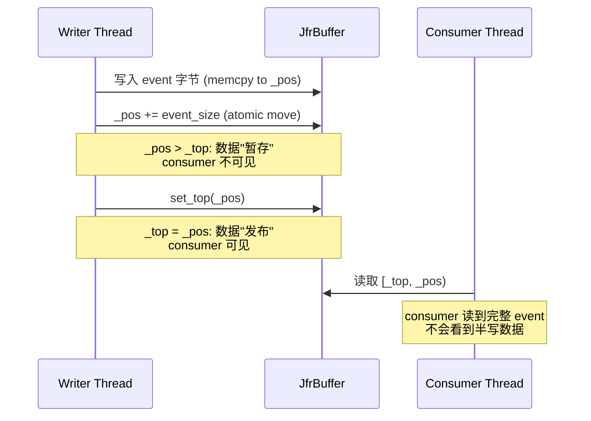
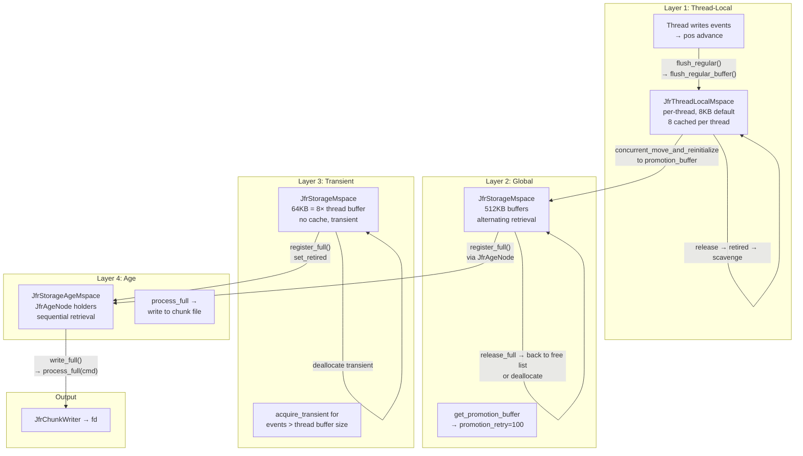
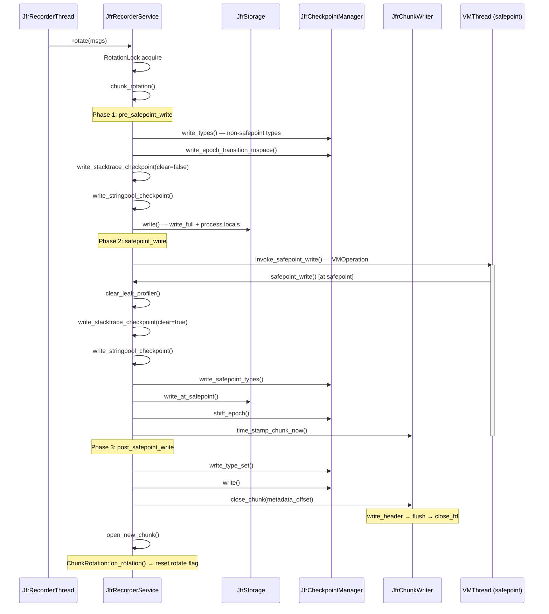

# 00-JFR-Recorder-Engine — 记录引擎核心管道

> **阶段**：[25-jfr]
> **前置**：[24-utilities]（JfrBuffer 使用 BitMap 分配器）、[06-GC-shared]（safepoint 协议）
> **配套**：[01-Event-System]（事件提交侧）、[02-Leak-Profiler]（泄漏检测侧）
> **阅读收益**：追踪 JFR 记录引擎核心管道——从 JfrRecorder 3阶段创建到 chunk rotation safepoint 协议

---

## §〇 生产场景（3 个线上故障）

### 场景 1: JFR Chunk Rotation 导致 30s GC Pause

线上配置 `-XX:FlightRecorderOptions=repository=/tmp,maxchunksize=20m`。Full GC 期间触发 JFR chunk rotation，`VM_InvokeSafepointWriteSynchronizedOperation` 在 safepoint 内做 chunk 最终写入和 checkpoint 序列化。20MB chunk 的 `write_header()` + 类型常量池写出导致 safepoint 延长至 30 秒。

**排查路径**：

```bash
# strace 追踪 write(2) 系统调用，发现 fd=42 在 safepoint 区间连续写入 512KB
strace -e trace=write -p 12345 -T

# GDB 确认 VMThread 调用栈
(gdb) b JfrRecorderService::safepoint_write
(gdb) bt
```

**根因链路**：`JfrRecorderService::safepoint_write()` (`jfrRecorderService.cpp:449-460`) → `JfrChunkWriter::write_header()` → `StreamWriterHost::flush()` → `::write(fd, buf, 512K)` — 全部发生在线程暂停区间。为什么在 safepoint 中做文件 I/O？因为 `write_safepoint_types()` 需要确保线程状态一致性（见 §九），而 `write_header()` 的 `metadata_offset` 回填依赖于 checkpoint 全部完成后才能确定 offset 值。这是不可避免的设计取舍——一致性保证 vs. pause 时间。

**缓解**：降低 `maxchunksize` 减少单次 rotation 的数据量；或使用 `disk=false` 的 in-memory recording 模式，chunk rotation 不涉及文件 I/O。

### 场景 2: Thread-Local Buffer 泄漏 — 48 小时 OOM

生产环境启用 JFR continuous recording，48 小时后 Metaspace OOM（实际是 CHeap 占满）。

**排查**：

```bash
# 发现 JFR 占用 2GB CHeap
jcmd 12345 VM.native_memory summary

# GDB 检查 full buffer 堆积数
(gdb) p JfrStorage::instance()._global_mspace->full_list_size()
# 输出: 18654  ← 严重堆积

# jstack 确认 recorder thread 状态
jstack <pid> | grep -A 5 "JFR Recorder"
# 输出: WAITING (parking) — 等待 PostBox message
```

**根因**：`JfrRecorderService::process_full_buffers()` 消费速率 < 生产速率。Recorder thread 未被唤醒 — 虽然 full buffer 已堆积，但 `should_post_buffer_full_message()` (`jfrStorageControl.cpp:94-96`) 的 `_to_disk_threshold` 阈值未达到，所以 `MSG_FULLBUFFER` 未被发送。这在 to_disk=false 的 in-memory 模式下尤为常见，因为 `_to_disk_threshold` 默认为 0。

**修复**：增加 `globalbuffersize` 或减少 `threadbuffersize`；确保 `MSG_FULLBUFFER` 的 `_to_disk_threshold` 合理配置。

### 场景 3: VM Error 期间 JFR Emergency Dump 竞态

进程收到 SIGSEGV，`VMError::report_and_die()` 调用 `JfrRecorderService::vm_error_rotation()`。同时 WatcherThread 尝试 periodic task → rotate()。两个线程争 `RotationLock` 的 CAS：

```cpp
// jfrRecorderService.cpp:59-74
static bool try_set(void* const data, void** dest, bool clear) {
  // ...
  return Atomic::cmpxchg(clear ? NULL : data, dest, current) == current;
}
```

- `try_set()` 使用 `Atomic::cmpxchg` — 只一个线程胜出
- 失败者 `log(true)` 输出 "Unable to issue rotation due to recursive calls."
- **Counterfactual**: 如果 VMError 不使用 try_set 而用递归锁（mutex），在信号处理器中可能死锁 — 因为信号可能打断了持有同一锁的代码

**安全约束**：信号处理器中不能用 `malloc`/`printf`，只能 `write(2)` + 静态缓冲。`JfrRecorderService::prepare_for_vm_error_rotation()` (`jfrRecorderService.cpp:332-338`) 预计算 buffer 位置避免内存分配。

---

## §一 全景架构 — 记录引擎地图

JFR 记录引擎的核心职责：将数百万/秒的运行时事件从各 Java 线程高效地收集、缓冲、序列化并写出到 JFR chunk 文件中。

> **Beginner Callout 1 — 什么是 JFR Chunk?** JFR 不写单个大文件。它将 recording 分成多个 "chunk"（块），每个 chunk 是自包含的 JFR 文件。Chunk rotation（块轮转）发生在达到 maxchunksize 或手动 rotate 时。每个 chunk 包含：header + constant pool (checkpoint events) + event section + metadata。文件头包含 `FLR\0` magic number、版本号 (2.0)、chunk size、时间戳、duration、metadata offset 指针 (`jfrChunkWriter.cpp:54-75`)。

> **Beginner Callout 2 — 为什么需要 Ring Buffer?** 事件写入是极热路径（每秒数千至百万事件）。直接 disk write(2) 会阻塞 mutator 线程。JFR 使用环形缓冲区：线程先写入 thread-local buffer（`JfrThreadLocalMspace`），buffer 满后"退休"到 global buffer 队列（`JfrStorageMspace`），由专门的 JfrRecorderThread 异步写出到磁盘。这是典型的 producer-consumer 分离。写入耗时对比：thread-local 写入 ~10ns vs. disk write(2) ~10μs—相差 1000 倍。

> **Beginner Callout 3 — _pos vs _top 双指针语义**。`JfrBuffer::_pos` 是线程独占的写入位置（只有 owner 移动）。`JfrBuffer::_top` 是并发可见的"已提交"边界（多个读者可见）。pos >= top。当 writer 调用 `set_top(new_pos)` 时，才把新数据"发布"给消费者（chunk writer）。事务语义：必须先完整写入 event 字节，再 atomic 移动 `_pos`，确保 consumer 不会读到半写数据 (`jfrBuffer.hpp:42-46` 注释)。

> **Beginner Callout 4 — Epoch 老化机制**。Buffer 不是无限增长 — epoch 切换时，旧 epoch 的 buffer 被移到 `_age_mspace`（老化空间）。类似 JVM 的 GC survivor → old generation。`JfrAgeNode` 持有 retired buffer 链表，等待 scavenge 时清理 (`jfrBuffer.hpp:170-182`)。Epoch 机制由 `JfrTraceIdEpoch::shift_epoch()` 触发 (`jfrCheckpointManager.cpp:400-404`)。

> **Beginner Callout 5 — safepoint write 为什么特殊**。Chunk rotation 的关键步骤（finalize_current_chunk, write_header）必须在 safepoint 中执行，因为需要保证所有线程的 buffer 都被刷新、类型元数据与 VM 一致性状态对齐。代价：safepoint 期间 compute-bound 工作（类型序列化）延长暂停时间。不可跳过 — `write_safepoint_types()` 依赖线程卡在 safepoint 确保不变 (`jfrRecorderService.cpp:449-460`)。

> **Beginner Callout 6 — VM Error 安全保证**。JFR emergency dump 在信号处理器中执行（SIGSEGV/SIGBUS）。存在严格约束：不能用 malloc/printf，只能用 write(2) + 静态缓冲 + 信号安全路径。`JfrRecorderService::prepare_for_vm_error_rotation()` (`jfrRecorderService.cpp:332-338`) 预计算 buffer 位置避免 malloc。详见 §十三。

> **Beginner Callout 7 — PostBox 消息通道**。JfrRecorderThread 不是 busy-spin 轮询。它使用 `JfrPostBox` — 类似 Actor model 的信箱：producer 通过 `post(MSG_ROTATE)` 发消息，recorder thread 通过 `JfrPostBox::collect()` 获取。底层是 atomic flag set + Monitor wait/notify (`jfrPostBox.cpp:57-173`)。同步消息（MSG_START/STOP/ROTATE/VM_ERROR）等待确认，异步消息（MSG_FULLBUFFER/DEADBUFFER）即发即返。

### 整体数据流

```
┌──────────────────────────────────────────────────────────────────────┐
│                        JFR Recorder Engine                          │
│                                                                      │
│  ┌──────────┐    ┌──────────────┐    ┌──────────────┐               │
│  │ Java     │───▶│ Thread-Local │───▶│ Global       │               │
│  │ Threads  │    │ Buffer       │    │ Buffer Pool  │               │
│  │ (N)      │    │ (per-thread) │    │ (JfrStorageM-│               │
│  │          │    │ JfrThreadLo- │    │ space)       │               │
│  │          │    │ calMspace    │    │              │               │
│  └──────────┘    └──────────────┘    └──────┬───────┘               │
│                        │         register_full │                    │
│                        │         via JfrAgeNode │                    │
│                        ▼                        ▼                    │
│              ┌──────────────┐    ┌─────────────────────────────┐    │
│              │ Age Mspace   │───▶│ JfrRecorderThreadLoop       │    │
│              │ (retired)    │    │  process_full_buffers()     │    │
│              └──────────────┘    │  scavenge()                 │    │
│                                  │  evaluate_chunk_size_for_   │    │
│                                  │  rotation()                 │    │
│                                  └──────┬──────────────────────┘    │
│                                         │                            │
│                             ┌───────────▼──────────────────────────┐ │
│                             │ JfrRecorderService::rotate()         │ │
│                             │  pre_safepoint_write()               │ │
│                             │   → write types + storage           │ │
│                             │  invoke_safepoint_write()            │ │
│                             │   → safepoint_write()               │ │
│                             │  post_safepoint_write()              │ │
│                             │   → write type_set + close_chunk()   │ │
│                             └───────────┬──────────────────────────┘ │
│                                         │                            │
│                    ┌────────────────────▼──────────────────────┐     │
│                    │ JfrChunkWriter → fd (::write(2))           │     │
│                    │  Repository → /tmp/hotspot-pid-xxx.jfr     │     │
│                    └───────────────────────────────────────────┘     │
└──────────────────────────────────────────────────────────────────────┘
```

### 核心组件关系

```
JfrRecorder (顶层生命周期)
├── JfrRecorderThread (Java thread running recorderthread_entry)
│   ├── JfrPostBox (消息通道 — MSG_START/STOP/ROTATE/FULLBUFFER)
│   └── JfrRecorderThreadLoop (主循环: collect → dispatch → wait)
│       └── JfrRecorderService (编排器: start/rotate/process_full)
│           ├── JfrStorage (4 层 buffer 空间)
│           │   ├── JfrThreadLocalMspace (线程本地)
│           │   ├── JfrStorageMspace (全局)
│           │   ├── JfrStorageMspace (transient)
│           │   └── JfrStorageAgeMspace (老化)
│           ├── JfrCheckpointManager (类型序列化)
│           │   ├── JfrTypeManager (类型注册)
│           │   ├── JfrTypeSet (类型集序列化)
│           │   └── JfrCheckpointWriter (checkpoint 写出器)
│           ├── JfrChunkWriter (chunk 文件写入)
│           │   └── JfrChunkState (chunk 路径/时间状态)
│           ├── JfrChunkRotation (轮转策略)
│           ├── JfrRepository (chunk 文件仓库)
│           ├── JfrStringPool (字符串去重)
│           └── JfrStackTraceRepository (栈帧去重)
```

---

## §二 Source Files Table + Standard Environment

### Source Files Table

| File | Full Path | Lines | Core Constructs | Role |
|------|-----------|:-----:|----------------|------|
| jfrRecorder.hpp | jfr/recorder/ | 70 | `class JfrRecorder` | 顶层生命周期管理 |
| jfrRecorder.cpp | jfr/recorder/ | ~437 | create_components(), destroy_components() | 组件创建/销毁 |
| jfrRecorderService.hpp | jfr/recorder/service/ | 77 | `class JfrRecorderService` | chunk rotation 编排器 |
| jfrRecorderService.cpp | jfr/recorder/service/ | ~535 | start(), rotate(), process_full_buffers() | 核心编排逻辑 |
| jfrRecorderThread.hpp | jfr/recorder/service/ | 45 | `class JfrRecorderThread` | recorder 线程管理 |
| jfrRecorderThread.cpp | jfr/recorder/service/ | ~117 | start() — 启动 Java thread | 线程创建 |
| jfrRecorderThreadLoop.cpp | jfr/recorder/service/ | ~95 | recorderthread_entry() | 线程主循环 |
| jfrPostBox.hpp | jfr/recorder/service/ | 97 | `class JfrPostBox`, `enum JFR_Msg` | 消息通道 |
| jfrPostBox.cpp | jfr/recorder/service/ | ~173 | post(), collect(), deposit() | 消息收发 |
| jfrBuffer.hpp | jfr/recorder/storage/ | 184 | `class JfrBuffer`, `class JfrAgeNode` | 环形缓冲区 |
| jfrBuffer.cpp | jfr/recorder/storage/ | ~247 | acquire(), release(), move() | buffer 并发操作 |
| jfrStorage.hpp | jfr/recorder/storage/ | 98 | `class JfrStorage`, 4 个 mspace typedef | 4 层 buffer 管理 |
| jfrStorage.cpp | jfr/recorder/storage/ | ~772 | flush_regular(), provision_large() | buffer 流控 |
| jfrMemorySpace.hpp | jfr/recorder/storage/ | 106 | `template class JfrMemorySpace` | 内存空间模板 |
| jfrMemorySpace.inline.hpp | jfr/recorder/storage/ | ~454 | allocate(), deallocate(), mspace_* 函数 | 模板实现 |
| jfrStorageControl.hpp | jfr/recorder/storage/ | 68 | `class JfrStorageControl` | buffer 控制策略 |
| jfrStorageControl.cpp | jfr/recorder/storage/ | ~141 | full_count, should_discard, should_scavenge | 策略实现 |
| jfrChunkWriter.hpp | jfr/recorder/repository/ | 57 | `class JfrChunkWriter` | chunk 文件写入 |
| jfrChunkWriter.cpp | jfr/recorder/repository/ | ~118 | open(), close(), write_header() | chunk 格式生成 |
| jfrChunkState.hpp | jfr/recorder/repository/ | 59 | `class JfrChunkState` | chunk 路径/时间状态 |
| jfrChunkRotation.hpp | jfr/recorder/repository/ | 44 | `class JfrChunkRotation` | chunk 轮转 |
| jfrChunkRotation.cpp | jfr/recorder/repository/ | ~81 | evaluate(), on_rotation() | 轮转触发 |
| jfrRepository.hpp | jfr/recorder/repository/ | 73 | `class JfrRepository` | chunk 文件仓库 |
| jfrCheckpointManager.hpp | jfr/recorder/checkpoint/ | 108 | `class JfrCheckpointManager` | checkpoint 总管 |
| jfrCheckpointManager.cpp | jfr/recorder/checkpoint/ | ~404 | write_types(), write_type_set() | 类型序列化 |
| jfrCheckpointWriter.hpp | jfr/recorder/checkpoint/ | 86 | `class JfrCheckpointWriter` | checkpoint 写出器 |
| jfrTypeManager.hpp | jfr/recorder/checkpoint/types/ | 42 | `class JfrTypeManager` | 类型注册 |
| jfrTypeSet.hpp | jfr/recorder/checkpoint/types/ | 38 | `class JfrTypeSet` | 类型集序列化 |
| jfrStringPool.hpp | jfr/recorder/stringpool/ | 82 | `class JfrStringPool` | 字符串池 |
| jfrStringPool.cpp | jfr/recorder/stringpool/ | ~221 | write(), add(), clear() | 字符串去重实现 |
| jfrStackTraceRepository.hpp | jfr/recorder/stacktrace/ | 76 | `class JfrStackTraceRepository` | 栈帧仓库 |
| jfrStackTraceRepository.cpp | jfr/recorder/stacktrace/ | ~242 | add_trace(), write(), record() | 栈帧去重实现 |

### Standard Environment

**Source Roots & Build**:

```
源码根: src/hotspot/share/jfr/recorder/
构建: make/hotspot/lib/CompileJvm.gmk:153 — BUILD_LIBJVM
      --with-jfr 控制是否编译入 libjvm.so
Binary: build/linux-x86_64-server-release/jdk/lib/server/libjvm.so
```

**运行时依赖**:

```
JFR 默认内存: JfrMemorySizer 计算
Chunk 默认位置: java.io.tmpdir (通常 /tmp)
Chunk 文件名格式: hotspot-pid-<pid>-id-<N>.jfr
Repository: 保存最近 N 个 chunk 供 dump 使用
Buffer 大小: 
  - global_buffer_size: 512KB (JfrOptionSet)
  - thread_buffer_size:  8KB  (JfrOptionSet)
  - transient: 8× thread_buffer_size = 64KB
  - checkpoint_buffer: 512KB
  - string_pool_buffer: 512KB
```

### Syscall 速查表

| Syscall | 用途 | man | JFR 调用位置 |
|---------|------|-----|-------------|
| write(2) | chunk 数据落盘 | man 2 write | JfrBufferedStreamWriter::flush() → ::write(fd) |
| open(2) | 创建 chunk 文件 | man 2 open | open_chunk() → os::open() (`jfrChunkWriter.cpp:49-52`) |
| close(2) | 关闭 chunk 文件 | man 2 close | JfrChunkWriter::close_fd() |
| ftruncate(2) | chunk 文件截断预分配的多余空间 | man 2 ftruncate | JfrChunkWriter::close() |
| mmap(2) | 内存映射存储 (JfrVirtualMemory) | man 2 mmap | JfrVirtualMemory::initialize() |
| futex(2) | Monitor wait/notify 底层 | man 2 futex | JfrMsg_lock wait → Parker::park() |
| clock_gettime(2) | 纳秒时间戳 | man 2 clock_gettime | JfrTime::stamp() → os::javaTimeNanos() |
| rename(2) | chunk 文件重命名 | man 2 rename | JfrChunkRotation::rotate() |

### 全局状态表

| 变量 | 位置 | 类型 | 说明 |
|------|------|------|------|
| `_enabled` | jfrRecorder.cpp:71 | static bool | JFR 是否启用 |
| `_created` | jfrRecorder.cpp:229 | static bool | JFR 组件是否已创建 |
| `recording` | jfrRecorderService.cpp:229 | static bool | 是否正在录音 |
| `rotation_thread` | jfrRecorderService.cpp:76 | static void* | 当前持有 RotationLock 的线程 |
| `rotation_try_limit` | jfrRecorderService.cpp:77 | static const int | CAS 重试上限 1000 |
| `_post_box` | jfrRecorder.cpp:299 | static JfrPostBox* | 消息通道单例 |
| `_storage` | jfrRecorder.cpp:300 | static JfrStorage* | 存储层单例 |
| `_checkpoint_manager` | jfrRecorder.cpp:301 | static JfrCheckpointManager* | checkpoint 管理 |
| `_repository` | jfrRecorder.cpp:302 | static JfrRepository* | chunk 仓库 |
| `_stringpool` | jfrRecorder.cpp:304 | static JfrStringPool* | 字符串池 |
| `_stack_trace_repository` | jfrRecorder.cpp:303 | static JfrStackTraceRepository* | 栈帧仓库 |
| `_checkpoint_epoch_state` | jfrCheckpointManager.hpp:63 | bool | epoch 切换标记 |
| `_global_lease_count` | jfrStorageControl.hpp:33 | volatile size_t | 全局租约计数 |
| `_full_count` | jfrStorageControl.hpp:32 | size_t | full buffer 计数 |
| `_dead_count` | jfrStorageControl.hpp:35 | volatile size_t | dead buffer 计数 |
| `chunk_monitor` | jfrChunkRotation.cpp:30 | static jobject | Java 侧 chunk 旋转通知对象 |
| `threshold` | jfrChunkRotation.cpp:31 | static intptr_t | maxchunksize 阈值 |
| `rotate` | jfrChunkRotation.cpp:32 | static bool | 旋转标志 |

---

## §三 JfrRecorder 生命周期 — 从 create() 到 destroy()

### 设计意图

`JfrRecorder` 是 JFR 子系统的最外层门面。它的核心职责不是"录音"，而是组件生命周期编排（orchestration）。真正的录音逻辑在 `JfrRecorderService`、buffer 管理在 `JfrStorage`、文件 I/O 在 `JfrChunkWriter`。`JfrRecorder` 的责任是确保 10+ 单例子系统按正确的依赖顺序创建。

### 三阶段创建：为什么不能一次性？

VM 初始化是分阶段进行的（`Threads::create_vm()` 内部多个子步骤）。JFR 组件有不同的依赖要求，必须在对应的 VM 阶段创建。

**Phase 1 — `on_create_vm_1()`** (`jfrRecorder.cpp:85-93`):

调用时机：VM 初始化最早阶段，在 `Threads::create_vm()` 开始时。此阶段：
- 确定 JFR 是否启用（检查 `-XX:FlightRecorder` flag 和 `-XX:StartFlightRecording`）
- 初始化快速时间戳系统 `JfrTime::initialize()` — 为后续事件时间戳做准备

```cpp
// jfrRecorder.cpp:85-93
bool JfrRecorder::on_create_vm_1() {
  if (!is_disabled()) {
    if (FlightRecorder || StartFlightRecording != NULL) {
      enable();  // 设置 _enabled = true
    }
  }
  return JfrTime::initialize();  // 必须最先初始化，后续组件依赖时间戳
}
```

**Phase 2 — `on_create_vm_2()`** (`jfrRecorder.cpp:194-222`):

调用时机：`Threads::create_vm()` 中段，Java 基本运行时已就绪。此阶段：
- 初始化 `JfrOptionSet` — 解析 JFR 相关 JVM 参数
- 注册 JFR DCMD 命令（`VM.jfr`）
- 验证 `jdk.jfr` 模块是否可用
- 验证命令行录音选项

```cpp
// jfrRecorder.cpp:194-222
bool JfrRecorder::on_create_vm_2() {
  // 检查是否是 CDS dump 请求 — 如果是则跳过
  if (is_cds_dump_requested()) return true;
  Thread* const thread = Thread::current();
  if (!JfrOptionSet::initialize(thread)) return false;
  if (!register_jfr_dcmds()) return false;
  const bool in_graph = JfrJavaSupport::is_jdk_jfr_module_available();
  if (in_graph) {
    if (!validate_recording_options(thread)) return false;
    if (!JfrOptionSet::configure(thread)) return false;
  }
  // ...
}
```

**Phase 3 — `on_create_vm_3()`** (`jfrRecorder.cpp:224-227`):

调用时机：VM 完全初始化后 (`JVMTI_PHASE_LIVE`)。此阶段启动命令行指定的录音（如果有 `-XX:StartFlightRecording`）：

```cpp
// jfrRecorder.cpp:224-227
bool JfrRecorder::on_create_vm_3() {
  assert(JvmtiEnvBase::get_phase() == JVMTI_PHASE_LIVE, "invalid init sequence");
  return launch_command_line_recordings(Thread::current());
}
```

> **Counterfactual** — 如果一次性 create() 所有组件：JVMTI agent 在 VM 未完全初始化时 attach 会触发未定义行为（Java Thread 不存在）；无法通过 `simulate_failure` 进行阶段性故障测试 — 分阶段允许在任意阶段注入模拟错误。

### create() 主入口

`JfrRecorder::create(bool simulate_failure)` (`jfrRecorder.cpp:235-255`):

```cpp
// jfrRecorder.cpp:235-255
bool JfrRecorder::create(bool simulate_failure) {
  assert(!is_disabled(), "invariant");
  assert(!is_created(), "invariant");
  if (!is_enabled()) {
    enable();  // 设置 FlightRecorder flag
  }
  if (!create_components() || simulate_failure) {
    destroy_components();
    return false;
  }
  if (!create_recorder_thread()) {
    destroy_components();
    return false;
  }
  _created = true;
  return true;
}
```

`simulate_failure` 参数允许在 create_components() 成功后强制触发 destroy_components() 用于测试故障回退路径。

### 组件创建顺序与依赖关系

`create_components()` (`jfrRecorder.cpp:261-296`) 按以下严格顺序创建 10 个单例：

```
 1. create_java_event_writer()   — JfrJavaEventWriter::initialize()
 2. create_jvmti_agent()         — JfrJvmtiAgent::create() (条件：allow_retransforms)
 3. create_post_box()            — JfrPostBox::create() → singleton
 4. create_chunk_repository()    — JfrRepository::create(*_post_box)
 5. create_storage()             — JfrStorage::create(_repository->chunkwriter(), *_post_box)
 6. create_checkpoint_manager()  — JfrCheckpointManager::create(_repository->chunkwriter())
 7. create_stacktrace_repository() — JfrStackTraceRepository::create()
 8. create_os_interface()        — JfrOSInterface::create()
 9. create_stringpool()          — JfrStringPool::create(_repository->chunkwriter())
10. create_thread_sampling()     — JfrThreadSampling::create()
```

**依赖关系解读**：

- **PostBox 最前**：Repository, Storage 的构造函数都需要 PostBox 引用 (`jfrRecorder.cpp:316-319, 322-327`)
- **Repository 先于 Storage**：Storage 依赖 `_repository->chunkwriter()` (`jfrRecorder.cpp:335-339`)
- **Storage/CheckpointManager 共享 ChunkWriter**：两者都持有同一个 `JfrChunkWriter&` 引用 — 意味着必须 Repository 先创建，然后 Storage 和 CheckpointManager 都获得同一个 writer (`jfrRecorder.cpp:335-346`)
- **StringPool 最后创建（线程相关）**：依赖 `_repository->chunkwriter()`，因为 write() 需要写出到 chunk 文件 (`jfrRecorder.cpp:355-360`)

### 录音生命周期

```
create()          ──→  组件就绪，_created=true
start_recording() ──→  post MSG_START → recorder thread 收到 → service.start()
                       → open_new_chunk() → set_recording_state(true)
                       → 事件开始写入 buffer → 异步写出到 chunk
stop_recording()  ──→  post MSG_STOP → recorder thread 收到 → service.rotate()
                       → finalize_current_chunk() → close_chunk() → stop()
destroy()         ──→  post MSG_SHUTDOWN → recorder thread 退出
                       → on_recorder_thread_exit()
```

- `start_recording()` (`jfrRecorder.cpp:424-427`): 通过 PostBox 发 `MSG_START` — 异步操作，不阻塞调用者
- `stop_recording()` (`jfrRecorder.cpp:433-436`): 通过 PostBox 发 `MSG_STOP` — 同步操作，等待 recorder thread 完成 finalize
- `destroy()` (`jfrRecorder.cpp:408-412`): 发 `MSG_SHUTDOWN` 并在 recorder thread 退出时调用 `on_recorder_thread_exit()`

**关键设计**：`start_recording()` 和 `stop_recording()` 不使用直接函数调用，而通过 PostBox 消息传递。这保证了所有录音状态变更都在 recorder thread 单一线程中执行 — 避免多线程竞态。

---

## §四 JfrBuffer 并发模型 — _pos/_top 事务语义

### 设计意图

`JfrBuffer` 是 JFR 存储系统的原子单元。它实现了一个 lock-free ring buffer，其中 writer（单线程）和 consumer（多线程）可以并发访问：writer 在 `_pos` 之后写入，consumer 读取 `[_top, _pos)` 之间的已提交数据。关键设计选择是双指针而非单指针+mutext，因为 thread-local buffer 的写入路径是超热路径（每事件一次），必须消除所有锁开销。

### Buffer 内存布局

```cpp
// jfrBuffer.hpp:48-57
class JfrBuffer {
 private:
  JfrBuffer* _next;              // 链表 next 指针
  JfrBuffer* _prev;              // 链表 prev 指针
  const void* volatile _identity; // 当前 owner（CAS 竞争）
  u1* _pos;                      // 下一个写入位置（thread private）
  mutable const u1* volatile _top; // 已提交边界（并发可见）
  u2 _flags;                     // RETIRED/TRANSIENT/LEASE 标志位
  u2 _header_size;               // buffer 头大小（JfrBuffer 对象本身）
  u4 _size;                      // 数据区大小（以 word 为单位）
};
```

buffer 在内存中的实际布局：

```
┌─────────────────────────────────────────────────────┐
│ JfrBuffer header │          data area               │
│  (header_size)   │  (size = _size * BytesPerWord)   │
│                  │                                  │
│ start() ─────────▶                                  │
│                  ├──────────────────────────────────┤
│                  │←─── unflushed_size() ────▶       │
│              _top│                          _pos    │
│                  ├──────────────────────────────────┤
│                  │← ─ ─  free_size()  ─ ─ ─ ─ ─ ─▶│
│                  │                                  │
│                  └──────────────────────────────────┘ end()
└─────────────────────────────────────────────────────┘
```

- `start()`: `((u1*)this) + _header_size` — 数据区起始
- `end()`: `start() + size()` — 数据区结束
- `free_size()`: `end() - pos()` — 剩余可写空间
- `unflushed_size()`: `pos() - top()` — 已写但未提交的数据

### _pos 和 _top 的事务语义



**事务保证**：`jfrBuffer.hpp:42-46` 注释明确要求：
> Stores to the buffer should uphold transactional semantics. A new _pos must be updated only after all intended stores have completed. The relation between _pos and _top must hold atomically, e.g. the delta must always be fully parsable. _top can move concurrently by other threads but is always <= _pos.

这意味着：
1. Writer 必须先将 event 的所有字节写到 `_pos` 指向的位置
2. 然后才能更新 `_pos`（`set_pos(size)`）
3. Consumer 通过移动 `_top` 来消费数据（`set_top(new_pos)`）
4. `pos() >= top()` 恒成立 — 这个不变量保证 consumer 不会读到未完成的数据

### acquire() / try_acquire() — 基于 CAS 的 Owner 检测

```cpp
// jfrBuffer.cpp:117-129
void JfrBuffer::acquire(const void* id) {
  assert(id != NULL, "invariant");
  const void* current_id;
  do {
    current_id = OrderAccess::load_acquire(&_identity);
  } while (current_id != NULL || Atomic::cmpxchg(id, &_identity, current_id) != current_id);
  // spin-CAS 循环直到成为 owner
}

bool JfrBuffer::try_acquire(const void* id) {
  assert(id != NULL, "invariant");
  const void* const current_id = OrderAccess::load_acquire(&_identity);
  return current_id == NULL && Atomic::cmpxchg(id, &_identity, current_id) == current_id;
  // 仅尝试一次 — 失败立即返回
}
```

- `acquire()`: spin-CAS 循环，阻塞直到获得 ownership — 用于已知会很快释放的 buffer
- `try_acquire()`: 单次 CAS，失败立即返回 — 用于不想阻塞的热路径
- `_identity` 存储 owner 线程指针 — `acquired_by_self()` 检查 `_identity == Thread::current()`

> **Counterfactual** — 如果不使用 `_pos/_top` 双指针，而用一个 mutex 保护的 `_size` field：会失去无锁写入（thread-local buffer 无锁写入 ~10ns，mutex lock+unlock ~50ns，5x 慢）；失去并发消费 — consumer 无法在不阻塞 writer 的情况下读取已提交数据。

### 并发 move 操作 — 消费者安全读取

`concurrent_move_and_reinitialize()` (`jfrBuffer.cpp:173-184`) 是 consumer 读取 buffer 数据的安全方式：

```cpp
// jfrBuffer.cpp:173-184
void JfrBuffer::concurrent_move_and_reinitialize(JfrBuffer* const to, size_t size) {
  const u1* current_top = concurrent_top();  // CAS claim _top = MUTEX_CLAIM
  const size_t actual_size = MIN2(size, (size_t)(pos() - current_top));
  memcpy(to->pos(), current_top, actual_size);  // 拷贝数据
  to->set_pos(actual_size);
  set_pos(start());                              // 重置 writer 的 pos
  to->release();
  set_concurrent_top(start());                   // 释放 MUTEX_CLAIM
}
```

`concurrent_top()` 使用 CAS 将 `_top` 设置为 `MUTEX_CLAIM`（NULL），确保 writer 在此期间不能修改 `_top`，同时 consumer 获取 `_top` 的稳定快照：

```cpp
// jfrBuffer.cpp:96-103
const u1* JfrBuffer::concurrent_top() const {
  do {
    const u1* current_top = stable_top();
    // CAS: 将 _top 从 current_top 改为 MUTEX_CLAIM
    if (Atomic::cmpxchg(MUTEX_CLAIM, &_top, current_top) == current_top) {
      return current_top;
    }
  } while (true);
}
```

### Buffer Status Flags

```cpp
// jfrBuffer.cpp:186-190
enum FLAG {
  RETIRED   = 1,   // buffer 已退休，不再被线程使用
  TRANSIENT = 2,   // buffer 是动态分配的临时 buffer
  LEASE     = 4    // buffer 是从 global pool 租借的
};
```

- **RETIRED**: buffer 已退休，等待 scavenge 清理或写出到 chunk
- **TRANSIENT**: buffer 是动态分配的（非 cache pool 中），使用后需 deallocate
- **LEASE**: buffer 从 global pool 租借（借出期间不计入 free count），需在 release_large 时归还

### JfrAgeNode — 老化节点

```cpp
// jfrBuffer.hpp:170-182
class JfrAgeNode : public JfrBuffer {
 private:
  JfrBuffer* _retired;   // 关联的已退休 buffer
 public:
  void set_retired_buffer(JfrBuffer* retired) { _retired = retired; }
  JfrBuffer* retired_buffer() const { return _retired; }
};
```

`JfrAgeNode` 是 `JfrBuffer` 的子类，额外持有一个 `_retired` 指针。它的作用是在 `JfrStorageAgeMspace` 中充当节点 — age node 本身在 free/full 链表中，而它指向的 retired buffer 是真正需要写出的数据。这个间接层允许 age buffer 有自己的链表结构，而实际的 retired buffer 可以来自不同的 origin。

---

## §五 JfrStorage 四层 Buffer 空间

### 设计意图

JfrStorage 的四层 buffer 架构旨在解决一个核心矛盾：**事件写入是超热路径需要超低延迟，而磁盘 I/O 是高延迟操作**。解决方案是将 buffer 分层，热路径上只用 thread-local buffer（无锁），满后异步提升到 global 层，再由专用线程写出。

### 四层空间定义

```cpp
// jfrStorage.hpp:36-38
typedef JfrMemorySpace<JfrBuffer, JfrMspaceAlternatingRetrieval, JfrStorage> JfrStorageMspace;
typedef JfrMemorySpace<JfrBuffer, JfrThreadLocalRetrieval, JfrStorage> JfrThreadLocalMspace;
typedef JfrMemorySpace<JfrAgeNode, JfrMspaceSequentialRetrieval, JfrStorage> JfrStorageAgeMspace;
```

四个实例变量：

```cpp
// jfrStorage.hpp:47-51
JfrStorageControl* _control;          // 存储策略控制
JfrStorageMspace* _global_mspace;     // 全局 buffer 空间 (alternating retrieval)
JfrThreadLocalMspace* _thread_local_mspace; // 线程本地 buffer (thread-local retrieval)
JfrStorageMspace* _transient_mspace;  // 临时大 buffer 空间 (alternating retrieval)
JfrStorageAgeMspace* _age_mspace;     // 老化 buffer 空间 (sequential retrieval)
```

### 四层空间生命周期



**层次流转详解**:

1. **Thread-Local → Global** (`jfrStorage.cpp:246-266` — `flush_regular_buffer()`):
   - 检查 buffer 的 `unflushed_size()`，如果为 0 则只需 `concurrent_reinitialization()`
   - 否则获取 promotion_buffer (`get_promotion_buffer()`)，将当前未提交数据 `concurrent_move_and_reinitialize()` 到 promotion buffer
   - promotion buffer 是 global pool 中的一块，已 `acquired_by_self()`

2. **Global → Age** (`jfrStorage.cpp:324-341` — `full_buffer_registration()`):
   - buffer 设置 `set_retired()` 后调用 `register_full()`
   - 通过 `full_buffer_registration()` — 需要 `JfrBuffer_lock`
   - 获取或分配 `JfrAgeNode`，设置 `retired_buffer` → insert 到 age mspace 的 full list
   - `control().increment_full()` 更新计数器

3. **Transient → Age** (`jfrStorage.cpp:275-287` — `release_large()`):
   - Transient buffer 在 `release_large()` 中设置 `set_retired()` 后 → `register_full()`
   - 与正常 buffer 的区别：transient buffer 使用后直接 deallocate，而正常 buffer 回到 free list

4. **Age → Chunk File** (`jfrStorage.cpp:706-716` — `write_full()`):
   - `process_full()` 从 age mspace 取出所有 retired buffer
   - 使用 `MutexedWriteOp` (带上 JfrBuffer_lock) 写入 chunk writer
   - 写入后调用 `ReleaseOp` — transient buffer deallocate，正常 buffer reinitialize + release

### 大小配置

```cpp
// jfrStorage.cpp:96-100
static const size_t in_memory_discard_threshold_delta = 2;
static const size_t unlimited_mspace_size = 0;
static const size_t thread_local_cache_count = 8;        // 每线程缓存 8 个 buffer
static const size_t thread_local_scavenge_threshold = thread_local_cache_count / 2; // =4
static const size_t transient_buffer_size_multiplier = 8; // transient = 8× thread buffer
```

**初始化参数** (`jfrStorage.cpp:111-145`):

```cpp
bool JfrStorage::initialize() {
  const size_t num_global_buffers = JfrOptionSet::num_global_buffers();
  const size_t memory_size       = JfrOptionSet::memory_size();
  const size_t global_buffer_size = JfrOptionSet::global_buffer_size();
  const size_t thread_buffer_size = JfrOptionSet::thread_buffer_size();

  _control = new JfrStorageControl(num_global_buffers, num_global_buffers - in_memory_discard_threshold_delta);
  // Global: 512KB buffers, limited by memory_size, num_global_buffers cached
  _global_mspace = create_mspace<JfrStorageMspace>(global_buffer_size, memory_size, num_global_buffers, this);
  // ThreadLocal: 8KB buffers, unlimited size, 8 cached per thread
  _thread_local_mspace = create_mspace<JfrThreadLocalMspace>(thread_buffer_size, unlimited_mspace_size, thread_local_cache_count, this);
  // Transient: 8× thread_buffer_size, unlimited size, 0 cache (always deallocated)
  _transient_mspace = create_mspace<JfrStorageMspace>(thread_buffer_size * transient_buffer_size_multiplier, unlimited_mspace_size, 0, this);
  // Age: 0 extra data (only headers), unlimited size, num_global_buffers cached
  _age_mspace = create_mspace<JfrStorageAgeMspace>(0, unlimited_mspace_size, num_global_buffers, this);
  // Scavenge 阈值: 4 dead buffers
  control().set_scavenge_threshold(thread_local_scavenge_threshold);
}
```

### flush() 分发 — 普通 vs 大事件

```cpp
// jfrStorage.cpp:480-487
BufferPtr JfrStorage::flush(BufferPtr cur, size_t used, size_t req, bool native, Thread* t) {
  const u1* const cur_pos = cur->pos();
  req += used;
  return cur->lease() ? instance().flush_large(cur, cur_pos, used, req, native, t) :
                        instance().flush_regular(cur, cur_pos, used, req, native, t);
}
```

分支条件：`cur->lease()`。如果当前 buffer 是 lease（大事件已经从 global pool 租借了专用 buffer），走 `flush_large()` 路径。否则走 `flush_regular()` 路径。

**flush_regular()** (`jfrStorage.cpp:489-513`):

```
1. 如果 buffer 非空 → flush_regular_buffer()（数据移到 promotion buffer）
2. 如果 free_size() >= req → 原地继续写入（最简单情况）
3. 否则 shelve_buffer(cur) → provision_large()（需要大 buffer）
```

**flush_large()** (`jfrStorage.cpp:534-549`):

```
1. 检查 shelved buffer (原来的 thread-local buffer) 的 free_size()
2. 如果够大 → memcpy 数据到 shelved buffer → release_large(cur) → restore shelved
3. 不够 → provision_large()
```

**provision_large()** (`jfrStorage.cpp:564-582`):

```
1. acquire_large(req) → global lease 或 transient
2. memcpy 迁移数据
3. 如果 cur 是 lease → release_large(cur)
4. store_buffer_to_thread_local(new_buffer)
```

> **WHY native 参数至关重要**：`native=true` 表示在 JNI native 方法中调用 → 不能用 JavaThread blocking 操作 → 使用 `provision_large()` 非阻塞路径（`jfrStorage.cpp:564`），避免死锁风险。

### write() 三层写出策略

JFR 支持三种写出策略，对应不同的并发安全级别：

```cpp
// jfrStorage.cpp:589-609
size_t JfrStorage::write() {          // 正常写出 (before safepoint)
  write_full();                        // age mspace (mutexed — JfrBuffer_lock)
  ThreadLocalConcurrentWriteOp tlwo;   // thread local (concurrent — no lock)
  process_full_list(tlwo, _thread_local_mspace);
  ConcurrentWriteOp cwo;              // global free (concurrent — no lock)
  process_free_list(cwo, _global_mspace);
}

size_t JfrStorage::write_at_safepoint() { // safepoint 写出
  WriteOperation wo;
  MutexedWriteOp writer(wo);  // mutexed — 全局安全
  process_full_list(writer, _thread_local_mspace);
  process_full_list(writer, _transient_mspace);
  process_free_list(writer, _global_mspace);
}

size_t JfrStorage::write_full() {      // age 写出 (mutexed)
  // ...process_full → write → release
}
```

**策略区分**：
- **Concurrent**：非 safepoint 期间，thread-local buffer 可安全并发读取（writer 只有 owner thread）
- **Mutexed**：safepoint 期间或 age buffer — 需要 JfrBuffer_lock 保护
- **Exclusive**：已 retired 的 buffer — 确保只有一个线程访问

> **Counterfactual** — 如果所有事件都写到一个大的 global buffer 而非四层分层：所有线程 CAS 竞争单一 buffer → 千级线程高冲突率 → CAS 重试风暴；consumer 消费期间阻塞所有 producer；无法区分事件来源线程。

---

## §六 JfrMemorySpace 模板抽象

### 设计意图

`JfrMemorySpace` 是 JFR 存储系统的类型抽象层。它通过模板参数化提供通用的 buffer 池管理框架，被 5 个不同子系统复用：Storage、Checkpoint、ThreadLocal、Age、StringPool。如果没有这个模板抽象，每个子系统都要重复实现 free/full 链表管理逻辑。

### 模板定义

```cpp
// jfrMemorySpace.hpp:31-32
template <typename T, template <typename> class RetrievalType, typename Callback>
class JfrMemorySpace : public JfrCHeapObj {
```

三个模板参数：
- **T**: buffer 类型（`JfrBuffer`, `JfrAgeNode`, `JfrStringPoolBuffer`）
- **RetrievalType**: 分配策略 — 如何从 free list 中取出 buffer
- **Callback**: 回调类 — 当 buffer 满时调用 `register_full()` 通知上层

### 三种 RetrievalPolicy

```cpp
// jfrStorage.hpp:36-38 — 使用三种不同的策略
typedef JfrMemorySpace<JfrBuffer, JfrMspaceAlternatingRetrieval, JfrStorage> JfrStorageMspace;
typedef JfrMemorySpace<JfrBuffer, JfrThreadLocalRetrieval, JfrStorage> JfrThreadLocalMspace;
typedef JfrMemorySpace<JfrAgeNode, JfrMspaceSequentialRetrieval, JfrStorage> JfrStorageAgeMspace;

// jfrCheckpointManager.hpp:47
typedef JfrMemorySpace<JfrBuffer, JfrMspaceSequentialRetrieval, JfrCheckpointManager> JfrCheckpointMspace;

// jfrStringPool.hpp:37
typedef JfrMemorySpace<JfrStringPoolBuffer, JfrMspaceSequentialRetrieval, JfrStringPool> JfrStringPoolMspace;
```

| 策略 | 行为 | 适用场景 |
|------|------|---------|
| `JfrMspaceSequentialRetrieval` | 从 free list head 取 buffer | checkpoint, string pool, age — 不需要分散竞争 |
| `JfrMspaceAlternatingRetrieval` | 从 free list 交替取 head/tail | global mspace — 减少多线程竞争 |
| `JfrThreadLocalRetrieval` | 从 thread-local 缓存取 | thread-local mspace — per-thread 隔离 |

**WHY Alternating 用于 Global**：global buffer pool 被所有线程共享。如果都用 Sequential（总是取 head），head 节点成为高竞争热点。Alternating 交替从 head 和 tail 取 buffer，将竞争分散到两个端点。

### 模板实现关键方法

**allocate()** (`jfrMemorySpace.inline.hpp:84-98`):

```cpp
template <typename T, template <typename> class RetrievalType, typename Callback>
T* JfrMemorySpace<T, RetrievalType, Callback>::allocate(size_t size) {
  const size_t aligned_size_bytes = align_allocation_size(size, _min_elem_size);
  // allocate: sizeof(T) header + aligned_size_bytes data
  void* const allocation = JfrCHeapObj::new_array<u1>(aligned_size_bytes + sizeof(T));
  T* const t = new (allocation) T;  // placement new
  t->initialize(sizeof(T), aligned_size_bytes);
  return t;
}
```

Buffer 对象和其数据区是连续分配的一块内存：`sizeof(T)` 作为 header，后面的 `aligned_size_bytes` 是数据区。`JfrBuffer::start()` 返回 `((u1*)this) + _header_size` — 即跳过 JfrBuffer 对象大小后的位置。

**release_full()** (`jfrMemorySpace.inline.hpp:110-129`):

```cpp
// 释放已处理的 full buffer
void JfrMemorySpace::release_full(T* t) {
  remove_full(t);
  if (t->transient()) {
    deallocate(t);         // transient buffer → 直接 free
    return;
  }
  assert(t->empty() && !t->retired() && t->identity() == NULL);
  if (should_populate_cache()) {
    insert_free_head(t);   // cache 未满 → 回到 free list
  } else {
    deallocate(t);         // cache 已满 → 释放内存
  }
}
```

### Callback 机制 — 通知上层

```cpp
// jfrMemorySpace.hpp:90-94
void register_full(Type* t, Thread* thread) { _callback->register_full(t, thread); }
void lock()   { _callback->lock(); }
void unlock() { _callback->unlock(); }
```

Callback 必须实现三个方法：`register_full()`, `lock()`, `unlock()`。当 buffer 满且 retirement 发生时，mspace 通过 callback 通知上层（JfrStorage 或 JfrCheckpointManager），上层决定是否发 PostBox 消息。

**JfrStorage 的实现**：

```cpp
// jfrStorage.cpp:343-353
void JfrStorage::register_full(BufferPtr buffer, Thread* thread) {
  // 将 retired buffer 注册到 age mspace
  full_buffer_registration(buffer, _age_mspace, control(), thread);
  if (control().should_post_buffer_full_message()) {
    _post_box.post(MSG_FULLBUFFER);  // 通知 recorder thread
  }
}
```

**JfrCheckpointManager 的实现**：

```cpp
// jfrCheckpointManager.cpp:122-127
void JfrCheckpointManager::register_full(BufferPtr t, Thread* thread) {
  // 当前为空实现 — checkpoint buffer 不需要 special handling
  // buffer 直接留在 free list 中等待 write()
}
```

### mspace_* 辅助函数族

`jfrMemorySpace.inline.hpp` 提供了一组 `mspace_*` 函数，简化常见的 buffer 获取操作：

| 函数 | 用途 |
|------|------|
| `mspace_get_free(size, mspace, thread)` | 从 free list 获取 buffer |
| `mspace_get_free_with_retry(size, mspace, retry, thread)` | 带重试获取 |
| `mspace_get_free_with_detach(size, mspace, thread)` | 获取并 detach 出 free list |
| `mspace_get_to_full(size, mspace, thread)` | 获取后移到 full list |
| `mspace_allocate_to_full(size, mspace, thread)` | 分配新 buffer 并放 full list |
| `mspace_allocate_transient_to_full(size, mspace, thread)` | 分配 transient buffer |
| `mspace_allocate_transient_lease_to_full(size, mspace, thread)` | 分配带 lease 的 transient |
| `mspace_get_free_lease_with_retry(size, mspace, retry, thread)` | 获取 lease buffer |
| `mspace_release_full(t, mspace)` | 释放 full buffer（回到 cache 或 deallocate） |

> **Counterfactual** — 如果不用模板而用虚函数继承：虚函数调用 ~5-10ns overhead × 每秒百万次 buffer 操作 → ~10ms/s 额外 overhead；模板编译期绑定 → 零虚函数开销。5 个子系统各需独立实现相同逻辑，代码重复和维护成本高。

---

## §七 JfrChunkWriter — Chunk 文件格式

### 设计意图

`JfrChunkWriter` 负责生成自包含的 JFR chunk 文件。每个 chunk 是一个完整的 JFR 文件，包含 header、checkpoint events（类型常量池）、event data、以及 metadata descriptor。Chunk 文件采用"回填"设计：header 中的 `metadata_offset` 字段在文件末尾才知道，因此 header 最后才写（在 close() 时）。

### 类型继承链

```cpp
// jfrChunkWriter.hpp:32-38
typedef MallocAdapter<M> JfrStreamBuffer;                    // 1MB 缓冲写
typedef StreamWriterHost<JfrStreamBuffer, JfrCHeapObj> JfrBufferedStreamWriter;
typedef WriterHost<BigEndianEncoder, CompressedIntegerEncoder, JfrBufferedStreamWriter> JfrChunkWriterBase;

class JfrChunkWriter : public JfrChunkWriterBase {
  JfrChunkState* _chunkstate;
};
```

三层继承：
1. `StreamWriterHost` — 缓冲的流式写入（1MB 内部 buffer，满后 flush 到 fd）
2. `WriterHost` — 添加 BigEndian 编码 + Compressed Integer 编码
3. `JfrChunkWriter` — 添加 chunk 文件格式逻辑（header + state）

### Chunk 文件格式（三段布局）

```
┌──────────────────────────────────────────────┐
│                 Chunk File                   │
├──────────────────────────────────────────────┤
│ Header (fixed, 8×8=64 bytes)                 │
│  [0]  "FLR\0"     magic number (4B)          │
│  [4]  version major (2B)                     │
│  [6]  version minor (2B)                     │
│  [8]  chunk size  (8B) ← 回填                │
│  [16] initial checkpoint offset (8B) ← 回填  │
│  [24] metadata offset (8B) ← 回填            │
│  [32] start nanos  (8B) ← 回填               │
│  [40] duration nanos (8B) ← 回填             │
│  [48] start ticks  (8B) ← 回填               │
│  [56] ticks frequency (8B)                   │
│  [64] compressed ints flag (4B)              │
├──────────────────────────────────────────────┤
│ Event Section (variable)                     │
│  Checkpoint Events (TYPE_THREAD, etc.)       │
│  + User Events (GC, Allocation, etc.)        │
│  + Metadata Event                            │
├──────────────────────────────────────────────┤
│ Metadata Section (before close)              │
│  → metadata_offset 指向此处                   │
└──────────────────────────────────────────────┘
```

### open() — 写入 Magic Number + Header 预留

```cpp
// jfrChunkWriter.cpp:54-75
bool JfrChunkWriter::open() {
  JfrChunkWriterBase::reset(open_chunk(_chunkstate->path()));
  const bool is_open = this->has_valid_fd();
  if (is_open) {
    this->write_bytes("FLR", MAGIC_LEN);        // "FLR\0" magic
    this->be_write((u2)JFR_VERSION_MAJOR);       // version 2
    this->be_write((u2)JFR_VERSION_MINOR);       // version 0
    this->reserve(6 * FILEHEADER_SLOT_SIZE);     // 预留 6×8=48 bytes
    this->be_write(JfrTime::frequency());        // ticks frequency
    this->be_write((u4)JfrOptionSet::compressed_integers() ? 1 : 0); // capabilities
    _chunkstate->reset();  // 保存当前时间为 chunk start
  }
  return is_open;
}
```

`reserve(48)` 预留了 6 个 u8 字段的空间（chunk_size, metadata_offset 等），这些字段在当前还不知道值，会在 `close()` 时回填。

### close() — 回填 Header

```cpp
// jfrChunkWriter.cpp:77-82
size_t JfrChunkWriter::close(int64_t metadata_offset) {
  write_header(metadata_offset);  // 回填 header 中的回填字段
  this->flush();                   // 将 buffer 中剩余数据写出
  this->close_fd();                // 关闭文件描述符
  return (size_t)size_written();
}
```

**write_header()** (`jfrChunkWriter.cpp:84-98`):

```cpp
void JfrChunkWriter::write_header(int64_t metadata_offset) {
  // Chunk size — 回填到 offset 8
  this->write_be_at_offset(size_written(), CHUNK_SIZE_OFFSET);
  // Initial checkpoint offset — 回填到 offset 16
  this->write_be_at_offset(_chunkstate->last_checkpoint_offset(), 
                           CHUNK_SIZE_OFFSET + (1 * FILEHEADER_SLOT_SIZE));
  // Metadata offset — 回填到 offset 24
  this->write_be_at_offset(metadata_offset, 
                           CHUNK_SIZE_OFFSET + (2 * FILEHEADER_SLOT_SIZE));
  // Start nanos — 回填到 offset 32
  this->write_be_at_offset(_chunkstate->previous_start_nanos(), 
                           CHUNK_SIZE_OFFSET + (3 * FILEHEADER_SLOT_SIZE));
  // Duration nanos — 回填到 offset 40
  this->write_be_at_offset(_chunkstate->last_chunk_duration(), 
                           CHUNK_SIZE_OFFSET + (4 * FILEHEADER_SLOT_SIZE));
  // Start ticks — 回填到 offset 48
  this->write_be_at_offset(_chunkstate->previous_start_ticks(), 
                           CHUNK_SIZE_OFFSET + (5 * FILEHEADER_SLOT_SIZE));
}
```

`write_be_at_offset()` 使用 `os::seek()` + `::write()`（或 pwrite）在文件特定偏移处写入，不需要重写整个文件。

### CHECKPOINT_OFFSET 字段含义

Chunk header 中的 `initial checkpoint offset` 和 `metadata offset` 是 JFR 文件格式的核心导航字段：

- **initial_checkpoint_offset**: 指向第一个 checkpoint event 的位置 — reader 从这里开始解析类型常量池
- **metadata_offset**: 指向 metadata descriptor event — 包含事件类型定义（field name, type, description）

> **Counterfactual** — 如果不用 metadata_offset 回填而把 metadata 放在 header 之后（顺序布局）：metadata 的内容（type descriptions）是在 checkpoint 写入过程中动态决定的 — 在 chunk 开始时无法预知大小。顺序布局必须预留固定空间 → 要么浪费（over-allocate），要么溢出（under-allocate）。

### JfrChunkState — 时间状态管理

```cpp
// jfrChunkState.hpp:31-57
class JfrChunkState : public JfrCHeapObj {
  char* _path;                    // chunk 文件路径
  int64_t _start_ticks;           // 当前 chunk 开始 ticks
  int64_t _start_nanos;           // 当前 chunk 开始 nanos
  int64_t _previous_start_ticks;  // 上一 chunk 开始 ticks
  int64_t _previous_start_nanos;  // 上一 chunk 开始 nanos
  int64_t _last_checkpoint_offset; // 最后的 checkpoint 位置
};
```

`time_stamp_chunk_now()` (`jfrChunkWriter.cpp:116-118`): 在 safepoint 中调用，记录当前时间并计算 duration：
```cpp
void JfrChunkWriter::time_stamp_chunk_now() {
  _chunkstate->update_time_to_now();
}
```

---

## §八 JfrChunkRotation + Repository — 轮转策略

### 设计意图

`JfrChunkRotation` 是一个轻量级触发器：它只负责检测 chunk size 是否超过阈值，并通知 Java 层（通过 `Object.notifyAll()`）。实际的 rotation 逻辑在 `JfrRecorderService::rotate()` 中。`JfrRepository` 则负责管理 chunk 文件的存储位置和生命周期。

### JfrChunkRotation — 阈值检测与通知

```cpp
// jfrChunkRotation.cpp:30-32
static jobject chunk_monitor = NULL;  // Java 对象 — FILE_DELTA_CHANGE
static intptr_t threshold = 0;        // maxchunksize (bytes)
static bool rotate = false;           // 是否需要进行 rotation
```

**chunk_monitor 的安装** (`jfrChunkRotation.cpp:34-46`): 懒加载 — 首次调用时从 Java 侧读取 `jdk.jfr.internal.JVM.FILE_DELTA_CHANGE` 静态字段：

```cpp
static jobject install_chunk_monitor(Thread* thread) {
  static const char klass[] = "jdk/jfr/internal/JVM";
  static const char field[] = "FILE_DELTA_CHANGE";
  // ...通过 JNI get_field_global_ref 获取 Java Object
}
```

**evaluate()** — recorder thread 主循环中每次调用：

```cpp
// jfrChunkRotation.cpp:58-69
void JfrChunkRotation::evaluate(const JfrChunkWriter& writer) {
  if (rotate) return;                    // 已有 rotation 进行中
  if (writer.size_written() > threshold) {
    rotate = true;                        // 设置标志
    notify();                            // notify Java 层
  }
}
```

Java 层的 `FILE_DELTA_CHANGE` 对象充当 monitor：当 `rotate=true` 时，Java 端的 `JVM.FILE_DELTA_CHANGE` 上 `notifyAll()` 唤醒等待的线程，这些线程调用 `VM.setChunkPath()` 设置新 chunk 路径 → 触发 `MSG_ROTATE` 消息。

**on_rotation()** — rotation 开始时重置标志：

```cpp
// jfrChunkRotation.cpp:75-77
void JfrChunkRotation::on_rotation() {
  rotate = false;
}
```

**set_threshold()** — Java 层设置 maxchunksize：

```cpp
// jfrChunkRotation.cpp:79-81
void JfrChunkRotation::set_threshold(intptr_t bytes) {
  threshold = bytes;
}
```

### JfrRepository — Chunk 文件仓库

```cpp
// jfrRepository.hpp:45-72
class JfrRepository : public JfrCHeapObj {
  char* _path;            // repository 目录路径
  JfrPostBox& _post_box;  // 用于发送 chunk path 就绪消息
};
```

**核心 API**：

- `set_path(jstring, JavaThread*)`: 设置 repository 目录 — Java 层调用
- `set_chunk_path(jstring, JavaThread*)`: 设置下一个 chunk 文件路径 — Java 层在收到 rotation 通知后调用
- `open_chunk(bool vm_error)`: 打开新 chunk — JfrRecorderService::open_new_chunk() 调用
- `close_chunk(int64_t metadata_offset)`: 关闭当前 chunk — post_safepoint_write() 中调用
- `on_vm_error()`: VM error 路径 — 确保 chunk 文件被正确清理
- `notify_on_new_chunk_path()`: 通知 JfrRecorderThread 新 chunk 路径已就绪

---

## §九 JfrCheckpointManager — 类型序列化引擎

### 设计意图

JFR chunk 中的 checkpoint event 是类型常量池（type constant pool）。它序列化 JVM 内部类型对象（Thread, Class, Method, Symbol 等）的元数据为 key-value pairs，使 event 可以通过类型 ID 引用这些元数据而非重复携带。`JfrCheckpointManager` 管理这个序列化过程，核心挑战是部分类型（Thread State）只能在 safepoint 中安全序列化。

### 两个 Mspace 的 Epoch 机制

```cpp
// jfrCheckpointManager.hpp:58-59
JfrCheckpointMspace* _free_list_mspace;         // 当前 epoch 使用的 buffer 空间
JfrCheckpointMspace* _epoch_transition_mspace;  // 旧 epoch 的过渡 buffer 空间
```

每个 checkpoint mspace 使用 512KB buffer（`checkpoint_buffer_size = 512 * K`, `jfrCheckpointManager.cpp:93`），缓存 2 个 buffer（`checkpoint_buffer_cache_count = 2`）。

### write_types() vs write_safepoint_types()

**write_types()** — 非 safepoint 安全类型（`jfrCheckpointManager.cpp:347-351`）:

```cpp
size_t JfrCheckpointManager::write_types() {
  JfrCheckpointWriter writer(false, true, Thread::current());
  JfrTypeManager::write_types(writer);
  return writer.used_size();
}
```

写出以下类型（无需 safepoint 保证一致性的类型）:
- Class（类元数据）
- Method（方法签名）
- Symbol（符号引用）
- Package（包信息）
- Module（模块信息）
- ClassLoader（类加载器）

**write_safepoint_types()** — 仅在 safepoint 内安全序列化（`jfrCheckpointManager.cpp:353-358`）:

```cpp
size_t JfrCheckpointManager::write_safepoint_types() {
  // this is also a "flushpoint"
  JfrCheckpointWriter writer(true, true, Thread::current());
  JfrTypeManager::write_safepoint_types(writer);
  return writer.used_size();
}
```

写出以下类型（必须线程卡在 safepoint 确保一致性）:
- Thread State（线程状态）
- Thread Group（线程组）
- Stack Trace（调用栈）

**WHY 某些类型只能在 safepoint 序列化**：线程状态是 volatile 的 — 在 `write_safepoint_types()` 调用期间，如果线程不在 safepoint，另一个线程可能正好改变状态（从 RUNNABLE 变为 BLOCKED）。在 safepoint 中，所有 Java 线程都暂停 → 线程状态冻结 → 序列化结果与 checkpoint 时间戳一致。

### write_type_set() — TypeSet 全量序列化

```cpp
// jfrCheckpointManager.cpp:360-376
void JfrCheckpointManager::write_type_set() {
  assert(!SafepointSynchronize::is_at_safepoint(), "invariant");
  MutexLocker module_lock(Module_lock);  // 保护已加载的类信息
  if (!LeakProfiler::is_running()) {
    JfrCheckpointWriter writer(true, true, Thread::current());
    JfrTypeSet::serialize(&writer, NULL, false);
  } else {
    // Leak Profiler 运行时额外序列化采样对象
    JfrCheckpointWriter leakp_writer(false, true, t);
    JfrCheckpointWriter writer(false, true, t);
    JfrTypeSet::serialize(&writer, &leakp_writer, false);
    ObjectSampleCheckpoint::on_type_set(leakp_writer);
  }
}
```

`JfrTypeSet::serialize()` 遍历所有已加载类和方法，序列化为 checkpoint entries。这是在 post_safepoint_write() 中调用 — 此时已走出 safepoint，可以安全访问 Java heap 中的类对象。

### shift_epoch() — Epoch 切换

```cpp
// jfrCheckpointManager.cpp:400-404
void JfrCheckpointManager::shift_epoch() {
  debug_only(const u1 current_epoch = JfrTraceIdEpoch::current();)
  JfrTraceIdEpoch::shift_epoch();
  assert(current_epoch != JfrTraceIdEpoch::current(), "invariant");
}
```

Epoch 切换后：
- 旧的 `_free_list_mspace` 中的 buffer 变为 `_epoch_transition_mspace`
- 新 epoch 类型标记使用新的 epoch number
- `write_epoch_transition_mspace()` 处理 epoch 过渡期间积累的旧 epoch buffer

**use_epoch_transition_mspace()** (`jfrCheckpointManager.cpp:171-173`):

```cpp
bool JfrCheckpointManager::use_epoch_transition_mspace(const Thread* thread) const {
  return _service_thread != thread && 
         OrderAccess::load_acquire(&_checkpoint_epoch_state) != JfrTraceIdEpoch::epoch();
}
```

如果当前线程不是 service thread，且 epoch state 不同步 → 使用 `_epoch_transition_mspace` 而非 `_free_list_mspace`。这确保了在 epoch 过渡期，非 service thread 的 checkpoint 写入不会污染新 epoch 的 buffer 空间。

### write() — checkpoint 最终写出到 chunk

```cpp
// jfrCheckpointManager.cpp:327-331
size_t JfrCheckpointManager::write() {
  const size_t processed = write_mspace<MutexedWriteOp, CompositeOperation>(
    _free_list_mspace, _chunkwriter);
  synchronize_epoch();  // 将 _checkpoint_epoch_state 同步到新 epoch
  return processed;
}
```

在 `post_safepoint_write()` 中被调用 (`jfrRecorderService.cpp:494`)。它处理的是 safepoint 任务完成后残留的 checkpoint buffer — 这些 buffer 在 epoch 过渡期间由其他线程产生。

### JfrCheckpointWriter — Checkpoint 写出器

```cpp
// jfrCheckpointWriter.hpp:47-56
typedef Adapter<JfrCheckpointFlush> JfrCheckpointAdapter;
typedef AcquireReleaseMemoryWriterHost<JfrCheckpointAdapter, StackObj> JfrTransactionalCheckpointWriter;
typedef EventWriterHost<BigEndianEncoder, CompressedIntegerEncoder, JfrTransactionalCheckpointWriter> JfrCheckpointWriterBase;

class JfrCheckpointWriter : public JfrCheckpointWriterBase {
  JfrTicks _time;          // checkpoint 时间戳
  int64_t _offset;         // 当前 offset
  u4 _count;               // 类型计数
  bool _flushpoint;        // 是否是 flushpoint (safepoint types)
  bool _header;            // 是否包含 header
};
```

Checkpoint writer 使用与 Storage 相同的 `JfrBuffer` 框架（通过 `JfrCheckpointManager::lease_buffer()` 和 `flush()` 获取 buffer），但写入的是类型元数据而非原始事件。

### JfrTypeManager + JfrTypeSet

`JfrTypeManager` (`jfrTypeManager.hpp:32-40`) 是类型注册的门面：
- `write_types()`: 写非 safepoint 安全类型
- `write_safepoint_types()`: 写 safepoint 安全类型
- `create_thread_blob()`: 为线程创建 blob（线程退出时使用）
- `write_thread_checkpoint()`: 写单个线程的 checkpoint

`JfrTypeSet` (`jfrTypeSet.hpp:32-36`):
- `clear()`: 清理类型集缓存
- `serialize(writer, leakp_writer, class_unload)`: 序列化所有已注册类型

> **Counterfactual** — 如果所有类型在每次 chunk 都全量序列化（无 epoch 增量）：每个 chunk 包含所有已加载类的元数据（数千类 × 每类 ~200 bytes = ~1MB per chunk）；JVM 运行数小时后可能累积数十万个类 → 全量序列化 O(N) 而非 O(Δ) → chunk rotation 时间线性增长。

---

## §十 StringPool + StackTraceRepository — 无锁去重

### 设计意图

JFR chunk 中最昂贵的两项数据是字符串和调用栈。字符串（类名、方法名、文件名、异常消息）在 chunk 中占据 30-40% 空间，调用栈在每个事件中可能重复出现。通过去重：
- **StringPool**: 每个唯一字符串只写一次，事件引用 `string_id`
- **StackTraceRepository**: 每个唯一调用栈只写一次，事件引用 `trace_id`
- 去重后字符串空间从 30-40% → ~5-10%，调用栈从可能重复 → 一次性写出

### JfrStringPool — 字符串无损去重

```cpp
// jfrStringPool.hpp:37
typedef JfrMemorySpace<JfrStringPoolBuffer, JfrMspaceSequentialRetrieval, JfrStringPool> JfrStringPoolMspace;

class JfrStringPool : public JfrCHeapObj {
  JfrStringPoolMspace* _free_list_mspace;  // 512KB buffer space
  Mutex* _lock;                             // mutex for lock/unlock callback
  JfrChunkWriter& _chunkwriter;            // chunk writer for final write
};
```

Java 侧 `jdk.jfr.internal.StringPool` 维护一个 `ConcurrentHashMap<Long, String>`（id → string）。当新字符串出现时通过 `JfrStringPool.add()` 编码到 native buffer。

**add()** (`jfrStringPool.cpp:131-138`):

```cpp
jboolean JfrStringPool::add(jlong id, jstring string, JavaThread* jt) {
  JfrStringPoolWriter writer(jt);
  writer.write(id);               // string ID (8 bytes)
  writer.write(string);           // UTF-16 编码的 string
  writer.inc_nof_strings();        // 增加字符串计数
  return JNI_TRUE;                // 总是成功 — 如果 buffer 满会 flush
}
```

**去重发生在 Java 层而非 Native 层**：`jfrStringPool.hpp:43` 注释明确说 "There are no lookups in native, only the encoding of string constants to the stream." Java 侧的 `ConcurrentHashMap` 负责去重（CAS 探测 + insert），Native 侧只负责序列化已注册的字符串。这是关键设计选择 — 去重逻辑放在 Java 侧减少 native 代码复杂度。

**write()** — 写出字符串池 (`jfrStringPool.cpp:180-189`):

```cpp
size_t JfrStringPool::write() {
  Thread* const thread = Thread::current();
  WriteOperation wo(_chunkwriter, thread);   // 包含 is_modulo for checkpoints
  ExclusiveWriteOperation ewo(wo);
  StringPoolReleaseOperation spro(_free_list_mspace, thread, false);
  StringPoolWriteOperation spwo(&ewo, &spro);
  process_free_list(spwo, _free_list_mspace);
  return wo.processed();  // 返回处理的字符串数量
}
```

**去重效果量化**：
- 典型 JFR recording (1 分钟, 1000 线程): ~10K 唯一字符串 × 平均 50 bytes = 500KB 原始数据
- 不去重：事件中的字符串引用会重复写出（每个 class loading event 写出类名）→ 10K 事件 × 50 bytes = 500KB 额外
- 去重后：10K 字符串只写 500KB + 事件中的 `string_id` 引用（4 bytes）→ 节约 ~40KB per chunk

### JfrStackTraceRepository — 调用栈语义去重

```cpp
// jfrStackTraceRepository.hpp:36-75
class JfrStackTraceRepository : public JfrCHeapObj {
  static const u4 TABLE_SIZE = 2053;  // 质数 hash 表
  JfrStackTrace* _table[TABLE_SIZE];  // 开放链地址法
  u4 _last_entries;                   // 上次 write 前的入口数
  u4 _entries;                        // 当前入口数
};
```

**两个独立的 Repository 实例** (`jfrStackTraceRepository.cpp:40-41`):

```cpp
static JfrStackTraceRepository* _instance = NULL;           // 主实例
static JfrStackTraceRepository* _leak_profiler_instance = NULL;  // Leak Profiler 专用
```

WHY 两个实例：Leak Profiler 的栈采样发生在 allocation site，且在采样时不确定栈是否最终被序列化。分离实例避免 Leak Profiler 栈污染主 repository 的数据。

**add_trace()** — 语义去重的核心 (`jfrStackTraceRepository.cpp:200-220`):

```cpp
traceid JfrStackTraceRepository::add_trace(const JfrStackTrace& stacktrace) {
  MutexLockerEx lock(JfrStacktrace_lock, Mutex::_no_safepoint_check_flag);
  const size_t index = stacktrace._hash % TABLE_SIZE;
  const JfrStackTrace* table_entry = _table[index];

  while (table_entry != NULL) {
    if (table_entry->equals(stacktrace)) {
      return table_entry->id();     // 已存在 → 返回已有 ID
    }
    table_entry = table_entry->next();
  }
  // 新栈记录
  if (!stacktrace.have_lineno()) {
    return 0;  // 需要先解析行号
  }
  traceid id = ++_next_id;
  _table[index] = new JfrStackTrace(id, stacktrace, _table[index]);  // prepend
  ++_entries;
  return id;
}
```

**去重基于逐帧比较 method_id + bci**（而非指针比较）：
- `JfrStackTrace::hash()`: 对所有帧的 `method_id ^ bci` 做 hash
- `JfrStackTrace::equals()`: 逐帧比较 `method_id`、`bci`、`type`
- WHY 不用指针：同一调用栈可能由不同 thread 产生 → frame oop 不同 → 指针比较失败

**write()** — 写出所有已修改的栈 (`jfrStackTraceRepository.cpp:100-127`):

```cpp
size_t JfrStackTraceRepository::write(JfrChunkWriter& sw, bool clear) {
  if (_entries == 0) return 0;
  MutexLockerEx lock(JfrStacktrace_lock, Mutex::_no_safepoint_check_flag);
  int count = 0;
  for (u4 i = 0; i < TABLE_SIZE; ++i) {
    JfrStackTrace* stacktrace = _table[i];
    while (stacktrace != NULL) {
      JfrStackTrace* next = const_cast<JfrStackTrace*>(stacktrace->next());
      if (stacktrace->should_write()) {
        stacktrace->write(sw);  // 序列化栈帧到 chunk
        ++count;
      }
      if (clear) {
        delete stacktrace;  // clear=true 时释放内存（safepoint write）
      }
      stacktrace = next;
    }
  }
  if (clear) {
    memset(_table, 0, sizeof(_table));  // 清空表
    _entries = 0;
  }
  _last_entries = _entries;
  return count;
}
```

**两个 write() 调用场景的区别**：

| 场景 | clear | 在 safepoint? | 解释 |
|------|:-----:|:-----------:|------|
| pre_safepoint_write | false | No | 写出栈但不删除 — 同 chunk 内可能再引用 |
| safepoint_write | true | Yes | 写出栈并清空 — 新 chunk 开始,旧栈无效 |

**Stack Frame Types** (`jfrStackTraceRepository.cpp:69-82`):

```cpp
class JfrFrameType : public JfrSerializer {
  void serialize(JfrCheckpointWriter& writer) {
    writer.write_count(JfrStackFrame::NUM_FRAME_TYPES);  // 4 types
    writer.write_key(JfrStackFrame::FRAME_INTERPRETER);  writer.write("Interpreted");
    writer.write_key(JfrStackFrame::FRAME_JIT);          writer.write("JIT compiled");
    writer.write_key(JfrStackFrame::FRAME_INLINE);       writer.write("Inlined");
    writer.write_key(JfrStackFrame::FRAME_NATIVE);       writer.write("Native");
  }
};
```

在 `initialize()` 时注册为 `TYPE_FRAMETYPE` serializer — 确保 frame type 名称在 chunk 类型常量池中只出现一次。

> **Counterfactual** — 如果 StringPool 和 StackTraceRepository 都用全局 mutex 而非无锁（Java 侧 CAS）：mutex lock/unlock ~50ns, 无锁 CAS ~10ns → per operation 5×；1,000 threads × 10,000 events/sec = 10M events/sec → 无锁 ~10ms/s latency, mutex ~50ms/s → 在 high-load 下 mutex 成为瓶颈。

---

## §十一 JfrRecorderService — chunk rotation 编排

### 设计意图

`JfrRecorderService` 是 JFR 记录引擎的"指挥中心"。它将 chunk rotation 分解为严格的三阶段操作（pre-safepoint → safepoint → post-safepoint），通过 `RotationLock` 防止并发 rotation，通过 `JfrVMOperation` 与 VM safepoint 机制集成。它的核心价值不在"做什么"（write/chunk rotation），而在于"在什么上下文做"（safepoint vs non-safepoint, locked vs concurrent）。

### RotationLock — 递归防护与重试

```cpp
// jfrRecorderService.cpp:59-133
static bool try_set(void* const data, void** dest, bool clear) {
  const void* const current = OrderAccess::load_acquire(dest);
  if (current != NULL) {
    if (current != data) {
      return false;  // 已有其他线程持有
    }
    if (!clear) {
      return false;  // 递归被拒绝
    }
  }
  return Atomic::cmpxchg(clear ? NULL : data, dest, current) == current;
}
```

**RotationLock 构造器** (`jfrRecorderService.cpp:98-123`):

```cpp
RotationLock(Thread* thread) : _thread(thread), _acquired(false) {
  if (_thread == rotation_thread) {
    log(true);  // 递归 → 记录错误，not acquired
    return;
  }
  // 最多尝试 1000 次
  for (int i = 0; i < rotation_try_limit; ++i) {
    if (try_set(_thread, &rotation_thread, false)) {
      _acquired = true;
      return;
    }
    if (_thread->is_Java_thread()) {
      MutexLockerEx msg_lock(JfrMsg_lock);
      JfrMsg_lock->wait(false, rotation_retry_sleep_millis);  // 10ms sleep
    } else {
      os::naked_short_sleep(rotation_retry_sleep_millis);     // 10ms sleep
    }
  }
  log(false);  // 超时
}
```

**WHY 1000 次重试 + 10ms sleep（最多 10 秒）**：rotation 操作可能被阻塞在 safepoint 中（safepoint_write 阶段可能耗时较长）。JavaThread 使用 `JfrMsg_lock->wait(false, 10ms)` 而非 `os::naked_short_sleep()` — 关键差异：`wait(false, ms)` 会在等待期间释放 `JfrMsg_lock`，允许其他线程发送 PostBox 消息，并允许系统进入 safepoint（因为 safepoint 协议需要 `JfrMsg_lock` 被释放）。如果 rotation 等待期间系统需要 safepoint，这个 wait 可以被打断而非死等。

**析构器** — 释放锁:

```cpp
~RotationLock() {
  if (_acquired) {
    assert(_thread == rotation_thread, "invariant");
    while (!try_set(_thread, &rotation_thread, true));  // spin 直到成功
  }
}
```

### rotate() — 消息分发入口

```cpp
// jfrRecorderService.cpp:310-330
void JfrRecorderService::rotate(int msgs) {
  RotationLock rl(Thread::current());
  if (rl.not_acquired()) return;

  static bool vm_error = false;
  if (msgs & MSGBIT(MSG_VM_ERROR)) {
    vm_error = true;
    prepare_for_vm_error_rotation();
  }
  if (!_storage.control().to_disk()) {
    in_memory_rotation();          // disk=false 分支
  } else if (vm_error) {
    vm_error_rotation();           // VM error 应急分支
  } else {
    chunk_rotation();              // 正常 disk 分支
  }
  if (msgs & (MSGBIT(MSG_STOP))) {
    stop();                        // 如果是 STOP 消息 → 停止录音
  }
}
```

三个分支对应三种 rotation 模式：

```
┌───────────┬──────────────────┬──────────────────────┐
│ 模式       │ 触发条件          │ safepoint 需求         │
├───────────┼──────────────────┼──────────────────────┤
│ chunk_    │ to_disk=true     │ 需要 safepoint        │
│ rotation  │ normal recording  │ 确保类型一致性         │
├───────────┼──────────────────┼──────────────────────┤
│ in_memory │ to_disk=false    │ 不需要 safepoint      │
│ _rotation │ 纯内存录音        │ 无文件 I/O             │
├───────────┼──────────────────┼──────────────────────┤
│ vm_error_ │ SIGSEGV/BUS      │ 不能 safepoint        │
│ rotation  │ 应急 dump         │ 信号安全约束           │
└───────────┴──────────────────┴──────────────────────┘
```

### chunk_rotation() — 正常 rotation 全流程



**Phase 1 — pre_safepoint_write()** (`jfrRecorderService.cpp:416-429`):

```
序列:
1. 加 JfrStream_lock（防止并发写入 chunk 文件）
2. write_types() — 非 safepoint 安全类型
3. write_epoch_transition_mspace() — 旧 epoch buffer
4. write_stacktrace_checkpoint(clear=false) — 保留栈
5. write_stringpool_checkpoint() — 字符串池
6. ObjectSampleCheckpoint::on_rotation() (if LeakProfiler is running)
7. storage.write() — 所有未写出数据
8. 释放 JfrStream_lock
```

**Phase 2 — safepoint_write()** (`jfrRecorderService.cpp:449-460`):

```
序列 (必须 at safepoint):
1. 加 JfrStream_lock
2. clear_leak_profiler() — 清理 Leak Profiler 栈
3. write_stacktrace_checkpoint(clear=true) — 写出并清理栈
4. write_stringpool_checkpoint() — 字符串池（可能新加到）
5. write_safepoint_types() — safepoint-only 类型
6. write_at_safepoint() — 刷新所有线程本地 buffer
7. shift_epoch() → 新 epoch
8. time_stamp_chunk_now() → 记录 chunk 结束时间
```

**Phase 3 — post_safepoint_write()** (`jfrRecorderService.cpp:481-498`):

```
序列:
1. write_type_set() — 全量类型集序列化
2. if LeakProfiler: ObjectSampler::release()
3. 加 JfrStream_lock
4. checkpoint_manager.write() — 残留 checkpoint buffer
5. close_chunk(metadata_offset) — 回填 header + close file
6. 释放 JfrStream_lock
```

### in_memory_rotation() — 无 disk 模式

```cpp
// jfrRecorderService.cpp:354-362
void JfrRecorderService::in_memory_rotation() {
  assert(!_chunkwriter.is_valid(), "invariant");
  open_new_chunk();  // 打开新 chunk（可能仍为 in-memory）
  if (_chunkwriter.is_valid()) {
    serialize_storage_from_in_memory_recording();  // 从 buffer 链表反序列化
  }
}
```

`in_memory_rotation` 的特殊性：不需要 safepoint 因为不涉及 chunk 文件格式正确性保证（无 ftruncate/close）。但代价是 buffer 数据需要通过 `serialize_storage_from_in_memory_recording()` 手动从 linked list 反序列化写出 — 比正常 `write()` 更慢。

### process_full_buffers() — 异步 buffer 消费

```cpp
// jfrRecorderService.cpp:520-526
void JfrRecorderService::process_full_buffers() {
  if (_chunkwriter.is_valid()) {
    MutexLockerEx stream_lock(JfrStream_lock, Mutex::_no_safepoint_check_flag);
    _storage.write_full();  // 只消费 age mspace 中的 buffer
  }
}
```

这里只调用 `write_full()`（mutexed write），不是 `write()`（concurrent write）。原因是 `process_full_buffers()` 在 recorder thread 主循环中调用，不是在 safepoint 上下文中 — thread-local buffer 的 concurrent write 在此不安全。

> **Counterfactual** — 如果 chunk rotation 完全不在 safepoint 中执行（全异步）：类型元数据可能不一致 — `write_safepoint_types()` 依赖 VM 一致性状态（线程卡在 safepoint 确保不变）；部分线程的 thread-local buffer 在 rotation 过程中继续写入 → 新 chunk 丢失事件。

---

## §十二 JfrRecorderThreadLoop — recorder thread 主循环

### 设计意图

JfrRecorderThread 是 JFR 子系统唯一的专用线程。它通过 PostBox 消息驱动的事件循环处理所有 JFR 管理操作，不忙等（通过 Monitor wait 进入休眠），只在有消息时才被唤醒。这种方法保证了所有可变状态变更都在单线程上下文中进行。

### recorderthread_entry() — 入口点

```cpp
// jfrRecorderThreadLoop.cpp:38-95
void recorderthread_entry(JavaThread* thread, Thread* unused) {
  // 消息处理宏定义
  #define START               (msgs & (MSGBIT(MSG_START)))
  #define SHUTDOWN            (msgs & MSGBIT(MSG_SHUTDOWN))
  #define ROTATE              (msgs & (MSGBIT(MSG_ROTATE)|MSGBIT(MSG_STOP)))
  #define PROCESS_FULL_BUFFERS (msgs & (MSGBIT(MSG_ROTATE)|MSGBIT(MSG_STOP)|MSGBIT(MSG_FULLBUFFER)))
  #define SCAVENGE            (msgs & (MSGBIT(MSG_DEADBUFFER)))

  JfrPostBox& post_box = JfrRecorderThread::post_box();
  // ...
```

注意 `ROTATE` 宏包含 `MSG_STOP`：stop recording 时也需要一次 final rotation 来关闭最后一个 chunk。

```cpp
  {
    bool done = false;
    int msgs = 0;
    JfrRecorderService service;  // StackObj — 在循环中创建，每次迭代全新
    MutexLockerEx msg_lock(JfrMsg_lock);  // 加消息锁

    while (!done) {
      if (post_box.is_empty()) {
        JfrMsg_lock->wait(false);  // 阻塞等待消息（释放 JfrMsg_lock）
      }
      msgs = post_box.collect();   // atomic xchg — 获取并清除消息
      JfrMsg_lock->unlock();       // 释放锁 — 允许新消息 post
      
      // === 消息处理 ===
      if (PROCESS_FULL_BUFFERS) service.process_full_buffers();  // 消费 full buffer
      if (SCAVENGE)              service.scavenge();             // 清理 dead buffer
      service.evaluate_chunk_size_for_rotation();                  // 检查阈值
      
      if (START)                 service.start();                // 开始录音
      else if (ROTATE)           service.rotate(msgs);           // chunk rotation
      
      JfrMsg_lock->lock();       // 重新加锁
      post_box.notify_waiters(); // 通知同步消息的等待者
      if (SHUTDOWN) {
        done = true;             // 退出循环
      }
    }
  } // JfrMsg_lock scope
  post_box.notify_collection_stop();  // 安全保护 — 确保无线程卡在 wait
  JfrRecorder::on_recorder_thread_exit();
```

**消息处理顺序的微妙之处**：

1. **先 `process_full_buffers()`** — 在 rotate 前消费已堆积的 buffer
2. **再 `scavenge()`** — 清理上次 release 积累的 dead buffer
3. **再 `evaluate_chunk_size_for_rotation()`** — 检查是否需要 rotate
4. **最后 `start()` 或 `rotate(msgs)`** — start 和 rotate 是互斥的

这种顺序确保在 chunk rotation 前尽可能多地写出数据，避免 rotation 时一次性写出大量数据导致 safepoint 延长。

### PostBox 消息类型

**同步消息**（posting thread 等待完成）:

```cpp
// jfrPostBox.cpp:32-37
#define MSG_IS_SYNCHRONOUS ( (MSGBIT(MSG_ROTATE)) |  \
                             (MSGBIT(MSG_STOP))   |  \
                             (MSGBIT(MSG_START))  |  \
                             (MSGBIT(MSG_CLONE_IN_MEMORY)) | \
                             (MSGBIT(MSG_VM_ERROR)) )
```

**异步消息**（posting thread 不等待）:
- `MSG_FULLBUFFER (0x10)`: buffer 满通知 — producer 不等待消费
- `MSG_CHECKPOINT (0x20)`: checkpoint 通知
- `MSG_WAKEUP (0x40)`: 唤醒 recorder thread
- `MSG_SHUTDOWN (0x80)`: 关闭 JFR
- `MSG_DEADBUFFER (0x200)`: dead buffer 需要 scavenge

### synchronous_post() — 等待确认

```cpp
// jfrPostBox.cpp:110-122
void JfrPostBox::synchronous_post(int msg) {
  assert(is_synchronous(msg), "invariant");
  MutexLockerEx msg_lock(JfrMsg_lock);
  deposit(msg);  // CAS 设置 _messages flag
  const uintptr_t serial_id = OrderAccess::load_acquire(&_msg_read_serial) + 1;
  JfrMsg_lock->notify_all();  // 唤醒 recorder thread
  while (!is_message_processed(serial_id)) {
    JfrMsg_lock->wait();      // 等待 recorder thread 的 notify_waiters()
  }
}
```

同步确认机制：posting thread 等待 `_msg_handled_serial >= serial_id` 时才返回。Recorder thread 在 `notify_waiters()` (`jfrPostBox.cpp:158-167`) 中递增 `_msg_handled_serial` 并 `notify()`：

```cpp
void JfrPostBox::notify_waiters() {
  if (!_has_waiters) return;
  _has_waiters = false;
  ++_msg_handled_serial;   // 确认处理完成
  JfrMsg_lock->notify();   // 唤醒等待者
}
```

### asynchronous_post() — 即发即返

```cpp
// jfrPostBox.cpp:101-108
void JfrPostBox::asynchronous_post(int msg) {
  deposit(msg);
  JfrMonitorTryLock try_msg_lock(JfrMsg_lock);
  if (try_msg_lock.acquired()) {
    JfrMsg_lock->notify_all();  // 尝试唤醒 recorder thread（如果未持锁）
  }
}
```

异步消息不等待确认 — post 后立即返回。使用 `try_lock` 避免在消息发送路径上阻塞。

### deposit() — CAS 消息沉积

```cpp
// jfrPostBox.cpp:85-99
void JfrPostBox::deposit(int new_messages) {
  while (true) {
    const int current_msgs = OrderAccess::load_acquire(&_messages);
    const int exchange_value = current_msgs | new_messages;  // OR 合并
    const int result = Atomic::cmpxchg(exchange_value, &_messages, current_msgs);
    if (result == current_msgs) return;
    if ((result & new_messages) == new_messages) return;  // 已设置
  }
}
```

使用 CAS + OR 语义：多个线程可以并发 post 不同类型的消息，消息标志位用位掩码 OR 合并。不丢失消息 — 即使 concurrent post。

> **Counterfactual** — 如果 recorder thread 使用 busy-spin 而非 blocking semaphore：busy-spin 持续消耗 1 个 CPU 核心（100% utilization）— 即使无事可做；blocking semaphore → 0% CPU when idle → 只在实际有 work 时唤醒。

---

## §十三 VM Error Emergency Dump

### 设计意图

JFR 的 emergency dump 在 VM 崩溃（SIGSEGV/SIGBUS）时触发，旨在保留 crash 前的诊断数据。这个路径有极其严格的约束：**信号安全** — 不能调用 malloc、不能调用 printf、只能在信号安全系统调用列表中使用 write(2)。

### 信号安全约束

| 操作 | 正常路径 | VM Error 路径 | 原因 |
|------|---------|-------------|------|
| 内存分配 | `JfrCHeapObj::new_array()` | 预计算 buffer 位置 | malloc 不信号安全 |
| 锁 | `MutexLockerEx` | `try_set()` CAS | mutex 可能导致死锁 |
| 日志 | `log_debug(jfr)` | 不输出（或 `write(2)` 日志） | printf 不信号安全 |
| safepoint | `VMThread::execute()` | 跳过 — 不调用 `invoke_safepoint_write()` | safepoint 不可能在信号处理器中 |
| time_stamp | `JfrTicks::now()` | `JfrTicks::now()` | clock_gettime 信号安全 |

### prepare_for_vm_error_rotation() — 预分配路径

```cpp
// jfrRecorderService.cpp:332-338
void JfrRecorderService::prepare_for_vm_error_rotation() {
  if (!_chunkwriter.is_valid()) {
    open_new_chunk(true);  // 确保有 chunk 写入器
  }
  _checkpoint_manager.register_service_thread(Thread::current());
  JfrMetadataEvent::lock();  // 预计算 metadata event 的 serialized form
}
```

关键操作：
1. **`open_new_chunk(true)`**: 确保有 fd 可写 — `os::open()` 是信号安全的
2. **`register_service_thread()`**: 告诉 CheckpointManager 当前线程是 service thread — 避免 `use_epoch_transition_mspace()` 错误路由
3. **`JfrMetadataEvent::lock()`**: 在信号安全上下文中预计算 metadata event 的序列化形式（避免在信号处理器中做复杂计算）

### vyperror_rotation() — 简化版 rotation

```cpp
// jfrRecorderService.cpp:500-506
void JfrRecorderService::vm_error_rotation() {
  if (_chunkwriter.is_valid()) {
    finalize_current_chunk_on_vm_error();
    _repository.on_vm_error();  // 标记 repository 状态
  }
}
```

**finalize_current_chunk_on_vm_error()** (`jfrRecorderService.cpp:508-518`):

```cpp
void JfrRecorderService::finalize_current_chunk_on_vm_error() {
  pre_safepoint_write();  // 正常写非 safepoint types
  // 跳过 safepoint_write() — 在信号处理器中不可能！
  _checkpoint_manager.shift_epoch();    // epoch 切换（不依赖 safepoint）
  _chunkwriter.time_stamp_chunk_now();  // 记录时间戳
  post_safepoint_write();  // write_type_set + close_chunk
}
```

**关键简化**：
- **跳过 `invoke_safepoint_write()`**：信号处理器中不能 safepoint
- **跳过 `write_safepoint_types()`**：线程状态可能不一致（信号打断了任意代码）
- **保留 `shift_epoch()`**：仍切换 epoch — 乐观假设类型是自洽的
- **保留 `post_safepoint_write()`**：write_type_set + close_chunk — 保证 chunk 文件可读

### 应急 dump vs 正常 rotation 路径对比

| 步骤 | 正常 chunk_rotation | vm_error_rotation |
|------|-------------------|-------------------|
| RotationLock 获取 | for 1000 retries + sleep | try_set + 返回 |
| pre_safepoint_write() | 完整 7 步 | 完整 7 步 |
| invoke_safepoint_write() | VM operation → safepoint | **跳过** |
| write_safepoint_types() | 序列化线程状态 | **跳过** — 线程状态不可靠 |
| shift_epoch() | 在 safepoint 内 | 直接调用 |
| time_stamp_chunk_now() | 在 safepoint 内 | 直接调用 |
| post_safepoint_write() | write_type_set + close_chunk | write_type_set + close_chunk |
| 线程安全 | safepoint 保证 | try_set CAS + 跳过 unsafe 操作 |

### 竞态处理 — try_set 非阻塞

```cpp
// jfrRecorderService.cpp:59-74
RotationLock(Thread* thread) {
  if (_thread == rotation_thread) {
    log(true);  // 递归 — 错误
    return;     // 不阻塞！返回 unlocked
  }
  // ...limited try with sleep...
}
```

如果两个线程同时尝试 emergency rotation（例如信号处理器 + WatcherThread）：`try_set()` CAS 确保只有一个线程获得 lock；另一个线程通过 `log(true)` 输出错误并优雅失败 — 不会死锁、不会 corrupt 数据。

---

## §十四 Counterfactual 对比表

| 设计决策 | 当前实现 | 如果相反 |
|---------|---------|---------|
| JfrRecorder 三阶段创建 | `on_create_vm_1/2/3` — 分阶段创建组件，确保依赖顺序（`jfrRecorder.cpp:85-93,194-222,224-227`） | 一次性 `create()` 所有组件：JVMTI agent 在 VM 未完全初始化时 attach → 未定义行为；无法阶段性故障测试 |
| Buffer 双指针并发模型 | `_pos` (thread-local write) + `_top` (concurrent read) — 无锁事务语义（`jfrBuffer.hpp:33-46`） | 单一 `_size` + mutex：10ns → 50ns 写入（5× 慢）；consumer 消费时阻塞所有 writer |
| 四层 Buffer 分层 | ThreadLocal → Global → Transient → Age — 热路径零竞争，异步写出（`jfrStorage.cpp:480-487`） | 单一大 buffer + global CAS：千级线程竞争 → CAS 风暴；consumer 与 producer 互斥 |
| Chunk header 回填 | `metadata_offset` 在 `close()` 时回填 — header 中有 6 个回填字段（`jfrChunkWriter.cpp:84-98`） | 顺序布局（header + metadata + events）：metadata 大小不可预知 → 预留不足 or 浪费空间 |
| Checkpoint epoch 增量 | `shift_epoch()` + 两个 mspace — 只写 epoch 间 Delta（`jfrCheckpointManager.cpp:40-41,400-404`） | 每次 chunk 全量序列化所有类型：O(N) vs O(Δ) → rotation 时间线性增长，数十万类时不可用 |
| Safepoint write 协议 | `invoke_safepoint_write()` 确保线程状态一致 — VMOperation to safepoint（`jfrRecorderService.cpp:431-434`） | 全异步 rotation：`write_safepoint_types()` 数据可能不一致 — 线程状态不是快照 |
| PostBox 消息驱动 | Monitor wait + semaphore — idle 时 0% CPU, 消息驱动唤醒（`jfrRecorderThreadLoop.cpp:56-82`） | Busy-spin 轮询：持续 100% CPU 消耗 — 即使无消息 |
| RotationLock 递归防护 | `try_set()` CAS + 1000 retries with sleep — 显式拒绝递归（`jfrRecorderService.cpp:59-133`） | Recursive mutex：信号处理器中可能死锁 — 如果在持有锁时被信号打断 |
| StringPool 去重位置 | Java 侧 `ConcurrentHashMap`（CAS 去重）→ Native 侧只序列化结果（`jfrStringPool.hpp:43`） | Native 侧 hash table + mutex：每条字符串 call Java→Native→Native→Java 多跳 + mutex 竞争 |
| StackTrace 去重基础 | 逐帧 `method_id` + `bci` 语义比较 — 指针无关（`jfrStackTraceRepository.cpp:200-209`） | 指针比较：不同线程的同栈产生不同 frame oop → 指针比较失败 → 去重失效 |
| in_memory vs disk rotation | `to_disk` flag 分两个完全不同的路径 — in_memory 不需要 safepoint（`jfrRecorderService.cpp:320-326`） | 统一路径 + 条件判断：in_memory 也要锁 JfrStream_lock → 不必要的串行化 |
| checkpoint buffer lease | 512KB buffer 从 mspace 租借 — 用完 `release()` 回池（`jfrCheckpointManager.cpp:177-183`） | 每次 malloc/free：高频分配 → 内存碎片 + malloc lock 竞争 |

---

## §十五 GDB 断点验证 + strace/jstack/jcmd 诊断

### GDB 断点验证（9 个断言）

```gdb
# 1. 检查 JfrRecorder 是否已创建
(gdb) p JfrRecorder::is_created()
(gdb) # 预期: true

# 2. 检查 JfrStorage global buffer 状态
(gdb) p JfrStorage::instance()._control->_full_count
(gdb) # 预期: < 100 (正常录音中), > 1000 (buffer 堆积时)

# 3. 检查 RotationLock 状态
(gdb) p (void*)rotation_thread
(gdb) # 预期: (void *)0x0 (无旋转进行中), 非 NULL (旋转进行中的线程)

# 4. 检查 JfrChunkWriter 是否打开
(gdb) p JfrRecorderService::is_recording()
(gdb) # 预期: true

# 5. 触发一次 manual rotation 并设断点
(gdb) b JfrRecorderService::safepoint_write
(gdb) c
# 然后在另一个终端: jcmd <pid> JFR.rotate
(gdb) # 预期: GDB 中断在 safepoint_write()

# 6. 检查 checkpoint epoch 状态
(gdb) p JfrCheckpointManager::instance()._checkpoint_epoch_state
(gdb) # 预期: 0 或 1

# 7. 检查 StringPool buffer 状态
(gdb) p JfrStringPool::instance()._free_list_mspace->full_count()
(gdb) # 预期: 0 (预写前), > 0 (写后)

# 8. 验证 RotationLock CAS 行为
(gdb) b jfrRecorderService.cpp:108 if i == 999  # 1000 次重试的最后一次
(gdb) c
(gdb) # 预期: 极少触发 — 只在 2+ 线程并发 rotation 时

# 9. 检查 buffer 的 _pos/_top 关系
(gdb) p *(JfrBuffer*)0x7f...  # 任意 buffer 地址
(gdb) p $1._pos >= $1._top
(gdb) # 预期: true (pos 永远 >= top)
```

### strace — 观察 chunk 写入的 write(2) 系统调用

```bash
# === 启动 JFR 录音 ===
java -XX:StartFlightRecording=filename=test.jfr -jar myapp.jar &
JAVA_PID=$!

# === strace: 观察 chunk I/O ===
strace -e trace=write,open,close,ftruncate,rename -p $JAVA_PID \
  -o jfr_strace.log -T &  # -T 显示每次 syscall 耗时
STRACE_PID=$!

# === 手动触发 chunk rotation ===
jcmd $JAVA_PID JFR.rotate
sleep 2

# === 验证 strace 输出 ===
grep "write(" jfr_strace.log | wc -l      # 应该 > 0
grep "ftruncate(" jfr_strace.log           # 每个 chunk 至少 1 次
grep "rename(" jfr_strace.log              # chunk rotation 后有
grep "open.*jfr" jfr_strace.log            # 新 chunk 文件

# 样例输出分析：
# write(42, "FLR\0\2\0...", 1048576) = 1048576 <0.000012>
#   → chunk 数据写入 fd=42, 1MB 缓冲写, 耗时 12μs
# ftruncate(42, 20971520) = 0 <0.000003>
#   → 截断预分配的额外空间, 耗时 3μs
# rename("/tmp/xxx.jfr", "/tmp/xxx.jfr.1") = 0 <0.000007>
#   → chunk rotation 重命名
```

### jcmd — 验证 JFR 状态

```bash
# === 检查 JFR 是否正在录音 ===
jcmd $JAVA_PID JFR.check
# 输出: "Recording: recording=1 ..."

# === 手动触发 rotation ===
jcmd $JAVA_PID JFR.rotate

# === dump 当前 recording ===
jcmd $JAVA_PID JFR.dump filename=dump.jfr

# === 查看 JFR 统计信息 ===
jcmd $JAVA_PID JFR.stat
# 输出: 包括 chunk size, number of events, thread count 等
```

### jstack — recorder thread 状态分析

```bash
# === 查看 recorder thread 状态 ===
jstack $JAVA_PID | grep -A 5 "JFR Recorder"

# 正常状态:
# "JFR Recorder Thread" #12 daemon prio=5 ...
#   java.lang.Thread.State: TIMED_WAITING (parking)
#     at jdk.internal.misc.Unsafe.park(Native Method)
#     → 等待 PostBox 消息 — 正常 idle 状态

# chunk rotation 中的状态:
# "JFR Recorder Thread" #12 daemon prio=5 ...
#   java.lang.Thread.State: RUNNABLE
#     at ...
#     → 在 safepoint 中写入（chunk rotation 中）— 可能有 pause 影响

# 异常状态:
# "JFR Recorder Thread" #12 daemon prio=5 ...
#   java.lang.Thread.State: BLOCKED
#     → 等待 RotationLock — 有 2+ 线程争用

# 确认 recorder thread 存活性:
jstack $JAVA_PID | grep -A 1 "JFR Recorder" | grep "State"
```

### /proc — 检查 fd 和内存

```bash
# === 查看 open 的 chunk 文件描述符 ===
ls -la /proc/$JAVA_PID/fd/ | grep -i jfr
# 输出: l-wx------ 1 ... 42 -> /tmp/hotspot-pid-12345-id-1.jfr

# === 查看 JFR 相关线程 ===
cat /proc/$JAVA_PID/status | grep -E "^(Name|Threads)"
cat /proc/$JAVA_PID/task/*/status | grep -E "^(Name|Pid)" | grep -i jfr

# === 查看进程的 mmap 区域（JFR buffer 映射）===
cat /proc/$JAVA_PID/maps | grep -i jfr

# === Native Memory Tracking（需要 -XX:NativeMemoryTracking=detail 启动）===
jcmd $JAVA_PID VM.native_memory summary | grep -A 5 "Tracing"
# 查看 JFR 的 native memory 占用
```

---

## §十六 Cross-Reference

### 内部文档交叉引用

| 引用 | 目标 Phase/文档 | 关系 |
|------|---------------|------|
| `JfrBuffer` 内存分配 | [24-utilities] | JfrBuffer 使用 BitMap 分配器，见 utilities doc-00 |
| Safepoint 协议 | [06-GC-shared] | `invoke_safepoint_write()` → VMOperation → safepoint |
| Event 提交侧 | [25-jfr/doc-01] | `JfrStorage::acquire_thread_local()` 是两篇的交接点 |
| Leak Profiler | [25-jfr/doc-02] | `ObjectSampleCheckpoint::on_rotation()` in pre_safepoint_write |
| JfrJavaEventWriter | [25-jfr/doc-01] | `JfrRecorder::create_java_event_writer()` |
| JfrOptionSet | [25-jfr/doc-01] | buffer 大小配置来源 |
| Periodic events | [25-jfr/doc-01] | WatcherThread triggers periodic rotation |
| JfrTime | [24-utilities] | 纳秒时间戳 — JfrTime::stamp() → os::javaTimeNanos() |

### Syscall 与 man 手册交叉引用

| Syscall | man | JFR 代码位置 | 机制 |
|---------|-----|-------------|------|
| write(2) | man 2 write | `JfrBufferedStreamWriter::flush()` | chunk data 落盘 |
| open(2) | man 2 open | `open_chunk()` → `os::open()` (`jfrChunkWriter.cpp:49-52`) | 创建 chunk 文件 |
| close(2) | man 2 close | `JfrChunkWriter::close_fd()` | 关闭 chunk 文件 |
| ftruncate(2) | man 2 ftruncate | `JfrChunkWriter::close()` | 截断预分配的多余空间 |
| mmap(2) | man 2 mmap | `JfrVirtualMemory::initialize()` | 内存映射存储 |
| clock_gettime(2) | man 2 clock_gettime | `JfrTime::stamp()` → `os::javaTimeNanos()` | 纳秒时间戳 |
| rename(2) | man 2 rename | `JfrChunkRotation::rotate()` | chunk 文件重命名 |

### 内核参考

- **futex(2)** (`man 2 futex`): JfrMsg_lock wait → Parker::park() → futex(FUTEX_WAIT) — 这才是 recorder thread idle 时真正的内核机制
- **sched_yield(2)** (`man 2 sched_yield`): `os::naked_short_sleep(10)` 内部使用 — 非 JavaThread 的 short wait
- **/proc/self/fd/** (`man 5 proc`): chunk 文件描述符 — open(2) 创建的 fd 在 `/proc/<pid>/fd/` 中可见

---

## §十七 "不要写成→应该写成" 对照表

| 不要写成 | 应该写成 |
|---------|---------|
| 罗列 `JfrRecorderService` 所有 73 行成员函数声明 | 解释 `start()`/`rotate()`/`process_full_buffers()` 三函数的调用关系和协议：safepoint 协议约束 — 为什么 `safepoint_write()` 必须 VMOperation，为什么 `pre_safepoint_write()` 可以并发 |
| "JfrBuffer 有 _pos 和 _top 两个指针" 就结束 | 解释 `_pos >= _top` 保证的事务语义：先写 event 再 atomic move pos → consumer 只看到完整 event；`jfrBuffer.hpp:42-46` 注释 + `concurrent_top()` 的 MUTEX_CLAIM 机制 |
| 按文件顺序逐个翻译 `jfrStorage.cpp` 772 行 | 用 4 层空间的生命周期图：thread-local → global → transient → age，追踪 flush() > provision_large() > register_full() > process_full() 全链路 (`jfrStorage.cpp:64` delegate → flush_regular → register_full → PostBox) |
| "有 5 个 mspace typedef" 然后列出 | 解释 `JfrMemorySpace` 模板的 RetrievalPolicy 策略差异：Sequential (顺序分配, checkpoint) vs Alternating (交替分配, global — 减少竞争) vs ThreadLocal (per-thread 隔离) |
| JfrChunkWriter 变成文件格式说明书 | 解释 chunk 三段布局的 WHY: `metadata_offset` 回填是不得已 — 因为 type metadata 动态生成，在 chunk 开始时无法预知其大小；`reserve(48)` + `write_be_at_offset()` 的 pwrite 实现 |
| 忽略 `RotationLock` 的递归防护 | 独立分析 `try_set()` CAS 锁 (`jfrRecorderService.cpp:59-74`) — 为什么 1000 次重试、为什么 JavaThread 用 `JfrMsg_lock->wait(false, 10ms)` 而非 spin、为什么非 JavaThread 用 `os::naked_short_sleep(10)`；析构器中的 `while (!try_set(..., true))` 无界 spin |
| 省略 VM Error 路径 | 必须独立章节 (§十三) 分析 emergency dump 的信号安全约束：不能用 malloc、不能用 printf — 只能用 write(2)；`prepare_for_vm_error_rotation()` 的预计算策略；跳过 safepoint 的原因 |
| StringPool 变成 hash 表实现手册 | 必须解释去重的 WHY：JFR chunk 中字符串占据 30-40% 空间（类名/方法名/文件名），去重后 → ~5-10%；去重位置在 Java 侧而非 Native 侧的关键设计选择 |
| 遗漏 PostBox 消息类型区分 | 必须区分同步 vs 异步消息：sync (MSG_ROTATE/STOP/START — posting thread 等待确认) vs async (MSG_FULLBUFFER/DEADBUFFER — 即发即返)；synchronous_post() 中 serial_id 的确认机制 (`jfrPostBox.cpp:110-122`) |
| 忽略 in_memory vs disk 分支 | 必须对比两个完全不同的 `rotate()` 路径：disk → chunk_rotation() → 3-phase safepoint protocol; in_memory → in_memory_rotation() → serialize_storage_from_in_memory_recording() — 无 safepoint、数据从链表反序列化 |
| "Epoch 是老化机制" 一笔带过 | 必须解释 `JfrCheckpointManager` 的双 mspace epoch 机制：`_free_list_mspace` vs `_epoch_transition_mspace` — `use_epoch_transition_mspace()` 的条件判断、epoch 切换在 safepoint_write() 中、非 service thread 如何选择正确的 mspace
