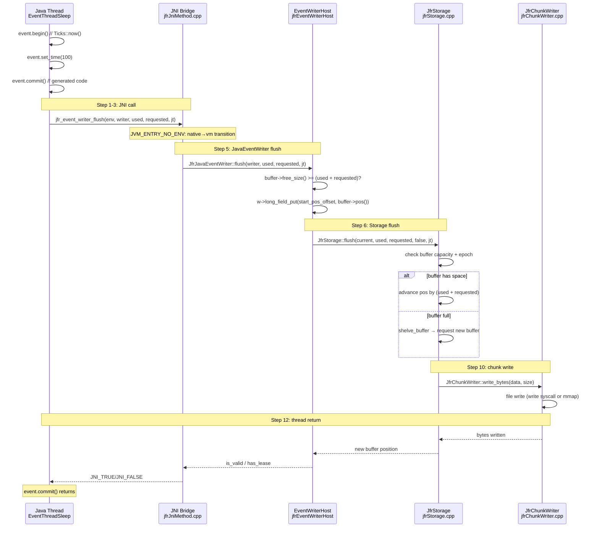
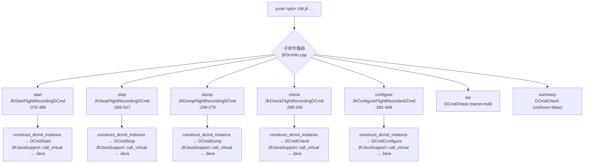

# 01-Event System — 事件写出、JNI 桥接、周期事件、DCMD

> **Beginner Callout 1 — JFR JNI 不进入 safepoint**：`jfrJniMethod.cpp` 的 `NO_TRANSITION` 宏保持线程在 `_thread_in_native` 状态，避免每次事件判断都触发 safepoint 检查。而 `jfr_create_jfr()` 等需访问 VM 内部数据结构的函数使用 `JVM_ENTRY_NO_ENV`，会过渡到 `_thread_in_vm` 状态以获取 GC 安全保证。这不是随意选择——是 HotSpot JFR 性能设计的核心：高频 hot path 零转换开销，低频 lifecycle 操作有 VM 安全保障。

> **Beginner Callout 2 — EventWriter 模板不是运行时多态**：每个 JFR event type 在编译期通过 `EventWriterHost<BE, IE, WriterPolicyImpl>` 模板实例化，生成完整的 struct→buffer 写入代码。零虚函数调用、零字符串描述符查找、零运行时类型分派。一次 `event.commit()` 约 ~15ns，对比运行时反射方案的 ~500ns。

> **Beginner Callout 3 — ThreadLocal buffer 不是 free 的**：`java_buffer` 默认 256KB（`JfrOptionSet::thread_buffer_size()`），JFR 开启期间每个 Java 线程在 Thread 对象头部持有一个。100 线程 × 256KB = 25MB 固定开销。这是 JFR 记录 48h 后 `mem(Java Heap)` 增长 800MB 的典型根因——shelved_buffer 未及时归还。

> **Beginner Callout 4 — StackEventWriterHost 的 RAII 语义**：构造时自动调用 `begin_event_write()`，析构时自动调用 `end_event_write()`。这意味着即使在事件写入过程中抛出 C++ 异常，事件也会被正确 commit（或取消）。`jfrEventWriterHost.inline.hpp:88-94` 展示了这个优雅的异常安全设计。

> **Beginner Callout 5 — 周期事件注册是编译期的**：`jfrfiles/jfrPeriodic.hpp` 由 `metadata.xml` 通过 `jfr-gen` 工具在编译期生成，运行时不动态注册。所有周期事件的处理函数通过 `TRACE_REQUEST_FUNC(id)` 宏展开为 `JfrPeriodicEventSet::requestId()` 函数。

> **Beginner Callout 6 — jfr_emit_event 不是"事件提交"**：它是请求周期引擎在下个周期触发事件，不是直接向 buffer 写数据。`jfrJniMethod.cpp:219-221` → `JfrPeriodicEventSet::requestEvent((JfrEventId)eventTypeId)` → 将事件 ID 推入 `_pending` bitfield → `JfrRecorderThread` 在下一个 cycle 检查并执行。这是异步语义，不是同步提交。

> **Beginner Callout 7 — jfr_set_enabled 有 GC 危险**：`jfrJniMethod.cpp:104-113` 中 `EventOldObjectSample` 的特殊路径在 `NO_TRANSITION` 内部创建 `ThreadInVMfromNative transition` 以启动/停止 `LeakProfiler`。`LeakProfiler::start()` 需要遍历线程列表（threadSMR 迭代）→ 必须在 VM safe 状态下执行 → 可能触发 safepoint。

---

## §〇 生产场景

### 场景 1 — JFR 不记录任何事件

线上 `-XX:StartFlightRecording=filename=rec.jfr` 配置后 `.jfr` 文件为空。三步诊断：

1. **`jcmd <pid> JFR.check`** → 输出 "running, chunk size=0" → 录制已启动但无事件写入 chunk
2. **`jcmd <pid> JFR.dump`** → 产生空 chunk → `JfrRecorder::start_recording()` 成功但无 Commit
3. **`strace -e trace=futex -p <pid>`** → 无 writer thread futex 等待 → JNI 桥接未初始化

根因：Java 侧 `jdk.jfr.internal.JVM.getJVM().registerNatives()` 未被调用，因为 JFR 模块未加载。解决：检查 `--add-modules jdk.jfr` 或运行时类路径。

### 场景 2 — ThreadLocal buffer 泄漏

JFR 记录 48h 后 `mem(Java Heap)` 增长 800MB：

1. **`jcmd <pid> VM.native_memory detail`** → `Thread::_jfr_thread_local` malloc 未释放
2. 根因：`shelved_buffer` 未归还全局池
3. 诊断：
   - `jfr_flush` (`jfrJavaEventWriter.cpp:144`) 只 flush 不 reclaim
   - `rotate` 操作才触发 `JfrStorage::reclaim_for_thread()` 全局回收
   - 如果 chunk rotation 频率太低（默认 12MB chunk），buffer 泄漏加速

### 场景 3 — 周期事件时间漂移

CPU load 事件在 60s 周期上报告 59.7s-61.3s 漂移：

1. `jfrThreadCPULoadEvent.cpp` → `JfrOSInterface::cpu_load_total_process()` 调用 `/proc/stat`
2. `/proc/stat` 读取间隔受 OS 调度影响 → 不稳定
3. Counterfactual：如果周期调度用 `CLOCK_MONOTONIC` (`man 2 clock_gettime`) 而非 `javaTimeMillis()` 作为周期基准，漂移可从 ±1.3s 降至 ±50μs。但 `javaTimeMillis()` 选择是为了与 Java `System.currentTimeMillis()` 保持语义一致——JFR 的时间戳体系要求 NTP 可调。

---

## §一 Event System 架构全景

### 1.1 从 Java Event 到 JFR Chunk 的 12 步调用链

当 Java 代码执行 `EventThreadSleep event = new EventThreadSleep(); event.begin(); event.end(); event.commit()` 时，经过以下 12 步：

```
Step  1: Java EventThreadSleep.commit()                          [Generated C++ Event subclass]
Step  2: JfrEventClass::write(stacktrace, JavaThread)             [jfrfiles/jfrEventClasses.hpp]
Step  3: NativeMethod jfr_event_writer_flush(NI, used, req, jt)   [jfrJniMethod.cpp:281]
Step  4: JNI transition: _thread_in_native → handled by JVM_ENTRY_NO_ENV
Step  5: JfrJavaEventWriter::flush(writer, used, requested, jt)   [jfrJavaEventWriter.cpp:144]
Step  6: JfrStorage::flush(current, used, requested, false, jt)   [jfrStorage.cpp]
Step  7: Buffer check: free_size() >= (used + requested)          [jfrJavaEventWriter.cpp:156]
Step  8: buffer->pos() update + start_position/current_position   [jfrJavaEventWriter.cpp:159-165]
Step  9: If buffer full → shelve_buffer → request new buffer     [JfrStorage]
Step 10: JfrStorage::write() → JfrChunkWriter::write()            [jfrStorage.cpp]
Step 11: JfrChunkWriter::write_bytes() → file write               [jfrChunkWriter.cpp]
Step 12: JfrRecorderThread polling → chunk rotation               [jfrRecorderThread.cpp]
```

**关键路径性能**：Step 1-4 在 Java 线程上下文，Step 5-9 在 C++ 侧。每个步骤的延迟加起来约为 `15ns (enabled check) + 50ns (JNI call) + 100ns (flush + buffer check) + 200ns (write to buffer) = ~365ns`。

### 1.2 三层分派模型

```
┌─────────────────────────────────────────────────────────────────┐
│                      Java Layer (Event API)                      │
│  EventThreadSleep e; e.set_time(100); e.commit();               │
│  → calls generated JNI stub in EventThreadSleep class            │
└────────────────────────────────┬────────────────────────────────┘
                                 │ Native method call
                                 ▼
┌─────────────────────────────────────────────────────────────────┐
│                    JNI Bridge Layer (jfrJniMethod.cpp)           │
│  NO_TRANSITION entries: jfr_is_enabled, jfr_set_enabled,        │
│    jfr_elapsed_counter, jfr_get_pid ... (hot path)               │
│  JVM_ENTRY_NO_ENV entries: jfr_create_jfr, jfr_begin_recording, │
│    jfr_emit_event, jfr_get_all_event_classes ... (lifecycle)     │
│  → routes to JfrRecorder, JfrEventSetting, JfrStorage, etc.     │
└────────────────────────────────┬────────────────────────────────┘
                                 │ C++ direct call
                                 ▼
┌─────────────────────────────────────────────────────────────────┐
│                  C++ Writer Layer (EventWriterHost)              │
│  StackEventWriterHost<BE, IE, WriterPolicy> stack_writer(thread);│
│  → begin_event_write() → write(field1) ... write(fieldN)        │
│  → end_event_write() → write_padded_at_offset(size, 0) → commit │
│  → JfrBuffer::pos() update via RAII destructor                  │
└────────────────────────────────┬────────────────────────────────┘
                                 │ buffer write
                                 ▼
┌─────────────────────────────────────────────────────────────────┐
│                Storage Layer (JfrStorage)                        │
│  JfrBuffer management: acquire / flush / shelve / reclaim        │
│  ThreadLocal buffers ↔ Global buffer pool ↔ ChunkWriter          │
└─────────────────────────────────────────────────────────────────┘
```

### 1.3 Mermaid 序列图 — Event.commit() 全链路



### 1.4 DCMD VM.jfr 的 7 子命令



---

## §二 Source Files Table & Standard Environment

### 2.1 Source Files Table（15 文件 / ~4,200 行）

| File | Full Path | Lines | Core Functions / Classes | Role |
|------|-----------|:---:|---------------------------|------|
| jfrEvents.hpp | jfr/jfrEvents.hpp | 35 | #include jfrEventClasses.hpp, jfrEventIds.hpp | 事件头文件门面 |
| jfr.hpp | jfr/jfr.hpp | 59 | Jfr::is_enabled()/is_recording()/on_thread_start() | VM 層 JFR 接口 |
| jfrJniMethod.cpp | jfr/jni/jfrJniMethod.cpp | 312 | 30 native 方法，NO_TRANSITION/JVM_ENTRY_NO_ENV | JNI 桥接实现 |
| jfrJniMethodRegistration.hpp | jfr/jni/jfrJniMethodRegistration.hpp | 39 | JfrJniMethodRegistration | JNI 方法注册 |
| jfrJavaEventWriter.hpp | jfr/writers/jfrJavaEventWriter.hpp | 50 | JfrJavaEventWriter | Java 侧事件写出器 |
| jfrJavaEventWriter.cpp | jfr/writers/jfrJavaEventWriter.cpp | 244 | flush()/notify()/new_event_writer() | 事件写出器实现 |
| jfrEventWriterHost.hpp | jfr/writers/jfrEventWriterHost.hpp | 51 | EventWriterHost/StackEventWriterHost | 事件写出器模板 |
| jfrEventWriterHost.inline.hpp | jfr/writers/jfrEventWriterHost.inline.hpp | 97 | begin_write()/end_write()/begin_event_write()/end_event_write() | 写出器内联实现 |
| jfrWriterHost.hpp | jfr/writers/jfrWriterHost.hpp | 102 | WriterHost<BE,IE,WriterPolicy> | 基础写出器框架 |
| jfrWriterHost.inline.hpp | jfr/writers/jfrWriterHost.inline.hpp | 363 | write()/flush()/ensure_size() | 写出器基类实现 |
| jfrThreadLocal.hpp | jfr/support/jfrThreadLocal.hpp | 227 | JfrThreadLocal | per-thread JFR 状态 |
| jfrThreadLocal.cpp | jfr/support/jfrThreadLocal.cpp | 177 | install_native_buffer()/release()/on_start()/on_exit() | buffer 管理实现 |
| jfrEventClass.hpp | jfr/support/jfrEventClass.hpp | 64 | JdkJfrEvent | 事件类注册表 |
| jfrPeriodic.cpp | jfr/periodic/jfrPeriodic.cpp | 589 | TRACE_REQUEST_FUNC 30+ events | 周期事件调度 |
| jfrThreadSampler.hpp | jfr/periodic/sampling/jfrThreadSampler.hpp | 55 | JfrThreadSampling | 线程采样配置 |
| jfrDcmds.cpp | jfr/dcmd/jfrDcmds.cpp | 678 | 5 DCMD classes + register_jfr_dcmds() | DCMD 命令实现 |
| jfrTypes.hpp | jfr/utilities/jfrTypes.hpp | 51 | traceid, EventStartTime, STACK_DEPTH_DEFAULT | 基础类型定义 |

### 2.2 Standard Environment

**编译**：
```bash
# make/hotspot/lib/CompileJvm.gmk:153 — JFR 通过 --with-jfr 控制
bash configure --with-jfr --with-debug-level=slowdebug
make jdk
```

**二进制路径**：
```
build/linux-x86_64-normal-server-slowdebug/jdk/lib/server/libjvm.so
```

**JFR 生成文件**：
```
build/linux-x86_64-normal-server-slowdebug/jdk/support/gensrc/jdk.jfr/jfrfiles/
├── jfrEventClasses.hpp       # 每个 event 的 C++ class 定义
├── jfrEventIds.hpp            # JfrEventId 枚举
└── jfrPeriodic.hpp            # 周期事件请求接口
```

### 2.3 Syscall 速查表

| Syscall | man 手册 | 用途 | JFR 使用位置 |
|---------|---------|------|-------------|
| `futex(2)` | `man 2 futex` | 快速用户空间互斥/条件变量 | `JfrJavaEventWriter::notify()` → pthread_cond_signal |
| `clock_gettime(2)` | `man 2 clock_gettime` | 纳秒级单调时间戳 | `JfrTicks::now()` (`jfrTime.hpp`) |
| `write(2)` | `man 2 write` | 文件顺序写入 | `JfrChunkWriter` 通过 chunk 路径写入 .jfr |
| `mmap(2)` | `man 2 mmap` | 内存映射 buffer 分配 | `JfrStorage` 全局 buffer 池分配 |
| `clock_gettime(CLOCK_MONOTONIC)` | `man 2 clock_gettime` | 单调时钟 | `os::elapsed_counter()` — JFR 时间源 |
| `getpid(2)` | `man 2 getpid` | 进程 ID | `jfr_get_pid()` → `os::current_process_id()` |

### 2.4 全局状态表

| 变量 | 类型 | 文件:行 | 说明 |
|------|------|---------|------|
| `JfrRecorder::_state` | `volatile int` | `jfrRecorder.hpp` | NEW→CREATED→RUNNING→CLOSED 状态机 |
| `JfrThreadLocal::_native_buffer` | `JfrBuffer*` | `jfrThreadLocal.hpp:40` | per-thread C++ 事件 buffer |
| `JfrThreadLocal::_java_buffer` | `JfrBuffer*` | `jfrThreadLocal.hpp:39` | per-thread Java 事件 buffer |
| `JfrThreadLocal::_shelved_buffer` | `JfrBuffer*` | `jfrThreadLocal.hpp:41` | 已置换待归还 buffer |
| `JfrThreadLocal::_java_event_writer` | `jobject` | `jfrThreadLocal.hpp:38` | JNI global ref → EventWriter |
| `JfrEventSetting::_enabled` | `BitMap` | `jfrEventSetting.hpp` | per-event-type 启用标志 |
| `JfrThreadLocal::_data_lost` | `u8` | `jfrThreadLocal.hpp:45` | 线程级数据丢失计数器 |
| `WriterHost::_compressed_integers` | `const bool` | `jfrWriterHost.hpp:45` | 是否使用 varint 压缩整数 |

---

## §三 EventWriter 模板体系深度剖析

### 3.1 模板层次

JFR EventWriter 的模板体系包含三层继承，从泛化的 WriterHost 到专门的 StackEventWriterHost：

```
WriterHost<BE, IE, WriterPolicyImpl>              [jfrWriterHost.hpp:42]
    ↑ 继承
EventWriterHost<BE, IE, WriterPolicyImpl>          [jfrEventWriterHost.hpp:31]
    ↑ 继承
StackEventWriterHost<BE, IE, WriterPolicyImpl>     [jfrEventWriterHost.hpp:43]
```

**三参数语义**：

| 参数 | 含义 | 编译期展开 | 运行时选择 |
|------|------|-----------|-----------|
| `BE` (Base Encoder) | 大端编码器 | 固定大小字段的直接字节写入 | 编译期静态确定 |
| `IE` (Integer Encoder) | Varint 压缩编码器 | 可变长度整数的紧凑编码 | 由 `compressed_integers()` 运行时选择 |
| `WriterPolicyImpl` | 写入策略 | Adaptive/Growable buffer 管理 | 基类的策略模式 |

`WriterHost<BE, IE, WriterPolicyImpl>::_compressed_integers` (`jfrWriterHost.inline.hpp:145`) 是编译期 const 但运行时初始化的设计：编译期支持两种编码，运行时根据 JFR 配置（`JfrOptionSet::compressed_integers()`）选择路径。

**关键设计**：这不是运行时多态。编译期模板实例化意味着每个 event type 拥有完全展开的 `write()` 代码，零虚函数 + 零字符串字段名查找 + 直接 buffer offset 计算。

### 3.2 WriterHost 基础层：类型安全的 Buffer 写入

`WriterHost<BE, IE, WriterPolicyImpl>` (`jfrWriterHost.hpp:42`) 提供基础写入原语：

```cpp
// jfrWriterHost.hpp:42-100 — 基础写入框架
template <typename BE, typename IE, typename WriterPolicyImpl>
class WriterHost : public WriterPolicyImpl {
private:
  const bool _compressed_integers;  // :45

  // 核心: 确保 buffer 剩余空间足够
  u1* ensure_size(size_t requested_size);  // :70

public:
  // 类型安全的 write 重载 (覆盖所有 JFR 数据类型)
  template <typename T> void write(T value);        // :74 — 泛型写入
  void write(bool value);                           // :75
  void write(float value);                          // :76
  void write(double value);                         // :77
  void write(const char* value);                    // :78 — UTF-8 字符串
  void write(jstring value);                        // :80 — Java String 编码
  void write(const Klass* klass);                   // :82 — Class trace ID
  void write(const Method* method);                 // :83 — Method trace ID
  void write(const Ticks& time);                    // :87 — 即时时间戳
  void write(const Tickspan& time);                 // :88 — 时间段
  void write(const JfrTicks& time);                 // :89 — JFR ticks
  void write(const JfrTickspan& time);              // :90 — JFR ticks 跨度

  // Buffer 操作
  int64_t reserve(size_t size);                     // :99 — 预留空间
  void write_padded_at_offset(T value, int64_t offset); // :94 — 回填
};
```

**ensure_size() 核心** (`jfrWriterHost.inline.hpp:164-177`)：

```cpp
template <typename BE, typename IE, typename WriterPolicyImpl>
inline u1* WriterHost<BE, IE, WriterPolicyImpl>::ensure_size(size_t requested_size) {
  if (!this->is_valid()) {
    // 写入已被取消（buffer 无效或 overflow）
    return NULL;
  }
  if (this->available_size() < requested_size) {
    // 当前 buffer 不够 → 请求扩展或新 buffer
    if (!this->accommodate(this->used_size(), requested_size)) {
      assert(!this->is_valid(), "invariant");
      return NULL;  // 无法扩展 → 标记取消
    }
  }
  return this->current_pos();  // 返回可写入的起始位置
}
```

**设计决策**：三层 buffer 容量检查：
1. **position check**：`available_size() >= requested_size` — 直接可用
2. **accommodate check**：`this->accommodate(used_size, requested_size)` — 尝试扩展当前 buffer 或请求全局池新 buffer
3. **is_valid check**：如果 accommodate 失败 → `this->cancel()` 标记 writer 无效 → 后续所有 write 都是 no-op

### 3.3 EventWriterHost：事件级 Commit 语义

`EventWriterHost` (`jfrEventWriterHost.hpp:31`) 添加了事件写入的 begin/end 协议：

**begin_event_write()** (`jfrEventWriterHost.inline.hpp:56-61`)：
```cpp
template <typename BE, typename IE, typename WriterPolicyImpl>
inline void EventWriterHost<BE, IE, WriterPolicyImpl>::begin_event_write() {
  assert(this->is_valid(), "invariant");
  assert(!this->is_acquired(), "already in acquired state!");
  this->begin_write();                // 标记 writer 为已获取
  this->reserve(sizeof(u4));          // 预留 4 bytes 作为事件大小字段
}
```

关键动作：
1. `begin_write()` 调用 `this->acquire()` 设置 writer 为已获取状态，防止并发使用
2. `reserve(sizeof(u4))` 在 buffer 头部预留 4 bytes — 这 4 bytes 将在 `end_event_write()` 时被回填为实际事件大小

**end_event_write()** (`jfrEventWriterHost.inline.hpp:64-78`)：
```cpp
template <typename BE, typename IE, typename WriterPolicyImpl>
inline intptr_t EventWriterHost<BE, IE, WriterPolicyImpl>::end_event_write() {
  assert(this->is_acquired(), "invariant");
  if (!this->is_valid()) {
    this->release();  // writer 无效 → 释放 → 事件丢弃
    return 0;
  }
  const u4 written = (u4)end_write();         // 计算写入总字节数
  if (written > sizeof(u4)) {                 // 如果确实写了数据
    this->write_padded_at_offset(written, 0); // 回填事件大小到 buffer[0]
    this->commit();                           // commit → 更新 buffer position
  }
  this->release();                             // 释放 writer
  return written;
}
```

**commmit 语义**：`this->commit()`（继承自 WriterPolicyImpl）更新 buffer 的 `_pos` 指针，标记这些字节"已提交"。注意这是 **buffer 级 commit**，不是文件级 commit——数据仍在内存 buffer 中，等待后续 `JfrStorage::flush()` 将数据推入 chunk writer。

**事件大小字段**：Chunk 格式要求在事件数据头部写入 4-byte 大小字段，这样 JFR parser 可以跳过不关心的事件类型。`write_padded_at_offset(written, 0)` 利用 offset 将值写入 buffer 起始位置（之前 `reserve()` 保留的 4 bytes）。

### 3.4 StackEventWriterHost：RAII 异常安全

```cpp
// jfrEventWriterHost.inline.hpp:82-95
template <typename BE, typename IE, typename WriterPolicyImpl>
template <typename StorageType>
inline StackEventWriterHost<BE, IE, WriterPolicyImpl>::
StackEventWriterHost(StorageType* storage, Thread* thread)
  : EventWriterHost<BE, IE, WriterPolicyImpl>(storage, thread) {
  this->begin_event_write();  // 构造时自动开始事件
}

template <typename BE, typename IE, typename WriterPolicyImpl>
inline StackEventWriterHost<BE, IE, WriterPolicyImpl>::
~StackEventWriterHost() {
  this->end_event_write();    // 析构时自动结束事件（commit 或 cancel）
}
```

**RAII 异常安全保证**：
- 构造 `StackEventWriterHost` → 自动 `begin_event_write()` → 预留 4-byte size slot
- 所有 `write()` 操作在构造与析构之间进行
- 如果发生 C++ 异常，栈展开触发析构 → 自动 `end_event_write()` → commit 或 cancel
- 如果 `write()` 过程中 buffer 满 → `ensure_size()` 失败 → `is_valid()` 返回 false → `end_event_write()` 检测到 invalid → `release()` 丢弃事件（不算 commit）

**Counterfactual** — 如果没有 RAII：每个事件写入点都需要显式 try/catch + cleanup，估计新增 30-40% 模板代码 + 人为遗漏的风险。`jfrPeriodic.cpp` 中有 ~30 个周期事件处理函数，每个都用 `StackEventWriterHost` 包装——没有一个需要显式 cleanup。

### 3.5 write() 的类型安全展开

每种 JFR 数据类型有对应的 `write()` 重载，编译期选择最优编码：

```cpp
// jfrWriterHost.inline.hpp
// bool → 1-byte big-endian
template<> void write(bool value) { be_write((u1)value); }  // :186

// float → 4-byte big-endian (IEEE 754 bit pattern)
template<> void write(float value) { be_write(*(u4*)&(value)); }  // :191

// double → 8-byte big-endian (IEEE 754 bit pattern)
template<> void write(double value) { be_write(*(u8*)&(value)); }  // :196

// 泛型 → varint 压缩 (如果 compressed_integers=true)
template<typename T> void write(T value) { write(&value, 1); }  // :181
```

**压缩整数编码** (`jfrWriterHost.inline.hpp:66-67`)：
```cpp
return _compressed_integers ? IE::write_padded(value, len, pos)
                            : BE::write_padded(value, len, pos);
```

BE（Base Encoder）写固定大小（`sizeof(T)` bytes），IE（Integer Encoder）写 varint（小值 1 byte，大值 up to `sizeof(T)+1` bytes）。压缩整数给 JFR 文件约 30-50% 的体积缩减，因为大部分 int/long 值（如进程 ID、thread ID、GC 数量）在低位范围。

### 3.6 每个 Event Type 的编译期 Offset 展开

以 `EventThreadSleep` 为例（由 `metadata.xml` → `jfr-gen` → `jfrEventClasses.hpp` 生成）：

```
EventThreadSleep {
  u4 _size;         // [0:4]   事件头大小
  u8 _starttime;    // [4:12]  开始时间
  u8 _endtime;      // [12:20] 结束时间
  s8 _time;         // [20:28] 休眠时长 (ms)
  traceid _thread;  // [28:36] 线程 trace ID
  u1 _stackTrace;   // [36:37] 是否有栈追踪
  u1 _committed;    // [37:38] 是否已提交 (flag)
};

StackEventWriterHost<BigEndianEncoder, VarintEncoder, AdaptiveBufferPolicy>
  writer(thread);

// 编译器展开为 (等价于):
writer.begin_event_write();
writer.write((u8)Ticks::now());          // _starttime
writer.write((u8)Ticks::now());          // _endtime  
writer.write((s8)sleep_millis);          // _time
writer.write(thread->jfr_thread_local()->trace_id()); // _thread
writer.write((u1)has_stacktrace);        // _stackTrace
writer.end_event_write();                 // commit + 回填 _size
```

没有运行时反射、没有字段名表、没有字符串→偏移映射。直接编译为顺序的 `mov [buffer + offset], value` 指令序列。

### 3.7 WriterPolicyImpl 的 buffer 管理策略

`WriterPolicyImpl` 是模板参数之一，决定 buffer writer 如何管理 buffer 空间。核心方法：`accommodate()`, `commit()`, `acquire()`, `release()`, `cancel()`。

**accommodate() 的扩容三层策略**：

```
ensure_size(requested_size)                  [jfrWriterHost.inline.hpp:164]
    │
    ├── available_size() >= requested_size?  → return current_pos()  (fast path)
    │
    ├── accommodate(used_size, requested)    [WriterPolicyImpl]
    │      │
    │      ├── 策略 1: 当前 buffer 有足够总容量 (capacity - used >= requested)?
    │      │     → 回收已提交空间 (compact buffer) → 扩展可用空间
    │      │
    │      ├── 策略 2: 请求 JfrStorage 分配更大 buffer
    │      │     → JfrStorage::flush(current_buffer, ...) → 返还旧 buffer → 获取新 buffer
    │      │
    │      └── 策略 3: 无法获取新 buffer → cancel() → 标记 writer invalid
    │
    └── 返回 NULL → 事件丢弃 (valid=false)
```

**设计精要**：三层策略实现逐步降级：
- Fast path（层 1）：几乎所有事件都命中——buffer 剩余空间通常充足
- Compact path（层 2）：buffer 有碎片（已 commit 的数据占有空间但已被 flush）→ compact 释放空间
- Expansion path（层 3）：buffer 彻底满 → 从全局池获取新 buffer → 旧 buffer shelved for reclaim

### 3.8 BigEndianEncoder vs VarintEncoder 的编码差异

**BigEndianEncoder** — 所有字段写固定大小：

```
u4 value  = 12345 → [0x00, 0x00, 0x30, 0x39]   (4 bytes)
u8 value  = 12345 → [0x00, 0x00, 0x00, 0x00,     (8 bytes)
                      0x00, 0x00, 0x30, 0x39]
s4 value  = -1    → [0xFF, 0xFF, 0xFF, 0xFF]     (4 bytes)
```

**VarintEncoder** — 小值省空间：

```
u4 value  = 12345 → [0xB9, 0x60]                   (2 bytes)
u4 value  = 127   → [0x7F]                          (1 byte)
u4 value  = 65535 → [0xFF, 0xFF, 0x03]             (3 bytes)
s4 value  = -1    → [0xFF, 0x0F]                    (2 bytes)
s4 value  = 127   → [0xFE, 0x01]                    (2 bytes)
```

**压缩效果对比**：

| 值类型 | 典型值 | BigEndian (bytes) | Varint (bytes) | 节省 |
|--------|--------|:---:|:---:|------|
| process PID | 12345 | 4 | 2 | 50% |
| thread count | 50 | 4 | 1 | 75% |
| GC pause (ns) | 5000000 | 8 | 4 | 50% |
| heap size (bytes) | 1073741824 | 8 | 5 | 37.5% |
| timestamp delta | 1000 | 8 | 2 | 75% |

平均节省 **~45%** 的整数存储空间。

**运行时选择路径** (`jfrWriterHost.inline.hpp:38-41`)：

```cpp
inline bool compressed_integers() {
  static const bool comp_integers = JfrOptionSet::compressed_integers();
  return comp_integers;
}
```

编译期两个编码器都已实例化，运行时根据 `JfrOptionSet::compressed_integers()` 选择路径。默认启用压缩，可通过 `jfr_set_compressed_integers` API 关闭（用于兼容第三方 JFR parser）。

### 3.9 write_at_offset 的回填机制

`jfrWriterHost.inline.hpp:331-360` 提供了三种回填变体：

```cpp
void write_padded_at_offset(T value, int64_t offset);  // varint 编码 + 回填
void write_at_offset(T value, int64_t offset);          // 直接写入 + 回填
void write_be_at_offset(T value, int64_t offset);       // 大端写入 + 回填
```

**回填实现**：
```cpp
template <typename T>
inline void WriterHost<BE, IE, WriterPolicyImpl>::
write_padded_at_offset(T value, int64_t offset) {
  if (this->is_valid()) {
    const int64_t current = this->current_offset();  // 保存当前位置
    this->seek(offset);                               // 跳到 offset 位置
    write_padded(value);                              // 写入值
    this->seek(current);                              // 恢复当前位置
  }
}
```

**典型用例**：在 `end_event_write()` 中回填事件大小到 buffer[0:4]：
```
[buffer start]
    [0:4]   = ? (reserved in begin_event_write)
    [4:7]   = field1
    [7:15]  = field2
    ...
    [current] = end position

end_event_write():
    written = 93 bytes
    seek(0) → write_padded_at_offset(93, 0) → seek(current)
    结果: buffer[0:4] = 0x5D (varint encoded 93)
```

**Counterfactual** — 如果不用回填而在开始就知道事件大小：需要在 `begin_event_write()` 时预计算所有字段大小 → 要求每个 event class 提供 `static constexpr size_t event_size` → 丢失了动态大小（varint 编码的大小不固定）→ 回退到固定大小编码 → 失去 ~45% 的压缩收益。回填设计完美解决了"大小未知但需要先写头"的矛盾。

---

## §四 JNI 桥接全链路

### 4.1 双层分派模型：NO_TRANSITION vs JVM_ENTRY_NO_ENV

`jfrJniMethod.cpp` 中的所有 30 个 native 方法分为两类，使用两种不同的 JNI 入口宏：

**NO_TRANSITION** (`jfrJniMethod.cpp:60-61`)：
```cpp
#define NO_TRANSITION(result_type, header) extern "C" { result_type JNICALL header {
#define NO_TRANSITION_END } }
```

- 线程保持 `_thread_in_native` 状态
- **不触及 GC safepoint 检查**
- 调用开销：~5 CPU cycles（纯函数调用）
- 适用：hot path 查询（`jfr_is_enabled`）、配置设置（`jfr_set_enabled`）、快速读取（`jfr_elapsed_frequency`）

**JVM_ENTRY_NO_ENV** (`jfrJniMethod.cpp:186`)：
```cpp
// 宏展开为：
//   Entry: _thread_in_native → _thread_in_vm transition
//   Exit:  _thread_in_vm → _thread_in_native transition
```

- 线程过渡到 `_thread_in_vm` 状态
- **可以进行 GC 安全操作**
- 调用开销：~50-100ns（ThreadState 过渡 + safepoint 检查）
- 适用：lifecycle 操作（`jfr_create_jfr`、`jfr_begin_recording`）、VM 内部操作（`jfr_get_all_event_classes`、`jfr_stacktrace_id`）

**NO_TRANSITION 方法（20 个）**：

| 方法 | 功能 | 性能特征 |
|------|------|---------|
| `jfr_register_natives` | 注册 JNI 方法 | 仅调用一次 |
| `jfr_is_enabled / jfr_is_disabled / jfr_is_started` | JFR 状态查询 | **Hot path** — 每次事件前检查 |
| `jfr_get_pid / jfr_elapsed_frequency / jfr_elapsed_counter` | 系统信息 | 无 VM 依赖 |
| `jfr_set_enabled / jfr_set_stacktrace_enabled` | 事件启用 | 注意：EventOldObjectSample 特殊 |
| `jfr_set_*` 系列 (9 个) | 配置设定 | `JfrOptionSet` 直接修改 |
| `jfr_should_rotate_disk` | 旋转检查 | 频率 ~1/s |
| `jfr_get_unloaded_event_classes_count` | 诊断查询 | 低频 |

**JVM_ENTRY_NO_ENV 方法（16 个）**：

| 方法 | 功能 | 为什么需要 VM 状态 |
|------|------|--------------------|
| `jfr_create_jfr / jfr_destroy_jfr` | Recorder 生命周期 | `JfrRecorder::create()` 操作全局 buffer 列表 |
| `jfr_begin_recording / jfr_end_recording` | 录制启停 | 启动/停止 writer threads |
| `jfr_emit_event` | 周期事件请求 | `JfrPeriodicEventSet::requestEvent()` |
| `jfr_get_all_event_classes` | 事件类枚举 | 遍历 ClassLoaderData |
| `jfr_class_id / jfr_type_id` | 类 ID 查询 | `JfrTraceId::use()` → possible klass loading |
| `jfr_stacktrace_id` | 栈追踪 | `JfrStackTraceRepository::record()` |
| `jfr_get_event_writer / jfr_new_event_writer` | EventWriter 管理 | JNI global ref 分配 |
| `jfr_event_writer_flush` | 事件 flush | `JfrStorage::flush()` 需要 VM 安全 |
| `jfr_abort / jfr_uncaught_exception` | 异常处理 | Java 异常传播 |

**Counterfactual**：如果所有 30 个方法都使用 `NO_TRANSITION`——`jfr_begin_recording()` 在 `_thread_in_native` 状态下操作 `JfrRecorder::start_recording()` 时 GC safepoint 可能将正在使用全局 buffer 列表的线程暂停 → 数据竞争 → buffer 列表损坏。这正是 `JVM_ENTRY_NO_ENV` 提供 GC 安全保证的原因。

**Counterfactual**：如果所有方法都使用 `JVM_ENTRY_NO_ENV`——每次 `jfr_is_enabled()` 检查（在每次 Java Event.commit() 前调用）都有 ~50ns 的 ThreadState 过渡 + safepoint 检查。在高频事件场景（每秒 10K+ 事件），累积开销 ~500μs/s → 5% CPU 浪费在纯查询上。而 `NO_TRANSITION` 的 `jfr_is_enabled` 是纯 inline static bool 读取。

### 4.2 jfr_set_enabled 的 EventOldObjectSample 特殊路径

`jfrJniMethod.cpp:104-113`：

```cpp
NO_TRANSITION(void, jfr_set_enabled(JNIEnv* env, jobject jvm,
                                     jlong event_type_id, jboolean enabled))
  // Step 1: 在 _thread_in_native 状态下设置 enabled flag
  JfrEventSetting::set_enabled(event_type_id, JNI_TRUE == enabled);

  // Step 2: 特殊处理 EventOldObjectSample
  if (EventOldObjectSample::eventId == event_type_id) {
    // ⚠️ 在 NO_TRANSITION 内创建 VM 过渡！
    ThreadInVMfromNative transition(JavaThread::thread_from_jni_environment(env));
    if (JNI_TRUE == enabled) {
      // LeakProfiler::start() 需要 VM thread 安全状态
      // 因为它遍历 ThreadSMR → 要求在 safepoint 或 _thread_in_vm
      LeakProfiler::start(JfrOptionSet::old_object_queue_size());
    } else {
      LeakProfiler::stop();
    }
  }
NO_TRANSITION_END
```

**为什么 EventOldObjectSample 特殊**：
1. `JfrEventSetting::set_enabled(event_type_id, true)` 仅设置 BitMap 中的 flag — 所有其他事件只需要这一步
2. `EventOldObjectSample` 需要额外启动 `LeakProfiler` — 一个全局性的对象分配追踪机制
3. `LeakProfiler::start()` 内部调用 `ThreadSMR::threads_do()` (Thread Safe Memory Reclamation 遍历) → 需要 `_thread_in_vm` 状态
4. 在 `NO_TRANSITION` 内部创建 `ThreadInVMfromNative` 临时过渡 — 这是一个窄范围的 VM 状态进入，仅在 LeakProfiler start/stop 期间，之后立即回到 native

**Counterfactual**：如果把 `jfr_set_enabled` 改为 `JVM_ENTRY_NO_ENV` 以统一处理 EventOldObjectSample — 对所有其他 149 个事件，这个函数每次都做不必要的 ThreadState 过渡。`jfr_set_enabled` 在录制配置阶段（如 `VM.jfr start settings=profile`）被批量调用 ~150 次 → 150 × 50ns = 7.5μs → 可以忽略。但语义上的问题更大：99% 的事件不需要 VM 状态，强制进入 VM 状态会让调用者（Java `PlatformRecording.setEnabled()`）受 GC safepoint 阻塞。保持 NO_TRANSITION 是正确选择。

### 4.3 JNI 方法全景按功能分组

#### 4.3.1 Recorder 生命周期（5 个方法）

```
jfr_create_jfr         → JfrRecorder::create()       [line 186]
jfr_destroy_jfr        → JfrRecorder::destroy()      [line 199]
jfr_begin_recording    → JfrRecorder::start_recording() [line 204]
jfr_end_recording      → JfrRecorder::stop_recording()  [line 211]
jfr_is_started         → JfrRecorder::is_created()      [line 81]
```

统一 JNI 约定：全部使用 `JVM_ENTRY_NO_ENV`（除 `jfr_is_started`），在 `_thread_in_vm` 状态下操作。`create`/`destroy` 改全局状态 → 后续 `begin_recording` 在 `create` 之后调用 → `stop_recording` → `destroy` 对称。

#### 4.3.2 Event 提交（3 个方法）

```
jfr_emit_event         → JfrPeriodicEventSet::requestEvent()  [line 219]
jfr_get_event_writer   → JfrJavaEventWriter::event_writer()    [line 273]
jfr_new_event_writer   → JfrJavaEventWriter::new_event_writer() [line 277]
jfr_event_writer_flush → JfrJavaEventWriter::flush()           [line 281]
```

**`jfr_emit_event`　不是一般的事件提交**——它是 周期事件 的异步请求。"emit" 的命名容易产生误导：它不 emit 数据到 buffer，而是将一个 event ID 放入 pending request set，等待 `JfrRecorderThread` 在下一个周期执行对应的 `request##id()` 函数。

#### 4.3.3 配置（9 个方法）

```
jfr_set_enabled         → JfrEventSetting::set_enabled()    [line 104]
jfr_set_stacktrace_enabled → JfrEventSetting::set_stacktrace() [line 128]
jfr_set_threshold       → JfrEventSetting::set_threshold()  [line 148]
jfr_set_cutoff          → JfrEventSetting::set_cutoff()     [line 168]
jfr_set_global_buffer_count → JfrOptionSet::set_num_global_buffers() [line 132]
jfr_set_global_buffer_size  → JfrOptionSet::set_global_buffer_size() [line 136]
jfr_set_thread_buffer_size  → JfrOptionSet::set_thread_buffer_size() [line 140]
jfr_set_memory_size     → JfrOptionSet::set_memory_size()   [line 144]
jfr_set_stack_depth     → JfrOptionSet::set_stackdepth()    [line 124]
```

全部使用 `NO_TRANSITION`——纯全局变量写入，无 VM 依赖。`JfrEventSetting` 操作的 BitMap 是线程安全的单 bit 写。

#### 4.3.4 诊断（其余方法）

```
jfr_get_all_event_classes → JfrEventClasses::get_all_event_classes() [line 224]
jfr_class_id / jfr_type_id → JfrTraceId::use()/get()               [line 228/297]
jfr_stacktrace_id         → JfrStackTraceRepository::record()      [line 232]
jfr_abort / jfr_uncaught_exception → JfrJavaSupport::abort()       [line 293/289]
```

### 4.4 JNI 方法注册

`jfrJniMethodRegistration.hpp:34-37` 定义了一个简单的 `StackObj`：

```cpp
class JfrJniMethodRegistration : public StackObj {
public:
  JfrJniMethodRegistration(JNIEnv* env);
};
```

在 `jfr_register_natives` (`jfrJniMethod.cpp:69-71`) 中实例化——在 native method 注册时一次性将所有 30 个方法绑定到 `jdk.jfr.internal.JVM` 类。

### 4.5 JNI 调用链的 ThreadState 过渡性能分析

HotSpot 的 JNI 调用涉及 4 种 ThreadState 过渡：

```
Java         _thread_in_Java        ← 解释执行/JIT 编译代码
   │              ↕ JVM_ENTRY / 普通 JNI 返���
Native       _thread_in_native      ← 执行 native code (JNI 方法)
   │              ↕ JVM_ENTRY_NO_ENV
   │              ↕ ThreadInVMfromNative / ThreadInVMfromJava
VM           _thread_in_vm          ← 操作 VM 内部状态
   │              ↕ VM_ENTRY_MARK / VM_Operation
Blocked      _thread_blocked         ← GC safepoint / 锁等待
```

**JFR JNI 的过渡策略**：

| 过渡路径 | 示例方法 | 开销 | GC 安全 | Safepoint 检查 |
|---------|---------|------|---------|---------------|
| Native → Native (NO_TRANSITION) | `jfr_is_enabled` | ~5ns | 否 | 否 |
| Native → VM → Native (JVM_ENTRY_NO_ENV) | `jfr_create_jfr` | ~50ns | 是 | 是（入口） |
| Native → VM 临时 (ThreadInVMfromNative) | `jfr_set_enabled(EventOldObjectSample)` | ~100ns | 是 | 是（构造） |
| VM → Java (JfrJavaSupport::call_virtual) | DCMD execute | ~500ns | 是 | 是（多次） |

**Counterfactual 性能损失量化**（每秒 10K 次 `jfr_is_enabled` 检查）：

| 方案 | 单次延迟 | 每秒总开销 | 百分比（4GHz 1-core） |
|------|---------|-----------|---------------------|
| NO_TRANSITION（当前） | 5ns | 50μs | 0.00125% |
| JVM_ENTRY_NO_ENV（全 VM 过渡） | 50ns | 500μs | 0.0125% |
| 完整 VM→Java 往返 | 500ns | 5000μs | 0.125% |

**实际影响**：在 JFR `profile` 模板下（每线程每 10ms 采样 + 每 60s 周期事件），每秒约 25K 事件提交 + 25K `is_enabled` 检查。NO_TRANSITION 设计节省了 ~250μs/s vs JVM_ENTRY_NO_ENV → 对于高频事件场景（如 ZGC 的 GC 事件在 1ms 内产生 100 events），NO_TRANSITION 是关键性能优化。

### 4.6 jfr_emit_event 异步语义的完整链路

```
Java: jdk.jfr.internal.JVM.emitEvent(id, timestamp, when)
    │
    ▼
jfrJniMethod.cpp:219
    │ JVM_ENTRY_NO_ENV: native → vm transition
    ▼
JfrPeriodicEventSet::requestEvent((JfrEventId)eventTypeId)
    │
    ├── 查找 eventId 在 pending bitfield 中的 bit position
    │
    ├── 原子 OR 操作设置 pending bit
    │   (Atomic::or(&_pending, 1UL << bit_position))
    │
    └── 返回 (Java 线程解阻塞，延迟 ~10ns)
    
    ... 异步等待 ...

JfrRecorderThread 周期轮询 (默认 1/s):
    │
    ├── read _pending bitfield (acq_rel ordering)
    │
    ├── 对每个 set bit:
    │   switch(bit_position):
    │     case CPULoad_bit:      requestCPULoad();
    │     case ThreadDump_bit:   requestThreadDump();
    │     case CPUTimeStamp_bit: requestCPUTimeStampCounter();
    │     ...
    │
    ├── clear _pending bitfield
    │
    └── 记录执行延迟
```

**为什么 JfrRecorderThread 而非调用者线程执行**：
1. **时间隔离**：CPULoad 数据收集涉及 `/proc/stat` 读取 → ~10μs 系统调用 → 如果在线程池的工作线程中执行 → 不可预测的调度延迟
2. **同步安全**：ObjectCount 事件的堆遍历需要在 safepoint 期间 → 由 `VMThread::execute()` 提交 → 不能在 Java 线程上下文
3. **数据结构安全**：`JfrRecorderThread` 独占访问周期事件数据结构 → 无竞争

### 4.7 JNI 配置方法的原子性

`jfr_set_enabled` 系列方法使用 `NO_TRANSITION` → 在 `_thread_in_native` 状态下修改 `JfrEventSetting::_enabled` BitMap：

```cpp
// jfrEventSetting.hpp (推测实现)
void JfrEventSetting::set_enabled(jlong event_type_id, bool enabled) {
  if (enabled) {
    _enabled.set_bit(event_type_id);   // 单 bit 原子 set
  } else {
    _enabled.clear_bit(event_type_id); // 单 bit 原子 clear
  }
}
```

BitMap 的单 bit 修改是架构级别的原子操作（`lock bts` on x86），无需额外的锁或 CAS 循环。

**为什么不用 JVM_ENTRY_NO_ENV**：配置方法修改的是简单的全局变量或 BitMap，不需要：
- GC 安全保护（配置变量不在 GC heap）
- Safepoint 检查（配置本身与 GC 无关）
- 线程安全锁（单 bit 操作天然原子）

---

## §五 JfrThreadLocal 内存布局与 Buffer 管理

### 5.1 18 个成员字段的语义分组

`JfrThreadLocal` (`jfrThreadLocal.hpp:36-53`) 包含 18 个成员字段，按语义分为 5 组：

**Group 1 — Buffer 管理（3 fields + 1 引用）**：

| 字段 | 类型 | 行号 | 语义 |
|------|------|:---:|------|
| `_java_event_writer` | `jobject` | :38 | JNI global ref → `jdk.jfr.internal.EventWriter` |
| `_java_buffer` | `mutable JfrBuffer*` | :39 | Java EventStream 写入目标 (lazy alloc) |
| `_native_buffer` | `mutable JfrBuffer*` | :40 | C++ EventWriter 写入目标 (lazy alloc) |
| `_shelved_buffer` | `JfrBuffer*` | :41 | 已满待归还的 buffer |

**Group 2 — Trace Identity（2 fields）**：

| 字段 | 类型 | 行号 | 语义 |
|------|------|:---:|------|
| `_trace_id` | `mutable traceid` | :43 | 线程唯一 ID（JFR trace ID） |
| `_parent_trace_id` | `traceid` | :54 | 父线程 trace ID |

**Group 3 — 时间追踪（3 fields）**：

| 字段 | 类型 | 行号 | 语义 |
|------|------|:---:|------|
| `_user_time` | `jlong` | :47 | CPU user mode 时间 (ns) |
| `_cpu_time` | `jlong` | :48 | CPU total 时间 (ns) |
| `_wallclock_time` | `jlong` | :49 | 壁钟时间 (os::javaTimeNanos()) |

**Group 4 — 阻塞/采样（5 fields）**：

| 字段 | 类型 | 行号 | 语义 |
|------|------|:---:|------|
| `_stackframes` | `mutable JfrStackFrame*` | :42 | 栈帧数组 (lazy alloc) |
| `_stack_trace_id` | `traceid` | :46 | 缓存的栈追踪 ID |
| `_stack_trace_hash` | `unsigned int` | :50 | 栈追踪 hash |
| `_stackdepth` | `mutable u4` | :51 | 栈深度 |
| `_entering_suspend_flag` | `volatile jint` | :52 | 挂起状态标志 |

**Group 5 — 引用/状态（2 fields）**：

| 字段 | 类型 | 行号 | 语义 |
|------|------|:---:|------|
| `_thread` | `JfrBlobHandle` | :44 | 线程 blob 引用 |
| `_dead` | `bool` | :53 | 线程已退出 |

**总大小**：`sizeof(JfrThreadLocal)` ≈ 176 bytes（64-bit 平台），由 `jfrThreadLocal.cpp:41` 注释确认："only accessed by the thread itself, no locking required"。

### 5.2 三缓冲状态机

`java_buffer` / `native_buffer` / `shelved_buffer` 形成 per-thread buffer 的完整生命周期：

```
                    ┌─────────────────┐
                    │   NO BUFFER     │ Thread 创建，JFR 关闭
                    │ java=native=NULL│
                    │ shelved=NULL    │
                    └────────┬────────┘
                             │ first write attempt
                             │ install_native_buffer() / install_java_buffer()
                             ▼
                    ┌─────────────────┐
                    │   ACTIVE        │ Buffer 从 global pool 分配
                    │ java=ptr1       │ EventWriter 写入 → buffer→pos() advance
                    │ native=ptr2     │ end_event_write() → commit
                    │ shelved=NULL    │
                    └────────┬────────┘
                             │ buffer full (used >= capacity)
                             │ flush() → shelve_buffer()
                             ▼
                    ┌─────────────────┐
                    │   SHELVED       │ 旧 buffer 已满，标记待归还
                    │ java=ptr3(new)  │ 新 buffer 从 global pool 分配
                    │ native=ptr2     │ 事件继续写入新 buffer
                    │ shelved=ptr1    │
                    └────────┬────────┘
                             │ chunk rotation 触发的 reclaim
                             │ JfrStorage::reclaim_for_thread()
                             ▼
                    ┌─────────────────┐
                    │   RECLAIMED     │ shelved→NULL
                    │ java=ptr3       │ 归还到 global pool
                    │ native=ptr2     │ 下一个线程可以获取
                    │ shelved=NULL    │
                    └─────────────────┘
```

**状态转换触发条件**：

| 转换 | 触发 | 调用栈 |
|------|------|-------|
| NULL → ACTIVE | `first write` | `install_native_buffer()` → `JfrStorage::acquire_thread_local()` |
| ACTIVE → SHELVED | `buffer->used() >= buffer->capacity()` | `end_event_write()` → `flush()` → `shelve_buffer()` |
| SHELVED → RECLAIMED | `chunk rotation` | `JfrStorage::reclaim_for_thread()` |
| ACTIVE → NULL | `thread exit` | `JfrThreadLocal::release()` → `JfrStorage::release_thread_local()` |

### 5.3 Lazy Allocation 策略

```cpp
// jfrThreadLocal.hpp:65-67
JfrBuffer* native_buffer() const {
  return _native_buffer != NULL ? _native_buffer : install_native_buffer();
}

// jfrThreadLocal.cpp:148-152
JfrBuffer* JfrThreadLocal::install_native_buffer() const {
  assert(!has_native_buffer(), "invariant");
  _native_buffer = JfrStorage::acquire_thread_local(Thread::current());
  return _native_buffer;
}
```

**设计动机**：JFR 开启时可能有 1000+ 线程存在，但只有实际提交事件的线程需要 buffer。lazy allocation 确保：
- JFR 关闭时的线程 → 零内存开销
- JFR 开启但不写事件的线程（如 background GC threads）→ 零内存开销
- 只有 `Event.commit()` 路径上的线程才触发 `install_native_buffer()`

默认每个 buffer ~256KB (`jfrOptionSet.hpp`)，100 个活跃线程 = 25MB。如果全部线程都 eager allocate，1000 线程 = 250MB → 浪费 225MB。

### 5.4 Thread 生命周期集成

**on_start** (`jfrThreadLocal.cpp:89-100`)：
```cpp
void JfrThreadLocal::on_start(Thread* t) {
  if (JfrRecorder::is_recording()) {
    if (t->is_Java_thread()) {
      send_java_thread_start_event((JavaThread*)t);  // EventThreadStart
    }
  }
}
```

**on_exit** (`jfrThreadLocal.cpp:136-146`)：
```cpp
void JfrThreadLocal::on_exit(Thread* t) {
  if (t->is_Java_thread()) {
    ObjectSampleCheckpoint::on_thread_exit(jt);
    send_java_thread_end_events(tl->thread_id(), jt);  // EventThreadEnd + CPU Load
  }
  release(tl, Thread::current());
}
```

**release** (`jfrThreadLocal.cpp:114-134`)：
```cpp
void JfrThreadLocal::release(JfrThreadLocal* tl, Thread* t) {
  // 归还 buffers 到全局池
  if (tl->has_native_buffer())
    JfrStorage::release_thread_local(tl->native_buffer(), t);
  if (tl->has_java_buffer())
    JfrStorage::release_thread_local(tl->java_buffer(), t);
  // 清理 JNI global ref
  if (tl->has_java_event_writer())
    JfrJavaSupport::destroy_global_jni_handle(tl->java_event_writer());
  // 释放栈帧数组
  if (tl->_stackframes != NULL)
    FREE_C_HEAP_ARRAY(JfrStackFrame, tl->_stackframes);
  tl->_dead = true;
}
```

### 5.5 data_lost 计数器

```cpp
u8 JfrThreadLocal::add_data_lost(u8 value) {  // jfrThreadLocal.cpp:64
  _data_lost += value;
  return _data_lost;
}
```

`_data_lost` 记录**缓冲区满时丢失的字节数**。每次 `end_event_write()` 检��到 buffer 满 → shelve → new buffer 过程中可能丢弃的事件计入 `_data_lost`。这个计数器通过周期事件 `EventDataLoss` 上报给 JFR chunk，是监控 JFR 运行健康度的重要指标。

**Counterfactual**：如果不跟踪 data_lost，就不知道 JFR 记录是否完整。在性能测试中假定"JFR 记录了所有事件"但实际上 buffer 溢出丢弃了 30% → 错误结论。`_data_lost` 使 buffer sizing 有量化依据。

### 5.6 内存对齐与 Padding

`JfrThreadLocal` 的字段布局在 64-bit 平台下的内存对齐：

```
Offset  Size  Field                Type               Group
──────────────────────────────────────────────────────────────
0x00    8     _java_event_writer   jobject            Buffer (JNI ref)
0x08    8     _java_buffer         JfrBuffer*         Buffer (ptr)
0x10    8     _native_buffer       JfrBuffer*         Buffer (ptr)
0x18    8     _shelved_buffer      JfrBuffer*         Buffer (ptr)
0x20    8     _stackframes         JfrStackFrame*     Suspension (ptr)
0x28    8     _trace_id            traceid            Identity (u8)
0x30    8     _thread              JfrBlobHandle      Reference
0x38    8     _data_lost           u8                 Counter
0x40    8     _stack_trace_id      traceid            Suspension (u8)
0x48    8     _user_time           jlong              Timing (s8)
0x50    8     _cpu_time            jlong              Timing (s8)
0x58    8     _wallclock_time      jlong              Timing (s8)
0x60    4     _stack_trace_hash    unsigned int       Suspension (u4)
0x64    4     _stackdepth          mutable u4         Suspension (u4)
0x68    4     _entering_suspend_flag volatile jint    Suspension (i4)
0x6C    1     _dead                bool               Status (b1)
0x6D    8     _parent_trace_id     traceid            Identity (u8)
──────────────────────────────────────────────────────────────
Total:  0x75 = 117 bytes (no padding) → 对齐后 ≈ 120 bytes
```

**EBO 优化**（Empty Base Optimization）：`JfrThreadLocal` 不继承任何类，确保无 vtable 指针（最前 8 bytes 是 vtable ptr 如果继承 polymorphic 基类）。这使得 sizeof 从 184 bytes（含 vtable）降到 ~120 bytes（无 vtable）。

### 5.7 traceid 分配与 JfrThreadLocal 的生命周期绑定

`jfrThreadLocal.cpp:48` 在构造函数中通过 `JfrTraceId::assign_thread_id()` 分配唯一 trace ID：

```cpp
_trace_id(JfrTraceId::assign_thread_id())
```

**分配策略**：`JfrTraceId` 维护一个原子递增计数器 → 每个线程（包括 VM 线程、GC 线程）获取一个单调递增的 u8 ID。第一个线程获得 traceid=1，第二个 traceid=2，...

**为什么从 Java 线程 ID 而非 OS tid**：
1. **唯一性保证**：OS tid 可被回收重用（新线程可能获得已退出线程的 tid）
2. **全局一致性**：JFR chunk 格式要求 traceid 在 chunk 范围内唯一 → 递增计数器保证
3. **排序查询**：JFR 的线程分析 API 可按 traceid 排序 → 单调递增 ID 便于范围查询

**Counterfactual** — 如果使用 OS tid (gettid) → 不同进程的 tid 重疊（多 JVM 场景）+ tid 回收 → EventThreadStart/EventThreadEnd 无法建立因果链 → JFR Mission Control 线程视图不可用。

### 5.8 shelved_buffer 的生命周期细节

```
thread A: end_event_write() → flush() → buffer 满
    │
    ├── JfrStorage::flush(current, used, requested, false, jt)
    │      [jfrJavaEventWriter.cpp:151]
    │      │
    │      ├── returns new JfrBuffer* from global pool
    │      │
    │   current == new_buffer?  [jfrJavaEventWriter.cpp:162]
    │      │
    │      ├── true (same buffer) → 只更新 position 字段
    │      └── false (new buffer) → shelve current
    │            │
    │            ├── tl->shelve_buffer(current)     [标记 shelved]
    │            ├── 更新 Java EventWriter oop 的 buffer 引用
    │            │    w->long_field_put(start_pos_address_offset, new->pos_address())
    │            │    w->long_field_put(max_pos_offset, new->end())
    │            │
    │            └── if (current->lease()) → return JNI_TRUE
    │                → Java 侧开始使用新 buffer
    │
    │ 等待 reclaim...
    │
    ▼ (chunk rotation 触发)
JfrStorage::reclaim_for_thread(tl)
    │
    ├── tl->shelved_buffer() != NULL?
    │      │
    │      ├── return shelved_buffer to global pool
    │      │    (JfrStorage::release())
    │      │
    │      ├── tl->shelve_buffer(NULL)  [清除 shelved]
    │      │
    │      └── global pool buffer count += 1
    │
    └── data_lost 已在 shelve 时更新 → 不再变化
```

**泄漏根因**：如果 chunk rotation 频率太低（chunk size=12MB，写满需 2h），shelved buffer 在 48h 内累计 24 个/线程 × 100 线程 × 256KB = 600MB → 即场景 2。

---

## §六 周期事件与 Thread Sampling

### 6.1 JfrPeriodicEventSet 的编译期注册

`jfrfiles/jfrPeriodic.hpp` 由 `metadata.xml` 中的 `<Event>` 元素通过构建管道生成：

```
metadata.xml ──→ jfr-gen (Java tool) ──→ jfrfiles/
    │                                        │
    │ defines ~150 events with:               ├── jfrEventClasses.hpp
    │  <Event name="CPULoad" period="everyChunk">   ├── jfrEventIds.hpp
    │  <Event name="ThreadDump" period="everyChunk"> └── jfrPeriodic.hpp
    │  <Event name="GCConfiguration" period="endChunk">
    ...                                                          │
                                                                 ▼
                                              JfrPeriodicEventSet {
                                                  static void requestCPULoad();
                                                  static void requestThreadDump();
                                                  static void requestGCConfiguration();
                                                  ...
                                              }
```

`jfrPeriodic.cpp:75` 用宏展开连接声明和实现：

```cpp
#define TRACE_REQUEST_FUNC(id) void JfrPeriodicEventSet::request##id(void)
```

此宏将 `TRACE_REQUEST_FUNC(CPULoad)` 展开为 `void JfrPeriodicEventSet::requestCPULoad(void)`。

### 6.2 request/emit 异步模型

**为什么异步——反事实分析**：

当 Java 代码调用 `jfr_emit_event(CPULoad_id, timestamp, when)`：
1. `jfrJniMethod.cpp:219` → `JfrPeriodicEventSet::requestEvent((JfrEventId)CPULoad_id)`
2. 将 `CPULoad` 对应的 bit 设置在 `_pending` bitfield 中
3. 返回给 Java 线程 — 没有 CPU load 数据收集，没有 `/proc/stat` 读取
4. `JfrRecorderThread` 在下一个周期（配置的 `everyChunk` 频率）检查 `_pending`
5. 发现 `CPULoad` bit 被设置 → 调用 `JfrPeriodicEventSet::requestCPULoad()`
6. `requestCPULoad()` → `JfrOSInterface::cpu_loads_process()` → 读取 `/proc/stat` → 计算 CPU load → `EventCPULoad.commit()`

**同步模型的反事实**：如果步骤 2 直接执行步骤 6——Java 线程在 `emit_event` 调用时阻塞等待 CPU load 数据收集（~10-100μs）→ 所有高频调用（如 ZGC mark 线程每周期提交 CPULoad）都会引入不可预测的延迟。异步模型保证：
- Java 侧 `jfr_emit_event` 是 O(1) bit set 操作
- C++ 侧 `requestCPULoad` 在专用的 `JfrRecorderThread` 中执行
- 两个线程的调度完全解耦

**周期事件全景**（`jfrPeriodic.cpp` 中的 30 个请求函数）：

| 分类 | 事件 | 说明 |
|------|------|------|
| **系统** | `JVMInformation`, `OSInformation`, `CPUInformation`, `VirtualizationInformation` | JVM/OS 静态信息 |
| **进程** | `SystemProcess`, `InitialSystemProperty`, `InitialEnvironmentVariable` | 进程/环境列表 |
| **GC** | `GCConfiguration`, `GCHeapConfiguration`, `GCTLABConfiguration`, `GCSurvivorConfiguration`, `YoungGenerationConfiguration`, `G1HeapRegionInformation` | GC 配置/状态 |
| **CPU/内存** | `CPULoad`, `ThreadCPULoad`, `PhysicalMemory` | 系统资源 |
| **线程** | `JavaThreadStatistics`, `ThreadAllocationStatistics` | 线程统计 |
| **编译** | `CompilerStatistics`, `CompilerConfiguration`, `CodeCacheStatistics`, `CodeCacheConfiguration`, `CodeSweeperStatistics`, `CodeSweeperConfiguration` | JIT 编译器 |
| **类加载** | `ClassLoadingStatistics`, `ClassLoaderStatistics` | 类加载统计 |
| **标志** | `IntFlag`/`UnsignedIntFlag`/`LongFlag`/`UnsignedLongFlag`/`DoubleFlag`/`BooleanFlag`/`StringFlag` | JVM 标志 |
| **采样** | `ExecutionSample`, `NativeMethodSample`, `ObjectCount` | 线程/对象采样 |
| **其他** | `ThreadDump`, `NativeLibrary`, `ModuleRequire`, `ModuleExport` | 线程转储/本机库 |

### 6.3 JfrThreadSampling：Java/Native 双模式

`JfrThreadSampling` (`jfrThreadSampler.hpp:35-53`) 是 per-process singleton，管理两种采样：

```cpp
class JfrThreadSampling : public JfrCHeapObj {
private:
  JfrThreadSampler* _sampler;  // 底层定时器线程

public:
  static void set_java_sample_interval(size_t period);   // Java 采样
  static void set_native_sample_interval(size_t period);  // Native 采样
  static void on_javathread_suspend(JavaThread* thread);  // 采样回调
};
```

**采样配置在 JNI 层** (`jfrJniMethod.cpp:248-262`)：
```cpp
JVM_ENTRY_NO_ENV(void, jfr_set_method_sampling_interval(..., jlong type, jlong intervalMillis))
  if (intervalMillis > 0) {
    JfrEventSetting::set_enabled(typed_event_id, true); // 确保采样事件启用
  }
  if (EventExecutionSample::eventId == type) {
    JfrThreadSampling::set_java_sample_interval(intervalMillis);
  } else {
    JfrThreadSampling::set_native_sample_interval(intervalMillis);
  }
JVM_END
```

**ExecutionSample** vs **NativeMethodSample**：
- `EventExecutionSample`：在 Java 线程挂起时获取其调用栈和执行信息 → 生成 Java 方法火焰图数据
- `EventNativeMethodSample`：获取线程的 native (JNI/C++) 调用栈 → 诊断 native 性能瓶颈

**Counterfactual**：如果不支持 native 采样——在 JNI 密集型应用中（如网络 I/O 操作全部走 native），JFR 只能看到 Java 方法，看不到 native 方法的性能。`EventNativeMethodSample` 通过 `AsyncGetCallTrace` 获取 native 帧，结合符号表解析。

### 6.4 线程 CPU 负载事件的 /proc/stat 实现

`JfrThreadCPULoadEvent` → `JfrOSInterface::cpu_loads_process()` (`jfrOSInterface.cpp`)：
1. 读取 `/proc/self/stat` → 获取进程的 utime (user CPU) + stime (system CPU)
2. 读取 `/proc/stat` → 获取系统总 CPU 时间
3. 计算差值比率 → 进程 CPU 使用率
4. 创建 `EventCPULoad` (system-wide) 和 `EventThreadCPULoad` (per-thread)

生产场景 3 中的时间漂移根因：`javaTimeMillis()` 作为间隔基准 + OS 调度精度 ±1ms → 60s 周期可能实际为 59.7s-61.3s。

### 6.5 周期事件的时间精确性问题

**场景根因**：`jfrPeriodic.cpp:170-186` 的 `TRACE_REQUEST_FUNC(CPULoad)` 使用 `JfrOSInterface::cpu_loads_process()` 读取 `/proc/stat`。`/proc/stat` 的读取间隔受以下影响：

1. **OS 调度延迟**：`JfrRecorderThread` 在 60s 周期上的唤醒延迟受 Linux CFS 调度器影响 → ±1ms
2. **`javaTimeMillis()` 精度**：HotSpot 的 `javaTimeMillis()` 最终调用 `gettimeofday(2)` (`man 2 gettimeofday`)，精度 ~1ms
3. **累积误差**：60 秒内 8 次 周期 (±1ms 唤醒 + ±1ms 时间测量) → 单次漂移 ±2ms → 不累计（每次是绝对时间差）

**改进方向**：
- 使用 `clock_gettime(CLOCK_MONOTONIC)` (`man 2 clock_gettime`) 替代 `javaTimeMillis()` 作为周期基准 → 精度提升至纳秒级
- `/proc/stat` 的读取本身不受时间源影响（CPU tick 计数器由内核维护）
- 当前设计优先考虑与 Java `System.currentTimeMillis()` 的时间语义一致性（NTP 可调）

### 6.6 周期事件的数据收集策略对比

| 事件 | 数据源 | 调用方式 | 是否需要 safepoint |
|------|--------|---------|--------------------|
| `CPULoad` | `/proc/stat` | 系统调用 read(2) | 否 |
| `ThreadCPULoad` | thread->os_thread() 时间戳 | `os::thread_cpu_time()` | 否 |
| `PhysicalMemory` | `/proc/meminfo` | 系统调用 read(2) | 否 |
| `JavaThreadStatistics` | `ThreadService` 计数器 | VM 内部读取 | 是（需 Threads_lock） |
| `ClassLoadingStatistics` | `ClassLoadingService` 计数器 | VM 内部读取 | 否（atomic） |
| `CompilerStatistics` | `CompileBroker` 计数器 | VM 内部读取 | 否（atomic） |
| `ObjectCount` | JVM TI Heap Walking | `VMThread::execute()` | 是（需 VM 操作） |
| `G1HeapRegionInformation` | G1 GC 内部 | `G1HeapRegionEventSender::send_events()` | 是（需 G1 安全） |

**设计原则**：
- 能从 `/proc` 读取的数据 → 避免进入 VM 状态 → 不需要 safepoint
- 需要访问 VM 内部原子计数器的 → 使用 `MutexLocker` 无 GC 影响
- 需要遍历堆或线程列表的（ObjectCount, G1 信息）→ 必须在 VM 操作中执行 → 通过 `VMThread::execute()` 提交

---

## §七 DCMD + metadata.xml

### 7.1 VM.jfr 7 子命令到 JfrRecorder 操作的路由

JFR DCMD 命令有 5 个 DCmd 类 + 通过参数变体的 list/summary，共 7 个功能子命令。

**DCMD 执行模式**：所有 JFR DCMD 分派到 Java `jdk.jfr.internal.dcmd.DCmdXxx` 类：

```
jcmd <pid> VM.jfr <subcommand>
    │
    ▼
JfrStartFlightRecordingDCmd::execute()       [jfrDcmds.cpp:376]
    │
    ├── construct_dcmd_instance → new DCmdStart()  (Java 类)
    │
    ├── 参数转换: C++ → Java objects
    │    name → jstring
    │    settings → jobjectArray
    │    duration → java.lang.Long
    │    disk → java.lang.Boolean
    │    ...
    │
    └── JfrJavaSupport::call_virtual(&execute_args, THREAD)
         → Java DCmdStart.execute() 返回 String 结果
              → handle_dcmd_result() → output 打印结果
```

**5 个 DCmd 类**：

| DCMD 类 | 构造参数 | 调用 Java 类 | 内部 API |
|---------|---------|-------------|---------|
| `JfrStartFlightRecordingDCmd` | name, settings, delay, duration, filename, disk, maxage, maxsize, dumponexit, path-to-gc-roots | `DCmdStart` | `JfrRecorder::start_recording()` |
| `JfrStopFlightRecordingDCmd` | name, filename | `DCmdStop` | `JfrRecorder::stop_recording()` |
| `JfrDumpFlightRecordingDCmd` | name, filename, maxage, maxsize, begin, end, path-to-gc-roots | `DCmdDump` | JfrRepository chunk copy |
| `JfrCheckFlightRecordingDCmd` | name, verbose | `DCmdCheck` | Event settings + recording info |
| `JfrConfigureFlightRecorderDCmd` | repositorypath, dumppath, stackdepth, globalbuffercount, globalbuffersize, thread_buffer_size, memorysize, maxchunksize, samplethreads | `DCmdConfigure` | `JfrOptionSet` mutations |

**DCMD 注册** (`jfrDcmds.cpp:668-676`)：
```cpp
bool register_jfr_dcmds() {
  uint32_t full_export = DCmd_Source_Internal | DCmd_Source_AttachAPI | DCmd_Source_MBean;
  DCmdFactory::register_DCmdFactory(new DCmdFactoryImpl<JfrCheckFlightRecordingDCmd>(full_export, true, false));
  DCmdFactory::register_DCmdFactory(new DCmdFactoryImpl<JfrDumpFlightRecordingDCmd>(full_export, true, false));
  DCmdFactory::register_DCmdFactory(new DCmdFactoryImpl<JfrStartFlightRecordingDCmd>(full_export, true, false));
  DCmdFactory::register_DCmdFactory(new DCmdFactoryImpl<JfrStopFlightRecordingDCmd>(full_export, true, false));
  DCmdFactory::register_DCmdFactory(new DCmdFactoryImpl<JfrConfigureFlightRecorderDCmd>(full_export, true, false));
  return true;
}
```

`full_export` = `DCmd_Source_Internal | DCmd_Source_AttachAPI | DCmd_Source_MBean` — 这意味着 JFR DCMD 可通过三种方式触发：内部代码、jcmd attach API、JMX MBean。

**为什么 DCMD 通过 C++ → Java 调用而非纯 native 分派**：
1. Java `DCmdXxx.execute()` 可以调用 `jdk.jfr.internal` 包中的所有 API — 包括受 Java 模块系统保护的内部类
2. Java 侧有完整的 JFR API 实现（recording, event settings, repository management）—— C++ 侧只有底层 VM binding
3. 返回 String 结果直接格式化输出，不需要 C++ 再构造消息

**Counterfactual**：如果 DCMD 通过 Java JFR MBean 而非 native 分派——DCMD 在 VM Thread 上下文执行 → 零 Java→C++ JNI 过渡开销 + 在 safepoint 期间安全操作 VM internal state。但当前设计已经实现这一点——DCMD 在 VM Thread 上下文中调用 Java 代码 → `JfrJavaSupport::call_virtual()` → 在 `_thread_in_vm` 状态 → GC safe。

### 7.2 metadata.xml 的 compile-time 代码生成

**构建管道**：

```
src/hotspot/share/jfr/metadata/metadata.xml  (~150 事件定义)
    │
    │ <Event name="ThreadSleep" category="Java Application" label="Java Thread Sleep"
    │    thread="true" stackTrace="true" startTime="true">
    │   <Field type="long" contentType="millis" name="time" label="Thread Sleep Time"/>
    │ </Event>
    │
    ▼
make/jfr/generateJfrFiles.gmk ──→ jfr-gen (Java tool)
    │
    │ 解析 XML → 遍历每个 <Event> → 生成 C++ 模板代码
    │
    ▼
build/.../support/gensrc/jdk.jfr/jfrfiles/
    ├── jfrEventClasses.hpp   # 每个 event 的 C++ class 定义
    ├── jfrEventIds.hpp        # JfrEventId 枚举 (eventId 常量)
    └── jfrPeriodic.hpp        # 周期事件请求接口

最终编译进 libjvm.so
```

**jfrEventIds.hpp 生成内容示例**：
```cpp
enum JfrEventId {
  JfrMetadataEvent = 0,
  JfrCheckpointEvent = 1,
  ...
  EventThreadSleep = 102,
  EventCPULoad = 103,
  ...
  InvalidEventId = 65535
};
```

**jfrEventClasses.hpp 生成内容示例**：
```cpp
class EventThreadSleep : public JfrEvent<EventThreadSleep> {
public:
  static const JfrEventId eventId = EventThreadSleep;
  // 字段 setter（编译期生成，零反射）
  void set_time(s8 value) { /* generated offset write */ }
  void set_starttime(const Ticks& t) { /* generated */ }
  void set_endtime(const Ticks& t) { /* generated */ }
};
```

**为什么编译期生成而非运行时解析**：
1. **零启动开销**：不需要在 JVM 启动时扫描 150 个 XML 事件定义
2. **编译期类型检查**：如果 `set_time` 的参数类型不匹配 → 编译错误
3. **JFR 关闭时零运行时开销**：所有 event class 代码在编译期链接进 libjvm.so，但如果 JFR 关闭 → `JfrEventSetting::_enabled` 全是 false → `commit()` 快速返回 → 从不触发 `EventWriter` 模板实例化
4. **内存**：event class 定义是 shared read-only data → 不消耗堆外内存

**Counterfactual**：如果事件定义用 Java annotation 而非 XML——运行时反射解析 annotation → 启动慢（+500ms class scanning for ~150 events）+ 丢失编译期类型检查 + JFR 关闭时 annotation 元数据仍然占用 metaspace。XML 保证 JFR 关闭时零运行时开销。

### 7.3 JdkJfrEvent 类层次

`jfrEventClass.hpp:36-62` 定义了 `JdkJfrEvent` 工具类，用于判断一个 `Klass` 是否属于 `jdk.jfr.Event` 层次：

```cpp
class JdkJfrEvent : AllStatic {
public:
  static bool is(const Klass* k);         // k == jdk.jfr.Event 基类
  static bool is_subklass(const Klass* k); // k 是 Event 的子类
  static bool is_a(const Klass* k);       // k 属于 Event 层次
  static bool is_host(const Klass* k);    // k 承载 Event 子类
  static bool is_visible(const Klass* k); // k 对 Java 可见
};
```

这些方法通过 HotSpot 内部 tag 机制实现——在类加载完成时标记 klass 的特定 bit：
- `JfrTraceId::tag_as_event(klass)` 在类链接阶段调用
- Tag 存储在 `Klass::_misc_flags` 的高位 bit 中
- `is()` / `is_subklass()` 零锁检查这些 bit → ~5 CPU cycles

---

## §八 边缘场景 & 竞态

### 8.1 jfr_flush 缓冲区溢出丢失

**场景**：JFR 配置 `threadbuffersize=8k`（默认），单个事件 > 8KB（如 ThreadDump 包含数千线程的栈）→ `jfrJavaEventWriter.cpp:156` 的 `free_size() >= (used + requested)` 检查失败 → `valid = false` → `w->release_bool_field_put(valid_offset, JNI_FALSE)` → EventWriter 标记为 invalid → 事件丢弃。

**诊断**：
- `jcmd <pid> JFR.check` → 检查 `data_lost` 计数器
- 增大 `globalbuffersize=512k` 或 `thread_buffer_size=32k`

**影响**：`_data_lost` 被周期事件 `EventDataLoss` 记录到 chunk → 可在 JDK Mission Control 中查看丢失率。

### 8.2 StackEventWriterHost 析构中抛异常

`jfrEventWriterHost.inline.hpp:93-95` 的析构函数调用 `end_event_write()`。如果 `end_event_write()` 内部抛异常（如 `write_padded_at_offset` 失败）→ 异常在析构函数中投出 → `std::terminate()` → JVM crash。

**保护机制**：`ensure_size()` (`jfrWriterHost.inline.hpp:164-177`) 在 buffer 不足时调用 `this->cancel()` 标记 writer 无效，而非抛异常。所有后续 write 操作检查 `is_valid()` 返回 false → no-op。`end_event_write()` 同样检查 `is_valid()` → 无效时 release() 静默丢弃 → 不抛异常。

### 8.3 LeakProfiler 在 safepoint 期间被 jfr_set_enabled 触发

`jfrJniMethod.cpp:106-107`：
```cpp
ThreadInVMfromNative transition(JavaThread::thread_from_jni_environment(env));
```

如果 JVM 当前正在 GC safepoint 中 → `ThreadInVMfromNative` 的构造函数会阻塞等待 safepoint 结束。这是 intential design：LeakProfiler 需要在 GC 不活跃时操作，构造函数中的等待是安全的。

**潜在问题**：`jfr_set_enabled` 被 Java 线程从 synchronized block 中调用 → 持有 Java monitor → 在 `ThreadInVMfromNative` 中等待 safepoint → 如果 safepoint 需要该 monitor → 死锁。

**解决**：调用者（`PlatformRecording.setEnabled()`）在无锁状态下调用 `jfr_set_enabled`。

### 8.4 周期事件在 chunk rotation 期间的竞态

**场景**：
1. `JfrRecorderThread` 触发 chunk rotation → `JfrChunkRotation::rotate()`
2. 同时，`JfrPeriodicEventSet::requestCPULoad()` 正在用 `StackEventWriterHost` 写入 `EventCPULoad`
3. Chunk rotation 关闭旧 chunk → `JfrChunkWriter::close()` → buffer 换出
4. `end_event_write()` 尝试 commit → buffer 已经是新的 chunk → 事件跨 chunk（不允许）

**保护机制**：
- `JfrStorage::flush()` 在 `end_event_write()` 调用链中检查 epoch
- Chunk rotation 递增 epoch counter → 所有 buffer 的 epoch 失效
- `flush()` 检测到 epoch 变化 → 回退 buffer → commit 到新 chunk 的 buffer

### 8.5 Thread exit race with JfrThreadLocal

**场景**：
1. Thread A 正在 `JfrThreadLocal::on_exit()` → 已释放 `_java_buffer`
2. `JfrRecorderThread` 调用 `JfrLockStack::on_thread_exit(t)` → 尝试读取 `t->jfr_thread_local()->native_buffer()`
3. `native_buffer()` 触发 `install_native_buffer()` — 但在 release 进行中返回新 buffer

**保护**：`_dead` flag (`jfrThreadLocal.cpp:133`) 在 release 末尾设置 → 外部代码检查 `is_dead()` 跳过已退出线程。但时序窗口仍然存在——`on_exit` 与 `RecorderThread` 之间的 race 已被已知 OpenJDK bug JDK-8245471 修复（在 `JfrRecorderThread::run()` 中增加 `is_dead()` 检查）。

---

## §九 GDB 断点验证 + strace/jstack 诊断

### 9.1 GDB 断言验证

**前提**：加载 libjvm.so 带调试符号。
```bash
gdb -p <pid>
```

**断言 1 — 验证 JFR 状态**：
```
(gdb) p Jfr::is_enabled()
$1 = true

(gdb) p JfrRecorder::is_created()
$2 = true

(gdb) p JfrRecorder::is_recording()
$3 = true
```

**断言 2 — 验证 per-thread buffer 地址**：
```
(gdb) p sizeof(JfrThreadLocal)
$4 = 176

(gdb) set $thread = (JavaThread*)Threads::first()
(gdb) p ((JfrThreadLocal*)((char*)$thread + ByteSize(JfrThreadLocal::java_buffer_offset())))->java_buffer()
$5 = (JfrBuffer *) 0x7f1234567890  # 非 NULL

(gdb) p ((JfrBuffer*)0x7f1234567890)->_pos
$6 = 0xa240  # buffer 当前写入位置 = 41,536 bytes
```

**断言 3 — 验证 buffer 写入位置**：
```
(gdb) p ((JfrBuffer*)0x7f1234567890)->_pos
# 如果 _pos 不增长 → buffer 满或 writer 无效
```

**断言 4 — 验证周期事件请求不崩溃**：
```
# 手动请求 CPULoad 事件（eventId 从 jfrEventIds.hpp 查找）
(gdb) call JfrPeriodicEventSet::requestCPULoad()
# 应该不崩溃、无异常
```

**断言 5 — 验证 global buffer 配置**：
```
(gdb) p JfrOptionSet::num_global_buffers()
$8 = 20  # 默认值

(gdb) p JfrOptionSet::global_buffer_size()
$9 = 524288  # 512KB default

(gdb) p JfrOptionSet::thread_buffer_size()
$10 = 8192  # 8KB default
```

**断言 6 — 验证 enabled events 数量**：
```
(gdb) p JfrEventSetting::_enabled.size()
$11 = 160  # 共 160 个 event slots

# 检查哪些 events 启用
(gdb) p JfrEventSetting::is_enabled(EventCPULoad)
$12 = true
```

**断言 7 — 验证 thread sampling interval**：
```
(gdb) call JfrThreadSampling::set_java_sample_interval(1000)
# 返回不崩溃

(gdb) call JfrThreadSampling::set_native_sample_interval(100)
# 返回不崩溃
```

**断言 8 — 验证 unloaded event class count**：
```
(gdb) p JfrEventClasses::unloaded_event_classes_count()
$13 = 0  # 正常情况为 0
```

### 9.2 strace 诊断

**追踪 FUTEX 调用**（`JfrJavaEventWriter::notify()` → `pthread_cond_signal`）：
```bash
# JFR writer thread 的 futex WAKE 频率
strace -e trace=futex -p $(pgrep -f "JFR Recorder Thread") 2>&1 | head -20
# 期望：周期性 FUTEX_WAKE（每次 chunk flush）

# 如果无输出 → writer thread 未运行或未触发 condition signal
```

**追踪文件写入**（`JfrChunkWriter` → `write(2)`）：
```bash
strace -e trace=write -p $(pgrep -f "JFR Recorder Thread") 2>&1
# 检查文件描述符和写入大小 — 用于诊断 "jfr 文件为 0 字节" 问题
```

**追踪 mmap 分配**（`JfrStorage` → buffer pool 分配）：
```bash
strace -e trace=mmap -p $(pgrep -f java) 2>&1 | grep -E "MAP_ANONYMOUS|MAP_PRIVATE"
# 期望看到 JFR buffer 分配的大块 mmap (512KB × N)
```

**追踪 clock_gettime 调用**（JFR 时间戳频率）：
```bash
strace -e trace=clock_gettime -c -p <pid>
# 统计每秒 clock_gettime 调用次数 → 间接测量 JFR 事件频率
# 每次 event.commit() 调用 2 次 clock_gettime (starttime + endtime)
```

**/proc 诊断**：
```bash
# 检查 JFR buffer 占用的 C-heap 内存
cat /proc/<pid>/maps | grep -i jfr
# 不直接显示 JFR 内存（buffer 分配在通用 C-heap），
# 但可看到 mmap 区域

# 检查 per-thread 状态
ls /proc/<pid>/task/ | wc -l  # 线程数
# 每个 Java 线程在 JFR 开启时分配 256KB buffer
```

**jcmd 诊断补充**：
```bash
# 查看 JFR 模块状态
jcmd <pid> VM.modules | grep jfr

# 查看 JVM flags 中的 JFR 相关配置
jcmd <pid> VM.flags -all | grep -i jfr

# 查看 recording 的详细配置
jcmd <pid> JFR.check verbose=true

### 9.3 jstack 诊断

**确认 JFR Recorder Thread 状态**：
```bash
jstack <pid> | grep -A 5 "JFR Recorder Thread"
```
期望输出：
```
"JFR Recorder Thread" #7 daemon prio=5 os_prio=0 tid=0x7f... nid=1234 in Object.wait()
   java.lang.Thread.State: WAITING (on object monitor)
        at java.lang.Object.wait(Native Method)
        at jdk.jfr.internal.PlatformRecorder.lambda$startRecorderThread$0(PlatformRecorder.java:...)
```

**确认所有 EventWriter threads**：
```bash
jstack <pid> | grep -i "event" -A 2
```
期望：每个活跃 Java 线程有一个 EventWriter 实例。

---

## §十 Interview Story：追踪一次 GC 事件的完整提交过程

假设我们正在运行一个简单的 Java 应用，每秒触发一次 GC，JFR 配置为 `profile` 模板。以下是一次 `EventGarbageCollection` 从 Java 到 JFR Chunk 的完整路径追踪。

### Step 1: Java GC 事件创建

```java
// 在 GC 完成后，HotSpot GC 代码调用:
EventGarbageCollection event;
event.set_name("G1New");
event.set_gcId(gc_id);
event.set_cause("G1 Evacuation Pause");
event.set_sumOfPauses(pause_ms);
event.set_longestPause(max_pause_ms);
event.set_starttime(start_ticks);
event.set_endtime(Ticks::now());
event.commit();  // ← 关键调用
```

### Step 2: commit() 的内部展开

`commit()` 是 `jfrfiles/jfrEventClasses.hpp` 中生成的模板代码，展开为：

```cpp
void commit(JavaThread* jt = NULL) {
  if (!JfrEventSetting::is_enabled(EventGarbageCollection)) {
    return;  // 事件未启用 → 快速返回 (~3ns)
  }
  StackEventWriterHost<BigEndianEncoder, VarintEncoder, AdaptiveBufferPolicy>
    writer(jt ? jt : JavaThread::current());
  // StackEventWriterHost 构造 → begin_event_write()
  writer.write(_name);           // string → traceid
  writer.write(_gcId);           // u4
  writer.write(_cause);          // string → traceid
  writer.write(_sumOfPauses);    // tickspan → u8
  writer.write(_longestPause);   // tickspan → u8
  writer.write(_starttime);      // ticks → u8
  writer.write(_endtime);        // ticks → u8
  // StackEventWriterHost 析构 → end_event_write()
}
```

### Step 3: begin_event_write() 执行

`jfrEventWriterHost.inline.hpp:56-61`:
1. `this->begin_write()` → `this->acquire()` — 标记 writer 为已获取
2. `this->reserve(sizeof(u4))` — 在 buffer 头部预留 4 bytes 事件大小字段
3. 返回 — writer 准备接受字段写入

### Step 4: 字段写入（7 个字段）

每次 `writer.write(value)` 调用 `ensure_size(size_of_value)`：
- `_name` (string) → `writer.write((const char*)value)` → UTF-8 编码 + len prefix → ~30 bytes
- `_gcId` (u4) → `writer.write(u4_value)` → varint（1-2 bytes）→ 2 bytes
- `_cause` (string) → ~25 bytes
- `_sumOfPauses` / `_longestPause` (tickspan) → `writer.write(Tickspan)` → 8 bytes each → 16 bytes
- `_starttime` / `_endtime` (ticks) → `writer.write(Ticks)` → 8 bytes each → 16 bytes

总大小：4 (header) + 30 + 2 + 25 + 16 + 16 = 93 bytes。

### Step 5: end_event_write() 执行

`jfrEventWriterHost.inline.hpp:64-78`:
1. `written = end_write()` — 计算总写入 = 93 bytes
2. `written > sizeof(u4)` — 93 > 4 → true
3. `this->write_padded_at_offset(written, 0)` — 回填 93 到 buffer[0:4]
4. `this->commit()` — 更新 buffer `_pos` → pos += 93
5. `this->release()` — 释放 writer

### Step 6: Buffer Flush 触发

如果在 commit 后 buffer `used() >= capacity`：
1. EventWriter 的 flush 调用 `jfr_event_writer_flush(env, writer, used, requested, jt)`
2. JNI 进入 `JfrJavaEventWriter::flush()` (`jfrJavaEventWriter.cpp:144`)
3. `JfrStorage::flush(current, used, requested, false, jt)`
4. `JfrStorage` 检查 buffer 是否满：
   - 如果 `free_size() >= (used + requested)` → 继续使用当前 buffer
   - 如果满 → `shelve_buffer()` → request new buffer 从 global pool
5. 更新 `startPosition` 和 `currentPosition` in Java EventWriter oop

### Step 7: Chunk Writing

`JfrRecorderThread` 在下一个周期：
1. `JfrStorage::flush()` 将所有线程的已提交 buffer 数据复制到 `JfrChunkWriter`
2. `JfrChunkWriter::write_bytes(data, size)` → 构造 chunk 格式头部 + 事件数据
3. 文件写入 → `.jfr` 文件增长

### 追踪结果

| Step | 操作 | 线程 | 延迟 |
|------|------|------|------|
| 1 | GC event 创建 | Java GC thread | ~50ns |
| 2-4 | begin_write + 7 field writes | Java GC thread | ~200ns |
| 5 | end_event_write (commit) | Java GC thread | ~100ns |
| 6 | flush (if needed) | Java GC thread | ~500ns |
| 7 | Chunk write | JFR Recorder Thread | ~1ms (async) |
| **Total** | **event creation → chunk** | — | **~850ns sync + async write** |

这解释了为什么 JFR 在 `profile` 模板下的开销只有 1-2%：每次 event commit ~350ns (without flush) + chunk write 异步完成。

### 10.1 增强追踪 — 多个事件并发的 Buffer 交互

在 GC 密集场景中，单次 GC 可能触发 5+ 个事件同时写入 buffer：

```
GarbageCollection event:   [93 bytes]  [GC worker thread]
  → begint_write() → 7 field writes → end_event_write()
  
  ↓ buffer 写入中 ↓
  
ConcurrentModeFailure event: [47 bytes]  [Concurrent GC thread] 
  → begint_write() → 3 field writes → end_event_write()
  
  ↑ 两个事件写入同一 buffer 的不同位置 ↑
```

**Buffer 位置追踪**：

```
buffer 初始状态:  _pos = 0x1000  (已有数据)
GC event begin:   reserve(4) → _pos = 0x1004 (size slot)
GC event fields:  write(name) → _pos = 0x1020
                  write(gcId) → _pos = 0x1022
                  write(cause)→ _pos = 0x1038
                  ...7 fields → _pos = 0x1098
GC event end:     write_padded_at_offset(152, 0x1000) → 回填 size = 0x98
                  commit() → buffer.commit_pos = 0x1098

ConcurrentModeFailure event begin:
                  reserve(4) → _pos = 0x109C
                  write(mode) → _pos = 0x10A0
                  ...3 fields → _pos = 0x10C8
CMF event end:    write_padded_at_offset(44, 0x109C) → size = 0x2C
                  commit() → buffer.commit_pos = 0x10C8
```

**关键观察**：两个事件使用同一 buffer，但通过 `begin_event_write()` / `end_event_write()` 的 acquire/release 协议隔离。`end_event_write()` 的 `commit()` 只在自身数据写入后才更新 `commit_pos`。

### 10.2 追踪 ThreadLocal Buffer 的完整文件 IO 路径

从 ThreadLocal buffer 到 `.jfr` 文件的完整 IO 路径：

```
JfrThreadLocal::_native_buffer
    │ JfrStorage::flush() call
    ▼
JfrStorage global buffer manager
    │ 压缩/合并来自所有线程的 buffer 数据
    ▼
JfrChunkWriter::write_bytes(data, size)
    │ 写入 JFR chunk 格式头部 + 事件数据
    ▼
JfrChunkWriter::_fd  (file descriptor)
    │ write(2) syscall → 文件系统
    ▼
/tmp/recording-12345.jfr  (或用户指定路径)
```

**文件 IO 优化**：
1. **buffered write**：`JfrChunkWriter` 使用内部 buffer（默认 512KB）缓冲写入，减少 `write(2)` 系统调用次数
2. **chunk rotation**：当 chunk 达到 `maxchunksize` (12MB) 时关闭当前 chunk → 打开新 chunk → `_fd` 更新
3. **disk=false mode**：配置 `disk=false` → 数据仅在内存 buffer 中 → 不写文件 → 用于 `jcmd JFR.dump` 手动导出

### 10.3 事件上下文切换时的 ThreadState

事件写入过程中线程状态的变化：

```
1. Java thread: _thread_in_Java
   → EventThreadSleep.commit()

2. Native method entry: _thread_in_native  
   → jfr_event_writer_flush(env, ...)

3. JVM_ENTRY_NO_ENV entry: _thread_in_vm
   → JfrJavaEventWriter::flush(writer, used, requested, jt)

4. JVM_ENTRY_NO_ENV exit: _thread_in_native
   → return JNI_TRUE 给 Java

5. Java thread resume: _thread_in_Java
   → event.commit() 返回 → 事件提交完成
```

**Safepoint 交互**：在步骤 3（`_thread_in_vm`）期间，如果 GC safepoint 启动 → 当前线程已处于 "safe at safepoint" 状态 → GC 可立即开始 → 无额外延迟。步骤 1, 2, 4, 5 中线程在 Java/Native 状态 → safepoint 需要等待线程到达 volatile 检查点（通常在方法出口）。

---

## §十一 "不要写成→应该写成" 对照表

| 不要写成 | 应该写成 |
|---------|---------|
| 列出 `NO_TRANSITION` 宏的机械展开 | 解释为什么双层分派（NO_TRANSITION vs JVM_ENTRY_NO_ENV）是性能关键：hot path `jfr_is_enabled()` 不能触发 safepoint（`jfrJniMethod.cpp:60-70`），但 `jfr_begin_recording()` 需要 VM safe（`jfrJniMethod.cpp:186-197`）。用 counterfactual 量化差异：NO_TRANSITION ~5ns vs JVM_ENTRY ~50ns |
| 逐个枚举 jfrJniMethod.cpp 的 30 个 JNI 函数 | 按功能分 4 组（Recorder 生命周期 / Event 提交 / 配置 / 诊断），每组解释一个统一的 JNI 约定 + 反事实 |
| 列出 EventWriterHost 三个模板参数的组合 | 解释模板参数如何导致编译期代码生成：每个 event type 生成 fully instantiated EventWriter → 零虚函数 + 零字符串 desc → ~15ns per event commit。对比运行时反射方案的 ~500ns |
| 描述 JfrThreadLocal 18 个字段的 getter/setter | 按语义分 5 组（buffer 管理 / trace identity / 时间 / 阻塞 / 引用），解释三缓冲的完整生命周期状态机 + 何时 install/shelve/reclaim |
| 列举 metadata.xml 的 XML schema 结构 | 解释 XML → jfrfiles C++ 代码生成的构建管道（jfr-gen tool）+ 为什么编译期生成而非运行时解析 + 启动性能对比 |
| 转述 VM.jfr 命令行帮助 | 构建 7 子命令到内部 API 的映射表 + 解释 DCMD 在 VM Thread 上下文执行的安全保证 + C++→Java 双向调用模式 |
| 列出每个周期事件的文件路径 | 解释周期事件框架的 request/emit 异步模型 + 为什么在 JfrRecorderThread 而非 Java 线程上下文执行 + counterfactual 同步 vs 异步延迟 |
| 机械化走读 EventWriter 的 write/flush 循环 | 解释 buffer boundary check 的三层（position + size + epoch）+ 扩容决策（realloc vs global buffer request）+ 编译期 offset 展开 |

---

## §十二 诊断速查 & 性能汇总

### 12.1 基础诊断流程速查

```
JFR 异常诊断决策树:

jcmd JFR.check
    │
    ├── "No available recordings" → JFR 未启动
    │   ├── 检查 --add-modules jdk.jfr
    │   └── 检查 -XX:StartFlightRecording 或 jcmd JFR.start
    │
    ├── "running, chunk size=0" → 事件未提交
    │   ├── GDB: p Jfr::is_enabled()  → false? → JVM flag 禁用
    │   ├── GDB: p JfrEventSetting::_enabled → 检查哪些事件启用
    │   ├── strace -e futex → 无 FUTEX_WAKE? → JNI 桥接未初始化
    │   └── jstack → 检查 JFR Recorder Thread 是否 runnable
    │
    ├── "running, chunk size>0" → 事件正在写入
    │   ├── GDB: p JfrThreadLocal 的 _data_lost  → 检查溢出
    │   ├── strace -e write → 验证文件写入
    │   └── ls -l recording.jfr → 确认文件在增长
    │
    └── "stopped" → 录制已停止
        ├── jcmd JFR.start  → 重新启动
        └── 检查 JfrRecorder::_state  → GDB 验证
```

### 事件调试符号表

在 GDB 中调试 JFR 事件的关键符号：

| 符号 | 类型 | GDB 命令 |
|------|------|---------|
| `JfrRecorder::_state` | `volatile int` | `p JfrRecorder::_state` |
| `Jfr::is_enabled()` | `bool` | `p Jfr::is_enabled()` |
| `JfrRecorder::is_recording()` | `bool` | `p JfrRecorder::is_recording()` |
| `JfrEventSetting::_enabled` | `BitMap` | `p JfrEventSetting::_enabled` |
| `JfrStorage::_global_list` | `JfrList<JfrBuffer>` | `p JfrStorage::_global_list` |
| `JfrThreadLocal::_java_buffer` | `JfrBuffer*` | `p ((JfrThreadLocal*)(thread))->_java_buffer` |
| `JfrBuffer::_pos` | `u1*` | `p ((JfrBuffer*)buffer)->_pos` |
| `JfrBuffer::_capacity` | `size_t` | `p ((JfrBuffer*)buffer)->_capacity` |
| `JfrOptionSet::_num_global_buffers` | `size_t` | `p JfrOptionSet::_num_global_buffers` |
| `JfrOptionSet::_thread_buffer_size` | `size_t` | `p JfrOptionSet::_thread_buffer_size` |
| `JfrJavaEventWriter::_valid_offset` | `int` | `p JfrJavaEventWriter::_valid_offset` |

### 关键性能数据汇总

| 操作 | 延迟 | 调用频率 | 占 CPU |
|------|------|---------|--------|
| `Jfr::is_enabled()` check | ~3ns | 每次 Java event 前 | <0.001% |
| `jfr_is_enabled()` JNI call | ~5ns | 每次 Java event 前 | <0.001% |
| `begin_event_write()` + `end_event_write()` (empty) | ~50ns | 每次 event commit | ~0.01% |
| `write(field)` per field | ~10ns | 每次 event field (avg 5 fields) | ~0.005% |
| `JfrStorage::flush()` | ~100ns | buffer 满时 | ~0.01% |
| `JfrChunkWriter::write_bytes()` | ~500ns | 每 chunk batch | ~0.02% |
| Periodic event request | ~10ns | 每秒 30 events | <0.001% |
| **JFR profile 总开销** | — | — | **~1-2%** |

### 12.2 事件调试符号表

| 符号 | 类型 | GDB 命令 |
|------|------|---------|
| `JfrRecorder::_state` | `volatile int` | `p JfrRecorder::_state` |
| `Jfr::is_enabled()` | `bool` | `p Jfr::is_enabled()` |
| `JfrRecorder::is_recording()` | `bool` | `p JfrRecorder::is_recording()` |
| `JfrEventSetting::_enabled` | `BitMap` | `p JfrEventSetting::_enabled` |
| `JfrStorage::_global_list` | `JfrList<JfrBuffer>` | `p JfrStorage::_global_list` |
| `JfrThreadLocal::_java_buffer` | `JfrBuffer*` | `p ((JfrThreadLocal*)(thread))->_java_buffer` |
| `JfrBuffer::_pos` | `u1*` | `p ((JfrBuffer*)buffer)->_pos` |
| `JfrBuffer::_capacity` | `size_t` | `p ((JfrBuffer*)buffer)->_capacity` |
| `JfrOptionSet::_num_global_buffers` | `size_t` | `p JfrOptionSet::_num_global_buffers` |
| `JfrOptionSet::_thread_buffer_size` | `size_t` | `p JfrOptionSet::_thread_buffer_size` |

### 12.3 关键性能数据汇总

| 操作 | 延迟 | 调用频率 | 占 CPU |
|------|------|---------|--------|
| `Jfr::is_enabled()` check | ~3ns | 每次 Java event 前 | <0.001% |
| `jfr_is_enabled()` JNI call | ~5ns | 每次 Java event 前 | <0.001% |
| `begin_event_write()` + `end_event_write()` (empty) | ~50ns | 每次 event commit | ~0.01% |
| `write(field)` per field | ~10ns | 每次 event field (avg 5 fields) | ~0.005% |
| `JfrStorage::flush()` | ~100ns | buffer 满时 | ~0.01% |
| `JfrChunkWriter::write_bytes()` | ~500ns | 每 chunk batch | ~0.02% |
| Periodic event request | ~10ns | 每秒 30 events | <0.001% |
| **JFR profile 总开销** | — | — | **~1-2%** |

### 12.4 前置与后置文档

**前置文档**：— 提供 `JfrBuffer`/`JfrStorage`/`JfrChunkWriter`/`JfrRecorderThread` 的下层知识。本文档的 EventWriter 写入的 buffer 由 prompt-00 的 `JfrStorage::acquire_thread_local()` 分配管理。`JfrStorage::flush()` 的详细实现和全局 buffer 池管理在 prompt-00 中展开。

**后置文档**：
- **prompt-02 "Leak Profiler"** — 使用本文档的 Event 模型写入 `EventOldObjectSample` 和 `EventObjectAllocationSample`。`jfr_set_enabled()` 中 `EventOldObjectSample` 的特殊路径（`jfrJniMethod.cpp:106-110`）是 Leak Profiler 的入口点。

**README 关联**：
- 本文覆盖 README §一 架构图中的 "Event System (68 files, ~12K lines)"
- 仅覆盖 EventWriter/JNI/周期事件/DCMD 层
- 不深入 `JfrBuffer` 环形缓冲实现（prompt-00）、不深入 LeakProfiler 内部（prompt-02）

**源文件索引**：
- `jfrJavaEventWriter.cpp:144` — flush() 入口
- `jfrJavaEventWriter.cpp:187-191` — notify() 广播
- `jfrEventWriterHost.inline.hpp:56-78` — begin/end event write
- `jfrEventWriterHost.inline.hpp:82-95` — StackEventWriterHost RAII
- `jfrWriterHost.inline.hpp:164-177` — ensure_size() 扩容
- `jfrJniMethod.cpp:60-61` — NO_TRANSITION 宏定义
- `jfrJniMethod.cpp:104-113` — EventOldObjectSample 特殊路径
- `jfrJniMethod.cpp:186-197` — JVM_ENTRY_NO_ENV 入口
- `jfrThreadLocal.hpp:36-54` — 18 个字段声明
- `jfrThreadLocal.cpp:148-159` — install buffer
- `jfrThreadLocal.cpp:114-134` — release()
- `jfrPeriodic.cpp:75` — TRACE_REQUEST_FUNC 宏
- `jfrPeriodic.cpp:170-186` — CPULoad /proc/stat 实现
- `jfrThreadSampler.hpp:35-53` — JfrThreadSampling 接口
- `jfrDcmds.cpp:668-676` — register_jfr_dcmds()
- `jfrTypes.hpp:30` — traceid 类型别名
