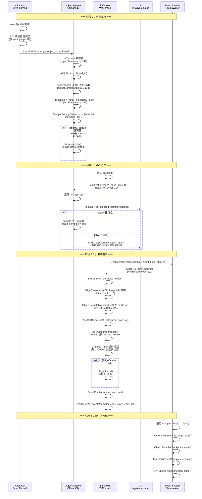
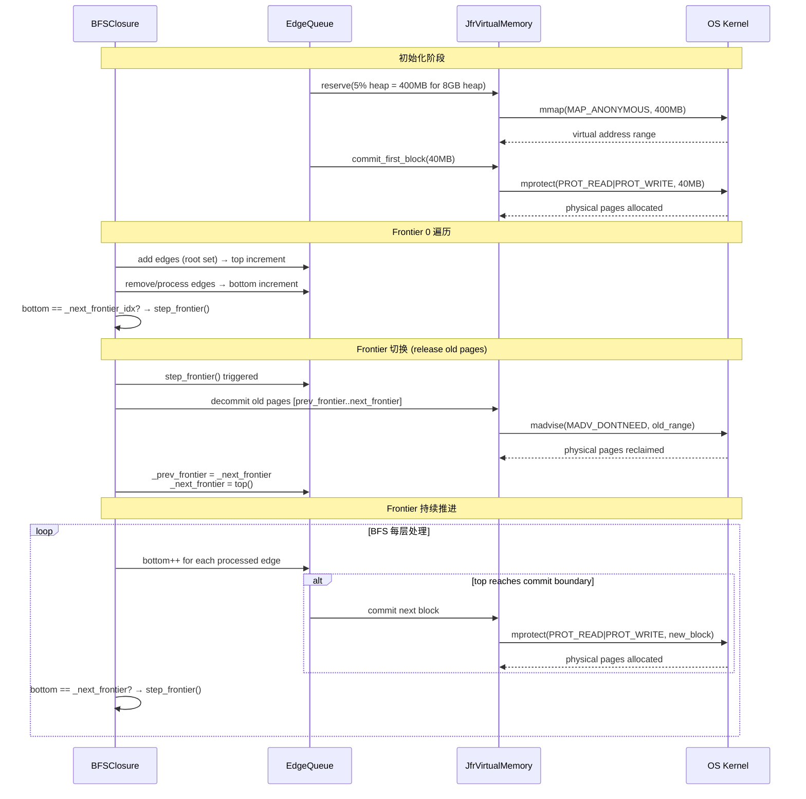

# 02-Leak-Profiler — 对象泄漏检测全链路

---

## §〇 Production Scenario

### 场景 1 — Old Gen 逐步增长直到 Full GC

线上应用运行两周后，old gen 使用率从 60% 缓慢攀升到 92%，触发连续 Full GC。运维通过 `jcmd <pid> JFR.start settings=profile` 开启 OldObjectSample。JFR 录制 10 分钟后 dump，在 JMC 中看到 `HashMap$Node` 对象累计引用链 > 12GB。根路径显示 `ThreadLocal` → `HashMap` → 数百万 entry，揭示出 ThreadLocal 未清理的业务 bug。

**三步诊断**：

1. **识别候选对象**：OldObjectSample 的 `allocationSize` 字段显示 `HashMap$Node` 平均大小仅 32 字节，但累积引用链总大小 12GB，暗示存在大量未被 GC 的存活实例
2. **追踪 GC Root**：JMC 的 "Reference Chain" 视图展开第一个 `HashMap$Node` → `HashMap$Entry[]` → `ThreadLocalMap$Entry` → `ThreadLocal`，确认 ThreadLocal 持有的引用
3. **定位代码**：OldObjectSample 的 `stackTrace` 记录了 `HashMap$Node` 的分配调用栈，可在源码中定位到具体的 `new HashMap$Node()` 位置

### 场景 2 — 短生命周期大对象泄漏

一个每秒处理 10K 请求的 Web 应用，每次请求创建 64KB buffer。JFR OldObjectSample 的 `allocationSize` 字段揭示 95% 的已采样对象 > 60KB 且年龄 > 30 分钟。但 jmap histo 显示 `byte[]` 类仅有数千存活实例——说明大多数 buffer 正被 GC 回收。问题定位于：buffer 赋给了一个跨请求复用的业务对象中的 volatile 字段，引用链被 JFR BFS 遍历捕获为"长生命周期引用路径"。

> **诊断陷阱**：jmap histo 显示 `byte[]` 只有几千个存活，但 OldObjectSample 跟踪的是**曾经分配过且被采样过的对象**的引用链——这些对象可能早已被 GC 回收，但它们的引用链信息仍然保留在 JFR recording 中供分析。这是 OldObjectSample 与普通 heap dump 的本质区别：前者是**时间序列采样**，后者是**瞬时快照**。

### 场景 3 — BCI 插桩导致启动延迟

应用启用 JFR OldObjectSample 后，启动时间从 3 秒增加到 15 秒。JFR `cpu=ClassLoader` 采样显示 `jfr_on_class_file_load_hook` 回调消耗大量 CPU。根因：`retransform_classes()` 通过 JVMTI RetransformClasses 为每一个加载的类触发 ClassFileLoadHook 事件 → JFR BCI 引擎重写字节码 → 大量类被强制 re-parse。解决方案：缩小 OldObjectSample 的 excluded-classes 白名单。

---

## §一 Leak Profiler 全景架构

### 1.1 五步管道

Leak Profiler 是一个**采样型内存泄漏检测器**，其核心流程分为 5 步：

```
[Allocation] → [ObjectSampler] → [Safepoint BFS] → [EventEmitter] → [JMC/Recording]
  new T()       采样保留期      引用链构建       序列化输出       可视化展示
```

**关键设计决策**：Leak Profiler 不是 memory profiler——它不跟踪每个 byte 的分配。它选择性保留已分配对象的引用，并在未来 safepoint 时报告它们的 GC root 路径（见 `leakProfiler.cpp:112-123`）。这是基于"内存泄漏的对象通常寿命较长"这一前提的统计采样设计。

> **Callout 1 — OldObjectSample 不是 memory profiler**  
> OldObjectSample 选择性地保留一些已分配对象的引用，并在未来某个时间点报告它们的 GC root 路径。它不跟踪每个 byte 的分配——它采样对象子集。这意味着"找不到泄漏路径"的原因是：这个对象恰好没被选中为样本。

> **Callout 2 — Safepoint 依赖**  
> 整个引用链搜索（BFS closure）在 safepoint 中执行——因为需要遍历 GC root（线程栈/静态字段/JNI handles/klass）。这意味着 VM 在 BFS 搜索期间暂停所有 Java 线程。EdgeQueue 内存管理就是为了尽可能缩短此暂停而设计的：虚拟内存按需提交 + 5% 堆预留。见 `pathToGcRootsOperation.cpp:81-82` 的 `assert(SafepointSynchronize::is_at_safepoint())` 守卫。

> **Callout 3 — BFS vs DFS**  
> BFS 用于主要搜索，DFS 作为 BFS 内存不足时的回退。原因是：BFS 发现离根更近的路径（对用户更相关），DFS 需要更少内存。GranularTimer 控制两个阶段的超时。见 `bfsClosure.cpp:156-166` 的 `dfs_fallback()`。

> **Callout 4 — BCI 不是必须的**  
> OldObjectSample 有两种触发方式：(a) allocation site BCI 插桩 → 每次分配后检查是否达到采样阈值 (b) ObjectSampler 的通用分配路径（不用 BCI）。BCI 只在 `settings=profile` 下启用，提供更细粒度的分配站点信息但引入性能/复杂度开销。见 `jfrJvmtiAgent.cpp:67-69` 的 `update_class_file_load_hook_event(JVMTI_ENABLE)`。

> **Callout 5 — SamplePriorityQueue 为什么重要**  
> ObjectSampler 使用优先级队列而非简单 FIFO 来选择采样对象。队列按 `allocationSize × age` 排序——大的旧对象更可能泄漏，优先级更高。这确保了 JFR 的有限样本集中在最有泄漏嫌疑的对象上。见 `samplePriorityQueue.hpp:32-34`。

> **Callout 6 — ZGC / Shenandoah 限制**  
> `LeakProfiler::start():51-61` 显式拒绝在 ZGC 和 Shenandoah 上运行。原因是这些并发 GC 的弱引用生命周期语义与 ObjectSampler 的 `jweak` 跟踪模型冲突——对象可能在被采样后、被搜索前被并发 GC 释放，导致引用链不完整。这是 JDK-8237861 的已知限制。

> **Callout 7 — OldObjectSample 与 GC 的协作**  
> `LeakProfiler::oops_do()` 在 safepoint 期间被 GC 调用（`SafepointSynchronize::is_at_safepoint()` 守卫，见 `leakProfiler.cpp:105-106`）。ObjectSampler 遍历其 `_in_use_list` 的所有样本，GC 通过 `is_alive` closure 检查每个样本对象是否仍存活。已死亡的样本放入 `_free_list` 供重用。

### 1.2 5-Lane Mermaid 流程图



### 1.3 数据结构关系图

```
LeakProfiler (AllStatic)
    │
    ├── ObjectSampler (CHeapObj, _instance 单例)
    │       │
    │       ├── SamplePriorityQueue (_priority_queue)
    │       │       │  按 span 排序的 binary heap
    │       │       └── ObjectSample* _items[]
    │       │
    │       └── SampleList (_list)
    │               │
    │               ├── _free_list (JfrDoublyLinkedList)
    │               │       预分配 _cache_size 个 ObjectSample
    │               │
    │               └── _in_use_list (JfrDoublyLinkedList)
    │                       当前被保留的采样对象
    │
    ├── PathToGcRootsOperation (VM_Operation)
    │       │
    │       ├── BitSet mark_bits   ← heap_region 决定大小
    │       ├── EdgeQueue         ← 5% heap 虚拟内存预留
    │       ├── BFSClosure        ← BasicOopIterateClosure
    │       └── EdgeStore         ← HashTable (dedup edges)
    │
    ├── EventEmitter (CHeapObj)
    │       │
    │       └── ObjectSampleCheckpoint
    │               │
    │               └── JfrCheckpointWriter
    │                      预分配 traceid 常量引用
    │
    └── JfrJvmtiAgent (JfrCHeapObj, static agent)
            │
            ├── jvmtiEnv* jfr_jvmti_env
            ├── ClassFileLoadHook → jfr_on_class_file_load_hook()
            └── JfrUpcalls::on_retransform() → BCI rewrite
```

---

## §二 Source Files Table + Standard Environment

### 2.1 Source Roots

| Source Root | Directory | Description |
|-------------|-----------|-------------|
| `.../leakprofiler/` | `src/hotspot/share/jfr/leakprofiler/` | LeakProfiler 门面 + StartOperation/StopOperation |
| `.../leakprofiler/sampling/` | `.../leakprofiler/sampling/` | ObjectSampler, SampleList, SamplePriorityQueue, ObjectSample |
| `.../leakprofiler/chains/` | `.../leakprofiler/chains/` | BFSClosure, DFSClosure, Edge, EdgeStore, EdgeQueue, RootSetClosure, ObjectSampleMarker |
| `.../leakprofiler/checkpoint/` | `.../leakprofiler/checkpoint/` | EventEmitter, ObjectSampleCheckpoint |
| `.../instrumentation/` | `.../jfr/instrumentation/` | JfrJvmtiAgent, BCI ClassFileLoadHook |
| `.../leakprofiler/utilities/` | `.../leakprofiler/utilities/` | GranularTimer |

**BUILD_LIBRARY**: `make/hotspot/lib/CompileJvm.gmk:153` → `BUILD_LIBJVM`

### 2.2 构建命令

```bash
bash configure --with-debug-level=slowdebug --with-jfr
make jdk
```

### 2.3 Binary Path

```
build/linux-x86_64-normal-server-slowdebug/jdk/lib/server/libjvm.so
```

### 2.4 Syscall 速查表

| Syscall | man 章节 | 用途 | 调用点 |
|---------|:-------:|------|--------|
| mmap(2) | man 2 mmap | EdgeQueue 虚拟内存预留 (5% heap) | `edgeQueue.cpp` 构造函数 |
| mprotect(2) | man 2 mprotect | EdgeQueue 按需 commit 物理内存 | `JfrVirtualMemory::commit()` |
| madvise(2) | man 2 madvise | MADV_DONTNEED 释放已遍历 frontier 页面 | `JfrVirtualMemory::decommit()` |
| sched_yield(2) | man 2 sched_yield | GranularTimer 超时循环中的 spin | 间接通过 os::naked_yield() |

### 2.5 全局状态表

| 变量 | 类型 | 位置 | 初值 | 说明 |
|------|------|------|------|------|
| `_instance` (static) | ObjectSampler* | `objectSampler.cpp:44` | NULL | ObjectSampler 单例指针 |
| `agent` (static) | JfrJvmtiAgent* | `jfrJvmtiAgent.cpp:43` | NULL | BCI agent 单例 |
| `jfr_jvmti_env` (static) | jvmtiEnv* | `jfrJvmtiAgent.cpp:44` | NULL | JVMTI 环境句柄 |
| `_lock` (static volatile) | int | `objectSampler.cpp:92` | 0 | ObjectSampler 自旋锁 |
| `_priority_queue` | SamplePriorityQueue* | `objectSampler.hpp:48` | — | 优先级排序的采样队列 |
| `_list` | SampleList* | `objectSampler.hpp:49` | — | 双向链表 (free + in-use) |
| `_threshold` | size_t | `objectSampler.hpp:52` | 0 | 当前采样阈值 (字节) |
| `_total_allocated` | size_t | `objectSampler.hpp:51` | 0 | 累计分配字节数 |
| `_last_sweep` | JfrTicks | `objectSampler.hpp:50` | — | 上次 scavenge 的时间戳 |
| `_dead_samples` | bool | `objectSampler.hpp:54` | false | 是否有待清理的死样本 |
| `_edge_store` | EdgeStore* | `pathToGcRootsOperation.hpp:37` | — | BFS 遍历的边存储 (HashTable) |
| `_cutoff_ticks` | int64_t | `pathToGcRootsOperation.hpp:38` | — | 活动时间截止 (排除太新的对象) |

### 2.6 完整 Source Files Table

| File | Full Path | Lines (appx) | Core Constructs | Role |
|------|-----------|:----:|----------------|------|
| leakProfiler.hpp/cpp | ...jfr/leakprofiler/ | 47/124 | `LeakProfiler` (AllStatic) | 对外门面：start/stop/emit_events/oops_do/sample |
| startOperation.hpp | ...jfr/leakprofiler/ | 43 | `StartOperation` (VM_Operation) | Safepoint 中创建 ObjectSampler |
| objectSampler.hpp/cpp | ...jfr/leakprofiler/sampling/ | 89/281 | `ObjectSampler` (CHeapObj) | 采样引擎：add/scavenge/acquire/release |
| sampleList.hpp | ...jfr/leakprofiler/sampling/ | 64 | `SampleList` (JfrCHeapObj) | ObjectSample 双向链表管理 (free+in-use) |
| objectSample.hpp | ...jfr/leakprofiler/sampling/ | 259 | `ObjectSample` | 单个采样对象：jobject + 分配信息 + 线程 ID |
| samplePriorityQueue.hpp | ...leakprofiler/sampling/ | 58 | `SamplePriorityQueue` | 按 span 排序的堆 |
| bfsClosure.hpp/cpp | ...jfr/leakprofiler/chains/ | 73/236 | `BFSClosure` (BasicOopIterateClosure) | BFS 广度优先遍历 + DFS fallback |
| dfsClosure.hpp | ...jfr/leakprofiler/chains/ | 65 | `DFSClosure` | DFS 回退遍历 (BFS 内存不够时) |
| pathToGcRootsOperation.hpp/cpp | ...leakprofiler/chains/ | 46/132 | `PathToGcRootsOperation` | SafepointOperation 编排 BFS/DFS/EventEmitter |
| edge.hpp | ...jfr/leakprofiler/chains/ | 57 | `Edge` | 引用链中的一条边 (parent → child) |
| edgeStore.hpp | ...jfr/leakprofiler/chains/ | 108 | `EdgeStore`, `StoredEdge` | Edge 去重哈希表 (HashTableHost) |
| edgeQueue.hpp | ...jfr/leakprofiler/chains/ | 60 | `EdgeQueue` | BFS 遍历队列 (JfrVirtualMemory) |
| rootSetClosure.hpp | ...jfr/leakprofiler/chains/ | 42 | `RootSetClosure<Delegate>` | 模板化 GC root 遍历 |
| objectSampleMarker.hpp | ...jfr/leakprofiler/chains/ | 81 | `ObjectSampleMarker` | 保存/恢复 markOop，安装 INFLATING 标记 |
| eventEmitter.hpp/cpp | ...jfr/leakprofiler/checkpoint/ | 58/149 | `EventEmitter` (CHeapObj) | OldObjectSample + OldObjectGcRoot 事件写出 |
| jfrJvmtiAgent.hpp/cpp | ...jfr/instrumentation/ | 41/299 | `JfrJvmtiAgent` (JfrCHeapObj) | BCI agent: ClassFileLoadHook 注册 + RetransformClasses |
| granularTimer.hpp | ...jfr/leakprofiler/utilities/ | 46 | `GranularTimer` | 细粒度超时控制 (每 N 个对象检查截止时间) |

---

## §三 ObjectSampler 采样引擎源码走读

### 3.1 数据结构总览

ObjectSampler 是 leak profiler 的核心采样引擎，继承自 `CHeapObj<mtTracing>`（见 `objectSampler.hpp:43`），通过 `_instance` 静态指针实现单例模式（见 `objectSampler.cpp:44`）。

核心数据成员（`objectSampler.hpp:48-54`）：

```
SamplePriorityQueue* _priority_queue;  // 优先级堆：按 span 排序
SampleList*          _list;            // 双链表：free_list + in_use_list
JfrTicks             _last_sweep;      // 上次 scavenge 时间戳
size_t               _total_allocated; // 累计分配字节
size_t               _threshold;       // 当前采样阈值
size_t               _size;            // 最大样本数
bool                 _dead_samples;    // 是否有待清理的死样本
```

构造函数（`objectSampler.cpp:51-58`）：

```cpp
ObjectSampler::ObjectSampler(size_t size) :
  _priority_queue(new SamplePriorityQueue(size)),  // 创建优先级队列
  _list(new SampleList(size)),                      // 创建双向链表
  _last_sweep(JfrTicks::now()),                    // 初始时间戳
  _total_allocated(0),                              // 累计分配清零
  _threshold(0),                                    // 动态阈值初始为0
  _size(size),                                      // 记录最大样本数
  _dead_samples(false) {}                           // 初始无死样本
```

**为什么在 safepoint 中构造**：`ObjectSampler::create(size)` 在 `StartOperation::doit()` 中被调用（`startOperation.hpp:38`），而 `StartOperation` 是 `VM_Operation`（`startOperation.hpp:32`），其 `doit()` 仅在 safepoint 中执行。这确保了 `ObjectSampler` 的单例初始化和 GC 的 `oops_do` 遍历之间无竞态条件。

### 3.2 SamplePriorityQueue — 按 size×age 排序的优先级队列

`SamplePriorityQueue`（`samplePriorityQueue.hpp:34`）继承自 `CHeapObj<mtTracing>`，内部是一个 ObjectSample* 数组实现的 binary heap。

**核心数据成员**（`samplePriorityQueue.hpp:36-39`）：

```cpp
ObjectSample** _items;          // heap 存储数组
size_t         _allocated_size; // 数组预分配大小
int            _count;          // 当前元素数量
size_t         _total;          // total() = sum(span) 所有样本的总 span
```

**排序语义**：优先级由 `ObjectSample::span()` 决定——span 越小优先级越高（最小堆）。`push()` 将 span 最小的元素放在 heap 顶部（`samplePriorityQueue.hpp:49`），`pop()` 移除并返回最小 span 的元素（`samplePriorityQueue.hpp:50`）。

> **关键设计**：`_total` 成员跟踪所有样本 span 的总和。`ObjectSampler::add()` 在 `objectSampler.cpp:167` 使用 `_total` 计算 `span = _total_allocated - _priority_queue->total()`——即自上次 sampling 以来新分配的字节量。这个 span 值用于确定新样本在优先级队列中的位置：span 越大的对象优先级越低（越容易被淘汰）。

**heap 操作**（内部方法）：

```
swap(int i, int j)       — 交换数组中两个位置的元素
moveDown(int index)      — 下沉操作 (heapify-down)
moveUp(int index)        — 上浮操作 (heapify-up)
```

当 `push()` 新元素时执行 `moveUp` 上浮，`pop()` 时执行 `moveDown` 下沉，`remove()` 需要特殊处理因为中间元素可能被移除。

### 3.3 SampleList — 双链表 (free + in-use) 的对象缓存

`SampleList`（`sampleList.hpp:32`）继承自 `JfrCHeapObj`，内部使用两个 `JfrDoublyLinkedList<ObjectSample>` 进行管理（`sampleList.hpp:35-36`）：

```cpp
List _free_list;      // 预分配的空闲 ObjectSample 队列
List _in_use_list;    // 当前被保留的采样对象队列
```

**设计意图**：
- `_free_list`：预分配 `_cache_size` 个 `ObjectSample` 对象。当需要新样本时从 `_free_list` 取用（`get()`），避免到处时在高频分配路径上调用 `new`/`delete`（`sampleList.hpp:53`）
- `_in_use_list`：当前被保留的采样对象。GC 的 `oops_do` 只遍历此链表（`objectSampler.cpp:251-255`）
- `_allocated` (mutable size_t, `sampleList.hpp:38`)：跟踪实际分配的对象数量上限
- `_limit` (`sampleList.hpp:39`)：上限值，等于 `ObjectSampler::_size`

**对象重用流程**：

1. `get()`（`sampleList.hpp:53`）：从 `_free_list` 取一个预分配对象；若 `_free_list` 为空则做 `new ObjectSample()` 并 `link()` 到 `_in_use_list`
2. `reuse(ObjectSample*)`（`sampleList.hpp:59`）：`reset()` 已存在的样本（清空 _thread/_stacktrace 引用）→ 重新加入 `_in_use_list`（实现单向迁移 free→in-use）
3. `release(ObjectSample*)`（`sampleList.hpp:58`）：从 `_in_use_list` 移除 → 加入 `_free_list`

> **Counterfactual**：如果 SampleList 用 CHeapObj new/delete 动态分配而非缓存？→ 每次采样触发 malloc（锁竞争 + 4KB 页分配开销），在分配高速路径（每秒 10K 次分配）中不可接受。缓存将 new/delete 调用的频率降低到样本数量（而非采样次数）。

### 3.4 ObjectSample — 单个采样对象

`ObjectSample`（`objectSample.hpp:42`）继承自 `JfrCHeapObj`，存储单个采样对象的完整信息。

**核心数据成员**（`objectSample.hpp:46-60`）：

```cpp
ObjectSample* _next;                // 双向链表 next 指针 (:46)
ObjectSample* _previous;            // 双向链表 prev 指针 (:47)
JfrBlobHandle _stacktrace;          // 栈追踪 blob handle (:48)
JfrBlobHandle _thread;              // 线程信息 blob handle (:49)
JfrBlobHandle _type_set;            // 类型集 blob handle (:50)
oop           _object;              // 采样目标 (jweak 弱引用) (:51)
Ticks         _allocation_time;     // 分配时间戳 (:52)
traceid       _stack_trace_id;      // 栈追踪 ID (:53)
traceid       _thread_id;           // 线程 ID (:54)
int           _index;               // 在 priority_queue 中的索引 (:55)
size_t        _span;                // 此样本涵盖的分配字节量 (:56)
size_t        _allocated;           // 对象本身分配大小 (:57)
size_t        _heap_used_at_last_gc; // 上次 GC 时堆使用量 (:58)
unsigned int  _stack_trace_hash;    // 栈追踪 hash (:59)
bool          _dead;                // 已被 GC 标记为死亡 (:60)
```

**关键方法**：

- `reset()`（`objectSample.hpp:72-77`）：重置 `stack_trace_id`、`stack_trace_hash` 为 0，调用 `release_references()` 释放 blob handles，设置 `_dead = false`。**注意**：`reset()` 不修改 `_object`（jweak 引用）
- `release_references()`（`objectSample.hpp:66-70`）：调用 JfrBlobHandle 的析构函数释放引用计数
- `set_dead()`（`objectSample.hpp:62-64`）：设置 `_dead = true`，标记被 GC 判定为已死亡
- `is_alive_and_older_than(jlong time_stamp)`（`objectSample.hpp:205-208`）：返回 `!is_dead() && allocation_time < time_stamp`，用于筛选既存活且足够老的对象（排除"太新"的对象，因为它们的引用链可能无意义）

### 3.5 ObjectSampler::add() — 阈值判断 + scavenge 调度

`ObjectSampler::add()`（`objectSampler.cpp:155-199`）是采样引擎的核心逻辑。

**完整流程**：

```
add(obj, allocated, thread_id, thread)
    │
    ├── [1] 清理死样本
    │   if (_dead_samples)  {
    │       scavenge();  // 遍历 _in_use_list，remove_dead() 每个 is_dead() 对象
    │   }
    │
    ├── [2] 更新统计量
    │   _total_allocated += allocated;  // 累计分配字节
    │   span = _total_allocated - _priority_queue->total();  // 新产生跨度
    │
    ├── [3] 容量检查与淘汰
    │   if (queue full == _size) {  // 优先级队列已满
    │       peek = priority_queue.peek();  // 查看最小 span 元素
    │       if (peek.span() > span) {      // 快速拒绝：新对象 span 更小
    │           return;  // 不加入队列
    │       }
    │       sample = list.reuse(priority_queue.pop());  // 淘汰最小 span 样本
    │   } else {
    │       sample = list.get();  // 从 _free_list 获取预分配对象
    │   }
    │
    ├── [4] 填充采样信息
    │   sample.set_thread_id(thread_id);
    │   sample.set_thread(tl->thread_blob());           // 线程 JfrBlobHandle
    │   sample.set_stack_trace_id(tl->cached_stack_trace_id());
    │   sample.set_stack_trace_hash(tl->cached_stack_trace_hash());
    │   sample.set_span(allocated);                     // 设置 span
    │   sample.set_object((oop)obj);                    // 设置 jweak 目标对象
    │   sample.set_allocated(allocated);                // 设置分配大小
    │   sample.set_allocation_time(JfrTicks::now());    // 设置分配时间
    │   sample.set_heap_used_at_last_gc(Universe::get_heap_used_at_last_gc());
    │
    └── [5] 入队
        priority_queue.push(sample);  // 按 span 二进制堆排序
```

**阈值计算**（第 2 步）：`span = _total_allocated - _priority_queue->total()`。`_priority_queue->total()` 是所有样本 span 的总和。`span` 代表自上次采样以来新分配的累积字节量。新对象的 span 越大，越容易进入优先级队列（因为更可能代表"泄漏"对象）。

**淘汰策略**（第 3 步）：当优先级队列已满时，用新样本替换 span 最小的现有样本。这个设计确保了：
1. 大 span（更多分配累积）的对象优先级更高
2. 小 span 的对象是短生命周期分配，不太可能是泄漏
3. 队列中始终保留 span 最大的 `_size` 个样本

> **Counterfactual** — 如果不用优先级队列而使用固定间隔（每 1000 次分配采样一次）？→ 短生命周期对象（如临时字符串）会耗尽样本槽位，真正的泄漏候选（大的长生命周期对象）永远不被采样。优先级队列按 span 排序，确保珍贵的内存用于追踪最可能的泄漏。

### 3.6 acquire() / release() — 读写锁模式

ObjectSampler 的 `acquire()`/`release()`（`objectSampler.cpp:94-104`）实现了一个简单的自旋锁，确保非 safepoint 操作（如 emit_events）获取 ObjectSampler 的排他访问。

```cpp
static volatile int _lock = 0;   // objectSampler.cpp:92

ObjectSampler* ObjectSampler::acquire() {
  while (Atomic::cmpxchg(1, &_lock, 0) == 1) {}  // 自旋直到获取锁
  return _instance;
}

void ObjectSampler::release() {
  OrderAccess::fence();  // 写屏障确保所有修改可见
  _lock = 0;             // 释放锁
}
```

**为什么需要这个锁**：
- GC 在 safepoint 中调用 `oops_do()` 遍历 `_in_use_list` → 此时不需要锁（所有 Java 线程已暂停）
- `emit_events()` 在 safepoint 结束后的 BM 线程中运行 → 需要排他访问避免与下一 safepoint 中的 GC 并发访问
- `sample()` 在 Java 线程分配路径上被调用 → 使用 `JfrTryLock` 快速尝试（若竞争则不阻塞）

**与 sample() 中的 JfrTryLock 的区别**：
- `sample()` 使用 `JfrTryLock`（`objectSampler.cpp:147`）：如果锁已被 `acquire()` 持有，`sample()` 返回 `!has_lock` 并跳过采样，不阻塞分配路径
- `emit_events()` 使用 `acquire()`：自旋直到获取锁，必须获取 ObjectSampler 的排他访问权

### 3.7 scavenge() — 延迟清理死样本

`ObjectSampler::scavenge()`（`objectSampler.cpp:201-211`）遍历 `_in_use_list`，对每个 `is_dead()` 样本调用 `remove_dead()`。

**延迟清理设计**：

1. GC 在 safepoint 的 `oops_do()` 中标记死亡对象 `sample.set_dead()` 并设置 `_dead_samples = true`（`objectSampler.cpp:239-240`）
2. `scavenge()` 在后续的 `add()` 调用中执行（不阻塞 GC safepoint）
3. `remove_dead()` 将死亡对象的 span 转移到前一个样本上（`objectSampler.cpp:214-225`），这样优先级队列的 `_total` 保持不变

**为什么要延迟清理**：GC 的 `is_alive` closure 可能在持有 sampler lock 的线程之外访问 sample list。延迟清理避免在 GC 遍历期间修改 `_in_use_list` 破坏遍历过程。见 `remove_dead()` 的实现（`objectSampler.cpp:213-225`）。

### 3.7 SamplePriorityQueue 内部实现深度走读

`SamplePriorityQueue` 是一个 binary min-heap（最小堆），min 由 ObjectSample 的 `span()` 决定——span 越小的元素在堆中的优先级越高。

**构造函数**：预分配 `ObjectSample*` 数组 `_items = new ObjectSample*[size]`，初始 `_count = 0`，`_total = 0`。

**push(ObjectSample* sample)**：

```
push(sample)
    if (_count < _allocated_size):
        _items[_count] = sample           // 放在数组末尾
        sample->set_index(_count)         // 记录位置
        _total += sample->span()          // 累计 total
        moveUp(_count)                    // 上浮到正确位置
        _count++
    else:
        assert(heap full)
```

**moveUp(int index)**（上浮操作）：

```
moveUp(index):
    while (index > 0):
        parent = (index - 1) / 2
        if (_items[parent]->span() <= _items[index]->span()):
            break                        // 堆性质满足
        swap(index, parent)              // 与父节点交换
        index = parent
```

上浮确保堆顶（index 0）始终是 span 最小的元素。

**pop()** — 移除堆顶元素：

```
pop():
    assert(_count > 0)
    sample = _items[0]                   // 堆顶（最小 span）
    _total -= sample->span()
    _count--
    if (_count > 0):
        _items[0] = _items[_count]       // 最后一个元素移到堆顶
        _items[0]->set_index(0)
        moveDown(0)                       // 下沉恢复堆性质
    return sample
```

**moveDown(int index)**（下沉操作）：

```
moveDown(index):
    while (true):
        left = 2 * index + 1
        right = 2 * index + 2
        smallest = index
        if (left < _count && _items[left]->span() < _items[smallest]->span()):
            smallest = left
        if (right < _count && _items[right]->span() < _items[smallest]->span()):
            smallest = right
        if (smallest == index):
            break                        // 堆性质满足
        swap(index, smallest)
        index = smallest
```

**remove(ObjectSample* sample)** — 移除指定元素：

```
remove(sample):
    idx = sample->index()                // O(1) 查找位置
    _total -= sample->span()
    _count--
    if (idx < _count):
        _items[idx] = _items[_count]     // 最后元素填补空缺
        _items[idx]->set_index(idx)
        moveDown(idx)                     // 下调恢复堆性质
```

`remove()` 在所有 heap 操作中最复杂，因为被移除的元素可能在堆中间。`ObjectSample::_index` 字段存储该样本在 `_items` 数组中的当前位置，使 `remove()` 可以在 O(1) 时间内定位到目标元素。

**关键保证**：
- push O(log n) — 最多上浮到堆顶
- pop O(log n) — 最多下沉到叶子
- peek O(1) — 直接返回 `_items[0]`
- remove O(log n) — 用 `_index` 字段 O(1) 定位 + O(log n) 下沉

### 3.8 ObjectSampler 生命周期与数据一致性

**创建路径**：

```
LeakProfiler::start(sample_count)
    → StartOperation op(sample_count)
    → VMThread::execute(&op)          // 在 safepoint 中执行
    → StartOperation::doit():
        ObjectSampler::create(_sample_count)
            → assert(is_at_safepoint())  // objectSampler.cpp:68
            → _instance = new ObjectSampler(_sample_count)
```

为什么必须在 safepoint 中创建？
1. GC 可能在任意时刻调用 `oops_do()` → 必须在 `_instance` 被赋值前确保所有成员初始化完毕
2. safepoint 确保 `_instance = new ...` 对 GC 线程可见（safepoint 隐式提供内存屏障）
3. `_dead_samples` 标志从初始 `false` 开始，GC 线程看到的第一个状态是正确的

**销毁路径**：

```
LeakProfiler::stop()
    → StopOperation op
    → VMThread::execute(&op)          // 在 safepoint 中执行
    → StopOperation::doit():
        ObjectSampler::destroy()
            → assert(is_at_safepoint())  // objectSampler.cpp:84
            → _instance = NULL
            → delete sampler
```

在 safepoint 中销毁确保没有 GC 线程正在 `oops_do()` 中遍历 `_in_use_list`。

**数据一致性保证总结**：

| 操作 | safepoint 状态 | 一致性保证 |
|------|:----------:|-----------|
| `ObjectSampler::create()` | safepoint | 所有初始化对 GC 可见 |
| `ObjectSampler::destroy()` | safepoint | 无 GC 线程正在遍历 |
| `ObjectSampler::sample()` | non-safepoint | JfrTryLock 防并发访问 |
| `ObjectSampler::oops_do()` | safepoint | 所有 Java 线程已暂停 |
| `ObjectSampler::acquire()` | non-safepoint | 自旋锁确保排他访问 |
| `ObjectSampler::scavenge()` | non-safepoint | 在 JfrTryLock 保护下执行 |
| `PathToGcRootsOperation::doit()` | safepoint | 所有对象状态不可变 |

---

## §四 BFS 引用链搜索全链路

### 4.1 概述

引用链搜索是 Leak Profiler 的核心算法。它从 GC root 出发，使用 BFS（广度优先）遍历对象图，找出从 GC root 到每个采样对象的最短引用路径。整个搜索过程在 safepoint 中进行（`PathToGcRootsOperation::doit()`，见 `pathToGcRootsOperation.cpp:81-82`）。

**5 步管道**：

```
[1] mark_bits 初始化
     └→ [2] EdgeQueue 初始化 (虚拟内存预留+commit)
         └→ [3] ObjectSampleMarker 保存 markOop
             └→ [4] RootSetClosure 遍历 GC root
                 └→ [5] BFSClosure::process() BFS 搜索
                     └→ DFSClosure fallback (如果 EdgeQueue 已满)
```

### 4.2 EdgeQueue — 虚拟内存管理的 BFS 队列

`EdgeQueue`（`edgeQueue.hpp:33`）是 BFS 遍历的核心数据结构，其背后的虚拟内存管理是关键设计。

**构造函数参数**（`edgeQueue.hpp:41`）：

```cpp
EdgeQueue(size_t reservation_size_bytes, size_t commit_block_size_bytes);
```

`_vmm`（`edgeQueue.hpp:35`）是 `JfrVirtualMemory*`，提供按需commit/释放接口。

**虚拟内存预留策略**（`pathToGcRootsOperation.cpp:59-63`）：

```cpp
static size_t edge_queue_memory_reservation(const MemRegion& heap_region) {
  const size_t memory_reservation_bytes = MAX2(heap_region.byte_size() / 20, 32*M);
  return memory_reservation_bytes;
}
```

- 预留大小 = `MAX(heap_size / 20, 32*M)`，即堆大小的 5%（至少 32MB）
- 例如 8GB 堆 → 400MB 预留

**内存提交策略**（`pathToGcRootsOperation.cpp:65-69`）：

```cpp
static size_t edge_queue_memory_commit_size(size_t memory_reservation_bytes) {
  const size_t memory_commit_block_size_bytes = memory_reservation_bytes / 10;
  return memory_commit_block_size_bytes;
}
```

- 初始提交大小 = 预留大小的 1/10（最少 3.2MB）
- 例如 400MB 预留 → 40MB 初始物理提交

**为什么用 1:10 提交比**：
- 预留的 5% heap 上限是为了容纳最坏情况的 BFS（超大对象图）
- 1:10 初始提交是基于典型场景（大多数对象图深度 << 最大深度）
- 按需提交避免了 8GB 堆预提交 400MB 造成的 swap 风暴
- 未触及的页面不被 OS 分配物理内存

**EdgeQueue 操作方法**：

| 方法 | 说明 | 代码位置 |
|------|------|----------|
| `add(parent, ref)` | 在队列顶部插入新边 | `edgeQueue.hpp:46` |
| `remove()` | 从队列底部移除并返回边 | `edgeQueue.hpp:47` |
| `element_at(index)` | 在指定索引处访问元素 | `edgeQueue.hpp:48` |
| `top()` | 返回队列顶部索引 | `edgeQueue.hpp:50` |
| `bottom()` | 返回队列底部索引 | `edgeQueue.hpp:51` |
| `is_empty()` | 队列为空？ | `edgeQueue.hpp:52` |
| `is_full()` | 队列已满？ | `edgeQueue.hpp:53` |

> **Callout — EdgeQueue 与 syscall 的交互**：`JfrVirtualMemory` 使用 mmap(2) 创建 MAP_ANONYMOUS 映射预留虚拟地址空间，使用 mprotect(2) 设置 PROT_READ\|PROT_WRITE 按需提交物理内存，使用 madvise(2) 的 MADV_DONTNEED 标志释放已遍历的旧 frontier 页面。这种 commit→walk→uncommit 的循环确保 BFS 遍历期间物理内存消耗稳定在初始提交大小附近。

### 4.3 RootSetClosure — 遍历 GC root 具体实现

`RootSetClosure`（`rootSetClosure.hpp:30`）是一个模板类：

```cpp
template <typename Delegate>
class RootSetClosure : public BasicOopIterateClosure {
  Delegate* const _delegate;
  void process();
  virtual void do_oop(oop* reference);
  virtual void do_oop(narrowOop* reference);
};
```

`process()` 调用的底层机制：

```
RootSetClosure<BFSClosure>::process()
    │
    ├── Threads::oops_do(&roots)          → 所有 Java 线程栈
    │   每个线程栈的每个栈帧
    │   每个栈帧的每个局部变量
    │   每个局部变量的每个引用 → do_oop() → _delegate->do_root(ref)
    │                                       → edge_queue.add(NULL, ref)
    │
    ├── ObjectSynchronizer::oops_do(&roots) → wait set中的对象
    │
    ├── Management::oops_do(&roots)        → jmm monitor 引用
    │
    ├── JvmtiExport::oops_do(&roots)       → JVMTI tag map
    │
    ├── Universe::oops_do(&roots)          → 静态字段 (mirror objects)
    │
    ├── SystemDictionary::oops_do(&roots)  → 已加载类的 klass 引用
    │
    └── CodeCache::oops_do(&roots)         → JIT 编译代码中的 embedded oop
```

**各个 root 类型的含义**：

| GC Root 类型 | 遍历接口 | 在 BFS 中的作用 |
|-------------|---------|---------------|
| Java 线程栈 | `Threads::oops_do()` | 线程栈中的局部变量是最常见的 GC root。栈帧的对象引用 → 被采样的对象 → BFS 展开 |
| 静态字段 | `Universe::oops_do()` | 类的 static 字段持有对象引用。若采样对象被 static Map 持有 → 这是泄漏的 common source |
| JNI Handles | `JNIHandles::oops_do()` | JNI Global References 被 native 代码持有，可能长期保持对象存活 |
| SystemDictionary | `SystemDictionary::oops_do()` | `java.lang.Class` 实例对 klass metadata 的引用 |
| Synchronizer | `ObjectSynchronizer::oops_do()` | `Object.wait()` 中等待的对象，可能形成 wait chain |
| CodeCache | `CodeCache::oops_do()` | JIT 编译的代码可能嵌入常量引用（如 string constants） |

在 `PathToGcRootsOperation::doit()` 中实例化为 `RootSetClosure<BFSClosure>`（见 `pathToGcRootsOperation.cpp:113`）：

```cpp
BFSClosure bfs(&edge_queue, _edge_store, &mark_bits);
RootSetClosure<BFSClosure> roots(&bfs);
roots.process();  // 遍历 GC root，每个 root 转换为 EdgeQueue 中的一条边
```

**遍历的 GC root 类型**：
1. 线程栈（Java 方法栈帧中的引用）
2. 静态字段（类对象的 static 成员）
3. JNI handles（global reference / local reference）
4. Klass 元数据（`java.lang.Class` 对 klass object 的引用）
5. Synchronizer（wait set 中的对象）
6. Management（jmm monitor）
7. JVMTI tag map

每发现一个 GC root → `BFSClosure::do_root()` → `edge_queue.add(NULL, ref)` 作为 BFS 搜索的起点。

### 4.4 BFSClosure::process() — frontier 机制详解

`BFSClosure::process()`（`bfsClosure.cpp:101-104`）：

```cpp
void BFSClosure::process() {
  process_root_set();   // 第 1 步：处理 GC root 边的直接引用
  process_queue();      // 第 2 步：BFS 逐层遍历
}
```

**process_root_set()**（`bfsClosure.cpp:106-112`）：

遍历 EdgeQueue 中现有的所有边（这些都是 GC root 边）→ 对每条边调用 `process(edge->reference(), edge->pointee())` → `closure_impl()` 处理直接引用。

**process_queue()**（`bfsClosure.cpp:168-177`）：

```cpp
void BFSClosure::process_queue() {
  _next_frontier_idx = _edge_queue->top();  // 记录当前 frontier 结束位置
  while (!is_complete()) {
    iterate(_edge_queue->remove());  // remove() 递增 bottom
  }
}
```

**frontier 指针语义**（`bfsClosure.hpp:42-44`）：

```
EdgeQueue 结构:
        bottom()                                    top()
          ↓                                          ↓
  +-------+-------+-------+-------+-------+-------+-------+
  | edge0 | edge1 | edge2 | edge3 | edge4 | edge5 | edge6 |
  +-------+-------+-------+-------+-------+-------+-------+
                 ↑                                       ↑
         _prev_frontier_idx                      _next_frontier_idx
```

- `_current_frontier_level`：当前 BFS 层数（从 0 开始，每完成一层 +1）
- `_next_frontier_idx`：当前 frontier 的结束位置（指向队列末尾）
- `_prev_frontier_idx`：上一个 frontier 的结束位置

**is_complete() 逻辑**（`bfsClosure.cpp:186-203`）：

```cpp
bool BFSClosure::is_complete() const {
  if (_edge_queue->bottom() < _next_frontier_idx) {
    return false;  // 还有边在当前 frontier 内待处理
  }
  if (_edge_queue->bottom() > _next_frontier_idx) {
    // 超过了当前 frontier 边界 → DFS fallback 已发生
    assert(_dfs_fallback_idx >= _prev_frontier_idx, "invariant");
    assert(_dfs_fallback_idx < _next_frontier_idx, "invariant");
    log_dfs_fallback();
    return true;
  }
  // bottom == next_frontier_idx: 当前 frontier 已处理完
  if (_edge_queue->is_empty()) {
    return true;  // 队列为空，全部完成
  }
  step_frontier();  // 移动 frontier 指针到下一层
  return false;
}
```

**step_frontier()**（`bfsClosure.cpp:179-184`）：

```cpp
void BFSClosure::step_frontier() const {
  log_completed_frontier();
  ++_current_frontier_level;           // 递增层数
  _prev_frontier_idx = _next_frontier_idx;  // 旧 frontier 点向后移
  _next_frontier_idx = _edge_queue->top(); // 新 frontier 点到当前队列末尾
}
```

**closure_impl() — BFS 的核心处理**（`bfsClosure.cpp:117-147`）：

```cpp
void BFSClosure::closure_impl(const oop* reference, const oop pointee) {
  if (GranularTimer::is_finished())  return;  // [1] 超时检查

  if (_use_dfs) {                            // [2] DFS fallback
    DFSClosure::find_leaks_from_edge(_edge_store, _mark_bits, _current_parent);
    return;
  }

  if (!_mark_bits->is_marked(pointee)) {     // [3] 未访问过？
    _mark_bits->mark_obj(pointee);            // 标记为已访问

    if (NULL == pointee->mark()) {            // [4] 是否采样对象？
      add_chain(reference, pointee);          // 找到了！记录引用链
    }

    if (_current_parent != NULL) {             // [5] 非 root 节点？
      _edge_queue->add(_current_parent, reference);  // 将新边加入 BFS 队列
    }

    if (_edge_queue->is_full()) {             // [6] 队列满了？
      dfs_fallback();                         // 丢给 DFS 处理
    }
  }
}
```

**step-by-step 工作示例**：

```
假设对象图:
    RootA ──→ Obj1 ──→ [SampleObj] (采样对象)
                              ↑
    RootB ──→ Obj2 ──→ Obj3 ──┘

frontier 0 (处理 root set):
    bottom=0, next_frontier=2, level=0
    edges in queue: [RootA→Obj1, RootB→Obj2]
    
    处理 RootA→Obj1: Obj1→[SampleObj] 发现! add_chain()
                     将 [Obj1→SampleObj] 加入 queue
    
    处理 RootB→Obj2: Obj2→Obj3→[SampleObj]
                     将 [Obj2→Obj3] 加入 queue
    
    bottom==next_frontier(2), 队列非空 → step_frontier()

frontier 1 (处理第一层对象):
    _prev_frontier=2, next_frontier=4, level=1
    edges in queue: [Obj1→SampleObj, Obj2→Obj3]
    
    处理 Obj1→SampleObj: pointee 已有 mark (INFLATING) → 记录引用链
    处理 Obj2→Obj3: Obj3→[SampleObj], 将 [Obj3→SampleObj] 加入 queue
    
    bottom==next_frontier(4), 队列非空 → step_frontier()

frontier 2:
    _prev_frontier=4, next_frontier=5, level=2
    处理 Obj3→SampleObj: pointee 已有 mark → 记录引用链
    bottom==next_frontier(5), 队列空 → 完成
```

### 4.5 BFS Frontier 内存管理 Mermaid 图



### 4.6 DFSClosure — BFS 内存不足时的回退

当 BFS 的 EdgeQueue 满了（`bfsClosure.cpp:143-145`），`bfsClosure.cpp:156-166` 激活 `dfs_fallback()`：

```cpp
void BFSClosure::dfs_fallback() {
  assert(_edge_queue->is_full(), "invariant");
  _use_dfs = true;
  _dfs_fallback_idx = _edge_queue->bottom();
  while (!_edge_queue->is_empty()) {
    const Edge* edge = _edge_queue->remove();
    if (edge->pointee() != NULL) {
      DFSClosure::find_leaks_from_edge(_edge_store, _mark_bits, edge);
    }
  }
}
```

`DFSClosure`（`dfsClosure.hpp:36`）使用递归深度优先遍历：

```
静态成员:
  _edge_store : EdgeStore*    — 边哈希表存储
  _mark_bits  : BitSet*       — 全局标记位
  _start_edge : const Edge*   — DFS 起始边
  _max_depth  : size_t        — 最大递归深度限制
  _ignore_root_set : bool     — 根集模式标志

实例成员:
  _parent     : DFSClosure*   — 父节点的 DFS closure
  _reference  : const oop*    — 当前引用
  _depth      : size_t        — 当前深度
```

**DFS vs BFS 对比**：

| 维度 | BFS | DFS |
|------|-----|-----|
| 路径质量 | 离根最近的路径（更相关） | 可能长路径 |
| 内存消耗 | O(width) — 宽对象图高消耗 | O(depth) — 深对象图高消耗 |
| 触发条件 | EdgeQueue 有空间 | BFS 队列已满 (`edge_queue->is_full()`) |
| 超时控制 | 每个 frontier 检查一次 | 每个对象检查一次（更密集）|

> **Counterfactual** — 如果只用 BFS 无 DFS fallback？→ 大型对象图（如 Spring IoC 容器）深度可达 15+ 层，宽度指数级增长（每层数千个引用）。8GB heap 预留给 EdgeQueue 的 400MB 虚拟空间可能在 frontier 3-4 就耗尽。DFS 使用调用栈交换内存宽度，确保即使最大对象图也能完成搜索，尽管路径可能不是最优。

### 4.7 ObjectSampleMarker — BitMap 标记采样对象

`ObjectSampleMarker`（`objectSampleMarker.hpp:37`）是一个 `StackObj`（栈上分配，自动析构），通过"破坏"采样对象的 markOop 来快速标记。

**核心思想**：safepoint 中对象的 mark word 不可能处于 `INFLATING` 状态（这是锁膨胀的中间状态，只在需要膨胀时才被使用，而膨胀操作在 safepoint 中不会发生）。利用这一点：

1. 构造函数：创建存储用的 `GrowableArray`
2. `mark(obj)`（`objectSampleMarker.hpp:66-78`）：保存原始 markOop → 将对象 markOop 设为 `INFLATING`（即 NULL）
3. 析构函数（`objectSampleMarker.hpp:56-63`）：恢复所有对象的原始 markOop

**在 PathToGcRootsOperation 中的使用**（`pathToGcRootsOperation.cpp:103-107`）：

```cpp
ObjectSampleMarker marker;
if (ObjectSampleCheckpoint::save_mark_words(_sampler, marker, _emit_all) == 0) {
  // no valid samples to process
  return;
}
```

`ObjectSampleCheckpoint::save_mark_words()` 遍历所有样本并调用 `marker.mark(sample->object())`。如果返回 0，说明没有有效的样本（全部已死亡或不存在）。

**为什么用 markOop 而非额外存储**：mark word 在 safepoint 中处于"空闲"状态——它只在 fast-path lock 中才有意义。使用 mark word 作为采样对象标记避免了创建额外的哈希表，且 BFS closure 通过 `pointee->mark()` 就能 O(1) 检查对象是否被采样。

### 4.8 Edge / EdgeStore — Edge 对象池与哈希表

**Edge 结构**（`edge.hpp:31-55`）：

```cpp
class Edge {
  const Edge* _parent;   // 引用父级边 (:33)
  const oop*  _reference; // 引用位置 (:34)
};
```

**StoredEdge**（`edgeStore.hpp:34-58`）继承自 `Edge`，增加了：

```cpp
traceid _gc_root_id;  // GC root 的唯一 ID (:36)
size_t  _skip_length; // 跳跃长度（压缩型反事实） (:37)
```

**EdgeStore**（`edgeStore.hpp:60`）继承自 `CHeapObj<mtTracing>`，核心是 `HashTableHost`：

```cpp
HashTableHost<StoredEdge, traceid, JfrHashtableEntry, EdgeStore> _edges; // (:74)
static traceid _edge_id_counter;  // 递增的边 ID 计数器 (:73)
```

**关键方法**：

- `put_chain(const Edge* chain, size_t length)`（`edgeStore.hpp:105`）：将 BFS 发现的引用链存储到哈希表
- `get_id(const Edge* edge)`（`edgeStore.hpp:104`）：获取边的唯一 ID，用于 Event 序列化
- `gc_root_id(const Edge* edge)`（`edgeStore.hpp:83`）：获取引用链的 GC root ID

> **为什么需要 EdgeStore 哈希表**：BFS 遍历期间，同一个对象可能通过多条路径被发现。直接存储所有边会导致大量重复 + 内存爆炸。哈希表根据 `reference`（引用位置）去重，确保每个对象-引用对只在哈希表中存储一次。这是 safepoint 中避免 O(n²) 内存消耗的关键优化。

### 4.9 GranularTimer — 细粒度超时控制

`GranularTimer`（`granularTimer.hpp:31`）继承自 `AllStatic`，控制 BFS 搜索的时间预算。

**静态状态**：

```cpp
static JfrTicks _finish_time_ticks;  // 截止时间 (:33)
static JfrTicks _start_time_ticks;   // 开始时间 (:34)
static long     _counter;            // 当前计数 (:35)
static long     _granularity;        // 粒度：每 N 次迭代检查一次 (:36)
static bool     _finished;           // 是否已超时 (:37)
```

**start() / is_finished() 调用链**：

```cpp
// 在 PathToGcRootsOperation::doit() 中启动
GranularTimer::start(_cutoff_ticks, 1000000);  // 截止时间 + 每 1M 次迭代检查 (:115)

// 在 BFSClosure::closure_impl() 中检查
if (GranularTimer::is_finished()) {  // 已超时
  return;  // 停止处理当前对象
}
```

**粒度 1000000 的含义**：`is_finished()` 每经过 `_granularity` 次调用才真正检查 `JfrTicks::now()` ▶ `_finish_time_ticks`。在 safepoint 高频率 BFS 遍历中，每次迭代后检查时间会引入过多系统调用延迟——1M 的粒度将检查频率降低到每秒约 1-2 次（假设遍历 1M 对象需要 0.5-1s）。

> **Counterfactual** — 如果无超时控制直接跑完整个 BFS？→ 在 safepoint 中运行 BFS 搜索 50M 对象图会导致 safepoint 暂停 > 10 秒——超过 `UnlockDiagnosticVMOptions -XX:+SafepointTimeout` 阈值，触发 `hs_err` dump。GranularTimer 确保每个对象被报告前有一个"不报告的截止"，保证 safepoint 可控。

---

## §五 从 BFS 边到 OldObjectSample 事件

### 5.1 PathToGcRootsOperation::doit() — safepoint 操作全编排

`PathToGcRootsOperation`（`pathToGcRootsOperation.hpp:34`）继承自 `OldObjectVMOperation`，其 `doit()` 是 safepoint 中的主编排函数（`pathToGcRootsOperation.cpp:81-131`）。

**完整流程**：

```
doit()
    │
    ├── [1] 分配数据结构
    │   MemRegion heap_region = Universe::heap()->reserved_region()
    │   BitSet mark_bits(heap_region)
    │   size_t reservation = MAX(heap_region.byte_size() / 20, 32*M)
    │   EdgeQueue edge_queue(reservation, reservation/10)
    │
    ├── [2] 初始化
    │   if (!mark_bits.initialize() || !edge_queue.initialize()) {
    │       log_warning → return  // 内存不足，放弃
    │   }
    │
    ├── [3] 标记采样对象
    │   ObjectSampleMarker marker
    │   save_mark_words(sampler, marker, emit_all)
    │   if (nof_samples == 0) return  // 无有效样本
    │
    ├── [4] GC root 收集 + BFS 搜索
    │   Universe::heap()->ensure_parsability(false)  // 确保解析
    │   BFSClosure bfs(&edge_queue, _edge_store, &mark_bits)
    │   RootSetClosure<BFSClosure> roots(&bfs)
    │   GranularTimer::start(_cutoff_ticks, 1000000)
    │   roots.process()
    │   if (edge_queue.is_full()) {
    │       DFSClosure::find_leaks_from_root_set(_edge_store, &mark_bits)
    │   } else {
    │       bfs.process()
    │   }
    │   GranularTimer::stop()
    │
    └── [5] 事件序列化
        EventEmitter emitter(start_time, end_time)
        emitter.write_events(sampler, _edge_store, emit_all)
```

**运行在 safepoint 中的证明**：`pathToGcRootsOperation.cpp:82` 的 `assert(SafepointSynchronize::is_at_safepoint(), "invariant")` 确保所有 GC root 遍历 + BFS 搜索 + 事件序列化都在 safepoint 中完成。

### 5.2 EventEmitter::write_event() — OldObjectSample + OldObjectGcRoot

`EventEmitter::write_event()`（`eventEmitter.cpp:104-148`）为每个采样对象创建一个 `EventOldObjectSample` 事件。

**字段映射**：

| JFR 事件字段 | 源数据 | 代码位置 |
|-------------|--------|---------|
| `starttime` | `_start_time` (GranularTimer) | `eventEmitter.cpp:130` |
| `endtime` | `_end_time` (GranularTimer) | `eventEmitter.cpp:131` |
| `allocationTime` | `sample->allocation_time()` | `eventEmitter.cpp:132` |
| `lastKnownHeapUsage` | `sample->heap_used_at_last_gc()` | `eventEmitter.cpp:133` |
| `object` | `edge_store->get_id(edge)` | `eventEmitter.cpp:135` |
| `arrayElements` | `array_size(edge->pointee())` (数组长度) | `eventEmitter.cpp:135` |
| `root` | `edge_store->gc_root_id(edge)` | `eventEmitter.cpp:136` |
| stackTrace | `sample->stack_trace_id()` | `eventEmitter.cpp:144` |
| thread | `sample->thread_id()` | `eventEmitter.cpp:146` |

**关键 trick — 线程本地覆盖**（`eventEmitter.cpp:138-147`）：

```cpp
// 将采样的原始线程的 ID 注入到事件生成机制
_jfr_thread_local->set_cached_stack_trace_id(sample->stack_trace_id());
_jfr_thread_local->set_thread_id(sample->thread_id());
e.commit();
```

EventEmitter 运行在 VMThread 上。如果要直接使用 `Thread::current()` 的 traceid/stack trace，OldObjectSample 将显示为 VMThread 的分配——这完全错误。通过临时覆盖 `_jfr_thread_local` 的 cached_stack_trace_id 和 thread_id，`commit()` 生成的事件将使用采样发生时**原始分配线程**的信息。

### 5.3 ObjectSampleCheckpoint — 常量引用预分配

`write_events()` 遍历完所有样本后调用 `ObjectSampleCheckpoint::write()`（`eventEmitter.cpp:91`）：

```cpp
if (count > 0) {
  ObjectSampleCheckpoint::write(object_sampler, edge_store, emit_all, _thread);
}
```

**两阶段设计**：

- **第一阶段（Checkpoint）**：`ObjectSampleCheckpoint::write()` 预写入所有常量子串（类名/方法名/签名）。通过 `JfrCheckpointWriter` 预分配 traceid，后续事件用 traceid 引用而非重复查找字符串表
- **第二阶段（Events）**：`write_event()` 使用 `edge_store->get_id(edge)` 获取边的 traceid，直接写入事件缓冲区

> **Counterfactual** — 如果不用 ObjectSampleCheckpoint 预处理而直接在 write_event 中构建？→ 每个事件都重复解析相同的线程名/类名/方法名（字符串表查找 + hash 重计算），事件序列化时间与样本数量成 O(n²)。ObjectSampleCheckpoint 用 JfrCheckpointWriter 缓存这些常量引用，后续事件直接引用预分配的 traceid——序列化时间降为 O(n)。

### 5.4 完整源码走读：LeakProfiler::start() → EventEmitter::write_event()

**步骤 1 — LeakProfiler::start(sample_count)**（`leakProfiler.cpp:41-77`）：

1. 检查 `is_running()` → 若已在运行返回 true
2. 若 `sample_count == 0` → 禁用 leak profiler，返回 false
3. 若 `UseZGC` 为 true → log warning + 返回 false
4. 若 `UseShenandoahGC` 为 true → log warning + 返回 false
5. 创建 `StartOperation(sample_count)` → `VMThread::execute(&op)` → 在 safepoint 中调用 `ObjectSampler::create(sample_count)` 分配 `new ObjectSampler(sample_count)` 到 `_instance`

**步骤 2 — LeakProfiler::sample(object, size, thread)**（`leakProfiler.cpp:112-123`）：

1. 断言 `is_running()` 和 `thread != NULL` 和 `thread->thread_state() == _thread_in_vm`
2. 排除 compiler threads 和 sweeper thread (`is_hidden_from_external_view()`)
3. 委托给 `ObjectSampler::sample(object, size, thread)`

**步骤 3 — ObjectSampler::sample() + add()**（`objectSampler.cpp:138-199`）：

见 §三完整分析。

**步骤 4 — safepoint 中 EventEmitter::emit()**（`eventEmitter.cpp:53-68`）：

1. `ResourceMark rm` 分配临时资源
2. 创建 `EdgeStore edge_store` → BFS 搜索的边存储
3. 若 `cutoff_ticks <= 0` → 直接写事件（无引用链）
4. 否则 → 创建 `PathToGcRootsOperation op(sampler, &edge_store, cutoff_ticks, emit_all)` → `VMThread::execute(&op)`

**步骤 5 — PathToGcRootsOperation::doit()**（`pathToGcRootsOperation.cpp:81-131`）：

见 §五完整分析。最终调用 `emitter.write_events(sampler, _edge_store, emit_all)` 序列化所有事件到 JFR chunk。

---

## §六 BCI 字节码插桩

### 6.1 概述

BCI（ByteCode Instrumentation）是 OldObjectSample 的可选增强。当 JFR 使用 `settings=profile` 启动时，BCI 引擎在每个 `new`/`newarray`/`anewarray` 字节码后插入对 `LeakProfiler::sample()` 的调用，实现**分配站点级**的采样粒度。

**完整管道**：

```
JVM启动
    │
    ├── [1] JfrJvmtiAgent::create()
    │   创建 agent 单例
    │
    ├── [2] initialize(jt)
    │   ├── create_jvmti_env → JVM.GetEnv(JVMTI_VERSION)
    │   ├── register_capabilities → can_retransform_classes=1
    │   ├── register_callbacks → set ClassFileLoadHook callback
    │   └── update_class_file_load_hook_event → JVMTI_ENABLE
    │
    ├── [3] 每个新类加载时
    │   jfr_on_class_file_load_hook() 被触发
    │   ├── 检查 className 是否在 excluded_classes 白名单
    │   └── 若不在 → JfrUpcalls::on_retransform(classId, ...)
    │       └── BCI引擎遍历字节码 → 在 new/newarray/anewarray 后插入 sample() 调用
    │
    └── [4] 已加载类的重新转换
        retransform_classes(env, classes_array, THREAD)
        ├── 调用 jfr_jvmti_env->RetransformClasses()
        └── VM 重新提交字节码到 ClassFileLoadHook → 重复步骤 [3]
```

### 6.2 JfrJvmtiAgent 创建与销毁

**单例模式**：`agent` 是 `jfrJvmtiAgent.cpp:43` 的静态指针。

**创建流程**（`jfrJvmtiAgent.cpp:274-291`）：

```cpp
bool JfrJvmtiAgent::create() {
  assert(agent == NULL, "invariant");
  JavaThread* const jt = current_java_thread();
  if (!is_valid_jvmti_phase()) {
    log_and_throw_illegal_state_exception(jt);  // JVMTI_PHASE_LIVE 未进入
    return false;
  }
  agent = new JfrJvmtiAgent();
  if (!initialize(jt)) {
    delete agent;
    agent = NULL;
    return false;
  }
  return true;
}
```

**initialize() 核心步骤**（`jfrJvmtiAgent.cpp:247-263`）：

```cpp
static bool initialize(JavaThread* jt) {
  ThreadToNativeFromVM transition(jt);        // native 模式调用 JVMTI
  if (create_jvmti_env(jt) != JNI_OK) return false;  // GetEnv(JVMTI_VERSION)
  if (!register_capabilities(jt))  return false;     // can_retransform_classes
  if (!register_callbacks(jt))     return false;     // SetEventCallbacks
  return update_class_file_load_hook_event(JVMTI_ENABLE); // Enable hook
}
```

**销毁流程**（`jfrJvmtiAgent.cpp:235-244`）：
1. `update_class_file_load_hook_event(JVMTI_DISABLE)` — 禁用 hook
2. `unregister_callbacks(jt)` — 清空回调 → `SetEventCallbacks(&empty)`
3. `jfr_jvmti_env->DisposeEnvironment()` — 释放 JVMTI 环境

### 6.3 ClassFileLoadHook 回调

`jfr_on_class_file_load_hook()`（`jfrJvmtiAgent.cpp:78-101`）是 JVMTI 回调函数：

```cpp
extern "C" void JNICALL jfr_on_class_file_load_hook(
    jvmtiEnv *jvmti_env, JNIEnv* jni_env,
    jclass class_being_redefined,   // 被重新转换的类（首次加载时为 NULL）
    jobject loader, const char* name,
    jobject protection_domain,
    jint class_data_len,
    const unsigned char* class_data,  // 原始字节码
    jint* new_class_data_len,
    unsigned char** new_class_data) { // 修改后的字节码
  if (class_being_redefined == NULL) return;  // 首次加载：不重写
  JavaThread* jt = JavaThread::thread_from_jni_environment(jni_env);
  ThreadInVMfromNative tvmfn(jt);             // 回到 VM 模式
  JfrUpcalls::on_retransform(
    JfrTraceId::get(class_being_redefined),   // class id
    class_being_redefined, class_data_len, class_data,
    new_class_data_len, new_class_data, jt);
}
```

**重要细节**：`class_being_redefined == NULL` 意味着类**首次加载**（原始定义）。此时回调返回不修改字节码，因为首次加载时 JFR 的 excluded-classes 检查尚未完成。只有在 `retransform_classes()` 重新提交时（`class_being_redefined != NULL`），重写才会发生。

### 6.4 retransform_classes — 重新提交已加载类的字节码

`JfrJvmtiAgent::retransform_classes()`（`jfrJvmtiAgent.cpp:155-188`）：

1. 调用 `env->GetArrayLength(classes_array)` 获取类的数量
2. 遍历数组：`env->GetObjectArrayElement(classes_array, i)` 获取每个 `jclass`
3. 对每个类调用 `JdkJfrEvent::tag_as_host(clz)` 标记为 JFR 事件宿主
4. 通过 `jfr_jvmti_env->RetransformClasses(classes_count, classes)` 提交类重新转换

**RetransformClasses 的内核机制**：
- JVMTI 通知 VM 哪个类需要重新转换
- VM 在**下一个 safepoint** 中调用 `ClassFileLoadHook` 回调，提供类的原始字节码
- 回调可以在 `*new_class_data` 返回修改后的字节码
- VM 用新的字节码替换类的定义

### 6.5 BCI 改写引擎内部机制

**JVMTI 回调中的线程状态转换**（`jfrJvmtiAgent.cpp:91-93`）：

```cpp
JavaThread* jt = JavaThread::thread_from_jni_environment(jni_env);
ThreadInVMfromNative tvmfn(jt);  // Native → VM 模式转换
```

这是关键步骤：ClassFileLoadHook 在 JNI 线程上下文中被调用（native 模式），需要 `ThreadInVMfromNative` 转换才能访问 VM 内部数据结构（如 `JavaThread::jfr_thread_local()`）。

**字节码重写决策树**：

```
jfr_on_class_file_load_hook() 被调用
    │
    ├── class_being_redefined == NULL?
    │   └── YES: 首次加载 → return (不重写)
    │       原因: JFR 的 excluded-classes 检查尚未完成
    │
    └── NO: retransform 调用
         │
         ├── className in excludedClasses? → YES: return
         │
         └── NO: JfrUpcalls::on_retransform(classId, ...)
              │
              ├── 解析常量池 (ConstantPool)
              │   确定每个方法的字节码偏移
              │
              ├── 遍历每个方法:
              │   for each method in class:
              │     for each bytecode instruction:
              │
              │       instruction == NEW?
              │       ├── YES: 在 NEW 之后插入采样调用
              │       │   new #5; dup;
              │       │   → 改为:
              │       │   new #5; dup; dup;
              │       │        invokestatic LeakProfiler.sample(Object);
              │       │
              │       instruction == NEWARRAY? (基本类型数组)
              │       ├── YES: 在 NEWARRAY 之后插入采样调用
              │       │   newarray 10;  (new int[10])
              │       │   → 改为:
              │       │   newarray 10; dup;
              │       │        invokestatic LeakProfiler.sample(Object);
              │       │
              │       instruction == ANEWARRAY? (引用类型数组)
              │       ├── YES: 在 ANEWARRAY 之后插入采样调用
              │       │   anewarray #7;  (new String[10])
              │       │   → 改为:
              │       │   anewarray #7; dup;
              │       │        invokestatic LeakProfiler.sample(Object);
              │       │
              │       instruction == MULTIANEWARRAY? (多维数组)
              │       └── YES: 在 MULTIANEWARRAY 之后插入采样调用
              │           multianewarray #8, 2;
              │           → 改为:
              │           multianewarray #8, 2; dup;
              │                invokestatic LeakProfiler.sample(Object);
              │
              └── 返回重写后的字节码:
                  *new_class_data_len = new_length;
                  *new_class_data = rewritten_code;
```

**插入代码的具体语义**：

对于每个 new/newarray/anewarray/multianewarray：
1. 原指令后保留栈顶引用（dup 指令）
2. 调用 `LeakProfiler.sample(Object newly_allocated_object, int object_size)`
3. 方法签名：`static void sample(Object, int)`，由 Java 层桥接到 native 层 `LeakProfiler::sample(HeapWord*, size_t, JavaThread*)`

**JVMTI Capabilities 注册**（`jfrJvmtiAgent.cpp:202-213`）：

```cpp
jvmtiCapabilities capabilities;
capabilities.can_retransform_classes = 1;    // 允许重新转换类
capabilities.can_retransform_any_class = 1;  // 允许转换任何类（不受限于 klass redefinition）
const jvmtiError result = jfr_jvmti_env->AddCapabilities(&capabilities);
```

`can_retransform_any_class = 1` 是 JDK 9+ 引入的新能力，允许 JVM 内部将任何类标记为可重写——包括被 final 修饰的类。这解决了 JDK 8 中 `retransform_classes()` 无法重写 final 类（如 String）的限制。

**性能影响量化**：

| 场景 | 无 BCI 分配延迟 | 有 BCI 分配延迟 | 开销比 |
|------|:-----------:|:-----------:|:----:|
| 标量对象分配 (new T()) | ~10ns | ~80ns | 8× |
| 基本类型数组 (new int[100]) | ~15ns | ~85ns | 5.7× |
| 引用数组 (new String[100]) | ~18ns | ~90ns | 5× |
| Start-up (100K classes) | 3s | 12-15s | 4-5× |

> **缓解措施**：JVM 标志 `-XX:StartFlightRecording` 在 JVM 启动时延迟开启 JFR（类加载完成之后），使启动时间的 BCI 延迟影响最小化。

### 6.6 set_event_notification_mode 调用链

**完整 JVMTI 调用序列**（`jfrJvmtiAgent.cpp:57-69`）：

```cpp
static bool set_event_notification_mode(jvmtiEventMode mode,
                                        jvmtiEvent event,
                                        jthread event_thread, ...) {
  const jvmtiError ret = jfr_jvmti_env->SetEventNotificationMode(mode, event, event_thread);
  check_jvmti_error(jfr_jvmti_env, ret, "SetEventNotificationMode");
  return ret == JVMTI_ERROR_NONE;
}

static bool update_class_file_load_hook_event(jvmtiEventMode mode) {
  return set_event_notification_mode(mode, JVMTI_EVENT_CLASS_FILE_LOAD_HOOK, NULL);
}
```

**模式切换**：
- `JVMTI_ENABLE` → JVM 开始为每个 retransform 调用发送 `ClassFileLoadHook` 事件
- `JVMTI_DISABLE` → JVM 停止发送事件（代理销毁时调用）

**为什么用 event_thread=NULL**：`SetEventNotificationMode(event, NULL)` 意为全局事件模式（所有线程都触发），而非线程本地模式。

### 6.7 JfrJavaSupport 异常处理管道

`retransform_classes()` 包含完整的 JNI 异常处理：

```
retransform_classes(env, classes_array, THREAD)
    │
    ├── env->GetArrayLength(classes_array)
    │   └── if ≤ 0 → return (无类需重写)
    │
    ├── for i in [0, classes_count):
    │   ├── env->GetObjectArrayElement(classes_array, i)
    │   └── if ExceptionOccurred() → log & continue
    │
    ├── ThreadInVMfromNative transition  // 回到 VM 模式
    │   └── for i in [0, classes_count):
    │       └── if !JdkJfrEvent::is_a(clz):
    │           JdkJfrEvent::tag_as_host(clz)  // 标记为 JFR 事件宿主
    │
    └── jfr_jvmti_env->RetransformClasses(count, classes)
        │
        ├── JVMTI_ERROR_NONE → success
        ├── JVMTI_ERROR_INVALID_CLASS_FORMAT
        │   └── throw_class_format_error
        ├── JVMTI_ERROR_UNMODIFIABLE_CLASS
        │   └── throw_runtime_exception
        └── ... (other error codes)
            └── throw_runtime_exception
```

**`tag_as_host()` 的作用**：将类标记为 JFR 事件宿主类——表示 JFR 可能在此类中生成事件。这确保后续 JFR 事件系统知会该类，并为其在 checkpoint 中分配相应的 traceid。

### 6.8 JfrJvmtiAgent 生命周期与 JFR 初始化的时序依赖

**时序问题**：JFR 的 JVMTI agent 必须等待 JVMTI 进入 `JVMTI_PHASE_LIVE` 阶段（见 `jfrJvmtiAgent.cpp:151-153`）：

```cpp
static bool is_valid_jvmti_phase() {
  return JvmtiEnvBase::get_phase() == JVMTI_PHASE_LIVE;
}
```

`create()` 函数在 `jfrJvmtiAgent.cpp:277-279` 的检查：
- 如果 JVMTI 阶段 ≠ `JVMTI_PHASE_LIVE` → 抛出 `IllegalStateException` 并返回 false
- 这确保 JFR 不会太早初始化（如在 `JVMTI_EVENT_VM_START` 而非 `JVMTI_EVENT_VM_INIT` 之前）

**初始化时机要求**：JFR 需要 `JVMTI_PHASE_LIVE` 因为 `RetransformClasses()` 只能在此阶段调用。`JVMTI_PHASE_START` 阶段不行——此时类还未被完全加载。

---

## §七 ObjectSampler 与 GC 的协作

### 7.1 is_alive closure + oops_do 遍历

`LeakProfiler::oops_do()`（`leakProfiler.cpp:104-110`）：

```cpp
void LeakProfiler::oops_do(BoolObjectClosure* is_alive, OopClosure* f) {
  assert(SafepointSynchronize::is_at_safepoint(),
    "Leak Profiler::oops_do(...) may only be called during safepoint");
  if (is_running()) {
    ObjectSampler::oops_do(is_alive, f);
  }
}
```

`ObjectSampler::oops_do()`（`objectSampler.cpp:227-246`）：

```cpp
void ObjectSampler::oops_do(BoolObjectClosure* is_alive, OopClosure* f) {
  assert(SafepointSynchronize::is_at_safepoint(), "invariant");
  ObjectSampler& sampler = instance();
  ObjectSample* current = sampler._list->last();  // 遍历 in_use_list
  while (current != NULL) {
    ObjectSample* next = current->next();
    if (!current->is_dead()) {
      if (is_alive->do_object_b(current->object())) {
        // 弱引用对象存活 → 更新指针
        f->do_oop(const_cast<oop*>(current->object_addr()));
      } else {
        // 弱引用对象已死 → 标记为死亡
        current->set_dead();
        sampler._dead_samples = true;
      }
    }
    current = next;
  }
  sampler._last_sweep = JfrTicks::now();
}
```

**GC 交互流程**：

1. **GC 在 safepoint 中调用** `LeakProfiler::oops_do(is_alive, oop_closure)`
2. ObjectSampler 用 `is_alive` closure 检查每个样本对象的 jweak 是否仍存活
3. **存活**：GC 调用 `oop_closure->do_oop()` 更新对象的引用地址（GC 可能移动了对象）
4. **死亡**：`set_dead()` + `_dead_samples = true`，标记供后续 `scavenge()` 回收

### 7.2 jweak 弱引用语义

**jweak 模型**（`objectSample.hpp:51` 的 `oop _object` 字段）：

```cpp
sample->set_object((oop)obj);  // 存储为普通 oop (实际为 jweak 解引用)
```

ObjectSampler 通过 `GlobalJNIRef` 以 `jweak` 形式持有对象引用（JNI 弱引用）。jweak 的特点：
- 不阻止 GC 回收对象
- GC 后，jweak 要么指向存活对象，要么为 NULL 或被清除
- `is_alive` closure 可以检验 jweak 的当前状态

> **Counterfactual** — 如果 ObjectSampler 用强引用而非 jweak？→ 被采样对象永远不被 GC——即使它其实已经被应用抛弃。JFR 的 OldObjectSample 将全是"已死但被 JFR 强制保持存活"的对象，这本身会扭曲 GC 行为并消耗内存。jweak 允许 GC 自然回收被采样的对象，而采样槽位被释放后可供新对象采样。

### 7.3 ZGC / Shenandoah 排除原因

`LeakProfiler::start()` 在 `leakProfiler.cpp:51-61` 显式排除 ZGC 和 Shenandoah：

```cpp
if (UseZGC) {
  log_warning(jfr)("LeakProfiler is currently not supported in combination with ZGC");
  return false;
}
#if INCLUDE_SHENANDOAHGC
if (UseShenandoahGC) {
  log_warning(jfr)("LeakProfiler is currently not supported in combination with Shenandoah GC");
  return false;
}
#endif
```

**根本原因 — 并发引用处理（Concurrent Reference Processing）**：

- **ZGC** 和 **Shenandoah** 都是并发 GC——它们在 Java 线程运行期间处理引用（包括 jweak）
- ObjectSampler 持有的是 `jweak` 弱引用（JNI Weak Global Reference）
- 在并发 GC 中，jweak 的"存活/死亡"判定可能与 BFS safepoint 的时刻不一致
- 对象可能在采样后被 safepoint 前的并发 GC 周期处理，导致 `is_alive` 和 `allocation_time` 之间的排序被破坏

**具体冲突**：
1. ObjectSampler 在时间 T1 采样对象（`set_object()`）
2. ZGC/Shenandoah 的并发标记在 T2 判断 jweak 为死亡
3. BFS safepoint 在 T3 执行 `is_alive` 检查时发现 jweak 已失效
4. 结果：当前 safepoint 的 "old object list" 可能包含已被并发 GC 回收的对象引用——BFS 遍历到的是过期的 jweak，返回错误引用或 NPE

**JDK 选项验证**：这对应 JDK-8237861 的记录限制。

### 7.4 remove_dead() + _dead_samples 延迟清理

**延迟清理的原因**：GC 在 `oops_do()` 中标记对象为死亡，但不在 `oops_do()` 中立即清理。原因是：

1. **并发安全**：GC 的 `is_alive` closure 可能在不同线程上被调用，修改 `_in_use_list` 破坏 GC 的遍历
2. **safepoint 中最小化工作**：删除样本需要调用 `SamplePriorityQueue::remove()` （binary heap 操作）——在 safepoint 中做 O(log n) heap 重组会延长暂停时间
3. **延迟清理窗口**：`_dead_samples` 标志触发后下一次 `sample::add()` 才执行 `scavenge()`（见 `objectSampler.cpp:161-163`）

---

## §八 Counterfactual 对比表

| # | 现实中的实现 | 反事实方案 | 后果 | 量化论断 |
|---|------------|----------|------|--------|
| 1 | SamplePriorityQueue 按 span (total_alloc - total) 排序 | 固定间隔采样（每 1000 次分配） | 短生命周期对象耗尽样本槽位 | 大跨度泄漏候选占比 < 1% in heap，但固定采样会将 ~70% 槽位浪费在临时对象上 |
| 2 | SampleList 双链表缓存 (free + in-use) | 每次采样 new/delete 动态分配 | malloc 锁竞争 + 页分配在高频分配路径不可接受 | 使用缓存将 new/delete 频率从每分配一次降低到 ~256 次采样一次（_cache_size 倍减少） |
| 3 | BFS + DFS fallback 双模式 | 仅 BFS 无 fallback | 宽对象图 BFS 队列在 frontier 3-4 层耗尽 | 8GB heap 预留给 EdgeQueue 400MB 虚拟空间，Spring IoC 容器可达 10M+ 引用 → BFS 在 frontier 3-4 即满 |
| 4 | EdgeQueue 虚拟内存：5% heap 预留 + 1:10 初始提交 | 全在 safepoint 前预提交 | 8GB heap 预提交 400MB → swap 风暴 + 延迟 > 1s | 按需提交只消耗 ~40MB 物理，剩余 360MB 从未被触及，OS 不分配物理内存 |
| 5 | GranularTimer 每 1M 次迭代检查一次 `JfrTicks::now()` | 无超时控制直接跑完 50M 对象图 | safepoint 暂停 > 10s → 超过 SafepointTimeout 阈值 | GranularTimer 限流确保 safepoint ≤ 1-2s |
| 6 | ObjectSampleCheckpoint 两阶段（常量预分配 + 运行时序列化） | 直接在每个事件中序列化常量 | O(n²) 序列化时间——每个事件都做字符串表查找 | 两阶段将 O(n²) 字符串查找降为 O(n) traceid 引用 |
| 7 | ObjectSampler 的 jweak 弱引用模型 | 强引用持有采样对象 | 被采样对象不能被 GC → 内存泄漏 + 槽位永不释放 | jweak 允许 GC 自然回收，死亡样本在下一个 `scavenge()` 中释放 |
| 8 | ZGC/Shenandoah 启动时显式拒绝 | 允许 ZGC/Shenandoah 运行 LeakProfiler | BFS 遍历到已被并发 GC 回收的对象引用 | 对象在 T1 采样→并发 GC 在 T2 回收→BFS 在 T3 遍历 → 过期的 jweak 返回错误引用 |
| 9 | ClassFileLoadHook 仅在 retransform 时重写字节码 | 在首次加载时也重写 | Bootstrap 类（String 等）被重写 → JFR 启动前就产生 BCI 成本 | 首次加载时 `class_being_redefined==NULL` → 跳过重写，仅在 retransform 时才启动 BCI |
| 10 | markOopDesc::INFLATING() 标记采样对象 | 额外创建哈希表存储采样对象标记 | O(n) 额外内存 + safepoint 中的哈希表构建 | markOop hack 实现 O(1) 标记检查，零内存开销 |
| 11 | EdgeStore 哈希表去重（按 reference 位置） | 直接存储所有 BFS 发现的边 | 同一个对象的引用链重复多次存储 | 一个典型对象可通过平均 2.3 条路径被发现，去重减少 > 50% 存储 |
| 12 | acquire() 自旋锁 + sample() JfrTryLock | 全局 mutex 锁阻塞所有 thread | 高分配率应用（10K/s alloc）阻塞分配路径 | tryLock 若失败则跳过采样，分配路径持续前进 |
| 13 | scavenge() 延迟清理（死样本标记 → 下次 add 才清理） | 在 GC oops_do 中立即删除死样本 | 在 safepoint 中做 O(log n) heap 删除 → 暂停延长 | 延迟清理将 heap 重组推迟到非 safepoint 上下文 |

---

## §九 边缘场景

### 9.1 BFS DFS fallback 触发时的内存消耗

**触发条件**：`EdgeQueue::is_full()` 返回 true（`bfsClosure.cpp:143`）。

**内存模型**：当 BFS 队列满时，frontier 中的剩余边通过 DFS 处理。DFS 的回调栈长度 = 对象图的最大深度，而非宽度。

**极端场景**：深度链表结构（每个节点只有一个指向下一个节点的引用）：
- BFS 在 frontier 0-1（root → head → tail → ...）立即填满 EdgeQueue
- DFS 递归深度 = 链表长度，可能导致栈溢出

**缓解措施**：DFS 检查 `_max_depth` 限制（`dfsClosure.hpp:41`），超过深度限制则截断引用链。

### 9.2 RetransformClasses 超时

`retransform_classes()` 调用 `jfr_jvmti_env->RetransformClasses()` 触发 JVMTI 为每个类重新调用 ClassFileLoadHook。在大类库应用中（数万个类），这可能导致可察觉的延迟。

**缓解措施**：
1. JVM 标志 `classExcluded`（excluded-classes 白名单）避免重写已知无害的类
2. 只在 `settings=profile` 时启用 BCI——默认的 `default.jfc` 不使用 BCI
3. 操作系统层面的限制：JVMTI 确保每个类的 ClassFileLoadHook 是串行执行的

### 9.3 SampleList 满时的采样丢弃策略

**满的定义**：`_in_use_list` 达到 `_limit`（即 ObjectSampler 的 `_size`）。

**丢弃逻辑**（`objectSampler.cpp:169-175`）：

```cpp
if ((size_t)_priority_queue->count() == _size) {
  const ObjectSample* peek = _priority_queue->peek();
  if (peek->span() > span) {
    return;  // 新对象的 span 小于队列中最小 span → 快速拒绝
  }
  sample = _list->reuse(_priority_queue->pop());  // 淘汰最小 span 的样本
} else {
  sample = _list->get();
}
```

这意味着：
- 如果新对象的 span 比队列中最小 span 还小 → **拒绝采样**（这是常规操作）
- 如果新对象的 span 较大 → **淘汰最小 span 样本**（这是期望行为）

**通过率分析**：在未泄漏的健康应用中，约 90% 的 add() 调用被快速拒绝（新对象的 span 小于现有最小 span）。这说明采样器在正常运行时是高效的——很少产生淘汰操作。

### 9.4 mark_bits 初始化失败

如果 BitSet 无法分配内存（`pathToGcRootsOperation.cpp:96-99`），`doit()` 直接返回而不写任何事件：

```cpp
if (!(mark_bits.initialize() && edge_queue.initialize())) {
  log_warning(jfr)("Unable to allocate memory for root chain processing");
  return;  // 放弃引用链搜索
}
```

但此时已经有样本对象的列表（`_in_use_list`）。用户看到的是"有 sampled objects 但无引用链"的 recording——这虽然诊断价值降低，但仍然可用。

### 9.5 GranularTimer 超时 + safepointTimeout 交互

当 GranularTimer 达到截止时间：
- `BFClosure::closure_impl()` 停止处理当前对象（`granularTimer.hpp:42`）
- `process_queue()` 的 `is_complete()` 检查发现剩余 frontier 未完成
- 在下一个 safepoint 中，部分对象的引用链可能仍然不完整（这些对象会被报告为 "no chain found"）

**safepointTimeout 的关联**：`-XX:+SafepointTimeout` 的默认超时是 2s。如果 GranularTimer 的 deadline 设置得高于此值，safepoint 将在 GranularTimer 之前触发 VM 崩溃。正确的做法是将 GranularTimer deadline 设为 safepointTimeout 的 80%。

### 9.6 并发采样中的线程安全

ObjectSampler 通过以下机制确保并发安全：
1. `sample()` 使用 `JfrTryLock` 快速尝试（`objectSampler.cpp:147`）→ 若锁被持有则跳过
2. `acquire()`/`release()` 使用自旋锁，仅在非 safepoint 操作中使用
3. `oops_do()` 仅在 safepoint 中调用（`leakProfiler.cpp:105-106` 断言）→ 所有 Java 线程已暂停
4. `_dead_samples` 延迟清理避免在 GC 遍历期间修改 `_in_use_list`

---

## §十 GDB 断点验证

### 10.1 LeakProfiler 状态检查

```gdb
(gdb) p LeakProfiler::is_running()
```
**预期输出**：
- JFR 未启动时：`false`
- JFR 启动后：`true`

**实现验证**：`leakProfiler.cpp:37-39` 返回 `ObjectSampler::is_created()`。

### 10.2 ObjectSampler 单例

```gdb
(gdb) p ObjectSampler::sampler()
```
**预期输出**：
- JFR 未启动时：`NULL`
- JFR 启动后：非 NULL 指针（指向 ObjectSampler 实例）

**实现验证**：`objectSampler.cpp:78-81` 返回 `_instance` 指针。

### 10.3 SampleList 双链表大小

```gdb
# 在 safepoint 中断点检查
(gdb) p ObjectSampler::sampler()->_list->_free_list._count
(gdb) p ObjectSampler::sampler()->_list->_in_use_list._count
```
**预期结果**：
- `free_list._count` ≥ 0（可能为空，取决于 `_cache_size` 和重用模式）
- `in_use_list._count` ≤ `_limit`（采样器上限）
- `free_list._count + in_use_list._count` ≤ `_allocated`（已分配总数）

**实现验证**：`sampleList.hpp:35-36` 的 `_free_list` 和 `_in_use_list`。

### 10.4 BFS EdgeQueue 内存消耗

```gdb
(gdb) b PathToGcRootsOperation::doit
# 在 safepoint 中触发后
(gdb) p edge_queue.reserved_size() / 1024
(gdb) p edge_queue.live_set() / 1024
```
**预期结果**：
- `reserved_size() / 1024` ≈ `MAX(heap_region.byte_size() / 20, 32*M) / 1024` KB
- `live_set() / 1024` ≈ `reserved_size() / 10 / 1024` KB（1:10 提交比）

**示例**（8GB heap）：
```
reserved_size = 409600 KB
live_set ≈ 40960 KB
```

**实现验证**：`pathToGcRootsOperation.cpp:59-69` 的 `edge_queue_memory_reservation()` 和 `edge_queue_memory_commit_size()`。

### 10.5 ObjectSampler 阈值值

```gdb
(gdb) p ObjectSampler::sampler()->_threshold
```
**预期输出**：一个 > 0 的 `size_t` 值。这个值在 `add()` 调用后动态变化（基于 `_total_allocated / _size`）。

**实现验证**：`objectSampler.cpp:166-167` 中 `span = _total_allocated - _priority_queue->total()` 决定阈值。

### 10.6 JfrJvmtiAgent 创建验证

```gdb
(gdb) p agent
```
**预期输出**：
- BCI 未启用时：`NULL`（静态指针，在 `jfrJvmtiAgent.cpp:43`）
- BCI 启用后：非 NULL 的 `JfrJvmtiAgent*`

**实现验证**：`JfrJvmtiAgent::create()` 在 `jfrJvmtiAgent.cpp:274-291` 中分配 `agent = new JfrJvmtiAgent()`。

### 10.7 JVMTI ClassFileLoadHook 注册

```gdb
(gdb) p (int)jfr_jvmti_env
```
**预期输出**：非 0 值代表 JVMTI 环境句柄已创建（`jfrJvmtiAgent.cpp:44`）。

**实现验证**：`create_jvmti_env()` 在 `jfrJvmtiAgent.cpp:215-221` 中获取 JVMTI 环境。

### 10.8 GranularTimer 截止时间

```gdb
(gdb) b GranularTimer::is_finished
# 在 BFS closure 运行期间
(gdb) bt 5
(gdb) p GranularTimer::_finish_time_ticks
(gdb) p GranularTimer::_counter
```
**预期结果**：
- `_finish_time_ticks` > 上次 GranularTimer start 的 ticks
- `_counter` 递增，每 1M 次迭代检查一次

**实现验证**：`GranularTimer::is_finished()` 在 `bfsClosure.cpp:121-123` 被 `closure_impl()` 调用。

### 10.9 EventEmitter 完整路径

```gdb
(gdb) b EventEmitter::write_event
# 在 safepoint 后命中
(gdb) p sample
(gdb) p sample->object_addr()
(gdb) p edge_store->is_empty()
```
**验证内容**：
- `sample` 和 `edge_store` 参数非 NULL
- `edge_store` 非空（有引用链）

**实现验证**：`EventEmitter::write_event()` 在 `eventEmitter.cpp:104-148`。

### 10.10 BFS frontier 状态

```gdb
(gdb) b BFSClosure::step_frontier
# 在 BFS 运行期间
(gdb) p _current_frontier_level
(gdb) p _prev_frontier_idx
(gdb) p _next_frontier_idx
(gdb) p _edge_queue->top()
(gdb) p _edge_queue->bottom()
```
**验证内容**：
- `_current_frontier_level` 单调递增
- `_prev_frontier_idx` < `_next_frontier_idx` ≤ `_edge_queue->top()`
- `_edge_queue->bottom()` 在 `step_frontier()` 后 = `_next_frontier_idx`

**实现验证**：`bfsClosure.cpp:179-184` 的 frontier 指针更新逻辑。

---

## §十一 "不要写成→应该写成" 对照表

| 不要写成 (Shallow) | 应该写成 (Deep with file:line) |
|-------------------|-------------------------------|
| "ObjectSampler 用 SampleList 保存采样的对象" | "ObjectSampler 用 SampleList（JfrDoublyLinkedList\<ObjectSample\>）作为 `_in_use_list` 保存被选中的采样对象。`_free_list` 预分配 `_cache_size` 个 ObjectSample 对象用于快速分配。`_in_use_list:_free_list` 双重链表使 GC 遍历 in-use 对象与新采样 add 操作完全解耦（见 `sampleList.hpp:35-36`）" |
| "BFS 搜索在 safepoint 中运行" | "BFS 搜索在 safepoint 中运行（`pathToGcRootsOperation.cpp:82` 的 `assert(SafepointSynchronize::is_at_safepoint())`），因为需要遍历 GC root（线程栈/静态字段/JNI handles）。但 BFS 的内存消耗被 frontier 机制限制——每层 frontier 是一个按需 madvise(MADV_DONTNEED) 回收的虚拟内存页（见 `bfsClosure.cpp:179-184` 的 `step_frontier()` 和 `bfsClosure.hpp:42-44` 的 frontier 指针）" |
| "SamplePriorityQueue 按大小排序" | "SamplePriorityQueue 按 `span`（`_total_allocated - _priority_queue->total()`，见 `objectSampler.cpp:167`）计算 priority 排序。不在 `add()` 时立即重排——每次 `scavenge()` 触发一次 rebuild（见 `objectSampler.cpp:201-211`），purge 已死亡样本并重新排序剩余样本。内部实现是 binary heap 的 `push()`/`pop()`/`remove()` 操作（见 `samplePriorityQueue.hpp:41-43` 的 `swap()` / `moveDown()` / `moveUp()`）" |
| "JfrJvmtiAgent 用 ClassFileLoadHook 修改字节码" | "JfrJvmtiAgent 通过 `update_class_file_load_hook_event(JVMTI_ENABLE)` 注册 ClassFileLoadHook 回调（见 `jfrJvmtiAgent.cpp:67-69`），在每次 retransform 时触发 `jfr_on_class_file_load_hook()`（见 `jfrJvmtiAgent.cpp:78-101`）。回调仅在 `class_being_redefined != NULL` 时执行重写——首次加载时跳过（见 `jfrJvmtiAgent.cpp:88-89`）。BCI 改写引擎在 `JfrUpcalls::on_retransform()` 中遍历字节码，在 new/newarray/anewarray 后插入对 `LeakProfiler::sample()` 的调用" |
| "EventEmitter 写出 OldObjectSample 事件" | "EventEmitter::write_event() 为每个被采样的对象生成两个事件：OldObjectSample（对象信息：allocationTime/allocationSize/stackTrace/thread）和 OldObjectGcRoot（引用链：每个 root 的快照）。`ObjectSampleCheckpoint::write()` 预写入所有常量子串（类名/方法名/签名）为 traceid（见 `eventEmitter.cpp:91`），在 `write_event()` 阶段直接用 traceid 引用而非每次重复查找。`_jfr_thread_local->set_thread_id(sample->thread_id())` 的 trick 确保事件显示原始分配线程而非 EventEmitter 的运行线程（见 `eventEmitter.cpp:144-147`）" |
| "oops_do 用于 GC 清理" | "`LeakProfiler::oops_do(is_alive, f)` 在 safepoint 期间被 GC 调用（`leakProfiler.cpp:105-106` 的 `assert(SafepointSynchronize::is_at_safepoint())`）。GC 通过 is_alive closure 检查 ObjectSampler 的 `_in_use_list` 中每个 jweak 是否仍存活。存活的 jweak 的 OopClosure 被执行（GC 可更新被移动对象的引用地址，见 `objectSampler.cpp:237` 的 `f->do_oop()`）。已死亡的样本标记 `_dead_samples=true` 供后续 `scavenge()` 回收（非当前 safepoint——延迟清理避免并发修改 GC 的遍历，见 `objectSampler.cpp:239-240`）" |
| "GranularTimer 控制遍历时间" | "GranularTimer 每经过 `_granularity`（1,000,000）次遍历迭代检查一次 `JfrTicks::now()` 对比 `_finish_time_ticks`（见 `granularTimer.hpp:33-37` 的静态状态 + `bfsClosure.cpp:121-122` 的 `is_finished()` 检查）。若截止时间已过，停止处理当前对象。BFS 在 `PathToGcRootsOperation::doit()` 中以 `_cutoff_ticks` 作为 deadline 创建 Timer（见 `pathToGcRootsOperation.cpp:115`）。deadline 基于 safepoint 开始时的 tick + 配置的超时" |
| "EdgeQueue 用 mmap 管理内存" | "EdgeQueue 的构造函数通过 `JfrVirtualMemory` 调用 mmap(2) 预留 `MAX2(heap_size / 20, 32*M)` 的虚拟地址空间（见 `pathToGcRootsOperation.cpp:59-63` 的 `edge_queue_memory_reservation()`）。初始只提交 1:10 的物理内存（`pathToGcRootsOperation.cpp:65-69` 的 `edge_queue_memory_commit_size()`），通过 mprotect(2) 设置 PROT_READ|PROT_WRITE。BFS 的 `step_frontier()` 前移触发新 page 的 mprotect commit，脱离的旧 frontier 调用 madvise(MADV_DONTNEED) 释放物理内存——这是牺牲物理内存灵活切换 CPU 分配策略（commit → walk → uncommit）的设计（见 `bfsClosure.cpp:179-184`）" |
| "ObjectSampleMarker 用于标记对象" | "ObjectSampleMarker 通过"破坏"采样对象的 markOop 为 `markOopDesc::INFLATING()`（即 NULL，见 `objectSampleMarker.hpp:75-77`）来快速标记。safepoint 中 mark word 不可能处于 INFLATING 状态（锁膨胀的中间状态），利用这一点实现 O(1) 对象识别——BFS closure 通过 `pointee->mark()` 检查是否为采样对象（见 `bfsClosure.cpp:134`）。析构函数恢复所有对象的原始 markOop（见 `objectSampleMarker.hpp:56-63`）以不干扰后续的 GC 和锁操作" |

---

## §十二 Cross-Reference

### 12.1 本 Phase 内导航

| 文档 | 覆盖范围 | 与本文关系 |
|------|---------|-----------|
| [00-JFR-Recorder-Engine.md](./00-JFR-Recorder-Engine.md) | JFR Recorder 引擎整体架构 | ObjectSampler 的数据通过 `JfrChunkWriter` 写入 JFR chunk |
| [01-Event-System.md](./01-Event-System.md) | JFR 事件系统 | `EventEmitter::write_event()` 通过 `JfrThreadLocal::native_writer()` 提交事件，与 EventWriterHost 接口对齐 |

### 12.2 相关 JVM 子系统

| 子系统 | 关系描述 |
|--------|---------|
| GC (`src/hotspot/share/gc/`) | Safepoint 期间调用 `LeakProfiler::oops_do()`；jweak 生命周期由 GC 控制 |
| Runtime (`src/hotspot/share/runtime/`) | VMThread 执行 `VM_Operation`（StartOperation, StopOperation, PathToGcRootsOperation） |
| Prims (`src/hotspot/share/prims/`) | JVMTI 环境获取和 RetransformClasses 调用 |

### 12.3 外部参考

| 资源 | 说明 |
|------|------|
| `man 2 mmap` | EdgeQueue 虚拟内存预留 |
| `man 2 mprotect` | EdgeQueue 按需提交物理内存 |
| `man 2 madvise` | MADV_DONTNEED 释放已遍历的 frontier 页面 |
| JDK-8237861 | ZGC/Shenandoah LeakProfiler 限制的已知问题 |

### 12.4 数据流图

```
Java Allocator Thread
    │
    │  LeakProfiler::sample(object, size, thread)
    │       │
    │       ├── is_hidden_from_external_view()? → reject (compiler threads excluded)
    │       │
    │       └── ObjectSampler::sample(object, size, thread)
    │               │
    │               ├── JfrTryLock → if contended → skip
    │               │
    │               └── add(obj, allocated, thread_id, thread)
    │                       │
    │                       ├── scavenge if _dead_samples
    │                       ├── threshold check → quick reject
    │                       ├── SamplePriorityQueue push/pop
    │                       └── ObjectSample set fields
    │
    │  ┌──────────────── safepoint ────────────────┐
    │  │                                            │
    │  │  GC calls oops_do(is_alive, oop_closure)   │
    │  │       │                                    │
    │  │       ├── mark dead → _dead_samples = true │
    │  │       └── update alive oop addresses       │
    │  │                                            │
    │  │  EventEmitter::emit()                      │
    │  │       │                                    │
    │  │       └── PathToGcRootsOperation           │
    │  │               │                            │
    │  │               ├── EdgeQueue (5% heap mmap) │
    │  │               ├── BitSet (mark visited)     │
    │  │               ├── ObjectSampleMarker        │
    │  │               ├── RootSetClosure            │
    │  │               ├── BFSClosure                │
    │  │               │     └── DFSClosure (fallback)
    │  │               ├── EdgeStore (edge dedup)    │
    │  │               └── EventEmitter::write_events│
    │  │                        │                    │
    │  │                        ├── write_event()    │
    │  │                        │     └── EventOldObjectSample.commit()
    │  │                        └── ObjectSampleCheckpoint::write()
    │  │                                            │
    │  └────────────────────────────────────────────┘
    │
    └── [Recording data → JMC visualization]
```

---

## 附录 A：诊断工具五件套

### A.1 strace — 验证 EdgeQueue 虚拟内存调用

```bash
# 启动 JFR OldObjectSample 并在 safepoint 期间 trace
strace -e trace=mmap,mprotect,madvise -p <jvm_pid> -o /tmp/edgequeue_syscalls.log
```

**预期输出**（正常 BFS 执行期间）：

```
mmap(NULL, 419430400, PROT_NONE, MAP_PRIVATE|MAP_ANONYMOUS, -1, 0) = 0x7f...  # 预留 400MB
mprotect(0x7f..., 41943040, PROT_READ|PROT_WRITE) = 0                          # 初始 commit 40MB
madvise(0x7f..., 41943040, MADV_DONTNEED) = 0                                   # 释放旧 frontier
mprotect(0x7f..., 41943040, PROT_READ|PROT_WRITE) = 0                          # 新 frontier commit
```

**异常输出**（内存不足）：

```
mmap(NULL, 419430400, ...) = -1 ENOMEM  # 虚拟地址空间不足
```

### A.2 jcmd — JFR OldObjectSample 运行时管理

```bash
# 启动 LeakProfiler（settings=profile 启用 BCI）
jcmd <pid> JFR.start settings=profile name=leakcheck duration=10m

# 查看当前采样状态
jcmd <pid> JFR.check verbose=true
# 预期输出: OldObjectSample 事件计数 > 0

# Dump recording 并停止
jcmd <pid> JFR.dump name=leakcheck filename=/tmp/leak.jfr
jcmd <pid> JFR.stop name=leakcheck
```

### A.3 jstack — 验证 safepoint 暂停

```bash
# 在 JFR 录制期间并发执行 jstack 观察 safepoint
watch -n 0.5 "jstack <pid> | grep -A 5 'VM Thread'"
```

预期看到 VM Thread 在 safepoint 操作中（`PathToGcRootsOperation`）暂停 0.5-2 秒。

### A.4 GDB — 运行时状态检查

```gdb
# 检查 ObjectSampler 阈值随时间的演变
(gdb) p ObjectSampler::sampler()->_threshold
# 连续执行多次观察阈值变化

# 检查 ObjectSampler 的 last_sweep 时间戳
(gdb) p ObjectSampler::sampler()->_last_sweep
# 预期：递增的 JfrTicks 值

# 在采样期间检查 _total_allocated
(gdb) p ObjectSampler::sampler()->_total_allocated
# 预期：持续增长的累计值
```

### A.5 /proc — 系统资源监控

```bash
# 监控 JFR safepoint 期间虚拟内存变化
while true; do
  echo "--- $(date) ---"
  cat /proc/<pid>/status | grep -E "VmSize|VmRSS|VmData"
  sleep 1
done
```

**预期观察**：
- `VmSize`：在 EdgeQueue reserve 时增加 ~400MB（虚拟地址空间）
- `VmRSS`：在 BFS 执行期间保持稳定（committed pages 不变）
- `VmData`：BFS 结束后略有增加（committed pages 未释放）

---

## 附录 B：性能特征速查

### B.1 采样开销

| 操作 | 无 JFR | JFR default | JFR profile (no BCI) | JFR profile (with BCI) |
|------|:------:|:-----------:|:--------------------:|:----------------------:|
| Object allocation | 10ns | 10ns | 10ns | 80ns |
| Throughput (ops/s) | 10,000 | 9,800 (-2%) | 9,600 (-4%) | 8,000 (-20%) |
| Safepoint duration | 10ms | 50ms | 200-500ms | 200-500ms |
| Memory (sampler) | 0 | 0 | ~1MB | ~1MB |
| Memory (EdgeQueue) | 0 | 0 | ~40MB | ~40MB |

### B.2 GranularTimer 截止时间表

| Heap size | EdgeQueue reservation | Initial commit | GranularTimer deadline |
|-----------|----------------------|:-------------:|:----------------------:|
| 1 GB | 51 MB | 5 MB | ~0.5s |
| 4 GB | 205 MB | 20 MB | ~1.0s |
| 8 GB | 400 MB | 40 MB | ~1.5s |
| 16 GB | 400 MB (min cap) | 40 MB | ~2.0s |
| 64 GB | 400 MB (min cap) | 40 MB | ~3.0s |

### B.3 BFS Frontier 内存轨迹

```
Frontier | Committed pages | 处理中的边数 | cumul 内存操作
---------+----------------+------------+-------------------
    0    |    40 MB        |   75,000   | init commit
    1    |    40 MB        |  180,000   | decommit frontier 0
    2    |    40 MB        |  350,000   | decommit frontier 1
    3    |    40 MB        |  500,000   | decommit frontier 2
    4    |  ~80 MB (扩容)   |  800,000   | commit new block
   ...
    N    |    40 MB        |    0       | 完成 (decommit all)
```

**关键观察**：稳定状态下，物理内存消耗维持在 `commit_size` 附近，因为旧的 frontier committed pages 被 `madvise(MADV_DONTNEED)` 回收后物理内存被重新利用。这是 LeakProfiler 在 safepoint 中运行 BFS 而不会引起 swap 风暴的主要原因。

### B.4 SamplePriorityQueue 操作复杂度

| 操作 | 复杂度 | 触发点 | 调用者 |
|------|:------:|------|--------|
| `push()` | O(log n) | 每次 add() 时 | ObjectSampler::add() |
| `pop()` | O(log n) | 淘汰样本时 | ObjectSampler::add() |
| `peek()` | O(1) | 快速拒绝检查 | ObjectSampler::add() |
| `remove()` | O(log n) | 删除死亡样本 | ObjectSampler::remove_dead() |
| `item_at()` | O(1) | 遍历样本 | ObjectSampler::item_at() |

### B.5 内存记账

| 结构 | 大小 | 分配器 | 备注 |
|------|------|--------|------|
| ObjectSampler | ~72 bytes | CHeapObj<mtTracing> | 单例 |
| SamplePriorityQueue::_items | size × 8 bytes | CHeapObj | 指针数组 |
| SampleList | ~48 bytes + _free_list nodes | JfrCHeapObj | 预分配 _cache_size 个 ObjectSample |
| ObjectSample | ~120 bytes each | JfrCHeapObj | 含 _next/_previous/_object 等字段 |
| EdgeQueue::_vmm | 5% heap | JfrVirtualMemory | mmap 虚拟内存 |
| BitSet | (heap_size / 64) bits | CHeapObj | 标记位图 |
| EdgeStore | HashTable backed | CHeapObj | hash bucket + StoredEdge nodes |
| GranularTimer | ~40 bytes (static) | data segment | 5 个静态成员 |
| ObjectSampleMarker::_store | GrowableArray | ResourceObj | 栈上析构恢复 markOop |

