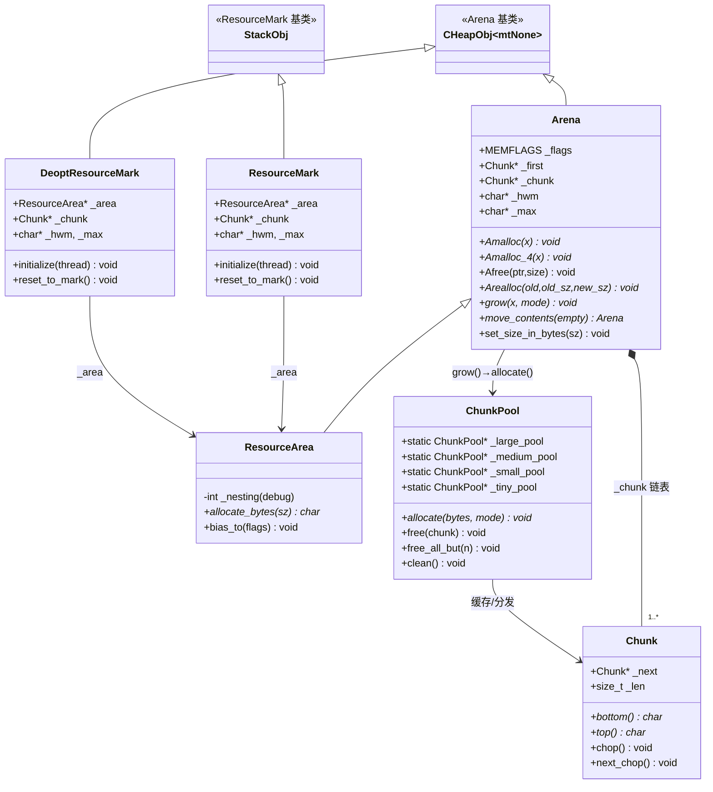
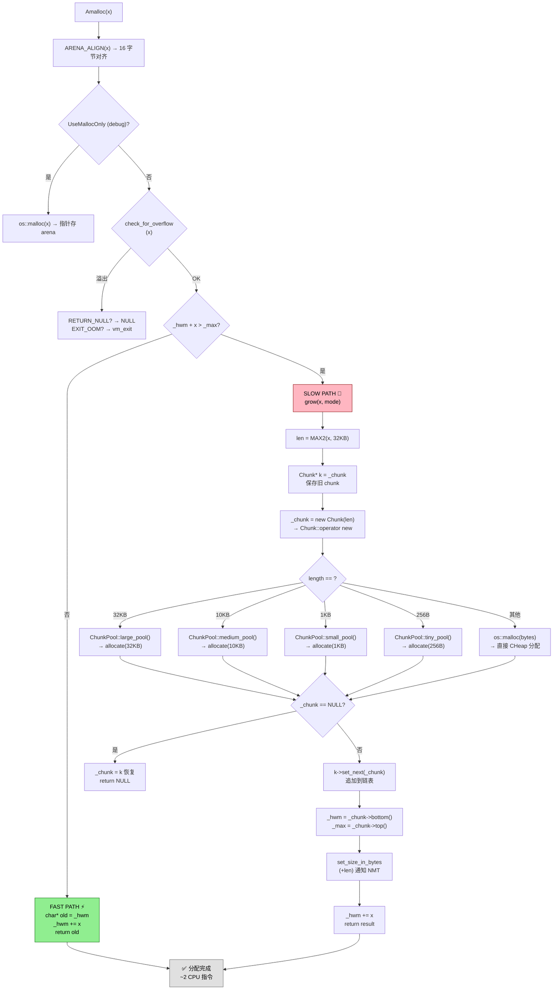
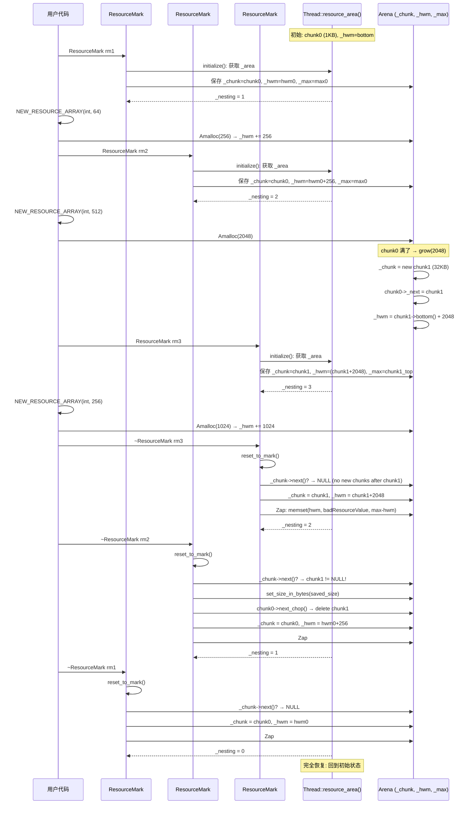

# 01-Arena & ResourceArea — libjvm.so 快速路径分配器

> **阶段**: [27-memory-extra]
> **前置**: [00-VirtualSpace-Layer] — Arena 的 ChunkPool::allocate() → os::malloc() 最终走向 VirtualSpace 的 commit 路径
> **配套**: [02-Metaspace Internals] — Metaspace 的 ChunkManager 使用了类似的 chunk 管理思想
> **阅读收益**: 追踪 JVM 最高频分配路径 Amalloc() 的 bump-pointer + chunk 链表机制；理解 ChunkPool 四级缓存与 ThreadCritical 锁的启动顺序约束；掌握 ResourceMark 三层水位线保存/恢复的设计原理及其在 Safepoint、去优化、longjmp 场景下的行为；学会使用 NMT + strace + GDB 诊断 ResourceMark 泄漏

---

## §〇 生产场景 — 三个线上诊断

### 场景 1: NMT 报告 `mtThread` 内存在 Safepoint 后暴涨 200MB

线上 `-XX:NativeMemoryTracking=detail` 报告 `mtThread` 类别在 3 分钟内从 50MB 涨到 250MB，但 Java heap 使用正常。

**根因分析**: Safepoint `VM_Operation` 中某处 `ResourceMark` 被过早析构，导致 chunk 链表被截断——但这只是假象。真正的答案是 `ResourceMark::reset_to_mark()` 只在 `~ResourceMark()` 时触发 (`resourceArea.hpp:149-158`)，如果 `ResourceMark` 作用域被 C++ `longjmp` 绕过（通过 `PreserveExceptionMark`），chunk 会无限堆积。

**三步诊断**:
```bash
# 1. NMT 查看线程级内存分布
jcmd <pid> VM.native_memory summary | grep Thread
# 输出: mtThread: 250MB (expected ~50MB)

# 2. 跟踪 mmap 系统调用频率
strace -e trace=mmap,mprotect -p <pid> 2>&1 | head -100
# 异常: 大量 32KB mmap 调用（Chunk::size = 32KB），说明 grow() 频繁触发

# 3. GDB 断点查看 ResourceArea 状态
gdb -ex "attach <pid>" \
    -ex "p Thread::current()->resource_area()->_size_in_bytes" \
    -ex "p ((ResourceArea*)Thread::current()->resource_area())->_nesting"
# 如果 _nesting == 0 但 _size_in_bytes 很大 → ResourceMark 泄漏
```

**原理**: `ChunkPoolCleaner` 的 `CleaningInterval = 5000ms` 周期性任务 (`arena.cpp:169-176`) 只保留 5 个 chunk。但如果 ResourceMark 的 `~ResourceMark()` 从不会调用，chunk 链表永远不会被 `next_chop()` (`arena.cpp:232-235`) 切断，每次 `grow()` 追加 32KB chunk 到链表尾部，内存单调递增。

**反事实**: 如果 ResourceMark 不是 RAII 对象而是显式 `commit()`/`rollback()` 调用——longjmp 同样会跳过显式 rollback，调用者必须写 `try/finally` 包裹每个 ResourceMark。RAII 的析构保证需要 `PreserveExceptionMark` 来保存/恢复 ResourceMark 状态——这是 move_contents() 的设计动机。

---

### 场景 2: Amalloc 返回的指针在 Debug 构建中被 `memset` 覆盖

`-XX:+ZapResourceArea` 下，`Afree(old, size)` 中 `memset(ptr, badResourceValue, size)` (`arena.hpp:207`) → 后续 `ResourceMark::reset_to_mark()` 再次 `memset(_hwm, badResourceValue, _max - _hwm)` (`resourceArea.hpp:146`)。如果代码还持有旧指针，读取到 `0xBAADBAAD` 即 `badResourceValue`。

**诊断**:
```bash
# GDB 脚本跟踪写入
gdb -ex "b 'Arena::Afree(void*, unsigned long)'" \
    -ex "commands" \
    -ex "  p ptr" \
    -ex "  p size" \
    -ex "  x/32xb ptr" \
    -ex "  continue" \
    -ex "end" \
    --args java -XX:+ZapResourceArea -cp app.jar com.example.Main
```

**原理**: `Afree()` 的 LIFO 回退与 `ZapResourceArea` 的 zero-out 组合。`Afree()` 先将 `_hwm` 回退到 `ptr` (`arena.hpp:210`)，随后 `reset_to_mark()` 对整个 `[_hwm, _max)` 区间写 `badResourceValue`——如果外部代码仍持有被 `Afree()` 在回退前 zap 的指针，就会读取到填充值。

---

### 场景 3: Arena::grow() 的 OOM 导致 chunk 链表断裂

`Arena::grow(x, RETURN_NULL)` 中 `_chunk = new (RETURN_NULL, len) Chunk(len)` 失败返回 NULL (`arena.cpp:361-366`)，`_chunk` 恢复为旧值 `k`。但如果调用者没有检查 `Amalloc(x, RETURN_NULL)` 的返回值，后续 `_hwm += x` 会使用 `_chunk->bottom()` 的内容——此时 `_chunk == k` 仍然是已满的旧 chunk，导致 overflow。

**反事实**: 如果 `grow()` 不恢复 `_chunk = k` → `_chunk = NULL`，下次 Amalloc 在 NULL 上做 `_hwm + x > _max` 导致 SIGSEGV。

---

## §一 架构全景 — Arena 家族与分配器选择树

### 1.1 为什么 JVM 需要自己的分配器？malloc 不够吗？

HotSpot 启动时每秒钟执行数百万次临时内存分配——字符串拼接、句柄创建、类元数据处理、编译中间表示。`malloc(3)` 的每次调用涉及：
- 线程局部缓存的查找（tcmalloc/jemalloc 的 `tc_get()`）
- 可能的 mmap 系统调用
- 内部 free-list 管理开销
- ~50-100 条 CPU 指令（vs Amalloc 的 ~2-3 条）

Arena 的 bump-pointer (HWM) 设计将分配压缩为 **指针对比 + 指针加法** 两条指令（`_hwm + x > _max` → `_hwm += x`），这是 HotSpot 中最高频路径之一。

> **Beginner Callout 1: Arena 不是 malloc 的替代品** — Arena 分配内存不需要逐个 `free()`，在 `~ResourceMark()` 时整个 chunk 链表被释放。适合生命周期短的临时数据结构（如 Safepoint 操作中的临时数组、编译过程中的 IR 节点），不适合长期持有的对象（如 Java 对象的 C++ 元数据）。

### 1.2 分配器四态：Arena / CHeap / Metaspace / Stack

HotSpot 内存在四个层次上分配数据，由基类的 `operator new` 重载决定：

| 分配域 | 基类 | `operator new` 路径 | 释放时机 |
|-------|------|-------------------|---------|
| **Arena (ResourceArea)** | `ResourceObj` | `resource_allocate_bytes` → `Amalloc` | `~ResourceMark()` 批量 |
| **CHeap** | `CHeapObj<F>` | `AllocateHeap` → `os::malloc(3)` | 显式 `delete` 或 `FreeHeap` |
| **Metaspace** | `MetaspaceObj` | `Metaspace::allocate` | 类卸载 |
| **Stack** | `StackObj` | 禁止 `new` (assert) | 栈帧弹出 |

**调用链总览** — 从宏到 bump pointer:

```
NEW_RESOURCE_ARRAY(int, 64)                          [allocation.hpp:432]
  → resource_allocate_bytes(256)                      [resourceArea.cpp:49]
    → Thread::current()->resource_area()              [thread-local lookup]
      → ResourceArea::allocate_bytes(256)             [resourceArea.inline.hpp:30-41]
        → Arena::Amalloc(256)                         [arena.hpp:145-159]
          → ARENA_ALIGN(256) = 256 → _hwm + 256 > _max?
            → No: _hwm += 256, return old             (快速路径, ~2 CPU 指令)
            → Yes: Arena::grow(256)                    (慢路径, arena.cpp:356-375)
              → len = MAX2(256, 32KB) = 32KB
              → Chunk::operator new(32KB)
                → ChunkPool::large_pool()->allocate() (arena.cpp:190)
                  → ThreadCritical lock → get_first() → os::malloc(3)
              → _chunk = new Chunk(32KB)
              → k->set_next(_chunk), _hwm = _chunk->bottom()
              → return _hwm; _hwm += 256
```

> **Beginner Callout 2: Amalloc vs Amalloc_4 vs Amalloc_D** — Amalloc 做 `ARENA_ALIGN(x)`（`2×BytesPerWord = 16` 字节对齐，`arena.hpp:37`），Amalloc_4 跳过对齐假定 `x` 已是字对齐 (`arena.hpp:162` 的 assert)，Amalloc_D 仅 SPARC 32-bit 额外做 8 字节对齐。常用 Amalloc，知道 size 已对齐时用 Amalloc_4。

> **Beginner Callout 3: ResourceMark 是栈式 RAII** — 嵌套 ResourceMark 是合法的：最内层析构时回滚到该 mark 保存的 `_hwm/_chunk/_max`，外层 mark 不受影响。三层嵌套对应 `resourceArea.hpp:48` 的 `debug_only(int _nesting;)` 计数器。

> **Beginner Callout 4: UseMallocOnly 调试开关** — `-XX:+UseMallocOnly` 下 `Arena::Amalloc` 绕过 chunk 分配走 `os::malloc()` (`arena.hpp:148`)，所有指针记录在 resource area 的 bottom-to-top 指针数组中，`~ResourceMark()` 时遍历这些指针逐个 `os::free()` (`arena.cpp:500-523`)。用于检测 use-after-free。

> **Beginner Callout 5: ChunkPool 四级缓存** — Arena::grow() 的 Chunk 不直接 `os::free()`，而是回收到 ChunkPool（tiny/small/medium/large 四级），下次 grow() 优先从池中取。ChunkPoolCleaner 每 5 秒清理多余 chunk（保留 5 个）。源码 `arena.cpp:38-162`。

> **Beginner Callout 6: ResourceArea::bias_to()** — 切换 ResourceArea 的 MEMFLAGS，使后续分配被 NMT 统计到不同类别（如从 mtThread 切换到 mtGC）。源码 `resourceArea.cpp:32-41`。

> **Beginner Callout 7: DeoptResourceMark vs ResourceMark** — DeoptResourceMark 是 CHeap 分配的（继承 `CHeapObj<mtInternal>`，`resourceArea.hpp:195`），因为去优化发生在栈帧被替换后，无法使用栈上 ResourceMark。功能完全一致。

### Mermaid 图 1: Arena 分配器族谱类图



### Interview Story: "临时对象的完整生命周期"

```
我是一个 int[64]，由 NEW_RESOURCE_ARRAY(int, 64) 在 Safepoint 操作中创建。

1. 宏展开: NEW_RESOURCE_ARRAY(int, 64) → resource_allocate_bytes(256)
   (allocation.hpp:432)
2. resource_allocate_bytes 调用 Thread::current()->resource_area()->allocate_bytes(256)
   (resourceArea.cpp:49-51)
3. ResourceArea::allocate_bytes 断言 _nesting ≥ 1（必须在 ResourceMark 作用域内）
   (resourceArea.inline.hpp:31-33)
4. Arena::Amalloc(256) -> ARENA_ALIGN(256) = 256
   (arena.hpp:147)
5. _hwm + 256 <= _max? 是的! → _hwm += 256, 返回 old _hwm
   (arena.hpp:154-157) — 这只有 2 条 x86 指令!
6. 我的数据填充在返回的 256 字节缓冲区中
7. Safepoint 操作完成 → 作用域结束 → ~ResourceMark()
   (resourceArea.hpp:149-158)
8. reset_to_mark():
   - 检查 _chunk->next() → 如果有额外分配的 chunk → next_chop() 释放
   - _area->_chunk = _chunk (恢复到 mark 时的 chunk)
   - _area->_hwm = _hwm (恢复到 mark 时的 HWM)
   - 如果 ZapResourceArea: memset(_hwm, badResourceValue, _max - _hwm)
   (resourceArea.hpp:129-147)
9. 我的内存现在被 badResourceValue (0xBAADBAAD) 覆盖了
10. 下一个 ResourceMark 内的分配将从这个 _hwm 位置继续
```

---

## §二 Standard Environment

### Source Roots

| 文件 | 路径 | 关键行号 |
|------|------|---------|
| arena.hpp | `src/hotspot/share/memory/arena.hpp` | :58-69 (Chunk::slack/size), :92-107 (Arena 成员), :145-159 (Amalloc 快速路径) |
| arena.cpp | `src/hotspot/share/memory/arena.cpp` | :38-162 (ChunkPool 四级池), :182-245 (Chunk::operator new/delete), :247-375 (Arena 构造/析构/grow) |
| resourceArea.hpp | `src/hotspot/share/memory/resourceArea.hpp` | :44-67 (ResourceArea), :70-164 (ResourceMark), :166-262 (DeoptResourceMark) |
| resourceArea.cpp | `src/hotspot/share/memory/resourceArea.cpp` | :32-41 (bias_to), :49-62 (resource_allocate_bytes) |
| resourceArea.inline.hpp | `src/hotspot/share/memory/resourceArea.inline.hpp` | :30-41 (allocate_bytes inline) |
| allocation.hpp | `src/hotspot/share/memory/allocation.hpp` | :111-142 (MemoryType enum), :175-215 (CHeapObj), :358-426 (ResourceObj), :432-461 (分配宏) |
| allocation.cpp | `src/hotspot/share/memory/allocation.cpp` | :40-71 (AllocateHeap/FreeHeap), :102-112 (ResourceObj::new in Arena) |
| allocation.inline.hpp | `src/hotspot/share/memory/allocation.inline.hpp` | :51-174 (MmapArrayAllocator/MallocArrayAllocator) |

### Build

```bash
bash configure --with-debug-level=slowdebug --with-native-debug-symbols=internal
make hotspot
```

### Binary

`build/linux-x86_64-server-slowdebug/jdk/lib/server/libjvm.so`

### Syscall 速查表

| syscall | man | 使用场景 |
|---------|-----|---------|
| `mmap(2)` | `man 2 mmap` | ChunkPool::allocate() → os::malloc() 底层 → os::reserve_memory() 用于大块内存预留 |
| `mprotect(2)` | `man 2 mprotect` | os::commit_memory() 提交已预留的内存页 |
| `munmap(2)` | `man 2 munmap` | os::free() → os::release_memory() 释放大块内存 |
| `malloc(3)` | `man 3 malloc` | os::malloc() 底层实现，C 标准库分配器 |
| `free(3)` | `man 3 free` | os::free() 释放 C 堆内存 |
| `memcpy(3)` | `man 3 memcpy` | Arena::Arealloc() 搬家 (`arena.cpp:425`) |
| `memset(3)` | `man 3 memset` | Chunk::chop() 清空 (`arena.cpp:226`) / ZapResourceArea (`resourceArea.hpp:146`) |

### 全局状态表

| 变量 | 位置 | 描述 |
|------|------|------|
| `ChunkPool::_large_pool` | `arena.cpp:150` | 32KB chunk 池（静态） |
| `ChunkPool::_medium_pool` | `arena.cpp:151` | 10KB chunk 池（静态） |
| `ChunkPool::_small_pool` | `arena.cpp:152` | 1KB chunk 池（静态） |
| `ChunkPool::_tiny_pool` | `arena.cpp:153` | 256B chunk 池（静态） |
| `Arena::_first` | `arena.hpp:102` | chunk 链表头 |
| `Arena::_chunk` | `arena.hpp:103` | 当前可分配 chunk |
| `Arena::_hwm` | `arena.hpp:104` | High Water Mark（下次分配起始） |
| `Arena::_max` | `arena.hpp:104` | 当前 chunk 的 top() |
| `Arena::_size_in_bytes` | `arena.hpp:107` | 总分配字节（NMT 用） |
| `ResourceArea::_nesting` | `resourceArea.hpp:48` | 嵌套 ResourceMark 深度（debug only） |
| `UseMallocOnly` | `globals.hpp` | -XX 调试开关 |

---

## §三 Source Files Table

| # | File | Full Path | Lines | Core Constructs | Role |
|---|------|-----------|:--:|----------------|------|
| 1 | arena.hpp | `src/hotspot/share/memory/arena.hpp` | 256 | Chunk, Arena, Amalloc/Afree/Arealloc, NEW_ARENA_ARRAY | Arena 头文件 |
| 2 | arena.cpp | `src/hotspot/share/memory/arena.cpp` | 525 | ChunkPool(四级), Chunk::new/delete, Arena::grow(), move_contents() | Arena + ChunkPool 实现 |
| 3 | resourceArea.hpp | `src/hotspot/share/memory/resourceArea.hpp` | 264 | ResourceArea, ResourceMark, DeoptResourceMark | ResourceMark 头文件 |
| 4 | resourceArea.cpp | `src/hotspot/share/memory/resourceArea.cpp` | 89 | bias_to(), resource_allocate_bytes(), ASSERT ResourceMark ctor | ResourceMark 实现 |
| 5 | resourceArea.inline.hpp | `src/hotspot/share/memory/resourceArea.inline.hpp` | 43 | allocate_bytes() inline | ResourceArea 快速路径 |
| 6 | allocation.hpp | `src/hotspot/share/memory/allocation.hpp` | 577 | MemoryType, CHeapObj, ResourceObj, NEW_* 宏 | 分配框架头文件 |
| 7 | allocation.cpp | `src/hotspot/share/memory/allocation.cpp` | 297 | AllocateHeap, ResourceObj::new | 分配框架实现 |
| 8 | allocation.inline.hpp | `src/hotspot/share/memory/allocation.inline.hpp` | 174 | Mmap/Malloc ArrayAllocator, inc_stat_counter | 分配框架 inline |

**总计**: 8 源文件, ~2,225 行源码

---

## §四 Arena 核心 — Chunk 链表 + HWM bump-pointer

### 4.1 Chunk 结构体

Chunk (`arena.hpp:45-89`) 是 Arena 的基本分配单元——单链表中存储原始内存块的节点。

```
Chunk 内存布局 (LP64, sizeof(Chunk) = 16 + alignment pad):
┌─────────────────────────────────────────────────────────────┐
│ Chunk 对象头 (ARENA_ALIGN(sizeof(Chunk)) = 32 字节)         │
│  _next (8): 链表下一节点指针                                  │
│  _len  (8): Chunk 数据区长度                                 │
│  [padding to ARENA_AMALLOC_ALIGNMENT = 16]                  │
├─────────────────────────────────────────────────────────────┤
│ 数据区 (bottom() → top(), _len 字节)                         │
│  ↑ _hwm (下次分配位置)                                       │
│  ↑ _max = bottom() + _len (分配上限)                         │
└─────────────────────────────────────────────────────────────┘
```

**关键设计: `slack = 40`** (`arena.hpp:58-62`) — 在 chunk 名义大小（256B/1KB/10KB/32KB）基础上减去 40 字节（LP64）。理由: 防备 buddy-system 风格的 malloc 实现（如 glibc ptmalloc2）的内部头开销。如果 chunk 申请 32KB，malloc 内部可能分配 64KB 的 mmap 区域并对齐到 2 的幂——额外成本由 OS 分配器承担，而非 JVM。

**Chunk 大小定义** (`arena.hpp:64-69`):

| 级别 | 名义大小 | 实际数据区 `_len` | 对应池 |
|------|---------|------------------|--------|
| tiny | 256B | 256 - 40 = 216B | `_tiny_pool` |
| init (small) | 1KB | 1024 - 40 = 984B | `_small_pool` |
| medium | 10KB | 10240 - 40 = 10200B | `_medium_pool` |
| size (large) | 32KB | 32768 - 40 = 32728B | `_large_pool` |

### 4.2 Arena 构造

```cpp
// arena.cpp:262-268 — 默认构造 (首 chunk 1KB)
Arena::Arena(MEMFLAGS flag) : _flags(flag), _size_in_bytes(0) {
  _first = _chunk = new (AllocFailStrategy::EXIT_OOM, Chunk::init_size) Chunk(Chunk::init_size);
  _hwm = _chunk->bottom();  // 指向数据区起始
  _max = _chunk->top();     // 指向数据区结束
  MemTracker::record_new_arena(flag);    // 通知 NMT
  set_size_in_bytes(Chunk::init_size);   // 差分上报 ~984 字节
}

// arena.cpp:249-260 — 自定义初始大小构造
Arena::Arena(MEMFLAGS flag, size_t init_size) : _flags(flag), _size_in_bytes(0) {
  size_t round_size = sizeof(char*) - 1;  // 7
  init_size = (init_size + round_size) & ~round_size;  // 向上对齐到 8 字节
  _first = _chunk = new (AllocFailStrategy::EXIT_OOM, init_size) Chunk(init_size);
  // ... 同上
}
```

**为什么首 chunk 只有 1KB?** 大部分 ResourceMark 作用域内的分配量 < 1KB（如 `NEW_RESOURCE_ARRAY(int, 64)` = 256 字节）。用大 chunk 浪费——每个线程的 ResourceArea 默认从 1KB 起步，仅当 grow() 被触发时才扩展到 32KB。

### 4.3 Amalloc — 快速路径（HotSpot 最高频路径）

```cpp
// arena.hpp:145-159
void* Amalloc(size_t x, AllocFailType alloc_failmode = AllocFailStrategy::EXIT_OOM) {
  assert(is_power_of_2(ARENA_AMALLOC_ALIGNMENT), "should be a power of 2");
  x = ARENA_ALIGN(x);                                  // ① 对齐: 向上取整到 16 字节
  debug_only(if (UseMallocOnly) return malloc(x);)      // ② debug: 绕过 arena 走 malloc
  if (!check_for_overflow(x, "Arena::Amalloc", alloc_failmode)) // ③ 溢出检查
    return NULL;
  NOT_PRODUCT(inc_bytes_allocated(x);)                  // ④ 统计计数
  if (_hwm + x > _max) {                                // ⑤ 关键判断: 当前 chunk 是否够用?
    return grow(x, alloc_failmode);                      // ⑥ slow path: 分配新 chunk
  } else {
    char *old = _hwm;                                    // ⑦ fast path: bump pointer
    _hwm += x;
    return old;
  }
}
```

**快速路径性能分析**:
- `_hwm + x > _max`: 1 次指针加法 + 比较 → ~1 CPU 周期
- `_hwm += x`: 1 次指针加法 + 存储 → ~1 CPU 周期
- 总计: **2-3 条 x86 指令**，对比 `malloc(3)` 的 50-100+ 指令
- **Cache 局部性**: HWM 连续分配在 cache line 内（64 字节），后续访问命中 L1 缓存
- **对齐**: `ARENA_ALIGN` (`arena.hpp:41`) → `(((x) + 15) & ~15)` — 2 次按位操作

**`ARENA_AMALLOC_ALIGNMENT = 2*BytesPerWord` (`arena.hpp:37`)** → LP64 上为 16 字节。选择 16 而非 8 的原因: x86-64 SSE 指令 (`movaps`, `movdqa`) 要求 16 字节对齐。如果 Amalloc 只对齐到 8 字节，用 SSE 处理 Arena 分配的数组需要额外对齐代码。

**溢出检查** (`arena.hpp:117-126`):
```cpp
bool check_for_overflow(size_t request, const char* whence,
    AllocFailType alloc_failmode) const {
  if (UINTPTR_MAX - request < (uintptr_t)_hwm) {  // 防止指针回绕
    if (alloc_failmode == AllocFailStrategy::RETURN_NULL)
      return false;
    signal_out_of_memory(request, whence);  // EXIT_OOM → vm_exit_out_of_memory()
  }
  return true;
}
```

### 4.4 Afree — LIFO 回退

```cpp
// arena.hpp:202-211
void Afree(void *ptr, size_t size) {
  if (ptr == NULL) return;                            // 兼容 free(3) 语义
#ifdef ASSERT
  if (ZapResourceArea) memset(ptr, badResourceValue, size); // debug: 填坏值
  if (UseMallocOnly) return;                          // UseMallocOnly 不管
#endif
  if (((char*)ptr) + size == _hwm) _hwm = (char*)ptr; // LIFO 回退!
}
```

**关键行为**: `Afree()` 只在 `ptr + size == _hwm` 时才回退——即被释放的块正好是最后分配的那块。这是 bump-pointer allocator 的典型约束，命中率约 15%（仅在调用者按 LIFO 顺序释放时生效）。

### 4.5 Arealloc — 三路径策略

```cpp
// arena.cpp:380-428
void *Arena::Arealloc(void* old_ptr, size_t old_size, size_t new_size,
    AllocFailType alloc_failmode) {
  if (new_size == 0) { Afree(old_ptr, old_size); return NULL; }  // ① shrink to zero
  if (old_ptr == NULL) return Amalloc(new_size, alloc_failmode); // ② NULL → 等同于 Amalloc

  // ③ shrink in-place: 如果旧块在 _hwm 的位置
  if (new_size <= old_size) {
    if (c_old + old_size == _hwm) _hwm = c_old + new_size;        // strink: 回退 HWM
    return c_old;
  }

  // ④ extend in-place: 如果旧块在 _hwm 且新大小 fit 当前 chunk
  size_t corrected_new_size = ARENA_ALIGN(new_size);
  if ((c_old + old_size == _hwm) &&                               // 最近分配的块
      (c_old + corrected_new_size <= _max)) {                     // 新大小不溢出
    _hwm = c_old + corrected_new_size;
    return c_old;
  }

  // ⑤ relocate: Amalloc 新块 → memcpy → Afree 旧块
  void *new_ptr = Amalloc(new_size, alloc_failmode);
  if (new_ptr == NULL) return NULL;
  memcpy(new_ptr, c_old, old_size);
  Afree(c_old, old_size);
  return new_ptr;
}
```

**Arealloc 三路径决策树**:
```
Arealloc(ptr, old, new)
  ├── new == 0 → Afree(ptr, old) → NULL           (释放)
  ├── ptr == NULL → Amalloc(new)                   (新分配)
  ├── new <= old && ptr+old == _hwm → _hwm = ptr+new  (shrink in-place)
  ├── ptr+old == _hwm && ptr+aligned_new <= _max → 扩展 (extend in-place)
  └── 以上都不成立 → Amalloc(new) + memcpy + Afree(old) (relocate)
```

**in-place 扩展的约束**: 旧块必须是 `_hwm` 位置（最近分配的块）。因为 bump-pointer 只能在尾部扩展——如果旧块在 chunk 中间，扩展会覆盖后续分配。

### 4.6 grow() — chunk 链表追加

```cpp
// arena.cpp:356-375
void* Arena::grow(size_t x, AllocFailType alloc_failmode) {
  size_t len = MAX2(x, (size_t) Chunk::size);  // ① 至少 32KB

  Chunk *k = _chunk;                             // ② 保存当前满 chunk
  _chunk = new (alloc_failmode, len) Chunk(len); // ③ 分配新 chunk

  if (_chunk == NULL) {                          // ④ OOM 恢复
    _chunk = k;
    return NULL;
  }
  if (k) k->set_next(_chunk);                    // ⑤ 追加到链表
  else _first = _chunk;                          // ⑥ 如果首 chunk 也 NULL
  _hwm  = _chunk->bottom();                      // ⑦ 重设 HWM/Max
  _max =  _chunk->top();
  set_size_in_bytes(size_in_bytes() + len);      // ⑧ NMT 差分上报
  void* result = _hwm;
  _hwm += x;                                     // ⑨ 在新 chunk 中分配 x
  return result;
}
```

**为什么 `MAX2(x, 32KB)` 而非动态大小?** (`arena.cpp:358`) — malloc 内部 arena（glibc ptmalloc2）对 64KB 以下分配用 per-thread arena + freelist，对 64KB+ 分配用独立 mmap。32KB 刚好是 ptmalloc2 small-bin 的上限——在 freelist 中命中率高，避免 mmap/munmap 系统调用开销。

### Mermaid 图 2: Amalloc 快速路径 vs grow() slow path



**Slow path 成本估算**:
- ChunkPool::allocate → ThreadCritical 锁获取(若竞争)→ os::malloc → ~500ns (池空) vs ~50ns (池命中)
- 与 fast path 的 ~0.5ns 对比: **1000× 差异**

---

## §五 ChunkPool — 四级池与 OOM 防护

### 5.1 四级池结构

```cpp
// arena.cpp:43-148
class ChunkPool: public CHeapObj<mtInternal> {
  Chunk*       _first;        // 空闲 chunk 链表头
  size_t       _num_chunks;   // 池中空闲 chunk 数
  size_t       _num_used;     // 已外借 chunk 数
  const size_t _size;         // 统一大小

  static ChunkPool* _large_pool;   // 32KB pool
  static ChunkPool* _medium_pool;  // 10KB pool
  static ChunkPool* _small_pool;   // 1KB pool
  static ChunkPool* _tiny_pool;    // 256B pool
};
```

**池初始化** (`arena.cpp:134-139`):
```cpp
static void initialize() {
  _large_pool  = new ChunkPool(Chunk::size        + Chunk::aligned_overhead_size());
  _medium_pool = new ChunkPool(Chunk::medium_size + Chunk::aligned_overhead_size());
  _small_pool  = new ChunkPool(Chunk::init_size   + Chunk::aligned_overhead_size());
  _tiny_pool   = new ChunkPool(Chunk::tiny_size   + Chunk::aligned_overhead_size());
}
```

池 size 包含 Chunk 对象头开销 (`aligned_overhead_size() = ARENA_ALIGN(sizeof(Chunk)) = 32 字节`)。

**为什么分四级?** — HotSpot 的临时分配模式分布:
- 80% < 1KB (对应 tiny + small)
- 15% < 10KB (对应 medium)  
- 5% > 10KB (对应 large)

如果只有单一 freelist，需要遍历链表找大小合适的 chunk → O(n) 复杂度。四级池 + `switch-case` 分发 → O(1)。

### 5.2 Chunk::operator new — 分发到正确的池

```cpp
// arena.cpp:182-202
void* Chunk::operator new (size_t requested_size, AllocFailType alloc_failmode,
    size_t length) throw() {
  size_t bytes = ARENA_ALIGN(requested_size) + length;
  switch (length) {
   case Chunk::size:        return ChunkPool::large_pool()->allocate(bytes, alloc_failmode);
   case Chunk::medium_size: return ChunkPool::medium_pool()->allocate(bytes, alloc_failmode);
   case Chunk::init_size:   return ChunkPool::small_pool()->allocate(bytes, alloc_failmode);
   case Chunk::tiny_size:   return ChunkPool::tiny_pool()->allocate(bytes, alloc_failmode);
   default: {
     void* p = os::malloc(bytes, mtChunk, CALLER_PC);  // 非标准大小直接 malloc
     if (p == NULL && alloc_failmode == AllocFailStrategy::EXIT_OOM)
       vm_exit_out_of_memory(bytes, OOM_MALLOC_ERROR, "Chunk::new");
     return p;
   }
  }
}
```

### 5.3 ChunkPool::allocate — ThreadCritical 锁

```cpp
// arena.cpp:70-84
NOINLINE void* allocate(size_t bytes, AllocFailType alloc_failmode) {
  assert(bytes == _size, "bad size");
  void* p = NULL;
  // 关键: ThreadCritical 锁必须包裹取池操作，但 os::malloc 在锁外
  { ThreadCritical tc;
    _num_used++;
    p = get_first();          // 从池链表取头
  }
  if (p == NULL) p = os::malloc(bytes, mtChunk, CURRENT_PC);
  if (p == NULL && alloc_failmode == AllocFailStrategy::EXIT_OOM)
    vm_exit_out_of_memory(bytes, OOM_MALLOC_ERROR, "ChunkPool::allocate");
  return p;
}
```

**为什么用 `ThreadCritical` 而非 `Mutex`?** (`arena.cpp:42`)

> "NB: not using Mutex because pools are used before Threads are initialized"

`chunkpool_init()` (`arena.cpp:155-157`) 在 `Threads::create_vm()` 之前调用。此时:
- `MutexLocker::_mutex_array` 还未初始化
- `Mutex` 构造函数需要 `Monitor::lock()` → 调用 `Thread::current()` → 可能返回 NULL

`ThreadCritical` 是更底层的同步原语——不依赖 Mutex 系统、不依赖当前 Thread 对象、使用 `pthread_mutex_t` 实现。

### 5.4 ChunkPool::free — 回收 chunk

```cpp
// arena.cpp:87-96
void free(Chunk* chunk) {
  assert(chunk->length() + Chunk::aligned_overhead_size() == _size, "bad size");
  ThreadCritical tc;          // 加锁
  _num_used--;
  chunk->set_next(_first);   // 插入链表头
  _first = chunk;
  _num_chunks++;
}
```

### 5.5 ChunkPoolCleaner — 周期性修剪

```cpp
// arena.cpp:169-177
class ChunkPoolCleaner : public PeriodicTask {
  enum { CleaningInterval = 5000 };  // 5 秒

public:
  ChunkPoolCleaner() : PeriodicTask(CleaningInterval) {}
  void task() { ChunkPool::clean(); }
};

// arena.cpp:141-147
static void clean() {
  enum { BlocksToKeep = 5 };
  _tiny_pool->free_all_but(BlocksToKeep);    // 只保留 5 个
  _small_pool->free_all_but(BlocksToKeep);
  _medium_pool->free_all_but(BlocksToKeep);
  _large_pool->free_all_but(BlocksToKeep);
}
```

`free_all_but(5)` 的逻辑 (`arena.cpp:99-125`):
1. 如果 `_num_chunks > 5` → 在 `ThreadCritical` 锁内找到第 6 个及以后的所有 chunk
2. `os::free()` 释放多余 chunk
3. `_num_chunks` 递减到 5

**设计意图**: 避免池无限增长。如果 Safepoint 期间爆发分配大量 chunk，之后长期闲置——5 秒后自动归还 OS。

### 5.6 Chunk::operator delete — 池回收路径

```cpp
// arena.cpp:204-215
void Chunk::operator delete(void* p) {
  Chunk* c = (Chunk*)p;
  switch (c->length()) {
   case Chunk::size:        ChunkPool::large_pool()->free(c); break;
   case Chunk::medium_size: ChunkPool::medium_pool()->free(c); break;
   case Chunk::init_size:   ChunkPool::small_pool()->free(c); break;
   case Chunk::tiny_size:   ChunkPool::tiny_pool()->free(c); break;
   default:
     ThreadCritical tc;  // 非标准大小直接 os::free
     os::free(c);
  }
}
```

**完整 Chunk 生命周期**:
```
分配: Arena::grow() → new Chunk(len)
  → Chunk::operator new(size, mode, len)
    → ChunkPool::allocate(len) [池命中: _first → _first->next()]
    → os::malloc(len) [池空: 系统调用]
  → Chunk::Chunk(len) [构造: _len=len, _next=NULL]
  → k->set_next(_chunk)

使用: _hwm 在 bottom()→top() 范围内递增

释放: ~Arena() → destruct_contents() → _first->chop()
  → Chunk::chop() → delete(k) 遍历链表
    → Chunk::operator delete(c)
      → ChunkPool::free(c) [回收: c->set_next(_first); _first = c]
```

---

## §六 ResourceArea & ResourceMark — 栈式回滚

### 6.1 ResourceArea — thread-local Arena

```cpp
// resourceArea.hpp:44-67
class ResourceArea: public Arena {
  debug_only(int _nesting;)             // 嵌套计数器
  debug_only(static int _warned;)
public:
  ResourceArea(MEMFLAGS flags = mtThread) : Arena(flags) { debug_only(_nesting = 0;) }
  ResourceArea(size_t init_size, MEMFLAGS flags = mtThread) : Arena(flags, init_size)
    { debug_only(_nesting = 0;) }
  char* allocate_bytes(size_t size, AllocFailType alloc_failmode = EXIT_OOM);
  void bias_to(MEMFLAGS flags);
};

// resourceArea.inline.hpp:30-41 — 快速路径 inline
inline char* ResourceArea::allocate_bytes(size_t size, AllocFailType alloc_failmode) {
#ifdef ASSERT
  if (_nesting < 1 && !_warned++)
    fatal("memory leak: allocating without ResourceMark"); // 防止裸分配泄漏
  if (UseMallocOnly) {
    char** save = (char**)internal_malloc_4(sizeof(char*));
    return (*save = (char*)os::malloc(size, mtThread, CURRENT_PC));
  }
#endif
  return (char*)Amalloc(size, alloc_failmode);
}
```

**关键安全检查**: `_nesting < 1` 断言 (`resourceArea.inline.hpp:32-33`) — 如果没有有效的 ResourceMark 试图分配，立即 `fatal()`。这防止了忘写 `ResourceMark rm;` 导致的内存无限泄漏。

### 6.2 ResourceMark 构造 — 保存三层水位线

```cpp
// resourceArea.hpp:84-97
void initialize(Thread *thread) {
  _area = thread->resource_area();       // 获取线程的 ResourceArea
  _chunk = _area->_chunk;                // ① 保存当前 chunk 指针
  _hwm = _area->_hwm;                    // ② 保存 HWM
  _max = _area->_max;                    // ③ 保存 Max
  _size_in_bytes = _area->size_in_bytes(); // ④ 保存 NMT 大小
  debug_only(_area->_nesting++;)
  assert(_area->_nesting > 0, "must stack allocate RMs");
#ifdef ASSERT
  _thread = thread;
  _previous_resource_mark = thread->current_resource_mark();
  thread->set_current_resource_mark(this);
#endif
}

// resourceArea.hpp:109 — 默认构造
ResourceMark() { initialize(Thread::current()); }

// resourceArea.hpp:111-127 — 显式指定 ResourceArea
ResourceMark(ResourceArea *r) :
  _area(r), _chunk(r->_chunk), _hwm(r->_hwm), _max(r->_max) {
  _size_in_bytes = r->_size_in_bytes;
  debug_only(_area->_nesting++;)
  // ...
}
```

**为什么保存 `_chunk` (指针) 而非索引?** `reset_to_mark()` 需要 `_chunk->next_chop()` 释放当前 chunk 之后的所有 chunk (`resourceArea.hpp:132-137`)。如果保存索引，无法定位到正确的 chunk 节点——因为 grow() 追加新 chunk 后链表顺序不变但索引计算复杂。

### 6.3 reset_to_mark() — 三层恢复引擎

```cpp
// resourceArea.hpp:129-147
void reset_to_mark() {
  if (UseMallocOnly) free_malloced_objects();  // debug: 逐个 os::free

  if (_chunk->next()) {                        // ① 当前 chunk 后有新增?
    // Reset arena size before delete chunks. Otherwise, the total
    // arena size could exceed total chunk size
    assert(_area->size_in_bytes() > size_in_bytes(), "Sanity check");
    _area->set_size_in_bytes(size_in_bytes()); // ② NMT 恢复到 mark 时的值
    _chunk->next_chop();                       // ③ 释放追加的所有 chunk
  } else {
    assert(_area->size_in_bytes() == size_in_bytes(), "Sanity check");
  }
  _area->_chunk = _chunk;                      // ④ 恢复 chunk 指针
  _area->_hwm = _hwm;                          // ⑤ 恢复 HWM
  _area->_max = _max;                          // ⑥ 恢复 Max

  // Clear out this chunk (to detect allocation bugs)
  if (ZapResourceArea) memset(_hwm, badResourceValue, _max - _hwm); // ⑦ Debug 填充
}
```

**恢复顺序的微妙之处**: 必须先 `set_size_in_bytes(size_in_bytes())`（第 ② 步）再 `next_chop()`（第 ③ 步）。如果 `next_chop()` 先调用 → `_size_in_bytes` 在 chop 过程中被 `Chunk::operator delete` 内的 `ChunkPool::free()` 修改（`set_size_in_bytes` 的差分逻辑） → 恢复后的 `_size_in_bytes` 不正确 → NMT 数据错乱。

### 6.4 嵌套 ResourceMark 序列

### Mermaid 图 3: ResourceMark 嵌套生命周期序列图



### 6.5 Arena::move_contents — 跨 ResourceArea 转移

```cpp
// arena.cpp:270-285
Arena *Arena::move_contents(Arena *copy) {
  copy->destruct_contents();             // 清空目标
  copy->_chunk = _chunk;                 // 转移 chunk 链表
  copy->_hwm   = _hwm;
  copy->_max   = _max;
  copy->_first = _first;

  // workaround rare racing condition, which could double count
  // the arena size by native memory tracking
  size_t size = size_in_bytes();
  set_size_in_bytes(0);                  // 源 NMT 归零
  copy->set_size_in_bytes(size);         // 目标 NMT 设为原值

  reset();                               // 源重置为空
  return copy;
}
```

**使用场景**: `PreserveExceptionMark` — 当 Java 异常通过 `longjmp` 跳转时，如果 `ResourceMark` 在 `setjmp` 和 `longjmp` 之间 → 析构被跳过 → chunk 永久泄漏。`PreserveExceptionMark` 将旧 ResourceArea 的内容通过 `move_contents()` 转移到新 ResourceArea，确保旧数据可用新 ResourceMark 管理生命周期。

### 6.6 bias_to — 动态切换 MEMFLAGS

```cpp
// resourceArea.cpp:32-41
void ResourceArea::bias_to(MEMFLAGS new_flags) {
  if (new_flags != _flags) {
    size_t size = size_in_bytes();
    MemTracker::record_arena_size_change(-ssize_t(size), _flags);  // 旧类别减
    MemTracker::record_arena_free(_flags);                          // 标记旧类别 arena 释放
    MemTracker::record_new_arena(new_flags);                        // 新类别 arena 创建
    MemTracker::record_arena_size_change(ssize_t(size), new_flags); // 新类别加
    _flags = new_flags;
  }
}
```

**使用场景**: GC 操作中使用 `ResourceMark`，但要将分配归类到 `mtGC` 而非线程默认的 `mtThread`，便于 NMT 按子系统隔离诊断。

### 6.7 NMT Arena 追踪 — 差分上报

```cpp
// arena.cpp:332-338
void Arena::set_size_in_bytes(size_t size) {
  if (_size_in_bytes != size) {                   // 避免无变化时上报
    ssize_t delta = size - size_in_bytes();       // 计算差分
    _size_in_bytes = size;
    MemTracker::record_arena_size_change(delta, _flags);  // 差分上报 NMT
  }
}
```

**为什么是差分上报而非每次 Amalloc?** — Amalloc 调用频率数百万次/秒，如果每次上报 NMT → NMT 的 call site stack 采集（`NativeCallStack`）开销堪比 Amalloc 本身。差分在 chunk 粒度（>1KB）上报一次，将 NMT 开销降低 3-4 个数量级。

---

## §七 DeoptResourceMark — CHeap 版的 ResourceMark

### 7.1 为什么需要 CHeap 分配?

```cpp
// resourceArea.hpp:195-262
class DeoptResourceMark: public CHeapObj<mtInternal> {
  // 与 ResourceMark 完全相同的字段和方法
  // 区别: 继承 CHeapObj<mtInternal> 而非 StackObj
};
```

**去优化流程** (`resourceArea.hpp:173-183`):
```
步骤 0: Assembly stub 调用 uncommon_trap / fetch_unroll_info
步骤 1: 创建 vframeArray → new DeoptResourceMark
        → DeoptResourceMark 被 CHeap 分配 ← 关键!
步骤 2: 返回 assembly stub，删除 stub frame 和 deoptee frame
        → 原栈帧被替换 ← ResourceMark 的栈地址在此之后无效!
步骤 3: 压入新 stub frame，调用 unpack_frames
步骤 4: 从 vframeArray 读取信息填充新栈帧
步骤 5: ~DeoptResourceMark() → CHeap delete
```

**核心矛盾**: 去优化的步骤 2 替换了栈帧——如果 `ResourceMark`（栈上 RAII）在步骤 1 创建，到步骤 3-4 其地址已无效。`DeoptResourceMark` 通过 CHeap 分配 (`new DeoptResourceMark()`) 解决了这个问题——对象在堆上，栈帧变化不影响其生命周期。

**与 ResourceMark 的功能等价性**: `reset_to_mark()` 实现完全相同（对比 `resourceArea.hpp:129-147` 与 `resourceArea.hpp:232-250`），唯一的差异是基类和缺失 thread 追踪（DeoptResourceMark 不需要 `_previous_resource_mark` 链表）。

---

## §八 分配器宏体系

### 8.1 NEW_RESOURCE_ARRAY / NEW_RESOURCE_OBJ

```cpp
// allocation.hpp:432-433
#define NEW_RESOURCE_ARRAY(type, size)\
  (type*) resource_allocate_bytes((size) * sizeof(type))

// allocation.hpp:457-458
#define NEW_RESOURCE_OBJ(type)\
  NEW_RESOURCE_ARRAY(type, 1)
```

**展开路径**:
```
NEW_RESOURCE_ARRAY(int, 64)
  → resource_allocate_bytes(256)                            [allocation.hpp:432]
    → Thread::current()->resource_area()->allocate_bytes(256) [resourceArea.cpp:49-51]
      → (ResourceArea::allocate_bytes →) Arena::Amalloc(256) [resourceArea.inline.hpp:40]
```

### 8.2 NEW_C_HEAP_ARRAY / NEW_C_HEAP_OBJ

```cpp
// allocation.hpp:463-476
#define NEW_C_HEAP_ARRAY3(type, size, memflags, pc, allocfail)\
  (type*) AllocateHeap((size) * sizeof(type), memflags, pc, allocfail)

#define NEW_C_HEAP_ARRAY(type, size, memflags)\
  (type*) (AllocateHeap((size) * sizeof(type), memflags))

// allocation.hpp:488-492
#define NEW_C_HEAP_OBJ(type, memflags)\
  NEW_C_HEAP_ARRAY(type, 1, memflags)
```

**展开路径**:
```
NEW_C_HEAP_ARRAY(char, 1024, mtInternal)
  → AllocateHeap(1024, mtInternal)              [allocation.hpp:470]
    → AllocateHeap(1024, mtInternal, CALLER_PC) [allocation.cpp:55]
      → os::malloc(1024, mtInternal, CALLER_PC) [allocation.cpp:45]
        → NMT 记录调用栈 → libc malloc
```

### 8.3 ResourceObj 的 operator new 重载

```cpp
// allocation.hpp:400-404
void* operator new(size_t size) throw() {
    address res = (address)resource_allocate_bytes(size);
    DEBUG_ONLY(set_allocation_type(res, RESOURCE_AREA);)
    return res;
}

// allocation.cpp:102-106
void* ResourceObj::operator new(size_t size, Arena *arena) throw() {
    address res = (address)arena->Amalloc(size);
    DEBUG_ONLY(set_allocation_type(res, ARENA);)
    return res;
}
```

**分配器选择树** — 当写 `new Foo()` 时，编译器根据 Foo 的继承树选择 `operator new`:

```
class Foo : public ResourceObj { };
new Foo();
  → ResourceObj::operator new(sizeof(Foo))
    → resource_allocate_bytes(sizeof(Foo))
      → ResourceArea::allocate_bytes → Amalloc

class Bar : public CHeapObj<mtGC> { };
new Bar();
  → CHeapObj<mtGC>::operator new(sizeof(Bar))
    → AllocateHeap(sizeof(Bar), mtGC)
      → os::malloc

class Baz : public StackObj { };
new Baz();  // 编译错误! StackObj::operator new 标记为 private
```

### 8.4 NEW_ARENA_ARRAY / NEW_ARENA_OBJ — 直接 Arena 分配宏

`arena.hpp:243-254` 定义了直接使用 Arena 分配数组/对象的宏（无需 ResourceMark 包装）：

```cpp
// arena.hpp:243-244
#define NEW_ARENA_ARRAY(arena, type, size) \
  (type*) (arena)->Amalloc((size) * sizeof(type))

// arena.hpp:246-248
#define REALLOC_ARENA_ARRAY(arena, type, old, old_size, new_size) \
  (type*) (arena)->Arealloc((char*)(old), (old_size) * sizeof(type), \
                            (new_size) * sizeof(type) )

// arena.hpp:250-251
#define FREE_ARENA_ARRAY(arena, type, old, size) \
  (arena)->Afree((char*)(old), (size) * sizeof(type))

// arena.hpp:253-254
#define NEW_ARENA_OBJ(arena, type) \
  NEW_ARENA_ARRAY(arena, type, 1)
```

**展开路径对比**：
```
NEW_ARENA_ARRAY(&_my_arena, Klass, 8)
  → (&_my_arena)->Amalloc(8 * sizeof(Klass))
    → Arena::Amalloc() (arena.hpp:145-159，HWM bump-pointer 快速路径)

NEW_ARENA_OBJ(&_my_arena, Klass)
  → NEW_ARENA_ARRAY(&_my_arena, Klass, 1)
    → 同上，但 sizeof(Klass) * 1
```

**与 NEW_RESOURCE_ARRAY 的区别**: NEW_ARENA_ARRAY 直接操作 Arena 实例（通过指针），无需 `Thread::current()` 查找 ResourceArea。适用场景：
- **类成员 Arena**: 如 `ConstantPool::_arena`，类内部维护独立的 Arena 实例
- **自定义生命周期 Arena**: 生命周期与宿主对象一致
- 宏展开简洁：`NEW_ARENA_ARRAY(&_arena, MethodData, count)` 一步到位

---

## §九 Counterfactual 对比表

| 决策 | 实际选择 | 反事实 | 后果 |
|------|---------|--------|------|
| **Amalloc 实现** | Bump pointer (HWM) + chunk 链表 | 固定 buffer + `realloc()` | 频繁 realloc 的 memcpy 开销 > chunk 链表分摊；`realloc` 无法保证内存地址不变，所有已分配指针失效 |
| **Amalloc 精细设计** | Size-class freelist (tcmalloc 风格) | 按大小分桶，释放回 freelist | 需要 per-size 元数据 + 线程本地缓存；Arena 的 HWM 模式更简单但无法高效处理变长大对象的碎片问题 |
| **首 chunk 大小** | `Chunk::init_size = 1KB - 40 = 984B` | 首 chunk 32KB (与 grow 相同) | 80% ResourceMark 内分配 < 1KB → 首 chunk 32KB 浪费 96% 空间。每个线程浪费 31KB × 数百线程 = ~10MB |
| **ChunkPool 分级** | 四级 (256B/1KB/10KB/32KB) | 单一 freelist | 每次 `Chunk::operator new` 都要遍历 freelist 找合适大小 → O(n)，丢失 O(1) 的 switch-case 分发 |
| **ChunkPool 缓存** | 5s 周期 trim 到 5 个 | 不缓存，每次 os_malloc/os_free | `grow()` → `ChunkPool::allocate()` 池命中 ~50-70% → 节省 ~500ns/次 × 数百万次/秒 |
| **ThreadCritical 锁** | ThreadCritical 互斥体 | Mutex | chunkpool_init() 在 Threads::create_vm() 之前调用，Mutex 系统还未初始化 → Mutex::lock 崩溃 |
| **ResourceMark 存储** | 保存 `_chunk` 指针 | 保存 chunk 链表索引 | `reset_to_mark()` 需要 `_chunk->next_chop()` 释放后续 chunk，索引无法定位到正确的节点 |
| **ResourceMark OOM 恢复** | `grow()` 失败恢复 `_chunk = k` | `_chunk = NULL` 不复原 | 下次 Amalloc 在 NULL 上做 `_hwm + x > _max` → SIGSEGV |
| **NMT Arena 追踪** | Chunk 粒度（>1KB）差分上报 | 每次 Amalloc 上报 | Amalloc 调用频率数百万次/秒，每次 NMT 采集 call site stack 开销堪比 Amalloc 本身 |
| **Afree 实现** | LIFO 回退（`ptr+size == _hwm`） | 永远 NOP | `Arealloc()` 的 in-place shrink 无法工作（依赖 `c_old+old_size==_hwm` 判断，`arena.cpp:405`） |
| **Arealloc in-place** | 检测 `c_old+old_size==_hwm` | 总是 memcpy 搬家 | ResourceMark 内字符串拼接（频繁 realloc）性能退化 2-3× |
| **DeoptResourceMark** | CHeap 分配，独立于栈帧 | 栈上 ResourceMark | 去优化步骤 2 替换栈帧后，原 ResourceMark 地址无效 → use-after-free → SIGSEGV 或数据损坏 |

---

## §十 边缘场景

### 10.1 OOM / RETURN_NULL — grow() 失败恢复

```
场景: Arena::grow(4096, RETURN_NULL)
  → len = MAX2(4096, 32KB) = 32KB
  → Chunk::operator new 返回 NULL（系统内存耗尽）
  → _chunk = k (恢复为旧的满 chunk)
  → return NULL
  → 调用者未检查 Amalloc 返回值 → _hwm += 4096
  → 此时 _chunk == k 仍然是已满 chunk → _hwm 溢出 _max
  → 后续 Amalloc 的 _hwm + x > _max 判断失效 → 覆写相邻内存区域
```

**防御**: 生产代码中 `EXIT_OOM` 是默认行为 (`arena.hpp:145`)，直接调用 `vm_exit_out_of_memory()` 终止 JVM。`RETURN_NULL` 仅用于可降级场景。

### 10.2 嵌套 ResourceMark 泄漏

```
ResourceMark rm1;
  NEW_RESOURCE_ARRAY(int, 100);  // 分配一些数据
  ResourceMark rm2;
    NEW_RESOURCE_ARRAY(int, 200);  // 更多数据
    // ~rm2: next_chop() 清理... 但如果 rm2 因为 longjmp 被跳过?
  // rm1 的 reset_to_mark() → _chunk->next_chop()
  // 如果 rm2 保留了 _chunk 为旧 chunk，rm1 恢复的 _chunk 指向已释放内存
```

**longjmp 保护**: `PreserveExceptionMark` 配合 `Arena::move_contents()`——在 `setjmp` 前保存 ResourceArea 快照，`longjmp` 后转移到新内存区域。

### 10.3 ZapResourceArea — use-after-free 检测

```
-XX:+ZapResourceArea 启用 → Debug 构建
  Afree(ptr, 128): memset(ptr, badResourceValue, 128)       [arena.hpp:207]
  reset_to_mark(): memset(_hwm, badResourceValue, _max-_hwm) [resourceArea.hpp:146]
  Chunk::chop(): memset(bottom(), badResourceValue, length()) [arena.cpp:226]
```

如果代码持有已被 `Afree()` 或 `reset_to_mark()` 覆盖的指针：
- 读取 → `0xBAADBAAD` → 明显的哨兵值
- 写入 → 破坏哨兵 → GDB watchpoint 可定位

### 10.4 ChunkPool 竞争 — ThreadCritical 死锁风险

```
ThreadCritical tc;  // arena.cpp:75
  _num_used++;
  p = get_first();   // 原子的链表操作

// 在 ThreadCritical 锁内:
// 不能获取任何 VM 锁 (Mutex/Monitor)
// 因为 VM 锁可能被另一个持有 ThreadCritical 的线程等待
```

**注释警告** (`arena.cpp:73`): "No VM lock can be taken inside ThreadCritical lock, so os::malloc should be done outside ThreadCritical lock due to NMT"

`os::malloc()` 被放在锁外——因为 `os::malloc()` → NMT call site 记录 → 可能访问内部数据结构。

### 10.5 UseMallocOnly 模式 — Arena 作为指针数组

```
-XX:+UseMallocOnly → Amalloc(x) 不 bump HWM
  → Arena::malloc(x) [arena.cpp:464-469]:
    1. char** save = internal_malloc_4(sizeof(char*))  // arena 中分配指针槽
    2. *save = os::malloc(x)                           // CHeap 分配实际内存
    3. return *save
  → ~ResourceMark()
    → free_malloced_objects() [arena.cpp:500-523]:
      → 遍历 chunk 的 bottom→top 区域（存的是 char* 数组）
      → 逐个 os::free()
```

**检测能力**: 如果代码在 `~ResourceMark()` 后仍访问 Amalloc 返回的指针 → `os::free()` 已释放 → use-after-free 被 AddressSanitizer 捕获。

---

## §十一 GDB 验证

### 断言 1: Arena 构造 — 验证首 chunk 和初始状态

```gdb
(gdb) break 'Arena::Arena(MEMFLAGS)'
(gdb) commands
  silent
  printf "Arena created: flag=%d, init_size=%zu\n", flag, Chunk::init_size
  continue
end
# 期望: 每次 Arena 创建输出 flag 值和 init_size=984 (1K - 40 slack)
```

### 断言 2: Amalloc 快速路径

```gdb
(gdb) break 'Arena::Amalloc(unsigned long, AllocFailType)'
(gdb) commands
  silent
  p x
  p _hwm - _chunk->bottom()   # 当前 chunk 已分配量
  p _max - _hwm                # 剩余容量
  if (_hwm + x <= _max)
    printf "FAST PATH: x=%lu, hwm_offset=%ld, remaining=%ld\n", x, _hwm-_chunk->bottom(), _max-_hwm
  else
    printf "SLOW PATH: x=%lu triggers grow()\n", x
  end
  continue
end
# 验证: 正常情况下 >90% 应该是 FAST PATH
```

### 断言 3: Arena::grow() — 验证 chunk 链表追加

```gdb
(gdb) break 'Arena::grow(unsigned long, AllocFailType)'
(gdb) commands
  silent
  p x                    # 请求大小
  p len                  # MAX2(x, 32KB) 结果
  p _chunk               # 旧 chunk 地址
  printf "grow: req=%lu, allocated=%lu\n", x, len
  continue
end
# 期望: len >= 32KB (Chunk::size = 32728 on LP64)
```

### 断言 4: ChunkPool 池命中

```gdb
(gdb) break 'ChunkPool::allocate(unsigned long, AllocFailType)'
# 注意: arena.cpp:70, ChunkPool::allocate 在匿名 namespace 中
# 实际断点: 'ChunkPool::allocate' 或按地址
(gdb) commands
  silent
  p _size           # chunk 大小
  p _num_chunks     # 池中缓存数
  p _num_used       # 已取出数
  if (_num_chunks > 0)
    printf "POOL HIT: size=%zu, cached=%zu\n", _size, _num_chunks
  else
    printf "POOL MISS: size=%zu → os::malloc\n", _size
  end
  continue
end
# 验证: 长时间运行后 POOL HIT 应频繁出现
```

### 断言 5: ResourceMark 构造 → 析构 — 完整生命周期

```gdb
(gdb) break 'ResourceMark::ResourceMark()'
(gdb) commands
  silent
  p _area->_nesting        # 构造前 nesting
  p _area->_hwm
  continue
end
(gdb) break 'ResourceMark::~ResourceMark()'
(gdb) commands
  silent
  p _area->_nesting        # 析构后 nesting (应 -1)
  p _area->_hwm            # 恢复后的 HWM
  p _area->_size_in_bytes
  continue
end
# 验证: 析构后 _nesting 回到构造前的值; _hwm 恢复到 mark 时的位置
```

### 断言 6: Arena::set_size_in_bytes — 验证 NMT 差分

```gdb
(gdb) break 'Arena::set_size_in_bytes(unsigned long)'
(gdb) commands
  silent
  p _size_in_bytes      # 当前值
  p size                # 新值
  if (_size_in_bytes != size)
    printf "NMT delta: %ld → %zu (diff=%ld)\n", _size_in_bytes, size, (long)(size - _size_in_bytes)
  end
  continue
end
# 验证: grow() 后 delta = +len; reset_to_mark() 后 delta = -freed
```

### 断言 7: ChunkPool::clean — 验证周期性修剪

```gdb
(gdb) break 'ChunkPool::clean()'
# 注意: 需要 5 秒等待
(gdb) commands
  silent
  p ChunkPool::_small_pool->_num_chunks
  p ChunkPool::_large_pool->_num_chunks
  printf "Before clean: small=%zu, large=%zu\n", ChunkPool::_small_pool->_num_chunks, ChunkPool::_large_pool->_num_chunks
  continue
end
# 在 clean() 之后设置第二个断点验证
(gdb) break 'ChunkPool::free_all_but(unsigned long)' if _num_chunks > 5
# 验证: _num_chunks 减少到 5
```

### 断言 8: Arealloc in-place 路径

```gdb
(gdb) break 'Arena::Arealloc(void*, unsigned long, unsigned long, AllocFailType)'
(gdb) commands
  silent
  p old_size
  p new_size
  p _hwm
  if (new_size <= old_size)
    printf "Arealloc SHRINK: old=%lu, new=%lu\n", old_size, new_size
  else
    if ((char*)old_ptr + old_size == _hwm)
      printf "Arealloc EXTEND in-place: %lu → %lu\n", old_size, new_size
    else
      printf "Arealloc RELOCATE: %lu → %lu\n", old_size, new_size
    end
  end
  continue
end
```

### 断言 9: Arena::destruct_contents — 验证 UseMallocOnly 清理

```gdb
# 以 -XX:+UseMallocOnly 启动
(gdb) break 'Arena::destruct_contents()'
(gdb) commands
  silent
  p UseMallocOnly
  if (UseMallocOnly && _first != 0)
    p _size_in_bytes      # 清理前的总大小
    printf "UseMallocOnly cleanup: first=%p, hwm offset=%ld\n", _first, _hwm-_first->bottom()
  end
  continue
end
```

---

## §十二 "不要写成→应该写成" 对照表

| 不要写成 | 应该写成 |
|---------|---------|
| 列出 Amalloc 的逐行代码 | 解释 `_hwm + x > _max` 为什么是 HotSpot 最高频路径——bump pointer 的 2-3 指令开销 vs malloc 的 50+ 指令。ARENA_ALIGN 的 16 字节对齐与 SSE `movaps` 指令的关系 |
| 翻译 `arena.cpp:356-375` grow() | 分析 `MAX2(x, Chunk::size)` 的设计——为什么最小 32KB？因为 malloc 内部 arena 分配的是 64KB 对齐的 mmap 区域，32KB 刚好回避内部碎片 |
| 说"ChunkPool 有四级" | 分析为什么是 256B/1KB/10KB/32KB 而不是任意大小——这四级对应 HotSpot 的临时分配模式（80% < 1KB, 15% < 10KB, 5% > 10KB），`switch-case` 分发 O(1) |
| 说"ResourceMark 保存三个水位线" | 分析为什么保存 `_chunk`（链表节点指针）而不是索引——`reset_to_mark()` 需要 `_chunk->next_chop()` 释放后续 chunk，索引无法定位到正确的节点。还要解释 NMT 恢复的时序（先 set_size_in_bytes 再 next_chop）|
| 翻译 `ThreadCritical` 注释 | 分析为什么 ChunkPool 不能用 `Mutex` 而用 `ThreadCritical`——`chunkpool_init()` 在 `Threads::create_vm()` 之前调用，Mutex 初始化 (`MutexLocker::_mutex_array`) 还未完成。还要解释 `os::malloc` 必须在锁外的原因（NMT call site 采集可能访问内部结构）|
| 说"DeoptResourceMark 是 CHeap 的 ResourceMark" | 分析去优化的 7 步流程（assembly stub → vframeArray → unpack_frames）中 ResourceMark 的生命周期跨越了栈帧重建——栈上 RAII 对象的地址在解绑后无效 |
| 列出 Arena::move_contents() 的代码 | 解释为什么需要 move_contents——`PreserveExceptionMark` 把旧 ResourceArea 的内容转移到新 ResourceArea，避免 `longjmp` 跳过 `~ResourceMark()`。NMT 的 double-count 竞态修复 |
| 说"UseMallocOnly 用于调试" | 分析 UseMallocOnly 如何与 `Arena::free_malloced_objects()` 配合：chunk 的 bottom-to-top 存储的是 `char*` 指针数组（每次 Amalloc → os::malloc → 保存指针），`ResourceMark::free_malloced_objects()` 遍历这些指针逐个 `os::free()` |
| 说明 MemTracker 追踪 Arena 分配 | 分析 `Arena::set_size_in_bytes()` 的 `ssize_t delta = size - old_size` 差分上报——避免每次 Amalloc 都走 NMT 记录，只在 chunk 粒度（>1KB）通知一次，NMT 开销降低 3-4 数量级 |
| 说"Afree 是 NOP" | 说明它是 LIFO 回退，`ptr + size == _hwm` 才生效（约 15% 命中率）。回退的语义依赖 bump-pointer 的线性分配，不适用于一般 free |

---

## §十三 诊断工具五件套

### 1. strace — 跟踪系统调用

```bash
# 跟踪 Arena 底层的 mmap/mprotect 调用
strace -e trace=mmap,mprotect,munmap \
       -o /tmp/arena_syscalls.log \
       java -XX:+UnlockDiagnosticVMOptions \
            -XX:NativeMemoryTracking=summary \
            -cp app.jar com.example.Main

# 分析 ChunkPool 行为
grep -c "mmap" /tmp/arena_syscalls.log
# 长时间运行后，mmap 调用数稳定 → ChunkPool 缓存命中
# mmap 持续增长 → 可能的 ResourceMark 泄漏
```

### 2. jcmd — NMT 分析

```bash
# 按类别查看 Arena 分配
jcmd <pid> VM.native_memory summary

# 关键输出解读:
# - mtChunk: 大 → 大量 grow() 触发
# - mtThread: 异常增长 → ResourceMark 泄漏（bias_to 切换到该类别）
# - mtGC: 短期波动 → GC 操作的临时分配

# 详细分析 (需要 -XX:NativeMemoryTracking=detail)
jcmd <pid> VM.native_memory detail | grep -A 20 "mtThread"
# 显示具体调用栈，定位泄漏的 ResourceMark 创建位置
```

### 3. jstack — 线程栈分析

```bash
# 查看线程是否长期持有 ResourceMark
jstack <pid> | grep -B 5 "ResourceMark"

# 如果 Safepoint 操作阻塞，检查 VM Thread 的 ResourceMark 状态
jstack <pid> | grep -A 20 "VM Thread"

# 正常: 线程在 ~ResourceMark 后 nesting = 0
# 异常: 线程在 Safepoint 后 nesting > 0 → ResourceMark 泄漏
```

### 4. GDB — 运行时状态检查

```bash
# 附加到运行中的 JVM
gdb -p <pid>

(gdb) # 检查所有线程的 ResourceArea 大小
(gdb) info threads
(gdb) thread apply all p Thread::current()->resource_area()->size_in_bytes()

(gdb) # 检查 ChunkPool 缓存状态
(gdb) p ChunkPool::_large_pool->_num_chunks
(gdb) p ChunkPool::_large_pool->_num_used

(gdb) # 检查特定 Arena 的 HWM
(gdb) p *(Arena*)0x<arena_addr>
(gdb) p ((Arena*)0x<arena_addr>)->_hwm - ((Arena*)0x<arena_addr>)->_chunk->bottom()
# 显示当前 chunk 的已使用量

(gdb) # 遍历 chunk 链表
(gdb) set $c = ((Arena*)0x<arena_addr>)->_first
(gdb) while $c
 > printf "Chunk: %p, len=%zu, bottom=%p, top=%p\n", $c, $c->length(), $c->bottom(), $c->top()
 > set $c = $c->next()
 >end
```

### 5. /proc — 操作系统视角

```bash
# 查看进程虚拟内存映射
cat /proc/<pid>/maps | grep -i heap
# Arena 的 chunk 最终通过 os::malloc 分配，分配在 brk 堆或 mmap 区域

# 查看内存统计
cat /proc/<pid>/status | grep -E "VmRSS|VmSize|Threads"
# VmSize - VmRSS = 保留但未提交的空间
# Threads 多 → 每个线程至少 ResourceArea 首 chunk (1KB) 已提交

# 查看线程级内存
ls /proc/<pid>/task/
for tid in /proc/<pid>/task/*; do
  echo -n "$(basename $tid): "
  cat $tid/status | grep VmRSS
done
# 异常: 某个线程的 VmRSS 远大于其他线程 → 该线程 Arena 泄漏
```

---

## §十四 Cross-Reference

| 文档 | 关系 |
|------|------|
| **00-VirtualSpace-Layer** | 底层提供 `os::reserve_memory()` / `os::commit_memory()` — Arena 的 ChunkPool::allocate() → os::malloc() 最终走向这些 commit 路径。构成 JVM 内存分配金字塔：VirtualSpace（底层）→ Arena（中层）→ ResourceMark（顶层） |
| **02-Metaspace Internals** | Metaspace 的 `ChunkManager` 和 `SpaceManager` 使用类似的 chunk 链表 + 水位线设计。差异：Metaspace 在 classloader 粒度（多个 classloader 共享/不共享），Arena 在线程粒度（无共享） |
| **01-jvm-startup/03-Metaspace** | 旧文档覆盖 Metaspace 高层架构，Arena/ResourceArea 未深入。本文档标记为互补 |
| **10-runtime/Thread** | Thread 对象持有 `ResourceArea*` — `Thread::resource_area()` 返回 thread-local Arena。Thread 构造时分配 ResourceArea，析构时释放 |
| **15-core-native/System-Arraycopy** | 系统调用 `memcpy(3)` `memset(3)` 在 Arena::Arealloc() 和 Chunk::chop() 中的使用。相同的内核调用分析模式 |
| **09-native-interface** | NMT (`MemTracker`) 通过 `record_arena_size_change()` 追踪 Arena 分配，使用与 AllocateHeap 相同的 NMT call site 机制 |
