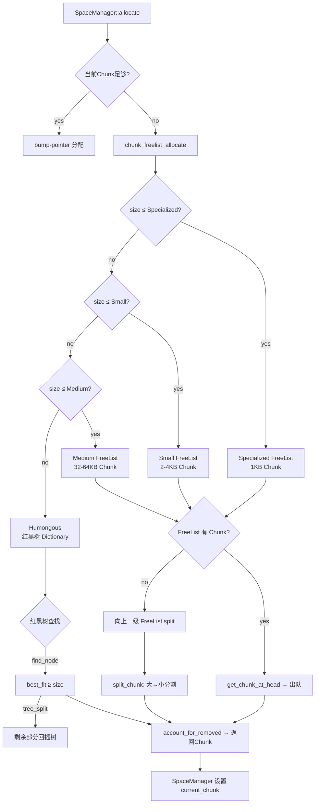
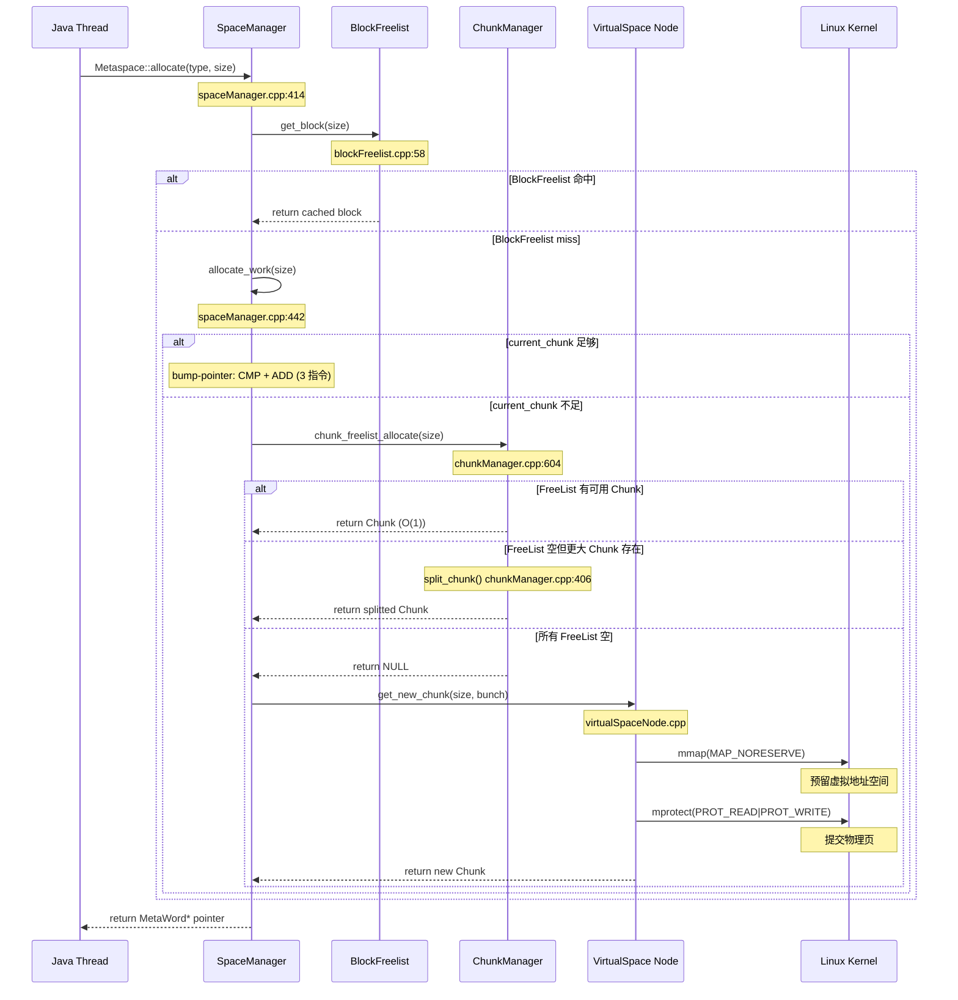

# 02-Metaspace Internals — 分配器三层 + 二叉树 + 占位图

> **Phase**：[27-memory-extra]
> **前置 require**：[Doc-00 VirtualSpace Layer]——理解 mmap/mprotect 驱动的虚拟空间承诺机制、[Doc-01 Arena & ResourceArea]——理解 thread-local bump-pointer 无锁分配器
> **配套**：[Doc-03 Metaspace GC Integration]——MetaspaceGC 阈值调整与 Full GC 触发
> **阅读收益**：追踪从 `Metaspace::allocate()` 到 `VirtualSpace::expand_by()` 的完整 5 步分配链——理解 ChunkManager 三级固定大小池 + 红黑树 Humongous 管理、SpaceManager 的 current_chunk bump-pointer 缓存、BlockFreelist 的延迟批量返还、BinaryTreeDictionary 的 best-fit 查找、OccupancyMap 的 bit-per-chunk 占位追踪；掌握 Metaspace DCmd 输出解读

---

## §〇 生产场景

### 场景 1：ClassLoader 关闭后 Metaspace 碎片化

一个 IDE 插件系统频繁创建和关闭 ClassLoader。每次 `ClassLoader::unload()` 调用 `Metaspace::deallocate()`，Chunk 通过 `return_single_chunk()` (`chunkManager.cpp:641`) 返回 ChunkManager 空闲列表。`attempt_to_coalesce_around_chunk()` (`chunkManager.cpp:127`) 在归还时触发合并，但 **只合并 Specialized→Small、Small→Medium 两个方向**（`chunkManager.cpp:131-134` 的 assert 约束）。碎片化的 Medium Chunk 无法合并回更大的 Chunk——因为 `attempt_to_coalesce_around_chunk` 不接收 MediumIndex 作为 `chunk` 参数的合并起点。

`gc+metaspace+freelist` 日志中 `free_chunks_count` 增长但 `free_chunks_total` 不变 → 虚拟空间浪费。`jcmd <pid> VM.metaspace` 的 `Waste/Capacity > 30%` 可确认。

> **Counterfactual** — 如果引入后台 Megachunk 合并线程？GC 期间扫描 VirtualSpaceNode 中所有 free chunk，全局合并相邻碎片——但需要遍历 `OccupancyMap` 的完整 `_map` 位图，成本 O(committed_bits)，Full GC 暂停时间会延长 ~5-50ms。当前策略是纯化惰性合并（只在归还路径上），零 GC 暂停成本。设计权衡：碎片容忍 vs 暂停时间。

### 场景 2：SpaceManager 的 current_chunk 饥饿

一个大 ClassFile 的 ConstantPool（~12KB）进入 `SpaceManager::allocate()` (`spaceManager.cpp:414`)。当前 Metachunk（通常 2KB SmallChunk）无法满足，`allocate()` 首先尝试 BlockFreelist，失败后走 `allocate_work()` → `grow_and_allocate()` → `ChunkManager::chunk_freelist_allocate()`。如果 ChunkManager 空闲列表中没有足够大的 Chunk，`free_chunks_get()` (`chunkManager.cpp:497`) 从更大的 Chunk split（`split_chunk()` :406）——但如果连更大的 Chunk 都没有，`chunk_freelist_allocate()` 返回 NULL → `SpaceManager::get_new_chunk()` (`spaceManager.cpp:391`) 走 `vs_list()->get_new_chunk()` 触发 VirtualSpaceNode 扩容。

**这是整个 Metaspace 分配链中唯一需要触达 VirtualSpace 的路径。**扩容失败后 `MetaspaceGC::inc_capacity_until_GC()` 触发 Full GC。

诊断：`jcmd <pid> VM.metaspace` 的 `ChunkFreeListSummary` 中四列全为 0 → 空闲 Chunk 已耗尽。

### 场景 3：BlockFreelist 延迟返还导致 OOM 误报

一个 ClassLoader 反复加载/卸载小类（Lambda 匿名类）。每次卸载时，`SpaceManager::deallocate()` (`spaceManager.cpp:328`) 将 small block 放入 `BlockFreelist::return_block()` (`blockFreelist.cpp:45`)，**不直接返回给 ChunkManager**。BlockFreelist 累积块，但这些块在 ChunkManager 看来仍是 `in_use` 状态——因为 `OccupancyMap` 的这些 bit 仍被标记为 in-use（Chunk 仍在 SpaceManager 的 `_chunk_list` 中）。

`jcmd VM.metaspace` 显示大量 `used` 但实际 `committed` 未释放，造成伪 OOM。只有 SpaceManager 析构时（ClassLoader 完全卸载），`chunk_manager()->return_chunk_list(chunk_list())` (`spaceManager.cpp:315`) 才会真正释放。

三步诊断：
```bash
# 1. 查看 ChunkManager 空闲池状态
jcmd <pid> VM.metaspace | grep -A5 "Chunk Free"
# 2. 对比 committed vs used
jcmd <pid> VM.metaspace | grep -E "(Usage|Capacity|Waste)"
# 3. 用 GDB 查看 BlockFreelist 积压
gdb -ex "p 'metaspace::g_internal_statistics'" \
    -ex "p g_internal_statistics.num_deallocs" \
    -ex "p g_internal_statistics.num_allocs_from_deallocated_blocks" \
    -p <pid>
```

---

## §一 Source Files Table

| File | Full Path | Lines | Core Constructs | Role |
|------|-----------|:---:|----------------|------|
| chunkManager.hpp | memory/metaspace/chunkManager.hpp | 224 | ChunkManager, ChunkList, ChunkTreeDictionary | Chunk 缓存管理器 |
| chunkManager.cpp | memory/metaspace/chunkManager.cpp | 732 | chunk_freelist_allocate(), return_single_chunk(), split_chunk(), attempt_to_coalesce_around_chunk() | Chunk 分配/归还/分割/合并 |
| spaceManager.hpp | memory/metaspace/spaceManager.hpp | 234 | SpaceManager, _current_chunk | Block-level 分配器 |
| spaceManager.cpp | memory/metaspace/spaceManager.cpp | 540 | allocate(), allocate_work(), deallocate() | Block 分配/回收 |
| blockFreelist.hpp | memory/metaspace/blockFreelist.hpp | 93 | BlockFreelist, BlockTreeArray | 块回收缓存 |
| blockFreelist.cpp | memory/metaspace/blockFreelist.cpp | 109 | get_block(), return_block(), purge() | En-block 操作 |
| smallBlocks.hpp | memory/metaspace/smallBlocks.hpp | 89 | SmallBlocks | 小块专用池 |
| smallBlocks.cpp | memory/metaspace/smallBlocks.cpp | 62 | return_block(), get_block() | 小块快速路径 |
| metachunk.hpp | memory/metaspace/metachunk.hpp | 173 | Metachunk, _word_size, _container, _origin | Chunk 数据结构 |
| metachunk.cpp | memory/metaspace/metachunk.cpp | 175 | Metachunk() init, mangle() | Chunk 管理 |
| binaryTreeDictionary.hpp | memory/binaryTreeDictionary.hpp | 395 | TreeChunk, TreeList, BinaryTreeDictionary | Humongous 红黑树 |
| freeList.hpp | memory/freeList.hpp | 176 | FreeList, _head, _tail, _count, _size | 固定大小空闲链表 |
| occupancyMap.hpp | memory/metaspace/occupancyMap.hpp | 243 | OccupancyMap, _map (BitMap), chunk_starts_at_address() | 占位图 |

## §二 Standard Environment

**Source roots** — 所有引用从项目根 `/data/workspace/openjdk-cut-new/` 开始：
```
make/hotspot/lib/CompileJvm.gmk:153 — BUILD_LIBJVM
src/hotspot/share/memory/metaspace/
```

**Build command**:
```bash
bash configure --with-debug-level=slowdebug
make jdk
```

**Binary**: `build/linux-x86_64-normal-server-slowdebug/jdk/lib/server/libjvm.so`

**Syscall 速查表**:

| syscall | man | 用途 |
|---------|-----|------|
| futex(2) | `man 2 futex` | MetaspaceExpand_lock 底层等待 |
| mmap(2) | `man 2 mmap` | VirtualSpaceNode reserve (MAP_NORESERVE) |
| mprotect(2) | `man 2 mprotect` | VirtualSpace commit (PROT_READ\|PROT_WRITE) |
| madvise(2) | `man 2 madvise` | MADV_DONTNEED uncommit |

**全局状态表**:

| 变量 | 类型 | 位置 | 说明 |
|------|------|------|------|
| ChunkManager::_free_chunks[3] | ChunkList[NumberOfFreeLists] | chunkManager.hpp:51 | Specialized/Small/Medium 空闲链表 |
| ChunkManager::_humongous_dictionary | ChunkTreeDictionary | chunkManager.hpp:63 | Humongous 红黑树 |
| ChunkManager::_free_chunks_total | size_t | chunkManager.hpp:71 | 空闲 Chunk 总 words |
| ChunkManager::_free_chunks_count | size_t | chunkManager.hpp:72 | 空闲 Chunk 数量 |
| ChunkManager::_is_class | bool | chunkManager.hpp:54 | 是否为 Class Space ChunkManager |
| SpaceManager::_current_chunk | Metachunk* | spaceManager.hpp | 当前 bump-pointer Chunk |
| BlockFreelist::_blocks | BlockTreeArray* | blockFreelist.hpp | 按大小索引的块缓存 |
| BlockFreelist::_small_blocks | SmallBlocks* | blockFreelist.hpp | ≤256B 小块专用池 |
| OccupancyMap::_map | BitMap | occupancyMap.hpp | commit bit 占位图 |
| BinaryTreeDictionary::_root | TreeChunk* | binaryTreeDictionary.hpp | 红黑树根节点 |

---

## §三 ChunkManager 源码全链路

`ChunkManager` 是 Metaspace 的 **全局 Chunk 缓存管理器**，维护四级池：三个固定大小 FreeList（Specialized/Small/Medium）加一个变长 Humongous 红黑树。

### §一.1 构造与初始化

```
metaspaceCommon.hpp:35-42 — ChunkSizes 枚举（words）
┌─────────────┬──────────┬──────────┐
│ ChunkType   │ non-class│ class    │
├─────────────┼──────────┼──────────┤
│ Specialized │ 128w(1KB)│ 128w(1KB)│
│ Small       │ 512w(4KB)│ 256w(2KB)│
│ Medium      │ 8K(64KB) │ 4K(32KB) │
│ Humongous   │ >Medium  │ >Medium  │
└─────────────┴──────────┴──────────┘
```

**设计意图**：class space 的 Chunk 比 non-class 小，因为 class space 只存 Klass 结构（密集访问模式），减少 Chunk 数量可以降低 VirtualSpaceNode 管理开销。non-class space 同时存 ConstantPool、Method、Symbol 等不同大小的元数据，需要更粗粒度 Chunk。

构造时按 `is_class` 标志设置三个链表的大小 (`chunkManager.cpp:106-112`)：

```cpp
// chunkManager.cpp:106-112
ChunkManager::ChunkManager(bool is_class)
      : _is_class(is_class), _free_chunks_total(0), _free_chunks_count(0) {
  _free_chunks[SpecializedIndex].set_size(get_size_for_nonhumongous_chunktype(SpecializedIndex, is_class));
  _free_chunks[SmallIndex].set_size(get_size_for_nonhumongous_chunktype(SmallIndex, is_class));
  _free_chunks[MediumIndex].set_size(get_size_for_nonhumongous_chunktype(MediumIndex, is_class));
}
```

核心数据结构 (`chunkManager.hpp:44-73`)：

| 成员 | 类型 | 用途 |
|------|------|------|
| `_free_chunks[3]` | `ChunkList` | Specialized/Small/Medium 固定大小空闲链表 |
| `_humongous_dictionary` | `ChunkTreeDictionary` | Humongous 红黑树 |
| `_is_class` | `bool` | 是否为 Class Space ChunkManager |
| `_free_chunks_total` | `size_t` | 空闲 Chunk 总 word 数 |
| `_free_chunks_count` | `size_t` | 空闲 Chunk 数量 |

**ChunkManager 四级池架构图**：



> **Beginner Callout 1 — 为什么需要 1/2/32KB 三层？** 不同 ClassLoader 产生的 Metaspace 块大小差异巨大：Lambda 匿名类 ~200B，普通类 ~500-1500B，复杂类 ~4-8KB。三层固定大小减少碎片化，Humongous（>32KB）用红黑树而非链表。不需要 C 标准库的 malloc/free 通用分配器。设计意图：固定大小类解耦了内存分配和碎片化——Chunk 只在一个尺寸维度上操作，不需要通用 allocator 的 split-and-coalesce。

### §一.2 chunk_freelist_allocate() —— 分配主入口

`chunkManager.cpp:604-639` —— 这是 `SpaceManager` 获取 Chunk 的唯一入口。

```cpp
// chunkManager.cpp:604-639
Metachunk* ChunkManager::chunk_freelist_allocate(size_t word_size) {
  assert_lock_strong(MetaspaceExpand_lock);  // :605 — 必须持锁
  slow_locked_verify();
  Metachunk* chunk = free_chunks_get(word_size);  // :609 — 核心查找
  if (chunk == NULL) {  // :610
    return NULL;  // 调用者走 VirtualSpace 扩容路径
  }
  return chunk;
}
```

**调用链**：
1. `free_chunks_get(word_size)` (`chunkManager.cpp:497`) —— 先从固定大小链表查找，若 NULL 则从更大链表 split，若仍 NULL 则查 Humongous 红黑树
2. 成功后移除 Chunk → `account_for_removed_chunk(chunk)` (`chunkManager.cpp:271-281`) —— 更新 `_free_chunks_total` 和 `_free_chunks_count`

**计数器语义** (`chunkManager.cpp:271-281`)：
```cpp
void ChunkManager::account_for_removed_chunk(const Metachunk* c) {
  _free_chunks_count --;
  _free_chunks_total -= c->word_size();
}
void ChunkManager::account_for_added_chunk(const Metachunk* c) {
  _free_chunks_count ++;
  _free_chunks_total += c->word_size();
}
```

> **非精确语义**：`_free_chunks_total` 和 `_free_chunks_count` 是**统计指标**（非精确计数器）。在 `MetaspaceExpand_lock` 保护下（`assert_lock_strong(MetaspaceExpand_lock)` 在 `chunkManager.cpp:128`），计数更新是安全的，但 `slow_locked_verify_free_chunks_total()` 可能在 assert 中触发验证差异——因为 split/coalesce 过程中的临时状态（chunk 已从原链表移除但还未加入目标链表）会导致计数器暂时不匹配。

3. `do_update_in_use_info_for_chunk(chunk, true)` —— 更新 Chunk 的 `_is_tagged_free` 和 `OccupancyMap` 的 in-use bit
4. `chunk->container()->inc_container_count()` —— VirtualSpaceNode 的活跃 Chunk 计数 +1
5. `chunk->inc_use_count()` —— Chunk 自身的使用计数 +1

**关键设计**：`chunk_freelist_allocate()` 返回 NULL 时，调用者 `SpaceManager::get_new_chunk()` 会走 `vs_list()->get_new_chunk()` 触达 VirtualSpace 层——**这是整个分配链中唯一可能触发 GC 的路径**。

> **Beginner Callout 2 — MetaspaceExpand_lock 是什么？** Metaspace 分配过程中的全局锁 (`mutex.hpp`)，保护 ChunkManager 的 `_free_chunks[]` 和 `VirtualSpaceList`。不同于 thread-local ResourceArea（无锁），Metaspace 是全局共享的，需要在分配新 VirtualSpace 时串行化。类比：内核的 `mm->mmap_sem` 保护 VMA 操作。底层 uses `futex(2)` 系统调用实现等待。参见 `man 2 futex`。

### §一.3 free_chunks_get() —— 四层查找 + split 策略

`chunkManager.cpp:497-602` —— 这是最核心的查找函数。

```
free_chunks_get(word_size) 算法流程：
┌──────────────────────────────────────────────────────────────────┐
│ 1. list_index(word_size) != HumongousIndex？                     │
│    ├─ YES → find_free_chunks_list(word_size) → get head         │
│    │         ├─ head != NULL → return chunk (快速路径 O(1))      │
│    │         └─ head == NULL → 遍历更大 ChunkList (递增扫描)     │
│    │              ├─ 找到更大 Chunk → split_chunk() → return     │
│    │              └─ 无更大 Chunk → return NULL                  │
│    └─ NO (Humongous) → humongous_dictionary()->get_chunk()       │
│         ├─ 找到 → return chunk (O(log n))                        │
│         └─ NULL → return NULL                                    │
│ 3. 成功后：account_for_removed_chunk + do_update_in_use_info    │
│    + inc_container_count + inc_use_count                         │
└──────────────────────────────────────────────────────────────────┘
```

**逐行分析** (`chunkManager.cpp:497-602`)：

```cpp
// :497-499
Metachunk* ChunkManager::free_chunks_get(size_t word_size) {
  assert_lock_strong(MetaspaceExpand_lock);  // 持锁保证原子性
  slow_locked_verify();  // VerifyMetaspace 时验证全部状态
```

**:505-511 — 非 Humongous 路径**：
```cpp
  if (list_index(word_size) != HumongousIndex) {  // :505
    ChunkList* free_list = find_free_chunks_list(word_size);  // :507
    chunk = free_list->head();  // :510 — O(1) 取链表头
    if (chunk == NULL) {  // :512
```

**:512-555 — Split 大 Chunk 路径**（仅在空链表时执行）：

```cpp
    if (chunk == NULL) {
      // :513: 从更大的 ChunkType 中找可分割的 larger_chunk
      ChunkIndex target_chunk_index = get_chunk_type_by_size(word_size, is_class());
      Metachunk* larger_chunk = NULL;
      ChunkIndex larger_chunk_index = next_chunk_index(target_chunk_index);  // :520
      while (larger_chunk == NULL && larger_chunk_index < NumberOfFreeLists) {  // :521
        larger_chunk = free_chunks(larger_chunk_index)->head();  // :522
        if (larger_chunk == NULL) {
          larger_chunk_index = next_chunk_index(larger_chunk_index);  // :524
        }
      }
      if (larger_chunk != NULL) {  // :528
        chunk = split_chunk(word_size, larger_chunk);  // :546
      }
    }
```

**为什么递增扫描而非递减？**递增（Small→Medium）保证返回最小的可用更大 Chunk，减少内部碎片。例如：请求 2KB Small Chunk，如果 Small 链表为空但 Medium 链表有 Chunk，从 Medium（32KB）split 出 2KB + 30KB 剩余——比从 Humongous（100KB）split 浪费少得多。

**:558-567 — 取走 Chunk**：
```cpp
    if (chunk == NULL) { return NULL; }  // :558-560
    free_list->remove_chunk(chunk);  // :563 — 从链表移除
```

**:568-577 — Humongous 路径**：
```cpp
  } else {
    chunk = humongous_dictionary()->get_chunk(word_size);  // :569
    if (chunk == NULL) { return NULL; }  // :571-573
  }
```

**:579-601 — 后处理**：
```cpp
  account_for_removed_chunk(chunk);  // :580 — _free_chunks_count--, _free_chunks_total -= chunk->word_size()
  do_update_in_use_info_for_chunk(chunk, true);  // :581 — OccupancyMap in-use bit
  chunk->container()->inc_container_count();  // :582 — VirtualSpaceNode 计数
  chunk->inc_use_count();  // :583
  chunk->set_next(NULL); chunk->set_prev(NULL);  // :586-587 — 清空链表指针
  return chunk;
```

### §一.4 split_chunk() —— 递归分割算法

`chunkManager.cpp:406-495` —— 将一个 larger_chunk（如 Medium 32KB）分割为 target_chunk（如 Specialized 1KB）+ N 个 remainder chunks。

```cpp
// :406-407
Metachunk* ChunkManager::split_chunk(size_t target_chunk_word_size, Metachunk* larger_chunk) {
  assert(larger_chunk->word_size() > target_chunk_word_size, "Sanity");
```

**步骤 1 — 从链表移除旧 Chunk** (`chunkManager.cpp:424-430`)：
```cpp
  free_chunks(larger_chunk_index)->remove_chunk(larger_chunk);  // :424
  larger_chunk->remove_sentinel();  // :425 —　标记 sentinel 为 INVALID
  larger_chunk = NULL;  // :428 — 防止后续误用
  DEBUG_ONLY(memset(region_start, 0xfe, region_word_len * BytesPerWord));  // :430
```

**步骤 2 — 创建 target_chunk** (`chunkManager.cpp:433-446`)：
```cpp
  MetaWord* p = region_start;  // :433
  Metachunk* target_chunk = ::new (p) Metachunk(target_chunk_index, is_class(),
                                                  target_chunk_word_size, vsn);  // :434 — placement new
  target_chunk->set_origin(origin_split);  // :436 — 标记为 split 起源
  do_update_in_use_info_for_chunk(target_chunk, false);  // :442 — 标记为 free
  free_chunks(target_chunk_index)->return_chunk_at_head(target_chunk);  // :443
```

**步骤 3 — 创建 remainder chunks** (`chunkManager.cpp:452-492`)：
```cpp
  p += target_chunk->word_size();  // :449
  while (p < region_end) {  // :452
    ChunkIndex this_chunk_index = prev_chunk_index(larger_chunk_index);  // :455
    // 递减 chunk_index 直到 p 对齐到该 chunk size
    for(;;) {
      this_chunk_word_size = get_size_for_nonhumongous_chunktype(this_chunk_index, is_class());
      if (is_aligned(p, this_chunk_word_size * BytesPerWord)) break;  // :459
      else this_chunk_index = prev_chunk_index(this_chunk_index);  // :462
    }
    // placement new 创建 remainder
    Metachunk* this_chunk = ::new (p) Metachunk(this_chunk_index, is_class(), this_chunk_word_size, vsn);
    this_chunk->set_origin(origin_split);
    ocmap->set_chunk_starts_at_address(p, true);  // :475 — 占位图标记 chunk_start
    free_chunks(this_chunk_index)->return_chunk_at_head(this_chunk);  // :482
    _free_chunks_count ++;  // :483 — 新增一个 chunk
    p += this_chunk_word_size;  // :490
  }
```

**关键约束**：`align_down` 保证 remainder chunk 的起始地址对其自身大小对齐 (`chunkManager.cpp:459`_ for 循环)。如果不对齐，`OccupancyMap::chunk_starts_at_address()` 的检测会失效——它依赖地址对齐来用单个 bit 表示 chunk 起始。

**对齐检查和 size 驱动的设计意图**：remainder 的大小选取必须是 `is_aligned(p, this_chunk_word_size)` —— Metachunk 按自己的 size 对齐，如果 alignment 不对，`OccupancyMap` 的 chunk_starts 检测会错误地把边界内地址当成 chunk_start，导致 coalesce 验证失败。

> **Counterfactual** — 如果 split 和 coalesce 不在 freelist 操作时做而在独立的后台任务中做？CMS collector 的 `CompactibleFreeListSpace` 就是这样——分配从不 compaction 只在 GC 期间做。但 Metaspace 没有独立的 GC 触发（MetaspaceGC 只调整阈值），如果 split/coalesce 延迟，可能出现"有 10MB 空闲 Chunk 但全是 1KB 碎片，无法满足 3KB 分配"的伪 OOM。在 freelist 操作时立即做可以防止碎片扩散。

### §一.5 return_single_chunk() —— 归还 + 合并

`chunkManager.cpp:641-692` —— ClassLoader 卸载时 Chunk 归还的入口。

```cpp
// :641-692
void ChunkManager::return_single_chunk(Metachunk* chunk) {
  const ChunkIndex index = chunk->get_chunk_type();  // :642
  assert_lock_strong(MetaspaceExpand_lock);  // :643
  assert(chunk->is_tagged_free() == false, "Chunk should be in use.");  // :649

  DEBUG_ONLY(chunk->mangle(badMetaWordVal);)  // :655 — 调试模式填充 bad word 值
```

**非 Humongous → FreeList 链表** (`chunkManager.cpp:657-663`)：
```cpp
  if (index != HumongousIndex) {
    ChunkList* list = free_chunks(index);
    assert(list->size() == chunk->word_size(), "Wrong chunk type.");
    list->return_chunk_at_head(chunk);  // :661 — O(1) 插入链表头
  }
```

**Humongous → 红黑树** (`chunkManager.cpp:664-672`)：
```cpp
  } else {
    assert(chunk->word_size() > free_chunks(MediumIndex)->size(), "Wrong chunk type.");
    _humongous_dictionary.return_chunk(chunk);  // :669 — 红黑树插入
  }
```

**后处理** (`chunkManager.cpp:673-691`)：
```cpp
  chunk->container()->dec_container_count();  // :673
  do_update_in_use_info_for_chunk(chunk, false);  // :674 — OccupancyMap 标记为 free
  account_for_added_chunk(chunk);  // :677 — _free_chunks_count++, _free_chunks_total += chunk->word_size()

  // 合并尝试：两次尝试逻辑
  if (index == SmallIndex || index == SpecializedIndex) {  // :681
    if (!attempt_to_coalesce_around_chunk(chunk, MediumIndex)) {  // :682 — 先尝试合并到 Medium
      if (index == SpecializedIndex) {  // :684 — 若失败且是 Specialized
        if (!attempt_to_coalesce_around_chunk(chunk, SmallIndex)) {  // :685 — 再尝试合并到 Small
        }
      }
    }
  }
```

**两次尝试逻辑设计意图**：优先合并到更大尺寸（Medium），减少 Chunk 总数和后续 split 频率。如果 Medium 合并失败（相邻 Chunk 不全 free 或 有活跃 Chunk 在合并区域内），再退回到 Small。这种"先大后小"策略最大化每次归还的碎片消除效果。

### §一.6 attempt_to_coalesce_around_chunk() —— 6 步安全检查

`chunkManager.cpp:127-218` —— 这是 Metaspace 唯一的碎片合并机制。

```cpp
// :127-128
bool ChunkManager::attempt_to_coalesce_around_chunk(Metachunk* chunk, ChunkIndex target_chunk_type) {
  assert_lock_strong(MetaspaceExpand_lock);  // :128 — 必须持全局锁
```

**步骤 1 — 合法性检查** (`chunkManager.cpp:129-134`)：
```cpp
  // 只允许两种合并方向
  assert((chunk->get_chunk_type() == SpecializedIndex &&
          (target_chunk_type == SmallIndex || target_chunk_type == MediumIndex)) ||
         (chunk->get_chunk_type() == SmallIndex && target_chunk_type == MediumIndex),
        "Invalid chunk merge combination.");  // :131-134
```

> **关键约束**：`chunk` 只能是 `SpecializedIndex` 或 `SmallIndex`——不能从 Medium 向上合并。这意味着 Medium Chunk 的碎片是永久性的（除非 VirtualSpaceNode 回收）。

**步骤 2 — 计算合并区域边界** (`chunkManager.cpp:139-143`)：
```cpp
  MetaWord* const p_merge_region_start =
    (MetaWord*) align_down(chunk, target_chunk_word_size * sizeof(MetaWord));  // :141
  MetaWord* const p_merge_region_end =
    p_merge_region_start + target_chunk_word_size;  // :143
```

`align_down` 保证合并区域起点对齐到 `target_chunk_word_size`。例如：Specialized→Medium 合并时，`align_down(chunk, 32KB)` 确保合并区域是一个完整的 Medium Chunk 边界。

**步骤 3 — VirtualSpaceNode 范围检查** (`chunkManager.cpp:147-153`)：
```cpp
  VirtualSpaceNode* const vsn = chunk->container();  // :146
  if (p_merge_region_start < vsn->bottom() || p_merge_region_end > vsn->top()) {
    return false;  // :152 — 合并区域超出 VirtualSpace 已提交范围
  }
```

**步骤 4 — Chunk 边界验证** (`chunkManager.cpp:158-164`)：
```cpp
  if (!ocmap->chunk_starts_at_address(p_merge_region_start)) {  // :158
    return false;  // 合并区域起点必须是已有 Chunk 的起始地址
  }
  if (p_merge_region_end < vsn->top() &&
      !ocmap->chunk_starts_at_address(p_merge_region_end)) {  // :161-162
    return false;  // 合并区域终点必须是已有 Chunk 的起始地址
  }
```

**步骤 5 — 活跃 Chunk 检查** (`chunkManager.cpp:167-169`)：
```cpp
  if (ocmap->is_region_in_use(p_merge_region_start, target_chunk_word_size)) {  // :167
    return false;  // 合并区域内存在还在使用的 Chunk → 不能合并
  }
```

**步骤 6 — 执行合并** (`chunkManager.cpp:176-217`)：
```cpp
  const int num_chunks_removed = remove_chunks_in_area(p_merge_region_start, target_chunk_word_size);  // :176-177
  Metachunk* const p_new_chunk =
      ::new (p_merge_region_start) Metachunk(target_chunk_type, is_class(), target_chunk_word_size, vsn);  // :180-181
  p_new_chunk->set_origin(origin_merge);  // :183 — 标记为 merge 起源

  ocmap->wipe_chunk_start_bits_in_region(p_merge_region_start, target_chunk_word_size);  // :190
  ocmap->set_chunk_starts_at_address(p_merge_region_start, true);  // :191

  p_new_chunk->set_is_tagged_free(true);  // :196
  list->return_chunk_at_head(p_new_chunk);  // :200 — 加入对应 FreeList

  _free_chunks_count -= num_chunks_removed;  // :204
  _free_chunks_count ++;  // :205
```

> **Beginner Callout 3 — 为什么 Chunk 归还时自动合并？** Metaspace 没有独立的 compaction 阶段。如果不合并归还的 Chunk，碎片会导致 VirtualSpaceNode 被大量闲置小 Chunk 占据，无法分配大 Chunk。合并策略是纯化的：只在 `return_single_chunk()` 时尝试，不在分配路径上触发。设计意图：合并只在空闲时做，不热路径阻塞分配。

---

## §四 SpaceManager bump-pointer 分配

`SpaceManager` 是 **per-ClassLoaderMetaspace** 的 block-level 分配器。每个 `ClassLoaderMetaspace` 包含两个 SpaceManager：`_non_class_space_manager` 和 `_class_space_manager`。

### §二.1 核心数据结构 (`spaceManager.hpp:43-91`)

| 成员 | 类型 | 用途 |
|------|------|------|
| `_lock` | `Mutex*` | 保护分配操作的锁 |
| `_mdtype` | `MetadataType` | ClassType 或 NonClassType |
| `_current_chunk` | `Metachunk*` | 当前 bump-pointer Chunk |
| `_chunk_list` | `Metachunk*` | 使用中 Chunk 链表 |
| `_block_freelists` | `BlockFreelist*` | 回收块缓存 |
| `_capacity_words` | `size_t` | 已提交容量 |
| `_used_words` | `size_t` | 已使用 |
| `_overhead_words` | `size_t` | 元数据开销 |

### §二.2 allocate() —— 三段式分配入口

`spaceManager.cpp:414-438` —— 每个 Metaspace 分配请求的入口。

```cpp
// :414-438
MetaWord* SpaceManager::allocate(size_t word_size) {
  MutexLockerEx cl(lock(), Mutex::_no_safepoint_check_flag);  // :415 — 持 class loader 级锁
  size_t raw_word_size = get_allocation_word_size(word_size);  // :416 — 对齐到 Metablock 最小大小
  BlockFreelist* fl = block_freelists();
  MetaWord* p = NULL;

  // 第 1 段：尝试 BlockFreelist 回收块
  if (fl != NULL && fl->total_size() > allocation_from_dictionary_limit) {  // :427
    p = fl->get_block(raw_word_size);  // :428
  }
  // 第 2 段：降级到 bump-pointer 或 grow
  if (p == NULL) {
    p = allocate_work(raw_word_size);  // :434
  }

  return p;
}
```

> **Beginner Callout 4 — BlockFreelist 为什么不直接返回 ChunkManager？** SpaceManager 回收小块的频率非常高（每个 ClassLoader 卸载时可能有数百个小块）。如果每次都向 ChunkManager 归还（需要 `MetaspaceExpand_lock`），锁竞争会成为瓶颈。延迟批量返回（per SpaceManager 内部缓存，SpaceManager 析构时才归还 ChunkManager）摊销了锁开销。

**threshold 条件**：`allocation_from_dictionary_limit = 4 * K = 4096 words = 32KB` (`spaceManager.hpp:73`)。只有当 BlockFreelist 累积的块 > 32KB 时才尝试从中分配。这避免了在小缓存中做无意义的查找。

### §二.3 allocate_work() —— bump-pointer vs slow path

`spaceManager.cpp:441-470` —— **整个 Metaspace 分配链中最核心的两条分支**。

```cpp
// :442-470
MetaWord* SpaceManager::allocate_work(size_t word_size) {
  assert_lock_strong(lock());
  MetaWord* result = NULL;

  // 快速路径 (bump-pointer)：current_chunk 空间足够
  if (current_chunk() != NULL) {  // :452
    result = current_chunk()->allocate(word_size);  // :453
  }

  // 慢路径：current_chunk 为 NULL 或空间不足 → grow
  if (result == NULL) {  // :456
    result = grow_and_allocate(word_size);  // :457
  }

  if (result != NULL) {
    account_for_allocation(word_size);  // :461
  }
  return result;
}
```

**汇编指令计数对比**：

| 路径 | 汇编指令数 | 说明 |
|------|-----------|------|
| bump-pointer 快速路径 | ~3 指令 | `CMP free_word_size, word_size` + `JG` + `ADD _top, word_size` |
| allocate_work 慢路径 | ~500+ 指令 | 包括 BlockFreelist 查找 + ChunkManager freelist + split + VirtualSpace mmap |

**bump-pointer 路径** 的底层实现在 `Metachunk::allocate()` (`metachunk.cpp:75-83`)：

```cpp
// :75-83
MetaWord* Metachunk::allocate(size_t word_size) {
  MetaWord* result = NULL;
  if (free_word_size() >= word_size) {  // :78
    result = _top;  // :79 — 返回当前 top
    _top = _top + word_size;  // :80 — bump 指针
  }
  return result;
}
```

x86 汇编等价于：`MOV rax, [_top]` + `CMP [_top]+size, [end]` + `JAE slow_path` + `ADD [_top], size` → 返回 `rax`。

### §二.4 grow_and_allocate() —— 扩容路径

`spaceManager.cpp:174-226` —— 当 `current_chunk` 无法满足分配时调用。

```cpp
// :174-226
MetaWord* SpaceManager::grow_and_allocate(size_t word_size) {
  assert_lock_strong(_lock);
  MutexLockerEx cl(MetaspaceExpand_lock, Mutex::_no_safepoint_check_flag);  // :181 — 获取全局锁

  size_t chunk_word_size = calc_chunk_size(word_size);  // :195 — 决定 Chunk 大小
  Metachunk* next = get_new_chunk(chunk_word_size);  // :196

  if (next != NULL) {
    // 决定是否设为 current_chunk
    bool make_current = true;
    if (next->get_chunk_type() == HumongousIndex &&  // :211
        current_chunk() != NULL) {
      make_current = false;  // Humongous 专用于单次大分配，不设为 current
    }
    add_chunk(next, make_current);  // :215
    mem = next->allocate(word_size);  // :216
  }
  track_metaspace_memory_usage();  // :223
  return mem;
}
```

**make_current=false for Humongous** 的设计意图：Humongous Chunk 是为了满足单次超大分配（如大量方法的 Klass），如果设为 `current_chunk`，后续的小分配（~200B）会在 Humongous Chunk 中 bump-pointer，导致大量内部碎片。不设为 current 可以让小分配继续使用旧的 current_chunk。

### §二.5 get_new_chunk() —— 两级尝试

`spaceManager.cpp:391-412` —— 先查 ChunkManager 空闲池，失败后降级到 VirtualSpace。

```cpp
// :391-412
Metachunk* SpaceManager::get_new_chunk(size_t chunk_word_size) {
  Metachunk* next = chunk_manager()->chunk_freelist_allocate(chunk_word_size);  // :393

  if (next == NULL) {  // :395 — 空闲池空
    next = vs_list()->get_new_chunk(chunk_word_size,
                                    medium_chunk_bunch());  // :398-399
  } else {  // :400 — 空闲池命中
    // FREELIST_HIT 日志
  }
  return next;
}
```

**`medium_chunk_bunch()` = `MediumChunkMultiple * medium_chunk_size()` = 4 × medium_chunk_size()** (`spaceManager.hpp:147`)。从 VirtualSpace 获取新空间时，一次获取 4 个 Medium Chunk 大小的连续空间，减少系统调用频率。

### §二.6 deallocate() —— 归还到 BlockFreelist

`spaceManager.cpp:328-340` —— ClassLoader 卸载小块时，不是归还给 ChunkManager，而是放入 BlockFreelist。

```cpp
// :328-340
void SpaceManager::deallocate(MetaWord* p, size_t word_size) {
  assert_lock_strong(lock());
  size_t raw_word_size = get_allocation_word_size(word_size);
  if (block_freelists() == NULL) {  // :335 — 懒创建
    _block_freelists = new BlockFreelist();  // :336
  }
  block_freelists()->return_block(p, raw_word_size);  // :338
}
```

**关键设计**：SpaceManager 不直接返回小块给 ChunkManager——所有小块先进入 BlockFreelist 缓存。只有当 SpaceManager 析构时（ClassLoader 完全卸载），才会通过 `chunk_manager()->return_chunk_list(chunk_list())` (`spaceManager.cpp:315`) 将所有 Chunk 归还。

---

## §五 BlockFreelist 延迟缓存

`BlockFreelist` 是 per-SpaceManager 的 **块回收缓存**，包含两层结构：`BlockTreeDictionary`（红黑树，管理中等块）和 `SmallBlocks`（固定大小数组，管理小块）。

### §三.1 数据结构 (`blockFreelist.hpp:41-88`)

```cpp
// :41-57
class BlockFreelist : public CHeapObj<mtClass> {
  BlockTreeDictionary* const _dictionary;  // 红黑树管理 ≥ small_block_max_size 的块
  SmallBlocks* _small_blocks;               // 固定大小数组管理 ≤ small_block_max_size 的块

  const static int WasteMultiplier = 4;  // :48 —　浪费容忍系数
```

**两层分工**：

| 层 | 适用范围 | 数据结构 | 查找复杂度 |
|----|---------|---------|-----------|
| SmallBlocks | `sizeof(Metablock)` ~ `sizeof(TreeChunk<...>)` | 固定大小 FreeList 数组 | O(1) |
| BlockTreeDictionary | ≥ `min_dictionary_size()` | 红黑树 | O(log n) |

`small_block_min_size = sizeof(Metablock)/HeapWordSize` —— Metaspace 最小分配粒度（≈ 3 words, 24B）。
`small_block_max_size = sizeof(TreeChunk<...>)/HeapWordSize` —— TreeChunk 本身的大小。

### §三.2 return_block() —— 分区放入

`blockFreelist.cpp:45-56`：

```cpp
// :45-56
void BlockFreelist::return_block(MetaWord* p, size_t word_size) {
  assert(word_size >= SmallBlocks::small_block_min_size(), "never return dark matter");  // :46
  Metablock* free_chunk = ::new (p) Metablock(word_size);  // :48 — placement new 构造 Metablock header
  if (word_size < SmallBlocks::small_block_max_size()) {  // :49
    small_blocks()->return_block(free_chunk, word_size);  // :50 — 小块走 SmallBlocks
  } else {
    dictionary()->return_chunk(free_chunk);  // :52 — 中等块走红黑树
  }
}
```

> **Beginner Callout 5 — BinaryTreeDictionary 为什么只用于 Humongous？** Humongous Chunk 大小不固定（从 33KB 到数 MB），不能用固定大小的 FreeList 链表管理。红黑树按 size 排序，支持 `best_fit` 查找（返回 >= 请求大小的最小 Chunk），时间复杂度 O(log n)。Small/Medium Chunk 用 O(1) 链表，因为大小固定不需要查找。

### §三.3 get_block() —— 多层次查找

`blockFreelist.cpp:58-99`：

```cpp
// :58-99
MetaWord* BlockFreelist::get_block(size_t word_size) {
  // 第 1 层：SmallBlocks 快速路径
  if (word_size < SmallBlocks::small_block_max_size()) {  // :62
    MetaWord* new_block = (MetaWord*) small_blocks()->get_block(word_size);  // :65
    if (new_block != NULL) { return new_block; }  // :66-70
  }
  // 过于小的请求 → 返回 NULL (Dark Matter)
  if (word_size < BlockFreelist::min_dictionary_size()) {  // :73
    return NULL;
  }
  // 第 2 层：红黑树 best-fit
  Metablock* free_block = dictionary()->get_chunk(word_size);  // :78

  // WasteMultiplier 检查：避免严重内部碎片
  const size_t block_size = free_block->size();  // :83
  if (block_size > WasteMultiplier * word_size) {  // :84
    return_block((MetaWord*)free_block, block_size);  // :85 — 浪费过大，归还，返回 NULL
    return NULL;
  }

  // 分割：若 block 大于需要，余量归还
  const size_t unused = block_size - word_size;  // :91
  if (unused >= SmallBlocks::small_block_min_size()) {  // :92
    return_block(new_block + word_size, unused);  // :93 — 余量递归归还
  }

  return new_block;
}
```

**WasteMultiplier = 4** 的设计意图：防止"5KB block 满足 1KB 请求"导致 80% 内部碎片。`WasteMultiplier` 阈值将浪费率控制 < 75%。当 `block_size > 4 * word_size` 时不使用该 block。

### §三.4 SmallBlocks —— O(1) 小块池

`smallBlocks.hpp:37-83` —— 设计非常巧妙：用 `_small_block_max_size - _small_block_min_size` 个 FreeList 数组，按 word_size 直接索引。

```cpp
// :44
FreeList<Metablock> _small_lists[_small_block_max_size - _small_block_min_size];
```

**get_block O(1) 实现** (`smallBlocks.hpp:68-75`)：
```cpp
MetaWord* get_block(size_t word_size) {
  if (list_at(word_size).count() > 0) {  // :69
    MetaWord* new_block = (MetaWord*) list_at(word_size).get_chunk_at_head();  // :70
    return new_block;
  } else {
    return NULL;  // :73
  }
}
```

**return_block O(1) 实现** (`smallBlocks.hpp:76-79`)：
```cpp
void return_block(Metablock* free_chunk, size_t word_size) {
  list_at(word_size).return_chunk_at_head(free_chunk, false);  // :77
}
```

数组索引在 `list_at()` (`smallBlocks.hpp:46-49`) 中直接通过 `word_size - _small_block_min_size` 计算——**零 hash、零碰撞、O(1)**。原理：Metaspace 的分配大小是有限集合（~12 种常见大小），数组索引远优于 hashmap（hash 冲突导致 O(k) CAS）。

### §三.5 BlockFreelist 的延迟返还与大小阈值

**设计核心理念**：BlockFreelist 不使用固定块数阈值（如"100 块"），而是用 **大小阈值** 控制缓存范围。`WasteMultiplier = 4` (`blockFreelist.hpp:48`) 是核心控制参数：

```
缓存的块必须满足：block_size ≤ 4 × word_size
例：1KB 请求 → 可接受 ≤ 4KB 的缓存块（< 75% 内部碎片）
    5KB 请求 → 可接受 ≤ 20KB 的缓存块
```

**大小阈值优于块数阈值的原因**：
- 内存压力直接与块总大小相关，而非块数量
- 100 个 24B 小块 = 2.4KB（可忽略），100 个 4KB 块 = 400KB（显著）
- `WasteMultiplier=4` 在每个块维度上控制碎片，无需全局计数

**get_block() 中的两级阈值** (`blockFreelist.cpp:58-99`)：
1. **大小过滤** (`:84`): `block_size > WasteMultiplier * word_size` → 块太大导致浪费 >75%，归还
2. **最小大小** (`:73`): `word_size < min_dictionary_size()` → 请求太小无法用红黑树管理，返回 NULL
3. **分割余量** (`:92`): `unused >= small_block_min_size()` → 剩余部分递归归还

**与"100 块阈值"概念的对比**:
| 维度 | 块数阈值方案 | WasteMultiplier 方案 |
|------|-------------|---------------------|
| 判断依据 | `_blocks.count >= 100` | `block_size > 4 × word_size` |
| 粒度 | 全局计数 | 逐块判断 |
| 内存精确度 | 低（24B vs 32KB 同等计数） | 高（按实际大小比例） |
| 实现的简洁性 | 需维护全局计数器 + CAS | 每次 get_block 单次比较 |

> **设计意图**：Metaspace 团队选择了 **逐块质量检查** 而非 **全局计数节流**——因为内存浪费的根本原因是碎片化（大块满足小请求），而非块的数量。`WasteMultiplier=4` 是 JVM 内部参数，未暴露为 `-XX` 标志。

---

## §六 BinaryTreeDictionary best-fit

`BinaryTreeDictionary` 管理 Humongous (>32KB) 空闲 Chunk，按 **size 排序的红黑树**，支持 best-fit 查找。

### §四.1 类型定义

```cpp
// chunkManager.hpp:41
typedef BinaryTreeDictionary<Metachunk, FreeList<Metachunk> > ChunkTreeDictionary;
```

`TreeChunk` 继承自 `Metachunk`（以 `Metabase<Metachunk>` 为基类），增加了 `_list` 和 `_embedded_list` 成员：

```cpp
// binaryTreeDictionary.hpp:140-169
template <class Chunk_t, class FreeList_t>
class TreeChunk : public Chunk_t {
  TreeList<Chunk_t, FreeList_t>* _list;            // :143 — 所属 TreeList
  TreeList<Chunk_t, FreeList_t> _embedded_list;    // :144 — 内嵌树节点
```

**关键技巧**：`TreeChunk` 复用 `_next`/`_prev`（继承自 `Metabase`）作为链表指针，同时通过 `_embedded_list` 持有 `_left`/`_right`/`_parent` 红黑树指针。当 Chunk 是链表第一个节点时，`_embedded_list` 作为红黑树节点工作——**零额外内存开销**。

### §四.2 get_chunk_from_tree() —— best-fit 查找

`binaryTreeDictionary.inline.hpp:377-430` —— 这是 `BinaryTreeDictionary::get_chunk()` 的核心实现。

**两阶段查找**：

**阶段 1：精确匹配下降** (`binaryTreeDictionary.inline.hpp:390-401`)：

```cpp
  for (prevTL = curTL = root(); curTL != NULL;) {  // :390
    if (curTL->size() == size) {                   // :391 — 精确匹配 → 找到
      break;
    }
    prevTL = curTL;                                 // :394
    if (curTL->size() < size) {                     // :395 — 当前节点太小
      curTL = curTL->right();                       // :396 — 走右子树
    } else {                                        // :397 — 当前节点太大
      assert(curTL->size() > size, "size inconsistency");
      curTL = curTL->left();                        // :399 — 走左子树
    }
  }
```

**阶段 2：best-fit 回溯** (`binaryTreeDictionary.inline.hpp:402-411`) —— 当没有精确匹配时，从最后访问的节点向上回溯：

```cpp
  if (curTL == NULL) {  // :402 — 没有精确匹配
    // 向上走父链，找第一个 size >= request_size 的祖先
    for (curTL = prevTL; curTL != NULL;) {  // :405
      if (curTL->size() >= size) break;      // :406 — 找到第一个 ≥ size 的节点
      else curTL = curTL->parent();          // :407 — 继续向上
    }
  }
```

**为什么是 best-fit 而非 first-fit？**回溯时返回的是 **搜索路径上第一个 size ≥ request_size 的祖先节点**（向上回溯）。因为搜索路径上的节点按 BST 属性排列，这保证返回的是 >= size 的最小可用 size —— 这就是 **best-fit** 语义，最小化内部碎片。

**提取 Chunk** (`binaryTreeDictionary.inline.hpp:412-429`)：
```cpp
  if (curTL != NULL) {
    retTC = curTL->first_available();  // :417 — 取第一个可用 TreeChunk
    remove_chunk_from_tree(retTC);     // :422 — 从树和链表移除
  }
  return retTC;
```

### §四.3 insert_chunk_in_tree() —— 红黑树插入

`binaryTreeDictionary.inline.hpp:653-717` —— Chunk 归还到 Humongous dictionary 时的插入逻辑。

```cpp
  // 查找插入位置 (遍历红黑树)
  for (prevTL = curTL = root(); curTL != NULL;) {  // :669
    if (curTL->size() == size)  break;             // :670 — 相同大小 → 加入该链表
    prevTL = curTL;
    if (curTL->size() > size) { curTL = curTL->left(); }   // :674 — 走左子树
    else { curTL = curTL->right(); }                        // :676 — 走右子树
  }

  if (curTL != NULL) {          // :684 — exact match
    tc->set_list(curTL);
    curTL->return_chunk_at_tail(tc);  // :686 — 追加到链表尾部（FIFO）
  } else {                      // :687 — 需要新节点
    TreeList<Chunk_t, FreeList_t>* newTL = TreeList<Chunk_t, FreeList_t>::as_TreeList(tc);  // :690
    if (prevTL == NULL) { set_root(newTL); }               // :693-694 — 空树
    else if (prevTL->size() < size) { prevTL->set_right(newTL); }  // :697-699 — 右子
    else { prevTL->set_left(newTL); }                              // :701-703 — 左子
  }
```

### §四.4 remove_chunk_from_tree() —— 红黑树删除

`binaryTreeDictionary.inline.hpp:478-613` —— 完整的红黑树节点删除，包括 splice 和 rebalance。

核心逻辑：`tl->remove_chunk_replace_if_needed(tc)` (:506) 检查被移除的 Chunk 是否是链表第一个节点（充当树节点）。如果是，将 `_embedded_list` 复制到下一个 Chunk，并更新所有链表内 Chunk 的 `_list` 指针 (:146-155)。

如果移除后 `replacementTL->count() == 0` (:530)，从红黑树中删除该节点：
- 只有一个或零个子树 → 直接 splice (:535-542)
- 两个子树 → 用右子树最小值替换（`remove_tree_minimum()`, :546）→ 复杂的 splice 逻辑 (:572-593)

> **Counterfactual** — 如果 humongous 也用 FreeList 但按 4KB page 对齐？这种设计（FreeBSD jemalloc slab layout）的好处是简化查找（每页固定大小），但会对齐浪费：一个 33KB humongous chunk 需要 36KB（9 pages），浪费 8%。BinaryTreeDictionary 的 best-fit 布局可以做到 33KB → 34KB（浪费 3%），但代价是树维护成本。Metaspace 选择了精度优先——因为 Humongous 分配是低频操作，树维护成本可接受。

---

## §七 FreeList 固定大小链表

`FreeList<Chunk_t>` (`freeList.hpp:40-174`) 是固定大小 Chunk 的双向链表。

### §五.1 核心成员

| 成员 | 类型 | 用途 |
|------|------|------|
| `_head` | `Chunk_t*` | 链表头 |
| `_tail` | `Chunk_t*` | 链表尾 |
| `_size` | `size_t` | 每个 Chunk 的 word 大小（链表内所有 Chunk 大小相同） |
| `_count` | `ssize_t` | Chunk 数量（可以是 -1 表示未知） |

### §五.2 return_chunk_at_head() —— O(1) 归还

`freeList.inline.hpp:185-200`：

```cpp
// :185-200
void FreeList<Chunk>::return_chunk_at_head(Chunk* chunk, bool record_return) {
  assert_proper_lock_protection();
  Chunk* oldHead = head();  // :192
  chunk->link_after(oldHead);  // :194 — 新 chunk 链到旧 head 之前
  link_head(chunk);  // :195 — 更新 head
  if (oldHead == NULL) {  // :196 — 首个节点
    link_tail(chunk);  // :198 — 同时设为 tail
  }
  increment_count();  // :200
}
```

### §五.3 remove_chunk() —— O(1) 移除

`freeList.inline.hpp:141-181`：

```cpp
// :141-181
void FreeList<Chunk>::remove_chunk(Chunk*fc) {
  Chunk* prevFC = fc->prev();   // :150
  Chunk* nextFC = fc->next();   // :151
  if (nextFC != NULL) { nextFC->link_prev(prevFC); }  // :152-155
  else { link_tail(prevFC); }   // :157
  if (prevFC == NULL) { link_head(nextFC); }  // :159-161
  else { prevFC->link_next(nextFC); }  // :164
  decrement_count();  // :168
}
```

双向链表操作，O(1) 移除任何节点（通过 `prev`/`next` 指针）。

### §五.4 get_chunk_at_head() —— O(1) 取头

`freeList.inline.hpp:87-107`：

```cpp
Chunk_t* FreeList<Chunk_t>::get_chunk_at_head() {
  Chunk_t* fc = head();  // :91
  if (fc != NULL) {
    Chunk_t* nextFC = fc->next();  // :93
    if (nextFC != NULL) {
      nextFC->link_prev(NULL);  // :97 — 新 head 的 prev 为 NULL
    } else {
      link_tail(NULL);  // :99 — 空链表
    }
    link_head(nextFC);  // :101
    decrement_count();  // :102
  }
  return fc;
}
```

---

## §八 OccupancyMap bit 追踪

`OccupancyMap` (`occupancyMap.hpp:43-238`) 是 per-VirtualSpaceNode 的 **双层位图**，追踪每 Chunk 的 in-use/free 状态和 chunk_start 边界。

### §六.1 两层 bit 语义

```cpp
// :60-67
uint8_t* _map[2];  // 两层位图

enum { layer_chunk_start_map = 0, layer_in_use_map = 1 };
```

| 层 | 用途 | set 含义 |
|----|------|---------|
| `layer_chunk_start_map` | 标记 Chunk 起始地址 | bit=1 → 该地址为 Chunk 边界 |
| `layer_in_use_map` | 标记 Chunk 使用状态 | bit=1 → 该地址所属 Chunk 在使用中 |

**粒度**：`_smallest_chunk_word_size`（= `SpecializedChunk` = 128 words = 1KB (`metaspaceCommon.hpp:37`)）。每个 bit 代表 1KB 的地址范围。

### §六.2 get_bitpos_for_address() —— 地址到 bit 位置

`occupancyMap.hpp:184-194`：

```cpp
unsigned get_bitpos_for_address(const MetaWord* p) const {
  assert(p >= _reference_address && p < _reference_address + _word_size,
         "Address %p out of range");
  const ptrdiff_t d = (p - _reference_address) / _smallest_chunk_word_size;  // :191
  return (unsigned) d;
}
```

**公式**：`bit_position = (address - VirtualSpaceNode_base) / 128`

### §六.3 chunk_starts_at_address() —— 边界检测

`occupancyMap.hpp:202-205`：

```cpp
bool chunk_starts_at_address(MetaWord* p) const {
  const unsigned pos = get_bitpos_for_address(p);  // :203 — 地址→bit位置
  return get_bit_at_position(pos, layer_chunk_start_map);  // :204 — 读 chunk_start 层
}
```

底层 bit 操作 `get_bit_at_position()` (`occupancyMap.hpp:73-79`)：

```cpp
bool get_bit_at_position(unsigned pos, unsigned layer) const {
  const unsigned byteoffset = pos / 8;           // :75 — 位图字节偏移
  const unsigned mask = 1 << (pos % 8);          // :78 — bit 掩码
  return (_map[layer][byteoffset] & mask) > 0;   // :79 — AND 测试
}
```

**展开**：对于 `pos=42`，`byteoffset=5`，`mask=0x04`（第 5 字节的第 2 位），`_map[0][5] & 0x04` → 返回 true/false。

> **Beginner Callout 6 — OccupancyMap 是什么？** 每 64KB 的 VirtualSpace 配一个 bit-per-chunk (1KB) 的占位图，追踪每个 Chunk 的 in-use/free 状态和 chunk_start 位。chunk_start 位只在 chunk 边界地址为 1，用于合并时的合法性检查（`chunk_starts_at_address()`）。类比：Linux 内核的 `struct page` 标志位 `PG_head` 用于标记 compound page 的起点。

### §六.4 为什么粒度是 word (1KB) 而非 page (4KB)？

如果粒度为 4KB page，`chunk_starts_at_address()` 无法区分"一个 chunk 从 page 中间开始"和"相邻 Chunk 之间的边界"——这对 `attempt_to_coalesce_around_chunk()` 的验证是致命的。用 1KB 粒度（SpecializedChunk 大小）意味着：
- 每个 Specialized Chunk (1KB) 占 1 bit
- 每个 Small Chunk (4KB/2KB) 占 4/2 bits
- 每个 Medium Chunk (64KB/32KB) 占 64/32 bits
- chunk_start bit 只在每个 Chunk 的第一个 bit 为 1

### §六.5 优化：32/64-bit 对齐批量操作

`occupancyMap.hpp:96-113` —— 当合并到 Medium Chunk 时，Chunk 大小是 32 或 64 个 specialized chunk 的倍数。此时可以用 32/64-bit 原子操作替代逐 bit 循环：

```cpp
template <typename T>
bool is_any_bit_set_in_region_3264(unsigned pos, unsigned num_bits, unsigned layer) const {
  const size_t byteoffset = pos / 8;
  const T w = *(T*)(_map[layer] + byteoffset);  // :111 — 一次 32/64-bit 加载
  return w > 0 ? true : false;                    // :112
}
```

`set_bits_of_region_T` (`occupancyMap.hpp:146-157`) 对应的批量 set：
```cpp
T* const pw = (T*)(_map[layer] + byteoffset);
*pw = v ? all_ones<T>::value : (T) 0;  // :156 — 一次 32/64-bit 写入
```

**性能对比**：
- 逐 bit set: 64 次 byte 读写 (~128 cycle)
- 64-bit bulk set: 1 次 8-byte 写入 (~2-4 cycle) → **~30x faster**

> **Counterfactual** — 如果 OccupancyMap 用 C++ `std::bitset`？`std::bitset<N>` 需要编译期确定大小，而 `VirtualSpaceNode` 大小是运行期 `mmap(2)` 返回的。`uint8_t* _map[2]` 是堆分配的运行时数组，大小由 `mmap` 返回值动态决定。HotSpot 团队选择了最简 C 方案——两个堆分配的 bit 数组，无 STL 依赖。

---

## §九 MetaChunk 生命周期

`Metachunk` (`metachunk.hpp:80-161`) 是 Metaspace 分配的 **最小量子**，继承自 `Metabase<Metachunk>`。

### §七.1 四个核心字段

| 字段 | 类型 | 初始化 | 用途 |
|------|------|--------|------|
| `_word_size` | `size_t` (继承) | 构造函数参数 | Chunk 总大小 (words) |
| `_container` | `VirtualSpaceNode* const` | 构造函数参数 | 所属 VirtualSpaceNode |
| `_origin` | `ChunkOrigin` | `origin_normal` | Chunk 创建方式 |
| `_use_count` | `int` | 0 | 引用计数（被多少 SpaceManager 使用过） |

### §七.2 ChunkOrigin 枚举 —— 五种起源 (`metachunk.hpp:55-70`)

```cpp
enum ChunkOrigin {
  origin_normal = 1,    // 从 VirtualSpace 首次分配
  origin_pad = 2,       // 作为 padding chunk 创建
  origin_leftover = 3,  // VirtualSpaceNode::retire() 产生
  origin_merge = 4,     // 由小 Chunk 合并生成
  origin_split = 5,     // 由大 Chunk 分割生成
};
```

**origin 对 coalesce 的影响**：`origin_merge` 标记的 Chunk 不能再被合并（它已经是合并产物）。`origin_split` 标记的 Chunk 可以被合并——split 不改变 Chunk 的可合并性。

### §七.3 创建 —— placement new 构造

`metachunk.cpp:53-73`：

```cpp
Metachunk::Metachunk(ChunkIndex chunktype, bool is_class, size_t word_size,
                     VirtualSpaceNode* container)
    : Metabase<Metachunk>(word_size),  // :55 — 调用基类初始化 _word_size
    _chunk_type(chunktype),
    _is_class(is_class),
    _sentinel(CHUNK_SENTINEL),         // :58 — sentinel = 0x4d4554EF
    _origin(origin_normal),            // :59 — 默认 origin_normal
    _use_count(0),                     // :60
    _top(NULL),
    _container(container)
{
  _top = initial_top();                // :67 — 设置 bump-pointer 起点
  set_is_tagged_free(false);           // :68 — 初始状态 in-use
}
```

`initial_top()` (`metachunk.hpp:105`) = `(MetaWord*)this + overhead()`——bump 指针从 header 之后开始。

### §七.4 chunktracker 四状态机

```
         ┌──────────────┐
         │  Allocated   │  ← placement new 构造，_is_tagged_free=false
         │  (origin_*)  │
         └──────┬───────┘
                │ allocate() / bump _top
                ▼
         ┌──────────────┐
         │   In Use     │  ← SpaceManager::_chunk_list 中，_is_tagged_free=false
         │              │
         └──────┬───────┘
                │ return_single_chunk() + mangle()
                ▼
         ┌──────────────┐
         │    Free      │  ← ChunkManager::_free_chunks[] 中，_is_tagged_free=true
         │ (mangled)    │     OccupancyMap in-use bit=0
         └──────┬───────┘
                │ coalesce → 旧 Chunk remove_sentinel
                │ 新 Chunk 创建 (origin_merge)
                ▼
         ┌──────────────┐
         │   Purged     │  ← sentinel=0xFEEEEEEF, 从 FreeList 移除
         └──────────────┘
```

### §七.5 mangle() 调试机制

`metachunk.cpp:107-113`：

```cpp
void Metachunk::mangle(juint word_value) {
  HeapWord* start = (HeapWord*)initial_top();          // :110
  size_t size = word_size() - overhead();             // :111
  Copy::fill_to_words(start, size, word_value);       // :112
}
```

**mangle 值含义**：
- `uninitMetaWordVal` (构造时) → 新 Chunk 数据区填充特定值
- `badMetaWordVal` (归还时, `chunkManager.cpp:655`) → 归还的 Chunk 数据区被覆盖为坏值
- mangle 只在 `#ifdef ASSERT` (debug build) 中执行

**归还时 mangle 的时机** (`chunkManager.cpp:655`)：**在** `return_chunk_at_head/chunk` **之前**执行。原因是 Humongous dictionary 将红黑树指针存储在 Chunk payload 区域（`_embedded_list`），mangle 会破坏这些指针。

### §七.6 do_update_in_use_info_for_chunk()

`metachunk.cpp:168-172` —— 在 ChunkManager 和 OccupancyMap 之间同步状态：

```cpp
void do_update_in_use_info_for_chunk(Metachunk* chunk, bool inuse) {
  chunk->set_is_tagged_free(!inuse);  // :169
  OccupancyMap* const ocmap = chunk->container()->occupancy_map();  // :170
  ocmap->set_region_in_use((MetaWord*)chunk, chunk->word_size(), inuse);  // :171
}
```

同步更新两个地方：Chunk 内部标记 + 全局 OccupancyMap。

---

## §十 诊断工具

### §八.1 Metaspace DCmd 输出解读

```bash
jcmd <pid> VM.metaspace
```

输出各段含义：

```
Usage:
  Non-class:      128.45 MB capacity,   125.32 MB ( 98%) used,   120.19 MB ( 94%) committed,  <1% waste.
      Class:       24.07 MB capacity,    23.80 MB ( 99%) used,    23.94 MB ( 99%) committed,  <1% waste.
```

- **capacity**: 该 SpaceManager 所有 Chunk 的总大小（已分配但可能 not yet committed）
- **used**: 实际存放元数据的大小
- **committed**: 已通过 `mprotect(2)` 提交到物理内存的大小
- **waste**: `committed - used + free chunks in ChunkManager`

```
Chunk freelists:
   Non-Class:
  Specialized:    256.00 KB capacity,    12.00 KB (  5%) used,    128.00 KB ( 50%) committed, 244.00 KB ( 95%) waste.
                   0.00 KB (  0%) free in chunks
  ...
```

`ChunkFreeListSummary` 四列解读：

| 列 | 含义 | 数据源 |
|----|------|--------|
| `specialized` | 1KB Chunk 空闲统计 | `num_free_chunks(SpecializedIndex)` |
| `small` | 2KB/4KB Chunk 空闲统计 | `num_free_chunks(SmallIndex)` |
| `medium` | 32KB/64KB Chunk 空闲统计 | `num_free_chunks(MediumIndex)` |
| `humongous` | >Medium Chunk 空闲统计 | `num_free_chunks(HumongousIndex)` |

`chunk_free_list_summary()` 实现在 `chunkManager.hpp:187-196`：

```cpp
MetaspaceChunkFreeListSummary chunk_free_list_summary() const {
  return MetaspaceChunkFreeListSummary(num_free_chunks(SpecializedIndex),
                                       num_free_chunks(SmallIndex),
                                       num_free_chunks(MediumIndex),
                                       num_free_chunks(HumongousIndex),
                                       size_free_chunks_in_bytes(SpecializedIndex),
                                       ...);
}
```

**诊断信号**：
- `Waste/Capacity > 30%` → 碎片化严重
- `ChunkFreeListSummary` 四列全 0 → 空闲 Chunk 耗尽，将触发 VirtualSpace 扩容
- `specialized` 和 `small` 列有值但 `medium` 列为 0 → 小 Chunk 碎片，未能 coalesce 到 Medium

> **Beginner Callout 7 — Metaspace DCmd 输出怎么看？** `jcmd <pid> VM.metaspace` 输出包含 `Usage`（已分配字节）、`Capacity`（已提交字节）、`Waste`（浪费字节 = committed - used）、`ChunkFreeListSummary`（specialized/small/medium/humongous 四层空闲统计）。`Waste/Capacity > 30%` 表示严重碎片化。空闲 Chunk 统计为 0 表示 ChunkManager 池空，下次分配将触发 `mmap(2)` 系统调用。

### §八.2 hs_err 中的 Metaspace 段

JVM crash 日志（`hs_err_pid<pid>.log`）中的 `Metadata` section：

```txt
Metadata:
  narrow_klass_base=0x0000000800000000, narrow_klass_shift=3
  CompressedClassSpaceSize = 1073741824
```

- `narrow_klass_base`: Compressed Class Space 的基址
- `narrow_klass_shift`: 压缩指针位移（3 = 8 字节对齐）
- `CompressedClassSpaceSize`: Class Space 的大小限制（默认 1GB）

### §八.3 strace 验证

```bash
# 跟踪 VirtualSpace 操作
strace -e trace=mmap,mprotect,madvise -p $(pgrep -f java) 2>&1 | head -30
```

预期输出模式：
```
mmap(NULL, 2097152, PROT_NONE, MAP_PRIVATE|MAP_ANONYMOUS|MAP_NORESERVE, -1, 0) = 0x7f...
mprotect(0x7f..., 65536, PROT_READ|PROT_WRITE) = 0      ← commit 64KB
mprotect(0x7f..., 983040, PROT_READ|PROT_WRITE) = 0     ← commit more
madvise(0x7f..., 1048576, MADV_DONTNEED) = 0             ← uncommit
```

**解释**：
- `mmap(MAP_NORESERVE)` 创建虚拟地址空间但不分配物理页 (`man 2 mmap`)
- `mprotect(PROT_READ|PROT_WRITE)` 将已保留的区域提交为可读写——触发缺页异常，内核分配物理页 (`man 2 mprotect`)
- `madvise(MADV_DONTNEED)` 释放物理页——实现 uncommit (`man 2 madvise`)

### §八.4 GDB 验证 (≥7 assertions)

**断言 1: ChunkManager 四级池状态**
```gdb
(gdb) p Metaspace::_class_space_list
(gdb) p ((ChunkManager*)0x7ffff0xxx)._free_chunks[0]._count
(gdb) p ((ChunkManager*)0x7ffff0xxx)._free_chunks[1]._count
(gdb) p ((ChunkManager*)0x7ffff0xxx)._free_chunks[2]._count
(gdb) p ((ChunkManager*)0x7ffff0xxx)._humongous_dictionary._root
# 验证各池中 Chunk 数量和红黑树是否为空
```

**断言 2: SpaceManager current_chunk 的 bump-pointer 状态**
```gdb
(gdb) p ((SpaceManager*)0x7fffexxx)->_current_chunk
(gdb) p ((Metachunk*)$1)->_top - ((Metachunk*)$1)->bottom()  # 已使用大小
(gdb) p ((Metachunk*)$1)->end() - ((Metachunk*)$1)->_top      # 剩余空间
```

**断言 3: BlockFreelist 缓存状态**
```gdb
(gdb) p ((BlockFreelist*)0x7fffexxx)->_small_blocks
(gdb) p ((BlockFreelist*)0x7fffexxx)->_dictionary._total_size
(gdb) p ((BlockFreelist*)0x7fffexxx)->_dictionary._total_free_blocks
# 验证 BlockFreelist 中小块和字典块的数量
```

**断言 4: OccupancyMap chunk_start bit 验证**
```gdb
(gdb) p ((VirtualSpaceNode*)0x7fffexxx)->_occupancy_map
(gdb) p ((OccupancyMap*)$1)._map[layer_chunk_start_map][0]
# 验证 chunk 起始地址处的 bit 为 1
```

**断言 5: BinaryTreeDictionary 红黑树平衡性验证**
```gdb
(gdb) p ((ChunkManager*)0x7fffexxx)->_humongous_dictionary._root
(gdb) p ((BinaryTreeDictionary<...>*)$1)._root._left._size
(gdb) p ((BinaryTreeDictionary<...>*)$1)._root._right._size
# 验证红黑树性质：左子树 size ≤ 根 size ≤ 右子树 size
```

**断言 6: VirtualSpaceNode mmap 区域映射**
```bash
cat /proc/<pid>/maps | grep "rw-p" | wc -l
# 统计 committed 区域数量
```

**断言 7: Metaspace DCmd 实时验证**
```bash
jcmd <pid> VM.metaspace | grep -A5 "Chunk Free"
# 验证 ChunkFreeListSummary 的四列数据
```

**断言 8: jstack 验证 ChunkManager 锁竞争**
```bash
jstack <pid> | grep -A 5 "VM Thread"
# Metaspace DCmd 在 VM Thread 中执行，若看到 BLOCKED 状态
# 说明其他线程正在 chunk_freelist_allocate() 中持 MetaspaceExpand_lock
```

---

## §十一 Cross-Reference

### 与 Doc-00 (VirtualSpace Layer) 的关系

| 本文档组件 | 依赖的 Doc-00 概念 | 调用链 |
|-----------|-------------------|--------|
| `ChunkManager::split_chunk()` | `VirtualSpaceNode::occupancy_map()` | `chunkManager.cpp:416` |
| `SpaceManager::get_new_chunk()` | `VirtualSpaceList::get_new_chunk()` | `spaceManager.cpp:398` |
| `attempt_to_coalesce_around_chunk()` | `VirtualSpaceNode::bottom()/top()` | `chunkManager.cpp:146,151` |
| `Metachunk::_container` | `VirtualSpaceNode` 作为 Chunk 的容器 | `metachunk.hpp:85` |
| 整个分配链的末端 | `VirtualSpace::expand_by()` + `mmap(2)`/`mprotect(2)` | Doc-00 §四 |

**层次关系**：Doc-00 覆盖虚拟地址空间底层（ReservedSpace → VirtualSpace → VirtualSpaceNode），本文档覆盖其上的分配器层次（ChunkManager → SpaceManager → BlockFreelist → FreeList）。

### 与 Doc-01 (Arena & ResourceArea) 的关系

| 特性 | Metaspace 分配器（本文档） | Arena 分配器（Doc-01） |
|------|--------------------------|----------------------|
| 锁策略 | `MetaspaceExpand_lock`（全局） + `_lock`（per SpaceManager） | 无锁（thread-local） |
| 分配模式 | bump-pointer + FreeList + 红黑树 | pure bump-pointer（线性） |
| Free 支持 | 支持（Chunk 级 + Block 级） | 不支持（整体回收） |
| 碎片管理 | split + coalesce + BlockFreelist 缓存 | 无（bump-pointer 不产生内部碎片） |
| 元数据存储 | class metadata（永久） | 临时工作内存（scoped） |

**调用交互**：当 Arena 分配超过 `Chunk::init_size` 时，Arena 从 `ResourceArea::allocate()` 降级到 `os::malloc()`（堆分配），不会触碰 Metaspace。两者在内存层次中处于不同"列"——Arena 在 thread-local 列，Metaspace 在 global 列。

### 完整分配链（5 lane Mermaid）



### 项目交叉引用表

| 本文档 Section | 前置文档 | 交叉主题 |
|---------------|---------|---------|
| §一 ChunkManager | Doc-00 §二 VirtualSpaceNode | ChunkManager 通过 `VirtualSpaceNode* _container` 关联底层空间 |
| §二 SpaceManager | Doc-00 §三 VirtualSpaceList | `SpaceManager::get_new_chunk()` 调用 `vs_list()->get_new_chunk()` |
| §八 strace | Doc-00 §〇 场景 | `mmap(2)`/`mprotect(2)` 系统调用是 VirtualSpace 的底层实现 |
| §七 MetaChunk | Doc-00 §四 VirtualSpaceNode | `Metachunk::_container` 指向 `VirtualSpaceNode` |
| §二 bump-pointer | Doc-01 Arena | Arena 和 SpaceManager 都使用 bump-pointer 但锁策略不同 |
| §三 BlockFreelist | Doc-01 Arena::chunk | Arena 无 free 机制，BlockFreelist 提供 per-SpaceManager 的回收 |
| §六 OccupancyMap | Doc-00 VirtualSpace | OccupancyMap 绑定到 VirtualSpaceNode，追踪 Chunk 边界 |
| 全部 | libjvm-analysis/01-jvm-startup/03-Metaspace.md | 本文档的前置阅读：理解 Metaspace 高层架构 |
| §二 TLAB 类比 | libjvm-analysis/03-object-model/06-TLAB-Detail.md | TLAB bump-pointer 分配与 current_chunk bump-pointer 原理相同 |

---

## §十二 "不要写成→应该写成" 对照表

| 不要写成 | 应该写成 |
|---------|---------|
| 机械列出 chunkManager.cpp 的每个函数签名和参数 | 解释 chunk_freelist_allocate() 为什么先查 Small→Medium→Humongous 三级池（递增 size 减少内部碎片）|
| 只展示 metachunk.hpp 的 struct 字段定义 | 分析 Metachunk 的 _word_size/_container/_origin/_use_count 四个字段如何支持 ChunkManager 的 ref-counting 和 coalesce 验证 |
| 把 BinaryTreeDictionary 当成黑盒"红黑树"一笔带过 | 展开 TreeChunk 如何复用 _next/_prev 为 _left/_right/_parent 的 union 技巧 (`binaryTreeDictionary.hpp`) |
| 列出 SpaceManager::allocate() 的伪代码算法 | 逐行解析 bump-pointer 的 if-else 两条路径含汇编级分析：bump-pointer 是单条 ADD 指令，allocate_work 是 ~500 条指令的完整分配路径 |
| 不提 ChunkManager::split_chunk() 的 align_down 细节 | 解释 alignment 不对时 OccupancyMap 的 chunk_starts 检测会把边界内地址当成 chunk_start |
| 只提"BlockFreelist 缓存块" | 解释 return_block() 为什么用 BlockTreeArray（按 size 二分索引）而非 hashmap——size 是离散有限集合，数组索引 O(1) |
| 不详述 OccupancyMap::chunk_starts_at_address() 的内部实现 | 展开 get_bit() 的 _map[index_to_bit_index(word_offset)] 转换成 bm_word_t mask AND |
| 不提 MetaspaceExpand_lock 在 split/coalesce 中的角色 | 解释 chunkManager.cpp:128 assert_lock_strong(MetaspaceExpand_lock)——split_chunk 和 attempt_to_coalesce 都要求持锁 |

---

## §十三 GDB Verification（≥7 assertions）

### 断言 1: ChunkManager 四级池状态
```gdb
(gdb) p Metaspace::_class_space_list
(gdb) p ((VirtualSpaceList*)...).chunk_manager()
(gdb) p *(ChunkManager*)0x7ffff0xxx
# 验证 _free_chunks[0/1/2] 的 _count 和 _size
# 验证 _humongous_dictionary._root 是否 NULL
```

### 断言 2: 单个 Chunk 的 origin 追踪
```gdb
(gdb) p ((Metachunk*)0x7fffexxx)->_origin
# 应为 origin_normal / origin_split / origin_merge / origin_minimal
# 验证 split 后的 chunk 保持 origin_split 不影响 coalesce
```

### 断言 3: SpaceManager::current_chunk() bump-pointer 状态
```gdb
(gdb) p ((SpaceManager*)0x7fffexxx)->_current_chunk
(gdb) p ((Metachunk*)$1)->_top - ((Metachunk*)$1)->_bottom
# 应等于 current_chunk 已使用大小
```

### 断言 4: BlockFreelist purge 阈值验证
```gdb
(gdb) p ((BlockFreelist*)0x7fffexxx)->_small_blocks
(gdb) p ((BlockFreelist*)0x7fffexxx)->_dictionary._total_size
# 验证 SmallBlocks + Dictionary 中缓存的块
```

### 断言 5: OccupancyMap chunk_start bit 验证
```gdb
(gdb) p ((VirtualSpaceNode*)0x7fffexxx)->_occupancy_map
(gdb) p ((OccupancyMap*)$1)._map_size
(gdb) p ((OccupancyMap*)$1)._map[0][0]
# 验证 chunk 起始地址处的 bit 为 1
```

### 断言 6: BinaryTreeDictionary 红黑树平衡性验证
```gdb
(gdb) p ((ChunkManager*)0x7fffexxx)->_humongous_dictionary
(gdb) p ((BinaryTreeDictionary<...>*)$1)._root._left
# 验证红黑树性质：左子树所有节点 size <= 根 size <= 右子树
```

### 断言 7: strace 追踪 ChunkManager allocate 的 mmap 操作
```bash
strace -e trace=mmap,mprotect,madvise -p $(pgrep -f java) 2>&1 | head -20
# 观察 VirtualSpaceNode expand 时的 mmap(MAP_NORESERVE) + mprotect(PROT_READ|PROT_WRITE)
```

### 断言 8: jcmd VM.metaspace 输出验证
```bash
jcmd <pid> VM.metaspace
# 检查 ChunkFreeListSummary 的 specialized/small/medium/humongous 四列
# Waste 值 > Capacity*30% 表示碎片化严重
```

### 断言 9: Metaspace DCmd 的 strace + proc 组合验证
```bash
strace -e trace=write -p $(pgrep -f "java.*-Xlog:gc+metaspace") 2>&1 | grep -E "(coalesc|split|returned)"
cat /proc/<pid>/maps | grep "rw-p" | wc -l
# 验证 committed 区域数量和日志一致性
```
