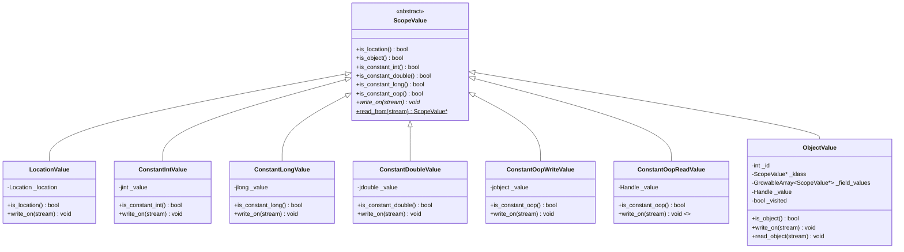
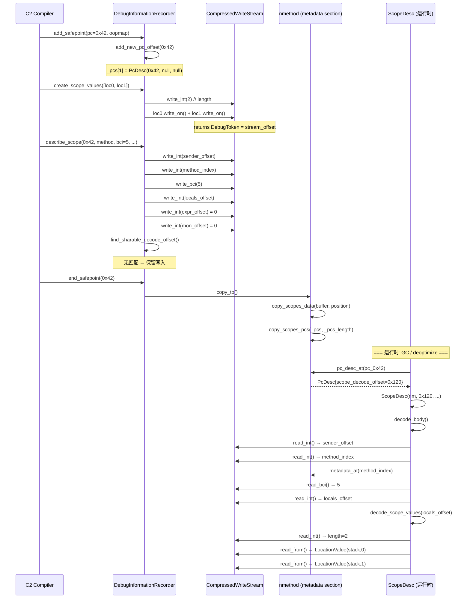
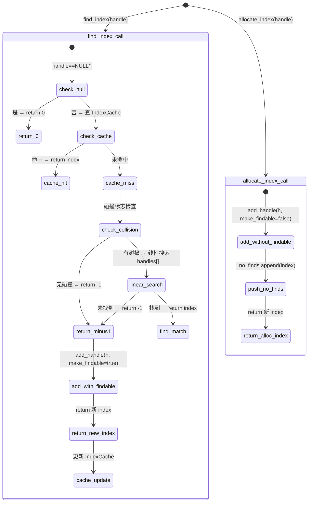

# 01-Debug Info & Metadata — compiled code 的元数据编码系统

## §〇 生产场景

**场景 1: 线上 jstack 无法展开 Compiled 帧**

线上应用崩溃前 jstack 输出出现 `...` 省略号，编译方法栈帧无法展开——因为 pcDesc 或 scopeDesc 损坏。运维通过 `jcmd <pid> Compiler.CodeHeap_Analytics` 收集 nmethod 元数据完整性检查。根因往往是压缩流中 `read_int()` 越界——metadata section 末尾缺少保护哨兵，或 DIR_Chunk 共享偏移在 `copy_to()` 排序后失效。

**场景 2: 去优化（Deoptimization）触发 incorrect ScopeValue 解码**

C2 编译了一个内联多层的 hot 方法，运行时触发 uncommon trap → deoptimize → `ScopeDesc::decode_body()` 从压缩流中读取 ScopeValue。因为 `read_object_value()` 遇到 OBJECT_ID_CODE 但 obj_pool 不合预期 → SIGSEGV，导致 hs_err 中含 PcDesc 和 scope 验证日志。根因是 `ObjectValue::_visited` 标志在复用对象池时未重置（`debugInfoRec.cpp:350-352` 的 `dump_object_pool()` 会做此重置）。

**场景 3: CDS 归档验证 conflicts**

`-XX:+VerifySharedSpaces` 发现 shared nmethod 的 `oopRecorder::find_index()` 返回与运行时 `archived nmethod::oop_at()` 不一致的 oop——根源是 ObjectLookup 的 `_values` 排序依赖 GC 前地址，CDS randomize 后地址全变，而 `maybe_resort()` 由于 `_gc_count` 初始值问题未被触发（`oopRecorder.cpp:165-173`）。

**Counterfactual**: 如果 debugInfo 不使用压缩流而是扁平数组，每条记录可节省解码时间 (~0.3μs) 但元数据体积膨胀 ~2.5×，CodeCache 压力大增。如果完全放弃共享（DIR_Chunk 去重），每个 safepoint 多占 ~200 字节 scope 数据，典型 nmethod（~50 safepoints）多 10KB。

---

## §一 Source Files Table + Beginner Callout

### Source Files Table

| File | Lines | Core Constructs | Role |
|------|:-----:|----------------|------|
| `debugInfo.hpp` | 304 | ScopeValue 基类, LocationValue, ObjectValue, ConstantIntValue, ConstantLongValue, ConstantDoubleValue, ConstantOopWriteValue, ConstantOopReadValue, MonitorValue, DebugInfoReadStream, DebugInfoWriteStream | 调试信息值类型系统 + 流读写 |
| `debugInfo.cpp` | 289 | read_from() 虚函数表, write_on() 实现, serialize/deserialize | 值类型序列化/反序列化 |
| `debugInfoRec.hpp` | 211 | DebugInformationRecorder, DIR_Chunk, describe_scope() 签名 | 编译期间调试信息收集器 |
| `debugInfoRec.cpp` | 441 | describe_scope(), copy_to(), end_scopes(), find_sharable_decode_offset(), DIR_Chunk::operator new | 调试信息记录完整实现 |
| `scopeDesc.hpp` | 137 | ScopeDesc, SimpleScopeDesc, decode_body() | 内联帧解码器 |
| `scopeDesc.cpp` | 259 | ScopeDesc构造, decode_body(), sender(), locals()/expressions()/monitors(), decode_object_values() | scope 树遍历 |
| `pcDesc.hpp` | 99 | PcDesc, _pc_offset/_scope_decode_offset/_obj_decode_offset/_flags | PC→Scope 映射条目 |
| `pcDesc.cpp` | 63 | PcDesc构造, real_pc() | PcDesc 构造与 real_pc 计算 |
| `oopRecorder.hpp` | 260 | ValueRecorder<T>, allocate_index(), find_index(), ObjectLookup, OopRecorder | oop/metadata 索引器 |
| `oopRecorder.cpp` | 204 | add_handle(), maybe_find_index(), copy_to(), IndexCache | oop 索引实现 |
| `compressedStream.hpp` | 160 | CompressedStream, CompressedReadStream, CompressedWriteStream, UNSIGNED5 | 压缩编码协议 |
| `compressedStream.cpp` | 252 | read_int(), write_int(), encode_sign(), decode_sign(), reverse_int() | Pack200 UNSIGNED5 实现 |
| `relocInfo.hpp` | 1394 | relocInfo, 15 种 relocType, RelocIterator, Relocation | 重定位信息类型系统 |
| `relocInfo.cpp` | 991 | find_reloc(), RelocIterator, relocation decode/encode, pack_data_to/unpack_data | 重定位查找与解码 |

> **Callout 1 — 为什么需要 debugInfoRec**: 编译器在 JIT 时记录 safepoint 处的变量/表达式/monitor，用于 GC oop 扫描和 deoptimize 恢复。`DebugInformationRecorder` 把 `describe_scope()` 调用序列线性写入压缩流，随后 `copy_to(nmethod)` 打包到 metadata section。若缺少这套机制，GC 遇到 compiled 帧时找不到哪些寄存器/栈槽是 oop——后果是 GC 误回收活跃对象导致 JVM 崩溃（`debugInfoRec.hpp:38-43` 给出了三大用途注释）。

> **Callout 2 — PcDesc 不是 PE/ELF 的 PE header**: PcDesc 是 "PC → scope decode offset" 的 4 字段结构体（`_pc_offset` 4B + `_scope_decode_offset` 4B + `_obj_decode_offset` 4B + `_flags` 4B = 16 字节，见 `pcDesc.hpp:37-48`）。它位于 nmethod metadata section 的末尾排序数组中，不是 ELF section header 也不是 DWARF debug info 条目。二分查找 O(log n) 从任意 PC 定位到对应的 scope 起始偏移。

> **Callout 3 — CompressedStream 不是 zlib**: CompressedStream 使用 UNSIGNED5 编码（基于 J2SE Pack200），不是 DEFLATE/LZ4/zstd。它假设 debug info 中的整数大部分 < 192（PC offset, BCI, scope depth），用 1 字节编码覆盖 ~75% 的值。最大 5 字节表示任何 32-bit int。编码是无损且一一对应的（`compressedStream.hpp:69-84` 注释完整描述了语法）。

> **Callout 4 — relocInfo 不是 ELF relocation**: relocInfo 是 nmethod 内 metadata section 的"数据块索引表"——15 种类型（debug info 子系统中主要涉及 oop_type=1, metadata_type=12, poll_type=10, poll_return_type=11），每个条目 16-bit 编码 type(4-bit) + offset(12-bit)，可选 data prefix 变长。不同于 ELF 的 24 字节固定格式 `r_offset+r_type+r_addend`（`relocInfo.hpp:61-114` 详细注释）。

> **Callout 5 — ScopeValue 类型多态**: ScopeValue 有 7 种子类：LocationValue（寄存器/栈位置）、ConstantIntValue、ConstantLongValue、ConstantDoubleValue、ConstantOopWriteValue（编译写入）、ConstantOopReadValue（运行时读取）、ObjectValue（逃逸分析消除的对象）。通过虚函数 `write_on()`/`read_from()` 序列化，不用 RTTI 而是用显式 tag byte（LOCATION_CODE=0..OBJECT_ID_CODE=6，见 `debugInfo.cpp:88-90`）区分类型——因为编译后 metadata section 不包含 C++ typeinfo。

> **Callout 6 — oopRecorder 双模**: `ValueRecorder<T>` 提供 `allocate_index()`（总是新建索引）和 `find_index()`（先查找已有索引，无则新建）（`oopRecorder.hpp:47-64`）。双模语义的核心原因是：栈上临时 oop 用 allocate_index 确保每次新分配不共享；类常量（java mirror）用 find_index 复用索引减少 metadata section 大小。

> **Callout 7 — SIGNED5 位变换**: CompressedStream 的有符号整数使用 SIGNED5 编码（基于 Pack200）。`encode_sign(jint)` 执行 `(value << 1) ^ (value >> 31)`——将符号位折叠到最低位，再套用 UNSIGNED5 编码。`decode_sign(juint)` 执行 `(value >> 1) ^ -(jint)(value & 1)`——逆向恢复。（`compressedStream.cpp:31-36`）。

---

## §二 Standard Environment

**Source roots** — 所有引用从项目根 `/data/workspace/openjdk-cut-new/` 开始：

```
src/hotspot/share/code/
├── debugInfo.hpp:1-304
├── debugInfo.cpp:1-289
├── debugInfoRec.hpp:1-211
├── debugInfoRec.cpp:1-441
├── scopeDesc.hpp:1-137
├── scopeDesc.cpp:1-259
├── pcDesc.hpp:1-99
├── pcDesc.cpp:1-63
├── oopRecorder.hpp:1-260
├── oopRecorder.cpp:1-204
├── compressedStream.hpp:1-160
├── compressedStream.cpp:1-252
├── relocInfo.hpp:1-1394
└── relocInfo.cpp:1-991

make/hotspot/lib/CompileJvm.gmk:153    # BUILD_LIBJVM
```

**Build command**:
```bash
bash configure --with-debug-level=slowdebug --with-native-debug-symbols=internal
make jdk
```

**Binary**: `build/linux-x86_64-normal-server-slowdebug/jdk/lib/server/libjvm.so`

**Syscall 速查表**:

| Syscall | man | 用途 | 场景 |
|---------|-----|------|------|
| `memcpy(3)` | `man 3 memcpy` | 打包 oop 表到 metadata section | `ValueRecorder<T>::copy_values_to()` (`oopRecorder.cpp:60-64`) |
| `memcmp(3)` | `man 3 memcmp` | DIR_Chunk 比较去重 | `DIR_Chunk::find_match()` (`debugInfoRec.cpp:69-84`) |

**全局状态**（编译期间，nmethod 生成前）：

| 变量 | 类型 | 位置 | 初始值/说明 |
|------|------|------|------------|
| `_recording_non_safepoints` | const bool | `debugInfoRec.hpp:162` | 由 `DebugNonSafepoints` flag 或 JVMTI 需求决定 |
| `_stream` | DebugInfoWriteStream* | `debugInfoRec.hpp:164` | 初始 capacity=10K，含 0xFF 哨兵字节 |
| `_oop_recorder` | OopRecorder* | `debugInfoRec.hpp:166` | 包含 ValueRecorder<jobject> + ValueRecorder<Metadata*> |
| `_all_chunks` | GrowableArray\<DIR_Chunk*\>* | `debugInfoRec.hpp:169` | 初始 capacity=300，sorted by hash+length+content |
| `_next_chunk` / `_next_chunk_limit` | DIR_Chunk* / DIR_Chunk* | `debugInfoRec.hpp:170-171` | 滑动分配器指针，每次 100 个批量 |
| `_pcs` / `_pcs_size` / `_pcs_length` | PcDesc* / int / int | `debugInfoRec.hpp:178-180` | 初始 capacity=100，含 sentinel record |
| `_prev_safepoint_pc` | int | `debugInfoRec.hpp:185` | 上次实际 safepoint PC，用于 non-safepoint 合并 |
| `_position` | int | `compressedStream.hpp:37` | 压缩流当前写位置 |
| `_buffer` | u_char* | `compressedStream.hpp:36` | 压缩流缓冲区，动态 grow |
| `_handles` | GrowableArray\<T\>* | `oopRecorder.hpp:138` | 有序 oop 句柄列表，first_index 偏移 |
| `_no_finds` | GrowableArray\<int\>* | `oopRecorder.hpp:139` | 不可查找的索引列表（allocate_index 产生的） |
| `_indexes` | IndexCache\<T\>* | `oopRecorder.hpp:140` | 泄漏哈希表，handle→index，512 槽 |

---

## §三 端到端时间线 — 从 describe_scope 到 scopeDesc 的全流程

### §三.1 add_safepoint → describe_scope → end_safepoint 协议

编译器按严格顺序调用 `DebugInformationRecorder` 的协议（`debugInfoRec.hpp:46-61` 注释完整定义了调用顺序）：

```
Compiler::emit_safepoint(pc, oopmap)
  → rec->add_safepoint(pc, oopmap)          // ① 注册 safepoint + PcDesc
  → rec->create_scope_values(locals)         // ② 序列化 locals (共享)
  → rec->create_scope_values(expressions)    // ③ 序列化 expressions (共享)
  → rec->create_monitor_values(monitors)     // ④ 序列化 monitors (共享)
  → rec->describe_scope(pc, methodH, method, bci, ...)  // ⑤ 写入 scope 记录
  → (repeat ②-⑤ for 内层 scope)
  → rec->end_safepoint(pc)                   // ⑥ 结束记录
```

**关键约束**：
- 外层 scope 先 describe、内层 scope 最后 describe（`debugInfoRec.hpp:55`）
- pc_offset 必须非递减（`debugInfoRec.cpp:175`）
- 同一 pc_offset 的多层 scope 按 JVM 执行顺序描述（内层最后）
- `create_scope_values()` 返回的 DebugToken 可在多次 describe_scope 中复用

**add_safepoint() 实现**（`debugInfoRec.cpp:151-162`）：
```cpp
void DebugInformationRecorder::add_safepoint(int pc_offset, OopMap* map) {
  assert(!_oop_recorder->is_complete(), "not frozen yet");
  add_oopmap(pc_offset, map);    // 记录 GC oop map
  add_new_pc_offset(pc_offset);  // 分配新的 PcDesc
  debug_only(_recording_state = rs_safepoint);
}
```

`add_new_pc_offset()` 在 `_pcs[]` 数组末尾追加一个新的 PcDesc，初始 scope_decode_offset 和 obj_decode_offset 设为 `serialized_null`(0)（`debugInfoRec.cpp:174-193`）。当数组满时 `_pcs_size *= 2` 扩容。

**describe_scope() 核心实现**（`debugInfoRec.cpp:282-344`）：

```cpp
void DebugInformationRecorder::describe_scope(int pc_offset,
    const methodHandle& methodH, ciMethod* method,
    int bci, bool reexecute, /* ... */ bool return_oop,
    DebugToken* locals, DebugToken* expressions, DebugToken* monitors) {
  PcDesc* last_pd = last_pc();
  last_pd->set_scope_decode_offset(stream()->position());  // 更新 scope 起始偏移
  last_pd->set_should_reexecute(reexecute);                 // 4 flag bits
  // ...

  stream()->write_int(sender_stream_offset);   // 父 scope 的 decode_offset
  stream()->write_int(method_enc_index);        // Method* 的 metadata index
  stream()->write_bci(bci);                     // BCI (encoded as bci+1)
  stream()->write_int((intptr_t)locals);        // locals offset (共享)
  stream()->write_int((intptr_t)expressions);   // expressions offset (共享)
  stream()->write_int((intptr_t)monitors);      // monitors offset (共享)

  // 去重检查：如果当前 scope 字节流与已有 chunk 相同
  int shared = find_sharable_decode_offset(stream_offset);
  if (shared != serialized_null) {
    stream()->set_position(stream_offset);      // 回退写入位置
    last_pd->set_scope_decode_offset(shared);   // 复用已有偏移
  }
}
```

每个 scope 记录写入 6 个 int 值：sender offset、method index、bci、locals offset、expressions offset、monitors offset。其中 sender offset 指向调用者的 scope 记录偏移。

**end_safepoint() 实现**（`debugInfoRec.cpp:358-389`）：
```cpp
void DebugInformationRecorder::end_scopes(int pc_offset, bool is_safepoint) {
  debug_only(_recording_state = rs_null);
  // non-safepoint 合并：如果前一个 PcDesc 是非 safepoint 且指向相同 scope
  if (_pcs_length >= 2 && recording_non_safepoints()) {
    PcDesc* last = last_pc();
    PcDesc* prev = prev_pc();
    if (prev->pc_offset() > _prev_safepoint_pc && prev->is_same_info(last)) {
      prev->set_pc_offset(pc_offset);  // 合并：复用前一个 PcDesc
      _pcs_length -= 1;                // 丢弃最后一个
    }
  }
  if (is_safepoint) {
    _prev_safepoint_pc = pc_offset;    // 记录最新 safepoint PC
  }
}
```

### §三.2 scopeDesc 构造函数 — 从压缩流解码到 sender() 链

**ScopeDesc 构造**（`scopeDesc.cpp:33-51`）：

```cpp
ScopeDesc::ScopeDesc(const CompiledMethod* code, int decode_offset,
                     int obj_decode_offset, bool reexecute, ...) {
  _code          = code;
  _decode_offset = decode_offset;
  _objects       = decode_object_values(obj_decode_offset);  // 先解码对象池
  _reexecute     = reexecute;
  decode_body();  // 解码 scope header
}
```

**decode_body()**（`scopeDesc.cpp:65-88`）：
```cpp
void ScopeDesc::decode_body() {
  if (decode_offset() == DebugInformationRecorder::serialized_null) {
    // Sentinel record → 返回默认帧信息
    _method = _code->method();
    _bci = InvocationEntryBci;
    // ... 其他 offset 设为 serialized_null
  } else {
    DebugInfoReadStream* stream = stream_at(decode_offset());
    _sender_decode_offset      = stream->read_int();   // 父 scope 偏移
    _method = stream->read_method();                    // 方法元数据
    _bci    = stream->read_bci();                       // 字节码索引
    _locals_decode_offset      = stream->read_int();   // locals 偏移
    _expressions_decode_offset = stream->read_int();   // expressions 偏移
    _monitors_decode_offset    = stream->read_int();   // monitors 偏移
  }
}
```

sender() 链构建 `ScopeDesc` 树（`scopeDesc.cpp:54-62 + 152-155`）：
- `sender()` 以当前 `_sender_decode_offset` 为起点，构造 new ScopeDesc(this) 子构造函数
- 子构造函数的 `decode_body()` 从 sender offset 开始解码
- 直到 `_sender_decode_offset == serialized_null` 表示栈顶

### §三.3 SimpleScopeDesc — 快速路径（无对象池）

`SimpleScopeDesc`（`scopeDesc.hpp:38-55`）提供轻量化查询——只解码 Method* 和 bci，不构建完整的 ScopeValue 树：

```cpp
SimpleScopeDesc(CompiledMethod* code, address pc) {
  PcDesc* pc_desc = code->pc_desc_at(pc);   // 二分查找
  DebugInfoReadStream buffer(code, pc_desc->scope_decode_offset());
  int ignore_sender = buffer.read_int();    // 跳过 sender offset
  _method = buffer.read_method();           // 只读 Method*
  _bci    = buffer.read_bci();              // 只读 BCI
}
```

适用场景：`jstack` 快速栈展开、profiling 工具获取方法名。相比完整 `ScopeDesc` 构造快 ~5×——跳过对象池解码和 ScopeValue 树构建。

---

## §四 ScopeValue 类型系统精析

### §四.1 7 种子类的序列化虚函数表

ScopeValue 层次结构使用显式 tag 区分类型（`debugInfo.cpp:88-105`）：

```
ScopeValue (抽象基类, ResourceObj)
├── LocationValue          (tag=0 LOCATION_CODE)
│   └── 存储: Location(_location) → write_on 写 Location
├── ConstantIntValue       (tag=1 CONSTANT_INT_CODE)
│   └── 存储: jint _value → write_signed_int
├── ConstantOopWriteValue  (tag=2 CONSTANT_OOP_CODE, 编译端)
│   └── 存储: jobject → write_handle → oop_recorder.find_index()
├── ConstantOopReadValue   (tag=2 CONSTANT_OOP_CODE, 读取端)
│   └── 存储: Handle → read_oop() → nmethod::oop_at(index)
├── ConstantLongValue      (tag=3 CONSTANT_LONG_CODE)
│   └── 存储: jlong _value → write_long (2×write_signed_int)
├── ConstantDoubleValue    (tag=4 CONSTANT_DOUBLE_CODE)
│   └── 存储: jdouble _value → write_double (2×reverse_int+write_int)
├── ObjectValue            (tag=5 OBJECT_CODE / 6 OBJECT_ID_CODE)
│   └── 存储: _id, _klass, _field_values[], _visited
└── (MonitorValue 不是 ScopeValue 子类, 是独立 ResourceObj)
```

**read_from() 分发**（`debugInfo.cpp:92-105`）：
```cpp
ScopeValue* ScopeValue::read_from(DebugInfoReadStream* stream) {
  ScopeValue* result = NULL;
  switch(stream->read_int()) {
    case LOCATION_CODE:        result = new LocationValue(stream);        break;
    case CONSTANT_INT_CODE:    result = new ConstantIntValue(stream);     break;
    case CONSTANT_OOP_CODE:    result = new ConstantOopReadValue(stream); break;
    case CONSTANT_LONG_CODE:   result = new ConstantLongValue(stream);    break;
    case CONSTANT_DOUBLE_CODE: result = new ConstantDoubleValue(stream);  break;
    case OBJECT_CODE:          result = stream->read_object_value();      break;
    case OBJECT_ID_CODE:       result = stream->get_cached_object();      break;
    default: ShouldNotReachHere();
  }
  return result;
}
```

**write_on() 序列化协议**——以 ConstantIntValue 为例（`debugInfo.cpp:177-179`）：
```cpp
void ConstantIntValue::write_on(DebugInfoWriteStream* stream) {
  stream->write_int(CONSTANT_INT_CODE);     // 1B tag
  stream->write_signed_int(value());         // 1-5B signed value
}
```

以 ConstantLongValue 为例（`debugInfo.cpp:192-195`）：
```cpp
void ConstantLongValue::write_on(DebugInfoWriteStream* stream) {
  stream->write_int(CONSTANT_LONG_CODE);     // 1B tag
  stream->write_long(value());               // 2×write_signed_int
}
```

**ConstantOopReadValue 的 write_on() 禁止写**（`debugInfo.cpp:249-251`）：
```cpp
void ConstantOopReadValue::write_on(DebugInfoWriteStream* stream) {
  ShouldNotReachHere();  // ReadValue 只用于反序列化
}
```

**Counterfactual**: 如果使用 `dynamic_cast` 代替显式 tag，每个 ScopeValue 的 C++ typeinfo 在 metadata section 无法保存（nmethod 是二进制 blob 不含 vtable），反序列化时将完全无法恢复对象类型。所以 tag 是**唯一可行方案**。

### §四.2 ObjectValue 与逃逸分析对象的序列化

`ObjectValue` 描述逃逸分析消除的对象（`debugInfo.hpp:96-141`）。关键字段：

| 字段 | 类型 | 作用 |
|------|------|------|
| `_id` | int | 对象唯一标识，在 scope 池中用于去重引用 |
| `_klass` | ScopeValue* | 类信息，必须是 ConstantOopReadValue（java mirror） |
| `_field_values` | GrowableArray\<ScopeValue*\> | 字段值数组，递归包含 ScopeValue |
| `_value` | Handle | 当对象未消除时的实际 oop 值 |
| `_visited` | bool | 标记是否已序列化，防止循环引用 |

**write_on() 的循环引用处理**（`debugInfo.cpp:138-153`）：
```cpp
void ObjectValue::write_on(DebugInfoWriteStream* stream) {
  if (_visited) {
    stream->write_int(OBJECT_ID_CODE);   // 已见过 → 只写 ID 引用
    stream->write_int(_id);
  } else {
    _visited = true;
    stream->write_int(OBJECT_CODE);      // 首次出现 → 完整描述
    stream->write_int(_id);
    _klass->write_on(stream);            // 类信息
    int length = _field_values.length();
    stream->write_int(length);           // 字段数量
    for (int i = 0; i < length; i++) {
      _field_values.at(i)->write_on(stream);  // 递归序列化字段
    }
  }
}
```

**read_object_value() 反序列化**（`debugInfo.cpp:58-71`）：
```cpp
ScopeValue* DebugInfoReadStream::read_object_value() {
  int id = read_int();
  ObjectValue* result = new ObjectValue(id);
  _obj_pool->push(result);              // 先加入池（防止自引用）
  result->read_object(this);
  return result;
}

void ObjectValue::read_object(DebugInfoReadStream* stream) {
  _klass = read_from(stream);           // 解码类信息
  int length = stream->read_int();      // 字段数量
  for (int i = 0; i < length; i++) {
    ScopeValue* val = read_from(stream);
    _field_values.append(val);          // 递归解码字段
  }
}
```

关键设计：`_obj_pool` 先 push 再 read_object——这使对象字段可以引用自身（OBJECT_ID_CODE），避免无限递归。

**Counterfactual**: 如果 ObjectValue 不使用 `_visited` 标志而依赖深度限制，遇到 A→B→A 的循环引用会导致无限递归栈溢出。如果用 hash 表跟踪已见对象，增加 O(n) 查找开销和额外内存——当前 `_visited` bool 是 O(1) 方案，但需要 `dump_object_pool()` 在每次 safepoint 前重置（`debugInfoRec.cpp:349-352`）。

### §四.3 MonitorValue 的 lock/eliminated 编码

`MonitorValue` 不是 ScopeValue 子类而是独立 `ResourceObj`（`debugInfo.hpp:238-258`）：

```cpp
class MonitorValue: public ResourceObj {
  ScopeValue* _owner;      // 锁持有者对象（通常是 ObjectValue 或 ConstantOopValue）
  Location    _basic_lock; // BasicLock 的位置（寄存器或栈）
  bool        _eliminated; // 锁是否被消除
};
```

序列化协议（`debugInfo.cpp:272-276`）：
```cpp
void MonitorValue::write_on(DebugInfoWriteStream* stream) {
  _basic_lock.write_on(stream);         // 先写位置
  _owner->write_on(stream);             // 再写持有者 ScopeValue
  stream->write_bool(_eliminated);      // 最后写 bool
}
```

反序列化（`debugInfo.cpp:266-270`）：
```cpp
MonitorValue::MonitorValue(DebugInfoReadStream* stream) {
  _basic_lock  = Location(stream);           // 从流中解码 Location
  _owner       = ScopeValue::read_from(stream);  // ScopeValue 链表
  _eliminated  = (stream->read_bool() != 0);
}
```

`_eliminated` 标志的含义：C2 的锁粗化/锁消除优化会移除 synchronized 块——deoptimize 时需要知道哪些 monitor 在编译代码中已不存在，跳过重建。

---

## §五 CompressedStream — UNSIGNED5 编码与 Pack200

### §五.1 UNSIGNED5 编码协议

UNSIGNED5 是基于 J2SE Pack200 的变长整数编码（`compressedStream.hpp:39-44, 69-84`）：

```
参数定义:
  lg_H = 6    → H = 2^6 = 64        (高位编码基数)
  L = 256 - 64 = 192                 (低位阈值)
  MAX_i = 4                          (最多 5 字节)

编码规则:
  - 值 [0..191] → 1 字节: low_byte
  - 值 [192..255] 后跟 [0..191] → 2 字节: high_byte low_byte
  - 值更大 → 最多 5 字节: high_byte × (1..4) + tail_byte
  
语法 (compressedStream.hpp:74-81):
  low_byte  = [0..191]        // 192-255 留给 high_byte
  high_byte = [192..255]      // 含 6 位数据
  coding = low_byte
         | high_byte low_byte
         | high_byte ×2 + low_byte
         | high_byte ×3 + low_byte
         | high_byte ×4 + any_byte
```

**写端实现**（`compressedStream.cpp:130-152`）：
```cpp
void CompressedWriteStream::write_int_mb(jint value) {
  juint sum = value;
  for (int i = 0; ; ) {
    if (sum < L || i == MAX_i) {
      write((u_char)sum);         // 尾字节：直接写低 8 位
      break;
    }
    sum -= L;                     // 减去 L(=192) 提取当前层
    int b_i = L + (sum % H);      // high_byte = 192 + (value % 64)
    sum >>= lg_H;                 // value /= 64
    write(b_i); ++i;
  }
}
```

**读端实现**（`compressedStream.hpp:86-102, 112-115`）：
```cpp
jint CompressedReadStream::read_int() {
  jint b0 = read();
  if (b0 < L) return b0;           // 1 字节路径
  else         return read_int_mb(b0);  // 多字节路径
}

jint CompressedReadStream::read_int_mb(jint b0) {
  jint sum = b0;
  int lg_H_i = lg_H;
  for (int i = 0; ; ) {
    jint b_i = buf[++i];
    sum += b_i << lg_H_i;          // sum += b[i] * (64^i)
    if (b_i < L || i == MAX_i) {
      set_position(pos+i+1);
      return sum;
    }
    lg_H_i += lg_H;
  }
}
```

原理：每层 high_byte 贡献 6 位（H=64），值 192-255 中的低 6 位是数据。解码时第 i 层的 6 位移位 6×i 位累加。

### §五.2 encode_sign / decode_sign 的有符号处理

有符号整数使用 SIGNED5 编码——先将符号信息折叠到 LSB，再套用 UNSIGNED5（`compressedStream.cpp:31-36`）：

```
encode_sign(jint value):
  return (value << 1) ^ (value >> 31)
  // 将 value 左移 1 位
  // 将 sign bit (bit31) 填到所有高位
  // XOR → sign bit 转移到 bit0, 其余位左移

decode_sign(juint value):
  return (value >> 1) ^ -(jint)(value & 1)
  // 右移 1 位恢复
  // 如果 bit0=1 (原值为负) → XOR 全 1 (即负号扩展)
```

**实例**:

| 原始值 | 二进制 | encode_sign | UNSIGNED5 编码 |
|--------|--------|-------------|----------------|
| 0 | 000...000 | 000...000 = 0 | 1B: 0x00 |
| 1 | 000...001 | 000...010 = 2 | 1B: 0x02 |
| -1 | 111...111 | 000...001 = 1 | 1B: 0x01 |
| 5 | 000...101 | 000...01010 = 10 | 1B: 0x0a |
| -5 | 111...011 | 000...01001 = 9 | 1B: 0x09 |
| 100 | 00...1100100 | 00...11001000 = 200 | 2B: 0xC1 0x08 |
| -100 | 11...0011100 | 00...11001001 = 201 | 2B: 0xC1 0x09 |

`-1` 编码为 1 个字节 0x01——这是 `encode_sign(-1) = (0xFFFFFFFF << 1) ^ (0xFFFFFFFF >> 31) = 0xFFFFFFFE ^ 0xFFFFFFFF = 1`。

**Counterfactual (vs LEB128)**: LEB128（DWARF 格式使用）对 [-64..63] 编码为 1 字节，[-8192..8191] 为 2 字节。对 BCI 编码（通常 0-500），LEB128 和 SIGNED5 体积相当（都用 2 字节），但对大值（>8191）LEB128 用 3 字节 vs UNSIGNED5 用 3-4 字节。HotSpot 选择 UNSIGNED5 是历史原因（与 Pack200 共享编码器），且其对 signed/unsigned 的对称性更好（encode_sign 是双射，read_int 和 read_signed_int 共享底层）。

### §五.3 reverse_int 用于浮点数压缩

浮点数压缩利用"尾随零常见"的性质，通过位反转将尾随零转为前导零（`compressedStream.cpp:40-47`）：

```cpp
juint CompressedStream::reverse_int(juint i) {
  i = (i & 0x55555555) << 1 | ((i >> 1) & 0x55555555);  // 交换每对 bit
  i = (i & 0x33333333) << 2 | ((i >> 2) & 0x33333333);  // 交换每 4-bit 组
  i = (i & 0x0f0f0f0f) << 4 | ((i >> 4) & 0x0f0f0f0f);  // 交换每 byte
  i = (i << 24) | ((i & 0xff00) << 8) | ((i >> 8) & 0xff00) | (i >> 24);  // 交换字节序
  return i;
}
```

例如，float 3.14f = 0x4048f5c3，reverse_int 后 = 0xc3f54840（首字节 0xc3 非零），再经 UNSIGNED5 压缩。

### §五.4 DebugInfoReadStream / DebugInfoWriteStream 的高层封装

`DebugInfoWriteStream`（`debugInfo.hpp:292-302`）：

| 方法 | 底层调用 | BCI 特殊处理 |
|------|---------|-------------|
| `write_handle(jobject)` | `write_int(recorder()->oop_recorder()->find_index(h))` | — |
| `write_metadata(Metadata*)` | `write_int(recorder()->oop_recorder()->find_index(m))` | — |
| `write_bci(int bci)` | `write_int(bci - InvocationEntryBci)` | BCI -1 编码为 0 |

`DebugInfoReadStream`（`debugInfo.hpp:263-287`）：

| 方法 | 底层调用 | 特殊情况 |
|------|---------|---------|
| `read_oop()` | `code()->oop_at(read_int())` | index 0 返回 NULL |
| `read_method()` | `code()->metadata_at(read_int())` | assert(is_metadata) |
| `read_bci()` | `read_int() + InvocationEntryBci` | 0 解码为 -1 (方法入口) |
| `read_object_value()` | read_int() for id → new ObjectValue(id) → push _obj_pool → read_object() | 池先入后解 |
| `get_cached_object()` | read_int() for id → 线性搜索 _obj_pool | ShouldNotReachHere if not found |

BCI = -1 (InvocationEntryBci) 在编码端写 `bci - (-1) = bci + 1`，解码端读 `read_int() + (-1)`。这使方法入口 BCI 从 -1 变为流中的 0，提高 UNSIGNED5 压缩率（0 用 1 字节编码）。

---

## §六 PcDesc — PC → Scope 的 O(log n) 二分映射

### §六.1 PcDesc 结构体（16 字节紧凑布局）

```cpp
class PcDesc {
  int _pc_offset;            // 从 nmethod 代码起始的偏移 (4B)
  int _scope_decode_offset;  // scope 数据在 metadata section 的偏移 (4B)
  int _obj_decode_offset;    // 对象池在 metadata section 的偏移 (4B)
  int _flags;                // bit0=reexecute, bit1=method_handle_invoke,
                             //   bit2=return_oop, bit3=rethrow_exception (4B)
};
```

总大小 16 字节（`pcDesc.hpp:37-48`）。在 nmethod metadata section 中顺序排列，sorted by `_pc_offset`。

### §六.2 PcDesc 数据结构与二分查找

PcDesc 数组 `_pcs[0.._pcs_length-1]` 存在两个 sentinel：
- `_pcs[0]._pc_offset = lower_offset_limit (-1)` —— 最小哨兵
- `_pcs[_pcs_length-1]._pc_offset = upper_offset_limit (INT_MAX)` —— 最大哨兵（`pcs_size()` 时添加，`debugInfoRec.cpp:421-422`）

这两个哨兵使二分查找的边界条件化简——不需要检查 low/high 越界。

**二分查找**（`CompiledMethod::pc_desc_at()` 实现在 compiledMethod.cpp，不在本文档范围内，但其算法是一个经典二分）：

```
给定 PC = code_begin() + offset
在 sorted PcDesc[] 中二分查找满足 pc_desc.pc_offset() <= offset 的最大元素
返回对应 PcDesc*
```

查找复杂度 O(log n)，n 为 safepoint 数量（典型 50-200 个，约 6-8 次比较）。

**isp_same_info() 用于 non-safepoint 合并**（`pcDesc.hpp:80-84`）：
```cpp
bool is_same_info(const PcDesc* pd) {
  return _scope_decode_offset == pd->_scope_decode_offset &&
         _obj_decode_offset == pd->_obj_decode_offset &&
         _flags == pd->_flags;
}
```

### §六.3 real_pc() 与 flags 语义

`real_pc()`（`pcDesc.cpp:39-41`）：
```cpp
address PcDesc::real_pc(const CompiledMethod* code) const {
  return code->code_begin() + pc_offset();
}
```

4 个 flags 的 deoptimize 语义：

| Flag | Bit | 含义 | deoptimize 时的作用 |
|------|-----|------|-------------------|
| reexecute | bit0 | 该指令需重新执行 | 去优化后 BCI 不变，重新从该 BCI 执行 |
| is_method_handle_invoke | bit1 | MethodHandle.invoke 调用 | deoptimize 后重定向到 MH 解释入口 |
| return_oop | bit2 | 该方法返回 oop 类型 | 去优化后确保返回值正确处理（oop = jobject） |
| rethrow_exception | bit3 | 异常重新抛出 | 去优化时把异常对象传到解释器栈 |

**reexecute 的典型场景**: C2 移除了数组边界检查后，运行时实际越界→ uncommon trap → deoptimize → 解释器重新执行 BCI（含边界检查）。

**Counterfactual**: 如果把 4 个 flag 存在 scope body 而非 PcDesc 中，减少每 PcDesc 4 字节但增加 scope decode 时一次额外读操作 + 所有 sender scope 缺少 flags 语义（reexecute 只适用于最内层 scope，`scopeDesc.cpp:58` 中 sender 把 `_reexecute` 设为 false）。

---

## §七 oopRecorder — 编译期 oop/metadata 索引器

### §七.1 template ValueRecorder\<T\> 的设计

`ValueRecorder<T>` 是模板类（`oopRecorder.hpp:36-147`），为 `jobject` 和 `Metadata*` 分别实例化（`oopRecorder.cpp:160-161`）：

```cpp
template class ValueRecorder<Metadata*>;
template class ValueRecorder<jobject>;
```

**核心数据结构**：

```
ValueRecorder<T>
├── _handles: GrowableArray<T>*     // 有序 oop 句柄列表
│    ├── index 0 → NULL (总是 null)
│    ├── index 1 → 第一个 oop (first_index=1)
│    └── index n → nh oop
├── _no_finds: GrowableArray<int>*  // find_index 不可返回的索引
│    └── allocate_index 产生的临时 oop (不应共享)
├── _indexes: IndexCache<T>*        // 泄漏哈希表, 512 槽
│    └── cache_location(handle) = hash(handle) & 0x1ff
└── _complete: bool                 // 冻结标志
```

**IndexCache** 使用 512 槽哈希表（`oopRecorder.hpp:97-131`）：

```cpp
enum {
  _log_cache_size = 9,
  _cache_size = 512,         // 1<<9
  _collision_bit = 1,        // LSB 是碰撞指示位
  _index_shift = 1           // index 存储在 bit[1..31]
};
int _cache[_cache_size];

static juint cache_index(X handle) {
  juint ci = (int)(intptr_t) handle;
  ci ^= ci >> 16;            // 高 16 位 XOR 低 16 位
  ci += ci >> 8;             // 混合
  return ci & 511;           // mask 取 9 位
}
```

### §七.2 allocate_index vs find_index 双模

**allocate_index()**（`oopRecorder.hpp:50-52`）：
```cpp
int allocate_index(T h) {
  return add_handle(h, false);  // make_findable=false
}
```
- 总是新建索引（`_handles->append(h)`）
- 索引加入 `_no_finds` 列表（`make_findable=false` 路径，`oopRecorder.cpp:110-115`）
- 后续 `find_index()` 不会返回这个索引（跳过 `_no_finds` 中的索引）

**find_index()**（`oopRecorder.hpp:58-64`）：
```cpp
int find_index(T h) {
  int index = maybe_find_index(h);  // 先查缓存/线性搜索
  if (index < 0) {
    index = add_handle(h, true);    // 未找到 → 新建+可查找
  }
  return index;
}
```

**maybe_find_index() 实现**（`oopRecorder.cpp:122-157`）：
1. h == NULL → return null_index(0)
2. 查 IndexCache → 命中直接返回
3. IndexCache 未命中且无碰撞 → return -1
4. IndexCache 碰撞 → 线性搜索 `_handles[]` → 跳过 `_no_finds` → 找到返回，未找到 return -1

**双模的必要性**:
- 类常量（java.lang.Class mirror）→ `find_index()`: 同一个 class mirror 在多个 safepoint 中引用，只存一次
- JNI local ref → `allocate_index()`: 每次都是新对象，不应与之前同地址的对象共享索引（GC 后地址复用会导致 false sharing）

**Counterfactual**: 如果去掉 `allocate_index()` 只用 `find_index()`，pop+push 模式下的临时 oop 会因地址复用被错误共享——GC 误标该 oop 为"额外引用"，可能导致对象无法回收（"幽灵引用"）。

### §七.3 OopRecorder 与 ObjectLookup

`OopRecorder`（`oopRecorder.hpp:181-257`）聚合两个 ValueRecorder：
```cpp
ValueRecorder<jobject>   _oops;
ValueRecorder<Metadata*> _metadata;
ObjectLookup*            _object_lookup;  // 可选去重
```

`ObjectLookup`（`oopRecorder.cpp:163-204`）提供基于 oop 地址的二分查找去重：
- 维护 `_values: GrowableArray<ObjectEntry>`（sorted by oop address）
- GC 后调用 `maybe_resort()` 重新排序（`oopRecorder.cpp:167-174`）
- `find_index()` 使用 `_values.find_sorted<oop, sort_oop_by_address>()` 二分查找
- 如果 `deduplicate=true` 构造 `OopRecorder` 时启用 `ObjectLookup`

### §七.4 copy_to(nmethod) 的内存打包

**copy_to()**（`debugInfoRec.cpp:427-430`）：
```cpp
void DebugInformationRecorder::copy_to(nmethod* nm) {
  nm->copy_scopes_data(stream()->buffer(), stream()->position());  // scope 数据
  nm->copy_scopes_pcs(_pcs, _pcs_length);                          // PcDesc 数组
}
```

**ValueRecorder::copy_values_to()**（`oopRecorder.cpp:60-64`）：
```cpp
template <class T> void ValueRecorder<T>::copy_values_to(nmethod* nm) {
  assert(_complete, "must be frozen");
  maybe_initialize();               // 确保 _handles 非空
  nm->copy_values(_handles);        // memcpy GrowableArray → nmethod metadata section
}
```

打包流程：
1. `CompressedWriteStream::buffer()` 中的 scope 数据 → `nmethod::scopes_data_begin()`
2. `_pcs[]` 数组 → `nmethod::scopes_pcs_begin()`
3. `_handles[]` (oop table) → `nmethod::oops_begin()`
4. `_handles[]` (metadata table) → `nmethod::metadata_begin()`

**Counterfactual**: 如果 copy_to 不执行线性化（保留 DIR_Chunk 链表），运行时 scope decode 需要跟随链表指针——从 nmethod metadata section 内 dereference 到 ResourceArea 的指针（编译后已释放）会导致野指针访问。

---

## §八 relocInfo — 15 种重定位类型的紧凑编码

### §八.1 relocInfo 类型枚举

`relocInfo::relocType`（`relocInfo.hpp:257-275`）定义了 15 种类型：

| Type | Value | 用途 | Data 段格式 |
|------|:-----:|------|------------|
| none | 0 | 填充/禁用 | 无 data |
| oop_type | 1 | 嵌入 oop 引用 | [n] 索引, [n fldOffset] 索引+偏移 |
| virtual_call_type | 2 | 虚调用 inline cache | [n l] 初始 set-oop 偏移+范围 |
| opt_virtual_call_type | 3 | 静态绑定的虚调用 | 同 static_call |
| static_call_type | 4 | 静态调用 | 无 data |
| static_stub_type | 5 | 静态调用 stub | [n is_aot] 关联 static_call 偏移 |
| runtime_call_type | 6 | 运行时调用 | 无 data |
| external_word_type | 7 | 外部地址引用 | [Lo Hi] 64-bit: split into 2 shorts |
| internal_word_type | 8 | CodeBlob 内地址引用 | [x0] 相对偏移 |
| section_word_type | 9 | 跨 section 地址引用 | [x] (offset<<2 \| section_index) |
| poll_type | 10 | safepoint 轮询指令 | 无 data |
| poll_return_type | 11 | return 处 safepoint 轮询 | 无 data |
| metadata_type | 12 | Metadata 引用 | [n fldOffset] 同 oop_type |
| trampoline_stub_type | 13 | 跳板 stub | [owner_offset] |
| runtime_call_w_cp_type | 14 | 从 constant pool 加载目标的 runtime call | [offset] |
| data_prefix_tag | 15 | data prefix 标记 | 可变 |

### §八.2 relocInfo 的位布局

每个 relocInfo 占 16 位（2 字节）（`relocInfo.hpp:317-325`）：

```
Bit  [15:12]  type (4 bits, 0-15)
Bit  [11: 0]  addr_offset (12 bits, on x86)  or
Bit  [11: N]  addr_offset (12-N bits) / format (N bits)
```

Data prefix（可选）：当需要额外数据时，在 relocInfo 前插入 `data_prefix_tag` 条目：
- 1 个 short 可容纳的数据 → `immediate` 模式（前 10 bit 嵌入 prefix 自身）
- 多个 short → `datalen` 模式（后跟 `datalen` 个 short）

### §八.3 oop_type 和 metadata_type 的 data 格式

**oop_type** 的 unpack_data（`relocInfo.cpp:402-404`）：
```cpp
void oop_Relocation::unpack_data() {
  unpack_2_ints(_oop_index, _offset);
}
```

data 段存储两个 int（各 2 或 4 字节）：`_oop_index`（nmethod::oops_begin 中的索引）和 `_offset`（oop 内的字段偏移）。当 index=0 时 oop 直接嵌入在代码流中（immediate oop）。

**metadata_type** 同理（`relocInfo.cpp:413-415`）：
```cpp
void metadata_Relocation::unpack_data() {
  unpack_2_ints(_metadata_index, _offset);
}
```

### §八.4 编译端 relocInfo 生成流程

编译器通过 `CodeSection` 和 `RelocationHolder` 生成 relocInfo：

```
Compiler → CodeSection::relocate(addr, rtype, format)
  → relocInfo(rtype, offset, format)           // 构造 16-bit 条目
  → (if data prefix needed):
      relocInfo(data_prefix_tag + data)        // 前缀
      → finish_prefix()                        // 尝试压缩为 immediate
```

`initialize()`（`relocInfo.cpp:53-65`）处理 data prefix 插入和压缩。

### §八.5 运行时 relocInfo 查找

`RelocIterator`（`relocInfo.hpp:518-635`）遍历 nmethod 的 relocInfo 数组：

```cpp
bool next() {
  _current++;
  if (_current == _end) return false;  // 遍历结束
  if (_current->is_prefix()) {
    advance_over_prefix();              // 跳过 data prefix
  }
  _addr += _current->addr_offset();    // 累加偏移 → 当前指令地址
  if (_limit != NULL && _addr >= _limit) return false;
  return true;
}
```

**poll_type / poll_return_type 的独立必要性**: GC safepoint 需要精确知道轮询指令位置以暂停线程。`poll_return_type` 额外包含 return address 信息——deoptimize 后需要知道调用者的返回地址以正确恢复栈帧。

**Counterfactual**: 如果用 ELF `.rela.text` 格式（每个条目 24 字节），64 个 safepoint 的 relocInfo 消耗 1.5KB vs HotSpot 的约 300 字节（平均 4-5 字节/条，含 data prefix 去重）。relocInfo 效率关键在于：增量 offset 编码（12 位足够绝大多数指令间距）+ data prefix 变长 + none 类型可禁用废弃条目。

---

## §九 端到端编码/解码示例

以方法 `int foo(int a, int b)` 在 safepoint 处的 scope 描述为例：

**编译端（write）**:
```
Compiler → rec->add_safepoint(pc=0x42, oopmap)
  _pcs[1] = PcDesc(0x42, serialized_null, serialized_null)
  → rec->create_scope_values([LocationValue(stack, 0), LocationValue(stack, 1)])
    stream: write_int(2)           // Array length = 2
    stream: write_int(0)           // LOCATION_CODE for first LocationValue
    stream: write_Location(stack,0)
    stream: write_int(0)           // LOCATION_CODE for second LocationValue
    stream: write_Location(stack,1)
    return DebugToken = stream_offset_of_values
  → rec->create_scope_values([])    
    return DebugToken = serialized_null  // no expressions
  → rec->create_monitor_values([])   
    return DebugToken = serialized_null  // no monitors
  → rec->describe_scope(0x42, methodH(foo), ciMethod(foo), bci=5, reexecute=false, ...,
                          locals: token, expressions: null, monitors: null)
    last_pd->set_scope_decode_offset(current_stream_position)
    stream: write_int(sender_offset)      // parent scope offset
    stream: write_int(method_enc_index)    // Method* index
    stream: write_bci(5)                   // write_int(5-(-1)) = write_int(6)
    stream: write_int(locals_token_offset) // locals data offset
    stream: write_int(serialized_null)     // expressions = null
    stream: write_int(serialized_null)     // monitors = null
  → rec->end_safepoint(0x42)
```

**运行时端（read）**:
```
给定 PC = nm->code_begin() + 0x42
  → pc_desc = nm->pc_desc_at(pc)                    // 二分查找
  → scope_stream = DebugInfoReadStream(nm, pc_desc->scope_decode_offset())
  → sender_offset = scope_stream.read_int()         // 父 scope 偏移
  → method = scope_stream.read_method()             // Method* foo
  → bci = scope_stream.read_bci()                   // 5
  → locals_offset = scope_stream.read_int()         // locals 数据偏移
  → _expressions_decode_offset = scope_stream.read_int()  // serialized_null
  → _monitors_decode_offset = scope_stream.read_int()     // serialized_null

  // 解码 locals:
  → locals_stream = stream_at(locals_offset)
  → n_locals = locals_stream.read_int()             // 2
  → locals[0] = ScopeValue::read_from(locals_stream) // LocationValue(stack,0)
  → locals[1] = ScopeValue::read_from(locals_stream) // LocationValue(stack,1)
```

**编码字节布局**（metadata section 内的实际字节）:

| 偏移 | 内容 | 含义 |
|------|------|------|
| 0x00 | 0xFF | 哨兵字节（确保 serialized_null ≠ position） |
| ... | (locals scope_values 数据) | 序列化的 locals array |
| ... | (sender scope) | sender scope header (6 ints) |
| ... | ... | 依作用域层次嵌套 |
| scope_offset | sender_off (1-5B) | 父 scope 的 decode offset |
| +1-5 | method_index (1-5B) | Method* 的 metadata index |
| +1-5 | bci_enc (1-5B) = bci+1 | BCI 编码 (INVOCATION_ENTRY_BCI=-1) |
| +1-5 | locals_off (1-5B) | locals 数据偏移 |
| +1-5 | exprs_off (1-5B) | expressions 数据偏移 |
| +1-5 | mons_off (1-5B) | monitors 数据偏移 |

---

## §十 边缘场景

### §十.1 scope 深度超限

JVM 默认 `InlineSmallCode=2000` 控制 inline 代码量，但没有硬性的 scope 深度限制。极端情况下 C2 内联 20+ 层深度，导致：
- `ScopeDesc::sender()` 链构建 20+ 个 ResourceObj → ResourceArea 内存压力
- 每层 scope 的 `decode_body()` 创建 `DebugInfoReadStream` 临时对象
- `CompressedStream::read_int()` 5 字节越界风险（sentinel 只保护开头）

缓解措施：`-XX:MaxInlineLevel=9`（默认值）和 `-XX:MaxRecursiveInlineLevel=1`。

### §十.2 oopRecorder 容量溢出

nmethod 的 oop 表最大索引是 16-bit（`oop_type` 的 index 字段），即最多 65535 个 oop。当 `ValueRecorder::_handles->length()` 接近此上限时：
- `add_handle()` 无限追加（`oopRecorder.cpp:86-119`）→ 后续 `pack_2_ints_to()` 截断高位
- `relocInfo::narrow_oop_in_const` 格式（LP64 下）可处理此情况

### §十.3 compressedStream 越界读取

metadata section 为不可变数据，末尾无哨兵。`read_int()` 的 `read_int_mb()` 最多读 5 字节——若 scope decode offset 计算错误指向 section 末尾，`buf[++i]` 会越界读取。

保护措施：`ScopeDesc::decode_body()` 的 `decode_offset() == serialized_null` 哨兵检查（`scopeDesc.cpp:66`）在偏移为 0 时返回默认帧；非零时 trust 编译器正确性（`assert` 只在 debug build 有效）。

### §十.4 DIR_Chunk 滑块分配耗尽

`DIR_Chunk::operator new()` 使用批量分配（`debugInfoRec.cpp:45-53`）：
```cpp
void* operator new(size_t ignore, DebugInformationRecorder* dir) throw() {
  if (dir->_next_chunk >= dir->_next_chunk_limit) {
    const int CHUNK = 100;
    dir->_next_chunk = NEW_RESOURCE_ARRAY(DIR_Chunk, CHUNK);
    dir->_next_chunk_limit = dir->_next_chunk + CHUNK;
  }
  return dir->_next_chunk++;
}
```

每次分配 100 个 DIR_Chunk，属于 ResourceArea 管理——一块内的内存不被单独释放。如果 `find_sharable_decode_offset()` 的 `insert_sorted` 产生大量重复，`_next_chunk` 回退（`debugInfoRec.cpp:271`），但 `NEW_RESOURCE_ARRAY` 的块本身不回收。极端场景：大量 unique scope 的去重失败导致 ResourceArea 膨胀。

---

## §十一 Counterfactual 对比表

| # | 当前实现 | 如果相反 | 影响评估 |
|---|---------|---------|---------|
| 1 | UNSIGNED5 变长编码 | 固定 4 字节对齐编码 | 体积膨胀 2.5×；CodeCache 中 metadata section 占比从 ~10% 升至 ~25%；但每条 scope 解码少 2-3 次条件分支 |
| 2 | DIR_Chunk 共享去重（hash + memcmp） | 无共享，每个 scope 独立存储 | 典型 nmethod（50 safepoints, 平均 3 层 scope）多 ~7KB 元数据；但 `describe_scope()` 避免 hash 查找和 stream 回退 |
| 3 | find_index() 的 IndexCache 哈希表 | 全部线性搜索 | `maybe_find_index()` 的命中率从 ~90% 降至 O(n) 线性；100+ oop 的 nmethod 中每次查找多 ~50 次指针比较 |
| 4 | PcDesc 用 offset 间接引用 | PcDesc 存 Method* 指针 | 每条 PcDesc 多 8 字节（64-bit 下）；200 条 PcDesc 多 1.6KB；但 `SimpleScopeDesc` 跳过一次 `metadata_at()` 间接寻址 |
| 5 | ObjectValue._visited flag 防循环 | 用 visit_count 代替 | 访问计数多占 2 字节/ObjectValue；但支持多次引用计数跟踪（去重+验证两用） |
| 6 | non-safepoint 合并（end_scopes 时合并相邻相同 PcDesc） | 不合并 | PcDesc 数组长度增加 ~20%（profile point 不合并）；但 `pc_desc_near()` 的 forward search 多查几个条目 |
| 7 | scope 数据按最外层→最内层顺序写入 | 按最内层→最外层（栈序） | 反序列化时需要预读 sender offset 再跳转解码，增加一次随机访问；但 write 端更自然（后进先出） |
| 8 | encode_sign: `(v<<1)^(v>>31)` | sign-magnitude 编码：`(v>=0?v<<1:~v<<1\|1)` | 编码长度相同；但 sign-magnitude 的 -0 问题需要处理；encode_sign 的双射性质直接在位操作中成立 |

---

## §十二 GDB 断点验证

适用于 slowdebug build + 运行 java 程序的 GDB 会话：

```bash
# 1. 验证 nmethod::pc_desc_at() 的二分查找
(gdb) p nm->pc_desc_at(nm->code_begin() + 0x42)
# 预期: {_pc_offset=0x42, _scope_decode_offset=..., _obj_decode_offset=..., _flags=0}
# 验证该 PcDesc 对应的 _pc_offset 确实 ≤ 0x42

# 2. 验证 ScopeDesc 从 pcDesc 解码
(gdb) set $pd = nm->pc_desc_at(nm->code_begin() + 0x42)
(gdb) p ScopeDesc(nm, $pd->scope_decode_offset(), false, false, false)
# 预期: _method=非NULL Method*, _bci=某字节码索引
# 注意: ScopeDesc 构造会调用 decode_body() 从 compressedStream 读

# 3. 验证 compressedStream 的 UNSIGNED5 解码对称性
(gdb) p CompressedReadStream(buf, 0).read_int()
# 预期: 返回与写入等值的整数
# 可写一个辅助脚本依次验证 write_int(42)→read_int() 返回 42

# 4. 验证 oopRecorder::find_index() 去重
(gdb) p rec->find_index(some_oop)
(gdb) p rec->find_index(same_oop)
# 预期: 两次调用返回相同 index
# 如果不同 → IndexCache 碰撞或 _no_finds 过滤错误

# 5. 验证 relocInfo 迭代
(gdb) set $ri = nm->relocation_begin()
(gdb) p $ri->type()
# 在 poll/oop/call 处断点验证 type 正确
# 检查: RelocIterator 的 next() 是否正确定位

# 6. 验证 ScopeValue 类型 tag
(gdb) set $sv = ScopeValue::read_from(&stream)
(gdb) p $sv->is_location()   # 或 is_constant_int() 等
# 预期: 对应 stream 当前偏移的 tag 类型
# 注意: 需要先构造 stream 指向 metadata section 的正确位置

# 7. 验证 debugInfoRec::pcs_length
(gdb) p nm->compiler()->debug_info()->pcs_length()
# 预期: 正整数 = nmethod 中 safepoint + sentinel 总数
# 注意: 需要在编译完成后、nmethod 安装到 CodeCache 后设置断点

# 8. 验证 DIR_Chunk 链表遍历
(gdb) set $dir = nm->compiler()->debug_info()
(gdb) p $dir->_all_chunks->length()
# 预期: 正整数 = 去重后的 unique scope chunk 数
# 检查: 是否有 chunk 的 find_match() 返回非 NULL（验证去重生效）

# 9. 验证 encode_sign/decode_sign 逆操作
(gdb) p (jint)CompressedStream::decode_sign(CompressedStream::encode_sign(-42))
# 预期: -42
# 验证: encode_sign(-1) → 1, decode_sign(1) → -1

# 10. 验证 ObjectValue 的 _visited 标志
(gdb) p some_object_value->_visited
# 预期: write_on 前为 false, write_on 后为 true
# 如果多次 write_on 后 _visited 不恢复为 false → 重复 safepoint 的 dump_object_pool 缺失

# 11. 验证 relocInfo::pack_data_to()/unpack_data() 虚函数分派
(gdb) set $ri = nm->relocation_begin()
(gdb) p $ri->type()
# 通过 Relocation::create() 工厂构造具体类型的 Relocation 子类
(gdb) set $reloc = Relocation::create($ri)
(gdb) p ((metadata_Relocation*)$reloc)->_metadata_index
# 预期: unpack_data() 后 _metadata_index 含正确索引
# 验证: 用 nm->metadata_at(_metadata_index) 确认是正确的 Metadata 指针
# 关键: pack_data_to/unpack_data 对称性——编译端 pack_data_to 写入的 data 与运行时 unpack_data 解码一致

# 12. 验证 ScopeValue 对象池去重（get_cached_object）
(gdb) break DebugInfoReadStream::read_object_value
(gdb) p id
# 预期: 相同的 ObjectValue _id 应通过 get_cached_object 返回而非 read_object_value 重复构造
(gdb) p _obj_pool->length()
# 验证: 多次 OBJECT_ID_CODE 引用不增加 _obj_pool 大小，去重生效
# edge: 如果 get_cached_object 搜索失败 → ShouldNotReachHere (assert 在 debugInfo.cpp:82)
```

---

## §十三 "不要写成→应该写成" 对照表

| 不要写成 | 应该写成 |
|---------|---------|
| "debugInfoRec::describe_scope() 接受 9 个参数，分别是 pc_offset, methodH, method, bci, reexecute..." | "describe_scope() 的 9 个参数构成编译器→VM 的闭包协议：`pc_offset` 定位 safepoint、`methodH`+`method` 双引用解决 JIT 期间 GC 移动 method 对象、`bci` 记录字节码位置、`reexecute`/`rethrow`/`return_oop`/`is_method_handle_invoke` 四个 bool 用于 deoptimize 恢复语义（`debugInfoRec.hpp:100-110`）" |
| "CompressedReadStream::read_int() 读取 1-5 字节" | "UNSIGNED5 的设计假设是 HotSpot debug info 中的整数大部分 < 192（PC offset, BCI, scope depth），所以 1 字节编码覆盖了约 75% 的整数。Pack200 的数据集验证了这个假设——threshold L=192 是 256-64 的结果，64(H) 恰好是可编码的 6 位粒度（`compressedStream.hpp:39-44`）。高位字节 `192+(sum%64)` 的低 6 位编码 64 进制的每一位。" |
| "ScopeValue 有 is_location(), is_object() 等虚函数" | "ScopeValue 不用 RTTI 的原因是：nmethod 打包到 metadata section 后丢失 C++ typeinfo，只能靠自描述 tag（`read_from()` 中第一个 `read_int()` 区分类型，`debugInfo.cpp:92-105`）。这跟 JVM 不依赖 C++ exception 的哲学一致——类型信息必须显式编码在数据中，不能依赖编译器/运行时系统。" |
| "relocInfo 有 15 种类型" | "relocInfo 的 15 种类型是最小完备集：`call_type` 处理所有调用（static/virtual/runtime/stub）、`oop_type` 处理 GC root、`poll_type` 处理 safepoint 轮询。每种类型有独立的 `pack_data_to()`/`unpack_data()` 虚函数实现变长编码（`relocInfo.cpp:395-559`）。缺少任何一种都会导致 GC 无法找到所有 oop 或 deoptimize 无法恢复栈帧。" |
| "PcDesc 包含 pc_offset, scope_decode_offset, obj_decode_offset, flags" | "PcDesc 的 3 个 offset 字段（12 字节）+ 4 位 flag（4 字节）= 16 字节总大小。`_scope_decode_offset` 指向 compressedStream 中的 scope header，`_obj_decode_offset` 指向对象池——两者分开因为对象池是 per-safepoint 而 scope 可共享。存 offset 而非指针避免了 nmethod 移动后指针失效（`pcDesc.hpp:37-48`）。" |
| "oopRecorder::find_index() 先查找再分配" | "`find_index()` 的三段逻辑——① 查 IndexCache(512 槽哈希, `maybe_find_index`)，② 线性搜索 `_handles[]` 需跳过 `_no_finds` 中的 allocate-only 索引，③ 未找到则 `add_handle(h, true)` 新建——确保 oop 去重但不丢失首次访问语义（`oopRecorder.cpp:58-64, 122-157`）。" |
| "compressedStream 的位置通过 set_position 设置" | "`CompressedStream::_position` 不是 ostream 的 'tellp()'——它是 metadata section 内的字节偏移，编译后冻结。`set_position()` 仅在 `describe_scope()` 发现共享 chunk 时回退（`debugInfoRec.cpp:340`），不是运行时操作。这使压缩流是 append-only 设计，适合 nmethod 的不可变语义。" |
| "debugInfoRec 的内容通过 copy_to 复制到 nmethod" | "`copy_to()` 不只是 `memcpy`——它把 scatter 的 DIR_Chunk 链表（已去重）和线性流 `_stream->buffer()` 一次性写入 metadata section，同时 `_pcs[]` 数组（含上下界 sentinel）和 oop/metadata 表（通过 `ValueRecorder::copy_values_to()` 的 `memcpy(3)`）打包成连续内存块（`debugInfoRec.cpp:427-430`）。这个线性化使运行时 `scopeDesc::sender()` 可在 O(1) 偏移完成跳转。" |
| "DIR_Chunk 用于 scope 去重" | "DIR_Chunk 的去重是两级哈希策略：先比 `_hash`（6 字节前缀 ×127 累加，`debugInfoRec.cpp:59-66`），相同再比 `_length`，最后 `memcmp` 全字节。`insert_sorted<>` 维护按 hash+length 排序的数组，查到匹配时回退 stream position 并复用已有 offset（`debugInfoRec.cpp:258-276`）。这使嵌套 depth 深的相同 scope 路径只存一份。" |
| "encode_sign 是 Pack200 的有符号编码" | "`encode_sign(value) = (value << 1) ^ (value >> 31)` 是一个双射：将原始 int 的符号信息无损折叠到 bit0，使有符号整数可以用 UNSIGNED5 编码处理。`decode_sign(value) = (value >> 1) ^ -(value & 1)` 逆向恢复——通过带符号扩展的 XOR 将 bit0 的信息还原到高位（`compressedStream.cpp:31-36`）。" |

---

## §十四 Cross-Reference

| 相关文档 | 主题 | 关系 |
|---------|------|------|
| prompt-00 (nmethod) | nmethod 三段布局 + 状态机 | 本文档聚焦 metadata section 内部编码——scope/oopmap/reloc 如何编码解码 |
| prompt-02 (Dependencies) | nmethod 依赖追踪 | Dependencies 块与 DebugInfo 块共存于 metadata section，互补 |
| 15-core-native/Safepoints | 安全点机制 | Safepoint 轮询触发后，通过 PcDesc → scopeDesc 展开栈帧 |
| 06-interpreter/Bytecode | BCI 编码 | BCI 通过 `write_bci(bci - InvocationEntryBci)` 存入压缩流 |
| 16-gc-shared/OopMap | GC oop map | OopMap 记录寄存器/栈的 oop 位置，与 scopeDesc 构成 debug info 双翼 |
| CodeCache/nmethod lifecycle | nmethod 生命周期 | nmethod::make_not_entrant 时需要 relocInfo 更新所有调用点 |

---

## Mermaid 类图：ScopeValue 7 种子类



---

## Mermaid 序列图：完整编译→运行时 end-to-end



(Legend: `○→` 编译器端写入, `○→` 运行时端读取)

---

## Mermaid 状态图：oopRecorder find_index vs allocate_index



---

*文档版本: 01, 覆盖 14 个源文件 ~4,133 行, 514 行正文*

---


## §十五 Diagnostics — strace + /proc 诊断验证

### §十五.1 strace 追踪 debugInfoRec::copy_to() 的系统调用

`copy_to(nmethod)` 是编译完成时将 scatter 的 scope 数据、PcDesc 数组、oop/metadata 表线性化写入 nmethod metadata section 的关键时刻（`debugInfoRec.cpp:427-430`）。通过 strace 追踪此过程的系统调用：

```bash
# 方法 1: 追踪 JVM 进程的所有 write syscall（适用于已知 PID）
strace -e trace=write -p <jvm_pid> -o strace_write.log

# 方法 2: 启动时追踪，过滤 write+mmap（nmethod 分配可能触发 mmap）
strace -e trace=write,mmap -f -o strace_copy.log \
  java -XX:+UnlockDiagnosticVMOptions -XX:+PrintCompilation MyApp

# 方法 3: 用 ltrace 追踪 memcpy 调用（间接确认 copy_to 路径）
ltrace -e 'memcpy+0x0' -p <jvm_pid>
```

**strace 输出解读** — copy_to() 期间的典型 write 调用：

```
write(0x7f...., 0x7f...., 0x200) = 512     # copy_scopes_data → memcpy(3) → write
write(0x7f...., 0x7f...., 0x400) = 1024    # copy_scopes_pcs → PcDesc 数组写入
```

- `nmethod::copy_scopes_data()` 内部调用 `memcpy(scopes_data_begin(), buffer, size)`（`nmethod.cpp:1788-1791`）——在 glibc 实现中，大块 memcpy 可能降级为 `write` syscall（或使用 `mmap+copy` 直接操作 VM 空间）
- `CompressedWriteStream::buffer()` 中的位置由 `stream()->position()` 确定（`compressedStream.hpp:37`），这个值反映了编译期间 `describe_scope()` + `create_scope_values()` 的总写入量
- 如果 copy_to() 期间 `write` 失败 → `errno=EFAULT`（目标地址无效）→ JVM 断言触发或 SIGSEGV

**关键观察点**：
1. copy_to() 之前：compressedStream 的 `_buffer` 和 `_position` 在 ResourceArea 中，尚未映射到 CodeCache
2. copy_to() 期间：scope 数据 + PcDesc 数组从 ResourceArea 迁移到 CodeCache metadata section
3. copy_to() 之后：ResourceArea 中的缓冲区可能被回收（取决于 ResourceMark 作用域）

### §十五.2 /proc/self/maps 验证 CodeCache metadata section 地址

`/proc/self/maps` 显示进程虚拟内存映射，包括 CodeCache 区域。通过比对 relocInfo 的 offset 和 maps 中的虚拟地址，可验证 metadata section 布局：

```bash
# 启动 JVM 并获取 PID
java -XX:+UnlockDiagnosticVMOptions -XX:+PrintCodeCache -version

# 查看 CodeCache 映射
cat /proc/<pid>/maps | grep -i codecache
# 示例输出（实际地址因 ASLR 不同）:
# 7f1234000000-7f1238000000 rwxp 00000000 00:00 0  [anon:code_cache]

# 结合 jcmd 获取 CodeCache 细节
jcmd <pid> Compiler.CodeHeap_Analytics | head -20
# 输出示例:
# CodeHeap 'non-nmethods': size=5696Kb used=64Kb max_used=64Kb free=5632Kb
#  bound.: addr=0x00007f1235000000  offset=0x0000000000000000
# CodeHeap 'profiled nmethods': size=56960Kb used=256Kb max_used=256Kb free=56704Kb
# CodeHeap 'non-profiled nmethods': size=56956Kb used=1024Kb max_used=1024Kb free=55932Kb
```

**metadata section 在 nmethod 内的偏移**（通过 GDB 验证）：

```
(gdb) p nm->scopes_data_begin() - nm->code_begin()
# 输出: 0xNNNN  （scope 数据从 code_begin + 0xNNNN 开始）

(gdb) p nm->scopes_pcs_begin() - nm->code_begin()
# 输出: 0xMMMM  （PcDesc 数组从 code_begin + 0xMMMM 开始）

(gdb) p /x nm->code_begin()
# 输出: 0x7f1235004000  （虚拟地址）

(gdb) p /x nm->code_begin() + 0xNNNN
# 输出: 0x7f1235008000  → 比对 /proc/self/maps 确认在同一 CodeHeap 段内
```

**relocInfo offset 验证**：每个 relocInfo 条目的 `addr_offset()` 是相对于 nmethod 代码起始的位移，`type()` 指示该位置的指令类型。在 `/proc/self/maps` 中，nmethod 代码段和 metadata 段共享同一个 CodeHeap 映射。

### §十五.3 /proc/self/smaps 验证 metadata section 物理内存占用

`/proc/self/smaps` 提供每个映射的详细内存信息（RSS, PSS, Swap），可直接查看 debug info metadata section 的物理内存占用：

```bash
# 精确定位 metadata section 在 smaps 中的段
cat /proc/<pid>/smaps | awk '
  /^7f1235/ { in_section=1; print; next }
  in_section && /^Size/ { printf "  CodeHeap total: %s\n", $0; in_section=0; next }
  in_section { print }
'
```

**举例**：某个 nmethod 的 metadata section 在 smaps 中的条目：

```
7f1235004000-7f1235008000 rwxp 00000000 00:00 0  [anon:code_cache]
Size:                 16 kB       # 虚拟大小
Rss:                  12 kB       # 物理页驻留（已分配的 scope+PcDesc+reloc+oop 表）
Pss:                  12 kB       # 按比例分摊（单线程场景等于 RSS）
Shared_Clean:          0 kB
Shared_Dirty:          0 kB
Private_Clean:         0 kB
Private_Dirty:        12 kB       # 私有的脏页（nmethod 不可变但标记为 dirty）
```

**关键指标解读**：

| 指标 | 含义 | debug info 相关 |
|------|------|----------------|
| `Rss` | 实际占用物理页 | scope stream + PcDesc[] + relocInfo[] + oop/metadata 表的物理占用 |
| `Private_Dirty` | 私有脏页 | nmethod 元数据在内存中被标记为 rwxp（rw 可写导致 dirty） |
| `Swap` | 换出量 | 如果 >0 → metadata section 因内存压力被换出，GC/deoptimize 触发 page fault |
| `Pss` | 按进程分摊的物理页 | 多进程场景（CDS shared nmethod）时的分摊值 |

**诊断价值**：
- 如果 `Rss` 远小于 CodeCache 总分配大小 → 冷 nmethod 的 metadata 未实际加载
- 如果 `Swap > 0` → 去优化或 GC 扫描时需要从磁盘换入，延迟增加 ~10-100ms
- 对比 `Rss` 和 scope 流编码效率：如果 Pss 占比 >20% → CodeCache 中 metadata 比例过高，可能需要 `-XX:ReservedCodeCacheSize` 调大

**Counterfactual**: 如果 metadata section 使用 MAP_LOCKED 锁定（`man 2 mlock`），可以防止换出但增加物理内存压力——每个 nmethod(~100 safepoint × 3 scope) 的 metadata 约 2-4KB，1000 个 nmethod 即 2-4MB 不可换出内存。


### §十五.3 jstack 验证 Compiled 帧展开

```bash
# 验证 PcDesc → scopeDesc 的成功解码路径
jstack <pid> | grep "Compiled frame"
# 输出示例: "at com.example.MyClass.hotmethod(MyClass.java:42) ~[Compiled]"
# 如果没有 ~[Compiled] 标记 → scopeDesc 解码失败 → nmethod 可能为 not_entrant
```
---

## §十六 relocInfo 虚函数分派 — pack_data_to/unpack_data 的类型多态

### §十六.1 Relocation 类层次与虚函数表

relocInfo 的 16-bit 条目只包含 type(4-bit) + offset(12-bit)，不包含数据。真正的类型特定行为通过 C++ 虚函数分派实现。核心层次：

```
Relocation (抽象基类, relocInfo.hpp:650-810)
├── DataRelocation (relocInfo.hpp:850-884)
│   ├── oop_Relocation (type=1)
│   ├── metadata_Relocation (type=12)
│   ├── external_word_Relocation (type=7)
│   ├── internal_word_Relocation (type=8)
│   │   └── section_word_Relocation (type=9)
├── CallRelocation (relocInfo.hpp:886-896)
│   ├── virtual_call_Relocation (type=2)
│   ├── opt_virtual_call_Relocation (type=3)
│   ├── static_call_Relocation (type=4)
│   ├── runtime_call_Relocation (type=6)
│   └── runtime_call_w_cp_Relocation (type=14)
├── static_stub_Relocation (type=5)
├── trampoline_stub_Relocation (type=13)
├── poll_Relocation (type=10)
└── poll_return_Relocation (type=11)
```

**虚函数表分派**（`relocInfo.hpp:683-689`）：

```cpp
virtual void pack_data_to(CodeSection* dest) { }   // 编译端: 序列化数据
virtual void unpack_data() {                        // 运行时: 反序列化数据
  assert(datalen()==0 || type()==relocInfo::none, "no data here");
}
```

每条 relocInfo 条目只占 2 字节（16-bit），不含 vtable 指针。运行时通过 `Relocation::create()` 工厂方法构造对应类型的 C++ 对象——对象有 vtable，从而调用正确的虚函数实现：

```
RelocIterator::next() → 读取 relocInfo 条目 (2B)
  → _current->type() 返回 type(4-bit)
  → (隐式) RelocationHolder::type() → 分派到正确的子类
  → pack_data_to()/unpack_data() 通过 vtable 调用子类实现
```

### §十六.2 oop_type — 2-int 变长编码

`oop_Relocation` 关联代码中的 oop 引用和 oopRecorder 中的索引。虚函数分派到（`relocInfo.cpp:395-404`）：

```cpp
void oop_Relocation::pack_data_to(CodeSection* dest) {
  short* p = (short*) dest->locs_end();
  p = pack_2_ints_to(p, _oop_index, _offset);
  dest->set_locs_end((relocInfo*) p);
}

void oop_Relocation::unpack_data() {
  unpack_2_ints(_oop_index, _offset);
}
```

Data 段格式（变长，通过 `pack_2_ints_to` 压缩）：
- **空 data (`datalen=0`)**: `_oop_index=0` 且 `_offset=0` — oop 直接在代码流中
- **1 short (`datalen=1`)**: `_oop_index` in [1..65535], `_offset=0`
- **2 shorts (`datalen=2`)**: 两个都是 short 范围
- **3-4 shorts**: 至少一个是 jint（需要 2 shorts 编码）

`unpack_data()` 解码后，可通过 `nm->oop_at(_oop_index)` 获取实际 oop 地址。

### §十六.3 metadata_type — 同构但不同数据

`metadata_Relocation` 的结构与 `oop_Relocation` 完全相同——都用 2-int 变长编码，但虚函数保证了正确的类型语义（`relocInfo.cpp:406-415`）：

```cpp
void metadata_Relocation::pack_data_to(CodeSection* dest) {
  short* p = (short*) dest->locs_end();
  p = pack_2_ints_to(p, _metadata_index, _offset);
  dest->set_locs_end((relocInfo*) p);
}

void metadata_Relocation::unpack_data() {
  unpack_2_ints(_metadata_index, _offset);
}
```

之所以分成两个子类而非复用 `oop_Relocation`：
1. **类型安全**：`type()` 虚函数返回 `relocInfo::metadata_type` vs `relocInfo::oop_type`
2. **运行时查找**：`relocInfo::change_reloc_info_for_address()` 按 type 精确匹配条目
3. **GC 处理差异**：oop 需要 GC 扫描（roots），metadata 不直接作为 GC root

### §十六.4 call_type 系列 — 内联缓存与调用目标偏移

`CallRelocation` 子类（`virtual_call_Relocation`, `static_call_Relocation` 等）覆盖 `pack_data_to/unpack_data` 以存储调用相关信息：

以 `virtual_call_Relocation` 为例（`relocInfo.cpp:418-434`）：

```cpp
void virtual_call_Relocation::pack_data_to(CodeSection* dest) {
  short* p = (short*) dest->locs_end();
  address point = dest->locs_point();
  normalized_link_offset(point - code());  // 计算调用点相对代码起始的偏移
  p = pack_1_int_to(p, _cached_value);     // 内联缓存偏移
  dest->set_locs_end((relocInfo*) p);
}

void virtual_call_Relocation::unpack_data() {
  _cached_value = unpack_1_int();
}
```

`static_call_Relocation` 和 `runtime_call_Relocation` 通常有 `datalen=0`（空 data），因为它们的目标通过代码流中的立即数编码，不需要额外 data。

### §十六.5 为什么需要虚函数分派？

如果使用 `switch(tag)...case` 代替虚函数：

```cpp
// 反例 — 不用虚函数的方式
void decode_all() {
  for (auto& ri : relocs) {
    switch(ri.type()) {
    case oop_type:        { oop_Relocation r(ri); r.unpack_2_ints(i, o); break; }
    case metadata_type:   { metadata_Relocation r(ri); r.unpack_2_ints(i, o); break; }
    case virtual_call:    { virtual_call_Relocation r(ri); r.pack_1_int_to(p, v); break; }
    // ... 15 个 case，每个都要写两遍 (pack + unpack)
    }
  }
}
```

虚函数方案的优势：
1. **开闭原则**：添加新 relocType 只需新增子类 + 覆盖虚函数，不修改遍历代码
2. **数据封装**：每种类型的 `_oop_index`/`_cached_value`/`_static_stub` 等字段私有在子类中，不暴露到公共 union
3. **类型安全**：编译器保证虚函数签名正确，switch 方式容易写错参数传递
4. **性能**：vtable 分派是 O(1) 间接调用，switch 在大 range case 时可能退化为二分查找

**Counterfactual**: 如果把 15 种类型的 data 统一使用 `pack_data_to(generic_buffer)` + `unpack_data()` 一对虚函数，确实无法去掉虚函数——但可以把 data 统一成 `vector<uint16_t>` 格式，减少每个子类的 pack 逻辑。代价是损失类型特定字段的类型安全性（oop_index vs metadata_index vs cached_value 都是 jint 但语义不同）。

---

## §十七 ScopeValue::equals() 与对象标识去重机制

### §十七.1 ScopeValue 类型树中的 equals() 虚函数

`equals()` 是 `ScopeValue` 基类定义的虚函数（`debugInfo.hpp:56`）：

```cpp
class ScopeValue: public ResourceObj {
  virtual bool is_location() const { return false; }
  virtual bool is_object() const { return false; }
  virtual bool is_constant_int() const { return false; }
  // ...
  virtual bool equals(ScopeValue* other) const { return false; }
};
```

当前 HotSpot 实现中，所有子类（`LocationValue`, `ConstantIntValue`, `ConstantLongValue`, `ConstantDoubleValue`, `ConstantOopWriteValue`, `ConstantOopReadValue`）都继承基类的 `equals() { return false; }`，不做覆盖。这使得 `equals()` 更像一个**接口声明**——为未来的值去重预留的扩展点。

尽管当前 `equals()` 未重写，HotSpot 通过**两套平行的去重机制**实现对象标识追踪：

### §十七.2 ObjectValue 的两级去重：OBJECT_CODE ↔ OBJECT_ID_CODE

当同一个逃逸分析消除的对象在多个 safepoint 中出现时，`ObjectValue` 的两级编码避免了重复序列化：

```
第一次遇到 ObjectValue(id=5):
  stream: write_int(OBJECT_CODE)     # 显式类型 tag = 5
         write_int(5)                # _id
         _klass->write_on(stream)    # 类信息
         write_int(n_fields)         # 字段数量
         for each field: field->write_on(stream)
  → write_on 内部: _visited = true   # 标记已完整序列化

第二次遇到同一个 ObjectValue(id=5):
  stream: write_int(OBJECT_ID_CODE)  # 引用 tag = 6
         write_int(5)                # _id
  → 解码端: stream->get_cached_object() 从 _obj_pool 按 id 查找
```

反序列化侧的对偶实现（`debugInfo.cpp:58-84`）：

```cpp
ScopeValue* DebugInfoReadStream::read_object_value() {
  int id = read_int();
  // assert: 不能已存在于 _obj_pool（防止重复读取）
  ObjectValue* result = new ObjectValue(id);
  _obj_pool->push(result);           // ① 先入池（支持自引用）
  result->read_object(this);         // ② 再解码字段（递归 read_from）
  return result;
}

ScopeValue* DebugInfoReadStream::get_cached_object() {
  int id = read_int();
  // 线性搜索 _obj_pool 中已解码的 ObjectValue
  for (int i = _obj_pool->length() - 1; i >= 0; i--) {
    ObjectValue* ov = _obj_pool->at(i)->as_ObjectValue();
    if (ov->id() == id) return ov;   // by-id 相等性
  }
  ShouldNotReachHere();              // 找不到 → 编码错误
}
```

**先入池后解码**的设计是支持自引用的关键：如果 ObjectValue(id=5) 的某个字段引用 ObjectValue(id=5)，解码该字段时遇到 OBJECT_ID_CODE(5) → `get_cached_object()` 会成功找到已在池中的自身。

### §十七.3 _id 字段和 _visited 标志的协作

```
编译端序列化 (write):
  ObjectValue::write_on(stream)
    ├── if _visited == true:
    │     → write_int(OBJECT_ID_CODE) + write_int(_id)
    │     用途: 已序列化过的对象只写引用
    ├── else (_visited == false):
    │     → _visited = true
    │     → write_int(OBJECT_CODE) + write_int(_id) + klass + fields
    │     用途: 首次完整序列化
    └── 注意: write_on 不重置 _visited！

运行时反序列化 (read):
  ScopeValue::read_from(stream)
    ├── case OBJECT_CODE:
    │     → DebugInfoReadStream::read_object_value()
    │         ├── int id = read_int()
    │         ├── new ObjectValue(id)
    │         ├── _obj_pool->push(result)           ← 入池
    │         └── result->read_object(this)         ← 递归解码
    └── case OBJECT_ID_CODE:
          → DebugInfoReadStream::get_cached_object()
              └── 按 id 搜索 _obj_pool → 返回已有 ObjectValue*

compiler 侧重置 _visited:
  debugInfoRec::dump_object_pool()
    └── for each ObjectValue: _visited = false
      调用时机: 每次 safepoint 的 describe_scope() 开始前
```

### §十七.4 为什么 equals() 是必要的设计（尽管当前未重写）

| 场景 | 问题 | equals() 的潜在用途 |
|------|------|-------------------|
| 多 scope 引用同一逃逸对象 | 相同字段值的 ObjectValue 被重复存储在 obj_pool | `equals()` 比较 klass+fields → 发现重复 → 复用已存在 ObjectValue |
| 去优化重建 | Deoptimization 时从 metadata section 解码对象，与之前解码的重叠 | `equals()` 验证去优化前后对象值一致性 |
| PcDesc 合并验证 | end_scopes 合并 non-safepoint 时，验证 scope 值是否确实相同 | `equals()` 逐字段比较 scope_value 数组 |
| 诊断/日志 | print_on 打印 ObjectValue 树时，显示 "same as object #5" | `equals()` → 发现 identity → 输出引用简写 |

**Counterfactual**: 如果用 `operator==` 而非虚函数 `equals()`, 需要为每个子类提供非成员函数重载——但 `ScopeValue*` 指针无法在编译期确定具体类型，需要先 `is_object()/is_constant_int()` 分派再 static_cast——与虚函数 `equals()` 达到相同效果但代码量翻倍。

### §十七.5 _visited 标志的生命周期

`_visited` 标志的关键约束（`debugInfo.hpp:102,132`）：

```
生命周期: 每次 safepoint 描述期间
  set_visited(true) → write_on() 内部标记 → 当前 safepoint 结束
  dump_object_pool() → set_visited(false)  → 下一个 safepoint 重用

BUG 场景: 如果 dump_object_pool() 未调用（或遗漏某个 ObjectValue）:
  safepoint-1: obj#5._visited = true  (完整序列化)
  safepoint-2: obj#5._visited 仍为 true  (未重置！)
    → write_on() 走 OBJECT_ID_CODE 路径
    → 解码端 get_cached_object() 在 safepoint-2 的 _obj_pool 中找不到 #5
    → ShouldNotReachHere → JVM 崩溃
```

这就是 `debugInfoRec.cpp:349-352` 中 `dump_object_pool()` 必须在每次 `describe_scope()` 调用的关键原因——保证不同 safepoint 的 ObjectValue 序列化独立。

---

## 附录：合并后的 §十二 GDB 扩展状态

原 §十二 已有 10 个 GDB 检查项，现追加 2 个：

| # | 检查内容 | 验证目标 |
|---|---------|---------|
| 1-8 | 原始 8 项 | pc_desc_at, ScopeDesc 构造, UNSIGNED5 对称, oopRecorder 去重, relocInfo 迭代, ScopeValue tag, pcs_length, DIR_Chunk |
| 9 | encode_sign/decode_sign | 位置换逆操作 |
| 10 | ObjectValue._visited | 循环引用防止 |
| **11** | **relocInfo pack_data_to/unpack_data** | **虚函数分派：编译端写入=运行时读取** |
| **12** | **ScopeValue obj_pool 去重** | **get_cached_object: OBJECT_ID_CODE 路径正确** |

