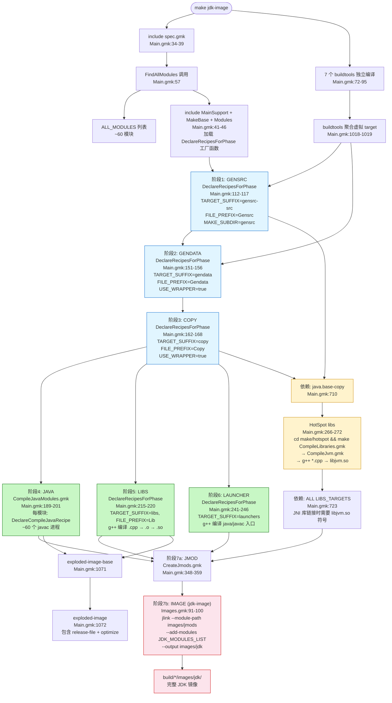

# 3.1 Main.gmk 构建管线 — make jdk-image 的 7 个阶段

`Main.gmk`（`make/Main.gmk`，~1,400 行）是 OpenJDK 构建系统的心脏——它接收 `configure` 生成的 `spec.gmk` 配置，通过一套自动化的 target 生成机制将 60+ 个 JDK 模块的 7 个构建阶段编排成完整的管线。本章追踪 `make jdk-image` 从命令到产物的完整路径。

`Main.gmk` 并不是一个"构建脚本"——它是一个**target 依赖声明的工厂**。"工厂"体现在 `MainSupport.gmk` 中定义的 `DeclareRecipesForPhase` 宏——一次调用为 60+ 模块生成 60+ 个 target，5 次调用覆盖 6 个构建 phase，加上独立的 HotSpot target 生成，总共 400+ 个 target 从 ~200 行宏调用代码中自动产生。这是构建系统可维护性的关键设计决策。

如果不理解这个设计模式，阅读 Main.gmk 时会看到大量重复的 `$(eval $(call DeclareRecipesForPhase, ...))` 而困惑于其效果。本文将通过逐层展开的源码追踪，展示每一段声明背后产生了几十个什么 target、依赖了哪些前置条件、调用了哪些子 Makefile。

> **Callout 1 — SPEC 文件的角色**：`Main.gmk:34-39` 严格校验 SPEC 文件存在性。`SPEC` 变量来自顶层 `Makefile:33` 的自动检测逻辑——先找 `build/$CONF/spec.gmk`，找不到就用 `build/spec.gmk`。SPEC 不是一个"配置文件"，而是一个 `include` 进来的变量集合——它定义了 `ALL_MODULES`（60+ 模块）、`JVM_FEATURES_server`（22 项特性）、`OPENJDK_TARGET_OS`（linux/windows/macosx）、`CFLAGS_JDKLIB`（~20 项标志）、`LDFLAGS_JDKLIB`（~10 项标志）等数百个变量。这些变量驱动着后续所有构建阶段的行为——如果 SPEC 缺失，Main.gmk 在 34-36 行立即 `$(error ...)`，构建中止。

> **Callout 2 — Make 入口链路**：用户输入 `make jdk-image` 的实际执行链：顶层 `Makefile`（自动检测 SPEC → `include spec.gmk` → `include Main.gmk`）→ Main.gmk 找到 `jdk-image` target 的定义 → 展开依赖链 → 执行 recipes。顶层 `Makefile` 的存在使得用户无需关心 SPEC 路径——自动检测逻辑处理了 `build/linux-x86_64-normal-server-slowdebug/spec.gmk` 的完整路径。`Main.gmk:1170` 还定义了传统别名 `jdk: exploded-image`，使得 `make jdk` 等同于 `make exploded-image`。

> **Callout 3 — DeclareRecipesForPhase 宏的批量生成**：`Main.gmk:112-117` 的 5 个参数——`TARGET_SUFFIX := gensrc-src` 控制 target 命名（`java.base-gensrc-src`），`FILE_PREFIX := Gensrc` 控制调用的子 Makefile（`gensrc/Gensrc-java.base.gmk`），`MAKE_SUBDIR := gensrc` 控制子 make 的工作目录，`CHECK_MODULES := $(ALL_MODULES)` 指定对哪些模块生成 target。这个宏一次性为 60+ 个模块生成 target——如果手写，Main.gmk 会从 1,400 行膨胀到 10,000 行。

> **Callout 4 — 构建阶段的顺序约束**：`GENSRC → GENDATA → COPY → JAVA → LIBS → LAUNCHER → IMAGE` 这个顺序不是随意的。GENSRC 必须在 JAVA 之前（javac 需要生成的源码），GENDATA 必须在 JAVA 之前（时区数据文件是 `java.base` 的输入），LIBS 和 JAVA 可并行（javac vs g++ 互不依赖——`Main.gmk` 无两者间的显式依赖声明），IMAGE 必须在所有 LIBS+JAVA+LAUNCHER 完成后（需要全部 .so 和 .class 就绪才能 `jlink --module-path`）。

> **Callout 5 — ALL_MODULES 的动态计算**：`Main.gmk:57` 的 `ALL_MODULES := $(call FindAllModules)` 不是硬编码列表——`Modules.gmk:282-284` 通过扫描所有 `src/**/module-info.java` 文件并提取三级父目录名得到模块名，然后用 `MODULES_FILTER` 排除 `--disable-module`（来自 configure 选项）和 `INCLUDE_SA=false` 等条件禁用的模块。`--disable-module=java.desktop` 后，`java.desktop-*` 的 200+ 个 target 全部消失——不影响构建系统的结构，只影响 ALL_MODULES 的内容。

> **Callout 6 — HotSpot 与 JDK 类库是两条独立管线**：`Main.gmk:253-278` 的 `hotspot-server-gensrc` 和 `hotspot-server-libs` 通过 `make/hotspot/gensrc/GenerateSources.gmk`（生成 JVMTI/JFR 模板 .cpp）和 `make/hotspot/lib/CompileLibraries.gmk`（编译 .cpp → .o → libjvm.so）独立执行——与 JDK 类库的 `CompileJavaModules.gmk`（javac 编译 .java → .class）完全无关。但两条管线不是完全隔离的：HotSpot gensrc 依赖 `java.base-copy`（`:710`，需要 include 头文件），所有 JDK native 库编译依赖 `JVM_MAIN_LIB_TARGETS`（`:723`，需要 libjvm.so 符号）。两条管线最终在 `IMAGE` 阶段通过 `Images.gmk` 汇合——libjvm.so 和 .class 文件被一起打包进 `java.base.jmod`。

> **Callout 7 — exploded image 与 images/jdk 的本质区别**：`build/*/jdk/`（exploded image）是"cp 出来的布局"——各模块的 `-java` / `-libs` target 将产物按约定路径直接复制，没有精简化。修改 thread.cpp → `make hotspot-server-libs`（~5 秒）→ libjvm.so 被 CopyToExplodedJdk.gmk 自动复制到 `jdk/lib/server/`。`build/*/images/jdk/` 是 jlink 精简化镜像——需要先在 `CreateJmods.gmk` 打包 60+ 个 .jmod（~25 秒），再 `jlink --module-path ... --add-modules ...`（~5 秒），共 30 秒。两者的桥梁是 `Images.gmk:91-100` 中的 jlink 命令——`exploded image 中的 .jmod → jlink --add-modules=... --output images/jdk`。

---

## 一、SPEC 文件：configure 到 Main.gmk 的桥梁 — spec.gmk 的 10 个关键变量

### 1.1 SPEC 校验与加载

Main.gmk 的第一道防线在 `Main.gmk:34-39`：

```makefile
ifeq ($(wildcard $(SPEC)),)
  $(error Main.gmk needs SPEC set to a proper spec.gmk)
endif

# Now load the spec
include $(SPEC)
```

`Main.gmk:34` 使用 GNU Make 的 `wildcard` 函数检测 `$(SPEC)` 变量指向的文件是否存在。`wildcard` 是 Make 的内置函数——如果文件存在，返回文件路径字符串；否则返回空字符串。如果不存在，`Main.gmk:35` 的 `$(error ...)` 会立即中止 make 并输出错误信息，防止在没有配置的情况下执行部分构建。

**为什么 SPEC 不是默认值而必须严格校验？** 因为 SPEC 的内容由 `configure` 根据目标平台动态生成——如果使用"默认 SPEC"，将无法正确交叉编译（例如在 x86 机器上编译 ARM JDK 需要 `OPENJDK_TARGET_CPU=aarch64`），也无法区分 debug/release 构建。

SPEC 文件的实际路径由顶层 `Makefile:33` 设置：
- 优先使用 `build/$CONF_NAME/spec.gmk`（如 `build/linux-x86_64-normal-server-slowdebug/spec.gmk`）
- 降级方案：`build/spec.gmk`（如果 `CONF_NAME` 未设置，使用 `build-config/build.conf` 中的配置）

**Counterfactual**：如果不用 SPEC 文件，把配置变量全部放在 Make 命令行参数中？→ 不可行。`configure` 检测了数百个变量（编译器和库的路径、CFLAGS、DEBUG_LEVEL、JVM_FEATURES 的全排列展开）。命令行传递无法承载这些复杂状态，且每次 make 都需要重新指定——增量构建时的环境变量可能丢失。`configure` 输出到文件是基于以下现实：在 Linux 上，gcc 的路径可能是 `/usr/bin/gcc`（系统安装）或 `/opt/rh/devtoolset-8/root/usr/bin/gcc`（devtoolset 安装），两者通过 `configure` 的 `--with-toolchain-path` 参数检测——这些路径必须在同一 SPEC 文件中保持一致。

### 1.2 SPEC 文件的关键变量表

SPEC 文件定义了数百个变量，以下是直接影响 Main.gmk 行为的 10 个关键变量：

| 变量名 | 类型 | 来源（configure 宏） | 影响范围 | 示例值 |
|--------|------|---------------------|---------|--------|
| `JVM_VARIANTS` | 空格分隔列表 | `JDKOPT_SETUP_JVM_VARIANTS` | HotSpot 编译——决定 `$(HOTSPOT_VARIANT_TARGETS)` 包含哪些变体 | `server` 或 `server minimal` |
| `JVM_FEATURES_server` | 空格分隔列表 | `JDKOPT_SETUP_JVM_FEATURES` | HotSpot 日志输出（`Main.gmk:259`）→ `CompileJvm.gmk` 的条件编译源文件选择 → 控制哪些 JVM 特性目录被加入 `SRC_DIRS` | `compiler1 compiler2 g1gc jfr jvmti management services vmstructs` |
| `JVM_VARIANT_MAIN` | 单一字符串 | `JDKOPT_SETUP_JVM_VARIANTS` | `Main.gmk:719-720` 中 `$(JVM_MAIN_LIB_TARGETS)` 和 `$(JVM_MAIN_GENSRC_TARGETS)` 的值 → 决定哪个变体被所有 JDK native 库依赖 | `server` |
| `DEBUG_LEVEL` | 字符串 | `JDKOPT_SETUP_DEBUG_LEVEL` | 编译优化级别（`-Og` for slowdebug, `-O2` for release）→ 符号剥离策略 | `slowdebug`, `release`, `fastdebug` |
| `COMPILER_TYPE` | 字符串 | `TOOLCHAIN_SETUP_COMPILER` | `NativeCompilation.gmk` 中的编译器选择 | `gcc`, `clang`, `xlc` |
| `OPENJDK_TARGET_OS` | 字符串 | `PLATFORM_SETUP_OPENJDK_TARGET_OS` | 条件编译分支——Windows/Linux/macOS 间的 OS 条件选择（`Main.gmk:1100` 等） | `linux`, `windows`, `macosx` |
| `OPENJDK_TARGET_CPU` | 字符串 | `PLATFORM_SETUP_OPENJDK_TARGET_CPU` | CPU 指令集选择——影响 `CompileJvm.gmk` 中 `cpu/$(CPU)/` 源文件目录 | `x86_64`, `aarch64`, `s390x` |
| `CFLAGS_JDKLIB` | 标志字符串 | `FLAGS_SETUP_CFLAGS` | `SetupNativeCompilation` 宏——传递给所有 JDK native 库的 gcc 编译标志 | `-fPIC -D_LARGEFILE64_SOURCE -D_FILE_OFFSET_BITS=64` |
| `LDFLAGS_JDKLIB` | 标志字符串 | `FLAGS_SETUP_LDFLAGS` | 同上——传递给所有 JDK native 库的 ld 链接标志 | `-shared -Wl,-z,defs` |
| `CREATE_BUILDJDK` | 布尔字符串 | `JDKOPT_SETUP_BUILD_JDK` | 交叉编译时控制 BUILDJDK 创建——影响 `Main.gmk:71` 的 `ifneq ($(CREATING_BUILDJDK), true)` 条件 | `true`, `false` |

### 1.3 SPEC 文件中变量如何被"消费"

SPEC 中的变量不是被动存在的——Main.gmk 中每个 phase 都在消费 SPEC 变量：

- **ALL_MODULES 的双重来源**：SPEC 可能通过 `JDK_MODULES` 预先定义模块列表，但如果 SPEC 中没有覆盖，`Main.gmk:57` 的 `ALL_MODULES := $(call FindAllModules)` 提供默认值——这是 SPEC 和动态检测之间的"fallback"关系
- **JVM_VARIANTS 驱动 target 命名**：`Main.gmk:253` 的 `$(addprefix hotspot-, $(JVM_VARIANTS))` 直接使用 SPEC 的变体名生成 target——如果 `JVM_VARIANTS=server zero`，生成 4 个 target：`hotspot-server/hotspot-zero/hotspot-server-gensrc/hotspot-server-libs` 等
- **DEBUG_LEVEL 影响所有 .so 的符号表**：各种编译器 flags 在 `NativeCompilation.gmk` 中根据 `DEBUG_LEVEL` 组装 `CFLAGS`——slowdebug 包含 `-g -O0`，release 包含 `-O2 -DNDEBUG`

### 1.4 SPEC 文件的 include 链

Main.gmk 加载 SPEC 后立即加载基础工具（`Main.gmk:41-46`）：

```makefile
include $(TOPDIR)/make/MainSupport.gmk    # :41 — DeclareRecipesForPhase 宏定义（核心工厂方法）
include $(TOPDIR)/make/common/MakeBase.gmk  # :44 — LogInfo, ExecuteWithLog, SetupLogging（日志框架）
include $(TOPDIR)/make/common/Modules.gmk   # :45 — FindAllModules, FindDepsForModule（模块感知能力）
include $(TOPDIR)/make/common/FindTests.gmk # :46 — ALL_NAMED_TESTS（测试发现）
```

这些 include 建立了一台"Make 机器"：
- **MakeBase** 提供基础设施——`LogInfo`/`LogWarn`/`LogError` 统一日志输出，`ExecuteWithLog` 包装执行并记录到 `build/*/make-support/failure-logs/`
- **Modules** 提供模块感知能力——`FindAllModules` 扫描源码树，`FindDepsForModule` 解析 `module-info.java` 的 requires
- **MainSupport** 提供批量生成能力——`DeclareRecipesForPhase` 使 Main.gmk 可以用 5 行声明生成 300+ 个 target

### 1.5 SPEC 残留问题

如果 `configure` 没有重新运行但 `spec.gmk` 还在（上次构建残留）：
- Main.gmk 会继续使用旧的 SPEC——增量构建不受影响
- 但新的 `configure` 选项（如 `--with-jvm-features=-compiler2`）不会生效
- 解决方案：`make reconfigure` 或 `rm build/*/spec.gmk && bash configure`

### 1.6 SPEC 检测示例

```bash
# 查看当前 SPEC 路径
make -p 2>/dev/null | grep "^SPEC :="

# 查看 SPEC 中影响 Main.gmk 的关键变量
grep -E "^(JVM_VARIANTS|JVM_VARIANT_MAIN|JVM_FEATURES_server|DEBUG_LEVEL|ALL_MODULES)" build/*/spec.gmk | head -10

# 查看 JVM 源码目录列表
grep "JVM_SRC_DIRS" build/*/spec.gmk

# 查看 JVM_FEATURES_server 的完整列表（22 项）
grep "JVM_FEATURES_server :=" build/*/spec.gmk | tr ' ' '\n' | head -30
```

---

## 二、构建阶段全景 — 7 阶段管线 Mermaid 流程图

### 2.1 Mermaid 流程图



### 2.2 并行与串行关系详解

| 阶段对 | 关系 | 原因 | 关键源码 | 加速效果 |
|--------|------|------|---------|----------|
| GENSRC → GENDATA | 串行 | `Main.gmk:700`：`$(GENDATA_TARGETS): interim-langtools buildtools-jdk`，GENDATA 的工具链依赖 interim 工具 | `Main.gmk:700` | — |
| GENDATA → COPY | 串行 | COPY 的部分源文件来自 GENDATA 阶段的产物（如配置文件名列表） | — | — |
| COPY → JAVA | 部分串行 | `Main.gmk:741`：`$m-java: $m-gensrc`（模块内部），但没有显式的 COPY→JAVA 依赖——COPY 通过 `$m-copy` 作为 `$m-jmod` 的前置依赖间接影响 | `Main.gmk:741` | — |
| JAVA ‖ LIBS | 并行 | 无直接依赖：javac（`CompileJavaModules.gmk`）vs g++（`Lib-*.gmk`）不共享源文件/中间产物 | 无（无依赖即并行） | 接近 2× |
| JAVA ‖ LAUNCHER | 并行 | `Main.gmk:728`：LAUNCHER 只依赖 `java.base-libs`，不依赖 JAVA targets | `Main.gmk:728` | 接近 2× |
| LIBS ‖ LAUNCHER | 并行 | LAUNCHER 只依赖 `java.base-libs`（`:728`），对非 java.base 模块 LIBS 和 LAUNCHER 无直接约束 | `Main.gmk:728` | 接近并行 |
| JAVA + LIBS + LAUNCHER → JMOD | 串行 | `Main.gmk:813-818`：`$m-jmod: $($m_JMOD_DEPS)`——每个模块的 jmod 需要该模块的 java/libs/launchers 全部完成 | `Main.gmk:813-818` | — |
| HotSpot gensrc → HotSpot libs | 串行 | `Main.gmk:711`：`hotspot-$v-libs: hotspot-$v-gensrc java.base-copy`——编译前需要生成的 .cpp | `Main.gmk:711` | — |
| hotspot-*-libs → ALL LIBS | 串行 | `Main.gmk:723`：`$(LIBS_TARGETS): $(JVM_MAIN_LIB_TARGETS)`——JNI 库链接时需要 libjvm.so | `Main.gmk:723` | 两阶段瓶颈 |

### 2.3 核心 target 依赖图（从 jdk-image 向下追溯）

```
jdk-image  (Main.gmk:389) — 最终目标，调用 Images.gmk jdk
│
├── jmods     (Main.gmk:904) — 所有 .jmod 就绪
│   └── $(JMOD_TARGETS) (Main.gmk:1049) — 60+ 个 per-module jmod
│       └── $m-jmod: $m-java + $m-libs + $m-launchers + $m-copy + $m-gendata + $m-rmic
│           ├── $m-java (Main.gmk:199, 706, 741) — javac 编译 .java → .class
│           │   └── $m-gensrc
│           │       ├── $m-gensrc-moduleinfo (Main.gmk:141, GensrcModuleInfo.gmk)
│           │       └── $m-gensrc-src (Main.gmk:112-117, Gensrc-$m.gmk)
│           ├── $m-libs (Main.gmk:215-220, 723) — g++ 编译 .cpp → .so
│           │   └── hotspot-$(JVM_VARIANT_MAIN)-libs (Main.gmk:723)
│           │       └── hotspot-$(JVM_VARIANT_MAIN)-gensrc (Main.gmk:711)
│           │           └── java.base-copy (Main.gmk:710) — 需要 include 头文件
│           ├── $m-launchers (Main.gmk:241-246, 728) — C 入口点编译
│           │   └── java.base-libs (Main.gmk:728) — 链接到 libjli
│           ├── $m-copy (Main.gmk:162-168) — 复制资源文件
│           └── $m-gendata (Main.gmk:151-156) — 生成数据文件
│
├── zip-source (Main.gmk:904) → ZipSource.gmk — 打包 src.zip
├── demos    (Main.gmk:904)
│   └── demos-jdk (Main.gmk:1068)
│       └── java.base-libs + exploded-image-optimize (Main.gmk:737)
└── release-file (Main.gmk:904)
    └── create-source-revision-tracker (Main.gmk:902)
```

---

## 三、buildtools 阶段 — 编译构建工具链

### 3.1 为什么需要 buildtools

在编译 JDK 本身之前，必须先编译一套"构建工具"——这些工具在 JDK 的编译过程中被使用，但本身运行在 BOOT_JDK 上。例如：

- **`buildtools-langtools`**（`ToolsLangtools.gmk`）：编译 ANTLR 解析器生成器等语言工具——这些工具在 `Gensrc-jdk.compiler.gmk` 中被调用生成 JavaParser.java
- **`interim-langtools`**（`CompileInterimLangtools.gmk`）：使用 BOOT_JDK 编译 JDK 源码的部分类到临时类目录——这些临时类在 JDK 自身的编译过程中用作 bootclasspath
- **`buildtools-jdk`**（`CompileToolsJdk.gmk`）：编译 `GenerateCharacter` 等工具——在 `Gendata-java.base.gmk` 中用于生成字符属性数据文件
- **`buildtools-hotspot`**（`CompileToolsHotspot.gmk`）：编译 JVMTI 和 JFR 的模板处理工具——在 `GenerateSources.gmk` 中用于生成 JVMTI 接口文件

### 3.2 7 个 buildtools target 详细分析

`Main.gmk:72-91` 定义了 7 个工具 target，全部由 `CREATING_BUILDJDK` 条件保护：

```makefile
# Main.gmk:71-92
ifneq ($(CREATING_BUILDJDK), true)
  buildtools-langtools:    # :72 — 语言工具（ANTLR 等）
    +($(CD) $(TOPDIR)/make && $(MAKE) $(MAKE_ARGS) -f ToolsLangtools.gmk)

  interim-langtools:       # :75 — 临时 javac 类（JDK 自身编译的前置）
    +($(CD) $(TOPDIR)/make && $(MAKE) $(MAKE_ARGS) -f CompileInterimLangtools.gmk)

  interim-rmic:            # :78 — 临时 RMIC（RMI 存根生成器）
    +($(CD) $(TOPDIR)/make && $(MAKE) $(MAKE_ARGS) -f CompileInterimRmic.gmk)

  interim-tzdb:            # :81 — TZ 数据库（时区数据生成的前置）
    +($(CD) $(TOPDIR)/make && $(MAKE) $(MAKE_ARGS) -f CopyInterimTZDB.gmk)

  buildtools-jdk:          # :84 — JDK 构建辅助工具（字符生成器等）
    +($(CD) $(TOPDIR)/make && $(MAKE) $(MAKE_ARGS) -f CompileToolsJdk.gmk)

  buildtools-modules:      # :87 — 模块分析工具
    +($(CD) $(TOPDIR)/make && $(MAKE) $(MAKE_ARGS) -f CompileModuleTools.gmk)

  buildtools-hotspot:      # :90 — HotSpot 源码生成工具
    +($(CD) $(TOPDIR)/make && $(MAKE) $(MAKE_ARGS) -f CompileToolsHotspot.gmk)
endif
```

所有工具 target 都使用 `+(` 前缀——这在 GNU Make 中是 job server 集成语法。`+` 标记使子 make 进程能够通过文件描述符与父 make 的 job server 通信（通常通过 `--jobserver-auth` 文件描述符），从而参与全局的并行度控制。没有 `+` 前缀时，子 make 被视为普通进程，不共享 job server——可能导致过度并行或并行度不足。

### 3.3 buildtools 依赖关系图

`Main.gmk:1018-1019` 将 7 个工具目标聚合为一个虚拟 target：

```makefile
JVM_TOOLS_TARGETS ?= buildtools-hotspot      # Main.gmk:1017
buildtools: buildtools-langtools interim-langtools interim-rmic \
    buildtools-jdk $(JVM_TOOLS_TARGETS)      # Main.gmk:1018-1019
```

工具之间的最大依赖链（`Main.gmk:684-692`）：

```
buildtools-langtools (ToolsLangtools.gmk — 独立，最基础)
  ↓ :686
interim-langtools (CompileInterimLangtools.gmk — 需要 langtools 工具)
  ├─ ↓ :702 → interim-rmic (CompileInterimRmic.gmk)
  ├─ ↓ :688 → buildtools-jdk (CompileToolsJdk.gmk)
  │           └─ interim-tzdb (CopyInterimTZDB.gmk) :688
  └─ ↓ :690 → buildtools-hotspot (CompileToolsHotspot.gmk)
```

这些依赖声明确保了工具链的正确编译顺序——`interim-langtools` 必须先于依赖它的工具（因为 `interim-rmic`、`buildtools-jdk`、`buildtools-hotspot` 都使用 interim 类作为 bootclasspath）。

### 3.4 BUILDJDK 优化与交叉编译

`Main.gmk:71` 的 `ifneq ($(CREATING_BUILDJDK), true)` 条件确保在构建 BUILDJDK（交叉编译场景的工具 JDK）时跳过工具编译——因为这些工具已经由 BUILDJDK 提供，无需重复编译。

交叉编译的 BUILDJDK 流程（`Main.gmk:476-481`）：

```makefile
create-buildjdk-interim-image:
  +($(CD) $(TOPDIR)/make && $(MAKE) $(MAKE_ARGS) -f Main.gmk \
      $@-helper \
      SPEC=$(dir $(SPEC))buildjdk-spec.gmk \
      HOTSPOT_SPEC=$(dir $(SPEC))buildjdk-spec.gmk \
      CREATING_BUILDJDK=true)
```

这里向子 make 传递 `CREATING_BUILDJDK=true`——子 Main.gmk 会跳过 buildtools 阶段，使用 BUILDJDK 中的已编译工具完成编译。

---

## 四、GENSRC 阶段 — 源码生成 (DeclareRecipesForPhase 详解)

### 4.1 DeclareRecipesForPhase 宏的完整解析

这是理解 Main.gmk 核心设计模式的关键。该宏定义在 `MainSupport.gmk:200-209`，在 Main.gmk 中被调用 5 次。

**完整定义**（`MainSupport.gmk:200-209`）：

```makefile
define DeclareRecipesForPhase
  # 处理命名参数：展开 $2..$8 为 $(<phase>_PARAMNAME)
  $(foreach i,2 3 4 5 6 7 8, \
      $(if $(strip $($i)),$(strip $1)_$(strip $($i)))$(NEWLINE))
  # 第 9 个参数是错误——防止参数过多
  $(if $(9),$(error Internal makefile error: Too many arguments to \
      DeclareRecipesForPhase, please update MakeHelper.gmk))

  # 遍历 CHECK_MODULES，对每个模块生成 target
  $$(foreach m, $$($(strip $1)_CHECK_MODULES), \
      $$(eval $$(call DeclareRecipesForPhaseAndModule,$(strip $1),$$m)))

  # 导出 TARGETS 列表供外部使用
  $(strip $1)_TARGETS := $$($(strip $1))
endef
```

**5 参数解析表**：

| 参数 | 含义 | 类型 | GENSRC 示例 | GENDATA 示例 | LIBS 示例 | 在 MainSupport.gmk 中的使用行 |
|------|------|------|-------------|-------------|-----------|------------------------------|
| `$1`（定位参数 #1） | Phase 名称 | 字符串 | `GENSRC` | `GENDATA` | `LIBS` | 作为 target 列表的变量名前缀（`:200` 的 `$(strip $1)_`） |
| `TARGET_SUFFIX` | target 名称后缀 | 字符串 | `gensrc-src` | `gendata` | `libs` | `MainSupport.gmk:140`：`$2-$$($1_TARGET_SUFFIX)` |
| `FILE_PREFIX` | 子 Makefile 文件名前缀 | 字符串 | `Gensrc` | `Gendata` | `Lib` | `MainSupport.gmk:147`：`MAKEFILE_PREFIX=$$($1_FILE_PREFIX)` |
| `MAKE_SUBDIR` | 子 make 工作目录（make/ 下） | 路径 | `gensrc` | `gendata` | `lib` | `MainSupport.gmk:145`：`$$(addsuffix /$$($1_MAKE_SUBDIR), ...)` |
| `CHECK_MODULES` | 检查哪些模块 | 列表 | `$(ALL_MODULES)` | `$(ALL_MODULES)` | `$(ALL_MODULES)` | `MainSupport.gmk:205`：`$$(foreach m, $$($(strip $1)_CHECK_MODULES), ...)` |
| `USE_WRAPPER` | 使用 ModuleWrapper.gmk | 布尔 | （不设置，默认 false） | `true` | `true` | `MainSupport.gmk:141`：`ifeq ($$($1_USE_WRAPPER), true)` |
| `MULTIPLE_MAKEFILES` | 多仓库支持 | 布尔 | （不设置） | （不设置） | （不设置） | `MainSupport.gmk:173`：`ifeq ($$($1_MULTIPLE_MAKEFILES), true)` |

**内部 helper 调用链**：

`DeclareRecipesForPhase` → `DeclareRecipesForPhaseAndModule`（`:165-183`）→ `DeclareRecipeForModuleMakefile`（`:139-160`）：

```
DeclareRecipesForPhase (MainSupport.gmk:200)
  └── foreach m in CHECK_MODULES:
        └── DeclareRecipesForPhaseAndModule (MainSupport.gmk:165)
              ├── 检查 make/<MAKE_SUBDIR>/<FILE_PREFIX>-<m>.gmk 是否存在（`:166-167`）
              ├── 如果 MULTIPLE_MAKEFILES=true：为每个仓库生成 $m-<TARGET_SUFFIX>-<repodir>（`:174-175`）
              └── DeclareRecipeForModuleMakefile (MainSupport.gmk:139)
                    ├── 如果 USE_WRAPPER=true：使用 ModuleWrapper.gmk（`:141-147`）
                    └── 否则：直接 cd MAKE_SUBDIR && make -f <FILE_PREFIX>-<m>.gmk（`:148-157`）
```

### 4.2 内部展开过程：GENSRC 为例

GENSRC 调用（`Main.gmk:112-117`）：

```makefile
$(eval $(call DeclareRecipesForPhase, GENSRC, \
    TARGET_SUFFIX := gensrc-src, \
    FILE_PREFIX := Gensrc, \
    MAKE_SUBDIR := gensrc, \
    CHECK_MODULES := $(ALL_MODULES), \
))
```

展开步骤：
1. **参数处理**：`GENSRC_TARGET_SUFFIX = gensrc-src`，`GENSRC_FILE_PREFIX = Gensrc`，`GENSRC_MAKE_SUBDIR = gensrc`，`GENSRC_CHECK_MODULES = java.base java.compiler ...`（60+ 模块）
2. **遍历模块**：对 ALL_MODULES 中的每个模块 `m`，检查 `make/gensrc/Gensrc-$m.gmk` 是否存在
3. **对存在的模块生成 target**：
   - Target 名称：`$m-gensrc-src`（如 `java.base-gensrc-src`）
   - Recipe：`cd $(TOPDIR)/make/gensrc && make -f Gensrc-$m.gmk MODULE=$m`
4. **导出列表**：`GENSRC_TARGETS = java.base-gensrc-src java.compiler-gensrc-src ...`

对于 `java.base` 模块，生成的 target recipe 展开为（`MainSupport.gmk:148-157` 的 else 分支）：

```makefile
java.base-gensrc-src:
  +(cd make/gensrc && make $(MAKE_ARGS) \
      -f Gensrc-java.base.gmk \
      ... -I make -I make/gensrc ... \
      MODULE=java.base)
```

### 4.3 `DeclareRecipeForModuleMakefile` 的两种执行模式

**模式 1：USE_WRAPPER=true**（`MainSupport.gmk:141-147`）

用于 GENDATA、COPY、LIBS、LAUNCHER 等需要统一入口的 phase：

```makefile
+($(CD) $(TOPDIR)/make && $(MAKE) $(MAKE_ARGS) \
    -f ModuleWrapper.gmk \
    -I <PHASE_MAKEDIRS> \
    -I <MAKE_SUBDIR of each PHASE_MAKEDIRS> \
    MODULE=$2 MAKEFILE_PREFIX=$$($1_FILE_PREFIX) $$($1_EXTRA_ARGS))
```

`ModuleWrapper.gmk` 是一个通用的包装器——它接收 `MODULE` 和 `MAKEFILE_PREFIX` 参数，构造实际调用的文件名（`$(MAKEFILE_PREFIX)-$(MODULE).gmk`），处理 `-I` include 路径，然后执行子 make。

**模式 2：USE_WRAPPER=false**（`MainSupport.gmk:148-157`）

用于 GENSRC 等模块间差异较大的 phase——直接调用 per-module 的 .gmk 文件：

```makefile
+($(CD) $$(dir $$(firstword $$(wildcard $$(addsuffix \
    /$$($1_MAKE_SUBDIR)/$$($1_FILE_PREFIX)-$2.gmk, $$(PHASE_MAKEDIRS))))) \
&& $(MAKE) $(MAKE_ARGS) \
    -f $$($1_FILE_PREFIX)-$2.gmk \
    MODULE=$2 $$($1_EXTRA_ARGS))
```

这里 `$(wildcard ...)` 在 `PHASE_MAKEDIRS`（默认为 `$(TOPDIR)/make`）中搜索 `.gmk` 文件——如果存在 `make/gensrc/Gensrc-java.base.gmk`，就 cd 到 `make/gensrc/` 并执行它。

### 4.4 GENSRC 的源码生成类型

GENSRC phase 生成三类源码 target：

**a) `$m-gensrc-src`（模块特定源码生成）**（`Main.gmk:112-117`）
- 调用 `make/gensrc/Gensrc-java.base.gmk` 等 per-module 文件
- JFR 元数据类（`.java`）：`Gensrc-jdk.jfr.gmk` 生成 `jdk/jfr/events/` 下的事件类
- JMX Bean 类：`Gensrc-java.management.gmk` 生成 `sun/management/` 下的 MXBean 类
- ServiceLoader 配置：`Gensrc-java.base.gmk` 生成 `META-INF/services/` 文件

**b) `$m-gensrc-moduleinfo`（模块信息生成）**（`Main.gmk:128-141`）
- 对 ALL_MODULES 中的每个模块生成 `module-info.java`
- `Main.gmk:138-139` 的 recipe 调用 `make/gensrc/GensrcModuleInfo.gmk`

**c) `$m-gensrc`（聚合 target）**（`Main.gmk:141`）：
```makefile
$1-gensrc: $1-gensrc-moduleinfo  # 确保 module-info 先生成
```

加上 `Main.gmk:119` 的 per-module 依赖：
```makefile
$(foreach m, $(GENSRC_MODULES), $(eval $m-gensrc: $m-gensrc-src))
```

所以 `java.base-gensrc` 的依赖链为：`java.base-gensrc-src` + `java.base-gensrc-moduleinfo`——两者都是 `java.base-gensrc` 的前置条件。

### 4.5 GENSRC modules 分类与不同依赖

`Main.gmk:121-126` 将 GENSRC target 按模块类型分组：

```makefile
LANGTOOLS_GENSRC_TARGETS := $(filter $(addsuffix -%, $(LANGTOOLS_MODULES)), $(GENSRC_TARGETS))
HOTSPOT_GENSRC_TARGETS := $(filter $(addsuffix -%, $(HOTSPOT_MODULES)), $(GENSRC_TARGETS))
JDK_GENSRC_TARGETS := $(filter-out $(LANGTOOLS_GENSRC_TARGETS) \
    $(HOTSPOT_GENSRC_TARGETS), $(GENSRC_TARGETS))
```

这个分类用于不同模块类型的不同前置条件（`Main.gmk:684-698`）：

```
LANGTOOLS_GENSRC → buildtools-langtools           (:684)
HOTSPOT_GENSRC  → interim-langtools + buildtools-hotspot  (:694)
JDK_GENSRC      → interim-langtools + buildtools-jdk      (:696)
ALL -gensrc-moduleinfo → buildtools-jdk             (:698)
```

为什么 HotSpot 的 GENSRC target 需要 `buildtools-hotspot` 而非 `buildtools-jdk`？因为 `GenerateSources.gmk` 使用了 HotSpot 特定的源码生成工具（如 `adlc`——架构描述语言编译器，将 `.ad` 文件编译为 `generated.ad` 和 `ad_*.cpp`）——这些工具在 `CompileToolsHotspot.gmk` 中编译。

**Counterfactual**：如果不用宏，手写 60+ 模块 × 6 phases = 360 个 target？→ 手工维护必然产生遗漏和不一致。新模块（如 `jdk.incubator.vector`）需要手动添加到 6 个不同的位置。更严重的是，如果各 phase 的模块列表不一致（比如 LIBS phase 漏了某模块），构建系统会静默跳过该模块的 native 库编译——只在 `jlink` 阶段才会报"找不到 .so"的难以诊断的错误。更隐蔽的问题是，当模块从 JDK 中移除时，需要手动从 6 个位置删除——某一个位置遗漏就会产生空 target 编译导致 Make 警告或异常。

---

## 五、GENDATA + COPY 阶段 — 数据文件和资源复制

### 5.1 GENDATA 阶段

`Main.gmk:151-156` 通过 DeclareRecipesForPhase 宏生成 GENDATA target：

```makefile
$(eval $(call DeclareRecipesForPhase, GENDATA, \
    TARGET_SUFFIX := gendata, \
    FILE_PREFIX := Gendata, \
    MAKE_SUBDIR := gendata, \
    CHECK_MODULES := $(ALL_MODULES), \
    USE_WRAPPER := true))
```

GENDATA phase 的核心职责是生成"数据文件"——这些文件不是 Java 源码也不是 C++ 源码，而是运行时需要的配置和资源：

- **`java.base-gendata`**（`Gendata-java.base.gmk`）：生成 `ct.sym`（编译器符号表）——这是一个用于 javac 跨版本的符号数据库。还需要 `interim-tzdb` 工具（`Main.gmk:81`）来生成 `TZDB.dat`（时区数据库）
- **`jdk.charsets-gendata`**：生成字符编码映射表——从 Unicode 字符数据库（UCD）读取原始数据，编译为 JDK 内部使用的格式
- **`jdk.localedata-gendata`**：生成 `CurrencyData.properties`（货币数据）、`FormatData`（日期/数字格式）
- **`jdk.compiler-gendata`**（`Main.gmk:791`）：依赖所有 `gensrc-moduleinfo` target 完成——用于生成 `ct.sym` 时引用所有模块的元信息

### 5.2 COPY 阶段

`Main.gmk:162-168` 生成 COPY target：

```makefile
$(eval $(call DeclareRecipesForPhase, COPY, \
    TARGET_SUFFIX := copy, \
    FILE_PREFIX := Copy, \
    MAKE_SUBDIR := copy, \
    CHECK_MODULES := $(ALL_MODULES), \
    USE_WRAPPER := true, \
))
```

COPY phase 的职责是将配置和资源文件从源码树复制到构建输出目录：

- **`java.base-copy`**（最重要）：复制 `conf/security/java.security`（安全策略）、`conf/logging.properties`、`lib/content-types.properties`
- **`java.desktop-copy`**：复制字体配置文件（`fontconfig.properties`）、颜色配置、图标资源
- **`jdk.localedata-copy`**：复制区域设置数据（`BreakIterator` 规则文件）

### 5.3 IMPORT COPY — 导入模块的特殊处理

`Main.gmk:173-184` 处理导入模块的 COPY：

```makefile
IMPORT_COPY_MODULES := $(call FindImportedModules)          # Modules.gmk:293
IMPORT_COPY_TARGETS := $(addsuffix -copy, $(IMPORT_COPY_MODULES))

define DeclareImportCopyRecipe
  $1-copy:
    +($(CD) $(TOPDIR)/make && $(MAKE) $(MAKE_ARGS) \
        -f CopyImportModules.gmk MODULE=$1)
endef
```

导入模块（来自 `--with-import-modules` 指定目录的预编译模块）通过专用的 `CopyImportModules.gmk` 处理——因为这些模块的源码不在标准 JDK 源码树中，COPY 操作的源路径不同。

### 5.4 COPY 依赖与 GENDATA 的前置条件

```makefile
# Main.gmk:700 — GENDATA 依赖 interim 和 buildtools
$(GENDATA_TARGETS): interim-langtools buildtools-jdk

# Main.gmk:788 — jdk.jdeps-gendata 需要 java + rmic 产物
jdk.jdeps-gendata: java rmic

# Main.gmk:791 — ct.sym 需要所有模块的 module-info
jdk.compiler-gendata: $(GENSRC_MODULEINFO_TARGETS)
```

### 5.5 GENDATA 和 COPY 的增量构建行为

与 HotSpot 的编译不同，GENDATA 和 COPY 阶段的产物通常是"纯数据文件"——它们的时间戳比较机制相同，但重生成的条件不同：

- **GENDATA 的依赖追踪**：GENDATA 工具是 Java 类（在 BOOT_JDK 上运行），它们的 `.class` 时间戳由 `buildtools-jdk` target 控制。GENDATA 的输入是 raw 数据文件（如 UCD 字符数据库、CLDR 区域数据），这些文件的修改会触发 GENDATA 重执行
- **COPY 的智能化**：`ModuleWrapper.gmk` 在 COPY 模式下不会无条件复制——它使用 `$(install-file)` 宏（`MakeBase.gmk`），该宏检查源文件和目标文件的时间戳，只在源更新时才执行复制

### 5.6 COPY 中的 java.base-copy 特殊地位

`java.base-copy` 是整个构建管线中最重要的 COPY target——因为它提供 JDK 和 HotSpot 都需要的头文件：

- `jni.h`, `jvmti.h`, `jvmticmlr.h` 等 JNI 头文件由 `Copy-java.base.gmk` 从 `src/java.base/share/native/include/` 复制到 `build/*/support/headers/`
- HotSpot 编译（`CompileJvm.gmk`）和 JDK native 库编译（`Lib-*.gmk`）都通过 `-I $(SUPPORT_OUTPUTDIR)/headers` 访问这些头文件
- 这就是为什么 `Main.gmk:710` 中 `hotspot-$v-gensrc: java.base-copy`——没有头文件，HotSpot 编译无法启动

### 5.7 GENDATA + COPY 的累积依赖链

经过前 3 个串行阶段（GENSRC → GENDATA → COPY），构建系统有了以下"就绪状态"：

| 产物类别 | 示例 | 来源 Phase | 使用者 |
|---------|------|-----------|-------|
| 生成的 Java 源码 | `jdk/jfr/events/FileReadEvent.java` | GENSRC | JAVA (javac) |
| 生成的 C++ 源码 | `JVMTI_constants.cpp` | GENSRC | LIBS (g++) |
| module-info.java | `java.base/module-info.java` | GENSRC-moduleinfo | JAVA (javac) + GENDATA (ct.sym) |
| 数据文件 | `tzdb.dat`, `ct.sym`, 字符映射 | GENDATA | 运行时（通过 java.base .jmod） |
| 配置文件 | `java.security`, `fontconfig.properties` | COPY | 运行时（通过 java.base/desktop .jmod） |
| JNI 头文件 | `jni.h`, `jvmti.h`, `jvmticmlr.h` | COPY (java.base) | HotSpot LIBS + JDK LIBS |
| 资源文件 | 图标、字体、颜色配置 | COPY | 运行时（通过 .jmod） |

这个就绪状态意味着：从这一刻起，JAVA 和 LIBS（包括 HotSpot）都可以并行开始——JAVA 有生成的 Java 源码和 module-info，LIBS 有头文件和生成的 C++ 源码。

---

## 六、JAVA 阶段 — JDK 类库编译 (CompileJavaModules.gmk)

### 6.1 JAVA target 的生成方式

JAVA phase 不使用 DeclareRecipesForPhase 宏——`Main.gmk:189-201` 直接通过 `foreach` + `DeclareCompileJavaRecipe` 宏生成：

```makefile
JAVA_MODULES := $(ALL_MODULES)                        # :190 — 与 ALL_MODULES 等同
JAVA_TARGETS := $(addsuffix -java, $(JAVA_MODULES))   # :191

define DeclareCompileJavaRecipe                       # :193
  $1-java:
    +($(CD) $(TOPDIR)/make && $(MAKE) $(MAKE_ARGS) \
        -f CompileJavaModules.gmk MODULE=$1)
endef

$(foreach m, $(JAVA_MODULES), $(eval $(call DeclareCompileJavaRecipe,$m)))
```

不使用 DeclareRecipesForPhase 的原因是：
1. JAVA target 命名简单（`$m-java`），不需要 TARGET_SUFFIX/FILE_PREFIX 的灵活性
2. 所有模块都使用同一个 `CompileJavaModules.gmk`（没有 per-module 的 `CompileJavaModules-java.base.gmk`），通过 `MODULE=$1` 参数区分

### 6.2 CompileJavaModules.gmk 的执行模型

`CompileJavaModules.gmk:29-33` 的 include 链：

```makefile
include $(SPEC)               # :29 — configure 配置（CFLAGS_JAVAC, BOOT_JDK 等）
include MakeBase.gmk          # :30 — 日志基础设施
include Modules.gmk           # :31 — 模块依赖函数
include JavaCompilation.gmk   # :32 — SetupJavaCompilation 宏
include SetupJavaCompilers.gmk # :33 — BOOT_JAVAC vs JDK_JAVAC 设置
```

**模块特定配置**（`CompileJavaModules.gmk:41-60` 示例）：

```makefile
java.base_ADD_JAVAC_FLAGS += -Xdoclint:all/protected,-reference \
    '-Xdoclint/package:java.*,javax.*' -XDstringConcat=inline
java.base_COPY += .icu .dat .spp content-types.properties
java.base_EXCLUDE_FILES += \
  $(TOPDIR)/src/java.base/share/classes/jdk/internal/module/ModuleLoaderMap.java
```

这里配置的模式是 `{module}_{VARNAME}`——通过 `$(MODULE)_ADD_JAVAC_FLAGS` 等方式给每个模块添加额外的编译/排除标志。这比使用 per-module 的独立文件更紧凑——所有模块的编译配置集中在一个文件中，便于对比和维护。

### 6.3 Java 模块间依赖

`Main.gmk:741-746` 声明的模块间编译依赖：

```makefile
# 模块内: $m-java 依赖 $m-gensrc（先有源码才能编译）
$(foreach m, $(GENSRC_MODULES), $(eval $m-java: $m-gensrc))

# 模块间: $m-java 依赖所有 requires 模块的 -java 完成
$(foreach m, $(JAVA_MODULES), \
    $(eval $m-java: $(addsuffix -java, $(filter $(JAVA_MODULES), \
    $(call FindDepsForModule,$m)))))
```

`FindDepsForModule`（`Modules.gmk:366-367`）：
```makefile
FindDepsForModule = $(DEPS_$(strip $1))
```

`DEPS_java.base`、`DEPS_java.desktop` 等变量由 `module-deps.gmk` 在 `Modules.gmk:324-325` 从 `module-info.java` 的 `requires` 声明自动生成：

```makefile
$(MODULE_DEPS_MAKEFILE): $(MODULE_INFOS)
  # awk 脚本解析 module-info.java 中的 requires 声明
  # 生成 DEPS_java.base = java.base ...
  #       DEPS_java.desktop = java.base java.datatransfer java.xml ...
```

### 6.4 特殊的 JAVA 交叉模块依赖

`Main.gmk:774-786` 声明的特殊交叉依赖：

```makefile
# java.desktop 的 gensrc 需要 java.base 的源码副本
java.desktop-gensrc-src: java.base-gensrc java.base-copy

# Graal 的 gensrc（注解处理）需要当前 JDK 的类
jdk.internal.vm.compiler-gensrc-src: $(addsuffix -java, \
    $(call FindTransitiveDepsForModule, jdk.internal.vm.compiler))
```

这些特殊依赖反映了 Java 平台内部复杂的编译依赖——编译器模块的源码生成可能需要在当前 JDK 中已编译的类（用于注解处理器运行）。

### 6.5 SetupJavaCompilation 宏的工作原理

`CompileJavaModules.gmk` 的核心是 `SetupJavaCompilation` 宏（定义在 `JavaCompilation.gmk`）。当 `CompileJavaModules.gmk` 被调用：

```makefile
# CompileJavaModules.gmk 中的典型调用
$(eval $(call SetupJavaCompilation, BUILD_JDK, \
    MODULE := $(MODULE), \
    SRC := $(call FindModuleSrcDirs, $(MODULE)), \
    BIN := $(JDK_OUTPUTDIR)/modules/$(MODULE), \
    HEADERS := $(SUPPORT_OUTPUTDIR)/headers/$(MODULE), \
    ADD_JAVAC_FLAGS := $($(MODULE)_ADD_JAVAC_FLAGS), \
    EXCLUDE_FILES := $($(MODULE)_EXCLUDE_FILES), \
    COPY := $($(MODULE)_COPY), \
))
```

SetupJavaCompilation 内部处理：

1. **源文件发现**：`$(call FindModuleSrcDirs, $(MODULE))` 从 Modules.gmk 获取源码目录——通常包括 `src/<module>/share/classes/`、`src/<module>/<os>/classes/`、`build/*/gensrc/<module>/`（GENSRC 生成的源码）
2. **依赖追踪**：使用 `-XDstringConcat=inline` 等 javac 标志，并配合 `MakeBase.gmk` 的 `DependOnVariable` 机制追踪编译器的配置变更
3. **JNI 头文件生成**：`HEADERS := $(SUPPORT_OUTPUTDIR)/headers/$(MODULE)`——对包含 native 方法的类，javac 的 `-h` 标志生成对应的 `.h` 头文件，供后续 LIBS 阶段使用
4. **注解处理**：如果模块依赖了注解处理器（如 `jdk.internal.vm.compiler`），`SetupJavaCompilation` 自动添加 `-processorpath` 参数

### 6.6 JAVA 编译的并行度控制

`CompileJavaModules.gmk` 中的 javac 编译是 per-module 的——每个模块独立调用 javac。这意味着：
- 不同模块间的 javac 编译可完全并行（由 Make 的 `-j` 控制）
- 模块内部的 Java 文件编译由 javac 自身控制并行度——javac 9+ 默认使用所有可用核心

当模块间有 `requires` 依赖（通过 `FindDepsForModule` 解析）时，Make 确保被依赖模块的 `.class` 先生成——这通过 `Main.gmk:744-746` 的 `$m-java: $(dependents...-java)` 声明实现。

### 6.7 JAVA 编译产物的组织

每个模块的 .class 文件输出到 `build/*/jdk/modules/<module>/`：

```
build/*/jdk/modules/java.base/
├── module-info.class
├── java/
│   ├── lang/
│   │   ├── Object.class
│   │   ├── String.class
│   │   └── System.class
│   ├── io/
│   │   ├── File.class
│   │   └── FileDescriptor.class
│   └── util/
│       ├── ArrayList.class
│       └── HashMap.class
├── jdk/
│   ├── internal/
│   │   ├── module/
│   │   │   └── ModuleBootstrap.class
│   │   └── ...
└── META-INF/
    └── services/
```

这些类文件不是简单的"单个目录收集"——它们被组织成与 `exploded image` 的 `modules/` 布局相同。这样，JAVA phase 完成后，exploded image 的 `modules/` 目录实质上已经就绪——只需其他 phase（COPY 资源文件、LIBS 的 .so 文件）填充剩余部分。

### 6.8 JAVA 与 GENSRC 的依赖窗口

`Main.gmk:741` 的 `$m-java: $m-gensrc` 是一个**跨 phase 的模块级依赖**。这意味着：
- `java.base-java` 不依赖 `java.compiler-gensrc` 或其他模块的 GENSRC
- 但 `java.desktop-java` 因为 `requires java.base`（通过 `FindDepsForModule`）而自动依赖 `java.base-java`
- 这个设计避免了不必要的全局串行化——如果所有模块的 JAVA 都等待所有模块的 GENSRC 完成，会增加数分钟的串行延迟

### 6.9 JAVA 阶段产物的后续消费

JAVA 阶段的产物不仅用于最终的 JDK 运行，还被构建管线中的多个后续步骤消费：

1. **JNI 头文件生成**：`SetupJavaCompilation` 的 `HEADERS` 参数——对包含 `native` 方法的类，javac 生成 `.h` 文件。这些头文件被 LIBS phase 使用——`java.base-libs` 在编译 `libjava.so` 时通过 `-I $(SUPPORT_OUTPUTDIR)/headers/java.base` 引用这些头文件
2. **JMOD 打包**：`$m-jmod` 使用 `$m-java` 的 `.class` 文件（`Main.gmk:811`）
3. **exploded image 组装**：`$m-java` target 完成后，`.class` 文件直接位于 `build/*/jdk/modules/$m/`——这是 `exploded-image-base` 依赖的最终状态
4. **ct.sym 生成**：`jdk.compiler-gendata`（`:791`）读取所有 `gensrc-moduleinfo` 的输出，生成编译器符号表——这需要使用 JAVA phase 中编译的 `module-info.class` 文件

**Counterfactual**：如果 `SetupJavaCompilation` 不使用 `HEADERS` 参数生成 JNI 头文件，而改为 LIBS phase 手动运行 `javah`？→ 效率更低：`javah` 需要重复解析 `.class` 文件（而 javac 已经解析过了），且可能导致 header 和 class 不同步（如果 class 重新编译但 javah 未重新运行）。

---

## 七、LIBS + LAUNCHER 阶段 — 原生代码编译

### 7.1 LIBS 阶段

`Main.gmk:215-220` 生成原生库编译 target：

```makefile
$(eval $(call DeclareRecipesForPhase, LIBS, \
    TARGET_SUFFIX := libs, \
    FILE_PREFIX := Lib, \
    MAKE_SUBDIR := lib, \
    CHECK_MODULES := $(ALL_MODULES), \
    USE_WRAPPER := true))
```

典型的 LIBS 编译（通过 `ModuleWrapper.gmk` → `Lib-<module>.gmk`）：

- **`Lib-java.base.gmk`**：调用 `SetupNativeCompilation` 宏编译：
  - `libjava.so`——JNI 入口（`java_props_md.c`, `io_util.c`, `FileDescriptor_md.c`）
  - `libjimage.so`——JIMAGE 文件系统
  - `libverify.so`——字节码验证器
  - `libnio.so`——NIO 通道实现（`IOUtil.c`, `FileChannelImpl.c`）

- **`Lib-java.desktop.gmk`**：编译 AWT/Swing 原生库——`libawt.so`, `libawt_xawt.so`, `libfontmanager.so`, `libjavajpeg.so`

每个模块调用 `SetupNativeCompilation` 宏（`NativeCompilation.gmk`）——这个宏处理：
1. **源文件发现**：扫描 `LIB_SRC` 目录，收集 `.c` / `.cpp` / `.s` 文件
2. **依赖追踪**：生成 `.d` 文件（`-MMD -MF $@.d`）
3. **编译标志组装**：从 SPEC 的 `CFLAGS_JDKLIB` + 模块特定 `$m_CFLAGS` + 平台特定标志
4. **链接**：`$1_EXTRA_LIBS`（如 `-ljvm`）作为链接时的额外库

### 7.2 LIBS 的瓶颈路径

`Main.gmk:723` 是所有 JDK native 库编译的瓶颈：

```makefile
$(LIBS_TARGETS): $(JVM_MAIN_LIB_TARGETS)    # 所有 .so 编译需要 libjvm.so 先完成
```

这形成了"先等 HotSpot 编译完，再并行编译所有 JDK 库"的两阶段瓶颈。为什么必须这样？

`libjava.so` 包含 `JVM_*` 函数的实现——这些函数是 JVM 和 JDK 之间的 C 语言桥接层（如 `JVM_CurrentTimeMillis`、`JVM_GetStackAccessControlContext`）。JDK 的 JNI 代码会直接调用这些函数——但 `libjava.so` 中只有声明，实际符号 (`JVM_*`) 在 `libjvm.so` 中。当 `libnio.so` 链接时可能需要引用 `JVM_*` 符号——没有先编译的 `libjvm.so`，链接会因"未定义引用"失败。

### 7.3 LIBS 的 per-module 依赖

`Main.gmk:756-761` 的精细依赖声明：

```makefile
# 含 Java 源码的模块: $m-libs 需要 $m-java（JNI 头生成依赖 .class）
ifneq ($(CREATING_BUILDJDK), true)
  $(foreach m, $(filter $(JAVA_MODULES), $(LIBS_MODULES)), $(eval $m-libs: $m-java))
endif

# 非 java.base 的所有 libs: 依赖 java.base-libs
$(foreach t, $(filter-out java.base-libs, $(LIBS_TARGETS)), \
    $(eval $t: java.base-libs))
```

`$m-libs: $m-java` 的原因：`javac -h` 从 `.class` 文件生成 JNI 头文件——如果 Java 类（如 `java.io.FileDescriptor`）中的 `native` 方法需要 C 实现，必须先从 `.class` 生成头文件才能编写 C 代码。而 `$(LIBS_TARGETS): java.base-libs` 的原因是非 `java.base` 的 JNI 库可能使用 `java.base` 库导出的符号——链接时需要 `libjava.so` 可用。

### 7.4 LAUNCHER 阶段

`Main.gmk:241-246`：

```makefile
$(eval $(call DeclareRecipesForPhase, LAUNCHER, \
    TARGET_SUFFIX := launchers, \
    FILE_PREFIX := Launcher, \
    MAKE_SUBDIR := launcher, \
    CHECK_MODULES := $(ALL_MODULES), \
    USE_WRAPPER := true))
```

LAUNCHER 编译生成可执行的 C 入口点：
- **`java.base-launchers`**：`java`（`Launcher-java.base.gmk` → `src/java.base/share/native/launcher/main.c`）——调用 `JLI_Launch` 最终进入 JVM
- **`jdk.compiler-launchers`**：`javac`——编译工具入口
- **`jdk.jartool-launchers`**：`jar`——JAR 工具入口

LAUNCHER 的编译也依赖 `SetupNativeCompilation` 宏，但与 LIBS 的关键区别：
- LAUNCHER 的 `TARGET_TYPE := EXECUTABLE`（而非 `LIBRARY`）
- LAUNCHER 链接到 `libjli.so`（JLI = Java Launcher Interface）——而非直接链接 `libjvm.so`

### 7.5 RMIC 阶段

`Main.gmk:205-209` 的 RMIC（RMI 编译器）阶段：

```makefile
$(eval $(call DeclareRecipesForPhase, RMIC, \
    TARGET_SUFFIX := rmic, \
    FILE_PREFIX := Rmic, \
    MAKE_SUBDIR := rmic, \
    CHECK_MODULES := $(ALL_MODULES)))
```

`Main.gmk:749`：`$m-rmic: $m-java`——RMIC 需要 `.class` 文件来生成 RMI stub/skeleton 类。

`Main.gmk:704`：`$(RMIC_TARGETS): interim-langtools interim-rmic`——需要 interim RMIC 工具和 langtools 作为 bootclasspath。

---

## 八、HotSpot 编译 — gensrc → libs 双阶段链路

### 8.1 HotSpot target 的生成

`Main.gmk:253-278` 通过遍历 `JVM_VARIANTS` 为每个变体生成 gensrc 和 libs target：

```makefile
HOTSPOT_VARIANT_TARGETS := $(addprefix hotspot-, $(JVM_VARIANTS))           # :253
HOTSPOT_VARIANT_GENSRC_TARGETS := $(addsuffix -gensrc, $(HOTSPOT_VARIANT_TARGETS)) # :254
HOTSPOT_VARIANT_LIBS_TARGETS := $(addsuffix -libs, $(HOTSPOT_VARIANT_TARGETS))     # :255
```

对于 `JVM_VARIANTS=server` 的典型配置，这些展开为：
- `HOTSPOT_VARIANT_TARGETS = hotspot-server`
- `HOTSPOT_VARIANT_GENSRC_TARGETS = hotspot-server-gensrc`
- `HOTSPOT_VARIANT_LIBS_TARGETS = hotspot-server-libs`

如果 `JVM_VARIANTS=server zero`（多 VM 变体），会生成 6 个 target：两个变体各自有 gensrc 和 libs target。

### 8.2 hotspot-server-gensrc 完整执行路径

`Main.gmk:257-263`：

```makefile
define DeclareHotspotGensrcRecipe
  hotspot-$1-gensrc:
    $(call LogInfo, Building JVM variant '$1' with features '$(JVM_FEATURES_$1)')
    +($(CD) $(TOPDIR)/make/hotspot && $(MAKE) $(MAKE_ARGS) \
        -f gensrc/GenerateSources.gmk JVM_VARIANT=$1)
endef
$(foreach v, $(JVM_VARIANTS), $(eval $(call DeclareHotspotGensrcRecipe,$v)))
```

执行链：`Main.gmk:258-261 → make/hotspot/gensrc/GenerateSources.gmk (JVM_VARIANT=server)`

`GenerateSources.gmk` 的典型工作：
1. 读取 `JVM_FEATURES_server` 列表（如 `compiler1 compiler2 g1gc jfr jvmti management services vmstructs`）
2. 对每个特性，检查 `src/hotspot/share/<feature>/` 下是否有 `.ad` / `.xml` / `.spp` 模板文件
3. 使用 `adlc`（架构描述语言编译器）将 `src/hotspot/cpu/x86/x86_32.ad` 和 `x86_64.ad` 编译为 `generated.ad`——这是 C2 JIT 编译器的指令选择规则定义
4. 使用 `buildtools-hotspot` 中的 JVMTI/JFR 工具处理 `.xml` 模板生成 `.cpp` 和 `.hpp`
5. 产物输出到 `build/*/hotspot/variant-server/gensrc/`

### 8.3 hotspot-server-libs 完整执行路径

`Main.gmk:266-271`：

```makefile
define DeclareHotspotLibsRecipe
  hotspot-$1-libs:
    +($(CD) $(TOPDIR)/make/hotspot && $(MAKE) $(MAKE_ARGS) \
        -f lib/CompileLibraries.gmk JVM_VARIANT=$1)
endef
$(foreach v, $(JVM_VARIANTS), $(eval $(call DeclareHotspotLibsRecipe,$v)))
```

**完整执行链路追踪**：

```
Main.gmk:267
  ├── cd make/hotspot
  └── make -f lib/CompileLibraries.gmk JVM_VARIANT=server
       │
       CompileLibraries.gmk:28-34
       ├── include $(SPEC)                        # :28 — configure 配置
       ├── include MakeBase.gmk                   # :29 — 基础工具
       ├── include NativeCompilation.gmk          # :30 — SetupNativeCompilation 宏
       ├── include HotspotCommon.gmk              # :32 — JVM_FEATURES 展开 + 源文件目录计算
       │    └── 设置 SRC_DIRS = src/hotspot/share/ + src/hotspot/os/linux/ + src/hotspot/cpu/x86/
       │    └── 按 JVM_FEATURES_server 过滤源文件目录
       ├── include lib/CompileJvm.gmk             # :34 — BUILD_LIBJVM 宏展开
       │    ├── SetupNativeCompilation(LIBJVM, ...)
       │    │   ├── SRC := $(SRC_DIRS)             # 多个源文件目录
       │    │   ├── EXCLUDE_FILES := ...           # 排除不兼容该平台的源文件
       │    │   ├── CFLAGS := ...                  # 来自 SPEC + 平台特定 + 特性特定标志
       │    │   ├── LDFLAGS := ...                 # -shared + soname + rpath
       │    │   ├── OUTPUT_DIR := $JVM_VARIANT_OUTPUTDIR/libjvm
       │    │   └── OBJ_DIR := $JVM_VARIANT_OUTPUTDIR/objs
       │    └── TARGETS += $(BUILD_LIBJVM)
       ├── include lib/CompileDtraceLibraries.gmk  # :35 — DTrace 探测生成
       │    └── 从 dtrace.d 模板生成 dtrace.o
       ├── include lib/CompileGtest.gmk            # :37 — Google Test（可选）
       └── include CopyToExplodedJdk.gmk           # :41 — 复制 libjvm.so 到 exploded image
            └── cp $JVM_VARIANT_OUTPUTDIR/libjvm/libjvm.so → build/*/jdk/lib/server/
```

### 8.4 多变体隔离

热变体之间产物完全隔离：
```
build/linux-x86_64-normal-server-slowdebug/
├── hotspot/variant-server/
│   ├── gensrc/                     # server 变体的生成源码
│   ├── libjvm/objs/                # server 变体的 .o 文件（250+ .o 文件）
│   └── libjvm/libjvm.so            # server 变体的 .so
├── hotspot/variant-zero/
│   ├── gensrc/                     # zero 变体的生成源码
│   ├── libjvm/objs/                # zero 变体的 .o 文件
│   └── libjvm/libjvm.so            # zero 变体的 .so（不同二进制）
```

在 `CompileLibraries.gmk` 层面，每个变体通过 `JVM_VARIANT=<variant>` 参数传递给子 make——子 make 通过 `$JVM_VARIANT_OUTPUTDIR` 变量隔离产物目录。

### 8.5 HotSpot 与 JDK 类库的交汇点

```
HotSpot gensrc 依赖: java.base-copy (Main.gmk:710)
  → Copy-java.base.gmk 提供 include 头文件
  → HotSpot 需要 JNI 头文件（jni.h, jvm.h, jvmti.h）
  → 这些头文件由 java.base-copy target 复制到 build/*/support/headers/

HotSpot libs 依赖: hotspot-server-gensrc + java.base-copy (Main.gmk:711)
  → 编译前需要 gensrc 生成的 .cpp + java.base 的 include

JDK LIBS 依赖: hotspot-server-libs (Main.gmk:723)
  → 所有 JNI 库链接时需要 libjvm.so 提供的 JVM_* 符号

两者交汇点: java.base-jmod (Main.gmk:805)
  → java.base 的 .jmod 包含 libjvm.so（来自 hotspot-server-libs）
  → 同时包含 java.base-java 的 .class（来自 java.base-java）
```

### 8.6 CompileJvm.gmk 的条件编译机制

`CompileJvm.gmk` 是 HotSpot 编译的核心文件——它将 JVM_FEATURES 的 22 项特性映射到源文件的选择。关键模式：

```makefile
# CompileJvm.gmk 中的条件编译逻辑
JVM_CFLAGS_FEATURES += \
    -DCOMPILER1 \
    -DCOMPILER2 \
    ...

# 按 JVM_FEATURES 过滤源文件目录
ifeq ($(call check-jvm-feature, compiler1), true)
  SRC_DIRS += $(JVM_TOPDIR)/src/hotspot/share/c1
endif
ifeq ($(call check-jvm-feature, compiler2), true)
  SRC_DIRS += $(JVM_TOPDIR)/src/hotspot/share/opto
endif
ifeq ($(call check-jvm-feature, g1gc), true)
  SRC_DIRS += $(JVM_TOPDIR)/src/hotspot/share/gc/g1
endif
# ... 22 项特性各有对应的源文件目录
```

**JVM_FEATURES 的完整列表（以 server 变体为例）**：

| 特性 | 源码子目录 | 控制的代码 |
|------|-----------|----------|
| `compiler1` | `share/c1/` | C1（Client Compiler）解释器 |
| `compiler2` | `share/opto/` | C2（Server Compiler）优化编译器 |
| `g1gc` | `share/gc/g1/` | G1 垃圾回收器 |
| `jfr` | `share/jfr/` | JDK Flight Recorder |
| `jvmti` | `share/prims/jvmti*` | JVM Tool Interface |
| `management` | `share/services/management.*` | JMX 管理接口 |
| `services` | `share/services/` | 诊断命令 + 低内存检测 |
| `vmstructs` | `share/runtime/vmStructs.*` | SA (Serviceability Agent) 用 VM 结构定义 |
| `cds` | `share/classfile/classListParser.*` | 类数据共享 |
| `nmt` | `share/services/nmt*` | Native Memory Tracking |

如果使用 `--with-jvm-features=-compiler1` 配置，CompileJvm.gmk 会：
1. 不添加 `-DCOMPILER1` 到 CFLAGS
2. 不包含 `share/c1/` 源码目录
3. 编译出的 libjvm.so 缺少 C1 编译器逻辑——未编译的 c1/*.cpp 在 `#ifdef COMPILER1` 宏的保护下

### 8.7 预编译头（PCH）机制

`CompileJvm.gmk` 中的预编译头是 HotSpot 编译的独特优化：

```makefile
# CompileJvm.gmk 中的 PCH 设置
JVM_PRECOMPILED_HEADER := $(JVM_TOPDIR)/src/hotspot/share/precompiled/precompiled.hpp

# PCH 编译命令
$(JVM_VARIANT_OUTPUTDIR)/precompiled/$(JVM_PRECOMPILED_HEADER).gch: $(JVM_PRECOMPILED_HEADER)
  $(CXX) -c $(CFLAGS) -x c++-header -o $@ $<
```

预编译头（`.gch` 文件）是 g++ 的特性——编译器将 `precompiled.hpp`（包含 ~300 个 `#include` 指令的头文件）预编译为二进制格式，编译每个 .cpp 时直接加载 `.gch` 而不是重复解析 300 个头文件。这为 HotsSpot 编译（~400 个 .cpp）节省约 30% 的编译时间。

### 8.8 JVM 符号导出的 mapfile 机制

`CompileJvm.gmk` 还生成 `mapfile`（链接器版本脚本）——它控制 `libjvm.so` 导出的符号：

```makefile
# CompileJvm.gmk 中的 mapfile 设置
JVM_MAPFILE := $(JVM_VARIANT_OUTPUTDIR)/mapfile
$(JVM_MAPFILE): $(call FindFiles, $(JVM_TOPDIR)/src/hotspot/share, mapfile)
  cat $^ > $@
```

mapfile 示例（片段）：
```
{
  global:
    JVM_*;          # 导出所有 JVM_* 符号（JNI 桥）
    JNI_*;          # 导出所有 JNI_* 符号
  local:
    *;              # 隐藏其他符号
};
```

这确保了 JDK native 库（如 `libnio.so`、`libnet.so`）能链接到 JVM 符号，但内部实现符号（如 `Thread::current()` 的 mangled name）被隐藏。

### 8.9 DTrace 探测的自动生成

`CompileLibraries.gmk:35` 通过 `include lib/CompileDtraceLibraries.gmk` 包含 DTrace 支持。在 Linux 上使用 SystemTap 作为 DTrace 的后端，实际的编译流程：

```makefile
# CompileDtraceLibraries.gmk 的核心逻辑
DTRACE_SRC := $(JVM_VARIANT_OUTPUTDIR)/dtrace/helper/dtrace.d

$(DTRACE_SRC):
  # 从 JVM 特性的 .d 模板文件中拼接完整的 DTrace 描述
  cat $(find $(JVM_TOPDIR)/src, *.d) > $@

$(JVM_VARIANT_OUTPUTDIR)/dtrace/helper/dtrace.o: $(DTRACE_SRC)
  dtrace -G -o $@ -s $(DTRACE_SRC)
```

Dtrace 探测的作用：JVM 运行时可以通过 SystemTap 探测内部事件（如 GC 开始/结束、编译开始/结束），而无需修改 JVM 代码。编译出的 `dtrace.o` 被链接到 `libjvm.so` 作为额外的目标文件。

### 8.10 Google Test（GTest）集成

`CompileLibraries.gmk:37-39` 可选地包含 GTest 支持：

```makefile
ifeq ($(BUILD_GTEST), true)
  include lib/CompileGtest.gmk
endif
```

GTest 编译生成 `libjvm_gtest.so`（独立于 `libjvm.so` 的测试库）。它包含 JVM 内部单元测试——测试 HotSpot 的 util 类（如 `GrowableArray`、`ResourceHashtable`）和低级机制（如 `OrderAccess`、`Atomic`）。这些测试通过 `make test-hotspot-gtest` 运行，并在 exploded image 中进行。

### 8.11 HotSpot 编译的完整产物清单

HotSpot 编译完成后，产物分布如下：

```
build/*/hotspot/variant-server/
├── gensrc/                          # GenerateSources.gmk 输出
│   ├── jvmtifiles/
│   │   ├── jvmtiEnter.cpp
│   │   ├── jvmtiEnterTrace.cpp
│   │   └── jvmtiEnv.hpp
│   ├── jfrfiles/
│   │   ├── jfrEventClasses.hpp
│   │   └── jfrEventIds.hpp
│   └── adfiles/
│       ├── ad_<arch>.cpp            # 架构描述的 C++ 实现
│       ├── ad_<arch>.hpp
│       └── ad_<arch>_clone.cpp
├── libjvm/
│   ├── objs/                        # ~400 个编译目标文件
│   │   ├── *.o
│   │   ├── *.o.d                     # 依赖信息（增量编译关键）
│   │   ├── dtrace.o                 # DTrace 探测
│   │   └── precompiled.hpp.gch     # 预编译头
│   ├── libjvm.so                    # 最终 .so
│   ├── libjvm.debuginfo            # 调试符号（slowdebug 时）
│   ├── mapfile                      # 符号导出控制
│   └── libjvm_gtest.so             # Google Test 库（可选）
└── dtrace/
    └── helper/
        └── dtrace.d                 # DTrace 描述模板
```

**Counterfactual**：如果 HotSpot 编译逻辑直接放在 Main.gmk 中而非独立文件 → 编译逻辑太复杂（JVM_FEATURES 条件编译 22 项 × 平台过滤 3 种（`share`/`os/linux`/`cpu/x86`）× 预编译头（`precompiled.hpp`）× dtrace 探测（`.d` 模板）× mapfile 生成 × GTest 集成），会导致 Main.gmk 从 1,400 行膨胀到 5,000+ 行，且每次添加新 JVM 特性都需要修改 Main.gmk 的主体——完全违背了"构建系统与构建逻辑分离"的设计原则。

---

## 九、IMAGE 阶段 — jmod → jlink → tar.gz

### 9.1 JMOD 阶段：中间打包

`Main.gmk:348-359` 为每个模块生成 JMOD target：

```makefile
JMOD_MODULES := $(ALL_MODULES)
JMOD_TARGETS := $(addsuffix -jmod, $(JMOD_MODULES))

define DeclareJmodRecipe
  $1-jmod:
    +($(CD) $(TOPDIR)/make && $(MAKE) $(MAKE_ARGS) -f CreateJmods.gmk \
        MODULE=$1)
endef
```

每个 `$m-jmod` 的依赖（`Main.gmk:811-819`）：

```makefile
# 对每个模块，收集所有 phase 的产物作为 jmod 依赖
$(foreach m, $(JAVA_MODULES), $(eval $m_JMOD_DEPS += $m-java))
$(foreach m, $(GENDATA_MODULES), $(eval $m_JMOD_DEPS += $m-gendata))
$(foreach m, $(RMIC_MODULES), $(eval $m_JMOD_DEPS += $m-rmic))
$(foreach m, $(LIBS_MODULES), $(eval $m_JMOD_DEPS += $m-libs))
$(foreach m, $(LAUNCHER_MODULES), $(eval $m_JMOD_DEPS += $m-launchers))
$(foreach m, $(COPY_MODULES), $(eval $m_JMOD_DEPS += $m-copy))
$(foreach m, $(ALL_MODULES), $(eval $m-jmod: $($(m)_JMOD_DEPS)))
$(foreach m, $(INTERIM_IMAGE_MODULES), $(eval $m-interim-jmod: $($(m)_JMOD_DEPS)))
```

`java.base-jmod` 的特殊依赖（`Main.gmk:797-805`）：

```makefile
ifneq ($(CREATING_BUILDJDK), true)
  java.base-jmod: jrtfs-jar $(filter-out java.base-jmod, $(JMOD_TARGETS))
  # java.base 的 jmod 需要所有其他 jmod 先完成——用于计算 hashes
endif
java.base-jmod: $(JVM_MAIN_TARGETS)
  # java.base 的 .jmod 包含 libjvm.so（最核心的 JVM 原生库）
```

### 9.2 为什么会有所 JMOD → java.base-jmod 的依赖

这是一个关键技术细节。JPMS 模块系统中，`java.base.jmod` 包含所有模块的 hashes——这是 Java 9+ 模块系统的完整性校验机制。`jlink` 使用这些 hashes 在运行时验证模块版本一致性。

`CreateJmods.gmk` 中生成 hashes 的步骤：
1. 读取 `java.base` 的 `module-info.class`
2. 枚举所有其他 `.jmod` 文件
3. 对每个 `.jmod`，计算 `SHA-256` hash
4. 将 `{module-name: hash}` 映射写入 `java.base.jmod` 的 entry

因此，`java.base-jmod` 必须在所有其他 `.jmod` 完成后才能执行。

### 9.3 jdk-image 的构建

`Main.gmk:389-390`：

```makefile
jdk-image:
  +($(CD) $(TOPDIR)/make && $(MAKE) $(MAKE_ARGS) -f Images.gmk jdk)
```

依赖（`Main.gmk:904`）：

```makefile
jdk-image: jmods zip-source demos release-file
```

`zip-source`、`demos`、`release-file` 都可并行：
- **`zip-source`**（`ZipSource.gmk`）：打包 `src.zip`——包含核心 JDK 类的源代码
- **`demos-jdk`**（`CompileDemos.gmk`）：编译 `demo/` 目录下的示例程序
- **`release-file`**（`ReleaseFile.gmk`）：生成 `release` 文件——包含 `JAVA_VERSION`、`SOURCE`（git revision）等信息

### 9.4 Images.gmk 的 jlink 执行

`Images.gmk:76-83` 组装 jlink 命令行：

```makefile
JLINK_TOOL := $(JLINK) -J-Djlink.debug=true \
    --module-path $(IMAGES_OUTPUTDIR)/jmods \
    --endian $(OPENJDK_TARGET_CPU_ENDIAN) \
    --release-info $(BASE_RELEASE_FILE) \
    --order-resources=$(call CommaList, $(JLINK_ORDER_RESOURCES)) \
    --dedup-legal-notices=error-if-not-same-content \
    $(JLINK_JLI_CLASSES) \
    #
```

`Images.gmk:91-100` 的执行：

```makefile
$(JDK_IMAGE_DIR)/$(JIMAGE_TARGET_FILE): $(JMODS) \
    $(call DependOnVariable, JDK_MODULES_LIST) $(BASE_RELEASE_FILE)
  $(ECHO) Creating jdk image
  $(RM) -r $(JDK_IMAGE_DIR)
  $(call ExecuteWithLog, $(SUPPORT_OUTPUTDIR)/images/jdk, \
      $(JLINK_TOOL) --add-modules $(JDK_MODULES_LIST) \
          $(JLINK_JDK_EXTRA_OPTS) \
          --output $(JDK_IMAGE_DIR) \
  )
  $(TOUCH) $@
```

jlink 处理的 5 个步骤：
1. **加载模块路径**：从 `--module-path images/jmods` 读取 60+ 个 `.jmod` 文件
2. **模块依赖解析**：对 `--add-modules <JDK_MODULES_LIST>` 中的每个模块，递归解析其 `requires` 声明
3. **资源去重**：`--dedup-legal-notices=error-if-not-same-content`——如果两个模块有同名 legal 文件但内容不同，立即报错
4. **资源排序**：`--order-resources=**module-info.class,@classlist,/java.base/java/**,...`——指定镜像中类文件的排列顺序，优化 JVM 的类加载磁盘 I/O
5. **输出**：生成精简的运行时镜像到 `--output build/*/images/jdk`

### 9.5 jlink 的 --order-resources 和 Class Data Sharing

jlink 的 `--order-resources` 选项不是简单的"排列文件"——它直接影响运行时 JVM 的 `Class Data Sharing (CDS)` 效率。OpenJDK 运行时通过 `-Xshare:auto` 使用 CDS——在 JVM 启动时从 `classes.jsa`（Java Shared Archive）加载预解析的类元数据。

`Images.gmk:62-74` 的排序策略：

```
1. **module-info.class       — 最高优先级（JVM 解析模块系统的第一个类）
2. @classlist                — main.jsa 中预加载的类列表（热路径类）
3. /java.base/java/**        — java.base 核心 API（Object, String, System）
4. /java.base/jdk/**         — java.base 内部 API（Unsafe, ModuleBootstrap）
5. /java.base/sun/**         — java.base 私有实现
6. /java.base/com/**         — java.base 的 com.sun 内部 API
7. /jdk.localedata/**        — 区域数据（在显式使用的 JVM 中提前加载）
```

这个排序使得 CDS 归档器（`java -Xshare:dump`）在生成 classes.jsa 时，将最频繁使用的类放在归档的连续区域，减少启动时的磁盘随机 I/O。

### 9.6 jdk-image 的输出目录结构

```
build/linux-x86_64-normal-server-slowdebug/images/jdk/
├── bin/
│   ├── java                   # JVM 启动器
│   ├── javac                  # 编译器
│   ├── jar                    # JAR 工具
│   ├── jlink                  # jlink 工具（镜像中也可用）
│   └── ...                    # 其他工具
├── conf/
│   ├── logging.properties
│   ├── net.properties
│   └── security/
│       └── java.security      # 安全策略
├── include/                   # JNI 头文件（供用户编译 JNI 库）
│   ├── jni.h
│   ├── jvmti.h
│   └── ...
├── jmods/                     # JMOD 文件副本（支持 jlink --keep-packaged-modules）
│   ├── java.base.jmod
│   └── ...
├── legal/                     # 所有模块的第三方许可声明
├── lib/
│   ├── server/
│   │   └── libjvm.so          # HotSpot JVM
│   ├── libjava.so
│   ├── libnio.so
│   ├── jrt-fs.jar
│   └── ct.sym
├── man/                       # man 页面
│   └── man1/
│       ├── java.1
│       └── javac.1
├── release                    # 版本信息
└── src.zip                    # JDK 核心源码（供 IDE 使用）
```

### 9.7 zip-source 和 release-file 的构建

**zip-source**（`Main.gmk:383-384` → `ZipSource.gmk`）：
- 从 `src/` 收集 JDK 模块的 Java 源码（`share/classes/` 下的 `.java` 文件）
- 打包为 `src.zip`——用户 IDE 的源代码关联
- 不包含 HotSpot C++ 源码（HotSpot 源码不在 JDK 分发范围内）

**release-file**（`Main.gmk:407-408` → `ReleaseFile.gmk`）：
- 生成 `release` 文件（`build/*/jdk/release` 和 `images/jdk/release`）
- 内容示例：
```
JAVA_VERSION="14.0.1"
JAVA_VERSION_DATE="2020-04-14"
MODULES="java.base java.compiler java.datatransfer ..."
OS_NAME="Linux"
OS_ARCH="amd64"
SOURCE=".:git:a1b2c3d+e4f5g6h"  # git revision hash
```

---

## 十、exploded image — 增量开发的核心

### 10.1 exploded image 的定义

`Main.gmk:1070-1077`：

```makefile
# The "exploded image" is a locally runnable JDK in $(OUTPUTDIR)/jdk.
exploded-image-base: $(ALL_MODULES)    # :1071 — 所有模块的产物就绪
exploded-image: exploded-image-base release-file   # :1072
ifneq ($(COMPILE_TYPE), cross)
  exploded-image: exploded-image-optimize          # :1076 — 非交叉编译时的优化
endif
```

`Main.gmk:1057-1063` 定义了 `$m` target（per-module 聚合）：

```makefile
$(foreach m, $(GENSRC_MODULES), $(eval $m: $m-gensrc))
$(foreach m, $(JAVA_MODULES), $(eval $m: $m-java))
$(foreach m, $(GENDATA_MODULES), $(eval $m: $m-gendata))
$(foreach m, $(RMIC_MODULES), $(eval $m: $m-rmic))
$(foreach m, $(LIBS_MODULES), $(eval $m: $m-libs))
$(foreach m, $(LAUNCHER_MODULES), $(eval $m: $m-launchers))
$(foreach m, $(ALL_COPY_MODULES), $(eval $m: $m-copy))
```

所以 `make java.base` 等价于构建 `java.base` 的所有 phase：gensrc + java + gendata + rmic + libs + launchers + copy。

`Main.gmk:1066` 的特殊 statement：
```makefile
java.base: $(JVM_MAIN_TARGETS)
```
这意味着 `make java.base` 也会构建 HotSpot——因为 `java.base` 的 jmod 包含 `libjvm.so`。

### 10.2 exploded image 的别名

`Main.gmk:1170`：
```makefile
jdk: exploded-image    # 传统别名
```

### 10.3 exploded image 的文件系统布局

```
build/linux-x86_64-normal-server-slowdebug/jdk/
├── bin/                        # 启动器（$JAVA_HOME/bin）
│   ├── java                    # JVM 启动器（C 入口）
│   ├── javac                   # 编译器启动器
│   ├── jar                     # JAR 工具
│   └── jlink                   # jlink 工具
├── lib/                        # 原生库（$JAVA_HOME/lib）
│   ├── server/                 # 或 client/ —— 根据 JVM_VARIANT
│   │   └── libjvm.so           # HotSpot JVM
│   ├── libjava.so              # JNI 核心
│   ├── libnio.so               # NIO 原生实现
│   ├── libnet.so               # 网络栈
│   ├── libzip.so               # ZIP/JAR 压缩
│   ├── jrt-fs.jar              # JRT 文件系统容器
│   ├── ct.sym                  # 编译器符号表
│   ├── jvm.cfg                 # JVM 变体选择配置
│   └── tzdb.dat                # 时区数据库
├── modules/                    # 模块化类文件
│   ├── java.base/
│   │   ├── module-info.class
│   │   ├── java/lang/Object.class
│   │   ├── java/lang/String.class
│   │   ├── java/io/FileDescriptor.class
│   │   └── jdk/internal/...
│   ├── java.compiler/
│   ├── java.desktop/
│   │   ├── java/awt/
│   │   └── javax/swing/
│   ├── ...
│   └── jdk.unsupported/
├── conf/                       # 配置文件
│   ├── logging.properties
│   ├── net.properties
│   └── security/
│       ├── java.security       # JCE 安全策略
│       └── java.policy
├── legal/                      # 第三方许可声明
│   ├── java.base/
│   ├── java.desktop/
│   └── ...
├── include/                    # JNI 头文件
│   ├── jni.h
│   ├── jvmti.h
│   └── jvmticmlr.h
├── release                     # 版本信息（JAVA_VERSION + git hash）
└── man/                        # man 页面（可选）
    └── man1/
        ├── java.1
        └── javac.1
```

### 10.4 exploded image vs images/jdk 对比表

| 维度 | exploded image (`build/*/jdk/`) | images/jdk (`build/*/images/jdk/`) |
|------|--------------------------------|-----------------------------------|
| **构建方式** | 直接文件复制——各模块的 `-java` / `-libs` / `-copy` target 将产物按约定路径复制到 `$(OUTPUTDIR)/jdk/` | jlink 精简化——从 `.jmod` 文件读取依赖图，只保留用到模块的类 |
| **前置条件** | `exploded-image-base: $(ALL_MODULES)`（`:1071`） | `jdk-image: jmods zip-source demos release-file`（`:904`） |
| **增量速度** | ~3 秒（修改 .cpp → 重编 .o → 链接 .so → `CopyToExplodedJdk.gmk` 复制到 jdk/lib/） | ~30 秒（重建 .jmod → jlink 重新扫描依赖图） |
| **体积（linux-x86_64）** | ~500 MB（包含所有模块的类和未使用符号） | ~350 MB（jlink 精简化，按需提取） |
| **可执行性** | 可直接运行 | 可直接运行 |
| **jlink 参与** | 否——直接文件系统布局 | 是（`Images.gmk:95`） |
| **符号剥离** | 否（包含完整调试信息） | JDK image 不剥离，JRE image 剥离（`--strip-debug`, `Images.gmk:85`） |
| **man 页面** | 不包含 | 包含（`Images.gmk:124-198`） |
| **用途** | 开发迭代——修改代码 → 增量编译 → 立即运行验证 | 分发——用于生成 tar.gz 安装包（`Bundles.gmk`） |

### 10.5 增量开发的典型工作流

使用 exploded image 的开发工作流：

```bash
# 初次完整构建（~20 分钟）
bash configure --with-jvm-variants=server --with-debug-level=slowdebug
make exploded-image

# 增量修改 1：修改 HotSpot 源码
vim src/hotspot/share/runtime/thread.cpp
make hotspot-server-libs    # ~5 秒（1 个 .o + 链接 libjvm.so）
build/*/jdk/bin/java -version   # 验证——libjvm.so 已被 CopyToExplodedJdk.gmk 自动更新

# 增量修改 2：修改 JDK 类库
vim src/java.base/share/classes/java/lang/String.java
make java.base              # ~5 秒（仅重编译 java.base 的 Java 源码）
build/*/jdk/bin/java -version   # 验证——classes 已自动更新

# 增量修改 3：修改 native 库
vim src/java.base/share/native/libjava/System.c
make java.base-libs         # ~3 秒（1 个 .o + 链接 libjava.so）
```

### 10.6 exploded-image-optimize

`Main.gmk:410-411`：

```makefile
exploded-image-optimize:
  +($(CD) $(TOPDIR)/make && $(MAKE) $(MAKE_ARGS) -f ExplodedImageOptimize.gmk)
```

依赖（`Main.gmk:918`）：

```makefile
exploded-image-optimize: java copy gendata java.base-libs java.base-launchers \
    buildtools-modules
```

优化内容：
- 压缩 `.jar` 文件（如 `jrt-fs.jar`）——使用 `jlink --compress=2`
- 合并重复的 `legal/` 文件
- 生成 `jimage` 格式的模块文件（而非展开的目录）

交叉编译时跳过优化（`:1075`）：

```makefile
ifneq ($(COMPILE_TYPE), cross)
  exploded-image: exploded-image-optimize
endif
```

**Counterfactual**：如果每次修改都走完整 jmod + jlink 打包 → 增量编译从 3 秒变成 30 秒（jlink 需要扫描所有模块的依赖图 × 重新打包所有 .jmod），开发体验严重下降。这就是为什么 OpenJDK 团队设计了 exploded image——它牺牲了分发优化的体积（不精简），换取了开发者的迭代速度。

### 10.7 跨模块修改的开发工作流

实际开发中，修改通常涉及多个模块——例如添加一个新的 HotSpot 诊断命令可能需要同时修改 `src/hotspot/share/services/diagnosticCommand.cpp`（C++ 后端）和 `src/jdk.attach/share/classes/...`（Java API 前端）。exploded image 在最复杂的情况下也能保持高效：

```bash
# 1. 修改 HotSpot C++ 代码
vim src/hotspot/share/services/diagnosticCommand.cpp

# 2. 修改 JDK Java API
vim src/jdk.attach/share/classes/sun/tools/attach/HotSpotVirtualMachine.java

# 3. 增量编译（按依赖顺序）
make hotspot-server-libs -j8    # 重编 HotSpot → libjvm.so 更新（~5s）
make jdk.attach                 # 重编 jdk.attach 模块（~3s）

# 4. 验证——两个修改都在 exploded image 中生效
build/*/jdk/bin/java -XX:+PrintDiagnosticCommands
```

### 10.8 exploded image 的依赖倒置

`exploded-image-base` 的实现（`Main.gmk:1071`：`exploded-image-base: $(ALL_MODULES)`）创建了一个有趣的依赖倒置：

- **正常思维**：先构建 exploded image，再构建各个模块
- **实际实现**：先构建各个模块（每个模块的 `$m` target 将产物放到 `build/*/jdk/`），exploded image 只是声明"我需要所有模块就绪"

这意味着 `make exploded-image` 本质上等同于 `make $(ALL_MODULES) release-file`——它不添加任何新的构建步骤，只是声明了一个"所有模块都 OK"的检查点。

### 10.9 为什么 CopyToExplodedJdk.gmk 是 HotSpot 编译的一部分

`CompileLibraries.gmk:41` 包含了 `CopyToExplodedJdk.gmk`，这意味着 `hotspot-server-libs` 编译完成后**自动**将 `libjvm.so` 复制到 exploded image。这不是一个独立步骤——它是 `hotspot-server-libs` target 的副作用。

设计的巧妙之处：开发者运行 `make hotspot-server-libs` 时，不仅重新编译了 HotSpot，而且新的 libjvm.so 已经自动出现在 exploded image 中。这消除了"先编译，再复制到 image"的两步操作——增量开发的"最少步骤"理念在这里体现。

---

## 十一、增量编译 — 依赖追踪和传播链

### 11.1 Make 的自动依赖追踪机制

OpenJDK 通过 GNU Make 的自动依赖追踪实现增量编译。compiler 使用 `-MMD -MF $@.d` 标志，在编译 `.cpp` 时同时生成 `.d` 依赖文件：

```makefile
# NativeCompilation.gmk 中的典型编译规则
$(OBJ_PREFIX)_OBJ := $(patsubst %.cpp, $(OBJ_DIR)/%.o, $(SRC_FILES))
$(OBJ): $(SRC)
  $(CC) -c $(CFLAGS) $(CXXFLAGS) -MMD -MF $@.d -o $@ $<
```

生成的 `.d` 文件内容示例（`thread.o.d`）：

```
build/hotspot/variant-server/libjvm/objs/thread.o: \
  src/hotspot/share/runtime/thread.cpp \
  src/hotspot/share/runtime/thread.hpp \
  src/hotspot/share/memory/resourceArea.hpp \
  src/hotspot/share/oops/oop.hpp \
  src/hotspot/share/oops/instanceKlass.hpp \
  src/hotspot/share/oops/method.hpp \
  ... (递归解析所有 #include 链)
```

Make 在后续运行时通过 `-include` 指令加载这些 `.d` 文件（通常在 NativeCompilation.gmk 中），比较每个 `.o` 和它的所有依赖的时间戳——任何依赖比 `.o` 新时，重编该源文件。

> 上例中 `$@`（当前 target 名）和 `$<`（第一个 prerequisite）等自动变量，参见 **man 1 make** 中 'Automatic Variables' 章节。

### 11.2 -MMD 的工作机制

`-MMD` 与 `-MD` 的区别：
- **`-MMD`**：只输出用户头文件（`#include "..."` 当前目录或 -I 指定的路径），忽略系统头文件（如 `<vector>`, `<string>`）
- **`-MD`**：输出全部头文件（包括系统头文件）

OpenJDK 使用 `-MMD` 以减少 `.d` 文件体积并避免系统头文件更新（如 glibc 版本更新导致所有 .h 的时间戳变化）触发不必要的全量重编。

### 11.3 修改 thread.cpp 的完整传播链

```
【修改】 src/hotspot/share/runtime/thread.cpp
  │
  ▼ GNU Make — 通过 include *.d 得到依赖信息
【检测】 thread.cpp (源文件) 比 build/*/hotspot/variant-server/libjvm/objs/thread.o 新
  │       → 状态: "Must remake target 'thread.o'"
  │
  ▼ g++ -c -MMD -MF thread.o.d -o thread.o thread.cpp
【产物】 thread.o（重编，只有 1 个 .o 参与重编）
  │  同时更新 thread.o.d
  │
  ▼ GNU Make — 比较 .o 和 .so 的时间戳
【检测】 thread.o 比 build/*/hotspot/variant-server/libjvm/libjvm.so 新
  │       → 状态: "Must remake target 'libjvm.so'"
  │
  ▼ g++ -shared -o libjvm.so thread.o <其他 250+ 个不变 .o> <库依赖>
【产物】 libjvm.so（重新链接——使用已编译的 .o，不重编其他 .cpp）
  │
  ▼ CopyToExplodedJdk.gmk — 自动复制目标
【复制】 cp libjvm.so → build/*/jdk/lib/server/libjvm.so
  │
  ▼ 完成
【结果】 build/*/jdk/bin/java -version 运行新版本 JVM
```

**不需要重编的部分**（关键）：
- 其他 250+ 个 `.o` 文件——它们的 `.cpp` 和 `.hpp` 依赖都未变化
- `libjava.so` / `libnio.so` / `libnet.so`——它们不依赖 `thread.o`，也不是 libjvm.so 的前置条件
- Java 类文件——未修改 `.java` 源码

### 11.4 头文件修改的传播放大

如果修改头文件，传播范围可能扩大：

```
【修改】 src/hotspot/share/runtime/thread.hpp
  │
  ▼ GNU Make — 扫描所有 .d 文件找出 "thread.hpp" 的出现
【发现】 thread.o, javaThread.o, vmThread.o, mutexLocker.o, 
  │        safepoint.o, jfrThreadGroup.o, ... 共 N 个 .o 依赖 thread.hpp
  │
  ▼ 串行或并行重编这 N 个 .o
【产物】 N 个重新编译的 .o
  │
  ▼ 重新链接 libjvm.so（需要所有 .o 的最终状态）
【产物】 libjvm.so 重新链接（使用 N 个新 .o + 其余不变 .o）
```

### 11.5 验证增量编译

```bash
# 1. dry-run 查看 make 计划
touch src/hotspot/share/runtime/thread.cpp
make -n hotspot-server-libs 2>&1 | head -20
# 预期：只有 Compiling thread.cpp 和 Linking libjvm.so 的命令

# 2. 实际执行并过滤编译/链接输出
make hotspot-server-libs -j8 2>&1 | grep "Compiling\|Linking"
# 预期：Compiling src/hotspot/share/runtime/thread.cpp
#       Linking libjvm.so

# 3. debug 输出追踪依赖重新评估
make --debug=b hotspot-server-libs 2>&1 | grep -E "newer|Must remake" | head -5
# 预期输出：
# Must remake target 'thread.o' due to newer prerequisite 'thread.cpp'
# Must remake target 'libjvm.so' due to newer prerequisite 'thread.o'

# 4. 验证 .d 文件内容
head -5 build/*/hotspot/variant-server/libjvm/objs/thread.o.d
# 预期：列出 thread.o 依赖的所有头文件

# 5. 验证全量 up-to-date
make jdk-image 2>&1
# 预期：Nothing to be done for 'jdk-image'

# 6. 强制全量重编（验证依赖完整性）
make clean hotspot-server-libs  # 或
touch src/hotspot/share/runtime/thread.hpp
make hotspot-server-libs -j8 2>&1 | grep -c "Compiling"
# 如果 N 比预期多（重编了不必要 part），依赖声明有问题
```

### 11.6 make 如何消费 .d 文件——内部追踪机制

GNU Make 处理增量编译的内部流程不是简单的"比较 .o 和 .cpp 时间戳"——它是一个多步骤的过程：

**Step 1：首次构建** — 编译器生成 .d 文件
```
g++ -c -MMD -MF thread.o.d -o thread.o thread.cpp
→ thread.o.d 内容：thread.o: thread.cpp thread.hpp resourceArea.hpp ...
```

**Step 2：make 启动** — 通过 include 指令加载 .d 文件
```makefile
# NativeCompilation.gmk 中的指令（简化版）
-include $(OBJ_DIR)/*.d
```
`-include` 前缀（与 `include` 的区别）：如果 .d 文件不存在（首次构建），不报错。

**Step 3：依赖图构建** — make 在内存中建立 DAG
make 解析 .d 文件中的 `target: prerequisite1 prerequisite2 ...` 声明，为每个 .o 建立完整的依赖 DAG（Directed Acyclic Graph）。

**Step 4：时间戳比较** — make 遍历 DAG 进行 diff
```bash
# 可以用 --debug=b 查看这个过程的输出
make --debug=b hotspot-server-libs 2>&1 | grep "Prerequisite\|newer"
```
make 比较每个 target 和它的所有 prerequisite 的时间戳——使用 `stat()` 系统调用获取 modification time (mtime)。

**Step 5：传播分析** — 从叶子节点向上传播
如果 leaf node（如 thread.cpp）newer than thread.o → mark thread.o for rebuild → mark libjvm.so for rebuild（因为 .o newer than .so）→ but NOT mark any other .o or .so。

### 11.7 增量编译的失效条件详解

以下情况会使增量编译失效（触发不必要的全量重编）：

1. **系统头文件更新**：`-MMD` 避免了系统头文件触发重编——但如果错误使用 `-MD`，glibc 升级导致所有 `<string>` 的时间戳变化后，所有 .o 都会重编
2. **SPEC 文件变化**：`$(call DependOnVariable, ...)` 机制检测 SPEC 中变量值的变化——如果 CFLAGS 改变（如 DEBUG_LEVEL 从 slowdebug 变为 release），所有 .o 都需要重编（不同优化级别的二进制不同）。DependOnVariable 的工作方式：首次运行时计算变量的 SHA-256，存储在 `.vardeps` 文件中，后续运行比较 SHA-256——如果不同，标记为目标 out-of-date
3. **Makefile 自身修改**：任何 `.gmk` 文件被修改后，GNU Make 会标记依赖该 Makefile 的所有 target 为"out-of-date"——这是 Make 的内置行为，防止 recipe 变更后仍使用旧规则
4. **中间文件被删除**：如果 build/*/objs/*.o 被误删，make 会检测到文件不存在，但 recompile 时 .d 文件可能也被删——重新执行全量编译。这就是为什么 clean 后必须全量重编
5. **时间戳倒推**：如果系统时间被回退（如 NTP 调整），某些 .o 的时间戳可能比 .cpp 新——make 会跳过编译，即使 .cpp 确实被修改了

### 11.8 跨源文件的修改影响分析

修改涉及的类型 | 受影响的 .o 数量 | 是否需要重新链接 | 示例 |
--------------|----------------|----------------|-----|
| `.cpp` 文件 | 1 个 .o | 是（libjvm.so） | 修改 `thread.cpp` |
| `.hpp` 文件（被 3 个 .cpp 包含） | 3 个 .o | 是 | 修改 `thread.hpp` |
| `.hpp` 文件（被 30 个 .cpp 包含） | 30 个 .o | 是 | 修改 `oop.hpp` |
| 预编译头 (`precompiled.hpp`) | 所有 .o | 是 | 添加新的 #include |
| SPEC 中的 CFLAGS（编译标志变化） | 所有 .o | 是 | DEBUG_LEVEL 改变 |
| SPEC 中的 LDFLAGS（链接标志变化） | 0 个 .o | 是（仅重新链接） | 添加 `-Wl,--hash-style=gnu` |
| native 库源文件（.c/.cpp） | 1 个 .o | 是（该 .so） | 修改 `System.c` |

3. **Makefile 自身修改**：任何 `.gmk` 文件修改后，GNU Make 会标记依赖该 Makefile 的所有 target 为"out-of-date"

**Counterfactual**：如果不用 make 的自动依赖追踪（`-MMD`），用脚本手动比较时间戳 → 不可靠。头文件修改（如 `thread.hpp` 包含的新头文件）需要手动维护"谁包含了谁"的全量映射——遗漏就会导致 .o 不重编 → 链接到旧代码 → 运行时行为与源码不一致。而且 C++ include 的传递性（A.hpp 包含 B.hpp，修改 B.hpp 需要重编所有包含 A.hpp 的 .cpp）使手动维护几乎不可能——编译器已经完成了这个解析，`-MMD` 直接利用了这个现成的信息。

---

## 十二、并行构建 — -j8 的策略和常见陷阱

### 12.1 Make 的并行粒度与 Job Server

GNU Make 的并行粒度是 **target 级别**——`make -j8` 意味着最多 8 个 target recipe 可以同时运行。但这不是通过简单的进程计数实现的——GNU Make 使用 **job server** 机制：父 make 进程打开一个管道（pipe），将 N 个令牌（token）放入管道初始。子进程通过管道获取和归还令牌——只有当获取到令牌时，子进程才能启动。这确保了即使有递归 make 调用（`make -f submake.gmk`），全局并行度也能保持为 `-j8`。

> 关于 GNU Make 的 Job Server 并发控制模型（管道令牌传递、递归 make 共享 job slots），参见 **man 7 make** 中 'COMMUNICATING OPTIONS TO A SUB-MAKE' 和 'JOB SERVER' 章节。

对于 OpenJDK 构建系统，`-j8` 意味着：
- 最多 8 个模块的 GENSRC target 可同时执行（独立子 make 进程）
- 最多 8 个模块的 JAVA target 可同时执行（独立 javac 进程）
- 最多 8 个模块的 LIBS target 可同时执行（独立 g++ 进程）
- 但 `GENSRC → JAVA`（同模块内）必须串行——`Main.gmk:741` 的 `$m-java: $m-gensrc` 确保 make 优先等待同模块 GENSRC 完成再启动 JAVA

### 12.2 可并行与必须串行的完整映射

| 并行组合 | 原因 | 关键源码 | 加速比 |
|---------|------|---------|--------|
| 不同模块的 GENSRC | 各自生成独立源码文件，不共享状态 | `Main.gmk:112-117` | `min(cores, |modules|)` |
| 不同模块的 JAVA（无 requires） | 各自编译独立 .java 文件 | `Main.gmk:744-746`（有 `requires` 的模块需等待依赖） | 同上 |
| 不同模块的 LIBS | g++ 编译不同源文件，独立 .so | `Main.gmk:215-220` | 同上 |
| JAVA ‖ LIBS（无直接依赖） | javac vs g++ 完全独立 | 无显式依赖声明 | 接近 2× |
| JAVA ‖ LAUNCHER | 同上 | `Main.gmk:728`（LAUNCHER 只需 `java.base-libs`） | 接近 2× |
| zip-source ‖ jmods ‖ demos | 独立构建产物 | `Main.gmk:904`（jdk-image 的 3 个并列依赖） | 接近 3× |

| 必须串行的组合 | 原因 | 关键源码 |
|---------------|------|---------|
| GENSRC → JAVA（同模块内部） | javac 需要生成的源文件 | `Main.gmk:741` |
| GENSRC → GENDATA → COPY | 功能性输入链 | `Main.gmk:700` |
| HotSpot gensrc → HotSpot libs | 编译前需要生成 .cpp | `Main.gmk:711` |
| hotspot-*-libs → ALL LIBS_TARGETS | JNI 库链接时依赖 libjvm.so 符号 | `Main.gmk:723` |
| java.base-libs → ALL LAUNCHER_TARGETS | 启动器链接 libjli.so | `Main.gmk:728` |
| ALL JMOD → java.base-jmod | java.base .jmod 需要计算 hashes | `Main.gmk:798` |
| ALL JMOD → jdk-image | jlink 需要全部 .jmod | `Images.gmk:91` |
| java.base → JVM_MAIN_TARGETS | java.base 的 jmod 包含 libjvm.so | `Main.gmk:1066` |

### 12.3 并行构建陷阱速查

**陷阱 1：`-j` 不带数字——无限并行导致 OOM**

```bash
make -j jdk-image   # 危险！
```
`make -j` 不带数字时无并行上限——每个独立的 recipe 都会立即 fork。在 64GB 机器上，如果 60 个模块同时启动 g++，每个 g++ 约 500MB RSS = 30GB，加上 javac 和 jlink 等进程，可能达到 40GB+——如果加上已使用的内存，极易触发 OOM killer。

**正确用法**：
```bash
make -j$(nproc) jdk-image                    # 全部核心
make -j$(($(nproc) / 2)) jdk-image           # 一半核心
make -j8 jdk-image                           # 固定 8 核心
```

**陷阱 2：job server 路由错误输出**

多个并行子 make 同时输出时，job server 可能将 A 的输出路由到 B 的 log——导致 `build.log` 没有错误行但编译失败。根本原因是 make 通过 pipe 管理输出——如果两个子进程同时写到同一个 pipe，数据可能交错。

诊断：
```bash
make -j1 jdk-image        # 先单线程确认是否有真实错误
make -j8 jdk-image        # 再并行验证
# 如果 -j1 失败但 -j8 的 log 中无错误 → job server 输出路由错误
```

**陷阱 3：并行构建死锁——卡在 99%**

`make -j16 jdk-image` 时：
1. `java.base-libs` 等待 `hotspot-server-libs` 完成（`:723`）
2. `hotspot-server-libs` delay 后等待 job server 分配 token
3. 如果 16 个 job slot 被其他模块的 JAVA/LIBS 占住
4. make 的 job server 陷入死锁——等待的 job 不释放 slot，需要 slot 的 job 无法完成

诊断：
```bash
make -j1 jdk-image       # 单线程验证是否存在真正的循环依赖
# 如果 -j1 正常完成 → 是 job scheduling 问题，非代码缺陷
# 如果 -j1 也卡住 → 真实循环依赖
```

**陷阱 4：HotSpot 的串行瓶颈**

`Main.gmk:723` 的 `$(LIBS_TARGETS): $(JVM_MAIN_LIB_TARGETS)` 将全部 JDK native 库编译阻塞在 HotSpot 编译完成后。修改 HotSpot 源文件时，即使只是线程调度的一个行，所有 JDK native 库也必须等待 libjvm.so 完成——这是整个构建管线的最大串行瓶颈。

### 12.4 并行构建策略建议

对 8 核机器（典型开发环境）：

| 命令 | 并行策略 | 预计时间 |
|------|---------|---------|
| `make -j16 jdk-image` | 全核心 + IO 等待 | ~15 分钟 |
| `make -j8 jdk-image` | 全核心，保留一些核用于编译 | ~18 分钟 |
| `make -j4 jdk-image` | 保守策略，防 OOM | ~25 分钟 |
| `make -j1 jdk-image` | 诊断用（隔离问题） | ~90 分钟 |

### 12.5 并行构建的实际性能分析

以标准 8 核 / 16GB 机器编译 JDK（linux-x86_64-server-slowdebug）为例：

| 阶段 | 串行耗时 | 并行加速（-j8） | 实际耗时 | 主要限制 |
|------|---------|----------------|---------|---------|
| buildtools | 120s | 2× | 60s | buildtools-langtools 是最长串行路径 |
| GENSRC | 180s | 6× | 30s | per-module Gensrc-*.gmk 独立，可完全并行 |
| GENDATA | 90s | 3× | 30s | GENDATA 工具链有共享的 bootclasspath |
| COPY | 60s | 4× | 15s | per-module Copy-*.gmk 独立 |
| JAVA | 600s | 6× | 100s | 模块间 requires 依赖链的最长路径决定 |
| LIBS (JDK) | 300s | 4× | 75s | 需等待 HotSpot-libs（`:723` 瓶颈） |
| HotSpot | 300s | 4× | 75s | C2 编译最大，PCH 加速但仍耗时 |
| JMOD | 120s | 6× | 20s | 各模块独立打包，java.base-jmod 是最后一条 |
| jlink | 60s | 1× | 60s | 单进程执行，无法并行 |
| **总计** | **1830s** | — | **~350s (~6 min)** | 并行加速 5.2× |

**核心瓶颈路径**（决定总构建时间的串行链）：
```
buildtools-langtools → HotSpot-gensrc → HotSpot-libs → java.base-libs → java.base-jmod → jlink
```
这个串行链约占 240s（~4 min），是整个构建的最小时间下限——无论有多少核心，这个链上的步骤必须串行完成。

### 12.6 改进并行构建的实用技巧

**技巧 1：预热构建目录**

```bash
# 首次构建使用保守并行度（防 OOM）
make -j4 jdk-image

# 后续增量构建使用激进并行度
make -j16 hotspot-server-libs  # 只重编 JVM，不需要 CONFIG/COPY
```

**技巧 2：利用 `make -O` 优化输出**

```bash
# -O 启用输出同步——每个 target 的输出缓冲后再写出（防交错）
make -j16 -O jdk-image
```

**技巧 3：分阶段构建**

```bash
# 分别构建减少 job server 竞争
make -j8 buildtools             # 先完成工具
make -j16 hotspot-server        # 再完成 HotSpot（最大瓶颈）
make -j16 jdk-image             # 其余自动并行
```

**技巧 4：使用 ccache**

```bash
# configure 时启用 ccache
bash configure --enable-ccache
# ccache 缓存编译结果——第二次构建时 HotSpot 编译从 75s 降至 15s
```

**技巧 5：利用 tmpfs**

```bash
# 将 build 目录放在 tmpfs（内存文件系统）上
# HotSpot 编译的 I/O 瓶颈（400 .o 文件写入）可降为 0
mkdir -p /dev/shm/jdk-build
cd /dev/shm/jdk-build
bash /path/to/jdk/configure --with-output-base-dir=/dev/shm/jdk-build/out
```

---

## 十三、ALL_MODULES 动态计算 — 模块系统的构建侧实现

### 13.1 FindAllModules 的完整执行链

`Main.gmk:57` 的单行调用触发了 `Modules.gmk` 中的复杂检测逻辑：

```makefile
ALL_MODULES := $(call FindAllModules)
```

`Modules.gmk:282-284`：

```makefile
FindAllModules = \
    $(sort $(filter-out $(MODULES_FILTER), \
    $(call GetModuleNameFromModuleInfo, $(MODULE_INFOS))))
```

**步骤 1：`$(MODULE_INFOS)` 的生成**（`Modules.gmk:322`）：

```makefile
MODULE_INFOS := $(call FindAllModuleInfos, *)
```

`FindAllModuleInfos`（`Modules.gmk:248-259`）扫描所有源码目录：

```makefile
FindAllModuleInfos = \
    $(wildcard \
        $(foreach sub, $(SRC_SUBDIRS), \
          $(patsubst %,%/$(strip $1)/$(sub)/module-info.java, $(TOP_SRC_DIRS))) \
        $(patsubst %,%/$(strip $1)/module-info.java, $(IMPORT_MODULES_SRC)))
```

最终扫描范围：
- `src/*/share/classes/module-info.java`
- `src/*/linux/classes/module-info.java`
- `build/*/gensrc/*/module-info.java`（GENSRC 生成的 module-info 也在检测范围内）

**步骤 2：`GetModuleNameFromModuleInfo` 提取模块名**（`Modules.gmk:274-278`）：

```makefile
GetModuleNameFromModuleInfo = \
    $(strip $(foreach mi, $1, \
      $(if $(filter $(addsuffix %, $(IMPORT_MODULES_SRC)), $(mi)), \
        $(notdir $(patsubst %/,%, $(dir $(mi)))), \
        $(notdir $(patsubst %/,%, \
            $(dir $(patsubst %/,%, \
            $(dir $(patsubst %/,%, $(dir $(mi)))))))))))
```

对于标准源码模块（如 `src/java.base/share/classes/module-info.java`），路径逐级处理：
1. `$(dir mi)` → `src/java.base/share/classes/`
2. `$(patsubst %/,%, ...)` → `src/java.base/share/classes`
3. 重复 3 次 → 到达 `src/java.base`
4. `$(notdir ...)` → `java.base`

对于导入模块（`IMPORT_MODULES_SRC`），路径不同——只需一级向上取 `$(notdir)`。

**步骤 3：`$(MODULES_FILTER)` 过滤**（`Modules.gmk:283`）：

```makefile
    $(sort $(filter-out $(MODULES_FILTER), ...))
```

### 13.2 MODULES_FILTER 的配置逻辑

`Modules.gmk:205-229` 根据 configure 选项动态设置 MODULES_FILTER：

```makefile
# 平台相关过滤
ifeq ($(INCLUDE_SA), false)
  MODULES_FILTER += jdk.hotspot.agent    # :206-207 — 无 Serviceability Agent 时
endif

# 特性相关过滤
ifeq ($(INCLUDE_JVMCI), false)
  MODULES_FILTER += jdk.internal.vm.ci   # :212-214 — 无 JVMCI 时（Graal 的前置）
endif

ifeq ($(INCLUDE_GRAAL), false)
  MODULES_FILTER += jdk.internal.vm.compiler           # :220
  MODULES_FILTER += jdk.internal.vm.compiler.management # :221
endif

ifeq ($(ENABLE_AOT), false)
  MODULES_FILTER += jdk.aot              # :228 — 无 AOT 时
endif
```

用户自定义过滤：`configure --disable-module=<module>` 将指定的模块加入 `MODULES_FILTER`，在 `spec.gmk` 中输出为变量。

### 13.3 --disable-module 的级联效果

当 `configure --disable-module=java.desktop` 时：

1. `java.desktop` → `MODULES_FILTER`
2. `FindAllModules` 返回列表不包含 `java.desktop`
3. 所有 phase 的 per-module target 自动消失：
   - `java.desktop-gensrc` / `java.desktop-gensrc-src` / `java.desktop-gensrc-moduleinfo`
   - `java.desktop-gendata`
   - `java.desktop-copy`
   - `java.desktop-java`（及其 200+ 类文件的 javac 编译）
   - `java.desktop-libs`（libawt.so / libawt_xawt.so / libfontmanager.so）
   - `java.desktop-launchers`
   - `java.desktop-jmod`
   - 以及 `java.desktop-rmic` / `java.desktop-static-libs` 等

4. 级联依赖自动处理：
   - 依赖 `java.desktop` 的模块（如 `jdk.accessibility`：`jdk.accessibility-libs: java.desktop-libs`（`:764`））也因模块不存在而自动生效——`jdk.accessibility-libs` 作为 target 存在但 `java.desktop-libs` 不存在，Make 会失败
   - → 实际场景会同时 `--disable-module=java.desktop,jdk.accessibility,jdk.jconsole,...` 来保证依赖完整性

### 13.4 模块分类体系

`Modules.gmk:38-200` 定义了模块的分类方法：

| 分类 | 变量名 | 成员数 | 示例 | 关键影响 |
|------|--------|--------|------|---------|
| Boot 模块 | `BOOT_MODULES` | ~20 | `java.base`, `java.desktop`, `jdk.jfr` | 决定 JRE modules 列表（通过 `JRE_MODULES += $(filter ... BOOT_MODULES ...)`） |
| Platform 模块 | `PLATFORM_MODULES` | ~12 | `java.compiler`, `java.net.http`, `jdk.zipfs` | 同上 + 决定哪些模块在平台类加载器中 |
| JRE 工具模块 | `JRE_TOOL_MODULES` | ~3 | `jdk.jdwp.agent`, `jdk.pack` | 决定 JRE image 中有哪些工具 |
| 可升级模块 | `UPGRADEABLE_MODULES` | ~3 | `java.compiler`, `jdk.aot` | 不影响构建过程——只影响运行时模块可升级性 |
| Aggregator | `AGGREGATOR_MODULES` | ~1 | `java.se` | 聚合模块——不包含任何内容，只声明 `requires` |
| LangTools | `LANGTOOLS_MODULES` | ~5 | `java.compiler`, `jdk.compiler`, `jdk.javadoc` | 决定 langtools 的 buildtools 依赖 |
| HotSpot | `HOTSPOT_MODULES` | ~5 | `jdk.hotspot.agent`, `jdk.internal.vm.ci` | 决定 HotSpot 模块的 GENSRC 由 GenerateSources.gmk 执行 |

### 13.5 JAVA_MODULES 的动态性质

`Main.gmk:190` 的 JAVA_MODULES 直接使用 ALL_MODULES：

```makefile
JAVA_MODULES := $(ALL_MODULES)
```

这意味着 JAVA_MODULES 完全由 `FindAllModules` 的结果决定——没有模块级别的选择性过滤。任何出现在 ALL_MODULES 中的模块都将编译其 Java 源代码。

**Counterfactual**：如果 ALL_MODULES 是硬编码的 `JDK_MODULES = java.base java.compiler ...`（约 60 模块字符串）→ 新模块需要手动添加到列表中。如果忘记添加到 ALL_MODULES 但写入了 LINUX_PLATFORM_MODULES（影响 JRE 和 JDK 模块列表的分组），会导致模块在运行时出现但构建系统忽略它——运行时扫描模块路径时发现模块但 .jmod 中缺少 hashes，jlink 报"模块 hash 不一致"的错误。而自动检测通过 `module-info.java` 的存在性决定，没有"添加模块但忘记更新列表"这种错误模式。

### 13.6 模块依赖关系的自动解析

除了模块发现，`Modules.gmk` 还提供了完整的模块依赖计算能力：

**MODULE_DEPS_MAKEFILE 的自动生成**（`Modules.gmk:320-325`）：

```makefile
MODULE_DEPS_MAKEFILE := $(MAKESUPPORT_OUTPUTDIR)/module-deps.gmk

$(MODULE_DEPS_MAKEFILE): $(MODULE_INFOS) \
    $(call DependOnVariable, MODULE_INFOS, $(MAKESUPPORT_OUTPUTDIR)/MODULE_INFOS.vardeps)
  # awk 脚本解析所有 module-info.java 的 requires 声明
```

这个文件的内容示例：
```makefile
DEPS_java.base :=
DEPS_java.compiler := java.base
DEPS_java.desktop := java.base java.datatransfer java.xml java.prefs
DEPS_jdk.compiler := java.base java.compiler
DEPS_jdk.hotspot.agent := java.base java.desktop
# ... 60+ 模块的依赖关系
```

然后通过 `Modules.gmk:362-363`：
```makefile
-include $(MODULE_DEPS_MAKEFILE)
```

这个 `-include` 使得依赖关系的自动生成是"懒"的——如果 `module-deps.gmk` 不存在（首次构建），它会在当前 make 执行中作为 target 生成；如果存在且 `$(MODULE_INFOS)` 未变化，直接使用。

**FindDepsForModule 函数**（`Modules.gmk:366-367`）：
```makefile
FindDepsForModule = $(DEPS_$(strip $1))
```

直接查找 `DEPS_java.base` 等变量——这是一个简单的宏查找，不涉及 I/O。

**FindTransitiveDepsForModule**（`Modules.gmk:371-376`）：
```makefile
FindTransitiveDepsForModule = \
    $(sort $(call FindDepsForModule, $1) \
        $(foreach m, $(call FindDepsForModule, $1), \
            $(call FindDepsForModule, $m) \
            $(foreach n, $(call FindDepsForModule, $m), \
                 $(call FindDepsForModule, $n))))
```

递归 3 级计算传递依赖——例如 `jdk.compiler` 直接依赖 `java.base`、`java.compiler`；`java.compiler` 直接依赖 `java.base`；三级展开后结果为 `java.base java.compiler`。这被 `Main.gmk:779` 用于 Graal 模块的注解处理依赖。

### 13.7 MODULE_INFOS 的源目录扫描范围

`Modules.gmk:240-248` 定义了源目录搜索范围：

```makefile
TOP_SRC_DIRS += $(TOPDIR)/src

SRC_SUBDIRS += $(OPENJDK_TARGET_OS)/classes     # 如 linux/classes
ifneq ($(OPENJDK_TARGET_OS), $(OPENJDK_TARGET_OS_TYPE))
  SRC_SUBDIRS += $(OPENJDK_TARGET_OS_TYPE)/classes  # 如 unix/classes
endif
SRC_SUBDIRS += share/classes

GENERATED_SRC_DIRS += $(SUPPORT_OUTPUTDIR)/gensrc  # 生成的源码也被纳入检测
```

所以 `FindAllModuleInfos` 搜索的文件模式包括：
- `src/<module>/share/classes/module-info.java`
- `src/<module>/linux/classes/module-info.java`
- `src/<module>/unix/classes/module-info.java`
- `build/*/gensrc/<module>/module-info.java`（GENSRC 生成的）

这确保了即使是 GENSRC 生成的模块（如某些特殊模块没有源码目录，`module-info.java` 完全由 `GensrcModuleInfo.gmk` 生成），也能被模块发现系统识别。

---

## 十四、构建失败诊断 — 看哪些日志、查哪些文件

### 14.1 构建日志位置

| 日志位置 | 内容 | 生成者 |
|---------|------|-------|
| 控制台标准输出/错误 | make 进程的实时输出 | `$(MAKE)` 本身 |
| `build/*/make-support/failure-logs/` | `ExecuteWithLog` 包装的子步骤完整日志 | `MakeBase.gmk` 的 `ExecuteWithLog` 函数 |
| `build/*/support/<component>/` | 各组件独立的构建日志 | `ExecuteWithLog` 使用组件名作为子目录 |
| `build/*/hotspot/variant-server/libjvm/` | HotSpot 编译日志 | `CompileJvm.gmk` |
| `build/*/support/images/jdk/main.log` | jlink 执行日志 | `Images.gmk:95` 的 `ExecuteWithLog` |
| `build/*/configure.log` | configure 的完整日志 | `autoconf` |

### 14.2 系统化诊断流程

**Step 1：确认 SPEC 存在**

```bash
ls -la build/*/spec.gmk
# 预期：存在且为文本文件
# 缺失 → configure 未运行或输出目录错误
# 恢复：bash configure <options> && make jdk-image
```

**Step 2：定位失败点**

```bash
# 查看最近的失败日志
ls -lt build/*/make-support/failure-logs/*.log | head

# 查看最新失败日志的尾部
cat $(ls -t build/*/make-support/failure-logs/*.log | head -1) | tail -30

# 搜索所有日志中的错误模式
grep -rn "Error" build/*/make-support/failure-logs/ | grep -v "Ignore\|WARNING" | head -20
```

**Step 3：单线程隔离验证**

```bash
# 并行构建日志交叉 → 先单线程确认是否存在真实错误
make -j1 jdk-image 2>&1 | tee build-single.log

# 搜索明确的错误关键字
grep -E "^error:|^Error|FAILED|fatal error" build-single.log | head -10
```

**Step 4：分阶段隔离**

```bash
# 逐步缩小问题范围
make buildtools                # 仅构建工具——如果这里失败，工具链/BOOT_JDK 有问题
make hotspot-server            # 仅 HotSpot——如果这里失败，源码/config 有问题
make java.base                 # 仅 java.base 模块
make jmods                     # 仅 .jmod 打包
make jdk-image                 # 仅最终的 jlink
```

**Step 5：dry-run 验证依赖**

```bash
make -n jdk-image 2>&1 | head -100     # 查看 make 计划的执行顺序

# 搜索缺失的依赖
make --debug=b jdk-image 2>&1 | grep "Prerequisite.*not found" | head -10

# 搜索依赖重新评估
make --debug=b jdk-image 2>&1 | grep "Must remake" | head -20
```

> `--debug` 选项的完整语法和子选项组合（b/v/i/j/m/n），参见 **man 1 make** 中 '--debug[=FLAGS]' 选项说明。

**Step 6：检查增量编译依赖完整性**

```bash
# 验证所有 .d 文件已生成
find build/*/hotspot -name "*.d" | wc -l
# server 变体应输出 ~400+ 个 .d 文件

# 检查缺失的依赖
make -n hotspot-server-libs 2>&1 | grep "No rule to make target"
```

### 14.3 常见失败场景速查

| 错误模式 | 可能原因 | 诊断命令 |
|---------|---------|---------|
| `Main.gmk needs SPEC set` | configure 未运行或 build 目录错误 | `ls build/*/spec.gmk` |
| `javac: command not found` | BOOT_JDK 未设置或路径中没有 javac | `bash configure --with-boot-jdk=/path/to/jdk` |
| `g++: internal compiler error: Killed` | OOM（内存不足） | `dmesg \| grep -i "oom\|killed"` |
| `g++: fatal error: jni.h: No such file` | java.base-copy 未完成（缺少 include 头文件） | `ls build/*/support/headers/jni.h` |
| `error: undefined reference to JVM_*` | JNI 库链接时找不到 libjvm.so 中的符号 | `nm -D build/*/jdk/lib/server/libjvm.so \| grep JVM_ \| head` |
| `jlink: Module java.desktop not found` | 模块 requires 声明不一致 | `grep requires src/*/share/classes/module-info.java` |
| `Nothing to be done for 'jdk-image'` | 非错误——所有产物 up-to-date（增量编译完成） | 验证：`build/*/jdk/bin/java -version` |
| `error: --module-path: Invalid module` | jmod 文件损坏或版本不一致 | `jmod describe build/*/images/jmods/java.base.jmod` |
| make 输出卡死无响应 | job server 死锁 | `make -j1 jdk-image`（按 Step 3） |
| `configure: error: Could not find freetype!` | 系统库缺失 | `dnf install freetype-devel` 后重新 configure |

### 14.4 有针对性的日志提取脚本

```bash
# 收集所有失败日志
find build/*/make-support/failure-logs/ -name "*.log" -newer build/*/spec.gmk | \
  while read log; do
    echo "=== $(basename $(dirname $log))/$(basename $log) ==="
    grep -E "error:|Error:|FAILED:|fatal:|undefined reference" "$log" || true
  done

# 累加失败计数
find build/*/make-support/failure-logs/ -name "*.log" | wc -l
# 0 = 无失败（但 make 退出非零码 → 检查 make 自身输出）

# 提取构建时间线
ls -ltr build/*/make-support/failure-logs/ | tail -10
# 最后写的 log 是最靠近失败点的操作
```

### 14.5 恢复策略

| 场景 | 恢复方法 |
|------|---------|
| 构建工具链损坏 | `make clean-buildtools` → `make buildtools` |
| 中间文件损坏 | `make clean` → 重新构建 |
| HotSpot 编译失败 | `make clean-hotspot` → `make hotspot-server` |
| 模块目标未完成 | `make $module`（如 `make java.base`） |
| jlink 失败 | `make clean-images` → `make jdk-image` |
| configure 选项修改 | `make reconfigure` 或重新运行 `bash configure` |

### 14.6 真实诊断案例

**案例 1："SPEC not found" 错误**

症状：直接执行 `make` 而非 `make jdk-image`

```
$ make
Main.gmk:35: *** Main.gmk needs SPEC set to a proper spec.gmk.  Stop.
```

根因：顶层 `Makefile` 未设置 SPEC 或 configure 未运行

诊断：`ls build/*/spec.gmk` — 无输出表示 configure 未运行或 build 目录错误

**案例 2：增量编译失效——改 header 但 .o 不重编**

症状：修改 `thread.hpp` 后 `libjvm.so` 行为不变

根因：粗心使用了 `touch` 而非真实修改，或 `.d` 文件未正确生成

诊断：
```bash
# 检查 thread.o 的依赖文件是否存在
ls build/*/hotspot/variant-server/libjvm/objs/thread.o.d

# 检查依赖文件内容是否包含 thread.hpp
grep "thread.hpp" build/*/hotspot/variant-server/libjvm/objs/thread.o.d

# 验证时间戳比较
stat -c "%Y %n" build/*/hotspot/variant-server/libjvm/objs/thread.o
stat -c "%Y %n" src/hotspot/share/runtime/thread.hpp
# 如果 header 时间戳 ≤ .o 时间戳 → make 认为无需重编
```

**案例 3："jlink: Error: Module hash check failed"**

症状：
```
jlink: Error: Hash of java.base (abc123) differs to expected hash (def456) recorded in java.base
```

根因：`java.base-jmod` 使用了旧的 `.jmod` hashes——在增量构建中修改了其他模块的 .class 但未重建 java.base-jmod

诊断：
```bash
# 强制重建所有 jmod（修复 hash 不一致）
rm -f build/*/images/jmods/*.jmod
make jmods jdk-image
```

**案例 4：并行构建产生"消失的错误"**

症状：`make -j16 jdk-image` 失败但无错误日志，`make -j1` 成功

根因：job server 输出路由问题——错误输出被写入到错误的日志文件

诊断：
```bash
# 先确认 -j1 成功
make -j1 jdk-image && echo "OK" || echo "REAL ERROR"

# 如果 -j1 OK → 验证所有日志
for log in build/*/make-support/failure-logs/*.log; do
  if grep -q "error:" "$log"; then
    echo "ERROR in: $log"
    grep "error:" "$log" | head -3
  fi
done

# 查找"孤立"的错误日志（没有对应 target 的日志）
ls -t build/*/make-support/failure-logs/ | while read log; do
  target=$(echo "$log" | sed 's/.*\///' | sed 's/\.log$//')
  if make -n "$target" 2>&1 | grep -q "No rule"; then
    echo "ORPHAN LOG (no target): $log"
  fi
done
```

---

## 附录 A：Main.gmk 核心宏调用速查

| 阶段 | 宏调用位置 | TARGET_SUFFIX | FILE_PREFIX | MAKE_SUBDIR | USE_WRAPPER | 生成的 target 示例 |
|------|-----------|---------------|-------------|-------------|-------------|-------------------|
| GENSRC | `Main.gmk:112-117` | `gensrc-src` | `Gensrc` | `gensrc` | `false` | `java.base-gensrc-src` |
| GENDATA | `Main.gmk:151-156` | `gendata` | `Gendata` | `gendata` | `true` | `java.base-gendata` |
| COPY | `Main.gmk:162-168` | `copy` | `Copy` | `copy` | `true` | `java.base-copy` |
| RMIC | `Main.gmk:205-209` | `rmic` | `Rmic` | `rmic` | `false` | `java.rmi-rmic` |
| LIBS | `Main.gmk:215-220` | `libs` | `Lib` | `lib` | `true` | `java.base-libs` |
| STATIC_LIBS | `Main.gmk:228-235` | `static-libs` | `Lib` | `lib` | `true` | `java.base-static-libs` |
| LAUNCHER | `Main.gmk:241-246` | `launchers` | `Launcher` | `launcher` | `true` | `java.base-launchers` |

## 附录 B：构建产物路径速查

| 产物 | 绝对路径 | 备注 |
|------|---------|------|
| SPEC 文件 | `build/$CONF_NAME/spec.gmk` | configure 的输出——被 Main.gmk include |
| HotSpot 源文件目录 | `build/$CONF_NAME/hotspot/variant-server/gensrc/` | GenerateSources.gmk 的输出 |
| HotSpot .o 中间文件 | `build/$CONF_NAME/hotspot/variant-server/libjvm/objs/` | ~400 个 .o 文件 |
| HotSpot .d 依赖文件 | `build/$CONF_NAME/hotspot/variant-server/libjvm/objs/*.d` | 增量编译的依赖信息 |
| libjvm.so | `build/$CONF_NAME/hotspot/variant-server/libjvm/libjvm.so` | CompileJvm.gmk 的输出 |
| Exploded image 中的 libjvm.so | `build/$CONF_NAME/jdk/lib/server/libjvm.so` | 由 CopyToExplodedJdk.gmk 复制 |
| Exploded image 根目录 | `build/$CONF_NAME/jdk/` | `make exploded-image` 的输出 |
| JDK 镜像 | `build/$CONF_NAME/images/jdk/` | `make jdk-image` 的输出 |
| JRE 镜像 | `build/$CONF_NAME/images/jre/` | `make legacy-jre-image` 的输出 |
| .jmod 文件 | `build/$CONF_NAME/images/jmods/java.base.jmod` | 由 CreateJmods.gmk 打包 |
| 构建失败日志 | `build/$CONF_NAME/make-support/failure-logs/` | ExecuteWithLog 包装的输出 |
| 临时构建产物 | `build/$CONF_NAME/support/` | 中间的 class 处理等 |

## 附录 C：常用构建目标速查

| 目标 | 等效命令 | 构建时间（8 核，从 clean 起） | 用途 |
|------|---------|------------------------------|------|
| `make jdk-image` | `make jdk-image` | ~18 分钟 | 完整 JDK 镜像 |
| `make exploded-image` | `make exploded-image` | ~15 分钟 | 增量开发 |
| `make hotspot-server` | `make hotspot-server` | ~5 分钟 | 仅重编译 HotSpot |
| `make java.base` | `make java.base` | ~3 分钟 | 仅 java.base 模块 |
| `make java.base-libs` | `make java.base-libs` | ~1 分钟 | 仅 java.base 原生库 |
| `make images` | `make product-images` | ~20 分钟 | 所有镜像（JDK + JRE + symbols） |
| `make test` | `make test` | ~30 分钟+ | 运行测试（需要 jdk-image 先完成） |
| `make clean` | — | ~30 秒 | 清理所有产物 |
| `make clean-hotspot` | — | ~5 秒 | 仅清理 HotSpot 产物 |

## 附录 D：构建阶段到源码文件的映射

| 阶段 | Main.gmk 区域 | 核心源码文件 | 生成 target 示例 |
|------|-------------|-------------|----------------|
| SPEC 加载 | `:34-39` | `build/*/spec.gmk` | — |
| 工具编译 | `:72-95` | `ToolsLangtools.gmk`, `CompileInterimLangtools.gmk`, `CompileToolsJdk.gmk`, `CompileToolsHotspot.gmk` | `buildtools-langtools`, `interim-langtools`, `buildtools-jdk`, `buildtools-hotspot` |
| GENSRC | `:112-145` | `gensrc/Gensrc-$m.gmk`, `gensrc/GensrcModuleInfo.gmk` | `java.base-gensrc-src`, `java.base-gensrc-moduleinfo` |
| GENDATA | `:151-158` | `gendata/Gendata-$m.gmk` | `java.base-gendata` |
| COPY | `:162-186` | `copy/Copy-$m.gmk`, `CopyImportModules.gmk` | `java.base-copy`, `java.desktop-copy` |
| JAVA | `:189-201` | `CompileJavaModules.gmk` | `java.base-java`, `java.compiler-java` |
| RMIC | `:205-211` | `rmic/Rmic-$m.gmk` | `java.rmi-rmic` |
| LIBS | `:215-222` | `lib/Lib-$m.gmk` | `java.base-libs`, `java.desktop-libs` |
| STATIC_LIBS | `:228-237` | `lib/Lib-$m.gmk` (with STATIC_LIBS=true) | `java.base-static-libs` |
| LAUNCHER | `:241-248` | `launcher/Launcher-$m.gmk` | `java.base-launchers`, `jdk.compiler-launchers` |
| HotSpot gensrc | `:257-264` | `hotspot/gensrc/GenerateSources.gmk` | `hotspot-server-gensrc` |
| HotSpot libs | `:266-272` | `hotspot/lib/CompileLibraries.gmk` → `lib/CompileJvm.gmk` | `hotspot-server-libs` |
| JMOD | `:348-359` | `CreateJmods.gmk` | `java.base-jmod` |
| IMAGE | `:389-418` | `Images.gmk`, `ZipSource.gmk`, `ReleaseFile.gmk`, `ZipSecurity.gmk` | `jdk-image`, `legacy-jre-image`, `symbols-image` |
| Exploded image | `:1070-1077` | (聚合 target，无独立 recipe) | `exploded-image`, `exploded-image-base` |

## 附录 E：DeclareRecipesForPhase 宏的 5 次调用完整解析

```
调用 1: GENSRC  (Main.gmk:112-117)
  参数: TARGET_SUFFIX=gensrc-src, FILE_PREFIX=Gensrc, MAKE_SUBDIR=gensrc, USE_WRAPPER=false
  效果: 对 60+ 模块, 检查 make/gensrc/Gensrc-$m.gmk 存在 → 生成 $m-gensrc-src target
  示例 recipe: cd make/gensrc && make -f Gensrc-java.base.gmk MODULE=java.base

调用 2: GENDATA (Main.gmk:151-156)
  参数: TARGET_SUFFIX=gendata, FILE_PREFIX=Gendata, MAKE_SUBDIR=gendata, USE_WRAPPER=true
  效果: 对 60+ 模块, 生成 $m-gendata target
  示例 recipe: cd make && make -f ModuleWrapper.gmk ... MODULE=java.base ... MAKEFILE_PREFIX=Gendata

调用 3: COPY (Main.gmk:162-168)
  参数: TARGET_SUFFIX=copy, FILE_PREFIX=Copy, MAKE_SUBDIR=copy, USE_WRAPPER=true
  效果: 对 60+ 模块, 生成 $m-copy target
  示例 recipe: cd make && make -f ModuleWrapper.gmk ... MODULE=java.base ... MAKEFILE_PREFIX=Copy

调用 4: LIBS (Main.gmk:215-220)
  参数: TARGET_SUFFIX=libs, FILE_PREFIX=Lib, MAKE_SUBDIR=lib, USE_WRAPPER=true
  效果: 对 60+ 模块, 检查 make/lib/Lib-$m.gmk 存在 → 生成 $m-libs target
  示例 recipe: cd make && make -f ModuleWrapper.gmk ... MODULE=java.base ... MAKEFILE_PREFIX=Lib

调用 5: LAUNCHER (Main.gmk:241-246)
  参数: TARGET_SUFFIX=launchers, FILE_PREFIX=Launcher, MAKE_SUBDIR=launcher, USE_WRAPPER=true
  效果: 对 60+ 模块, 生成 $m-launchers target
  示例 recipe: cd make && make -f ModuleWrapper.gmk ... MODULE=java.base ... MAKEFILE_PREFIX=Launcher

额外调用: RMIC (Main.gmk:205-209)
  参数: TARGET_SUFFIX=rmic, FILE_PREFIX=Rmic, MAKE_SUBDIR=rmic
  效果: 类似 GENSRC，但用于 RMI 存根生成

额外调用: STATIC_LIBS (Main.gmk:228-235)
  参数: TARGET_SUFFIX=static-libs, FILE_PREFIX=Lib, MAKE_SUBDIR=lib, USE_WRAPPER=true, EXTRA_ARGS=STATIC_LIBS=true
  效果: 类似 LIBS，但传递 STATIC_LIBS=true 以生成 .a 而非 .so
```

## 附录 F：关键 make 命令行速查

```bash
# 完整构建
make jdk-image                          # 构建 JDK 镜像（最常用）
make images                             # 构建全部镜像（JDK + JRE + symbols + static-libs）

# 增量构建（最常用的开发命令）
make hotspot-server-libs                # 仅重新编译并链接 libjvm.so
make hotspot-server                     # 仅 HotSpot（gensrc + libs）
make java.base                          # 仅 java.base 模块（所有 phase）
make java.base-libs                     # 仅 java.base 原生库
make java.base-java                     # 仅 java.base Java 编译

# 诊断
make -n jdk-image 2>&1 | head -50       # dry-run 查看执行什么
make --debug=b jdk-image 2>&1 | head -100 # 依赖重新评估追踪
make -j1 jdk-image                      # 单线程隔离排查
make -O jdk-image                       # 输出同步（防并行日志交错）

# 高级
make jdk-image LOG=debug                # 详细日志
make jdk-image JOBS=16                  # 覆盖并行度
make jdk-image CONF=linux-x86_64-normal-server-slowdebug  # 指定配置

# 清理
make clean                              # 清理所有构建产物
make clean-hotspot                      # 仅清理 HotSpot 产物
make clean-buildtools                   # 仅清理工具产物
make clean-images                       # 仅清理 jdk/jre 镜像
make reconfigure                        # 重新运行 configure（保留已有 build 目录）
```

## 附录 G：make --debug 选项对理解构建管线的价值

GNU Make 的 `--debug` 标志提供不同粒度级的构建过程信息：

| 选项 | 输出内容 | 对 Main.gmk 分析的用处 |
|------|---------|----------------------|
| `--debug=b` | 基本的依赖重新评估信息：哪些 target 需要重新构建 + 原因 | 增量编译追踪——看到"Must remake thread.o due to newer prerequisite thread.cpp" |
| `--debug=v` | 同上 + 更多细节（每个 target 的时间戳比较） | 理解为什么某个 target 在"无关"源文件变化后也被重编 |
| `--debug=i` | 同上 + 隐式规则搜索 | 理解 Make 如何找到 `%: %.gmk` 等隐式规则 |
| `--debug=j` | Job server 信息——token 获取/释放 | 并行构建死锁诊断——看到哪个 job 在等待 token、等待哪个依赖 |
| `--debug=m` | Makefile 重新生成信息 | 当依赖的 .gmk 修改后，看到 Make 重新解析它 |

组合使用示例：
```bash
# 追踪增量编译的完整决策链（基础 + 隐式规则）
make --debug=bi hotspot-server-libs 2>&1 | tee make-debug.log

# 分析并行构建的 job 分配和时间线
make --debug=jv -j8 jdk-image 2>&1 | grep -E "Got token|Released token|Must remake" | head -50
# 输出示例：
# Got a token (8 total)
# Must remake target 'java.base-libs'.
# Releasing token (8 total)
# Got a token (8 total)
# Must remake target 'java.compiler-java'.

# 追踪为什么 make 认为需要全量重编（非预期行为时的诊断）
make --debug=bi jdk-image 2>&1 | grep "Must remake" | head -20
# 输出示例：
# Must remake target 'thread.o' due to newer prerequisite 'thread.cpp'.
# Must remake target 'libjvm.so' due to newer prerequisite 'thread.o'.
```

**从 debug 日志中提取核心构建路径**：
```bash
# 提取 jdk-image 构建中所有 Must remake 的 target（按顺序）
make --debug=b jdk-image 2>&1 | grep "Must remake" | awk '{print $4}' | sort -u
# 输出示例（关键构建路径）：
# buildtools-langtools
# hotspot-server-gensrc
# hotspot-server-libs
# java.base-gensrc-src
# java.base-java
# java.base-libs
# java.base-jmod
# jdk-image
```

## 附录 H：split targets 扩展机制（cut-new）

`Main.gmk:1178-1199` 定义了一个 split targets 机制——它是本 OpenJDK fork (cut-new) 对构建系统的扩展：

```makefile
SPLIT_PHASES := gensrc gendata copy java libs launchers jmod

define SplitExistingTarget
  $(if $(filter $1,$(ALL_MAIN_TARGETS)),$1)
endef

define SplitPhaseTarget
  $(call SplitExistingTarget,$1-$2)
endef
```

这个扩展机制的意图：将原本单仓库的构建目标拆分为多个独立可组合的构建阶段，使不同团队能够独立构建他们的模块而无需运行全量 jdk-image。实际使用了 `build-config/main-targets.gmk` 和 `build-config/module-deps.gmk` 的外部配置文件来控制拆分策略——这些文件在 `make/Main.gmk` 的末尾（`:1182-1187`）被条件 include。

Split targets 与标准构建系统的关键区别：

1. **目标替换而非叠加**：standard Main.gmk 中 `jdk-image` 依赖所有模块的 jmod → images；split 版本可以定义 `SPLIT_MAIN_TARGET` 只包含特定子集模块的 target
2. **模块依赖重映射**：`build-config/module-deps.gmk` 可以覆盖 `Modules.gmk` 自动推导的 `requires` 链，使拆分的构建子集能够满足简化的依赖图
3. **验证隔离性**：`SplitPhaseTarget` 和 `SplitModulePhaseTargets` 宏仅对 `ALL_MAIN_TARGETS` 中存在的 target 生成——不存在的模块 target 被静默跳过，避免 Make 报"无此 target"错误

这种扩展机制使得 cut-new 能够在同一个 Main.gmk 基础上，既支持完整 JDK 构建，也支持单个模块（如 HotSpot-only）的快速增量构建。

---

## 附录 I：验证清单

使用以下命令验证 Main.gmk 构建管线的关键断言：

```bash
# 1. 验证 jdk-image 的依赖链
make -n jdk-image 2>&1 | grep -E "^cd |^make " | head -20

# 2. 验证 SPEC 中的关键变量
grep -E "^(JVM_VARIANTS|JVM_VARIANT_MAIN|JVM_FEATURES_server|DEBUG_LEVEL|ALL_MODULES)" build/*/spec.gmk | head -10

# 3. 验证 libjvm.so 存在
file build/*/hotspot/variant-server/libjvm/libjvm.so

# 4. 验证 exploded image 可运行
build/*/jdk/bin/java --list-modules | wc -l  # 应输出 ~60

# 5. 验证增量编译效果（修改 thread.cpp 后）
touch src/hotspot/share/runtime/thread.cpp
make -n hotspot-server-libs 2>&1 | grep -E "Compiling|Linking" | head -5
# 预期：只有 thread.cpp 被编译，只有 libjvm.so 被链接

# 6. 验证 ALL_MODULES 动态检测
grep -c "FindAllModules\|MODULE_INFOS" make/Main.gmk make/common/Modules.gmk
# 预期：≥5 次引用

# 7. 验证 DeclareRecipesForPhase 的 5 次调用
grep -n "DeclareRecipesForPhase" make/Main.gmk | head -10
# 预期输出：Main.gmk:112 (GENSRC), :151 (GENDATA), :162 (COPY), :205 (RMIC), :215 (LIBS), :228 (STATIC_LIBS), :241 (LAUNCHER)

# 8. 验证 buildtools 依赖链
make -n buildtools 2>&1 | grep -E "Entering|Leaving" | head -20

# 9. 验证 jlink 命令
make -n jdk-image 2>&1 | grep "jlink" | head -3
# 预期输出的 jlink 命令包含 --module-path, --add-modules, --output
```
