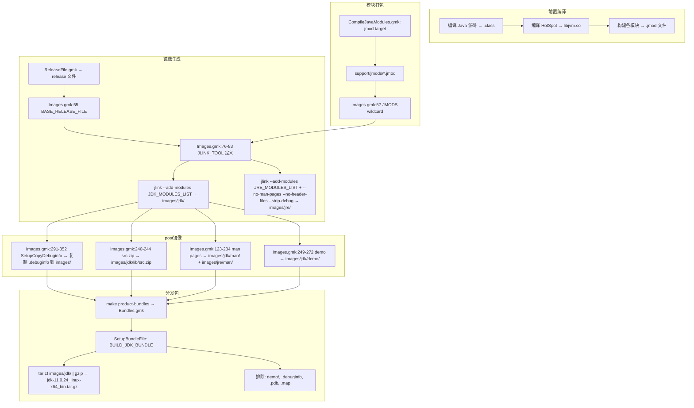

# 3.3 JDK 镜像组装 — 从 .so 和 .class 到 jdk.tar.gz

> **核心问题**：`make jdk-image` 执行的那几十秒，构建系统到底把编译产物的 `.class`、`.so`、可执行文件、配置文件如何一步步组织成最终用户看到的 `images/jdk/` 目录结构，再打包为 `jdk-11.0.24_linux-x64_bin.tar.gz`？

本文按 OpenJDK 构建系统的实际执行顺序，追踪从编译产物到最终分发包的完整镜像组装流程。三个关键文件贯穿全文：`Images.gmk`（镜像组装主入口）、`common/Modules.gmk`（模块检测和分类）、`Bundles.gmk`（分发包生成）。

---

## 一、exploded image：开发者的工作区

> **Callout 1 — 什么是 exploded image？** `build/*/jdk/` 是一个"摊开"的 JDK——所有文件以原始形式放在对应目录下，`bin/java` 直接指向编译产物，不做 jlink 链接。它是增量开发的核心提速器：每次修改代码后只需 3 秒重编译相关文件，而非 30 秒的完整 jlink。

### 1.1 构建目标定义

exploded image 是 OpenJDK 构建系统的默认目标。Main.gmk:1069 的注释清楚地说明了它的意图：

```makefile
# Main.gmk:1070-1072
# The "exploded image" is a locally runnable JDK in $(OUTPUTDIR)/jdk.
exploded-image-base: $(ALL_MODULES)
exploded-image: exploded-image-base release-file
ifneq ($(COMPILE_TYPE), cross)
  exploded-image: exploded-image-optimize   # Main.gmk:1076
endif
```

三个依赖逐层展开：

1. **`exploded-image-base`** — 依赖 `$(ALL_MODULES)`，即所有模块的编译产物（java 源代码 → .class、native 源代码 → .so）。这是"摊开"的 JDK 核心内容，来自 `src/` 目录下的各模块源码，经过 `CompileJavaModules.gmk` 和 HotSpot 编译（prompt-02 覆盖的阶段）构建完成。

2. **`release-file`** — 生成 `build/*/jdk/release` 文件（Main.gmk:902），记录构建配置元数据（JAVA_VERSION、OS_NAME、OS_ARCH 等）。

3. **`exploded-image-optimize`** — 仅在非交叉编译时生效（Main.gmk:1075），对 exploded image 中的 .jar/.jmod 进行优化（如 classlist 生成用于 AOT 编译）。

### 1.2 exploded image 的目录结构

exploded image 不是"复制"得到的，它本质上就是编译产物在 `$(OUTPUTDIR)/jdk/` 下的自然呈现。各模块的构建规则直接将产物输出到该目录下的对应子目录中。

```
build/linux-x86_64-server-release/jdk/        ← exploded image
├── bin/             ← 可执行文件（java, javac, jlink 等）
│   └── java         ← 启动器，直接可运行
├── lib/             ← 原生库（.so）+ Java 运行时
│   ├── server/      ← Server variant libjvm.so
│   │   └── libjvm.so  ← HotSpot JVM 编译产物
│   ├── modules      ← JDK 9+ 运行时镜像资源文件
│   ├── jexec        ← Linux jexec 辅助启动器
│   └── *.jar        ← 模块 class 文件归档（编译产物）
├── conf/            ← 配置文件（从源码目录复制）
│   └── net.properties 等
├── legal/           ← 许可证文件（从各模块 src/*/legal/ 复制）
├── demo/            ← 示例代码（misc 构建阶段）
├── man/             ← man 手册页（从 src/<os>/doc/man/ 复制）
├── jmods/           ← jmod 中间文件（供 jlink 使用）
├── include/         ← C 头文件（jni.h, jvmti.h 等）
└── release          ← 构建元数据文件
```

### 1.3 exploded image 与 images/jdk 的关键差异

> **Callout 4 — exploded image vs images/jdk 的关键差异** — exploded image ~300MB（含所有模块、未 strip 的 .so、man pages、头文件、demo）；images/jdk ~180MB（jlink 裁切、`--strip-debug`、去除 man pages 和头文件）。

| 维度 | exploded image (`jdk/`) | JDK image (`images/jdk/`) |
|------|------------------------|--------------------------|
| 生成方式 | 编译产物自然堆积 | jlink 工具链接生成 |
| 大小 | ~300MB | ~180MB |
| libjvm.so | 未 strip（含完整符号） | 可能 strip（取决于 debug-level） |
| man pages | 有（从源码复制） | 有（独立复制规则） |
| 头文件 | 有（include/） | JDK 无，JRE 被 `--no-header-files` 去除 |
| jmod 文件 | 有（jmods/） | 取决于 `--keep-packaged-modules` 选项 |
| 可用性 | `bin/java -version` 可运行 | `bin/java -version` 可运行 |
| 用途 | 增量开发（`make exploded-image`） | 分发（`make jdk-image`） |

**关键差异详解**：

- **`lib/modules` 文件**：JDK 9+ 引入了新的运行时镜像格式。exploded image 在 `lib/` 下有各模块的 `.jar` 文件（编译产物的直接归档），而 images/jdk 经过 jlink 后生成了一个统一的 `lib/modules` 文件（Java runtime image 的主资源容器）。这个文件包含了 jlink 选中的模块的所有 class 和资源，做过去重和优化。

- **头文件**：exploded image 包含 `include/` 目录（`jni.h`、`jvmti.h`、`jvmticmlr.h` 等），这些来自源码目录 `src/java.base/share/native/include/` 和 OS 特定目录。images/jdk 的 JDK 镜像保留 `include/`（开发者需要），JRE 镜像通过 `--no-header-files` 排除。

- **demo**：exploded image 包含 `demo/` 目录（Misc.gmk 构建的示例代码，Images.gmk:249-272 的 `JDK_COPY_DEMOS` 规则负责复制）。images/jdk 也包含 demo——同样通过 Images.gmk:249-272 的 `SetupCopyFiles` 宏从 `$(SUPPORT_OUTPUTDIR)/demos/image` 复制到 `$(JDK_IMAGE_DIR)/demo`，但 Bundles.gmk 明确排除了 `demo/%` 文件，所以 demo 在 JDK image 中存在但不会打包进 tar.gz。

---

## 二、jmod create：模块打包

> **Callout 2 — jmod 不是 .jar** — .jar 只有 .class 文件。jmod 包含 .class + .so 原生库 + bin/ 可执行文件 + conf/ 配置文件 + legal/ 许可证——一个完整模块的全部内容。它是 jlink 的输入格式，是模块化 JDK 的中间产物。

### 2.1 jmod 的生产位置

jmod 文件由 `CompileJavaModules.gmk` 的 `jmod` target 生成（这是上一个构建阶段，prompt-02 编译完成后进入的阶段）。每个模块对应一个 `.jmod` 文件，存放在：

```
build/$CONF_NAME/support/jmods/
├── java.base.jmod         ← 核心模块
├── java.desktop.jmod
├── java.logging.jmod
├── jdk.compiler.jmod
├── jdk.unsupported.jmod
└── ...（共 N 个 .jmod 文件）
```

### 2.2 Images.gmk 如何发现 jmod

`jmod` 命令详情见 `man 1 jmod`。Images.gmk:57 用 wildcard 发现所有已生成的 jmod 文件：

```makefile
# Images.gmk:57
JMODS := $(wildcard $(IMAGES_OUTPUTDIR)/jmods/*.jmod)
```

jmod 文件是 jlink 的 `--module-path` 参数的值（Images.gmk:77）。它们是 jlink 的**唯一输入来源**。

### 2.3 jmod 文件的 5 类内容

每个 `.jmod` 文件是 ZIP 格式的归档，内部按类别组织：

```
java.base.jmod 内部结构：
├── classes/          ← ① 模块的 .class 文件（编译后的 Java 字节码）
│   ├── java/
│   │   ├── lang/
│   │   │   ├── Object.class
│   │   │   ├── String.class
│   │   │   └── ...
│   │   └── util/
│   │       └── HashMap.class
│   └── module-info.class  ← Java 9+ 模块描述符
├── lib/              ← ② .so 原生库（编译后的 C/C++ 代码）
│   └── libjava.so   ← java.base 的 JNI 库
├── bin/              ← ③ 可执行文件（模块提供的命令行工具）
│   └── （对于 jdk.compiler: javac 等）
├── conf/             ← ④ 配置文件
│   └── net.properties
└── legal/            ← ⑤ LICENSE 许可证文件
    └── java.base/
        ├── LICENSE
        ├── ADDITIONAL_LICENSE_INFO
        └── ASSEMBLY_EXCEPTION
```

验证命令（prompt §十 第 6 条）：
```bash
jmod list build/*/support/jmods/java.base.jmod | head -20
# 输出示例：
# classes/module-info.class
# classes/java/lang/Object.class
# classes/java/lang/String.class
# lib/libjava.so
# legal/java.base/LICENSE
# ...
```

### 2.4 jmod 存在的必要性

> **Counterfactual**：如果不用 jmod 中间格式，直接把编译产物复制到 images/jdk？jlink 需要 module-info.class 元数据来解析模块依赖图和做可达性裁切——没有 jmod，jlink 无法工作。jmod 把编译产物的 5 类内容统一封装为每个模块一个文件，jlink 从其中提取 modules（class 内容）和读取 module-info 元数据，再把原生库、配置文件等复制到目标目录。

jmod 的存在使得：
- **分模块编译**成为可能（`CompileJavaModules.gmk` 按模块构建各 .jmod）
- **jlink 二次裁切**成为可能（用户可以用已安装 JDK 的 jmods/ 目录定制自己的 runtime image）
- **模块依赖验证**在 jlink 阶段自动完成

---

## 三、jlink 调用：Images.gmk 的核心

> **Callout 3 — jlink 做了什么？** 从 jmod 集合中挑选 `--add-modules` 指定的模块，生成一个精简的 JDK/JRE 目录。它不是"复制文件"，而是在 class/module-info.class 级别做哈希去重和压缩。

### 3.1 JLINK_TOOL 变量定义

`jlink` 命令详情见 `man 1 jlink`。Images.gmk:76-83 定义了 jlink 的全局参数：

```makefile
# Images.gmk:76-83
JLINK_TOOL := $(JLINK) -J-Djlink.debug=true \
    --module-path $(IMAGES_OUTPUTDIR)/jmods \
    --endian $(OPENJDK_TARGET_CPU_ENDIAN) \
    --release-info $(BASE_RELEASE_FILE) \
    --order-resources=$(call CommaList, $(JLINK_ORDER_RESOURCES)) \
    --dedup-legal-notices=error-if-not-same-content \
    $(JLINK_JLI_CLASSES) \
    #
```

逐参数解释：

| 参数 | 值 | 作用 |
|------|----|------|
| `-J-Djlink.debug=true` | — | 开启 jlink 调试日志，构建日志中可见模块依赖解析过程 |
| `--module-path` | `$(IMAGES_OUTPUTDIR)/jmods` | 指定 jmod 文件目录（Images.gmk:57 的 `JMODS` wildcard 发现） |
| `--endian` | `$(OPENJDK_TARGET_CPU_ENDIAN)` | 目标平台字节序（x86=little, SPARC=big），确保生成的 class 数据与 CPU 匹配 |
| `--release-info` | `$(BASE_RELEASE_FILE)` | ReleaseFile.gmk:38 生成的 `build/*/jdk/release` 文件内容嵌入镜像 |
| `--order-resources` | 资源排序列表（见下文） | 控制 lib/modules 文件中资源的存放顺序，优化启动性能 |
| `--dedup-legal-notices` | `error-if-not-same-content` | 多模块共享 legal 文件时严格去重——内容不一致则报错 |
| `--generate-jli-classes` | classlist 路径（可选） | 仅在 `ENABLE_GENERATE_CLASSLIST=true` 时，生成 JLI trace 数据 |

### 3.2 资源排序（优化启动）

Images.gmk:62-74 定义了 `JLINK_ORDER_RESOURCES` 变量：

```makefile
# Images.gmk:62-74
JLINK_ORDER_RESOURCES := **module-info.class          # 模块描述符优先
ifeq ($(ENABLE_GENERATE_CLASSLIST), true)
  JLINK_ORDER_RESOURCES += @$(SUPPORT_OUTPUTDIR)/link_opt/classlist  # AOT classlist
endif
JLINK_ORDER_RESOURCES += \
    /java.base/java/**          # java.base 的 java.* 包
    /java.base/jdk/**           # java.base 的 jdk.* 包
    /java.base/sun/**           # java.base 的 sun.* 包
    /java.base/com/**           # java.base 的 com.* 包
    /jdk.localedata/**          # 本地化数据
    #
```

资源排序的原理：jlink 将多个模块的 class 和资源合并为一个 `lib/modules` 文件。运行时 JVM 从该文件按顺序搜索资源——把高频使用的类（java.base 的核心包）排在前面，减少文件内查找开销。

### 3.3 JDK image 的 jlink 调用

Images.gmk:91-100 定义了 JDK 镜像的生成规则：

```makefile
# Images.gmk:91-100
$(JDK_IMAGE_DIR)/$(JIMAGE_TARGET_FILE): $(JMODS) \
    $(call DependOnVariable, JDK_MODULES_LIST) $(BASE_RELEASE_FILE)
	$(ECHO) Creating jdk image
	$(RM) -r $(JDK_IMAGE_DIR)                # ① 先清空目标目录
	$(call ExecuteWithLog, $(SUPPORT_OUTPUTDIR)/images/jdk, \
	    $(JLINK_TOOL) --add-modules $(JDK_MODULES_LIST) \
	        $(JLINK_JDK_EXTRA_OPTS) \
	        --output $(JDK_IMAGE_DIR) \
	)
	$(TOUCH) $@                               # ② 完成后 touch 标记文件
```

关键细节：

- **`$(JIMAGE_TARGET_FILE)`** = `bin/java$(EXE_SUFFIX)`（Images.gmk:60），即 `bin/java`。jlink 生成的目标目录中一定有这个文件——用它的存在性作为规则完成的标志。
- **`$(TOUCH) $@`** — Images.gmk:100 用 `touch` 标记 `$(JDK_IMAGE_DIR)/bin/java` 的完成状态。这是一个关键的防重复执行机制：如果 jlink 已经成功完成，再次 `make jdk-image` 不会重复执行 jlink（因为目标文件已经存在且比所有依赖新）。
- **`$(RM) -r $(JDK_IMAGE_DIR)`** — 每次构建先完全删除旧镜像，然后重新执行 jlink。这确保了构建幂等性。
- **前置条件** `jmods zip-source demos release-file`（Main.gmk:904）— jdk-image 依赖四个前置步骤全部完成。

### 3.4 JRE image 的 jlink 调用

Images.gmk:102-111 定义了 JRE 镜像的生成规则：

```makefile
# Images.gmk:102-111
$(JRE_IMAGE_DIR)/$(JIMAGE_TARGET_FILE): $(JMODS) \
    $(call DependOnVariable, JRE_MODULES_LIST) $(BASE_RELEASE_FILE)
	$(ECHO) Creating legacy jre image
	$(RM) -r $(JRE_IMAGE_DIR)
	$(call ExecuteWithLog, $(SUPPORT_OUTPUTDIR)/images/jre, \
	    $(JLINK_TOOL) --add-modules $(JRE_MODULES_LIST) \
	        $(JLINK_JRE_EXTRA_OPTS) \
	        --output $(JRE_IMAGE_DIR) \
	)
	$(TOUCH) $@
```

JRE image 与 JDK image 的本质区别在于两点：`JRE_MODULES_LIST` 比 `JDK_MODULES_LIST` 短（不含编译器类模块），以及额外的 `$(JLINK_JRE_EXTRA_OPTS)` 参数。

### 3.5 模块列表的来源

Images.gmk:42-51 计算了 JRE 和 JDK 的模块列表：

```makefile
# Images.gmk:42-51
ALL_MODULES := $(call FindAllModules)          # Modules.gmk:282 通过 module-info.java 发现
JRE_MODULES += $(filter $(ALL_MODULES), $(BOOT_MODULES) \
    $(PLATFORM_MODULES) $(JRE_TOOL_MODULES))   # JRE = boot + platform + tools
JDK_MODULES += $(ALL_MODULES)                  # JDK = 全部模块

JRE_MODULES_LIST := $(call CommaList, $(JRE_MODULES))   # 转逗号分隔列表
JDK_MODULES_LIST := $(call CommaList, $(JDK_MODULES))
```

`FindAllModules`（Modules.gmk:282）通过搜索所有 `module-info.java` 文件来发现所有模块，再用 `MODULES_FILTER` 过滤掉禁用的模块（如 `INCLUDE_SA=false` 时排除 `jdk.hotspot.agent`，Modules.gmk:205-207）。

模块分类定义在 Modules.gmk:48-133：

```
BOOT_MODULES (19个):    java.base, java.desktop, java.instrument, java.logging,
                        java.management, java.rmi, java.xml, jdk.jfr 等
PLATFORM_MODULES (23个): java.compiler, java.sql, java.xml.crypto, jdk.localedata 等
JRE_TOOL_MODULES (3个):  jdk.jdwp.agent, jdk.pack, jdk.scripting.nashorn.shell
```

---

## 四、JRE vs JDK 镜像的差异

> **Callout 5 — Images.gmk 不是单文件** — 它 include 了 Modules.gmk、通过 `$(call IncludeCustomExtension, Images-pre.gmk)` 钩子加载自定义文件（Images.gmk:37），并通过 `$(TOUCH)` 标记 jlink 成功状态防止重复执行（Images.gmk:100）。

### 4.1 JLINK_JRE_EXTRA_OPTS

Images.gmk:85 定义了 JRE 镜像额外的 jlink 参数：

```makefile
# Images.gmk:85
JLINK_JRE_EXTRA_OPTS := --no-man-pages --no-header-files --strip-debug
```

这三个参数的效果：

| 参数 | 作用 | 影响 |
|------|------|------|
| `--no-man-pages` | 不复制 man 手册页 | JRE 镜像无 `man/` 目录 |
| `--no-header-files` | 不复制 C 头文件 | JRE 镜像无 `include/` 目录（`jni.h` 等） |
| `--strip-debug` | 去除 .so 中的调试符号 | libjvm.so 从 ~200MB(slowdebug) → ~15MB(release) |

这三个选项**仅对 jlink 阶段有效**。正如 Images.gmk:291-293 的注释所说：*"Since debug symbols are not included in the jmod files, they need to be copied in manually after generating the images."* — 调试符号不在 jmod 文件中，需要在 jlink 完成后由 Images.gmk:331-352 的 `SetupCopyDebuginfo` 宏手动复制到镜像目录。

### 4.2 模块列表差异

```
JRE_MODULES = BOOT_MODULES (19个) + PLATFORM_MODULES (23个) + JRE_TOOL_MODULES (3个)
            = 约 45 个模块

JDK_MODULES = ALL_MODULES ≈ 60+ 个模块
            = JRE_MODULES + {jdk.compiler, jdk.javadoc, jdk.jshell, ...}
```

JDK 比 JRE 多出的模块主要是：
- **语言工具**：`jdk.compiler`（javac）、`jdk.javadoc`、`jdk.jshell`
- **开发工具**：`jdk.jcmd`、`jdk.jdeps`、`jdk.jlink`
- **额外 API**：`java.xml.ws` 等（如果未被 disable）

### 4.3 --keep-packaged-modules 选项

Images.gmk:87-89 为 JDK 镜像保留 jmod 文件：

```makefile
# Images.gmk:87-89
ifeq ($(JLINK_KEEP_PACKAGED_MODULES), true)
  JLINK_JDK_EXTRA_OPTS := --keep-packaged-modules $(JDK_IMAGE_DIR)/jmods
endif
```

> **Callout 7（部分）**：`--keep-packaged-modules` 将 jmod 文件保留在 `images/jdk/jmods/` 子目录下。这使得用户可以用已安装的 JDK 二次调用 jlink 来生成定制 runtime image：
> ```bash
> jlink --module-path $JAVA_HOME/jmods --add-modules java.base --output my-runtime
> ```
> 如果 JDK 不保留 jmod 文件，这个能力就丢失了——分发版缺少二次裁剪能力（Counterfactual §4.3③）。

### 4.4 对比总结

```
JRE 镜像 = jlink(
    --module-path jmods/
    --add-modules JRE_MODULES_LIST (~45 个模块)
    --no-man-pages          ← JRE 特有
    --no-header-files        ← JRE 特有
    --strip-debug            ← JRE 特有
    --output images/jre/
)

JDK 镜像 = jlink(
    --module-path jmods/
    --add-modules JDK_MODULES_LIST (~60+ 个模块)
    --keep-packaged-modules images/jdk/jmods  ← JDK 特有（可选）
    --output images/jdk/
)
```

---

## 五、images/jdk 的内部目录结构

### 5.1 完整目录树

```
build/$CONF_NAME/images/jdk/                  ← 最终 JDK 镜像
├── bin/                    ← 可执行文件（jlink 生成的启动器）
│   ├── java                ← Java 启动器
│   ├── javac               ← 编译器启动器
│   └── ...                 ← 所有模块声明的命令
├── lib/                    ← 原生库 + Java 运行时
│   ├── server/             ← 生产级 JVM variant
│   │   └── libjvm.so       ← HotSpot VM 编译产物（可能 strip）
│   ├── modules             ← jlink 生成的统一运行时资源文件
│   └── *.jar               ← 各模块 class 归档（某些配置下）
├── conf/                   ← 配置文件
│   ├── net.properties
│   ├── security/
│   │   └── java.security   ← Java 安全策略
│   └── logging.properties
├── legal/                  ← 许可证文件（经 jlink dedup）
│   ├── java.base/
│   │   ├── LICENSE
│   │   └── ADDITIONAL_LICENSE_INFO
│   └── ...
├── jmods/                  ← jmod 文件（仅当 --keep-packaged-modules）
│   ├── java.base.jmod
│   └── ...
├── include/                ← C 头文件（JDK 保留，JRE 无）
│   ├── jni.h
│   ├── jvmti.h
│   └── linux/
│       └── jni_md.h
├── man/                    ← man 手册页（通过 Images.gmk:123-234 独立复制）
│   └── man1/
│       ├── java.1
│       ├── javac.1
│       └── ...
├── demo/                   ← 示例代码
├── release                 ← 构建元数据文件（ReleaseFile.gmk 生成）
└── src.zip                 ← JDK 源码包（从 support/src.zip 复制，Images.gmk:240-244）
```

### 5.2 关键路径详解

**`bin/java` 启动器路径`**Images.gmk:60 — JIMAGE_TARGET_FILE 被定义为 `bin/java$(EXE_SUFFIX)`。这是 jlink 完成后必然存在的文件，作为 make 规则的目标标记。

**`lib/server/libjvm.so`** — `lib/` 下可能有多个 variant 子目录（`server/`、`client/`、`minimal/`），JVM 启动器根据配置选择加载哪个variant 的 libjvm.so。路径模式 `lib/$JVM_VARIANT/libjvm.so` 在启动器源码（`src/java.base/share/native/libjli/java.c`）中硬编码。

**`lib/modules`** — JDK 9+ 运行时镜像格式的核心文件。jlink 将选中的模块的 class 和资源合并到这个单一文件中，JVM 启动时从该文件加载 Java 类。

**`conf/` vs `lib/security/`** — JVM 配置文件（`net.properties`、`logging.properties` 等）放在 `conf/`，Java 安全策略（`java.security`）放在 `conf/security/`。这个分离使得系统管理员可以修改配置而无需触碰 lib/ 下的二进制文件。

**`release` 文件** — ReleaseFile.gmk:38-83 生成的内容格式：
```
JAVA_VERSION="11.0.24"
MODULES="java.base java.logging ..."
OS_NAME="Linux"
OS_ARCH="amd64"
SOURCE=".:git:abc1234"
IMPLEMENTOR="Oracle Corporation"
IMPLEMENTOR_VERSION="11.0.24+8-LTS"
JAVA_VERSION_DATE="2024-06-01"
LIBC="gnu"
```

**`src.zip`** — Images.gmk:240-244 从 `$(SUPPORT_OUTPUTDIR)/src.zip` 复制到 `$(JDK_IMAGE_DIR)/lib/src.zip`。用户 IDE 可以 attach 这个文件获得 JDK 源码。

### 5.3 man pages 的独立复制

man pages 不通过 jlink 处理——它们由 Images.gmk:123-234 的独立规则从源码目录直接复制：

```makefile
# Images.gmk:174-176
$(JRE_IMAGE_DIR)/man/man1/%: $(MAN_SRC_DIR)/$(MAN1_SUBDIR)/%
	$(call LogInfo, Copying $(patsubst $(OUTPUTDIR)/%,%,$@))
	$(install-file)
```

JRE 包含的 man pages 列表（Images.gmk:125-134）只有基本的 9 个（`java.1`、`keytool.1`、`pack200.1` 等），JDK 额外包含 18 个开发工具手册（`javac.1`、`javadoc.1`、`jstack.1`、`jmap.1`、`jcmd.1` 等），总计约 27 个手册页。

---

## 六、调试信息：slowdebug 对镜像的影响

### 6.1 构建时调试级别

OpenJDK 通过 `--with-debug-level` 配置项控制三个调试级别：

| 级别 | CFLAGS | CXXFLAGS | link 行为 | libjvm.so 大小 |
|------|--------|---------|----------|---------------|
| `release` | `-O2 -DNDEBUG` | 同左 | strip 符号 | ~15MB |
| `fastdebug` | `-O0 -g` | `-O0 -g` | 保留符号 | ~200MB |
| `slowdebug` | `-O0 -g -DASSERT` | 同左 + 更多断言 | 保留符号，不 strip | ~200MB+ |

### 6.2 DWARF 调试段

使用 `slowdebug` 编译时，`.so` 文件嵌入完整的 DWARF 调试信息。可以用 `readelf`（`man 1 readelf`）查看：

```bash
# 验证 DWARF 段
readelf -S build/*/images/jdk/lib/server/libjvm.so | grep debug
# .debug_info      PROGBITS   0000000000000000  12345678  89abcdef
# .debug_abbrev    PROGBITS   ...
# .debug_line      PROGBITS   ...  ← GDB 行号信息来源
# .debug_str       PROGBITS   ...
# .debug_ranges    PROGBITS   ...
```

### 6.3 strip 行为

`JLINK_JRE_EXTRA_OPTS` 中的 `--strip-debug`（Images.gmk:85）指示 jlink 在生成 JRE 镜像时去除 .so 中的调试符号。这通过调用系统的 `strip` 工具（`man 1 strip`）实现：

```bash
# 验证 strip 状态（man 1 file）
file build/*/images/jdk/lib/server/libjvm.so
# release:    "ELF 64-bit LSB shared object, ..., stripped"
# slowdebug:  "ELF 64-bit LSB shared object, ..., not stripped"
```

> **Counterfactual §4.6③**：如果发布版默认保留符号？libjvm.so 从 15MB → 200MB——不仅体积暴增，运行时 mmap 也会更慢（DWARF 段虽然不映射但占用 VMA 地址空间）。此外，保留调试符号还暴露内部实现细节。

### 6.4 外部调试符号（debuginfo）

Images.gmk:291-352 的 `SetupCopyDebuginfo` 宏负责处理外部调试符号。关键流程：

```makefile
# Images.gmk:291-293 注释
# Since debug symbols are not included in the jmod files, they need to be
# copied in manually after generating the images.

# Images.gmk:331-352
SetupCopyDebuginfo = \
    $(foreach m, $(ALL_$1_MODULES), \
      $(eval $(call SetupCopyFiles, COPY_$1_LIBS_DEBUGINFO_$m, \
          SRC := $(SUPPORT_OUTPUTDIR)/modules_libs/$m, \
          DEST := $($1_IMAGE_DIR)/$(LIBS_TARGET_SUBDIR), \
          FILES := $(call FindDebuginfoFiles, \
              $(SUPPORT_OUTPUTDIR)/modules_libs/$m), \
      )) \
      ...
    )

$(call SetupCopyDebuginfo,JDK)   # 对 JDK 镜像复制调试符号
$(call SetupCopyDebuginfo,JRE)   # 对 JRE 镜像复制调试符号
```

- **Linux**：`.debuginfo` 文件（independent debuginfo）通过 `FindDebuginfoFiles` 宏（Images.gmk:307-310）搜索并复制到镜像的 `lib/` 和 `bin/` 目录
- **Windows**：`.pdb` 和 `.map` 文件，filter 掉 6 个特定文件（`jimage.pdb`、`jpackage.pdb`、`java.pdb` 等，Images.gmk:327-328）
- **macOS**：`.dSYM` bundle 目录，通过 `containing` 函数匹配（Images.gmk:323）

当 `ZIP_EXTERNAL_DEBUG_SYMBOLS=true` 时，`.diz` 文件（zipped debuginfo）被搜索而非原始 `.debuginfo` 文件。Bundles.gmk:136-140 在打包阶段解压 `.diz` 文件。

---

## 七、tar.gz：最终分发包

> **Callout 7 — tar.gz 的生成不是 make 干的** — `make product-bundles` 调用 `make/Bundles.gmk`，用 JDK 自带的 `tar` + `gzip` 打包 `images/jdk/` 目录。

### 7.1 两阶段：image → bundle

关键认知纠正：**`make jdk-image` 不生成 tar.gz**。需要两个独立的 make target：

```bash
make jdk-image        # 阶段1：生成 images/jdk/ 目录
make product-bundles  # 阶段2：打包 images/jdk/ → jdk-*.tar.gz
```

Main.gmk:1107 的 `product-images` target 包含两者的依赖关系：
```makefile
# Main.gmk:1107
product-images: jdk-image symbols-image exploded-image
```

Bundles.gmk:464 定义 `product-bundles` target。

### 7.2 CreateBundle 宏：Bundles.gmk 的核心

Bundles.gmk:55-153 定义了 `SetupBundleFile` 宏，它是所有 bundle 生成的通用模板：

```makefile
# Bundles.gmk:55
SetupBundleFile = $(NamedParamsMacroTemplate)
define SetupBundleFileBody
  $$(foreach d, $$($1_BASE_DIRS), \
    # ① 计算每个 BASE_DIR 的相对文件列表
    $$(eval $1_$$d_RELATIVE_FILES := ...) \
    # ② 写出文件清单（ListPathsSafely 安全处理长路径）
    $$(eval $1_$$d_LIST_FILE := ...) \
  )
  # ③ 根据类型选择打包策略
  ifeq ($$($1_SUBDIR)-$$($1_TYPE)-..., .-tar.gz-false-1)
    # 最快路径：单 BASE_DIR，无 SUBDIR，tar 直接打包
  ...
```

### 7.3 JDK bundle 的生成路径

Bundles.gmk:362-370 设置 JDK bundle：

```makefile
# Bundles.gmk:362-370
$(eval $(call SetupBundleFile, BUILD_JDK_BUNDLE, \
    BUNDLE_NAME := $(JDK_BUNDLE_NAME), \
    FILES := $(JDK_BUNDLE_FILES), \
    SPECIAL_INCLUDES := $(JDK_SPECIAL_INCLUDES), \
    BASE_DIRS := $(JDK_IMAGE_DIR), \
    SUBDIR := $(JDK_BUNDLE_SUBDIR), \
))
```

参数解析：

| 参数 | 值 | 含义 |
|------|----|------|
| `BUNDLE_NAME` | `jdk-$(VERSION_NUMBER)_$(OS)-$(ARCH)_bin.tar.gz` | 最终文件名 |
| `FILES` | `$(JDK_BUNDLE_FILES)` | 排除符号文件后 images/jdk 的所有文件 |
| `BASE_DIRS` | `$(JDK_IMAGE_DIR)` = `images/jdk/` | 打包源目录 |
| `SUBDIR` | `jdk-$(VERSION_NUMBER)`（e.g. `jdk-11.0.24`） | tar 内的根目录名 |

`JDK_BUNDLE_FILES` 的计算（Bundles.gmk:234-242）：

```makefile
# Bundles.gmk:234-242
JDK_BUNDLE_FILES := \
    $(filter-out \
        $(JDK_SYMBOLS_EXCLUDE_PATTERN) \      # 排除 .debuginfo .diz .map .pdb
        $(JDK_EXTRA_EXCLUDES) \               # 排除额外文件
        $(SYMBOLS_EXCLUDE_PATTERN) \          # 排除符号文件
        $(JDK_IMAGE_HOMEDIR)/demo/% \         # 排除 demo/
        , \
        $(ALL_JDK_FILES) \                   # images/jdk/ 下所有文件
    )
```

重点：**demo/ 目录被明确排除**（`$(JDK_IMAGE_HOMEDIR)/demo/%`）。demo 文件存在于 images/jdk 但不会进入 tar.gz 分发包。

### 7.4 子目录命名规则

```makefile
# Bundles.gmk:175-176
JDK_BUNDLE_SUBDIR := jdk-$(VERSION_NUMBER)     # 如 jdk-11.0.24
JRE_BUNDLE_SUBDIR := jre-$(VERSION_NUMBER)     # 如 jre-11.0.24

# Bundles.gmk:177-179 slowdebug 变体
ifneq ($(DEBUG_LEVEL), release)
  JDK_BUNDLE_SUBDIR := $(JDK_BUNDLE_SUBDIR)/$(DEBUG_LEVEL)
  JRE_BUNDLE_SUBDIR := $(JRE_BUNDLE_SUBDIR)/$(DEBUG_LEVEL)
endif
```

对于 `slowdebug` 构建，子目录变为 `jdk-11.0.24/slowdebug/`。

### 7.5 打包策略选择

`tar` 详情见 `man 1 tar`，`gzip` 见 `man 1 gzip`。Bundles.gmk 的 `SetupBundleFileBody` 中有 4 条打包路径，根据条件自动选择：

```
SUBDIR 为空 + TYPE=zip + UNZIP_DEBUGINFO=false
  → zip 直接打包（行 93-98）

SUBDIR 为空 + TYPE=tar.gz + UNZIP_DEBUGINFO=false + 单 BASE_DIR
  → tar 最快路径：cd BASE_DIR，tar -T filelist | gzip（行 99-107）

SUBDIR 非空 + TYPE=tar.gz + TAR_SUPPORTS_TRANSFORM=true + 单 BASE_DIR
  → tar --transform 自动加子目录前缀（行 108-117）

其他所有情况
  → tar cf | tar xf 先复制到临时目录，再 tar.gz 打包（行 118-149）
```

在 Linux 上，JDK bundle 使用第 3 条路径（若 tar 支持 `--transform`）或第 4 条路径。

### 7.6 macOS 的特殊处理

macOS 构建生成 `.dmg` 而非 `.tar.gz`。Bundles.gmk:159-188 定义了 mac 特有的目录结构：

```makefile
# Bundles.gmk:159-161
ifeq ($(OPENJDK_TARGET_OS)-$(DEBUG_LEVEL), macosx-release)
  JDK_IMAGE_DIR := $(JDK_MACOSX_BUNDLE_DIR)
  JRE_IMAGE_DIR := $(JRE_MACOSX_BUNDLE_DIR)
```

> **Callout 6 — mac/linux 镜像差异** — macOS 生成 `.dmg` bundle (`mac-jdk-bundle` target, Main.gmk:1126-1130)，Linux 生成 `.tar.gz`。`release-file` target (ReleaseFile.gmk) 生成 `release` 文件记录构建配置。

macOS release 构建还有代码签名步骤（Bundles.gmk:300-319）：
```makefile
$(CODESIGN) -s "$(MACOSX_CODESIGN_IDENTITY)" \
    --timestamp --options runtime --deep --force \
    $(JDK_MACOSX_BUNDLE_DIR_SIGNED)/$(JDK_MACOSX_BUNDLE_TOP_DIR)
```

### 7.7 完整流程图



---

## 八、验证：三阶段（exploded → image → tar.gz）

### 8.1 阶段 1：验证 exploded image 可运行

```bash
# 验证 exploded image 可运行
build/*/jdk/bin/java -version
# 预期输出：openjdk version "11.0.24" ...

# 对比体积（man 1 du）
du -sh build/*/jdk
# 输出：~300M（含所有模块、未 strip .so、man pages、demo）
```

### 8.2 阶段 2：验证 JDK image

```bash
# 验证 JDK image 可运行
build/*/images/jdk/bin/java -version
# 预期输出：同上

# 验证模块列表
build/*/images/jdk/bin/java --list-modules
# 预期输出：所有已构建的模块名列表

# 对比大小
du -sh build/*/jdk build/*/images/jdk
# 输出：~300M vs ~180M（JDK image 经 jlink 精简）

# 验证 libjvm.so strip 状态
file build/*/images/jdk/lib/server/libjvm.so
# release:    "... stripped"
# slowdebug:  "... not stripped"

# 验证 bin/ 目录一致性
diff -rq build/*/jdk/bin build/*/images/jdk/bin
# 预期：文件一致（bin/ 下的可执行文件未被 jlink 修改）

# 验证 release 文件
cat build/*/images/jdk/release
# 预期输出：
# JAVA_VERSION="11.0.24"
# OS_NAME="Linux"
# OS_ARCH="amd64"
# ...

# 验证 jmod 文件计数
ls build/*/support/jmods/*.jmod | wc -l
# 预期：与构建的模块数一致
```

### 8.3 阶段 3：验证 tar.gz

```bash
# 检查 tar.gz 存在
ls -lh build/*/bundles/jdk-*.tar.gz
# 预期：存在且大小合理（~180MB）

# 查看内容（不解压）
tar tzf build/*/bundles/jdk-*-linux-x64_bin.tar.gz | head -30
# 预期输出：
# jdk-11.0.24/
# jdk-11.0.24/bin/
# jdk-11.0.24/bin/java
# ...
# 注意：无 demo/ 目录（已被排除）

# 对比 image 和 tar 内容
diff <(cd build/*/images/jdk && find . -type f | sort) \
     <(tar tzf build/*/bundles/jdk-*.tar.gz | sed 's|^jdk-[^/]*/||' | sort)
# 预期：tar 中不应有 demo/ 下的文件，不应有 .debuginfo/.pdb 等
```

---

## 九、Counterfactual 分析

### 9.1 exploded image 不存在

**反事实**：如果每次增量开发都走完整 `jlink` 而非 exploded image？

- **后果**：每次改一行代码后 `make jdk-image` 需 30 秒（jlink 重新链接所有模块）而非 `make exploded-image` 的 3 秒（只重编译修改的模块）。开发迭代慢 10 倍。
- **现有设计**：exploded image 是编译产物的直接映射——`Main.gmk:1070` 的 `exploded-image-base: $(ALL_MODULES)` 保证每个模块编译完就到位，无额外链接步骤。
- **影响**：exploded image 是增量开发的必要条件。没有它，HotSpot 开发者每次改动一行 GC 代码后需要等 jlink 完成才能测试。

### 9.2 jmod 中间格式不存在

**反事实**：如果直接把编译产物复制到 images/jdk？

- **后果**：jlink 需要从 jmod 文件中读取 `module-info.class` 元数据进行模块依赖图解析和可达性分析。没有 jmod，jlink 无法判断模块间的 `requires` 关系，无法裁切未使用的模块，也无法做 class 级别的哈希去重和压缩。
- **现有设计**：`Images.gmk:57` 用 wildcard 发现所有 jmod，`Images.gmk:77` 将其作为 `--module-path` 传给 jlink。
- **影响**：没有 jmod 就无法实现 JDK 9+ 的模块化运行时镜像。`lib/modules` 文件的生成依赖于 jlink 从 jmod 中提取并重组 class 数据。

### 9.3 --dedup-legal-notices 缺失

**反事实**：如果不用 `--dedup-legal-notices=error-if-not-same-content`（Images.gmk:81）？

- **后果**：多个模块包含相同 legal 文件时（如 java.base/LICENSE 和 java.desktop/LICENSE 内容相同），jlink 可能任意选一份或复制多份。最坏情况下，`tzdata` 的 LICENSE 被 `java.base` 的 LICENSE 覆盖，导致许可证声明错误。
- **现有设计**：`error-if-not-same-content` 要求 jlink 在遇到同名但内容不同的 legal 文件时报错，这强制了许可证一致性。如果内容相同，jlink 自动去重为一份。
- **影响**：法律合规性问题。许可证是分发 JDK 时必须精确的元数据。

### 9.4 JDK 不保留 jmod 文件

**反事实**：如果 `--keep-packaged-modules` 不设置（Images.gmk:87-89），images/jdk 不含 jmods/ 目录？

- **后果**：用户无法用已安装的 JDK 二次调用 `jlink` 生成自定义 runtime image。所有基于已安装 JDK 的 jlink 工作流都会失败。
- **现有设计**：`JLINK_KEEP_PACKAGED_MODULES=true` 时（通常默认为 true），jmod 文件保留在 `images/jdk/jmods/` 下。
- **影响**：分发版的二次裁剪能力丧失。但这也节省了磁盘空间——如果不需要，可以禁用以减少镜像大小。

### 9.5 发布版保留调试符号

**反事实**：如果 release 版 libjvm.so 保留完整的 DWARF 调试信息？

- **后果**：libjvm.so 从 ~15MB 暴增到 ~200MB。虽然 DWARF 段不映射到进程地址空间（`.debug_info` 等 section 在 ELF 中标记为 `NOBITS` 或非 `LOAD`），但它们仍占用 VMA 虚拟地址空间。此外，更大的 .so 文件意味着更慢的 `mmap` 启动时间（内核需要建立更多页表映射）和更大的磁盘占用。
- **现有设计**：release 构建时 `--with-debug-level=release` 使用 `-O2 -DNDEBUG` 且 link 后 strip 去掉所有符号。JRE 还有额外的 `--strip-debug`（Images.gmk:85）。
- **影响**：体积暴增 + 启动变慢 + 内部实现细节暴露。

### 9.6 --no-man-pages 独立于 jlink

**反事实**：man pages 通过 jlink 而非 Images.gmk 的独立复制规则处理？

- **后果**：jlink 只处理 jmod 文件中的内容，man pages 不在 jmod 文件中（它们直接从 `src/<os>/doc/man/` 复制）。如果由 jlink 处理，man pages 会被删除——jlink 不知道它们的存在。
- **现有设计**：Images.gmk:123-234 的独立 `install-file` 规则从源码目录复制 man pages 到镜像目录，完全独立于 jlink 流程。
- **影响**：JRE 的 `--no-man-pages`（Images.gmk:85）控制的是 jlink 阶段不生成 man 目录，但 JDK 的 man pages 是通过独立的 make 规则添加的——这两者互补。

### 9.7 手动打包 vs Bundles.gmk

**反事实**：如果不用 Bundles.gmk 而手动 `tar -czf jdk.tar.gz images/jdk/`？

- **后果**：
  1. 文件名不标准——不会按 `jdk-$(VERSION)_$(OS)-$(ARCH)_bin.tar.gz` 格式命名
  2. 会包含不该有文件——`Bundles.gmk` 排除了 demo（行 240）、debuginfo（行 236-238）、`.pdb`/`.map`（`SYMBOLS_EXCLUDE_PATTERN`）、`.stripped.pdb` 等
  3. 子目录名不正确——Bundles.gmk 设置 `SUBDIR := jdk-$(VERSION_NUMBER)`（行 175），确保解压后文件在 `jdk-11.0.24/` 下而非散落在当前目录
  4. 代码签名缺失——macOS 构建需要 Codesign 步骤
- **现有设计**：Bundles.gmk 的 `SetupBundleFile` 宏封装了所有这些规则。

### 9.8 $(TOUCH) 标记机制缺失

**反事实**：如果 Images.gmk:100 不使用 `$(TOUCH) $@` 标记 jlink 完成状态？

- **后果**：每次 `make jdk-image` 都会重新执行 jlink（即使没有任何变化），浪费数十秒。更糟的是，GNU Make 的依赖检查基于文件时间戳——如果没有标记文件，Make 无法判断 jlink 是否已经完成，可能触发不必要的重复构建。
- **现有设计**：`$(TOUCH) $@`（Images.gmk:100）创建一个时间戳标记文件 `$(JDK_IMAGE_DIR)/bin/java`。Make 比较该文件与依赖（jmod 文件 + 模块列表变量 + release 文件）的时间戳——只有依赖更新时才重新 jlink。
- **影响**：增量构建效率丧失，每次 `make` 都重新 jlink。

---

## 附录 A：关键变量速查表

| 变量 | 定义位置 | 典型值 | 用途 |
|------|---------|--------|------|
| `JLINK_TOOL` | Images.gmk:76 | `$(JLINK) -J-Djlink.debug=true --module-path ...` | jlink 调用命令 |
| `JDK_MODULES_LIST` | Images.gmk:51 | `java.base,java.logging,...`（逗号分隔） | jlink --add-modules 参数 |
| `JRE_MODULES_LIST` | Images.gmk:50 | JRE 模块子集 | JRE 的 --add-modules |
| `JLINK_JRE_EXTRA_OPTS` | Images.gmk:85 | `--no-man-pages --no-header-files --strip-debug` | JRE 额外去除内容 |
| `JLINK_JDK_EXTRA_OPTS` | Images.gmk:89 | `--keep-packaged-modules .../jmods` | JDK 保留 jmod 文件 |
| `BASE_RELEASE_FILE` | Images.gmk:55 | `$(JDK_OUTPUTDIR)/release` | release 元数据 |
| `JIMAGE_TARGET_FILE` | Images.gmk:60 | `bin/java$(EXE_SUFFIX)` | jlink 完成标记 |
| `JDK_IMAGE_DIR` | spec.gmk | `$(OUTPUTDIR)/images/jdk` | 最终输出目录 |
| `JRE_IMAGE_DIR` | spec.gmk | `$(OUTPUTDIR)/images/jre` | JRE 输出目录 |
| `JDK_BUNDLE_NAME` | spec.gmk | `jdk-$(VERSION)_$(OS)-$(ARCH)_bin.tar.gz` | tar.gz 文件名 |
| `BOOT_MODULES` | Modules.gmk:48 | 19 个模块 | JRE 基础模块 |
| `PLATFORM_MODULES` | Modules.gmk:96 | 23 个模块 | 平台模块（含 upgradeable） |
| `JRE_TOOL_MODULES` | Modules.gmk:129 | 3 个模块 | JRE 工具模块 |
| `FindAllModules` | Modules.gmk:282 | — | 通过 module-info.java 发现全部模块 |
| `SetupBundleFile` | Bundles.gmk:55 | 宏 | 通用 bundle 生成模板 |

---

## 附录 B：诊断工具：排查镜像组装故障

对应的 3 个典型生产场景诊断链：

**场景 1 — jlink 找不到模块**：
```bash
# 1. 检查 jmod 是否实际生成
ls build/*/support/jmods/ | grep java.desktop
# 2. 检查模块是否在 JDK_MODULES_LIST 中
grep "JDK_MODULES_LIST" build/*/make-support/images-jdk.jlink-*.log
# 3. 检查 MODULES_FILTER 是否错误过滤
grep -r "java.desktop" make/common/Modules.gmk make/Images.gmk
```

**场景 2 — exploded image 能跑但 images/jdk 不行**：
```bash
# 1. 对比两个目录差了什么
diff -rq build/*/jdk/lib build/*/images/jdk/lib
# 2. 检查 libjvm.so 是否被 strip
file build/*/images/jdk/lib/server/libjvm.so
# 3. 检查 jlink 日志
cat build/*/support/images/jdk/jlink-*.log
# 4. 检查 stderr
make jdk-image 2>&1 | grep -i error
```

**场景 3 — tar.gz 有不该有的文件**：
```bash
# 1. 检查 JDK_BUNDLE_FILES 过滤器
grep -A5 "JDK_BUNDLE_FILES" make/Bundles.gmk
# 2. 检查是否有自定义 exclude 覆盖
grep -r "JDK_EXTRA_EXCLUDES\|demo" make/Bundles.gmk make/Images.gmk
# 3. 查看实际 tar 内容
tar tzf build/*/bundles/jdk-*.tar.gz | grep -E "src.zip|demo/"
```
