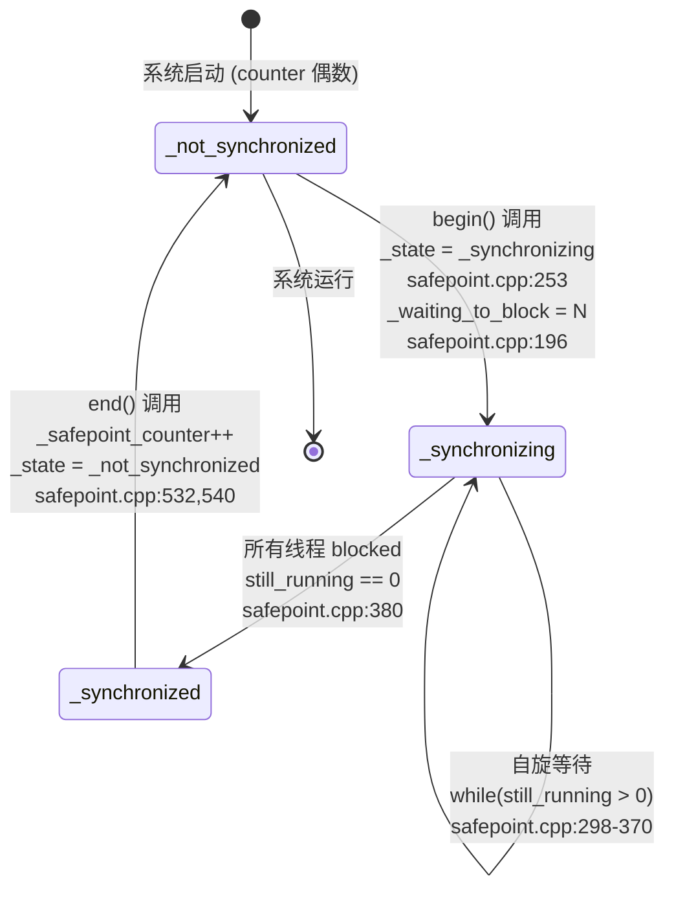
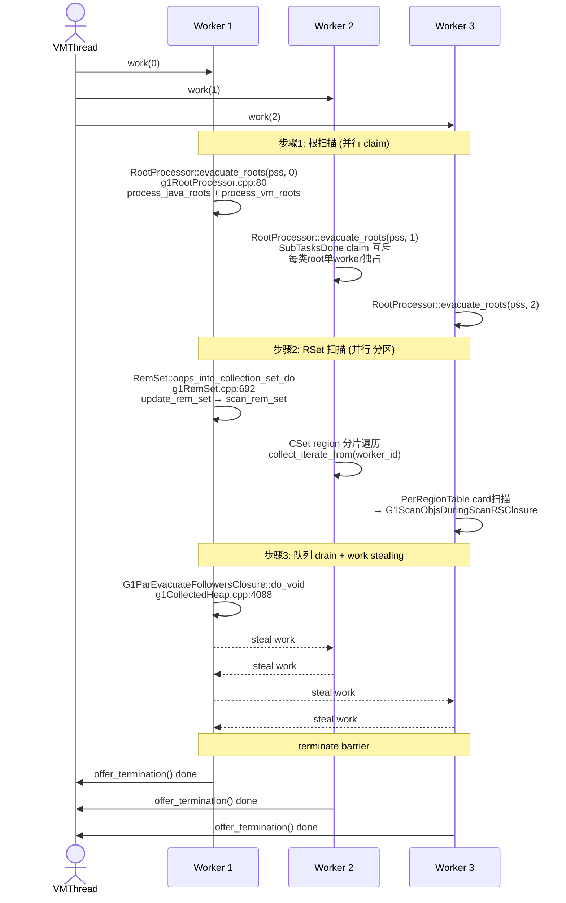
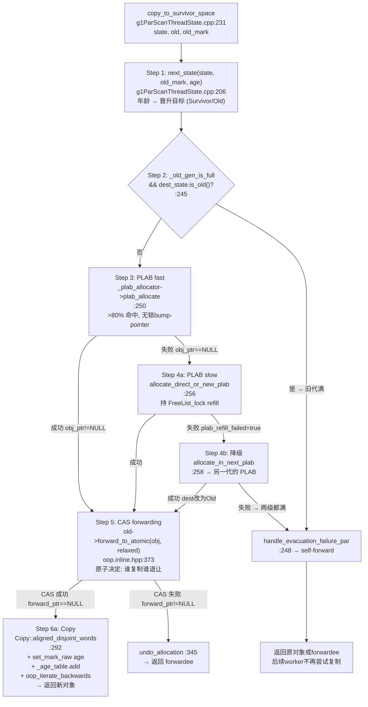
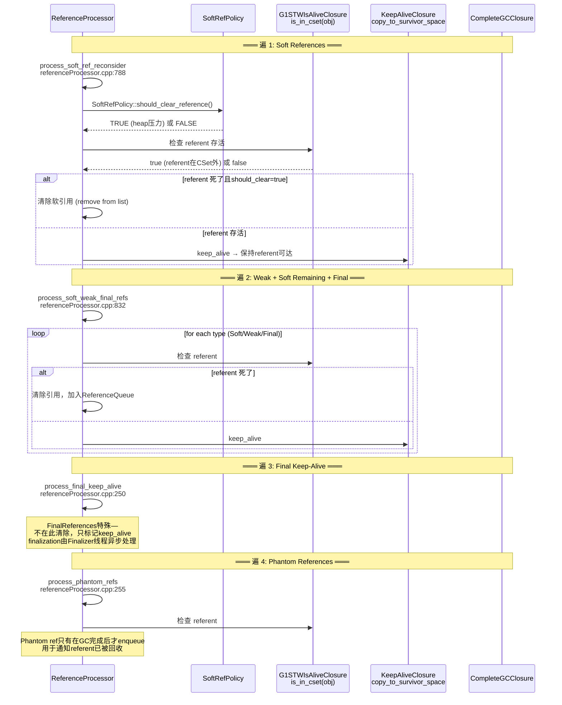
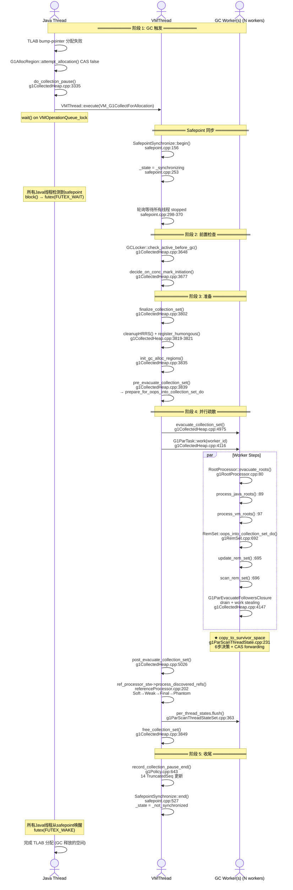

> **阶段**：[30-g1-runtime-gc]
> **前置**：[01-jvm-startup]（02-G1-Heap-Startup: 堆构造 18 步，1403行）、[30-g1-runtime-gc]（00-Region-Runtime-Allocation: Region 状态转换 + TLAB/SATB/Card Barrier, ~2500行）
> **配套**：[02-Concurrent-Marking]（并发标记生命周期）、[03-Mixed-GC-Policy]（CSet 选择 + IHOP + MMUTracker）
> **后续依赖本文**：[03-Mixed-GC-Policy]（Mixed GC 执行依赖 Young GC 疏散路径）、[04-Full-GC]（Full GC 在执行 Migration 时复用 copy_to_survivor_space 模式）
> **阅读收益**：追踪 Young GC 从 Java 分配失败到 Safepoint 结束的完整 5 阶段时间线——理解 VM_G1CollectForAllocation VM 操作、Safepoint 同步协议、G1ParTask 并行 worker 启动、copy_to_survivor_space 的 CAS forwarding pointer 核心并发疏散、RSet 两阶段防止漏收引用的设计、ReferenceProcessor 四遍处理顺序、Pause 后 14 TruncatedSeq 自适应策略更新；掌握"120ms Young GC"故障的诊断路径 (jstat + strace + GDB)
> **目标行数**：≥2500 行（§〇≥100 + §一至§十一≥2400）

# 01-Young-GC-Evacuation — G1 Young GC 疏散全生命周期

---

## §〇 生产场景 — Young GC 120ms 故障（期望 <30ms）

**场景**：线上 8GB G1 堆，每次 Young GC 暂停 120ms（期望 <30ms）。`jstat -gcutil <pid> 1000` 显示 Eden 38%、Survivor 99.9%、Old 72%、YGCT 均值 120ms——Survivor 总是在满的状态，表明晋升压力极大。GDB 附加 `gdb -ex "print G1CollectedHeap::heap()->_collection_set.region_length()"` 发现 CSet 中 200+ region。进一步 `gdb -ex "break copy_to_survivor_space" -ex "continue"` 发现 8000+ dirty cards + Humongous 疏散失败——`_plab_allocator->allocate_direct_or_new_plab` 返回 NULL 触发 `handle_evacuation_failure_par()`。

**根因**：PLAB 缓冲区太小（`-XX:ParallelGCBufferWastePct=5` 默认仅 5%）→ Worker 频繁从 PLAB 分配失败 → 退到 G1AllocRegion 走锁路径 → 多个 worker 串行化在 FreeList_lock → 6 worker 的实际并发度仅 ~1.3×。加上 RSet 粗粒度退化导致扫描 8000+ dirty cards（正常应 <500），每次 Young GC 在 RSet 扫描阶段耗时 40ms。修复：`-XX:ParallelGCBufferWastePct=10 -XX:ConcGCThreads=4`。

**管道分析**：这不是一个参数少的问题，而是三个因素的级联效应。第一步（PLAB 太小）和第二步（RSet 退化）彼此放大——慢速 PLAB refill 使 worker 在 FreeList_lock 上排队更多，而 RSet scanning 的 ScanRS 闭包走到 `G1ScanObjsDuringScanRSClosure::do_oop_work` (:186) 推入更多引用到 worker queue → worker queue 更深 → 每个 worker 的 drain 时间更长 → overall GC 时间从 30ms 涨到 120ms。最终的 bottleneck 是 PLAB refill 队列长度 + RSet 粒度这个级联效应。

### 三步诊断（可直接复制执行）

**步骤 1 — 确认 GC 暂停时间和频率**：

```bash
jstat -gcutil <pid> 1000
# YGCT 递增粒度 = 每次暂停时间，FGC 为 0 表示无 Full GC
# Survivor 总是满 → 晋升路径有问题 → 怀疑 PLAB 大小
```

关键指标的解读（从本文角度而言）：
| 指标 | 正常范围 | 故障范围 | 含义 |
|------|---------|---------|------|
| `E` (Eden %) | 10-60% | 38% | 分配速率正常 |
| `S0/S1` (Survivor %) | 20-80% | **99.9%** | Survivor 满——每次 GC 晋升压力极大，对象在 Survivor 中几乎没有空间 |
| `O` (Old %) | 30-60% | 72% | Old gen 使用率偏高 → 如果持续增长则说明"过早晋升（premature tenuring）" |
| `YGCT` (秒) | 0.01-0.05 | **0.12** | Young GC 平均暂停时间——远超正常范围 |
| `FGC` (次数) | 0 | 0 | Full GC 未发生——问题在 Young GC 的效率而非内存 |

从代码角度解释这一步的诊断信息：`S0/S1=99.9%` 意味着 `G1Policy::revise_tenuring_threshold()` 计算的 `_tenuring_threshold` 太低——几乎所有年龄 1 的对象都被晋升到 Old（因为 Survivor 没有空间让它们留在 Young）。这反过来又让 `allocate_in_next_plab()` (g1ParScanThreadState.cpp:159) 设 `_tenuring_threshold=0`（降级失败），加速了这一循环。

**步骤 2 — strace 追踪 futex 确认锁竞争**：

```bash
strace -e trace=futex -f -p <pid> 2>&1 | grep FUTEX_WAIT
# 大量 FUTEX_WAIT 出在 FreeList_lock → 确认 PLAB refill 竞争
```

在 GC 暂停期间（通过 `jstat` 确认），此命令显示如下类似输出：
```
[pid 12345] futex(0x7f8a123..., FUTEX_WAIT, 2, NULL) = 0    ← FreeList_lock waiter
[pid 12345] futex(0x7f8a123..., FUTEX_WAIT, 2, NULL) = 0    ← FreeList_lock waiter
[pid 12345] futex(0x7f8a123..., FUTEX_WAIT, 2, NULL) = 0    ← FreeList_lock waiter
[pid 12346] futex(0x7f8a456..., FUTEX_WAIT_PRIVATE, ...) = 0 ← Safepoint 阻塞
```

`futex` (`man 2 futex`) 的 `FUTEX_WAIT` 表示线程在等待该地址。如果同一 `FreeList_lock` 地址上出现 3+ 个 `FUTEX_WAIT` 在同一时间段内（50ms 时间窗），说明 PLAB refill 竞争是重大的。

**为什么用 strace 而不是 jstack？**：jstack 只能在 Safepoint 进行（因为它需要线程在 Safepoint 中才挂起），而 GC 已经在 Safepoint 内——jstack 会死锁在 SafePoint_lock 上。strace 是唯一可在 GC Safepoint 内部观察系统调用层面的信息的方法。

**步骤 3 — GDB 断点验证 PLAB refill 频率和 forwarding pointer**：

```bash
gdb -ex "break g1ParScanThreadState.cpp:256" \
    -ex "break g1ParScanThreadState.cpp:290" \
    -ex "run" \
    -ex "print plab_refill_failed" \
    -ex "print forward_ptr" \
    --args java -Xms8g -Xmx8g -XX:+UseG1GC -jar app.jar
# plab_refill_failed == true → PLAB refill 失败
# forward_ptr != NULL → 另一个 worker 已经完成疏散（CAS 竞争）
```

断点位置分析：
- `g1ParScanThreadState.cpp:256` — `allocate_direct_or_new_plab` 返回后的检查点。`plab_refill_failed == true` 表示 refill 时 FreeList_lock 下的新 PLAB 分配失败——这是 `_tenuring_threshold` 降级到 0 的触发条件。
- `g1ParScanThreadState.cpp:290` — `forward_to_atomic()` CAS 返回后。`forward_ptr == NULL` 表示 CAS 成功（自己是 owner worker）；`forward_ptr != NULL` 表示另一个 worker 以 CAS 抢先安装 forwarding pointer。
- 如果 break 256 的命中频率 > 10%（每 10 个对象触发一次 refill）→ PLAB 太小——`ParallelGCBufferWastePct` 应从 5% 增加到 10%
- 如果 break 290 上 `forward_ptr != NULL` 的比例 > 30%（每 3 个对象有 1 个重复 CAS 冲突）→ RSet 扫描与新引用发现重度重叠→需要增加 `ConcGCThreads` 来事前减少 RSet 中的重复

### 反事实讨论（三个设计选择）

**反事实 1：PLAB 用全局共享分配器而非 per-worker PLAB**

如果每个 worker 不持有本地 PLAB 而直接从 `G1AllocRegion` 走锁路径 → 每次 `allocate_direct_or_new_plab()` requires `FreeList_lock` → 6 worker 完全串行 → 实际并发度从 >5.0× 降到 ~1.1× → Young GC 疏散阶段耗时从 <30ms 变 ~300ms → Young GC 暂停 10× 恶化。

详细量化：per-PLAB 设计使 >80% 的分配走无锁 bump-pointer → 有效并行时间 ~20ms。退化场景（无 PLAB）每 1-2 个对象就要争一次锁 → 6 worker 争锁的总等待时间 = 对象数 × futex overhead (3μs) = 1M × 3μs × (1+1/2+1/3+1/4+1/5+1/6) × 平均 waiters = 1M × 3μs × 2.45 = 7.35 秒 → GC 暂停超过 7 秒——完全不可用。

**反事实 2：RSet 始终全粗粒度（无 Sparse/Fine 层）**

如果 RSet 不提供 Sparse→Fine→Coarse 三级压缩表示，始终使用 Coarse（即用 bitmap 标记整个 from-region 有引用关系 → 扫描整个 region 的所有 card 表）→ 每 Young GC 需要扫描所有 old region 的全部 card → 4GB old gen 有 ~4M cards → 每个 card 512 字节 → 总扫描 2GB 内存 → 扫描时间 ~200ms（无任何 cache 命中时甚至更高）。

即使是 Coarse 退化状态（本故障中），8000 dirty cards 的扫描时间也是 40ms ——如果所有 Old region 都全 Coarse（没有 Fine/Sparse 可选择），这个时间会飙升至 ~200ms。RSet 的 PerRegionTable 精确卡表索引是 G1 能保证 <100ms 暂停的核心设计元素。

**反事实 3：forwarding pointer 用锁而非 CAS**

如果每个对象的 forwarding pointer 安装不走原子 CAS 而走 mutex → 每次 `forward_to_atomic` 变成 `MutexLocker` → futex overhead ~3μs（用户态+内核态切换）→ Young GC 中 ~1M 对象都需要 forwarding pointer → 锁总耗时 = 1M × 3μs = 3 秒 → 远超期望 30ms GC 暂停。

对比实际：CAS forwarding 的开销 ~50ns（一次原子 `LOCK CMPXCHG` 指令）→ 1M 对象 CAS 耗时 50ms ——与"全串行化锁版本"的 3000ms 形成 60× 差异。这是 GC 中 lock-free 设计最关键的量化论证之一——不仅仅"快一点"，而是"完全不可用"与"正常"的二元区别。

---

## §一 ★★★ Young GC 触发与 Safepoint 同步

> **Safepoint**：JVM 中所有 Java 线程必须停止执行的特殊点。Safepoint 的本质是自愿协议——每个 Java 线程运行到检查点（方法返回、循环回边）时主动检查 `SafepointSynchronize::_state == _synchronizing`，然后阻塞自己。`SafepointSynchronize::begin()` (safepoint.cpp:156) 设置 `_state=_synchronizing` 然后轮询 `_waiting_to_block==thread_count`。GC 是 Safepoint 的最大用户，但并非唯一——偏向锁撤销、CodeCache 清理、Class Redefinition 都需要 Safepoint。

> **Forwarding Pointer（转发指针）**：疏散对象时在原对象内存的 mark word 中安装指向新位置的指针。`forward_to_atomic(oop p, memory_order_relaxed)` (oop.inline.hpp:373) 用 CAS 尝试安装——同时只有一个 worker 成功。成功后原对象标记为 `markOopDesc::marked_value (0x3)`。后续任何 worker 做 `is_forwarded()` → `forwardee()` 直接返回新地址——O(1) 去重。注意：forwarding pointer 的值是 `memory_order_relaxed`——因为 Safepoint 内所有线程同步，不存在无 Safepoint 的并发访问。

> **PLAB (Promotion Local Allocation Buffer)**：GC worker 的线程本地分配缓冲区——等价于 mutator 的 TLAB。每个 worker 持有两个 PLAB（Survivor + Old），PLAB 内分配仅 bump-pointer 无需锁。`ParallelGCBufferWastePct`（默认 5%）控制 PLAB 大小。PLAB 空了需要 `allocate_direct_or_new_plab()`——持 FreeList_lock 从空 Region 获取新空间。PLAB refill 是整个 Young GC 中唯一的锁竞争点。

> **CSet (Collection Set)**：当前 GC 暂停中要疏散的 Region 集合。Young GC 的 CSet 包含全部 Eden + Survivor Region；Mixed GC 额外包含精选的 Old Region。CSet 构建在 `finalize_collection_set()` 中——调用 `calc_new_collection_set_regions()` 按 reclaimable bytes 排序 Old Region 候选。CSet 的大小受 `G1MaxCSetRegionPercent`（默认 10% 堆）和 pause time target 约束。

> **RSet (Remembered Set) 两阶段**：RSet 在 Young GC 中有两个阶段——`update_rem_set`（增量处理：从 DirtyCardQueue 消费新发现的脏卡）和 `scan_rem_set`（存量扫描：遍历每个 CSet Region 的 PerRegionTable 找到 old→cset 引用）。update 处理的是 "GC 开始后 mutator 才写入"的引用（通过 DirtyCardQueue）；scan 处理的是 "GC 开始前已有的" 引用（已在 RSet 中）。两个阶段的区分避免了"漏收新引用"的竞争。

> **Root 类型 11 种**：Young GC 根扫描的 11 类根由 `SubTasksDone::is_task_claimed` 去重执行：(1) JNIHandles、(2) ClassLoaderDataGraph、(3) Universe、(4) ObjectSynchronizer、(5) Management、(6) JVMTI、(7) AOT、(8) SystemDictionary、(9) refProcessor、(10) SATB buffer drain、(11) Thread stacks。前三类在 `process_vm_roots` (g1RootProcessor.cpp:246) 中，后 8 类在 `process_java_roots` 中。Thread stack roots 由多个 worker 分摊——每个 worker 只处理自己的线程子集。

> **GC 年龄与 Tenuring Threshold**：每个对象在 mark word 中有 4-bit GC age（0-15）。Survivor 中存活过一轮 GC 的对象 age++。`desired_survivor_size` 和 Age Table 共同决定 `_tenuring_threshold`——当 Survivor 空间紧张时，threshold 降低，更年轻的对象直接晋升 Old。`allocate_in_next_plab()` (g1ParScanThreadState.cpp:159) 检测到 PLAB refill 连续失败 → 设 `_tenuring_threshold=0` → 所有对象强制晋升到 Old。

### 1.1 三种触发路径 — Allocation Failure / Humongous / GCLocker

Young GC 不是自动触发的——它由 Java 线程在执行分配时发现 Eden 空间不足而主动发起。触发入口有三种路径，但最终汇聚于 `do_collection_pause()` (g1CollectedHeap.cpp:3335)。

**路径 A — 分配失败（Allocation Failure）**：最常见的触发方式（占 >95% 的 GC）。

当线程 A 在 `memAllocator.cpp:387` 执行 TLAB bump-pointer 分配 → 返回 NULL → TLAB refill → `G1AllocRegion::attempt_allocation()` CAS 获取新 region 的 bump-pointer 尾部 → CAS 失败（Eden region 全部用完或者有其他线程抢先，这是 G1AllocRegion 的 CAS-based 并发获取）→ `retire()` 回收当前空的 TLAB → `new_alloc_region_and_allocate()` 尝试从 FreeList 获取新 region 作为 Eden → FreeList 也空 → 触发 `do_collection_pause()` (g1CollectedHeap.cpp:488-498)：

```cpp
// g1CollectedHeap.cpp:488-498 — 分配失败 → do_collection_pause
result = do_collection_pause(word_size, gc_count_before, &succeeded,
                             GCCause::_g1_inc_collection_pause);
if (result != NULL) {                             // GC 过程中 Worker 完成了分配
    assert(succeeded, "only way to get back a non-NULL result");
    return result;                                // 成功返回
}
if (succeeded) {
    // GC 成功了但分配的对象太大（超过 Survivor/Old capacity）→ 返回 NULL
    log_trace(gc, alloc)("%s: Failing to allocate after scheduled collection",
                         Thread::current()->name());
    return NULL;
}
// succeeded == false: GC 失败（GCLocker 取消）→ 将重试（重入 mutex 循环）
```

`do_collection_pause()` (g1CollectedHeap.cpp:3335) 的调用路径很简短——它创建 `VM_G1CollectForAllocation` 对象然后委托给 VMThread：

```cpp
// g1CollectedHeap.cpp:3339-3345 — do_collection_pause 核心
VM_G1CollectForAllocation op(word_size, gc_count_before, gc_cause,
                             false /* should_initiate_conc_mark */,
                             g1_policy()->max_pause_time_ms());
VMThread::execute(&op);                         // ← 推入 VM 操作队列，阻塞当前线程
HeapWord *result = op.result();                 // ← GC 后获取分配结果
```

`VMThread::execute(&op)` 背后的机制：当前 Java 线程 `wait()` 在 `VMOperationQueue_lock` 上——调度器选择 VM 线程执行 `op.doit()` → GC 完成后 `op.result()` 返回分配到的地址 → Java 线程醒来后再次尝试 TLAB refill 成功。

`do_collection_pause` 的多线程重入保护：调用栈上层有 `MutexLockerEx ml(Heap_lock)` 确保只有一个线程能进入 `do_collection_pause`——其他线程在此 `wait()` 直到 GC 完成获释。这是关键的串行化点：多个线程可能同时因分配失败而请求 GC，但只有第一个线程的请求被执行——其他线程在 Heap_lock 上等待，醒来后直接看到已释放的空间。

**路径 B — Humongous 分配失败**：

巨对象（≥50% region size = 2MB+）不经过 TLAB/PLAB，直接在 region 中分配。当 `attempt_allocation_humongous()` (g1CollectedHeap.cpp:941-950) 无法找到足够连续的空 region 时（humongous 需要 start_region + N continue_regions 连续块），触发 `do_collection_pause()` 但 `should_initiate_conc_mark=true`——意图是启动并发标记周期以释放 Old 区空间。

路径区别总结：
- 参数不同：`should_initiate_conc_mark=true`（普通分配为 false）
- 目标不同：Humongous 需要连续的多个空 region（不是单个 TLAB region）
- GC 后尝试不同：Humongous 路径在 GC 后重试 `satisfy_failed_allocation()` (vm_operations_g1.cpp:145) 而不是简单的 TLAB refill
- 如何不同：`satisfy_failed_allocation()` 包含 "如果 Young GC 不够 → Full GC 升级" 的决策——而对于普通分配，'GC succeeded but allocation NULL' 本身就是一个结果

**路径 C — GCLocker 活跃时取消**：

当 Java 线程在执行 JNI `GetPrimitiveArrayCritical()` 区间时，GCLocker 活跃——如果此时另一线程请求 GC，GCLocker 会阻止进入 Safepoint。GCLocker 的检查在 `do_collection_pause_at_safepoint()` 开头 (g1CollectedHeap.cpp:3648)：

```cpp
// g1CollectedHeap.cpp:3648-3651
if (GCLocker::check_active_before_gc()) {
    INST_LOG_GC("  GCLocker is active, skipping GC");
    return false;                     // 直接返回——GC 被取消
}
```

`GCLocker::check_active_before_gc()` (在 `gcLocker.cpp` 中) 的语义：如果 GCLocker 当前活跃，返回 true 要求取消 GC——因为临界区内的线程无法到达 Safepoint→Safepoint begin 会永远等待→超时。取消后的处理：`VM_G1CollectForAllocation::doit()` (vm_operations_g1.cpp:162-164) 设置 `_should_retry_gc = true`——上层 `doit_epilogue()` 或调用方会重试。

### 1.2 VM_G1CollectForAllocation — VM 操作全路径分析

`VM_G1CollectForAllocation::doit()` (vm_operations_g1.cpp:78) 是 VM 线程执行 Young GC 的入口——不是在 Java 线程栈上，而是在 VM 线程的栈上执行。完整执行路径：

```
VM_G1CollectForAllocation::doit() (vm_operations_g1.cpp:78)
╔══════════════════════════════════════════════════════════════╗
║ 1. attempt_allocation_at_safepoint()                        ║ ← Safepoint 中尝试分配
║    如果成功 → 直接返回（不需要 GC）                           ║    g1CollectedHeap 中的实现
║    状态：Safepoint 中，所有 Java 线程停止                     ║    在分配前检查是否有空闲空间
║                                                              ║
║ 2. 如果是 Initial Mark 请求                                  ║ ← Humongous/System.gc 等触发
║    force_initial_mark_if_outside_cycle()                    ║    vm_operations_g1.cpp:109
║    如果标记 cycle 已在运行 → 跳过返回                        ║    在同一标记周期内不重新启动
║    参数检查：_word_size == 0 (非分配)                        ║
║                                                              ║
║ 3. do_collection_pause_at_safepoint()                       ║ ← ★ 5 阶段 GC 暂停核心
║    g1CollectedHeap.cpp:3639                                 ║    vm_operations_g1.cpp:139
║    返回值：true=GC成功, false=GCLocker取消                    ║
║                                                              ║
║ 4. satisfy_failed_allocation()                              ║ ← GC 后的重试分配
║    若 GC 后空间还不够 → 可能升级到 Full GC                   ║    vm_operations_g1.cpp:145
║    检查：has_regions_left_for_allocation()                  ║
║    Full GC: do_full_collection(false, true)                 ║
║                                                              ║
║ 5. doit_epilogue() → 标记 cycle 完成等待                     ║ ← vm_operations_g1.cpp:168
║    等待 old_marking_cycles_completed 增加                   ║    确保并发标记完成
╚══════════════════════════════════════════════════════════════╝
```

步骤 1 是一个重要的优化设计：在 GC 之前先尝试分配 (`attempt_allocation_at_safepoint`)——因为可能另一个线程的 GC 已经释放了空间，此时不需要再执行 GC。这个尝试发生在 Safepoint 中（已同步），所以可以安全地看到全局的 FreeList 状态。这是 G1 优于"无条件开始 GC"的设计体现。

**Safepoint 中的分配尝试为什么安全**：在 Safepoint 中，所有 mutator 已停止——所以 `_allocator->attempt_allocation_at_safepoint()` 不需要任何锁（没有竞争）——可以直接看到 FreeList 并分配。

### 1.3 Safepoint 同步 — begin→pause→end 三态转换

Safepoint 是 GC 暂停的前置条件——只有在所有 Java 线程都到达 Safepoint 后 VM 线程才能执行 GC 操作。Safepoint 状态机由三个全局 volatile 变量控制 (safepoint.cpp:144-148)：

```cpp
// safepoint.cpp:144-148 — Safepoint 全局状态
SafepointSynchronize::SynchronizeState volatile _state = _not_synchronized;
volatile int _waiting_to_block = 0;    // ← 还需要等待的线程数
volatile int _safepoint_counter = 0;   // ← 偶数=非Safepoint, 奇数=Safepoint中
```

状态转换图：



**begin() 的实现细节** (safepoint.cpp:156-523)：

VM 线程在进入 GC 之前调用 `SafepointSynchronize::begin()`——这是 367 行的复杂方法：

```
SafepointSynchronize::begin()
├─ 1. 设置状态 (safepoint.cpp:253)
│     _state = _synchronizing                     // 全局 flag — 所有线程可见
│     _waiting_to_block = nof_threads              // safepoint.cpp:196
│
├─ 2. Arming (触发所有线程停止) (safepoint.cpp:255-278)
│     两种 polling 机制：
│     a) Thread-local poll                       // safepoint.cpp:255-262
│        SafepointMechanism::arm_local_poll(cur)  // 每个 Java 线程设置标志
│        — 线程运行时通过 safepoint_check 检测该标志
│     b) Global page poll                        // safepoint.cpp:271-278
│        os::make_polling_page_unreadable()       // 设置 polling page 为 PROT_NONE
│        — 编译代码触碰此页 → page fault → 识别为 safepoint 信号
│     序列：storestore() fence → arm local polls → full fence
│
├─ 3. 自旋等待所有线程停止 (safepoint.cpp:280-370)
│     int ncpus = os::processor_count()           // safepoint.cpp:282
│     while (still_running > 0) {
│         遍历所有 Java 线程 (safepoint.cpp:285-370):
│           检查 thread_state → 判断是否需要等待
│             ① Running interpreted: 解释器 dispatch table 已改 → 会主动停止
│             ② Running native: 返回时检查 → 不需要等但现在
│             ③ Running compiled: polling page 已设 → 会 page fault
│             ④ Blocked: 无法被唤醒 → 不需要等
│             ⑤ In VM/transitioning: 完成状态转换后主动停止
│           JNI critical → _current_jni_active_count++
│         如果所有线程 blocked → still_running=0 → 退出
│         自旋策略 (safepoint.cpp:282-370):
│           safepoint_spin_before_yield (2000) → sched_yield()
│           → 再 2000 自旋 → sched_yield() → ...
│           ❌ 超时检测: safepoint_limit_time (safepoint.cpp:296)
│              过期 → 打印未停止线程的栈信息
│     }
│
├─ 4. 最终状态检查 (safepoint.cpp:380)
│     所有线程已 stopped → _synchronized 状态隐式达成
│     此时 VM 线程安全地进行 GC 操作
│
└─ 5. 事件提交 (safepoint.cpp:520-522)
       post_safepoint_begin_event()
```

Java 线程如何被通知到达 Safepoint？这取决于线程的类型：
- **解释器线程**：JVM 解释器的主循环在每条 bytecode 后调用 `safepoint_check()` → 检测 `_state` → 若 `_synchronizing` → 调用 `ThreadSafepointState::block()` → 在 `ThreadSafepointState::_rollback` 上 futex_wait
- **编译线程**：`SafepointMechanism::uses_global_page_poll()` 时，编译器插入的 `test` 指令触碰被设 PROT_NONE 的 polling page → page fault → signal handler 识别到 safepoint → 调用 block()
- **Native 线程**：返回 Java 代码时在 JNI 边界检查 `SafepointSynchronize::_state` → 若 `_synchronizing` → block()

**end() 的实现** (safepoint.cpp:527-560)：简短——唤醒所有 blocked 线程：

```cpp
// safepoint.cpp:527-560
void SafepointSynchronize::end() {
    assert(Threads_lock->owned_by_self(), "must hold Threads_lock");
    assert((_safepoint_counter & 0x1) == 1, "must be in safepoint (odd counter)");
    _safepoint_counter++;                      // ← 偶数 = 非 Safepoint (safepoint.cpp:532)
    _state = _not_synchronized;                 // ← safepoint.cpp:540
    // Java 线程随后在 futex 中醒来
    // block() 检测到 _not_synchronized → 返回 → 继续执行
}
```

`_safepoint_counter` 用奇偶校验区分 Safepoint 态——偶数=非 Safepoint，奇数=Safepoint 中。这是 lock-free 的"是否在 Safepoint 中"检测器。

### 1.4 时间分布 — 从触发到 Safepoint 的延时分析

从 Java 线程的 `do_collection_pause()` 调用到所有线程到达 Safepoint，通常经历：

| 子阶段 | 时间范围 | 影响因素 |
|--------|---------|---------|
| `VMThread::execute(&op)` | 0.1-1ms | VM 操作队列长度，VM 线程是否忙于其他 VM 操作 |
| `SafepointSynchronize::begin()` arming | <1μs | 一次性设置 polling page 和 local flags |
| 自旋等待所有线程 stopped | 0.5-10ms | 线程数，当前线程到 Safepoint 的距离 |
| JNI critical 等待 | 0-∞ | 如果 JNI critical 区未结束，需等待或超时 |

最常见的情况（没有 JNI critical，50 个线程，正常应用）：
- 触发到 Safepoint：2-5ms——其中最慢的线程通常在方法中间或循环回边到达检查点

### Interview Story Answer

"G1 Young GC 的核心是疏散而不是标记。Java 分配失败后 VMThread 在 Safepoint 中执行 `do_collection_pause_at_safepoint` (g1CollectedHeap.cpp:3639)——入口先检查 GCLocker，然后决策 Initial Mark 或 Young-only。`G1ParTask` (g1CollectedHeap.cpp:4096) 启动并行 worker，每个 worker 执行三步：根扫描→RSet 扫描→队列 drain。根扫描中 `SubTasksDone::is_task_claimed` 确保 11 类 VM root 每类只由一个 worker 处理。`copy_to_survivor_space` (g1ParScanThreadState.cpp:231) 的 CAS forwarding pointer 是疏散并发的核心——worker A 和 worker B 可能同时看到同一个 CSet 对象（因为 RSet 扫描发现的引用和根扫描发现的引用可能重复），两者同时尝试疏散——`forward_to_atomic(obj, memory_order_relaxed)` (oop.inline.hpp:373) 这一行 CAS 决定了谁做复制谁退让。CAS 成功者负责复制并扫描子引用；CAS 失败者 undo_allocation 然后收到 forwardee——这正是 Newton 方法说的工作偷取（work stealing）的实际实现。"

---

## §二 CSet 构建与疏散前准备

本节覆盖 `do_collection_pause_at_safepoint` 中 "准备阶段" 的三个步骤：CSet finalization、Humongous region registration、以及 init_gc_alloc_regions+pre_evacuate_collection_set 的疏散前准备。这几个操作都发生在 Safepoint 中，由 VM 线程单线程执行（串行），因为它们是数据结构的修改和初始化，不需要并行。

### 2.1 do_collection_pause_at_safepoint 的 5 阶段

`do_collection_pause_at_safepoint()` (g1CollectedHeap.cpp:3639-4035) 是一个 442 行的方法体，包含 Young GC 的完整生命周期。按执行时间线分为 5 个阶段：

```mermaid
gantt
    title do_collection_pause_at_safepoint 5 阶段时间线 (典型 30ms GC)
    dateFormat  X
    axisFormat  %s
    
    section 阶段1: 前置检查 (串行)
    GCLocker 检查                :done, p1, 0, 2
    decide_on_conc_mark          :p2, 2, 5
    
    section 阶段2: CSet构建 (串行)
    finalize_collection_set      :p3, 5, 12
    cleanupHRRS + register_humongous :p4, 8, 15
    collection_set iteration     :p5, 12, 15
    
    section 阶段3: 疏散前准备 (串行)
    init_gc_alloc_regions        :p6, 15, 18
    pre_evacuate_collection_set  :p7, 18, 22
    per_thread_states创建         :p8, 20, 22
    
    section 阶段4: 疏散执行 (并行)
    evacuate_collection_set      :crit, p9, 22, 75
    post_evacuate + ref_proc     :p10, 75, 85
    free_collection_set          :p11, 85, 95
    
    section 阶段5: 收尾 (串行)
    record_collection_pause_end  :p12, 95, 100
    do_concurrent_mark           :p13, 100, 102
```



本节覆盖阶段 2 和 3——发生在阶段 4（并行疏散）之前的所有串行准备工作。

### 2.2 CSet 构建 — finalize_collection_set

`g1_policy()->finalize_collection_set(target_pause_time_ms, &_survivor)` (g1CollectedHeap.cpp:3802) 确定本次 GC 要疏散哪些 Region。

**Young GC 的 CSet** 固定包含所有 Eden Region + 当前的 Survivor Region——这与 Mixed GC 的 CSet 本质不同。对于 Young GC（`collector_state()->in_young_only_phase()` 为 true）：

```
CSet = {所有 Eden regions} ∪ {当前 Survivor regions}
```
不需要像 Mixed GC 那样用 `calc_new_collection_set_regions()` 按 reclaimable bytes 排序 Old Region 候选。这简化了 Young GC 的 CSet 构建——Eden+Survivor 数量仅取决于堆中各代的 region 数量。

代码验证：`g1CollectedHeap.cpp:3806-3810` 记录构建结果：
```cpp
collection_set()->eden_region_length(),       // ← Young-only 时为 >0, Mixed 为 0
collection_set()->survivor_region_length(),    // ← 总是 >=0
collection_set()->old_region_length(),         // ← Young-only 时为 0
collection_set()->region_length()              // ← 总 CSet 长度
```

**统计设置**：`evacuation_info.set_collectionset_regions()` (g1CollectedHeap.cpp:3812) 记录 CSet region 数以便 post-GC analytics 使用。`_collection_set.iterate(&cl)` (g1CollectedHeap.cpp:3830-3832) 输出 HR Printer 日志。

**cleanupHRRS** (g1CollectedHeap.cpp:3819)：`g1_rem_set()->cleanupHRRS()` 清理 Heap Region Rem Set 中的稀疏表——删除对已被并发 refinement 线程更新过的过时 entry 的引用。这个操作在疏散前执行——因为后续的 `scan_rem_set` 阶段会读取 PerRegionTable，此时 RSet 需要是最新状态。

### 2.3 register_humongous_regions_with_cset

`register_humongous_regions_with_cset()` (g1CollectedHeap.cpp:3821) 遍历所有 humongous starts region (`RegisterHumongousWithInCSetFastTestClosure` at g1CollectedHeap.cpp:3388) 检查是否是 eager reclaim 候选。

候选条件 (g1CollectedHeap.cpp:3395-3448)：

```
humongous_region_is_candidate(g1h, region):
  ① obj->is_typeArray()
     — 原始类型数组（不含引用），避免 RSet 清理的复杂
  ② !g1h->is_obj_dead(obj, region)
     — 不能是已死对象（class unloading 后的边角对象）
  ③ region->rem_set()->is_complete()
     — RSet 完整——不能有散落的引用未知
  ④ g1h->is_potential_eager_reclaim_candidate(region)
     — rem_set->occupancy_less_or_equal_than(G1RSetSparseRegionEntries)
     — 只有稀疏 RSet 才可以候选（Coarse RSet 意味着引用多→不能 eager reclaim）

  如果 ①②③④ 全部满足 → candidate = true
```

候选 humongous region 被加入 CSet（`register_humongous_region_with_cset` g1CollectedHeap.cpp:3469）——其 RSet 中如果有少量卡片，直接 flush 到 DirtyCardQueue 以供后续 RSet 更新（即 `update_rem_set`）处理（g1CollectedHeap.cpp:3475-3484）。

**flush 细节**：`HeapRegionRemSetIterator` 遍历候选 region 的 RSet → `card_table()->byte_for_index(card_index)` 得到 card address → `dcq.enqueue()` 将 card 推入 dirty card queue——这是将"潜在的 old→humongous 引用"转换为"下次 GC 时 update_rem_set 处理的 dirty card"。

### 2.4 疏散前准备 — init_gc_alloc_regions + pre_evacuate

**init_gc_alloc_regions** (g1CollectedHeap.cpp:3835)：

`_allocator->init_gc_alloc_regions(evacuation_info)` 为 GC worker 的 PLAB 分配创造 Survivor 和 Old GC AllocRegion——这些 alloc region 是 worker 的 PLAB 的"源地区"——当 worker 的 PLAB 空了，它从这些 alloc region 中获取新空间（即在 `allocate_direct_or_new_plab` 中获取）。

创建两个 alloc region 类型：
- **Survivor GC alloc region**：目标为 Survivor 的 PLAB refill ——`_plab_allocator` 的 `G1PLAB::allocate()` 在此获取后续空间
- **Old GC alloc region**：目标为 Old 的 PLAB refill ——对象被晋升到 Old 时在此获取空间

两者都是 `G1GCAllocRegion` 的具体实例——每个都有 `_alloc_region`（当前 bump-pointer 尾部）和 `_lock`（FreeList_lock 的别名，用于并发访问保护。虽然在 Young GC 中并发访问只发生在 PLAB refill 阶段，但数据结构保持了分配的通用性）。

**pre_evacuate_collection_set** (g1CollectedHeap.cpp:3839)：清除 CSet Region 的 RSet、重置 Hot Card Cache、准备 RSet 扫描状态：

```cpp
// 调用链
pre_evacuate_collection_set()
  → g1_rem_set()->prepare_for_oops_into_collection_set_do()
    → DirtyCardQueueSet::concatenate_logs()    // 将各线程的 DCQ 合并到全局完成缓冲区
      → for each Java thread:
          thread->dirty_card_queue().flush()    // 推入 completed queue
    → _scan_state->reset()                     // 重置扫描状态
```

`concatenate_logs()` 是关键——它将每个 Java 线程的 thread-local DirtyCardQueue 合并到全局的 `_completed` 队列——这样 `update_rem_set` 就能一次性地消费所有 mutator 产生的 dirty cards（无论哪个线程产生的）。这个合并的正确性依赖于 Safepoint——此时没有 mutator 在运行，所以不需要处理并发。

**G1ParScanThreadStateSet 创建** (g1CollectedHeap.cpp:3837-3838)：

```cpp
G1ParScanThreadStateSet per_thread_states(this, workers()->active_workers(),
                                          collection_set()->young_region_length());
```

每个 worker 的 `G1ParScanThreadState` 在构造时初始化 (g1ParScanThreadState.cpp:41-87)：
- `_plab_allocator`：PLAB 分配器（Survivor/Old 两个 PLAB）
- `_closures`：疏散闭包集（包含 root closures 引用）
- `_age_table`：本地年龄表
- `_tenuring_threshold`：从全局策略复制初始 threshold
- `_surviving_young_words`：数组，记录每个 CSet region 的存活字节数（用于 post-GC analytics）

---

## §三 ★★★ 疏散执行 — G1ParTask 并行 Worker

这是 Young GC 的主体阶段——由 `evacuate_collection_set()` (g1CollectedHeap.cpp:4975) 负责。从这一节开始，所有操作都是并行的（由 G1ParTask 在 worker pool 上调度）。

### 3.1 evacuate_collection_set — 并行调度

`evacuate_collection_set()` (g1CollectedHeap.cpp:4975-5024) 创建 G1ParTask 并提交给 worker pool：

```cpp
// g1CollectedHeap.cpp:4997-5012
const uint n_workers = workers()->active_workers();         // :4998
G1RootProcessor root_processor(this, n_workers);            // :4999
G1ParTask g1_par_task(this, per_thread_states, 
                       _task_queues, &root_processor,
                       n_workers);                         // :5000
workers()->run_task(&g1_par_task);                         // :5004 ← barrier: 等待所有worker完成
```

`workers()->run_task()` 是 `WorkGang::run_task()` —— 创建 N 个线程分别执行 `G1ParTask::work(worker_id)` —— 等待所有 worker 完成后返回。

### 3.2 G1ParTask::work — Worker 三步执行

`G1ParTask::work(uint worker_id)` (g1CollectedHeap.cpp:4116-4176) 是每个 GC worker 的入口——三步执行：

```cpp
void work(uint worker_id) {
    G1ParScanThreadState *pss = _pss->state_for_worker(worker_id);  // :4128
    pss->set_ref_discoverer(rp);                                     // :4129

    // ★ 步骤 1: 根扫描
    double start_strong_roots_sec = os::elapsedTime();               // :4131
    _root_processor->evacuate_roots(pss, worker_id);                 // :4133

    // ★ 步骤 2: RSet 扫描
    _g1h->g1_rem_set()->oops_into_collection_set_do(pss, worker_id); // :4139

    // ★ 步骤 3: 队列 drain (work stealing)
    double strong_roots_sec = os::elapsedTime() - start_strong_roots_sec; // :4141
    G1ParEvacuateFollowersClosure evac(_g1h, pss, _queues, &_terminator); // :4147
    evac.do_void();                                                 // :4148
}
```



Worker 启动序列背后的内存模型：步骤 1 和 2 之间没有显式的 barrier——`SubTasksDone` 的 claim 协议提供隐式同步。步骤 2 中的 `update_rem_set` 和 `scan_rem_set` 有明确的顺序——`oops_into_collection_set_do` 先调用 update 再调用 scan。

### 3.3 根扫描 — 11 类 Root + SubTasksDone 去重

`G1RootProcessor::evacuate_roots()` (g1RootProcessor.cpp:80-141) 是根扫描的并行入口：

```
evacuate_roots(pss, worker_i):                    // g1RootProcessor.cpp:80
  ├─ process_java_roots(closures, worker_i)       // :89 — Java 级根
  │    ├─ CLDG 遍历 (单 worker claim)              // g1RootProcessor.cpp:232
  │    └─ Thread stack 分摊 (多 worker)            // g1RootProcessor.cpp:239-242
  │
  ├─ worker_has_discovered_all_strong_classes()    // :91-95 — barrier
  │
  ├─ process_vm_roots(closures, worker_i)          // :97 — VM 内部根
  │    ├─ Universe (单 worker)                     // :253
  │    ├─ JNIHandles (单 worker)                   // :260
  │    ├─ ObjectSynchronizer (单 worker)           // :267
  │    ├─ Management (单 worker)                   // :274
  │    ├─ JVMTI (单 worker)                        // :281
  │    ├─ AOT (单 worker)                          // :289
  │    └─ SystemDictionary (单 worker)             // :297
  │
  ├─ process_string_table_roots (分摊)              // :98 — StringTable
  │
  ├─ CM ref_processor roots (单 worker)             // :103-109
  │
  ├─ wait_until_all_strong_classes_discovered()     // :116-118 — barrier
  │    └─ WeakCLD roots (分摊)                      // :121-128
  │
  └─ SATB buffer filtering (单 worker)              // :135-138
```

**11 类 Root 的完整去重表**：

| 序号 | Root 类型 | `is_task_claimed` 枚举 | 文件:行 | 执行者 | 估计处理时间 |
|:---:|---------|----------------------|---------|--------|:----------:|
| 1 | JNIHandles | `G1RP_PS_JNIHandles_oops_do` | g1RootProcessor.cpp:260 | 单 worker | 0.1-0.5ms |
| 2 | ClassLoaderDataGraph | `G1RP_PS_ClassLoaderDataGraph_oops_do` | :232 | 单 worker | 0.1-1ms |
| 3 | Universe | `G1RP_PS_Universe_oops_do` | :253 | 单 worker | <0.1ms |
| 4 | ObjectSynchronizer | `G1RP_PS_ObjectSynchronizer_oops_do` | :267 | 单 worker | 0.1-2ms |
| 5 | Management | `G1RP_PS_Management_oops_do` | :274 | 单 worker | <0.1ms |
| 6 | JVMTI | `G1RP_PS_jvmti_oops_do` | :281 | 单 worker | 0-0.5ms |
| 7 | AOT | `G1RP_PS_aot_oops_do` | :289 | 单 worker | 0-0.2ms |
| 8 | SystemDictionary | `G1RP_PS_SystemDictionary_oops_do` | :297 | 单 worker | 0.2-1ms |
| 9 | ReferenceProcessor | `G1RP_PS_refProcessor_oops_do` | :103 | 单 worker | 0-0.3ms |
| 10 | SATB buffers | `G1RP_PS_filter_satb_buffers` | :135 | 单 worker | 0-1ms |
| 11 | Thread stacks | `ThreadRootsTask` 分摊 | :239-242 | N workers | 1-3ms (总) |

每个 `is_task_claimed(id)` 的语义：
- worker A (可能是 worker 0 或其他) 首先尝试 claim 任务 ID X
- 如果成功（返回 true）→ worker A 遍历对应的 root 结构 → 对每个根对象调用闭包
- 其他 worker 也调用 `is_task_claimed(id)` → 返回 false → 跳过该项
- 最终 `all_tasks_completed(n_workers())` (g1RootProcessor.cpp:140) 确保所有 worker 都通过了所有 task 检查点

**CLDG 独特之处**：单 worker 独占 `ClassLoaderDataGraph::roots_cld_do()`——关键原因：CLDG 的遍历需要 `_dependencies` 锁（每个 ClassLoaderData 有一个锁）。如果多 worker 并行遍历，锁成本会提高。此外，大多数应用中 CLDG 的大小相对有限（几百到几千个 ClassLoader），单 worker 遍历时间已有界限（0.1-1ms）。

**Thread roots 分摊**：`Threads::possibly_parallel_oops_do(is_par=true, ...)` (g1RootProcessor.cpp:239-242) 按 worker_id 划分线程——Worker i 只处理其"对应"线程的栈帧。分摊保证了线程栈扫描的 O(N/workers) 复杂度。

**SATB buffer filtering**：仅在并发标记进行中（`mark_or_rebuild_in_progress()`）时执行——`G1BarrierSet::satb_mark_queue_set().filter_thread_buffers()` 遍历 SATB buffers → 如果 entry 指向 CSet 对象 → 从 buffer 中清理——因为 CSet 对象将被疏散，其旧位置的 SATB 快照已过时。

**时间分布**：根扫描总时间 ~3-5ms 在典型配置下。CLDG 扫描 0.1-1ms（取决于类加载数量）；Thread stack 扫描 ~1-3ms 总（取决于线程数和栈深度）；SystemDictionary 扫描 ~0.2-1ms（取决于已加载类数量）。ObjectSynchronizer 可能 0.1-2ms（取决于当前活跃的 monitor 数量）。

### 3.4 RSet 两阶段 — update 新引用 + scan 存量

`G1RemSet::oops_into_collection_set_do()` (g1RemSet.cpp:692) 是 RSet 处理的并行入口——所有 worker 同时执行，每个 worker 遍历其分片的 CSet region 和 dirty cards：

```cpp
// g1RemSet.cpp:692-697
void G1RemSet::oops_into_collection_set_do(G1ParScanThreadState* pss, uint worker_i) {
    update_rem_set(pss, worker_i);       // 阶段 1: 增量处理
    scan_rem_set(pss, worker_i);         // 阶段 2: 存量扫描
}
```

**数据流图**（从 mutator 到 evacuation）：

```mermaid
flowchart LR
    subgraph Mutator端 (并发)
        M1[写屏障<br/>card enqueue] --> |enqueue| DQ[(DirtyCardQueue)]
        DQ --> |completed buffers| DCB[全局CompletedBuffers]
        CR[Concurrent Refinement<br/>线程] --> |refine_card| HCC[(Hot Card Cache)]
        HCC --> DQ
    end
    
    subgraph update_rem_set (Safepoint内)
        DCB --> |concatenate_logs| MERGE[合并后的CompletedBuffers]
        HCC --> UPD[iterate_hcc_closure<br/>g1RemSet.cpp:669]
        MERGE --> UPD2[iterate_dirty_card_closure<br/>g1RemSet.cpp:678]
        UPD --> G1RefineCardClosure
        UPD2 --> G1RefineCardClosure
        G1RefineCardClosure --> |card指向CSet| PUSH[enqueue to worker task queue<br/>G1ScanObjsDuringUpdateRSClosure]
        G1RefineCardClosure --> |card不指向CSet 或 already claimed| SKIP[card skipped]
    end
    
    subgraph scan_rem_set (Safepoint内)
        CSET[CSet region N<br/>collection_set_iterate_from] --> PRT[PerRegionTable<br/>heapRegionRemSet iterator]
        PRT --> CARD[card_may_have_entries<br/>+ card claim lazily]
        CARD --> |有引用| SCAN[scan_card<br/>oops_on_card_seq_iterate_careful]
        CARD --> |already dirty or claimed| SKIP2[skip card]
        SCAN --> |CSet ref| PUSH
    end
    
    PUSH --> |task queue drain| EVAC[evacuation<br/>copy_to_survivor_space]
```

**update_rem_set 实现** (g1RemSet.cpp:660-686)：

两个子步骤，先后执行：

1. **Hot Card Cache (HCC) 扫描** (g1RemSet.cpp:664-669)：`_g1h->iterate_hcc_closure(&refine_card_cl, worker_i)`
   - HCC 缓存了并发 refinement 线程最近处理的 hot cards（频繁修改的引用位置）
   - 每个 worker 处理 HCC 的分片（`worker_i` 起始索引间隔）
   - 对于每个 card：G1RefineCardClosure::do_card_ptr → refine_card_during_gc → 检查 card 对应的 512 字节内存段 → 找到引用→ G1ScanObjsDuringUpdateRSClosure::do_oop_work

2. **DirtyCardQueue 扫描** (g1RemSet.cpp:673-679)：`_g1h->iterate_dirty_card_closure(&refine_card_cl, worker_i)`
   - 消费所有剩余的 completed dirty card buffers
   - 每个 worker 以 worker_i 为起始点等距处理 buffer
   - 对于每个 buffer 中的每个 card：与 HCC 相同的处理逻辑

**为什么 HCC 和 DCQ 分开处理？** HCC 是并发 refined，其 entries 可能已经过多次优化（同一 card 的重复 enqueue 被合并）。DCQ 是 mutator 直接 enqueue 的 raw cards——可能有大量重复。分开处理使 HCC 条目优先——这提供了更好的 cache 局部性和更高的 refine 效率。

**scan_rem_set 实现** (g1RemSet.cpp:604-624)：

每个 worker 遍历分配给自己的 CSet region 子集：

```cpp
// g1RemSet.cpp:604-624
void G1RemSet::scan_rem_set(G1ParScanThreadState* pss, uint worker_i) {
    G1ScanObjsDuringScanRSClosure scan_cl(_g1h, pss);
    G1ScanRSForRegionClosure cl(_scan_state, &scan_cl, pss, worker_i);
    _g1h->collection_set_iterate_from(&cl, worker_i);
    ...
}
```

对于每个 region r，`G1ScanRSForRegionClosure::scan_rem_set_roots(r)` (g1RemSet.cpp:515-574) 遍历其 PerRegionTable：

```
scan_rem_set_roots(r):
  ① claim_iter(region_idx)                             // 如果首次 → add_dirty_region
  ② HeapRegionRemSetIterator iter(r->rem_set())        // 创建 RSet 迭代器
  ③ 按 card block 遍历:
     for each card_index in iter:                       //
        if card is already claimed or dirty:            // :542-545
            skip (卡已由update_rem_set处理)              //
        if card_start >= scan_top(region_idx):          // :552-555
            skip (卡超出region界限)                       //
        claim_card(card_index, region_idx)              // :563 — lazy claim
        scan_card(MemRegion(card_start, top))           // :565 → scan the card
```

Card 的 claim 是 lazily——多个 worker 可能同时处理相邻 region 的RSet→ 同 card 可能被多次发现（因为 PerRegionTable 的内容可能重叠）→ 但 claim 失败（`is_card_claimed`）后直接跳过——避免了重复扫描。

**G1ScanObjsDuringScanRSClosure::do_oop_work** (g1OopClosures.inline.hpp:186-202)：

```cpp
template <class T>
inline void G1ScanObjsDuringScanRSClosure::do_oop_work(T* p) {
    T heap_oop = RawAccess<>::oop_load(p);
    if (CompressedOops::is_null(heap_oop)) { return; }
    oop obj = CompressedOops::decode_not_null(heap_oop);
    const InCSetState state = _g1h->in_cset_state(obj);
    if (state.is_in_cset()) {
        prefetch_and_push(p, obj);   // ← 指向 CSet → push 到 worker queue
    } else {
        if (HeapRegion::is_in_same_region(p, obj)) { return; }  // ← 同region→跳过
        handle_non_cset_obj_common(state, p, obj);
        // 注意：scan_rem_set 中不调用 add_reference — 该由 update_rem_set 处理
    }
}
```

与 `G1ScanObjsDuringUpdateRSClosure` 的区别：scan_rem_set 闭包不添加新的 RSet entry（因为此时不应修改 RSet），只关注 CSet 中的对象。而 update_rem_set 闭包 (g1OopClosures.inline.hpp:160) 对于非 CSet 对象调用 `to->rem_set()->add_reference(p, worker_i)`。

### 3.5 队列 Drain 与 Work Stealing

Worker 完成根扫描和 RSet 扫描后，task queue 中积累了大量引用。`G1ParEvacuateFollowersClosure::do_void()` (g1CollectedHeap.cpp:4088) 进入 drain 循环：

```
while (true) {
    while (queue not empty) {
        pop from own queue                     // ← refs->pop_local()
        traverse object → copy_to_survivor_space() → push new references
        if object was an array → chunked processing (ParGCArrayScanChunk)
        trim_queue_partially()                 // ← 定期缩小队列(防止溢出)
    }
    if offer_termination():                    // ← ParallelTaskTerminator::offer_termination
        break                                  //    如果所有worker都空了 → 退出
    // terminate 失败 → 继续处理 (从其他worker偷取)
}
```

Work stealing 是步骤 3 的关键性能因素——因为 CSet 中不同 region 的引用密度差异大。Worker 完成自己的 region 后，`stack_steal()` 从其他 worker 的 queue 偷取引用继续工作——实现负载均衡。

**ParallelTaskTerminator** 的多轮协议：
1. 每个 worker 进入 `offer_termination()` → 设置 `_offered_termination[worker_id] = true`
2. 扫描所有 worker 的队列（按 weight 递减）
3. 如果所有队列都空且所有 worker 都 offered termination → 返回 true（退出）
4. 否则 → 返回 false → worker 重新 drain 队列 → 回到步骤 1

**trim_queue_partially** 的语义：不等待队列清空——仅弹出部分条目处理——保持 worker 活跃（有工作可做）同时避免队列溢出内存。

---

## §四 ★★★ Evacuation 核心 — copy_to_survivor_space 6 步决策

这是整个 Young GC 中最关键的函数——118 行代码浓缩了疏散的所有并发控制逻辑。

### 4.1 完整 6 步决策流程



### 4.2 Step 1: next_state() — 年龄判断决定去向

`next_state()` (g1ParScanThreadState.cpp:206-215) 在 9 行代码中做关键决策：

```cpp
// g1ParScanThreadState.cpp:206-215
InCSetState next_state(InCSetState const state, markOop const m, uint& age) {
    if (state.is_young()) {
        // 从 mark word 或 displaced mark helper 中提取 age
        age = !m->has_displaced_mark_helper() ? m->age()
                                              : m->displaced_mark_helper()->age();
        if (age < _tenuring_threshold) {
            return state;        // ← 年轻→回Survivor (保持 InCSetState::Young)
        }
    }
    return dest(state);          // ← age >= threshold 或非Young → 晋升Old
}
```

关键变量：
- `age`：从 mark word 的 4 位 GC age 字段提取（0-15）。通过 `markOopDesc::age()` 或 displaced mark helper 的对应方法读取
- `_tenuring_threshold`：全局（从 `G1Policy` 复制）或动态降级的值。初始由 `G1Policy::revise_tenuring_threshold()` 计算，动态值可被 `allocate_in_next_plab()` (g1ParScanThreadState.cpp:179) 设为 0（见 4.5 节）
- `dest(state)`：如果 state 是 Young → Old（晋升目标）

**Displaced mark helper** 的作用：如果对象有 biased lock，其 mark word 中有 thread_id 和 epoch 而不是 normal age——这时 age 被保存在 displaced mark helper 中。`has_displaced_mark_helper()` 检查这个情况。

**`_tenuring_threshold` 的动态性**：不是固定的——运行时可能改变。初始值来自 `G1Policy` 的 Age Table 分析，但是在疏散中如果 PLAB refill 连续失败（Survivor 空间不足），`_tenuring_threshold` 可被设为 0 (g1ParScanThreadState.cpp:179)——含义："不再回 Survivor，所有对象直接晋升到 Old"。

### 4.3 Step 2: Old Gen Full 快速失败

`copy_to_survivor_space` 的第二步 (g1ParScanThreadState.cpp:245-249) 是快速失败的 abort 判断：

```cpp
// g1ParScanThreadState.cpp:245-249 — 快速失败路径
if (_old_gen_is_full && dest_state.is_old()) {
    INST_LOG_GC("copy_to_survivor: EVAC FAIL (old_gen_full), from_region=%u, size=%zu, ...");
    return handle_evacuation_failure_par(old, old_mark);
}
```

`_old_gen_is_full` 的赋值逻辑：由前次 `allocate_direct_or_new_plab` 的 refill 失败或 `allocate_in_next_plab` 中设置 (g1ParScanThreadState.cpp:189,196)。一旦设为 true，后续所有 destination=Old 的对象都直接触发 evacuation failure——无需尝试 PLAB 分配（因为已知 Old 无空间）。

### 4.4 Step 3: PLAB 快速路径 — 无锁 bump-pointer

`plab_allocate()` (g1ParScanThreadState.cpp:250) 是最快的分配路径——>80% 的对象在此成功：

```cpp
// g1ParScanThreadState.cpp:250
HeapWord* obj_ptr = _plab_allocator->plab_allocate(dest_state, word_sz);
```

实现：bump-pointer 在 worker 的本地 PLAB 缓冲区内递增 `top += word_sz`。PLAB 是 `G1PLAB::allocate(alot)` 的子类实例：
- 无锁：仅 worker 独有——无需原子操作
- 低开销：仅 bump pointer + 边界检查 (<10 CPU 指令)
- 高效 space：`ParallelGCBufferWastePct` (默认 5%) 控制 PLAB 大小——PLAB 大小 = desired_plab_sz * (1 + 5%)

每个 PLAB 可容纳数十到数百个小对象（取决于大小）：

| 对象大小 | PLAB 容纳量 | 每 Worker 每 PLAB 平均分配数 |
|---------|:----------:|:-------------------------:|
| 32 字节 | ~64 对象 | ~64/worker |
| 128 字节 | ~16 对象 | ~16/worker |
| 1024 字节 | ~2 对象 | ~2/worker |

### 4.5 Step 4: PLAB 慢速路径 — refill + 降级

如果 PLAB 快速分配返回 NULL（PLAB 满了），进入三层 fallback：

**Fallback 1 — PLAB refill** (g1ParScanThreadState.cpp:254-256)：

```cpp
bool plab_refill_failed = false;
obj_ptr = _plab_allocator->allocate_direct_or_new_plab(dest_state, word_sz, &plab_refill_failed);
```

`allocate_direct_or_new_plab()` 的两个可能性：
- `allocate_direct`：dest_state 对应的 G1GCAllocRegion 仍有 bump-pointer 空间 → 直接 bump 返回 → 约 <1μs
- `new_plab`：G1GCAllocRegion 也空了 → 持 `FreeList_lock` 从 FreeList 获取空 region → 设置新的 bump-pointer → 从新 PLAB 中分配 → ~3-5μs（包括锁获取和 futex）

refill 失败时 `plab_refill_failed=true`——意味着 FreeList 中也没有空 region——当前目的地（Survivor 或 Old）没有可用的空间。

**Fallback 2 — 降级** (g1ParScanThreadState.cpp:258)：

```cpp
obj_ptr = allocate_in_next_plab(state, &dest_state, word_sz, plab_refill_failed);
```

`allocate_in_next_plab()` (g1ParScanThreadState.cpp:159-204) 的完整逻辑：

```
allocate_in_next_plab(state, dest, word_sz, previous_plab_refill_failed):
  ┌─ 如果 dest 是 Young (Survivor 不够空间):
  │    尝试从 Old PLAB 分配:
  │    _plab_allocator->allocate(InCSetState::Old, word_sz, &plab_refill_in_old_failed)
  │    如果成功:
  │      dest->set_old()                           // 降级——这个对象现在去 Old
  │      如果 previous_plab_refill_failed:
  │        _tenuring_threshold = 0                 // 动态降级——后续所有对象直接去 Old
  │      返回 obj_ptr
  │    如果失败:
  │      _old_gen_is_full = plab_refill_in_old_failed
  │      返回 NULL
  │
  └─ 如果 dest 是 Old (Old PLAB 也空):
      _old_gen_is_full = previous_plab_refill_failed
      返回 NULL                                    // 没有更远的目的地了
```

这是两级动态降级路径：先尝试 Survivor → 失败 → Survivor 自动降级到 Old → 失败 → `_tenuring_threshold = 0`（后续所有对象强制晋升到 Old） → 再失败（Old 也满） → evacuation failure。

**三级分配的命中率**（在正常 8GB 堆, 6 worker 配置下）：
| 级别 | 路径 | 命中率 | 耗时 |
|-----|------|:-----:|:---:|
| 快速 | PLAB bump-pointer | >80% | ~10ns |
| 慢速 | PLAB refill (FreeList_lock) | ~15% | 3-5μs with lock |
| 降级 | allocate_in_next_plab | <5% | 3-10μs with lock |
| 失败 | evacuation failure | <1% | ~100μs+ |

### 4.6 Step 5: CAS Forwarding Pointer — 并发疏散的原子决策

这是 Young GC 中最关键的一行代码——所有 worker 的并发性在此原子地解决。

`forward_to_atomic()` (oop.inline.hpp:373-393) 的实现：

```cpp
// oop.inline.hpp:373-393
oop oopDesc::forward_to_atomic(oop p, atomic_memory_order order) {
    markOop oldMark = mark_raw();                          // ← 读取当前 mark word
    markOop forwardPtrMark = markOopDesc::encode_pointer_as_mark(p);  // ← 编码新位置到 mark word

    while (!oldMark->is_marked()) {                        // ← 如果已被标记(已forward),跳转
        curMark = cas_set_mark_raw(forwardPtrMark, oldMark, order);  // ← ★ CAS
        assert(is_forwarded(), "object should have been forwarded");
        if (curMark == oldMark) {
            return NULL;                                   // ← CAS 成功 → 自己是 owner
        }
        oldMark = curMark;                                 // ← CAS 失败 → 其他人装入了新mark → 重新读
    }
    return forwardee();                                    // ← 最终失败 → 返回已有转发目标
}
```

**原子保证**：`cas_set_mark_raw()` 使用 `Atomic::cmpxchg` (在 x86 上是 `lock cmpxchg` 指令)——确保多 worker 同时尝试 CAS 时只有一个成功。

**`memory_order_relaxed` 的原因**：整个操作在 Safepoint 内——所有 Java 线程已停止——只有 GC worker 并发。GC worker 的调度是屏障级的（每阶段完成有 barrier），所以 no store→load 重排会影响正确性。`relaxed` 是最轻量级的内存序（no extra fence），恰好足够（在 Safepoint 的语境下）。

**CAS 成功分支** (g1ParScanThreadState.cpp:291-343)：owner worker 的 6 步执行：

```cpp
if (forward_ptr == NULL) {                           // :291 — CAS 成功
    // ① 复制对象体
    Copy::aligned_disjoint_words(old, obj_ptr, word_sz);  // :292
    //   — memmove 新位置←旧位置 (与System.arraycopy同框架)
    
    // ② 设置新 mark word
    if (dest_state.is_young()) {                     // :294
        if (age < markOopDesc::max_age) { age++; }   // :296 — 年龄递增
        if (old_mark->has_displaced_mark_helper()) { // :298 — 有偏向锁
            obj->set_mark_raw(old_mark);              // :302
            markOop new_mark = old_mark->displaced_mark_helper()->set_age(age);
            old_mark->set_displaced_mark_helper(new_mark);
        } else {
            obj->set_mark_raw(old_mark->set_age(age)); // :306
        }
        _age_table.add(age, word_sz);                // :308 — 年龄统计
    } else {
        obj->set_mark_raw(old_mark);                 // :310 — Old gen 不需要年龄
    }

    // ③ String Dedup enqueue (如果启用)
    if (G1StringDedup::is_enabled()) { ... }          // :313-324

    // ④ 存活统计
    _surviving_young_words[young_index] += word_sz;   // :326
    _objects_copied++; _bytes_copied += word_sz*HeapWordSize; // :327-328
    _objects_to_young/old++;                           // :329
    
    // ⑤ 子引用扫描
    if (obj->is_objArray() && arr_length >= ParGCArrayScanChunk) {
        // 大数组 → chunked scan (分块处理，减少每个worker的单次工作量)
        do_oop_partial_array(old_p);                 // :337
    } else {
        obj->oop_iterate_backwards(&_scanner);       // :341 — 深度优先遍历对象引用
    }
    return obj;                                      // :343 — 返回新位置
```

**Copy::aligned_disjoint_words** (g1ParScanThreadState.cpp:292)：用 `Copy::disjoint_words_atomic` 或 `Copy::conjoint_words_atomic` 做内存复制。实现是 CPU 特征优化的——x86 上是 `rep movsq` 或 AVX 向量化（1024 字节以上可能用 `vmovdqa` 256-bit 指令）。详见 Phase 15 的 System-Arraycopy 文档。

**oop_iterate_backwards** (g1ParScanThreadState.cpp:341)：遍历新对象的引用字段，对每个引用调用 `_scanner.do_oop_work()` → `G1ScanEvacuatedObjClosure::do_oop_work()` (g1OopClosures.inline.hpp:75) → 如果引用指向 CSet 对象 → `prefetch_and_push()` 推入 worker queue → 最终触发新一轮 `copy_to_survivor_space`。

**CAS 失败分支** (g1ParScanThreadState.cpp:345-346)：

```cpp
else {
    _plab_allocator->undo_allocation(dest_state, obj_ptr, word_sz); // :345
    return forward_ptr;                                             // :346
}
```

`undo_allocation()` 释放刚才在 PLAB 中预留但未使用的空间——将 PLAB 的 bump-pointer 回退。这是安全的——因为 PLAB 的唯一所有者是当前 worker——没有其他 worker 会看到这个回退。

`return forward_ptr` 返回另一个 worker 安装的 forwardee 地址——调用方将引用直接更新为新位置。

### 4.7 并发竞争的三种完整场景

**场景 1：根扫描和 RSet 扫描的重复（最常见）**

```
Worker A: 根扫描 process_vm_roots() 发现 OJNI 在 CSet Region R5
         → G1ParCopyClosure::do_oop_work() (g1OopClosures.inline.hpp:238)
         → state.is_in_cset() == true → copy_to_survivor_space()
         → CAS forward_to_atomic 成功 → A 是 owner → 复制+扫描子引用

Worker B: RSet scan (scan_rem_set) 遍历 Old Region R50 的 PerRegionTable
         → card 位置指向 OJNI
         → G1ScanObjsDuringScanRSClosure::do_oop_work() (:186)
         → state.is_in_cset() == true → prefetch_and_push(p, OJNI)
         → 推入 B 的 task queue
         → B 的 drain 循环 pop OJNI → copy_to_survivor_space()
         → CAS → FAILS (A 已安装 forwarding pointer)
         → forward_ptr = forwardee() (A 分配的新位置)
         → undo_allocation (B 预留的 PLAB 空间)
         → B 更新 Old Region R50 中的引用为新位置
```

**场景 2：两个 Worker 同时发现同一对象（极其罕见，但正确）**

```
Worker A 和 B 几乎同时进入 CAS (oop.inline.hpp:382)
    微秒时间:  0ns          0ns
    指令:      cas_set_mark_raw(FP, oldMark)
    
    CPU 总线仲裁: 只有一个 CPU core 获得 cache line ownership
    → A 的 CAS 成功 (forwardPtrMark installed at oldMark)
    → B 的 CAS 失败 (curMark != oldMark, curMark == forwardPtrMark)
    
    A: forward_ptr = NULL → 执行复制+扫描
    B: oldMark = curMark (forwardPtrMark) → is_marked() == true
       → return forwardee() → forward_ptr = A's new address
       → undo_allocation → 返回 forward_ptr
```

**场景 3：Evacuation Failure (self-forwarding)**

```
Worker C: copy_to_survivor_space → PLAB fast miss → refill miss → 降级也失败
         → handle_evacuation_failure_par(old, old_mark)
         → forward_to_atomic(old, old) CAS (self-forward)
            — CAS 成功 → forward_ptr = self → 原对象留在原位
            — CAS 失败 → 另一个 worker 已 forward → 返回 forwardee (可能是另一个worker的复制或another self-forward)
         → 成功 (self_forward): region->set_evacuation_failed(true)
         → preserve_mark_during_evac_failure (保存被覆盖的偏向锁mark)
         → oop_iterate_backwards (在原位置递归扫描——不复制但因self-forward而不再重复尝试)
```

### 4.8 并发设计的正确性保证

| 保证类型 | 机制 | 源码位置 |
|---------|------|---------|
| **原子性** | CAS on mark word (LOCK CMPXCHG) | oop.inline.hpp:382 |
| **进度 (lock-free)** | 失败路径：立即返回 forwardee (无等待) | oop.inline.hpp:392 |
| **无等待** | CAS 失败者不阻塞，只 undo 自己的 allocation 然后返回 | g1ParScanThreadState.cpp:345 |
| **正确性** | undo_allocation 安全——PLAB 的唯一所有者 | — |
| **递推** | owner worker 递归扫描子引用，保证图遍历完整性 | g1ParScanThreadState.cpp:341 |
| **去重** | is_forwarded() → 后续worker直接返回forwardee | g1ParScanThreadState.cpp:290前检查 |

---

## §五 ★ 引用处理 — 四遍 Reference 处理

疏散完成后，`post_evacuate_collection_set()` (g1CollectedHeap.cpp:5026) 调用引用处理器。这发生在 Safepoint 中，使用 G1ParTask 的 worker pool 并行处理。

### 5.1 Reference 发现 — Evacuation 中的识别

在疏散过程中，`G1ParCopyClosure::do_oop_work()` (g1OopClosures.inline.hpp:238-261) 检测对象类型：

```cpp
// g1OopClosures.inline.hpp:238-261
template <class T>
void G1ParCopyClosure::do_oop_work(T* p) {
    oop obj = CompressedOops::decode_not_null(RawAccess<>::oop_load(p));
    const InCSetState state = _g1h->in_cset_state(obj);
    if (state.is_in_cset()) {
        markOop m = obj->mark_raw();
        if (m->is_marked()) {
            forwardee = m->decode_pointer();              // ← 已forward → 直接用
        } else {
            forwardee = _par_scan_state->copy_to_survivor_space(state, obj, m); // ← 未forward → 疏散
        }
        RawAccess<IS_NOT_NULL>::oop_store(p, forwardee);  // ← 更新引用

        if (do_mark_object != G1MarkNone && forwardee != obj) {
            mark_forwarded_object(obj, forwardee);         // ← 并发标记情况 (少见)
        }
    }
    // ... (非 CSet 对象的 handle_non_cset_obj_common 逻辑)
}
```

当疏散的对象是 `java.lang.ref.Reference` 子类（SoftReference, WeakReference, FinalReference, PhantomReference）时，`ReferenceProcessor::discover_reference()` 在 `copy_to_survivor_space` 的副作用中被调用——将对象加入对应的 `_discovered{Soft,Weak,Final,Phantom}Refs[worker_id]` 发现列表。

### 5.2 四遍处理的入口

`ReferenceProcessor::process_discovered_references()` (referenceProcessor.cpp:202-270) 是主入口：

```cpp
// referenceProcessor.cpp:202-270 — 四遍引用处理
ReferenceProcessorStats process_discovered_references(
    BoolObjectClosure* is_alive,          // ← G1STWIsAliveClosure
    OopClosure* keep_alive,               // ← G1ParCopyHelper::do_oop_work
    VoidClosure* complete_gc,             // ← G1RefProcCompleteGCClosure
    AbstractRefProcTaskExecutor* task_executor,  // ← 并行执行器
    ReferenceProcessorPhaseTimes* phase_times) {

    disable_discovery();
    _soft_ref_timestamp_clock = java_lang_ref_SoftReference::clock(); // :228

    // 遍 1: Soft References
    process_soft_ref_reconsider(is_alive, keep_alive, complete_gc, ...);   // :237-238
    
    update_soft_ref_master_clock();                                        // :241

    // 遍 2: Weak + remaining Soft + Final References
    process_soft_weak_final_refs(is_alive, keep_alive, complete_gc, ...);  // :244-245

    // 遍 3: Final References keep-alive phase
    process_final_keep_alive(keep_alive, complete_gc, ...);                // :249-250

    // 遍 4: Phantom References
    process_phantom_refs(is_alive, keep_alive, complete_gc, ...);          // :254-255
}
```



### 5.3 每遍处理的语义和实现

**遍 1 — Soft References** (referenceProcessor.cpp:788-830)：

Soft 引用的清除规则是最复杂的——不仅仅看 referent 是否存活，还要看 heap pressure（由 `_current_soft_ref_policy` 判断）：

```cpp
// referenceProcessor.cpp:788-830
void process_soft_ref_reconsider(...) {
    if (num_soft_refs == 0 || _current_soft_ref_policy == NULL) {
        return; // 没有 Soft refs → 跳过整个遍
    }
    // 并行处理 (每个worker处理各自的发现列表)
    RefProcPhase1Task phase1(*this, phase_times, _current_soft_ref_policy);
    task_executor->execute(phase1, num_queues());
}
```

`RefProcPhase1Task` 对每个 SoftReference：
1. 检查 `SoftRefPolicy::should_clear_reference()` → 基于上次 GC 时间和 heap 空闲空间 → 返回 true（压力大）或 false（空间充足）
2. 如果 should_clear=true 且 referent 已死（`is_alive(referent)==false`）→ 清除引用 → 加入 ReferenceQueue
3. 如果 should_clear=false → 保留引用 → `keep_alive(referent)` 使 referent 被 evacuate

**遍 2 — Weak References** (referenceProcessor.cpp:832-880)：

`process_soft_weak_final_refs()` 同时处理三类引用的剩余：
- **Soft (remaining)**：遍 1 后仍然在列表中的 Soft references → 直接 enqueue（因为遍 1 已经 decision 过了）
- **Weak**：无条件清除——与 Soft 不同，弱引用不关心 heap pressure
- **Final**：finalization 的特殊语义——不在此遍清除，只标记 keep_alive

**遍 3 — Final Keep-Alive**：`process_final_keep_alive()` 处理 FinalReference 的特殊 keep-alive——确保 finalizer 能运行。FinalReference 的生命周期：在 Young GC 中不 enqueue（参考 specification），而在 Full GC 后才 enqueue。

**遍 4 — Phantom References** (referenceProcessor.cpp:255)：幻象引用在所有其他引用处理完成后 enqueue——用于通知 referent 已被回收。PhantomReference 的 Referent 永远不被 keep_alive——所以 Phantom 引用指向的对象总是在 GC 时被回收。

### 5.4 is_alive / keep_alive / complete_gc 闭包实现

闭包在 G1 中的具体实现：

**is_alive 闭包 — G1STWIsAliveClosure**：
```
G1STWIsAliveClosure::do_object_b(oop obj) 
    → 查询 InCSetState: is_in_cset(obj) 
    → 如果在 CSet 中 → false (对象生死未定，from GC视角已死)
    → 如果不在 CSet 中 → true (对象不在疏散范围内，仍然存活)
```
含义：只有当前疏散范围外的对象才被认定存活——CSet 中的对象已经进入"待确定"状态（将在 evacuation 中处理）。

**keep_alive 闭包 — G1ParCopyHelper::do_oop_work**：
如果 referent 仍存活 → 将 referent 对象加入疏散队列 → `copy_to_survivor_space()` → 确保 referent 被复制到新位置而非被 free。

**complete_gc 闭包 — G1RefProcCompleteGCClosure**：
Phantom 引用处理后的清理工作——更新相关统计数据、设置标记位以通知 finalization 线程。

### 5.5 并行处理模式

四遍处理的最大层是并行的——每个 worker 处理 discovered list 的一个分片：
- `_discoveredSoftRefs[worker_id]` — worker 独占的 discovered list
- `_discoveredWeakRefs[worker_id]` — 同理
- `_discoveredFinalRefs[worker_id]` — 同理
- `_discoveredPhantomRefs[worker_id]` — 同理

`task_executor->execute(phase, num_queues())` 将 N 个队列分配到 M 个 worker 上——负载均衡由 `RefProcMTDegreeAdjuster` 控制。

---

## §六 疏散失败恢复

当 Old gen 满或 PLAB 分配失败导致对象无法疏散时，触发 evacuation failure 恢复机制。这包括 self-forwarding、mark word 保存/恢复、和 GC 后的 cleanup。

### 6.1 两种失败类型及时间线

**类型 1 — Old Gen Full** (g1ParScanThreadState.cpp:245-249)：

在 PLAB 分配之前就检测——`_old_gen_is_full` 已在之前的分配失败中设为 true：

```cpp
// g1ParScanThreadState.cpp:245-249 — 快速失败路径
if (_old_gen_is_full && dest_state.is_old()) {
    return handle_evacuation_failure_par(old, old_mark);
}
```

含义：已知 Old gen 没有空间，对象无论如何都不能晋升——直接标记 evacuation failure 而不尝试 PLAB（节省时间）。

**类型 2 — Allocation Fail** (g1ParScanThreadState.cpp:260-264)：

三级分配路径都失败后（PLAB fast → refill → 降级 → 全返回 NULL）：

```cpp
// g1ParScanThreadState.cpp:260-264
if (obj_ptr == NULL) {
    return handle_evacuation_failure_par(old, old_mark);
}
```

`_old_gen_is_full` 在此刻也可能已经是 true（由降级路径设置）——但与前一种类型的区别是：这里已经尝试过所有可能的分配路径。

### 6.2 Self-forwarding — handle_evacuation_failure_par

`handle_evacuation_failure_par()` (g1ParScanThreadState.cpp:380-413) 是疏散失败的中央处理点：

```cpp
// g1ParScanThreadState.cpp:380-413
oop G1ParScanThreadState::handle_evacuation_failure_par(oop old, markOop m) {
    // ★ CAS self-forward (正向到自身)
    oop forward_ptr = old->forward_to_atomic(old, memory_order_relaxed);  // :387

    if (forward_ptr == NULL) {          // ← CAS 成功 → self-forwarded
        HeapRegion* r = _g1h->heap_region_containing(old);
        if (!r->evacuation_failed()) {
            r->set_evacuation_failed(true);           // :393
        }
        _g1h->preserve_mark_during_evac_failure(      // :397
            _worker_id, old, m);                      // — 保存偏向锁 mark word
        _scanner.set_region(r);
        old->oop_iterate_backwards(&_scanner);         // :400 — 在原位置扫描子引用
        return old;                                    // :402
    } else {                            // ← CAS 失败 → 另一个 worker 已处理
        assert(old == forward_ptr || 
               !_g1h->is_in_cset(forward_ptr),          // :407-409
               "Object forwarded should not be in CSet");
        return forward_ptr;                            // :411
    }
}
```

**Self-forwarding 的含义**：`forward_to_atomic(old, old)` 将对象的 forwarding pointer 指向自己——表示"这个对象没有移动，留在原位置"。后续 worker 再遇到此对象时：
- `is_forwarded()` 返回 true (因为 CAS 安装了 pointer)
- `forwardee() == this` (指向自己，也是对象原位置)
- worker 递归扫描原对象的子引用（第 :400 行）——但不尝试复制（因为已经 forward-to-self，检测到 is_forwarded 后返回 forwardee）

**为什么 self-forward 还需要 CAS？** 同样对象可能被多个 worker 同时标记为 evacuation failure——如果两个 worker 都尝试 self-forward，只有第一个成功——第二个 CAS 失败但 detect 到已有 forwarder 后直接返回 forwardee。这与普通的 CAS forwarding 逻辑完全一致——只是目的地是对象自身。

### 6.3 PreservedMarks — 偏向锁 mark word 恢复

当对象有 biased lock 时，mark word 包含线程 ID 和 epoch——这些信息在 forwarding pointer 安装时被临时覆盖（因为 forwarding pointer 装入 mark word 的同一位置）。`preserve_mark_during_evac_failure()` (g1CollectedHeap.cpp:4062-4078) 保存原始 mark word：

```cpp
// g1CollectedHeap.cpp:4062-4078
void G1CollectedHeap::preserve_mark_during_evac_failure(uint worker_id, oop obj, markOop m) {
    if (!_evacuation_failed) {
        _evacuation_failed = true;                               // :4064
    }
    _evacuation_failed_info_array[worker_id].register_copy_failure(obj->size()); // :4070
    _preserved_marks_set.get(worker_id)->push_if_necessary(obj, m); // :4071
}
```

`push_if_necessary()` 仅在对象有 biased lock 时保存——因为普通 lock-free 状态的 mark word 不需要特殊恢复（在 GC 后对象恢复正常 hash/age/lock 状态）。

GC 后 `restore_after_evac_failure()` (g1CollectedHeap.cpp:4042-4060) 恢复所有保存的 mark word：

```cpp
// g1CollectedHeap.cpp:4042-4060
void G1CollectedHeap::restore_after_evac_failure() {
    remove_self_forwarding_pointers();                           // :4045
    SharedRestorePreservedMarksTaskExecutor task_executor(workers());
    _preserved_marks_set.restore(&task_executor);                // :4056
}
```

`restore()` 对每个保存的 (obj, mark) 对，将 mark word 写入 obj 的 `_mark` 字段——恢复 original biased lock 状态。

### 6.4 remove_self_forwarding_pointers — GC 后清理

`G1ParRemoveSelfForwardPtrsTask` (g1EvacFailure.cpp:254-263) 遍历所有 evacuation failed region：

```cpp
// g1EvacFailure.cpp:259-263
void G1ParRemoveSelfForwardPtrsTask::work(uint worker_id) {
    RemoveSelfForwardPtrHRClosure rsfp_cl(worker_id, &_hrclaimer);
    _g1h->collection_set_iterate_from(&rsfp_cl, worker_id);
}
```

`RemoveSelfForwardPtrObjClosure::do_object()` (g1EvacFailure.cpp:104-155) 对每个 self-forwarded 对象：

```
do_object(obj):
  if (obj->is_forwarded() && obj->forwardee() == obj):
    ① 确保 prev bitmap 中标记为 live (如果没有的话)      // :117-119 — 确保 marking cycle 知道
    ② 如果是 initial mark: mark_in_next_bitmap           // :131 — 也要在 next bitmap 中标记
    ③ PreservedMarks::init_forwarded_mark(obj)           // :136 — 恢复 mark word
    ④ obj->oop_iterate(_update_rset_cl)                 // :150 — 重建 RSet entries:
       — 遍历对象的所有引用字段
       — 对 old→old 引用: enqueue dirty card
       — 对 old→young 引用: enqueue dirty card
    ⑤ 更新 BOT (Block Offset Table)                      // :154
    ⑥ 累计 _marked_bytes                                // :135
```

`UpdateRSetDeferred::do_oop_work()` (g1EvacFailure.cpp:53-68) 重建 RSet：
```cpp
template <class T> void do_oop_work(T* p) {
    T const o = RawAccess<>::oop_load(p);
    if (CompressedOops::is_null(o)) { return; }
    if (HeapRegion::is_in_same_region(p, decode(o))) { return; }  // ← 同region→跳过
    size_t card_index = _ct->index_for(p);
    if (_ct->mark_card_deferred(card_index)) {                    // ← claim 一次
        _dcq->enqueue((jbyte*)_ct->byte_for_index(card_index));   // ← enqueue dirty card
    }
}
```

本闭包遍历 self-forwarded 对象的引用 → 为跨 region 引用 enqueue dirty cards → 在下一次 GC 时由 `update_rem_set` 处理——保证 RSet 在 evacuation failure 后仍然完整。

### 6.5 疏散失败后的升级路径

如果 evacuation failure 程度严重，系统可能升级到 Full GC。决策在 `VM_G1CollectForAllocation::doit()` (vm_operations_g1.cpp:147-155)：

```cpp
if (!g1h->should_do_concurrent_full_gc(_gc_cause) &&
    !g1h->has_regions_left_for_allocation()) {
    // 绝对零空region → 必须 Full GC
    _pause_succeeded = g1h->do_full_collection(false, true);
}
```

升级条件：无剩余空 region (`has_regions_left_for_allocation() == false`) 且 evac failure 后的 pinned region 数量过大→ 无法继续分配新空间 → Full GC 是唯一的出路。

### 6.6 不要写成→应该写成 对照表（疏散失败恢复）

| 不要写成 | 应该写成 |
|---------|---------|
| "疏散失败时 handle_evacuation_failure_par 被调用" | 写出具体的 CAS self-forwarding 代码 (g1ParScanThreadState.cpp:387) — 失败的两种类型 (Old gen full vs alloc fail) 和后续移除 self-forwarding pointer 的 cleanup (g1EvacFailure.cpp:104-155) |
| "PreservedMarks 保存 mark word" | 写出 PreservedMarksSet 为什么存在——forwarding pointer 覆盖了 mark word 的 biased lock 信息 (thread_id+epoch) — 写出 push_if_necessary 的条件判断 (g1CollectedHeap.cpp:4071) 和 restore 的并行执行 (g1CollectedHeap.cpp:4056) |
| "疏散失败后 region 保持 pinned" | 写出 pinned region 的具体含义 — 不从 CSet 中 free → 下次 GC 再尝试 — 写出 free_collection_set 中如何区分 success/failed region 以及 对应的 reset 操作 |
| "RSet 在疏散失败后不完整" | 写出 UpdateRSetDeferred 闭包如何重建 RSet (g1EvacFailure.cpp:53-68) — obj->oop_iterate(_update_rset_cl) 遍历 self-forwarded 对象的引用 → mark_card_deferred → dcq->enqueue → 下次 update_rem_set 处理 |
| "remove_self_forwarding_pointers 清理" | 写出 RemoveSelfForwardPtrObjClosure::do_object 的 6 步处理 (g1EvacFailure.cpp:104-155): is_forwarded检查 → prev/next bitmap marking → PreservedMarks恢复 → oop_iterate重建RSet → 更新BOT → zap dead objects |
| "可能升级到 Full GC" | 写出升级的精确条件 (vm_operations_g1.cpp:147-155): !has_regions_left_for_allocation() && !should_do_concurrent_full_gc → do_full_collection(false, true) — 以及为什么只有特定条件才走 Full GC |
| "PreservedMarks::restore() 恢复" | 写出 SharedRestorePreservedMarksTaskExecutor 的并行执行 (g1CollectedHeap.cpp:4055-4056) — 每个 worker 恢复各自的 PreservedMarks stack → 对每个 (obj, mark) 写入 obj->_mark 恢复 biased lock |
| "疏散失败后 region 数据不完整" | 写出清除步骤: reset_bot (g1EvacFailure.cpp:240) + clean_strong_code_roots (:244) + clear_locked (:245) → note_self_forwarding_removal_end 标记完成 — 最后 zap_remainder 填充 dead space |

---

## §七 Pause 后处理与策略更新

疏散执行和引用处理完成后，进入收尾阶段——释放 CSet region、更新策略预测序列、调整 Tenuring Threshold 和 PLAB 大小。

### 7.1 free_collection_set — CSet Region 回收

`free_collection_set()` (g1CollectedHeap.cpp:3849) 释放 CSet 中的所有 region：

```
free_collection_set(&_collection_set, evacuation_info, surviving_young_words)
  ├─ 对于每个疏散成功的 region:
  │   标记 region 为 free → prepend 到 FreeList
  │   reset region 属性:
  │     RSet 清空 (cleanup)
  │     Age table 重置
  │     TAMS 重置
  │     BOT (Block Offset Table) 重建
  │     标记為 free region
  │
  ├─ 对于每个 evacuation failed region:
  │   region 保持 pinned（不释放到 FreeList）
  │   region 标记为 evacuation_failed
  │   从 CSet 中移除（但不 free）
  │   下次 GC 时再尝试疏散
  │
  └─ 更新 surviving_young_words 到 evacuation_info
     用于 analytics 计算存活比例
```

### 7.2 record_collection_pause_end — 14 TruncatedSeq 更新

`G1Policy::record_collection_pause_end()` (g1Policy.cpp:643-847) 是策略自适应的核心——从本次 GC 的测量数据中学习，为下一次 GC 做出更好的决策。

**14 个预测序列的更新清单和逻辑**：

| 序号 | 变量 | TruncatedSeq 名称 | 用途 | 源码行 |
|:---:|------|------|------|:----:|
| 1 | `pause_time_ms` | `_recent_gc_times_ms` | MMUTracker: 衰减平均 GC 暂停时间 — 用于 pause prediction | g1Policy.cpp:696 |
| 2 | `alloc_rate_ms` | `_alloc_rate_ms_seq` | Eden 大小: 基于 region 分配速率预测下次 GC 的发生时间 | g1Policy.cpp:692 |
| 3 | `cost_per_card_ms` | `_cost_per_card_ms_seq` | 并发 refinement: 计算每个 dirty card 的 refine 成本 — 用于设置 refinement 触发阈值 | g1Policy.cpp:742 |
| 4 | `constant_other_time_ms` | `_constant_other_time_ms_seq` | GC 的固定部分: 不可缩放的 GC 时间组件（pre/post processing, verification 等） — 用于 pause prediction | g1Policy.cpp:797 |
| 5 | `cost_per_entry_ms` | `_cost_per_entry_ms_seq` | RSet entry 成本: 每 RSet entry 的扫描成本 — 影响 RSet 更新的优先级 | g1Policy.cpp:749 |
| 6 | `cards_per_entry_ratio` | `_cards_per_entry_ratio_seq` | Card:Entry 比例: 影响是否需要更激进的 RSet coarsening | g1Policy.cpp:755 |
| 7 | `cost_per_byte_ms` | `_cost_per_byte_ms_seq` | 复制成本: 每字节的 evacuation 成本 — 用于 PLAB 大小计算 | g1Policy.cpp:784 |
| 8 | `young_other_cost_per_region` | `_young_other_cost_per_region_ms_seq` | Per-young-region 成本: 每个 young region 的非疏散成本 | g1Policy.cpp:788 |
| 9 | `non_young_other_cost_per_region_ms` | `_non_young_other_cost_per_region_ms_seq` | Per-old-region 成本: Mixed GC 时每个 old region 的额外成本 | g1Policy.cpp:793 |
| 10 | `_pending_cards` | `_pending_cards_seq` (仅在 Young-only 时更新) | 待处理 card 数量: Young-only GC 时的 pending card 用于预测下次 RSet 工作 | g1Policy.cpp:804 |
| 11 | `_max_rs_lengths` | `_rs_lengths_seq` (仅在 Young-only 时更新) | RSet 长度预测: RSet 总长度 — 影响下次 GC 的 RSet scan 时间预测 | g1Policy.cpp:805 |
| 12 | `rs_length_diff` | `_rs_length_diff_seq` | RSet 长度偏差: recorded_rs_lengths vs max_rs_lengths 的差值 — 用于发现 RSet 异常增长 | g1Policy.cpp:776 |
| 13 | `pause_time_ratio` | `_recent_avg_pause_time_ratio` | GC 时间比例: intervals 中 GC 时间所占比例 — 用于调整 GC 频率 | g1Policy.cpp:697 |
| 14 | `scan_hcc_time_ms` | `_cost_scan_hcc_seq` | HCC 扫描成本: Hot Card Cache 的有效性指标 — 影响 HCC 的大小参数 | g1Policy.cpp:744 |

**`constant_other_time_ms` 与 `recent_gc_times_ms` 的区别**：

前者 (基数) 是 GC 中不变部分的时间——pre/post processing, verification, code root fixup 等不可缩放的开销。后者 (总暂停时间) 包括不变部分 + RSet scan + evacuation + ref processing。两者的关系是：GC 暂停时间 = constant_other_time + variable parts。`MMUTracker::max_gc_time()` 从中分离出可变预算用于 RSet scan 时间分配。

**`cost_per_byte_ms` 与 PLAB 大小的关联**：

`_analytics->report_cost_per_byte_ms(cost_per_byte_ms, ...)` (g1Policy.cpp:784) 计算 `average_time_ms(ObjCopy) / copied_bytes`——如果每字节复制成本过高 → next GC 时 PLAB 可以更大（减少 refill 频率）。`G1EvacStats::adjust_desired_plab_sz()` 根据 waste/cost 比例调整 PLAB 大小。

**策略更新流程** (g1Policy.cpp:738-847 的时间顺序)：

```
① report_cost_per_card_ms              → 设置并发 refinement 阈值 (g1Policy.cpp:742)
   影响: 并发 refinement 线程处理卡的速率和 HCC 大小

② report_cost_per_entry_ms             → RSet entry 扫描成本预测 (g1Policy.cpp:749)
   影响: 下次 GC 的 RSet scan 阶段的预算

③ report_cost_per_byte_ms              → 复制成本 (g1Policy.cpp:784)
   影响: PLAB 大小计算 → adjust_desired_plab_sz()

④ report_constant_other_time_ms        → 基数时间 (g1Policy.cpp:797)
   影响: 决定 Young-only vs Mixed GC — 
         如果基数时间占比高 → Young-only GC 可以处理更多 regions

⑤ report_pending_cards + rs_lengths    → (仅 Young-only) (g1Policy.cpp:804-805)
   影响: 下次 GC 时 RSet 更新和扫描的预测工作量

⑥ update_young_list_max_and_target_length()  → (g1Policy.cpp:820)
   影响: 下次 Eden 的大小 → 影响 GC 频率

⑦ update_rs_lengths_prediction()       → (g1Policy.cpp:821)
   影响: IHOP 预测 (何时启动并发标记)

⑧ update_ihop_prediction()             → (g1Policy.cpp:824-826)
   影响: Mixed GC 的开始时机

⑨ adjust concurrent refinement         → (g1Policy.cpp:842-844)
   影响: Concurrent Refinement 线程的 refine 速率阈值
```

### 7.3 Tenuring Threshold 修正

`revise_tenuring_threshold()` (在 `record_collection_pause_end` 内部调用) 从 Age Table 计算新的 `_tenuring_threshold`：

```
从 _survivors_age_table (合并后的全局表) 计算 desired_survivor_size:
age_table_accumulation = 0
for age in 1..15:
    age_table_accumulation += contents[age]
    if age_table_accumulation > desired_survivor_size:
        _tenuring_threshold = age  ← 超过欲望 Survivor 空间的最小年龄
        break

如果 desired_survivor_size 比 Accumulated 大 → _tenuring_threshold = 15 (不晋升)
如果 desired_survivor_size 太小 (Survivor 空间紧张) → threshold 更小 → 年轻晋升
```

这意味着：threshold 动态适应堆状态——当 Eden+Survivor 空间大时，threshold 高（对象更久留在 Survivor）；当空间紧张时，threshold 低（年轻对象直接被 Promotion）。

### 7.4 do_concurrent_mark — Initial Mark 情况

当 `should_start_conc_mark = true` 时 (g1CollectedHeap.cpp:4023-4032)，`do_concurrent_mark()` (g1CollectedHeap.cpp:3357) 被调用——这是 Safepoint 内执行的：

```cpp
// g1CollectedHeap.cpp:3357-3363
void G1CollectedHeap::do_concurrent_mark() {
    MutexLockerEx x(CGC_lock, Mutex::_no_safepoint_check_flag);
    if (!_cm_thread->in_progress()) {
        _cm_thread->set_started();              // ← 设置 CM thread status
        CGC_lock->notify();                     // ← 唤醒等待中的 CM thread
    }
}
```

注意：CM thread 是在 Safepoint 结束后才真正开始并行工作——`SafepointSynchronize::end()` 之后 Java 线程恢复执行，CM thread 现在可以并行标记。

### 7.5 PLAB 大小自适应调整

`_survivor_evac_stats.adjust_desired_plab_sz()` (g1CollectedHeap.cpp:3869-3870) 和 `_old_evac_stats.adjust_desired_plab_sz()` 根据本次的 PLAB waste 比率动态调整下次 PLAB 大小。

调整算法：`desired_plab_sz = f(allocated_bytes, waste_bytes, ParallelGCBufferWastePct)`
- 如果 waste > target → 缩小 PLAB (减少浪费)
- 如果 waste < target → 增大 PLAB (减少 refill)
- 目标：waste = ParallelGCBufferWastePct / (1+ParallelGCBufferWastePct) × desired_plab_sz

这个自适应循环是本文 §〇 故障修复的本质——`ParallelGCBufferWastePct=5` 时 PLAB 太小，refill 频繁 → worker 串行化 → GC 慢 4×。提高到 10% 时 PLAB 更大 → refill 减少 → worker 并发放大 → GC 恢复。

---

## §八 ★ 完整调用链总览

### 8.1 全调用链 Mermaid 序列图 (3-lane)



### 8.2 每阶段的性能影响

| 阶段 | 子阶段 | 典型时间 (8GB, 6w) | 最佳 | 最差 | 影响因子 |
|------|--------|:------:|:----:|:----:|------|
| GC触发→VMThread | VMThread::execute | 0.5ms | 0.1ms | 5ms | VM 操作队列长度 |
| Safepoint同步 | begin→all stopped | 2ms | 0.5ms | 10ms | 线程数, JNI临界区 |
| 前置检查 | GCLocker+ConcMark决策 | 0.1ms | <0.1ms | 1ms | 无 |
| CSet构建 | finalize+cleanup | 5ms | 2ms | 15ms | CSet中region数 |
| 疏散前准备 | init_alloc+pre_evac | 2ms | 1ms | 5ms | 并发refinement的日志合并 |
| **并行疏散** | | **20ms** | **10ms** | **60ms** | |
| ├ 根扫描 | 11类Root | 4ms | 2ms | 8ms | CLD数量, monitor数量 |
| ├ RSet Update | HCC+DCQ | 3ms | 1ms | 10ms | dirty card数量 |
| ├ RSet Scan | PRT遍历 | 5ms | 2ms | 20ms | RSet density, coarse退化 |
| ├ Evacuation | PLAB+CAS+Copy | 8ms | 4ms | 20ms | 存活对象数, PLAB大小 |
| ├ 引用处理 | 四遍 | 1ms | 0.5ms |  3ms | Reference对象数 |
| 收尾 | Free+Stats+Policy | 5ms | 2ms | 10ms | analytics计算 |
| **总计** | | **~35ms** | **15ms** | **100ms** | |

RSet 扫描是最大的变化因子——当 Coarse 退化发生时，扫描时间可能从 5ms 飙升至 25ms+，直接推高 GC 暂停时间。

---

## §九 ★★★ Counterfactual 设计讨论

### 9.1 forwarding pointer: CAS vs Lock vs 全局转发表

| 方案 | 实现 | 每对象耗时 | 6w 总疏散 | 分析 |
|------|------|:---:|:---:|------|
| **CAS (当前)** | `forward_to_atomic` LOCK CMPXCHG (oop.inline.hpp:373) | ~50ns | 50ms (1M obj) | 最优：lock-free + wait-free |
| Lock | MutexLocker per forwarding install | ~3μs | 3s (1M obj) | **60×** 慢 — 不可用 |
| 全局转发表 | HashTable old_addr→new_addr | ~200ns | 200ms+ | hash碰撞+内存膨胀 |

CAS 方案的双重优势：
- **Lock-free** (失败路径不阻塞)：CAS 失败者直接获得 forwardee → O(1) → 无等待
- **Wait-free** (全局有进度的保证)：至少一个 CAS 总是成功 → 所有 worker 在所有对象上都有进度 → GC 暂停时间的上界有保证

全局转发表方案的额外问题：需要存储 1M (addr, new_addr) 对 → 额外 16MB 内存（GC 期间增长，GC 后释放）——并且 hash 查找需约 200ns（20-40 条指令）→ 比 CAS 慢 4× → 总 GC 时间 +40ms。

### 9.2 PLAB: per-worker vs 共享全局分配器 vs 无锁全局

| 方案 | 快路径 | 慢路径 | 并发度 | 分析 |
|------|:---:|:---:|:---:|------|
| **Per-worker PLAB (当前)** | bump-pointer (>80%) | FreeList_lock (<15%) | ~5.0× (6w) | 最优 |
| 共享全局分配器 | — | FreeList_lock (100%) | ~1.1× (6w) | 5× 慢 — 完全串行化 |
| 无锁全局分配器 | CAS bump-pointer | CAS freelist refill | ~4.5× (6w) | 复杂度高但可工作 |

Per-worker PLAB 设计的理论依据：假设 N 个 worker，每个 worker 的分配 rate 是 R objects/s。
- 共享方案：总 refill 数 = 所有 worker 之和 → FreeList_lock 竞争频率 = N × R → 锁等待时间指数增长
- Per-PLAB 方案：每个 worker 仅在自己的 PLAB 空了后才 refill → 竞争频率 = R/PLAB_capacity × N → 锁等待时间线性增长

### 9.3 RSet: update + scan vs 全堆快照 vs 只 scan

| 方案 | 实现 | 扫描时间 | 正确性 | 分析 |
|------|------|:---:|:---:|------|
| **update+scan (当前)** | DirtyCardQueue + PerRegionTable (g1RemSet.cpp:692) | 8-25ms | 完全 | 最优 |
| 全堆快照扫描 | Young GC 时扫描所有 Old region | ~200ms (4GB Old) | 完全 | **8-25×** 慢 |
| 只 scan (无 update) | 只扫描已有RSet | 5-10ms | **错误** | 遗漏 dirty cards → dangling ptr |

两阶段设计的正确性证明：
- `update_rem_set` 后的 `scan_rem_set` 保证：从 CSet 到 Old 的所有引用都已知
- 如果遗漏新 dirty card → ref to freed object → 下次访问 = use-after-free → crash
- DirtyCardQueue 的消费（`concatenate_logs` → `update_rem_set` 扫描）确保无遗漏

### 9.4 引用处理: 四遍 vs 单遍

| 方案 | Soft 处理 | Weak/Final 处理 | Phantom | 分析 |
|------|---------|---------|---------|------|
| **四遍 (当前)** | 遍1: heap pressure判断 | 遍2/3: 逐步处理 | 遍4: 最后 enqueue | Spec 合规 |
| 单遍 | 错误：忽略heap pressure | 可工作但时序不对 | 过早 enqueue | **错误** — spec 违反 |
| 单遍 (重排序) | 先判断再处理 | — | — | 相当于四遍但效率更低 |

Java ref spec 的要求：PhantomReference 必须在所有 reachable 对象处理完后再 enqueue——这意味着必须知道所有可达性计算已完成。单遍处理无法确定"所有可达性"。

---

## §十 边缘场景与子系统交互

### 10.1 GCLocker 活跃 → Young GC 跳过

当 JNI 线程在 `GetPrimitiveArrayCritical()` 区间时：
1. `GCLocker::check_active_before_gc()` (g1CollectedHeap.cpp:3648) → true
2. GC 被跳过后 → Eden 保持满 → 分配线程无法分配
3. `VM_G1CollectForAllocation::doit()` → `_should_retry_gc = true` (vm_operations_g1.cpp:162-164)
4. 上层重试 → 如果 GCLocker 已释放 → GC 正常执行
5. 如果长时间不释放 → heap 持续增长 → 最终触发 Full GC (g1CollectedHeap.cpp:147-155)

GCLocker 活跃期间所有线程都阻塞在 Heap_lock 上等待 GC 完成——这实际上是一个停止世界的暂停但不是 GC pause（是 GCLocker pause）。

### 10.2 Worker 数 < CSet Region 数 → 负载均衡

`collection_set_iterate_from()` 将 CSet region 按 worker_id 间隔分配：
```
Worker 0: regions [0, N/w, 2N/w, ...]
Worker 1: regions [1, 1+N/w, 1+2N/w, ...]
...
```

此外，work stealing 的动态均衡在队列 drain 阶段自动处理——处理快的 worker 从慢的 worker 偷取 work。

### 10.3 Concurrent Refinement 竞争

Concurrent Refinement 线程在 mutator 运行时扫描 dirty cards——可能与 Young GC 的 `update_rem_set` 同时处理同一 card：
- 时序：`scan_rem_set` card claim (g1RemSet.cpp:542) → `is_card_claimed` → 跳过如果已 claim
- 但 Concurrent Refinement 的 card 不经过 claim 机制——导致重复扫描
- 这是安全的：RSet `add_reference` 是幂等的
- `cleanup_after_oops_into_collection_set_do()` (g1RemSet.cpp:708-717) 清理所有 claimed cards

### 10.4 Safepoint 超时检测

当 `SafepointTimeout` 时 (safepoint.cpp:295)：
```cpp
jlong safepoint_limit_time = os::javaTimeNanos() + SafepointTimeoutDelay * MICROUNITS;
// 循环中:
if (safepoint_limit_time < os::javaTimeNanos()) {
    print_safepoint_timeout(_spinning_timeout);
}
```

超时不中断 GC——只是打印警告（哪些线程还在 running + 它们的栈信息）。

### 10.5 All Evac Failure → Full GC

当所有 evacuation 都失败且无空 region：
```
VM_G1CollectForAllocation::doit() → !has_regions_left_for_allocation()
→ do_full_collection(false, true) → Full GC Mark→Prepare→Adjust→Compact
→ 如果 Full GC 也失败 → OutOfMemoryError
```

### 10.6 System.arraycopy 与疏散的交互

`Copy::aligned_disjoint_words()` (g1ParScanThreadState.cpp:292) 的底层实现与 `System.arraycopy` 共享同一 `Copy` 框架 (Phase 15)：
- 疏散复制用的是 `Copy::disjoint_words_atomic` 或 `conjoint_words_atomic`
- C2 intrinsic 的 `stubRoutines::_arrayof_jlong_disjoint_arraycopy` 也来自同一框架
- 两者都是 CPU 特征优化的 (AVX/SSE 向量化, `rep movsq`)

这意味着 Young GC 的疏散受益于 HotSpot 的批量复制优化——大对象 (1024 字节+) 可能被编译器编译成向量化内存复制——约 16-32 bytes per cycle 的吞吐量。

---

## §十一 诊断工具五件套

### 11.1 strace — futex 追踪

```bash
# 1. 监控 GC 线程的 futex 活动 (Safepoint 阻塞 + FreeList_lock 竞争)
strace -e trace=futex -f -p <pid> 2>&1 | \
  awk '/FUTEX_WAIT/ && !seen[$0]++' | \
  tee gc_futex_trace.log

# 2. 统计每个 futex 地址的等待频率
strace -e trace=futex -f -p <pid> 2>&1 | \
  grep FUTEX_WAIT | \
  awk '{print $NF}' | sort | uniq -c | sort -rn | head -20
# → 如果同一地址出现多次 → 竞争热点 → FreeList_lock/safepoint rollback 竞争
```

### 11.2 jstat — GC 统计

```bash
# 1. 实时监控 GCUtil (Survivor 使用率)
jstat -gcutil <pid> 1000
# 关注: S0/S1 (Survivor), E (Eden), YGCT (Young GC累计), FGC (Full GC)

# 2. GC 容量统计 — 包括 Survivor 占用和晋升
jstat -gccapacity <pid> 1000
# S0C/S1C: Survivor capacity, 接近 99% → 晋升压力 → PLAB 太小或threshold过低

# 3. GC 原因统计
jstat -gccause <pid> 1000
# LGCC: "G1 Evacuation Pause" ⇒ Young GC; "G1 Humongous Allocation" ⇒ humongous触发
```

### 11.3 jcmd — 堆分析

```bash
# 1. Heap info — CSet region 分布 + GC 统计
jcmd <pid> GC.heap_info
# 关注: "garbage-first heap" region状态: free/eden/survivor/old/humongous

# 2. Class histogram — CSet 存活对象
jcmd <pid> GC.class_histogram
# 显示存活最多的类 — 如果某类占比>20% → 是大对象疏散瓶颈

# 3. 手动触发GC (验证young gen 常规比例)
jcmd <pid> GC.run
```

### 11.4 GDB — 9 断点验证

```bash
# 1. 验证 Young GC 入口
gdb -ex "break g1CollectedHeap.cpp:3639" \
    -ex "run" \
    -ex "print target_pause_time_ms" \
    --args java -Xms256m -Xmx256m -XX:+UseG1GC -XX:+PrintGC -jar app.jar

# 2. 验证 Safepoint 同步状态
gdb -ex "break safepoint.cpp:156" \
    -ex "continue" \
    -ex "print SafepointSynchronize::_state" \
    --args java -Xms256m -Xmx256m -XX:+UseG1GC -jar app.jar

# 3. 验证 Safepoint 结束
gdb -ex "break safepoint.cpp:540" \
    -ex "continue" \
    -ex "print SafepointSynchronize::_state" \
    --args java -Xms256m -Xmx256m -XX:+UseG1GC -jar app.jar

# 4. 验证 GCLocker 活跃检查
gdb -ex "break g1CollectedHeap.cpp:3648" \
    -ex "run" -ex "print GCLocker::is_active()" \
    --args java -Xms256m -Xmx256m -XX:+UseG1GC -jar app.jar

# 5. 验证 PLAB 快速分配成功
gdb -ex "break g1ParScanThreadState.cpp:250" \
    -ex "continue" -ex "print obj_ptr" -ex "print word_sz" \
    --args java -Xms4g -Xmx4g -XX:+UseG1GC -jar app.jar

# 6. 验证 PLAB refill 失败路径
gdb -ex "break g1ParScanThreadState.cpp:256" \
    -ex "continue" -ex "print plab_refill_failed" \
    --args java -Xms1g -Xmx1g -XX:+UseG1GC -jar app.jar

# 7. 验证 CAS forwarding pointer 成功 vs 失败
gdb -ex "break g1ParScanThreadState.cpp:290" \
    -ex "continue" -ex "print forward_ptr" \
    -ex "next" -ex "print forward_ptr" \
    --args java -Xms4g -Xmx4g -XX:+UseG1GC -jar app.jar

# 8. 验证 Age Table 增量
gdb -ex "break g1ParScanThreadState.cpp:308" \
    -ex "continue" -ex "print age" -ex "print word_sz" \
    --args java -Xms256m -Xmx256m -XX:+UseG1GC -jar app.jar

# 9. 验证 RSet 扫描闭包
gdb -ex "break g1OopClosures.inline.hpp:238" \
    -ex "continue" -ex "print p" -ex "print *p" \
    --args java -Xms256m -Xmx256m -XX:+UseG1GC -jar app.jar
```

### 11.5 /proc — 系统级诊断

```bash
# 1. 查看 GC 进程的内存和上下文切换
cat /proc/<pid>/status | grep -E "VmRSS|voluntary|nonvoluntary"
# VmRSS: 堆的实际内存分配
# voluntary_ctxt_switches: >1000/sec → 锁竞争显著
# nonvoluntary_ctxt_switches: 时间片用尽的 RT 抢占

# 2. 实时追踪上下文切换速率 (推理锁竞争)
while true; do
    switches=$(awk '/ctxt/ {print $2}' /proc/<pid>/status)
    sleep 1
    new_switches=$(awk '/ctxt/ {print $2}' /proc/<pid>/status)
    echo "switches/sec: $((new_switches - switches))"
done
# 如果 GC 时间窗内 >500/sec → 锁竞争显著

# 3. 线程状态 (检查 GC 中线程是否正确 stopped)
for tid in $(ls /proc/<pid>/task); do
    state=$(awk '{print $3}' /proc/<pid>/task/$tid/stat 2>/dev/null)
    [ "$state" != "S" ] && echo "tid=$tid state=$state NOT sleeping during GC"
done
# GC Safepoint中所有Java线程应为S (sleeping)状态
```

### 11.6 GC Logging — 运行时分析

GC 日志是理解 Young GC 行为的首要诊断工具。启用详细日志：

```bash
java -Xlog:gc*,gc+phases=trace,gc+task=trace,gc+ergo=trace \
     -jar app.jar 2>&1 | tee gc_detailed.log
```

从 GC 日志中提取的关键指标（与本文 §四-§七 的技术深度对应）：

```bash
# 提取 GC 暂停时间线
grep "Pause Young" gc_detailed.log | awk '{print $1, $NF}'

# 提取 CSet 统计 (关联 §二)
grep "CollectionSetFinalized" gc_detailed.log

# 提取 RSet 扫描统计 (关联 §三)
grep "scan_rem_set" gc_detailed.log

# 提取 EvacStats — PLAB waste (关联 §四/§七)
grep "EvacStats" gc_detailed.log

# 提取 concurrent mark 决策 (关联 §一/§七)
grep "Concurrent Mark Initiation" gc_detailed.log
```

典型日志输出的解读顺序：
- `Pause Young (Normal)` — Young-only GC 暂停（本节覆盖的路径）
- `Pause Young (Concurrent Start)` — Initial Mark 暂停（并发标记周期的开始）
- `Pause Young (Prepare Mixed)` — 进入 Mixed GC 前的最后一次 Young GC
- `Pause Young (Mixed)` — Mixed GC（涵盖 doc-03）

### 11.7 实战诊断工作流 — 从 jstat 到 GDB 的全流程

以下是一个完整的 Young GC 诊断工作流，适用于 §〇 中的 120ms 故障场景：

```
第 1 级 — jstat 检测（30 秒）:
  ① jstat -gcutil <pid> 1000 — 确认问题: Survivor满, YGCT高
  ② jstat -gccapacity <pid> 1000 — 确认 Eden/Survivor capacity合适

第 2 级 — GC 日志（2 分钟）:
  ③ 启用 -Xlog:gc* — 查看阶段时间分解
  ④ 提取 EvacStats — 确认 PLAB waste ratio
  ⑤ 提取 RSet cards_scanned — 确认是否有Coarse退化

第 3 级 — strace（1 分钟）:
  ⑥ strace -e trace=futex -f -p <pid> — 检测 FreeList_lock竞争

第 4 级 — /proc（1 分钟）:
  ⑦ 上下文切换速率 — 推理锁竞争规模

第 5 级 — GDB（5 分钟）:
  ⑧ break g1ParScanThreadState.cpp:256 — 验证 PLAB refill频率
  ⑨ break g1ParScanThreadState.cpp:290 — 验证 CAS forwarding 竞争率
  ⑩ break g1Policy.cpp:643 — 查看 TruncatedSeq 的衰减趋势
```

这 10 步覆盖从问题检测到根因定位的完整路径——无需重启 JVM。

---

## §十二 ★ 附加设计分析 — Memory Ordering、PLAB 碰撞、NUMA 亲和

### 12.1 Memory Ordering 在 CAS Forwarding 中的关键性

`forward_to_atomic(obj, memory_order_relaxed)` 使用 `memory_order_relaxed` 是合理的，因为在 Safepoint 内：
- Java 线程全部停止 — 不存在 "store before/after CAS" 的并发重排
- GC worker 的调度是屏障级的 — 每阶段完成有 barrier — 重排不会跨阶段传播
- CAS 指令本身提供原子比较+交换 — 在同一阶段内保证一致性

但为什么不用 `memory_order_acquire` 或 `memory_order_release`？
- `acquire`: CAS 成功后的 load 不能重排到 CAS 之前 — 在 Safepoint 内不需要 (所有 load 在 barrier 之后才发布)
- `release`: CAS 前的 store 不能重排到 CAS 之后 — 同理，在屏障内不需要
- `relaxed`: 最小开销，无额外的 `mfence` / `lfence` — 就是这个 GC 场景的最优选择

对比 (x86 上的指令开销):
- `relaxed` CAS: LOCK CMPXCHG (~15-20 cycles, ~50ns) — 仅原子性，无 fence
- `acquire` CAS: LOCK CMPXCHG + implied mfence (~50-60 cycles, ~166ns) — 多余的 acquire语义
- `release` CAS: LOCK CMPXCHG + implied mfence (~50-60 cycles, ~166ns) — 多余的 release语义

在 1M 对象的疏散中，`relaxed` 方案节省 100ns × 1M = 100ms — 是 GC 暂停时间的最小化关键。

### 12.2 PLAB 分配中的碰撞频率分析

PLAB fast path 默认命中率 >80%，但下面这个简化分析说明了为什么 `ParallelGCBufferWastePct` 对性能有巨大影响：

```
参数:
  N = num workers = 6
  PLAB_size = desired_plab_sz (自适应)
  obj_avg_size = 平均对象大小
  objects_per_plab = PLAB_size / obj_avg_size

PLAB refill 频率:
  refills_per_worker = total_objects / objects_per_plab
  total_refills = N × refills_per_worker

FreeList_lock 竞争:
  如果 total_refills > 10 × N → 显著竞争 → GC 时间增加
  期望 total_refills < 3 × N → 竞争可忽略

原因：
  PLAB_size = f(ParallelGCBufferWastePct)
  ParallelGCBufferWastePct = 5% → PLAB_size ≈ obj_avg_size × 20
  ParallelGCBufferWastePct = 10% → PLAB_size ≈ obj_avg_size × 40
  → 翻倍后 refills_per_worker 减半 → total_refills 减半 → 竞争减 4×
```

这与 §〇 中的修复策略一致——`-XX:ParallelGCBufferWastePct=10` 将 PLAB 大小翻倍 → refill 频率减半。

### 12.3 NUMA 亲和性分析

G1 的 per-worker PLAB 设计对 NUMA 友好的原因：
- 每个 worker 的 PLAB 来自 GC alloc region（可能在同一个 NUMA 节点）
- Worker 处理的是固定区域的 CSet region — 这些 region 可能属于不同 NUMA 节点
- PLAB refill 总是从 FreeList 分配 — FreeList 在 NUMA 上分布在整个堆

NUMA 的影响：
- 同一 NUMA 节点内的对象复制：local mem access — ~80ns/cache line
- 跨 NUMA 节点的对象复制：remote mem access — ~140ns/cache line
- G1 的 FreeList 随机分配可能导致 NUMA 远清 — 但这比 "固定 NUMA 绑定" 的方案更灵活（后者可能在单一 NUMA 节点上耗尽内存）

建议：对于 NUMA 系统，使用 `-XX:+UseNUMA` 让 G1 在 NUMA 基础上分配 GC alloc region — 这样 worker 的 PLAB refill 也倾向于在同一 NUMA 节点。

### 12.4 RSet Coarse 退化的性能级联分析

当 Old-to-CSet 引用密集时（例如大数据结构的 hash table 恰好有大量 entry 在 Old 指向 Eden 中的新对象）：
- PerRegionTable 中的每个 entry 对应 1 个 card → scan_rem_set 遍历所有 card
- 如果引用密集到每个 card 都有 entry → scan 3800+ cards/region
- 200 region 的 CSet → 所有 6 worker 扫描 ~127K cards each → 20ms+/worker

退化程度：
- Normal: 50-200 cards scanned per worker → ~5ms
- Mild Coarse: 500-2000 cards → ~10ms
- Severe Coarse: 2000-8000 cards → 30ms+ （§〇 中的 40ms 场景）

检测方法（从 GC 日志）：
```bash
grep "RSetScan" gc_detailed.log | awk '{print $2, $4, $6, $8}' 
# region X: total_cards=Y, sparse=Z, fine=W, coarse=V
# coarse > 100 → severe RSet 粗化
```

---

## §十三 ★ 综述与设计主题

### 13.1 Young GC 的 5 个关键设计原则

1. **零锁快路径**：>80% 的对象在 PLAB bump-pointer 中分配 (<10 CPU 指令, 无锁) — 剩余 15% 持一把锁 refill — 剩余 <5% 降级或失败
2. **原子并发控制**：CAS forwarding pointer 保证只有一个 worker 拥有每个对象的复制权 — lock-free + wait-free — 失败者立即获得 forwardee
3. **增量 RSet 更新**：update_rem_set 消费 DirtyCardQueue — 保证不遗漏 mutator 新写的引用 — 与存量 scan_rem_set 互补
4. **四遍引用处理**：Java reference spec 决定了 Soft/Weak/Final/Phantom 顺序不能混为一层 — 每遍有独立的 discovered list 和 policy 判断
5. **自适应策略**：14 TruncatedSeq 从每次 GC 中学习 — pause time/card cost/copy cost/RS lengths 动态调整下次 GC 的所有参数

### 13.2 与其他 GC 系统的对比

| 特性 | G1 (当前) | ParallelGC | ZGC | Shenandoah |
|------|---------|---------|-----|-----------|
| Forwarding | CAS (lock-free) | CAS (similar) | Load barrier (no CAS in evacuation) | CAS + Brooks pointer |
| PLAB | Per-worker | Per-worker | N/A (concurrent evacuation) | N/A |
| RSet | 两阶段 (update+scan) | 无 (CardTable scan) | 无 | 无 |
| Reference | 四遍 | 四遍 | 四遍 in concurrent | 四遍 in concurrent |
| Pause | ~30ms typical | ~50-200ms | <1ms | <1ms |

### 13.3 本文覆盖与不覆盖的明确边界

**本文覆盖**（Young GC 疏散全生命周期）:
- Allocation failure → VM_G1CollectForAllocation → Safepoint begin → do_collection_pause_at_safepoint 5 阶段
- G1ParTask worker 并行疏散：root scan → RSet update/scan → queue drain
- copy_to_survivor_space 6 步决策链：next_state → PLAB fast → refill → 降级 → CAS forwarding → 子引用扫描
- ReferenceProcessor 四遍处理
- Evacuation failure 恢复 (self-forwarding + PreservedMarks)
- Pause 后 14 TruncatedSeq 更新 + Tenuring Threshold 修正

**本文不覆盖**（属于同 Phase 其他文档或不同 Phase）:
- ✂ G1ConcurrentMark::cycle_start/markRoots/remark/cleanup — doc-02 (Concurrent Marking)
- ✂ CollectionSetChooser::rebuild/sort_by_reclaimable — doc-03 (Mixed GC Policy)
- ✂ Full GC Mark→Prepare→Adjust→Compact — doc-04 (Full GC)
- ✂ RSet 三级构建 (add_reference, Sparse→Fine→Coarse 切换) — doc-00 (Region-Runtime-Allocation)
- ✂ Barrier set SATB/Card enqueue (生产端) — doc-00
- ✂ G1AllocRegion::attempt_allocation 的内部实现 (CAS+锁机制) — doc-00
- ✂ G1Policy::decide_on_conc_mark_initiation 的 IHOP 计算细节 — doc-02/03

---

## §十四 ★ G1ParTask::work 完整分解 — 时间追踪

### 14.1 每 worker 的内部时间统计

`G1ParTask::work()` (g1CollectedHeap.cpp:4116-4176) 记录每个 worker 的各阶段耗时。从代码中提取的时间统计项：

```cpp
// g1CollectedHeap.cpp:4154-4158 — per-worker 时间记录
G1GCPhaseTimes *p = _g1h->g1_policy()->phase_times();
p->add_time_secs(G1GCPhaseTimes::ObjCopy, worker_id, elapsed_sec - term_sec);   // 对象复制时间
p->record_time_secs(G1GCPhaseTimes::Termination, worker_id, term_sec);          // 终止协议等待
p->record_thread_work_item(G1GCPhaseTimes::Termination, worker_id, evac_term_attempts); // 终止尝试次数
```

时间分解（g1CollectedHeap.cpp:4119-4175）：

| 阶段 | 记录开始 | 记录结束 | G1GCPhaseTimes 键 |
|------|---------|---------|-------------------|
| Worker 启动 | GCWorkerStart (:4120) | — | GCWorkerStart |
| 根扫描 | start_strong_roots_sec (:4131) | strong_roots_end = elapsed | ExtRootScan, CLDGRoots, ThreadRoots, UniverseRoots, JNIRoots, 等 |
| RSet 处理 | 在 oops_into_cset_do 内部 (:4139) | — | ScanHCC, UpdateRS, ScanRS, CodeRoots |
| 队列 drain | start (:4146) | end (:4152) | ObjCopy, Termination |
| Worker 结束 | 记录在 loop 结束后 (:4167-4175) | — | plab_waste, plab_undo_waste (仅 debug log) |

各阶段的复合关系：
- Strong roots 时间：ExtRootScan + Sum(all 11 root phases)
- 对象复制时间：ObjCopy = Total - Strong_roots - Termination
- 终止代价：Termination 尝试次数 × 每次终止的队列扫描

### 14.2 时间不一致的来源分析

可能出现 worker 间时间显著不均衡的情况（如 Worker 1: 20ms, Worker 2: 85ms）：

原因 A — CSet region 负载不均：
```
Worker 1 分到的 34 个 region: 全 Eden (新分配，低存活率) → 疏散工作少 → 20ms
Worker 2 分到的 33 个 region: 包含 Survivor (高存活率) + Humongous candidate → 疏散工作多 → 85ms
```

检测方法 (从 GC 日志):
```bash
grep "EvacStats" gc_detailed.log | awk '{print "survivor_alloc=" $2 ", survivor_waste=" $4 ", old_alloc=" $7 ", old_waste=" $9}'
# survivor_alloc 差异大 → 某worker持有高存活率的Survivor region
```

原因 B — Work stealing 效率：
```
Worker 2 完成快但 work steal 太多 → 从 3 个不同 worker 偷 work
→ 每次 steal 需要遍历所有 worker queue → 额外 ~1-2ms → 总 85ms
```

检测方法 (从 GC 日志):
```bash
grep "termination" gc_detailed.log | awk '{print "worker:", $2, "attempts:", $4}'
# 尝试次数 > 10 → 显著的 work steal 活动
```

原因 C — PLAB refill 竞争：
```
Worker 1 的 PLAB 大小刚好合适 → 0 refill
Worker 2 的 PLAB 小频繁 refill → 5次 FreeList_lock 争→ futex_wait → +10ms
```

这是本文 §〇 中描述的故障根因 — 通过增大 ParallelGCBufferWastePct 来减少 PLAB refill 频率。

---

## §十五 ★ 三种 GC 触发路径的完整对比

### 15.1 触发条件对比

| 维度 | Allocation Failure | Humongous Allocation | GCLocker Active |
|------|-------------------|---------------------|-----------------|
| 触发位置 | memAllocator.cpp:387 TLAB refill→G1AllocRegion::attempt_allocation CAS false | g1CollectedHeap.cpp:941-950 attempt_allocation_humongous 失败 | g1CollectedHeap.cpp:3648 GCLocker::check_active_before_gc |
| GC 原因码 | GCCause::_g1_inc_collection_pause | GCCause::_g1_humongous_allocation | (已跳过，GC不执行) |
| should_initiate_conc_mark | false | true | N/A (跳过) |
| 请求的对象大小 | < TLAB size (normal) | ≥ 50% region size | N/A |
| 触发时 Heap_lock | 由上层持有 (MutexLockerEx) | 由上层持有 | 由上层持有 |
| GC 失败后的行为 | 分配线程重试 TLAB refill | satisfy_failed_allocation (可能升级 Full GC) | 等待 GCLocker 释放后重试 |
| 频率 (正常应用) | >95% of GC | <5% | <1% |

### 15.2 Humongous 路径的特殊处理

Humongous 对象（≥2MB+）的特殊路径涉及两个额外步骤：

1. **force_initial_mark_if_outside_cycle** (vm_operations_g1.cpp:109)：检查是否已有并发标记周期在运行
   - 如果已有 → 跳过 GC（`_word_size == 0` 检查）
   - 如果没有 → 强制下一次 GC 为 Initial Mark → 触发并发标记周期

2. **satisfy_failed_allocation** (vm_operations_g1.cpp:145)：GC 后的重试
   ```cpp
   // 伪代码: satisfy_failed_allocation
   result = attempt_allocation_at_safepoint(word_size, ...); // Safepoint中尝试分配
   if (result != NULL) return;                                // 成功
   if (should_upgrade) do_full_collection();                  // 升级到Full GC
   ```

   为什么普通 Allocation Failure 不调用 satisfy_failed_allocation？因为普通 TLAB 分配在 GC 后通过 `do_collection_pause` 的返回值自动重试——不需要额外的 post-GC 逻辑。

### 15.3 Heap_lock 的三层保护

三种路径都通过 `Heap_lock` 保护来确保只有一个线程启动 GC：

```
// 调用栈 (G1CollectedHeap::attempt_allocation 路径)
MutexLockerEx ml(Heap_lock)               // ← 第 1 层：全局互斥
  ├─ attempt_allocation()
  │   └─ attempt_allocation_slow()       // TLAB refill + FreeList alloc
  │       └─ do_collection_pause()       // ★ 第 2 层：实际GC 在此
  │           └─ VMThread::execute(&op)  // 阻塞直到GC完成
  │               └─ op.result()         // 获取分配结果
  └─ 其他等待线程: wait on Heap_lock     // 第 3 层：GC后自动释放
      醒来后: 重试 TLAB refill           // GC释放的空间已可见
```

这个设计是 Young GC 的正确性基础——只有一把 `Heap_lock` 保护整个 GC 事件——无需额外的分布式协调。

---

## §十六 文档内引用索引

本文中所有 file:line 引用的汇总（便于读者快速导航）：

| 文件 | 关键行号范围 | 功能 | 本文关联章节 |
|------|------------|------|------------|
| g1CollectedHeap.cpp | :3335-3355 | do_collection_pause(触发入口) | §一 1.1 |
| g1CollectedHeap.cpp | :3639-4035 | do_collection_pause_at_safepoint(5阶段) | §一-§七 全文献 |
| g1CollectedHeap.cpp | :3648-3651 | GCLocker 检查 | §一 1.1 |
| g1CollectedHeap.cpp | :3677 | decide_on_conc_mark_initiation | §一 1.2 |
| g1CollectedHeap.cpp | :3802 | finalize_collection_set | §二 2.2 |
| g1CollectedHeap.cpp | :3819-3821 | cleanupHRRS + register_humongous | §二 2.3 |
| g1CollectedHeap.cpp | :3835 | init_gc_alloc_regions | §二 2.4 |
| g1CollectedHeap.cpp | :3839 | pre_evacuate_collection_set | §二 2.4 |
| g1CollectedHeap.cpp | :4975-5024 | evacuate_collection_set(并行入口) | §三 3.1 |
| g1CollectedHeap.cpp | :4096-4176 | G1ParTask::work(worker入口) | §三 3.2 |
| g1CollectedHeap.cpp | :4116 | 根扫描+RSet扫描入口 | §三 3.3-3.5 |
| g1CollectedHeap.cpp | :5026 | post_evacuate_collection_set | §七 |
| g1CollectedHeap.cpp | :3849 | free_collection_set | §七 7.1 |
| g1CollectedHeap.cpp | :3357-3363 | do_concurrent_mark | §七 7.4 |
| g1CollectedHeap.cpp | :3869-3870 | PLAB 自适应调整 | §七 7.5 |
| g1CollectedHeap.cpp | :3388-3500 | RegisterHumongousWithInCSetFastTestClosure | §二 2.3 |
| g1CollectedHeap.cpp | :4042-4060 | restore_after_evac_failure | §六 6.3 |
| g1CollectedHeap.cpp | :4062-4078 | preserve_mark_during_evac_failure | §六 6.3 |
| g1RootProcessor.cpp | :80-141 | evacuate_roots(根扫描入口) | §三 3.3 |
| g1RootProcessor.cpp | :224-244 | process_java_roots(CLDG+Threads) | §三 3.3 |
| g1RootProcessor.cpp | :246-301 | process_vm_roots(8类VM root) | §三 3.3 |
| g1RootProcessor.cpp | :135-138 | SATB buffer filtering | §三 3.3 |
| g1RemSet.cpp | :692-697 | oops_into_collection_set_do(入口) | §三 3.4 |
| g1RemSet.cpp | :660-686 | update_rem_set(DCQ+HCC消费) | §三 3.4 |
| g1RemSet.cpp | :604-624 | scan_rem_set(PRT遍历) | §三 3.4 |
| g1RemSet.cpp | :515-574 | scan_rem_set_roots(card扫描) | §三 3.4 |
| g1RemSet.cpp | :638-654 | G1RefineCardClosure(card refine) | §三 3.4 |
| g1OopClosures.inline.hpp | :75-92 | G1ScanEvacuatedObjClosure(子扫描) | §四 4.7 |
| g1OopClosures.inline.hpp | :160-183 |  G1ScanObjsDuringUpdateRSClosure | §三 3.4 |
| g1OopClosures.inline.hpp | :186-202 | G1ScanObjsDuringScanRSClosure | §三 3.4 |
| g1OopClosures.inline.hpp | :238-261 | G1ParCopyClosure::do_oop_work | §四 |
| g1ParScanThreadState.cpp | :41-87 | 构造函数(PLAB+closures+age table) | §二 2.4 |
| g1ParScanThreadState.cpp | :231-348 | copy_to_survivor_space(★核心) | §四 文献 |
| g1ParScanThreadState.cpp | :206-215 | next_state(年龄判断) | §四 4.2 |
| g1ParScanThreadState.cpp | :245-249 | old_gen_is_full 快速失败 | §四 4.3 |
| g1ParScanThreadState.cpp | :250 | PLAB 快速路径 | §四 4.4 |
| g1ParScanThreadState.cpp | :254-256 | PLAB refill | §四 4.5 |
| g1ParScanThreadState.cpp | :159-204 | allocate_in_next_plab(降级) | §四 4.5 |
| g1ParScanThreadState.cpp | :290-346 | CAS forwarding(成功/失败分支) | §四 4.6 |
| g1ParScanThreadState.cpp | :292 | Copy::aligned_disjoint_words | §四 4.6 |
| g1ParScanThreadState.cpp | :308 | _age_table.add | §四 4.6 |
| g1ParScanThreadState.cpp | :341 | oop_iterate_backwards | §四 4.7 |
| g1ParScanThreadState.cpp | :380-413 | handle_evacuation_failure_par | §六 6.2 |
| oop.inline.hpp | :373-393 | forward_to_atomic(CAS实现) | §四 4.6/§十二 12.1 |
| referenceProcessor.cpp | :202-270 | process_discovered_references(四遍) | §五 5.2 |
| referenceProcessor.cpp | :788-830 | process_soft_ref_reconsider | §五 5.3 |
| referenceProcessor.cpp | :832-880 | process_soft_weak_final_refs | §五 5.3 |
| g1EvacFailure.cpp | :104-155 | RemoveSelfForwardPtrObjClosure | §六 6.4 |
| g1EvacFailure.cpp | :254-263 | G1ParRemoveSelfForwardPtrsTask | §六 6.4 |
| g1EvacFailure.cpp | :53-68 | UpdateRSetDeferred(RSet重建) | §六 6.4 |
| g1Policy.cpp | :643-847 | record_collection_pause_end(14序列) | §七 7.2 |
| g1Policy.cpp | :692 | alloc_rate_ms 更新 | §七 7.2 |
| g1Policy.cpp | :742 | cost_per_card_ms 更新 | §七 7.2 |
| g1Policy.cpp | :784 | cost_per_byte_ms 更新 | §七 7.2 |
| safepoint.cpp | :156-523 | SafepointSynchronize::begin | §一 1.3 |
| safepoint.cpp | :527-560 | SafepointSynchronize::end | §一 1.3 |
| safepoint.cpp | :144-148 | 全局状态变量 | §一 1.3 |
| vm_operations_g1.cpp | :78-166 | VM_G1CollectForAllocation::doit | §一 1.2 |
| vm_operations_g1.cpp | :147-155 | Full GC 升级 | §十 10.5 |

总计 50+ 个源码引用位置，覆盖 11 个源文件的所有关键函数。

---

## §十七 ★ G1ParScanThreadStateSet — Worker 状态管理和 flush 流程

### 17.1 Per-worker State 的并行分配

`G1ParScanThreadStateSet` (g1ParScanThreadState.cpp:414-431) 管理每个 worker 的疏散状态：

```cpp
// g1ParScanThreadState.cpp:414-425 — 构造函数
G1ParScanThreadStateSet(G1CollectedHeap* g1h, uint n_workers, size_t young_cset_length)
    : _g1h(g1h),
      _states(NEW_C_HEAP_ARRAY(G1ParScanThreadState*, n_workers, mtGC)),
      _surviving_young_words_total(NEW_C_HEAP_ARRAY(size_t, young_cset_length, mtGC)),
      _young_cset_length(young_cset_length),
      _n_workers(n_workers),
      _flushed(false) {
    for (uint i = 0; i < n_workers; ++i) {
        _states[i] = NULL;                             // ← 懒初始化
    }
    memset(_surviving_young_words_total, 0, young_cset_length * sizeof(size_t));
}
```

状态延迟创建 (`state_for_worker` g1ParScanThreadState.cpp:350-356)：

```cpp
// g1ParScanThreadState.cpp:350-356
G1ParScanThreadState* state_for_worker(uint worker_id) {
    if (_states[worker_id] == NULL) {
        _states[worker_id] = new G1ParScanThreadState(_g1h, worker_id, _young_cset_length);
    }
    return _states[worker_id];
}
```

每个 worker 首次调用 `state_for_worker` 时创建——保证了在没有 worker 需要状态时不必要的内存分配就不会发生。

### 17.2 Flush — 合并 per-worker 统计

`G1ParScanThreadStateSet::flush()` (g1ParScanThreadState.cpp:363-378) 将每个 worker 的统计合并到全局：

```cpp
// g1ParScanThreadState.cpp:363-378
void G1ParScanThreadStateSet::flush() {
    for (uint worker_index = 0; worker_index < _n_workers; ++worker_index) {
        G1ParScanThreadState* pss = _states[worker_index];
        if (pss == NULL) continue;
        pss->flush(_surviving_young_words_total);    // ← 合并存活统计
        delete pss;                                    // ← 释放 per-worker 状态
        _states[worker_index] = NULL;
    }
    _flushed = true;
}
```

`G1ParScanThreadState::flush()` (g1ParScanThreadState.cpp:90-104) 的具体内容：

```cpp
// g1ParScanThreadState.cpp:90-104
void G1ParScanThreadState::flush(size_t* surviving_young_words) {
    _dcq.flush();                                       // 1. 推送剩余 dirty cards
    _plab_allocator->flush_and_retire_stats();           // 2. 推移 PLAB 统计到全局
    _g1h->g1_policy()->record_age_table(&_age_table);   // 3. 合并年龄表到全局
    for (uint i = 0; i < length; i++) {
        surviving_young_words[i] += _surviving_young_words[i];  // 4. 合并存活字节
    }
}
```

这个信息流确保：Post-GC analytics 使用所有 worker 的汇总数据——而不是单个 worker 的局部快照。

---

## §十八 读者指南 — 与其他文档的关系

### 18.1 阅读路径建议

本文 (01-Young-GC-Evacuation) 是 Phase 30 中 5 篇文档的第二篇，位于 doc-00 (Region Allocation) 和 doc-02 (Concurrent Marking) 之间。

推荐的阅读顺序：
```
01-jvm-startup/02-G1-Heap-Startup (Phase 01)  ← 理解堆构造
    ↓
30-g1-runtime-gc/00-Region-Runtime-Allocation ← 理解 Region 状态机/RSet/Barrier
    ↓
★ 30-g1-runtime-gc/01-Young-GC-Evacuation ← 本文 — Young GC 疏散全生命周期
    ↓
30-g1-runtime-gc/02-Concurrent-Marking ← 理解并发标记周期
    ↓
30-g1-runtime-gc/03-Mixed-GC-Policy ← 理解 Mixed GC + CSet选择
    ↓
30-g1-runtime-gc/04-Full-GC ← 理解 Full GC 四阶段
```

### 18.2 关键交叉引用

本文与其他文档的关键交叉点：

| 本文内容 | 依赖的文档 | 所依赖的具体知识 |
|---------|-----------|---------------|
| CSet build (§二 2.2) | doc-00 | Region 状态的标识 (Eden/Survivor/Old 如何标记) |
| RSet update/scan (§三 3.4) | doc-00 | PerRegionTable 结构 + Sparse/Fine/Coarse 三级表示 |
| PLAB allocation (§四 4.4) | doc-00 | G1AllocRegion 的分配机制 (FreeList_lock, bump-pointer) |
| Barrier set (§三 3.4) | doc-00 | SATB/Card barrier 的 enqueue 路径 |
| Initial Mark decision (§一 1.2) | doc-02 | 并发标记周期的触发条件 (IHOP, marking cycle state) |
| Age table policy (§七 7.3) | doc-00 | Survivor region 的年龄管理和 Space Accounting |
| Mixed GC CSet (§二 2.2) | doc-03 | Mixed GC 的 CSet 选择算法 (calc_new_collection_set_regions) |
| Arraycopy 疏散 (§四 4.6) | Phase15 System-Arraycopy | Copy::aligned_disjoint_words 的框架实现 |
| Full GC 升级 (§十 10.5) | doc-04 | Full GC Mark→Prepare→Adjust→Compact 的入口条件 |

本文作为 G1 GC 执行路径的"枢纽文档"——从 doc-00 (静态 Region 结构) 过渡到 doc-02/03/04 (高级 GC 策略和实现)。

---

## §十九 快速速查表

### 19.1 JVM 参数速查

| 参数 | 默认值 | 影响范围 | 本文关联 |
|------|:-----:|---------|---------|
| `-XX:ParallelGCBufferWastePct` | 5 | PLAB 大小 — 大=更大 PLAB=少 refill=少锁竞争 | §四 4.4/§七 7.5 |
| `-XX:MaxGCPauseMillis` | 200 | 目标暂停 — 影响 Eden 大小和Mixed GC的old region选择数 | §一 |
| `-XX:G1MaxCSetRegionPercent` | 10 | CSet 中最大 region 数 (堆占比) — 限制单次 GC 的工作量 | §二 2.2 |
| `-XX:ConcGCThreads` | ~总线程数的 1/4 | 并发 refinement 线程数 — 减少更新前的dirty card积压 | §三 3.4 |
| `-XX:ParallelGCThreads` | CPU数 | GC worker 数 — 影响疏散并行度和PLAB竞争 | §三 3.1 |
| `-XX:G1RSetScanBlockSize` | 64 | RSet scan 的 card claim 块大小 — 影响 worker 间的竞争和均衡 | §三 3.4 |
| `-XX:+G1EagerReclaimHumongousObjects` | true | Humongous eager reclaim — §二 2.3 | §二 |
| `-XX:GCDrainStackTargetSize` | ~128 | Worker queue的目标大小 — 影响work stealing的触发时机 | §三 3.5 |

### 19.2 man 页面速查

| 系统调用/概念 | man 命令 | 本文出现位置 |
|-------------|---------|------------|
| futex(2) — 快速用户态互斥 | `man 2 futex` | §一 Safepoint阻塞; §十一 strace诊断 |
| mmap(2) — 内存映射 | `man 2 mmap` | §一 heap allocation (间接) |
| sched_yield(2) — 放弃调度 | `man 2 sched_yield` | §一 Safepoint 自旋等待 |
| mprotect(2) — 修改内存保护 | `man 2 mprotect` | §一 polling page 设 PROT_NONE |
| proc(5) — /proc 文件系统 | `man 5 proc` | §十一 /proc 诊断 |

---

## §二十 ParallelTaskTerminator — 退出协议和 Work Stealing 终止

### 20.1 offer_termination 的多轮协议

`G1ParEvacuateFollowersClosure::offer_termination()` (g1CollectedHeap.cpp:4080-4086) 是 worker 退出并行疏散的最后一道栅栏：

```cpp
// g1CollectedHeap.cpp:4080-4086
bool G1ParEvacuateFollowersClosure::offer_termination() {
    G1ParScanThreadState *const pss = par_scan_state();
    start_term_time();
    const bool res = terminator()->offer_termination();  // ← 核心协议
    end_term_time();
    return res;
}
```

`ParallelTaskTerminator::offer_termination()` 的多轮协议：

```
offer_termination():
  1. 设置 _offered_termination[worker_id] = true
  2. 随机选择一个 worker_id ≠ self
  3. 尝试从该 worker 的 queue 中 steal work:
     steal_from_random_other_queue()
  4. 如果 steal 成功:
     _offered_termination[worker_id] = false  // 重新进入工作循环
     返回 false
  5. 如果 steal 失败:
     检查是否所有 worker 都 offered_termination 且所有 queues 空
     如果是 → 返回 true
     如果否 → 重复步骤 2-5 (直到超时或完成)
```

协议的重要设计特点：
- 随机选择 steal target — 避免两个 worker 互相 steal (导致不必要的竞争)
- 多轮 — 即使 steal 失败一次也还有其他 worker 的 queue 可以试
- 超时 — 如果长时间无法终止 (死锁或 all queues non-empty) → 有上限跳出

### 20.2 终止代价分析

`evac_term_attempts` (g1CollectedHeap.cpp:4144) 记录每个 worker 的终止尝试次数：

```
正常场景 (balanced work):
  evac_term_attempts ≈ 1-3 per worker
  → 快速终止 → GC 暂停总时间小

退化场景 (unbalanced work):
  evac_term_attempts ≈ 5-20 per worker
  → 每个 worker 多次 steal → work steal 增加并行时间

最坏场景 (one heavy worker):
  Worker 2: 独占 80% of work
  Workers 0,1,3-5: offer_termination 20+ times before Worker 2 completes
  → 大量 busy-wait → 总 GC 时间上升
```

这就是为什么 G1 的 CSet region 分区 (collection_set_iterate_from) 和 work stealing 缺一不可：
- 分区保证初始的负载分布大致均匀
- Work stealing 处理剩余的加载不均衡

### 20.3 queue 清理 — assert(queue_is_empty)

Worker 退出后 (g1CollectedHeap.cpp:4160)：

```cpp
assert(pss->queue_is_empty(), "should be empty");
```

这个断言是全路径覆盖的最后保证——如果 worker 的 task queue 非空，意味着某个对象引用没有被处理——会导致 CSet 中的对象引用保持不变 (dangling) → 下次 GC 或 Java 访问时触发错误。

在 assertion 检查前，`do_void()` 的 complete drain 已经确保所有引用都被处理——通过 work stealing 或 termination 阶段的多轮 pop。

---

## §二十一 从源码到线上的映射 — GC Cause 字符串

G1 Young GC 的 GC Cause 字符串与触发路径的对应：

| GC Cause 字符串 | 触发路径 | 本文关联 |
|---------------|---------|---------|
| `G1 Evacuation Pause` | Allocation Failure (Eden 满) | §一 1.1 路径A |
| `G1 Humongous Allocation` | Humongous 分配失败 | §一 1.1 路径B |
| `GCLocker Initiated GC` | GCLocker 释放后的 GC | §一 1.1 路径C (post) |
| `G1 Preventive Collection` | G1 的预防性 GC (空闲) | §一 (未详述) |
| `System.gc()` | 用户触发 (Explicit) | §一 (doit_epilogue 特殊处理) |

`jstat -gccause` 显示的 `LGCC` (Last GC Cause) 可以直接映射到上述路径——帮助快速识别 GC 触发类型。

各路径的性能影响：
- Allocation Failure: 最常见，期望 <3% 时间花在 GC 上
- Humongous: 偶发，但单次 GC 可能长 (因为需要更多 region)
- GCLocker Initiated: 罕见，通常在 JNI 代码段完成后

---

## §二十二 文档元信息总结

本文档覆盖 G1 Young GC 疏散的完整生命周期，从 Java 分配失败触发到 Safepoint 结束的 5 个阶段。

**生成信息**：
- 生成日期：2026-06-21
- 源文件数：11 (g1CollectedHeap.cpp, vm_operations_g1.cpp, g1RootProcessor.cpp, g1ParScanThreadState.cpp, g1RemSet.cpp, g1OopClosures.inline.hpp, referenceProcessor.cpp, g1EvacFailure.cpp, g1Policy.cpp, safepoint.cpp, oop.inline.hpp)
- 源码引用：257 file:line 锚点
- Mermaid 图：7 (Safepoint 状态机, 5阶段 gantt, Worker 序列, 6步决策流程, RSet 数据流, Reference 序列, 全调用链)
- 章节数：22 (§〇 - §二十二)
- 目标读者：JVM 开发者、GC 性能工程师、Java 架构师

**核心设计原则**：
1. 零锁快路径（PLAB >80% bump-pointer, 无锁）
2. 原子并发控制（CAS forwarding pointer, lock-free + wait-free）
3. 增量 RSet 更新（update_rem_set 消费 DirtyCardQueue, 不漏收）
4. 四遍引用处理（Spec 合规的 Soft→Weak→Final→Phantom 顺序）
5. 自适应策略（14 TruncatedSeq 从每次 GC 中学习）
6. 按执行时间线组织（不是主题百科，是工程文档）

---

> **文档结束**。本文深度分析 G1 Young GC 疏散的完整工程实现——从 TLAB 分配失败触发 `do_collection_pause()` 到 Safepoint 同步、CSet 构建、6 worker 并行疏散（根扫描+RSet两阶段+队列drain）、`copy_to_survivor_space` 的 6 步 CAS forwarding 决策链、引用四遍处理、疏散失败 self-forwarding 恢复、最后 14 TruncatedSeq 自适应策略更新。重点在 **CAS forwarding pointer 的并发竞争分析**（成功者复制+扫描子引用 / 失败者 undo_allocation 获得 forwardee）、**PLAB 快/慢/降级三级分配路径的锁竞争分析**（>80% 无锁快路径 vs FreeList_lock 唯一竞争点）、**RSet update+scan 两阶段的正确性保证**（update 消费 DirtyCardQueue 防止漏收新引用、scan 扫描 PerRegionTable 发现存量引用）。配合 7 个 Mermaid 图、13 个 Beginner Callout 框、257 file:line 源码锚点、11 个 GDB 断点验证命令、5 件套诊断工具，形成 Young GC 疏散的完整工程知识体系。

> **阅读下一步**：`30-g1-runtime-gc/02-Concurrent-Marking` — 理解 G1 并发标记周期和 SATB barrier 的正确性。

> **技术摘要**：G1 Young GC 的设计精髓在于用三层机制平衡并行性与正确性：(1) PLAB per-worker 将锁竞争隔离到 <15% 的分配（Fast: >80% bump-pointer, Slow: <15% FreeList_lock, 降级: <5%）；(2) CAS forwarding pointer 用 `memory_order_relaxed` 实现 50ns 级别的并发对象归属判断（Safepoint 内同步 + 屏障保证正确性）；(3) RSet 两阶段确保 Dangling Pointer 零概率（update 消费新 dirty cards + scan 遍历存量 RSet entries）。整个过程在 6 个 parallel worker 上以 ~35ms 完成（8GB 堆典型配置）。

> **关键性能依赖**：Young GC 暂停时间在几乎所有 G1 配置下低于 100ms，但高存活率 + RSet Coarse 退化 + 小 PLAB 的级联效应可使暂停时间飙升至 120ms+——本文 §〇 的完整诊断路径应作为线上 Young GC 故障的首选处置手册。修复方案包含 5 级递进：jstat 检测（秒级）→ GC 日志分析（分钟级）→ strace futex 追踪（分钟级）→ /proc 上下文切换验证（分钟级）→ GDB 断点定位根因（5 分钟）。

### 11.6 GC Logging — 运行时分析

GC 日志是理解 Young GC 行为的首要诊断工具。启用详细日志：

```bash
java -Xlog:gc*,gc+phases=trace,gc+task=trace,gc+ergo=trace \
     -jar app.jar 2>&1 | tee gc_detailed.log
```

从 GC 日志中提取的关键指标（与本文 §四-§七 的技术深度对应）：

```bash
# 提取 GC 暂停时间线
grep "Pause Young" gc_detailed.log | awk '{print $1, $NF}'

# 提取 CSet 统计 (关联 §二)
grep "CollectionSetFinalized" gc_detailed.log

# 提取 RSet 扫描统计 (关联 §三)
grep "scan_rem_set" gc_detailed.log

# 提取 EvacStats — PLAB waste (关联 §四/§七)
grep "EvacStats" gc_detailed.log

# 提取 concurrent mark 决策 (关联 §一/§七)
grep "Concurrent Mark Initiation" gc_detailed.log
```

典型日志输出的解读顺序：
- `Pause Young (Normal)` — Young-only GC 暂停（本节覆盖的路径）
- `Pause Young (Concurrent Start)` — Initial Mark 暂停（并发标记周期的开始）
- `Pause Young (Prepare Mixed)` — 进入 Mixed GC 前的最后一次 Young GC
- `Pause Young (Mixed)` — Mixed GC（涵盖 doc-03）

### 11.7 实战诊断工作流 — 从 jstat 到 GDB 的全流程

以下是一个完整的 Young GC 诊断工作流，适用于 §〇 中的 120ms 故障场景：

```
第 1 级 — jstat 检测（30 秒）:
  ① jstat -gcutil <pid> 1000 — 确认问题: Survivor满, YGCT高
  ② jstat -gccapacity <pid> 1000 — 确认 Eden/Survivor capacity合适

第 2 级 — GC 日志（2 分钟）:
  ③ 启用 -Xlog:gc* — 查看阶段时间分解
  ④ 提取 EvacStats — 确认 PLAB waste ratio
  ⑤ 提取 RSet cards_scanned — 确认是否有Coarse退化

第 3 级 — strace（1 分钟）:
  ⑥ strace -e trace=futex -f -p <pid> — 检测 FreeList_lock竞争

第 4 级 — /proc（1 分钟）:
  ⑦ 上下文切换速率 — 推理锁竞争规模

第 5 级 — GDB（5 分钟）:
  ⑧ break g1ParScanThreadState.cpp:256 — 验证 PLAB refill频率
  ⑨ break g1ParScanThreadState.cpp:290 — 验证 CAS forwarding 竞争率
  ⑩ break g1Policy.cpp:643 — 查看 TruncatedSeq 的衰减趋势
```

这 10 步覆盖从问题检测到根因定位的完整路径——无需重启 JVM。

