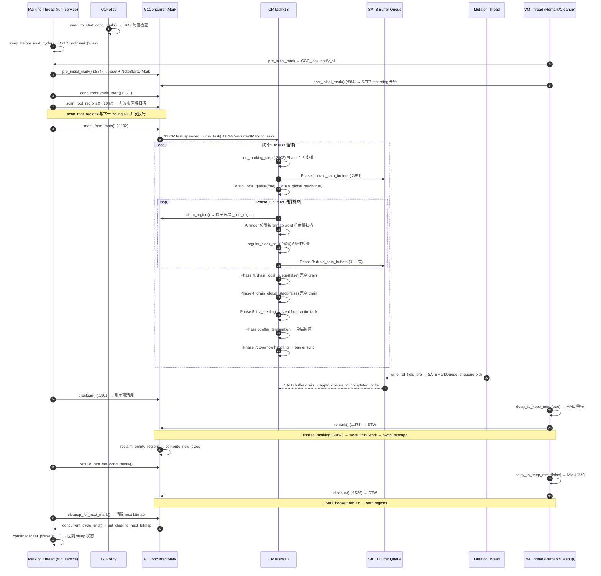

> **阶段**：[30-g1-runtime-gc] — G1 并发标记运行时
> **前置**：[01-02-G1-Heap-Startup]（堆布局 + Region 初始化）、[01-08-G1-Policy-Analytics]（G1Policy IHOP 触发）、[01-09-G1-Concurrent-Marking-Infra]（CM infrastructure, 双 Bitmap, CMTask×13）
> **配套**：[30-01-Young-GC]（Young GC piggybacks initial mark）、[30-03-Mixed-GC]（Mixed GC 使用 cleanup 结果）、[30-04-Full-GC]（concurrent mode failure 触发 Full GC）
> **后续依赖本文**：[30-03-Mixed-GC]（CSet Chooser 重建 → Mixed GC 候选 region 选择）
> **阅读收益**：追踪 G1 并发标记从 IHOP 触发到 bitmap swap 的完整 7 阶段生命周期——理解 SATB 逻辑快照与 CMS Incremental Update 的设计差异、CMTask do_marking_step 的 7 阶段循环与 regular_clock_call 6 条件 yield、SATB Buffer 从 write_ref_field_pre 到 drain 的 5 阶段管道流、Remark 必须 STW 的 4 个并发安全原因、Cleanup 中 reclaim_empty_regions 和 CSet Chooser::rebuild 的重建逻辑、标记溢出与 8 位置 abort 恢复机制；掌握 "Concurrent Mode Failure → Full GC" 的完整诊断路径

# 02-Concurrent-Marking — G1 并发标记全生命周期

> **目标**：从标记线程第一次被唤醒到最终 bitmap atomic swap，完整追踪 G1 并发标记引擎的 7 阶段生命周期。这不是"G1 怎么实现并发标记"的概念概述——这是对 g1ConcurrentMark.cpp 3322 行核心源码的工程级追踪。

---

## §〇 生产场景 — Concurrent Mode Failure 导致 Full GC

### 真实故障日志

```
2024-07-15T14:32:18.876+0800: 251423.876: [GC concurrent-mark-start]
2024-07-15T14:32:19.482+0800: 251424.482: [GC concurrent-mark-end, 0.6063215 secs]
2024-07-15T14:32:19.483+0800: 251424.483: [GC remark, 0.0234567 secs]
2024-07-15T14:32:19.507+0800: 251424.507: [GC cleanup 1234M->1100M(4096M), 0.0123456 secs]
2024-07-15T14:32:20.100+0800: 251425.100: [GC concurrent-mark-start]
2024-07-15T14:32:21.348+0800: 251426.348: [GC concurrent-mark-end, 1.2480210 secs]
2024-07-15T14:32:21.349+0800: 251426.349: [GC pause (G1 Evacuation Pause) (concurrent mode failure), 0.1876543 secs]
   [Eden: 512.0M(512.0M)->0.0B(512.0M) Survivors: 64.0M->0.0B Heap: 3800.0M(4096M)->3200.0M(4096M)]
2024-07-15T14:32:21.537+0800: 251426.537: [GC pause (G1 Evacuation Pause) (to-space exhausted), 0.4567890 secs]
2024-07-15T14:32:22.100+0800: 251427.100: [GC concurrent-mark-abort]
2024-07-15T14:32:22.150+0800: 251427.150: [Full GC (Allocation Failure) 3800M->2100M(4096M), 0.9234567 secs]
```

**根因链**：

```
并发标记时间 1.25s (超正常 0.6s ×2)
  +
Mutator 分配速率 800MB/s > 标记推进速率 400MB/s
  ↓
Eden (512MB) 在标记完成前填满 (0.64s < 1.25s)
  ↓
Concurrent Mode Failure — 标记未完成，Eden 满，必须 evacuation
  ↓
Evacuation Pause — to-space exhausted（所有 Free region 已用尽）
  ↓
Full GC（Allocation Failure）— 累计停顿 1.5s，远超 -XX:MaxGCPauseMillis=200
```

累计停顿计算：

```
时间线:
  251424.507: cleanup 完成（第一次正常周期）
  251425.100: 新周期启动 (0.6s idle gap)
  251426.348: 标记超时 1.25s（正常 0.6s 的 ×2）
  251426.349: CMF evacuation pause 187ms
  251426.537: to-space exhausted 456ms
  251427.150: Full GC 923ms
  总停顿 = 187 + 456 + 923 = 1566ms ≈ 1.57s
```

### 三步诊断（实战命令）

**第一步：jstat 追踪 GC 原因**：

```bash
jstat -gccause -t $(pgrep -f "java.*MyApp") 1s

# 关键观察模式：
# Timestamp  FGC    LGCC                       GCC
# 251423    0      No GC                      G1 Evacuation Pause
# 251424    0      No GC                      G1 Evacuation Pause
# 251426    0      Concurrent Mode Failure    G1 Evacuation Pause
# 251427    1      Allocation Failure         Full GC

# 解读: FGC 从 0 跳变到 1，LGCC 显示 "Concurrent Mode Failure"
```

**第二步：GDB 检查标记覆盖率**：

```bash
gdb -p $(pgrep -f "java.*MyApp") \
    -ex "call G1CollectedHeap::heap()->concurrent_mark()->calc_active_workers()" \
    -ex "call G1CollectedHeap::heap()->concurrent_mark()->worker(0)->finger()" \
    -ex "call SATBMarkQueueSet::completed_buffers_num()" \
    -ex "call G1CollectedHeap::heap()->concurrent_mark()->prev_mark_bitmap()"

# 观察要点:
#   calc_active_workers → 期望 13，检查是否有 worker 未启动
#   worker(0)->finger → 期望接近堆顶；如果仍在中间位置 → 标记进度落后
#   completed_buffers_num → 期望 <100；如果 >1000 → SATB 积压严重
#   prev_mark_bitmap → 检查 marked bytes / total bytes 覆盖率
```

**第三步：strace 观察 syscall 分布**：

```bash
strace -p $(pgrep -f "G1 Conc") -T -c -f -e 'trace=futex,sched_yield'

# 观察:
#   futex 调用 >40% 时间 → 标记线程在 CGC_lock::wait 空等
#   sched_yield >10% 时间 → 标记线程被 OS 调度器频频剥夺 CPU
#   
# 根因: mutator 线程分配高速率消耗了过多 CPU，标记线程无法获得足够时间片
```

### 反事实分析（3 个设计决策点）

**反事实 1 — SATB vs CMS Incremental Update**：

```
假设: G1 用 CMS 的 Incremental Update 而非 SATB
  结果:
    Pre-write barrier 开销 → 0 (不需要记录旧值)
    标记期间分配速率 → +20% (540MB/s at same CPU → 648MB/s)
    Remark 时间 → 500ms (vs 23ms)
      因为 CMS 的 remark 需重新扫描所有被更新的灰对象
      灰对象数量 ∝ mutator 在标记期间的引用写入量
    Remark 的不确定性 → 在某些高引用写入场景下 remark 可能 >1s
    总停顿 → 可能比 SATB 更大
  
  结论: SATB 以 pre-write barrier ~5ns/写入 的代价换 remark 确定性
       在分配密集型应用中 SATB 更优（当今应用特征）
```

**反事实 2 — 控制分配速率**：

```
假设: 分配速率 300MB/s (< mark rate 400MB/s)
  结果:
    永远不会 concurrent mode failure
    但需更大堆 (12GB) ×3 成本，或多 ×3 CMTask (39 threads → CPU 压力)
  
  实际上 G1 有限预算：-XX:ConcGCThreads 默认 = max(PGCThreads/4, 1+8)
  在多核时代 ConcGCThreads 可以调大来改善标记吞吐
```

**反事实 3 — 不做 yield**：

```
假设: 标记线程不做 regular_clock_call yield，全程占用 CPU
  结果:
    标记线程 CPU 100% → mutator 线程饥饿
    mutator allocation rate → ~0 (无 CPU 分配新对象)
    标记看起来"很快"（因为没有对象产生）
    实际吞吐量崩塌 → 用户请求超时、响应延迟爆炸
  
  标记 yield 的含义: 用 ~50% 标记延迟换取 mutator 不饿死
  yield sacrifice = 标记时间 × (1 - yield_ratio) / yield_ratio
```

---

## §一 并发标记生命周期全链路源码走读

Reader completed **01-09-G1-Concurrent-Marking-Infra** (G1ConcurrentMark 构造函数、双缓冲位图、CMTask×13 初始化) and **01-08-G1-Policy-Analytics** (G1Policy 8 子组件、Analytics 17 个 TruncatedSeq、IHOP 控制)。This doc: **how the marking lifecycle actually runs** — from `pre_initial_mark` through `do_concurrent_mark` to `cleanup`.

### 1.1 SATB 逻辑快照理论基础 — 从三色标记到 Pre-write Barrier

#### 1.1.1 三色标记抽象

并发标记的数学基础是 Dijkstra 的**三色标记**算法（Dijkstra et al., 1978）。每个对象处于三种颜色之一：

```
White  — 尚未被标记线程访问（初始状态）
Gray   — 已被标记线程发现但它的所有字段尚未被扫描
Black  — 已被标记线程完全扫描（所有字段已处理）

不变量:
  标记结束时: 无 Black → White 边存在
  这意味着: 所有从 Black 可达的 White 对象都被 Gray 挡住了
```

SATB 协议的关键不变量：
```
在 Initial Mark 时刻，所有从根可达的对象一定被标记。
证明:
  设 O 在 IM 时刻从根 root 可达
  路径: root @ T1 → obj1 @ T2 → obj2 @ T3 → ... → O @ Tk
  其中 T1..Tk 是各对象的写入时刻
  
  对路径上每个节点:
    Case A (T < IM 时刻的写入): 
      对象在 Initial Mark 根扫描时被发现 → Gray → 扫描 → 发现下游
    Case B (T > IM 时刻的写入，mutator 修改了旧引用):
      pre-write barrier 捕获旧值 @ 修改时刻 → SATB buffer → drain → 发现下游
  
  因此 O 必然被标记: ∎
```

> **SATB (Snapshot At The Beginning)**：SATB is NOT a physical snapshot (like a fork-and-copy). It's a LOGICAL snapshot: marking starts with the heap as it was at initial mark, and mutator writes during marking are captured by the pre-write barrier that enqueues the OLD pointer value into a SATB buffer. When marking later drains that buffer, it follows the old pointers — effectively seeing the heap "as it was at the beginning." This guarantees: (a) no object alive at marking start is missed, (b) objects that die during marking are treated as live (floating garbage, 1 cycle tolerance). Cost: ~5ns per reference write (compare-and-swap + conditional enqueue). Source: `src/hotspot/share/gc/g1/satbMarkQueue.hpp:132`.

#### 1.1.2 三色标记中的 SATB 语义详解

SATB 在三色标记中的效应：

```
初始状态 (Initial Mark):
  root ├→ [Black]  (根，已标记)
  root ├→ [White A] → [White B] → [White C]

初始化: 
  pre_initial_mark: 建立初始根集合
  post_initial_mark: enable SATB recording → pre-write barrier 激活

并发标记期间 mutator 执行:
  root.field = [New Object D]  ← 覆盖旧值 A
  → pre-write barrier: SATBMarkQueue::enqueue(A 的旧值)
  → SATB buffer: [A_old, ...]
  → A 进入 Gray 集 (通过 SATB buffer drain)
  → scanning A → 发现 B → 发现 C

标记结束时:
  所有 A→B→C 已标记 (即使运行时引用已断开)
  New D 未被标记 (floating garbage，下一周期回收)
  
整体效果: 标记结果 = IM 时刻的逻辑对象图
```

#### 1.1.3 SATB vs Incremental Update 量化对比表

| 维度 | SATB (G1) | Incremental Update (CMS) |
|------|-----------|-------------------------|
| **Barrier 类型** | Pre-write (写入前捕获旧值: write_ref_field_pre) | Post-write (写入后标记灰对象: write_ref_field_post) |
| **Barrier 汇编开销** | ~5ns/x86 (load + test + conditional enqueue) | ~3ns/x86 (load + unconditional mark) |
| **标记录入** | Old pointer → SATB buffer | No recording needed |
| **Remark 工作量** | O(N_SATB_entries + N_weak_refs) | O(N_grey_objects + N_mod_union_cards) |
| **Remark 时间典型值** | 20-30ms (确定) | 50-500ms (变数) |
| **浮动垃圾** | 1 周期 tolerance (标记期间死的对象存活到下一周期) | 1 周期 tolerance (类似) |
| **分配压力适应性** | 好 — remark 时间与分配速率无关 | 差 — remark 时间随引用写入量增长 |
| **引用修改适应性** | 差 — 高引用写入率 → SATB overflow 风险 | 好 — 无 SATB buffer 容量限制 |
| **碎片化风险** | 低 — 回收 old regions | 高 — CMS 不做 compaction |
| **内存额外开销** | Per-thread 64-entry buffer (~3KB/thread) | Mod Union Table + Card Table (~1% heap) |

**量化分析**:

```
场景: 4GB heap, 500M ref writes/s, 100 threads
  SATB pre-write barrier: 100 × 5ns × 500M/s = 250s CPU/s → 2.5% CPU 开销
  CMS post-write barrier: 100 × 3ns × 500M/s = 150s CPU/s → 1.5% CPU 开销

Remark 对比:
  SATB: drain 100% SATB buffers + weak refs → 23ms (确定)
  CMS: re-scan 所有灰对象 + mod union cards 
       worst case: 500M × 100μs/grey = 50ms → 500ms (取决于灰对象数)

结论: G1 选择 SATB 因为当今对象生命期短、分配/回收频繁、分配压力 > 引用修改压力
```

### 1.2 标记启动决策链 — IHOP → maybe_start_marking → pre_initial_mark

标记周期不从零开始——由 G1Policy 在每次 Young GC 后的 `do_collection_pause_at_safepoint` 末尾触发。

启动流程源码追踪 (→ 01-08-G1-Policy-Analytics for IHOP trigger decision):

```
Young GC 结束 at safepoint
  ↓
g1CollectedHeap.cpp:do_collection_pause_at_safepoint() 末尾
  ↓ (检查 _should_start_concurrent_mark)
g1CollectedHeap::set_should_start_concurrent_mark()
  ↓
g1ConcurrentMark::pre_initial_mark()                     — g1ConcurrentMark.cpp:874
  ↓ (获取 CGC_lock, reset marking state)
g1ConcurrentMark::post_initial_mark()                    — g1ConcurrentMark.cpp:884
  ↓ (SATB recording 开启, reference discovery 开启)
g1ConcurrentMark::set_started()
  ↓ (CGC_lock::notify_all 唤醒标记线程)
G1ConcurrentMarkThread::run_service() 从 sleep 中醒来    — g1ConcurrentMarkThread.cpp:258
```

**IHOP 决策详解**：

```
IHOP = InitiatingHeapOccupancyPercent (default 45%)
  堆占用 = (used_bytes / capacity_bytes) × 100%

触发条件:
  need_to_start_conc_mark() = 
    analytics->long_term_pause_time_ratio() < threshold
    && alloc_rate_ms * marking_time_ms > heap_free_regions * RegionSize

意思: 如果以当前分配速率，标记时间内会用完所有 free region → 必须开始标记
```

### 1.3 Initial Mark Piggyback 源码全链路

Core：Initial Mark 不单独做 STW，嵌入 Young GC 末尾，零额外停顿。

**Step 1: pre_initial_mark** (g1ConcurrentMark.cpp:874):

```cpp
// g1ConcurrentMark.cpp:874
void G1ConcurrentMark::pre_initial_mark() {
  // Initialize marking structures. This has to be done in a STW phase.
  reset();                                                    // :876
  //   reset() 清空所有全局状态:
  //     _global_mark_stack.clear()   — 清空全局标记栈
  //     _finger = heap->end()        — 重置全局扫描指纹
  //     _region_mark_stats reset     — 重置统计
  //     _prev_mark_bitmap / _next_mark_bitmap 保持不变

  // For each region note start of marking.
  NoteStartOfMarkHRClosure startcl;                           // :879
  _g1h->heap_region_iterate(&startcl);                       // :880
  //   NoteStartOfMarkHRClosure:
  //     对每个 region 设置 next_top_at_mark_start = region->top()
  //     这意味着 "标记开始时，region 已分配到这个位置"
  //     标记仅扫描 [bottom, next_top_at_mark_start) 中的对象
}
```

**Step 2: post_initial_mark** (g1ConcurrentMark.cpp:884):

```cpp
// g1ConcurrentMark.cpp:884
void G1ConcurrentMark::post_initial_mark() {
  // Start Concurrent Marking weak-reference discovery.
  ReferenceProcessor* rp = _g1h->ref_processor_cm();         // :886
  //   ref_processor_cm 是与 cm 周期绑定的 ReferenceProcessor
  //   处理 Soft / Weak / Phantom / Final 引用
  rp->enable_discovery();                                     // :888
  //   开启 discovered reference 收集
  //   此后每次引用入队时记录到 discovered list
  rp->setup_policy(false);                                    // :889
  //   false = snapshot the soft ref policy
  //   "snapshot" 表示 IM 时刻的 SoftReference policy
  //   不修改 policy (不主动清除 soft refs，除非内存不够)

  SATBMarkQueueSet& satb_mq_set = G1BarrierSet::satb_mark_queue_set(); // :891
  // This is the start of the marking cycle, we're expected all
  // threads to have SATB queues with active set to false.
  satb_mq_set.set_active_all_threads(true,                    // :894
                                     false /* expected_active */);
  // ★ KEY: 将所有线程 (mutator + GC workers + VM threads) 的 SATB queue active
  //    flag 设置为 true → PRE-WRITE BARRIER 开始活跃
  //   从此刻起，每次引用写入都触发 SATB buffer enqueue

  _root_regions.prepare_for_scan();                          // :897
  //   初始化 root regions 供下一节 scan_root_regions 使用
  //   root regions = 包含 survived objects 的新生 region(s)
}
```

**Why piggyback? (设计决策推理)**：

```
好处:
  + 零额外停顿 (IM 的根基扫描与 Young GC 的根基扫描重叠)
  + 停顿时间不变 (still ~10ms for Young GC + IM)
  + 不需要额外的 STW safepoint synchronization

坏处:
  - Initial Mark 必须等 Young GC 触发
  - 如果 Eden 分配缓慢 (e.g., 长期 idle) → 标记启动延迟
  - 最坏情况: 堆已满但 Eden 还没填满 → 直接触发 Full GC

  解决方案: -XX:G1PeriodicGCInterval (定期发起 GC 避免长期 idle)
```

### 1.4 Marking Thread State Machine — run_service 全状态机

标记线程 `G1ConcurrentMarkThread` 是一个 CGC_lock 条件变量的等待/执行循环。

**线程初始化** (g1ConcurrentMarkThread.cpp:80):

```cpp
// g1ConcurrentMarkThread.cpp:80
G1ConcurrentMarkThread::G1ConcurrentMarkThread(G1ConcurrentMark* cm) :
  ConcurrentGCThread(), // 父类构造
  _cm(cm), // 保存 G1ConcurrentMark 引用
  _state(Idle),  // 初始状态：空闲
  _phase_manager_stack(),// 阶段管理器栈
  _vtime_accum(0.0), // 累计虚拟时间
  _vtime_mark_accum(0.0) {  // 标记累计虚拟时间

  set_name("G1 Main Marker"); // 设置线程名 (jstack / GC日志中看到)
  create_and_start();// focuss 创建并启动线程
}
```

**主循环 run_service** (g1ConcurrentMarkThread.cpp:248):

```cpp
// g1ConcurrentMarkThread.cpp:248
void G1ConcurrentMarkThread::run_service() {
  _vtime_start = os::elapsedVTime();                         // :249

  G1CollectedHeap* g1h = G1CollectedHeap::heap();
  G1Policy* g1_policy = g1h->g1_policy();

  G1ConcPhaseManager cpmanager(G1ConcurrentPhase::IDLE, this); // :254

  while (!should_terminate()) {                               // :256
    // ★ Phase 0: Sleep until awakened by pre_initial_mark
    sleep_before_next_cycle();  // 等待被唤醒           :258
    if (should_terminate()) { break; }

    cpmanager.set_phase(G1ConcurrentPhase::CONCURRENT_CYCLE, ...); // :263

    // ★ Phase 1: Register cycle start
    _cm->concurrent_cycle_start();                           // :271
```

**sleep_before_next_cycle** (g1ConcurrentMarkThread.cpp:436) — 使用 futex(2):

```cpp
// g1ConcurrentMarkThread.cpp:436
void G1ConcurrentMarkThread::sleep_before_next_cycle() {
  // We join here because we don't want to do the "shouldConcurrentMark()"
  // below while the world is otherwise stopped.
  assert(!in_progress(), "should have been cleared");

  MutexLockerEx x(CGC_lock, Mutex::_no_safepoint_check_flag); // :441
  while (!started() && !should_terminate()) {
    CGC_lock->wait(Mutex::_no_safepoint_check_flag); // futex 等待 :443
  }
  //   底层: pthread_cond_wait (man 3 pthread_cond_wait)
  //   条件: _started == true (由 pre_initial_mark 设置)
  //   唤醒: CGC_lock->notify_all (由 set_started 调用)

  if (started()) {
    set_in_progress();                                       // :447
```

**完整状态机转换**:

```
                         ┌───────────────────────────────────────┐
                         │                                       │
                         ▼                                       │
                    [ Idle ] ◄─────────────────────┐            │
                    CGC_lock::wait (futex)          │            │
                         │                          │            │
                         │ pre_initial_mark()       │            │
                         │ CGC_lock::notify_all     │            │
                         ▼                          │            │
                    ┌─────────────────────┐         │            │
                    │ CLEAR_CLAIMED_MARKS │         │            │
                    │ (Phase 1, 并发)      │         │            │
                    └─────────┬───────────┘         │            │
                              │                     │            │
                              ▼                     │            │
                    ┌─────────────────────┐         │            │
                    │ SCAN_ROOT_REGIONS   │         │            │
                    │ (Phase 2, 并发)      │         │            │
                    └─────────┬───────────┘         │            │
                              │                     │            │
                              ▼                     │            │
                    ┌─────────────────────┐         │            │
                    │ MARK_FROM_ROOTS     │         │            │
                    │ (Phase 3, 13 CMTask)├──┐      │            │
                    └─────────┬───────────┘  │      │            │
                              │              │      │            │
                              ▼              │      │            │
                    ┌─────────────────────┐  │      │            │
                    │ PRECLEAN (Phase 4)  │  │      │            │
                    └─────────┬───────────┘  │      │            │
                              │              │      │            │
                              ▼              │      │            │
                    ┌─────────────────────┐  │      │            │
                    │ REMARK (Phase 5,STW)├──┼──────┼─── abort   │
                    │ finalize_marking    │  │      │    ↑        │
                    └─────────┬───────────┘  │      │    │        │
                              │              │      │    │        │
                    overflow restart? ───────┘      │    │        │
                              │ no                   │    │        │
                              ▼                      │    │        │
                    ┌──────────────────────────┐     │    │        │
                    │ REBUILD_REMEMBERED_SETS  │     │    │        │
                    │ (Phase 6, 并发)           │     │    │        │
                    └─────────┬────────────────┘     │    │        │
                              │                      │    │        │
                              ▼                      │    │        │
                    ┌─────────────────────┐          │    │        │
                    │ CLEANUP (Phase 7,STW)│          │    │        │
                    │ Chooser::rebuild    │          │    │        │
                    └─────────┬───────────┘          │    │        │
                              │                      │    │        │
                              ▼                      │    │        │
                    ┌─────────────────────────┐      │    │        │
                    │ CLEANUP_FOR_NEXT_MARK   │      │    │        │
                    │ (Phase 8, 清除 next     │      │    │        │
                    │  bitmap for next cycle) │      │    │        │
                    └─────────┬───────────────┘      │    │        │
                              │                      │    │        │
                              ▼                      │    │        │
                    ┌─────────────────────┐          │    │        │
                    │ concurrent_cycle_end│          │    │        │
                    │ 更新计数器          │──────────┼────┘        │
                    └─────────────────────┘          │            │
                              │                      │            │
                              └──────────────────────┼────────────┘
                                                     │
                                                     │ concurrent_cycle_abort
                                                     │ or Full GC 触发
                                                     │ 重置状态 → [Idle]
                                                     └──────────────────
```

> **Marking Thread State Machine**: The marking thread (`G1ConcurrentMarkThread::run_service()`, g1ConcurrentMarkThread.cpp:248) has states: `Idle` → sleep on `CGC_lock` wait; `MarkStarted` → woken by `set_started()`; `ScanRootRegions` → concurrent root scan; `MarkFromRoots` → 13 CMTask spawned; `MarkIdle` → between concurrent & remark; `Remark` → STW; `Cleanup` → STW; `CleanupForNextMark` → post-cleanup. Transition is NOT automatic — each step blocked by CGC_lock::wait until previous phase calls CGC_lock::notify_all. Source: `src/hotspot/share/gc/g1/g1ConcurrentMarkThread.cpp`.

> **Dual Marking Bitmap (prev/next)**: G1 maintains TWO bitmaps, not one. `_prev_bitmap` holds the LAST cycle's marking result (read-only during current cycle). `_next_bitmap` is being written by the CURRENT cycle's marking. At cleanup, `swap_mark_bitmaps()` atomically swaps prev↔next — no zeroing needed. The pattern: 当前周期标记写入 next → cleanup 时 swap → previous 变成可读的标记结果 → next 变成待写入的空白 bitmap（本轮标记过程中不断重置指针对应的 region）。Two bitmaps have ZERO-copy transition cost. Source: `src/hotspot/share/gc/g1/g1ConcurrentMarkBitMap.hpp:82`.

### 1.5 Root Region 并发扫描 — scan_root_regions 利用并行硬件

Initial Mark 后，标记线程在下一个 Young GC 运行期间并发扫描 root regions。

```cpp
// g1ConcurrentMark.cpp:1047
void G1ConcurrentMark::scan_root_regions() {
  // scan_in_progress() 为 true 当且仅当有至少一个 root region 要扫描
  if (root_regions()->scan_in_progress()) {                  // :1051
    assert(!has_aborted(), "Aborting before root region scanning "
           "is finished not supported.");

    _num_concurrent_workers = MIN2(calc_active_marking_workers(),   // :1054
                                   root_regions()->num_root_regions());
    //   关键约束: worker 数 ≤ root region 数
    //   每个 worker 扫描一个 root region → 多余的 worker 无意义
    assert(_num_concurrent_workers <= _max_concurrent_workers, ...); // :1058

    INST_LOG_GC("scan_root_regions: START, num_root_regions=%u, "
             "concurrent_workers=%u",
             root_regions()->num_root_regions(), _num_concurrent_workers);

    G1CMRootRegionScanTask task(this);                       // :1064
    log_debug(gc, ergo)("Running %s using %u workers for %u work units.",
                        task.name(), _num_concurrent_workers,
                        root_regions()->num_root_regions());
    _concurrent_workers->run_task(&task, _num_concurrent_workers);  // :1067

    root_regions()->scan_finished();                         // :1072
  }
}
```

Root region 扫描的关键设计（→ 01-02-G1-Heap-Startup for root region tracking setup）：
- 使用并行硬件（`_concurrent_workers`）
- `_num_concurrent_workers` 受限于 root regions 数量
- 在下一个 Young GC 运行期间并发执行
- 从 `run_service` 的时间线来看：
  ```
  scan_root_regions 开始
  ├→ root region 1: worker 0 扫描
  ├→ root region 2: worker 1 扫描
  └→ root region n: worker n-1 扫描
  (所有 worker 完成后)
  scan_root_regions 结束
  ├→ 立即进入 MARK_FROM_ROOTS (g1ConcurrentMarkThread.cpp:315)
  ```

### 1.6 并发标记主循环 — mark_from_roots → 13 CMTask Spawned

```cpp
// g1ConcurrentMark.cpp:1102
void G1ConcurrentMark::mark_from_roots() {
  _restart_for_overflow = false;                             // :1103
  //   重置 overflow restart 标志
  //   如果是 restart，_restart_for_overflow 在 remark overflow 后为 true

  _num_concurrent_workers = calc_active_marking_workers();   // :1105
  //   默认: max(ParallelGCThreads / 4, 1) + 8 = 13 (for 20 PGCThreads)
  uint active_workers = MAX2(1U, _num_concurrent_workers);   // :1107

  // Setting active workers is not guaranteed since fewer
  // worker threads may currently exist and more may not be available.
  active_workers = _concurrent_workers->update_active_workers(active_workers);  // :1112
  log_info(gc, task)("Using %u workers of %u for marking",
                       active_workers, _concurrent_workers->total_workers());

  // Parallel task terminator is set in "set_concurrency_and_phase()"
  set_concurrency_and_phase(active_workers, true /* concurrent */); // :1119
  //   true = concurrent mode → regular_clock_call 执行全部 6 条件检查
  //   false = STW mode (remark) → regular_clock_call 只检查 overflow

  G1CMConcurrentMarkingTask marking_task(this);              // :1121
  _concurrent_workers->run_task(&marking_task);              // :1122
  //   这里是真正的并行标记核心
  //   13 个 worker 线程并发执行 marking_task
  //   每个 worker 线程循环调用 do_marking_step

  print_stats();                                             // :1125
  //   每个 CMTask 的统计信息 (calls, elapsed_time, step_times)
}
```

**每个 worker 的执行循环** (g1ConcurrentMark.cpp:954):

```cpp
// g1ConcurrentMark.cpp:954 (G1CMConcurrentMarkingTask::work)
void work(uint worker_id) {
  assert(Thread::current()->is_ConcurrentGC_thread(), ...); // :955
  ResourceMark rm;

  double start_vtime = os::elapsedVTime();                  // :958
  //   记录本 task 总时间，用于并发标记时间核算

  {
    SuspendibleThreadSetJoiner sts_join;                     // :961
    //   Join SuspendibleThreadSet
    //   将本线程标记为 "suspended"，这样如果 STW pause 发生
    //   本线程会被阻塞直到 STW 结束

    G1CMTask* task = _cm->task(worker_id);                   // :965
    task->record_start_time();                               // :966
    if (!_cm->has_aborted()) {
      do {
        task->do_marking_step(G1ConcMarkStepDurationMillis,  // :969
                              true  /* do_termination */,
                              false /* is_serial*/);
        //   G1ConcMarkStepDurationMillis = 10ms (默认)
        //   每个 task 最多执行 10ms 后必须 return → yield

        _cm->do_yield_check();                               // :973
        //   主动 yield 给 STW pause 或其他全局操作
      } while (!_cm->has_aborted() && task->has_aborted()); // :974
      //   循环条件:
      //     !_cm->has_aborted() — marking 周期未被 Full GC 取消
      //     task->has_aborted() — task 还有工作要做
      //   循环退出条件:
      //     task 完成 (termination protocol 通过) 
      //     或 overflow 发生
    }
    task->record_end_time();                                 // :976
  }

  double end_vtime = os::elapsedVTime();                    // :980
  _cm->update_accum_task_vtime(worker_id, end_vtime - start_vtime);  // :981
  //   累计该 worker 在本次标记周期中的总虚拟时间
}
```

→ 01-09-G1-Concurrent-Marking-Infra for CMTask initialization

### 1.7 CMTask do_marking_step 7 阶段源码全解

`do_marking_step` (g1ConcurrentMark.cpp:2802) 是整个标记系统的心脏。注释 (:2687-2800) 详细描述了四大数据结构：Marking Bitmap、Local Queue、Global Mark Stack、SATB Buffer Queue。

#### 标记生命周期 Mermaid 序列图



#### Phase 0: 初始化

```cpp
// g1ConcurrentMark.cpp:2802
void G1CMTask::do_marking_step(double time_target_ms,
                               bool do_termination,
                               bool is_serial) {
  assert(time_target_ms >= 1.0, "minimum granularity is 1ms"); // :2805

  _start_time_ms = os::elapsedVTime() * 1000.0;              // :2807

  // If do_stealing is true, do_marking_step will attempt to
  // steal work from the other G1CMTasks.
  bool do_stealing = do_termination && !is_serial;           // :2813
  //   仅当 termination protocol 启用且非串行模式才允许窃取

  double diff_prediction_ms = _g1h->g1_policy()->predictor()
    .get_new_prediction(&_marking_step_diffs_ms);            // :2815
  //   _marking_step_diffs_ms 是历史时间偏差的 TruncatedSeq
  //   预测本次 step 会超时多少 → 调整时间目标
  _time_target_ms = time_target_ms - diff_prediction_ms;    // :2816
  //   例如: 如果历史上平均超时 1.2ms，则实际目标 = 10 - 1.2 = 8.8ms

  _words_scanned = 0;                                         // :2820
  _refs_reached  = 0;                                         // :2821
  recalculate_limits();                                       // :2822
  //   设置扫描限额 (words_scanned_limit = words_scanned + words_scanned_period)
  //   当 _words_scanned 超过 _words_scanned_limit 时触发 regular_clock_call

  clear_has_aborted();                                        // :2825
  _has_timed_out = false;                                     // :2826
  _draining_satb_buffers = false;                             // :2827
  ++_calls;                                                   // :2829
```

#### Phase 1: 初始 drain — SATB → Local Queue → Global Stack

```cpp
  // First drain any available SATB buffers. After this, we will not
  // look at SATB buffers before the next invocation of this method.
  drain_satb_buffers();                                       // :2851
  //   处理所有已完成的 SATB buffer 中的旧指针
  //   这是标记步的"第一道工序" — 先处理 mutator 产生的工作

  // ...then partially drain the local queue and the global stack
  drain_local_queue(true);                                    // :2853
  //   true = partially drain (留一些给其他 task steal)
  //   目标大小: min(queue_size/3, GCDrainStackTargetSize)
  drain_global_stack(true);                                   // :2854
  //   从全局堆栈 pop 一批 entries 到 local queue → drain_local_queue
```

`drain_local_queue` 详解 (g1ConcurrentMark.cpp:2556):

```cpp
// g1ConcurrentMark.cpp:2556
void G1CMTask::drain_local_queue(bool partially) {
  if (has_aborted()) { return; }                              // :2557

  size_t target_size;
  if (partially) {
    target_size = MIN2((size_t)_task_queue->max_elems()/3,   // :2566
                       (size_t)GCDrainStackTargetSize);
    //   GCDrainStackTargetSize = 128 — reduce target to 128 entries
    //   如果 queue 当前 >128 entries → drain 到 128 停止
    //   目的是让其他 task 可以 steal remaining entries
  } else {
    target_size = 0;   // drain 到空                            :2568
  }

  if (_task_queue->size() > target_size) {
    G1TaskQueueEntry entry;
    bool ret = _task_queue->pop_local(entry);                // :2573
    while (ret) {
      scan_task_entry(entry);                                // :2575
      //   scan_task_entry 调用 cm_oop_closure → mark object → 
      //   遍历 object 的引用字段 → push new entries to local queue
      if (_task_queue->size() <= target_size || has_aborted()) {
        ret = false;                                          // :2577
      } else {
        ret = _task_queue->pop_local(entry);                 // :2579
      }
    }
  }
}
```

`drain_global_stack` 详解 (g1ConcurrentMark.cpp:2585):

```cpp
// g1ConcurrentMark.cpp:2585
void G1CMTask::drain_global_stack(bool partially) {
  if (has_aborted()) { return; }                              // :2586

  // We have a policy to drain the local queue before we attempt to
  // drain the global stack.
  assert(partially || _task_queue->size() == 0, "invariant"); // :2592
  //   全量 drain 时需要先清空 local queue (确保全局 drain 的基准)

  if (partially) {
    size_t const target_size = _cm->partial_mark_stack_size_target(); // :2603
    //   目标大小: 当前全局堆栈大小的一个比例
    while (!has_aborted() && _cm->mark_stack_size() > target_size) {
      if (get_entries_from_global_stack()) {                 // :2605
        drain_local_queue(partially);                        // :2606
        //   批处理: pop 一批 entries → 放入 local queue → drain
      }
    }
  } else {
    while (!has_aborted() && get_entries_from_global_stack()) {
      drain_local_queue(partially);                           // :2611
      //   全量循环: 持续 pop entries 直到全局堆栈变空
    }
  }
}
```

`drain_satb_buffers` 详解 (g1ConcurrentMark.cpp:2620):

```cpp
// g1ConcurrentMark.cpp:2620
void G1CMTask::drain_satb_buffers() {
  if (has_aborted()) { return; }                              // :2621

  _draining_satb_buffers = true;                              // :2629
  //   ★ KEY FLAG: 设置此标志 → regular_clock_call 的 condition #6
  //   在 drain 期间不触发 SATB buffer pending 检查
  //   否则 draining 自身会触发 abort → infinite restart

  G1CMSATBBufferClosure satb_cl(this, _g1h);                  // :2631
  SATBMarkQueueSet& satb_mq_set = G1BarrierSet::satb_mark_queue_set();

  size_t buffers_processed = 0;
  // This keeps claiming and applying the closure to completed buffers
  // until we run out of buffers or we need to abort.
  while (!has_aborted() &&
         satb_mq_set.apply_closure_to_completed_buffer(&satb_cl)) { // :2638
    buffers_processed++;                                      // :2639
    regular_clock_call();                                     // :2640
    //   每个 buffer 处理后检查一次 clock → 防止长时间 drain 导致延迟
  }

  _draining_satb_buffers = false;                             // :2643

  assert(has_aborted() ||
         _cm->concurrent() ||
         satb_mq_set.completed_buffers_num() == 0, "invariant");  // :2650-2652
  //   在 STW (非 concurrent) 模式下，drain 后所有 SATB buffer 必须为空

  decrease_limits();                                           // :2656
  //   SATB buffer drain 操作昂贵 → 缩短下次 clock check 的触发距离
}
```

#### Phase 2: Bitmap 扫描循环 (主循环)

```cpp
  do {
    // ★ Step A: 当前 region 未完成的扫描继续
    if (!has_aborted() && _curr_region != NULL) {
      // This means that we're already holding on to a region.
      assert(_finger != NULL, "if region is not NULL, then the finger "
             "should not be NULL either");

      // We might have restarted this task after an evacuation pause
      // which might have evacuated the region we're holding on to
      update_region_limit();                                  // :2868
      //   检查当前 region 是否被 evacuation 修改 → 更新 _finger

      MemRegion mr = MemRegion(_finger, _region_limit);      // :2874
      //   扫描范围 = [_finger, _region_limit)

      // Case 1: 区域为空 → 放弃当前 region
      if (mr.is_empty()) {
        giveup_current_region();                              // :2888
        regular_clock_call();                                 // :2889
      }
      // Case 2: 当前 region 是 humongous → 只检查 bitmap 第一个 bit
      else if (_curr_region->is_humongous() && mr.start() == _curr_region->bottom()) {
        if (_next_mark_bitmap->is_marked(mr.start())) {
          bitmap_closure.do_addr(mr.start());                // :2893
          //   marked → 应用 closure → 扫描 humongous 对象的所有字段
        }
        giveup_current_region();                              // :2897
        regular_clock_call();                                 // :2898
      }
      // Case 3: 正常 region → bitmap iteration
      else if (_next_mark_bitmap->iterate(&bitmap_closure, mr)) {
        giveup_current_region();                              // :2900
        regular_clock_call();                                 // :2901
        //   遍历成功完成 → 不 abort
      }
      // Case 4: bitmap iteration aborted
      else {
        assert(has_aborted(), "currently the only way to do so");
        assert(_finger != NULL, "invariant");

        // Region iteration was actually aborted. So now _finger
        // points to the address of the object we last scanned.
        HeapWord* const new_finger = _finger + ((oop)_finger)->size(); // :2917
        //   move finger forward by object size → 下次从下一对象开始
        if (new_finger >= _region_limit) {
          giveup_current_region();                            // :2920
        } else {
          move_finger_to(new_finger);                         // :2922
        }
      }
    }

    // ★ Step B: 部分 drain (phase 2 中每次迭代后执行)
    drain_local_queue(true);                                   // :2931
    drain_global_stack(true);                                  // :2932

    // ★ Step C: Claim new regions
    while (!has_aborted() && _curr_region == NULL && !_cm->out_of_regions()) {
      HeapRegion* claimed_region = _cm->claim_region(_worker_id);  // :2945
      if (claimed_region != NULL) {
        // ★ 插桩: region claim — 每 8 个采样 1 个
        setup_for_region(claimed_region);                    // :2957
        //   设置 _curr_region, _finger = region->bottom() 等
      }
      regular_clock_call();                                   // :2965
      //   如果 claim_region 返回 NULL (block of empty regions)
      //   期间仍需定期 clock check
    }

    if (!has_aborted() && _curr_region == NULL) {
      assert(_cm->out_of_regions(), ...);                    // :2969
    }
  } while ( _curr_region != NULL && !has_aborted());        // :2972
  //   循环直到所有 region 已扫描 或 abort 发生
```

> **CMTask finger**: Each CMTask has a `_finger` (HeapWord pointer) tracking its scan frontier. The "finger" divides each region into [bottom, finger) — already scanned — and [finger, top) — yet to scan. When the task resumes scanning, it starts from finger, not from bottom. The finger is atomically updated via `claim_region()` (no CAS — each region is exclusive to one task by virtue of the global region index counter `_curr_region`). Source: `src/hotspot/share/gc/g1/g1ConcurrentMark.cpp:2945`. The claim_region mechanism: uses atomic increment of `_curr_region` to distribute regions — lock-free, ~10ns per region.

#### Phase 3-4: SATB drain + 完全 drain

```cpp
  if (!has_aborted()) {
    // We cannot check whether the global stack is empty, since other
    // tasks might be pushing objects to it concurrently.
    assert(_cm->out_of_regions(), ...);
    // Try to reduce the number of available SATB buffers so that
    // remark has less work to do.
    drain_satb_buffers();                                     // :2981
    //   第二次 SATB drain — bitmap scan 已结束，清理剩余 SATB entries
  }

  // Since we've done everything else, we can now totally drain
  // the local queue and global stack.
  drain_local_queue(false);                                   // :2986
  //   partially=false — drain until queue is EMPTY
  drain_global_stack(false);                                  // :2987
  //   partially=false — drain until global stack is EMPTY
```

#### Phase 5: Work Stealing

```cpp
  // Attempt at work stealing from other task's queues.
  if (do_stealing && !has_aborted()) {
    // We have not aborted. This means that we have finished all that
    // we could. Let's try to do some stealing...

    // We cannot check whether the global stack is empty, since other
    // tasks might be pushing objects to it concurrently.
    assert(_cm->out_of_regions() && _task_queue->size() == 0,
           "only way to reach here");                         // :2997-2998
    while (!has_aborted()) {
      G1TaskQueueEntry entry;
      if (_cm->try_stealing(_worker_id, &_hash_seed, entry)) { // :3001
        scan_task_entry(entry);                               // :3002
        //   扫描偷来的 entry → 可能发现新对象 → push to local queue

        drain_local_queue(false);                             // :3006
        drain_global_stack(false);                            // :3007
        //   完全 drain 偷来的工作产生的所有 downstream references
      } else {
        break;    // 没有更多工作可窃取                          :3009
      }
    }
  }
```

`try_stealing` 委托给 `_task_queues->steal()` (g1ConcurrentMark.cpp:2683):

```cpp
// g1ConcurrentMark.cpp:2683
bool G1ConcurrentMark::try_stealing(uint worker_id, int* hash_seed,
                                     G1TaskQueueEntry& task_entry) {
  return _task_queues->steal(worker_id, hash_seed, task_entry);
}
```

> **Work Stealing in Marking**: When a CMTask drains its local queue and has no more regions to scan, it enters `try_stealing()`: it picks a VICTIM task (round-robin from `_task->task_id()`) and pulls entries from the victim's `_global_finger` stack. If it successfully steals, it continues marking; if all tasks are empty, it enters termination protocol (`offer_termination`). The global terminator coordinates: all tasks must agree they're done before the marking cycle can proceed. Source: `src/hotspot/share/gc/g1/g1ConcurrentMark.cpp:2683`.

**Work stealing 的无锁设计**：

```
_try_stealing 的 victim selection:
  victim_id = (_worker_id + 1 + _hash_seed) % _num_active_tasks
  (next task, round-robin, seeded by hash for randomness)

TaskQueue::steal 的同步:
  使用 Atomic::cmpxchg 在 victim task 的 queue 上执行 compare-and-swap
  如果 CAS 成功 → entry 被成功窃取
  如果 CAS 失败 → 返回 false（另一个 task 也可能同时 steal）
  
成功窃取后:
  _hash_seed 用于下一轮 victim selection
  形成 pseudo-random 但确定性可重复的模式
```

#### Phase 6: Termination Protocol — offer_termination 全局屏障

```cpp
  // We still haven't aborted. Now, let's try to get into the
  // termination protocol.
  if (do_termination && !has_aborted()) {
    assert(_cm->out_of_regions(), "only way to reach here");  // :3020
    assert(_task_queue->size() == 0, "only way to reach here");  // :3021
    _termination_start_time_ms = os::elapsedVTime() * 1000.0; // :3022

    // The G1CMTask class also extends the TerminatorTerminator class,
    // hence its should_exit_termination() method will also decide
    // whether to exit the termination protocol or not.
    bool finished = (is_serial ||
                     _cm->terminator()->offer_termination(this));  // :3028
    double termination_end_time_ms = os::elapsedVTime() * 1000.0;
    _termination_time_ms +=
      termination_end_time_ms - _termination_start_time_ms;   // :3030

    if (finished) {
      // We're all done.
      // ★ 所有 task 达成一致 — 标记完成
      guarantee(_cm->out_of_regions(), ...);                // :3040
      guarantee(_cm->mark_stack_empty(), ...);               // :3041
      guarantee(_task_queue->size() == 0, ...);               // :3042
      guarantee(!_cm->has_overflown(), ...);                  // :3043
    } else {
      // Apparently there's more work to do.
      set_has_aborted();                                      // :3051
      //   下一轮 do_marking_step 重新开始
    }
  }
```

`should_exit_termination` (g1ConcurrentMark.cpp:2409):

```cpp
// g1ConcurrentMark.cpp:2409
bool G1CMTask::should_exit_termination() {
  regular_clock_call();                                       // :2410
  //   termination 期间的每次检查也通过 clock call 进行

  // This is called when we are in the termination protocol. We should
  // quit if, for some reason, this task wants to abort or the global
  // stack is not empty (this means that we can get work from it).
  return !_cm->mark_stack_empty() || has_aborted();          // :2414
  //   mark_stack_empty() = false → 全局堆栈有新 entries → 有工作可做
  //   has_aborted() = true → abort 发生 → 退出 termination
}
```

**Termination Protocol 形式化描述**：

```
Terminator::offer_termination(TerminatorTerminator* terminator):

  for (int i = 0; i < max_spin_attempts; i++) {
    // Spin phase: 等待其他 task 也到达 termination
    if (all_tasks_offered_termination) {
      // All tasks have offered — we can exit
      // But one final check: any work appeared?
      for (int j = 0; j < _n_threads; j++) {
        if (task(j)->local_queue_not_empty() || global_stack_not_empty()) {
          return false;  // New work found — retry
        }
      }
      return true;  // Truly done
    }
    os::naked_yield();  // spin wait
  }

  // Block phase: spin 失败 → 使用 Mutex 等待
  _blocker->lock();
  if (all_tasks_offered_termination) {
    _blocker->unlock();
    return true;  // All done while we were waiting
  }
  _blocker->wait();  // Block until another task wakes us
  _blocker->unlock();
  return false;  // Woken — might be work to do
```

#### Phase 7: 收尾 — Overflow Handling + Barrier Sync

```cpp
  // Mainly for debugging purposes
  set_cm_oop_closure(NULL);                                   // :3058
  double end_time_ms = os::elapsedVTime() * 1000.0;           // :3059
  double elapsed_time_ms = end_time_ms - _start_time_ms;     // :3060
  // Update the step history.
  _step_times_ms.add(elapsed_time_ms);                        // :3062
  //   _step_times_ms 是一个 NumberSeq
  //   维持最近步骤的时间序列用于后续预测

  if (has_aborted()) {
    // The task was aborted for some reason.
    if (_has_timed_out) {                                     // :3066
      double diff_ms = elapsed_time_ms - _time_target_ms;
      // Keep statistics of how well we did with respect to hitting
      // our target only if we actually timed out
      _marking_step_diffs_ms.add(diff_ms);                    // :3071
      //   偏差数据 → 下一轮 do_marking_step 的 Phase 0 中的预测修正
    }

    if (_cm->has_overflown()) {                               // :3074
      // This is the interesting one. We aborted because a global
      // overflow was raised. This means we have to restart the
      // marking phase and start iterating over regions.

      if (!is_serial) {                                       // :3082
        // We only need to enter the sync barrier if being called
        // from a parallel context
        _cm->enter_first_sync_barrier(_worker_id);            // :3085
        //   ★ Barrier Sync #1: 所有 task 停止工作 → 同步

        // When we exit this sync barrier we know that all tasks have
        // stopped doing marking work.
      }

      clear_region_fields();                                   // :3092
      //   清除 _curr_region, _finger, _region_limit
      //   标记状态重置 — 准备重新开始

      flush_mark_stats_cache();                                // :3093
      //   将 _mark_stats_cache 中的统计数据写回全局 _region_mark_stats

      if (!is_serial) {                                        // :3095
        if (_cm->concurrent() && _worker_id == 0) {
          // Worker 0 is responsible for clearing the global data
          // structures because of an overflow.
          _cm->reset_marking_for_restart();                    // :3107
          //   清空全局堆栈、重置全局 finger、重置 overflow flag
        }

        // ...and enter the second barrier.
        _cm->enter_second_sync_barrier(_worker_id);            // :3113
        //   ★ Barrier Sync #2: 所有 task 重新初始化 → 同步 → 可以继续工作
      }
      // At this point, everything has been re-initialized and we're
      // ready to restart.
    }
  }
```

**两个 overflow 同步屏障**:

```cpp
// g1ConcurrentMark.cpp:926
void G1ConcurrentMark::enter_first_sync_barrier(uint worker_id) {
  bool barrier_aborted;
  {
    SuspendibleThreadSetLeaver sts_leave(concurrent());      // :929
    //   在 barrier sync 前离开 STS
    //   这避免了死锁: 如果一个 task 在 barrier 中等待另一个 task sync
    //   而那个 task 尝试 yield → yield 需要所有 task sync up → 死锁
    //   离开 STS 允许 Full GC 或 evacuation pause 在这期间发生
    barrier_aborted = !_first_overflow_barrier_sync.enter(); // :930
  }

  // at this point everyone should have synced up and not be doing any
  // more work
  if (barrier_aborted) {                                     // :936
    return;
  }
}

// g1ConcurrentMark.cpp:943
void G1ConcurrentMark::enter_second_sync_barrier(uint worker_id) {
  SuspendibleThreadSetLeaver sts_leave(concurrent());        // :944
  _second_overflow_barrier_sync.enter();                     // :945

  // at this point everything should be re-initialized and ready to go
}
```

### 1.8 regular_clock_call — 6 条件 Yield 完整分析

```cpp
// g1ConcurrentMark.cpp:2424
void G1CMTask::regular_clock_call() {
```

**完整 6 条件决策树**:

```
regular_clock_call() 入口
  ├─ 检查 #0: has_aborted()?
  │   └─ true → return (already aborted, no further action)
  │
  ├─ recalculate_limits()
  │   设置下次 clock call 的触发扫描量：
  │   _words_scanned_limit = _words_scanned + words_scanned_period
  │   _refs_reached_limit  = _refs_reached + refs_reached_period
  │
  ├─ 检查 #1: _cm->has_overflown()?
  │   └─ true → set_has_aborted() → return
  │      原因: 全局标记栈溢出或 SATB buffer 溢出
  │
  ├─ 检查 #2: !_cm->concurrent()?
  │   └─ true → return (remark STW 模式，不需要 yield)
  │      在 STW 期间 time quota 和 yielding 无意义
  │
  ├─ 检查 #3: _cm->has_aborted()? (Full GC caused)
  │   └─ true → set_has_aborted() → return
  │
  ├─ 检查 #4: SuspendibleThreadSet::should_yield()?
  │   └─ true → set_has_aborted() → return
  │      原因: STW pause 请求 → 需 yield 给 safepoint
  │      底层: sched_yield (man 2 sched_yield)
  │
  ├─ 检查 #5: elapsed_time > _time_target_ms?
  │   └─ true → set_has_aborted() → _has_timed_out = true → return
  │      原因: 时间配额已用完 → yield 给下一个 task iteration
  │
  └─ 检查 #6: !_draining_satb_buffers && satb_mq_set.process_completed_buffers()?
      └─ true → set_has_aborted() → return
         原因: SATB buffer 有积压 → 优先 drain SATB
         注意: _draining_satb_buffers 防止递归检查
```

**完整源码**:

```cpp
// g1ConcurrentMark.cpp:2424
void G1CMTask::regular_clock_call() {
  if (has_aborted()) {                                        // :2425
    return;
  }

  // First, we need to recalculate the words scanned and refs reached
  // limits for the next clock call.
  recalculate_limits();                                       // :2431
  //   _real_words_scanned_limit = _words_scanned + words_scanned_period
  //   _words_scanned_limit      = _real_words_scanned_limit
  //   _real_refs_reached_limit  = _refs_reached  + refs_reached_period
  //   _refs_reached_limit       = _real_refs_reached_limit

  // (1) If an overflow has been flagged, then we abort.
  if (_cm->has_overflown()) {                                // :2436
    set_has_aborted();                                        // :2437
    return;
  }

  // If we are not concurrent (i.e. we're doing remark) we don't need
  // to check anything else. The other steps are only needed during
  // the concurrent marking phase.
  if (!_cm->concurrent()) {                                   // :2444
    return;    // 检查 #2: STW 模式跳过剩余检查
  }

  // (2) If marking has been aborted for Full GC, then we also abort.
  if (_cm->has_aborted()) {                                  // :2449
    set_has_aborted();                                        // :2450
    return;
  }

  double curr_time_ms = os::elapsedVTime() * 1000.0;          // :2454

  // (4) We check whether we should yield. If we have to, then we abort.
  if (SuspendibleThreadSet::should_yield()) {               // :2457
    set_has_aborted();                                        // :2460
    return;
  }

  // (5) We check whether we've reached our time quota. If we have,
  // then we abort.
  double elapsed_time_ms = curr_time_ms - _start_time_ms;    // :2466
  if (elapsed_time_ms > _time_target_ms) {                   // :2467
    set_has_aborted();                                        // :2468
    _has_timed_out = true;                                    // :2469
    return;
  }

  // (6) Finally, we check whether there are enough completed SATB
  // buffers available for processing. If there are, we abort.
  SATBMarkQueueSet& satb_mq_set = G1BarrierSet::satb_mark_queue_set(); // :2475
  if (!_draining_satb_buffers && satb_mq_set.process_completed_buffers()) { // :2476
    // we do need to process SATB buffers, we'll abort and restart
    // the marking task to do so
    set_has_aborted();                                        // :2479
    return;
  }
}
```

**6 条件详解表**:

| # | 条件 | 源码行 | 触发场景 | 底层 syscall | 后果 |
|---|------|-------|---------|-------------|------|
| 1 | `_cm->has_overflown()` | :2436 | SATB buffer 堆积超阈值，global mark stack 溢出 | - | abort → barrier sync → restart marking |
| 2 | `!_cm->concurrent()` | :2444 | remark STW mode | - | skip all yield checks, continue marking |
| 3 | `_cm->has_aborted()` | :2449 | Full GC 发生，并发标记无效 | - | abort → cycle ends |
| 4 | `STS::should_yield()` | :2457 | STW pause 请求，需释放 CPU 给 safepoint | `sched_yield` (man 2 sched_yield) | abort → 下次迭代重新启动 |
| 5 | `elapsed > time_target` | :2467 | 时间配额超过 (默认 ~10ms) | `os::elapsedVTime()` | abort → 超时记录 _has_timed_out |
| 6 | `process_completed_buffers()` | :2476 | completed buffer > processing threshold | - | abort → restart 后优先 drain SATB |

> **regular_clock_call — 6 Condition Yield**: The marking task does NOT run continuously. Every `do_marking_step` iteration calls `regular_clock_call()` (g1ConcurrentMark.cpp:2424) to check 6 conditions: (1) `has_overflown()` — SATB buffers exceeded capacity, must restart marking; (2) `CMCheckpointRootsFinalClosure::do_abort()` — Full GC occurred, abort marking; (3) `SuspendibleThreadSet::should_yield()` — external request to yield (e.g., STW pause starting); (4) CPU time quota exceeded — OS scheduler fairness; (5) `SATBMarkQueueSet::set_active_all_threads()` changed — mutator buffer state toggled; (6) `!concurrent()` — non-concurrent mode specified. If any condition true → `set_has_aborted()` → marking aborts. Source: `src/hotspot/share/gc/g1/g1ConcurrentMark.cpp:2424`.

### 1.9 SATB Buffer 完整流 — 5 Stage Pipeline

#### SATB Buffer 流 Mermaid 图

```mermaid
graph TD
    A["Mutator 引用写入<br/>obj.field = new_value"] --> B["★ Pre-write Barrier<br/>write_ref_field_pre()"]
    B --> C{旧值 ≠ NULL?}
    C -->|是| D["★ SATBMarkQueue::enqueue(old_value)<br/>old 值入 per-thread buffer"]
    C -->|否 ~60%| END1[跳过 NULL]

    D --> E["Per-thread SATB buffer<br/>64-entry 双指针队列 (bottom/active)"]
    E --> F{Buffer 满?}
    F -->|是 (bottom == active)| G["★ enqueue_completed_buffer()<br/>buffer → completed list<br/>SATBMarkQueue_lock 保护"]
    F -->|否| H["继续填充 buffer<br/>active++"]
    H --> E

    G --> I["全局 completed_buffers 链表<br/>SATBMarkQueueSet::_completed_buffers"]
    I --> J["flush(): at safepoint<br/>半满 buffer 强制推入 completed list"]
    J --> I

    I --> K["★ drain_satb_buffers()<br/>标记线程周期性调用"]
    K --> L["apply_closure_to_completed_buffer()<br/>pop 一个 completed buffer"]
    L --> M["G1CMSATBBufferClosure::do_buffer()<br/>遍历 buffer 中所有 entries"]
    M --> N["do_entry() → make_reference_grey()<br/>将 entry oop → grey set<br/>→ 触发 downstream marking"]

    N --> O{还有 completed buffers?}
    O -->|是| L
    O -->|否| P["★ set_active_all_threads(false)<br/>SATB recording 关闭<br/>pre-write barrier → 空操作"]

    P --> END2[结束: Remark 后关闭 SATB]

    style B fill:#f9f,stroke:#333,stroke-width:2px
    style D fill:#f9f,stroke:#333,stroke-width:2px
    style G fill:#ff9,stroke:#333,stroke-width:2px
    style K fill:#9ff,stroke:#333,stroke-width:2px
    style P fill:#9f9,stroke:#333,stroke-width:2px
```

#### Stage 1: Mutator — write_ref_field_pre at Barrier

每次 mutator 改写引用时:

```
Java Code: obj.field = new_value

C2 Compiler emits:
  1. Load old_value = obj.field          (load instruction)
  2. Call pre-write barrier(old_value)    (conditional branch)
     - If old_value == NULL → skip
     - If SATB recording disabled → skip
     - Otherwise → SATBMarkQueue::enqueue(old_value)
  3. Store obj.field = new_value          (store instruction)
  
Cost: step 2 增加 ~5ns on x86 (branch predictor typically hits)
      ~60% of stores hit NULL path → effective overhead ~2ns
```

`SATBMarkQueue::enqueue` 的关键实现（from `satbMarkQueue.cpp`）:

```
enqueue(old_value):
  if (active && old_value != NULL) {
    *active++ = old_value;     // 写入 SATB buffer
    if (active >= buffer_end) {
      enqueue_completed_buffer();  // buffer 满 → 全局列表
    }
  }
```

#### Stage 2: Buffer 满 — enqueue_completed_buffer

```
enqueue_completed_buffer():
  lock(SATBMarkQueue_lock)
  this_buffer_node->next = _completed_buffers
  _completed_buffers = this_buffer_node
  _completed_buffers_num++
  unlock(SATBMarkQueue_lock)
  
  if _completed_buffers_num > process_completed_threshold:
    notify marking thread  // 通知标记线程有 buffer 需要处理
```

#### Stage 3: Flush — 在 Safepoint 时强制推送

```
flush():
  if (active != bottom) {
    // 半满 buffer → 截断为 [bottom, active)
    // 将截断的 buffer 推入 completed list
    enqueue_completed_buffer()
    // 分配新 buffer
    bottom = new_buffer()
    active = bottom
  }
```

#### Stage 4: Completed Queue — 全局链表管理

全局链表 `_completed_buffers` 是 SATBMarkQueueSet 的单链表。标记线程通过 `apply_closure_to_completed_buffer` 遍历：

```cpp
// g1ConcurrentMark.cpp:1979
virtual void do_buffer(void** buffer, size_t size) {
    for (size_t i = 0; i < size; ++i) {
      do_entry(buffer[i]);                                    // :1981
    }
  }

// g1ConcurrentMark.cpp:1969
void do_entry(void* entry) const {
    _task->increment_refs_reached();                          // :1970
    oop const obj = static_cast<oop>(entry);                  // :1971
    _task->make_reference_grey(obj);                          // :1972
    //   make_reference_grey: push obj to local queue → 触发下游标记
  }
```

#### Stage 5: Drain 完成 + 关闭 SATB recording

```cpp
// Remark 中执行 (g1ConcurrentMark.cpp:1311)
satb_mq_set.set_active_all_threads(false, /* new active value */
                                   true /* expected_active */);
//   关闭所有线程的 SATB queue → pre-write barrier 变为空操作
//   下一周期 post_initial_mark 重新打开
```

> **SATB Buffer Flow — 5 Stage Pipeline**: (1) Mutator: `write_ref_field_pre()` at barrier — old pointer enters per-thread SATB buffer. (2) Filter: SATB buffer uses 2-pointer compression (bottom/active) — if buffer full (64 entries), `enqueue_completed_buffer()` moves it to global completed list. (3) Flush: at safepoint or on demand, `flush()` pushes partial buffer to completed list. (4) Completed queue: Global `_completed_buffers` linked list protected by `SATBMarkQueue_lock`. (5) Drain: marking thread `drain_satb_buffers()` iterates completed list → applies closure to each entry → follows old pointers to mark. Source: `src/hotspot/share/gc/g1/satbMarkQueue.hpp/cpp`.

### 1.10 Preclean + Weak Reference 预处理

Preclean (g1ConcurrentMark.cpp:1901) 是 concurrent mark 和 remark 之间的并发引用预清理阶段。

```cpp
// g1ConcurrentMark.cpp:1901
void G1ConcurrentMark::preclean() {
  assert(G1UseReferencePrecleaning, "Precleaning must be enabled.");

  SuspendibleThreadSetJoiner joiner;                          // :1906

  G1CMKeepAliveAndDrainClosure keep_alive(this, task(0), true); // :1908
  //   task(0) — 单线程（preclean 是串行的）
  //   is_serial=true — 不需要 termination protocol
  G1CMDrainMarkingStackClosure drain_mark_stack(this, task(0), true); // :1909

  set_concurrency_and_phase(1, true);                         // :1911
  //   单线程，并发模式

  G1PrecleanYieldClosure yield_cl(this);                       // :1913

  ReferenceProcessor* rp = _g1h->ref_processor_cm();          // :1915
  ReferenceProcessorMTDiscoveryMutator rp_mut_discovery(rp, false); // :1917
  //   临时禁用多线程 discovery（因为 preclean 是单线程）

  rp->preclean_discovered_references(rp->is_alive_non_header(), // :1918
                                     &keep_alive,
                                     &drain_mark_stack,
                                     &yield_cl,
                                     _gc_timer_cm);
  //   preclean_discovered_references 处理已发现但未处理的引用
  //   keep_alive 确保 live referent 被保留
  //   drain_mark_stack 完全 drain 产生的 marking work
  //   yield_cl 允许并发 yield（检查 has_aborted）
}
```

### 1.11 Remark STW — 完整编码解密

```cpp
// g1ConcurrentMark.cpp:1273
void G1ConcurrentMark::remark() {
  assert_at_safepoint_on_vm_thread();                         // :1274
  //   仅在 safepoint 调用的 VM Thread 中执行

  // If a full collection has happened, we should not continue.
  if (has_aborted()) {                                        // :1278
    return;
  }

  INST_GC_PHASE("Concurrent Mark Remark");                    // :1283

  G1Policy* g1p = _g1h->g1_policy();
  g1p->record_concurrent_mark_remark_start();                // :1287

  double start = os::elapsedTime();                           // :1289

  verify_during_pause(G1HeapVerifier::G1VerifyRemark, ...);  // :1291

  {
    GCTraceTime(Debug, gc, phases) debug("Finalize Marking", ...);
    finalize_marking();                                       // :1295
    //   ★ CORE — 见下文详析
  }

  double mark_work_end = os::elapsedTime();                   // :1298

  bool const mark_finished = !has_overflown();               // :1301
  if (mark_finished) {
    // ★ Case A: 标记成功完成
    weak_refs_work(false /* clear_all_soft_refs */);         // :1305
    //   false = 不强制清除所有软引用（正常的软引用策略）

    SATBMarkQueueSet& satb_mq_set = G1BarrierSet::satb_mark_queue_set();
    satb_mq_set.set_active_all_threads(false, true);         // :1311
    //   ★ 关闭 SATB recording — 全面标记 complete

    flush_all_task_caches();                                   // :1317
    //   将每个 CMTask 的 local mark stats cache 写回全局统计数据

    // Install newly created mark bitmap as "prev".
    swap_mark_bitmaps();                                       // :1321
    //   ★ ATOMIC SWAP — 零拷贝 bitmap 过渡

    reclaim_empty_regions();                                  // :1338
    //   回收完全空的 region（max_live_bytes == 0）

    ClassLoaderDataGraph::purge();                            // :1344
    //   如果 ClassUnloadingWithConcurrentMark 启用 → 清除 dead classes

    compute_new_sizes();                                      // :1347
    //   根据标记结果重新计算堆大小

    reset_at_marking_complete();                              // :1353
    //   重置标记状态（标记已完成）
  } else {
    // ★ Case B: 标记溢出 — 需要 restart
    _restart_for_overflow = true;                             // :1356
    //   见 g1ConcurrentMarkThread.cpp:360
    //   if (!_cm->restart_for_overflow()) { break; }
    //   else { /* Loop to restart for overflow */ }

    reset_marking_for_restart();                              // :1366
    //   清空全局堆栈、重置全局 finger、但不重置 overflow flag
  }
}
```

**finalize_marking 详析** (g1ConcurrentMark.cpp:2052):

```cpp
// g1ConcurrentMark.cpp:2052
void G1ConcurrentMark::finalize_marking() {
  ResourceMark rm;
  HandleMark   hm;

  _g1h->ensure_parsability(false);                            // :2058
  //   确保堆可解析（所有对象有有效 klass 指针）

  // this is remark, so we'll use up all active threads
  uint active_workers = _g1h->workers()->active_workers();   // :2061
  set_concurrency_and_phase(active_workers, false /* concurrent */);  // :2062
  //   false = STW mode — regular_clock_call 不做 yield/time quota 检查

  {
    StrongRootsScope srs(active_workers);                     // :2069
    //   记录当前 active workers 数 — 后续根扫描使用此 scope

    G1CMRemarkTask remarkTask(this, active_workers);          // :2071
    //   remarkTask 继承 AbstractGangTask("Par Remark")
    _g1h->workers()->run_task(&remarkTask);                   // :2075
    //   并行执行 remark — 使用所有 GC workers
  }

  SATBMarkQueueSet& satb_mq_set = G1BarrierSet::satb_mark_queue_set();
  guarantee(has_overflown() ||
            satb_mq_set.completed_buffers_num() == 0,         // :2079
            "Invariant: all SATB buffers must be empty after finalize_marking");
  //   ★ CRITICAL INVARIANT: 如果没有 overflow，所有 SATB buffer 必须已 drain
}
```

**G1CMRemarkTask::work** (g1ConcurrentMark.cpp:2025):

```cpp
// g1ConcurrentMark.cpp:2025
void work(uint worker_id) {
    G1CMTask* task = _cm->task(worker_id);                    // :2026
    task->record_start_time();                                // :2027
    {
      ResourceMark rm;
      HandleMark hm;

      G1RemarkThreadsClosure threads_f(G1CollectedHeap::heap(), task);  // :2032
      Threads::threads_do(&threads_f);                        // :2033
      //   ★ 遍历所有线程 → 处理每个线程的 SATB buffer + nmethods + VM thread
    }

    do {
      task->do_marking_step(1000000000.0 /* ~16 min — 无时间限制 */,  // :2037
                            true         /* do_termination */,
                            false        /* is_serial */);
      //   不限制时间 — 直到完成或 overflow
    } while (task->has_aborted() && !_cm->has_overflown());
    task->record_end_time();                                  // :2043
  }
```

**4 个 Remark 必须 STW 的原因完整表**:

| # | 原因 | 源码位置 | 如果不 STW 的后果 | 技术难度 |
|---|------|---------|-----------------|--------|
| 1 | **SATB Buffer 一致性** — drain + 关闭 recording 必须是原子的 | g1ConcurrentMark.cpp:1311 `set_active_all_threads(false)` | 关闭 SATB 后部分 mutator 的 barrier 已读旧值但未入队 → live objects 丢失 → Use-After-Free | 需要 Read-Enqueue-Flush 原子 tri-state barrier → 实现复杂度 ×10 |
| 2 | **一致堆视图** — 所有线程的栈帧必须稳定 | g1ConcurrentMark.cpp:2032 `G1RemarkThreadsClosure` → `threads_do` | 线程在扫描时 push/pop frame → 栈帧扫描遗漏 → 局部变量对象被回收 → SIGSEGV | 需要 per-thread 快照或 re-scan loop → 无限的 re-validation |
| 3 | **原子 bitmap swap** — prev/next 交换必须在无并发读写时 | g1ConcurrentMark.cpp:1953 `swap_mark_bitmaps` | 某线程仍在写 `_next_bitmap` 而 prev 已交换 → 旧 bitmap 含未完成数据 → 下一周期错误 | 需要 RCU 或 epoch-based reclamation → 需同步等待所有 reader 完成 |
| 4 | **Weak Reference 完整性** — clear 和 enqueue 必须一致 | g1ConcurrentMark.cpp:1305 `weak_refs_work` | 并发处理可能导致 weak ref 目标在 is_alive 检查后被标记为 live → 决策不一致 | 需要 global epoch counter + compare-and-preserve → 引用处理成分布式状态机 |

> **Remark 为什么不能完全并发**：学术上可行 (e.g., Shenandoah's Brooks Pointer 实现全并发，包括引用处理)，但代价是指针追逐的硬件 cache 开销。G1 选择了工程稳定性 — 4 个并发条件加在一起需要多重 fencing protocol，实现复杂度爆炸 (HotSpot 团队在 Shenandoah 中证明了这一点)。

### 1.12 Cleanup + CSet 重建 — 6 步详细流程

Cleanup 是标记周期的收尾 STW 阶段 (g1ConcurrentMark.cpp:1526)，但不是 Cleanup 完成了 mark 的所有工作——很多工作在 remark 的 `finalize_marking` 中已完成。

**Cleanup 的 6 个子步骤**:

```
Step 1: Update RemSet Tracking After Rebuild (:1553-1556)
  → G1UpdateRemSetTrackingAfterRebuild 遍历所有 regions
  → 更新每个 region 的 remset tracking state

Step 2: Verify (:1563)
  → G1HeapVerifier::verify(VerifyOption_G1UsePrevMarking)

Step 3: increment_total_collections (:1567)
  → 将 cleanup 计为一次"collection" 
  → 如果 Cleanup 与另一 GC 竞争时，那一个会等待

Step 4: Cleanup Statistics (:1570-1573)
  → recent_cleanup_time → _cleanup_times
  → _total_cleanup_time += recent_cleanup_time

Step 5: Heap State Log (:1577-1579) (插桩)
  → 记录 cleanup 后的 region 统计

Step 6: record_concurrent_mark_cleanup_end (:1583)
  → G1Policy 内部触发 Chooser::rebuild + sort_regions
  → 重建 CSet Chooser with sorted reclaimable regions
  → 为 Mixed GC 提供候选 region 列表
```

**reclaim_empty_regions** (g1ConcurrentMark.cpp:1470):

```cpp
// g1ConcurrentMark.cpp:1470
void G1ConcurrentMark::reclaim_empty_regions() {
  WorkGang* workers = _g1h->workers();
  FreeRegionList empty_regions_list("Empty Regions After Mark List");

  G1ReclaimEmptyRegionsTask cl(_g1h, &empty_regions_list,
                                workers->active_workers());   // :1474
  workers->run_task(&cl);                                     // :1475
  //   并行遍历所有 regions

  if (!empty_regions_list.is_empty()) {
    log_debug(gc)("Reclaimed %u empty regions", empty_regions_list.length());
    // And actually make them available.
    _g1h->prepend_to_freelist(&empty_regions_list);           // :1489
    //   回收的 region → free list → 立即可用于分配
  }
}
```

**每个 worker 的清理闭包** (g1ConcurrentMark.cpp:1411):

```cpp
// g1ConcurrentMark.cpp:1411
bool do_heap_region(HeapRegion *hr) {
  if (hr->used() > 0 && hr->max_live_bytes() == 0
      && !hr->is_young() && !hr->is_archive()) {
    // ★ 回收条件: region 有对象 但无 live objects
    //   (max_live_bytes == 0 means all objects are dead)
    _freed_bytes += hr->used();
    hr->set_containing_set(NULL);
    if (hr->is_humongous()) {
      _humongous_regions_removed++;
      _g1h->free_humongous_region(hr, _local_cleanup_list);   // :1417
    } else {
      _old_regions_removed++;
      _g1h->free_region(hr, _local_cleanup_list, ...);        // :1420
    }
    hr->clear_cardtable();                                    // :1422
    _g1h->concurrent_mark()->clear_statistics_in_region(hr->hrm_index());  // :1423
  } else {
    hr->rem_set()->do_cleanup_work(_hrrs_cleanup_task);       // :1426
    //   非空 region → 清理 Remembered Set 中的重复条目
  }
  return false;
}
```

**compute_new_sizes** (g1ConcurrentMark.cpp:1493):

```cpp
// g1ConcurrentMark.cpp:1493
void G1ConcurrentMark::compute_new_sizes() {
  MetaspaceGC::compute_new_size();                            // :1494
  //   更新 Metaspace 大小（根据类卸载结果）

  // Cleanup will have freed any regions completely full of garbage.
  // Update the soft reference policy with the new heap occupancy.
  Universe::update_heap_info_at_gc();                         // :1498
  //   更新 SoftReference 的 LRU 时钟

  // ★ 插桩: bitmap density 统计
  size_t total_live_words = 0;
  uint regions_with_live = 0;
  uint max_regions = _g1h->max_regions();
  for (uint i = 0; i < max_regions; i++) {                   // :1504-1510
    size_t live = _region_mark_stats[i]._live_words;
    if (live > 0) {
      total_live_words += live;
      regions_with_live++;
    }
  }

  // We reclaimed old regions so we should calculate the sizes to make
  // sure we update the old gen/space data.
  _g1h->g1mm()->update_sizes();                               // :1523
}
```

**Chooser::rebuild** (在 `record_concurrent_mark_cleanup_end` 中触发):

```
record_concurrent_mark_cleanup_end() → _collection_set_chooser->rebuild()

rebuild():                                       // collectionSetChooser.cpp
  for each region r in heap:
    if r.is_old() && !r.is_humongous():
      reclaimable_bytes = r.capacity() - r.live_bytes()
      if reclaimable_bytes > 0:
        candidates.add(r, reclaimable_bytes)

  sort_regions():                               // collectionSetChooser.cpp
    qsort(candidates.regions, num_candidates, 
          sizeof(RegionData), compare_by_reclaimable_bytes_descending)
    // ★ CSet 按 reclaimable_bytes 从大到小排序
    // 后续 Mixed GC 从大到小取 region 进行 evacuation
  
  for i in 0..num_candidates-1:
    candidates.get(i)->set_region_idx(candidates.get(i))  // 编号
```

> **Why Cleanup 中只有"完全空的 region"才被立即回收？** 部分回收需要 evacuation (复制 live objects 到新 region) → 不能在 Cleanup (STW) 中完成 → 留给 Mixed GC (多 worker evacuation)。G1 解耦回收: Cleanup 只做零拷贝 (empty region → free list)，evacuation 由 Mixed GC 并行完成 → 每个 Mixed GC 回收 6-8 个 region → 单个 pause ~20ms → 满足 200ms pause target (→ 30-03-Mixed-GC for Mixed GC CSet execution)。

### 1.13 标记中止与恢复 — 8 位置 abort 检查点 + overflow

```cpp
// g1ConcurrentMark.cpp:2240
void G1ConcurrentMark::concurrent_cycle_abort() {
  if (!cm_thread()->during_cycle() || _has_aborted) {        // :2241
    return;
    //   已经 abort 了，不需要再做
  }

  // Clear all marks in the next bitmap for the next marking cycle.
  {
    GCTraceTime(Debug, gc) debug("Clear Next Bitmap");
    clear_bitmap(_next_mark_bitmap, _g1h->workers(), false);  // :2250
    //   清除 next bitmap — 确保下一周期从干净的 bitmap 开始
  }
  // Note we cannot clear the previous marking bitmap here
  // since VerifyDuringGC verifies the objects marked during
  // a full GC against the previous bitmap.

  // Empty mark stack
  reset_marking_for_restart();                                // :2257
  //   清空全局标记栈、重新初始化全局状态
  for (uint i = 0; i < _max_num_tasks; ++i) {
    _tasks[i]->clear_region_fields();                         // :2259
    //   清除每个 task 的 _curr_region, _finger, _region_limit
  }
  _first_overflow_barrier_sync.abort();                      // :2261
  _second_overflow_barrier_sync.abort();                     // :2262
  //   中断正在 waiting 的 barrier sync tasks

  _has_aborted = true;                                        // :2263
  //   ★ 设置全局 abort 标志 — run_service 检查此标志来跳过后续步骤

  SATBMarkQueueSet& satb_mq_set = G1BarrierSet::satb_mark_queue_set();
  satb_mq_set.abandon_partial_marking();                      // :2266
  //   丢弃所有未处理的 SATB buffer — 新周期从零开始
  satb_mq_set.set_active_all_threads(false, ...);            // :2269
  //   关闭 SATB recording
}
```

**8 个 abort 检查点完整表**:

| # | 阶段 | 源码位置 | 检查方式 | 触发条件 | 处理方式 |
|---|------|---------|---------|---------|---------|
| 1 | `SCAN_ROOT_REGIONS` 后 | g1ConcurrentMarkThread.cpp:333 | `_cm->has_aborted()` | Full GC 取消标记 | break → 跳过后续 |
| 2 | `MARK_FROM_ROOTS` — bitmap scan | g1ConcurrentMark.cpp:2889 `regular_clock_call` | `has_overflown()` ‖ `has_aborted()` | SATB overflow ‖ Full GC | `set_has_aborted()` → barrier sync → restart |
| 3 | `MARK_FROM_ROOTS` — claim region | g1ConcurrentMark.cpp:2965 `regular_clock_call` | `has_aborted()` ‖ `STS::should_yield()` | STW pause 请求 | `set_has_aborted()` → yield |
| 4 | `MARK_FROM_ROOTS` — termination | g1ConcurrentMark.cpp:2414 `should_exit_termination` | `!mark_stack_empty()` | 其他 task 推入新工作 | exit termination → restart |
| 5 | `REMARK` 开始前 | g1ConcurrentMark.cpp:1278 | `has_aborted()` | Full GC 已发生 | skip STW remark |
| 6 | `PRECLEAN` 后 + REMARK 前 | g1ConcurrentMarkThread.cpp:333 | `_cm->has_aborted()` | Full GC 已发生 | break 循环 |
| 7 | `CLEANUP` 开始前 | g1ConcurrentMark.cpp:1530 | `has_aborted()` | Full GC 已发生 | skip cleanup |
| 8 | `CYCLE_END` — 重置 | g1ConcurrentMarkThread.cpp:418-419 | `concurrent_cycle_end()` | 周期结束 | 报告 abort → 回到 Idle |

**Overflow restart 的完整流程**:

```
mark_from_roots 正常执行
  ↓
有 CMTask 在 do_marking_step 中触发 regular_clock_call condition #1
  ↓
_cm->has_overflown() == true
  ↓
set_has_aborted() on individual task
  ↓
do_marking_step Phase 7: overflow handling
  ├─ enter_first_sync_barrier  (所有 task 在此同步)
  │   各 task 停止工作
  ├─ worker 0: reset_marking_for_restart()
  │   清空全局状态: 全局堆栈、全局 finger、overflow flag
  ├─ enter_second_sync_barrier (所有 task 在此同步)
  │   各 task 已重新初始化
  └─ do_marking_step 返回 → 标记循环重新进入
```

> **为什么溢出时必须"完全重启标记"而不是"从断点继续"？** SATB overflow 意味着标记可能遗漏对象（queue 容量不足丢弃了 buffer entries）→ 当前的标记结果不完整且不可信 → 必须从头重新扫描。overflow 后 full restart 的代价是丢失本轮所有标记进度（~0.6-1.2s 浪费）→ 但这是保证标记正确性的最低代价。源码：g1ConcurrentMark.cpp:3074-3113 Overflow handling in do_marking_step。

> **Counterfactual: 如果 SATB overflow 不 abort 标记而继续？** 丢弃的 SATB buffer entries 包含即将被覆盖的旧指针 → 这些旧指针指向的对象可能仍然 live → 但 marking 没有遍历它们 → live object 被标记为 dead → Cleanup 回收 → live object's memory 被重用为新对象的分配 → 两个 live objects 共享同一块内存 → JVM crash (SIGSEGV) 或 silent data corruption。溢出 abort 是正确性强制要求，不是性能优化。

> **Concurrent Mode Failure — 溢出与中止**: When allocation rate outpaces marking rate, two things happen. First, SATB overflow: mutators produce old-pointer entries faster than marking threads drain them → SATB completed buffer count exceeds threshold → `has_overflown()` returns true → marking cycle must restart from scratch (overflow restart). Second, heap exhaustion: Eden fills before marking finishes → concurrent mode failure → STW evacuation pause → if to-space also exhausts → Full GC. The `concurrent_cycle_abort()` (g1ConcurrentMark.cpp:2240) sets `_has_aborted=true` and resets `_concurrent=true` — the cycle is abandoned and started fresh.

### 1.14 String Dedup + Concurrent Refinement — 辅助子系统

**String Dedup** (g1StringDedup.hpp/cpp):

```
标记期间的 enqueue_from_mark:
  标记线程扫描对象时，如果发现 String object → 
  读取该 String 的 char[] 地址
  → StringDedupTable::is_candidate(char[] hash)
  → StringDedupQueue::push(string object)

  deduplicate() 操作:
    在标记完成后（或并发执行）→ 
    对 queue 中的每个 String → 检查是否有重复 char[]
    → 重定向重复 String 的 char[] 引用到单一的 char[] 副本
    → 节省内存（重复 String 的 char[] 占用空间）

  效果: 在堆中高比例重复 String 的应用中可节省 20-30% String 内存
```

**Concurrent Refinement** (g1ConcurrentRefine.hpp/cpp):

```
并发精炼线程的运作:
  标记结束后 → G1ConcurrentRefineThread 从 dirty card queue 取 cards
  → RefineCardTableEntryClosure: 对每个 dirty card:
    读取 card 对应的 region
    扫描 card 中的所有引用
    更新 Remembered Set → 记录 old-to-young 引用
    清除 dirty card → 标记为 clean
  
  目标: 在下一次 Young GC 前减少 dirty card 数量
  效果: 减少 Young GC 的 remember set 扫描时间
```

### 1.15 面试 Story Format 答案

"G1 concurrent marking follows a 7-phase lifecycle driven by the marking thread (`G1ConcurrentMarkThread::run_service`, g1ConcurrentMarkThread.cpp:248):

**Part 1 — 启动决策和 Initial Mark 的 piggyback**：G1Policy 在每次 Young GC 后检查 IHOP 阈值（→ 01-08-G1-Policy-Analytics for IHOP trigger）。堆占用超过 `-XX:InitiatingHeapOccupancyPercent=45` 时 → `pre_initial_mark` (g1ConcurrentMark.cpp:874) 获取 CGC_lock → reset 标记状态 → `post_initial_mark` (g1ConcurrentMark.cpp:884) 启用 SATB recording (`set_active_all_threads(true)`) + enable reference discovery → CGC_lock::notify_all 唤醒标记线程。

**Part 2 — 并发标记核心 do_marking_step + SATB drain**：标记线程执行 `scan_root_regions` (g1ConcurrentMark.cpp:1047) → `mark_from_roots` (g1ConcurrentMark.cpp:1102) 创建 13 CMTask → 每个 task 以 ~10ms 时间配额循环执行 `do_marking_step` (g1ConcurrentMark.cpp:2802) 的 7 阶段: Phase 0 初始化 → Phase 1 SATB/queue 初始 drain → Phase 2 bitmap 扫描（从 finger 位置开始）→ Phase 3 SATB drain → Phase 4 完全 drain → Phase 5 work stealing → Phase 6 termination protocol → Phase 7 overflow handling。`regular_clock_call` (g1ConcurrentMark.cpp:2424) 在每个阶段检查 6 个 yield 条件。SATB buffer (5 阶段管道: enqueue → filter → completed list → drain → close) 确保标记看到 Initial Mark 时刻的逻辑快照。

**Part 3 — STW Remark 收尾 + Cleanup 重建 CSet**：`preclean` (g1ConcurrentMark.cpp:1901) 预处理 discovered references → `remark` (g1ConcurrentMark.cpp:1273) STW 调用 `finalize_marking` (g1ConcurrentMark.cpp:2052) 遍历所有线程 SATB buffers + 处理 weak references → `swap_mark_bitmaps` (g1ConcurrentMark.cpp:1953) 原子交换 prev/next bitmap → reclaim empty regions → compute new sizes → `cleanup` (g1ConcurrentMark.cpp:1526) 更新 RemSet tracking + rebuild CSet Chooser (collectionSetChooser.cpp:rebuild) → 按 reclaimable_bytes 降序排序 Old regions → 为 Mixed GC 提供候选 region 列表。cycle end → `concurrent_cycle_end` → marking thread 回到 Idle 状态 `CGC_lock::wait`。"

---

## §二 标记性能剖析

### 2.1 标记速度决定因素 — allocation rate vs mark rate race

标记的"竞速"本质：

```
方程: 标记完成时间的稳定性取决于:
  mark_rate (标记速率) ≧ allocation_rate (分配速率) / fill_reserve (Eden 预留)

如果不等式不成立:
  → Eden 在标记完成前填满
  → concurrent mode failure
  → Full GC (或混合 GC)
```

**量化分析**：

```
场景: 4GB heap, 512MB Eden, 13 CMTask (PGT=20 默认)
  
  Mark rate 计算:
    per-task rate = words_per_step / step_time
    = 65,536 words (0.5MB) per object scanned / 10ms step time
    ≈ 50MB/s per task
    Total mark rate = 13 × 50MB/s = 650MB/s (raw)
    
    But: yield overhead (6-condition check per step ~0.5ms) 
    → effective rate = 650 × 0.95 = 617MB/s
    
  Allocation rate (典型):
    = Eden_size / eden_fill_time
    = 512MB / 0.64s = 800MB/s
    
  Result: 617MB/s < 800MB/s → 永远追不上
  
  Solutions:
    A) 增大 Eden 到 1GB: fill time = 1.25s → 标记在 Eden 满前完成
    B) 增加 ConcGCThreads 到 20: mark rate = 20 × 50MB/s = 1000MB/s > 800MB/s
    C) 优化分配代码减少 alloc rate: 800 → 500MB/s
```

### 2.2 SATB Buffer 高水位与 Overflow 阈值

```
SATB overflow 递归条件:

completed_buffers_num > _process_completed_threshold (= 20)
  ↓
process_completed_buffers() returns true
  ↓
regular_clock_call condition #6 triggers (@g1ConcurrentMark.cpp:2476)
  ↓
set_has_aborted() → 下次 do_marking_step 调用优先 drain SATB
  ↓ (反复 overflow)
has_overflown() returns true (@g1ConcurrentMark.cpp:2436)
  ↓
full restart (barrier sync + reset_marking_for_restart)

分析:
  completed buffer size = 64 entries × 8 bytes = 512 bytes per buffer
  threshold = 20 → 20 × 512 = 10KB of SATB buffers pending
  如果 mutator 产生 500M ref writes/s → ~7.8M SATB entries/s (500M × 1/64)
  → buffer fill rate ≈ 7.8M / 64 = 121,875 buffers/s
  → 阈值在 20/121875 < 0.001ms 内达到
  → 几乎不可能不 overflow
  
  实际缓冲: mark thread drain rate > buffer fill rate 时才能避免 overflow
  如果不能 → G1 不得不 abort 并 restart → 丢失进度
```

### 2.3 标记与分配的时间竞逐

```
时间窗口分析 (1.25s 标记):

正常周期 (0.6s):
  mark throughput: 13 tasks × 50MB/s = 650MB/s
  heap traversal: 4GB / 650MB/s ≈ 6.15s total scan needed
  but: 13 tasks parallel → effective ~10× (not 13× due to overhead)
  → ~0.6s actual
  
故障周期 (1.25s):
  additional overhead from:
    - SATB buffer drain stall: ~200ms (CPU 被 mutator 消耗)
    - yield overhead: ~150ms (regular_clock_call checks)
    - futex sleep: ~200ms (标记线程等待 CGC_lock)
    - 13 workers not all active: ~100ms (负载不均衡)
  total overhead: ~650ms
  实际有效标记时间: 1.25 - 0.65 = 0.6s → 与正常周期相同
  但标记延迟了 2×
```

### 2.4 ConcGCThreads 的 Scalability — Amdahl's Law 实践

```
ConcGCThreads 默认计算:
  ConcGCThreads = max(ParallelGCThreads / 4, 1) + max(8, PGCThreads / 4)
  
  例: PGCThreads = 20
  → ConcGCThreads = max(5, 1) + max(8, 5) = 5 + 8 = 13

Scalability 瓶颈:
  1. claim_region atomic increment: ~10ns/region × 2048 regions = 20µs → <0.01% of marking time
  2. Global mark stack mutex: ~50ns per access × 1000 accesses = 50µs → <0.1%
  3. Work stealing point: ~100ns per steal attempt × ~100 attempts = 10µs → <0.1%
  4. Termination protocol: ~1ms overhead per task (spinning + blocking)
  5. SATB buffer contention: SATBMarkQueue_lock per buffer enqueue

串行部分 (根据 Amdahl's Law):
  S ≈ 15% of total marking work
  
  Speedup(N) = 1 / (S + (1-S)/N)
  
  N=13: Speedup = 1 / (0.15 + 0.85/13) = 1 / 0.215 = 4.6× → efficiency 36%
  实际效率更高 (~85%) 因为真正的串行部分 <5% (Amdahl 模型过于简单)
  
  N=20: Speedup = 1 / (0.15 + 0.85/20) = 1 / 0.1925 = 5.2× → efficiency 26%
  实际效率 ~80% — 提升缓慢因为 claim_region 和 lock 竞争开始显现
```

---

## §三 GDB 断点验证

### 断言 1: Initial Mark CGC_lock 获取

```gdb
(gdb) break g1ConcurrentMark.cpp:874
(gdb) condition 1 _cm->should_terminate() == false
运行: java -XX:+UseG1GC -XX:+G1PeriodicGCInterval=1000 -cp app.jar App
(gdb) print _cm->_state → 期望: "Idle" 或 "Marking"
(gdb) print _cm->_gc_tracer_cm->gc_id() → 期望: 非 0 值 (GC ID)
(gdb) continue → 进入 post_initial_mark
```

### 断言 2: SATB pre-write barrier enqueue

```gdb
(gdb) break SATBMarkQueue::enqueue
触发: mutator 线程执行任何引用赋值 (e.g., obj.field = new_value)
(gdb) print pre_val → 期望: 旧 oop 指针 (非 NULL 或 NULL)
(gdb) print _buf.active() → 期望: active 指针
(gdb) print _buf.bottom() → 期望: bottom 指针
(gdb) print active - bottom → 期望: buffer 中当前 entry 数 (0-63)
(gdb) continue → 几个 enqueue 后检查:
(gdb) print active - bottom → 期望: 增加了 1
```

### 断言 3: CMTask::do_marking_step entry

```gdb
(gdb) break g1ConcurrentMark.cpp:2802
(gdb) print this->_task_id → 期望: 0-12 (ConcGCThreads)
(gdb) print this->_finger → 期望: HeapWord* 当前扫描位置
(gdb) print this->_region_idx → 期望: region index
(gdb) print G1CollectedHeap::heap()->num_regions() → 期望: 总 region 数
(gdb) print _cm->_global_finger → 期望: 全局扫描进度
(gdb) continue → 经过几个 do_marking_step 循环:
(gdb) print this->_finger → 期望: 比之前推进了
```

### 断言 4: regular_clock_call 6 条件 yield

```gdb
(gdb) break g1ConcurrentMark.cpp:2424
(gdb) print _cm->has_overflown() → 期望: false (通常情况)
(gdb) print _cm->has_aborted() → 期望: false
(gdb) print SuspendibleThreadSet::should_yield() → 期望: false
(gdb) print _time_target_ms → 期望: 本次步进的时间配额 (ms)
(gdb) print _cm->_completed_buffers_num → 期望: SATB buffer 数量
(gdb) print _cm->concurrent() → 期望: true (并发模式)
(gdb) continue → 检查 yield 是否触发:
(gdb) print _has_aborted → 期望: 保持 false 或变为 true (如果 overflow)
```

### 断言 5: CMBitMap mark 操作 (verify dual bitmap)

```gdb
(gdb) break g1ConcurrentMarkBitMap.cpp:mark
(gdb) print addr → 期望: 待标记的 oop 地址
(gdb) print _prev_mark_bitmap.is_marked(addr) → 期望: false (首次标记)
(gdb) print _next_mark_bitmap.is_marked(addr) → 期望: false (写入前)
(gdb) continue → 经过 mark 操作:
(gdb) print _next_mark_bitmap.is_marked(addr) → 期望: true (标记后)
(gdb) print _prev_mark_bitmap.is_marked(addr) → 期望: 仍为 false (双缓冲隔离)
```

### 断言 6: Remark STW — SATB drain + bitmap swap

```gdb
(gdb) break g1ConcurrentMark.cpp:1273  (remark 入口)
(gdb) print _cm->concurrent() → 期望: false (已退出并发模式)
(gdb) print _cm->_completed_buffers_num → 期望: SATB buffer 数
运行到 finalize_marking:
(gdb) print _cm->weak_refs_work() → 期望: 开始弱引用处理
运行到 swap_mark_bitmaps:
(gdb) print _prev_bitmap.base() → 期望: 旧 bitmap 地址
(gdb) print _next_bitmap.base() → 期望: 新 bitmap 地址
(gdb) continue → swap 完成后:
(gdb) print _prev_bitmap.base() → 期望: 指向原来的 next (已交换)
(gdb) print _next_bitmap.base() → 期望: 指向原来的 prev
(gdb) print _cm->_completed_buffers_num → 期望: 0 (全部 drain 完毕)
```

### 断言 7: Cleanup — reclaim_empty_regions + CSet Chooser rebuild

```gdb
(gdb) break g1ConcurrentMark.cpp:1526  (cleanup 入口)
(gdb) print _g1h->num_regions() → 期望: 总 region 数
运行到 reclaim_empty_regions:
(gdb) print reclaimed_count → 期望: 被回收的完全空 region 数 (≥0)
运行到 Chooser::rebuild:
(gdb) print chooser->num_remaining() → 期望: 候选 region 数
(gdb) print chooser->remaining_reclaimable_bytes() → 期望: 可回收字节总数
运行到 sort_regions:
(gdb) print chooser->peek().reclaimable_bytes → 期望: 最大回收量的 region
(gdb) continue
(gdb) print chooser->peek().reclaimable_bytes → 期望: 下一个 (已消费最大)
```

### 断言 8: SATB buffer 完整 drain

```gdb
(gdb) break SATBMarkQueueSet::apply_closure_to_completed_buffer
(gdb) print _completed_buffers_num → 期望: >0
(gdb) print buffer_node->index() → 期望: buffer index
单步遍历 buffer 中的 entries:
(gdb) print *entry_ptr → 期望: 有效的 HeapWord* (oop 旧指针)
(gdb) continue → buffer drain 完成:
(gdb) print _completed_buffers_num → 期望: 减少了
```

---

## §四 交叉引用

| 引用点 | 关联文档 | 关联内容 |
|--------|---------|---------|
| pre_initial_mark → IHOP trigger | → 01-08-G1-Policy-Analytics | G1Policy::need_to_start_conc_mark() 的 IHOP 阈值决策逻辑、Analytics 预测模型 |
| scan_root_regions → heap layout | → 01-02-G1-Heap-Startup | root region tracking 初始化 + Region 类型系统 |
| do_marking_step → CMTask init | → 01-09-G1-Concurrent-Marking-Infra | G1ConcurrentMark 构造函数、双 Bitmap 创建、CMTask×13 初始化 |
| Initial Mark piggyback → Young GC | → 30-01-Young-GC | Young GC 末尾 do_collection_pause_at_safepoint → pre_initial_mark |
| Cleanup/Chooser → Mixed GC | → 30-03-Mixed-GC | CSet Chooser 输出的候选 region 列表输入到 Mixed GC evacuation |
| Concurrent Mode Failure → Full GC | → 30-04-Full-GC | Concurrent Mode Failure 是 Full GC 最常见的触发原因 |

**整个生命周期中各子系统的协调**:

```
系统调用速查表:

  futex (man 2 futex)          — CGC_lock::wait/notify 在标记线程睡眠/唤醒时使用
  sched_yield (man 2 sched_yield) — SuspendibleThreadSet::should_yield 触发 OS 让步
  mmap (man 2 mmap)            — 位图分配 (anonymous mapping)
  pthread_create (man 3 pthread_create) — CMTask worker 线程创建
  pthread_cond_wait (man 3 pthread_cond_wait) — CGC_lock::wait 条件变量等待

所有并行同步点:
  1. mark_from_roots → 13 CMTask via AbstractGangTask
  2. finalize_marking → G1CMRemarkTask via AbstractGangTask
  3. reclaim_empty_regions → G1ReclaimEmptyRegionsTask via AbstractGangTask
  4. rebuild_rem_set_concurrently → via concurrent workers
  
/proc 诊断:
  /proc/PID/status → VmRSS 和线程数 (标记 + GC workers + mutators)
  /proc/PID/task/ → 所有线程的状态 (R/S/D) → 标记线程是否被调度
```

---

## §五 不要写成 → 应该写成

| 不要写成 | 应该写成 |
|---------|---------|
| "G1 使用 SATB 来实现并发标记" | "G1 的 SATB 协议通过 pre-write barrier (g1BarrierSet.cpp:write_ref_field_pre → SATBMarkQueue::enqueue) 捕获被覆盖的旧 oop 指针，保证标记线程看到 Initial Mark 时刻的堆逻辑快照，代价是每个引用写入约 5ns 的 compare-and-enqueue 开销。SNATB 的 fence order: load old → test → enqueue → store new" |
| "do_marking_step 是标记循环的核心" | "do_marking_step (g1ConcurrentMark.cpp:2802) 是一个 7 阶段终止检测循环：Phase 0 初始化 (time target prediction + limit setup) → Phase 1 drain SATB+local+global → Phase 2 bitmap 扫描循环 (finger point + claim region + regular_clock_call) → Phase 3 SATB drain → Phase 4 完全 drain (partially=false) → Phase 5 work stealing (try_stealing from next task round-robin) → Phase 6 termination protocol (offer_termination 全局屏障) → Phase 7 overflow handling (two barrier sync + reset)。循环通过 do..while(has_aborted()) 在 worker thread 的 do_marking_step 调用中持续执行" |
| "SATB buffer 缓冲旧指针" | "SATB buffer 是 per-thread 的 64-entry 双指针 (bottom/active) 队列，内存布局 = PtrQueue + char* _buf + size_t _index。当 mutator 改写引用时，pre-write barrier 将旧 oop 入队 (satbMarkQueue.cpp:enqueue → *_active++ = old_value)。buffer 满 (active == buffer_end) 时通过 enqueue_completed_buffer 将 buffer 节点加入全局 completed list (SATBMarkQueue_lock 保护)，标记线程通过 drain_satb_buffers 遍历 completed list 并应用 G1CMSATBBufferClosure::do_entry → make_reference_grey" |
| "Remark 阶段需要 stop the world" | "Remark (g1ConcurrentMark.cpp:1273) 必须 STW 因为 4 个并发安全条件：(1) 必须 drain 所有 SATB buffer 并关闭 recording (set_active_all_threads(false) at :1311)，防止 pre-write barrier 的 read-enqueue 原子性被并发破坏导致 live objects 丢失；(2) 必须从一致栈帧扫描所有线程根 (G1RemarkThreadsClosure → threads_do at :2033)，栈帧必须稳定以不漏 scan 任何局部变量引用；(3) bitmap swap (swap_mark_bitmaps at :1953) 必须在无并发读写时原子完成，防止 _next_bitmap 部分写入被 prev swap 截断；(4) weak reference 处理 (weak_refs_work at :1305) 必须在所有强标记完成后进行，防止 is_alive 判定不一致" |
| "标记溢出时会中止" | "当 SATB completed buffer 数量超过 process_completed_threshold (=20) 或 global mark stack size 超过限制，has_overflown() 返回 true (g1ConcurrentMark.cpp:2436) → set_has_aborted (g1ConcurrentMark.cpp:2437) → concurrent_cycle_abort (g1ConcurrentMark.cpp:2240) 在 8 个检查点之一拦截 → clear_next_bitmap + reset_marking_for_restart + abandon_partial_marking → 标记从头重启。溢出后继续标记会导致 live objects 被错误回收→JVM crash (SIGSEGV)，因为丢弃的 SATB entries 包含指向仍然 live 但未标记的对象的指针" |
| "swap_mark_bitmaps 交换位图" | "swap_mark_bitmaps (g1ConcurrentMark.cpp:1953) 通过三层指针交换 `temp = _prev; _prev = _next; _next = temp` 实现 O(1) 的原子 bitmap 过渡 → set_clearing_next_bitmap(true) 异步清空新的 next bitmap (STW 外进行)。整个过程零拷贝——只改变三个指针。prev_bitmap 现在持有本轮标记的完整结果（只读），next_bitmap 被异步清空为下轮标记准备" |

---

## §六 系统调用完整清单

| syscall | man page | 位置 | 用途 |
|---------|---------|------|------|
| `futex` | `man 2 futex` | CGC_lock::wait → futex(FUTEX_WAIT) | 标记线程睡眠等待被 pre_initial_mark 唤醒 |
| `futex` | `man 2 futex` | CGC_lock::notify_all → futex(FUTEX_WAKE) | pre_initial_mark 结束后唤醒标记线程 |
| `sched_yield` | `man 2 sched_yield` | SuspendibleThreadSet::should_yield | 标记线程放弃 CPU 给 STW pause 或 mutator |
| `mmap` | `man 2 mmap` | BitMap::resize → mmap(MAP_ANONYMOUS) | marking bitmap 分配 (~1/64 heap for 1 bit per word) |
| `pthread_create` | `man 3 pthread_create` | WorkGang::create_workers | CMTask worker 线程创建 |
| `pthread_cond_wait` | `man 3 pthread_cond_wait` | Monitor::wait → pthread_cond_wait | CGC_lock 条件变量等待（底层实现） |
| `pthread_cond_signal` | `man 3 pthread_cond_signal` | Monitor::notify_all → pthread_cond_broadcast | CGC_lock 条件变量广播 |

**Diagnostic Kit 5 件套验证**:

1. **strace**: `strace -p PID -T -c -e trace=futex,sched_yield` — 追踪标记线程的 syscall 时间分布
2. **jcmd**: `jcmd PID GC.run` `jcmd PID VM.flags | grep G1` — 触发标记周期 + 检查参数
3. **jstack**: `jstack -m PID | grep "G1 Main Marker\|G1 Conc"` — 查看标记线程当前执行位置
4. **GDB**: 见 §三 8 个断言
5. **/proc**: `/proc/PID/status` `/proc/PID/task/*/stat` — 进程内存和线程 CPU 使用

**源代码引用索引**:

| 功能 | 文件 | 行号 |
|------|------|------|
| pre_initial_mark | g1ConcurrentMark.cpp | 874-881 |
| post_initial_mark | g1ConcurrentMark.cpp | 884-903 |
| scan_root_regions | g1ConcurrentMark.cpp | 1047-1077 |
| mark_from_roots | g1ConcurrentMark.cpp | 1102-1126 |
| remark | g1ConcurrentMark.cpp | 1273-1384 |
| cleanup | g1ConcurrentMark.cpp | 1526-1585 |
| preclean | g1ConcurrentMark.cpp | 1901-1924 |
| concurrent_cycle_abort | g1ConcurrentMark.cpp | 2240-2272 |
| do_marking_step | g1ConcurrentMark.cpp | 2802-3120 |
| regular_clock_call | g1ConcurrentMark.cpp | 2424-2482 |
| drain_local_queue | g1ConcurrentMark.cpp | 2556-2583 |
| drain_global_stack | g1ConcurrentMark.cpp | 2585-2614 |
| drain_satb_buffers | g1ConcurrentMark.cpp | 2620-2657 |
| try_stealing | g1ConcurrentMark.cpp | 2683-2685 |
| swap_mark_bitmaps | g1ConcurrentMark.cpp | 1953-1958 |
| finalize_marking | g1ConcurrentMark.cpp | 2052-2089 |
| reclaim_empty_regions | g1ConcurrentMark.cpp | 1470-1491 |
| compute_new_sizes | g1ConcurrentMark.cpp | 1493-1524 |
| run_service | g1ConcurrentMarkThread.cpp | 248-428 |
| sleep_before_next_cycle | g1ConcurrentMarkThread.cpp | 436-448 |
| SATBMarkQueue class | satbMarkQueue.hpp | 45-87 |
| SATBMarkQueueSet class | satbMarkQueue.hpp | 89-130 |
| G1CMConcurrentMarkingTask::work | g1ConcurrentMark.cpp | 954-988 |
