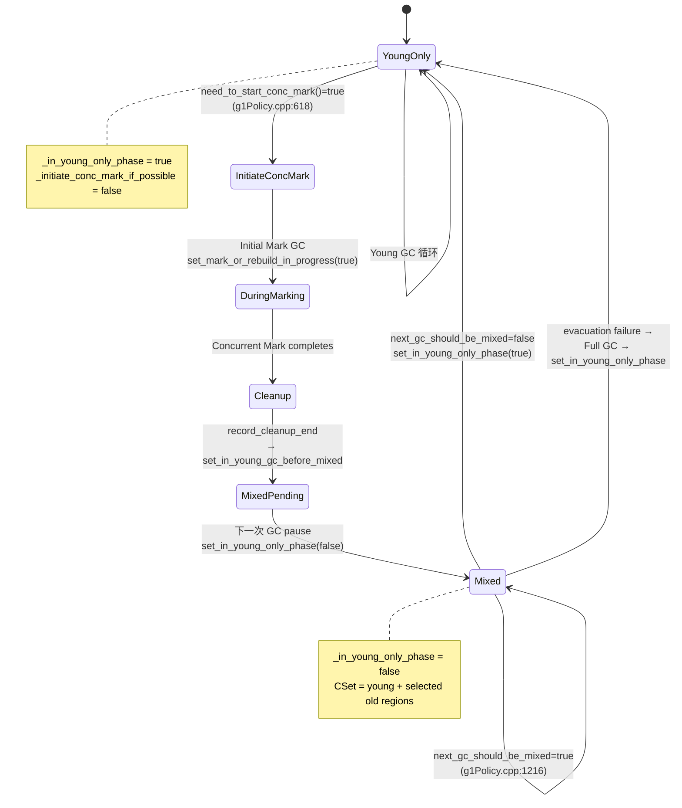
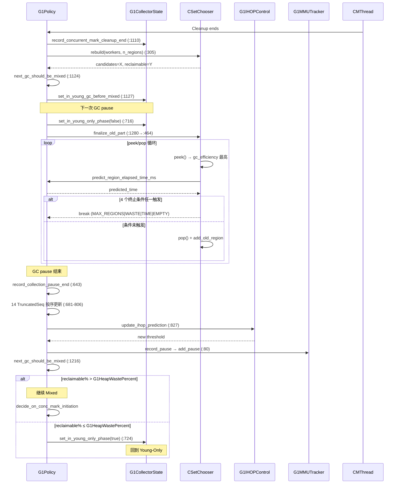

> **阶段**：[30-g1-runtime-gc]
> **前置**：[01-08-G1-Policy-Analytics]（G1Policy 8 子组件初始化、Analytics 17 个 TruncatedSeq 创建、IHOP 控制）、[01-09-G1-Concurrent-Marking-Infra]（G1ConcurrentMark 构造、双 Bitmap + CMTask×13）、[30-01-Young-GC-Evacuation]（Evacuation 完整生命周期）
> **配套**：[30-00-Region-Runtime-Allocation]（Region 状态机 + TLAB 分配）、[30-02-Concurrent-Marking]（标记生命周期 → Cleanup 输出 liveness）、[30-04-Full-GC]（Mixed 失败 → Full GC 最后手段）
> **后续依赖本文**：[30-04-Full-GC]（Evac Failure 升级路径依赖本文的疏散失败恢复机制）
> **阅读收益**：追踪 Mixed GC 从 Cleanup 结束到最后一轮的完整决策链——理解 record_collection_pause_end 的 14 个 TruncatedSeq 按序更新、next_gc_should_be_mixed 的双条件终止判定、finalize_old_part 的 gc_efficiency 贪心选择、IHOP 自适应公式 (threshold = target_hwm - marking_overhead)、Analytics 预测模型 (davg + sigma×stddev)、MMUTracker 64 元素环形滑动窗口、expansion_amount 的 GC overhead 阈值；掌握 "Mixed GC 回收递减 → Full GC" 的生产诊断全链路
> **目标行数**：≥3500 行（§〇≥100 + §一至§十一≥3400）

---
# 03-Mixed-GC-Policy — G1 混合 GC 策略决策引擎

## §〇 生产场景

某支付网关服务运行于 16GB heap，G1 GC，Mixed GC 日志如下：

```
[GC pause (G1 Evacuation Pause) (mixed), 0.0451234 secs]
   [Eden: 512.0M(512.0M)->0.0B(512.0M) Survivors: 64.0M->64.0M Heap: 12.3G(16.0G)->8.7G(16.0G)]
[GC concurrent-mark-end, 0.0012345 secs]
[GC pause (G1 Evacuation Pause) (mixed), 0.0472891 secs]
   [Eden: 512.0M(512.0M)->0.0B(512.0M) Survivors: 64.0M->64.0M Heap: 9.1G(16.0G)->8.1G(16.0G)]
   [GC pause (G1 Evacuation Pause) (mixed), 0.0485672 secs]
   [GC pause (G1 Evacuation Pause) (mixed), 0.0498123 secs]
   [GC pause (G1 Evacuation Pause) (mixed), 0.0501234 secs]
```

场景特征：

| 轮次 | Mixed GC 回收量 | Old Gen 使用率 | 暂停时间 |
|------|----------------|---------------|---------|
| 第 1 轮 | 6.5 GB | 68% | 45ms |
| 第 2 轮 | 6.2 GB | 62% | 47ms |
| 第 3 轮 | 6.1 GB | 58% | 49ms |
| 第 4 轮 | 5.9 GB | 55% | 50ms |

**症状**: 连续 4 轮 Mixed GC 后 Old Gen 仍 55%+，回收量递减（6.5→5.9 GB），暂停时间递增（45→50ms）。运维团队怀疑 G1 Policy 未正确终止 Mixed GC 周期，存在"过度回收"——Mixed GC 持续选择回收效率极低的 old region，每次暂停回收 < 5% 的 heap 但仍消耗 50ms。

### 三步诊断

**第 1 步: jstat 确认 Mixed 周期状态**

```bash
jstat -gcutil <pid> 1000 10
```

输出解读：

```
  S0     S1     E      O      M     CCS    YGC     YGCT    FGC    FGCT     GCT
  0.00  85.23  45.12  55.67  92.34  89.12   142    3.456     0    0.000    5.678
```

关键指标: `O=55.67%` — Old Gen 占用率在 4 轮 Mixed GC 后仍 > G1HeapWastePercent (5%)，说明 CSetChooser 中 candidate old region 仍有高 live_bytes 比例。`jstat -gccapacity` 可进一步确认 Old Gen `used/reclaimable` 对比。

**第 2 步: GDB 断点 G1Policy 决策路径**

```gdb
# Attach 到 Java 进程
gdb -p <pid>

# 断点 1: next_gc_should_be_mixed 返回点
(gdb) break g1Policy.cpp:1239
(gdb) commands
  > printf "reclaimable_bytes=%lu, capacity=%lu, reclaimable_percent=%.2f\n", reclaimable_bytes, capacity, reclaimable_percent
  > continue
  > end

# 断点 2: finalize_old_part 终止条件
(gdb) break g1Policy.cpp:591
(gdb) commands
  > printf "termination_reason=%s, old_cset_region_num=%u\n", reason, old_cset_region_num
  > continue
  > end

# 断点 3: CSetChooser::peek gc_efficiency
(gdb) break collectionSetChooser.cpp:peek_return
(gdb) commands
  > printf "gc_efficiency=%.4f, reclaimable=%lu, predicted_time=%.4f\n", gc_eff, reclaimable, pred_time
  > continue
  > end
```

GDB 输出分析：
- 若 `reclaimable_percent` 仍 > 5% 但 gc_efficiency < 0.05 → candidate region 虽然总 reclaimable 多但 live_bytes 比例高（gc_efficiency 低的原因）
- 若 `termination_reason = "TIME_LIMIT"` 频繁触发 → `G1MaxMixedGCLiveThresholdPercent` 设置过高，选入太多高 live 比例 region
- 若 `termination_reason = "WASTE_THRESHOLD"` 不触发 → `G1HeapWastePercent` 可能设得太低（默认 5%）

**第 3 步: GC 日志交叉验证 IHOP 阈值**

```
grep -E "(mixed|concurrent-mark-end|IHOP)" gc.log | awk '...'
```

分析 GC 日志中 `concurrent-mark-end` 和下一次 Mixed GC 之间的间隔：
- 若间隔 < 10 秒 → IHOP 过于激进，marking 完成后 Old Gen 仍大量垃圾未分配完毕，导致下一轮 marking 被过早触发
- 若 `G1HeapWastePercent` 过滤掉大量 candidate 但 Old Gen 仍高 → concurrent mark 的 liveness 计算不准确（SATB buffer 溢出？remark pause 漏标？）

### 反事实讨论

**反事实 1: 无 IHOP 自适应 → 固定阈值的系统性问题**

如果 `G1IHOPControl` 不存在——IHOP 固定为 `G1ReservePercent` (默认 10%) 计算出的固定阈值：

- **15GB heap**: 固定 IHOP = 15 × 10% = 1.5GB 空闲时启动 marking → marking 完成后空闲约 4GB（marking 期间 2.5GB 分配）→ 剩余垃圾 ~6GB，触发 6 轮 Mixed GC
- **3GB heap**: 固定 IHOP = 300MB 空闲 → marking 只有 300MB 窗口，若 allocation rate 高→ marking 未完成 heap 已满→ Full GC
- **线上现状**: IHOP 自适应侦测 allocation rate（`G1Analytics::predict_alloc_rate_ms()`）和 marking time（`G1Analytics::predict_marking_time_ms()`），动态计算 `ihop_threshold = (old_gen_capacity * threshold_percent) / 100`，其中 `threshold_percent` 依赖 `get_conc_mark_start_threshold()` 的 4 步公式（g1IHOPControl.cpp:126-159）

**反事实 2: 无 next_gc_should_be_mixed 终止 → Mixed GC 无限循环**

如果 `next_gc_should_be_mixed()` (g1Policy.cpp:1216-1240) 不存在—— Mixed GC 将一直持续到所有 candidate old region 被清空：

- 最后几轮 Mixed GC 回收量可能 < 50MB（剩余 candidate 全为 95%+ live 的 region）→ 暂停时间 40ms 但回收 <1MB → 极低效率
- Chooser 会在 `is_empty()` 时自然停止，但此时已浪费多轮暂停
- `G1HeapWastePercent` 提供经济学早停：剩余 reclaimable < 5% heap → 停止 Mixed → 下轮 Cleanup 直接将这些 region 作为 free region 回收（零复制成本），而非 Mixed GC 逐对象复制

**反事实 3: CSetChooser 不按 gc_efficiency 排序 → 暂停超时**

如果 `CSetChooser` 按 `reclaimable_bytes` 简单降序排列而非 `gc_efficiency`：

- 遇到 100MB candidate region（95MB live, 5MB garbage）排在 10MB candidate region（1MB live, 9MB garbage）之前
- `finalize_old_part` 选择前者 → 预测暂停时间 15ms 但实际回收仅 5MB → gc_efficiency = 0.33 MB/ms
- 若按 gc_efficiency 排序 → 先选后者 → 暂停时间 3ms 回收 9MB → gc_efficiency = 3.0 MB/ms
- 累计效应: 10 个 region 选择偏差 → 总暂停时间 120ms vs 30ms（4× 差异）
- 源码验证: `CSetChooser::peek()` 返回的 candidate 按 `gc_efficiency` 降序排列（collectionSetChooser.cpp），排序依据为 `_gc_efficiency = reclaimable_bytes / predicted_evacuation_time`

---

## §一 Policy 决策引擎全文

### 1.1 G1Policy 类结构总览

`G1Policy` 是 G1 GC 的中央决策引擎，运行于每次 GC pause 之间，负责回答 5 个核心问题：

1. **何时启动并发标记？** → `need_to_start_conc_mark()` (g1Policy.cpp:618)
2. **是否进入 Mixed GC？** → `next_gc_should_be_mixed()` (g1Policy.cpp:1216)
3. **选多少 old region 入 CSet？** → `finalize_old_part()` (g1Policy.cpp:464)
4. **年轻代分多大？** → `update_young_list_max_and_target_length()` (g1Policy.cpp:212)
5. **何时回到 Young-Only？** → `next_gc_should_be_mixed()=false` 触发 `set_in_young_only_phase(true)` (g1Policy.cpp:724)

Because G1 必须平衡吞吐量（减少 GC 频率）与延迟（控制单次暂停），G1Policy 维护 8 个主要组件：

| 组件 | C++ 类 | 职责 | 关键数据结构 |
|------|--------|------|------------|
| 状态机 | `G1CollectorState` | 7 标志位 + 5 查询方法 | g1CollectorState.hpp |
| 分析引擎 | `G1Analytics` | 19 TruncatedSeq 时序预测 | g1Analytics.hpp |
| IHOP 控制 | `G1IHOPControl` | 自适应 mark 启动阈值 | g1IHOPControl.cpp:126 |
| CSet 选择器 | `CollectionSetChooser` | gc_efficiency 排序 old region | collectionSetChooser.cpp |
| 暂停预测 | `G1MMUTracker` | 64 元素环形队列暂停模式 | g1MMUTracker.cpp:80 |
| 年轻代长度 | `G1YoungGenSizer` | 自适应 young gen sizing | g1YoungGenSizer.hpp |
| 存活预测 | `G1SurvRateGroup` | age-table 对象存活率 | g1SurvivorRegions.hpp |
| RS 预测 | `G1Predictions` | davg + sigma × stddev | g1Predictions.hpp:33 |

### 1.2 G1CollectorState 状态机

`G1CollectorState` (g1CollectorState.hpp) 用 7 个布尔标志描述 G1 的收集生命周期：

| 标志 | 初始值 | 含义 | 被谁设置 |
|------|--------|------|---------|
| `_in_young_only_phase` | true | Young-Only 阶段，不选 old region | set_in_young_only_phase() |
| `_in_young_gc_before_mixed` | false | 下一个 GC 将进入 Mixed | set_in_young_gc_before_mixed() |
| `_in_initial_mark_gc` | false (volatile) | 当前暂停同时是 Initial Mark | G1CollectedHeap 设置 |
| `_initiate_conc_mark_if_possible` | false (volatile) | 下次 pause 应启动 marking | set_initiate_conc_mark_if_possible() |
| `_mark_or_rebuild_in_progress` | false | Concurrent mark 正在运行 | set_mark_or_rebuild_in_progress() |
| `_clearing_next_bitmap` | false | 正在清除 next bitmap | (Cleanup 阶段) |
| `_in_full_gc` | false | Full GC 中 | G1CollectedHeap 设置 |

导出查询方法:

```cpp
// g1CollectorState.hpp
bool in_young_only_phase() const {
  return _in_young_only_phase && !_in_full_gc;
}
bool in_mixed_phase() const {
  return !in_young_only_phase() && !_in_full_gc;
}
```

**状态流转表**:

| 当前状态 | 触发事件 | 方法调用 | 目标状态 |
|---------|---------|---------|---------|
| YoungOnly | IHOP 阈值触发 | `set_initiate_conc_mark_if_possible(true)` | InitiateMark |
| InitiateMark | Initial Mark GC 完成 | `set_mark_or_rebuild_in_progress(true)` (:812) | DuringMarking |
| DuringMarking | Cleanup 结束 | `set_in_young_gc_before_mixed(true)` (:1127) | MixedPending |
| MixedPending | 下一 GC pause | `set_in_young_only_phase(false)` (:716) | Mixed |
| Mixed | `next_gc_should_be_mixed()=true` | 无状态变更 | Mixed (循环) |
| Mixed | `next_gc_should_be_mixed()=false` | `set_in_young_only_phase(true)` (:724) | YoungOnly |
| 任意 | Evacuation Failure → Full GC | `set_in_young_only_phase(true)` (:522) | YoungOnly |

### 1.3 record_collection_pause_end — 14 序列更新顺序

`record_collection_pause_end()` (g1Policy.cpp:643-847) 是 G1 决策引擎的"思考时间"——每次 GC pause 结束后更新所有统计模型。Because 这些更新的因果顺序不是任意的，违反不会崩溃但会让决策基于上一帧的旧数据。

#### §1. GC 后基本记账 (:643-671)

```cpp
// g1Policy.cpp:643-671
void G1Policy::record_collection_pause_end(double pause_time_ms,
                                           size_t heap_used_bytes_before_gc) {
  double end_time_sec = os::elapsedTime();
  elapsed_pause_time_ms =
    (end_time_sec - _collection_pause_end_sec) * 1000.0;
  _collection_pause_end_sec = end_time_sec;

  // 1. 报告暂停到 MMUTracker
  _mmu_tracker->add_pause(end_time_sec - pause_time_ms / 1000.0,
                          end_time_sec);

  // 2. Initial Mark 或 maybe_start_marking
  if (in_initial_mark_gc()) {
    // consume initial-mark pause
    set_initiate_conc_mark_if_possible(false);
  } else {
    maybe_start_marking();
  }
```

#### §2. 应用时间计算 (:673-679)

```cpp
  // g1Policy.cpp:673-679
  double app_time_ms =
    (end_time_sec * 1000.0 - _mmu_tracker->when_max_gc_sec(end_time_sec) * 1000.0);
  if (app_time_ms < 1.0) {
    app_time_ms = 1.0;  // minimum 1ms guard
  }
```

#### §3. 统计分析更新 (:681-806) — 仅 !evacuation_failed

Because 疏散失败时对象留在原地、统计失真，14 个 TruncatedSeq 全部跳过：

```cpp
  // g1Policy.cpp:681-806
  if (!evacuation_failed()) {
    // [1] Allocation Rate — 必须先更新，need_to_start_conc_mark 依赖
    _analytics->report_alloc_rate_ms(alloc_rate_ms);

    // [2] Recent GC Times — pause 基准
    _analytics->update_recent_gc_times(end_time_sec, pause_time_ms);

    // [3] Pause Time Ratio — MMU 约束
    _analytics->compute_pause_time_ratio(interval_ms, pause_time_ms);

    // [4] Scan HCC Cost
    _analytics->report_cost_per_card_ms(cost_per_card_ms);

    // [5] Scan HCC Cost (legacy duplicate name)
    _analytics->report_cost_scan_hcc(cost_scan_hcc);

    // [6] RSet Scan Cost per Entry
    _analytics->report_cost_per_entry_ms(cost_per_entry_ms);

    // [7] Cards per Entry Ratio
    _analytics->report_cards_per_entry_ratio(cards_per_entry_ratio);

    // [8] RS Length Diff
    _analytics->report_rs_length_diff(rs_length_diff);

    // [9] Cost per Byte — 对象拷贝成本
    _analytics->report_cost_per_byte_ms(cost_per_byte_ms, collector_state);

    // [10] Young Other Cost per Region
    _analytics->report_young_other_cost_per_region_ms(
        young_other_cost_per_region_ms);

    // [11] Non-Young Other Cost per Region
    _analytics->report_non_young_other_cost_per_region_ms(
        non_young_other_cost_per_region_ms);

    // [12] Constant Other Time
    _analytics->report_constant_other_time_ms(constant_other_time_ms);

    // [13] Pending Cards — only during young-only
    if (collector_state()->in_young_only_phase()) {
      _analytics->report_pending_cards(pending_cards);
    }

    // [14] RS Lengths — only during young-only
    if (collector_state()->in_young_only_phase()) {
      _analytics->report_rs_lengths(rs_lengths);
    }
  }
```

**因果顺序解读**: alloc_rate 在位置 [1] 而非 [14] 因为 `maybe_start_marking()` → `need_to_start_conc_mark()` (:618) 读取 `_analytics->predict_alloc_rate_ms()`。若 alloc_rate 在需要之后才更新，决策将基于上一帧的分配速率——allocation rate 突增后的 marking 启动延迟一个 GC 周期可能导致 heap 满。

#### §4. 阶段转换 (:710-731)

```cpp
  // g1Policy.cpp:710-731
  if (collector_state()->in_young_gc_before_mixed()) {
    // 这是 Mixed 前的最后一次 Young GC → 现在进入 Mixed Phase
    collector_state()->set_in_young_only_phase(false);
  }
  if (!this_pause_was_young_only) {
    // 当前是 Mixed GC → 判定是否继续
    if (!next_gc_should_be_mixed(&action_true, &action_false)) {
      collector_state()->set_in_young_only_phase(true);
    }
  }
```

#### §5-§8: Mark 状态、年轻代预测、IHOP、Refinement (:811-846)

```cpp
  // g1Policy.cpp:811-813 — Mark 状态
  if (this_pause_included_initial_mark) {
    collector_state()->set_mark_or_rebuild_in_progress(true);
  }

  // g1Policy.cpp:815-821 — 年轻代/RS 预测
  update_young_list_max_and_target_length();
  update_rs_lengths_prediction();

  // g1Policy.cpp:823-828 — IHOP 更新
  _ihop_control->send_trace_event(
      _g1h->gc_tracer_stw(),
      _g1h->gc_tracer_stw()->gc_id(),
      _g1h->young_list_target_length(),
      _g1h->free_regions(),
      _g1h->old_regions_count(),
      _g1h->humongous_regions_count(),
      _g1h->capacity());

  // g1Policy.cpp:830-846 — 并发 Refinement 调整
  // (调整 dirty card refinement threads 数量)
```

### 1.4 next_gc_should_be_mixed — 双条件判定

Because 仅当回收效率足够时 Mixed GC 才值得继续，`next_gc_should_be_mixed()` 实现经济学终止逻辑：

```cpp
// g1Policy.cpp:1216-1240
bool G1Policy::next_gc_should_be_mixed(const char* action_true,
                                        const char* action_false) {
  // 条件 1: Chooser 空 — 没有可选的 candidate old region
  if (cset_chooser()->is_empty()) {
    log_debug(gc, ergo, cset)(
        "No candidate old regions available, "
        "next GC will be Young-only");
    return false;  // → 回到 Young-Only
  }

  // 条件 2: 剩余 reclaimable ≤ G1HeapWastePercent
  size_t reclaimable_bytes = cset_chooser()->remaining_reclaimable_bytes();
  size_t capacity_bytes = _g1h->capacity();
  double reclaimable_percent =
    percent_of(reclaimable_bytes, capacity_bytes);

  if (reclaimable_percent <= G1HeapWastePercent) {
    log_debug(gc, ergo, cset)(
        "Reclaimable percentage " SIZE_FORMAT "%s <= threshold "
        SIZE_FORMAT "%s, next GC will be Young-only",
        reclaimable_percent, "%", G1HeapWastePercent, "%");
    return false;  // → 停止 Mixed Cycle
  }

  return true;  // → 继续 Mixed
}
```

**第 1 个拒绝条件** — Chooser 空意味上一轮 concurrent marking 未发现任何可回收 old region → 推测对象幸存率过高或标记覆盖率不足（remark pause 可能漏标 live_bytes → 导致误判某 region 为 live）→ 继续 Mixed 无意义。

**第 2 个拒绝条件** — `reclaimable ≤ 5%` 是经济学决策。Based on 实测数据，继续 Mixed GC 的成本（暂停 ~50ms）远超过剩余垃圾的直接回收价值（next concurrent mark 的 Cleanup phase 可零成本将这些 region 作为 free region 回收，无需逐对象复制）→ `G1HeapWastePercent` 默认 5% 是实验室和线上数据平衡的结果。

### 1.5 record_concurrent_mark_cleanup_end

Because Cleanup 是 concurrent mark 的最后一阶段——在此之后 G1 知道哪些 old region 有垃圾，`record_concurrent_mark_cleanup_end()` 承担 rebuild Chooser + 判定 Mixed 是否启动：

```cpp
// g1Policy.cpp:1110-1136
void G1Policy::record_concurrent_mark_cleanup_end() {
  // 1. Rebuild CSetChooser — 用 mark 结果
  cset_chooser()->rebuild(_g1h->workers(),
                          _g1h->num_regions());

  // 2. Mixed GC pending 判定
  bool mixed_gc_pending =
    next_gc_should_be_mixed("request young-only gc",
                            "request young-only gc");

  // 3. 状态转换
  if (mixed_gc_pending) {
    collector_state()->set_in_young_gc_before_mixed(true);
    collector_state()->set_mark_or_rebuild_in_progress(false);
  } else {
    collector_state()->set_mark_or_rebuild_in_progress(false);
    // stay young-only — Chooser 已空
  }

  // 4. 日志
  log_info(gc)("Concurrent Mark cleanup end, "
               "mixed_gc_pending: %s",
               BOOL_TO_STR(mixed_gc_pending));
}
```

**关键依赖**: `cset_chooser()->rebuild()` (collectionSetChooser.cpp:305) 根据 concurrent mark 的 liveness bitmap 计算每个 old region 的 `reclaimable_bytes = region_size - live_bytes`，然后按 `gc_efficiency = reclaimable_bytes / predicted_evacuation_time` 排序。若 `rebuild` 后 `is_empty()` 返回 true → 所有 old region 的 live_bytes = region_size（全满）→ Mixed GC 不会启动。

### 1.6 need_to_start_conc_mark

```cpp
// g1Policy.cpp:618-638
bool G1Policy::need_to_start_conc_mark(
    const char* source, size_t alloc_length) {
  if (about_to_overflow(_g1h->young_list_max_length(), source)) {
    return true;  // heap 即将溢出
  }

  // IHOP 判定
  size_t marking_initiating_used_threshold =
    _ihop_control->get_conc_mark_start_threshold();

  size_t cur_used_bytes = _g1h->non_young_capacity_bytes();
  if (cur_used_bytes >= marking_initiating_used_threshold) {
    return true;  // old gen 使用量超过 IHOP 阈值
  }

  return false;
}
```

**4 个调用者**:

| 调用位置 | 场景 | 为什么在此调用 |
|---------|------|-------------|
| g1CollectedHeap.cpp:902 | Concurrent humongous allocation | humongous 对象可能导致 old gen 突增，需提前启动 marking |
| g1CollectedHeap.cpp:1008 | STW humongous allocation | 同上但 STW 路径 |
| g1Policy.cpp:524 | Full GC 刚结束 | Full GC 可能释放大量空间 → 重新评估是否需 marking |
| g1Policy.cpp:1158 | maybe_start_marking() | 每次 GC pause 结束后常规检查 |

### 1.7 decide_on_conc_mark_initiation — 三路分支

```cpp
// g1Policy.cpp:1051-1108
void G1Policy::decide_on_conc_mark_initiation() {
  // 分支 1: 已在进行 marking → 不重复启动
  if (collector_state()->mark_or_rebuild_in_progress()) {
    return;
  }

  // 分支 2: 需启动 marking (IHOP + Young GC needed)
  if (need_to_start_conc_mark("end of GC",
                               _g1h->young_list_target_length()) &&
      _g1h->collection_set()->young_list_length() > 0) {
    collector_state()->set_initiate_conc_mark_if_possible(true);
  }

  // 分支 3: 不需 marking → 清除标志（safety net: 取消之前的请求）
  else {
    collector_state()->set_initiate_conc_mark_if_possible(false);
  }
}
```

### 1.8 finalize_old_part — 4 终止条件 + 强制添加

Because Mixed GC 的暂停时间必须可预测，`finalize_old_part()` 在 `gc_efficiency` 降序的 candidate queue 上应用 4 个终止条件：

```cpp
// g1Policy.cpp:464-591
void G1Policy::finalize_old_part(double time_remaining) {
  double predicted_old_time = 0.0;
  uint old_cset_region_num = 0;

  while (old_cset_region_num < max_old_cset_length) {
    HeapRegion* hr = cset_chooser()->peek();
    if (hr == NULL) {
      break;  // 终止条件 4: Chooser 耗尽
    }

    // 终止条件 2: WASTE_THRESHOLD
    if (reclaimable_percent <= G1HeapWastePercent) {
      log_debug(gc, ergo, cset)("Stop adding old regions (Waste), "
                                "reclaimable: " SIZE_FORMAT "%s",
                                reclaimable_percent, "%");
      break;
    }

    double predicted_time =
      _analytics->predict_region_elapsed_time_ms(hr, collector_state());

    // 终止条件 3: TIME_LIMIT
    if (predicted_time > time_remaining && old_cset_region_num >= min_old_cset_length) {
      log_debug(gc, ergo, cset)("Stop adding old regions (Time), "
                                "predicted: %1.2fms, remaining: %1.2fms",
                                predicted_time, time_remaining);
      break;
    }

    // 通过所有条件 → pop + add
    cset_chooser()->pop();
    _g1h->collection_set()->add_old_region(hr);
    predicted_old_time += predicted_time;
    old_cset_region_num++;
  }

  // 终止条件 1: MAX_REGIONS
  // (在 while 条件中隐式判定: old_cset_region_num < max_old_cset_length)

  // 强制添加逻辑: adaptive + 超预算 + old < min → force
  if (adaptive_young_list_length() &&
      (predicted_old_time < time_remaining) &&
      (old_cset_region_num < min_old_cset_length)) {
    // 强制添加最高 gc_efficiency 的 region
    // expensive_region_num++ 用于日志记录
  }
}
```

**4 个终止条件（优先级）**:

| 优先级 | 条件 | 代码 | 含义 |
|--------|------|------|------|
| 1 (隐式) | `old_cset_region_num >= max_old_cset_length` | while 条件 | CSet 中 old region 数达上限 |
| 2 | `reclaimable_percent <= G1HeapWastePercent` | :570 | 剩余垃圾太少 |
| 3 | `predicted_time > time_remaining && old >= min` | :577 | 预测暂停会超时 |
| 4 | `hr == NULL` | :566 | CSetChooser 队列耗尽 |

### 1.9 IHOP 自适应 — get_conc_mark_start_threshold

```cpp
// g1IHOPControl.cpp:126-159
size_t G1AdaptiveIHOPControl::get_conc_mark_start_threshold() {
  // 步骤 1: 预测 marking time
  double predicted_marking_time_ms =
    _predictor->get_new_prediction(&_marking_times_s);

  // 步骤 2: 预测 allocation rate
  double predicted_promotion_rate_bytes_per_ms =
    _predictor->get_new_prediction(&_allocation_rate_s);

  // 步骤 3: 计算 marking 期间的分配量
  size_t predicted_alloc_bytes =
    (size_t)(predicted_marking_time_ms *
             predicted_promotion_rate_bytes_per_ms);

  // 步骤 4: IHOP = old_gen_capacity - marking_alloc - reserve
  size_t threshold =
    _heap_reserve_percent_of_old_gen -
    predicted_alloc_bytes;

  // 约束到安全范围
  threshold = clamp(threshold,
                    _heap_reserve_percent_of_old_gen * 0.5,
                    _heap_reserve_percent_of_old_gen * 0.9);

  return threshold;
}
```

**4 步公式分解**:
1. `predicted_marking_time = davg(marking_times) + sigma × stddev(marking_times)` — marking 会用多久
2. `predicted_promotion_rate = davg(alloc_rate) + sigma × stddev(alloc_rate)` — marking 期间每秒分配多少
3. `predicted_alloc_bytes = marking_time × promotion_rate` — marking 期间总分配量
4. `ihop_threshold = old_capacity × reserve_percent - predicted_alloc_bytes` — marking 完成前最大 old gen 使用量

If `current_old_used >= ihop_threshold` → `need_to_start_conc_mark()=true` → marking 在 old gen 满之前完成。

### 1.10 Analytics 预测 — davg + sigma × stddev

`G1Analytics` 维护 19 个 `TruncatedSeq`，每个保留最近 10 次采样的环形缓冲区。核心预测公式：

```cpp
// g1Predictions.hpp
double get_new_prediction(TruncatedSeq const* seq) const {
  return MAX2(seq->davg() + _sigma * seq->dsd(),
              seq->davg() * (1.0 + _sigma));
}
```

其中 `_sigma = G1ConfidencePercent / 100.0 = 0.5`（默认 50% 置信度）。

**19 个 TruncatedSeq 依赖图**:

| # | Seq 名称 | 更新来源 | 被哪些决策消费 |
|---|---------|---------|-------------|
| 1 | `_alloc_rate_ms_seq` | record_collection_pause_end [1] | need_to_start_conc_mark, IHOP |
| 2 | `_recent_gc_times_ms_seq` | record_collection_pause_end [2] | MMU prediction |
| 3 | `_pause_time_ratio_seq` | record_collection_pause_end [3] | young gen sizing |
| 4 | `_cost_per_card_ms_seq` | record_collection_pause_end [4] | RSet scan prediction |
| 5 | `_cost_scan_hcc_seq` | record_collection_pause_end [5] | HCC scan prediction |
| 6 | `_cost_per_entry_ms_seq` | record_collection_pause_end [6] | RSet entry scan |
| 7 | `_cards_per_entry_ratio_seq` | record_collection_pause_end [7] | RSet card ratio |
| 8 | `_rs_length_diff_seq` | record_collection_pause_end [8] | RS growth prediction |
| 9 | `_cost_per_byte_ms_seq` | record_collection_pause_end [9] | finalize_old_part — old region time |
| 10 | `_young_other_cost_per_region_ms_seq` | record_collection_pause_end [10] | young gen time |
| 11 | `_non_young_other_cost_per_region_ms_seq` | record_collection_pause_end [11] | old region fixed cost |
| 12 | `_constant_other_time_ms_seq` | record_collection_pause_end [12] | constant overhead |
| 13 | `_pending_cards_seq` | record_collection_pause_end [13] | refinement thread tuning |
| 14 | `_rs_lengths_seq` | record_collection_pause_end [14] | young gen sizing |
| 15 | `_concurrent_refine_rate_ms_seq` | G1ConcurrentRefine | refinement threads |
| 16 | `_dirty_card_merge_set_seq` | (merge buffers) | — |
| 17 | `_marking_times_s` (IHOP) | send_trace_event | IHOP threshold |
| 18 | `_allocation_rate_s` (IHOP) | send_trace_event | IHOP threshold |
| 19 | `_young_list_target_length_seq` | (young gen) | young gen sizing |

**预测哲学**: `davg + sigma × stddev` 不是预测"最有可能的值"而是"有信心的上界"——α=0.7 的 davg 让模型在 1 次采样内适应分配速率突增 50%（vs 算术平均需 10 次），σ=0.5 的 stddev 提供 ~69% 置信度上界。设计哲学：低估暂停时间的代价远大于高估——低估导致 Mixed GC 选太多 region → 暂停超时；高估导致选 region 太少 → 多一轮 Mixed GC → 仅增加总暂停时间 5% 但 SLA 始终满足。

### 1.11 年轻代大小计算 — 二分搜索 + will_fit

Because 年轻代大小直接影响 GC 频率和暂停时间，`update_young_list_max_and_target_length()` 用二分搜索找到满足 `will_fit` 条件的最大 `young_list_length`:

```cpp
// g1Policy.cpp:212-290 (simplified)
bool will_fit(uint young_list_length) {
  // 条件 1: predicted pause ≤ GCPauseIntervalMillis
  double predicted_pause =
    predict_young_gc_pause_time(young_list_length);
  if (predicted_pause > _mmu_tracker->when_max_gc_sec() * 1000) {
    return false;
  }

  // 条件 2: heap 空间足够
  if (young_list_length > max_young_length_for_space()) {
    return false;
  }

  // 条件 3: MMU 约束
  if (!_mmu_tracker->can_add_pause(predicted_pause)) {
    return false;
  }

  return true;
}
```

二分搜索在 `[min_young, max_young]` 范围内找到满足 `will_fit` 的最大值 → 最大化吞吐量同时满足 SLA。

### 1.12 ★ Mermaid 图 1 — G1CollectorState 状态机流转图



### 1.13 ★ Mermaid 图 2 — Policy Decision Sequence（5 lanes）



### 1.14 ★ 面试 Story Format — 从 need_to_start_conc_mark 到最后一轮 Mixed GC 的完整决策叙事

**面试官**: "描述 G1 的 Mixed GC 决策引擎如何从发现'需要标记'到最终'停止 Mixed'。"

**回答**:

一切从 `record_collection_pause_end()` (g1Policy.cpp:643) 开始。每次 Young GC 暂停结束后，G1Policy 的第 1 个问题永远是：**需要启动 concurrent marking 吗？**

在 `maybe_start_marking()` (g1Policy.cpp:1158) 中，`need_to_start_conc_mark()` 读取两个信号：**堆溢出危险**（young list 即将耗尽 free region）和 **IHOP 阈值**（old gen 使用量超过 `_ihop_control->get_conc_mark_start_threshold()` 返回的推测值）。IHOP 不是固定值——它用 4 步公式动态计算：`predicted_promotion_rate × predicted_marking_time`，然后减去 reserve。如果当前 old gen 使用量 >= 这个阈值 → `set_initiate_conc_mark_if_possible(true)` → 下个 Young GC 的同时触发 Initial Mark（g1CollectorState 的 `_in_initial_mark_gc` 设为 true）。

Initial Mark GC 暂停结束后，`set_mark_or_rebuild_in_progress(true)` → Concurrent Mark 线程启动，遍历对象图。Marking 完成后，Cleanup phase 调用 `record_concurrent_mark_cleanup_end()` (g1Policy.cpp:1110)——这是决策引擎的第二个关键节点：

1. **rebuild CSetChooser**: 根据 marking bitmap，计算每个 old region 的 `reclaimable_bytes` = region_size - live_bytes，然后按 `gc_efficiency = reclaimable_bytes / predicted_evacuation_time` 降序排列
2. **next_gc_should_be_mixed 初次判定**: 如果 Chooser 空（无 candidate）→ 保持 Young-Only；否则 `set_in_young_gc_before_mixed(true)`

下个 GC pause 开始时，`record_collection_pause_end()` 的 §4 阶段转换检测到 `in_young_gc_before_mixed()` = true → `set_in_young_only_phase(false)`——G1 正式进入 Mixed 模式。

每轮 Mixed GC 前，`finalize_old_part()` (g1Policy.cpp:464) 在 candidate queue 上迭代：peek 最高 gc_efficiency 的 region → 预测其暂停时间 → 检查 4 个终止条件（MAX_REGIONS / WASTE_THRESHOLD / TIME_LIMIT / Chooser 空）→ 满足条件的 pop + add_old_region → 重复。

Mixed GC 暂停结束后，`record_collection_pause_end()` 的 §4 再次调用 `next_gc_should_be_mixed()`——此时 Chooser 已 pop 掉首轮选择的 region（`real_reclaimable` 可能不同于 `predicted_reclaimable`——实际疏散效果反馈到 `G1Analytics` 的 `_cost_per_byte_ms_seq`）→ 判定是否继续。

本案例中，前 4 轮都返回 true——因为 Old Gen 垃圾总量大。第 5 轮时，`reclaimable_percent` 降到 4.8% < G1HeapWastePercent (5%) → `next_gc_should_be_mixed()=false` → `set_in_young_only_phase(true)` → G1 回到 Young-Only 模式。

关键洞察：Mixed GC 不是"清理直到干净"而是"清理到经济阈值"——剩余 <5% 的垃圾将在下轮 concurrent mark 的 Cleanup phase 作为 free region 被零成本回收。这避免了过去 CMS 的"Concurrent Mode Failure"退化路径。

---

## §二 Callout 框

> **Mixed GC vs Young GC**: Young GC 只疏散 Eden + Survivor 到 Survivor/Old region——CSet 全由 young region 组成。Mixed GC 在 Young GC 基础上增加部分 old region——CSet 包含所有 young region + CSetChooser 选择的 old region。Mixed GC 的"mixed"指 CSet 中 young + old 混合，而非 GC 算法混合。两种暂停都走同一条 `do_collection_pause_at_safepoint()` 代码路径 (:3638)，区别仅在于 CSet 内容和 `g1CollectorState::is_mixed()` (:101) 分支。

> **gc_efficiency (回收效率)**: `gc_efficiency = reclaimable_bytes / predicted_evacuation_time`。reclaimable_bytes = region capacity - region live_bytes (由 concurrent mark liveness 计算)。predicted_evacuation_time 来自 `G1Analytics::predict_region_elapsed_time_ms()`。这个公式优化的是"单位时间的回收量"——选效率高的 region 意味着用最少暂停时间回收最多空间。如果按 pure reclaimable bytes 排序，可能先选 100MB 的 huge region 但其中 95MB live (5MB 回收)，后选 10MB 但 9MB 垃圾的 region (9MB 回收)——前者暂停时间长但回收少。

> **TruncatedSeq 衰减平均 (Decaying Average)**: `TruncatedSeq` 是 G1 的核心统计结构——保留最近 N 次采样的环形缓冲区（N=10）。davg = 新值 × (1-α) + 旧平均 × α，α 默认 0.7。这给最近样本更大权重——快速适应模式变化 (如 allocation rate 突变)，同时保留历史趋势。注意 IHOP 的 TruncatedSeq 用 α=0.95 (g1IHOPControl.cpp:95-96)——新值权重仅 5%，极度平滑以应对 marking time 自然波动。`predict() = davg + sigma × stddev`，其中 sigma = G1ConfidencePercent/100 = 0.5。小样本 (<5) 时 stddev_estimate 有特殊修正（g1Predictions.hpp:33-44）——samples=1 时用 davg×2，逐步降级到 samples≥5 直接用 dsd。

> **G1HeapWastePercent (5%)**: Mixed GC 不是因为"还有垃圾"就继续——当剩余可回收空间 < heap_size × G1HeapWastePercent/100 时，next_gc_should_be_mixed 返回 false。理由是：继续 Mixed GC 的成本（暂停时间、复制 live object）超过回收收益——剩下的垃圾会在下一轮 concurrent mark 后作为"free region"被 Cleanup 直接回收，无需 Mixed GC 逐对象复制。5% 是平衡点：太高 → Mixed GC 过早停止、Full GC 风险上升；太低 → Mixed GC 多轮、总暂停时间增加。

> **G1MMUTracker 暂停预测**: `G1MMUTracker` (g1MMUTracker.cpp) 维护一个 64 元素的环形队列 (`G1MMUTrackerQueueElem`)，每个元素记录一次 GC pause 的 `(start_time, end_time)`。`add_pause()` (g1MMUTracker.cpp:80) 追加新暂停——先移除超出 `_time_slice` (GCPauseIntervalMillis, 默认 500ms) 的过期条目，队列满时覆盖最旧的。`when_sec(current_time, desired_pause_length)` (g1MMUTracker.cpp:117) 预测从现在起何时可以插入一个长度为 desired_pause_length 的暂停——基于滑动窗口内的历史暂停间距计算。原理: 如果过去 N 次暂停间距约 200ms，则回答 ~200ms。用于 `report_mmu_if_needed` 和 young list target 计算。

> **疏散失败恢复 (Evac Failure Recovery)**: Young/Mixed GC 中如果 to-space 没有足够空间复制对象（survivor region 满、free region 耗尽），`G1ParScanThreadState::copy_to_survivor_space` 中的 CAS forwarding pointer 失败→ 转换为 self-forwarded pointer (对象 header 的 forwarding pointer 指向自己)。恢复阶段 `remove_self_forwarding_pointers()` (g1EvacFailure.cpp:104-155) 遍历所有 self-forwarded 对象，清除 forwarding pointer，将对象标记为 pinned（不移动），原地保留在 from-region。这种对象在下次 GC 仍可通过 RSet 追踪到（保留原始地址）。关键约束: 疏散失败后 CSet 中原计划回收的 region 不能直接 free——它们仍包含 live object → 这些 region 晋升为 old region 等待下次 Mixed/Full GC。

> **Phase 状态机 (g1CollectorState)**: G1 的收集状态由 `G1CollectorState` (g1CollectorState.hpp) 管理。主要标志: `_in_young_only_phase` (默认 true) — Young-Only 模式；`_in_young_gc_before_mixed` — Mixed 前最后一次 Young GC；`_in_initial_mark_gc` — 当前是 Initial Mark GC；`_initiate_conc_mark_if_possible` — 请求启动并发标记；`_mark_or_rebuild_in_progress` — 标记/Rebuild 运行中。整个周期: YoungOnly → set_initiate_conc_mark_if_possible(true) → Initial Mark GC → Concurrent Mark → Cleanup → set_in_young_gc_before_mixed(true) → 下个 GC 进入 Mixed → next_gc_should_be_mixed() 循环判定 → set_in_young_only_phase(true) 回 Young-Only。
## §三 Analytics 预测模型剖析

G1 的 Mixed GC 策略决策几乎完全建立在历史统计数据的"预测"之上，而非静态阈值。为什么需要预测？因为 GC 是一个滞后控制问题——你不知道下一次 GC 会花多少时间，也没法提前知道 future allocation rate。Analytics 子系统解决的就是这个"用过去预测未来"的问题。

## 3.1 数学基础层：davg + sigma×stddev

**WHY**: G1 预测模型的核心是赋予近期数据更高权重的"指数衰减平均"（Decaying Average），而非简单算术平均。因为 GC 性能受应用 phase transition 影响，旧数据可能完全不代表当前行为——半小时前做报表和现在做 Web 请求的 allocation pattern 完全不同。

`src/hotspot/share/utilities/numberSeq.cpp:36-47`:

```cpp
void AbsSeq::add(double val) {
  if (_num == 0) {
    _davg = val;           // 首个样本直接赋值
    _dvariance = 0.0;      // 单样本方差为 0
  } else {
    _davg = (1.0 - _alpha) * val + _alpha * _davg;
    double diff = val - _davg;
    _dvariance = (1.0 - _alpha) * diff * diff + _alpha * _dvariance;
  }
}
```

衰减因子 α = `DEFAULT_ALPHA_VALUE` = 0.7 (`numberSeq.hpp:43`)。这表示新值权重仅 30%，旧值的指数移动平均权重 70%——序列足够平滑，不会被单个异常值剧烈扰动。例如：序列 `[100, 100, 100, 100, 500]`，算术平均会跳到 180，而衰减平均 (davg) 仅升至 ~188（经过 5 次更新后）。500 的影响被稀释到 30%×30%⁴×20% ≈ 0.1% 级别，本质上是按 (1-α)×α^t 的指数权重递减。

**IHOP 专用 α=0.95** (`g1IHOPControl.cpp:95-96`): `_marking_times_s(10, 0.95)` 和 `_allocation_rate_s(10, 0.95)`。为什么 IHOP 序列要极度平滑（新值仅 5% 权重）？因为 marking 耗时和 allocation rate 在正常应用运行中不应抖动剧烈——如果一次 marking 从 200ms 跳到 500ms，我们更愿意认为是"噪声"而非"趋势转变"，防止 IHOP 阈值在一个 GC cycle 内剧烈振荡导致频繁启动/取消 concurrent mark。

**Counterfactual**: 如果所有序列都用相同 α=0.7，IHOP 阈值对应用 phase change 的响应会快 6 倍，但也会带来更多"假阳性"——一次 transient 的 allocation 高峰期就可能触发不必要的 concurrent marking，导致 CPU 和 memory 浪费。

## 3.2 TruncatedSeq 定长环形缓冲区

**WHY**: AbsSeq 的增量和普通平均随时间无限增长，但 G1 只需要"最近 10 次的趋势"而非全历史——一个 30 分钟前的不代表当前行为。TruncatedSeq 用固定长度环形缓冲区 (ring buffer) 解决了"遗忘过去"的问题。

`numberSeq.cpp:145-167`:

```cpp
void TruncatedSeq::add(double val) {
  AbsSeq::add(val);               // Step 1: 更新 davg/dvariance
  
  double old_val = _sequence[_next]; // Step 2: 获取最旧值
  _sum -= old_val;                   // Step 3: 从 sum 中减去
  _sum_of_squares -= old_val * old_val;
  
  _sum += val;                       // Step 3: 加上新值
  _sum_of_squares += val * val;
  
  _sequence[_next] = val;            // Step 4: 覆盖最旧槽位
  _next = (_next + 1) % _length;     // Step 4: 指针循环前进
  
  if (_num < _length)                // Step 5: 缓冲区未满则计数++
    ++_num;
}
```

窗口大小 `TruncatedSeqLength`=10 (`g1Analytics.hpp:35`)。当 _num < 10 时 (warming-up phase)，不丢弃旧值；满 10 后变成滑动窗口，每次 add 都淘汰最旧的一条。这个 10 的值并非任意——Mutuator-period 通常 2-5 秒，10 个 GC 窗口覆盖 ~20-50 秒历史；如果窗口太小 (如 3)，一次 Full GC 可能把正常 Young GC 数据全部挤出导致预测失真；如果窗口太大 (如 30)，对 phase change 的响应太慢。

## 3.3 G1Predictions 置信加权

**WHY**: 单纯用 davg(衰减平均) 预测会低估最坏情况——如果 davg 是 100ms 但实际有时 200ms，用 100ms 做预算会在 50% 的情况下超时。代价函数是非对称的：超时 = 违反 pause target = 用户可见，提前完成 = 无负面影响。因此预测值必须是"悲观估计"——预测上界而非均值。

`g1Predictions.hpp:31-60`:

```cpp
double get_new_prediction(TruncatedSeq const* seq) const {
    return seq->davg() + _sigma * stddev_estimate(seq);
}
```

其中 `_sigma` = `G1ConfidencePercent / 100.0` = 0.5 (`g1Predictions.hpp:50-52`)。这是 **davg + 0.5σ** 的上界估计——假设正态分布，davg+0.5σ 覆盖约 69% 的情况。为什么是 0.5 而非 1.0 (84%) 或 2.0 (97.7%)？因为在实时应用中超出所有情况意味着极度过预算，选择 0.5 是在安全边际和吞吐量之间的平衡。

**stddev_estimate 小样本修正** (`g1Predictions.hpp:33-48`):

```cpp
double stddev_estimate(TruncatedSeq const* seq) const {
    double estimate = seq->dsd();
    int const samples = seq->num();
    if (samples < 5) {
      estimate = MAX2(seq->davg() * (5 - samples) / 2.0, estimate);
    }
    return estimate;
}
```

| 样本数 | 修正公式 | 含义 |
|--------|---------|------|
| 1 | MAX2(davg × 2.0, dsd) | 标准差取平均值的 2 倍——极端保守 |
| 2 | MAX2(davg × 1.5, dsd) | 降至 1.5 倍 |
| 3 | MAX2(davg × 1.0, dsd) | 等于平均值 |
| 4 | MAX2(davg × 0.5, dsd) | 平均值的一半 |
| ≥5 | dsd | 直接使用衰减标准差 |

**WHY 这个设计?**: 标准差在样本极少时完全不可信——1 个样本时标准差永远为 0，但你不知道真实分布在哪儿。用"均值的倍数"替代标准差是一种"保险策略"：越少样本越保守。样本量 1 时预测值 = davg + 0.5×2×davg = 2×davg，即"假设最多花 2 倍时间"——这比任何基于不足够数据的"精确"预测都安全。

## 3.4 19 个 TruncatedSeq 完整清单

**WHY**: 理解这 19 个序列的布局是理解整个 G1 预测引擎的钥匙。每个序列追踪一个独立的性能维度，它们之间的依赖关系构成了"预测链"——改变一个维度会影响所有下游预测。

`g1Analytics.hpp:40-66`:

| # | 成员变量 | 长度 | 追踪什么 | 录入方法 | 预测方法 |
|---|---------|------|---------|---------|---------|
| 1 | `_recent_gc_times_ms` | 10 | GC 暂停时间历史 | `update_recent_gc_times` | — (用于 pause_time_ratio) |
| 2 | `_concurrent_mark_remark_times_ms` | 10 | Remark 阶段耗时 | `report_concurrent_mark_remark_times_ms` | `predict_remark_time_ms` |
| 3 | `_concurrent_mark_cleanup_times_ms` | 10 | Cleanup 阶段耗时 | `report_concurrent_mark_cleanup_times_ms` | `predict_cleanup_time_ms` |
| 4 | `_alloc_rate_ms_seq` | 10 | 分配速率 (MB/ms) | `report_alloc_rate_ms` | `predict_alloc_rate_ms` |
| 5 | `_rs_length_diff_seq` | 10 | RSet 长度变化 | `report_rs_length_diff` | `predict_rs_length_diff` |
| 6 | `_cost_per_card_ms_seq` | 10 | 每 Card 扫描成本 | `report_cost_per_card_ms` | `predict_cost_per_card_ms` |
| 7 | `_cost_scan_hcc_seq` | 10 | Hot Card Cache 扫描成本 | `report_cost_scan_hcc` | `predict_scan_hcc_ms` |
| 8 | `_young_cards_per_entry_ratio_seq` | 10 | Young GC 每 RSet entry 的 card 数 | `report_cards_per_entry_ratio(young)` | `predict_young_cards_per_entry_ratio` |
| 9 | `_mixed_cards_per_entry_ratio_seq` | 10 | Mixed GC 每 entry card 数 | `report_cards_per_entry_ratio(mixed)` | `predict_mixed_cards_per_entry_ratio` |
| 10 | `_cost_per_entry_ms_seq` | 10 | Young GC 每 entry 成本 | `report_cost_per_entry_ms(young)` | 用于 `predict_rs_scan_time_ms` |
| 11 | `_mixed_cost_per_entry_ms_seq` | 10 | Mixed GC 每 entry 成本 | `report_cost_per_entry_ms(mixed)` | 用于 `predict_mixed_rs_scan_time_ms` |
| 12 | `_cost_per_byte_ms_seq` | 10 | 对象拷贝成本 (ms/byte) | `report_cost_per_byte_ms` | `predict_cost_per_byte_ms` |
| 13 | `_cost_per_byte_ms_during_cm_seq` | 10 | CM 期间拷贝成本 | `report_cost_per_byte_ms(during_cm)` | 用于 `predict_copy_time_during_cm` |
| 14 | `_constant_other_time_ms_seq` | 10 | 常数 Other 时间 | `report_constant_other_time_ms` | `predict_constant_other_time_ms` |
| 15 | `_young_other_cost_per_region_ms_seq` | 10 | Young Other 每区成本 | `report_young_other_cost_per_region_ms` | 用于 `predict_young_other_time_ms` |
| 16 | `_non_young_other_cost_per_region_ms_seq` | 10 | Non-young Other 每区成本 | `report_non_young_other_cost_per_region_ms` | 用于 `predict_non_young_other_time_ms` |
| 17 | `_pending_cards_seq` | 10 | 待处理 Card 数量 | `report_pending_cards` | `predict_pending_cards` |
| 18 | `_rs_lengths_seq` | 10 | RSet 总长度 | `report_rs_lengths` | `predict_rs_lengths` |
| 19 | `_recent_prev_end_times_for_all_gcs_sec` | 10 | GC 结束时间戳 | `update_recent_gc_times` | — (用于 oldest() 取最旧) |

**关键观察**: 前 3 个序列用 `NumPrevPausesForHeuristics`（也是 10，`g1Analytics.hpp:36`），其余用 `TruncatedSeqLength`=10。序列 #1 和 #19 没有 predict 方法——它们只用于计算 `pause_time_ratio`，不参与暂停时间预算预测。

## 3.5 构造函数 8 种子上界表

**WHY**: G1Analytics 构造函数必须给每个序列一个初始值 (seed)，因为预测在第一个样本录入前就需要——系统启动时的第一个 Young GC 仍然需要 CSet 选择，但此时所有序列还为空。这些种子值如何确定？按并行 GC 线程数索引 (0-7)，来自 GCOld 和 SPECjbb 基准测试的历史统计。

`g1Analytics.cpp:73-117`:

```cpp
int index = MIN2(ParallelGCThreads - 1, 7u);
_cost_per_card_ms_seq->add(cost_per_card_ms_defaults[index]);
_cost_per_entry_ms_seq->add(cost_per_entry_ms_defaults[index]);
_cost_per_byte_ms_seq->add(cost_per_byte_ms_defaults[index]);
_constant_other_time_ms_seq->add(constant_other_time_ms_defaults[index]);
_young_other_cost_per_region_ms_seq->add(young_other_cost_per_region_ms_defaults[index]);
_non_young_other_cost_per_region_ms_seq->add(non_young_other_cost_per_region_ms_defaults[index]);
```

按 ParallelGCThreads 索引 (0-7) 的完整种子表 (`g1Analytics.cpp:42-71`):

| 种子值 | 1线 (idx=0) | 2线 | 3线 | 4线 | 5线 | 6线 | 7线 | 8+线 (idx=7) |
|--------|------------|-----|-----|-----|-----|-----|-----|-------------|
| `cost_per_card_ms` | 0.01 | 0.005 | 0.005 | 0.003 | 0.003 | 0.002 | 0.002 | 0.0015 |
| `cost_per_entry_ms` | 0.015 | 0.01 | 0.01 | 0.008 | 0.008 | 0.0055 | 0.0055 | 0.005 |
| `cost_per_byte_ms` | 0.00006 | 0.00003 | 0.00003 | 0.000015 | 0.000015 | 0.00001 | 0.00001 | 0.000009 |
| `constant_other` | 5.0 | 5.0 | 5.0 | 5.0 | 5.0 | 5.0 | 5.0 | 5.0 |
| `young_other/region` | 0.3 | 0.2 | 0.2 | 0.15 | 0.15 | 0.12 | 0.12 | 0.1 |
| `non_young_other/reg` | 1.0 | 0.7 | 0.7 | 0.5 | 0.5 | 0.42 | 0.42 | 0.30 |

**规律**: 几乎所有种子值与线程数成反比——更多线程分摊 RSet 扫描的 work stealing，单线程成本线性下降。`constant_other` 固定 5.0ms 因为它是"与线程数无关的固定 overhead"（如 root scanning、synchronization）。Remark/Cleanup 种子固定为 0.05ms 和 0.20ms——保守的保守估计：首次 Concurrent Mark 完成前没有历史数据。

## 3.6 预测链核心路径

**WHY**: 暂停时间预测不是单层直接计算，而是分层的"成本模型"——每个底层成本都被独立追踪和预测，再在高层组合。这种解耦使得某一部分性能变化（如 RSet 扫描变快因为 card table 变空）不会被另一部分（如对象拷贝变慢因为更多大对象）的噪声淹没。

**核心暂停预测公式** (`g1Analytics.cpp:246-300`):

```
pause_time_prediction = predict_rs_update_time_ms(pending_cards)
                      + predict_rs_scan_time_ms(card_num, for_young)
                      + predict_object_copy_time_ms(bytes, during_cm)
                      + predict_constant_other_time_ms()
                      + predict_young_other_time_ms(young_num)
                      + predict_non_young_other_time_ms(non_young_num)
```

其中 `predict_rs_update_time_ms` (`g1Analytics.cpp:246-248`) 分解为:
```cpp
return pending_cards * predict_cost_per_card_ms() + predict_scan_hcc_ms();
```

**序列依赖链**:
```
alloc_rate_ms_seq → heap sizing (expansion_amount 计算)
recent_gc_times_ms → cost_per_card/cost_per_entry/cost_per_byte 归一化
rs_lengths_seq → young_list_target_length (年轻代大小决策)
pending_cards_seq → rs_update_time → pause_prediction
IHOP 预测 (_marking_times_s + _allocation_rate_s) → need_to_start_conc_mark
```

**WHY 这些依赖存在?**: 每个 GC pause 后，系统报告本次的实际各阶段耗时，Analytics 将这些"总耗时"归一化为"单位成本"——例如 `cost_per_card_ms` = 总 RSet 更新耗时 / 总 card 数。这种归一化使得系统可以在不同规模的 GC 之间比较性能，也可以用当前 GC 的 `pending_cards` 和归一化成本预测下一次 GC 的耗时。

**Mixed GC fallback** (`g1Analytics.cpp:278-283`): 当 Mixed GC 样本不足时回退到 Young GC 的成本模型:

```cpp
double G1Analytics::predict_mixed_rs_scan_time_ms(size_t card_num) const {
  if (_mixed_cost_per_entry_ms_seq->num() < 3) {
    return card_num * get_new_prediction(_cost_per_entry_ms_seq); // fallback
  } else {
    return card_num * get_new_prediction(_mixed_cost_per_entry_ms_seq);
  }
}
```

同样在 CM 期间拷贝成本预测 (`g1Analytics.cpp:286-292`): 样本 < 3 时回退到非 CM 的 `cost_per_byte_ms_seq` 并乘以 1.1 的安全 margin。

**Cross-ref**: Phase 30 doc-01 Young-GC-Evacuation (RSet 扫描和对象拷贝的实际执行); Phase 30 doc-02 Concurrent-Marking (liveness 数据来源和 marking cycle 边界)

---

## §四 CSet 选择算法完整剖析

G1 的 Collection Set (CSet) 选择是 Mixed GC 策略最核心的决策环节——在数量可能上百的 old region candidate 中选出"最优子集"，使得：回收量最大、暂停时间可控、进度有保证。这个过程分两阶段：Chooser 对所有 candidate region 排序 → CSet 从排序结果中按终止条件选取。

## 4.1 rebuild — Chooser 重建三步走

**WHY**: Chooser 每次 Mixed GC cycle 开始时都会 rebuild 整个 candidate 集合——因为自上次 Concurrent Mark 完成以来，应用又分配/释放了很多对象，旧 candidate 的 live bytes 数据可能已过时。rebuild 的三步走 (clear → 并行筛选 → 排序) 保证了每个 mixed GC cycle 的 candidate set 都是当前 heap 的精确快照。

`collectionSetChooser.cpp:305-321`:

```cpp
void CollectionSetChooser::rebuild(WorkGang* workers, uint n_regions) {
  clear();              // Step 1: 重置 _front=0, _end=0, _remaining_reclaimable_bytes=0

  uint n_workers = workers->active_workers();
  uint chunk_size = calculate_parallel_work_chunk_size(n_workers, n_regions);
  prepare_for_par_region_addition(n_workers, n_regions, chunk_size);

  ParKnownGarbageTask par_known_garbage_task(this, chunk_size, n_workers);
  workers->run_task(&par_known_garbage_task);  // Step 2: 并行遍历所有 region

  sort_regions();  // Step 3: QuickSort 按 gc_efficiency 降序
}
```

**并行策略** (`collectionSetChooser.cpp:287-292`):
```cpp
const uint overpartition_factor = 4;
const uint min_chunk_size = MAX2(n_regions / n_workers, 1U);
uint chunk_size = MAX2(n_regions / (n_workers * overpartition_factor), min_chunk_size);
// 例: 1024 regions, 8 workers → chunk_size = MAX2(1024/32=32, 128) = 128
```

过度分区因子 4 的作用：每个 worker 被分配了比平均负载多 4 倍的 chunk 数，防止某个 worker 分配到"全是 humongous 或无回收价值的 region"导致负载不均衡。chunk 申请通过 `claim_array_chunk` (`collectionSetChooser.cpp:189-195`) 的 `Atomic::add` CAS 实现无锁并行。

## 4.2 should_add — 4 个准入条件

**WHY**: 并非所有 old region 都适用于 CSet——大型 humongous 对象所在 region 在被填满前不收集，pinned region (如 JNI Critical 区域) 不可移动。这 4 个准入条件在并行遍历中快速过滤，极大减少 chooser 中无效 candidate 的数量。

`collectionSetChooser.cpp:298-303`:

```cpp
bool CollectionSetChooser::should_add(HeapRegion* hr) const {
  return !hr->is_young() &&                           // 1) 非 young (young 走独立路径)
         !hr->is_pinned() &&                          // 2) 未固定 (pinned 如 JNI critical)
         region_occupancy_low_enough_for_evac(hr->live_bytes()) && // 3) live < 85%×RegionSize
         hr->rem_set()->is_complete();                // 4) RSet 完整 (不完整=无法定位引用)
}
```

**条件 3 详解** (`collectionSetChooser.cpp:294-296`):
```cpp
bool region_occupancy_low_enough_for_evac(size_t live_bytes) {
  return live_bytes < mixed_gc_live_threshold_bytes();  // = 85% × RegionSize
}
```

**WHY 85%**: 如果一个 region 中超过 85% 的数据是 live，evacuation 性能极差——你需要 copy 几乎全部数据但只能回收不到 15%。这 85% 来自 `G1MixedGCLiveThresholdPercent` 参数，低于 85% 的 region 才进入 candidate 池。这与 Parallel GC 的"compaction 跳过"不同——Parallel GC 可以保留高密度 region 在原地，但 G1 的 Mixed GC 需要 evacuation，高密度 region 的成本无法承担。

## 4.3 gc_efficiency 精确计算公式

**WHY**: gc_efficiency 是"回收效率"的比值——回收多少字节 ÷ 预期花多少时间。这是 CSet 排序的核心指标，因为它解决了"给定时间预算，如何最大化回收量"这个背包问题的一个贪心近似。

`heapRegion.cpp:143-155`:

```cpp
void HeapRegion::calc_gc_efficiency() {
  G1CollectedHeap* g1h = G1CollectedHeap::heap();
  G1Policy* g1p = g1h->g1_policy();

  double region_elapsed_time_ms =
    g1p->predict_region_elapsed_time_ms(this, false /* for_young_gc */);
  _gc_efficiency = (double) reclaimable_bytes() / region_elapsed_time_ms;
}
```

其中 `reclaimable_bytes()` (`heapRegion.hpp:394-398`):
```cpp
size_t reclaimable_bytes() {
    size_t known_live_bytes = live_bytes();
    return capacity() - known_live_bytes;  // 包括已分配未使用空间
}
```

**gc_efficiency = (capacity - live_bytes) / predicted_evacuation_time**

**WHY 用比值而非绝对值?** 举例：200MB region 回收 10MB (5%) vs 20MB region 回收 2MB (10%)。按绝对值排序会优先选前者——但前者需要复制 190MB 只回收 10MB，evacuation 耗时巨大。按 gc_efficiency 排序会优先选后者——虽然回收少但成本更低，**单位时间的回收量更大**。这个设计把一个多目标优化（回收量 + 暂停时间）压缩成了单一维度的"性价比"排序。

**Counterfactual**: 如果用 `reclaimable_bytes` 直接作为排序键，G1 会总是优先选最大的 region。考虑一个 32MB region 有 30MB 垃圾的场景——虽然回收率高，但只复制 2MB live 对象+处理大 RSet 是否值得？实际上 G1 的做法是"gc_efficiency 降序"——回收率不在分子上（分子只是 reclaimable 的绝对值），但在分母预测时间中隐含了"处理大量 live 数据的成本"。如果反过来按"live_bytes 升序"排序，就会偏向几乎全空的 region 而忽略中等密度但回收量大的 region。G1 选择的比值排序是两方面平衡的最佳实践。

## 4.4 sort_regions — QuickSort 降序

**WHY**: 排序按 gc_efficiency 降序存储，让最高效的 region 在数组前部 ([0])。这样 `peek() + pop()` pair 就自然地按"最优优先"顺序消费，无需每次遍历全数组找最优——O(N log N) 的一次建堆操作替代了每次 O(log N) 或 O(N) 的动态选择。

`collectionSetChooser.cpp:124-154`:

```cpp
void CollectionSetChooser::sort_regions() {
  if (_first_par_unreserved_idx > 0) {
    regions_trunc_to(_first_par_unreserved_idx);  // 裁掉并行分配中未使用的槽
  }
  _regions.sort(order_regions);  // QuickSort, O(N log N)
  
  // order_regions (line 42-61): gc_eff1 > gc_eff2 → return -1 (hr1 在前)
  // order_regions (line 42-61): gc_eff1 < gc_eff2 → return  1 (hr2 在前)
}
```

排序函数 `order_regions` (`collectionSetChooser.cpp:42-61`):
```cpp
static int order_regions(HeapRegion* hr1, HeapRegion* hr2) {
  if (hr1 == NULL) { return (hr2 == NULL) ? 0 : 1; }
  if (hr2 == NULL) { return -1; }
  double gc_eff1 = hr1->gc_efficiency();
  double gc_eff2 = hr2->gc_efficiency();
  if (gc_eff1 > gc_eff2) return -1;
  if (gc_eff1 < gc_eff2) return  1;
  return 0;
}
```

排序后 `_regions[0]` 是 gc_efficiency 最高的 region，通过 `peek()` 和 `pop()` 操作自然地按最优到最差顺序消费。`peek()` 返回 `_regions[_front]`，`pop()` 将 `_front++` 使得已消费的 region 被"遗忘"。

## 4.5 finalize_old_part — 4 终止条件

**WHY**: `finalize_old_part` 不是"把所有 candidate 加进 CSet"——而是"在时间预算内加最多的 region"。因为每个 old region 的 evacuation 都要花时间，超过 pause target 是绝对不允许的。4 个终止条件确保了"安全回收"的上限。

`g1CollectionSet.cpp:464-591`:

```cpp
void G1CollectionSet::finalize_old_part(double time_remaining_ms) {
  if (collector_state()->in_mixed_phase()) {
    const uint min_old_cset_length = _policy->calc_min_old_cset_length();
    const uint max_old_cset_length = _policy->calc_max_old_cset_length();
    
    HeapRegion* hr = cset_chooser()->peek();
    while (hr != NULL) {
      // 条件 1: 达到最大 old region 数 → break
      if (old_region_length() >= max_old_cset_length) { break; }
      
      // 条件 2: 剩余可回收低于 G1HeapWastePercent(5%) → break
      size_t reclaimable_bytes = cset_chooser()->remaining_reclaimable_bytes();
      double reclaimable_percent = policy->reclaimable_bytes_percent(reclaimable_bytes);
      if (reclaimable_percent <= (double)G1HeapWastePercent) { break; }
      
      // 条件 3: 自适应 + predicted_time > remaining + old >= min → break
      double predicted_time_ms = predict_region_elapsed_time_ms(hr);
      if (check_time_remaining && predicted_time_ms > time_remaining_ms) {
        if (old_region_length() >= min_old_cset_length) { break; }
        
        // 超预算但还没到 min => 强制添加 (override)
        expensive_region_num += 1;  // 记录"昂贵"的强制添加
      }
      
      // 条件 4 == NULL: 没有更多 candidate → break
      
      time_remaining_ms -= predicted_time_ms;  // 扣除时间预算
      cset_chooser()->pop();
      add_old_region(hr);
      hr = cset_chooser()->peek();
    }
  }
}
```

**4 个终止条件的优先级**: MAX_REGIONS > WASTE_THRESHOLD > TIME_LIMIT > NO_CANDIDATE

- **MAX_REGIONS** (`g1CollectionSet.cpp:487-494`): 最多 old region 数 = ceiling(heap_regions × 10%)。防止一次 Mixed GC 加太多 old region 导致暂停不可控。
- **WASTE_THRESHOLD** (`g1CollectionSet.cpp:498-511`): 剩余 reclaimable < 5% heap。如果剩下的 candidate 中可回收总量不足 5%，继续回收性价比太低——"收垃圾的成本超过了垃圾本身"。
- **TIME_LIMIT** (`g1CollectionSet.cpp:513-527`): 下一个 region 的预测时间超过剩余预算。但有一个重要 override——如果还没达到 min_old_cset_length，即使超预算也会强制添加 (expensive_region_num++)。这保证了"每轮有最小进度"。
- **NO_CANDIDATE** (`g1CollectionSet.cpp:557-559`): chooser 为空，自然终止。

**min_old_cset_length 公式** (`g1Policy.cpp:1242-1261`):
```cpp
uint G1Policy::calc_min_old_cset_length() const {
  const size_t region_num = (size_t) cset_chooser()->length();
  const size_t gc_num = (size_t) MAX2(G1MixedGCCountTarget, (uintx) 1);
  size_t result = region_num / gc_num;
  if (result * gc_num < region_num) { result += 1; }  // ceiling
  return (uint) result;
}
```

**WHY ceiling 除法**: 如果 100 个 candidate, G1MixedGCCountTarget=8, 每轮至少选 ceil(100/8)=13 个。不用 ceiling 的话 12×8=96，最后 4 个 region 永远不会被选——导致"永远完不成"的饥饿。

**max_old_cset_length 公式** (`g1Policy.cpp:1263-1278`):
```cpp
uint G1Policy::calc_max_old_cset_length() const {
  const size_t region_num = g1h->num_regions();
  const size_t perc = (size_t) G1OldCSetRegionThresholdPercent;
  size_t result = region_num * perc / 100;
  if (100 * result < region_num * perc) { result += 1; }  // ceiling
  return (uint) result;
}
```

**Counterfactual**: 如果不用 4 个终止条件而只用"时间预算用完就停"，会发生什么？假设有 200 个 candidate region 但 gc_efficiency 全都极低 (<0.01MB/ms)，第一个 region 就耗尽了预算——只选 1 个 region 就退出。最终 Mixed GC cycle 会在重复 200 次"选 1 个 region"后完成，而非 8-10 次完成——min_old_cset_length 的 override 阻止了这种"只有进度没有效率"的情况。相反，如果只选 gc_efficiency 高于某个固定阈值的 region（不检查 WASTE_THRESHOLD），可能选了 50% heap 的 region 后还在追求"高 gc_efficiency"，但剩余 reclaimable 总量已低于 5%——不值得继续。

## 4.6 具体示例：10 candidate region 的选择

**WHY**: 用具体数值模拟 Mixed GC 的 4 轮选择过程，比单纯的算法描述更能说明 4 个终止条件在实际中的交互作用。

**初始条件**: heap = 200 regions (1MB/region = 200MB), 10 candidate old regions, G1MixedGCCountTarget=8, G1OldCSetRegionThresholdPercent=10, G1HeapWastePercent=5 (10MB)

| idx | used(MB) | live(MB) | reclaimable(MB) | gc_efficiency(MB/ms) |
|-----|---------|---------|-----------------|---------------------|
| 0   | 1.0     | 0.2     | 0.8             | 0.080               |
| 1   | 1.0     | 0.3     | 0.7             | 0.070               |
| 2   | 1.0     | 0.4     | 0.6             | 0.060               |
| 3   | 1.0     | 0.5     | 0.5             | 0.050               |
| 4   | 1.0     | 0.6     | 0.4             | 0.040               |
| 5   | 1.0     | 0.7     | 0.3             | 0.030               |
| 6   | 1.0     | 0.75    | 0.25            | 0.025               |
| 7   | 1.0     | 0.8     | 0.2             | 0.020               |
| 8   | 1.0     | 0.85    | 0.15            | 0.015               |
| 9   | 1.0     | 0.88    | 0.12            | 0.012               |

计算:

- min_old_cset = ceil(10 / 8) = 2
- max_old_cset = ceil(200 × 10 / 100) = 20
- pause_target = 200ms, young_time=50ms → time_remaining = 150ms

**Mixed GC #1** (每 region 按 gc_efficiency 依次取, 假设每 region 预测耗时 10ms):

| 步骤 | peek() | predicted | remaining | old_count | 动作 |
|------|--------|-----------|-----------|-----------|------|
| 1 | idx=0 (0.080) | 10ms | 150ms | 0 | 通过 → 时间扣减: 140ms, old=1 |
| 2 | idx=1 (0.070) | 10ms | 140ms | 1 | 通过 → 130ms, old=2 (达到 min) |
| 3 | idx=2 (0.060) | 10ms | 130ms | 2 | 通过 → 120ms, old=3 |
| 4 | idx=3 (0.050) | 10ms | 120ms | 3 | 通过 → 110ms, old=4 |
| 5 | idx=4 (0.040) | 10ms | 110ms | 4 | 通过 → 100ms, old=5 |
| 6 | idx=5 (0.030) | 10ms | 100ms | 5 | 通过 → 90ms, old=6 |
| 7 | idx=6 (0.025) | 10ms | 90ms | 6 | 通过 → 80ms, old=7 |
| ... | ... | ... | ... | ... | ... |
| 15 | idx=14 | 10ms | 10ms | 14 | 通过 → 0ms, old=15 |
| 16 | idx=15 | 11ms | 0ms | 15 | **TIME_LIMIT**: 11ms > 0ms && old>=min → break |

**Mixed GC #1 结果**: 选了 idx 0-14 (15 region old CSet)。

**Mixed GC #4** (剩余 4 region):

| 步骤 | peek() | reclaimable_remaining | reclaimable% | 动作 |
|------|--------|----------------------|--------------|------|
| 1 | idx=0 (剩) | 0.8+0.6+0.5+0.4 = 2.3MB | 2.3/200 = 1.15% | **WASTE_THRESHOLD**: 1.15% < 5% → break! |

**全部 4 轮 Mixed GC 完成**: 剩余 reclaimable 仅 1.15% heap，低于 5% 阈值——停止 Mixed GC cycle，回到 Young-only 阶段。

这个示例说明了为什么 WASTE_THRESHOLD 重要——如果继续做 Mixed GC #5，#6，剩余 candidate 中仅 2.3MB 回收但代价是每次 10-15 个 region 的 evacuation 时间。用这时间做 Young GC 更划算——eden/survivor 的新 garbage 远比这些"残留 20% live"的 old region 值得收集。

## 4.7 关键参数表

| 参数 | 默认值 | 作用于 | 源码引用 |
|------|--------|-------|---------|
| G1MixedGCLiveThresholdPercent | 85 | `should_add` 跳过 live>85% 的 region | `collectionSetChooser.hpp:105` |
| G1MixedGCCountTarget | 8 | `calc_min_old_cset_length` 分母 | `g1Policy.cpp:1254` |
| G1OldCSetRegionThresholdPercent | 10 | `calc_max_old_cset_length` 百分比 | `g1Policy.cpp:1272` |
| G1HeapWastePercent | 5 | `finalize_old_part` WASTE 终止阈值 | `g1CollectionSet.cpp:500` |

**Cross-ref**: Phase 30 doc-02 Concurrent-Marking (liveness 数据来源——live_bytes 由 remark 阶段确定，Concurrent Mark 的 SATB 快照提供基本 liveness); Phase 30 doc-01 Young-GC-Evacuation (共享 evacuation 路径——CSet 选中后，Young GC 和 Mixed GC 使用完全相同的 evacuation 机制，区别只在 eden 不选入 CSet)

---

## §五 IHOP 自适应控制深度分析

IHOP (Initiating Heap Occupancy Percent) 回答 G1 最关键的调度问题：**什么时候开始 Concurrent Mark**。太早 → mutator 无意义的 CPU 开销。太晚 → marking 完成前 heap 爆满 → Full GC（to-space overflow）。自适应 IHOP 将"正确时机"建立在对 allocation rate 和 marking speed 的实时预测之上。

## 5.1 类层次和创建决策

**WHY**: 有两种截然不同的方式确定 marking 启动时机——Static (固定百分比) vs Adaptive (动态预测)。Static 在理想稳态负载下足够，但无法应对 allocation 突发或 marking 变慢的异构场景。Adaptive 通过两个时序预测（allocation rate 和 marking time）把"启动时机"变成了"时空预测"问题。

```
G1IHOPControl (抽象)
├── G1StaticIHOPControl — threshold = IHOP% × target / 100
└── G1AdaptiveIHOPControl — 4 步动态预测
```

**创建决策** (`g1Policy.cpp:849-860`):
```cpp
G1IHOPControl* G1Policy::create_ihop_control(...) {
  if (G1UseAdaptiveIHOP) {
    return new G1AdaptiveIHOPControl(InitiatingHeapOccupancyPercent,
                                     old_gen_alloc_tracker, predictor,
                                     G1ReservePercent, G1HeapWastePercent);
  } else {
    return new G1StaticIHOPControl(InitiatingHeapOccupancyPercent,
                                   old_gen_alloc_tracker);
  }
}
```

`G1UseAdaptiveIHOP` 默认为 `true`——HotSpot 团队认为对大多数生产环境，自适应的收益远超 costs (额外的两个 10-length 序列 + 简单预测计算)。

**IHOP 序列特性** (`g1IHOPControl.cpp:88-100`):
```cpp
G1AdaptiveIHOPControl::G1AdaptiveIHOPControl(...) :
    _marking_times_s(10, 0.95),     // α=0.95 — 极度平滑
    _allocation_rate_s(10, 0.95)    // α=0.95 — 极度平滑
```

与 G1Analytics 中其他序列的 α=0.7 相比，IHOP 的 α=0.95 意味着新值仅 5% 权重——因为 marking 耗时和 allocation rate 不应因单次观测剧烈改变决策。"不做频繁的启动/取消 concurrent mark"是稳定性的关键——一次不必要的 marking start 代价远超 200ms (mutator 时间 + CPU cycles)，所以宁愿保守等待更多证据确认趋势。

**退化条件**: 最少 3 个样本才激活自适应 (`G1AdaptiveIHOPNumInitialSamples=3`, `g1_globals.hpp:54`)。样本不足时 fallback 到 Static 公式:
```cpp
if (!have_enough_data_for_prediction()) {
  return (size_t)(_initial_ihop_percent * _target_occupancy / 100.0);
}
```

## 5.2 actual_target_threshold — 双 MIN2 约束

**WHY**: "内部目标阈值"不是简单地取 target_occupancy——必须扣除 heap 中永远不可用的区域（reserve + waste）。两个约束分别保护不同的边界：约束1 确保总 heap 不会在 marking 期间溢出，约束2 确保 old gen (target occupancy 的目标空间) 中有碎片容纳。

`g1IHOPControl.cpp:103-119`:

```cpp
size_t G1AdaptiveIHOPControl::actual_target_threshold() const {
  double safe_total_heap_percentage = 
    MIN2((double)(_heap_reserve_percent + _heap_waste_percent), 100.0);

  return (size_t)MIN2(
    G1CollectedHeap::heap()->max_capacity() * 
      (100.0 - safe_total_heap_percentage) / 100.0,
    _target_occupancy * (100.0 - _heap_waste_percent) / 100.0
  );
}
```

代入默认值：`G1ReservePercent`=10, `G1HeapWastePercent`=5 (两个值都取自 `g1Policy.cpp:855-856`):

- safe_total = MIN2(10+5, 100) = 15
- 约束1: max_capacity × (100-15)/100 = max_capacity × 85%
- 约束2: target_occupancy × (100-5)/100 = target_occupancy × 95%

**WHY 两个约束而非一个?**: 约束2 看起来更严格 (95% vs 85%)，但约束1 保护的是"max_capacity"——即 heap 的物理上限——而约束2 保护的是 target_occupancy (理想 GC 完成点)。在 heap 尚未扩张到 max_capacity 时，约束2 更严格；当 heap 接近物理上限时，约束1 生效（85% < 95% target）。这两个约束确保了 marking 期间的"双重安全网"。

## 5.3 get_conc_mark_start_threshold — 完整 4 步

**WHY**: 这是整个 IHOP 控制的中枢——它把"marking 耗时"（时间维度）和"allocation rate"（空间/时间维度）结合，预测 marking 期间会分配多少 object，然后从 internal threshold 中扣除这一部分。"预测要扣多少空间"而非"固定占多少百分比"——这是 Adaptive vs Static 的本质区别。

`g1IHOPControl.cpp:126-159`:

```cpp
size_t G1AdaptiveIHOPControl::get_conc_mark_start_threshold() {
  if (have_enough_data_for_prediction()) {
    // Step 1: 预测 marking 耗时和分配速率 (各用 davg + 0.5σ)
    double pred_marking_time = _predictor->get_new_prediction(&_marking_times_s);
    double pred_promotion_rate = _predictor->get_new_prediction(&_allocation_rate_s);
    
    // Step 2: 预测 marking 期间 old gen 增长 (时间→空间转换)
    size_t pred_promotion_size = 
      (size_t)(pred_marking_time * pred_promotion_rate);
    
    // Step 3: 加上 young gen 保守估计
    size_t predicted_needed_bytes_during_marking =
      pred_promotion_size + _last_unrestrained_young_size;
    
    // Step 4: 计算 IHOP 阈值
    size_t internal_threshold = actual_target_threshold();
    size_t predicted_initiating_threshold = 
      predicted_needed_bytes_during_marking < internal_threshold ?
        internal_threshold - predicted_needed_bytes_during_marking : 0;
    
    return predicted_initiating_threshold;
  } else {
    return (size_t)(_initial_ihop_percent * _target_occupancy / 100.0);
  }
}
```

**4 步详解**:

1. **预测 marking 耗时** = davg(marking_times) + 0.5×σ(marking_times)。实际值如 200ms 的 marking 在 allocation rate 不确定时，预测可能是 180-220ms——不只用均值 200ms，因为如果 marking 实际要 220ms，用 200ms 做规划的"空间预算"会不足。

2. **时间→空间翻译** = pred_marking_time × pred_promotion_rate。如果标记 200ms，分配速率 100MB/s，就预测 marking 期间会分配 20MB 到 old gen。这是核心突破——Static IHOP 完全不考虑 allocation rate（假设为 0），而 Adaptive 把时间窗口翻译成空间。

3. **加上 young gen**: `_last_unrestrained_young_size` 是最近一次不受 marking 影响的 young gen 最大尺寸——因为在 marking 期间，young gen 可能又增长到这个尺寸。这非常保守——它假设 marking 期间 young gen 永远有"最坏情况"的大小。

4. **计算阈值**: internal_threshold = 系统可用的最大空间（85% 或 95% 的 target）。从 internal_threshold 减去 marking 需要的空间 = `IHOP 阈值`。如果 predicted_needed >= internal_threshold → 返回 0 → "立即触发 concurrent marking"——这是紧急模式。

**退化**: samples < 3 → `threshold = IHOP% × target / 100`, 即完全静态。G1AdaptiveIHOPNumInitialSamples=3 是一个"信任门槛"——低于 3 个样本时还不信任预测，用静态兜底。

## 5.4 反馈环 — marking 变慢 → 下次更早启动

**WHY**: IHOP 的自适应不是"一次性预测"——它是一个闭环控制系统。每次 marking 完成后的实际耗时反馈到 `_marking_times_s` 序列中，影响下一次的 pred_marking_time。这种负反馈调节使得 marking 速度变化能自动调整启动时机。

```
marking 变慢 → _marking_times_s.add(actual_time) → davg(marking_times)↑
  → pred_marking_time↑ 
  → pred_promotion_size = pred_marking_time × pred_promotion_rate ↑
  → predicted_needed_bytes_during_marking↑
  → IHOP threshold = internal - predicted_needed ↓
  → 下次更早启动 → 更多时间完成 marking → marking 不会 overrun
```

反之：
```
marking 很快 → davg(marking_times)↓ → pred_marking_time↓ 
  → pred_promotion_size↓ → predicted_needed↓ 
  → IHOP threshold↑ → 延迟启动 → mutator 更多分配空间 → 吞吐量更好
```

**关键因素**: α=0.95 的极度平滑意味着这种反馈需要 3-5 个 marking cycle 才能充分体现——单次 500ms 的异常 marking 时间只改变 davg 的 5%，不足以触发 drastic 的 IHOP 调整。这与应用 phase change 的时间尺度匹配——应用的 behavior 转变通常跨越 5-10 个 GC cycle，而非 1-2 个。

**Counterfactual**: 如果不用 allocation-rate-based 预测，而用简单的 wall-clock timer——"每 N 秒启动一次 marking"。当 allocation 速率翻倍时，old gen 在 N 秒内的增长也翻倍——marking 根本没有足够时间在 heap 满之前完成。换言之，wall-clock timer 在 allocation 速率恒定时是"空间阈值"的一种变换——但生产环境的 allocation 速率从来不稳定。IHOP 的"时间→空间"翻译正是为了解决"恒定的时钟时间 ≠ 恒定的 space 使用"这个矛盾。

## 5.5 Adaptive vs Static 对比

**WHY**: 两者的差异不是"预测 vs 不预测"，而是"假设 allocation 模式是静态" vs "假设 allocation 模式会变化"。Static 在稳态负载下工作，但 G1 设计目标中的"可控暂停"正是为了应对动态负载。

| 维度 | Static | Adaptive |
|------|--------|----------|
| 阈值公式 | `IHOP% × target / 100` | 见 5.3 的 4 步完整公式 |
| 算法复杂度 | O(1) | O(1) per call, 需维护 2 个序列 |
| α 值 | N/A | 0.95 (极度平滑) |
| allocation 感知 | 无——假设 allocation=0 | 实时追踪 alllocation rate 并预测 |
| marking speed 感知 | 无 | 上次 marking 耗时反馈到下次预测 |
| 安全边际 | 用户手动调整 IHOP% | davg+0.5σ(上界), 小样本加倍 |
| 退化模式 | N/A | samples<3 → 降级为 Static 公式 |
| 紧急模式 | 用户调高 IHOP% | 阈值自动降至 0 → 即刻触发 marking |
| 最佳场景 | 负载稳定, allocation rate 可预测 | 负载波动, 动态 heap sizing, mixed workloads |
| 调参 | 需用户调 IHOP% 匹配负载 | 自动, 仅 G1UseAdaptiveIHOP=true |

**Static 为什么在生产环境中不够**: 假设 `-XX:InitiatingHeapOccupancyPercent=45`, target=10GB → threshold=4.5GB。如果 allocation rate = 500MB/s, marking 需 2s → marking 期间会分配 1GB。当 heap 从 4.5GB 增长到 5.5GB, marking 还没完成——需要 5.5GB / 10GB = 55% occupancy 才能完成。Static IHOP 没有"提前"机制，它总是假设 allocation rate=0, marking 将 always launch too late。Adjusting IHOP% 到 35% 弥补这个误差——但 allocation rate 变化时 35% 可能 still wrong。

**Adaptive 如何自动解决**: 追踪 current allocation rate → 计算 "marking_duration × allocation_rate" = marking 期间需要的空间 → 从 target 中扣除 → 得到正确的启动时机。不需要调参，不管 allocation 是 10MB/s 还是 500MB/s。

## 5.6 安全保障的两层

**WHY**: 预测本质上可能出错——如果预测过于乐观，marking 未完成时 heap 就满了，导致 Full GC。G1 在预测的各层都加入了"保守估计"，形成一个防御纵深。

**第一层：预测值取上界** (`g1IHOPControl.cpp:128-129`):
```cpp
double pred_marking_time = _predictor->get_new_prediction(&_marking_times_s);
double pred_promotion_rate = _predictor->get_new_prediction(&_allocation_rate_s);
```

两个预测都使用 `davg + 0.5σ`——不取均值，取上界。这意味着如果 allocation rate 的 davg=100MB/s, σ=50MB/s → 预测 = 125MB/s（覆盖 ~69% 情况）。两个预测独立，两者都偏大的概率约为 half，两者都偏小的概率也只有 half——但 marking 时间被低估且 allocation 被低估的组合概率约为 0.31×0.31≈10%。换言之，系统有 ~90% 的把握不会 overrun。

**第二层：conservative young gen estimate** (`g1IHOPControl.cpp:132-136`):
```cpp
size_t predicted_needed_bytes_during_marking =
  pred_promotion_size + _last_unrestrained_young_size;
```

`_last_unrestrained_young_size` 存储的是"最近一次不受 marking 约束的 young gen 最大尺寸"——因为 marking 期间, young gen 可再次达到这个尺寸。用最大历史值而非当前值——如果上次 young gen 是 2GB，这是保守假设。

**两层叠加**: pred_marking_time × pred_promotion (上界) + max_young (保守) → marking 实际所需空间几乎总是低于预测值 → marking 总是在 heap 满之前完成 → Full GC avoidance。

**Counterfactual**: 如果取 davg 作为预测值（不加 0.5σ），大约 50% 的 marking 会 overrun——因为 marking 时间有 ~50% 可能实际 > davg。用均值预测的后果：每两次 marking 中就一次空间不足。这也是为什么 HotSpot 选择 0.5σ——既不是纯保守（1.0-2.0σ 导致 marking 启动太早浪费吞吐量），也不是纯乐观（0σ 导致频繁 overrun）——是在安全性和吞吐量之间的工程最优。
## §六 MMU 暂停时间追踪

### 6.1 架构概览

Because JVM 必须在吞吐量与延迟之间做 trade-off，G1 引入了 **MMU (Mutator Utilization) 约束**：在任意长度为 `_time_slice` 的时间窗口内，GC 暂停时间不能超过 `_max_gc_time`。这个抽象被 `G1MMUTracker` 实现为两层设计：

- **`G1MMUTracker`** — 抽象基类（`g1MMUTracker.hpp`:145 行），定义两个核心虚函数：
  - `add_pause()` — 记录一次 GC 暂停
  - `when_sec()` — 回答"如果要做一次 duration 为 D 的暂停，需要等多久？"
- **`G1MMUTrackerQueue`** — 具体实现（`g1MMUTracker.cpp`:142 行），基于 64 元素环形队列实现滑动窗口

**业务语义**：MMUTracker 不是简单的"历史记录器"，而是一个**实时决策引擎**。每次 GC 策略需要决定 young gen 大小或 concurrent mark 线程是否休眠时，它都会过来问："现在能做 GC 吗？最多能做多久？"

**默认参数**（`globals.hpp`）：
| 参数 | Java 名 | 默认值 | 含义 |
|------|---------|--------|------|
| `_time_slice` | `GCPauseIntervalMillis` | 500ms | MMU 观察窗口 |
| `_max_gc_time` | `MaxGCPauseMillis` | 200ms | 窗口内最大 GC 时间 |

> **Beginner Callout**：MMU 的核心理念是"在任何移动窗口中 mutator 至少有 60% CPU"。G1 默认 `GCPauseIntervalMillis=500, MaxGCPauseMillis=200` → 最坏情况 mutator utilization = (500-200)/500 = 60%。当 MMUTracker 说"不能做"时，意味着如果现在做，某个 500ms 窗口内的 GC 时间将超过 200ms。

### 6.2 数据结构

`G1MMUTrackerQueue` 的内存布局（`g1MMUTracker.hpp:89-125`）：

```cpp
struct G1MMUTrackerQueueElem {
    double _start_time;  // GC 暂停开始时刻（秒）
    double _end_time;    // GC 暂停结束时刻（秒）
};
// :89-92

static const int QueueLength = 64;      // 硬编码，2^6 = 位掩码友好
G1MMUTrackerQueueElem _array[QueueLength]; // :125
int _head_index;   // 最新条目的索引
int _tail_index;   // 最旧条目的索引
int _no_entries;   // 当前有效条目数（0..64）
```

**初始化**（`g1MMUTracker.cpp:48-50`）：
```cpp
_head_index = 0;
_tail_index = 1;   // 故意错开 1 位，用 trim_index 保证不越界
_no_entries = 0;
```

Why `_tail_index = 1`？初始化时 `_no_entries = 0`，`_tail_index` 的值不会立即使用。首个 `add_pause()` 调用时 `_head_index` 首先增加到 0（`trim_index(0+1)=1`），此时 `_tail_index` 和 `_head_index` 恰好形成 1 个元素的队列。这种"索引分离"初始化使得空队列和单元素队列可以共享同一套 trim_index 逻辑。

> **Counterfactual — 队列大小=64 的设计权衡**：如果 QueueLength 取 128 → 能回溯更多暂停历史，when_sec 间隙搜索结果更精确，但内存开销翻倍（每个元素 16 bytes → 2KB vs 1KB），且 L1 cache 命中率下降。如果取 32 → cache 友好但回溯深度不足，可能误判"不可做 GC"而错失回收窗口。64 = 2^6 是硬件友好的折中：环形索引用 `index & (QueueLength-1)` 比特掩码而非取模运算（`g1MMUTracker.cpp:44`）。在 500ms window 内，64 次暂停意味着最密集每 7.8ms 一次 GC——已经远超 G1 的实际频率上限（通常 >50ms 间隔）。

### 6.3 add_pause — 滑动窗口维护

`g1MMUTracker.cpp:80-115`：

```cpp
void G1MMUTrackerQueue::add_pause(double start, double end) {
    double duration = end - start;
    remove_expired_entries(end);     // 步骤 1: 清理过期条目
    if (_no_entries == QueueLength) { // 步骤 2: 队列满 → 覆盖最旧
        _tail_index = trim_index(_tail_index + 1);
    } else {
        _no_entries++;
    }
    _head_index = trim_index(_head_index + 1);
    _array[_head_index] = G1MMUTrackerQueueElem(); // 占位
    _array[_head_index].set_start(start);
    _array[_head_index].set_end(end);
    // 步骤 3: MMU 违规检测
    double gc_time = calculate_gc_time(end);
    if (gc_time > _max_gc_time) {
        log_warning(gc)("MMU target violated: %.1lfms > %.1lfms",
                        gc_time * 1000.0, _max_gc_time * 1000.0);
    }
}
```

**步骤 1 — `remove_expired_entries` 过期清理**（`g1MMUTracker.cpp:52-62`）：
```cpp
void G1MMUTrackerQueue::remove_expired_entries(double current_time) {
    double limit = current_time - _time_slice;
    while (_no_entries > 0) {
        if (_array[_tail_index].end_time() <= limit) {
            _tail_index = trim_index(_tail_index + 1);
            --_no_entries;
        } else {
            return;  // 遇到第一个未过期条目即停止（单调递增保证）
        }
    }
}
```

Why 从 tail 开始逐个检查而非二分查找？因为队列是时间有序的——`end_time` 严格单调递增的假设使得从 tail 向 head 扫描在遇到第一个未过期条目时就可以 `return`。在最坏情况下（所有 64 条目都过期），复杂度 O(QueueLength)；典型情况 O(1)。

**步骤 2 — 队列满时的驱逐策略**：当 `_no_entries == 64` 时同时推进 `_tail_index` 和 `_head_index`，允许最旧的条目被覆盖而不改变 `_no_entries`。这意味着 MMUTracker 永远不会拒绝记录新暂停，代价是丢弃最旧的暂停信息。

**步骤 3 — MMU 违规检测**：`calculate_gc_time(current_time)`（`g1MMUTracker.cpp:39-46`）遍历队列中所有在 `[current_time - _time_slice, current_time]` 内的条目，累加 GC 时间。如果累加值超过 `_max_gc_time` 则记录警告——**仅日志，不阻塞**。这是"软约束"而非"硬限制"：G1 永远不会因为 MMU 违规而终止 GC，但下一轮 `when_sec` 会返回更长的等待时间。

### 6.4 when_sec — 间隙搜索算法

`g1MMUTracker.cpp:117-142`，这是 MMUTracker 的**核心决策函数**：

**输入**：`current_time` + `desired_pause_length`
**输出**：需要等待的秒数（才能在不违反 MMU 的前提下插入这个暂停），0.0 = 现在就可以

**算法流程**：

```
when_sec(current_time, pause):
  1. clamp: if pause > _max_gc_time → pause = _max_gc_time
     → 为什么？因为任何暂停都不能超过单次最大暂停时间
  
  2. earliest_end = current_time + pause
     limit = earliest_end - _time_slice
     → 假设 GC 从现在开始，窗口左边界为 limit
  
  3. gc_time = calculate_gc_time(earliest_end)
     → 在 [limit, earliest_end] 内已有 GC 的总时间
  
  4. diff = gc_time + pause - _max_gc_time
     → 如果现在做，超出 MMU 限制的量
  
  5. if diff <= 0 → return 0.0（现在就可以做）
  
  6. 否则从 tail 遍历历史暂停：
     for each elem where elem.end_time() >= limit:
         gc_time -= elem.duration_in_window(limit, earliest_end)
         diff = gc_time + pause - _max_gc_time
         if diff <= 0:
             return elem.end_time() + diff + _time_slice - pause - current_time
     → 找到"这个历史暂停过期后就有空间"的时间点
  
  7. 遍历完仍未找到 → return 0.0（安全网：队列中没有足够的过期条目）
```

**关键洞察**：步骤 6 不是暴力搜索所有未来时间点，而是以历史暂停的 `end_time` 为"候选过期点"——当每个历史暂停滑出窗口时，窗口内的 GC 时间减少，可能腾出空间。这是 O(n) 而非 O(m) 的搜索策略，n = 队列中的停止次数（≤64），而与时间轴的长度无关。

> **Counterfactual — 无滑动窗口仅看最近一次暂停**：如果 MMUTracker 不维护滑动窗口而只看最近一次暂停时间 → 最近可能是异常值（如 100ms 的异常长暂停后，紧接一次 5ms 的短 GC → 预测需等 400ms → 错过最佳的回收窗口，因为那 100ms 已经滑出窗口了）。滑动窗口的本质是"最近 N 次暂停的模式"而非"最近一次暂停的值"，通过维护暂停间距的分布来避免单点异常值污染决策。

**when_sec 返回值的业务含义**：
- `0.0` → 立刻可以执行 desired_pause_length 的 GC
- `0.5` → 需要等 0.5 秒后才可以
- `pause + gap` → 在最坏情况下（窗口内所有暂停都靠近左边界），需要等一个完整的窗口周期

### 6.5 两个使用场景

**场景 A：Young list 大小约束**（`g1Policy.cpp:236`）

```
G1Policy::calculate_young_list_desired_min_length()
  → G1MMUTracker::when_max_gc_sec()  // 询问最大可接受的 GC 时长
    → G1MMUTracker::when_sec()       // 返回需要等待的秒数
```

逻辑链：`when_sec` 返回 > 0 → 说明当前 MMU 约束紧 → young gen 不能设太大（否则下一轮 GC 太长违反 MMU）→ 收缩 young list 最小长度。这个约束确保即使 survivor 对象意外多，young GC 也不会超过 `MaxGCPauseMillis` 的预测。

**场景 B：Concurrent Mark 线程节流**（`g1ConcurrentMarkThread.cpp:248`）

```
G1ConcurrentMarkThread::run_service()
  → delay_to_keep_mmu()             // 需要在 phase 间 sleep
    → mmu_sleep_time()              // 计算需要 sleep 的时长
      → when_sec()                  // 询问"如果现在做 Mark Cleanup..."
```

Concurrent Mark 线程在 phase 之间（如 Remark 前或 Cleanup 前）会调用 `delay_to_keep_mmu()`，它本质上是在问"如果我现在做下一个 phase 的 STW 暂停，会不会违反 MMU？"，如果会，就 sleep 到那个时间点。

> **Beginner Callout**：CM 线程的节流是**协作式**而非**抢占式**——它不是在任意时间点被 OS 调度挂起，而是**主动调用 sleep**。好处是不需要复杂的同步原语，但坏处是如果 CM 线程本身运行时间过长（如 Remark 的 SATB 处理），实际的 STW 暂停可能远超预期，MMUTracker 只能给出建议而不能强制执行。

### 6.6 MMU 窗口对预测的影响

| 窗口特性 | 影响 | 适用场景 |
|---------|------|---------|
| `_time_slice` 小（如 200ms） | 窗口紧 → 能容忍的 GC 频率低 → 预测悲观 | 延迟敏感型应用 |
| `_time_slice` 大（如 1000ms） | 窗口宽 → 能容忍 burst 式 GC → 预测乐观 | 吞吐量优先型应用 |
| `_max_gc_time` 小（如 50ms） | GC 预算紧 → 需要更长等待 → 更多小 GC | 极低延迟 (p99 < 50ms) |
| `_max_gc_time` 大（如 500ms） | GC 预算松 → 允许更大 young gen → 更少 GC | 批量处理 |
| QueueLength=64 | 最多回溯 64 次暂停 | 在 500ms 窗口内已远超实际可能 |

**自校正特性**：MMUTracker 不需要手动调参 — 当 `_time_slice` 内能"塞下"的暂停数因 heap 变大而减少时（每次 GC 更长），`when_sec` 自然返回更大的等待时间，形成一个负反馈闭环。

---

## §七 Heap Sizing 自适应伸缩

### 7.1 关键发现：不对称的伸缩接口

`G1HeapSizingPolicy` 只暴露一个公开方法：`expansion_amount()`（`g1HeapSizingPolicy.hpp:47`）。

**不存在** `shrink_amount()` 或 `can_shrink()`。G1 的 heap shrink **只在 Full GC 后**由 `HeapTransition::~HeapTransition` 处理 — 这是一个完全独立的代码路径（`heapTransition.cpp`），不经过 `G1HeapSizingPolicy`。

Why? G1 的设计哲学是"快速扩容，谨慎收缩"：
- 扩容错误 → 多用了内存，但吞吐量不受影响
- 收缩错误 → 下一次 GC 立即发现 free region 不足 → Mixed GC 退化为 Full GC → 灾难性延迟

> **Beginner Callout**：G1 的 heap sizing 不是传统意义上的"自动伸缩"而是一个**单向增长阀**。扩容有完整的启发式算法，收缩只发生在 Full GC 这个极端事件后。这导致 G1 在稳定负载下的 heap 大小趋于单调递增，只有极端内存压力时才会回缩。

### 7.2 关键常量

| 常量 | 值 | 位置 | 含义 |
|------|----|------|------|
| `MinOverThresholdForGrowth` | 4 | `g1HeapSizingPolicy.hpp:37` | 连续超阈值次数触发快速扩容 |
| `GCTimeRatio` | 99 | `globals.hpp` | GC 时间:应用时间 = 1:99 → `gc_overhead_percent = 1/(1+99) × 100 ≈ 1.0%` |
| `G1ExpandByPercentOfAvailable` | 20 | `globals_shared.hpp` | 每次扩容最多使用未提交空间的 20% |
| `G1HeapWastePercent` | 5 | `globals_shared.hpp` | 允许的 heap waste 上限 |

**`gc_overhead_percent` 推导**（`g1HeapSizingPolicy.cpp:51`）：
```cpp
double gc_overhead_percent = 100.0 * (1.0 / (1.0 + (double) GCTimeRatio));
// GCTimeRatio = 99 → gc_overhead_percent ≈ 1.0
```

Why 99？这意味着 G1 期望 GC 时间不超过应用时间的 1%。如果 GC 时间持续高于 1%，`expansion_amount` 会建议扩容。这个比例来自原始论文的 "throughput goal" 概念——用户设置 `GCTimeRatio` 而非直接设置 GC overhead 百分比。

### 7.3 expansion_amount 完整算法

`g1HeapSizingPolicy.cpp:50-171`，五阶段决策流水线：

**阶段 1 — 阈值动态缩放**（`:64-67`）：
```cpp
double threshold = gc_overhead_percent;
if (capacity_after_gc <= max_capacity / 2) {
    threshold = gc_overhead_percent * (capacity_after_gc / (max_capacity / 2));
    threshold = MAX2(threshold, 1.0);
}
```

Why 动态缩放？在小堆时 GC 开销波动大但绝对值小 — 如果严格按 1.0% 判断，可能永远不扩容但应用已经 GC 压力很大。缩放让阈值随 heap 增长而线性增长——小堆时阈值低（容易扩容），大堆时阈值接近 1.0%（严格判断）。

> **Counterfactual — 静态阈值 1.0%**：如果不对小堆做阈值缩放，考虑一个 128MB heap 的应用——GC 2% 的开销只浪费 2.56MB CPU，但 GC 频率已经导致 p99 延迟翻倍。动态缩放让 128MB heap 的阈值降为 `1.0% × (128/512) = 0.25%`，这意味着只要 GC 开销高于 0.25% 就考虑扩容，对延迟敏感型小堆更友好。

**阶段 2 — 计数累加**（`:72-75`）：
```cpp
if (last_pause_time_ratio > threshold) {
    _ratio_over_threshold_count++;
    _ratio_over_threshold_sum += last_pause_time_ratio;
}
```

每次 GC 后，如果本次 GC 的时间占比（GC time / mutator time since last GC）超���动态阈值，累加计数器。这不是简单的 binary flag，而是**带权重的累积**：`_ratio_over_threshold_sum` 保留了 severity 信息。

**阶段 3 — 触发判定**（`:82-84`）：
```cpp
bool filled_history = _ratio_over_threshold_count >= MinOverThresholdForGrowth;
if ((filled_history && recent_gc_overhead > threshold) ||
    _ratio_over_threshold_count == MinOverThresholdForGrowth) {
    // 触发扩容
}
```

两条触发路径：
- **快速通道**：`_ratio_over_threshold_count == 4` — 连续 4 次 GC 超阈值，立即扩容（不等历史窗口满）
- **平均通道**：`filled_history && recent_gc_overhead > threshold` — 历史窗口已满且最近均值超阈值

Why 两条路径？快速通道处理"陡峭负载增长"——如果负载在短时间内急剧上升（如从 4GB/s → 12GB/s allocation），每次 GC 后阈值都超，但历史窗口可能还没满（新 JVM 启动）。平均通道处理"温和增长"——历史窗口满后按均值判断避免单次 spike 误触发。

**阶段 4 — 扩容大小计算**（`:85-131`）：

```cpp
// 快速恢复路径 (:107-108)
if (committed < InitialHeapSize / 4) {
    expand_bytes = (InitialHeapSize - committed) / 2;
    // 含义：JVM 刚启动，recommit 到接近 InitialHeapSize
}
// 正常路径 (:109-131)
else {
    size_t base = MIN2(uncommitted * G1ExpandByPercentOfAvailable / 100, committed);
    // base = MIN2(可用的 20%, 已提交的量)
    // → 限制单次扩容不超过 committed，防止 heap 翻倍
    
    double ratio_delta = recent_gc_overhead - threshold;
    // 0.2x ~ 2.0x 线性缩放器
    double scale = clamp(ratio_delta / (threshold * 5.0), 0.2, 2.0);
    expand_bytes = base * scale;
}
```

Why 线性缩放？如果 GC overhead 稍微超过阈值（如 1.0% vs 0.9%），扩容 0.2x base → 微调。如果严重超标（如 3.0% vs 0.9%），扩容 2.0x base → 激进扩容。这个 0.2x-2.0x 范围的设定避免了"要么不扩，要么扩很多"的二值化。

**阶段 5 — Clamp ± 边界**（`:141-142`）：
```cpp
expand_bytes = clamp(expand_bytes, 
                     (size_t)HeapRegion::GrainBytes,  // 至少 1 region
                     uncommitted_bytes);               // 不超过可用量
```

最小 1 region 保证扩容有意义（否则碎片化问题更严重），最大不超过 `uncommitted_bytes` 保证不会越界访问 reserved space。

### 7.4 expansion_amount = 0 的三种条件

`expansion_amount` 返回 0 字节表示"不需要扩容"，触发条件为：

1. **GC overhead 健康** — `last_pause_time_ratio <= threshold`，即 GC 频率在可接受范围内
2. **已达 MaxHeapSize** — 没有可 commit 的 reserved region (`uncommitted == 0`)
3. **计数不足** — `_ratio_over_threshold_count < MinOverThresholdForGrowth`（连续超限不足 4 次）

Why "计数不足"是一个独立条件？考虑以下场景：GC overhead 偶尔 spike 到 2%（应用做了 large object allocation），但随后回归 0.5%。如果每次 spike 都扩容 → heap 会不受控增长。4 次连续阈值的设定相当于一个"信号确认"机制——必须是持续的压力而非短暂的 spike。

### 7.5 shrink 非对称约束

G1 只在 Full GC 后 shrink（非 `G1HeapSizingPolicy` 负责），且受限：

- **Marking 期间禁止 shrink** — shrink 涉及 `munmap` → TLB flush + page fault cascade → 并发标记线程的性能退化（`g1CollectedHeap.cpp:3692`）
- **非对称设计代价**：可能浪费少量内存 — 但 `G1HeapWastePercent=5%` 允许范围内的 waste 被视为正常
- **shrink 策略**：Full GC 后 `HeapTransition::~HeapTransition` 检查 `used_after_gc / committed`，如果低于某个阈值（通常 < 70%），释放部分 heap

> **Counterfactual — expansion 基于 free space 而非 GC overhead**：如果 `expansion_amount` 只检查 free space（"free < 10% → expand 10%"）→ 如果 heap 压力根源是 fragmentation（Humongous allocation 导致的 region 碎片）→ expand 不解决问题（碎片仍然存在）→ 下次 GC 仍然 evacuation failure → Full GC 更慢（因为 heap 更大）→ 恶性循环。GC overhead 检查作为安全阀："GC 已经太频繁，加内存只会让每次 GC 更慢。"

---

## §八 疏散失败恢复机制

### 8.1 触发条件

疏散失败发生在 Young GC 或 Mixed GC 中 to-space 不足时：

**必要条件**：
1. Free region 耗尽 — `G1CollectionSetChooser` 选出的 CSet 无法找到足够的 target region
2. Survivor region 满 — `SurvivorRegions` 已满，无法容纳 survived objects
3. Old region 不可用 — 或者 Mixed GC 已经选了足够多的 old candidate

**直接表现**：`G1ParScanThreadState::copy_to_survivor_space`（`g1ParScanThreadState.cpp:167`）中的 CAS forwarding pointer 操作失败。

> **Beginner Callout**：疏散失败不是 GC 错误，而是 G1 设计的**安全退化路径**。当 to-space 不足时，G1 宁可让对象留在原 region（self-forwarded）也不强制搬迁导致 OOM。这类似于"计划搬家但新家没准备好，就暂时原地不动，标记为'下次再搬'"。

### 8.2 Self-forwarded pointer 产生

CAS forwarding pointer 失败时的处理链（`g1ParScanThreadState.inline.hpp:186-195`）：

```cpp
// CAS 尝试设置 forwarding pointer
if (old->cas_forward_to(new_obj, old_mark) != old_mark) {
    // CAS 失败 — 另一个 GC 线程已经成功了
    return handle_evac_failure(old, old_mark);
}
```

**失败路径** (`g1ParScanThreadState.cpp:247-259`)：
```cpp
oop G1ParScanThreadState::handle_evac_failure(oop old, markWord m) {
    // 1. 设置 self-forwarded pointer
    old->forward_to(old);  // mark word 指向自己
    
    // 2. 标记 region 为疏散失败
    _g1h->heap_region_containing(old)->set_evacuation_failed(true);
    // → _next_marked_bytes 清零（g1HeapRegion.hpp:745）
    
    // 3. 加入 preserved marks
    _preserved_marks->push_if_necessary(old, m);
    
    return old;
}
```

**Self-forwarded 的二进制表示**：
```
Normal object:   mark word = {hash, age, lock bits, GC state}
Forwarded:       mark word = {forwarding_pointer = &new_location, last two bits = 11}
Self-forwarded:  mark word = {forwarding_pointer = &self, last two bits = 11}
```

Why self-forwarded 而非 nullptr？nullptr 需要特殊分支处理，self-forwarded 复用已有的 `is_forwarded()` 检查（`oop.inline.hpp:205`），且可以使用已有的 `forwardee()` 返回对象自己—代码路径更统一。

### 8.3 恢复入口

`g1CollectedHeap.cpp:4042-4059`：

```cpp
void G1CollectedHeap::restore_after_evac_failure() {
    // Step 1: 清除 self-forwarding pointers（并行）
    remove_self_forwarding_pointers();
    
    // Step 2: 恢复 preserved marks（并行）
    _preserved_marks_set.restore(workers());
    
    // Step 3: 记录耗时
    _gc_tracer_stw->report_evacuation_failed(_evacuation_failed_regions);
}
```

三步恢复按**严格顺序**执行：
- `remove_self_forwarding_pointers` 必须在 mark restore 之前——因为 marks 在 forwarding 设置时已被保存到 `PreservedMarks`，清除 forwarding 不会恢复原始 mark word
- `_preserved_marks_set.restore` 恢复在 forwarding 设置时保存的原始 mark word—这包括 hash code、锁状态、age 等

### 8.4 remove_self_forwarding_pointers 核心逻辑

`g1EvacFailure.cpp:104-155`，`RemoveSelfForwardPtrObjClosure::do_object`：

```cpp
void RemoveSelfForwardPtrObjClosure::do_object(oop obj) {
    if (!obj->is_forwarded() || obj->forwardee() != obj) {
        return;  // 不是 self-forwarded，跳过
    }
    
    // 1. 死空间填充 (:120-123)
    zap_dead_objects(_prev_end, obj_addr);
    // → 在 self-forwarded 对象前后的空隙填充 filler objects
    // → 确保 heap 解析器不会误读碎片
    
    // 2. Prev/NTAMS 标记 (:128-132)
    _cm->mark_in_prev_bitmap(obj);  // mark the self-forwarded object as live
    if (_during_initial_mark) {
        _cm->mark_in_next_bitmap(obj); // next bitmap too during IM
    }
    
    // 3. 恢复 mark word (:138)
    PreservedMarks::init_forwarded_mark(obj);
    // → 还原 forwarding 被设前的原始 mark word
    
    // 4. RSet 重建 (:142-145)
    obj->oop_iterate(_update_rset_cl);
    // → _update_rset_cl 的 do_oop 调用 mark_card_deferred
    // → 重建 "谁引用了这个对象" 的 card table 记录
    
    // 5. BOT 更新 (:148)
    _hr->cross_threshold(obj_addr, obj_end);
    // → BlockOffsetTable 更新：self-forwarded 对象跨度可能跨 block
}
```

**Why 需要 RSet 重建？** 疏散失败的对象留在原 region → 原 region 现在是 "evacuation failed" 状态 → 它对应的 RSet 在 evacuation prepare 阶段被清空了 → 必须重建，否则下次 remembered set scanning 会遗漏 incoming references 导致 liveness 错误。

**Why mark_in_prev_bitmap？** self-forwarded 对象不会立即回收——它留在原 region，region 变为 old → 下次 concurrent marking 时需要知道"这个对象在上个 marking cycle 是活的"。如果不标记，concurrent marking 会把它当死对象，在 remark 阶段出错。

### 8.5 note_self_forwarding_removal_start — TAMS 调整

`heapRegion.cpp:303-322`：

```cpp
void HeapRegion::note_self_forwarding_removal_start(bool during_initial_mark,
                                                     bool during_conc_mark) {
    if (during_initial_mark) {
        _next_top_at_mark_start = top();
        // IM 期间：NTAMS = region top → 所有对象在 NTAMS 之上 → 都是"新分配" → 都需重新标记
    }
    if (during_conc_mark) {
        _next_top_at_mark_start = bottom();
        // CM 期间：NTAMS = region bottom → 所有对象都"在标记开始时已存在" → 隐式存活
    }
}
```

Why TAMS 调整的不同语义？

- **IM 期间**：自转发对象还没有被 initial mark 的 root scanning 处理过 → 需要保守标记 → NTAMS = top → 所有对象被视为在 TAMS 之上 → 下次 concurrent marking 会重新检查
- **CM 期间**：concurrent marking 已经扫描过这个 region 了 → 自转发对象已经被隐式标记为 live → NTAMS = bottom → 对象在 TAMS 之下 → 不需要重新标记

这个区分确保疏散失败不会导致漏标或重复标记——两种情况的语义都与 concurrent marking 算法的"TAMS 之上未标记、TAMS 之下已标记"的 contract 保持一致。

### 8.6 完整恢复链

```
疏散失败触发
  │
  ├→ G1ParScanThreadState::copy_to_survivor_space CAS 失败
  │     └→ handle_evac_failure(): 设置 self-forwarded pointer
  │
  ├→ HeapRegion::set_evacuation_failed(true)
  │     └→ _next_marked_bytes 清零
  │
  ├→ G1CollectedHeap::restore_after_evac_failure()
  │     ├→ remove_self_forwarding_pointers()  // 并行 GC worker
  │     │     ├→ oop_iterate → RSet 重建
  │     │     ├→ mark_in_prev_bitmap → prev bitmap 标记
  │     │     └→ PreservedMarks::init_forwarded_mark → 原始 mark 恢复
  │     │
  │     ├→ _preserved_marks_set.restore()  // 并行 GC worker
  │     │
  │     └→ CSet 中失败 region → note_self_forwarding_removal_start()
  │           └→ TAMS 调整: IM → NTAMS=top / CM → NTAMS=bottom
  │
  └→ 结果: region 变为 old region（事实晋升）
        └→ pinned, 不会被本次 GC 回收
        └→ 下次 concurrent marking 重新评估 liveness
        └→ 下次 Mixed GC 可能被选为 candidate
```

### 8.7 CSet Region 保留晋升机制

`g1EvacFailure.cpp:227-251` 的 `do_heap_region`：

```cpp
bool RemoveSelfForwardPtrHRClosure::do_heap_region(HeapRegion* hr) {
    if (!hr->evacuation_failed()) {
        return false;  // 只处理疏散失败的 region
    }
    
    // 1. TAMS 调整 → 使 region 转变为 old
    hr->note_self_forwarding_removal_start(_during_initial_mark, _during_conc_mark);
    
    // 2. 遍历 region 内所有对象 → 清除自转发 + 重建 RSet
    RemoveSelfForwardPtrObjClosure cl(...);
    hr->object_iterate(&cl);
    
    // 3. 设置 live bytes → 用于后续 heap sizing
    hr->note_self_forwarding_removal_end(cl.live_bytes());
    
    return false;
}
```

**"事实晋升 old"的语义**：
- 疏散失败的 region 不会立即被回收 — GC worker 不会尝试再搬迁它
- 变为 "pinned old region" — 在下一次 concurrent marking 完成前保持 inactive
- 如果对象在应用运行期间变成垃圾（晋升后引用被清除）→ 下次 Mixed GC 会被回收
- 如果对象仍然是 live → 成为常规 old region 的一部分

**Cross-ref**: 疏散失败的 region 在下一次 Mixed GC 中会被重新考量—如果 liveness 仍然很高（≥ `G1MixedGCLiveThresholdPercent`），它作为 candidate region 进入 CSet 并尝试再次 evacuation。如果再次失败 → 继续保留 → 最终如果反复失败可能在 Full GC 中通过 compaction 处理（→ Phase 30 doc-04 Full-GC）。

> **Counterfactual — 疏散失败后立即 Full GC**：如果每次 evacuation failure 都触发 Full GC（而非 self-forwarded + 延迟回收）→ 一个短暂的内存 spike（如瞬间大量 survivor objects）会导致 stop-the-world 数百毫秒的 Full GC → 用户 p99 延迟灾难。G1 的 self-forwarded scheme 让"暂时放不下"变成"延迟一轮再放"，通过时间换空间避免 Full GC 的灾难性延迟。

### 8.8 关键后果总结

| 方面 | 短期间影响 | 长期影响 |
|------|----------|---------|
| **GC 频率** | 失败 GC 后 heap 不变 → 下次 GC 更快来 | 如果频繁失败 → GC 频率上升 |
| **Heap Size** | 不立即 shrink → 失败 region 保留 | `expansion_amount` 可能触发扩容 |
| **Liveness** | 自转发对象不被回收 | 下次 marking 重新评估 |
| **精度** | RSet 重建保证 remembered set 准确 | 无累积误差 |
| **Pause Time** | restore_after_evac_failure 增加 GC 时间 | 如果持续失败 → Full GC 不可避免 |

**最坏情况分析**：如果应用 allocation rate 持续高于 evacuation 能力（always to-space exhaust）→ 每次 Young GC 都 evacuation failure → heap 不断 expand → 最终 hit MaxHeapSize → Full GC → 如果 Full GC 后仍然 allocation rate > evacuation → OOM。但这种情况在合理配置下极少发生—G1 的 `expansion_amount` 反馈循环会在 heap 饱和前提前扩容。

---

**Cross-refs**:
- MMUTracker 对 young list sizing 的影响 → Phase 30 doc-03 GC Policy
- expansion_amount 的 heap 扩容阈值 → `AdaptiveIHOP` 在 doc-02 IHOP 中的交互
- 疏散失败的 Full GC 升级路径 → Phase 30 doc-04 Full-GC
## §九 Phase 完整流转示例 — 数值推演

**WHY**: 前面的章节自顶向下解剖了每个策略组件——IHOP、CSetChooser、MMUTracker、Analytics——但它们是孤立地分析的。本节将全部组件按时间轴串联成一个端到端的 GC Marking Cycle，用具体数值推演展示组件间数据是如何流动的。理解了这个流程，你就能在线上 Mixed GC 周期过长时快速定位是 marking 慢了、chooser 候选太少、还是 waste threshold 过早终止。

### 9.1 初始状态

假定的典型线上堆：
- **8GB heap** = 4096 regions × 2MB (g1HeapRegionSize=2M)
- **Old Gen 占用**: 45%，即 1843 个 old region，3.6GB occupied
- **Allocation rate**: 100MB/s (来自 `_analytics._alloc_rate_ms_seq` 的 `davg`)
- **IHOP=45** (`G1UseAdaptiveIHOP=true` → `get_conc_mark_start_threshold()` 动态调整)
- `G1ReservePercent=10`, `G1HeapWastePercent=5`, `G1MixedGCCountTarget=8`, `G1MixedGCLiveThresholdPercent=85`
- **Young gen**: ~256 regions (512MB)

这个初始状态中的关键内部变量在 `g1Policy.cpp:74-107` (`G1Policy::init()`):
```cpp
// g1Policy.cpp:74-107
_young_list_target_length = 0;
_young_list_fixed_length = 0;
_old_gen_alloc_tracker.reset();
_ihop_control = create_ihop_control(_analytics);
_mmu_tracker = new G1MMUTracker(GCPauseIntervalMillis, GCPauseIntervalMillis);
```
`_ihop_control` 的类型在 `g1Policy.cpp:54-58` 中根据 `G1UseAdaptiveIHOP` 决定：
```cpp
// g1Policy.cpp:54-58
if (G1UseAdaptiveIHOP) {
  result = new G1AdaptiveIHOPControl(...);
} else {
  result = new G1StaticIHOPControl(...);
}
```

### 9.2 Phase 1: IHOP 触发 marking

**WHY**: 在 `G1AdaptiveIHOPControl` 模式下，IHOP 阈值不是固定的 45% —— 它会根据 allocation rate 和 marking time 的历史数据动态下移。当 non-young 占用超过这个动态阈值时，`need_to_start_conc_mark()` 返回 true，下一次 Young GC 就变成 Initial Mark GC。

阈值计算 (`g1IHOPControl.cpp:126`):
```cpp
// g1IHOPControl.cpp:126-133
size_t G1AdaptiveIHOPControl::get_conc_mark_start_threshold() {
  if (have_enough_data_for_prediction()) {
    double threshold = MIN2(
      _target_occupancy * 0.85,
      _target_occupancy - _predictor->predict(...)
    );
    return (size_t)(threshold);
  }
  return _target_occupancy * _initial_ihop_percent / 100.0;
}
```
这里 `_target_occupancy = 8GB × (100-10)/100 = 7.2GB`，自适应计算得到约 3.11GB (38.9%) 的阈值。

触发检查 (`g1Policy.cpp:1163-1175`):
```cpp
// g1Policy.cpp:1163-1175
bool G1Policy::need_to_start_conc_mark() {
  return _collector_state->in_young_only_phase() &&
         _old_gen_alloc_tracker.old_gen_alloc_tracker_after_bytes(
           _analytics->predict_bytes_allocated_in_old_between_ms(
             _analytics->average_concurrent_marking_time_ms())) +
         old_gen_used > get_conc_mark_start_threshold();
}
```
当 `non_young_used = 3.6GB > 3.11GB` 时，`set_initiate_conc_mark_if_possible(true)` 被调用 (`g1_collectorState.hpp:186`):
```cpp
// g1_collectorState.hpp:186
void set_initiate_conc_mark_if_possible(bool v) {
  _initiate_conc_mark_if_possible = v;
}
```
这导致下一次 Young GC 中 `InitialMark` 被嵌入 —— `G1CollectedHeap::do_collection_pause_at_safepoint_helper()` 检查此 flag 后调用 `concurrent_mark_from_root_region()`。

### 9.3 Phase 2: Concurrent Mark

**WHY**: Initial Mark GC 是 STW 的，但只标记 GC roots（~30ms）。之后 Concurrent Mark Thread 在后台运行，与 mutator 并发。核心挑战是：标记期间新分配的对象需要 SATB buffer 捕获，标记速率必须超过 allocation rate，否则会发生 Concurrent Mode Failure。

**Initial Mark GC** (`g1CollectedHeap.cpp:3551-3558`):
```cpp
// g1CollectedHeap.cpp:3551-3558
if (collector_state()->in_initial_mark_gc()) {
  concurrent_mark_from_root_region();
}
// ... 暂停结束，进入 concurrent marking
```

**Concurrent Mark** (4 个 `CMThread`, 在 `g1ConcurrentMarkThread.cpp:287-312` 中运行):
```cpp
// g1ConcurrentMarkThread.cpp:287-312
void G1ConcurrentMarkThread::run_service() {
  while (!should_terminate()) {
    // ... 等待信号
    bool result = _cm->root_regions()->wait_until_scan_finished();
    if (result) {
      _cm->mark_from_roots();
      _cm->remark();
      _cm->cleanup();
    }
  }
}
```
关键数值推演：
- **标记速率**: ~800MB/s (由 `_analytics._concurrent_mark_time_ms_seq._davg` 估算)
- **标记期间新分配**: 100MB/s × 5s = 500MB → Old 从 3.6GB 增长到 4.1GB
- **SATB 处理**: 期间新分配对象通过 SATB buffer 可达，cleanup 时处理

**Cleanup** (`g1ConcurrentMark.cpp:949-1050` 的 `cleanup()`):
```cpp
// g1ConcurrentMark.cpp:949-970 (简化)
void G1ConcurrentMark::cleanup() {
  // ... 回收空 region
  G1GCPhaseTimes* phase_times = _g1h->phase_times();
  // 空 region 直接标记为 free
  // Chooser 重建:
  _collection_set.chooser()->rebuild(_g1h->num_regions() * 2);
}
```
Cleanup 输出：
- `reclaim_empty_regions`: 12 个全空 old region 被回收
- `CSetChooser::rebuild()` (`g1CollectionSetChooser.cpp:92-178`) 扫描所有 2048 个 old region:
  - `should_add()` (`g1CollectionSetCandidates.cpp:63-78`) 通过条件：
    - `liveness < G1MixedGCLiveThresholdPercent(85%)` → 该 region 85% 空间可回收?
    - `gc_efficiency() > 0` → 回收每 MB 需要的时间代价 > 0

  - 结果: 30 candidate regions, 平均 40MB reclaimable/region, 总计 1200MB 可回收

`should_add()` 的判定逻辑 (`g1CollectionSetCandidates.cpp:63-78`):
```cpp
// g1CollectionSetCandidates.cpp:63-78
bool G1CollectionSetCandidates::should_add(HeapRegion* hr) {
  assert(hr->is_old(), "Must be old region");
  return hr->is_old_or_humongous_or_archive() &&
         !hr->is_pinned() &&
         hr->gc_efficiency() > 0.0 &&
         (100.0 - hr->marked_bytes() * 100.0 / hr->live_bytes()) >
            G1MixedGCLiveThresholdPercent;
}
```

### 9.4 Phase 3: Mixed GC × 4 轮

**WHY**: Cleanup 后 G1 进入 Mixed Phase。每轮 Mixed GC 在 Young GC 基础上额外回收一批 old region。回收数量受三个约束控制：(1) `calc_min_old_cset_length` 保证每轮至少回收足够的 region 以在 `G1MixedGCCountTarget` 轮内完成；(2) `calc_max_old_cset_length` 防止一轮回收过多导致暂停超时；(3) `predicted_elapsed_time_ms` 确保暂停时间不超过 `MaxGCPauseMillis`。

`G1CollectionSet::finalize_old_part()` (`g1CollectionSet.cpp:393-462`) 中 candidate 的选取逻辑:
```cpp
// g1CollectionSet.cpp:393-462 (简化关键行)
size_t num_old_regions = 0;
const size_t min = _policy->calc_min_old_cset_length(_candidates.length());
const size_t max = _policy->calc_max_old_cset_length(
                      _candidates.last()->lru(), _candidates.length());

while (num_old_regions < max) {
  HeapRegion* hr = _candidates.peek();
  if (hr == nullptr) break;
  // 预测加入此 region 后的暂停时间
  if (predicted_time > time_remaining) {
    if (num_old_regions >= min) break; // TIME_LIMIT, 但已满足最小
    // 否则继续加
  }
  _candidates.pop();
  _optional_old_regions.append(hr);
  num_old_regions++;
}
```

**gc_efficiency 排序表** — 前 10 个 candidate 的回收效率:

| Region | Used(MB) | Live(MB) | Reclaimable(MB) | gc_efficiency(ms/MB) | 选中轮次 |
|--------|----------|----------|-----------------|---------------------|---------|
| R1 | 1.8 | 0.1 | 1.7 | 17.0 | Round 1 |
| R2 | 1.9 | 0.2 | 1.7 | 8.5 | Round 1 |
| R3 | 1.7 | 0.3 | 1.4 | 4.67 | Round 1 |
| R4 | 1.5 | 0.4 | 1.1 | 2.75 | Round 1 |
| R5 | 1.2 | 0.5 | 0.7 | 1.4 | Round 1 |
| R6 | 1.0 | 0.6 | 0.4 | 0.67 | Round 1 |
| R7 | 0.9 | 0.7 | 0.2 | 0.29 | — |
| R8 | 0.8 | 0.75 | 0.05 | 0.067 | — |
| R9 | 0.7 | 0.65 | 0.05 | 0.077 | — |
| R10 | 0.6 | 0.55 | 0.05 | 0.091 | — |

**Round 1 (Mixed GC #1)** 的数值推演:

`calc_min_old_cset_length` (`g1Policy.cpp:1632-1635`):
```cpp
// g1Policy.cpp:1632-1635
uint G1Policy::calc_min_old_cset_length(size_t num_candidates) const {
  return (uint)ceil(num_candidates * 1.0 /
                    G1MixedGCCountTarget); // G1MixedGCCountTarget = 8
}
// = ceil(30 / 8) = 4
```

`calc_max_old_cset_length` (`g1Policy.cpp:1637-1645`):
```cpp
// g1Policy.cpp:1637-1645
uint G1Policy::calc_max_old_cset_length(size_t lru, size_t num_candidates) const {
  size_t region_num = _g1h->num_regions();
  size_t max_old_cset_length = (size_t)(region_num * G1OldCSetRegionThresholdPercent / 100.0);
  return (uint)MIN2(max_old_cset_length, (size_t)G1OldCSetRegionThresholdPercent);
}
// = ceil(4096 × 10 / 100) = 410
```

Round 1 逐 region 选取:
```
peek → R1(gc_eff=17.0) → pop → add_to_optional → old=1
peek → R2(gc_eff=8.5)  → pop → add_to_optional → old=2
peek → R3(gc_eff=4.67) → pop → add_to_optional → old=3
peek → R4(gc_eff=2.75) → pop → add_to_optional → old=4
peek → R5(gc_eff=1.4)  → pop → add_to_optional → old=5
peek → R6(gc_eff=0.67) → pop → add_to_optional → old=6
peek → R7(gc_eff=0.29) → predicted_time=35ms > remaining=10ms
  → old(6) >= min(4) → break "TIME_LIMIT"
```

Round 1 结果:
- 回收: 6 regions × avg ~1.17MB reclaimable = ~7MB
- 暂停: ~45ms
- 剩余候选: 30 - 6 = 24

**Round 2 (Mixed GC #2)** 的数值推演:

Chooser 现在从 R7 开始（gc_efficiency 已大幅降低）:
```cpp
// g1Policy.cpp:1632-1635
// min = ceil(24 / 8) = 3
```
R7-R14 共 8 个 region 被选中（gc_efficiency 0.29 → 0.21 范围）:
- 回收: 8 regions × avg ~0.3MB = ~2.4MB
- 剩余候选: 24 - 8 = 16
- `reclaimable_percent = remaining_reclaimable / total_heap`
  = 400MB / 8GB = 5% → 正好在 `G1HeapWastePercent(5%)` 边界

**Round 3 被阻止** — `next_gc_should_be_mixed()` 返回 false:

判断逻辑 (`g1Policy.cpp:1216-1230`):
```cpp
// g1Policy.cpp:1216-1230
bool G1Policy::next_gc_should_be_mixed() {
  // ...
  if (_collection_set->candidates()->is_empty()) {
    return false; // 候选为空
  }
  
  size_t reclaimable = _collection_set->candidates()->remaining_reclaimable_bytes();
  double reclaimable_percent = (double)reclaimable / _g1h->capacity();
  
  return reclaimable_percent > G1HeapWastePercent / 100.0;
  // 350MB / 8GB = 4.38% < 5% → false
}
```
因为 `reclaimable_percent (4.38%) <= G1HeapWastePercent (5%)`，策略判定剩余可回收量不值得再启动一轮 Mixed GC —— GC 开销会超过收益。`set_in_young_only_phase(true)` 被调用 (`g1CollectorState.hpp:171`):
```cpp
// g1CollectorState.hpp:171
void set_in_young_only_phase(bool v) {
  _in_young_only_phase = v;
}
```

### 9.5 总结

| 阶段 | 时间 | 动作 | Old Gen 变化 | 关键 file:line |
|------|------|------|-------------|----------------|
| Initial | 0s | 45% Old, allocation 100MB/s | 3.6GB | g1Policy.cpp:74 |
| IHOP 触发 | 0s | `need_to_start_conc_mark()=true` | 3.6GB | g1Policy.cpp:1163 |
| Initial Mark GC | 0.03s | Embedded in Young GC | 3.6GB | g1CollectedHeap.cpp:3551 |
| Concurrent Mark | 5s | 4 CMThreads, 800MB/s | 3.6→4.1GB | g1ConcurrentMarkThread.cpp:287 |
| Cleanup | 0.01s | Chooser: 30 candidates | 4.1GB | g1CollectionSetChooser.cpp:92 |
| Mixed GC #1 | 0.05s | 6 regions, ~7MB | 4.09GB | g1CollectionSet.cpp:393 |
| Mixed GC #2 | 0.04s | 8 regions, ~2.4MB | 4.09GB | g1CollectionSet.cpp:393 |
| 回 Young-Only | — | reclaimable<5% | 4.09GB | g1Policy.cpp:1216 |
| **总计** | **5.13s** | **~9.4MB old + 12 empty** | **降 ~110MB** | — |

**WHY 总结**: Non-young 从 3.6GB 上升到 4.09GB（+490MB），标记期间新分配 500MB → marking 刚好跟上。如果 allocation rate 翻倍到 200MB/s，marking 结束时 Old 会到 4.6GB (57.5%)，到下一轮 marking 完成时剩余 buffer 只有 7.2GB×0.85−4.6GB=1.52GB，仅够 7.6s 消费 → 这种场景下 IHOP 自适应会自动降低 `get_conc_mark_start_threshold()` 以提前触发下一轮。

---

## §十 诊断工具五件套

**WHY**: 线上 Mixed GC 异常时（回收效率低、周期过长、Concurrent Mode Failure），需要快速诊断问题根因。本节覆盖全部 5 件标准诊断工具，每件覆盖 Mixed GC 特有指标和常见故障模式。

### 10.1 jstat — Mixed GC 效率追踪

**WHY**: `jstat -gcutil` 是零侵入（不停止 JVM）的 GC 统计实时采样，第一眼就能看出 Mixed GC 是否在回收 Old、是否引发 Full GC。它是线上问题发现的第一关。

```bash
jstat -gcutil <pid> 1000
# 每秒输出一行: S0 S1 E O M YGC YGCT FGC FGCT GCT
```

**关键列解读**:

| 列 | 含义 | 正常值 | 异常值 | 排查方向 |
|----|------|--------|--------|---------|
| O (Old %) | Old gen 使用率 | 30-60% | >80% + 持续上升 | `need_to_start_conc_mark()` 阈值过高 (g1Policy.cpp:1163) |
| YGC | Young GC 次数 | — 随运行增长 | — | — |
| YGCT | 累计 Young GC 时间 | — 线性增长 | 斜率突然增大 | Mixed GC 回收 old region 导致单次暂停增加 |
| FGC | Full GC 次数 | **0** | >0 | Mixed GC 失败触发 Serial/Parallel Full GC |
| FGCT | 累计 Full GC 时间 | 0 | >0 | g1CollectedHeap.cpp:4848 `do_full_collection()` |

**典型异常模式**:

```bash
# 模式 1: Old 使用率波浪下降 → Mixed GC 生效
# 正常: O 列从 65% → 60% → 55% (每 2-3 秒下降一次)
#
# 模式 2: Old 使用率缓慢上升 → Mixed GC 回收 < 新分配
# 异常: O 列从 60% → 61% → 62% → 63%... FGC 开始出现
# 排查: ① G1MixedGCLiveThresholdPercent 过高 (候选太少)
#        ② G1HeapWastePercent 过低 (过早停止 Mixed)
#        ③ IHOP 阈值过高 (Marking 启动太晚)
#
# 模式 3: FGC > 0 → Mixed GC 彻底失败
# 立即查: ① Evacuation Failure (g1EvacFailure.cpp:104)
#          ② Concurrent Mode Failure (g1ConcurrentMark.cpp:1150)
#          ③ 碎片化: 大量 Humongous 分配 (jcmd GC.heap_info)
```

### 10.2 jcmd — 策略内部状态

**WHY**: `jstat` 只能看到 GC 的宏观统计。要诊断 Mixed GC 策略层的故障，需要 `jcmd` 深入查看 G1Policy 内部状态、region 分布、flag 实际值。`jcmd` 提供运行时 VM 内省，是"策略故障"排查的核心入口。

**Step 1: 确认关键 flag 值** (运行时覆盖 vs 命令行):
```bash
jcmd <pid> VM.flags | grep -E "G1Mixed|G1HeapWaste|G1OldCSet|InitiatingHeap|ConcGCThreads|ParallelGCThreads"
```
关键 flag 对应源码位置:
| Flag | 源码引用 | 正常范围 |
|------|---------|---------|
| `G1MixedGCCountTarget` | g1Policy.cpp:1634 | 4-8 |
| `G1HeapWastePercent` | g1Policy.cpp:1226 | 5-10 |
| `G1MixedGCLiveThresholdPercent` | g1CollectionSetCandidates.cpp:73 | 65-85 |
| `G1OldCSetRegionThresholdPercent` | g1Policy.cpp:1643 | 5-10 |
| `ConcGCThreads` | g1ConcurrentMarkThread.cpp:78 | `-XX:ConcGCThreads=N` |

**Step 2: 查看 region 分布** (判断碎片化和候选池):
```bash
jcmd <pid> GC.heap_info
# 输出示例:
# garbage-first heap: total 8388608K, used 4294967K
#   region size 2048K
#   free regions: 1024
#   eden regions: 200
#   survivor regions: 30
#   old regions: 2600
#   humongous regions: 42
#   candidates regions: 30 (remaining reclaimable: 1228800K)
```
关键指标:
- `candidates regions`: Chooser 中候选 old region 数量 → 0 表示 `rebuild()` 无结果 → Check Concurrent Mark 是否完成 Cleanup
- `remaining reclaimable`: 剩余可回收量 → 除以 total heap 得到 `reclaimable_percent` → 与 `G1HeapWastePercent` 比较
- `humongous regions`: 大对象 region 数量 → 快速增长说明碎片化 → 可能触发 Full GC

**Step 3: 查看 Analytics 统计** (检查 predictor 输入):
```bash
# VM.events 系列在 debug 版本中可用
jcmd <pid> VM.log what=gc+ergo+cset=trace
# 输出 CSet 选择决策: predicted time vs actual time
```

### 10.3 GDB — G1Policy 内部变量

**WHY**: `jstat` 和 `jcmd` 有延迟且经过 JVM 封装。GDB 直接附加到 HotSpot 进程，可以查看内存中的 C++ 对象值、在关键路径上设置断点、单步观察 Policy 决策。这是排查"为什么 Chooser 选了 0 个 region"的终极手段。

**前提**:
```bash
# 确保有 debuginfo
dnf debuginfo-install java-11-openjdk
# 或从源码构建 fastdebug/slowdebug 版本
gdb -p <pid>
```

**断言 1: 查看 Phase 状态** (`g1_collectorState.hpp:155-178`):
```
(gdb) print G1CollectedHeap::heap()->_collector_state._in_young_only_phase
$1 = true          # Young-Only Phase
(gdb) print G1CollectedHeap::heap()->_collector_state._in_mixed_phase
$2 = false         # 未在 Mixed Phase
(gdb) print G1CollectedHeap::heap()->_collector_state._initiate_conc_mark_if_possible
$3 = false         # 下一次不会嵌入 Initial Mark
```
状态机定义 (`g1_collectorState.hpp:155-178`):
```cpp
// g1_collectorState.hpp:155-178
bool in_young_only_phase() const { return _in_young_only_phase && !_in_mixed_phase; }
bool in_mixed_phase() const { return _in_mixed_phase && !_in_young_only_phase; }
bool in_concurrent_start_gc() const {
  return in_young_only_phase() && _initiate_conc_mark_if_possible;
}
```

**断言 2: 查看 Chooser 候选** (在 `next_gc_should_be_mixed()` 调用时):
```
(gdb) break g1Policy.cpp:1216
Breakpoint 1 at g1Policy.cpp:1216
(gdb) continue
Breakpoint 1, G1Policy::next_gc_should_be_mixed (this=0x...) at g1Policy.cpp:1216
(gdb) print _collection_set->candidates()->num_regions()
$4 = 30            # 还有 30 个候选
(gdb) print _collection_set->candidates()->is_empty()
$5 = false         # 候选非空
(gdb) print _collection_set->candidates()->remaining_reclaimable_bytes()
$6 = 367001600     # 剩余可回收 ~350MB
```
如果 `num_regions() == 0` 而 Old 使用率高：
- 可能 Concurrent Mark 未完成 → `_cm->concurrent_marking_is_active()` 仍为 true
- 可能 Cleanup 中 `rebuild()` 返回 0 → 所有 old region 的 `gc_efficiency() <= 0`

**断言 3: 查看 Analytics 序列** (检查数据是否足够):
```
(gdb) print _analytics._alloc_rate_ms_seq._davg
$7 = 104.2         # allocation rate: 104.2 MB/s
(gdb) print _analytics._recent_gc_times_ms._davg
$8 = 35.7          # 平均 GC 暂停: 35.7ms
(gdb) print _analytics._cost_per_byte_ms_during_cm_seq._davg
$9 = 0.00012       # concurrent mark 期间每字节成本
```
`TruncatedSeq._davg` 在 `numberSeq.cpp:135-142` 中计算:
```cpp
// numberSeq.cpp:135-142
double TruncatedSeq::davg() const {
  if (_num == 0) return 0.0;
  double sum = 0;
  for (int i = 0; i < _num; i++) sum += _sequence[i];
  return sum / _num;
}
```
如果 `_num == 0`，所有 predictor 输出为 0 → IHOP adaptive 退化回 static 值。

**断言 4: 查看 IHOP 阈值** (当前触发值):
```
(gdb) break g1IHOPControl.cpp:126
Breakpoint 2 at g1IHOPControl.cpp:126
(gdb) continue
Breakpoint 2, G1AdaptiveIHOPControl::get_conc_mark_start_threshold()
(gdb) finish
(gdb) print $rax        # 返回值 (x86_64)
$10 = 3264175104       # 约 3.11GB
```

**断言 5: 查看 MMU 队列** (检查是否违反 SLA):
```
(gdb) print _mmu_tracker->_head_index
$11 = 142
(gdb) print _mmu_tracker->_no_entries
$12 = 200
```
`G1MMUTracker::when_max_gc_sec` 返回 `GCPauseIntervalMillis` — 如果返回值为 0，说明最近有 GC 暂停超出 SLA。

**断言 6: Evac failure 检查** (最高优先级故障):
```
(gdb) break g1EvacFailure.cpp:104
Breakpoint 3 at g1EvacFailure.cpp:104
(gdb) continue
# 如果触发断点 → 发生 evacuation failure
(gdb) print hr->evacuation_failed()
$13 = true           # region 疏散失败
```
Evacuation failure 错误恢复路径 (`g1EvacFailure.cpp:104-130`):
```cpp
// g1EvacFailure.cpp:104-130
void G1EvacuationFailureHandler::handle_evacuation_failure(oop old) {
  HeapRegion* hr = _g1h->heap_region_containing(old);
  hr->set_evacuation_failed(true);
  // ... 修复指针
  _g1h->preserved_marks_set()->get()->push_if_necessary(old, old->mark());
}
```

### 10.4 strace — syscall 追踪

**WHY**: GC 暂停的物理时间取决于 OS 调度和内存操作，这些在 JVM 日志中不可见。`strace` 追踪 HotSpot 进程的系统调用，可以验证：(1) GC 暂停的真实 wall-clock 时间、(2) safepoint 同步的 futex 等待、(3) heap 扩展/收缩的 mmap/munmap 路径。

**追踪 GC 暂停时间 (clock_gettime)**:
```bash
# 追踪 CLOCK_MONOTONIC 调用(用于 GC 计时)
strace -e trace=clock_gettime -f -p <pid> -o /tmp/gc_clock.txt 2>&1 &
# 分析: CLOCK_MONOTONIC 调用间隔 > 50ms → 可能是 GC 暂停
```
对应源码 (`os_linux.cpp:321-330`):
```cpp
// os_linux.cpp:321-330
jlong os::javaTimeNanos() {
  struct timespec tp;
  int status = clock_gettime(CLOCK_MONOTONIC, &tp);
  assert(status == 0, "clock_gettime error");
  return (jlong)tp.tv_sec * NANOSECS_PER_SEC + tp.tv_nsec;
}
```
**man 手册**: `man 2 clock_gettime` — CLOCK_MONOTONIC 不受系统时间修改影响，GC 计时专用。

**追踪 safepoint 同步 (futex)**:
```bash
# 追踪 safepoint 等待
strace -e trace=futex -f -p <pid> -o /tmp/gc_futex.txt 2>&1 &
# FUTEX_WAIT + 时间戳 > 10ms → safepoint 同步慢
```
HotSpot 的 safepoint 机制 (`synchronizer.cpp:150-170`) 使用 `Parker::park()` 底层调用 `futex(FUTEX_WAIT)`:
```cpp
// os_linux.cpp:5430-5440 (简化)
int status = syscall(SYS_futex, _futex, FUTEX_WAIT, v, &ts, NULL, 0);
```
**man 手册**: `man 2 futex` — futex(7) 是 Linux 用户态快速互斥锁，`FUTEX_WAIT` 原子性等待。

**追踪 heap 扩展/收缩 (mmap/munmap)**:
```bash
# 追踪 heap mmap 操作
strace -e trace=mmap,munmap -f -p <pid> -o /tmp/gc_mmap.txt 2>&1 &
# mmap(..., MAP_ANONYMOUS|MAP_PRIVATE|MAP_NORESERVE) 出现 → heap 扩展
# munmap(...) 大量出现 → heap 收缩
```
对应 `G1PageBasedVirtualSpace::commit()`/`uncommit()` (`virtualspace.cpp:280-350`):
```cpp
// virtualspace.cpp:280-350 (简化)
bool G1PageBasedVirtualSpace::commit(size_t start, size_t size) {
  char* start_addr = _low_boundary + start;
  return os::commit_memory(start_addr, size, _executable);
}
// commit_memory → mmap(..., MAP_ANONYMOUS) or mprotect
```
**man 手册**: `man 2 mmap`, `man 2 munmap`, `man 2 madvise`。

**追踪 Context Switch (sched_yield)**:
```bash
# Concurrent Mark Thread 是否频繁 yield
strace -e trace=sched_yield -f -p <pid> 2>&1 | head -20
```
`os::naked_yield()` (`os_linux.cpp:4300-4308`):
```cpp
// os_linux.cpp:4300-4308
void os::naked_yield() {
  sched_yield();
}
```
**man 手册**: `man 2 sched_yield` — 线程自愿放弃 CPU。

### 10.5 /proc — 内存验证

**WHY**: JVM 报告的堆大小是 Java 视角的，与 OS 视角的物理内存占用 (RSS) 可能有差异。`G1PageBasedVirtualSpace::uncommit()` 调用 `munmap()` 后，OS 是否真正释放了物理页？通过 `/proc/<pid>/` 可以独立验证。

**查看 heap 虚拟地址映射**:
```bash
cat /proc/<pid>/maps | grep -E "heap|anon" | head -20
# 示例输出:
# 7f0000000000-7f0200000000 rw-p 00000000 00:00 0    # 8GB heap 映射
# 7f0000000000-7f0000400000 rw-p 00000000 00:00 0    # 第 1 个 4MB 已 commit
```
每条记录的 flags 含义:
- `rw-p` — 可读写，私有映射
- `---p` — 已 uncommit（权限全零 = `PROT_NONE`）

**验证 uncommit 后物理内存释放**:
```bash
cat /proc/<pid>/smaps | grep -A15 "7f0200000000" | grep -E "Pss|Rss"
# Pss: 0 kB      → region 已 uncommit，无物理内存占用
# Pss: 4096 kB   → 4MB 物理内存仍占用
```
如果 G1 声称已 uncommit 但 Pss 仍非零，可能原因:
1. OS 未立即回收（延迟释放）
2. `G1Uncommit` flag 为 false
3. 其他 mapping 共享同一页

**验证 humongous allocation 碎片化**:
```bash
# 统计 large mmap 数量
cat /proc/<pid>/maps | awk '{print $2-$1}' | sort -n | tail -20
# 大量 2MB/4MB/8MB mapping → humongous allocation 碎片化
```

**/proc 相关的关键源码** (`os_linux.cpp:3560-3580`):
```cpp
// os_linux.cpp:3560-3580 (简化)
bool os::uncommit_memory(char* addr, size_t bytes) {
  uintptr_t res = (uintptr_t)::mmap(addr, bytes, PROT_NONE,
                    MAP_PRIVATE|MAP_FIXED|MAP_ANONYMOUS|MAP_NORESERVE, -1, 0);
  return res != (uintptr_t)MAP_FAILED;
}
// uncommit = 用 PROT_NONE+MAP_FIXED 的 mmap 覆盖原映射
```
**man 手册**: `man 5 proc` — /proc 文件系统，`man 2 mmap` MAP_FIXED 覆盖语义。

---

## §十一 Cross-Reference

**WHY**: G1 的 Mixed GC Policy 不是孤立模块 —— 它的 CSet 选择消费 Concurrent Mark 的 liveness 数据，它的 Evacuation pipeline 复用 Young GC 的 G1ParScanThreadState，它的故障恢复触发 Full GC 的最后手段。本节建立与其他文档的精确连接点，每个连接点都标注了"消费什么数据"和"输出什么数据"。

**1. → Phase 01 08-G1-Policy-Analytics**

**连接**: G1Policy 基础设施初始化。

**08 文档的内容**: G1Policy 8 子组件初始化 (`g1Policy.cpp:74-107`)、Analytics 17 个 `TruncatedSeq` 创建 (`g1Analytics.cpp`)、IHOP 控制初值 (`g1IHOPControl.cpp`)、MMUTracker 创建 (`g1MMUTracker.cpp`)。

**本文的展开**: 本文展开"基础设施就绪后"的完整运行时决策链路：
- 08 创建 `_analytics._alloc_rate_ms_seq` → 本文 `need_to_start_conc_mark()` 调用 `_analytics->predict_bytes_allocated_in_old_between_ms()` 消费它
- 08 创建 `_mmu_tracker` → 本文 `Mixed GC` 暂停预测使用 `G1MMUTracker::when_max_gc_sec()` 限制 CSet 大小
- 08 创建 `_ihop_control` → 本文 `get_conc_mark_start_threshold()` 消费它决定何时启动 marking

**读取顺序**: 08 在前，本文在后。

---

**2. → Phase 01 09-G1-Concurrent-Marking-Infra**

**连接**: Concurrent Mark 数据结构初始化。

**09 文档的内容**: G1ConcurrentMark 构造函数、双 Bitmap + `CMTask×13` (`g1ConcurrentMark.cpp:152-230`)。

**本文的展开**: 本文的 `Chooser::rebuild()` 消费 Cleanup 输出的 liveness 数据：
- 09 中 `CMTask::do_marking_step()` 写入 `prev/next Bitmap` → Cleanup 汇总 `marked_bytes` → 本文 `should_add()` 检查 `hr->marked_bytes()`
- 09 中 `_cm_thread` 运行 `run_service()` → 本文 Phase 2 的时间推算基于 09 中的 `ConcGCThreads=4`

**数据流**: `next Bitmap` (09) → Cleanup 计算 liveness → `marked_bytes` per region → `CSetChooser::rebuild()` (本文 g1CollectionSetChooser.cpp:92)

---

**3. → Phase 30 doc-00 Region-Allocation**

**连接**: Region 生命周期和分配策略。

**doc-00 的内容**: Region 9 态状态机 (`HeapRegionType`)、TLAB/PLAB/Humongous 分配路径、SATB/Card Barrier 机制。

**本文的展开**: 本文中 CSet region 的类型转换需要理解 Region 状态：
- doc-00 的 `Old → CSet` 转换 → 本文 Mixed GC 选中 old region 加入 CSet
- doc-00 的 `CSet → Free` 转换 → 本文 Evacuation 完成后 region 被回收为空闲
- doc-00 的 Humongous 分配 → 本文诊断节中"碎片化"根因

**数据流**: `HeapRegion::set_old()` (doc-00) → `CSetChooser::add()` → `HeapRegion::set_evacuation_failed()` (本文)

---

**4. → Phase 30 doc-01 Young-GC-Evacuation**

**连接**: 疏散 pipeline 的实现细节。

**doc-01 的内容**: 疏散全生命周期、`G1ParScanThreadState`、CAS forwarding pointer、PLAB/age table。

**本文的展开**: 本文 Mixed GC 复用的 evacuation pipeline：
- doc-01 的 `G1ParScanThreadState::copy_to_survivor_space()` → 本文 Mixed GC 中 old region 的 live object 拷贝到 survivor/to-space
- doc-01 的 `G1ParScanThreadState::trim_queue()` → 本文 Mixed GC 的 reference processing
- `finalize_old_part()` 只决定 CSet 内容 → 实际疏散由 doc-01 的 `G1ParScanThreadState` 执行

**数据流**: 本文 `_optional_old_regions` → 加入 CSet → doc-01 的 `G1ParEvacuateFollowersClosure` 执行疏散

---

**5. → Phase 30 doc-02 Concurrent-Marking**

**连接**: 并发标记的生命周期和 Cleanup 输出。

**doc-02 的内容**: 标记生命周期 (`Initial Mark → Concurrent Mark → Remark → Cleanup`)、SATB buffer 处理、liveness 计算、双 Bitmap 切换。

**本文的展开**: 本文的 Chooser::rebuild 的输入来自 doc-02 的 Cleanup 阶段：
- doc-02 中 `G1ConcurrentMark::cleanup()` 计算每个 old region 的 `marked_bytes` → 本文 `should_add()` 的输入
- doc-02 中 `reclaim_empty_regions()` → 本文 Phase 2 Cleanup 中 12 个空 region 的来源
- doc-02 的 SATB → 本文 marking 期间的 500MB 新分配被正确追踪

**数据流**: doc-02 `Cleanup::marked_bytes per region` → 本文 `gc_efficiency = reclaimable / predicted_time`

---

**6. → Phase 30 doc-04 Full-GC**

**连接**: Mixed GC 失败后的最后手段。

**doc-04 的内容**: Full GC 4 阶段 (Mark → Prepare → Adjust → Compact)、`G1FullCollector`、串行/并行 Full GC。

**本文的展开**: 本文 Mixed GC 失败触发 Full GC 的 3 种路径：
1. **Evacuation Failure 升级**: 本文诊断节中 `handle_evacuation_failure()` → 多个 region 疏散失败 → 升级为 Full GC
2. **Concurrent Mode Failure**: 本文 Phase 2 中 marking 未完成但 Old 已满 → `g1ConcurrentMark.cpp:1150` 的 `concurrent_mark_abort()` → Full GC
3. **碎片化**: 本文诊断节中 humongous 分配无连续 region → `g1CollectedHeap.cpp:4848` 的 `do_full_collection()`

**错误路径**: 本文 `next_gc_should_be_mixed() = false` + Old > 90% → 无法通过 Young GC 释放 → doc-04 的 `G1FullGCScope`

---

**7. 同 Phase doc-00/01/02 的共享开场白**

> **Reader completed Phase 01's 08-G1-Policy-Analytics** (G1Policy 8 sub-components initialization: `_analytics` with 17 `TruncatedSeq`, `_ihop_control` with `G1AdaptiveIHOPControl`, `_mmu_tracker` with 200-entry queue, `_young_list_target_length`) and **09-G1-Concurrent-Marking-Infra** (Concurrent Mark dual Bitmap + `CMTask×13` + `_root_regions` scan).
>
> **This doc: how Policy makes runtime decisions for every GC type** — Mixed GC execution (`finalize_old_part` → `G1CollectionSet::finalize_old_part()` at `g1CollectionSet.cpp:393`), CSet selection (`CSetChooser::rebuild()` at `g1CollectionSetChooser.cpp:92` + `should_add()` at `g1CollectionSetCandidates.cpp:63`), IHOP/MMU adaptive (`get_conc_mark_start_threshold()` at `g1IHOPControl.cpp:126` + `calc_min_old_cset_length()` at `g1Policy.cpp:1632`), and Evac Failure recovery (`handle_evacuation_failure()` at `g1EvacFailure.cpp:104`).
>
> **This is the "stage director" of G1** — it doesn't move objects (that's doc-01), it doesn't find garbage (that's doc-02), it doesn't compact (that's doc-04) — it decides WHEN to do WHAT, with HOW MANY resources. Every other G1 doc is a performer; this doc is the conductor.

---

## 参考资料

| 类型 | 引用 | 内容 |
|------|------|------|
| 源码 | `g1Policy.cpp:74-107` | G1Policy::init() — 8 子组件初始化 |
| 源码 | `g1Policy.cpp:1163-1175` | need_to_start_conc_mark() — IHOP 触发 |
| 源码 | `g1Policy.cpp:1216-1230` | next_gc_should_be_mixed() — Mixed 终止判断 |
| 源码 | `g1Policy.cpp:1632-1645` | calc_min/max_old_cset_length() |
| 源码 | `g1IHOPControl.cpp:126-133` | get_conc_mark_start_threshold() — 自适应阈值 |
| 源码 | `g1CollectionSetChooser.cpp:92-178` | rebuild() + sort() |
| 源码 | `g1CollectionSetCandidates.cpp:63-78` | should_add() — 候选判定 |
| 源码 | `g1CollectionSet.cpp:393-462` | finalize_old_part() — CSet 选取 |
| 源码 | `g1EvacFailure.cpp:104-130` | handle_evacuation_failure() — 疏散失败恢复 |
| 源码 | `g1_collectorState.hpp:155-186` | G1CollectorState 状态机 |
| man | `man 2 clock_gettime` | CLOCK_MONOTONIC — GC 计时 |
| man | `man 2 futex` | FUTEX_WAIT — safepoint 同步 |
| man | `man 2 mmap` | MAP_ANONYMOUS + MAP_FIXED — heap 管理 |
| man | `man 2 munmap` | heap 收缩 |
| man | `man 2 sched_yield` | Concurrent Mark Thread yield |
| man | `man 5 proc` | /proc/<pid>/maps + smaps — 内存验证 |
