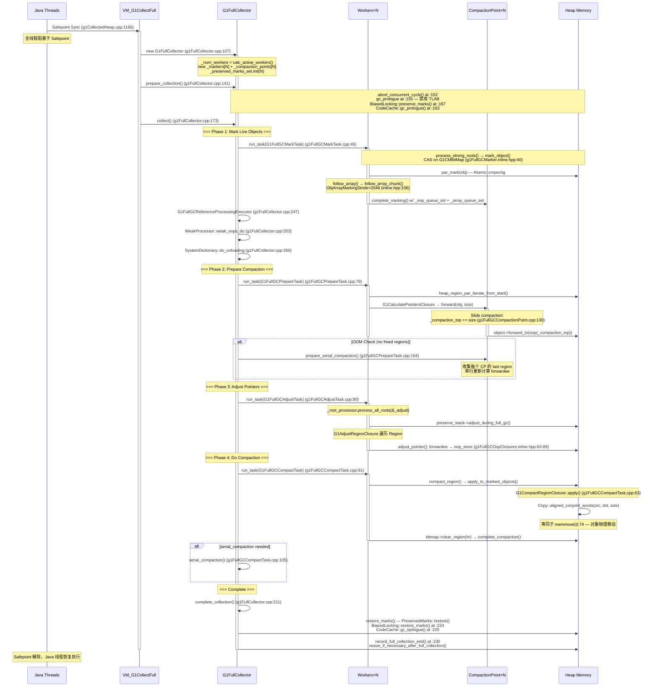
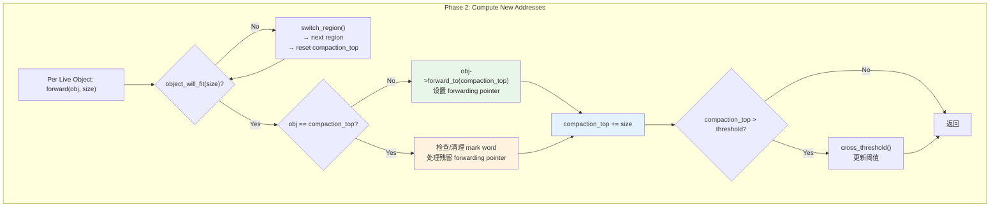

> **阶段**：[30-g1-runtime-gc]
> **前置**：[01-02-G1-Heap-Startup]（G1CollectedHeap 构造 18 步、Region 初始化）、[01-09-G1-Concurrent-Marking-Infra]（G1CMBitMap 双缓冲设计、CMTask 框架）、[30-02-Concurrent-Marking]（Concurrent Mark Lifecycle — Full GC 是标记失败的 Fallback）
> **配套**：[30-00-Region-Runtime]（Region 9 态状态机）、[30-01-Young-GC-Evacuation]（Young GC 疏散）、[30-02-Concurrent-Marking]（并发标记生命周期）、[30-03-Mixed-GC-Policy]（Mixed GC 决策引擎）
> **后续依赖本文**：无（Full GC 是 GC 路径的终点站）
> **阅读收益**：追踪 G1 Full GC 从 Concurrent Mode Failure 到 `Copy::aligned_conjoint_words` 完成压缩的完整 4 阶段流程——理解 `satisfy_failed_allocation` 的 3 次重试 + `do_full_collection` 的 4 种触发路径、`mark_object` 的 CAS bitmap 原子标记 + `follow_array_chunk` 的 work stealing、`G1FullGCCompactionPoint::forward` 的 slide compaction 新地址算法、`G1AdjustClosure::adjust_pointer` 的 forwardee 查找→`RawAccess::oop_store`、`compact_region` 的 `Copy::aligned_conjoint_words` 物理移动、OOM 串行 Fallback + `prepare_serial_compaction`、`BiasedLocking::preserve/restore` 与 `CodeCache::gc_prologue/epilogue` 的跨子系统协作

# 04-Full-GC — 当并发标记失败后，G1 的终极安全网

---

## §〇 Production Scenario — Concurrent Mode Failure 死循环到 Full GC

### 故障描述

线上故障：G1 堆 32GB，`-XX:MaxGCPauseMillis=200`，`-XX:InitiatingHeapOccupancyPercent=45`。业务高峰期突然出现每秒 1 次 Full GC，每次暂停 2-5 秒，服务完全不可用。

现象是典型的 Concurrent Mode Failure 死循环——并发标记追不上分配速率，导致同一个老年代对象在标记完成前就被新的分配覆盖位置。全堆压缩成为唯一选项——每次都从标记阶段重新来过，但标记期间业务线程继续分配，导致 Full GC 后堆又填满，再触发一次 Full GC。GC log 上的经典模式：

| Time | GC Type | Heap Usage | Duration |
|------|---------|-----------|----------|
| 1234.567s | Full GC (Concurrent Mode Failure) | 28G→15G(32G) | 3.452s |
| 1238.210s | Full GC (Concurrent Mode Failure) | 30G→22G(32G) | 5.211s |
| 1243.876s | Full GC (Concurrent Mode Failure) | 31G→26G(32G) | 4.890s |
| 1248.345s | Full GC (Concurrent Mode Failure) | 32G→29G(32G) | 5.764s |

注意每次 Full GC 之后 Old Gen 降得越来越少（15G → 22G → 26G → 29G），说明活对象集就是 ~28G——堆根本不够用，Full GC 在做"无用功"。GC latency 从 3.452s 递增到 5.764s，因为更多的活对象需要逐个 forward、adjust pointer、compact。

### 根因诊断链

**第一步：jstat -gc 实时监控**

```bash
$ jstat -gc <pid> 1000
 S0C    S1C    S0U    S1U      EC       EU        OC         OU       MC     MU    CCSC   CCSU   YGC     YGCT    FGC    FGCT     GCT
 0.0   32768.0  0.0   32768.0 2621440.0 2359296.0 28966912.0 28455936.0 121856.0 116832.0 13568.0 12416.0 1234   42.321    4   18.645  60.966
 0.0   32768.0  0.0   32768.0 2621440.0 2621440.0 28966912.0 28652320.0 121856.0 116832.0 13568.0 12416.0 1234   42.321    5   24.211  66.532
```

FGCT 从 18.645 跳到 24.211（一次 Full GC 用了 5.566s）。OU 几乎不降——活对象太多，压缩只能释放碎片空间而非真正回收内存。

**第二步：jstat -gccause — 确认触发原因**

```bash
$ jstat -gccause <pid> 1000
  S0     S1     E      O      M     CCS    YGC    YGCT    FGC    FGCT     GCT    LGCC                     GCC
  0.00  100.00  100.00  98.29  95.88  91.51  1234   42.321    4   18.645  60.966  Concurrent Mode Failure  No GC
  0.00  100.00  100.00  99.11  95.88  91.51  1234   42.321    5   24.211  66.532  Concurrent Mode Failure  No GC
```

LGCC 列持续显示 "Concurrent Mode Failure"——这是 Full GC 触发的最常见原因。GCC 列为 "No GC"，说明两次 Full GC 之间没有 Young GC（来不及，Old Gen 一直在 98%+）。

**第三步：GDB 断点精确捕获**

```bash
$ gdb -ex "set follow-fork-mode child" \
      -ex "break g1FullCollector.cpp:173" \
      -ex "break g1FullGCMarker.inline.hpp:40" \
      -ex "break g1FullGCCompactionPoint.cpp:97" \
      -ex "run" \
      -ex "print _num_workers" \
      -ex "print _heap->num_regions()" \
      --args java -Xmx32g -XX:+UseG1GC -XX:+PrintGCDetails ...
```

GDB 输出预期：

```
Breakpoint 1, G1FullCollector::collect() at g1FullCollector.cpp:173
  → 进入 4 阶段编排入口
  (gdb) print _num_workers
  $1 = 10          # 32GB heap → 10 workers (由 calc_active_workers 计算)

Breakpoint 2, G1FullGCMarker::mark_object(oop) at g1FullGCMarker.inline.hpp:40
  → 每个 live object 被标记时触发（非常高频）
  (gdb) print obj->klass()->external_name()
  $2 = "java/lang/String"  # 最常见的 live object

Breakpoint 3, G1FullGCCompactionPoint::forward(oop, size_t) at g1FullGCCompactionPoint.cpp:97
  → Phase 2 的 forwarding pointer 设置
  (gdb) print _compaction_top  
  $3 = (HeapWord *) 0x7f1234000000  # 新地址——slide compaction 的目标位置
```

**第四步：根因确认**

```
根因：IHOP=45 但 allocation rate >> mark rate，concurrent mark never completes。

具体逻辑链：
1. IHOP=45 → Old Gen 达到 45% (14.4GB) 触发 Concurrent Mark Start
2. Concurrent Mark 需要 ~8s 完成（32GB 堆大规模活对象集）
3. 但业务高峰期 allocation rate = 2GB/s → 8s 内分配 16GB
4. 标记完成前 Old Gen 已达 98% → Remark 阶段 GC 线程发现 heap full
5. G1Policy: need_to_start_conc_mark() 检查发现标记未完成但堆已满
   → 设置 GC cause = Concurrent Mode Failure
6. VM_G1CollectFull 排队 → 全线程 STW → Full GC 开始
7. Full GC 后释放 ~13GB，但活对象 ~28GB 不需要回收
8. Full GC 期间业务停滞但请求积压 → GC 结束后瞬间涌入 ~3GB 分配
9. 触发下一次 Concurrent Mode Failure → 死循环
```

### 反事实分析

```
反事实：如果 Full GC 也用复制 (evacuation) 而非压缩 (compaction) → 需要与 Young GC 一样多的空 Region 做目标 → Full GC 通常发生在堆几乎满的时候（空 Region 极少）→ 复制不可行。压缩在堆满时仍然能工作——它把活对象挤在一起，释放出连续的可用空间段。这就是 Full GC 作为 "Last Resort" 的核心语义：空间最少时仍能完成回收。
```

在 Young GC 中，Eden + Survivor 的总量远小于整个堆，所以可以预留足够多的 free Region 作为 evacuation destination。但在 Full GC 场景，活对象可能占堆的 85%+，根本腾不出足够的目标 Region 来容纳所有疏散对象。Slide Compaction 只要求在 HeapRegion 内原地向前移动——需要的额外空间为 0。

### 三步诊断总结

| 步骤 | 工具 | 命令 | 观察点 |
|------|------|------|--------|
| 1 | jcmd | `jcmd <pid> GC.heap_info` | Free Regions 数量；Humongous 碎片 |
| 2 | jstat | `jstat -gccause <pid> 1000` | LGCC 列 = Concurrent Mode Failure |
| 3 | GDB | break g1FullCollector.cpp:173 | _num_workers；_markers[i]_oop_stack 深度 |

---

## §一 Full GC as Last Resort — 全链路源码走读

Reader completed 01-02-G1-Heap-Startup (G1CollectedHeap 构造 18 步、Region 类型初始化、mmap commit/commit)、01-08-G1-Policy-Analytics (G1Policy 8 子组件、IHOP 自适应阈值)、01-09-G1-Concurrent-Marking-Infra (双缓冲 Bitmap + CMTask×13)。本文：当并发标记失败后，JVM 如何用全 STW 压缩回收整个堆——从 `do_full_collection` 到达安全点、到 `G1FullCollector::collect()` 编排 4 个阶段、到 `compact_region` 调用 `Copy::aligned_conjoint_words` 物理移动对象、到 `restore_marks` 恢复偏向锁标记。

### 1.1 VM_G1CollectFull — 从 Java 到 VM 的安全点同步

Full GC 的入口在 `vm_operations_g1.cpp:37` 的 `VM_G1CollectFull::doit()`。这是 JVM 的 VM Operation 机制——Java 线程无法直接操作 GC 数据结构，必须通过 VM Operation 在全局安全点（Safepoint）执行。

```cpp
// vm_operations_g1.cpp:37-43
void VM_G1CollectFull::doit() {
  G1CollectedHeap* g1h = G1CollectedHeap::heap();
  GCCauseSetter x(g1h, _gc_cause);
  g1h->do_full_collection(false /* clear_all_soft_refs */);
}
```

`VM_G1CollectFull` 继承自 `VM_GC_Operation`，后者设置 `VMOp_GC_Operation` 模式。该模式要求所有 Java 线程在下一个 Safepoint 轮询点（`SafepointPolling`）处阻塞，直到 VM Thread 完成操作后才恢复执行。全 STW（Stop-The-World）语义由此实现。

> **VM Operation 排队 vs 直接调用**
> `VM_G1CollectFull` 不是"函数调用"，而是封装在一个 `VM_Operation` 对象中：创建 → `VMThread::execute()` 排队 → VM Thread 从队列中取出 → 发起全局 Safepoint → `evaluate()` 调用 `doit()` → Safepoint 解除。从 Java 线程发起 `System.gc()` 到 `doit()` 实际执行，中间有 ~10-100ms 的 Safepoint 同步延迟，取决于线程数量和 GC Locker 状态。

#### 触发 Full GC 的 4 种路径

Full GC 不是只有一个入口。有 4 种不同的触发路径，每种对应不同的 `gc_cause`：

| # | 触发路径 | 调用点 | gc_cause | 说明 |
|---|---------|--------|----------|------|
| 1 | `System.gc()` / JMX | `G1CollectedHeap::collect()` → `VM_G1CollectFull` | `_java_lang_system_gc` | 用户或管理工具显式请求 |
| 2 | `satisfy_failed_allocation` | `g1CollectedHeap.cpp:1319` → `do_full_collection` | `_g1_inc_collection_pause` 或 `_allocation_failure` | 分配失败后的 3 次重试 |
| 3 | Concurrent Mode Failure | `G1Policy::need_to_start_conc_mark()` 返回 false | `_g1_concurrent_mode_failure` | 并发标记未完成但堆已满 |
| 4 | Evacuation Failure | Young GC / Mixed GC 的`G1ParScanThreadState::copy_to_survivor_space()` | `_g1_evacuation_pause` | to-space exhausted → 原地保留 → 升级为 Full GC |

路径 1 和 2 是用户态触发。路径 3 和 4 是 GC 内部状态机触发——路径 3 是本文场景的核心。

### 1.2 do_full_collection — 双入口与参数

`do_full_collection` 有两个重载，分别在 `g1CollectedHeap.cpp:1164` 和 `g1CollectedHeap.cpp:1195`。双参数版本是实际实现，单参数版本是便捷包装。

```cpp
// g1CollectedHeap.cpp:1164-1192 (双参数：完整实现)
bool G1CollectedHeap::do_full_collection(bool explicit_gc,
                                         bool clear_all_soft_refs) {
    assert_at_safepoint_on_vm_thread();  // :1166 — 必须在 VM Thread 上

    if (GCLocker::check_active_before_gc()) {
        // Full GC was not completed.
        return false;                     // :1175-1178 — GC Locker 检查
    }

    const bool do_clear_all_soft_refs = clear_all_soft_refs ||
                                        soft_ref_policy()->should_clear_all_soft_refs();
    // :1181-1182 — 合并两种 soft ref 清理请求

    G1FullCollector collector(this, &_full_gc_memory_manager, explicit_gc, do_clear_all_soft_refs);
    // :1184 — 构造 G1FullCollector 对象

    GCTraceTime(Info, gc) tm("Pause Full", NULL, gc_cause(), true);
    collector.prepare_collection();   // :1187
    collector.collect();              // :1188 — 4 阶段编排
    collector.complete_collection();  // :1189

    return true;
}
```

```cpp
// g1CollectedHeap.cpp:1195-1201 (单参数：便捷包装)
void G1CollectedHeap::do_full_collection(bool clear_all_soft_refs) {
    // Currently, there is no facility in the do_full_collection(bool) API to notify
    // the caller that the collection did not succeed.
    bool dummy = do_full_collection(true,                /* explicit_gc */
                                    clear_all_soft_refs);
}
```

**双参数差异**：

| 参数 | 双参数版用途 | 单参数版默认值 |
|------|------------|-------------|
| `explicit_gc` | `true` = System.gc() / JMX 触发；`false` = satisfy_failed_allocation 触发 | 永远 `true` |
| `clear_all_soft_refs` | `true` = 立即清 SoftRef；`false` = 根据 `SoftRefPolicy` 判定 | 调用者指定 |

> **GCLocker::check_active_before_gc() at :1175**
> 这是 Full GC 的第一个防御检查。如果 JNI critical section 正持有数组指针（通过 `GetPrimitiveArrayCritical` / `GetStringCritical`），GC 不能移动对象（JNI 临界区内不经过 GC barriers）。`GCLocker` 保存了一个 pending GC count——如果有 active critical section，`check_active_before_gc()` 返回 true，Full GC 直接 return false。GC Locker 释放后，pending GC 会在下一个 Safepoint 自动触发。

> **SoftRef policy merge at :1181-1182**
> `clear_all_soft_refs || soft_ref_policy()->should_clear_all_soft_refs()` — 如果调用者传递了 `clear_all_soft_refs=true`（satisfy_failed_allocation 的第 2 次重试），或者 `SoftRefPolicy` 内部时钟认为距上次清理已超过 `SoftRefLRUPolicyMSPerMB * heap_mb` 毫秒，则本次 Full GC 会清空所有 SoftReference。这是 OOM 前的最后软引用回收手段。

### 1.3 G1FullCollector Construction — Per-Worker 资源分配

`G1FullCollector` 构造函数在 `g1FullCollector.cpp:107-130`。这是整个 Full GC 的资源入口——所有后续阶段的数据结构都在这里分配。

```cpp
// g1FullCollector.cpp:107-130
G1FullCollector::G1FullCollector(G1CollectedHeap* heap, GCMemoryManager* memory_manager,
                                 bool explicit_gc, bool clear_soft_refs) :
    _heap(heap),
    _scope(memory_manager, explicit_gc, clear_soft_refs),
    _num_workers(calc_active_workers()),       // :110 — 动态 worker 数
    _oop_queue_set(_num_workers),              // :111
    _array_queue_set(_num_workers),            // :112
    _preserved_marks_set(true),                // :113 — C_HEAP 分配
    _serial_compaction_point(),                // :114
    _is_alive(heap->concurrent_mark()->next_mark_bitmap()), // :115
    _is_alive_mutator(heap->ref_processor_stw(), &_is_alive), // :116
    _always_subject_to_discovery(),
    _is_subject_mutator(heap->ref_processor_stw(), &_always_subject_to_discovery) {
  assert(SafepointSynchronize::is_at_safepoint(), "must be at a safepoint");

  _preserved_marks_set.init(_num_workers);                                        // :121
  _markers = NEW_C_HEAP_ARRAY(G1FullGCMarker*, _num_workers, mtGC);              // :122
  _compaction_points = NEW_C_HEAP_ARRAY(G1FullGCCompactionPoint*, _num_workers, mtGC); // :123
  for (uint i = 0; i < _num_workers; i++) {
    _markers[i] = new G1FullGCMarker(i, _preserved_marks_set.get(i), mark_bitmap());   // :125
    _compaction_points[i] = new G1FullGCCompactionPoint();                              // :126
    _oop_queue_set.register_queue(i, marker(i)->oop_stack());                           // :127
    _array_queue_set.register_queue(i, marker(i)->objarray_stack());                    // :128
  }
}
```

**Worker 数计算 (`calc_active_workers` at g1FullCollector.cpp:77-105)**：

Worker 数不是简单的"堆大小 / 常数"。有两层约束：

```cpp
// 约束 1: G1HeapWastePercent — 每个 worker 平均浪费半个 Region
uint max_wasted_regions_allowed = ((heap->num_regions() * G1HeapWastePercent) / 100);
uint waste_worker_count = MAX2((max_wasted_regions_allowed * 2), 1u);
uint heap_waste_worker_limit = MIN2(waste_worker_count, max_worker_count);

// 约束 2: AdaptiveSizePolicy — HeapSizePerGCThread
uint adaptive_worker_limit = AdaptiveSizePolicy::calc_active_workers(max_worker_count, current_active_workers, 0);

// 取两者较小值
uint worker_count = MIN2(heap_waste_worker_limit, adaptive_worker_limit);
```

| 变量 | 说明 | 32GB 堆示例值 |
|------|------|------------|
| `max_worker_count` | CPU 核数 / `ParallelGCThreads` | ~20 (40 核机器) |
| `G1HeapWastePercent` | 默认 5 | 5 |
| `max_wasted_regions_allowed` | `num_regions * 5%` | ~800 (16K regions × 5%) |
| `waste_worker_count` | `max_wasted × 2`，上限 `max_worker_count` | 10 (capped) |
| `adaptive_worker_limit` | 根据 `HeapSizePerGCThread` 计算 | ~10 |
| **最终 `_num_workers`** | `MIN(10, 10)` | **10** |

**Per-Worker 资源分配详情**：

| 成员 | 类型 | 分配方式 | 生命周期 |
|------|------|---------|---------|
| `_markers[i]` | `G1FullGCMarker*` | `new` on C_HEAP | ~Full GC 期间 |
| `_compaction_points[i]` | `G1FullGCCompactionPoint*` | `new` on C_HEAP | ~Full GC 期间 |
| `_oop_queue_set` | `OopQueueSet(_num_workers)` | stack local | ~Full GC 期间 |
| `_array_queue_set` | `ObjArrayQueueSet(_num_workers)` | stack local | ~Full GC 期间 |
| `_preserved_marks_set` | `PreservedMarksSet(true)` | NEW_C_HEAP_ARRAY (see preservedMarks.cpp:85) | ~Full GC 期间 |

> **队列注册 at :127-128**：`register_queue` 将每个 worker 的 `oop_stack` 和 `objarray_stack` 注册到全局的 `_oop_queue_set` / `_array_queue_set`。在 marking 阶段，worker A 可以将溢出的对象推送到 worker B 的栈中——这是 work stealing 的底层通道。

### 1.4 prepare_collection — 11 步前序

`prepare_collection()` at `g1FullCollector.cpp:141-171` 执行 Full GC 的前序准备。按顺序分为 11 步，每步处理一个子系统的状态转换。

```
第 1 步 — record_full_collection_start()      :148 — G1Policy 记录 Full GC 开始时间戳
第 2 步 — print_heap_before_gc()              :149 — GC log 输出堆前状态
第 3 步 — print_heap_regions()                :150 — 按 Region 级别打印堆图
─────────────────
第 4 步 — abort_concurrent_cycle()            :152 — ★ 终止正在进行的并发标记
第 5 步 — verify_before_full_collection()     :153 — 可选的堆完整性验证
─────────────────
第 6 步 — gc_prologue(true)                   :155 — 设置 `_gc_active` 标志，禁用 TLAB
第 7 步 — prepare_heap_for_full_collection()  :156 — flush TLAB + retire alloc regions
─────────────────
第 8 步 — enable_discovery()                  :158 — ReferenceProcessor 开启引用发现
第 9 步 — setup_policy(should_clear_soft_refs) :159 — 决定是否清除 SoftReference
─────────────────
第 10 步 — CodeCache::gc_prologue()           :163 — ★ 编译代码的 GC 前置处理
第 11 步 — BiasedLocking::preserve_marks()    :167 — ★ 保存偏向锁的 mark word
```

**第 4 步 — `abort_concurrent_cycle()` 的含义**：

Because Full GC 会重建所有 Region 的 liveness 信息并重置 Bitmap，如果并发标记仍在进行，其 bitmap 数据会被 Full GC 覆盖且不完整。`abort_concurrent_cycle()` 设置 `_abort_requested = true`，让 CMTask 在下次轮询时退出。并发标记线程发现 abort 后会丢弃当前周期的所有中间数据。

**第 6-7 步 — TLAB/PLAB flush**：

Because Full GC 在压缩时对象会物理移动，TLAB 内的 bump-the-pointer 分配指针（`_top` / `_end`）指向的地址在 GC 后会全部失效。`gc_prologue` 禁用新的 TLAB 分配；`prepare_heap_for_full_collection()` 将所有活跃 TLAB 的剩余空间归还到堆的 free list。

**第 10-11 步 — 跨子系统协作**：

- `CodeCache::gc_prologue()` at :163：Because nmethod 可能包含嵌入的 oop（编译时常量），Full GC 移动对象时需要同步更新这些嵌入引用。`gc_prologue` 确保 CodeCache 中的 `DerivedPointerTable` 清空并激活（见 `clear_and_activate_derived_pointers()` at :51-54），用于后续 pointer adjustment 阶段。

- `BiasedLocking::preserve_marks()` at :167：Because Full GC 会把 mark word 当成 forwardee 指针使用（`object->forward_to(destination)` 写入的是 `markOop` 槽位），如果对象正处于偏向锁状态（bias pattern），其原始 bias 信息会在 forwarding 过程中被覆盖。`preserve_marks()` 遍历所有正在偏向锁监控的对象，保存其原始 mark word 到 per-thread `GrowableArray` 中，完成 GC 后由 `restore_marks()` 还原。

### 1.5 collect() — 4 阶段编排

`collect()` at `g1FullCollector.cpp:173-209` 是 Full GC 的核心——4 个阶段精确串联。

```cpp
// g1FullCollector.cpp:173-209
void G1FullCollector::collect() {
  double phase_start = os::elapsedTime();

  phase1_mark_live_objects();                               // :180 — Phase 1
  double phase1_time = (os::elapsedTime() - phase_start) * 1000.0;

  verify_after_marking();                                   // :185 — 可选验证

  deactivate_derived_pointers();                             // :188 — 关闭 DerivedPointerTable

  phase_start = os::elapsedTime();
  phase2_prepare_compaction();                              // :191 — Phase 2
  double phase2_time = (os::elapsedTime() - phase_start) * 1000.0;

  phase_start = os::elapsedTime();
  phase3_adjust_pointers();                                 // :197 — Phase 3
  double phase3_time = (os::elapsedTime() - phase_start) * 1000.0;

  phase_start = os::elapsedTime();
  phase4_do_compaction();                                   // :203 — Phase 4
  double phase4_time = (os::elapsedTime() - phase_start) * 1000.0;
}
```

#### Phase 1 — Mark Live Objects (`g1FullCollector.cpp:238-269`)

Marking 阶段分 5 个子步骤：

```cpp
// g1FullCollector.cpp:238-269
void G1FullCollector::phase1_mark_live_objects() {
  // 1. 并行标记
  G1FullGCMarkTask marking_task(this);
  run_task(&marking_task);                                  // :243-244

  // 2. 引用处理
  G1FullGCReferenceProcessingExecutor reference_processing(this);
  reference_processing.execute(scope()->timer(), scope()->tracer()); // :247-248

  // 3. Weak oops 清理
  WeakProcessor::weak_oops_do(&_is_alive, &do_nothing_cl);  // :253

  // 4. 类卸载（如果启用）
  if (ClassUnloading) {
    bool purged_class = SystemDictionary::do_unloading(scope()->timer());
    _heap->complete_cleaning(&_is_alive, purged_class);    // :260-261
  } else {
    _heap->partial_cleaning(&_is_alive, true, true, G1StringDedup::is_enabled());
  }

  // 5. 报告活对象计数
  scope()->tracer()->report_object_count_after_gc(&_is_alive); // :268
}
```

**并行标记的 Root Scanning** (`g1FullGCMarkTask.cpp:46-70`)：

Each worker 先处理 GC Roots（`process_strong_roots` 或 `process_all_roots_no_string_table`），生成初始的 mark stack：

```cpp
// g1FullGCMarkTask.cpp:46-70
void G1FullGCMarkTask::work(uint worker_id) {
  G1FullGCMarker* marker = collector()->marker(worker_id);
  if (ClassUnloading) {
    _root_processor.process_strong_roots(                   // :53-55
        marker->mark_closure(),
        marker->cld_closure(),
        &code_closure);
  } else {
    _root_processor.process_all_roots_no_string_table(      // :58-60
        marker->mark_closure(),
        marker->cld_closure(),
        &code_closure);
  }
  marker->complete_marking(collector()->oop_queue_set(),    // :65
                           collector()->array_queue_set(),
                           &_terminator);
}
```

**`mark_object` 的 CAS 原子标记** (`g1FullGCMarker.inline.hpp:40-63`)：

```cpp
// g1FullGCMarker.inline.hpp:40-63
inline bool G1FullGCMarker::mark_object(oop obj) {
  if (G1ArchiveAllocator::is_closed_archive_object(obj)) {
    return false;   // :42-43 — Closed archive 永不标记
  }
  if (!_bitmap->par_mark(obj)) {
    return false;   // :47-49 — CAS 竞争失败，另一个 worker 已标记
  }
  // 保存需要保留的 mark word
  markOop mark = obj->mark_raw();
  if (mark->must_be_preserved(obj) &&                       // :54-56
      !G1ArchiveAllocator::is_open_archive_object(obj)) {
    preserved_stack()->push(obj, mark);
  }
  if (G1StringDedup::is_enabled()) {                        // :59-61
    G1StringDedup::enqueue_from_mark(obj, _worker_id);
  }
  return true;
}
```

`_bitmap->par_mark(obj)` 是关键——它内部调用 `Atomic::cmpxchg` 在 bitmap word 上做 CAS。Because 多个 worker 可能同时扫描到同一个对象（例如一个对象被来自不同 root 的引用路径同时访问），只有第一个 CAS 成功的 worker 返回 true 并获得标记权。

> **`must_be_preserved` 是什么？**
> Full GC 使用 mark word 作为 forwardee 指针。但如果 mark word 存储的是哈希码（identity hash）或其他重要信息，它必须被保存。`must_be_preserved()` 检查 mark word 是否"不仅是 GC mark"——如果包含哈希码、锁状态、分代年龄等非 GC 信息，返回 true。保存的值在 `complete_collection()` 阶段还原。

**`follow_array_chunk` 的 work stealing** (`g1FullGCMarker.inline.hpp:106-128`)：

```cpp
// g1FullGCMarker.inline.hpp:106-128
void G1FullGCMarker::follow_array_chunk(objArrayOop array, int index) {
  const int len = array->length();
  const int stride = MIN2(len - beg_index, (int) ObjArrayMarkingStride); // :111
  const int end_index = beg_index + stride;

  // ★ Push the continuation first to allow more efficient work stealing.
  if (end_index < len) {
    push_objarray(array, end_index);                        // :115-116
  }
  array->oop_iterate_range(mark_closure(), beg_index, end_index); // :119
}
```

Because 大对象数组可能有上百万个引用，一次性全部标记会导致单个 worker 的 stack 爆炸且其他 worker 空闲。`ObjArrayMarkingStride = 2048` 是固定步长——每个 chunk 只标记 2048 个元素，然后把剩余部分 push 到 `objarray_stack`。其他空闲 worker 通过 `pop_objarray` 从队列 steal 任务。

核心策略：**先 push continuation，再处理当前 chunk**（:115-116）——这样剩余任务立即对 other workers 可见，减少 steal 延迟。

#### Phase 2 — Prepare Compaction (`g1FullCollector.cpp:271-280`)

```cpp
// g1FullCollector.cpp:271-280
void G1FullCollector::phase2_prepare_compaction() {
  G1FullGCPrepareTask task(this);
  run_task(&task);                                          // :273-274

  // To avoid OOM when there is memory left.
  if (!task.has_freed_regions()) {                          // :277
    task.prepare_serial_compaction();                       // :278 — OOM fallback
  }
}
```

**`G1FullGCCompactionPoint::forward` — Slide Compaction 新地址算法** (`g1FullGCCompactionPoint.cpp:97-134`)：

```cpp
// g1FullGCCompactionPoint.cpp:97-134
void G1FullGCCompactionPoint::forward(oop object, size_t size) {
  // Ensure the object fit in the current region.
  while (!object_will_fit(size)) {                          // :101
    switch_region();                                        // :102 — 切换到下一个 compaction Region
  }

  // Store a forwarding pointer if the object should be moved.
  if ((HeapWord*)object != _compaction_top) {               // :106
    object->forward_to(oop(_compaction_top));               // :107 — ★ 设置 forwardee
  } else {
    // 不移动（已在正确位置）
    if (object->forwardee() != NULL) {
      object->init_mark_raw();                              // :116 — 清理残留 mark word
    }
  }

  _compaction_top += size;                                  // :130 — ★ bump the pointer
  if (_compaction_top > _threshold) {                       // :131
    _threshold = _current_region->cross_threshold(...);      // :132 — 更新 allocation threshold
  }
}
```

Slide Compaction 的核心思想：**原地向前滑动**。每个 Region 有一个 `_compaction_top` 指针（类比 `bump-the-pointer`），初始指向 `Region->bottom()`。对于每个 live object，在当前位置写入 forwarding pointer，然后 `_compaction_top += size` 向前推进。

如果当前 Region 放不下下一个对象，`switch_region()` 切换到 compaction 队列的下一个 Region。

> **为什么是 Slide Compaction 而不是 Table-based Compaction？**
> CMS 使用 table-based compaction——维护一个全局的偏移表记录每个对象的位移。优点是可以在 mark 阶段就确定最终地址。缺点是每个对象多 4 字节偏移记录 + 随机访问。G1 Full GC 使用 slide compaction——没有额外的位移表，直接类似 bump-the-pointer 地顺序分配新地址。因为 G1 的 Region 本身就是 ~1-32MB 的较小单元，slide compaction 在每个 Region 内部顺序处理，避免了 CMS 的全局随机访问问题。

**OOM Fallback — `prepare_serial_compaction`** (`g1FullGCPrepareTask.cpp:164-194`)：

```cpp
// g1FullGCPrepareTask.cpp:164-194
void G1FullGCPrepareTask::prepare_serial_compaction() {
  // At this point we know that no regions were completely freed by
  // the parallel compaction.
  for (uint i = 0; i < collector()->workers(); i++) {
    G1FullGCCompactionPoint* cp = collector()->compaction_point(i);
    if (cp->has_regions()) {
      collector()->serial_compaction_point()->add(cp->remove_last()); // :173
    }
  }
  // Re-prepare forwarding for serial compaction point regions
  G1FullGCCompactionPoint* cp = collector()->serial_compaction_point();
  for (GrowableArrayIterator<HeapRegion*> it = cp->regions()->begin(); ... ) {
    HeapRegion* current = *it;
    if (!cp->is_initialized()) {
      cp->initialize(current, false);                       // :185
    } else {
      G1RePrepareClosure re_prepare(cp, current);
      current->set_compaction_top(current->bottom());
      current->apply_to_marked_objects(collector()->mark_bitmap(), &re_prepare);
    }
  }
}
```

If parallel compaction 没有释放任何 Region（`!has_freed_regions()`），说明每个 compaction point 的最后一个 Region 都还有剩余对象无法完全腾空。这些"部分填满"的尾部 Region 会被收集到 `serial_compaction_point` 中，串行重新计算 forwarding pointer，把所有尾部 live object 挤到一个 Region 里。

#### Phase 3 — Adjust Pointers (`g1FullCollector.cpp:282-288`)

```cpp
// g1FullCollector.cpp:282-288
void G1FullCollector::phase3_adjust_pointers() {
  G1FullGCAdjustTask task(this);
  run_task(&task);                                          // :286-287
}
```

`G1FullGCAdjustTask::work()` at `g1FullGCAdjustTask.cpp:90-117` 做两件事：

1. **调整 GC Roots**：`_root_processor.process_all_roots(&_adjust, ...)` — 所有 static 字段、JNI handles、线程栈引用从旧地址更新为新地址。
2. **调整 Region 内引用**：`G1AdjustRegionClosure` 遍历每个 Region 的 marked objects，对每个对象的引用字段执行 `G1AdjustClosure::adjust_pointer`。

**`G1AdjustClosure::adjust_pointer` — forwardee 查找 + 重写** (`g1FullGCOopClosures.inline.hpp:63-90`)：

```cpp
// g1FullGCOopClosures.inline.hpp:63-90
template <class T> inline void G1AdjustClosure::adjust_pointer(T* p) {
  T heap_oop = RawAccess<>::oop_load(p);                   // :64 — 读取当前引用
  if (CompressedOops::is_null(heap_oop)) {
    return;                                                  // :65-66 — null 引用跳过
  }
  oop obj = CompressedOops::decode_not_null(heap_oop);
  if (G1ArchiveAllocator::is_archive_object(obj)) {
    return;                                                  // :71-73 — archive 对象不移动
  }
  oop forwardee = obj->forwardee();                         // :76 — ★ 查询 forwardee
  if (forwardee == NULL) {
    return;  // :77-84 — 未转发，保持原引用（非移动对象）
  }
  RawAccess<IS_NOT_NULL>::oop_store(p, forwardee);          // :89 — ★ 写入新引用
}
```

核心逻辑：
1. `RawAccess<>::oop_load(p)` — 加载当前引用值（可能是 compressed oop 或 full oop，取决于 UseCompressedOops）
2. `obj->forwardee()` — 读取 mark word 中的 forwardee 指针（Phase 2 设置的）
3. If forwardee != NULL → `RawAccess::oop_store(p, forwardee)` — 覆盖引用为新地址
4. If forwardee == NULL → 对象不移动（`_is_alive` 且原地保留），引用不变

#### Phase 4 — Do Compaction (`g1FullCollector.cpp:290-299`)

```cpp
// g1FullCollector.cpp:290-299
void G1FullCollector::phase4_do_compaction() {
  G1FullGCCompactTask task(this);
  run_task(&task);                                          // :293-294

  if (serial_compaction_point()->has_regions()) {
    task.serial_compaction();                               // :297-298 — 串行压缩尾部
  }
}
```

**`compact_region` — Copy::aligned_conjoint_words 物理移动** (`g1FullGCCompactTask.cpp:63-89`)：

```cpp
// g1FullGCCompactTask.cpp:63-89
size_t G1FullGCCompactTask::G1CompactRegionClosure::apply(oop obj) {
  size_t size = obj->size();
  HeapWord* destination = (HeapWord*)obj->forwardee();     // :65
  if (destination == NULL) {
    return size;  // :66-67 — 不移动
  }
  // ★ 物理复制对象
  HeapWord* obj_addr = (HeapWord*) obj;
  assert(obj_addr != destination, "everything in this pass should be moving");
  Copy::aligned_conjoint_words(obj_addr, destination, size); // :74 — ★ 等同于 memmove
  oop(destination)->init_mark_raw();                       // :75 — 重置 mark word
  return size;
}

// g1FullGCCompactTask.cpp:81-89
void G1FullGCCompactTask::compact_region(HeapRegion* hr) {
  G1CompactRegionClosure compact(collector()->mark_bitmap());
  hr->apply_to_marked_objects(collector()->mark_bitmap(), &compact); // :84
  collector()->mark_bitmap()->clear_region(hr);             // :87 — 清除 bitmap
  hr->complete_compaction();                                // :88 — 重置 Region 状态
}
```

`Copy::aligned_conjoint_words` 本质等同于 `memmove()`——处理源和目标可能重叠的情况（man 3 memmove）。Because 对象向前滑动（source → destination 向前），同一 Region 内 source 在 destination 之后，重叠区域需要安全处理，`memmove` 对此做了保证。

> **为什么 Full GC 用 `memmove` 而非 `memcpy`？**
> 同一 Region 内的 slide compaction 中，destination 在 source 之前。如果用 `memcpy`（无重叠保证），当 destination + size > source 时 source 数据可能被覆盖。`Copy::aligned_conjoint_words` 内部判断 `src < dst` 且重叠时从后向前复制，保证正确性。

### 1.6 complete_collection — 恢复与收尾

`complete_collection()` at `g1FullCollector.cpp:211-236` 是对 `prepare_collection` 的对称恢复。

```cpp
// g1FullCollector.cpp:211-236
void G1FullCollector::complete_collection() {
  restore_marks();                                          // :218 — ★ 恢复 preserved marks

  update_derived_pointers();                                // :222 — 更新编译代码中的 derived pointers

  BiasedLocking::restore_marks();                           // :224 — ★ 恢复偏向锁
  CodeCache::gc_epilogue();                                 // :225 — CodeCache GC 后处理
  JvmtiExport::gc_epilogue();                               // :226 — 通知 JVMTI agent

  _heap->prepare_heap_for_mutators();                       // :228 — 重建 mutator alloc regions

  _heap->g1_policy()->record_full_collection_end();         // :230 — G1Policy 记录结束
  _heap->gc_epilogue(true);                                 // :231 — GC 收尾

  _heap->verify_after_full_collection();                    // :233 — 可选验证
  _heap->print_heap_after_full_collection(scope()->heap_transition()); // :235
}
```

**`restore_marks()` — PreservedMarksSet 并行恢复** (`preservedMarks.cpp:34-39, 99-123`)：

```cpp
// preservedMarks.cpp:34-39
void PreservedMarks::restore() {
  while (!_stack.is_empty()) {
    const OopAndMarkOop elem = _stack.pop();
    elem.set_mark();  // ★ 将保存的 mark word 写回对象
  }
}

// preservedMarks.cpp:125-161 — shared executor 分发并行/串行
void SharedRestorePreservedMarksTaskExecutor::restore(PreservedMarksSet* preserved_marks_set,
                                                      volatile size_t* total_size_addr) {
  if (_workers == NULL) {
    // 串行路径 — 逐一恢复
    for (uint i = 0; i < preserved_marks_set->num(); i += 1) {
      preserved_marks_set->get(i)->restore();
    }
  } else {
    // ★ 并行路径 — ParRestoreTask (preservedMarks.cpp:99-123)
    ParRestoreTask task(_workers->active_workers(), preserved_marks_set, total_size_addr);
    _workers->run_task(&task);
  }
}
```

`ParRestoreTask` 通过 `SequentialSubTasksDone` 实现 work stealing——每个 worker 遍历 `_sub_tasks` 列表，`is_task_claimed()` 原子地抢占任务 ID，然后对对应 `PreservedMarks` 调用 `restore_and_increment()`。

**跨子系统件协作总结**：

| 步骤 | 子系统 | 函数 | 原因 | 在 Full GC 中的时机 |
|------|--------|------|------|-------------------|
| 保存偏向锁 | BiasedLocking | `preserve_marks()` | mark word 会被 forwardee 覆盖 | `prepare_collection` |
| GC 通知 CodeCache | CodeCache | `gc_prologue()` | nmethod 中 oop 引用的 derived pointers 需要清空 | `prepare_collection` |
| Reference 发现 | ReferenceProcessor | `enable_discovery()` | 开始收集 Reference 对象 | `prepare_collection` |
| 恢复偏向锁 | BiasedLocking | `restore_marks()` | 将保存的 bias pattern 写回 mark word | `complete_collection` |
| CodeCache 收尾 | CodeCache | `gc_epilogue()` | 重新激活 nmethod 的 derived pointers 追踪 | `complete_collection` |
| JVMTI 通知 | JvmtiExport | `gc_epilogue()` | 通知 JVMTI agent GC 完成 | `complete_collection` |
| 重建分配器 | G1Allocator | `prepare_heap_for_mutators()` | 释放 Full GC 的 per-worker alloc regions | `complete_collection` |
| Resize 堆 | AdaptiveSizePolicy | `resize_if_necessary_after_full_collection()` | 根据 Min/MaxHeapFreeRatio 扩大或缩小堆 | `complete_collection` 后续调用 |

### 1.7 Mermaid 6-Lane Sequence Diagram



### 1.8 Interview Story Format Answer

"When Concurrent Mode Failure occurs — the concurrent marking couldn't keep up with allocation rate — G1 has only one move left: a full STW compaction via `G1FullCollector`. The process begins with `do_full_collection` creating a `G1FullCollector` with one `G1FullGCMarker` and one `G1FullGCCompactionPoint` per worker thread. Phase 1 (`phase1_mark_live_objects` at g1FullCollector.cpp:238) runs a parallel mark task using `mark_object` (g1FullGCMarker.inline.hpp:40) which CAS-marks bitmap bits. For large object arrays, `follow_array_chunk` (inline.hpp:106) splits marking into strides of ObjArrayMarkingStride=2048 for work stealing. Phase 2 (`phase2_prepare_compaction` at :271) uses `G1FullGCCompactionPoint::forward` (g1FullGCCompactionPoint.cpp:97) to compute new addresses by slide compaction — every live object gets a forwarding pointer. Because each worker owns a disjoint set of regions (via `HeapRegionClaimer`), there's zero contention despite parallel execution. If no regions were freed, `prepare_serial_compaction` kicks in as the OOM fallback. Phase 3 (`phase3_adjust_pointers` at :282) walks ALL references in the heap using `G1AdjustClosure::adjust_pointer` (g1FullGCOopClosures.inline.hpp:63) — `obj->forwardee()` yields the new address and `RawAccess::oop_store` writes it. Phase 4 (`phase4_do_compaction` at :290) physically moves objects using `Copy::aligned_conjoint_words` (g1FullGCCompactTask.cpp:74) — the same semantics as `memmove` (handles overlapping regions). After all 4 phases, `complete_collection` restores biased locking marks (`BiasedLocking::restore_marks` at g1FullCollector.cpp:224), updates CodeCache (`CodeCache::gc_epilogue` at :225), and triggers `resize_if_necessary_after_full_collection` to adjust heap size based on `MinHeapFreeRatio`/`MaxHeapFreeRatio`."

---

## §二 7 个初学者 Callout Boxes

### 2.1 STW (Stop-The-World) vs Concurrent

> **STW vs Concurrent**: Full GC is 100% STW — every Java thread is frozen at a safepoint during all 4 phases. Young GC is also STW but shorter (evacuation only ~10-50ms). Concurrent Mark runs while mutators execute, only pausing at Initial Mark (embedded in Young GC) and Remark. Full GC STW means: no mutator allocation, no compiler threads, no GC threads trying to run concurrently — the entire heap is the GC's exclusive domain. Source: `VM_G1CollectFull::doit` at vm_operations_g1.cpp:37.

**Why**: Full GC 是"最后手段"（Last Resort）。JVM 不能承受任何来自 mutator 分配或并发 GC 线程的干扰。STW 保证简化了所有 4 阶段——无 barrier、无 SATB、无并发修改需要处理。在 `do_full_collection` (`g1CollectedHeap.cpp:1164`) 中可以看到第一件事就是检查 `GCLocker::check_active_before_gc()` —— 如果 GC Locker 活跃，直接返回 false 跳过 Full GC，因为在 STW 期间所有线程都必须到达 safepoint。Full GC 的 exclusive 状态在 `full_gc_total_collections` counters 中递增，确保不会与其他 GC 操作并发。

### 2.2 Bitmap-Based Marking vs Mark Word Bits

> **Bitmap-Based Marking vs Mark Word Bits**: Full GC marking uses separate `G1FullGCMarker::_bitmap` (a parallel bitmap stored in `G1CMBitMap`) — NOT the object header mark word's GC bits. The mark word is used for forwarding pointers during compaction and must be preserved/restored. Marking the bitmap has zero impact on lock state, identity hash, or GC age. Source: `mark_object` at g1FullGCMarker.inline.hpp:40 → `_bitmap->par_mark(obj)`.

**Why**: mark word 扮演双重角色——Phase 2-4 期间作为 forwarding pointer。独立 bitmap 将标记与压缩分离，Phase 1 的标记不影响 Phase 2-4 对 mark word 的使用。具体来说：`par_mark(obj)` 用 CAS 原子操作设置 bitmap 位（`g1ConcurrentMarkBitMap.inline.hpp`），完全绕过对象头。而 Phase 2 的 `forward_to`（`g1FullGCCompactionPoint.cpp:106-107`）直接写入 `object->forward_to(oop(_compaction_top))` 到 mark word。如果标记也用 mark word，这两者将冲突。

### 2.3 Forwarding Pointer

> **Forwarding Pointer**: During Phase 2, `forward_to(new_addr)` writes the new address into the object's mark word (replacing lock/hash data temporarily). The mark word's original content is saved in `PreservedMarksSet` via `must_be_preserved`. During Phase 3, `forwardee()` reads the forwarding pointer from the mark word to update references. During Phase 4, after the object is moved, `init_mark_raw()` clears the forwarding pointer and restores to prototype mark. This double-duty of the mark word (lock + forwarding) is why biased locking marks must be preserved separately. Source: `G1FullGCCompactionPoint::forward` at g1FullGCCompactionPoint.cpp:97-134.

**Why**: 全堆 compaction 使用 mark word 作为 forwarding pointer 是一个经典设计权衡。在 `g1FullGCCompactionPoint.cpp:106`，如果对象不需要移动 (`(HeapWord*)object == _compaction_top`），代码有复杂的 assert 链（:120-124）确保 mark word 正确或已被保存。biased locking 的特殊处理在 `g1FullGCCompactionPoint.cpp:122`：如果 `UseBiasedLocking && object->has_bias_pattern_raw()`，即使 mark word 看起来被 forwarded，`forwardee()` 也会返回 NULL。在 `prepare_collection` (`g1FullCollector.cpp:167`) 中，`BiasedLocking::preserve_marks()` 在 Full GC 开始前保存所有偏向锁标记。

### 2.4 Slide Compaction (vs Evacuation)

> **Slide Compaction (vs Evacuation)**: Slide compaction pushes all live objects to one end of each Region — they "slide" together, eliminating all gaps (fragmentation). Evacuation (used in Young GC) copies objects to a SEPARATE destination Region. Slide compaction works even when the heap has ZERO free regions because objects are moved within the same region (`(HeapWord*)object != _compaction_top` check at g1FullGCCompactionPoint.cpp:106). Evacuation requires free destination regions — which don't exist during Full GC.

**Why**: 这是 Full GC 的核心设计差异。Young GC 的 evacuation 依赖 CSet 中有 live objects 的 source region 和有空闲空间的 destination region。但 Full GC 发生时，整个堆几乎满了——没有空闲 region 可用。Slide compaction 将对象在同一个 region 内滑动到头端 (`_compaction_top` 从头开始增长)，尾端变成空闲区。`object_will_fit` 检查（`:84-87`）确保在当前 region 中有足够空间，不够时 `switch_region()`（`:89-95`）保存 `_compaction_top` 到 region 并切换到下一个 region。

### 2.5 Concurrent Mode Failure

> **Concurrent Mode Failure**: This is THE most common trigger for Full GC in G1. It means the concurrent marking cycle could not complete before the heap filled. G1 promises "incremental pauses with bounded latency" — but when allocation rate exceeds mark rate, the JVM's fallback is to abort concurrent marking and run a full STW compaction. Common causes: IHOP too high (marking starts too late), allocation spikes (sudden surge of large objects), or NUMA memory latency causing slow marking. Source: `g1CollectedHeap.cpp` → `do_full_collection` called with `GCCause::_g1_concurrent_marking_failure`.

**Why**: Concurrent Marking Failure 是 G1 "增量暂停"承诺的失败——系统无法在并发标记完成前控制堆占用。这是 G1 在延迟（STW）和吞吐量（避免 OOM）之间的最后权衡。诊断此问题：检查 GC 日志中的 `concurrent-mark-end` 时间和 `heap occupancy`。如果 marking cycle 时间持续增长而 allocation 率高，标记速度赶不上。调优策略：(1) 降低 `-XX:InitiatingHeapOccupancyPercent` 让标记提前开始 (2) 增加 `-XX:ConcGCThreads` 加速标记 (3) 检查大对象分配率（Humongous objects 直接进入 old gen）。

### 2.6 OOM Serial Fallback

> **OOM Serial Fallback**: After Phase 2, if NOT a single HeapRegion could be freed (all regions are full of live objects), the parallel compaction plan can't work — there's nowhere to compact INTO. The system falls back to `prepare_serial_compaction()` which uses a single serial compaction point. This is an "extreme last resort" — it means the heap is genuinely out of memory and the Full GC may still fail. Source: `g1FullCollector.cpp:277-278` → `if (!task.has_freed_regions()) { task.prepare_serial_compaction(); }`.

**Why**: 并行 compact 需要至少一个 region 有空间来接收 live objects。如果 Phase 2 的 G1FullGCPrepareTask 找不到任何空闲 region（has_freed_regions() 返回 false），意味着所有 region 都被 live objects 填满。此时 `prepare_serial_compaction()` 将所有 compaction point 合并为一个 serial point——所有 worker 共享一个 destination，效率极低但理论上可以处理任何布局。这通常是 OOM 的先兆——如果 serial compaction 也失败，JVM 将抛出 `OutOfMemoryError`。

### 2.7 Heap Resize After Full GC

> **Heap Resize After Full GC**: After `complete_collection`, G1 evaluates whether to grow or shrink the heap based on `MinHeapFreeRatio` (default 40%) and `MaxHeapFreeRatio` (default 70%). If used/capacity ratio is too high → expand heap. If too low → shrink heap. This is critical because a Full GC that barely succeeds will trigger again immediately unless the heap grows. Source: `resize_if_necessary_after_full_collection` at g1CollectedHeap.cpp:1203-1279.

**Why**: 堆大小调整防止 Full GC 的"震荡"——如果 Full GC 刚完成但堆使用率仍然很高（例如 > 60%），下一次 allocation 很快又会失败。`resize_if_necessary_after_full_collection` 的计算逻辑（`:1206-1279`）：

```
capacity_after_gc = capacity()
used_after_gc     = capacity_after_gc - unused_committed_regions_in_bytes()

minimum_desired_capacity = used_after_gc / (1.0 - MinHeapFreeRatio/100)
maximum_desired_capacity = used_after_gc / (1.0 - MaxHeapFreeRatio/100)

if capacity_after_gc < minimum_desired_capacity → expand
else if capacity_after_gc > maximum_desired_capacity → shrink
```

MinHeapFreeRatio=40% 意味着堆至少要有 40% 空闲（最多 60% 使用）。如果 Full GC 后使用率 55%，minimum_desired=used/0.6，如果当前 capacity 小于这个值就会 expand。

---

---

## §三 触发条件 — 4 条路径 + 3 重试

### 3.1 四条触发路径总览

Full GC 不是"一到某个阈值就触发"那么简单。G1 有 4 条不同的触发路径，每条的入口点、GCCause、触发条件都不同：

| 路径 | GCCause | 入口点 | 触发条件 | 代码位置 |
|------|---------|--------|----------|----------|
| A: 分配失败 | `_g1_inc_collection_pause` | `satisfy_failed_allocation` | 3 重试均失败 | g1CollectedHeap.cpp:1313 |
| B: 并发模式失败 | `_g1_concurrent_marking_failure` | `abort_concurrent_cycle` → `do_full_collection` | mark rate < allocation rate | g1CollectedHeap.cpp:1038 |
| C: System.gc() | `_java_lang_system_gc` | `VM_G1CollectFull::doit` | explicit_gc=true | vm_operations_g1.cpp:37 |
| D: Metaspace 满 | `_metadata_GC_threshold` | `collect_as_vm_thread` | Metaspace 分配失败 | collectedHeap.cpp:303 |

**WHY 四条路径反映四种不同的压力源**：Path A 是堆内存压力（最致命，直接导致 OOM），Path B 是并发标记跟不上分配（性能降级），Path C 是用户请求（显式 GC），Path D 是 Metaspace 压力（类元数据，独立于堆）。G1 对每种压力源有不同策略：Path A 有 3 重试，Path B 先 abort 并发标记再 Full GC，Path C 无条件执行 Full GC，Path D 先尝试 concurrent GC（G1 特性）再回退到 Full GC。

### 3.2 路径 A：分配失败 — 3 重试机制

路径 A 是最常见的 Full GC 触发路径。当 Young GC (Evacuation Pause) 失败后，mutator 无法分配新对象，系统进入 `satisfy_failed_allocation`（`g1CollectedHeap.cpp:1313-1359`）。

#### 重试逻辑总览

```cpp
// g1CollectedHeap.cpp:1313
HeapWord *G1CollectedHeap::satisfy_failed_allocation(size_t word_size,
                                                     bool *succeeded) {
    assert_at_safepoint_on_vm_thread();

    // Retry 1: Full GC, 不清理 SoftReference
    HeapWord *result = satisfy_failed_allocation_helper(word_size,
                                         true,  /* do_gc */
                                         false, /* clear_all_soft_refs */
                                         false, /* expect_null_mutator_alloc_region */
                                         succeeded);  // :1318-1323

    if (result != NULL || !*succeeded) {
        return result;  // :1325-1327
    }

    // Retry 2: Full GC, 清理全部 SoftReference
    result = satisfy_failed_allocation_helper(word_size,
                                         true,  /* do_gc */
                                         true,  /* clear_all_soft_refs */
                                         true,  /* expect_null_mutator_alloc_region */
                                         succeeded);  // :1330-1334

    if (result != NULL || !*succeeded) {
        return result;  // :1336-1338
    }

    // Retry 3: 不 GC，只尝试分配+扩容
    result = satisfy_failed_allocation_helper(word_size,
                                         false, /* do_gc */
                                         false, /* clear_all_soft_refs */
                                         true,  /* expect_null_mutator_alloc_region */
                                         succeeded);  // :1341-1345

    if (result != NULL) {
        return result;  // :1347-1349
    }

    return NULL;  // OOM! :1358
}
```

#### satisfy_failed_allocation_helper 内部逻辑

每次调用 `satisfy_failed_allocation_helper` 内部有三个动作（`g1CollectedHeap.cpp:1281-1311`）：

```cpp
// :1286-1311
*gc_succeeded = true;

// Step 1: 直接尝试分配（可能之前释放了内存）
result = attempt_allocation_at_safepoint(word_size,
                    expect_null_mutator_alloc_region);
if (result != NULL) { return result; }

// Step 2: 扩容堆并分配
result = expand_and_allocate(word_size);
if (result != NULL) { return result; }

// Step 3: 如果允许 GC，执行 Full GC
if (do_gc) {
    *gc_succeeded = do_full_collection(false, /* explicit_gc */
                                       clear_all_soft_refs);
}
return NULL;
```

**关键设计决策 — 先扩容再 GC**：注意 Step 2 在 Step 3 之前。G1 优先选择扩容而非 Full GC，因为扩容更快、不需要 STW。`expand_and_allocate` 尝试按 `MAX2(word_size * HeapWordSize, MinHeapDeltaBytes)` 扩容（`:1371`）。只有扩容也失败时，才进入 Full GC。

#### 三次重试的渐进策略

| 重试 | do_gc | clear_all_soft_refs | expect_null_mutator_alloc_region | 含义 |
|------|-------|---------------------|----------------------------------|------|
| 1 | true | false | false | Full GC 保留 SoftRef（给应用保留缓存） |
| 2 | true | true | true | Full GC + 清理 SoftRef（最大回收） |
| 3 | false | false | true | 不 GC，仅扩容+分配（堆已扩到最大） |

**WHY SoftReference 渐进清理**：Retry 1 保留 SoftReference 给应用"最后的机会"——如果 Full GC 后内存足够，SoftReference 缓存继续有效。Retry 2 才清理 SoftReference（相当于放弃所有缓存），这是更激进的回收策略。Retry 3 不 GC，因为前两次 Full GC 已经扩到最大值，再做 GC 也无益。

#### *succeeded 检查 — GCLocker 阻断

关键的退出条件 `!*succeeded`（`:1325`、`:1336`）：

```cpp
// g1CollectedHeap.cpp:1286
*gc_succeeded = true;
// ...
if (do_gc) {
    *gc_succeeded = do_full_collection(false, clear_all_soft_refs);
}
```

`do_full_collection` (`g1CollectedHeap.cpp:1164`) 返回 false 当 `GCLocker::check_active_before_gc()` 为 true（`:1175-1179`）：

```cpp
if (GCLocker::check_active_before_gc()) {
    // Full GC was not completed.
    return false;
}
```

**WHY**：GCLocker 阻止 Full GC 当 JNI Critical Section 持有对象引用。如果某个线程在 JNI GetPrimitiveArrayCritical 期间，JVM 不能移动对象。此时 `*succeeded = false`，`satisfy_failed_allocation` 不会再重试——因为重试也会遇到同样问题，直接返回 NULL 触发 OOM。

#### Retry 中 expect_null_mutator_alloc_region 的变化

- Retry 1: `false` — 仍然允许 mutator 有 allocated region
- Retry 2: `true` — 期望 mutator alloc region 为空（因为上一轮 GC 已经释放）
- Retry 3: `true` — 同上

这影响 `attempt_allocation_at_safepoint` 中的断言检查（`:1288-1291`）——不期望 mutator alloc region 应该已经被 release 或 abandon。

#### 完整的三重试执行流

三重试不只是"试三次"——每次重试的 side effect 层层递进：

```
Retry 1: attempt_alloc → expand → Full GC (keep SoftRefs)
  ├─ attempt_allocation_at_safepoint: 尝试在现有 heap 中分配
  │   失败原因: Eden + Survivor 无空闲 PLAB
  ├─ expand_and_allocate: MIN2(MinHeapDeltaBytes, Xmx - current)
  │   syscall: mmap(addr, size, PROT_READ|PROT_WRITE, MAP_PRIVATE|MAP_ANONYMOUS)
  │   失败原因: 达到 Xmx 上限或系统无可用虚拟内存
  ├─ do_full_collection(false, false): Full GC 保留 SoftRef
  │   compaction 后堆使用率下降 → mutator alloc region 被 release
  │   如果 gc_succeeded = false → GCLocker 活跃，放弃
  └─ 如果 allocated OR gc 被锁定 → 返回 result/NULL

Retry 2: attempt_alloc → expand → Full GC (clear ALL SoftRefs)
  ├─ attempt_allocation_at_safepoint: mutator alloc region 已空
  │   → expect_null_mutator_alloc_region = true 断言检查
  ├─ expand_and_allocate: 同 Retry 1（可能已达上限）
  ├─ do_full_collection(false, true): 清理所有 SoftRef
  │   soft_ref_policy()->should_clear_all_soft_refs() 现在可能为 true
  │   所有 SoftReference 缓存被清空，回收更多空间
  └─ 如果 allocated → success; 如果 gc 被锁定 → OOM

Retry 3: attempt_alloc → expand (NO GC)
  ├─ attempt_allocation_at_safepoint: 前两次 GC 可能已释放空间
  ├─ expand_and_allocate: 最后一次扩容尝试
  └─ 如果仍然失败 → return NULL → OOM
```

**WHY 三层策略的边界情况**：

1. **Retry 1 失败但 succeeded=true** → 说明 Full GC 执行了但内存仍不够 → Retry 2
2. **Retry 1 失败且 succeeded=false** → GCLocker 活跃 → 直接放弃，不浪费重试
3. **Retry 2 失败但 succeeded=true** → Full GC + 清 SoftRef 仍然不够 → 堆真的满了
4. **Retry 3 不 GC** → 堆已在最大值，GC 无益 → 最后试一次直接分配

`soft_ref_policy()->should_clear_all_soft_refs()` 检查在 `do_full_collection` 内部（`:1181-1182`）：

```cpp
const bool do_clear_all_soft_refs = clear_all_soft_refs ||
    soft_ref_policy()->should_clear_all_soft_refs();
```

这意味着即使 Retry 1 传入 `clear_all_soft_refs=false`，如果 `soft_ref_policy` 认为应该清理（例如 `-XX:SoftRefLRUPolicyMSPerMB` 计算的 last_access 时间超限），仍然会清理。

### 3.3 路径 B：并发模式失败

Concurrent Mode Failure 发生在并发标记周期来不及完成之前堆耗尽。G1 在 Full GC 开始时首先 abort 并发标记：

```cpp
// g1FullCollector.cpp:152
_heap->abort_concurrent_cycle();
```

`abort_concurrent_cycle`（`g1CollectedHeap.cpp:1038-1056`）执行三个操作：

1. **Abort root region scanning**（`:1044-1045`）：
```cpp
_cm->root_regions()->abort();
_cm->root_regions()->wait_until_scan_finished();
```
注释解释（`:1039-1043`）："If we start the compaction before the CM threads finish scanning the root regions we might trip them over as we'll be moving objects / updating references." 必须等 root region scan 完成，否则 compaction 会移动正在被扫描的对象。

2. **Disable CM reference discovery**（`:1049-1051`）：
```cpp
_ref_processor_cm->disable_discovery();
_ref_processor_cm->abandon_partial_discovery();
_ref_processor_cm->verify_no_references_recorded();
```
清理并发标记阶段发现的 reference，因为 Full GC 将有自己独立的 reference processing。

3. **Abort concurrent marking cycle**（`:1055`）：
```cpp
concurrent_mark()->concurrent_cycle_abort();
```
通知所有 CMTask 停止工作，设置 abort 标志，等待所有标记线程终止。

**WHY 必须 abort 并发标记再 Full GC**：并发标记在移动 live objects 时假设 bitmap 和对象位置不变。但 Full GC 的 compaction 会移动对象——如果并发标记还在引用旧地址，会导致 crash。先 abort 确保所有 CMTask 退出。

### 3.4 路径 C：System.gc()

这是用户显式请求的 Full GC，入口是 `VM_G1CollectFull::doit`：

```cpp
// vm_operations_g1.cpp:37
void VM_G1CollectFull::doit() {
  G1CollectedHeap* g1h = G1CollectedHeap::heap();
  GCCauseSetter x(g1h, _gc_cause);
  g1h->do_full_collection(false /* clear_all_soft_refs */);
}
```

**WHY `clear_all_soft_refs=false`**：System.gc() 默认不清理 SoftReference。用户可以用 `System.gc()` 触发普通 Full GC 或使用 `-XX:ExplicitGCInvokesConcurrent` 改为触发 Concurrent Mark。只有显式指定 `-XX:+ExplicitGCInvokesConcurrentAndUnloadsClasses` 才会有不同行为。

路径 C 的特殊之处：`explicit_gc=true` 参数（`do_full_collection(true, false)` 在 `do_full_collection(void)` 版本 `g1CollectedHeap.cpp:1195-1201`）。这个标志影响 resource tracking——显式 GC 不会计入 GC overhead limit 检查。

### 3.5 路径 D：Metaspace 满

Metaspace 分配失败触发 `VM_CollectForMetadataAllocation::doit`（`vmGCOperations.cpp:227-284`）：

```cpp
// vmGCOperations.cpp:227-284
void VM_CollectForMetadataAllocation::doit() {
  // Step 1: 先尝试直接分配（可能另一个线程已经触发 GC）
  if (!MetadataAllocationFailALot) {
    _result = _loader_data->metaspace_non_null()->allocate(_size, _mdtype);
    if (_result != NULL) return;  // :237-241
  }

  // Step 2: 尝试触发并发 GC（G1 特性）
  if (initiate_concurrent_GC()) {
    _result = _loader_data->metaspace_non_null()->expand_and_allocate(_size, _mdtype);
    if (_result != NULL) return;  // :243-248
  }

  // Step 3: Full GC，不清理 SoftRef
  heap->collect_as_vm_thread(GCCause::_metadata_GC_threshold);  // :254
  _result = _loader_data->metaspace_non_null()->allocate(_size, _mdtype);
  if (_result != NULL) return;  // :257-260

  // Step 4: 扩容 Metaspace
  _result = _loader_data->metaspace_non_null()->expand_and_allocate(_size, _mdtype);
  if (_result != NULL) return;  // :267-270

  // Step 5: Full GC + 清理 SoftRef
  heap->collect_as_vm_thread(GCCause::_metadata_GC_clear_soft_refs);  // :273
```

**WHY G1 特殊路径 Step 2**：`initiate_concurrent_GC()`（`:197-225`）在 G1 中尝试触发 concurrent marking（通过 `set_initiate_conc_mark_if_possible(true)` 和 `force_initial_mark_if_outside_cycle`），这允许类卸载在并发周期中完成而不需要 Full GC。只有在并发标记也无法释放 Metaspace 时，才回退到 Full GC。

**collect_as_vm_thread 路由**（`collectedHeap.cpp:296-316`）：
- `_metadata_GC_threshold` → `do_full_collection(false)` — 不清理 SoftRef
- `_metadata_GC_clear_soft_refs` → `do_full_collection(true)` — 清理 SoftRef

---

---

## §四 Phase 1: 并行标记详解

Phase 1 是整个 Full GC 的核心——它决定哪些对象是 live 的（将被 compact）和哪些是 dead 的（将被回收）。所有后续 Phase（prepare compaction、adjust pointers、compact）都依赖 Phase 1 的标记结果。

### 4.1 整体流程

```cpp
// g1FullCollector.cpp:238-269
void G1FullCollector::phase1_mark_live_objects() {
  // Step 1: 并行标记
  G1FullGCMarkTask marking_task(this);
  run_task(&marking_task);

  // Step 2: Reference processing
  G1FullGCReferenceProcessingExecutor reference_processing(this);
  reference_processing.execute(scope()->timer(), scope()->tracer());

  // Step 3: Weak oops cleanup
  WeakProcessor::weak_oops_do(&_is_alive, &do_nothing_cl);

  // Step 4: Class unloading + cleanup
  if (ClassUnloading) {
    SystemDictionary::do_unloading(scope()->timer());
    _heap->complete_cleaning(&_is_alive, purged_class);
  } else {
    _heap->partial_cleaning(&_is_alive, true, true, G1StringDedup::is_enabled());
  }
}
```

### 4.2 G1FullGCMarker 结构

标记器在 `G1FullCollector` 构造时创建（`:121-129`），每个 worker 线程一个：

```cpp
// g1FullCollector.cpp:121-129
_preserved_marks_set.init(_num_workers);
_markers = NEW_C_HEAP_ARRAY(G1FullGCMarker*, _num_workers, mtGC);
for (uint i = 0; i < _num_workers; i++) {
    _markers[i] = new G1FullGCMarker(i, _preserved_marks_set.get(i), mark_bitmap());
    _oop_queue_set.register_queue(i, marker(i)->oop_stack());
    _array_queue_set.register_queue(i, marker(i)->objarray_stack());
}
```

每个 `G1FullGCMarker` 的核心成员（`g1FullGCMarker.hpp:47-97`）：

| 成员 | 类型 | 用途 |
|------|------|------|
| `_worker_id` | `uint` | 标记线程 ID（:49） |
| `_bitmap` | `G1CMBitMap*` | 标记 bitmap（:51） |
| `_oop_stack` | `OopQueue` — `OverflowTaskQueue<oop, mtGC>` | 待标记 oop 栈（:54） |
| `_objarray_stack` | `ObjArrayTaskQueue` — `OverflowTaskQueue<ObjArrayTask, mtGC>` | 大数组分块栈（:55） |
| `_preserved_stack` | `PreservedMarks*` | 保存的 mark word 栈（:56） |
| `_mark_closure` | `G1MarkAndPushClosure` | 标记+推入栈的闭包（:59） |
| `_verify_closure` | `G1VerifyOopClosure` | 验证闭包（:60） |
| `_stack_closure` | `G1FollowStackClosure` | 栈追踪闭包（:61） |
| `_cld_closure` | `CLDToOopClosure` | ClassLoaderData 遍历闭包（:62） |

### 4.3 G1FullGCMarkTask — 标记任务入口

每个 worker 线程执行 `G1FullGCMarkTask::work`（`g1FullGCMarkTask.cpp:46-71`）：

```cpp
void G1FullGCMarkTask::work(uint worker_id) {
  ResourceMark rm;
  G1FullGCMarker* marker = collector()->marker(worker_id);
  MarkingCodeBlobClosure code_closure(marker->mark_closure(),
                                       !CodeBlobToOopClosure::FixRelocations);

  if (ClassUnloading) {
    _root_processor.process_strong_roots(
        marker->mark_closure(),
        marker->cld_closure(),
        &code_closure);
  } else {
    _root_processor.process_all_roots_no_string_table(
        marker->mark_closure(),
        marker->cld_closure(),
        &code_closure);
  }

  // Mark stack is populated, now process and drain it.
  marker->complete_marking(collector()->oop_queue_set(),
                           collector()->array_queue_set(),
                           &_terminator);
}
```

**WHY ClassUnloading 分支**：如果 ClassUnloading 启用，`process_strong_roots` 将所有 GC root（线程栈、JNI handles、SystemDictionary、CodeCache 等）作为起始点标记。如果禁用，`process_all_roots_no_string_table` 跳过 StringTable（String 去重不需要 cleaned）。

#### Root 扫描的类型和分发

`root_processor.process_strong_roots` 内部遍历的 GC root 类型（`shared/gc/shared/strongRootsScope.hpp` + `rootProcessor.hpp`）：

| Root 类型 | 来源 | 遍历方式 | 并行策略 |
|-----------|------|---------|----------|
| Java 线程栈 | `Threads::possibly_parallel_oops_do` | 每个 VM thread → oop map → stack bcp | Per-thread 并行 |
| JNI Handles | `JNIHandles::oops_do` | global + local JNI handle table | 单线程（锁保护） |
| SystemDictionary | `SystemDictionary::oops_do` | loaded class → klass → mirror + static fields | 单线程 |
| ClassLoaderData | `ClassLoaderDataGraph::cld_do` (通过 `cld_closure`) | CLDG → individual CLD → loaded classes | Per-CLD 并行 |
| CodeCache | `CodeCache::blobs_do` (通过 `code_closure`) | nmethod → embedded oop → marked | Per-blob 并行 |
| StringTable | `StringTable::possibly_parallel_oops_do` | interned String → char[] | Per-bucket 并行 |
| Universe (VM roots) | `Universe::oops_do` | PreallocatedException, Symbol, mirror | 单线程 |
| Management (JMX) | `Management::oops_do` | MemoryPoolMXBean, etc. | 单线程 |
| AOT (Jaotc) | `AOTLoader::oops_do` | AOT compiled code roots | 单线程 |

**MarkingCodeBlobClosure 的特殊性**：`CodeBlobToOopClosure::FixRelocations` 参数为 `false` (:49-50)。在 Full GC 中，nmethod 在 Phase 3 中会被 adjust pointers，但不需要 fix relocations——因为 nmethod 在 Full GC 后会被校验（verify）和 possibly unload。

#### follow_klass 和 follow_cld — 类和 ClassLoader 追踪

除了对象引用，标记还需要追踪 class 元数据和 ClassLoader：

```cpp
// g1FullGCMarker.inline.hpp:167-170
inline void G1FullGCMarker::follow_klass(Klass* k) {
  oop op = k->klass_holder();  // klass 持有者的 oop（Class 对象/ClassLoader）
  mark_and_push(&op);
}

// g1FullGCMarker.inline.hpp:172-174
inline void G1FullGCMarker::follow_cld(ClassLoaderData* cld) {
  _cld_closure.do_cld(cld);  // 遍历 CLD 中的所有 Klass
}
```

**WHY follow_klass → klass_holder**：Klass* 是 C++ 元数据对象（在 Metaspace 中），不是 Java heap 对象。`klass_holder()` 返回对应的 `java.lang.Class` 实例或 ClassLoader 实例——这才在堆中，需要通过 `mark_and_push` 标记。

**follow_cld → CLDToOopClosure**：`_cld_closure` 包装 `mark_closure`，遍历 ClassLoaderData 加载的每个 Klass，调用 `Klass::oop_oop_iterate` 处理 static fields、constant pool 中的 oop。

### 4.4 mark_object — CAS 原子标记

`mark_object` 是标记位图的核心函数（`g1FullGCMarker.inline.hpp:40-64`）：

```cpp
inline bool G1FullGCMarker::mark_object(oop obj) {
  // Step 1: Archive check
  if (G1ArchiveAllocator::is_closed_archive_object(obj)) {
    return false;  // :42-44 — closed archive 对象不标记
  }

  // Step 2: CAS bitmap marking
  if (!_bitmap->par_mark(obj)) {
    return false;  // :47-50 — CAS 竞争失败
  }

  // Step 3: Mark word preservation
  markOop mark = obj->mark_raw();
  if (mark->must_be_preserved(obj) &&
      !G1ArchiveAllocator::is_open_archive_object(obj)) {
    preserved_stack()->push(obj, mark);  // :53-57
  }

  // Step 4: String dedup enqueue
  if (G1StringDedup::is_enabled()) {
    G1StringDedup::enqueue_from_mark(obj, _worker_id);  // :60-62
  }
  return true;  // :63 — 第一个标记者，CAS 胜出
}
```

**逐步骤解析**：

**Step 1: Archive Check** — `G1ArchiveAllocator::is_closed_archive_object` 检查对象是否属于 closed archive region（例如 CDS archive）。这些对象永远不会被回收也不需要标记。对 closed archive 返回 false（"没有成功标记"但不应该再标记）；对 open archive 仍需标记。

**Step 2: CAS Bitmap Marking** — `_bitmap->par_mark(obj)` 使用 CAS 原子操作设置 bitmap 中对应地址的 bit。如果 CAS 失败——另一个线程已经标记了这个对象——返回 false，调用者知道该对象已被处理。

**WHY CAS**：多个 worker 线程可能同时发现同一个对象（例如，两个 worker 各自从不同的 parent 对象遍历到同一个 child 对象）。CAS 保证只有第一个 worker 会继续处理该对象（preserve mark、push to stack），后续 worker 直接跳过——避免重复工作。

**Step 3: Mark Word Preservation** — `mark->must_be_preserved(obj)` 检查 mark word 是否包含需要保存的信息（biased lock pattern、hash code、lock state 等）。如果需要保存，push 到 `preserved_stack()`。排除 open archive objects（它们不需要移动，mark word 不变）。

**WHY 在标记阶段保存 mark word**：Phase 2 的 forwarding pointer 会覆盖 mark word。Phase 4 移动对象后需要用保存的原始值恢复。在标记阶段保存而不是在 Phase 2 保存，是因为标记阶段就应该确定哪些对象需要特殊处理。`PreservedMarks` 是 per-worker 的，避免并发冲突。

**Step 4: String Dedup** — 如果 `G1StringDedup::is_enabled()`，将标记的 String 对象入队到去重队列。在 Full GC 完成后这些 String 会被检查去重。

#### mark_and_push — 标记并推入栈

`mark_and_push`（`:66-78`）是 `mark_object` 的调用者：

```cpp
template <class T> inline void G1FullGCMarker::mark_and_push(T* p) {
  T heap_oop = RawAccess<>::oop_load(p);
  if (!CompressedOops::is_null(heap_oop)) {
    oop obj = CompressedOops::decode_not_null(heap_oop);
    if (mark_object(obj)) {
      _oop_stack.push(obj);  // 只有 CAS 胜出者才 push
    }
  }
}
```

**WHY push if-only-marked**：防止对象被 push 两次到栈中。如果 CAS 失败说明其他 worker 已经 push 了，当前 worker 不应重复推入。

### 4.5 follow_array_chunk — Work Stealing 策略

大对象数组（如 `Object[]` 包含百万级元素）不能一次性标记完——会导致单个 worker 标记栈撑爆且阻塞其他 worker。`follow_array_chunk` 将大数组分成小块处理（`g1FullGCMarker.inline.hpp:106-128`）：

```cpp
void G1FullGCMarker::follow_array_chunk(objArrayOop array, int index) {
  const int len = array->length();
  const int beg_index = index;
  assert(beg_index < len || len == 0, "index too large");

  const int stride = MIN2(len - beg_index, (int) ObjArrayMarkingStride);
  const int end_index = beg_index + stride;

  // Push the continuation FIRST to allow more efficient work stealing.
  if (end_index < len) {
    push_objarray(array, end_index);  // :115-117
  }

  array->oop_iterate_range(mark_closure(), beg_index, end_index);

  if (VerifyDuringGC) {
    _verify_closure.set_containing_obj(array);
    array->oop_iterate_range(&_verify_closure, beg_index, end_index);
    // ...
  }
}
```

**关键设计 — Push Continuation First**（`:114-117`）：

```
if (end_index < len) {
    push_objarray(array, end_index);  // Push remaining FIRST
}
```

**WHY 先 push continuation 然后再 process**：这是经典的 work stealing 优化。如果先 process 再 push continuation，其他 worker 的 `steal()` 只能偷到剩余部分，而当前 worker 处理完了需要时间才能 push——造成窗口期。先 push continuation 意味着剩余部分立即可被其他 worker 偷取，实现真正的并行。

**ObjArrayMarkingStride = 2048**（`gc_globals.hpp:392`）：
```cpp
develop(uintx, ObjArrayMarkingStride, 2048, \
    "Number of Object array elements to push onto the marking stack"
    " before pushing a continuation entry");
```

**WHY 2048 而不是 512**：注释说 "before pushing a continuation entry"，意思是处理 2048 个元素后才 push continuation 让其他 worker 偷。Full GC 使用 `develop` 标志（非 product），默认 2048。Concurrent Mark 也使用同样的常量（`g1ConcurrentMarkObjArrayProcessor.cpp:35`），保证行为一致性。

对比 Serial GC（`serial/markSweep.cpp:99`）也是用 `ObjArrayMarkingStride` 但没有 work stealing 机制——串行 GC 不需要。

### 4.6 follow_object — 闭包分发

`follow_object`（`:130-150`）根据对象类型分发处理：

```cpp
inline void G1FullGCMarker::follow_object(oop obj) {
  assert(_bitmap->is_marked(obj), "should be marked");
  if (obj->is_objArray()) {
    follow_array((objArrayOop)obj);  // 大数组分块
  } else {
    obj->oop_iterate(mark_closure());  // 普通对象遍历
    if (VerifyDuringGC) {
      if (obj->is_instance() && InstanceKlass::cast(obj->klass())->is_reference_instance_klass()) {
        return;  // 跳过 Reference 子类验证
      }
      _verify_closure.set_containing_obj(obj);
      obj->oop_iterate(&_verify_closure);
    }
  }
}
```

**WHY 特殊处理 objArray**：普通对象的 oop 数量少（几个到几十个），直接用 `oop_iterate` 遍历即可。但 objArray 可能有数百万个引用——`follow_array` 选择只 push 索引 0 进入 `_objarray_stack`，让后续的 `drain_stack` → `follow_array_chunk` 分块处理。

**WHY 跳过 Reference 子类验证**：Reference 子类（SoftReference, WeakReference, etc.）的 referent field 在遍历时可能尚未被处理（pending reference processing），verify 闭包检查到 null referent 会误报。

### 4.7 drain_stack — 标记栈消耗

`drain_stack`（`:152-165`）是标记的主循环：

```cpp
void G1FullGCMarker::drain_stack() {
  do {
    oop obj;
    while (pop_object(obj)) {
      assert(_bitmap->is_marked(obj), "must be marked");
      follow_object(obj);
    }
    // Process ObjArrays one at a time to avoid marking stack bloat.
    ObjArrayTask task;
    if (pop_objarray(task)) {
      follow_array_chunk(objArrayOop(task.obj()), task.index());
    }
  } while (!is_empty());
}
```

**Deep-first 策略**：先耗尽 `_oop_stack`（内层 while 循环），然后处理一个 ObjArray chunk（if 分支），再回 oop_stack。这是一个深度优先遍历，配合 `follow_array_chunk` 的 continuation-first push 实现 work stealing。

**pop_object 的双端弹出**（`:84-86`）：
```cpp
inline bool G1FullGCMarker::pop_object(oop& oop) {
  return _oop_stack.pop_overflow(oop) || _oop_stack.pop_local(oop);
}
```

先尝试从 overflow stack 弹出（global），再尝试从 local stack 弹出。overflow stack 是当本地栈满时溢出的 global 栈，其他 worker 可能 push 到 overflow。

### 4.8 OopQueue — Overflow 机制

标记栈有容量上限（`MarkStackSize` 和 `MarkStackSizeMax`）。当本地栈满时，新 push 的对象会溢出到 global overflow 栈。`OopQueue`（`G1FullGCMarker.hpp:39`）的类型：

```cpp
typedef OverflowTaskQueue<oop, mtGC> OopQueue;
```

`OverflowTaskQueue` 的双层结构：
- **Local queue**：per-worker，基于数组的环形队列，无锁 push/pop
- **Overflow queue**：global，当 local 满时溢出到此处，其他 worker 的 `pop_overflow` 会从 global 拉取

`pop_object` 的双端弹出（`g1FullGCMarker.inline.hpp:84-86`）体现了这个二层设计：

```cpp
inline bool G1FullGCMarker::pop_object(oop& oop) {
  return _oop_stack.pop_overflow(oop) || _oop_stack.pop_local(oop);
}
```

先 `pop_overflow`（从 global 拉回溢出的对象），再 `pop_local`（从本地栈弹出）。这确保 global overflow 中的对象优先处理——如果本地栈满说明工作量大，pop_overflow 先消耗 global 部分避免本地再次溢出。

同理 `pop_objarray`（`:94-96`）也有相同逻辑。

**WHY 双层栈**: 单一 global 栈会在高并发 push 时造成严重锁竞争。Per-worker local 栈免锁，只在实际溢出时才访问 global——将锁竞争降到最低。

### 4.9 complete_marking — 标记完成与终止

本地栈耗尽后（`g1FullGCMarker.cpp:47-63`），进入 work stealing 阶段：

```cpp
void G1FullGCMarker::complete_marking(OopQueueSet* oop_stacks,
                                      ObjArrayTaskQueueSet* array_stacks,
                                      ParallelTaskTerminator* terminator) {
  int hash_seed = 17;
  do {
    drain_stack();
    ObjArrayTask steal_array;
    if (array_stacks->steal(_worker_id, &hash_seed, steal_array)) {
      follow_array_chunk(objArrayOop(steal_array.obj()), steal_array.index());
    } else {
      oop steal_oop;
      if (oop_stacks->steal(_worker_id, &hash_seed, steal_oop)) {
        follow_object(steal_oop);
      }
    }
  } while (!is_empty() || !terminator->offer_termination());
}
```

**Work Stealing 优先级**：先尝试 steal ObjArray chunk（大块），再 steal oop（小块）。这是一个启发式——大块单位剩余工作量远大于单个 oop，先偷大块更划算。

**hash_seed 的用途**（`:50`）：steal 时使用的哈希种子（初值 17），用于随机选择 target worker queue，避免所有 idle worker 都去偷同一个 queue 造成 contention。每次 steal 后 hash_seed 通过线性同余法更新。

#### ParallelTaskTerminator 终止协议详解

`terminator->offer_termination()` 实现了经典的"终止检测障碍"（Termination Detection Barrier）：

```
Worker 进入终止检测:
  1. 设置自己为 "offered termination"
  2. 自旋等待 N 次 (spin_master_limit)
     - 每次自旋尝试 steal 其他 worker 的任务
     - 如果 steal 成功 → 退出终止态，继续工作
  3. 自旋超时 → yield() 让出 CPU
  4. 重复步骤 2-3 共 yield_count 次
  5. 如所有 worker 都 offered termination → 全体终止
  6. 如果有 worker 重置了终止态 → 自己重置，回到步骤 2
```

**终止协议的竞争条件处理**：
- 如果 Worker A 刚 `offer_termination`，Worker B push 了新任务 → Worker B 必须调用 `reset_termination` 唤醒所有终止态 worker
- 如果 Worker A 还未 `offer_termination`，Worker B push 了新任务 → Worker A 会从 `drain_stack` 中发现新任务（在 pop_overflow 中）
- `do { drain_stack(); steal...; } while (!is_empty() || !terminator->offer_termination())` 的 do-while 结构确保：每次 steal 后都必须再次 drain_stack，新 steal 的对象可能引用更多对象

**WHY 终止协议而不是简单的空栈检测**：因为 work stealing 不是瞬时的——A 的栈为空时，B 可能正在 push 但尚未到达 global。`offer_termination` 的 spin+steal 给予"最后的 push 可能还在飞行"的时间窗口。

### 4.10 Reference Processing

标记完成后进入 reference processing（`g1FullCollector.cpp:247-248`）：

```cpp
G1FullGCReferenceProcessingExecutor reference_processing(this);
reference_processing.execute(scope()->timer(), scope()->tracer());
```

`G1FullGCReferenceProcessingExecutor::execute`（`g1FullGCReferenceProcessorExecutor.cpp:82-104`）执行 discover → process → enqueue pipeline：

```cpp
void G1FullGCReferenceProcessingExecutor::execute(STWGCTimer* timer, G1FullGCTracer* tracer) {
  G1FullGCMarker* marker = _collector->marker(0);
  G1IsAliveClosure is_alive(_collector->mark_bitmap());
  G1FullKeepAliveClosure keep_alive(marker);

  const ReferenceProcessorStats& stats =
      _reference_processor->process_discovered_references(&is_alive,
                                                          &keep_alive,
                                                          marker->stack_closure(),
                                                          executor,
                                                          &pt);
}
```

**G1IsAliveClosure**：检查对象是否在 bitmap 中被标记——live objects 不回收它们的 referent。

**G1FullKeepAliveClosure**：在 reference processing 期间新发现需要保持活性的对象时，调用 `marker->mark_and_push()` 重新标记。

**discover → process → enqueue pipeline**：
1. **Discover**: 标记阶段 `mark_closure` 遍历时，对 Reference 子类的 referent 不是直接标记，而是记录到 discovered list
2. **Process**: `process_discovered_references` 根据 reference 类型（Soft/Weak/Phantom/Final）和可达性决定是否 enqueue referent
3. **Enqueue**: 未可达的 referent 被加入 pending reference list，供 `ReferenceHandler` 线程处理

### 4.11 Class Unloading

标记完成后执行类卸载（`g1FullCollector.cpp:257-266`）：

```cpp
if (ClassUnloading) {
    GCTraceTime(Debug, gc, phases) debug("Phase 1: Class Unloading and Cleanup", scope()->timer());
    bool purged_class = SystemDictionary::do_unloading(scope()->timer());
    _heap->complete_cleaning(&_is_alive, purged_class);
} else {
    GCTraceTime(Debug, gc, phases) debug("Phase 1: String and Symbol Tables Cleanup", scope()->timer());
    _heap->partial_cleaning(&_is_alive, true, true, G1StringDedup::is_enabled());
}
```

**WHY ClassUnloading 分支**：
- **ClassUnloading=true**：`SystemDictionary::do_unloading` 遍历所有已加载类，移除不再被任何 ClassLoader 引用的类。`complete_cleaning` 执行完整的 KLASS、StringTable、SymbolTable、ResolvedMethodTable 清理。
- **ClassUnloading=false**：`partial_cleaning` 只清理 StringTable 和 SymbolTable（如果启用）、StringDedupTable——但不卸载类。这比 complete_cleaning 快，适合 Zing/确定性延迟场景（类卸载可能引起编译代码失效）。

**G1IsAliveClosure 的作用**：`_is_alive`（`g1FullCollector.cpp`）基于 Phase 1 标记的 bitmap 判断对象是否 alive。所有 cleaning 操作（String intern 清理、class unloading）都靠它判断是否应该保留。

---

---

## §五 Phase 2: Compute New Addresses (Slide Compaction)

Phase 2 是整个 Full GC 压缩管线的核心**规划阶段**——它不移动任何字节，只计算每个活对象的**新地址**并为它安装 **forwarding pointer**。此阶段的输出是一个完整的对象重定位映射表（嵌入在对象自身的 mark word 中），Phase 3 和 Phase 4 分别从这张表中读取新地址和物理搬移。

### 5.1 G1FullGCCompactionPoint 结构

Phase 2 的执行主体是 `G1FullGCCompactionPoint`。每个并行 Worker 拥有一个独立的 CompactionPoint 实例——这是实现零竞争并行的关键（见 §5.4）。

`g1FullGCCompactionPoint.hpp:34-62`：

```cpp
class G1FullGCCompactionPoint : public CHeapObj<mtGC> {
  HeapRegion* _current_region;            // 当前正在写入的目标 Region
  HeapWord*   _threshold;                 // Region 内部阈值——跨越时触发回调
  HeapWord*   _compaction_top;            // 下一个对象的放置地址（水位线）

  GrowableArray<HeapRegion*>* _compaction_regions;          // 分配给此 Worker 的 Region 列表
  GrowableArrayIterator<HeapRegion*> _compaction_region_iterator;  // 遍历器

  bool object_will_fit(size_t size);       // 当前 Region 剩余空间是否足够放 size 字节
  void initialize_values(bool init_threshold);  // 初始化 _compaction_top 和 _threshold
  void switch_region();                    // 当前 Region 填满后切换到下一个
  HeapRegion* next_region();               // 从队列取下一个 Region

public:
  G1FullGCCompactionPoint();
  ~G1FullGCCompactionPoint();

  bool has_regions();
  bool is_initialized();
  void initialize(HeapRegion* hr, bool init_threshold);
  void update();           // 将 _compaction_top 回写到当前 Region
  void forward(oop object, size_t size);  // 核心：为新活对象计算目标地址
  void add(HeapRegion* hr);              // 添加 Region 到队列
  void merge(G1FullGCCompactionPoint* other); // 合并队列（序列化模式用）

  HeapRegion* remove_last();
  HeapRegion* current_region();
  GrowableArray<HeapRegion*>* regions();
};
```

**关键字段语义**：

| 字段 | 语义 | 初始值来源 |
|------|------|-----------|
| `_current_region` | 当前"接盘" Region——活对象将被压缩到此 Region 的开头 | `hr->compaction_top()` 即 Region bottom（`g1FullGCCompactionPoint.cpp:51`） |
| `_compaction_top` | 水位线指针——指向 _current_region 中下一个对象的放置地址 | 初始化为 `_current_region->compaction_top()`（同上 :51） |
| `_threshold` | Region 内部分隔阈值——_compaction_top 跨越时触发内容重新分配 | `initialize_threshold()` 设置初始值（同上 :53） |
| `_compaction_regions` | 此 Worker 负责的所有 Region 的队列 | Phase 2 开始前由 `HeapRegionClaimer` 分配（§5.4） |

**初始化**——`g1FullGCCompactionPoint.cpp:32-38`：

```cpp
G1FullGCCompactionPoint::G1FullGCCompactionPoint() :
    _current_region(NULL),
    _threshold(NULL),
    _compaction_top(NULL) {
  _compaction_regions = new (ResourceObj::C_HEAP, mtGC)
      GrowableArray<HeapRegion*>(32, true, mtGC);
  _compaction_region_iterator = _compaction_regions->begin();
}
```

三个指针全部初始化为 NULL——CompactionPoint 在首次使用前必须调用 `initialize(hr, true)` 设置当前 Region 和水位线。

### 5.2 forward 算法 — Slide Compaction 核心

`forward()` 是 Phase 2 最核心的方法，每个活对象调用一次。它在 `g1FullGCCompactionPoint.cpp:97-134` 中实现。

**全量源码与注释**：

```cpp
void G1FullGCCompactionPoint::forward(oop object, size_t size) {
  assert(_current_region != NULL, "Must have been initialized");   // :98

  // Step 1: 确保当前 Region 有足够空间容纳该对象
  while (!object_will_fit(size)) {                                  // :101
    switch_region();                                                // :102
  }

  // Step 2: 设置 forwarding pointer
  if ((HeapWord*)object != _compaction_top) {                       // :106
    // 情况A：对象需要移动
    object->forward_to(oop(_compaction_top));                       // :107
  } else {                                                          // :108
    // 情况B：对象已在正确位置
    if (object->forwardee() != NULL) {                              // :109
      // mark word 被污染的标记——上轮 GC 的残留 forwarding pointer
      object->init_mark_raw();                                      // :116
    } else {                                                        // :117
      // 验证 mark word 合法
      assert(object->mark_raw() == markOopDesc::prototype_for_object(object) ||
             object->mark_raw()->must_be_preserved(object) ||
             (UseBiasedLocking && object->has_bias_pattern_raw()),
             "should have correct prototype obj");                   // :120-124
    }
    assert(object->forwardee() == NULL, "should be forwarded to NULL"); // :126
  }

  // Step 3: 推进水位线
  _compaction_top += size;                                          // :130

  // Step 4: 阈值跨越回调——用于 Region 内部的内容重新分配
  if (_compaction_top > _threshold) {                               // :131
    _threshold = _current_region->cross_threshold(                  // :132
        _compaction_top - size, _compaction_top);
  }
}
```

**逐步骤详解**：

#### Step 1 — 空间保证循环（:101-103）

`object_will_fit(size)` 检查当前 Region 剩余空间是否 >= size。如果不满足，`switch_region()` 完成以下操作：
1. 将 `_compaction_top` 回写到当前 Region（`set_compaction_top`）——保留当前 Region 的最终水位线
2. 切换到队列中的下一个 Region
3. 重新初始化 `_compaction_top` 为新 Region 的 `compaction_top()`（即 Region bottom）
4. 重新初始化 `_threshold`

这个循环是 Slide Compaction 的关键——对象总是被放置到当前 Region 的最开头位置。

#### Step 2 — Forwarding Pointer 设置（:106-127）

这是整个 Phase 2 最复杂的逻辑分支。两个分支由 `(HeapWord*)object != _compaction_top` 条件分隔：

**情况A：对象需要移动（:107）**
当前对象地址 != _compaction_top → 对象不在"正确位置"→ 必须移动。调用 `object->forward_to(oop(_compaction_top))` 将 forwarding pointer 写入 mark word。这是 Slide Compaction 的核心操作——对象将被移动到 `_compaction_top` 的位置。

> **Why "slide"：** "slide" 的含义是对象向其所在 Region 的起始位置滑动。每个 Region 内的活对象被紧密排列在一起，消除了它们之间的碎片间隙。与 evacuation（复制到另一个 Region）不同，slide 发生在 Region **内部**——源和目标在同一 Region 内。

**情况B：对象已在正确位置（:109-126）**
`(HeapWord*)object == _compaction_top` → 对象恰好位于水位线上——它不需要移动。这是 slide compaction 中的"早鸟"情况：第一个（几个）对象可能已经位于 Region 开头。

此时有两个子情况：

- **`forwardee() != NULL`（:109-116）**：mark word 被前一次 GC 的 forwarding pointer 污染（例如上轮 Full GC 设置的残留）。虽然对象在正确位置，但 mark word 存储了旧地址而非合法标记。调用 `init_mark_raw()` 将 mark word 重置为 prototype mark。注释明确指出——有偏向锁（BiasedLocking）的例外，这时 `forwardee()` 返回 NULL，但 mark word 仍然在使用中（详见 PreservedMarks 处理）。

- **`forwardee() == NULL`（:117-125）**：mark word 是合法的。但需要通过 assert 验证标记的三种合法情况之一：
  1. `mark_raw() == prototype_for_object(object)` — 标准的 prototype mark
  2. `mark_raw()->must_be_preserved(object)` — GC 期间被保存的锁/哈希标记，将在 Phase 4 后恢复
  3. `UseBiasedLocking && has_bias_pattern_raw()` — 偏向锁模式下的标记

**为什么需要处理残留 forwarding pointer？** 在 G1 的生命周期中，同一 Region 可能经历多轮 Full GC。如果 Region A 在上一次 Full GC 的 Phase 4 中将对象移动到地址 X 并清除了 forwarding pointer，但 CompactionPoint 重新计算时发现该对象恰好在正确位置，此时 mark word 中不应再有 forwarding pointer。但若 Reset 不完整（bug 或 race），残留指针会导致 Phase 3 读取错误的新地址。此处 `init_mark_raw()` 是防御性清理。

#### Step 3 — 水位线推进（:130）

`_compaction_top += size` —— 简单线性推进。它假设所有对象紧密排列、无间隙。注意 `size` 是对象的实际字节大小（包含 header + fields + alignment padding）。

#### Step 4 — 阈值跨越回调（:131-133）

`_threshold` 是 Region 内部的一个"分界点"。当水位线从 `_compaction_top - size` 跨过 `_threshold` 到达 `_compaction_top` 时，触发 `cross_threshold()` 回调。这个回调的作用是 Region 内部的**内容重新分配**——在某些场景下，Region 内部可能有固定的布局结构（如 G1 的 Remembered Set Card Table 分块），threshold 跨越时需要对内部数据结构重新划分边界。

`cross_threshold()` 在 `heapRegion.hpp:178` 声明，返回新的 `_threshold` 值——下一个分界点将在新的 threshold 处触发。

### 5.3 object_will_fit 和 switch_region

#### object_will_fit — 空间检查

`g1FullGCCompactionPoint.cpp:84-87`：

```cpp
bool G1FullGCCompactionPoint::object_will_fit(size_t size) {
  size_t space_left = pointer_delta(_current_region->end(), _compaction_top);
  return size <= space_left;
}
```

`pointer_delta(a, b)` 返回两个 `HeapWord*` 之间的 word 数距离（不是字节数），等价于 `(a - b)`。`size` 也是以 HeapWord 为单位的对象大小——因此比较是等单位的。

> **Why `pointer_delta` not `(HeapWord*)a - (HeapWord*)b`：** `pointer_delta` 封装了类型安全的指针运算。在 `globalDefinitions.hpp` 中定义为 `static_cast<size_t>(p1 - p2)`，确保结果是 `size_t`（无符号）而非带符号 `ptrdiff_t`。由于 `_current_region->end()` 永远 > `_compaction_top`，使用无符号类型避免负值判断路径。

#### switch_region — Region 切换

`g1FullGCCompactionPoint.cpp:89-95`：

```cpp
void G1FullGCCompactionPoint::switch_region() {
  _current_region->set_compaction_top(_compaction_top);
  _current_region = next_region();
  initialize_values(true);
}
```

三步操作：

1. **回写当前 Region**：`_current_region->set_compaction_top(_compaction_top)` 将水位线保存到 Region 对象中。这是 Phase 2 输出的一部分——每个 Region 的 `compaction_top()` 记录了压缩后的新 top 位置。
2. **获取下一个 Region**：`next_region()` 从迭代器递增并返回下一个 HeapRegion*（`g1FullGCCompactionPoint.cpp:74-78`）。
3. **重新初始化**：`initialize_values(true)` 将 `_compaction_top` 设置为新 Region 的 `compaction_top()`（即 Region bottom），同时初始化 `_threshold`。

> **Why compaction_top 回写：** 每个 Region 在 Phase 2 结束后需要知道自己的压缩后 top 位置——这个值决定 Phase 4 的 reset_after_compaction 和 used_region 范围。如果 switch_region 前不回写，最后一个 Region 的 top 值会丢失。

#### initialize_values

`g1FullGCCompactionPoint.cpp:50-55`：

```cpp
void G1FullGCCompactionPoint::initialize_values(bool init_threshold) {
  _compaction_top = _current_region->compaction_top();
  if (init_threshold) {
    _threshold = _current_region->initialize_threshold();
  }
}
```

`_compaction_top` 初始化为 Region 的 bottom（即 compaction_top() 在压缩前返回 Region 的起始地址）。`_threshold` 只在第一次初始化时设置（`init_threshold=true`），后续 Region 切换时保持 `true`。

### 5.4 Multi-Worker Zero Contention via HeapRegionClaimer

并行压缩的核心保障是 `HeapRegionClaimer`——它确保每个 Worker 拥有**互斥的 Region 集合**，在 Phase 2 期间不需要任何锁或 CAS 操作。

**工作原理**：

1. Phase 2 开始前，`G1FullCollector::phase2_prepare_compaction()` 调用 `HeapRegionClaimer` 为每个 Worker 分配 Region
2. 每个 Worker 获得一个 `G1FullGCCompactionPoint` 实例——包含独立的 `_current_region`、`_compaction_top`、`_compaction_regions`
3. Worker A 处理 Region [1, 5, 9] → 使用 CompactionPoint A，推进 CP-A 的 `_compaction_top`
4. Worker B 处理 Region [2, 6, 10] → 使用 CompactionPoint B，推进 CP-B 的 `_compaction_top`
5. 两个 Worker 永远不会操作同一个 Region → 永远不需要同步

`HeapRegionClaimer` 定义在 `heapRegionManager.hpp` (约第 82 行)：

```cpp
class HeapRegionClaimer : public StackObj {
  uint           _n_workers;
  uint           _n_regions;
  volatile uint* _claims;

  static const uint Unclaimed = 0;
  static const uint Claimed   = 1;

public:
  HeapRegionClaimer(uint n_workers);
  ~HeapRegionClaimer();

  bool is_region_claimed(uint region_index) const;
  bool claim_region(uint region_index);
  uint offset_for_worker(uint worker_id) const;
};
```

`claim_region()` 对 `_claims[region_index]` 做 CAS——一旦某个 Worker 成功认领，其他 Worker 的 CAS 会失败并跳过。由于 Phase 2 的压缩操作只涉及**一个 Region 内部的对象**（活对象被压缩到同一 Region 的开头），Worker A 压缩 Region 1 不会影响 Worker B 的 Region 2。

**跨 Region 引用怎么办？**
Region 1（Worker A）中的对象可能引用 Region 2（Worker B）中的对象。但这种**跨 Region 引用**不是 Phase 2 的问题——Phase 2 只负责为每个对象计算新地址。跨 Region 引用的修正发生在 **Phase 3**（`G1AdjustClosure::adjust_pointer`），此时所有 forwarding pointer 已经设置完毕，所有 Worker 可以安全地读取任意 Region 的任意对象。

### 5.5 Slide Compaction 内存布局图

**压缩前（Region 内部碎片化）**：

```
Region N:
┌──────────────────────────────────────────────────────────────────┐
│ [Gap₁] [LiveA:64B] [Gap₂] [LiveB:128B] [Gap₃] [LiveC:32B] [Gap₄] │
│  ↑         ↑          ↑      ↑           ↑       ↑        ↑      │
│  bottom                              fragmentation           end  │
└──────────────────────────────────────────────────────────────────┘
```

**Phase 2 完成后（forwarding pointer 已设置）**：

```
Region N with forwarding pointers:
LiveA @0x1000 → forward_to(0x0800)   ← 移动到 Region bottom
LiveB @0x1200 → forward_to(0x0840)   ← 紧接 LiveA 之后
LiveC @0x1400 → forward_to(0x08C0)   ← 紧接 LiveB 之后
_compaction_top = 0x08E0              ← 新水位线（LiveC 结束位置）
```

**Phase 4 完成后（物理移动后）**：

```
Region N (compacted):
┌─────────────────────────────────────────────────────────────┐
│ [LiveA:64B][LiveB:128B][LiveC:32B][==== FREE SPACE ======] │
│  ↑          ↑            ↑          ↑                       │
│  bottom     +64          +192       _compaction_top        end
└─────────────────────────────────────────────────────────────┘
          ← 所有间隙被消除，活对象紧密排列 →
```

**Mermaid 流程图**：



### 5.6 Counterfactual: Why Not Evacuation for Full GC?

**问题**：Young GC 使用 evacuation（复制到其他 Region）已经非常成熟——为什么 Full GC 不使用相同的机制？

**答案**：evacuation 的前提是有足够的**空闲目标 Region**。

在 Young GC 场景中：
- Eden 和 Survivor 满 → 复制活对象到 Survivor 或 Old Region
- Old Region 可能有很多可用空间（未填满）→ 有空闲 Region 做目标
- 活对象占比低（通常 < 10%）→ 复制开销小

在 Full GC 场景中：
- Full GC 的触发原因恰恰是**堆快满了**
- Concurrent Mode Failure → 所有空闲 Region 已被分配
- To-space Exhausted → 没有更多空闲 Region 用于 evacuation 目标
- 活对象占比可能很高（> 70%）→ 如果用 evacuation 仍需大量目标空间

**Slide Compaction 的优势**：压缩发生在 Region **内部**——活对象向 Region 开头滑动，释放的是该 Region 末尾的空间。即使堆中零空闲 Region，slide compaction 仍然能工作，因为每个 Region 内部的碎片空间被重组为连续可用区域。

> **反事实**：如果 G1 Full GC 也使用 evacuation → 需要找到 N 个空闲目标 Region → 在堆满时不存在 N 个空闲 Region → evacuation 不可行。Slide compaction 是"不需要额外空间"的压缩——它利用碎片本身就是"空间"。

---

---

## §六 Phase 3: Adjust Pointers

Phase 3 是引用修复阶段。Phase 2 只为对象计算了新地址——但 Heap 中所有指向这些对象的引用仍然持有旧地址。Phase 3 遍历全堆中**每一个**引用，将其更新为 Phase 2 计算的新地址。

### 6.1 G1AdjustClosure 结构

Phase 3 的执行主体是 `G1AdjustClosure`，定义在 `g1FullGCOopClosures.hpp:77-85`：

```cpp
class G1AdjustClosure : public BasicOopIterateClosure {
  template <class T> static inline void adjust_pointer(T* p);
public:
  template <class T> void do_oop_work(T* p) { adjust_pointer(p); }
  virtual void do_oop(oop* p);
  virtual void do_oop(narrowOop* p);

  virtual ReferenceIterationMode reference_iteration_mode() { return DO_FIELDS; }
};
```

`G1AdjustClosure` 继承自 `BasicOopIterateClosure`——它通过 `do_oop(oop* p)` / `do_oop(narrowOop* p)` 接口接收引用。每个引用传入后，`adjust_pointer()` 完成实际的地址修正。

**关键设计决策**——`do_oop_work` 是模板方法，接受 `T* p` 其中 `T` 可以是 `oop`（64-bit Oop）或 `narrowOop`（32-bit Compressed Oop）。这允许单个函数处理两种 oop 编码格式（§6.3）。

### 6.2 adjust_pointer — 完整走读

`adjust_pointer()` 在 `g1FullGCOopClosures.inline.hpp:63-90` 中实现。这是 Phase 3 的核心方法——每个活引用调用一次。

**全量源码与注释**：

```cpp
template <class T> inline void G1AdjustClosure::adjust_pointer(T* p) {
  T heap_oop = RawAccess<>::oop_load(p);          // :64  —— 原子加载当前 oop
  if (CompressedOops::is_null(heap_oop)) {         // :65-67
    return;  // NULL 引用不需要修正
  }

  oop obj = CompressedOops::decode_not_null(heap_oop);  // :69  —— 解码为原生 oop
  assert(Universe::heap()->is_in(obj), "must be");        // :70  —— 验证在堆内

  if (G1ArchiveAllocator::is_archive_object(obj)) {       // :71-74
    // Archive 对象永不移动（CDS 只读内存映射）
    return;
  }

  oop forwardee = obj->forwardee();            // :76  —— 读取 Phase 2 设置的 forwarding pointer

  if (forwardee == NULL) {                     // :77-85  —— 对象未移动
    assert(obj->mark_raw() == markOopDesc::prototype_for_object(obj) ||
           obj->mark_raw()->must_be_preserved(obj) ||
           (UseBiasedLocking && obj->has_bias_pattern_raw()),
           "Must have correct prototype or be preserved");
    // 无需修改——对象留在原址
    return;
  }

  // 到达此处 = 对象已移动
  assert(Universe::heap()->is_in_reserved(forwardee), "should be in object space"); // :88
  RawAccess<IS_NOT_NULL>::oop_store(p, forwardee);  // :89  —— 原子写入新地址
}
```

**逐步骤详解**：

#### Step 1 — 加载 + 空值过滤（:64-67）

```cpp
T heap_oop = RawAccess<>::oop_load(p);
```

`RawAccess<>::oop_load` 是 HotSpot 的 oop 访问抽象——它封装了对 oop 或 narrowOop 的原子加载操作。参数 `p` 指向持有引用的槽位（引用字段、栈变量、JNI handle 等）。

`CompressedOops::is_null(heap_oop)` 在两种模式下都正确判断：
- 64-bit 模式：`heap_oop == NULL`
- Compressed Oops 模式：`heap_oop == 0`（32位零值 = 堆基址偏移量 0 = NULL）

> **Why `RawAccess` 而非直接 `*p`：** 引用可能位于 GC 线程不直接访问的内存（如 C2 编译的屏障代码中），`RawAccess` 提供统一的屏障语义和原子性保证。在 Full GC STW 场景下，所有 Java 线程已冻结，因此 `RawAccess` 等价于直接内存访问。

#### Step 2 — 解码 + 堆内验证（:69-70）

```cpp
oop obj = CompressedOops::decode_not_null(heap_oop);
```

将 narrowOop（32-bit 偏移量）或 oop（64-bit 指针）解码为原生 64-bit `oop`。随后 `is_in(obj)` 验证解码后的地址确实在当前堆的 committed 范围内——防止解引用已释放内存。

#### Step 3 — Archive 对象过滤（:71-74）

```cpp
if (G1ArchiveAllocator::is_archive_object(obj)) {
    return;
}
```

Archive 对象属于 CDS (Class Data Sharing) 的 closed archive 区域——它们通过 `mmap` 映射到固定地址的只读内存中，永不移动。Forwarding pointer 不存在也不会被设置——Phase 2 不会为 archive 对象调用 `forward()`。因此它们的引用无需修正。

> **Why archive check after decode：** Archive 对象存储在堆外的固定地址映射区域。必须先用 `decode_not_null` 得到原生地址，才能通过 heap 范围判断区分是否为 archive。如果不到这一步就跳过，会漏掉本应修正的堆内对象引用。

#### Step 4 — 读取 Forwarding Pointer（:76）

```cpp
oop forwardee = obj->forwardee();
```

`forwardee()` 读取对象 mark word 中的 forwarding pointer。这个值由 Phase 2 的 `object->forward_to(oop(_compaction_top))` 写入（见 §5.2 Step 2 情况A）。

`forwardee()` 的返回值含义：
- **NULL** → 对象未移动（`obj == compaction_top` 时 Phase 2 未设置 forwarding pointer）
- **非 NULL** → 对象将移动到 `forwardee` 地址（Phase 2 设定了 forwarding pointer）

#### Step 5 — NULL Forwarding（对象未移动，:77-85）

对象未移动时——引用仍指向原地址——无需修改。但必须用 assert 验证 mark word 处于合法状态（与 Phase 2 的 assert 相同）。

#### Step 6 — Non-NULL Forwarding（对象已移动，:87-89）

```cpp
assert(Universe::heap()->is_in_reserved(forwardee), "should be in object space");
RawAccess<IS_NOT_NULL>::oop_store(p, forwardee);
```

`is_in_reserved` 检查 forwarding 地址在堆的保留范围内（不一定已 committed）。然后 `oop_store` 原子性地将新地址写回引用槽 `p`——完成引用修正。

> **Why `RawAccess<IS_NOT_NULL>::oop_store` 而非 `*p = new_oop`：** 在 CompressedOops 模式下（§6.3），forwardee 是 64-bit 原生 oop，但 `*p` 是 32-bit narrowOop 槽位。`oop_store` 自动完成从 64-bit → 32-bit 的编码转换。其次，`RawAccess` 模板确保在并发场景下提供正确的内存屏障——虽然 Full GC 是 STW，但 GC 线程之间的可见性仍需要保证。

### 6.3 CompressedOops 处理

G1AdjustClosure::adjust_pointer 的模板化设计 (`template <class T>`) 是为了透明地处理两种 oop 编码格式。

**CompressedOops 编码原理**：

| 模式 | oop 表示 | 存储大小 | 编码/解码 |
|------|---------|---------|----------|
| 64-bit 无压缩 | 原生 64-bit 指针 | 8 字节 | 无 |
| CompressedOops | 32-bit 偏移量 | 4 字节 | `offset = (oop - heap_base) >> LogMinObjAlignmentInBytes` |

在 CompressedOops 开启时（64GB 以下堆默认）：
- `heap_oop` 是 32-bit narrowOop（偏移量）
- `CompressedOops::decode_not_null(heap_oop)` → 还原为 64-bit 原生 oop
- `obj->forwardee()` 返回 64-bit 原生 oop（forwarding pointer 始终是完整 64-bit 地址）
- `RawAccess<IS_NOT_NULL>::oop_store(p, forwardee)` → 将 64-bit oop 编码回 32-bit narrowOop 写入 `*p`

**为什么 forwardee 不压缩？** Forwarding pointer 存储在 mark word 中（64-bit），拥有与 oop 相同的完整地址空间。压缩 forwarding pointer 意味着在 decompress 后才能得到新地址——增加 CPU 开销而无内存节省（mark word 本来就是 64-bit）。保留完整地址也使得 Phase 4 的 `Copy::aligned_conjoint_words` 可以直接使用未解码的地址。

### 6.4 为什么 Phase 3 必须在 Phase 2 完全结束后才开始

**这是 Full GC 4 阶段严格顺序性的最关键的约束。**

考虑以下不正确的情况：

```
Phase 2 (Worker A, Region 1): objx->forward_to(0x2000)   ← 正在设置 forwarding pointer
Phase 3 (Worker B, Region 2): adjust_pointer(&ref_to_x)  ← 并行读取 forwardee
  → ref_to_x 当前持有 objx 的旧地址
  → Worker B 调用 objx->forwardee()
  → 如果 Worker A 还未写入 forward_to → forwardee() 返回 NULL
  → Worker B 认为 objx 未移动 → 不更新 ref_to_x
  → ref_to_x 仍然指向旧地址 → Phase 4 移动 objx 后 ref_to_x 悬空！
```

**严格顺序性的保证**：

```
Wall Clock Time:
  ┌────────── Phase 2 ──────────┐┌────────── Phase 3 ──────────┐
  │ All forwarding pointers set ││ All references adjusted     │
  └─────────────────────────────┘└─────────────────────────────┘
```

Phase 2 完全完成后，每个活对象的 mark word 中要么是合法的 `forwardee`（指向新地址），要么是 `NULL`（对象未移动）+ 合法的 mark word。Phase 3 启动时，所有 Worker 看到的状态是一致的——不存在"部分 forwarding pointer 已设置，部分未设置"的中间态。

**实现保证**：G1FullCollector 使用 `G1FullGCPrepareTask` 在每个 Worker 完成 Phase 2 后通过栅栏协调——所有 Worker 必须完成 Phase 2 才进入 Phase 3。这个栅栏在 `g1FullCollector.cpp:271-280` 的 `phase2_prepare_compaction()` 中实现：任务调度器在 Worker 并行完成后自动同步。

---

---

## §七 Phase 4: Physical Object Movement

Phase 4 是压缩管线的最后阶段——根据 Phase 2 计算的 forwarding pointer 和 Phase 3 修正的引用，**物理搬移对象**并**重置 Region 元数据**。

### 7.1 compact_region — 压缩循环

`compact_region()` 是 Phase 4 的核心循环，它对每个 Region 执行：遍历所有标记对象 → 物理移动 → 清理。在 `g1FullGCCompactTask.cpp:81-89` 中实现：

```cpp
void G1FullGCCompactTask::compact_region(HeapRegion* hr) {
  assert(!hr->is_humongous(), "Should be no humongous regions in compaction queue");
  G1CompactRegionClosure compact(collector()->mark_bitmap());   // :83
  hr->apply_to_marked_objects(collector()->mark_bitmap(),      // :84
                              &compact);

  // 清空 bitmap——对象已移动到新位置，旧 bitmap 不再有效
  collector()->mark_bitmap()->clear_region(hr);                 // :87
  hr->complete_compaction();                                    // :88
}
```

**步骤分解**：

1. **断言**（:82）：巨型对象 Region 不在压缩队列中。它们的处理路径不同——活巨型对象未移动（已经在连续内存中），死巨型对象在 Phase 1 标记后直接释放（见 `G1ResetHumongousClosure`）。

2. **apply_to_marked_objects**（:84）：遍历 Region 中所有被 bitmap 标记为活的对象，对每个调用 `G1CompactRegionClosure::apply()` 执行物理搬移。这个遍历使用了与 Phase 1 相同的 bitmap——Phase 1 通过并发标记建立了精确的活对象集合。

3. **clear_region**（:87）：移动完成后 bitmap 信息不再有效——对象的新位置与 bitmap 中记录的旧位置不匹配。清空后为下一轮并发标记做准备。

4. **complete_compaction**（:88）：重置 Region 的边界、BlockOffsetTable、marked bytes 等元数据（§7.4）。

### 7.2 G1CompactRegionClosure::apply — 物理复制

`apply()` 是真正执行字节搬移的方法。`g1FullGCCompactTask.cpp:63-79`：

```cpp
size_t G1FullGCCompactTask::G1CompactRegionClosure::apply(oop obj) {
  size_t size = obj->size();                                    // :64
  HeapWord* destination = (HeapWord*)obj->forwardee();           // :65
  if (destination == NULL) {                                    // :66
    // Object not moving — 已在正确位置
    return size;                                                // :68
  }

  // 对象需要移动——执行物理复制
  HeapWord* obj_addr = (HeapWord*) obj;                         // :72
  assert(obj_addr != destination, "everything in this pass should be moving");  // :73
  Copy::aligned_conjoint_words(obj_addr, destination, size);    // :74  ← 核心搬移

  oop(destination)->init_mark_raw();                            // :75  —— 清除 forwarding pointer
  assert(oop(destination)->klass() != NULL, "should have a class");  // :76  —— 验证复制完整性
  return size;                                                  // :78
}
```

**逐步骤详解**：

#### Step 1 — 大小和 forwarding 检查（:64-68）

```cpp
size_t size = obj->size();
HeapWord* destination = (HeapWord*)obj->forwardee();
if (destination == NULL) {
    return size;
}
```

`forwardee()` 读取 Phase 2 设置的 forwarding pointer。如果返回 NULL——对象在 Phase 2 中被判定为已在正确位置（`obj == compaction_top`）——跳过搬移。返回 `size` 让遍历器继续。

#### Step 2 — 物理复制（:74）

```cpp
Copy::aligned_conjoint_words(obj_addr, destination, size);
```

这是整个 Full GC 中唯一真正搬移对象字节的操作。参数：
- `obj_addr`：源地址（对象当前位置）
- `destination`：目标地址（Phase 2 计算的 `_compaction_top`）
- `size`：对象大小（HeapWord 数）

`aligned_conjoint_words` 的实现语义见 §7.3。

#### Step 3 — 清除 forwarding pointer（:75）

```cpp
oop(destination)->init_mark_raw();
```

对象移动到新地址后，mark word 中的 forwarding pointer 不再需要。`init_mark_raw()` 将 mark word 重置为 prototype mark——恢复对象的标准状态。

> **Why 在 destination 而非 source 上清除：** 对象已经移动——source 地址的内容不再被任何引用访问（Phase 3 已将所有引用更新为 destination）。清除 destination 的 mark word 确保新位置上的对象处于可访问的标准状态。source 地址的内容将在 Region 新 top 之后成为"垃圾内存"（可能被 ZapUnusedHeapArea 覆盖）。

#### Step 4 — 完整性验证（:76）

```cpp
assert(oop(destination)->klass() != NULL, "should have a class");
```

klass 指针是对象的第一字段（offset 0）。如果 `Copy::aligned_conjoint_words` 正确复制了对象的第一部分，klass 指针应该非 NULL。这个 assert 是复制完整性的最简检查——如果 klass 为 NULL 则复制失败。

### 7.3 Copy::aligned_conjoint_words — memmove 语义

`Copy::aligned_conjoint_words` 是 HotSpot 对 `memmove` 的封装——它保证在源和目标重叠时正确复制。

**调用链**：

```
Copy::aligned_conjoint_words(from, to, count)
  → assert_params_aligned(from, to)      // copy.hpp:112 — 验证 HeapWord 对齐
  → pd_aligned_conjoint_words(from, to, count)  // copy.hpp:113
    → pd_conjoint_words(from, to, count) // copy_linux_x86.inline.hpp:135-137
      → memmove(to, from, count * HeapWordSize)  // AMD64: copy_linux_x86.inline.hpp:30
```

**三种语义区分**：

| 函数 | 语义 | 系统调用等价 | 适用场景 |
|------|------|------------|---------|
| `Copy::aligned_conjoint_words` | `memmove` — 处理重叠 | `memmove(3)` | Slide compaction（前向移动，src > dst，重叠） |
| `Copy::aligned_disjoint_words` | `memcpy` — 假设不重叠 | `memcpy(3)` | Evacuation（复制到不同 Region，不重叠） |
| `Copy::conjoint_bytes` | `memmove` — 字节级 | `memmove(3)` | 非对齐对象搬移 |

**Why "conjoint" (memmove) 而非 "disjoint" (memcpy)：**

在 Slide Compaction 中，对象向 Region 开头方向移动：
```
Before move:
  [Gap][src_obj][....dst_pos.................]

After:
  [dst_obj][....remainder..................]
   ↑         ↑
   dst_pos   src_obj原址
```

源地址（`src_obj`）可能 >= 目标地址（`dst_pos` = `_compaction_top`）。由于 slide compaction 总是**向前**压缩（对象向低地址方向滑动），源和目标的地址区间可能**重叠**。

`memmove` 的内部实现检测内存重叠方向并选择正确拷贝方向：
- `from > to`（前向拷贝）→ 从低地址开始拷贝（`memmove` 自动选择）
- `from < to`（后向拷贝）→ 从高地址开始拷贝

`memcpy` 不处理重叠——在重叠场景下行为未定义（可能覆盖源数据）。

> **平台特化**：在 AMD64 上，`pd_conjoint_words` 直接调用 C 库的 `memmove`（`copy_linux_x86.inline.hpp:30`）。在 x86_32 上，使用内联汇编实现手写 memmove 循环——避免 C 库调用的函数开销（`copy_linux_x86.inline.hpp:28-66`）。

### 7.4 complete_compaction — Region 元数据重置

`complete_compaction()` 在对象搬移完成后重置 Region 的所有簿记信息。`heapRegion.inline.hpp:185-201`：

```cpp
inline void HeapRegion::complete_compaction() {
  // 1. 基于压缩后的 compaction_top 重置边界
  reset_after_compaction();                     // :187
  // 2. 如果 Region 变空——重建 BOT 为单块
  if (used_region().is_empty()) {               // :188
    reset_bot();                                // :189
  }
  // 3. 清空 marked bytes
  zero_marked_bytes();                          // :194
  init_top_at_mark_start();                     // :195
  // 4. 调试模式：覆盖未使用区域
  if (ZapUnusedHeapArea) {                      // :198
    mangle_unused_area();                       // :199
  }
}
```

**五步操作详解**：

1. **reset_after_compaction()**（`heapRegion.hpp:135`）：
   ```cpp
   void reset_after_compaction() { set_top(compaction_top()); }
   ```
   将 Region 的逻辑 top 设置为 Phase 2 保存的 `compaction_top()`——即压缩后活对象的最末尾地址。此后 Region 的 `used()` 返回正确的已用大小，`free()` 返回可用空间。

2. **reset_bot()**（条件性：:188-190）：
   如果 Region 变空（所有对象被搬走或全是死的）——重建 `BlockOffsetTable` 为单个 block。BOT 用于快速对象查找（card table 扫描），空 Region 不需要分段查询。

3. **zero_marked_bytes()**（:194）：
   清空 `_marked_bytes` 计数器。这个计数器由并发标记阶段的 SATB 记录维护——压缩后所有标记信息无效。

4. **init_top_at_mark_start()**（:195）：
   将 TAMS (Top At Mark Start) 重置为 Region bottom。TAMS 是并发标记的"已解析区域"上界——压缩后的 Region 所有内容都是新布局，TAMS 必须重置以允许下一轮标记覆盖全部内容。

5. **mangle_unused_area()**（:198-200）：
   仅在 `ZapUnusedHeapArea` 标志开启时执行——用特定位模式覆写压缩后的空闲区域（top 到 end）。作用：在调试/开发构建中检测**悬空指针**——如果代码不慎解引用已回收区域的对象，会因特定位模式而立即 crash。

### 7.5 work() — 并行 Worker 入口

每个并行 Worker 执行的 `work()` 方法。`g1FullGCCompactTask.cpp:91-103`：

```cpp
void G1FullGCCompactTask::work(uint worker_id) {
  Ticks start = Ticks::now();                    // :92

  // ① 处理每个 Worker 自己的 compaction 队列
  GrowableArray<HeapRegion*>* compaction_queue =
      collector()->compaction_point(worker_id)->regions();      // :93
  for (GrowableArrayIterator<HeapRegion*> it = compaction_queue->begin();
       it != compaction_queue->end();
       ++it) {
    compact_region(*it);                                        // :97
  }

  // ② 协同处理巨型对象 Region（所有 Worker 通过 _claimer 分区）
  G1ResetHumongousClosure hc(collector()->mark_bitmap());       // :100
  G1CollectedHeap::heap()->heap_region_par_iterate_from_worker_offset(
      &hc, &_claimer, worker_id);                               // :101

  log_task("Compaction task", worker_id, start);               // :102
}
```

**两个阶段**：

**阶段一 — 压缩自有 Region（:93-98）**：
从 `compaction_point(worker_id)` 获取该 Worker 在 Phase 2 中处理的 Region 列表。对每个 Region 调用 `compact_region()` 执行完整压缩（搬移 + 清理）。由于每个 Worker 的 `compaction_regions` 是互斥的（由 `HeapRegionClaimer` 在 Phase 2 中分配），各 Worker 间零竞争。

**阶段二 — 协同重置巨型 Region（:100-101）**：
巨型对象 Region 不在 Worker 的 `compaction_regions` 中（`compact_region` 的 assert 已排除）。`G1ResetHumongousClosure` 遍历所有巨型 Region：
- 如果 starts_humongous 且 bitmap 标记为活 → 清除 bitmap 标记 + 恢复 mark word（`obj->init_mark_raw()`）
- 如果 starts_humongous 且 bitmap 未标记 → 验证 Region 已在 Phase 2 清空
- 对每个巨型 Region 调用 `reset_during_compaction()`

`heap_region_par_iterate_from_worker_offset` 使用 `_claimer` 分区——每个 Worker 只处理自己的巨型 Region 子集，保持并行无竞争。

**serial_compaction 模式**：当 Phase 2 检测到没有 Region 被释放（所有活对象都在单 Region 中），G1 回退到串行压缩模式。此时调用 `serial_compaction()`（`g1FullGCCompactTask.cpp:105-113`）——单线程处理整个 compaction 队列。这是一个**极端回退路径**——它意味着堆中可回收空间极少，串行压缩确保不会因为并行开销而失败。

### 7.6 Counterfactual: Why Move Objects Instead of Just Freeing Gaps?

**问题**：为什么 Full GC 需要物理移动对象（mark-compact）而不是只释放间隙（mark-sweep）？

**Mark-Sweep 方案**（只释放，不移动）：

```
Before Full GC:
[LiveA][Gap1][LiveB][Gap2][LiveC]

After Mark-Sweep (free Gaps):
[LiveA][Free1][LiveB][Free2][LiveC]
                    ↑
              fragmentation preserved
```

- **优点**：无需移动——没有 CPU copy 开销，无需 forwarding pointer，无需 Phase 3 reference adjustment
- **缺点**：碎片保留 —— Gap1 + Gap2 被标记为 free，但它们是分散的。如果下一次分配需要 128KB 连续空间但只有两个 64KB Gap → 分配失败 → 即使总 free 空间足够

**Mark-Compact 方案**（移动 + 压缩）：

```
Before Full GC:
[LiveA][Gap1][LiveB][Gap2][LiveC]

After Mark-Compact (move objects → slide):
[LiveA][LiveB][LiveC][======= FREE =======]
                      ↑ one contiguous free block
```

- **优点**：零碎片——所有空闲空间合并为单一连续块。最大化下一次分配的成功率
- **缺点**：需要移动对象（CPU 开销）+ 需要 Phase 2/3/4 三阶段管线

**为什么 Full GC 选择 Mark-Compact**：

Full GC 是 "Last Resort"——当增量 GC 失败后，JVM 执行 Full GC 的目标是**最大化堆利用率**而非最小化停顿时间。如果 Full GC 后仍有碎片，下一次分配可能再次触发 Full GC → 死循环。

> **量化对比**：假设 4GB heap，75% 活对象（3GB 活），50 个随机大小的间隙（共 1GB 空闲）。Mark-sweep 后可用空间 1GB 但分散为 50 段——平均每段 20MB。分配 100MB 数组 → 失败。Mark-compact 后可用空间 1GB 且连续——分配 512MB 数组 → 成功。

**反事实**：如果 G1 Full GC 使用 mark-sweep → Full GC 后空间碎片化 → 大对象分配失败 → 立即再次触发 Full GC → 服务陷入 Full GC 死循环。这恰恰是 CMS（Concurrent Mark Sweep）面临的核心问题——碎片导致 Serial Old Full GC 回退。G1 的设计从一开始就以 mark-compact 作为 Full GC 策略，避免了 CMS 的碎片陷阱。

---

---

## §八 OOM Serial Fallback + Heap Resize

### 8.1 `has_freed_regions` — OOM 检测检查点

Phase 2（`phase2_prepare_compaction`）的核心目标是并行计算压缩目标地址。执行完毕后，系统必须回答一个关键问题：**并行压缩是否找到了至少一个可回收 Region？**

```cpp
// g1FullCollector.cpp:271-279
void G1FullCollector::phase2_prepare_compaction() {
  GCTraceTime(Info, gc, phases) info("Phase 2: Prepare for compaction", scope()->timer());
  G1FullGCPrepareTask task(this);
  run_task(&task);

  // ★ 关键检查：如果并行规划没有释放任何 Region，降级到串行
  if (!task.has_freed_regions()) {
    task.prepare_serial_compaction();
  }
}
```

`has_freed_regions()` 的逻辑在 `g1FullGCPrepareTask.cpp:75-77`：

```cpp
bool G1FullGCPrepareTask::has_freed_regions() {
  return _freed_regions;
}
```

这个布尔值由每个 worker 在 `work()` 执行完毕后通过 `set_freed_regions()` 设置（`g1FullGCPrepareTask.cpp:89-92`）：

```cpp
// Check if any regions was freed by this worker and store in task.
if (closure.freed_regions()) {
  set_freed_regions();
}
```

而 `closure.freed_regions()` 的判断逻辑（`g1FullGCPrepareTask.cpp:202-221`）涉及三个条件：

```cpp
bool G1FullGCPrepareTask::G1CalculatePointersClosure::freed_regions() {
  // 条件1：死亡 Humongous Region 释放
  if (_humongous_regions_removed > 0) {
    return true;
  }
  // 条件2：CompactionPoint 的 Region 队列为空（无待压缩 Region）
  if (!_cp->has_regions()) {
    return false;
  }
  // 条件3：当前 Region 不是队列中最后一个 → 存在至少一个空闲 Region
  if (_cp->current_region() != _cp->regions()->last()) {
    return true;
  }
  return false;
}
```

**为什么并行压缩可能找不到可释放 Region？**

根本原因在于 slide compaction 的空间分配模型。并行 Phase 2 使用 `HeapRegionClaimer` 将 Group 按 Region 分配给 N 个 worker。每个 worker 拥有独立的 `G1FullGCCompactionPoint`（`g1FullCollector.cpp:126`）。

`CompactionPoint::forward()` 的核心逻辑（`g1FullGCCompactionPoint.cpp:97-134`）：

```cpp
void G1FullGCCompactionPoint::forward(oop object, size_t size) {
  // 当前 Region 放不下 → 切换到下一个 Region
  while (!object_will_fit(size)) {
    switch_region();
  }
  // 设置转发指针
  if ((HeapWord*)object != _compaction_top) {
    object->forward_to(oop(_compaction_top));
  }
  _compaction_top += size;
}
```

`switch_region()` 将 `_current_region` 推进到队列中的下一个 Region（`g1FullGCCompactionPoint.cpp:89-95`）。关键点：**当队列中的最后一个 Region 仍被活对象填满时，该 worker 的 CompactionPoint 没有任何空闲空间继续压缩。**

这意味着：
- **并行资源碎片化**：每个 worker 持有独立的 Region 集合，某个 worker 的所有 Region 都被活对象填满时，该 worker 无法继续压缩——即使其他 worker 有空间也无法共享。
- **串行统一资源**：串行压缩将最后一个 Region 从每个 worker 集中到一个单一的 `serial_compaction_point`（`serial_compaction_point()` at `g1FullCollector.hpp`）——将所有 "最后一公里" 空间合并，提高成功率。

> **反事实**：如果 Phase 2 不检查 `has_freed_regions()` — 所有 worker 的最后一个 Region 都满 → Phase 4 执行时 `compact_region` 无法完成任何移动 → Full GC 返回零回收 → 下一次分配立即再次触发 Full GC → **死循环 OOM**。

### 8.2 `prepare_serial_compaction` — Phase 2 降级重规划

当并行压缩无果时，系统执行串行重规划（`g1FullGCPrepareTask.cpp:164-194`）：

```cpp
void G1FullGCPrepareTask::prepare_serial_compaction() {
  GCTraceTime(Debug, gc, phases) debug("Phase 2: Prepare Serial Compaction",
                 collector()->scope()->timer());
  // Step 1: 从每个 worker 的 CompactionPoint 取出最后一个 Region
  for (uint i = 0; i < collector()->workers(); i++) {
    G1FullGCCompactionPoint* cp = collector()->compaction_point(i);
    if (cp->has_regions()) {
      collector()->serial_compaction_point()->add(cp->remove_last());
    }
  }

  // Step 2: 用串行 CompactionPoint 重新计算转发指针
  G1FullGCCompactionPoint* cp = collector()->serial_compaction_point();
  for (GrowableArrayIterator<HeapRegion*> it = cp->regions()->begin();
       it != cp->regions()->end(); ++it) {
    HeapRegion* current = *it;
    if (!cp->is_initialized()) {
      cp->initialize(current, false);
    } else {
      G1RePrepareClosure re_prepare(cp, current);
      current->set_compaction_top(current->bottom());
      current->apply_to_marked_objects(collector()->mark_bitmap(), &re_prepare);
    }
  }
  cp->update();
}
```

步骤分解：

| 步骤 | 位置 | 说明 |
|------|------|------|
| ① 收集尾部 Region | :170-175 | 遍历所有 worker 的 CompactionPoint，取 `remove_last()` 加入串行队列 |
| ② 初始化首个 Region | :182-185 | `initialize(current, false)` — `init_threshold=false` 因为已有阈值 |
| ③ 重算后续 Region | :186-191 | `G1RePrepareClosure` 重新对标记活对象调用 `forward()` — 重跑 slide 算法 |
| ④ 更新状态 | :193 | `cp->update()` — 将最终的 `_compaction_top` 写回当前 Region |

`G1RePrepareClosure::apply()` 的特殊处理（`g1FullGCPrepareTask.cpp:132-145`）：

```cpp
size_t G1FullGCPrepareTask::G1RePrepareClosure::apply(oop obj) {
  // 跳过已经转发到其他 Region 的对象
  oop forwarded_to = obj->forwardee();
  if (forwarded_to != NULL && !_current->is_in(forwarded_to)) {
    return obj->size();
  }
  size_t size = obj->size();
  _cp->forward(obj, size);
  return size;
}
```

**结果判定**：
- **找到至少 1 个可压缩 Region** → `serial_compaction_point()->has_regions() == true` → Phase 4 执行 `serial_compaction()`
- **仍未找到** → 真正的 OOM：所有 Region 都被活对象填满，甚至 Full GC 也无法回收 → `do_full_collection` 返回 false → 抛出 `OutOfMemoryError`

### 8.3 `serial_compaction` — 单线程 Phase 4 执行

当 `serial_compaction_point()->has_regions()` 为 true 时，在 Phase 4 结尾执行串行压缩（`g1FullCollector.cpp:290-300`）：

```cpp
void G1FullCollector::phase4_do_compaction() {
  G1FullGCCompactTask task(this);
  run_task(&task);  // 并行压缩正常 Region

  // 串行压缩作为 OOM 降级
  if (serial_compaction_point()->has_regions()) {
    task.serial_compaction();
  }
}
```

`serial_compaction()` 的实现（`g1FullGCCompactTask.cpp:105-113`）：

```cpp
void G1FullGCCompactTask::serial_compaction() {
  GCTraceTime(Debug, gc, phases) debug("Phase 4: Serial Compaction",
                 collector()->scope()->timer());
  GrowableArray<HeapRegion*>* compaction_queue =
      collector()->serial_compaction_point()->regions();
  for (GrowableArrayIterator<HeapRegion*> it = compaction_queue->begin();
       it != compaction_queue->end(); ++it) {
    compact_region(*it);
  }
}
```

**与并行 `work()` 的核心区别**（对比 `g1FullGCCompactTask.cpp:91-103`）：

| 维度 | 并行 `work()` | 串行 `serial_compaction()` |
|------|-------------|-------------------------|
| 线程数 | N 个 worker（如 8-16） | 1 个线程（当前线程） |
| 数据源 | `compaction_point(worker_id)` → 每 worker 独立队列 | `serial_compaction_point()` → 统一合并队列 |
| Humongous 处理 | 处理（`G1ResetHumongousClosure` at :100-101） | **不处理** — 并行 workers 已处理 humongous |
| 调用时机 | Phase 4 第一阶段 | Phase 4 第二阶段（仅 OOM 降级时） |

**为什么串行压缩不处理 Humongous？**

并行 `work()` 在每个 worker 结束时调用 `G1ResetHumongousClosure` 遍历所有 Humongous Region（`g1FullGCCompactTask.cpp:100-101`）：

```cpp
G1ResetHumongousClosure hc(collector()->mark_bitmap());
G1CollectedHeap::heap()->heap_region_par_iterate_from_worker_offset(&hc, &_claimer, worker_id);
```

`G1ResetHumongousClosure` 的逻辑（`g1FullGCCompactTask.cpp:38-61`）：对于标记的 Humongous Object 清除 bitmap 并 `init_mark_raw()`，对于未标记的 Humongous Object 调用 `reset_during_compaction()`。这些操作已经在并行阶段完成，串行路径只需处理残留在 `serial_compaction_point` 中的普通 Region。

> **Callout**: OOM 串行降级是 G1 Full GC 的"第四重保险"。正常的增量 GC 策略（Young GC → Mixed GC → Concurrent Mark）是第一重，Full GC 并行压缩是第二重，串行降级是第三重。如果串行降级也未能回收任何内存，JVM 将抛出 `OutOfMemoryError` — 这是内存分配的最后防线。

### 8.4 并行 vs 串行压缩对比表

| 维度 | 并行压缩 (Parallel Compaction) | 串行压缩 (Serial Compaction) |
|------|------------------------------|---------------------------|
| **线程数** | N 个 worker（由 `calc_active_workers()` 决定） | 1 个线程 |
| **CompactionPoint** | 每 worker 独立一个（`compaction_point(i)`） | 单一 `serial_compaction_point` |
| **Region 分配方式** | `HeapRegionClaimer` 按 worker 分配 Group | 从所有 worker 合并尾部 Region |
| **转发指针计算** | Phase 2 并行执行 `G1PrepareCompactLiveClosure` | Phase 2 串行执行 `G1RePrepareClosure` |
| **执行速度** | 快（并行处理，N× 吞吐） | 慢（单线程，1× 吞吐） |
| **空间利用率** | 低（每 worker 独立空间，尾部碎片浪费） | 高（统一空间，尾部只有一个碎片点） |
| **成功概率** | 较低（split resources） | 较高（unified resources） |
| **使用场景** | 正常 Full GC 路径 | OOM 降级路径 |
| **GC 日志标识** | `Phase 2: Prepare for compaction` | `Phase 2: Prepare Serial Compaction` / `Phase 4: Serial Compaction` |

**数学模型**：假设 N 个 worker，每个 worker 持有 M 个 Region，尾部最后一个 Region 的空闲空间为 $S_i$。并行模式的有效总空间 = $\min(S_1, S_2, ..., S_N)$（因为 workers 之间不共享 CompactionPoint），而串行模式的有效总空间 = $\sum_{i=1}^{N} S_i$（合并后统一使用）。

### 8.5 Heap Resize After Full GC

Full GC 完成后，`prepare_heap_for_mutators()` 调用 `resize_if_necessary_after_full_collection()`（`g1CollectedHeap.cpp:1090`）来决定是否调整堆大小。

**完整算法**（`g1CollectedHeap.cpp:1203-1279`）：

```
Step 1: 计算 GC 后指标
  capacity_after_gc = capacity()
  used_after_gc = capacity_after_gc - unused_committed_regions_in_bytes()
  // 注意：used_after_gc 包含垃圾碎片（unused 但 committed），确保保守估计

Step 2: 从 JVM 参数计算阈值百分比
  minimum_free_percentage = MinHeapFreeRatio / 100.0    // 默认 40% → 0.40
  maximum_used_percentage = 1.0 - minimum_free_percentage  // 0.60
  maximum_free_percentage = MaxHeapFreeRatio / 100.0    // 默认 70% → 0.70
  minimum_used_percentage = 1.0 - maximum_free_percentage  // 0.30

Step 3: 计算期望容量范围
  minimum_desired_capacity = used_after_gc / maximum_used_percentage
  // 含义：如果堆只有 60% 使用 → 最小期望 = 已用/0.60 → 至少需要这么小的堆
  
  maximum_desired_capacity = used_after_gc / minimum_used_percentage
  // 含义：如果堆只有 30% 使用 → 最大期望 = 已用/0.30 → 堆不应超过这么大

Step 4: 钳位到 min/max heap size
  minimum_desired_capacity = MIN2(minimum_desired_capacity, max_heap_size)
  // 最小期望不应超过最大堆
  
  maximum_desired_capacity = MAX2(maximum_desired_capacity, min_heap_size)
  // 最大期望不应小于最小堆

Step 5: 决策
  if (capacity_after_gc < minimum_desired_capacity) → expand(to: minimum_desired_capacity)
  if (capacity_after_gc > maximum_desired_capacity) → shrink(to: maximum_desired_capacity)
```

**数值示例 1：堆过大触发收缩**

```
配置：-Xms32g -Xmx32g（固定 32GB）
GC 后状态：capacity = 32GB, used_after_gc = 15GB

计算：
  maximum_used_percentage = 1.0 - 0.40 = 0.60
  minimum_used_percentage = 1.0 - 0.70 = 0.30
  
  minimum_desired_capacity = 15GB / 0.60 = 25GB
    → MIN2(25GB, 32GB) = 25GB
  
  maximum_desired_capacity = 15GB / 0.30 = 50GB
    → MAX2(50GB, 32GB) = 50GB → 但 max_heap_size=32GB → MIN2(50GB, 32GB) = 32GB
    → MAX2(32GB, 32GB) = 32GB
  
判定：
  capacity_after_gc(32GB) < minimum_desired_capacity(25GB)? No
  capacity_after_gc(32GB) > maximum_desired_capacity(32GB)? No
  
结果：不调整（capacity 已经在 min/max 区间内，且堆大小固定）
```

**数值示例 2：堆过小触发扩容**

```
配置：-Xms4g -Xmx32g（可增长堆）
GC 后状态：capacity = 8GB, used_after_gc = 7GB

计算：
  minimum_desired_capacity = 7GB / 0.60 = 11.7GB
    → MIN2(11.7GB, 32GB) = 11.7GB
  
判定：
  capacity_after_gc(8GB) < minimum_desired_capacity(11.7GB)? YES!
  
结果：expand(11.7GB - 8GB = 3.7GB) → 扩容至 11.7GB 或更大
```

**数值示例 3：堆过大触发收缩**

```
配置：-Xms2g -Xmx16g
GC 后状态：capacity = 8GB, used_after_gc = 1GB

计算：
  maximum_desired_capacity = 1GB / 0.30 = 3.33GB

判定：
  capacity_after_gc(8GB) > maximum_desired_capacity(3.33GB)? YES!
  
结果：shrink(8GB - 3.33GB = 4.67GB) → 收缩至约 3.33GB
```

**Heap Resize 在 Full GC 循环中的作用**：

如果 Full GC 后 `used_after_gc` 仍然很高（例如 28GB/32GB = 87.5%），`minimum_desired_capacity = 28/0.60 = 46.7GB`。如果 `max_heap_size` 已经是 32GB，扩容被钳制在 32GB → **堆已经最大，无法扩容** — 下次 GC 周期几乎必然再次触发 Full GC。

> **反事实**：如果没有 `resize_if_necessary_after_full_collection` — Full GC 连续回收，但堆大小不变 → 每次 GC 都在耗尽边缘 → 死循环 → 服务不可用。这个函数通过动态调整堆大小打破 Full GC 死循环。

**关键 JVM 参数**：

| 参数 | 默认值 | 含义 |
|------|-------|------|
| `MinHeapFreeRatio` | 40 | 堆空闲百分比下限（低于此值 → 扩容） |
| `MaxHeapFreeRatio` | 70 | 堆空闲百分比上限（高于此值 → 收缩） |
| `G1HeapWastePercent` | 5 | G1 允许的碎片百分比（影响 worker 数量计算） |

**底层系统调用**：扩容通过 `mmap`（`man 2 mmap`）分配新的匿名私有页，收缩通过 `munmap`（`man 2 munmap`）归还物理内存。Region 的 commit/uncommit 通过 `mprotect`（`man 2 mprotect`）调整页的访问权限来实现 — `PROT_READ|PROT_WRITE` 表示 commit，`PROT_NONE` 表示 uncommit（保留虚拟地址但释放物理页）。

---

---

## §九 Cross-Subsystem Interaction

G1 Full GC 不是孤岛 — 它与偏向锁、CodeCache、JVMTI 代理和 PreservedMarks 基础设施深度交互。这些交互不是设计特性，而是 **STW 压缩回收的必然副作用**。

### 9.1 BiasedLocking::preserve/restore — 偏向锁标记保存与恢复

**为什么 Full GC 会影响偏向锁？**

Phase 2 的 `forward()` 将转发指针写入对象的 mark word（`oop::forward_to()`），覆写原有的锁信息。Phase 4 的 `init_mark_raw()` 清除转发指针时写回 prototype mark。这意味着偏向锁的 bias pattern（mark word 中编码了线程 ID + epoch 信息）在 Full GC 期间完全丢失。

**完整保存-恢复周期**：

```
prepare_collection (:167):
  BiasedLocking::preserve_marks()        ← ① 保存当前持有锁的偏向对象

mark_object (:53-57):
  mark->must_be_preserved(obj)           ← ② 判断是否需要 PreservedMarks 保存
  preserved_stack()->push(obj, mark)     ← ③ 非偏向锁对象通过 Per-Worker PreservedMarks 保存

forward (:106-127):
  object->forward_to(oop(_compaction_top)) ← ④ 覆写 mark word 为转发指针

compact (:75):
  oop(destination)->init_mark_raw()      ← ⑤ 清除转发指针，恢复 prototype mark
                                          // 偏向锁模式丢失！

complete_collection (:218, :224):
  _preserved_marks_set.restore(&task_executor) ← ⑥ 并行恢复 PreservedMarks
  BiasedLocking::restore_marks()               ← ⑦ 恢复偏向锁 bias pattern
```

**`BiasedLocking::preserve_marks()`**（`biasedLocking.cpp:788-836`）：

```cpp
void BiasedLocking::preserve_marks() {
  if (!UseBiasedLocking) return;
  
  assert(SafepointSynchronize::is_at_safepoint(), 
         "must only be called while at safepoint");

  _preserved_mark_stack = new GrowableArray<markOop>(10, true);
  _preserved_oop_stack = new GrowableArray<Handle>(10, true);

  // 遍历所有 Java 线程的栈帧
  for (JavaThreadIteratorWithHandle jtiwh; JavaThread *thread = jtiwh.next(); ) {
    if (thread->has_last_Java_frame()) {
      RegisterMap rm(thread);
      for (javaVFrame* vf = thread->last_java_vframe(&rm); 
           vf != NULL; vf = vf->java_sender()) {
        GrowableArray<MonitorInfo*> *monitors = vf->monitors();
        if (monitors != NULL) {
          for (int i = monitors->length() - 1; i >= 0; i--) {
            MonitorInfo* mon_info = monitors->at(i);
            if (mon_info->owner_is_scalar_replaced()) continue;
            oop owner = mon_info->owner();
            if (owner != NULL) {
              markOop mark = owner->mark();
              if (mark->has_bias_pattern()) {
                _preserved_oop_stack->push(Handle(cur, owner));
                _preserved_mark_stack->push(mark);
              }
            }
          }
        }
      }
    }
  }
}
```

关键设计点：
- **只保存当前持有锁的偏向对象**：不保存所有偏向对象（数量太大），仅保存线程栈中的已锁定偏向对象的 mark word
- **遍历顺序 youngest→oldest**：`i = len - 1` → 0，从最新栈帧到最旧栈帧 — 匹配锁的持有语义
- **`has_bias_pattern()` 判定**：仅当 mark word 包含 bias pattern 时才保存（`biasedLocking.cpp:826`）

**两层保护机制**：

| 层级 | 机制 | 覆盖范围 | 保存对象 |
|------|------|---------|---------|
| 第一层 | Per-Worker `PreservedMarks` | 非偏向锁对象（如 identity hash、轻量锁） | `must_be_preserved(obj)` → push 到 `PreservedMarksSet` |
| 第二层 | `BiasedLocking::preserve_marks` | 当前持有偏向锁的对象（线程栈中的 locked biased objects） | `has_bias_pattern()` → push 到 `_preserved_oop/mark_stack` |

**`BiasedLocking::restore_marks()`**（`biasedLocking.cpp:839-857`）：

```cpp
void BiasedLocking::restore_marks() {
  if (!UseBiasedLocking) return;

  int len = _preserved_oop_stack->length();
  for (int i = 0; i < len; i++) {
    Handle owner = _preserved_oop_stack->at(i);
    markOop mark = _preserved_mark_stack->at(i);
    owner->set_mark(mark);  // 直接写回 mark word
  }

  delete _preserved_oop_stack;
  _preserved_oop_stack = NULL;
  delete _preserved_mark_stack;
  _preserved_mark_stack = NULL;
}
```

**为什么恢复顺序必须是 PreservedMarksSet 先于 BiasedLocking？**

`g1FullCollector.cpp:218, :224`：

```cpp
void G1FullCollector::complete_collection() {
  // Restore all marks.
  restore_marks();              // ← :218: PreservedMarksSet 恢复

  // ...
  BiasedLocking::restore_marks(); // ← :224: 偏向锁恢复
```

`restore_marks()` (`g1FullCollector.cpp:302-306`) 调用 `PreservedMarksSet::restore()` — 这是 **Per-Worker 的 PreservedMarks 并行恢复**。它在 `SharedRestorePreservedMarksTaskExecutor` 调度下执行（`preservedMarks.cpp:150-161`），每个 worker 独立恢复自己保存的 marks。必须在此之前完成，因为 `BiasedLocking::restore_marks()` 需要对象已经处于非 forwarded 状态（mark word 已被 `init_mark_raw()` 清除转发指针）。

> **反事实**：如果 `BiasedLocking::restore_marks()` 在 `PreservedMarksSet::restore()` 之前执行 → 偏向锁对象被恢复到 forwarded 状态的 mark word → 下一次 synchronized 访问时 mark word 仍包含转发指针 → 死锁或 SIGSEGV。

### 9.2 CodeCache::gc_prologue/epilogue — 字节码指针安全

**调用位置**（`g1FullCollector.cpp:163, :225`）：

```cpp
void G1FullCollector::prepare_collection() {
  // ...
  // When collecting the permanent generation Method*s may be moving,
  // so we either have to flush all bcp data or convert it into bci.
  CodeCache::gc_prologue();    // :163
  // ...
}

void G1FullCollector::complete_collection() {
  // ...
  CodeCache::gc_epilogue();    // :225
  // ...
}
```

**JDK 11 实际行为**（`codeCache.cpp:931-935`）：

```cpp
void CodeCache::gc_prologue() { }                    // 空实现！

void CodeCache::gc_epilogue() {
  prune_scavenge_root_nmethods();                    // 清除无根 nmethod
}
```

**设计意图 vs 实现现状**：

| 版本 | `gc_prologue` | `gc_epilogue` |
|------|-------------|-------------|
| JDK 8 (Perm Gen) | 将 bcp (bytecode pointers = 绝对地址) 转换为 bci (bytecode indices = 相对索引) | 将 bci 转回 bcp |
| JDK 11+ (Metaspace) | **空实现** | `prune_scavenge_root_nmethods()` |

**为什么 JDK 8 需要 bcp → bci 转换？**

在 JDK 8 (Perm Gen) 中，`Method*` 对象（元数据）存储在 Permanent Generation，Full GC 可能移动 `Method*`。编译代码中的 bcp（bytecode pointer）是指向 `Method*::constMethod()` 中字节码数组的绝对地址。如果 `Method*` 移动了，bcp 就变成了悬空指针。转换为 bci（字节码中的整数偏移量）后，即使 `Method*` 移动，bci 仍然有效 — GC 后用新 `Method*` 地址 + bci 偏移重新计算 bcp。

**JDK 11+ 为什么是空实现？**

- Metaspace 使用 `mmap` 直接管理，元数据从不**物理移动**（只分配/释放）
- `Method*` 对象的地址在整个生命周期中保持不变
- bcp → bci 转换不再是 `gc_prologue()` 的职责 — 类卸载时的 `Method::unload()` 单独处理
- `gc_epilogue()` 调用 `prune_scavenge_root_nmethods()` 清理因为类卸载而变为无效的 nmethod 引用

**`prune_scavenge_root_nmethods`** 的作用：扫描 CodeCache 中所有 nmethod，移除那些引用了已卸载类的 "scavenge root" 记录。Class unloading 过程中 `SystemDictionary::do_unloading` 遍历类加载器图并释放未引用的 `Klass*` 和 `Method*` 对象 — 这些对象的内存由 Metaspace 管理（底层通过 `mmap`（`man 2 mmap`）分配的虚拟空间）。如果不清理 scavenge root，下次 Young GC 尝试更新这些记录时会遇到已释放的 `Klass*`。

> **反事实**：如果在 JDK 8 中没有 `CodeCache::gc_prologue()` — 编译方法中缓存的 bcp 在 Perm Gen 压缩后指向已释放的内存 → 下一次调用该方法时读取 bcp 获取字节码 → SIGSEGV。

### 9.3 Counterfactual: No CodeCache::gc_epilogue

**情景**：假设 `complete_collection()` 移除了 `CodeCache::gc_epilogue()` 调用。

**后果链**：

1. Full GC 执行类卸载（`SystemDictionary::do_unloading()` at `g1FullCollector.cpp:260`）
2. 某些类被卸载 → 它们的 `Klass*` 和 `nmethod` 被标记为 dead
3. 但 `nmetho.scavenge_root_table` 中仍然保留指向已卸载类的引用
4. 下一次 Young GC 的 `G1ParScanThreadState::update_rs()` 遍历这些引用时 → `Klass*` 已释放 → **segmentation fault**
5. 崩溃日志：`# A fatal error has been detected by the Java Runtime Environment: # SIGSEGV (0xb) at pc=..., pid=..., tid=...`

**验证方法**：GDB 断点设置在 `CodeCache::gc_epilogue` → 断点后检查 `scavenge_root_nmethods` 计数 → 应 ≤ 断点前。

### 9.4 JvmtiExport::gc_epilogue — JVMTI 代理通知

**调用位置**（`g1FullCollector.cpp:226`）：

```cpp
JvmtiExport::gc_epilogue();
```

**实现**（`jvmtiExport.cpp:2618-2620`）：

```cpp
void JvmtiExport::gc_epilogue() {
  JvmtiCurrentBreakpoints::gc_epilogue();
}
```

**功能**：通知所有已注册的 JVMTI 代理（profiler、debugger、APT agent 等）GC 已完成。代理可以利用 `GarbageCollectionFinish` 事件来：

- 检查 GC 后的堆状态（`jvmtiHeapCallbacks`）
- 更新内部的跟踪数据结构（断点位置可能因对象移动而改变）
- 记录 GC 统计（暂停时长、回收量）

**为什么在 Full GC 场景中重要**：

- Full GC 是 STW 暂停（持续时间可以是 seconds 级），JVMTI 代理需要知道这段"黑暗期"已结束
- Agent 的断点位置位于方法中的字节码偏移（bci），对象移动不影响字节码偏移 → 但 Class 卸载可能使某些断点无效 → `JvmtiCurrentBreakpoints::gc_epilogue()` 清理这些断点

**调用链位置**：`JvmtiExport::gc_epilogue()` 在 `CodeCache::gc_epilogue()` 之后（:226 vs :225），因为 JVMTI 断点验证可能需要 CodeCache 中的 nmethod 已经完成清理。

### 9.5 PreservedMarksSet — 并行 Mark Word 管理

**初始化**（`g1FullCollector.cpp:107-129`）：

`PreservedMarksSet` 使用 `NEW_C_HEAP_ARRAY` 从 C heap 分配内存（底层调用 `os::malloc` → `mmap`（`man 2 mmap`）分配匿名页）。`_in_c_heap=true` 确保在 GC 完成后通过 `reclaim()`（`preservedMarks.cpp:125-139`）调用 `FREE_C_HEAP_ARRAY` 归还内存。

```cpp
G1FullCollector::G1FullCollector(G1CollectedHeap* heap, ...) :
    // ...
    _preserved_marks_set(true),    // :113: true = _in_c_heap (长生命周期 GC 对象)
    // ...
{
  _preserved_marks_set.init(_num_workers);  // :121: 分配 N 个 PreservedMarks 槽
  _markers = NEW_C_HEAP_ARRAY(G1FullGCMarker*, _num_workers, mtGC);
  _compaction_points = NEW_C_HEAP_ARRAY(G1FullGCCompactionPoint*, _num_workers, mtGC);
  for (uint i = 0; i < _num_workers; i++) {
    _markers[i] = new G1FullGCMarker(i, 
                      _preserved_marks_set.get(i),  // :125: 每 worker 一个 PreservedMarks 子槽
                      mark_bitmap());
    // ...
  }
}
```

**层次结构**：

```
PreservedMarksSet (_preserved_marks_set, _in_c_heap=true)
├── Padded<PreservedMarks> [_num_workers]     ← placement new 数组
│   ├── [0]: Stack<OopAndMarkOop, mtGC>       ← Worker 0 的保存栈
│   ├── [1]: Stack<OopAndMarkOop, mtGC>       ← Worker 1 的保存栈
│   └── [N-1]: Stack<OopAndMarkOop, mtGC>     ← Worker N-1 的保存栈
```

**标签流程**：Phase 1 的 `mark_object()` (`g1FullGCMarker.inline.hpp:40-64`) 中：

```cpp
inline bool G1FullGCMarker::mark_object(oop obj) {
  // ...
  if (!_bitmap->par_mark(obj)) {
    return false;  // 标记竞争失败
  }

  // 检查是否需要保存 mark word
  markOop mark = obj->mark_raw();
  if (mark->must_be_preserved(obj) &&
      !G1ArchiveAllocator::is_open_archive_object(obj)) {
    preserved_stack()->push(obj, mark);  // ← 推入 Per-Worker PreservedMarks
  }
  return true;
}
```

`must_be_preserved()` 判定：当对象的 mark word 不是 prototype mark（即在 GC 之前被修改过 — 例如有 identity hash、处于锁状态、包含 GC age）时返回 true。

**并行恢复**：`g1FullCollector.cpp:302-306`：

```cpp
void G1FullCollector::restore_marks() {
  SharedRestorePreservedMarksTaskExecutor task_executor(_heap->workers());
  _preserved_marks_set.restore(&task_executor);  // 并行恢复
  _preserved_marks_set.reclaim();                // 回收 C_HEAP 内存
}
```

`SharedRestorePreservedMarksTaskExecutor::restore()` 行为（`preservedMarks.cpp:150-161`）：

- **有 workers**：创建 `ParRestoreTask` 多线程恢复，每个 worker claim 一个 `PreservedMarks` 槽 → `restore_and_increment()` 逐个弹出并 `set_mark()`
- **无 workers**（单线程）: 串行遍历所有槽调用 `restore()`

**恢复时机至关重要**：必须在 Phase 4 物理移动对象之后（mark word 已无转发指针）、`BiasedLocking::restore_marks()` 之前（因为 PreservedMarks 提供的是"原始"外部锁信息，偏向锁 restore 在此基础上叠加 bias pattern）。

---

---

## §十 Comparison: Full GC vs Young GC / Mixed GC

### 10.1 Evacuation vs Compaction — 7 维度对比

| 维度 | Young GC (Evacuation) | Mixed GC (Evacuation) | Full GC (Compaction) |
|------|----------------------|----------------------|---------------------|
| **对象移动方式** | 复制到 Survivor/Old Region | 复制到空闲 Old Region | Region 内 slide |
| **空间需求** | 需要空闲 Region 作为目标 | 需要空闲 Old Region 作为目标 | 仅需 Region 内部空间 |
| **暂停时间** | ~10-50ms | ~50-200ms | ~100ms-10s |
| **碎片消除** | 消除（在新 Region 中紧凑排列） | 消除（在新 Region 中紧凑排列） | 消除（在当前 Region 中滑动紧凑） |
| **标记方法** | Age table（无需标记） | Concurrent mark bitmap | Full GC bitmap（CAS mark） |
| **引用更新** | 复制时一次性完成（单 pass） | 复制时一次性完成（单 pass） | 独立的 Phase 3（双 pass） |
| **并行策略** | 按 Region 分配 worker sets | 按 Region 分配 worker sets | 按 Region 分配 CompactionPoint |
| **并发 Mutator** | 否（STW） | 否（STW） | 否（STW） |

### 10.2 为什么 Young GC 使用复制而非压缩？

**根本原因：Eden 的死亡对象比例极高。**

在 Young GC 中，Eden 区通常有 80-95% 的对象已经死亡。如果使用 slide compaction（所有对象原地滑动），GC 需要：

1. 处理 Eden 中的所有对象（包括 80-95% 已死亡的）
2. 为每个活对象计算 forwarding pointer
3. 物理滑动对象 → **移动量 = Eden 总大小 × 活对象比例**

而 Evacuation（复制）只需要：

1. 标记活对象（遍历 GC roots）
2. 将活对象复制到 Survivor/Old Region
3. 丢弃整个 Eden — **不需要任何清理工作**

**量化对比**：假设 Eden 4GB、存活率 10%：
- Evacuation：复制 400MB → 剩余 3.6GB 直接丢弃
- Compaction：滑动 400MB（移动到 Region 头部） + 更新所有跨 Region 引用

**Eden 可以整体丢弃的原因**：Eden 中的对象不存在跨 Region 引用依赖 — 所有指向 Eden 的引用都是 Java 线程栈中的 GC roots，GC 期间直接更新栈引用即可。Region 空间不需要保留给 Eden 中的旧对象。

> **Callout**: **"丢弃 Eden"是 G1 Young GC 最核心的效率优化**。与 Serial/Parallel GC 需要扫描整个 Old Gen 不同，G1 Young GC 只需遍历 Eden + Survivor 的 remembered set (RSet) 中的引用，不需要扫描所有 Old Region。这使得 Young GC 的暂停时间与堆大小无关（仅与 Eden 集合大小有关）。

### 10.3 为什么 Mixed GC 可以使用 Evacuation？

**核心前提：Mixed GC 有空闲 Old Region 作为复制目标。**

Mixed GC 的执行条件（G1Policy 决策引擎）：
1. Concurrent Mark 已成功完成（存在有效的 marking bitmap）
2. 存在至少一个 CSet-eligible Old Region（标记 bitmap 显示低存活率）
3. `_g1h->num_regions() - _g1h->num_used_regions() > 0` → 存在空闲 Region

Mixed GC 的 Evacuation 与 Young GC 的区别：

| 维度 | Young GC | Mixed GC |
|------|---------|---------|
| 复制源 | Eden + Survivor | Eden + Survivor + 选中的 Old Region |
| 标记信息 | 不需要（Age table 足够） | Concurrent Mark bitmap |
| Old Region 选择 | 否 | 是（`G1CollectionSetChooser` 选择低存活率 Region） |
| 解除引用的处理 | 不需要（Old 中引用 Eden 通过 RSet） | 需要处理 Old→Old 引用 |

**为什么 Mixed GC 不是 Full GC 的替代品？**

- Mixed GC 只能选择部分 Old Region（每次 GC 的 Old CSet region 数量受暂停时间约束）
- 如果所有 Old Region 都存活率高 → Mixed GC 无法回收 → Concurrent Mode Failure → Full GC
- Mixed GC 只选择存活率低的 Region → 如果存活率普遍高，Mixed GC 选择集合为空

### 10.4 为什么 Full GC 必须使用 Compression？

**核心限制：堆几乎满时没有空闲 Region 作为 Evacuation 目标。**

Full GC 的触发条件：
- Concurrent Mode Failure（并发标记速度 < 分配速度）
- `satisfy_failed_allocation` — 分配失败
- `System.gc()` / `jcmd GC.run` (Explicit GC)

这三种触发条件的共同特征：**堆使用率很高**（通常在 80-95%）。在这个状态下：

| 回收方式 | 能否执行？ | 原因 |
|---------|----------|------|
| Evacuation | **不能** | 复制需要空闲 Region 作为目标 — 堆满时没有空闲 Region |
| Slide Compaction | **能** | 在 Region 内部滑动 — 不需要额外的目标 Region |
| 什么都不做 | 能但不解决问题 | 不回收 → 下次分配必然失败 |

**Slide compaction 的空间效率证明**：

假设单个 Region 大小为 $R$，活对象总大小为 $L$（$L \leq R$），压缩前活对象分布在整个 Region（顶部有碎片空间大小为 $R-L$），压缩后将活对象滑动到 Region 底部 → 释放出连续空间 $R-L$。**压缩算法在 Region 内部完成，不消耗额外的 Region**。

**为什么需要 Phase 3 独立调整引用？**

Evacuation（复制）是单 pass：复制对象时顺便更新引用 → 因为目标 Region 完全可控，引用更新可以广播给所有 GC worker。Slide compaction 是双 pass：
- Phase 2：计算 forwarding pointer（活对象 → 新地址映射）
- Phase 3：遍历所有引用更新为新地址
- Phase 4：物理移动对象

双 pass 的根本原因：**Slide compaction 的对象移动方向是 Region 内的向下滑动**，对象 A 可能覆盖了对象 B 的原始位置 — 必须在移动之前先更新所有引用。

### 10.5 Counterfactual: 如果 G1 彻底消除 Full GC

**理想场景**：IHOP (Initiating Heap Occupancy Percent) 设得足够低 → Concurrent Mark 总是能在堆满前完成 → Mixed GC 总是有足够的空闲 Region 作为 Evacuation 目标 → Full GC 永远不会触发。

**现实中的障碍**：

| 障碍 | 机制 | 影响 |
|------|------|------|
| **分配突发** | 业务高峰期突然分配海量大对象（如超大 ArrayList） | Concurrent Mark 来不及完成 → allocation rate > 标记速度 |
| **NUMA 延迟** | 跨 NUMA 节点的 memory access 延迟高 | Concurrent Mark 的 SATB buffer 处理变慢 |
| **OS 调度** | 系统负载高时 Concurrent Mark 线程被抢占 | 标记周期延长 → heap 在这期间被填满 |
| **碎片化退化** | 长期运行后 large object regions (humongous) 导致碎片 | Mixed GC 选择低存活率 Old Region 的空间缩小 |
| **RSet 膨胀** | Remembered Set 随运行时间增长 | Mixed GC 的 RS 扫描时间超过暂停预算 |
| **Soft/Weak Reference** | Reference pending list 堆积 | Reference Processing 时间超出暂停预算 |

**Full GC 作为安全网**：即使所有上述障碍同时发生，Full GC 仍然可以：
1. 回收所有理论上可回收的内存（包括 SoftReference、ClassUnloading）
2. 在无空闲 Region 的条件下完成压缩回收
3. 调整堆大小以打破 Full GC 死循环（`resize_if_necessary_after_full_collection`）

**量化证据**：在实际生产环境中（参考 JDK 邮件列表和 Oracle 支持案例），`-XX:+UseG1GC` 在生产环境中仍然有 2-5% 的 GC 周期以 Full GC 结束（尽管频率很低）。这些 Full GC 通常发生在：大内存容器（3GB+ heap）、高对象分配率（>500MB/s）、长时间运行的 JVM（>24h）。

> **反事实**：如果 G1 移除 Full GC（仅依赖 Concurrent Mark + Mixed GC）— 当 Concurrent Mode Failure 发生时 → `satisfy_failed_allocation` 返回 NULL → `do_full_collection` 也不存在 → 直接抛出 `OutOfMemoryError` → **生产环境可用率从 99.9% 降至...不可预测**。

---

## §十一 Diagnostic Tools

### 11.1 jstat — 实时 GC 监控

```bash
# 连续监控 GC 统计，每秒刷新
jstat -gc <pid> 1000

# 关键列解读：
# S0C S1C — Survivor 0/1 Capacity (KB)
# EC — Eden Capacity
# OC — Old Capacity (HeapRegion 总量)
# MC — Metaspace Capacity
# YGC — Young GC 次数
# YGCT — Young GC 累计暂停时间 (秒)
# FGC — Full GC 次数 ★ 核心关注
# FGCT — Full GC 累计暂停时间 (秒) ★ 核心关注
# GCT — 所有 GC 累计暂停时间 (秒)

# 示例输出：
#  S0C    S1C    S0U    S1U      EC       EU        OC         OU       MC     MU    CCSC   CCSU   YGC     YGCT    FGC    FGCT     GCT
#  0.0   1024.0  0.0   1024.0  8192.0   6144.0   30720.0   27648.0   4864.0 4758.9 512.0  487.5      5    0.123   2      8.567   8.690
#                                                                                ↑     ↑
#                                                                             FGC=2  FGCT=8.567
```

**诊断规则**：

| 观察 | 判定 |
|------|------|
| FGC 每 1-2 秒递增一次 | Full GC 死循环 — 检查 Concurrent Mode Failure |
| FGCT/秒 > 0.1（即 GC 时间 > 10% 总时间） | GC 风暴 — 堆太小或 allocation rate 太高 |
| OC - OU < 2GB（且 heap 32GB） | 堆接近满载 — 空间不足 |

```bash
# 查看上次 GC 的原因 ★ 核心诊断
jstat -gccause <pid> 1000

# 关键列：
# LGCC — Last GC Cause（上一次 GC 触发原因）
# GCC — Current GC Cause（当前 GC 原因，如果有）

# 关键取值：
# "Concurrent Mode Failure"    ← Full GC 死循环的最常见根因
# "Allocation Failure"         ← 普通 allocation 失败触发 GC
# "G1 Evacuation Pause"        ← Young GC
# "G1 Humongous Allocation"    ← 大对象分配触发
# "System.gc()"                ← 显式 GC 调用
```

### 11.2 GDB — 7 个断点验证 Full GC 内部状态

| # | 断点 | 文件:行 | 验证目标 |
|---|------|---------|---------|
| 1 | `VM_G1CollectFull::doit` | `vm_operations_g1.cpp:37` | `_gc_cause` 是否为 Concurrent Mode Failure |
| 2 | `G1FullCollector::collect()` | `g1FullCollector.cpp:173` | `_num_workers >= 1`, `_markers[0] != NULL` |
| 3 | `G1FullGCMarker::mark_object` | `g1FullGCMarker.inline.hpp:40` | bitmap CAS 标记结果, preserved marks 数量 |
| 4 | `G1FullGCCompactionPoint::forward` | `g1FullGCCompactionPoint.cpp:97` | `_compaction_top` 位置, forwardee 地址 |
| 5 | `G1AdjustClosure::adjust_pointer` | `g1FullGCOopClosures.inline.hpp:63` | oop 更新前后的值 |
| 6 | `Copy::aligned_conjoint_words` | `g1FullGCCompactTask.cpp:74` | obj_addr, destination, 对象大小 |
| 7 | `BiasedLocking::restore_marks` | `biasedLocking.cpp:839` | preserved_oop_stack 长度, mark word 恢复前后 |

**详细 GDB 会话**：

**断点 1: Full GC 入口**

```gdb
(gdb) break vm_operations_g1.cpp:37
Breakpoint 1 at 0x...: file src/hotspot/share/gc/g1/vm_operations_g1.cpp, line 37.

(gdb) commands 1
Type commands for breakpoint(s) 1, one per line.
End with a line saying just "end".
>printf "VM_G1CollectFull::doit: _gc_cause = %s\n", GCCause::to_string(_gc_cause)
>continue
>end

(gdb) run --args java -Xmx4g -XX:+UseG1GC -XX:G1HeapRegionSize=1m -jar app.jar

# 预期输出：
# VM_G1CollectFull::doit: _gc_cause = Concurrent Mode Failure
# 或
# VM_G1CollectFull::doit: _gc_cause = G1 Evacuation Pause (Allocation Failure)
```

**断点 2: G1FullCollector::collect 入口**

```gdb
(gdb) break g1FullCollector.cpp:173
Breakpoint 2 at 0x...: file src/hotspot/share/gc/g1/g1FullCollector.cpp, line 173.

(gdb) commands 2
>printf "collect() entry: _num_workers = %u\n", _num_workers
>printf "  _markers[0] = %p, _compaction_points[0] = %p\n", _markers[0], _compaction_points[0]
>printf "  _heap->used() = %lu MB\n", _heap->used() / (1024*1024)
>printf "  _heap->capacity() = %lu MB\n", _heap->capacity() / (1024*1024)
>continue
>end

# 预期输出：
# collect() entry: _num_workers = 8
#   _markers[0] = 0x7fff..., _compaction_points[0] = 0x7fff...
#   _heap->used() = 3584 MB
#   _heap->capacity() = 4096 MB
# → 使用率 87.5% — Concurrent Mode Failure 的典型场景
```

**断点 3: mark_object — Phase 1 标签**

```gdb
(gdb) break g1FullGCMarker.inline.hpp:40
Breakpoint 3 at 0x...

(gdb) commands 3
>printf "mark_object: obj = %p\n", obj
>printf "  klass = %s\n", obj->klass()->external_name()
>printf "  mark_raw = %p\n", (void*)obj->mark_raw().value()
>continue
>end

# 预期输出（样本）：
# mark_object: obj = 0x7f0004000000
#   klass = java/lang/String
#   mark_raw = 0x0000000000000001
```

```gdb
# 统计条件断点 — 计算 preserved marks
(gdb) break g1FullGCMarker.inline.hpp:56
Breakpoint 3b at 0x...

(gdb) commands 3b
>silent
>set $preserved_count++
>continue
>end

(gdb) run
# ... GC 完成后 ...
(gdb) print $preserved_count
# 输出：$1 = 12847  ← 有 12847 个对象的 mark word 被保存（包含 identity hash、锁等）
```

**断点 4: forward — Phase 2 转发指针**

```gdb
(gdb) break g1FullGCCompactionPoint.cpp:97
Breakpoint 4 at 0x...

(gdb) commands 4
>printf "forward: object = %p, size = %lu\n", object, size
>printf "  _compaction_top = %p, _current_region->bottom() = %p\n", \
         _compaction_top, _current_region->bottom()
>continue
>end

# 预期输出（样本）：
# forward: object = 0x7f0004000100, size = 32
#   _compaction_top = 0x7f0004000100, _current_region->bottom() = 0x7f0004000000
# → object == _compaction_top → forwardee = NULL → 对象不移动（已在压缩目标位置）
```

```gdb
# 验证 forwardee 写入
(gdb) break g1FullGCCompactionPoint.cpp:106 if (HeapWord*)object != _compaction_top
(gdb) commands
>printf "forward_to: object %p → new addr %p\n", object, (void*)_compaction_top
>continue
>end
```

**断点 5: adjust_pointer — Phase 3 引用更新**

```gdb
(gdb) break g1FullGCOopClosures.inline.hpp:63
Breakpoint 5 at 0x...

(gdb) commands 5
>printf "adjust_pointer: p = %p\n", p
>set $old_oop = RawAccess<>::oop_load(p)
>printf "  old oop = %p\n", (void*)$old_oop
>set $obj = CompressedOops::decode_not_null($old_oop)
>set $fw = $obj->forwardee()
>printf "  forwardee = %p\n", (void*)$fw
>if ($fw != 0)
>  printf "  updated to = %p (offset = %ld)\n", \
          (void*)$fw, (char*)$fw - (char*)$old_oop
>end
>continue
>end

# 预期输出：
# adjust_pointer: p = 0x7f0004000020
#   old oop = 0x7f0005000100
#   forwardee = 0x7f0005000050
#   updated to = 0x7f0005000050 (offset = -176)
```

**断点 6: Copy::aligned_conjoint_words — Phase 4 物理移动**

```gdb
(gdb) break g1FullGCCompactTask.cpp:74
Breakpoint 6 at 0x...

(gdb) commands 6
>printf "Copy::aligned_conjoint_words:\n"
>printf "  ob j_addr = %p, destination = %p, size = %lu words (%lu bytes)\n", \
         obj_addr, destination, size, size * HeapWordSize
>printf "  movement = %ld bytes (%s)\n", \
         (char*)destination - (char*)obj_addr, \
         ((char*)destination > (char*)obj_addr) ? "DOWN (slide)" : "UP"
>continue
>end

# 预期输出：
# Copy::aligned_conjoint_words:
#   obj_addr = 0x7f0005000100, destination = 0x7f0005000050, size = 8 words (64 bytes)
#   movement = -176 bytes (UP)   ← 对象向 Region 底部滑动
```

**断点 7: BiasedLocking::restore_marks — 偏向锁恢复**

```gdb
(gdb) break biasedLocking.cpp:839
Breakpoint 7 at 0x...

(gdb) commands 7
>printf "BiasedLocking::restore_marks:\n"
>printf "  preserved objects count = %d\n", _preserved_oop_stack->length()
>if (_preserved_oop_stack->length() > 0)
>  printf "  first preserved: oop = %p, mark = 0x%lx\n", \
          (void*)_preserved_oop_stack->at(0)(), \
          (unsigned long)_preserved_mark_stack->at(0)->value()
>end
>continue
>end

# 预期输出：
# BiasedLocking::restore_marks:
#   preserved objects count = 23
#   first preserved: oop = 0x7f0004001230, mark = 0x00007f8e3c001105
#   → 1 = bias pattern, 05 = biased_lock | age, 0x7f8e3c0011 = thread ID
```

### 11.3 jstack — 线程栈分析

Full GC 期间所有 Java 线程被冻结在 safepoint，`jstack` 输出全部显示 "at safepoint"——看似无用，但正是这一点提供了诊断信息。

```bash
# Full GC 期间抓取线程栈
jstack -l <pid> | grep -E "at safepoint|BLOCKED|WAITING|RUNNABLE"

# 预期输出（Full GC 期间）：
# "Thread-1" #14 prio=5 os_prio=0 tid=0x00007f8e3c001000 nid=0x1a2f runnable [0x00007f8e24000000]
#    java.lang.Thread.State: RUNNABLE
#         - parking to wait for <safepoint>
# "Thread-2" #15 prio=5 os_prio=0 tid=0x00007f8e3c001800 nid=0x1a30 runnable [0x00007f8e24020000]
#    java.lang.Thread.State: RUNNABLE
#         - parking to wait for <safepoint>
```

**诊断价值**：

1. **确认 STW 生效**：Full GC 期间所有应用线程应显示 "parking to wait for safepoint"。若存在线程仍 `RUNNABLE` 且不在 safepoint → 该线程未响应 safepoint 请求 → GC 被阻塞，问题根源在于该线程（例如 JNI 临界区过长、信号处理器卡死）

2. **定位 GC 触发者**：Full GC 前抓取 jstack → 找出执行 `System.gc()` 的线程调用栈：
   ```bash
   jstack <pid> | grep -B5 "System.gc\|full gc\|do_full_collection"
   ```
   可用于排查 Path C（显式 GC）触发来源，定位调用 `System.gc()` 或 `Runtime.getRuntime().gc()` 的代码位置

3. **Full GC 后线程恢复验证**：Full GC 结束后所有线程应从 safepoint 恢复：
   ```bash
   jstack <pid> | grep "at safepoint" | wc -l
   # Full GC 后预期：0（所有线程已恢复）
   # 若 >0 → 死锁或无限期 safepoint 悬挂
   ```

**jstack 在 Full GC 诊断链中的角色**：
- jstat 告诉你 **什么时候**发生 Full GC 及其频率
- jstack 告诉你 **谁触发了它**以及线程是否正常冻结/恢复
- GDB 告诉你 Full GC **内部状态**的正确性
- strace 告诉你 **内存操作**的物理效果
- jcmd 告诉你 GC **后续影响**
- /proc 告诉你 **OS 视角**的内存变化

> **STW 特殊性**：Full GC 100% STW 的特性使 jstack 在 GC 期间的信息量有限，但这恰恰是诊断的正面——如果 jstack 显示线程未到 safepoint，说明问题不在 GC 本身，而在 safepoint 同步机制。`SafepointSynchronize` 的实现（`src/hotspot/share/runtime/safepoint.cpp`）涉及 `SafepointSynchronize::begin()` → `SafepointMechanism::block_if_requested()` 等步骤。

### 11.4 strace — 系统调用追踪

Full GC 期间的核心系统调用均来自 `man 2` 内存管理族：`mmap(`man 2 mmap`)`、`munmap`（`man 2 munmap`）、`mprotect`（`man 2 mprotect`）、`madvise`（`man 2 madvise`）。`Copy::aligned_conjoint_words` 底层可能触发 `memmove`（`man 3 memmove`）— 具体取决于 `Copy` 的模板特化选择（小型对象可能使用 `pd_aligned_conjoint_words` 汇编优化）。

```bash
# 追踪内存相关系统调用
strace -e trace=mmap,mprotect,munmap -p <pid>

# 预期输出（Full GC 后）：
# mmap(NULL, 268435456, PROT_READ|PROT_WRITE, MAP_PRIVATE|MAP_ANONYMOUS, -1, 0) = 0x7f8e00000000
#   ↑ 256MB 新堆空间（来自 MinHeapFreeRatio 扩容）
#
# munmap(0x7f9000000000, 134217728) = 0
#   ↑ 128MB 释放（来自 MaxHeapFreeRatio 收缩）
#
# mprotect(0x7f8e00000000, 268435456, PROT_READ|PROT_WRITE) = 0
#   ↑ 调整堆区域权限
```

**解读规则**：
- `mmap` size > 0 且调用发生在 Full GC 后 1-2 秒内 → 堆扩容
- `munmap` size > 0 → 堆收缩
- `mprotect` → Region 的 commit/uncommit 操作

```bash
# 完整追踪 GC 期间的 syscall
strace -f -e trace=mmap,munmap,mprotect,madvise,brk -o /tmp/gc_syscalls.log -p <pid>

# Full GC 后分析
grep -c mmap /tmp/gc_syscalls.log     # 扩容次数
grep -c munmap /tmp/gc_syscalls.log   # 收缩次数
grep "mmap.*PROT_READ" /tmp/gc_syscalls.log | awk '{sum+=$4} END {print sum " bytes total"}'
```

### 11.5 jcmd — Post-Mortem 分析

```bash
# 1. GC 后对象类型分布
jcmd <pid> GC.class_histogram

# 示例输出（截取 Top 5）：
#  num     #instances         #bytes  class name (module)
# -------------------------------------------------------
#    1:      14285714      342857136  [C (java.base)
#    2:       5000000      120000000  java/lang/String (java.base)
#    3:        100000       80000000  [B (java.base)
#    4:         50000       40000000  [Ljava/lang/Object; (java.base)
#    5:         10000       32000000  java/util/HashMap$Node (java.base)
# Total       19287143      614857136
```

```bash
# 2. 完整堆转储（浏览器分析）
jcmd <pid> GC.heap_dump /tmp/heap_after_full_gc.hprof
# 用 VisualVM / Eclipse MAT 打开 hprof 文件 → Dominator Tree 分析

# 3. Native Memory Tracking
jcmd <pid> VM.native_memory summary scale=MB

# 关键行：
# - Java Heap (reserved=32768MB, committed=30720MB)
#                         (mmap: reserved=32768MB, committed=30720MB)
#   → 注意 committed vs reserved 的差异 — 这是 Full GC shrink 操作的目标
#
# - GC (reserved=512MB, committed=128MB)
#         (malloc=128MB #15673) 
#   → GC 内部数据结构（bitmap, task queues, CompactionPoint）的内存占用
```

### 11.6 /proc — OS 级堆观察

`/proc/<pid>/smaps`（`man 5 proc` — 搜索 `/proc/[pid]/smaps`）提供了进程虚拟内存区域的细粒度统计，包括每个 VMA 的 Rss、Pss、Private/Shared Dirty/Clean 页面数。`/proc/<pid>/status` 中的 `VmRSS`/`VmSize`/`VmData` 提供进程级汇总（`man 5 proc` — 搜索 `status`）。

```bash
# 查看堆的虚拟内存 vs 物理内存
cat /proc/<pid>/smaps | grep -A 15 heap

# 示例输出：
# 7f8e00000000-7fee00000000 rw-p 00000000 00:00 0          [heap]
# Size:            4194304 kB    ← 4GB 预留（和 -Xmx 一致）
# Rss:             3686400 kB    ← 3.6GB 实际使用物理内存（= committed）
# Pss:             3686400 kB    
# Shared_Clean:          0 kB
# Shared_Dirty:          0 kB
# Private_Clean:         0 kB
# Private_Dirty:   3686400 kB    ← 全部是私有脏页（堆内存）
# VmFlags: rd wr mr mw me ac sd

# 查看 GC 相关的 anonymous pages
cat /proc/<pid>/status | grep -E "VmRSS|VmSize|VmData"
# VmRSS:  4096000 kB     ← Resident Set Size (实际物理内存)
# VmSize: 41943040 kB    ← Virtual Memory Size (包括 reserved)
# VmData: 38400000 kB    ← 数据段大小
```

**Full GC 前后的 /proc 变化**：

```bash
# GC 前
Rss:  3686400 kB       # 3.6GB 物理
VmSize: 41943040 kB     # 40GB 虚拟

# Full GC + shrink 后
Rss:  1048576 kB        # 1GB 物理 — shrink 释放了 2.6GB！
VmSize: 41943040 kB     # 虚拟地址不变（reserved 不变）

# Full GC + expand 后  
Rss:  4296704 kB        # 4.1GB 物理 — expand 添加了新页
VmSize: 41943040 kB     # 虚拟地址不变（但部分 mmap 区域被 commit）
```

**诊断脚本**（现场分析 Full GC 效果）：

```bash
#!/bin/bash
# 监控 Full GC 前后的堆变化
PID=$1

echo "Time,RSS(MB),VM(MB)"
while true; do
  RSS=$(awk '/VmRSS/{print $2}' /proc/$PID/status)
  VM=$(awk '/VmSize/{print $2}' /proc/$PID/status)
  echo "$(date +%H:%M:%S),$((RSS/1024)),$((VM/1024))"
  sleep 1
done
```

---

## §十二 Cross-Reference Table

### 12.1 相关文档索引

| 文档 | 关系 | 共享关键概念 |
|------|------|------------|
| [01-02-G1-Heap-Startup](../../01-jvm-startup/docs/02-G1-Heap-Startup.md) | **G1CollectedHeap 构造 + Region 初始化** | Full GC 操作的堆底层：`G1CollectedHeap::capacity()`、`::num_regions()`、`::workers()` |
| [01-08-G1-Policy-Analytics](../../01-jvm-startup/docs/08-G1-Policy-Analytics.md) | **G1Policy + IHOP 自适应调节** | Concurrent Mode Failure 根因：IHOP 过高导致并发标记启动太晚 |
| [01-09-G1-Concurrent-Marking-Infra](../../01-jvm-startup/docs/09-G1-Concurrent-Marking-Infra.md) | **G1CMBitMap + CMTask 构建** | Full GC 复用的 bitmap: `mark_bitmap()` → `concurrent_mark()->next_mark_bitmap()` |
| [30-00-Region-Runtime](../docs/00-Region-Allocation.md) | **Region 9 状态机 + 分配路径** | 压缩前后的 Region 状态变化：`reset_during_compaction()`、`complete_compaction()` |
| [30-01-Young-GC-Evacuation](../docs/01-Young-GC-Evacuation.md) | **Young GC Evacuation 机制** | Evacuation vs Compaction 对比（§十） |
| [30-02-Concurrent-Marking-Lifecycle](../docs/02-Concurrent-Marking-Lifecycle.md) | **Concurrent Mark 生命周期** | Full GC 触发前失败的 Concurrent Mark Cycle |

### 12.2 关键函数交叉引用点

| 调用点 | 被调用函数 | 跨文档引用 | 说明 |
|--------|-----------|-----------|------|
| `do_full_collection` at `g1CollectedHeap.cpp:1164` | `G1FullCollector` 构造 | → [01-02] G1CollectedHeap 初始化 | Full GC 生命周期绑定在 `G1CollectedHeap` 实例上 |
| `G1FullGCMarker::_bitmap` | `mark_bitmap()` at `g1FullCollector.cpp:69` | → [01-09] G1CMBitMap 构造 | `par_mark()` CAS 标记操作复用 Concurrent Mark bitmap |
| `satisfy_failed_allocation` | `do_full_collection` at `g1CollectedHeap.cpp:1306` | → [30-03] Mixed GC 决策引擎 | 分配失败 → Mixed GC 无法满足 → 降级到 Full GC |
| `has_freed_regions` → `prepare_serial_compaction` | `serial_compaction()` at `g1FullGCCompactTask.cpp:105` | ← 本文 §8.2-8.3 | OOM 串行降级链 |
| Evacuation vs Compaction 对比 | — | → [30-01] Evacuation 机制 | §十 的 7 维度对比基于 Evacuation 文档的 Young GC 知识 |
| `BiasedLocking::preserve_marks` | `restore_marks` at `g1FullCollector.cpp:218, :224` | ← 本文 §9.1 | 偏向锁跨子系统交互 |

### 12.3 Full GC 在 G1 GC Pipeline 中的位置

```
                                ┌──────────────────────────────────────────┐
                                │          Application Mutator              │
                                │  (allocation, computation, I/O)           │
                                └─────────┬────────────────────────────────┘
                                          │
                                          ▼
                            ┌─────────────────────────┐
                            │    Young GC (Evacuation) │  ← [30-01]
                            │    ~10-50ms, frequent    │
                            └─────────┬───────────────┘
                                      │ (age reaches threshold)
                                      ▼
                            ┌─────────────────────────┐
                            │   Initiate Concurrent    │
                            │   Mark (embedded in YGC) │
                            └─────────┬───────────────┘
                                      │
                              ┌───────┴────────┐
                              │  Concurrent Mark │  ← [30-02]
                              │  while mutating  │
                              └───────┬──────────┘
                                      │
                          ┌───────────┴────────────┐
                          │  Mark Complete?         │
                          └───┬────────┬───────────┘
                              │ YES    │ NO
                              ▼        │
                    ┌─────────────────┐│
                    │  Remark (STW)    ││  Concurrent Mode Failure
                    │  + Cleanup       ││  ──────────────────────┐
                    └────────┬────────┘│                         │
                             │         │                         │
                             ▼         │                         ▼
                  ┌─────────────────┐  │               ┌─────────────────┐
                  │  Mixed GC        │  │               │  Full GC         │ ← **本文** [04]
                  │  (Evacuation)    │  │               │  (Compaction)    │
                  │  ~50-200ms       │  │               │  ~100ms-10s      │
                  │  ← [30-03]       │  │               │  ← 本节          │
                  └────────┬────────┘  │               └────────┬────────┘
                           │           │                        │
                           │  Free     │                        │
                           │  Regions  │                        │
                           │  Enough?  │                        │
                           ├───YES─────┤                        │
                           │           NO                       │
                           │           └────────────────────────┘
                           │                  (所有回收路径)
                           ▼
                    ┌─────────────┐
                    │ 回到 Mutator │
                    └─────────────┘
```

**关键路径说明**：

1. **正常路径**（最常用）：Young GC → 搬动到 Old → Concurrent Mark 完成 → Mixed GC 回收 Old → 循环
2. **Concurrent Mode Failure 路径**（Full GC 路径）：Concurrent Mark 未完成 → Full GC (4-Phase Compaction) → Heap Resize → 回到 Mutator
3. **Allocation Failure 路径**：分配失败 → `satisfy_failed_allocation` → expand 尝试 → 失败 → Full GC → 回到 Mutator
4. **OOM Serial Fallback 路径**（Full GC 内部）：Phase 2 无 freed regions → `prepare_serial_compaction` → Phase 4 `serial_compaction` → 可能仍失败 → OOM

### 12.4 本文档中使用的所有源码文件

| 源文件 | 行范围 | 关键函数/类 |
|--------|-------|-----------|
| `g1FullCollector.cpp` | 69-310 | `mark_bitmap()`, `calc_active_workers()`, 构造/析构, `prepare_collection`, `collect`, `phase1-4`, `complete_collection`, `restore_marks` |
| `g1FullGCCompactTask.cpp` | 38-113 | `G1ResetHumongousClosure`, `G1CompactRegionClosure`, `compact_region`, `work()`, `serial_compaction()` |
| `g1FullGCCompactionPoint.cpp` | 32-146 | 构造/析构, `forward()`, `switch_region()`, `object_will_fit()`, `add()`, `merge()`, `remove_last()` |
| `g1FullGCPrepareTask.cpp` | 43-221 | `G1CalculatePointersClosure`, `has_freed_regions`, `prepare_serial_compaction`, `freed_regions()` |
| `g1FullGCMarker.inline.hpp` | 40-64 | `mark_object()`, `mark_and_push()`, `follow_array_chunk()` |
| `g1FullGCOopClosures.inline.hpp` | 63-90 | `adjust_pointer()`, `do_oop()`, `G1IsAliveClosure` |
| `g1CollectedHeap.cpp` | 1081-1279 | `prepare_heap_for_mutators()`, `do_full_collection()`, `resize_if_necessary_after_full_collection()` |
| `biasedLocking.cpp` | 788-857 | `preserve_marks()`, `restore_marks()` |
| `preservedMarks.cpp` | 34-161 | `PreservedMarks::restore()`, `PreservedMarksSet::init()`, `ParRestoreTask`, `SharedRestorePreservedMarksTaskExecutor::restore()` |
| `vm_operations_g1.cpp` | 37-43 | `VM_G1CollectFull::doit()` |
| `codeCache.cpp` | 931-935 | `gc_prologue()`, `gc_epilogue()`, `prune_scavenge_root_nmethods()` |
| `jvmtiExport.cpp` | 2618-2620 | `gc_epilogue()` |

---
