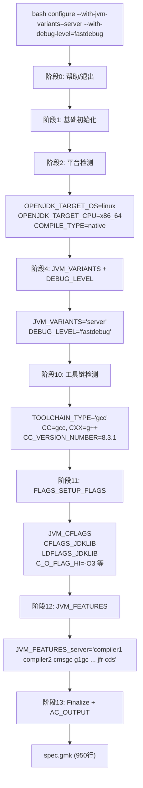
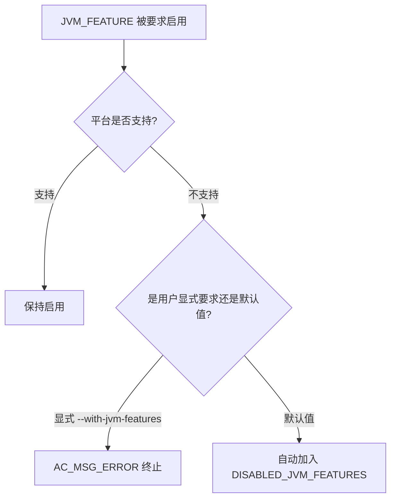

# 00-1. configure 系统 — 从参数到 spec.gmk 的检测链全景

> **核心问题**：`bash configure` 按下回车后，在生成 `spec.gmk` 之前，究竟发生了什么？22 项 JVM_FEATURES 如何校验？6 种 JVM_VARIANTS 如何映射？debug-level 如何改写 CFLAGS？

---

## 一、configure 的使命

`configure` 是 OpenJDK 构建系统的入口脚本，由 autoconf 2.69 从 `make/autoconf/configure.ac` 生成（`make/autoconf/configure.ac:33`）。其核心任务是：

**输入 → 决策 → 输出**：

```
用户参数 + 环境变量 + 系统探测
        │
        ▼
   [autoconf 检测链：14 个阶段]
        │
        ▼
   spec.gmk（~950行 Makefile 变量定义）
```

- **输入**：`--with-jvm-variants`, `--with-debug-level`, `--with-toolchain-type`, `--with-jvm-features` 等约 80+ 个 `--with`/`--enable` 参数
- **输出**：`spec.gmk` — 一个被 Make 包含的变量定义文件，所有构建目标从中读取编译器路径、编译标志、JVM 特性列表、输出目录等（`spec.gmk.in:39`）
- **中间过程**：探测操作系统、CPU 架构、工具链、BootJDK、库依赖，计算 JVM 特性和变体，生成编译标志

**设计哲学**：autoconf 只负责"检测和决定"，不执行任何实际编译。检测结果写入 `spec.gmk`，后续的 GNU Make 管线从 `spec.gmk` 读取配置并执行编译。

**configure 涉及的源文件**（`make/autoconf/`）：

| 文件 | 行数 | 职责 |
|------|------|------|
| `configure.ac` | 301 | 主控脚本，定义 14 阶段调用顺序 |
| `platform.m4` | 725 | 平台检测：OS/CPU 命名转换、COMPILE_TYPE、字节序 |
| `toolchain.m4` | 1234 | 工具链检测：gcc/clang/solstudio/xlc/microsoft 编译器+链接器 |
| `hotspot.m4` | 658 | JVM_VARIANTS + JVM_FEATURES + dtrace/aot/cds/gtest 配置 |
| `flags-cflags.m4` | 942 | 编译标志组装：PIC、警告、优化级别、OS/CPU 特定标志 |
| `flags-ldflags.m4` | ~300 | 链接器标志：rpath、动态库导出、链接参数 |
| `jdk-options.m4` | ~800 | DEBUG_LEVEL、JDK_VARIANT、debug 符号、ASAN 等选项 |
| `spec.gmk.in` | 955 | 输出模板：950+ 个 @VAR@ 占位符被替换 |
| `buildjdk-spec.gmk.in` | 102 | 交叉编译 BUILD_JDK 用的 spec 模板 |

> **关键要点**：`configure` 不编译任何代码，它只是环境的"体检报告生成器"。真正的构建工作由 `make` 在读取 `spec.gmk` 后完成。理解 configure 就是要理解：哪些变量被设置？它们之间的依赖顺序是什么？

---

## 二、autoconf 检测链全景

### 2.1 14 阶段调用顺序

`configure.ac` 中按功能划分为 14 个阶段（`make/autoconf/configure.ac:66-301`）：

| 阶段 | 调用宏 | 职责 |
|:---:|-------|------|
| 0 | `HELP_PRINT_ADDITIONAL_HELP_AND_EXIT` | `--help` 打印并退出 |
| 1 | `BASIC_INIT` / `BASIC_SETUP_FUNDAMENTAL_TOOLS` | 初始化变量（TOPDIR, OUTPUT_ROOT）、查找基础工具（bash, sed, awk, grep, tr, cut, printf） |
| 2 | `PLATFORM_SETUP_OPENJDK_BUILD_AND_TARGET` | 确定 build/target 三元组，COMPILE_TYPE，平台命名转换，Legacy 命名，HotSpot 命名 |
| 3 | `BASIC_SETUP_PATHS` / `JDKOPT_SETUP_OPEN_OR_CUSTOM` | PATH 路径设置、Open/Custom 源仓库检测 |
| 4 | `JDKOPT_SETUP_JDK_VARIANT` / `JDKOPT_SETUP_DEBUG_LEVEL` / `HOTSPOT_SETUP_JVM_VARIANTS` | JDK 变体（正常/minimal）、debug 级别（release/fastdebug/slowdebug/optimized）、JVM 变体（server/client/minimal/core/zero/custom） |
| 5 | `CUSTOM_EARLY_HOOK` / `BASIC_SETUP_DEVKIT` / `BASIC_SETUP_OUTPUT_DIR` | 外部源码早期钩子、devkit（tools dir + sysroot）、创建 output 目录 + 命名配置 |
| 6 | `PLATFORM_SETUP_OPENJDK_BUILD_OS_VERSION` / `BASIC_SETUP_DEFAULT_MAKE_TARGET` | 提取 `uname -r` OS 版本号、默认 make target（exploded-image） |
| 7 | `JDKOPT_SETUP_JDK_OPTIONS` / `JDKOPT_SETUP_JLINK_OPTIONS` / `JDKVER_SETUP_JDK_VERSION_NUMBERS` | 数十个 JDK 选项（headless, cups, alsa, x11, freetype 等）、jlink 选项、版本号（JEP-223） |
| 8 | `BOOTJDK_SETUP_BOOT_JDK` / `BOOTJDK_SETUP_BUILD_JDK` | 查找 BootJDK（用于引导编译 Java 代码）、决定是否需要 BUILD_JDK |
| 9 | `SRCDIRS_SETUP_DIRS` / `SRCDIRS_SETUP_IMPORT_MODULES` | 源码目录列表、模块导入（用于 skip JDK 构建时的预编译模块导入） |
| 10 | `JDKOPT_SETUP_STATIC_BUILD` / `TOOLCHAIN_DETERMINE_TOOLCHAIN_TYPE` / `TOOLCHAIN_DETECT_TOOLCHAIN_CORE` / `TOOLCHAIN_SETUP_BUILD_COMPILERS` / `FLAGS_POST_TOOLCHAIN` | 静态构建选项、确定工具链类型（gcc/clang/...）、检测 CC/CXX/LD/AS/AR、BUILD 工具链（交叉编译）、后置标志处理 |
| 11 | `PLATFORM_SETUP_OPENJDK_TARGET_BITS` / `FLAGS_SETUP_FLAGS` / `JDKOPT_SETUP_DEBUG_SYMBOLS` | 验证 int* 大小 = 目标位数、生成 JVM_CFLAGS/CFLAGS_JDKLIB/LDFLAGS 等所有编译标志、调试符号打包选项 |
| 12 | `LIB_DETERMINE_DEPENDENCIES` / `LIB_SETUP_LIBRARIES` / `HOTSPOT_SETUP_JVM_FEATURES` | 库依赖检测（freetype, alsa, cups, x11, fontconfig, ffi, zlib, png, lcms, harfbuzz 等）、JVM_FEATURES 设置 |
| 13 | `HOTSPOT_FINALIZE_JVM_FEATURES` / `BASIC_CHECK_LEFTOVER_OVERRIDDEN` / `AC_OUTPUT` | 最终化特性（排序去重+GC检查+内部一致性）、检查未被识别的 --with-* 选项、生成 spec.gmk |

### 2.2 数据流向图



### 2.3 配置命名规则

输出目录由 `BASIC_SETUP_OUTPUT_DIR`（阶段 5）计算：

```
CONF_NAME = target_os-target_cpu-jvm_variants-debug_level
```

示例：
```
linux-x86_64-server-release    → build/linux-x86_64-server-release/
linux-aarch64-server-fastdebug → build/linux-aarch64-server-fastdebug/
```

多 variant 时使用 AND 连接（`hotspot.m4:104`）：
```
linux-x86_64-serverANDclient-release → build/linux-x86_64-serverANDclient-release/
```

### 2.4 关键决策点

| 决策点 | 来源 | 影响范围 |
|--------|------|---------|
| `OPENJDK_TARGET_OS` / `OPENJDK_TARGET_CPU` | autoconf `host` 三元组 | 所有后续平台相关逻辑 |
| `COMPILE_TYPE` | `host` vs `build` 三元组比较 | 是否分离 `BUILD_CC` / `CC` |
| `TOOLCHAIN_TYPE` | 平台默认值或 `--with-toolchain-type` | 编译器标志族、链接器参数格式 |
| `DEBUG_LEVEL` | `--with-debug-level` | 优化级别、DEBUG 宏、stack protector |
| `JVM_VARIANTS` | `--with-jvm-variants` | 哪些 libjvm 变体被编译 |
| `JVM_FEATURES_<variant>` | 变体默认值 + `--with-jvm-features` | 哪些源码文件参与编译 |

### 2.5 Forward Dependency 链

configure 中关键变量之间的前向依赖关系：

```
OPENJDK_TARGET_OS/CPU
        │
        ├──► TOOLCHAIN_TYPE ───► CC, CXX, LD ───► CFLAGS, LDFLAGS ───► JVM_CFLAGS
        │                                              │
        ├──► DEBUG_LEVEL ────────────────► C_O_FLAG_* ┘
        │
        ├──► JVM_VARIANTS ──► JVM_FEATURES_<variant>
        │                         │
        └──► COMPILE_TYPE ───► BUILD_CC/CC 分离
```

这个依赖链解释了 configure.ac 中的顺序为何不可改变：
- 没有平台信息，无法确定工具链类型
- 没有工具链，无法测试编译标志
- 没有编译标志，无法启用某些需要特定平台+编译器的特性

> **关键要点**：检测链前向依赖严格——平台必须在工具链之前确定，工具链必须在编译标志之前确定，编译标志必须在 JVM_FEATURES 之前确定（因为某些 feature 的启用依赖于平台+工具链组合）。

---

## 三、平台三元组与 COMPILE_TYPE

### 3.1 autoconf 三元组语义

autoconf 使用标准的三元组系统（`platform.m4:632-647`）：

```
构建架构：build  = 执行 configure 的机器
宿主机：  host   = 运行构建产物的机器  ← OpenJDK 叫做 "target"
目标机：  target = 编译器产物的目标（仅交叉编译器需要）
```

OpenJDK 的命名与 autoconf 标准不同（`platform.m4:633-637`）：

| autoconf 标准 | OpenJDK 命名 | 含义 |
|-------------|-------------|------|
| `build` | `OPENJDK_BUILD_*` | 执行构建的机器 |
| `host` | `OPENJDK_TARGET_*` | 产物将运行在的机器 |
| `target` | (不使用) | — |

配置记录保存到 spec.gmk（`spec.gmk.in:26-31`）：
```makefile
# Configured @DATE_WHEN_CONFIGURED@ to build
# for target system @OPENJDK_TARGET_OS@-@OPENJDK_TARGET_CPU@
#   (called @OPENJDK_TARGET_AUTOCONF_NAME@ by autoconf)
# on build system @OPENJDK_BUILD_OS@-@OPENJDK_BUILD_CPU@
#   (called @OPENJDK_BUILD_AUTOCONF_NAME@ by autoconf)
```

### 3.2 平台变量提取

`PLATFORM_EXTRACT_VARS_FROM_CPU`（`platform.m4:29-169`）和 `PLATFORM_EXTRACT_VARS_FROM_OS`（`platform.m4:174-209`）将 autoconf 标准 CPU/OS 名称转换为 OpenJDK 内部命名：

**CPU 命名转换示例**：

| autoconf `$host_cpu` | OPENJDK_TARGET_CPU | OPENJDK_TARGET_CPU_ARCH | 位数 | 字节序 |
|----------------------|-------------------|------------------------|------|--------|
| `x86_64` | `x86_64` | `x86` | 64 | little |
| `i686`, `i586`, `i386` | `x86` | `x86` | 32 | little |
| `aarch64` | `aarch64` | `aarch64` | 64 | little |
| `arm*` | `arm` | `arm` | 32 | little |
| `powerpc64le` | `ppc64le` | `ppc` | 64 | little |
| `powerpc64` | `ppc64` | `ppc` | 64 | big |
| `riscv64` | `riscv64` | `riscv` | 64 | little |
| `s390x` | `s390x` | `s390` | 64 | big |
| `sparcv9`, `sparc64` | `sparcv9` | `sparc` | 64 | big |

**OS 命名转换**：

| autoconf `$host_os` | OPENJDK_TARGET_OS | OS_TYPE | 备注 |
|--------------------|-------------------|---------|------|
| `*linux*` | `linux` | `unix` | |
| `*darwin*` | `macosx` | `unix` | 内部命名为 osx（历史原因） |
| `*solaris*` | `solaris` | `unix` | |
| `*bsd*` | `bsd` | `unix` | |
| `*cygwin*` | `windows` | — | `OS_ENV=windows.cygwin` |
| `*mingw*` | `windows` | — | `OS_ENV=windows.msys` |
| `*aix*` | `aix` | `unix` | |

**LIBC 和 ABI 区分**（`platform.m4:214-254`）：

| autoconf 匹配 | VAR_LIBC | VAR_ABI | 使用场景 |
|-------------|----------|---------|---------|
| `*linux*-musl` | `musl` | `musl` | Alpine Linux |
| `*linux*-gnu` | `gnu` | `gnu` | 标准 glibc 发行版 (x86_64) |
| `*linux*-gnueabi` | `gnu` | `gnueabi` | ARM 32-bit soft-float |
| `*linux*-gnueabihf` | `gnu` | `gnueabihf` | ARM 32-bit hard-float |
| `*linux*-gnuabi64` | `gnu` | `gnuabi64` | ARM 64-bit (AArch64 ILP32) |
| 其他 | `default` | `default` | |

### 3.3 COMPILE_TYPE：三种编译模式

`PLATFORM_SETUP_TARGET_CPU_BITS`（`platform.m4:366-411`）定义了三种编译模式：

| COMPILE_TYPE | 条件 | 特征 |
|-------------|------|------|
| `native` | `build == host` | 原生编译，CC 既是 BUILD_CC 也是 TARGET_CC |
| `cross` | `build != host` | 真正交叉编译，BUILD_CC ≠ CC |
| `reduced` | `--with-target-bits=32` 在 64-bit 平台上 | 原生编译但 `-m32`，仅 x86_64 和 sparcv9 |

```makefile
# 编译类型设置逻辑 (platform.m4:376-381)
if test "x$OPENJDK_BUILD_AUTOCONF_NAME" != "x$OPENJDK_TARGET_AUTOCONF_NAME"; then
    COMPILE_TYPE="cross"
else
    COMPILE_TYPE="native"
fi
```

**Reduced build 细节**（`platform.m4:388-397`）：

```bash
if test "x$with_target_bits" = x32 && test "x$OPENJDK_TARGET_CPU_BITS" = x64; then
    COMPILE_TYPE="reduced"
    OPENJDK_TARGET_CPU_BITS=32
    if test "x$OPENJDK_TARGET_CPU_ARCH" = "xx86"; then
        OPENJDK_TARGET_CPU=x86
    elif test "x$OPENJDK_TARGET_CPU_ARCH" = "xsparc"; then
        OPENJDK_TARGET_CPU=sparc
    else
        AC_MSG_ERROR([Reduced build is only supported on x86_64 and sparcv9])
    fi
fi
```

关键约束：
- `--with-target-bits` 不能与真正交叉编译同时使用（`platform.m4:385`）
- `reduced` 模式仅支持 x86_64（→x86）和 sparcv9（→sparc）（`platform.m4:397`）

### 3.4 位数验证：AC_CHECK_SIZEOF vs 预期

`PLATFORM_SETUP_OPENJDK_TARGET_BITS`（`platform.m4:664-708`）通过实际编译测试验证位数：

```bash
AC_CHECK_SIZEOF([int *], [1111])
TESTED_TARGET_CPU_BITS=`expr 8 \* $ac_cv_sizeof_int_p`

if test "x$TESTED_TARGET_CPU_BITS" != "x$OPENJDK_TARGET_CPU_BITS"; then
    # 实际编译结果与预期不符 → 报错
    AC_MSG_ERROR([Cannot continue.])
fi
```

这确保在交叉编译或 reduced 构建中，编译器标志和 sysroot 确实产生预期位数的二进制。如果失败，configure 会给出针对性建议（32-bit 库、sysroot 路径等）。

### 3.5 字节序验证

`PLATFORM_SETUP_OPENJDK_TARGET_ENDIANNESS`（`platform.m4:710-724`）使用 `AC_C_BIGENDIAN` 验证：

```bash
AC_C_BIGENDIAN([ENDIAN="big"], [ENDIAN="little"], [ENDIAN="unknown"], [ENDIAN="universal_endianness"])
# universal_endianness 不支持（如 ARM big/little 双模式）
# 实际结果 != 预期 → 报错
```

### 3.6 Legacy 命名与 HotSpot 命名

`PLATFORM_SETUP_LEGACY_VARS_HELPER`（`platform.m4:422-585`）生成三套命名体系：

| 层次 | 示例变量 | x86_64 值 | x86 值 | 用途 |
|------|---------|----------|--------|------|
| OpenJDK 主名 | `OPENJDK_TARGET_CPU` | `x86_64` | `x86` | 新 make 系统 |
| Legacy 名 | `OPENJDK_TARGET_CPU_LEGACY` | `amd64` (非 macOS) | `i586` | 历史 makefile 兼容 |
| Legacy Lib 名 | `OPENJDK_TARGET_CPU_LEGACY_LIB` | `amd64` | `i386` | 库路径命名 |
| HotSpot CPU 名 | `HOTSPOT_TARGET_CPU` | `x86_64` | `x86_32` | HotSpot 内部源码 |
| HotSpot DEFINE | `HOTSPOT_TARGET_CPU_DEFINE` | `AMD64` | `IA32` | C++ `#ifdef` 宏 |
| OS ARCH 属性 | `OPENJDK_TARGET_CPU_OSARCH` | `amd64` (非 macOS) | `i386` (仅 linux) | `os.arch` 系统属性 |

**HotSpot OS 名转换**（`platform.m4:516-526`）：

| OPENJDK_TARGET_OS | HOTSPOT_TARGET_OS | HOTSPOT_TARGET_OS_TYPE |
|-------------------|------------------|----------------------|
| `linux` | `linux` | `posix` |
| `macosx` | `bsd` | `posix` |
| `solaris` | `solaris` | `posix` |
| `aix` | `aix` | `posix` |
| `windows` | `windows` | `windows` |

注意 macOS 被 HotSpot 视为 bsd（历史原因：macOS 内核源于 BSD）。

> **关键要点**：一套硬件，三套命名——OpenJDK 主名用于新 make 系统，Legacy 名用于历史兼容，HotSpot 名用于 JVM C++ 源码中的 `#ifdef IA32` 等条件编译。三套命名的一致性由 `configure` 保证，不一致会在配置阶段报错。

---

## 四、工具链检测

### 4.1 五大家族

`toolchain.m4` 支持 5 种编译工具链（`toolchain.m4:37-58`）：

| TOOLCHAIN_TYPE | C 编译器 | C++ 编译器 | 链接器 | 平台 | 最低版本 |
|---------------|---------|-----------|--------|------|---------|
| `gcc` | gcc | g++ | gcc (内部调用 ld) | linux, macosx | 4.8 |
| `clang` | clang | clang++ | clang (内部调用 ld) | linux, macosx | 3.2 |
| `solstudio` | cc | CC | cc | solaris | 5.13 |
| `xlc` | xlc_r / xlclang | xlC_r / xlclang++ | xlc | aix | — |
| `microsoft` | cl.exe | cl.exe | link.exe | windows | VS2010 |

**平台可用性**（`toolchain.m4:40-44`）：

```bash
VALID_TOOLCHAINS_linux="gcc clang"
VALID_TOOLCHAINS_solaris="solstudio"
VALID_TOOLCHAINS_macosx="gcc clang"
VALID_TOOLCHAINS_aix="xlc"
VALID_TOOLCHAINS_windows="microsoft"
```

**平台默认值选取**（`toolchain.m4:220-278`）：
- macOS Xcode ≥ 5：默认为 `clang`（`toolchain.m4:241-242`）
- macOS 无 Xcode（有 Command Line Tools）：默认为 `clang`（`toolchain.m4:250`）
- AIX：检测 `xlclang++`（IBM 的 Clang 前端），如果可用则优先使用（`toolchain.m4:282-293`）
- 其他平台：`VALID_TOOLCHAINS_$OS` 列表第一项为默认值（`toolchain.m4:254`）

### 4.2 检测核心

`TOOLCHAIN_DETECT_TOOLCHAIN_CORE`（`toolchain.m4:681-788`）检测以下工具：

| 组件 | 变量 | 查找方式 |
|------|------|---------|
| C 编译器 | `CC` | 按 `TOOLCHAIN_CC_BINARY` 名查找（gcc/clang/cc/xlc_r/cl） |
| C++ 编译器 | `CXX` | 按 `TOOLCHAIN_CXX_BINARY` 名查找（g++/clang++/CC/xlC_r/cl） |
| 预处理器 | `CPP` / `CXXCPP` | autoconf 宏 `AC_PROG_CPP` / `AC_PROG_CXXCPP` |
| 链接器 | `LD` | gcc/clang/solstudio/xlc：编译器自身(=CC)；microsoft：`link.exe` |
| 汇编器 | `AS` | 非 solaris：`$CC -c`；solaris：独立的 `as` |
| 归档器 | `AR` | gcc：`ar` 或 `gcc-ar`；microsoft：`lib.exe`；其他：`ar` |

**额外工具**（`TOOLCHAIN_DETECT_TOOLCHAIN_EXTRA`，`toolchain.m4:793-904`）：

| 工具 | 变量 | 平台 | 用途 |
|------|------|------|------|
| lipo | `LIPO` | macOS | Fat binary 工具 |
| otool | `OTOOL` | macOS | 查看 Mach-O 文件 |
| install_name_tool | `INSTALL_NAME_TOOL` | macOS | 修改 dylib 的 install name |
| mt | `MT` | Windows | Manifest 工具 |
| rc | `RC` | Windows | 资源编译器 |
| dumpbin | `DUMPBIN` | Windows | PE/COFF 分析 |
| strip | `STRIP` | 所有 | 去除调试符号 |
| nm | `NM` | 所有 | 符号表 |
| objcopy | `OBJCOPY` | solaris/linux | 分离调试符号到 .debuginfo |
| c++filt | `CXXFILT` | gcc/clang/solstudio | C++ 符号 demangle |

### 4.3 版本号提取与比较

`TOOLCHAIN_EXTRACT_COMPILER_VERSION`（`toolchain.m4:406-516`）根据工具链类型使用不同命令和解析方式提取版本号：

| 工具链 | 提取命令 | 识别特征 | 版本号格式 | 解析正则 |
|--------|---------|---------|-----------|---------|
| gcc | `gcc --version` | `grep "Free Software Foundation"` | X.Y.Z | `s/^.* \([0-9]+\.[0-9.]*\).*/\1/` |
| clang | `clang --version` | `grep "clang"` | X.Y.Z | `s/^.* version \([0-9]+\.[0-9.]*\).*/\1/` |
| solstudio | `cc -V` | `grep "^.* Sun C"` | X.Y | `s/^.*C \([0-9]+\.[0-9]*\).*/\1/` |
| xlc | `xlc -qversion` | `grep "IBM XL C"` | X.Y | `s/^.*, V\([0-9]+\.[0-9.]*\).*/\1/` |
| microsoft | `cl.exe` (无参) | `grep "Microsoft"` | X.Y.Z.A | `s/^.*ersion \([0-9]+\.[0-9.]*\).*/\1/` |

**版本比较方法**（`toolchain.m4:83`）：将版本号各段补零为 5 位数字拼接比较：
```
8.3.0   → 00008000030000000000
4.8.0   → 00004000080000000000
16.0.1  → 00016000000001000000
```

这种"左对齐比较"避免了字符串比较的常见陷阱（`9.0` < `10.0` 在字符串比较中为 false）。要求每段不超过 99999。

### 4.4 热补丁：HotSpot 的工具链别名

`TOOLCHAIN_MISC_CHECKS`（`toolchain.m4:1111-1119`）为 HotSpot 源码提供历史兼容的工具链名称：

```bash
HOTSPOT_TOOLCHAIN_TYPE=$TOOLCHAIN_TYPE
if test "x$TOOLCHAIN_TYPE" = xclang; then
    HOTSPOT_TOOLCHAIN_TYPE=gcc        # clang 在 HotSpot 中被视为 gcc
elif test "x$TOOLCHAIN_TYPE" = xsolstudio; then
    HOTSPOT_TOOLCHAIN_TYPE=sparcWorks # Oracle 内部名称
elif test "x$TOOLCHAIN_TYPE" = xmicrosoft; then
    HOTSPOT_TOOLCHAIN_TYPE=visCPP     # Visual C++
fi
```

### 4.5 文件名模式

`TOOLCHAIN_SETUP_FILENAME_PATTERNS`（`toolchain.m4:173-216`）定义平台相关的库/目标文件命名：

| 平台 | SHARED_LIBRARY | LIBRARY_PREFIX | SHARED_LIBRARY_SUFFIX | OBJ_SUFFIX |
|------|---------------|----------------|----------------------|-----------|
| Linux/Solaris/AIX | `lib$1.so` | lib | .so | .o |
| macOS (非静态) | `lib$1.dylib` | lib | .dylib | .o |
| macOS (静态构建) | `lib$1.a` | lib | .a | .o |
| Windows | `$1.dll` | (空) | .dll | .obj |

### 4.6 交叉编译时的 BUILD 工具链

`TOOLCHAIN_SETUP_BUILD_COMPILERS`（`toolchain.m4:910-1068`）处理交叉编译场景：

- `COMPILE_TYPE=cross` 时：查找独立的 `BUILD_CC`、`BUILD_CXX`、`BUILD_LD`——这些工具在 BUILD 平台上运行，编译出的程序也在 BUILD 平台上运行（如 interim javac 编译器）
- `COMPILE_TYPE=native` 时：`BUILD_CC = CC`, `BUILD_CXX = CXX`（复用同一个编译器）
- 支持 `--with-build-devkit` 指定 BUILD 平台的 devkit

> **关键要点**：工具链检测不仅找到编译器，还验证编译器是否真的是声称的类型（通过版本输出特征字符串匹配），并检查最低版本要求。类型不匹配或版本过老都会在 configure 阶段报错终止。HotSpot 源码不直接使用 `TOOLCHAIN_TYPE`，而是使用 `HOTSPOT_TOOLCHAIN_TYPE`（gcc/sparcWorks/visCPP）。

---

## 五、JVM_VARIANTS：六种编译目标

### 5.1 变体矩阵

`HOTSPOT_SETUP_JVM_VARIANTS`（`hotspot.m4:84-151`）定义了 6 种 JVM 变体：

| Variant | 解释器 | 编译器 | 默认 GC | FEATURES 特征 |
|---------|--------|--------|---------|-------------|
| `server` | 模板解释器 | C1 + C2 (tiered) | 全 GC | `compiler1 compiler2` + `NON_MINIMAL_FEATURES` + jvmci + graal + aot |
| `client` | 模板解释器 | C1 (no C2) | 全 GC | `compiler1` + `NON_MINIMAL_FEATURES` |
| `minimal` | 模板解释器 | C1（精简版） | 仅 SerialGC | `compiler1 minimal serialgc` |
| `core` | 模板解释器 | 无 JIT | 全 GC | `NON_MINIMAL_FEATURES` |
| `zero` | C++ 解释器 | 无 JIT | 受限 GC（仅 Serial+Parallel） | `zero` + `NON_MINIMAL_FEATURES` |
| `custom` | 由用户定义 | 由用户定义 | 由用户定义 | 仅用户指定的 features |

**官方变体描述**（`hotspot.m4:76-82`）：
```
server:  normal interpreter, and a tiered C1/C2 compiler
client:  normal interpreter, and C1 (no C2 compiler)
minimal: reduced form of client with optional features stripped out
core:    normal interpreter only, no compiler
zero:    C++ based interpreter only, no compiler
custom:  baseline JVM with no default features
```

**默认值**：不指定 `--with-jvm-variants` 时默认为 `server`（`hotspot.m4:92`）。

### 5.2 多 Variant 构建规则

可以同时构建多个变体（逗号分隔），但有约束（`hotspot.m4:98-125`）：

```bash
# 允许的组合
--with-jvm-variants=server,client,minimal

# 不允许的组合（core 和 zero 不与 server 共享输出目录）
--with-jvm-variants=server,core     ← 报错
```

**输出目录命名**（`hotspot.m4:104`）：逗号替换为 AND：
```
server,client → serverANDclient
```

**构建目录中的变体目录**：
```
build/linux-x86_64-serverANDclient-release/hotspot/variant-server/
build/linux-x86_64-serverANDclient-release/hotspot/variant-client/
```

**MAIN_VARIANT 优先级**（`hotspot.m4:129-139`）：多 variant 构建时，其他 library（如 libjsig.so）链接到"主变体"：
```
server > client > minimal
```
即如果同时构建 server+client，则 `JVM_VARIANT_MAIN=server`。如果只构建 client，则 `JVM_VARIANT_MAIN=client`。

### 5.3 Zero 的特殊行为

Zero 变体使用 C++ 实现的解释器，改写底层 CPU 变量（`hotspot.m4:145-150`）：

```bash
if HOTSPOT_CHECK_JVM_VARIANT(zero); then
    # zero 把自己伪装成一个独立平台
    HOTSPOT_TARGET_CPU=zero
    HOTSPOT_TARGET_CPU_ARCH=zero
fi
```

这是一个"伪装"——Zero 把自己伪装成独立平台，避免使用任何平台特定的汇编代码（`src/hotspot/cpu/zero/` 而非 `src/hotspot/cpu/x86/`）。这也是 Zero 不能与其他变体同时构建的原因。

**Zero 的 GC 限制**（`hotspot.m4:387-389`）：只能使用 SerialGC 和 ParallelGC。

### 5.4 变体判定宏

`hotspot.m4` 提供了两个判定宏用于 Makefile 和 shell 条件：

```bash
# HOTSPOT_CHECK_JVM_VARIANT(server) — 检查 server 变体是否在构建列表
AC_DEFUN([HOTSPOT_CHECK_JVM_VARIANT],
[ [ [[ " $JVM_VARIANTS " =~ " $1 " ]] ] ])

# HOTSPOT_CHECK_JVM_FEATURE(jvmti) — 检查 jvmti 特性是否启用
AC_DEFUN([HOTSPOT_CHECK_JVM_FEATURE],
[ [ [[ " $JVM_FEATURES " =~ " $1 " ]] ] ])

# HOTSPOT_IS_JVM_FEATURE_DISABLED(jvmci) — 检查特性是否被显式禁用
AC_DEFUN([HOTSPOT_IS_JVM_FEATURE_DISABLED],
[ [ [[ " $DISABLED_JVM_FEATURES " =~ " $1 " ]] ] ])
```

这些宏使用 bash `=~` 正则匹配，通过空格包裹保证精确匹配（避免 `g1gc` 误匹配 `shenandoahgc`）。

> **关键要点**：JVM_VARIANTS 定义了"构建哪些 libjvm 变体"（顶层决定），JVM_FEATURES 定义了"每个变体内部启用哪些功能"（内层决定）。变体决定"是否编译某个目录的 .cpp"，特性决定"编译时用哪些 `#ifdef INCLUDE_JFR` 宏"。

---

## 六、JVM_FEATURES：28 项功能校验

### 6.1 完整合法列表

`VALID_JVM_FEATURES`（`hotspot.m4:27-29`）定义了 27 个合法特征 + 1 个废弃特征：

```
compiler1 compiler2 zero minimal dtrace jvmti jvmci graal vm-structs
jni-check services management cmsgc epsilongc g1gc parallelgc serialgc
shenandoahgc zgc nmt cds static-build link-time-opt aot jfr
```

废弃特征（`hotspot.m4:32`）：`trace`（忽略但输出警告）。

| 分类 | Feature | 说明 |
|------|---------|------|
| **编译器** | `compiler1` | C1 客户端编译器（快速编译，中等优化） |
| | `compiler2` | C2 服务端编译器（慢速编译，激进优化） |
| **VM 模式** | `zero` | C++ 解释器模式 |
| | `minimal` | 最小化构建标志（关闭所有可选功能） |
| **诊断** | `dtrace` | DTrace 探针支持（Solaris/Linux/macOS） |
| | `jvmti` | JVM Tool Interface（调试/性能分析接口） |
| | `jni-check` | JNI 调用检查（类型安全、参数验证） |
| | `services` | Attach API、HeapDump、jcmd 等服务功能 |
| | `management` | JMX 管理接口（MBean 注册、ThreadMXBean 等） |
| | `vm-structs` | VM 内部结构体导出（Serviceability Agent 需要） |
| | `nmt` | Native Memory Tracking（`-XX:NativeMemoryTracking`） |
| **GC** | `serialgc` | Serial GC（单线程 Stop-The-World） |
| | `parallelgc` | Parallel GC（多线程 Stop-The-World） |
| | `cmsgc` | CMS GC（Concurrent Mark Sweep） |
| | `g1gc` | G1 GC（Garbage First，默认 GC） |
| | `epsilongc` | Epsilon GC（no-op，仅分配不回收） |
| | `shenandoahgc` | Shenandoah GC（超低暂停，Red Hat 贡献） |
| | `zgc` | Z GC（超低暂停，可扩展至 TB 级堆） |
| **运行时** | `jfr` | JDK Flight Recorder（低开销事件记录） |
| | `cds` | Class Data Sharing（类元数据共享） |
| | `aot` | Ahead-of-Time 编译（jaotc 工具，JDK 17 已移除） |
| **JVMCI** | `jvmci` | JVM Compiler Interface（Graal 编译器接口） |
| | `graal` | Graal 编译器（需要 jvmci） |
| **构建** | `static-build` | 静态链接构建（所有 .a 而非 .so） |
| | `link-time-opt` | LTO（链接时优化），ARM minimal 默认启用 |

### 6.2 特性依赖链

`HOTSPOT_SETUP_JVM_FEATURES`（`hotspot.m4:337-352`）强制执行 4 条硬依赖：

```
jvmti       ──requires──► services    (hotspot.m4:338)
management  ──requires──► nmt         (hotspot.m4:342)
jvmci       ──requires──► compiler1 或 compiler2  (hotspot.m4:346)
cmsgc       ──requires──► serialgc    (hotspot.m4:350)
```

违反依赖直接 `AC_MSG_ERROR` 终止配置，不给继续的机会。

### 6.3 平台守卫

某些特性仅在特定平台上可用，configure 自动禁用不兼容的组合：

| Feature | 可用平台 | 自动禁用条件 | 源码 |
|---------|---------|-------------|------|
| **ZGC** | `linux` + `x86_64` | 所有其他 OS/CPU 组合 | `hotspot.m4:379-384` |
| **Shenandoah** | CPU_ARCH=`x86` 或 CPU=`aarch64` | 所有其他架构 | `hotspot.m4:365-375` |
| **JVMCI** | CPU=`x86_64`, `sparcv9`, `aarch64` | 所有其他 CPU | `hotspot.m4:422-436` |
| **Graal** | JVMCI 启用 + (CPU=`x86_64` 或 `aarch64` 或 AOT 启用) | 其他组合 | `hotspot.m4:455-468` |
| **AOT** | CPU=`x86_64` 或 `linux-aarch64` | 所有其他平台 | `hotspot.m4:224-240` |
| **CDS** | 非 AIX, 非 macOS/aarch64 | AIX, macOS/aarch64 | `hotspot.m4:270-283` |
| **JFR** | 非 Zero, 非 AIX, 非 linux/sparcv9 | 排除的平台 | `hotspot.m4:355-361` |
| **DTrace** | `sys/sdt.h` 头文件存在 | 无头文件 | `hotspot.m4:173-176` |

**平台守卫的执行模式**：



示例——ZGC 的守卫逻辑（`hotspot.m4:378-384`）：
```bash
AC_MSG_CHECKING([if zgc can be built])
if test "x$OPENJDK_TARGET_OS" = "xlinux" && test "x$OPENJDK_TARGET_CPU" = "xx86_64"; then
    AC_MSG_RESULT([yes])
else
    DISABLED_JVM_FEATURES="$DISABLED_JVM_FEATURES zgc"
    AC_MSG_RESULT([no, platform not supported])
fi
```

### 6.4 用户自定义特性

通过 `--with-jvm-features`（`hotspot.m4:298-326`）可以增删特性：

```bash
# 添加特性
--with-jvm-features=dtrace,jfr

# 删除特性（前缀 -）
--with-jvm-features=-cds,-aot

# 混合使用
--with-jvm-features=jfr,-cds,dtrace
```

解析逻辑（`hotspot.m4:305-307`）：
```bash
# 不带 - 前缀的 → 追加到 JVM_FEATURES
JVM_FEATURES=$(awk '{ for (i=1; i<=NF; i++) if (!match($i, /^-.*/)) printf ... }')

# 带 - 前缀的 → 追加到 DISABLED_JVM_FEATURES
DISABLED_JVM_FEATURES=$(awk '{ for (i=1; i<=NF; i++) if (match($i, /^-.*/)) printf ... }')
```

用户指定的特性会经过有效性验证（`hotspot.m4:310-315`）和废弃检查（`hotspot.m4:318-324`）。

### 6.5 NON_MINIMAL_FEATURES

`NON_MINIMAL_FEATURES`（`hotspot.m4:520`）定义了 non-minimal 变体（server, client, core, zero）的默认特性集合：

```
NON_MINIMAL_FEATURES="cmsgc g1gc parallelgc serialgc epsilongc
    shenandoahgc jni-check jvmti management nmt services vm-structs zgc"

# + jfr（非 Zero/AIX/linux-sparcv9） — hotspot.m4:355-361
# + cds（CDS 启用时） — hotspot.m4:521-536
# + jvmci/graal/aot（平台支持时） — 条件添加
```

这意味着 `minimal` 变体默认只获得：
```
compiler1 + minimal + serialgc
```
所有其他特性需要用户显式添加。`minimal` 变体的目标是最小化二进制大小（适用于嵌入式/资源受限环境）。

### 6.6 各变体最终特性集

`hotspot.m4:539-544` 定义了每个变体的完整特性列表：

```bash
JVM_FEATURES_server="compiler1 compiler2 $NON_MINIMAL_FEATURES \
    $JVM_FEATURES $JVM_FEATURES_jvmci $JVM_FEATURES_aot $JVM_FEATURES_graal"

JVM_FEATURES_client="compiler1 $NON_MINIMAL_FEATURES $JVM_FEATURES"

JVM_FEATURES_core="$NON_MINIMAL_FEATURES $JVM_FEATURES"

JVM_FEATURES_minimal="compiler1 minimal serialgc $JVM_FEATURES $JVM_FEATURES_link_time_opt"

JVM_FEATURES_zero="zero $NON_MINIMAL_FEATURES $JVM_FEATURES"

JVM_FEATURES_custom="$JVM_FEATURES"
```

**实际变量值的示例**（linux/x86_64, default configure）：

```
JVM_FEATURES_server = "aot cds cmsgc compiler1 compiler2 epsilongc g1gc graal jfr jni-check jvmci jvmti link-time-opt management nmt parallelgc serialgc services shenandoahgc static-build vm-structs zgc"
```

### 6.7 Finalize 阶段

`HOTSPOT_FINALIZE_JVM_FEATURES`（`hotspot.m4:563-592`）在所有配置完成后执行最终化：

```bash
for variant in $JVM_VARIANTS; do
    # 1. 过滤掉 DISABLED_JVM_FEATURES
    BASIC_GET_NON_MATCHING_VALUES(JVM_FEATURES_FOR_VARIANT,
        $JVM_FEATURES_FOR_VARIANT, $DISABLED_JVM_FEATURES)

    # 2. 排序 + 去重
    BASIC_SORT_LIST(JVM_FEATURES_FOR_VARIANT, $JVM_FEATURES_FOR_VARIANT)

    # 3. 验证至少有一个 GC 被选中
    GC_FEATURES=`$ECHO $JVM_FEATURES_FOR_VARIANT | $GREP gc`
    if test "x$GC_FEATURES" = x; then
        AC_MSG_WARN([No gc selected for variant $variant.])
    fi

    # 4. 内部一致性检查
    BASIC_GET_NON_MATCHING_VALUES(INVALID_FEATURES,
        $JVM_FEATURES_FOR_VARIANT, $VALID_JVM_FEATURES)
done
```

**特性如何影响编译**：最终的特性列表写入 `spec.gmk`（`spec.gmk.in:286-295`）并传递给 `CompileJvm.gmk`：

```makefile
JVM_FEATURES_server := aot cds cmsgc compiler1 compiler2 ...
```

`CompileJvm.gmk` 使用这些值控制条件编译：
```makefile
ifeq ($(call check-jvm-feature, jfr), true)
  JVM_CFLAGS_FEATURES += -DINCLUDE_JFR
endif
```

> **关键要点**：JVM_FEATURES 的最终化是"加法→减法"两步走：先累积所有默认特性，再减去用户禁用的特性，然后排序去重。GC 检查是软警告（WARN）而非硬错误（ERROR），允许无 GC 的极端定制。

---

## 七、DEBUG_LEVEL 与编译标志

### 7.1 四级 debug 模式

`JDKOPT_SETUP_DEBUG_LEVEL`（`jdk-options.m4:57-109`）定义了 4 个级别：

| DEBUG_LEVEL | HOTSPOT_DEBUG_LEVEL | 宏定义 | 优化 | debug 符号 | 断言 |
|------------|--------------------|--------|------|-----------|------|
| `release` | `product` | `-DNDEBUG` | 全优化 | 无 | 关闭 |
| `optimized` | `optimized` | `-DNDEBUG` | 全优化（HotSpot），release（JDK） | 无 | 关闭 |
| `fastdebug` | `fastdebug` | `-DDEBUG` | 全优化 | `-g` | 全部开启 |
| `slowdebug` | `debug` | `-DDEBUG` | `-O0` | `-g` | 全部开启 |

**DEBUG_LEVEL 设置方式**：
```bash
# 方式 1：显式指定
--with-debug-level=fastdebug

# 方式 2：简写
--enable-debug   # 等同于 --with-debug-level=fastdebug

# 两者不可同时使用 (jdk-options.m4:72-74)
```

### 7.2 `optimized` 的特殊处理

`optimized` 模式是 HotSpot 专用概念（`jdk-options.m4:93-104`）：

```bash
if test "x$DEBUG_LEVEL" = xoptimized; then
    # JDK 部分按 release 编译（优化、无 debug 符号、NDEBUG）
    DEBUG_LEVEL="release"
    # HotSpot 部分按 optimized 编译（HOTSPOT_DEBUG_LEVEL 保持 "optimized"）
fi
```

这意味着 `optimized` 构建中，JDK 库（libjava, libzip 等）是 release 级别，只有 HotSpot 是 optimized 级别（保留了 optimized 模式的内部诊断代码）。

### 7.3 四级对优化标志的影响

`FLAGS_SETUP_OPTIMIZATION`（`flags-cflags.m4:238-358`）定义平台特定的优化级别标志，然后 `DEBUG_LEVEL` 对它们进行覆盖。

**gcc 基准优化标志**（`flags-cflags.m4:258-266`）：

| 标志变量 | gcc 值 | 用途 |
|---------|--------|------|
| `C_O_FLAG_HIGHEST_JVM` | `-O3` | libjvm.so 最高优化 |
| `C_O_FLAG_HIGHEST` | `-O3` | 性能关键库 |
| `C_O_FLAG_HI` | `-O3` | 高级优化 |
| `C_O_FLAG_NORM` | `-O2` | 标准优化 |
| `C_O_FLAG_SIZE` | `-Os` | 大小优先优化 |
| `C_O_FLAG_DEBUG` | `-O0` | 无优化（debug） |
| `C_O_FLAG_DEBUG_JVM` | `-O0` | JVM 无优化 |
| `C_O_FLAG_NONE` | `-O0` | 强制无优化 |

**clang macOS 特殊优化标志**（`flags-cflags.m4:267-276`）：
```bash
# macOS 上 clang 默认使用 -Os（大小优化）
C_O_FLAG_HIGHEST_JVM="-Os"
C_O_FLAG_HIGHEST="-Os"
C_O_FLAG_HI="-Os"
C_O_FLAG_NORM="-Os"
```

**debug level 对优化标志的覆盖**（`flags-cflags.m4:322-344`）：

| DEBUG_LEVEL | C_O_FLAG_HIGHEST_JVM | C_O_FLAG_HI | C_O_FLAG_NORM |
|------------|---------------------|-------------|--------------|
| `release` | `-O3` (不变) | `-O3` (不变) | `-O2` (不变) |
| `fastdebug` | `-O3` (不变) | `-O2` ← NORM | `-O2` (不变) |
| `slowdebug` | `-O0` ← DEBUG_JVM | `-O0` ← DEBUG | `-O0` ← DEBUG |

关键观察：**fastdebug 保持全部优化，仅将 HI 降级为 NORM**——这意味着 fastdebug 的性能与 release 几乎相同，只是添加了 `-DDEBUG` 和 `-g` 符号。这使 fastdebug 成为日常开发的理想选择。

### 7.4 四级对预处理器宏的影响

`FLAGS_SETUP_CFLAGS_HELPER`（`flags-cflags.m4:449-464`）：

| DEBUG_LEVEL | 编译标志 | 效果 |
|------------|---------|------|
| `release`, `optimized` | `-DNDEBUG` | `assert()` 宏变为空操作 |
| `fastdebug`, `slowdebug` | `-DDEBUG` | `assert()` 和 `INCLUDE_*` 宏生效 |

部分 VM 代码使用 `#ifdef ASSERT` (由 HotSpot 内部 `debug.hpp` 从 `DEBUG` 宏派生) 而非标准 `NDEBUG`。

### 7.5 slowdebug 的特殊检查

`FLAGS_SETUP_QUALITY_CHECKS`（`flags-cflags.m4:192-236`）为 `slowdebug` + `gcc` 组合添加运行时安全检查：

```bash
# stack protector（所有函数）
CFLAGS_DEBUG_OPTIONS="-fstack-protector-all --param ssp-buffer-size=1"
CXXFLAGS_DEBUG_OPTIONS="-fstack-protector-all --param ssp-buffer-size=1"

# 完整 DWARF 类信息（即使通过指针使用）
JVM_CFLAGS_SYMBOLS="$JVM_CFLAGS_SYMBOLS -femit-class-debug-always"
EXTRA_CXXFLAGS="$EXTRA_CXXFLAGS -femit-class-debug-always"
```

| 标志 | 作用 | 副作用 |
|------|------|--------|
| `-fstack-protector-all` | 每个函数插入 canary 检查 | 性能 ~5-10% 下降 |
| `--param ssp-buffer-size=1` | ≥8 字节局部数组触发保护 | 最激进阈值 |
| `-femit-class-debug-always` | 指针引用的类也发出完整 DWARF | 使 GDB `sizeof()` 支持所有类型 |

### 7.6 编译标志的组装：JVM_CFLAGS 是如何产生的

`FLAGS_SETUP_CFLAGS_CPU_DEP`（`flags-cflags.m4:840-882`）将多层标志组装为最终变量：

```
JVM_CFLAGS =
    ALWAYS_CFLAGS_JVM         (-D__STDC_FORMAT_MACROS ...)
  + ALWAYS_DEFINES_JVM        (-D_GNU_SOURCE -D_REENTRANT)
  + TOOLCHAIN_CFLAGS_JVM      (-pipe -fno-rtti -fno-exceptions -fvisibility=hidden)
  + TARGET_TOOLCHAIN_CFLAGS   (GCC6: -fno-delete-null-pointer-checks)
  + OS_CFLAGS                 (-DLIBC=gnu)
  + OS_CFLAGS_JVM             (-DSUPPORTS_CLOCK_MONOTONIC)
  + CFLAGS_OS_DEF_JVM         (-DLINUX)
  + DEBUG_CFLAGS_JVM          (release: 空; debug: -DDEBUG)
  + WARNING_CFLAGS            (-Wall -Wextra ...)
  + WARNING_CFLAGS_JVM        (-Wpointer-arith -Wsign-compare ...)
  + JVM_PICFLAG               (-fPIC)
  + FILE_MACRO_CFLAGS         (-fmacro-prefix-map=...)
  + TARGET_CFLAGS_JVM         (-D_LP64=1 -DAMD64 ...)
  + EXTRA_CXXFLAGS            (用户指定的额外标志)
```

这是一个层次化的组装：通用标志 → OS 标志 → 工具链标志 → 警告 → 平台特定 → 用户扩展。

### 7.7 四级对照总表

| 维度 | release | optimized | fastdebug | slowdebug |
|------|---------|-----------|-----------|-----------|
| **C 宏** | `-DNDEBUG` | `-DNDEBUG` | `-DDEBUG` | `-DDEBUG` |
| **JVM 优化** | `-O3` | `-O3` | `-O2` | `-O0` |
| **JDK lib 优化** | `-O2` | `-O2` | `-O2` | `-O0` |
| **debug 符号** | 无 | 无 | `-g` | `-g` |
| **断言** | 关闭 | 关闭 | 全部 | 全部 |
| **Stack protector** | 无 | 无 | 无 | `-fstack-protector-all` |
| **Class debug** | 无 | 无 | 无 | `-femit-class-debug-always` |
| **GDB 实用性** | 困难 | 困难 | 可用 | 完整可用 |
| **性能** | 100% | 100% | ~95% | ~50-70% |
| **二进制大小** | 小 | 小 | 中 | 大 |
| **HOTSPOT_DEBUG_LEVEL** | `product` | `optimized` | `fastdebug` | `debug` |
| **bundle 后缀** | (无) | (无) | `-debug` | `-slowdebug` |

> **关键要点**：fastdebug 是开发调试的"甜点"——95% 的性能、完整的断言、GDB 可用性。slowdebug 用于极端调试场景（内存错误追踪、DWARF 完整性依赖）。optimized 是 HotSpot 专用模式，用于测试优化 JVM 的同时保持 JDK 库的 release 级别。

---

## 八、产物 spec.gmk：Make 系统的数据契约

### 8.1 生成机制

`configure` 的最后一步是 `AC_OUTPUT`（`configure.ac:291`），autoconf 将 `spec.gmk.in` 模板中的 `@VARIABLE@` 占位符替换为 configure 过程中 `AC_SUBST` 导出的值。

```
spec.gmk.in (模板)  +  configure 导出的变量
        │
        ▼  autoconf 替换 @VAR@
        │
  spec.gmk (产物，~950行)
```

**SPEC 变量的自引用**（`spec.gmk.in:39`）：
```makefile
SPEC:=@SPEC@
```
这使得 make 命令行参数 `SPEC=path/to/spec.gmk` 可以在 spec 文件内部获取自己的路径。

### 8.2 spec.gmk 如何被使用

构建入口 `make/Main.gmk` 不直接 include spec.gmk。标准的 make 调用：

```bash
make SPEC=/path/to/build/linux-x86_64-server-release/spec.gmk images
```

但更常见的做法是在构建目录下直接运行 `make`（利用自动检测）：
```bash
cd build/linux-x86_64-server-release/
make images  # make 自动检测并使用 spec.gmk
```

Make 系统的核心 Makefile 片段（`Makefile:39-55`）定义了自动检测逻辑：
```makefile
ifeq ($(SPEC),)
  ifneq ($(wildcard spec.gmk),)
    SPEC := $(CURDIR)/spec.gmk
  endif
endif
```

### 8.3 spec.gmk 变量分类

| 区域 | 行号 | 核心变量 | 使用者 |
|------|------|---------|--------|
| **元信息** | 1-40 | `CONFIGURE_COMMAND_LINE`, `SPEC`, `CONF_NAME` | 所有 makefile |
| **平台** | 70-127 | `OPENJDK_TARGET_OS`, `OPENJDK_TARGET_CPU`, `COMPILE_TYPE`, `HOTSPOT_TARGET_CPU_DEFINE` | Main.gmk, CompileJvm.gmk |
| **版本** | 178-265 | `VERSION_FEATURE`, `VERSION_STRING`, `VERSION_CFLAGS` | 所有编译目标 |
| **DEBUG** | 272-274 | `DEBUG_LEVEL`, `HOTSPOT_DEBUG_LEVEL` | Flags 设置 |
| **JVM** | 280-302 | `JVM_VARIANTS`, `JVM_VARIANT_MAIN`, `JVM_FEATURES_server`, `VALID_JVM_FEATURES` | CompileJvm.gmk |
| **目录** | 310-328 | `OUTPUTDIR`, `HOTSPOT_OUTPUTDIR`, `JDK_OUTPUTDIR`, `IMAGES_OUTPUTDIR` | 所有 makefile |
| **工具链** | 420-430 | `TOOLCHAIN_TYPE`, `CC_VERSION_NUMBER` | make 条件分支 |
| **优化** | 443-455 | `C_O_FLAG_HIGHEST_JVM`, `C_O_FLAG_HI`, `C_O_FLAG_NORM` 等 10 个 | CompileJvm.gmk |
| **标志** | 460-600 | `JVM_CFLAGS`, `CFLAGS_JDKLIB`, `LDFLAGS_JDKLIB`, `JVM_LDFLAGS`, `JVM_LIBS` | CompileJvm.gmk, 各库 makefile |
| **工具** | 470-550 | `CC`, `CXX`, `LD`, `AS`, `AR`, `BUILD_CC` 等 | MakeBase.gmk |
| **库** | 371-384 | `FREETYPE_LIBS`, `ALSA_LIBS`, `LIBFFI_LIBS` | 各模块 makefile |
| **安装** | 792-836 | `INSTALL_PREFIX`, `INSTALL_BINDIR` | Install.gmk |
| **Bundle** | 918-944 | `JDK_BUNDLE_NAME`, `JDK_BUNDLE` | Images.gmk |
| **POSIX 工具** | 690-770 | `AWK`, `SED`, `GREP`, `FIND`, `TAR` 等 60+ 个 | 所有 makefile |

### 8.4 版本信息嵌入

`VERSION_CFLAGS`（`spec.gmk.in:222-254`）将版本字符串作为 C 宏嵌入所有编译单元：

```makefile
VERSION_CFLAGS := \
    -DVERSION_FEATURE=$(VERSION_FEATURE) \
    -DVERSION_INTERIM=$(VERSION_INTERIM) \
    -DVERSION_UPDATE=$(VERSION_UPDATE) \
    -DVERSION_PATCH=$(VERSION_PATCH) \
    -DVERSION_PRE='"$(VERSION_PRE)"' \
    -DVERSION_BUILD=$(VERSION_BUILD) \
    -DVERSION_OPT='"$(VERSION_OPT)"' \
    -DVERSION_NUMBER='"$(VERSION_NUMBER)"' \
    -DVERSION_STRING='"$(VERSION_STRING)"' \
    -DVERSION_SHORT='"$(VERSION_SHORT)"' \
    -DVERSION_DATE='"$(VERSION_DATE)"' \
    -DVENDOR_VERSION_STRING='"$(VENDOR_VERSION_STRING)"' \
    -DVERSION_CLASSFILE_MAJOR=$(VERSION_CLASSFILE_MAJOR)
```

这确保了 `java -version` 的输出与构建时配置一致，并嵌入到 `libjvm.so` 的 `vm_version.cpp` 中。

### 8.5 buildjdk-spec.gmk：交叉编译的 BUILD_JDK

`buildjdk-spec.gmk.in`（`buildjdk-spec.gmk.in:26-101`）是交叉编译场景下构建 BUILD_JDK 的配置文件：

```makefile
# 第一步：从真实 spec.gmk 继承所有变量
include @SPEC@

# 第二步：覆盖编译工具为 BUILD 平台版本
CC := @BUILD_CC@
CXX := @BUILD_CXX@
LD := @BUILD_LD@
LDCXX := @BUILD_LDCXX@
AS := @BUILD_AS@
NM := @BUILD_NM@
AR := @BUILD_AR@
OBJCOPY := @BUILD_OBJCOPY@
STRIP := @BUILD_STRIP@

# 第三步：重映射输出目录
HOTSPOT_OUTPUTDIR := $(patsubst $(OUTPUTDIR)%,$(BUILDJDK_OUTPUTDIR)%,$(HOTSPOT_OUTPUTDIR))
SUPPORT_OUTPUTDIR := $(patsubst $(OUTPUTDIR)%,$(BUILDJDK_OUTPUTDIR)%,$(SUPPORT_OUTPUTDIR))
JDK_OUTPUTDIR := $(patsubst $(OUTPUTDIR)%,$(BUILDJDK_OUTPUTDIR)%,$(JDK_OUTPUTDIR))
IMAGES_OUTPUTDIR := $(patsubst $(OUTPUTDIR)%,$(BUILDJDK_OUTPUTDIR)%,$(IMAGES_OUTPUTDIR))

# 第四步：覆盖 TARGET 变量为 BUILD 平台
OPENJDK_TARGET_CPU := @OPENJDK_BUILD_CPU@
OPENJDK_TARGET_CPU_ARCH := @OPENJDK_BUILD_CPU_ARCH@
OPENJDK_TARGET_CPU_BITS := @OPENJDK_BUILD_CPU_BITS@
OPENJDK_TARGET_CPU_ENDIAN := @OPENJDK_BUILD_CPU_ENDIAN@
HOTSPOT_TARGET_OS := @HOTSPOT_BUILD_OS@
HOTSPOT_TARGET_CPU := @HOTSPOT_BUILD_CPU@
HOTSPOT_TARGET_CPU_DEFINE := @HOTSPOT_BUILD_CPU_DEFINE@

# 第五步：优化——关闭非必要特性
WARNINGS_AS_ERRORS := false
ENABLE_DEBUG_SYMBOLS := false
BUILD_GTEST := false
JVM_VARIANTS := server
JVM_VARIANT_MAIN := server

# 第六步：清除用户 EXTRA 标志
override EXTRA_CFLAGS :=
override EXTRA_CXXFLAGS :=
override EXTRA_LDFLAGS :=
```

**六步覆盖模型**的核心原理是"模板继承 + 选择性覆盖"而非"从零定义"：
1. 继承：获取 JDK 构建所需的所有基础配置
2. 工具覆盖：替换为 BUILD 平台编译工具
3. 目录隔离：防止 BUILD_JDK 产物污染主 JDK 输出
4. 平台重映射：让 BUILD_JDK 以为自己在编译 BUILD 平台
5. 简化：关闭调试符号、gtest、警告即错误
6. 用户隔离：防止用户 EXTRA 标志干扰

> **关键要点**：`spec.gmk` 是 Make 构建系统与 configure 之间的唯一数据契约。Make 管线从不直接读取 configure 的输出，一切信息都从 `spec.gmk` 获取。buildjdk-spec.gmk 则展示了"模板继承"模式——在主 spec 之上做最小覆盖来实现 BUILD_JDK。

---

## 九、交叉编译

### 9.1 触发条件

当 `build` 三元组与 `host` 三元组不同时，自动进入交叉编译模式（`platform.m4:376-381`）：

```bash
# 示例：在 x86_64 上构建 aarch64 的 JDK
./configure --host=aarch64-linux-gnu --build=x86_64-linux-gnu
```

configure 设置 `COMPILE_TYPE=cross`，这触发以下变化。

### 9.2 工具链分离

| 变量 | 用途 | 运行在 | 产物运行在 |
|------|------|--------|-----------|
| `CC`, `CXX`, `LD` | 编译目标平台代码 | BUILD 平台 | TARGET 平台 |
| `BUILD_CC`, `BUILD_CXX`, `BUILD_LD` | 编译构建工具 | BUILD 平台 | BUILD 平台 |

**交叉编译前缀约定**（`toolchain.m4:549-554`）：autoconf 使用标准命名前缀自动查找交叉编译器：
```bash
# 如果 host=aarch64-linux-gnu，则自动查找:
#   aarch64-linux-gnu-gcc
#   aarch64-linux-gnu-g++
```

**BUILD 编译器查找**（`toolchain.m4:986-1004`）：
```bash
BASIC_REQUIRE_PROGS(BUILD_CC, [cl cc gcc])     # BUILD 平台 C 编译器
BASIC_REQUIRE_PROGS(BUILD_CXX, [cl CC g++])     # BUILD 平台 C++ 编译器
BUILD_AS="$BUILD_CC -c"
BUILD_LD="$BUILD_CC"   # 非 Windows 时
```

### 9.3 BUILD_DEVKIT

`--with-build-devkit`（`toolchain.m4:921-980`）指定 BUILD 平台的 devkit：

```bash
./configure --host=aarch64-linux-gnu \
    --with-build-devkit=/path/to/x86_64/devkit \
    --with-jvm-variants=server
```

devkit 目录结构：
```
/path/to/x86_64/devkit/
├── devkit.info          # 元信息
├── bin/
│   ├── gcc              # BUILD 平台编译器
│   └── g++
└── sysroot/             # BUILD 平台系统根
```

### 9.4 BUILD_JDK 机制

交叉编译时需要两个 JDK：
1. **Boot JDK**：引导编译所有 Java 代码
2. **BUILD_JDK**：构建期间在 BUILD 平台上运行的 JDK（运行 interim javac）

`BOOTJDK_SETUP_BUILD_JDK` 决定是否创建 BUILD_JDK：
```
交叉编译 + 没有外部 BUILD_JDK → CREATE_BUILDJDK=true
```

### 9.5 交叉编译限制

| 限制 | 位置 |
|------|------|
| `--with-target-bits` 不可与交叉编译同时使用 | `platform.m4:385` |
| Reduced build 仅支持 x86_64→x86 和 sparcv9→sparc | `platform.m4:397` |
| 交叉编译需要目标平台的库（sysroot） | `platform.m4:679-681` |
| Zero 变体覆盖所有 CPU 设置 | `hotspot.m4:148-149` |

> **关键要点**：交叉编译的核心困难不在于 configure，而在于需要同时在 BUILD 和 TARGET 两个平台上运行的工具。BUILD_JDK 和 buildjdk-spec.gmk 解决了让 BUILD 平台拥有完整 JDK 运行构建工具的问题。

---

## 附录 A：configure 关键变量速查表

| 变量 | 来源宏 | 示例值 (linux/x86_64/gcc) |
|------|--------|--------------------------|
| `OPENJDK_TARGET_OS` | `PLATFORM_EXTRACT_VARS_FROM_OS` | `linux` |
| `OPENJDK_TARGET_CPU` | `PLATFORM_EXTRACT_VARS_FROM_CPU` | `x86_64` |
| `OPENJDK_TARGET_CPU_ARCH` | `PLATFORM_EXTRACT_VARS_FROM_CPU` | `x86` |
| `OPENJDK_TARGET_CPU_BITS` | `PLATFORM_EXTRACT_VARS_FROM_CPU` | `64` |
| `COMPILE_TYPE` | `PLATFORM_SETUP_TARGET_CPU_BITS` | `native` |
| `TOOLCHAIN_TYPE` | `TOOLCHAIN_DETERMINE_TOOLCHAIN_TYPE` | `gcc` |
| `CC` | `TOOLCHAIN_FIND_COMPILER` | `/usr/bin/gcc` |
| `DEBUG_LEVEL` | `JDKOPT_SETUP_DEBUG_LEVEL` | `release` |
| `HOTSPOT_DEBUG_LEVEL` | `JDKOPT_SETUP_DEBUG_LEVEL` | `product` |
| `JVM_VARIANTS` | `HOTSPOT_SETUP_JVM_VARIANTS` | `server` |
| `JVM_VARIANT_MAIN` | `HOTSPOT_SETUP_JVM_VARIANTS` | `server` |
| `JVM_FEATURES_server` | `HOTSPOT_SETUP_JVM_FEATURES` | `compiler1 compiler2 g1gc ...` |
| `JVM_CFLAGS` | `FLAGS_SETUP_CFLAGS_CPU_DEP` | `-DLINUX -DAMD64 -O3 -pipe ...` |
| `CFLAGS_JDKLIB` | `FLAGS_SETUP_CFLAGS_CPU_DEP` | `-D_GNU_SOURCE -fPIC ...` |

## 附录 B：spec.gmk.in debug level 对 bundle 命名的影响

`spec.gmk.in:920-924`：

```makefile
ifeq ($(DEBUG_LEVEL), fastdebug)
  DEBUG_PART := -debug
else ifneq ($(DEBUG_LEVEL), release)
  DEBUG_PART := -$(DEBUG_LEVEL)
endif
```

```
release:   jdk-17.0.1+12_linux-x64_bin.tar.gz
fastdebug: jdk-17.0.1+12_linux-x64_bin-debug.tar.gz
slowdebug: jdk-17.0.1+12_linux-x64_bin-slowdebug.tar.gz
```

## 附录 C：configure 调用示例

```bash
# 最小化构建（生产用）
bash configure

# 带 debug 符号的开发构建
bash configure --with-debug-level=fastdebug

# 仅编译器和 SerialGC（最小化生产 JVM）
bash configure --with-jvm-features=compiler1,compiler2,serialgc

# 禁用不需要的特性
bash configure --with-jvm-features=-jfr,-cds,-aot,-dtrace

# 自定义变体：只有 C1 和 G1GC
bash configure --with-jvm-variants=custom \
    --with-jvm-features=compiler1,g1gc,serialgc,services,jvmti,nmt

# ARM 交叉编译
bash configure --host=aarch64-linux-gnu \
    --with-build-devkit=/path/to/x86_64/devkit \
    --with-jvm-variants=server

# AIX 构建（使用 xlclang++）
bash configure --with-toolchain-type=xlc
```

---

*本章基于 OpenJDK 源码 `make/autoconf/` 目录下 9 个核心文件的深度分析。
分析文件：configure.ac (301 行), platform.m4 (725 行), toolchain.m4 (1234 行),
hotspot.m4 (658 行), flags-cflags.m4 (942 行), jdk-options.m4 (~800 行),
spec.gmk.in (955 行), buildjdk-spec.gmk.in (102 行), flags-ldflags.m4 (~300 行)。*
