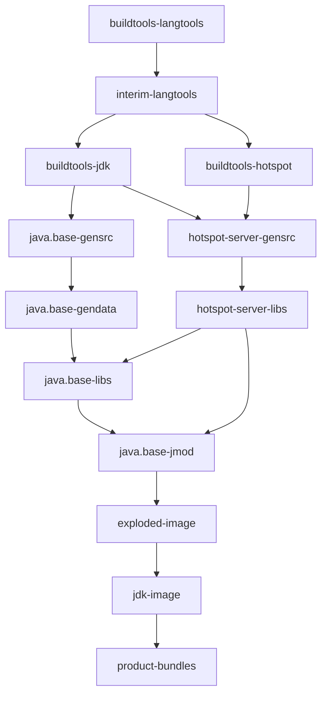

# 3.1 Main.gmk 构建管线 — 从 `make` 到 `images/jdk`

**副标题**：理解 OpenJDK 的 GNU Make 构建引擎——target 依赖图、构建阶段、产物目录

---

## 3.1.1 总览：一行命令背后的 47 步

```bash
$ make jdk-image
```

这一行命令在 `Main.gmk` 中触发了一条 **47 个 target 的依赖链**。每个 target 代表一个构建阶段：

```
Main.gmk — 主入口文件 (~1,400 行)
  │
  ├── configure 阶段 → 生成 spec.gmk (不在 make 内)
  ├── Recipe 定义 (L66-L655)    → 每个 target 的"怎么做"
  ├── Dependency 定义 (L666-L900) → 每个 target 的"先做什么"
  └── Aggregator Targets         → 组合 target (default, images, docs...)
```

**关键前提** (`Main.gmk:34-39`)：
```makefile
ifeq ($(wildcard $(SPEC)),)
  $(error Main.gmk needs SPEC set to a proper spec.gmk)
endif
include $(SPEC)
```
>`Main.gmk` 不能独立运行——它必须先 `include spec.gmk`（由 `./configure` 生成）。这意味着所有平台差异、特性开关、路径变量在 `make` 启动前已经确定。

---

## 3.1.2 构建阶段的五层管道

OpenJDK 的构建分为 **5 大阶段**，按时间顺序执行：

```
┌─────────────────────────────────────────────────────────────────┐
│  Phase 1: buildtools (构建工具)                                  │
│  buildtools-langtools → interim-langtools → buildtools-jdk      │
│  → buildtools-hotspot                                            │
│  产出：编译期间需要的 Java 工具 (javac, 注解处理器...)             │
├─────────────────────────────────────────────────────────────────┤
│  Phase 2: gensrc + gendata (源码生成)                            │
│  java.base-gensrc → ... → jdk.jfr-gensrc                        │
│  → generate-exported-symbols                                     │
│  产出：自动生成的 .java / .hpp / 元数据文件                       │
├─────────────────────────────────────────────────────────────────┤
│  Phase 3: compile (编译)                                         │
│  java.base-java → ... (JDK 类库)                                 │
│  hotspot-server-gensrc → hotspot-server-libs (HotSpot C++)       │
│  java.base-libs → ... (native 库)                                │
│  产出：.class 文件 + libjvm.so + libjava.so + ...                │
├─────────────────────────────────────────────────────────────────┤
│  Phase 4: jmod (模块打包)                                        │
│  java.base-jmod → ... → jdk.jfr-jmod                            │
│  产出：模块化压缩包 (.jmod 文件)                                  │
├─────────────────────────────────────────────────────────────────┤
│  Phase 5: image (镜像组装)                                        │
│  exploded-image → jdk-image → product-bundles                    │
│  产出：可运行的 JDK 目录 + tar.gz                                 │
└─────────────────────────────────────────────────────────────────┘
```

---

## 3.1.3 Phase 1：构建工具（内部编译器）

构建 OpenJDK 的悖论：**你需要 JDK 来编译 JDK**。Phase 1 解决这个问题。

### 1a. buildtools-langtools (Main.gmk:72-73)

编译一套最小化的 `javac` 和注解处理器：

```makefile
buildtools-langtools:
	+($(CD) $(TOPDIR)/make && $(MAKE) $(MAKE_ARGS) -f ToolsLangtools.gmk)
```

### 1b. interim-langtools (Main.gmk:75-76)

用上一步产出的 `javac` 编译"过渡版"编译器模块：

```makefile
interim-langtools:
	+($(CD) $(TOPDIR)/make && $(MAKE) $(MAKE_ARGS) -f CompileInterimLangtools.gmk)
```

### 1c. buildtools-jdk / buildtools-hotspot (Main.gmk:84-91)

为 JDK 类和 HotSpot 构建辅助工具：

```makefile
buildtools-jdk:
	+($(CD) $(TOPDIR)/make && $(MAKE) $(MAKE_ARGS) -f CompileToolsJdk.gmk)

buildtools-hotspot:
	+($(CD) $(TOPDIR)/make && $(MAKE) $(MAKE_ARGS) -f CompileToolsHotspot.gmk)
```

### 依赖链 (Main.gmk:684-690)

```
  $(LANGTOOLS_GENSRC_TARGETS): buildtools-langtools
  interim-langtools: $(INTERIM_LANGTOOLS_GENSRC_TARGETS)
  buildtools-jdk: interim-langtools interim-tzdb
  buildtools-hotspot: interim-langtools
```

> **为什么需要 interim？** OpenJDK 编译器模块（`java.compiler`, `jdk.compiler`）的源码需要 JDK 才能编译。第一次编译用的是系统的 `javac`（`--with-boot-jdk`），产出的 `interim-javac` 再用来编译正式版——这就是"两阶段编译"（bootcycle build）。

---

## 3.1.4 Phase 2：源码生成（gensrc + gendata）

很多源码不是手写的，而是**从数据文件或模板自动生成**的。

### gensrc 阶段 (Main.gmk:112-147)

```makefile
$(eval $(call DeclareRecipesForPhase, GENSRC, \
    TARGET_SUFFIX := gensrc-src, \
    FILE_PREFIX := Gensrc, \
    MAKE_SUBDIR := gensrc, \
    CHECK_MODULES := $(ALL_MODULES), \
))
```

这个宏为**每个模块**生成一个 target：`<module>-gensrc-src`。例如：

| Module | 生成的源文件 |
|--------|-------------|
| `java.base` | `sun/misc/Unsafe.java` 的 native 方法、字符表、货币数据 |
| `jdk.jfr` | JFR 事件类（从 `metadata.xml` 生成） |
| `java.desktop` | X11 wrapper 代码、颜色配置文件 |

### gendata 阶段 (Main.gmk:151-158)

生成数据文件（字符映射表、时区数据等）：

```makefile
$(eval $(call DeclareRecipesForPhase, GENDATA, \
    TARGET_SUFFIX := gendata, \
    FILE_PREFIX := Gendata, \
    MAKE_SUBDIR := gendata, \
    CHECK_MODULES := $(ALL_MODULES), \
    USE_WRAPPER := true))
```

### HotSpot gensrc 特例 (Main.gmk:257-264)

```makefile
define DeclareHotspotGensrcRecipe
  hotspot-$1-gensrc:
	$$(call LogInfo, Building JVM variant '$1' with features '$(JVM_FEATURES_$1)')
	+($(CD) $(TOPDIR)/make/hotspot && $(MAKE) $(MAKE_ARGS) -f gensrc/GenerateSources.gmk \
	    JVM_VARIANT=$1)
endef
```

HotSpot 的 gensrc 和 JDK 类库不同——它不是生成 `.java`，而是生成 **ADLC 产物**（从 `.ad` 文件生成 C2 的 DFA 匹配器代码）和 **JVM 变体的特性头文件**。

---

## 3.1.5 Phase 3：编译（Java + Native）

### 3a. JDK 类库编译 (Main.gmk:189-201)

```makefile
JAVA_MODULES := $(ALL_MODULES)
JAVA_TARGETS := $(addsuffix -java, $(JAVA_MODULES))

define DeclareCompileJavaRecipe
  $1-java:
	+($(CD) $(TOPDIR)/make && $(MAKE) $(MAKE_ARGS) \
	    -f CompileJavaModules.gmk MODULE=$1)
endef
```

每个模块独立编译为 `.class` 文件。模块间有依赖声明 (`Main.gmk:744-746`)：

```makefile
$(foreach m, $(JAVA_MODULES), \
    $(eval $m-java: $(addsuffix -java, $(filter $(JAVA_MODULES), \
    $(call FindDepsForModule,$m)))))
```

### 3b. HotSpot C++ 编译 (Main.gmk:253-278)

这是构建系统中**最复杂的单步**：

```makefile
HOTSPOT_VARIANT_TARGETS := $(addprefix hotspot-, $(JVM_VARIANTS))
HOTSPOT_VARIANT_LIBS_TARGETS := $(addsuffix -libs, $(HOTSPOT_VARIANT_TARGETS))

define DeclareHotspotLibsRecipe
  hotspot-$1-libs:
	+($(CD) $(TOPDIR)/make/hotspot && $(MAKE) $(MAKE_ARGS) -f lib/CompileLibraries.gmk \
	    JVM_VARIANT=$1)
endef
```

入口文件是 `make/hotspot/lib/CompileLibraries.gmk`，它再调用 `CompileJvm.gmk`。后者根据 `JVM_FEATURES_<variant>` 变量决定编译哪些 `.cpp` 文件。

**依赖** (`Main.gmk:709-713`)：
```makefile
hotspot-$v-gensrc: java.base-copy
hotspot-$v-libs: hotspot-$v-gensrc java.base-copy
```

### 3c. Native 库编译 (Main.gmk:214-237)

JDK 模块中的 native 代码（`libjava.so`, `libnet.so`, `libnio.so` 等）：

```makefile
$(eval $(call DeclareRecipesForPhase, LIBS, \
    TARGET_SUFFIX := libs, \
    FILE_PREFIX := Lib, \
    MAKE_SUBDIR := lib, \
    CHECK_MODULES := $(ALL_MODULES), \
    USE_WRAPPER := true))
```

**关键依赖** (`Main.gmk:723`)：所有 libs target 都依赖 HotSpot 先编译完：
```makefile
$(LIBS_TARGETS): $(JVM_MAIN_LIB_TARGETS)
```

> 为什么？因为 JDK 的 native 库（如 `libjimage.so`, `libattach.so`）链接时需要 `libjvm.so` 中导出的符号。

### 3d. 启动器编译 (Main.gmk:240-248)

编译 `bin/java`, `bin/javac`, `bin/jcmd` 等可执行文件：

```makefile
$(LAUNCHER_TARGETS): java.base-libs
```

---

## 3.1.6 Phase 4：模块打包 (jmod)

每个模块的编译产物（`.class` + `.so` + 资源配置）被 `jmod` 打包成一个 `jmod` 文件：

```makefile
JMOD_MODULES := $(ALL_MODULES)
JMOD_TARGETS := $(addsuffix -jmod, $(JMOD_MODULES))

define DeclareJmodRecipe
  $1-jmod:
	+($(CD) $(TOPDIR)/make && $(MAKE) $(MAKE_ARGS) -f CreateJmods.gmk \
	    MODULE=$1)
endef
```

`java.base-jmod` 的依赖最复杂 (`Main.gmk:805`)：

```makefile
java.base-jmod: $(JVM_MAIN_TARGETS)
```

> `java.base` 模块包含了 `libjvm.so`，所以它的 jmod 必须等 HotSpot 完全编译完。

---

## 3.1.7 Phase 5：镜像组装 (image)

### 5a. exploded-image（展开镜像）

这是构建的中间产物——一个在 `build/*/jdk/` 下**可运行的 JDK 目录**：

```makefile
jdk-image:
	+($(CD) $(TOPDIR)/make && $(MAKE) $(MAKE_ARGS) -f Images.gmk jdk)
```

`Images.gmk` 的工作：
1. 从每个模块的 `jmod` 文件中提取文件
2. 组装成一个标准的 JDK 目录结构
3. 运行 `jlink` 生成最终的运行时镜像

### 5b. product-bundles（最终产物）

```makefile
product-bundles:
	+($(CD) $(TOPDIR)/make && $(MAKE) $(MAKE_ARGS) -f Bundles.gmk product-bundles)
```

`Bundles.gmk` 将 `images/jdk/` 打包成：**`jdk-11.0.24-linux-x64_bin.tar.gz`**

---

## 3.1.8 产物目录结构

```bash
build/
└── linux-x86_64-normal-server-slowdebug/   ← 配置名
    ├── spec.gmk                            ← configure 生成的 SPEC
    ├── Makefile                            ← 顶层 Makefile 包装
    │
    ├── buildtools/                         ← Phase 1 产出
    │   ├── interim_langtools/              ← 过渡编译器
    │   └── ...
    │
    ├── hotspot/                            ← Phase 3b 产出
    │   └── variant-server/
    │       ├── libjvm/
    │       │   ├── objs/                   ← .o 中间文件 （~800 个）
    │       │   └── libjvm.so              ← 最终产物
    │       └── gensrc/                     ← Phase 2 HotSpot gensrc
    │
    ├── jdk/                                ← exploded image (Phase 5a)
    │   ├── bin/          → java, javac, jcmd...
    │   ├── lib/          → libjvm.so, libjava.so, jmods/, ...
    │   ├── conf/         → net.properties, security/, ...
    │   ├── modules/      ← jlink 生成的运行时模块
    │   └── release       ← JDK 版本信息
    │
    ├── support/                            ← 构建辅助文件
    │   ├── gensrc/       → 生成的源码
    │   ├── modules_libs/ → native 库中间产物
    │   └── ...
    │
    └── images/                             ← Phase 5b 产出
        └── jdk/                            ← 可发布的 JDK 目录
            ├── bin/
            ├── lib/
            ├── conf/
            ├── legal/     → 各模块的第三方许可
            ├── include/   → JNI 头文件
            └── man/       → 手册页
```

**`jdk/` (exploded) vs `images/jdk/` (release)** 的区别：

| | exploded image | images/jdk |
|---|---|---|
| 用途 | 构建期间用（运行 jmod/jlink）| 最终发布 |
| 合法性检查 | 不完整 | 完整（legal 目录） |
| 可运行 | 是（`./jdk/bin/java -version`）| 是 |
| 可发布 | 否 | 是（打包为 tar.gz） |

---

## 3.1.9 关键依赖图（完整 targets 链）



> **关键洞察**：`java.base-libs` 是整个构建的**汇合点**——它必须等 HotSpot 和 JDK 类库都编译完才能开始链接 native 库。而 `java.base-jmod` 是所有 jmod 的**子汇合点**——它内部包含 `libjvm.so`，是所有后续模块 jmod 的前提。

---

## 3.1.10 增量编译机制

OpenJDK 的构建系统是**完全增量的**：

1. **Make 原生依赖跟踪**：每个 target 只在其依赖的时间戳更新时才重新执行
2. **模块级增量**：修改 `src/hotspot/share/runtime/thread.cpp` 只触发 `hotspot-server-libs` 编译，不碰 `java.base-java`
3. **-only 模式** (`Main.gmk:681-682`)：

```makefile
ifneq ($(findstring -only, $(MAKECMDGOALS)), )
  .NOTPARALLEL:
```

```bash
# 只重新编译 HotSpot，跳过其他所有 module
make hotspot-server-libs-only
```

4. **exploded image 更新**：修改后直接 `make jdk-image`——只有变更的模块被重新 jmod → jlink

---

## 3.1.11 构建时间概览

| 操作 | 首次构建 | 增量构建 | 说明 |
|------|:---:|:---:|------|
| `make jdk-image` (全量) | ~20-40 分钟 | — | 取决于 CPU 核数 |
| 修改 1 个 HotSpot .cpp | — | ~30 秒 | 只重编该文件 + 重链 libjvm.so |
| 修改 1 个 JDK .java | — | ~5 秒 | 只重编该模块 |
| 修改 1 个头文件 | — | ~2-5 分钟 | 连锁重编译依赖方 |
| `make hotspot-server-libs-only` | — | ~10-60 秒 | 完全跳过 JDK 类库 |

---

## 3.1.12 关键文件索引

| 文件 | 归属 Phase | 角色 |
|------|:---:|------|
| `make/Main.gmk` | 全部 | **主入口**——target 定义 + 依赖声明 |
| `make/MainSupport.gmk` | 全部 | `DeclareRecipesForPhase` 等核心宏 |
| `make/common/MakeBase.gmk` | 全部 | 基础 Make 函数库 |
| `make/common/Modules.gmk` | 全部 | 模块发现 + 拓扑排序 |
| `make/ToolsLangtools.gmk` | 1 | 编译构建用 javac |
| `make/CompileInterimLangtools.gmk` | 1 | 编译过渡版编译器 |
| `make/CompileJavaModules.gmk` | 3a | 编译 Java 模块 |
| `make/hotspot/lib/CompileLibraries.gmk` | 3b | HotSpot 编译入口 |
| `make/hotspot/lib/CompileJvm.gmk` | 3b | libjvm.so 具体编译 |
| `make/CreateJmods.gmk` | 4 | jmod 打包 |
| `make/Images.gmk` | 5a | JDK 镜像组装 |
| `make/Bundles.gmk` | 5b | tar.gz 打包 |

---

## 小结

1. 构建管线是 **5 层管道**：buildtools → gensrc → compile → jmod → image
2. `Main.gmk` 是中央调度器——它只声明 target 的依赖关系，具体实现分散在 200+ 个 `.gmk` 文件中
3. HotSpot 编译 (`hotspot-server-libs`) 是整个管道的**瓶颈步骤**——它产出 `libjvm.so` (~30MB)，几乎影响所有后续 target
4. `java.base-libs` 是**汇合点**——HotSpot + JDK 类库 + native 库 全部就绪后才开始链接
5. 增量编译是基于 Make 原生的时间戳跟踪——修改 1 个 .cpp 只需 30 秒重编
6. `exploded image` (`build/*/jdk/`) 是开发期间最快的验证方式：改完直接 `./jdk/bin/java` 运行
