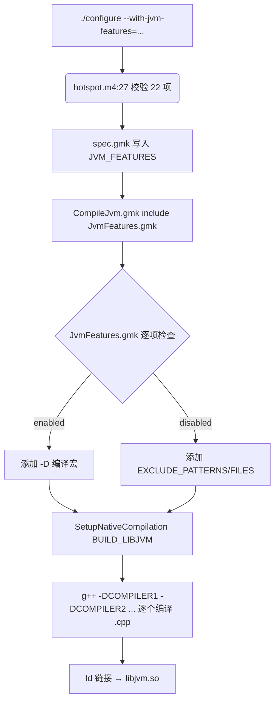

# 3.2 HotSpot 编译 — JVM_FEATURES 条件编译与 libjvm.so 的诞生

**副标题**：从 988 个 .cpp 到 1 个 libjvm.so——特性开关如何精确控制编译范围

---

## 3.2.1 总览：一行命令切入

Main.gmk 的 `hotspot-server-libs` target 最终调用：

```makefile
# CompileLibraries.gmk:34
include lib/CompileJvm.gmk
```

这条 include 触发了一个 `SetupNativeCompilation` 调用 (`CompileJvm.gmk:153`)，将 **988 个 .cpp 文件** 编译链接为 **1 个 libjvm.so**。



> **关键**：Build system 不是扫描文件系统决定编什么，而是**硬编码了每一个特性对应的文件排除规则** (`JvmFeatures.gmk`)。关掉 `jfr` 不是"跳过 jfr/ 目录"——`JvmFeatures.gmk:174-177` 精确列出了 `JVM_EXCLUDE_PATTERNS += jfr`。

---

## 3.2.2 BUILD_LIBJVM 定义解析

`CompileJvm.gmk:153-183` 是整条管线的核心——`SetupNativeCompilation` 宏展开后生成 **编译、汇编、链接** 三阶段的 Make 规则：

```makefile
$(eval $(call SetupNativeCompilation, BUILD_LIBJVM, \
    NAME := jvm,                                          # 产物名 → libjvm.so
    TOOLCHAIN := TOOLCHAIN_LINK_CXX,                      # 用 C++ 链接器
    OUTPUT_DIR := $(JVM_LIB_OUTPUTDIR),                   # 产物路径
    SRC := $(JVM_SRC_DIRS),                               # 源码搜索路径
    EXCLUDES := $(JVM_EXCLUDES),                          # 排除目录 (如 opto/)
    EXCLUDE_FILES := $(JVM_EXCLUDE_FILES),                # 排除文件 (精确)
    EXCLUDE_PATTERNS := $(JVM_EXCLUDE_PATTERNS),          # 排除模式 (如 c2_)
    CFLAGS := $(JVM_CFLAGS),                              # 编译标志
    OPTIMIZATION := $(JVM_OPTIMIZATION),                  # 优化级别
    OBJECT_DIR := $(JVM_OUTPUTDIR)/objs,                  # .o 中间目录
    MAPFILE := $(JVM_MAPFILE),                            # 符号表
    STRIPFLAGS := $(JVM_STRIPFLAGS),                      # strip 策略
))
```

### 参数逐项解释

| 参数 | 值示例 | 作用 |
|------|--------|------|
| `NAME := jvm` | `jvm` | 产物名称 → Linux 上生成 `libjvm.so` |
| `SRC := $(JVM_SRC_DIRS)` | `src/hotspot/` | 从这个目录树下递归发现 `.cpp` 文件 |
| `EXCLUDES := $(JVM_EXCLUDES)` | `opto libadt adlc` | 排除整个子目录 |
| `EXCLUDE_PATTERNS` | `c1_ c2_ gc/cms` | glob 模式排除 |
| `EXCLUDE_FILES` | `bcEscapeAnalyzer.cpp` | 精确排除单个文件 |
| `OBJECT_DIR := .../objs` | `build/*/hotspot/variant-server/libjvm/objs/` | 约 800 个 `.o` 文件的存放位置 |

### 源码搜索范围

`JvmFlags.gmk:32-34` 定义：

```makefile
JVM_SRC_ROOTS += $(TOPDIR)/src/hotspot     # share/ + os/ + os_cpu/ + cpu/
JVM_SRC_DIRS += $(call uniq, $(wildcard $(foreach d, $(JVM_SRC_ROOTS), \
    $d/share $d/os $(HOTSPOT_TARGET_OS) $d/os_cpu $(HOTSPOT_TARGET_OS_CPU) $d/cpu $(HOTSPOT_TARGET_CPU_ARCH))))
```

展开后（Linux x86_64）：
```
src/hotspot/share/     # 跨平台源码 (988 .cpp)
src/hotspot/os/linux/  # Linux 平台层
src/hotspot/os_cpu/linux_x86/
src/hotspot/cpu/x86/   # x86 架构层
```

---

## 3.2.3 JVM_FEATURES — 22 项开关的精确控制

`JvmFeatures.gmk` 是条件编译的**中央调度器**。对于 `configure` 传入的每个 feature，它做两件事：

1. **enabled** → 加 `-D` 编译宏
2. **disabled** → 加排除规则

以下是 22 项 feature 的完整影响表（按 `JvmFeatures.gmk` 行号）：

### 编译器特性

| Feature | Enabled 效果 | Disabled 效果 (排除规则) |
|---------|-------------|------------------------|
| `compiler1` (`:32`) | `-DCOMPILER1` | **排除 49 个 c1_ 文件** + c1/ 子目录 |
| `compiler2` (`:38`) | `-DCOMPILER2` + 添加 adfiles 源码 | **排除 opto/ + libadt/ + bcEscapeAnalyzer.cpp + ciTypeFlow.cpp + c2_ 模式** |

### 执行引擎

| Feature | Enabled 效果 | Disabled 效果 |
|---------|-------------|--------------|
| `zero` (`:47`) | `-DZERO -DCC_INTERP` + libffi | (默认 disabled) |

### JVM 变体标记

| Feature | Enabled 效果 | Disabled 效果 |
|---------|-------------|--------------|
| `minimal` (`:55`) | `-DMINIMAL_JVM` + strip flag 调整 | (默认 disabled) |

### 诊断 / 调试

| Feature | Enabled | Disabled 排除 |
|---------|---------|--------------|
| `dtrace` (`:63`) | `-DDTRACE_ENABLED` | (默认 disabled) |
| `vm-structs` (`:86`) | — | **排除 vmStructs.cpp** (只这 1 个文件) |
| `jni-check` (`:91`) | — | **排除 jniCheck.cpp** |
| `jvmti` (`:71`) | — | **排除 18 个 jvmti 文件** (jvmtiEnv.cpp, jvmtiExport.cpp...) |
| `services` (`:96`) | — | **排除 4 个文件** (heapDumper.cpp, attachListener*.cpp) |
| `management` (`:102`) | — | 仅 `-DINCLUDE_MANAGEMENT=0`，不排除文件 |

### 内存 / GC

| Feature | Enabled | Disabled 排除 |
|---------|---------|--------------|
| `cds` (`:106`) | — | **排除 10 个文件** (filemap.cpp, metaspaceShared.cpp...) |
| `nmt` (`:122`) | — | **排除 8 个文件** (memTracker.cpp, nmtDCmd.cpp...) |
| `aot` (`:129`) | — | **排除 6 个文件** (aotCodeHeap.cpp, aotLoader.cpp...) |
| `cmsgc` (`:137`) | — | `gc/cms` 整个目录 |
| `g1gc` (`:142`) | — | `gc/g1` 整个目录 (~193 文件) |
| `parallelgc` (`:147`) | — | `gc/parallel` 整个目录 |
| `serialgc` (`:152`) | — | `gc/serial` 整个目录 + psMarkSweep.cpp |
| `epsilongc` (`:159`) | — | `gc/epsilon` 整个目录 |
| `zgc` (`:164`) | — | `gc/z` 整个目录 |
| `shenandoahgc` (`:169`) | — | `gc/shenandoah` 整个目录 |

### 监控

| Feature | Enabled | Disabled 排除 |
|---------|---------|--------------|
| `jfr` (`:174`) | — | **整个 jfr/ 目录** (~215 文件) |

### 杂项

| Feature | Enabled | Disabled |
|---------|---------|----------|
| `jvmci` (`:80`) | — | jvmci/ 目录 + jvmciCodeInstaller.cpp |
| `static-build` (`:67`) | `-DSTATIC_BUILD=1` | — |
| `link-time-opt` (`:181`) | `-O3 -flto` (LTO) | — |

---

## 3.2.4 三层排除机制的精确语义

`SetupNativeCompilation` 用**三层嵌套**决定一个 `.cpp` 是否被编译：

```
遍历 SRC 目录树中的所有 .cpp 文件
│
├── EXCLUDES      (#1)  匹配目录名     → 跳过 (如 opto/, gc/g1/)
├── EXCLUDE_FILES (#2)  匹配文件名     → 跳过 (如 vmStructs.cpp)
└── EXCLUDE_PATTERNS (#3) 正则匹配路径  → 跳过 (如 c1_*.cpp, gc/cms)
```

> **为什么需要三层？** 一个文件可能因多个原因被排除。`EXCLUDE_FILES` 是最精确的——关掉 `vm-structs` 只排除 `vmStructs.cpp`（1 个文件），不影响其他 987 个。而 `EXCLUDE_PATTERNS` 用于模式匹配——关掉 `compiler2` 需要排除 `c2_` 前缀的所有文件（~40 个分布在 runtime/ 和 compiler/ 下）。

### 实战：关掉 compiler2 的影响

```makefile
# JvmFeatures.gmk:42-45
JVM_EXCLUDES += opto libadt                    # 排除 2 个目录
JVM_EXCLUDE_FILES += bcEscapeAnalyzer.cpp      # 排除 2 个精确文件
    ciTypeFlow.cpp
JVM_EXCLUDE_PATTERNS += c2_ runtime_ /c2/      # 排除 3 个 pattern
```

影响范围：
- `opto/` — **129 个文件**（C2 优化器全部源码）
- `libadt/` — 6 个文件
- `bcEscapeAnalyzer.cpp` — 逃逸分析（依赖 C2 类型系统）
- `ciTypeFlow.cpp` — 编译器接口的类型流分析
- `c2_` 前缀文件 — 分布在 runtime/ 和 compiler/ 下的散落文件
- **总计约 160+ 文件被排除**

> **效果**：libjvm.so 从 ~280MB (slowdebug with C2) 降到 ~150MB。但代价是**只能运行解释器或 C1 编译的代码**。

---

## 3.2.5 JVM_VARIANTS — 六种变体的特性组合

`hotspot.m4:76-82` 定义了 6 种变体，每种是 **features 的预定义组合**：

| Variant | 隐含 features | 说明 |
|---------|--------------|------|
| **server** | compiler1 + compiler2 + 所有 GC + jfr + jvmti + ... | **默认**，完整 JVM |
| **client** | compiler1 + serialgc + ... | 只有 C1，无 C2 |
| **minimal** | compiler1 + serialgc + ... (裁剪) | 嵌入场景 |
| **core** | 无编译器 | 只解释执行 |
| **zero** | zero (C++ 解释器) | 零汇编，纯可移植 |
| **custom** | 无预定义 | 用户完全自定义 |

configure 时指定：
```bash
# 多 variant 共存（独立编译）
./configure --with-jvm-variants=server,minimal

# 自定义 features（custom variant）
./configure --with-jvm-variants=custom \
    --with-jvm-features="compiler1,serialgc,jvmti,services"
```

构建时为每个 variant 独立生成：
```
build/*/hotspot/
├── variant-server/
│   ├── gensrc/         ← 专属生成的源码
│   └── libjvm/objs/    ← 专属 .o 和 libjvm.so
└── variant-minimal/
    ├── gensrc/
    └── libjvm/objs/
```

> **Main.gmk 如何区分？** `Main.gmk:253-272` 为每个 variant 生成独立 target：
> ```makefile
> hotspot-$v-gensrc  →  hotspot-$v-libs
> ```
> `hotspot.m4` 中还有 `JVM_FEATURES_<variant>` 变量——构建时 `CompileJvm.gmk` 读取的是当前 variant 的 features，不是全局的。

---

## 3.2.6 编译过程详解

### 阶段 1：预编译头 (PCH)

`CompileJvm.gmk:101-103`：

```makefile
ifneq ($(filter $(OPENJDK_TARGET_OS), linux macosx windows), )
  JVM_PRECOMPILED_HEADER := $(TOPDIR)/src/hotspot/share/precompiled/precompiled.hpp
endif
```

`precompiled.hpp` 包含了 **150+ 个头文件**——所有 HotSpot 源码几乎都依赖的基础头文件。预编译后，每个 `.cpp` 的编译时间从 ~5 秒降到 ~1 秒。

### 阶段 2：逐文件编译

```bash
g++ -DCOMPILER1 -DCOMPILER2 -DINCLUDE_JFR=1 \
    -DHOTSPOT_VERSION_STRING='"11.0.24-slowdebug"' \
    -DCPU='"amd64"' \
    -O0 -g -fno-omit-frame-pointer \
    -I src/hotspot/share -I src/hotspot/os/linux \
    -c src/hotspot/share/runtime/thread.cpp \
    -o build/.../hotspot/variant-server/libjvm/objs/thread.o
```

**编译标志来源** (`CompileJvm.gmk:162-164`)：
- `JVM_CFLAGS` — 基础标志 + feature 标志 + 平台标志
- `CFLAGS_VM_VERSION` — 版本信息（注入 `__DATE__`/`__TIME__`）
- `OPTIMIZATION` — `HIGHEST_JVM` (release) 或 `LOW` (slowdebug)

### 阶段 3：链接

```bash
ld -shared \
    -o build/.../hotspot/variant-server/libjvm/libjvm.so \
    build/.../hotspot/variant-server/libjvm/objs/*.o \
    -lstdc++ -lm -ldl -lpthread
```

**LDFLAGS 来源** (`CompileJvm.gmk:44-48`)：
```makefile
JVM_LDFLAGS += $(SHARED_LIBRARY_FLAGS) $(JVM_LDFLAGS_FEATURES) $(EXTRA_LDFLAGS)
```

### 特殊处理：abstract_vm_version.cpp

```makefile
# CompileJvm.gmk:185-190
ABSTRACT_VM_VERSION_OBJ := $(JVM_OUTPUTDIR)/objs/abstract_vm_version$(OBJ_SUFFIX)
$(ABSTRACT_VM_VERSION_OBJ): $(filter-out $(ABSTRACT_VM_VERSION_OBJ) $(JVM_MAPFILE), \
    $(BUILD_LIBJVM_TARGET_DEPS))
```

> **为什么特殊？** `abstract_vm_version.cpp` 用了 `__DATE__` 和 `__TIME__` 宏。如果其他 `.o` 没变而只触发了重新链接，这个文件必须重新编译——否则 `java -version` 会输出错误的构建时间。

### 全局 new/delete 检查

`CompileJvm.gmk:226-283` 包含一个构建时检查：

```makefile
define SetupOperatorNewDeleteCheck
    $1.op_check: $1
	if [ -n "`$(NM) $$< | $(GREP) $(addprefix -e , $(MANGLED_SYMS)) \
	    | $(GREP) $(UNDEF_PATTERN)`" ]; then \
	    $(ECHO) "$$<: Error: Use of global operators new and delete is not allowed in Hotspot:"
	    exit 1; \
	fi
endef
```

> HotSpot 禁止全局 `new`/`delete`——所有内存分配必须走 Arena/ResourceObj/C_HEAP 等专用分配器。这个检查通过 `nm` 扫描 `.o` 文件中未定义的 `_Znwm`/`_ZdlPv`（mangled operator new/delete）符号来**在链接前**发现违规。

---

## 3.2.7 产物路径

```
build/linux-x86_64-normal-server-slowdebug/
│
├── hotspot/variant-server/
│   ├── gensrc/                          ← 生成的源码 (ADLC 产物等)
│   └── libjvm/
│       ├── mapfile                       ← 符号导出表
│       └── objs/                         ← ~800 个 .o 文件
│           ├── thread.o
│           ├── objectMonitor.o
│           ├── ... (按源码文件名)
│           └── abstract_vm_version.o     ← 每次链接都重编
│
├── support/modules_libs/java.base/server/
│   └── libjvm.so                        ← 中间产物 (带符号, ~754M slowdebug)
│
├── jdk/lib/server/
│   └── libjvm.so                        ← exploded image 副本 (可运行)
│
└── images/jdk/lib/server/
    └── libjvm.so                        ← 最终发布版 (strip 后 ~281M slowdebug)
```

> **slowdebug 的体积**：`libjvm.so` 在 slowdebug 模式下 ~280MB，其中约 60% 是调试符号（`-g` 标志）。release 模式下 strip 后约 20-30MB，等同于你 `yum install` 得到的 `libjvm.so`。

---

## 3.2.8 最小化 JVM 实战

### 极限裁剪（只用解释器 + 串行 GC）

```bash
./configure \
    --with-jvm-variants=minimal \
    --with-jvm-features="compiler1,serialgc,jvmti,services"
```

这会触发以下排除（按 `JvmFeatures.gmk` 顺序）：

| 排除项 | 影响 |
|--------|------|
| `EXCLUDE_PATTERNS += c2_` | C2 文件全排除 |
| `JVM_EXCLUDES += opto libadt` | C2 优化器 + ADT |
| `EXCLUDE_PATTERNS += gc/g1` | G1 GC (~193 文件) |
| `EXCLUDE_PATTERNS += gc/parallel` | Parallel GC |
| `EXCLUDE_PATTERNS += gc/z` | ZGC |
| `EXCLUDE_PATTERNS += gc/shenandoah` | Shenandoah |
| `EXCLUDE_PATTERNS += gc/cms` | CMS (已废弃) |
| `EXCLUDE_PATTERNS += jfr` | JFR (~215 文件) |
| `EXCLUDE_FILES += jvmciCodeInstaller...` | JVMCI |
| `EXCLUDE_FILES += filemap.cpp...` | CDS (10 文件) |
| `EXCLUDE_FILES += memTracker.cpp...` | NMT (8 文件) |
| `EXCLUDE_FILES += aotCodeHeap.cpp...` | AOT (6 文件) |

**结果**：libjvm.so 从 280MB → 约 60MB (slowdebug)，release 约 8MB。

### 验证裁剪效果

```bash
# 检查 libjvm.so 中的符号
nm -C build/*/jdk/lib/server/libjvm.so | grep -E "G1CollectedHeap|JfrRecorder"
# 应该为空 —— G1 和 JFR 确实没编进去

# 检查 .o 文件数量
ls build/*/hotspot/variant-server/libjvm/objs/*.o | wc -l
# 完整 server: ~800 个
# minimal: ~200 个
```

---

## 3.2.9 其他 HotSpot .so 编译

除了 `libjvm.so`，`CompileLibraries.gmk` 还 include 了：

```makefile
# CompileLibraries.gmk:35
include lib/CompileDtraceLibraries.gmk
```

以及通过 `CopyToExplodedJdk.gmk` 复制到 exploded image：

| .so 文件 | 编译入口 | 大小(approx) | 说明 |
|----------|---------|:---:|------|
| `libjvm.so` | CompileJvm.gmk | ~280M | HotSpot 主库 |
| `libjsig.so` | CompileDtraceLibraries.gmk / JdkNativeCompilation | ~50K | 信号链拦截 |
| `libsaproc.so` | CompileDtraceLibraries.gmk | ~2M | Serviceability Agent |

> `libjsig.so` 和 `libsaproc.so` 是 HotSpot 直接编译的。而 `libjava.so`, `libnet.so`, `libnio.so` 等 JDK 层的 native 库是通过 Main.gmk 的 `LIBS_TARGETS` (>Phase 3c) 编译的，入口在 `make/jdk/lib/`。

---

## 小结

1. `CompileJvm.gmk:153` BUILD_LIBJVM 是全部 HotSpot C++ 源码编译的单一入口——**988 个 .cpp → 1 个 libjvm.so**
2. `JvmFeatures.gmk` 是条件编译的中央调度器——22 项 feature 的 **enabled→-D宏** 和 **disabled→EXCLUDE规则** 全部硬编码在这里
3. 排除机制是三层嵌套的：EXCLUDES (目录) → EXCLUDE_FILES (精确文件) → EXCLUDE_PATTERNS (正则)
4. JVM_VARIANTS 是 features 的预定义组合，每种 variant 独立编译出一份 libjvm.so
5. `abstract_vm_version.cpp` 每次链接都重新编译——保证 `java -version` 输出准确
6. HotSpot 禁止全局 `new`/`delete`——构建时用 `nm` 检查 `.o` 文件中的 operator new/delete 符号，在链接前拦截违规
7. 极限裁剪：`minimal + compiler1 + serialgc` → libjvm.so 从 280M 降到 ~60M (slowdebug)
