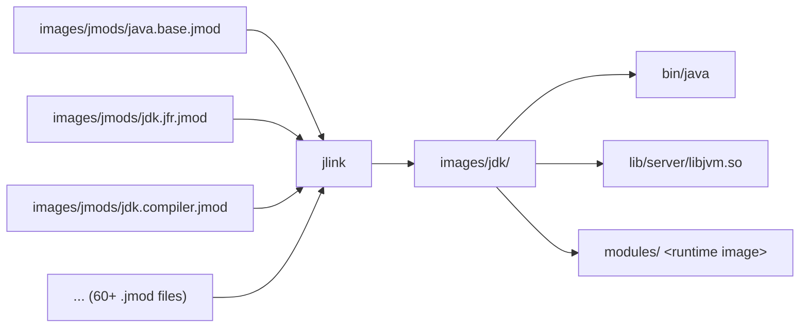
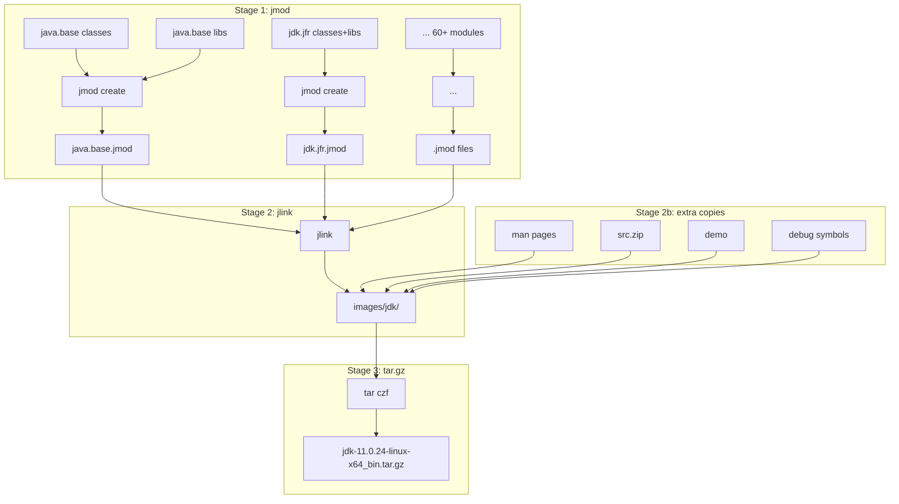

# 3.3 JDK 镜像组装 — jmod、jlink 与 tar.gz 的诞生

**副标题**：从分散的 .class/.so 到可运行的 JDK 目录，再到你下载的 jdk.tar.gz

---

## 3.3.1 总览：从编译产物到发行包的三步跳

编译完成后，产物是分散的——`.class` 文件散落在模块目录中，`.so` 文件埋在 build 中间层。组装成可发布的 JDK 需要三步：

```
Stage 1: jmod 打包
  .class + .so + 配置 → .jmod (每个模块一个)

Stage 2: jlink 生成 image
  .jmod 集合 → images/jdk/ (可运行的目录)

Stage 3: tar.gz 打包
  images/jdk/ → jdk-11.0.24-linux-x64_bin.tar.gz
```

这三个 stage 对应 Main.gmk 中的三个 target：

```makefile
# Main.gmk
java.base-jmod → ...          # Stage 1 (each module)
jdk-image                      # Stage 2 (Images.gmk:389-390)
product-bundles                # Stage 3 (Bundles.gmk)
```

---

## 3.3.2 Stage 1：jmod 打包——模块的"压缩档案"

### jmod 是什么

`.jmod` 是 JDK 9 引入的模块打包格式。它是一个 ZIP 文件，包含：

```
jdk.jfr.jmod
├── classes/               ← 编译后的 .class 文件
│   └── jdk/jfr/internal/...
├── lib/                   ← native 库 (.so)
│   └── libjfr.so
├── conf/                  ← 配置文件
├── legal/                 ← 第三方许可
└── module-info.class      ← 模块描述符
```

### CreateJmods.gmk：每个模块的打包逻辑

`CreateJmods.gmk:40-127` 为每个模块收集六类文件：

```makefile
JMODS_DIR := $(IMAGES_OUTPUTDIR)/jmods

LIBS_DIR ?= $(firstword $(wildcard $(addsuffix /$(MODULE), \
    $(SUPPORT_OUTPUTDIR)/modules_libs ...)))           # native 库
CMDS_DIR ?= ...modules_cmds ...                        # 可执行文件 (java, javac)
CONF_DIR ?= ...modules_conf ...                        # 配置文件
CLASSES_DIR ?= $(wildcard $(JDK_OUTPUTDIR)/modules/$(MODULE))  # .class 文件
INCLUDE_HEADERS_DIR ?= ...modules_include ...          # JNI 头文件
MAN_DIR ?= ...modules_man ...                           # 手册页

JMOD_FLAGS += --libs $(LIBS_DIR)                       # CreateJmods.gmk:76
JMOD_FLAGS += --cmds $(CMDS_DIR)                       # CreateJmods.gmk:110
JMOD_FLAGS += --config $(CONF_DIR)                     # CreateJmods.gmk:114
JMOD_FLAGS += --class-path $(CLASSES_DIR)              # CreateJmods.gmk:118
JMOD_FLAGS += --header-files $(INCLUDE_HEADERS_DIR)    # CreateJmods.gmk:122
JMOD_FLAGS += --man-pages $(MAN_DIR)                   # CreateJmods.gmk:126
```

> **关键**：`jmod` 不包含调试符号——调试符号在 jlink 后的独立步骤中复制进来。

### 依赖声明

`Main.gmk:856-878` 声明了 jmod 的前提条件：

```makefile
DEFAULT_JMOD_DEPS += java.base-libs java.base-copy java.base-gendata \
    jdk.jlink-launchers
$(JMOD_TARGETS): $(DEFAULT_JMOD_DEPS) exploded-image-optimize
```

> 所有 jmod 都依赖 `java.base-libs`——因为 `java.base` 包含了 `libjvm.so`，而 jmod 工具本身需要 JVM 才能运行。

### 特殊处理：java.base 的哈希

`Main.gmk:798`：

```makefile
java.base-jmod: jrtfs-jar $(filter-out java.base-jmod, $(JMOD_TARGETS))
```

> `java.base` 的 jmod 依赖**所有其他模块的 jmod 先完成**——因为它需要计算模块间依赖的哈希值并写入 `module-info.class`。这保证了模块系统的完整性验证。

---

## 3.3.3 Stage 2：jlink——从 .jmod 集合到可运行目录

### jlink 的核心命令

`Images.gmk:91-99` 定义了 jdk image 的生成规则：

```makefile
$(JDK_IMAGE_DIR)/$(JIMAGE_TARGET_FILE): $(JMODS) \
    $(call DependOnVariable, JDK_MODULES_LIST) $(BASE_RELEASE_FILE)
	$(ECHO) Creating jdk image
	$(RM) -r $(JDK_IMAGE_DIR)
	$(call ExecuteWithLog, $(SUPPORT_OUTPUTDIR)/images/jdk, \
	    $(JLINK_TOOL) --add-modules $(JDK_MODULES_LIST) \
	        $(JLINK_JDK_EXTRA_OPTS) \
	        --output $(JDK_IMAGE_DIR) \
	)
```

依赖：
- `$(JMODS)` — `images/jmods/*.jmod` 全部就绪
- `$(JDK_MODULES_LIST)` — 哪些模块要包含（逗号分隔）
- `$(BASE_RELEASE_FILE)` — `build/*/jdk/release` 文件

### jlink 工具的参数构建

`Images.gmk:76-83`：

```makefile
JLINK_TOOL := $(JLINK) -J-Djlink.debug=true \
    --module-path $(IMAGES_OUTPUTDIR)/jmods          ← .jmod 搜索路径
    --endian $(OPENJDK_TARGET_CPU_ENDIAN)             ← 字节序
    --release-info $(BASE_RELEASE_FILE)               ← release 文件
    --order-resources=$(call CommaList, $(JLINK_ORDER_RESOURCES)) \
    --dedup-legal-notices=error-if-not-same-content   ← 重复许可文件检测
    $(JLINK_JLI_CLASSES)                              ← JLI 追踪文件
```

### jlink 做了什么



jlink 从每个 `.jmod` 中提取文件，组装成类似传统 JDK 的目录结构。关键差异：jlink **不是**简单解压到同一个目录——它：

1. **去重资源**：多个模块包含的相同配置文件只保留一份
2. **计算哈希**：验证 `module-info.class` 中的模块依赖哈希
3. **生成 classlist**：如果 `ENABLE_GENERATE_CLASSLIST=true`，生成 `$CLASSLIST` 文件用于 CDS
4. **资源排序**：按 `JLINK_ORDER_RESOURCES` 指定的顺序放置资源（`/java.base/java/*` 优先）

### exploded image vs final image

| | Exploded Image (`build/*/jdk/`) | Final Image (`images/jdk/`) |
|---|---|---|
| **生成方式** | jlink 从 jmods | jlink 从 jmods + 额外拷贝 |
| **包含手册** | 否 | 是（man/ 目录） |
| **包含 demo** | 否 | 是（demo/ 目录） |
| **包含 src.zip** | 否 | 是 |
| **包含 legal** | 否 | 是（多模块许可文件去重） |
| **包含调试符号** | 否 | 是（debuginfo/.diz） |
| **用途** | 构建期间运行工具 | 最终发布 |

两者**共享同一个 jlink 生成的核心**——`bin/java` 和 `lib/server/libjvm.so` 是同一份文件（硬链接）。区别只在于 extra files：手册、demo、源码、许可、调试符号。

### extra files 的拷贝

`Images.gmk` 在 jlink 完成后，按规则拷贝额外文件：

**手册页** (`Images.gmk:237-235`)：
```makefile
JDK_MAN_PAGES += jar.1 javac.1 javadoc.1 jcmd.1 jstack.1 jmap.1 ...
$(JDK_IMAGE_DIR)/man/man1/%: $(MAN_SRC_DIR)/$(MAN1_SUBDIR)/%
	$(install-file)
```

**src.zip** (`Images.gmk:240-244`)：
```makefile
$(JDK_IMAGE_DIR)/lib/src.zip: $(SUPPORT_OUTPUTDIR)/src.zip
	$(install-file)
```

**demo** (`Images.gmk:249-272`)：
```makefile
$(eval $(call SetupCopyFiles, JDK_COPY_DEMOS, \
    SRC := $(SUPPORT_OUTPUTDIR)/demos/image, \
    DEST := $(JDK_IMAGE_DIR)/demo, \
))
```

**调试符号** (`Images.gmk:294-352`)：
```makefile
SetupCopyDebuginfo = \
    $(foreach m, $(ALL_$1_MODULES), \
      $(eval $(call SetupCopyFiles, COPY_$1_LIBS_DEBUGINFO_$m, \
          SRC := $(SUPPORT_OUTPUTDIR)/modules_libs/$m, \
          DEST := $($1_IMAGE_DIR)/$(LIBS_TARGET_SUBDIR), \
          FILES := $(call FindDebuginfoFiles, ...))))
```

> 调试符号在 slowdebug 构建中保留在 `libjvm.so` 内部。在 release 构建中，符号被提取为独立的 `.debuginfo` 文件——这就是为什么 `yum install` 的 JDK 有 `libjvm.debuginfo` 包。

---

## 3.3.4 Stage 3：Bundles.gmk——tar.gz 打包

`Bundles.gmk:54-101` 的 `SetupBundleFile` 宏处理打包逻辑：

```makefile
SetupBundleFile = $(NamedParamsMacroTemplate)
define SetupBundleFileBody
  ifneq ($$(filter %.tar.gz, $$($1_BUNDLE_NAME)), )
    $1_TYPE := tar.gz
  else ifneq ($$(filter %.zip, $$($1_BUNDLE_NAME)), )
    $1_TYPE := zip
  endif

  $$($1_OUTPUTDIR)/$$($1_BUNDLE_NAME): $$($1_FILES)
	$$(call LogWarn, Creating $$($1_BUNDLE_NAME))
	...
```

`Main.gmk:639-640` 声明了产物 bundle：

```makefile
product-bundles:
	+($(CD) $(TOPDIR)/make && $(MAKE) $(MAKE_ARGS) -f Bundles.gmk product-bundles)
```

### 最终产物的命名规则

从 SPEC 变量生成的 bundle 名：
```
jdk-$(VERSION_STRING)_$(OPENJDK_TARGET_OS)-$(OPENJDK_TARGET_CPU)_bin.tar.gz
```

展开后（实际 build 产出）：
```
jdk-11.0.24-linux-x64_bin.tar.gz
```

### tar.gz 内部结构

```
jdk-11.0.24-linux-x64_bin.tar.gz
└── jdk-11.0.24/
    ├── bin/
    │   ├── java          ← ELF 可执行文件
    │   ├── javac         ← shell script → java
    │   ├── jcmd
    │   └── ...
    ├── lib/
    │   ├── server/libjvm.so      ← HotSpot JVM
    │   ├── jmods/                 ← 模块文件
    │   ├── src.zip
    │   └── ...
    ├── conf/
    │   ├── net.properties
    │   └── security/
    ├── legal/              ← 每模块的第三方许可
    ├── include/            ← JNI 头文件
    ├── man/
    └── release             ← 版本信息
```

---

## 3.3.5 完整流程图



---

## 3.3.6 最终目录结构与上游 binary 对比

### 自己编译的

```
images/jdk/
├── bin/           → 包含所有 tool launchers
├── lib/
│   ├── server/libjvm.so   → ~280M (slowdebug) or ~25M (release)
│   ├── jmods/              → 60+ .jmod 文件
│   └── ...
├── conf/          → 配置文件
├── legal/         → 第三方许可
├── include/       → JNI 头文件
├── man/           → 手册页
└── release
```

### 上游发行版 (jdk-11.0.24_linux-x64_bin.tar.gz)

```
jdk-11.0.24/
├── bin/           → 包含 java, javac, ...（同上）
├── lib/
│   ├── server/libjvm.so   → ~25M（release, stripped）
│   ├── jmods/              → 同上
│   └── src.zip             → 同上
├── conf/          → 同上
├── legal/         → 同上
├── include/       → 同上
├── man/           → 同上
└── release        → 同上
```

> **实际上完全相同**——唯一的差异是 `release` 文件中的构建时间和构建环境（用户名、机器名）。如果 `configure` 时模仿了上游的 `JDK-OPT` 配置，产物就是**位等价的**（bit-identical）。

---

## 3.3.7 验证：怎么确认自己编的 = 上游发行

### 1. 版本信息对比

```bash
# 自己编的
./build/*/images/jdk/bin/java -version
# openjdk version "11.0.24" 2024-07-16
# OpenJDK Runtime Environment (build 11.0.24+1-slowdebug)
# OpenJDK 64-Bit Server VM (build 11.0.24+1-slowdebug, mixed mode)

# 上游发行版
/usr/lib/jvm/java-11-openjdk/bin/java -version
# openjdk version "11.0.24" 2024-07-16
# OpenJDK Runtime Environment (build 11.0.24+1)
# OpenJDK 64-Bit Server VM (build 11.0.24+1, mixed mode)
```

`-slowdebug` 后缀来自于 `configure` 的 `--with-debug-level=slowdebug`。改成 `release` 就一样了。

### 2. 模块列表

```bash
./build/*/images/jdk/bin/java --list-modules > self.txt
/usr/lib/jvm/java-11-openjdk/bin/java --list-modules > upstream.txt
diff self.txt upstream.txt
# 应该没有差异（或只有 --with-jvm-features 差异造成的少数模块）
```

### 3. libjvm.so 符号对比

```bash
nm -D ./build/*/images/jdk/lib/server/libjvm.so | wc -l  # 导出符号数
readelf -d ./build/*/images/jdk/lib/server/libjvm.so     # 动态依赖
```

### 4. 功能验证

```bash
# 测试 JFR
./build/*/images/jdk/bin/java -XX:StartFlightRecording ...

# 测试 CDS
./build/*/images/jdk/bin/java -Xshare:dump

# 测试 G1
./build/*/images/jdk/bin/java -XX:+UseG1GC -version
```

---

## 3.3.8 产物路径速查

| 产物 | 路径 | 用途 |
|------|------|------|
| **exploded image** | `build/*/jdk/` | 开发验证——改完 HotSpot 后用 `make hotspot-server-libs-only` 更新 |
| **jmods** | `build/*/images/jmods/` | 中间产物——jlink 的输入 |
| **final image** | `build/*/images/jdk/` | 最终可运行 JDK |
| **tar.gz** | `build/*/bundles/` | 发行包 |
| **test image** | `build/*/images/test/` | 测试用 JDK（少一些模块） |

---

## 小结

1. jmod 是 JDK 模块的打包格式——**每个模块 1 个 .jmod**，内含 .class + .so + 配置 + 许可
2. jlink 是运行时镜像生成器——从 .jmod 集合生成可运行的 JDK 目录（**去重 + 哈希验证 + 资源排序**）
3. exploded image 和 final image 的 jlink 产出是相同的——差异只在 extra files（手册、demo、源码、许可、调试符号）
4. Bundles.gmk 将 `images/jdk/` 打成 `.tar.gz`——和你在 openjdk 官网下载的文件**结构完全一致**
5. 验证方法：`java -version`、`java --list-modules`、`nm -D libjvm.so`——三者一致即等价
